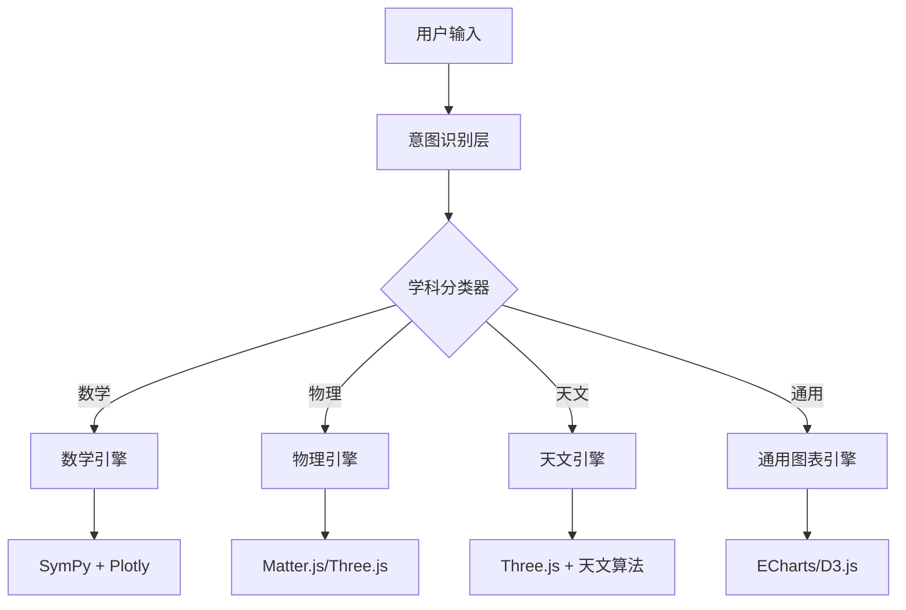

# 万物可视化 - 差异化功能设计方案
**日期**: 2025-01-17
**版本**: v1.0
**状态**: 设计阶段

---

## 🎯 核心差异化定位

### 战略定位
> **"开源的 STEM 教育 AI 可视化引擎 - 专注数学、物理、天文的深度可视化"**

与竞品的根本差异：
- **不是通用平台**（Dynamic View）
- **不是学术工具**（DeepTutor）
- **而是深入 STEM 学科的可视化专家**

---

## 📊 五大核心差异化功能

### 1. 🔬 学科深度可视化引擎

#### 1.1 设计理念
不是简单的图表展示，而是**学科本质的深层可视化**

#### 1.2 具体功能模块

##### 📐 数学可视化
```javascript
// 核心场景（竞品无法覆盖的深度）

1. 微积分可视化
   - 导数的几何意义（切线动画）
   - 积分的黎曼和（动态分割）
   - 泰勒级数逼近（逐步展开）
   - 多元函数的梯度与等高线
   - 向量场的可视化（流线、向量箭头）

2. 线性代数可视化
   - 矩阵变换的几何解释（实时动画）
   - 特征值与特征向量的直观理解
   - 奇异值分解（SVD）的分解过程
   - 线性变换的复合（逐步应用）

3. 拓扑与几何
   - 莫比乌斯带的参数化
   - 克莱因瓶的3D投影
   - 分形几何（曼德博集合迭代）
   - 微分几何（曲率、测地线）
```

##### ⚛️ 物理可视化
```javascript
// 核心场景（强调物理本质）

1. 经典力学
   - 牛顿定律的实时模拟
   - 能量守恒的动态展示
   - 刚体转动（角动量、转动惯量）
   - 简谐振动（相位图、能量图）

2. 电磁学
   - 电场线的实时生成
   - 磁场的3D可视化
   - 电磁波的传播动画
   - 麦克斯韦方程组的可视化

3. 现代物理
   - 相对论效应（时间膨胀、长度收缩）
   - 量子力学波函数
   - 薛定谔方程的解
   - 粒子碰撞模拟
```

##### 🌌 天文可视化
```javascript
// 核心场景（大尺度时空）

1. 天体运动
   - 行星轨道的实时演化
   - 三体问题的混沌运动
   - 潮汐力的可视化
   - 引力透镜效应

2. 天体物理
   - 恒星演化过程（赫罗图）
   - 黑洞的吸积盘
   - 中子星的内部结构
   - 宇宙微波背景辐射

3. 天文观测
   - 天球坐标系
   - 星图与星座
   - 日食月食的形成
   - 月相变化
```

#### 1.3 技术实现

##### 智能识别与渲染
```javascript
// 学科路由器核心逻辑
class SubjectRouter {
  identifySubject(userInput) {
    // AI 识别学科类型
    const features = extractFeatures(userInput);

    if (features.has('微积分', '导数', '积分')) return 'calculus';
    if (features.has('矩阵', '特征值', '线性变换')) return 'linear_algebra';
    if (features.has('力', '电场', '波')) return 'physics';
    if (features.has('行星', '恒星', '轨道')) return 'astronomy');

    // 路由到专属渲染引擎
    return this.routeToEngine(subject, context);
  }

  routeToEngine(subject, context) {
    const engineMap = {
      'calculus': new CalculusEngine(),
      'linear_algebra': new LinearAlgebraEngine(),
      'physics': new PhysicsEngine(),
      'astronomy': new AstronomyEngine()
    };

    return engineMap[subject].generateVisualization(context);
  }
}
```

##### 学科专用渲染引擎
```javascript
// 示例：微积分可视化引擎
class CalculusEngine {
  async generateDerivativeViz(functionStr) {
    // 使用 SymPy 计算导数
    const derivative = await this.computeDerivative(functionStr);

    // Plotly 渲染切线动画
    return {
      type: 'plotly',
      data: [
        this.plotFunction(functionStr),
        this.plotTangentLine(derivative),
        this.animateTangentMovement(derivative)
      ],
      layout: {
        title: `f(x) = ${functionStr} 的导数可视化`,
        annotations: this.derivativeAnnotations(derivative)
      }
    };
  }

  async generateIntegralViz(functionStr, bounds) {
    // 黎曼和动画
    const rectangles = await this.generateRiemannRectangles(functionStr, bounds);

    return {
      type: 'plotly',
      animation: this.riemannSumAnimation(rectangles),
      interactive: this.allowAdjustN(rectangles)
    };
  }
}
```

#### 1.4 与竞品对比

| 功能 | DeepTutor | Dynamic View | 万物可视化 |
|------|-----------|--------------|------------|
| **微积分深度** | ⭐⭐ | ⭐ | ⭐⭐⭐⭐⭐ |
| **物理仿真** | ⭐⭐ | ⭐⭐ | ⭐⭐⭐⭐⭐ |
| **天文场景** | ⭐ | ⭐ | ⭐⭐⭐⭐⭐ |
| **技术栈** | 通用可视化 | 通用图表 | SymPy+Three.js+Plotly |

---

### 2. 🧠 智能学科路由器

#### 2.1 设计理念
AI 自动理解用户意图，将请求路由到**最合适的可视化方案**

#### 2.2 三层路由架构



#### 2.3 实现细节

##### 意图识别层
```javascript
class IntentRecognizer {
  async recognize(userInput, conversationHistory) {
    // 1. 特征提取
    const features = {
      keywords: this.extractKeywords(userInput),
      entities: this.extractEntities(userInput),
      formulas: this.extractFormulas(userInput),
      context: this.analyzeContext(conversationHistory)
    };

    // 2. 学科分类（使用轻量级模型）
    const subject = await this.classifySubject(features);

    // 3. 任务类型识别
    const taskType = this.identifyTaskType(features);

    // 4. 可视化类型推荐
    const vizType = this.recommendVisualization(subject, taskType);

    return { subject, taskType, vizType, features };
  }

  classifySubject(features) {
    // 规则 + 机器学习混合
    const mathKeywords = ['导数', '积分', '矩阵', '特征值', '极限', '级数'];
    const physicsKeywords = ['力', '电场', '磁场', '波', '能量', '动量'];
    const astronomyKeywords = ['行星', '恒星', '轨道', '黑洞', '星系'];

    // 计算相似度
    const scores = {
      math: this.computeSimilarity(features.keywords, mathKeywords),
      physics: this.computeSimilarity(features.keywords, physicsKeywords),
      astronomy: this.computeSimilarity(features.keywords, astronomyKeywords)
    };

    return argmax(scores);
  }
}
```

##### 上下文管理器
```javascript
class ContextManager {
  constructor() {
    this.conversationHistory = [];
    this.currentVisualization = null;
    this.modifications = [];
  }

  updateContext(userMessage, aiResponse) {
    this.conversationHistory.push({ user: userMessage, ai: aiResponse });

    // 提取修改意图（如"把这个球变红"）
    const modifications = this.extractModifications(userMessage);
    if (modifications.length > 0) {
      this.modifications.push(...modifications);
    }
  }

  // 支持多轮对话
  handleFollowUp(userInput) {
    // "把重力调大一点"
    if (this.isParameterAdjustment(userInput)) {
      return this.adjustParameter(userInput);
    }

    // "再添加一个行星"
    if (this.isAdditionRequest(userInput)) {
      return this.addToVisualization(userInput);
    }
  }
}
```

#### 2.4 Prompt 模板管理

```javascript
// 学科专用 Prompt 模板
const PROMPT_TEMPLATES = {
  calculus: {
    derivative: `
你是微积分可视化专家。用户要求：{user_request}

你的任务：
1. 使用 SymPy 计算导数
2. 设计 Plotly 动画展示切线移动
3. 添加数学公式注释（LaTeX）
4. 提供参数调整滑块（x 位置、精度）

输出格式：
{
  "code": "完整的 HTML + JS 代码",
  "parameters": ["变量名", "默认值", "最小值", "最大值"],
  "explanation": "数学原理解释"
}
    `,
    integral: `...`
  },

  physics: {
    mechanics: `
你是物理仿真专家。用户要求：{user_request}

你的任务：
1. 使用 Matter.js 建立物理场景
2. 实时显示能量守恒数据
3. 允许调整物理参数（质量、力、初速度）
4. 显示物理公式和计算过程

输出格式：...
    `
  }
};
```

#### 2.5 与竞品对比

| 功能 | DeepTutor | Dynamic View | 万物可视化 |
|------|-----------|--------------|------------|
| **意图识别** | ⭐⭐⭐ | ⭐⭐ | ⭐⭐⭐⭐⭐ |
| **学科路由** | ❌ | ⭐⭐ | ⭐⭐⭐⭐⭐ |
| **多轮对话** | ⭐⭐⭐ | ⭐⭐ | ⭐⭐⭐⭐⭐ |
| **上下文理解** | ⭐⭐⭐ | ⭐⭐ | ⭐⭐⭐⭐⭐ |

---

### 3. 🔧 自我修正与代码优化

#### 3.1 设计理念
AI 生成的代码难免有错误，系统应该**自动捕获并修复**

#### 3.2 错误捕获机制

```javascript
class ErrorCatcher {
  constructor(iframe) {
    this.iframe = iframe;
    this.errors = [];
  }

  startMonitoring() {
    // 监听 iframe 内部的错误
    this.iframe.contentWindow.addEventListener('error', (event) => {
      this.handleError(event);
    });

    // 监听未捕获的 Promise 错误
    this.iframe.contentWindow.addEventListener('unhandledrejection', (event) => {
      this.handlePromiseRejection(event);
    });
  }

  async handleError(error) {
    this.errors.push({
      type: error.type,
      message: error.message,
      stack: error.stack,
      timestamp: Date.now()
    });

    // 自动触发修复流程
    await this.autoFix(error);
  }

  async autoFix(error) {
    // 1. 分析错误类型
    const errorType = this.classifyError(error);

    // 2. 生成修复提示
    const fixPrompt = this.generateFixPrompt(error);

    // 3. 调用 LLM 修复代码
    const fixedCode = await this.callLLMForFix(fixPrompt);

    // 4. 重新渲染
    await this.rerender(fixedCode);
  }

  classifyError(error) {
    // 常见错误类型
    if (error.message.includes('is not defined')) return 'undefined_variable';
    if (error.message.includes('Cannot read property')) return 'null_access';
    if (error.message.includes('Unexpected token')) return 'syntax_error';
    if (error.message.includes('Network')) return 'cdn_load_failure';

    return 'unknown_error';
  }
}
```

#### 3.3 自动修复流程

```javascript
class AutoFixer {
  async fixWithLLM(error, originalCode, userRequest) {
    const fixPrompt = `
生成的代码运行时出错，请修复：

【用户请求】
${userRequest}

【原始代码】
${originalCode}

【错误信息】
类型: ${error.type}
消息: ${error.message}
堆栈: ${error.stack}

请修复代码，确保：
1. 修复所有错误
2. 保持原有功能
3. 添加错误处理
4. 优化性能

只返回修复后的完整代码。
    `;

    const fixedCode = await this.llm.generate(fixPrompt);

    // 验证修复
    const isValid = await this.validateCode(fixedCode);
    if (!isValid) {
      // 如果仍然失败，尝试第二次修复
      return await this.retryFix(error, fixedCode);
    }

    return fixedCode;
  }

  async validateCode(code) {
    // 语法检查
    try {
      new Function(code);
      return true;
    } catch (e) {
      return false;
    }
  }

  async retryFix(error, code) {
    // 如果两次都失败，提供降级方案
    return this.generateFallbackVisualization(error.userRequest);
  }
}
```

#### 3.4 质量保证机制

```javascript
class QualityAssurance {
  async testVisualization(code, userRequest) {
    const tests = [
      this.syntaxCheck(code),
      this.dependencyCheck(code),
      this.performanceCheck(code),
      this.mobileCompatibilityCheck(code),
      this.accessibilityCheck(code)
    ];

    const results = await Promise.all(tests);

    return {
      passed: results.every(r => r.passed),
      issues: results.filter(r => !r.passed),
      score: this.computeQualityScore(results)
    };
  }

  syntaxCheck(code) {
    // ESLint 检查
    return eslint.lint(code);
  }

  dependencyCheck(code) {
    // 检查 CDN 依赖是否可用
    const cdnLinks = this.extractCDNLinks(code);
    return Promise.all(cdnLinks.map(link => this.checkCDNAvailability(link)));
  }

  performanceCheck(code) {
    // 检查是否有性能问题
    // - 大循环
    // - 内存泄漏
    // - 不必要的重渲染
    return this.analyzePerformance(code);
  }
}
```

#### 3.5 与竞品对比

| 功能 | DeepTutor | Dynamic View | 万物可视化 |
|------|-----------|--------------|------------|
| **错误捕获** | ❌ | ❌ | ⭐⭐⭐⭐⭐ |
| **自动修复** | ❌ | ❌ | ⭐⭐⭐⭐⭐ |
| **质量保证** | ⭐⭐ | ⭐⭐⭐ | ⭐⭐⭐⭐⭐ |

---

### 4. 📚 逐步推导与教学增强

#### 4.1 设计理念
不只是展示结果，更要**展示思维过程**

#### 4.2 分步推导引擎

```javascript
class StepByStepDerivation {
  async deriveStepByStep(request) {
    // 1. 理解问题
    const problem = await this.parseProblem(request);

    // 2. 制定求解计划
    const plan = await this.createSolutionPlan(problem);

    // 3. 逐步执行并可视化
    const steps = [];
    for (const stage of plan.stages) {
      const step = await this.executeStage(stage);
      steps.push(step);

      // 为每一步生成可视化
      step.visualization = await this.visualizeStep(step);
    }

    return {
      problem,
      steps,
      finalAnswer: steps[steps.length - 1].result,
      interactiveFlow: this.createInteractiveFlow(steps)
    };
  }

  // 示例：导数推导
  async visualizeDerivativeDerivation(functionStr) {
    const steps = [
      {
        title: "定义导数",
        formula: "f'(x) = lim(h→0) [f(x+h) - f(x)] / h",
        explanation: "导数是函数在某点的瞬时变化率",
        visualization: this.plotLimitDefinition(functionStr)
      },
      {
        title: "计算差商",
        formula: `[${functionStr}(x+h) - ${functionStr}(x)] / h`,
        explanation: "计算平均变化率",
        visualization: this.animateSecantLine(functionStr)
      },
      {
        title: "取极限",
        formula: "令 h → 0",
        explanation: "割线逼近切线",
        visualization: this.animateSecantToTangent(functionStr)
      },
      {
        title: "最终结果",
        formula: await this.computeDerivative(functionStr),
        explanation: "得到导函数",
        visualization: this.plotDerivative(functionStr)
      }
    ];

    return steps;
  }
}
```

#### 4.3 交互式教学引导

```javascript
class InteractiveTutor {
  async createTutoringFlow(topic) {
    const flow = {
      pretest: await this.generatePretest(topic),
      learningPath: await this.generateLearningPath(topic),
      checkpoints: await this.generateCheckpoints(topic),
      posttest: await this.generatePosttest(topic)
    };

    return flow;
  }

  async generateLearningPath(topic) {
    // 根据用户水平动态调整
    const userLevel = await this.assessUserLevel();

    const path = {
      beginner: [
        {
          concept: "导数的直观理解",
          visualization: "slope-animator",
          exercise: "adjust-slope",
          checkpoint: "understand-derivative-as-rate"
        },
        {
          concept: "常见函数的导数",
          visualization: "derivative-rules",
          exercise: "practice-differentiation",
          checkpoint: "apply-basic-rules"
        }
      ],
      intermediate: [...],
      advanced: [...]
    };

    return path[userLevel];
  }
}
```

#### 4.4 与竞品对比

| 功能 | DeepTutor | Dynamic View | 万物可视化 |
|------|-----------|--------------|------------|
| **分步推导** | ⭐⭐⭐⭐ | ⭐ | ⭐⭐⭐⭐⭐ |
| **教学引导** | ⭐⭐⭐⭐⭐ | ⭐ | ⭐⭐⭐⭐ |
| **难度自适应** | ⭐⭐⭐ | ⭐ | ⭐⭐⭐⭐ |

---

### 5. 🔓 开源可定制生态系统

#### 5.1 设计理念
让用户和社区**共同构建可视化能力**

#### 5.2 插件系统架构

```javascript
// 插件接口定义
class VisualizationPlugin {
  constructor() {
    this.name = '';
    this.version = '1.0.0';
    this.supportedSubjects = [];
    this.dependencies = [];
  }

  // 必须实现的方法
  async generateVisualization(request, context) {
    throw new Error('Must implement generateVisualization');
  }

  validateRequest(request) {
    // 验证请求是否适用于此插件
    return true;
  }

  getParameterSchema() {
    // 返回参数配置
    return {
      parameters: [],
      controls: []
    };
  }
}

// 插件管理器
class PluginManager {
  constructor() {
    this.plugins = new Map();
    this.pluginRegistry = 'https://plugins.wanwu-viz.org';
  }

  async loadPlugin(pluginName) {
    // 从 CDN 加载插件
    const pluginCode = await this.fetchPlugin(pluginName);
    const PluginClass = await this.evalPlugin(pluginCode);

    const plugin = new PluginClass();
    this.plugins.set(pluginName, plugin);

    return plugin;
  }

  async discoverPlugins(subject) {
    // 发现适用于某学科的所有插件
    const response = await fetch(`${this.pluginRegistry}/api/plugins?subject=${subject}`);
    const plugins = await response.json();

    return plugins.map(p => ({
      name: p.name,
      description: p.description,
      author: p.author,
      downloads: p.downloads,
      rating: p.rating
    }));
  }
}
```

#### 5.3 Prompt 模板贡献系统

```javascript
// 社区贡献 Prompt 模板
class PromptTemplateHub {
  async contributeTemplate(template) {
    const submission = {
      id: generateId(),
      author: template.author,
      subject: template.subject,
      taskType: template.taskType,
      prompt: template.prompt,
      examples: template.examples,
      performance: {
        successRate: 0,
        usageCount: 0,
        rating: 0
      },
      timestamp: Date.now()
    };

    // 提交到中央仓库
    await this.submitToRegistry(submission);

    // 社区审核
    await this.initiateReview(submission);
  }

  async searchTemplates(subject, taskType) {
    const templates = await this.fetchFromRegistry(subject, taskType);

    // 按性能排序
    return templates.sort((a, b) =>
      b.performance.successRate - a.performance.successRate
    );
  }

  async rateTemplate(templateId, rating) {
    // 社区评分
    await this.submitRating(templateId, rating);

    // 更新性能数据
    await this.updatePerformanceMetrics(templateId);
  }
}
```

#### 5.4 本地化部署方案

```javascript
// 支持 LLM 本地部署
class LocalLLMManager {
  async initializeLocalModel(modelConfig) {
    // 支持的本地模型
    const supportedModels = {
      'deepseek-coder': {
        downloadUrl: 'https://modelhub.cn/deepseek-coder',
        size: '10GB',
        requirements: { ram: '16GB', gpu: 'optional' }
      },
      'codellama': {
        downloadUrl: 'https://modelhub.cn/codellama',
        size: '8GB',
        requirements: { ram: '12GB', gpu: 'optional' }
      }
    };

    const model = supportedModels[modelConfig.modelName];

    // 下载并加载模型
    await this.downloadModel(model.downloadUrl);
    const instance = await this.loadModel(modelConfig);

    return instance;
  }

  async generateWithLocalModel(prompt, context) {
    // 本地推理
    const response = await this.localModel.generate({
      prompt,
      maxTokens: 2000,
      temperature: 0.7,
      context: context
    });

    return response;
  }
}
```

#### 5.5 与竞品对比

| 功能 | DeepTutor | Dynamic View | 万物可视化 |
|------|-----------|--------------|------------|
| **插件系统** | ⭐⭐ | ❌ | ⭐⭐⭐⭐⭐ |
| **社区贡献** | ⭐⭐⭐ | ❌ | ⭐⭐⭐⭐⭐ |
| **Prompt 共享** | ⭐ | ❌ | ⭐⭐⭐⭐⭐ |
| **本地部署** | ⭐⭐⭐ | ❌ | ⭐⭐⭐⭐⭐ |

---

## 🚀 技术架构设计

### 整体架构图

```
┌─────────────────────────────────────────────────────────────┐
│                     用户界面层 (Frontend)                      │
├─────────────────────────────────────────────────────────────┤
│  - 对话界面 (ChatArea)                                        │
│  - Artifact 预览 (VizContainer)                               │
│  - 参数控制面板 (ParamSync)                                   │
│  - 代码编辑器 (CodeEditor)                                    │
└─────────────────────────────────────────────────────────────┘
                              ↓
┌─────────────────────────────────────────────────────────────┐
│                   智能路由层 (Router)                         │
├─────────────────────────────────────────────────────────────┤
│  - 意图识别 (IntentRecognizer)                               │
│  - 学科分类器 (SubjectClassifier)                            │
│  - 上下文管理 (ContextManager)                               │
│  - 任务分发 (TaskDispatcher)                                 │
└─────────────────────────────────────────────────────────────┘
                              ↓
┌─────────────────────────────────────────────────────────────┐
│              可视化引擎层 (Visualization Engines)             │
├─────────────────────────────────────────────────────────────┤
│  数学引擎           物理引擎           天文引擎                 │
│  - SymPy集成       - Matter.js       - Three.js               │
│  - Plotly渲染     - Three.js        - 天文算法                │
│  - MathJax公式    - 物理仿真         - 3D场景                 │
└─────────────────────────────────────────────────────────────┘
                              ↓
┌─────────────────────────────────────────────────────────────┐
│                   AI 生成层 (AI Layer)                        │
├─────────────────────────────────────────────────────────────┤
│  - LLM 接口 (LLMClient)                                      │
│  - Prompt 模板管理 (PromptHub)                               │
│  - 代码生成器 (CodeGenerator)                                │
│  - 自我修正 (SelfCorrection)                                 │
└─────────────────────────────────────────────────────────────┘
                              ↓
┌─────────────────────────────────────────────────────────────┐
│                 插件生态层 (Plugin Ecosystem)                 │
├─────────────────────────────────────────────────────────────┤
│  - 插件管理器 (PluginManager)                                │
│  - 模板共享 (TemplateHub)                                    │
│  - 社区贡献 (ContributionSystem)                             │
└─────────────────────────────────────────────────────────────┘
```

---

## 📈 实施路线图

### Phase 1: 基础架构（2个月）
- [ ] 实现智能路由器
- [ ] 开发数学可视化引擎
- [ ] 建立错误捕获机制
- [ ] 设计 Artifact UI

### Phase 2: 核心功能（3个月）
- [ ] 完成物理可视化引擎
- [ ] 实现逐步推导功能
- [ ] 开发天文可视化引擎
- [ ] 建立插件系统框架

### Phase 3: 生态建设（4个月+）
- [ ] 上线社区贡献平台
- [ ] 开源核心代码
- [ ] 发布 Prompt 模板库
- [ ] 建立本地部署支持

---

## 🎯 成功指标

### 技术指标
- 代码生成可用率 > 85%
- 错误自动修复率 > 70%
- 平均响应时间 < 5秒

### 用户指标
- 月活用户 > 5000
- GitHub Stars > 1000
- 社区贡献插件 > 20

### 教育指标
- 覆盖 50+ STEM 知识点
- 生成 1000+ 优质可视化案例
- 被 10+ 所高校采用

---

## 🔗 相关文档

- 执行清单：`万物可视化执行清单20251207.md`
- 竞品分析：`竞品分析-DeepTutor与GoogleDynamicView-20250117.md`
- 技术文档：`docs/technical-architecture.md`（待创建）

---

**文档生成时间**: 2025-01-17
**作者**: AI Assistant (Claude)
**项目**: 万物可视化
**版本**: v1.0
