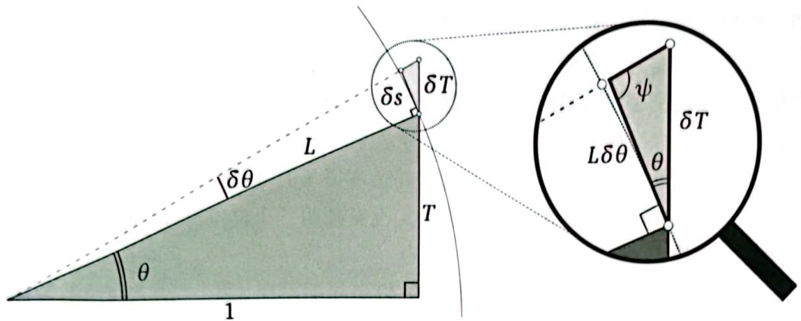

# 可视化微分几何和形式:

一部五幕数学正剧

[美] 特里斯坦·尼达姆 (Tristan Needham) / 著  刘伟安 / 译

# /特里斯坦·尼达姆/

Tristan Needham

旧金山大学数学系教授，理学院副院长。牛津大学博士，导师为罗杰·彭罗斯（与霍金齐名的英国物理学家）。1995年被美国数学会授予Carl B. Allendoerfer奖。他的研究领域包括几何、复分析、数学史、广义相对论。

# /刘伟安/

Liu Weiran

理学博士，武汉大学数学与统计学院教授，长期从事数学专业本科生和研究生的教学。2011年退休后返聘，并做一些数学科普工作。主要研究方向有常微分方程理论和偏微分方程理论，特别是非线性泛函分析和抽象微分方程。

# 可视化微分几何和形式：一部五幕数学正剧

[美] 特里斯坦·尼达姆（Tristan Needham）/ 著  刘伟安 / 译

# 人民邮电出版社  北京

# 图书在版编目（CIP）数据

可视化微分几何和形式：一部五幕数学正剧／（美）特里斯坦·尼达姆（TristanNeedham）著；刘伟安译．- - 北京：人民邮电出版社，2024.1

（图灵数学经典）ISBN978- 7- 115- 61107- 9

I.①可·Ⅱ.①特·②刘·III.①微分几何②形式IV.①O186.1②O186.15

中国国家版本馆CIP数据核字（2023）第014842号

Original edition，entitled Visual Differential Geometry and Forms: A Mathematical Drama in Five Acts by Tristan Needham.

Copyright  $①$  2021 by Princeton University Press.

All rights reserved.

# 内容提要

本书以五幕数学剧烈形式直观地讲述微分几何和形式，在前四幕中，作者把“微分几何”回归为“几何”，使用200多幅手绘示意图，运用牛顿的几何方法对经典结果进行几何解释，在第五幕中，作者向本科生介绍形式，以直观和几何的方式处理高级主题.

本书作者挑战性地重新思考了微分几何和形式这个重要数学领域的教学方式，学习本书只需要基本的微积分和几何学知识即可，高等院校数学专业学生及数学研究者均可阅读.

著 [美]特里斯坦·尼达姆（TristanNeedham）译 刘伟安责任编辑 杨琳责任印制 胡南人民邮电出版社出版发行 北京市丰台区成寿寺路11号邮编100164 电子邮件315@ptpress.com.cn网址https://www.ptpress.com.cn三河市中晟雅豪印务有限公司印刷开本：  $700\times 1000$  1/16印张：37 2024年1月第1版字数：664千字 2024年1月河北第1次印刷著作权合同登记号图字：01- 2021- 6176号

定价：179.80元

# 读者服务热线：（010）84084456-6009印装质量热线：（010）81055316

# 反盗版热线：（010）81055315

广告经营许可证：京东市监广登字20170147号

# 版权声明

Copyright © 2021 by Princeton University Press. All rights reserved.

Original edition, entitled Visual Differential Geometry and Forms: A Mathematical Drama in Five Acts by Tristan Needham, ISBN: 978- 0- 691- 20370- 6, published by Princeton University Press.

No part of this book may be reproduced or transmitted in any form or by any means, electronic or mechanical, including photocopying, recording or by any information storage and retrieval system, without written permission from the publisher.

Simplified Chinese Edition © 2024 by Posts & Telecom Press Co., LTD.

本书简体字中文版由 Princeton University Press 授权人民邮电出版社有限公司独家出版.

版权所有, 侵权必究.

# 献给罗杰·彭罗斯

# 译者序

最初，出版社是请齐民友老师（我的博士生导师）翻译本书的，齐老师说需要一个帮手，与陈化老师（具体指导我做博士研究和写博士论文的导师）商量后，他向出版社推荐了我，原定计划是，我翻译全书，齐老师负责处理疑难问题和通读全稿，但不幸的是，齐老师于2021年8月8日突发心脏病辞世，现在，我们以本书中译本的出版告慰齐民友老师的在天之灵！

作者特里斯坦·尼达姆一开始就许诺要为本科生写一本“有几何味”的好书.本书规模宏大，从古希腊人关于平行公理的争论讲到爱因斯坦发现时空的弯曲，从自由落体的数学讲到黑洞的几何、引力波的数学，本书讲法特别，用形象化的描述和200多幅插图实现了可视化，并加入了作者自己设计的数学实验，把微分几何教科书里描述得非常抽象的内容（例如平行移动、和乐性等）讲得通俗易懂，看得见、摸得着，所以说，作者兑现了自己的承诺！

特里斯坦·尼达姆教授是做事很认真的人，他对学术负责，也对读者负责.证据有三：本书中包含详尽的“历史注记”，以及作者坚持要将大家熟知的“庞加莱模型”称为“贝尔特拉米- 庞加莱模型”，此证据一；本书已出版两年，作者还在征求读者意见，并为本书创建了网站VDGF.space来公布勘误，此证据二；我们提交译稿后的一年时间中，作者借助翻译工具多次审读译稿，并要求说明，中译本修正了英文原版书中存在的一些错误，此证据三.

作者使用了很多英语成语，多处借用《星际迷航》中的人物和情节做比喻，写得生动有趣、引人人胜．为了便于读者阅读，我们增加了一些译者注．关于英语成语的注释主要参考了1979版的Longman Dictionary of English Idioms 和梁实秋编撰的《最新实用英汉辞典》，还得到了曹凤婷教授（武汉理工大学外国语学院）和邓铿教授（路易斯安那大学拉斐特分校数学系）的帮助．关于数学家和物理学家的注释，主要参阅著名的数学史网站“The MacTutor History of Mathematics Archive”和“百度百科”，在此一并表示感谢.

陈文艺教授仔细地审阅了全书．本书责任编辑杨琳、策划编辑张子尧和特约编辑江志强、黄志斌在编辑的过程中帮我修改了不少错误，按照国家标准统一了

人名的翻译,对译者注提出了很好的些建议。特别是责任编辑杨琳几乎逐句修改了全文,使得译文更通顺、更准确。如果你对中译本的质量感到满意,别忘了这有他们的功劳。我与他们的合作非常愉快,在此表示感谢。

感谢陈化老师百忙之中为本书中译本作序,更要感谢他多年来对我的指导、帮助和支持。

最后,要感谢我的家人。我常与我的妻子蔡新民和女儿刘静萱讨论译稿中的问题,请她们帮我查阅资料。例如,关于《星际迷航》,她们总能以她们的意见帮助和支持我。当然,更重要的是她们,以及我的外孙女刘茹漪给我的爱。

本书翻译中难免有各种问题、缺陷和错误,敬请读者不吝指正。

刘伟安

2023年12月于克拉玛依

# 中文版序

这本书是特里斯坦·尼达姆的第二本可视化的数学著作（简称为《微分几何》），第一本是《复分析》①。与第一本书一样，这本书也是针对本科水平的读者写的，但读起来并不简单。这本书的第一个特点是讲了平行移动、和乐性和形式这些前沿概念，而且用可视化的方法把这些前沿概念讲得通俗易懂。第二个特点是讲解了微分几何在物理学中的应用，特别是关于广义相对论的讨论，凸显了微分几何的重要性。第三个特点是详细解答了微分几何发展过程中的一些历史谜团。第四个特点是把有些内容讲得较为详细。例如，用四章的篇幅来详细介绍全局高斯- 博内定理的四个证明，以及在第22章中介绍平行移动的三种外在构作方法。第五个特点是设计了很多数学实验，而且都是读者很容易自己动手的实验，例如在西瓜、西葫芦、榴链等瓜果上的实验等。

因此，这本书面世后立即获得了众多好评，例如，迈克尔·贝里爵士就评论说：“这本书有五百页雄辩的篇幅，充满了数学智慧和深厚的历史底蕴。《微分几何》确实是可视的，通过柚子、榴链、南瓜、土豆和牙签描绘了平行移动、曲率和测地线。我真希望当我还是学生的时候就有尼达姆的这本书。”物理学家伯纳德·舒茨教授也评论道：“《微分几何》是优雅的，有漂亮的排版、巧妙的插图和可爱的工艺。尼达姆巧妙地让几何重新主导了数学，他向我们展示了几何仍然有一些新的东西要告诉我们。”

尼达姆的博士生导师是著名物理学家罗杰·彭罗斯爵士，那是一位奇才，除学术成就之外，还留下了彭罗斯铺垫、彭罗斯三角形和多边形、彭罗斯阶梯等奇思。另外，因其关于黑洞的理论被验证，罗杰·彭罗斯获得了2020年诺贝尔物理学奖。学界有人说，应该称彭罗斯为数学家和数学物理学家，因为他是用数学来做物理研究的，而且他是一位“阐述大师”。看来，尼达姆得了彭罗斯的真传，也是一位很会讲物理的数学家，而且讲得生动活泼、引人入胜。

尼达姆的这两本书提出了一个教学问题：这样的写法是否可以用作本科生的教科书？换言之，是否可以用这样的讲法教学？这显然是个有争议的问题，有人就在书评中说：“尼达姆的书对微分几何的标准教科书是一个很好的补充。”齐民友老师曾在《复分析》的译后记中做了一段关于这个问题的论述，有兴趣的读者

可以找来看看.

本书的译者刘伟安和我一样, 都是齐民友老师的学生. 我是齐民友老师名下的第一位博士生, 而在刘伟安跟齐民友老师念博士时, 我早已博士毕业在武汉大学当教师了. 所以刘伟安教授虽比我年长, 但按照“拜师门”的顺序, 他也客气地尊我为“师兄”. 齐民友老师在世时, 在我们这些弟子里面, 刘伟安教授在生活上照顾齐民友老师和师母程少兰老师最多, 所以也接触齐老师最多. 这期间他也潜移默化地在老师身边学到了许多. 当年, 齐民友老师在翻译了尼达姆的第一本书《复分析》之后, 又得到了这第二本书的消息, 所以出版社马上就找齐老师, 想请他再次翻译. 因为齐老师觉得自己已年近九十了, 而这本书的篇幅也不小, 所以为了不耽误此书的翻译, 特向出版社推荐刘伟安教授作为帮手来参与翻译. 后来出版社经慎重审核后接受了齐老师的建议.

在开始翻译这本书时, 齐民友老师很快就通读了全书的内容, 将目录翻译了出来, 并对序幕一开始引用的阿蒂亚的论述写了一个注释. 这个注释对于读懂阿蒂亚这段话是很有帮助的.

然而让我们深感遗憾的是, 在本书的翻译尚未最后完成时, 我们的老师齐民友教授于 2021 年 8 月 8 日下午突发心脏病去世. 据齐老师家人告知, 当天上午齐老师还在书房里审读刘伟安准备提交的第一部分译稿, 齐民友老师真正做到了: 生命不息, 工作不止……

最后, 谨以此书中译本的出版, 告慰齐民友老师的在天之灵!

陈化

2022 年 8 月于武汉大学珞珈山

# 序幕

# 与魔鬼的灵魂交易

代数是魔鬼给数学家的开价。魔鬼说：“我可以给你这个强有力的机器，它可以回答你要问的任何问题。你只需交出你的灵魂，放弃几何，然后你就可以得到这个非凡的机器。”……这就是我们的灵魂所遭受的危险：一旦跨入代数计算，你基本上就停止了思考。当你止步于几何思考时，你也就不再考虑真正有意义的问题了。①

迈克尔·阿蒂亚爵士②③

# “几何”味的“微分几何”

这是个重复使用同义词的语言游戏吗？当然不是，我们就是要讨论有“几何”味的“微分几何”。当本科生第一次拿到指定的微分几何课本时，他们可能不这样认为。这些倒霉的学生，面对的不是几何，而是大量的公式，以及证明这些公式的冗长、晦涩的计算。更糟糕的是，这些计算，因为遭受“指标的滥用”④（debauch

of indices, 这个短语是埃利·嘉当在 1928 年创造的, 他是我们这部数学剧的主角之一), 通常很令人头痛. 如果学生执着而且大胆, 教授就可能不得不面对一个直率得令人尴尬的问题: "几何到哪里去了?"

说实话, 现代教科书的确也包含很多图, 通常是由计算机生成的一些曲线和曲面. 除了极少数例外, 这些图都属于特定的例子, 只是一些定理的插图, 而这些定理的证明完全依赖于符号的演算. 对于这些定理及其证明, 这些图什么也说明不了.

本书就不一样了, 我们有两个截然不同但都意义非凡的目标. 第一个目标是在前四幕的主题里, 把"微分几何"回归为"几何". 本书包含 235 幅手绘示意图, 它们与仅靠计算机生成的例子有本质上的不同. 用直观几何来解释一些令人惊奇的几何现象是我多年来一直坚持的观念, 这些示意图就是这个观念的可视化典型, 是我多年来断断续续但坚持不懈努力的成果.

《复分析》的前言里有一段话, 在这里同样适用: "就我所知, 本书中很大一部分几何的事实和论证是新的. 我在正文中没有强调这一点, 是因为这样做没有意思: 学生们不需要知道这些, 而专家们不说也知道. 然而, 如果一个思想显然是不同寻常的, 而我又知道别人曾经发表过, 我就会努力做到功归应得者." 此外, 我还贡献了一些首次出现的习题, 但它们并不是我的原创.

说一点儿个人经历吧 (这与后面一个严肃的数学观点有关), 现在这些工作的起源可以追溯到几十年前, 也就是我年轻的时候. 这是关于两本书的故事.

第一本书是《引力论》(Misner, Thorne, and Wheeler, 1973), 它让我深深地迷上了微分几何与爱因斯坦的广义相对论. 这段经历让我难以忘怀, 或许是因为这是我的"初恋". 当时我 19 岁, 在牛津大学默顿学院学习物理学. 第一学年末的一天, 在布莱克韦尔书店的最深处, 我偶然发现了一本黑色的厚书. 尽管我当时并不真正了解, 但是我隐约地觉得这部 1200 多页的巨著就是相对论的"圣经". 可以说, 这部杰作改变了我一生的进程. 如果我没有读到这本《引力论》, 就可能会错失跟随罗杰·彭罗斯学习 (并成为一辈子的朋友) 的机会, 彭罗斯彻底改变了我对数学和物理学的理解.

韦斯特福尔写了一本关于牛顿的卓越传记（Westfall, 1980）。在1982年夏天，我简单翻阅了其中的数学部分，这激起了我强烈的好奇心。于是，我研读了牛顿的杰作《自然哲学的数学原理》（Newton, 1687，通常简称为《原理》）。这就是彻底改变我一生的第二本书。如果阿诺尔德的文章和著作以及吕德拉塞卡的著作（S. Chandrasekhar, 1995）试图道破《原理》中牛顿理论的奥秘，我这本书则是要展示牛顿方法的魅力。

曾有一个传言（我在别处也讨论过此事）称1687年《原理》中的结论，是牛顿利用他首创的微积分的1665年版本推导出来的，后来才修改为几何形式。一些研究牛顿的学者煞费苦心地否认这个传言，因为他们认为这个传言有损牛顿的形象。

事实上，牛顿最初建立的微积分是幂级数形式的，不同于我们今天在大学学习的形式——我们现在学习的是后来由莱布尼茨建立的形式。到17世纪70年代中期，在研究了阿波罗尼奥斯、帕普斯和惠更斯的思想后，已经成熟了的牛顿不再偏爱自己年轻时建立的微积分的代数形式，转而欣然接受了纯粹几何的方法。

到17世纪80年代，牛顿对于幂级数代数运算的迷恋终于让位于一种新的微积分形式。他称之为“人造的变动方法”，其中，古代数学家的几何被完全改变，再次用来研究：当几何图形不断收缩，直到它消失的那一刻的性质。这就是微积分的非算术形式才具有的优点，在1687年的《原理》中，我们读到的就是这种形式的全貌。

如在《复分析》中一样，我希望本书从头至尾都充分利用牛顿的方法。所以，我马上就来把它讲清楚，比在《复分析》中讲得更详细，奢望第二本书能比第一本书吸引更多数学家和物理学家采用牛顿的直觉（也是严格的）方法。

设  $A$  和  $B$  是两个变量,它们依赖于一个小的变量  $\epsilon$ . 如果当  $\epsilon$  趋于 0 时,  $A$  与  $B$  的比值趋于 1,我们就按照牛顿在《原理》中的先例,说 " $A$  最终等于  $B$ ",取代麻烦的极限语言.同时,如在我以前的著作(Needham,1993,2014)中那样,我们将使用符号  $\asymp$  来表示这个最终相等的概念.  $①$  简而言之,

$$
{}^{\ast}A\stackrel {\mathrm{~\scriptstyle~\mathrm{~\scriptstyle~\mathrm{~\scriptstyle~\mathrm{~\scriptstyle~\mathrm{~\scriptstyle~\mathrm{~\scriptstyle~\mathrm{~\scriptstyle~\mathrm{~\scriptstyle~\mathrm{~\scriptstyle~\mathrm{~\scriptstyle~\mathrm{~\scriptstyle~\mathrm{~\scriptstyle~\mathrm{~\scriptstyle~\mathrm{~}~\mathrm{~\scriptstyle~\mathrm{~\scriptstyle~\mathrm{~\scriptstyle~\mathrm{~\scriptstyle~\mathrm{~\scriptstyle~\mathrm{~\scriptstyle~\mathrm{~\scriptstyle~\mathrm{~\scriptstyle~\mathrm{~\scriptstyle~\mathrm{~\scriptstyle~\mathrm{~\scriptstyle~\mathrm{~\scriptstyle~\mathrm{\scriptstyle~\mathrm{~\scriptstyle~\mathrm{~\scriptstyle~\mathrm{~\scriptstyle~\mathrm{~\scriptstyle~\mathrm{~\scriptstyle~\mathrm{~\scriptstyle~\mathrm{~\scriptstyle~\mathrm{~\scriptstyle~\mathrm{~\scriptstyle~\mathrm{~\scriptstyle~\mathrm{~\scriptstyle~\mathrm{~\scriptstyle~}~\mathrm{~\scriptstyle~\mathrm{~\scriptstyle~\mathrm{~\scriptstyle~\mathrm{~\scriptstyle~\mathrm{~\scriptstyle~\mathrm{~\scriptstyle~\mathrm{~\scriptstyle~\mathrm{~\scriptstyle~\mathrm{~\scriptstyle~\mathrm{~\scriptstyle~\mathrm{~\scriptstyle~\mathrm{~\scriptstyle~}~}~}~}~}~}~}~}~}~}~}~}~}~}~}~}~}~}~}~}~}~}~}~}~}~}~}~}~}~}~}~}~}~}~}~}~}~}~}~}~}~}~}~}~}~}~}~}~}~}~\mathrm{~\scriptstyle~\mathrm{~\scriptstyle~\mathrm{~\scriptstyle~\mathrm{~\scriptstyle~\mathrm{~\scriptstyle~\mathrm{~\scriptstyle~\mathrm{~\scriptstyle~\mathrm{~\scriptstyle~\mathrm{~\scriptstyle~\mathrm{~\scriptstyle~\mathrm{~\scriptstyle~\mathrm{~\scriptstyle~}\mathrm{~\scriptstyle~\mathrm{~\scriptstyle~\mathrm{~\scriptstyle~\mathrm{~\scriptstyle~\mathrm{~\scriptstyle~\mathrm{~\scriptstyle~\mathrm{~\scriptstyle~\mathrm{~\scriptstyle~\mathrm{~\scriptstyle~\mathrm{~\scriptstyle~\mathrm{~\scriptstyle~\mathrm{~\scriptstyle~\mathrm{~}\mathrm{~\scriptstyle~\mathrm{~\scriptstyle~\mathrm{~\scriptstyle~\mathrm{~\scriptstyle~\mathrm{~\scriptstyle~\mathrm{~\scriptstyle~\mathrm{~\scriptstyle~\mathrm{~\scriptstyle~\mathrm{~\scriptstyle~\mathrm{~\scriptstyle~\mathrm{~\scriptstyle~\mathrm{~\scriptstyle~\mathrm{\scriptscriptstyle~\mathrm{~\scriptstyle~\mathrm{~\scriptstyle~\mathrm{~\scriptstyle~\mathrm{~\scriptstyle~\mathrm{~\scriptstyle~\mathrm{~\scriptstyle~\mathrm{~\scriptstyle~\mathrm{~\scriptstyle~\mathrm{~\scriptstyle~\mathrm{~\scriptstyle~\mathrm{~\scriptstyle~\mathrm{~\scriptstyle~}\mathrm{\scriptstyle~\mathrm{~\scriptstyle~\mathrm{~\scriptstyle~\mathrm{~\scriptstyle~\mathrm{~\scriptstyle~\mathrm{~\scriptstyle~\mathrm{~\scriptstyle~\mathrm{~\scriptstyle~\mathrm{~\scriptstyle~\mathrm{~\scriptstyle~\mathrm{~\scriptstyle~\mathrm{~\scriptstyle~\mathrm{~\scriptscriptstyle~\mathrm{~\scriptstyle~\mathrm{~\scriptstyle~\mathrm{~\scriptstyle~\mathrm{~\scriptstyle~\mathrm{~\scriptstyle~\mathrm{~\scriptstyle~\mathrm{~\scriptstyle~\mathrm{~\scriptstyle~\mathrm{~\scriptstyle~\mathrm{~\scriptstyle~\mathrm{~\scriptstyle~\mathrm{~\scriptstyle\mathrm{~\scriptstyle~\mathrm{~\scriptstyle~\mathrm{~\scriptstyle~\mathrm{~\scriptstyle~\mathrm{~\scriptstyle~\mathrm{~\scriptstyle~\mathrm{~\scriptstyle~\mathrm{~\scriptstyle~\mathrm{~\scriptstyle~\mathrm{~\scriptstyle~\mathrm{~\scriptstyle~\mathrm{~\scriptstyle~\mathrm{}}}}}}}}}}}}}}}}}}}}}}}}}}}}}}}}}}}}}}}}}}}}}}}}}}}}}}}}}}}}}}}}}}}}}}}}}}}}}}}}}}}}}}}}}}}}}}}}}}}}}}}}}}}}}}}}}}}}}}}}}}}}}}}}}}}}}}}}}}}}}}}}}}}}}}}}}}}}}}}}}}}}}}}}}}}}}}}}}}}}}}}}}}}}}}}}}}}}}}}}}\) 简而言之,
$$

根据关于极限的几个定理,可以证明[练习];最终相等是一种等价关系,而日具有与普通相等同样的一些性质.例如:  $X\asymp Y\& P\asymp Q\Rightarrow X\cdot P\asymp Y\cdot Q$  ,以及 $A\asymp B\cdot C\Leftrightarrow (A / B)\asymp C.$

在正式论证之前,应该强调,最终相等的应用对象不仅仅是数,还可以很自然地扩展到其他一些对象.例如,如果两个三角形对应的角是最终相等的,我们可以说,这两个三角形是"最终相似"的.

我在掌握了牛顿的方法以后,就立刻在微积分入门课程中试了试自己的身手,简化了教学.后来,我又知道了怎么将它应用于复分析(在《复分析》中),现在是微分几何.尽管我可以举出任意数量的简单示例(详见Needham,1993),但是这里还是再次利用《复分析》前言中的那个例子,因为,不同于《复分析》中所为,这次我将利用符号  $\asymp$  来做严格论证,事实上,这个例子可以被视为将《复分析》中的大部分"解释"转变为"证明"的秘诀,只需要在关键处加入符号  $\asymp$  .

现在我们来证明:如果  $T = \tan \theta$  ,则  $\begin{array}{r}{\frac{\mathrm{d}T}{\mathrm{d}\theta} = 1 + T^{2}} \end{array}$  ,来看看图0- 1吧.如果我们让  $\theta$  增加一个(最终为0的)小量  $\delta \theta$  ,则  $T$  就会在铅直方向上增加长度  $\delta T$  可以将其视为一个小直角三角形的斜边长,这个小直角三角形的另外两条边分别落在方向  $(\theta +\delta \theta)$  和  $\left(\theta +\frac{\pi}{2}\right)$  上,如图0- 1所示.我们首先考虑当  $\delta \theta$  趋于0时的极限,因为  $\psi \asymp \frac{\pi}{2}$  ,所以,以  $\delta T$  为斜边的小直角三角形与以  $L$  为斜边的大直角三角形最终相似.接着,我们将小直角三角形放大来看,角  $\theta$  的邻边  $\delta s$  最终等于以  $L$  为半径的圆周上的一段弧长,因此  $\delta s\asymp L\delta \theta$  .于是,

$$
\frac{\mathrm{d}T}{L\mathrm{d}\theta}\asymp \frac{\delta T}{L\delta\theta}\asymp \frac{\delta T}{\delta s}\asymp \frac{L}{1}\Rightarrow \frac{\mathrm{d}T}{\mathrm{d}\theta} = L^{2} = 1 + T^{2}.
$$

据我所知,牛顿没有用过这个例子,但是不妨做个比较:牛顿的风格是几何论证,具有启发性的指引;而300多年后的今天,我们教学生的方式还在着重于

  
图0-1

缺乏启发性的计算!正如牛顿自己所说,几何方法更受欢迎是因为"所涉及的论证清楚简洁,结论简单,可以利用图示"。实际上,牛顿的贡献不止如此,他还帮我们改正了一个陋习:只有人造的方法才"值得公开发表"。

牛顿自己并没有用任何记号来表示"最终相等"的概念。这是因为他想利用古代数学家的几何方法,这样就不得不模仿他们的表述模式,从而导致他写出"最终具有相等的比例",并且在证明中每次都这样用。正如牛顿自己的解释(Newton, 1687,第124页),《原理》是"按照古代数学家的习惯用详细的词语写成的"。尽管牛顿已经声称了两个比例是最终相等的,他还是坚持用语言来表述每一个比例。结果就是,我不得不首先用"现代"的形式(事实上,这种形式在1687年已经通用了)改写和总结,才能读懂牛顿的论证。事实上,这就是刺激我在1982年引入和使用符号  $\asymp$  的"催化剂"。

我认为,牛顿没有选择引入一个符号来表示"最终相等"是一个失误,这个失误导致了数学发展的一个悲剧性结果。当莱布尼茨用符号解释的微积分横扫天下时,牛顿更具洞察力的几何方法被扔到了一边。几个世纪以来,只有屈指可数的几个人曾试图改变这个状况,恢复牛顿的方法。近期,牛顿方法最突出、最著名的支持者是弗拉基米尔·阿诺尔德(1937—2010)。

如果牛顿能避免陷入古代表述模式的"陷阱",利用某个符号(任何符号都可以!)来代替"最终相等"这个词,他在《原理》里那些令人费解的冗长证明就可以简化为简洁的几行,那么他的思想模式就有可能在今天仍被广泛应用。《复分析》和本书都力图非常具体地展示牛顿的几何方法在数学的很多领域里都具有持续的

相关性和有效性, 尽管这些领域在他去世 (1727 年) 后的一个世纪才被发现.

在此, 我要对 “严格” 和 “证明” 这两个词的使用解释几句. 是的, 我在本书里直接使用了牛顿的最终相等, 与我在《复分析》中的表达比较, 这代表了严格性的一个巨大突破. 但是, 仍然会有一些数学家提出反对 (带着证据!), 说即使这里的严格性有所增强, 但仍不充分并且本书里的 “证明” 没有一个是名副其实的, 包括刚才那个例子的证明: 我其实没有证明 “小直角三角形的边长最终等于圆周上的弧长”.

我不做逻辑方面的争辩, 而是重复我 20 多年前写在《复分析》前言里的话: “本书无疑还有许多未曾发现的毛病, 但是有一桩 ‘罪行’ 是我有意去犯的, 对此我也不后悔: 有许多论证是不严格的, 至少表面上看是如此. 如果你把数学理论仅仅看成人类的心智所创造的, 是岌岌可危的高耸的建筑物, 这就是一桩严重的罪行. 追求严格性就好比绞尽脑汁来维持这幢建筑物的稳定, 以防整个建筑物在你身旁轰然倒塌. 然而, 如果你和我一样, 相信我们的数学理论只不过是试图获取一个柏拉图式世界的某些侧面, 而这个世界并非我们创造的, 我就会为我们辩护: 在开始时缺少严格性, 只不过是付出了小小的代价, 让读者能比采用其他方式更直接、更愉快地看透这个世界.” 因此, 最好事先就告诉我的批评者, 从一开始我就承认: 当我说一个命题 “得证” 的时候, 可以认为这只是指 “排除了合理怀疑后得证” (proved beyond a reasonable doubt)!

除了严格性的问题, 还有一件糟糕的事情, 那就是在回顾大量古典数学时, 我几乎肯定会出错: 所有这些错误的责任都在我, 而且只在我. 请不要责怪我使用的几何方法, 只是我的技艺不佳——在进行符号运算时, 我同样会出错! 如有勘误和建议, 请发到邮箱 VDGFCorrection@gmail.com, 我们非常感激你的指正.

本书并不是一定要当作一部正在上演的五幕正剧才能完全读懂. 尽管如此, 我还是认为书中的故事情节很重要, 这种非常规的结构和书名也都很合适, 理由如下. 首先, 我力求用演出戏剧的方式来展现微分几何的思想, 就如我看待它们的方式一样, 不仅要看到它们的历史发展, 而且 (更重要的是) 要看到它们的层级关系, 各种想法相互关联的影响, 以及它们在数学其他领域和物理学中令人想象不到的含义. 其次, 这部所谓的五幕剧中每一幕的剧情都 (或多或少) 符合莎士比亚戏剧的经典结构 (剧情的这种结构并非都是有意设计的, 更多的是内容自

然演进而形成的), 特别是预期中的剧情 "高潮" 确实就出现在第三幕: 曲率. 事实上, 在开始写作本书几年后的一天, 我突然清楚地意识到: 我撰写的东西就是一部五幕数学剧. 就在这一天, 我 "更正" 了本书的书名, 并将之前的五 "部分" 改为五 "幕".

- 第一幕: 空间的本质- 第二幕: 度量- 第三幕: 曲率- 第四幕: 平行移动- 第五幕: 形式

前四幕实现了我的承诺, 相互独立、有 "几何" 味地介绍了微分几何. 第四幕是真正的 "数学动力站", 它使得我们最终可以用几何方法证明前三幕中的许多论断.

这几幕主题的几个方面是非正统的, 处理它们的几何方法也是非正统的. 在此, 我们只说三个最重要的例子.

第一, 第三幕是整部剧的高潮, 而这一幕的高潮是全局高斯 - 博内定理——这是连接局部几何与全局拓扑的著名定理. 这个话题的内容是标准的, 但我们的处理方法就不是标准的了. 为了突出这个定理的中心地位和根本重要性, 我们燃放了一组豪华的 "数学烟花": 用五章的篇幅来讨论它, 还贡献了四个不同寻常的证明, 每个证明都体现了对证明结果和微分几何根本性质的新见解.

第二, 从二维曲面到  $n$  维空间 (称为 "流形") 的转换 (通常在研究生阶段学习) 常常是令学生困惑和害怕的内容. 第 29 章 (在本书中篇幅第二长) 通过集中研究三维流形的曲率 (这是能够可视化的), 寻求建立一座跨越这个鸿沟的桥梁. 当然, 我们讨论的框架是可以应用到任意维流形的. 我们利用这种方法引入了著名的黎曼张量, 用它来度量  $n$  维流形的曲率. 我们直观、有几何味地介绍了黎曼张量, 在技术上是完整的.

第三, 我们觉得, 黎曼张量在自然科学的竞技场上单枪匹马就能取得光辉、伟大的胜利, 在充分讨论了黎曼张量之后, 继续隐藏这一点就不好了. 所以, 在第四幕的最后, 我们用很长的篇幅有几何味地介绍了爱因斯坦伟大的广义相对论: 物质和能量的引力作用于四维时空, 引起时空弯曲. 这一章在本书中篇幅第三长, 不仅 (完全用几何的语言) 讨论了 (爱因斯坦在 1915 年发现的) 著名的引力场方程, 而且介绍了它在黑洞、引力波和宇宙学最新研究中的意义.

现在, 我们来到第五幕, 这是与前四幕具有不同特点的一幕. 我们在此力求完成本书的第二个目标, 它与第一个目标截然不同, 但同样意义非凡.

即使最疯狂的几何迷也不得不承认,(开篇引语中描述的)阿蒂亚的残忍机器是个绕不开的恶魔,但是,如果我们必须做计算,至少也要做得非常优雅,幸运的是,从1900年开始,埃利·嘉当就建立了一种简洁有效的新计算方法,它首先用于研究李群,而后为微分几何提供了一种新的研究途径。

嘉当的发现称为"外微分",它的研究对象及其微分式和积分式统称为"微分形式"(本书中简称为"形式")。我们将在第五幕的最后,用本书篇幅最长的一章,跟随嘉当的指引,最终展示这种方法的优美和有效性——用符号运算的方法重新证明在前四幕中已经用几何方法证明了的结论。不仅如此,微分形式还将帮助我们完成一些在前四幕里做不到的事情:特别是,它们给出了一种通过曲率2次微分形式(简称为2- 形式)来计算黎曼张量的方法,既有效又优美。

然而,我们首先要充分发挥嘉当思想自身的实力,在完全不依赖前四幕内容的前提下,引入完整的微分形式理论。为避免造成任何困惑,我们再说一次:第五幕中的前六章与微分几何没有丝毫关系!我们这样做的原因是,微分形式在数学、物理学和其他一些学科的不同领域内都有成果丰富的应用。我们的目的是使微分形式能被尽可能广泛的读者所接受,即使他们的主要兴趣不是微分几何。

为达到此目的,我们努力寻求一种比常用方法更直观、更形象的办法来讨论微分形式。尽管如此,也请不要有任何幻想:第五幕的主要目的就是建造一台"魔鬼机器"(只需要本科水平就可以完成),一种非常有力的计算方法。

这些微分形式的威力使我们回忆起复数:可谓一石激起千层浪,嘉当的微分形式能解释的东西比它的发现者要求的还要多得多。这真是个理想的形式,堪称妙手偶得!

只需举一个例子就够了:微分形式可以统一阐明向量微积分中的所有公式。可以说,这就是本科生的一本启示录,只要允许他们去读就行了。事实上,格林公式、高斯公式和斯托克斯公式仅仅是微分形式的一个定理在不同情况下的表现方式,而这个定理比这些特殊情况下的表现方式更简单。尽管从数学到物理学,微分形式都具有不可置疑的重要性,但是绝大多数本科生在离开学校之前未学到过微分形式,我早就认为这是个问题。只有屈指可数的几本本科生的(向量微积分或微分几何)教科书曾经提到过微分形式,并且告诉学生这个内容归属于研究生课程。

如此可悲的状况已经持续了一个多世纪,我仍未看到即将发生重大改变的任

何迹象. 作为回应, 第五幕要做的不是咒骂黑暗, 而是点燃一支蜡烛①, 奋力去说服读者相信嘉当的微分形式 (及其基础“张量”) 既简单又优美, 说服读者相信它们 (还有嘉当的名字) 值得成为本科生课程的一个标准组成部分. 这就是第五幕的宏伟目标. 在前四幕让读者沉浸于纯粹的几何之后, 最后一幕就是代数计算的表演, 称得上是一个畅快淋漓的大结局.

在序幕结束之前, 我们来罗列一下本书的细节.

- 我没有打算把本书写成课堂教学用的课本. 我希望有一些勇敢的人, 会像之前使用《复分析》一样, 选择使用本书. 我主要的目标是, 尽我所能既准确又通俗地向读者 (无论是稚嫩的初学者还是久经沙场的专家) 传递一个宏大的主题.

- 我的主题选择有时看似不拘一格. 例如, 极小曲面是一个很有吸引力又很重要的主题, 为什么这里没有讨论呢? 遇到这种情况, 我们常常用以下两个理由之一 (或两个都用) 回答: (1) 我们关注的重点是内蕴几何, 而不是外在几何; (2) 关于极小曲面已经有很好文献. 对于后者, 我尽力在附录 A 提供一些有用的说明.

- 公式用“(1.1)”的格式编号, 图用“图 1-1”的格式编号.

- 新术语的定义用黑体标明.

- 为了便于快速翻阅本书, 重要结论用单框标记, 特别重要的事实用双框标记. 在整本书里, 只有屈指可数的结果用三框标记, 因为它们是基本原理. 我们希望读者喜欢去寻找它们, 就像找复活节彩蛋一样.

- 我尝试使读者成为思路推进过程中的积极参与者. 例如, 在论证过程中, 我常常会故意设置一两个逻辑跳板. 它们有一点儿难度, 读者可能需要停下来做一些准备, 才能跳到下一块上去. 这样的地方用“练习”标记, 常常只需要简单计算或沉思片刻就能解决.

- 我们鼓励读者充分利用索引, 它可是为爱而辛苦劳动的产物.

我们要用本书的一个更大的哲学目标来结束序幕, 它远胜于我们将要试图解释的特定数学内容.

从数学青春期到成熟的这个过程中, 我们所获的权利之一就是能够区分什么是真奇迹, 什么是假奇迹. 数学自身充满了真奇迹, 而假奇迹的例子也是大量存

在的: "我不能相信, 那些丑陋的项, 就这么消掉, 给出了如此优美简单的答案?! "或 "我不敢相信这个复杂的表达式有如此简单的意思?! "

如果这种情况真出现了, 那么不值得庆幸, 而应该让人感到羞耻. 这是因为, 如果所有那些丑陋的项是可以消掉的, 那么它们从一开始就不应该存在! 如果那个复杂的表达式有非常简单的意思, 那么它一开始就不应该那么复杂!

我不得不坦白, 我自己的数学青春期一直持续到 20 多岁. 直到成为研究生后, 我才开始成长起来, 这要归功于两个人的神奇影响: 彭罗斯, 以及我的亲密好友, 乔治·伯内特- 斯图尔特, 他也是彭罗斯的学生.

数学世界的理想形式总是完美的, 总是简单的. 它如果暂时留给了我们相反的印象, 那只是因为我们自己表现得不完美罢了. 我希望本书能帮助读者在这种完美面前变得谦逊, 就像许多年前我的两个朋友在超现实、埃舍尔式的牛津尖塔中第一次推动我走上这条路时一样.

特里斯坦·尼达姆  2019年牛顿圣诞节于美国加利福尼亚州米尔谷

# 致 谢

罗杰·彭罗斯改变了我对数学和物理学的理解，他的思想如此精准、优美，就像复调音乐的旋律配合，从我20岁第一次读到他的论文开始，这些思想每次都深深地激起我内心审美的愉悦，而类似的感受，只有当我欣赏巴赫的第101号康塔塔开场曲和贝多芬的《大赋格曲》时才能体验到。

从我成为罗杰的学生开始，他用几何揭开最深层谜团的能力，给我留下了难以忘怀的深刻记忆，于是，一个不可动摇的信念使我终生受益：任何问题都是有几何解释的。（后来对牛顿《原理》的研究令我更加深信几何方法的普适性。）如果没有这个坚定的信念，就不会有本书，因为，有时为了找到某个特定数学现象的几何解释，我要摸索很多年。

能够算是罗杰的一个朋友，是一件令人高兴的事情，也是我40年来的一大荣幸．本书并非完美，却是我的尽心之作，将其献于罗杰，虽难酬师恩，但可略表我的心意.

为了介绍下一位我应该感谢的人，我不得不坦白一个有些难以启齿的细节：当我1989年第一次从英国来到美国时，我一天要抽两包香烟，直到1995年，我才最终戒掉，这是我做过最困难的一件事，如果没有尼古丁贴片，我多半会失败.

作为对我1997年出版的《复分析》的响应，在大约五年之后，杜克大学的一位医学研究者给我写了一封“好玩的信”，他计划访问旧金山湾区，请求与我见面，我忐忑不安地同意了，结果我的客人就是杰德·罗斯教授，就是他发明的尼古丁贴片帮助我成功戒了烟，他简直就是我的救世主！杰德开始是学数学和物理学的，也从未放弃对这两门学科的热爱，但是他敏锐地认为，如果将精力转投医学研究，他会产生更大影响，我非常高兴他真的这样做了.

2011年，当我开始写作本书时，杰德成了我最热情的支持者，他用医学发明的资金买断我的部分教学成果，极大地帮助了我对本书主题的研究，展现了他的慷慨。在本书的9年创作时间里（我全家都住在加利福利亚），杰德一直认为我的这项工作很重要，每次来访，他都能用永远乐观的个性和对我的信任鼓舞我。在本书缓慢成形期间，杰德认真阅读了我的手稿，提出了大量对本书极有益的详细修改建议，大大为本书增色。由此可见，杰德在三个线性无关的方向上帮助了我，令我感激不尽。此外，我们最初纯粹的学术交流关系，逐渐让两家人形成了亲密

温暖的朋友关系.

我要感谢的下一位重要人物是布朗大学杰出的几何学家,托马斯·班科大教授.我设法两次安排汤姆(在不同的年度里)来旧金山大学做访问学者,每次一学期.在这两个学期里,汤姆对我非常客气,主动提出要阅读我的书稿,并且给了我极有价值的反馈.每个星期,他都要阅读我刚刚打印出来的最新书稿,并用红笔在页面空白处写下他的意见和建议.每个星期五下午,我都会去他的办公室见他,逐行地详细讨论他的修改建议.可惜,本书刚写到一半,这样的合作就结束了.尽管如此,我几乎采纳了他的全部修改建议.我非常感谢他与我分享他在几何方面的聪明才智和专业知识.

我还要衷心感谢刘伟博士(一位从事光学研究的物理学家,希望将来在一个美好日子里见到他).2019年,他写信给我,表达了对《复分析》的欣赏,并附上了他的研究论文,其中引用了我对庞加莱- 霍普夫定理的处理.这篇论文让我见识到物理学家如何精彩地应用霍普夫的结果,而霍普夫的漂亮结果似乎已经从数学教科书里消失了.他的结果表明:庞加莱- 霍普夫定理不仅适用于向量场,也适用于霍普夫的线场,这大大推广了向量场的概念,使之可以含有带分数指数的奇点,这是19.6.4节的主题.我们可以用第247页图19- 14的例子为证.应我的要求,刘伟博士还将霍普夫思想在物理学中的其他许多应用告诉了我.现在,亲爱的读者,我也与你们分享他的亲切教导,见附录A.

除了以上主角外,我(身边和身在远方的)许多同事和朋友以各种方式给予了我支持、建议和有用的消息.

我亲爱的哥哥盖伊是我的支柱,我常把他对我的爱和信任当作理所当然的,这太不应该忽略了!

斯坦利·内尔和保罗·蔡茨是我30多年的朋友,他们对我的评价比我对自己的估计还要高,他们多年来的鼓励对我影响很大,促成了本书。他们鼓励我首先努力发现所需的几何洞察力,然后撰写和绘制这本书。

还有侯世达,他20多年来对我的支持使我深感荣幸。首先,他曾在报纸和采访中多次大力称赞《复分析》。其次,他阅读了我2014年的论文(Needham, 2014),并提供了非常有价值的反馈,我最终把这些反馈纳入了本书。在我读本科时,侯世达的《哥德尔、艾舍尔、巴赫——集异璧之大成》让我(还有数百万人)目瞪口呆。

埃德·卡特穆尔博士(他与史蒂夫·乔布斯共同创建了皮克斯动画工作室,后来成为皮克斯和华特迪士尼两家动画工作室的总裁)在1999年写电子邮件给我,对《复分析》大加赞赏。一开始,我以为这只是我在旧金山大学里的数学同好在开玩笑,然而这封电邮是真的。埃德邀请我到皮克斯园区(当时还在里士满角)观光。他带着我参观工作室,陪我出去共进午餐,还给我提供了一份工作!(我将留给读者去评价,我拒绝了这份工作到底有多愚蠢。)虽然我和埃德的联系断断续续,但他一直是《复分析》的忠实支持者(他在一次采访中赞扬了《复分析》),还为我申请基金写过一封推荐信,他非常支持我撰写本书。我非常感谢埃德多年来的鼓励,也感谢他在本书英文版封底所写的非常友好的话语。

弗兰克·摩根教授(之前我只是听说过他)是普林斯顿大学出版社请来的评审专家,他受邀为本书写一份匿名评论。但是,当他向我的编辑提交评论时,也把评论以他的名义直接寄给了我。我非常感谢他这样做了,这使得我现在就可以公开感谢他提出的具体建议和修订。此外,我特别感谢他的评论大大鼓舞了我当时的士气。最后,衷心感谢他愿意在本书英文版主页vdgf.space上分享他的慷慨评价。

同样,我也感谢所有其他的匿名评审专家,感谢他们对本书提出的建设性批评、建议和勘误。我尽力采纳了他们所有的改进意见,很抱歉不能对他们一一表达感谢。

感谢M.C.埃舍尔公司允许我复制《圆极限I》的两个修改版（图5- 11和图5- 12）。后一幅是约翰·史迪威做的一个显式数学变换，在此使用得到了他的慷慨许可。埃舍尔的《圆极限I》版权信息为 © 2020, The M. C. Escher Company, The Netherlands. All rights reserved. mcescher 网站。

最后，非常感谢亨利·塞格曼教授提供的拓扑笑话（第223页图18- 8），并允许我在这里复述它。

这是我的第二本书，也是我的最后一本书。因此，我不仅要感谢上面所有直接帮助我写作本书的人，更要感谢那些在我生命早期影响和支持我的人。有些人早已不声不响地融入了我生活的各个细节之中，以至于他们一直被忽视了。很惭愧的是，我没有在《复分析》里恰当地感谢他们，现在是我纠正错误的最后机会了。

在这些人中，首先要提到的是安东尼·利维，他是我最早的朋友，在牛津大学默顿学院读本科时我们就在一起。令人费解的是，在我没有任何值得欣赏的表现之前，安东尼（刚认识时，我叫他托尼）就已经欣赏我很久了。在过去几十年里，他一直看好我，在我常常陷入数学方面的自我怀疑时，正是他对我的持续信任一次又一次地鼓励我，帮我度过自我怀疑期。而且，除了纯粹的智力问题之外，安东尼的关爱和各方面的明智建议帮助我度过了生命中一些令人焦虑的时刻。

从在默顿学院读本科的那些日子起，我一直很感激我的两位物理老师，迈克尔·贝克博士（1930—2017）和迈克尔·鲍勒博士，他们不仅教会了我许多物理学知识，还请了默顿学院的两位杰出研究员布赖恩·布拉姆森博士和理查德·沃德博士专门教我广义相对论和旋量理论。尤其值得一提的是，布拉姆森博士对科学的热情特别具有感染力，是他让我第一次接触彭罗斯（相对论！）的工作，并促成我申请参加彭罗斯的“相对论小组”，攻读哲学博士学位。

接下来是我跟着彭罗斯读博的日子，我想再次感谢我的好朋友乔治·伯内特- 斯图尔特，他也是彭罗斯指导的学生。在读博期间，乔治和我合住在大克拉伦登街的一所小房子里。在这几年里，我们尽情地讨论音乐、物理学和数学，乔治帮助我完善了对数学概念本质的认知，提高了对什么是可以接受的解释的判断力。不管是好是坏，乔治对我成为今天这样的数学家有很大的影响。

再往后，就是我在旧金山大学的生活。我要感谢刚刚退休的约翰·史迪威和他出色的妻子伊莱恩，作为同事和朋友，我们一起度过了20多年快乐而充实的时光。在写作本书的过程中，我曾多次向他请教，但是让我受益最多的还是他的许多作品。事实上，我们的关系始于我写给他的一封“粉丝信”，这封信是对他的巨著《数学及其历史》第1版的回应。几年后，在担任科学学院副院长期间，我成功地把约翰从澳大利亚“挖”了过来，在旧金山大学为他设立了一个教授职位。《复

分析》和本书在很大程度上归功于约翰对整个数学领域的全面把握, 以及他使用这种视角赋予数学思想意义的能力. 还要感谢他, 通过许多精彩的著作慷慨地与世界分享他的这些真知灼见.

1996年, 在《复分析》致谢的最后, 我写道: “最后, 我要感谢爱妻玛丽. 在我写这本书时, 她容忍我发作认为科学是一生中最重要的事. 现在书已经写完了, 正是她每日每时都向我证明, 还有比科学更重要的东西.” 20多年后的今天, 我对玛丽的爱有增无减, 而且现在比以前多了两份日常证明!

1999年, 我和玛丽有幸生下一对双胞胎: 费丝和霍普, 她俩一直是我们骄傲和快乐的源泉. 我很抱歉, 本书像乌云一样笼罩了我女儿们近一半的时光, 剥夺了我们在一起的时间. 然而, 正是这三个灵魂的爱赋予了我生命的意义和目标, 并在我写作本书的漫长、艰辛时光中给予了我支持.