第一幕空间的本质

# 第1章 欧几里得几何与非欧几何

# 1.1 欧几里得几何与双曲几何

微分几何是微积分在弯曲空间几何中的应用。但是,要理解弯曲的空间,我们首先要理解平坦的空间。

我们生活在一个充满弯曲物体的自然世界里。如果有孩子问"平坦"这个词是什么意思,我们多半会用"不带弯曲"来回答:一个没有隆起或凹陷的光滑表面。然而,最早的数学家就已经被平面的简单性和均匀性所吸引,他们发现了平面上几何图形的一些非常漂亮的性质,其中一些在后来被看作平面平坦性的特征。

在这些性质中,最早被发现意义最深远的性质之一就是勾股定理。这是一个看似只与数有关的事实:

$$
3^{2} + 4^{2} = 5^{2}.
$$

实际上,它却具有几何意义,如图1- 1所示。当古人发现它时一定感到了敬畏,当然,今天任何敏感的人也会感到敬畏。

公元前500年左右,当毕达哥拉斯还生活在希腊的时候,以他的名字命名的定理其实早已经在世界几个不同的地方被发现了。这方面已知最早的例证是在现在的伊拉克出土的巴比伦泥板,上面

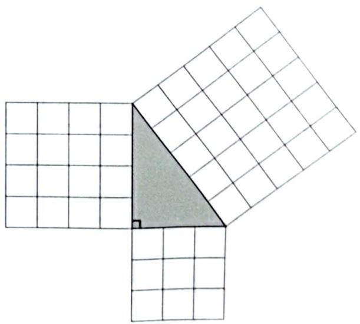  
图1-1 勾股定理:  $3^{2} + 4^{2} = 5^{2}$  的几何意义

有大约公元前1800年的文字(编目为"普林顿322"),如图1- 2所示。

这块泥板上列出了毕达哥拉斯三元组:整数  $(a,b,h)^{\mathfrak{B}}$  ,其中  $h$  是直角三角形的斜边长,直角边长分别是  $a$  和  $b$  ,所以  $a^{2} + b^{2} = h^{2}$  。古人记录的这些数组中,有些大得难以想象,显然不是偶然猜出来的,而是利用某种数学过程解出来的。例如,巴比伦泥板第四行记录的是  $13500^{2} + 12709^{2} = 18541^{2}$  。

这些古代结果的背后还隐藏了哪些更为深刻的知识,现在仍不可知。要找到

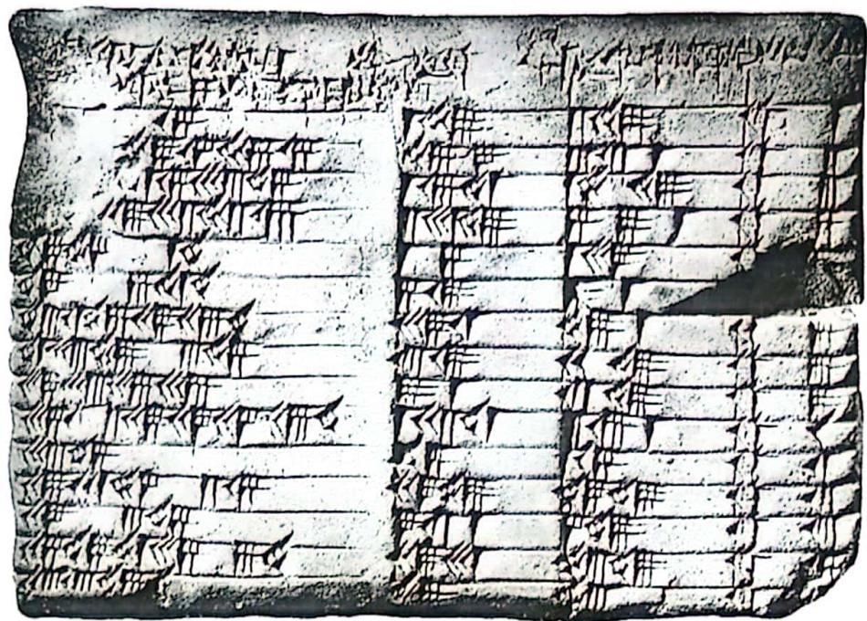  
图1-2 约公元前1800年的泥板（普林顿322），记录有毕达哥拉斯三元组

"现代"数学的逻辑演绎法的第一个证据,必须跳到泥板以后1200年左右.学界认为是米利都的泰勒斯在约公元前600年首先开创了从已知结论推导出新结论的

思想,其中的逻辑链始于少数几个公认的假设(称为公设)

在泰勒斯之后又经过了300年左右,在欧几里得于约公元前300年所著的《几何原本》里,我们找到了这个新方法非常完善的解释.欧几里得在《几何原本》里试图从仅仅五个简单的公设(其中最后一个,即第五公设,是关于平行线的)推导出几何学中的所有结论,从而建立一个清晰、严格、有层次的几何学.

如图1- 3所示,欧几里得第五公设定义,如果两条直线不相交,则它们平行

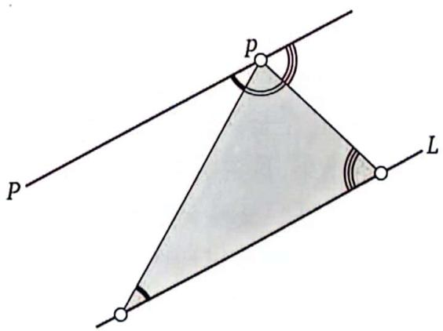  
图1-3 欧几里得平行公设:  $P$  是经过点  $p$  唯一平行于  $L$  的直线,三角形的内角和为  $\pi$

平行公设.经过不在直线  $L$  上的一点  $p$  ,只存在一条直线  $P$  与  $L$  平行.

但是,这个公设的特征比较复杂,不像前四个公设的那样明显。于是,数学家们试图将这个公设"开除"出假设的条件,开始努力证明它只是前四个公设的逻辑结论。

这个令人头痛的问题在以后的2000多年内都未解决。一个又一个世纪过去了,企图证明平行公设的尝试一直没有停止,这种努力的数量和程度到18世纪仍有增无减,但都未成功。

在此过程中,还出现了与这个公设等价的一些有用表述。例如,存在不同大小的相似三角形(1663年沃利斯闸述,见Stillwell,2010)。但是,在欧几里得的《几何原本》中已经有了它最早的等价表述,即每个三角形的内角和等于两直角和,如图1- 3所示。这也是我们今天还在学校教给孩子的内容。

直到1830年左右,尼古拉·罗巴切夫斯基和亚诺什·波尔约分别宣布发现了全新的几何形式,这才解释了为什么所有证明平行公设的尝试都不成功,从而结束了这个始于近4000年前的历程。这种新的几何(现在称为双曲几何)是在新定义的一类平面(现在称为双曲平面)上的几何。在这种几何里,欧几里得的前四个公设仍然成立,而平行公设不成立了,取而代之的是

双曲公设。经过点  $p$ ,至少存在两条平行线与  $L$  不相交。(1.1)

这些先驱探讨了在这个公设的基础之上会有哪些逻辑结果。利用纯粹抽象的论证,他们在这个全新的几何里得到了一大批奇妙的结果,这些结果与欧几里得几何里的大不一样,显得十分怪异。

事实上,在罗巴切夫斯基和波尔约之前,已经有不少人发现了公设(1.1)的一些结论,其中最著名要数萨凯里在1733年和兰伯特在1766年得到的结果(见Stillwell,2010)。但是,他们探讨这些结论的目的是要找出矛盾,以便最终证明他们的信念:欧几里得几何才是唯一的真几何。

萨凯里无疑相信自己已经找到了明显的矛盾,所以出版了《欧几里得无懈可击》一书。兰伯特(见图1- 4)的情况就

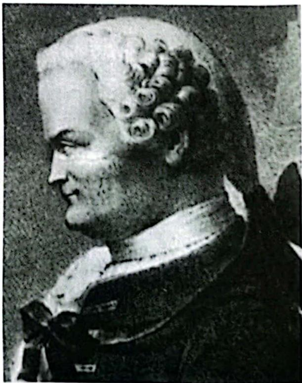  
图1-4 约翰·海因里希·兰伯特（1728—1777）

复杂得多, 他可能是这个故事里的无名英雄. 他的结果深入了新的几何, 以至于很可能连他自己有时都不敢相信自己的结果是真实的. 不管他的动机和信念是什么①, 兰伯特确实是第一个发现 "在公设 (1.1) 下, 三角形的内角和不等于  $\pi$  " 的惊人事实②, 他的结果是接下来第二幕的核心内容.

尽管如此, 罗巴切夫斯基和波尔约在首先意识到 (并完全接受他们发现了) 一个全新、一致的非欧几何上是实至名归的. 但是, 对于这个新几何到底意味着什么, 可能有什么用, 他们也没说.③

直到 1868 年, 意大利数学家欧金尼奥·贝尔特拉米终于在他的论文《关于非欧几何的一个解释》里令人惊奇地解决了这些受到普遍关注的问题. 他具体地解释了什么是双曲几何, 成功地为双曲几何建立了直观的稳固基础, 使之从此发展起来并产生了丰富的结果. 可惜的是, 罗巴切夫斯基和波尔约分别于 1856 年和 1860 年去世, 未能活着见到这一切.

在历史进程中, 这门非欧几何在数学的各个分支中都或多或少地出现过, 但总是不那么直截了当. 亨利·庞加莱是第一个 (大约从 1882 年开始) 不仅揭开了这门新几何的伪装, 而且认识到了其作用的人, 在复分析、微分方程、数论、拓扑学等各个领域中都发挥了双曲几何的威力. 在 20 世纪和 21 世纪的数学发展中, 双曲几何继续保持着活力和中心地位——瑟斯顿关于三维流形的著作、怀尔斯对费马大定理的证明、佩雷尔曼对庞加莱猜想 (即瑟斯顿几何化猜想的一个特殊情形) 的证明, 仅以此三例就足以说明.

我们将在第二幕展示贝尔特拉米的突破性进展, 以及双曲几何的原理. 现在, 我们希望讨论一种更简单的非欧几何. 事实上, 古人就已经知道了这种几何.

# 1.2 球面几何

要建立一门非欧几何, 就要拒绝唯一平行线的存在. 双曲几何建立在承认存在两条或更多平行线的假设之上, 还有一种逻辑上的可能性, 就是没有平行线.

球面公设. 经过点  $p$ , 不存在  $L$  的平行线, 即所有的直线都与  $L$  相交.

(1.2)

这样,就有两种非欧几何:球面几何和双曲几何。

顾名思义,球面几何可以理解为球面(如果是单位球面,记为  $\mathbf{S}^{2}$  )上的几何。我们可以将球面看作地球表面。在这个球面上,连接两点,类似于"直线"的是什么?是连接两点的最短路径!例如,你希望从伦敦乘船或乘飞机到纽约,最短路径是什么?

古代的航海家已经知道了这个答案:最短路径是大圆上的一段弧,而大圆是用过球心的平面切割球面得到的圆周(例如,赤道就是大圆)。在图1- 5中,我们选择  $L$  为赤道,公设(1.2)显然成立:经过点  $p$  的每一条直线都与  $L$  相交于一对对径点(即球的直径的两个端点)。

在平面上,最短的路径是最直的路径。在球面上也是如此:大圆的轨迹在横穿球面时,既不偏向右侧也不偏向左侧(其准确的定义以后再讨论)。

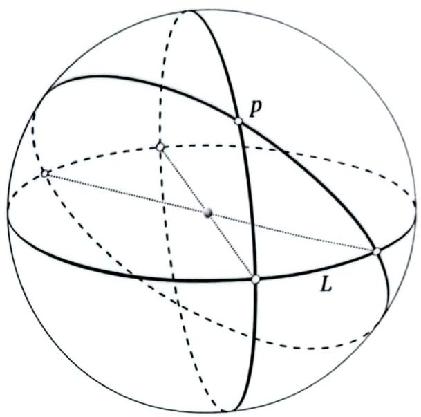  
图1-5 球面上的大圆都在两个相对的点(称为"对径点")处相交

还有其他方法不必考虑经过根本无法达到的地球中心的平面即可构建地球

上的大圆。例如,在一个地球仪上,你可以将一根细细的一端固定在伦敦的位置上,然后拉紧细绳,使之紧贴在球面上,并将另一端固定在纽约的位置上,这样就可以沿着这根细绳画出从伦敦到纽约的"大圆路径"。绷紧的细绳会自动找到最短、最直的路径——经过这两座城市的大圆被这两座城市分成的两段弧中较短的一段。

有了球面上类似于直线的大圆,我们就可以在球面上"做几何"了。例如,给定地球表面上的任意三个点,用大圆的弧段将它们连接起来,就形成了一个"三角形"。对于如图1- 6所示的三角形,一个顶点在北极,另外两个顶点在赤道上。

既然古代航海家已经利用非欧球面几何来航行于大洋之上,古代天文学家利用它来绘制夜晚星空的天体图,那么,为什么说罗巴切夫斯基和波尔约发现的非欧几何是新的,又为什么说它是令人震惊的呢?

答案是,那时的球面几何只是将球面看作它所在的三维空间的一部分,只考虑它从三维欧几里得空间遗传下来的性质,根本没有考虑球面内部的二维几何。

如果将球面看作欧几里得平面的替代品, 不仅欧几里得第五公设不成立, 更多基本公设也可能不成立. 例如, 欧几里得第一公设 “总是可以画出连接两点的唯一一条直线” 在球面上就有问题了, 因为连接两个对径点的有无穷多条球面上的 “直线”.

同时, 罗巴切夫斯基和波尔约的双曲几何更严重地 “冒犯” 了欧几里得几何. 在双曲几何里, 虽然有我们熟悉的无穷长直线, 但是也有很多看似荒谬的结果, 例如平行线的多重性, 荒谬的三

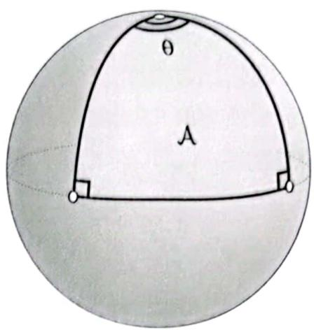  
图 1-6 球面上的简单 “三角形”

角形内角和公式, 等等. 21 岁的亚诺什·波尔约对自己的发现非常自信, 兴高采烈地写信给他的父亲: “我白手起家, 创造了另一个全新的世界.”

最后, 讲一个悲剧吧. 波尔约的父亲是高斯的朋友, 他把儿子亚诺什得出的结果寄给了高斯. 那时, 高斯自己也在这方面有一些重要发现, 但他没有公开发表. 无论如何, 亚诺什都比高斯看得更远. 在全世界享有盛名的数学家高斯公开的一句赞许, 就会让这位崭露头角的年轻数学家拥有一个光辉的未来. 然而, 高斯虽然因先天条件与后天培养而获得了超常的数学天赋, 却也有一般人类的缺点. 面对波尔约恢弘的数学发现, 高斯是极度狭隘和自私的.

首先, 高斯把老波尔约的信搁置了 6 个月, 然后才回复如下:

关于你儿子的工作, 当我说我不能给予称赞时, 你可能会感到吃惊. 但我只能这样说, 因为称赞你儿子的工作就是称赞我自己. 论文的全部内容, 你儿子采用的方法, 以及他得到的所有结果, 几乎处处都与我自己想的一样, 我考虑这些问题有 30~35 年了.

高斯确实也说了 “感谢” 波尔约的儿子, 因为这 “省去了他的麻烦” , 否则他不得不将自己已经知道了几十年的那些定理写出来.

遭受高斯的沉重打击后, 亚诺什·波尔约一直没有恢复过来, 并在此后放弃了数学.

# 1.3 球面三角形的角盈

我们已经说过, 平行公设等价于三角形的内角和为  $\pi$ . 那么, 在球面公设和双曲公设所在的几何里, 三角形的内角和一定不等于  $\pi$ . 为了量化它们与欧几里得几何的差异, 我们引入一个几何概念: 角盈  $\mathcal{E}$ , 定义为三角形的内角和与  $\pi$  的差, 即

$\mathcal{E} \equiv (\text{三角形的内角和}) - \pi$ .

例如, 在图1- 6所示的三角形中,  $\mathcal{E} = \left(\theta + \frac{\pi}{2} + \frac{\pi}{2}\right) - \pi = \theta$ .

现在, 比较三角形的角盈和三角形的面积  $\mathcal{A}$ , 得出一个重要结论. 设球的半径为  $R$ . 因为三角形与北半球的面积之比为  $\theta / 2\pi$ , 所以  $\mathcal{A} = (\theta / 2\pi) 2\pi R^{2} = \theta R^{2}$ , 即

$$
\mathcal{E} = \frac{1}{R^{2}} \mathcal{A}. \tag{1.3}
$$

1603年, 英国数学家托马斯·哈里奥特 (见图1- 7) 发现这个关系对球面上的任何三角形  $\Delta$  都成立, 见图1- 8a. 这是一个重要的发现. 我们接下来介绍哈里奥特巧妙的初等论证.

将三角形  $\Delta$  的边延长成三个大圆, 这三个大圆将球面分为8个三角形, 我们将其中四个分别记为  $\Delta , \Delta_{\alpha}, \Delta_{\beta}, \Delta_{\gamma}$ , 每一个都对径于一个全等三角形. 这样的关系可以在图1- 8b中更清楚地看到. 因为球的表面积为  $4\pi R^{2}$ , 所以

$$
\begin{array}{l}{{\mathcal{A}(\Delta)+\mathcal{A}(\Delta_{a})+}}\\ {{\mathcal{A}(\Delta_{\beta})+\mathcal{A}(\Delta_{\gamma})=2\pi R^{2}.}}\end{array} \tag{1.4}
$$

同时, 由图1- 8b可清楚地看到,  $\Delta$  与  $\Delta_{\alpha}$  共同构成一个楔形, 它的面积是整个球面面积的  $\alpha / 2\pi$  倍, 即

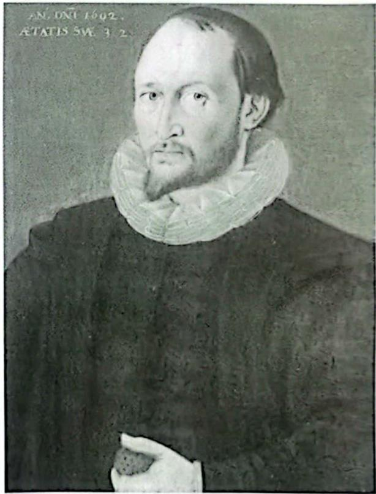  
图1-7 托马斯·哈里奥特（1560—1621）

$$
\mathcal{A}(\Delta) + \mathcal{A}(\Delta_{a}) = 2\alpha R^{2}.
$$

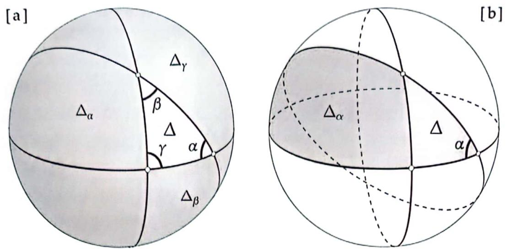  
图1-8 哈里奥特定理（1603年）：  $\mathcal{E}(\Delta) = \mathcal{A}(\Delta) / R^{2}$

类似地, 我们有

$$
\begin{aligned} \mathcal{A}(\Delta) + \mathcal{A}(\Delta_{\beta}) & = 2\beta R^{2}, \\ \mathcal{A}(\Delta) + \mathcal{A}(\Delta_{\gamma}) & = 2\gamma R^{2}. \end{aligned}
$$

上述三式相加即得

$$
3\mathcal{A}(\Delta) + \mathcal{A}(\Delta_{\alpha}) + \mathcal{A}(\Delta_{\beta}) + \mathcal{A}(\Delta_{\gamma}) = 2(\alpha +\beta +\gamma)R^{2}. \tag{1.5}
$$

最后, 用式(1.5)减去式(1.4), 得到

$$
\mathcal{A}(\Delta) = R^{2}(\alpha +\beta +\gamma -\pi) = R^{2}\mathcal{E}(\Delta),
$$

从而证明了式(1.3).

# 1.4 曲面的内蕴几何与外在几何

我们稍后再来讨论与这种拉直细绳来构作"直线"的方法有关的数学. 现在仅展示这种构作方法可以很好地应用于非球面, 例如图1- 9所示的曲颈南瓜.

与在球面上一样, 我们在曲颈南瓜表面拉直一根细绳, 找到两点 (例如  $\alpha$  和  $b$  )之间最短、最直的路径. 如果细绳可以自由滑动, 则细绳的张力可以确保生成的路径尽可能短. 注意: 在两点为  $c$  和  $d$  的情况下, 我们必须想象细绳是在内表面拉直的.

为了用统一的方式处理所有可能的点对, 最好把表面想象成由两个薄层组成, 细绳在它们中间. 然而这个想法只在想象的实验中有用, 在实际情况下办不到. 我们将提供一种实用的方法来克服这个障碍, 即使表面的弯曲方向使得我们无法在外面用拉直的细绳紧贴, 也可以在实际物体表面构作这些最短、最直的曲线.

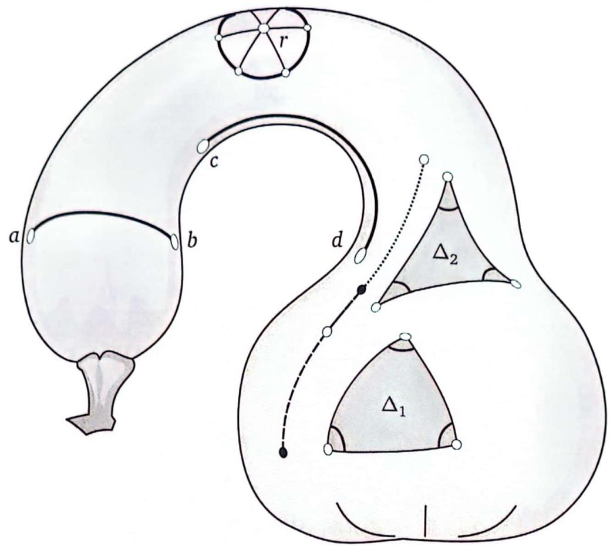  
图1-9 曲颈南瓜表面的内蕴几何. 曲面上相当于直线的是测地线, 由测地线组成的三角形的角盈可能有不同的符号, 取决于曲面是如何弯曲的:  $\mathcal{E}(\Delta_{1}) > 0$  而  $\mathcal{E}(\Delta_{2})< 0$

曲面上的这些最短路径相当于平面上的直线, 它们在本书中起着至关重要的作用, 称为测地线. 使用这个新词, 我们可以说平面上的测地线是直线, 球面上的测地线是大圆.

但是, 即使在球面上, 用长度最小化来定义"测地线"也是暂时的. 显然, 对于任意两个非对径点, 通过它们的大圆有两段弧连接着这两个点: 短弧 (这是最短路径) 和长弧. 然而, 长弧和短弧一样, 都是测地线. 球面上的对径点就更复杂了, 它们可以由很多条测地线连接, 而且, 在更一般的曲面上也会出现测地线不唯一的情况. 真正正确的说法是, 任意足够接近的两个点可以由唯一的测地线段连接, 这就是它们之间的最短路径.

就像平面上的线段可以在两个方向上无限延伸一样, 测地线也可以在曲面上无限延伸, 而且这种延伸是唯一的. 例如, 在图1- 9中, 我们将连接黑点的短划线表示的测地线段扩展成连接白点的点虚线表示的测地线段.

因为长度最小化是测地线的一个很微妙的特征, 容易出错, 所以我们稍后将以平直度为基础, 提供测地线仅限于局部的另一种特征.

有了前面的这些预先声明, 现在我们很清楚应该如何定义曲面内的距离了. 例如, 在图 1- 9 中, 两个足够接近的点  $a$  和  $b$  之间的距离是连接它们的测地线段的长度.

现在就可以在曲面上定义圆了. 如图 1- 9 所示, "以  $o$  为圆心, 以  $r$  为半径的圆" 定义为与定点  $o$  的距离为  $r$  的所有点的轨迹. 我们可以拿一根长度为  $r$  的细绳, 将一端固定在点  $o$  上, 然后拉紧细绳, 拖着另一端紧贴着曲面转一圈, 这样就得到一个测地线圆. 与非欧几何中三角形的内角和不等于  $\pi$  一样, 测地线圆的周长不再等于  $2\pi r$ . 事实上, 容易证明图 1- 9 中测地线圆的周长小于  $2\pi r$ .

同样, 给定曲面上的三个点, 可以用测地线将它们连接起来形成一个测地线三角形. 图 1- 9 展示了两个这样的三角形:  $\Delta_{1}$  和  $\Delta_{2}$ .

- 看看  $\Delta_{1}$  的三个内角, 很明显它们的和大于  $\pi$ , 所以  $\mathcal{E}(\Delta_{1}) > 0$ , 类似于球面几何中的三角形.

-  $\Delta_{2}$  的内角和则明显小于  $\pi$ , 所以  $\mathcal{E}(\Delta_{2}) < 0$ . 正如我们将要解释的那样, 这种情形类似于双曲几何中的三角形. 还请注意, 如果我们在曲颈南瓜表面的这个鞍形部分上构作一个圆, 该圆的周长会大于  $2\pi r$ .

测地线属于曲面的内蕴几何概念, 这是高斯 (Gauss, 1827) 提出的一种全新的几何观点. 它指的是生活在地表的微小、类似蚂蚁、有智慧 (但是只能理解二维世界) 的生物所知道的几何结构. 正如我们讨论过的, 这些生物可以将连接两个附近点的测地线定义为 "直线", 即它们的世界 (地表) 中连接这两个点的最短路径. 由此, 它们还可以接着定义三角形, 等等. 以这种方式定义, 很明显, 当曲面在空间中被弯曲 (就像一张纸可以弯曲一样) 成不同的形状时, 只要曲面内的距离没有以任何方式被拉伸或扭曲, 内蕴几何是不会改变的. 对于生活在曲面内那些类似蚂蚁的智慧生物来说, 这样的变化是完全无法察觉的.

在这种弯曲下, 外在几何 (曲面在空间中的形状) 肯定会改变. 如图 1- 10 所示, 左边是一张扁平的纸, 我们在上面画一个三角形  $\Delta$ , 它的三个内角分别为  $\pi /2, \pi /6, \pi /3$ . 此时当然有  $\mathcal{E}(\Delta) = 0$ . 显然, 我们可以将这样一张扁平的纸在空间中 (外在几何地) 弯曲成右边两个曲面中的任意一个. 然而, 从本质上讲, 这些曲面在 (外在几何地) 弯曲后, 其内蕴几何的形状没有发生任何变化——它们就像煎饼一样, 在弯曲后不会变大! 图 1- 10 中这些曲面上的三角形 (也随着纸被无拉伸弯曲了) 与 "智慧蚂蚁" 用测地线构作的三角形是完全相同的, 在右边的两种情况下角盈  $\mathcal{E} = 0$ , 可见这些曲面上的几何是欧几里得几何.

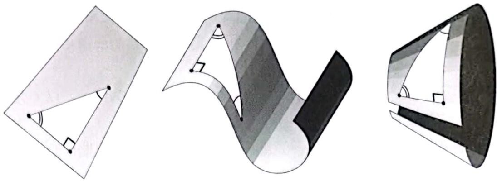  
图1-10 弯曲一张纸改变外在几何, 不改变内蕴几何

即使我们在内蕴弯曲的曲面上取一小片, 使这个小片上三角形的角盈  $\mathcal{E} \neq 0$ , 它也可以在不拉伸或不撕裂的情况下被弯曲, 从而改变外在几何形状, 但保持内蕴几何形状不变. 例如, 把一个乒乓球切成两半, 轻轻挤压其中一个半球的边缘, 使其扭曲成椭圆形状 (但不是单个平面上的椭圆).

# 1.5 通过"直性"来构作测地线

我们提到了这样一个事实, 曲面上的测地线与平面上的直线至少有两个共同特征: (1) 它们是 (相距不太远的) 两点间的最短路径; (2) 它们是两点间"最直"的路径. 在本节中, 我们要澄清"直性"是什么意思, 并引出在实际曲面上构作测地线的一种非常简单实用的方法.

大多数微分几何教科书很少关注这些实际问题, 也许正是出于这个原因, 我们将要描述的构作方法在文献中鲜为人知. 本书截然相反, 强烈要求你用各种可能的方法探索我们的想法: 理论构想, 画图, 计算机实验, 特别是在实实在在的曲面上做实际操作. 你家附近的果蔬店可以为你的实验提供很多形状有趣的实验材料, 例如图1- 11中的西葫芦.

现在, 我们可以用这个西葫芦来做个实验, 揭示其表面上的测地线所隐藏的直性. 我们希望你亲手重复这个实验.

(1) 准备一个西葫芦, 拉紧一根细绳贴在其表面构作出一条测地线.

(2) 用笔描出紧贴西葫芦表面的细绳轨迹, 然后移去细绳.

(3) 贴着描出的轨迹两侧刻出浅痕, 用小刀或削皮器削下两条刻痕之间的窄带.

(4) 将削下的窄带平铺在桌面上, 可以惊奇地发现窄带上的测地线变成了平面上的直线.

但是, 为什么会这样呢?

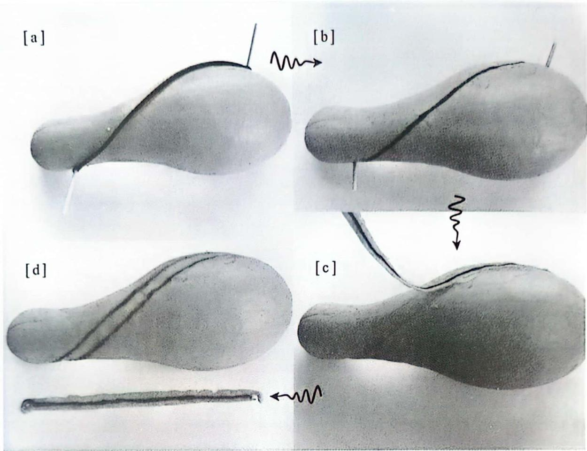  
图1-11 在西葫芦弯曲的表面上，沿着测地线剥下窄窄的一条果皮，然后将它平铺在桌面上，就得到了平面上的一条直线

为了弄清这个道理，首先允许这条窄带沿垂直于西葫芦表面（即垂直于这条窄带）的方向自由弯曲。我们严格要求：当窄带横向弯曲时，总能保持窄带与西葫芦表面相切。下面使用反证法，假设削下来的测地线平铺在桌面上不是直线。这样用物理实验来做证明，有一点既是缺点又是优点：反证假设是不可能在实验中做到的；正因为反证假设不可能做到，就证明了我们的数学论断。尽管如此，我们还是假设：存在一条如图1- 12a中虚线所示的测地线，将它削下来后，平铺在桌面上不是直线（如图1- 12b所示）。

在平面上连接虚线（不是直线）的两个端点的曲线中，最短路径是直线。（如前所述，我们的细绳已经找到了真正的测地线，只是在反证法中我们假装不知道！）这样，我们就可以将虚线向直线（最短路径）变形缩短，得到连接窄带两端的实线。将缩短后得到的直线贴回西葫芦表面（如图1- 12c所示），就得到了西葫芦表面上比虚线更短的路径，而虚线是我们假设的最短路径，从而产生了矛盾，所以假设不真。这就证明了我们之前的论断：

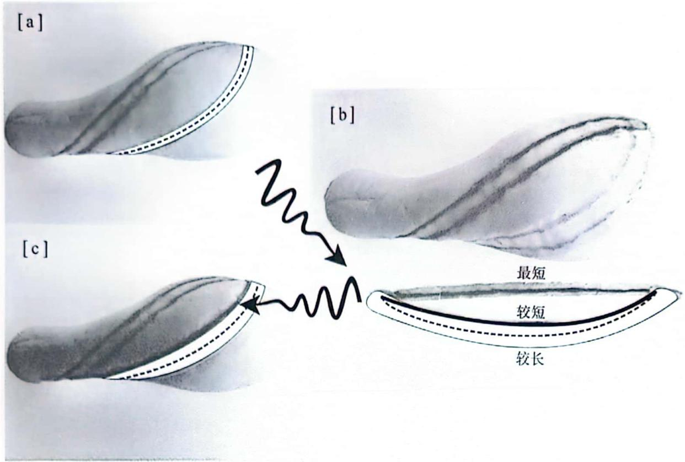  
图1-12 假设虚线表示测地线, 它所在的 (白色) 窄带平铺在平面上不是直线. 我们可以在平面上将虚线向直线 (最短路径) 变形缩短, 得到连接窄带两端的实线. 将实线贴回西葫芦表面, 它比原先的虚线更短, 与假设虚线是最短路径矛盾

从曲面上削下一段测地线周围的窄带, 平铺在平面上, 得到一条直线段.

现在我们已经快找到构作测地线的简单实用方法了. 再来看看图1- 11中的第(3)步, 在那里我们从西葫芦表面削下了窄带. 想象一下, 现在我们要将窄带贴回西葫芦表面. 不管之前的步骤是什么, 现在真实要做的是贴回去的过程, 这个过程是怎样的呢? 我们捡起变直了的窄带 (这是一条三维的细长果皮, 在数学上理想化为二维窄带), 将它贴回西葫芦表面挖出的浅槽里. 但关键是: 西葫芦表面并不需要有浅槽, 表面自然地决定了削下来的果皮只能放回那个地方.

这样, 将论断 (1.6) 倒转过来, 就得到了在实际曲面上构作测地线的一种简单实用的重要方法:

要在曲面上构作一条在点  $p$  沿方向  $\nu$  的测地线, 可以把细长胶带的一端粘在点  $p$  上, 沿着方向  $\nu$  将胶带展开并粘在曲面上.

(1.7)

(但请注意: 这不是构作连接点  $p$  到指定目标点  $q$  的测地线的方法.)

如果你认为这个方法太简单了, 难以置信, 那就请你对任何可以上手的弯曲表面试试下面的方法. 你可以在胶带上粘一条细绳, 在弯曲表面上的两点之间拉直细绳, 使其贴紧在表面上. 这时细绳会与胶带形成同样的路径. 你会发现, 胶带的确描绘出了测地线. 值得注意的是, 这个胶带构作法对任何曲面都有效, 包括凹面, 而拉直细绳的方法对凹面就不好用了. 这就是我们之前说过的好处.

当然, 所有这些都是数学理想化的具体表现. 一条宽度非零、完全平整的狭长胶带不能完全贴合真正弯曲的表面, 但它的中心线可以固定在曲面上, 而胶带的其余部分与曲面相切.

# 1.6 空间的本质

我们回顾一下发现非欧几何 (球面几何和双曲几何) 的历史, 看看这两门新几何与欧几里得几何有什么不同.

我们已经说过, 欧几里得几何的特点是角盈  $\mathcal{E}(\Delta)$  为 0. 请注意, 与平行公设的原始表述不同的是, 这个命题可以用实验加以验证: 构作一个三角形, 测量其内角, 看看它们加起来是否等于  $\pi$ . 物理空间是否有可能不是欧几里得空间? 高斯可能是第一个想到这个问题的人, 他甚至尝试用实验来验证这个问题. 他用三个山顶作为三角形的顶点, 用光线作为三角形的边.

在仪器允许的精度范围内, 他发现  $\mathcal{E} = 0$ . 完全正确?! 高斯没有因此就认为物理空间在结构上绝对是欧几里得空间, 而是得出结论: 如果物理空间不是欧几里得空间, 那么它与欧几里得几何的偏差是非常小的. 高斯确实看得很远, 他说 (见 Rosenfeld, 1988, 第 215 页) 自己希望这门非欧几何可以适用于现实世界. 在第四幕中我们将看到这是先见之明.

尽管高斯曾向朋友们吹嘘, 他在几十年前已经预见到罗巴切夫斯基和波尔约的双曲几何, 但他可能也没有意识到自己已经在无意中发现了非欧几何的一些核心结果.

1766年(高斯出生前11年),兰伯特重新发现了哈里奥特在球面上的结果,然后依据双曲公设(1.1)将球面上的结果推广到了双曲几何这个全新的领域。首先,他发现双曲几何中的三角形(如果真的存在这样的三角形)与球面几何中的三角形相反。

- 在球面几何中,三角形的内角和大于  $\pi$ :  $\mathcal{E} > 0$ 。

- 在双曲几何中,三角形的内角和小于  $\pi$ :  $\mathcal{E} < 0$ 。

因此,双曲三角形表现得就像绘制在鞍面上的三角形,例如图1- 9中的  $\Delta_{2}$ 。稍后我们将看到这一点儿也不意外。

其次,兰伯特还发现了一个关键事实,那就是在双曲几何中  $\mathcal{E}(\Delta)$  与  $\mathcal{A}(\Delta)$  的比也是常数:

在球面几何和双曲几何里都有

$$
\mathcal{E}(\Delta) = \mathcal{K} \mathcal{A}(\Delta), \tag{1.8}
$$

在球面几何里  $\kappa$  为正常数,在双曲几何里  $\kappa$  为负常数。

由此不难得出以下有趣的结论。

- 存在无穷多种球面几何,它们之间没有本质性差别,只依赖于不同的正常数  $\kappa$ 。同样,对应于不同的负常数  $\kappa$ ,存在无穷多种双曲几何,它们也没有本质性差别。

- 因为三角形的面积不可能为负数,所以 \(\mathcal{E} \geqslant 
- \pi\)。对于双曲几何( $\kappa < 0$ )有一个意想不到的结果:三角形的面积不可能大于  $|\pi / \kappa |$ 。

- 从事实(1.8)可知,两个不同大小的三角形不可能有相同大小的角。也就是说,在非欧几何里不存在不同大小的相似三角形!(这与沃利斯在1663年的发现是一致的:相似三角形的存在性依赖于平行公设。)

- 与上一个结论紧密相关的事实是,在非欧几何里,存在绝对长度单位。(高斯本人发现了这个令人兴奋的可能:完全用数学推导得到的结论有可能在物理世界中实现。)在球面几何中,我们可以把这个绝对长度单位定义成:内角和为(例如)  $1.01 \pi$  的等边三角形的边长。类似地,在双曲几何中,我们可以把绝对长度单位定义成:内角和为  $0.99 \pi$  的等边三角形的边长。

- 还有更自然的方法来定义绝对长度单位,那就是用常数  $\kappa$  来定义。一方面,因为弧度制的角定义为长度的比,所以  $\mathcal{E}$  是无量纲的纯数。另一方面,面积  $A$  的量纲是(长度)²,于是  $\kappa$  的量纲是  $1 / (\text{长度})^2$ 。因此,存在满足以下

条件的长度  $R$  : 在球面几何里  $\kappa = +(1 / R)^{2}$ , 在双曲几何里  $\kappa = - (1 / R)^{2}$ . 当然, 我们知道, 在球面几何里使得  $\kappa = +(1 / R)^{2}$  的长度  $R$  就是球的半径. 以后我们还会讲清楚: 在双曲几何里使得  $\kappa = - (1 / R)^{2}$  的长度  $R$  也有同样直观的具体解释.

- 曲面上的三角形越小, 它与平面三角形的差异就越难察觉: 只有当三角形的大小与  $R$  的比值足够大时, 差异才会变得易于察觉. 例如, 人类的身高与地球半径相比是很小的, 所以我们乘船到湖中间去, 会觉得湖面就是一个欧几里得平面, 而湖面实际上是球面的一部分. 高斯认为, 光传播的空间可能具有很小的曲率, 而弯曲空间中的小图形很容易被错看成平直图形. 因此, 高斯选择用尽可能大的三角形来做光学实验, 以便增加检测到空间中可能存在的任何小曲率的机会.

# 第2章 高斯曲率

# 2.1 引言

由于哈里奥特的结果(1.3),比例常数

$$
\kappa = +\frac{1}{R^{2}}
$$

进入了球面几何,称为球面的高斯曲率。显然,半径  $R$  越小,球面就弯曲得越厉害,高斯曲率  $\kappa$  的值就越大。

同样,在双曲几何里,由事实(1.8)产生的负常数

$$
\kappa = -\frac{1}{R^{2}}
$$

也称为高斯曲率,原因稍后解释

高斯(见图2- 1)私下研究这个问题10多年后,于1827年发表了革命性的论文《关于曲面的一般研究》,公布了内蕴概念  $\kappa$

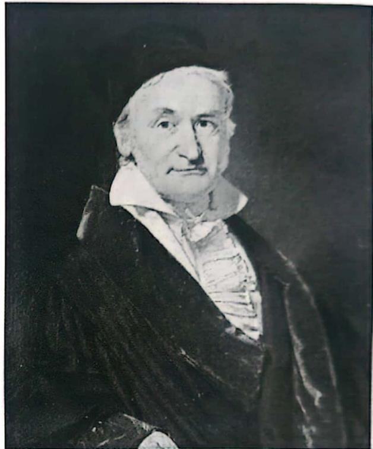  
图2-1 卡尔·弗里德里希·高斯（1777—1855）

高斯引入这个概念用来量度不规则的一般曲面(例如,图1- 9所示的曲面)

上每个点的曲率,根据哈里奥特和兰伯特的结论(1.8),

在球面几何和双曲几何里,这个解释对任意位置、任意大小的三角形都成立,但是,在更一般的曲面(例如图1- 9所示的曲面)上,这个定义就有问题了,因为位于曲面不同部分的三角形(例如  $\Delta_{1}$  和  $\Delta_{2}$  )的角盈  $\mathcal{E}$  可能连符号都不一样。

我们需要在这样的曲面上定义一点  $p$  的高斯曲率。现在,我们想象一个包含点  $p$  的小测地线三角形  $\Delta_{p}$ ,然后让它收缩到点  $p$ 。

图2- 2中是一个救生圈,在数学里它就是一个环面,是一个不能平直化的曲面。利用在1.5节建立的测地线构作法可知,图2- 2展示了这样收缩到一点的一列测地线三角形。我们现在定义点  $p$  的高斯曲率  $\kappa (p)$  为这列收缩到点  $p$  的测地线三角形的单位面积角盈的极限:

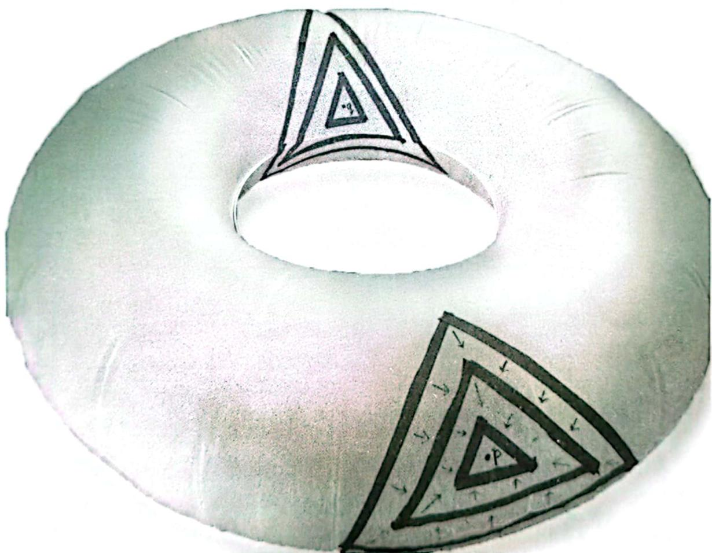  
图2-2在一点的高斯曲率  $\kappa (p)$  是收缩到该点的一列测地线三角形的单位面积角盈的极限。在此例中  $\kappa (p) > 0$  而  $\kappa (q)< 0$

# 在现阶段,这个极限是否存在,以及它是否与三角形的形状和三角形收缩到一点的

方式有关,这些问题并非一目了然,以后再详细讨论。随着剧情的进展,我们会发现:高斯曲率还有几种其他的解释方式,对于不同的具体曲面也有多种计算方法。

定义(2.1)可以推广到三角形以外的情形。如果我们用一个小  $n$  边形来代替  $\Delta_{p}$ ,则其角盈为(见第29页习题10)

而曲率的定义仍如式(2.1)一样,为单位面积的角盈。

我们再来看看图2- 2中的这个不能平直化的救生圈。显然,对于外半环上的每一点  $p$ ,都有一个邻域类似于山峰,这时  $\kappa (p) > 0$ ;对于内半环上的每一点  $q$ ,都有一个邻域类似于马鞍,这时  $\kappa (q)< 0$ 。图2- 3展示的就是这个现象。

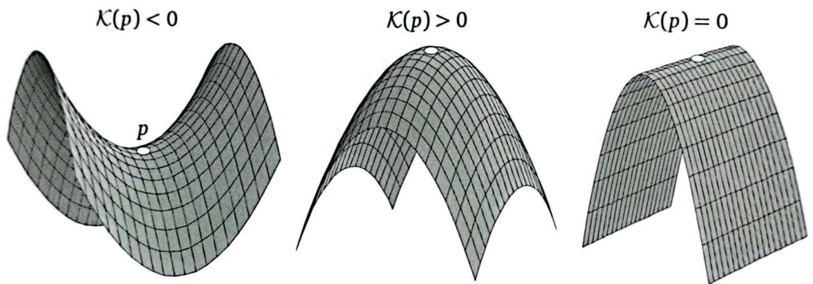  
图2-3 某一点的高斯曲率  $\kappa$  是局部单位面积角盈。如果曲面类似马鞍,则曲率为负;如果曲面类似山峰,则曲率为正;如曲面类似弯曲的纸片,则曲率为零

# 2.2 圆的周长和面积

为什么  $\kappa (p)$  这么重要?显然,它在某种程度上控制着小三角形,但几何中有很多东西不是三角形。答案是,在我们(暂时)选择用小三角形来定义  $\kappa (p)$  的过程中,将逐步发现曲率是几何中的"铁腕人物",它完全决定了曲面上所有方面的几何性质。现在来看两个例子吧。

在图1- 9中,我们讲过在曲面上定义"以  $o$  为圆心,以  $r$  为半径的圆"的方法:取长度固定为  $r$  的测地线段  $op$ ,让端点  $p$  绕着定点  $o$  转一圈。接下来,我们在半径为  $R$  的大球面上作这样一个圆周,并计算这个圆周的周长。

如图2- 4所示,我们有

$$
\begin{array}{c}\rho = R\sin \phi \text{且}\phi = r / R \\ \Rightarrow C(r) = 2\pi R\sin (r / R). \end{array} \tag{2.3}
$$

正如曲率支配着三角形内角和与  $\pi$  (欧几里得空间中的值)的偏离一样,曲率也支配着圆的周长  $C(r)$  与  $2\pi r$  (欧几里得空间中的值)的偏离。为了看清楚这一点,我们回顾一下正弦函数的幂级数:

$$
\sin \phi = \phi - \frac{1}{3!}\phi^{3} + \frac{1}{5!}\phi^{5} + \dots .
$$

当  $\phi$  趋于0时,我们有

$$
\phi - \sin \phi \asymp \frac{1}{6}\phi^{3}.
$$

(再次提醒读者:  $\asymp$  表示牛顿的最终相等概念,在序幕中介绍过。)由式(2.3)知,当  $r$  趋于0时有

  
图2-4在半径为  $R$  的大球面上作半径为  $r$  的圆,周长为  $C(r) = 2\pi R\sin (r / R)$

$$
2\pi r - C(r) = 2\pi R\big[(r / R) - \sin (r / R)\big] \asymp \frac{\pi r^{3}}{3R^{2}}.
$$

也就是说,生活在  $\mathbb{S}^{2}$  上的居民,以前是通过测量小三角形的内角和来判断所在世界的曲率的,现在可以通过测量小圆周的周长来判断,这也很容易:

$$
\mathcal{K} \asymp \frac{3}{\pi}\left[\frac{2\pi r - C(r)}{r^{3}}\right]. \tag{2.4}
$$

值得注意的是,我们将在第四幕中展示:测量一般曲面上的高斯曲率也用这个公式![验证一下分母中  $r$  的幂:我们知道  $\mathcal{K}$  的量纲是  $1 / (\text{长度})^{2}$ ,周长的量纲是(长度),所以分母的量纲应该是(长度)3. ]

继续讨论这个例子,以这个圆周为边界有一个球冠,我们来看看这个球冠的面积  $A(r)$ 。又是曲率支配着圆的面积与  $\pi r^{2}$  (欧几里得空间中的值)的偏离。利用球冠的面积公式(见第98页习题10)不难证明[练习]:

$$
\mathcal{K} \asymp \frac{12}{\pi}\left[\frac{\pi r^{2} - \mathcal{A}(r)}{r^{4}}\right]. \tag{2.5}
$$

我们再次指出这个公式是通用的。[这里分母的量纲是(长度)4. ]

虽然现在还不能证明式(2.4)和式(2.5)的普遍性,但至少可以看出:它们确实对一个不均匀曲面上的每个点都给出了正确的正负号,如图1- 9所示。如果曲面在一点的附近是正向弯曲的(向外凸起为正的),那么曲面在该点附近呈山峰的形状(就像图1- 9中的  $\Delta_{1}$  区域)。以这个点为中心的圆因弯曲而受到挤压,使得它的周长和面积都比在平坦的欧几里得平面上的周长和面积小。于是,由以上两个公式可得  $\kappa >0$ ,这正是应该出现的结果。

如果在一点附近的曲面是鞍形的,就会出现相反的情况。回顾我们对图1- 9的讨论:在曲面的鞍形部分( $\Delta_{2}$  所在的部分)画圆,就有  $C(r) > 2\pi r$ 。要弄清这一点,就站起来,平伸出一只手臂。当你绕着脚跟旋转一圈时,你的手指尖会画出一个水平的圆圈。现在再旋转一圈,但这次同时上下摆动你的手臂,显然这一次你的手指尖运动的距离比以前更长了。这样,手指尖上下摆动的轨迹就相当于在鞍形曲面上画了一个圆。于是,由以上两个公式可得  $\kappa < 0$ ,这也是应该出现的结果。

我们说过曲率是几何中的"铁腕人物",具有绝对的决定性作用,但是,它的决定性作用到底有多大呢?例如,如果知道曲面的一片具有常正曲率  $\kappa = (1 / R^{2})$ ,那么它是否一定是半径为  $R$  的球面的一部分?把一个乒乓球切成两个半球,轻轻捏一下其中一个半球。显然,我们得到了一个非球形曲面上的一片。但是,因为我们没有改变曲面内的距离,所以曲面上的测地线和角度不变,根据式(2.1)定义的曲率也不变。这样,我们肯定会得到一片具有常曲率的曲面,尽管它与球面具有相同的内蕴几何性质,但它在外在几何上已不是球面了。

图2- 5说明,即使只考虑旋转曲面,球面也不是唯一具有常正曲率的曲面。事实上,存在一族这样的曲面,球面只是图2- 5所示两种曲面的极限情形(见第103页习题22)。虽然这些曲面不是球面,但是生活在这些曲面上的"智慧蚂蚁"无法察觉,只不过它们最终可能会发现这个世界尽头存在边缘或尖端。1899年,海因里希·利布曼证明了,如果一个具有常正曲率的曲面不存在尖端或边缘,它就一定是球面。

如果忽略表面上的外在差异,两个具有相同常正曲率  $\kappa = (1 / R^{2})$  的曲面是否具有实质上不同的内蕴几何?说得更通俗些,如果我们突然把"智慧蚂蚁"从一个曲面运到另一个曲面上,它能否设计一个实验来验证它的世界发生了改变?

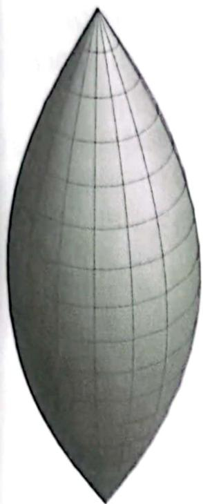  
图2-5 具有常正曲率的非球形旋转曲面，这样的曲面一定有尖端或边缘

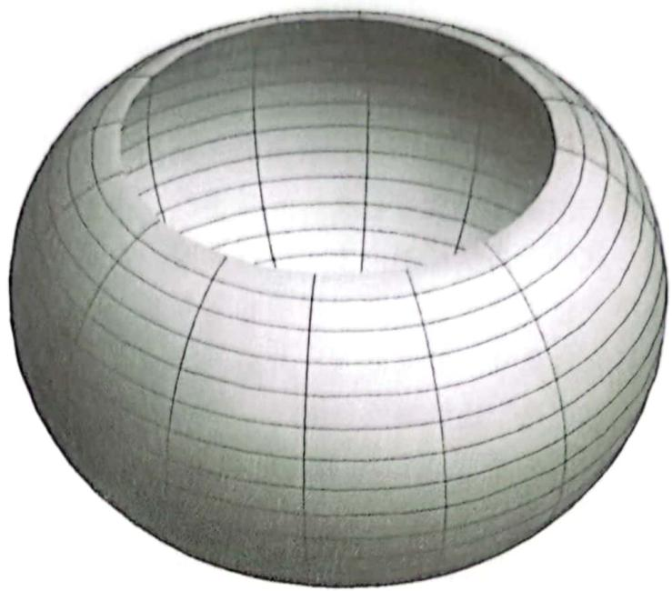

1839年,明金(高斯为数不多的学生之一)给出了否定的答案.明金发现,如果两个曲面具有相同的常正曲率  $\kappa = (1 / R^{2})$  ,则它们的内蕴几何都与半径为  $R$  的球面局部一致.

我们已知图2- 2中救生圈的内沿具有负曲率,但不是常负曲率.事实上,如果  $C$  是救生圈接触地面的那个圆周,它会将救生圈分割成内半圈和外半圈.显然,当点  $q$  从内半圈趋近  $C$  时,曲率  $\kappa (q)$  从负值趋于0;当点  $q$  越过  $C$  进入外半圈时,曲率就变成正值了.(将在第104页习题23中详细讨论.)

事实上,确实存在具有常负曲率的曲面.欧金尼奥·贝尔特拉米(我们很快就会讲到他)称所有这种曲面为伪球形曲面,其中最简单的例子是伪球面,如图2- 6所示.(伪球面由曳物线旋转生

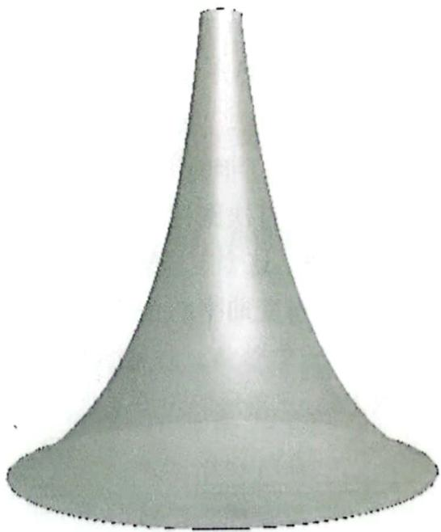  
图2-6 底圆半径为  $R$  的伪球面具有常负曲率  $\kappa = -(1 / R^{2})$

成, 牛顿在 1676 年首次研究了曳物线. 第二幕将详细讨论伪球面的精确构造. ) 如果伪球面底圆的半径为  $R$ , 则整个曲面具有常负曲率  $K = - (1 / R^{2})$ , 稍后我们将证明这一点.

糟糕的是, 这个曲面有点名不副实. 正如你看到的, 它并不像球面那样是封闭的, 但该名称确立已久, 无法更改. 本书后面会证实, 不存在封闭的伪球形曲面. 此外, 当伪球面向上无限延伸时, 会遇到一个圆形边缘. 事实证明, 伪球面不可能越过这个边缘而保持负曲率不变. 1901 年, 大卫·希尔伯特证明了, 将一个具有常负曲率的曲面嵌入普通三维欧几里得空间, 青定会有一个边缘使得曲面不能越过这个边缘继续延伸.

明金的结果也适用于这种情形: 如果两片曲面具有相同的常负曲率  $\kappa = - (1 / R^{2})$ , 则它们的内蕴几何都与半径为  $R$  的伪球面一致.

总之, 如果曲面具有 (正的或负的) 常曲率  $\kappa$ , 则这个数 (曲率) 完全决定了该曲面的内蕴几何.

更一般地, 具有变化曲率的曲面情况如何? 曲率的影响力仍然很大, 但不再是绝对的: 两个曲面可能在所有对应点处都具有相同的曲率, 却有不同的内蕴几何. (第 260 页习题 19 就是一个具体的例子.)

# 2.3 局部高斯-博内定理

回顾哈里奥特于 1603 年在球面上得出的结论 (1.3): 三角形的角盈等于曲率乘以三角形的面积. 我们可以将角盈理解为三角形内曲率的总量.

高斯在 1827 年的论文《关于曲面的一般研究》中首次阐述了局部高斯- 博内定理. 后来, 这个定理被令人惊奇地推广到了具有可变曲率的一般曲面上的一般测地线三角形  $\Delta$ , 参见图 2- 7. 这个定理说的是, 三角形的角盈就是三角形内的总曲率:

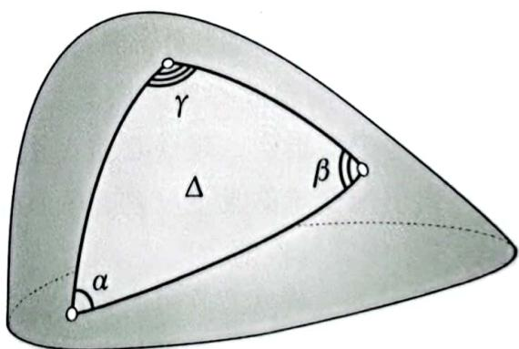  
图 2-7 一般曲面上的一般测地线三角形

$$
\mathcal{E}(\Delta) = \alpha + \beta + \gamma - \pi = \iint_{\Delta} \kappa \mathrm{d}A.
$$

当曲面为球面时,  $\kappa = 1 / R^{2}$ ,代入式(2.6)就得到了哈里奥特公式(1.3)作为特殊情形.

为了明白这一点,首先回顾曲率的最初定义(2.1).当三角形  $\Delta_{p}$  在曲面  $s$  上收缩到一点  $p$  时,

$$
\mathcal{E}(\Delta_{p}) \asymp \mathcal{K}(p) \mathcal{A}(\Delta_{p}). \tag{2.7}
$$

关键是,角盈是可加的

在图2- 8a中,从三角形  $\Delta$  的一个顶点到对边任意一点作测地线(短划线),将三角形  $\Delta$  分割成两个测地线三角形  $\Delta_{1}$  和  $\Delta_{2}$  ,注意到  $\beta_{1} + \alpha_{2} = \pi$  ,我们有

$$
\mathcal{E}(\Delta_{1}) + \mathcal{E}(\Delta_{2}) = (\alpha +\beta_{1} + \gamma_{1} - \pi) + (\alpha_{2} + \beta +\gamma_{2} - \pi) = \alpha +\beta +\gamma_{1} + \gamma_{2} - \pi ,
$$

所以

$$
\mathcal{E}(\Delta) = \mathcal{E}(\Delta_{1}) + \mathcal{E}(\Delta_{2}).
$$

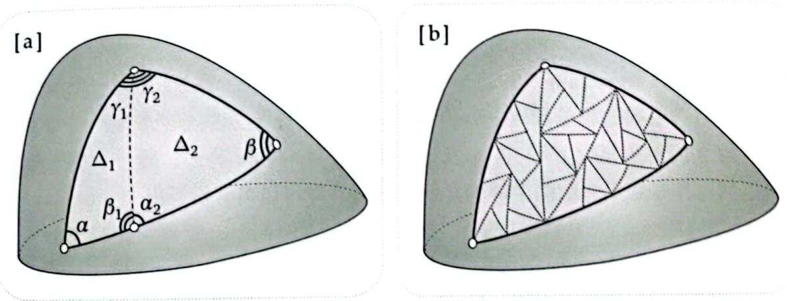  
图2-8[a]角盈具有可加性:  $\mathcal{E}(\Delta) = \mathcal{E}(\Delta_{1}) + \mathcal{E}(\Delta_{2})$  [b]继续分割,角盈仍然具有可加性:  $\mathcal{E}(\Delta) = \sum \mathcal{E}(\Delta_{i})$

这些分割后的子三角形可以再次分割,并且继续分割下去,如图2- 8b所示.于是,由角盈的可加性,得到  $\mathcal{E}(\Delta) = \sum \mathcal{E}(\Delta_{i})$  随着分割越来越细,每个小三角形  $\Delta_{i}$  内的曲率变化越来越小,趋于常值  $\kappa_{i}$  ,根据式(2.7),取极限得  $\mathcal{E}(\Delta) \asymp \sum \mathcal{K}_{i} \mathcal{A}_{i}$  根据积分的定义,就得到了局部高斯- 博内定理(2.6).

# 第3章 序幕和第一幕的习题

# 序幕:牛顿的最终相等  $(\times)$

1. (这是一个展示如何从序幕里定义的"最终相等"变为相等的模型。)画一个边长为  $x$  的立方体,其体积为  $V = x^{3}$ 。然后,保持这个立方体的一个顶点不变,将立方体画得稍大一些,使得边长为  $x + \delta x$ 。记这样引起的体积增量为  $\delta V$ ,用这个图推导:当  $\delta x$  趋于0时,

$$
\delta V \simeq 3x^{2}\delta x \quad \Longrightarrow \quad \frac{\mathrm{d}V}{\mathrm{d}x} \simeq \frac{\delta V}{\delta x} \simeq 3x^{2} \quad \Longrightarrow \quad \frac{\mathrm{d}V}{\mathrm{d}x} \simeq 3x^{2}.
$$

因为最后一个最终相等的式子两边的量都与  $\delta x$  无关,所以它们相等:

$$
(x^{3})^{\prime} = \frac{\mathrm{d}V}{\mathrm{d}x} = 3x^{2}.
$$

2. 此题来自Needham(1993).令  $c = \cos \theta$  ,  $s = \sin \theta$  ,在  $\mathbb{R}^{2}$  上画一个单位圆,在第一象限的单位圆周上画出点  $p = (c,s)$  让  $p$  点绕原点旋转一个(最终为0的)小角度  $\delta \theta$  ,以  $p$  点为顶点,以  $\delta c$  和  $\delta s$  为边,画一个小三角形.利用在序幕里介绍的牛顿的几何论证,立即可以同时推导出

$$
\frac{\mathrm{d}s}{\mathrm{d}\theta} = c \qquad \text{且} \qquad \frac{\mathrm{d}c}{\mathrm{d}\theta} = -s.
$$

3. 此题来自Needham(1993).在  $\mathbb{R}^{2}$  的第一象限上任取一点  $(a,b)$ ,令  $L$  是经过点  $(a,b)$  的直线,  $\mathcal{A}$  是  $x$  轴、  $y$  轴和  $L$  围成的三角形的面积.

(i)利用通常的微积分方法求出使得  $\mathcal{A}$  最小的  $L$  的位置,并证明  $\mathcal{A}_{\min} = 2ab$ .

(ii)利用牛顿的推理,在不计算的情况下,立即求出其解.[提示:让  $L$  旋转一个(最终为0的)小角度  $\delta \theta$ ,记旋转后改变的面积为  $\delta A$ ,将  $\delta A$  画成两个小三角形,可以看到这两个小三角形分别最终等于两个小扇形,用  $\delta \theta$  写出  $\delta A$  最终相等的表达式。再令  $\delta A = 0$ .]

4. 此题来自Arnol'd(1990,第28页),原题包含解答。计算极限

$$
\lim_{x \to 0} \frac{\sin\tan x - \tan\sin x}{\arcsin\arctan x - \arctan\arcsin x}.
$$

(i)利用你能想到的任何传统方法。(如果不提醒你这道题不容易,那就是

我们的过错了. 阿诺尔德曾说: 能很快解出这道题的数学家只有菲尔兹奖获得者格尔德·法尔廷斯①. )

(ii) 利用牛顿的几何推理.

# 欧几里得几何与非欧几何

5. 我们无法确定古巴比伦人是如何算出图1-2所示的毕达哥拉斯三元组的, 但我们知道: 在1500多年后 (公元前300年左右), 欧几里得是第一个叙述并证明生成这种三元组最一般公式的人; 在2000多年后 (公元250年左右), 丢番图②是第一个利用几何构作法生成单位圆上的全部有理点 (即坐标为有理数的点) 的人. 可以利用这些有理点构作毕达哥拉斯三元组, 如下所示.

(i)已知  $(-1,0)$  是单位圆周  $c$  上的一点,  $L$  是经过点  $(-1,0)$  的直线  $y =$ $m(x + 1)$  ,  $(X,Y)$  是  $L$  与  $c$  的另一个交点.证明:

$$
X = \frac{1 - m^{2}}{1 + m^{2}} \quad \text{且} \quad Y = \frac{2m}{1 + m^{2}}.
$$

(ii)证明:如果斜率  $m = (q / p)$  为有理数,则  $X$  和  $Y$  也是有理数,即

$$
X = \frac{p^{2} - q^{2}}{p^{2} + q^{2}} \quad \text{且} \quad Y = \frac{2pq}{p^{2} + q^{2}}.
$$

(iii)证明:如果  $(a,b,h)$  是毕达哥拉斯三元组,则存在整数  $p$  和  $q$  使得

$$
\frac{a}{h} = \frac{p^{2} - q^{2}}{p^{2} + q^{2}} \quad \text{且} \quad \frac{b}{h} = \frac{2pq}{p^{2} + q^{2}}.
$$

(iv)证明:对于任意整数  $p,q,r$  ,若

$$
a = (p^{2} - q^{2})r \quad \text{且} \quad b = 2pq \quad \text{且} \quad h = (p^{2} + q^{2})r,
$$

则  $(a,b,h)$  是毕达哥拉斯三元组. 这就是欧几里得最先得出的毕达哥拉斯三元组的最一般公式.

6. 利用式(1.3)证明: 当球面上的三角形面积收缩到0时, 球面上的居民认为它最终就是欧几里得几何的, 也就是内角和等于  $\pi$ .

7. 设  $p$  和  $q$  是球面上两个不同的点,并且不是对径点,于是有唯一的大圆  $c$  经过这两个点,并且被  $p$  和  $q$  分成两段弧,设  $m_{1}$  和  $m_{2}$  分别是这两段弧的中点,证明:与  $p$  和  $q$  等距的点的轨迹是经过  $m_{1}$  和  $m_{2}$  的大圆,并且与  $c$  垂直相交,这就是弧  $pq$  的广义"中垂线"(提示:想象通过旋转球面使得  $p$  和  $q$  位于赤道上,这在心理上有帮助,但在数学上无关紧要.)

8. 证明:如果单位球面  $\mathbf{S}^{2}$  上三角形每条边的长度都小于  $\pi$ ,则这个三角形包含在一个半球面里。(提示:想象通过旋转球面使得这个三角形的一个顶点位于北极点,这在心理上有帮助,但在数学上无关紧要.)

9. 欧几里得平面具有的特征之一是正则铺砌,即平面可以用正多边形密铺(无缝地铺满)平面有且只有三种正则铺砌,即正三角形、正方形和正六边形。球面也有正则铺砌。想象一个正二十面体的线框内接在一个半径为  $R$  的球面中。这时,再想象球心上有一个光源照射出来,于是线框在球面上留下阴影(称为"中心投影"),如图3-1所示。正二十面体由20个正三角形围成,用直线连接每个正三角形的中心与其三个顶点和三条边的中点,将正三角形进一步分割成6个全等三角形。这样就得到了一个内接于球面、由全等三角形的边组成的线框。

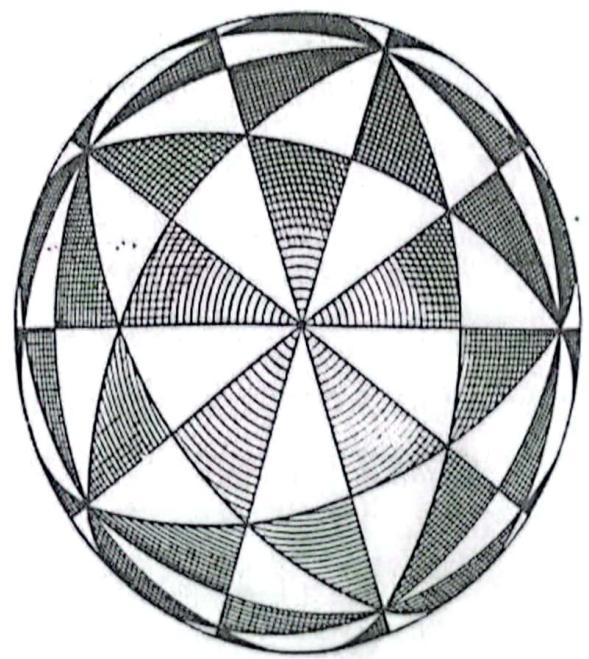  
图3-1 球面的正二十面体铺砌。正二十面体由20个正三角形围成,用直线连接每个正三角形的中心与其三个顶点和三条边的中点,将正三角形进一步分割成6个全等三角形[这张可爱的手绘图来自Fricke(1926)]

(i) 解释为什么正二十面体的棱在球面上的影子是大圆,从而生成了真正的球面三角形。

(ii) 假设在球面内接一个正十二面体. 正十二面体由 12 个正五边形围成, 用直线连接每个正五边形的中心与其五个顶点和五条边的中点, 将正五边形分割成 10 个全等三角形. 这样就得到了一个内接于球面、由全等三角形的边组成的线框. 验证这也是正则铺砌.

(iii) 这样, 整个 (面积为  $4\pi R^2$  的) 球面分成了几个全等三角形? 每个三角形的面积  $A$  是多少?

(iv) 通过观察, 确定每个顶点有几个角聚在一起. 证明三角形的内角分别是  $\pi /2, \pi /3, \pi /5$ . 由此计算每个三角形的角盈  $\epsilon$ .

(v) 证明以上两个答案与哈里奥特定理 (1.3) 是一致的.

10. (i) 证明: 在欧几里得几何里, 四边形的内角和为  $2\pi$ .

(ii) 如果  $Q$  是半径为  $R$  的球面上的测地线四边形, 则其角盈为

$$
\mathcal{E}(Q) = (Q \text{的内角和}) - 2\pi .
$$

画一条对角线将  $Q$  分割成两个测地线三角形, 证明式 (1.3) 可以推广为

$$
\mathcal{E}(Q) = \frac{1}{R^2} A(Q).
$$

(iii) 证明式 (2.2), 由此 (ii) 的结论可以推广到球面上的测地线  $n$  边形.

11. 利用第 15 页脚注 (1) 介绍的方法, 或者其他方法, 做些窄胶带, 最好用彩色美纹胶带. 然后利用方法 (1.7) 在如第 145 页图 11-7 所示花瓶表面实施以下实验. (如果你没有这样的花瓶, 建议你去借一个. 这个实验非常有趣, 不要错过了.)

(i) 在半径最大的水平圆上选取一点 (这个半径记为  $\rho_{\mathrm{max}}$ ), 从这一点出发, 向花瓶上部引出一条测地线, 这样就产生了旋转曲面上的一条经线.

(ii) 从同一点出发, 先选择一个较小的  $\psi$ , 沿着与经线夹角为  $\psi$  的方向引出一条测地线, 然后选择越来越大的  $\psi$ , 引出多条测地线.

(iii) 注意: 在开始时这条测地线向花瓶上方延伸, 当与经线的夹角  $\psi$  超过某个临界值  $\psi_c$  时, 测地线调转方向, 向花瓶下方延伸.

(iv) 尽你所能找到临界测地线 (将调转方向和不调转方向的测地线分开的那条测地线). 用量角器在起点处测量临界角  $\psi_c$ . 注意: 为了找到临界测地线, 可能需要画出超长的测地线段, 你可以用图 1- 9 中介绍的方法, 将已有的测地线一段一段地加长.

(v) 设  $\rho_{\mathrm{max}}$  是花瓶的最大半径 (测地线起点所在的水平圆, 即花瓶最粗处的半径),  $\rho_{\mathrm{min}}$  是花瓶的最小半径 (花瓶最细处的半径). 可以通过测量

直径除以 2 得到尽可能准确的半径值.  $①$  现在请验证(在实验的误差范围内)

$$
\psi_{c} = \arcsin [\rho_{\min} / \rho_{\max}].
$$

(这只是克莱罗定理的物理示例,我们将在11.7.4节证明这个定理.)

# 高斯曲率

12. 零曲率.利用第15页脚注  $①$  介绍的方法,或者其他方法,做些窄胶带,最好用彩色美纹胶带,然后利用方法(1.7)实施以下实验.

(i)将一张纸卷成一个圆锥面,用胶带粘一下,防止它展开,从圆锥面边缘上的一点开始,用准备好的窄胶带引出一条长的测地线,在开始粘胶带之前,先猜猜它会是什么形状的,然后,从边缘上的同一点开始,用窄胶带沿不同的方向引出一些新的测地线

(ii)接着,构作一个测地线三角形,并用量角器证实  $\epsilon = 0$  ,(对于圆锥面上所有的测地线三角形都是如此,从而证实  $\kappa = 0$  )

(iii)最后,沿一条母线将圆锥面剪开,将纸重新展平,观察圆锥面上的胶带展开在平面上的形状.

13. 正曲率.准备一个近似于球形的水果(例如西瓜),测量它的半径,记为  $R$  在选定为北极的点插一根牙签,找一根细绳,把一端系在固定的牙签上,然后拉紧细绳使之紧贴在球面上,并使得另一端位于北极到赤道约一半的位置上.测量这段长度,记为  $r$  ,这就是球面上这段测地线的长度.在自由端系一支笔,拉紧细绳,拖着笔画一条纬线,记纬线的长度为  $C(r)$  ,在刚画出的这条纬线上插16根牙签,将它16等分,再用一根细绳沿这些牙签组成的圆圈绕一圈,轻轻拉紧使之与纬线吻合.用笔小心标记细绳一圈的首尾两点.解开细绳,测量首尾两点之间的长度,这个长度就是  $C(r)$

(i)将最终相等公式(2.4)看作一个近似公式,算出  $\kappa$  ,从这个内蕴测量值算出水果的外在半径  $R$  ,与你实际测得的  $R$  比较.

(ii)继续(i),假设你测得的  $r$  和  $C(r)$  都是精确的.  $\kappa$  是(i)中利用式(2.4)算出来的值(即,没有使用最终相等隐含的极限),利用  $\sin (r / R)$  的(交

替递减的)泰勒展开式第3项计算的相对误差上界为

$$
\left|\frac{\Delta\mathcal{K}}{\mathcal{K}}\right|< 5\left[\frac{r}{R}\right]^{2}\% .
$$

证明:无论作多大的圆周,误差都不会大于  $3\%$ .

(iii)利用(ii)得到的结果,建立一个估计  $R$  的相对误差上界的公式.

14. 负曲率,利用第15页脚注  $①$  介绍的方法,或者其他方法,做些窄胶带,最好用彩色美纹胶带,然后利用方法(1.7)实施以下实验.

(i)按照第59页图5-3的相关说明,用半径为  $R$  的圆盘亲手做一个伪球面,锥越多越好、越大越好!

(ii)伪球面是由曳物线绕其渐近线旋转生成的,它的母线是曳物线,在底圆周上的一点,沿不同方向引出多条测地线,在曲面上粘胶带之前,先猜想一下这些测地线的走向,因为要在凹曲面上粘出较长的测地线,所以当一段胶带粘完后,就用新的胶带重叠一段接着粘下去,除了经线(即旋转面的母线,也是测地线)一直向上延伸外,其他方向的测地线在伪球面上都是先向上、再向下、最终回到底圆.

(iii)构作一个测地线直角三角形  $\Delta$ ,测量它的各个角,求出角盈  $\mathcal{E}(\Delta)$ . 尽你所能估算它的面积  $\mathcal{A}(\Delta)$ . 利用

$$
\kappa = \frac{\mathcal{E}(\Delta)}{\mathcal{A}(\Delta)}
$$

求出这个伪球面的常曲率  $\kappa$

(iv)三角形越大,角盈  $\mathcal{E}(\Delta)$  的绝对值就越大,测量起来就越容易、越准确.这样做的代价是准确测量面积  $\mathcal{A}(\Delta)$  越来越难,可以采用以下方法克服这个困难,准备一些同样宽度的窄胶带,宽度为  $W$  (例如6毫米),用这些胶带一条一条地刚好粘满三角形  $\Delta$ . 然后将胶带逐条取下来,首尾相接地铺在平坦表面上,测量其总长度  $L$ . 于是  $\mathcal{A}(\Delta) \simeq LW$ .

(v)重复(iii)的过程构作更多三角形,可以不是直角三角形,因为用(iv)的方法可以测量任意三角形的面积  $\mathcal{A}(\Delta)$ . 验证所有的三角形(在实验误差内)都具有相同的  $\kappa$ .

(vi)假设

$$
\kappa = -\frac{1}{R^{2}},
$$

计算  $R$ ,并与你用于构作伪球面的圆盘的实际半径比较.

$$
\begin{array}{r}\mathcal{L}_0 = \frac{1}{2} (1 - \frac{1}{2})(\frac{1}{2} -\frac{1}{2})(\frac{1}{2} -\frac{1}{2})(\frac{1}{2} -\frac{1}{2})(\frac{1}{2} -\frac{1}{2})(\frac{1}{2} -\frac{1}{2})(\frac{1}{2} -\frac{1}{2})(\frac{1}{2} -1)(\frac{1}{2} -1)(\frac{1}{2} -1)(\frac{1}{2} -1)(\frac{1}{2} -1)(\frac{1}{2} -1)(\frac{1}{2} -1)(\frac{1}{2} -1)(\frac{1}{3} -1)(\frac{1}{3} -1)(\frac{1}{3} -1)(\frac{1}{3} -1)(\frac{1}{3} -1)(\frac{1}{3} -1)(\frac{1}{3} -1)(\frac{1}{3} -1)((\frac{1}{3} -1)(\frac{1}{3} -1)(\frac{1}{3} -1)(\frac{1}{3} -1)(\frac{1}{3} -1)(\frac{1}{3} -1)(\frac{1}{3} -1)(\frac{1}{3}
$$