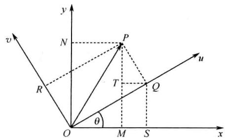
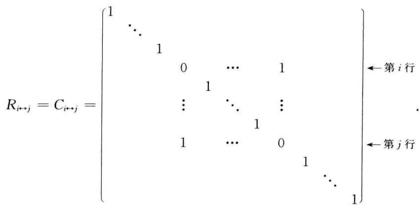
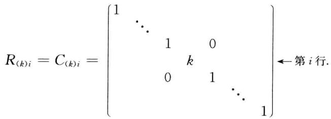
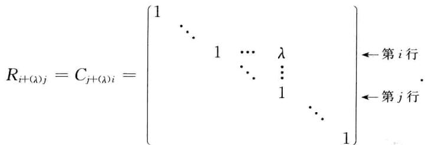

$$
\sum_{1\leqslant i< j\leqslant 5}a_{i j} = a_{12} + a_{13} + a_{14} + a_{15} + a_{23} + a_{24} + a_{25} + a_{34} + a_{35} + a_{45}.
$$

(3)设  $(j_{1},j_{2},\dots ,j_{n})$  为  $1,2,\dots ,n$  这  $n$  个数的任一全排列,则对所有的  $n$  阶排列  $(j_{1},j_{2},\dots ,j_{n})$  求元素  $a_{1j_{1}}a_{2j_{2}}\dots a_{n_{n}}$  的和可表示为

$$
\sum_{(j_{1},j_{2}\dots ,j_{n})}a_{1j_{1}}a_{2j_{2}}\dots a_{n_{n}}.
$$

例如,

$$
\sum_{(j_{1},j_{2},j_{3})}a_{1j_{1}}a_{2j_{2}}a_{3j_{3}} = a_{11}a_{22}a_{33} + a_{11}a_{23}a_{32} + a_{12}a_{21}a_{33} + a_{12}a_{23}a_{31} + a_{13}a_{21}a_{32} + a_{13}a_{22}a_{31}.
$$

# 习题一

# (一)

1. 用对角线展开法计算下列行列式:

(1)  $\left| \begin{array}{ll}6 & 9\\ 8 & 12 \end{array} \right|$  
(2)  $\left| \begin{array}{ll}\cos x & \sin x\\ -\sin x & \cos x \end{array} \right|;$  
(3)  $\left| \begin{array}{ll}x^{-1} & 1\\ x^{2} & x^{2} + x + 1 \end{array} \right|;$  
(4)  $\left| \begin{array}{lll}1 & 2 & 3\\ 3 & 1 & 2\\ 2 & 3 & 1 \end{array} \right|$  
(5)  $\left| \begin{array}{lll}a & b & c\\ b & c & a\\ c & a & b \end{array} \right|$  
(6)  $\left| \begin{array}{lll}x & 3 & 4\\ -1 & x & 0\\ 0 & x & 1 \end{array} \right|.$

2. 求下列各排列的逆序数,并确定排列的奇偶性

(1)1726354; 
(2)985467321; 
(3)  $(2n + 1)(2n - 1)\dots 531.$

3. 设  $n$  阶排列  $a_{1},a_{2},\dots ,a_{n}$  的逆序数为  $s$  ,求排列  $a_{n},a_{n - 1},\dots ,a_{1}$  的逆序数.

4. 选择  $i$  与  $k(1\leqslant i\leqslant 9,1\leqslant k\leqslant 9)$  ,使下列排列为偶排列:

(1)  $1274i56k9$  
(2)  $1i25k4897.$

5. 写出四阶行列式  $D = \mid a_{i j}\mid_{4}$  中所有含元素  $a_{23}$  并带负号的项

6. 用行列式的定义,计算下列行列式:

(1)  $\left| \begin{array}{lllll}5 & 0 & 0 & 0 & 0\\ 0 & 0 & 0 & 3 & 0\\ 0 & 0 & 2 & 0 & 0\\ 0 & 0 & 0 & 0 & 4\\ 0 & 1 & 0 & 0 & 0 \end{array} \right|;$  
(2)  $\left| \begin{array}{lllll}0 & 0 & 0 & 1 & 0\\ 0 & 0 & 2 & 7 & 0\\ 0 & 3 & 8 & 0 & 0\\ 4 & 9 & 12 & -5 & 0\\ 10 & 11 & 10 & 7 & -5 \end{array} \right|;$

(3)  $\left| \begin{array}{lllll}a_{11} & a_{12} & a_{13} & a_{14} & a_{15}\\ a_{21} & a_{22} & a_{23} & a_{24} & a_{25}\\ a_{31} & a_{32} & 0 & 0 & 0\\ a_{41} & a_{42} & 0 & 0 & 0\\ a_{51} & a_{52} & 0 & 0 & 0 \end{array} \right|;$  
(4)  $\left| \begin{array}{lllllll}1 & 0 & 0 & \dots & 0 & 0 & 0\\ 0 & 0 & 3 & \dots & 0 & 0 & 0\\ 0 & 0 & 0 & \dots & 0 & 0 & 0\\ \vdots & \vdots & \vdots & \vdots & \vdots & \vdots & \vdots \\ 0 & 0 & 0 & \dots & 0 & n - 1 & 0\\ 0 & 0 & 0 & \dots & 0 & 0 & n\\ 0 & 2 & 0 & \dots & 0 & 0 & 0 \end{array} \right|.$

7. 用行列式的性质计算下列行列式:

(1)  $\left| \begin{array}{ccc}x^{2} + 1 & y x & z x \\ x y & y^{2} + 1 & z y \\ x z & y z & z^{2} + 1 \end{array} \right|;$

(3)  $\left| \begin{array}{llll}1 & 2 & 3 & 4 \\ 2 & 3 & 4 & 1 \\ 3 & 4 & 1 & 2 \\ 4 & 1 & 2 & 3 \end{array} \right|;$

(5)  $\left| \begin{array}{llll}0 & 2 & 3 & 4 & 5 \\ 1 & 0 & 3 & 4 & 5 \\ 1 & 2 & 0 & 4 & 5 \\ 1 & 2 & 3 & 0 & 5 \\ 1 & 2 & 3 & 4 & 0 \end{array} \right|$ ;

8. 求解方程  $f(x) = 0$ ,其中

$$
f(x)={\left|\begin{array}{l l l l}{2}&{2}&{-1}&{3}\\ {4}&{x^{2}-5}&{-2}&{5}\\ {-3}&{2}&{-1}&{x^{2}+1}\\ {3}&{-2}&{1}&{-2}\end{array}\right|};\quad(2)~f(x)={\left|\begin{array}{l l l l}{1}&{x}&{x^{2}}&{x^{3}}\\ {1}&{1}&{1}&{1}\\ {1}&{-1}&{1}&{-1}\\ {1}&{2}&{4}&{8}\end{array}\right|}.
$$

9. 已知四阶行列式  $D$  的第三行元素为  $-1,2,0,1$ ,它们对应的代数余子式分别为  $5,3, - 7,4$ ,试求行列式  $D$ .

10. 已知四阶行列式  $D$  的第二列元素为  $-1,2,0,1$ ,它们对应的余子式分别为  $5,3, - 7,4$ ,试求行列式  $D$ .

11. 已知行列式  $D = \left| \begin{array}{cccc}3 & 1 & 0 & 4 \\ 0 & 2 & -1 & 1 \\ 1 & 1 & 2 & 1 \\ 3 & 5 & 2 & 7 \end{array} \right|$ , $M_{ij}, A_{ij}$  分别是  $D$  中元素  $a_{ij}$  的余子式和代数余子式.试求:

式.试求:

(1)  $4M_{42} + 2M_{43} + 2M_{44}$ ; 
(2)  $A_{41} + A_{42} + A_{43} + A_{44}$ .

12. 计算下列  $n$  阶行列式:

(1)  $\left| \begin{array}{cccc}1 & 2 & 2 & \dots & 2 \\ 2 & 2 & 2 & \dots & 2 \\ 2 & 2 & 3 & \dots & 2 \\ \vdots & \vdots & \vdots & & \vdots \\ 2 & 2 & 2 & \dots & n \end{array} \right|$ ; 
(2)  $\left| \begin{array}{cccc}1 & 1 & 1 & \dots & 1 \\ 1 & 2 & 0 & \dots & 0 \\ 1 & 0 & 3 & \dots & 0 \\ \vdots & \vdots & \vdots & & \vdots \\ 1 & 0 & 0 & \dots & n \end{array} \right|$ ; 
(3)  $\left| \begin{array}{cccc}1 + x & 2 & \dots & n - 1 & n \\ 1 & 2 + x & \dots & n - 1 & n \\ \vdots & \vdots & & \vdots & \vdots \\ 1 & 2 & \dots & (n - 1) + x & n \\ 1 & 2 & \dots & n - 1 & n + x \end{array} \right|$ ; 
(4)  $\left| \begin{array}{cccc}1 & 2 & \dots & n - 1 & n \\ 2 & 3 & \dots & n & 1 \\ \vdots & \vdots & & \vdots & \vdots \\ n - 1 & n & \dots & n - 3 & n - 2 \\ n & 1 & \dots & n - 2 & n - 1 \end{array} \right|$ ;

(5)  $\left| \begin{array}{cccccc}1 & 2 & 3 & \dots & n - 1 & n\\ 2 & 2 & 3 & \dots & n - 1 & n\\ 3 & 3 & 3 & \dots & n - 1 & n\\ \vdots & \vdots & \vdots & & \vdots & \vdots \\ n - 1 & n - 1 & n - 1 & \dots & n - 1 & n\\ n & n & n & \dots & n & n \end{array} \right|;$  
(6)  $\left| \begin{array}{cccccc}x & y & 0 & \dots & 0 & 0\\ 0 & x & y & \dots & 0 & 0\\ 0 & 0 & x & \dots & 0 & 0\\ \vdots & \vdots & \vdots & & \vdots & \vdots \\ 0 & 0 & 0 & \dots & x & y\\ y & 0 & 0 & \dots & 0 & x \end{array} \right|.$

13. 证明下列各等式:

(1)  $\left| \begin{array}{ccc}a_{1} + b_{1}x & a_{1}x + b_{1} & c_{1}\\ a_{2} + b_{2}x & a_{2}x + b_{2} & c_{2}\\ a_{3} + b_{3}x & a_{3}x + b_{3} & c_{3} \end{array} \right| = (1 - x^{2})\left| \begin{array}{ccc}a_{1} & b_{1} & c_{1}\\ a_{2} & b_{2} & c_{2}\\ a_{3} & b_{3} & c_{3} \end{array} \right|;$

(2)  $\left| \begin{array}{cccccc}a_{1} & -1 & 0 & \dots & 0 & 0\\ a_{2} & x & -1 & \dots & 0 & 0\\ a_{3} & 0 & x & \dots & 0 & 0\\ \vdots & \vdots & \vdots & & \vdots & \vdots \\ a_{n - 1} & 0 & 0 & \dots & x & -1\\ a_{n} & 0 & 0 & \dots & 0 & x \end{array} \right| = \sum_{i = 1}^{n}a_{i}x^{n - i};$

(3)  $\left| \begin{array}{cccccc}1 & 2\cos x & 1 & \dots & 0 & 0\\ 0 & 1 & 2\cos x & \dots & 0 & 0\\ \vdots & \vdots & \vdots & & \vdots & \vdots \\ 0 & 0 & 0 & \dots & 2\cos x & 1\\ 0 & 0 & 0 & \dots & 1 & 2\cos x \end{array} \right| = \cos nx;$

(4)  $\left| \begin{array}{cccccc}1 + a_{1} & 1 & \dots & 1 & 1\\ 1 & 1 + a_{2} & \dots & 1 & 1\\ \vdots & \vdots & & \vdots & \vdots \\ 1 & 1 & \dots & 1 + a_{n - 1} & 1\\ 1 & 1 & \dots & 1 & 1 + a_{n} \end{array} \right| = a_{1}a_{2}\dots a_{n}\left(1 + \sum_{i = 1}^{n}\frac{1}{a_{i}}\right),$

其中  $a_{i}\neq 0,i = 1,2,\dots ,n$

$$
\left| \begin{array}{c c c c c c}{a^{n}} & {(a + 1)^{n}} & {(a + 2)^{n}} & \dots & {(a + n)^{n}}\\ {a^{n - 1}} & {(a + 1)^{n - 1}} & {(a + 2)^{n - 1}} & \dots & {(a + n)^{n - 1}}\\ \vdots & \vdots & \vdots & \vdots & \vdots \\ a & a + 1 & a + 2 & \dots & a + n\\ 1 & 1 & 1 & \dots & 1 \end{array} \right| = (-1)^{n(n + 1)}2!3!\dots n!.
$$

14. 用克拉默定理判别下列线性方程组是否有唯一解,若有,则求其解

(1)  $\left\{ \begin{array}{l l}{x_{1} + 2x_{2} + 4x_{3} = 31,}\\ {5x_{1} + x_{2} + 2x_{3} = 29,}\\ {3x_{1} - x_{2} + x_{3} = 10;} \end{array} \right.$  
(2)  $\left\{ \begin{array}{l l}{a x_{1} + x_{2} + x_{3} = 1,}\\ {3x_{1} + a x_{2} + 3x_{3} = 1,}\\ {-3x_{1} + 3x_{2} + a x_{3} = 1;} \end{array} \right.$

$$
\begin{array}{r l}&{\left\{\begin{array}{l l}{2x_{1}+x_{2}-5x_{3}+x_{4}=8,}\\ {x_{1}-3x_{2}}&{-6x_{4}=9,}\\ {2x_{2}-x_{3}+2x_{4}=-5,}\\ {x_{1}+4x_{2}-7x_{3}+6x_{4}=0;}\end{array}\right.\quad(4)\left\{\begin{array}{l l}{3x_{1}+2x_{2}}&{=1,}\\ {x_{1}+3x_{2}+2x_{3}}&{=0,}\\ {x_{2}+3x_{3}+2x_{4}}&{=0,}\\ {x_{3}+3x_{4}+2x_{5}=0,}\\ {x_{4}+3x_{5}=0;}\end{array}\right.}\\ &{\left\{\begin{array}{l l}{x_{2}+x_{3}+x_{4}+x_{5}=1,}\\ {x_{1}}&{+x_{3}+x_{4}+x_{5}=2,}\\ {x_{1}+x_{2}}&{+x_{4}+x_{5}=3,}\\ {x_{1}+x_{2}+x_{3}}&{+x_{5}=4,}\\ {x_{1}+x_{2}+x_{3}+x_{4}}&{=5.}\end{array}\right.}\end{array}
$$

15. 已知下列齐次线性方程组有非零解,试求参数  $\lambda$  的值

$$
\begin{array}{r l} & {\left\{ \begin{array}{l l}{\lambda x_{1} + x_{2} + x_{3} = 0,}\\ {x_{1} + \lambda x_{2} - x_{3} = 0,}\\ {2x_{1} - x_{2} + x_{3} = 0;} \end{array} \right.\qquad (2)\left\{ \begin{array}{l l}{x_{1} - x_{2}} & {= \lambda x_{1},}\\ {-x_{1} + 2x_{2} - x_{3} = \lambda x_{2},}\\ {-x_{2} + x_{3} = \lambda x_{3};} \end{array} \right.}\\ & {\left\{ \begin{array}{l l}{(5 - \lambda)x_{1}} & {-4x_{2}} & {-7x_{3} = 0,}\\ {-6x_{1} + (7 - \lambda)x_{2}} & {+11x_{3} = 0,}\\ {6x_{1}} & {-6x_{2} - (10 + \lambda)x_{3} = 0.} \end{array} \right.} \end{array}
$$

16. 设  $a, b, c, d$  为不全为零的实数,证明以下齐次线性方程组只有零解:

$$
\left\{ \begin{array}{l}a x_{1} + b x_{2} + c x_{3} + d x_{4} = 0, \\ b x_{1} - a x_{2} + d x_{3} - c x_{4} = 0, \\ c x_{1} - d x_{2} - a x_{3} + b x_{4} = 0, \\ d x_{1} + c x_{2} - b x_{3} - a x_{4} = 0. \end{array} \right.
$$

17. 设  $P(x_{1}, y_{1})$  和  $Q(x_{2}, y_{2})$  是平面上两个不同的点,证明经过点  $P, Q$  的直线方程为

$$
\left| \begin{array}{ccc}1 & x & y \\ 1 & x_{1} & y_{1} \\ 1 & x_{2} & y_{2} \end{array} \right| = 0.
$$

18. 求三次多项式  $f(x)$ ,使得  $f(-1) = 0, f(1) = 4, f(2) = 3, f(3) = 16$

# (二)

19. 用拉普拉斯定理计算下列行列式:

(1)  $\left| \begin{array}{cccccc}2 & 1 & 4 & 3 & 5\\ 3 & 4 & 0 & 5 & 0\\ 3 & 4 & 5 & 2 & 1\\ 1 & 5 & 2 & 4 & 3\\ 4 & 6 & 0 & 7 & 0 \end{array} \right|;$  
(2)  $\left| \begin{array}{cccccc}1 & 1 & 1 & 0 & 0\\ 1 & 2 & 3 & 0 & 0\\ 0 & 1 & 1 & 1 & 1\\ 0 & x_{1} & x_{2} & x_{3} & x_{4}\\ 0 & x_{1}^{2} & x_{2}^{2} & x_{3}^{2} & x_{4}^{2} \end{array} \right|;$

$$
\left| \begin{array}{ccccccc}n & 0 & \dots & 0 & 0 & \dots & 0 & n + 2\\ 0 & n - 1 & \dots & 0 & 0 & \dots & n + 1 & 0\\ \vdots & \vdots & & \vdots & \vdots & & \vdots & \vdots \\ 0 & 0 & \dots & 1 & 3 & \dots & 0 & 0\\ 0 & 0 & \dots & 2 & 4 & \dots & 0 & 0\\ \vdots & \vdots & & \vdots & \vdots & & \vdots & \vdots \\ 0 & n & \dots & 0 & 0 & \dots & n + 2 & 0\\ n + 1 & 0 & \dots & 0 & 0 & \dots & 0 & n + 3 \end{array} \right|.
$$

20. 计算下列  $n$  阶行列式:

(1)  $\left| \begin{array}{ccccccc}7 & 5 & 0 & \dots & 0 & 0\\ 2 & 7 & 5 & \dots & 0 & 0\\ 0 & 2 & 7 & \dots & 0 & 0\\ \vdots & \vdots & \vdots & & \vdots & \vdots \\ 0 & 0 & 0 & \dots & 7 & 5\\ 0 & 0 & 0 & \dots & 2 & 7 \end{array} \right|;$  
(2)  $\left| \begin{array}{ccccccc}1 & 1 & 1 & \dots & 1\\ x_{1} & x_{2} & x_{3} & \dots & x_{n}\\ x_{1}^{2} & x_{2}^{2} & x_{3}^{2} & \dots & x_{n}^{2}\\ \vdots & \vdots & \vdots & & \vdots \\ x_{1}^{n - 2} & x_{2}^{n - 2} & x_{3}^{n - 2} & \dots & x_{n}^{n - 2}\\ x_{1}^{n} & x_{2}^{n} & x_{3}^{n} & \dots & x_{n}^{n} \end{array} \right|;$

(3)  $\left| \begin{array}{cccccc}a_{n} & x & x & \dots & x\\ y & a_{n - 1} & x & \dots & x\\ y & y & a_{n - 2} & \dots & x\\ \vdots & \vdots & \vdots & & \vdots \\ y & y & y & \dots & a_{1} \end{array} \right|,\quad x\neq y;$  
(4)  $\left| \begin{array}{cccccc}a_{1} + b_{1} & a_{2} + b_{1} & \dots & a_{n} + b_{1}\\ a_{1} + b_{2} & a_{2} + b_{2} & \dots & a_{n} + b_{2}\\ \vdots & \vdots & & \vdots \\ a_{1} + b_{n} & a_{2} + b_{n} & \dots & a_{n} + b_{n} \end{array} \right|.$

21. 证明下列等式:

$$
\left| \begin{array}{cccccc}x_{1} & a_{2} & a_{3} & \dots & a_{n}\\ a_{1} & x_{2} & a_{3} & \dots & a_{n}\\ a_{1} & a_{2} & x_{3} & \dots & a_{n}\\ \vdots & \vdots & \vdots & & \vdots \\ a_{1} & a_{2} & a_{3} & \dots & x_{n} \end{array} \right| = \left(1 + \sum_{i = 1}^{n}\frac{a_{i}}{x_{i} - a_{i}}\right)\prod_{i = 1}^{n}(x_{i} - a_{i}), \tag{1}
$$

其中  $x_{i}\neq a_{i},i = 1,2,\dots ,n$

$$
\left| \begin{array}{c}1 + x_{1}1 + x_{1}^{2}\dots 1 + x_{1}^{n}\\ 1 + x_{2}1 + x_{2}^{2}\dots 1 + x_{2}^{n}\\ \vdots \qquad \vdots \qquad \vdots \\ 1 + x_{n}1 + x_{n}^{2}\dots 1 + x_{n}^{n} \end{array} \right| = \left(2\prod_{i = 1}^{n}x_{i} - \prod_{i = 1}^{n}(x_{i} - 1)\right)\prod_{1\leqslant i\leqslant j\leqslant n + 1}(x_{j} - x_{i}); \tag{2}
$$

$$
\left| \begin{array}{c c c c c c c}{a_{1}^{n}} & {a_{1}^{n - 1}b_{1}} & {a_{1}^{n - 2}b_{1}^{2}} & \dots & {a_{1}b_{1}^{n - 1}} & {b_{1}^{n}}\\ {a_{2}^{n}} & {a_{2}^{n - 1}b_{2}} & {a_{2}^{n - 2}b_{2}^{2}} & \dots & {a_{2}b_{2}^{n - 1}} & {b_{2}^{n}}\\ {a_{3}^{n}} & {a_{3}^{n - 1}b_{3}} & {a_{3}^{n - 2}b_{3}^{2}} & \dots & {a_{3}b_{3}^{n - 1}} & {b_{3}^{n}}\\ \vdots & \vdots & \vdots & & \vdots & \vdots \\ {a_{n + 1}^{n}} & {a_{n + 1}^{n - 1}b_{n + 1}} & {a_{n + 1}^{n - 2}b_{n + 1}^{2}} & \dots & {a_{n + 1}b_{n + 1}^{n - 1}} & {b_{n + 1}^{n}} \end{array} \right| = \prod_{1\leqslant i\leqslant j\leqslant n + 1}(a_{i}b_{j} - a_{j}b_{i}). \tag{3}
$$

22. 用克拉默定理求解以下线性方程组:

$$
\left\{ \begin{array}{c c c}{{x_{1} + }} & {{x_{2} + \dots +}} & {{x_{n} = 1,}}\\ {{a_{1}x_{1} + }} & {{a_{2}x_{2} + \dots +}} & {{a_{n}x_{n} = b,}}\\ {{a_{1}^{2}x_{1} + }} & {{a_{2}^{2}x_{2} + \dots +}} & {{a_{n}^{2}x_{n} = b^{2},}}\\ {{\dots \dots}} & {{}} & {{}}\\ {{a_{1}^{n - 1}x_{1} + a_{2}^{n - 1}x_{2} + \dots +a_{n}^{n - 1}x_{n} = b^{n - 1},}} \end{array} \right.
$$

其中常数  $a_{i}, i = 1,2, \dots , n$  互不相同.

23. 设平面上三个不共线的点为  $P_{i}(x_{i}, y_{i}), i = 1,2,3$ , 且  $x_{1}, x_{2}, x_{3}$  互不相同. 证明: 过这三个点且对称轴与  $y$  轴平行的抛物线方程可表为

$$
\left| \begin{array}{ccc}x^{2} & x & 1 & y \\ x_{1}^{2} & x_{1} & 1 & y_{1} \\ x_{2}^{2} & x_{2} & 1 & y_{2} \\ x_{3}^{2} & x_{3} & 1 & y_{3} \end{array} \right| = 0.
$$

24. 已知平面上三条不同的直线的方程分别为

$$
\begin{array}{c}l_{1}: a x + 2 b y + 3 c = 0, \\ l_{2}: b x + 2 c y + 3 a = 0, \\ l_{3}: c x + 2 a y + 3 b = 0. \end{array}
$$

证明: 这三条直线交于一点的充分必要条件为  $a + b + c = 0$ .

# 第二章 矩阵

矩阵是线性代数的基本概念.它在线性代数与数学的许多分支中都有重要应用,许多实际问题可以用矩阵表达并用有关理论得到解决.

本章介绍矩阵的概念,矩阵的基本运算,可逆矩阵,矩阵的秩以及矩阵的初等变换,分块矩阵的概念及其运算.最后,利用矩阵的有关概念与方法讨论线性方程组的解法及有解的条件.

# 2.1 矩阵的概念

在初等数学中,可用代入消元法或加减消元法解线性方程组.我们将由此引入矩阵的概念.

例2.1 解线性方程组

$$
\left\{ \begin{array}{l l}{2x_{1} + 2x_{2} + 3x_{3} = 1,}\\ {x_{1} - x_{2} = 2,}\\ {-x_{1} + 2x_{2} + x_{3} = -2.} \end{array} \right. \tag{2.3}
$$

解 由消元法,我们按下述的步骤求解这个方程组

交换方程(2.2)与方程(2.1)在方程组中的位置,得

$$
\left\{ \begin{array}{l l}{x_{1} - x_{2}} & {= 2,}\\ {2x_{1} + 2x_{2} + 3x_{3} = 1,}\\ {-x_{1} + 2x_{2} + x_{3}} & {= -2,} \end{array} \right. \tag{2.2}
$$

将方程(2.2)两端同时乘以  $- 2$  加至方程(2.1)的两端(简述为方程(2.2)的  $- 2$  倍加至(2.1)),(2.2)的1倍加至(2.3),得

$$
\left\{ \begin{array}{l l}{x_{1} - x_{2}} & {= 2,}\\ {4x_{2} + 3x_{3} = -3,}\\ {x_{2} + x_{3}} & {= 0,} \end{array} \right. \tag{2.4}
$$

交换(2.4)与(2.5),得

$$
\left\{ \begin{array}{l l}{x_{1} - x_{2}} & {= 2,}\\ {x_{2} + x_{3}} & {= 0,}\\ {4x_{2} + 3x_{3} = -3.} \end{array} \right. \tag{2.5}
$$

(2.5)的一4倍加至(2.4),得

$$
\left\{ \begin{array}{c}x_{1} - x_{2} = 2, \\ x_{2} + x_{3} = 0, \\ -x_{3} = -3, \end{array} \right. \tag{2.2}
$$

(2.6)加至(2.5),得

$$
\left\{ \begin{array}{r l}x_{1} - x_{2} & = 2, \\ x_{3} & = -3, \\ -x_{3} & = -3, \end{array} \right. \tag{2.6}
$$

(2.7)加至(2.2),(2.6)两端乘以  $- 1$ ,得

$$
\left\{ \begin{array}{l l}{x_{1}} & {= -1,}\\ {\qquad x_{2}} & {= -3,}\\ {\qquad x_{3}} & {= 3.} \end{array} \right. \tag{2.8}
$$

可以看出,  $(2.7) \sim (2.9)$  给出了方程组  $(2.1) \sim (2.3)$  的解.

例2.1中所用的消元法的过程,实际上对方程组施行如下的操作或变换,称之为线性方程组的初等变换:

(1)交换某两个方程在方程组中的位置;

(2)一个方程的两端乘以一个不等于零的数;

(3)一个方程的两端乘以同一个数后加至另一个方程的两端

不难看出,例2.1中的线性方程组经初等变换后,所得方程组解的集合与原方程组解的集合相同.称解的集合相同的线性方程组为同解方程组.对方程组施行初等变换的目的是逐渐消去位于后面的方程中未知量的个数,如果最后一个方程只含一个未知量,则可从后面的方程开始逐个解出未知量.而对方程组施行初等变换的过程实际上是对方程组中未知量的系数与常数项所组成的一个三行、四列的数表的行施行同样的变换过程.将这个数表中的数放在括号内,称为矩阵,对上述方程组施行初等变换的过程可用矩阵的形式表述如下:

$$
\begin{array}{r l}&{\left(\begin{array}{l l l l}{2}&{2}&{3}&{1}\\ {1}&{-1}&{0}&{2}\\ {-1}&{2}&{1}&{-2}\end{array}\right)\xrightarrow{r_{1}\leftrightarrow r_{2}\mathbb{Q}}\left(\begin{array}{l l l l}{1}&{-1}&{0}&{2}\\ {2}&{2}&{3}&{1}\\ {-1}&{2}&{1}&{-2}\end{array}\right)}\\ &{\xrightarrow{r_{2}+(-2)r_{1}\leftrightarrow r_{2}}\left(\begin{array}{l l l l}{1}&{-1}&{0}&{2}\\ {0}&{4}&{3}&{-3}\\ {0}&{1}&{1}&{0}\end{array}\right)\xrightarrow{r_{2}\leftrightarrow r_{3}}\left(\begin{array}{l l l l}{1}&{-1}&{0}&{2}\\ {0}&{1}&{1}&{0}\\ {0}&{4}&{3}&{-3}\end{array}\right)}\end{array}
$$

$$
\begin{array}{r l}&{\xrightarrow{r_{3}+(-4)r_{2}\rightarrow r_{3}}\left[\begin{array}{l l l l}{1}&{-1}&{0}&{2}\\ {0}&{1}&{1}&{0}\\ {0}&{0}&{-1}&{-3}\end{array}\right]\xrightarrow{r_{2}+r_{3}\rightarrow r_{2}}\left[\begin{array}{l l l l}{1}&{-1}&{0}&{2}\\ {0}&{1}&{0}&{-3}\\ {0}&{0}&{-1}&{-3}\end{array}\right]}\\ &{\xrightarrow{r_{1}+r_{2}\rightarrow r_{1}}\left[\begin{array}{l l l l}{1}&{0}&{0}&{-1}\\ {0}&{1}&{0}&{-3}\\ {0}&{0}&{1}&{3}\end{array}\right]\mathbb{O}.}\end{array}
$$

定义2.1 由  $m \times n$  个数排成的  $m$  行  $n$  列的矩形数表

$$
\left[ \begin{array}{cccc}a_{11} & a_{12} & \dots & a_{1n} \\ a_{21} & a_{22} & \dots & a_{2n} \\ \vdots & \vdots & & \vdots \\ a_{m1} & a_{m2} & \dots & a_{mn} \end{array} \right] \tag{2.10}
$$

称为一个  $m \times n$  矩阵,其中  $a_{ij}$  表示位于数表中第  $i$  行第  $j$  列的数,  $i = 1,2,\dots ,m$ $j = 1,2,\dots ,n$  ,称为矩阵的元素.

数表外面用圆括号或方括号括起来,是矩阵的记号.(2.10)所表示的矩阵也可表示为

括号外面右下角的  $m \times n$  表示这个矩阵是  $m$  行  $n$  列的矩阵.如果不需要表示出矩阵的元素,通常用大写英文字母表示矩阵,如  $A,B,\dots$  元素都是实数的矩阵称为实矩阵.元素属于复数集合的矩阵称为复矩阵.例如

$$
\left( \begin{array}{ccc}1 & 3 & -1 & 0 \\ 0 & 1 & 2 & 1 \end{array} \right), \quad \left( \begin{array}{ccc}1 & 0 \\ 3 & 1 \\ -1 & 2 \\ 0 & 0 \end{array} \right)
$$

分别为  $2\times 4$  与  $4\times 2$  实矩阵,而

$$
\left( \begin{array}{cc}1 + \mathrm{i} & 2 \\ -3 & 1 - \mathrm{i} \\ 0 & \mathrm{i} \end{array} \right)
$$

为  $3\times 2$  复矩阵,其中  $\mathrm{i} = \sqrt{- 1}$  是虚数单位

下面介绍几种常用的特殊矩阵.

(1)行矩阵和列矩阵.

仅有一行的矩阵称为行矩阵(也称为行向量),如

$$
A = (a_{11} a_{12} \dots a_{1n}),
$$

也记为

$$
\pmb {\alpha} = (a_{11},a_{12},\dots ,a_{1n})^{\mathbb{O}}.
$$

仅有一列的矩阵称为列矩阵(也称为列向量),如

$$
\pmb {\alpha} = \left[ \begin{array}{c}a_{11} \\ a_{21} \\ \vdots \\ a_{m1} \end{array} \right].
$$

(2)零矩阵.若一个矩阵的所有元素都为零,则称这个矩阵为零矩阵.例如,一个  $m \times n$  的零矩阵为

$$
\left[ \begin{array}{cccc}0 & 0 & \dots & 0 \\ 0 & 0 & \dots & 0 \\ \vdots & \vdots & & \vdots \\ 0 & 0 & \dots & 0 \end{array} \right]_{m \times n},
$$

记为  $O_{m \times n}$ ,在不会引起混淆的情形下,也常记为  $O$  或 0.

(3)方阵.行数和列数相同的矩阵称为方阵.例如

$$
A = \left[ \begin{array}{cccc}a_{11} & a_{12} & \dots & a_{1n} \\ a_{21} & a_{22} & \dots & a_{2n} \\ \vdots & \vdots & & \vdots \\ a_{n1} & a_{n2} & \dots & a_{nn} \end{array} \right]
$$

为  $n \times n$  矩阵,常称为  $n$  阶方阵或  $n$  阶矩阵,简记为  $A = (a_{ij})_n$ .在  $n$  阶方阵  $A$  中,过元素  $a_{11}, a_{22}, \dots , a_{mn}$  的直线,称为方阵的主对角线.主对角线上的元素称为主对角元.

按方阵  $A$  的元素的排列方式所构造的行列式称为方阵的行列式,记为  $|A|$  或  $\operatorname *{det}A$ .

(4)对角矩阵.主对角元以外的元素全为零的方阵称为对角矩阵.常记为

$$
A = \left[ \begin{array}{cccc}a_{11} & & & \\ & a_{22} & & \\ & & \ddots & \\ & & & a_{mn} \end{array} \right],
$$

其中未标记出的元素全为零  $②$ ,即  $a_{ij} = 0, i \neq j, i, j = 1, 2, \dots , n$ ,简记为  $A = \operatorname {diag}(a_{11}, a_{22}, \dots , a_{mn})$ .例如

$$
\mathrm{diag}(3, - 1,0) = \left[ \begin{array}{ccc}3 & 0 & 0 \\ 0 & -1 & 0 \\ 0 & 0 & 0 \end{array} \right]
$$

为一个三阶对角矩阵.

(5)单位矩阵. 主对角元全为 1 的对角矩阵称为单位矩阵, 简记为  $E$  或  $I$ . 有时为了表明矩阵的阶数, 将阶数写在下标处. 如

$$
E_{n}=\left[\begin{array}{l l l l}{1}&{}&{}&{}\\ {}&{1}&{}&{}\\ {}&{}&{\ddots}&{}\\ {}&{}&{}&{1}\end{array}\right]_{n}
$$

表示  $n$  阶单位矩阵.

(6)数量矩阵. 主对角元全相等的对角矩阵称为数量矩阵. 例如

$$
\left[ \begin{array}{l l l l}{c} & & & \\ & {c} & & \\ & & \ddots & \\ & & & {c} \end{array} \right]_{n}\quad (\not\equiv\not\equiv\not\equiv\not\equiv\not\equiv\not\equiv\not\equiv\not\equiv\not\equiv\not\equiv\not\equiv\not\equiv\not\equiv\not\equiv\not\equiv\not\equiv\not\equiv\not\equiv\not\equiv\not\equiv\not\equiv\not\equiv\not\equiv\not\equiv\not\equiv\not\equiv
$$

为一个  $n$  阶数量矩阵.

(7)三角矩阵. 主对角线下(上)方的元素全为零的方阵称为上(下)三角矩阵. 例如

$$
\left[ \begin{array}{c c c c}{a_{11}} & {a_{12}} & \dots & {a_{1n}}\\ & {a_{22}} & \dots & {a_{2n}}\\ & & \ddots & \vdots \\ & & & {a_{m}} \end{array} \right]
$$

为  $n$  阶上三角矩阵, 即  $a_{i j} = 0, i > j, i, j = 1, 2, \dots , n$ ;

$$
\left[ \begin{array}{c c c c}{a_{11}} & & & \\ {a_{21}} & {a_{22}} & & \\ \vdots & \vdots & \ddots & \\ {a_{n1}} & {a_{n2}} & \dots & {a_{n n}} \end{array} \right]
$$

为  $n$  阶下三角矩阵, 即  $a_{i j} = 0, i < j, i, j = 1, 2, \dots , n$ .

(8)对称矩阵与反对称矩阵.在方阵  $A = (a_{i j})_{n}$  中,如果  $a_{i j} = a_{j i},i,j = 1$ $2,\dots ,n$  ,则称  $A$  为对称矩阵.如果  $A$  还是实矩阵,则称  $A$  为实对称矩阵.如果  $a_{i j} =$ $-a_{j i},i,j = 1,2,\dots ,n$  ,则称  $A$  为反对称矩阵.例如

$$
\left[ \begin{array}{ccc}1 & -1 & 0 \\ -1 & 2 & 2 \\ 0 & 2 & -3 \end{array} \right], \quad \left[ \begin{array}{ccc}0 & -1 & 2 \\ 1 & 0 & 3 \\ -2 & -3 & 0 \end{array} \right]
$$

分别是对称矩阵和反对称矩阵.

如果矩阵  $A = (a_{ij})_{m \times n}$  与  $B = (b_{ij})_{p \times q}$  满足  $m = p$  且  $n = q$ ，则称这两个矩阵为同类型矩阵.

定义2.2两个同类型矩阵  $A = (a_{ij})_{m \times n}$  与  $B = (b_{ij})_{m \times n}$ ，如果对应元素相等，即  $a_{ij} = b_{ij}, i = 1,2, \dots , m, j = 1,2, \dots , n$ ，则称矩阵  $A$  和矩阵  $B$  相等，记为  $A = B$

例如

$$
\left[ \begin{array}{rr}3 & -1 \\ 4 & 3 \\ -1 & 0 \end{array} \right] \quad \text{与} \quad \left[ \begin{array}{rr}a & b \\ c & d \\ e & f \end{array} \right]
$$

是同类型矩阵，只有当  $a = 3, b = - 1, c = 4, d = 3, e = - 1, f = 0$  时，它们才相等.

# 2.2 矩阵的运算

# 2.2.1 矩阵的加法

定义2.3设  $A = (a_{ij})_{m \times n}$  与  $B = (b_{ij})_{m \times n}$  是两个同类型矩阵，称  $m \times n$  矩阵  $C = (a_{ij} + b_{ij})_{m \times n}$  为矩阵  $A$  与矩阵  $B$  的和，记为  $A + B$

称矩阵

$$
\begin{array}{r}\left[ \begin{array}{cccc} - a_{11} & -a_{12} & \dots & -a_{1n}\\ -a_{21} & -a_{22} & \dots & -a_{2n}\\ \vdots & \vdots & & \vdots \\ -a_{m1} & -a_{m2} & \dots & -a_{mn} \end{array} \right] \end{array}
$$

为矩阵  $A = (a_{ij})_{m \times n}$  的负矩阵，记为  $- A$

矩阵  $A$  与矩阵  $B$  的差则定义为

$$
A - B = A + (-B).
$$

由定义不难验证，矩阵的加法满足下面的运算律：

命题2.1设  $A, B, C$  为同类型矩阵，则

(1)  $A + B = B + A$  （加法交换律）；

(2)  $(A + B) + C = A + (B + C)$  （加法结合律）；

(3)  $A + O = O + A = A$ ，其中  $O$  是与矩阵  $A$  同类型的零矩阵；

(4)  $A + (-A) = O.$

例2.2设

$$
A = \begin{pmatrix} 3 & 0 & 6 \\ 2 & -1 & 1 \end{pmatrix} , \quad B = \begin{pmatrix} -1 & 1 & 0 \\ 0 & -2 & 3 \end{pmatrix} ,
$$

求  $A + B$  与  $A - B$

解

$$
A+B={\binom{3+(-1)}{2+0}}\qquad(0+1\qquad6+0)={\binom{2}{2}}\qquad1\qquad6\big),
$$

$$
A-B={\binom{3-(-1)}{2-0}}\qquad(-1)-(-2)\quad1-3={\binom{4}{2}}\qquad1-2\big).
$$

# 2.2.2 数乘矩阵

定义2.4设  $A = (a_{ij})_{m \times n}, k$  是一个数,则称矩阵

$$
(k a_{ij})_{m \times n} = \left[ \begin{array}{cccc}k a_{11} & k a_{12} & \dots & k a_{1n} \\ k a_{21} & k a_{22} & \dots & k a_{2n} \\ \vdots & \vdots & & \vdots \\ k a_{m1} & k a_{m2} & \dots & k a_{mn} \end{array} \right]
$$

为数  $k$  与矩阵  $A$  的数量乘积,简称数乘,记为  $k A$

由定义可知,数  $k$  乘矩阵是用数  $k$  乘矩阵的每一个元素.要注意的是,在矩阵  $A$  为方阵时,数乘矩阵与数乘行列式(见1.2节性质3)的区别.另外,

$$
-A = (-1) A, \quad -(-A) = A.
$$

数乘运算有下面的运算律:

命题2.2设  $A, B$  为同类型矩阵,  $k, l$  为常数,则

(1)  $1 A = A$

(2)  $k(l A) = (k l) A$

(3)  $k(A + B) = k A + k B$

(4)  $(k + l) A = k A + l A$

例2.3设  $A = \left( \begin{array}{cc}3 & 0 \\ - 2 & 1 \end{array} \right), B = \left( \begin{array}{cc} - 2 & 1 \\ 2 & 2 \end{array} \right)$ ,且  $2 A - 3 X = B$ ,求矩阵  $X$

解在  $2 A - 3 X = B$  两端同加上  $(- 2 A)$ ,得

$$
-3 X = -2 A + B = (-2) \left( \begin{array}{cc}3 & 0 \\ -2 & 1 \end{array} \right) + \left( \begin{array}{cc} - 2 & 1 \\ 2 & 2 \end{array} \right) = \left( \begin{array}{cc} - 8 & 1 \\ 6 & 0 \end{array} \right).
$$

两端同乘以  $\left(- \frac{1}{3}\right)$ ,得

$$
X = \left( \begin{array}{cc}8 & -\frac{1}{3} \\ -2 & 0 \end{array} \right).
$$

对于含  $n$  个未知量,  $m$  个方程的线性方程组

$$
\left\{ \begin{array}{l}a_{11}x_{1} + a_{12}x_{2} + \dots +a_{1n}x_{n} = b_{1}, \\ a_{21}x_{1} + a_{22}x_{2} + \dots +a_{2n}x_{n} = b_{2}, \\ \qquad \dots \dots \dots \dots \\ a_{m1}x_{1} + a_{m2}x_{2} + \dots +a_{mn}x_{n} = b_{m}, \end{array} \right. \tag{2.11}
$$

令

$$
\pmb{\alpha}_{1} = \left[ \begin{array}{c}a_{11} \\ a_{21} \\ \vdots \\ a_{m1} \end{array} \right], \pmb{\alpha}_{2} = \left[ \begin{array}{c}a_{12} \\ a_{22} \\ \vdots \\ a_{m2} \end{array} \right], \dots , \pmb{\alpha}_{n} = \left[ \begin{array}{c}a_{1n} \\ a_{2n} \\ \vdots \\ a_{mn} \end{array} \right], \pmb{\beta} = \left[ \begin{array}{c}b_{1} \\ b_{2} \\ \vdots \\ b_{m} \end{array} \right], \tag{2.12}
$$

利用数乘与矩阵加法,线性方程组(2.11)可表示为

$$
x_{1}\pmb{\alpha}_{1} + x_{2}\pmb{\alpha}_{2} + \dots +x_{n}\pmb{\alpha}_{n} = \pmb {\beta}, \tag{2.13}
$$

称(2.13)式为线性方程组的向量表示法

# 2.2.3 矩阵的乘法

先看一个例子.

例2.4 设某地区有甲、乙、丙三个工厂,每个工厂都生产I,Ⅱ,Ⅲ,IV4种产品.已知每个工厂的年产量(单位:个)如下表所示:

<table><tr><td colspan="5">产品</td></tr><tr><td>工厂</td><td>I</td><td>II</td><td>III</td><td>IV</td></tr><tr><td>甲</td><td>20</td><td>30</td><td>10</td><td>45</td></tr><tr><td>乙</td><td>15</td><td>10</td><td>70</td><td>20</td></tr><tr><td>丙</td><td>20</td><td>15</td><td>35</td><td>25</td></tr></table>

已知每种产品的单价(元/个)和单位利润(元/个)如下表所示:

<table><tr><td>项目</td><td>单价</td><td>单位利润</td></tr><tr><td>产品</td><td></td><td></td></tr><tr><td>I</td><td>100</td><td>20</td></tr><tr><td>II</td><td>150</td><td>45</td></tr><tr><td>III</td><td>300</td><td>120</td></tr><tr><td>IV</td><td>200</td><td>60</td></tr></table>

求各工厂的总收入与总利润.

解 容易算出各工厂的总收入与总利润,也可以列表如下:

<table><tr><td>项 目</td><td>总收入</td><td>总利润</td></tr><tr><td>甲</td><td>18500</td><td>5650</td></tr><tr><td>乙</td><td>28000</td><td>10350</td></tr><tr><td>丙</td><td>19750</td><td>6775</td></tr></table>

例2.4的三个数表可以用三个矩阵表示,设

$$
A = \left[ \begin{array}{llll}20 & 30 & 10 & 45 \\ 15 & 10 & 70 & 20 \\ 20 & 15 & 35 & 25 \end{array} \right], \quad B = \left[ \begin{array}{ll}100 & 20 \\ 150 & 45 \\ 300 & 120 \\ 200 & 60 \end{array} \right], \quad C = \left[ \begin{array}{ll}18500 & 5650 \\ 28000 & 10350 \\ 19750 & 6775 \end{array} \right].
$$

显而易见,

矩阵  $A$  的列数  $=$  矩阵  $B$  的行数,

矩阵  $c$  的行数  $=$  矩阵  $A$  的行数,

矩阵  $c$  的列数  $=$  矩阵  $B$  的列数.

如果记

$$
A = (a_{ij})_{3 \times 4}, \quad B = (b_{ij})_{4 \times 2}, \quad C = (c_{ij})_{3 \times 2},
$$

则

$$
c_{ij} = a_{i1} b_{1j} + a_{i2} b_{2j} + a_{i3} b_{3j} + a_{i4} b_{4j}, \quad i = 1,2,3, \quad j = 1,2.
$$

我们把矩阵  $c$  称为矩阵  $A$  与矩阵  $B$  的乘积

定义2.5 设矩阵  $A = (a_{ij})_{m \times p}, B = (b_{ij})_{p \times n}, C = (c_{ij})_{m \times n}$ , 其中

$$
\begin{array}{l}{{c_{i j}=a_{i1}b_{1j}+a_{i2}b_{2j}+\cdots+a_{i p}b_{p j}}}\\ {{=\sum_{k=1}^{p}a_{i k}b_{k j},\quad i=1,2,\cdots,m,\quad j=1,2,\cdots,n.}}\end{array} \tag{2.14}
$$

称矩阵  $c$  为矩阵  $A$  与矩阵  $B$  的乘积,记作  $C = AB$

例2.5 设

$$
A = \left[ \begin{array}{ccc}3 & 0 & 4 \\ -1 & 5 & 2 \end{array} \right], \quad B = \left[ \begin{array}{cc}1 & 0 \\ 0 & -1 \\ 1 & 1 \end{array} \right].
$$

求  $AB$  与  $BA$

解

$$
A B={\left(\begin{array}{l l}{7}&{4}\\ {1}&{-3}\end{array}\right)},\quad B A={\left(\begin{array}{l l l}{3}&{0}&{4}\\ {1}&{-5}&{-2}\\ {2}&{5}&{6}\end{array}\right)}.
$$

例2.6 设

$$
A = \left[ \begin{array}{cccc}a_{11} & a_{12} & \dots & a_{1n} \\ a_{21} & a_{22} & \dots & a_{2n} \\ \vdots & \vdots & & \vdots \\ a_{m1} & a_{m2} & \dots & a_{mn} \end{array} \right], \quad x = \left[ \begin{array}{c}x_{1} \\ x_{2} \\ \vdots \\ x_{n} \end{array} \right].
$$

计算  $A x$

解

$$
A x = \left[ \begin{array}{c}a_{11} x_{1} + a_{12} x_{2} + \dots + a_{1n} x_{n} \\ a_{21} x_{1} + a_{22} x_{2} + \dots + a_{2n} x_{n} \\ \vdots \\ a_{m1} x_{1} + a_{m2} x_{2} + \dots + a_{mn} x_{n} \end{array} \right].
$$

如果令

$$
\pmb {\beta} = \left[ \begin{array}{c}b_{1} \\ b_{2} \\ \vdots \\ b_{m} \end{array} \right],
$$

则含  $n$  个未知量,  $m$  个方程的线性方程组

$$
\left\{ \begin{array}{l}a_{11} x_{1} + a_{12} x_{2} + \dots + a_{1n} x_{n} = b_{1}, \\ a_{21} x_{1} + a_{22} x_{2} + \dots + a_{2n} x_{n} = b_{2}, \\ \dots \dots \dots \dots \\ a_{m1} x_{1} + a_{m2} x_{2} + \dots + a_{mn} x_{n} = b_{m} \end{array} \right. \tag{2.11}
$$

可以用矩阵的形式表示为

$$
A x = \beta , \tag{2.15}
$$

称(2.15)式为线性方程组(2.11)的矩阵表示,

从矩阵乘积的定义可见,不是任何两个矩阵都可以相乘.位于左边的矩阵的列数与位于右边的矩阵的行数相等的两个矩阵才能相乘,其乘积矩阵是一个与左边矩阵有相同的行数、与右边矩阵有相同的列数的矩阵.它的元素由(2.14)确定,即乘积矩阵第  $i$  行第  $j$  列的元素等于左边矩阵第  $i$  行的各元素与右边矩阵第  $j$  列的对应元素乘积之和,所谓对应元素,即第  $i$  行列号与第  $j$  列行号相同的元素.这种关系可用下图表示:

$$
\begin{array}{r l}&{\left(\begin{array}{l l l l}{\ast}&{\ast}&{\cdots}&{\ast}\\ {\ast}&{\ast}&{\cdots}&{\ast}\\ {\vdots}&{\vdots}&&{\vdots}\\ {\vdots}&{\vdots}&&{\vdots}\\ {\vdots}&{\vdots}&&{\vdots}\\ {\vdots}&{\vdots}&&{\vdots}\\ {\ast}&{\ast}&{\cdots}&{\ast}\end{array}\right)\left(\begin{array}{l l l l}{\ast}&{\ast}&{\cdots}&{\ast}\\ {\ast}&{\cdots}&{\vdots}&{\cdots}&{\ast}\\ {\ast}&{\cdots}&{\vdots}&{\cdots}&{\ast}\\ {\vdots}&&{\vdots}&&{\vdots}\\ {\ast}&{\cdots}&{\vdots}&{\cdots}&{\ast}\end{array}\right)=\left(\begin{array}{l l l l}{\ast}&&\\ {\ast}&&\\ {\vdots}&&\\ {\ast}&{\cdots}&{\vdots}&{\cdots}&{\ast}\\ {\vdots}&&{\vdots}&&\\ {\ast}&&{\vdots}&&\\ {\ast}&&{\vdots}&&{\vdots}\\ {\ast}&&{\vdots}&&{\vdots}\end{array}\right),}\end{array}
$$

其中,  $c_{ij} = a_{i1} b_{1j} + a_{i2} b_{2j} + \dots + a_{ip} b_{pj}$ .

需要注意的是:

(1)矩阵的乘法不满足交换律

$AB$  有定义,  $BA$  不一定有定义.如例2.4中,  $AB$  有定义,  $BA$  就没有定义.即使  $AB$  与  $BA$  都有定义,它们也不一定相等.如例2.5中  $AB$  与  $BA$  虽然都有定义,但它们不是同类型矩阵,因而也不可能相等.再如,设

$$
A={\binom{2}{-1}}\quad0),\quad B={\binom{-1}{2}}\quad0),
$$

则

$$
AB={\binom{0}{1}}\quad0),\quad BA={\binom{-2}{3}}\quad-1).
$$

虽然  $AB$  与  $BA$  是同类型矩阵,但  $AB \neq BA$ .所以,在作矩阵乘法时,应指明它们相乘的次序.常将  $AB$  读作"A左乘  $B$  "或"B右乘  $A$  ".如果  $AB = BA$ ,则称矩阵  $A$  与矩阵  $B$  可交换.易见,单位矩阵与任何同阶方阵可交换;数量矩阵与任何同阶方阵可交换.

(2)两个非零矩阵的乘积可能是零矩阵.例如

$$
A={\binom{1}{2}}\quad1)\neq O,\quad B={\binom{1}{-1}}\quad-1)\neq O,
$$

但  $AB = \begin{pmatrix} 0 & 0 \\ 0 & 0 \end{pmatrix}$

(3)矩阵的乘法不满足消去律,即如果  $AB = CB, B \neq O$ ,不一定能推出  $A = C$ .例如

$$
A={\binom{1}{2}}\quad-1),\quad B={\binom{-1}{1}}\quad1),\quad C={\binom{2}{4}}\quad0),
$$

$$
AB = CB = \begin{pmatrix} -2 & 2 \\ 1 & -1 \end{pmatrix}, \quad B \neq O, \quad \text{但} A \neq C.
$$

(1)~(3)说明,两矩阵相乘与两数相乘有不同的运算律,初学者要特别注意.

关于矩阵的乘法运算,有下面的运算性质:

命题2.3 (1)设  $A$  为  $m\times p$  矩阵,则

$$
O_{k\times m}A = O_{k\times p},\quad A O_{p\times n} = O_{m\times n}.
$$

(2)设  $A$  为  $m\times p$  矩阵,则

$$
E_{m}A = A,\quad A E_{p} = A,
$$

其中  $E_{m}$  与  $E_{p}$  分别为  $m$  阶与  $p$  阶单位矩阵

(3)设  $A$  为  $m\times p$  矩阵,  $B$  为  $p\times q$  矩阵,  $c$  为  $q\times n$  矩阵,  $k$  为数,则

$$
A(B C) = (A B)C,\qquad (k A)B = A(k B) = k(A B).
$$

(4)设  $A$  为  $m\times p$  矩阵,  $B_{1},C_{1}$  都为  $p\times n$  矩阵,  $B_{2},C_{2}$  都为  $q\times m$  矩阵,则

$A(B_{1} + C_{1}) = (A B_{1}) + (A C_{1})$  ,记为  $A B_{1} + A C_{1}$

(5)设  $A,B$  是两个  $n$  阶矩阵,记  $A B = C = (c_{i j})_{n}$  ,则

$$
\mid C\mid = \mid A\mid \mid B\mid .
$$

证这里只证明(3)中的第一式,(5)的证明见1.4.2节行列式的乘积公式,其余的留给读者.

由矩阵乘法的定义不难得出  $A(B C)$  与  $(A B)C$  都是  $m\times n$  矩阵.  $A(B C)$  第  $i$  行,第  $j$  列的元素为

$$
\sum_{s = 1}^{p}a_{i s}\big(\sum_{t = 1}^{s}b_{s t}c_{t j}\big) = \sum_{t = 1}^{s + 1}\big(\sum_{s = 1}^{s + 1}a_{i s}b_{s t}\big)c_{t j},\quad i = 1,2,\dots ,m,\quad j = 1,2,\dots ,n,
$$

而  $\sum_{t = 1}^{q}\big(\sum_{s = 1}^{p}a_{i s}b_{s t}\big)c_{t j}$  即为  $(A B)C$  第  $i$  行,第  $j$  列的元素.

# 2.2.4 方阵的幂

如果  $A$  是  $n$  阶矩阵,那么,  $A A$  有定义,  $A A\dots A$  也有意义,因此有下述定义.

定义2.6设  $A$  是  $n$  阶矩阵,  $m$  是正整数,  $m$  个  $A$  相乘称为  $A$  的  $m$  次幂,记为 $A^{m}$  ,即

$$
A^{m} = \underbrace{A A\cdots A}_{m\uparrow A}.
$$

规定,

$$
A^{0} = E_{n}.
$$

关于方阵的幂运算,有下列规律

命题2.4 (1)设  $A$  为方阵,  $k,l$  为非负整数,则

$$
A^{k}A^{l} = A^{k + l},\quad (A^{k})^{l} = A^{k l}.
$$

(2)设  $A$  为  $n$  阶矩阵,  $m$  是非负整数,  $k$  是数,则

$$
\mid A^{m}\mid = \mid A\mid^{m},\quad \mid k A\mid = k^{n}\mid A\mid .
$$

例如,  $A = \left( \begin{array}{cc}1 & 2 \\ 1 & 0 \end{array} \right), k = 3$ , 则  $3A = \left( \begin{array}{cc}3 & 6 \\ 3 & 0 \end{array} \right), \left|3A\right| = 3^{2}\left|A\right| = - 18$ .

如果

$$
f(x) = a_{0}x^{m} + a_{1}x^{m - 1} + \dots +a_{m - 1}x + a_{m}
$$

是  $x$  的  $m$  次多项式,  $A$  是方阵,  $E$  为与  $A$  同阶的单位矩阵, 则称

$$
a_{0}A^{m} + a_{1}A^{m - 1} + \dots +a_{m - 1}A + a_{m}E
$$

为由多项式  $f(x) = a_{0}x^{m} + a_{1}x^{m - 1} + \dots +a_{m - 1}x + a_{m}$  生成的矩阵  $A$  的多项式, 记为  $f(A)$ .

由于矩阵的乘法不满足交换律, 故  $(AB)^{k}$  一般不等于  $A^{k}B^{k}$ .

例2.7 设  $A = \left( \begin{array}{ccc}1 & - 1 & 2 \\ - 2 & 2 & - 4 \\ 1 & - 1 & 2 \end{array} \right)$ , 求  $A^{n}$ .

解法一 数学归纳法

$$
A^{2}=\left(\begin{array}{c c c}{{1}}&{{-1}}&{{2}}\\ {{-2}}&{{2}}&{{-4}}\\ {{1}}&{{-1}}&{{2}}\end{array}\right)\left(\begin{array}{c c c}{{1}}&{{-1}}&{{2}}\\ {{-2}}&{{2}}&{{-4}}\\ {{1}}&{{-1}}&{{2}}\end{array}\right)=\left(\begin{array}{c c c}{{5}}&{{-5}}&{{10}}\\ {{-10}}&{{10}}&{{-20}}\\ {{5}}&{{-5}}&{{10}}\end{array}\right)=5A,
$$

$$
A^{3} = A^{2}\cdot A = 5A\cdot A = 5A^{2} = 5^{2}A.
$$

归纳地可得

$$
A^{n} = 5^{n - 1}A = \left(-2\bullet 5^{n - 1}2\bullet 5^{n - 1} - 4\bullet 5^{n - 1}\right).
$$

解法二 注意到  $A = \left( \begin{array}{ccc}1 & - 1 & 2 \\ - 2 & 2 & - 4 \\ 1 & - 1 & 2 \end{array} \right) = \left( \begin{array}{c}1 \\ - 2 \\ 1 \end{array} \right)(1 - 12)$ , 故

$$
A^{n}=\left(\begin{array}{c}{{1}}\\ {{-2}}\\ {{1}}\end{array}\right)(1\quad-1\quad2)\left(\begin{array}{c}{{1}}\\ {{-2}}\\ {{1}}\end{array}\right)(1\quad-1\quad2)\cdots\left(\begin{array}{c}{{1}}\\ {{-2}}\\ {{1}}\end{array}\right)(1\quad-1\quad2).
$$

而  $(1 - 12)\left( \begin{array}{c}1 \\ - 2 \\ 1 \end{array} \right) = (5)$ , 因此

$$
A^{n}=\left(\begin{array}{c}{{1}}\\ {{-2}}\\ {{1}}\end{array}\right)5^{n-1}(1\quad-1\quad2)=5^{n-1}A.
$$

例2.8 设

$$
A = \left[ \begin{array}{ccc}\lambda & 1 & \\ & \lambda & 1 \\ & & \lambda \end{array} \right],
$$

计算  $A^{2}, A^{3}, A^{n}(n > 3)$ .

解矩阵  $A$  可表示为

$$
A = \lambda E + B,
$$

其中  $E$  为三阶单位矩阵,  $B = \left[ \begin{array}{ccc}0 & 1 & 0 \\ 0 & 0 & 1 \\ 0 & 0 & 0 \end{array} \right]$ . 由于  $\lambda E$  为数量矩阵, 它与方阵  $B$  可交换, 因而

$$
A^{n} = (\lambda E + B)^{n} = \lambda^{n}E + n\lambda^{n - 1}B + \frac{n(n - 1)}{2!}\lambda^{n - 2}B^{2} + \dots +B^{n},
$$

注意到,  $B^{2} = \left[ \begin{array}{ccc}0 & 0 & 1 \\ 0 & 0 & 0 \\ 0 & 0 & 0 \end{array} \right], B^{3} = B^{4} = \dots = B^{n} = O(n\geqslant 3)$ , 因而

$$
A^{n} = (\lambda E + B)^{n} = \lambda^{n}E + n\lambda^{n - 1}B + \frac{n(n - 1)}{2!}\lambda^{n - 2}B^{2}
$$

$$
\begin{array}{r l}{= \left[ \begin{array}{c c c}{\lambda^{n}} & {n\lambda^{n - 1}} & {\frac{n(n - 1)}{2!}\lambda^{n - 2}}\\ {0} & {\lambda^{n}} & {n\lambda^{n - 1}}\\ {0} & 0 & {\lambda^{n}} \end{array} \right],} & {n\geqslant 2.} \end{array}
$$

本例也可直接作乘法得

$$
A^{2}=\left[\begin{array}{c c c}{{\lambda^{2}}}&{{2\lambda}}&{{1}}\\ {{}}&{{\lambda^{2}}}&{{2\lambda}}\\ {{}}&{{}}&{{\lambda^{2}}}\end{array}\right],\quad A^{3}=\left[\begin{array}{c c c}{{\lambda^{3}}}&{{3\lambda^{2}}}&{{3\lambda}}\\ {{}}&{{\lambda^{3}}}&{{3\lambda^{2}}}\\ {{}}&{{}}&{{\lambda^{3}}}\end{array}\right],
$$

然后用数学归纳法求出  $A^{n}$  表达式

# 2.2.5 矩阵的转置

定义2.7 称  $n\times m$  矩阵

$$
\left[ \begin{array}{cccc}a_{11} & a_{21} & \dots & a_{m1} \\ a_{12} & a_{22} & \dots & a_{m2} \\ \vdots & \vdots & & \vdots \\ a_{1n} & a_{2n} & \dots & a_{mn} \end{array} \right]
$$

为矩阵  $A = (a_{ij})_{m\times n}$  的转置矩阵, 记为  $A^{\mathrm{T}}$  或  $A^{\prime}$ .

例如,

$$
\left( \begin{array}{ccc}1 & 0 & 3 \\ 2 & 1 & -1 \end{array} \right)^{\mathrm{T}} = \left( \begin{array}{cc}1 & 2 \\ 0 & 1 \\ 3 & -1 \end{array} \right).
$$

矩阵的转置运算有下面的运算规律:

命题2.5 设  $A, B, C, A_{1}, A_{2}, \dots , A_{s}$  是矩阵, 且它们的行数与列数使相应的运算有定义,  $k$  是数, 则

(1)  $(A^{\mathrm{T}})^{\mathrm{T}} = A$

(2)  $(B + C)^{\mathrm{T}} = B^{\mathrm{T}} + C^{\mathrm{T}}$

(3)  $(kA)^{\mathrm{T}} = kA^{\mathrm{T}}$

(4)  $(AB)^{\mathrm{T}} = B^{\mathrm{T}}A^{\mathrm{T}}; (A_{1}A_{2}\dots A_{s})^{\mathrm{T}} = A_{s}^{\mathrm{T}}\dots A_{2}^{\mathrm{T}}A_{1}^{\mathrm{T}}$

(5) 若  $A$  为  $n$  阶矩阵, 则  $(A^{m})^{\mathrm{T}} = (A^{\mathrm{T}})^{m}, m$  为正整数;

(6)  $A$  为对称矩阵的充分必要条件是  $A^{\mathrm{T}} = A; A$  为反对称矩阵的充分必要条件是  $A^{\mathrm{T}} = -A$

证 我们只证明(4)的第一式, 其他的证明留给读者. 设

$$
A = (a_{ij})_{m\times p},\quad B = (b_{ij})_{p\times n},
$$

$$
AB = (c_{ij})_{m\times n},\quad (AB)^{\mathrm{T}} = (d_{st})_{n\times m},\quad B^{\mathrm{T}}A^{\mathrm{T}} = (e_{st})_{n\times m}.
$$

则

$$
d_{st} = c_{ts} = \sum_{k = 1}^{p}a_{tk}b_{ks},
$$

$$
e_{st} = \sum_{k = 1}^{p}b_{ks}a_{tk} = \sum_{k = 1}^{p}a_{tk}b_{ks} = d_{st},\quad s = 1,2,\dots ,n,\quad t = 1,2,\dots ,m.
$$

例2.9 设  $A$  为  $n\times 1$  矩阵, 且  $A^{\mathrm{T}}A = 1, E_{n}$  为  $n$  阶单位矩阵,  $B = E_{n} - 2AA^{\mathrm{T}}$  证明:  $B$  为对称矩阵, 且  $B^{2} = E_{n}$

证 由于

$$
\begin{array}{c}B^{\mathrm{T}} = (E_{n} - 2AA^{\mathrm{T}})^{\mathrm{T}} = E_{n} - (2AA^{\mathrm{T}})^{\mathrm{T}} \\ = E_{n} - 2(A^{\mathrm{T}})^{\mathrm{T}}A^{\mathrm{T}} = E_{n} - 2AA^{\mathrm{T}} = B, \end{array}
$$

因而矩阵  $B$  为对称矩阵. 又

$$
\begin{array}{r l} & {B^{2} = (E_{n} - 2A A^{\mathrm{T}})(E_{n} - 2A A^{\mathrm{T}})}\\ & {\quad = E_{n} - 2A A^{\mathrm{T}} - 2A A^{\mathrm{T}} + 4A A^{\mathrm{T}}A A^{\mathrm{T}}}\\ & {\quad = E_{n} - 2A A^{\mathrm{T}} - 2A A^{\mathrm{T}} + 4A(A^{\mathrm{T}}A)A^{\mathrm{T}} = E_{n}.} \end{array}
$$

# 2.2.6 矩阵的共轭

定义2.8 设  $A = (a_{ij})_{m\times n}$ , 其中  $a_{ij}$  为复数, 则称矩阵  $\overline{A} = (\overline{a_{ij}})$  为矩阵  $A$  的共轭矩阵, 其中  $\overline{a_{ij}}$  表示  $a_{ij}$  的共轭复数.

命题2.6 若  $A = (a_{ij})_{m\times n}, B = (b_{ij})_{m\times n}$  都为复矩阵,  $k$  为复数, 则

(1)  $\overline{A + B} = \overline{A} +\overline{B}$ ;

(2)  $\overline{k\overline{A}} = \overline{k}\cdot \overline{A}$ ;

(3)若  $A = (a_{ij})_{n\times p},B = (b_{ij})_{p\times n}$ ,则  $\overline{AB} = \overline{A}\cdot \overline{B}$

# 2.3 可逆矩阵

# 2.3.1 逆矩阵的概念

在平面直角坐标系  $xOy$  中,将两个坐标轴同时绕原点旋转  $\theta$  角(逆时针为正,顺时针为负),就得到一个新的直角坐标系,将这个新的直角坐标系记为  $uOv$  (图2.1).平面上任何一点  $P$  在两个坐标系中的坐标分别记为  $(x,y)$  与  $(u,v)$

  
图2.1

由图2.1,不难推得

$$
\left\{ \begin{array}{l}x = OM = OS - TQ = u\cos \theta -v\sin \theta , \\ y = ON = SQ + TP = u\sin \theta +v\cos \theta . \end{array} \right.
$$

利用矩阵乘法可将上述关系表示为

$$
\binom{x}{y}=\binom{\cos\theta}{\sin\theta}\binom{-\sin\theta}{\cos\theta}\binom{u}{v}. \tag{2.16}
$$

将  $uOv$  坐标系绕原点旋转  $- \theta$ ,就又回到  $xOy$  坐标系.因此有

$$
\binom{u}{v}=\binom{\cos(-\theta)}{\sin(-\theta)}\binom{-\sin(-\theta)}{\cos(-\theta)}\binom{x}{y}, \tag{2.17}
$$

将(2.16)式代入(2.17)式得

$$
\binom{u}{v}=\binom{\cos\theta}{-\sin\theta}\binom{\sin\theta}{\cos\theta}\binom{\cos\theta}{\sin\theta}\binom{-\sin\theta}{\cos\theta}\binom{u}{v}=\binom{u}{v}, \tag{2.18}
$$

若记  $A = \binom{\cos\theta}{\sin\theta}\binom{- \sin\theta}{\cos\theta},B = \binom{\cos\theta}{- \sin\theta}\binom{\sin\theta}{\cos\theta}$ ,则不难验证矩阵  $A,B$  有如下性质:

$$
AB = BA = E.
$$

由此引入可逆矩阵的概念。

定义2.9 设  $A$  是  $n$  阶矩阵, 若存在  $n$  阶矩阵  $B$ , 使得

$$
A B = B A = E, \tag{2.19}
$$

则称矩阵  $A$  可逆,  $B$  是  $A$  的逆矩阵, 记作  $B = A^{- 1}$

如果不存在满足(2.19)的矩阵  $B$ , 则称矩阵  $A$  是不可逆的

矩阵  $A$  满足什么条件时可逆? 如果  $A$  可逆, 逆矩阵是否唯一, 如何求出  $A$  的逆矩阵? 可逆的矩阵有什么性质? 这是本节要讨论的问题.

# 2.3.2 矩阵可逆的充要条件

当  $A$  为一阶矩阵时, 它是一个数, 记为  $A = a$ . 由定义可知, 如果  $A$  可逆, 就是存在一个数  $b$ , 使得  $ab = 1$ . 所以, 问题变为数  $a$  的倒数是否存在的问题. 显然, 只要  $a \neq 0$  其倒数就存在且唯一. 下面的讨论假设  $n \geq 2$

定理2.1 如果  $n$  阶矩阵  $A$  可逆, 则它的逆矩阵是唯一的

证 设矩阵  $B$  与  $C$  都是  $A$  的逆矩阵, 则有

$$
A B = B A = E, \quad A C = C A = E,
$$

因而

$$
B = B E = B(A C) = (B A)C = E C = C.
$$

为了讨论矩阵可逆的充要条件, 先引入伴随矩阵的概念

定义2.10 设  $A = (a_{ij})_n$  为  $n$  阶矩阵,  $A_{ij}$  为  $|A|$  中元素  $a_{ij}$  的代数余子式,  $i, j = 1, 2, \dots , n$ , 则称矩阵

$$
\left[ \begin{array}{cccc}A_{11} & A_{21} & \dots & A_{n1} \\ A_{12} & A_{22} & \dots & A_{n2} \\ \vdots & \vdots & & \vdots \\ A_{1n} & A_{2n} & \dots & A_{nn} \end{array} \right] \tag{2.20}
$$

为  $A$  的伴随矩阵, 记为  $A^*$

由伴随矩阵的定义, 不难验证

$$
A A^{*} = A^{*}A = |A|E. \tag{2.21}
$$

由此, 可得下面的定理

定理2.2  $n$  阶矩阵  $A$  可逆的充分必要条件为  $|A| \neq 0$ . 如果  $A$  可逆, 则

$$
A^{-1} = \frac{1}{|A|} A^*. \tag{2.22}
$$

证 必要性 若  $A$  可逆, 则  $A A^{- 1} = A^{- 1} A = E$ , 两边取行列式, 得  $|A| |A^{- 1}| = 1$ , 因而  $|A| \neq 0$

充分性 若  $|A| \neq 0$ , 由(2.21)式

$$
A\left(\frac{1}{|A|} A^*\right) = \left(\frac{1}{|A|} A^*\right) A = E.
$$

依逆矩阵的唯一性, 可知  $A$  可逆, 且

$$
A^{-1} = \frac{1}{\mid A\mid} A^{*}.
$$

若  $n$  阶矩阵  $A$  的行列式不为零, 即  $|A| \neq 0$ , 则称  $A$  为非奇异矩阵, 否则称  $A$  为奇异矩阵. 定理2.2说明, 矩阵  $A$  可逆与矩阵  $A$  非奇异是等价的概念.

定理2.2不仅给出了矩阵可逆的充要条件, 而且给出了求可逆矩阵的逆矩阵的一种方法, 称这种方法为伴随矩阵法.

例2.10 设

$$
A = \left[ \begin{array}{lll}1 & 2 & 1 \\ 1 & 0 & 2 \\ -1 & 3 & 0 \end{array} \right],
$$

判断  $A$  是否可逆? 如果可逆, 求  $A^{- 1}$

解  $|A| = - 7$ , 所以, 矩阵  $A$  可逆

矩阵  $A$  各元素的代数余子式分别为

$$
\begin{array}{c c c}{{A_{11}=-6,}}&{{A_{12}=-2,}}&{{A_{13}=3,}}\\ {{A_{21}=3,}}&{{A_{22}=1,}}&{{A_{23}=-5,}}\\ {{A_{31}=4,}}&{{A_{32}=-1,}}&{{A_{33}=-2.}}\end{array}
$$

故

$$
A^{-1} = \frac{1}{\mid A\mid} A^{*} = -\frac{1}{7}\left[ \begin{array}{rrr} - 6 & 3 & 4 \\ -2 & 1 & -1 \\ 3 & -5 & -2 \end{array} \right].
$$

通常, 伴随矩阵法只用于求阶数较低的或较特殊的矩阵的逆矩阵. 对于阶数较高的矩阵, 通常用初等变换法求逆矩阵 (见2.5节).

推论2.1 对  $n$  阶矩阵  $A$ , 若有  $n$  阶矩阵  $B$  使得

则矩阵  $A$  可逆, 且  $A^{- 1} = B$

证 由方阵乘积的行列式可得

$$
\left|AB\right| = \left|A\right|\left|B\right| = 1,
$$

所以  $|A| \neq 0$ , 因而  $A$  可逆. 而

$$
B = EB = (A^{-1}A)B = A^{-1}(AB) = A^{-1}E = A^{-1}.
$$

类似地可证明, 当  $BA = E$  时结论也成立.

这个推论说明, 要判断矩阵  $A$  可逆, 不必像定义2.8那样检验  $AB = BA = E$ , 只要检验其中的一个即可.

例2.11 设  $n$  阶矩阵  $A, B$  满足条件

$$
A + B = AB.
$$

证明:  $A - E$  可逆, 并给出  $(A - E)^{- 1}$  的表达式.

证由  $A + B = AB$  可得

$$
AB - B - A + E = E,
$$

因而

$$
(A - E)B - (A - E) = E,
$$

即

$$
(A - E)(B - E) = E.
$$

由推论2.1可知,  $A - E$  可逆, 且  $(A - E)^{- 1} = B - E$

利用逆矩阵的概念, 可以用另一种方式表达克拉默定理, 并将其推广至一般的矩阵方程.

克拉默定理 设

$$
A = \left[ \begin{array}{cccc}a_{11} & a_{12} & \dots & a_{1n} \\ a_{21} & a_{22} & \dots & a_{2n} \\ \vdots & \vdots & & \vdots \\ a_{n1} & a_{n2} & \dots & a_{nn} \end{array} \right], \quad \pmb {\beta} = \left[ \begin{array}{c}b_{1} \\ b_{2} \\ \vdots \\ b_{n} \end{array} \right], \quad \pmb {x} = \left[ \begin{array}{c}x_{1} \\ x_{2} \\ \vdots \\ x_{n} \end{array} \right],
$$

如果矩阵  $A$  可逆, 则线性方程组  $Ax = \beta$  存在唯一的解  $\scriptstyle x = A^{- 1}\beta .$

上述线性方程组中的未知列矩阵  $x$  可以推广至一般的  $m\times n$  矩阵  $X.$  例如, 若矩阵  $A$  和矩阵  $C$  分别是  $m$  阶和  $n$  阶可逆矩阵, 矩阵  $B$  为  $m\times n$  矩阵, 则矩阵方程

$$
A X C = B
$$

存在唯一的解

$$
X = A^{-1}BC^{-1}.
$$

这样, 求上述形式的矩阵方程的解的问题就归结为求逆矩阵与矩阵乘法的问题

例2.12 设

$$
A={\binom{2}{1}}\quad{\binom{7}{4}},\quad B={\binom{1}{2}}\quad{\binom{-3}{1}},
$$

且  $XA = B$  求  $X$

解  $|A| = 1\neq 0$  , 故矩阵  $A$  可逆, 且  $A^{- 1} = \left( \begin{array}{cc}4 & - 7 \\ - 1 & 2 \end{array} \right)$ . 用  $A^{- 1}$  右乘方程两端得

$$
X = BA^{-1} = \left( \begin{array}{cc}1 & -3 \\ 2 & 1 \\ 3 & 2 \end{array} \right)\left( \begin{array}{cc}4 & -7 \\ -1 & 2 \end{array} \right) = \left( \begin{array}{cc}7 & -13 \\ 7 & -12 \\ 10 & -17 \end{array} \right).
$$

# 2.3.3 可逆矩阵的性质

命题2.7设  $A,B,A_{i}(i = 1,2,\dots ,m)$  为  $n$  阶可逆矩阵,  $k$  为非零常数,则 $A^{- 1},k A,A B,A_{1}A_{2}\dots A_{m},A^{\mathrm{T}}$  也都是可逆矩阵,且

(1)  $(A^{-1})^{-1} = A$

(2)  $(k A)^{-1} = \frac{1}{k} A^{-1}$

(3)  $(A B)^{-1} = B^{-1}A^{-1},(A_{1}A_{2}\dots A_{m})^{-1} = A_{m}^{-1}\dots A_{2}^{-1}A_{1}^{-1};$

(4)  $(A^{\mathrm{T}})^{-1} = (A^{-1})^{\mathrm{T}}$

(5)  $\left|A^{-1}\right| = \frac{1}{\left|A\right|}$

(6)  $(A^{m})^{-1} = (A^{-1})^{m},m$  为正整数

证我们只证(4),其余的留给读者.由推论2.1可知,要证性质(4),只需证 $A^{\mathrm{T}}(A^{- 1})^{\mathrm{T}} = E$  即可.利用转置矩阵的性质,

$$
A^{\mathrm{T}}(A^{-1})^{\mathrm{T}} = (A^{-1}A)^{\mathrm{T}} = E^{\mathrm{T}} = E.
$$

例2.13设  $n$  阶矩阵  $A,B,A + B$  均可逆,证明  $A^{- 1} + B^{- 1}$  可逆,且

$$
(A^{-1} + B^{-1})^{-1} = A(A + B)^{-1}B = B(B + A)^{-1}A.
$$

证将  $A^{- 1} + B^{- 1}$  表示成已知的可逆矩阵的乘积

$$
\begin{array}{c}{{A^{-1}+B^{-1}=A^{-1}(E+A B^{-1})=A^{-1}(B B^{-1}+A B^{-1})}}\\ {{{}}}\\ {{=A^{-1}(B+A)B^{-1}=A^{-1}(A+B)B^{-1}.}}\end{array}
$$

由命题2.7(3)可知,  $A^{- 1} + B^{- 1}$  可逆,且

$$
(A^{-1} + B^{-1})^{-1} = [A^{-1}(A + B)B^{-1}]^{-1} = B(B + A)^{-1}A.
$$

同理可证另一个等式也成立,

例2.14设  $A$  为  $n(n\geqslant 2)$  阶矩阵,证明  $\mid A^{*}\mid = \mid A\mid^{n - 1}$

证由于  $A A^{*} = A^{*}A = \left|A\right|E$  ,所以

$$
\mid A\mid \mid A^{*}\mid = \mid A\mid^{n}. \tag{2.23}
$$

下面分两种情形讨论:

(1)  $\vert A\vert \neq 0$  ,即  $A$  可逆,(2.23)式两端除以  $\vert A\vert$  即得  $\mid A^{*}\mid = \mid A\mid^{n - 1}$

(2)  $\vert A\vert = 0$  ,反设  $\vert A^{*}\vert \neq 0$  ,则  $A^{*}$  可逆,因而

$$
A = (A A^{*})(A^{*})^{-1} = (|A|E)(A^{*})^{-1} = |A|(A^{*})^{-1} = O,
$$

故  $A = 0$  ,因此,  $A^{*} = 0$  ,与  $A^{*}$  可逆矛盾.所以,  $\mid A^{*}\mid = 0 = \mid A\mid^{n - 1}$

# 2.4 矩阵的分块

对阶数较高的矩阵进行运算时,常在矩阵的某些行与行之间加上横线,某些列

与列之间加上竖线,把一个大矩阵看成是由若干个小矩阵组成的。位于相邻的横线与相邻的竖线之间的元素组成的小矩阵称为矩阵的一个子块,标记它们的方法与标记矩阵元素的方法类似。例如,对于  $4 \times 5$  矩阵

$$
A = \frac{\left[ \begin{array}{l l l l l}{a_{11}} & {a_{12}} & {a_{13}} & {a_{14}} & {a_{15}}\\ {a_{21}} & {a_{22}} & {a_{23}} & {a_{24}} & {a_{25}}\\ {a_{31}} & {a_{32}} & {a_{33}} & {a_{34}} & {a_{35}}\\ {a_{41}} & {a_{42}} & {a_{43}} & {a_{44}} & {a_{45}} \end{array} \right]}{\left[ \begin{array}{l l l l l}{a_{11}} & {a_{12}} & {a_{13}} & {a_{14}} & {a_{15}}\\ {a_{21}} & {a_{22}} & {a_{23}} & {a_{24}} & {a_{25}}\\ {a_{31}} & {a_{32}} & {a_{{33}} & {a_{34}} & {a_{35}}\\ {a_{41}} & {a_{42}} & {a_{43}} & {a_{44}} & {a_{45}} \end{array} \right]}
$$

按图示方法分块,并记

$$
\begin{array}{r l} & {A_{11} = (a_{11}\quad a_{12}),\quad A_{12} = (a_{13}\quad a_{14}\quad a_{15}),}\\ & {A_{21} = \left[ \begin{array}{l l}{a_{21}} & {a_{22}}\\ {a_{31}} & {a_{32}} \end{array} \right],\quad A_{22} = \left[ \begin{array}{l l l}{a_{23}} & {a_{24}} & {a_{25}}\\ {a_{33}} & {a_{34}} & {a_{35}} \end{array} \right],}\\ & {A_{31} = (a_{41}\quad a_{42}),\quad A_{32} = (a_{43}\quad a_{44}\quad a_{45}),} \end{array}
$$

则可将矩阵  $A$  记成

$$
A = \left[ \begin{array}{ll}A_{11} & A_{12} \\ A_{21} & A_{22} \\ A_{31} & A_{32} \end{array} \right], \tag{2.24}
$$

称形如(2.24)式的矩阵为分块矩阵。我们沿用矩阵中的名称,称(2.24)式中的矩阵  $A$  为三行两列的分块矩阵,简称为  $3 \times 2$  的分块矩阵。同一个矩阵可表示成不同的分块矩阵。将矩阵分块有时可简化运算,更便于看清矩阵间的关系。

如果把分块矩阵的每一个子块当成矩阵的一个元素,则可以按矩阵的运算法则建立分块矩阵对应的运算法则。下面讨论分块矩阵的运算。

# 2.4.1 分块矩阵的加法与数乘运算

设  $A, B$  是两个  $m \times n$  矩阵,将它们按同样的方法分块

$$
\begin{array}{r l}&{A=\left[\begin{array}{c c c c}{A_{11}}&{A_{12}}&{\cdots}&{A_{1q}}\\ {A_{21}}&{A_{22}}&{\cdots}&{A_{2q}}\\ {\vdots}&{\vdots}&&{\vdots}\\ {A_{p1}}&{A_{p2}}&{\cdots}&{A_{p q}}\end{array}\right]\xrightarrow{\mathrm{i}\mathrm{i}\mathrm{i}\mathrm{i}}(A_{i j})_{p\times q},}\\ &{B=\left[\begin{array}{c c c c}{B_{11}}&{B_{12}}&{\cdots}&{B_{1q}}\\ {B_{21}}&{B_{22}}&{\cdots}&{B_{2q}}\\ {\vdots}&{\vdots}&&{\vdots}\\ {B_{p1}}&{B_{p2}}&{\cdots}&{B_{p q}}\end{array}\right]\xrightarrow{\mathrm{i}\mathrm{i}\mathrm{i}\mathrm{i}\mathrm{i}}(B_{i j})_{p\times q},}\end{array}
$$

其中  $A_{ij}$  与  $B_{ij}$  是同类型的矩阵,  $i = 1,2, \dots , p, j = 1,2, \dots , q$ 。容易验证

$$
A + B = \left[ \begin{array}{cccc}A_{11} + B_{11} & A_{12} + B_{12} & \dots & A_{1q} + B_{1q} \\ A_{21} + B_{21} & A_{22} + B_{22} & \dots & A_{2q} + B_{2q} \\ \vdots & \vdots & & \vdots \\ A_{p1} + B_{p1} & A_{p2} + B_{p2} & \dots & A_{pq} + B_{pq} \end{array} \right] \xrightarrow{\text{记作}} (A_{ij} + B_{ij})_{p \times q}.
$$

如果  $k$  为数,

$$
k A = (k A_{i j})_{p\times q} = \left[ \begin{array}{c c c c}{k A_{11}} & {k A_{12}} & \dots & {k A_{1q}}\\ {k A_{21}} & {k A_{22}} & \dots & {k A_{2q}}\\ \vdots & \vdots & & \vdots \\ {k A_{p1}} & {k A_{p2}} & \dots & {k A_{p q}} \end{array} \right].
$$

# 2.4.2 分块矩阵的乘法

设  $A$  为  $m \times p$  矩阵,  $B$  为  $p \times n$  矩阵, 由矩阵乘法可知,  $AB$  有定义, 它是  $m \times n$  矩阵. 如果在对矩阵  $A$  与矩阵  $B$  分块时, 使  $A$  的列的分法与  $B$  的行的分法完全一致, 而对  $A$  的行的分法与  $B$  的列的分法不做限制, 例如

$$
A=\left(\begin{array}{c c c c}{{A_{11}}}&{{A_{12}}}&{{\cdots}}&{{A_{1s}}}\\ {{A_{21}}}&{{A_{22}}}&{{\cdots}}&{{A_{2s}}}\\ {{\vdots}}&{{\vdots}}&{{}}&{{\vdots}}\\ {{A_{r1}}}&{{A_{r2}}}&{{\cdots}}&{{A_{r s}}}\end{array}\right)\begin{array}{c c c c}{{m_{1}\not\in\mathbb{H}}}\\ {{m_{2}\not\in\mathbb{H}}}\\ {{\vdots}}\\ {{m_{r}\not\in\mathbb{H}}}\end{array}\left(\begin{array}{c c c c}{{B_{11}}}&{{B_{12}}}&{{\cdots}}&{{B_{1t}}}\\ {{B_{21}}}&{{B_{22}}}&{{\cdots}}&{{B_{2s}}}\\ {{\vdots}}&{{\vdots}}&{{}}&{{\vdots}}\\ {{B_{s1}}}&{{B_{s2}}}&{{\cdots}}&{{B_{s s}}}\end{array}\right)\begin{array}{c c c c}{{p_{1}\not\in\mathbb{H}}}\\ {{p_{2}\not\in\mathbb{H}}}\\ {{\vdots}}\\ {{\vdots}}\\ {{\vdots}}\end{array},
$$

其中  $m_{1} + m_{2} + \dots +m_{r} = m, p_{1} + p_{2} + \dots +p_{s} = p, n_{1} + n_{2} + \dots +n_{t} = n.$  令

$$
C = (C_{ij})_{r \times t},
$$

其中

$$
\begin{array}{l}{{C_{i j}=A_{i1}B_{1j}+A_{i2}B_{2j}+\cdots+A_{i s}B_{s j}}}\\ {{=\sum_{j=1}^{s}A_{i k}B_{k j},\quad i=1,2,\cdots,r,\quad j=1,2,\cdots,t,}}\end{array} \tag{2.25}
$$

则  $C = AB$

不难看出, (2.25) 式中各子块的乘积有定义, 且将矩阵  $A$  与矩阵  $B$  的每个子块看成一个元素, 按矩阵乘法法则构造的分块矩阵就是矩阵  $C$ . 我们通过下面的例子来说明这一点.

例2.15 设

$$
A = \left[ \begin{array}{cccccc}0 & 0 & 1 & 2 & 0 & 0 & 0\\ 0 & 0 & 3 & -1 & 0 & 0 & 0\\ 5 & 4 & 0 & 0 & 2 & 7 & -1 \end{array} \right],\quad B = \left[ \begin{array}{cccccc}3 & 1\\ 0 & -1\\ 0 & 2\\ 1 & 0\\ 0 & 0\\ -1 & 0\\ 2 & 3 \end{array} \right],
$$

计算  $AB$ .

解 将矩阵  $A$  分块成

$$
A = \left[ \begin{array}{ccc}A_{11} & A_{12} & A_{13} \\ A_{21} & A_{22} & A_{23} \end{array} \right] = \left[ \begin{array}{cccccc}0 & 0 & 1 & 2 & 0 & 0 & 0 \\ 0 & 0 & 3 & -1 & 0 & 0 & 0 \\ 5 & 4 & 0 & 0 & 2 & 7 & -1 \end{array} \right],
$$

矩阵  $B$  分块成

$$
B=\left[\begin{array}{c}{{B_{11}}}\\ {{B_{21}}}\\ {{B_{31}}}\end{array}\right]=\left[\begin{array}{c c}{{3}}&{{1}}\\ {{0}}&{{-1}}\\ {{0}}&{{2}}\\ {{1}}&{{0}}\\ {{0}}&{{0}}\\ {{-1}}&{{0}}\\ {{2}}&{{3}}\end{array}\right].
$$

令

$$
\begin{array}{r l} & {C_{11} = A_{11}B_{11} + A_{12}B_{21} + A_{13}B_{31} = A_{12}B_{21} = \binom{2}{-1}\binom{2}{6},}\\ & {C_{21} = A_{21}B_{11} + A_{22}B_{21} + A_{23}B_{31} = A_{21}B_{11} + A_{23}B_{31} = (6 - 2),}\\ & {C = \binom{C_{11}}{C_{21}} = \left[ \begin{array}{c c}{2} & 2\\ {-1} & 6\\ {6} & {-2} \end{array} \right],} \end{array}
$$

容易验证,用分块矩阵乘法构造的矩阵  $C$  与直接将矩阵  $A$  与矩阵  $B$  按元素相乘的结果相同.

利用分块矩阵的乘法常使所讨论的问题简洁明了.例如,设  $A = (a_{ij})_{m \times p}$ ,将矩阵  $A$  按列分块,

$$
A = (a_{ij})_{m \times p} = (\pmb{\alpha}_{1} \pmb{\alpha}_{2} \dots \pmb{\alpha}_{p}).
$$

为了清楚起见,也记为  $A = (\pmb{\alpha}_{1}, \pmb{\alpha}_{2}, \dots , \pmb{\alpha}_{p})$ ,令

$$
\pmb{\epsilon}_{j}=\left[\begin{array}{l}{0}\\ {\vdots}\\ {0}\\ {1}\\ {0}\\ {\vdots}\\ {0}\end{array}\right]\leftarrow\frac{\pi}{\pi}\left[\begin{array}{l}{\vdots}\\ {\vdots}\\ {\vdots}\\ {\vdots}\\ {\vdots}\\ {\vdots}\\ {\vdots}\\ {\vdots}\\ {\vdots}\\ {\vdots}\\ {\vdots}\\ {\vdots}\\ {\vdots}\\ {\vdots}\\ {\vdots}\\ {\vdots}\\ {\vdots}\\ {\vdots}\\ {\vdots}\\ {\vdots}\\ {\vdots}\\ {\vdots}\\ {\vdots}\\ {\vdots}\\ {\vdots}\\ {\vdots}\\ {0}\end{array}\right]
$$

即  $\pmb{\epsilon}_{j}$  是一  $\boldsymbol {\mathscr{p}}\times \boldsymbol{\mathsf{1}}$  矩阵,它的第  $j$  行的元素为1,其余元素全为0(又称  $\pmb{\epsilon}_{j}$  为  $\boldsymbol{\mathscr{p}}$  维标准单位列向量),则

$$
A\pmb{\epsilon}_{j}=(\pmb{\alpha}_{1},\pmb{\alpha}_{2},\cdots,\pmb{\alpha}_{j},\cdots,\pmb{\alpha}_{p})\left[\begin{array}{l}{0}\\ {\vdots}\\ {0}\\ {1}\\ {0}\\ {\vdots}\\ {0}\end{array}\right]=\pmb{\alpha}_{j}.
$$

若将矩阵  $A$  按行分块,设  $A = (a_{ij})_{m\times p} = \left[ \begin{array}{c}\pmb {\beta}_{1} \\ \pmb{\beta}_{2} \\ \vdots \\ \pmb{\beta}_{i} \\ \vdots \\ \pmb{\beta}_{m} \end{array} \right]$ ,令

$$
\pmb{e}_{i} = (0,\dots ,0,1,0,\dots ,0),
$$

第  $i$  列

即  $\pmb{e}_{i}$  是  $1\times m$  矩阵,它的第  $i$  列的元素为1,其余元素全为0(又称  $\pmb{e}_{i}$  为  $m$  维标准单位行向量),则

$$
\pmb{e}_{i}A = (0,\dots ,0,1,0,\dots ,0)\left[ \begin{array}{c}\pmb{\beta}_{1} \\ \pmb{\beta}_{2} \\ \vdots \\ \pmb{\beta}_{i} \\ \vdots \\ \pmb{\beta}_{m} \end{array} \right] = \pmb{\beta}_{i}.
$$

由上述分块矩阵乘法可清楚地看到,在矩阵  $A$  的右边乘以一个形如  $\pmb{\epsilon}_{j}$  的一列矩阵,即得到  $A$  的第  $j$  列;左边乘以一个形如  $\pmb{e}_{i}$  的一行矩阵,即得到  $A$  的第  $i$  行.简洁而明了.

# 2.4.3 分块矩阵的转置

设

$$
A = \left[ \begin{array}{cccc}A_{11} & A_{12} & \dots & A_{1q} \\ A_{21} & A_{22} & \dots & A_{2q} \\ \vdots & \vdots & & \vdots \\ A_{p1} & A_{p2} & \dots & A_{pq} \end{array} \right],
$$

则

$$
A^{\mathrm{T}} = \left[ \begin{array}{cccc}A_{11}^{\mathrm{T}} & A_{21}^{\mathrm{T}} & \dots & A_{p1}^{\mathrm{T}} \\ A_{12}^{\mathrm{T}} & A_{22}^{\mathrm{T}} & \dots & A_{p2}^{\mathrm{T}} \\ \vdots & \vdots & & \vdots \\ A_{1q}^{\mathrm{T}} & A_{2q}^{\mathrm{T}} & \dots & A_{pq}^{\mathrm{T}} \end{array} \right].
$$

# 2.4.4 分块对角矩阵

称形如

$$
\left( \begin{array}{c c c c}{A_{1}} & & & \\ & {A_{2}} & & \\ & & \ddots & \\ & & & {A_{s}} \end{array} \right)\frac{\mathrm{i}\mathcal{L}\mathcal{H}}{\mathrm{d}\mathrm{i}\mathrm{d}\mathrm{g}} (A_{1},A_{2},\dots ,A_{s}) \tag{2.26}
$$

的分块矩阵为分块对角矩阵,其中  $A_{i}$  为  $n_{i}$  阶矩阵,  $i = 1,2,\dots ,s.$  不难验证,具有同样分法的同阶分块对角矩阵的和、差、积仍是同类型的分块对角矩阵,其运算法则类似于对角矩阵的相应运算法则.当  $A_{1},A_{2},\dots ,A_{s}$  都可逆时,形如(2.26)的分块对角矩阵也可逆,其逆矩阵为

$$
\left( \begin{array}{c c c c}{A_{1}} & & & \\ & {A_{2}} & & \\ & & \ddots & \\ & & & {A_{s}} \end{array} \right)^{-1} = \left( \begin{array}{c c c c}{A_{1}^{-1}} & & & \\ & {A_{2}^{-1}} & & \\ & & \ddots & \\ & & & {A_{s}^{-1}} \end{array} \right).
$$

# 2.5 矩阵的初等变换与矩阵的秩

# 2.5.1 矩阵的初等变换

在2.1节的例2.1中曾指出,对方程组施行初等变换相当于对方程组的系数与常数项组成的矩阵施行类似的变换,称之为矩阵的初等变换.下面给出矩阵的初等变换的定义.

定义2.11对矩阵的行(列)施行下列三种操作(或变换)之一,称为对矩阵施行了一次初等行(列)变换:

(1)交换矩阵的两行(列);

(2)矩阵某一行(列)的元素都乘以同一个不等于零的数;

(3)将矩阵某一行(列)的元素加上另一行(列)对应元素的相同的倍数

在用消元法解线性方程组时,我们用初等变换逐步消去后面方程中某些未知量,使线性方程组的增广矩阵变成了阶梯形矩阵

定义2.12满足下面两个条件的矩阵称为行阶梯形矩阵,常简称为阶梯形矩阵:

(1)非零行(元素不全为零的行)的标号小于零行(元素全为零的行)的标号;

(2)设矩阵有  $r$  个非零行,第  $i$  个非零行的第一个非零元素所在的列号为  $t_{i}$ $i = 1,2,\dots ,r$  则  $t_{1}< t_{2}< \dots < t_{r}$

例如,

$$
\left[\begin{array}{c c c c}{{0}}&{{2}}&{{1}}&{{0}}\\ {{0}}&{{0}}&{{-1}}&{{3}}\\ {{0}}&{{0}}&{{0}}&{{0}}\end{array}\right]\stackrel{\mathrm{~\scriptstyle~\mathbb{~\mathbb{~\mathbb{~\mathbb{~\mathbb{~\mathbb{~\mathbb{~\mathbb{~\mathbb{~\mathbb{~\mathbb{~\mathbb{~\mathbb{~\mathbb{~\mathbb{~\mathbb{~\mathbb{~\mathbb{~\mathbb{~\mathbb{~\mathbb{\mathbb{~\mathbb{~\mathbb{~\mathbb{~\mathbb{~\mathbb{~\mathbb{~\mathbb{~\mathbb{~\mathbb{~\mathbb{~\mathbb{~\mathbb{~\mathbb{~\mathbb{~\mathbb{~\mathbb{~\mathbb{~\mathbb{~\mathbb{~}~}}}}}}}}}}}}}}}}}}}}}}}}}}}}}}}}}}}}}}}}}}}}}}}}}}}}}}}}}}}}}}}}}}}}}}}}}}}}}}}}}}}}}}}}}}}}}}}}}}}}}}}}}}}}}}}}}}}}}}}}}}}}}}}}}}}}}}}}}}}}}}}}}}}}}}}}}}}}}}}}}}}}}}}}}}}}}}}}}}}}}}}}}}}}}}}}}}}}}}}}}\}}}}}}}}}}}}}}}}}}}}}}}}}}}}}}}}}}}}}}}}}}}}}}}}}}}}}}}}}}}}}}}}}}}}}}}}}}}}}}}}}}}}}}}}}}}}}}}}}}}}}}}}}}}}}}}}}}}}}}}}}}}}}}}}}}}}}}}}}}}}}}}}}}}}}}}}}}}}}}}}}}}}}}}}}}}}}}}}}}}}}}}}}}}}}}}}}}}}}}}}
$$

都是阶梯形矩阵

定理2.3任何矩阵都可以经过单纯的初等行变换化为阶梯形矩阵

我们通过例2.16说明如何用初等行变换化矩阵为阶梯形矩阵.定理的一般证明与例2.16中的方法类似.

例2.16 设矩阵

$$
A={\left[\begin{array}{l l l l l}{0}&{1}&{2}&{-1}&{4}\\ {0}&{2}&{4}&{3}&{5}\\ {0}&{-1}&{-2}&{6}&{-7}\end{array}\right]},
$$

用初等行变换化矩阵  $A$  为阶梯形矩阵

解用行初等变换化  $A$  为阶梯形矩阵的方法可归纳为"逐列检查"的方法

(1)先找出矩阵  $A$  中列号最小的非零列,本例为第二列.通过行初等变换使这一列的一个非零元素位于第一行,这个非零元素即作为第一个非零行的第一个非零元素.下面矩阵中虚线框中的元素1为所选的第一个非零行的第一个非零元素.

$$
A={\left[\begin{array}{l l l l l}{0}&{\vdots}&{2}&{-1}&{4}\\ {0}&{2}&{4}&{3}&{5}\\ {0}&{-1}&{-2}&{6}&{-7}\end{array}\right]}.
$$

(2)将第一行(第一个非零行)的适当的倍数加至其他行,使第二列从第二行

起所有的元素变为零.

$$
\begin{array}{r}{r_{2}+(-2)r_{1}\rightarrow r_{2}^{\mathbb{O}}\quad\left[0\quad1\quad2\quad-1\quad4\right]}\\ {A\xrightarrow{r_{3}+1\bullet r_{1}\rightarrow r_{3}}\left[0\quad0\quad0\quad5\quad-3\right].}\\ {0\quad0\quad0\quad5\quad-3}\end{array}
$$

(3)对第一行(第一个非零行)的第一个非零元素右下角的矩阵(虚线所框的元素)重复(1),(2)两步的做法,即可产生第二个非零行的第一个非零元素,并使其所在的列从第三行起所有的元素变为零.不断对每个非零行的第一个非零元素右下角的矩阵重复步骤(1),(2),即可将矩阵  $A$  变成阶梯形矩阵.

$$
A\rightarrow \left[ \begin{array}{c c c c c}{0} & 1 & 2 & {-1} & 4\\ 0 & 0 & 0 & \ddots & -3\\ 0 & 0 & 0 & 5 & -3\\ 0 & 0 & 0 & 5 & -3 \end{array} \right]\rightarrow \left[ \begin{array}{c c c c c}{0} & 1 & 2 & {-1} & 4\\ 0 & 0 & 0 & 5 & -3\\ 0 & 0 & 0 & 0 & 0 \end{array} \right],
$$

上式最右面的矩阵已化为阶梯形矩阵了.

由于任何矩阵都只含有有限列,因此,重复使用例2.16的步骤(1),(2)必能将任一矩阵化为阶梯形矩阵.

定义2.13 一个阶梯形矩阵若满足:

(1)每个非零行的第一个非零元素为1;

(2)每个非零行的第一个非零元素所在列的其他元素全为零,则称它为简化的阶梯形矩阵(也称为规范的阶梯形矩阵).

定义2.14 如果一个非零矩阵的左上角为单位矩阵,其他位置的元素都为零,则称这个矩阵为标准形矩阵.

用分块矩阵的表示方法,形如

$$
\begin{array}{r}{\left[ \begin{array}{l l}{E_{r}} & {O_{r\times p}}\\ {O_{s\times r}} & {O_{s\times p}} \end{array} \right],\quad (E_{m}} & {O_{m\times p}),\quad \left[ \begin{array}{l}{E_{n}}\\ {O_{s\times n}} \end{array} \right],\quad E_{n}} \end{array}
$$

的矩阵都是标准形矩阵.

定理2.4 任何矩阵都可经过单纯的初等行变换化为简化的阶梯形矩阵.任何矩阵都可经过初等变换化为标准形矩阵.

我们通过例题说明定理2.4.

例2.17 将例2.16的矩阵化为简化的阶梯形矩阵与标准形矩阵.

解 例2.16中的矩阵  $A$  经初等行变换已经化成了阶梯形矩阵.继续用第二种初等行变换使阶梯形矩阵的每个非零行的第一个非零元素变为1,再用第三种初等行变换使这个非零元素所在列的其他元素变为零,即

$$
A\rightarrow \left[ \begin{array}{c c c c c}{0} & 1 & 2 & {-1} & 4\\ 0 & 0 & 0 & 5 & {-3}\\ 0 & 0 & 0 & 0 & 0 \end{array} \right]\xrightarrow{\left(\frac{1}{5}\right)r_{2}\rightarrow r_{2}}\left[ \begin{array}{c c c c c}{0} & 1 & 2 & {-1} & 4\\ 0 & 0 & 0 & 1 & {-\frac{3}{5}}\\ 0 & 0 & 0 & 0 & 0 \end{array} \right]
$$

$$
\begin{array}{r}{\xrightarrow{r_{1}+(1)r_{2}\rightarrow r_{1}}\left[\begin{array}{c c c c c}{0}&{1}&{2}&{0}&{\frac{17}{5}}\\ {0}&{0}&{0}&{1}&{-\frac{3}{5}}\\ {0}&{0}&{0}&{0}&{0}\end{array}\right],}\end{array}
$$

上面最后一个矩阵已化为简化的阶梯形矩阵了。然后,交换矩阵的列,将第  $i$  个非零行的第一个非零元素所在的列变换到第  $i$  列,再将其余列加上这些列的适当的倍数,则可将矩阵化为标准形矩阵。如下所示:

$$
A\rightarrow \left[ \begin{array}{c c c c c}{0} & 1 & 2 & 0 & \frac{17}{5}\\ 0 & 0 & 0 & 1 & {-\frac{3}{5}}\\ 0 & 0 & 0 & 0 & 0 \end{array} \right]\xrightarrow{c_{1}\leftrightarrow c_{2}}\left[ \begin{array}{c c c c c}{1} & 0 & 2 & 0 & \frac{17}{5}\\ 0 & 0 & 0 & 1 & {-\frac{3}{5}}\\ 0 & 0 & 0 & 0 & 0 \end{array} \right]\xrightarrow{c_{2}\leftrightarrow c_{3}}\left[ \begin{array}{c c c c c}{1} & 0 & 2 & 0 & \frac{17}{5}\\ 0 & 1 & 0 & 0 & {-\frac{3}{5}}\\ 0 & 0 & 0 & 0 & 0 \end{array} \right]
$$

$$
\begin{array}{r}{\xrightarrow{10000000000000000000000000000000000000000000000000000000000000000000000000000000000000000000000000000}}\\ {\xrightarrow{100000000000000000000000000000000000000000000000000000000000000000000000000000000000000000000000}}\\ {\xleftarrow{10000000000000000000000000000000000000000000000000000000000000000000000000000000000000000000000000}}\\ {c_{3}+(-2)c_{1}\rightarrow c_{3}}\\ {c_{5}+\left(-\frac{17}{5}\right)c_{1}\rightarrow c_{5}}\\ {c_{5}+\left(\frac{3}{5}\right)c_{2}\rightarrow c_{5}}\end{array}
$$

从上面的例题可见,任何矩阵经单纯的初等行变换必能化为阶梯形矩阵与简化的阶梯形矩阵,但不一定能化成标准形矩阵。如果再使用初等列变换,则一定能化成标准形矩阵。在例2.16与例2.17中仅介绍了一种具体的初等变换法。将矩阵化为阶梯形矩阵与简化的阶梯形矩阵的方法不是唯一的,所得的结果也不唯一。但一个矩阵的标准形矩阵是唯一的。这反映了矩阵的另一个属性,即矩阵的秩的概念。

# 2.5.2 矩阵的秩

定义2.15在矩阵  $A = (a_{ij})_{m\times n}$  中任取  $k$  行和  $k$  列  $(1\leqslant k\leqslant \min \{m,n\})$  ,位于这  $k$  行和  $k$  列的交叉点上的  $k^{2}$  个元素,按照它们在矩阵  $A$  中的相对位置所组成的 $k$  阶行列式称为矩阵  $A$  的一个  $k$  阶子式.

定义2.16若矩阵  $A = (a_{ij})_{m\times n}$  中有一个  $r$  阶子式不为零,而  $A$  中所有的 $r + 1$  阶子式(如果存在的话)都为零,则称  $r$  为矩阵  $A$  的秩,记为  $r(A)$  或rank  $(A)$  规定零矩阵的秩为零.

这就是说,矩阵  $A$  的秩等于  $A$  中不为零的子式的最高阶数。

例如,矩阵

$$
A=\left(\begin{array}{c c c c}{{3}}&{{2}}&{{1}}&{{-1}}\\ {{0}}&{{2}}&{{3}}&{{0}}\\ {{-3}}&{{4}}&{{8}}&{{1}}\end{array}\right)
$$

中,二阶子式  $\left| \begin{array}{c c}{3} & 2\\ 0 & 2 \end{array} \right|\neq 0$  ,所有的三阶子式

$$
\left| \begin{array}{c c c}{3} & 2 & 1\\ 0 & 2 & 3\\ -3 & 4 & 8 \end{array} \right|,\left| \begin{array}{c c c}{3} & 2 & -1\\ 0 & 2 & 0\\ -3 & 4 & 1 \end{array} \right|,\left| \begin{array}{c c c}{3} & 1 & -1\\ 0 & 3 & 0\\ -3 & 8 & 1 \end{array} \right|,\left| \begin{array}{c c c}{2} & 1 & -1\\ 2 & 3 & 0\\ 4 & 8 & 1 \end{array} \right|
$$

都为零,所以

$$
r(A) = 2.
$$

由矩阵秩的定义,不难看出矩阵的秩有下述性质

命题2.8 (1)一个矩阵的秩是唯一的

(2)设  $A = (a_{ij})_{m\times n}$  ,则  $0\leqslant r(A)\leqslant \min \{m,n\} .r(A) = 0$  的充要条件是  $A = 0$

(3)若矩阵  $A$  中有一个  $r$  阶子式不为零,则  $r(A)\geqslant r$  ;若矩阵  $A$  中所有的  $r$  阶子式全为零,则  $r(A)< r$

(4)在矩阵  $A$  中,任选  $s$  行  $t$  列,位于这  $s$  行  $t$  列交叉点上的元素按它们在  $A$  中的相对位置所构成的矩阵称为  $A$  的一个子矩阵.若  $A_{1}$  是  $A$  的一个子矩阵,则  $r(A_{1})\leqslant r(A)$

(5)  $r(A^{\mathrm{T}}) = r(A)$

(6)阶梯形矩阵的秩等于它的非零行的个数

设  $A = (a_{ij})_{m\times n}$  ,如果  $r(A) = m(r(A) = n)$  ,则称  $A$  为行(列)满秩矩阵,简称满秩矩阵.如果  $A$  为方阵,则  $A$  为可逆矩阵与  $A$  为非奇异矩阵及  $A$  为满秩矩阵是等价的概念.

从前面的例子可看到,由秩的定义计算矩阵的秩,计算量一般都很大.而由命题2.8(6)可知,阶梯形矩阵的秩很容易求.如果初等变换不改变矩阵的秩,则可用初等变换化矩阵为阶梯形矩阵的方法求矩阵的秩.事实上,有如下定理

定理2.5 初等变换不改变矩阵的秩

证由于对矩阵作初等列变换就相当于对其转置矩阵作初等行变换,因而,我们只需证明,每作一次初等行变换都不改变矩阵的秩即可.

由矩阵秩的定义,不难证明第一与第二种初等行变换不改变矩阵的秩,它们的证明留给读者.下面仅证第三种初等行变换不改变矩阵的秩.设  $A = (a_{ij})_{m\times n}$ $r(A) = r$  ,且

$$
A = (a_{ij})_{m\times n} = \left[ \begin{array}{c}\pmb{\alpha}_{1}\\ \vdots \\ \pmb{\alpha}_{i}\\ \vdots \\ \pmb{\alpha}_{j}\\ \vdots \\ \pmb{\alpha}_{m} \end{array} \right]\xrightarrow{r_{i}+kr_{j}\rightarrow r_{i}}B = \left[ \begin{array}{c}\pmb{\alpha}_{1}\\ \vdots \\ \pmb{\alpha}_{i}+kr_{j}\\ \vdots \\ \pmb{\alpha}_{j}\\ \vdots \\ \pmb{\alpha}_{m} \end{array} \right],
$$

其中  $\alpha_{i}$  表示矩阵  $A$  的第  $i$  行.我们证明  $r(B)\leqslant r(A)$  ，且  $r(A)\leqslant r(B)$  .要证明前者，只要证明矩阵  $B$  的  $s(s > r)$  阶子式  $D_{s}$  全为零即可.  $D_{s}$  有三种情形：

(1)  $D_{s}$  不含有  $B$  的第  $i$  行的元素，即  $D_{s}$  就是  $A$  的  $s$  阶子式，显然  $D_{s} = 0$

(2)  $D_{s}$  既含有  $B$  的第  $i$  行的元素，又含有  $B$  的第  $j$  行的元素，则它具有下面的形式：

$$
D_{s}=\left|\begin{array}{c c c c c}{{\vdots}}&{{\vdots}}&{{\vdots}}&{{\vdots}}&{{\vdots}}\\ {{a_{i_{1}}+k a_{j_{1}}}}&{{a_{i_{2}}+k a_{j_{2}}}}&{{\cdots}}&{{a_{i_{s}}+k a_{j_{s}}}}\\ {{\vdots}}&{{\vdots}}&{{\ddots}}&{{\vdots}}&{{\vdots}}\\ {{a_{j_{1}}}}&{{a_{j_{2}}}}&{{\cdots}}&{{a_{j_{s}}}}\\ {{\vdots}}&{{\vdots}}&{{\vdots}}&{{\vdots}}&{{\vdots}}\end{array}\right|,
$$

由行列式的性质5，

$$
D_{s}=\left|\begin{array}{c c c c}{{\vdots}}&{{\vdots}}&{{\vdots}}&{{\vdots}}\\ {{a_{i t_{1}}}}&{{a_{i t_{2}}}}&{{\cdots}}&{{a_{i t_{s}}}}\\ {{\vdots}}&{{\vdots}}&{{}}&{{\vdots}}\\ {{a_{j t_{1}}}}&{{a_{j t_{2}}}}&{{\cdots}}&{{a_{j t_{s}}}}\\ {{\vdots}}&{{\vdots}}&{{}}&{{\vdots}}\end{array}\right|=0.
$$

(3)  $D_{s}$  含有  $B$  的第  $i$  行的元素，但不含有  $B$  的第  $j$  行的元素，由行列式性质4，

$$
D_{s}=\left|\begin{array}{c c c c}{{\vdots}}&{{\vdots}}&{{\vdots}}&{{\vdots}}\\ {{a_{i_{1}}+k a_{j_{1}}}}&{{a_{i_{2}}+k a_{j_{2}}}}&{{\cdots}}&{{a_{i_{s}}+k a_{j_{s}}}}\\ {{\vdots}}&{{\vdots}}&{{\vdots}}&{{\vdots}}\end{array}\right|=D_{s1}+k D_{s2},
$$

其中

$$
D_{s1}=\left|\begin{array}{c c c c}{{\vdots}}&{{\vdots}}&{{\vdots}}&{{\vdots}}\\ {{a_{i_{1}}}}&{{a_{i_{2}}}}&{{\cdots}}&{{a_{i_{s}}}}\\ {{\vdots}}&{{\vdots}}&{{\vdots}}&{{\vdots}}\end{array}\right|,\quad D_{s2}=\left|\begin{array}{c c c c}{{\vdots}}&{{\vdots}}&{{\vdots}}&{{\vdots}}\\ {{a_{j_{1}}}}&{{a_{j_{2}}}}&{{\cdots}}&{{a_{j_{s}}}}\\ {{\vdots}}&{{\vdots}}&{{\vdots}}&{{\vdots}}\end{array}\right|,
$$

$D_{s1}$  就是矩阵  $A$  的  $s$  阶子式，  $D_{s2}$  或为  $A$  的  $s$  阶子式，或为  $A$  的  $s$  阶子式通过若干次交换行后所得到的行列式，因此它与  $A$  的  $s$  阶子式至多相差一个符号.不论哪种情况，都有  $D_{s1} = 0,D_{s2} = 0$  ，因此

$$
D_{s} = D_{s1} + k D_{s2} = 0.
$$

所以,矩阵  $B$  的所有  $s\left(s > r\right)$  阶子式都为零,因而

$$
r(B)\leqslant r = r(A).
$$

显然,  $B\xrightarrow{r_{i}+(- k)r_{j}\xrightarrow{r_{i}}A}$  ,因此

$$
r(A)\leqslant r(B),
$$

故

$$
r(A) = r(B).
$$

例2.18 求矩阵  $A$  的秩,其中

$$
A=\left(\begin{array}{r r r r r}{0}&{-1}&{1}&{-1}\\ {1}&{3}&{0}&{5}\\ {1}&{1}&{2}&{3}\\ {0}&{1}&{-1}&{0}\\ {1}&{-3}&{6}&{-1}\\ {1}&{0}&{3}&{3}\end{array}\right).
$$

解用初等行变换将矩阵  $A$  化成阶梯形矩阵

$$
A=\left(\begin{array}{r r r r r}{0}&{-1}&{1}&{-1}\\ {1}&{3}&{0}&{5}\\ {1}&{1}&{2}&{3}\\ {0}&{1}&{-1}&{0}\\ {1}&{-3}&{6}&{-1}\\ {1}&{0}&{3}&{3}\end{array}\right)\longrightarrow\left(\begin{array}{r r r r r}{1}&{3}&{0}&{5}\\ {0}&{-1}&{1}&{-1}\\ {0}&{-2}&{2}&{-2}\\ {0}&{1}&{-1}&{0}\\ {0}&{-6}&{6}&{-6}\\ {0}&{-3}&{3}&{-2}\end{array}\right)\longrightarrow\left(\begin{array}{r r r r r}{1}&{3}&{0}&{5}\\ {0}&{-1}&{1}&{-1}\\ {0}&{0}&{0}&{-1}\\ {0}&{0}&{0}&{0}\\ {0}&{0}&{0}&{0}\\ {0}&{0}&{0}&{0}\end{array}\right),
$$

故

$$
r(A) = 3.
$$

# 2.5.3 初等矩阵的概念与性质

定义2.17 单位矩阵经过一次初等变换所得到的矩阵称为初等矩阵

单位矩阵经过一次初等变换后形成的初等矩阵有下面三种类型:

(1) 交换单位矩阵的第  $i$  行(列)与第  $j$  行(列)所得到的初等矩阵记为

(2)单位矩阵第  $i$  行(列)的元素都乘以非零常数  $k$  所得到的初等矩阵记为

  
第i列

(3)单位矩阵第  $i$  行(第  $j$  列)的各元素加上第  $j$  行(第  $i$  列)对应元素的  $\lambda$  倍所得到的初等矩阵记为  $R_{i + (\lambda)j}(C_{j + (\lambda)i})$  若  $i< j$  ,对应的初等矩阵为

  
第i列 第i列

定理2.6用一个  $m$  阶初等矩阵左乘一个  $m\times n$  矩阵  $A$  ,相当于对矩阵  $A$  作相应的初等行变换;用一个  $n$  阶初等矩阵右乘一个  $m\times n$  矩阵  $A$  ,相当于对矩阵  $A$  作相应的初等列变换.

证我们只证明行变换的情形,列变换可类似地证明

将矩阵  $A$  按行分块

$$
A = (a_{i j})_{m\times n} = \left[ \begin{array}{c c c c}{a_{11}} & {a_{12}} & \dots & {a_{1n}}\\ \vdots & \vdots & & \vdots \\ {a_{i1}} & {a_{i2}} & \dots & {a_{m}}\\ \vdots & \vdots & & \vdots \\ {a_{j1}} & {a_{j2}} & \dots & {a_{m}}\\ \vdots & \vdots & & \vdots \\ {a_{m1}} & {a_{m2}} & \dots & {a_{m n}} \end{array} \right] = \left[ \begin{array}{c}{\pmb{\alpha}_{1}}\\ \vdots \\ {\pmb{\alpha}_{i}}\\ \vdots \\ {\pmb{\alpha}_{j}}\\ \vdots \\ {\pmb{\alpha}_{m}} \end{array} \right].
$$

由分块矩阵的乘法, 有

$$
R_{i\rightarrow j}A=\left(\begin{array}{c c c c c c c c c c c c c c c c c c c c c c c c c c c c c c c c c c c c c c c c c c c c c c c c c c c c c c c c c c c c c c c c c c c c c c c c c c c c c c c c c c c c c c c c c c c c c c c c c c c c c\right)^{1}\cdot\cdot\cdot\cdot\cdot\cdot\cdot\cdot\cdot\cdot\cdot\cdot\cdot\cdot\cdot\cdot\cdot\cdot\cdot\cdot\cdot\cdot\cdot\cdot\cdot\cdot\cdot\cdot\cdot\cdot\cdot\cdot\cdot\cdot\cdot\cdot\cdot\cdot\cdot\cdot\cdot\cdot\cdot\cdot\cdot\cdot\cdot\cdot\cdot\cdot\cdot
$$

由此可见,  $R_{i\rightarrow j}$  是单位矩阵交换第  $i$  行和第  $j$  行得到的矩阵, 用它左乘  $A$  的乘积矩阵就是  $A$  作同样的交换第  $i$  行和第  $j$  行的初等变换得到的矩阵. 下面的两式也是类似的.

$$
R_{(k)}A=(\begin{array}{c c c c c c c c c c c c c c c c c c c c c c c c c c c c c c c c c c c c c c c c c c c c c c c c c c c c c c c c c c c c c c c c c c c c c c c c c c c c c c c c c c c c c c c c c c c} & 1 & & & & & & & & & & & & & & & & & & & & & & & & & & & & & & & & & & & & & & & & & & & & & & & & & & & & & & & & & & & & & & & & & & & & & & & & & & & & & & & & & & & & & & & & & & & & & & & & & & & & \\ & & & & & & & & & & & & & & & & & & & & & & & & & & & & & & & & & & & & & & & & & & & & & & & & & & & & & & & & & & & & & & & & & & & & & & & & & & & & & & & & & & & & & & & & & & & & & & & & & & & \end{array})(\begin{array}{c c c c c c c c c c c c c c c c c c c c c c c c c c c c c c c c c c c c c c c c c c c c c c c c c c c c c c c c c c c c c c c c c c c c c c c c c c c c c c c c c c c c c c c c c c c c c
$$

设  $i< j$ , 则

$$
R_{i + (\lambda)j}A = \left( \begin{array}{c c c c c c c c c c c c c c c c c c c c c c c c c c c c c c c c c c c c c c c c c c c c c c c c c c c c c c c c c c c c c c c c c c c c c c c c c c c c c c c c c c c c c c c c c c c c c c c \end{array} \right)\left( \begin{array}{c c c c c c c c c c c c c c c c c c c c c c c c c c c c c c c c c c c c c c c c c c c c c c c c c c c c c c c c c c c c c c c c c c c c c c c c c c c c c c c c c c c c c c c c c c c c \end{array} \right)\right)\left( \begin{array}{c c c c c c c c c c c c c c c c c c c c c c c c c c c c c c c c c c c c c c c c c c c c c c c c c c c c c c c c c c c c c c c c c c c c c c c c c c c c c c c c c c c c c c c c c c \end{array} \right)\left(  \begin{array}{c c c c c c c c c c c c c c c c c c c c c c c c c c c c c c c c c c c c c c c c c c c c c c c c c c c c c c c c c c c c c c c c c c c c c c c c c c c c c c c c c c c c c c c c c c c c c c \end{array} \)
$$

$i > j$  的情形类似, 不再赘述.

推论 初等矩阵都是可逆矩阵, 且

$$
\begin{array}{r l r l} & {(R_{i\leftrightarrow j})^{-1} = R_{i\leftrightarrow j},} & & {(C_{i\leftrightarrow j})^{-1} = C_{i\leftrightarrow j},}\\ & {(R_{(k)i})^{-1} = R_{(\frac{1}{k})i}(k\neq 0),} & & {(C_{(k)i})^{-1} = C_{(\frac{1}{k})i}(k\neq 0),}\\ & {(R_{r + (\lambda)j})^{-1} = R_{r + (-\lambda)j},} & & {(C_{i + (\lambda)j})^{-1} = C_{r + (-\lambda)j}.} \end{array}
$$

证我们只证  $(R_{i + (\lambda)j})^{- 1} = R_{i + (- \lambda)j}$ ,其余的留给读者.

由定理2.6,矩阵  $R_{i + (\lambda)j}$  左乘矩阵  $R_{i + (- \lambda)j}$  相当于对矩阵  $R_{i + (- \lambda)j}$  作相应的初等行变换,因此

$$
\left[ \begin{array}{l l l l l l l}{1} & \ddots & & & & & \\ & \ddots & & & & & \\ & & 1 & \dots & \lambda & & \\ & & & \ddots & \vdots & & \\ & & & & 1 & & \\ & & & & & \ddots & \\ & & & & & & 1 \end{array} \right]\left[ \begin{array}{l l l l l l l}{1} & \ddots & & & & & \\ & \ddots & & & & \\ & & 1 & \dots & -\lambda & \\ & & & \ddots & \vdots & \\ & & & & 1 & \\ & & & & & \ddots & \\ & & & & & 1 \end{array} \right] = E.
$$

现在,可用初等矩阵来叙述定理2.3和定理2.4:

定理2.7对任何  $m\times n$  矩阵  $A$  ,存在  $m$  阶初等矩阵  $R_{1},R_{2},\dots ,R_{s}$  ,使得 $R_{s}\dots R_{2}R_{1}A$  为阶梯形矩阵(或简化的阶梯形矩阵);存在  $n$  阶初等矩阵  $C_{1},C_{2},\dots$ $C_{t}$  使得

$$
R_{s}\dots R_{2}R_{1}A C_{1}C_{2}\dots C_{t}=\binom{E_{r}}{O}\binom{O}{O}_{m\times n},
$$

其中  $r = r(A)$

由于初等矩阵都是可逆矩阵,因而有如下推论

推论2.2对任何  $m\times n$  矩阵  $A$  ,存在  $m$  阶可逆矩阵  $P$  与  $n$  阶可逆矩阵  $Q$  ,使得

$$
P A Q=\binom{E_{r}}{O}\binom{O}{O}_{m\times n}.
$$

推论2.3  $n$  阶矩阵  $A$  可逆的充分必要条件为  $A$  的标准形矩阵为  $n$  阶单位矩阵.

证若  $n$  阶矩阵  $A$  可逆,则  $r(A) = n.$  因而,  $A$  的标准形为单位矩阵

反之,若矩阵  $A$  的标准形为单位矩阵,即存在  $n$  阶可逆矩阵  $P$  与  $Q$  ,使得 $P A Q = E_{n}$  ,因而  $\mid P\mid \mid A\mid \mid Q\mid = \mid E_{n}\mid = 1\neq 0$  ,故  $\mid A\mid \neq 0$  ,即矩阵  $A$  可逆. 口

推论2.4矩阵  $A$  可逆的充分必要条件是  $A = P_{1}P_{2}\dots P_{k}$  ,其中  $P_{1},P_{2},\dots ,P_{k}$  是初等矩阵.

证充分性由于初等矩阵都是可逆的,显然  $A$  可逆

必要性由定理2.7及推论2.3,矩阵  $A$  可逆的充分必要条件是存在  $n$  阶初

等矩阵  $R_{1}, R_{2}, \dots , R_{s}$  与  $n$  阶初等矩阵  $C_{1}, C_{2}, \dots , C_{t}$  使得

$$
R_{s} \dots R_{2} R_{1} A C_{1} C_{2} \dots C_{t} = E_{n},
$$

因而

$$
A = R_{s}^{-1} R_{2}^{-1} \dots R_{s}^{-1} E_{n} C_{t}^{-1} \dots C_{2}^{-1} C_{1}^{-1} = P_{1} P_{2} \dots P_{s + t},
$$

其中  $P_{1}, P_{2}, \dots , P_{s + t}$  为初等矩阵, 记  $s + t = k$ , 即得证

推论2.5 任何一个可逆矩阵  $A$  可经单纯的初等行变换化为单位矩阵

证 由推论2.4,

$$
A = P_{1} P_{2} \dots P_{k} = P_{1} P_{2} \dots P_{k} E,
$$

其中  $P_{1}, P_{2}, \dots , P_{k}$  为初等矩阵. 因而

$$
P_{k}^{-1} \dots P_{2}^{-1} P_{1}^{-1} A = E. \tag{2.27}
$$

显然,  $P_{1}^{- 1}, P_{2}^{- 1}, \dots , P_{k}^{- 1}$  为初等矩阵, 由定理2.6可知推论成立.

推论2.6 设矩阵  $A$  为  $m \times n$  矩阵,  $P$  为  $m$  阶可逆矩阵,  $Q$  为  $n$  阶可逆矩阵, 则

$$
r(A) = r(P A) = r(A Q) = r(P A Q).
$$

证 由推论2.4,  $P = P_{1} P_{2} \dots P_{k}$ , 其中  $P_{1}, P_{2}, \dots , P_{k}$  为初等矩阵. 所以, 矩阵  $P$  左乘矩阵  $A$ , 相当于对矩阵  $A$  作相应的初等行变换, 由定理2.5,

$$
r(P A) = r(P_{1} P_{2} \dots P_{s} A) = r(A).
$$

同理, 可证其他几个等式.

例2.19 设  $A$  为  $m \times n$  矩阵, 证明:  $r(A) = 1$  的充分必要条件是存在  $m \times 1$  矩阵  $\alpha \neq 0$  与  $n \times 1$  矩阵  $\beta \neq 0$  使得  $A = \alpha \beta^{\mathrm{T}}$

证 必要性 由于  $r(A) = 1$ , 所以存在  $m$  阶可逆矩阵  $P$  与  $n$  阶可逆矩阵  $Q$ , 使得

$$
P A Q=\left(\begin{array}{l l l l}{1}&{0}&{\cdots}&{0}\\ {0}&{0}&{\cdots}&{0}\\ {\vdots}&{\vdots}&&{\vdots}\\ {0}&{0}&{\cdots}&{0}\end{array}\right)_{m\times n}=\left(\begin{array}{l}{1}\\ {0}\\ {\vdots}\\ {0}\end{array}\right)(1\quad0\quad\cdots\quad0),
$$

因此

$$
A = P^{-1}\left[ \begin{array}{l}{1}\\ {0}\\ {\vdots}\\ {0} \end{array} \right](1\quad 0\quad \dots \quad 0)Q^{-1}.
$$

令

$$
\pmb {\alpha} = P^{-1}\left[ \begin{array}{l}{1}\\ {0}\\ {\vdots}\\ {0} \end{array} \right],\pmb{\beta}^{\mathrm{T}} = (1\quad 0\quad \dots \quad 0)Q^{-1},
$$

显然,  $\alpha \neq 0, \beta \neq 0$  且  $A = \alpha \beta^{\mathrm{T}}$ .

充分性设  $A = \alpha \beta^{\mathrm{T}}$  ,其中  $\alpha$  为非零的  $m\times 1$  矩阵,  $\beta$  为非零的  $n\times 1$  矩阵,则存在  $m$  阶可逆矩阵  $P$  与  $n$  阶可逆矩阵  $Q$  ,使得

$$
P\pmb {\alpha} = \left[ \begin{array}{c}1 \\ 0 \\ \vdots \\ 0 \end{array} \right], \quad \pmb{\beta}^{\mathrm{T}}\pmb {Q} = (1 \quad 0 \quad \dots \quad 0),
$$

因而

$$
P A Q = P\alpha \beta^{\mathrm{T}}Q = \left( \begin{array}{cccc}1 & 0 & \dots & 0 \\ 0 & 0 & \dots & 0 \\ \vdots & \vdots & & \vdots \\ 0 & 0 & \dots & 0 \end{array} \right),
$$

故  $r(A) = 1$

# 2.5.4 求逆矩阵的初等变换法

(2.27)式说明,若矩阵  $A$  可逆,则

$$
A^{-1} = P_{k}^{-1}\dots P_{2}^{-1}P_{1}^{-1},
$$

即

$$
P_{k}^{-1}\dots P_{2}^{-1}P_{1}^{-1}E = A^{-1}. \tag{2.28}
$$

将(2.27)式写在下面,

$$
P_{k}^{-1}\dots P_{2}^{-1}P_{1}^{-1}A = E, \tag{2.27}
$$

不难看出,按分块矩阵的乘法可将它们合并写成

$$
P_{k}^{-1}\dots P_{2}^{-1}P_{1}^{-1}(A\quad E) = (E\quad A^{-1}). \tag{2.29}
$$

这说明,若矩阵  $A$  经过有限次初等行变换变为单位矩阵,则单位矩阵经过同样的初等行变换变为  $A^{- 1}$  .因而产生了求逆矩阵的初等行变换法:

构造  $n\times 2n$  阶矩阵  $(A\quad E)$  ,对这个矩阵施行初等行变换,使  $A$  变为单位矩阵,则  $E$  变为  $A^{- 1}$  .若经过初等行变换,  $A$  不能变成单位矩阵,则说明矩阵  $A$  不可逆.

例2.20 设矩阵

$$
A = \left[ \begin{array}{lll}4 & 2 & 3 \\ 3 & 1 & 2 \\ 2 & 1 & 1 \end{array} \right],
$$

用初等行变换法,判断  $A$  是否可逆?如果可逆,求出  $A^{- 1}$

解 构造矩阵

$$
\begin{array}{r l}{E)=\left[\begin{array}{l l l l l l}{4}&{2}&{3}&{\vdots}&{1}&{0}&{0}\\ {3}&{1}&{2}&{\vdots}&{0}&{1}&{0}\\ {2}&{1}&{1}&{\vdots}&{0}&{0}&{1}\end{array}\right]\xrightarrow{r_{1}+(-1)r_{2}\rightarrow r_{1}}\left[\begin{array}{l l l l l l}{1}&{1}&{1}&{1}&{-1}&{0}\\ {3}&{1}&{2}&{0}&{1}&{0}\\ {2}&{1}&{1}&{0}&{0}&{1}\end{array}\right]}\end{array}
$$

$$
\xrightarrow{r_{2}+(-3)r_{1}\rightarrow r_{2}}\left[\begin{array}{c c c c c c}{1}&{1}&{1}&{1}&{-1}&{0}\\ {0}&{-2}&{-1}&{-3}&{4}&{0}\\ {0}&{-1}&{-1}&{-2}&{2}&{1}\end{array}\right]
$$

$$
\xrightarrow{r_{2}\leftrightarrow r_{3}}\left[\begin{array}{c c c c c c}{1}&{1}&{1}&{1}&{-1}&{0}\\ {0}&{-1}&{-1}&{-2}&{2}&{1}\\ {0}&{-2}&{-1}&{-3}&{4}&{0}\end{array}\right]
$$

$$
\xrightarrow{r_{3}+(-2)r_{2}\rightarrow r_{3}}\left[\begin{array}{c c c c c c}{1}&{0}&{0}&{-1}&{1}&{1}\\ {0}&{-1}&{-1}&{-2}&{2}&{1}\\ {0}&{0}&{1}&{1}&{0}&{-2}\end{array}\right]
$$

$$
\xrightarrow{r_{2}+(1)r_{3}\rightarrow r_{2}}\left[\begin{array}{c c c c c c}{1}&{0}&{0}&{-1}&{1}&{1}\\ {0}&{1}&{0}&{1}&{-2}&{1}\\ {0}&{0}&{1}&{1}&{0}&{-2}\end{array}\right],
$$

所以,矩阵  $A$  可逆,且

$$
A^{-1}=\left[\begin{array}{c c c}{{-1}}&{{1}}&{{1}}\\ {{1}}&{{-2}}&{{1}}\\ {{1}}&{{0}}&{{-2}}\end{array}\right].
$$

也可构造  $2n\times n$  阶矩阵  $\binom{A}{E}$ ,对这个矩阵施行初等列变换,使  $A$  变为单位矩阵,则  $E$  变为  $A^{- 1}$

类似地,可以用初等行变换的方法求解矩阵方程.例如,设

$$
A X = B,
$$

若  $A$  为  $n$  阶矩阵,且  $A$  可逆,  $B$  为  $n\times m$  矩阵,可构造  $n\times (n + m)$  矩阵  $(A\quad B)$ ,作初等行变换使  $(A\quad B)$  的左端矩阵  $A$  变为单位矩阵,则矩阵  $B$  在同样的初等行变换下就变为这个矩阵方程的解  $A^{- 1}B$ ,即

$$
(A:B)\xrightarrow{\text{初等行变换}}(E:A^{-1}B).
$$

例2.21 用初等变换法解矩阵方程

$$
A X = B,
$$

其中

$$
A=\left[\begin{array}{r r r}{5}&{1}&{-5}\\ {3}&{-3}&{2}\\ {1}&{-2}&{1}\end{array}\right],\quad B=\left[\begin{array}{r r r}{-8}&{-5}\\ {3}&{9}\\ {-0}&{0}\end{array}\right].
$$

解

$$
(A\quad B) = \left[ \begin{array}{rrrrrr}5 & 1 & -5 & -8 & -5\\ 3 & -3 & 2 & 3 & 9\\ 1 & -2 & 1 & 0 & 0 \end{array} \right]\xrightarrow{\text{初等行变换}}\left[ \begin{array}{rrrrrr}1 & & & & & \\ & 1 & & & & \\ & & & & & \\ & & & & & \\ & & & & & \\ & & & & & \\ & & & & & \\ & & & & & \\ & & & & & \\ & & & & & \\ & & & & & \\ & & & & & \\ & & & & & \\ & & & & & \\ & & & & & \\ & & & & & \\ & & & & & \\ & & & & & \\ & & & & \end{array} \right],
$$

故

$$
X = \left[ \begin{array}{ll}1 & 4 \\ 2 & 5 \\ 3 & 6 \end{array} \right].
$$

若矩阵方程为

$$
X A = B,
$$

其中  $A$  可逆,如何用初等行变换法求它的解,留给读者思考.

例2.22 将可逆矩阵

$$
A = \begin{pmatrix} 1 & -1 \\ 1 & 1 \end{pmatrix}
$$

表示成初等矩阵的乘积

解 将矩阵  $A$  用初等行变换化为单位矩阵,并记录所用的初等变换

$$
A=\binom{1}{1}\xrightarrow{1}\xrightarrow{r_{2}+(-1)r_{1}\rightarrow r_{2}}\binom{1}{0}\xrightarrow{1}\xrightarrow{1}\xrightarrow{1}\xrightarrow{1}\xrightarrow{1}\xrightarrow{1}\xrightarrow{1}\xrightarrow{1}\xrightarrow{1}\xrightarrow{1}\xrightarrow{1}\xrightarrow{1}\xrightarrow{1}\xrightarrow{1}\xrightarrow{1}\xrightarrow{1}\xrightarrow{1}\xrightarrow{1}\xrightarrow{1}\xrightarrow{1}\xrightarrow{2}\xrightarrow{1}\xrightarrow{1}\xrightarrow{1}\xrightarrow{1}\xrightarrow{1}\xrightarrow{1}\xrightarrow{1}\xrightarrow{1}\xrightarrow{1}\xrightarrow{1}\xrightarrow{1}\xrightarrow{1}\xrightarrow{1}\xrightarrow{1}\xrightarrow{1}\xrightarrow{1}\xrightarrow{1}\xrightarrow{1}\xrightarrow{1}\xrightarrow{3}\xrightarrow{1}\xrightarrow{1}\xrightarrow{1}\xrightarrow{1}\xrightarrow{1}\xrightarrow{1}\xrightarrow{1}\xrightarrow{1}\xrightarrow{1}\xrightarrow{1}\xrightarrow{1}\xrightarrow{1}\xrightarrow{1}\xrightarrow{1}\xrightarrow{1}\xrightarrow{1}\xrightarrow{1}\xrightarrow{1}\xrightarrow{1}\xrightarrow{0}\xrightarrow{1}\xrightarrow{1}\xrightarrow{1}\xrightarrow{1}\xrightarrow{1}\xrightarrow{1}\xrightarrow{1}\xrightarrow{1}\xrightarrow{1}\xrightarrow{1}\xrightarrow{1}\xrightarrow{1}\xrightarrow{1}\xrightarrow{1}\xrightarrow{1}\xrightarrow{1}\xrightarrow{1}\xrightarrow{1}\xrightarrow{1}\xrightarrow{\xrightarrow{1}\xrightarrow{1}\xrightarrow{1}\xrightarrow{1}\xrightarrow{1}\xrightarrow{1}\xrightarrow{1}\xrightarrow{1}\xrightarrow{1}\xrightarrow{1}\xrightarrow{1}\xrightarrow{1}\xrightarrow{1}\xrightarrow{1}\xrightarrow{1}\xrightarrow{1}\xrightarrow{1}\xrightarrow{1}\xrightarrow{1}\xrightarrow{1}
$$

上面的初等变换过程说明

$$
R_{1 + (1)2}R_{(\frac{1}{2})2}R_{2 + (-1)1}A = E,
$$

因而

$$
\begin{array}{r l} & {A = (R_{1 + (1)2}R_{(\frac{1}{2})2}R_{2 + (-1)1})^{-1} = (R_{2 + (-1)1})^{-1}(R_{(\frac{1}{2})2})^{-1}(R_{1 + (1)2})^{-1}}\\ & {\quad = R_{2 + (1)1}R_{(2)2}R_{1 + (-1)2} = \binom{1}{1}\binom{1}{0}\binom{1}{2}\binom{1}{0}\binom{-1}{1}.} \end{array}
$$

# 2.5.5 矩阵的等价

定义2.18 如果矩阵  $A$  经过有限次初等变换变为矩阵  $B$ ,则称矩阵  $A$  与矩阵  $B$  等价(或相抵).

由定义可见,矩阵  $A$  与矩阵  $B$  等价的充分必要条件是存在可逆矩阵  $P$  与可逆矩阵  $Q$  使得

$$
P A Q = B.
$$

因而,等价的矩阵必有相同的秩与相同的标准形.等价反映了同类型矩阵之间的一

种关系, 可将所有的  $m \times n$  矩阵按等价关系分类, 使等价的全归为一类. 等价关系具有下面的性质:

(1) 自反性. 即每个矩阵  $A$  和它自身等价.

显然  $E_{m}A_{m \times n}E_{n} = A$ .

(2) 对称性. 即若矩阵  $A$  等价于矩阵  $B$ , 则矩阵  $B$  也等价于矩阵  $A$ .

不难看出, 若  $PAQ = B$ , 则  $A = P^{- 1}BQ^{- 1}$ .

(3) 传递性. 即若矩阵  $A$  等价于矩阵  $B$ , 矩阵  $B$  等价于矩阵  $C$ , 则矩阵  $A$  等价于矩阵  $C$ .

由定义, 若  $P_{1}AQ_{1} = B, P_{2}BQ_{2} = C$ , 则显然有  $(P_{2}P_{1})A(Q_{1}Q_{2}) = C$ .

# $2.6^{*}$  分块矩阵的初等变换

类似于矩阵的初等变换, 我们也可以定义分块矩阵的初等变换与分块初等矩阵.

定义2.19 设矩阵  $A$  为  $p \times q$  分块矩阵, 即

$$
A = \left[ \begin{array}{c c c c c c c}{A_{11}} & \dots & {A_{1i}} & \dots & {A_{1j}} & \dots & {A_{1q}}\\ \vdots & & \vdots & & \vdots & & \vdots \\ {A_{i1}} & \dots & {A_{i i}} & \dots & {A_{i j}} & \dots & {A_{i q}}\\ \vdots & & \vdots & & \vdots & & \vdots \\ {A_{j1}} & \dots & {A_{j i}} & \dots & {A_{j j}} & \dots & {A_{j q}}\\ \vdots & & \vdots & & \vdots & & \vdots \\ {A_{p1}} & \dots & {A_{p i}} & \dots & {A_{p j}} & \dots & {A_{p q}} \end{array} \right].
$$

对分块矩阵的行(列)施行下列三种操作(也称为变换)之一, 称为对分块矩阵施行了一次初等行(列)变换:

(1) 交换分块矩阵  $A$  的两行(列);

(2) 用一个适当阶数的可逆矩阵左(右)乘分块矩阵  $A$  的某一行(列)的各子块;

(3) 将分块矩阵  $A$  的某一行(列)的各子块加上用一个适当行数与列数的矩阵左(右)乘  $A$  的另一行(列)所得的对应子块.

由定义不难看出: (1) 相当于对没有分块的矩阵  $A$  作了若干次的交换两行(列)的初等变换. 由于可逆矩阵可以表示成初等矩阵的乘积, 因而(2)相当于对没有分块的矩阵  $A$  作了若干次与这些初等矩阵对应的初等变换. 同样也可证明, 对分块矩阵施行第(3)种初等变换, 相当于对没有分块的矩阵  $A$  至多施行了有限次第(3)种类型的初等变换.

类似地, 也可以定义分块初等矩阵.

定义2.20 设单位矩阵  $E$  的一个分块对角矩阵的形式为

$$
E=\left[\begin{array}{l l l l l l}{E_{l_{1}}}&{\ddots}&&&\\ &{\ddots}&{}&{}&{}&{}\\ &&{E_{l_{i}}}&{\ddots}&&\\ &&&{\ddots}&{}&{}\\ &&&{}&{E_{l_{j}}}&{\ddots}&{}\\ &&&{}&{}&{\ddots}&{}\\ &&&{}&{}&{E_{l_{s}}}\end{array}\right],
$$

其中  $E_{l_{i}}$  为  $l_{i}$  阶单位矩阵,  $i = 1,2,\dots ,s.$  对分块单位矩阵  $E$  施行一次分块矩阵的初等变换所得到的矩阵称为分块初等矩阵.

共有三种类型的分块初等矩阵

$$
\left[ \begin{array}{l l l l l l}{E_{l_{1}}} & & & & & \\ & \ddots & & & & \\ & & {E_{l_{i - 1}}} & & & \\ & & & {O_{l_{i}\times l_{i}}} & \dots & \dots & \dots & {E_{l_{i}}}\\ & & & \vdots & {E_{l_{i + 1}}} & & \vdots \\ & \vdots & & \ddots & & \vdots \\ & & & & {E_{l_{i - 1}}} & \vdots \\ & & & & & {E_{l_{i}}} & \dots & \dots & {O_{l_{i}\times l_{i}}}\\ & & & & & & {E_{l_{i + 1}}} & \dots & \\ & & & & & & & {E_{l_{i}}} \end{array} \right]. \tag{1}
$$

(2)  $\left[ \begin{array}{l l l l l}{E_{l_{1}}} & & & & \\ & \ddots & & & \\ & & {C} & & \\ & & & \ddots & \\ & & & & {E_{l_{s}}} \end{array} \right]$  其中  $c$  为可逆矩阵.

(3)  $\left[ \begin{array}{l l l l l l}{E_{l_{1}}} & & & & & \\ & \ddots & & & & \\ & & {E_{l_{i}}} & & & \\ & & & \ddots & & \\ & & & & & {E_{l_{s}}} \end{array} \right],\quad i< j,$  其中  $K$  为任意  $l_{j}\times l_{i}$  矩阵.

定理2.8 对分块矩阵作初等行(列)变换,相当于用相应的分块初等矩阵左(右)乘这个矩阵.

证 (略)

利用分块矩阵的初等变换,常可以使运算或证明简化

例2.23 设有分块矩阵

$$
P={\binom{A}{O}}\quad C),
$$

其中  $A$  和  $c$  分别为  $m$  阶与  $n$  阶可逆矩阵,  $B$  为  $m\times n$  矩阵,证明:矩阵  $P$  可逆,并求  $P^{- 1}$

解与2.5.4节中用初等变换法求逆矩阵的方法类似,构造分块矩阵

$$
\left[{\cal A}\quad {\cal B}\vdots {\cal E}_{m}\quad {\cal O}\right],
$$

作分块矩阵的初等行变换,若记分块矩阵的第  $i$  行为  $R_{i},i = 1,2$  ,并沿用矩阵初等变换的记号,则

$$
\begin{array}{r l}&{\left[\begin{array}{l l l}{A}&{B}&{E_{m}}&{O}\\ {O}&{C}&{O}&{E_{n}}\end{array}\right]\xrightarrow{A^{-1}R_{1}\rightarrow R_{1}\mathbb{O}}\left[\begin{array}{l l l}{E_{m}}&{A^{-1}B}&{A^{-1}}&{O}\\ {O}&{E_{n}}&{O}&{C^{-1}}\end{array}\right]}\\ &{\qquad\xrightarrow{R_{1}+(-A^{-1}B)R_{2}\rightarrow R_{1}\mathbb{O}}\left[\begin{array}{l l l}{E_{m}}&{O}&{A^{-1}}&{-A^{-1}B C^{-1}}\\ {O}&{E_{n}}&{O}&{C^{-1}}\end{array}\right].}\end{array}
$$

所以,矩阵  $P$  可逆,且

$$
P^{-1}={\binom{A^{-1}}{O}}\quad\quad C^{-1}\quad\quad\quad\quad\quad\quad\quad\quad\quad\quad\quad\quad\quad\quad\quad\quad\quad\quad\quad\quad\quad\quad\quad\quad\quad\quad\quad\quad\quad\quad\quad\quad\quad\quad\quad\quad\quad\quad\quad\quad\quad\quad\quad\quad\quad\quad\quad\quad\quad\quad\quad}
$$

例2.24 证明可逆的上三角矩阵的逆矩阵仍为上三角矩阵

证我们对矩阵的阶数用数学归纳法.设  $A$  为  $n$  阶矩阵.当  $n = 1$  时,结论显然成立.设当  $n = k - 1$  时,结论成立.现设  $A_{k}$  为  $k$  阶可逆的上三角矩阵,将  $A_{k}$  按如下形式分块:

$$
A_{k}=\left(\begin{array}{c c}{{a_{11}}}&{{\pmb{\alpha}^{\mathrm{T}}}}\\ {{\mathbf{0}}}&{{A_{k-1}}}\end{array}\right),
$$

其中  $A_{k - 1}$  为  $k - 1$  阶上三角矩阵,由于  $\mid A_{k}\mid = a_{11}\mid A_{k - 1}\mid$  ,且  $A_{k}$  可逆,故  $a_{11}\neq 0$ $A_{k - 1}$  可逆.由例2.23可知

$$
A_{k}^{-1}=\left(\begin{array}{c c}{{a_{11}^{-1}}}&{{-a_{11}^{-1}\pmb{\alpha}^{\mathrm{T}}A_{k-1}^{-1}}}\\ {{\mathbf{0}}}&{{A_{k-1}^{-1}}}\end{array}\right).
$$

由假设,  $A_{k - 1}^{- 1}$  是可逆的上三角矩阵,故  $A_{k}^{- 1}$  也是上三角矩阵.

例2.25 设矩阵

$$
M = \begin{pmatrix} A & B \\ C & D \end{pmatrix} ,
$$

其中  $A$  和  $D$  分别为  $m$  阶和  $n$  阶矩阵, 且  $|A| \neq 0$ . 证明:

$$
\left|M\right| = \left|A\right|\left|D - C A^{-1}B\right| \tag{2.30}
$$

(称(2.30)式为行列式的第一降阶定理).

证 利用分块矩阵的初等变换

$$
M = \begin{pmatrix} A & B \\ C & D \end{pmatrix} \xrightarrow{R_{2} + (-C A^{-1}) R_{1} \rightarrow R_{2}} \begin{pmatrix} A & B \\ O & D - C A^{-1} B \end{pmatrix} ,
$$

即

$$
\begin{array}{r}{\Big(\begin{array}{c c}{E_{m}}&{O}\\ {-C A^{-1}}&{E_{n}}\end{array}\Big)\Big(\begin{array}{c c}{A}&{B}\\ {C}&{D}\end{array}\Big)=\Big(\begin{array}{c c}{A}&{B}\\ {O}&{D-C A^{-1}B}\end{array}\Big),}\end{array}
$$

两边取行列式, 得

$$
\left| \begin{array}{cc}E_{m} & O \\ -C A^{-1} & E_{n} \end{array} \right| \left| \begin{array}{cc}A & B \\ C & D \end{array} \right| = |M| = \left| \begin{array}{cc}A & B \\ O & D - C A^{-1} B \end{array} \right| = |A| |D - C A^{-1} B |.
$$

例2.26 设  $A$  为  $m \times n$  矩阵,  $B$  为  $n \times m$  矩阵, 证明:

$$
\left|E_{m} - A B\right| = \left|E_{n} - B A\right|.
$$

证 构造分块矩阵并对之施行初等变换

$$
\begin{array}{r}{\left(\begin{array}{c c}{E_{m}}&{A}\\ {B}&{E_{n}}\end{array}\right)\xrightarrow{R_{1}+(-A)R_{2}\rightarrow R_{1}}\left(\begin{array}{c c}{E_{m}-A B}&{O}\\ {B}&{E_{n}}\end{array}\right)}\end{array}
$$

$$
\left|C_{2} + C_{1}(-A) \rightarrow C_{2}\right.
$$

$$
\begin{array}{r}{\Big(\begin{array}{c c}{E_{m}}&{O}\\ {B}&{E_{n}-B A}\end{array}\Big),}\end{array}
$$

即

$$
\begin{array}{r l}{\Big(\begin{array}{c c}{E_{m}}&{-A}\\ {O}&{E_{n}}\end{array}\Big)\Big(\begin{array}{c c}{E_{m}}&{A}\\ {B}&{E_{n}}\end{array}\Big)=\Big(\begin{array}{c c}{E_{m}-A B}&{O}\\ {B}&{E_{n}}\end{array}\Big),}&{}\\ {\Big(\begin{array}{c c}{E_{m}}&{A}\\ {B}&{E_{n}}\end{array}\Big)\Big(\begin{array}{c c}{E_{m}}&{-A}\\ {O}&{E_{n}}\end{array}\Big)=\Big(\begin{array}{c c}{E_{m}}&{O}\\ {B}&{E_{n}-B A}\end{array}\Big).}&{}\end{array}
$$

上两式两边取行列式得

$$
\left| \begin{array}{cc}E_{m} - A B & O \\ B & E_{n} \end{array} \right| = \left| \begin{array}{cc}E_{m} & O \\ B & E_{n} - B A \end{array} \right| = \left| \begin{array}{cc}E_{m} & A \\ B & E_{n} \end{array} \right|,
$$

注意到

$$
\left| \begin{array}{cc}E_{m} - A B & O \\ B & E_{n} \end{array} \right| = \left| \begin{array}{cc}E_{m} - B A \end{array} \right|, \quad \left| \begin{array}{cc}E_{m} & O \\ B & E_{n} - B A \end{array} \right| = \left| \begin{array}{cc}E_{n} - B A \end{array} \right|,
$$

故

$$
\left|E_{m} - A B\right| = \left|E_{n} - B A\right|.
$$

# 2.7 解线性方程组的高斯消元法

在第一章,我们讨论了方程的个数与未知量的个数相等的线性方程组.而实际问题中归结出的线性方程组,方程的个数与未知量的个数不一定相等,含  $n$  个未知量的线性方程组的一般形式为

$$
\left\{ \begin{array}{l}a_{11}x_{1} + a_{12}x_{2} + \dots +a_{1n}x_{n} = b_{1}, \\ a_{21}x_{1} + a_{22}x_{2} + \dots +a_{2n}x_{n} = b_{2}, \\ \qquad \dots \dots \dots \dots \dots \\ a_{m1}x_{1} + a_{m2}x_{2} + \dots +a_{mn}x_{n} = b_{m}, \end{array} \right. \tag{2.31}
$$

其中  $x_{1},x_{2},\dots ,x_{n}$  为未知量,  $a_{ij}$  表示第  $i$  个方程未知量  $x_{j}$  的系数,  $b_{i}$  称为常数项, $a_{ij},b_{i},i = 1,2,\dots ,m,j = 1,2,\dots ,n$  都是已知数.  $m$  为方程的个数,  $m$  可以小于  $n$ ,也可以等于或大于  $n$ . 若  $b_{1},b_{2},\dots ,b_{m}$  全为零,则称(2.31)为齐次线性方程组.否则称之为非齐次线性方程组.本节,我们用矩阵的基本理论讨论线性方程组的求解问题并给出判定线性方程组有解的定理.

定义2.21若将(2.31)中各方程的未知量  $x_{1},x_{2},\dots ,x_{n}$  分别代以数  $c_{1}$ $c_{2},\dots ,c_{n}$  后,(2.31)中的每个方程都成为恒等式,则称

$$
x_{1} = c_{1},x_{2} = c_{2},\dots ,x_{n} = c_{n}
$$

为方程组(2.31)的一组解.方程组(2.31)的全体解所构成的集合,称为该方程组的解集合(简称解集).

定义2.22如果两个方程组的解集相同,则称这两个方程组为同解方程组或称两个方程组同解.

令

$$
A = (a_{ij})_{m\times n} = \left[ \begin{array}{cccc}a_{11} & a_{12} & \dots & a_{1n} \\ a_{21} & a_{22} & \dots & a_{2n} \\ \vdots & \vdots & & \vdots \\ a_{m1} & a_{m2} & \dots & a_{mn} \end{array} \right],\quad x = \left[ \begin{array}{c}x_{1} \\ x_{2} \\ \vdots \\ x_{n} \end{array} \right],\quad \pmb {\beta} = \left[ \begin{array}{c}b_{1} \\ b_{2} \\ \vdots \\ b_{m} \end{array} \right],
$$

则方程组(2.31)的矩阵表达式为

$$
A x = \beta , \tag{2.32}
$$

称矩阵  $A$  为线性方程组(2.32)的系数矩阵.称矩阵

$$
\widetilde{A} = \left[ \begin{array}{ccccc}a_{11} & a_{12} & \dots & a_{1n} & b_{1} \\ a_{21} & a_{22} & \dots & a_{2n} & b_{2} \\ \vdots & \vdots & & \vdots & \vdots \\ a_{m1} & a_{m2} & \dots & a_{mn} & b_{m} \end{array} \right]
$$

为线性方程组(2.32)的增广矩阵.

如果  $x_{1} = c_{1}, x_{2} = c_{2}, \dots , x_{n} = c_{n}$  是(2.32)的一组解,则称

$$
\left[ \begin{array}{c}c_{1} \\ c_{2} \\ \vdots \\ c_{n} \end{array} \right]
$$

为(2.32)的解向量,也简称为解

对于一般的线性方程组(2.32),需要解决下面的问题:

(1)方程组是否有解?

(2)如果(2.32)有解,它有多少解?如何求出它的所有的解?

(3)线性方程组解的性质与结构

本节先讨论(1)与(2),(3)将在第三章讨论

在本章的开始,我们介绍了解线性方程组的消元法(常称为高斯(Gauss)消元法).高斯消元法是对方程组作初等变换,将其化成同解的阶梯形方程组.用矩阵的语言来说,就是对方程组的增广矩阵作初等行变换使其化为阶梯形矩阵,如果有解,再解以阶梯形矩阵为增广矩阵的线性方程组.一般地,有下面的定理

定理2.9线性方程组(2.32)经初等行变换所得的新方程组与原线性方程组同解

证我们只需证明线性方程组经一次初等行变换后所得方程组与原方程组同解即可.设线性方程组(2.32)经一次初等行变换后变为方程组

$$
A_{1}x = \beta_{1}, \tag{2.33}
$$

用矩阵的语言来说,就是存在初等矩阵  $R$ ,使得

$$
R\widetilde{A}^{1} = R(A \beta) = (R A R\beta) = (A_{1} \beta_{1}).
$$

所以,如果  $\mathbf{x}_{0}$  是(2.32)的解,即  $A\mathbf{x}_{0} = \pmb{\beta}$ ,则必有

$$
R A x_{0} = R\beta ,
$$

即

$$
A_{1}x_{0} = \beta_{1},
$$

这说明  $\mathbf{x}_{0}$  是(2.33)的解

反之,如果  $\mathbf{x}_{0}$  是(2.33)的解,即  $A_{1}x_{0} = \beta_{1}$ ,由于初等矩阵都是可逆矩阵,因而必有

$$
R^{-1}A_{1}x_{0} = R^{-1}\beta_{1},
$$

显然,  $R^{- 1}A_{1} = A, R^{- 1}\beta_{1} = \beta$ .故

$$
A x_{0} = \beta ,
$$

即  $\mathbf{x}_{0}$  也是(2.32)的解.因而(2.32)与(2.33)同解

例2.27 解线性方程组

$$
\left\{ \begin{array}{l}2x_{1} + 2x_{2} + 3x_{3} = 1, \\ x_{1} - x_{2} = 2, \\ -x_{1} + 2x_{2} + x_{3} = -2. \end{array} \right.
$$