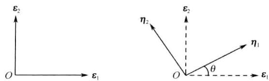

$\beta \in V$ , 有唯一的  $\delta \in V$  与它们对应, 称为  $\alpha$  与  $\beta$  的和, 记为  $\delta = \alpha +\beta$ ; 加法满足:

(1)  $\alpha +\beta = \beta +\alpha .$

(2)  $(\alpha +\beta) + \gamma = \alpha +(\beta +\gamma).$

(3)  $V$  中有一个零元素0,对  $\forall \alpha \in V$ , 有  $\alpha +0 = \alpha$

(4)  $\forall \alpha \in V$ , 存在  $\zeta \in V$ , 使得  $\alpha +\zeta = 0$ , 称  $\zeta$  为  $\alpha$  的负元素, 记  $\zeta$  为  $-\alpha$

另外, 在  $P$  和  $V$  之间还定义了一种数乘, 对  $\forall \alpha \in V$  和  $k\in P$ , 有唯一的元素  $\eta \in V$  与之对应, 称为  $k$  与  $\alpha$  的数量乘积(简称数乘), 记为  $\eta = k\alpha$ ; 数乘满足:

(5)  $\mathbf{1}\alpha = \alpha$

$$
(6)k(l\alpha) = l(k\alpha) = (kl)\alpha .
$$

加法和数乘还满足:

(7)  $(k + l)\alpha = k\alpha +l\alpha .$

$$
(8)k(\alpha +\beta) = k\alpha +k\beta .
$$

以上的运算律  $(1)\sim (8)$  中,  $\alpha ,\beta ,\gamma$  是  $V$  中任意元素,  $k,l$  是  $P$  中任意数; 那么定义了这样两种运算的集合  $V$  称为数域  $P$  上的线性空间.

线性空间中的元素有时也称为向量, 然而其含义比第三章中  $n$  维向量的意义要广泛得多了. 在本书中, 我们主要讨论实数域或复数域上的线性空间, 分别称之为实线性空间或复线性空间.

下面我们来列举一些线性空间的例子,

例4.2 所有  $n$  维实向量依照向量的加法和向量与实数的数乘构成实线性空间, 记为  $\mathbf{R}^{n}$ .

例4.3 所有  $m\times n$  阶实矩阵, 依照矩阵的加法和矩阵与实数的数乘构成实线性空间, 记为  $M^{m\times n}$ .

例4.4 所有  $[a,b]$  上的连续实函数, 依照函数的加法和函数与数的乘法作为数乘构成实线性空间, 记为  $C[a,b]$ .

例4.5 仅含  $n$  维零向量  $\mathbf{0} = (0,\dots ,0)^{\mathrm{T}}$  的集合  $\{\mathbf{0}\}$  依照  $n$  维向量的加法和向量与数的数乘构成复线性空间. 这是仅含一个元素的线性空间.

例4.6 所有的实系数一元多项式(包括零次多项式即常数), 依照多项式的加法和多项式与实数的乘法作为数乘构成实线性空间, 记为  $P[x]$ . 特别地, 由所有次数小于  $n$  次的实系数一元多项式, 依照同样的加法和数乘构成的实线性空间, 记为  $P[x]_{n}$ .

例4.7 系数矩阵为实矩阵  $A = (a_{ij})_{m\times n}$  的线性方程组  $Ax = 0$  的全部解向量依照向量的加法和向量与实数的数乘构成实线性空间. 称为方程组  $Ax = 0$  的解空间.

读者很容易验证, 上述例子中所涉及的加法和数乘都是符合线性空间定义中  $(1)\sim (8)$  的运算律的.

# 4.1.3 线性空间的简单性质

由线性空间的定义, 容易推出它的一些简单性质.

命题4.1 在数域  $P$  上的线性空间  $V$  中,

(1)零元素是唯一的;

(2)  $\forall \alpha \in V, \alpha$  的负元素是唯一的;

(3)  $\forall \alpha \in V, \forall k \in P$ , 有  $0\alpha = 0, k0 = 0$  和  $(-1)\alpha = -\alpha$

(4)若  $k\alpha = 0$  ,则有  $k = 0$  或  ${\pmb{\alpha}} = {\pmb{0}}$

证 我们仅证结论(1)和(3), 结论(2)和(4)的证明留给读者.

(1)若另有一个零元素  $\mathbf{0}_{1}$ , 那么, 由线性空间的运算律  $(1) \sim (3)$

$$
\mathbf{0}_{1} = \mathbf{0}_{1} + \mathbf{0} = \mathbf{0} + \mathbf{0}_{1} = \mathbf{0}.
$$

(3)先证  $0\alpha = 0$

$$
\begin{array}{c}{{0\alpha=0\alpha+0=0\alpha+(\alpha+(-\alpha))=(0\alpha+\alpha)+(-\alpha)}}\\ {{{}}}\\ {{=(0+1)\alpha+(-\alpha)=\alpha+(-\alpha)=0.}}\end{array}
$$

再证  $(- 1)\alpha = - \alpha$ , 由于

$$
\pmb {\alpha} + (-1)\pmb {\alpha} = (1 + (-1))\pmb {\alpha} = 0\pmb {\alpha} = \mathbf{0},
$$

根据结论(2)负元素的唯一性可知

$$
(-1)\alpha = -\alpha .
$$

最后证  $k0 = 0$

$$
\begin{array}{c}{{k0=k(\alpha+(-\alpha))=k\alpha+k(-\alpha)=k\alpha+(k(-1)\alpha)}}\\ {{{}}}\\ {{=(k+(-k))\alpha=0\alpha=\mathbf{0}.}}\end{array}
$$

# 4.1.4 线性子空间

4.1.2 节中的例4.7给出了线性方程组  $Ax = 0$  的所有解构成的线性空间. 显然, 这个线性空间是  $\mathbf{R}^{n}$  的一个子集合. 对于这种情况, 我们引进子空间的概念.

定义4.3 设  $V$  是数域  $P$  上的线性空间,  $W$  是  $V$  的非空子集合, 若对于  $V$  上的加法和数乘运算,  $W$  也成为  $P$  上的线性空间, 则称  $W$  为  $V$  的一个线性子空间 (简称为子空间).

$W$  既然是  $V$  的子集合, 那么  $W$  中元素满足运算律(1)、(2)和  $(5) \sim (8)$  是必然的. 从而  $W$  要成为  $V$  的子空间, 只需满足运算律(3)、(4)以及  $W$  中的元素进行加法和数乘的运算结果仍在  $W$  中即可. 事实上, 我们有如下命题.

命题4.2 设  $V$  是数域  $P$  上的线性空间, 如果  $V$  的非空子集合  $W$  对于  $V$  中的加法和数乘运算是封闭的, 则  $W$  是  $V$  的一个子空间.

证 显然, 我们只要证明运算律(3)、(4)在  $W$  中成立即可.  $\forall \alpha \in W$ , 由于  $0 \in P$ , 而  $- 1 = 0 - 1 \in P$ , 故有  $\mathbf{0} = 0\alpha \in W$  和  $- \alpha = (- 1)\alpha \in W$ .

子空间是线性空间的一部分而其本身又构成一个线性空间。下面是一些子空间的例子。

例4.8 线性空间  $V$  的仅含零向量的子集合是  $V$  的一个子空间,常称之为零子空间;  $V$  本身也是  $V$  的一个子空间。

例4.9  $n$  元实系数线性方程组  $Ax = 0$  的解集合是  $\mathbf{R}^{n}$  的一个子空间。

例4.10 三维向量集合

$$
\{(x_{1},x_{2},x_{3})^{\mathrm{T}}\mid x_{3} = 0\} \quad \text{和} \quad \{(x_{1},x_{2},x_{3})^{\mathrm{T}}\mid x_{1} + x_{2} + x_{3} = 0\}
$$

都是线性空间  $\mathbf{R}^{3}$  的子空间。

例4.11 函数集合  $\{f(x) \in C[a,b] \mid f(a) = 0\}$  是线性空间  $C[a,b]$  的子空间。

例4.12  $n$  阶上三角实矩阵集合、下三角实矩阵集合和实对角矩阵集合都是由所有  $n$  阶方阵构成的线性空间  $M^{n \times n}$  的子空间。

例4.13 设  $V$  是数域  $P$  上的线性空间,  $\alpha_{1}, \alpha_{2}, \dots , \alpha_{m}$  是  $V$  中的一组元素(向量),则

$$
L(\alpha_{1}, \alpha_{2}, \dots , \alpha_{m}) = \left\{\alpha \mid \alpha = \sum_{i = 1}^{m} k_{i} \alpha_{i}, k_{i} \in P, i = 1,2, \dots , m\right\}
$$

是  $V$  的子空间,这个子空间是由  $\alpha_{1}, \alpha_{2}, \dots , \alpha_{m}$  的所有线性组合构成的,称为  $\alpha_{1}, \alpha_{2}, \dots , \alpha_{m}$  的生成子空间。

判定某集合不构成所属线性空间的子空间可以利用命题4.2;另外一个简单的判定方法是看该集合是否不包含原线性空间的零元素,因为子空间作为线性空间必须包含零元素。

例4.14  $n$  元实系数非齐次线性方程组  $Ax = \beta$  的解集合不是  $\mathbf{R}^{n}$  的子空间。

例4.15 三维实向量集合

$$
\{(x_{1},x_{2},x_{3})^{\mathrm{T}}\mid x_{3} \geqslant 0\} \quad \text{和} \quad \{(x_{1},x_{2},x_{3})^{\mathrm{T}}\mid x_{1} + x_{2} + x_{3} = 1\}
$$

都不是线性空间  $\mathbf{R}^{3}$  的子空间。

例4.16 函数集合  $\{f(x) \in C[a,b] \mid f(a) = 1\}$  不是线性空间  $C[a,b]$  的子空间。

例4.17 一元二次实系数多项式的集合是线性空间  $P[x]_{3}$  的子集合,但不是  $P[x]_{3}$  的子空间。

请读者自己对以上各例的结论加以验证。

# 4.2 线性空间的维数、基与坐标

# 4.2.1 线性相关和线性无关

如同  $n$  维向量那样,对线性空间的向量(元素)也可以讨论线性相关性。

定义4.4 设  $V$  是数域  $P$  上的线性空间,  $\alpha_{1}, \alpha_{2}, \dots , \alpha_{m}$  是  $V$  中向量,若存在  $P$

中不全为零的数  $k_{1}, k_{2}, \dots , k_{m}$ , 使得

$$
k_{1} \pmb{\alpha}_{1} + k_{2} \pmb{\alpha}_{2} + \dots + k_{m} \pmb{\alpha}_{m} = \mathbf{0},
$$

则称  $\alpha_{1}, \alpha_{2}, \dots , \alpha_{m}$  线性相关, 否则称  $\alpha_{1}, \alpha_{2}, \dots , \alpha_{m}$  线性无关.

显然这一定义与  $n$  维向量的线性相关和线性无关的定义相同. 事实上,  $n$  维向量的其他一些概念, 例如, 线性表示、等价、极大线性无关组和秩等, 也完全可以引进到线性空间来, 而且有关的结论也依然成立. 我们在这里不再列出这些概念和结论, 建议读者对这些内容作一个回顾.

# 4.2.2 维数、基与坐标

我们知道,  $n + 1$  个  $n$  维向量必定线性相关, 这意味着只要取定了由  $n$  个线性无关的  $n$  维向量组成的向量组, 那么其他  $n$  维向量就可以由这个向量组来表示. 在一般的线性空间中能否有类似的结论? 为此我们引进维数和基的概念.

定义4.5设  $V$  是数域  $P$  上的线性空间, 若  $\alpha_{1}, \alpha_{2}, \dots , \alpha_{n}$  是  $V$  中  $n$  个线性无关的向量, 且  $V$  中任一向量  $\alpha$  均可以由  $\alpha_{1}, \alpha_{2}, \dots , \alpha_{n}$  线性表示, 则称线性空间  $V$  是  $n$  维线性空间, 而称  $\alpha_{1}, \alpha_{2}, \dots , \alpha_{n}$  是  $V$  的一组基.

显然, 线性空间作为一个向量集合, 基是它的极大线性无关组, 而维数是它的秩.

有了维数和基以后, 线性空间的任一向量就可以由这组基线性表示, 而且表示系数是唯一的, 这样在线性空间就可以建立坐标的概念.

定义4.6设  $\alpha_{1}, \alpha_{2}, \dots , \alpha_{n}$  是  $n$  维线性空间  $V$  的一组基,  $\gamma \in V$ , 且有

$$
\gamma = a_{1} \pmb{\alpha}_{1} + a_{2} \pmb{\alpha}_{2} + \dots + a_{n} \pmb{\alpha}_{n}, \tag{4.1}
$$

则称  $\left[ \begin{array}{l}a_{1} \\ \vdots \\ a_{n} \end{array} \right]$  为  $\gamma$  在基  $\alpha_{1}, \alpha_{2}, \dots , \alpha_{n}$  下的坐标.

由于  $\alpha_{1}, \alpha_{2}, \dots , \alpha_{n}$  是线性无关的, 因此  $\gamma$  的坐标是唯一的.

例4.18 由所有二阶实方阵构成的实线性空间  $M^{2 \times 2}$  中, 考虑

$$
E_{11}={\binom{1}{0}},\quad E_{12}={\binom{0}{0}},\quad E_{21}={\binom{0}{1}},\quad E_{22}={\binom{0}{0}}.
$$

若有实数  $k_{1}, k_{2}, k_{3}, k_{4}$  使得

$$
k_{1} E_{11} + k_{2} E_{12} + k_{3} E_{21} + k_{4} E_{22} = 0,
$$

那么显然, 只能有  $k_{1} = k_{2} = k_{3} = k_{4} = 0$ , 故  $E_{11}, E_{12}, E_{21}, E_{22}$  是线性无关的, 而任一  $M = \left( \begin{array}{cc}a & b \\ c & d \end{array} \right) \in M^{2 \times 2}$ , 可表示为  $M = a E_{11} + b E_{12} + c E_{21} + d E_{22}$ , 因此  $M^{2 \times 2}$  是 4 维线性空间,  $E_{11}, E_{12}, E_{21}, E_{22}$  是一组基,  $M$  在这组基下的坐标为  $(a, b, c, d)^{\mathrm{T}}$ .

例4.19 由所有次数小于 5 次的实系数一元多项式构成的实线性空间  $P[x]_{5}$

中, 容易验证

$$
1,x,x^{2},x^{3},x^{4}
$$

是线性无关的, 而  $P[x]_{5}$  中任一  $\scriptstyle{p(x) = a_{0}x^{4} + a_{1}x^{3} + a_{2}x^{2} + a_{3}x + a_{4}}$  可以表示为

$$
p(x) = a_{4} + a_{3}x + a_{2}x^{2} + a_{1}x^{3} + a_{0}x^{4}.
$$

因此  $P[x]_{5}$  是5维的,  $1,x,x^{2},x^{3},x^{4}$  是它的一组基,  $\boldsymbol {\mathscr{p}}(\boldsymbol {\mathscr{x}})$  在这组基下的坐标为  $(a_{4},a_{3},a_{2},a_{1},a_{0})^{\mathrm{T}}$  口

例4.20 三维实向量集合  $D = \{(x_{1},x_{2},x_{3})^{\mathrm{T}}\in \mathbf{R}^{3}|x_{3} = 0\}$  是实线性空间, 其中

$$
i = (1,0,0)^{\mathrm{T}}\quad \stackrel {\leftrightarrow}{\longrightarrow}\quad j = (0,1,0)^{\mathrm{T}}
$$

是线性无关的, 对  $D$  中任一向量  $\pmb {\alpha} = (x_{1},x_{2},0)^{\mathrm{T}}$  有

$$
\pmb {\alpha} = x_{1}\pmb {i} + x_{2}\pmb {j}.
$$

因此  $D$  是二维的,  $i,j$  是它的一组基

在上例中,  $D$  作为  $\mathbf{R}^{3}$  的子集合, 其中的元素是三维向量, 然而  $D$  却是二维线性空间. 下例中也有类似的情况.

例4.21  $n$  元实系数线性方程组  $A x = 0$  的解空间是实线性空间, 设  $A$  的秩为  $r< n$ , 那么此方程组的基础解系有  $n - r$  个向量  $\alpha_{1},\alpha_{2},\dots ,\alpha_{n - r}$ , 因此这个解空间是  $n - r$  维的,  $\alpha_{1},\alpha_{2},\dots ,\alpha_{n - r}$  是它的一组基.  $\square$

我们经常将表达式(4.1)写为

$$
\gamma = (\alpha_{1},\alpha_{2},\dots ,\alpha_{n})\left[ \begin{array}{c}a_{1} \\ a_{2} \\ \vdots \\ a_{n} \end{array} \right], \tag{4.2}
$$

这样的写法相当于将  $\alpha_{1},\alpha_{2},\dots ,\alpha_{n}$  看作分块矩阵中的子块. 可以证明, 采用这样的写法进行运算时, 矩阵的运算法则都成立. 而这种写法在讨论线性空间的一些问题时将是十分方便的.

显而易见, 在  $n$  维线性空间  $V$  取定了一组基以后,  $V$  中元素将与  $n$  维向量通过(4.2)式建立一一对应的关系

$$
\gamma \leftarrow \frac{(\alpha_{1},\alpha_{2},\cdots,\alpha_{n})}{\vdots} \left[ \begin{array}{c}a_{1} \\ a_{2} \\ \vdots \\ a_{n} \end{array} \right].
$$

特别当  $V$  是  $n$  维实线性空间时,  $V$  与  $\mathbf{R}^{n}$  之间就建立了一一对应关系. 由此我们可以理解为什么将线性空间的元素称为向量.

尤其值得注意的是这种一一对应, 确切地说是  $V$  与  $\mathbf{R}^{n}$  间的双射, 保持了线性关系的不变, 即:

设  $\pmb{\alpha}_{1},\pmb{\alpha}_{2},\dots ,\pmb{\alpha}_{n}$  是  $V$  的一组基,  $\forall \gamma ,\delta \in V$  ,它们在  $\pmb{\alpha}_{1},\pmb{\alpha}_{2},\dots ,\pmb{\alpha}_{n}$  下的坐标分别为  $\left[ \begin{array}{c}a_{1}\\ a_{2}\\ \vdots \\ a_{n} \end{array} \right]$  和  $\left[ \begin{array}{c}b_{1}\\ b_{2}\\ \vdots \\ b_{n} \end{array} \right]$  ,设  $k,l$  为任意实数,那么  $k\gamma +l\delta$  在  $\pmb{\alpha}_{1},\pmb{\alpha}_{2},\dots ,\pmb{\alpha}_{n}$  的坐标为

$$
k\left[ \begin{array}{c}a_{1}\\ a_{2}\\ \vdots \\ a_{n} \end{array} \right] + l\left[ \begin{array}{c}b_{1}\\ b_{2}\\ \vdots \\ b_{n} \end{array} \right].
$$

反过来,  $V$  中坐标为  $k\left[ \begin{array}{c}a_{1}\\ a_{2}\\ \vdots \\ a_{n} \end{array} \right] + l\left[ \begin{array}{c}b_{1}\\ b_{2}\\ \vdots \\ b_{n} \end{array} \right]$  的元素必定是  $k\gamma +l\delta$

# 4.2.3 同构

定义4.7设  $V$  与  $V^{\prime}$  都是实线性空间,  $\sigma$  是由  $V$  到  $V^{\prime}$  的双射,若  $\forall \alpha ,\beta \in V$  和  $k\in P$  ,成立

$$
\sigma (\alpha +\beta) = \sigma (\alpha) + \sigma (\beta),
$$

$$
\sigma (k\alpha) = k\sigma (\alpha),
$$

则称  $\sigma$  是  $V$  到  $V^{\prime}$  的同构映射,此时称  $V$  与  $V^{\prime}$  是同构的

显然,实  $n$  维线性空间  $V$  与  $\mathbf{R}^{n}$  是同构的

由同构定义立即得到:

(1)  $\sigma (\mathbf{0}) = \mathbf{0},\sigma (-\mathbf{\alpha}) = -\sigma (\mathbf{\alpha})$

(2)  $\forall \pmb{\alpha}_{1},\dots ,\pmb{\alpha}_{m}\in V$  和  $k_{1},\dots ,k_{m}\in P$  ,有

$$
\sigma (k_{1}\pmb{\alpha}_{1} + \dots +k_{m}\pmb{\alpha}_{m}) = k_{1}\sigma (\pmb{\alpha}_{1}) + \dots +k_{m}\sigma (\pmb{\alpha}_{m}).
$$

从而可以得到同构的重要结论:

命题4.3若  $\sigma$  是  $V$  到  $V^{\prime}$  的同构映射,则  $V$  中向量组  $\alpha_{1},\dots ,\alpha_{m}$  线性相关的充分必要条件是  $\sigma (\pmb{\alpha}_{1}),\dots ,\sigma (\pmb{\alpha}_{m})$  线性相关.

证若存在不全为零的  $k_{1},\dots ,k_{m}\in P$  ,使得

$$
k_{1}\pmb{\alpha}_{1} + \dots +k_{m}\pmb{\alpha}_{m} = \mathbf{0},
$$

于是利用  $\sigma$  是同构映射可得

$$
k_{1}\sigma (\pmb{\alpha}_{1}) + \dots +k_{m}\sigma (\pmb{\alpha}_{m}) = \mathbf{0}.
$$

反之,若  $k_{1}\sigma (\pmb{\alpha}_{1}) + \dots +k_{m}\sigma (\pmb{\alpha}_{m}) = \mathbf{0}$  ,则有

$$
\sigma (k_{1}\pmb{\alpha}_{1} + \dots +k_{m}\pmb{\alpha}_{m}) = \mathbf{0},
$$

由于  $\sigma$  是双射, 只有  $\sigma (\mathbf{0}) = \mathbf{0}$ , 这说明

$$
k_{1}\pmb{\alpha}_{1} + \dots +k_{m}\pmb{\alpha}_{m} = \mathbf{0}.
$$

当然命题也可以等价表达为:  $V$  中向量组  $\alpha_{1}, \dots , \alpha_{m}$  线性无关的充分必要条件是  $\sigma (\alpha_{1}), \dots , \sigma (\alpha_{m})$  线性无关.

命题4.4同构的实线性空间有相同的维数

证设  $V$  与  $V^{\prime}$  是同构的实线性空间,  $V$  是  $n$  维的,它的一组基为  $\alpha_{1},\dots ,\alpha_{n}$  ,则依命题  $4.3,\sigma (\alpha_{1}),\dots ,\sigma (\alpha_{n})$  也是  $V^{\prime}$  中线性无关向量.由于  $\sigma$  是双射,  $V^{\prime}$  任意一个向量  $\beta^{\prime}$  必定是  $V$  中某个  $\beta$  的象,即  $\beta^{\prime} = \sigma (\beta)$  ,因为  $\beta$  可以由  $\alpha_{1},\dots ,\alpha_{n}$  线性表示,于是  $\beta^{\prime}$  即  $\sigma (\beta)$  也可以由  $\sigma (\alpha_{1}),\dots ,\sigma (\alpha_{n})$  线性表示,从而  $V^{\prime}$  也是  $n$  维的,  $\sigma (\alpha_{1}),\dots ,$ $\sigma (\alpha_{n})$  是它的一组基.

事实上, 由于同构映射保持了向量之间线性关系完全相同, 而任何一个实  $n$  维线性空间与  $\mathbf{R}^{n}$  是同构的. 于是讨论  $V$  中元素的线性关系, 也就可以完全通过讨论它们的坐标向量的线性关系来进行, 而后者我们已相当熟悉了.

# 4.3 基变换与坐标变换

$n$  维线性空间中任意  $n$  个线性无关的向量都可以作为一组基, 也就是说线性空间的基并不唯一, 当然一个向量在两组不同基下的坐标也不相同, 我们需要研究它们的关系. 首先来看一个简单的例子.

例4.22平面解析几何中的直角坐标系有时需要作旋转(图4.1), 这实际上是坐标向量  $\epsilon_{1}, \epsilon_{2}$  绕原点作旋转, 设坐标轴逆时针旋转角度  $\theta$ , 那么不难看出, 新坐标向量  $(\eta_{1}, \eta_{2})$  与原坐标向量  $\epsilon_{1}, \epsilon_{2}$  之间的关系为

$$
\left\{ \begin{array}{l l}{\pmb{\eta}_{1} =} & {\mathrm{cos}\theta \pmb{\epsilon}_{1} + \mathrm{sin}\theta \pmb{\epsilon}_{2},}\\ {\pmb{\eta}_{2} = -\mathrm{sin}\theta \pmb{\epsilon}_{1} + \mathrm{cos}\theta \pmb{\epsilon}_{2},} \end{array} \right. \tag{4.3}
$$

或者写为

$$
(\eta_{1}, \eta_{2}) = (\epsilon_{1}, \epsilon_{2}) \begin{pmatrix} \cos \theta & -\sin \theta \\ \sin \theta & \cos \theta \end{pmatrix} . \tag{4.4}
$$

  
图4.1

若向量  $\xi$  在原坐标系和新坐标系的坐标分别为  $\binom{x_{1}}{x_{2}}$  和  $\binom{x_{1}^{\prime}}{x_{2}^{\prime}}$ ,即

$$
\xi = x_{1}\pmb{\epsilon}_{1} + x_{2}\pmb{\epsilon}_{2} = x_{1}^{\prime}\pmb{\eta}_{1} + x_{2}^{\prime}\pmb{\eta}_{2},
$$

将(4.3)代入,有

$$
\begin{array}{r l} & {\xi = x_{1}^{\prime}(\cos \theta \pmb{\epsilon}_{1} + \sin \theta \pmb{\epsilon}_{2}) + x_{2}^{\prime}(-\sin \theta \pmb{\epsilon}_{1} + \cos \theta \pmb{\epsilon}_{2})}\\ & {\quad = (x_{1}^{\prime}\cos \theta -x_{2}^{\prime}\sin \theta)\pmb{\epsilon}_{1} + (x_{1}^{\prime}\sin \theta +x_{2}^{\prime}\cos \theta)\pmb{\epsilon}_{2}.} \end{array}
$$

由  $\xi$  在  $\epsilon_{1},\epsilon_{2}$  下坐标的唯一性,比较上面两式,得到

$$
\begin{array}{r}{\left\{x_{1} = x_{1}^{\prime}\mathrm{cos}\theta -x_{2}^{\prime}\mathrm{sin}\theta ,\right.}\\ {\left.x_{2} = x_{1}^{\prime}\mathrm{sin}\theta +x_{2}^{\prime}\mathrm{cos}\theta ,\right.} \end{array} \tag{4.5}
$$

或者写为

$$
\binom{x_{1}}{x_{2}}=\binom{\cos\theta}{\sin\theta}\binom{-\sin\theta}{\cos\theta}\binom{x_{1}^{\prime}}{x_{2}^{\prime}}. \tag{4.6}
$$

对于一般情况,设  $\epsilon_{1},\epsilon_{2},\dots ,\epsilon_{n}$  和  $\eta_{1},\eta_{2},\dots ,\eta_{n}$  是  $n$  维线性空间  $V$  中的两组基,且

$$
\left\{ \begin{array}{l l}{\pmb{\eta}_{1} = c_{11}\pmb{\epsilon}_{1} + c_{21}\pmb{\epsilon}_{2} + \dots +c_{n1}\pmb{\epsilon}_{n}}\\ {\pmb{\eta}_{2} = c_{12}\pmb{\epsilon}_{1} + c_{22}\pmb{\epsilon}_{2} + \dots +c_{n2}\pmb{\epsilon}_{n}}\\ {\dots \dots \dots \dots \dots}\\ {\pmb{\eta}_{n} = c_{1n}\pmb{\epsilon}_{1} + c_{2n}\pmb{\epsilon}_{2} + \dots +c_{m}\pmb{\epsilon}_{n},} \end{array} \right. \tag{4.7}
$$

或写为

$$
(\pmb{\eta}_{1},\pmb{\eta}_{2},\dots ,\pmb{\eta}_{n}) = (\pmb{\epsilon}_{1},\pmb{\epsilon}_{2},\dots ,\pmb{\epsilon}_{n})\left( \begin{array}{c c c c}{c_{11}} & {c_{12}} & \dots & {c_{1n}}\\ {c_{21}} & {c_{22}} & \dots & {c_{2n}}\\ \vdots & \vdots & & \vdots \\ {c_{n1}} & {c_{n2}} & \dots & {c_{n n}} \end{array} \right). \tag{4.8}
$$

若记  $C = (c_{ij})_{n\times n}$ ,那么上式即

$$
(\pmb{\eta}_{1},\pmb{\eta}_{2},\dots ,\pmb{\eta}_{n}) = (\pmb{\epsilon}_{1},\pmb{\epsilon}_{2},\dots ,\pmb{\epsilon}_{n})C,
$$

我们称矩阵  $c$  为由基  $\epsilon_{1},\epsilon_{2},\dots ,\epsilon_{n}$  到基  $\eta_{1},\eta_{2},\dots ,\eta_{n}$  的过渡矩阵.

不难看出:

(1)过渡矩阵  $c$  的第  $j$  列  $\left( \begin{array}{c}{{c_{1j}}}\\ {{c_{2j}}}\\ {{\vdots}}\\ {{c_{n j}}} \end{array} \right)$  恰为  $\pmb{\eta}_{j}$  在  $\epsilon_{1},\epsilon_{2},\dots ,\epsilon_{n}$  这组基下的坐标;

(2)由于  $\eta_{1},\eta_{2},\dots ,\eta_{n}$  线性无关,因此  $c$  的列向量组线性无关,故  $c$  是满秩的.

现在我们建立下述定理

定理4.1设  $\epsilon_{1},\epsilon_{2},\dots ,\epsilon_{n}$  和  $\eta_{1},\eta_{2},\dots ,\eta_{n}$  是  $n$  维线性空间  $V$  中的两组基,由基  $\epsilon_{1},\epsilon_{2},\dots ,\epsilon_{n}$  到基  $\eta_{1},\eta_{2},\dots ,\eta_{n}$  的过渡矩阵为  $C = (c_{ij})_{n\times n}$ ,即

$$
(\pmb{\eta}_{1},\pmb{\eta}_{2},\dots ,\pmb{\eta}_{n}) = (\pmb{\epsilon}_{1},\pmb{\epsilon}_{2},\dots ,\pmb{\epsilon}_{n})C.
$$

若向量  $\xi$  在两组基下的坐标分别为  $\mathbf{x} = \left[ \begin{array}{c}x_{1} \\ x_{2} \\ \vdots \\ x_{n} \end{array} \right]$  和  $\mathbf{x}^{\prime} = \left[ \begin{array}{c}x_{1}^{\prime} \\ x_{2}^{\prime} \\ \vdots \\ x_{n}^{\prime} \end{array} \right]$ ,那么成立

$$
\begin{array}{r}{\pmb {x} = C\pmb{x}^{\prime},} \end{array} \tag{4.9}
$$

或者等价地有

$$
\begin{array}{r}{\pmb{x}^{\prime} = C^{-1}\pmb {x},} \end{array} \tag{4.10}
$$

(4.9)式或(4.10)式称为坐标变换公式

证  $\xi$  在  $\epsilon_{1}, \epsilon_{2}, \dots , \epsilon_{n}$  下的坐标为  $x$  ,即

$$
\xi = (\epsilon_{1}, \epsilon_{2}, \dots , \epsilon_{n}) \begin{bmatrix} x_{1} \\ x_{2} \\ \vdots \\ x_{n} \end{bmatrix} = (\epsilon_{1}, \epsilon_{2}, \dots , \epsilon_{n}) x,
$$

而  $\xi$  在  $\eta_{1}, \eta_{2}, \dots , \eta_{n}$  下的坐标为  $x^{\prime}$ ,并注意到  $C$  为两组基之间的过渡矩阵,故

$$
\xi = (\eta_{1}, \eta_{2}, \dots , \eta_{n}) \begin{bmatrix} x_{1}^{\prime} \\ x_{2}^{\prime} \\ \vdots \\ x_{n}^{\prime} \end{bmatrix} = (\eta_{1}, \eta_{2}, \dots , \eta_{n}) x^{\prime}
$$

$$
= (\epsilon_{1}, \epsilon_{2}, \dots , \epsilon_{n}) C x^{\prime}.
$$

这意味着  $\xi$  在  $\epsilon_{1}, \epsilon_{2}, \dots , \epsilon_{n}$  下的坐标为  $C x^{\prime}$  。由坐标的唯一性,得到

$$
\begin{array}{r}{\pmb {x} = C\pmb{x}^{\prime}.} \end{array}
$$

例4.23 给定  $\mathbf{R}^{3}$  中的两组基

$$
\pmb{\alpha}_{1} = \left[ \begin{array}{l}1 \\ 2 \\ 1 \end{array} \right], \quad \pmb{\alpha}_{2} = \left[ \begin{array}{l}2 \\ 3 \\ 3 \end{array} \right], \quad \pmb{\alpha}_{3} = \left[ \begin{array}{l}3 \\ 7 \\ 1 \end{array} \right],
$$

和

$$
\pmb{\beta}_{1} = \left[ \begin{array}{l}3 \\ 1 \\ 4 \end{array} \right], \quad \pmb{\beta}_{2} = \left[ \begin{array}{l}5 \\ 2 \\ 1 \end{array} \right], \quad \pmb{\beta}_{3} = \left[ \begin{array}{r}1 \\ 1 \\ -6 \end{array} \right].
$$

(1)求由  $\alpha_{1}, \alpha_{2}, \alpha_{3}$  到  $\beta_{1}, \beta_{2}, \beta_{3}$  的过渡矩阵  $C$

(2)已知向量  $\gamma$  在  $\beta_{1}, \beta_{2}, \beta_{3}$  下的坐标为  $(1, -1, 0)^{\mathrm{T}}$  ,求  $\gamma$  在  $\alpha_{1}, \alpha_{2}, \alpha_{3}$  的坐标;

(3)已知向量  $\delta$  在  $\alpha_{1}, \alpha_{2}, \alpha_{3}$  下的坐标为  $(1, -1, 0)^{\mathrm{T}}$  ,求  $\delta$  在  $\beta_{1}, \beta_{2}, \beta_{3}$  的坐标

解(1)由于  $(\beta_{1}, \beta_{2}, \beta_{3}) = (\alpha_{1}, \alpha_{2}, \alpha_{3}) C$  ,这意味着

$$
\left[ \begin{array}{rrr}3 & 5 & 1 \\ 1 & 2 & 1 \\ 4 & 1 & -6 \end{array} \right] = \left[ \begin{array}{rrr}1 & 2 & 3 \\ 2 & 3 & 7 \\ 1 & 3 & 1 \end{array} \right] C.
$$

这是一个矩阵方程, 用初等变换的方法, 容易求出

$$
C = \left[ \begin{array}{rrr}1 & 2 & 3 \\ 2 & 3 & 7 \\ 1 & 3 & 1 \end{array} \right]^{-1}\left[ \begin{array}{rrr}3 & 5 & 1 \\ 1 & 2 & 1 \\ 4 & 1 & -6 \end{array} \right] = \left[ \begin{array}{rrr} - 27 & -71 & -41 \\ 9 & 20 & 9 \\ 4 & 12 & 8 \end{array} \right].
$$

(2)根据(4.9)式,  $\gamma$  在  $\alpha_{1},\alpha_{2},\alpha_{3}$  的坐标为

$$
C\left[-\frac{1}{0}\right] = \left[ \begin{array}{rrr} - 27 & -71 & -41 \\ 9 & 20 & 9 \\ 4 & 12 & 8 \end{array} \right]\left[ \begin{array}{r}1 \\ -1 \\ 0 \end{array} \right] = \left[ \begin{array}{r}44 \\ -11 \\ -8 \end{array} \right].
$$

(3)根据(4.10)式,  $\pmb{\delta}$  在  $\beta_{1},\beta_{2},\beta_{3}$  的坐标为

$$
C^{-1}\left[-1\right] = \left[ \begin{array}{rrr} - 27 & -71 & -41 \\ 9 & 20 & 9 \\ 4 & 12 & 8 \end{array} \right]^{-1}\left[ \begin{array}{r}1 \\ -1 \\ 0 \end{array} \right] = \left[ \begin{array}{r} - 6 \\ 4 \\ -3 \end{array} \right].
$$

例4.24 由所有二阶实上三角矩阵构成的实线性空间中

$$
E_{11}=\binom{1}{0},\quad E_{12}=\binom{0}{0},\quad E_{22}=\binom{0}{0},\quad E_{12}=\binom{0}{0},\quad E_{22}=\binom{0}{0},\quad E_{12}=\binom{0}{0},\quad E_{22}=\binom{0}{0},\quad E_{12}=\binom{0}{0},\quad E_{22}=\binom{0}{0},\quad E_{12}
$$

显然是一组基.

(1)试证:

$$
M_{1}=\binom{1}{0},\quad M_{2}=\binom{1}{0},\quad M_{3}=\binom{0}{0},\quad M_{4}=\binom{0}{0},\quad M_{5}=\binom{0}{0},\quad M_{6}=\binom{0}{0},\quad M_{7}=\binom{0}{0},\quad M_{8}=\binom{0}{0},\quad M_{9}=\binom{0}{0},\quad M_{10}=\binom{0}{0},\quad M_{11}=\binom{0}{0},\quad M_{12}=\binom{0}{0},\quad M_{13}=\binom{0}{0},\quad M_{14}=\binom{0}{0},\quad M_{15}=\binom{0}{0},\quad M_{16}=\binom{0}{0},\quad M_{17}=\binom{0}{0},\quad M_{18}=\binom{0}{0},\quad M_{19}=\binom{0}{0},\quad M_{20}=\binom{0}{0},\quad M_{21}=\binom{0}{0},\quad M_{22}=\binom{0}{0},\quad M_{23}=\binom{0}{0},\quad M_{24}=\binom{0}{0},\quad M_{25}=\binom{0}{0},\quad M_{26}=\binom{0}{0},\quad M_{27}=\binom{0}{0},\quad M_{28}=\binom{0}{0},\quad M_{29}=\binom{0}{0},\quad M_{30}=\binom{0}{0},\quad M_{31}=\binom{0}{0},\quad M_{32}=\binom{0}{0},\quad M_{33}=\binom{0}{0},\quad M_{34}=\binom{0}{0},\quad M_{35}=\binom{0}{0},\quad M_{36}=\binom{0}{0},\quad M_{37}=\binom{0}{0},\quad M_{38}=\binom{0}{0},\quad M_{39}=\binom{0}{0},\quad M_{40}=\binom{0}{0},\quad M_{41}=\binom{0}{0},\quad M_{42}=\binom{0}{0},\quad M_{43}=\binom{0}{0},\quad M_{44}=\binom{0}{0},\quad M_{45}=\binom{0}{0},\quad M_{46}=\binom{0}{0},\quad M_{47}=\binom{0}{0},\quad M_{48}=\binom{0}{0},\quad M_{49}=\binom{0}{0},\quad M_{50}=\binom{0}{0},\quad M_{51}=\binom{0}{0},\quad M_{52}=\binom{0}{0},\quad M_{53}=\binom{0}{0},\quad M_{54}=\binom{0}{0},\quad M_{55}=\binom{0}{0},\quad M_{56}=\binom{0}{0},\quad M_{57}=\binom{0}{0},\quad M_{58}=\binom{0}{0},\quad M_{59}=\binom{0}{0},\quad M_{60}=\binom{0}{0},\quad M_{61}=\binom{0}{0},\quad M_{62}=\binom{0}{0},\quad M_{63}=\binom{0}{0},\quad M_{64}=\binom{0}{0},\quad M_{65}=\binom{0}{0},\quad M_{66}=\binom{0}{0},\quad M_{67}=\binom{0}{0},\quad M_{68}=\binom{0}{0},\quad M_{69}=\binom{0}{0},\quad M_{70}=\binom{0}{0},\quad M_{71}=\binom{0}{0},\quad M_{72}=\binom{0}{0},\quad M_{73}=\binom{0}{0},\quad M_{74}=\binom{0}{0},\quad M_{75}=\binom{0}{0},\quad M_{76}=\binom{0}{0},\quad M_{77}=\binom{0}{0},\quad M_{78}=\binom{0}{0},\quad M_{79}=\binom{0}{0},\quad M_{80}=\binom{0}{0},\quad M_{81}=\binom{0}{0},\quad M_{82}=\binom{0}{0},\quad M_{83}=\binom{0}{0},\quad M_{84}=\binom{0}{0},\quad M_{85}=\binom{0}{0},\quad M_{86}=\binom{0}{0},\quad M_{87}=\binom{0}{0},\quad M_{88}=\binom{0}{0},\quad M_{89}=\binom{0}{0},\quad M_{90}=\binom{0}{0},\quad M_{91}=\binom{0}{0},\quad M_{92}=\binom{0}{0},\quad M_{93}=\binom{0}{0},\quad M_{94}=\binom{0}{0},\quad M_{95}=\binom{0}{0},\quad M_{96}=\binom{0}{0},\quad M_{97}=\binom{0}{0},\quad M_{98}=\binom{0}{0},\quad M_{99}=\binom{0}{0},\quad M_{10}=\binom{0}{0},\quad M_{11}=\binom{0}{0},\quad M_{12}=\binom{0}{0},\quad M_{13}=\binom{0}{0},\quad M_{14}=\binom{0}{0},\quad M_{15}=\binom{0}{0}
$$

也是一组基,写出由  $E_{11},E_{12},E_{22}$  到  $M_{1},M_{2},M_{3}$  的过渡矩阵;

(2)求  $M = \binom{2}{0} -\frac{1}{3}$  在两组基下的坐标.

解(1)不难看出  $M_{1} = E_{11} + E_{12},M_{2} = E_{11} + E_{22},M_{3} = E_{12} + E_{22}$ ,于是  $M_{1},M_{2},M_{3}$  在  $E_{11},E_{12},E_{22}$  下的坐标分别为

$$
\left[ \begin{array}{l}1 \\ 1 \\ 0 \end{array} \right],\left[ \begin{array}{l}1 \\ 0 \\ 1 \end{array} \right],\left[ \begin{array}{l}0 \\ 1 \\ 1 \end{array} \right].
$$

显然这三个向量线性无关,从而  $M_{1},M_{2},M_{3}$  线性无关,它们为一组基.从  $E_{11},E_{12},E_{22}$  到  $M_{1},M_{2},M_{3}$  的过渡矩阵为

$$
C = \left[ \begin{array}{lll}1 & 1 & 0 \\ 1 & 0 & 1 \\ 0 & 1 & 1 \end{array} \right].
$$

(2)  $M$  在  $E_{11},E_{12},E_{22}$  下的坐标显然为  $(2, - 1, - 3)^{\mathrm{T}}$ ,因而在  $M_{1},M_{2},M_{3}$  下的坐标则为

$$
C^{-1}\left[ \begin{array}{c}2 \\ -1 \\ -3 \end{array} \right] = \left[ \begin{array}{c}2 \\ 0 \\ -3 \end{array} \right].
$$

# 4.4 欧氏空间

线性空间有加法和数乘两种运算,因此,可以讨论元素之间的线性关系。但我们知道在三维的几何向量之间,还有着度量关系,即距离、夹角等,是否可以在线性空间也建立起度量的概念?本节将介绍这一内容。

# 4.4.1 内积与欧氏空间

定义4.8 设  $V$  是实线性空间,在  $V$  中定义一种内积:  $\forall \alpha , \beta \in V$ ,有唯一的实数与它们对应,称为  $\alpha$  与  $\beta$  的内积,记为  $(\alpha , \beta)$ ,内积满足:

(1)  $(\alpha , \beta) = (\beta , \alpha)$

(2)  $(k\alpha , \beta) = k(\alpha , \beta)$

(3)  $(\alpha + \beta , \gamma) = (\alpha , \gamma) + (\beta , \gamma)$

(4)  $(\alpha , \alpha) \geqslant 0$ ,而  $(\alpha , \alpha) = 0$  当且仅当  $\alpha = 0$

以上  $\alpha , \beta , \gamma$  为  $V$  中任意向量,  $k$  为任意实数。定义了内积的实线性空间称为欧几里得空间,简称欧氏空间。

例4.25 在  $\mathbf{R}^{n}$  中,  $\forall \alpha = \left[ \begin{array}{c}a_{1} \\ a_{2} \\ \vdots \\ a_{n} \end{array} \right], \beta = \left[ \begin{array}{c}b_{1} \\ b_{2} \\ \vdots \\ b_{n} \end{array} \right]$ ,通常定义内积为

$$
(\alpha , \beta) = a_{1} b_{1} + a_{2} b_{2} + \dots + a_{n} b_{n}. \tag{4.11}
$$

例4.26 在实线性空间  $M^{m \times n}$  中,可以定义  $A = (a_{ij})_{m \times n}, B = (b_{ij})_{m \times n}$  的内积为

$$
(A, B) = \sum_{i = 1}^{m} \sum_{j = 1}^{n} a_{ij} b_{ij}.
$$

例4.27 在实函数组成的线性空间  $C[a, b]$  中,对  $C[a, b]$  中任意的  $f = f(x)$ , $g = g(x)$  可定义内积:

$$
(f, g) = \int_{a}^{b} f(x) g(x) \mathrm{d}x.
$$

读者容易验证,以上例子中定义的内积都符合定义4.7中(1)~(4)。

由内积的概念可以导出长度的概念。

定义4.9 设  $V$  是欧氏空间, $\forall \alpha \in V$ ,定义长度

$$
|\alpha | = \sqrt{(\alpha,\alpha)}. \tag{4.12}
$$

特别地,长度为1的向量称之为单位向量.对任意非零  $\alpha \in V$  ,由内积的性质可知,  $\frac{\alpha}{|\alpha|}$  是单位向量,这样得到单位向量的做法称为  $\alpha$  的单位化.

欧氏空间的长度有以下性质:

命题4.5设  $\alpha ,\beta$  是欧氏空间  $V$  中的任意向量,  $k$  是任意实数,那么:

(1)  $|\alpha |\geqslant 0$  ,而  $|\alpha | = 0$  当且仅当  $\alpha = 0$

(2)  $|k\alpha | = |k||\alpha |$

(3)  $|(\alpha ,\beta)|\leqslant |\alpha ||\beta |$  
(4.13)

且等号仅当  $\alpha ,\beta$  线性相关时成立,

证(1)、(2)的证明留给读者做练习,我们来证(3).

我们按两种情形讨论(4.13)式

若  $\alpha ,\beta$  线性相关,即  $\alpha ,\beta$  成比例,故有  $\beta = k\alpha$  或  $\alpha = b\beta$  不妨设  $\beta = k\alpha$  则  $|\beta | = |k||\alpha |$  ,于是

$$
\mid (\alpha ,\beta)\mid = \mid (\alpha ,k\alpha)\mid = \mid k(\alpha ,\alpha)\mid = \mid k\mid \mid \alpha \mid^{2} = \mid \alpha \mid \mid \beta \mid .
$$

若  $\alpha ,\beta$  线性无关,则对任意实数  $t,t\alpha - \beta \neq 0$  ,因而

$$
0< (t\alpha -\beta ,t\alpha -\beta) = t^{2}(\alpha ,\alpha) - 2t(\alpha ,\beta) + (\beta ,\beta),
$$

上式的右边是一个关于  $t$  的二次三项式,且对任意实数  $t$  该式都大于零,故

$$
[2(\alpha ,\beta)]^{2}< 4(\alpha ,\alpha)(\beta ,\beta),
$$

即

$$
\mid (\alpha ,\beta)\mid < \mid \alpha \mid \mid \beta \mid .
$$

这样就证明了结论.

(4.13)式通常称之为柯西- 施瓦茨(Cauchy- Schwarz)不等式,这是一个十分有用的不等式.

例4.28在  $\mathbf{R}^{n}$  中,设  $\pmb {\alpha} = \left[ \begin{array}{c}{a_{1}}\\ {a_{2}}\\ \vdots \\ {a_{n}} \end{array} \right],\pmb {\beta} = \left[ \begin{array}{c}{b_{1}}\\ {b_{2}}\\ \vdots \\ {b_{n}} \end{array} \right]$  ,它们的长度分别为

$$
\mid \alpha \mid = \sqrt{a_{1}^{2} + a_{2}^{2} + \dots + a_{n}^{2}},\quad \mid \beta \mid = \sqrt{b_{1}^{2} + b_{2}^{2} + \dots + b_{n}^{2}}, \tag{4.14}
$$

柯西- 施瓦茨不等式的形式为

$$
\mid a_{1}b_{1} + a_{2}b_{2} + \dots +a_{n}b_{n}\mid \leqslant \sqrt{a_{1}^{2} + a_{2}^{2} + \dots + a_{n}^{2}}\sqrt{b_{1}^{2} + b_{2}^{2} + \dots + b_{n}^{2}}. \tag{4.15}
$$

例4.29在  $C[a,b]$  中,对  $\scriptstyle f = f(x),g = g(x)$  ,它们的长度分别为

$$
\mid f\mid = \sqrt{\int_{a}^{b}f^{2}(x)\mathrm{d}x},\quad \mid g\mid = \sqrt{\int_{a}^{b}g^{2}(x)\mathrm{d}x},
$$

柯西- 施瓦茨不等式的形式为

$$
\left|\int_{a}^{b}f(x)g(x)\mathrm{d}x\right|\leqslant \sqrt{\int_{a}^{b}f^{2}(x)\mathrm{d}x}\sqrt{\int_{a}^{b}g^{2}(x)\mathrm{d}x}, \tag{4.16}
$$

(4.15)式和(4.16)式都是著名的不等式.

在  $\mathbf{R}^{n}$  中,依照(4.11)的定义,任意向量与零向量  $(0,0,\dots ,0)^{\mathrm{T}}$  的内积显然为零,而在一般的欧氏空间  $V$  中仍有同样的结论.设  $\alpha$  是  $V$  中任意向量,0是零向量,那么

$$
(\pmb {\alpha},\pmb {0}) = (\pmb {\alpha},0\pmb {\alpha}) = 0(\pmb {\alpha},\pmb {\alpha}) = 0.
$$

现在我们引进夹角的概念

定义4.10设  $V$  是欧氏空间,对非零的  $\alpha ,\beta \in V$  ,定义  $\alpha ,\beta$  的夹角  $\langle \alpha ,\beta \rangle$  为

$$
\langle \alpha ,\beta \rangle = \arccos \frac{(\alpha,\beta)}{|\alpha||\beta|}, \tag{4.17}
$$

特别当  $(\alpha ,\beta) = 0$  时,称  $\alpha ,\beta$  正交,记为  $\alpha \perp \beta .$

我们也可以在线性空间引进距离,

定义4.11设  $V$  是欧氏空间,对  $\alpha ,\beta \in V$  ,定义  $\alpha ,\beta$  的距离为  $|\alpha - \beta |^{\prime \prime}$

例4.30在  $\mathbf{R}^{+}$  中,  $\pmb {\alpha} = (- 1,\sqrt{2},1,0)^{\mathrm{T}},\pmb {\beta} = (2,0, - 3,2\sqrt{3})^{\mathrm{T}}$  ,则易得  $|\alpha | = 2$ $|\pmb {\beta}| = 5,(\pmb {\alpha},\pmb {\beta}) = - 5$  ,于是

$$
\langle \alpha ,\beta \rangle = \arccos \frac{(\alpha,\beta)}{|\alpha||\beta|} = \arccos \frac{-5}{10} = \frac{2\pi}{3},
$$

而

$$
\begin{array}{c}{{|\alpha-\beta|=\sqrt{(-1-2)^{2}+(\sqrt{2}-0)^{2}+(1-(-3))^{2}+(0-2\sqrt{3})^{2}}}}\\ {{=\sqrt{39}.}}\end{array}
$$

# 4.4.2 标准正交基

我们知道,在解析几何中,直角坐标系是重要的,在欧氏空间中,也有类似的情况.

定义4.12若欧氏空间  $V$  中的一组非零向量  $\alpha_{1},\alpha_{2},\dots ,\alpha_{m}$  两两正交,则称之为一个正交向量组.

定理4.2欧氏空间的正交向量组  $\alpha_{1},\alpha_{2},\dots ,\alpha_{m}$  必定线性无关.

证我们用反证法证明,若结论不真,则有不全为零的实数  $k_{1},k_{2},\dots ,k_{m}$  使得

$$
k_{1}\pmb{\alpha}_{1} + k_{2}\pmb{\alpha}_{2} + \dots +k_{m}\pmb{\alpha}_{m} = \mathbf{0},
$$

故有

$$
(k_{1}\pmb{\alpha}_{1} + k_{2}\pmb{\alpha}_{2} + \dots +k_{m}\pmb{\alpha}_{m},\pmb{\alpha}_{i}) = \mathbf{0},\quad i = 1,2,\dots ,m,
$$

从而

$$
(\pmb{\alpha}_{1},\pmb{\alpha}_{i}) + k_{2}(\pmb{\alpha}_{2},\pmb{\alpha}_{i}) + \dots +k_{i}(\pmb{\alpha}_{i},\pmb{\alpha}_{i}) + \dots +k_{m}(\pmb{\alpha}_{m},\pmb{\alpha}_{i}) = 0,\quad i = 1,2,\dots ,m.
$$

由于  $\pmb{\alpha}_{1},\pmb{\alpha}_{2},\dots ,\pmb{\alpha}_{m}$  两两正交,当  $j\neq i$  时,  $(\pmb{\alpha}_{j},\pmb{\alpha}_{i}) = 0$  ,故得

$$
k_{i}(\pmb{\alpha}_{i},\pmb{\alpha}_{i}) = 0,\qquad i = 1,2,\dots ,m.
$$

因  $\pmb{\alpha}_{i}\neq \mathbf{0}$  ,知  $(\pmb{\alpha}_{i},\pmb{\alpha}_{i}) > 0$  ,于是

$$
k_{i} = 0,\quad i = 1,2,\dots ,m,
$$

与假设矛盾.这样就证明了定理

定义4.13设  $\pmb{\epsilon}_{1},\pmb{\epsilon}_{2},\dots ,\pmb{\epsilon}_{n}$  是  $n$  维欧氏空间  $V$  的一组基,且它们两两正交,则称  $\pmb{\epsilon}_{1},\pmb{\epsilon}_{2},\dots ,\pmb{\epsilon}_{n}$  为  $V$  的一组正交基;若正交基中的向量  $\pmb{\epsilon}_{1},\pmb{\epsilon}_{2},\dots ,\pmb{\epsilon}_{n}$  都是单位向量,则称这组正交基为标准正交基.

显然,由定义,  $\pmb{\epsilon}_{1},\pmb{\epsilon}_{2},\dots ,\pmb{\epsilon}_{n}$  是  $n$  维欧氏空间的标准正交基的充分必要条件是

$$
(\pmb{\epsilon}_{i},\pmb{\epsilon}_{j})=\left\{{0},\quad i\neq j,\right. \tag{4.18}
$$

欧氏空间的标准正交基是存在的,例如

$$
\pmb{\epsilon}_{1}=\left[\begin{array}{l}{1}\\ {0}\\ {0}\\ {\vdots}\\ {0}\\ {0}\end{array}\right],\pmb{\epsilon}_{2}=\left[\begin{array}{l}{0}\\ {1}\\ {0}\\ {\vdots}\\ {0}\\ {0}\end{array}\right],\cdots,\pmb{\epsilon}_{n-1}=\left[\begin{array}{l}{0}\\ {0}\\ {0}\\ {\vdots}\\ {1}\\ {0}\end{array}\right],\pmb{\epsilon}_{n}=\left[\begin{array}{l}{0}\\ {0}\\ {0}\\ {\vdots}\\ {0}\\ {1}\end{array}\right]
$$

就是  $\mathbf{R}^{n}$  中一组典型的标准正交基

若  $V$  中的向量  $\pmb{\alpha},\pmb{\beta}$  在一组标准正交基  $\pmb{\epsilon}_{1},\pmb{\epsilon}_{2},\dots ,\pmb{\epsilon}_{n}$  下的坐标分别为  $\left[ \begin{array}{c}{a_{1}}\\ {a_{2}}\\ \vdots \\ {a_{n}} \end{array} \right]$  和  $\left[ \begin{array}{c}{b_{1}}\\ {b_{2}}\\ \vdots \\ {b_{n}} \end{array} \right]$

即

$$
\pmb {\alpha} = a_{1}\pmb{\epsilon}_{1} + a_{2}\pmb{\epsilon}_{2} + \dots +a_{n}\pmb{\epsilon}_{n},\quad \pmb {\beta} = b_{1}\pmb{\epsilon}_{1} + b_{2}\pmb{\epsilon}_{2} + \dots +b_{n}\pmb{\epsilon}_{n},
$$

那么依内积的运算律及(4.18),就有

$$
\begin{array}{c}{{(\pmb{\alpha},\pmb{\beta})=(a_{1}\pmb{\epsilon}_{1}+a_{2}\pmb{\epsilon}_{2}+\cdots+a_{n}\pmb{\epsilon}_{n},b_{1}\pmb{\epsilon}_{1}+b_{2}\pmb{\epsilon}_{2}+\cdots+b_{n}\pmb{\epsilon}_{n})}}\\ {{=a_{1}b_{1}+a_{2}b_{2}+\cdots+a_{n}b_{n},}}\end{array} \tag{4.19}
$$

从而

$$
(\pmb {\alpha},\pmb {\alpha}) = a_{1}^{2} + a_{2}^{2} + \dots +a_{n}^{2},\quad |\pmb {\alpha}| = \sqrt{a_{1}^{2} + a_{2}^{2} + \cdots + a_{n}^{2}}. \tag{4.20}
$$

对照  $\mathbf{R}^{n}$  中的计算式(4.11),(4.14)可知:

在标准正交基下,欧氏空间中向量的内积和长度的计算可归结为它们坐标的内积和长度的计算.

# 4.4.3 向量组的正交化和单位化

给定欧氏空间中的一组基,能否得到一组标准正交基?为此我们介绍格拉姆-

施密特(Gram- Schmidt)正交化法.

设  $\alpha_{1}, \alpha_{2}, \dots , \alpha_{m}$  是欧氏空间的一组线性无关的向量.

(1)正交化.

取  $\pmb{\beta}_{1} = \pmb{\alpha}_{1}$

取  $\pmb{\beta}_{2} = \pmb{\alpha}_{2} - k\pmb{\beta}_{1}$ ,其中  $k$  是待定常数.令  $(\pmb{\beta}_{1}, \pmb{\beta}_{2}) = 0$ ,即有

$$
(\pmb{\beta}_{1}, \pmb{\alpha}_{2}) = k(\pmb{\beta}_{1}, \pmb{\beta}_{1}).
$$

从而  $k = \frac{(\pmb{\beta}_{1}, \pmb{\alpha}_{2})}{(\pmb{\beta}_{1}, \pmb{\beta}_{1})}$ ,故得

$$
\pmb{\beta}_{2} = \pmb{\alpha}_{2} - \frac{(\pmb{\beta}_{1}, \pmb{\alpha}_{2})}{(\pmb{\beta}_{1}, \pmb{\beta}_{1})} \pmb{\beta}_{1}.
$$

显然,  $\pmb{\beta}_{2} \neq \pmb{0}$ ,否则就有  $\pmb{\alpha}_{2}$  可由  $\pmb{\beta}_{1}$  即  $\pmb{\alpha}_{1}$  线性表示,与  $\pmb{\alpha}_{1}, \pmb{\alpha}_{2}$  线性无关矛盾.

再取  $\pmb{\beta}_{3} = \pmb{\alpha}_{3} - k_{1} \pmb{\beta}_{1} - k_{2} \pmb{\beta}_{2}$ ,其中  $k_{1}, k_{2}$  是待定常数.令  $(\pmb{\beta}_{1}, \pmb{\beta}_{3}) = 0$ ,且  $(\pmb{\beta}_{2}, \pmb{\beta}_{3}) = 0$ ,注意到  $(\pmb{\beta}_{1}, \pmb{\beta}_{2}) = 0$ ,于是有

$$
(\pmb{\beta}_{1}, \pmb{\alpha}_{3}) = k_{1}(\pmb{\beta}_{1}, \pmb{\beta}_{1}), \quad (\pmb{\beta}_{2}, \pmb{\alpha}_{3}) = k_{2}(\pmb{\beta}_{2}, \pmb{\beta}_{2}),
$$

从而

$$
k_{1} = \frac{(\pmb{\beta}_{1}, \pmb{\alpha}_{3})}{(\pmb{\beta}_{1}, \pmb{\beta}_{1})}, \quad k_{2} = \frac{(\pmb{\beta}_{2}, \pmb{\alpha}_{3})}{(\pmb{\beta}_{2}, \pmb{\beta}_{2})},
$$

故得

$$
\pmb{\beta}_{3} = \pmb{\alpha}_{3} - \frac{(\pmb{\beta}_{1}, \pmb{\alpha}_{3})}{(\pmb{\beta}_{1}, \pmb{\beta}_{1})} \pmb{\beta}_{1} - \frac{(\pmb{\beta}_{2}, \pmb{\alpha}_{3})}{(\pmb{\beta}_{2}, \pmb{\alpha}_{2})} \pmb{\beta}_{2}.
$$

同理可得  $\pmb{\beta}_{3} \neq \pmb{0}$ ,否则就有  $\pmb{\alpha}_{3}$  可以由  $\pmb{\beta}_{1}, \pmb{\beta}_{2}$  线性表示,进而导出  $\pmb{\alpha}_{3}$  可由  $\pmb{\alpha}_{1}, \pmb{\alpha}_{2}$  线性表示,与  $\pmb{\alpha}_{1}, \pmb{\alpha}_{2}, \pmb{\alpha}_{3}$  线性无关矛盾.

归纳地,容易得到

$$
\pmb{\beta}_{i} = \pmb{\alpha}_{i} - \frac{(\pmb{\beta}_{1}, \pmb{\alpha}_{i})}{(\pmb{\beta}_{1}, \pmb{\beta}_{1})} \pmb{\beta}_{1} - \frac{(\pmb{\beta}_{2}, \pmb{\alpha}_{i})}{(\pmb{\beta}_{2}, \pmb{\beta}_{2})} \pmb{\beta}_{2} - \dots - \frac{(\pmb{\beta}_{i - 1}, \pmb{\alpha}_{i})}{(\pmb{\beta}_{i - 1}, \pmb{\beta}_{i - 1})} \pmb{\beta}_{i - 1}, \tag{4.21}
$$

其中  $i = 2,3, \dots , m$ ,且  $\pmb{\beta}_{1}, \pmb{\beta}_{2}, \dots , \pmb{\beta}_{m}$  均为两两正交的非零向量.

(2)单位化.

令

$$
\pmb{\epsilon}_{i} = \frac{\pmb{\beta}_{i}}{|\pmb{\beta}_{i}|}, \quad i = 1,2, \dots , m. \tag{4.22}
$$

这样就得到了一组正交的单位向量,以上的过程给出了如下的定理

定理4.3设  $\alpha_{1}, \alpha_{2}, \dots , \alpha_{m}$  为欧氏空间  $V$  中线性无关的向量组,则由(4.21),(4.22)式可以得到  $V$  中的正交单位向量组  $\pmb{\epsilon}_{1}, \pmb{\epsilon}_{2}, \dots , \pmb{\epsilon}_{m}$ ,且对  $i = 1,2, \dots , m, \pmb{\alpha}_{1}, \pmb{\alpha}_{2}, \dots , \pmb{\alpha}_{i}$  与  $\pmb{\epsilon}_{1}, \pmb{\epsilon}_{2}, \dots , \pmb{\epsilon}_{i}$  等价.

证由正交化、单位化可知,依(4.21)式与(4.22)式得到的  $\pmb{\epsilon}_{1}, \pmb{\epsilon}_{2}, \dots , \pmb{\epsilon}_{m}$  为正交单位向量组.而对定理的后半部分结论,由(4.21),只要证  $\pmb{\alpha}_{1}, \pmb{\alpha}_{2}, \dots , \pmb{\alpha}_{i}$  与  $\pmb{\beta}_{1}$

$\beta_{2}, \dots , \beta_{i}$  等价即可. 我们用归纳法来证明:

首先  $\beta_{1} = \alpha_{1}$  ,它们当然是等价的;假设  $\alpha_{1},\alpha_{2},\dots ,\alpha_{i - 1}$  与  $\beta_{1},\beta_{2},\dots ,\beta_{i - 1}$  等价,即它们可相互线性表示,那么由(4.21),可知  $\beta_{i}$  可由  $\alpha_{1},\alpha_{2},\dots ,\alpha_{i}$  线性表示.只要将(4.21)移项,显然  $\alpha_{i}$  也可由  $\beta_{1},\beta_{2},\dots ,\beta_{i}$  线性表示,于是  $\alpha_{1},\alpha_{2},\dots ,\alpha_{i}$  与  $\beta_{1},\beta_{2},\dots ,$ $\beta_{i}$  可相互线性表示,即它们等价. 口

这样,从  $n$  维欧氏空间  $V$  中的任何一组基  $\alpha_{1}, \alpha_{2}, \dots , \alpha_{n}$  出发,通过上述的正交化、单位化过程,就可以得到一组标准正交基  $\epsilon_{1}, \epsilon_{2}, \dots , \epsilon_{n}$ . 值得注意的是这两组基的前  $i$  个向量都是等价的,即有  $\alpha_{1}, \alpha_{2}, \dots , \alpha_{i}$  与  $\epsilon_{1}, \epsilon_{2}, \dots , \epsilon_{i}$  等价,或者说它们的生成子空间是相同的,即

$$
L(\alpha_{1}, \alpha_{2}, \dots , \alpha_{i}) = L(\epsilon_{1}, \epsilon_{2}, \dots , \epsilon_{i}).
$$

例4.31 试将  $\mathbf{R}^{3}$  的一组基  $\alpha_{1}, \alpha_{2}, \alpha_{3}$  化为标准正交基,这里

$$
\pmb{\alpha}_{1}=\left[\begin{array}{l}{1}\\ {1}\\ {0}\end{array}\right],\quad\pmb{\alpha}_{2}=\left[\begin{array}{l}{1}\\ {0}\\ {1}\end{array}\right],\quad\pmb{\alpha}_{3}=\left[\begin{array}{l}{-1}\\ {0}\\ {0}\end{array}\right].
$$

解 正交化.

$$
\beta_{1} = \alpha_{1} = \left[ \begin{array}{l}1 \\ 1 \\ 1 \\ 0 \end{array} \right],
$$

$$
\pmb{\beta}_{2} = \pmb{\alpha}_{2} - \frac{(\pmb{\beta}_{1}, \pmb{\alpha}_{2})}{(\pmb{\beta}_{1}, \pmb{\beta}_{1})} \pmb{\beta}_{1} = \left[ \begin{array}{l}1 \\ 0 \\ 1 \end{array} \right] - \frac{1}{2} \left[ \begin{array}{l}1 \\ 1 \\ 0 \end{array} \right] = \left[ \begin{array}{l}\frac{1}{2} \\ -\frac{1}{2} \\ 1 \end{array} \right],
$$

$$
\pmb{\beta}_{3} = \pmb{\alpha}_{3} - \frac{(\pmb{\beta}_{1}, \pmb{\alpha}_{3})}{(\pmb{\beta}_{1}, \pmb{\beta}_{1})} \pmb{\beta}_{1} - \frac{(\pmb{\beta}_{2}, \pmb{\alpha}_{3})}{(\pmb{\beta}_{2}, \pmb{\beta}_{2})} \pmb{\beta}_{2}
$$

$$
= \left[ \begin{array}{c} - 1 \\ 0 \\ 0 \end{array} \right] - \frac{(-1)}{2} \left[ \begin{array}{c}1 \\ 1 \\ 0 \end{array} \right] - \frac{\left(-\frac{1}{2}\right)}{\frac{3}{2}} \left[ \begin{array}{c} - \frac{1}{2} \\ -\frac{1}{2} \\ 1 \end{array} \right] = \left[ \begin{array}{c} - \frac{1}{3} \\ \frac{1}{3} \\ \frac{1}{3} \end{array} \right].
$$

再单位化.

$$
\pmb{\epsilon}_{1}=\frac{\pmb{\beta}_{1}}{|\pmb{\beta}_{1}|}=\left[\begin{array}{c c c c c c c c c c c c c c c c c c c c c c c c c c c c c c c c c c c c c c c c c c c c c c c c c c c c c c c c c c c c c c c c c c c c c c c c c c c c c c c c c c c c c c c c c c c c c c c c c c c c c\end{array}\right]\qquad\pmb{\epsilon}_{2}=\frac{\pmb{\beta}_{2}}{|\pmb{\beta}_{2}|}=\left[\begin{array}{c c c c c c c c c c c c c c c c c c c c c c c c c c c c c c c c c c c c c c c c c c c c c c c c c c c c c c c c c c c c c c c c c c c c c c c c c c c c c c c c c c c c c c c c c c\end{array}\right]\qquad\qquad\pmb{\epsilon}_{3}=\frac{\pmb{\beta}_{3}}{|\pmb{\beta}_{3}|}=\left[\begin{array}{c c c c c c c c c c c c c c c c c c c c c c c c c c c c c c c c c c c c c c c c c c c c c c c c c c c c c c c c c c c c c c c c c c c c c c c c c c c c c c c c c c c c c c c c c c}\end{array}\right]\qquad\qquad\qquad\qquad\qquad\qquad\qquad\qquad\qquad\qquad\qquad\qquad\qquad\qquad\qquad\qquad\qquad\qquad\qquad\qquad\qquad\qquad\qquad\qquad\qquad\qquad\qquad\qquad\qquad\qquad\qquad\qquad\qquad\qquad\quad\qquad\qquad\qquad\qquad\qquad\qquad\qquad\qquad\qquad\qquad\qquad\qquad\qquad\qquad\qquad\qquad\qquad\qquad\qquad\qquad\qquad\qquad\qquad\qquad\qquad\qquad\qquad\qquad\qquad\qquad\qquad\qquad\qnot\qnot\qnot\qnot\qnot\qnot\qnot\qnot\qnot\qnot\qnot\qnot\qnot\qnot\qnot\qnot\qnot\qnot\qnot\qnot\qnot\qnot\qnot\qnot\qnot\qnot\qnot\qnot\qnot\qnot\qnot\qnot\qnot\qnot
$$

$\pmb{\epsilon}_{1},\pmb{\epsilon}_{2},\pmb{\epsilon}_{3}$  即为  $\mathbf{R}^{3}$  的一组标准正交基

# 习题四

# (一)

1. 试确定以下集合是否数域,并说明理由

(1)  $K_{1} = \{a + b\sqrt{3} |a,b\in \mathbf{Z}\}$  ,其中  $\mathbf{Z}$  为整数集;

(2)  $K_{2} = \{a + b\sqrt{3} |a,b\in \mathbf{Q}\}$  ,其中  $\mathbf{Q}$  为有理数集

2. 试确定以下集合是否数域,并说明理由

(1)  $F_{1} = \{a + b\mathrm{i}|a,b\in \mathbf{Z}\}$  ,其中  $\mathrm{i} = \sqrt{-1},\mathbf{Z}$  为整数集;

(2)  $F_{2} = \{a + b\mathrm{i}|a,b\in \mathbf{Q}\}$  ,其中  $\mathrm{i} = \sqrt{-1},\mathbf{Q}$  为有理数集

3. 试考察以下集合对所定义的加法和数乘运算是否构成实数域上的线性空间:

(1)全体  $n$  阶实对称矩阵,依照矩阵的加法和数乘;

(2)平面上不平行于某一向量的全体向量集合,依照二维向量的加法和数乘;

(3)全体三维向量集合,依照向量的加法和如下规定的数乘:

$$
k\left[ \begin{array}{c}x_{1}\\ x_{2}\\ x_{3} \end{array} \right] = \left[ \begin{array}{c}0\\ 0\\ 0 \end{array} \right],\qquad \forall k\in \mathbf{R},\left[ \begin{array}{c}x_{1}\\ x_{2}\\ x_{3} \end{array} \right]\in \mathbf{R}^{3};
$$

(4)全体复数集合,依照数的加法以及数的乘法作数乘

4. 试确定下列集合是否实线性空间  $\mathbf{R}^{3}$  的子空间,以下小题中  $\mathbf{x} = (x_{1},x_{2},x_{3})^{\mathrm{T}}$

(1)  $W_{1} = \{x\in \mathbf{R}^{3}|x_{3} = 0\}$

(2)  $W_{2} = \{x\in \mathbf{R}^{3}|x_{3}\geqslant 0\}$

(3)  $W_{3} = \{x\in \mathbf{R}^{3}|x_{3} = 1\}$

(4)  $W_{4} = \{x\in \mathbf{R}^{3}|2x_{1} + 3x_{2} - x_{3} = 0\}$

(5)  $W_{5} = \{x\in \mathbf{R}^{3}|2x_{1} + 3x_{2} - x_{3} = 1\}$

(6)  $W_{6} = \{x\in \mathbf{R}^{3}|x_{1} - x_{2} = 0\}$

5. 试确定下列集合是否实线性空间  $V = C[-1,1]$  的子空间:

(1)  $U_{1} = \{f\in V|f(x)\geqslant 0\}$

(2)  $U_{2} = \{f\in V|f(1) - f(-1) = 0\}$

(3)  $U_{3} = \{f\in V|f(0)f(1) = 0\}$

(4)  $U_{4} = \{f\in V|f(1) - f^{2}(1) = 0\}$

$$
(5)U_{5} = \{f\in V|f(-x) = f(x)\} ;
$$

$$
(6)U_{6} = \{f\in V|f(x) - f(x^{2}) = 0\} .
$$

6. 下列集合是实线性空间  $M^{8\times 3}$  的子空间,试分别求这些子空间的维数和一组基:

(1)由所有三阶上三角实方阵构成的子空间;

(2)由所有三阶实对称方阵构成的子空间;

(3)由所有三阶反对称实方阵构成的子空间

7. 试求齐次线性方程组

$$
\left\{ \begin{array}{l l}{2x_{1} + x_{2} - x_{3} + x_{4} - 3x_{5} = 0,}\\ {x_{1} + x_{2} - x_{3}\qquad +x_{5} = 0} \end{array} \right.
$$

的解空间的维数和一组基

8. 验证集合

$$
\{(a_{i j})_{2\times 2}\in M^{2\times 2}\mid a_{11} + a_{12} + a_{21} + a_{22} = 0\}
$$

是  $M^{2\times 2}$  的子空间,且求出它的维数和一组基

9. 在  $\mathbf{R}^{4}$  中,

$$
\pmb{\alpha}_{1}=\left(\begin{array}{c}{1}\\ {1}\\ {-1}\\ {-1}\end{array}\right),\quad\pmb{\alpha}_{2}=\left(\begin{array}{c}{4}\\ {5}\\ {-2}\\ {-7}\end{array}\right),\quad\pmb{\alpha}_{3}=\left(\begin{array}{c}{0}\\ {1}\\ {0}\\ {-1}\end{array}\right),\quad\pmb{\alpha}_{4}=\left(\begin{array}{c}{3}\\ {2}\\ {-1}\\ {-4}\end{array}\right),\quad\pmb{\alpha}_{5}=\left(\begin{array}{c}{-1}\\ {0}\\ {0}\\ {1}\end{array}\right),
$$

求由  $\alpha_{1},\alpha_{2},\alpha_{3},\alpha_{4},\alpha_{5}$  生成的子空间  $L(\pmb{\alpha}_{1},\pmb{\alpha}_{2},\pmb{\alpha}_{3},\pmb{\alpha}_{4},\pmb{\alpha}_{5})$  的维数和一组基

10. 设  $\alpha_{1},\alpha_{2},\alpha_{3}$  是实线性空间  $V$  中的向量,且有

$$
k_{1}\pmb{\alpha}_{1} + k_{2}\pmb{\alpha}_{2} + k_{3}\pmb{\alpha}_{3} = \mathbf{0},\quad k_{1},k_{2},k_{3}\in \mathbf{R},\quad k_{1}k_{3}\neq 0.
$$

求证:

$$
L(\pmb{\alpha}_{1},\pmb{\alpha}_{2}) = L(\pmb{\alpha}_{2},\pmb{\alpha}_{3}).
$$

11. 在  $\mathbf{R}^{3}$  中,

$$
\pmb{\alpha}_{1}=\left(\begin{array}{l}{1}\\ {0}\\ {1}\end{array}\right),\quad\pmb{\alpha}_{2}=\left(\begin{array}{l}{0}\\ {1}\\ {0}\end{array}\right),\quad\pmb{\alpha}_{3}=\left(\begin{array}{l}{1}\\ {2}\\ {2}\end{array}\right),\quad\pmb{\beta}=\left(\begin{array}{l}{1}\\ {3}\\ {0}\end{array}\right).
$$

验证  $\alpha_{1},\alpha_{2},\alpha_{3}$  是一组基,并求  $\beta$  在  $\alpha_{1},\alpha_{2},\alpha_{3}$  下的坐标

12. 在  $\mathbf{R}^{4}$  中,

$$
\pmb{\alpha}_{1}=\left(\begin{array}{c}{1}\\ {1}\\ {1}\\ {1}\end{array}\right),\quad\pmb{\alpha}_{2}=\left(\begin{array}{c}{1}\\ {1}\\ {-1}\\ {-1}\end{array}\right),\quad\pmb{\alpha}_{3}=\left(\begin{array}{c}{1}\\ {-1}\\ {1}\\ {-1}\end{array}\right),\quad\pmb{\alpha}_{4}=\left(\begin{array}{c}{1}\\ {-1}\\ {-1}\\ {1}\end{array}\right),\quad\pmb{\beta}=\left(\begin{array}{c}{1}\\ {2}\\ {1}\\ {1}\end{array}\right),
$$

验证  $\alpha_{1},\alpha_{2},\alpha_{3},\alpha_{4}$  是一组基,并求  $\beta$  在  $\alpha_{1},\alpha_{2},\alpha_{3},\alpha_{4}$  下的坐标

13. 在  $\mathbf{R}^{4}$  中,求由基  $\alpha_{1},\alpha_{2},\alpha_{3},\alpha_{4}$  到基  $\beta_{1},\beta_{2},\beta_{3},\beta_{4}$  的过渡矩阵,并求向量  $\pmb{\xi}$  在两组基下的坐标.

(1)

$$
\pmb{\alpha}_{1}=\left[\begin{array}{l}{1}\\ {0}\\ {0}\\ {0}\end{array}\right],\quad\pmb{\alpha}_{2}=\left[\begin{array}{l}{0}\\ {1}\\ {0}\\ {0}\end{array}\right],\quad\pmb{\alpha}_{3}=\left[\begin{array}{l}{0}\\ {0}\\ {1}\\ {0}\end{array}\right],\quad\pmb{\alpha}_{4}=\left[\begin{array}{l}{0}\\ {0}\\ {0}\\ {1}\end{array}\right],
$$

$$
\pmb{\beta}_{1}=\left[\begin{array}{c}{2}\\ {1}\\ {-1}\\ {1}\end{array}\right],\quad\pmb{\beta}_{2}=\left[\begin{array}{c}{0}\\ {3}\\ {1}\\ {0}\end{array}\right],\quad\pmb{\beta}_{3}=\left[\begin{array}{c}{5}\\ {3}\\ {2}\\ {1}\end{array}\right],\quad\pmb{\beta}_{4}=\left[\begin{array}{c}{6}\\ {6}\\ {1}\\ {3}\end{array}\right],\quad\pmb{\xi}=\left[\begin{array}{c}{x_{1}}\\ {x_{2}}\\ {x_{3}}\\ {x_{4}}\end{array}\right];
$$

(2)

$$
\pmb{\alpha}_{1}=\left[\begin{array}{c}{1}\\ {-1}\\ {2}\\ {0}\end{array}\right],\quad\pmb{\alpha}_{2}=\left[\begin{array}{c}{1}\\ {1}\\ {-1}\\ {1}\end{array}\right],\quad\pmb{\alpha}_{3}=\left[\begin{array}{c}{-1}\\ {1}\\ {2}\\ {1}\end{array}\right],\quad\pmb{\alpha}_{4}=\left[\begin{array}{c}{-1}\\ {0}\\ {-1}\\ {1}\end{array}\right],
$$

$$
\pmb{\beta}_{1}=\left[\begin{array}{c}{2}\\ {0}\\ {1}\\ {1}\end{array}\right],\quad\pmb{\beta}_{2}=\left[\begin{array}{c}{0}\\ {2}\\ {1}\\ {2}\end{array}\right],\quad\pmb{\beta}_{3}=\left[\begin{array}{c}{-2}\\ {1}\\ {1}\\ {2}\end{array}\right],\quad\pmb{\beta}_{4}=\left[\begin{array}{c}{1}\\ {1}\\ {3}\\ {2}\end{array}\right],\quad\pmb{\xi}=\left[\begin{array}{c}{1}\\ {0}\\ {0}\\ {0}\end{array}\right].
$$

14. 对第13题(1),求非零向量  $\pmb {\eta}\in \mathbb{R}^{4}$ ,它在基  $\pmb{\alpha}_{1},\pmb{\alpha}_{2},\pmb{\alpha}_{3},\pmb{\alpha}_{4}$  和基  $\pmb{\beta}_{1},\pmb{\beta}_{2},\pmb{\beta}_{3},\pmb{\beta}_{4}$  下有相同的坐标.

15. 在三维线性空间的基  $\pmb{\alpha}_{1},\pmb{\alpha}_{2},\pmb{\alpha}_{3}$  下,非零向量  $\pmb{\alpha}$  的坐标为  $(a_{1},a_{2},a_{3})^{\mathrm{T}}$ ,试选取一组基,使得  $\pmb{\alpha}$  在这组基下的坐标为  $(1,0,0)^{\mathrm{T}}$

16. 实线性空间  $P[x]_{4}$  的两组基分别为  $1,x,x^{2},x^{3}$  和  $1,1 + x,1 + x + x^{2},1 + x + x^{2} + x^{3}$

(1)求由前一组基到后一组基的过渡矩阵;

(2)求多项式  $1 + 2x + 3x^{2} + 3x^{3}$  在后一组基下的坐标;

(3)多项式  $\boldsymbol {\mathscr{p}}(\boldsymbol {x})$  在后一组基下的坐标为  $(1,2,3,4)^{\mathrm{T}}$ ,求它在前一组基下的坐标

17. 实线性空间  $M^{2\times 2}$  的两组基分别为

$$
E_{11}=\left(\begin{array}{c c}{{1}}&{{0}}\\ {{0}}&{{0}}\end{array}\right),\quad E_{12}=\left(\begin{array}{c c}{{0}}&{{1}}\\ {{0}}&{{0}}\end{array}\right),\quad E_{21}=\left(\begin{array}{c c}{{0}}&{{0}}\\ {{1}}&{{0}}\end{array}\right),\quad E_{22}=\left(\begin{array}{c c}{{0}}&{{0}}\\ {{0}}&{{1}}\end{array}\right)
$$

和

$$
M_{1}=\left(\begin{array}{c c}{{0}}&{{1}}\\ {{1}}&{{1}}\end{array}\right),\quad M_{2}=\left(\begin{array}{c c}{{1}}&{{0}}\\ {{1}}&{{1}}\end{array}\right),\quad M_{3}=\left(\begin{array}{c c}{{1}}&{{1}}\\ {{0}}&{{1}}\end{array}\right),\quad M_{4}=\left(\begin{array}{c c}{{1}}&{{1}}\\ {{1}}&{{0}}\end{array}\right),
$$

试求从基  $E_{11},E_{12},E_{21},E_{22}$  到基  $M_{1},M_{2},M_{3},M_{4}$  的过渡矩阵,且求矩阵

$$
M=\left(\begin{array}{c c}{{0}}&{{1}}\\ {{2}}&{{3}}\end{array}\right)
$$

在这两组基下的坐标

18. 在欧氏空间  $V$  中,试证:

$$
\alpha +\beta \mid \leqslant \mid \alpha \mid +\mid \beta \mid ,\quad \forall \alpha ,\beta \in V.
$$

19. 在  $\mathbf{R}^{+}$  中,

$$
\pmb{\alpha}_{1}=\left(\begin{array}{c}{1}\\ {1}\\ {1}\\ {2}\end{array}\right),\quad\pmb{\alpha}_{2}=\left(\begin{array}{c}{2}\\ {1}\\ {3}\\ {2}\end{array}\right);\quad\pmb{\beta}_{1}=\left(\begin{array}{c}{3}\\ {1}\\ {-1}\\ {0}\end{array}\right),\quad\pmb{\beta}_{2}=\left(\begin{array}{c}{1}\\ {2}\\ {-2}\\ {1}\end{array}\right).
$$

(1)求长度  $\{\pmb{\alpha}_{1}\}$  和  $\{\pmb{\beta}_{1}\}$

(2)求夹角  $\langle \pmb{\alpha}_{1},\pmb{\beta}_{1}\rangle$  和  $\langle \pmb{\alpha}_{2},\pmb{\beta}_{2}\rangle$

(3)求距离  $\vert \pmb{\alpha}_{1} - \pmb{\beta}_{1}\vert$  和  $\vert \pmb{\alpha}_{2} - \pmb{\beta}_{2}\vert$

20. 在  $\mathbf{R}^{+}$  中求一单位向量与下列向量均正交:

$$
\left[ \begin{array}{r}1 \\ 1 \\ 1 \\ -1 \end{array} \right],\quad \left[ \begin{array}{r}1 \\ -1 \\ 1 \\ -1 \end{array} \right],\quad \left[ \begin{array}{r}2 \\ 1 \\ 3 \\ 1 \end{array} \right].
$$

21. 设  $V$  是  $n$  维欧氏空间,  $\alpha_{1},\alpha_{2},\dots ,\alpha_{n}$  是  $V$  的一组基,  $\beta \in V.$  若  $(\pmb {\beta},\pmb{\alpha}_{i}) = 0,i = 1,2,\dots ,n$  试证:  $\pmb {\beta} = \mathbf{0}$

22. 设  $V$  是欧氏空间,  $L(\pmb{\alpha}_{1},\pmb{\alpha}_{2},\dots ,\pmb{\alpha}_{m})$  是向量  $\alpha_{1},\alpha_{2},\dots ,\alpha_{m}$  的生成子空间,若对向量  $\beta$  有  $(\pmb {\beta},\pmb{\alpha}_{i}) = 0,i = 1,2,\dots ,n$  ,试证:  $\beta$  与  $L(\pmb{\alpha}_{1},\pmb{\alpha}_{2},\dots ,\pmb{\alpha}_{m})$  中的任何向量均正交.

23. 将下列各组向量标准正交化:

(1)  $\left[ \begin{array}{r}1 \\ 1 \\ 1 \\ 1 \end{array} \right],\left[ \begin{array}{r}1 \\ -1 \\ 1 \\ 1 \end{array} \right];$  
(2)  $\left[ \begin{array}{r}1 \\ 1 \\ 0 \\ 0 \end{array} \right],\left[ \begin{array}{r}0 \\ 1 \\ 1 \\ 0 \end{array} \right],\left[ \begin{array}{r}1 \\ 0 \\ 1 \\ 1 \end{array} \right];$  
(3)  $\left[ \begin{array}{r}1 \\ 1 \\ 1 \\ 1 \end{array} \right],\left[ \begin{array}{r}1 \\ -2 \\ -3 \\ -4 \end{array} \right],\left[ \begin{array}{r}1 \\ 2 \\ 2 \\ 3 \end{array} \right].$

24. 求齐次线性方程组的解空间的一组标准正交基

$$
\left\{ \begin{array}{l}x_{1} + x_{2} - x_{3} - x_{4} - x_{5} = 0, \\ 2x_{1} + x_{2} - 3x_{3} + x_{4} = 0, \\ 3x_{1} + 2x_{2} - 4x_{3} - x_{5} = 0. \end{array} \right.
$$

25.  $\mathbf{R}^{+}$  中

$$
\pmb{\alpha}_{1}=\left[\begin{array}{c}{1}\\ {1}\\ {1}\\ {1}\end{array}\right],\quad\pmb{\alpha}_{2}=\left[\begin{array}{c}{1}\\ {-2}\\ {0}\\ {0}\end{array}\right],
$$

令

$$
S = \langle \pmb {\alpha}\in \mathbf{R}^{+}\mid \pmb {\alpha}\perp \pmb{\alpha}_{1},\pmb{\alpha}\perp \pmb{\alpha}_{2}\rangle .
$$

(1)试证  $s$  是  $\mathbf{R}^{+}$  的一个子空间;

(2)求  $s$  的一组标准正交基;

(3)扩充(2)所求得的  $s$  的标准正交基成为  $\mathbf{R}^{+}$  的一组标准正交基

# (二)

26. 试证:任一数域  $P$  必包含有理数域

27. 试考察以下集合对所指定的加法和数乘是否构成实数域上的线性空间

(1)全体正实数集合  $\mathbf{R}_{+}$  ,依照如下定义的加法:

$$
a\oplus b = a b,\quad \forall a,b\in \mathbf{R}_{+},
$$

以及数乘

$$
k\otimes a = a^{k},\quad \forall k\in \mathbf{R},\quad a\in \mathbf{R}_{+};
$$

(2)全体二元实数组集合

$$
V = \{(x,y)\mid x\in \mathbf{R},\quad y\in \mathbf{R}\} ,
$$

依照如下定义的加法:

$$
(x_{1},y_{1})\oplus (x_{2},y_{2}) = (x_{1} + x_{2},y_{1} + y_{2} + x_{1}x_{2}),\quad \forall (x_{1},y_{1}),(x_{2},y_{2})\in V
$$

和数乘

$$
k\otimes (x,y) = (k x,k y + k(k - 1)x^{2} / 2),\quad \forall k\in \mathbf{R},\quad (x,y)\in V
$$

(注:为与通常的加法和数乘记号区别,该题中所定义的向量加法和数乘分别采用了记号  $\bigoplus$  和 $\otimes$  ).

28. 证明:在实线性空间  $V$  中,成立

$$
k(\pmb {\alpha} - \pmb {\beta}) = k\pmb {\alpha} - k\pmb {\beta},\quad \forall k\in \mathbf{R},\quad \pmb {\alpha},\pmb {\beta}\in V.
$$

29. 证明:  $1,x - a,\dots ,(x - a)^{n - 1}$  是实线性空间  $P[x]_{n}$  的一组基,其中  $a$  为实常数.

30. 设  $\pmb{\epsilon}_{1},\pmb{\epsilon}_{2},\dots ,\pmb{\epsilon}_{n}$  是  $n$  维实线性空间  $V$  的一组基,  $B = (b_{i j})_{n\times s}$  是  $n\times s$  实矩阵,试证由

$$
(\pmb{\eta}_{1},\pmb{\eta}_{2},\dots ,\pmb{\eta}_{s}) = (\pmb{\epsilon}_{1},\pmb{\epsilon}_{2},\dots ,\pmb{\epsilon}_{n})B
$$

定义的向量  $\pmb{\eta}_{1},\pmb{\eta}_{2},\dots ,\pmb{\eta}_{s}$  所生成的子空间  $L(\pmb{\eta}_{1},\pmb{\eta}_{2},\dots ,\pmb{\eta}_{s})$  的维数等于矩阵  $B$  的秩.

31. 设

$$
A={\left(\begin{array}{l l l}{1}&{0}&{0}\\ {0}&{1}&{0}\\ {3}&{1}&{2}\end{array}\right)},
$$

求证:  $M^{3\times 3}$  中所有与  $A$  可交换的矩阵集合构成  $M^{3\times 3}$  的子空间,且求该子空间的维数和一组基.

32. 设  $V$  是线性空间,  $W_{1},W_{2}$  都是  $V$  的真子集和子空间,试证:  $\exists \pmb {\alpha}\in V,\pmb{\alpha}$  不属于  $W_{1}$  ,也不属于  $W_{2}$

33. 设  $c$  是  $n$  阶可逆方阵,  $A = C^{\mathrm{T}}C$  ,在  $\mathbf{R}^{n}$  定义内积

$$
(x,y) = x^{\mathrm{T}}A y,\quad \forall x,y\in \mathbf{R}^{n}.
$$

(1)试证:所定义的内积符合定义4.8中内积的性质,从而  $\mathbf{R}^{n}$  在此内积下构成欧氏空间;

(2)写出这个欧氏空间的柯西-施瓦茨不等式的具体形式;

(3)对  $n = 3$  ,试求

$$
\pmb{e}_{1}=\left[\begin{array}{l}{1}\\ {0}\\ {0}\end{array}\right],\quad\pmb{e}_{2}=\left[\begin{array}{l}{0}\\ {1}\\ {0}\end{array}\right],\quad\pmb{e}_{3}=\left[\begin{array}{l}{0}\\ {0}\\ {1}\end{array}\right]
$$

中任意两个的内积  $(e_{i},e_{j}),i,j = 1,2,3.$

34. 设  $V$  是  $n$  维欧氏空间,  $\gamma$  是  $V$  中一非零向量, 试证:

(1)  $W = \{\alpha \in V | (\alpha , \gamma) = 0 \}$  是  $V$  的子空间;

(2)  $W$  的维数等于  $n - 1$

35.  $P[x]_{4}$  中, 定义内积

$$
(\pmb {p},\pmb {q}) = \int_{-1}^{1}p(x)q(x)\mathrm{d}x,\quad \forall \pmb {p} = p(x),\quad \pmb {q} = q(x)\in P[x]_{4},
$$

试由  $P[x]_{4}$  的基  $1, x, x^{2}, x^{3}$  出发求得它的一组标准正交基

36. 设  $\alpha_{1}, \alpha_{2}, \dots , \alpha_{m}$  是  $n$  维欧氏空间中的一组向量, 而

$$
\Delta \frac{\mathrm{def}}{\Delta}\left( \begin{array}{c c c c}{(\pmb{\alpha}_{1},\pmb{\alpha}_{1})} & {(\pmb{\alpha}_{1},\pmb{\alpha}_{2})} & \dots & {(\pmb{\alpha}_{1},\pmb{\alpha}_{m})}\\ {(\pmb{\alpha}_{2},\pmb{\alpha}_{1})} & {(\pmb{\alpha}_{2},\pmb{\alpha}_{2})} & \dots & {(\pmb{\alpha}_{2},\pmb{\alpha}_{m})}\\ \vdots & \vdots & & \vdots \\ {(\pmb{\alpha}_{m},\pmb{\alpha}_{1})} & {(\pmb{\alpha}_{m},\pmb{\alpha}_{2})} & \dots & {(\pmb{\alpha}_{m},\pmb{\alpha}_{m})} \end{array} \right),
$$

试证:  $\alpha_{1}, \alpha_{2}, \dots , \alpha_{m}$  线性无关的充分必要条件是行列式  $|\Delta | \neq 0$

# 第五章 矩阵的对角化

本章讨论在理论上和实际应用上都非常重要的矩阵特征值问题,并利用特征值的有关理论,讨论矩阵在相似意义下化简为对角矩阵的问题.

# 5.1 矩阵的特征值与特征向量

先看一个例子.

设  $A={\binom{- 1}{2}}\cdot{\binom{0}{3}},\pmb{\alpha}_{1}={\binom{- 2}{1}},\pmb{\alpha}_{2}={\binom{0}{1}},\pmb{\alpha}_{3}={\binom{1}{- 1}}$  作下面的乘法得

$$
A\pmb{\alpha}_{1}={\binom{2}{-1}}=-\pmb{\alpha}_{1},A\pmb{\alpha}_{2}={\binom{0}{3}}=3\pmb{\alpha}_{2},A\pmb{\alpha}_{3}={\binom{-1}{-1}}.
$$

我们可以从映射的角度看待上述运算,即由二阶实矩阵  $A$  定义了一个由全体二元实向量集合  $\mathbf{R}^{2}$  到  $\mathbf{R}^{2}$  自身的一个映射,它的对应法则为

$$
\forall \alpha \in \mathbf{R}^{2}\longrightarrow A\alpha \in \mathbf{R}^{2}.
$$

在此映射下,二元实向量  $\alpha_{1},\alpha_{2}$  的像  $A\alpha_{1},A\alpha_{2}$  只是原像的倍数,即  $A\alpha_{i}$  与  $\alpha_{i}$  线性相关,  $i = 1,2.$  从几何上看,像与原像在一条直线上,而向量  $\alpha_{3}$  的像  $A\alpha_{3}$  就不具有这个性质.我们把  $\alpha_{1},\alpha_{2}$  称为矩阵  $A$  的特征向量,数  $- 1$  与3分别称为  $\alpha_{1},\alpha_{2}$  对应的特征值,那么,是否任何一个方阵都有特征值与特征向量?特征值与特征向量有些什么性质?这是本节要讨论的主要问题.

# 5.1.1 矩阵的特征值与特征向量的概念

定义5.1设  $A$  为元素属于数域  $P$  的  $n$  阶矩阵,如果存在数域  $P$  中的数  $\lambda$  与元素属于  $P$  的  $n$  维非零向量  $\alpha$  ,使得

$$
A\alpha = \lambda \alpha , \tag{5.1}
$$

则称  $\lambda$  为  $A$  的特征值,  $\alpha$  为对应于特征值  $\lambda$  的特征向量.同样,也称  $\lambda$  为对应于特征向量  $\alpha$  的特征值.

在定义特征值与特征向量时应指明数域,如不特别指出,本章的数域总指实数域.

由(5.1)式可知,若  $\lambda_{0}$  是矩阵  $A$  的特征值,  $\alpha_{0}$  为对应于  $\lambda_{0}$  的特征向量,则  $\alpha_{0}$  为齐次线性方程组

$$
(\lambda_{0}E - A)x = 0
$$

的非零解. 反之, 若能找到数  $\lambda_{0}$ , 使得齐次线性方程组  $(\lambda_{0}E - A)x = 0$  有非零解, 则  $\lambda_{0}$  是  $A$  的一个特征值, 这个方程组的任何一个非零解都是  $\lambda_{0}$  对应的特征向量. 因而, 由齐次线性方程组解的理论可知:

(1)  $\lambda_{0}$  是矩阵  $A$  的特征值的充分必要条件为  $|\lambda_{0}E - A| = 0$

(2)若  ${\pmb{\alpha}}_{1},{\pmb{\alpha}}_{2},\dots ,{\pmb{\alpha}}_{s}$  都是矩阵  $A$  对应于特征值  $\lambda_{0}$  的特征向量,  $k_{1},k_{2},\dots ,k_{s}$  为数,且  $k_{1}\pmb{\alpha}_{1} + k_{2}\pmb{\alpha}_{2} + \dots +k_{s}\pmb{\alpha}_{s}\neq \mathbf{0}$  ,则  $\sum_{i = 1}^{s}k_{i}\pmb{\alpha}_{i}$  也是矩阵  $A$  对应于特征值  $\lambda_{0}$  的特征向量.因而  $n$  阶矩阵  $A$  对应于特征值  $\lambda_{0}$  的全体特征向量再添上零向量构成一个线性空间,它是齐次线性方程组  $(\lambda_{0}E - A)x = 0$  的解空间,称之为矩阵  $A$  对应于特征值  $\lambda_{0}$  的特征子空间,记作  $V_{\lambda_{0}}$ $V_{\lambda_{0}}$  的维数为与  $\lambda_{0}$  对应的线性无关的特征向量的最大个数.

定义5.2 设矩阵  $A = (a_{ij})_{n\times n}$ , 称

$$
\left|\lambda E - A\right| = \left| \begin{array}{cccc}\lambda -a_{11} & -a_{12} & \dots & -a_{1n} \\ -a_{21} & \lambda -a_{22} & \dots & -a_{2n} \\ \vdots & \vdots & & \vdots \\ a_{n1} & a_{n2} & \dots & \lambda -a_{nn} \end{array} \right| \tag{5.2}
$$

为矩阵  $A$  的特征多项式. 称  $\lambda$  的方程

$$
\left|\lambda E - A\right| = 0 \tag{5.3}
$$

为矩阵  $A$  的特征方程

由行列式的定义可知, (5.2)式的展开式为  $\lambda$  的  $n$  次多项式, 依代数学基本定理可以证明,  $n$  阶实矩阵  $A$  的特征方程(5.3)在复数域中恰有  $n$  个根(  $k$  重根算作  $k$  个根)(证略).

# 5.1.2 特征值与特征向量的求法

求矩阵  $A$  的特征值与特征向量的步骤如下:

(1)计算  $A$  的特征多项式(5.2), 并求出特征方程(5.3)的所有的根. 设矩阵  $A$  有  $s$  个不同的特征值  $\lambda_{1}, \lambda_{2}, \dots , \lambda_{s}$

(2)对  $A$  的每个特征值  $\lambda_{i} (i = 1,2, \dots , r)$ , 求齐次线性方程组

$$
(\lambda_{i}E - A)x = 0
$$

的基础解系. 设它的一个基础解系为  $\pmb{\alpha}_{i1}, \pmb{\alpha}_{i2}, \dots , \pmb{\alpha}_{ir_{i}}$ , 那么,  $\sum_{j = 1}^{r_{i}} k_{ij}\pmb{\alpha}_{ij}$  (其中  $k_{i1}, k_{i2}, \dots , k_{ir_{i}}$  为不同时为零的任意常数) 即为矩阵  $A$  对应于  $\lambda_{i}$  的全部特征向量.

例5.1 设矩阵  $A = \left[ \begin{array}{lll}0 & 1 & 1 \\ 1 & 0 & 1 \\ 1 & 1 & 0 \end{array} \right]$ , 求  $A$  的特征值与特征向量.

解

$$
\mid \lambda E - A\mid = \left| \begin{array}{r r r}{\lambda} & {-1} & {-1}\\ {-1} & \lambda & {-1}\\ {-1} & {-1} & \lambda \end{array} \right| = (\lambda -2)(\lambda +1)^{2},
$$

所以  $A$  的特征值为

$$
\lambda_{1} = 2, \quad \lambda_{2} = \lambda_{3} = -1.
$$

对于  $\lambda_{1} = 2$ ,解齐次线性方程组  $(2E - A)x = 0$ ,得其基础解系为  $\left[ \begin{array}{l}1 \\ 1 \\ 1 \\ 1 \end{array} \right]$ ,故与  $\lambda_{1} = 2$  对应的全体特征向量为

$$
c_{1}\left[ \begin{array}{l}1 \\ 1 \\ 1 \\ 1 \end{array} \right],
$$

其中  $c_{1}$  为任意非零常数

对于  $\lambda_{2} = \lambda_{3} = - 1$ ,解齐次线性方程组  $(- E - A)x = 0$ ,得其基础解系为  $\left[ \begin{array}{r} - 1 \\ 1 \\ 0 \end{array} \right], \left[ \begin{array}{r} - 1 \\ 0 \\ 1 \end{array} \right]$ ,故与  $\lambda_{2} = \lambda_{3} = - 1$  对应的全体特征向量为

$$
c_{2}\left[ \begin{array}{r} - 1 \\ 1 \\ 0 \end{array} \right] + c_{3}\left[ \begin{array}{r} - 1 \\ 0 \\ 1 \end{array} \right],
$$

其中  $c_{2}, c_{3}$  为不同时为零的任意常数

例5.2 设矩阵  $A = \left[ \begin{array}{rrr} - 1 & 1 & 0 \\ - 4 & 3 & 0 \\ 1 & 0 & 2 \end{array} \right]$ ,求  $A$  的特征值与特征向量.

解

$$
\mid \lambda E - A\mid = \left| \begin{array}{r r r}{{\lambda +1}} & {{-1}} & {{0}}\\ {{4}} & {{\lambda -3}} & {{0}}\\ {{-1}} & {{0}} & {{\lambda -2}} \end{array} \right| = (\lambda -2)(\lambda -1)^{2},
$$

所以,  $A$  的特征值为  $\lambda_{1} = 2, \lambda_{2} = \lambda_{3} = 1$

对于  $\lambda_{1} = 2$ ,齐次线性方程组  $(2E - A)x = 0$  的一个基础解系为  $\left[ \begin{array}{l}0 \\ 0 \\ 1 \\ 1 \end{array} \right]$ ,故与  $\lambda_{1} = 2$  对应的全体特征向量为

$$
c_{1}\left[ \begin{array}{c}0 \\ 0 \\ 1 \end{array} \right],
$$

其中  $c_{1}$  为任意非零常数.

对于  $\lambda_{2} = \lambda_{3} = 1$ ,齐次线性方程组  $(E - A)x = 0$  的一个基础解系为  $\left[ \begin{array}{c}1 \\ 2 \\ - 1 \end{array} \right]$ ,故与  $\lambda_{2} = \lambda_{3} = 1$  对应的全体特征向量为

$$
c_{2}\left[ \begin{array}{c}1 \\ 2 \\ -1 \end{array} \right],
$$

其中  $c_{2}$  为任意非零常数.

例5.3  $A = \left[ \begin{array}{c}a \\ b \\ c \end{array} \right]$ ,其中  $a,b,c$  为三个不相等的实数,求  $A$  的特征值与特征向量.

解  $A$  的特征多项式为

$$
\mid \lambda E - A\mid = (\lambda -a)(\lambda -b)(\lambda -c),
$$

故  $A$  有三个不同的特征值:  $\lambda_{1} = a,\lambda_{2} = b,\lambda_{3} = c$ .不难求得,与它们对应的全体特征向量分别为

$$
c_{1}\left[ \begin{array}{c}1 \\ 0 \\ 0 \end{array} \right],\quad c_{2}\left[ \begin{array}{c}0 \\ 1 \\ 0 \end{array} \right],\quad c_{3}\left[ \begin{array}{c}0 \\ 0 \\ 1 \end{array} \right],
$$

其中  $c_{1},c_{2},c_{3}$  为任意非零常数.

例5.4 设  $A = \left( \begin{array}{cc}0 & - 1 \\ 1 & 0 \end{array} \right)$ ,求  $A$  的特征值与特征向量.

解  $A$  的特征多项式为

$$
\mid \lambda E - A\mid = \left| \begin{array}{cc}\lambda & 1 \\ -1 & \lambda \end{array} \right| = \lambda^{2} + 1,
$$

显然,  $A$  在实数域中没有特征值,在复数域中  $A$  的特征值为  $\lambda_{1} = \mathrm{i},\lambda_{2} = - \mathrm{i}$  (其中i为虚数单位,  $\mathrm{i} = \sqrt{- 1}$  ).可以求得与它们对应的全体特征向量分别为

$$
c_{1}\left( \begin{array}{c}\mathrm{i} \\ 1 \end{array} \right),\quad c_{2}\left( \begin{array}{c} - \mathrm{i} \\ 1 \end{array} \right),
$$

其中  $c_{1},c_{2}$  为任意非零常数.

例5.5 设矩阵  $A$  为  $n$  阶对合矩阵(即  $A^{2} = E$ ),且  $A$  的特征值都是1,证

明:  $A = E$ .

证由  $A^{2} = E$  可得

$$
(E + A)(E - A) = O, \tag{5.4}
$$

由于  $A$  的特征值都是1,这说明  $- 1$  不是  $A$  的特征值,即

$$
| - E - A| = (-1)^{n}\mid E + A\mid \neq 0.
$$

因而  $E + A$  可逆,用  $(E + A)^{- 1}$  左乘(5.4)式两端即可得  $A = E$ .

# 5.1.3 特征值与特征向量的性质

定理5.1设  $\lambda_{1},\lambda_{2},\dots ,\lambda_{n}$  为  $n$  阶矩阵  $A = (a_{ij})_{n\times n}$  的  $n$  个特征值(  $k$  重特征值算作  $k$  个特征值),则

$$
\sum_{j = 1}^{n}\lambda_{j} = \sum_{i = 1}^{n}a_{i i}, \tag{5.5}
$$

$$
\prod_{j = 1}^{n}\lambda_{j} = \mid A\mid . \tag{5.6}
$$

证由行列式的定义可知,矩阵  $A$  的特征多项式((5.2)式)的展开式中,有一项是主对角线上  $n$  个元素的乘积

$$
(\lambda -a_{11})(\lambda -a_{22})\dots (\lambda -a_{m}), \tag{5.7}
$$

而其他各项至多含有主对角线上的  $n - 2$  个元素.因而,  $A$  的特征多项式中,  $\lambda^{n}$  与  $\lambda^{n - 1}$  的系数由(5.7)式确定.不难看出,  $\lambda^{n}$  的系数为  $1,\lambda^{n - 1}$  的系数为  $- (a_{11} + a_{22} + \dots$ $+a_{m})$  .另外,在特征多项式中令  $\lambda = 0$  可得其常数项为  $\mid - A\mid = (- 1)^{n}\mid A\mid$  .故

$$
\mid \lambda E - A\mid = \lambda^{n} - (a_{11} + a_{22} + \dots +a_{m})\lambda^{n - 1} + \dots +(-1)^{n}\mid A\mid . \tag{5.8}
$$

另一方面,由于  $\lambda_{1},\lambda_{2},\dots ,\lambda_{n}$  是  $A$  的  $n$  个特征值,所以  $A$  的特征多项式亦可表示为

$$
\mid \lambda E - A\mid = (\lambda -\lambda_{1})(\lambda -\lambda_{2})\dots (\lambda -\lambda_{n}), \tag{5.9}
$$

比较(5.8)式与(5.9)式可得

$$
\sum_{j = 1}^{n}a_{j} = \sum_{i = 1}^{n}a_{i i},\quad \prod_{j = 1}^{n}\lambda_{j} = \mid A\mid .
$$

称  $\sum_{j = 1}^{n}a_{i i}$  为矩阵  $A$  的迹,记作  $\mathrm{tr}A$

定理5.2设  $\lambda_{1},\lambda_{2},\dots ,\lambda_{s}$  是  $n$  阶矩阵  $A$  的  $s$  个不同的特征值,  $\alpha_{1},\alpha_{2},\dots ,\alpha_{s}$  分别是它们对应的特征向量,则  $\alpha_{1},\alpha_{2},\dots ,\alpha_{s}$  线性无关.

证对特征值的个数  $s$  用数学归纳法来证明这个定理

当  $s = 1$  时,由于  $\alpha_{1}\neq 0$  ,因而结论成立,

设  $s = k$  时结论成立,即如果  $\lambda_{1},\lambda_{2},\dots ,\lambda_{k}$  是矩阵  $A$  的  $k$  个不同的特征值,  $\alpha_{1}$ $\alpha_{2},\dots ,\alpha_{k}$  分别是它们对应的特征向量,则  $\alpha_{1},\alpha_{2},\dots ,\alpha_{k}$  线性无关.

现设  $\lambda_{1},\lambda_{2},\dots ,\lambda_{k + 1}$  是矩阵  $A$  的  $k + 1$  个不同的特征值,  $\alpha_{1},\alpha_{2},\dots ,\alpha_{k + 1}$  分别是

它们对应的特征向量,下面证明  $\alpha_{1}, \alpha_{2}, \dots , \alpha_{k + 1}$  线性无关。

设

$$
c_{1} \pmb{\alpha}_{1} + c_{2} \pmb{\alpha}_{2} + \dots + c_{k} \pmb{\alpha}_{k} + c_{k + 1} \pmb{\alpha}_{k + 1} = \mathbf{0}, \tag{5.10}
$$

用矩阵  $A$  左乘上式两端,得

$$
c_{1} A \pmb{\alpha}_{1} + c_{2} A \pmb{\alpha}_{2} + \dots + c_{k} A \pmb{\alpha}_{k} + c_{k + 1} A \pmb{\alpha}_{k + 1} = \mathbf{0}.
$$

由于  $A \pmb{\alpha}_{i} = \lambda_{i} \pmb{\alpha}_{i}, i = 1,2, \dots , k + 1$ ,故上式可化为

$$
c_{1} \lambda_{1} \pmb{\alpha}_{1} + c_{2} \lambda_{2} \pmb{\alpha}_{2} + \dots + c_{k} \lambda_{k} \pmb{\alpha}_{k} + c_{k + 1} \lambda_{k + 1} \pmb{\alpha}_{k + 1} = \mathbf{0}. \tag{5.11}
$$

再将(5.10)式两端乘以  $\lambda_{k + 1}$ ,得

$$
c_{1} \lambda_{k + 1} \pmb{\alpha}_{1} + c_{2} \lambda_{k + 1} \pmb{\alpha}_{2} + \dots + c_{k} \lambda_{k + 1} \pmb{\alpha}_{k} + c_{k + 1} \lambda_{k + 1} \pmb{\alpha}_{k + 1} = \mathbf{0}, \tag{5.12}
$$

(5.12)式两端分别减(5.11)式两端,得

$$
c_{1}(\lambda_{k + 1} - \lambda_{1}) \pmb{\alpha}_{1} + c_{2}(\lambda_{k + 1} - \lambda_{2}) \pmb{\alpha}_{2} + \dots + c_{k}(\lambda_{k + 1} - \lambda_{k}) \pmb{\alpha}_{k} = \mathbf{0}.
$$

由假设,  $\alpha_{1}, \alpha_{2}, \dots , \alpha_{k}$  线性无关,于是有

$$
c_{i}(\lambda_{k + 1} - \lambda_{i}) \pmb{\alpha}_{i} = \mathbf{0}, \quad i = 1,2, \dots , k.
$$

由已知条件,  $\lambda_{1}, \lambda_{2}, \dots , \lambda_{k + 1}$  是矩阵  $A$  的  $k + 1$  个不同的特征值,因而,  $\lambda_{k + 1} - \lambda_{i} \neq 0$  且  $\alpha_{i} \neq 0, i = 1,2, \dots , k$ ,故

$$
c_{i} = 0, \quad i = 1,2, \dots , k.
$$

将此结果代入(5.10)式得

$$
c_{k + 1} \pmb{\alpha}_{k + 1} = \mathbf{0},
$$

由于  $\alpha_{k + 1} \neq 0$ ,故

$$
c_{k + 1} = 0.
$$

由此说明,只有  $c_{i} = 0 (i = 1,2, \dots , k + 1)$  时,(5.10)式才能成立,即结论对  $s = k + 1$  成立.由归纳法,  $\alpha_{1}, \alpha_{2}, \dots , \alpha_{s}$  线性无关.

推论5.1设  $\lambda_{1}, \lambda_{2}, \dots , \lambda_{s}$  是  $n$  阶矩阵  $A$  的  $s$  个不同的特征值,  $\alpha_{i1}, \alpha_{i2}, \dots , \alpha_{ir_{i}}$  是矩阵  $A$  对应于特征值  $\lambda_{i} (i = 1,2, \dots , s)$  的线性无关的特征向量,则

$$
\pmb{\alpha}_{11}, \pmb{\alpha}_{12}, \dots , \pmb{\alpha}_{1r_{1}}, \pmb{\alpha}_{21}, \pmb{\alpha}_{22}, \dots , \pmb{\alpha}_{2r_{2}}, \dots , \pmb{\alpha}_{s1}, \pmb{\alpha}_{s2}, \dots , \pmb{\alpha}_{sr_{s}}
$$

线性无关.

证设

$$
\sum_{j = 1}^{r_{1}} c_{1j} \pmb{\alpha}_{1j} + \sum_{j = 1}^{r_{2}} c_{2j} \pmb{\alpha}_{2j} + \dots + \sum_{j = 1}^{r_{s}} c_{sj} \pmb{\alpha}_{sj} = \mathbf{0}, \tag{5.13}
$$

记

$$
\xi_{i} = \sum_{j = 1}^{r_{i}} c_{ij} \pmb{\alpha}_{ij}, \quad i = 1,2, \dots , s, \tag{5.14}
$$

则(5.13)式可记为

$$
\xi_{1} + \xi_{2} + \dots + \xi_{s} = \mathbf{0}. \tag{5.15}
$$

若某个  $\xi_{i} \neq 0$ ,则  $\xi_{i}$  必为  $\lambda_{i}$  对应的特征向量,且由(5.15)式可知,若有一个  $\xi_{i} \neq 0$ ,

则至少还有一个  $\xi_{j} \neq 0, j \neq i$ . 不失一般性, 设(5.14)中非零的向量为  $\xi_{1}, \xi_{2}, \dots , \xi_{k}$ $(2 \leqslant k \leqslant s)$ , 它们分别是  $\lambda_{1}, \lambda_{2}, \dots , \lambda_{k}$  对应的特征向量, 则(5.15)变为

$$
\xi_{1} + \xi_{2} + \dots + \xi_{k} = \mathbf{0}.
$$

这说明  $\xi_{1}, \xi_{2}, \dots , \xi_{k}$  线性相关, 与定理5.2矛盾, 故

$$
\xi_{i} = \mathbf{0}, \quad i = 1,2, \dots , s,
$$

即

$$
\sum_{j = 1}^{r_{i}} c_{ij} \pmb{\alpha}_{ij} = \mathbf{0}, \quad i = 1,2, \dots , s.
$$

由已知条件,  $\alpha_{i1}, \alpha_{i2}, \dots , \alpha_{ir_{i}}$  线性无关, 所以

$$
c_{i1} = c_{i2} = \dots = c_{\tilde{r}_{i}} = 0, \quad i = 1,2, \dots , s,
$$

即  $\alpha_{11}, \alpha_{12}, \dots , \alpha_{1r_{1}}, \alpha_{21}, \alpha_{22}, \dots , \alpha_{2r_{2}}, \dots , \alpha_{s1}, \alpha_{s2}, \dots , \alpha_{sr_{s}}$  线性无关.

由例5.1与例5.2可见, 如果矩阵的一个特征值  $\lambda_{0}$  为  $k$  重特征值, 则  $V_{\lambda_{0}}$  的维数  $\leqslant k$ . 在例5.1中,  $\lambda_{2} = \lambda_{3} = - 1$  为二重特征值,  $V_{\lambda = - 1}$  的维数为2; 在例5.2中,  $\lambda_{2} = \lambda_{3} = 1$  也为二重特征值, 但  $V_{\lambda = 1}$  的维数为1. 这个结果对一般的  $n$  阶矩阵也成立. 有下面的定理.

定理5.3 设  $\lambda_{0}$  为  $n$  阶矩阵  $A$  的  $k$  重特征值, 则矩阵  $A$  与  $\lambda_{0}$  对应至多有  $k$  个线性无关的特征向量.

称  $k$  为特征值  $\lambda_{0}$  的代数重数; 设  $r$  为  $V_{\lambda_{0}}$  的维数, 称  $r$  为特征值  $\lambda_{0}$  的几何重数. 定理说明, 特征值的几何重数  $\leqslant$  代数重数. 定理5.3的证明放在下一节.

矩阵的特征值与特征向量还有以下性质:

性质1 矩阵  $A$  与  $A^{\mathrm{T}}$  有相同的特征值.

证 由于

$$
\mid \lambda E - A^{\mathrm{T}}\mid = \mid (\lambda E - A)^{\mathrm{T}}\mid = \mid \lambda E - A\mid ,
$$

故  $A^{\mathrm{T}}$  与  $A$  有相同的特征多项式, 因而有相同的特征值.

性质2 设  $\lambda$  为矩阵  $A$  的特征值,  $\alpha$  为对应的特征向量, 则

(1)  $k\lambda$  是  $kA$  的特征值,  $\alpha$  是  $kA$  对应于特征值  $k\lambda$  的特征向量, 其中  $k$  为常数;

(2)  $\lambda^{m}$  是  $A^{m}$  的特征值,  $\alpha$  是  $A^{m}$  对应于特征值  $\lambda^{m}$  的特征向量, 其中  $m$  为正整数;

(3) 若  $g(A) = a_{0}A^{m} + a_{1}A^{m - 1} + \dots + a_{m - 1}A + a_{m}E$ , 其中  $a_{0}, a_{1}, \dots , a_{m}$  为已知常数,  $E$  为与  $A$  同阶的单位矩阵,  $m$  为正整数, 则

$$
g(\lambda) = a_{0}\lambda^{m} + a_{1}\lambda^{m - 1} + \dots + a_{m - 1}\lambda + a_{m}
$$

是  $g(A)$  的特征值,  $\alpha$  是  $g(A)$  对应于特征值  $g(\lambda)$  的特征向量.

证 (留作习题)

例5.6 设  $A$  为可逆矩阵,  $\lambda$  为  $A$  的特征值,  $\alpha$  为对应的特征向量. 证明:

(1)  $\frac{1}{\lambda}$  是  $A^{-1}$  的特征值,  $\alpha$  是  $A^{-1}$  与  $\frac{1}{\lambda}$  对应的特征向量;

(2)  $\frac{|A|}{\lambda}$  是  $A^{*}$  的特征值,  $\alpha$  是  $A^{*}$  与  $\frac{|A|}{\lambda}$  对应的特征向量.

证 由已知条件可知

$$
A\alpha = \lambda \alpha \tag{5.16}
$$

且  $A$  可逆, 因此

$$
\mid A\mid = \prod_{i = 1}^{n}\lambda_{i}\neq 0.
$$

所以  $\lambda \neq 0$ . 用  $\frac{A^{- 1}}{\lambda}$  左乘 (5.16) 式两端得

$$
A^{-1}\pmb {\alpha} = \frac{1}{\lambda}\pmb {\alpha},
$$

上式两端再乘  $|A|$ , 得

$$
A^{*}\pmb {\alpha} = \frac{|A|}{\lambda}\pmb {\alpha}.
$$

由特征值与特征向量的定义, 可知 (1), (2) 的结论成立.

例5.7 设  $A^{2} = E$ , 证明  $A$  的特征值只能是  $\pm 1$ .

证 设  $\lambda$  为  $A$  的特征值,  $\alpha$  是对应的特征向量, 则

$$
A\alpha = \lambda \alpha .
$$

用矩阵  $A$  左乘上式两端, 得

$$
A^{2}\pmb {\alpha} = \lambda A\pmb {\alpha}.
$$

利用  $A^{2} = E$  与  $A\alpha = \lambda \alpha$ , 上式可化为

$$
(\lambda^{2} - 1)\alpha = 0.
$$

由于特征向量  $\alpha$  为非零向量, 因而

$$
\lambda^{2} - 1 = 0,
$$

即  $\lambda = \pm 1$ .

例5.8 设  $n$  阶矩阵  $A$  的特征值为  $0,1,2,\dots ,n - 1$ , 求  $A + 2E$  的特征值与行列式  $|A + 2E|$ .

解法一  $A + 2E$  是  $A$  的矩阵多项式, 由性质 2(3) 可知,  $A + 2E$  的特征值为  $0 + 2,1 + 2,\dots ,(n - 1) + 2$ , 即

$$
2,3,\dots ,n + 1,
$$

故由定理5.1可知

$$
\mid A + 2E\mid = 2\bullet 3\dots (n + 1) = (n + 1)!.}
$$

本例也可利用特征多项式求行列式  $|A + 2E|$  的值.

解法二 由于  $A$  的特征值为  $0,1,2,\dots ,n - 1$ , 所以  $A$  的特征多项式为

$$
\mid \lambda E - A\mid = \lambda (\lambda -1)\dots [\lambda -(n - 1)],
$$

故

$$
\begin{array}{r l} & {\mid A + 2E\mid = (-1)^{n}\mid -2E - A\mid = (-1)^{n}\mid \lambda E - A\mid_{\lambda = -2}}\\ & {\qquad = (-1)^{n}(-2 - 0)(-2 - 1)\dots [-2 - (n - 1)]}\\ & {\qquad = (n + 1)!.} \end{array}
$$

# 5.2 相似矩阵和矩阵的对角化

作为矩阵特征值理论的一个应用,本节我们讨论相似矩阵的概念与性质,以及方阵相似于对角矩阵的条件.

# 5.2.1 相似矩阵的概念

定义5.3设  $A,B$  为  $n$  阶矩阵,  $P$  为  $n$  阶可逆矩阵,且

$$
P^{-1}A P = B,
$$

则称矩阵  $A$  相似于矩阵  $B$  ,记作  $A\sim B$

相似描述了  $n$  阶矩阵之间的一种关系,这种关系具有下面的性质:

(1)自反性,即  $A\sim A$

(2)对称性,即若  $A\sim B$  ,则  $B\sim A$

(3)传递性,即若  $A\sim B,B\sim C$  则  $A\sim C$

由定义不难证明这些性质,它们的证明留给读者,

由于相似矩阵的对称性,我们常称两矩阵相似,不再强调  $A$  相似于  $B$  还是  $B$  相似于  $A$

# 5.2.2 相似矩阵的性质

相似矩阵具有如下的性质:下设  $A,B$  都是  $n$  阶矩阵

性质1若  $A\sim B$  ,则  $|\lambda E - A| = |\lambda E - B|$  ,因而  $A$  与  $B$  有相同的特征值,相同的行列式与相同的迹.

证只需证  $A$  与  $B$  有相同的特征多项式即可.由于  $A\sim B$  ,所以,必有可逆矩阵  $P$  ,使得

$$
P^{-1}A P = B,
$$

故

$$
\begin{array}{r l} & {\mid \lambda E - B\mid = \mid \lambda P^{-1}E P - P^{-1}A P\mid}\\ & {\qquad = \mid P^{-1}\mid \mid \lambda E - A\mid \mid P\mid = \mid \lambda E - A\mid .} \end{array}
$$

性质2若  $A\sim B$  ,且矩阵  $A$  可逆,则矩阵  $B$  也可逆,且  $A^{- 1}\sim B^{- 1}$

证由性质1,当  $A\sim B$  时,  $|A| = |B|$  ,所以,当  $|A|\neq 0$  时,必有  $|B|\neq 0$  ,即  $A$

可逆时,  $B$  也可逆. 设  $P$  为可逆矩阵, 且  $B = P^{- 1}AP$ , 则

$$
B^{-1} = (P^{-1}AP)^{-1} = P^{-1}A^{-1}P,
$$

即  $A^{- 1}\sim B^{- 1}$

性质3若  $A\sim B$  ,则

$kA\sim kB$ $k$  是常数, $A^{m}\sim B^{m}$ $m$  是正整数, $g(A)\sim g(B)$  ,其中  $g(x) = a_{0}x^{m} + a_{1}x^{m - 1} + \dots +a_{m}.$

证 (留给读者)

在矩阵的运算中, 对角矩阵的运算很简便, 如果一个矩阵能够相似于对角矩阵, 则可简化某些运算. 例如, 如果令

$$
P={\binom{1}{1}}\quad{\binom{2}{3}},\quad A={\binom{7}{9}}\quad-6\big),
$$

不难验证,

$$
P^{-1}AP=\binom{1}{-2}\xrightarrow{\text{记为}}\Lambda.
$$

直接计算  $A^{10}$  或  $A^{n}$  运算量很大也不易找出规律. 利用  $A$  相似于对角矩阵的性质, 易得

$$
A^{n}=(P\Lambda P^{-1})^{n}=P\Lambda^{n}P^{-1}=\binom{3+(-2)^{n+1}}{3-3(-2)^{n}}-2-(-2)^{n+1}\biggr].
$$

那么, 是否每个矩阵都能相似于对角矩阵? 如果能相似于对角矩阵, 怎样求出这个对角矩阵及相应的可逆矩阵  $P$ ? 下面我们就来讨论这个问题.

# 5.2.3 矩阵相似于对角矩阵的条件

定理5.4  $n$  阶矩阵  $A$  相似于对角矩阵  $\Lambda$  的充分必要条件是  $A$  有  $n$  个线性无关的特征向量.

证 必要性 设有可逆矩阵  $P$ , 使得

将矩阵  $P$  按列分块, 令  $P = (\pmb{p}_{1},\pmb{p}_{2},\dots ,\pmb{p}_{n})$ , 则有

$$
A(\pmb{p}_{1},\pmb{p}_{2},\dots ,\pmb{p}_{n}) = (\pmb{p}_{1},\pmb{p}_{2},\dots ,\pmb{p}_{n})\left[ \begin{array}{l l l l}{\lambda_{1}} & & & \\ & {\lambda_{2}} & & \\ & & \ddots & \\ & & & {\lambda_{n}} \end{array} \right],
$$

因而

$$
A\pmb{p}_{i} = \lambda_{i}\pmb{p}_{i},\quad i = 1,2,\dots ,n.
$$

因为  $P$  为可逆矩阵, 所以  $\pmb{p}_{1},\pmb{p}_{2},\dots ,\pmb{p}_{n}$  为线性无关的非零向量, 上式说明它们分

别是矩阵  $A$  对应于特征值  $\lambda_{1}, \lambda_{2}, \dots , \lambda_{n}$  的特征向量.

充分性由必要性的证明可见,如果矩阵  $A$  有  $n$  个线性无关的特征向量,设它们为  $p_{1}, p_{2}, \dots , p_{n}$ ,对应的特征值分别为  $\lambda_{1}, \lambda_{2}, \dots , \lambda_{n}$ ,则有

$$
\Lambda p_{i} = \lambda_{i} p_{i}, \quad i = 1,2, \dots , n.
$$

以这些向量为列构造矩阵  $P = (p_{1}, p_{2}, \dots , p_{n})$ ,则  $P$  可逆,且

即

$$
P^{-1} A P = \Lambda .
$$

推论5.2若  $n$  阶矩阵  $A$  有  $n$  个不同的特征值,则  $A$  必能相似于对角矩阵.

证由定理5.2可知,不同的特征值对应的特征向量线性无关,因而,当  $A$  有  $n$  个不同的特征值时,必有  $n$  个线性无关的特征向量,故  $A$  能相似于对角矩阵.

下面给出定理5.3的证明,并进一步给出矩阵相似于对角矩阵的充分必要条件.

定理5.3的证 设  $V_{j_{0}}$  的一组基为

$$
\alpha_{1}, \alpha_{2}, \dots , \alpha_{r},
$$

再补充  $n - r$  个向量  $\beta_{1}, \beta_{2}, \dots , \beta_{n - r}$ ,使  $\alpha_{1}, \alpha_{2}, \dots , \alpha_{r}, \beta_{1}, \beta_{2}, \dots , \beta_{n - r}$  为  $n$  个线性无关的  $n$  维向量,则任一  $n$  维向量可由它们线性表示,且

$$
A \alpha_{i} = \lambda_{0} \alpha_{i}, \quad i = 1,2, \dots , r,
$$

$$
\begin{array}{r l} & {A\pmb {\beta}_{j} = c_{1j}\pmb{\alpha}_{1} + c_{2j}\pmb{\alpha}_{2} + \dots +c_{r j}\pmb{\alpha}_{r}}\\ & {\qquad +b_{1j}\pmb{\beta}_{j} + b_{2j}\pmb{\beta}_{2} + \dots +b_{n - r,j}\pmb{\beta}_{n - r},\quad j = 1,2,\dots ,n - r.} \end{array}
$$

令

$$
P = (\alpha_{1}, \alpha_{2}, \dots , \alpha_{r}, \beta_{1}, \beta_{2}, \dots , \beta_{n - r}),
$$

并利用分块矩阵的乘法,得

$$
\begin{array}{r l} & {A P = A(\alpha_{1},\alpha_{2},\dots ,\alpha_{r},\beta_{1},\beta_{2},\dots ,\beta_{n - r})}\\ & {\qquad = (A\alpha_{1},A\alpha_{2},\dots ,A\alpha_{r},A\beta_{1},A\beta_{2},\dots ,A\beta_{n - r})}\\ & {\qquad = (\alpha_{1},\alpha_{2},\dots ,\alpha_{r},\beta_{1},\beta_{2},\dots ,\beta_{n - r})\binom{\lambda_{0}E_{r}}{0}\binom{C}{B}}\\ & {\qquad = P\binom{\lambda_{0}E_{r}}{0}\binom{C}{B},} \end{array}
$$

其中

$$
C = \left[ \begin{array}{cccc}c_{11} & c_{12} & \dots & c_{1,n - r} \\ c_{21} & c_{22} & \dots & c_{2,n - r} \\ \vdots & \vdots & & \vdots \\ c_{r1} & c_{r2} & \dots & c_{r,n - r} \end{array} \right], \qquad B = \left[ \begin{array}{cccc}b_{11} & b_{12} & \dots & b_{1,n - r} \\ b_{21} & b_{22} & \dots & b_{2,n - r} \\ \vdots & \vdots & & \vdots \\ b_{n - r,1} & b_{n - r,2} & \dots & b_{n - r,n - r} \end{array} \right].
$$

显然,矩阵  $P$  可逆,且  $P^{- 1}AP = \begin{pmatrix} \lambda_{0}E_{r} & C\\ 0 & B \end{pmatrix}$ ,即  $A\sim \begin{pmatrix} \lambda_{0}E_{r} & C\\ 0 & B \end{pmatrix}$ . 因而,  $A$  的特征多项式为

$$
\mid \lambda E - A\mid = (\lambda -\lambda_{0})^{r}\mid \lambda E - B\mid .
$$

这说明,  $\lambda_{0}$  至少是  $|\lambda E - A|$  的  $r$  重根,即  $r\leq k$

推论5.3设  $n$  阶矩阵  $A$  有  $s$  个不同的特征值  $\lambda_{1},\lambda_{2},\dots ,\lambda_{s}$ ,它们的代数重数分别为  $n_{1},n_{2},\dots ,n_{s},n_{1} + n_{2} + \dots +n_{s} = n$ ;几何重数分别为  $m_{1},m_{2},\dots ,m_{s}$ ,则矩阵  $A$  相似于对角矩阵的充分必要条件为  $m_{i} = n_{i},i = 1,2,\dots ,s$

证必要性设  $A\sim \Lambda$ ,即存在可逆矩阵  $P$ ,使得  $P^{- 1}AP = \Lambda$

$$
\Lambda = \left( \begin{array}{cccc}\lambda_{1}E_{n_{1}} & & & \\ & \lambda_{2}E_{n_{2}} & & \\ & & \ddots & \\ & & & \lambda_{s}E_{n_{s}} \end{array} \right),
$$

其中  $E_{n_{1}},E_{n_{2}},\dots ,E_{n_{s}}$  分别是  $n_{1},n_{2},\dots ,n_{s}$  阶单位矩阵.矩阵  $P$  的列向量为  $A$  的  $n$  个线性无关的特征向量,且它与  $\lambda_{i}E_{n_{i}}$  对应的  $n_{i}$  个列是与  $\lambda_{i}$  对应的特征向量.这说明矩阵  $A$  与  $\lambda_{i}$  对应至少有  $n_{i}$  个线性无关的特征向量,即  $m_{i}\geqslant n_{i},i = 1,2,\dots ,s.$  由定理5.3可知,  $m_{i}\leqslant n_{i},i = 1,2,\dots ,s.$  故  $m_{i} = n_{i},i = 1,2,\dots ,s.$

充分性当  $m_{i} = n_{i},i = 1,2,\dots ,s$  时,由推论5.1可知,  $A$  有  $n$  个线性无关的特征向量,故  $A$  能相似于对角矩阵.

由此可归纳出判断一个矩阵  $A$  能否相似于对角矩阵,在  $A$  能相似于对角矩阵时,求其相似对角矩阵  $\Lambda$  及可逆矩阵  $P$  使  $P^{- 1}AP = \Lambda$  的步骤如下:

(1)求出矩阵  $A$  的所有的特征值,设  $A$  有  $s$  个不同的特征值  $\lambda_{1},\lambda_{2},\dots ,\lambda_{s}$ ,它们的重数分别为  $n_{1},n_{2},\dots ,n_{s},n_{1} + n_{2} + \dots +n_{s} = n$

(2)对  $A$  的每个特征值  $\lambda_{i}$ ,计算  $r(\lambda_{i}E - A)$ ,若对某个  $i$

$$
r(\lambda_{i}E - A) > n - n_{i},
$$

则矩阵  $A$  不能相似于对角矩阵;

若对所有的  $i$ ,都有

$$
r(\lambda_{i}E - A) = n - n_{i},\quad i = 1,2,\dots ,s,
$$

则矩阵  $A$  能相似于对角矩阵

(3)当  $A$  能相似于对角矩阵时,对  $A$  的每个特征值  $\lambda_{i}$ ,求  $(\lambda_{i}E - A)x = 0$  的基础解系,设为  $\alpha_{i1},\alpha_{i2},\dots ,\alpha_{m_{i}},i = 1,2,\dots ,s.$  以这些向量为列构造矩阵

$$
P = (\pmb{\alpha}_{11},\pmb{\alpha}_{12},\dots ,\pmb{\alpha}_{1n_{1}},\pmb{\alpha}_{21},\pmb{\alpha}_{22},\dots ,\pmb{\alpha}_{2n_{2}},\dots ,\pmb{\alpha}_{s1},\pmb{\alpha}_{s2},\dots ,\pmb{\alpha}_{sn_{s}}),
$$

则

$$
P^{-1}AP = \mathrm{diag}(\underbrace{\lambda_{1},\cdots,\lambda_{1}}_{n_{1}\uparrow},\underbrace{\lambda_{2},\cdots,\lambda_{2}}_{n_{2}\uparrow},\underbrace{\cdots,\lambda_{s},\cdots,\lambda_{s}}_{n_{s}\uparrow}).
$$

要注意矩阵  $P$  的列与对角矩阵  $\Lambda$  主对角线上的元素（矩阵  $\Lambda$  的特征值）之间的对应关系.

例5.9判断例5.1与例5.2中的矩阵  $\Lambda$  能否相似于对角矩阵？如果能相似于对角矩阵，求出  $\Lambda$  的相似对角矩阵  $\Lambda$  及可逆矩阵  $P$  ，使  $P^{- 1}AP = \Lambda$

解（1）例5.1的矩阵  $\Lambda$  有3个线性无关的特征向量

$$
\begin{array}{r}\left[ \begin{array}{c}1\\ 1\\ 1\\ 1 \end{array} \right],\quad \left[ \begin{array}{c} - 1\\ 1\\ 0 \end{array} \right],\quad \left[ \begin{array}{c} - 1\\ 0\\ 1 \end{array} \right] \end{array}
$$

分别对应于特征值  $\lambda_{1} = 2,\lambda_{2} = \lambda_{3} = - 1$  ，所以，矩阵  $\Lambda$  能相似于对角矩阵.令

$$
P = \left[ \begin{array}{rrr}1 & -1 & -1\\ 1 & 1 & 0\\ 1 & 0 & 1 \end{array} \right],
$$

则  $P^{- 1}AP = \mathrm{diag}(2, - 1, - 1).$

(2)对于例5.2的矩阵  $\Lambda$  ，其特征值  $\lambda_{2} = \lambda_{3} = -1$  的特征子空间  $V_{\lambda = -1}$  的维数  $= 1< 2$  ，所以，矩阵  $\Lambda$  不能相似于对角矩阵.

例5.10判断矩阵  $\Lambda$  能否相似于矩阵  $B$  ，若能相似，求可逆矩阵  $P$  ，使 $P^{- 1}AP = B.$

$$
(1)A = \left[ \begin{array}{lll}3 & 1 & 0\\ 0 & 3 & 1\\ 0 & 0 & 3 \end{array} \right],\quad B = \left[ \begin{array}{lll}3 & 0 & 0\\ 0 & 3 & 0\\ 0 & 0 & 3 \end{array} \right];
$$

$$
(2)A = \left[ \begin{array}{lll}1 & & \\ & 3 & \\ & & 2 \end{array} \right],\quad B = \left[ \begin{array}{lll}1 & 1 & 0\\ 0 & 2 & 1\\ 0 & 0 & 3 \end{array} \right].
$$

解  $(1)B$  为对角矩阵，且矩阵  $\Lambda$  与矩阵  $B$  都有三重特征值  $\lambda_{1} = \lambda_{2} = \lambda_{3} = 3$  但  $r(3E - A) = r\left[ \begin{array}{ccc}0 & - 1 & 0\\ 0 & 0 & - 1\\ 0 & 0 & 0 \end{array} \right] = 2\neq 3 - 3$  ，故矩阵  $\Lambda$  不能相似于矩阵  $B$

(2)矩阵  $\Lambda$  为对角矩阵，且矩阵  $\Lambda$  与矩阵  $B$  都有三个不同的特征值  $\lambda_{1} = 1$ $\lambda_{2} = 2,\lambda_{3} = 3.$  所以，矩阵  $\Lambda$  能相似于矩阵  $B$  .不难求得矩阵  $B$  对应于  $\lambda_{1} = 1,\lambda_{2} = 2$ $\lambda_{3} = 3$  的特征向量分别为

$$
\begin{array}{r}\left[ \begin{array}{c}1\\ 0\\ 0 \end{array} \right],\quad \left[ \begin{array}{c}1\\ 1\\ 0 \end{array} \right],\quad \left[ \begin{array}{c}1\\ 2\\ 2 \end{array} \right]. \end{array}
$$

$$
Q = \left[ \begin{array}{ccc}1 & 1 & 1 \\ 0 & 2 & 1 \\ 0 & 2 & 0 \end{array} \right],
$$

则  $Q^{- 1}BQ = A$ . 令

$$
P = Q^{-1} = \left[ \begin{array}{ccc}1 & -1 & \frac{1}{2} \\ 0 & 0 & \frac{1}{2} \\ 0 & 1 & -1 \end{array} \right],
$$

则  $P^{- 1}AP = B$ .

例5.11* 设  $n$  阶矩阵  $A$  满足  $A^{2} = E$ , 证明:  $A$  能相似于对角矩阵

$$
\Lambda = \operatorname {diag}(\underbrace{1,\cdots,1}_{r(-E - A)\uparrow 1},\underbrace{-1,\cdots, - 1}_{r(E - A)\uparrow -1}).
$$

证由例5.7可知,  $A$  的特征值只能是  $\pm 1$ , 由习题三第45题可知

$$
r(E - A) + r(-E - A) = n. \tag{5.17}
$$

与特征值1对应的特征子空间的维数为齐次线性方程组  $(E - A)x = 0$  的基础解系所含解向量的个数,(5.17)式说明矩阵  $A$  与特征值1对应有  $n - r(E - A) = r(- E - A)$  个线性无关的特征向量.

同理, 矩阵  $A$  与特征值  $- 1$  对应有  $r(E - A)$  个线性无关的特征向量.

由(5.17)式可知, 矩阵  $A$  有  $r(E - A) + r(- E - A) = n$  个线性无关的特征向量, 因而  $A$  能相似于对角矩阵

$$
\Lambda = \operatorname {diag}(\underbrace{1,\cdots,1}_{r(-E - A)\uparrow 1},\underbrace{-1,\cdots, - 1}_{r(E - A)\uparrow -1}).
$$

# 5.3 正交矩阵与实对称矩阵的相似对角矩阵

从5.2节我们看到, 不是每一个矩阵都能相似于对角矩阵. 本节我们将讨论一种特殊的方阵——实对称矩阵, 它必能相似于对角矩阵. 而且它还能正交相似于对角矩阵. 为此先讨论正交矩阵的有关概念.

# 5.3.1 正交矩阵

定义5.4 设  $A$  为  $n$  阶实矩阵,  $E$  为  $n$  阶单位矩阵且  $A^{\mathrm{T}}A = E$ , 则称  $A$  为正交矩阵.

例如，  $\begin{array}{r}\left( \begin{array}{ccc}\cos \theta & - \sin \theta \\ \sin \theta & \cos \theta \end{array} \right),\left[ \begin{array}{ccc}1 & 0 & 0\\ 0 & \frac{1}{\sqrt{2}} & \frac{1}{\sqrt{2}}\\ 0 & \frac{1}{\sqrt{2}} & - \frac{1}{\sqrt{2}} \end{array} \right] \end{array}$  都是正交矩阵.

由定义不难推得下列命题

命题5.1（1）若矩阵  $A$  为正交矩阵，则  $|A| = \pm 1$

（2）实矩阵  $A$  为正交矩阵的充分必要条件是  $A$  可逆，且  $A^{-1} = A^{\mathrm{T}}$

（3）实矩阵  $A$  为正交矩阵的充分必要条件是  $A$  的行（列）向量组是两两正交的单位向量组.

证（1)与(2)是显而易见的.下证(3).将矩阵  $A$  按列分块，

$$
A = (\pmb{\alpha}_{1}\pmb{\alpha}_{2}\dots \pmb{\alpha}_{n})
$$

则

$$
A^{\mathrm{T}} = \left[ \begin{array}{c}\pmb{\alpha}_{1}^{\mathrm{T}}\\ \pmb{\alpha}_{2}^{\mathrm{T}}\\ \vdots \\ \pmb{\alpha}_{n}^{\mathrm{T}} \end{array} \right],
$$

因而

$$
A^{\mathrm{T}}A = \left[ \begin{array}{c}\pmb{\alpha}_{1}^{\mathrm{T}}\\ \pmb{\alpha}_{2}^{\mathrm{T}}\\ \vdots \\ \pmb{\alpha}_{n}^{\mathrm{T}} \end{array} \right](\pmb{\alpha}_{1}\pmb{\alpha}_{2}\dots \pmb{\alpha}_{n}) = \left[ \begin{array}{cccc}\pmb{\alpha}_{1}^{\mathrm{T}}\pmb{\alpha}_{1} & \pmb{\alpha}_{1}^{\mathrm{T}}\pmb{\alpha}_{2} & \dots & \pmb{\alpha}_{1}^{\mathrm{T}}\pmb{\alpha}_{n}\\ \pmb{\alpha}_{2}^{\mathrm{T}}\pmb{\alpha}_{1} & \pmb{\alpha}_{2}^{\mathrm{T}}\pmb{\alpha}_{2} & \dots & \pmb{\alpha}_{2}^{\mathrm{T}}\pmb{\alpha}_{n}\\ \vdots & \vdots & & \vdots \\ \pmb{\alpha}_{n}^{\mathrm{T}}\pmb{\alpha}_{1} & \pmb{\alpha}_{n}^{\mathrm{T}}\pmb{\alpha}_{2} & \dots & \pmb{\alpha}_{n}^{\mathrm{T}}\pmb{\alpha}_{n} \end{array} \right].
$$

由定义，  $A$  为正交矩阵的充分必要条件是  $A^{\mathrm{T}}A = E$  ，即

$$
(\pmb {\alpha}_i,\pmb {\alpha}_j) = \pmb {\alpha}_i^{\mathrm{T}}\pmb {\alpha}_j = \left\{ \begin{array}{ll}1, & i = j,\\ 0, & i\neq j. \end{array} \right.
$$

这说明，矩阵  $A$  为正交矩阵的充分必要条件是  $A$  的两个不同的列向量的内积为零，而每个列向量与其自身的内积为1，即  $A$  的列向量组是两两正交的单位向量组.

同理可证，  $A$  是正交矩阵的充分必要条件是  $A$  的行向量组也是两两正交的单位向量组. 口

命题5.2若矩阵  $A$  与矩阵  $B$  是同阶的正交矩阵，则它们的乘积矩阵  $AB$  也是正交矩阵.

证（留给读者）

例5.12设  $A$  为正交矩阵，证明：  $A$  的实特征值只能为士1.

证设  $\lambda$  为  $A$  的实特征值，  $\pmb{\alpha}$  为对应的实特征向量，则

$$
A\alpha = \lambda \alpha ,
$$

因而

$$
(A\pmb {\alpha})^{\mathrm{T}}(A\pmb {\alpha}) = \pmb{\alpha}^{\mathrm{T}}A^{\mathrm{T}}A\pmb {\alpha} = \pmb{\alpha}^{\mathrm{T}}\pmb {\alpha} = |\pmb {\alpha}|^{2}.
$$

又

$$
(A\pmb {\alpha})^{\mathrm{T}}(A\pmb {\alpha}) = (\lambda \pmb {\alpha})^{\mathrm{T}}(\lambda \pmb {\alpha}) = \lambda^{2}(\pmb{\alpha}^{\mathrm{T}}\pmb {\alpha}) = \lambda^{2}|\pmb {\alpha}|^{2},
$$

所以

$$
(\lambda^{2} - 1)\mid \pmb {\alpha}\mid^{2} = 0.
$$

由于  $\alpha \neq 0$ ,因而  $\lambda = \pm 1$

例5.13设  $A$  为三阶非零实方阵,且  $a_{ij} = A_{ij}$ ,其中  $A_{ij}$  是  $a_{ij}$  的代数余子式, $i,j = 1,2,3$ . 证明: $|A| = 1$ ,且  $A$  是正交矩阵.

证由于  $a_{ij} = A_{ij}$ ,故

$$
A A^{\mathrm{T}} = A A^{*} = |A|E,
$$

两边取行列式,得

$$
\mid A\mid^{2} = \mid A\mid^{3}.
$$

由于  $A$  是非零实方阵,所以, $A$  至少有一个元素不为零,设这个非零元素位于第  $i$  行,将  $|A|$  按第  $i$  行展开得

$$
|A| = a_{i1}A_{i1} + a_{i2}A_{i2} + a_{i3}A_{i3} = a_{i1}^{2} + a_{i2}^{2} + a_{i3}^{2}\neq 0.
$$

所以, $|A| = 1$ ,且  $A A^{\mathrm{T}} = E$ ,即  $A$  为正交矩阵.

# 5.3.2 实对称矩阵的特征值与特征向量

实对称矩阵的特征值与特征向量具有下列性质

性质1 实对称矩阵的特征值全是实数

证设矩阵  $A$  为实对称矩阵,即  $A$  为实矩阵,且  $A^{\mathrm{T}} = A$ . 设  $\lambda$  为  $A$  的特征值, $\pmb{\alpha}$  为对应的特征向量,则有

$$
A\alpha = \lambda \alpha ,
$$

两端取共轭,得

$$
\overline{{A}}\overline{{\pmb{\alpha}}} = \overline{{\lambda}}\overline{{\pmb{\alpha}}},
$$

注意到  $\overline{{A}} = A = \overline{{A}}^{\mathrm{T}}$ ,因而

$$
\overline{{\pmb{\alpha}}}^{\mathrm{T}}(A\pmb {\alpha}) = (\overline{{\pmb{\alpha}}}^{\mathrm{T}}\overline{{A}}^{\mathrm{T}})\pmb {\alpha} = (\overline{{A}}\overline{{\pmb{\alpha}}})^{\mathrm{T}}\pmb {\alpha} = \overline{{\lambda}}\overline{{\pmb{\alpha}}}^{\mathrm{T}}\pmb {\alpha}.
$$

又

$$
\overline{{\pmb{\alpha}}}^{\mathrm{T}}(A\pmb {\alpha}) = \overline{{\pmb{\alpha}}}^{\mathrm{T}}\lambda \pmb {\alpha} = \lambda \overline{{\pmb{\alpha}}}^{\mathrm{T}}\pmb {\alpha},
$$

故

$$
(\lambda -\overline{{\lambda}})\overline{{\pmb{\alpha}}}^{\mathrm{T}}\pmb {\alpha} = 0.
$$

设  $\pmb {\alpha} = \left[ \begin{array}{c}a_{1} \\ a_{2} \\ \vdots \\ a_{n} \end{array} \right]$ , 则  $\overline{\pmb{\alpha}}^{\mathrm{T}}\pmb {\alpha} = \sum_{i = 1}^{n}|a_{i}|^{2} > 0$ , 因而

$$
\lambda = \bar{\lambda},
$$

即  $\lambda$  为实数.

性质2 实对称矩阵不同特征值对应的实特征向量正交,

证设  $\lambda_{1},\lambda_{2}$  为实对称矩阵  $A$  的两个不同的特征值,  $\pmb{\alpha}_{1}\cdot \pmb{\alpha}_{2}$  分别为它们对应的实特征向量,则

$$
A\pmb{\alpha}_{1} = \lambda_{1}\pmb{\alpha}_{1},\quad A\pmb{\alpha}_{2} = \lambda_{2}\pmb{\alpha}_{2},
$$

故

$$
\lambda_{2}\pmb{\alpha}_{2}^{\mathrm{T}}\pmb{\alpha}_{1} = \pmb{\alpha}_{2}^{\mathrm{T}}A^{\mathrm{T}}\pmb{\alpha}_{1} = \pmb{\alpha}_{2}^{\mathrm{T}}A\pmb{\alpha}_{1} = \lambda_{1}\pmb{\alpha}_{2}^{\mathrm{T}}\pmb{\alpha}_{1},
$$

因而

$$
(\lambda_{2} - \lambda_{1})\pmb{\alpha}_{2}^{\mathrm{T}}\pmb{\alpha}_{1} = 0.
$$

由于  $\lambda_{1}\neq \lambda_{2}$ , 所以,

$$
(\pmb{\alpha}_{2},\pmb{\alpha}_{1}) = \pmb{\alpha}_{2}^{\mathrm{T}}\pmb{\alpha}_{1} = 0,
$$

即  $\pmb{\alpha}_{1},\pmb{\alpha}_{2}$  正交.

定理5.5 设  $A$  为  $n$  阶实对称矩阵, 则存在正交矩阵  $Q$ , 使得

$$
Q^{-1}AQ = Q^{\mathrm{T}}AQ = \Lambda ,
$$

其中

$$
\Lambda = \left[ \begin{array}{cccc}\lambda_{1} & & & \\ & \lambda_{2} & & \\ & & \ddots & \\ & & & \lambda_{n} \end{array} \right], \quad \lambda_{1},\lambda_{2},\dots ,\lambda_{n} \text{为} A \text{的特征值}.
$$

证* 对矩阵  $A$  的阶数  $n$  用数学归纳法.

当  $n = 1$  时, 结论显然成立.

设当  $n = k - 1$  时结论成立.

现设  $A$  为  $k$  阶实对称矩阵,  $\pmb{\alpha}_{1}$  为  $A$  的实特征向量, 且为单位向量,  $\lambda_{1}$  为对应的特征值, 则

$$
A\pmb{\alpha}_{1} = \lambda_{1}\pmb{\alpha}_{1},\qquad |\pmb{\alpha}_{1}| = 1.
$$

由格拉姆- 施密特正交化过程可知, 必能找到  $k - 1$  个  $k$  维实单位向量  $\pmb{\beta}_{2},\pmb{\beta}_{3},\dots ,\pmb{\beta}_{k}$ , 使  $\pmb{\alpha}_{1},\pmb{\beta}_{2},\pmb{\beta}_{3},\dots ,\pmb{\beta}_{k}$  为两两正交的单位向量组. 令

$$
Q_{1} = (\pmb{\alpha}_{1},\pmb{\beta}_{2},\pmb{\beta}_{3},\dots ,\pmb{\beta}_{k}),
$$

则  $Q_{1}$  为正交矩阵, 且

$$
\begin{array}{r l}&{Q_{1}^{-1}A Q_{1}=Q_{1}^{\mathrm{T}}A Q_{1}=\left(\begin{array}{c}{\pmb{\alpha}_{1}^{\mathrm{T}}}\\ {\pmb{\beta}_{2}^{\mathrm{T}}}\\ {\vdots}\\ {\pmb{\beta}_{k}^{\mathrm{T}}}\end{array}\right)A\left(\pmb{\alpha}_{1},\pmb{\beta}_{2},\cdots,\pmb{\beta}_{k}\right)=\left(\begin{array}{c c c c}{\pmb{\alpha}_{1}^{\mathrm{T}}A\pmb{\alpha}_{1}}&{\pmb{\alpha}_{1}^{\mathrm{T}}A\pmb{\beta}_{2}}&{\cdots}&{\pmb{\alpha}_{1}^{\mathrm{T}}A\pmb{\beta}_{k}}\\ {\pmb{\beta}_{2}^{\mathrm{T}}A\pmb{\alpha}_{1}}&{\pmb{\beta}_{2}^{\mathrm{T}}A\pmb{\beta}_{2}}&{\cdots}&{\pmb{\beta}_{2}^{\mathrm{T}}A\pmb{\beta}_{k}}\\ {\vdots}&{\vdots}&&{\vdots}\\ {\pmb{\beta}_{k}^{\mathrm{T}}A\pmb{\alpha}_{1}}&{\pmb{\beta}_{k}^{\mathrm{T}}A\pmb{\beta}_{2}}&{\cdots}&{\pmb{\beta}_{k}^{\mathrm{T}}A\pmb{\beta}_{k}}\end{array}\right)}\\ &{\quad=\left(\begin{array}{c c c}{\lambda_{1}}&{\mathbf{0}}\\ {\mathbf{0}}&{B_{1}}\end{array}\right),}\end{array}
$$

其中

$$
B_{1} = \left( \begin{array}{ccc}\pmb{\beta}_{2}^{\mathrm{T}} A \pmb{\beta}_{2} & \dots & \pmb{\beta}_{2}^{\mathrm{T}} A \pmb{\beta}_{k} \\ \vdots & & \vdots \\ \pmb{\beta}_{k}^{\mathrm{T}} A \pmb{\beta}_{2} & \dots & \pmb{\beta}_{k}^{\mathrm{T}} A \pmb{\beta}_{k} \end{array} \right)
$$

为  $k - 1$  阶实对称矩阵. 由归纳法假设, 存在  $k - 1$  阶正交矩阵  $P$ , 使得

$$
P^{-1} B_{1} P = P^{\mathrm{T}} B_{1} P = \left( \begin{array}{ccc} \lambda_{2} & & \\ & \ddots & \\ & & \lambda_{k} \end{array} \right).
$$

令

$$
Q_{2} = \left( \begin{array}{cc} 1 & 0 \\ 0 & P \end{array} \right),
$$

显然,  $Q_{2}$  为正交矩阵, 且

$$
\begin{array}{r l}&{Q_{2}^{-1}\left(\begin{array}{c c}{\lambda_{1}}&{\mathbf{0}}\\ {\mathbf{0}}&{B_{1}}\end{array}\right)Q_{2}=Q_{2}^{\mathrm{T}}\left(\begin{array}{c c}{\lambda_{1}}&{\mathbf{0}}\\ {\mathbf{0}}&{B_{1}}\end{array}\right)Q_{2}=\left(\begin{array}{c c}{1}&{\mathbf{0}}\\ {\mathbf{0}}&{P^{\mathrm{T}}}\end{array}\right)\left(\begin{array}{c c}{\lambda_{1}}&{\mathbf{0}}\\ {\mathbf{0}}&{B_{1}}\end{array}\right)\left(\begin{array}{c c}{1}&{\mathbf{0}}\\ {\mathbf{0}}&{P}\end{array}\right)}\\ &{\qquad=\left(\begin{array}{c c}{\lambda_{1}}&{\mathbf{0}}\\ {\mathbf{0}}&{P^{\mathrm{T}}B_{1}P}\end{array}\right)=\left(\begin{array}{c c}{\lambda_{1}}&\\ &{\lambda_{2}}&\\ &{\ddots}&\\ &&{\lambda_{k}}\end{array}\right)\frac{\mathbf{a}\mathbf{a}}{\lambda_{k}}\Lambda_{k}.}\end{array}
$$

令  $Q = Q_{1} Q_{2}$ , 显然  $Q$  为正交矩阵, 且

$$
Q^{\mathrm{T}} A Q = \Lambda_{k}.
$$

这个定理说明,  $n$  阶实对称矩阵一定有  $n$  个线性无关的特征向量. 因而有下面的推论.

推论 5.4 实对称矩阵每个特征值的几何重数等于代数重数.

# 5.3.3 实对称矩阵的相似对角矩阵的求法

由定理 5.5 可知, 实对称矩阵必能相似于对角矩阵. 除了可以用 5.2.3 节介绍

的方法求可逆矩阵  $P$  使得  $P^{- 1}AP = \Lambda$  外,还存在正交矩阵  $Q$ ,使得  $Q^{- 1}AQ = Q^{\mathrm{T}}AQ = \Lambda$ . 要找出这个正交矩阵  $Q$ ,只要用正交化、单位化的方法求出每个特征值所对应的特征子空间的一组标准正交基即可.

例5.14设  $A = \left[ \begin{array}{rrrr}1 & - 2 & - 2 & - 2\\ - 2 & 1 & - 2 & - 2\\ - 2 & - 2 & 1 & - 2\\ - 2 & - 2 & - 2 & 1 \end{array} \right]$ ,求正交矩阵  $Q$ ,使  $Q^{- 1}AQ = Q^{\mathrm{T}}AQ$

为对角矩阵.

解  $A$  的特征多项式为

$$
\left|\lambda E - A\right| = (\lambda -3)^{3}(\lambda +5),
$$

故  $A$  的特征值为

$$
\lambda_{1} = \lambda_{2} = \lambda_{3} = 3, \quad \lambda_{4} = -5.
$$

对  $\lambda_{1} = \lambda_{2} = \lambda_{3} = 3$ ,齐次线性方程组  $(3E - A)x = 0$  的基础解系为

$$
\left[ \begin{array}{c} - 1 \\ 1 \\ 0 \\ 0 \end{array} \right], \quad \left[ \begin{array}{c} - 1 \\ 0 \\ 1 \\ 0 \end{array} \right], \quad \left[ \begin{array}{c} - 1 \\ 0 \\ 0 \\ 1 \end{array} \right],
$$

将它们正交化单位化得

$$
\pmb{\epsilon}_{1} = \frac{1}{\sqrt{2}}\left[ \begin{array}{c} - 1 \\ 1 \\ 0 \\ 0 \end{array} \right], \quad \pmb{\epsilon}_{2} = \frac{1}{\sqrt{6}}\left[ \begin{array}{c} - 1 \\ -1 \\ 2 \\ 0 \end{array} \right], \quad \pmb{\epsilon}_{3} = \frac{1}{2\sqrt{3}}\left[ \begin{array}{c} - 1 \\ -1 \\ -1 \\ 3 \end{array} \right].
$$

对  $\lambda_{4} = - 5$ ,齐次线性方程组  $(- 5E - A)x = 0$  的基础解系为

$$
\left[ \begin{array}{l}1 \\ 1 \\ 1 \\ 1 \end{array} \right],
$$

单位化得

$$
\pmb{\epsilon}_{4} = \frac{1}{2}\left[ \begin{array}{c}1 \\ 1 \\ 1 \\ 1 \end{array} \right].
$$

令

$$
Q = (\pmb{\epsilon}_{1}\quad \pmb{\epsilon}_{2}\quad \pmb{\epsilon}_{3}\quad \pmb{\epsilon}_{4}) = \left[ \begin{array}{c c c c}{-\frac{1}{\sqrt{2}}} & {-\frac{1}{\sqrt{6}}} & {-\frac{1}{2\sqrt{3}}} & {\frac{1}{2}}\\ {\frac{1}{\sqrt{2}}} & {-\frac{1}{\sqrt{6}}} & {-\frac{1}{2\sqrt{3}}} & {\frac{1}{2}}\\ 0 & {\frac{2}{\sqrt{6}}} & {-\frac{1}{2\sqrt{3}}} & {\frac{1}{2}}\\ 0 & 0 & {\frac{\sqrt{3}}{2}} & {\frac{1}{2}} \end{array} \right],
$$

则

$$
Q^{-1}A Q = Q^{\mathrm{T}}A Q = \left[ \begin{array}{c c c c}{3} & & & \\ & 3 & & \\ & & 3 & \\ & & & {-5} \end{array} \right].
$$

例5.15 求一个三阶实对称矩阵  $A$ , 它的特征值为6,3,3,且特征值6对应的一个特征向量为  $\pmb{\alpha}_{1} = (1,1,1)^{\mathrm{T}}$

解 设特征值3对应的特征向量为  $\pmb{x} = (x_{1},x_{2},x_{3})^{\mathrm{T}}$ , 由于实对称矩阵不同特征值对应的特征向量正交, 故

$$
(\pmb{\alpha}_{1},\pmb {x}) = x_{1} + x_{2} + x_{3} = 0,
$$

即  $x$  的各分量是上面的齐次线性方程组的非零解. 求得这个方程组的基础解系为

$$
\pmb{\alpha}_{2} = \left[ \begin{array}{c} - 1 \\ 1 \\ 0 \end{array} \right], \quad \pmb{\alpha}_{3} = \left[ \begin{array}{c} - 1 \\ 0 \\ 1 \end{array} \right],
$$

取  $\alpha_{2},\alpha_{3}$  为特征值3对应的两个线性无关的特征向量, 并令

$$
P = (\pmb{\alpha}_{1},\pmb{\alpha}_{2},\pmb{\alpha}_{3}) = \left[ \begin{array}{ccc}1 & -1 & -1 \\ 1 & 1 & 0 \\ 1 & 0 & 1 \end{array} \right],
$$

则

$$
P^{-1}A P = \left[ \begin{array}{c}6 \\ 3 \\ 3 \end{array} \right] = \Lambda ,
$$

因而

$$
A = P\Lambda P^{-1} = P\left[ \begin{array}{ccc}6 & & \\ & 3 & \\ & & 3 \end{array} \right]P^{-1} = \left[ \begin{array}{ccc}4 & 1 & 1 \\ 1 & 4 & 1 \\ 1 & 1 & 4 \end{array} \right].
$$

例5.16 设  $A$  为  $n$  阶对称的正交矩阵, 且1为  $A$  的  $r$  重特征值, 求:

(1)  $A$  的相似对角矩阵；

(2)  $|3E - A|$ .

解（1）由于  $A$  为  $n$  阶对称的正交矩阵，即  $A^{\mathrm{T}}A = A^{\mathrm{T}} = E$  ，故  $A$  必能相似于对角矩阵，且  $A$  的特征值只能为  $\pm 1$

由于1为  $A$  的  $r$  重特征值，故一1为  $A$  的  $n - r$  重特征值，因而  $A$  的相似对角矩阵为

$$
A = \mathrm{diag}(\underbrace{1,\cdots,1}_{r\uparrow},\underbrace{-1,\cdots, - 1}_{(n - r)\uparrow}).
$$

（2）由（1）可知，  $A$  的特征多项式为

$$
\mid \lambda E - A\mid = (\lambda -1)^{r}(\lambda +1)^{n - r},
$$

故

$$
\mid 3E - A\mid = (3 - 1)^{r}(3 + 1)^{n - r} = 2^{2n - r}.
$$

# 习题五

# （一）

1. 求下列矩阵的特征值与特征向量：

$$
\begin{array}{r l}&{\mathrm{~\lambda~}=\left(\begin{array}{l l}{1}&{1}\\ {1}&{1}\end{array}\right);\qquad\mathrm{~\lambda~}(2)\ A=\left(\begin{array}{l l l}{0}&{0}&{1}\\ {0}&{1}&{0}\\ {1}&{0}&{0}\end{array}\right);\qquad\mathrm{~\lambda~}(3)\ A=\left(\begin{array}{l l l}{2}&{-1}&{2}\\ {5}&{-3}&{3}\\ {-1}&{0}&{-2}\end{array}\right);}\\ &{\mathrm{~\lambda~}=\left(\begin{array}{l l l}{0}&{1}&{0}&{0}\\ {1}&{0}&{0}&{0}\\ {0}&{0}&{0}&{-1}\\ {0}&{0}&{-1}&{0}\end{array}\right);\quad\mathrm{~\lambda~}(5)\ A=\left(\begin{array}{l l l}{1}&{3}&{1}&{2}\\ {0}&{-1}&{1}&{3}\\ {0}&{0}&{2}&{5}\\ {0}&{0}&{0}&{2}\end{array}\right);\quad\mathrm{~\lambda~}(6)\ A=\left(\begin{array}{l l l}{0}&{1}&{0}\\ {0}&{1}&{0}\\ {\ddots}&{1}\\ {\ddots}&{0}\end{array}\right)_{n\times n}.}\end{array}
$$

2. 设  $A$  为  $n$  阶矩阵，且  $A^{2} = A$  .证明：  $A$  的特征值只能是1和0.

3. 设  $A$  为  $n$  阶矩阵，若存在正整数  $k$  使得  $A^{k} = O$  ，则称  $A$  为幂零矩阵.证明：幂零矩阵的特征值只能是0.

4. 设  $A$  为  $n$  阶矩阵，  $\lambda$  是  $A$  的特征值，  $\pmb{\alpha}$  是对应的特征向量，证明：

$$
g(\lambda) = a_{0}\lambda^{m} + a_{1}\lambda^{m - 1} + \dots +a_{m - 1}\lambda +a_{m}
$$

是矩阵  $g(A) = a_{0}A^{m} + a_{1}A^{m - 1} + \dots +a_{m - 1}A + a_{m}E$  的特征值，  $\pmb{\alpha}$  是对应的特征向量.

5. 设  $\pmb{\alpha}$  是  $n$  阶对称矩阵  $A$  的对应于特征值  $\lambda$  的特征向量，  $P$  为  $n$  阶可逆矩阵，求矩阵  $(P^{-1}AP)^{\mathrm{T}}$  对应于特征值  $\lambda$  的特征向量.

6. 设  $\alpha_{1},\alpha_{2}$  分别是矩阵  $A$  对应于特征值  $\lambda_{1},\lambda_{2}$  的特征向量，且  $\lambda_{1}\neq \lambda_{2},\alpha = a\alpha_{1} + b\alpha_{2},a,b$  为常数，且  $a\neq 0,b\neq 0$  ，证明：  $\pmb{\alpha}$  不是  $A$  的特征向量.

7. 设  $A = (a_{ij})_{5\times 5},\lambda = -2$  是  $A$  的四重特征值，  $\lambda = 1$  是  $A$  的单特征值，求  $A$  的特征多项式.

8. 证明：若  $A\sim B$  ，则  $A^{\mathrm{T}}\sim B^{\mathrm{T}}$

9. 若  $P^{-1}A_{1}P = B_{1},P^{-1}A_{2}P = B_{2}$  ，证明：  $A_{1} + A_{2}\sim B_{1} + B_{2},A_{1}A_{2}\sim B_{1}B_{2}.$

10. 证明:若  $A$  可逆,则  $A B \sim B A$ .

11. 若矩阵  $A_{i} \sim B_{i}, i = 1,2, \dots , s$ , 证明:

$$
\mathrm{diag}(A_{1}, A_{2}, \dots , A_{s}) \sim \mathrm{diag}(B_{1}, B_{2}, \dots , B_{s}).
$$

12. 设矩阵  $A$  满足  $A^{2} = A$ , 证明:  $3 E - A$  可逆.

13. 若  $|A - A^{2}| = 0$ , 证明:0与1至少有一个是  $A$  的特征值.

14. 第1题中哪些矩阵能相似于对角矩阵,对于能相似于对角矩阵的矩阵,求可逆矩阵  $P$ , 使  $P^{-1} A P$  为对角矩阵.

15. 设二阶实矩阵  $A$  的行列式  $|A| < 0$ , 证明:  $A$  能相似于对角矩阵.

16. 已知

$$
A={\binom{1}{0}}\quad1\quad,\quad M={\binom{2}{3}}\quad1\quad,
$$

求  $(M^{- 1} A M)^{n}$  ( $n$  为正整数).

17. 求  $A^{100}, A^{101}$ , 其中

$$
(1)A={\left(\begin{array}{l l l}{0}&{1}&{-1}\\ {-2}&{0}&{2}\\ {-1}&{1}&{0}\end{array}\right)};\qquad(2)A={\left(\begin{array}{l l l}{0}&{-1}&{1}\\ {1}&{0}&{2}\\ {-1}&{-2}&{0}\end{array}\right)}.
$$

18. 设矩阵  $A = \left[ \begin{array}{rrr}0 & 2 & -1 \\ -2 & 5 & -2 \\ -4 & 8 & -3 \end{array} \right]$ , 求  $A^{n}$ , 其中  $n$  为正整数.

19. 若  $A$  与  $B$  都是对角矩阵, 证明  $A \sim B$  的充分必要条件是  $A$  与  $B$  的主对角元除了排列次序外是完全相同的.

20. 已知矩阵  $A = \left[ \begin{array}{rrr} - 2 & 0 & 0 \\ 2 & x & 2 \\ 3 & 1 & 1 \end{array} \right]$  与矩阵  $B = \left[ \begin{array}{lll} - 1 & & \\ & 2 & \\ & & y \end{array} \right]$  相似.

(1)求  $x$  与  $y$

(2)求可逆矩阵  $P$ , 使  $P^{-1} A P = B$ .

21. 设  $\lambda_{1}, \lambda_{2}, \lambda_{3}$  是三阶矩阵  $A$  的特征值, 对应的特征向量分别为

$$
\left[ \begin{array}{l}1 \\ 1 \\ 1 \end{array} \right], \quad \left[ \begin{array}{l}0 \\ 1 \\ 1 \end{array} \right], \quad \left[ \begin{array}{l}0 \\ 0 \\ 1 \end{array} \right],
$$

求  $(A^{n})^{\mathrm{T}}$ , 其中  $n$  是正整数.

22. 设矩阵  $A = \left[ \begin{array}{llll}1 & 0 & 0 & 0 \\ a & 1 & 0 & 0 \\ 2 & b & 2 & 0 \\ 2 & 3 & c & 2 \end{array} \right]$ , 问  $a, b, c$  取何值时,  $A$  可相似于对角矩阵? 求出它的相似

对角矩阵.

23. 设三阶矩阵  $A$  的特征值为  $\lambda_{1} = 1, \lambda_{2} = 0, \lambda_{3} = -1$ , 对应的特征向量分别为

$$
{\left[\begin{array}{l}{1}\\ {2}\\ {2}\end{array}\right]},\quad{\left[\begin{array}{l}{-2}\\ {-1}\\ {2}\end{array}\right]},\quad{\left[\begin{array}{l}{2}\\ {-2}\\ {1}\end{array}\right]},
$$

求矩阵  $A$

24. 下列矩阵是否是正交矩阵?

$$
{\left[\begin{array}{l l}{{\frac{\sqrt{3}}{2}}}&{-{\frac{1}{2}}}\\ {{\frac{1}{2}}}&{{\frac{\sqrt{3}}{2}}}\end{array}\right]};\qquad(2)\left({\begin{array}{r r r}{{1}}&{{-\frac{1}{2}}}&{{\frac{1}{3}}}\\ {{-\frac{1}{2}}}&{{1}}&{{\frac{1}{2}}}\\ {{\frac{1}{3}}}&{{\frac{1}{2}}}&{{1}}\end{array}}\right).
$$

25. 讨论  $^{a,b,c}$  取何值时,下列矩阵是正交矩阵:

$$
{\binom{a}{b}}_{2c}^{c});(2){\binom{0}{a}}_{0}^{1}\quad c\quad{\binom{0}{b}}_{0}^{1}\quad1/2\quad
$$

26. 若矩阵  $A$  为正交矩阵,证明:  $A^{*}$  也是正交矩阵

27. 若实矩阵  $A$  满足  $A^{2} + 6A + 8E = O$ ,且  $A^{\mathrm{T}} = A$ ,证明:  $A + 3E$  是正交矩阵

28. 若矩阵  $A = \left[ \begin{array}{cccc}A_{1} & & & \\ & A_{2} & & \\ & & \ddots & \\ & & & A_{s} \end{array} \right]$ ,其中  $A_{i}$  为正交矩阵,  $i = 1,2,\dots ,s$ ,证明:  $A$  也为正交矩阵.

矩阵.

29. 设  $A$  为奇数阶正交矩阵,且  $|A| = 1$ ,证明:  $E - A$  为不可逆矩阵.

30. 求一单位向量  $\alpha$ ,使其与向量  $\pmb{\alpha}_{1} = (1,2, - 1, - 2),\pmb{\alpha}_{2} = (1, - 1, - 1,1),\pmb{\alpha}_{3} = (2,1,1,3)$  都正交.

31. 求正交矩阵  $Q$ ,使  $Q^{-1}AQ$  为对角矩阵

$$
(1)A=\left(\begin{array}{c c c}{{2}}&{{0}}&{{0}}\\ {{0}}&{{3}}&{{2}}\\ {{0}}&{{2}}&{{3}}\end{array}\right);\qquad(2)A=\left(\begin{array}{c c c}{{2}}&{{2}}&{{-2}}\\ {{2}}&{{5}}&{{-4}}\\ {{-2}}&{{-4}}&{{5}}\end{array}\right);
$$

$$
(3)A=\left(\begin{array}{c c c}{{3}}&{{-2}}&{{0}}\\ {{-2}}&{{2}}&{{-2}}\\ {{0}}&{{-2}}&{{1}}\end{array}\right);\qquad(4)A=\left(\begin{array}{c c c c}{{3}}&{{1}}&{{0}}&{{-1}}\\ {{1}}&{{3}}&{{-1}}&{{0}}\\ {{0}}&{{-1}}&{{3}}&{{1}}\\ {{-1}}&{{0}}&{{1}}&{{3}}\end{array}\right).
$$

32. 已知三阶实对称矩阵  $A$  的特征值为  $-1, -1,8$ ,且对应于  $-1$  的特征向量为

$$
\left[ \begin{array}{r}1 \\ -2 \\ 0 \\ 0 \end{array} \right],\quad \left[ \begin{array}{r}1 \\ 0 \\ -1 \end{array} \right],
$$

求矩阵  $A$

33. 证明:如果  $A$  和  $B$  都是  $n$  阶实对称矩阵,并且  $A$  和  $B$  有相同的特征多项式,则  $A \sim B$

# (二)

34. 设  $A, B$  为  $n$  阶矩阵, 且  $AB$  有  $n$  个不相等的特征值, 证明:  $AB$  与  $BA$  相似于同一个对角矩阵.

35. 设  $\pmb {\alpha} = (a_{1},a_{2},\dots ,a_{n})$ $\pmb {\beta} = (b_{1},b_{2},\dots ,b_{n})(n > 2)$  是两个非零的正交向量, 且

$$
A = \left[ \begin{array}{cccc}a_{1}b_{1} & a_{1}b_{2} & \dots & a_{1}b_{n} \\ a_{2}b_{1} & a_{2}b_{2} & \dots & a_{2}b_{n} \\ \vdots & \vdots & & \vdots \\ a_{n}b_{1} & a_{n}b_{2} & \dots & a_{n}b_{n} \end{array} \right],
$$

证明:  $(1)A = \pmb{\alpha}^{\mathrm{T}}\pmb{\beta}$

$(2)A^{2} = O$

$(3)A^{\prime} = O$

$(4)A$  的所有特征值都等于零

36. 已知  $A_{1}, A_{2}, A_{3}$  是三个非零的三阶矩阵, 且  $A_{i}^{2} = A_{i}(i = 1,2,3), A_{i}A_{j} = O, (i \neq j, i, j = 1,2,3)$ , 证明:

(1)  $A_{i}$  属于特征值1的特征向量是  $A_{j}$  属于特征值0的特征向量  $(i \neq j, i, j = 1,2,3)$

(2)若  $\alpha_{1}, \alpha_{2}, \alpha_{3}$  分别是  $A_{1}, A_{2}, A_{3}$  属于特征值1的特征向量, 则  $\alpha_{1}, \alpha_{2}, \alpha_{3}$  线性无关.

37. 设  $a_{0}, a_{1}, \dots , a_{n - 1}$  是  $n$  个实数, 矩阵

$$
A=\left[\begin{array}{c c c c c c c}{0}&{1}&{0}&{\cdots}&{0}&{0}\\ {0}&{0}&{1}&{\cdots}&{0}&{0}\\ {0}&{0}&{0}&{\cdots}&{0}&{0}\\ {\vdots}&{\vdots}&{\vdots}&{}&{\vdots}&{\vdots}\\ {0}&{0}&{0}&{\cdots}&{0}&{1}\\ {-a_{0}}&{-a_{1}}&{-a_{2}}&{\cdots}&{-a_{n-2}}&{-a_{n-1}}\end{array}\right].
$$

(1)若  $\lambda$  是  $A$  的特征值, 证明:  $\pmb {\alpha} = (1, \lambda , \lambda^{2}, \dots , \lambda^{n - 1})^{\mathrm{T}}$  是对应于  $\lambda$  的特征向量;

(2)若  $A$  的特征值两两互异, 求可逆矩阵  $P$ , 使  $P^{-1}AP$  为对角矩阵.

38. 证明: 矩阵  $A$  只与自己相似的充分必要条件是  $A$  为数量矩阵.

39. 已知矩阵  $A$  相似于对角矩阵  $\mathrm{diag}(\lambda_{1}, \lambda_{2}, \dots , \lambda_{n}), g(\lambda)$  是  $\lambda$  的多项式, 求  $|g(A)|$

40. 设  $n$  阶矩阵  $A$  满足  $A^{2} = A$ , 证明:  $A$  必能相似于对角矩阵. 写出  $A$  的相似对角矩阵的形式.

41. 设  $n$  阶矩阵  $A$  满足  $2A^{2} - A - 3E = 0$ , 证明:  $A$  必能相似于对角矩阵. 写出  $A$  的相似对角矩阵的形式.

42. 证明: 若  $A$  为正交矩阵, 则  $A$  的复特征值的模为 1.

43. 若矩阵  $A$  与矩阵  $B$  是同阶的正交矩阵,  $A + B$  是否为正交矩阵? 若是, 证明你的结论; 若不是, 举出一个反例.

# 第六章 实二次型

二次型的理论起源于二次曲线(曲面)的化简问题。在力学、物理学以及数学的其他分支常需要通过坐标变换把一个二次齐次多项式的非平方项去掉,变成只含平方项的二次齐次式,这样可以使问题简化。

本章主要讨论化实二次型为只含平方项的二次型的方法和一种重要的二次型——正定二次型以及与之相应的正定矩阵。

# 6.1 实二次型的基本概念及其标准形式

# 6.1.1 实二次型的概念

定义6.1称  $n$  个变量的二次齐次式

$$
\begin{array}{r l}{f(x_{1},x_{2},\dots ,x_{n}) = b_{11}x_{1}^{2} + b_{12}x_{1}x_{2} + \dots +b_{1n}x_{1}x_{n}} & {}\\ {+b_{22}x_{2}^{2}} & {+\dots +b_{2n}x_{2}x_{n}} & {}\\ {+\dots +b_{n n}x_{n}^{2}} & {} \end{array} \tag{6.1}
$$

为二次型。若  $b_{ij} \in \mathbf{R}, i,j = 1,2,\dots ,n$ ,则称对应的二次型为实二次型。

本章中我们只讨论实二次型,为了用线性代数的方法讨论二次型,记

$$
a_{ij} = \left\{ \begin{array}{ll} a_{ji} = \frac{1}{2} b_{ij}, & i \neq j, \quad i,j = 1,2,\dots ,n, \\ b_{ii}, & i = j, \quad i = 1,2,\dots ,n, \end{array} \right.
$$

则二次型(6.1)可以写成下面的形式:

$$
\begin{array}{r l}{f(x_{1},x_{2},\dots ,x_{n}) = a_{11}x_{1}^{2} + a_{12}x_{1}x_{2} + \dots +a_{1n}x_{1}x_{n}} & {}\\ {+a_{21}x_{2}x_{1} + a_{22}x_{2}^{2} + \dots +a_{2n}x_{2}x_{n}} & {}\\ {+\dots} & {}\\ {+a_{n1}x_{n}x_{1} + a_{n2}x_{n}x_{2} + \dots +a_{n n}x_{n}^{2}} & {}\\ {= (x_{1},x_{2},\dots ,x_{n})\left( \begin{array}{l l l l}{a_{11}} & {a_{12}} & \dots & {a_{1n}}\\ {a_{21}} & {a_{22}} & \dots & {a_{2n}}\\ \vdots & \vdots & & \vdots \\ {a_{n1}} & {a_{n2}} & \dots & {a_{n n}} \end{array} \right)\left( \begin{array}{l}{x_{1}}\\ {x_{2}}\\ \vdots \\ {x_{n}} \end{array} \right)} & {}\\ {= \sum_{i = 1}^{n}\sum_{j = 1}^{n}a_{ij}x_{i}x_{j}.} & {} \end{array}
$$

若记  $A = (a_{ij})_{n \times n}, x = (x_{1},x_{2},\dots ,x_{n})^{\mathrm{T}}$ ,则(6.1)式的二次型可以表示成

$$
f(x_{1},x_{2},\dots ,x_{n}) = \sum_{i = 1}^{n}\sum_{j = 1}^{n}a_{ij}x_{i}x_{j} = x^{\mathrm{T}}A x, \tag{6.2}
$$

其中  $A^{\mathrm{T}} = A$  为实对称矩阵,称  $A$  为二次型的矩阵.称  $r(A)$  为二次型的秩.这样,实二次型与实对称矩阵之间就建立起一一对应的关系.

例6.1 已知二次型

$$
f(x,y) = x^{2} + 4x y + y^{2},
$$

写出二次型的矩阵  $A$  ,并求出二次型的秩

解设  $f = \mathbf{x}^{\mathrm{T}}A\mathbf{x}$  ,则

$$
A={\binom{1}{2}}\quad2\atop1\quad,\quad x={\binom{x}{y}},
$$

显然,  $r(A) = 2$

在例6.1中,如果将  $x={\binom{x}{y}}$  看成平面直角坐标系中点的坐标,则满足方程 $f(x,y) = 1$  的点表示一条平面曲线,如果作变量的线性代换

$$
\left\{ \begin{array}{l}x = \frac{1}{\sqrt{2}} u - \frac{1}{\sqrt{2}} v, \\ y = \frac{1}{\sqrt{2}} u + \frac{1}{\sqrt{2}} v, \end{array} \right. \tag{6.3}
$$

并代入例6.1的二次型中,则曲线  $f(x,y) = 1$  的方程变为

$$
3u^{2} - v^{2} = 1.
$$

在新坐标系下,方程左端只含变量的平方项.容易看出,如果将  $(u,v)$  看成是一新的平面直角坐标系中点的坐标,它的图形是双曲线.我们将(6.3)中的代换写成矩阵形式,即

$$
\begin{array}{r}{\boldsymbol {x} = P\boldsymbol {y},} \end{array}
$$

其中

$$
\begin{array}{r}{\boldsymbol {x} = \binom{x}{y},\quad \boldsymbol {y} = \binom{u}{y},\quad P = \left[ \begin{array}{c c}{\frac{1}{\sqrt{2}}} & {-\frac{1}{\sqrt{2}}}\\ {\frac{1}{\sqrt{2}}} & {\frac{1}{\sqrt{2}}} \end{array} \right].} \end{array}
$$

矩阵  $P$  可逆(事实上,它还是正交矩阵),称这样的线性代换为非退化的线性代换非退化的意义在于  $x$  与  $y$  的对应是一一的,

$$
\begin{array}{r}{\pmb {x} = P\pmb {y}\Leftrightarrow \pmb {y} = P^{-1}\pmb {x}.} \end{array}
$$

一般地,对于  $n$  个变量的二次型,如果也作变量的非退化的线性代换,那么,二次型会发生什么变化?是否也能找到一个非退化的线性代换,使得二次型在新变量下只含平方项?我们先看二次型在非退化的线性代换下会发生什么变化.

设

$$
\begin{array}{r}{\pmb{x}=\left[\begin{array}{c}{x_{1}}\\ {x_{2}}\\ {\vdots}\\ {x_{n}}\end{array}\right],\quad\pmb{y}=\left[\begin{array}{c}{y_{1}}\\ {y_{2}}\\ {\vdots}\\ {y_{n}}\end{array}\right],\quad P=\left[\begin{array}{c c c c}{p_{11}}&{p_{12}}&{\cdots}&{p_{1n}}\\ {p_{21}}&{p_{22}}&{\cdots}&{p_{2n}}\\ {\vdots}&{\vdots}&&{\vdots}\\ {p_{n1}}&{p_{n2}}&{\cdots}&{p_{m}}\end{array}\right],}\end{array} \tag{6.4}
$$

其中  $P$  为可逆矩阵,则称  $\scriptstyle x = P y$  为变量  $x_{1},x_{2},\dots ,x_{n}$  到变量  $y_{1},y_{2},\dots ,y_{n}$  的非退化的线性代换.

如果对二次型(6.2)施行(6.4)式的非退化线性代换,则

$$
f = \pmb{x}^{\mathrm{T}}A\pmb {x} = (P\pmb {y})^{\mathrm{T}}A(P\pmb {y}) = \pmb{y}^{\mathrm{T}}(P^{\mathrm{T}}A P)\pmb {y}. \tag{6.5}
$$

显然  $P^{\mathrm{T}}A P$  也是对称矩阵,二次型  $f$  关于新变量  $y_{1},y_{2},\dots ,y_{n}$  也是二次型.这可归结为下面的定理.

定理6.1二次型  $f = \pmb{x}^{\mathrm{T}}A\pmb{x}$  经非退化线性代换  $\scriptstyle x = P y$  后,仍为二次型

$$
f = \mathbf{y}^{\mathrm{T}}(P^{\mathrm{T}}A P)\mathbf{y}.
$$

二次型的矩阵为  $P^{\mathrm{T}}A P$  ,其中  $x,y,P$  如(6.4)式所示

记  $f$  关于变量  $y_{1},y_{2},\dots ,y_{n}$  的二次型的矩阵为  $B$  ,则两个二次型的矩阵有下述关系:

$$
B = P^{\mathrm{T}}A P, \tag{6.6}
$$

我们称具有这样关系的两个  $n$  阶矩阵合同

# 6.1.2 矩阵的合同关系

定义6.2设  $A,B$  为两个  $n$  阶矩阵,如果存在可逆矩阵  $P$  ,使得

$$
B = P^{\mathrm{T}}A P,
$$

则称矩阵  $A$  和矩阵  $B$  合同

合同反映了矩阵之间的一种关系,类似于矩阵的相似关系,它具有如下的性质:

(1)自反性;

(2)对称性;

(3)传递性.

# 6.2 化实二次型为标准形

定义6.3如果一个二次型只含变量的平方项,则称这个二次型为标准形

由于实二次型的矩阵为实对称矩阵,因此必有正交矩阵  $Q$  ,使得  $Q^{\mathrm{T}}A Q = \Lambda$  ,其中  $\Lambda$  为对角矩阵(见5.3节定理5.5).可见,只要取  $Q$  为线性代换的矩阵,令  $x = Q y$  ,就可以将二次型化为标准形.矩阵  $Q$  非奇异,因而线性代换  $x = Q y$  为非退化

的线性代换. 有下面的定理.

定理6.2对任何实二次型  $\mathbf{x}^{\mathrm{T}}A\mathbf{x}$  ,必存在非退化的线性代换  $\scriptstyle x = P y$  ,使得关于新变量的二次型  $\mathbf{y}^{\mathrm{T}}(P^{\mathrm{T}}A P)\mathbf{y} = \mathbf{y}^{\mathrm{T}}A\mathbf{y}$  为标准形.

常用下列三种方法将一个二次型化为标准形:

(1)正交代换法;

(2)配平方法;

(3)初等变换法.

# 6.2.1 正交代换法

正交代换法就是找一个正交矩阵  $Q$ , 作变量的线性代换  $x = Qy$ , 使二次型化为标准形. 这与求正交矩阵使实对称矩阵正交相似于对角矩阵的方法是一样的. 我们通过下面的例题说明其具体步骤.

例6.2 用正交代换法将二次型

$f(x_{1},x_{2},x_{3},x_{4}) = 2x_{1}x_{2} + 2x_{1}x_{3} - 2x_{1}x_{4} - 2x_{2}x_{3} + 2x_{2}x_{4} + 2x_{3}x_{4}$  化为标准形, 并求出所用的正交代换.

解 按照化实对称矩阵为对角矩阵的方法, 具体步骤如下:

(1)写出二次型的矩阵

$$
A=\left[\begin{array}{r r r r}{0}&{1}&{1}&{-1}\\ {1}&{0}&{-1}&{1}\\ {1}&{-1}&{0}&{1}\\ {-1}&{1}&{1}&{0}\end{array}\right].
$$

(2)求出矩阵  $A$  所有的特征值和对应的特征向量, 并将每个特征值对应的特征向量正交化单位化.

$A$  的特征方程为

$$
\left|\lambda E - A\right| = (\lambda -1)^{3}(\lambda +3) = 0.
$$

$A$  的特征值为

$$
\lambda_{1} = \lambda_{2} = \lambda_{3} = 1, \quad \lambda_{4} = -3.
$$

与  $\lambda_{1} = \lambda_{2} = \lambda_{3} = 1$  对应的特征子空间的一组基为

$$
\left[ \begin{array}{c}{1}\\ {1}\\ {0}\\ {0} \end{array} \right],\quad \left[ \begin{array}{c}{1}\\ {0}\\ {1}\\ {0} \end{array} \right],\quad \left[ \begin{array}{c}{-1}\\ {0}\\ {0}\\ {1} \end{array} \right], \tag{6.7}
$$

正交化, 单位化得