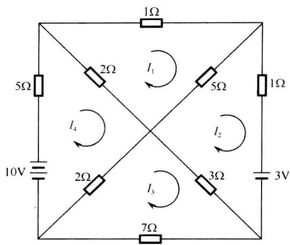
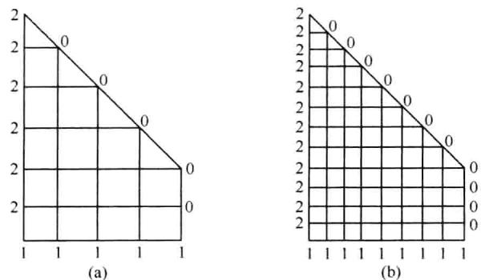
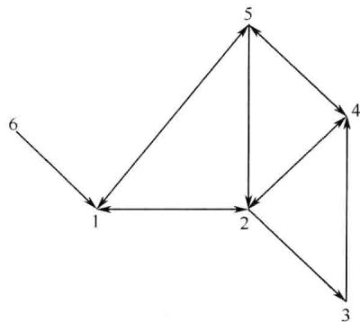
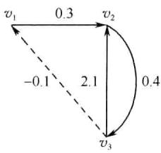
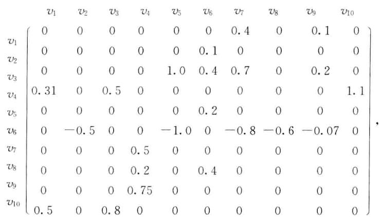

路.该例的图中,  $v_{4}v_{5}v_{1}v_{2}v_{3}$  为一条长为4的路,  $v_{4}$  为起点,  $v_{3}$  为终点.  $v_{1}v_{2}v_{5}v_{1}$  为回路.若  $v_{i}$  与  $v_{j}$  之间存在一条路,则称这两点连通.记它们之间的路为  $v_{i} - v_{j}$  路.如果一个图的任意两点均连通,则称这个图为连通图.因此,若  $i$  队间接胜  $j$  队,则存在长为  $k(k\geqslant 2)$  的  $v_{i} - v_{j}$  路.若引入

$$
a_{i j}=\left\{{\begin{array}{l l}{1,}&{{\frac{\#}{\#}}(v_{i},v_{j})\in A,}\\ {0,}&{{\frac{\#}{\#}}(v_{i},v_{j})\notin A,}\end{array}}\right.
$$

并定义矩阵  $M = (a_{ij})_{n\times n}$ ,其中  $n$  为图中顶点的数目,则每个图可以用一个矩阵表示,称之为图的邻接矩阵.本例图的邻接矩阵为

$$
M=\left[\begin{array}{l l l l l}{0}&{1}&{1}&{0}&{0}\\ {0}&{0}&{1}&{1}&{1}\\ {0}&{0}&{0}&{0}&{0}\\ {1}&{0}&{1}&{0}&{1}\\ {1}&{0}&{1}&{0}&{0}\end{array}\right].
$$

邻接矩阵是一个元素为1或0的整数矩阵,其主对角元全为0. 它的每一行代表一个队的比赛胜负情况,每一行的和等于相应的队直接胜的次数,由已知条件可知,应在第2队与第4队中确定冠亚军,在第1队与第5队中确定3,4名,因此还需要计算各队间接胜的次数,用图论的语言,即需计算各队之间路的条数,先计算各队之间长为2的路的条数,关于长为  $k$  的路的条数的计算,有下述定理.

定理8.1设  $M = (a_{ij})_{n\times n}$  为图  $G = (V,A)$  的邻接矩阵,则  $M^{k}$  的第  $i$  行第  $j$  列元素等于  $v_{i}$  与  $v_{j}$  之间长为  $k$  的路的数目.

由这个定理可见,要确定比赛的名次,我们先看矩阵  $M$  的各行之和.按和的大小确定比赛的名次.若有两行或多行的元素和相同,则计算矩阵  $M + M^{2}$  各行元素之和.若再出现有两行或多行的元素和相同,再计算  $M + M^{2} + M^{3}$  各行元素之和.依次类推.

# 2. 程序实现

以下是实现上述计算目的的Matlab脚本程序:

A=[01100;000111;00000;10101;10100];

$k = 1$

len  $= 1$

while len  $>0$

if  $k > 1$

$$
\mathtt{A} = \mathtt{A} + \mathtt{A}\wedge \mathtt{k};
$$

end $\mathbf{s} =$  sum(A'); sum函数对列进行求和,所以需进行转置操作 $\mathfrak{m} = 1:\max \left(\mathfrak{s}\right)$  .len  $\coloneqq$  length(find(histc(s,m)>1)); $\mathbf{k} = \mathbf{k} + 1$  .ends 输出无行和相等的各行元素之和

S=

5 8 0 7 4

由结果可以看出,比赛的名次依此是2队,4队,1队,5队,3队.

程序中的相关函数说明:

histc(s,m) 在向量  $s$  中查找向量  $m$  中每一个元素出现的次数

find  $(X > 1)$  给出向量  $X$  中大于1的元素的位置

length(X) 返回向量  $X$  的长度

# 8.3.2 投入产出分析

# 1. 问题和分析

一个城镇有三个主要生产企业:煤矿、电厂和地方铁路作为它的经济系统.已知生产价值一元的煤,需消耗0.25元的电费和0.35元的运输费;生产价值一元的电,需消耗0.40元的煤费、0.05元的电费和0.10元的运输费;而提供价值一元的铁路运输服务,则需消耗0.45元的煤、0.10元的电费和0.10元的运输费.假设在某个星期内,除了这三个企业间的彼此需求,煤矿得到50000元的订单,电厂得到25000元的电量供应要求,而地方铁路得到价值30000元的运输需求.试问:

(1) 这星期这三个企业各应生产多少产值才能满足内外需求?

(2) 除了外部需求,试求这星期各企业之间的消耗需求,同时求出各企业新创造的价值(即产值中除去各企业的消耗所剩的部分);

(3) 如果煤矿需要增加总产值10000元,它对各个企业的产品或服务的完全需求分别将是多少?

这是一个小型的经济上的投入产出模型.在一个国家或区域的经济系统中,各部门(或企业)既有消耗又有生产,或者说既有"投入"又有"产出",生产的产品供给各部门和系统外以满足需求,同时也要消耗系统内各部门所提供的产品.消耗的目的是为了生产,生产的结果必然要创造新价值,以支付工资和获取利润.显然对每一部门,物资消耗和新创造的价值等于它生产的总产值.这就是"投入"和"产

出"之间的平衡关系.

设煤矿、电厂和地方铁路在这星期生产的总产值分别为  $x_{1}, x_{2}$  和  $x_{3}$  (元), 那么很容易有

$$
\left\{ \begin{array}{r}0x_{1} + 0.40x_{2} + 0.45x_{3} + 50000 = x_{1}, \\ 0.25x_{1} + 0.05x_{2} + 0.10x_{3} + 25000 = x_{2}, \\ 0.35x_{1} + 0.10x_{2} + 0.10x_{3} + 30000 = x_{3}, \end{array} \right. \tag{8.1}
$$

方程组(8.1)的每个等式以价值形式说明了对每一企业:

中间产品(作为系统内各企业的消耗)  $+$  最终产品(外部需求)  $=$  总产品, 称之为分配平衡方程组.

另一方面, 若设  $z_{1}, z_{2}$  和  $z_{3}$  (元)分别为煤矿、电厂和地方铁路在这星期的新创价值, 那么应有

$$
\left\{ \begin{array}{r}0x_{1} + 0.25x_{1} + 0.35x_{1} + z_{1} = x_{1}, \\ 0.40x_{2} + 0.05x_{2} + 0.10x_{2} + z_{2} = x_{2}, \\ 0.45x_{3} + 0.10x_{3} + 0.10x_{3} + z_{3} = x_{3}, \end{array} \right. \tag{8.2}
$$

方程组(8.2)说明对每一企业:

对系统内各企业产品的消耗  $+$  新创价值  $=$  总产值, 称之为消耗平衡方程组.

可将方程组(8.1)写成矩阵形式为

$$
A X + Y = X,
$$

其中

$$
A = \left[ \begin{array}{ccc}0 & 0.40 & 0.45 \\ 0.25 & 0.05 & 0.10 \\ 0.35 & 0.10 & 0.10 \end{array} \right], \quad X = \left[ \begin{array}{c}x_{1} \\ x_{2} \\ x_{3} \end{array} \right], \quad Y = \left[ \begin{array}{c}50000 \\ 25000 \\ 30000 \end{array} \right],
$$

在经济学上分别称这三个矩阵为直接消耗矩阵, 产出向量和最后需求(或最终产品)向量;  $A$  中的元素  $a_{i}$  称之为直接消耗系数. 上述方程组又可写为

$$
(E - A)X = Y, \tag{8.3}
$$

其中  $E$  是单位矩阵,  $E - A$  称为Leontief矩阵.

在求出了  $X$  以后, 显然列向量

$$
x_{1}\left[ \begin{array}{c}0 \\ 0.25 \\ 0.35 \end{array} \right]
$$

的三个分量分别表示三个企业为煤矿的总产值所作的产品消耗(或称投入). 类似地, 列向量

$$
x_{2}\left[ \begin{array}{c}0.40 \\ 0.05 \\ 0.10 \end{array} \right], \quad x_{3}\left[ \begin{array}{c}0.45 \\ 0.10 \\ 0.10 \end{array} \right]
$$

分别表示三个企业对于电厂、铁路的总产值所作的投入.这三个列向量组成的矩阵  $T$  可以由下式得到:

$$
T = A\left[ \begin{array}{ccc}x_{1} & 0 & 0 \\ 0 & x_{2} & 0 \\ 0 & 0 & x_{3} \end{array} \right],
$$

它是投入产出分析中的投入产出表的基本部分.有了总产量和各企业的投入,就可立即得到新创价值.

由于某个企业在进行生产或提供服务时,对任何一个产品的直接消耗事实上还蕴含着对其他产品的间接消耗,例如,地方铁路在运输时直接消耗了煤,但它还通过消耗电而间接消耗煤,因为电的生产需要消耗煤,这样就有了完全消耗系数的概念.完全消耗系数是指某企业生产单位产值的产品而对其他企业产品的总消耗值.

现在设煤矿、电厂和地方铁路生产单位产值对煤、电和铁路运输的总消耗值(即完全消耗系数)分别为  $b_{ij}, i,j = 1,2,3$ ,那么不难理解

$$
a_{ij} + \sum_{l = 1}^{3} b_{il} a_{lj} = b_{ij}, \tag{8.4}
$$

记

$$
B = \left[ \begin{array}{lll}b_{11} & b_{12} & b_{13} \\ b_{21} & b_{22} & b_{23} \\ b_{31} & b_{32} & b_{33} \end{array} \right].
$$

称之为完全消耗矩阵.这样(8.4)式可以写成矩阵形式

$$
A + B A = B, \tag{8.5}
$$

由此可得

$$
B = A(E - A)^{-1} = [E - (E - A)](E - A)^{-1} = (E - A)^{-1} - E. \tag{8.6}
$$

# 2. 程序实现

(1)现在我们用Matlab来求解方程组(8.3):

$$
\begin{array}{r l} & {> > \mathrm{~A = \left[0~0.4~0.45;0.25~0.05~0.1;0.35~0.1~0.1\right];}}\\ & {> > \mathrm{~Y = \left[50000,25000,30000\right]'};} \end{array}
$$

>>X=(eye(3)- A)\Y eye函数用于生成指定维数的单位阵

X=

1.0e+05\*

1.1446

0.6540

0.8511

(2)由于得到了系统各个企业的总产值(产出向量),我们就可以计算各企业的消耗和新创造价值:

>>T=A\*diag(X)

T=

1.0e+04\*

0 2.6158 3.8300

2.8615 0.3270 0.8511

4.0060 0.6540 0.8511

我们指出过该矩阵每一列的意义.显然,它的每一行给出了每一企业分别用于企业内部和其他企业的消耗(中间产品).进而利用(8.2)式计算:

>>X- sum(T)'

ans=

1.0e+04\*

4.5783

2.9428

2.9789

说明各企业新创造的价值为

我们将上述计算结果列成表8.2,这就是投入产出表(仅取到个位数,并且考虑到产生的误差而略作修正).

表8.2  

<table><tr><td colspan="2">产出</td><td colspan="4">中间产品</td><td>最终产品</td><td rowspan="2">总产值</td></tr><tr><td colspan="2">投入</td><td>煤矿</td><td>煤矿</td><td>煤矿</td><td>铁路</td><td>小计</td></tr><tr><td rowspan="4">中间投入</td><td>煤厂</td><td>0</td><td>26158</td><td>38300</td><td>64458</td><td>50000</td><td>114458</td></tr><tr><td rowspan="2">铁路</td><td>28614</td><td>3270</td><td>8511</td><td>40395</td><td>25000</td><td>65395</td></tr><tr><td>40060</td><td>6540</td><td>8511</td><td>55111</td><td>30000</td><td>85111</td></tr><tr><td>小计</td><td>98674</td><td>35968</td><td>55322</td><td>159964</td><td>105000</td><td>264964</td></tr><tr><td colspan="2">新创价值</td><td>45784</td><td>29427</td><td>29789</td><td>105000</td><td rowspan="2" colspan="2"></td></tr><tr><td colspan="2">总产值</td><td>114458</td><td>65395</td><td>85111</td><td>264964</td></tr></table>

一般说来,在对一个国家或区域的经济用投入产出法进行分析和研究时,首先就是根据统计数字制订投入产出表,进而计算出有关的技术系数(例如直接消耗系数)。通过对这些系数的分析,可以了解经济系统的结构和各部门之间的数量关系;还可以建立上述的反映分配平衡和消耗平衡关系的代数方程组,通过求解方程组来获知最终需求的变动对各部门生产的影响。

(3)计算完全消耗矩阵:

>>inv(eye(3)- A)- eye(3)

ans=

0.4566 0.6981 0.8059

0.4482 0.2799 0.3663

0.6162 0.4137 0.4652

这就是该问题的完全消耗矩阵。

与直接消耗矩阵  $A$  一样,完全消耗矩阵  $B$  反映了煤矿、电厂和铁路在生产需求上的关系。但后者从完全需求的角度揭示了它们在更深层次上的相互依赖关系。这意味着如果该城镇要扩大煤的生产而每周增加产值1万元,那就不仅需要相应增产0.25万元的电和0.35万元的运输能力作为直接消耗,事实上而且还必须有约0.46万元的煤、0.20万元的电和0.27万元的运输能力作为间接消耗。这对经济部门的计划决策者而言是极其重要的数量依据。在为某企业或部门扩大生产而进行投资等问题上,需要充分考虑其他部门的相应能力。

# 8.3.3 杂交育种的稳定性

# 1. 问题和分析

假设某农场的试验场中某种植物的基因型为  $AA, A\alpha$  和  $\alpha \alpha$ ,三种基因型各占  $1 / 3$ 。已知  $AA$  型基因属于优良品种,试分析下列三种方案中的哪一种方案有利于培养出优良品种?

方案(I):采用  $AA$  型的植物与每种基因型植物相结合的方法培育植物后代;

方案(II):采用  $A\alpha$  型的植物与每种基因型植物相结合的方法培育植物后代;

方案(III):将具有相同基因型植物相结合。

根据遗传学的知识,相对的性质由相对的基因控制,相对的基因有显性和隐性的关系。因而有显性性状和隐性性状。隐性性状的基因在跟显性性状的基因同时存在时,得不到表现,但是没有消失,而是在子二代中得到表现。这种相对的基因称为等位基因。在有性生殖的传代过程中,两代间唯一的联系是配子,即卵、花粉或精子。基因在上一代身体细胞里成双存在,而在生殖细胞里成单存在。代表某个性状的相对的基因以相等的可能性(概率)传给子代,父母双方对后代的遗传是

相等的.配子通过受精或授粉成为合子,合子所含的基因又是成双存在了.根据这个规律,如果一个亲本是  $\alpha \alpha$  型,另一个亲本是  $A\alpha$  型,后代从  $\alpha \alpha$  亲本总是接受一个  $\alpha$  基因,以相等的概率从  $A\alpha$  亲本接受一个  $A$  基因或  $\alpha$  基因,后代所具有的等位基因为  $A\alpha$  型或  $\alpha \alpha$  型的概率是相同的,因此,对于亲本基因型的所有可能的组合,后代可能的基因型的概率如表8.3所示.

表8.3  

<table><tr><td rowspan="2" colspan="2"></td><td colspan="6">亲本的基因</td></tr><tr><td>AA-AA</td><td>AA-Aα</td><td>AA-Aα</td><td>Aα-Aα</td><td>Aα-αα</td><td>αα-αα</td></tr><tr><td rowspan="3">后代的基因型</td><td>AA</td><td>1</td><td>1/2</td><td>0</td><td>1/4</td><td>0</td><td>0</td></tr><tr><td>Aα</td><td>0</td><td>1/2</td><td>1</td><td>1/2</td><td>1/2</td><td>0</td></tr><tr><td>αα</td><td>0</td><td>0</td><td>0</td><td>1/4</td><td>1/2</td><td>1</td></tr></table>

下面,我们讨论本例所提出的问题.设  $a_{n}, b_{n}, c_{n}$  分别代表在第  $n$  代作物中  $AA$  型,  $A\alpha$  型及  $\alpha \alpha$  型所占的比例,  $n = 1,2, \dots$ . 那么,由假设

$$
a_{0} = b_{0} = c_{0} = \frac{1}{3}, \quad \text{且} a_{0} + b_{0} + c_{0} = 1.
$$

(1)由表8.3可知,对于用  $AA$  型基因授粉的情况,第  $n$  代的基因型分布可由第  $n - 1$  代的基因型分布由下式求出:

$$
\left\{ \begin{array}{l}a_{n} = a_{n - 1} + \frac{1}{2} b_{n - 1}, \\ b_{n} = c_{n - 1} + \frac{1}{2} b_{n - 1}, \quad n = 1,2, \dots \\ c_{n} = 0. \end{array} \right. \tag{8.7}
$$

引入向量

$$
\mathbf{X}^{(n)} = \left[ \begin{array}{l}a_{n} \\ b_{n} \\ c_{n} \end{array} \right], \quad n = 0,1,2, \dots \tag{8.8}
$$

与矩阵

$$
M_{1} = \left[ \begin{array}{ccc}1 & \frac{1}{2} & 0 \\ 0 & \frac{1}{2} & 1 \\ 0 & 0 & 0 \end{array} \right], \tag{8.9}
$$

则(8.7)式可表示成矩阵形式

$$
\mathbf{X}^{(n)} = M_{1} \mathbf{X}^{(n - 1)}, \quad n = 1,2, \dots , \tag{8.10}
$$

由上式不难看出:

$$
\begin{array}{r}{\pmb{X}^{(n)} = M_{1}\pmb{X}^{(n - 1)} = M_{1}^{2}\pmb{X}^{(n - 2)} = \dots = M_{1}^{n}\pmb{X}^{(0)}.} \end{array} \tag{8.11}
$$

因此,如果能计算出  $M_{1}^{n}$ ,则将其代入(8.11)即可得出  $\pmb{X}^{(n)}$ .由第五章可知,如果矩阵  $M_{1}$  可对角化,则能较方便地计算出  $M_{1}^{n}$ ,这就需要讨论  $M_{1}$  的特征值与特征向量.

矩阵  $M_{1}$  的特征值为

$$
\lambda_{1} = 1, \quad \lambda_{2} = \frac{1}{2}, \quad \lambda_{3} = 0,
$$

因而, $M_{1}$  有3个不同的特征值,它必能相似于对角矩阵.与这3个特征值对应的特征向量分别为

$$
\pmb{\alpha}_{1} = \left[ \begin{array}{c}1 \\ 0 \\ 0 \end{array} \right], \quad \pmb{\alpha}_{2} = \left[ \begin{array}{c}1 \\ -1 \\ 0 \end{array} \right], \quad \pmb{\alpha}_{3} = \left[ \begin{array}{c}1 \\ -2 \\ 1 \end{array} \right].
$$

令

$$
P = \left[ \begin{array}{ccc}1 & 1 & 1 \\ 0 & -1 & -2 \\ 0 & 0 & 1 \end{array} \right],
$$

则

$$
M_{1} = P D P^{-1},
$$

其中

$$
D = \left[ \begin{array}{c}1 \\ \frac{1}{2} \\ 0 \end{array} \right],
$$

因而,

$$
\pmb{X}^{(n)} = P D^{n}P^{-1}\pmb{X}^{(0)} = \left[ \begin{array}{ccc}1 & 1 - \left(\frac{1}{2}\right)^{n} & 1 - \left(\frac{1}{2}\right)^{n - 1} \\ 0 & \left(\frac{1}{2}\right)^{n} & \left(\frac{1}{2}\right)^{n - 1} \\ 0 & 0 & 0 \end{array} \right]\left[ \begin{array}{c}a_{0} \\ b_{0} \\ c_{0} \end{array} \right],
$$

即

$$
\pmb{X}^{(n)} = \left[ \begin{array}{c}a_{n} \\ b_{n} \\ c_{n} \end{array} \right] = \left[ \begin{array}{c}1 - \left(\frac{1}{2}\right)^{n}b_{0} - \left(\frac{1}{2}\right)^{n - 1}c_{0} \\ \left(\frac{1}{2}\right)^{n}b_{0} + \left(\frac{1}{2}\right)^{n - 1}c_{0} \\ 0 \end{array} \right], \quad n = 1,2,\dots . \tag{8.12}
$$

显然,  $a_{n} + b_{n} + c_{n} = 1, n = 0,1,2, \dots$ , 且

$$
\lim_{n \to \infty} a_{n} = 1, \quad \lim_{n \to \infty} b_{n} = \lim_{n \to \infty} c_{n} = 0, \tag{8.13}
$$

(8.13)式说明, 如果一直使用方案(I)育种, 则最终将得到纯种  $AA$ .

(2) 对于方案(Ⅱ)与方案(Ⅲ)可作类似的讨论

记与(8.9)式对应的方案(Ⅱ)与方案(Ⅲ)的矩阵分别为  $M_{2}$  与  $M_{3}$ , 则

$$
M_{2}=\left[\begin{array}{c c c}{{\frac{1}{2}}}&{{\frac{1}{4}}}&{{0}}\\ {{\frac{1}{2}}}&{{\frac{1}{2}}}&{{\frac{1}{2}}}\\ {{0}}&{{\frac{1}{4}}}&{{\frac{1}{2}}}\end{array}\right],\quad M_{3}=\left[\begin{array}{c c c}{{1}}&{{\frac{1}{4}}}&{{0}}\\ {{0}}&{{\frac{1}{2}}}&{{0}}\\ {{0}}&{{\frac{1}{4}}}&{{1}}\end{array}\right].
$$

经计算  $M_{2}$  与  $M_{3}$  都有3个线性无关的特征向量, 因此, 它们都可以相似于对角矩阵, 对方案(Ⅱ)可求出, 当  $n \to \infty$  时,

$$
X^{(n)} \rightarrow \left[ \begin{array}{c} \frac{a_{0} + b_{0} + c_{0}}{4} \\ \frac{a_{0} + b_{0} + c_{0}}{2} \\ \frac{a_{0} + b_{0} + c_{0}}{4} \end{array} \right].
$$

对方案(Ⅲ), 当  $n \to \infty$  时,

$$
X^{(n)} \rightarrow \left[ \begin{array}{c} a_{0} + \frac{b_{0}}{2} \\ 0 \\ c_{0} + \frac{b_{0}}{2} \end{array} \right].
$$

比较上述结果可知, 对于方案(Ⅱ), 当  $a_{0}, b_{0}, c_{0}$  不全为零时, 若不考虑其他因素的影响, 永远不可能得到纯种的  $AA$  型植物, 对方案(Ⅲ), 当  $b_{0}, c_{0}$  不全为零时, 同样也不能得到纯种的  $AA$  型植物.

# 2. 程序实现

我们仅以方案(I)为例说明用Matlab求解上述问题的过程

因为要求极限, 所以只能采用Symbolic Math Toolbox工具箱的limit函数, 所有矩阵和其他变量也必须定义为符号对象:

$$
\begin{array}{r l}{> > }&{{}\mathbb{M}=\operatorname{sym}(\left[1\ 1/2\ 0;0\ 1/2\ 1;0\ 0\ 0\right]);}\end{array}
$$

$$
\begin{array}{r l}{> > }&{{}\mathbf{x}0=\operatorname{sym}(\left[1/3,1/3,1/3\right]^{*});}\end{array}
$$

$$
\begin{array}{r l}{> > }&{{}[\mathsf{V},\mathsf{D}]=\mathsf{e i g}(\mathsf{M})}\end{array}
$$

[1,- 1,1] [- 2,1,0] [1,0,0]

D=

>>symsn将n声明为符号对象

>>limit(V\*D\*n\*inv(V)\*x0,n,Inf)

ans=

1

0

0

3. 讨论

为什么不同的育种方法得到不同的结果?我们可以从数学的角度加以说明

我们所讨论的农场有不同的基因型植物,可以看成是一个系统有不同的状态,每一种基因型是一个状态,这个系统每一代的基因型可以看成是某一时刻的状态我们所讨论的系统由有限个状态组成,系统由一个状态向另一个状态转化是随机的,这种转化只与当时的状态有关,而与其他状态无关,我们称系统状态的这种转化过程为马尔可夫过程

如果系统有  $k$  个状态,设当系统处于状态  $j$  时,下一个状态  $i$  的概率为  $p_{ij}(i,j = 1,2,\dots ,k)$ ,称  $p_{ij}$  为转移概率.矩阵  $M_{1},M_{2},M_{3}$  就是以转移概率为元素的矩阵,因此,它们的元素非负,且每列各元素之和为1,称这样的矩阵为转移矩阵.向量  $\mathbf{X}^{(n)}$  是具有非负元素的列向量,且元素之和为1,称这样的向量为概率向量.它代表第  $n$  代时马尔可夫过程的状态,又称为马尔可夫过程的状态向量.

考察矩阵  $M_{i}(i = 1,2,3)$  的幂可发现,对矩阵  $M_{2}$  而言

$$
M_{2}^{2} = \left[ \begin{array}{ccc}\frac{3}{8} & \frac{1}{4} & \frac{1}{8} \\ \frac{1}{2} & \frac{1}{2} & \frac{1}{2} \\ \frac{1}{8} & \frac{1}{4} & \frac{3}{8} \end{array} \right],
$$

它的元素全为正,因此,  $M_{2}^{n},n = 3,4,\dots$  的元素也必全为正,即  $M_{2}$  的一些整数幂的元素全为正,称这样的转移矩阵为正则矩阵.对应的马尔可夫过程称为正则过程.关于正则马尔可夫过程有下述定理

定理8.2 如果矩阵  $M$  是一个  $k$  阶正则矩阵,则当  $n\to \infty$  时,

$$
M^{n}\rightarrow \left[ \begin{array}{c c c c}{p_{1}} & {p_{1}} & \dots & {p_{1}}\\ {p_{2}} & {p_{2}} & \dots & {p_{2}}\\ \vdots & \vdots & & \vdots \\ {p_{k}} & {p_{k}} & \dots & {p_{k}} \end{array} \right]\overset {\mathrm{i}\mathcal{L}\mathcal{H}}{=}M_{\infty},
$$

其中  $p_{i}(i = 1,2,\dots ,k)$  是正数,且  $p_{1} + p_{2} + \dots +p_{k} = 1$

如果  $\mathbf{X}$  是一概率向量,则

$$
M^{n}X\rightarrow \left[ \begin{array}{c}{p_{1}}\\ {p_{2}}\\ \vdots \\ {p_{k}} \end{array} \right].
$$

若记  $\pmb {\pi} = (\pmb{\mathscr{p}}_{1},\pmb{\mathscr{p}}_{2},\dots ,\pmb{\mathscr{p}}_{k})^{\mathrm{T}}$  ,称  $\pi$  为定常状态向量.那么,正则矩阵的定常状态向量是唯一的,它满足方程  $M_{\infty}\pi = \pi$

由定理8.2不难得到方案(Ⅱ)的结果

然而矩阵  $M_{1}$  与  $M_{3}$  就不具有这个特点.观察矩阵  $M_{1}$  可以发现,它可以写成如下的分块矩阵:

$$
M_{1}=\binom{E_{1}}{O}\binom{R}{Q},
$$

其中  $E_{1}$  是一阶单位矩阵,  $R$  是行和为正的矩阵,  $Q$  是二阶矩阵.一般的,如果一个马尔可夫过程的转移矩阵可以写成

$$
\binom{E_{r}}{O}\binom{R}{Q},
$$

其中  $E_{r}$  为  $r$  阶单位矩阵,  $R$  是各行元素之和为正的矩阵,  $Q$  为方阵,则对应的马尔可夫过程称为吸收过程,  $E_{r}$  所对应的状态称为吸收状态,其余的状态称为非吸收状态.对于吸收的马尔可夫过程有如下结论.

定理8.3 设矩阵  $M$  为吸收马尔可夫过程的转移矩阵,

$$
M=\binom{E_{r}}{O}\binom{R}{Q},
$$

其中  $E_{r}$  为  $r$  阶单位矩阵,则

$$
(1)M^{n}=\left[\begin{array}{c c}{{E_{r}}}&{{R_{n}}}\\ {{O}}&{{Q^{n}}}\end{array}\right]\mathrm{~,~}\mathbb{H}\lim _{n\to\infty}Q^{n}=O.
$$

(2)  $E - Q$  是可逆矩阵,记  $(E - Q)^{-1} = N$  ,则  $N$  中第  $j$  列元素之和表示从非吸收状态  $j$  出发,被某个吸收状态吸收之前的平均转移次数.

(3)记  $B = R N$  ,则  $B$  的元素  $b_{i j}$  是从非吸收状态  $j$  出发,被吸收状态  $i$  吸收的概率.

由定理8.3不难看出,矩阵  $M_{1}$  为吸收马尔可夫过程的转移矩阵,它的吸收状态为AA型基因所对应的状态.因而,系统的演变趋势是趋向于吸收状态,与前面讨论的结果一致.

类似地,如果交换矩阵  $M_{3}$  的第二行与第三行,再交换它的第二列与第三列,则相当于将原来的状态2(即  $A\alpha$  型基因)重新命名为状态3,而原来的状态3(即  $\alpha \alpha$  型基因)重新命名为状态2,对应的矩阵是一个吸收状态的马尔可夫过程的转移矩阵.它的吸收状态为AA型基因与  $A\alpha$  型基因,系统的演变趋势是趋向于吸收状态.

# 8.3.4 制作大型艺术建筑模型

# 1. 问题和背景

某个大型艺术建筑需要制作一个模型并取得有关的数据,采取的步骤是:从选定的若干位置和视角进行多幅摄影或录像,从而可以获得在每个特殊位置的局部建筑的相关记录数据,同时制作出该局部建筑的模型部件;进而将根据局部建筑在整体建筑结构中的相对位置来确定对它们在全局结构中的记录数据,然后再对各部件进行拼接以获得该大型艺术建筑的模型.

如果我们在空间直角坐标系(三维欧氏空间)中来考察这个问题,不难理解,模型部件在全局结构中位置的确定事实上是一个空间图形移动后新位置的确定.这种移动可以看作是平移和旋转的结合.平移是简单的,而绕轴的旋转则较为复杂.在制图、自动化、动画技术、造像术等实用课题中都会直接或间接碰到这样的问题.

现在,假定艺术建筑的局部为一二次曲面,其在某空间直角坐标系下的方程为

$$
3x^{2} + 4y^{2} + 5z^{2} + 4xy + 4yz - 1 = 0, \tag{8.14}
$$

试判断这个二次曲面的类型,并且求出该二次曲面绕过原点和点(1,1,1)的空间轴(直线)旋转  $\theta = 45^{\circ}$  所得图形新位置及其坐标方程.

下面我们对此问题进行分析和讨论:

(1)二次曲面的类型

将所给二次曲面  $3x^{2} + 4y^{2} + 5z^{2} + 4xy + 4yz - 1 = 0$  用矩阵形式表示,即为

$$
X^{\mathrm{T}}A X = 1,
$$

其中

$$
A = \left[ \begin{array}{ccc}3 & 2 & 0 \\ 2 & 4 & 2 \\ 0 & 2 & 5 \end{array} \right], \quad X = \left[ \begin{array}{c}x \\ y \\ z \end{array} \right].
$$

矩阵  $A$  是正定矩阵,因此它的特征值全为正,且存在正交变换

$$
X = Q X^{\prime}, \tag{8.15}
$$

使得在新变量下,二次曲面的方程化为

$$
x^{\prime 2} + 4y^{\prime 2} + 7z^{\prime 2} = 1, \tag{8.16}
$$

其中1,4,7为矩阵  $A$  的特征值,  $Q$  为正交矩阵,它的列向量分别是1,4,7对应的单位特征向量

$$
Q = \left[ \begin{array}{rrr}\frac{2}{3} & -\frac{2}{3} & \frac{1}{3} \\ -\frac{2}{3} & -\frac{1}{3} & \frac{2}{3} \\ \frac{1}{3} & \frac{2}{3} & \frac{2}{3} \end{array} \right],
$$

$\mathbf{X}^{\prime} = (x^{\prime}, y^{\prime}, z^{\prime})^{\mathrm{T}}$ . (8.15)式相当于作坐标变换. 由于  $Q$  为正交矩阵,故线性变换(8.15)保持长度与夹角不变,因此空间直角坐标系仍变为空间直角坐标系,且原点保持不变. 由(8.16)可知,二次曲面为椭球面. 该椭球面的中心在原点,三个长轴分别为  $1,0.5, \frac{1}{\sqrt{7}}$ . 三个主轴方向分别为

$$
\left[ \begin{array}{r}\frac{2}{3} \\ -\frac{2}{3} \\ \frac{1}{3} \end{array} \right], \left[ \begin{array}{r} - \frac{2}{3} \\ -\frac{1}{3} \\ \frac{2}{3} \end{array} \right], \left[ \begin{array}{r}\frac{1}{3} \\ \frac{2}{3} \\ \frac{2}{3} \end{array} \right],
$$

主轴方向指矩阵  $A$  的特征向量所确定的方向,

(2)二次曲面绕轴旋转后的新方程的确定

我们先考察一个点  $a$  绕给定轴旋转后的位置,

$①$  点绕过原点的轴旋转的情形,

我们用以原点为起点的向量  $\mathbf{v} = \left[ \begin{array}{c}v_{1} \\ v_{2} \\ v_{3} \end{array} \right]$  ( $\mathbf{v}$  为单位向量,即  $v_{1}^{2} + v_{2}^{2} + v_{3}^{2} = 1$ ) 表示过原点的定轴. 首先给出空间中某点  $\mathbf{a} = (a_{1}, a_{2}, a_{3})$  绕  $\mathbf{v}$  旋转  $\theta$  角度后所在新位置的坐标  $\mathbf{a}^{\prime} = (a_{1}^{\prime}, a_{2}^{\prime}, a_{3}^{\prime})$ . 为方便计,在下文中有时用点的向径来表示点,记为

$$
\mathbf{a} = \left[ \begin{array}{l}a_{1} \\ a_{2} \\ a_{3} \end{array} \right], \quad \mathbf{a}^{\prime} = \left[ \begin{array}{l}a_{1}^{\prime} \\ a_{2}^{\prime} \\ a_{3}^{\prime} \end{array} \right].
$$

考察一个最简单的情形.假设给定轴为  $x$  轴,即  $\pmb {v} = \left[ \begin{array}{l}{1}\\ {0}\\ {0} \end{array} \right].$  此时绕  $x$  轴逆时针旋转角度  $\theta$  后所得新位置点的向径  $\pmb{a}^{\prime}$  的第一个分量值显然不变,即  $a_{1}^{\prime} = a_{1}$  .所以,此问题即是寻找  $y - z$  坐标系的平面向量  $\left[ \begin{array}{l}{a_{2}}\\ {a_{3}} \end{array} \right]$  逆时针旋转角度  $\theta$  后的新向量  $\left[ \begin{array}{l}{a_{2}^{\prime}}\\ {a_{3}^{\prime}} \end{array} \right]$  由旋转的几何意义可知

$$
\left[ \begin{array}{l}{a_{1}^{\prime}}\\ {a_{2}^{\prime}}\\ {a_{3}^{\prime}} \end{array} \right] = \left[ \begin{array}{l l l}{1} & 0 & 0\\ 0 & {\cos \theta} & {-\sin \theta}\\ 0 & {\sin \theta} & {\cos \theta} \end{array} \right]\left[ \begin{array}{l}{a_{1}}\\ {a_{2}}\\ {a_{3}} \end{array} \right], \tag{8.17}
$$

也即

$$
\pmb{a}^{\prime} = P\pmb {a},
$$

其中

$$
P = \left[ \begin{array}{ccc}1 & 0 & 0 \\ 0 & \cos \theta & -\sin \theta \\ 0 & \sin \theta & \cos \theta \end{array} \right]. \tag{8.18}
$$

$②$  一般情形.

我们的方法是通过坐标系旋转将其化为以上特殊情形.为此,找两个单位向量

$$
\pmb {u} = \left[ \begin{array}{c}u_{1} \\ u_{2} \\ u_{3} \end{array} \right], \quad \pmb {w} = \left[ \begin{array}{c}w_{1} \\ w_{2} \\ w_{3} \end{array} \right],
$$

使得向量组  $\boldsymbol {v}, \boldsymbol {w}, \boldsymbol{u}$  形成新的右手直角坐标系.若定义矩阵  $B = (\textbf{v}\textbf{w}\textbf{u})$  ,那么显然  $B$  是正交矩阵,即  $B^{- 1} = B^{\mathrm{T}}$  .从而向量  $\pmb {c} = \left[ \begin{array}{l}c_{1} \\ c_{2} \\ c_{3} \end{array} \right]$  在新坐标系下的坐标表示为  $\pmb{c}^{\prime} = B^{\mathrm{T}}\pmb{c}$  ,故点  $a$  的向径的新坐标为  $B^{\mathrm{T}}\pmb{a}$  .而旋转轴在该坐标系下是新的横轴,即  $B^{\mathrm{T}}\pmb {v} = \left[ \begin{array}{l}1 \\ 0 \\ 0 \end{array} \right]$  ,恰成为以上讨论的简单情形.

由于在新的坐标系下相应的旋转角的大小和方向均不变,因此由前面的讨论可知目标点  $a$  旋转后的新位置  $a^{\prime}$  在该新坐标系下的向径表示为  $P B^{\mathrm{T}}\pmb{a}$  ,而在原来的坐标系下的表示则为

$$
\pmb{a}^{\prime} = B P B^{\mathrm{T}}\pmb{a} = R\pmb {a}, \tag{8.19}
$$

其中  $R = B P B^{\mathrm{T}}$  .根据分块矩阵的基本运算法有

$$
R = (\textbf{v}\textbf{w}\textbf{u})\left[ \begin{array}{c c c}{1} & 0 & 0\\ 0 & {\cos \theta} & {-\sin \theta}\\ 0 & {\sin \theta} & {\cos \theta} \end{array} \right]\left[ \begin{array}{c}{\pmb{v}^{\mathrm{T}}}\\ {\pmb{w}^{\mathrm{T}}}\\ {\pmb{u}^{\mathrm{T}}} \end{array} \right],
$$

可将  $R$  用  $\boldsymbol{v}$  与  $\theta$  表示为

$$
R = \pmb{w}^{\mathrm{T}} + \cos \theta (E_{3} - \pmb{w}^{\mathrm{T}}) + \sin \theta \left[ \begin{array}{ccc}0 & -v_{3} & v_{2} \\ v_{3} & 0 & -v_{1} \\ -v_{2} & v_{1} & 0 \end{array} \right]
$$

$$
= \left[ \begin{array}{ccc}v_{1}^{2}(1 - \cos \theta) + \cos \theta & v_{1}v_{2}(1 - \cos \theta) - v_{3}\sin \theta & v_{1}v_{3}(1 - \cos \theta) + v_{2}\sin \theta \\ v_{1}v_{2}(1 - \cos \theta) + v_{3}\sin \theta & v_{2}^{2}(1 - \cos \theta) + \cos \theta & v_{2}v_{3}(1 - \cos \theta) - v_{1}\sin \theta \\ v_{1}v_{3}(1 - \cos \theta) - v_{2}\sin \theta & v_{2}v_{3}(1 - \cos \theta) + v_{1}\sin \theta & v_{3}^{2}(1 - \cos \theta) + \cos \theta \end{array} \right],
$$

称矩阵  $R$  为相应问题的旋转矩阵

如果记旋转后向量的坐标为  $X$  ,而原位置的坐标为  $X^{\prime}$  ,则有

$$
X^{\prime} = R X^{\prime} = 1,
$$

由于原位置点位于给定椭球面上,故有

$$
X^{\prime \mathrm{T}}A X^{\prime} = 1,
$$

从而得到

$$
X^{\mathrm{T}}R A R^{\mathrm{T}}X = 1,
$$

这就是曲面旋转后位置的方程

还可以求出  $R A R^{\mathrm{T}}$  对应的特征向量为

$$
\left[ \begin{array}{c}0.792235 \\ -0.594875 \\ 0.135973 \end{array} \right], \quad \left[ \begin{array}{c} - 0.506557 \\ -0.516877 \\ 0.6901 \end{array} \right], \quad \left[ \begin{array}{c}0.340242 \\ 0.6156 \\ 0.710825 \end{array} \right]
$$

它们恰为旋转后椭球面对应的三个主轴方向

也可以考虑椭球面上关键点和方向的变化,这里不再赘述

# 2. 程序实现

(1)求正交矩阵  $Q$

>>A=sym([320;242;025]);

>>[V,D]=eig(A);

>>s=sqrt(sum(V.\*V));

>>V.[s;s;s]

ans=

$$
\left[ \begin{array}{c}2 / 3, 1 / 3, -2 / 3 \end{array} \right]
$$

$$
[-2 / 3,2 / 3, -1 / 3]
$$

$$
\left[ \begin{array}{c}1 / 3, 2 / 3, 2 / 3 \end{array} \right]
$$

(2)求正交矩阵  $B = (\nu \quad w \quad u)$

运行以下脚本程序:

$$
\mathtt{v} = \mathtt{s y m}(\left[1,1,1\right])~;
$$

$\mathsf{U} = \mathsf{n u l l}(\mathsf{v}^{\prime})$  ;

$\mathtt{w} = \mathtt{U}(:,1)$

$\mathsf{u} = \mathsf{U}(:,2)$

$\mathsf{u} = \mathsf{u} - \mathsf{u}^{\prime} \star \mathsf{w} / (\mathsf{w}^{\prime} \star \mathsf{w}) \star \mathsf{w}$

$\mathsf{u} = \mathsf{u} / \mathsf{s q r t}(\mathsf{u}^{\prime} \star \mathsf{u})$

$\mathsf{v} = \mathsf{v} / \mathsf{s q r t}(\mathsf{v}^{\prime} \star \mathsf{v})$

$\mathsf{w} = \mathsf{w} / \mathsf{s q r t}(\mathsf{w}^{\prime} \star \mathsf{w})$

$\mathsf{B} = [\mathsf{v}, \mathsf{w}, \mathsf{u}]$

再运行

$\geq \geq$  det(B)

ans  $=$

1

可见  $B$  已经构成右手系.再求出  $R$  及旋转后的坐标  $X$

theta  $= 45 / 180$

$\mathsf{P} = [1, 0, 0; 0, \cos (\text{theta}), - \sin (\text{theta}); 0, \sin (\text{theta})$

cos(theta)];

$\mathsf{R} = \mathsf{e v a l}(\mathsf{B}^{\star}\mathsf{P}^{\star}\mathsf{B}^{\prime})$ $\frac{9}{10}$  eval函数用于对符号对象进行近似值求值计算

$\mathsf{A} = \mathsf{s y m}([3 2 0; 2 4 2; 0 2 5])$

NewA  $=$  eval  $(\mathbb{R}^{\star}\mathbb{A}^{\star}\mathbb{R}^{\prime})$

$\mathsf{R} =$

0.9793 - 0.1325 0.1532

0.1532 0.9793 - 0.1325

- 0.1325 0.1532 0.9793

NewA  $=$

2.4644 2.0422 0.4024

2.0422 4.0753 1.5554

0.4024 1.5554 5.4604

# 习题八

利用软件Matlab计算下列各题:

1. 用克拉默法则求线性方程组

$$
\left\{ \begin{array}{l l}{3x_{1} + 2x_{2}} & {= 1,}\\ {x_{1} + 3x_{2} + 2x_{3}} & {= 1,}\\ {x_{2} + 3x_{3} + 2x_{4}} & {= 1,}\\ {x_{3} + 3x_{4} + 2x_{5}} & {= 1,}\\ {x_{4} + 3x_{5}} & {= 1.} \end{array} \right.
$$

2. 求出所有与矩阵  $A = \left( \begin{array}{cc}1 & 1 \\ 0 & 1 \end{array} \right)$  可交换的矩阵.

3. 求矩阵  $A$  的秩,以及以  $A$  为系数矩阵的齐次线性方程组的基础解系,其中

$$
A=(\begin{array}{c c c c c c c c c c c c c c c c c c c c c c c c c c c c c c c c c c c c c c c c c c c c c c c c c c c c c c c c c c c c c c c c c c c c c c c c c c c c c c c c c c c c c c c c c c c c c c c c c c c c c)_{0}^{1}-5\begin{array}{c c c c c c c c c c c c c c c c c c c c c c c c c c c c c c c c c c c c c c c c c c c c c c c c c c c c c c c c c c c c c c c c c c c c c c c c c c c c c c c c c c c c c c c c c c c c c c c\begin{array}{c c c c c c c c c c c c c c c c c c c c c c c c c c c c c c c c c c c c c c c c c c c c c c c c c c c c c c c c c c c c c c c c c c c c c c c c c c c c c c c c c c c c c c c c c c c c c c\end{array}),
$$

4. 设向量组

$$
\pmb{\alpha}_{1}=(\begin{array}{c c c c c c c c c c c c c c c c c c c c c c c c c c c c c c c c c c c c c c c c c c c c c c c c c c c c c c c c c c c c c c c c c c c c c c c c c c c c c c c c c c c c c c c c c c c c(\begin{array}{c c c c c c c c c c c c c c c c c c c c c c c c c c c c c c c c c c c c c c c c c c c c c c c c c c c c c c c c c c c c c c c c c c c c c c c c c c c c c c c c c c c c c c c c c c c c c)_{0}^{2}=(\begin{array}{c c c c c c c c c c c c c c c c c c c c c c c c c c c c c c c c c c c c c c c c c c c c c c c c c c c c c c c c c c c c c c c c c c c c c c c c c c c c c c c c c c c c c c c c c c c)_{0}^{2}+\pmb{\alpha}_{3}=(\begin{array}{c c c c c c c c c c c c c c c c c c c c c c c c c c c c c c c c c c c c c c c c c c c c c c c c c c c c c c c c c c c c c c c c c c c c c c c c c c c c c c c c c c c c c c c c c c c
$$

求向量组的极大无关组与秩,并将其他向量用极大无关组线性表示

5. 求出方程组

$$
\left\{ \begin{array}{l l}{x_{1} + 3x_{2} + 5x_{3} - 4x_{4}} & {= 1,}\\ {x_{1} + 3x_{2} + 2x_{3} - 2x_{4} + x_{5} = -1,}\\ {x_{1} - 2x_{2} + x_{3} - x_{4} - x_{5} = 3,}\\ {x_{1} - 4x_{2} + x_{3} + x_{4} - x_{5} = 3,}\\ {x_{1} + 2x_{2} + x_{3} - x_{4} + x_{5} = -1} \end{array} \right.
$$

的所有的解.

6. 设

$$
A=\left(\begin{array}{ccc}1 & 0 & 0 \\ 0 & 1 & 0 \\ 3 & 1 & 2\end{array}\right),
$$

求出所有与矩阵  $A$  可交换的三阶实矩阵所生成的子空间的维数与一组基.

7. 求正交矩阵  $Q$  ，使得  $Q^{\mathrm{T}}AQ$  为对角矩阵，其中

$$
A = \begin{bmatrix} -1 & -3 & 3 & -3\\ -3 & -1 & -3 & 3\\ 3 & -3 & -1 & -3\\ -3 & 3 & -3 & -1 \end{bmatrix} .
$$

8. 判定二次型

$$
f = 99x_{1}^{2} - 12x_{1}x_{2} + 48x_{1}x_{3} + 130x_{3}^{2} - 60x_{2}x_{3} + 71x_{1}^{2}
$$

是否是正定二次型

9. 已知四阶实对称矩阵  $A$  的特征值为1，3（二重），5，与3对应的特征向量为

$$
\begin{array}{r}\left[ \begin{array}{c}1\\ 1\\ 1\\ 1 \end{array} \right],\left[ \begin{array}{c}1\\ -1\\ 1\\ -1 \end{array} \right]. \end{array}
$$

求矩阵  $\mathcal{A}$

10. 在  $M^{\mathbb{P}^{\times 2}}$  中定义了线性变换

$$
\mathcal{A}_1(P) = PM_0,\quad \mathcal{A}_2(P) = M_0P,\quad \forall P\in M^{\mathbb{P}^{\times 2}},
$$

其中  $M_0$  是一给定的矩阵，

$$
M_0 = \begin{bmatrix} a & b\\ c & d \end{bmatrix} ,
$$

分别求  $\mathcal{A}_1,\mathcal{A}_2$  在基

$$
\begin{array}{l l l}{{M_{1}=\left[\begin{array}{l l}{{1}}&{{1}}\\ {{1}}&{{1}}\end{array}\right],}}&{{M_{2}=\left[\begin{array}{l l}{{1}}&{{-1}}\\ {{1}}&{{-1}}\end{array}\right],}}\\ {{M_{3}=\left[\begin{array}{l l}{{1}}&{{1}}\\ {{-1}}&{{-1}}\end{array}\right],}}&{{M_{4}=\left[\begin{array}{l l}{{-1}}&{{1}}\\ {{1}}&{{-1}}\end{array}\right]}}\end{array}
$$

下的矩阵.

11. 设  $V$  为四维线性空间，线性变换  $\mathcal{A}$  在一组基  $\alpha_{1},\alpha_{2},\alpha_{3},\alpha_{4}$  下的矩阵为

$$
A = \left[ \begin{array}{cccc}1 & -1 & 0 & 1\\ 0 & 0 & 1 & 1\\ 1 & 0 & 0 & -1\\ -1 & 1 & 0 & 1 \end{array} \right],
$$

求  $\mathcal{A}$  在基  $\beta_{1},\beta_{2},\beta_{3},\beta_{4}$  下的矩阵，其中

$$
\left\{ \begin{array}{ll}\pmb {\alpha}_1 = (1,2, - 1,0),\pmb {\beta}_1 = (2,1,0,1),\\ \pmb {\alpha}_2 = (1, - 1,1,1),\pmb {\beta}_2 = (0,1,2,2),\\ \pmb {\alpha}_3 = (-1,2,1,1),\pmb {\beta}_3 = (-2,1,1,2),\\ \pmb {\alpha}_4 = (1, - 1,0,1),\pmb {\beta}_4 = (1,3,1,2). \end{array} \right.
$$

12. 由Kirchhoff电流定律，汇集在电路的一个节点上的支路电流的代数和恒等于零.根据Kirchhoff电流定律，计算图8.9的电路中各支路的电流.

  
图8.9

13. (薄板温度的分布问题) 由热传导原理, 一块热的物体, 如果体内各点的温度不全一样, 处在温度较高点的热量就要向温度较低的点流动, 直到各点处的温度趋于稳定. 如果一块薄板已处于热平衡, 由分子运动理论, 板内一点的温度等于以这一点为圆心, 完全包含在板内的圆周上各点温度的平均值, 这称为平均值性质. 实际上, 不易计算出板内每一点的温度, 常用两族相交的曲线把板分成若干个曲边四边形的网格, 这些曲线的交点称为网格点. 处于板内的网格点的温度用四个相邻网格点的温度的平均值来近似. 见图8.9.

(1)现有如图8.10的梯形薄板, 设它的两面是绝热的, 已知四条板边的温度分别为  $0^{\circ} \mathrm{C}$ ,  $0^{\circ} \mathrm{C}$ ,  $1^{\circ} \mathrm{C}$ ,  $2^{\circ} \mathrm{C}$ . 经过一段时间后板内温度趋于稳定, 将板按图8.10所示的两种方法划分网格, 求板内各网格点的温度.

  
图8.10

(2)当线性方程组的未知量较多时, 运算量一般都很大, 在实用中常用迭代法求解. 迭代法的做法是, 将线性方程组写成

$$
X = A X + B
$$

的形式, 其中  $X$  是未知量向量. 选择  $X$  的一个适当的初值  $X^{(0)}$ , 代入上式的右端, 所得的结果记为  $X^{(1)}$ , 然后再将  $X^{(1)}$  代入上式的右端, 得到的结果记为  $X^{(2)}$ , 如此继续做下去, 一般地有如下

的迭代公式：

$$
X^{(n)} = A X^{(n - 1)} + B, \quad n = 1,2, \dots ,
$$

迭代进行到相邻两次的结果的误差小于指定的数值为止

试用迭代法求图8.10（b）各网格点的温度分布

14. 图8.11是六个城市间的航线图，试讨论从任一个城市出发能否到达任何其他城市？如

  
图8.11

果能到达，指出从任一城市出发到另一个指定城市的最短路径.如果不能到达，试添加一条适当的航线以实现上述要求并求出从任一城市出发到另一个指定城市的最短路径.

15. （运动经费问题的加权有向图）美国某大学运动经费来源主要是各类运动比赛的收入和捐赠，其中橄榄球比赛的门票收入和所获捐赠占了绝对多数，因此与橄榄球相关的某些因素对学校的运动经费起着重要作用.现在选择了与运动经费有关的10个主要变量：

$\mathcal{U}_1$  每年得到的对运动的捐赠； $\mathcal{U}_2$  用于女子运动项目的预算；

$\mathcal{U}_3$  运动比赛的收入；

$\mathcal{U}_4$  学校橄榄球队比赛的水平（主要依据在各类比赛中的名次）；

$\mathcal{U}_5$  用于男子无收入运动项目的预算；

$\mathcal{U}_6$  对体育运动的行政管理（包括管理人员薪水）的费用；

$\mathcal{U}_7$  招收橄榄球新队员的费用；

$\mathcal{U}_8$  橄榄球队教练员的薪水和奖金；

$\mathcal{U}_9$  橄榄球队员的奖学金；

$\mathcal{U}_{10}$  学校所在地平均每个家庭观看橄榄球比赛的次数

在某一时刻，当某一变量增加（通常考虑增加1个单位）时会引起其他变量变化.如果我们想用有向图来表示这个变化，显然不能像8.3.1节的有向图那么简单：其一，  $\mathcal{U}_i$  增加1时  $\mathcal{U}_j$  可能增加也可能减少；其二，增减的量有大小；其三，  $\mathcal{U}_j$  增加1时  $\mathcal{U}_i$  也会增减.因此，在这里的有向图必须在弧边上注明加权数.下面的图8.12就是一个加权有向图，它所对应的加权邻接矩阵为

$$
\begin{array}{c c c}{{v_{1}}}&{{v_{2}}}&{{v_{3}}}\\ {{v_{1}\left(\begin{array}{c c c}{{0}}&{{0.3}}&{{0}}\\ {{0}}&{{0}}&{{0.4}}\\ {{-0.1}}&{{2.1}}&{{0}}\end{array}\right),}}\end{array}
$$

  
图8.12

现在由专家根据数据分析得到了上述运动经费问题的相应的加权邻接矩阵为

若每年对运动的捐赠增加  $10\%$  ,试研究经过5年后,橄榄球队比赛的水平、招收橄榄球新队员的费用和橄榄球队员的奖学金分别会有什么变化?

16. 以下是某地区某年度各经济部门,即农业、轻工业、重工业之间产品需求的直接消耗系数矩阵

$$
\left[ \begin{array}{llll}0.059 & 0.112 & 0.073 & 0.110 \\ 0.002 & 0.289 & 0.013 & 0.077 \\ 0.062 & 0.140 & 0.430 & 0.198 \\ 0.026 & 0.167 & 0.133 & 0.154 \end{array} \right],
$$

该年各部门的外部需求分别为943.2、1383.5、948.2和646.9(亿元).试求该年各部门的总产值、新创价值以及完全消耗矩阵.

表8.4给出的是某城市一年度的各部门之间产品消耗量和外部需求量(均以产品价值计算,单位:万元),表中每一行的数字是某一个部门提供给各部门和外部的产品价值.

(1)依据表8.4,试列出投入产出简表,并求出直接消耗矩阵和完全消耗矩阵;

表8.4  

<table><tr><td></td><td>农 业</td><td>轻工业</td><td>重工业</td><td>建筑业</td><td>运输业</td><td>商 业</td><td>外部需求</td></tr><tr><td>农 业</td><td>45.0</td><td>162.0</td><td>5.2</td><td>9.0</td><td>0.8</td><td>10.1</td><td>151.9</td></tr><tr><td>轻工业</td><td>27.0</td><td>162.0</td><td>6.4</td><td>6.0</td><td>0.6</td><td>60.0</td><td>338.0</td></tr><tr><td>重工业</td><td>30.8</td><td>30.0</td><td>52.0</td><td>25.0</td><td>15.0</td><td>14.0</td><td>43.2</td></tr><tr><td>建筑业</td><td>0.0</td><td>0.6</td><td>0.2</td><td>0.2</td><td>4.8</td><td>20.0</td><td>54.2</td></tr><tr><td>运输业</td><td>1.6</td><td>5.7</td><td>3.9</td><td>2.4</td><td>1.2</td><td>2.1</td><td>33.1</td></tr><tr><td>商 业</td><td>16.0</td><td>32.3</td><td>5.5</td><td>4.2</td><td>12.6</td><td>6.1</td><td>243.3</td></tr></table>

(2)根据预测,从这一年度开始的五年内,农业的外部需求每年会下降  $1\%$  ,轻工业和商业的外部需求每年会递增  $6\%$  ,而其他部门的外部需求每年会递增  $3\%$  ,试由此预测这五年内该城市和各部门的总产值的平均每年增长率;

(3)编制第五年度的计划投入产出表.

17. 对于所给植物基因系统,如果让系统内的植物随机结合,讨论这种植物的演变趋势.

18. 某乳品市场, 有四家供应厂商 (记为 A, B, C, D), 他们的质量相同. 假设顾客的总数不变, 而每个厂商的顾客时有增减, 即每个厂新增加的顾客全来自其他厂, 而减少的顾客皆转到其他厂. 设统计到 6 月份月初各厂的顾客数及月终顾客的转移情况如表 8.5 所示, 并假设, 以后各月顾客的流动情况与 6 月份相同, 试预测 8, 9 月份各品牌乳品的市场占有率.

表8.5  

<table><tr><td rowspan="2">供应商</td><td rowspan="2">月初顾客</td><td colspan="4">新 增</td><td colspan="4">失 去</td><td rowspan="2">月终顾客</td></tr><tr><td>自 A</td><td>自 B</td><td>自 C</td><td>自 D</td><td>至 A</td><td>至 B</td><td>至 C</td><td>至 D</td></tr><tr><td>A</td><td>220</td><td>0</td><td>0</td><td>0</td><td>10</td><td>0</td><td>20</td><td>10</td><td>15</td><td>225</td></tr><tr><td>B</td><td>300</td><td>20</td><td>0</td><td>25</td><td>15</td><td>40</td><td>0</td><td>5</td><td>25</td><td>290</td></tr><tr><td>C</td><td>230</td><td>10</td><td>5</td><td>0</td><td>10</td><td>0</td><td>25</td><td>0</td><td>0</td><td>230</td></tr><tr><td>D</td><td>250</td><td>15</td><td>25</td><td>0</td><td>0</td><td>10</td><td>15</td><td>1</td><td>0</td><td>255</td></tr><tr><td></td><td>1000</td><td></td><td></td><td></td><td></td><td></td><td></td><td></td><td></td><td>1000</td></tr></table>

19.  $X$  链遗传分析.

$X$  链遗传是一种伴性遗传. 雄性有一个  $X$  染色体与一个  $Y$  染色体, 因此对某种位于  $X$  染色体上的基因  $A$  与  $a$ , 雄性个体只有  $A$  与  $a$  中的一个, 而雌性有两个  $X$  染色体, 因此雌性个体具有两个基因, 它们可能是  $AA, Aa$  与  $aa$ . 这种基因的遗传与性别有关, 称为伴性遗传.

我们讨论某种与  $X$  链遗传有关的近亲繁殖过程. 所谓近亲繁殖是指从一对雌雄性结合开始, 在它们的后代中任选雌雄性各一个成配偶, 然后再在它们的后代中任选两个结成配偶, 如此继续下去.

(1) 对某种  $X$  链基因  $A$  与  $a$ , 写出第一代的雌雄对可能的基因型与其子女可能出现的基因型及产生各种基因型子女的概率.

(2) 如果第一代配偶的基因型为  $(A, Aa)$  或  $(a, Aa)$ , 用马尔可夫过程讨论, 繁衍的后代的基因型的演变趋势.

20. 已知某一二次曲面在给定的三维直角坐标系下的方程为

$$
x^{2} - 2y^{2} - 2z^{2} - 4xy + 4xz + 8yz - 2x + y - 4z + 1 = 0,
$$

试求出该曲面绕一过原点的空间轴  $\bar{\pmb{v}} = (4,5,6)^{\mathrm{T}}$  旋转  $\theta = 45^{\circ}$  所得图形新位置及其坐标方程.

# 习题答案

# 习题一

1. (1)0; (2)1; (3)  $x^{3} - x^{2} - 1$  ; (4)18; (5)  $3abc - a^{3} - b^{3} - c^{3}$  ; (6)  $x^{2} - 4x + 3$

2. (1)9,奇排列; (2)31,奇排列;

(3)  $\frac{n(n + 1)}{2}$ , 当  $n = 4k + 1, 4k + 2$  时为奇排列, 否则为偶排列.

3.  $\mathbf{C}_{n}^{2} - s$  
4. (1)  $i = 8, k = 3$  ; (2)  $i = 6, k = 3$

5.  $-a_{11}a_{23}a_{32}a_{44}, -a_{12}a_{23}a_{34}a_{41}, -a_{14}a_{23}a_{31}a_{42}$

6. (1)5!; (2)-5!; (3)0; (4)  $(-1)^{n - 2}n!$

7. (1)  $1 + x^{2} + y^{2} + z^{2}$  ; (2)-2  $(x^{3} + y^{3})$  ; (3)160; (4)0; (5)480; (6)4  $(a + 9)$

8. (1)1,-1,3,-3; (2)1,-1,2. 9.5. 10.15. 11. (1)0; (2)-4

12. (1)-2(n-2)!; (2)  $\left(1 - \sum_{i = 2}^{n}\frac{1}{i}\right)n!$  (3)  $\left(x + \frac{n(n + 1)}{2}\right)x^{n - 1}$

$$
(4)(-1)^{\frac{n(n + 1)}{2}}n^{n - 1}\frac{n + 1}{2};(5)(-1)^{n + 1}n;(6)x^{n} + (-1)^{n + 1}y^{n}.
$$

14. (1)  $x_{1} = 3, x_{2} = 4, x_{3} = 5$

(2)  $a \neq 0, 3, -3$  时有唯一解,  $x_{1} = \frac{a + 1}{a(a + 3)}, x_{2} = \frac{a^{2} - 6a - 3}{a(a^{2} - 9)}, x_{3} = \frac{a^{2} + 3}{a(a^{2} - 9)}$

(3)  $x_{1} = 3, x_{2} = -4, x_{3} = -1, x_{4} = 1$

(4)  $x_{1} = \frac{31}{63}, x_{2} = -\frac{5}{21}, x_{3} = \frac{1}{9}, x_{4} = -\frac{1}{21}, x_{5} = \frac{1}{63}$

(5)  $x_{1} = \frac{11}{4}, x_{2} = \frac{7}{4}, x_{3} = \frac{3}{4}, x_{4} = -\frac{1}{4}, x_{5} = -\frac{5}{4}$

15. (1)  $\lambda = -1, 4$  ; (2)  $\lambda = 0, 1, 3$  ; (3)  $\lambda = -1, 1, 2$  . 18.  $f(x) = 2x^{3} - 5x^{2} + 7$

19. (1)-4; (2)  $(x_{4} - x_{3})[(x_{4} - x_{2})(x_{3} - x_{2}) - 2(x_{4} - x_{1})(x_{3} - x_{1})]$ ; (3)  $(-2)^{n}$

20. (1)  $\frac{5^{n + 1} - 2^{n + 1}}{3}$ ; (2)  $(x_{1} + x_{2} + \dots +x_{n}) \prod_{i \leqslant n \leqslant n} (x_{j} - x_{i})$ ;

(3)  $\frac{y\prod_{i = 1}^{n}(a_{i} - x) - x\prod_{i = 1}^{n}(a_{i} - y)}{y - x};(4)D_{n} = \left\{ \begin{array}{l l}{a_{1} + b_{1},} & {n = 1,}\\ {(a_{1} - a_{2})(b_{2} - b_{1}),} & {n = 2,}\\ {0,} & {n\geqslant 3.} \end{array} \right.$

22.  $x_{j} = \frac{(a_{n} - b)(a_{n - 1} - b)\cdots(a_{j + 1} - b)(b - a_{j - 1})\cdots(b - a_{1})}{(a_{n} - a_{j})(a_{n - 1} - a_{j})\cdots(a_{j + 1} - a_{j})(a_{j} - a_{j - 1})\cdots(a_{j} - a_{1})}, j = 1,2,\dots ,n.$

# 习题二

1.  $A + B = \left( \begin{array}{lll}3 & 3 & 1 \\ 3 & 8 & 2 \end{array} \right), B - C = \left( \begin{array}{lll}1 & -3 & 0 \\ 3 & 6 & -1 \end{array} \right), 2A - 3C = \left( \begin{array}{lll}4 & 2 & 2 \\ 0 & 9 & 1 \end{array} \right)$ .

2.  $X = \left[ \begin{array}{rrr}4 & \frac{3}{2} & -1 \\ -1 & \frac{5}{2} & 1 \\ \frac{7}{2} & \frac{11}{2} & \frac{5}{2} \end{array} \right], \quad 3.a = 0, b = 2, c = 1, d = 2.$

5. (1)  $\left[ \begin{array}{rrr}7 & 24 & 3 \\ 7 & -8 & 13 \\ 7 & 40 & -2 \end{array} \right]; \quad (2)\left[ \begin{array}{r} - 8 \\ -2 \\ 10 \end{array} \right]; \quad (3)\left[ \begin{array}{rrr}3 & 2 & -1 & 0 \\ -3 & -2 & 1 & 0 \\ 6 & 4 & -2 & 0 \\ 9 & 6 & -3 & 0 \end{array} \right]; \quad (4) 5;$

(5)  $(3 - 2 - 5)$ ; 
(6)  $(c + 2b_{1}x + 2b_{2}y + a_{11}x^{2} + 2a_{12}xy + a_{12}y^{2})$ .

6.  $A^{2} = \left( \begin{array}{cc}1 & 0 \\ 2\lambda & 1 \end{array} \right), A^{3} = \left( \begin{array}{cc}1 & 0 \\ 3\lambda & 1 \end{array} \right), A^{n} = \left( \begin{array}{cc}1 & 0 \\ n\lambda & 1 \end{array} \right)$ .

7. (1)  $\left( \begin{array}{cc} \cos n\theta & -\sin n\theta \\ \sin n\theta & \cos n\theta \end{array} \right)$ ,

(2)  $\left\{ \begin{array}{l}E, \\ 1 & 4 & 2 \\ 0 & -3 & -2 \\ 0 & 4 & 3 \end{array} \right\} , \quad n \text{为奇数} = \left[ \begin{array}{rrr}1 & 2 - 2(-1)^{n} & 1 - (-1)^{n} \\ 0 & -1 + 2(-1)^{n} & -1 + (-1)^{n} \\ 0 & 2 - 2(-1)^{n} & 2 - (-1)^{n} \end{array} \right];$

(3)  $4^{k}\left[ \begin{array}{rrrr}1 & -1 & -1 & -1 \\ -1 & 1 & -1 & -1 \\ -1 & -1 & 1 & -1 \\ -1 & -1 & -1 & 1 \end{array} \right], (n = 2k + 1); 4^{k}E_{4}, (n = 2k), k \text{是正整数}$ ;

(4)  $(a_{1}b_{1} + a_{2}b_{2} + a_{3}b_{3})^{n - 1}\left[ \begin{array}{lll}a_{1}b_{1} & a_{1}b_{2} & a_{1}b_{3} \\ a_{2}b_{1} & a_{2}b_{2} & a_{2}b_{3} \\ a_{3}b_{1} & a_{3}b_{2} & a_{3}b_{3} \end{array} \right].$

8. (1)  $\left( \begin{array}{cc}a & b \\ 0 & a \end{array} \right)$ , 其中  $a, b$  为任意常数; (2)  $\left[ \begin{array}{ccc}a & b & c \\ 0 & a & b \\ 0 & 0 & a \end{array} \right]$ , 其中  $a, b, c$  为任意常数.

13.  $\left( \begin{array}{cc}0 & 1 \\ 1 & 0 \end{array} \right)$  (答案不唯一). 
18. (1)  $\left( \begin{array}{cc} - 3 & -2 \\ 4 & 1 \end{array} \right)$ ; (2)  $\left( \begin{array}{cc} - 24 & -30 \\ 60 & 36 \end{array} \right)$ .

19.  $\left[ \begin{array}{ccc}14 & 3 & 9 \\ 0 & 5 & 3 \\ 10 & 6 & 12 \end{array} \right]$ .

1  $\begin{array}{r}{\left(\begin{array}{c c}{\frac{3}{10}}&{\frac{3}{10}}\\ {\frac{3}{20}}&{- \frac{1}{20}}\end{array}\right);}\end{array}$ $\begin{array}{r l}{\left(\begin{array}{c c c}{\cos\theta}&{\sin\theta}\\ {- \sin\theta}&{\cos\theta}\end{array}\right);}&{\left(\begin{array}{c c c}{1}&{- 2}&{7}\\ {0}&{1}&{- 2}\\ {0}&{0}&{1}\end{array}\right);}\end{array}$

1 0 2 - 1 1 1 1 1 1 1 1 1 1 1 1 1 1 1 1 1 1 1 1 1 1 1 1 1 1 1 1 1 1 1 1 1 1 1 1 1 1 1 1 1 1 1 1 1 1 1 1 1 1 2 1 1 1 1 1 1 1 1 1 1 1 1 1 1 1 1 1 1 1 1 1 1 1 1 1 1 1 1 1 1 1 1 1 1 1 1 1 1 1 1 1 1 1 1 1 1 1 1 1 4 1 1 1 1 1 1 1 1 1 1 1 1 1 1 1 1 1 1 1 1 1 1 1 1 1 1 1 1 1 1 1 1 1 1 1 1 1 1 1 1 1 1 1 1 1 1 1 1 1 5 1 1 1 1 1 1 1 1 1 1 1 1 1 1 1 1 1 1 1 1 1 1 1 1 1 1 1 1 1 1 1 1 1 1 1 1 1 1 1 1 1 1 1 1 1 1 1 1 1 3 1 1 1 1 1 1 1 1 1 1 1 1 1 1 1 1 1 1 1 1 1 1 1 1 1 1 1 1 1 1 1 1 1 1 1 1 1 1 1 1 1 1 1 1 1 1 1 1 1 0 1 1 1 1 1 1 1 1 1 1 1 1 1 1 1 1 1 1 1 1 1 1 1 1 1 1 1 1 1 1 1 1 1 1 1 1 1 1 1 1 1 1 1 1 1 1 1 1 1 6 1 1 1 1 1 1 1 1 1 1 1 1 1 1 1 1 1 1 1 1 1 1 1 1 1 1 1 1 1 1 1 1 1 1 1 1 1 1 1 1 1 1 1 1 1 1 1 1 1 7 1 1 1 1 1 1 1 1 1 1 1 1 1 1 1 1 1 1 1 1 1 1 1 1 1 1 1 1 1 1 1 1 1 1 1 1 1 1 1 1 1 1 1 1 1 1 1 1 1 8 1 1 1 1 1 1 1 1 1 1 1 1 1 1 1 1 1 1 1 1 1 1 1 1 1 1 1 1 1 1 1 1 1 1 1 1 1 1 1 1 1 1 1 1 1 1 1 1 1 9 1 1 1 1 1 1 1 1 1 1 1 1 1 1 1 1 1 1 1 1 1 1 1 1 1 1 1 1 1 1 1 1 1 1 1 1 1 1 1 1 1 1 1 1 1 1 1 1 1 二 1 1 1 1 1 1 1 1 1 1 1 1 1 1 1 1 1 1 1 1 1 1 1 1 1 1 1 1 1 1 1 1 1 1 1 1 1 1 1 1 1 1 1 1 1 1 1 1 1 三 1 1 1 1 1 1 1 1 1 1 1 1 1 1 1 1 1 1 1 1 1 1 1 1 1 1 1 1 1 1 1 1 1 1 1 1 1 1 1 1 1 1 1 1 1 1 1 1 1 一 1 1 1 1 1 1 1 1 1 1 1 1 1 1 1 1 1 1 1 1 1 1 1 1 1 1 1 1 1 1 1 1 1 1 1 1 1 1 1 1 1 1 1 1 1 1 1 1 1 于 1 1 1 1 1 1 1 1 1 1 1 1 1 1 1 1 1 1 1 1 1 1 1 1 1 1 1 1 1 1 1 1 1 1 1 1 1 1 1 1 1 1 1 1 1 1 1 1 1 为 1 1 1 1 1 1 1 1 1 1 1 1 1 1 1 1 1 1 1 1 1 1 1 1 1 1 1 1 1 1 1 1 1 1 1 1 1 1 1 1 1 1 1 1 1 1 1 1 1 与 1 1 1 1 1 1 1 1 1 1 1 1 1 1 1 1 1 1 1 1 1 1 1 1 1 1 1 1 1 1 1 1 1 1 1 1 1 1 1 1 1 1 1 1 1 1 1 1 1 、

(3)  $\left(\begin{array}{c c c c}{{}}&{{}}&{{}}&{{}}&{{}}\\ {{}}&{{}}&{{}}&{{}}&{{}}\\ {{}}&{{}}&{{}}&{{}}&{{}}\\ {{}}&{{}}&{{}}&{{}}&{{}}\\ {{}}&{{}}&{{}}&{{}}&{{}}\\ {{}}&{{}}&{{}}&{{}}&{{}}\\ {{}}&{{}}&{{}}&{{}}&{{}}\\ {{}}&{{}}&{{}}&{{\frac{1}{a_{1}}}}&{{}}&{{}}\\ {{}}&{{}}&{{}}&{{}}&{{}}\\ {{}}&{{}}&{{}}&{{}}&{{}}\\ {{}}&{{}}&{{}}&{{}}&{{}}\\ {{}}&{{}}&{{}}&{{}}&{{}}\\ {{}}&{{}}&{{}}&{{}}&{{}}\\ {{}}&{{}}&{{}}&{{}}&{{}}\\ {{\frac{1}{a_{2}}}}&{{}}&{{}}&{{}}&{{}}\\ {{}}&{{}}&{{}}&{{}}&{{}}\\ {{}}&{{}}&{{}}&{{}}&{{}}\\ {{}}&{{}}&{{}}&{{}}&{{}}\\ {{}}&{{}}&{{}}&{{}}&{{}}\\ {{}}&{{}}&{{}}&{{}}&{{}}\\ {{}}&{{}}&{{}}&{{}&{{}}}\end{array}\right);$  (4)  $\left(\begin{array}{c c c c}{{}}&{{}}&{{}}&{{}}&{{}}\\ {{}}&{{}}&{{}}&{{}}&{{}}\\ {{}}&{{}}&{{}}&{{}}&{{}}\\ {{}}&{{}}&{{}}&{{}}&{{}}\\ {{}}&{{}}&{{}}&{{}}&{{}}\\ {{}}&{{}}&{{}}&{{\frac{1}{a_{n}}}}&{{}}&{{}}\\ {{}}&{{}}&{{}}&{{}}&{{}}\\ {{}}&{{}}&{{}}&{{}}&{{}}\\ {{}}&{{}}&{{}}&{{}}&{{}}\\ {{}}&{{}}&{{}}&{{}}&{{}}\\ {{}}&{{}}&{{}}&{{}}&{{}}\\ {{}}&{{}}&{{}}&{{}}&{{}}\\ {{{\frac{1}{a_{1}}}}}&{{}}&{{}}&{{}}&{{}}\end{array}\right).$

44.  $A = \left( \begin{array}{cc}1 & 0 \\ -3 & 1 \end{array} \right)\left( \begin{array}{cc}1 & 1 \\ 0 & 1 \end{array} \right)$ .

47. (1)2; (2)3; (3)2; (4)2; (5)  $1(a, b)$  不全为零); 0(其他情形).

48. (1)  $a \neq -\frac{1}{3}$  且  $a \neq 1$ ; (2)  $a = -\frac{1}{3}$ ; (3)  $a = 1$ . 49.1. 50.1.

51. (1)  $\left( \begin{array}{c}{{\frac{2}{3}}}\\ {{-\frac{7}{9}}}\\ {{\frac{20}{9}}}\\ {{\frac{20}{9}}} \end{array} \right);\quad (2)\left\{ \begin{array}{c}{{x_{1} = -x_{2} - x_{5},}}\\ {{x_{2} = x_{2},}}\\ {{x_{3} = 3x_{5},}}\\ {{x_{4} = -3x_{5},}}\\ {{x_{5} = x_{5},}} \end{array} \right.$  是自由未知量;

(3)  $\left\{ \begin{array}{l}x = -\frac{1}{7} z + \frac{4}{7} u + \frac{12}{7}, \\ y = \frac{3}{7} z + \frac{9}{7} u + \frac{13}{7}, \\ z = z, \\ u = u; \end{array} \right.$  (4)  $\left\{ \begin{array}{l}x_{1} = 3, \\ x_{2} = 0, \\ x_{3} = -5, \\ x_{4} = 11; \end{array} \right.$  (5) 无解.

53.  $a = 1$  或  $b = 0$  时有非零解.

54.  $a \neq 0$  且  $a \neq b$  时有唯一解:  $x_{1} = 1 - \frac{1}{a}, x_{2} = \frac{1}{a}, x_{3} = 0$ ;

$a = b \neq 0$  时, 有无穷多组解:  $x_{1} = 1 - \frac{1}{a}, x_{2} = x_{3} + \frac{1}{a}, x_{3} = x_{3}$  (  $x_{3}$  为自由未知量);

$a = 0$  时无解.

# 习题三

$$
1. \gamma = \left(\frac{4}{3}, -\frac{1}{3}, -\frac{1}{2},\frac{1}{6}\right)^{\mathrm{T}}.\quad 2.\beta = -\alpha_{1} - 2\alpha_{2} + 4\alpha_{3}.\quad 3.\alpha_{3}.
$$

4. (1)  $a = \frac{3}{2} (1 - b),a\neq 0,b\neq 1;\beta = -5\alpha_{1} + \alpha_{2} + 3\alpha_{3};$

(2)  $a = 0$ , 或  $b = 1$  或  $a\neq 0, b\neq 1$ , 且  $a\neq \frac{3}{2} (1 - b)$ .

5. (1)当  $a = -1,b\neq 0$  时,  $r(A) = 2\neq 3 = r(A,\pmb {\beta})$  ,方程组  $A x = \beta$  无解,即  $\beta$  不能由  $\alpha_{1},\alpha_{2},\alpha_{3},\alpha_{4}$  线性表示.

(2)当  $a\neq -1$  时,  $r(A) = 4 = r(A,\pmb {\beta})$  ,方程组  $A x = \beta$  有唯一解

$$
x = \left( \begin{array}{c}{x_{1}}\\ {x_{2}}\\ {x_{3}}\\ {x_{4}} \end{array} \right) = \left( \begin{array}{c}{-\frac{2b}{a + 1}}\\ {\frac{a + b + 1}{a + 1}}\\ {\frac{b}{a + 1}}\\ {0} \end{array} \right),
$$

即  $\beta$  可由  $\alpha_{1},\alpha_{2},\alpha_{3},\alpha_{4}$  线性表示, 且有唯一的表示式, 其表示式为

$$
\pmb {\beta} = -\frac{2b}{a + 1}\pmb{\alpha}_{1} + \frac{a + b + 1}{a + 1}\pmb{\alpha}_{2} + \frac{b}{a + 1}\pmb{\alpha}_{3} + 0\pmb{\alpha}_{4}.
$$

(3)当  $a = -1,b = 0$  时,  $r(A) = r(A,\pmb {\beta}) = 2< 4$  ,方程组  $A x = \beta$  有无穷多组解

$$
\pmb {x} = \left( \begin{array}{c}{x_{1}}\\ {x_{2}}\\ {x_{3}}\\ {x_{4}} \end{array} \right) = \left( \begin{array}{c}{0}\\ {1}\\ {0}\\ {0} \end{array} \right) + k_{1}\left( \begin{array}{c}{-2}\\ {1}\\ {1}\\ {0} \end{array} \right) + k_{2}\left( \begin{array}{c}{1}\\ {-2}\\ {0}\\ {1} \end{array} \right) = \left( \begin{array}{c}{-2k_{1} + k_{2}}\\ {1 + k_{1} - 2k_{2}}\\ {k_{1}}\\ {k_{2}} \end{array} \right)\quad (k_{1},k_{2}\neq 0).
$$

即  $\beta$  可由  $\alpha_{1},\alpha_{2},\alpha_{3},\alpha_{4}$  线性表示, 其表示式不唯一, 所有的表示式为

$$
\pmb {\beta} = (-2k_{1} + k_{2})\pmb{\alpha}_{1} + (1 + k_{1} - 2k_{2})\pmb{\alpha}_{2} + k_{1}\pmb{\alpha}_{3} + k_{2}\pmb{\alpha}_{4},
$$

其中  $k_{1},k_{2}$  是任意常数

6. (1)线性相关; (2)线性相关; (3)线性无关; (4)线性无关.

7. (1)不论  $k$  取何值, 都线性无关; (2)  $k = -6$  线性相关,  $k\neq -6$  线性无关.

8. (1)错误; (2)错误; (3)正确; (4)错误; (5)正确; (6)错误.

9.  $s$  为奇数时线性无关,  $s$  为偶数时线性相关. 10.  $lm\neq 1$

19. (1)极大无关组为  $\alpha_{1},\alpha_{2},\alpha_{3},\alpha_{4}$  ; 秩为 4;

(2)极大无关组为  $\alpha_{1},\alpha_{2},\alpha_{3},\alpha_{5}$  或  $\alpha_{1},\alpha_{2},\alpha_{4},\alpha_{5}$  或  $\alpha_{2},\alpha_{3},\alpha_{4},\alpha_{5}$  ; 秩为 4.

20. (1)秩为  $2,\alpha_{1},\alpha_{2}$  为极大无关组,  $\alpha_{3} = \frac{1}{2}\alpha_{1} + \alpha_{2},\alpha_{4} = \alpha_{1} + \alpha_{2}$

(2)秩为  $3,\alpha_{1},\alpha_{2},\alpha_{4}$  为极大无关组,  $\alpha_{3} = \alpha_{1} - 5\alpha_{2} + 0\alpha_{4}$

24. (1)  $c \left[ \begin{array}{c}11 \\ 1 \\ -7 \end{array} \right]$ ,  $c$  为任意常数;

(2)  $c_{1}\left({\begin{array}{c}{1}\\ {-2}\\ {1}\\ {0}\\ {0}\end{array}}\right)+c_{2}\left({\begin{array}{c}{1}\\ {-2}\\ {0}\\ {1}\\ {0}\end{array}}\right)+c_{3}\left({\begin{array}{c}{5}\\ {-6}\\ {0}\\ {0}\\ {1}\end{array}}\right),c_{1},c_{2},c_{3}$  为任意常数;

(3)  $\left[ \begin{array}{c} - 1 \\ 1 \\ 0 \\ 0 \end{array} \right] + c_{1}\left[ \begin{array}{c}8 \\ -6 \\ 1 \\ 0 \end{array} \right] + c_{2}\left[ \begin{array}{c} - 7 \\ 5 \\ 0 \\ 1 \end{array} \right], c_{1}, c_{2}$  为任意常数; (4) 无解;

(5)  $\left[ \begin{array}{c}0 \\ -1 \\ 0 \\ -1 \\ 0 \end{array} \right] + c\left[ \begin{array}{c}1 \\ 1 \\ 0 \\ 1 \\ -2 \end{array} \right], c$  为任意常数.

25. 不能构成基础解系,去掉二、四列,取  $\pmb{\eta}_{1} = \left[ \begin{array}{c}1 \\ 1 \\ 0 \\ 0 \end{array} \right], \pmb{\eta}_{2} = \left[ \begin{array}{c}3 \\ -4 \\ 0 \\ 1 \\ 0 \end{array} \right]$ , 补充  $\pmb{\eta}_{3} = \left[ \begin{array}{c}1 \\ -2 \\ 0 \\ 0 \\ 1 \end{array} \right], \pmb{\eta}_{1}, \pmb{\eta}_{2}, \pmb{\eta}_{3}$  构成基础解系.

成基础解系.

26. (1)(I)的基础解系为  $\left[ \begin{array}{c}0 \\ 0 \\ 1 \\ 0 \end{array} \right], \left[ \begin{array}{c} - 1 \\ 1 \\ 0 \\ 1 \end{array} \right]$ ;

(2)(I)与(Ⅱ)的公共非零解为  $c\left[ \begin{array}{c}1 \\ -1 \\ -1 \\ -1 \end{array} \right], c$  为任意非零常数.

27. (1)  $k = -2$ , 无解;  $k \neq 1$ , 且  $k \neq -2$  有唯一解;  $k = 1$  时有无穷多解, 其通解为

(2)  $k \neq 1$  且  $k \neq -2$  无解; 无唯一解;  $k = 1$  时有无穷多组解, 其通解为

$k = - 2$  时, 也有无穷多组解, 其通解为

28. (1)  $b = 0$  或  $a = 1, b \neq \frac{1}{2}$  时无解;  $a \neq 1, b \neq 0$  时有唯一解:

$$
x = \frac{1 - 2b}{b(1 - a)}, \quad y = \frac{1}{b}, \quad z = \frac{4b - 2ab - 1}{b(1 - a)},
$$

$a = 1, b = \frac{1}{2}$  时有无穷多组解, 其通解为

$$
\left[ \begin{array}{l}x \\ y \\ z \end{array} \right] = \left[ \begin{array}{l}2 \\ 2 \\ 0 \end{array} \right] + c \left[ \begin{array}{r} - 1 \\ 0 \\ 1 \end{array} \right],
$$

(2)当  $a = 1, b \neq -1$  时无解; 当  $a \neq 1$  时, 对任意常数  $b$  有唯一解:

$$
\left( \begin{array}{c}x_{1} \\ x_{2} \\ x_{3} \\ x_{4} \end{array} \right) = \left( \begin{array}{c}b - a + 2 \\ a - 1 \\ \frac{a - 2b - 3}{a - 1} \\ \frac{b + 1}{a - 1} \\ 0 \end{array} \right);
$$

当  $a = 1, b = - 1$  时有无穷多组解, 其通解为

29. (2)  $\left[ \begin{array}{c}x_{1} \\ x_{2} \\ x_{3} \end{array} \right] = \pmb{\eta}_{1} + c(\pmb{\eta}_{1} - \pmb{\eta}_{2}) = \left[ \begin{array}{c} - 1 \\ 1 \\ 1 \end{array} \right] + c\left[ \begin{array}{c} - 2 \\ 0 \\ 2 \end{array} \right], \quad c$  为任意常数.

30. (1) 错误; (2) 错误; (3) 错误; (4) 正确; (5) 错误.

# 习题四

1. (1) 否; (2) 是.

2. (1) 否; (2) 是.

3. (1) 是; (2) 否; (3) 否; (4) 是.

4. (1) 是; (2) 否; (3) 否; (4) 是; (5) 否; (6) 否.

5. (1) 否; (2) 是; (3) 否; (4) 否; (5) 是; (6) 是.

6. (1) 6 维; 一组基为

$$
\left[{\begin{array}{c c c}{1}&{0}&{0}\\ {0}&{0}&{0}\\ {0}&{0}&{0}\end{array}}\right],\left[{\begin{array}{c c c}{0}&{1}&{0}\\ {0}&{0}&{0}\\ {0}&{0}&{0}\end{array}}\right],\left[{\begin{array}{c c c}{0}&{0}&{1}\\ {0}&{0}&{0}\\ {0}&{0}&{0}\end{array}}\right],\left[{\begin{array}{c c c}{0}&{0}&{0}\\ {0}&{1}&{0}\\ {0}&{0}&{0}\end{array}}\right],\left[{\begin{array}{c c c}{0}&{0}&{0}\\ {0}&{0}&{1}\\ {0}&{0}&{0}\end{array}}\right],\left[{\begin{array}{c c c}{0}&{0}&{0}\\ {0}&{0}&{0}\\ {0}&{0}&{1}\end{array}}\right];
$$

(2)6维;一组基为

$$
\left[{\begin{array}{c c c}{1}&{0}&{0}\\ {0}&{0}&{0}\\ {0}&{0}&{0}\end{array}}\right],\left[{\begin{array}{c c c}{0}&{1}&{0}\\ {0}&{1}&{0}\\ {0}&{0}&{0}\end{array}}\right],\left[{\begin{array}{c c c}{0}&{0}&{0}\\ {0}&{0}&{0}\\ {0}&{0}&{1}\end{array}}\right],\left[{\begin{array}{c c c}{0}&{1}&{0}\\ {1}&{0}&{0}\\ {0}&{0}&{0}\end{array}}\right],\left[{\begin{array}{c c c}{0}&{0}&{1}\\ {0}&{0}&{0}\\ {1}&{0}&{0}\end{array}}\right],\left[{\begin{array}{c c c}{0}&{0}&{0}\\ {0}&{0}&{1}\\ {0}&{1}&{0}\end{array}}\right];
$$

(3)3维;一组基为

$$
\left[{\begin{array}{r r r}{0}&{1}&{0}\\ {-1}&{0}&{0}\\ {0}&{0}&{0}\end{array}}\right],\left[{\begin{array}{r r r}{0}&{0}&{1}\\ {0}&{0}&{0}\\ {-1}&{0}&{0}\end{array}}\right],\left[{\begin{array}{r r r}{0}&{0}&{0}\\ {0}&{0}&{1}\\ {0}&{-1}&{0}\end{array}}\right].
$$

7.3维;一组基为

$$
\left[{\begin{array}{r}{0}\\ {1}\\ {1}\\ {0}\\ {0}\end{array}}\right],\left[{\begin{array}{r}{-1}\\ {1}\\ {0}\\ {1}\\ {0}\end{array}}\right],\left[{\begin{array}{r}{4}\\ {-5}\\ {0}\\ {0}\\ {1}\end{array}}\right].
$$

8.3维;一组基为

$$
\left({\begin{array}{c c}{1}&{-1}\\ {0}&{0}\end{array}}\right),\left({\begin{array}{c c}{1}&{0}\\ {-1}&{0}\end{array}}\right),\left({\begin{array}{c c}{1}&{0}\\ {0}&{-1}\end{array}}\right).
$$

9.3维;一组基为  $\alpha_{1},\alpha_{2},\alpha_{3}$  ,(基也可以有其他选择,例如,  $\alpha_{3},\alpha_{4},\alpha_{5}$  )

11.  $\beta$  在  $\alpha_{1},\alpha_{2},\alpha_{3}$  下的坐标为  $(2,5, - 1)^{\mathrm{T}}$

12.  $\beta$  在  $\alpha_{1},\alpha_{2},\alpha_{3},\alpha_{4}$  下的坐标为  $\left(\frac{5}{4},\frac{1}{4}, - \frac{1}{4}, - \frac{1}{4}\right)^{\mathrm{T}}$

13. (1)由基  $\alpha_{1},\alpha_{2},\alpha_{3},\alpha_{4}$  到基  $\beta_{1},\beta_{2},\beta_{3},\beta_{4}$  的过渡矩阵为

$$
C=\left[\begin{array}{c c c c}{{2}}&{{0}}&{{5}}&{{6}}\\ {{1}}&{{3}}&{{3}}&{{6}}\\ {{-1}}&{{1}}&{{2}}&{{1}}\\ {{1}}&{{0}}&{{1}}&{{3}}\end{array}\right],
$$

$\xi$  在  $\alpha_{1},\alpha_{2},\alpha_{3},\alpha_{4}$  下的坐标为  $(x_{1},x_{2},x_{3},x_{4})^{\mathrm{T}}$

$\xi$  在  $\beta_{1},\beta_{2},\beta_{3},\beta_{4}$  下的坐标为

$$
\left[{\begin{array}{c}{{\frac{4x_{1}+3x_{2}-9x_{3}-11x_{4}}{9}}}\\ {{\frac{x_{1}+12x_{2}-9x_{3}-23x_{4}}{27}}}\\ {{\frac{x_{1}-2x_{4}}{3}}}\\ {{-7x_{1}-3x_{2}+9x_{3}+26x_{4}}}\\ {{\frac{27}{27}}}\end{array}}\right];
$$

(2)由基  $\alpha_{1},\alpha_{2},\alpha_{3},\alpha_{4}$  到基  $\beta_{1},\beta_{2},\beta_{3},\beta_{4}$  的过渡矩阵为  $C = \left[ \begin{array}{llll}1 & 0 & 0 & 1\\ 1 & 1 & 0 & 1\\ 0 & 1 & 1 & 1\\ 0 & 0 & 1 & 0 \end{array} \right],\xi$  在基  $\alpha_{1},\alpha_{2},\alpha_{3}$

$\alpha_{1}$  下的坐标为  $\frac{1}{13}\left[ \begin{array}{c}3 \\ 5 \\ - 2 \\ - 3 \end{array} \right], \xi$  在基  $\beta_{1}, \beta_{2}, \beta_{3}, \beta_{4}$  下的坐标为  $\frac{1}{13}\left[ \begin{array}{c}4 \\ 2 \\ - 3 \\ - 1 \end{array} \right]$ .

14.  $k\left[ \begin{array}{c} - 1 \\ -1 \\ -1 \\ 1 \end{array} \right], k$  是任意非零常数.

15. 选取  $\alpha , \alpha_{i}, \alpha_{j}, i \neq j, i, j = 1,2,3$ ,使得它们构成一组基即可.

16. (1)  $\left[ \begin{array}{llll}1 & 1 & 1 & 1\\ 0 & 1 & 1 & 1\\ 0 & 0 & 1 & 1\\ 0 & 0 & 0 & 1 \end{array} \right];\quad (2)\left[ \begin{array}{l} - 1\\ -1\\ 0\\ 3 \end{array} \right];\quad (3)\left[ \begin{array}{llll}10\\ 9\\ 7\\ 4 \end{array} \right].\quad 17.\left[ \begin{array}{llll}0 & 1 & 1 & 1\\ 1 & 0 & 1 & 1\\ 1 & 1 & 0 & 1\\ 1 & 1 & 1 & 0 \end{array} \right];\left[ \begin{array}{l}0\\ 1\\ 2\\ 3 \end{array} \right];\left[ \begin{array}{l}2\\ 1\\ 0\\ -1 \end{array} \right].$

19. (1)  $\sqrt{7}, \sqrt{11}$ ; (2)  $\arccos \frac{3}{\sqrt{77}}, \frac{\pi}{2}$ ; (3)  $2\sqrt{3}, 2\sqrt{7}$ .

20.  $\pm \left(\frac{4}{\sqrt{26}}, 0, -\frac{3}{\sqrt{26}}, \frac{1}{\sqrt{26}}\right)^{\mathrm{T}}$ .

23. (1)  $\left[ \begin{array}{c}\frac{1}{\sqrt{3}} \\ \frac{1}{\sqrt{3}} \\ \frac{1}{\sqrt{3}} \end{array} \right], \left[ \begin{array}{c}\frac{1}{\sqrt{6}} \\ -\frac{2}{\sqrt{6}} \\ \frac{1}{\sqrt{6}} \end{array} \right];\quad (2)\frac{1}{\sqrt{2}} \left[ \begin{array}{c}1 \\ 0 \\ 0 \end{array} \right], \frac{1}{\sqrt{6}} \left[ \begin{array}{c} - 1 \\ 1 \\ 2 \\ 0 \end{array} \right], \frac{1}{\sqrt{21}} \left[ \begin{array}{c}2 \\ -2 \\ 2 \\ 3 \end{array} \right];$

(3)  $\frac{1}{2}\left[ \begin{array}{c}1 \\ 1 \\ 1 \\ 1 \end{array} \right], \frac{1}{\sqrt{14}} \left[ \begin{array}{c}3 \\ 0 \\ -1 \\ -2 \end{array} \right], \frac{1}{\sqrt{42}} \left[ \begin{array}{c}1 \\ 0 \\ -5 \\ 4 \end{array} \right]$ .

24.  $\frac{1}{\sqrt{6}}\left[ \begin{array}{c} - 1 \\ 2 \\ 0 \\ 0 \\ 1 \end{array} \right], \frac{1}{\sqrt{30}} \left[ \begin{array}{c} - 2 \\ 1 \\ 0 \\ 3 \\ -4 \end{array} \right], \frac{1}{\sqrt{10}} \left[ \begin{array}{c}2 \\ 1 \\ 2 \\ 1 \\ 0 \end{array} \right]$ . 
25. (2)  $\frac{1}{\sqrt{14}} \left[ \begin{array}{c} - 2 \\ -1 \\ 0 \\ 3 \end{array} \right], \frac{1}{\sqrt{266}} \left[ \begin{array}{c} - 6 \\ -3 \\ 14 \\ -5 \end{array} \right]$ .

27. (1) 是; (2) 是.

31.5 维;

$$
\left[ \begin{array}{cccc} - \frac{1}{3} & 0 & 0 \\ 1 & 0 & 0 \\ 0 & 0 & 0 \end{array} \right], \left[ \begin{array}{cccc}0 & -\frac{1}{3} & 0 \\ 0 & 1 & 0 \\ 0 & 0 & 0 \end{array} \right], \left[ \begin{array}{cccc} - \frac{1}{3} & 0 & 0 \\ 0 & 0 & 0 \\ 1 & 0 & 0 \end{array} \right], \left[ \begin{array}{cccc}0 & -\frac{1}{3} & 0 \\ 0 & 0 & 0 \\ 0 & 1 & 0 \end{array} \right], \left[ \begin{array}{cccc}1 & \frac{1}{3} & 0 \\ 0 & 0 & 0 \\ 0 & 0 & 1 \end{array} \right].
$$

33. (3)  $c_{i}^{\mathrm{T}}c_{j}$ , 其中  $c_{j}$  是矩阵  $C$  的第  $j$  列.

$$
35. \(\frac{1}{\sqrt{2}}, \frac{\sqrt{6}}{2} x, \frac{3 \sqrt{10}}{4} \left(x^{2} - \frac{1}{3}\right), \frac{5 \sqrt{14}}{4} \left(x^{3} - \frac{3}{5} x\right)\).
$$

# 习题五

1. (1)特征值为0,2;对应的特征向量分别为  $k_{1}\left( \begin{array}{c} - 1 \\ 1 \end{array} \right), k_{2}\left( \begin{array}{c}1 \\ 1 \end{array} \right), k_{1}, k_{2}$  为任意非零常数;

(2)特征值为一1,1(二重),对应的特征向量分别为  $k_{1}\left( \begin{array}{c} - 1 \\ 0 \\ 1 \end{array} \right), k_{2}\left( \begin{array}{c}1 \\ 0 \\ 1 \end{array} \right) + k_{3}\left( \begin{array}{c}0 \\ 1 \\ 0 \end{array} \right), k_{1}$  为任意非零常数,  $k_{2}, k_{3}$  为不同时为零的任意常数;

(3)特征值为一1(三重),对应的特征向量为  $k\left( \begin{array}{c} - 1 \\ -1 \\ 1 \end{array} \right), k$  为任意非零常数;

(4)特征值为一1(二重),1(二重),对应的特征向量分别为  $k_{1}\left( \begin{array}{c}0 \\ 0 \\ 1 \\ 1 \end{array} \right) + k_{2}\left( \begin{array}{c} - 1 \\ 1 \\ 0 \\ 0 \end{array} \right), k_{3}\left( \begin{array}{c}0 \\ 0 \\ -1 \\ 1 \end{array} \right) + k_{4}\left( \begin{array}{c}1 \\ 0 \\ 0 \\ 0 \end{array} \right)$ ,  $k_{1}, k_{2}$  为不同时为零的任意常数,  $k_{3}, k_{4}$  为不同时为零的任意常数;

$k_{4}\left( \begin{array}{c}1 \\ 1 \\ 0 \\ 0 \\ 0 \end{array} \right), k_{1}, k_{2}$  为不同时为零的任意常数,  $k_{3}, k_{4}$  为不同时为零的任意常数;

(5)特征值为一1,1,2(二重),对应的特征向量分别为  $k_{1}\left( \begin{array}{c} - 3 \\ 2 \\ 0 \\ 0 \\ 0 \end{array} \right), k_{2}\left( \begin{array}{c}1 \\ 0 \\ 0 \\ 0 \\ 0 \end{array} \right), k_{3}\left( \begin{array}{c}6 \\ 1 \\ 3 \\ 0 \\ 0 \end{array} \right), k_{1}, k_{2}, k_{3}$  为任意非零常数;

任意非零常数;

(6)特征值为  $0(n$  重),对应的特征向量为  $k\left( \begin{array}{c}1 \\ 0 \\ \vdots \\ 0 \end{array} \right), k$  为任意非零常数.

5.  $P^{\mathrm{T}} \alpha .$  7.  $(\lambda +2)^{4}(\lambda -1)$

14. (1),(2),(4)题中的矩阵可相似于对角矩阵,对应的可逆矩阵  $P$  及对角矩阵分别为

$$
P = \left( \begin{array}{cc} - 1 & 1 \\ 1 & 1 \end{array} \right), P^{-1}AP = \left( \begin{array}{c}0 \\ 2 \end{array} \right);
$$

$$
P = \left( \begin{array}{ccc} - 1 & 1 & 0 \\ 0 & 0 & 1 \\ 1 & 1 & 0 \end{array} \right), P^{-1}AP = \left( \begin{array}{ccc} - 1 & & \\ & 1 & \\ & & 1 \end{array} \right);
$$

$$
P=\left[\begin{array}{c c c c}{{0}}&{{-1}}&{{0}}&{{1}}\\ {{0}}&{{1}}&{{0}}&{{1}}\\ {{1}}&{{0}}&{{-1}}&{{0}}\\ {{1}}&{{0}}&{{1}}&{{0}}\end{array}\right],P^{-1}A P=\left[\begin{array}{c c c c}{{-1}}&{{}}&{{}}&{{}}\\ {{}}&{{-1}}&{{}}&{{}}\\ {{}}&{{}}&{{1}}&{{}}\\ {{}}&{{}}&{{}}&{{1}}\end{array}\right].
$$

16.  $\left( \begin{array}{cc}1 + 6n & 4n \\ -9n & 1 - 6n \end{array} \right)$ .

17. (1)  $A^{100} = \left[ \begin{array}{ccc} - 1 & -1 & 2 \\ -2 & 0 & 2 \\ -2 & -1 & 3 \end{array} \right], A^{101} = A$ ;

$$
A^{100} = (-6)^{49} \begin{bmatrix} -2 & -2 & -2 \\ -2 & -5 & 1 \\ -2 & 1 & -5 \end{bmatrix} , A^{101} = (-6)^{50} A.
$$

18. A. 20. (1)  $x = 0, y = -2$ ; (2)  $\left[ \begin{array}{rrr}0 & 0 & -1 \\ -2 & 1 & 0 \\ 1 & 1 & 1 \end{array} \right]$ . 21.  $\left[ \begin{array}{ccc}\lambda_{1}^{n} & \lambda_{1}^{n} - \lambda_{2}^{n} & \lambda_{1}^{n} - \lambda_{2}^{n} \\ 0 & \lambda_{2}^{n} & \lambda_{2}^{n} - \lambda_{3}^{n} \\ 0 & 0 & \lambda_{3}^{n} \end{array} \right]$ .

22.  $a = 0, c = 0, b$  为任意常数, 其相似对角矩阵为  $\left[ \begin{array}{ccc}1 & & \\ & 1 & \\ & & 2 \\ & & 2 \end{array} \right]$ .

23.  $A = \left[ \begin{array}{ccc} - \frac{1}{3} & \frac{2}{3} & 0 \\ \frac{2}{3} & 0 & \frac{2}{3} \\ 0 & \frac{2}{3} & \frac{1}{3} \end{array} \right]$ . 24. (1) 是; (2) 否.

25. (1)  $a = -\frac{2}{\sqrt{5}}, b = \frac{1}{\sqrt{5}}, c = \pm \frac{1}{\sqrt{5}}$  或  $a = \frac{2}{\sqrt{5}}, b = -\frac{1}{\sqrt{5}}, c = \pm \frac{1}{\sqrt{5}}$ ;

$$
(2) a = \frac{1}{2}, b = \frac{\sqrt{3}}{2}, c = -\frac{\sqrt{3}}{2}; a = \frac{1}{2}, b = -\frac{\sqrt{3}}{2}, c = \frac{\sqrt{3}}{2};
$$

$$
a = -\frac{1}{2}, b = -\frac{\sqrt{3}}{2}, c = -\frac{\sqrt{3}}{2}; a = -\frac{1}{2}, b = \frac{\sqrt{3}}{2}, c = \frac{\sqrt{3}}{2}.
$$

30.  $\pm \left(-\frac{2\sqrt{2}}{5}, \frac{3\sqrt{2}}{10}, \frac{2\sqrt{2}}{5}, \frac{3\sqrt{2}}{10}\right)$ .

31. (1)  $Q = \left[ \begin{array}{ccc}0 & 1 & 0 \\ -\frac{1}{\sqrt{2}} & 0 & \frac{1}{\sqrt{2}} \\ \frac{1}{\sqrt{2}} & 0 & \frac{1}{\sqrt{2}} \end{array} \right], Q^{\mathrm{T}} A Q = \left[ \begin{array}{ccc}1 & & \\ & 2 & \\ & & 5 \end{array} \right]$ ;

$$
(2)Q = \left[ \begin{array}{c c c}{\frac{2}{\sqrt{5}}} & {-\frac{2}{3\sqrt{5}}} & {-\frac{1}{3}}\\ 0 & {\frac{\sqrt{5}}{3}} & {-\frac{2}{3}}\\ {\frac{1}{\sqrt{5}}} & {\frac{4}{3\sqrt{5}}} & {\frac{2}{3}} \end{array} \right],Q^{\mathrm{T}}A Q = \left[ \begin{array}{c c c}{1} & & \\ & {1} & \\ & & {10} \end{array} \right];
$$

$$
(3)Q = \left[ \begin{array}{c c c}{\frac{1}{3}} & {-\frac{2}{3}} & {\frac{2}{3}}\\ {\frac{2}{3}} & {-\frac{1}{3}} & {-\frac{2}{3}}\\ {\frac{2}{3}} & {\frac{2}{3}} & {\frac{1}{3}} \end{array} \right],Q^{\mathrm{T}}A Q = \left[ \begin{array}{c c c}{-1} & & \\ & {2} & \\ & & {5} \end{array} \right];
$$

$$
(4)Q=\left[\begin{array}{c c c c}{{\frac{1}{2}}}&{0}&{{\frac{1}{\sqrt{2}}}}&{{-\frac{1}{2}}}\\ {{-\frac{1}{2}}}&{{\frac{1}{\sqrt{2}}}}&{0}&{{-\frac{1}{2}}}\\ {{-\frac{1}{2}}}&{0}&{{\frac{1}{\sqrt{2}}}}&{{\frac{1}{2}}}\\ {{\frac{1}{2}}}&{{\frac{1}{\sqrt{2}}}}&{0}&{{\frac{1}{2}}}\end{array}\right],Q^{\mathrm{T}}A Q=\left[\begin{array}{c c c c}{{1}}&{}&{}&{}\\ {{3}}&{}&{}&{}\\ {}&{3}&{}&{}\\ {}&{}&{5}&{}\end{array}\right].
$$

32.  $\left[ \begin{array}{lll}3 & 2 & 4\\ 2 & 0 & 2\\ 4 & 2 & 3 \end{array} \right]$  
37. (2)  $P = \left[ \begin{array}{cccc}1 & 1 & \dots & 1\\ \lambda_{1} & \lambda_{2} & \dots & \lambda_{n}\\ \vdots & \vdots & & \vdots \\ \lambda_{1}^{n - 1} & \lambda_{2}^{n - 1} & \dots & \lambda_{n}^{n - 1} \end{array} \right],P^{-1}A P = \left[ \begin{array}{cccc}\lambda_{1} & & & \\ & \lambda_{2} & & \\ & \ddots & & \\ & & \lambda_{n} \end{array} \right].$

39.  $g(\lambda_{1})g(\lambda_{2})\dots g(\lambda_{n})$

40.  $\left[ \begin{array}{cccc}1 & & & \\ & \ddots & & \\ & & 1 & \\ & & 0 & \\ & & & \ddots & \\ & & & & 0 \end{array} \right]$  ,其中主对角线上1的个数等于  $r(A),0$  的个数等于  $r(E - A)$

41.  $\left[ \begin{array}{cccc}\frac{3}{2} & & & \\ & \ddots & & \\ & & \frac{3}{2} & \\ & & & -1 & \\ & & & \ddots & \\ & & & & -1 \end{array} \right]$  ,其中主对角线上  $\frac{3}{2}$  的个数等于  $r(E + A), - 1$  的个数等于  $r(3E - 2A)$

# 习题六

1. (1)  $\left[ \begin{array}{lll}1 & 2 & 1\\ 2 & 4 & 2\\ 1 & 2 & 1 \end{array} \right];1;\quad (2)\left[ \begin{array}{lll}1 & -1 & -1\\ -1 & 2 & 1\\ -1 & 1 & 1 \end{array} \right];2;\quad (3)\left[ \begin{array}{llllll}1 & -1 & 0 & \dots & 0 & 0\\ -1 & 2 & -1 & \dots & 0 & 0\\ 0 & -1 & 2 & \dots & 0 & 0\\ \vdots & \vdots & \vdots & \vdots & \vdots & \vdots \\ 0 & 0 & 0 & \dots & 2 & -1\\ 0 & 0 & 0 & \dots & -1 & 1 \end{array} \right];n - 1.$

2. (1)  $f(x_{1},x_{2},x_{3}) = 2x_{1}^{2} + 3x_{2}^{2} + 10x_{1}x_{2} + 16x_{1}x_{3} + 2x_{2}x_{3};$

$$
f(x_{1},x_{2},\dots ,x_{n}) = \sum_{i = 1}^{n}x_{i}^{2} - 2\sum_{i = 1}^{n - 2}x_{i}x_{i + 2}.
$$

3. (1)  $\left\{ \begin{array}{l}x_{1} = \frac{2}{3} y_{1} - \frac{1}{3} y_{2} - \frac{2}{3} y_{3}, \\ x_{2} = -\frac{1}{3} y_{1} + \frac{2}{3} y_{2} - \frac{2}{3} y_{3}, f = -y_{1}^{2} + 2y_{2}^{2} + 5y_{3}^{2}; \\ x_{3} = \frac{2}{3} y_{1} + \frac{2}{3} y_{2} + \frac{1}{3} y_{3}, \end{array} \right.$

$$
\begin{array}{r l} & {\left\{x_{1} = -\frac{1}{\sqrt{2}} y_{2} + \frac{1}{\sqrt{2}} y_{3},\right.}\\ & {\left.\left\{x_{2} = \frac{1}{\sqrt{2}} y_{2} + \frac{1}{\sqrt{2}} y_{4},\right.\right.}\\ & {\left.\left.\left\{x_{3} = \frac{1}{\sqrt{2}} y_{1} - \frac{1}{\sqrt{2}} y_{3},\right.\right.\right.}\\ & {\left.\left.\left\{x_{4} = \frac{1}{\sqrt{2}} y_{1} + \frac{1}{\sqrt{2}} y_{3},\right.\right.\right.} \end{array}
$$

$$
\left\{ \begin{array}{l l}{x_{1} = -\frac{1}{\sqrt{2}} y_{1} - \frac{1}{\sqrt{6}} y_{3} + \frac{1}{\sqrt{3}} y_{3},}\\ {x_{2} = \frac{\sqrt{6}}{3} y_{2} + \frac{1}{\sqrt{3}} y_{3},\qquad f = -y_{1}^{2} - y_{2}^{2} + 2y_{3}^{2};}\\ {x_{3} = \frac{1}{\sqrt{2}} y_{1} - \frac{1}{\sqrt{6}} y_{2} + \frac{1}{\sqrt{3}} y_{3},} \end{array} \right.
$$

$$
\left\{ \begin{array}{l l}{x_{1} = \frac{2}{3} y_{1} - \frac{1}{\sqrt{2}} y_{2} - \frac{1}{3}\frac{1}{\sqrt{2}} y_{3},}\\ {x_{2} = \frac{1}{3} y_{1} + \frac{2\sqrt{2}}{3} y_{3},\qquad f = -4y_{1}^{2} + 5y_{2}^{2} + 5y_{3}^{2}.}\\ {x_{3} = \frac{2}{3} y_{1} + \frac{1}{\sqrt{2}} y_{2} - \frac{1}{3}\frac{1}{\sqrt{2}} y_{3},} \end{array} \right.
$$

$$
4. (1) \(f = y_{1}^{2} - y_{2}^{2}, \left\{ \begin{array}{l l}{x_{1} = y_{1} - y_{2} - y_{3},}\\ {x_{2} = y_{2} - y_{3},}\\ {x_{3} = y_{3},} \end{array} \right.\) (2) \(f = z_{1}^{2} - z_{2}^{2} - z_{3}^{2}, \left\{ \begin{array}{l l}{x_{1} = z_{1} + z_{2} - z_{3},}\\ {x_{2} = z_{1} - z_{2} - z_{3},}\\ {x_{3} = z_{3}.} \end{array} \right.\)
$$

5. (1)  $f = y_{1}^{2} - y_{2}^{2},\left\{ \begin{array}{l l}{x_{1} = y_{1} - y_{2} - y_{3},}\\ {x_{2} = y_{2} + y_{3},}\\ {x_{3} = y_{3};} \end{array} \right.$  (2)  $f = y_{1}^{2} - \frac{1}{4} y_{2}^{2} - y_{3}^{2},\left\{ \begin{array}{l l}{x_{1} = y_{1} - \frac{1}{2} y_{2} - y_{3},}\\ {x_{2} = y_{1} + \frac{1}{2} y_{2} - y_{3},}\\ {x_{3} = y_{3}.} \end{array} \right.$

6. 在第3题的基础上再作变换

(1)  $\left\{ \begin{array}{l l}{y_{1} = z_{3},}\\ {y_{2} = \frac{1}{\sqrt{2}} z_{1},}\\ {y_{3} = \frac{1}{\sqrt{5}} z_{2},} \end{array} \right.$  
(2)  $\left\{ \begin{array}{l l}{y_{1} = z_{3},}\\ {y_{2} = z_{4},}\\ {y_{3} = z_{1},}\\ {y_{4} = z_{2},} \end{array} \right.$

(3)  $\left\{ \begin{array}{l l}{y_{1} = z_{2},}\\ {y_{2} = z_{3},}\\ {y_{3} = \frac{1}{\sqrt{2}} z_{1},} \end{array} \right.f = z_{1}^{2} - z_{2}^{2} - z_{3}^{2};$  
(4)  $\left\{ \begin{array}{l l}{y_{1} = \frac{1}{2} z_{3},}\\ {y_{2} = \frac{1}{\sqrt{5}} z_{1},f = z_{1}^{2} + z_{2}^{2} - z_{3}^{2}.}\\ {y_{3} = \frac{1}{\sqrt{5}} z_{2},} \end{array} \right.$

9. (1)否; (2)是; (3)是. 10. (1)否; (2)是.

11. (1)  $-\sqrt{2} < t < \sqrt{2}$ ; (2)无论  $t$  取什么值都不正定; (3)  $4 < t < 5$

$\left\{ \begin{array}{l l}{x_{1} = \frac{1}{\sqrt{n}} y_{1} - \frac{1}{\sqrt{2}} y_{2} - \frac{1}{\sqrt{6}} y_{3} - \dots - \frac{1}{\sqrt{n(n - 1)}} y_{n},}\\ {x_{2} = \frac{1}{\sqrt{n}} y_{1} + \frac{1}{\sqrt{2}} y_{2} - \frac{1}{\sqrt{6}} y_{3} - \dots - \frac{1}{\sqrt{n(n - 1)}} y_{n},}\\ {x_{3} = \frac{1}{\sqrt{n}} y_{1}\qquad +\frac{2}{\sqrt{6}} y_{3} - \dots - \frac{1}{\sqrt{n(n - 1)}} y_{n},\quad f = \frac{n + 1}{2} y_{1}^{2} + \frac{1}{2} y_{2}^{2} + \frac{1}{2} y_{3}^{2} + \dots +\frac{1}{2} y_{n}^{2}.}\\ {\qquad \dots \dots}\\ {x_{n} = \frac{1}{\sqrt{n}} y_{1}\qquad +\frac{n - 1}{\sqrt{n(n - 1)}} y_{n},} \end{array} \right.$

23.  $\frac{(n + 1)(n + 2)}{2}$ .

29. (2)特征值为  $1 - k$ ; (3)对应的特征值都是1; (4)  $k = 0$  或  $k = 2$ ; (5)  $k \neq 1$ ; (6)  $k < 1$ .

# 习题七

1. (1)否; (2)是; (3)否.

2. (1)否; (2)否; (3)是; (4)是; (5)是; (6)是; (7)是; (8)否;

(9)是; (10)否.

4. (1)  $\left[ \begin{array}{rrr}0 & -2 & 0\\ 0 & 0 & 0\\ 0 & 0 & 0 \end{array} \right];$  (2)  $\left[ \begin{array}{rrr}0 & -2 & -4\\ 0 & -4 & -8\\ 0 & 2 & 4 \end{array} \right].$  5. (2)  $\left[ \begin{array}{rrr}2 & 3 & 1 & 0\\ -3 & 2 & 0 & 1\\ 0 & 0 & 2 & 3\\ 0 & 0 & -3 & 2 \end{array} \right].$

6.  $\left[ \begin{array}{ccc} - 1 & 1 & -2 \\ 2 & 2 & 0 \\ 3 & 0 & 2 \end{array} \right]$ .

7. (1)  $\left[ \begin{array}{ccc}\frac{4}{5} & \frac{21}{5} & 5 \\ \frac{7}{5} & -\frac{12}{5} & -1 \\ \frac{7}{5} & -\frac{7}{5} & 0 \end{array} \right];$  (2)  $\left[ \begin{array}{ccc}1 & 2 & -2 \\ \frac{4}{5} & -\frac{7}{5} & \frac{2}{5} \\ \frac{27}{5} & \frac{36}{5} & \frac{6}{5} \end{array} \right];$  (3)  $\left[ \begin{array}{ccc}x_{1} + 2x_{2} - 2x_{3} \\ \frac{4}{5} x_{1} - \frac{7}{5} x_{2} + \frac{2}{5} x_{3} \\ -\frac{27}{5} x_{1} + \frac{36}{5} x_{2} - \frac{6}{5} x_{3} \end{array} \right]$ .

8.  $\left[ \begin{array}{ccc} - \frac{4}{9} & \frac{10}{9} & -\frac{4}{9} \\ -\frac{2}{9} & -\frac{4}{9} & \frac{16}{9} \\ -\frac{1}{9} & -\frac{2}{9} & \frac{8}{9} \end{array} \right]$ .

9. (1)  $\left[ \begin{array}{cccc}a & c & 0 & 0 \\ b & d & 0 & 0 \\ 0 & 0 & a & c \\ 0 & 0 & b & d \end{array} \right], \left[ \begin{array}{cccc}a & 0 & b & 0 \\ 0 & a & 0 & b \\ c & 0 & d & 0 \\ 0 & c & 0 & d \end{array} \right];$

(2)  $\left[ \begin{array}{cccc}\frac{a + b + c + d}{2} & \frac{a + b - c - d}{2} & 0 & 0 \\ \frac{a - b + c - d}{2} & \frac{a - b - c - d}{2} & 0 & 0 \\ 0 & 0 & \frac{a + b + c + d}{2} & \frac{-a - b + c + d}{2} \\ 0 & 0 & \frac{-a + b - c + d}{2} & \frac{a - b - c + d}{2} \end{array} \right],$

$$
\left[ \begin{array}{cccc}\frac{a + b + c + d}{2} & 0 & \frac{a - b + c - d}{2} & 0 \\ 0 & \frac{a + b + c + d}{2} & 0 & \frac{-a + b - c + d}{2} \\ \frac{a + b - c - d}{2} & 0 & \frac{a - b - c + d}{2} & 0 \\ 0 & \frac{-a - b + c + d}{2} & 0 & \frac{a - b - c + d}{2} \end{array} \right].
$$

10. (1)  $\left[ \begin{array}{ccc}a_{33} & a_{32} & a_{31} \\ a_{23} & a_{22} & a_{21} \\ a_{13} & a_{12} & a_{11} \end{array} \right];$  (2)  $\left[ \begin{array}{ccc}a_{33} & 3a_{32} & a_{31} \\ \frac{1}{3} a_{23} & a_{22} & \frac{1}{3} a_{21} \\ a_{13} & 3a_{12} & a_{11} \end{array} \right];$

(3)  $\left[ \begin{array}{ccc}a_{11} + a_{13} & a_{12} & a_{13} \\ a_{21} + a_{23} & a_{22} & a_{23} \\ a_{31} + a_{33} - a_{11} - a_{13} & a_{32} - a_{12} & a_{33} - a_{13} \end{array} \right].$

11. (1)  $\left[ \begin{array}{ccc} - 2 & -\frac{3}{2} & \frac{3}{2} \\ 1 & \frac{3}{2} & \frac{3}{2} \\ 1 & \frac{1}{2} & -\frac{5}{2} \end{array} \right]\overset {\underset{\mathrm{~i~t~}}{\mathrm{~i~t~}}}{=}P;$  (2)P; (3)P.

12.  $\left[ \begin{array}{cccc}1 & -3 & 3 & 2 \\ -1 & -\frac{4}{3} & \frac{10}{3} & \frac{10}{3} \\ -4 & -\frac{16}{3} & \frac{40}{3} & \frac{40}{3} \\ \frac{9}{2} & -\frac{1}{2} & -\frac{11}{2} & -7 \end{array} \right].$

# 参考文献

北京大学数学系几何与代数教研室代数小组. 1988. 高等代数. 2 版. 北京: 高等教育出版社归行茂等. 1994. 线性代数的应用. 上海: 上海科学普及出版社

乐经良等. 1999. 数学实验. 北京: 高等教育出版社

上海交通大学应用数学系. 1988. 线性代数. 上海: 上海交通大学出版社

上海交通大学应用数学系. 1996. 线性代数教程. 上海: 上海交通大学出版社

屠伯填等. 1987. 高等代数. 上海: 上海科学技术出版社

俞正光等. 1988. 线性代数与解析几何. 北京: 清华大学出版社

Chris Rorres, Howard Anton. 1984. Applications of Linear Algebra. 3rd Ed. John Wiley & Sons

Lucas F. 1994. 离散和系统模型. 长沙: 国防科技大学出版社

Stephen Wolfram. 2003. Mathematica. 5th Ed. Addison- Wesley Publishing Company

# 索引①

# B

半负定二次型(negativesemidefinitequadraticform) 203

半负定矩阵(negativesemidefinitematrix) 203

半正定二次型(positive semidefinitequadraticform) 203

半正定矩阵(positive semidefinite matrix) 203

伴随矩阵(adjointmatrix) 63

变换(transformation) 206

标准单位向量(standardunitvector) 70

标准形矩阵(normalformforamatrix) 73

标准正交基(orthonormalbasis) 154

不定二次型(indefinitequadraticform) 203

# C

初等矩阵(elementarymatrix) 77

# D

代数余子式(algebraic cofactor) 15,27

单位矩阵(identitymatrix) 51

单位向量(unitvector) 107,152

等价的矩阵(equivalentmatrices) 84

等价向量组(equivalentvectorsets) 109

对称变换(symmetric transformation) 217

对称矩阵(symmetricmatrix) 51

对换(transposition) 5

对合矩阵(involutorymatrix) 139

对角行列式(diagonaldeterminant) 8

对角矩阵(diagonalmatrix) 50

# E

$n$  阶排列(permutation of order  $n$ ) 4

二次型(quadratic form) 187

二次型的标准形(canonical form of a quadratic form) 189

二次型的规范标准形(normal form of a quadratic form) 196

二次型的矩阵(matrix of a quadratic form) 188

二次型的秩(rank of a quadratic form) 188

# F

反对称矩阵(skew symmetric matrix) 51

范德蒙德行列式(Vandermonde determinant) 24

方阵(square matrix) 50

方阵的行列式(determinant of a square matrix) 50

方阵的幂(powers of a matrix) 58

方阵的主对角线(main diagonal of a square matrix) 50

非齐次线性方程组(system of non- homogeneous linear equations) 39, 89

非齐次线性方程组的通解(general solution of system of non- homogeneous linear equations) 132

132

非奇异矩阵(nonsingular matrix) 63

非退化的线性代换(non- degenerate linear substitution) 189

分块初等矩阵(block elementary matrix) 86

分块对角矩阵(block diagonal matrix) 71

分块矩阵(block matrix 或 partitioned matrices) 67

符号差(signature) 198

负定二次型(negative definite quadratic form) 203

负定矩阵(negative definite matrix) 203

负惯性指数(negative index of inertia) 198

复矩阵(complex matrix) 49

# G

高斯消元法(Gauss elimination) 89

格拉姆- 施密特正交化方法(Gram- Schmidt orthogonalization process) 155

共轭矩阵(conjugate matrix) 61

惯性定理(law of inertia) 197

规范的阶梯形矩阵(reduced row echelon form) 72

过渡矩阵(transition matrix) 148

# H

行(下)标(row index) 1

行矩阵(row matrix) 49

行列式(determinant of order  $n$  ) 6

行列式乘积(multiplication of determinants) 32

行向量(row vector) 49

行列式展开式(determinantal expansion) 6

行列式的主对角线(main diagonal of determinant) 3

恒等变换(identity transformation) 206

化二次型为标准形 189

正交代换法(method of orthogonal substitution) 190

配平方法(completing the square) 191

初等变换法(method of elementary transformation) 193

# J

简化的阶梯形矩阵(reduced row echelon form) 72

基本向量(fundamental vector) 107

基变换(change of bases) 147

基础解系(system of fundamental solutions) 126

极大线性无关组(maximal linearly independent systems) 118

积分变换(integral transformation) 207

奇排列(odd permutation) 5

阶梯形矩阵(echelon matrix) 72

矩阵(matrix) 49

矩阵乘法(multiplication of matrices) 55

矩阵的初等变换(elementary transformation of matrices) 72

矩阵的行秩(row rank of matrix) 122

矩阵的合同(congruence of matrices) 189

矩阵的迹(trace of a matrix) 167

矩阵的列秩(column rank of matrix) 122

矩阵的数乘(scalar multiplication of matrix) 53

矩阵的秩(rank of a matrix) 74

矩阵加法(addition of matrices) 52

矩阵相似于对角矩阵的条件 172

矩阵的元素(entry of a matrix) 49

# K

柯西- 施瓦茨不等式(Cauchy- Schwarz inequality) 152

可交换矩阵(commutable matrices) 57

可逆矩阵(invertible matrix) 63

克拉默法则(Cramer's rule) 35

# L

拉普拉斯定理(Laplace Theorem) 28

拉普拉斯展开式(Laplace expansion) 28

列(下)标(column index) 1

列矩阵(column matrix) 50

列向量(column vector) 50

零变换(null transformation) 206

零矩阵(null matrix, zero matrix) 50

零子空间(null subspace) 143

# M

幂等矩阵(idempotent matrix) 139

幂零矩阵(nilpotent matrix) 97

# N

内积(inner product) 151

逆矩阵(inverse of a matrix) 63

逆序(an inversion of a permutation) 4

逆序数(number of inversions of a permutation) 4

# 0

欧几里得空间,欧氏空间(Euclidean space) 151

偶排列(even permutation) 5

# P

排列(permutation) 4

配平方法(completing the square) 191

# Q

齐次线性方程组(system of homogeneous linear equations) 39, 89

齐次线性方程组的通解(general solution of system of homogeneous linear equations) 128

奇异矩阵(singular matrix) 63

求逆矩阵的伴随矩阵法 64

求逆矩阵的初等变换法 81

# S

三对角行列式(tridiagonal determinant) 23

三角矩阵(triangular matrix) 51

上三角矩阵(upper triangular matrix) 51

上三角行列式(upper triangular determinant) 7

生成子空间(spanning subspace) 143

实对称矩阵(real symmetric matrix) 51

实二次型(real quadratic form) 187

实矩阵(real matrix) 49

数乘变换( transformation of scalar multiplication) 206

数量乘积(scalar multiplication) 53, 141

数量矩阵(scalar matrix) 51

数域(number field) 140

顺序主子式(leading principal minor) 200

# T

特征多项式(characteristic polynomial) 164

特征方程(characteristic equation) 164

特征向量(eigenvector,characteristic vector) 163

特征值(eigenvalue,characteristic value) 163

特征值的代数重数(algebraic multiplicity of an eigenvalue) 169

特征值的几何重数(geometric multiplicity of an eigenvalue) 169

特征子空间(eigenspace) 164

同构(isomorphism) 146

同类型矩阵(matrices of the same type) 52

投影变换(projective transformation) 219

# W

微分变换(differential transformation) 206

# X

下三角行列式(lower triangular determinant) 8

下三角矩阵(lower triangular matrix) 51

线性变换(linear transformation) 206

线性变换的矩阵(matrix of a linear transformation) 209

线性变换在不同基下的矩阵 213

线性表示(linear representation) 107

线性代换(linear substitution) 189

线性方程组的初等变换(elementary transformation for system of linear equations) 48

线性方程组的解集(solution set for simultaneous linear equations) 89

线性方程组的系数矩阵(coefficient matrix of simultaneous linear equations) 89

线性方程组的一般解(general solution of simultaneous linear equations) 94, 128, 132

线性方程组的增广矩阵(augmented matrix of simultaneous linear equations) 89

线性空间(linear space) 141

线性空间的基(basis of linear space) 144

线性空间的维数(dimension of linear space) 144

线性无关(linearly independent) 111, 144

线性相关(linearly dependent) 111, 144

线性子空间(linear subspace) 142

相等的矩阵(equal matrices) 52

相似矩阵(similar matrices) 171

向量(vector) 103, 141

向量的长度(length of a vector) 152

向量的夹角(angle between two vectors) 153

向量的距离(distance between vectors) 153

向量的内积(inner product of vectors) 151

向量的线性组合(linear combination of vectors) 107

向量空间(vector space) 105

向量组的秩(rank of a vector set) 120

旋转变换(rotated transformation) 216

# Y

余子式(cofactor) 14, 27

# Z

正定二次型(positive definite quadratic form) 199

正定矩阵(positive definite matrix) 199

正惯性指数(positive index of inertia) 198

正交变换(orthogonal transformation) 215

正交代换(orthogonal substitution) 191

正交基(orthogonal basis) 154

正交矩阵(orthogonal matrix) 176

正交向量(orthogonal vectors) 153

正交向量组(orthogonal vectors set) 153

主对角线(main diagonal) 3

转置行列式(transposed determinant) 10

转置矩阵(transposed matrix) 60

子矩阵(submatrix) 75

子式(minor) 27, 74

自由未知量(free unknown) 93

坐标(coordinate) 144

坐标变换(coordinate transformation) 149