求至少击中两次的概率.

解 将一次射击看成是一次试验. 设击中的次数为  $X$ , 则  $X \sim b(400,0.02)$ .  $X$  的分布律为

$$
P\{X = k\} = \binom{400}{k} 0.02^{k} 0.98^{400 - k}, \quad k = 0,1, \dots , 400.
$$

于是所求概率为

$$
\begin{array}{r l} & {P\{X\geqslant 2\} = 1 - P\{X = 0\} -P\{X = 1\}}\\ & {\qquad = 1 - 0.98^{400} - 400\times 0.02\times 0.98^{399} = 0.9972.} \end{array}
$$

这个概率很接近于1. 我们从两方面来讨论这一结果的实际意义. 其一, 虽然每次射击的命中率很小 (为0.02), 但如果射击400次, 则击中目标至少两次是几乎可以肯定的. 这一事实说明, 一个事件尽管在一次试验中发生的概率很小, 但只要试验次数很多, 而且试验是独立地进行的, 那么这一事件的发生几乎是肯定的. 这也告诉人们绝不能轻视小概率事件. 其二, 如果射手在400次射击中, 击中目标的次数竟不到两次, 那么由于概率  $P\{X< 2\} \approx 0.003$  很小, 根据实际推断原理, 我们将怀疑"每次射击的命中率为0.02"这一假设, 即认为该射手射击的命中率达不到0.02.

例4 设有80台同类型设备, 各台工作是相互独立的, 发生故障的概率都是0.01, 且一台设备的故障能由一个人处理. 考虑两种配备维修工人的方法, 其一是由4人维护, 每人负责20台; 其二是由3人共同维护80台. 试比较这两种方法在设备发生故障时不能及时维修的概率的大小.

解 按第一种方法. 以  $X$  记"第1人维护的20台中同一时刻发生故障的台数", 以  $A_{i}(i = 1,2,3,4)$  表示事件"第  $i$  人维护的20台中发生故障不能及时维修", 则知80台中发生故障而不能及时维修的概率为

$$
P(A_{1} \cup A_{2} \cup A_{3} \cup A_{4}) \geqslant P(A_{1}) = P\{X \geqslant 2\} .
$$

而  $X \sim b(20,0.01)$ , 故有

$$
\begin{array}{l}{{P\{X\geqslant2\}=1-\sum_{k=0}^{1}P\{X=k\}}}\\ {{\qquad=1-\sum_{k=0}^{1}\binom{20}{k}0.01^{k}0.99^{20-k}=0.0169.}}\end{array}
$$

即有  $P(A_{1} \cup A_{2} \cup A_{3} \cup A_{4}) \geqslant 0.0169$ .

按第二种方法. 以  $Y$  记80台中同一时刻发生故障的台数. 此时,  $Y \sim b(80,0.01)$ , 故80台中发生故障而不能及时维修的概率为

$$
P\{Y \geqslant 4\} = 1 - \sum_{k = 0}^{3}\binom{80}{k} 0.01^{k} 0.99^{80 - k} = 0.0087.
$$

我们发现,在后一种情况尽管任务重了(每人平均维护约27台),但工作效率不仅没有降低,反而提高了.  $\square$

# (三)泊松分布

设随机变量  $X$  所有可能取的值为  $0,1,2,\dots$ ,而取各个值的概率为

$$
P\{X = k\} = \frac{\lambda^{k}\mathrm{e}^{-\lambda}}{k!}, k = 0,1,2,\dots ,
$$

其中  $\lambda >0$  是常数.则称  $X$  服从参数为  $\lambda$  的泊松分布,记为  $X\sim \pi (\lambda)$

易知,  $P\{X = k\} \geqslant 0,k = 0,1,2,\dots$ ,且有

$$
\sum_{k = 0}^{\infty}P\{X = k\} = \sum_{k = 0}^{\infty}\frac{\lambda^{k}\mathrm{e}^{-\lambda}}{k!} = \mathrm{e}^{-\lambda}\sum_{k = 0}^{\infty}\frac{\lambda^{k}}{k!} = \mathrm{e}^{-\lambda}\cdot \mathrm{e}^{\lambda} = 1.
$$

即  $P\{X = k\}$  满足条件(2.2),(2.3).

参数  $\lambda$  的意义将在第四章说明,有关服从泊松分布的随机变量的数学模型将在第十二章中讨论.

具有泊松分布的随机变量在实际应用中是很多的.例如,一本书一页中的印刷错误数,某地区在一天内邮递遗失的信件数,某一医院在一天内的急诊病人数,某一地区一个时间间隔内发生交通事故的次数,在一个时间间隔内某种放射性物质发出的、经过计数器的  $\alpha$  粒子数等都服从泊松分布.泊松分布也是概率论中的一种重要分布.

下面介绍一个用泊松分布来逼近二项分布的定理,

泊松定理设  $\lambda >0$  是一个常数,  $n$  是任意正整数,设  $n p_{n} = \lambda$ ,则对于任一固定的非负整数  $k$ ,有

$$
\lim_{n\to \infty}\binom{n}{k}p_{n}^{k}(1-p_{n})^{n-k}=\frac{\lambda^{k}\mathrm{e}^{-\lambda}}{k!}.
$$

证由  $p_{n} = \frac{\lambda}{n}$ ,有

$$
\begin{array}{r l r}{{\binom{n}{k}}p_{n}^{k}(1-p_{n})^{n-k}=\frac{n(n-1)\cdots(n-k+1)}{k!}\Big(\frac{\lambda}{n}\Big)^{k}\Big(1-\frac{\lambda}{n}\Big)^{n-k}}}\\ &{}&{=\frac{\lambda^{k}}{k!}\Bigg[1\bullet\Big(1-\frac{1}{n}\Big)\cdots\Big(1-\frac{k-1}{n}\Big)\Bigg]\Big(1-\frac{\lambda}{n}\Big)^{n}\Big(1-\frac{\lambda}{n}\Big)^{-k}.}\end{array}
$$

对于任意固定的  $k$ ,当  $n\to \infty$  时,

$$
1\bullet \left(1 - \frac{1}{n}\right)\dots \left(1 - \frac{k - 1}{n}\right)\to 1,\quad \left(1 - \frac{\lambda}{n}\right)^{n}\to \mathrm{e}^{-\lambda},\quad \left(1 - \frac{\lambda}{n}\right)^{-k}\to 1.
$$

故有

$$
\lim_{n\to \infty}{\binom{n}{k}}\phi_{n}^{k}(1-p_{n})^{n-k}=\frac{\lambda^{k}\mathrm{e}^{-\lambda}}{k!}.
$$

定理的条件  $n p_{n} = \lambda$  (常数)意味着当  $n$  很大时  $\boldsymbol{\mathscr{p}}_{n}$  必定很小,因此,上述定理表明当  $n$  很大,  $\boldsymbol{\mathscr{p}}$  很小  $(n p = \lambda)$  时有以下近似式

$$
{\binom{n}{k}}\phi^{k}(1-p)^{n-k}{\approx}{\frac{\lambda^{k}\mathrm{e}^{-\lambda}}{k!}}\quad({\mathbb{H}}{\mathbb{H}}\lambda=n p). \tag{2.7}
$$

也就是说以  $n,p$  为参数的二项分布的概率值可以由参数为  $\lambda = n p$  的泊松分布的概率值近似.上式也能用来作二项分布概率的近似计算.

例5计算机硬件公司制造某种特殊型号的微型芯片,次品率达  $0.1\%$  ,各芯片成为次品相互独立.求在1000只产品中至少有2只次品的概率.以  $X$  记产品中的次品数,  $X\sim b(1000,0.001)$

解所求概率为

$$
\begin{array}{r l} & {P\{X\geqslant 2\} = 1 - P\{X = 0\} -P\{X = 1\}}\\ & {\qquad = 1 - 0.999^{1000} - \binom{1000}{1} 0.999^{999}\times 0.001}\\ & {\qquad \approx 1 - 0.3676954 - 0.3680635 = 0.2642411} \end{array}
$$

利用(2.7)式来计算得,  $\lambda = 1000\times 0.001 = 1$

$$
\begin{array}{r l} & {P\{X\geqslant 2\} = 1 - P\{X = 0\} -P\{X = 1\}}\\ & {\qquad \approx 1 - \mathrm{e}^{-1} - \mathrm{e}^{-1}\approx 0.264 241 1.} \end{array}
$$

显然利用(2.7)式的计算来得方便.一般,当  $n\geqslant 20,p\leqslant 0.05$  时,用  $\frac{\lambda^{k}\mathrm{e}^{- \lambda}}{k!}$ $\lambda =$ $n p)$  作为  ${\binom{n}{k}}\phi^{k}(1- p)^{n- k}$  的近似值效果颇佳.

# §3 随机变量的分布函数

对于非离散型随机变量  $X$  ,由于其可能取的值不能一一列举出来,因而就不能像离散型随机变量那样可以用分布律来描述它.另外,我们通常所遇到的非离散型随机变量取任一指定的实数值的概率都等于0(这一点在下一节将会讲到).再者,在实际中,对于这样的随机变量,例如误差  $\epsilon$  、元件的寿命  $T$  等,我们并不会对误差  $\epsilon = 0.05 \mathrm{mm}$  ,寿命  $T = 1251.3 \mathrm{h}$  的概率感兴趣,而是考虑误差落在某个区间内的概率,寿命  $T$  大于某个数的概率.因而我们转而去研究随机变量所取的值落在一个区间  $(x_{1},x_{2}]$  的概率:  $P\{x_{1}< X\leqslant x_{2}\}$  .但由于

$$
P\{x_{1}< X\leqslant x_{2}\} = P\{X\leqslant x_{2}\} -P\{X\leqslant x_{1}\} ,
$$

所以我们只需知道  $P\{X \leqslant x_{2}\}$  和  $P\{X \leqslant x_{1}\}$  就可以了。下面引入随机变量的分布函数的概念①。

定义 设  $X$  是一个随机变量,  $x$  是任意实数, 函数

$$
F(x) = P\{X \leqslant x\} , -\infty < x < \infty
$$

称为  $X$  的分布函数.

对于任意实数  $x_{1}, x_{2}\left(x_{1} < x_{2}\right)$ , 有

$$
P\{x_{1} < X \leqslant x_{2}\} = P\{X \leqslant x_{2}\} - P\{X \leqslant x_{1}\} = F\left(x_{2}\right) - F\left(x_{1}\right), \tag{3.1}
$$

因此, 若已知  $X$  的分布函数, 我们就知道  $X$  落在任一区间  $\left(x_{1}, x_{2}\right]$  上的概率, 从这个意义上说, 分布函数完整地描述了随机变量的统计规律性.

分布函数是一个普通的函数, 正是通过它, 我们将能用数学分析的方法来研究随机变量.

如果将  $X$  看成是数轴上的随机点的坐标, 那么, 分布函数  $F(x)$  在  $x$  处的函数值就表示  $X$  落在区间  $(- \infty , x]$  上的概率.

分布函数  $F(x)$  具有以下的基本性质:

$1^{\circ} F(x)$  是一个不减函数.

事实上, 由 (3.1) 式对于任意实数  $x_{1}, x_{2}\left(x_{1} < x_{2}\right)$ , 有

$$
F(x_{2}) - F(x_{1}) = P\{x_{1} < X \leqslant x_{2}\} \geqslant 0.
$$

$2^{\circ} 0 \leqslant F(x) \leqslant 1$ , 且

$$
F(-\infty) = \lim_{x \to -\infty} F(x) = 0, \quad F(\infty) = \lim_{x \to \infty} F(x) = 1.
$$

上面两个式子, 我们只从几何上加以说明. 在图 2- 4 中, 将区间端点  $x$  沿数轴无限向左移动 (即  $x \to - \infty$ ), 则"随机点  $X$  落在点  $x$  左边"这一事件趋于不

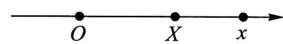  
图2-4

可能事件, 从而其概率趋于 0, 即有  $F(- \infty) = 0$ ; 又若将点  $x$  无限右移 (即  $x \to \infty$ ), 则"随机点  $X$  落在点  $x$  左边"这一事件趋于必然事件, 从而其概率趋于 1, 即有  $F(\infty) = 1$

$3^{\circ} F(x + 0) = F(x)$ , 即  $F(x)$  是右连续的. (证略.)

反之, 可证具备性质  $1^{\circ}, 2^{\circ}, 3^{\circ}$  的函数  $F(x)$  必是某个随机变量的分布函数.

例1 设随机变量  $X$  的分布律为

<table><tr><td>X</td><td>-1</td><td>2</td><td>3</td></tr><tr><td>p k</td><td>1/4</td><td>1/2</td><td>1/4</td></tr></table>

求  $X$  的分布函数,并求  $P\left\{X \leqslant \frac{1}{2}\right\} , P\left\{\frac{3}{2} < X \leqslant \frac{5}{2}\right\} , P\{2 \leqslant X \leqslant 3\}$ .

解  $X$  仅在  $x = - 1,2,3$  三点处其概率  $\neq 0$  ,而  $F(x)$  的值是  $X \leqslant x$  的累积概率值,由概率的有限可加性,知它即为小于或等于  $x$  的那些  $x_{k}$  处的概率  $\boldsymbol{\mathscr{p}}_{k}$  之和,有

$$
F(x) = \left\{ \begin{array}{ll}0 & x < -1, \\ P\{X = -1\} , & -1 \leqslant x < 2, \\ P\{X = -1\} + P\{X = 2\} , & 2 \leqslant x < 3, \\ 1, & x \geqslant 3. \end{array} \right.
$$

即

$$
F(x) = \left\{ \begin{array}{ll}0, & x < -1, \\ \frac{1}{4}, & -1 \leqslant x < 2, \\ \frac{3}{4}, & 2 \leqslant x < 3, \\ 1, & x \geqslant 3. \end{array} \right.
$$

$F(x)$  的图形如图2一5所示,它是一条阶梯形的曲线,在  $x = - 1,2,3$  处有跳跃点,跳跃值分别为  $\frac{1}{4}, \frac{1}{2}, \frac{1}{4}$ . 又

$$
\begin{array}{l}{{P\Big\{X\leqslant\frac{1}{2}\Big\}=F\Big(\frac{1}{2}\Big)=\frac{1}{4},}}\\ {{P\Big\{\frac{3}{2}{< }X\leqslant\frac{5}{2}\Big\}=F\Big(\frac{5}{2}\Big)-F\Big(\frac{3}{2}\Big)}}\\ {{\qquad=\frac{3}{4}-\frac{1}{4}=\frac{1}{2}.}}\end{array}
$$

$$
\begin{array}{c}{{P\{2\leqslant X\leqslant3\}=F(3)-F(2)+P\{X=2\}}}\\ {{{}}}\\ {{=1-\frac{3}{4}+\frac{1}{2}=\frac{3}{4}.}}\end{array}
$$

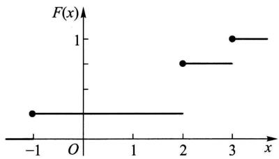  
图2-5

一般,设离散型随机变量  $X$  的分布律为

$$
P\{X = x_{k}\} = p_{k}, \quad k = 1,2, \dots .
$$

由概率的可列可加性得  $X$  的分布函数为

$$
F(x) = P\{X \leqslant x\} = \sum_{x_{k} \leqslant x} P\{X = x_{k}\} ,
$$

即  $F(x) = \sum_{x_{k} \leqslant x} p_{k},$  (3.2)

这里和式是对于所有满足  $x_{k} \leqslant x$  的  $k$  求和的. 分布函数  $F(x)$  在  $x = x_{k}(k = 1$

$2, \dots)$  处有跳跃, 其跳跃值为  $p_{k} = P\{X = x_{k}\}$ .

例2 一个靶子是半径为  $2 \mathrm{~m}$  的圆盘, 设击中靶上任一同心圆盘上的点的概率与该圆盘的面积成正比, 并设射击都能中靶, 以  $X$  表示弹着点与圆心的距离. 试求随机变量  $X$  的分布函数.

解 若  $x< 0$ , 则  $\{X \leqslant x\}$  是不可能事件, 于是

$$
F(x) = P\{X \leqslant x\} = 0.
$$

若  $0 \leqslant x \leqslant 2$ , 由题意,  $P\{0 \leqslant X \leqslant x\} = k x^{2}, k$  是某一常数, 为了确定  $k$  的值, 取  $x = 2$ , 有  $P\{0 \leqslant X \leqslant 2\} = 2^{2} k$ , 但已知  $P\{0 \leqslant X \leqslant 2\} = 1$ , 故得  $k = 1 / 4$ , 即

$$
P\{0 \leqslant X \leqslant x\} = \frac{x^{2}}{4}.
$$

于是

$$
\begin{array}{c}{{F(x)=P\{X\leqslant x\}=P\{X{< }0\}+P\{0\leqslant X\leqslant x\}}}\\ {{{}}}\\ {{={\frac{x^{2}}{4}}.}}\end{array}
$$

若  $x \geqslant 2$ , 由题意  $\{X \leqslant x\}$  是必然事件, 于是

$$
F(x) = P\{X \leqslant x\} = 1.
$$

综合上述, 即得  $X$  的分布函数为

$$
F(x) = \left\{ \begin{array}{ll}0, & x< 0, \\ \frac{x^{2}}{4}, & 0 \leqslant x< 2, \\ 1, & x \geqslant 2. \end{array} \right.
$$

它的图形是一条连续曲线, 如图 2- 6 所示,

另外, 容易看到本例中的分布函数  $F(x)$ , 对于任意  $x$  可以写成形式

$$
F(x) = \int_{-\infty}^{x} f(t) \mathrm{d} t,
$$

其中

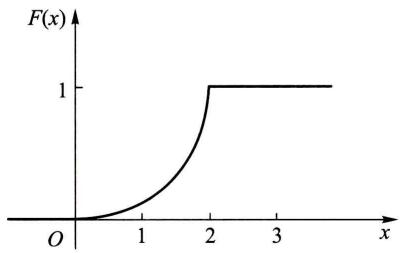  
图2-6

$$
f(t) = \left\{ \begin{array}{ll} \frac{t}{2}, & 0< t< 2, \\ 0, & \text {其他.} \end{array} \right.
$$

这就是说,  $F(x)$  恰是非负函数  $f(t)$  在区间  $(- \infty , x]$  上的积分, 在这种情况我们称  $X$  为连续型随机变量. 下一节我们将给出连续型随机变量的一般定义.  $\square$

# $\S 4$  连续型随机变量及其概率密度

一般,如上节例2中的随机变量那样,如果对于随机变量  $X$  的分布函数 $F(x)$ ,存在非负可积函数  $f(x)$ ,使对于任意实数  $x$  有

$$
F(x) = \int_{-\infty}^{x}f(t)\mathrm{d}t, \tag{4.1}
$$

则称  $X$  为连续型随机变量,  $f(x)$  称为  $X$  的概率密度函数,简称概率密度  $①$

由(4.1)式,据数学分析的知识知连续型随机变量的分布函数是连续函数.

在实际应用中遇到的基本上是离散型或连续型随机变量.本书只讨论这两种随机变量.

由定义知道,概率密度  $f(x)$  具有以下性质:

$1^{\circ}f(x)\geqslant 0$

$$
2^{\circ}\int_{-\infty}^{\infty}f(x)\mathrm{d}x = 1.
$$

$3^{\circ}$  对于任意实数  $x_{1},x_{2}(x_{1}\leqslant x_{2})$

$$
P\{x_{1}< X\leqslant x_{2}\} = F(x_{2}) - F(x_{1}) = \int_{x_{1}}^{x_{2}}f(x)\mathrm{d}x.
$$

$4^{\circ}$  若  $f(x)$  在点  $x$  处连续,则有  $F^{\prime}(x) = f(x)$

反之,若  $f(x)$  具备性质  $1^{\circ},2^{\circ}$  ,引入

$$
G(x) = \int_{-\infty}^{x}f(t)\mathrm{d}t,
$$

它是某一随机变量  $X$  的分布函数,  $f(x)$  是  $X$  的概率密度.

由性质  $2^{\circ}$  知道介于曲线  $y = f(x)$  与  $Ox$  轴之间的面积等于1(图2一7).由  $3^{\circ}$  知道  $X$  落在区间  $(x_{1},x_{2}]$  的概率  $P\{x_{1}< X\leqslant x_{2}\}$  等于区间  $(x_{1},x_{2}]$  上曲线 $y = f(x)$  之下的曲边梯形的面积(图2一8).由性质  $4^{\circ}$  知道在  $f(x)$  的连续点  $x$  处有

$$
f(x) = \lim_{\Delta x\to 0^{+}}{\frac{F(x + \Delta x) - F(x)}{\Delta x}} = \lim_{\Delta x\to 0^{+}}{\frac{P\{x< X\leqslant x + \Delta x\}}{\Delta x}}. \tag{4.2}
$$

从这里我们看到概率密度的定义与物理学中的线密度的定义相类似,这就是称 $f(x)$  为概率密度的缘故.

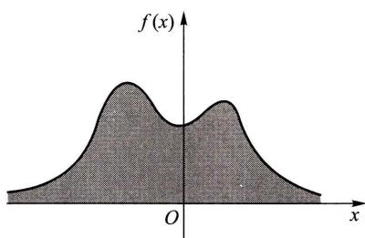  
图2-7

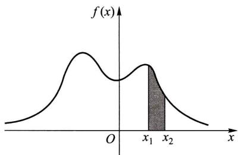  
图2-8

由(4.2)式知道,若不计高阶无穷小,有

$$
P\{x< X\leqslant x + \Delta x\} \approx f(x)\Delta x. \tag{4.3}
$$

这表示  $X$  落在小区间  $(x,x + \Delta x]$  上的概率近似地等于  $f(x)\Delta x$

例1 设随机变量  $X$  具有概率密度

$$
f(x) = \left\{ \begin{array}{ll}k x, & 0\leqslant x< 3, \\ 2 - \frac{x}{2}, & 3\leqslant x\leqslant 4, \\ 0, & \text{其他}. \end{array} \right.
$$

(1)确定常数  $k$  ,(2)求  $X$  的分布函数  $F(x)$  ,(3)求  $P\left\{1< X\leqslant \frac{7}{2}\right\}$

解(1)由  $\int_{- \infty}^{\infty}f(x)\mathrm{d}x = 1$  ,得

$$
\int_{0}^{3}k x\mathrm{d}x + \int_{3}^{4}\left(2 - \frac{x}{2}\right)\mathrm{d}x = 1,
$$

解得  $k = \frac{1}{6}$  ,于是  $X$  的概率密度为

$$
f(x) = \left\{ \begin{array}{ll}\frac{x}{6}, & 0\leqslant x< 3, \\ 2 - \frac{x}{2}, & 3\leqslant x< 4, \\ 0, & \text{其他}. \end{array} \right.
$$

(2)  $X$  的分布函数为

$$
F(x) = \left\{ \begin{array}{ll}0, & x< 0, \\ \int_{0}^{x}\frac{x}{6}\mathrm{d}x, & 0\leqslant x< 3, \\ \int_{0}^{3}\frac{x}{6}\mathrm{d}x + \int_{3}^{x}\left(2 - \frac{x}{2}\right)\mathrm{d}x, & 3\leqslant x< 4, \\ 1, & x\geqslant 4. \end{array} \right.
$$

即

$$
F(x) = \left\{ \begin{array}{ll}0, & x< 0, \\ \frac{x^{2}}{12}, & 0\leqslant x< 3, \\ -3 + 2x - \frac{x^{2}}{4}, & 3\leqslant x< 4, \\ 1, & x\geqslant 4. \end{array} \right.
$$

$$
P\left\{1< X\leqslant \frac{7}{2}\right\} = F\left(\frac{7}{2}\right) - F(1) = \frac{41}{48}. \tag{3}
$$

需要指出的是,对于连续型随机变量  $X$  来说,它取任一指定实数值  $a$  的概率均为0,即  $P\{X = a\} = 0$  .事实上,设  $X$  的分布函数为  $F(x),\Delta x > 0$  ,则由  $\{X = a\} \subset$ $\{a - \Delta x< X\leqslant a\}$  得

$$
0\leqslant P\{X = a\} \leqslant P\{a - \Delta x< X\leqslant a\} = F(a) - F(a - \Delta x).
$$

在上述不等式中令  $\Delta x\rightarrow 0$  ,并注意到  $X$  为连续型随机变量,其分布函数  $F(x)$  是连续的,即得

$$
P\{X = a\} = 0. \tag{4.4}
$$

据此,在计算连续型随机变量落在某一区间的概率时,可以不必区分该区间是开区间或闭区间或半闭区间.例如有

$$
P\{a< X\leqslant b\} = P\{a\leqslant X\leqslant b\} = P\{a< X< b\} .
$$

在这里,事件  $\{X = a\}$  并非不可能事件,但有  $P\{X = a\} = 0$  .这就是说,若  $A$  是不可能事件,则有  $P(A) = 0$  ;反之,若  $P(A) = 0$  ,并不一定意味着  $A$  是不可能事件.

以后当我们提到一个随机变量  $X$  的"概率分布"时,指的是它的分布函数;或者,当  $X$  是连续型随机变量时,指的是它的概率密度,当  $X$  是离散型随机变量时,指的是它的分布律.

下面介绍三种重要的连续型随机变量,

# (一)均匀分布

若连续型随机变量  $X$  具有概率密度

$$
f(x) = \left\{ \begin{array}{ll}\frac{1}{b - a}, & a< x< b, \\ 0, & \text{其他}, \end{array} \right. \tag{4.5}
$$

则称  $X$  在区间  $(a,b)$  上服从均匀分布,记为  $X\sim U(a,b)$

易知  $f(x)\geqslant 0$  ,且  $\int_{- \infty}^{\infty}f(x)\mathrm{d}x = 1.$

在区间  $(a,b)$  上服从均匀分布的随机变量  $X$  ,具有下述意义的等可能性,即它落在区间  $(a,b)$  中任意等长度的子区间内的可能性是相同的.或者说它落在

$(a, b)$  的子区间内的概率只依赖于子区间的长度而与子区间的位置无关. 事实上, 对于任一长度为  $l$  的子区间  $(c, c + l)$ ,  $a \leqslant c < c + l \leqslant b$ , 有

$$
P\{c< X\leqslant c + l\} = \int_{c}^{c + l}f(x)\mathrm{d}x = \int_{c}^{c + l}\frac{1}{b - a}\mathrm{d}x = \frac{l}{b - a}.
$$

由(4.1)式得  $X$  的分布函数为

$$
F(x) = \left\{ \begin{array}{ll}0, & x < a, \\ \frac{c - a}{b - a}, & a \leqslant x < b, \\ 1, & x \geqslant b. \end{array} \right. \tag{4.6}
$$

$f(x)$  及  $F(x)$  的图形分别如图2- 9, 图2- 10所示.

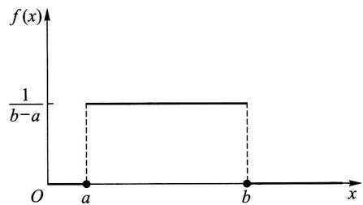  
图2-9

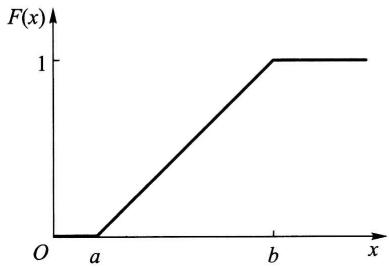  
图2-10

例2 设电阻值  $R$  是一个随机变量, 均匀分布在  $900 \sim 1100 \Omega$ . 求  $R$  的概率密度及  $R$  落在  $950 \sim 1050 \Omega$  的概率.

解 按题意,  $R$  的概率密度为

$$
f(r) = \left\{ \begin{array}{ll} \frac{1}{100 - 900}, & 900 < r < 1100, \\ 0, & \text{其他}. \end{array} \right.
$$

故有  $P\{950 < R \leqslant 1050\} = \int_{950}^{1050} \frac{1}{200} \mathrm{d}r = 0.5$ .

# (二) 指数分布

若连续型随机变量  $X$  的概率密度为

$$
f(x) = \left\{ \begin{array}{ll} \frac{1}{\theta} \mathrm{e}^{-x / \theta}, & x > 0, \\ 0, & \text{其他}, \end{array} \right. \tag{4.7}
$$

其中  $\theta > 0$  为常数, 则称  $X$  服从参数为  $\theta$  的指数分布.

易知  $f(x) \geqslant 0$ , 且  $\int_{- \infty}^{\infty} f(x) \mathrm{d}x = 1$ . 图2- 11中分别画出了  $\theta = 1 / 3, \theta = 1$ ,

$\theta = 2$  时  $f(x)$  的图形.

由(4.7)式容易得到随机变量  $X$  的分布函数为

$$
F(x)={\binom{1-\mathrm{e}^{-x/\theta},\quad x>0,}{0,}} \tag{4.8}
$$

服从指数分布的随机变量  $X$  具有以下有趣的性质:

对于任意  $s, t > 0$ , 有  $P\{X > s + t \mid X > s\} = P\{X > t\}$ . (4.9)

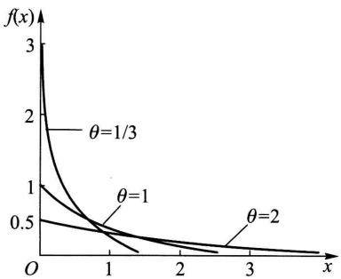  
图2-11

事实上

$$
\begin{array}{r l} & {P\{X > s + t\mid X > s\} = \frac{P\{(X > s + t)\bigcap(X > s)\}}{P\{X > s\}}}\\ & {\qquad = \frac{P\{X > s + t\}}{P\{X > s\}} = \frac{1 - F(s + t)}{1 - F(s)}}\\ & {\qquad = \frac{\mathrm{e}^{-(s + t) / \theta}}{\mathrm{e}^{-s / \theta}} = \mathrm{e}^{-t / \theta}}\\ & {\qquad = P\{X > t\} .} \end{array}
$$

性质(4.9)称为无记忆性,如果  $X$  是某一元件的寿命,那么(4.9)式表明:已知元件已使用了  $s \mathrm{~h}$ ,它总共能使用至少  $(s + t) \mathrm{~h}$  的条件概率,与从开始使用时算起它至少能使用  $t \mathrm{~h}$  的概率相等,这就是说,元件对它已使用过  $s \mathrm{~h}$  没有记忆,具有这一性质是指数分布有广泛应用的重要原因.

指数分布在可靠性理论与排队论中有广泛的应用,

# (三)正态分布

若连续型随机变量  $X$  的概率密度为

$$
f(x) = \frac{1}{\sqrt{2\pi \sigma}} \mathrm{e}^{-\frac{(x - \mu)^2}{2\sigma^2}}, \quad -\infty < x < \infty , \tag{4.10}
$$

其中  $\mu , \sigma (\sigma > 0)$  为常数,则称  $X$  服从参数为  $\mu , \sigma$  的正态分布或高斯(Gauss)分布,记为  $X \sim N(\mu , \sigma^2)$

显然  $f(x) \geqslant 0$ ,下面来证明  $\int_{- \infty}^{\infty} f(x) \mathrm{d}x = 1$ . 令  $(x - \mu) / \sigma = t$ ,得到

$$
\int_{-\infty}^{\infty} \frac{1}{\sqrt{2\pi \sigma}} \mathrm{e}^{-\frac{(x - \mu)^2}{2\sigma^2}} \mathrm{d}x = \frac{1}{\sqrt{2\pi}} \int_{-\infty}^{\infty} \mathrm{e}^{-t^2 /2} \mathrm{d}t,
$$

记  $I = \int_{- \infty}^{\infty} \mathrm{e}^{- t^2 /2} \mathrm{d}t$ ,则有  $I^2 = \int_{- \infty}^{\infty} \int_{- \infty}^{\infty} \mathrm{e}^{- (t^2 + u^2) / 2} \mathrm{d}t \mathrm{d}u$ ,利用极坐标将它化成累次积分,得到

$$
I^{2} = \int_{0}^{2\pi}\int_{0}^{\infty}r\mathrm{e}^{-r^{2} / 2}\mathrm{d}r\mathrm{d}\theta = 2\pi .
$$

而  $I > 0$  ,故有  $I = \sqrt{2\pi}$  ,即有

$$
\int_{-\infty}^{\infty}\mathrm{e}^{-t^{2} / 2}\mathrm{d}t = \sqrt{2\pi}, \tag{4.11}
$$

于是

$$
\frac{1}{\sqrt{2\pi}\sigma}\int_{-\infty}^{\infty}\mathrm{e}^{-\frac{(x - \mu)^{2}}{2\sigma^{2}}}\mathrm{d}x = \frac{1}{\sqrt{2\pi}}\int_{-\infty}^{\infty}\mathrm{e}^{-t\epsilon /2}\mathrm{d}t = 1.
$$

参数  $\mu ,\sigma$  的意义将在第四章中说明.  $f(x)$  的图形如图2一12所示,它具有以下性质.

$1^{\circ}$  曲线关于  $x = \mu$  对称.这表明对于任意  $h > 0$  有(图2一12)

$$
P\{\mu -h{<}X\leqslant \mu \} = P\{\mu {<}X\leqslant \mu +h\} .
$$

$2^{\circ}$  当  $x = \mu$  时取到最大值

$$
f(\mu) = \frac{1}{\sqrt{2\pi}\sigma}.
$$

$x$  离  $\mu$  越远,  $f(x)$  的值越小.这表明对于同样长度的区间,当区间离  $\mu$  越远时,  $X$  落在这个区间上的概率越小.

在  $x = \mu \pm \sigma$  处曲线有拐点.曲线以  $Ox$  轴为渐近线.

另外,如果固定  $\sigma$  ,改变  $\mu$  的值,则图形沿着  $Ox$  轴平移,而不改变其形状(如图2一12),可见正态分布的概率密度曲线  $y = f(x)$  的位置完全由参数  $\mu$  所确定.  $\mu$  称为位置参数.

如果固定  $\mu$  ,改变  $\sigma$  ,由于最大值  $f(\mu) = \frac{1}{\sqrt{2\pi}\sigma}$  ,可知当  $\sigma$  越小时图形变得越尖(如图2一13),因而  $X$  落在  $\mu$  附近的概率越大.

  
图2-12

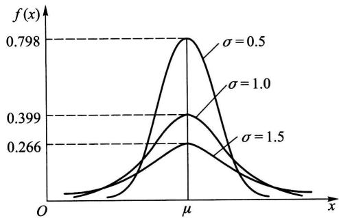  
图2-13

由(4.10)式得  $X$  的分布函数为(如图2一14)

$$
F(x) = \frac{1}{\sqrt{2\pi}\sigma}\int_{-\infty}^{x}\mathrm{e}^{-\frac{(t - \mu)^{2}}{2\sigma^{2}}}\mathrm{d}t, \tag{4.12}
$$

特别,当  $\mu = 0,\sigma = 1$  时称随机变量  $X$  服从标准正态分布.其概率密度和分布函数分别用  $\phi (x),\Phi (x)$  表示,即有

$$
\phi (x) = \frac{1}{\sqrt{2\pi}}\mathrm{e}^{-x^{2} / 2}, \tag{4.13}
$$

$$
\Phi (x) = \frac{1}{\sqrt{2\pi}}\int_{-\infty}^{x}\mathrm{e}^{-t^{2} / 2}\mathrm{d}t. \tag{4.14}
$$

易知  $\Phi (- x) = 1 - \Phi (x)$  (4.15)

(参见图2一15).

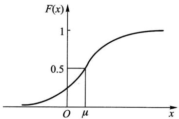  
图2-14

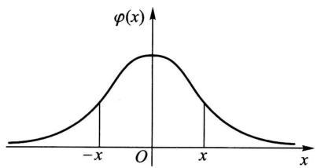  
图2-15

人们已编制了  $\Phi (x)$  的函数表,可供查用(见附表2).

一般,若随机变量  $X\sim N(\mu ,\sigma^{2})$  ,我们只要通过一个线性变换就能将它化成标准正态分布.

引理 若随机变量  $X\sim N(\mu ,\sigma^{2})$  ,则  $Z = \frac{X - \mu}{\sigma}\sim N(0,1)$

证  $Z = \frac{X - \mu}{\sigma}$  的分布函数为

$$
P\{Z\leqslant x\} = P\left\{\frac{X - \mu}{\sigma}\leqslant x\right\} = P\{X\leqslant \mu +\sigma x\} = \frac{1}{\sqrt{2\pi}\sigma}\int_{-\infty}^{(\mu +\mu)}\mathrm{e}^{-\frac{(t - \mu)^{2}}{2\sigma^{2}}}\mathrm{d}t,
$$

令  $\frac{t - \mu}{\sigma} = u$  ,得

$$
P\{Z\leqslant x\} = \frac{1}{\sqrt{2\pi}}\int_{-\infty}^{x}\mathrm{e}^{-u^{2} / 2}\mathrm{d}u = \Phi (x),
$$

由此知  $Z = \frac{X - \mu}{\sigma}\sim N(0,1)$

于是,若随机变量  $X\sim N(\mu ,\sigma^{2})$  ,则它的分布函数  $F(x)$  可写成

$$
F(x) = P\{X \leqslant x\} = P\left\{\frac{X - \mu}{\sigma} \leqslant \frac{x - \mu}{\sigma}\right\} = \Phi \left(\frac{x - \mu}{\sigma}\right). \tag{4.16}
$$

对于任意区间  $(x_{1}, x_{2}]$ , 有

$$
\begin{array}{r}{P\{x_{1}< X\leqslant x_{2}\} = P\Big\{\frac{x_{1} - \mu}{\sigma}{<}\frac{X - \mu}{\sigma}{\leqslant}\frac{x_{1} - \mu}{\sigma}\Big\}}\\ {= \Phi \Big(\frac{x_{2} - \mu}{\sigma}\Big) - \Phi \Big(\frac{x_{1} - \mu}{\sigma}\Big).} \end{array} \tag{4.17}
$$

例如, 设随机变量  $X \sim N(1,4)$ , 查表得

$$
\begin{array}{r l} & {P\{0< X\leqslant 1.6\} = \Phi \Big(\frac{1.6 - 1}{2}\Big) - \Phi \Big(\frac{0 - 1}{2}\Big) = \Phi (0.3) - \Phi (-0.5)}\\ & {\qquad = 0.617 9 - [1 - \Phi (0.5)] = 0.617 9 - 1 + 0.691 5 = 0.309 4.} \end{array}
$$

设  $X \sim N(\mu , \sigma^{2})$ , 由  $\Phi (x)$  的函数表还能得到 (图 2- 16):

$$
P\{\mu - \sigma < X < \mu + \sigma \} = \Phi (1) - \Phi (-1) = 2\Phi (1) - 1 = 68.26\% ,
$$

$$
P\{\mu - 2\sigma < X < \mu + 2\sigma \} = \Phi (2) - \Phi (-2) = 95.44\% ,
$$

$$
P\{\mu - 3\sigma < X < \mu + 3\sigma \} = \Phi (3) - \Phi (-3) = 99.74\% .
$$

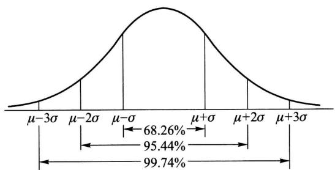  
图2-16

我们看到, 尽管正态变量的取值范围是  $(- \infty , \infty)$ , 但它的值落在  $(\mu - 3\sigma , \mu + 3\sigma)$  内几乎是肯定的事. 这就是人们所说的"3σ"法则.

例3 将一温度调节器放置在贮存着某种液体的容器内. 调节器整定在  $d^{\circ}C$ , 液体的温度  $X$  (以  $^{\circ}C$  计) 是一个随机变量, 且  $X \sim N(d, 0.5^{2})$ . (1) 若  $d = 90^{\circ}C$ , 求  $X$  小于  $89^{\circ}C$  的概率. (2) 若要求保持液体的温度至少为  $80^{\circ}C$  的概率不低于 0.99, 问  $d$  至少为多少?

解 (1) 所求概率为

$$
\begin{array}{c}{{P\{X< 89\}=P\Big\{\frac{X-90}{0.5}< \frac{89-90}{0.5}\Big\}=\Phi\Big(\frac{89-90}{0.5}\Big)=\Phi(-2)}}\\ {{=1-\Phi(2)=1-0.9772=0.0228.}}\end{array}
$$

(2) 按题意需求  $d$  满足

$$
\begin{array}{l}{{0.99\leqslant P\{X\geqslant80\}=P\Big\{\frac{X-d}{0.5}\geqslant\frac{80-d}{0.5}\Big\}}}\\ {{=1-P\Big\{\frac{X-d}{0.5}< \frac{80-d}{0.5}\Big\}=1-\Phi\Big(\frac{80-d}{0.5}\Big).}}\end{array}
$$

即  $\Phi \Big(\frac{d - 80}{0.5}\Big) \geqslant 0.99 = \Phi (2.327)$ ,

亦即  $\frac{d - 80}{0.5} \geqslant 2.327$ .

故需  $d \geqslant 81.1635$ .

为了便于今后在数理统计中的应用,对于标准正态随机变量,我们引入上  $\alpha$  分位数的定义.

设  $X \sim N(0,1)$ ,若  $z_{a}$  满足条件

$$
P\{X > z_{a}\} = a, 0 < \alpha < 1, \tag{4.18}
$$

则称  $z_{a}$  为标准正态分布的上  $\alpha$  分位数(如图2- 17).下面列出了几个常用的  $z_{a}$  的值:

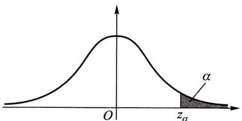  
图2-17

<table><tr><td>α</td><td>0.001</td><td>0.005</td><td>0.01</td><td>0.025</td><td>0.05</td><td>0.10</td></tr><tr><td>zα</td><td>3.090</td><td>2.576</td><td>2.326</td><td>1.960</td><td>1.645</td><td>1.282</td></tr></table>

另外,由  $\phi (x)$  图形的对称性知道  $z_{1 - \alpha} = - z_{\alpha}$

在自然现象和社会现象中,大量随机变量都服从或近似服从正态分布.例如,一个地区的男性成年人的身高、测量某零件长度的误差、海洋波浪的高度、半导体器件中的热噪声电流或电压等,都服从正态分布.在概率论与数理统计的理论研究和实际应用中正态随机变量起着特别重要的作用.在第五章我们将进一步说明正态随机变量的重要性.

# §5 随机变量的函数的分布

在实际中,我们常对某些随机变量的函数更感兴趣.例如,在一些试验中,所关心的随机变量往往不能由直接测量得到,而它却是某个能直接测量的随机变量的函数.比如我们能测量圆轴截面的直径  $d$ ,而关心的却是截面面积  $A = \frac{1}{4} \pi d^{2}$ .这里,随机变量  $A$  是随机变量  $d$  的函数.在这一节中,我们将讨论如何由已知的随机变量  $X$  的概率分布去求得它的函数  $Y = g(X) (g(\cdot)$  是已知的连续函数)的概率分布.这里  $Y$  是这样的随机变量,当  $X$  取值  $x$  时, $Y$  取值  $g(x)$ .

例1 设随机变量  $X$  具有以下的分布律:

试求  $Y = (X - 1)^{2}$  的分布律.

解  $Y$  所有可能取的值为0,1,4. 由

$$
P\{Y = 0\} = P\{(X - 1)^{2} = 0\} = P\{X = 1\} = 0.1,
$$

$$
P\{Y = 1\} = P\{X = 0\} +P\{X = 2\} = 0.7,
$$

$$
P\{Y = 4\} = P\{X = -1\} = 0.2,
$$

即得  $Y$  的分布律为

$$
\frac{Y}{\begin{array}{c c c c c c c c c c c c c c c c c c c c c c c c c c c c c c c c c c c c c c c c c c c c c c c c c c c c c c c c c c c c c c c c c c c c c c c c c c c c c c c c c c c c c c c c c c c c c c c c c c c c c} & & & & & & & & & & & & & & & & & & & & & & & & & & & & & & & & & & & & & & & & & & & & & & & & & & & & & & & & & & & & & & & & & & & & & & & & & & & & & & & & & & & & & & & & & & & & & & & & & & & & \end{array} \begin{array}{c c c c c c c c c c c c c c c c c c c c c c c c c c c c c c c c c c c c c c c c c c c c c c c c c c c c c c c c c c c c c c c c c c c c c c c c c c c c c c c c c c c c c c c c c c c c c c c} & & & & \end{array} \begin{array}{c c c c c c c c c c c c c c c c c c c c c c c c c c c c c c c c c c c c c c c c c c c c c c c c c c c c c c c c c c c c c c c c c c c c c c c c c c c c c c c c c c c c c} & & & & & & & & & & & & & & \end{array} \begin{array}{c c c c c c c c c c c c c c c c c c c c c c c c c c c c c c c c c c c c c c c c c c c c c c c c c c c c c c c c c c c c c c c c c c c c c c c c c c c} & & & & & & & & & & & & & & & & & & & & & & & & \end{array} \end{array}
$$

例2 设随机变量  $X$  具有概率密度

$$
f_{X}(x) = \left\{{\frac{x}{8}},\quad 0< x< 4,\right.
$$

求随机变量  $Y = 2X + 8$  的概率密度.

解分别记  $X,Y$  的分布函数为  $F_{X}(x),F_{Y}(y)$  .下面先来求  $F_{Y}(y)$

$$
F_{Y}(y) = P\{Y\leqslant y\} = P\{2X + 8\leqslant y\}
$$

$$
= P\left\{X\leqslant {\frac{y - 8}{2}}\right\} = F_{X}\left(\frac{y - 8}{2}\right).
$$

将  $F_{Y}(y)$  关于  $y$  求导数,得  $Y = 2X + 8$  的概率密度为

$$
\begin{array}{r l} & {f_{Y}(y) = f_{X}\Big(\frac{y - 8}{2}\Big)\Big(\frac{y - 8}{2}\Big)^{\prime}}\\ & {\qquad = \left\{\frac{1}{8}\times \frac{y - 8}{2}\times \frac{1}{2},\quad 0< \frac{y - 8}{2} < 4,\right.}\\ & {\qquad \left.\right.}\\ & {\qquad = \left\{\frac{y - 8}{32},\quad 8< y< 16,\right.}\\ & {\qquad \left.\right.}\\ & {\qquad \left.\right.} \end{array}
$$

例3设随机变量  $X$  具有概率密度  $f_{X}(x), - \infty < x< \infty$  ,求  $Y = X^{2}$  的概率密度.

解分别记  $X,Y$  的分布函数为  $F_{X}(x),F_{Y}(y)$  .先来求  $Y$  的分布函数

$F_{Y}(y)$ . 由于  $Y = X^{2} \geqslant 0$ , 故当  $y \leqslant 0$  时  $F_{Y}(y) = 0$ . 当  $y > 0$  时有

$$
\begin{array}{r l} & {F_{Y}(y) = P\{Y\leqslant y\} = P\{X^{2}\leqslant y\}}\\ & {\qquad = P\{-\sqrt{y}\leqslant X\leqslant \sqrt{y}\}}\\ & {\qquad = F_{X}(\sqrt{y}) - F_{X}(-\sqrt{y}).} \end{array}
$$

将  $F_{Y}(y)$  关于  $y$  求导数, 即得  $Y$  的概率密度为

$$
f_{Y}(y) = \left\{ \begin{array}{ll}\frac{1}{2\sqrt{y}} \left[ f_{X}(\sqrt{y}) + f_{X}(-\sqrt{y}) \right], & y > 0, \\ 0, & y \leqslant 0. \end{array} \right. \tag{5.1}
$$

例如, 设  $X \sim N(0,1)$ , 其概率密度为

$$
\phi (x) = \frac{1}{\sqrt{2\pi}} \mathrm{e}^{-x^{2} / 2}, \quad -\infty < x < \infty .
$$

由(5.1)式得  $Y = X^{2}$  的概率密度为

$$
f_{Y}(y) = \left\{ \begin{array}{ll} \frac{1}{\sqrt{2\pi}} y^{-1 / 2} \mathrm{e}^{-y / 2}, & y > 0, \\ 0, & y \leqslant 0. \end{array} \right.
$$

此时称  $Y$  服从自由度为1的  $\chi^{2}$  分布.

上述两个例子解法的关键一步是在"  $Y \leqslant y^{\prime \prime}$  中, 即在"  $g(X) \leqslant y^{\prime \prime}$  中解出  $X$ , 从而得到一个与"  $g(X) \leqslant y^{\prime \prime}$  等价的  $X$  的不等式, 并以后者代替"  $g(X) \leqslant y^{\prime \prime}$ . 例如, 在例2中以"  $X \leqslant \frac{y - 8}{2}$  "代替"  $2X + 8 \leqslant y^{\prime \prime}$ ; 在例3中, 当  $y > 0$  时以"  $- \sqrt{y} \leqslant X \leqslant \sqrt{y}$  "代替"  $X^{2} \leqslant y^{\prime \prime}$ . 一般来说, 可以用这样的方法  $①$  求连续型随机变量的函数的分布函数或概率密度. 下面我们仅对  $Y = g(X)$ , 其中  $g(\cdot)$  是严格单调函数的情况, 写出一般的结果.

定理设随机变量  $X$  具有概率密度  $f_{X}(x), - \infty < x < \infty$ , 又设函数  $g(x)$  处处可导且恒有  $g^{\prime}(x) > 0$  (或恒有  $g^{\prime}(x) < 0$ ), 则  $Y = g(X)$  是连续型随机变量, 其概率密度为

$$
f_{Y}(y) = \left\{ \begin{array}{ll} f_{X} \left[ h(y) \right] \mid h^{\prime}(y) \mid , & \alpha < y < \beta , \\ 0, & \text{其他}, \end{array} \right. \tag{5.2}
$$

其中  $\alpha = \min \{g(- \infty), g(\infty) \} , \beta = \max \{g(- \infty), g(\infty) \} , h(y)$  是  $g(x)$  的反函数.

我们只证  $g^{\prime}(x) > 0$  的情况. 此时  $g(x)$  在  $(- \infty , \infty)$  内严格单调增加, 它的

反函数  $h(y)$  存在,且在  $(\alpha ,\beta)$  内严格单调增加、可导.分别记  $X,Y$  的分布函数为 $F_{X}(x),F_{Y}(y)$  .现在先来求  $Y$  的分布函数  $F_{Y}(y)$

因为  $Y = g(X)$  在  $(\alpha ,\beta)$  内取值,故当  $y\leqslant \alpha$  时,  $F_{Y}(y) = P\{Y\leqslant y\} = 0$  ;当  $y\geq \beta$  时,  $F_{Y}(y) = P\{Y\leqslant y\} = 1$

当  $\alpha {<}y{<}\beta$  时,

$$
\begin{array}{r}{F_{Y}(y) = P\{Y\leqslant y\} = P\{g(X)\leqslant y\}}\\ {= P\{X\leqslant h(y)\} = F_{X}[h(y)].} \end{array}
$$

将  $F_{Y}(y)$  关于  $y$  求导数,即得  $Y$  的概率密度

$$
f_{Y}(y) = \left\{ \begin{array}{l l}{f_{X}[h(y)]h^{\prime}(y),} & {\alpha {<}y{<}\beta ,}\\ {0,} & {\mathbb{H}\backslash \mathbb{H}.} \end{array} \right. \tag{5.3}
$$

对于  $g^{\prime}(x){<}0$  的情况可以同样地证明,此时有

$$
f_{Y}(y) = \left\{ \begin{array}{l l}{f_{X}[h(y)][-h^{\prime}(y)],} & {\alpha {<}y{<}\beta ,}\\ {0,} & {\mathbb{H}\backslash \mathbb{H}.} \end{array} \right. \tag{5.4}
$$

合并(5.3)与(5.4)两式,(5.2)式得证. 口

若  $f(x)$  在有限区间  $[a,b]$  以外等于零,则只需假设在  $[a,b]$  上恒有  $g^{\prime}(x) > 0$  (或恒有  $g^{\prime}(x){<}0)$  ,此时

$$
\alpha = \min \{g(a),g(b)\} ,\quad \beta = \max \{g(a),g(b)\} .
$$

例4设随机变量  $X\sim N(\mu ,\sigma^{2})$  .试证明  $X$  的线性函数  $Y = a X + b$ $(a\neq 0)$  也服从正态分布.

证  $X$  的概率密度为

$$
f_{X}(x) = \frac{1}{\sqrt{2\pi}\sigma}\mathrm{e}^{-\frac{(x - \mu)^{2}}{2\sigma^{2}}}, - \infty {<}x{<}\infty .
$$

现在  $y = g(x) = a x + b$  ,由这一式子解得

由(5.2)式得  $Y = a X + b$  的概率密度为

$$
f_{Y}(y) = \frac{1}{|a|} f_{X}\Big(\frac{y - b}{a}\Big),\quad -\infty {<}y{<}\infty ,
$$

即

$$
f_{Y}(y) = \frac{1}{|a|}\frac{1}{\sqrt{2\pi}\sigma}\mathrm{e}^{-\frac{(\frac{y - b}{a} - \mu)^{2}}{2\sigma^{2}}} = \frac{1}{|a|\sigma\sqrt{2\pi}}\mathrm{e}^{-\frac{[y - (b + a\mu)^{2}}{2(a\sigma)^{2}}},\quad -\infty {<}y{<}\infty .
$$

即有  $Y = a X + b\sim N(a\mu +b,(a\sigma)^{2})$

特别,在上例中取  $a = \frac{1}{\sigma},b = - \frac{\mu}{\sigma}$  得

$$
Y = \frac{X - \mu}{\sigma} \sim N(0,1).
$$

这就是上一节引理的结果.  $\square$

例5设电压  $V = A\sin \theta$ ,其中  $A$  是一个已知的正常数,相角  $\Theta$  是一个随机变量,且有  $\Theta \sim U\left(- \frac{\pi}{2},\frac{\pi}{2}\right)$ ,试求电压  $V$  的概率密度.

解现在  $v = g(\theta) = A\sin \theta$  在  $\left(- \frac{\pi}{2},\frac{\pi}{2}\right)$  上恒有  $g^{\prime}(\theta) = A\cos \theta >0$ ,且有反函数

$$
\theta = h(v) = \arcsin {\frac{v}{A}},\quad h^{\prime}(v) = \frac{1}{\sqrt{A^{2} - v^{2}}},
$$

又,  $\Theta$  的概率密度为

$$
f(\theta) = \left\{ \begin{array}{ll}\frac{1}{\pi}, & -\frac{\pi}{2} < \theta < \frac{\pi}{2}, \\ 0, & \text{其他.} \end{array} \right.
$$

由(5.2)式得  $V = A\sin \theta$  的概率密度为

$$
\psi (v) = \left\{ \begin{array}{ll}\frac{1}{\pi} \cdot \frac{1}{\sqrt{A^{2} - v^{2}}}, & -A < v < A, \\ 0, & \text{其他.} \end{array} \right.
$$

若在上题中  $\Theta \sim U(0,\pi)$ ,因为此时  $v = g(\theta) = A\sin \theta$  在  $(0,\pi)$  内不是单调函数,上述定理失效,应仍按例3的方法来做.请读者自行求出其结果.

小结

随机变量  $X = X(e)$  是定义在样本空间  $S = \{e\}$  上的实值单值函数.也就是说,它是随机试验结果的函数.它的取值随试验的结果而定,是不能预先确定的,它的取值有一定的概率.随机变量的引入,使概率论的研究由个别随机事件扩大为随机变量所表征的随机现象的研究.今后,我们主要研究随机变量和它的分布.

一个随机变量,如果它所有可能的值是有限个或可列无限个,这种随机变量称为离散型随机变量,不是这种情况则称为非离散型的.不论是离散型的或非离散型的随机变量  $X$ ,都可以借助分布函数

$$
F(x) = P\{X \leqslant x\} , \quad -\infty < x < \infty
$$

来描述.若已知随机变量  $X$  的分布函数,则能知道  $X$  落在任一区间  $[x_{1},x_{2}]$  上的概率

$$
P\{x_{1}< X\leqslant x_{2}\} = F(x_{2}) - F(x_{1}),\quad x_{1}< x_{2}.
$$

这样,分布函数就能完整地描述随机变量取值的统计规律性.

对于离散型随机变量,我们需要掌握的是它可能取哪些值,以及它以怎样的概率取这些值,这就是离散型随机变量取值的统计规律性.因而,对于离散型随机变量,用分布律

$$
P\{X = x_{k}\} = p_{k},\quad k = 1,2,\dots
$$

或写成

$$
\frac{X\mid x_{1}\quad x_{2}\quad\cdots\quad x_{k}\quad\cdots}{p_{k}\mid p_{1}\quad p_{2}\quad\cdots\quad p_{k}\quad\cdots}
$$

这里  $\sum_{k = 1}^{\infty}p_{k} = 1$  来描述它的取值的统计规律性较为直观和简洁,分布律与分布函数有以下的关系

$$
F(x) = P\{X\leqslant x\} = \sum_{x_{k}\leqslant x}P\{X = x_{k}\} ,
$$

它们是一一对应的.

设随机变量  $X$  的分布函数为  $F(x)$ ,如果存在非负可积函数  $f(x)$ ,使得对于任意  $x$ ,有

$$
F(x) = \int_{-\infty}^{x}f(x)\mathrm{d}x,
$$

则称  $X$  是连续型随机变量,其中  $f(x)\geqslant 0$  称为  $X$  的概率密度.

给定  $X$  的概率密度  $f(x)$  就能确定  $F(x)$ ,由于  $f(x)$  位于积分号之内,故改变  $f(x)$  在个别点上的函数值并不改变  $F(x)$  的值.因此,改变  $f(x)$  在个别点上的值,是无关紧要的.

连续型随机变量  $X$  的分布函数是连续的,连续型随机变量取任一指定实数值  $a$  的概率为0,即  $P\{X = a\} = 0$ 。离散型随机变量是不具备这两点性质的.

我们将随机变量分成:

读者不要误以为,一个随机变量,如果它不是离散型的那一定是连续型的,但本书只讨论两类重要的随机变量:离散型和连续型随机变量.

读者应掌握分布函数、分布律、概率密度的性质,本章引入了几种重要的随机变量的分布:(0- 1)分布、二项分布、泊松分布、指数分布、均匀分布和正态分布,读者必须熟知这几种随机变量的分布律或概率密度.

随机变量  $X$  的函数  $Y = g(X)$  也是一个随机变量,要掌握如何由已知的  $X$  的分布( $X$  的分布律或概率密度)去求得  $Y = g(X)$  的分布( $Y$  的分布律或概率密度).

# 重要术语及主题

随机变量分布函数离散型随机变量及其分布律连续型随机变量及其概率密度伯努利试验(0- 1)分布  $n$  重伯努利试验二项分布泊松分布指数分布均匀分布正态分布随机变量函数的分布

# 习题

1. 考虑为期一年的一张保险单,若投保人在投保后一年内因意外死亡,则公司赔付20万元;若投保人因其他原因死亡,则公司赔付5万元;若投保人在投保期末生存,则公司无

须付给任何费用. 若投保人在一年内因意外死亡的概率为 0.0002, 因其他原因死亡的概率为 0.0010, 求公司赔付金额的分布律.

2. (1) 一袋中装有 5 只球, 编号为 1, 2, 3, 4, 5. 在袋中同时取 3 只, 以  $X$  表示取出的 3 只球中的最大号码, 写出随机变量  $X$  的分布律.

(2) 将一颗骰子抛掷两次, 以  $X$  表示两次中得到的小的点数, 试求  $X$  的分布律.

3. 设在 15 只同类型的零件中有 2 只是次品, 在其中取 3 次, 每次任取 1 只, 作不放回抽样. 以  $X$  表示取出的次品的只数.

(1) 求  $X$  的分布律.

(2) 画出分布律的图形.

4. 进行重复独立试验, 设每次试验成功的概率为  $p$ , 失败的概率为  $q = 1 - p$ $(0 < p < 1)$ .

(1) 将试验进行到出现一次成功为止, 以  $X$  表示所需的试验次数, 求  $X$  的分布律. (此时称  $X$  服从以  $p$  为参数的几何分布.)

(2) 将试验进行到出现  $r$  次成功为止, 以  $Y$  表示所需的试验次数, 求  $Y$  的分布律. (此时称  $Y$  服从以  $r, p$  为参数的帕斯卡分布或负二项分布.)

(3) 一篮球运动员的投篮命中率为  $45\%$ . 以  $X$  表示他首次投中时累计已投篮的次数, 写出  $X$  的分布律, 并计算  $X$  取偶数的概率.

5. 一房间有 3 扇同样大小的窗子, 其中只有一扇是打开的. 有一只鸟自开着的窗子飞入了房间, 它只能从开着的窗子飞出去. 鸟在房间里飞来飞去, 试图飞出房间. 假定鸟是没有记忆的, 它飞向各扇窗子是随机的.

(1) 以  $X$  表示鸟为了飞出房间试飞的次数, 求  $X$  的分布律.

(2) 户主声称, 他养的一只鸟是有记忆的, 它飞向任一窗子的尝试不多于一次. 以  $Y$  表示这只聪明的鸟为了飞出房间试飞的次数. 如户主所说是确实的, 试求  $Y$  的分布律.

(3) 求试飞次数  $X$  小于  $Y$  的概率和试飞次数  $Y$  小于  $X$  的概率.

6. 一大楼装有 5 台同类型的供水设备. 设各台设备是否被使用相互独立. 调查表明在任一时刻  $t$  每台设备被使用的概率为 0.1, 问在同一时刻,

(1) 恰有 2 台设备被使用的概率是多少?

(2) 至少有 3 台设备被使用的概率是多少?

(3) 至多有 3 台设备被使用的概率是多少?

(4) 至少有 1 台设备被使用的概率是多少?

7. 设事件  $A$  在每次试验中发生的概率为 0.3. 当  $A$  发生不少于 3 次时, 指示灯发出信号.

(1) 进行了 5 次重复独立试验, 求指示灯发出信号的概率.

(2) 进行了 7 次重复独立试验, 求指示灯发出信号的概率.

8. 甲、乙两人投篮, 投中的概率分别为 0.6, 0.7. 今各投 3 次. 求

(1) 两人投中次数相等的概率.

(2) 甲比乙投中次数多的概率.

9. 有一大批产品, 其验收方案如下, 先作第一次检验: 从中任取 10 件, 经检验无次品时

接受这批产品, 次品数大于 2 时拒收; 否则作第二次检验, 其做法是从中再任取 5 件, 仅当 5 件中无次品时接受这批产品. 若产品的次品率为  $10\%$ , 求

(1) 这批产品经第一次检验就能接受的概率.

(2) 需作第二次检验的概率.

(3) 这批产品按第二次检验的标准被接受的概率.

(4) 这批产品在第一次检验未能作决定且第二次检验时被通过的概率.

(5) 这批产品被接受的概率.

10. 有甲、乙两种味道和颜色都极为相似的名酒各 4 杯. 如果从中挑 4 杯, 能将甲种酒全部挑出来, 算是试验成功一次.

(1) 某人随机地去挑, 问他试验成功一次的概率是多少?

(2) 某人声称他通过品尝能区分两种酒. 他连续试验 10 次, 成功 3 次. 试推断他是猜对的, 还是他确有区分的能力 (设各次试验是相互独立的).

11. 尽管在几何教科书中已经讲过仅用圆规和直尺三等分一个任意角是不可能的, 但每一年总是有一些"发明者"撰写关于仅用圆规和直尺将角三等分的文章. 设某地区每年撰写此类文章的篇数  $X$  服从参数为 6 的泊松分布. 求明年没有此类文章的概率.

12. 一电话总机每分钟收到呼唤的次数服从参数为 4 的泊松分布. 求

(1) 某一分钟恰有 8 次呼唤的概率.

(2) 某一分钟的呼唤次数大于 3 的概率.

13. 某一公安局在长度为  $t$  的时间间隔内收到的紧急呼救的次数  $X$  服从参数为  $t / 2$  的泊松分布, 而与时间间隔的起点无关 (时间以 h 计). 求

(1) 某一天中午 12 时至下午 3 时未收到紧急呼救的概率.

(2) 某一天中午 12 时至下午 5 时至少收到 1 次紧急呼救的概率.

14. 某人家中在时间间隔  $t$  (以 h 计) 内接到电话的次数  $X$  服从参数为  $2t$  的泊松分布.

(1) 若他外出计划用时  $10 \mathrm{~min}$ , 问其间电话铃响一次的概率是多少?

(2) 若他希望外出时没有电话的概率至少为 0.5, 问他外出应控制的最长时间是多少?

15. 保险公司 在一天内承保了 5000 张相同年龄、为期一年的寿险保单, 每人一份. 在合同有效期内若投保人死亡, 则公司需赔付 3 万元. 设在一年内, 该年龄段的死亡率为 0.0015, 且各投保人是否死亡相互独立. 求该公司对于这批投保人的赔付总额不超过 30 万元的概率 (利用泊松定理计算).

16. 有一繁忙的汽车站, 每天有大量汽车通过, 设一辆汽车在一天的某段时间内出事故的概率为 0.0001. 在某天的该时间段内有 1000 辆汽车通过. 问出事故的车辆数不小于 2 的概率是多少? (利用泊松定理计算.)

17. (1) 设  $X$  服从  $(0 - 1)$  分布, 其分布律为  $P\{X = k\} = p^{k}(1 - p)^{1 - k}, k = 0,1$ , 求  $X$  的分布函数, 并作出其图形.

(2) 求第 2 题 (1) 中的随机变量的分布函数.

18. 在区间  $[0,a]$  上任意投掷一个质点, 以  $X$  表示这个质点的坐标. 设这个质点落在  $[0,a]$  中任意小区间内的概率与这个小区间的长度成正比例. 试求  $X$  的分布函数.

19. 以  $X$  表示某商店从早晨开始营业起直到第一个顾客到达的等待时间(以 min 计),  $X$  的分布函数是

$$
F_{X}(x)={\left\{\begin{array}{l l}{1-\mathrm{e}^{-0.4x},}&{x>0,}\\ {0,}&{x\leqslant0.}\end{array}\right.}
$$

求下述概率:

(1)  $P\{$  至多  $3\mathrm{min}\}$

(2)  $P\{$  至少  $4\mathrm{min}\}$

(3)  $P\{3\mathrm{min}$  至  $4\mathrm{min}$  之间  $\}$

(4)  $P\{$  至多  $3\mathrm{min}$  或至少  $4\mathrm{min}\}$

(5)  $P\{$  恰好  $2.5\mathrm{min}\}$

20. 设随机变量  $X$  的分布函数为

$$
F_{X}(x)={\left\{\begin{array}{l l}{0,}&{x< 1,}\\ {\ln x,}&{1\leqslant x< \mathbf{e},}\\ {1,}&{x\geqslant\mathbf{e}.}\end{array}\right.}
$$

(1)求  $P\{X{<}2\} ,P\{0{<}X\leqslant 3\} ,P\{2{<}X{<}5 / 2\}$

(2)求概率密度  $f_{X}(x)$

21. 设随机变量  $X$  的概率密度为

(1)  $f(x) = \left\{ \begin{array}{l l}{2(1 - 1 / x^{2}),} & {1\leqslant x\leqslant 2,}\\ {0,} & {\mathrm{~}\mathbb{H}\backslash \mathbb{H}.} \end{array} \right.$

(2)  $f(x) = \left\{ \begin{array}{l l}{x,} & {0\leqslant x< 1,}\\ {2 - x,} & {1\leqslant x< 2,}\\ {0,} & {\mathrm{~}\mathbb{H}\backslash \mathbb{H}.} \end{array} \right.$

求  $X$  的分布函数  $F(x)$  ,并画出(2)中的  $f(x)$  及  $F(x)$  的图形.

22. (1)分子运动速度的绝对值  $X$  服从麦克斯韦(Maxwell)分布,其概率密度为

$$
f(x)={\left\{\begin{array}{l l}{A x^{2}\mathrm{e}^{-x^{2}/b},}&{x>0,}\\ {0,}&{{\mathrm{~}}{\mathrm{~}}{\mathrm{~}}{\mathrm{~}}{\mathrm{~}}{\mathrm{~}}{\mathrm{~}}{\mathrm{~}}{\mathrm{~}}{\mathrm{~}}{\mathrm{~}}{\mathrm{~}}{\mathrm{~}}{\mathrm{~}}{\mathrm{~}}{\mathrm{~}}{\mathrm{~}}{\mathrm{~}}{\mathrm{~}}{\mathrm{~}}{\mathrm{~}}\end{array}\right.}
$$

其中  $b = m / (2k T),k$  为玻耳兹曼(Boltzmann)常数,  $T$  为绝对温度,  $m$  是分子的质量,试确定常数  $A$

(2)某人研究了英格兰在1875—1951年间,在矿山发生导致不少于10人死亡的事故的频繁程度,得知相继两次事故之间的时间  $T$  (以日计)服从指数分布,其概率密度为

$$
f_{T}(t) = \left\{ \begin{array}{l l}{\frac{1}{241}\mathrm{e}^{-t / 241},} & {t > 0,}\\ {0,} & {\mathrm{~}\mathbb{H}\backslash \mathbb{H}.} \end{array} \right.
$$

求分布函数  $F_{T}(t)$  ,并求概率  $P\{50{<}T{<}100\}$

23. 某种型号器件的寿命  $X$  (以  $\mathrm{h}$  计)具有概率密度

$$
f(x) = \left\{ \begin{array}{l l}{\frac{1000}{x^{2}},} & {x > 1000,}\\ {0,} & {\mathrm{~}\mathbb{H}\backslash \mathbb{H}.} \end{array} \right.
$$

现有一大批此种器件(设各器件损坏与否相互独立),任取5只,问其中至少有2只寿命大于 $1500\mathrm{~h~}$  的概率是多少?

24. 设顾客在某银行的窗口等待服务的时间  $X$  (以min计)服从指数分布,其概率密度为

$$
f_{X}(x) = \left\{ \begin{array}{l l}{\frac{1}{5}\mathrm{e}^{-x / 5},} & {x > 0,}\\ {0,} & {\mathbb{H}\backslash \mathbb{H}.} \end{array} \right.
$$

某顾客在窗口等待服务,若超过  $10\mathrm{min}$  ,他就离开.他一个月要到银行5次.以  $Y$  表示一个月内他未等到服务而离开窗口的次数.写出  $Y$  的分布律,并求  $P\{Y\geqslant 1\}$

25. 设  $K$  在(0,5)内服从均匀分布,求  $x$  的方程

$$
4x^{2} + 4K x + K + 2 = 0
$$

有实根的概率.

26. 设  $X\sim N(3,2^{2})$

(1)求  $P\{2< X\leqslant 5\} ,P\{-4< X\leqslant 10\} ,P\{|X| > 2\} ,P\{X > 3\} .$

(2)确定  $c$  ,使得  $P\{X > c\} = P\{X\leqslant c\}$

(3)设  $d$  满足  $P\{X > d\} \geqslant 0.9$  ,问  $d$  至多为多少?

27. 某地区18岁的女青年的血压(收缩压,以  $\mathrm{mmHg}$  计,  $1\mathrm{mmHg} = 133.3224\mathrm{Pa})$  服从 $N(110,12^{2})$  分布.在该地区任选一18岁的女青年,测量她的血压  $X$

(1)求  $P\{X\leqslant 105\} ,P\{100< X\leqslant 120\}$

(2)确定最小的  $x$  ,使  $P\{X > x\} \leqslant 0.05$

28. 由某机器生产的螺栓的长度(以  $\mathrm{cm}$  计)服从参数  $\mu = 10.05,\sigma = 0.06$  的正态分布.规定长度在范围  $10.05\pm 0.12$  内为合格品,求一螺栓为不合格品的概率.

29. 一工厂生产的某种元件的寿命  $X$  (以h计)服从参数为  $\mu = 160,\sigma (\sigma >0)$  的正态分布.若要求  $P\{120< X\leqslant 200\} \geqslant 0.80$  ,允许  $\sigma$  最大为多少?

30. 设在一电路中,电阻两端的电压(以  $\mathrm{v}$  计)服从  $N(120,2^{2})$  分布,今独立测量了5次,试确定有2次测定值落在区间[118,122]之外的概率.

31. 某人上班,自家里去办公楼要经过一交通指示灯,这一指示灯有  $80\%$  时间亮红灯,此时他在指示灯旁等待直至绿灯亮.等待时间在区间[0,30](以s计)上服从均匀分布.以  $X$  表示他的等待时间,求  $X$  的分布函数  $F(x)$  .画出  $F(x)$  的图形,并问  $X$  是否为连续型随机变量,是否为离散型的?(要说明理由.)

32. 设  $f(x),g(x)$  都是概率密度函数,求证

$$
h(x) = \alpha f(x) + (1 - \alpha)g(x),\quad 0\leqslant \alpha \leqslant 1
$$

也是一个概率密度函数.

33. 设随机变量  $X$  的分布律为

$$
\frac{X}{\begin{array}{c}{{\begin{array}{c c c c c c c c c c c c c c c c c c c c c c c c c c c c c c c c c c c c c c c c c c c c c c c c c c c c c c c c c c c c c c c c c c c c c c c c c c c c c c c c c c c c c c c c c c c c c c c c c c c c c}}\\ {{\begin{array}{c c c c c c c c c c c c c c c c c c c c c c c c c c c c c c c c c c c c c c c c c c c c c c c c c c c c c c c c c c c c c c c c c c c c c c c c c c c c c c c c c c c c c c c c c c c c c c}}\\ {{\begin{c c c c c c c c c c c c c c c c c c c c c c c c c c c c c c c c c c c c c c c c c c c c c c c c c c c c c c c c c c c c c c c c c c c c c c c c c c c c c c c c c c c c c c c c c c c c c c c c c c c}}\end{array}}}\end{array}}}\end{array}
$$

求  $Y = X^{2}$  的分布律.

34. 设随机变量  $X$  在区间(0,1)内服从均匀分布.

(1)求  $Y = \mathrm{e}^{X}$  的概率密度.

(2)求  $Y = -2\ln X$  的概率密度.

35. 设随机变量  $X\sim N(0,1)$

(1)求  $Y = \mathrm{e}^{X}$  的概率密度.

(2)求  $Y = 2X^{2} + 1$  的概率密度.

(3)求  $Y = \mid X\mid$  的概率密度.

36. (1)设随机变量  $X$  的概率密度为  $f(x), - \infty < x< \infty$  求  $Y = X^{3}$  的概率密度.

(2)设随机变量  $X$  的概率密度为

$$
f(x)={\binom{\mathrm{e}^{-x}}{0}},\quad x>0,
$$

求  $Y = X^{2}$  的概率密度.

37. 设随机变量  $X$  的概率密度为

$$
f(x) = \left\{ \begin{array}{ll}\frac{2x}{\pi^{2}}, & 0< x< \pi , \\ 0, & \text{其他.} \end{array} \right.
$$

求  $Y = \sin X$  的概率密度.

38. 设电流  $I$  是一个随机变量,它均匀分布在  $9\sim 11$  A之间.若此电流通过2Ω的电阻,在其上消耗的功率  $W = 2I^{2}$  .求  $W$  的概率密度.

39. 某物体的温度  $T(\mathrm{~\mathbb{Z}~}^{\circ}\mathrm{~\mathbb{F}~}$  计)是随机变量,且有  $T\sim N(98.6,2)$  ,已知  $\Theta = \frac{5}{9} (T - 32)$  试求  $\Theta$  (以  $^\circ \mathrm{C}$  计)的概率密度.

# 第三章 多维随机变量及其分布

# $\S 1$  二维随机变量

以上我们只限于讨论一个随机变量的情况,但在实际问题中,对于某些随机试验的结果需要同时用两个或两个以上的随机变量来描述。例如,为了研究某一地区学龄前儿童的发育情况,对这一地区的儿童进行抽查。对于每个儿童都能观察到他的身高  $H$  和体重  $W$ 。在这里,样本空间  $S = \{e\} = \{$  某地区的全部学龄前儿童  $\}$ ,而  $H(e)$  和  $W(e)$  是定义在  $S$  上的两个随机变量。又如炮弹弹着点的位置需要由它的横坐标和纵坐标来确定,而横坐标和纵坐标是定义在同一个样本空间的两个随机变量。

一般,设  $E$  是一个随机试验,它的样本空间是  $S = \{e\}$ ,设  $X = X(e)$  和  $Y = Y(e)$  是定义在  $S$  上的随机变量,由它们构成的一个向量  $(X,Y)$ ,叫做二维随机向量或二维随机变量(如图3- 1)。第二章讨论的随机变量也叫一维随机变量。

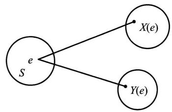  
图3-1

二维随机变量  $(X,Y)$  的性质不仅与  $X$  及  $Y$  有关,而且还依赖于这两个随机变量的相互关系。因此,逐个地来研究  $X$  或  $Y$  的性质是不够的,还需将  $(X,Y)$  作为一个整体来进行研究。

和一维的情况类似,我们也借助"分布函数"来研究二维随机变量。

定义 设  $(X,Y)$  是二维随机变量,对于任意实数  $x,y$ ,二元函数:

$$
F(x,y) = P\{(X\leqslant x)\cap (Y\leqslant y)\} \stackrel {\mathrm{i}\mathbb{E}\mathbb{E}}{\longrightarrow} P\{X\leqslant x,Y\leqslant y\}
$$

称为二维随机变量  $(X,Y)$  的分布函数,或称为随机变量  $X$  和  $Y$  的联合分布函数。

如果将二维随机变量  $(X,Y)$  看成平面上随机点的坐标,那么,分布函数  $F(x,y)$  在  $(x,y)$  处的函数值就是随机点  $(X,Y)$  落在如图3- 2所示的,以点  $(x,y)$  为顶点而位于该点左下方的无穷矩形域内的概率。

依照上述解释,借助于图3- 3容易算出随机点  $(X,Y)$  落在矩形域  $\{(x,y)\mid x_{1}< x\leqslant x_{2},y_{1}< y\leqslant y_{2}\}$  的概率为

$$
\begin{array}{r l} & {P\{x_{1}< X\leqslant x_{2},y_{1}< Y\leqslant y_{2}\}}\\ & {\quad = F(x_{2},y_{2}) - F(x_{2},y_{1}) + F(x_{1},y_{1}) - F(x_{1},y_{2}).} \end{array} \tag{1.1}
$$

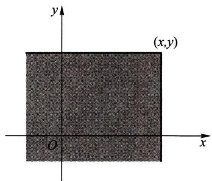  
图3-2

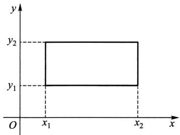  
图3-3

分布函数  $F(x,y)$  具有以下的基本性质:

$1^{\circ} F(x,y)$  是变量  $x$  和  $y$  的不减函数,即对于任意固定的  $y$ ,当  $x_{2} > x_{1}$  时  $F(x_{2},y) \geqslant F(x_{1},y)$ ;对于任意固定的  $x$ ,当  $y_{2} > y_{1}$  时  $F(x,y_{2}) \geqslant F(x,y_{1})$

$2^{\circ} 0 \leqslant F(x,y) \leqslant 1$ ,且

对于任意固定的  $x,F(- \infty ,y) = 0$

对于任意固定的  $x,F(x, - \infty) = 0$

$$
F(-\infty , - \infty) = 0,F(\infty ,\infty) = 1.
$$

上面四个式子可以从几何上加以说明.例如,在图3一2中将无穷矩形的右面边界向左无限平移(即  $x\rightarrow - \infty$  ),则"随机点  $(X,Y)$  落在这个矩形内"这一事件趋于不可能事件,故其概率趋于0,即有  $F(- \infty ,y) = 0$  ;又如当  $x\rightarrow \infty ,y\rightarrow \infty$  时图3一2中的无穷矩形扩展到全平面,随机点  $(X,Y)$  落在其中这一事件趋于必然事件,故其概率趋于1,即  $F(\infty ,\infty) = 1$

$3^{\circ} F(x + 0,y) = F(x,y),F(x,y + 0) = F(x,y)$ ,即  $F(x,y)$  关于  $x$  右连续,关于  $y$  也右连续.

$4^{\circ}$  对于任意  $(x_{1},y_{1}),(x_{2},y_{2}),x_{1}< x_{2},y_{1}< y_{2}$ ,下述不等式成立:

$$
F(x_{2},y_{2}) - F(x_{2},y_{1}) + F(x_{1},y_{1}) - F(x_{1},y_{2}) \geqslant 0.
$$

这一性质由(1.1)式及概率的非负性即可得,

如果二维随机变量  $(X,Y)$  全部可能取到的值是有限对或可列无限多对,则称  $(X,Y)$  是二维离散型随机变量.

设二维离散型随机变量  $(X,Y)$  所有可能取的值为  $(x_{i},y_{j}),i,j = 1,2,\dots$ ,记  $P\{X = x_{i},Y = y_{j}\} = p_{ij},i,j = 1,2,\dots$ ,则由概率的定义有

$$
p_{ij} \geqslant 0, \quad \sum_{i = 1}^{\infty} \sum_{j = 1}^{\infty} p_{ij} = 1.
$$

我们称  $P\{X = x_{i},Y = y_{j}\} = p_{ij},i,j = 1,2,\dots$  为二维离散型随机变量  $(X,Y)$  的分布律,或称为随机变量  $X$  和  $Y$  的联合分布律.

我们也能用表格来表示  $X$  和  $Y$  的联合分布律,如下表所示  $①$

<table><tr><td>X
Y</td><td>x1</td><td>x2</td><td>...</td><td>xi</td><td>...</td></tr><tr><td>y1</td><td>p11</td><td>p21</td><td>...</td><td>p11</td><td>...</td></tr><tr><td>y2</td><td>p12</td><td>p22</td><td>...</td><td>p12</td><td>...</td></tr><tr><td>...</td><td>...</td><td>...</td><td>...</td><td>...</td><td></td></tr><tr><td>yj</td><td>p1j</td><td>p2j</td><td>...</td><td>pij</td><td>...</td></tr><tr><td>...</td><td>...</td><td>...</td><td>...</td><td>...</td><td></td></tr></table>

例1设随机变量  $X$  在1,2,3,4四个整数中等可能地取一个值,另一个随机变量  $Y$  在  $1\sim X$  中等可能地取一整数值.试求  $(X,Y)$  的分布律.

解由乘法公式容易求得  $(X,Y)$  的分布律.易知  $\{X = i,Y = j\}$  的取值情况是:  $i = 1,2,3,4,j$  取不大于  $i$  的正整数,且

$$
P\{X = i,Y = j\} = P\{Y = j\mid X = i\} P\{X = i\} = \frac{1}{i}\cdot \frac{1}{4},\quad i = 1,2,3,4,j\leqslant i.
$$

于是  $(X,Y)$  的分布律为

<table><tr><td>X
Y</td><td>1</td><td>2</td><td>3</td><td>4</td></tr><tr><td>1</td><td>1/4</td><td>1/8</td><td>1/12</td><td>1/16</td></tr><tr><td>2</td><td>0</td><td>1/8</td><td>1/12</td><td>1/16</td></tr><tr><td>3</td><td>0</td><td>0</td><td>1/12</td><td>1/16</td></tr><tr><td>4</td><td>0</td><td>0</td><td>0</td><td>1/16</td></tr></table>

将  $(X,Y)$  看成一个随机点的坐标,由图3一2知道离散型随机变量  $X$  和  $Y$  的联合分布函数为

$$
F(x,y) = \sum_{x_{i}\leqslant x} \sum_{y_{j}\leqslant y} p_{ij}, \tag{1.2}
$$

其中和式是对一切满足  $x_{i}\leqslant x,y_{j}\leqslant y$  的  $i,j$  来求和的.

与一维随机变量相似,对于二维随机变量  $(X,Y)$  的分布函数  $F(x,y)$ ,如果存在非负可积函数  $f(x,y)$  使对于任意  $x,y$  有

$$
F(x,y) = \int_{-\infty}^{y}\int_{-\infty}^{x}f(u,v)\mathrm{d}u\mathrm{d}v,
$$

则称  $(X,Y)$  是二维连续型随机变量,函数  $f(x,y)$  称为二维连续型随机变量  $(X,Y)$  的概率密度,或称为随机变量  $X$  和  $Y$  的联合概率密度.

按定义,概率密度  $f(x,y)$  具有以下性质:

$1^{\circ}f(x,y)\geq 0.$

$$
2^{\circ}\int_{-\infty}^{\infty}\int_{-\infty}^{\infty}f(x,y)\mathrm{d}x\mathrm{d}y = F(\infty ,\infty) = 1.
$$

$3^{\circ}$  设  $G$  是  $xOy$  平面上的区域,点  $(X,Y)$  落在  $G$  内的概率为

$$
P\{(X,Y)\in G\} = \iint_{G}f(x,y)\mathrm{d}x\mathrm{d}y. \tag{1.3}
$$

$4^{\circ}$  若  $f(x,y)$  在点  $(x,y)$  连续,则有

$$
\frac{\partial^{2}F(x,y)}{\partial x\partial y} = f(x,y).
$$

由性质  $4^{\circ}$ ,在  $f(x,y)$  的连续点处有

$$
\lim_{\Delta x\to 0^{+}}\frac{P\{x< X\leqslant x + \Delta x,y< Y\leqslant y + \Delta y\}}{\Delta x\Delta y}
$$

$\frac{\mathrm{~\texttt~{~H~(1. 1)~}~}}{\Delta x\to 0^{+}}\lim_{\Delta x\to 0^{+}}\frac{1}{\Delta x\Delta y}\big[F(x + \Delta x,y + \Delta y) - F(x + \Delta x,y) - F(x,y + \Delta y) + F(x,y)\big]$

$$
= \frac{\partial^{2}F(x,y)}{\partial x\partial y} = f(x,y).
$$

这表示若  $f(x,y)$  在点  $(x,y)$  处连续,则当  $\Delta x,\Delta y$  很小时

$$
P\{x< X\leqslant x + \Delta x,y< Y\leqslant y + \Delta y\} \approx f(x,y)\Delta x\Delta y,
$$

也就是点  $(X,Y)$  落在小矩形  $(x,x + \Delta x]\times (y,y + \Delta y]$  内的概率近似地等于  $f(x,y)\Delta x\Delta y$

在几何上  $z = f(x,y)$  表示空间的一个曲面.由性质  $2^{\circ}$  知,介于它和  $xOy$  平面的空间区域的体积为1. 由性质  $3^{\circ},P\{(X,Y)\in G\}$  的值等于以  $G$  为底,以曲面  $z = f(x,y)$  为顶面的柱体体积.

例2设二维随机变量  $(X,Y)$  具有概率密度

$$
f(x,y) = \left\{ \begin{array}{ll}2\mathrm{e}^{-(2x + y)}, & x > 0,y > 0, \\ 0, & \text{其他}. \end{array} \right.
$$

(1)求分布函数  $F(x,y)$  .(2)求概率  $P\{Y\leqslant X\}$

解 (1)  $F(x,y) = \int_{- \infty}^{y}\int_{- \infty}^{x}f(x,y)\mathrm{d}x\mathrm{d}y$

$$
= \left\{ \begin{array}{ll}\int_{0}^{y}\int_{0}^{x}2\mathrm{e}^{-(2x + y)}\mathrm{d}x\mathrm{d}y, & x > 0, y > 0, \\ 0, & \text{其他.} \end{array} \right.
$$

即有  $F(x, y) = \left\{ \begin{array}{ll}(1 - \mathrm{e}^{- 2x})(1 - \mathrm{e}^{- y}), & x > 0, y > 0, \\ 0, & \text{其他.} \end{array} \right.$

(2)将  $(X, Y)$  看作平面上随机点的坐标. 即有

$$
\{Y \leqslant X\} = \{(X, Y) \in G\} ,
$$

其中  $G$  为  $xOy$  平面上直线  $y = x$  及其下方的部分,如图3一4. 于是

$$
\begin{array}{l}{{P\{Y\leqslant X\}=P\{(X,Y)\in G\}=\iint_{G}f(x,y)\mathrm{d}x\mathrm{d}y}}\\ {{\qquad=\int_{0}^{\infty}\int_{y}^{\infty}2\mathrm{e}^{-(2x+y)}\mathrm{d}x\mathrm{d}y=\frac{1}{3}.}}\end{array}
$$

以上关于二维随机变量的讨论,不难推广到  $n$  ( $n > 2$ ) 维随机变量的情况. 一般,设  $E$  是一个随机试验,它的样本空间是  $S = \{e\}$ ,设  $X_{1} = X_{1}(e)$ ,  $X_{2} = X_{2}(e), \dots , X_{n} = X_{n}(e)$  是定义在  $S$  上的随机

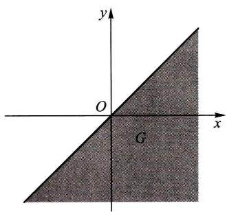  
图3-4

变量,由它们构成的一个  $n$  维向量  $(X_{1}, X_{2}, \dots , X_{n})$  称为  $n$  维随机向量或  $n$  维随机变量.

对于任意  $n$  个实数  $x_{1}, x_{2}, \dots , x_{n}, n$  元函数

$$
F(x_{1}, x_{2}, \dots , x_{n}) = P\{X_{1} \leqslant x_{1}, X_{2} \leqslant x_{2}, \dots , X_{n} \leqslant x_{n}\}
$$

称为  $n$  维随机变量  $(X_{1}, X_{2}, \dots , X_{n})$  的分布函数或随机变量  $X_{1}, X_{2}, \dots , X_{n}$  的联合分布函数. 它具有类似于二维随机变量的分布函数的性质.

# $\S 2$  边缘分布

二维随机变量  $(X, Y)$  作为一个整体,具有分布函数  $F(x, y)$ . 而  $X$  和  $Y$  都是随机变量,各自也有分布函数,将它们分别记为  $F_{X}(x), F_{Y}(y)$ ,依次称为二维随机变量  $(X, Y)$  关于  $X$  和关于  $Y$  的边缘分布函数. 边缘分布函数可以由  $(X, Y)$  的分布函数  $F(x, y)$  所确定,事实上,

$$
F_{X}(x) = P\{X \leqslant x\} = P\{X \leqslant x, Y < \infty \} = F(x, \infty),
$$

即  $F_{X}(x) = F(x, \infty)$ . (2.1)

就是说,只要在函数  $F(x, y)$  中令  $y \to \infty$  就能得到  $F_{X}(x)$ . 同理

$$
F_{Y}(y) = F(\infty , y). \tag{2.2}
$$

对于离散型随机变量,由(1.2),(2.1)式可得

$$
F_{X}(x) = F(x,\infty) = \sum_{x_{i}\leqslant x}\sum_{j = 1}^{\infty}p_{i j}.
$$

与第二章(3.2)式比较,知道  $X$  的分布律为

$$
P\{X = x_{i}\} = \sum_{j = 1}^{\infty}p_{i j},\quad i = 1,2,\dots .
$$

同样,  $Y$  的分布律为

$$
P\{Y = y_{j}\} = \sum_{i = 1}^{\infty}p_{i j},\quad j = 1,2,\dots ,
$$

记  $p_{i\cdot} = \sum_{j = 1}^{\infty}p_{i j} = P\{X = x_{i}\} ,\quad i = 1,2,\dots ,$

$$
p_{\cdot j} = \sum_{i = 1}^{\infty}p_{i j} = P\{Y = y_{j}\} ,\quad j = 1,2,\dots ,
$$

分别称  $\boldsymbol{\mathscr{p}}_{i}$  .  $(i = 1,2,\dots)$  和  $\boldsymbol{\mathscr{p}}_{\cdot j}(j = 1,2,\dots)$  为  $(X,Y)$  关于  $X$  和关于  $Y$  的边缘分布律(注意,记号  $\boldsymbol{\mathscr{p}}_{i}$  .中的"·"表示  $\boldsymbol{\mathscr{p}}_{i}$  .是由  $\boldsymbol{\mathscr{p}}_{i j}$  关于  $j$  求和后得到的;同样,  $\boldsymbol{\mathscr{p}}_{\cdot j}$  是由  $\boldsymbol{\mathscr{p}}_{i j}$  关于  $i$  求和后得到的).

对于连续型随机变量  $(X,Y)$  ,设它的概率密度为  $f(x,y)$  ,由于

$$
F_{X}(x) = F(x,\infty) = \int_{-\infty}^{x}\left[\int_{-\infty}^{\infty}f(x,y)\mathrm{d}y\right]\mathrm{d}x,
$$

由第二章(4.1)式知道,  $X$  是一个连续型随机变量,且其概率密度为

$$
f_{X}(x) = \int_{-\infty}^{\infty}f(x,y)\mathrm{d}y. \tag{2.3}
$$

同样,  $Y$  也是一个连续型随机变量,其概率密度为

$$
f_{Y}(y) = \int_{-\infty}^{\infty}f(x,y)\mathrm{d}x. \tag{2.4}
$$

分别称  $f_{X}(x),f_{Y}(y)$  为  $(X,Y)$  关于  $X$  和关于  $Y$  的边缘概率密度.

例1一整数  $N$  等可能地在  $1,2,3,\dots ,10$  十个值中取一个值.设  $D =$ $D(N)$  是能整除  $N$  的正整数的个数,  $F = F(N)$  是能整除  $N$  的素数的个数(注意1不是素数).试写出  $D$  和  $F$  的联合分布律,并求边缘分布律.

解先将试验的样本空间及  $D,F$  取值的情况列出如下:

<table><tr><td>样本点</td><td>1</td><td>2</td><td>3</td><td>4</td><td>5</td><td>6</td><td>7</td><td>8</td><td>9</td><td>10</td></tr><tr><td>D</td><td>1</td><td>2</td><td>2</td><td>3</td><td>2</td><td>4</td><td>2</td><td>4</td><td>3</td><td>4</td></tr><tr><td>F</td><td>0</td><td>1</td><td>1</td><td>1</td><td>1</td><td>2</td><td>1</td><td>1</td><td>1</td><td>2</td></tr></table>

$D$  所有可能取的值为  $1,2,3,4;F$  所有可能取的值为0,1,2. 容易得到  $(D,F)$  取 $(i,j),i = 1,2,3,4,j = 0,1,2$  的概率,例如

$$
P\{D = 1,F = 0\} = \frac{1}{10},\quad P\{D = 2,F = 1\} = \frac{4}{10},
$$

可得  $D$  和  $F$  的联合分布律及边缘分布律如下表所示:

<table><tr><td>D
F</td><td>1</td><td>2</td><td>3</td><td>4</td><td>P{F=i}</td></tr><tr><td>0</td><td>1/10</td><td>0</td><td>0</td><td>0</td><td>1/10</td></tr><tr><td>1</td><td>0</td><td>4/10</td><td>2/10</td><td>1/10</td><td>7/10</td></tr><tr><td>2</td><td>0</td><td>0</td><td>0</td><td>2/10</td><td>2/10</td></tr><tr><td>P{D=i}</td><td>1/10</td><td>4/10</td><td>2/10</td><td>3/10</td><td>1</td></tr></table>

即有边缘分布律

$$
\begin{array}{c c c c c c c c c c c c c c c c c c c c c c c c c c c c c c c c c c c c c c c c c c c c c c c c c c c c c c c c c c c c c c c c c c c c c c c c c c c c c c c c c c c c c c c c c c c c c c c c c c c c c} & \begin{array}{c c c c c c c c c c c c c c c c c c c c c c c c c c c c c c c c c c c c c c c c c c c c c c c c c c c c c c c c c c c c c c c c c c c c c c c c c c c c c c c c c c c c c c c c c c c c c c c} & \frac{D}{\frac{1}{10}} & \frac{2}{\frac{4}{10}} & \frac{3}{\frac{2}{10}} & \frac{4}{\frac{3}{10}} & \frac{F}{\frac{1}{10}} & \frac{0}{\frac{1}{10}} & \frac{1}{\frac{2}{10}} & \frac{2}{\frac{2}{10}} & \frac{1}{\frac{1}{10}} & \frac{1}{\frac{1}{10}} & \frac{1}{\frac{1}{10}} & \frac{1}{\frac{1}{10}} & \frac{1}{\frac{1}{10}} & \frac{1}{\frac{1}{10}} & \frac{1}{\frac{1}{10}} & \frac{1}{\frac{1}{2}} & \frac{1}{\frac{1}{2}} & \frac{1}{\frac{1}{2}} & \frac{1}{\frac{1}{2}} & \frac{1}{\frac{1}{2}} & \frac{1}{\frac{1}{2}} & \frac{1}{\frac{1}{2}} & \frac{1}{\frac{1}{2}} & \frac{1}{\left(1 - \frac{1}{2}\right)} & \frac{1}{\frac{1}{2}} & \frac{1}{\frac{1}{2}} & \frac{1}{\frac{1}{2}} & \frac{1}{\frac{1}{2}} & \frac{1}{\frac{1}{2}} & \frac{1}{\frac{1}{2}} & \frac{1}{\frac{1}{2}} & \frac{1}{\frac{\frac{1}{2}}{\frac{1}{2}} & \frac{1}{\frac{1}{2}} & \frac{1}{\frac{1}{2}} & \frac{1}{\frac{1}{2}} & \frac{1}{\frac{1}{2}} & \frac{1}{\frac{1}{2}} & \frac{1}{\frac{1}{2}} & \frac{1}{\frac{1}{2}} & \left(1 - \frac{1}{2}\right) & \frac{1}{\frac{1}{2}} & \frac{1}{\frac{1}{2}} & \frac{1}{\frac{1}{2}} & \frac{1}{\frac{1}{2}} & \frac{1}{\frac{1}{2}} & \frac{1}{\frac{1}{2}} & \frac{1}{\frac{1}{2}} & \frac{1}{\frac {1}{2}} & \frac{1}{\frac{1}{2}} & \frac{1}{\frac{1}{2}} & \frac{1}{\frac{1}{2}} & \frac{1}{\frac{1}{2}} & \frac{1}{\frac{1}{2}} & \frac{1}{\frac{1}{2}} & \frac{1}{\frac{1}{2}} & \frac{ \end{array}
$$

我们常常将边缘分布律写在联合分布律表格的边缘上,如上表所示.这就是"边缘分布律"这个名词的来源.

例2设随机变量  $X$  和  $Y$  具有联合概率密度(图3- 5)

$$
f(x,y)={\left\{\begin{array}{l l}{0,}&{x^{2}\leqslant y\leqslant x,}\\ {0,}&{{\mathrm{~}}{\mathrm{~}}{\mathrm{~}}{\mathrm{~}}{\mathrm{~}}{\mathrm{~}}{\mathrm{~}}{\mathrm{~}}{\mathrm{~}}{\mathrm{~}}{\mathrm{~}}{\mathrm{~}}{\mathrm{~}}{\mathrm{~}}{\mathrm{~}}{\mathrm{~}}{\mathrm{~}}{\mathrm{~}}{\mathrm{~}}{\mathrm{~}}{\mathrm{~}}\end{array}\right.}
$$

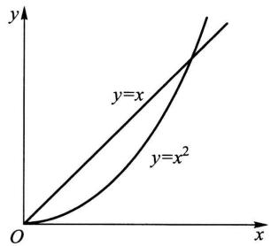  
图3-5

求边缘概率密度  $f_{X}(x),f_{Y}(y)$

解

$$
f_{X}(x) = \int_{-\infty}^{\infty}f(x,y)\mathrm{d}y = \left\{ \begin{array}{l l}{\int_{x^{2}}^{x}6\mathrm{d}y = 6(x - x^{2}),} & {0\leqslant x\leqslant 1,}\\ {0,} & {\mathbb{H}\backslash \mathbb{H}.} \end{array} \right.
$$

$$
f_{Y}(y) = \int_{-\infty}^{\infty}f(x,y)\mathrm{d}x = \left\{ \begin{array}{l l}{\int_{y}^{\sqrt{y}}6\mathrm{d}x = 6(\sqrt{y} -y),} & {0\leqslant y\leqslant 1,}\\ {0,} & {\mathbb{H}\backslash \mathbb{H}.} \end{array} \right.
$$

例3 设二维随机变量  $(X,Y)$  的概率密度为

$$
\begin{array}{c}{{f(x,y)=\frac{1}{2\pi\sigma_{1}\sigma_{2}\sqrt{1-\rho^{2}}}\mathrm{exp}\left\{\frac{-1}{2(1-\rho^{2})}\bigg[\frac{(x-\mu_{1})^{2}}{\sigma_{1}^{2}}\right.}}\\ {{\left.-2\rho\frac{(x-\mu_{1})(y-\mu_{2})}{\sigma_{1}\sigma_{2}}+\frac{(y-\mu_{2})^{2}}{\sigma_{2}^{2}}\bigg]\right\},}}\end{array}
$$

其中  $\mu_{1}, \mu_{2}, \sigma_{1}, \sigma_{2}, \rho$  都是常数,且  $\sigma_{1} > 0, \sigma_{2} > 0, - 1< \rho < 1$ . 我们称  $(X,Y)$  为服从参数为  $\mu_{1}, \mu_{2}, \sigma_{1}, \sigma_{2}, \rho$  的二维正态分布(这五个参数的意义将在下一章说明),记为  $(X,Y) \sim N(\mu_{1}, \mu_{2}, \sigma_{1}^{2}, \sigma_{2}^{2}, \rho)$ . 试求二维正态随机变量的边缘概率密度.

解  $f_{X}(x) = \int_{- \infty}^{\infty} f(x, y) \mathrm{d}y$ , 由于

$$
\begin{array}{r l} & {\frac{(y - \mu_{2})^{2}}{\sigma_{2}^{2}} -2\rho \frac{(x - \mu_{1})(y - \mu_{2})}{\sigma_{1}\sigma_{2}}}\\ & {\qquad = \Big(\frac{y - \mu_{2}}{\sigma_{2}} -\rho \frac{x - \mu_{1}}{\sigma_{1}}\Big)^{2} - \rho^{2}\frac{(x - \mu_{1})^{2}}{\sigma_{1}^{2}},} \end{array}
$$

于是

$$
f_{X}(x) = \frac{1}{2\pi\sigma_{1} \sigma_{2} \sqrt{1 - \rho^{2}}} \mathrm{e}^{-\frac{(x - \mu_{1})^{2}}{2\sigma_{1}^{2}}} \int_{-\infty}^{\infty} \mathrm{e}^{-\frac{1}{2(1 - \rho^{2})} \left(\frac{y - \mu_{2}}{\sigma_{2}} - \rho^{2} \sigma_{1}^{2}\right)^{2}} \mathrm{d}y.
$$

令

$$
t = \frac{1}{\sqrt{1 - \rho^{2}}} \left(\frac{y - \mu_{2}}{\sigma_{2}} - \rho \frac{x - \mu_{1}}{\sigma_{1}}\right),
$$

则有

$$
f_{X}(x) = \frac{1}{2\pi \sigma_{1}} \mathrm{e}^{-\frac{(x - \mu_{1})^{2}}{2\sigma_{1}^{2}}} \int_{-\infty}^{\infty} \mathrm{e}^{-t^{2} / 2} \mathrm{d}t,
$$

即  $f_{X}(x) = \frac{1}{\sqrt{2\pi} \sigma_{1}} \mathrm{e}^{- \frac{(x - \mu_{1})^{2}}{2\sigma_{1}^{2}}}, \quad - \infty < x < \infty .$

同理

$$
f_{Y}(y) = \frac{1}{\sqrt{2\pi} \sigma_{2}} \mathrm{e}^{-\frac{(y - \mu_{2})^{2}}{2\sigma_{2}^{2}}}, \quad -\infty < y < \infty .
$$

我们看到二维正态分布的两个边缘分布都是一维正态分布,并且都不依赖于参数  $\rho$ ,亦即对于给定的  $\mu_{1}, \mu_{2}, \sigma_{1}, \sigma_{2}$ ,不同的  $\rho$  对应不同的二维正态分布,它们的边缘分布却都是一样的. 这一事实表明,单由关于  $X$  和关于  $Y$  的边缘分布,一般来说是不能确定随机变量  $X$  和  $Y$  的联合分布的.

# $\S 3$  条件分布

我们由条件概率很自然地引出条件概率分布的概念,

设  $(X,Y)$  是二维离散型随机变量,其分布律为

$$
P\{X = x_{i},Y = y_{j}\} = p_{ij},\quad i,j = 1,2,\dots .
$$

$(X,Y)$  关于  $X$  和关于  $Y$  的边缘分布律分别为

$$
P\{X = x_{i}\} = p_{i\cdot} = \sum_{j = 1}^{\infty}p_{ij},\quad i = 1,2,\dots ,
$$

$$
P\{Y = y_{j}\} = p_{\cdot j} = \sum_{i = 1}^{\infty}p_{ij},\quad j = 1,2,\dots .
$$

设  $\boldsymbol{\mathscr{p}}_{\cdot j} > 0$  ,我们来考虑在事件  $\{Y = y_{j}\}$  已发生的条件下事件  $\{X = x_{i}\}$  发生的概率,也就是来求事件

$$
\{X = x_{i}|Y = y_{j}\} ,\quad i = 1,2,\dots
$$

的概率.由条件概率公式,可得

$$
P\{X = x_{i}|Y = y_{j}\} = \frac{P\{X = x_{i},Y = y_{j}\}}{P\{Y = y_{j}\}} = \frac{p_{ij}}{p_{\cdot j}},\quad i = 1,2,\dots .
$$

易知上述条件概率具有分布律的性质:

$$
1^{\circ}P\{X = x_{i}|Y = y_{j}\} \geqslant 0.
$$

$$
2^{\circ}\sum_{i = 1}^{\infty}P\{X = x_{i}\mid Y = y_{j}\} = \sum_{i = 1}^{\infty}\frac{p_{ij}}{p_{\cdot j}} = \frac{1}{p_{\cdot j}}\sum_{i = 1}^{\infty}p_{ij} = \frac{p_{\cdot j}}{p_{\cdot j}} = 1.
$$

于是我们引入以下的定义,

定义设  $(X,Y)$  是二维离散型随机变量,对于固定的  $j$  ,若  $P\{Y = y_{j}\} >0$  则称

$$
P\{X = x_{i}|Y = y_{j}\} = \frac{P\{X = x_{i},Y = y_{j}\}}{P\{Y = y_{j}\}} = \frac{p_{ij}}{p_{\cdot j}},\quad i = 1,2,\dots \tag{3.1}
$$

为在  $Y = y_{j}$  条件下随机变量  $X$  的条件分布律.

同样,对于固定的  $i$  ,若  $P\{X = x_{i}\} >0$  ,则称

$$
P\{Y = y_{j}|X = x_{i}\} = \frac{P\{X = x_{i},Y = y_{j}\}}{P\{X = x_{i}\}} = \frac{p_{ij}}{p_{i}},\quad j = 1,2,\dots \tag{3.2}
$$

为在  $X = x_{i}$  条件下随机变量  $Y$  的条件分布律.

例1在一汽车工厂中,一辆汽车有两道工序是由机器人完成的.其一是紧固3只螺栓,其二是焊接2处焊点.以  $X$  表示由机器人紧固的螺栓中紧固得不良的数目,以  $Y$  表示由机器人焊接的不良焊点的数目.据积累的资料知  $(X$ $Y)$  具有分布律:

<table><tr><td>X
Y</td><td>0</td><td>1</td><td>2</td><td>3</td><td>P{Y=j}</td></tr><tr><td>0</td><td>0.840</td><td>0.030</td><td>0.020</td><td>0.010</td><td>0.900</td></tr><tr><td>1</td><td>0.060</td><td>0.010</td><td>0.008</td><td>0.002</td><td>0.080</td></tr><tr><td>2</td><td>0.010</td><td>0.005</td><td>0.004</td><td>0.001</td><td>0.020</td></tr><tr><td>P{X=i}</td><td>0.910</td><td>0.045</td><td>0.032</td><td>0.013</td><td>1.000</td></tr></table>

(1)求在  $X = 1$  的条件下,  $Y$  的条件分布律.(2)求在  $Y = 0$  的条件下,  $X$  的条件分布律.

解 边缘分布律已经求出列在上表中.

(1)在  $X = 1$  的条件下,  $Y$  的条件分布律为

$$
P\{Y = 0 \mid X = 1\} = \frac{P\{X = 1,Y = 0\}}{P\{X = 1\}} = \frac{0.030}{0.045},
$$

$$
P\{Y = 1 \mid X = 1\} = \frac{P\{X = 1,Y = 1\}}{P\{X = 1\}} = \frac{0.010}{0.045},
$$

$$
P\{Y = 2 \mid X = 1\} = \frac{P\{X = 1,Y = 2\}}{P\{X = 1\}} = \frac{0.005}{0.045},
$$

或写成

<table><tr><td>Y=k</td><td>0</td><td>1</td><td>2</td></tr><tr><td>P{Y=k|X=1}</td><td>6/9</td><td>2/9</td><td>1/9</td></tr></table>

(2)同样可得在  $Y = 0$  的条件下  $X$  的条件分布律为

<table><tr><td>X=k</td><td>0</td><td>1</td><td>2</td><td>3</td></tr><tr><td>P{X=k|Y=0}</td><td>84/90</td><td>3/90</td><td>2/90</td><td>1/90</td></tr></table>

例2一射手进行射击,击中目标的概率为  $p$ $(0< p< 1)$  ,射击直至击中目标两次为止.设以  $X$  表示首次击中目标所进行的射击次数,以  $Y$  表示总共进行的射击次数,试求  $X$  和  $Y$  的联合分布律及条件分布律.

解 按题意  $Y = n$  就表示在第  $n$  次射击时击中目标,且在第1次,第2次,…,第  $n - 1$  次射击中恰有一次击中目标.已知各次射击是相互独立的,于是

不管  $m$ $(m{<}n)$  是多少,概率  $P\{X = m,Y = n\}$  都应等于

$$
\begin{array}{r}{\boldsymbol {\mathbf{\mathit{p}}}\cdot \boldsymbol {\mathbf{\mathit{p}}}\cdot \underbrace{\boldsymbol{\mathbf{\mathit{q}}}\cdot\boldsymbol{\mathbf{\mathit{q}}}\cdot\cdots\cdot\boldsymbol{\mathbf{\mathit{q}}} = \boldsymbol{\mathbf{\mathit{p}}}^{2}\boldsymbol{\mathbf{\mathit{q}}}^{n - 2}}_{n - 2\uparrow}} \end{array}
$$

即得  $X$  和  $Y$  的联合分布律为

$$
P\{X = m,Y = n\} = p^{2}q^{n - 2},\quad n = 2,3,\dots ;m = 1,2,\dots ,n - 1.
$$

又  $P\{X = m\} = \sum_{n = m + 1}^{\infty}P\{X = m,Y = n\} = \sum_{n = m + 1}^{\infty}p^{2}q^{n - 2}$

$$
= p^{2}\sum_{n = m + 1}^{\infty}q^{n - 2} = \frac{p^{2}q^{m - 1}}{1 - q} = p q^{m - 1},\quad m = 1,2,\dots ,
$$

$$
\begin{array}{l}{{P\{Y=n\}=\sum_{m=1}^{n-1}P\{X=m,Y=n\}}}\\ {{=\sum_{m=1}^{n-1}p^{2}q^{n-2}=(n-1)p^{2}q^{n-2},\quad n=2,3,\cdots.}}\end{array}
$$

于是由(3.1),(3.2)式得到所求的条件分布律为

当  $n = 2,3,\dots$  时,

$$
P\{X = m|Y = n\} = \frac{p^{2}q^{n - 2}}{(n - 1)p^{2}q^{n - 2}} = \frac{1}{n - 1},\quad m = 1,2,\dots ,n - 1;
$$

当  $m = 1,2,\dots$  时,

$$
P\{Y = n|X = m\} = \frac{p^{2}q^{n - 2}}{p q^{m - 1}} = p q^{n - m - 1},\quad n = m + 1,m + 2,\dots .
$$

例如,  $P\{X = m|Y = 3\} = \frac{1}{2},\quad m = 1,2;$

$$
P\{Y = n|X = 3\} = p q^{n - 4},\quad n = 4,5,\dots .
$$

现设  $(X,Y)$  是二维连续型随机变量,这时由于对任意  $x,y$  有  $P\{X = x\} = 0$ $P\{Y = y\} = 0$  ,因此就不能直接用条件概率公式引入"条件分布函数"了.

设  $(X,Y)$  的概率密度为  $f(x,y),(X,Y)$  关于  $Y$  的边缘概率密度为  $f_{Y}(y)$  给定  $y$  ,对于任意固定的  $\epsilon >0$  ,对于任意  $x$  ,考虑条件概率

$$
P\{X\leqslant x\mid y< Y\leqslant y + \epsilon \} ,
$$

设  $P\{y{<}Y\leqslant y + \epsilon \} >0$  ,则有

$$
\begin{array}{r l} & {P\{X\leqslant x\mid y< Y\leqslant y + \epsilon \} = \frac{P\{X\leqslant x,y< Y\leqslant y + \epsilon\}}{P\{y< Y\leqslant y + \epsilon\}}}\\ & {\qquad = \frac{\int_{-\infty}^{x}\left[\int_{y}^{y + \epsilon}f(x,y)\mathrm{d}y\right]\mathrm{d}x}{\int_{y}^{y + \epsilon}f_{Y}(y)\mathrm{d}y}.} \end{array}
$$

在某些条件下,当  $\epsilon$  很小时,上式右端分子、分母分别近似于  $\epsilon \int_{- \infty}^{x}f(x,y)\mathrm{d}x$  和  $\epsilon f_{Y}(y)$ ,于是当  $\epsilon$  很小时,有

$$
P\{X\leqslant x\mid y< Y\leqslant y + \epsilon \} \approx \frac{\epsilon\int_{-\infty}^{x}f(x,y)\mathrm{d}x}{\epsilon f_{Y}(y)} = \int_{-\infty}^{x}\frac{f(x,y)}{f_{Y}(y)}\mathrm{d}x. \tag{3.3}
$$

与一维随机变量概率密度的定义式第二章(4.1)式比较,我们给出以下的定义:

定义设二维随机变量  $(X,Y)$  的概率密度为  $f(x,y),(X,Y)$  关于  $Y$  的边缘概率密度为  $f_{Y}(y)$  .若对于固定的  $y,f_{Y}(y) > 0$  ,则称  $\frac{f(x,y)}{f_{Y}(y)}$  为在  $Y = y$  的条件下  $X$  的条件概率密度,记为  $①$

$$
f_{X|Y}(x\mid y) = \frac{f(x,y)}{f_{Y}(y)}. \tag{3.4}
$$

称  $\int_{- \infty}^{x}f_{X|Y}(x\mid y)\mathrm{d}x = \int_{- \infty}^{x}\frac{f(x,y)}{f_{Y}(y)}\mathrm{d}x$  为在  $Y = y$  的条件下  $X$  的条件分布函数,记为  $P\{X\leqslant x\mid Y = y\}$  或  $F_{X|Y}(x\mid y)$ ,即

$$
F_{X|Y}(x\mid y) = P\{X\leqslant x\mid Y = y\} = \int_{-\infty}^{x}\frac{f(x,y)}{f_{Y}(y)}\mathrm{d}x. \tag{3.5}
$$

类似地,可以定义  $f_{Y|X}(y\mid x) = \frac{f(x,y)}{f_{X}(x)}$  和  $F_{Y|X}(y\mid x) = \int_{- \infty}^{y}\frac{f(x,y)}{f_{X}(x)}\mathrm{d}y$ .

由(3.3)式知道,当  $\epsilon$  很小时,有

$$
P\{X\leqslant x\mid y< Y\leqslant y + \epsilon \} \approx \int_{-\infty}^{x}f_{X|Y}(x\mid y)\mathrm{d}x = F_{X|Y}(x\mid y),
$$

上式说明了条件密度和条件分布函数的含义,

例3设  $G$  是平面上的有界区域,其面积为  $A$  .若二维随机变量  $(X,Y)$  具有概率密度

$$
f(x,y) = \left\{ \begin{array}{ll}\frac{1}{A}, & (x,y)\in G, \\ 0, & \text{其他}, \end{array} \right.
$$

则称  $(X,Y)$  在  $G$  上服从均匀分布.现设二维随机变量  $(X,Y)$  在圆域  $x^{2} + y^{2}\leqslant 1$  上服从均匀分布,求条件概率密度  $f_{X|Y}(x\mid y)$ .

解由假设,随机变量  $(X,Y)$  具有概率密度

$①$  条件概率密度满足条件:  $f_{X|Y}(x\mid y) = \frac{f(x,y)}{f_{Y}(y)}\geqslant 0$ ;

$$
\int_{-\infty}^{\infty}f_{X|Y}(x\mid y)\mathrm{d}x = \int_{-\infty}^{\infty}\frac{f(x,y)}{f_{Y}(y)}\mathrm{d}x = \frac{1}{f_{Y}(y)}\int_{-\infty}^{\infty}f(x,y)\mathrm{d}x = 1.
$$

$$
f(x,y) = \left\{ \begin{array}{ll}\frac{1}{\pi}, & x^{2} + y^{2} \leqslant 1, \\ 0, & \text{其他}, \end{array} \right.
$$

且有边缘概率密度

$$
\begin{array}{l}{{f_{Y}(y)=\int_{-\infty}^{\infty}f(x,y)\mathrm{d}x}}\\ {{\qquad=\left\{\begin{array}{l l}{{\frac{1}{\pi}\int_{-\sqrt{1-y^{2}}}^{\sqrt{1-y^{2}}}\mathrm{d}x=\frac{2}{\pi}\sqrt{1-y^{2}},}}\\ {{0,}}\end{array}\right.}}\end{array}
$$

于是当  $- 1 < y < 1$  时有

$$
\begin{array}{r l} & {f_{X|Y}(x|y) = \frac{\frac{1}{\pi}}{\frac{2}{\pi}\sqrt{1 - y^{2}}} = \frac{1}{2\sqrt{1 - y^{2}}}, - \sqrt{1 - y^{2}}\leqslant x\leqslant \sqrt{1 - y^{2}},}\\ & {\qquad \quad \mathrm{~i~o~},\qquad \quad \mathrm{~i~t~h~e~.}} \end{array}
$$

当  $y = 0$  和  $y = \frac{1}{2}$  时  $f_{X|Y}(x|y)$  的图形分别如图 3- 6, 图 3- 7 所示.

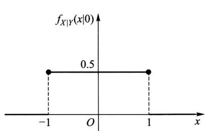  
图3-6

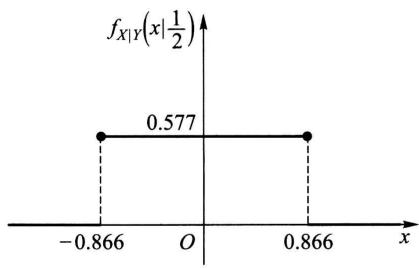  
图3-7

例4设数  $X$  在区间(0,1)上随机地取值,当观察到  $X = x$  (  $0 < x < 1$  )时,数  $Y$  在区间  $(x,1)$  上随机地取值. 求  $Y$  的概率密度  $f_{Y}(y)$

解按题意  $X$  具有概率密度

$$
f_{X}(x) = \left\{ \begin{array}{ll}1, & 0 < x < 1, \\ 0, & \text{其他}. \end{array} \right.
$$

对于任意给定的值  $x$  (  $0 < x < 1$  ),在  $X = x$  的条件下  $Y$  的条件概率密度为

$$
f_{Y|X}(y|x) = \left\{ \begin{array}{ll} \frac{1}{1 - x}, & x < y < 1, \\ 0, & \text{其他}. \end{array} \right.
$$

由(3.4)式得  $X$  和  $Y$  的联合概率密度为

$$
f(x,y) = f_{Y|X}(y|x)f_{X}(x) = \left\{ \begin{array}{ll}\frac{1}{1 - x}, & 0< x< y< 1, \\ 0, & \text{其他.} \end{array} \right.
$$

于是得关于  $Y$  的边缘概率密度为

$$
\begin{array}{l}{f_{Y}(y) = \int_{-\infty}^{\infty}f(x,y)\mathrm{d}x}\\ {= \left\{ \begin{array}{l l}{\int_{0}^{y}\frac{1}{1 - x}\mathrm{d}x = -\ln (1 - y),} & {0< y< 1,}\\ {0,} & {\mathrm{~}\mathrm{~}\mathrm{~}\mathrm{~}\mathrm{~}\mathrm{~}\mathrm{~}\mathrm{~}\mathrm{~}\mathrm{~}\mathrm{~}\mathrm{~}\mathrm{~}\mathrm{~}\mathrm{~}\mathrm{~}\mathrm{~}\mathrm{~}\mathrm{~}\mathrm{~}\mathrm{~}\mathrm{~}\mathrm{~}\mathrm{~}\mathrm{~}\mathrm{~}} \end{array} \right.} \end{array}
$$

# §4 相互独立的随机变量

本节我们将利用两个事件相互独立的概念引出两个随机变量相互独立的概念,这是一个十分重要的概念.

定义设  $F(x,y)$  及  $F_{X}(x),F_{Y}(y)$  分别是二维随机变量  $(X,Y)$  的分布函数及边缘分布函数.若对于所有  $x,y$  有

$$
P\{X\leqslant x,Y\leqslant y\} = P\{X\leqslant x\} P\{Y\leqslant y\} , \tag{4.1}
$$

即  $F(x,y) = F_{X}(x)F_{Y}(y),$  (4.2)

则称随机变量  $X$  和  $Y$  是相互独立的,

设  $(X,Y)$  是连续型随机变量,  $f(x,y),f_{X}(x),f_{Y}(y)$  分别为  $(X,Y)$  的概率密度和边缘概率密度,则  $X$  和  $Y$  相互独立的条件(4.2)式等价于:等式

$$
f(x,y) = f_{X}(x)f_{Y}(y) \tag{4.3}
$$

在平面上几乎处处  $①$  成立,

当  $(X,Y)$  是离散型随机变量时,  $X$  和  $Y$  相互独立的条件(4.2)式等价于:对于  $(X,Y)$  的所有可能取的值  $(x_{i},y_{j})$  有

$$
P\{X = x_{i},Y = y_{j}\} = P\{X = x_{i}\} P\{Y = y_{j}\} . \tag{4.4}
$$

在实际中使用(4.3)式或(4.4)式要比使用(4.2)式方便.

例如  $\S 1$  例2中的随机变量  $X$  和  $Y$  ,由于

$$
f_{X}(x)={\left\{\begin{array}{l l}{2\mathrm{e}^{-2x},}&{x>0,}\\ {0,}&{{\mathrm{~}}{\mathrm{~}}{\mathrm{~}}{\mathrm{~}}{\mathrm{~}}{\mathrm{~}}{\mathrm{~}}{\mathrm{~}}{\mathrm{~}}{\mathrm{~}}{\mathrm{~}}{\mathrm{~}}{\mathrm{~}}{\mathrm{~}}{\mathrm{~}}{\mathrm{~}}{\mathrm{~}}{\mathrm{~}}{\mathrm{~}}{\mathrm{~}}{\mathrm{~}}\end{array}\right.}{\left\{\begin{array}{l l}{\mathrm{e}^{-y},}&{y>0,}\\ {0,}&{{\mathrm{~}}{\mathrm{~}}{\mathrm{~}}{\mathrm{~}}{\mathrm{~}}{\mathrm{~}}{\mathrm{~}}{\mathrm{~}}{\mathrm{~}}{\mathrm{~}}{\mathrm{~}}{\mathrm{~}}{\mathrm{~}}{\mathrm{~}}{\mathrm{~}}{\mathrm{~}}{\mathrm{~}}{\mathrm{~}}\end{array}\right.}
$$

故有  $f(x,y) = f_{X}(x)f_{Y}(y)$  ,因而  $X,Y$  是相互独立的.

又如,若  $X,Y$  具有联合分布律

<table><tr><td>X
Y</td><td>0</td><td>1</td><td>P{Y=j}</td></tr><tr><td>1</td><td>1/6</td><td>2/6</td><td>1/2</td></tr><tr><td>2</td><td>1/6</td><td>2/6</td><td>1/2</td></tr><tr><td>P{X=i}</td><td>1/3</td><td>2/3</td><td>1</td></tr></table>

则有

$$
P\{X = 0,Y = 2\} = 1 / 6 = P\{X = 0\} P\{Y = 2\} ,
$$

$$
P\{X = 1,Y = 1\} = 2 / 6 = P\{X = 1\} P\{Y = 1\} ,
$$

$$
P\{X = 1,Y = 2\} = 2 / 6 = P\{X = 1\} P\{Y = 2\} ,
$$

因而  $X,Y$  是相互独立的.

再如  $\S 2$  例1中的随机变量  $F$  和  $D$  ,由于  $P\{D = 1,F = 0\} = 1 / 10\neq P\{D = 1\} \times P\{F = 0\}$  ,因而  $F$  和  $D$  不是相互独立的.

下面考察二维正态随机变量  $(X,Y)$  .它的概率密度为

$$
\begin{array}{r l} & {f(x,y) = \frac{1}{2\pi\sigma_{1}\sigma_{2}\sqrt{1 - \rho^{2}}}\mathrm{exp}\bigg\{\frac{-1}{2(1 - \rho^{2})}\bigg[\frac{(x - \mu_{1})^{2}}{\sigma_{1}^{2}}}\\ & {\qquad -2\rho \frac{(x - \mu_{1})(y - \mu_{2})}{\sigma_{1}\sigma_{2}} +\frac{(y - \mu_{2})^{2}}{\sigma_{2}^{2}}\bigg]\bigg\} .} \end{array}
$$

由  $\S 2$  中例3知道,其边缘概率密度  $f_{X}(x),f_{Y}(y)$  的乘积为

$$
f_{X}(x)f_{Y}(y) = \frac{1}{2\pi\sigma_{1}\sigma_{2}}\mathrm{exp}\bigg\{-\frac{1}{2}\bigg[\frac{(x - \mu_{1})^{2}}{\sigma_{1}^{2}} +\frac{(y - \mu_{2})^{2}}{\sigma_{2}^{2}}\bigg]\bigg\} .
$$

因此,如果  $\rho = 0$  ,则对于所有  $x,y$  有  $f(x,y) = f_{X}(x)f_{Y}(y)$  ,即  $X$  和  $Y$  相互独立.反之,如果  $X$  和  $Y$  相互独立,由于  $f(x,y),f_{X}(x),f_{Y}(y)$  都是连续函数,故对于所有的  $x,y$  有  $f(x,y) = f_{X}(x)f_{Y}(y)$  .特别,令  $x = \mu_{1},y = \mu_{2}$  ,自这一等式得到

$$
\frac{1}{2\pi\sigma_{1}\sigma_{2}\sqrt{1 - \rho^{2}}} = \frac{1}{2\pi\sigma_{1}\sigma_{2}},
$$

从而  $\rho = 0$  .综上所述,得到以下的结论:

对于二维正态随机变量  $(X,Y),X$  和  $Y$  相互独立的充要条件是参数  $\rho = 0$

例一负责人到达办公室的时间均匀分布在  $8\sim 12$  时,他的秘书到达办公室的时间均匀分布在  $7\sim 9$  时,设他们两人到达的时间相互独立,求他们到达办公室的时间相差不超过  $5\mathrm{min}(1 / 12\mathrm{h})$  的概率.

解设  $X$  和  $Y$  分别是负责人和他的秘书到达办公室的时间,由假设  $X$  和  $Y$  的概率密度分别为

$$
f_{X}(x) = \left\{ \begin{array}{l l}{\frac{1}{4},} & {8< x< 12,}\\ {0,} & {\mathbb{H}\backslash \mathbb{H},} \end{array} \right.f_{Y}(y) = \left\{ \begin{array}{l l}{\frac{1}{2},} & {7< y< 9,}\\ {0,} & {\mathbb{H}\backslash \mathbb{H},} \end{array} \right.
$$

因为  $X, Y$  相互独立, 故  $(X, Y)$  的概率密度为

$$
f(x, y) = f_{X}(x) f_{Y}(y) = \left\{ \begin{array}{ll} \frac{1}{8}, & 8 < x < 12, 7 < y < 9, \\ 0, & \text {其他.} \end{array} \right.
$$

按题意需要求概率  $P\{|X - Y| \leqslant 1 / 12\}$ . 画出区域:  $|x - y| \leqslant 1 / 12$ , 以及长方形  $[8 < x < 12; 7 < y < 9]$ , 它们的公共部分是四边形  $BCC^{\prime}B^{\prime}$ , 记为  $G$  (如图 3- 8). 显然仅当  $(X, Y)$  取值于  $G$  内, 他们两人到达的时间相差才不超过  $1 / 12 \mathrm{~h}$ . 因此, 所求的概率为

$$
P\left\{\left| X - Y \right| \leqslant \frac{1}{12} \right\} = \iint_{G} f(x, y) \mathrm{d}x \mathrm{~d}y
$$

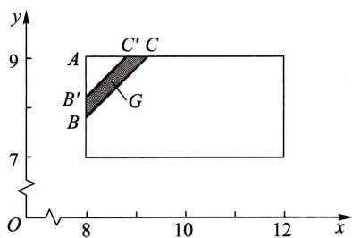  
图3-8

而  $G$  的面积  $=$  三角形ABC的面积一三角形  $A B^{\prime}C^{\prime}$  的面积

$$
= \frac{1}{2}\left(\frac{13}{12}\right)^{2} - \frac{1}{2}\left(\frac{11}{12}\right)^{2} = \frac{1}{6}.
$$

于是  $P\left\{\left| X - Y \right| \leqslant \frac{1}{12} \right\} = \frac{1}{48}.$

即负责人和他的秘书到达办公室的时间相差不超过  $5 \mathrm{~min}$  的概率为  $1 / 48$ .

以上所述关于二维随机变量的一些概念, 容易推广到  $n$  维随机变量的情况.

上面说过,  $n$  维随机变量  $(X_{1}, X_{2}, \dots , X_{n})$  的分布函数定义为

$$
F(x_{1}, x_{2}, \dots , x_{n}) = P\left\{X_{1} \leqslant x_{1}, X_{2} \leqslant x_{2}, \dots , X_{n} \leqslant x_{n} \right\} ,
$$

其中  $x_{1}, x_{2}, \dots , x_{n}$  为任意实数.

若存在非负可积函数  $f(x_{1}, x_{2}, \dots , x_{n})$ , 使对于任意实数  $x_{1}, x_{2}, \dots , x_{n}$  有

$$
F(x_{1}, x_{2}, \dots , x_{n}) = \int_{-\infty}^{x_{n}} \int_{-\infty}^{x_{n - 1}} \dots \int_{-\infty}^{x_{1}} f(x_{1}, x_{2}, \dots , x_{n}) \mathrm{d}x_{1} \mathrm{~d}x_{2} \dots \mathrm{d}x_{n},
$$

则称  $f(x_{1}, x_{2}, \dots , x_{n})$  为  $(X_{1}, X_{2}, \dots , X_{n})$  的概率密度函数.

设  $(X_{1}, X_{2}, \dots , X_{n})$  的分布函数  $F(x_{1}, x_{2}, \dots , x_{n})$  为已知, 则  $(X_{1}, X_{2}, \dots , X_{n})$  的  $k$ $(1 \leqslant k < n)$  维边缘分布函数就随之确定. 例如  $(X_{1}, X_{2}, \dots , X_{n})$  关于  $X_{1}$  、关于  $(X_{1}, X_{2})$  的边缘分布函数分别为

$$
F_{X_{1}}(x_{1}) = F(x_{1}, \infty , \infty , \dots , \infty),
$$

$$
F_{X_{1},X_{2}}(x_{1},x_{2}) = F(x_{1},x_{2},\infty ,\infty ,\dots ,\infty).
$$

又若  $f(x_{1},x_{2},\dots ,x_{n})$  是  $(X_{1},X_{2},\dots ,X_{n})$  的概率密度,则  $(X_{1},X_{2},\dots ,X_{n})$  关于  $X_{1}$  、关于  $(X_{1},X_{2})$  的边缘概率密度分别为

$$
f_{X_{1}}(x_{1}) = \int_{-\infty}^{\infty}\int_{-\infty}^{\infty}\dots \int_{-\infty}^{\infty}f(x_{1},x_{2},\dots ,x_{n})\mathrm{d}x_{2}\mathrm{d}x_{3}\dots \mathrm{d}x_{n},
$$

$$
f_{X_{1},X_{2}}(x_{1},x_{2}) = \int_{-\infty}^{\infty}\int_{-\infty}^{\infty}\dots \int_{-\infty}^{\infty}f(x_{1},x_{2},\dots ,x_{n})\mathrm{d}x_{3}\mathrm{d}x_{4}\dots \mathrm{d}x_{n}.
$$

若对于所有的  $x_{1},x_{2},\dots ,x_{n}$  有

$$
F(x_{1},x_{2},\dots ,x_{n}) = F_{X_{1}}(x_{1})F_{X_{2}}(x_{2})\dots F_{X_{n}}(x_{n}),
$$

则称  $X_{1},X_{2},\dots ,X_{n}$  是相互独立的.

若对于所有的  $x_{1},x_{2},\dots ,x_{m};y_{1},y_{2},\dots ,y_{n}$  有

$F(x_{1},x_{2},\dots ,x_{m},y_{1},y_{2},\dots ,y_{n}) = F_{1}(x_{1},x_{2},\dots ,x_{m})F_{2}(y_{1},y_{2},\dots ,y_{n}),$  其中  $F_{1},F_{2},F$  依次为随机变量  $(X_{1},X_{2},\dots ,X_{m}),(Y_{1},Y_{2},\dots ,Y_{n})$  和  $(X_{1},X_{2},\dots ,$ $X_{m},Y_{1},Y_{2},\dots ,Y_{n})$  的分布函数,则称随机变量  $(X_{1},X_{2},\dots ,X_{m})$  和  $(Y_{1},Y_{2},\dots ,Y_{n})$  是相互独立的.

我们有以下的定理,它在数理统计中是很有用的,

定理设  $(X_{1},X_{2},\dots ,X_{m})$  和  $(Y_{1},Y_{2},\dots ,Y_{n})$  相互独立,则  $X_{i}(i = 1,2,\dots ,$ $m)$  和  $Y_{j}(j = 1,2,\dots ,n)$  相互独立.又若  $h,g$  是连续函数,则  $h(X_{1},X_{2},\dots ,X_{m})$  和  $g(Y_{1},Y_{2},\dots ,Y_{n})$  相互独立.

(证明略.)

# §5 两个随机变量的函数的分布

上一章 §5 中已经讨论过一个随机变量的函数的分布,本节讨论两个随机变量的函数的分布.我们只就下面几个具体的函数来讨论.

(一)  $Z = X + Y$  的分布

设  $(X,Y)$  是二维连续型随机变量,它具有概率密度  $f(x,y)$  .则  $Z = X + Y$  仍为连续型随机变量,其概率密度为

$$
f_{X + Y}(z) = \int_{-\infty}^{\infty}f(z - y,y)\mathrm{d}y, \tag{5.1}
$$

或  $f_{X + Y}(z) = \int_{- \infty}^{\infty}f(x,z - x)\mathrm{d}x.$  (5.2)

又若  $X$  和  $Y$  相互独立,设  $(X,Y)$  关于  $X,Y$  的边缘概率密度分别为  $f_{X}(x)$ $f_{Y}(y)$  ,则(5.1),(5.2)式分别化为

$$
f_{X + Y}(z) = \int_{-\infty}^{\infty}f_{X}(z - y)f_{Y}(y)\mathrm{d}y \tag{5.3}
$$

和

$$
f_{X + Y}(z) = \int_{-\infty}^{\infty}f_{X}(x)f_{Y}(z - x)\mathrm{d}x. \tag{5.4}
$$

这两个公式称为  $f_{X}$  和  $f_{Y}$  的卷积公式,记为  $f_{X}*f_{Y}$ ,即

$$
f_{X}*f_{Y} = \int_{-\infty}^{\infty}f_{X}(z - y)f_{Y}(y)\mathrm{d}y = \int_{-\infty}^{\infty}f_{X}(x)f_{Y}(z - x)\mathrm{d}x.
$$

证先来求  $Z = X + Y$  的分布函数  $F_{z}(z)$ ,即有

$$
F_{Z}(x) = P\{Z\leqslant z\} = \iint_{x + y\leqslant z}f(x,y)\mathrm{d}x\mathrm{d}y,
$$

这里积分区域  $G;x + y\leqslant z$  是直线  $x + y = z$  及其左下方的半平面(如图3一9).将二重积分化成累次积分,得

$$
F_{Z}(z) = \int_{-\infty}^{\infty}\left[\int_{-\infty}^{z - y}f(x,y)\mathrm{d}x\right]\mathrm{d}y.
$$

固定  $z$  和  $y$  对积分  $\int_{- \infty}^{z - y}f(x,y)\mathrm{d}x$  作变量变换,令  $x = u - y$ ,得

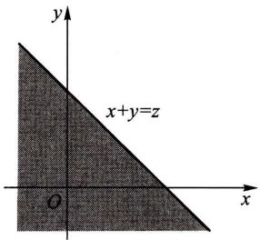  
图3-9

$$
\int_{-\infty}^{z - y}f(x,y)\mathrm{d}x = \int_{-\infty}^{z}f(u - y,y)\mathrm{d}u.
$$

于是

$$
F_{Z}(z) = \int_{-\infty}^{\infty}\left[\int_{-\infty}^{z}f(u - y,y)\mathrm{d}u\right]\mathrm{d}y = \int_{-\infty}^{z}\left[\int_{-\infty}^{\infty}f(u - y,y)\mathrm{d}y\right]\mathrm{d}u.
$$

由概率密度的定义即得(5.1)式.类似可证得(5.2)式.

例1设  $X$  和  $Y$  是两个相互独立的随机变量.它们都服从  $N(0,1)$  分布,其概率密度为

$$
\begin{array}{r l} & {f_{X}(x) = \frac{1}{\sqrt{2\pi}}\mathrm{e}^{-x^{2} / 2},\quad -\infty < x< \infty ,}\\ & {f_{Y}(y) = \frac{1}{\sqrt{2\pi}}\mathrm{e}^{-y^{2} / 2},\quad -\infty < y< \infty .} \end{array}
$$

求  $Z = X + Y$  的概率密度.

解由(5.4)式

$$
\begin{array}{l}{{f_{Z}(z)=\int_{-\infty}^{\infty}f_{X}(x)f_{Y}(z-x)\mathrm{d}x}}\\ {{\quad=\frac{1}{2\pi}\int_{-\infty}^{\infty}\mathrm{e}^{-\frac{x^{2}}{2}}\bullet\mathrm{e}^{-\frac{(z-x)^{2}}{2}}\mathrm{d}x=\frac{1}{2\pi}\mathrm{e}^{-\frac{x^{2}}{4}}\int_{-\infty}^{\infty}\mathrm{e}^{-\left(x-\frac{x}{2}\right)^{2}}\mathrm{d}x,}}\end{array}
$$

令  $t = x - \frac{z}{2}$ ,得

$$
f_{Z}(z) = \frac{1}{2\pi}\mathrm{e}^{-\frac{z^{2}}{4}}\int_{-\infty}^{\infty}\mathrm{e}^{-t^{2}}\mathrm{d}t = \frac{1}{2\pi}\mathrm{e}^{-\frac{z^{2}}{4}}\sqrt{\pi} = \frac{1}{2\sqrt{\pi}}\mathrm{e}^{-\frac{z^{2}}{4}}.
$$

即  $Z$  服从  $N(0,2)$  分布.

一般,设  $X,Y$  相互独立且  $X\sim N(\mu_{1},\sigma_{1}^{2}),Y\sim N(\mu_{2},\sigma_{2}^{2})$  .由(5.4)式经过计算知  $Z = X + Y$  仍然服从正态分布,且有  $Z\sim N(\mu_{1} + \mu_{2},\sigma_{1}^{2} + \sigma_{2}^{2})$  .这个结论还能推广到  $n$  个独立正态随机变量之和的情况.即若  $X_{i}\sim N(\mu_{i},\sigma_{i}^{2}) (i = 1,2,\dots ,n)$  ,且它们相互独立,则它们的和  $Z = X_{1} + X_{2} + \dots +X_{n}$  仍然服从正态分布,且有 $Z\sim N(\mu_{1} + \mu_{2} + \dots +\mu_{n},\sigma_{1}^{2} + \sigma_{2}^{2} + \dots +\sigma_{n}^{2}).$

更一般地,可以证明有限个相互独立的正态随机变量的线性组合仍然服从正态分布.  $\square$

例2在一简单电路中,两电阻  $R_{1}$  和  $R_{2}$  串联连接,设  $R_{1},R_{2}$  相互独立,它们的概率密度均为

$$
f(x) = \left\{{\frac{10 - x}{50}},\quad 0\leqslant x\leqslant 10,\right.
$$

求总电阻  $R = R_{1} + R_{2}$  的概率密度.

解由(5.4)式,  $R$  的概率密度为

$$
f_{R}(z) = \int_{-\infty}^{\infty}f(x)f(z - x)\mathrm{d}x.
$$

易知仅当

$$
\left\{ \begin{array}{l l}{0< x< 10,}\\ {0< z - x< 10,} \end{array} \right.\mathbb{H}\left\{ \begin{array}{l l}{0< x< 10,}\\ {z - 10< x< z} \end{array} \right.
$$

时上述积分的被积函数不等于零.参考图3一10,即得

$$
f_{R}(z) = \left\{ \begin{array}{l l}{\int_{0}^{z}f(x)f(z - x)\mathrm{d}x,} & {0\leqslant z< 10,}\\ {\int_{z - 10}^{10}f(x)f(z - x)\mathrm{d}x,} & {10\leqslant z\leqslant 20,}\\ {0,} & {\mathrm{~}\mathbb{H}\mathbb{H}.} \end{array} \right.
$$

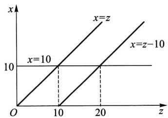  
图3-10

将  $f(x)$  的表达式代入上式得

$$
f_{R}(z) = \left\{ \begin{array}{l l}{\frac{1}{15 000} (600z - 60z^{2} + z^{3}),} & {0\leqslant z< 10,}\\ {\frac{1}{15 000} (20 - z)^{3},} & {10\leqslant z< 20,}\\ {0,} & {\mathbb{H}\mathbb{H}.} \end{array} \right.
$$

例3设随机变量  $X,Y$  相互独立,且分别服从参数为  $\alpha ,\theta ;\beta ,\theta$  的  $\boldsymbol{\cal T}$  分布(分别记成  $X\sim \Gamma (\alpha ,\theta),Y\sim \Gamma (\beta ,\theta)).X,Y$  的概率密度分别为

$$
f_{X}(x) = \left\{ \begin{array}{l l}{\frac{1}{\theta^{\alpha}\Gamma(\alpha)} x^{\alpha -1}\mathrm{e}^{-x / \theta},} & {x > 0,}\\ {0,} & {\mathbb{H}\backslash \mathbb{H},} \end{array} \right.\alpha >0,\theta >0.
$$

$$
f_{Y}(y) = \left\{ \begin{array}{l l}{\frac{1}{\theta^{\beta}\Gamma(\beta)} y^{\beta -1}\mathrm{e}^{-y / \theta},} & {y > 0,}\\ {0,} & {\mathbb{H}\backslash \mathbb{H},} \end{array} \right.\beta >0,\theta >0.
$$

试证明  $Z = X + Y$  服从参数为  $\alpha +\beta ,\theta$  的  $\boldsymbol{\cal T}$  分布,即  $X + Y\sim \Gamma (\alpha +\beta ,\theta)$

证由(5.4)式  $Z = X + Y$  的概率密度为

$$
f_{Z}(z) = \int_{-\infty}^{\infty}f_{X}(x)f_{Y}(z - x)\mathrm{d}x.
$$

易知仅当

$$
\left\{ \begin{array}{l l}{x > 0,}\\ {z - x > 0,} \end{array} \right.\quad \mathcal{H}\mathbb{H}\quad \left\{ \begin{array}{l l}{x > 0,}\\ {x< z} \end{array} \right.
$$

时上述积分的被积函数不等于零,于是(参见图3一11)知当  $z = 0$  时  $f_{Z}(z) = 0$  ,而当  $z > 0$  时有

$$
\begin{array}{r l} & {f_{Z}(z) = \int_{0}^{z}\frac{1}{\theta^{\alpha}\Gamma(\alpha)} x^{\alpha -z / \theta}\frac{1}{\theta^{\beta}\Gamma(\beta)} (z - x)^{\beta -1}\mathrm{e}^{-(z - x) / \alpha}\mathrm{d}x}\\ & {\qquad = \frac{\mathrm{e}^{-z / \theta}}{\theta^{\alpha + \beta}\Gamma(\alpha)\Gamma(\beta)}\int_{0}^{z}x^{\alpha -1}(z - x)^{\beta -1}\mathrm{d}x(\Leftrightarrow x = z t)}\\ & {\qquad = \frac{z^{\alpha + \beta - 1}\mathrm{e}^{-z / \theta}}{\theta^{\alpha + \beta}\Gamma(\alpha)\Gamma(\beta)}\int_{0}^{1}t^{\alpha -1}(1 - t)^{\beta -1}\mathrm{d}t}\\ & {\qquad \frac{\mathrm{i}\mathbb{E}\mathbb{E}}{\mathrm{~\alpha~}} A z^{\alpha +\beta -1}\mathrm{e}^{-z / \theta},} \end{array}
$$

其中  $A = \frac{1}{\theta^{\alpha + \beta}\Gamma(\alpha)\Gamma(\beta)}\int_{0}^{1}t^{\alpha - 1}(1 - t)^{\beta - 1}\mathrm{d}t.$  (5.5)①

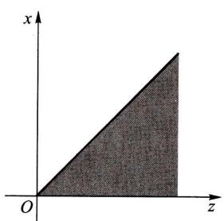  
图3-11

现在来计算  $A$  .由概率密度的性质得到

$$
\begin{array}{l}{{1=\int_{-\infty}^{\infty}f_{Z}(z)\mathrm{d}z=\int_{0}^{\infty}A z^{\alpha+\beta-1}\mathrm{e}^{-z/\theta}\mathrm{d}z}}\\ {{=A\theta^{\alpha+\beta}\int_{0}^{\infty}(z/\theta)^{\alpha+\beta-1}\mathrm{e}^{-z/\theta}\mathrm{d}(z/\theta)=A\theta^{\alpha+\beta}\Gamma(\alpha+\beta),}}\end{array}
$$

$①$  (5.5)式中的积分

$$
\int_{0}^{1}t^{\alpha -1}(1 - t)^{\beta -1}\mathrm{d}t\overset {\mathrm{i}\mathbb{E}\mathbb{E}}{=}\mathrm{B}(\alpha ,\beta),\qquad \alpha ,\beta >0,
$$

称为Beta函数.由(5.5),(5.6)式知Beta函数与  $\Gamma$  函数有如下关系:

$$
\mathrm{B}(\alpha ,\beta) = \frac{\Gamma(\alpha)\Gamma(\beta)}{\Gamma(\alpha + \beta)}.
$$

即有

$$
A = \frac{1}{\theta^{\alpha + \beta}\Gamma(\alpha + \beta)}. \tag{5.6}
$$

于是

$$
f_{Y}(z) = \left\{ \begin{array}{ll}\frac{1}{\theta^{\alpha + \beta}\Gamma(\alpha + \beta)} z^{\alpha +\beta -1}\mathrm{e}^{-z / \theta}, & z > 0, \\ 0, & \text{其他}. \end{array} \right.
$$

即  $X + Y \sim \Gamma (\alpha + \beta , \theta)$ .

上述结论还能推广到  $n$  个相互独立的  $\boldsymbol{\Gamma}$  分布变量之和的情况.即若  $X_{1},X_{2},\dots ,$ $X_{n}$  相互独立,且  $X_{i}$  服从参数为  $\alpha_{i},\beta (i = 1,2,\dots ,n)$  的  $\boldsymbol{\Gamma}$  分布,则  $\sum_{i = 1}^{n}X_{i}$  服从参数为  $\sum_{i = 1}^{n}\alpha_{i},\beta$  的  $\boldsymbol{\Gamma}$  分布.这一性质称为  $\boldsymbol{\Gamma}$  分布的可加性.

(二)  $Z = \frac{Y}{X}$  的分布、  $Z = X Y$  的分布

设  $(X, Y)$  是二维连续型随机变量, 它具有概率密度  $f(x, y)$ , 则  $Z = \frac{Y}{X}$ ,  $Z = X Y$  仍为连续型随机变量, 其概率密度分别为

$$
f_{Y / X}(z) = \int_{-\infty}^{\infty} |x| f(x, x z) \mathrm{d} x, \tag{5.7}
$$

$$
f_{X Y}(z) = \int_{-\infty}^{\infty} \frac{1}{|x|} f\left(x, \frac{z}{x}\right) \mathrm{d} x. \tag{5.8}
$$

又若  $X$  和  $Y$  相互独立. 设  $(X, Y)$  关于  $X, Y$  的边缘概率密度分别为  $f_{X}(x)$ ,  $f_{Y}(y)$ , 则 (5.7) 式化为

$$
f_{Y / X}(z) = \int_{-\infty}^{\infty} |x| f_{X}(x) f_{Y}(x z) \mathrm{d} x. \tag{5.9}
$$

而 (5.8) 式化为

$$
f_{X Y}(z) = \int_{-\infty}^{\infty} \frac{1}{|x|} f_{X}(x) f_{Y}\left(\frac{z}{x}\right) \mathrm{d} x. \tag{5.10}
$$

证  $Z = Y / X$  的分布函数为 (如图 3- 12)

$$
\begin{array}{r l} & {F_{Y / X}(z) = P\{Y / X\leqslant z\} = \underset {G_{1}\cup G_{2}}{\iint}f(x,y)\mathrm{d}x\mathrm{d}y}\\ & {\qquad = \underset {y / x\leqslant z,x< 0}{\iint}f(x,y)\mathrm{d}y\mathrm{d}x + \underset {y / x\leqslant z,x > 0}{\iint}f(x,y)\mathrm{d}y\mathrm{d}x}\\ & {\qquad = \underset {-\infty}{\iint}\underset {z x}{\iint}f(x,y)\mathrm{d}y\biggr ]\mathrm{d}x + \underset {0}{\iint}\biggl [\underset {-\infty}{\iint}f(x,y)\mathrm{d}y\biggr ]\mathrm{d}x}\\ & {\qquad \overset {\underset{\mathrm{~\scriptstyle~\mathscr{~\mathscr{~\mathscr{~\mathscr{~\mathscr{~\mathscr{~\mathscr{~\mathscr{~\mathscr{~\mathscr{~\mathscr{~\mathscr{~\mathscr{~\mathscr{~\mathscr{~\mathscr{~\mathscr{~\mathscr{~\mathscr{~\mathscr{~\mathscr{\mathscr{~\mathscr{~\mathscr{~\mathscr{~\mathscr{~\mathscr{~\mathscr{~\mathscr{~\mathscr{~\mathscr{~\mathscr{~\mathscr{~\mathscr{~\mathscr{~\mathscr{~\mathscr{~\mathscr{~\mathscr{~\mathscr{~\mathscr{~}}}}}}}}}}}}}}}}}}}}}}}}}}}}}}}}}}}}}}}}}}}}}}}}}}}}}}}}}}}}}}}}}}}}}}}}}}}}}}}}}}}}}}}}}}}}}}}}}}}}}}}}}}}}}}}}}}}}}}}}}}}}}}}}}}}}}}}}}}}}}}}}}}}}}}}}}}}}}}}}}}}}}}}}}}}}}}}}}}}}}}}}}}}}}}}}}}}}}}}}}}}}}}}}}}}}}}}}}}}}}}}}}}}}}}}}}}}}}}}}}}}}}}}}}}}}}}}}}}}}}}}}}}}}}}}}}}}}}}}}}}}}}}}}}}}}}}}}}}}}}}}}}}}}}}}}}}}}}}}}}}}}}}}}}}}}}}}}}}}}}}}}}}}}}}}}}}}}}}}}}}}}}}}}}}}}}}}}}}}}}}}}}}}}}}}}}}}}}}}}} =}}}}}}}}}}}}}}}}}}}}}}}}}}}}}}}}}}}}}}}}}}}}}}}}}}}}}}}}}}}}}}}}}}}}}}}}}}}}}}}}}}}}}}}}}}}}}}}}}}}}}}}}}}}}}}}}}}}}}}}}}}}}}}}}}}}}}}}}}}}}}}}}}}}}}}}}}}}}}}}}}}}}}}}}}}}}}}}}}}}}}}}}}}}}}}}}}}}}}}}\}}}}}}}}}}}}}}}}}}}}}}}}}}}}}}}}}}}}}}}}}}}}}}}}}}}}}}}}}}}}}}}}}}}}}}}}}}}}}}}}}}}}}}}}}}}}}}}}}}}}}}}}}}}}}}}}}}}}}}}}}}}}}}}}}}}}}}}}}}}}}}}}}}}}}}}}}}}}}}}}}}}}}}}}}}}}}}}}}}}}}}}}}}}}}}}}}}}}}}})}}}}}}}}}}}}}}}}}}}}}}}}}}}}}}}}}}}}}}}}}}}}}}}}}}}}}}}}}}}}}}}}}}}}}}}}}}}}}}}}}}}}}}}}}}}}}}}}}}}}}}}}}}}}}}}}}}}}}}}}}}}}}}}}}}}}}}}}}}}}}}}}}}}}}}}}}}}}}}}}}}}}}}}}}}}}}}}}}}}}}}}}}}}}}}}}}}}}}})).}}}}}}}}}}}}}}}}}}}}}}}}}}}}}}}}}}}}}}}}}}}}}}}}}}}}}}}}}}}}}}}}}}}}}}}}}}}}}}}}}}}}}}}}}}}}}}}}}}}}}}}}}}}}}}}}}}}}}}}}}}}}}}}}}}}}}}}}}}}}}}}}}}}}}}}}}}}}}}}}}}}}}}}}}}}}}}}}}}}}}}}}}}}}}}}}}}}}}}).}}}}}}}}}}}}}}}}}}}}}}}}}}}}}}}}}}}}}}}}}}}}}}}}}}}}}}}}}}}}}}}}}}}}}}}}}}}}}}}}}}}}}}}}}}}}}}}}}}}}}}}}}}}}}}}}}}}}}}}}}}}}}}}}}}}}}}}}}}}}}}}}}}}}}}}}}}}}}}}}}}}}}}}}}}}}}}}}}}}}}}}}}}}}}}}}}}}}}}
$$

  
图3-12

$$
\begin{array}{r l} & {= \int_{-\infty}^{0}\left[\int_{-\infty}^{z}(-x)f(x,x u)\mathrm{d}u\right]\mathrm{d}x + \int_{0}^{\infty}\left[\int_{-\infty}^{z}x f(x,x u)\mathrm{d}u\right]\mathrm{d}x}\\ & {= \int_{-\infty}^{\infty}\left[\int_{-\infty}^{z}\mid x\mid f(x,x u)\mathrm{d}u\right]\mathrm{d}x}\\ & {= \int_{-\infty}^{z}\left[\int_{-\infty}^{\infty}\mid x\mid f(x,x u)\mathrm{d}x\right]\mathrm{d}u,} \end{array}
$$

由概率密度的定义即得(5.7)式.

类似地,可求出  $f_{XY}(z)$  的概率密度为(5.8)式.

例4 某公司提供一种地震保险,保险费  $Y$  的概率密度为

$$
f(y) = \left\{ \begin{array}{ll}\frac{y}{25} \mathrm{e}^{-y / 5}, & y > 0, \\ 0, & \text{其他.} \end{array} \right.
$$

保险赔付  $X$  的概率密度为

$$
g(x) = \left\{ \begin{array}{ll}\frac{1}{5} \mathrm{e}^{-x / 5}, & x > 0, \\ 0, & \text{其他.} \end{array} \right.
$$

设  $X$  与  $Y$  相互独立,求  $Z = Y / X$  的概率密度.

解 由(5.9)式知,当  $z< 0$  时,  $f_{Z}(z) = 0$  ;当  $z > 0$  时,  $Z$  的概率密度为

$$
\begin{array}{l}{{f_{Z}(z)=\int_{0}^{\infty}x\cdot\frac{1}{5}\mathrm{e}^{-x/5}\cdot\frac{2z}{25}\mathrm{e}^{-x/5}\mathrm{d}x=\frac{z}{125}\int_{0}^{\infty}x^{2}\mathrm{e}^{-x/5}\mathrm{d}x}}\\ {{=\frac{z}{125}\frac{\Gamma(3)}{\left[(1+z)/5\right]^{3}}=\frac{2z}{(1+z)^{3}}.}}\end{array}
$$

(三)  $M = \max \{X,Y\}$  及  $N = \min \{X,Y\}$  的分布

设  $X,Y$  是两个相互独立的随机变量,它们的分布函数分别为  $F_{X}(x)$  和

$F_{Y}(y)$ . 现在来求  $M = \max \{X, Y\}$  及  $N = \min \{X, Y\}$  的分布函数.

由于  $M = \max \{X, Y\}$  不大于  $z$  等价于  $X$  和  $Y$  都不大于  $z$ , 故有

$$
P\{M \leqslant z\} = P\{X \leqslant z, Y \leqslant z\} .
$$

又由于  $X$  和  $Y$  相互独立, 得到  $M = \max \{X, Y\}$  的分布函数为

$$
F_{\max}(z) = P\{M \leqslant z\} = P\{X \leqslant z, Y \leqslant z\} = P\{X \leqslant z\} P\{Y \leqslant z\} .
$$

即有  $F_{\max}(z) = F_{X}(z) F_{Y}(z)$ . (5.11)

类似地, 可得  $N = \min \{X, Y\}$  的分布函数为

$$
\begin{array}{r l} & {F_{\min}(z) = P\{N\leqslant z\} = 1 - P\{N > z\}}\\ & {\qquad = 1 - P\{X > z,Y > z\} = 1 - P\{X > z\} P\{Y > z\} .} \end{array}
$$

即  $F_{\min}(z) = 1 - [1 - F_{X}(z)][1 - F_{Y}(z)]$ . (5.12)

以上结果容易推广到  $n$  个相互独立的随机变量的情况. 设  $X_{1}, X_{2}, \dots , X_{n}$  是  $n$  个相互独立的随机变量. 它们的分布函数分别为  $F_{X_{i}}(x_{i}) (i = 1,2, \dots , n)$ , 则  $M = \max \{X_{1}, X_{2}, \dots , X_{n}\}$  及  $N = \min \{X_{1}, X_{2}, \dots , X_{n}\}$  的分布函数分别为

$$
F_{\max}(z) = F_{X_{1}}(z) F_{X_{2}}(z) \dots F_{X_{n}}(z), \tag{5.13}
$$

$$
F_{\min}(z) = 1 - [1 - F_{X_{1}}(z)][1 - F_{X_{2}}(z)] \dots [1 - F_{X_{n}}(z)]\]特别, 当 \( X_{1}, X_{2}, \dots , X_{n} \) 相互独立且具有相同分布函数 \( F(x) \) 时有 \tag{5.14}
$$

特别,当  $X_{1},X_{2},\dots ,X_{n}$  相互独立且具有相同分布函数  $F(x)$  时有

$$
F_{\max}(z) = [F(z)]^{n}, \tag{5.15}
$$

$$
F_{\min}(z) = 1 - [1 - F(z)]^{n}. \tag{5.16}
$$

例5 设系统  $L$  由两个相互独立的子系统  $L_{1}, L_{2}$  连接而成, 连接的方式分别为 (i) 串联, (ii) 并联, (iii) 备用 (当系统  $L_{1}$  损坏时, 系统  $L_{2}$  开始工作), 如图 3- 13 所示. 设  $L_{1}, L_{2}$  的寿命分别为  $X, Y$ , 已知它们的概率密度分别为

$$
f_{X}(x)={\left\{\begin{array}{l l}{\alpha\mathrm{e}^{-\alpha},}&{x>0,}\\ {0,}&{x\leqslant0,}\end{array}\right.} \tag{5.17}
$$

$$
f_{Y}(y)={\left\{\begin{array}{l l}{\beta\mathrm{e}^{-\beta y},}&{y>0,}\\ {0,}&{y\leqslant0,}\end{array}\right.} \tag{5.18}
$$

其中  $\alpha >0, \beta >0$  且  $\alpha \neq \beta$ . 试分别就以上三种连接方式写出  $L$  的寿命  $Z$  的概率密度.

解 (i) 串联的情况.

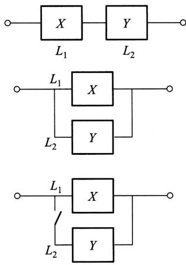  
图3-13

由于当  $L_{1},L_{2}$  中有一个损坏时,系统  $L$  就停止工作,所以这时  $L$  的寿命为

$$
Z = \min \{X,Y\} .
$$

由(5.17),(5.18)式  $X,Y$  的分布函数分别为

$$
F_{X}(x) = \left\{ \begin{array}{l l}{1 - \mathrm{e}^{-\alpha x},} & {x > 0,}\\ {0,} & {x\leqslant 0,} \end{array} \right.\quad F_{Y}(y) = \left\{ \begin{array}{l l}{1 - \mathrm{e}^{-\beta x},} & {y > 0,}\\ {0,} & {y\leqslant 0.} \end{array} \right.
$$

由(5.12)式得  $Z = \min \{X,Y\}$  的分布函数为

$$
F_{\min}(z) = \left\{ \begin{array}{l l}{1 - \mathrm{e}^{-(\alpha +\beta)z},} & {z > 0,}\\ {0,} & {z\leqslant 0.} \end{array} \right.
$$

于是  $Z = \min \{X,Y\}$  的概率密度为

$$
f_{\min}(z) = \left\{ \begin{array}{l l}{(\alpha +\beta)\mathrm{e}^{-(\alpha +\beta)z},} & {z > 0,}\\ {0,} & {z\leqslant 0.} \end{array} \right.
$$

(ii)并联的情况.

由于当且仅当  $L_{1},L_{2}$  都损坏时,系统  $L$  才停止工作,所以这时  $L$  的寿命  $z$  为

$$
Z = \max \{X,Y\} .
$$

按(5.11)式得  $Z = \max \{X,Y\}$  的分布函数为

$$
F_{\max}(z) = F_{X}(z)F_{Y}(z) = \left\{ \begin{array}{l l}{(1 - \mathrm{e}^{-\alpha z})(1 - \mathrm{e}^{-\beta z}),} & {z > 0,}\\ {0,} & {z\leqslant 0.} \end{array} \right.
$$

于是  $Z = \max \{X,Y\}$  的概率密度为

$$
f_{\max}(z) = \left\{ \begin{array}{l l}{\alpha \mathrm{e}^{-\alpha z} + \beta \mathrm{e}^{-\beta z} - (\alpha +\beta)\mathrm{e}^{-(\alpha +\beta)z},} & {z > 0,}\\ {0,} & {z\leqslant 0.} \end{array} \right.
$$

(iii)备用的情况.

由于这时当系统  $L_{1}$  损坏时系统  $L_{2}$  才开始工作,因此整个系统  $L$  的寿命  $z$  是  $L_{1},L_{2}$  两者寿命之和,即

$$
Z = X + Y.
$$

按(5.3)式,当  $z > 0$  时  $Z = X + Y$  的概率密度为

$$
\begin{array}{r l r} & {} & {f(z) = \int_{-\infty}^{\infty}f_{X}(z - y)f_{Y}(y)\mathrm{d}y = \int_{0}^{z}\alpha \mathrm{e}^{-\alpha (z - y)}\beta \mathrm{e}^{-\beta y}\mathrm{d}y}\\ & {} & {= \alpha \beta \mathrm{e}^{-\alpha z}\int_{0}^{z}\mathrm{e}^{-(\beta -\alpha)y}\mathrm{d}y = \frac{\alpha\beta}{\beta - \alpha} (\mathrm{e}^{-\alpha z} - \mathrm{e}^{-\beta z}).} \end{array}
$$

当  $z\leqslant 0$  时,  $f(z) = 0$  ,于是  $Z = X + Y$  的概率密度为

$$
f(z) = \left\{ \begin{array}{l l}{\frac{\alpha\beta}{\beta - \alpha} (\mathrm{e}^{-\alpha z} - \mathrm{e}^{-\beta z}),} & {z > 0,}\\ {0,} & {z\leqslant 0.} \end{array} \right.
$$

# 小结

将一维随机变量的概念加以扩充, 就得到多维随机变量. 我们着重讨论了二维随机变量. 和一维随机变量一样, 我们定义二维随机变量  $(X,Y)$  的分布函数

$$
F(x,y) = P\{X\leqslant x,Y\leqslant y\} , -\infty < x< \infty , -\infty < y< \infty .
$$

对于离散型随机变量  $(X,Y)$  定义了分布律

$$
P\{X = x,Y = y_{j}\} = \phi_{j}, i = 1,2,\dots ,j = 1,2,\dots \Big(\phi_{j}\geqslant 0,\sum_{i = 1}^{\infty}\sum_{j = 1}^{\infty}\phi_{j} = 1\Big).
$$

对于连续型随机变量  $(X,Y)$  定义了概率密度  $f(x,y) (f(x,y)\geqslant 0)$ , 且有

$$
F(x,y) = \int_{-\infty}^{y}\int_{-\infty}^{x}f(x,y)\mathrm{d}x\mathrm{d}y,
$$

二维随机变量的分布律与概率密度的性质与一维的类似. 特别, 对于二维连续型随机变量, 有公式

$$
P\{(X,Y)\in G\} = \iint_{G}f(x,y)\mathrm{d}x\mathrm{d}y,
$$

其中,  $G$  是平面上的某区域 (它是一维连续型随机变量的公式  $P\{a< X\leqslant b\} = \int_{a}^{b}f(x)\mathrm{d}x$  的扩充). 这一公式常用来求随机变量的不等式成立的概率, 例如

$$
P\{Y\leqslant X\} = P\{(X,Y)\in G\} = \iint_{G}f(x,y)\mathrm{d}x\mathrm{d}y,
$$

其中,  $G$  为半平面  $y\leqslant x$

在研究二维随机变量  $(X,Y)$  时, 除了讨论上述与一维随机变量类似的内容外, 还要讨论以下的新内容: 边缘分布、条件分布、随机变量的独立性等.

注意到, 对于  $(X,Y)$  而言, 由  $(X,Y)$  的分布可以确定关于  $X$  关于  $Y$  的边缘分布. 反之, 由关于  $X$  和关于  $Y$  的边缘分布一般是不能确定  $(X,Y)$  的分布的. 只有当  $X,Y$  相互独立时, 由两边缘分布能确定  $(X,Y)$  的分布.

随机变量的独立性是随机事件独立性的扩充. 我们也常利用问题的实际意义去判断两个随机变量的独立性. 例如, 若  $X,Y$  分别表示两个工厂生产的显像管的寿命, 我们可以认为  $X,Y$  是相互独立的.

我们还讨论了  $Z = X + Y,Z = Y / X,Z = XY,M = \max \{X,Y\} ,N = \min \{X,Y\}$  的分布的求法 (设  $(X,Y)$  的分布已知).

本章在进行各种问题的计算时, 要用到二重积分或用到二元函数固定其中一个变量对另一个变量的积分. 此时千万要搞清楚积分变量的变化范围. 题目做错, 往往是由于在进行积分运算时, 将有关的积分区间或积分区域搞错了. 在做题时, 画出有关函数的定义域的图形, 对于正确确定积分上下限肯定是有帮助的. 另外, 所求得的边缘概率密度、条件概率密度或  $Z = X + Y$  的概率密度等, 往往是分段函数, 正确写出分段函数的表达式当然是必需的.

# 重要术语及主题

二维随机变量  $(X,Y)$ $(X,Y)$  的分布函数 离散型随机变量  $(X,Y)$  的分布律 连续型