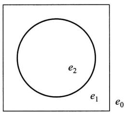
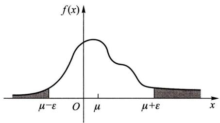
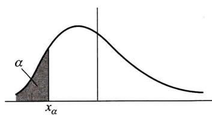
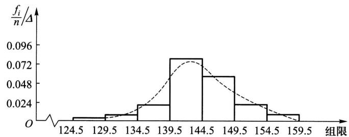

随机变量  $(X,Y)$  的概率密度离散型随机变量  $(X,Y)$  的边缘分布律连续型随机变量  $(X,$  Y)的边缘概率密度条件分布函数条件分布律条件概率密度两个随机变量  $X,Y$  的独立性  $Z = X + Y,Z = Y / X,Z = X Y$  的概率密度  $M = \max \{X,Y\}$ $N = \min \{X,Y\}$  的概率密度

# 习题

1. 在一箱子中装有 12 只开关, 其中 2 只是次品, 在其中取两次, 每次任取一只, 考虑两种试验: (1) 放回抽样; (2) 不放回抽样. 我们定义随机变量  $X, Y$  如下:

$X = \left\{ \begin{array}{ll}0, & \text { 若第一次取出的是正品,} \\ 1, & \text { 若第一次取出的是次品;} \end{array} \right.$

$Y = \left\{ \begin{array}{ll}0, & \text { 若第二次取出的是正品,} \\ 1, & \text { 若第二次取出的是次品.} \end{array} \right.$

试分别就 (1)、(2) 两种情况, 写出  $X$  和  $Y$  的联合分布律.

2. (1) 盒子里装有 3 只黑球、2 只红球、2 只白球, 在其中任取 4 只球. 以  $X$  表示取到黑球的只数, 以  $Y$  表示取到红球的只数. 求  $X$  和  $Y$  的联合分布律.

(2) 在 (1) 中求  $P\{X > Y\} , P\{Y = 2X\} , P\{X + Y = 3\} , P\{X< 3 - Y\}$ .

3. 设随机变量  $(X,Y)$  的概率密度为

$$
f(x,y) = \left\{ \begin{array}{ll}k(6 - x - y), & 0< x< 2, 2< y< 4, \\ 0, & \text { 其他.} \end{array} \right.
$$

(1) 确定常数  $k$ .

(2) 求  $P\{X< 1, Y< 3\}$ .

(3) 求  $P\{X< 1.5\}$ .

(4) 求  $P\{X + Y\leqslant 4\}$ .

4. 设  $X, Y$  都是非负的连续型随机变量, 它们相互独立.

(1) 证明  $P\{X< Y\} = \int_{0}^{\infty} F_{X}(x) f_{Y}(x) \mathrm{d}x$ ,

其中  $F_{X}(x)$  是  $X$  的分布函数,  $f_{Y}(y)$  是  $Y$  的概率密度.

(2) 设  $X, Y$  相互独立, 其概率密度分别为

$$
f_{X}(x) = \left\{ \begin{array}{ll} \lambda_{1} \mathrm{e}^{-\lambda_{1} x}, & x > 0, \\ 0, & \text { 其他,} \end{array} \right. \quad f_{Y}(y) = \left\{ \begin{array}{ll} \lambda_{2} \mathrm{e}^{-\lambda_{2} y}, & y > 0, \\ 0, & \text { 其他,} \end{array} \right.
$$

求  $P\{X< Y\}$ .

5. 设随机变量  $(X,Y)$  具有分布函数

$$
F(x,y) = \left\{ \begin{array}{ll} 1 - \mathrm{e}^{-x} - \mathrm{e}^{-y} + \mathrm{e}^{-x - y}, & x > 0, y > 0, \\ 0, & \text { 其他.} \end{array} \right.
$$

求边缘分布函数.

6. 将一枚硬币掷 3 次, 以  $X$  表示前 2 次中出现  $H$  的次数, 以  $Y$  表示 3 次中出现  $H$  的次数. 求  $X, Y$  的联合分布律以及  $(X, Y)$  的边缘分布律.

7. 设二维随机变量  $(X,Y)$  的概率密度为

$$
f(x,y)={\left\{\begin{array}{l l}{4.8y(2-x),}&{0\leqslant x\leqslant1,0\leqslant y\leqslant x,}\\ {0,}&{{\mathrm{~}}{\mathrm{~}}{\mathrm{~}}{\mathrm{~}}{\mathrm{~}}{\mathrm{~}}{\mathrm{~}}{\mathrm{~}}{\mathrm{~}}{\mathrm{~}}{\mathrm{~}}{\mathrm{~}}{\mathrm{~}}{\mathrm{~}}{\mathrm{~}}{\mathrm{~}}{\mathrm{~}}{\mathrm{~}}{\mathrm{~}}{\mathrm{~}}{\mathrm{~}}}\end{array}\right.}
$$

求边缘概率密度.

8. 设二维随机变量  $(X,Y)$  的概率密度为

$$
f(x,y)={\left\{\begin{array}{l l}{\mathrm{e}^{-y},}&{0< x< y,}\\ {0,}&{{\mathrm{~}}{\mathrm{~}}{\mathrm{~}}{\mathrm{~}}{\mathrm{~}}{\mathrm{~}}{\mathrm{~}}{\mathrm{~}}{\mathrm{~}}{\mathrm{~}}{\mathrm{~}}{\mathrm{~}}{\mathrm{~}}{\mathrm{~}}{\mathrm{~}}{\mathrm{~}}{\mathrm{~}}{\mathrm{~}}{\mathrm~}}\end{array}\right.}
$$

求边缘概率密度.

9. 设二维随机变量  $(X,Y)$  的概率密度为

$$
f(x,y)={{\begin{array}{l l}{c x^{2}y,}&{x^{2}\leqslant y\leqslant1,}\\ {0,}&{{\mathrm{~}}{\mathrm{~}}{\mathrm{~}}{\mathrm{~}}{\mathrm{~}}{\mathrm{~}}{\mathrm{~}}{\mathrm{~}}{\mathrm{~}}{\mathrm{~}}{\mathrm{~}}{\mathrm{~}}{\mathrm{~}}{\mathrm{~}}{\mathrm{~}}{\mathrm{~}}{\mathrm{~}}{\mathrm{~}}{\mathrm{\quad}}{\mathrm{~}}{\mathrm{~}}{\mathrm{~}}{\mathrm{~}}{\mathrm{~}}{\mathrm{~}}{\mathrm{~}}{\mathrm{~}}{\mathrm{~}}{\mathrm{~}}{\mathrm{~}}{\mathrm{~}}{\mathrm{~}}{\mathrm{~}}{\mathrm{~}}{\mathrm{~}}{\mathrm{~}}{\mathrm{~}}{\mathrm{~}}{\mathrm{}}{\mathrm{~}}{\mathrm{~}}{\mathrm{~}}{\mathrm{~}}{\mathrm{~}}{\mathrm{~}}{\mathrm{~}}{\mathrm{~}}{\mathrm{~}}{\mathrm{~}}{\mathrm{~}}{\mathrm{~}}{\mathrm{~}}{\mathrm{~}}{\mathrm{~}}{\mathrm{~}}{\mathrm{~}}{\mathrm{~}}{\mathrm{~}}{\mathrm{~~}}{\mathrm{~}}{\mathrm{~~}}{\mathrm{~~}}{\mathrm{~~}}{\mathrm{~~}}{\mathrm{~~}}{\mathrm{~~}}{\mathrm{~~}}{\mathrm{~~}}{\mathrm{~~}}{\mathrm{~~}}{\mathrm{~~}}{\mathrm{~~}}{\mathrm{~~}}{\mathrm{~~}}{\mathrm{~~}}{\mathrm{~~}}{\mathrm{~~}}{\mathrm{~~}}{\mathrm{~~}}{\mathrm{~~}}{\mathrm{~}}{\mathrm{~~}}{\mathrm{~~}}{\mathrm{~~}}{\mathrm{~~}}{\mathrm{~~}}{\mathrm{~~}}{\mathrm{~~}}{\mathrm{~~}}{\mathrm{~~}}{\mathrm{~~}}{\mathrm{~~}}{\mathrm{~~}}{\mathrm{~~}}{\mathrm{~~}}{\mathrm{~~}}{\mathrm{~~}}{\mathrm{~~}}{\mathrm{~}}{\mathrm{~~}}{\mathrm{~}}{\mathrm{~~}}{\mathrm{~~}}{\mathrm{~~}}{\mathrm{~~}}{\mathrm{~~}}{\mathrm{~~}}{\mathrm{~~}}{\mathrm{~~}}{\mathrm{~~}}{\mathrm{~~}}{\mathrm{~~}}{\mathrm{~~}}{\mathrm{~~}}{\mathrm{~~}}{\mathrm{~~}}{\mathrm{~~}}{\mathrm{~}}{\mathrm{~~}}{\mathrm{~~}}{\mathrm{~}}{\mathrm{~~}}{\mathrm{~~}}{\mathrm{~~}}{\mathrm{~~}}{\mathrm{~~}}{\mathrm{~~}}{\mathrm{~~}}{\mathrm{~~}}{\mathrm{~~}}{\mathrm{~~}}{\mathrm{~~}}{\mathrm{~~}}{\mathrm{~~}}{\mathrm{~~}}{\mathrm{~~}}{\mathrm{~~}}{\mathrm{~}}{\mathrm{~}}{\mathrm{~~}}{\mathrm{~~}}{\mathrm{~~}}{\mathrm{~~}}{\mathrm{~~}}{\mathrm{~~}}{\mathrm{~~}}{\mathrm{~~}}{\mathrm{~~}}{\mathrm{~~}}{\mathrm{~~}}{\mathrm{~~}}{\mathrm{~~}}{\mathrm{~~}}{\mathrm{~~}}{\mathrm{~~}}{\mathrm{~~}}{\mathrm{~~}}{\mathrm{~}}{\mathrm{~}}{\mathrm{~~}}{\mathrm{~}}{\mathrm{~~}}{\mathrm{~~}}{\mathrm{~~}}{\mathrm{~~}}{\mathrm{~~}}{\mathrm{~~}}{\mathrm{~~}}{\mathrm{~~}}{\mathrm{~~}}{\mathrm{~~}}{\mathrm{~~}}{\mathrm{~~}}{\mathrm{~~}}{\mathrm{~~}}{\mathrm{~~}}{\mathrm{~}}{\mathrm{~~}}{\mathrm{~~}}{\mathrm{~~}}{\mathrm{~}}{\mathrm{~~}}{\mathrm{~~}}{\mathrm{~~}}{\mathrm{~~}}{\mathrm{~~}}{\mathrm{~~}}{\mathrm{~~}}{\mathrm{~~}}{\mathrm{~~}}{\mathrm{~~}}{\mathrm{~~}}{\mathrm{~~}}{\mathrm{~~}}{\mathrm{~~}}{\mathrm{~~}}{\mathrm{~}}{\mathrm{~~}}{\mathrm{~}}{\mathrm{~~}}{\mathrm{~}}{\mathrm{~~}}{\mathrm{~~}}{\mathrm{~~}}{\mathrm{~~}}{\mathrm{~~}}{\mathrm{~~}}{\mathrm{~~}}{\mathrm{~~}}{\mathrm{~~}}{\mathrm{~~}}{\mathrm{~~}}{\mathrm{~~}}{\mathrm{~~}}{\mathrm{~~}}{\mathrm{~~}}{\mathrm{~}}{\mathrm{~}}{\mathrm{~~}}{\mathrm{~~}}{\mathrm{~}}{\mathrm{~~}}{\mathrm{~~}}{\mathrm{~~}}{\mathrm{~~}}{\mathrm{~~}}{\mathrm{~~}}{\mathrm{~~}}{\mathrm{~~}}{\mathrm{~~}}{\mathrm{~~}}{\mathrm{~~}}{\mathrm{~~}}{\mathrm{~~}}{\mathrm{~~}}{\mathrm{~~}}{\mathrm{~}}{\mathrm{~}}{\mathrm{~}}{\mathrm{~~}}{\mathrm{~~}}{\mathrm{~~}}{\mathrm{~~}}{\mathrm{~~}}{\mathrm{~~}}{\mathrm{~~}}{\mathrm{~~}}{\mathrm{~~}}{\mathrm{~~}}{\mathrm{~~}}{\mathrm{~~}}{\mathrm{~~}}{\mathrm{~~}}{\mathrm{~~}}{\mathrm{~~}}{\mathrm{~~}}{\mathrm{~}}{\mathrm{~}}{\mathrm{~}}{\mathrm{~~}}{\mathrm{~}}{\mathrm{~~}}{\mathrm{~~}}{\mathrm{~~}}{\mathrm{~~}}{\mathrm{~~}}{\mathrm{~~}}{\mathrm{~~}}{\mathrm{~~}}{\mathrm{~~}}{\mathrm{~~}}{\mathrm{~~}}{\mathrm{~~}}{\mathrm{~~}}{\mathrm{~~}}{\mathrm{~}}{\mathrm{~~}}{\mathrm{~~}}{\mathrm{~~}}{\mathrm{~~}}{\mathrm{~}}{\mathrm{~~}}{\mathrm{~~}}{\mathrm{~~}}{\mathrm{~~}}{\mathrm{~~}}{\mathrm{~~}}{\mathrm{~~}}{\mathrm{~~}}{\mathrm{~~}}{\mathrm{~~}}{\mathrm{~~}}{\mathrm{~~}}{\mathrm{~~}}{\mathrm{~~}}{\mathrm{~}}{\mathrm{~~}}{\mathrm{~~}}{\mathrm{~}}{\mathrm{~~}}{\mathrm{~}}{\mathrm{~~}}{\mathrm{~~}}{\mathrm{~~}}{\mathrm{~~}}{\mathrm{~~}}{\mathrm{~~}}{\mathrm{~~}}{\mathrm{~~}}{\mathrm{~~}}{\mathrm{~~}}{\mathrm{~~}}{\mathrm{~~}}{\mathrm{~~}}{\mathrm{~~}}{\mathrm{~}}{\mathrm{~~}}{\mathrm{~}}{\mathrm{~~}}{\mathrm{~~}}{\mathrm{~}}{\mathrm{~~}}{\mathrm{~~}}{\mathrm{~~}}{\mathrm{~~}}{\mathrm{~~}}{\mathrm{~~}}{\mathrm{~~}}{\mathrm{~~}}{\mathrm{~~}}{\mathrm{~~}}{\mathrm{~~}}{\mathrm{~~}}{\mathrm{~~}}{\mathrm{~~}}{\mathrm{~}}{\mathrm{~~}}{\mathrm{~}}{\mathrm{~}}{\mathrm{~~}}{\mathrm{~~}}{\mathrm{~~}}{\mathrm{~~}}{\mathrm{~~}}{\mathrm{~~}}{\mathrm{~~}}{\mathrm{~~}}{\mathrm{~~}}{\mathrm{~~}}{\mathrm{~~}}{\mathrm{~~}}{\mathrm{~~}}{\mathrm{~~}}{\mathrm{~~}}{\mathrm{~~}}{\mathrm{~}}{\mathrm{~~}}{\mathrm{~}}{\mathrm{~}}{\mathrm{~~}}{\mathrm{~}}{\mathrm{~~}}{\mathrm{~}}{\mathrm{~~}}{\mathrm{~}}{\mathrm{~~}}{\mathrm{~~}}{\mathrm{~~}}{\mathrm{~~}}{\mathrm{~~}}{\mathrm{~~}}{\mathrm{~~}}{\mathrm{~~}}{\mathrm{~~}}{\mathrm{~~}}{\mathrm{~~}}{\mathrm{~~}}{\mathrm{~~}}{\mathrm{~}}{\mathrm{~~}}{\mathrm{~~}}{\mathrm{~~}}{\mathrm{~~}}{\mathrm{~~}}{\mathrm{~}}{\mathrm{~~}}{\mathrm{~~}}{\mathrm{~~}}{\mathrm{~~}}{\mathrm{~~}}{\mathrm{~~}}{\mathrm{~~}}{\mathrm{~~}}{\mathrm{~~}}{\mathrm{~~}}{\mathrm{~~}}{\mathrm{~~}}{\mathrm{~~}}{\mathrm{~}}{\mathrm{~~}}{\mathrm{~~}}{\mathrm{~~}}{\mathrm{~}}{\mathrm{~~}}{\mathrm{~}}{\mathrm{~~}}{\mathrm{~~}}{\mathrm{~~}}{\mathrm{~~}}{\mathrm{~~}}{\mathrm{~~}}{\mathrm{~~}}{\mathrm{~~}}{\mathrm{~~}}{\mathrm{~~}}{\mathrm{~~}}{\mathrm{~~}}{\mathrm{~~}}{\mathrm{~}}{\mathrm{~~}}{\mathrm{~}}{\mathrm{~~}}{\mathrm{~~}}{\mathrm{~~}}{\mathrm{~}}{\mathrm{~~}}{\mathrm{~~}}{\mathrm{~~}}{\mathrm{~~}}{\mathrm{~~}}{\mathrm{~~}}{\mathrm{~~}}{\mathrm{~~}}{\mathrm{~~}}{\mathrm{~~}}{\mathrm{~~}}{\mathrm{~~}}{\mathrm{~~}}{\mathrm{~}}{\mathrm{~~}}{\mathrm{~}}{\mathrm{~~}}{\mathrm{~}}{\mathrm{~~}}{\mathrm{~}}{\mathrm{~~}}{\mathrm{~~}}{\mathrm{~~}}{\mathrm{~~}}{\mathrm{~~}}{\mathrm{~~}}{\mathrm{~~}}{\mathrm{~~}}{\mathrm{~~}}{\mathrm{~~}}{\mathrm{~~}}{\mathrm{~~}}{\mathrm{~}}{\mathrm{~~}}{\mathrm{~~}}{\mathrm{~~}}{\mathrm{~~}}{\mathrm{~~}}{\mathrm{~~}}{\mathrm{~}}{\mathrm{~~}}{\mathrm{~~}}{\mathrm{~~}}{\mathrm{~~}}{\mathrm{~~}}{\mathrm{~~}}{\mathrm{~~}}{\mathrm{~~}}{\mathrm{~~}}{\mathrm{~~}}{\mathrm{~~}}{\mathrm{~~}}{\mathrm{~}}{\mathrm{~~}}{\mathrm{~~}}{\mathrm{~~}}{\mathrm{~~}}{\mathrm{~}}{\mathrm{~~}}{\mathrm{~}}{\mathrm{~~}}{\mathrm{~~}}{\mathrm{~~}}{\mathrm{~~}}{\mathrm{~~}}{\mathrm{~~}}{\mathrm{~~}}{\mathrm{~~}}{\mathrm{~~}}{\mathrm{~~}}{\mathrm{~~}}{\mathrm{~~}}{\mathrm{~}}{\mathrm{~~}}{\mathrm{~~}}{\mathrm{~}}{\mathrm{~~}}{\mathrm{~~}}{\mathrm{~~}}{\mathrm{~}}{\mathrm{~~}}{\mathrm{~~}}{\mathrm{~~}}{\mathrm{~~}}{\mathrm{~~}}{\mathrm{~~}}{\mathrm{~~}}{\mathrm{~~}}{\mathrm{~~}}{\mathrm{~~}}{\mathrm{~~}}{\mathrm{~~}}{\mathrm{~}}{\mathrm{~~}}{\mathrm{~~}}{\mathrm{~}}{\mathrm{~~}}{\mathrm{~}}{\mathrm{~~}}{\mathrm{~}}{\mathrm{~~}}{\mathrm{~~}}{\mathrm{~~}}{\mathrm{~~}}{\mathrm{~~}}{\mathrm{~~}}{\mathrm{~~}}{\mathrm{~~}}{\mathrm{~~}}{\mathrm{~~}}{\mathrm{~~}}{\mathrm{~~}}{\mathrm{~}}{\mathrm{~}}{\mathrm{~~}}{\mathrm{~~}}{\mathrm{~~}}{\mathrm{~~}}{\mathrm{~~}}{\mathrm{~}}{\mathrm{~~}}{\mathrm{~~}}{\mathrm{~~}}{\mathrm{~~}}{\mathrm{~~}}{\mathrm{~~}}{\mathrm{~~}}{\mathrm{~~}}{\mathrm{~~}}{\mathrm{~~}}{\mathrm{~~}}{\mathrm{~~}}{\mathrm{~}}{\mathrm{~}}{\mathrm{~~}}{\mathrm{~~}}{\mathrm{~~}}{\mathrm{~}}{\mathrm{~~}}{\mathrm{~~}}{\mathrm{~~}}{\mathrm{~~}}{\mathrm{~~}}{\mathrm{~~}}{\mathrm{~~}}{\mathrm{~~}}{\mathrm{~~}}{\mathrm{~~}}{\mathrm{~~}}{\mathrm{~~}}{\mathrm{~~}}{\mathrm{~~}}{\mathrm{~}}{\mathrm{~}}{\mathrm{~~}}{\mathrm{~~}}{\mathrm{~~}}{\mathrm{~}}{\mathrm{~~}}{\mathrm{~}}{\mathrm{~~}}{\mathrm{~~}}{\mathrm{~~}}{\mathrm{~~}}{\mathrm{~~}}{\mathrm{~~}}{\mathrm{~~}}{\mathrm{~~}}{\mathrm{~~}}{\mathrm{~~}}{\mathrm{~~}}{\mathrm{~~}}{\mathrm{~}}{\mathrm{~}}{\mathrm{~~}}{\mathrm{~}}{\mathrm{~~}}{\mathrm{~~}}{\mathrm{~~}}{\mathrm{~}}{\mathrm{~~}}{\mathrm{~~}}{\mathrm{~~}}{\mathrm{~~}}{\mathrm{~~}}{\mathrm{~~}}{\mathrm{~~}}{\mathrm{~~}}{\mathrm{~~}}{\mathrm{~~}}{\mathrm{~~}}{\mathrm{~~}}{\mathrm{~}}{\mathrm{~}}{\mathrm{~~}}{\mathrm{~}}{\mathrm{~~}}{\mathrm{~}}{\mathrm{~~}}{\mathrm{~~}}{\mathrm{~~}}{\mathrm{~~}}{\mathrm{~~}}{\mathrm{~~}}{\mathrm{~~}}{\mathrm{~~}}{\mathrm{~~}}{\mathrm{~~}}{\mathrm{~~}}{\mathrm{~~}}{\mathrm{~~}}{\mathrm{~~}}{\mathrm{~}}{\mathrm{~}}{\mathrm{~~}}{\mathrm{~}}{\mathrm{~~}}{\mathrm{~}}{\mathrm{~~}}{\mathrm{~}}{\mathrm{~~}}{\mathrm{~~}}{\mathrm{~~}}{\mathrm{~~}}{\mathrm{~~}}{\mathrm{~~}}{\mathrm{~~}}{\mathrm{~~}}{\mathrm{~~}}{\mathrm{~~}}{\mathrm{~}}{\mathrm{~~}}{\mathrm{~~}}{\mathrm{~~}}{\mathrm{~~}}{\mathrm{~~}}{\mathrm{~~}}{\mathrm{~~}}{\mathrm{~~}}{\mathrm{~}}{\mathrm{~~}}{\mathrm{~~}}{\mathrm{~~}}{\mathrm{~~}}{\mathrm{~~}}{\mathrm{~~}}{\mathrm{~~}}{\mathrm{~~}}{\mathrm{~~}}{\mathrm{~~}}{\mathrm{~}}{\mathrm{~~}}{\mathrm{~~}}{\mathrm{~~}}{\mathrm{~~}}{\mathrm{~~}}{\mathrm{~~}}{\mathrm{~}}{\mathrm{~~}}{\mathrm{~}}{\mathrm{~~}}{\mathrm{~~}}{\mathrm{~~}}{\mathrm{~~}}{\mathrm{~~}}{\mathrm{~~}}{\mathrm{~~}}{\mathrm{~~}}{\mathrm{~~}}{\mathrm{~~}}{\mathrm{~}}{\mathrm{~~}}{\mathrm{~~}}{\mathrm{~~}}{\mathrm{~~}}{\mathrm{~}}{\mathrm{~~}}{\mathrm{~~}}{\mathrm{~~}}{\mathrm{~}}{\mathrm{~~}}{\mathrm{~~}}{\mathrm{~~}}{\mathrm{~~}}{\mathrm{~~}}{\mathrm{~~}}{\mathrm{~~}}{\mathrm{~~}}{\mathrm{~~}}{\mathrm{~~}}{\mathrm{~}}{\mathrm{~~}}{\mathrm{~~}}{\mathrm{~~}}{\mathrm{~~}}{\mathrm{~}}{\mathrm{~~}}{\mathrm{~}}{\mathrm{~~}}{\mathrm{~}}{\mathrm{~~}}{\mathrm{~~}}{\mathrm{~~}}{\mathrm{~~}}{\mathrm{~~}}{\mathrm{~~}}{\mathrm{~~}}{\mathrm{~~}}{\mathrm{~~}}{\mathrm{~~}}{\mathrm{~}}{\mathrm{~~}}{\mathrm{~~}}{\mathrm{~}}{\mathrm{~~}}{\mathrm{~~}}{\mathrm{~~}}{\mathrm{~~}}{\mathrm{~~}}{\mathrm{~}}{\mathrm{~~}}{\mathrm{~~}}{\mathrm{~~}}{\mathrm{~~}}{\mathrm{~~}}{\mathrm{~~}}{\mathrm{~~}}{\mathrm{~~}}{\mathrm{~~}}{\mathrm{~~}}{\mathrm{~}}{\mathrm{~~}}{\mathrm{~~}}{\mathrm{~}}{\mathrm{~~}}{\mathrm{~~}}{\mathrm{~~}}{\mathrm{~}}{\mathrm{~~}}{\mathrm{~}}{\mathrm{~~}}{\mathrm{~~}}{\mathrm{~~}}{\mathrm{~~}}{\mathrm{~~}}{\mathrm{~~}}{\mathrm{~~}}{\mathrm{~~}}{\mathrm{~~}}{\mathrm{~~}}{\mathrm{~}}{\mathrm{~~}}{\mathrm{~~}}{\mathrm{~}}{\mathrm{~~}}{\mathrm{~}}{\mathrm{~~}}{\mathrm{~~}}{\mathrm{~~}}{\mathrm{~}}{\mathrm{~~}}{\mathrm{~~}}{\mathrm{~~}}{\mathrm{~~}}{\mathrm{~~}}{\mathrm{~~}}{\mathrm{~~}}{\mathrm{~~}}{\mathrm{~~}}{\mathrm{~~}}{\mathrm{~}}{\mathrm{~~}}{\mathrm{~~}}{\mathrm{~}}{\mathrm{~~}}{\mathrm{~}}{\mathrm{~~}}{\mathrm{~}}{\mathrm{~~}}{\mathrm{~}}{\mathrm{~~}}{\mathrm{~~}}{\mathrm{~~}}{\mathrm{~~}}{\mathrm{~~}}{\mathrm{~~}}{\mathrm{~~}}{\mathrm{~~}}{\mathrm{~~}}{\mathrm{~~}}{\mathrm{~}}{\mathrm{~~}}{\mathrm{~}}{\mathrm{~~}}{\mathrm{~~}}{\mathrm{~~}}{\mathrm{~~}}{\mathrm{~~}}{\mathrm{~~}}{\mathrm{~}}{\mathrm{~~}}{\mathrm{~~}}{\mathrm{~~}}{\mathrm{~~}}{\mathrm{~~}}{\mathrm{~~}}{\mathrm{~~}}{\mathrm{~~}}{\mathrm{~~}}{\mathrm{~~}}{\mathrm{~}}{\mathrm{~~}}{\mathrm{~}}{\mathrm{~~}}{\mathrm{~~}}{\mathrm{~~}}{\mathrm{~~}}{\mathrm{~}}{\mathrm{~~}}{\mathrm{~~}}{\mathrm{~~}}{\mathrm{~~}}{\mathrm{~~}}{\mathrm{~~}}{\mathrm{~~}}{\mathrm{~~}}{\mathrm{~~}}{\mathrm{~~}}{\mathrm{~~}}{\mathrm{~~}}{\mathrm{~}}{\mathrm{~~}}{\mathrm{~}}{\mathrm{~~}}{\mathrm{~~}}{\mathrm{~~}}{\mathrm{~~}}{\mathrm{~}}{\mathrm{~~}}{\mathrm{~}}{\mathrm{~~}}{\mathrm{~~}}{\mathrm{~~}}{\mathrm{~~}}{\mathrm{~~}}{\mathrm{~~}}{\mathrm{~~}}{\mathrm{~~}}{\mathrm{~~}}{\mathrm{~~}}{\mathrm{~}}{\mathrm{~~}}{\mathrm{~}}{\mathrm{~~}}{\mathrm{~~}}{\mathrm{~}}{\mathrm{~~}}{\mathrm{~~}}{\mathrm{~~}}{\mathrm{~}}{\mathrm{~~}}{\mathrm{~~}}{\mathrm{~~}}{\mathrm{~~}}{\mathrm{~~}}{\mathrm{~~}}{\mathrm{~~}}{\mathrm{~~}}{\mathrm{~~}}{\mathrm{~~}}{\mathrm{~}}{\mathrm{~~}}{\mathrm{~}}{\mathrm{~~}}{\mathrm{~~}}{\mathrm{~}}{\mathrm{~~}}{\mathrm{~}}{\mathrm{~~}}{\mathrm{~~}}{\mathrm{~~}}{\mathrm{~~}}{\mathrm{~~}}{\mathrm{~~}}{\mathrm{~~}}{\mathrm{~~}}{\mathrm{~~}}{\mathrm{~~}}{\mathrm{~~}}{\mathrm{~~}}{\mathrm{~}}{\mathrm{~~}}{\mathrm{~}}{\mathrm{~~}}{\mathrm{~~}}{\mathrm{~}}{\mathrm{~~}}{\mathrm{~}}{\mathrm{~~}}{\mathrm{~}}{\mathrm{~~}}{\mathrm{~~}}{\mathrm{~~}}{\mathrm{~~}}{\mathrm{~~}}{\mathrm{~~}}{\mathrm{~~}}{\mathrm{~~}}{\mathrm{~~}}{\mathrm{~~}}{\mathrm{~}}{\mathrm{~~}}{\mathrm{~}}{\mathrm{~}}{\mathrm{~~}}{\mathrm{~~}}{\mathrm{~~}}{\mathrm{~~}}{\mathrm{~~}}{\mathrm{~}}{\mathrm{~~}}{\mathrm{~~}}{\mathrm{~~}}{\mathrm{~~}}{\mathrm{~~}}{\mathrm{~~}}{\mathrm{~~}}{\mathrm{~~}}{\mathrm{~~}}{\mathrm{~~}}{\mathrm{~}}{\mathrm{~~}}{\mathrm{~}}{\mathrm{~}}{\mathrm{~~}}{\mathrm{~~}}{\mathrm{~~}}{\mathrm{~}}{\mathrm{~~}}{\mathrm{~~}}{\mathrm{~~}}{\mathrm{~~}}{\mathrm{~~}}{\mathrm{~~}}{\mathrm{~~}}{\mathrm{~~}}{\mathrm{~~}}{\mathrm{~~}}{\mathrm{~~}}{\mathrm{~~}}{\mathrm{~}}{\mathrm{~~}}{\mathrm{~}}{\mathrm{~}}{\mathrm{~~}}{\mathrm{~~}}{\mathrm{~~}}{\mathrm{~}}{\mathrm{~~}}{\mathrm{~}}{\mathrm{~~}}{\mathrm{~~}}{\mathrm{~~}}{\mathrm{~~}}{\mathrm{~~}}{\mathrm{~~}}{\mathrm{~~}}{\mathrm{~~}}{\mathrm{~~}}{\mathrm{~~}}{\mathrm{~}}{\mathrm{~~}}{\mathrm{~}}{\mathrm{~}}{\mathrm{~~}}{\mathrm{~}}{\mathrm{~~}}{\mathrm{~~}}{\mathrm{~~}}{\mathrm{~~}}{\mathrm{~~}}{\mathrm{~~}}{\mathrm{~~}}{\mathrm{~~}}{\mathrm{~~}}{\mathrm{~~}}{\mathrm{~~}}{\mathrm{~~}}{\mathrm{~~}}{\mathrm{~~}}{\mathrm{~}}{\mathrm{~}}{\mathrm{~}}{\mathrm{~~}}{\mathrm{~~}}{\mathrm{~}}{\mathrm{~~}}{\mathrm{~~}}{\mathrm{~~}}{\mathrm{~~}}{\mathrm{~~}}{\mathrm{~~}}{\mathrm{~~}}{\mathrm{~~}}{\mathrm{~~}}{\mathrm{~~}}{\mathrm{~~}}{\mathrm{~~}}{\mathrm{~~}}{\mathrm{~~}}{\mathrm{~}}{\mathrm{~}}{\mathrm{~}}{\mathrm{~}}{\mathrm{~}}{\mathrm{~}}{\mathrm{~}}{\mathrm{~}}{\mathrm{~}}{\mathrm{~}}{\mathrm{~}}{\mathrm{~}}{\mathrm{~}}{\mathrm{~}}{\mathrm{~}}{\mathrm{~}}{\mathrm{~}}{\mathrm{~}}{\mathrm{~}}{\mathrm{
$$

(1)确定常数  $\bar{c}$

(2)求边缘概率密度.

10. 将某医药公司8月份和9月份收到的青霉素针剂的订货单数分别记为  $X$  和  $Y$ . 据以往积累的资料知  $X$  和  $Y$  的联合分布律为

<table><tr><td>X</td><td>51</td><td>52</td><td>53</td><td>54</td><td>55</td></tr><tr><td>Y</td><td></td><td></td><td></td><td></td><td></td></tr><tr><td>51</td><td>0.06</td><td>0.05</td><td>0.05</td><td>0.01</td><td>0.01</td></tr><tr><td>52</td><td>0.07</td><td>0.05</td><td>0.01</td><td>0.01</td><td>0.01</td></tr><tr><td>53</td><td>0.05</td><td>0.10</td><td>0.10</td><td>0.05</td><td>0.05</td></tr><tr><td>54</td><td>0.05</td><td>0.02</td><td>0.01</td><td>0.01</td><td>0.03</td></tr><tr><td>55</td><td>0.05</td><td>0.06</td><td>0.05</td><td>0.01</td><td>0.03</td></tr></table>

(1)求边缘分布律.

(2)求条件分布律.

(3)特别,写出当  $X = 20$  时,  $Y$  的条件分布律.

12. 求  $\S 1$  例1中的条件分布律:  $P\left\{Y = k \mid X = i\right\}$

13. 在第9题中: (1)求条件概率密度  $f_{X \mid Y}(x \mid y)$ , 特别, 写出当  $Y = \frac{1}{2}$  时  $X$  的条件概率密度.

(1)求边缘分布律.

(2)求条件分布律.

(3)特别,写出当  $X = 20$  时,  $Y$  的条件分布律.

12. 求  $\S 1$  例1中的条件分布律:  $P\left\{Y = k \mid X = i\right\}$

13. 在第9题中:

(1)求条件概率密度  $f_{X \mid Y}(x \mid y)$ , 特别, 写出当  $Y = \frac{1}{2}$  时  $X$  的条件概率密度.

(2)求条件概率密度  $f_{Y \mid X}(y \mid x)$ , 特别, 分别写出当  $X = \frac{1}{3}, X = \frac{1}{2}$  时  $Y$  的条件概率密度.

(3)求条件概率

$$
P\left\{Y \geqslant \frac{1}{4} \mid X = \frac{1}{2}\right\} , \quad P\left\{Y \geqslant \frac{3}{4} \mid X = \frac{1}{2}\right\} .
$$

14. 设随机变量  $(X,Y)$  的概率密度为

$$
f(x,y)={\left\{\begin{array}{l l}{1,}&{|y|< x,0< x< 1,}\\ {0,}&{{\mathrm{~}}{\mathrm{~}}{\mathrm{~}}{\mathrm{~}}{\mathrm{~}}{\mathrm{~}}{\mathrm{~}}{\mathrm{~}}{\mathrm{~}}{\mathrm{~}}{\mathrm{~}}{\mathrm{~}}{\mathrm{~}}{\mathrm{~}}{\mathrm{~}}{\mathrm{~}}{\mathrm{~}}{\mathrm{~}}{\mathrm{~}}{\mathrm{~}}{\mathrm{~}}\end{array}\right.}
$$

求条件概率密度  $f_{Y|X}(y|x), f_{X|Y}(x|y)$

15. 设随机变量  $X \sim U(0,1)$ ,当给定  $X = x$  时,随机变量  $Y$  的条件概率密度为

$$
f_{Y|X}(y|x) = \left\{ \begin{array}{ll}x, & 0 < y < \frac{1}{x}, \\ 0, & \text{其他}. \end{array} \right.
$$

(1)求  $X$  和  $Y$  的联合概率密度  $f(x,y)$

(2)求边缘概率密度  $f_{Y}(y)$ ,并画出它的图形,

(3)求  $P\{X > Y\}$

16. (1)问第1题中的随机变量  $X$  和  $Y$  是否相互独立?

(2)问第14题中的随机变量  $X$  和  $Y$  是否相互独立(需说明理由)?

17. (1)设随机变量  $(X,Y)$  具有分布函数

$$
F(x,y)={{\begin{array}{l l}{(1-\mathrm{e}^{-\alpha x})y,}&{x\geqslant0,0\leqslant y\leqslant1,}\\ {1-\mathrm{e}^{-\alpha x},}&{x\geqslant0,y>1,}\\ {0,}&{{\mathrm{~}}{\mathrm{~}}{\mathrm{~}}{\mathrm{~}}{\mathrm{~}}{\mathrm{~}}{\mathrm{~}}{\mathrm{~}}{\mathrm{~}}{\mathrm{~}}{\mathrm{~}}{\mathrm{~}}{\mathrm{~}}{\mathrm{~}}{\mathrm{~}}{\mathrm{~}}{\mathrm{~}}{\mathrm{~}}{{\begin{array}{l l}{1-\mathrm{e}^{-\alpha x})y,}&{x\geqslant0,0\leqslant y\leqslant1,}\\ {1-\mathrm{e}^{-\alpha x},}&{x\geqslant0,y>1,}\\ {0,}&{{\mathrm{~}}{\mathrm{~}}{\mathrm{~}}{\mathrm{~}}{\mathrm{~}}{\mathrm{~}}\leqslant1,}\end{array}}\end{array}}}
$$

证明  $X,Y$  相互独立.

(2)设随机变量  $(X,Y)$  具有分布律

问  $X,Y$  是否相互独立?

18. 设  $X$  和  $Y$  是两个相互独立的随机变量,  $X$  在区间(0,1)上服从均匀分布,  $Y$  的概率密度为

$$
f_{Y}(y) = \left\{ \begin{array}{ll}\frac{1}{2} \mathrm{e}^{-y / 2}, & y > 0, \\ 0, & y \leqslant 0. \end{array} \right.
$$

(1)求  $X$  和  $Y$  的联合概率密度,

(2)设含有  $a$  的二次方程为  $a^{2} + 2Xa + Y = 0$ ,试求  $a$  有实根的概率.

19. 进行打靶,设弹着点  $A(X,Y)$  的坐标  $X$  和  $Y$  相互独立,且都服从  $N(0,1)$  分布,规定

点  $A$  落在区域  $D_{1} = \{(x,y) \mid x^{2} + y^{2} \leqslant 1\}$  得2分;

点  $A$  落在  $D_{2} = \{(x,y) \mid 1 < x^{2} + y^{2} \leqslant 4\}$  得1分;

点  $A$  落在  $D_{3} = \{(x,y) \mid x^{2} + y^{2} > 4\}$  得0分.

以  $Z$  记打靶的得分.写出  $X,Y$  的联合概率密度,并求  $Z$  的分布律.

20. 设  $X$  和  $Y$  是相互独立的随机变量,其概率密度分别为

$$
f_{X}(x) = \left\{ \begin{array}{ll}\lambda \mathrm{e}^{-\lambda x}, & x > 0, \\ 0, & x \leqslant 0, \end{array} \right. \quad f_{Y}(y) = \left\{ \begin{array}{ll}\mu \mathrm{e}^{-\mu y}, & y > 0, \\ 0, & y \leqslant 0, \end{array} \right.
$$

其中  $\lambda >0, \mu >0$  是常数. 引入随机变量

$$
Z = \left\{ \begin{array}{ll}1, & \text{当} X \leqslant Y, \\ 0, & \text{当} X > Y. \end{array} \right.
$$

(1) 求条件概率密度  $f_{X|Y}(x|y)$ .

(2) 求  $Z$  的分布律和分布函数.

21. 设随机变量  $(X,Y)$  的概率密度为

$$
f(x,y)={\left\{\begin{array}{l l}{x+y,}&{0< x< 1,0< y< 1,}\\ {0,}&{{\mathrm{~}}{\mathrm{~}}{\mathrm{~}}{\mathrm{~}}{\mathrm{~}}{\mathrm{~}}{\mathrm{~}}{\mathrm{~}}{\mathrm{~}}{\mathrm{~}}{\mathrm{~}}{\mathrm{~}}{\mathrm{~}}{\mathrm{~}}{\mathrm{~}}{\mathrm{~}}{\mathrm{~}}{\mathrm{~}}{\mathrm{~}}{\mathrm{~}}{\mathrm{~}}\end{array}\right.}
$$

分别求(1)  $Z = X + Y$ , (2)  $Z = XY$  的概率密度.

22. 设  $X$  和  $Y$  是两个相互独立的随机变量, 其概率密度分别为

$$
f_{X}(x)={{\begin{array}{l l}{1,}&{0\leqslant x\leqslant1,}\\ {0,}&{{\mathrm{~}}{\mathrm{~}}{\mathrm{~}}{\mathrm{~}}{\mathrm{~}}{\mathrm{~}}{\mathrm{~}}{\mathrm{~}}{\mathrm{~}}{\mathrm{~}}{\mathrm{~}}{\mathrm{~}}{\mathrm{~}}{\mathrm{~}}{\mathrm{~}}{\mathrm{~}}{\mathrm{~}}{\mathrm{~}}{{\begin{array}{l l}{\mathrm{e}^{-y},}&{y>0,}\\ {0,}&{{\mathrm{~}}{\mathrm{~}}{\mathrm{~}}{\mathrm{~}}{\mathrm{~}}{\mathrm{~}}{\mathrm{~}}{\mathrm{~}}{\mathrm{~}}{\mathrm{~}}{\mathrm{~}}{\mathrm{~}}{\mathrm{~}}{\mathrm{~}}{\mathrm{~}}{\mathrm{~}}{\mathrm{~}}{\mathrm{~}}{\mathrm~}}\end{array}}
$$

求随机变量  $Z = X + Y$  的概率密度.

23. 某种商品一周的需求量是一个随机变量, 其概率密度为

$$
f(t) = \left\{ \begin{array}{ll}t\mathrm{e}^{-t}, & t > 0, \\ 0, & t \leqslant 0. \end{array} \right.
$$

设各周的需求量是相互独立的. 求(1)两周, (2)三周的需求量的概率密度.

24. 设随机变量  $(X,Y)$  的概率密度为

$$
f(x,y)={\left\{\begin{array}{l l}{\frac{1}{2}(x+y)\mathrm{e}^{-(x+y)},}&{x>0,y>0,}\\ {0,}&{{\mathrm{~}}{\mathrm{~}}{\mathrm{~}}{\mathrm{~}}{\mathrm{~}}{\mathrm{~}}{\mathrm{~}}{\mathrm{~}}{\mathrm{~}}{\mathrm{~}}{\mathrm{~}}{\mathrm{~}}{\mathrm{~}}{\mathrm{~}}{\mathrm{~}}{\mathrm{~}}{\mathrm{~}}{\mathrm{~}}}\end{array}\right.}
$$

(1) 问  $X$  和  $Y$  是否相互独立?

(2) 求  $Z = X + Y$  的概率密度.

25. 设随机变量  $X,Y$  相互独立, 且具有相同的分布, 它们的概率密度均为

$$
f(x)={\left\{\begin{array}{l l}{\mathrm{e}^{1-x},}&{x>1,}\\ {0,}&{{\mathrm{~}}{\mathrm{~}}{\mathrm{~}}{\mathrm{~}}{\mathrm{~}}{\mathrm{~}}{\mathrm{~}}{\mathrm{~}}{\mathrm{~}}{\mathrm{~}}{\mathrm{~}}{\mathrm{~}}{\mathrm{~}}{\mathrm{~}}{\mathrm{~}}{\mathrm{~}}{\mathrm{~}}{\mathrm{~}}{\right.}}
$$

求  $Z = X + Y$  的概率密度.

26. 设随机变量  $X,Y$  相互独立, 它们的概率密度均为

$$
f(x)={\left\{\begin{array}{l l}{\mathrm{e}^{-x},}&{x>0,}\\ {0,}&{{\mathrm{~}}{\mathrm{~}}{\mathrm{~}}{\mathrm{~}}{\mathrm{~}}{\mathrm{~}}{\mathrm{~}}{\mathrm{~}}{\mathrm{~}}{\mathrm{~}}{\mathrm{~}}{\mathrm{~}}{\mathrm{~}}{\mathrm{~}}{\mathrm{~}}{\mathrm{~}}{\mathrm{~}}{\mathrm{~}}\end{array}\right.}
\]  

其他.
$$

求  $Z = Y / X$  的概率密度.

27. 设随机变量  $X,Y$  相互独立, 它们都在区间(0,1)上服从均匀分布.  $A$  是以  $X,Y$  为边长的矩形的面积, 求  $A$  的概率密度.

28. 设  $X,Y$  是相互独立的随机变量, 它们都服从正态分布  $N(0,\sigma^{2})$ . 试验证随机变量  $Z = \sqrt{X^{2} + Y^{2}}$  的概率密度为

$$
f_{Z}(z) = \left\{ \begin{array}{ll}\frac{z}{\sigma^{2}}\mathrm{e}^{-z^{2} / (2\sigma^{2})}, & z > 0, \\ 0, & \text{其他.} \end{array} \right.
$$

我们称  $Z$  服从参数为  $\sigma (\sigma >0)$  的瑞利(Rayleigh)分布.

29. 设随机变量  $(X,Y)$  的概率密度为

$$
f(x,y) = \left\{ \begin{array}{ll}b e^{-(x + y)}, & 0< x< 1,0< y< \infty , \\ 0, & \text{其他}. \end{array} \right.
$$

(1)试确定常数  $b$

(2)求边缘概率密度  $f_{X}(x),f_{Y}(y)$

(3)求函数  $U = \max \{X,Y\}$  的分布函数.

30. 设某种型号的电子元件的寿命(以  $\mathrm{h}$  计)近似地服从正态分布  $N(160,20^{2})$ ,随机地选取4只,求其中没有一只寿命小于180的概率.

31. 对某种电子装置的输出测量了5次,得到结果为  $X_{1},X_{2},X_{3},X_{4},X_{5}$ . 设它们是相互独立的随机变量且都服从参数  $\sigma = 2$  的瑞利分布.

(1)求  $Z = \max \{X_{1},X_{2},X_{3},X_{4},X_{5}\}$  的分布函数.

(2)求  $P\{Z > 4\}$

32. 设随机变量  $X,Y$  相互独立,且服从同一分布,试证明

$$
P\{a< \min \{X,Y\} \leqslant b\} = (P\{X > a\})^{2} - (P\{X > b\})^{2} \quad (a \leqslant b).
$$

33. 设  $X,Y$  是相互独立的随机变量,其分布律分别为

$$
P\{X = k\} = p(k), \quad k = 0,1,2,\dots ,
$$

$$
P\{Y = r\} = q(r), \quad r = 0,1,2,\dots .
$$

证明随机变量  $Z = X + Y$  的分布律为

$$
P\{Z = i\} = \sum_{k = 0}^{i}p(k)q(i - k), \quad i = 0,1,2,\dots .
$$

34. 设  $X,Y$  是相互独立的随机变量,  $X\sim \pi (\lambda_{1}),Y\sim \pi (\lambda_{2})$ . 证明  $Z = X + Y\sim \pi (\lambda_{1} + \lambda_{2})$

35. 设  $X,Y$  是相互独立的随机变量,  $X\sim b(n_{1},p),Y\sim b(n_{2},p)$ . 证明

$$
Z = X + Y\sim b(n_{1} + n_{2},p).
$$

36. 设随机变量  $(X,Y)$  的分布律为

<table><tr><td>X
Y</td><td>0</td><td>1</td><td>2</td><td>3</td><td>4</td><td>5</td></tr><tr><td>0</td><td>0.00</td><td>0.01</td><td>0.03</td><td>0.05</td><td>0.07</td><td>0.09</td></tr><tr><td>1</td><td>0.01</td><td>0.02</td><td>0.04</td><td>0.05</td><td>0.06</td><td>0.08</td></tr><tr><td>2</td><td>0.01</td><td>0.03</td><td>0.05</td><td>0.05</td><td>0.05</td><td>0.06</td></tr><tr><td>3</td><td>0.01</td><td>0.02</td><td>0.04</td><td>0.06</td><td>0.06</td><td>0.05</td></tr></table>

(1)求  $P\{X = 2\mid Y = 2\} ,P\{Y = 3\mid X = 0\} .$

(2)求  $V = \max \{X,Y\}$  的分布律.

(3)求  $U = \min \{X,Y\}$  的分布律.

(4)求  $W = X + Y$  的分布律.

# 第四章 随机变量的数字特征

上一章介绍了随机变量的分布函数、概率密度和分布律,它们都能完整地描述随机变量,但在某些实际或理论问题中,人们感兴趣于某些能描述随机变量某一种特征的常数。例如,一篮球队上场比赛的运动员的身高是一个随机变量,人们常关心上场运动员的平均身高。一个城市一户家庭拥有汽车的辆数是一个随机变量,在考察城市的交通情况时,人们关心户均拥有汽车的辆数。评价棉花的质量时,既需要注意纤维的平均长度,又需要注意纤维长度与平均长度的偏离程度,平均长度较大,偏离程度较小,质量就较好。这种由随机变量的分布所确定的,能刻画随机变量某一方面的特征的常数统称为数字特征,它在理论和实际应用中都很重要。本章将介绍几个重要的数字特征:数学期望、方差、相关系数和矩。

# $\S 1$  数学期望

先看一个例子。一射手进行打靶练习,规定射入区域  $e_{2}$  (图4一1)得2分;射入区域  $e_{1}$  得1分;脱靶,即射入区域  $e_{0}$ ,得0分。射手一次射击所得分数  $X$  是一个随机变量。设  $X$  的分布律为

$$
P\{X = k\} = p_{k},\quad k = 0,1,2.
$$

现在射击  $N$  次,其中得0分的有  $a_{0}$  次,得1分的有  $a_{1}$  次,得2分的有  $a_{2}$  次,  $a_{0} + a_{1} + a_{2} = N$ 。他射击  $N$  次得分的总和为  $a_{0} \times 0 + a_{1} \times 1 + a_{2} \times 2$ 。于是平均一次射击的得分数为

  
图4-1

$$
\frac{a_{0} \times 0 + a_{1} \times 1 + a_{2} \times 2}{N} = \sum_{k = 0}^{2} k \frac{a_{k}}{N}.
$$

这里,  $a_{k} / N$  是事件  $\{X = k\}$  的频率。在第五章将会讲到,当  $N$  很大时,  $a_{k} / N$  在一定意义下接近于事件  $\{X = k\}$  的概率  $p_{k}$ 。就是说,在试验次数很大时,随机变量  $X$  的观察值的算术平均  $\sum_{k = 0}^{2} k \frac{a_{k}}{N}$  在一定意义下接近于  $\sum_{k = 0}^{2} k p_{k}$ 。我们称  $\sum_{k = 0}^{2} k p_{k}$  为随机变量  $X$  的数学期望或均值。一般,有以下的定义。

定义 设离散型随机变量  $X$  的分布律为

$$
P\{X = x_{k}\} = p_{k},\quad k = 1,2,\dots .
$$

若级数

$$
\sum_{k = 1}^{\infty}x_{k}p_{k}
$$

绝对收敛,则称级数  $\sum_{k = 1}^{\infty}x_{k}p_{k}$  的和为随机变量  $X$  的数学期望,记为  $E(X)$ . 即

$$
E(X) = \sum_{k = 1}^{\infty}x_{k}p_{k}. \tag{1.1}
$$

设连续型随机变量  $X$  的概率密度为  $f(x)$ ,若积分

$$
\int_{-\infty}^{\infty}x f(x)\mathrm{d}x
$$

绝对收敛,则称积分  $\int_{- \infty}^{\infty}x f(x)\mathrm{d}x$  的值为随机变量  $X$  的数学期望,记为  $E(X)$ . 即

$$
E(X) = \int_{-\infty}^{\infty}x f(x)\mathrm{d}x. \tag{1.2}
$$

数学期望简称期望,又称为均值,

数学期望  $E(X)$  完全由随机变量  $X$  的概率分布所确定. 若  $X$  服从某一分布,也称  $E(X)$  是这一分布的数学期望.

例1 某医院当新生儿诞生时,医生要根据婴儿的皮肤颜色、肌肉弹性、反应的敏感性、心脏的搏动等方面的情况进行评分,新生儿的得分  $X$  是一个随机变量. 据以往的资料表明  $X$  的分布律为

<table><tr><td>X</td><td>0</td><td>1</td><td>2</td><td>3</td><td>4</td><td>5</td><td>6</td><td>7</td><td>8</td><td>9</td><td>10</td></tr><tr><td>pk</td><td>0.002</td><td>0.001</td><td>0.002</td><td>0.005</td><td>0.02</td><td>0.04</td><td>0.18</td><td>0.37</td><td>0.25</td><td>0.12</td><td>0.01</td></tr></table>

试求  $X$  的数学期望  $E(X)$

解  $E(X) = 0\times 0.002 + 1\times 0.001 + 2\times 0.002 + 3\times 0.005 + 4\times 0.02$

$$
+5\times 0.04 + 6\times 0.18 + 7\times 0.37 + 8\times 0.25 + 9\times 0.12 + 10\times 0.01
$$

$= 7.15$  (分).

这意味着,若考察医院出生的很多新生儿,例如1000个,则一个新生儿的平均得分约为7.15分,1000个新生儿共得分约7150分.

例2 有两个相互独立工作的电子装置,它们的寿命(以h计)  $X_{k}(k = 1,2)$  服从同一指数分布,其概率密度为

$$
f(x) = \left\{ \begin{array}{ll}\frac{1}{\theta}\mathrm{e}^{-x / \theta}, & x > 0, \\ 0, & x\leqslant 0, \end{array} \right.\theta >0.
$$

若将这两个电子装置串联连接组成整机,求整机寿命(以h计)  $N$  的数学期望.

解  $X_{k}(k = 1,2)$  的分布函数为

$$
F(x) = \left\{ \begin{array}{ll}1 - \mathrm{e}^{-x / \theta}, & x > 0, \\ 0, & x \leqslant 0. \end{array} \right.
$$

由第三章 §5 的 (5.12) 式,  $N = \min \{X_{1}, X_{2}\}$  的分布函数为

$$
F_{\min}(x) = 1 - [1 - F(x)]^{2} = \left\{ \begin{array}{ll}1 - \mathrm{e}^{-2x / \theta}, & x > 0, \\ 0, & x \leqslant 0, \end{array} \right.
$$

因而  $N$  的概率密度为

$$
f_{\min}(x) = \left\{ \begin{array}{ll} \frac{2}{\theta} \mathrm{e}^{-2x / \theta}, & x > 0, \\ 0, & x \leqslant 0. \end{array} \right.
$$

于是  $N$  的数学期望为

$$
E(N) = \int_{-\infty}^{\infty} x f_{\min}(x) \mathrm{d}x = \int_{0}^{\infty} \frac{2x}{\theta} \mathrm{e}^{-2x / \theta} \mathrm{d}x = \frac{\theta}{2}.
$$

例3 按规定,某车站每天  $8:00 \sim 9:00, 9:00 \sim 10:00$  都恰有一辆客车到站,但到站的时刻是随机的,且两者到站的时间相互独立. 其规律为

<table><tr><td rowspan="2">到站时刻</td><td>8:10</td><td>8:30</td><td>8:50</td></tr><tr><td>9:10</td><td>9:30</td><td>9:50</td></tr><tr><td>概率</td><td>1/6</td><td>3/6</td><td>2/6</td></tr></table>

一旅客8:20到车站,求他候车时间的数学期望,

解 设旅客的候车时间为  $X$  (以  $\min$  计).  $X$  的分布律为

<table><tr><td>X</td><td>10</td><td>30</td><td>50</td><td>70</td><td>90</td></tr><tr><td>p k</td><td>3/6</td><td>2/6</td><td>1/6 × 1/6</td><td>1/6 × 3/6</td><td>1/6 × 2/6</td></tr></table>

在上表中,例如

$$
P\{X = 70\} = P(AB) = P(A)P(B) = \frac{1}{6} \times \frac{3}{6},
$$

其中  $A$  为事件"第一班车在8:10到站",  $B$  为"第二班车在9:30到站". 候车时间的数学期望为

$$
E(X) = 10 \times \frac{3}{6} + 30 \times \frac{2}{6} + 50 \times \frac{1}{36} + 70 \times \frac{3}{36} + 90 \times \frac{2}{36} = 27.22.
$$

例4 某商店对某种家用电器的销售采用先使用后付款的方式. 记使用寿命为  $X$  (以年计),规定:

$X \leqslant 1$ , 一台付款 1500 元;

$1 < X \leqslant 2$ , 一台付款 2000 元;

$2 < X \leqslant 3$ , 一台付款 2500 元;

$X > 3$ , 一台付款 3000 元.

设寿命  $X$  服从指数分布, 概率密度为

$$
f(x) = \left\{ \begin{array}{ll}\frac{1}{10} \mathrm{e}^{-x / 10}, & x > 0, \\ 0, & x \leqslant 0. \end{array} \right.
$$

试求该商店一台这种家用电器收费  $Y$  的数学期望,

解 先求出寿命  $X$  落在各个时间区间的概率. 即有

$$
P\{X \leqslant 1\} = \int_{0}^{1} \frac{1}{10} \mathrm{e}^{-x / 10} \mathrm{d}x = 1 - \mathrm{e}^{-0.1} = 0.0952,
$$

$$
P\{1 < X \leqslant 2\} = \int_{1}^{2} \frac{1}{10} \mathrm{e}^{-x / 10} \mathrm{d}x = \mathrm{e}^{-0.1} - \mathrm{e}^{-0.2} = 0.0861,
$$

$$
P\{2 < X \leqslant 3\} = \int_{2}^{3} \frac{1}{10} \mathrm{e}^{-x / 10} \mathrm{d}x = \mathrm{e}^{-0.2} - \mathrm{e}^{-0.3} = 0.0779,
$$

$$
P\{X > 3\} = \int_{3}^{\infty} \frac{1}{10} \mathrm{e}^{-x / 10} \mathrm{d}x = \mathrm{e}^{-0.3} = 0.7408.
$$

一台家用电器收费  $Y$  (以元计)的分布律为

<table><tr><td>Y</td><td>1 500</td><td>2 000</td><td>2 500</td><td>3 000</td></tr><tr><td>pk</td><td>0.095 2</td><td>0.086 1</td><td>0.077 9</td><td>0.740 8</td></tr></table>

得  $E(Y) = 2732.15$ , 即平均一台收费 2732.15 元.

例5 在一个人数很多的团体中普查某种疾病, 为此要抽验  $N$  个人的血, 可以用两种方法进行. (i) 将每个人的血分别去验, 这就需验  $N$  次. (ii) 按  $k$  个人一组进行分组, 把从  $k$  个人抽来的血混合在一起进行检验. 如果这混合血液呈阴性反应, 就说明  $k$  个人的血都呈阴性反应, 这样, 这  $k$  个人的血就只需验一次; 若呈阳性, 则再对这  $k$  个人的血液分别进行化验, 这样,  $k$  个人的血总共要化验  $k + 1$  次. 假设每个人化验呈阳性的概率为  $p$ , 且这些人的试验反应是相互独立的. 试说明当  $p$  较小时, 选取适当的  $k$ , 按第二种方法可以减少化验的次数. 并说明  $k$  取什么值时最适宜.

解 各人的血呈阴性反应的概率为  $q = 1 - p$ . 因而  $k$  个人的混合血呈阴性反应的概率为  $q^{k}$ ,  $k$  个人的混合血呈阳性反应的概率为  $1 - q^{k}$ .

设以  $k$  个人为一组时, 组内每人化验的次数为  $X$ , 则  $X$  是一个随机变量, 其分布律为

$$
\frac{X}{\frac{p_{k}}{p_{k}}}\left|\frac{1}{k}\frac{k + 1}{k}\right.
$$

$X$  的数学期望为

$$
E(X) = \frac{1}{k} q^{k} + \left(1 + \frac{1}{k}\right)(1 - q^{k}) = 1 - q^{k} + \frac{1}{k}.
$$

$N$  个人平均需化验的次数为

$$
N\left(1 - q^{k} + \frac{1}{k}\right).
$$

由此可知,只要选择  $k$  使

$$
1 - q^{k} + \frac{1}{k} < 1,
$$

则  $N$  个人平均需化验的次数  $< N$  当  $\boldsymbol{\mathscr{p}}$  固定时,我们选取  $k$  使得

$$
L = 1 - q^{k} + \frac{1}{k}
$$

小于1且取到最小值,这时就能得到最好的分组方法,

例如,  $\scriptstyle{p = 0,1}$  ,则  $q = 0,9$  ,当  $k = 4$  时,  $L = 1 - q^{k} + \frac{1}{k}$  取到最小值.此时得到最好的分组方法.若  $N = 1000$  ,此时以  $k = 4$  分组,则按第二种方法平均只需化验

这样平均来说,约可以减少  $40\%$  的工作量,

例6设随机变量  $X\sim \pi (\lambda)$  ,求  $E(X)$

解  $X$  的分布律为

$$
P\{X = k\} = \frac{\lambda^{k}\mathrm{e}^{-\lambda}}{k!},\quad k = 0,1,2,\dots ,\quad \lambda >0.
$$

$X$  的数学期望为

$$
E(X) = \sum_{k = 0}^{\infty}k\frac{\lambda^{k}\mathrm{e}^{-\lambda}}{k!} = \lambda \mathrm{e}^{-\lambda}\sum_{k = 1}^{\infty}\frac{\lambda^{k - 1}}{(k - 1)!} = \lambda \mathrm{e}^{-\lambda}\bullet \mathrm{e}^{\lambda} = \lambda ,
$$

即  $E(X) = \lambda$

例7设随机变量  $X\sim U(a,b)$  ,求  $E(X)$

解  $X$  的概率密度为

$$
f(x) = \left\{ \begin{array}{ll}\frac{1}{b - a}, & a< x< b \\ 0, & \text{其他.} \end{array} \right.
$$

$X$  的数学期望为

$$
E(X) = \int_{-\infty}^{\infty}x f(x)\mathrm{d}x = \int_{a}^{b}{\frac{x}{b - a}}\mathrm{d}x = \frac{a + b}{2}.
$$

即数学期望位于区间  $(a,b)$  的中点.

我们经常需要求随机变量的函数的数学期望,例如飞机机翼受到压力  $W =$ $k V^{2}$  (  $V$  是风速,  $k > 0$  是常数)的作用,需要求  $W$  的数学期望,这里  $W$  是随机变量  $V$  的函数.这时,可以通过下面的定理来求  $W$  的数学期望.

定理设  $Y$  是随机变量  $X$  的函数:  $Y = g(X)$  (  $g$  是连续函数).

(i)如果  $X$  是离散型随机变量,它的分布律为  $P\{X = x_{k}\} = p_{k},k = 1,2,\dots$  ,若 $\sum_{k = 1}^{\infty}g(x_{k})p_{k}$  绝对收敛,则有

$$
E(Y) = E\big[g(X)\big] = \sum_{k = 1}^{\infty}g(x_{k})p_{k}. \tag{1.3}
$$

(ii)如果  $X$  是连续型随机变量,它的概率密度为  $f(x)$  ,若  $\int_{- \infty}^{\infty}g(x)f(x)\mathrm{d}x$  绝对收敛,则有

$$
E(Y) = E\big[g(X)\big] = \int_{-\infty}^{\infty}g(x)f(x)\mathrm{d}x. \tag{1.4}
$$

定理的重要意义在于当我们求  $E(Y)$  时,不必算出  $Y$  的分布律或概率密度,而只需利用  $X$  的分布律或概率密度就可以了,定理的证明超出了本书的范围.我们只对下述特殊情况加以证明.

证设  $X$  是连续型随机变量,且  $y = g(x)$  满足第二章  $\S 5$  中定理的条件.

由第二章  $\S 5$  中的(5.2)式知道随机变量  $Y = g(X)$  的概率密度为

$$
f_{Y}(y) = \left\{ \begin{array}{l l}{f_{X}\big[h(y)\big]\big|h^{\prime}(y)\big|,} & {\alpha {<}y{<}\beta ,}\\ {0,} & {\mathbb{H}\backslash \mathbb{H},} \end{array} \right.
$$

于是

$$
E(Y) = \int_{-\infty}^{\infty}y f_{Y}(y)\mathrm{d}y = \int_{a}^{\beta}y f_{X}[h(y)]\mid h^{\prime}(y)\mid \mathrm{d}y.
$$

当  $h^{\prime}(y)$  恒  $>0$  时

$$
E(Y) = \int_{a}^{\beta}y f_{X}[h(y)]h^{\prime}(y)\mathrm{d}y = \int_{-\infty}^{\infty}g(x)f(x)\mathrm{d}x.
$$

当  $h^{\prime}(y)$  恒  $< 0$  时

$$
\begin{array}{l}{{ E(Y)=-\int_{\alpha}^{\beta}y f_{X}[h(y)]h^{\prime}(y)\mathrm{d}y}}\\ {{\quad=-\int_{\infty}^{-\infty}g(x)f(x)\mathrm{d}x=\int_{-\infty}^{\infty}g(x)f(x)\mathrm{d}x.}}\end{array}
$$

综合上两式,(1.4)式得证.

上述定理还可以推广到两个或两个以上随机变量的函数的情况。

例如,设  $Z$  是随机变量  $X, Y$  的函数  $Z = g(X, Y)$  ( $g$  是连续函数),那么, $Z$  是一个一维随机变量。若二维随机变量  $(X, Y)$  的概率密度为  $f(x, y)$ ,则有

$$
E(Z) = E\big[g(X,Y)\big] = \int_{-\infty}^{\infty}\int_{-\infty}^{\infty}g(x,y)f(x,y)\mathrm{d}x\mathrm{d}y, \tag{1.5}
$$

这里设上式右边的积分绝对收敛。又若  $(X, Y)$  为离散型随机变量,其分布律为  $P\{X = x_i, Y = y_j\} = p_{ij}, i, j = 1,2, \dots$ ,则有

$$
E(Z) = E\big[g(X,Y)\big] = \sum_{j = 1}^{\infty}\sum_{i = 1}^{\infty}g(x_{i},y_{j})\phi_{i j}, \tag{1.6}
$$

这里设上式右边的级数绝对收敛。

例8 设风速  $V$  在  $(0, a)$  上服从均匀分布,即具有概率密度

$$
f(v) = \left\{ \begin{array}{ll}\frac{1}{a}, & 0 < v < a, \\ 0, & \text{其他}. \end{array} \right.
$$

又设飞机机翼受到的正压力  $W$  是  $V$  的函数: $W = kV^2 (k > 0$ ,常数),求  $W$  的数学期望。

解 由(1.4)式有

$$
E(W) = \int_{-\infty}^{\infty} k v^2 f(v) \mathrm{d}v = \int_{0}^{a} k v^2 \frac{1}{a} \mathrm{d}v = \frac{1}{3} k a^2.
$$

例9 设随机变量  $(X, Y)$  的概率密度

$$
f(x,y) = \left\{{\frac{3}{2x^{3}y^{2}}},\quad {\frac{1}{x}}{<}y{<}x,x{>}1,\right.
$$

求数学期望  $E(Y), E\left(\frac{1}{X Y}\right)$ 。

解 由(1.5)式得

$$
\begin{array}{l}{{ E(Y)=\int_{-\infty}^{\infty}\int_{-\infty}^{\infty}y f(x,y)\mathrm{d}y\mathrm{d}x=\int_{1}^{\infty}\int_{\frac{1}{x}}^{x}\frac{3}{2x^{3}y^{3}}\mathrm{d}y\mathrm{d}x}}\\ {{\quad=\frac{3}{2}\int_{1}^{\infty}\frac{1}{x^{3}}\biggl[\ln y\biggr]_{\frac{1}{x}}^{x}\mathrm{d}x=3\int_{1}^{\infty}\frac{\ln x}{x^{3}}\mathrm{d}x}}\\ {{\quad=\biggl[-\frac{3}{2}\frac{\ln x}{x^{2}}\biggr]_{1}^{\infty}+\frac{3}{2}\int_{1}^{\infty}\frac{1}{x^{3}}\mathrm{d}x=\frac{3}{4}.}}\end{array}
$$

$$
E\left(\frac{1}{X Y}\right) = \int_{-\infty}^{\infty} \int_{-\infty}^{\infty} \frac{1}{x y} f(x, y) \mathrm{d} y \mathrm{d} x = \int_{1}^{\infty} \mathrm{d} x \int_{\frac{1}{x}}^{x} \frac{3}{2 x^4 y^3} \mathrm{d} y = \frac{3}{5}.
$$

例10 某公司计划开发一种新产品市场,并试图确定该产品的产量。他们估计出售一件产品可获利  $m$  元,而积压一件产品将导致  $n$  元的损失。再者,他们预测销售量  $Y$  (件)服从指数分布,其概率密度为

$$
f_{Y}(y) = \left\{ \begin{array}{ll}\frac{1}{\theta} \mathrm{e}^{-y / \theta}, & y > 0, \\ 0, & y \leqslant 0. \end{array} \right.
$$

问若要获得利润的数学期望最大,应生产多少件产品  $(m, n, \theta$  均为已知)?

解 设生产  $x$  件,则获利  $Q$  是  $x$  的函数

$$
Q = Q(x) = \left\{ \begin{array}{ll}m Y - n(x - Y), & Y < x, \\ m x, & Y \geqslant x. \end{array} \right.
$$

$Q$  是随机变量,它是  $Y$  的函数,其数学期望为

$$
\begin{array}{l}{{ E(Q)=\int_{0}^{\infty}Q f_{Y}(y)\mathrm{d}y=\int_{0}^{x}[m y-n(x-y)]\frac{1}{\theta}\mathrm{e}^{-y/\theta}\mathrm{d}y+\int_{x}^{\infty}m x\frac{1}{\theta}\mathrm{e}^{-y/\theta}\mathrm{d}y}}\\ {{\quad=(m+n)\theta-(m+n)\theta\mathrm{e}^{-x/\theta}-n x.}}\end{array}
$$

令  $\frac{\mathrm{d}}{\mathrm{d}x} E(Q) = (m + n) \mathrm{e}^{- x / \theta} - n = 0,$

得  $x = - \theta \ln \frac{n}{m + n}.$

而  $\frac{\mathrm{d}^{2}}{\mathrm{d}x^{2}} E(Q) = \frac{-(m + n)}{\theta} \mathrm{e}^{- x / \theta} < 0,$

故知当  $x = - \theta \ln \frac{n}{m + n}$  时  $E(Q)$  取极大值,且可知这也是最大值.

例如,若

$$
f_{Y}(y) = \left\{ \begin{array}{ll}\frac{1}{10000} \mathrm{e}^{-\frac{y}{10000}}, & y > 0, \\ 0, & y \leqslant 0, \end{array} \right.
$$

且有  $m = 500$  元,  $n = 2000$  元,则

$$
x = -10000 \ln \frac{2000}{500 + 2000} = 2231.4.
$$

取  $x = 2231$  件.

例11 设甲与其他三人参与一个项目的竞拍,价格以千美元计,价格高者获胜.若甲中标,他就将此项目以10千美元转让给他人.可认为其他三人的竞拍价是相互独立的,且都在7千~11千美元之间均匀分布.问甲应如何报价才能使获益的数学期望最大(若甲中标,则必须将此项目以他自己的报价买下).

解 设  $X_{1}, X_{2}, X_{3}$  是其他三人的报价,按题意  $X_{1}, X_{2}, X_{3}$  相互独立,且在区间(7,11)上服从均匀分布.其分布函数为

$$
F(u) = \left\{ \begin{array}{ll}0, & u < 7, \\ \frac{u - 7}{4}, & 7 \leqslant u < 11, \\ 1, & u \geqslant 11. \end{array} \right.
$$

以  $Y$  记三人的最高出价, 即  $Y = \max \{X_{1}, X_{2}, X_{3}\} . Y$  的分布函数为

$$
F_{Y}(u) = \left\{ \begin{array}{ll}0, & u< 7, \\ \left(\frac{u - 7}{4}\right)^{3}, & 7 \leqslant u< 11, \\ 1, & u \geqslant 11. \end{array} \right.
$$

若甲的报价为  $x$  ,按题意  $7 \leqslant x \leqslant 10$  ,知甲能赢得这一项目的概率为

$$
p = P\{Y \leqslant x\} = F_{Y}(x) = \left(\frac{x - 7}{4}\right)^{3} \quad (7 \leqslant x \leqslant 10).
$$

以  $G(X)$  记甲的赚钱数,  $G(X)$  是一个随机变量,它的分布律为

$$
\frac{G(X)}{\left(\frac{x - 7}{4}\right)^{3}} \quad 1 - \left(\frac{x - 7}{4}\right)^{3}
$$

于是甲的赚钱数的数学期望为

$$
E[G(X)] = \left(\frac{x - 7}{4}\right)^{3} (10 - x).
$$

令  $\frac{\mathrm{d}}{\mathrm{d}x} E[G(X)] = \frac{1}{4^{3}}\left[(x - 7)^{2}(37 - 4x)\right] = 0,$

得  $x = 37 / 4, \quad x = 7$  (舍去).

又知  $\left.\frac{\mathrm{d}^{2}}{\mathrm{d}x^{2}} E[G(X)]\right|_{x = 37 / 4} < 0.$

故知当甲的报价为  $x = 37 / 4$  千美元时,他的赚钱数的数学期望达到极大值,还可知这也是最大值.

现在来证明数学期望的几个重要性质  $①$  (以下设所遇到的随机变量的数学期望存在).

$1^{\circ}$  设  $c$  是常数,则有  $E(C) = C$

$2^{\circ}$  设  $X$  是一个随机变量,  $c$  是常数,则有

$$
E(C X) = C E(X).
$$

$3^{\circ}$  设  $X, Y$  是两个随机变量,则有

$$
E(X + Y) = E(X) + E(Y).
$$

这一性质可以推广到任意有限个随机变量之和的情况,

$4^{\circ}$  设  $X, Y$  是相互独立的随机变量,则有

$$
E(X Y) = E(X)E(Y).
$$

这一性质可以推广到任意有限个相互独立的随机变量之积的情况.

证  $1^{\circ},2^{\circ}$  由读者自己证明.我们来证  $3^{\circ}$  和  $4^{\circ}$

设二维随机变量  $(X,Y)$  的概率密度为  $f(x,y)$  .其边缘概率密度为  $f_{X}(x)$ $f_{Y}(y)$  .由(1.5)式

$$
\begin{array}{l}{{ E(X+Y)=\int_{-\infty}^{\infty}\int_{-\infty}^{\infty}(x+y)f(x,y)\mathrm{d}x\mathrm{d}y}}\\ {{\qquad=\int_{-\infty}^{\infty}\int_{-\infty}^{\infty}x f(x,y)\mathrm{d}x\mathrm{d}y+\int_{-\infty}^{\infty}\int_{-\infty}^{\infty}y f(x,y)\mathrm{d}x\mathrm{d}y}}\\ {{\qquad=E(X)+E(Y).}}\end{array}
$$

$3^{\circ}$  得证.

又若  $X$  和  $\mathbf{Y}$  相互独立,

$$
\begin{array}{l}{{ E(X Y)=\int_{-\infty}^{\infty}\int_{-\infty}^{\infty}x y f(x,y)\mathrm{d}x\mathrm{d}y=\int_{-\infty}^{\infty}\int_{-\infty}^{\infty}x y f_{X}(x)f_{Y}(y)\mathrm{d}x\mathrm{d}y}}\\ {{\qquad=\left[\int_{-\infty}^{\infty}x f_{X}(x)\mathrm{d}x\right]\left[\int_{-\infty}^{\infty}y f_{Y}(y)\mathrm{d}y\right]=E(X)E(Y).}}\end{array}
$$

$4^{\circ}$  得证.

例12一民航送客车载有20位旅客自机场开出,旅客有10个车站可以下车.如到达一个车站没有旅客下车就不停车.以  $X$  表示停车的次数,求 $E(X)$  (设每位旅客在各个车站下车是等可能的,并设各位旅客是否下车相互独立).

解引入随机变量

易知  $X = X_{1} + X_{2} + \dots +X_{10}.$

现在来求  $E(X)$

按题意,任一旅客在第  $i$  站不下车的概率为  $\frac{9}{10}$  ,因此20位旅客都不在第  $i$  站下车的概率为  $\left(\frac{9}{10}\right)^{20}$  ,在第  $i$  站有人下车的概率为  $1 - \left(\frac{9}{10}\right)^{20}$  ,也就是

$$
P\{X_{i} = 0\} = \left(\frac{9}{10}\right)^{20},\quad P\{X_{i} = 1\} = 1 - \left(\frac{9}{10}\right)^{20},\quad i = 1,2,\dots ,10.
$$

由此

$$
E(X_{i}) = 1 - \left(\frac{9}{10}\right)^{20},\quad i = 1,2,\dots ,10.
$$

进而  $E(X) = E(X_{1} + X_{2} + \dots +X_{10}) = E(X_{1}) + E(X_{2}) + \dots +E(X_{10})$

$$
= 10\left[1 - \left(\frac{9}{10}\right)^{20}\right] = 8.784(\text{次}).
$$

本题是将  $X$  分解成数个随机变量之和,然后利用随机变量和的数学期望等于随机变量数学期望之和来求数学期望的,这种处理方法具有一定的普遍意义.

例13设一电路中电流  $I$  (以A计)与电阻  $R$  (以  $\Omega$  计)是两个相互独立的随机变量,其概率密度分别为

$$
g(i)={\left\{\begin{array}{l l}{2i,}&{0\leqslant i\leqslant1,}\\ {0,}&{{\mathrm{~}}{\mathrm{~}}{\mathrm{~}}{\mathrm{~}}{\mathrm{~}}{\mathrm{~}}{\mathrm{~}}{\mathrm{~}}{\mathrm{~}}{\mathrm{~}}{\mathrm{~}}{\mathrm{~}}{\mathrm{~}}{\mathrm{~}}{\mathrm{~}}{\mathrm{~}}{\mathrm{~}}{\mathrm{~}}{\mathrm{~}}{\mathrm{~}}{\mathrm{~}}\end{array}\right.}
$$

试求电压  $V = I R$  的均值.

$$
\begin{array}{l}{{ E(V)=E(I R)=E(I)E(R)=\left[\int_{-\infty}^{\infty}i g\left(i\right)\mathrm{d}i\right]\left[\int_{-\infty}^{\infty}r h\left(r\right)\mathrm{d}r\right]}}\\ {{=\left(\int_{0}^{1}2i^{2}\mathrm{d}i\right)\left(\int_{0}^{3}\frac{r^{3}}{9}\mathrm{d}r\right)=\frac{3}{2}(\mathrm{V}).}}\end{array}
$$

# $\S 2$  方差

先从例子说起.例如,有一批灯泡,知其平均寿命是  $E(X) = 1000 \mathrm{h}$ .仅由这一指标我们还不能判定这批灯泡的质量好坏.事实上,有可能其中绝大部分灯泡的寿命都在  $950 \sim 1050 \mathrm{h}$ ;也有可能其中约有一半是高质量的,它们的寿命大约有  $1300 \mathrm{h}$ ,另一半却是质量很差的,其寿命大约只有  $700 \mathrm{h}$ .为评定这批灯泡质量的好坏,还需进一步考察灯泡寿命  $X$  与其均值  $E(X) = 1000 \mathrm{h}$  的偏离程度.若偏离程度较小,则表示质量比较稳定.从这个意义上来说,我们认为质量较好.前面也曾提到在检验棉花的质量时,既要注意纤维的平均长度,还要注意纤维长度与平均长度的偏离程度.由此可见,研究随机变量与其均值的偏离程度是十分必要的.那么,用怎样的量去度量这个偏离程度呢?容易看到

$$
E\big[\big|X - E(X)\big|\big]
$$

能度量随机变量与其均值  $E(X)$  的偏离程度.但由于上式带有绝对值,运算不方便,为运算方便起见,通常用量

$$
E\{[X - E(X)]^{2}\}
$$

来度量随机变量  $X$  与其均值  $E(X)$  的偏离程度.

定义设  $X$  是随机变量,若  $E\{[X - E(X)]^{2}\}$  存在,则称它为  $X$  的方差,记为  $D(X)$  或  $\operatorname {Var}(X)$ ,即

$$
D(X) = \operatorname {Var}(X) = E\{[X - E(X)]^{2}\} . \tag{2.1}
$$

在应用上还引入量  $\sqrt{D(X)}$ , 记为  $\sigma (X)$ , 称为标准差或均方差.

按定义, 随机变量  $X$  的方差表达了  $X$  的取值与其数学期望的偏离程度. 若  $D(X)$  较小, 则意味着  $X$  的取值在  $E(X)$  的附近比较集中, 反之, 若  $D(X)$  较大, 则表示  $X$  的取值较分散. 因此,  $D(X)$  是刻画  $X$  取值分散程度的一个量, 它是衡量  $X$  取值分散程度的一个尺度.

由定义知, 方差实际上就是随机变量  $X$  的函数  $g(X) = [X - E(X)]^{2}$  的数学期望. 于是对于离散型随机变量, 按(1.3)式有

$$
D(X) = \sum_{k = 1}^{\infty}[x_{k} - E(X)]^{2}p_{k}, \tag{2.2}
$$

其中  $P\{X = x_{k}\} = p_{k}, k = 1,2, \dots$  是  $X$  的分布律.

对于连续型随机变量, 按(1.4)式有

$$
D(X) = \int_{-\infty}^{\infty}[x - E(X)]^{2}f(x)\mathrm{d}x, \tag{2.3}
$$

其中  $f(x)$  是  $X$  的概率密度.

随机变量  $X$  的方差可按下列公式计算:

$$
D(X) = E(X^{2}) - [E(X)]^{2}. \tag{2.4}
$$

证 由数学期望的性质  $1^{\prime}, 2^{\prime}, 3^{\prime}$  得

$$
\begin{array}{r l} & {D(X) = E\{[X - E(X)]^{2}\} = E\{X^{2} - 2X E(X) + [E(X)]^{2}\}}\\ & {\qquad = E(X^{2}) - 2E(X)E(X) + [E(X)]^{2}}\\ & {\qquad = E(X^{2}) - [E(X)]^{2}.} \end{array}
$$

例1 设随机变量  $X$  具有数学期望  $E(X) = \mu$ , 方差  $D(X) = \sigma^{2} \neq 0$ . 记

$$
X^{*} = \frac{X - \mu}{\sigma},
$$

则

$$
\begin{array}{c}{{E(X^{*})=\frac{1}{\sigma}E(X-\mu)=\frac{1}{\sigma}[E(X)-\mu]=0,}}\\ {{}}\\ {{D(X^{*})=E(X^{*2})-[E(X^{*})]^{2}=E\left[\left(\frac{X-\mu}{\sigma}\right)^{2}\right]}}\\ {{}}\\ {{=\frac{1}{\sigma^{2}}E[(X-\mu)^{2}]=\frac{\sigma^{2}}{\sigma^{2}}=1.}}\end{array}
$$

即  $X^{*} = \frac{X - \mu}{\sigma}$  的数学期望为 0, 方差为  $1. X^{*}$  称为  $X$  的标准化变量.

例2 设随机变量  $X$  具有  $(0 - 1)$  分布, 其分布律为

$$
P\{X = 0\} = 1 - p, \quad P\{X = 1\} = p.
$$

求  $D(X)$

$$
\begin{array}{c}{{E(X)=0\times(1-p)+1\times p=p,}}\\ {{E(X^{2})=0^{2}\times(1-p)+1^{2}\times p=p.}}\end{array}
$$

由(2.4)式

$$
D(X) = E(X^{2}) - [E(X)]^{2} = p - p^{2} = p(1 - p).
$$

例3 设随机变量  $X \sim \pi (\lambda)$ ,求  $D(X)$

解 随机变量  $X$  的分布律为

$$
P\{X = k\} = \frac{\lambda^{k} \mathrm{e}^{-\lambda}}{k!}, \quad k = 0, 1, 2, \dots , \quad \lambda > 0.
$$

上节例6已算得  $E(X) = \lambda$ ,而

$$
\begin{array}{l}{{ E(X^{2})=E\big[X(X-1)+X\big]=E\big[X(X-1)\big]+E(X)}}\\ {{=\sum_{k=0}^{\infty}k(k-1)\frac{\lambda^{k}\mathrm{e}^{-\lambda}}{k!}+\lambda=\lambda^{2}\mathrm{e}^{-\lambda}\sum_{k=2}^{\infty}\frac{\lambda^{k-2}}{(k-2)!}+\lambda}}\\ {{=\lambda^{2}\mathrm{e}^{-\lambda}\mathrm{e}^{\lambda}+\lambda=\lambda^{2}+\lambda,}}\end{array}
$$

所以方差

$$
D(X) = E(X^{2}) - [E(X)]^{2} = \lambda .
$$

由此可知,泊松分布的数学期望与方差相等,都等于参数  $\lambda$ 。因为泊松分布只含一个参数  $\lambda$ ,只要知道它的数学期望或方差就能完全确定它的分布了。

例4 设随机变量  $X \sim U(a, b)$ ,求  $D(X)$

解  $X$  的概率密度为

$$
f(x) = \left\{ \begin{array}{ll}\frac{1}{b - a}, & a < x < b, \\ 0, & \text{其他}. \end{array} \right.
$$

上节例7已算得  $E(X) = \frac{a + b}{2}$ 。方差为

$$
\begin{array}{l}{{ D(X)=E(X^{2})-[E(X)]^{2}}}\\ {{\quad=\int_{a}^{b}x^{2}\frac{1}{b-a}\mathrm{d}x-\left(\frac{a+b}{2}\right)^{2}=\frac{(b-a)^{2}}{12}.}}\end{array}
$$

例5 设随机变量  $X$  服从指数分布,其概率密度为

$$
f(x) = \left\{ \begin{array}{ll}\frac{1}{\theta} \mathrm{e}^{-x / \theta}, & x > 0, \\ 0, & x \leqslant 0, \end{array} \right.
$$

其中  $\theta > 0$ ,求  $E(X), D(X)$

$$
\begin{array}{l}{{ E(X)=\int_{-\infty}^{\infty}x f(x)\mathrm{d}x=\int_{0}^{\infty}x\frac{1}{\theta}\mathrm{e}^{-x/\theta}\mathrm{d}x}}\\ {{\quad=-x\mathrm{e}^{-x/\theta}\bigg|_{0}^{\infty}+\int_{0}^{\infty}\mathrm{e}^{-x/\theta}\mathrm{d}x=\theta,}}\end{array}
$$

$$
\begin{array}{l}{{ E(X^{2})=\int_{-\infty}^{\infty}x^{2}f(x)\mathrm{d}x=\int_{0}^{\infty}x^{2}\frac{1}{\theta}\mathrm{e}^{-x/\theta}\mathrm{d}x}}\\ {{=-x^{2}\mathrm{e}^{-x/\theta}\bigg|_{0}^{\infty}+\int_{0}^{\infty}2x\mathrm{e}^{-x/\theta}\mathrm{d}x=2\theta^{2},}}\end{array}
$$

于是  $D(X) = E(X^{2}) - [E(X)]^{2} = 2\theta^{2} - \theta^{2} = \theta^{2}.$

即有  $E(X) = \theta , \quad D(X) = \theta^{2}.$

现在来证明方差的几个重要性质(以下设所遇到的随机变量其方差存在).

$1^{\circ}$  设  $c$  是常数,则  $D(C) = 0$

$2^{\circ}$  设  $X$  是随机变量,  $c$  是常数,则有

$$
D(C X) = C^{2}D(X), \quad D(X + C) = D(X).
$$

$3^{\circ}$  设  $X, Y$  是两个随机变量,则有

$$
D(X + Y) = D(X) + D(Y) + 2E\{[X - E(X)][Y - E(Y)]\} . \tag{2.5}
$$

特别,若  $X, Y$  相互独立,则有

$$
D(X + Y) = D(X) + D(Y). \tag{2.6}
$$

这一性质可以推广到任意有限多个相互独立的随机变量之和的情况,

$4^{\circ} D(X) = 0$  的充要条件是  $X$  以概率1取常数  $E(X)$ ,即

$$
P\{X = E(X)\} = 1.
$$

证  $1^{\circ} D(C) = E\{[C - E(C)]^{2}\} = 0$

$2^{\circ} D(C X) = E\{[C X - E(C X)]^{2}\} = C^{2}E\{[X - E(X)]^{2}\} = C^{2}D(X).$

$$
D(X + C) = E\{[X + C - E(X + C)]^{2}\} = E\{[X - E(X)]^{2}\} = D(X).
$$

$3^{\circ} D(X + Y) = E\{[(X + Y) - E(X + Y)]^{2}\}$

$$
= E\{[(X - E(X)) + (Y - E(Y))]^{2}\}
$$

$$
= E\{[X - E(X)]^{2}\} +E\{[Y - E(Y)]^{2}\}
$$

$$
+2E\{[X - E(X)][Y - E(Y)]\}
$$

$$
= D(X) + D(Y) + 2E\{[X - E(X)][Y - E(Y)]\} .
$$

上式右端第三项:

$$
\begin{array}{r l} & {2E\left\{\left[X - E(X)\right]\left[Y - E(Y)\right]\right\}}\\ & {\quad = 2E\left[X Y - X E(Y) - Y E(X) + E(X)E(Y)\right]}\\ & {\quad = 2\left[E(X Y) - E(X)E(Y) - E(Y)E(X) + E(X)E(Y)\right]}\\ & {\quad = 2\left[E(X Y) - E(X)E(Y)\right].} \end{array}
$$

若  $X, Y$  相互独立,由数学期望的性质  $4^{\circ}$  知道上式右端为0,于是

$$
D(X + Y) = D(X) + D(Y).
$$

$4^{\circ}$  充分性.设  $P\{X = E(X)\} = 1$ ,则有  $P\{X^{2} = [E(X)]^{2}\} = 1$ ,于是

$$
D(X) = E(X^{2}) - [E(X)]^{2} = 0.
$$

必要性的证明写在切比雪夫不等式证明的后面.

例6 设随机变量  $X \sim b(n, p)$ , 求  $E(X), D(X)$ .

解 由二项分布的定义知, 随机变量  $X$  是  $n$  重伯努利试验中事件  $A$  发生的次数, 且在每次试验中  $A$  发生的概率为  $p$ . 引入随机变量

易知

$$
X = X_{1} + X_{2} + \dots + X_{n}. \tag{2.7}
$$

由于  $X_{k}$  只依赖于第  $k$  次试验, 而各次试验相互独立, 于是  $X_{1}, X_{2}, \dots , X_{n}$  相互独立, 又知  $X_{k}, k = 1, 2, \dots , n$  服从同一  $(0 - 1)$  分布

$$
\frac{X_{k}}{\frac{p_{k}}{p_{k}}}\left| \begin{array}{ll}0 & 1 \\ 1 - p & p \end{array} \right|
$$

(2.7) 式表明以  $n, p$  为参数的二项分布变量, 可分解成为  $n$  个相互独立且都服从以  $p$  为参数的  $(0 - 1)$  分布的随机变量之和.

由例2知  $E(X_{k}) = p, D(X_{k}) = p(1 - p), k = 1, 2, \dots , n$ . 故知

$$
E(X) = E\Big(\sum_{k = 1}^{n} X_{k}\Big) = \sum_{k = 1}^{n} E(X_{k}) = n p.
$$

又由于  $X_{1}, X_{2}, \dots , X_{n}$  相互独立, 得

$$
D(X) = D\Big(\sum_{k = 1}^{n} X_{k}\Big) = \sum_{k = 1}^{n} D(X_{k}) = n p(1 - p).
$$

即

$$
E(X) = n p, \quad D(X) = n p(1 - p).
$$

例7 设随机变量  $X \sim N(\mu , \sigma^{2})$ , 求  $E(X), D(X)$ .

解 先求标准正态变量

$$
Z = \frac{X - \mu}{\sigma}
$$

的数学期望和方差.  $Z$  的概率密度为

$$
\phi (t) = \frac{1}{\sqrt{2\pi}} \mathrm{e}^{-t^{2} / 2},
$$

于是

$$
E(Z) = \frac{1}{\sqrt{2\pi}} \int_{-\infty}^{\infty} t \mathrm{e}^{-t^{2} / 2} \mathrm{d}t = \frac{-1}{\sqrt{2\pi}} \mathrm{e}^{-t^{2} / 2} \bigg|_{-\infty}^{\infty} = 0,
$$

$$
\begin{array}{l}{{D(Z)=E(Z^{2})=\frac{1}{\sqrt{2\pi}}\int_{-\infty}^{\infty}t^{2}\mathrm{e}^{-t^{2}/2}\mathrm{d}t}}\\ {{=\frac{-1}{\sqrt{2\pi}}t\mathrm{e}^{-t^{2}/2}\bigg|_{-\infty}^{\infty}+\frac{1}{\sqrt{2\pi}}\int_{-\infty}^{\infty}\mathrm{e}^{-t^{2}/2}\mathrm{d}t=1.}}\end{array}
$$

因  $X = \mu + \sigma Z$ , 即得

$$
E(X) = E(\mu + \sigma Z) = \mu ,
$$

$$
D(X) = D(\mu + \sigma Z) = D(\sigma Z) = \sigma^{2} D(Z) = \sigma^{2}.
$$

这就是说, 正态分布的概率密度中的两个参数  $\mu$  和  $\sigma$  分别就是该分布的数学期望和均方差, 因而正态分布完全可由它的数学期望和方差所确定.

再者, 由上一章 §5 中例 1 知道, 若  $X_{i} \sim N(\mu_{i}, \sigma_{i}^{2}), i = 1,2, \dots , n$ , 且它们相互独立, 则它们的线性组合:  $C_{1} X_{1} + C_{2} X_{2} + \dots + C_{n} X_{n}$ $(C_{1}, C_{2}, \dots , C_{n}$  是不全为 0 的常数) 仍然服从正态分布, 于是由数学期望和方差的性质知道

$$
C_{1} X_{1} + C_{2} X_{2} + \dots + C_{n} X_{n} \sim N\left(\sum_{i = 1}^{n} C_{i} \mu_{i}, \sum_{i = 1}^{n} C_{i}^{2} \sigma_{i}^{2}\right) \tag{2.8}
$$

这一重要结果.

例如, 若  $X \sim N(1,3), Y \sim N(2,4)$  且  $X, Y$  相互独立, 则  $Z = 2 X - 3 Y$  也服从正态分布, 而  $E(Z) = 2 \times 1 - 3 \times 2 = - 4, D(Z) = D(2 X - 3 Y) = 4 D(X) + 9 D(Y) = 48$ . 故有  $Z \sim N(- 4,48)$ .

例8设活塞的直径(以cm计)  $X\sim N(22.40,0.03^{2})$  ,气缸的直径  $Y\sim$ $N(22.50,0.04^{2}),X,Y$  相互独立.任取一只活塞,任取一只气缸,求活塞能装人气缸的概率.

解 按题意需求  $P\{X < Y\} = P\{X - Y < 0\}$ . 由于

$$
X - Y \sim N(-0.10, 0.0025),
$$

故有

$$
\begin{array}{r l} & {P\{X{<}Y\} = P\{X - Y{<}0\}}\\ & {\qquad = P\Big\{\frac{(X - Y) - (-0.10)}{\sqrt{0.0025}}{<}\frac{0 - (-0.10)}{\sqrt{0.0025}}\Big\}}\\ & {\qquad = \Phi \Big(\frac{0.10}{0.05}\Big) = \Phi (2) = 0.9772.} \end{array}
$$

下面介绍一个重要的不等式.

定理 设随机变量  $X$  具有数学期望  $E(X) = \mu$ , 方差  $D(X) = \sigma^{2}$ , 则对于任意正数  $\epsilon$ , 不等式

$$
P\{|X - \mu | \geqslant \epsilon \} \leqslant \frac{\sigma^{2}}{\epsilon^{2}} \tag{2.9}
$$

成立.

这一不等式称为切比雪夫 (Chebyshev) 不等式.

证 我们只就连续型随机变量的情况来证明. 设  $X$  的概率密度为  $f(x)$ , 则有 (如图 4- 2)

$$
\begin{array}{l}{P\{\mid X - \mu \mid \geqslant \epsilon \} = \int_{|x - \mu |\geqslant \epsilon}f(x)\mathrm{d}x}\\ {\leqslant \int_{|x - \mu |\geqslant \epsilon}\frac{\mid x - \mu\mid^{2}}{\epsilon^{2}} f(x)\mathrm{d}x}\\ {\leqslant \frac{1}{\epsilon^{2}}\int_{-\infty}^{\infty}(x - \mu)^{2}f(x)\mathrm{d}x = \frac{\sigma^{2}}{\epsilon^{2}}.} \end{array}
$$

  
图4-2

切比雪夫不等式也可以写成如下的形式:

$$
P\{|X - \mu |< \epsilon \} \geqslant 1 - \frac{\sigma^{2}}{\epsilon^{2}}. \tag{2.10}
$$

切比雪夫不等式给出了在随机变量的分布未知,而只知道  $E(X)$  和  $D(X)$  的情况下估计概率  $P\{|X - E(X)|< \epsilon \}$  的界限。例如在(2.10)式中分别取  $\epsilon = 3\sqrt{D(X)}$ ,  $4\sqrt{D(X)}$  得到

$$
P\{|X - E(X)|< 3\sqrt{D(X)}\} \geqslant 0.8889,
$$

$$
P\{|X - E(X)|< 4\sqrt{D(X)} \geqslant 0.9375.
$$

这个估计是比较粗糙的  $①$ ,如果已经知道随机变量的分布,那么所需求的概率可以确切地计算出来,也就没有必要利用这一不等式来作估计了。

方差性质  $4^{\circ}$  必要性的证明:

设  $D(X) = 0$ ,要证  $P\{X = E(X)\} = 1$

证用反证法。假设  $P\{X = E(X)\} < 1$ ,则对于某一个数  $\epsilon >0$ ,有  $P\{|X - E(X)| \geqslant \epsilon \} >0$ 。但由切比雪夫不等式,对于任意  $\epsilon >0$ ,由(2.9)式因  $\sigma^{2} = 0$ ,有

$$
P\{|X - E(X)| \geqslant \epsilon \} = 0,
$$

矛盾,于是  $P\{X = E(X)\} = 1$ 。

在书末附表1中列出了多种常用的随机变量的数学期望和方差,供读者查用。

# $\S 3$  协方差及相关系数

对于二维随机变量  $(X,Y)$ , 我们除了讨论  $X$  与  $Y$  的数学期望和方差以外, 还需讨论描述  $X$  与  $Y$  之间相互关系的数字特征. 本节讨论有关这方面的数字特征.

在本章  $\S 2$  方差性质  $3^{\circ}$  的证明中, 我们已经看到, 如果两个随机变量  $X$  和  $Y$  是相互独立的, 则

$$
E\{[X - E(X)][Y - E(Y)]\} = 0.
$$

这意味着当  $E\{[X - E(X)][Y - E(Y)]\} \neq 0$  时,  $X$  与  $Y$  不相互独立, 而是存在着一定的关系的.

定义量  $E\{[X - E(X)][Y - E(Y)]\}$  称为随机变量  $X$  与  $Y$  的协方差. 记为  $\operatorname {Cov}(X,Y)$ , 即

$$
\operatorname {Cov}(X,Y) = E\{[X - E(X)][Y - E(Y)]\} .
$$

而  $\rho_{XY} = \frac{\operatorname{Cov}(X,Y)}{\sqrt{D(X)}\sqrt{D(Y)}}$

称为随机变量  $X$  与  $Y$  的相关系数.

由定义, 即知

$$
\operatorname {Cov}(X,Y) = \operatorname {Cov}(Y,X), \quad \operatorname {Cov}(X,X) = D(X).
$$

由上述定义及(2.5)式知道, 对于任意两个随机变量  $X$  和  $Y$ , 下列等式成立:

$$
D(X + Y) = D(X) + D(Y) + 2\operatorname {Cov}(X,Y). \tag{3.1}
$$

将  $\operatorname {Cov}(X,Y)$  的定义式展开, 易得

$$
\operatorname {Cov}(X,Y) = E(XY) - E(X)E(Y). \tag{3.2}
$$

我们常常利用这一式子计算协方差,

协方差具有下述性质:

$1^{\circ} \operatorname {Cov}(aX,bY) = ab\operatorname {Cov}(X,Y), a,b$  是常数.

$2^{\circ} \operatorname {Cov}(X_{1} + X_{2},Y) = \operatorname {Cov}(X_{1},Y) + \operatorname {Cov}(X_{2},Y).$

(证明由读者自己来完成.)

下面我们来推导  $\rho_{XY}$  的两条重要性质, 并说明  $\rho_{XY}$  的含义.

考虑以  $X$  的线性函数  $a + bX$  来近似表示  $Y$ . 我们以均方误差

$$
\begin{array}{l}e = E\{[Y - (a + bX)]^{2}\} \\ = E(Y^{2}) + b^{2}E(X^{2}) + a^{2} - 2bE(XY) + 2abE(X) - 2aE(Y) \end{array} \tag{3.3}
$$

来衡量以  $a + bX$  近似表达  $Y$  的好坏程度.  $e$  的值越小表示  $a + bX$  与  $Y$  的近似程

度越好.这样,我们就取  $a,b$  使  $e$  取到最小.下面就来求最佳近似式  $a + b X$  中的 $a,b.$  为此,将  $e$  分别关于  $a,b$  求偏导数,并令它们等于零.得

$$
\left\{ \begin{array}{l l}{\frac{\partial e}{\partial a} = 2a + 2b E(X) - 2E(Y) = 0,}\\ {\frac{\partial e}{\partial b} = 2b E(X^{2}) - 2E(X Y) + 2a E(X) = 0,} \end{array} \right.
$$

解得  $b_{0} = \frac{\operatorname{Cov}(X,Y)}{D(X)}$ ,

$$
a_{0} = E(Y) - b_{0}E(X) = E(Y) - E(X)\frac{\operatorname{Cov}(X,Y)}{D(X)}.
$$

将  $a_{0},b_{0}$  代入(3.3)式得

$$
\min_{a,b}E\{[Y - (a + b X)]^{2}\} = E\{[Y - (a_{0} + b_{0}X)]^{2}\} = (1 - \rho_{X Y}^{2})D(Y)①. \tag{3.4}
$$

由(3.4)式容易得到下述定理:

定理  $1^{\circ} |\rho_{X Y}|\leqslant 1.$

$2^{\circ} |\rho_{X Y}| = 1$  的充要条件是,存在常数  $a,b$  使

$$
P\{Y = a + b X\} = 1.
$$

证  $1^{\circ}$  由(3.4)式与  $E\{[Y - (a_{0} + b_{0}X)]^{2}\}$  及  $D(Y)$  的非负性,知  $1 - \rho_{X Y}^{2}\geqslant 0$  亦即  $|\rho_{X Y}|\leqslant 1$

$2^{\circ}$  若  $|\rho_{X Y}| = 1$  ,由(3.4)式得

$$
E\{[Y - (a_{0} + b_{0}X)]^{2}\} = 0.
$$

从而  $0 = E\{[Y - (a_{0} + b_{0}X)]^{2}\} = D[Y - (a_{0} + b_{0}X)] + \{E[Y - (a_{0} + b_{0}X)]\}^{2},$

故有  $D[Y - (a_{0} + b_{0}X)] = 0,$

$$
E[Y - (a_{0} + b_{0}X)] = 0.
$$

又由方差的性质  $4^{\circ}$  知

反之,若存在常数  $a^{*},b^{*}$  使

于是

即得

$P\{Y - (a^{*} + b^{*}X)\} = 1$  ,即  $P\{Y - (a^{*} + b^{*}X) = 0\} = 1$

$$
P\{[Y - (a^{*} + b^{*}X)]^{2} = 0\} = 1.
$$

$$
E\{[Y - (a^{*} + b^{*}X)]^{2}\} = 0.
$$

故有

$$
0 = E\{[Y - (a^{*} + b^{*}X)]^{2}\} \geqslant \min_{a,b}E\{[Y - (a + bX)]^{2}\}
$$

$$
= E\{[Y - (a_{0} + b_{0}X)]^{2}\} = (1 - \rho_{XY}^{2})D(Y).
$$

即得  $\mid \rho_{X Y}\mid = 1.$

由(3.4)式知,均方误差  $e$  是  $\mid \rho_{X Y}\mid$  的严格单调减少函数,这样  $\rho_{X Y}$  的含义就很明显了.当  $\mid \rho_{X Y}\mid$  较大时  $e$  较小,表明  $X,Y$  (就线性关系来说)联系较紧密.特别当 $\mid \rho_{X Y}\mid = 1$  时,由定理中的  $2^{\circ},X,Y$  之间以概率1存在着线性关系.于是  $\rho_{X Y}$  是一个可以用来表征  $X,Y$  之间线性关系紧密程度的量.当  $\mid \rho_{X Y}\mid$  较大时,我们通常说 $X,Y$  线性相关的程度较好;当  $\mid \rho_{X Y}\mid$  较小时,我们说,  $X,Y$  线性相关的程度较差.

当  $\rho_{X Y} = 0$  时,称  $X$  和  $Y$  不相关.

假设随机变量  $X,Y$  的相关系数  $\rho_{X Y}$  存在.当  $X$  和  $Y$  相互独立时,由数学期望的性质  $4^{\circ}$  及(3.2)式知  $\operatorname {Cov}(X,Y) = 0$  ,从而  $\rho_{X Y} = 0$  ,即  $X,Y$  不相关.反之,若 $X,Y$  不相关,  $X$  和  $Y$  却不一定相互独立(见例1).上述情况,从"不相关"和"相互独立"的含义来看是明显的.这是因为不相关只是就线性关系来说的,而相互独立是就一般关系而言的.

不过,从例2可以看到,当  $(X,Y)$  服从二维正态分布时,  $X$  和  $Y$  不相关与  $X$  和  $Y$  相互独立是等价的.

例1设  $(X,Y)$  的分布律为

<table><tr><td>X
Y</td><td>-2</td><td>-1</td><td>1</td><td>2</td><td>P{Y=j}</td></tr><tr><td>1</td><td>0</td><td>1/4</td><td>1/4</td><td>0</td><td>1/2</td></tr><tr><td>4</td><td>1/4</td><td>0</td><td>0</td><td>1/4</td><td>1/2</td></tr><tr><td>P{X=i}</td><td>1/4</td><td>1/4</td><td>1/4</td><td>1/4</td><td>1</td></tr></table>

易知  $E(X) = 0,E(Y) = 5 / 2,E(X Y) = 0$  ,于是  $\rho_{X Y} = 0,X,Y$  不相关.这表示  $X,Y$  不存在线性关系.但,  $P\{X = - 2,Y = 1\} = 0\neq P\{X = - 2\} P\{Y = 1\}$  ,知  $X,Y$  不是相互独立的.事实上,  $X$  和  $Y$  具有关系:  $Y = X^{2},Y$  的值完全可由  $X$  的值所确定. 口

例2设  $(X,Y)$  服从二维正态分布,它的概率密度为

$$
f(x,y) = \frac{1}{2\pi\sigma_{1}\sigma_{2}\sqrt{1 - \rho^{2}}}\exp \left\{\frac{-1}{2(1 - \rho^{2})}\left[\frac{(x - \mu_{1})^{2}}{\sigma_{1}^{2}}\right.\right.
$$

$$
-2\rho \frac{(x - \mu_{1})(y - \mu_{2})}{\sigma_{1}\sigma_{2}} +\frac{(y - \mu_{2})^{2}}{\sigma_{2}^{2}}\Biggr \} ,
$$

我们来求  $X$  和  $Y$  的相关系数.

在第三章  $\S 2$  例3中已经知道  $(X,Y)$  的边缘概率密度为

$$
f_{X}(x) = \frac{1}{\sqrt{2\pi}\sigma_{1}}\mathrm{e}^{-\frac{(x - \mu_{1})^{2}}{2\sigma_{1}^{2}}},\quad -\infty < x< \infty ,
$$

$$
f_{Y}(y) = \frac{1}{\sqrt{2\pi}\sigma_{2}}\mathrm{e}^{-\frac{(y - \mu_{2})^{2}}{2\sigma_{2}^{2}}},\quad -\infty < y< \infty .
$$

故知  $E(X) = \mu_{1},E(Y) = \mu_{2},D(X) = \sigma_{1}^{2},D(Y) = \sigma_{2}^{2}$  .而

$$
\begin{array}{l}{\operatorname {Cov}(X,Y) = \int_{-\infty}^{\infty}\int_{-\infty}^{\infty}(x - \mu_{1})(y - \mu_{2})f(x,y)\mathrm{d}x\mathrm{d}y}\\ {= \frac{1}{2\pi\sigma_{1}\sigma_{2}\sqrt{1 - \rho^{2}}}\int_{-\infty}^{\infty}\int_{-\infty}^{\infty}(x - \mu_{1})(y - \mu_{2})}\\ {\qquad \times \exp \Biggl \{\frac{-1}{2(1 - \rho^{2})}\Bigl (\frac{y - \mu_{2}}{\sigma_{2}} -\rho \frac{x - \mu_{1}}{\sigma_{1}}\Bigr)^{2} - \frac{(x - \mu_{1})^{2}}{2\sigma_{1}^{2}}\Biggr \} \mathrm{d}y\mathrm{d}x.} \end{array}
$$

令  $t = \frac{1}{\sqrt{1 - \rho^{2}}}\Bigl (\frac{y - \mu_{2}}{\sigma_{2}} - \rho \frac{x - \mu_{1}}{\sigma_{1}}\Bigr),u = \frac{x - \mu_{1}}{\sigma_{1}}$  ,则有

$$
\begin{array}{r l} & {\mathrm{Cov}(X,Y) = \frac{1}{2\pi}\int_{-\infty}^{\infty}\int_{-\infty}^{\infty}(\sigma_{1}\sigma_{2}\sqrt{1 - \rho^{2}} t u + \rho \sigma_{1}\sigma_{2}u^{2})\mathrm{e}^{-(u^{2} + t^{2}) / 2}\mathrm{d}t\mathrm{d}u}\\ & {\qquad = \frac{\rho\sigma_{1}\sigma_{2}}{2\pi}\Big(\int_{-\infty}^{\infty}u^{2}\mathrm{e}^{-\frac{u^{2}}{2}}\mathrm{d}u\Big)\Big(\int_{-\infty}^{\infty}\mathrm{e}^{-\frac{t^{2}}{2}}\mathrm{d}t\Big)}\\ & {\qquad +\frac{\sigma_{1}\sigma_{2}\sqrt{1 - \rho^{2}}}{2\pi}\Big(\int_{-\infty}^{\infty}u\mathrm{e}^{-\frac{u^{2}}{2}}\mathrm{d}u\Big)\Big(\int_{-\infty}^{\infty}t\mathrm{e}^{-\frac{t^{2}}{2}}\mathrm{d}t\Big)}\\ & {\qquad = \frac{\rho\sigma_{1}\sigma_{2}}{2\pi}\sqrt{2\pi}\cdot \sqrt{2\pi},} \end{array}
$$

即有  $\operatorname {Cov}(X,Y) = \rho \sigma_{1}\sigma_{2}.$

于是  $\rho_{X Y} = \frac{\operatorname{Cov}(X,Y)}{\sqrt{D(X)}\sqrt{D(Y)}} = \rho .$

这就是说,二维正态随机变量  $(X,Y)$  的概率密度中的参数  $\rho$  就是  $X$  和  $Y$  的相关系数,因而二维正态随机变量的分布完全可由  $X,Y$  各自的数学期望、方差以及它们的相关系数所确定.

在第三章  $\S 4$  中已经讲过,若  $(X,Y)$  服从二维正态分布,那么  $X$  和  $Y$  相互独立的充要条件为  $\rho = 0$  .现在知道  $\rho = \rho_{X Y}$  ,故知对于二维正态随机变量  $(X,Y)$  来说,  $X$  和  $Y$  不相关与  $X$  和  $Y$  相互独立是等价的.

# $\S 4$  矩、协方差矩阵

本节先介绍随机变量的另外几个数字特征.设  $(X,Y)$  是二维随机变量.

定义 设  $X$  和  $Y$  是随机变量,若

$$
E(X^{k}),\quad k = 1,2,\dots
$$

存在,称它为  $X$  的  $k$  阶原点矩,简称  $k$  阶矩.

若  $E\{[X - E(X)]^{k}\} ,\quad k = 2,3,\dots$

存在,称它为  $X$  的  $k$  阶中心矩.

若  $E(X^{k}Y^{l}),\quad k,l = 1,2,\dots$

存在,称它为  $X$  和  $Y$  的  $k + l$  阶混合矩.

若  $E\{[X - E(X)]^{k}[Y - E(Y)]^{l}\} ,\quad k,l = 1,2,\dots$

存在,称它为  $X$  和  $Y$  的  $k + l$  阶混合中心矩.

显然,  $X$  的数学期望  $E(X)$  是  $X$  的一阶原点矩,方差  $D(X)$  是  $X$  的二阶中心矩,协方差  $\operatorname {Cov}(X,Y)$  是  $X$  和  $Y$  的二阶混合中心矩.

下面介绍  $n$  维随机变量的协方差矩阵.先从二维随机变量讲起,

二维随机变量  $(X_{1},X_{2})$  有四个二阶中心矩(设它们都存在),分别记为

$$
\begin{array}{r l} & {c_{11} = E\{[X_{1} - E(X_{1})]^{2}\} ,}\\ & {c_{11} = E\{[X_{1} - E(X_{1})][X_{2} - E(X_{2})]\} ,}\\ & {c_{21} = E\{[X_{2} - E(X_{2})][X_{1} - E(X_{1})]\} ,}\\ & {c_{21} = E\{[X_{2} - E(X_{2})]^{2}\} .} \end{array}
$$

将它们排成矩阵的形式

$$
\binom{c_{11}}{c_{21}}\binom{c_{12}}{c_{22}}.
$$

这个矩阵称为随机变量  $(X_{1},X_{2})$  的协方差矩阵.

设  $n$  维随机变量  $(X_{1},X_{2},\dots ,X_{n})$  的二阶混合中心矩

$c_{i j} = \operatorname {Cov}(X_{i},X_{j}) = E\{[X_{i} - E(X_{i})][X_{j} - E(X_{j})]\} ,\quad i,j = 1,2,\dots ,n$  都存在,则称矩阵

$$
\begin{array}{r}{C = \left( \begin{array}{c c c c}{c_{11}} & {c_{12}} & \dots & {c_{1n}}\\ {c_{21}} & {c_{22}} & \dots & {c_{2n}}\\ \vdots & \vdots & & \vdots \\ {c_{n1}} & {c_{n2}} & \dots & {c_{m}} \end{array} \right)} \end{array}
$$

为  $n$  维随机变量  $(X_{1},X_{2},\dots ,X_{n})$  的协方差矩阵.由于  $c_{i j} = c_{j i}$ $(i\neq j;i,j = 1$ $2,\dots ,n)$  ,因而上述矩阵是一个对称矩阵.

一般,  $n$  维随机变量的分布是不知道的, 或者是太复杂, 以致在数学上不易处理, 因此在实际应用中协方差矩阵就显得重要了.

本节的最后, 介绍  $n$  维正态随机变量的概率密度. 我们先将二维正态随机变量的概率密度改写成另一种形式, 以便将它推广到  $n$  维随机变量的场合中去. 二维正态随机变量  $(X_{1}, X_{2})$  的概率密度为

$$
\begin{array}{r l} & {f(x_{1},x_{2}) = \frac{1}{2\pi\rho_{1}\sigma_{2}\sqrt{1 - \rho^{2}}}\mathrm{exp}\Big\{\frac{-1}{2(1 - \rho^{2})}\Big[\frac{(x_{1} - \mu_{1})^{2}}{\sigma_{1}^{2}}}\\ & {\qquad -2\rho \frac{(x_{1} - \mu_{1})(x_{2} - \mu_{2})}{\sigma_{1}\sigma_{2}} +\frac{(x_{2} - \mu_{2})^{2}}{\sigma_{2}^{2}}\Big]\Big\} .} \end{array}
$$

现在将上式中花括号内的式子写成矩阵形式, 为此引入下面的列矩阵

$$
\begin{array}{r}{\pmb {X} = \binom{x_{1}}{x_{2}},\pmb {\mu} = \binom{\mu_{1}}{\mu_{2}}.} \end{array}
$$

$(X_{1}, X_{2})$  的协方差矩阵为

$$
\begin{array}{r}{C=\left(\begin{array}{c c}{c_{11}}&{c_{12}}\\ {c_{21}}&{c_{22}}\end{array}\right)=\left(\begin{array}{c c}{\sigma_{1}^{2}}&{\rho\sigma_{1}\sigma_{2}}\\ {\rho\sigma_{1}\sigma_{2}}&{\sigma_{2}^{2}}\end{array}\right),}\end{array}
$$

它的行列式  $\operatorname *{det} \mathbf{C} = \sigma_{1}^{2} \sigma_{2}^{2}(1 - \rho^{2}), \mathbf{C}$  的逆矩阵为

$$
\begin{array}{r}{C^{-1} = \frac{1}{\operatorname*{det}C}\left[ \begin{array}{c c}{\sigma_{2}^{2}} & {-\rho \sigma_{1}\sigma_{2}}\\ {-\rho \sigma_{1}\sigma_{2}} & {\sigma_{1}^{2}} \end{array} \right].} \end{array}
$$

经过计算可知 (这里矩阵  $(X - \mu)^{\mathrm{T}}$  是  $X - \mu$  的转置矩阵)

$$
\begin{array}{r l} & {\left(X - \pmb {\mu}\right)^{\mathrm{T}}\pmb{C}^{-1}\left(X - \pmb {\mu}\right)}\\ & {\quad = \frac{1}{\operatorname*{det}\pmb{C}} (x_{1} - \mu_{1}\quad x_{2} - \mu_{2})\left[ \begin{array}{c c}{\sigma_{2}^{2}} & {-\rho \sigma_{1}\sigma_{2}}\\ {-\rho \sigma_{1}\sigma_{2}} & {\sigma_{1}^{2}} \end{array} \right]\left( \begin{array}{c}{x_{1} - \mu_{1}}\\ {x_{2} - \mu_{2}} \end{array} \right)}\\ & {\quad = \frac{1}{1 - \rho^{2}}\left[ \begin{array}{c c}{(x_{1} - \mu_{1})^{2}}\\ {\sigma_{1}^{2}} \end{array} -2\rho \frac{(x_{1} - \mu_{1})(x_{2} - \mu_{2})}{\sigma_{1}\sigma_{2}} +\frac{(x_{2} - \mu_{2})^{2}}{\sigma_{2}^{2}}\right].} \end{array}
$$

于是  $(X_{1}, X_{2})$  的概率密度可写成

$$
f(x_{1}, x_{2}) = \frac{1}{(2\pi)^{2 / 2}(\operatorname*{det} \mathbf{C})^{1 / 2}} \exp \left\{-\frac{1}{2} (\mathbf{X} - \pmb{\mu})^{\mathrm{T}} \mathbf{C}^{-1}(\mathbf{X} - \pmb {\mu})\right\} .
$$

上式容易推广到  $n$  维正态随机变量  $(X_{1}, X_{2}, \dots , X_{n})$  的情况.

引入列矩阵

$$
\begin{array}{r}{X = [ \begin{array}{c}{x_{1}}\\ {x_{2}}\\ \vdots \\ {x_{n}} \end{array} ]\mathbb{H}\mathbb{H}\mathbb{H}\mathbb{H}\mathbb{H}\mathbb{H}\mathbb{H}\mathbb{H}\mathbb{H}\mathbb{H}\mathbb{H}\mathbb{H}\mathbb{H}\mathbb{H}\mathbb{H}\mathbb{H}\mathbb{H}\mathbb{H}\mathbb{H}\mathbb{H}\mathbb{H}}\\ {\vdots}\\ {\vdots}\\ {\vdots}\\ {\vdots}\\ {\vdots}\\ {\vdots}\\ {\vdots}\\ {\vdots}\\ {\vdots}\\ {\vdots}\\ {\vdots}\\ {\vdots}\\ {\vdots}\\ {\vdots}\\ {\vdots}\\ {\vdots}\\ {\vdots}\\ {\vdots}\\ {\vdots}\\ {\vdots}\\ {\vdots}\\ {\vdots}\\ {\vdots}\\ {\vdots}\\ {\vdots}\\ {\vdots} \end{array} ].} \end{array}
$$

$n$  维正态随机变量  $(X_{1}, X_{2}, \dots , X_{n})$  的概率密度定义为

$$
f(x_{1},x_{2},\dots ,x_{n}) = \frac{1}{(2\pi)^{n / 2}(\operatorname*{det}C)^{1 / 2}}\exp \left\{-\frac{1}{2} (X - \mu)^{\mathrm{T}}C^{-1}(X - \mu)\right\} ,
$$

其中  $c$  是  $(X_{1},X_{2},\dots ,X_{n})$  的协方差矩阵.

$n$  维正态随机变量具有以下四条重要性质(证略):

$1^{\circ}n$  维正态随机变量  $(X_{1},X_{2},\dots ,X_{n})$  的每一个分量  $X_{i},i = 1,2,\dots ,n$  都是正态随机变量;反之,若  $X_{1},X_{2},\dots ,X_{n}$  都是正态随机变量,且相互独立,则  $(X_{1}$ $X_{2},\dots ,X_{n})$  是  $n$  维正态随机变量.

$2^{\circ}n$  维随机变量  $(X_{1},X_{2},\dots ,X_{n})$  服从  $n$  维正态分布的充要条件是  $X_{1}$ $X_{2},\dots ,X_{n}$  的任意的线性组合

$$
l_{1}X_{1} + l_{2}X_{2} + \dots +l_{n}X_{n}
$$

服从一维正态分布(其中  $l_{1},l_{2},\dots ,l_{n}$  不全为零).

$3^{\circ}$  若  $(X_{1},X_{2},\dots ,X_{n})$  服从  $n$  维正态分布,设  $Y_{1},Y_{2},\dots ,Y_{k}$  是  $X_{j}(j = 1$ $2,\dots ,n)$  的线性函数,则  $(Y_{1},Y_{2},\dots ,Y_{k})$  也服从多维正态分布.

这一性质称为正态变量的线性变换不变性,

$4^{\circ}$  设  $(X_{1},X_{2},\dots ,X_{n})$  服从  $n$  维正态分布,则"  $X_{1},X_{2},\dots ,X_{n}$  相互独立"与 $^{\ast}X_{1},X_{2},\dots ,X_{n}$  两两不相关"是等价的.

$n$  维正态分布在随机过程和数理统计中常会遇到.

小结

随机变量的数字特征是由随机变量的分布确定的,能描述随机变量某一个方面的特征的常数.最重要的数字特征是数学期望和方差.数学期望  $E(X)$  描述随机变量  $X$  取值的平均大小,方差  $D(X) = E\{[X - E(X)]^{2}\}$  描述随机变量  $X$  与它自己的数学期望  $E(X)$  的偏离程度.数学期望和方差在应用和理论上都非常重要.

要掌握随机变量的函数  $Y = g(X)$  的数学期望  $E(Y) = E\big[g(X)\big]$  的计算公式(1.3)和(1.4).这两个公式的意义在于当我们求  $E(Y)$  时,不必先求出  $Y = g(X)$  的分布律或概率密度,而只需利用  $X$  的分布律或概率密度就可以了,这样做的好处是明显的.

要掌握数学期望和方差的性质,提请读者注意的是:

(1)当  $X_{1},X_{2}$  独立或  $X_{1},X_{2}$  不相关时,才有  $E(X_{1}X_{2}) = E(X_{1})E(X_{2})$

(2)设  $c$  为常数,则有  $D(C X) = C^{2}D(X)$  ,右边的系数是  $C^{2}$  ,不是  $c$

(3)  $D(X_{1} + X_{2}) = D(X_{1}) + D(X_{2}) + 2\mathrm{Cov}(X_{1},X_{2})$  ,当  $X_{1},X_{2}$  独立或  $X_{1},X_{2}$  不相关时才有

$$
D(X_{1} + X_{2}) = D(X_{1}) + D(X_{2}).
$$

例如,若  $X_{1},X_{2}$  独立,则有  $D(2X_{1} - 3X_{2}) = 4D(X_{1}) + 9D(X_{2})$

相关系数  $\rho_{X Y}$  有时也称为线性相关系数,它是一个可以用来描述随机变量  $(X,Y)$  的两个分

量  $X,Y$  之间的线性关系紧密程度的数字特征.当  $\vert \rho_{X Y}$  较小时  $X,Y$  的线性相关的程度较差;当 $\rho_{X Y} = 0$  时称  $X,Y$  不相关.不相关是指  $X,Y$  之间不存在线性关系,  $X,Y$  不相关,它们还可能存在除线性关系之外的关系(参见  $\S 3$  例1).又由于  $X,Y$  相互独立是指  $X,Y$  的一般关系而言的,因此有以下的结论:  $X,Y$  相互独立则  $X,Y$  一定不相关;反之,若  $X,Y$  不相关则  $X,Y$  不一定相互独立.

特别,对于二维正态随机变量  $(X,Y),X$  和  $Y$  不相关与  $X$  和  $Y$  相互独立是等价的.而二元正态随机变量的相关系数  $\rho_{X Y}$  就是参数  $\rho$ . 于是,用  $\rho = 0$  "是否成立来检验  $X,Y$  是否相互独立是很方便的.

切比雪夫不等式给出了在随机变量  $X$  的分布未知,只知道  $E(X)$  和  $D(X)$  的情况下,对事件  $\{|X - E(X)|< \epsilon \}$  概率的下限的估计.

# 重要术语及主题

数学期望随机变量函数的数学期望数学期望的性质方差标准差方差的性质标准化的随机变量协方差相关系数相关系数的性质  $X,Y$  不相关切比雪夫不等式几种重要分布的数学期望和方差矩协方差矩阵

# 习题

1. (1)在下列句子中随机地取一个单词,以  $X$  表示取到的单词所包含的字母个数,写出  $X$  的分布律并求  $E(X)$

"THE GIRL PUT ON HER BEAUTIFUL RED HAT".

(2)在上述句子的30个字母中随机地取一个字母,以  $Y$  表示取到的字母所在单词所包含的字母数,写出  $Y$  的分布律并求  $E(Y)$

(3)一人掷骰子,如得6点则掷第2次,此时得分为  $6+$  第二次得到的点数;否则得分为他第一次掷得的点数,且不能再掷,求得分  $X$  的分布律及  $E(X)$

2. 某产品的次品率为0.1,检验员每天检验4次.每次随机地取10件产品进行检验,如发现其中的次品数多于1,就去调整设备.以  $X$  表示一天中调整设备的次数,试求  $E(X)$  .(设诸产品是否为次品是相互独立的.)

3. 有3只球、4个盒子,盒子的编号为1,2,3,4.将球逐个独立地,随机地放入4个盒子中去.以  $X$  表示其中至少有一只球的盒子的最小号码(例如  $X = 3$  表示第1号、第2号盒子是空的,第3号盒子至少有一只球),试求  $E(X)$

4. (1)设随机变量  $X$  的分布律为  $P\left\{X = (-1)^{j + 1}\frac{3^{j}}{j}\right\} = \frac{2}{3^{j}},j = 1,2,\dots ,$  说明  $X$  的数学期望不存在.

(2)一盒中装有一只黑球、一只白球,作摸球游戏,规则如下:一次从盒中随机摸一只球,若摸到白球,则游戏结束;若摸到黑球,放回再放入一只黑球,然后再从盒中随机地摸一只球.试说明要游戏结束的摸球次数  $X$  的数学期望不存在.

5. 设在某一规定的时间间隔里,某电气设备用于最大负荷的时间  $X$  (以 min 计)是一个随机变量,其概率密度为

$$
f(x) = \left\{ \begin{array}{l l}{\frac{1}{1500^{2}} x,} & {0\leqslant x\leqslant 1500,}\\ {\frac{-1}{1500^{2}} (x - 3000),} & {1500< x\leqslant 3000,}\\ {0,} & {\mathbb{H}\backslash \mathbb{H}.} \end{array} \right.
$$

求  $E(X)$

6. (1)设随机变量  $X$  的分布律为

$$
\frac{\left| \begin{array}{c c c c}{{X}} & {{-2}} & {{0}} & {{2}}\\ {{p_{k}}} & {{0.4}} & {{0.3}} & {{0.3}} \end{array} \right|}{}
$$

求  $E(X),E(X^{2}),E(3X^{2} + 5)$

(2)设  $X\sim \pi (\lambda)$  ,求  $E[1 / (X + 1)]$

7. (1)设随机变量  $X$  的概率密度为

$$
f(x) = \left\{ \begin{array}{l l}{\mathrm{e}^{-x},} & {x > 0,}\\ {0,} & {x\leqslant 0.} \end{array} \right.
$$

求  $(\mathrm{i})Y = 2X$  ,(ii)  $Y = \mathrm{e}^{- 2X}$  的数学期望.

(2)设随机变量  $X_{1},X_{2},\dots ,X_{n}$  相互独立,且都服从(0,1)上的均匀分布.(i)求  $U =$ $\max \{X_{1},X_{2},\dots ,X_{n}\}$  的数学期望,(ii)求  $V = \min \{X_{1},X_{2},\dots ,X_{n}\}$  的数学期望.

8. 设随机变量  $(X,Y)$  的分布律为

<table><tr><td>X
Y</td><td>1</td><td>2</td><td>3</td></tr><tr><td>-1</td><td>0.2</td><td>0.1</td><td>0.0</td></tr><tr><td>0</td><td>0.1</td><td>0.0</td><td>0.3</td></tr><tr><td>1</td><td>0.1</td><td>0.1</td><td>0.1</td></tr></table>

(1)求  $E(X),E(Y)$

(2)设  $Z = Y / X$  ,求  $E(Z)$

(3)设  $Z = (X - Y)^{2}$  ,求  $E(Z)$

9. (1)设随机变量  $(X,Y)$  的概率密度为

$$
f(x,y) = \left\{ \begin{array}{l l}{12y^{2},} & {0\leqslant y\leqslant x\leqslant 1,}\\ {0,} & {\mathbb{H}\backslash \mathbb{H}.} \end{array} \right.
$$

求  $E(X),E(Y),E(X Y),E(X^{2} + Y^{2})$

(2)设随机变量  $X,Y$  的联合概率密度为

$$
f(x,y) = \left\{ \begin{array}{l l}{\frac{1}{y}\mathrm{e}^{-(y + x / y)},} & {x > 0,y > 0,}\\ {0,} & {\mathbb{H}\backslash \mathbb{H}.} \end{array} \right.
$$

求  $E(X),E(Y),E(X Y)$

10. (1)设随机变量  $X\sim N(0,1),Y\sim N(0,1)$  且  $X,Y$  相互独立.求  $E[X^{2} / (X^{2} + Y^{2})]$

(2)一飞机进行空投物资作业,设目标点为原点  $O(0,0)$ ,物资着陆点为  $(X,Y), X,Y$  相互独立,且设  $X \sim N(0,\sigma^{2}), Y \sim N(0,\sigma^{2})$ ,求原点到点  $(X,Y)$  间距离的数学期望.

11. 一工厂生产的某种设备的寿命  $X$  (以年计)服从指数分布,概率密度为

$$
f(x) = \left\{ \begin{array}{ll}\frac{1}{4} \mathrm{e}^{-x / 4}, & x > 0, \\ 0, & x \leqslant 0. \end{array} \right.
$$

工厂规定,出售的设备若在售出一年之内损坏可予以调换。若工厂售出一台设备赢利100元,调换一台设备厂方需花费300元。试求厂方出售一台设备净赢利的数学期望.

12. 某车间生产的圆盘直径在区间  $(a,b)$  上服从均匀分布,试求圆盘面积的数学期望.

13. 设电压(以  $V$  计)  $X \sim N(0,9)$ 。将电压施加于一检波器,其输出电压为  $Y = 5X^{2}$ ,求输出电压  $Y$  的均值.

14. 设随机变量  $X_{1}, X_{2}$  的概率密度分别为

$$
f_{1}(x) = \left\{ \begin{array}{ll}2 \mathrm{e}^{-2x}, & x > 0, \\ 0, & x \leqslant 0, \end{array} \right. \quad f_{2}(x) = \left\{ \begin{array}{ll}4 \mathrm{e}^{-4x}, & x > 0, \\ 0, & x \leqslant 0. \end{array} \right.
$$

(1)求  $E(X_{1} + X_{2}), E(2X_{1} - 3X_{2}^{2})$

(2)又设  $X_{1}, X_{2}$  相互独立,求  $E(X_{1}X_{2})$

15. 将  $n$  只球  $(1 \sim n$  号)随机地放进  $n$  个盒子  $(1 \sim n$  号)中去,一个盒子装一只球。若一只球装入与球同号的盒子中,则称为一个配对。记  $X$  为总的配对数,求  $E(X)$

16. 若有  $n$  把看上去样子相同的钥匙,其中只有一把能打开门上的锁,用它们去试开门上的锁。设取到每只钥匙是等可能的。若每把钥匙试开一次后除去,试用下面两种方法求试开次数  $X$  的数学期望.

(1)写出  $X$  的分布律.

(2)不写出  $X$  的分布律.

17. 设  $X$  为随机变量,  $C$  是常数,证明  $D(X) < E[(X - C)^{2}]$ ,对于  $C \neq E(X)$ 。(由于  $D(X) = E\{[X - E(X)]^{2}\}$ ,上式表明  $E[(X - C)^{2}]$  当  $C = E(X)$  时取到最小值.)

18. 设随机变量  $X$  服从瑞利分布,其概率密度为

$$
f(x) = \left\{ \begin{array}{ll}\frac{x}{\sigma^{2}} \mathrm{e}^{-x^{2} / (2\sigma^{2})}, & x > 0, \\ 0, & x \leqslant 0, \end{array} \right.
$$

其中  $\sigma > 0$  是常数。求  $E(X), D(X)$

19. 设随机变量  $X$  服从  $\boldsymbol{\Gamma}$  分布,其概率密度为

$$
f(x) = \left\{ \begin{array}{ll}\frac{1}{\beta^{\alpha} \Gamma(\alpha)} x^{\alpha^{-1}} \mathrm{e}^{-x / \beta}, & x > 0, \\ 0, & x \leqslant 0, \end{array} \right.
$$

其中  $\alpha > 0, \beta > 0$  是常数。求  $E(X), D(X)$

20. 设随机变量  $X$  服从几何分布,其分布律为

$$
P\{X = k\} = p(1 - p)^{k - 1}, \quad k = 1, 2, \dots ,
$$

其中  $0 < p < 1$  是常数。求  $E(X), D(X)$

21. 设长方形的长(以  $\mathrm{m}$  计)  $X\sim U(0,2)$ ,已知长方形的周长(以  $\mathrm{m}$  计)为20. 求长方形面积  $A$  的数学期望和方差.

22. (1)设随机变量  $X_{1},X_{2},X_{3},X_{4}$  相互独立,且有  $E(X_{i}) = i,D(X_{i}) = 5 - i,i = 1,2,3,4.$  设  $Y = 2X_{1} - X_{2} + 3X_{3} - \frac{1}{2} X_{4}$  求  $E(Y),D(Y)$

(2)设随机变量  $X,Y$  相互独立,且  $X\sim N(720,30^{2}),Y\sim N(640,25^{2})$  ,求  $Z_{1} = 2X + Y$ $Z_{2} = X - Y$  的分布,并求概率  $P\{X > Y\} ,P\{X + Y > 1400\}$

23. 五家商店联营,它们每两周售出的某种农产品的数量(以  $\mathrm{kg}$  计)分别为  $X_{1},X_{2},X_{3}$ $X_{4},X_{5}$  .已知  $X_{1}\sim N(200,225),X_{2}\sim N(240,240),X_{3}\sim N(180,225),X_{4}\sim N(260,265),$ $X_{5}\sim N(320,270),X_{1},X_{2},X_{3},X_{4},X_{5}$  相互独立.

(1)求五家商店两周的总销售量的均值和方差,

(2)商店每隔两周进货一次,为了使新的供货到达前商店不会脱销的概率大于0.99,问商店的仓库应至少储存多少千克该产品?

24. 卡车装运水泥,设每袋水泥质量  $X$  (以  $\mathrm{kg}$  计)服从  $N(50,2.5^{2})$  ,问至多装多少袋水泥使总质量超过2000的概率不大于0.05?

25. 设随机变量  $X,Y$  相互独立,且都服从(0,1)上的均匀分布.

(1)求  $E(X Y),E(X / Y),E[\ln (X Y)],E(|Y - X|).$

(2)以  $X,Y$  为边长作一长方形,以  $A,C$  分别表示长方形的面积和周长,求  $A$  和  $c$  的相关系数.

26. (1)设随机变量  $X_{1},X_{2},X_{3}$  相互独立,且有  $X_{1}\sim b(4,1 / 2),X_{2}\sim b(6,1 / 3),X_{3}\sim$ $b(6,1 / 3)$  ,求  $P\{X_{1} = 2,X_{2} = 2,X_{3} = 5\} ,E(X_{1}X_{2}X_{3}),E(X_{1} - X_{2}),E(X_{1} - 2X_{2}).$

(2)设  $X,Y$  是随机变量,且有  $E(X) = 3,E(Y) = 1,D(X) = 4,D(Y) = 9$  ,令  $Z = 5X - Y + 15$  分别在下列3种情况下求  $E(Z)$  和  $D(Z)$

(i)  $X,Y$  相互独立,(ii)  $X,Y$  不相关,(iii)  $X$  与  $Y$  的相关系数为0.25.

27. 下列各对随机变量  $X$  和  $Y$  ,问哪几对是相互独立的?哪几对是不相关的?

(1)  $X\sim U(0,1),Y = X^{2}$

(2)  $X\sim U(-1,1),Y = X^{2}.$

(3)  $X = \cos V,Y = \sin V,V\sim U(0,2\pi).$

若  $(X,Y)$  的概率密度为  $f(x,y)$

(4)  $f(x,y) = \left\{{ \begin{array}{l l}{x + y,} & {0< x< 1,0< y< 1,}\\ {0,} & {\mathbb{H}\backslash \mathbb{H}.} \end{array} }\right.$

(5)  $f(x,y) = \left\{{ \begin{array}{l l}{2y,} & {0< x< 1,0< y< 1,}\\ {0,} & {\mathbb{H}\backslash \mathbb{H}.} \end{array} }\right.$

28. 设二维随机变量  $(X,Y)$  的概率密度为

$$
f(x,y) = \left\{{ \begin{array}{l l}{\frac{1}{\pi},} & {x^{2} + y^{2}\leqslant 1,}\\ {0,} & {\mathbb{H}\backslash \mathbb{H}.} \end{array} }\right.
$$

试验证  $X$  和  $Y$  是不相关的,但  $X$  和  $Y$  不是相互独立的.

29. 设随机变量  $(X,Y)$  的分布律为

<table><tr><td>X</td><td rowspan="2">-1</td><td rowspan="2">0</td><td rowspan="2">1</td></tr><tr><td>Y</td></tr><tr><td>-1</td><td>1/8</td><td>1/8</td><td>1/8</td></tr><tr><td>0</td><td>1/8</td><td>0</td><td>1/8</td></tr><tr><td>1</td><td>1/8</td><td>1/8</td><td>1/8</td></tr></table>

验证  $X$  和  $Y$  是不相关的,但  $X$  和  $Y$  不是相互独立的.

30. 设  $A$  和  $B$  是试验  $E$  的两个事件,且  $P(A) > 0, P(B) > 0$ ,并定义随机变量  $X, Y$  如下:

证明若  $\rho_{XY} = 0$ ,则  $X$  和  $Y$  必定相互独立.

31. 设随机变量  $(X,Y)$  具有概率密度

$$
f(x,y)={\left\{\begin{array}{l l}{1,}&{|\ y|< x,0< x< 1,}\\ {0,}&{{\mathrm{if}}\ \mathrm{if}\ \mathrm{if}\ \mathrm{if}\ \mathrm{if}\ \mathrm{if}\ \mathrm{if}\ \mathrm{if}\ \mathrm{if}\ \mathrm{if}\ \mathrm{if}\ \mathrm{if}\ \mathrm{if}\ \mathrm{if}\ \mathrm{if}\ \mathrm{if}\ \mathrm{if}\ \mathrm{if}\ \mathrm{if}\ \mathrm{if}\ \mathrm{if}\ \mathrm{if}}\\ {0,}&{{\mathrm{if}}\ \mathrm{if}\ \mathrm{if}\ \mathrm{if}\ \mathrm{if}\ \mathrm{if}\ \mathrm{if}\ \mathrm{if}\ \mathrm{if}\ \mathrm{if}\ \mathrm{if}\ \mathrm{if}\ \mathrm{if}\ \mathrm{if}\ \mathrm{if}\ \mathrm{if}\ \mathrm{if}\ \mathrm{if}\ \mathrm{.}}\end{array}\right.}
$$

求  $E(X), E(Y), \operatorname {Cov}(X,Y)$

32. 设随机变量  $(X,Y)$  具有概率密度

$$
f(x,y) = \left\{ \begin{array}{ll}\frac{1}{8} (x + y), & 0 \leqslant x \leqslant 2, 0 \leqslant y \leqslant 2, \\ 0, & \text{其他.} \end{array} \right.
$$

求  $E(X), E(Y), \operatorname {Cov}(X,Y), \rho_{XY}, D(X + Y)$

33. 设随机变量  $X\sim N(\mu ,\sigma^{2}),Y\sim N(\mu ,\sigma^{2})$  ,且设  $X,Y$  相互独立,试求  $Z_{1} = \alpha X + \beta Y$  和 $Z_{2} = \alpha X - \beta Y$  的相关系数(其中  $\alpha ,\beta$  是不为零的常数).

34. (1)设随机变量  $W = (a X + 3 Y)^{2}, E(X) = E(Y) = 0, D(X) = 4, D(Y) = 16, \rho_{XY} = -0.5.$  求常数  $a$  使  $E(W)$  为最小,并求  $E(W)$  的最小值.

(2)设随机变量  $(X,Y)$  服从二维正态分布,且有  $D(X) = \sigma_{X}^{2}, D(Y) = \sigma_{Y}^{2}$ . 证明当  $a^{2} = \sigma_{X}^{2} / \sigma_{Y}^{2}$  时,随机变量  $W = X - a Y$  与  $V = X + a Y$  相互独立.

35. 设随机变量  $(X,Y)$  服从二维正态分布,且  $X\sim N(0,3), Y\sim N(0,4)$ ,相关系数  $\rho_{XY} = -1 / 4$ ,试写出  $X$  和  $Y$  的联合概率密度.

36. 已知正常男性或人血液中,每一毫升所含白细胞数的均值是7300,均方差是700.利用切比雪夫不等式估计每毫升含白细胞数在  $5200 \sim 9400$  的概率  $p$ .

37. 对于两个随机变量  $V, W$ ,若  $E(V^{2}), E(W^{2})$  存在,证明

$$
[E(VW)]^{2} \leqslant E(V^{2}) E(W^{2}), \tag{A}
$$

这一不等式称为柯西一施瓦茨(Cauchy- Schwarz)不等式.

提示:考虑实变量  $t$  的函数

$$
q(t) = E\big[(V + t W)^{2}\big] = E(V^{2}) + 2t E(V W) + t^{2} E(W^{2}).
$$

38. 分位数(分位点).

定义 设连续型随机变量  $X$  的分布函数为  $F(x)$ , 概率密度函数为  $f(x)$ .

$1^{\circ}$  对于任意正数  $\alpha (0< \alpha < 1)$ , 称满足条件

$$
P\{X \leqslant x_{\underline{\alpha}}\} = F(x_{\underline{\alpha}}) = \int_{-\infty}^{x_{\underline{\alpha}}} f(x) \mathrm{d}x = \alpha
$$

的数  $x_{\underline{\alpha}}$  为此分布的  $\alpha$  分位数或下  $\alpha$  分位数.

$2^{\circ}$  对于任意正数  $\alpha (0< \alpha < 1)$ , 称满足条件

$$
P\{X > x_{\underline{\alpha}}\} = 1 - F(x_{\underline{\alpha}}) = \int_{x_{\underline{\alpha}}}^{\infty} f(x) \mathrm{d}x = \alpha
$$

的数  $x_{\alpha}$  为此分布的上  $\alpha$  分位数.

特别, 当  $\alpha = 0.5$  时,

$$
P(x_{0.5}) = F(x_{0.5}) = \int_{0.5}^{\infty} f(x) \mathrm{d}x = 0.5,
$$

$x_{0.5}$  称为此分布的中位数.

下  $\alpha$  分位数  $x_{\underline{\alpha}}$  将概率密度曲线下的面积分为两部分, 左侧的面积恰为  $\alpha$  (见题 38 图(1)). 上  $\alpha$  分位数  $x_{\alpha}$  也将概率密度曲线下的面积分为两部分, 右侧的面积恰为  $\alpha$  (见题 38 图(2)).

  
(1)

  
(2) 题38图

下  $\alpha$  分位数与上  $\alpha$  分位数有以下的关系:

$$
x_{\alpha} = x_{1 - \alpha}, \quad x_{\underline{\alpha}} = x_{1 - \alpha}.
$$

类似地, 可定义离散型随机变量  $X$  的分位数.

定义 对于任意正数  $\alpha (0< \alpha < 1)$ , 称满足条件

的数  $x_{\underline{\alpha}}$  为此分布的  $\alpha$  分位数或下  $\alpha$  分位数.

(1) 设  $X$  的概率密度为

$$
f(x)={\left\{\begin{array}{l l}{2\mathrm{e}^{-2x},}&{x\geqslant0,}\\ {0,}&{{\mathrm{~}}{\mathrm{~}}{\mathrm{~}}{\mathrm{~}}{\mathrm{~}}{\mathrm{~}}{\mathrm{~}}{\mathrm{~}}{\mathrm{~}}{\mathrm{~}}{\mathrm{~}}{\mathrm{~}}{\mathrm{~}}{\mathrm{~}}{\mathrm{~}}{\mathrm{~}}{\mathrm{~}}{\mathrm{~}}{\mathrm{~}}{\mathrm{~}}{\mathrm{~}}}\end{array}\right.}
$$

试求  $X$  的中位数  $M$

(2) 设  $X$  服从柯西分布, 其概率密度为

$$
f(x) = \frac{b}{\pi[(x - a)^{2} + b^{2}]}, \quad b > 0.
$$

试求  $X$  的中位数  $M$

# 第五章 大数定律及中心极限定理

极限定理是概率论的基本理论,在理论研究和应用中起着重要的作用,其中最重要的是称为"大数定律"与"中心极限定理"的一些定理.大数定律是叙述随机变量序列的前一些项的算术平均值在某种条件下收敛到这些项的均值的算术平均值;中心极限定理则是确定在什么条件下,大量随机变量之和的分布逼近于正态分布.本章介绍几个大数定律和中心极限定理.

# $\S 1$  大数定律

第一章曾讲过,大量试验证实,随机事件  $A$  的频率  $f_{n}(A)$  当重复试验的次数  $n$  增大时总呈现出稳定性,稳定在某一个常数的附近.频率的稳定性是概率定义的客观基础.本节我们将对频率的稳定性作出理论的说明.

弱大数定律(辛钦大数定律)设  $X_{1},X_{2}$  ,…是相互独立  $①$  ,服从同一分布的随机变量序列,且具有数学期望  $E(X_{k}) = \mu (k = 1,2,\dots)$  .作前  $n$  个变量的算术平均  ${\frac{1}{n}}\sum_{k=1}^{n}X_{k}$  ,则对于任意  $\epsilon >0$  ,有

$$
\lim_{n\to \infty}P\Bigg\{\Bigg|\frac{1}{n}\sum_{k = 1}^{n}X_{k} - \mu \Bigg|< \epsilon \Bigg\} = 1. \tag{1.1}
$$

证我们只在随机变量的方差  $D(X_{k}) = \sigma^{2}(k = 1,2,\dots)$  存在这一条件下证明上述结果.因为

$$
E\Big(\frac{1}{n}\sum_{k = 1}^{n}X_{k}\Big) = \frac{1}{n}\sum_{k = 1}^{n}E(X_{k}) = \frac{1}{n} n\mu = \mu ,
$$

又由独立性得

$$
D\Big(\frac{1}{n}\sum_{k = 1}^{n}X_{k}\Big) = \frac{1}{n^{2}}\sum_{k = 1}^{n}D(X_{k}) = \frac{1}{n^{2}} n\sigma^{2} = \frac{\sigma^{2}}{n},
$$

由切比雪夫不等式(见第四章(2.9)式)得

$$
1\geqslant P\Bigg\{\Bigg|\frac{1}{n}\sum_{k = 1}^{n}X_{k} - \mu \Bigg|< \epsilon \Bigg\} \geqslant 1 - \frac{\sigma^{2} / n}{\epsilon^{2}}.
$$

在上式中令  $n \rightarrow \infty$ , 即得

$$
\lim_{n \to \infty} P\left\{\left| \frac{1}{n} \sum_{k = 1}^{n} X_{k} - \mu \right| < \epsilon \right\} = 1.
$$

$\left\{\left| \frac{1}{n} \sum_{k = 1}^{n} X_{k} - \mu \right| < \epsilon \right\}$  是一个随机事件. 等式(1.1)表明, 当  $n \rightarrow \infty$  时这个事件的概率趋于1. 即对于任意正数  $\epsilon$ , 当  $n$  充分大时, 不等式  $\left| \frac{1}{n} \sum_{k = 1}^{n} X_{k} - \mu \right| < \epsilon$  成立的概率很大. 通俗地说, 辛钦大数定律是说, 对于独立同分布且具有均值  $\mu$  的随机变量  $X_{1}, X_{2}, \dots , X_{n}$ , 当  $n$  很大时它们的算术平均  $\frac{1}{n} \sum_{k = 1}^{n} X_{k}$  很可能接近于  $\mu$ .

设  $Y_{1}, Y_{2}, \dots , Y_{n}, \dots$  是一个随机变量序列,  $a$  是一个常数. 若对于任意正数  $\epsilon$ , 有

$$
\lim_{n \rightarrow \infty} P\left\{\left| Y_{n} - a \right| < \epsilon \right\} = 1,
$$

则称序列  $Y_{1}, Y_{2}, \dots , Y_{n}, \dots$  依概率收敛于  $a$ , 记为

$$
Y_{n} \xrightarrow{P} a.
$$

依概率收敛的序列有以下的性质,

设  $X_{n} \xrightarrow{P} a, Y_{n} \xrightarrow{P} b$ , 又设函数  $g(x, y)$  在点  $(a, b)$  连续, 则

这样, 辛钦大数定律又可叙述为:

弱大数定律(辛钦大数定律)设随机变量  $X_{1}, X_{2}, \dots , X_{n}, \dots$  相互独立, 服从同一分布且具有数学期望  $E(X_{k}) = \mu (k = 1, 2, \dots)$ , 则序列  $\overline{X} = \frac{1}{n} \sum_{k = 1}^{n} X_{k}$  依概率收敛于  $\mu$ , 即  $\overline{X} \xrightarrow{P} \mu$ .

下面介绍辛钦大数定律的一个重要推论,

伯努利大数定律设  $f_{A}$  是  $n$  次独立重复试验中事件  $A$  发生的次数,  $p$  是事件  $A$  在每次试验中发生的概率, 则对于任意  $\epsilon > 0$ , 有

$$
\lim_{n \rightarrow \infty} P\left\{\left| \frac{f_{A}}{n} - p \right| < \epsilon \right\} = 1 \tag{1.2}
$$

或

$$
\lim_{n \rightarrow \infty} P\left\{\left| \frac{f_{A}}{n} - p \right| \geqslant \epsilon \right\} = 0. \tag{1.2}
$$

证因为  $f_{A} \sim b(n, p)$ , 由第四章 §2 例6, 有

$$
f_{A} = X_{1} + X_{2} + \dots + X_{n},
$$

其中,  $X_{1}, X_{2}, \dots , X_{n}$  相互独立, 且都服从以  $p$  为参数的  $(0 - 1)$  分布, 因而  $E(X_{k}) = p (k = 1, 2, \dots , n)$ , 由(1.1)式即得

$$
\lim_{n\to \infty}P\left\{\left|\frac{1}{n}\sum_{k = 1}^{n}X_{k} - p\right|< \epsilon \right\} = 1,
$$

即  $\lim_{n\to \infty}P\left\{\left|\frac{f_{A}}{n} - p\right|\geqslant \epsilon \right\} = 0.$

伯努利大数定律的结果表明,对于任意  $\epsilon >0$  ,只要重复独立试验的次数  $n$  充分大,事件  $\left\{\left|\frac{f_{A}}{n} - p\right|\geqslant \epsilon \right\}$  是一个小概率事件,由实际推断原理知(见第一章 $\S 4)$  ,这一事件实际上几乎是不发生的,即在  $n$  充分大时事件  $\left\{\left|\frac{f_{A}}{n} - p\right|< \epsilon \right\}$  实际上几乎是必定要发生的,亦即对于给定的任意小的正数  $\epsilon$  ,在  $n$  充分大时,事件"频率  $\frac{f_{A}}{n}$  与概率  $\boldsymbol{\mathscr{p}}$  的偏差小于  $\epsilon$  "实际上几乎是必定要发生的.这就是我们所说的频率稳定性的真正含义.由实际推断原理,在实际应用中,当试验次数很大时,便可以用事件的频率来代替事件的概率.

# $\S 2$  中心极限定理

在客观实际中有许多随机变量,它们是由大量的相互独立的随机因素的综合影响所形成的.而其中每一个别因素在总的影响中所起的作用都是微小的.这种随机变量往往近似地服从正态分布.这种现象就是中心极限定理的客观背景.本节只介绍三个常用的中心极限定理.

定理1(独立同分布的中心极限定理)设随机变量  $X_{1},X_{2},\dots ,X_{n},\dots$  相互独立,服从同一分布,且具有数学期望和方差:  $E(X_{k}) = \mu ,D(X_{k}) = \sigma^{2} > 0$  (  $k = 1$  , $2,\dots)$  ,则随机变量之和  $\sum_{k = 1}^{n}X_{k}$  的标准化变量

$$
Y_{n} = \frac{\sum_{k = 1}^{n}X_{k} - E\Big(\sum_{k = 1}^{n}X_{k}\Big)}{\sqrt{D\Big(\sum_{k = 1}^{n}X_{k}\Big)}} = \frac{\sum_{k = 1}^{n}X_{k} - n\mu}{\sqrt{n}\sigma}
$$

的分布函数  $F_{n}(x)$  对于任意  $x$  满足

$$
\begin{array}{r}{\lim_{n\to \infty}F_{n}(x) = \lim_{n\to \infty}P\Bigg\{\frac{\sum_{k = 1}^{n}X_{k} - n\mu}{\sqrt{n}\sigma}\leqslant x\Bigg\}}\\ {= \int_{-\infty}^{x}\frac{1}{\sqrt{2\pi}}\mathrm{e}^{-t2 / 2}\mathrm{d}t = \Phi (x).} \end{array} \tag{2.1}
$$

证明略.

这就是说,均值为  $\mu$ ,方差为  $\sigma^{2} > 0$  的独立同分布的随机变量  $X_{1}, X_{2}, \dots , X_{n}$  之和  $\sum_{k = 1}^{n} X_{k}$  的标准化变量,当  $n$  充分大时,有

$$
\frac{\sum_{k = 1}^{n} X_{k} - n \mu}{\sqrt{n} \sigma} \xrightarrow{\text{近似地}} N(0,1). \tag{2.2}
$$

在一般情况下,很难求出  $n$  个随机变量之和  $\sum_{k = 1}^{n} X_{k}$  的分布函数,(2.2)式表明,当  $n$  充分大时,可以通过  $\Phi (x)$  给出其近似的分布。这样,就可以利用正态分布对  $\sum_{k = 1}^{n} X_{k}$  作理论分析或作实际计算,其好处是明显的。

将(2.2)式左端改写成  $\frac{\frac{1}{n} \sum_{k = 1}^{n} X_{k} - \mu}{\sigma / \sqrt{n}} = \frac{\overline{X} - \mu}{\sigma / \sqrt{n}}$ ,这样,上述结果可写成:当  $n$  充分大时,

$$
\frac{\overline{X} - \mu}{\sigma / \sqrt{n}} \xrightarrow{\text{近似地}} N(0,1) \quad \text{或} \quad \overline{X} \xrightarrow{\text{近似地}} N(\mu , \sigma^{2} / n). \tag{2.3}
$$

这是独立同分布的中心极限定理结果的另一个形式.这就是说,均值为  $\mu$  ,方差为  $\sigma^{2} > 0$  的独立同分布的随机变量  $X_{1},X_{2},\dots ,X_{n}$  的算术平均  ${\overline{{X}}}={\frac{1}{n}}\sum_{k=1}^{n}X_{k}$  当  $n$  充分大时近似地服从均值为  $\mu$  ,方差为  $\sigma^{2} / n$  的正态分布.这一结果是数理统计中大样本统计推断的基础.

定理2(李雅普诺夫(Lyapunov)定理)设随机变量  $X_{1}, X_{2}, \dots , X_{n}$ ,相互独立,它们具有数学期望和方差

记  $B_{n}^{2} = \sum_{k = 1}^{n} \sigma_{k}^{2}$ .

若存在正数  $\delta$ ,使得当  $n \to \infty$  时,

$$
\frac{1}{B_{n}^{2 + \delta}} \sum_{k = 1}^{n} E\{|X_{k} - \mu_{k}|^{2 + \delta}\} \to 0,
$$

则随机变量之和  $\sum_{k = 1}^{n} X_{k}$  的标准化变量

$$
Z_{n} = \frac{\sum_{k = 1}^{n}X_{k} - E\Big(\sum_{k = 1}^{n}X_{k}\Big)}{\sqrt{D\Big(\sum_{k = 1}^{n}X_{k}\Big)}} = \frac{\sum_{k = 1}^{n}X_{k} - \sum_{k = 1}^{n}\mu_{k}}{B_{n}}
$$

的分布函数  $F_{n}(x)$  对于任意  $x$ ,满足

$$
\begin{array}{l}{\lim_{n\to \infty}F_{n}(x) = \lim_{n\to \infty}P\Bigg\{\frac{\sum_{k = 1}^{n}X_{k} - \sum_{k = 1}^{n}\mu_{k}}{B_{n}}\leqslant x\Bigg\}}\\ {= \int_{-\infty}^{x}\frac{1}{\sqrt{2\pi}}\mathrm{e}^{-t^{2} / 2}\mathrm{d}t = \Phi (x).} \end{array} \tag{2.4}
$$

证明略.

定理2表明,在定理的条件下,随机变量

$$
Z_{n} = \frac{\sum_{k = 1}^{n}X_{k} - \sum_{k = 1}^{n}\mu_{k}}{B_{n}}
$$

当  $n$  很大时,近似地服从正态分布  $N(0,1)$ . 由此,当  $n$  很大时,  $\sum_{k = 1}^{n}X_{k} = B_{n}Z_{n} + \sum_{k = 1}^{n}\mu_{k}$  近似地服从正态分布  $N\Big(\sum_{k = 1}^{n}\mu_{k},B_{n}^{2}\Big)$ . 这就是说,无论各个随机变量  $X_{k}(k = 1,2,\dots)$  服从什么分布,只要满足定理的条件,那么它们的和  $\sum_{k = 1}^{n}X_{k}$  当  $n$  很大时,就近似地服从正态分布. 这就是正态随机变量在概率论中占有重要地位的一个基本原因. 在很多问题中,所考虑的随机变量可以表示成很多个独立的随机变量之和. 例如,在任一指定时刻,一个城市的耗电量是大量用户耗电量的总和;一个物理实验的测量误差是由许多观察不到的、可加的微小误差所合成的,它们往往近似地服从正态分布.

下面介绍另一个中心极限定理,它是定理1的特殊情况,

定理3(棣莫弗一拉普拉斯(DeMoivre- Laplace)定理)设随机变量  $\eta_{n}(n = 1,2,\dots)$  服从参数为  $n,p$ $(0< p< 1)$  的二项分布,则对于任意  $x$ ,有

$$
\lim_{n\to \infty}P\left\{\frac{\eta_{n} - n\phi}{\sqrt{n\phi(1 - \phi)}}\leqslant x\right\} = \int_{-\infty}^{x}\frac{1}{\sqrt{2\pi}}\mathrm{e}^{-t^{2} / 2}\mathrm{d}t = \Phi (x). \tag{2.5}
$$

证由第四章  $\S 2$  例6知可以将  $\eta_{n}$  分解成为  $n$  个相互独立、服从同一  $(0 - 1)$  分布的诸随机变量  $X_{1},X_{2},\dots ,X_{n}$  之和,即有

$$
\eta_{n} = \sum_{k = 1}^{n}X_{k},
$$

其中  $X_{k}(k = 1,2,\dots ,n)$  的分布律为

$$
P\{X_{k} = i\} = p^{i}(1 - p)^{1 - i},\quad i = 0,1.
$$

由于  $E(X_{k}) = p,D(X_{k}) = p(1 - p)(k = 1,2,\dots ,n)$ ,由定理1得

$$
\begin{array}{r l r} & {} & {\underset {n\to \infty}{\lim}P\left\{\frac{\eta_{n} - n\phi}{\sqrt{n\phi(1 - \phi)}}\leqslant x\right\} = \underset {n\to \infty}{\lim}P\left\{\frac{\sum_{k = 1}^{n}X_{k} - n\phi}{\sqrt{n\phi(1 - \phi)}}\leqslant x\right\}}\\ & {} & {= \int_{-\infty}^{x}\frac{1}{\sqrt{2\pi}}\mathrm{e}^{-t^{2} / 2}\mathrm{d}t = \Phi (x).} \end{array}
$$

这个定理表明,正态分布是二项分布的极限分布。当  $n$  充分大时,我们可以利用(2.5)式来计算二项分布的概率。下面举几个关于中心极限定理应用的例子。

例1 一加法器同时收到20个噪声电压  $V_{k}(k = 1,2,\dots ,20)$ ,设它们是相互独立的随机变量,且都在区间(0,10)上服从均匀分布。记  $V = \sum_{k = 1}^{20}V_{k}$ ,求  $P\{V > 105\}$  的近似值。

解 易知  $E(V_{k}) = 5,D(V_{k}) = 100 / 12(k = 1,2,\dots ,20)$ 。由定理1,随机变量

$$
Z = \frac{\sum_{k = 1}^{20}V_{k} - 20\times5}{\sqrt{100 / 12}\sqrt{20}} = \frac{V - 20\times5}{\sqrt{100 / 12}\sqrt{20}}
$$

近似服从正态分布  $N(0,1)$ ,于是

$$
P\{V > 105\} = P\left\{\frac{V - 20\times5}{(10 / \sqrt{12})\sqrt{20}} >\frac{105 - 20\times5}{(10 / \sqrt{12})\sqrt{20}}\right\}
$$

$$
= P\left\{\frac{V - 100}{(10 / \sqrt{12})\sqrt{20}} >0.387\right\}
$$

$$
= 1 - P\left\{\frac{V - 100}{(10 / \sqrt{12})\sqrt{20}}\leqslant 0.387\right\}
$$

$$
\approx 1 - \int_{-\infty}^{0.387}\frac{1}{\sqrt{2\pi}}\mathrm{e}^{-t^{2} / 2}\mathrm{d}t = 1 - \Phi (0.387) = 0.348.
$$

即有  $P\{V > 105\} \approx 0.348.$

例2 一船舶在某海区航行,已知每遭受一次波浪的冲击,纵摇角大于  $3^{\circ}$  的概率为  $p = 1 / 3$ ,若船舶遭受了90000次波浪冲击,问其中有  $29500\sim 30500$  次纵摇角度大于  $3^{\circ}$  的概率是多少?

解 我们将船舶每遭受一次波浪冲击看作一次试验,并假定各次试验是独

立的. 在 90000 次波浪冲击中纵摇角度大于  $3^{\circ}$  的次数记为  $X$ , 则  $X$  是一个随机变量, 且有  $X \sim b(90000,1 / 3)$ . 其分布律为

$$
P\{X = k\} = \left( \begin{array}{c}90000 \\ k \end{array} \right)\left(\frac{1}{3}\right)^{k}\left(\frac{2}{3}\right)^{90000 - k}, \quad k = 0,1, \dots , 90000.
$$

所求的概率为

$$
P\{29500 \leqslant X \leqslant 30500\} = \sum_{k = 29500}^{30500}\left(\frac{90000}{k}\right)\left(\frac{1}{3}\right)^{k}\left(\frac{2}{3}\right)^{90000 - k},
$$

要直接计算是麻烦的, 我们利用棣莫弗一拉普拉斯定理来求它的近似值. 即有

$$
P\{29500 \leqslant X \leqslant 30500\}
$$

$$
= P\left\{\frac{29500 - n p}{\sqrt{n p(1 - p)}} \leqslant \frac{X - n p}{\sqrt{n p(1 - p)}} \leqslant \frac{30500 - n p}{\sqrt{n p(1 - p)}}\right\}
$$

$$
\approx \int_{\frac{29500 - n p}{\sqrt{n p(1 - p)}}}^{\frac{30500 - n p}{\sqrt{n p(1 - p)}}}\frac{1}{\sqrt{2\pi}}\mathrm{e}^{-t^{2} / 2}\mathrm{d}t = \Phi \left(\frac{30500 - n p}{\sqrt{n p(1 - p)}}\right) - \Phi \left(\frac{29500 - n p}{\sqrt{n p(1 - p)}}\right),
$$

其中  $n = 90000, p = 1 / 3$ . 即有

$$
P\{29500 \leqslant X \leqslant 30500\} \approx \Phi \left(\frac{5\sqrt{2}}{2}\right) - \Phi \left(-\frac{5\sqrt{2}}{2}\right) = 0.9995.
$$

例3 对于一个学生而言, 来参加家长会的家长人数是一个随机变量, 设一个学生无家长、有 1 名家长、有 2 名家长来参加会议的概率分别为 0.05、0.8、0.15. 若学校共有 400 名学生, 设各学生参加会议的家长人数相互独立, 且服从同一分布.

(1) 求参加会议的家长人数  $X$  超过 450 的概率.

(2) 求有 1 名家长来参加会议的学生人数不多于 340 的概率.

解 (1) 以  $X_{k}(k = 1,2, \dots , 400)$  记第  $k$  个学生来参加会议的家长人数, 则  $X_{k}$  的分布律为

$$
\frac{X_{k}}{p_{k}} \quad \begin{array}{cccc}0 & 1 & 2 \\ 0.05 & 0.8 & 0.15 \end{array}
$$

易知  $E(X_{k}) = 1.1, D(X_{k}) = 0.19, k = 1,2, \dots , 400$ . 而  $X = \sum_{k = 1}^{400} X_{k}$ . 由定理 1, 随机变量

$$
\frac{\sum_{k = 1}^{400} X_{k} - 400 \times 1.1}{\sqrt{400} \sqrt{0.19}} = \frac{X - 400 \times 1.1}{\sqrt{400} \sqrt{0.19}}
$$

近似服从正态分布  $N(0,1)$ , 于是

$$
P\{X > 450\} = P\left\{\frac{X - 400\times1.1}{\sqrt{400}\sqrt{0.19}} >\frac{450 - 400\times1.1}{\sqrt{400}\sqrt{0.19}}\right\}
$$

$$
= 1 - P\left\{\frac{X - 400\times1.1}{\sqrt{400}\sqrt{0.19}}\leqslant 1.147\right\}
$$

$$
\approx 1 - \Phi (1.147) = 0.1251.
$$

(2)以  $Y$  记有1名家长参加会议的学生人数,则  $Y\sim b(400,0.8)$ ,由定理3,

$$
P\{Y\leqslant 340\} = P\left\{\frac{Y - 400\times0.8}{\sqrt{400\times0.8\times0.2}}\leqslant \frac{340 - 400\times0.8}{\sqrt{400\times0.8\times0.2}}\right\}
$$

$$
= P\left\{\frac{Y - 400\times0.8}{\sqrt{400\times0.8\times0.2}}\leqslant 2.5\right\} \approx \Phi (2.5) = 0.9938.
$$

小结

人们在长期实践中认识到频率具有稳定性,即当试验次数不断增大时,频率稳定在一个数的附近,这一事实显示了可以用一个数来表征事件发生的可能性的大小,这使人们认识到概率是客观存在的,进而由频率的性质的启发和抽象给出了概率的定义,因而频率的稳定性是概率定义的客观基础,伯努利大数定律则以严密的数学形式论证了频率的稳定性.

中心极限定理表明,在相当一般的条件下,当独立随机变量的个数不断增加时,其和的分布趋于正态分布,这一事实阐明了正态分布的重要性,也揭示了为什么在实际应用中会经常遇到正态分布,也就是揭示了产生正态分布变量的源泉,另一方面,它提供了独立同分布随机变量之和  $\sum_{k = 1}^{n}X_{k}$  (其中  $X_{k}$  的方差存在)的近似分布,只要和式中加项的个数充分大,就可以不必考虑和式中的随机变量服从什么分布,都能用正态分布来近似,这在应用上是有效和重要的.

中心极限定理的内容包含极限,因而称它为极限定理是很自然的,又由于它在统计中的重要性,称它为中心极限定理,这是波利亚(Pólya)在1920年取的名字.

# 重要术语及主题

依概率收敛伯努利大数定律辛钦大数定律独立同分布的中心极限定理李雅普诺夫中心极限定理棣莫弗一拉普拉斯中心极限定理

# 习题

1. 据以往经验,某种电器元件的寿命服从均值为  $100\mathrm{~h~}$  的指数分布,现随机地取16只,设它们的寿命是相互独立的.求这16只元件的寿命的总和大于  $1920\mathrm{~h~}$  的概率.

2. (1)一保险公司有10000个汽车投保人,每个投保人索赔金额的数学期望为280美元,标准差为800美元,求索赔总金额超过2700000美元的概率.

(2)一公司有50张签约保险单,各张保险单的索赔金额  $X_{i},i = 1,2,\dots ,50$  (以千美元计)

服从韦布尔(Weibull)分布,均值  $E(X_{i}) = 5$ ,方差  $D(X_{i}) = 6$ ,求50张保险单索赔的合计金额大于300的概率(设各保险单索赔金额是相互独立的).

3. 计算器在进行加法时,将每个加数舍入最靠近它的整数,设所有舍入误差相互独立且在  $(-0.5,0.5)$  上服从均匀分布.

(1)将1500个数相加,问误差总和的绝对值超过15的概率是多少?

(2)最多可有几个数相加使得误差总和的绝对值小于10的概率不小于0.90?

4. 设各零件的质量都是随机变量,它们相互独立,且服从相同的分布,其数学期望为  $0.5 \mathrm{~kg}$ ,均方差为  $0.1 \mathrm{~kg}$ ,问5000个零件的总质量超过  $2510 \mathrm{~kg}$  的概率是多少?

5. 有一批建筑房屋用的木柱,其中  $80\%$  的长度不小于  $3 \mathrm{~m}$ ,现从这批木柱中随机地取100根,求其中至少有30根短于  $3 \mathrm{~m}$  的概率.

6. 一工人修理一台机器需两个阶段,第一阶段所需时间(以h计)服从均值为0.2的指数分布,第二阶段所需时间服从均值为0.3的指数分布,且与第一阶段独立.现有20台机器需要修理,求他在  $8 \mathrm{~h}$  内完成的概率.

7. 一食品店有三种蛋糕出售,由于售出哪一种蛋糕是随机的,因而售出一只蛋糕的价格是一个随机变量,它取1元、1.2元、1.5元各个值的概率分别为0.3,0.2,0.5.若售出300只蛋糕.

(1)求收入至少400元的概率.

(2)求售出价格为1.2元的蛋糕多于60只的概率.

8. 一复杂的系统由100个相互独立起作用的部件所组成,在整个运行期间每个部件损坏的概率为0.1.为了使整个系统起作用,至少必须有85个部件正常工作,求整个系统起作用的概率.

9. 已知在某十字路口,一周事故发生数的数学期望为2.2,标准差为1.4.

(1)以  $\overline{X}$  表示一年(以52周计)此十字路口事故发生数的算术平均,试用中心极限定理求  $\overline{X}$  的近似分布,并求  $P\{\overline{X} < 2\}$

(2)求一年事故发生数小于100的概率.

10. 某种小汽车氧化氮的排放量的数学期望为  $0.9 \mathrm{~g} / \mathrm{km}$ ,标准差为  $1.9 \mathrm{~g} / \mathrm{km}$ ,某汽车公司有这种小汽车100辆,以  $\overline{X}$  表示这些车辆氧化氮排放量的算术平均,问当  $L$  为何值时  $\overline{X} > L$  的概率不超过0.01?

11. 随机地选取两组学生,每组80人,分别在两个实验室里测量某种化合物的  $\mathrm{pH}$ .各人测量的结果是随机变量;它们相互独立,服从同一分布,数学期望为5,方差为0.3,以  $\overline{X}, \overline{Y}$  分别表示第一组和第二组所得结果的算术平均.

(1)求  $P\{4.9< \overline{X} < 5.1\}$

(2)求  $P\{-0.1< \overline{X} -\overline{Y} < 0.1\}$

12. 一公寓有200户住户,一户住户拥有汽车辆数  $X$  的分布律为

<table><tr><td>X</td><td>0</td><td>1</td><td>2</td></tr><tr><td>pK</td><td>0.1</td><td>0.6</td><td>0.3</td></tr></table>

问需要多少车位,才能使每辆汽车都具有一个车位的概率至少为0.95?

13. 某种电子器件的寿命(以h计)具有数学期望  $\mu$  (未知),方差  $\sigma^{2} = 400$ 。为了估计  $\mu$ ,随机地取  $n$  只这种器件,在时刻  $t = 0$  投入测试(测试是相互独立的)直到失效,测得其寿命为  $X_{1}, X_{2}, \dots , X_{n}$ ,以  $\overline{X} = \frac{1}{n} \sum_{\mu = 1}^{n} X_{i}$  作为  $\mu$  的估计,为使  $P\{| \overline{X} - \mu | < 1 \} \geqslant 0.95$ ,问  $n$  至少为多少?

14. 某药厂断言,该厂生产的某种药品对于医治一种疑难血液病的治愈率为0.8,医院任意抽查100个服用此药品的患者,若其中多于75人治愈,就接受此断言,否则就拒绝此断言。

(1)若实际上此药品对这种疾病的治愈率为0.8,问接受这一断言的概率是多少?

(2)若实际上此药品对这种疾病的治愈率为0.7,问接受这一断言的概率是多少?

# 第六章 样本及抽样分布

前面五章我们讲述了概率论的基本内容,随后的四章将讲述数理统计。数理统计是具有广泛应用的一个数学分支,它以概率论为理论基础,根据试验或观察得到的数据,来研究随机现象,对研究对象的客观规律性作出种种合理的估计和判断。

数理统计的内容包括:如何收集、整理数据资料;如何对所得的数据资料进行分析、研究,从而对所研究的对象的性质、特点作出推断。后者就是我们所说的统计推断问题。本书只讲述统计推断的基本内容。

在概率论中,我们所研究的随机变量,它的分布都是假设已知的,在这一前提下去研究它的性质、特点和规律性,例如求出它的数字特征,讨论随机变量函数的分布,介绍常用的各种分布等。在数理统计中,我们研究的随机变量,它的分布是未知的,或者是不完全知道的,人们是通过对所研究的随机变量进行重复独立的观察,得到许多观察值,对这些数据进行分析,从而对所研究的随机变量的分布作出种种推断的。

本章我们介绍总体、随机样本及统计量等基本概念,并着重介绍几个常用统计量及抽样分布。

# §1 随机样本

我们知道,随机试验的结果很多是可以用数来表示的,另有一些试验的结果虽是定性的,但总可以将它数量化。例如,检验某个学校学生的血型这一试验,其可能结果有O型、A型、B型、AB型4种,是定性的。如果分别以1,2,3,4依次记这4种血型,那么试验的结果就能用数来表示了。

在数理统计中,我们往往研究有关对象的某一项数量指标(例如研究某种型号灯泡的寿命这一数量指标)。为此,考虑与这一数量指标相联系的随机试验,对这一数量指标进行试验或观察。我们将试验的全部可能的观察值称为总体,这些值不一定都不相同,数目上也不一定是有限的,每一个可能观察值称为个体。总体中所包含的个体的个数称为总体的容量。容量为有限的称为有限总体,容量为无限的称为无限总体。

例如在考察某大学一年级男生的身高这一试验中,若一年级男生共2000人,每个男生的身高是一个可能观察值,所形成的总体中共含2000个可

能观察值, 是一个有限总体. 又如考察某一湖泊中某种鱼的含汞量, 所得总体也是有限总体. 观察并记录某一地点每天 (包括以往、现在和将来) 的最高气温, 或者测量一湖泊任一地点的深度, 所得总体是无限总体. 有些有限总体的容量很大, 我们可以认为它是一个无限总体. 例如, 考察全国正在使用的某种型号灯泡的寿命所形成的总体, 由于可能观察值的个数很多, 就可以认为是无限总体.

总体中的每一个个体是随机试验的一个观察值, 因此它是某一随机变量  $X$  的值, 这样, 一个总体对应于一个随机变量  $X$ . 我们对总体的研究就是对一个随机变量  $X$  的研究,  $X$  的分布函数和数字特征就称为总体的分布函数和数字特征. 今后将不区分总体与相应的随机变量, 笼统称为总体  $X$ .

例如, 我们检验自生产线出来的零件是次品还是正品, 以 0 表示产品为正品, 以 1 表示产品为次品. 设出现次品的概率为  $p$  (常数), 那么总体是由一些"1"和一些"0"所组成, 这一总体对应于一个具有参数为  $p$  的  $(0 - 1)$  分布:

$$
P\{X = x\} = p^{x}(1 - p)^{1 - x}, \quad x = 0, 1
$$

的随机变量. 我们就将它说成是  $(0 - 1)$  分布总体. 意指总体中的观察值是  $(0 - 1)$  分布随机变量的值. 又如上述灯泡寿命这一总体是指数分布总体, 意指总体中的观察值是指数分布随机变量的值.

在实际中, 总体的分布一般是未知的, 或只知道它具有某种形式而其中包含着未知参数. 在数理统计中, 人们都是通过从总体中抽取一部分个体, 根据获得的数据来对总体分布作出推断的. 被抽出的部分个体叫做总体的一个样本.

所谓从总体抽取一个个体, 就是对总体  $X$  进行一次观察并记录其结果. 我们在相同的条件下对总体  $X$  进行  $n$  次重复的、独立的观察. 将  $n$  次观察结果按试验的次序记为  $X_{1}, X_{2}, \dots , X_{n}$ . 由于  $X_{1}, X_{2}, \dots , X_{n}$  是对随机变量  $X$  观察的结果, 且各次观察是在相同的条件下独立进行的, 所以有理由认为  $X_{1}, X_{2}, \dots , X_{n}$  是相互独立的, 且都是与  $X$  具有相同分布的随机变量. 这样得到的  $X_{1}, X_{2}, \dots , X_{n}$  称为来自总体  $X$  的一个简单随机样本,  $n$  称为这个样本的容量. 以后如无特别说明, 所提到的样本都是指简单随机样本.

当  $n$  次观察一经完成, 我们就得到一组实数  $x_{1}, x_{2}, \dots , x_{n}$ , 它们依次是随机变量  $X_{1}, X_{2}, \dots , X_{n}$  的观察值, 称为样本值.

对于有限总体, 采用放回抽样就能得到简单随机样本, 但放回抽样使用起来不方便, 当个体的总数  $N$  比要得到的样本的容量  $n$  大得多时, 在实际中可将不放回抽样近似地当作放回抽样来处理.

至于无限总体, 因抽取一个个体不影响它的分布, 所以总是用不放回抽样. 例如, 在生产过程中, 每隔一定时间抽取一个个体, 抽取  $n$  个就得到一个简单随机样本, 实验室中的记录, 水文、气象等观察资料都是样本. 试制新产品得到的样

品的质量指标, 也常被认为是样本.

综合上述, 我们给出以下的定义.

定义设  $X$  是具有分布函数  $F$  的随机变量,若  $X_{1},X_{2},\dots ,X_{n}$  是具有同一分布函数  $F$  的、相互独立的随机变量,则称  $X_{1},X_{2},\dots ,X_{n}$  为从分布函数  $F$  (或总体  $F$  、或总体  $X$  )得到的容量为  $n$  的简单随机样本,简称样本,它们的观察值 $x_{1},x_{2},\dots ,x_{n}$  称为样本值,又称为  $X$  的  $n$  个独立的观察值.

也可以将样本看成是一个随机向量,写成  $(X_{1},X_{2},\dots ,X_{n})$  ,此时样本值相应地写成  $(x_{1},x_{2},\dots ,x_{n})$  .若  $(x_{1},x_{2},\dots ,x_{n})$  与  $(y_{1},y_{2},\dots ,y_{n})$  都是相应于样本 $(X_{1},X_{2},\dots ,X_{n})$  的样本值,一般来说它们是不相同的.

由定义得:若  $X_{1},X_{2},\dots ,X_{n}$  为  $F$  的一个样本,则  $X_{1},X_{2},\dots ,X_{n}$  相互独立,且它们的分布函数都是  $F$  ,所以  $(X_{1},X_{2},\dots ,X_{n})$  的分布函数为

$$
F^{*}\left(x_{1},x_{2},\dots ,x_{n}\right) = \prod_{i = 1}^{n}F(x_{i}).
$$

又若  $X$  具有概率密度  $f$  ,则  $(X_{1},X_{2},\dots ,X_{n})$  的概率密度为

$$
f^{*}\left(x_{1},x_{2},\dots ,x_{n}\right) = \prod_{i = 1}^{n}f(x_{i}).
$$

# $\S 2$  直方图和箱线图

为了研究总体分布的性质,人们通过试验得到许多观察值,一般来说这些数据是杂乱无章的.为了利用它们进行统计分析,将这些数据加以整理,还常借助于表格或图形对它们加以描述.本节将通过例子对连续型随机变量  $X$  引人"频率直方图",接着介绍数据的"箱线图".它们使人们对总体  $X$  的分布有一个粗略的了解.

# (一)直方图

例1下面列出了84个伊特鲁里亚人(Etruscans)男子的头颅的最大宽度(以  $\mathrm{mm}$  计),现在来画这些数据的"频率直方图".

141 148 132 138 154 142 150 146 155 158

150 140 147 148 144 150 149 145 149 158

143 141 144 144 126 140 144 142 141 140

145 135 147 146 141 136 140 146 142 137

148 154 137 139 143 140 131 143 141 149

148 135 148 152 143 144 141 143 147 146

150 132 142 142 143 153 149 146 149 138

142 149 142 137 134 144 146 147 140 142

140 137 152 145

解 这些数据杂乱无章, 先要将它们进行整理. 这些数据的最小值、最大值分别为 126、158, 即所有数据落在区间[126,158]上, 现取区间[124.5,159.5], 它能覆盖区间[126,158]. 将区间[124.5,159.5]等分为7个小区间  $\mathcal{O}$ , 小区间的长度记为  $\Delta , \Delta = (159.5 - 124.5) / 7 = 5$ .  $\Delta$  称为组距. 小区间的端点称为组限. 数出落在每个小区间内的数据的频数  $f_{i}$ , 算出频率  $f_{i} / n$ $(n = 84, i = 1,2, \dots , 7)$  如下表:

<table><tr><td>组 限</td><td>频数fi</td><td>频率fi/n</td><td>累积频率</td></tr><tr><td>124.5～129.5</td><td>1</td><td>0.011 9</td><td>0.011 9</td></tr><tr><td>129.5～134.5</td><td>4</td><td>0.047 6</td><td>0.059 5</td></tr><tr><td>134.5～139.5</td><td>10</td><td>0.119 1</td><td>0.178 6</td></tr><tr><td>139.5～144.5</td><td>33</td><td>0.392 9</td><td>0.571 5</td></tr><tr><td>144.5～149.5</td><td>24</td><td>0.285 7</td><td>0.857 2</td></tr><tr><td>149.5～154.5</td><td>9</td><td>0.107 1</td><td>0.964 3</td></tr><tr><td>154.5～159.5</td><td>3</td><td>0.035 7</td><td>1</td></tr></table>

现在自左至右依次在各个小区间上作以  $\frac{f_{i}}{n} /\Delta$  为高的小矩形. 如图6- 1所示, 这样的图形叫频率直方图. 显然这种小矩形的面积就等于数据落在该小区间的频率  $f_{i} / n$ . 由于当  $n$  很大时, 频率接近于概率, 因而一般来说, 每个小区间上的小矩形面积接近于概率密度曲线之下该小区间之上的曲边梯形的面积. 于是, 一般来说, 直方图的外廓曲线接近于总体  $X$  的概率密度曲线. 从本例的直方图看 (图6- 1), 它有一个峰, 中间高, 两头低, 比较对称. 看起来样本很像来自某一正态总体  $X$  (在第八章中将进一步讨论). 从直方图上还可以估计  $X$  落在某一区间的概率, 例如从图上看到有  $51.2\%$  的人最大头颅宽度落在区间(134.5,144.5)之内, 最大头颅宽度小于129.5的仅占  $1.19\%$ , 等等.  $\square$

# (二) 箱线图

先介绍样本分位数.

定义 设有容量为  $n$  的样本观察值  $x_{1}, x_{2}, \dots , x_{n}$ , 样本  $p$  分位数  $(0< p< 1)$  记为  $x_{p}$ , 它具有以下的性质: (1) 至少有  $np$  个观察值小于或等于  $x_{p}$ . (2) 至少有  $n(1 - p)$  个观察值大于或等于  $x_{p}$ .

  
图6-1

样本  $\boldsymbol{\mathscr{p}}$  分位数可按以下法则求得.将  $x_{1},x_{2},\dots ,x_{n}$  按自小到大的次序排列成  $x_{(1)}\leqslant x_{(2)}\leqslant \dots \leqslant x_{(n)}$

$1^{\circ}$  若  $n p$  不是整数,则只有一个数据满足定义中的两点要求,这一数据位于大于  $n p$  的最小整数处,即为位于  $[n p] + 1$  处的数.例如,  $n = 12,p = 0.9,n p =$ $10.8,n(1 - p) = 1.2$  ,则  $x_{\phi}$  的位置应满足至少有10.8个数据  $\leqslant x_{\phi}(x_{\phi}$  应位于第11或大于第11处);且至少有1.2个数据  $\geqslant x_{\phi}(x_{\phi}$  应位于第11或小于第11处),故  $x_{\phi}$  应位于第11处.

$2^{\circ}$  若  $n p$  是整数.例如在  $n = 20,p = 0.95$  时,  $x_{\phi}$  的位置应满足至少有19个数据  $\leqslant x_{\phi}(x_{\phi}$  应位于第19或大于第19处)且至少有1个数据  $\geqslant x_{\phi}(x_{\phi}$  应位于第20或小于第20处),故第19或第20的数据均符合要求,就取这两个数的平均值作为  $x_{\phi}$

综上,

$$
x_{\phi} = \left\{ \begin{array}{l l}{x_{([n p] + 1)},}\\ {\frac{1}{2} [x_{(n p)} + x_{(n p + 1)}],} \end{array} \right.
$$

特别,当  $\scriptstyle{p = 0,5}$  时,0.5分位数  $x_{0,5}$  也记为  $Q_{2}$  或  $M$  ,称为样本中位数,即有

$$
x_{0,5} = \left\{ \begin{array}{l l}{x_{\left[\frac{n}{2}\right] + 1},}\\ {\frac{1}{2}\left[x_{\left(\frac{n}{2}\right)} + x_{\left(\frac{n}{2} +1\right)}\right],} \end{array} \right.
$$

易知,当  $n$  是奇数时中位数  $x_{0,5}$  就是  $x_{(1)}\leqslant x_{(2)}\leqslant \dots \leqslant x_{(n)}$  这一数组中最中间的一个数;而当  $n$  是偶数时中位数  $x_{0,5}$  就是  $x_{(1)}\leqslant x_{(2)}\leqslant \dots \leqslant x_{(n)}$  这一数组中最中间两个数的平均值.

0.25分位数  $x_{0,25}$  称为第一四分位数,又记为  $Q_{1}$ ;0.75分位数  $x_{0,75}$  称为第三四分位数,又记为  $Q_{3},x_{0,25},x_{0,5},x_{0,75}$  在统计中是很有用的.

例2设有一组容量为18的样本值如下(已经过排序):