求样本分位数:  $x_{0,2}, x_{0,25}, x_{0,5}$ .

解因为  $n p = 18\times 0.2 = 3.6$ $x_{0,2}$  位于第  $[3.6] + 1 = 4$  处,即有 $x_{0,2} = x_{(4)} = 140$

因为  $n p = 18\times 0.25 = 4.5, x_{0,25}$  位于第  $[4.5] + 1 = 5$  处,即有  $x_{0,25} = 145$

因为  $n p = 18\times 0.5 = 9, x_{0,5}$  是这组数中间两个数的平均值,即有

$$
x_{0,5} = \frac{1}{2} (157 + 162) = 159.5.
$$

下面介绍箱线图.

数据集的箱线图是由箱子和直线组成的图形,它是基于以下5个数的图形概括:最小值Min,第一四分位数  $Q_{1}$ ,中位数  $M$ ,第三四分位数  $Q_{3}$  和最大值Max.它的作法如下:

(1)画一水平数轴,在轴上标上  $\mathrm{Min}, Q_{1}, M, Q_{3}, \mathrm{Max}$ . 在数轴上方画一个上、下侧平行于数轴的矩形箱子,箱子的左右两侧分别位于  $Q_{1}, Q_{3}$  的上方. 在  $M$  点的上方画一条垂直线段. 线段位于箱子内部.

(2)自箱子左侧引一条水平线直至最小值Min,在同一水平高度自箱子右侧引一条水平线直至最大值.这样就将箱线图作好了,如图6一2所示.箱线图也可以沿垂直数轴来作.自箱线图可以形象地看出数据集的以下重要性质.

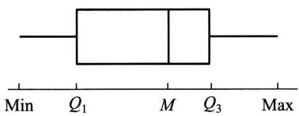  
图6-2

$①$  中心位置:中位数所在的位置就是数据集的中心.

$②$  散布程度:全部数据都落在  $[ \mathrm{Min}, \mathrm{Max} ]$  之内,在区间  $[ \mathrm{Min}, Q_{1} ], [ Q_{1}, M ], [ M, Q_{3} ], [ Q_{3}, \mathrm{Max} ]$  上的数据个数各约占1/4. 区间较短时,表示落在该区间的点较集中,反之较为分散.

(3)关于对称性:若中位数位于箱子的中间位置,则数据分布较为对称.又若Min离  $M$  的距离较Max离  $M$  的距离大,则表示数据分布向左倾斜,反之表示数据向右倾斜,且能看出分布尾部的长短.

例3以下是8个患者的血压(收缩压,以  $\mathrm{mmHg}$  计)数据(已经过排序),试作出箱线图.

$$
102\quad 110\quad 117\quad 118\quad 122\quad 123\quad 132\quad 150
$$

解因  $n p = 8\times 0.25 = 2$ ,故  $x_{0,25} = Q_{1} = \frac{1}{2} (110 + 117) = 113.5$

因  $n p = 8\times 0.5 = 4$ ,故  $x_{0,5} = Q_{2} = \frac{1}{2} (118 + 122) = 120$

因  $n p = 8 \times 0.75 = 6$ , 故  $x_{0.75} = Q_{3} = \frac{1}{2} (123 + 132) = 127.5$ .

$\mathrm{Min} = 102, \mathrm{Max} = 150$ , 作出箱线图如图 6- 3 所示.

例4 下面分别给出了25个男子和25个女子的肺活量(以L计.数据已经排过序):

女子组 2.7 2.8 2.9 3.1 3.1 3.1 3.2 3.4 3.4

3.4 3.4 3.4 3.5 3.5 3.5 3.6 3.7 3.7

3.7 3.8 3.8 4.0 4.1 4.2 4.2

男子组 4.1 4.1 4.3 4.3 4.5 4.6 4.7 4.8 4.8

5.1 5.3 5.3 5.3 5.4 5.4 5.5 5.6 5.7

5.8 5.8 6.0 6.1 6.3 6.7 6.7

试分别画出这两组数据的箱线图,

解 女子组  $\mathrm{Min} = 2.7, \mathrm{Max} = 4.2, M = 3.5$ .

因  $n p = 25 \times 0.25 = 6.25, Q_{1} = 3.2$ .

因  $n p = 25 \times 0.75 = 18.75, Q_{3} = 3.7$ .

男子组  $\mathrm{Min} = 4.1, \mathrm{Max} = 6.7, M = 5.3$ .

因  $n p = 25 \times 0.25 = 6.25, Q_{1} = 4.7$ .

因  $n p = 25 \times 0.75 = 18.75, Q_{3} = 5.8$ .

作出箱线图如图6- 4所示.

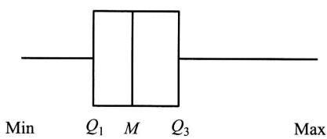  
图6-3

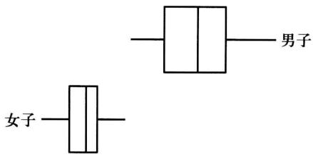  
图6-4

箱线图特别适用于比较两个或两个以上数据集的性质, 为此, 我们将几个数据集的箱线图画在同一个数轴上. 例如在例4中可以明显地看到男子的肺活量要比女子大, 男子的肺活量较女子的肺活量更为分散.

若在数据集中某一个观察值不寻常地大于或小于该数集中的其他数据, 则称之为疑似异常值. 疑似异常值的存在, 会对随后的计算结果产生不适当的影响. 检查疑似异常值并加以适当的处理是十分重要的. 箱线图只要稍加修改, 就能用来检测数据集是否存在疑似异常值.

第一四分位数Q与第三四分位数Q之间的距离;Q- Q,=IQR,称为

四分位数间距. 若数据小于  $Q_{1} - 1.5IQR$  或大于  $Q_{3} + 1.5IQR$ , 就认为它是疑似异常值. 我们将上述箱线图的作法(1), (2), (3)作如下的改变:

$(1^{\prime})$  同(1).

$(2^{\prime})$  计算  $IQR = Q_{3} - Q_{1}$ , 若一个数据小于  $Q_{1} - 1.5IQR$  或大于  $Q_{3} + 1.5IQR$ , 则认为它是一个疑似异常值. 画出疑似异常值, 并以  $^{\circ}$  表示.

$(3^{\prime})$  自箱子左侧引一水平线段直至数据集中除去疑似异常值后的最小值, 又自箱子右侧引一水平线直至数据集中除去疑似异常值后的最大值.

按  $(1^{\prime}),(2^{\prime}),(3^{\prime})$  作出的图形称为修正箱线图.

例5 下面给出了某医院21个患者的住院时间(以天计), 试画出修正箱线图(数据已经过排序).

$$
\begin{array}{c c c c c c c c c c c c c c c c c c c c c c c c c c c c c c c c c c c c c c c c c c c c c c c c c c c c c c c c c c c c c c c c c c c c c c c c c c c c c c c c c c c c c c c c c c c c c c c c c c c c c} & 1 & 2 & 3 & 3 & 4 & 4 & 5 & 6 & 6 & 7 & 7 & 9 & 9 & 9 & 9 & 9 & 9 & 9 & 9 & 9 & 9 & 9 & 9 & 9 & 9 & 9 & 9 & 9 & 9 & 9 & 9 & 9 & 9 & 9 & 9 & 9 & 9 & 9 & 9 & 9 & 9 & 9 & 9 & 9 & 9 \end{array}
$$

解  $\mathrm{Min} = 1, \mathrm{Max} = 55, M = 7$

因  $21 \times 0.25 = 5.25$ , 得  $Q_{1} = 4$

又  $21 \times 0.75 = 15.75$ , 得  $Q_{3} = 12$

故  $IQR = Q_{3} - Q_{1} = 8$

$$
Q_{3} + 1.5IQR = 12 + 1.5 \times 8 = 24, \quad Q_{1} - 1.5IQR = 4 - 12 = -8.
$$

观察值  $55 > 24$ , 故55是疑似异常值, 且仅此一个疑似异常值. 作出修正箱线图如图6- 5所示. 可见数据分布不对称, 而向右倾斜, 在中位数的右边较为分散.

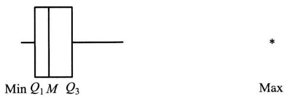  
图6-5

数据集中, 疑似异常值的产生源于: (1) 数据的测量、记录或输入计算机时的错误. (2) 数据来自不同的总体. (3) 数据是正确的, 但它只体现小概率事件. 当检测出疑似异常值时, 人们需对疑似异常值出现的原因加以分析. 如果是由于测量或记录的错误, 或某些其他明显的原因造成的, 那么将这些疑似异常值从数据集中丢弃就可以了. 然而当出现的原因无法解释时, 要作出丢弃或保留这些值的决策无疑是困难的, 此时我们在对数据集作分析时尽量选用稳健的方法, 使得疑似异常值对我们的结论的影响较小. 例如我们采用中位数来描述数据集的中心趋势, 而不使用数据集的平均值, 因为后者受疑似异常值的影响较大.

# $\S 3$  抽样分布

样本是进行统计推断的依据。在应用时,往往不是直接使用样本本身,而是针对不同的问题构造样本的适当函数,利用这些样本的函数进行统计推断。

定义设  $X_{1},X_{2},\dots ,X_{n}$  是来自总体  $X$  的一个样本,  $g(X_{1},X_{2},\dots ,X_{n})$  是  $X_{1}$ $X_{2},\dots ,X_{n}$  的函数,若  $g$  中不含未知参数,则称  $g(X_{1},X_{2},\dots ,X_{n})$  是一统计量.

因为  $X_{1},X_{2},\dots ,X_{n}$  都是随机变量,而统计量  $g(X_{1},X_{2},\dots ,X_{n})$  是随机变量的函数,因此统计量是一个随机变量.设  $x_{1},x_{2},\dots ,x_{n}$  是相应于样本  $X_{1},X_{2},\dots ,X_{n}$  的样本值,则称  $g(x_{1},x_{2},\dots ,x_{n})$  是  $g(X_{1},X_{2},\dots ,X_{n})$  的观察值.

下面列出几个常用的统计量.设  $X_{1},X_{2},\dots ,X_{n}$  是来自总体  $X$  的一个样本, $x_{1},x_{2},\dots ,x_{n}$  是这一样本的观察值.定义

样本均值

$$
\overline{{X}} = \frac{1}{n}\sum_{i = 1}^{n}X_{i};
$$

样本方差

$$
S^{2} = \frac{1}{n - 1}\sum_{i = 1}^{n}(X_{i} - \overline{{X}})^{2} = \frac{1}{n - 1}\Big(\sum_{i = 1}^{n}X_{i}^{2} - n\overline{{X}}^{2}\Big);
$$

样本标准差

$$
S = \sqrt{S^{2}} = \sqrt{\frac{1}{n - 1}\sum_{i = 1}^{n}(X_{i} - \overline{{X}})^{2}};
$$

样本  $k$  阶(原点)矩

$$
A_{k} = \frac{1}{n}\sum_{i = 1}^{n}X_{i}^{k}, k = 1,2,\dots ;
$$

样本  $k$  阶中心矩

$$
B_{k} = \frac{1}{n}\sum_{i = 1}^{n}(X_{i} - \overline{{X}})^{k}, k = 2,3,\dots .
$$

它们的观察值分别为

$$
\bar{x} = \frac{1}{n}\sum_{i = 1}^{n}x_{i};
$$

$$
s^{2} = \frac{1}{n - 1}\sum_{i = 1}^{n}(x_{i} - \bar{x})^{2} = \frac{1}{n - 1}\Big(\sum_{i = 1}^{n}x_{i}^{2} - n\bar{x}^{2}\Big);
$$

$$
s = \sqrt{\frac{1}{n - 1}\sum_{i = 1}^{n}(x_{i} - \bar{x})^{2}};
$$

$$
a_{k} = \frac{1}{n}\sum_{i = 1}^{n}x_{i}^{k},\quad k = 1,2,\dots;
$$

$$
b_{k} = \frac{1}{n}\sum_{i = 1}^{n}(x_{i} - \bar{x})^{k},\quad k = 2,3,\dots .
$$

这些观察值仍分别称为样本均值、样本方差、样本标准差、样本  $k$  阶(原点)矩以及样本  $k$  阶中心矩.

我们指出,若总体  $X$  的  $k$  阶矩  $E(X^{k})\stackrel {\mathrm{~i~a~r~}}{\longrightarrow}\mu_{k}$  存在,则当  $n\to \infty$  时,  $A_{k}\stackrel {P}{\longrightarrow}$ $\mu_{k},k = 1,2,\dots$  .这是因为  $X_{1},X_{2},\dots ,X_{n}$  独立且与  $X$  同分布,所以  $X_{1}^{k},X_{2}^{k},\dots ,X_{n}^{k}$  独立且与  $X^{k}$  同分布.故有

$$
E(X_{1}^{k}) = E(X_{2}^{k}) = \dots = E(X_{n}^{k}) = \mu_{k}.
$$

从而由第五章的辛钦大数定律知

$$
A_{k} = \frac{1}{n}\sum_{i = 1}^{n}X_{i}^{k}\stackrel {P}{\longrightarrow}\mu_{k},\quad k = 1,2,\dots .
$$

进而由第五章中关于依概率收敛的序列的性质知道

$$
g(A_{1},A_{2},\dots ,A_{k})\stackrel {P}{\longrightarrow}g(\mu_{1},\mu_{2},\dots ,\mu_{k}),
$$

其中  $g$  为连续函数.这就是下一章所要介绍的矩估计法的理论根据,

我们还要介绍一个与总体分布函数  $F(x)$  相应的统计量——经验分布函数.

定义设  $x_{1},x_{2}\dots ,x_{n}$  是来自分布函数为  $F(x)$  的总体  $X$  的样本观察值.  $X$  的经验分布函数,记为  $F_{n}(x)$  ,定义为样本观察值  $x_{1},x_{2},\dots ,x_{n}$  中小于或等于指定值  $x$  所占的比率,即

$$
F_{n}(x) = \frac{\#(x_{i}\leqslant x)}{n},\quad -\infty < x< \infty .
$$

其中#  $(x_{i}\leqslant x)$  表示  $x_{1},x_{2},\dots ,x_{n}$  中小于或等于  $x$  的个数.

按定义,当给定样本观察值  $x_{1},x_{2},\dots ,x_{n}$  时,  $F_{n}(x)$  是自变量  $x$  的函数,它具有分布函数的三个条件:  $①F_{n}(x)$  是  $x$  的不减函数.  $②0\leqslant F_{n}(x)\leqslant 1$  ,且  $F(- \infty) =$ $0,F(\infty) = 1.$ $③F(x)$  是一个右连续函数.由此知  $F_{n}(x)$  是一个分布函数.当  $x_{1}$  , $x_{2},\dots ,x_{n}$  各不相同时,  $F_{n}(x)$  是以等概率  $1 / n$  取  $x_{1},x_{2},\dots ,x_{n}$  的离散型随机变量的分布函数  $①$

一般地,设  $x_{1},x_{2},\dots ,x_{n}$  是总体  $X$  的一个容量为  $n$  的样本观察值,先将  $x_{1}$  , $x_{2},\dots ,x_{n}$  按自小到大的次序排序,并重新编号为

$$
x_{(1)} \leqslant x_{(2)} \leqslant \dots \leqslant x_{(n)},
$$

则经验分布函数  $F_{n}(x)$  可写成

$$
F_{n}(x) = \left\{ \begin{array}{ll}0, & x < x_{(1)}, \\ k / n, & x_{(k)} \leqslant x < x_{(k + 1)}, \\ 1, & x \geqslant x_{(n)}. \end{array} \right. \quad k = 1, 2, \dots , n - 1,
$$

例如,设总体  $X$  有样本观察值  $x_{(1)} =$ $- 1, x_{(2)} = 1, x_{(3)} = 2$ , 得经验分布函数为 (如图6- 6):

$$
F_{3}(x) = \left\{ \begin{array}{ll}0, & x < -1, \\ 1 / 3, & -1 \leqslant x < 1, \\ 2 / 3, & 1 \leqslant x < 2, \\ 1, & x \geqslant 2. \end{array} \right.
$$

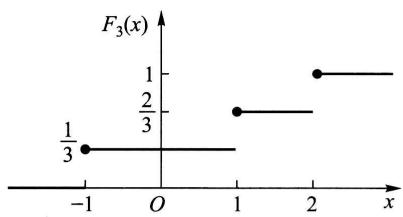  
图6-6

另一方面,当给定  $x$  时,  $F_{n}(x)$  是样本  $X_{1}, X_{2}, \dots , X_{n}$  的函数,因此,它是一个统计量.格里汶科(Glivenko)在1933年给出了以下的定理.

定理1(格里汶科定理)设  $X_{1}, X_{2}, \dots , X_{n}$  是来自以  $F(x)$  为分布函数的总体  $X$  的样本,  $F(x)$  是经验分布函数,则有

$$
F\Big\{\lim_{n\to \infty}\sup_{-\infty < x< \infty}\big|F_{n}(x) - F(x)\big| = 0\Big\} = 1.
$$

(证明略.)

定理1的含义是  $F_{n}(x)$  在整个实轴上以概率1均匀收敛于  $F(x)$ . 于是当样本容量  $n$  充分大时,  $F_{n}(x)$  能够良好地逼近总体分布函数  $F(x)$ . 这是在概率统计学中以样本推断总体的依据.

# $(-)\chi^{2}$  分布

设  $X_{1}, X_{2}, \dots , X_{n}$  是来自总体  $N(0,1)$  的样本,则称统计量

$$
\chi^{2} = X_{1}^{2} + X_{2}^{2} + \dots + X_{n}^{2} \tag{3.1}
$$

服从自由度为  $n$  的  $\chi^{2}$  分布,记为  $\chi^{2} \sim \chi^{2}(n)$

此处,自由度是指(3.1)式右端包含的独立变量的个数.

$\chi^{2}(n)$  分布的概率密度为

$$
f(y) = \left\{ \begin{array}{ll} \frac{1}{2^{n / 2} \Gamma(n / 2)} y^{n / 2 - 1} \mathrm{e}^{-y / 2}, & y > 0, \\ 0, & \text{其他}. \end{array} \right. \tag{3.2}
$$

$f(y)$  的图形如图6- 7所示.

现在来推求(3.2)式.

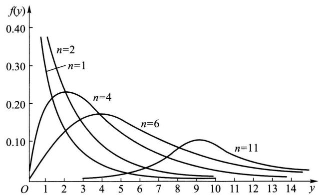  
图6-7

首先由第二章  $\S 5$  例3及第三章  $\S 5$  例3知  $\chi^{2}$  (1)分布即为  $\Gamma \Big(\frac{1}{2},2\Big)$  分布.现  $X_{i}\sim N(0,1)$  ,由定义  $X_{i}^{2}\sim \chi^{2}\left(1\right)$  ,即  $X_{i}^{2}\sim \Gamma \Big(\frac{1}{2},2\Big),i = 1,2,\dots ,n.$  再由  $X_{1}$ $X_{2},\dots ,X_{n}$  的独立性知  $X_{1}^{2},X_{2}^{2},\dots ,X_{n}^{2}$  相互独立,从而由  $\boldsymbol{\cal T}$  分布的可加性(见第三章  $\S 5$  例3)知

$$
\chi^{2} = \sum_{i = 1}^{n}X_{i}^{2}\sim \Gamma \Big(\frac{n}{2},2\Big), \tag{3.3}
$$

即得  $\chi^{2}(n)$  分布的概率密度如(3.2)式所示.

根据  $\boldsymbol{\cal T}$  分布的可加性易得  $\chi^{2}$  分布的可加性如下:

$\chi^{2}$  分布的可加性设  $\chi_{1}^{2}\sim \chi^{2}\left(n_{1}\right),\chi_{2}^{2}\sim \chi^{2}\left(n_{2}\right)$  ,并且  $\chi_{1}^{2},\chi_{2}^{2}$  相互独立,则有

$$
\chi_{1}^{2} + \chi_{2}^{2}\sim \chi^{2}\left(n_{1} + n_{2}\right). \tag{3.4}
$$

$\chi^{2}$  分布的数学期望和方差若  $\chi^{2}\sim \chi^{2}(n)$  ,则有

$$
E(\chi^{2}) = n,\quad D(\chi^{2}) = 2n. \tag{3.5}
$$

事实上,因  $X_{i}\sim N(0,1)$  ,故

$$
E(X_{i}^{2}) = D(X_{i}) = 1,
$$

$$
D(X_{i}^{2}) = E(X_{i}^{4}) - [E(X_{i}^{2})]^{2} = 3 - 1 = 2,\quad i = 1,2,\dots ,n.
$$

于是  $E(\chi^{2}) = E\Big(\sum_{i = 1}^{n}X_{i}^{2}\Big) = \sum_{i = 1}^{n}E(X_{i}^{2}) = n,$

$$
D(\chi^{2}) = D\Big(\sum_{i = 1}^{n}X_{i}^{2}\Big) = \sum_{i = 1}^{n}D(X_{i}^{2}) = 2n.
$$

$\chi^{2}$  分布的上分位数对于给定的正数  $\alpha ,0{<}\alpha {<}1$  ,满足条件(参见120页)

$$
P\{\chi^{2} > \chi_{\alpha}^{2}(n)\} = \int_{\chi_{\alpha}^{2}(n)}^{\infty}f(y)\mathrm{d}y = \alpha , \tag{3.6}
$$

的  $\chi_{\alpha}^{2}(n)$  就是  $\chi^{2}(n)$  分布的上  $\alpha$  分位数,如图6一8所示.对于不同的  $\alpha ,n$  ,上  $\alpha$  分

位数的值已制成表格, 可以查用 (参见附表 5). 例如对于  $\alpha = 0.1, n = 25$ , 查得  $\chi_{0.1}^{2}(25) = 34.382$ . 但该表只详列到  $n = 40$  为止, 费希尔 (R. A. Fisher) 曾证明, 当  $n$  充分大时, 近似地有

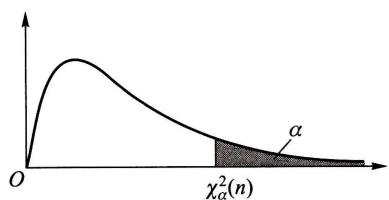  
图6-8

$$
\chi_{\alpha}^{2}(n) \approx \frac{1}{2} (z_{\alpha} + \sqrt{2n - 1})^{2}, \tag{3.7}
$$

其中  $z_{\alpha}$  是标准正态分布的上  $\alpha$  分位数. 利用 (3.7) 式可以求得当  $n > 40$  时  $\chi^{2}(n)$  分布的上  $\alpha$  分位数的近似值.

例如, 由 (3.7) 式可得  $\chi_{0.05}^{2}(50) \approx \frac{1}{2} (1.645 + \sqrt{99})^{2} = 67.221$  (由更详细的表得  $\chi_{0.05}^{2}(50) = 67.505$ ).

# (二)  $t$  分布

设  $X \sim N(0,1), Y \sim \chi^{2}(n)$ , 且  $X, Y$  相互独立, 则称随机变量

$$
t = \frac{X}{\sqrt{Y / n}} \tag{3.8}
$$

服从自由度为  $n$  的  $t$  分布. 记为  $t \sim t(n)$

$t$  分布又称学生氏 (Student) 分布.  $t(n)$  分布的概率密度函数为

$$
h(t) = \frac{\Gamma[(n + 1) / 2]}{\sqrt{\pi n} \Gamma(n / 2)} \left(1 + \frac{t^{2}}{n}\right)^{-(n + 1) / 2}, \quad -\infty < t < \infty \tag{3.9}
$$

(证略). 图 6- 9 中画出了  $h(t)$  的图形.  $h(t)$  的图形关于  $t = 0$  对称, 当  $n$  充分大时其图形类似于标准正态变量概率密度的图形. 事实上, 利用  $\Gamma$  函数的性质可得

$$
\lim_{n \to \infty} h(t) = \frac{1}{\sqrt{2\pi}} \mathrm{e}^{-t^{2} / 2}, \tag{3.10}
$$

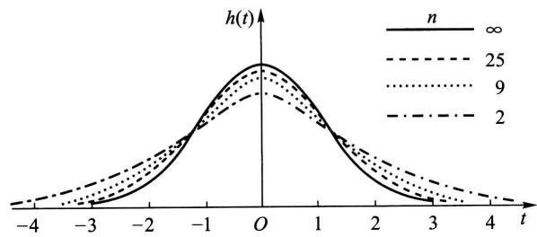  
图6-9

故当  $n$  足够大时  $t$  分布近似于  $N(0,1)$  分布. 但对于较小的  $n, t$  分布与  $N(0,1)$  分布相差较大(见附表2与附表4).

$t$  分布的上分位数 对于给定的  $\alpha , 0< \alpha < 1$ , 满足条件

$$
P\{t > t_{\alpha}(n)\} = \int_{t_{\alpha}(n)}^{\infty}h(t)\mathrm{d}t = \alpha \tag{3.11}
$$

的  $t_{\alpha}(n)$  就是  $t(n)$  分布的上  $\alpha$  分位数(如图6一10).

由  $t(n)$  分布的上  $\alpha$  分位数的定义及  $h(t)$  图形的对称性知

$$
t_{1 - \alpha}(n) = -t_{\alpha}(n). \tag{3.12}
$$

$t$  分布的上  $\alpha$  分位数可自附表4查得. 当  $n > 45$  时, 对于常用的  $\alpha$  的值, 就用正态近似

$$
t_{\alpha}(n) \approx z_{\alpha}. \tag{3.13}
$$

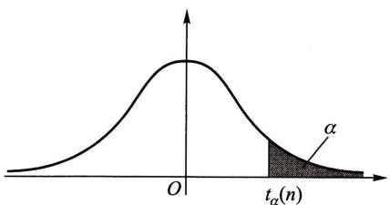  
图6-10

# (三)  $F$  分布

设  $U \sim \chi^{2}(n_{1}), V \sim \chi^{2}(n_{2})$ , 且  $U, V$  相互独立, 则称随机变量

$$
F = \frac{U / n_{1}}{V / n_{2}} \tag{3.14}
$$

服从自由度为  $(n_{1}, n_{2})$  的  $F$  分布, 记为  $F \sim F(n_{1}, n_{2})$

$F(n_{1}, n_{2})$  分布的概率密度为

$$
\psi (y) = \left\{ \begin{array}{l l}{\frac{\Gamma\left[(n_{1} + n_{2}) / 2\right](n_{1} / n_{2})^{n_{1} / 2}y^{(n_{1} / 2) - 1}}{\Gamma(n_{1} / 2)\Gamma(n_{2} / 2)[1 + (n_{1}y / n_{2})]^{(n_{1} + n_{2}) / 2}},} & {y > 0,}\\ {0,} & {\mathrm{~if~}y > 0.} \end{array} \right. \tag{3.15}
$$

其他

(证略). 图6- 11中画出了  $\psi (y)$  的图形.

  
图6-11

由定义可知, 若  $F \sim F(n_{1}, n_{2})$ , 则

$$
\frac{1}{F} \sim F(n_{2}, n_{1}). \tag{3.16}
$$

$F$  分布的上分位数 对于给定的  $\alpha , 0 < \alpha < 1$ , 满足条件

$$
P\{F > F_{\alpha}(n_{1}, n_{2})\} = \int_{F_{\alpha}(n_{1}, n_{2})}^{\infty} \psi (y) \mathrm{d}y = \alpha \tag{3.17}
$$

的  $F_{\alpha}(n_{1}, n_{2})$  就是  $F(n_{1}, n_{2})$  分布的上  $\alpha$  分位数 (图 6- 12).  $F$  分布的上  $\alpha$  分位数有表可查 (见附表 6).

类似地有  $\chi^{2}$  分布,  $t$  分布,  $F$  分布的下分位数.

$F$  分布的上  $\alpha$  分位数有如下的重要性质  $①$

$$
F_{1 - \alpha}(n_{1}, n_{2}) = \frac{1}{F_{\alpha}(n_{2}, n_{1})}.
$$

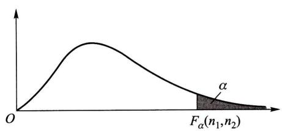  
图6-12

(3.18)式常用来求  $F$  分布表中未列出的常用的上  $\alpha$  分位数. 例如,

$$
F_{0.95}(12, 9) = \frac{1}{F_{0.05}(9, 12)} = \frac{1}{2.80} = 0.357.
$$

# (四) 正态总体的样本均值与样本方差的分布

设总体  $X$  (不管服从什么分布, 只要均值和方差存在) 的均值为  $\mu$ , 方差为  $\sigma^{2}$ ,  $X_{1}, X_{2}, \dots , X_{n}$  是来自  $X$  的一个样本,  $\overline{X}, S^{2}$  分别是样本均值和样本方差, 则有

$$
E(\overline{X}) = \mu , \quad D(\overline{X}) = \sigma^{2} / n. \tag{3.19}
$$

而  $E(S^{2}) = E\left[\frac{1}{n - 1}\Big(\sum_{i = 1}^{n}X_{i}^{2} - n\overline{{X}}^{2}\Big)\right] = \frac{1}{n - 1}\Big[\sum_{i = 1}^{n}E(X_{i}^{2}) - n E(\overline{{X}}^{2})\Big]$

$①$  (3.18)式的证明如下:若  $F\sim F(n_{1},n_{2})$  ,按定义

$$
\begin{array}{r l} & {1 = \alpha = P\{F > F_{1 - \alpha}(n_{1},n_{2})\} = P\Big\{\frac{1}{F} < \frac{1}{F_{1 - \alpha}(n_{1},n_{2})}\Big\}}\\ & {\quad = 1 - P\Big\{\frac{1}{F}\geqslant \frac{1}{F_{1 - \alpha}(n_{1},n_{2})}\Big\} = 1 - P\Big\{\frac{1}{F} >\frac{1}{F_{1 - \alpha}(n_{1},n_{2})}\Big\} ,} \end{array}
$$

于是  $P\left\{\frac{1}{F} > \frac{1}{F_{1 - \alpha}(n_{1}, n_{2})}\right\} = \alpha .$  (1)

再由  $\frac{1}{F} \sim F(n_{2}, n_{1})$  知  $P\left\{\frac{1}{F} > F_{\alpha}(n_{2}, n_{1})\right\} = \alpha .$  (2)

比较(1), (2)两式得

$$
= \frac{1}{n - 1}\left[\sum_{i = 1}^{n}(\sigma^{2} + \mu^{2}) - n(\sigma^{2} / n + \mu^{2})\right] = \sigma^{2},
$$

即  $E(S^{2}) = \sigma^{2}$ . (3.20)

进而,设总体  $X\sim N(\mu ,\sigma^{2})$ ,由第四章 §2 的 (2.8) 式知  $\overline{X} = \frac{1}{n}\sum_{i = 1}^{n}X_{i}$  也服从正态分布,于是得到以下的定理:

定理2 设  $X_{1},X_{2},\dots ,X_{n}$  是来自正态总体  $N(\mu ,\sigma^{2})$  的样本,  $\overline{X}$  是样本均值,则有

$$
\overline{X}\sim N(\mu ,\sigma^{2} / n).
$$

对于正态总体  $N(\mu ,\sigma^{2})$  的样本均值  $\overline{X}$  和样本方差  $S^{2}$ ,有以下两个重要定理.

定理3 设  $X_{1},X_{2},\dots ,X_{n}$  是来自总体  $N(\mu ,\sigma^{2})$  的样本,  $\overline{X},S^{2}$  分别是样本均值和样本方差,则有

$$
1^{\circ}\frac{(n - 1)S^{2}}{\sigma^{2}}\sim \chi^{2}(n - 1). \tag{3.21}
$$

$2^{\circ}\overline{X}$  与  $S^{2}$  相互独立.

定理3的证明见本章末二维码.

定理4 设  $X_{1},X_{2},\dots ,X_{n}$  是来自总体  $N(\mu ,\sigma^{2})$  的样本,  $\overline{X},S^{2}$  分别是样本均值和样本方差,则有

$$
\frac{\overline{X} - \mu}{S / \sqrt{n}}\sim t(n - 1). \tag{3.22}
$$

证 由定理2、定理3,

$$
\frac{\overline{X} - \mu}{\sigma / \sqrt{n}}\sim N(0,1),\quad \frac{(n - 1)S^{2}}{\sigma^{2}}\sim \chi^{2}(n - 1),
$$

且两者独立.由  $t$  分布的定义知

$$
\frac{\overline{X} - \mu}{\sigma / \sqrt{n}}\sqrt{\frac{(n - 1)S^{2}}{\sigma^{2}(n - 1)}}\sim t(n - 1).
$$

化简上式左边,即得 (3.22) 式.

对于两个正态总体的样本均值和样本方差有以下的定理.

定理5 设  $X_{1},X_{2},\dots ,X_{n_{1}}$  与  $Y_{1},Y_{2},\dots ,Y_{n_{2}}$  分别是来自正态总体  $N(\mu_{1},\sigma_{1}^{2})$  和  $N(\mu_{2},\sigma_{2}^{2})$  的样本,且这两个样本相互独立. 设  $\overline{X} = \frac{1}{n_{1}}\sum_{i = 1}^{n_{1}}X_{i},\overline{Y} = \frac{1}{n_{2}}\sum_{i = 1}^{n_{2}}Y_{i}$  分别

是这两个样本的样本均值;  $S_{1}^{2} = \frac{1}{n_{1} - 1}\sum_{i = 1}^{n_{1}}(X_{i} - \overline{{X}})^{2},S_{2}^{2} = \frac{1}{n_{2} - 1}\sum_{i = 1}^{n_{2}}(Y_{i} - \overline{{Y}})^{2}$  分别是这两个样本的样本方差,则有

$$
1^{\circ}\frac{S_{1}^{2} / S_{2}^{2}}{\sigma_{1}^{2} / \sigma_{2}^{2}}{\sim} F(n_{1} - 1,n_{2} - 1).
$$

$2^{\circ}$  当  $\sigma_{1}^{2} = \sigma_{2}^{2} = \sigma^{2}$  时,

$$
\frac{(\overline{{X}} - \overline{{Y}}) - (\mu_{1} - \mu_{2})}{S_{w}\sqrt{\frac{1}{n_{1}} + \frac{1}{n_{2}}}}{\sim} t(n_{1} + n_{2} - 2),
$$

其中  $S_{w}^{2} = \frac{(n_{1} - 1)S_{1}^{2} + (n_{2} - 1)S_{2}^{2}}{n_{1} + n_{2} - 2},\quad S_{w} = \sqrt{S_{w}^{2}}.$

证  $1^{\circ}$  由定理3,

$$
\frac{(n_{1} - 1)S_{1}^{2}}{\sigma_{1}^{2}}{\sim}\chi^{2}(n_{1} - 1),\quad \frac{(n_{2} - 1)S_{2}^{2}}{\sigma_{2}^{2}}{\sim}\chi^{2}(n_{2} - 1).
$$

由假设  $S_{1}^{2},S_{2}^{2}$  相互独立,则由  $F$  分布的定义知

$$
\frac{(n_{1} - 1)S_{1}^{2}}{(n_{1} - 1)\sigma_{1}^{2}}\frac{(n_{2} - 1)S_{2}^{2}}{(n_{2} - 1)\sigma_{2}^{2}}{\sim} F(n_{1} - 1,n_{2} - 1),
$$

即  $\frac{S_{1}^{2} / S_{2}^{2}}{\sigma_{1}^{2} / \sigma_{2}^{2}}{\sim} F(n_{1} - 1,n_{2} - 1).$

$2^{\circ}$  易知  $\overline{{X}} - \overline{{Y}} \sim N\left(\mu_{1} - \mu_{2},\frac{\sigma^{2}}{n_{1}} +\frac{\sigma^{2}}{n_{2}}\right)$  即有

$$
U = \frac{(\overline{{X}} - \overline{{Y}}) - (\mu_{1} - \mu_{2})}{\sigma\sqrt{\frac{1}{n_{1}} + \frac{1}{n_{2}}}}{\sim} N(0,1).
$$

又由给定条件知

$$
\frac{(n_{1} - 1)S_{1}^{2}}{\sigma^{2}}{\sim}\chi^{2}(n_{1} - 1),\quad \frac{(n_{2} - 1)S_{2}^{2}}{\sigma^{2}}{\sim}\chi^{2}(n_{2} - 1),
$$

且它们相互独立,故由  $\chi^{2}$  分布的可加性知

$$
V = \frac{(n_{1} - 1)S_{1}^{2}}{\sigma^{2}} +\frac{(n_{2} - 1)S_{2}^{2}}{\sigma^{2}}{\sim}\chi^{2}(n_{1} + n_{2} - 2).
$$

由本章末所附"  $\S 3$  定理3的证明及其推广"的  $2^{\circ}$  知  $U$  与  $V$  相互独立.从而按  $t$  分布的定义知

$$
\frac{U}{\sqrt{V / (n_{1} + n_{2} - 2)}} = \frac{(\overline{{X}} - \overline{{Y}}) - (\mu_{1} - \mu_{2})}{S_{w}\sqrt{\frac{1}{n_{1}} + \frac{1}{n_{2}}}}{\sim} t(n_{1} + n_{2} - 2).
$$

本节所介绍的几个分布以及后四个定理,在下面各章中都起着重要的作用.应注意,它们都是在总体为正态总体这一基本假定下得到的.

# 小结

在数理统计中往往研究有关对象的某一项数量指标,对这一数量指标进行试验或观察,将试验的全部可能的观察值称为总体,每个观察值称为个体,总体中的每一个个体是某一随机变量  $X$  的值,因此一个总体对应一个随机变量  $X$  。我们将不区分总体与相应的随机变量  $X$  ,笼统称为总体  $X$  。随机变量  $X$  服从什么分布,就称总体服从什么分布,在实际中遇到的总体往往是有限总体,它对应一个离散型随机变量,当总体中包含的个体的个数很大时,在理论上可以认为它是一个无限总体,我们说某种型号的灯泡寿命总体服从指数分布,是指无限总体而言的,又如我们说某一年龄段的男性儿童的身高服从正态分布,也是指无限总体而言的。无限总体是人们对具体事物的抽象,无限总体的分布的形式较为简明,便于在数学上进行处理,使用方便。

在相同的条件下,对总体  $X$  进行  $n$  次重复的、独立的观察,得到  $n$  个结果  $X_{1}, X_{2}, \dots , X_{n}$ ,称随机变量  $X_{1}, X_{2}, \dots , X_{n}$  为来自总体  $X$  的简单随机样本,它具有两条性质:

$1^{\circ} X_{1}, X_{2}, \dots , X_{n}$  都与总体具有相同的分布。

$2^{\circ} X_{1}, X_{2}, \dots , X_{n}$  相互独立。

我们就是利用来自样本的信息推断总体,得到有关总体分布的种种结论的。

样本  $X_{1}, X_{2}, \dots , X_{n}$  的函数  $g(X_{1}, X_{2}, \dots , X_{n})$ ,若不包含未知参数,则称为统计量。统计量是一个随机变量,它是完全由样本所确定的。统计量是进行统计推断的工具,样本均值

$$
\overline{X} = \frac{1}{n} \sum_{k = 1}^{n} X_{k}
$$

和样本方差

$$
S^{2} = \frac{1}{n - 1} \sum_{k = 1}^{n} (X_{k} - \overline{X})^{2}
$$

是两个最重要的统计量,统计量的分布称为抽样分布。下面是三个来自正态分布的抽样分布:

这三个分布称为统计学的三大分布,它们在数理统计中有着广泛的应用。对于这三个分布,要求读者掌握它们的定义和概率密度函数图形的轮廓,还会使用分位数表写出分位数。

关于样本均值  $\overline{X}$  、样本方差  $S^{2}$ ,有以下的结果。

1. 设  $X_{1}, X_{2}, \dots , X_{n}$  是来自总体  $X$  (不管服从什么分布,只要它的均值和方差存在)的样本,且有  $E(X) = \mu , D(X) = \sigma^{2}$ ,则有

$$
E(X) = \mu , \quad D(X) = \sigma^{2} / n.
$$

2. 设总体  $X \sim N(\mu , \sigma^{2}), X_{1}, X_{2}, \dots , X_{n}$  是来自  $X$  的样本,则有

$1^{\circ} \overline{X} \sim N(\mu , \sigma^{2} / n)$

$$
2^{\circ} \frac{(n - 1) S^{2}}{\sigma^{2}} \sim \chi^{2}(n - 1).
$$

$3^{\circ} \overline{X}$  与  $S^{2}$  相互独立。

$$
4^{\circ} \frac{\overline{X} - \mu}{S / \sqrt{n}} \sim t(n - 1).
$$

3. 对于两个正态总体  $X \sim N(\mu_{1}, \sigma_{1}^{2})$ ,  $Y \sim N(\mu_{2}, \sigma_{2}^{2})$ , 有 §3 定理 5 的重要结果.

# 重要术语及主题

总体 简单随机样本 统计量

$\chi^{2}$  分布、  $t$  分布、  $F$  分布的定义及它们的概率密度函数图形轮廓

上  $\alpha$  分位数  $F_{1 - \alpha}(n_{1}, n_{2}) = \frac{1}{F_{\alpha}(n_{2}, n_{1})}$

小结中关于样本均值、样本方差的重要结果

# 习题

1. 在总体  $N(52,6,3^{2})$  中随机抽取一容量为 36 的样本, 求样本均值  $\overline{X}$  落在 50.8 到 53.8 之间的概率.

2. 在总体  $N(12,4)$  中随机抽一容量为 5 的样本  $X_{1}, X_{2}, X_{3}, X_{4}, X_{5}$ .

(1) 求样本均值与总体均值之差的绝对值大于 1 的概率.

(2) 求概率  $P\{\max \{X_{1}, X_{2}, X_{3}, X_{4}, X_{5}\} >15\} , P\{\min \{X_{1}, X_{2}, X_{3}, X_{4}, X_{5}\} < 10\}$ .

3. 求总体  $N(20,3)$  的容量分别为 10, 15 的两独立样本均值差的绝对值大于 0.3 的概率.

4. (1) 设样本  $X_{1}, X_{2}, \dots , X_{6}$  来自总体  $N(0,1), Y = (X_{1} + X_{2} + X_{3})^{2} + (X_{4} + X_{5} + X_{6})^{2}$ , 试确定常数  $C$  使  $CY$  服从  $\chi^{2}$  分布.

(2) 设样本  $X_{1}, X_{2}, \dots , X_{5}$  来自总体  $N(0,1), Y = \frac{C(X_{1} + X_{2})}{(X_{3}^{2} + X_{4}^{2} + X_{6}^{2})^{1 / 2}}$ , 试确定常数  $C$  使  $Y$  服从  $t$  分布.

(3) 已知总体  $X \sim t(n)$ , 求证  $X^{2} \sim F(1, n)$ .

5. (1) 已知某种能力测试的得分服从正态分布  $N(\mu , \sigma^{2})$ , 随机取 10 个人参与这一测试. 求他们得分的联合概率密度, 并求这 10 个人得分的平均值小于  $\mu$  的概率.

(2) 在 
(1) 中设  $\mu = 62, \sigma^{2} = 25$ , 若得分超过 70 就能得奖, 求至少有一人得奖的概率.

6. 设总体  $X \sim b(1, p), X_{1}, X_{2}, \dots , X_{n}$  是来自  $X$  的样本.

(1) 求  $(X_{1}, X_{2}, \dots , X_{n})$  的分布律.

(2) 求  $\sum_{i = 1}^{n} X_{i}$  的分布律.

(3) 求  $E(\overline{X}), D(\overline{X}), E(S^{2})$ .

7. 设总体  $X\sim \chi^{2}\left(n\right),X_{1},X_{2},\dots ,X_{10}$  是来自  $X$  的样本,求  $E(\overline{{X}}),D(\overline{{X}}),E(S^{2})$

8. 设总体  $X \sim N(\mu , \sigma^{2}), X_{1}, X_{2}, \dots , X_{10}$  是来自  $X$  的样本.

(1) 写出  $X_{1}, X_{2}, \dots , X_{10}$  的联合概率密度.

(2) 写出  $\overline{X}$  的概率密度.

9. 设在总体  $N(\mu , \sigma^{2})$  中抽得一容量为 16 的样本, 这里  $\mu , \sigma^{2}$  均未知.

(1) 求  $P\{S^{2} / \sigma^{2} \leqslant 2.041\}$ , 其中  $S^{2}$  为样本方差.

(2) 求  $D(S^{2})$ .

10. 下面列出了 30 个美国 NBA 球员的体重(以磅计,1 磅  $= 0.454 \mathrm{~kg}$ )数据. 这些数据是从美国 NBA 球队 1990-1991 年赛季的花名册中抽样得到的.

$$
\begin{array}{c c c c c c c c c c c c c c c c c c c c c c c c c c c c c c c c c c c c c c c c c c c c c c c c c c c c c c c c c c c c c c c c c c c c c c c c c c c c c c c c c c c c c c c c c c c c c c c c c c c c c} & 225 & 232 & 232 & 245 & 235 & 245 & 270 & 225 & 240 & 240 & 240 & 240 & 240 & 240 & 240 & 240 & 240 & 240 & 240 & 240 & 240 & 240 & 240 & 240 & 240 & 240 & 240 & 240 & 24 & 240 & 240 & 240 & 240 & 240 & 240 & 240 & 240 & 240 & 240 & 240 & 240 & 240 & 240 & 240 & 240 & 240 & 240 & 240 & 24 \end{array}
$$

(1)画出这些数据的频率直方图(提示:最大和最小观察值分别为271和185,区间[184.5,271.5]包含所有数据,将整个区间分为5等份,为计算方便,将区间调整为(179.5,279.5).

(2)作出这些数据的箱线图.

11. 截尾均值 设数据集包含  $n$  个数据,将这些数据自小到大排序为

$$
x_{(1)} \leqslant x_{(2)} \leqslant \dots \leqslant x_{(n)},
$$

删去  $100 \alpha \%$  个数值小的数,同时删去  $100 \alpha \%$  个数值大的数,将留下的数据取算术平均,记为  $\bar{x}_{\alpha}$ ,即

$$
\bar{x}_{\alpha} = \frac{x_{([n \alpha ] + 1)} + \cdots + x_{(n - [n \alpha ])}}{n - 2[n \alpha]}
$$

其中  $[n \alpha ]$  是小于或等于  $n \alpha$  的最大整数(一般取  $\alpha$  为  $0.1 \sim 0.2$ ).  $\bar{x}_{\alpha}$  称为  $100 \alpha \%$  截尾均值.例如对于第 10 题中的 30 个数据,取  $\alpha = 0.1$ ,则有  $[n \alpha ] = [30 \times 0.1] = 3$ ,得  $100 \times 0.1 \%$  截尾均值为

$$
\bar{x}_{\alpha} = \frac{200 + 200 + \cdots + 245 + 245}{30 - 6} = 225.4167.
$$

若数据来自某一总体的样本,则  $\bar{x}_{\alpha}$  是一个统计量.  $\bar{x}_{\alpha}$  不受样本的极端值的影响. 截尾均值在实际应用问题中是常会用到的.

试求第 10 题的 30 个数据的  $\alpha = 0.2$  的截尾均值.

# 第七章 参数估计

统计推断的基本问题可以分为两大类, 一类是估计问题, 另一类是假设检验问题. 本章讨论总体参数的点估计和区间估计.

# $\S 1$  点估计

设总体  $X$  的分布函数的形式已知, 但它的一个或多个参数未知, 借助于总体  $X$  的一个样本来估计总体未知参数的值的问题称为参数的点估计问题.

例1在某炸药制造厂, 一天中发生着火现象的次数  $X$  是一个随机变量, 假设它服从以  $\lambda >0$  为参数的泊松分布, 参数  $\lambda$  为未知. 现有以下的样本值, 试估计参数  $\lambda$ .

<table><tr><td>着火次数k</td><td>0</td><td>1</td><td>2</td><td>3</td><td>4</td><td>5</td><td>6</td><td>≥7</td><td></td></tr><tr><td>发生k次着火的天数nk</td><td>75</td><td>90</td><td>54</td><td>22</td><td>6</td><td>2</td><td>1</td><td>0</td><td>∑=250</td></tr></table>

解由于  $X\sim \pi (\lambda)$ , 故有  $\lambda = E(X)$ . 我们自然想到用样本均值来估计总体的均值  $E(X)$ . 现由已知数据计算得到

$\bar{x} = \frac{\sum_{k = 0}^{6}k n_{k}}{\sum_{k = 0}^{6}n_{k}} = \frac{1}{250} (0\times 75 + 1\times 90 + 2\times 54 + 3\times 22 + 4\times 6 + 5\times 2 + 6\times 1) = 1.22,$

即  $E(X) = \lambda$  的估计为1.22.

点估计问题的一般提法如下: 设总体  $X$  的分布函数  $F(x; \theta) \mathbb{O}$  的形式为已知,  $\theta$  是待估参数.  $X_{1}, X_{2}, \dots , X_{n}$  是  $X$  的一个样本,  $x_{1}, x_{2}, \dots , x_{n}$  是相应的一个样本值. 点估计问题就是要构造一个适当的统计量  $\hat{\theta} (X_{1}, X_{2}, \dots , X_{n})$ , 用它的观察值  $\hat{\theta} (x_{1}, x_{2}, \dots , x_{n})$  作为未知参数  $\theta$  的近似值. 我们称  $\hat{\theta} (X_{1}, X_{2}, \dots , X_{n})$  为  $\theta$  的估

计量,称  $\hat{\theta} (x_{1},x_{2},\dots ,x_{n})$  为  $\theta$  的估计值.在不致混淆的情况下统称估计量和估计值为估计,并都简记为  $\hat{\theta}$ . 由于估计量是样本的函数.因此对于不同的样本值, $\theta$  的估计值一般是不相同的.

例如在例1中,我们用样本均值来估计总体均值.即有估计量

$$
\widehat{\lambda} = E(\widehat{X}) = \frac{1}{n}\sum_{k = 1}^{n}X_{k},\quad n = 250,
$$

估计值  $\widehat{\lambda} = E(\widehat{X}) = \frac{1}{n}\sum_{k = 1}^{n}x_{k} = 1.22.$

下面介绍两种常用的构造估计量的方法:矩估计法和最大似然估计法.

# (一)矩估计法

设  $X$  为连续型随机变量,其概率密度为  $f(x;\theta_{1},\theta_{2},\dots ,\theta_{k})$  ,或  $X$  为离散型随机变量,其分布律为  $P\{X = x\} = p(x;\theta_{1},\theta_{2},\dots ,\theta_{k})$  ,其中  $\theta_{1},\theta_{2},\dots ,\theta_{k}$  为待估参数,  $X_{1},X_{2},\dots ,X_{n}$  是来自  $X$  的样本.假设总体  $X$  的前  $k$  阶矩

或

$$
\begin{array}{l}{{\mu_{l}=E(X^{l})=\int_{-\infty}^{\infty}x^{l}f(x;\theta_{1},\theta_{2},\cdots,\theta_{k})\mathrm{d}x\quad(X\mathrm{~}\mathcal{H}\mathrm{~}\mathcal{H}\mathrm{~}\mathcal{H}\mathrm{~}\mathcal{H}\mathrm{~}\mathcal{H}\mathrm{~}\mathcal{H}\mathrm{~}\mathcal{H}\mathrm{~}\mathcal{H}\mathrm{~}\mathcal{H}\mathrm{~}\mathcal{H}\mathrm{~}\mathcal{H}\mathrm{~}\mathcal{H}\mathcal{H}\mathrm{~}\mathcal{H}\mathrm{~}\mathcal{H}\mathrm{~}\mathcal{H}\mathrm{~}\mathcal{H}\mathrm{~}\mathcal{H}\mathrm{~}\mathcal{H}\mathrm{~}\mathcal{H}\mathrm{~}\mathcal{H}\mathrm{~}\mathcal{H}\mathrm{~}\mathcal{H}\mathrm{~}}}}\\ {{\mu_{l}=E(X^{l})=\sum_{x\in R_{X}}x^{l}p(x;\theta_{1},\theta_{2},\cdots,\theta_{k})\quad(X\mathrm{~}\mathcal{H}\mathrm{~}\mathcal{H}\mathrm{~}\mathcal{H}\mathrm{~}\mathcal{H}\mathrm{~}\mathcal{H}\mathrm{~}\mathcal{H}\mathrm{~}\mathcal{H}\mathrm{~}\mathcal{H}\mathrm{~}\mathcal{H}\mathrm{~}\mathcal{H}\mathrm{~}\mathbb{H}\mathrm{~}\mathcal{H}\mathrm{~}\mathcal{H}\mathrm{~}\mathcal{H}\mathrm{~}\mathcal{H}\mathrm{~}\mathcal{H}\mathrm{~}\mathcal{H}\mathrm{~}\mathcal{H}\mathrm{~}\mathcal{H}\mathrm{~}\mathcal{H}\mathrm{~}\mathcal{H}\mathrm{~}\mathcal{\mathcal{H}\mathrm{~}\mathcal{H}\mathrm{~}\mathcal{H}\mathrm{~}\mathcal{H}\mathrm{~}\mathcal{H}\mathrm{~}\mathcal{H}\mathrm{~}\mathcal{H}\mathrm{~}\mathcal{H}\mathrm{~}\mathcal{H}\mathrm{~}\mathcal{H}\mathrm{~}\mathcal{H}\mathrm{~}\mathrm{~}\mathrm{~}\mathrm{~}\mathrm{~}\mathrm{~}\mathrm{~}\mathrm{~}\mathrm{~}\mathrm{~}\mathrm{~}\mathrm{~}\mathrm{~}\mathrm{~}\mathrm{~}\mathrm{~}\mathrm{~}\mathrm{~}\mathrm{~}\mathrm{~}\mathrm{~}\mathrm{~}\mathrm{~}\mathrm{~}\mathrm{~}\mathrm{~~}\mathrm{~}\mathrm{~}\mathrm{~}\mathrm{~}\mathrm{~}\mathrm{~}\mathrm{~}\mathrm{~}\mathrm{~}\mathrm{~}\mathrm{~}\mathrm{~}\mathrm{~}\mathrm{~}\mathrm{~}\mathrm{~}\mathrm{~}\mathrm{~}\mathrm{~}\mathrm{~}\mathrm{~}\mathrm{~}\mathrm{~}\mathrm{~}\mathrm{~,~}\mathrm{~}\mathrm{~}\mathrm{~}\mathrm{~}\mathrm{~}\mathrm{~}\mathrm{~}\mathrm{~}\mathrm{~}\mathrm{~}\mathrm{~}\mathrm{~}\mathrm{~}\mathrm{~}\mathrm{~}\mathrm{~}\mathrm{~}\mathrm{~}\mathrm{~}\mathrm{~}\mathrm{~}\mathrm{~}\mathrm{~}\mathrm{~}\mathrm~{~}\mathrm{~}\mathrm{~}\mathrm{~}\mathrm{~}\mathrm{~}\mathrm{~}\mathrm{~}\mathrm{~}\mathrm{~}\mathrm{~}\mathrm{~}\mathrm{~}\mathrm{~}\mathrm{~}\mathrm{~}\mathrm{~}\mathrm{~}\mathrm{~}\mathrm{~}\mathrm{~}\mathrm{~}\mathrm{~}\mathrm{~}\mathrm{~}\)
$$

(其中  $R_{X}$  是  $X$  可能取值的范围)存在,  $l = 1,2,\dots ,k$  .一般来说,它们是  $\theta_{1}$  , $\theta_{2},\dots ,\theta_{k}$  的函数.基于样本矩

$$
A_{l} = \frac{1}{n}\sum_{i = 1}^{n}X_{i}^{l}
$$

依概率收敛于相应的总体矩  $\mu_{l}(l = 1,2,\dots ,k)$  ,样本矩的连续函数依概率收敛于相应的总体矩的连续函数(见第六章  $\S 3$  ),我们就用样本矩作为相应的总体矩的估计量,而以样本矩的连续函数作为相应的总体矩的连续函数的估计量.这种估计方法称为矩估计法.矩估计法的具体做法如下:设

$$
\left\{ \begin{array}{l}\mu_{1} = \mu_{1}(\theta_{1},\theta_{2},\dots ,\theta_{k}), \\ \mu_{2} = \mu_{2}(\theta_{1},\theta_{2},\dots ,\theta_{k}), \\ \qquad \dots \dots \dots \dots \dots \\ \mu_{k} = \mu_{k}(\theta_{1},\theta_{2},\dots ,\theta_{k}). \end{array} \right.
$$

这是一个包含  $k$  个未知参数  $\theta_{1},\theta_{2},\dots ,\theta_{k}$  的联立方程组.一般来说,可以从中解出  $\theta_{1},\theta_{2},\dots ,\theta_{k}$  ,得到

$$
\left\{ \begin{array}{l}\theta_{1} = \theta_{1}(\mu_{1},\mu_{2},\dots ,\mu_{k}), \\ \theta_{2} = \theta_{2}(\mu_{1},\mu_{2},\dots ,\mu_{k}), \\ \qquad \dots \dots \dots \dots \dots \\ \theta_{k} = \theta_{k}(\mu_{1},\mu_{2},\dots ,\mu_{k}). \end{array} \right.
$$

以  $A_{i}$  分别代替上式中的  $\mu_{i}, i = 1,2,\dots ,k$ , 就以

$$
\hat{\theta}_{i} = \theta_{i}(A_{1},A_{2},\dots ,A_{k}), \quad i = 1,2,\dots ,k
$$

分别作为  $\theta_{i}, i = 1,2,\dots ,k$  的估计量, 这种估计量称为矩估计量. 矩估计量的观察值称为矩估计值.

例2 设总体  $X$  在  $[a,b]$  上服从均匀分布,  $a,b$  未知.  $X_{1},X_{2},\dots ,X_{n}$  是来自  $X$  的样本, 试求  $a,b$  的矩估计量.

解  $\mu_{1} = E(X) = (a + b) / 2$

$$
\mu_{2} = E(X^{2}) = D(X) + [E(X)]^{2} = (b - a)^{2} / 12 + (a + b)^{2} / 4.
$$

即

$$
\left\{ \begin{array}{l}a + b = 2\mu_{1}, \\ b - a = \sqrt{12(\mu_{2} - \mu_{1}^{2})}. \end{array} \right.
$$

解这一方程组得

$$
a = \mu_{1} - \sqrt{3(\mu_{2} - \mu_{1}^{2})}, \quad b = \mu_{1} + \sqrt{3(\mu_{2} - \mu_{1}^{2})}.
$$

分别以  $A_{1},A_{2}$  代替  $\mu_{1},\mu_{2}$ , 得到  $a,b$  的矩估计量分别为 (注意到  $\frac{1}{n}\sum_{i = 1}^{n}X_{i}^{2} - \overline{X}^{2} = \frac{1}{n}\sum_{i = 1}^{n}(X_{i} - \overline{X})^{2}$ )

$$
\hat{a} = A_{1} - \sqrt{3(A_{2} - A_{1}^{2})} = \overline{X} -\sqrt{\frac{3}{n}\sum_{i = 1}^{n}(X_{i} - \overline{X})^{2}},
$$

$$
\hat{b} = A_{1} + \sqrt{3(A_{2} - A_{1}^{2})} = \overline{X} +\sqrt{\frac{3}{n}\sum_{i = 1}^{n}(X_{i} - \overline{X})^{2}}.
$$

例3 设总体  $X$  的均值  $\mu$  及方差  $\sigma^{2}$  都存在, 且有  $\sigma^{2} > 0$ . 但  $\mu ,\sigma^{2}$  均为未知. 又设  $X_{1},X_{2},\dots ,X_{n}$  是来自  $X$  的样本. 试求  $\mu ,\sigma^{2}$  的矩估计量.

解

$$
\left\{ \begin{array}{l}\mu_{1} = E(X) = \mu , \\ \mu_{2} = E(X^{2}) = D(X) + [E(X)]^{2} = \sigma^{2} + \mu^{2}. \end{array} \right.
$$

解得

$$
\left\{ \begin{array}{l}\mu = \mu_{1}, \\ \sigma^{2} = \mu_{2} - \mu_{1}^{2}. \end{array} \right.
$$

分别以  $A_{1},A_{2}$  代替  $\mu_{1},\mu_{2}$ , 得  $\mu$  和  $\sigma^{2}$  的矩估计量分别为

$$
\hat{\mu} = A_{1} = \overline{X},
$$

$$
\hat{\sigma}^{2} = A_{2} - \hat{A}_{1}^{2} = \frac{1}{n}\sum_{i = 1}^{n}X_{i}^{2} - \overline{{X}}^{2} = \frac{1}{n}\sum_{i = 1}^{n}(X_{i} - \overline{{X}})^{2}.
$$

所得结果表明,总体均值与方差的矩估计量的表达式不因不同的总体分布而异.

例如,  $X\sim N(\mu ,\sigma^{2}),\mu ,\sigma^{2}$  未知,即得  $\mu ,\sigma^{2}$  的矩估计量为

$$
\hat{\mu} = \overline{{X}},\quad \hat{\sigma}^{2} = \frac{1}{n}\sum_{i = 1}^{n}(X_{i} - \overline{{X}})^{2}.
$$

# (二) 最大似然估计法

若总体  $X$  属离散型,其分布律  $P\{X = x\} = p(x;\theta),\theta \in \Theta$  的形式为已知,  $\theta$  为待估参数,  $\Theta$  是  $\theta$  可能取值的范围.设  $X_{1},X_{2},\dots ,X_{n}$  是来自  $X$  的样本,则  $X_{1}$ $X_{2},\dots ,X_{n}$  的联合分布律为

$$
\prod_{i = 1}^{n}p(x_{i};\theta).
$$

又设  $x_{1},x_{2},\dots ,x_{n}$  是相应于样本  $X_{1},X_{2},\dots ,X_{n}$  的一个样本值.易知样本  $X_{1}$ $X_{2},\dots ,X_{n}$  取到观察值  $x_{1},x_{2},\dots ,x_{n}$  的概率,亦即事件  $\{X_{1} = x_{1},X_{2} = x_{2},\dots ,$ $X_{n} = x_{n}\}$  发生的概率为

$$
L(\theta) = L(x_{1},x_{2},\dots ,x_{n};\theta) = \prod_{i = 1}^{n}p(x_{i};\theta),\quad \theta \in \Theta . \tag{1.1}
$$

这一概率随  $\theta$  的取值而变化,它是  $\theta$  的函数,  $L(\theta)$  称为样本的似然函数(注意,这里  $x_{1},x_{2},\dots ,x_{n}$  是已知的样本值,它们都是常数).

关于最大似然估计法,我们有以下的直观想法:现在已经取到样本值  $x_{1}$ $x_{2},\dots ,x_{n}$  了,这表明取到这一样本值的概率  $L(\theta)$  比较大,我们当然不会考虑那些不能使样本  $x_{1},x_{2},\dots ,x_{n}$  出现的  $\theta \in \Theta$  作为  $\theta$  的估计,再者,如果已知当  $\theta =$ $\theta_{0}\in \Theta$  时使  $L(\theta)$  取很大的值,而  $\Theta$  中其他  $\theta$  的值使  $L(\theta)$  取很小的值,我们自然认为取  $\theta_{0}$  作为未知参数  $\theta$  的估计值,较为合理,由费希尔引进的最大似然估计法,就是固定样本观察值  $x_{1},x_{2},\dots ,x_{n}$  ,在  $\theta$  取值的可能范围  $\Theta$  内挑选使似然函数  $L(x_{1}$ $x_{2},\dots ,x_{n};\theta)$  达到最大的参数值  $\hat{\theta}$  ,作为参数  $\theta$  的估计值.即取  $\hat{\theta}$  使

$$
L(x_{1},x_{2},\dots ,x_{n};\theta) = \max_{\theta \in \Theta}L(x_{1},x_{2},\dots ,x_{n};\theta). \tag{1.2}
$$

这样得到的  $\hat{\theta}$  与样本值  $x_{1},x_{2},\dots ,x_{n}$  有关,常记为  $\hat{\theta} (x_{1},x_{2},\dots ,x_{n})$  ,称为参数  $\theta$  的最大似然估计值,而相应的统计量  $\hat{\theta} (X_{1},X_{2},\dots ,X_{n})$  称为参数  $\theta$  的最大似然估计量.

若总体  $X$  属连续型,其概率密度  $f(x;\theta),\theta \in \Theta$  的形式已知,  $\theta$  为待估参数,  $\Theta$  是  $\theta$  可能取值的范围.设  $X_{1},X_{2},\dots ,X_{n}$  是来自  $X$  的样本,则  $X_{1},X_{2},\dots ,X_{n}$  的联合

概率密度为

$$
\prod_{i = 1}^{n}f(x_{i};\theta).
$$

设  $x_{1},x_{2},\dots ,x_{n}$  是相应于样本  $X_{1},X_{2},\dots ,X_{n}$  的一个样本值,则随机点(  $X_{1}$ $X_{2},\dots ,X_{n})$  落在点  $(x_{1},x_{2},\dots ,x_{n})$  的邻域(边长分别为  $\mathrm{d}x_{1},\mathrm{d}x_{2},\dots ,\mathrm{d}x_{n}$  的  $n$  维立方体)内的概率近似地为

$$
\prod_{i = 1}^{n}f(x_{i};\theta)\mathrm{d}x_{i}, \tag{1.3}
$$

其值随  $\theta$  的取值而变化.与离散型的情况一样,我们取  $\theta$  的估计值  $\hat{\theta}$  使概率(1.3)式取到最大值,但因子  $\prod_{i = 1}^{n}\mathrm{d}x_{i}$  不随  $\theta$  而变,故只需考虑函数

$$
L(\theta) = L(x_{1},x_{2},\dots ,x_{n};\theta) = \prod_{i = 1}^{n}f(x_{i};\theta) \tag{1.4}
$$

的最大值.这里  $L(\theta)$  称为样本的似然函数.若

$$
L(x_{1},x_{2},\dots ,x_{n};\hat{\theta}) = \max_{\theta \in \Theta}L(x_{1},x_{2},\dots ,x_{n};\theta),
$$

则称  $\hat{\theta} (x_{1},x_{2},\dots ,x_{n})$  为  $\theta$  的最大似然估计值,称  $\hat{\theta} (X_{1},X_{2},\dots ,X_{n})$  为  $\theta$  的最大似然估计量.

这样,确定最大似然估计量的问题就归结为微分学中的求最大值的问题了.

在很多情形下,  $\boldsymbol {\mathscr{p}}(\boldsymbol {x};\boldsymbol {\theta})$  和  $f(x;\theta)$  关于  $\theta$  可微,这时  $\hat{\theta}$  常可从方程

$$
\frac{\mathrm{d}}{\mathrm{d}\theta} L(\theta) = 0 \tag{1.5}
$$

解得  $①$  .又因  $L(\theta)$  与  $\ln L(\theta)$  在同一  $\theta$  处取到极值,因此,  $\theta$  的最大似然估计  $\hat{\theta}$  也可以从方程

$$
\frac{\mathrm{d}}{\mathrm{d}\theta}\ln L(\theta) = 0 \tag{1.6}
$$

求得,而从后一方程求解往往比较方便.(1.6)式称为对数似然方程.

例4设  $X\sim b(1,\phi).X_{1},X_{2},\dots ,X_{n}$  是来自  $X$  的一个样本,试求参数  $\boldsymbol{\mathscr{p}}$  的最大似然估计量.

解设  $x_{1},x_{2},\dots ,x_{n}$  是相应于样本  $X_{1},X_{2},\dots ,X_{n}$  的一个样本值.  $X$  的分布律为

$$
P\{X = x\} = p^{x}(1 - p)^{1 - x},\quad x = 0,1.
$$

故似然函数为

而

$$
\begin{array}{l}{{{\cal L}(\phi)=\prod_{i=1}^{n}p^{x_{i}}(1-\phi)^{1-x_{i}}=\phi_{i=1}^{\sum_{i=1}^{n}x_{i}}(1-\phi)^{1-\sum_{i=1}^{n}x_{i}},}}\\ {{\ln{\cal L}(\phi)=\Big(\sum_{i=1}^{n}x_{i}\Big)\ln\phi+\Big(n-\sum_{i=1}^{n}x_{i}\Big)\ln(1-\phi),}}\\ {{\frac{\mathrm{d}}{\mathrm{d}\phi}\ln{\cal L}(\phi)=\frac{\sum_{i=1}^{n}x_{i}}{\phi}-\frac{n-\sum_{i=1}^{n}x_{i}}{1-\phi}=0,}}\end{array}
$$

令

解得  $\boldsymbol{\mathscr{p}}$  的最大似然估计值

$$
\hat{p} = \frac{1}{n}\sum_{i = 1}^{n}x_{i} = \bar{x}.
$$

$\boldsymbol{\mathscr{p}}$  的最大似然估计量为

$$
\hat{p} = \frac{1}{n}\sum_{i = 1}^{n}X_{i} = \overline{{X}}.
$$

我们看到这一估计量与相应的矩估计量是相同的.

最大似然估计法也适用于分布中含多个未知参数  $\theta_{1},\theta_{2},\dots ,\theta_{k}$  的情况.这时,似然函数  $L$  是这些未知参数的函数.分别令

$$
\frac{\partial}{\partial\theta_{i}} L = 0, i = 1,2,\dots ,k
$$

或令  $\frac{\partial}{\partial\theta_{i}}\ln L = 0, i = 1,2,\dots ,k.$  (1.7)

解上述由  $k$  个方程组成的方程组,即可得到各未知参数  $\theta_{i}(i = 1,2,\dots ,k)$  的最大似然估计值  $\hat{\theta}_{i}$ . (1.7)式称为对数似然方程组.

例5设总体  $X\sim N(\mu ,\sigma^{2}),\mu ,\sigma^{2}$  为未知参数,  $x_{1},x_{2},\dots ,x_{n}$  是来自  $X$  的一个样本值.求  $\mu ,\sigma^{2}$  的最大似然估计量.

解  $X$  的概率密度为

$$
f(x;\mu ,\sigma^{2}) = \frac{1}{\sqrt{2\pi}\sigma}\exp \left\{-\frac{1}{2\sigma^{2}} (x - \mu)^{2}\right\} ,
$$

似然函数为

$$
\begin{array}{l}{{{\cal L}(\mu,\sigma^{2})=\prod_{i=1}^{n}\frac{1}{\sqrt{2\pi}\sigma}\mathrm{exp}\left\{-\frac{1}{2\sigma^{2}}(x_{i}-\mu)^{2}\right\}}}\\ {{\quad=(2\pi)^{-n/2}(\sigma^{2})^{-n/2}\mathrm{exp}\left\{-\frac{1}{2\sigma^{2}}\sum_{i=1}^{n}(x_{i}-\mu)^{2}\right\}}.}\end{array}
$$

而

$$
\ln L = -\frac{n}{2}\ln (2\pi) - \frac{n}{2}\ln \sigma^{2} - \frac{1}{2\sigma^{2}}\sum_{i = 1}^{n}(x_{i} - \mu)^{2}.
$$

令

$$
\left\{ \begin{array}{l}\frac{\partial}{\partial\mu}\ln L = \frac{1}{\sigma^{2}}\Big(\sum_{i = 1}^{n}x_{i} - n\mu \Big) = 0, \\ \frac{\partial}{\partial\sigma^{2}}\ln L = -\frac{n}{2\sigma^{2}} +\frac{1}{2(\sigma^{2})^{2}}\sum_{i = 1}^{n}(x_{i} - \mu)^{2} = 0. \end{array} \right.
$$

由前一式解得  $\hat{\mu} = \frac{1}{n}\sum_{i = 1}^{n}x_{i} = \overline{{x}}$  ,代入后一式得  $\hat{\sigma}^{2} = \frac{1}{n}\sum_{i = 1}^{n}(x_{i} - \overline{{x}})^{2}$  .因此得  $\mu$  和  $\sigma^{2}$  的最大似然估计量分别为

$$
\hat{\mu} = \overline{{X}},\quad \hat{\sigma}^{2} = \frac{1}{n}\sum_{i = 1}^{n}(X_{i} - \overline{{X}})^{2}.
$$

它们与相应的矩估计量相同.

例6设总体  $X$  在  $[a,b]$  上服从均匀分布,  $a,b$  未知,  $x_{1},x_{2},\dots ,x_{n}$  是一个样本值.试求  $a,b$  的最大似然估计量.

解记  $x_{(1)} = \min \{x_{1},x_{2},\dots ,x_{n}\} ,x_{(n)} = \max \{x_{1},x_{2},\dots ,x_{n}\} .X$  的概率密度是

$$
f(x;a,b) = \left\{ \begin{array}{ll}\frac{1}{b - a}, & a\leqslant x\leqslant b, \\ 0, & \text{其他.} \end{array} \right.
$$

似然函数为

$$
L(a,b) = \left\{ \begin{array}{ll}\frac{1}{(b - a)^{n}}, & a\leqslant x_{1},x_{2},\dots ,x_{n}\leqslant b, \\ 0, & \text{其他.} \end{array} \right.
$$

由于  $a\leqslant x_{1},x_{2},\dots ,x_{n}\leqslant b$  ,等价于  $a\leqslant x_{(1)},x_{(n)}\leqslant b.$  似然函数可写成

$$
L(a,b) = \left\{ \begin{array}{ll}\frac{1}{(b - a)^{n}}, & a\leqslant x_{(1)},b\geqslant x_{(n)}, \\ 0, & \text{其他.} \end{array} \right.
$$

于是对于满足条件  $a\leqslant x_{(1)},b\geqslant x_{(n)}$  的任意  $a,b$  有

$$
L(a,b) = \frac{1}{(b - a)^{n}}\leqslant \frac{1}{[x_{(n)} - x_{(1)}]^{n}}.
$$

即  $L(a,b)$  在  $a = x_{(1)},b = x_{(n)}$  时取到最大值  $[x_{(n)} - x_{(1)}]^{- n}$  .故  $a,b$  的最大似然估计值为

$$
\hat{a} = x_{(1)} = \min_{1\leqslant i\leqslant n}x_{i},\quad \hat{b} = x_{(n)} = \max_{1\leqslant i\leqslant n}x_{i}.
$$

$a,b$  的最大似然估计量为

$$
\hat{a} = \min_{1\leqslant i\leqslant n}X_{i},\quad \hat{b} = \max_{1\leqslant i\leqslant n}X_{i}.
$$

此外,最大似然估计具有下述性质:设  $\theta$  的函数  $u = u(\theta),\theta \in \Theta$  具有单值反函数  $\theta = \theta (u),u\in \mathcal{U}_{\ast}$  又假设  $\hat{\theta}$  是  $X$  的概率分布中参数  $\theta$  的最大似然估计,则 $\hat{u} = u(\hat{\theta})$  是  $u(\theta)$  的最大似然估计.这一性质称为最大似然估计的不变性.

事实上,因为  $\hat{\theta}$  是  $\theta$  的最大似然估计,于是有

$$
L(x_{1},x_{2},\dots ,x_{n};\hat{\theta}) = \max_{\theta \in \Theta}L(x_{1},x_{2},\dots ,x_{n};\theta),
$$

其中  $x_{1},x_{2},\dots ,x_{n}$  是  $X$  的一个样本值,考虑到  $\hat{u} = u(\hat{\theta})$  ,且有  $\hat{\theta} = \theta (\hat{u})$  ,上式可写成

$$
L(x_{1},x_{2},\dots ,x_{n};\theta (\hat{u})) = \max_{u\in \mathcal{U}}L(x_{1},x_{2},\dots ,x_{n};\theta (u)).
$$

这就证明了  $\hat{u} = u(\hat{\theta})$  是  $u(\theta)$  的最大似然估计.

当总体分布中含有多个未知参数时,也具有上述性质.例如,在例5中已得到  $\sigma^{2}$  的最大似然估计为

$$
\hat{\sigma}^{2} = \frac{1}{n}\sum_{i = 1}^{n}(X_{i} - \overline{{X}})^{2}.
$$

函数  $u = u(\sigma^{2}) = \sqrt{\sigma^{2}}$  有单值反函数  $\sigma^{2} = u^{2}(u\geqslant 0)$  ,根据上述性质,得到标准差  $\sigma$  的最大似然估计为

$$
\hat{\sigma} = \sqrt{\hat{\sigma}^{2}} = \sqrt{\frac{1}{n}\sum_{i = 1}^{n}(X_{i} - \overline{{X}})^{2}}.
$$

我们还要提到的是,对数似然方程(1.6)或对数似然方程组(1.7)除了一些简单的情况外,往往没有有限函数形式的解,这就需要用数值方法求近似解.常用的算法是牛顿一拉弗森(Newton- Raphson)算法,对于(1.7)式有时也用拟牛顿算法,它们都是迭代算法,读者可参考有关的书籍.

# \*2 基于截尾样本的最大似然估计

在研究产品的可靠性时,需要研究产品寿命  $T$  的各种特征.产品寿命  $T$  是一个随机变量,它的分布称为寿命分布.为了对寿命分布进行统计推断,就需要通过产品的寿命试验,以取得寿命数据.

一种典型的寿命试验是,将随机抽取的  $n$  个产品在时间  $t = 0$  时,同时投入试验,直到每个产品都失效.记录每一个产品的失效时间,这样得到的样本(即由所有产品的失效时间  $0\leqslant t_{1}\leqslant t_{2}\leqslant \dots \leqslant t_{n}$  所组成的样本)称为完全样本.然而

产品的寿命往往较长,由于时间和财力的限制,我们不可能得到完全样本,于是就考虑截尾寿命试验。截尾寿命试验常用的有两种:一种是定时截尾寿命试验。假设将随机抽取的  $n$  个产品在时间  $t = 0$  时同时投入试验,试验进行到事先规定的截尾时间  $t_{0}$  停止。如试验截止时共有  $m$  个产品失效,它们的失效时间分别为

$$
0 \leqslant t_{1} \leqslant t_{2} \leqslant \dots \leqslant t_{m} \leqslant t_{0},
$$

此时  $m$  是一个随机变量,所得的样本  $t_{1}, t_{2}, \dots , t_{m}$  称为定时截尾样本。另一种是定数截尾寿命试验。假设将随机抽取的  $n$  个产品在时间  $t = 0$  时同时投入试验,试验进行到有  $m$  个( $m$  是事先规定的, $m < n$ )产品失效时停止。 $m$  个失效产品的失效时间分别为

$$
0 \leqslant t_{1} \leqslant t_{2} \leqslant \dots \leqslant t_{m},
$$

这里  $t_{m}$  是第  $m$  个产品的失效时间, $t_{m}$  是随机变量。所得的样本  $t_{1}, t_{2}, \dots , t_{m}$  称为定数截尾样本。用截尾样本来进行统计推断是可靠性研究中常见的问题。

设产品的寿命分布是指数分布,其概率密度为

$$
f(t) = \left\{ \begin{array}{ll}\frac{1}{\theta} \mathrm{e}^{-t / \theta}, & t > 0, \\ 0, & t \leqslant 0, \end{array} \right.
$$

$\theta > 0$  未知。假设有  $n$  个产品投入定数截尾试验,截尾数为  $m$ ,得到定数截尾样本  $0 \leqslant t_{1} \leqslant t_{2} \leqslant \dots \leqslant t_{m}$ ,现在要利用这一样本来估计未知参数  $\theta$  (即产品的平均寿命)。在时间区间  $[0, t_{m}]$  有  $m$  个产品失效,而有  $n - m$  个产品在  $t_{m}$  时尚未失效,即有  $n - m$  个产品的寿命超过  $t_{m}$ 。我们用最大似然估计法来估计  $\theta$ ,为了确定似然函数,需要知道上述观察结果出现的概率。我们知道一个产品在  $(t_{i}, t_{i} + \mathrm{d}t_{i}]$  失效的概率近似地为  $f(t_{i}) \mathrm{d}t_{i} = \frac{1}{\theta} \mathrm{e}^{- t_{i} / \theta} \mathrm{d}t_{i}, i = 1, 2, \dots , m$ ,其余  $n - m$  个产品寿命超过  $t_{m}$  的概率为  $\left(\int_{t_{m}}^{\infty} \frac{1}{\theta} \mathrm{e}^{- t / \theta} \mathrm{d}t\right)^{n - m} = (\mathrm{e}^{- t_{m} / \theta})^{n - m}$ ,故上述观察结果出现的概率近似地为

$$
\binom{n}{m}\left(\frac{1}{\theta}\mathrm{e}^{-t / \theta}\mathrm{d}t_{1}\right)\left(\frac{1}{\theta}\mathrm{e}^{-t / \theta}\mathrm{d}t_{2}\right)\cdots\left(\frac{1}{\theta}\mathrm{e}^{-t_{m} / \theta}\mathrm{d}t_{m}\right)\left(\mathrm{e}^{-t_{m} / \theta}\right)^{n - m}
$$

$$
= \binom{n}{m}\frac{1}{\theta^{m}}\mathrm{e}^{-\frac{1}{\theta} [t_{1} + t_{2} + \cdots + t_{m} + (n - m)t_{m}]} \mathrm{d}t_{1} \mathrm{d}t_{2} \cdots \mathrm{d}t_{m},
$$

其中  $\mathrm{d}t_{1}, \mathrm{~d}t_{2}, \dots , \mathrm{d}t_{m}$  为常数。因忽略一个常数因子不影响  $\theta$  的最大似然估计,故可取似然函数为

$$
L(\theta) = \frac{1}{\theta^{m}} \mathrm{e}^{-\frac{1}{\theta} [t_{1} + t_{2} + \cdots + t_{m} + (n - m)t_{m}]}.
$$

对数似然函数为

$$
\ln L(\theta) = -m \ln \theta - \frac{1}{\theta} [t_{1} + t_{2} + \dots + t_{m} + (n - m)t_{m}].
$$

$$
\frac{\mathrm{d}}{\mathrm{d}\theta}\ln L(\theta) = -\frac{m}{\theta} +\frac{1}{\theta^{2}}\big[t_{1} + t_{2} + \dots +t_{m} + (n - m)t_{m}\big] = 0.
$$

于是得到  $\theta$  的最大似然估计为

$$
\hat{\theta} = \frac{s(t_{m})}{m}.
$$

其中  $s(t_{m}) = t_{1} + t_{2} + \dots +t_{m} + (n - m)t_{m}$  称为总试验时间,它表示直至时刻  $t_{m}$  为止  $n$  个产品的试验时间的总和.

对于定时截尾样本

$$
0\leqslant t_{1}\leqslant t_{2}\leqslant \dots \leqslant t_{m}\leqslant t_{0}
$$

(其中  $t_{0}$  是截尾时间),与上面的讨论类似,可得似然函数为

$$
L(\theta) = \frac{1}{\theta^{m}}\mathrm{e}^{-\frac{1}{\theta} [t_{1} + t_{2} + \dots +t_{m} + (n - m)t_{0}]},
$$

$\theta$  的最大似然估计为

$$
\hat{\theta} = \frac{s(t_{0})}{m},
$$

其中  $s(t_{0}) = t_{1} + t_{2} + \dots +t_{m} + (n - m)t_{0}$  称为总试验时间,它表示直至时刻  $t_{0}$  为止  $n$  个产品的试验时间的总和.

例设电池的寿命服从指数分布,其概率密度为

$$
f(t) = \left\{ \begin{array}{ll}\frac{1}{\theta}\mathrm{e}^{-t / \theta}, & t > 0, \\ 0, & t\leqslant 0, \end{array} \right.
$$

$\theta >0$  未知.随机地取50只电池投入寿命试验,规定试验进行到其中有15只失效时结束试验,测得失效时间(以h计)为

$$
\begin{array}{c c c c c c c c c c c c c c c c c c c c c c c c c c c c c c c c c c c c c c c c c c c c c c c c c c c c c c c c c c c c c c c c c c c c c c c c c c c c c c c c c c c c c c c c c c c c c c c c c c c c c} & 115 & 119 & 131 & 138 & 142 & 147 & 148 & 155 & \\ 158 & 159 & 163 & 166 & 167 & 170 & 172 & & & & & & & & & & & & & & & & & & & & & & & & & & & & & & & & & & & & & & & & & & & & & & & & & & & & & & & & & & & & & & & & & & & & & & & & & & & & & & & & & & & & & & & & & & & & & & & & & & & & \\ & 158 & 159 & 163 & 166 & 167 & 170 & 172 & & & & & & & & & & & & & & & & & & & & & & & & & & & & & & & & & & & & & & & & & & & & & & & & & & & & & & & & & & & & & & & & & \\ & 158 & 159 & 163 & 166 & 167 & 170 & 18 & & & & & & & & & & & & & & & & & & & & & & & & & & & & & & & & & & & & & & & & & & & & & & & & & & & & & & & & & & & & & & & & & & & & & & & & & & & & & & & & & & & & & & & & & & & & & & & & & & & \end{array}
$$

试求电池的平均寿命  $\theta$  的最大似然估计.

解  $n = 50, m = 15, s(t_{13}) = 115 + 119 + \dots +170 + 172 + (50 - 15)\times 172 = 8270$ ,得  $\theta$  的最大似然估计为

$$
\hat{\theta} = \frac{8270}{15} = 551.33(\mathrm{h}).
$$

# $\S 3$  估计量的评选标准

自前一节可以看到,对于同一参数,用不同的估计方法求出的估计量可能不相同,如 §1 的例2和例6. 而且,很明显,原则上任何统计量都可以作为未知参数的估计量.我们自然会问,采用哪一个估计量为好呢?这就涉及用什么样的标

准来评价估计量的问题. 下面介绍几个常用的标准.

# (一) 无偏性

设  $X_{1}, X_{2}, \dots , X_{n}$  是总体  $X$  的一个样本,  $\theta \in \Theta$  是包含在总体  $X$  的分布中的待估参数, 这里  $\Theta$  是  $\theta$  的取值范围.

无偏性 若估计量  $\hat{\theta} = \hat{\theta} (X_{1}, X_{2}, \dots , X_{n})$  的数学期望  $E(\hat{\theta})$  存在, 且对于任意  $\theta \in \Theta$  有

$$
E(\hat{\theta}) = \theta , \tag{3.1}
$$

则称  $\hat{\theta}$  是  $\theta$  的无偏估计量.

估计量的无偏性是说对于某些样本值, 由这一估计量得到的估计值相对于真值来说偏大, 有些则偏小. 反复将这一估计量使用多次, 就"平均"来说其偏差为零. 在科学技术中  $E(\hat{\theta}) - \theta$  称为以  $\hat{\theta}$  作为  $\theta$  的估计的系统误差. 无偏估计的实际意义就是无系统误差.

例如, 设总体  $X$  的均值  $\mu$ , 方差  $\sigma^{2} > 0$  均未知, 由第六章 (3.19), (3.20) 式知

$$
E(\overline{X}) = \mu , E(S^{2}) = \sigma^{2}.
$$

即不论总体服从什么分布,样本均值  $\overline{{X}}$  是总体均值  $\mu$  的无偏估计;样本方差 $S^{2} = \frac{1}{n - 1}\sum_{i = 1}^{n}(X_{i} - \overline{{X}})^{2}$  是总体方差的无偏估计.而估计量  ${\frac{1}{n}}\sum_{i=1}^{n}(X_{i}- {\overline{{X}}})^{2}$  却不是  $\sigma^{2}$  的无偏估计,因此我们一般取  $S^{2}$  作为  $\sigma^{2}$  的估计量.

例1设总体  $X$  的  $k$  阶矩  $\mu_{k} = E(X^{k})$ $(k\geqslant 1)$  存在,又设  $X_{1},X_{2},\dots ,X_{n}$  是 $X$  的一个样本.试证明不论总体服从什么分布,样本  $k$  阶矩  $A_{k} = \frac{1}{n}\sum_{i = 1}^{n}X_{i}^{k}$  是总体  $k$  阶矩  $\mu_{k}$  的无偏估计量.

证  $X_{1}, X_{2}, \dots , X_{n}$  与  $X$  同分布, 故有

$$
E(X_{i}^{k}) = E(X^{k}) = \mu_{k}, \quad i = 1, 2, \dots , n.
$$

即有

$$
E(A_{k}) = \frac{1}{n} \sum_{i = 1}^{n} E(X_{i}^{k}) = \mu_{k}. \tag{3.2}
$$

例2 设总体  $X$  服从指数分布, 其概率密度为

$$
f(x; \theta) = \left\{ \begin{array}{ll} \frac{1}{\theta} \mathrm{e}^{-x / \theta}, & x > 0, \\ 0, & \text {其他,} \end{array} \right.
$$

其中参数  $\theta > 0$  为未知, 又设  $X_{1}, X_{2}, \dots , X_{n}$  是来自  $X$  的样本, 试证  $\overline{X}$  和  $n Z = n(\min \{X_{1}, X_{2}, \dots , X_{n}\})$  都是  $\theta$  的无偏估计量.

证因为  $E(\overline{X}) = E(X) = \theta$ , 所以  $\overline{X}$  是  $\theta$  的无偏估计量. 而  $Z = \min \{X_{1}, X_{2}, \dots , X_{n}\}$  具有概率密度

$$
f_{\min}(x; \theta) = \left\{ \begin{array}{ll} \frac{n}{\theta} \mathrm{e}^{-n x / \theta}, & x > 0, \\ 0, & \text {其他.} \end{array} \right.
$$

故知  $E(Z) = \frac{\theta}{n}$ ,

$$
E(n Z) = \theta .
$$

即  $n Z$  也是参数  $\theta$  的无偏估计量.

由此可见一个未知参数可以有不同的无偏估计量. 事实上, 在本例中  $X_{1}, X_{2}, \dots , X_{n}$  中的每一个都可以作为  $\theta$  的无偏估计量.

# (二) 有效性

现在来比较参数  $\theta$  的两个无偏估计量  $\hat{\theta}_{1}$  和  $\hat{\theta}_{2}$ , 如果在样本容量  $n$  相同的情况下,  $\hat{\theta}_{1}$  的观察值较  $\hat{\theta}_{2}$  在真值  $\theta$  的附近更密集, 我们就认为  $\hat{\theta}_{1}$  较  $\hat{\theta}_{2}$  更为理想. 由于方差是随机变量取值与其数学期望 (此时数学期望  $E(\hat{\theta}_{1}) = E(\hat{\theta}_{2}) = \theta$ ) 的偏离程度的度量, 所以无偏估计以方差小者为好. 这就引出了估计量的有效性这一概念.

有效性 设  $\hat{\theta}_{1} = \hat{\theta}_{1}(X_{1}, X_{2}, \dots , X_{n})$  与  $\hat{\theta}_{2} = \hat{\theta}_{2}(X_{1}, X_{2}, \dots , X_{n})$  都是  $\theta$  的无偏估计量, 若对于任意  $\theta \in \Theta$ , 有

$$
D(\hat{\theta}_{1}) \leqslant D(\hat{\theta}_{2}),
$$

且至少对于某一个  $\theta \in \Theta$  上式中的不等号成立, 则称  $\hat{\theta}_{1}$  较  $\hat{\theta}_{2}$  有效.

例3(续例2) 试证当  $n > 1$  时,  $\theta$  的无偏估计量  $\overline{X}$  较  $\theta$  的无偏估计量  $n Z$  有效.

证由于  $D(X) = \theta^{2}$  ,故有  $D(\overline{{X}}) = \theta^{2} / n$  .再者,由于  $D(Z) = \theta^{2} / n^{2}$  ,故有 $D(n Z) = \theta^{2}$  .当  $n > 1$  时  $D(n Z) > D(\overline{{X}})$  ,故  $\overline{{X}}$  较  $n Z$  有效. 口

# (三) 相合性

前面讲的无偏性与有效性都是在样本容量  $n$  固定的前提下提出的. 我们自然希望随着样本容量的增大, 一个估计量的值稳定于待估参数的真值. 这样, 对估计量又有下述相合性的要求.

相合性 设  $\hat{\theta} (X_{1}, X_{2}, \dots , X_{n})$  为参数  $\theta$  的估计量, 若对于任意  $\theta \in \Theta$ , 当  $n \rightarrow \infty$

时  $\hat{\theta} (X_{1},X_{2},\dots ,X_{n})$  依概率收敛于  $\theta$  ,则称  $\hat{\theta}$  为  $\theta$  的相合估计量.

即,若对于任意  $\theta \in \Theta$  都满足:对于任意  $\epsilon >0$  ,有

$$
\lim_{n\to \infty}P\{\mid \hat{\theta} -\theta \mid < \epsilon \} = 1,
$$

则称  $\hat{\theta}$  是  $\theta$  的相合估计量.

例如由第六章  $\S 3$  知,样本  $k(k\geqslant 1)$  阶矩是总体  $X$  的  $k$  阶矩  $\mu_{k} = E(X^{k})$  的相合估计量,进而若待估参数  $\theta = g(\mu_{1},\mu_{2},\dots ,\mu_{k})$  ,其中  $g$  为连续函数,则  $\theta$  的矩估计量  $\hat{\theta} = g(\hat{\mu}_{1},\hat{\mu}_{2},\dots ,\hat{\mu}_{k}) = g(A_{1},A_{2},\dots ,A_{k})$  是  $\theta$  的相合估计量.

由最大似然估计法得到的估计量,在一定条件下也具有相合性.其详细讨论已超出本书范围,从略.

相合性是对一个估计量的基本要求,若估计量不具有相合性,那么不论将样本容量  $n$  取得多么大,都不能将  $\theta$  估计得足够准确,这样的估计量是不可取的.

上述无偏性、有效性、相合性是评价估计量的一些基本标准,其他的标准这里就不讲了.

# $\S 4$  区间估计

对于一个未知量,人们在测量或计算时,常不以得到近似值为满足,还需估计误差,即要求知道近似值的精确程度(亦即所求真值所在的范围).类似地,对于未知参数  $\theta$  ,除了求出它的点估计  $\hat{\theta}$  外,我们还希望估计出一个范围,并希望知道这个范围包含参数  $\theta$  真值的可信程度.这样的范围通常以区间的形式给出,同时还给出此区间包含参数  $\theta$  真值的可信程度.这种形式的估计称为区间估计,这样的区间即所谓置信区间.现在我们引入置信区间的定义.

置信区间设总体  $X$  的分布函数  $F(x;\theta)$  含有一个未知参数  $\theta ,\theta \in \Theta (\Theta$  是  $\theta$  可能取值的范围),对于给定值  $\alpha$ $(0{<}\alpha {<}1)$  ,若由来自  $X$  的样本  $X_{1},X_{2},\dots ,X_{n}$  确定的两个统计量  $\underline{{\theta}} = \theta (X_{1},X_{2},\dots ,X_{n})$  和  $\bar{\theta}{=}\bar{\theta} (X_{1},X_{2},\dots ,X_{n})$ $(\theta {<}\bar{\theta})$  ,对于任意 $\theta \in \Theta$  满足

$$
P\{\underline{{\theta}} (X_{1},X_{2},\dots ,X_{n}){<}\theta {<}\bar{\theta} (X_{1},X_{2},\dots ,X_{n})\} \geqslant 1 - \alpha , \tag{4.1}
$$

则称随机区间  $(\underline{{\theta}},\bar{\theta})$  是  $\theta$  的置信水平为  $1 - \alpha$  的置信区间  $\theta$  和  $\bar{\theta}$  分别称为置信水平为  $1 - \alpha$  的双侧置信区间的置信下限和置信上限,  $1 - \alpha$  称为置信水平.

当  $X$  是连续型随机变量时,对于给定的  $\alpha$  ,我们总是按要求  $P\{\theta {<}\theta {<}\bar{\theta}\} = 1 - \alpha$  求出置信区间.而当  $X$  是离散型随机变量时,对于给定的  $\alpha$  ,常找不到区间  $(\underline{{\theta}},\bar{\theta})$

使得  $P\{\underline{{\theta}}{<}\theta {<}\overline{{\theta}}\}$  恰为  $1 - \alpha$  .此时我们去找区间  $(\theta ,\overline{{\theta}})$  使得  $P\{\underline{{\theta}}{<}\theta {<}\overline{{\theta}}\}$  至少为 $1 - \alpha$  ,且尽可能地接近  $1 - \alpha$

(4.1)式的含义如下:若反复抽样多次(各次得到的样本的容量相等,都是  $n$ ). 每个样本值确定一个区间  $(\underline{{\theta}}, \overline{{\theta}})$ , 每个这样的区间要么包含  $\theta$  的真值,要么不包含  $\theta$  的真值(参见图 7- 1). 按伯努利大数定律,在这么多的区间中,包含  $\theta$  真值的约占  $100(1 - \alpha)\%$ ,不包含  $\theta$  真值的约仅占  $100\alpha\%$ . 例如,若  $\alpha = 0.01$ ,反复抽样 1000 次,则得到的 1000 个区间中不包含  $\theta$  真值的约仅为 10 个.

例设总体  $X\sim N(\mu ,\sigma^{2}),\sigma^{2}$  为已知,  $\mu$  为未知,设  $X_{1},X_{2},\dots ,X_{n}$  是来自  $X$  的样本,求  $\mu$  的置信水平为  $1 - \alpha$  的置信区间.

解我们知道  $\overline{{X}}$  是  $\mu$  的无偏估计,且有

$$
\frac{\overline{{X}} - \mu}{\sigma / \sqrt{n}}{\sim} N(0,1). \tag{4.2}
$$

$\frac{\overline{{X}} - \mu}{\sigma / \sqrt{n}}$  所服从的分布  $N(0,1)$  不依赖于任何未知参数. 按标准正态分布的上  $\alpha$  分位数的定义,有(参见图 7- 2)

$$
P\left(\left|\frac{\overline{{X}} - \mu}{\sigma / \sqrt{n}}\right|< z_{\alpha /2}\right) = 1 - \alpha , \tag{4.3}
$$

即

$$
P\left\{\overline{{X}} -\frac{\sigma}{\sqrt{n}} z_{\alpha /2}< \mu < \overline{{X}} +\frac{\sigma}{\sqrt{n}} z_{\alpha /2}\right\} = 1 - \alpha . \tag{4.4}
$$

这样,我们就得到了  $\mu$  的一个置信水平为  $1 - \alpha$  的置信区间

$$
\Big(\overline{{X}} -\frac{\sigma}{\sqrt{n}} z_{\alpha /2},\quad \overline{{X}} +\frac{\sigma}{\sqrt{n}} z_{\alpha /2}\Big). \tag{4.5}
$$

这样的置信区间常写成

$$
\Big(\overline{{X}}\pm \frac{\sigma}{\sqrt{n}} z_{\alpha /2}\Big). \tag{4.6}
$$

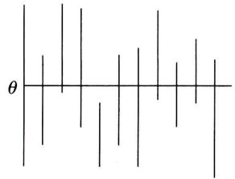  
图7-1

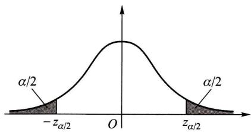  
图7-2

如果取  $1 - \alpha = 0.95$ , 即  $\alpha = 0.05$ , 又若  $\sigma = 1, n = 16$ , 查表得  $z_{\alpha /2} = z_{0.025} = 1.96$ . 于是我们得到一个置信水平为 0.95 的置信区间

$$
\left(\overline{X} \pm \frac{1}{\sqrt{16}} \times 1.96\right), \quad \text{即} (\overline{X} \pm 0.49). \tag{4.7}
$$

再者, 若由一个样本值算得样本均值的观察值  $\bar{x} = 5.20$ , 则得到一个区间

注意, 这已经不是随机区间了. 但我们仍称它为  $\theta$  的置信水平为 0.95 的置信区间. 其含义是: 若反复抽样多次, 每个样本值  $(n = 16)$  按 (4.7) 式确定一个区间, 按上面的解释, 在这么多的区间中, 包含  $\mu$  的约占  $95\%$ , 不包含  $\mu$  的约仅占  $5\%$ . 现在抽样得到区间 (4.71,5.69), 则该区间属于那些包含  $\mu$  的区间的可信程度为  $95\%$ , 或"该区间包含  $\mu$ "这一陈述的可信程度为  $95\%$ .

置信水平为  $1 - \alpha$  的置信区间并不是唯一的. 以上例来说, 若给定  $\alpha = 0.05$ , 则又有

$$
P\left\{-z_{0.04}< \frac{\overline{X} - \mu}{\sigma / \sqrt{n}} < z_{0.01}\right\} = 0.95,
$$

即  $P\left\{\overline{X} - \frac{\sigma}{\sqrt{n}} z_{0.01}< \mu < \overline{X} +\frac{\sigma}{\sqrt{n}} z_{0.04}\right\} = 0.95.$

故  $\left(\overline{X} - \frac{\sigma}{\sqrt{n}} z_{0.01}, \overline{X} +\frac{\sigma}{\sqrt{n}} z_{0.04}\right)$  (4.8)

也是  $\mu$  的置信水平为 0.95 的置信区间. 我们将它与 (4.5) 式中令  $\alpha = 0.05$  所得的置信水平为 0.95 的置信区间相比较, 可知由 (4.5) 式所确定的区间的长度为  $2 \times \frac{\sigma}{\sqrt{n}} z_{0.025} = 3.92 \times \frac{\sigma}{\sqrt{n}}$ , 这一长度要比区间 (4.8) 式的长度  $\frac{\sigma}{\sqrt{n}} (z_{0.04} + z_{0.01}) = 4.08 \times \frac{\sigma}{\sqrt{n}}$  短. 置信区间短表示估计的精度高. 故由 (4.5) 式给出的区间较 (4.8) 式为优. 易知, 像  $N(0,1)$  分布那样其概率密度的图形是单峰且对称的情况, 当  $n$  固定时, 以形如 (4.5) 式那样的区间其长度为最短, 我们自然选用它.

参考上例可得寻求未知参数  $\theta$  的置信区间的具体做法如下.

$1^{\circ}$  寻求一个样本  $X_{1}, X_{2}, \dots , X_{n}$  和  $\theta$  的函数  $W = W(X_{1}, X_{2}, \dots , X_{n}; \theta)$ , 使得  $W$  的分布不依赖于  $\theta$  以及其他未知参数, 称具有这种性质的函数  $W$  为枢轴量.

$2^{\circ}$  对于给定的置信水平  $1 - \alpha$ , 定出两个常数  $a, b$  使得

$$
P\{a< W(X_{1}, X_{2}, \dots , X_{n}; \theta)< b\} = 1 - \alpha .
$$

若能从  $a< W(X_{1}, X_{2}, \dots , X_{n}; \theta)< b$  得到与之等价的  $\theta$  的不等式  $\underline{\theta} < \theta < \overline{\theta}$ , 其中

$\theta = \underline{\theta} (X_{1},X_{2},\dots ,X_{n}),\bar{\theta} = \bar{\theta} (X_{1},X_{2},\dots ,X_{n})$  都是统计量,那么  $(\underline{\theta},\bar{\theta})$  就是  $\theta$  的一个置信水平为  $1 - \alpha$  的置信区间.

枢轴量  $W(X_{1},X_{2},\dots ,X_{n};\theta)$  的构造,通常可以从  $\theta$  的点估计着手考虑.常用的正态总体的参数的置信区间可以用上述步骤推得.

# $\S 5$  正态总体均值与方差的区间估计

# (一)单个总体  $N(\mu ,\sigma^{2})$  的情况

设已给定置信水平为  $1 - \alpha$  ,并设  $X_{1},X_{2},\dots ,X_{n}$  为总体  $N(\mu ,\sigma^{2})$  的样本.  $\overline{X}$ $S^{2}$  分别是样本均值和样本方差.

1. 均值  $\mu$  的置信区间

(1)  $\sigma^{2}$  为已知,此时由  $\S 4$  例1采用(4.2)式中的枢轴量  $\frac{\overline{X} - \mu}{\sigma / \sqrt{n}}$  ,已得到  $\mu$  的一个置信水平为  $1 - \alpha$  的置信区间为

$$
\Big(\overline{{X}}\pm \frac{\sigma}{\sqrt{n}} z_{a / 2}\Big). \tag{5.1}
$$

(2)  $\sigma^{2}$  为未知,此时不能使用(5.1)式给出的区间,因其中含未知参数  $\sigma$  .考虑到  $S^{2}$  是  $\sigma^{2}$  的无偏估计,将(4.2)式中的  $\sigma$  换成  $S = \sqrt{S^{2}}$  ,由第六章  $\S 3$  定理4,知

$$
\frac{\overline{{X}} - \mu}{S / \sqrt{n}}{\sim} t(n - 1), \tag{5.2}
$$

并且右边的分布  $t(n - 1)$  不依赖于任何未知参数.使用  $\frac{\overline{{X}} - \mu}{S / \sqrt{n}}$  作为枢轴量可得

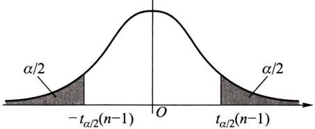  
图7-3

(参见图7- 3)

$$
P\Bigg\{-t_{a / 2}(n - 1)< \frac{\overline{{X}} - \mu}{S / \sqrt{n}} < t_{a / 2}(n - 1)\Bigg\} = 1 - \alpha , \tag{5.3}
$$

即

$$
P\Bigg\{\overline{{X}} -\frac{S}{\sqrt{n}} t_{a / 2}(n - 1)< \mu < \overline{{X}} +\frac{S}{\sqrt{n}} t_{a / 2}(n - 1)\Bigg\} = 1 - \alpha .
$$

于是得  $\mu$  的一个置信水平为  $1 - \alpha$  的置信区间

$$
\Big(\overline{{X}}\pm \frac{S}{\sqrt{n}} t_{a / 2}(n - 1)\Big). \tag{5.4}
$$

例1有一大批糖果.现从中随机地取16袋,称得质量(以  $\mathbf{g}$  计)如下:

设袋装糖果的质量近似地服从正态分布,试求总体均值  $\mu$  的置信水平为0.95的置信区间.

解这里  $1 - \alpha = 0.95,\alpha /2 = 0.025,n - 1 = 15,t_{0.025}(15) = 2.1315$  ,由给出的数据算得  $\bar{x} = 503.75,s = 6.2022.$  由(5.4)式得均值  $\mu$  的一个置信水平为0.95的置信区间为

$$
\left(503.75\pm \frac{6.2022}{\sqrt{16}}\times 2.1315\right),
$$

即

这就是说估计袋装糖果质量的均值在  $500.4\mathrm{g}$  与  $507.1\mathrm{g}$  之间,这个估计的可信程度为  $95\%$  .若以此区间内任一值作为  $\mu$  的近似值,其误差不大于  $\frac{6.2022}{\sqrt{16}}\times$ $2.1315\times 2 = 6.61(\mathrm{g})$  ,这个误差估计的可信程度为  $95\%$  口

在实际问题中,总体方差  $\sigma^{2}$  未知的情况居多,故区间(5.4)式较区间(5.1)式有更大的实用价值.

2. 方差  $\sigma^{2}$  的置信区间

此处,根据实际问题的需要,只介绍  $\mu$  未知的情况,

$\sigma^{2}$  的无偏估计为  $S^{2}$  ,由第六章  $\S 3$  定理3知

$$
\frac{(n - 1)S^{2}}{\sigma^{2}}\sim \chi^{2}(n - 1), \tag{5.5}
$$

并且上式右端的分布不依赖于任何未知参数,取  $\frac{(n - 1)S^{2}}{\sigma^{2}}$  作为枢轴量,即得(参见图7- 4)

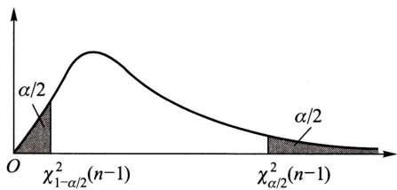  
图7-4

$$
P\left\{\chi_{1 - \alpha /2}^{2}(n - 1)< \frac{(n - 1)S^{2}}{\sigma^{2}}{< \chi_{\alpha /2}^{2}(n - 1)}\right\} = 1 - \alpha , \tag{5.6}
$$

即  $P\left\{\frac{(n - 1)S^{2}}{\chi_{\alpha /2}^{2}(n - 1)}{< \sigma^{2}}{< \frac{(n - 1)S^{2}}{\chi_{1 - \alpha /2}^{2}(n - 1)}}\right\} = 1 - \alpha .$  (5.6)

这就得到方差  $\sigma^{2}$  的一个置信水平为  $1 - \alpha$  的置信区间

$$
\Big(\frac{(n - 1)S^{2}}{\chi_{\alpha /2}^{2}(n - 1)},\frac{(n - 1)S^{2}}{\chi_{1 - \alpha /2}^{2}(n - 1)}\Big). \tag{5.7}
$$

由  $(5.6)^{\prime}$  式,还可得到标准差  $\sigma$  的一个置信水平为  $1 - \alpha$  的置信区间

$$
\left(\frac{\sqrt{n - 1}S}{\sqrt{\chi_{\alpha / 2}^{2}(n - 1)}},\frac{\sqrt{n - 1}S}{\sqrt{\chi_{1 - \alpha / 2}^{2}(n - 1)}}\right). \tag{5.8}
$$

注意,在概率密度函数不对称时,如  $\chi^{2}$  分布和  $F$  分布,习惯上仍是取对称的分位数(如图7一4中的上分位数  $\chi_{1 - \alpha /2}^{2}(n - 1)$  与  $\chi_{\alpha /2}^{2}(n - 1)$ )来确定置信区间的.

例2求例1中总体标准差  $\sigma$  的置信水平为0.95的置信区间.

解现在  $\alpha /2 = 0.025,1 - \alpha /2 = 0.975,n - 1 = 15$  ,查表得  $\chi_{\alpha /\infty}^{2}$  (15)=27.488,  $\chi_{0.975}^{2}(15) = 6.262$  ,又  $s = 6.2022$  ,由(5.8)式得所求的标准差  $\sigma$  的一个置信水平为0.95的置信区间为

# (二)两个总体  $N(\mu_{1},\sigma_{1}^{2}),N(\mu_{2},\sigma_{2}^{2})$  的情况

在实际中常遇到下面的问题:已知产品的某一质量指标服从正态分布,但由于原料、设备条件、操作人员不同,或工艺过程的改变等因素,引起总体均值、总体方差有所改变.我们需要知道这些变化有多大,这就需要考虑两个正态总体均值差或方差比的估计问题.

设已给定置信水平为  $1 - \alpha$  ,并设  $X_{1},X_{2},\dots ,X_{n_{1}}$  是来自第一个总体的样本; $Y_{1},Y_{2},\dots ,Y_{n_{2}}$  是来自第二个总体的样本,这两个样本相互独立.且设  $\overline{{X}},\overline{{Y}}$  分别为第一、第二个总体的样本均值,  $S_{1}^{2},S_{2}^{2}$  分别是第一、第二个总体的样本方差.

1. 两个总体均值差  $\mu_{1} - \mu_{2}$  的置信区间

(1)  $\sigma_{1}^{2},\sigma_{2}^{2}$  均为已知.因  $\overline{{X}},\overline{{Y}}$  分别为  $\mu_{1},\mu_{2}$  的无偏估计,故  $\overline{{X}} -\overline{{Y}}$  是  $\mu_{1} - \mu_{2}$  的无偏估计.由  $\overline{{X}},\overline{{Y}}$  的独立性以及  $\overline{{X}}\sim N(\mu_{1},\sigma_{1}^{2} / n_{1}),\overline{{Y}}\sim N(\mu_{2},\sigma_{2}^{2} / n_{2})$  得

$$
\overline{{X}} -\overline{{Y}}\sim N\Big(\mu_{1} - \mu_{2},\frac{\sigma_{1}^{2}}{n_{1}} +\frac{\sigma_{2}^{2}}{n_{2}}\Big)
$$

或

$$
\frac{(\overline{{X}} - \overline{{Y}}) - (\mu_{1} - \mu_{2})}{\sqrt{\frac{\sigma_{1}^{2}}{n_{1}} + \frac{\sigma_{2}^{2}}{n_{2}}}}\sim N(0,1), \tag{5.9}
$$

取(5.9)式左边的函数为枢轴量,即得  $\mu_{1} - \mu_{2}$  的一个置信水平为  $1 - \alpha$  的置信区间

$$
\left(\overline{{X}} -\overline{{Y}}\pm z_{\alpha /2}\sqrt{\frac{\sigma_{1}^{2}}{n_{1}} + \frac{\sigma_{2}^{2}}{n_{2}}}\right). \tag{5.10}
$$

(2)  $\sigma_{1}^{2} = \sigma_{2}^{2} = \sigma^{2}$  ,但  $\sigma^{2}$  为未知.此时,由第六章  $\S 3$  定理5

$$
\frac{(\overline{{X}} - \overline{{Y}}) - (\mu_{1} - \mu_{2})}{S_{w}\sqrt{\frac{1}{n_{1}} + \frac{1}{n_{2}}}}\sim t(n_{1} + n_{2} - 2). \tag{5.11}
$$

取(5.11)式左边的函数为枢轴量,可得  $\mu_{1} - \mu_{2}$  的一个置信水平为  $1 - \alpha$  的置信区间为

$$
\left(\overline{{X}} -\overline{{Y}}\pm t_{\alpha /2}(n_{1} + n_{2} - 2)S_{W}\sqrt{\frac{1}{n_{1}} + \frac{1}{n_{2}}}\right). \tag{5.12}
$$

此处  $S_{W}^{2} = \frac{(n_{1} - 1)S_{1}^{2} + (n_{2} - 1)S_{2}^{2}}{n_{1} + n_{2} - 2},\quad S_{W} = \sqrt{S_{W}^{2}}.$  (5.13)

例3为比较I,Ⅱ两种型号步枪子弹的枪口速度,随机地取I型子弹10发,得到枪口速度的平均值为  $\overline{{x}}_{1} = 500\mathrm{~m / s}$  ,标准差  $s_{1} = 1.10 \mathrm{m / s}$  ,随机地取Ⅱ型子弹20发,得到枪口速度的平均值为  $\overline{{x}}_{2} = 496 \mathrm{m / s}$  ,标准差  $s_{2} = 1.20 \mathrm{m / s}$  .假设两总体都可认为近似地服从正态分布,且由生产过程可认为方差相等.求两总体均值差  $\mu_{1} - \mu_{2}$  的一个置信水平为0.95的置信区间.

解按实际情况,可认为分别来自两个总体的样本是相互独立的.又因假设两总体的方差相等,但数值未知,故可用(5.12)式求均值差的置信区间.由于 $1 - \alpha = 0.95,\alpha /2 = 0.025,n_{1} = 10,n_{2} = 20,n_{1} + n_{2} - 2 = 28,t_{0.025}(28) = 2.0484.$ $s_{w}^{2} = (9\times 1.10^{2} + 19\times 1.20^{2}) / 28,s_{w} = \sqrt{s_{w}^{2}} = 1.1688$  ,故所求的两总体均值差 $\mu_{1} - \mu_{2}$  的一个置信水平为0.95的置信区间是

$$
\left(\overline{{x}}_{1} - \overline{{x}}_{2}\pm s_{w}\times t_{0.025}(28)\sqrt{\frac{1}{10} + \frac{1}{20}}\right) = (4\pm 0.93),
$$

即 (3.07,4.93).

本题中得到的置信区间的下限大于零,在实际中我们就认为  $\mu_{1}$  比  $\mu_{2}$  大.

例4为提高某一化学生产过程的得率,试图采用一种新的催化剂.为慎重起见,在实验工厂先进行试验.设采用原来的催化剂进行了  $n_{1} = 8$  次试验,得到得率的平均值  $\overline{{x}}_{1} = 91.73$  ,样本方差  $s_{1}^{2} = 3.89$  ;又采用新的催化剂进行了  $n_{2} = 8$  次试验,得到得率的平均值  $\overline{{x}}_{2} = 93.75$  ,样本方差  $s_{2}^{2} = 4.02$  .假设两总体都可认为服从正态分布,且方差相等,两样本独立.试求两总体均值差  $\mu_{1} - \mu_{2}$  的置信水平为0.95的置信区间.

解现在

$$
s_{w}^{2} = \frac{(n_{1} - 1)s_{1}^{2} + (n_{2} - 1)s_{2}^{2}}{n_{1} + n_{2} - 2} = 3.96,\quad s_{w} = \sqrt{3.96}.
$$

由(5.12)式得所求的置信区间为

$$
\left(\overline{{x}}_{1} - \overline{{x}}_{2}\pm t_{0.025}(14)s_{w}\sqrt{\frac{1}{8} + \frac{1}{8}}\right) = (-2.02\pm 2.13),
$$

即 (- 4.15,0.11).

由于所得置信区间包含零,在实际中我们就认为采用这两种催化剂所得的得率的均值没有显著差别. 口

2. 两个总体方差比  $\sigma_{1}^{2} / \sigma_{2}^{2}$  的置信区间

我们仅讨论总体均值  $\mu_{1}, \mu_{2}$  均为未知的情况,由第六章 §3 定理 5

$$
\frac{S_{1}^{2} / S_{2}^{2}}{\sigma_{1}^{2} / \sigma_{2}^{2}} \sim F(n_{1} - 1, n_{2} - 1), \tag{5.14}
$$

并且分布  $F(n_{1} - 1, n_{2} - 1)$  不依赖任何未知参数.取  $\frac{S_{1}^{2} / S_{2}^{2}}{\sigma_{1}^{2} / \sigma_{2}^{2}}$  为枢轴量得

$$
P\left\{F_{1 - \alpha /2}(n_{1} - 1, n_{2} - 1) < \frac{S_{1}^{2} / S_{2}^{2}}{\sigma_{1}^{2} / \sigma_{2}^{2}} < F_{\alpha /2}(n_{1} - 1, n_{2} - 1)\right\} = 1 = \alpha ,
$$

(5.15)

即

$$
P\left\{\frac{S_{1}^{2}}{S_{2}^{2}} \frac{1}{F_{\alpha / 2}(n_{1} - 1, n_{2} - 1)} < \frac{\sigma_{1}^{2}}{\sigma_{2}^{2}} < \frac{S_{1}^{2}}{S_{2}^{2}} \frac{1}{F_{1 - \alpha / 2}(n_{1} - 1, n_{2} - 1)}\right\} = 1 - \alpha .
$$

(5.15)

于是得  $\sigma_{1}^{2} / \sigma_{2}^{2}$  的一个置信水平为  $1 - \alpha$  的置信区间为

$$
\left(\frac{S_{1}^{2}}{S_{2}^{2}} \frac{1}{F_{\alpha / 2}(n_{1} - 1, n_{2} - 1)}, \frac{S_{1}^{2}}{S_{2}^{2}} \frac{1}{F_{1 - \alpha / 2}(n_{1} - 1, n_{2} - 1)}\right). \tag{5.16}
$$

例5研究由机器  $A$  和机器  $B$  生产的钢管的内径(以  $\mathrm{mm}$  计),随机抽取机器  $A$  生产的管子18只,测得样本方差  $s_{1}^{2} = 0.34$  ;抽取机器  $B$  生产的管子13只,测得样本方差  $s_{2}^{2} = 0.29$  .设两样本相互独立,且设由机器  $A$  ,机器  $B$  生产的管子的内径分别服从正态分布  $N(\mu_{1}, \sigma_{1}^{2}), N(\mu_{2}, \sigma_{2}^{2})$  ,这里  $\mu_{i}, \sigma_{i}^{2}(i = 1,2)$  均未知.试求方差比  $\sigma_{1}^{2} / \sigma_{2}^{2}$  的置信水平为0.90的置信区间.

解现在  $n_{1} = 18, s_{1}^{2} = 0.34, n_{2} = 13, s_{2}^{2} = 0.29, \alpha = 0.10, F_{\alpha /2}(n_{1} - 1, n_{2} - 1) = F_{0.05}(17,12) = 2.59, F_{1 - \alpha /2}(17,12) = F_{0.95}(17,12) = \frac{1}{F_{0.05}(12,17)} = \frac{1}{2.38}$ ,于是由(5.16)式得  $\sigma_{1}^{2} / \sigma_{2}^{2}$  的一个置信水平为0.90的置信区间为

$$
\left(\frac{0.34}{0.29} \times \frac{1}{2.59}, \frac{0.34}{0.29} \times 2.38\right),
$$

即 (0.45,2.79).

由于  $\sigma_{1}^{2} / \sigma_{2}^{2}$  的置信区间包含1,在实际中我们就认为  $\sigma_{1}^{2}, \sigma_{2}^{2}$  两者没有显著差别.

# §6 (0-1)分布参数的区间估计

设有一容量  $n > 50$  的大样本,它来自(0- 1)分布的总体  $X, X$  的分布律为

$$
f(x; p) = p^{x}(1 - p)^{1 - x}, \quad x = 0, 1, \tag{6.1}
$$

其中  $\boldsymbol{\mathscr{p}}$  为未知参数.现在来求  $\boldsymbol{\mathscr{p}}$  的置信水平为  $1 - \alpha$  的置信区间.

已知(0一1)分布的均值和方差分别为

$$
\mu = \phi ,\quad \sigma^{2} = \phi (1 - \phi). \tag{6.2}
$$

设  $X_{1},X_{2},\dots ,X_{n}$  是一个样本.因样本容量  $n$  较大,由中心极限定理,知

$$
\frac{\sum_{i = 1}^{n}X_{i} - n p}{\sqrt{n p(1 - p)}} = \frac{n\overline{{X}} - n p}{\sqrt{n p(1 - p)}} \tag{6.3}
$$

近似地服从  $N(0,1)$  分布,于是有

$$
P\left\{-z_{a / 2}< \frac{n\overline{{X}} - n p}{\sqrt{n p(1 - p)}} < z_{a / 2}\right\} \approx 1 - \alpha . \tag{6.4}
$$

而不等式  $- z_{a / 2}< \frac{n\overline{{X}} - n p}{\sqrt{n p(1 - p)}} < z_{a / 2}$  (6.5)

等价于

$$
(n + z_{a / 2}^{2})p^{2} - (2n\overline{{X}} +z_{a / 2}^{2})p + n\overline{{X}}^{2}< 0. \tag{6.6}
$$

记  $\scriptstyle{p_{1} = \frac{1}{2a} (- b - \sqrt{b^{2} - 4a c}),}$  (6.7)

$$
p_{2} = \frac{1}{2a} (-b + \sqrt{b^{2} - 4a c}), \tag{6.8}
$$

此处  $a = n + z_{a / 2}^{2},b = - (2n\overline{{X}} +z_{a / 2}^{2}),c = n\overline{{X}}^{2}$  .于是由(6.5)式得  $\boldsymbol{\mathscr{p}}$  的一个近似的置信水平为  $1 - \alpha$  的置信区间为

$$
(p_{1},p_{2}).
$$

例设自一大批产品的100个样品中,得一级品60个,求这批产品的一级品率  $\boldsymbol{\mathscr{p}}$  的置信水平为0.95的置信区间.

解一级品率  $\boldsymbol{\mathscr{p}}$  是(0一1)分布的参数,此处  $n = 100,\overline{{x}} = 60 / 100 = 0.6,1 - \alpha =$ $0.95,\alpha /2 = 0.025,z_{a / 2} = 1.96$  ,按(6.7),(6.8)式来求  $\boldsymbol{\mathscr{p}}$  的置信区间,其中

$$
a = n + z_{a / 2}^{2} = 103.84,\quad b = -(2n\overline{{x}} +z_{a / 2}^{2}) = -123.84,\quad c = n\overline{{x}}^{2} = 36.
$$

于是  $\scriptstyle{p_{1} = 0.50,\qquad p_{2} = 0.69. }$

故得  $\boldsymbol{\mathscr{p}}$  的一个置信水平为0.95的近似置信区间为

(0.50,0.69).

# $\S 7$  单侧置信区间

在上述讨论中,对于未知参数  $\theta$  ,我们给出两个统计量  $\theta ,\bar{\theta}$  ,得到  $\theta$  的双侧置信区间  $(\theta ,\bar{\theta})$  .但在某些实际问题中,例如,对于设备、元件的寿命来说,平均寿命长是我们所希望的,我们关心的是平均寿命  $\theta$  的"下限";与之相反,在考虑化学药品中杂

质含量的均值  $\mu$  时,我们常关心参数  $\mu$  的"上限"。这就引出了单侧置信区间的概念。

对于给定值  $\alpha (0< \alpha < 1)$ ,若由样本  $X_{1}, X_{2}, \dots , X_{n}$  确定的统计量  $\underline{\theta} = \underline{\theta} (X_{1}, X_{2}, \dots , X_{n})$ ,对于任意  $\theta \in \Theta$  满足

$$
P\{\theta >\underline{\theta}\} \geqslant 1 - \alpha , \tag{7.1}
$$

称随机区间  $(\theta , \infty)$  是  $\theta$  的置信水平为  $1 - \alpha$  的单侧置信区间,  $\theta$  称为  $\theta$  的置信水平为  $1 - \alpha$  的单侧置信下限。

又若统计量  $\bar{\theta} = \bar{\theta} (X_{1}, X_{2}, \dots , X_{n})$ ,对于任意  $\theta \in \Theta$  满足

$$
P\{\theta < \bar{\theta}\} \geqslant 1 - \alpha , \tag{7.2}
$$

称随机区间  $(- \infty , \bar{\theta})$  是  $\theta$  的置信水平为  $1 - \alpha$  的单侧置信区间,  $\bar{\theta}$  称为  $\theta$  的置信水平为  $1 - \alpha$  的单侧置信上限。

例如对于正态总体  $X$  ,若均值  $\mu$  ,方差  $\sigma^{2}$  均为未知,设  $X_{1},X_{2},\dots ,X_{n}$  是一个样本,由

$$
\frac{\overline{X} - \mu}{S / \sqrt{n}} \sim t(n - 1)
$$

有(见图7- 5)

$$
P\left\{\frac{\overline{X} - \mu}{S / \sqrt{n}} < t_{\alpha}(n - 1)\right\} = 1 - \alpha ,
$$

即  $P\left\{\mu > X - \frac{S}{\sqrt{n}} t_{\alpha}(n - 1)\right\} = 1 - \alpha .$

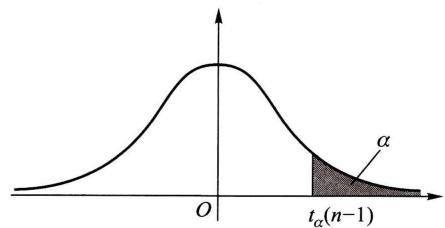  
图7-5

于是得到  $\mu$  的置信水平为  $1 - \alpha$  的单侧置信区间

$$
\left(\overline{X} - \frac{S}{\sqrt{n}} t_{\alpha}(n - 1), \infty\right). \tag{7.3}
$$

$\mu$  的置信水平为  $1 - \alpha$  的单侧置信下限为

$$
\mu = \overline{X} - \frac{S}{\sqrt{n}} t_{\alpha}(n - 1). \tag{7.4}
$$

又由

$$
\frac{(n - 1)S^{2}}{\sigma^{2}} \sim \chi^{2}(n - 1),
$$

有(见图7- 6)

即

$$
\begin{array}{r l} & {P\Bigg\{\frac{(n - 1)S^{2}}{\sigma^{2}}{>}\chi_{1 - \alpha}^{2}(n - 1)\Bigg\} = 1 - \alpha ,}\\ & {\quad P\Bigg\{\sigma^{2}{<}\frac{(n - 1)S^{2}}{\chi_{1 - \alpha}^{2}(n - 1)}\Bigg\} = 1 - \alpha .} \end{array}
$$

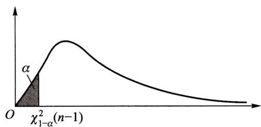  
图7-6

于是得  $\sigma^{2}$  的置信水平为  $1 - \alpha$  的单侧置信区间

$$
\left(0, \frac{(n - 1) S^{2}}{\chi_{1 - \alpha}^{2}(n - 1)}\right). \tag{7.5}
$$

$\sigma^{2}$  的置信水平为  $1 - \alpha$  的单侧置信上限为

$$
\overline{\sigma^{2}} = \frac{(n - 1) S^{2}}{\chi_{1 - \alpha}^{2}(n - 1)}. \tag{7.6}
$$

例从一批灯泡中随机地取5只作寿命试验,测得寿命(以h计)为

设灯泡寿命服从正态分布.求灯泡寿命均值的置信水平为0.95的单侧置信下限.

解  $1 - \alpha = 0.95, n = 5, t_{\alpha}(n - 1) = t_{0.05}(4) = 2.1318, \bar{x} = 1160, s^{2} = 9950$ . 由(7.4)式得所求单侧置信下限为

$$
\mu = \bar{x} - \frac{s}{\sqrt{n}} t_{\alpha}(n - 1) = 1065.
$$

小结

参数估计问题分为点估计和区间估计.点估计是适当地选择一个统计量作为未知参数的估计(称为估计量),若已取得一样本,将样本值代入估计量,得到估计量的值,以估计量的值作为未知参数的近似值(称为估计值).

本章介绍了两种求点估计的方法:矩估计法和最大似然估计法,

矩估计法的做法是:以样本矩作为总体矩的估计量,而以样本矩的连续函数作为相应的总体矩的连续函数的估计量,从而得到总体未知参数的估计.

最大似然估计法的基本想法是,若已观察到样本  $(X_{1}, X_{2}, \dots , X_{n})$  的样本值  $(x_{1}, x_{2}, \dots ,$

$x_{n}$  ),而取到这一样本值的概率为  $\boldsymbol{\mathscr{p}}$  (在离散型的情况),或  $(X_{1},X_{2},\dots ,X_{n})$  落在这一样本值 $(x_{1},x_{2},\dots ,x_{n})$  的邻域内的概率为  $\boldsymbol{\mathscr{p}}$  (在连续型的情况),而  $\boldsymbol{\mathscr{p}}$  与未知参数有关,我们就取  $\theta$  的估计值使概率  $\boldsymbol{\mathscr{p}}$  取到最大.

对于一个未知参数可以提出不同的估计量,因此自然提出比较估计量的好坏的问题,这就需要给出评定估计量好坏的标准.估计量是一个随机变量,对于不同的样本值,一般给出参数的不同估计值.因而在考虑估计量的好坏时,应从某种整体性能去衡量,而不能看它在个别样本之下表现如何.本章介绍了三个标准:无偏性、有效性和相合性.相合性是对估计量的一个基本要求,不具备相合性的估计量,我们一般是不考虑的.

点估计不能反映估计的精度,我们引人了区间估计.置信区间是一个随机区间  $(\underline{{\theta}},\overline{{\theta}})$  ,它覆盖未知参数具有预先给定的高概率(置信水平),即对于任意  $\theta \in \theta$  ,有

$$
P\{\theta < \theta < \overline{{\theta}}\} \geqslant 1 - \alpha .
$$

例如,对于正态分布  $N(\mu ,\sigma^{2}),\sigma^{2}$  未知,可得  $\mu$  的一个置信水平为  $1 - \alpha$  的置信区间为

$$
\left(\overline{{X}} -t_{\alpha /2}(n - 1)\frac{S}{\sqrt{n}},\quad \overline{{X}} +t_{\alpha /2}(n - 1)\frac{S}{\sqrt{n}}\right), \tag{5.4}
$$

就是说这一随机区间覆盖  $\mu$  的概率  $\geqslant 1 - \alpha$  .一旦有了一个样本值  $x_{1},x_{2},\dots ,x_{n}$  ,将它代入(5.4)式,得到一个数字区间

$$
\left(\bar{x} -t_{\alpha /2}(n - 1)\frac{s}{\sqrt{n}},\quad \bar{x} +t_{\alpha /2}(n - 1)\frac{s}{\sqrt{n}}\right)\overset {\mathrm{i}\overline{{\mathbb{E}}}\mathbb{E}}{=} (-c,c),
$$

$(- c,c)$  也称为  $\mu$  的置信水平为  $1 - \alpha$  的置信区间,意指"  $(- c,c)$  包含  $\mu$  "这一陈述的可信程度为  $1 - \alpha$  ,如果将这事实写成  $P\{- c< \mu < c\} = 1 - \alpha$  是错误的,因为  $(- c,c)$  是一个数字区间,要么有  $\mu \in (- c,c)$  ,此时  $P\{- c< \mu < c\} = 1$  ;要么有  $\mu \notin (- c,c)$  ,此时  $P\{- c< \mu < c\} = 0$

本章还介绍了单侧置信区间,例如,对于正态分布  $N(\mu ,\sigma^{2}),\sigma^{2}$  未知,可得  $\mu$  的置信水平为  $1 - \alpha$  的单侧置信区间为

(i)  $\left(-\infty ,\quad \overline{{X}} +t_{\alpha}(n - 1)\frac{S}{\sqrt{n}}\right)$  单侧置信上限为  $\overline{{\mu}} = \overline{{X}} +t_{\alpha}(n - 1)\frac{S}{\sqrt{n}}.$

(ii)  $\left(\overline{{X}} - t_{\alpha}(n - 1)\frac{S}{\sqrt{n}},\quad \infty\right)$  单侧置信下限为  $\underline{{\mu}} = \overline{{X}} - t_{\alpha}(n - 1)\frac{S}{\sqrt{n}}.$

在形式上,只需将置信区间(5.4)式的上下限中的"  $\alpha /2^{\prime \prime}$  改成"  $\alpha^{\prime \prime}$  ,就得到相应的单侧置信上下限了.

# 重要术语及主题

矩估计量 最大似然估计量

估计量的评选标准:无偏性、有效性、相合性

参数  $\theta$  的置信水平为  $1 - \alpha$  的置信区间 枢轴量

参数  $\theta$  的单侧置信上限和单侧置信下限

单个正态总体均值、方差的置信区间、单侧置信上限与单侧置信下限(见表7一1)

两个正态总体均值差、方差比的置信区间、单侧置信上限与单侧置信下限(见表7一1)

1-7  

<table><tr><td>单位：m2</td><td>单位：m2</td><td>单位：m2</td><td>单位：m2</td><td>单位：m2</td><td>单位：m2</td><td>单位：m2</td><td>单位：m2</td><td>单位：m2</td><td>单位：m2</td><td>单位：m2</td><td>单位：m2</td><td>单位：m2</td><td>单位：m2</td><td>单位：m2&lt;ftd&gt;单位：m2</td><td>单位：m2</td><td>单位：m2</td><td>单位：m2</td><td>单位：m2</td><td>单位：m2</td><td>单位：m2</td><td>单位：m2</td><td>单位：m2</td><td>单位：m2</td><td>单位：m2</td><td>单位：m2</td><td>单位：m2</td><td>单位：m2</td><td>单</td><td>单</td><td>单</td><td>单</td><td>单</td><td>单</td><td>单</td><td>单</td><td>单</td><td>单</td><td>单</td><td>单</td><td>单</td><td>单</td><td>单</td><td>单</td><td>单</td><td>单</td><td>单</td><td>单</td><td>单</td><td>单</td><td>单</td><td>单</td><td>单</td><td>单位：m2</td><td>单位：m2</td><td>单位：m2</td><td>单位：m2</td><td>单位：m2</td><td>单位：m2</td><td>单位：m2</td><td>单位：m2</td><td>单位：m2</td><td>单位：m2</td><td>单位：m2</td><td>单位：m2</td><td>单位：m2</td><td>单位：m2&lt;f摇</td><td>单位：m2</td><td>单位：m2</td><td>单位：m2</td><td>单位：m2</td><td>单位：m2</td><td>单位：m2</td><td>单位：m2</td><td>单位：m2</td><td>单位：m2</td><td>单位：m2</td><td>单位：m2</td><td>单位：m2</td><td>单位：m2</td><td>单位：m2&lt;f</td><td>单位：m2</td><td>单位：m2</td><td>单位：m2</td><td>单位：m2</td><td>单位：m2</td><td>单位：m2</td><td>单位：m2</td><td>单位：m2</td><td>单位：m2</td><td>单位：m2</td><td>单位：m2</td><td>单位：m2</td><td>单位：m2</td><td>单位：m2&lt;f_f</td><td>单位：m2</td><td>单位：m2</td><td>单位：m2</td><td>单位：m2</td><td>单位：m2</td><td>单位：m2</td><td>单位：m2</td><td>单位：m2</td><td>单位：m2</td><td>单位：m2</td><td>单位：m2</td><td>单位：m2</td><td>单位：m2</td><td>单位：m2&lt;f.f</td><td>单位：m2</td><td>单位：m2</td><td>单位：m2</td><td>单位：m2</td><td>单位：m2</td><td>单位：m2</td><td>单位：m2</td><td>单位：m2</td><td>单位：m2</td><td>单位：m2</td><td>单位：m2</td><td>单位：m2</td><td>单位：m2</td><td>单位：m2&lt;fecel&gt;</td><td>单位：m2</td><td>单位：m2</td><td>单位：m2</td><td>单位：m2</td><td>单位：m2</td><td>单位：m2</td><td>单位：m2</td><td>单位：m2</td><td>单位：m2</td><td>单位：m2</td><td>单位：m2</td><td>单位：m2</td><td>单位：m2</td><td>单位：m2</td><td>F</td><td>S1/S2</td><td>F2/S3</td><td>F3/S4</td><td>F4/S5</td><td>F5/S6</td><td>F6/S7</td><td>F7/S8</td><td>F8/S9</td><td>F9/S10</td><td>F10/S11</td><td>F11/S12</td><td>F12/S13</td><td>F14/S14</td><td>F15/S15</td><td>F16/S16</td><td>F17/S17</td><td>F18/S18</td><td>F19/S19</td><td>F20/S20</td><td>F21/S21</td><td>F22/S22</td><td>F23/S23</td><td>F24/S24</td><td>F25/S25</td><td>F26/S26</td><td>F27/S27</td><td>F28/S28</td><td>F29/S29</td><td>F30/S30</td><td>F31/S31</td><td>F32/S32</td><td>F33/S33</td><td>F34/S34</td><td>F35/S35</td><td>F36/S36</td><td>F37/S37</td><td>F38/S38</td><td>F39/S39</td><td>F40/S40</td><td>F41/S41</td><td>F42/S42</td><td>F43/S43</td><td>F44/S44</td><td>F45/S45</td><td>F46/S46</td><td>F47/S47</td><td>F48/S48</td><td>F49/S49</td><td>F50/S50</td><td>F51/S51</td><td>F52/S52</td><td>F53/S53</td><td>F54/S54</td><td>F55/S55</td><td>F56/S56</td><td>F57/S57</td><td>F58/S58</td><td>F59/S59</td><td>F60/S60</td><td>F61/S61</td><td>F62/S62</td><td>F63/S63</td><td>F64/S64</td><td>F65/S65</td><td>F66/S66</td><td>F67/S67</td><td>F68/S68</td><td>F69/S69</td><td>F70/S70</td><td>F71/S71</td><td>F72/S72</td><td>F73/S73</td><td>F74/S74</td><td>F75/S75</td><td>F76/S76</td><td>F77/S77</td><td>F78/S78</td><td>F79/S79</td><td>F80/S80</td><td>F81/S81</td><td>F82/S82</td><td>F83/S83</td><td>F84/S84</td><td>F85/S85</td><td>F86/S86</td><td>F87/S87</td><td>F88/S88</td><td>F89/S89</td><td>F90/S90</td><td>F91/S91</td><td>F92/S92</td><td>F93/S93</td><td>F94/S94</td><td>F95/S95</td><td>F96/S96</td><td>F97/S97</td><td>F98/S98</td><td>F99/S99</td><td>F100/S100</td><td>F101/S101</td><td>F102/S102</td><td>F103/S103</td><td>F104/S104</td><td>F105/S105</td><td>F106/S106</td><td>F107/S107</td><td>F108/S108</td><td>F109/S109</td><td>F110/S110</td><td>F111/S111</td><td>F112/S112</td><td>F113/S113</td><td>F114/S114</td><td>F115/S115</td><td>F116/S116</td><td>F117/S117</td><td>F118/S118</td><td>F119/S119</td><td>F120/S120</td><td>F121/S121</td><td>F122/S122</td><td>F123/S123</td><td>F124/S124</td><td>F125/S125</td><td>F126/S126</td><td>F127/S127</td><td>F128/S128</td><td>F129/S129</td><td>F130/S130</td><td>F131/S131</td><td>F132/S132</td><td>F133/S133</td><td>F134/S134</td><td>F135/S135</td><td>F136/S136</td><td>F137/S137</td><td>F138/S138</td><td>F139/S139</td><td>F140/S140</td><td>F141/S141</td><td>F142/S142</td><td>F143/S143</td><td>F144/S144</td><td>F145/S145</td><td>F146/S146</td><td>F147/S147</td><td>F148/S148</td><td>F149/S149</td><td>F150/S150</td><td>F151/S151</td><td>F152/S152</td><td>F153/S153</td><td>F154/S154</td><td>F155/S155</td><td>F156/S156</td><td>F157/S157</td><td>F158/S158</td><td>F159/S159</td><td>F160/S160</td><td>F161/S161</td><td>F162/S162</td><td>F163/S163</td><td>F164/S164</td><td>F165/S165</td><td>F166/S166</td><td>F167/S167</td><td>F168/S168</td><td>F169/S169</td><td>F170/S170</td><td>F171/S171</td><td>F172/S172</td><td>F173/S173</td><td>F174/S174</td><td>F175/S175</td><td>F176/S176</td><td>F177/S177</td><td>F178/S178</td><td>F179/S179</td><td>F180/S180</td><td>F181/S181</td><td>F182/S182</td><td>F183/S183</td><td>F184/S184</td><td>F185/S185</td><td>F186/S186</td><td>F187/S187</td><td>F188/S188</td><td>F189/S189</td><td>F190/S190</td><td>F191/S191</td><td>F192/S192</td><td>F193/S193</td><td>F194/S194</td><td>F195/S195</td><td>F196/S196</td><td>F197/S197</td><td>F198/S198</td><td>F199/S199</td><td>F200/S200</td><td>F201/S201</td><td>F202/S202</td><td>F203/S203</td><td>F204/S204</td><td>F205/S205</td><td>F206/S206</td><td>F207/S207</td><td>F208/S208</td><td>F209/S209</td><td>F210/S210</td><td>F211/S211</td><td>F212/S212</td><td>F213/S213</td><td>F214/S214</td><td>F215/S215</td><td>F216/S216</td><td>F217/S217</td><td>F218/S218</td><td>F219/S219</td><td>F220/S220</td><td>F221/S221</td><td>F222/S222</td><td>F223/S223</td><td>F224/S224</td><td>F225/S225</td><td>F226/S226</td><td>F227/S227</td><td>F228/S228</td><td>F229/S229</td><td>F230/S230</td><td>F231/S231</td><td>F232/S232</td><td>F233/S233</td><td>F234/S234</td><td>F235/S235</td><td>F236/S236</td><td>F237/S237</td><td>F238/S238</td><td>F239/S239</td><td>F240/S240</td><td>F241/S241</td><td>F242/S242</td><td>F243/S243</td><td>F244/S244</td><td>F245/S245</td><td>F246/S246</td><td>F247/S247</td><td>F248/S248</td><td>F249/S249</td><td>F250/S250</td><td>F251/S251</td><td>F252/S252</td><td>F253/S253</td><td>F254/S254</td><td>F255/S255</td><td>F256/S256</td><td>F257/S257</td><td>F258/S258</td><td>F259/S259</td><td>F260/S260</td><td>F261/S261</td><td>F262/S262</td><td>F263/S263</td><td>F264/S264</td><td>F265/S265</td><td>F266/S266</td><td>F267/S267</td><td>F268/S268</td><td>F269/S269</td><td>F270/S270</td><td>F271/S271</td><td>F272/S272</td><td>F273/S273</td><td>F274/S274</td><td>F275/S275</td><td>F276/S276</td><td>F277/S277</td><td>F278/S278</td><td>F279/S279</td><td>F280/S280</td><td>F281/S281</td><td>F282/S282</td><td>F283/S283</td><td>F284/S284</td><td>F285/S285</td><td>F286/S286</td><td>F287/S287</td><td>F288/S288</td><td>F289/S289</td><td>F290/S290</td><td>F291/S291</td><td>F292/S292</td><td>F293/S293</td><td>F294/S294</td><td>F295/S295</td><td>F296/S296</td><td>F297/S297</td><td>F298/S298</td><td>F299/S299</td><td>F300/S300</td><td>F301/S301</td><td>F302/S302</td><td>F303/S303</td><td>F304/S304</td><td>F305/S305</td><td>F306/S306</td><td>F307/S307</td><td>F308/S308</td><td>F309/S309</td><td>F310/S310</td><td>F311/S311</td><td>F312/S312</td><td>F313/S313</td><td>F314/S314</td><td>F315/S315</td><td>F316/S316</td><td>F317/S317</td><td>F318/S318</td><td>F319/S319</td><td>F320/S320</td><td>F321/S321</td><td>F322/S322</td><td>F323/S323</td><td>F324/S324</td><td>F325/S325</td><td>F326/S326</td><td>F327/S327</td><td>F328/S328</td><td>F329/S329</td><td>F330/S330</td><td>F331/S331</td><td>F332/S332</td><td>F333/S333</td><td>F334/S334</td><td>F335/S335</td><td>F336/S336</td><td>F337/S337</td><td>F338/S338</td><td>F339/S339</td><td>F340/S340</td><td>F341/S341</td><td>F342/S342</td><td>F343/S343</td><td>F344/S344</td><td>F345/S345</td><td>F346/S346</td><td>F347/S347</td><td>F348/S348</td><td>F349/S349</td><td>F350/S350</td><td>F351/S351</td><td>F352/S352</td><td>F353/S353</td><td>F354/S354</td><td>F355/S355</td><td>F356/S356</td><td>F357/S357</td><td>F358/S358</td><td>F359/S359</td><td>F360/S360</td><td>F361/S361</td><td>F362/S362</td><td>F363/S363</td><td>F364/S364</td><td>F365/S365</td><td>F366/S366</td><td>F367/S367</td><td>F368/S368</td><td>F369/S369</td><td>F370/S370</td><td>F371/S371</td><td>F372/S372</td><td>F373/S373</td><td>F374/S374</td><td>F375/S375</td><td>F376/S376</td><td>F377/S377</td><td>F378/S378</td><td>F379/S379</td><td>F380/S380</td><td>F381/S381</td><td>F382/S382</td><td>F383/S383</td><td>F384/S384</td><td>F385/S385</td><td>F386/S386</td><td>F387/S387</td><td>F388/S388</td><td>F389/S389</td><td>F390/S390</td><td>F391/S391</td><td>F392/S392</td><td>F393/S393</td><td>F394/S394</td><td>F395/S395</td><td>F396/S396</td><td>F397/S397</td><td>F398/S398</td><td>F399/S399</td><td>F400/S400</td><td>F401/S401</td><td>F402/S402</td><td>F403/S403</td><td>F404/S404</td><td>F405/S405</td><td>F406/S406</td><td>F407/S407</td><td>F408/S408</td><td>F409/S409</td><td>F410/S410</td><td>F411/S411</td><td>F412/S412</td><td>F413/S413</td><td>F414/S414</td><td>F415/S415</td><td>F416/S416</td><td>F417/S417</td><td>F418/S418</td><td>F419/S419</td><td>F420/S420</td><td>F421/S421</td><td>F422/S422</td><td>F423/S423</td><td>F424/S424</td><td>F425/S425</td><td>F426/S426</td><td>F427/S427</td><td>F428/S428</td><td>F429/S429</td><td>F430/S430</td><td>F431/S431</td><td>F432/S432</td><td>F433/S433</td><td>F434/S434</td><td>F435/S435</td><td>F436/S436</td><td>F437/S437</td><td>F438/S438</td><td>F439/S439</td><td>F440/S440</td><td>F441/S441</td><td>F442/S442</td><td>F443/S443</td><td>F444/S444</td><td>F445/S445</td><td>F446/S446</td><td>F447/S447</td><td>F448/S448</td><td>F449/S449</td><td>F450/S450</td><td>F451/S451</td><td>F452/S452</td><td>F453/S453</td><td>F454/S454</td><td>F455/S455</td><td>F456/S456</td><td>F457/S457</td><td>F458/S458</td><td>F459/S459</td><td>F460/S460</td><td>F461/S461</td><td>F462/S462</td><td>F463/S463</td><td>F464/S464</td><td>F465/S465</td><td>F466/S466</td><td>F467/S467</td><td>F468/S468</td><td>F469/S469</td><td>F470/S470</td><td>F471/S471</td><td>F472/S472</td><td>F473/S473</td><td>F474/S474</td><td>F475/S475</td><td>F476/S476</td><td>F477/S477</td><td>F478/S478</td><td>F479/S479</td><td>F480/S480</td><td>F481/S481</td><td>F482/S482</td><td>F483/S483</td><td>F484/S484</td><td>F485/S485</td><td>F486/S486</td><td>F487/S487</td><td>F488/S488</td><td>F489/S489</td><td>F490/S490</td><td>F491/S491</td><td>F492/S492</td><td>F493/S493</td><td>F494/S494</td><td>F495/S495</td><td>F496/S496</td><td>F497/S497</td><td>F498/S498</td><td>F499/S499</td><td>F500/S500</td><td>F501/S501</td><td>F502/S502</td><td>F503/S503</td><td>F504/S504</td><td>F505/S505</td><td>F506/S506</td><td>F507/S507</td><td>F508/S508</td><td>F509/S509</td><td>F510/S510</td><td>F511/S511</td><td>F512/S512</td><td>F513/S513</td><td>F514/S514</td><td>F515/S515</td><td>F516/S516</td><td>F517/S517</td><td>F518/S518</td><td>F519/S519</td><td>F520/S520</td><td>F521/S521</td><td>F522/S522</td><td>F523/S523</td><td>F524/S524</td><td>F525/S525</td><td>F526/S526</td><td>F527/S527</td><td>F528/S528</td><td>F529/S529</td><td>F530/S530</td><td>F531/S531</td><td>F532/S532</td><td>F533/S533</td><td>F534/S534</td><td>F535/S535</td><td>F536/S536</td><td>F537/S537</td><td>F538/S538</td><td>F539/S539</td><td>F540/S540</td><td>F541/S541</td><td>F542/S542</td><td>F543/S543</td><td>F544/S544</td><td>F545/S545</td><td>F546/S546</td><td>F547/S547</td><td>F548/S548</td><td>F549/S549</td><td>F550/S550</td><td>F551/S551</td><td>F552/S552</td><td>F553/S553</td><td>F554/S554</td><td>F555/S555</td><td>F556/S556</td><td>F557/S557</td><td>F558/S558</td><td>F559/S559</td><td>F560/S560</td><td>F561/S561</td><td>F562/S562</td><td>F563/S563</td><td>F564/S564</td><td>F565/S565</td><td>F566/S566</td><td>F567/S567</td><td>F568/S568</td><td>F569/S569</td><td>F570/S570</td><td>F571/S571</td><td>F572/S572</td><td>F573/S573</td><td>F574/S574</td><td>F575/S575</td><td>F576/S576</td><td>F577/S577</td><td>F578/S578</td><td>F579/S579</td><td>F580/S580</td><td>F581/S581</td><td>F582/S582</td><td>F583/S583</td><td>F584/S584</td><td>F585/S585</td><td>F586/S586</td><td>F587/S587</td><td>F588/S588</td><td>F589/S589</td><td>F590/S590</td><td>F591/S591</td><td>F592/S592</td><td>F593/S593</td><td>F594/S594</td><td>F595/S595</td><td>F596/S596</td><td>F597/S597</td><td>F598/S598</td><td>F599/S599</td><td>F600/S600</td><td>F601/S601</td><td>F602/S602</td><td>F603/S603</td><td>F604/S604</td><td>F605/S605</td><td>F606/S606</td><td>F607/S607</td><td>F608/S608</td><td>F609/S609</td><td>F610/S610</td><td>F611/S611</td><td>F612/S612</td><td>F613/S613</td><td>F614/S614</td><td>F615/S615</td><td>F616/S616</td><td>F617/S617</td><td>F618/S618</td><td>F619/S619</td><td>F620/S620</td><td>F621/S621</td><td>F622/S622</td><td>F623/S623</td><td>F624/S624</td><td>F625/S625</td><td>F626/S626</td><td>F627/S627</td><td>F628/S628</td><td>F629/S629</td><td>F630/S630</td><td>F631/S631</td><td>F632/S632</td><td>F633/S633</td><td>F634/S634</td><td>F635/S635</td><td>F636/S636</td><td>F637/S637</td><td>F638/S638</td><td>F639/S639</td><td>F640/S640</td><td>F641/S641</td><td>F642/S642</td><td>F643/S643</td><td>F644/S644</td><td>F645/S645</td><td>F646/S646</td><td>F647/S647</td><td>F648/S648</td><td>F649/S649</td><td>F650/S650</td><td>F651/S651</td><td>F652/S652</td><td>F653/S653</td><td>F654/S654</td><td>F655/S655</td><td>F656/S656</td><td>F657/S657</td><td>F658/S658</td><td>F659/S659</td><td>F660/S660</td><td>F661/S661</td><td>F662/S662</td><td>F663/S663</td><td>F664/S664</td><td>F665/S665</td><td>F666/S666</td><td>F667/S667</td><td>F668/S668</td><td>F669/S669</td><td>F670/S669</td><td>F671/S661</td><td>F672/S662</td><td>F673/S663</td><td>F674/S664</td><td>F675/S665</td><td>F676/S666</td><td>F677/S667</td><td>F678/S668</td><td>F679/S669</td><td>F680/S669</td><td>F681/S661</td><td>F682/S662</td><td>F683/S663</td><td>F684/S664</td><td>F685/S665</td><td>F686/S666</td><td>F687/S667</td><td>F688/S668</td><td>F689/S669</td><td>F690/S669</td><td>F691/S661</td><td>F692/S662</td><td>F693/S663</td><td>F694/S664</td><td>F695/S665</td><td>F696/S666</td><td>F697/S667</td><td>F698/S668</td><td>F699/S669</td><td>F610/S669</td><td>F611/S661</td><td>F612/S662</td><td>F613/S663</td><td>F614/S664</td><td>F615/S665</td><td>F616/S666</td><td>F617/S667</td><td>F618/S668</td><td>F619/S669</td><td>F620/S620</td><td>F621/S621</td><td>F622/S622</td><td>F623/S623</td><td>F624/S624</td><td>F625/S625</td><td>F626/S626</td><td>F627/S627</td><td>F628/S628</td><td>F629/S630</td><td>F630/S630</td><td>F631/S631</td><td>F632/S632</td><td>F633/S633</td><td>F634/S634</td><td>F635/S635</td><td>F636/S636</td><td>F637/S637</td><td>F638/S638</td><td>F639/S638</td><td>F640/S640</td><td>F641/S641</td><td>F642/S642</td><td>F643/S643</td><td>F644/S644</td><td>F645/S645</td><td>F646/S646</td><td>F647/S647</td><td>F648/S648</td><td>F649/S648</td><td>F650/S650</td><td>F651/S651</td><td>F652/S652</td><td>F653/S653</td><td>F654/S654</td><td>F655/S655</td><td>F656/S656</td><td>F657/S657</td><td>F658/S658</td><td>F659/S658</td><td>F660/S660</td><td>F661/S661</td><td>F662/S662</td><td>F663/S663</td><td>F664/S664</td><td>F665/S665</td><td>F666/S666</td><td>F667/S667</td><td>F668/S668</td><td>F669/S668</td><td>F670/S669</td><td>F671/S661</td><td>F672/S662</td><td>F673/S663</td><td>F674/S664</td><td>F675/S665</td><td>F676/S666</td><td>F677/S667</td><td>F678/S668</td><td>F679/S668</td><td>F680/S669</td><td>F681/S661</td><td>F682/S662</td><td>F683/S663</td><td>F684/S664</td><td>F685/S665</td><td>F686/S666</td><td>F687/S667</td><td>F688/S668</td><td>F689/S668</td><td>F690/S669</td><td>F691/S661</td><td>F692/S662</td><td>F693/S663</td><td>F694/S664</td><td>F695/S665</td><td>F696/S666</td><td>F697/S667</td><td>F698/S668</td><td>F699/S668</td><td>F610/S669</td><td>F611/S661</td><td>F612/S662</td><td>F613/S663</td><td>F614/S664</td><td>F615/S665</td><td>F616/S666</td><td>F617/S667</td><td>F618/S668</td><td>F619/S668</td><td>F620/S620</td><td>F621/S621</td><td>F622/S622</td><td>F623/S623</td><td>F624/S624</td><td>F625/S625</td><td>F626/S626</td><td>F627/S627</td><td>F628/S628</td><td>F629/S632</td><td>F630/S630</td><td>F631/S631</td><td>F632/S632</td><td>F633/S633</td><td>F634/S634</td><td>F635/S635</td><td>F636/S636</td><td>F637/S637</td><td>F638/S638</td><td>F639/S636</td><td>F640/S640</td><td>F641/S641</td><td>F642/S642</td><td>F643/S643</td><td>F644/S644</td><td>F645/S645</td><td>F646/S646</td><td>F647/S647</td><td>F648/S648</td><td>F649/S646</td><td>F650/S650</td><td>F651/S651</td><td>F652/S652</td><td>F653/S653</td><td>F654/S654</td><td>F655/S655</td><td>F656/S656</td><td>F657/S657</td><td>F658/S658</td><td>F659/S656</td><td>F660/S660</td><td>F661/S661</td><td>F662/S662</td><td>F663/S663</td><td>F664/S664</td><td>F665/S665</td><td>F666/S666</td><td>F667/S667</td><td>F668/S668</td><td>F669/S666</td><td>F670/S669</td><td>F671/S661</td><td>F672/S662</td><td>F673/S663</td><td>F674/S664</td><td>F675/S665</td><td>F676/S666</td><td>F677/S667</td><td>F678/S668</td><td>F679/S666</td><td>F680/S669</td><td>F681/S661</td><td>F682/S662</td><td>F683/S663</td><td>F684/S664</td><td>F685/S665</td><td>F686/S666</td><td>F687/S667</td><td>F688/S668</td><td>F689/S666</td><td>F690/S669</td><td>F691/S661</td><td>F692/S662</td><td>F693/S663</td><td>F694/S664</td><td>F695/S665</td><td>F696/S666</td><td>F697/S667</td><td>F698/S668</td><td>F699/S666</td><td>F610/S669</td><td>F611/S661</td><td>F612/S662</td><td>F613/S663</td><td>F614/S664</td><td>F615/S665</td><td>F616/S666</td><td>F617/S667</td><td>F618/S668</td><td>F619/S666</td><td>F620/S620</td><td>F621/S661</td><td>F622/S662</td><td>F623/S663</td><td>F624/S664</td><td>F625/S665</td><td>F626/S666</td><td>F627/S667</td><td>F628/S668</td><td>F629/S632</td><td>F630/S630</td><td>F631/S631</td><td>F632/S632</td><td>F633/S633</td><td>F634/S634</td><td>F635/S635</td><td>F636/S636</td><td>F637/S637</td><td>F638/S6</td></tr></table>

# 习题

1. 随机地取8只活塞环,测得它们的直径为(以  $\mathrm{mm}$  计)

试求总体均值  $\mu$  及方差  $\sigma^{2}$  的矩估计值,并求样本方差  $s^{2}$

2. 设  $X_{1},X_{2},\dots ,X_{n}$  为总体的一个样本,  $x_{1},x_{2},\dots ,x_{n}$  为一相应的样本值.求下列各总体的概率密度或分布律中的未知参数的矩估计量和矩估计值.

(1)  $f(x)={\left\{\begin{array}{l l}{\theta c^{\theta}x^{-(\theta-1)}}\\ {0,}\end{array}\right.}$ $x > c$  (其中  $c > 0$  为已知,  $\theta >1,\theta$  为未知参数.其他,

(2)  $f(x)={\left\{\begin{array}{l l}{\sqrt{\theta}x^{\sqrt{\theta}-1},}&{0\leqslant x\leqslant1,}\\ {0,}&{{\mathrm{~}}{\mathrm{~}}{\mathrm{~}}{\mathrm{~}}{\mathrm{~}}{\mathrm{~}}{\mathrm{~}}{\mathrm{~}}{\mathrm{~}}{\mathrm{~}}{\mathrm{~}}{\mathrm{~}}{\mathrm{~}}{\mathrm{~}}{\mathrm{~}}{\mathrm{~}}{\mathrm{~}}{\mathrm{~}}{\mathrm{~}}{\mathrm{~}}{\mathrm{~}}}\end{array}\right.}$  其中  $\theta >0,\theta$  为未知参数.其他,

(3)  $P\{X = x\} = \binom{m}{x} p^{x}(1 - p)^{m - x},x = 0,1,2,\dots ,m,$  其中  $0< p< 1,p$  为未知参数.

3. 求上题中各未知参数的最大似然估计值和估计量,

4. (1)设总体  $X$  具有分布律

$$
\frac{X\mid\quad1\quad\quad2\quad\quad3}{p_{k}\mid\quad\theta^{2}\quad2\theta(1-\theta)\quad(1-\theta)^{2}}
$$

其中  $\theta$ $(0< \theta < 1)$  为未知参数.已知取得了样本值  $x_{1} = 1,x_{2} = 2,x_{3} = 1.$  试求  $\theta$  的矩估计值和最大似然估计值.

(2)设  $X_{1},X_{2},\dots ,X_{n}$  是来自参数为  $\lambda$  的泊松分布总体的一个样本,试求  $\lambda$  的最大似然估计量及矩估计量.

(3)设随机变量  $X$  服从以  $r,p$  为参数的负二项分布,其分布律为

$$
P\{X = x_{k}\} = \binom{x_{k} - 1}{r - 1} p^{r}(1 - p)^{x_{k} - r},\quad x_{k} = r,r + 1,\dots ,
$$

其中  $r$  已知,  $\boldsymbol{\mathscr{p}}$  未知.设有样本值  $x_{1},x_{2},\dots ,x_{n}$  ,试求  $\boldsymbol{\mathscr{p}}$  的最大似然估计值.

5. 设某种电子器件的寿命(以  $\mathrm{h}$  计)T服从双参数的指数分布,其概率密度为

$$
f(t) = \left\{ \begin{array}{l l}{\frac{1}{\theta}\mathrm{e}^{-(t - c) / \theta},} & {t\geqslant c,}\\ {0,} & {\mathrm{~}\mathbb{H}\backslash \mathbb{H},} \end{array} \right.
$$

其中  $c$  ,  $\theta$ $(c,\theta >0)$  为未知参数.自一批这种器件中随机地取  $n$  件进行寿命试验.设它们的失效时间依次为  $x_{1}\leqslant x_{2}\leqslant \dots \leqslant x_{n}$

(1)求  $c$  与  $\theta$  的最大似然估计值.

(2)求  $c$  与  $\theta$  的矩估计量.

6. 一地质学家为研究密歇根湖湖滩地区的岩石成分,随机地自该地区取100个样品,每个样品有10块石子,记录了每个样品中属石灰石的石子数.假设这100次观察相互独立,并

且由过去经验知,它们都服从参数为  $m = 10, p$  的二项分布,  $p$  是这地区一块石子是石灰石的概率. 求  $p$  的最大似然估计值. 该地质学家所得的数据如下:

<table><tr><td>样品中属石灰石的石子数i</td><td>0</td><td>1</td><td>2</td><td>3</td><td>4</td><td>5</td><td>6</td><td>7</td><td>8</td><td>9</td><td>10</td></tr><tr><td>观察到i块石灰石的样品个数</td><td>0</td><td>1</td><td>6</td><td>7</td><td>23</td><td>26</td><td>21</td><td>12</td><td>3</td><td>1</td><td>0</td></tr></table>

7. (1)设  $X_{1}, X_{2}, \dots , X_{n}$  是来自总体  $X$  的一个样本,且  $X \sim \pi (\lambda)$ ,求  $P\{X = 0\}$  的最大似然估计值.

(2)某铁路局证实一个扳道员在五年内所引起的严重事故的次数服从泊松分布. 求一个扳道员在五年内未引起严重事故的概率  $p$  的最大似然估计值. 使用下面122个观察值. 下表中,  $r$  表示一扳道员五年中引起严重事故的次数,  $s$  表示观察到的扳道员人数.

$$
\frac{r}{s}\left| \begin{array}{ccccccccc}0 & 1 & 2 & 3 & 4 & 5 \\ 44 & 42 & 21 & 9 & 4 & 2 \end{array} \right|
$$

8. (1)设  $X_{1}, X_{2}, \dots , X_{n}$  是来自概率密度为

$$
f(x; \theta) = \left\{ \begin{array}{ll} \theta x^{\theta -1}, & 0 < x < 1, \\ 0, & \text{其他} \end{array} \right.
$$

的总体的样本,  $\theta$  未知,求  $U = \mathrm{e}^{- 1 / \theta}$  的最大似然估计值.

(2)设  $X_{1}, X_{2}, \dots , X_{n}$  是来自正态总体  $N(\mu , 1)$  的样本,  $\mu$  未知,求  $\theta = P\{X > 2\}$  的最大似然估计值.

(3)设  $x_{1}, x_{2}, \dots , x_{n}$  是来自总体  $b(m, \theta)$  的样本值,又  $\theta = \frac{1}{3} (1 + \beta)$ ,求  $\beta$  的最大似然估计值.

9. (1)验证教材第六章 §3 定理5中的统计量

$$
S_{W}^{2} = \frac{n_{1} - 1}{n_{1} + n_{2} - 2} S_{1}^{2} + \frac{n_{2} - 1}{n_{1} + n_{2} - 2} S_{2}^{2} = \frac{(n_{1} - 1)S_{1}^{2} + (n_{2} - 1)S_{2}^{2}}{n_{1} + n_{2} - 2}
$$

是两总体公共方差  $\sigma^{2}$  的无偏估计量(  $S_{W}^{2}$  称为  $\sigma^{2}$  的合并估计).

(2)设总体  $X$  的数学期望为  $\mu , X_{1}, X_{2}, \dots , X_{n}$  是来自  $X$  的样本,  $a_{1}, a_{2}, \dots , a_{n}$  是任意常数,验证  $\left(\sum_{i = 1}^{n} a_{i} X_{i}\right) / \sum_{i = 1}^{n} a_{i}$  (其中  $\sum_{i = 1}^{n} a_{i} \neq 0$ ) 是  $\mu$  的无偏估计量.

10. 设  $X_{1}, X_{2}, \dots , X_{n}$  是来自总体  $X$  的一个样本,设  $E(X) = \mu , D(X) = \sigma^{2}$ .

(1)确定常数  $c$ ,使  $c \sum_{i = 1}^{n - 1} (X_{i + 1} - X_{i})^{2}$  为  $\sigma^{2}$  的无偏估计.

(2)确定常数  $c$ ,使  $\overline{X}^{2} - c S^{2}$  是  $\mu^{2}$  的无偏估计(  $\overline{X}, S^{2}$  是样本均值和样本方差).

11. 设总体  $X$  的概率密度为

$$
f(x; \theta) = \left\{ \begin{array}{ll} \frac{1}{\theta} x^{(1 - \theta) / \theta}, & 0 < x < 1, \\ 0, & \text{其他.} \end{array} \right.
$$

$X_{1}, X_{2}, \dots , X_{n}$  是来自总体  $X$  的样本.

(1) 验证  $\theta$  的最大似然估计量是  $\hat{\theta} = -\frac{1}{n}\sum_{i = 1}^{n}\ln X_{i}$ .

(2) 证明  $\hat{\theta}$  是  $\theta$  的无偏估计量.

12. 设  $X_{1},X_{2},X_{3},X_{4}$  是来自均值为  $\theta$  的指数分布总体的样本,其中  $\theta$  未知. 设有估计量

$$
\begin{array}{l}{{T_{1}=\frac{1}{6}(X_{1}+X_{2})+\frac{1}{3}(X_{3}+X_{4}),}}\\ {{T_{2}=\frac{1}{5}(X_{1}+2X_{2}+3X_{3}+4X_{4}),}}\\ {{T_{3}=\frac{1}{4}(X_{1}+X_{2}+X_{3}+X_{4}).}}\end{array}
$$

(1) 指出  $T_{1},T_{2},T_{3}$  中哪几个是  $\theta$  的无偏估计量.

(2) 在上述  $\theta$  的无偏估计中指出哪一个较为有效.

13. (1) 设  $\hat{\theta}$  是参数  $\theta$  的无偏估计,且有  $D(\hat{\theta}) > 0$ ,试证  $\hat{\theta}^{2} = \left(\hat{\theta}\right)^{2}$  不是  $\theta^{2}$  的无偏估计量. (2) 试证明均匀分布

$$
f(x) = \left\{ \begin{array}{ll}\frac{1}{\theta}, & 0< x\leqslant \theta , \\ 0, & \text{其他} \end{array} \right.
$$

中未知参数  $\theta$  的最大似然估计量不是无偏的.

14. 设从均值为  $\mu$ ,方差为  $\sigma^{2} > 0$  的总体中分别抽取容量为  $n_{1},n_{2}$  的两独立样本.  $\overline{X}_{1}$  和  $\overline{X}_{2}$  分别是两样本的均值. 试证:对于任意常数  $a,b(a + b = 1),Y = a\overline{X}_{1} + b\overline{X}_{2}$  都是  $\mu$  的无偏估计,并确定常数  $a,b$  使  $D(Y)$  达到最小.

15. 设有  $k$  台仪器,已知用第  $i$  台仪器测量时,测定值总体的标准差为  $\sigma_{i}(i = 1,2,\dots ,k)$  用这些仪器独立地对某一物理量  $\theta$  各观察一次,分别得到  $X_{1},X_{2},\dots ,X_{k}$ . 设仪器都没有系统误差,即  $E(X_{i}) = \theta (i = 1,2,\dots ,k)$ . 问  $a_{1},a_{2},\dots ,a_{k}$  取何值,方能使使用  $\hat{\theta} = \sum_{i = 1}^{k}a_{i}X_{i}$  估计  $\theta$  时,  $\hat{\theta}$  是无偏的,并且  $D(\hat{\theta})$  最小?

16. 设某种清漆的9个样品,其干燥时间(以h计)分别为

设干燥时间总体服从正态分布  $N(\mu ,\sigma^{2})$ . 在下述情况下,求  $\mu$  的置信水平为0.95的置信区间.

(1) 若由以往经验知  $\sigma = 0.6(\mathrm{~h})$

(2) 若  $\sigma$  为未知.

17. 分别使用金球和铂球测定引力常数(以  $10^{-11}\mathrm{m}^{3}\cdot \mathrm{kg}^{-1}\cdot \mathrm{s}^{-2}$  计).

(1) 用金球测定观察值为

(2) 用铂球测定观察值为

设测定值总体为  $N(\mu , \sigma^{2})$ ,  $\mu , \sigma^{2}$  均为未知。试就(1),(2)两种情况分别求  $\mu$  的置信水平为0.9的置信区间,并求  $\sigma^{2}$  的置信水平为0.9的置信区间。

18. 随机地取某种炮弹9发做试验,得炮口速度的样本标准差  $s = 11 \mathrm{~m / s}$ 。设炮口速度服从正态分布。求这种炮弹的炮口速度的标准差  $\sigma$  的置信水平为0.95的置信区间。

19. 设  $X_{1}, X_{2}, \dots , X_{n}$  是来自分布  $N(\mu , \sigma^{2})$  的样本,  $\mu$  已知,  $\sigma$  未知。

(1) 验证  $\sum_{i = 1}^{n} (X_{i} - \mu)^{2} / \sigma^{2} \sim \chi^{2}(n)$ 。利用这一结果构造  $\sigma^{2}$  的置信水平为  $1 - \alpha$  的置信区间。

(2) 设  $\mu = 6.5$ ,且有样本值7.5,2.0,12.1,8.8,9.4,7.3,1.9,2.8,7.0,7.3。试求  $\sigma$  的置信水平为0.95的置信区间。

20. 在第17题中,设用金球和用铂球测定时测定值总体的方差相等。求两个测定值总体均值差的置信水平为0.90的置信区间。

21. 随机地从  $A$  批导线中抽4根,又从  $B$  批导线中抽5根,测得电阻(以  $\Omega$  计)为

$A$  批导线:0.143 0.142 0.143 0.137

$B$  批导线:0.140 0.142 0.136 0.138 0.140

设测定数据分别来自分布  $N(\mu_{1}, \sigma^{2})$ ,  $N(\mu_{2}, \sigma^{2})$ ,且两样本相互独立。又  $\mu_{1}, \mu_{2}, \sigma^{2}$  均为未知。试求  $\mu_{1} - \mu_{2}$  的置信水平为0.95的置信区间。

22. 研究两种固体燃料火箭推进器的燃烧率。设两者都服从正态分布,并且已知燃烧率的标准差均近似地为  $0.05 \mathrm{~cm / s}$ ,取样本容量为  $n_{1} = n_{2} = 20$ 。得燃烧率的样本均值分别为  $\overline{x}_{1} = 18 \mathrm{~cm / s}$ ,  $\overline{x}_{2} = 24 \mathrm{~cm / s}$ ,设两样本独立。求两燃烧率总体均值差  $\mu_{1} - \mu_{2}$  的置信水平为0.99的置信区间。

23. 设两位化验员  $A, B$  独立地对某种聚合物含氯量用相同的方法各做10次测定,其测定值的样本方差依次为  $s_{A}^{2} = 0.5419$ ,  $s_{B}^{2} = 0.6065$ 。设  $\sigma_{A}^{2}, \sigma_{B}^{2}$  分别为  $A, B$  所测定的测定值总体的方差。设总体均为正态的,且两样本独立。求方差比  $\sigma_{A}^{2} / \sigma_{B}^{2}$  的置信水平为0.95的置信区间。

24. 在一批货物的容量为100的样本中,经检验发现有16只次品,试求这批货物次品率的置信水平为0.95的置信区间。

25. (1) 求第16题中  $\mu_{1} - \mu_{2}$  的置信水平为0.95的单侧置信上限。

(2) 求第21题中  $\mu_{1} - \mu_{2}$  的置信水平为0.95的单侧置信下限。

(3) 求第23题中方差比  $\sigma_{A}^{2} / \sigma_{B}^{2}$  的置信水平为0.95的单侧置信上限。

26. 为研究某种汽车轮胎的磨损特性,随机地选择16只轮胎,每只轮胎行驶到磨坏为止,记录所行驶的路程(以  $\mathrm{km}$  计)如下:

41250 40187 43175 41010 39265 41872 42654 41287

38970 40200 42550 41095 40680 43500 39775 40400

假设这些数据来自正态总体  $N(\mu , \sigma^{2})$ ,其中  $\mu , \sigma^{2}$  未知,试求  $\mu$  的置信水平为0.95的单侧置信下限。

27. 科学上的重大发现往往是由年轻人做出的。下面列出了自16世纪初期至20世纪早

期的十二项重大发现的发现者和他们发现时的年龄:

发现内容 发现者 发现时间 年龄

1. 地球绕太阳运转 哥白尼(Copernicus) 1513 40

2. 望远镜、天文学的基本定律 伽利略(Galileo) 1600 36

3. 运动原理、重力、微积分 牛顿(Newton) 1665 22

4. 电的本质 富兰克林(Franklin) 1746 40

5. 燃烧是与氧气联系着的 拉瓦锡(Lavoisier) 1774 31

6. 地球是在渐进过程中演化成的 莱尔(Lyell) 1830 33

7. 自然选择控制演化的证据 达尔文(Darwin) 1858 49

8. 光的场方程 麦克斯韦(Maxwell) 1864 33

9. 放射性 居里夫人(Marie Curie) 1898 31

10. 量子论 普朗克(Planck) 1901 43

11. 狭义相对论,  $E = mc^{2}$  爱因斯坦(Einstein) 1905 26

12. 量子论的数学基础 薛定谔(Schrödinger) 1926 39

设样本来自正态总体, 试求发现者的平均年龄  $\mu$  的置信水平为 0.95 的单侧置信上限.

# 第八章 假设检验

# $\S 1$  假设检验

统计推断的另一类重要问题是假设检验问题。在总体的分布函数完全未知或只知其形式、但不知其参数的情况,为了推断总体的某些未知特性,提出某些关于总体的假设。例如,提出总体服从泊松分布的假设,又如,对于正态总体提出数学期望等于  $\mu_{0}$  的假设等。我们要根据样本对所提出的假设作出是接受,还是拒绝的决策。假设检验是作出这一决策的过程。这里,先结合例子来说明假设检验的基本思想和做法。

例1 某车间用一台包装机包装葡萄糖。袋装糖的净重是一个随机变量,它服从正态分布。当机器正常时,其均值为  $0.5 \mathrm{~kg}$ ,标准差为  $0.015 \mathrm{~kg}$ 。某日开工后为检验包装机是否正常,随机地抽取它所包装的糖9袋,称得净重为(以  $\mathrm{kg}$  计)

0.497 0.506 0.518 0.524 0.498 0.511 0.520 0.515 0.512 问机器是否正常?

以  $\mu , \sigma$  分别表示这一天袋装糖的净重总体  $X$  的均值和标准差。由于长期实践表明标准差比较稳定,我们就设  $\sigma = 0.015$ 。于是  $X \sim N(\mu , 0.015^{2})$ ,这里  $\mu$  未知。问题是根据样本值来判断  $\mu = 0.5$  还是  $\mu \neq 0.5$ 。为此,我们提出两个相互对立的假设

$$
H_{0}:\mu = \mu_{0} = 0.5
$$

和

$$
H_{1}:\mu \neq \mu_{0}.
$$

然后,我们给出一个合理的法则,根据这一法则,利用已知样本作出决策是接受假设  $H_{0}$  (即拒绝假设  $H_{1}$ ),还是拒绝假设  $H_{0}$  (即接受假设  $H_{1}$ )。如果作出的决策是接受  $H_{0}$ ,则认为  $\mu = \mu_{0}$ ,即认为机器工作是正常的,否则,认为是不正常的。

由于要检验的假设涉及总体均值  $\mu$ ,故首先想到是否可借助样本均值  $\overline{X}$  这一统计量来进行判断。我们知道, $\overline{X}$  是  $\mu$  的无偏估计, $\overline{X}$  的观察值  $\overline{x}$  的大小在一定程度上反映  $\mu$  的大小。因此,如果假设  $H_{0}$  为真,则观察值  $\overline{x}$  与  $\mu_{0}$  的偏差  $|\overline{x} - \mu_{0}|$  一般不应太大。若  $|\overline{x} - \mu_{0}|$  过分大,我们就怀疑假设  $H_{1}$  的正确性而拒绝  $H_{0}$ ,

并考虑到当  $H_{0}$  为真时  $\frac{\overline{X} - \mu_{0}}{\sigma / \sqrt{n}} \sim N(0,1)$ . 而衡量  $\left|\overline{x} - \mu_{0}\right|$  的大小可归结为衡量  $\frac{\left|\overline{x} - \mu_{0}\right|}{\sigma / \sqrt{n}}$  的大小. 基于上面的想法, 我们可适当选定一正数  $k$ , 使当观察值  $\overline{x}$  满足  $\frac{\left|\overline{x} - \mu_{0}\right|}{\sigma / \sqrt{n}} \geqslant k$  时就拒绝假设  $H_{0}$ , 反之, 若  $\frac{\left|\overline{x} - \mu_{0}\right|}{\sigma / \sqrt{n}} < k$ , 则接受假设  $H_{0}$ .

然而, 由于作出决策的依据是一个样本, 当实际上  $H_{0}$  为真时仍可能作出拒绝  $H_{0}$  的决策 (这种可能性是无法消除的), 这是一种错误, 犯这种错误的概率记为

$P\{$  当  $H_{0}$  为真时拒绝  $H_{0}\}$  或  $P_{\mu_{0}}\left\{\right.$  拒绝  $H_{0}\}$  或  $P_{\mu \in H_{0}}\left\{\right.$  拒绝  $H_{0}\}$  记号  $P_{\mu_{0}}\left\{\right.$  表示参数  $\mu$  取  $\mu_{0}$  时事件  $\{\cdot \}$  的概率,  $P_{\mu \in H_{0}}\left\{\right.$  表示  $\mu$  取  $H_{0}$  规定的值时事件  $\{\cdot \}$  的概率. 我们无法排除犯这类错误的可能性, 因此自然希望将犯这类错误的概率控制在一定限度之内, 即给出一个较小的数  $\alpha (0 < \alpha < 1)$ , 使犯这类错误的概率不超过  $\alpha$ , 即使得

为了确定常数  $k$ , 我们考虑统计量  $\frac{\overline{X} - \mu_{0}}{\sigma / \sqrt{n}}$ . 由于只允许犯这类错误的概率最大为  $\alpha$ , 令 (1.1) 式右端取等号, 即令

由于当  $H_{0}$  为真时,  $Z = \frac{\overline{X} - \mu_{0}}{\sigma / \sqrt{n}} \sim N(0,1)$ , 由标准正态分布分位数的定义得 (如图 8- 1)

$$
k = z_{\alpha /2},
$$

因而, 若  $Z$  的观察值满足

$$
\left|z\right| = \left|\frac{\overline{x} - \mu_{0}}{\sigma / \sqrt{n}}\right| \geqslant k = z_{\alpha /2},
$$

则拒绝  $H_{0}$ , 而若

$$
\left|z\right| = \left|\frac{\overline{x} - \mu_{0}}{\sigma / \sqrt{n}}\right| < k = z_{\alpha /2},
$$

则接受  $H_{0}$

例如, 在本例中取  $\alpha = 0.05$ , 则有  $k = z_{0.05 / 2} = z_{0.025} = 1.96$ , 又已知  $n = 9, \sigma = 0.015$ , 再由样本算得  $\overline{x} = 0.511$ , 即有

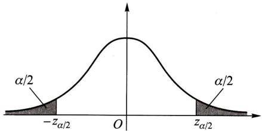  
图8-1

$$
\left|\frac{\overline{x} - \mu_{0}}{\sigma / \sqrt{n}}\right| = 2.2 > 1.96,
$$

于是拒绝  $H_{0}$ ,认为这天包装机工作不正常.  $\square$

上例中所采用的检验法则是符合实际推断原理的.因通常  $\alpha$  总是取得较小,一般取  $\alpha = 0.01,0.05.$  因而若  $H_{0}$  为真,即当  $\mu = \mu_{0}$  时,  $\left\{\left|\frac{\overline{{X}} - \mu_{0}}{\sigma / \sqrt{n}}\right|\geqslant z_{\alpha /2}\right\}$  是一个小概率事件,根据实际推断原理,就可以认为,如果  $H_{0}$  为真,则由一次试验得到的观察值  $\overline{{x}}$  ,满足不等式  $\left|\frac{\overline{{x}} - \mu_{0}}{\sigma / \sqrt{n}}\right|\geqslant z_{\alpha /2}$  几乎是不会发生的.现在在一次观察中竟然出现了满足  $\left|\frac{\overline{{x}} - \mu_{0}}{\sigma / \sqrt{n}}\right|\geqslant z_{\alpha /2}$  的  $\overline{{x}}$  ,则我们有理由怀疑原来的假设  $H_{0}$  的正确性,因而拒绝  $H_{0}$  .若出现的观察值  $\overline{{x}}$  满足  $\left|\frac{\overline{{x}} - \mu_{0}}{\sigma / \sqrt{n}}\right|< z_{\alpha /2}$  ,此时没有理由拒绝假设 $H_{0}$  ,因此只能接受假设  $H_{0}$

在上例的做法中,我们看到当样本容量固定时,选定  $\alpha$  后,数  $k$  就可以确定,然后按照统计量  $Z = \frac{\overline{{X}} - \mu_{0}}{\sigma / \sqrt{n}}$  的观察值的绝对值  $|z|$  大于等于  $k$  还是小于  $k$  来作出决策.数  $k$  是检验上述假设的一个门槛值.如果  $|z| = \left|\frac{\overline{{x}} - \mu_{0}}{\sigma / \sqrt{n}}\right|\geqslant k$  ,则称  $\overline{{x}}$  与  $\mu_{0}$  的差异是显著的,这时拒绝  $H_{0}$  ;反之,如果  $|z| = \left|\frac{\overline{{x}} - \mu_{0}}{\sigma / \sqrt{n}}\right|< k$  ,则称  $\overline{{x}}$  与  $\mu_{0}$  的差异是不显著的,这时接受  $H_{0}$  .数  $\alpha$  称为显著性水平,上面关于  $\overline{{x}}$  与  $\mu_{0}$  有无显著差异的判断是在显著性水平  $\alpha$  之下作出的.

统计量  $Z = \frac{\overline{{X}} - \mu_{0}}{\sigma / \sqrt{n}}$  称为检验统计量.

前面的检验问题通常叙述成:在显著性水平  $\alpha$  下,检验假设

$$
H_{0}:\mu = \mu_{0},\quad H_{1}:\mu \neq \mu_{0}. \tag{1.2}
$$

也常说成"在显著性水平  $\alpha$  下,针对  $H_{1}$  检验  $H_{0}$  "  $H_{0}$  称为原假设或零假设,  $H_{1}$  称为备择假设(意指在原假设被拒绝后可供选择的假设).我们要进行的工作是,根据样本,按上述检验方法作出决策在  $H_{0}$  与  $H_{1}$  两者之间接受其一.

当检验统计量取某个区域  $C$  中的值时,我们拒绝原假设  $H_{0}$ ,则称区域  $C$  为拒绝域,拒绝域的边界点称为临界点.如在上例中拒绝域为  $|z|\geqslant z_{\alpha /2}$ ,而  $z = - z_{\alpha /2},z = z_{\alpha /2}$  为临界点.

由于检验法则是根据样本作出的,总有可能作出错误的决策.如上面所说的

那样, 在假设  $H_{0}$  实际上为真时, 我们可能犯拒绝  $H_{0}$  的错误, 称这类"弃真"的错误为第 I 类错误. 又当  $H_{0}$  实际上不真时, 我们也有可能接受  $H_{0}$ . 称这类"取伪"的错误为第 II 类错误. 犯第 II 类错误的概率记为

为此, 在确定检验法则时, 我们应尽可能使犯两类错误的概率都较小. 但是, 进一步讨论可知, 一般来说, 当样本容量固定时, 若减小犯一类错误的概率, 则犯另一类错误的概率往往增大. 若要使犯两类错误的概率都减小, 除非增加样本容量. 在给定样本容量的情况下, 一般来说, 我们总是控制犯第 I 类错误的概率, 使它不大于  $\alpha . \alpha$  的大小视具体情况而定, 通常  $\alpha$  取  $0.1, 0.05, 0.01, 0.005$  等值. 这种只对犯第 I 类错误的概率加以控制, 而不考虑犯第 II 类错误的概率的检验, 称为显著性检验.

形如(1.2)式中的备择假设  $H_{1}$ , 表示  $\mu$  可能大于  $\mu_{0}$ , 也可能小于  $\mu_{0}$ , 称为双边备择假设, 而称形如(1.2)的假设检验为双边假设检验.

有时, 我们只关心总体均值是否增大, 例如, 试验新工艺以提高材料的强度. 这时, 所考虑的总体的均值应该越大越好. 如果我们能判断在新工艺下总体均值较以往正常生产的大, 则可考虑采用新工艺. 此时, 我们需要检验假设

$$
H_{0}: \mu \leqslant \mu_{0}, \quad H_{1}: \mu > \mu_{0}. \tag{1.3}
$$

形如(1.3)的假设检验, 称为右边检验. 类似地, 有时我们需要检验假设

$$
H_{0}: \mu \geqslant \mu_{0}, \quad H_{1}: \mu < \mu_{0}. \tag{1.4}
$$

形如(1.4)的假设检验, 称为左边检验. 右边检验和左边检验统称为单边检验.

下面来讨论单边检验的拒绝域.

设总体  $X \sim N(\mu , \sigma^{2}), \mu$  未知、  $\sigma$  为已知,  $X_{1}, X_{2}, \dots , X_{n}$  是来自  $X$  的样本. 给定显著性水平  $\alpha$ . 我们来求检验问题(1.3)

$$
H_{0}: \mu \leqslant \mu_{0}, \quad H_{1}: \mu > \mu_{0}
$$

的拒绝域.

因  $H_{0}$  中的全部  $\mu$  都比  $H_{1}$  中的  $\mu$  要小, 当  $H_{1}$  为真时, 观察值  $\overline{x}$  往往偏大, 因此, 拒绝域的形式为

下面来确定常数  $k$ , 其做法与例 1 中的做法类似:

$P\{$  当  $H_{0}$  为真时拒绝  $H_{0}\} = P_{\mu \in H_{0}}\{\overline{X} \geqslant k\}$

$$
= P_{\mu \leqslant \mu_{0}}\left\{\frac{\overline{X} - \mu_{0}}{\sigma / \sqrt{n}} \geqslant \frac{k - \mu_{0}}{\sigma / \sqrt{n}}\right\}
$$

$$
\leqslant P_{\mu \leqslant \mu_{0}}\left\{\frac{\overline{X} - \mu}{\sigma / \sqrt{n}} \geqslant \frac{k - \mu_{0}}{\sigma / \sqrt{n}}\right\}
$$

上式不等号成立是由于 \(\mu \leqslant \mu_{0}, \frac{\overline{X} - \mu}{\sigma / \sqrt{n}} \geqslant \frac{\overline{X} - \mu_{0}}{\sigma / \sqrt{n}}\), 事件 \(\left\{\frac{\overline{X} - \mu_{0}}{\sigma / \sqrt{n}} \geqslant \frac{k - \mu_{0}}{\sigma / \sqrt{n}}\right\} \subset \left\{\frac{\overline{X} - \mu}{\sigma / \sqrt{n}} \geqslant \frac{k - \mu_{0}}{\sigma / \sqrt{n}}\right\} \subset \left\{\frac{k - \mu_{0}}{\sigma / \sqrt{n}}\right\} \subset \left\{\frac{k - \mu_{0}}{\sigma / \sqrt{n}}\right\} \subset \left\{\frac{k - \mu_{0}}{\sigma / \sqrt{n}}\right\} \subset \left\{\frac{k - \mu_{0}}{\sigma / \sqrt{n}}\right\} \subset \left\{ \begin{array}{l} \frac{k - \mu_{0}}{\sigma / \sqrt{n}} \\ \frac{k - \mu_{0}}{\sigma / \sqrt{n}} \end{array} \right\} \subset \left\{ \begin{array}{l} \frac{k - \mu_{0}}{\sigma / \sqrt{n}} \\ \frac{k - \mu_{0}}{\sigma / \sqrt{n}} \end{array} \right\} \subset \left\{ \begin{array}{l} \frac{k - \mu_{0}}{\sigma / \sqrt{n}} \\ \frac{k - \mu_{0}}{\sigma \sqrt{n}} \end{array} \right\} \subset \left\{ \begin{array}{l} \frac{k - \mu_{0}}{\sigma / \sqrt{n}} \\ \frac{k - \mu_{0}}{\sigma \sqrt{n}} \end{array} \right\} \subset \left\{ \begin{array}{l} \frac{k - \mu_{0}}{\sigma / \sqrt{n}} \\ \frac{1}{\sigma \sqrt{n}} \end{array} \right\} \subset \left\{ \begin{array}{l} \frac{k - \mu_{0}}{\sigma / \sqrt{n}} \\ \frac{k - \mu_{0}}{\sigma \sqrt{n}} \end{array} \right\} \subset \left\{ \begin{array}{l} \frac{k - \mu_{0}}{\sigma / \sqrt{n}} \\ \left\{ \begin{array}{l} \frac{k - \mu_{0}}{\sigma / \sqrt{n}} \\ \frac{k - \mu_{0}}{\sigma \sqrt{n}} \end{array} \right\} \subset \left\{ \begin{array}{l} \frac{k - \mu_{0}}{\sigma / \sqrt{n}} \\ \frac{k - \mu_{0}}{\sigma \sqrt{n}} \end{
\]

$$
P_{\mu \leqslant \mu_{0}}\left\{\frac{\overline{X} - \mu}{\sigma / \sqrt{n}} \geqslant \frac{k - \mu_{0}}{\sigma / \sqrt{n}}\right\} = \alpha . \tag{1.5}
$$

由于  $\frac{\overline{X} - \mu}{\sigma / \sqrt{n}} \sim N(0,1)$ , 由(1.5)得到

$\frac{k - \mu_{0}}{\sigma / \sqrt{n}} = z_{\alpha}$  (如图8- 2),  $k = \mu_{0} + \frac{\sigma}{\sqrt{n}} z_{\alpha}$ , 即

得检验问题(1.3)的拒绝域为

$$
\overline{x} \geqslant \mu_{0} + \frac{\sigma}{\sqrt{n}} z_{\alpha},
$$

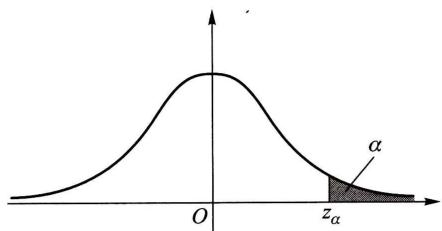  
图8-2

即  $z = \frac{\overline{x} - \mu_{0}}{\sigma / \sqrt{n}} \geqslant z_{\alpha}$ . (1.6)

类似地, 可得左边检验问题(1.4)

$$
H_{1}:\mu \geqslant \mu_{0}, H_{1}:\mu < \mu_{0}
$$

的拒绝域为

$$
z = \frac{\overline{x} - \mu_{0}}{\sigma / \sqrt{n}} \leqslant -z_{\alpha}. \tag{1.7}
$$

例2 公司从生产商购买牛奶. 公司怀疑生产商在牛奶中掺水以牟利. 通过测定牛奶的冰点, 可以检验出牛奶是否掺水. 天然牛奶的冰点温度近似服从正态分布, 均值  $\mu_{0} = - 0.545^{\circ} \mathrm{C}$ , 标准差  $\sigma = 0.008^{\circ} \mathrm{C}$ . 牛奶掺水可使冰点温度升高而接近于水的冰点温度  $(0^{\circ} \mathrm{C})$ . 测得生产商提交的5批牛奶的冰点温度, 其均值为  $\overline{x} = - 0.535^{\circ} \mathrm{C}$ , 问是否可以认为生产商在牛奶中掺了水? 取  $\alpha = 0.05$ .

解 按题意需检验假设

这是右边检验问题, 其拒绝域如(1.6)式所示, 即为

$$
z = \frac{\overline{x} - \mu_{0}}{\sigma / \sqrt{n}} \geqslant z_{0.05} = 1.645.
$$

现在  $z = \frac{- 0.535 - (- 0.545)}{0.008 / \sqrt{5}} = 2.7951 > 1.645, z$  的值落在拒绝域中, 所以我们在显著性水平  $\alpha = 0.05$  下拒绝  $H_{0}$ , 即认为生产商在牛奶中掺了水.