(2)利用遍历性定理解.

10. 设时齐马尔可夫链的一步转移概率矩阵为

$$
\begin{array}{r}{\pmb {P} = \left[ \begin{array}{c c c}{q} & {p} & 0\\ {q} & 0 & p\\ 0 & {q} & p \end{array} \right],\quad q = 1 - p,\quad p\in (0,1).} \end{array}
$$

试证明此链具有遍历性,并求其极限分布.

11. 设时齐马尔可夫链的一步转移概率矩阵为

$$
\begin{array}{r}{\pmb {P} = \left[ \begin{array}{c c c}{1 / 2} & {1 / 2} & 0\\ {1 / 2} & {1 / 2} & 0\\ 0 & 0 & 1 \end{array} \right],} \end{array}
$$

试证明此链不具有遍历性.

# 第十四章 平稳随机过程

平稳随机过程是其概率性质在时间平移下不变的随机过程。这一思想抓住了没有固定时空起点的物理系统中的最自然的现象,因而有着广泛的应用。本章着重在二阶矩过程的范围内讨论平稳随机过程的各态历经性、相关函数和功率谱密度函数以及它们的性质。

# $\S 1$  平稳随机过程的概念

平稳性是指随机过程  $X(t), t \in T = (- \infty , \infty)$  的统计特性不随时间的推移而变化。严格地说这就要求对于任意正整数  $n, t_{1}, t_{2}, \dots , t_{n}, \tau \in T, n$  维随机变量

$$
(X(t_{1}), X(t_{2}), \dots , X(t_{n}))
$$

和  $(X(t_{1} + \tau), X(t_{2} + \tau), \dots , X(t_{n} + \tau))$  (1.1)

具有相同的分布函数。我们称这样的随机过程为严平稳随机过程,简称严平稳过程。注意这里要求参数集  $T = (- \infty , \infty)$  是为了对任何  $t_{1}, t_{2}, \dots , t_{n} \in T$ ,它们在时间平移  $\tau$  以后依然有  $t_{1} + \tau , t_{2} + \tau , \dots , t_{n} + \tau \in T$ 。当然,只要相应的  $\tau$  能满足以上要求, $T$  也可以取  $[0, \infty), \{0, \pm 1, \pm 2, \dots \}$  或  $\{0, 1, 2, \dots \}$ 。

判别一个随机过程的严平稳性需要知道其所有有限维分布,这是不易办到的。在实际问题中常用的是

定义(平稳过程)给定二阶矩过程  $\{X(t), t \in T\}$ ,如果对任意  $t, t + \tau \in T$

$$
E[X(t)X(t + \tau)] = R_{X}(\tau) \tag{1.2}
$$

不依赖于  $t$ ,则称  $\{X(t), t \in T\}$  为宽平稳随机过程或广义平稳随机过程,简称平稳过程。

另外,同时考虑两个平稳过程  $X(t)$  和  $Y(t)$  时,如果它们的互相关函数也只是时间差的单变量函数,记为  $R_{XY}(\tau)$ ,即

$$
R_{XY}(t, t + \tau) = E[X(t)Y(t + \tau)] = R_{XY}(\tau) \tag{1.3}
$$

与  $t$  无关,那么我们称  $X(t)$  和  $Y(t)$  是平稳相关的,或称这两个过程是联合平稳的。

易见,上一章中的泊松过程和维纳过程都是平稳过程。下面再举两个例子。

例1(随机相位周期过程)设  $s(t)$  是一周期为  $T$  的函数,  $\Theta$  是在  $(0,T)$  上服从均匀分布的随机变量,称  $X(t) = s(t + \Theta)$  为随机相位周期过程.试讨论它的平稳性.

解由假设,  $\Theta$  的概率密度为

$$
f(\theta)={\binom{1/T,}{0,}}\quad{\mathrm{~}}\theta\in(0,T),
$$

于是,  $X(t)$  的均值函数为

$$
\begin{array}{l}{{ E\big[X(t)\big]=E\big[s(t+\Theta)\big]}}\\ {{\quad=\int_{0}^{T}s(t+\theta)\frac{1}{T}\mathrm{d}\theta{=}\frac{1}{T}\int_{t}^{t+T}s(\phi)\mathrm{d}\phi.}}\end{array}
$$

利用  $s(\phi)$  的周期性可知

$$
E[X(t)] = \frac{1}{T}\int_{0}^{T}s(\phi)\mathrm{d}\phi
$$

是常数.而自相关函数

$$
\begin{array}{l}{{R_{X}(t,t+\tau)=E\big[s(t+\Theta)s(t+\tau+\Theta)\big]}}\\ {{\quad=\int_{0}^{T}s(t+\theta)s(t+\tau+\theta)\frac{1}{T}\mathrm{d}\theta{=}\frac{1}{T}\int_{t}^{t+T}s(\phi)s(\phi+\tau)\mathrm{d}\phi.}}\end{array}
$$

同样,利用  $s(\phi)s(\phi +\tau)$  的周期性,可知自相关函数仅与  $\tau$  有关.所以随机相位周期过程是平稳的.特别,第十二章  $\S 2$  例2中的随机相位正弦波是平稳的. 口

例2(随机电报信号)信号  $X(t)$  由只取  $I$  或  $- I$  的电流给出(图14一1画出了  $X(t)$  的一条样本曲线),这里

$$
P\{X(t) = I\} = P\{X(t) = -I\} = 1 / 2.
$$

而正负号在区间  $(t,t + \tau)$  内变化的次数  $N(t,t + \tau)$  是随机的,且假设  $N(t,t + \tau)$  服从泊松分布,亦即事件

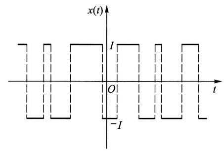  
图14-1

$$
A_{k} = \{N(t,t + \tau) = k\}
$$

的概率为

$$
P(A_{k}) = \frac{(\lambda\tau)^{k}}{k!}\mathrm{e}^{-\lambda \tau},\quad k = 0,1,2,\dots ,
$$

其中  $\lambda >0$  是单位时间内变号次数的数学期望.试讨论  $X(t)$  的平稳性.

解显然,  $E[X(t)] = 0$  .现在来计算  $R_{X}(t,t + \tau) = E[X(t)X(t + \tau)]$  .先设 $\tau >0$  ,注意到如果电流在  $(t,t + \tau)$  内变号偶数次,则  $X(t)$  和  $X(t + \tau)$  同号且乘积为  $I^{2}$  ;如果变号奇数次,则乘积为  $- I^{2}$  .因为事件

$$
\{X(t)X(t + \tau) = I^{2}\}
$$

的概率为  $P(A_{0}) + P(A_{2}) + P(A_{4}) + \dots$  ,而事件

$$
\{X(t)X(t + \tau) = -I^{2}\}
$$

的概率为  $P(A_{1}) + P(A_{3}) + P(A_{5}) + \dots$  ,于是

$$
\begin{array}{l}{{R_{X}(t,t+\tau)=E\big[X(t)X(t+\tau)\big]=I^{2}\sum_{k=0}^{\infty}P(A_{2k})-I^{2}\sum_{k=0}^{\infty}P(A_{2k+1})}}\\ {{\qquad=I^{2}\mathrm{e}^{-\lambda\tau}\sum_{k=0}^{\infty}\frac{(-\lambda\tau)^{k}}{k!}{=}I^{2}\mathrm{e}^{-2\lambda\tau}.}}\end{array}
$$

注意,上述结果与  $t$  无关.若  $\tau < 0$  ,只需令  $s = \tau +\tau$  ,则有

$$
R_{X}(t,t + \tau) = R_{X}(s,s - \tau) = I^{2}\mathrm{e}^{2\lambda \tau}.
$$

故这一过程的自相关函数

$$
R_{X}(t,t + \tau)\frac{\mathsf{i}\mathsf{i}\mathsf{i}\mathsf{i}\mathsf{i}}{\mathsf{i}\mathsf{i}\mathsf{i}} R_{X}(\tau) = I^{2}\mathrm{e}^{-2\lambda |\tau |}
$$

只与  $\tau$  有关.其图形如图  $14 - 2$  所示.因此,随机电报信号是一平稳过程.

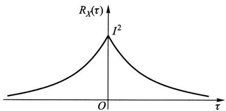  
图14-2

# $\S 2$  各态历经性

本节主要讨论根据试验记录确定平稳过程的均值和自相关函数的理论依据和方法.

首先注意,如果按照数学期望的定义来计算平稳过程  $X(t)$  的数字特征,就需要预先确定  $X(t)$  的一族样本函数或一维、二维分布函数,但这实际上是不易办到的.事实上,即使我们用统计试验方法,例如可以把均值和自相关函数近似地表示为

$$
\mu_{X}\approx \frac{1}{N}\sum_{k = 1}^{N}x_{k}(t_{1}),
$$

$$
R_{X}(t_{2} - t_{1}) \approx \frac{1}{N} \sum_{k = 1}^{N} x_{k}(t_{1}) x_{k}(t_{2}),
$$

那也需要对一个平稳过程重复进行大量观察,以便获得数量很多的一族样本函数  $x_{k}(t), k = 1,2, \dots , N$ ,而这正是实际困难所在.

但是,平稳过程的统计特性是不随时间的推移而变化的,于是我们自然期望在一个很长时间内观察得到的一个样本曲线,可以作为得到这个过程的数字特征的充分依据.本节给出的各态历经定理将证实:对平稳过程而言,只要满足一些较宽的条件,那么集平均(均值和自相关函数等)实际上可以用一个样本函数在整个时间轴上的平均值来代替.这样,在解决实际问题时就节约了大量的工作量.

在叙述各态历经性之前,我们先简要地介绍往后多处要遇到的有关随机过程积分的概念.

给定二阶矩过程  $\{X(t), t \in T\}$ ,如果它的每一个样本函数在  $[a, b] \subset T$  上的积分都存在,我们就说随机过程  $X(t)$  在  $[a, b]$  上的积分存在,并记为

$$
Y = \int_{a}^{b} X(t) \mathrm{d}t. \tag{2.1}
$$

显然,  $Y$  是一随机变量.

但是,在某些情形下,对于随机过程的所有样本函数来说,在  $[a, b]$  上的积分未必全都存在.此时,引入所谓均方意义上的积分,即考虑  $[a, b]$  内的一组分点

$$
a = t_{0}< t_{1}< t_{2}< \dots < t_{n} = b,
$$

且记

$$
\Delta t_{i} = t_{i} - t_{i - 1}, \quad \tau_{i} \in [t_{i - 1}, t_{i}], \quad i = 1,2, \dots , n,
$$

如果有满足

$$
\lim_{n \to \infty} E\left\{\left[Y - \sum_{i = 1}^{n} X(\tau_{i}) \Delta t_{i}\right]^{2}\right\} = 0
$$

的随机变量  $Y$  存在,则称  $Y$  为  $X(t)$  在  $[a, b]$  上的均方积分  $①$ ,并仍以符号(2.1)记之.可以证明:二阶矩过程  $X(t)$  在  $[a, b]$  上的均方积分存在的充分条件是自相关函数的二重积分,即

$$
\int_{a}^{b}\int_{a}^{b}R_{X}(s,t)\mathrm{d}s\mathrm{d}t
$$

存在.而且此时还有

$$
E(Y) = \int_{a}^{b}E\big[X(t)\big]\mathrm{d}t \tag{2.2}
$$

成立.就是说,过程  $X(t)$  的积分均值等于过程的均值函数的积分.

现在引入随机过程  $X(t)$  沿整个时间轴上的两种时间平均

$$
\langle X(t)\rangle = \lim_{T\to \infty}\frac{1}{2T}\int_{-T}^{T}X(t)\mathrm{d}t \tag{2.3}
$$

和

$$
\langle X(t)X(t + \tau)\rangle = \lim_{T\to \infty}\frac{1}{2T}\int_{-T}^{T}X(t)X(t + \tau)\mathrm{d}t, \tag{2.4}
$$

分别称为随机过程  $X(t)$  的时间均值和时间相关函数.我们可以沿用高等数学中的方法求积分和极限,其结果一般来说是随机的.

以下讨论时间平均与集平均之间的关系.先看一个例子,

例(随机相位正弦波)计算随机相位正弦波  $X(t) = a\cos (\omega t + \Theta)$  的时间均值  $\langle X(t)\rangle$  和时间相关函数  $\langle X(t)X(t + \tau)\rangle$

$$
\begin{array}{r l} & {\langle X(t)\rangle = \lim_{T\to \infty}\frac{1}{2T}\int_{-T}^{T}a\cos (\omega t + \Theta)\mathrm{d}t = \lim_{T\to \infty}\frac{a\cos(\Theta\sin\omega T}{\omega T} = 0,}\\ & {\langle X(t)X(t + \tau)\rangle = \lim_{T\to \infty}\frac{1}{2T}\int_{-T}^{T}a^{2}\cos (\omega t + \Theta)\cos [\omega (t + \tau) + \Theta ]\mathrm{d}t = \frac{a^{2}}{2}\cos \omega \tau .} \end{array}
$$

与第十二章  $\S 2$  例2比较可知

$$
\mu_{X} = E\big[X(t)\big] = \langle X(t)\rangle ,
$$

$$
R_{X}(\tau) = E\big[X(t)X(t + \tau)\big] = \langle X(t)X(t + \tau)\rangle .
$$

这表明对于随机相位正弦波,用时间平均与集平均分别算得的均值和自相关函数是相等的.这一特性并不是随机相位正弦波所独有的.下面引人一般概念.

定义(各态历经性) 设  $X(t)$  是一平稳过程.

$1^{\circ}$  如果

$$
\langle X(t)\rangle = E\big[X(t)\big] = \mu_{X} \tag{2.5}
$$

以概率1成立,则称过程  $X(t)$  的均值具有各态历经性,

$2^{\circ}$  如果对任意实数  $\tau$

$$
\langle X(t)X(t + \tau)\rangle = E\big[X(t)X(t + \tau)\big] = R_{X}(\tau) \tag{2.6}
$$

以概率1成立,则称过程  $X(t)$  的自相关函数具有各态历经性.特别当  $\tau = 0$  时,称均方值具有各态历经性.

$3^{\circ}$  如果  $X(t)$  的均值和自相关函数都具有各态历经性, 则称  $X(t)$  是各态历经过程, 或者说  $X(t)$  是各态历经的.

定义中"以概率1成立"是对  $X(t)$  的所有样本函数而言的.

各态历经性也称遍历性. 按定义, 上例中的随机相位正弦波是各态历经过程. 当然, 并不是任意一个平稳过程都具有各态历经性. 例如平稳过程

$$
X(t) = Y,
$$

其中  $Y$  是方差异于零的随机变量, 就不是各态历经过程. 事实上,  $\langle X(t) \rangle = \langle Y \rangle = Y$ , 亦即时间均值随  $Y$  取不同可能值而不同. 因  $Y$  的方差异于零, 这样  $\langle X(t) \rangle$  就不可能以概率1等于常数  $E[X(t)] = E(Y)$ .

一个平稳过程应该满足怎样的条件才是各态历经的呢? 下面两个定理从理论上回答了这个问题.

定理1(均值各态历经定理) 平稳过程  $X(t)$  的均值具有各态历经性的充要条件是

$$
\lim_{T \to \infty} \frac{1}{T} \int_{0}^{2T} \left(1 - \frac{\tau}{2T}\right) \left[R_{X}(\tau) - \mu_{X}^{2}\right] \mathrm{d}\tau = 0. \tag{2.7}
$$

证 先计算  $\langle X(t) \rangle$  的均值与方差. 由(2.3)式

$$
E[\langle X(t) \rangle ] = E\left[\lim_{T \to \infty} \frac{1}{2T} \int_{-T}^{T} X(t) \mathrm{d}t\right],
$$

交换极限与期望的运算顺序, 并注意到  $E[X(t)] = \mu_{X}$ , 即有

$$
E[\langle X(t) \rangle ] = \lim_{T \to \infty} \frac{1}{2T} \int_{-T}^{T} E[X(t)] \mathrm{d}t = \mu_{X}.
$$

而  $\langle X(t) \rangle$  的方差为

$$
\begin{array}{r l} & {D[\langle X(t)\rangle ] = E\{\big[\langle X(t)\rangle -\mu_{X}\big]^{2}\}}\\ & {\qquad = \underset {T\to \infty}{\lim}E\Big\{\Big[\frac{1}{2T}\int_{-T}^{T}X(t)\mathrm{d}t\Big]^{2}\Big\} -\mu_{X}^{2}}\\ & {\qquad = \underset {T\to \infty}{\lim}E\Big[\frac{1}{4T^{2}}\int_{-T}^{T}X(t_{1})\mathrm{d}t_{1}\Big]_{-T}^{T}X(t_{2})\mathrm{d}t_{2}\Big] - \mu_{X}^{2}}\\ & {\qquad = \underset {T\to \infty}{\lim}\frac{1}{4T^{2}}\int_{-T}^{T}\int_{-T}^{T}E\big[X(t_{1})X(t_{2})\big]\mathrm{d}t_{1}\mathrm{d}t_{2} - \mu_{X}^{2},} \end{array}
$$

由  $X(t)$  的平稳性,  $E[X(t_{1})X(t_{2})] = R_{X}(t_{2} - t_{1})$ , 上式可改写为

$$
D[\langle X(t) \rangle ] = \lim_{T \to \infty} \frac{1}{4T^{2}} \int_{-T}^{T} \int_{-T}^{T} R_{X}(t_{2} - t_{1}) \mathrm{d}t_{1} \mathrm{d}t_{2} - \mu_{X}^{2}. \tag{2.8}
$$

为了简化上式右端的积分, 引入变量变换  $\tau_{1} = t_{1} + t_{2}$  和  $\tau_{2} = t_{2} - t_{1}$ . 此变换的雅可比(Jacobi)式是

$$
\left|\frac{\partial(t_{1},t_{2})}{\partial(\tau_{1},\tau_{2})}\right| = \frac{1}{2},
$$

而积分区域转化为  $D = \{(\tau_{1},\tau_{2})\mid - 2T\leqslant \tau_{1}\pm \tau_{2}\leqslant 2T\}$ . 于是(2.8)式中的二重积分用新变量可表示为

$$
\int_{-T}^{T}\int_{-T}^{T}R_{X}(t_{2} - t_{1})\mathrm{d}t_{1}\mathrm{d}t_{2} = \iint_{D}R_{X}(\tau_{2})\frac{1}{2}\mathrm{d}\tau_{1}\mathrm{d}\tau_{2}. \tag{2.9}
$$

注意到被积函数  $R_{X}(\tau_{2})$  是  $\tau_{2}$  的偶函数,且与  $\tau_{1}$  无关,因而积分值为在区域  $G = \{(\tau_{1},\tau_{2})\mid \tau_{1},\tau_{2}\geqslant 0,\tau_{1} + \tau_{2}\leqslant 2T\}$  (如图14一3所示)上积分值的4倍,即

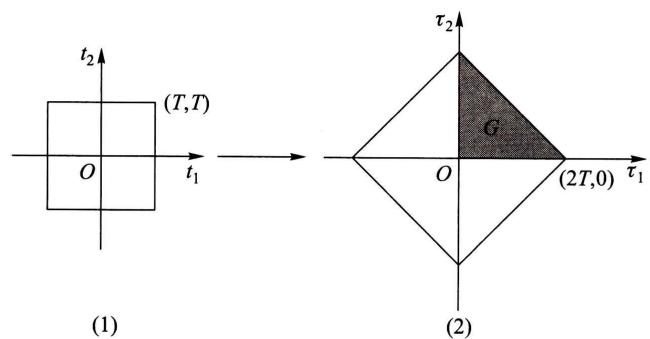  
图14-3

$$
\begin{array}{l}{{\int_{-T}^{T}\int_{-T}^{T}R_{X}(t_{2}-t_{1})\mathrm{d}t_{1}\mathrm{d}t_{2}=4\iint_{G}R_{X}(\tau_{2})\frac{1}{2}\mathrm{d}\tau_{1}\mathrm{d}\tau_{2}}}\\ {{\quad=2\int_{0}^{T}\mathrm{d}\tau_{2}\int_{0}^{2T-\tau_{2}}R_{X}(\tau_{2})\mathrm{d}\tau_{1}=2\int_{0}^{2T}(2T-\tau)R_{X}(\tau)\mathrm{d}\tau.}}\end{array}
$$

把这个式子代入(2.8)式就有

$$
\begin{array}{l}{{D\big[\langle X(t)\rangle\big]=\lim _{T\to\infty}\frac{1}{T}\int_{0}^{2T}\Big(1-\frac{\tau}{2T}\Big)R_{X}(\tau)\mathrm{d}\tau-\mu_{X}^{2}}}\\ {{=\lim _{T\to\infty}\frac{1}{T}\int_{0}^{2T}\Big(1-\frac{\tau}{2T}\Big)\big[R_{X}(\tau)-\mu_{X}^{2}\big]\mathrm{d}\tau.}}\end{array} \tag{2.10}
$$

由第四章  $\S 2$  方差的性质  $4^{\circ}$  知道  $\langle X(t)\rangle = E[\langle X(t)\rangle ]$  以概率1成立的充要条件是  $D[\langle X(t)\rangle ] = 0$ . 结合(2.10)式,定理得证.  $\square$

推论在  $\lim_{\tau \to \infty}R_{X}(\tau)$  存在的条件下,若  $\lim_{\tau \to \infty}R_{X}(\tau) = \mu_{X}^{2}$ ,则(2.7)式成立,均值具有各态历经性;若  $\lim_{\tau \to \infty}R_{X}(\tau)\neq \mu_{X}^{2}$ ,则(2.7)式不成立,均值不具有各态历经性.(证略.)

注意,对前例中的随机相位正弦波而言,  $\lim_{\tau \to \infty}R_{X}(\tau)$  不存在,但它的均值具有各态历经性.

在定理1的证明中将  $X(t)$  换成  $X(t)X(t + \tau)$ ,就可得

定理2(自相关函数各态历经定理) 平稳过程  $X(t)$  的自相关函数  $R_{X}(\tau)$  具有各态历经性的充要条件是

$$
\lim_{T\to \infty}\frac{1}{T}\int_{0}^{2T}\left(1 - \frac{\tau_{1}}{2T}\right)\left[B(\tau_{1}) - R_{X}^{2}(\tau)\right]\mathrm{d}\tau_{1} = 0, \tag{2.11}
$$

其中  $B(\tau_{1}) = E\big[X(t)X(t + \tau)X(t + \tau_{1})X(t + \tau +\tau_{1})\big].$

在(2.11)式中令  $\tau = 0$  ,就可得到均方值具有各态历经性的充要条件.如若在定理2中以  $X(t)Y(t + \tau)$  代替  $X(t)X(t + \tau)$  ,以  $R_{XY}(\tau)$  代替  $R_{X}(\tau)$  来进行讨论,那么还可以相应地得到互相关函数各态历经性的充要条件.

在实际应用中通常只考虑定义在  $t\in [0,\infty)$  上的平稳过程,此时上面的所有时间平均都应以  $t\in [0,\infty)$  上的时间平均来代替,而相应的各态历经定理可表示为下述形式:

定理3(均值各态历经定理)

$$
\lim_{T\to \infty}\frac{1}{T}\int_{0}^{T}X(t)\mathrm{d}t = E\big[X(t)\big] = \mu_{X}
$$

以概率1成立的充要条件是

$$
\lim_{T\to \infty}\frac{1}{T}\int_{0}^{T}\left(1 - \frac{\tau}{T}\right)\left[R_{X}(\tau) - \mu_{X}^{2}\right]\mathrm{d}\tau = 0. \tag{2.12}
$$

定理4(自相关函数各态历经定理)

$$
\lim_{T\to \infty}\frac{1}{T}\int_{0}^{T}X(t)X(t + \tau)\mathrm{d}t = E\big[X(t)X(t + \tau)\big] = R_{X}(\tau)
$$

以概率1成立的充要条件是

$$
\lim_{T\to \infty}\frac{1}{T}\int_{0}^{T}\left(1 - \frac{\tau_{1}}{T}\right)\left[B(\tau_{1}) - R_{X}^{2}(\tau)\right]\mathrm{d}\tau_{1} = 0. \tag{2.13}
$$

各态历经定理的重要价值在于它从理论上给出了如下保证:一个平稳过程 $X(t),t\in [0,\infty)$  ,只要它满足条件(2.12)和(2.13),便可以根据"以概率1成立"的含义,从一次试验所得到的样本函数  $x(t)$  来确定出该过程的均值和自相关函数,即

$$
\lim_{T\to \infty}\frac{1}{T}\int_{0}^{T}x(t)\mathrm{d}t = \mu_{X} \tag{2.14}
$$

和

$$
\lim_{T\to \infty}\frac{1}{T}\int_{0}^{T}x(t)x(t + \tau)\mathrm{d}t = R_{X}(\tau). \tag{2.15}
$$

这就是本节开头所预告的论断,

如果试验记录  $x(t)$  只在时间区间  $[0,T]$  上给出,则相应于(2.14)和(2.15)式,有以下无偏估计式:

$$
\mu_{X} \approx \hat{\mu}_{X} = \frac{1}{T} \int_{0}^{T} x(t) \mathrm{d}t \tag{2.16}
$$

和

$$
\begin{array}{l}{{R_{X}(\tau)\approx\hat{R}_{X}(\tau)=\frac{1}{T-\tau}\int_{0}^{T-\tau}x(t)x(t+\tau)\mathrm{d}t}}\\ {{\quad=\frac{1}{T-\tau}\int_{\tau}^{T}x(t)x(t-\tau)\mathrm{d}t,\quad0\leqslant\tau<T.}}\end{array} \tag{2.17}
$$

不过在实际问题中一般不可能给出  $x(t)$  的表达式,因而通常通过模拟方法或数值计算方法来进行估计.

最后指出,各态历经定理的条件是比较宽的,应用中遇到的大多数平稳过程都能够满足.不过,要去验证它们是否成立却是十分困难的.因此在实践中,通常事先假定所研究的平稳过程具有各态历经性,并从这个假定出发,对相关资料进行分析和处理,看所得的结论是否与实际相符.如果不符,则要修改假设,另作处理.

# $\S 3$  相关函数的性质

在第十二章中已经指出,用数字特征来描绘随机过程,要比用分布函数来描绘随机过程更为简便实用.由上节的分析看到,对于具有各态历经性的平稳过程,其均值和相关函数可以用一个样本函数来估计.在这种场合下,利用均值和相关函数来研究随机过程更方便.特别是对于正态平稳过程,它的均值和相关函数能完全地刻画其统计特性.为了方便地使用数字特征去研究随机过程,下面的定理给出了相关函数的主要性质.

定理(相关函数的性质)设  $X(t)$  和  $Y(t)$  是平稳相关过程,  $R_{X}(\tau), R_{Y}(\tau), R_{XY}(\tau)$  分别是它们的自相关函数和互相关函数.则

$$
1^{\circ} R_{X}(0) = E[X^{2}(t)] = \Psi_{X}^{2} \geqslant 0.
$$

$2^{\circ} R_{X}(- \tau) = R_{X}(\tau)$ ,即  $R_{X}(\tau)$  是偶函数.而互相关函数既不是偶函数也不是奇函数,但满足  $R_{XY}(- \tau) = R_{YX}(\tau)$

$3^{\circ}$  自相关函数和自协方差函数满足不等式

$$
\mid R_{X}(\tau)\mid \leqslant R_{X}(0),\quad \mid C_{X}(\tau)\mid \leqslant C_{X}(0) = \sigma_{X}^{2}.
$$

$4^{\circ} R_{X}(\tau)$  是非负定的,即对任意数组  $t_{1}, t_{2}, \dots , t_{n} \in T$  和任意实函数  $g(t)$  都有

$$
\sum_{i,j = 1}^{n} R_{X}(t_{i} - t_{j}) g(t_{i}) g(t_{j}) \geqslant 0.
$$

$5^{\circ}$  如果平稳过程  $X(t)$  满足条件  $P\{X(t + T_{0}) = X(t)\} = 1$ ,则称它为周期是

$T_{0}$  的平稳过程. 这样的平稳过程的自相关函数也是周期为  $T_{0}$  的周期函数.

证  $1^{\circ}$  和  $2^{\circ}$  可由定义直接推出. 结合柯西一施瓦茨不等式、自相关函数和自协方差函数的定义就可得到  $3^{\circ}$ . 根据自相关函数的定义和均值的运算性质, 即有

$$
\begin{array}{r l r}{{\sum_{i,j=1}^{n}R_{X}(t_{i}-t_{j})g(t_{i})g(t_{j})=\sum_{i,j=1}^{n}E[X(t_{i})X(t_{j})]g(t_{i})g(t_{j})}}\\ &{}&{=E\Big[\sum_{i,j=1}^{n}X(t_{i})X(t_{j})g(t_{i})g(t_{j})\Big]}\\ &{}&{=E\Big\{\Big[\sum_{i=1}^{n}X(t_{i})g(t_{i})\Big]^{2}\Big\}\geqslant0.}\end{array}
$$

这就证明了  $4^{\circ}$ . 最后来证明  $5^{\circ}$ . 由平稳性,  $E[X(t) - X(t + T_{0})] = 0$ . 又由第四章 §2 方差的性质, 条件  $P\{X(t + T_{0}) = X(t)\} = 1$  与  $E\{[X(t + T_{0}) - X(t)]^{2}\} = 0$  等价. 于是, 由柯西一施瓦茨不等式,

$\{E[X(t)(X(t + \tau +T_{0}) - X(t + \tau))]\}^{2} \leqslant E[X^{2}(t)]E\{[X(t + \tau +T_{0}) - X(t + \tau)]^{2}\}$  右端为零, 推知

$$
E\{X(t)[X(t + \tau +T_{0}) - X(t + \tau)]\} = 0,
$$

展开即得  $R_{X}(\tau +T_{0}) = R_{X}(\tau)$ .

在下节中将看到  $R_{X}(0)$  表示平稳过程  $X(\tau)$  的"平均功率". 由性质  $2^{\circ}$ , 在实际问题中只需计算或测量  $R_{X}(\tau), R_{Y}(\tau), R_{XY}(\tau)$  和  $R_{YX}(\tau)$  在  $\tau \geqslant 0$  的值.

性质  $3^{\circ}$  表明自相关函数 (自协方差函数) 都在  $\tau = 0$  处取最大值. 类似地, 可以推出以下有关互相关函数和互协方差函数的不等式:

$$
\left|R_{XY}(\tau)\right|^{2} \leqslant R_{X}(0)R_{Y}(0), \quad \left|C_{XY}(\tau)\right|^{2} \leqslant C_{X}(0)C_{Y}(0).
$$

在应用上常用的还有标准自协方差函数和标准互协方差函数, 它们的定义为

$$
\rho_{X}(\tau) = \frac{C_{X}(\tau)}{C_{X}(0)}, \quad \rho_{XY}(\tau) = \frac{C_{XY}(\tau)}{\sqrt{C_{X}(0)C_{Y}(0)}}.
$$

由上述不等式知:  $\left|\rho_{X}(\tau)\right| \leqslant 1$  和  $\left|\rho_{XY}(\tau)\right| \leqslant 1$ . 且当  $\rho_{XY}(\tau) = 0$  时,  $X(t)$  和  $Y(t)$  不相关.

对于平稳过程而言, 自相关函数的非负定性是最本质的. 因为理论上可以证明: 任一连续函数, 只要具有非负定性, 就必为某平稳过程的自相关函数.

另外, 在实际中各种具有零均值的非周期性噪声和干扰一般当  $|\tau |$  值适当

增大时,  $X(t + \tau)$  和  $X(t)$  即呈现独立或不相关, 于是有

$$
\lim_{\tau \to \infty}R_{X}(\tau) = \lim_{\tau \to \infty}C_{X}(\tau) = 0.
$$

下面是一个应用例子.

例(噪声与信号)设某接收机输出电压  $V(t)$  是周期信号  $S(t)$  和噪声电压  $N(t)$  之和, 即

$$
V(t) = S(t) + N(t).
$$

又设  $S(t)$  和  $N(t)$  是两个互不相关(实际问题中一般都是如此)的各态历经过程, 且  $E[N(t)] = 0$ . 根据第十二章 §2(2.12)式,  $V(t)$  的自相关函数应为

$$
R_{V}(\tau) = R_{S}(\tau) + R_{N}(\tau).
$$

由性质  $5^{\circ}, R_{S}(\tau)$  是周期函数, 又因为一般噪声电压  $N(t)$  当  $|\tau |$  值适当增大时,  $N(t + \tau)$  和  $N(t)$  即呈现独立或不相关, 即有

$$
\lim_{\tau \to \infty}R_{N}(\tau) = 0.
$$

于是, 对于充分大的  $\tau$  值有

$$
R_{V}(\tau) \approx R_{S}(\tau).
$$

作为特例, 假设接收机输出电压中周期信号和噪声电压的自相关函数分别为

$$
R_{S}(\tau) = \frac{a^{2}}{2} \cos \tau \omega ,
$$

$$
R_{N}(\tau) = b^{2} \mathrm{e}^{-\alpha |\tau |}, \quad \alpha > 0.
$$

那么即使噪声平均功率(见下节)  $R_{N}(0) = b^{2}$  远大于信号平均功率  $R_{S}(0) = a^{2} / 2$  当  $|\tau |$  充分大时, 依然有

$$
R_{V}(\tau) = \frac{a^{2}}{2} \cos \tau \omega + b^{2} \mathrm{e}^{-\alpha |\tau |} \approx \frac{a^{2}}{2} \cos \tau \omega .
$$

也就是说我们可以从强噪声中检测到微弱的正弦信号(见图 14- 4).

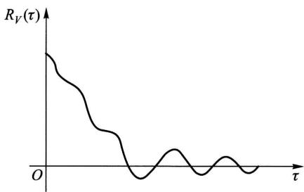  
图14-4

# §4 平稳随机过程的功率谱密度

傅里叶(Fourier)变换是确立时间函数频率结构的有效工具, 下面我们来讨论如何运用这一工具来分析平稳过程的频率结构——功率谱密度.

# (一) 平稳过程的功率谱密度

设有时间函数  $x(t), t \in (- \infty , \infty)$  (为了便于理解物理术语, 可把  $x(t)$  设想

为加于单位电阻上的电压). 如果  $x(t)$  的总能量有限, 即

$$
\int_{-\infty}^{\infty}x^{2}(t)\mathrm{d}t< \infty , \tag{4.1}
$$

那么,  $x(t)$  的傅里叶变换存在或者说具有频谱

$$
F_{x}(\omega) = \int_{-\infty}^{\infty}x(t)\mathrm{e}^{-\mathrm{i}\omega t}\mathrm{d}t.
$$

且同时有傅里叶逆变换

$$
x(t) = \frac{1}{2\pi}\int_{-\infty}^{\infty}F_{x}(\omega)\mathrm{e}^{\mathrm{i}\omega t}\mathrm{d}\omega .
$$

$F_{x}(\omega)$  一般是复函数, 其共轭函数为  $F_{x}^{*}(\omega) = F_{x}(- \omega)$ . 在  $x(t)$  和  $F_{x}(\omega)$  之间成立有帕塞瓦尔(Parseval)等式

$$
\int_{-\infty}^{\infty}x^{2}(t)\mathrm{d}t = \frac{1}{2\pi}\int_{-\infty}^{\infty}\left|F_{x}(\omega)\right|^{2}\mathrm{d}\omega ,
$$

等式左边表示  $x(t)$  在  $(- \infty ,\infty)$  上的总能量, 而右边的被积函数  $\left|F_{x}(\omega)\right|^{2}$  相应地称为  $x(t)$  的能谱密度. 这样, 帕塞瓦尔等式又可理解为总能量的谱表示式.

但是, 应用中很多重要的时间函数的总能量是无限的. 正弦函数就是一例. 平稳过程的样本函数一般来说也是如此. 这时我们转而研究  $x(t)$  在  $(- \infty ,\infty)$  上的平均功率, 即

$$
\lim_{T\to \infty}\frac{1}{2T}\int_{-T}^{T}x^{2}(t)\mathrm{d}t.
$$

在以下讨论中, 我们都假定这个平均功率是存在的,

为了用傅里叶变换给出平均功率的谱表示式, 先由给定的  $x(t)$  构造一个截尾函数

$$
x_{T}(t) = \left\{ \begin{array}{ll}x(t), & |t|\leqslant T, \\ 0, & |t| > T. \end{array} \right. \tag{4.2}
$$

易知  $x_{T}(t)$  满足(4.1). 记  $x_{T}(t)$  的傅里叶变换为

$$
F_{x}(\omega ,T) = \int_{-\infty}^{\infty}x_{T}(t)\mathrm{e}^{-\mathrm{i}\omega t}\mathrm{d}t = \int_{-\infty}^{T}x(t)\mathrm{e}^{-\mathrm{i}\omega t}\mathrm{d}t, \tag{4.3}
$$

并写出它的帕塞瓦尔等式

$$
\int_{-\infty}^{\infty}x_{T}^{2}(t)\mathrm{d}t = \frac{1}{2\pi}\int_{-\infty}^{\infty}\left|F_{x}(\omega ,T)\right|^{2}\mathrm{d}\omega ,
$$

将上式两边除以  $2T$ , 并利用  $x_{T}(t)$  的定义(4.2), 得

$$
\frac{1}{2T}\int_{-T}^{T}x^{2}(t)\mathrm{d}t = \frac{1}{4\pi T}\int_{-\infty}^{\infty}\left|F_{x}(\omega ,T)\right|^{2}\mathrm{d}\omega . \tag{4.4}
$$

令  $T\rightarrow \infty ,x(t)$  在  $(- \infty ,\infty)$  上的平均功率即可表示为

$$
\lim_{T\to \infty}\frac{1}{2T}\int_{-T}^{T}x^{2}(t)\mathrm{d}t = \frac{1}{2\pi}\int_{-\infty}^{\infty}\lim_{T\to \infty}\frac{1}{2T}\left|F_{x}(\omega ,T)\right|^{2}\mathrm{d}\omega . \tag{4.5}
$$

类似能谱密度,我们把(4.5)式右端的被积式称作函数  $x(t)$  的平均功率谱密度,简称功率谱密度,并记为

$$
S_{x}(\omega) = \lim_{T\to \infty}\frac{1}{2T}\left|F_{x}(\omega ,T)\right|^{2}. \tag{4.6}
$$

而(4.5)的右端就是平均功率的谱表示式,

现在我们把平均功率和功率谱密度的概念推广到平稳过程  $X(t),t\in$ $(- \infty ,\infty)$  .为此,相应于(4.3)和(4.4)式写出

$$
F_{X}(\omega ,T) = \int_{-T}^{T}X(t)\mathrm{e}^{-\mathrm{i}\omega t}\mathrm{d}t, \tag{4.7}
$$

和  $\frac{1}{2T}\int_{- T}^{T}X^{2}(t)\mathrm{d}t = \frac{1}{4\pi T}\int_{- \infty}^{\infty}\left|F_{X}(\omega ,T)\right|^{2}\mathrm{d}\omega .$

显然,(4.7)和(4.8)式中的积分都是随机的.我们将(4.8)式左端的均值的极限,即

$$
\lim_{T\to \infty}E\biggl [\frac{1}{2T}\int_{-T}^{T}X^{2}(t)\mathrm{d}t\biggr ] \tag{4.9}
$$

定义为平稳过程  $X(t)$  的平均功率.

交换(4.9)式中积分与均值的运算顺序,并注意到平稳过程的均方值是常数  $\Psi_{X}^{2}$  ,于是

$$
\lim_{T\to \infty}E\biggl [\frac{1}{2T}\int_{-T}^{T}X^{2}(t)\mathrm{d}t\biggr ] = \lim_{T\to \infty}\frac{1}{2T}\int_{-T}^{T}E\bigl [X^{2}(t)\bigr ]\mathrm{d}t = \Psi_{X}^{2}, \tag{4.10}
$$

即平稳过程的平均功率等于该过程的均方值或  $R_{X}(0)$

接着,把(4.8)式的右端代入(4.10)式的左端,交换运算顺序后可得

$$
\Psi_{X}^{2} = \frac{1}{2\pi}\int_{-\infty}^{\infty}\lim_{T\to \infty}\frac{1}{2T} E\big[\mid F_{X}(\omega ,T)\mid^{2}\big]\mathrm{d}\omega . \tag{4.11}
$$

相应于(4.5),(4.6)式,我们把(4.11)式中的被积式称为平稳过程  $X(t)$  的平均功率谱密度,简称为功率谱密度,并记为  $S_{X X}(\omega)$  或  $S_{X}(\omega)$  ,即

$$
S_{X}(\omega) = \lim_{T\to \infty}\frac{1}{2T} E\big[\mid F_{X}(\omega ,T)\mid^{2}\big]. \tag{4.12}
$$

利用记号  $S_{X}(\omega)$  ,(4.11)式可简写为

$$
\Psi_{X}^{2} = \frac{1}{2\pi}\int_{-\infty}^{\infty}S_{X}(\omega)\mathrm{d}\omega , \tag{4.13}
$$

此式称为平稳过程  $X(t)$  的平均功率的谱表示式.

功率谱密度  $S_{X}(\omega)$  通常也简称为自谱密度或谱密度  $①$ , 它是从频率这个角度描述  $X(t)$  的统计规律的最主要的数字特征. 由(4.13)式知, 它的物理意义是表示  $X(t)$  的平均功率关于频率的分布.

# (二)谱密度的性质

下面的定理给出了谱密度的两个重要性质,

定理(谱密度的性质)设  $X(t), t \in (- \infty , \infty)$  为平稳过程. 则

$1^{\circ} S_{X}(\omega)$  是  $\omega$  的实的、非负的偶函数.

$2^{\circ}$  若  $X(t)$  的自相关函数  $R_{X}(\tau)$  满足  $\int_{- \infty}^{\infty} |R_{X}(\tau)| \mathrm{d}\tau < \infty$ , 则它和  $S_{X}(\omega)$  构成傅里叶变换对, 即

$$
S_{X}(\omega) = \int_{-\infty}^{\infty} R_{X}(\tau) \mathrm{e}^{-\mathrm{i}\omega \tau} \mathrm{d}\tau , \tag{4.14}
$$

$$
R_{X}(\tau) = \frac{1}{2\pi} \int_{-\infty}^{\infty} S_{X}(\omega) \mathrm{e}^{\mathrm{i}\omega \tau} \mathrm{d}\omega . \tag{4.15}
$$

(4.14)和(4.15)式统称为维纳一辛钦(Wiener- Khinchin)公式. 而且由于  $R_{X}(\tau)$  和  $S_{X}(\omega)$  都是偶函数, 利用欧拉(Euler)公式, 它们还可写成

$$
S_{X}(\omega) = 2 \int_{0}^{\infty} R_{X}(\tau) \cos \omega \tau \mathrm{d}\tau , \tag{4.16}
$$

$$
R_{X}(\tau) = \frac{1}{\pi} \int_{0}^{\infty} S_{X}(\omega) \cos \omega \tau \mathrm{d}\omega . \tag{4.17}
$$

证在(4.12)式中, 量

$$
|F_{X}(\omega , T)|^{2} = F_{X}(\omega , T) F_{X}(-\omega , T)
$$

是  $\omega$  的实的、非负的偶函数, 所以它的均值的极限也必是实的、非负的偶函数. 这就得到  $1^{\circ}$ .

为证  $2^{\circ}$ , 将(4.7)代入(4.12)式, 得

$$
S_{X}(\omega) = \lim_{T \to \infty} \frac{1}{2T} E\left[\int_{-T}^{T} X(t_{1}) \mathrm{e}^{\mathrm{i}\omega t_{1}} \mathrm{d}t_{1} \int_{-T}^{T} X(t_{2}) \mathrm{e}^{-\mathrm{i}\omega t_{2}} \mathrm{d}t_{2}\right].
$$

把括号内的积分乘积改写成重积分形式, 交换积分与均值的运算顺序, 并注意到

$$
E\big[X(t_{1}) X(t_{2})\big] = R_{X}(t_{2} - t_{1}),
$$

即有

$$
S_{X}(\omega) = \lim_{T \to \infty} \frac{1}{2T} \int_{-T}^{T} \int_{-T}^{T} E\big[X(t_{1}) X(t_{2})\big] \mathrm{e}^{-\mathrm{i}\omega (t_{2} - t_{1})} \mathrm{d}t_{1} \mathrm{d}t_{2}
$$

$$
= \lim_{T\to \infty}\frac{1}{2T}\int_{-T}^{T}\int_{-T}^{T}R_{X}(t_{2} - t_{1})\mathrm{e}^{-\mathrm{i}\omega (t_{2} - t_{1})}\mathrm{d}t_{1}\mathrm{d}t_{2}.
$$

接着,依照  $\S 2$  定理1的证明,作变量变换  $\tau_{1} = t_{1} + t_{2},\tau_{2} = t_{2} - t_{1}$  ,可以得到

$$
\begin{array}{l}{{S_{X}(\omega)=\lim _{T\rightarrow\infty}\int_{-2T}^{2T}\Big(1-\frac{\left|\tau\right|}{2T}\Big)R_{X}(\tau)\mathrm{e}^{-\mathrm{i}\omega\tau}\mathrm{d}\tau}}\\ {{=\lim _{T\rightarrow\infty}\int_{-\infty}^{\infty}R_{X}^{T}(\tau)\mathrm{e}^{-\mathrm{i}\omega\tau}\mathrm{d}\tau},}}\end{array} \tag{4.18}
$$

式中

$$
R_{X}^{T}(\tau) = \left\{ \begin{array}{l l}{\Big(1 - \frac{\left|\tau\right|}{2T}\Big)R_{X}(\tau),} & {\left|\tau \right|\leqslant 2T,}\\ {0,} & {\left|\tau \right| > 2T.} \end{array} \right.
$$

当  $T\rightarrow \infty$  时,注意到对每个  $\tau ,R_{X}^{T}(\tau)\to R_{X}(\tau)$  ,于是由(4.18)式就可得到公式(4.14).由傅里叶逆变换的公式即得(4.15)式. 口

维纳一辛钦公式又称为平稳过程自相关函数的谱表示式,它们揭示了从时间角度描述平稳过程  $X(t)$  的统计规律和从频率角度描述  $X(t)$  的统计规律之间的联系.据此,在应用上我们可以根据实际情况选择时间域方法或等价的频率域方法.实际的计算可以利用傅里叶变换手册,表14一1列出了若干个常用的自相关函数以及对应的谱密度.

表14-1  

<table><tr><td></td><td>RX(τ)</td><td>SX(ω)</td></tr><tr><td>1</td><td>e^−a|τ|</td><td>2a/a²+ω²</td></tr><tr><td>2</td><td>max{1−|τ|,0}</td><td>4sin²(ωT/2)Tω²</td></tr><tr><td>3</td><td>e^−a|τ|cosω0τ</td><td>a/a²+(ω−ω0)²+a²+(ω+ω0)²</td></tr><tr><td>4</td><td>sinω0τ/ω0τ</td><td>χ[−ω0,ω0] (ω)</td></tr><tr><td>5</td><td>1</td><td>2πδ(ω)</td></tr><tr><td>6</td><td>δ(τ)</td><td>1</td></tr><tr><td>7</td><td>cosω0τ</td><td>πδ(ω−ω0)+πδ(ω+ω0)</td></tr></table>

注:  $\chi_{A}$  表示集  $A$  的特征函数,定义为  $\chi_{A}(\tau) = \left\{ \begin{array}{ll}1, & \tau \in A, \\ 0, & \tau \notin A. \end{array} \right.$

例1 已知平稳过程  $X(t)$  的自相关函数为

$$
R_{X}(\tau) = \mathrm{e}^{-a|\tau |}\cos \omega_{0}\tau ,
$$

求  $X(t)$  的谱密度  $S_{X}(\omega)$

解 由表14- 1可直接查出

$$
S_{X}(\omega) = \frac{a}{a^{2} + (\omega - \omega_{0})^{2}} +\frac{a}{a^{2} + (\omega + \omega_{0})^{2}}.
$$

例2 已知平稳过程  $X(t)$  的谱密度

$$
S_{X}(\omega) = \frac{\omega^{2} + 4}{\omega^{4} + 10\omega^{2} + 9},
$$

求  $X(t)$  的自相关函数和均方值,

解 用查表方法. 先把  $S_{X}(\omega)$  改写成部分分式之和, 即

$$
S_{X}(\omega) = \frac{\omega^{2} + 4}{(\omega^{2} + 1)(\omega^{2} + 9)} = \frac{1}{8}\left(\frac{3}{\omega^{2} + 1^{2}} +\frac{5}{\omega^{2} + 3^{2}}\right). \tag{4.19}
$$

由于傅里叶逆变换(4.15)也是线性变换, 所以可对上式右端两项分别查表14- 1第1栏后相加, 经整理后得

$$
R_{X}(\tau) = \frac{1}{48} (9\mathrm{e}^{-|\tau |} + 5\mathrm{e}^{-3|\tau |}).
$$

而均方值为

$$
\Psi_{X}^{2} = R_{X}(0) = \frac{7}{24}.
$$

形如(4.19)式的谱密度属于有理谱密度. 根据谱密度性质  $1^{\circ}$ , 其一般形式应为

$$
S_{X}(\omega) = S_{0}\frac{\omega^{2n} + a_{2n - 2}\omega^{2n - 2} + \cdots + a_{0}}{\omega^{2m} + b_{2m - 2}\omega^{2m - 2} + \cdots + b_{0}},
$$

式中  $S_{0} > 0$ . 又由于要求均方值有限, 所以由(4.13)式还应有  $m > n$ , 且分母应无实数根. 有理谱密度是实用上最常见的一类谱密度. 已知有理谱密度要求自相关函数, 通常使用例2中的部分分式方法结合查表来进行.

另外, 已知平稳过程的自相关函数的估计, 由维纳一辛钦公式及数值积分就可以得到谱密度的估计.

最后需要指出的是, 在实际问题中常常碰到这样一些平稳过程 (例如随机相位正弦波), 讨论它们的自相关函数和谱密度需要用到狄拉克 (Dirac) 的  $\delta$  函数, 定义如下:

$$
\left\{ \begin{array}{l l}{\delta (t) = 0,\quad t\neq 0,}\\ {\int_{-\infty}^{\infty}\delta (t)\mathrm{d}t = 1.} \end{array} \right.
$$

通常用图 14- 5 中的单位有向线段来表示.

$\delta$  函数的最重要的性质是:对任一在  $t = 0$  连续的函数  $f(t)$ ,有

$$
\int_{-\infty}^{\infty} \delta (t) f(t) \mathrm{d}t = f(0).
$$

一般,若函数  $f(t)$  在  $t = t_{0}$  连续,就有(筛选性)

$$
\int_{-\infty}^{\infty} \delta (t - t_{0}) f(t) \mathrm{d}t = f(t_{0}).
$$

据此,可以写出以下傅里叶变换对:

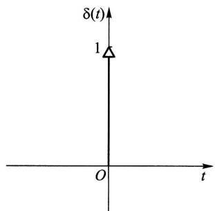  
图14-5

$$
\int_{-\infty}^{\infty} \delta (\tau) \mathrm{e}^{-\mathrm{i} \omega \tau} \mathrm{d}\tau = 1 \leftrightarrow \delta (\tau) = \frac{1}{2\pi} \int_{-\infty}^{\infty} 1 \cdot \mathrm{e}^{\mathrm{i} \omega \tau} \mathrm{d}\omega , \tag{4.20}
$$

$$
\int_{-\infty}^{\infty} \frac{1}{2\pi} \mathrm{e}^{-\mathrm{i} \omega \tau} \mathrm{d}\tau = \delta (\omega) \leftrightarrow \frac{1}{2\pi} = \frac{1}{2\pi} \int_{-\infty}^{\infty} \delta (\omega) \mathrm{e}^{\mathrm{i} \omega \tau} \mathrm{d}\omega . \tag{4.21}
$$

(4.21)式表明:当自相关函数  $R_{X}(\tau) = 1$  时,谱密度  $S_{X}(\omega) = 2\pi \delta (\omega)$ 。其次,还可求得正弦型自相关函数  $R_{X}(\tau) = a \cos \omega_{0} \tau$  的谱密度为

$$
S_{X}(\omega) = a \pi \left[ \delta (\omega - \omega_{0}) + \delta (\omega + \omega_{0}) \right]. \tag{4.22}
$$

事实上,

$$
\begin{array}{l}{{S_{X}(\omega)=\int_{-\infty}^{\infty}a c\cos\omega_{0}\tau\mathrm{e}^{-\mathrm{i}\omega\tau}\mathrm{d}\tau}}\\ {{\quad=\frac{a}{2}\int_{-\infty}^{\infty}(\mathrm{e}^{\mathrm{i}\omega_{0}\tau}+\mathrm{e}^{-\mathrm{i}\omega_{0}\tau})\mathrm{e}^{-\mathrm{i}\omega\tau}\mathrm{d}\tau}}\\ {{\quad=\frac{a}{2}\Big[\int_{-\infty}^{\infty}\mathrm{e}^{-\mathrm{i}(\omega-\omega_{0})\tau}\mathrm{d}\tau+\int_{-\infty}^{\infty}\mathrm{e}^{-\mathrm{i}(\omega+\omega_{0})\tau}\mathrm{d}\tau\Big],}}\end{array}
$$

利用变换式(4.21)即得(4.22)式,

由此可见,自相关函数为常数或正弦型函数的平稳过程,其谱密度都是离散的。对应的变换可见表 14- 1 第 5,7 栏。

例3 求自相关函数

$$
R_{V}(\tau) = \frac{a^{2}}{2} \cos \omega_{0} \tau + b^{2} \mathrm{e}^{-a |\tau |}
$$

所对应的谱密度  $S_{V}(\omega)$

解 利用傅里叶变换的线性性质及表 14- 1 第 1 和第 7 栏即可知道

$$
S_{V}(\omega) = \frac{\pi a^{2}}{2} \left[ \delta (\omega - \omega_{0}) + \delta (\omega + \omega_{0}) \right] + \frac{2a b^{2}}{a^{2} + \omega^{2}}.
$$

相应的谱密度如图 14- 6 所示。此图说明了谱密度是如何表明噪声以外的周期信号的。

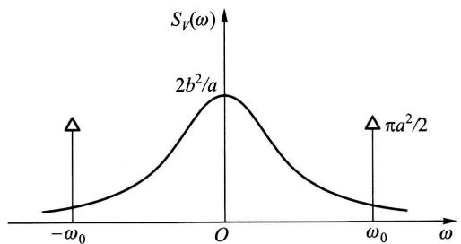  
图14-6

白噪声 均值为零而谱密度为正常数, 即

$$
S_{X}(\omega) = S_{0} > 0, \quad \omega \in (-\infty , \infty)
$$

的平稳过程  $X(t)$  称为白噪声过程, 简称白噪声. 其名出于白光具有均匀的光谱. 由表14- 1第6栏,

$$
R_{X}(\tau) = S_{0} \delta (\tau).
$$

由上式可知, 白噪声也可以定义为均值为零、自相关函数为  $\delta$  函数的随机过程, 且这个过程在  $t_{1} \neq t_{2}$  时,  $X(t_{1})$  和  $X(t_{2})$  是不相关的.

# 小结

本章讨论的平稳过程是指宽平稳随机过程. 其特点是均值函数为常数, 自相关函数只依赖于时间差. 类似地, 如果两个平稳过程的互相关函数只依赖于时间差, 则称它们是平稳相关的. 因此, 判定平稳性仅涉及随机过程的均值函数、自相关函数和互相关函数等数字特征的计算.

按定义用集平均来计算随机过程的数字特征是十分困难的. 所幸的是在实际应用中常见的许多平稳过程的数字特征具有各态历经性, 也就是说这些数字特征可以用一个样本函数的时间平均来近似计算, 这为在应用中估计这些数字特征带来极大的方便.

自相关函数是平稳过程在时间域上的主要数字特征, 它的傅里叶变换称为功率谱密度, 是相应的随机过程在频率域上的数字特征. 维纳一辛钦公式揭示了两者之间的转换关系.

# 重要术语及主题

(宽)平稳过程 平稳相关 时间均值和时间相关函数 各态历经性 各态历经性过程 自相关函数 互相关函数 傅里叶变换 功率谱密度 维纳一辛钦公式 白噪声

# 习题

1. 设有随机过程  $X(t) = A \cos (\omega t + \theta), t \in (-\infty , \infty)$ , 其中  $A$  是服从瑞利分布的随机变量, 其概率密度为

$$
f(a) = \left\{ \begin{array}{ll}\frac{a}{\sigma^{2}}\mathrm{e}^{-\frac{a^{2}}{2\sigma^{2}}}, & a > 0, \\ 0, & a\leqslant 0. \end{array} \right.
$$

$\Theta$  是在  $(0,2\pi)$  上服从均匀分布且与  $A$  相互独立的随机变量,  $\omega$  是一常数. 问  $X(t)$  是不是平稳过程?

2. 设  $X(t)$  和  $Y(t)$  是相互独立的平稳过程, 试证以下随机过程也是平稳过程:

(1)  $Z_{1}(t) = X(t)Y(t)$

(2)  $Z_{2}(t) = X(t) + Y(t)$

3. 设  $\{X(t),t\in (-\infty ,\infty)\}$  是平稳过程,  $R_{X}(\tau)$  是其自相关函数,  $a$  是常数. 试问随机过程  $Y(t) = X(t + a) - X(t)$  是不是平稳过程? 为什么?

4. 设  $\{N(t),t\geqslant 0\}$  是强度为  $\lambda$  的泊松过程, 定义随机过程  $Y(t) = N(t + L) - N(t)$ , 其中常数  $L > 0$ . 试求  $Y(t)$  的均值函数和自相关函数, 并问  $Y(t)$  是否是平稳过程?

5. 设平稳过程  $\{X(t),t\in (-\infty ,\infty)\}$  的自相关函数为  $R_{X}(\tau) = \mathrm{e}^{-a|\tau |}(1 + a|\tau |)$ , 其中常数  $a > 0$ , 而  $E[X(t)] = 0$ . 试问  $X(t)$  的均值是否具有各态历经性? 为什么?

6. 第1题中的随机过程  $X(t) = A\cos (\omega t + \Theta)$  是否是各态历经过程? 为什么?

7. (1) 设  $C_{X}(\tau)$  是平稳过程  $X(t)$  的协方差函数, 试证若  $C_{X}(\tau)$  绝对可积, 即

$$
\int_{-\infty}^{\infty}\left|C_{X}(\tau)\right|\mathrm{d}\tau < \infty ,
$$

则  $X(t)$  的均值具有各态历经性.

(2) 证明本章 §1 例1中的随机相位周期过程  $X(t) = s(t + \Theta)$  是各态历经过程.

8. 设  $X(t)$  是随机相位周期过程, 题8图表示它的一个样本函数  $x(t)$ , 其中周期  $T$  和波幅  $A$  都是常数; 而相位  $t_{0}$  是在  $(0,T)$  上服从均匀分布的随机变量.

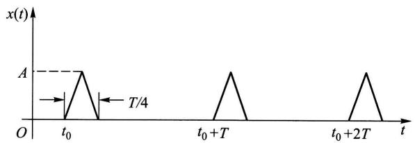  
题8图

(1) 求  $\mu_{X},\Psi_{X}^{2}$

(2) 求  $\langle X(t)\rangle$  和  $\langle X^{0}(t)\rangle$

9. 设平稳过程  $X(t)$  的自相关函数为  $R_{X}(\tau)$ , 证明

$$
P\left\{\left|X(t + \tau) - X(t)\right|\geqslant a\right\} \leqslant 2\left[R_{X}(0) - R_{X}(\tau)\right] / a^{2},\quad a > 0.
$$

10. 设  $X(t)$  为平稳过程, 其自相关函数  $R_{X}(\tau)$  是以  $T_{0}$  为周期的函数. 证明  $X(t)$  是周期为  $T_{0}$  的平稳过程.

11. 设  $X(t)$  是雷达的发射信号, 遇目标后返回接收机的微弱信号是  $a X(t - \tau_{1}),a\ll 1,\tau_{1}$  是信号返回时间, 由于接收到的信号总是伴有噪声的, 记噪声为  $N(t)$ , 于是接收到的全信号为

$$
Y(t) = a X(t - \tau_{1}) + N(t).
$$

(1)若  $X(t)$  和  $N(t)$  是平稳相关的,证明  $X(t)$  和  $Y(t)$  也平稳相关.

(2)在(1)的条件下,假设  $N(t)$  的均值为零且与  $X(t)$  是相互独立的,求  $R_{X Y}(\tau)$  (这是利用互相关函数从全信号中检测小信号的相关接收法).

12. 平稳过程  $\{X(t), t \in (-\infty , \infty)\}$  的自相关函数为

$$
R_{X}(\tau) = 4 \mathrm{e}^{-|\tau |} \cos \pi \tau + \cos 3 \pi \tau ,
$$

求:(1)  $X(t)$  的均方值.

(2)  $X(t)$  的谱密度.

13. 已知平稳过程  $X(t)$  的谱密度为

$$
S_{X}(\omega) = \frac{\omega^{2}}{\omega^{4} + 3 \omega^{2} + 2},
$$

求  $X(t)$  的均方值.

14. 已知平稳过程  $X(t)$  的自相关函数为

$$
R_{X}(\tau) = \left\{ \begin{array}{ll} 1 - \frac{|\tau|}{T}, & |\tau | \leqslant T, \\ 0, & |\tau | > T. \end{array} \right.
$$

求谱密度  $S_{X}(\omega)$

15. 已知平稳过程  $X(t)$  的谱密度为

$$
S_{X}(\omega) = \left\{ \begin{array}{ll} 8 \delta (\omega) + 20 \left(1 - \frac{|\omega|}{10}\right), & |\omega | < 10, \\ 0, & |\omega | \geqslant 10. \end{array} \right.
$$

求  $X(t)$  的自相关函数.

16. 设随机过程

$$
Y(t) = X(t) \cos (\omega_{0} t + \Theta), \quad t \in (-\infty , \infty),
$$

其中  $X(t)$  是平稳过程,  $\Theta$  为在区间  $(0,2\pi)$  上均匀分布的随机变量,  $\omega_{0}$  为常数,且  $X(t)$  与  $\Theta$  相互独立. 记  $X(t)$  的自相关函数为  $R_{X}(\tau)$ , 功率谱密度为  $S_{X}(\omega)$ , 试证:

(1)  $Y(t)$  是平稳过程,且它的自相关函数为

$$
R_{Y}(\tau) = \frac{1}{2} R_{X}(\tau) \cos \omega_{0} \tau .
$$

(2)  $Y(t)$  的功率谱密度为

$$
S_{Y}(\omega) = \frac{1}{4} \left[ S_{X}(\omega - \omega_{0}) + S_{X}(\omega + \omega_{0}) \right].
$$

17. 设平稳过程  $X(t)$  的谱密度为  $S_{X}(\omega)$ , 证明  $Y(t) = X(t) + X(t - T)$  的谱密度是

$$
S_{Y}(\omega) = 2 S_{X}(\omega) (1 + \cos \omega T).
$$

# 第十五章 时间序列分析

我们在实际问题中经常会遇到一系列随时间变化而又相互关联并包含着不确定性的数据.例如某地区的月降雨量纪录、上证指数每日的收盘价、一条流水线上每天出现的次品数等,这些都可以看成是离散参数随机过程  $\{X_{t},t = 0,\pm 1$ $\pm 2,\dots \}$  .由于  $t$  经常代表时间,常称这样的离散参数随机过程为时间序列.时间序列分析就是利用观测或试验所得到的动态数据来建立可以应用的模型.本章着重讨论较为简单但有着广泛应用的平稳时间序列的自回归滑动平均模型,简称ARMA.

# $\S 1$  平稳时间序列

定义若时间序列  $\{X_{t},t = 0,\pm 1,\pm 2,\dots \}$  满足条件(1)  $E(X_{t}) = \mu$  和(2)  $E(X_{t}X_{t + k})$  均与  $t$  无关,则称之为平稳时间序列.

平稳时间序列是平稳随机过程的一个特例

运用时间序列的关键在于刻画序列各项之间的关系.为此常会用到下面两种相关函数:

自相关函数  $\rho_{k} = \gamma_{k} / \gamma_{0}$  ,其中

$$
\gamma_{k} = E[(X_{t} - \mu)(X_{t + k} - \mu)],\quad k = 0,\pm 1,\pm 2,\dots
$$

为自协方差函数.可知当  $\{X_{t},t = 0,\pm 1,\pm 2,\dots \}$  为平稳时间序列时,  $\gamma_{k},\rho_{k}$  都与  $t$  无关并具有下列性质:

(1)对称性:  $\gamma_{k} = \gamma_{-k}$

(2)非负定性:对任意正整数  $k$

$$
\begin{array}{r}{\pmb{R}_{k}=\left[\begin{array}{c c c c c}{1}&{\rho_{1}}&{\rho_{2}}&{\cdots}&{\rho_{k-1}}\\ {\rho_{1}}&{1}&{\rho_{1}}&{\cdots}&{\rho_{k-2}}\\ {\vdots}&{\vdots}&{\vdots}&&{\vdots}\\ {\rho_{k-1}}&{\rho_{k-2}}&{\rho_{k-3}}&{\cdots}&{1}\end{array}\right]}\end{array}
$$

是非负定矩阵.

(3)满足柯西不等式:  $\mid \gamma_{k}\mid \leqslant \gamma_{0},\mid \rho_{k}\mid \leqslant 1$

自相关函数描述  $X_{t}$  与  $X_{t + k}$  之间的相关性.

偏相关函数用  $X_{t}$  的前  $k$  个时刻的值  $X_{t - 1},\dots ,X_{t - k}$  对  $X_{t}$  作最小方差估

计,即求  $a_{k1},a_{k2},\dots ,a_{k s}$  使得  $E\Big[\Big(X_{t} - \sum_{i = 1}^{k}a_{k i}X_{t - i}\Big)^{2}\Big]$  最小.当  $\{X_{t},t = 0,\pm 1$ $\pm 2,\dots \}$  为平稳时间序列时,  $a_{k k}$  与  $t$  无关,  $a_{k k}$  称为该时间序列的偏相关函数.

偏相关函数描述  $X_{t}$  与  $X_{t - 1},\dots ,X_{t - k}$  的联系.

例1(白噪声)设时间序列  $\{\epsilon_{t},t = 0,1,\dots \}$  满足:(1)  $E(\epsilon_{t}) = 0$ ;(2)  $E(\epsilon_{t}\epsilon_{s}) = \sigma_{\epsilon}^{2}\delta_{ts}$ ,其中

$$
\delta_{ts} = \left\{ \begin{array}{ll}1, & t = s, \\ 0, & t \neq s. \end{array} \right.
$$

易知  $E(\epsilon_{t}\epsilon_{t + k}) = \sigma_{\epsilon}^{2}\delta_{k0}$  与  $t$  无关,因此  $\{\epsilon_{t},t = 0,1,\dots \}$  为平稳时间序列,称  $\{\epsilon_{t},t = 0,1,\dots \}$  为白噪声序列.  $\square$

例2(平稳时间序列的延迟)对给定的平稳时间序列  $\{X_{t},t = 0,\pm 1$ $\pm 2,\dots \}$  和正整数  $d$ ,定义它的  $d$  步延迟序列  $\{Y_{t} = X_{t - d},t = 0,\pm 1,\pm 2,\dots \}$ .易知  $E(Y_{t}) = E(X_{t - d}) = \mu$  和  $E(Y_{t}Y_{t + k}) = E(X_{t - d}X_{t + k - d})$  均与  $t$  无关.因此  $\{Y_{t},t = 0,\pm 1,\pm 2,\dots \}$  也是平稳时间序列.  $\square$

由于延迟会经常用到,我们引进下述延迟算子:

定义设  $\{X_{t},t = 0,\pm 1,\pm 2,\dots \}$  为时间序列,算子  $B$  满足等式  $B X_{t} = X_{t - 1}$  称它为一步延迟算子.用  $B^{k}$  表示连续应用一步延迟算子  $k$  次,并称之为  $k$  步延迟算子,则有  $B^{k}X_{t} = X_{t - k}$

# $\S 2$  线性自回归滑动平均模型

平稳时间序列的线性模型相对简单并具有广泛应用,本节讨论常用的线性自回归滑动平均模型.由于平稳时间序列各项的均值相同,则平移总可以把序列的均值归零,因此以下只关注均值为零的序列.

定义设均值为零的平稳时间序列  $\{X_{t},t = 0,\pm 1,\pm 2,\dots \}$  满足等式

$$
X_{t} - \phi_{1}X_{t - 1} - \dots -\phi_{p}X_{t - p} = \epsilon_{t} - \theta_{1}\epsilon_{t - 1} - \dots -\theta_{q}\epsilon_{t - q}, \tag{2.1}
$$

其中  $\{\epsilon_{t},t = 0,\pm 1,\pm 2,\dots \}$  为白噪声序列,且多项式方程  $\Phi (u) = 1 - \phi_{1}u - \dots - \phi_{p}u^{p} = 0$  和  $\Theta (u) = 1 - \theta_{1}u - \dots - \theta_{q}u^{q} = 0$  没有公共根,则称之为  $p$  阶自回归  $q$  阶滑动平均时间序列,简称  $\operatorname {ARMA}(p,q)$  序列.系数  $\phi_{1},\phi_{2},\dots ,\phi_{p},\theta_{1},\theta_{2},\dots ,\theta_{q}$  称为模型的参数.  $p,q$  称为阶.利用延迟算子和多项式  $\Phi ,\Theta$  可以写出  $\operatorname {ARMA}(p,q)$  序列的算子表达式:

$$
\Phi (B)X_{t} = \Theta (B)\epsilon_{t}.
$$

在  $\operatorname {ARMA}(p,q)$  模型中,如果  $q = 0$ ,则滑动平均现象不存在,此时得到纯  $p$  阶自回归模型,将它简记为  $\operatorname {AR}(p)$ .我们将  $\operatorname {AR}(p)$  模型表示为

$$
X_{t} = \sum_{i = 1}^{p}\phi_{i}X_{t - i} + \epsilon_{t}. \tag{2.2}
$$

如果  $\scriptstyle{p = 0}$  ,则自回归现象不存在,就得到纯  $q$  阶滑动平均模型,将它简记为  $\mathrm{MA}(q)$  我们将  $\mathrm{MA}(q)$  模型表示为

$$
X_{t} = \epsilon_{t} - \sum_{i = 1}^{q}\theta_{i}\epsilon_{t - i}. \tag{2.3}
$$

$\mathrm{ARMA}(\boldsymbol {\phi},\boldsymbol {q})$  是上述两种简单模型的混合.对于一个实际的时间序列问题,自相关函数和偏相关函数可以帮助我们有效地判定较为简单的  $\operatorname {AR}(\boldsymbol {\phi})$  和  $\mathrm{MA}(q)$  模型的适用性并估计阶数  $\boldsymbol{\mathscr{p}}$  和  $q$

先讨论  $\operatorname {AR}(\boldsymbol {\phi})$  的偏相关函数.为了确定偏相关函数  $a_{k k}$  ,我们寻找  $a_{k1}$ $a_{k2},\dots ,a_{k k}$  使得

$$
f = E\Big[\Big(X_{t} - \sum_{i = 1}^{k}a_{k i}X_{t - i}\Big)^{2}\Big] \tag{2.4}
$$

达到最小.将(2.2)式代人(2.4)式得到

$$
\begin{array}{l}{{f=E\Big[\Big(\sum_{i=1}^{p}\phi_{i}X_{t-i}+\epsilon_{t}-\sum_{j=1}^{k}a_{k j}X_{t-j}\Big)^{2}\Big]}}\\ {{=E\Big\{\Big[\epsilon_{t}+\sum_{i=1}^{p}(\phi_{i}-a_{k i})X_{t-i}-\sum_{j=p+1}^{k}a_{k j}X_{t-j}\Big]^{2}\Big\}}}\\ {{=E(\epsilon_{t}^{2})+2E\Big\{\epsilon_{t}\Big[\sum_{i=1}^{p}(\phi_{i}-a_{k i})X_{t-i}-\sum_{j=p+1}^{k}a_{k j}X_{t-j}\Big]\Big\}}}\\ {{+E\Big\{\Big[\sum_{i=1}^{p}(\phi_{i}-a_{k i})X_{t-i}-\sum_{j=p+1}^{k}a_{k j}X_{t-j}\Big]^{2}\Big\}.}}\end{array}
$$

注意到  $t > s$  时  $E(\epsilon_{t}X_{s}) = 0$  ,上式中第二项为零.由于  $E(\epsilon_{t}^{2})$  为常数,要使  $f$  达到最小,第三项作为完全平方必须为零.因此  $a_{k i} = \phi_{i}$  ,当  $1\leqslant i\leqslant p;a_{k j} = 0$  ,当  $\boldsymbol{\mathscr{p}}+$ $1\leqslant j\leqslant k$  .这样得到偏相关函数

$$
a_{k k}=\left\{\begin{array}{l l}{\phi_{k},}&{1\leqslant k\leqslant p,}\\ {0,}&{k>p,}\end{array}\right.
$$

上式表明  $k > p$  时  $a_{k k} = 0$  .我们称  $X_{t}$  的偏相关函数在  $\boldsymbol{\mathscr{p}}$  处截尾.

与之对照的是  $\mathrm{MA}(q)$  模型的自相关函数的截尾性.由  $\mathrm{MA}(q)$  的定义(2.3)式可知

$$
\gamma_{k} = E(X_{t}X_{t + k}) = E\Big[\Big(\epsilon_{t} - \sum_{i = 1}^{q}\theta_{i}\epsilon_{t - i}\Big)\Big(\epsilon_{t + k} - \sum_{j = 1}^{q}\theta_{j}\epsilon_{t + k - j}\Big)\Big]. \tag{2.5}
$$

当  $k > q$  时上式两个括号中  $\epsilon_{s}$  所在的时间点  $s$  无一相同,因此  $\gamma_{k} = 0$  .又易算出 $\gamma_{0} = \sigma_{\epsilon}^{2}\Big(1 + \sum_{i = 1}^{q}\theta_{i}^{2}\Big)$  当  $1\leqslant k\leqslant q$  时我们将  $\gamma_{k}$  写成

$$
\gamma_{k} = E\Big[\Big(\epsilon_{t} - \sum_{i = 1}^{q}\theta_{i}\epsilon_{t - i}\Big)\epsilon_{t + k}\Big] - \sum_{i = 1}^{q}\theta_{i}E\big(\epsilon_{t}\epsilon_{t + k - i}\big) + \sum_{i = 1}^{q}\sum_{j = 1}^{q}\theta_{i}\theta_{j}E\big(\epsilon_{t - i}\epsilon_{t + k - j}\big).
$$

上式第一项显然为零.第二项中只有  $i = k$  的一项非零,其值为  $- \theta_{k}\sigma_{\epsilon}^{2}$ .第三项中只有那些满足  $t - i = t + k - j$  (也就是  $j = i + k$ )的项非零.所以  $\gamma_{k} = \sigma_{\epsilon}^{2}\Big(- \theta_{k} + \sum_{i = 1}^{q - k}\theta_{i}\theta_{i + k}\Big)$ .综合起来有

$$
\gamma_{k} = \left\{ \begin{array}{l l}{\sigma_{\epsilon}^{2}\Big(1 + \sum_{i = 1}^{q}\theta_{i}^{2}\Big),} & {k = 0,}\\ {\sigma_{\epsilon}^{2}\Big(-\theta_{k} + \sum_{i = 1}^{q - k}\theta_{i}\theta_{i + k}\Big),} & {1\leqslant k\leqslant q,}\\ {0,} & {k > q.} \end{array} \right. \tag{2.6}
$$

于是

$$
\rho_{k} = \left\{ \begin{array}{l l}{1,} & {k = 0,}\\ {-\theta_{k} + \sum_{i = 1}^{q - k}\theta_{i}\theta_{i + k}}\\ {1 + \sum_{i = 1}^{q}\theta_{i}^{2},} & {1\leqslant k\leqslant q,}\\ {0,} & {k > q,} \end{array} \right. \tag{2.7}
$$

即自相关函数在  $k = q$  处截尾.

我们自然要问  $\operatorname {AR}(p)$  模型的自相关函数和  $\operatorname {MA}(q)$  模型的偏相关函数具有什么特点.先看  $\operatorname {AR}(1)$  模型:

$$
X_{t} = \phi_{1}X_{t - 1} + \epsilon_{t}. \tag{2.8}
$$

注意到  $E(X_{t - 1}\epsilon_{t}) = 0$ ,在等式(2.8)两边取方差得到

$$
D(X_{t}) = \phi_{1}^{2}D(X_{t - 1}) + D(\epsilon_{t}).
$$

由  $X_{t}$  的平稳性知  $\sigma^{2} = D(X_{t}) = D(X_{t - 1})$ .记  $\sigma_{\epsilon}^{2} = D(\epsilon_{t})$ ,有

$$
\sigma^{2} = \frac{\sigma_{\epsilon}^{2}}{1 - \phi_{1}^{2}}.
$$

这样参数  $\phi_{1}$  必须满足  $|\phi_{1}|< 1$ .在此条件下  $\Phi^{- 1}(u) = (1 - \phi_{1}u)^{- 1} = \sum_{i = 1}^{\infty}\phi_{i}^{i}u^{i}$  存在,从而可以将(2.8)式改写为

$$
X_{t} = \Phi^{-1}(B)\epsilon_{t} = \sum_{i = 0}^{\infty}\phi_{i}^{i}\epsilon_{t - i}. \tag{2.9}
$$

与  $q$  阶滑动平均模型  $\sum_{i = 0}^{q}\phi_{i}^{i}\epsilon_{t - i}$  比较,我们可将(2.9)式看作是一个  $q = \infty$  的滑动

平均模型,由此可以推断它不会截尾.事实上将等式

$$
\gamma_{k} = E(X_{t}X_{t + k}) = E\big[X_{t}(\phi_{1}X_{t + k - 1} + \epsilon_{t + k})\big] = \phi_{1}\gamma_{k - 1}
$$

除以  $\gamma_{0}$  得到

$$
\rho_{k} = \phi_{1}\rho_{k - 1}.
$$

因  $\rho_{0} = 1$  ,用上式递推可知  $\rho_{k} = \phi_{1}^{k} = \mathrm{e}^{k\ln \phi_{1}}\neq 0$  ,但以指数速度衰减至零.我们称  $X_{t}$  的自相关函数拖尾.

对于一般的  $\operatorname {AR}(p)$  模型  $\Phi (B)X_{t} = \epsilon_{t}$  ,只要  $\Phi (u) = 0$  的根都在单位圆外, $\Phi^{- 1}(B)$  就存在,从而自相关函数也是拖尾的.模型的自相关函数可以利用

$$
E[\Phi (B)X_{t + k}X_{t}] / \gamma_{0} = E(\epsilon_{t + k}X_{t}) / \gamma_{0} = 0
$$

得到差分方程

$$
\rho_{k} - \phi_{1}\rho_{k - 1} - \dots -\phi_{p}\rho_{k - p} = 0
$$

来解出(见本章末附录).

用类似的方法,只要  $\Theta (u) = 0$  的根都在单位圆外,就可以把  $\operatorname {MA}(q)$  模型 $X_{t} = \Theta (B)\epsilon_{t}$  看成  $\scriptstyle{p = \infty}$  的自回归模型  $\Theta^{- 1}(B)X_{t} = \epsilon_{t}$  ,从而推断其偏相关函数拖尾.为了计算偏相关函数  $a_{k k}$  ,设  $a_{k1},a_{k2},\dots ,a_{k k}$  使得

$$
\begin{array}{l}{{f=E\left[\left(X_{t}-\sum_{i=1}^{k}a_{k i}X_{t-i}\right)^{2}\right]}}\\ {{=E\left[X_{t}^{2}-2X_{t}\sum_{i=1}^{k}a_{k i}X_{t-i}+\left(\sum_{i=1}^{k}a_{k i}X_{t-i}\right)^{2}\right]}}\\ {{=E(X_{t}^{2})-2\sum_{i=1}^{k}a_{k i}E(X_{t}X_{t-i})+\sum_{i=1}^{k}\sum_{j=1}^{k}a_{k i}a_{k j}E(X_{t-i}X_{t-j})}}\\ {{=\gamma_{0}-2\sum_{i=1}^{k}a_{k i}\gamma_{i}+\sum_{i=1}^{k}\sum_{j=1}^{k}a_{k i}a_{k j}\gamma_{i-j}}}\end{array} \tag{2.10}
$$

达到最小.将最优条件  $\frac{\partial f}{\partial a_{k j}} = 0(j = 1,2,\dots ,k)$  除以  $2\gamma_{0}$  ,写成矩阵方程

$$
\left[ \begin{array}{c c c c c}{1} & {\rho_{1}} & {\rho_{2}} & \dots & {\rho_{k - 1}}\\ {\rho_{1}} & 1 & {\rho_{1}} & \dots & {\rho_{k - 2}}\\ \vdots & \vdots & \vdots & & \vdots \\ {\rho_{k - 1}} & {\rho_{k - 2}} & {\rho_{k - 3}} & \dots & 1 \end{array} \right]\left[ \begin{array}{c}{a_{k1}}\\ {a_{k2}}\\ \vdots \\ {a_{k k}} \end{array} \right] = \left[ \begin{array}{c}{\rho_{1}}\\ {\rho_{2}}\\ \vdots \\ {\rho_{k}} \end{array} \right], \tag{2.11}
$$

当  $k = 1$  时可以直接得到  $a_{11} = \rho_{1}$  .令  $k = 2$  ,解

$$
\left[ \begin{array}{c c}{1} & {\rho_{1}}\\ {\rho_{1}} & 1 \end{array} \right]\left[ \begin{array}{c}{a_{21}}\\ {a_{22}} \end{array} \right] = \left[ \begin{array}{c}{\rho_{1}}\\ {\rho_{2}} \end{array} \right] \tag{2.12}
$$

得到

$$
a_{22} = \frac{\rho_{2} - a_{11}^{2}}{1 - a_{11}^{2}}.
$$

当  $k$  较大时下面的莱文森一德宾(Levinson- Durbin  $(\widehat{\mathbf{l}})$  )递推公式可以用来有效地计算偏相关函数:

$$
a_{k k} = \frac{\rho_{k} - \sum_{j = 1}^{k - 1}\rho_{k - j}a_{(k - 1)j}}{1 - \sum_{j = 1}^{k - 1}\rho_{j}a_{(k - 1)j}}, \tag{2.13}
$$

其中  $a_{k j} = a_{(k - 1) j} - a_{k k}a_{(k - 1)(k - j)}, j = 1,2, \dots , k - 1. ②$

例(AR和MA序列的自相关函数和偏相关函数) 考虑AR(2)模型

$$
X_{t} = 0.4 X_{t - 1} + 0.4 X_{t - 2} + \epsilon_{t} \tag{2.14}
$$

和MA(2)模型

$$
X_{t} = \epsilon_{t} + 0.6 \epsilon_{t - 1} - 0.4 \epsilon_{t - 2}, \tag{2.15}
$$

试用模拟方法分别生成上述两个模型长度为200的时间序列,并展示对应的自相关函数和偏相关函数的图形.

解R程序中的arima.sim()函数可以用来以模拟方法生成ARMA模型对应的时间序列.试用下面的R程序语句:

>sim.ar<- arima.sim(list(ar=c(0.4,0.4)),n=200)

生成200项(2.14)式描述的AR(2)模型,并且将它们存入sim.ar.式中list(ar=c(0.4,0.4))设定生成AR模型,且该模型的参数为  $\phi_{1} = 0.4$  和  $\phi_{2} = 0.4$ .类似地试用语句

>sim.ma<- arima.sim(list(ma=c(0.6,- 0.4)),n=200)

生成200项(2.15)式描述的MA(2)模型,并将它们存入sim.ma.这里需要特别注意的是R语言中的  $\mathrm{MA}(q)$  模型写成

$$
X_{t} = \epsilon_{t} + \sum_{i = 1}^{q} \theta_{i} \epsilon_{t - i},
$$

即系数前为正号,而定义(2.3)式中MA模型系数  $\theta_{i}$  前为负号.因此在输入(2.15)式的系数时要注意这一约定.

自相关函数和偏相关函数的图形可以分别用R函数acf()和pacf()得到.下面的R程序中先用par(mfrow=c(2,2))规定4个将要得到的图形应排成 $2 \times 2$ 矩阵,再作例题中要求的4个图形,执行后会在计算机显示屏幕弹出新窗口(见图15- 1)给出自相关函数和偏相关函数的图形.在acf()和pacf()的图中,横轴上下两侧的虚线是统计上是否显著不同于零的临界值,当时间序列的自

相关函数或偏相关函数的值落在这两条虚线以内的区域时,视为无法区别于0. 在acf()和 pacf()函数中,采用标准正态分布的  $95\%$  置信区间来确定临界值 $\pm 2 / \sqrt{n}$  ,其中  $n$  为时间序列的长度.从图  $15 - 1$  中可以清楚地看到生成的AR(2)序列的偏相关函数(从滞后  $\mathrm{Lag} = 1$  开始)在  $\mathrm{Lag} = 2$  处截尾,而它的自相关函数是拖尾的.成为对比的是生成的MA(2)序列的自相关函数(从滞后  $\mathrm{Lag} = 0$  开始)在  $\mathrm{Lag} = 2$  处截尾(在  $\mathrm{Lag} = 9$  处大约等于临界值),而它的偏相关函数是拖尾的.相关R程序如下:

>par(mfrow = c(2,2))

>acf(sim.ar,main = "ACF of AR(2)")

>acf(sim.ma,main = "ACF of MA(2)")

>pacf(sim.ar,main = "PACF of AR(2)")

>pacf(sim.ma,main = "PACF of MA(2)")

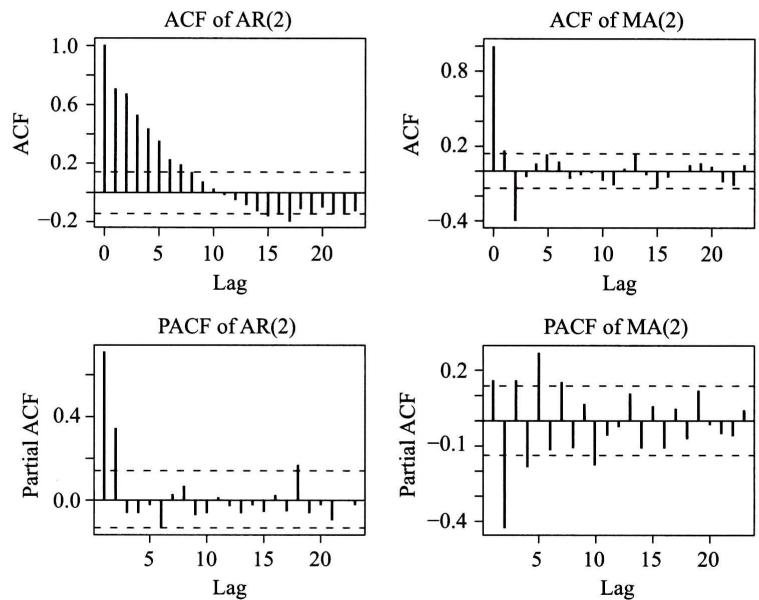  
图15-1

由于ARMA模型比AR模型和MA模型都更一般,它的自相关函数和偏相关函数都拖尾.表15- 1总结了ARMA  $(p,q)$  模型及其特例AR  $(p)$  和MA  $(q)$  的性质.

对于非平稳的时间序列  $X_{t}$ ,我们常考虑其导出的差分序列  $Y_{t} = X_{t} - X_{t - 1}$ .例如金融市场中的证券指数(如上证指数)有长期的增长趋势,因而作为时间序列是

非平稳的.但其相应的对数序列的差分序列却是平稳的,它反映证券指数的百分比增益在固定范围内波动.如果差分序列仍非平稳,还可以考虑再做差分,也就是考虑原时间序列的二阶差分.当  $X_{t}$  的  $d$  阶差分序列满足  $\mathrm{ARMA}(\boldsymbol {\phi},\boldsymbol {q})$  模型时,我们说  $X_{t}$  满足  $\mathrm{ARIMA}(\boldsymbol {\phi},\boldsymbol {d},\boldsymbol {q})$  模型.当  $d = 0$  时,  $\mathrm{ARIMA}(\boldsymbol {\phi},\boldsymbol {0},\boldsymbol {q}) = \mathrm{ARMA}(\boldsymbol {\phi},\boldsymbol {q})$

表15一1 三种线性模型的性质  

<table><tr><td>模型</td><td>MA(q)</td><td>AR(p)</td><td>ARMA(p,q)</td></tr><tr><td>基本方程</td><td>Xt=θ(B)εt</td><td>Φ(B)Xt=εt</td><td>Φ(B)Xt=θ(B)εt</td></tr><tr><td>自相关函数</td><td>截尾</td><td>拖尾</td><td>拖尾</td></tr><tr><td>偏相关函数</td><td>拖尾</td><td>截尾</td><td>拖尾</td></tr></table>

# $\S 3$  模型的应用

在实际应用中观察时间序列得到的总是一个有限的样本.我们必须依据这些有限的信息来初步判断适用的模型,然后对模型的参数进行估计.由于我们依据的是不完全的信息,上述做法完全可能导致不同类型的,或同类但不同阶数的模型.要最终确定可以应用的模型,还须对得到的模型进行考核,经考核合格的模型才能用于对时间序列的实际预报.下面我们结合R函数的应用来逐一讨论这些步骤.

# (一)模型识别

将对时间序列进行观测得到的有限样本记为  $y_{1},y_{2},\dots ,y_{n}$  ,其中  $n$  为样本长度,用

$$
\overline{{y}} = \frac{\sum_{i = 1}^{n}y_{i}}{n}
$$

作为这个时间序列均值的估计.再令  $x_{i} = y_{i} - \overline{{y}} (i = 1,2,\dots ,n)$  ,得到一个零均值序列.用

$$
\hat{\gamma}_{k} = \frac{1}{n}\sum_{i = 1}^{n - k}x_{i}x_{i + k} \tag{3.1}
$$

作为协方差函数的估计.虽然(3.1)式是有偏估计,但它可以保证自相关函数的非负定性.而且由于实际应用中  $n$  都很大(至少大于50)且远大于  $k$  (通常  $k<$ $n / 10)$  ,(3.1)式与无偏估计  $\sum_{i = 1}^{n - k}x_{i}x_{i + k} / (n - k)$  相差很小.

由上节表15一1可知,如果已知模型为  $\operatorname {AR}(p)$  或  $\operatorname {MA}(q)$ ,则可用偏相关函数或自相关函数来确定它们的阶数。但是对于一般的ARMA模型,偏相关函数和自相关函数都是拖尾的。因此这两种相关函数难以直接用来有效地确定ARMA模型的阶数。针对这一问题,Tsay和Tiao发展了广义自相关函数(EACF)。①其原理是如果已知ARMA模型的AR部分的阶数  $p$ ,那么其系数可以通过对观测数据用回归方法得到,余下的MA部分的阶数可以用自相关函数的截尾性确定。广义自相关函数方法中对每个给定的AR阶数  $p$ ,将对应的MA部分的自相关函数按时间差由小到大表示为行向量。

例  $1②$  (广义自相关函数)表15一2和表15一3是3M公司的股票自1946年2月到2008年12月(共  $T = 755$  个月)月回报对数的广义自相关函数表。其中表15一2为数值表,表15一3为对应的简化表。简化表的做法是以  $2\sqrt{T}$  为界,绝对值小于这个界的用O来表示,大于这个界的用X来表示。理论上说简化广义自相关函数矩阵中O项构成的三角形的左上角的位置就指示了ARMA的阶数(参见下述例2),但在这个例子里当  $p = 0$  时  $q = 2,5,9,11$  处的值  $- 0.08$ , $0.08, - 0.08,0.09$  的绝对值只比  $2 / \sqrt{755} = 0.073$  略大一点点。如果略微放松截尾的界值,则  $p = 0$ , $q = 2,5,9,11$  处的X就会变成O,这样我们可以看出  $(p,q) = (0,0)$ 。实际情况经常不是非黑即白的。

表15-2 EACF数值表  

<table><tr><td rowspan="2">p</td><td colspan="13">q</td></tr><tr><td>0</td><td>1</td><td>2</td><td>3</td><td>4</td><td>5</td><td>6</td><td>7</td><td>8</td><td>9</td><td>10</td><td>11</td><td>12</td></tr><tr><td>0</td><td>-0.06</td><td>-0.04</td><td>-0.08</td><td>0</td><td>0.02</td><td>0.08</td><td>0.01</td><td>0.01</td><td>-0.03</td><td>-0.08</td><td>0.05</td><td>0.09</td><td>-0.01</td></tr><tr><td>1</td><td>-0.47</td><td>0.01</td><td>-0.07</td><td>-0.02</td><td>0</td><td>0.08</td><td>-0.03</td><td>0</td><td>-0.01</td><td>-0.07</td><td>0.04</td><td>0.09</td><td>-0.02</td></tr><tr><td>2</td><td>-0.38</td><td>-0.35</td><td>-0.07</td><td>0.02</td><td>-0.01</td><td>0.08</td><td>0.03</td><td>0.01</td><td>0</td><td>-0.03</td><td>0.02</td><td>0.04</td><td>0.04</td></tr><tr><td>3</td><td>-0.18</td><td>0.14</td><td>0.38</td><td>-0.02</td><td>0</td><td>0.04</td><td>-0.02</td><td>0.02</td><td>-0.00</td><td>-0.02</td><td>0.02</td><td>0.01</td><td>0.04</td></tr><tr><td>4</td><td>0.42</td><td>0.03</td><td>0.45</td><td>-0.01</td><td>0</td><td>0</td><td>-0.01</td><td>0.03</td><td>0.01</td><td>0</td><td>0.02</td><td>0</td><td>0.01</td></tr><tr><td>5</td><td>-0.11</td><td>0.21</td><td>0.45</td><td>0.01</td><td>0.20</td><td>-0.01</td><td>0</td><td>0.04</td><td>-0.01</td><td>-0.01</td><td>0.03</td><td>0.01</td><td>0.03</td></tr><tr><td>6</td><td>-0.21</td><td>-0.25</td><td>0.24</td><td>0.31</td><td>0.17</td><td>-0.04</td><td>0</td><td>0.04</td><td>-0.01</td><td>-0.03</td><td>0.01</td><td>0.01</td><td>0.04</td></tr></table>

<table><tr><td rowspan="2">p</td><td colspan="13">q</td></tr><tr><td>0</td><td>1</td><td>2</td><td>3</td><td>4</td><td>5</td><td>6</td><td>7</td><td>8</td><td>9</td><td>10</td><td>11</td><td>12</td></tr><tr><td>0</td><td>O</td><td>O</td><td>X</td><td>O</td><td>O</td><td>X</td><td>O</td><td>O</td><td>O</td><td>X</td><td>O</td><td>X</td><td>O</td></tr><tr><td>1</td><td>X</td><td>O</td><td>O</td><td>O</td><td>O</td><td>X</td><td>O</td><td>O</td><td>O</td><td>O</td><td>O</td><td>X</td><td>O</td></tr><tr><td>2</td><td>X</td><td>X</td><td>O</td><td>O</td><td>O</td><td>X</td><td>O</td><td>O</td><td>O</td><td>O</td><td>O</td><td>O</td><td>O</td></tr><tr><td>3</td><td>X</td><td>X</td><td>X</td><td>O</td><td>O</td><td>O</td><td>O</td><td>O</td><td>O</td><td>O</td><td>O</td><td>O</td><td>O</td></tr><tr><td>4</td><td>X</td><td>O</td><td>X</td><td>O</td><td>O</td><td>O</td><td>O</td><td>O</td><td>O</td><td>O</td><td>O</td><td>O</td><td>O</td></tr><tr><td>5</td><td>X</td><td>X</td><td>X</td><td>O</td><td>X</td><td>O</td><td>O</td><td>O</td><td>O</td><td>O</td><td>O</td><td>O</td><td>O</td></tr><tr><td>6</td><td>X</td><td>X</td><td>X</td><td>X</td><td>X</td><td>O</td><td>O</td><td>O</td><td>O</td><td>O</td><td>O</td><td>O</td><td>O</td></tr></table>

在R中已有由eacf()函数直接给出的广义自相关函数简化表,下面举例说明其应用.

例2 调用eacf()函数处理时间序列要用到R中的特殊函数库fBasics和TSA.打开R后点击菜单中的程序包,再选子菜单中的加载程序包,就可以从函数库的目录中选择这两个库并加载①.然后用下面的指令调用:

> library(fBasics)

> library(TSA)

再用指令arima.sim生成对应于模型

$$
X_{t} = 0.3X_{t - 1} - 0.7X_{t - 2} + \epsilon_{t} + 0.5\epsilon_{t - 1},
$$

长度为  $n = 120$  的时间序列并存入  $x$

$>$  x<- arima.sim(list(order  $=$  c(2,0,1),ar  $=$  c(0.3,- 0.7),ma  $=$ $\mathsf{c}(0.5),\mathsf{n} = 120)$

注意当模型中同时具有AR和MA部分时,要先用order  $= \mathsf{c}(\mathsf{p},0,\mathsf{q})$  给定AR部分的阶数  $\boldsymbol{\mathscr{p}}$  和MA部分的阶数  $q$  ,中间的0是指差分的阶数.接着用R的eacf()函数来识别模型:

> eacf(x,ar.max  $= 6$  ,ma.max  $= 6$

AR/MA

0123456

0xxxxxxx

1xxxxxxx

2x00000 如前所述,在输出矩阵中符号对应的

3x00000 最大的上三角形子矩阵的左上角指示模

4x00000 型的阶数.在本例中eacf()函数正确地

5xx0000 确定了模型为ARMA(2,1).

值得指出的是,由于时间序列的随机性,应用eacf()函数于一组特定的观察值并不一定能保证正确地识别模型.反复运行上述两条指令可发现eacf()函数只是以比较大的概率正确地识别模型,误判是可能发生的.

# (二)参数估计

知道了模型的阶数以后,还要估计模型的参数,未知参数除了模型中的系数外还包括  $\sigma_{\epsilon}^{2}$  .大致来说参数估计的方法是用观测样本和(3.1)式得到的估计值 $\hat{\gamma}_{i}$  代替  $\S 2$  公式(2.6)中的  $\gamma_{i}$  ,可估计模型  $\mathrm{MA}(q)$  的参数  $\theta_{i}(i = 1,2,\dots ,q)$  和  $\sigma_{\epsilon}^{2}$  类似地,由  $\hat{\gamma}_{i}$  得到估计值  $\hat{\rho}_{i} = \hat{\gamma}_{i} / \hat{\gamma}_{0}$  并代入矩阵方程(2.11),可以解出模型  $\operatorname {AR}(p)$  的参数  $\phi_{i}(i = 1,2,\dots ,p)$  的估计.一般的  $\operatorname {ARMA}(p,q)$  模型的参数估计是上述两种模型参数估计方法的结合.R函数库中的arima()函数可以用来对模型进行参数估计,指令如下(符号  $\%$  后为说明):

${\mathsf{>}}{\mathsf{m}}={\mathsf{a r i m a}}({\mathsf{x}},{\mathsf{o r d e r}}={\mathsf{c}}(2,0,1))\ {\mathsf{\%}}$  按ARMA(2,1)模型作参数估计并存人  $\mathfrak{m}$ $>m\%$  显示结果

Call:

arima  $\mathbf{\Psi}(\mathbf{x} = \mathbf{x}$  ,order  $= \mathsf{c}(2,0,1)$

Coefficients:

ar1 ar2 mal intercept

0.2334 - 0.7202 0.5936 0.0548

s.e. 0.0721 0.0675 0.0860 0.0997

sigma2 estimated as 1.03:log likelihood  $=$  - 173.36,aic  $=$  354.72

可以看到函数arima()得到了相对准确的参数估计值  $\hat{\phi}_{1} = 0.2334,\hat{\phi}_{2} = - 0.7202,$ $\hat{\theta}_{1} = 0.5936$  ,并给出了相应的标准误差(s.e.),同时它也估计出  $\sigma_{\epsilon}^{2} = 1.03$  .值得说明的是,这里截距(intercept)  $m = 0.0548$  的意义为时间序列  $X_{t} - m$  满足给出的模型.在这个例子里  $m = 0.0548$  可以近似看作为零.

# (三)模型考核

前面说过在时间序列模型识别过程中误判的可能是存在的,因此通过上面的

模型识别与参数估计得到的模型需要通过考核。如果通不过考核,就需要考虑其他可能的模型。下面用例2来介绍常用的考核方法。上述模型识别与参数估计给出

$$
X_{t} = \hat{\phi}_{1}X_{t - 1} + \hat{\phi}_{2}X_{t - 2} + \epsilon_{t} + \hat{\theta}_{1}\epsilon_{t - 1}.
$$

用  $x_{t}, t = 1,2, \dots , n$  记时间序列的观察值。当  $t \leqslant 0$  时,设  $x_{t} = \epsilon_{t} = 0$  是合理的。这样可以自上式解出

$$
\begin{array}{r l} & {\hat{\epsilon}_{1} = x_{1},}\\ & {\hat{\epsilon}_{2} = x_{2} - \hat{\phi}_{1}x_{1} - \hat{\theta}_{1}\hat{\epsilon}_{1},}\\ & {\hat{\epsilon}_{3} = x_{3} - \hat{\phi}_{1}x_{2} - \hat{\phi}_{2}x_{1} - \hat{\theta}_{1}\hat{\epsilon}_{2},}\\ & {\hat{\epsilon}_{4} = x_{4} - \hat{\phi}_{1}x_{3} - \hat{\phi}_{2}x_{2} - \hat{\phi}_{3}x_{1} - \hat{\theta}_{1}\hat{\epsilon}_{3},} \end{array}
$$

如此递推得到  $\epsilon_{t}$  序列的估计  $\hat{\epsilon}_{t}, t = 1,2, \dots , n$ 。如果模型很接近实际情况,那么  $\hat{\epsilon}_{t}$ ,  $t = 1,2, \dots , n$  应有白噪声序列的特征。这是用以考核模型的基础。对于ARMA  $(p, q)$  模型,我们常用其自相关函数是否接近于零来做判断,也就是检验假设  $H_{0}: \hat{\rho}_{1} = \hat{\rho}_{2} = \dots = \hat{\rho}_{k} = 0$ 。用效果比较好的Box- Ljung方法考察统计量

$$
Q = n(n + 2) \sum_{k = 1}^{h} \frac{\hat{\rho}_{k}^{2}}{n - k},
$$

其中  $\hat{\rho}_{k}$  是  $\hat{\epsilon}_{t}, t = 1,2, \dots , n$  的自相关函数。当  $\hat{\epsilon}_{t}, t = 1,2, \dots , n$  为白噪声序列时, $Q$  应服从自由度为  $h$  的  $\chi^{2}$  分布。R的函数库包含Box.test函数,可以直接调用Box- Ljung方法,指令是:

>Box.test(m $residuals, lag = 12, \text{type} = \text{Ljung}, \text{fitdf} = 3)$

Box- Ljung test

data: m\(residuals

X- squared = 2.9414, df = 9, p- value = 0.9666

调用这个函数时一般用  $\text{lag} = n / 10$  来给出自由度,并用  $\text{fitdf} = p + q$  给出约束的数目。于是对于此例,自由度就是  $\text{df} = \text{lag} - p - q = 9$ 。 $p$  值为0.9666,远大于拒绝假设  $H_{0}$  的显著性水平0.05。因而按0.05的显著性水平,这个模型可以通过考核。

# (四)预报

在金融、气象、经济和工程实践中经常遇到的问题是如何根据历史和现状来预测将来的情况,因此建立并考核时间序列模型的最终目的是对时间序列进行预报。下面以零均值时间序列为例来讨论预报问题。设  $x_{i}, i = 1,2, \dots , n$  为一个零均值时间序列的观察值,用它来对  $x_{n + l}, l > 0$  作估计,并将这个估计值记为

$\hat{x}_{n}(l)$ . 这里  $l$  表示预报的是  $n$  个观测数据之后的第  $l$  个数据, 叫做  $l$  步预报. 在作  $l$  步预报时总会遇到  $n$  以后的白噪声的值. 注意到当  $s > t$  时

$$
E(\epsilon_{s}X_{t}) = 0,
$$

也就是说  $x_{i},i = 1,2,\dots ,n$  与  $t > n$  以后的  $\epsilon_{t}$  是不相关的. 所以我们约定  $l > 0$  时

$$
\hat{\epsilon}_{n + l} = 0,
$$

也就是说将  $n$  以后的  $\epsilon_{n + l}$  的估计值都取为零. 预报的原理是去寻找  $\hat{x}_{n}(l)$  作为  $x_{i},i = 1,2,\dots ,n$  的一个线性函数  $\hat{x}_{n}(l) = \sum_{i = 1}^{n}c_{i}x_{i}$  使得

$$
E\{\left[x_{n + l} - \hat{x}_{n}(l)\right]^{2}\}
$$

达到最小, 这样的  $\hat{x}_{n}(l)$  称为  $x_{n + l}$  的线性最小方差估计. 下面来讨论 AR, MA 和 ARMA 模型的具体预报方法.

# AR 模型的预报

由(2.2)式知用估计好的参数  $\hat{\phi}_{i}(i = 1,2,\dots ,p)$  可将模型写成

$$
x_{n + l} = \hat{\phi}_{1}x_{n + l - 1} + \hat{\phi}_{2}x_{n + l - 2} + \dots +\hat{\phi}_{p}x_{n + l - p} + \hat{\epsilon}_{n + l}.
$$

已知  $l > 0$  时  $\epsilon_{n + l}$  的估计  $\hat{\epsilon}_{n + l} = 0$ , 因此估计公式成为

$$
x_{n + l} = \hat{\phi}_{1}x_{n + l - 1} + \hat{\phi}_{2}x_{n + l - 2} + \dots +\hat{\phi}_{p}x_{n + l - p}.
$$

当  $l = 1$  时

$$
\hat{x}_{n}(1) = \hat{\phi}_{1}x_{n} + \hat{\phi}_{2}x_{n - 1} + \dots +\hat{\phi}_{p}x_{n - p + 1}.
$$

当  $l = 2$  时公式右边所需的  $x_{n + 1}$  用  $\hat{x}_{n}(1)$  来替代, 得到

$$
\hat{x}_{n}(2) = \hat{\phi}_{1}\hat{x}_{n}(1) + \hat{\phi}_{2}x_{n} + \dots +\hat{\phi}_{p}x_{n - p + 2}.
$$

类似地, 当  $l = 3$  时

$$
\hat{x}_{n}(3) = \hat{\phi}_{1}\hat{x}_{n}(2) + \hat{\phi}_{2}\hat{x}_{n}(1) + \hat{\phi}_{3}x_{n} + \dots +\hat{\phi}_{p}x_{n - p + 3}.
$$

不断递推就可以得到任意第  $l$  步的预报值. 只是  $l$  越大, 预报的准确性就越差. 如果对  $k\leqslant 0$  约定  $\hat{x}_{n}(k) = x_{n + k}$ , 那么上面的预报公式可以简约地写成

$$
\hat{x}_{n}(l) = \sum_{i = 1}^{p}\hat{\phi}_{i}\hat{x}_{n}(l - i).
$$

# MA 模型的预报

估计好参数  $\hat{\theta}_{i},i = 1,2,\dots ,q$  后模型为

$$
x_{n + l} = \epsilon_{n + l} - \hat{\theta}_{1}\epsilon_{n + l - 1} - \dots -\hat{\theta}_{q}\epsilon_{n + l - q}. \tag{3.2}
$$

当  $s > n$  时  $\epsilon_{s} = 0$ , 因此  $l > q$  时上式的右端各项均为零. 因此  $\hat{x}_{n}(l) = 0$

当  $1\leqslant l\leqslant q$  时, 由(3.2)式可知关键在于预报  $\hat{\epsilon}_{i},i = n - q + 1,\dots ,n$ . 将(3.2)式改写为

$$
\epsilon_{t} = x_{t} + \hat{\theta}_{1} \epsilon_{t - 1} + \dots + \hat{\theta}_{q} \epsilon_{t - q}.
$$

注意到当  $s \leqslant 0$  时  $\epsilon_{s} = 0$ , 我们可以用递推的方法得到

$$
\begin{array}{r l} & {\hat{\epsilon}_{1} = x_{1},}\\ & {\hat{\epsilon}_{2} = x_{2} + \hat{\theta}_{1}\hat{\epsilon}_{1}}\\ & {\quad = x_{2} + \hat{\theta}_{1}x_{1},}\\ & {\hat{\epsilon}_{3} = x_{3} + \hat{\theta}_{1}\hat{\epsilon}_{2} + \hat{\theta}_{2}\hat{\epsilon}_{1}}\\ & {\quad = x_{3} + \hat{\theta}_{1}(x_{2} + \hat{\theta}_{1}x_{1}) + \hat{\theta}_{2}x_{1},} \end{array}
$$

算出  $\hat{\epsilon}_{i}, i = n - q + 1, \dots , n$  以后, 把它们代回 (3.2) 式就可以得到预报值  $\hat{x}_{n}(l)$ ,  $l = 1, 2, \dots , q$ .

# ARMA模型的预报

结合AR和MA模型的预报方法就可以预报ARMA模型.先把ARMA模型写成

$$
x_{n + l} = \hat{\phi}_{1} x_{n + l - 1} + \dots + \hat{\phi}_{p} x_{n + l - p} + \epsilon_{n + l} - \hat{\theta}_{1} \epsilon_{n + l - 1} - \dots - \hat{\theta}_{q} \epsilon_{n + l - q}. \tag{3.3}
$$

当  $l > q$  时, 有  $\epsilon_{n + l} = \epsilon_{n + l - 1} = \dots = \epsilon_{n + l - q} = 0$ , 于是ARMA模型 (3.3) 变成

$$
x_{n + l} = \hat{\phi}_{1} x_{n + l - 1} + \dots + \hat{\phi}_{p} x_{n + l - p}.
$$

我们可以应用和AR模型相同的预报方法,

当  $1 \leqslant l \leqslant q$  时, 可以用类似MA模型的方法得到  $\hat{\epsilon}_{i}, i = n - q + 1, \dots , n$ , 然后把它们代回 (3.3) 式, 再应用AR模型的预报方法得到  $\hat{x}_{n}(l), l = 1, 2, \dots , q$ .

R函数库中的predict()函数可以用来方便地对考核过的ARIMA模型进行预报.下面再以例2中生成的时间序列为例来说明如何使用predict()函数来预报并作图.指令

$\geq \texttt{m.p r e d} < - \texttt{p r e d i c t} (\mathtt{a r i m a}(\mathtt{x},\mathtt{o r d e r} = \mathtt{c}(2,0,1)),\mathtt{n.a h e a d} = 10)$

按ARMA(2,1)模型生成对  $\mathbf{x}$  的10步预报并存入m.pred.预报结果m.pred中包含两部分信息:预报值m.pred  $\mathbb{S}$  pred和预报标准误差m.pred  $\mathbb{S}$  se.下面的指令运用这些信息作出预报,如图15一2所示.

$\geq \texttt{p l o t} (\mathbf{x},\mathbf{x}\mathbf{l}\mathbf{i}\mathbf{m} = \mathbf{c}(0,130))\mathbf{\Omega}$ $\%$  图示原始数据并预留  $130 - 120 = 10$  步预报空间 $\geq \mathsf{l i n e s}(\mathsf{m}.\mathsf{p r e d}\mathbb{S}\mathsf{p r e d},\mathsf{l w d} = 2)\mathsf{\Omega}_{\mathcal{G}}$  图示预报值,lwd  $= 2$  指定线条为2倍标准线粗

$\geq \mathsf{l i n e s}(\mathsf{m}.\mathsf{p r e d}\mathbb{S}\mathsf{p r e d} + 2*\mathsf{m}.\mathsf{p r e d}\mathbb{S}\mathsf{s e},\mathsf{l t y} = 2)\mathsf{\Omega}_{\mathcal{G}}$  图示预报值上限,lty  $= 2$  指定用虚线

>lines(m.pred $pred - 2 * m.pred$ se, lty = 2) % 图示预报值下限, lty = 2 指定用虚线

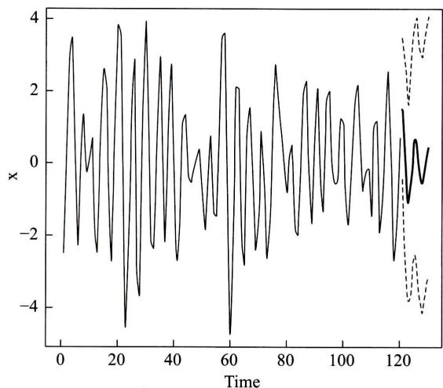  
图15-2

下例将以上讨论的方法应用于实际数据.

例3 已公布的统计数据列举了10年期国债利率从2005年1月至2014年12月的120个月度变化情况.试用其一阶差分时间序列的前面114项建立模型,对最后5项进行预报并与实际数据比较.

解 先从本书数字课程网站下载数据文件shuju.csv,存入子目录C:/R- example(或任何其他子目录),并用指令

>setwd("C:/R- example")

将上述子目录设置为R的工作目录.然后用下面的指令读入数据,计算差分序列并画出其前114项的ACF和PACF图形(见图15- 3).

>bond10 = read.csv(file = "shuju.csv", head = TRUE, sep = ",")

>l = length(bond10 $Yield)$  计算序列长度

>h <- diff(bond10 $Yield)$  计算利率差分序列

>x <- h[1:(1 - 5)] % 保留最后五项

>par(mfrow = c(2,1))

>acf(x)

>pacf(x)

观察自相关函数和偏相关函数图形的截尾性质可见AR(1),MA(1)以及MA(6)都是可能的模型.

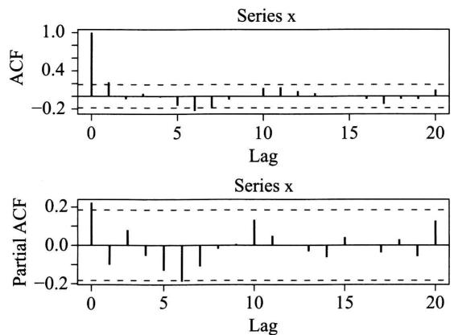  
图15-3

我们先考虑AR(1)模型并用arima()函数来估计参数如下:

$\mathbf{\sigma} > \mathbf{m}1 = \mathbf{a}\mathbf{r}\mathbf{i}\mathbf{m}\mathbf{a}(\mathbf{x},\mathbf{o}\mathbf{r}\mathbf{d}\mathbf{e}\mathbf{r} = \mathbf{c}(1,0,0))$

>>ml

Call:

arima(x=x,order=c(1,0,0))

Coefficients:

ar1 intercept 0.2207 - 0.0149 s.e. 0.0909 0.0257

sigma^2 estimated as 0.04607:log likelihood = 13.64,aic = - 21.27 参数估计的结果给出如下模型:

$$
x_{t} = -0.0149 + 0.2207x_{t - 1} + \sqrt{0.04607}\theta_{t},
$$

其中  $\theta_{t} \sim N(0,1)$ . 接下来用Box- Ljung方法来考核模型. 指令是  $\geq \text{Box.test} (\text{m1}$  residuals, lag = 12, type = 'Ljung', fitdf = 1)

Box- Ljung test

data: m1\$residuals

X- squared = 12.7208,df = 11,p- value = 0.312

对于此例,自由度是  $\mathrm{df} = 11$ .  $p$  值为0.312,远大于拒绝假设  $H_{0}$  的显著性水平0.05. 因而按0.05的显著性水平,这个模型可以通过考核. 接下来我们用AR(1)模型来作预报并和保留的5个数据相比较. 由图15- 4可见实际数据和预报相当接近.

>>ml.pred<- predict(arima(x,order = c(1,0,0)),n.ahead = 5)

>plot(x,xlim=c(0,119))

>lines(m1. pred\(pred, lwd = 2)

>lines(m1. pred $pred + 2 * m1. pred$ se,lty=2)

>lines(m1. pred $pred - 2 * m1. pred$ se,lty=2)

>lines(h,lwd=1)

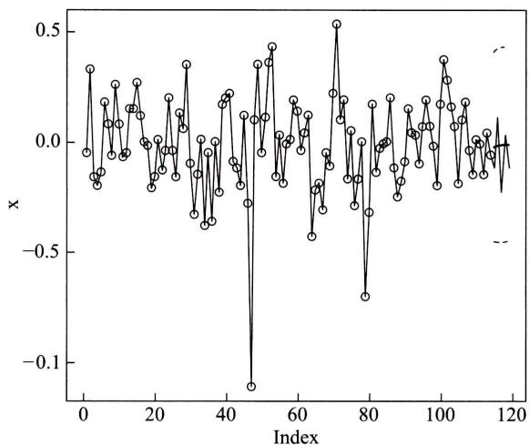  
图15-4

最后我们指出用同样方法可得出MA(1)和MA(6)也能通过考核并很好预报上述差分序列(习题).由此可见对于实际问题,适合的模型可能不是唯一的,取舍通常要视实际情况而定.

# 小结

时间序列有着广泛的应用.本章着重讨论平稳时间序列的线性自回归滑动平均模型及其特例自回归模型和滑动平均模型.自相关函数和偏相关函数是刻画时间序列的重要数字特征,它们可以有效地区分自回归滑动平均模型和它的子模型,并可以用来估计这些模型的阶数.

在实际应用中,我们可以通过观察得到时间序列的有限样本.根据样本可以判断适用的模型,然后进行参数估计.如果得到的模型通过考核,则可以用来对时间序列给出预报.整个应用过程中所需的步骤都已经程序化,我们通过应用实例介绍了如何使用相关的函数来建模.

# 重要术语及主题

时间序列 平稳时间序列 线性自回归滑动平均模型 自回归模型 滑动平均模型 自相关函数 偏相关函数 模型识别 参数估计 模型考核 预报

# 附录 差分方程的解

我们看到  $\operatorname {AR}(\boldsymbol {\mathbf{\rho}})$  模型的自相关函数满足方程

$$
\rho_{k} - \phi_{1}\rho_{k - 1} - \dots -\phi_{p}\rho_{k - p} = 0, \tag{1}
$$

这是一个典型的差分方程.为求解,设  $\rho_{k} = x^{k}$  ,代入(1)式并除以  $x^{k - p}$  得到代数方程

$$
x^{p} - \phi_{1}x^{p - 1} - \dots -\phi_{p - 1}x - \phi_{p} = 0. \tag{2}
$$

(2)式称为差分方程(1)的特征方程.易见,如果  $\xi$  是代数方程(2)的根,则  $\rho_{k} = \xi^{k}$  为差分方程(1)的解.代数方程(2)一般有  $\boldsymbol{\mathscr{p}}$  个根  $\xi_{1},\xi_{2},\dots ,\xi_{p}$  (假设没有重根).由于差分方程(1)是线性的,其解的线性组合仍然是解.由此得到差分方程(1)的解的一般形式为

$$
\rho_{k} = a_{1}\xi_{1}^{k} + a_{2}\xi_{2}^{k} + \dots +a_{p}\xi_{p}^{k},
$$

其中  $a_{1},a_{2},\dots ,a_{p}$  为参数,它们可由前  $\boldsymbol{\mathscr{p}}$  个自相关函数的值来确定,

# 习题

1. 用延迟算子表示下列模型:

(1)  $X_{t} - 0.5X_{t - 1} = \epsilon_{t}$

(2)  $X_{t} = \epsilon_{t} - 0.7\epsilon_{t - 1} - 0.24\epsilon_{t - 2}$

(3)  $X_{t} - 0.5X_{t - 1} = \epsilon_{t} - 0.7\epsilon_{t - 1} - 0.24\epsilon_{t - 2}$

(4)  $X_{t} - 1.5X_{t - 1} + 0.5X_{t - 2} = \epsilon_{t}$

(5)  $X_{t} - X_{t - 1} = \epsilon_{t} - 0.5\epsilon_{t - 1}$

2. 将上题中的模型(1)一(5)按  $\operatorname {ARMA}(\boldsymbol {\mathbf{\rho}},\boldsymbol {\mathbf{\rho}})$  分类.

3. 证明自相关函数的性质:(1)  $\rho_{k} = \rho_{-k}$  和(2)  $\left|\rho_{k}\right|\leqslant 1$

4. 求  $X_{t} = \epsilon_{t} - 0.5\epsilon_{t - 1} - 0.24\epsilon_{t - 2}$  的自相关函数.

5. 将  $\S 2$  例中运用的R程序用于下列模型:

(1)  $X_{t} - 0.5X_{t - 1} = \epsilon_{t}$

(2)  $X_{t} = \epsilon_{t} - 0.7\epsilon_{t - 1} - 0.24\epsilon_{t - 2}$

6. 反复运行  $\S 3$  例2中的arima.sim()和eacf()至少100次,函数正确识别模型的频率有多大?与同学的结果作综合比较,这个频率稳定吗?

7. 讨论MA(1)和MA(6)模型对  $\S 3$  例3中10年期国债利率的一阶差分时间序列的适用性.

# 选做习题

1. 一打靶场备有 5 支某种型号的枪, 其中 3 支已经校正, 2 支未经校正. 某人使用已校正的枪击中目标的概率为  $p_{1}$ , 使用未经校正的枪击中目标的概率为  $p_{2}$ . 他随机地取一支枪进行射击, 已知他射击了 5 次, 都未击中, 求他使用的是已校正的枪的概率 (设各次射击的结果相互独立).

2. 某人共买了 11 个水果, 其中有 3 个是二级品, 8 个是一级品. 随机地将水果分给  $A, B, C$  三人, 各人分别得到 4 个、6 个、1 个.

(1) 求  $C$  未拿到二级品的概率.

(2) 已知  $C$  未拿到二级品, 求  $A, B$  均拿到二级品的概率.

(3) 求  $A, B$  均拿到二级品而  $C$  未拿到二级品的概率.

3. 一系统  $L$  由两个只能传输字符 0 和 1 的独立工作的子系统  $L_{1}$  与  $L_{2}$  串联而成 (如题 3 图), 每个子系统输入为 0 输出为 0 的概率为  $p(0 < p < 1)$ ; 而输入为 1 输出为 1 的概率也是

$p$ . 今在图中  $a$  端输入字符 1, 求系统  $L$  的  $b$  端输出字符 0 的概率.

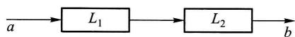  
题3图

4. 甲、乙两人轮流掷一颗骰子, 每轮掷一次, 谁先掷得 6 点谁得胜, 从甲开始掷, 问甲、乙得胜的概率各为多少?

5. 将一颗骰子掷两次, 考虑事件  $A =$  "第一次掷得点数 2 或 5",  $B =$  "两次点数之和至少为 7", 求  $P(A), P(B)$ , 并问事件  $A, B$  是否相互独立.

6.  $A, B$  两人轮流射击, 每次每人射击一枪, 射击的次序为  $A, B, A, B, A, \dots$ , 射击直至击中两枪为止. 设每人击中的概率均为  $p$ , 且各次击中与否相互独立. 求击中的两枪是由同一人射击的概率. (提示: 分别考虑两枪是由  $A$  击中的与两枪是由  $B$  击中的两种情况, 若两枪是由  $A$  击中的, 则射击必然在奇数次结束. 又当  $|x| < 1$  时,  $1 + 2x + 3x^{2} + \dots = 1 / (1 - x)^{2}$ .)

7. 有 3 个独立工作的元件 1、元件 2、元件 3, 它们的可靠性分别为  $p_{1}, p_{2}, p_{3}$ . 设由它们组成一个"3 个元件取 2 个元件的表决系统", 记为  $2 / 3[G]$ . 这一系统的运行方式是当且仅当 3 个元件中至少有 2 个正常工作时这一系统正常工作. 求这一  $2 / 3[G]$  系统的可靠性.

8. 在如题 8 图所示的桥式结构的电路中, 第  $i$  个继电器触点闭合的概率为  $p_{i}, i = 1, 2, 3, 4, 5$ . 各继电器工作相互独立.

(1) 以继电器触点 1 是否闭合为条件, 求  $A$  到  $B$  之间为通路的概率.

(2) 已知  $A$  到  $B$  为通路的条件下, 求继电器触点 3 闭

  
题8图

合的概率.

9. 进行非学历考试,规定考甲、乙两门课程,每门课程考试第一次未通过都只允许考第二次.考生仅在课程甲通过后才能考课程乙,如两门课程都通过可获得一张资格证书.设某考生通过课程甲的各次考试的概率为  $p_{1}$ ,通过课程乙的各次考试的概率为  $p_{2}$ ,设各次考试的结果相互独立.又设考生参加考试直至获得资格证书或者不准予再考为止.以  $X$  表示考生总共需考试的次数.求  $X$  的分布律.

10. (1)5只电池中有2只是次品,每次取一只测试,直到将2只次品都找到.设第2只次品在第  $X$  (  $X = 2,3,4,5$  )次找到,求  $X$  的分布律(注:实际上第5次检测可无须进行).

(2)5只电池中2只是次品,每次取一只,直到找出2只次品或3只正品为止.写出需要测试的次数的分布律.

11. 向某一目标发射炮弹,设炮弹弹着点离目标的距离为  $R$  (以  $10 \mathrm{~m}$  计),  $R$  服从瑞利分布,其概率密度为

$$
f_{R}(r) = \left\{ \begin{array}{ll}\frac{2r}{25} \mathrm{e}^{-r^{2} / 25}, & r > 0, \\ 0, & r \leqslant 0. \end{array} \right.
$$

若弹着点离目标不超过5个单位时,目标被摧毁,

(1)求发射一枚炮弹能摧毁目标的概率,

(2)为使至少有一枚炮弹能摧毁目标的概率不小于0.94,问最少需要独立发射多少枚炮弹?

12. 设一枚深水炸弹击沉一潜艇的概率为  $1 / 3$ ,击伤的概率为  $1 / 2$ ,击不中的概率为  $1 / 6$ .并设击伤两次也会导致潜艇下沉.求施放4枚深水炸弹能击沉潜艇的概率.(提示:先求击不沉的概率.)

13. 一盒中装有4只白球,8只黑球,从中取3只球,每次一只,作不放回抽样.

(1)求第1次和第3次都取到白球的概率.(提示:考虑第2次的抽取.)

(2)求在第1次取到白球的条件下,前3次都取到白球的概率,

14. 设元件的寿命  $T$  (以  $\mathrm{h}$  计)服从指数分布,分布函数为

$$
F(t) = \left\{ \begin{array}{ll}1 - \mathrm{e}^{-0.03t}, & t > 0, \\ 0, & t \leqslant 0. \end{array} \right.
$$

(1)已知元件至少工作了  $30 \mathrm{~h}$ ,求它能再至少工作  $20 \mathrm{~h}$  的概率.

(2)由3个独立工作的此种元件组成一个  $2 / 3[G]$  系统(参见第7题).求这一系统的寿命  $X > 20$  的概率.

15. (1)已知随机变量  $X$  的概率密度为  $f_{X}(x) = \frac{1}{2} \mathrm{e}^{-|x|}, -\infty < x < \infty$ ,求  $X$  的分布函数.

(2)已知随机变量  $X$  的分布函数为  $F_{X}(x)$ ,另有随机变量

$$
Y = \left\{ \begin{array}{ll}1, & X > 0, \\ -1, & X \leqslant 0, \end{array} \right.
$$

试求  $Y$  的分布律和分布函数.

16. (1) 设随机变量  $X$  服从泊松分布, 其分布律为

$$
P\{X = k\} = \frac{\lambda^{k}\mathrm{e}^{-\lambda}}{k!}, \quad k = 0,1,2,\dots ,
$$

问当  $k$  取何值时  $P\{X = k\}$  为最大?

(2) 设随机变量  $X$  服从二项分布, 其分布律为

$$
P\{X = k\} = \binom{n}{k} p^{k}(1 - p)^{n - k}, \quad k = 0,1,2,\dots ,n.
$$

问当  $k$  取何值时  $P\{X = k\}$  为最大?

17. 若离散型随机变量  $X$  具有分布律

则称  $X$  服从取值为  $1,2,\dots ,n$  的离散型均匀分布. 对于任意非负实数  $x$  ,记  $[x]$  为不超过  $x$  的最大整数. 设随机变量  $U \sim U(0,1)$  ,证明  $X = [nU] + 1$  服从取值为  $1,2,\dots ,n$  的离散型均匀分布.

18. 设随机变量  $X \sim U(-1,2)$  ,求  $Y = \left|X\right|$  的概率密度.

19. 设随机变量  $X$  的概率密度为

$$
f_{X}(x) = \left\{ \begin{array}{ll}0, & x< 0, \\ \frac{1}{2}, & 0 \leqslant x< 1, \\ \frac{1}{2x^{2}}, & 1 \leqslant x< \infty . \end{array} \right.
$$

求  $Y = \frac{1}{X}$  的概率密度.

20. 设随机变量  $X$  服从参数为  $1 / \lambda$  的指数分布. 验证随机变量  $Y = [X]$  服从参数为  $1 - \mathrm{e}^{-\lambda}$  的几何分布. 这一事实表明连续型随机变量的函数可以是离散型随机变量.

21. 投掷一枚硬币直至正面出现为止,引入随机变量

$X =$  投掷总次数.

$Y = \left\{ \begin{array}{ll}1, & \text {若首次投掷得到正面,} \\ 0, & \text {若首次投掷得到反面.} \end{array} \right.$

(1) 求  $X$  和  $Y$  的联合分布律及边缘分布律.

(2) 求条件概率  $P\{X = 1 \mid Y = 1\} , P\{Y = 2 \mid X = 1\}$ .

22. 设随机变量  $X \sim \pi (\lambda)$  ,随机变量  $Y = \max \{X,2\}$  . 试求  $X$  和  $Y$  的联合分布律及边缘分布律.

23. 设  $X,Y$  是相互独立的泊松随机变量,参数分别为  $\lambda_{1},\lambda_{2}$  ,求给定  $X + Y = n$  的条件下

$X$  的条件分布.

24. 一教授将两篇论文分别交给两个打字员打印. 以  $X, Y$  分别表示第一篇和第二篇论文的打印错误. 设  $X \sim \pi (\lambda), Y \sim \pi (\mu), X, Y$  相互独立.

(1)求  $X,Y$  的联合分布律.

(2)求两篇论文总共至多1个打印错误的概率.

25. 一等边三角形  $ROT$  (如题25图)的边长为1, 在三角形内随机地取点  $Q(X, Y)$  (意指随机点  $(X, Y)$  在三角形  $ROT$  内均匀分布).

(1)写出随机变量  $(X, Y)$  的概率密度.

(2)求点  $Q$  到底边  $OT$  的距离的分布函数,

26. 设随机变量  $(X, Y)$  具有概率密度

$$
f(x, y) = \left\{ \begin{array}{ll} p \mathrm{e}^{-x(y + 1)}, & x > 0, y > 0, \\ 0, & \text{其他.} \end{array} \right.
$$

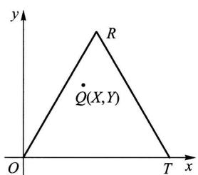  
题25图

(1)求边缘概率密度  $f_{X}(x), f_{Y}(y)$

(2)求条件概率密度  $f_{X|Y}(x|y), f_{Y|X}(y|x)$

27. 设有随机变量  $U$  和  $V$  ,它们都仅取  $1, -1$  两个值. 已知

$$
P\{U = 1\} = 1 / 2,
$$

$$
P\{V = 1|U = 1\} = 1 / 3 = P\{V = -1|U = -1\} .
$$

(1)求  $U$  和  $V$  的联合分布律.

(2)求  $x$  的方程  $x^{2} + U x + V = 0$  至少有一个实根的概率.

(3)求  $x$  的方程  $x^{2} + (U + V)x + U + V = 0$  至少有一个实根的概率.

28. 某图书馆一天的读者人数  $X \sim \pi (\lambda)$ , 任一读者借书的概率为  $p$ , 各读者借书与否相互独立. 记一天读者借书的人数为  $Y$ , 求  $X$  和  $Y$  的联合分布律.

29. 设随机变量  $X, Y$  相互独立, 且都服从均匀分布  $U(0, 1)$ , 求两变量之一至少为另一变量之值之两倍的概率.

30. 一家公司有一份保单招标, 两家保险公司竞标. 规定标书的保险费必须在 20 万元至 22 万元之间. 若两份标书保险费相差 2000 元或 2000 元以上, 招标公司将选择报价低者, 否则就重新招标. 设两家保险公司的报价是相互独立的, 且都在 20 万至 22 万之间均匀分布. 试求招标公司需重新招标的概率.

31. 设随机变量  $X \sim N(0, \sigma_{1}^{2}), Y \sim N(0, \sigma_{2}^{2})$ , 且  $X, Y$  相互独立, 求概率

$$
P\{0< \sigma_{2}X - \sigma_{1}Y< 2\sigma_{1}\sigma_{2}\} .
$$

32. NBA篮球赛中有这样的规律, 两支实力相当的球队比赛时, 每节主队得分与客队得分之差为正态随机变量, 均值为 1.5, 方差为 6, 并且假设四节的比分差是相互独立的. 问:

(1)主队胜的概率有多大?

(2)在前半场主队落后5分的情况下,主队得胜的概率有多大?

(3)在第一节主队赢5分的情况下,主队得胜的概率有多大?

33. 产品的某种性能指标的测量值  $X$  是随机变量, 设  $X$  的概率密度为

$$
f_{X}(x) = \left\{ \begin{array}{ll}x \mathrm{e}^{-\frac{1}{2} x^{2}}, & x > 0, \\ 0, & \text {其他.} \end{array} \right.
$$

测量误差  $Y \sim U(- \epsilon , \epsilon), X, Y$  相互独立. 求  $Z = X + Y$  的概率密度  $f_{Z}(z)$ , 并验证

$$
P\{Z > \epsilon \} = \frac{1}{2 \epsilon} \int_{0}^{2 \epsilon} \mathrm{e}^{-u^{2} / 2} \mathrm{d} u.
$$

34. 在一化学过程中, 产品中有份额  $X$  为杂质, 而在杂质中有份额  $Y$  是有害的, 而其余部分不影响产品的质量. 设  $X \sim U(0,0.1), Y \sim U(0,0.5)$ , 且  $X$  和  $Y$  相互独立. 求产品中有害杂质份额  $Z$  的概率密度.

35. 设随机变量  $(X,Y)$  的概率密度为

$$
f(x,y) = \left\{ \begin{array}{ll} \mathrm{e}^{-y}, & 0 < x < y, \\ 0, & \text {其他.} \end{array} \right.
$$

(1) 求  $(X, Y)$  的边缘概率密度.

(2) 问  $X, Y$  是否相互独立?

(3) 求  $X + Y$  的概率密度  $f_{X + Y}(z)$

(4) 求条件概率密度  $f_{X + Y}(x \mid y)$

(5) 求条件概率  $P\{X > 3 \mid Y < 5\}$

(6) 求条件概率  $P\{X > 3 \mid Y = 5\}$

36. 设某图书馆的读者借阅甲种图书的概率为  $p$ , 借阅乙种图书的概率为  $\alpha$ , 设每人借阅甲、乙图书的行动相互独立, 读者之间的行动也相互独立.

(1) 某天恰有  $n$  个读者, 求借阅甲种图书的人数的数学期望.

(2) 某天恰有  $n$  个读者, 求甲、乙两种图书中至少借阅一种的人数的数学期望.

37. 某种鸟在某时间区间  $(0, t_{0}]$  下蛋数为  $1 \sim 5$  只, 下  $r$  只蛋的概率与  $r$  成正比. 一个拾蛋人在时刻  $t_{0}$  去收集鸟蛋, 但他仅当鸟窝中多于 3 只蛋时才从中取走一只蛋. 在某处有这种鸟的鸟窝 6 个 (每个鸟窝保存完好, 各鸟窝中蛋的只数相互独立).

(1) 写出一个鸟窝中鸟蛋只数  $X$  的分布律.

(2) 对于指定的一个鸟窝, 求拾蛋人在该鸟窝中拾到一只蛋的概率.

(3) 求拾蛋人在 6 个鸟窝中拾到蛋的总数  $Y$  的分布律及数学期望.

(4) 求  $P\{Y < 4\} , P\{Y > 4\}$

(5) 当一个拾蛋人在这 6 个鸟窝中拾过蛋后, 紧接着又有一个拾蛋人到这些鸟窝中拾蛋, 也仅当鸟窝中多于 3 只蛋时, 拾取一只蛋, 求第二个拾蛋人拾得蛋数  $Z$  的数学期望.

38. 设袋中有  $r$  只白球、  $N - r$  只黑球. 在袋中取球  $n$ $(n \leqslant r)$  次, 每次任取一只作不放回抽样, 以  $Y$  表示取到白球的个数, 求  $E(Y)$ . (提示: 引入随机变量:

$$
X_{i}={\left\{\begin{array}{l l}{1,}&{{\frac{\#}{\#}}{\frac{\#}{\#}}i{\frac{\#}{\#}}{\frac{\#}{\#}}{\frac{\#}{\#}}{\frac{\#}{\#}}{\frac{\#}{\#}}{\frac{\#}{\#}}{\frac{\#}{\#}}{\frac{\#}{\#}}{\frac{\#}{\#}}{\frac{\#}{\#}}{\frac{\#}{\#}}{\frac{\#}{\#}}{\frac{\#}{\#}}{\frac{\ #}{\#}}{\frac{\#}{\#}}{\frac{\#}{\#}}{\frac{\#}{\#}}{\frac{\#}{\#}}{\frac{\#}{\#}}{\frac{\#}{\#}}{\frac{\#}{\#}}{\frac{\#}{\#}}{\frac{\#}{\#}}{\frac{\#}{\#}}{\frac{\#}{\#}}{\frac{\#}{\#}}}\\ {0,}&{{\frac{\#}{\#}}{\frac{\#}{\#}}i{\frac{\#}{\#}}{\frac{\#}{\#}}{\frac{\#}{\#}}{\frac{\#}{\#}}{\frac{\#}{\#}}{\frac{\#}{\#}}{\frac{\#}{\#}}{\frac{\#}{\#}}{\frac{\#}{\#}}{\frac{\#}{\#}}}\\ {\#{\frac{\#}{\#}}{\frac{\#}{\#}}{\frac{\#}{\#}}{\frac{\#}{\#}}{\frac{\#}{\#}}{\frac{\#}{\#}}{\frac{\#}{\#}}{\frac{\#}{\#}}{\frac{\#}{\#}}{\frac{\#}{\#}}{\frac{\#}{\#}}{\frac{\#}{\#}}{\frac{\mathcal{A}}{\#}}{\frac{\#}{\#}}{\frac{\#}{\#}}{\frac{\#}{\#}}{\frac{\#}{\#}}{\frac{\#}{\#}}{\frac{\#}{\#}}{\frac{\#}{\#}}{\frac{\#}{\#}}{\frac{\#}{\#}}{\frac{\#}{\#}}{\frac{\#}{\#}}{\frac{\#}{\#}}{\#}}\end{array}\right.}
$$

则  $Y = X_{1} + X_{2} + \dots + X_{n}$ .

39. 抛一颗骰子直到所有点数全部出现为止, 求所需抛掷次数  $Y$  的数学期望. (提示: 令

$X_{1} = 1, X_{2} =$  "第一个点数得到后, 等待第二个不同点数所需的等待次数",  $X_{3} =$  "第一、二两点数得到后, 等待第三个不同点数所需的等待次数",  $X_{4}, X_{5}, X_{6}$  类似, 则  $Y = X_{1} + X_{2} + \dots +$ $X_{6}$ . 又几何分布  $P\{X = k\} = (1 - p)^{k - 1} p, k = 1,2, \dots$  的数学期望  $E(X) = \frac{1}{p}$ .

40. 设随机变量  $X, Y$  相互独立. 且  $X, Y$  分别服从以  $1 / \alpha , 1 / \beta$  为均值的指数分布. 求  $E(X^{2} + Y \mathrm{e}^{-X})$ .

41. 一酒吧间柜台前有 6 张凳子, 服务员预测, 若两个陌生人进来就座的话, 他们之间至少相隔两张凳子. (提示: 先列出两人之间至少隔两张凳子的不同情况.)

(1) 若真有两个陌生人入内, 他们随机地就座, 问服务员预言为真的概率是多少?

(2) 设两位顾客是随机就座的, 求顾客之间凳子数的数学期望.

42. 设随机变量  $X_{1}, X_{2}, \dots , X_{100}$  相互独立, 且都服从  $U(0,1)$ , 又设  $Y = X_{1} \cdot X_{2} \cdot \dots \cdot X_{100}$ , 求概率  $P\{Y< 10^{-40}\}$  的近似值.

43. 来自某个城市的长途电话呼唤的持续时间  $X$  (以  $\min$  计) 是一个随机变量, 它的分布函数是

$$
F(x) = \left\{ \begin{array}{ll} 1 - \frac{1}{2} \mathrm{e}^{-\frac{x}{3}} - \frac{1}{2} \mathrm{e}^{-\left[\frac{x}{3}\right]}, & x \geqslant 0, \\ 0, & x < 0 \end{array} \right.
$$

其中  $\left[\frac{x}{3}\right]$  是不大于  $\frac{x}{3}$  的最大整数.

(1) 画出  $F(x)$  的图形.

(2) 说明  $X$  是什么类型的随机变量.

(3) 求  $P\{X = 4\} , P\{X = 3\} , P\{X< 4\} , P\{X > 6\}$ . (提示:  $P\{X = a\} = F(a) - F(a - 0)$ .)

44. 一汽车保险公司分析一组(250人)签约的客户中的赔付情况. 据历史数据分析, 在未来的一周中一组客户中至少提出一项索赔的客户数  $X$  占  $10\%$ . 写出  $X$  的分布, 并求  $X > 250 \times 0.12$  (即  $X > 30$ ) 的概率. 设各客户是否提出索赔相互独立.

45. 在区间(0,1)随机地取一点  $X$ . 定义  $Y = \min \{X, 0.75\}$ .

(1) 求随机变量  $Y$  的值域.

(2) 求  $Y$  的分布函数, 并画出它的图形.

(3) 说明  $Y$  不是连续型随机变量,  $Y$  也不是离散型随机变量.

46. 设  $X_{1}, X_{2}$  是数学期望为  $\theta$  的指数分布总体  $X$  的容量为 2 的样本, 设  $Y = \sqrt{X_{1} X_{2}}$ , 试证明  $E\left(\frac{4Y}{\pi}\right) = \theta$ .

47. 设总体  $X\sim N(\mu ,\sigma^{2}),X_{1},X_{2},\dots ,X_{n}$  是一个样本.  $\overline{{X}},S^{2}$  分别为样本均值和样本方差,试证  $E[(\overline{{X}} S^{2})^{2}] = \Big(\frac{\sigma^{2}}{n} +\mu^{2}\Big)\Big(\frac{2\sigma^{4}}{n - 1} +\sigma^{4}\Big)$  .(提示:注意到  $\overline{{X}}$  与  $S^{2}$  相互独立,且有 $\frac{(n - 1)S^{2}}{\sigma^{2}}{\sim}\chi^{2}(n - 1).\Big)$

48. 设总体  $X$  具有概率密度

$$
f(x) = \left\{ \begin{array}{ll}\frac{1}{\theta^{2}} x e^{-x / \theta}, & x > 0, \\ 0, & x \leqslant 0, \end{array} \right.
$$

其中  $\theta > 0$  为未知参数,  $X_{1}, X_{2}, \dots , X_{n}$  是来自  $X$  的样本,  $x_{1}, x_{2}, \dots , x_{n}$  是相应的样本观察值.

(1)求  $\theta$  的最大似然估计量.

(2)求  $\theta$  的矩估计量.

(3)问求得的估计量是否是无偏估计量?

49. 设  $X_{1}, X_{2}, \dots , X_{n_{1}}$  以及  $Y_{1}, Y_{2}, \dots , Y_{n_{2}}$  为分别来自总体  $N(\mu_{1}, \sigma^{2})$  与  $N(\mu_{2}, \sigma^{2})$  的样本,且它们相互独立.  $\mu_{1}, \mu_{2}, \sigma^{2}$  均未知,试求  $\mu_{1}, \mu_{2}, \sigma^{2}$  的最大似然估计量.

50. 为了研究一批贮存着的产品的可靠性,在产品投入贮存时,即在时刻  $t_{0} = 0$  时,随机地选定  $n$  件产品,然后在预先规定的时刻  $t_{1}, t_{2}, \dots , t_{k}$  取出来进行检测(检测时确定已失效的去掉,将未失效的继续投入贮存),今得到以下的寿命试验数据:

<table><tr><td>检测时刻(月)</td><td>t1</td><td>t2</td><td>...</td><td>tk</td><td></td><td></td></tr><tr><td>区间(ti-1,ti)</td><td>(0,ti]</td><td>(ti,ti]</td><td>...</td><td>(tk-1,ti]</td><td>(tk,∞)</td><td></td></tr><tr><td>在(ti-1,ti)
的失效数</td><td>d1</td><td>d2</td><td>...</td><td>dk</td><td>s</td><td>∑k
i=1
di+s=n</td></tr></table>

这种数据称为区间数据.设产品寿命  $T$  服从指数分布,其概率密度为

$$
f(t) = \left\{ \begin{array}{ll}\lambda \mathrm{e}^{-\lambda t}, & t > 0, \\ 0, & \text{其他}, \end{array} \right. \lambda > 0 \text{未知}.
$$

(1)试基于上述数据写出  $\lambda$  的对数似然方程.(提示:考虑事件"  $n$  只产品分别在区间(0, $t_{1}]$  ,  $(t_{1},t_{2}]$  ,…,  $(t_{k - 1},t_{k}]$  失效  $d_{1},d_{2},\dots ,d_{k}$  只,而直至  $t_{k}$  还有  $s$  只未失效"的概率.)

(2)设  $d_{1}< n, s< n$ ,我们可以用数值解法求得  $\lambda$  的最大似然估计值,在计算机上计算是容易的.特别,取检测时间是等间隔的,即取  $t_{i} = i t_{1}, i = 1,2, \dots , k$ .验证,此时可得  $\lambda$  的最大似然估计为

$$
\hat{\lambda} = \frac{1}{t_{1}} \ln \left[1 + \frac{n - s}{\sum_{i = 2}^{k} (i - 1) d_{i} + s k}\right].
$$

51. 设某种电子器件的寿命  $T$  (以  $h$  计)服从指数分布,概率密度为

$$
f(t) = \left\{ \begin{array}{ll}\lambda \mathrm{e}^{-\pi t}, & t > 0, \\ 0, & \text{其他}, \end{array} \right.
$$

其中  $\lambda > 0$  未知.从这批器件中任取  $n$  只在时刻  $t = 0$  时投入独立寿命试验.试验进行到预定时间  $T_{0}$  结束.此时,有  $k$  (  $0< k< n$  )只器件失效,试求  $\lambda$  的最大似然估计.(提示:考虑"试验直至时刻  $T_{0}$  为止,有  $k$  只器件失效,而有  $n - k$  只未失效"这一事件的概率,从而写出  $\lambda$  的似然方程.)

52. 设系统由两个独立工作的成败型元件串联而成(成败型元件只有两种状态:正常工作或失效).元件1、元件2的可靠性分别为  $p_{1}, p_{2}$ ,它们均未知.随机地取  $N$  个系统投入试验,当系统中至少有一个元件失效时系统失效,现得到以下的试验数据: $n_{1}$  表示仅元件1失

效的系统数,  $n_{2}$  表示仅元件2失效的系统数,  $n_{12}$  表示元件1、元件2至少有一个失效的系统数,  $s$  表示未失效的系统数,  $n_{1} + n_{2} + n_{12} + s = N.$  这里  $n_{12}$  为隐蔽数据,也就是只知系统失效,但不能知道是由元件1或元件2单独失效引起的,还是由元件1,2均失效引起的,设隐蔽与系统失效的真正原因独立.

(1)试写出  $\boldsymbol{\mathscr{p}}_{1},\boldsymbol{\mathscr{p}}_{2}$  的似然函数.

(2)设有系统寿命试验数据  $N = 20,n_{1} = 5,n_{2} = 3,n_{12} = 1,s = 11.$  试求  $\boldsymbol{\mathscr{p}}_{1},\boldsymbol{\mathscr{p}}_{2}$  的最大似然估计值.(提示:  $\boldsymbol{\mathscr{p}}_{1}$  应满足方程  $(\boldsymbol{\mathscr{p}}_{1} - 1)(12\boldsymbol{\mathscr{p}}_{1}^{2} + 11\boldsymbol{\mathscr{p}}_{1} - 14) = 0.$  )

53. (1)设总体  $X$  具有分布律

<table><tr><td>X</td><td>1</td><td>2</td><td>3</td></tr><tr><td>p k</td><td>θ</td><td>θ</td><td>1-2θ</td></tr></table>

$\theta >0$  未知,今有样本

试求  $\theta$  的最大似然估计值和矩估计值,

(2)设总体  $X$  服从  $\boldsymbol{\Gamma}$  分布,其概率密度为

$$
f(x) = \left\{ \begin{array}{l l}{\frac{1}{\beta^{a} \Gamma(\alpha)} x^{a - 1} \mathrm{e}^{-x / \beta},} & {x > 0,}\\ {0,} & {\mathrm{~H~}\backslash \backslash \backslash \backslash \backslash \backslash \backslash \backslash \backslash \backslash \backslash \backslash \backslash \backslash \backslash \backslash \backslash \backslash \backslash \backslash \backslash \backslash \backslash \backslash \backslash \backslash \backslash \backslash \backslash \backslash \backslash \backslash \backslash \backslash \mathrm{~H~}\backslash \backslash \backslash \backslash \backslash \backslash \backslash \backslash \backslash \backslash \backslash \backslash \backslash \backslash \backslash \backslash \backslash \backslash \backslash \backslash \backslash \backslash \backslash \backslash \backslash \backslash \backslash \backslash \backslash \backslash \backslash \mathrm{~H~}\mathrm{~H~}\backslash \backslash \backslash \backslash \backslash \backslash \backslash \backslash \backslash \backslash \backslash \backslash \backslash \backslash \backslash \backslash \backslash \backslash \backslash \backslash \backslash \backslash \backslash \backslash \backslash \backslash \backslash \backslash \backslash \backslash \backslash \begin{array}{l}{\mathrm{~H~}\backslash \backslash \backslash \backslash \backslash \backslash \backslash \backslash \backslash \backslash \backslash \backslash \backslash \backslash \backslash \backslash \backslash \backslash \backslash \backslash \backslash \backslash \backslash \backslash \backslash \backslash \backslash \backslash \backslash \backslash \backslash \end{array} \right.}
$$

其形状参数  $\alpha >0$  为已知,尺度参数  $\beta >0$  未知.今有样本值  $x_{1},x_{2},\dots ,x_{n}$  ,求  $\beta$  的最大似然估计值.

54. (1)设随机变量  $Z = \ln X\sim N(\mu ,\sigma^{2})$  ,即  $X$  服从对数正态分布,验证  $E(X) = \exp \left\{\mu +\frac{1}{2}\sigma^{2}\right\}$ .

(2)设自(1)中总体  $X$  中取一容量为  $n$  的样本  $x_{1},x_{2},\dots ,x_{n}$  ,求  $E(X)$  的最大似然估计.此处设  $\mu ,\sigma^{2}$  均为未知.

(3)已知在文学家萧伯纳的An Intelligent Woman's Guide To Socialism一书中,一个句子的单词数近似地服从对数正态分布,设  $\mu$  及  $\sigma^{2}$  为未知.今自该书中随机地取20个句子,这些句子中的单词数分别为

$$
\begin{array}{c c c c c c c c c c c c c c c c c c c c c c c c c c c c c c c c c c c c c c c c c c c c c c c c c c c c c c c c c c c c c c c c c c c c c c c c c c c c c c c c c c c c c c c c c c c c c c c c c c c c c} & 52 & 24 & 15 & 67 & 15 & 22 & 63 & 26 & 16 & 32\\ & 7 & 33 & 28 & 14 & 7 & 29 & 10 & 6 & 59 & 30 \end{array}
$$

问这本书中,一个句子单词数均值的最大似然估计值等于多少?

55. 考虑进行定数截尾寿命试验,假设将随机抽取的  $n$  件产品在时间  $t = 0$  时同时投入试验.试验进行到  $m$  件  $(m{<}n)$  产品失效时停止,  $m$  件失效产品的失效时间分别为  $0\leqslant t_{1}\leqslant t_{2}\leqslant \dots$ $\leqslant t_{m},t_{m}$  是第  $m$  件产品的失效时间.设产品的寿命分布为韦布尔分布,其概率密度为

$$
f(t) = \left\{ \begin{array}{l l}{\frac{\beta}{\eta^{\beta}} t^{\beta -1}\mathrm{e}^{-\left(\frac{t}{\eta}\right)^{\beta}},} & {t > 0,}\\ {0,} & {\mathrm{~H~}\backslash \backslash \backslash \backslash \backslash \backslash \backslash \backslash \backslash \backslash \backslash \backslash \backslash \backslash \backslash \backslash \backslash \backslash \backslash \backslash \backslash \backslash \backslash \backslash \backslash \backslash \backslash \backlash} \end{array} \right.
$$

其中参数  $\beta >0$  已知. 求参数  $\eta$  的最大似然估计.

56. 设某大城市郊区的一条林荫道两旁开设了许多小商店, 这些商店的开设延续时间 (以月计) 是一个随机变量, 现随机地取 30 家商店, 将它们的延续时间按自小到大排序, 选其中前 8 家商店, 它们的延续时间分别是

$$
3.2 5.9 5.9 6.5 16.5 20.3 40.4 50.9
$$

假设商店开设延续时间的长度是韦布尔随机变量. 其概率密度为

$$
f(x) = \left\{ \begin{array}{ll}\frac{\beta}{\eta} x^{\beta -1} \mathrm{e}^{-\left(\frac{x}{\eta}\right)^{\beta}}, & x > 0, \\ 0, & \text {其他,} \end{array} \right.
$$

其中  $\beta = 0.8$

(1)试用上题结果,写出  $\eta$  的最大似然估计.

(2)按(1)的结果求商店开设延续时间至少为2年的概率的估计.

57. 设分别自总体  $N(\mu_{1}, \sigma^{2})$  和  $N(\mu_{2}, \sigma^{2})$  中抽取容量为  $n_{1}, n_{2}$  的两独立样本, 其样本方差分别为  $S_{1}^{2}, S_{2}^{2}$ . 试证, 对于任意常数  $a, b$ $(a + b = 1)$ ,  $Z = a S_{1}^{2} + b S_{2}^{2}$  都是  $\sigma^{2}$  的无偏估计, 并确定常数  $a, b$ , 使  $D(Z)$  达到最小.

58. 设总体  $X\sim N(\mu ,\sigma^{2}),X_{1},X_{2},\dots ,X_{n}$  是来自  $X$  的样本.已知样本方差  $S^{2} =$ ${\frac{1}{n-1}}\sum_{i=1}^{n}(X_{i}-{\overline{{X}}})^{2}$  是  $\sigma^{2}$  的无偏估计.验证样本标准差  $s$  不是标准差  $\sigma$  的无偏估计.(提示:记  $Y = \frac{(n - 1)S^{2}}{\sigma^{2}}$  ,则  $Y\sim \chi^{2}\left(n - 1\right)$  ,而  $S = \frac{\sigma}{\sqrt{n - 1}}\sqrt{Y}$  是  $Y$  的函数,利用  $\chi^{2}\left(n - 1\right)$  的概率密度可得  $E(S) = \sqrt{\frac{2}{n - 1}}\frac{\Gamma(n / 2)\sigma}{\Gamma(n - 1) / 2)}\neq \sigma .$  )

59. 设总体  $X$  服从指数分布, 其概率密度为

$$
f(x) = \left\{ \begin{array}{ll}\frac{1}{\theta} \mathrm{e}^{-x / \theta}, & x > 0, \\ 0, & \text {其他.} \end{array} \right.
$$

$\theta >0$  未知. 从总体中抽取一容量为  $n$  的样本  $X_{1}, X_{2}, \dots , X_{n}$

(1)证明  $\frac{2n \overline{X}}{\theta} \sim \chi^{2}(2n)$

(2)求  $\theta$  的置信水平为  $1 - \alpha$  的单侧置信下限.

(3)某种元件的寿命(以h计)服从上述指数分布,现从中抽得一容量  $n = 16$  的样本,测得样本均值为  $5010\mathrm{~h~}$  ,试求元件的平均寿命的置信水平为0.90的单侧置信下限.

60. 设总体  $X \sim U(0, \theta), X_{1}, X_{2}, \dots , X_{n}$  是来自  $X$  的样本.

(1)验证  $Y = \max \{X_{1}, X_{2}, \dots , X_{n}\}$  的分布函数为

$$
F_{Y}(y) = \left\{ \begin{array}{ll}0, & y< 0, \\ y^{n} / \theta^{n}, & 0 \leqslant y< \theta , \\ 1, & y \geqslant \theta . \end{array} \right.
$$

(2)验证  $U = Y / \theta$  的概率密度为

$$
f_{U}(u) = \left\{ \begin{array}{ll}n u^{n - 1}, & 0< u< 1, \\ 0, & \text {其他.} \end{array} \right.
$$

(3) 给定正数  $\alpha , 0< \alpha < 1$ , 求  $U$  的分布的上  $\alpha /2$  分位数  $h_{\alpha /2}$  以及上  $1 - \alpha /2$  分位数  $h_{1 - \alpha /2}$ .

(4) 利用(2),(3)求参数  $\theta$  的置信水平为  $1 - \alpha$  的置信区间.

(5) 设某人上班的等车时间  $X\sim U(0,\theta),\theta$  未知. 现在有样本  $x_{1} = 4,2,x_{2} = 3,5,x_{3} = 1.7,x_{4} = 1.2,x_{5} = 2.4$ , 求  $\theta$  的置信水平为 0.95 的置信区间.

61. 设总体  $X$  服从指数分布, 概率密度为

$$
f(x) = \left\{ \begin{array}{ll}\frac{1}{\theta} \mathrm{e}^{-x / \theta}, & x > 0, \\ 0, & \text {其他,} \end{array} \right. \quad \theta >0.
$$

设  $X_{1},X_{2},\dots ,X_{n}$  是来自  $X$  的一个样本. 试取第 59 题中当  $\theta = \theta_{0}$  时的统计量  $\chi^{2} = \frac{2n\overline{X}}{\theta_{0}}$  作为检验统计量, 检验假设  $H_{0}:\theta = \theta_{0},H_{1}:\theta \neq \theta_{0}$ . 取显著性水平为  $\alpha$  (注意:  $E(\overline{X}) = \theta$ ).

设某种电子元件的寿命(以  $\mathrm{h}$  计)服从均值为  $\theta$  的指数分布, 随机取 12 只元件测得它们的寿命分别为

340 430 560 920 1380 1520 1660 1770 2100 2320 2350 2650 试取显著性水平  $\alpha = 0.05$ , 检验假设  $H_{0}:\theta = 1450, H_{1}:\theta \neq 1450$ .

62. 经过十一年的试验, 达尔文于 1876 年得到 15 对玉米样品的数据如下表, 每对作物除授粉方式不同外, 其他条件都是相同的. 试用逐对比较法检验不同授粉方式对玉米高度是否有显著的影响  $(\alpha = 0,05)$ . 问应增设什么条件才能用逐对比较法进行检验?

<table><tr><td>授粉方式</td><td>1</td><td>2</td><td>3</td><td>4</td><td>5</td><td>6</td><td>7</td><td></td></tr><tr><td>异株授粉的作物高度(xi)</td><td>23 1/8</td><td>12</td><td>20 3/8</td><td>22</td><td>19 1/8</td><td>21 4/8</td><td>22 1/8</td><td></td></tr><tr><td>同株授粉的作物高度(yi)</td><td>27 3/8</td><td>21</td><td>20</td><td>20</td><td>19 3/8</td><td>18 5/8</td><td>18 5/8</td><td></td></tr><tr><td>授粉方式</td><td>8</td><td>9</td><td>10</td><td>11</td><td>12</td><td>13</td><td>14</td><td>15</td></tr><tr><td>异株授粉的作物高度(xi)</td><td>20 3/8</td><td>18 2/8</td><td>21 5/8</td><td>23 2/8</td><td>21</td><td>22 1/8</td><td>23</td><td>12</td></tr><tr><td>同株授粉的作物高度(yi)</td><td>15 2/8</td><td>16 4/8</td><td>18</td><td>16 2/8</td><td>18</td><td>12 6/8</td><td>15 4/8</td><td>18</td></tr></table>

63. 一内科医生声称, 如果患者每天傍晚聆听一种特殊的轻音乐会降低血压(舒张压, 以  $\mathrm{mmHg}$  计,  $1\mathrm{mmHg} = 133.3224\mathrm{Pa}$ ). 今选取了 10 个患者在试验之前和试验之后分别测量了血压, 得到以下的数据:

<table><tr><td>患者</td><td>1</td><td>2</td><td>3</td><td>4</td><td>5</td><td>6</td><td>7</td><td>8</td><td>9</td><td>10</td></tr><tr><td>试验之前(xi)</td><td>86</td><td>92</td><td>95</td><td>84</td><td>80</td><td>78</td><td>98</td><td>95</td><td>94</td><td>96</td></tr><tr><td>试验之后(yi)</td><td>84</td><td>83</td><td>81</td><td>78</td><td>82</td><td>74</td><td>86</td><td>85</td><td>80</td><td>82</td></tr></table>

设  $D_{i} = X_{i} - Y_{i}(i = 1,2,\dots ,10)$  为来自正态总体  $N(\mu_{D},\sigma_{D}^{2})$  的样本,  $\mu_{D},\sigma_{D}^{2}$  均未知。试检验是否可以认为医生的意见是对的(取  $\alpha = 0.05$ )。

64. 以下是各种颜色的汽车的销售情况:

<table><tr><td>颜色</td><td>红</td><td>黄</td><td>蓝</td><td>绿</td><td>棕</td></tr><tr><td>车辆数</td><td>40</td><td>64</td><td>46</td><td>36</td><td>14</td></tr></table>

试检验顾客对这些颜色是否有偏爱,即检验销售情况是否是均匀的(取  $\alpha = 0.05$ )。

65. 某种闪光灯,每盏灯含4个电池,随机地取150盏灯,经检测得到以下的数据:

<table><tr><td>一盏灯损坏的电池数x</td><td>0</td><td>1</td><td>2</td><td>3</td><td>4</td></tr><tr><td>灯的盏数</td><td>26</td><td>51</td><td>47</td><td>16</td><td>10</td></tr></table>

试取  $\alpha = 0.05$  检验一盏灯损坏的电池数  $X\sim b(4,\theta)$  ( $\theta$  未知)。

66. 临界闪烁频率(cff)是人眼对于闪烁光源能够分辨出它在闪烁的最高频率(以  $\mathrm{Hz}$  计)。超过cff的频率,即使光源实际是在闪烁的,人看起来也是连续的(不闪烁的)。一项研究旨在判定cff的均值是否与人眼的虹膜颜色有关,所得数据如下:

<table><tr><td>虹膜颜色</td><td>棕色</td><td>绿色</td><td>蓝色</td><td></td></tr><tr><td rowspan="4">临界闪烁频率(cff)</td><td>26.8</td><td>26.3</td><td>26.4</td><td>29.1</td></tr><tr><td>27.9</td><td>24.8</td><td>24.2</td><td>27.2</td></tr><tr><td>23.7</td><td>25.7</td><td>28.0</td><td>29.9</td></tr><tr><td>25.0</td><td>24.5</td><td>26.9</td><td>28.5</td></tr></table>

试在显著性水平0.05下,检验各种虹膜颜色相应的cff的均值有无显著的差异。设各个总体服从正态分布,且方差相等,不同颜色下的样本之间相互独立。

67. 下面列出了挪威人自1938—1947年间年人均脂肪消耗量与患动脉粥样硬化症而死亡的死亡率之间相关的一组数据: