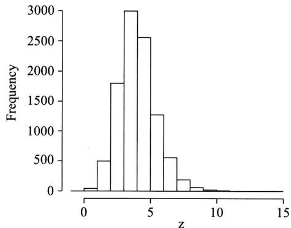
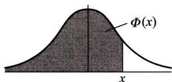
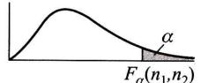
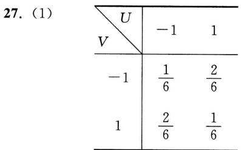

<table><tr><td>年份</td><td>1938</td><td>1939</td><td>1940</td><td>1941</td><td>1942</td><td>1943</td><td>1944</td><td>1945</td><td>1946</td><td>1947</td></tr><tr><td>脂肪消耗量x
(kg/人年)</td><td>14.4</td><td>16.0</td><td>11.6</td><td>11.0</td><td>10.0</td><td>9.6</td><td>9.2</td><td>10.4</td><td>11.4</td><td>12.5</td></tr><tr><td>死亡率y
(1/(105人年))</td><td>29.1</td><td>29.7</td><td>29.2</td><td>26.0</td><td>24.0</td><td>23.1</td><td>23.0</td><td>23.1</td><td>25.2</td><td>26.1</td></tr></table>

设对于给定的  $x, Y$  为正态变量, 且方差与  $x$  无关.

(1) 求回归直线方程  $\hat{y} = a + \hat{b} x$ .

(2) 在显著性水平  $\alpha = 0.05$  下检验假设  $H_{0}: b = 0, H_{1}: b \neq 0$ .

(3) 求  $\hat{y} \mid_{x = 13}$ .

(4) 求  $x = 13$  处  $\mu (x)$  的置信水平为 0.95 的置信区间.

(5) 求  $x = 13$  处  $Y$  的新观察值  $Y_{0}$  的置信水平为 0.95 的预测区间.

68. 下面给出 1924-1992 年奥林匹克运动会女子  $100 \mathrm{~m}$  仰泳的最佳成绩 (以 s 计) (其中 1940 年及 1944 年未举行奥运会):

<table><tr><td>年份</td><td>1924</td><td>1928</td><td>1932</td><td>1936</td><td>1948</td><td>1952</td><td>1956</td><td>1960</td></tr><tr><td>成绩</td><td>83.2</td><td>82.2</td><td>79.4</td><td>78.9</td><td>74.4</td><td>74.3</td><td>72.9</td><td>69.3</td></tr><tr><td>年份</td><td>1964</td><td>1968</td><td>1972</td><td>1976</td><td>1980</td><td>1984</td><td>1988</td><td>1992</td></tr><tr><td>成绩</td><td>67.7</td><td>66.2</td><td>65.8</td><td>61.8</td><td>60.9</td><td>62.6</td><td>60.9</td><td>60.7</td></tr></table>

(1) 画出散点图.

(2) 求成绩关于年份的线性回归方程.

(3) 检验回归效果是否显著 (取  $\alpha = 0.05$ ).

# 参读材料一 随机变量样本值的产生

# (一)随机数和伪随机数

在概率统计的应用中,常需要模拟各种分布的随机变量,即需要产生各种分布随机变量的简单随机样本的样本值。某一分布随机变量的样本值,就称为这一分布的随机数。例如指数分布随机变量的样本值就称为指数分布随机数。特别,区间(0,1)上均匀分布的随机变量的样本值称为均匀分布随机数,简称随机数。我们先来考虑如何产生均匀分布随机数,其他分布随机数一般可以由均匀分布随机数通过变换得到。

产生均匀分布随机数的方法很多,目前使用最广泛的方法是在计算机上利用数学的递推公式来产生。这种按确定性算法得到的序列,不可能是真正来自区间(0,1)上均匀分布的独立同分布样本值序列,我们称它为伪随机数。

在大多数计算机中都装有产生伪随机数序列的算法程序,我们都假设由这些程序产生的伪随机数序列能通过独立性和均匀分布检验,可作为随机数序列来使用,需要时用特定的命令加以调用就是。

# (二)产生离散型随机变量样本值的方法

设离散型随机变量  $X$  具有分布律

$$
P\{X = x_{i}\} = p_{i}, \quad i = 1,2,\dots , \quad \sum_{i = 1}^{\infty}p_{i} = 1. \tag{*1}
$$

现在来产生  $X$  的随机数。

先产生伪随机数  $u$  ,令

$$
X = \left\{ \begin{array}{l l}{x_{1},} & {u< p_{1},}\\ {x_{2},} & {p_{1}\leqslant u< p_{1} + p_{2},}\\ \vdots & \vdots \\ {x_{i},} & {\sum_{j = 1}^{i - 1}p_{j}\leqslant u< \sum_{j = 1}^{i}p_{j},}\\ \vdots & \vdots \end{array} \right. \tag{*2}
$$

由于

$$
P\{X = x_{i}\} = P\left\{\sum_{j = 1}^{i - 1}p_{j}\leqslant u< \sum_{j = 1}^{i}p_{j}\right\} = \sum_{j = 1}^{i}p_{j} - \sum_{j = 1}^{i - 1}p_{j} = p_{i}, \quad i = 1,2,\dots ,
$$

所以  $X$  具有给定的分布律。

产生随机变量  $X$  的样本值也叫做对随机变量  $X$  进行模拟或抽样,上述模拟离散型随机变量的方法的算法为:

产生伪随机数  $u$

若  $u< p_{1}$  ,令  $X = x_{1}$  ,停止。

若  $u< p_{1} + p_{2}$  ,令  $X = x_{2}$  ,停止。

若  $u< p_{1} + p_{2} + p_{3}$ , 令  $X = x_{3}$ , 停止.

例1设随机变量  $X$  具有分布律

$$
\frac{X = i}{p_{i}}\left| \begin{array}{cccc}1 & 2 & 3 & 4 \\ 0.20 & 0.15 & 0.25 & 0.40 \end{array} \right.
$$

试产生  $X$  的样本值.

解取算法为:  $p$  生伪随机数  $\boldsymbol{u}$

若  $u< 0.20$  ,令  $X = 1$  ,停止.

若  $u< 0.35$  ,令  $X = 2$  ,停止.

若  $u< 0.60$  ,令  $X = 3$  ,停止.

否则,令  $X = 4$

例2设随机变量  $X$  具有分布律

$$
P\{X = i\} = \frac{1}{n}, \quad i = 1,2,\dots ,n, \tag{*3}
$$

试产生  $X$  的样本值(  $X$  称为取值为  $1,2,\dots ,n$  的离散型均匀分布随机变量).

解在  $(\ast_{1})$  式中,令  $x_{i} = i,i = 1,2,\dots ,n;p_{1} = p_{2} = \dots = p_{n} = \frac{1}{n}$  就得到  $(\ast_{3})$  式.再由  $(\ast_{2})$  式,得

若  $\frac{i - 1}{n}\leq u< \frac{i}{n}$  ,则令  $X = i$  ,即若  $i - 1\leqslant n u< i$  ,则令  $X = i = [n u] + 1,i = 1,2,\dots ,n.$  因此,若  $u$  是伪随机数,则  $X = [n u] + 1$  就是分布  $(\ast_{3})$  的样本值. 口

例3试产生以  $n,p$  为参数的二项分布  $b(n,p)$  的样本值.

解设  $U_{1},U_{2},\dots ,U_{n}$  相互独立,且它们都在区间(0,1)上服从均匀分布.令

$$
X_{i}=\left\{\begin{array}{l l}{1,}&{U_{i}< p,}\\ {0,}&{U_{i}\geqslant p,}\end{array}\right.\quad i=1,2,\cdots,n,
$$

则有  $P\{X_{i} = 1\} = P\{U_{i}< p\} = p,P\{X_{i} = 0\} = 1 - p$  ,故  $X_{i}\sim b(1,p)$  .又因  $U_{1},U_{2},\dots ,U_{n}$  相互独立,故有  $X = \sum_{i = 1}^{n}X_{i}\sim b(n,p)$  .据此,只要产生  $n$  个伪随机数  $u_{1},u_{2},\dots ,u_{n}$  ,统计其中使得 $u_{i}< p~(i = 1,2,\dots ,n)$  的个数为  $k$  ,则得  $X$  的样本值为  $k$  口

(三)产生连续型随机变量样本值的方法

先证明一个定理.

定理设随机变量  $U = U(0,1),F(x)$  是某一随机变量的分布函数,且  $F(x)$  为严格单调增加且连续的函数,则随机变量  $F^{- 1}(U)$  具有分布函数  $F(x)$  ,其中  $F^{- 1}(x)$  是  $F(x)$  的反函数.

证由于  $F(x)$  严格单调增加且连续,因此其反函数  $F^{- 1}(x)$  存在(即有  $F[F^{- 1}(x)] = x)$  ,且严格单调增加并连续,即得随机变量  $F^{- 1}(U)$  的分布函数为

$$
\begin{array}{r}{P\{F^{-1}(U)\leqslant x\} = P\{F[F^{-1}(U)]\leqslant F(x)\}}\\ {= P\{U\leqslant F(x)\} = F(x).} \end{array}
$$

由定理,若要产生以  $F(x)(F(x)$  严格单调增加且连续)为分布函数的随机变量  $X$  ,只需

产生  $U\sim U(0,1)$  ,令  $X = F^{- 1}(U)$  就行了.又若要产生  $X$  的样本值  $x$  ,只需产生  $U$  的样本值  $u$  令  $\scriptstyle x = F^{- 1}(u)$  即得.这一产生  $X$  的样本值的方法,称为逆变换法.这种方法在随机变量具有严格单调增加且连续的分布函数  $F(x)$  且  $F^{- 1}(x)$  能够用显式表示时,都能使用.

说明:在上述定理中对  $F(x)$  在  $(- \infty , \infty)$  上的严格单调连续的要求可放宽为  $F(x)$  在某一区间(有限或无限)上取值从0到1,并在此区间上严格单调增加且连续即可.

例4设随机变量  $X$  具有指数分布,其分布函数为

$$
F(x) = \left\{ \begin{array}{ll}1 - \mathrm{e}^{-x / \theta}, & x > 0, \\ 0, & \text{其他}, \quad \theta > 0, \end{array} \right.
$$

试产生随机变量  $X$

解设  $U\sim U(0,1)$  ,令  $U = 1 - \mathrm{e}^{- X / \theta}$  ,解得

$$
X = -\theta \ln (1 - U).
$$

因为当  $U\sim U(0,1)$  时,也有  $1 - U\sim U(0,1)$  ,从而

$$
X = -\theta \ln U
$$

就是所要产生的指数分布的随机变量.只要有伪随机数  $u$  ,就有  $X$  的随机数  $- \theta \ln u$

例5设随机变量  $X$  具有韦布尔分布,其分布函数为

$$
F(x) = \left\{ \begin{array}{ll}1 - \mathrm{e}^{-(x / \eta)^{\beta}}, & x > 0, \\ 0, & \text{其他}, \quad \beta > 0, \eta > 0. \end{array} \right.
$$

试产生随机变量  $X$

解设  $U\sim U(0,1)$  ,令  $U = 1 - \mathrm{e}^{- (X / \eta)^{\beta}}$  ,解得

$$
X = \eta \left[-\ln (1 - U)\right]^{1 / \beta}.
$$

因为  $1 - U\sim U(0,1)$  ,故

$$
X = \eta (-\ln U)^{1 / \beta}
$$

就是所要产生的韦布尔分布的随机变量,

例6正态随机变量的产生.

标准正态变量的分布函数  $\Phi (x)$  的反函数不存在显式,故不能用逆变换法产生标准正态变量.下面介绍一种近似方法.

设  $U_{i}\sim U(0,1), i = 1,2,\dots ,n$  ,且它们相互独立,由于  $E(U_{i}) = 1 / 2,D(U_{i}) = 1 / 12$  ,由中心极限定理,当  $n$  较大时近似地有

$$
Z = \frac{\sum_{i = 1}^{n}U_{i} - \frac{n}{2}}{\sqrt{n}\sqrt{\frac{1}{12}}}\sim N(0,1).
$$

取  $n = 12$  ,知近似地有

$$
Z = \sum_{i = 1}^{12}U_{i} - 6\sim N(0,1),
$$

这就是说,只需产生12个伪随机数  $u_{1},u_{2},\dots ,u_{12}$  ,将它们加起来,再减去6,就能近似地得到标准正态变量的样本值了.这样做是很方便的.

又若  $X\sim N(\mu ,\sigma^{2}), Z\sim N(0,1)$  ,利用关系式

$$
X = \mu +\sigma Z
$$

就能得到一般的正态随机变量  $X$  的样本值.

# 参读材料二 蒙特卡罗方法

我们聚焦于由给定的模型直接产生大量的样本。这些样本反映了模型的统计性能,有关模型的问题能由研究样本的统计性能得到回答。我们研究样本的统计性能得到关于模型的问题的回答,这样的方法称为蒙特卡罗方法,又称为蒙特卡罗模拟。

如果我们能在计算机上模拟一统计模型,那么就能自模型产生一大批数据样本,也就能用研究这些样本的性质代替对模型本身的研究,从而得到所需的结果。

例1 长方形金属板的长度  $X$  和宽度  $Y$  分别服从分布  $X \sim U(2.9,3.1)$  和  $Y \sim U(1.9,2.1)$ ,  $X, Y$  均以  $\mathrm{m}$  计,且两者相互独立。试估计金属板面积  $XY$  的数学期望。

解  $X,Y$  的分布函数分别为

$$
F_{X}(x) = \left\{ \begin{array}{l l}{0,} & {x< 2.9,}\\ {\frac{x - 2.9}{0.2},2.9\leqslant x< 3.1,} & {F_{Y}(y) = \left\{ \begin{array}{l l}{0,} & {y< 1.9,}\\ {\frac{y - 1.9}{0.2},1.9\leqslant y< 2.1,}\\ {1,} & {y\geqslant 2.1.} \end{array} \right.} \end{array} \right.
$$

现在分别产生  $X, Y$  的随机数。设  $U = U(0,1)$ ,令  $U = \frac{X - 2.9}{0.2}$ ,得

$$
X = 2.9 + 0.2U. \tag{*₁}
$$

设  $U \sim U(0,1)$ ,令  $V = \frac{Y - 1.9}{0.2}$ ,得

$$
Y = 1.9 + 0.2V. \tag{*₂}
$$

按  $(\ast_{1})$  式产生随机变量  $X$  的10000个随机数,按  $(\ast_{2})$  式产生  $Y$  的10000个随机数,这样就得到  $A = XY$  的样本容量为10000的样本值,列表如下:

<table><tr><td>长度x</td><td>宽度y</td><td>面积xy</td></tr><tr><td>3.055 969</td><td>2.091 012</td><td>6.390 068</td></tr><tr><td>2.976 204</td><td>2.037 167</td><td>6.063 026</td></tr><tr><td>:</td><td>:</td><td>:</td></tr><tr><td>3.003 077</td><td>1.929 107</td><td>5.793 258</td></tr></table>

以  $A$  的样本均值  $\frac{1}{10000} \sum_{i = 1}^{1000} x_{i} y_{i}$  作为金属板面积  $A$  的数学期望的估计,得到面积  $A$  的数学期望的近似值为  $6.000762 \mathrm{~m}^{2}$ 。

此例说明,用蒙特卡罗方法得到的  $A$  的数学期望,与  $A$  的数学期望的真值  $E(A) = E(XY) = E(X)E(Y) = 6 \mathrm{~m}^{2}$  非常接近。

例2设一设备需经两个独立的组装阶段.第一阶段的组装时间  $X$  (以h计)是一个随机变量,服从均值为1的指数分布,第二阶段的组装时间  $Y$  也是一个随机变量且  $Y\sim N(3,1)$  ,试估计整个组装时间  $X + Y$

解下面用蒙特卡罗方法给出  $X + Y$  的直方图,

设  $U\sim U(0,1)$  ,在参读材料一例4中令  $\theta = 1$  ,则

$$
X = -\ln U \tag{*}
$$

就是均值为1的指数分布随机变量.又按参读材料一例6,设  $U_{i}\sim U(0,1),i = 1,2,\dots ,12$  ,且它们相互独立,则  $X = \sum_{i = 1}^{12}U_{i} - 6\overset {\mathrm{~i~}}{\sim}N(0,1)$  ,于是

$$
Y = X + 3 \tag{*}
$$

近似服从正态分布  $N(3,1)$  .在计算机上分别按  $(\ast_{3})$  式和  $(\ast_{4})$  式产生  $X$  和  $Y$  的独立的样本值(样本容量为10000),利用这10000个数据作出  $X + Y$  的频率直方图,如图1所示,我们就可以用直方图顶部的台阶形曲线作为  $X + Y$  的概率密度曲线的近似.从而可以对随机变量 $X + Y$  的性质作出统计推断.例如,  $X + Y$  落在区间(3.4,4.2)的概率可估计为

$$
P\{3.4{<}X{+}Y{<}4.2\} \approx 0.62.
$$

R语言的程序和作出的直方图如下:

${>}\mathrm{N}=10000$  ;  $z< -$  numeric(N)

${>}$  for(i in 1:N)  $\left\{ \begin{array}{r l} \end{array} \right.$

$\begin{array}{r l} & {\mathrm{~\mathfrak~{~x~}~} < - \left(- \log (\mathrm{runif}(1,0,1))\right)}\\ & {\mathrm{~\mathfrak~{~y~}~} < - \mathrm{~rnorm}(1,3,1)} \end{array}$

$\begin{array}{r l} & {\mathrm{~\mathfrak~{~y~}~} < - \mathrm{~rnorm}(1,3,1)}\\ & {\mathrm{~\mathfrak~{~z~}~}[\mathrm{~i~}]< - \mathrm{~x~} + \mathrm{~y~}} \end{array}$

$+\quad \mathbf{z}[\mathbf{i}]< - \mathbf{x} + \mathbf{y}$

$+\left\{ \begin{array}{r l} \end{array} \right.$

${>}$  hist(z)

  
Histogram of z 图1

在统计数据分析中,许多人们感兴趣的问题能够归结为求某个随机变量  $X$  的函数  $h\left(X\right)$  的数学期望  $E[h(X)]$  .令  $\phi (x)$  表示  $X$  的概率密度,由强大数定律,若  $X_{1},X_{2},\dots ,X_{n}$  是相互独

立的同分布的随机变量序列, 它们与随机变量  $X$  有相同的分布, 则有

$$
P\left\{\lim_{n\to \infty}\frac{1}{n}\sum_{i = 1}^{n}h(X_{i}) = E\big[h(X)\big]\right\} = 1. \tag{*5}
$$

在上式中, 将  $n$  取定为充分大的数, 就能得到下述求数学期望近似值的方法.

定义 用于估计数学期望  $E\big[h(X)\big]$  的蒙特卡罗方法是一种数值方法, 它基于近似式:

$$
E\big[h(X)\big] \approx \frac{1}{n}\sum_{i = 1}^{n}h(X_{i}), \tag{*6}
$$

其中  $X_{1}, X_{2}, \dots , X_{n}$  是相互独立且与  $X$  有相同分布的随机变量序列.

为了估计  $E\big[h(X)\big]$  的值, 需要自模型产生大量的样本  $X_{i}$ . 例如在  $(\ast_{6})$  式中取  $h(X) =$ $X$ , 得到

$$
E(X) \approx \frac{1}{n}\sum_{i = 1}^{n}X_{i} = \overline{X}.
$$

这就是我们经常使用的数学期望的估计式,

例3 试估计数学期望  $E\big[\sin (X^{2})\big]$ , 其中  $X \sim N(\mu , \sigma^{2}), \mu = 1, \sigma^{2} = 0.1^{2}$

解 用分析的方法求得  $E\big[\sin (X^{2})\big]$  的精确解是困难的, 但容易用蒙特卡罗方法求得它的估计值. 我们取  $n$  充分大, 例如取  $n = 1000$ , 以分布  $N(\mu , \sigma^{2})$  产生样本  $X_{1}, X_{2}, \dots , X_{1000}$ , 由  $(\ast_{6})$  式即得

$$
E\big[\sin (X^{2})\big] \approx \frac{1}{1000}\sum_{i = 1}^{1000}\sin (x_{i}^{2}) = 0.8357785.
$$

R语言的程序如下:

$\geq \mathbb{N} = 1000; \mathbb{k} = 0.0$

$\geq \mathbf{for}(\mathbf{i} \mathbf{in} \mathbf{1}: \mathbb{N})\{ \begin{array}{r l} \end{array} \}$

$+\mathrm{~\bf~x{<}~} - \mathrm{~r n o r m}(1,1,0.1)\mathrm{~\bf~\%~}$  用rnorm( )产生1个服从分布  $N(1,0.1^{2})$  的随机数

$+\mathrm{~\bf~k{<}~} - \mathrm{~k~} + \sin (\mathrm{~x}{\mathrm{~}}2)$

$+\Big\}$

$\geq \mathbf{k} / 1000$

[1] 0.8357785

例4 设  $X_{1}, X_{2}$  是来自分布  $N(0,1)$  的两个相互独立的随机变量, 试估计数学期望  $E(|X_{1} - X_{2}|)$

解 独立地, 自分布  $N(0,1)$  抽取  $n = 1000$  个容量为 2 的样本

$$
(x_{1}^{(i)}, x_{2}^{(i)}), i = 1,2, \dots , 1000.
$$

得到所求的  $E(|X_{1} - X_{2}|)$  的估计为

$$
E(|X_{1} - X_{2}|) \approx \frac{1}{1000}\sum_{i = 1}^{1000}\left|x_{1}^{(i)} - x_{2}^{(i)}\right| = 1.120209.
$$

R语言的程序如下:

$\geq \mathbb{N} = 1000; \mathbb{g} < - \text{numeric} (\mathbb{N})$

$\geq \mathbf{for}(\mathbf{i} \mathbf{in} \mathbf{1}: \mathbb{N})\{ \begin{array}{r l} \end{array} \}$

$+\mathrm{~\bf~x{<}~} - \mathrm{~r n o r m}(2)$

+ g[i]<- abs(x[1]- x[2])

$+\Big\}$

> est<- mean(g); est

[1] 1.120209

我们还能利用  $(\ast_{\mathrm{~6~}})$  式来估计积分

$$
\int_{a}^{b}f(x)\mathrm{d}x.
$$

设随机变量  $X_{1},X_{2},\dots ,X_{n}$  相互独立,且具有相同的分布,其概率密度为

$$
\phi (x) = \left\{{\frac{1}{b - a}},\quad a< x< b,\right.
$$

则由  $(\ast_{\mathrm{~6~}})$  式有

$$
\int_{a}^{b}f(x)\mathrm{d}x = (b - a)\int_{a}^{b}f(x)\phi (x)\mathrm{d}x = (b - a)E[f(x)]\approx \frac{b - a}{n}\sum_{i = 1}^{n}f(x_{i}).
$$

即对于充分大的  $n$  ,有

$$
\int_{a}^{b}f(x)\mathrm{d}x\approx \frac{b - a}{n}\sum_{i = 1}^{n}f(x_{i}). \tag{*7}
$$

例5试估计积分  $\int_{0}^{2\pi}\mathrm{e}^{\cos x}\mathrm{d}x$

解独立地自概率密度为

$$
\phi (x) = \left\{{\frac{1}{2\pi}},\quad 0< x< 2\pi ,\right.
$$

的均匀分布抽取样本  $x_{1},x_{2},\dots ,x_{1000}$  ,由  $(\ast_{7})$  式得到

$$
\int_{0}^{2\pi}\mathrm{e}^{\cos x}\mathrm{d}x\approx \frac{2\pi}{1000}\sum_{i = 1}^{1000}\mathrm{e}^{\cos x_{i}} = 7.75655.
$$

R语言的程序如下:

$\mathrm{>N = 1000;k = 0. 0}$

$\mathrm{>for(i~in~1:N)}\left\{ \begin{array}{rl} \end{array} \right.$

$+\mathrm{\quad \mathbf~{~x~}~} < - \mathrm{\quad \mathbf~{~r~}~}\mathrm{\quad \mathbf~{~r~}~}\mathrm{\quad \mathbf~{~r~}~}\mathrm{\quad \mathbf~{~r~}~}\mathrm{\quad \mathbf~{~r~}~}\mathrm{\quad \mathbf~{~r~}~}\mathrm{\quad \mathbf~{~r~}~}\mathrm{\quad \mathbf~{~r~}~}\mathrm{~\mathbf~{~r~}~}\mathrm{\quad \mathbf~{~r~}~}\mathrm{~\mathbf~{~r~}~}\mathrm{~\mathbf~{~r~}~}\mathrm{~\mathbf~{~r~}~}\mathrm{~\mathbf~{~r~}~}\mathrm{~\mathbf~{~r~}~}\mathrm{~\mathbf~{~r~}~}\mathrm{~\mathbf~{~r~}~}\mathrm{~\mathsf{~r~}~}\mathrm{~\mathsf{~r~}~}\mathrm{~\mathsf{~r~}~}\mathrm{~\mathsf{~r~}~}\mathrm{~\mathsf{~r~}~}\mathrm{~\mathsf{~r~}~}\mathrm{~\mathsf{~r~}~}\mathrm{~\mathsf{~r~}~}\mathrm{\quad \mathsf{~r~}~}\mathrm{~\mathsf{~r~}~}\mathrm{~\mathsf{~r~}~}\mathrm{~\mathsf{~r~}~}\mathrm{~\mathsf{~r~}~}\mathrm{~\mathsf{~r~}~}\mathrm{~\mathsf{~r~}~}\mathrm{~\mathsf{~r~}~\mathrm{~r~}~\mathrm{~r~}~\mathrm{~r~}~\mathrm{~r~}~\mathrm{~r~}~\mathrm{~r~}~\mathrm{~r~}~\mathrm{~r~}~\mathrm{~r~}~\mathrm{~r~}~\mathrm{~r~}~\mathrm{~r~}~\mathrm{~r}~\mathrm{~r~}~\mathrm{~r~}~\mathrm{~r~}~\mathrm{~r~}~\mathrm{~r~}~\mathrm{~r~}~\mathrm{~r~}~\mathrm{~r~}~\mathrm{~r~}~\mathrm{~r~}~\mathrm{~r~}~\mathrm{~r~}~\mathsf{~r~}~\mathrm{~r~}~\mathrm{~r~}~\mathrm{~r~}~\mathrm{~r~}~\mathrm{~r~}~\mathrm{~r~}~\mathrm{~r~}~\mathrm{~r~}~\mathrm{~r~}~\mathrm{~r~}~\mathrm{~r~}~\mathsf{~\mathsf{~r~}~\mathrm{~r~}~\mathrm{~r~}~\mathrm{~r~}~\mathrm{~r~}~\mathrm{~r~}~\mathrm{~r~}~\mathrm{~r~}~\mathrm{~r~}~\mathrm{~r~}~\mathrm{~r~}~\mathrm{~r~}~}$  用runif( )产生1个服从分布U(0,2π)的随机变量,在R中用pi表示  $\pi$

$+\mathrm{\quad \mathbf~{~k~}~} < - \mathrm{\quad \mathbf~{~k~}~} + \mathrm{\quad \exp(\cos\mathrm{\quad \left(~x~\right)~}~}$

$+\mathrm{\quad \lambda~}$

>k\*2\*pi/1000

[1] 7.75655

表附

<table><tr><td>分布</td><td>参数</td><td>分布律或概率密度</td><td>数学期望</td><td>方差</td><td></td></tr><tr><td>(0-1)分布</td><td>0&lt;p&gt;0&lt;1</td><td>P(X=k)=p^k(1-p)^{1-k}, k=0,1</td><td>p</td><td></td><td></td></tr><tr><td rowspan="2">二项分布</td><td>n≥1</td><td>P(X=k)=n^k(p^k(1-p)^{-k}</td><td rowspan="2">np</td><td rowspan="2">np(1-p)</td><td></td></tr><tr><td>0&lt;p&gt;0&lt;1</td><td>k=0,1,...,n</td><td></td></tr><tr><td rowspan="2">负二项分布
(帕斯卡分布)</td><td>r≥1</td><td>P(X=k)=k^1(p^r(1-p)^{k-r}</td><td rowspan="2">r</td><td rowspan="2">r(1-p)</td><td></td></tr><tr><td>0&lt;p&gt;0,r+r+1,...</td><td>p</td><td></td></tr><tr><td rowspan="2">几何分布</td><td rowspan="2">0&lt;p&gt;0&lt;1</td><td rowspan="2">P(X=k)=(1-p)^{k-1}p</td><td>1</td><td>1-p</td><td></td></tr><tr><td>k=1,2,...</td><td>p</td><td>p^2</td></tr><tr><td rowspan="2">超几何分布</td><td>N,Mn
(M≤N)</td><td>P(X=k)=
(M)(N-M)/(n-k-1)</td><td>nM</td><td>nM
N
(1-M)/N
N
(1-M)/N-1</td><td></td></tr><tr><td>(n≤N)</td><td>k为整数,max(0,n-N+N)≤k≤min(n,M)</td><td>N</td><td></td><td></td></tr><tr><td rowspan="2">泊松分布</td><td rowspan="2">λ&amp;gt;0</td><td>P(X=k)=λ^k e^λ
k!</td><td rowspan="2">λ</td><td rowspan="2">λ</td><td rowspan="2">λ</td></tr><tr><td>k=0,1,2,...</td></tr><tr><td>均匀分布</td><td>α&lt;b&gt;1
b-a, α&lt;x&gt;</td><td>α+b
2
12</td><td></td><td></td><td></td></tr></table>

<table><tr><td>分布</td><td>参数</td><td>分布律或概率密度</td><td>数学期望</td><td>方差</td></tr><tr><td>正态分布</td><td>μ</td><td>f(x) = 1/√(2πσ)e^(-x^2/2σ^2)</td><td>μ</td><td>σ</td></tr><tr><td>Γ分布</td><td>α&amp;gt;0</td><td>f(x) = {1/β^2Γ(α)e^(-x^2/2e^(-x^2/2e^(-x^2/2e^(-x^2/2e^(-x^2/2e^(-x^2/2e^(-x^2/2e^(-x^2/2e^(-x^2/2e^(-x^2/2e^(-x^2/2e^(-x^2/2e^(-x^2/2e^(-x2e^(-x2e^(-x2e^(-x2e^(-x2e^(-x2e^(-x2e^(-x2e^(-x2e^(-x2e^(-x2e^(-x2e^(-x2e^(-x2e^(-x2e^(-x2e^(-x2e^(-x2e^(-x2e^(-x2e^(-2e^(-x2e^(-x2e^(-x2e^(-x2e^(-x2e^(-x2e^(-x2e^(-x2e^(-x2e^(-x2e^(-x2e^(-x2e^(-x2e^(-x2e^(-x2e^(-x2e^(-x2e^(-x2e^(-x2e^(-1e^(-x2e^(-x2e^(-x2e^(-x2e^(-x2e^(-x2e^(-x2e^(-x2e^(-x2e^(-x2e^(-x2e^(-x2e^(-x2e^(-x2e^(-x2e^(-x2e^(-x2e^(-x2e^(-x2e^(-x1e^(-x2e^(-x2e^(-x2e^(-x2e^(-x2e^(-x2e^(-x2e^(-x2e^(-x2e^(-x2e^(-x2e^(-x2e^(-x2e^(-x2e^(-x2e^(-x2e^(-x2e^(-x2e^(-x2e^(-12e^(-x2e^(-x2e^(-x2e^(-x2e^(-x2e^(-x2e^(-x2e^(-x2e^(-x2e^(-x2e^(-x2e^(-x2e^(-x2e^(-x2e^(-x2e^(-x2e^(-x2e^(-x2e^(-x2e^(-)2e^(-x2e^(-x2e^(-x2e^(-x2e^(-x2e^(-x2e^(-x2e^(-x2e^(-x2e^(-x2e^(-x2e^(-x2e^(-x2e^(-x2e^(-x2e^(-x2e^(-x2e^(-x2e^(-x2e^(-xe^(-xe^(-xe^(-xe^(-xe^(-xe^(-xe^(-xe^(-xe^(-xe^(-xe^(-xe^(-xe^(-xe^(-xe^(-xe^(-xe^(-xe^(-xe^(-xe^(-xe^(-xe^(-xe^(-xe^(-xe^(-xe^(-xe^(-xe^(-xe^(-xe^(-xe^(-xe^(-xe^(-xe^(2e^(-xe^(-xe^(-xe^(-xe^(-xe^(-xe^(-xe^(-xe^(-xe^(-xe^(-xe^(-xe^(-xe^(-xe^(-xe^(-xe^(-xe^(-xe^(-xe^(-xe^(-xe^(-xe^(-xe^(-xe^(-xe^(-xe^(-xe^(-xe^(-xe^(-xe^(-xe^(-xe^-(xe^(-xe^(-xe^(-xe^(-xe^(-xe^(-xe^(-xe^(-xe^(-xe^(-xe^(-xe^(-xe^(-xe^(-xe^(-xe^(-xe^(-xe^(-xe^(-xe^(-xe^(-xe^(-xe^(-xe^(-xe^(-xe^(-xe^(-xe^(-xe^(-xe^(-xe^(-xe^(-xe^(- xe^(-xe^(-xe^(-xe^(-xe^(-xe^(-xe^(-xe^(-xe^(-xe^(-xe^(-xe^(-xe^(-xe^(-xe^(-xe^(-xe^(-xe^(-xe^(-xe^(-xe^(-xe^(-xe^(-xe^(-xe^(-xe^(-xe^(-xe^(-xe^(-xe^(-xe^(-xe^(-xe^(-xe(2e^(-xe^(-xe^(-xe^(-xe^(-xe^(-xe^(-xe^(-xe^(-xe^(-xe^(-xe^(-xe^(-xe^(-xe^(-xe^(-xe^(-xe^(-xe^(-xe^(-xe^(-xe^(-xe^(-xe^(-xe^(-xe^(-xe^(-xe^(-xe^(-xe^(-xe^(-xe^(-xe^(2e^(-xe^(-xe^(-xe^(-xe^(-xe^(-xe^(-xe^(-xe^(-xe^(-xe^(-xe^(-xe^(-xe^(-xe^(-xe^(-xe^(-xe^(-xe^(-xe^(-xe^(-xe^(-xe^(-xe^(-xe^(-xe^(-xe^(-xe^(-xe^(-xe^(-xe^(-xe^(-xe(2e(2e(2e(2e(2e(2e(2e(2e(2e(2e(2e(2e(2e(2e(2e(2e(2e(2e(2e(2e(2e(2e(2e(2e(2e(2e(2e(2e(2e(2e(2e(2e(2e(2e</td><td></td><td></td></tr></table>

<table><tr><td>分布</td><td>参数</td><td>分布律或概率密度</td><td>数学期望</td><td>方差</td></tr><tr><td>β分布</td><td>α&amp;gt;0
β&amp;gt;0</td><td>f(x+β)
T(n)T(β)
0, 
x&amp;lt;α&amp;lt;1
其他</td><td>α
α+β</td><td>αβ
(α+β)2(α+β+1)</td></tr><tr><td>对数
正态分布</td><td>μ
σ&amp;gt;0</td><td>f(x)=
1/√2πσx
0, 
e-(lnx+μ)2/(e2x), x&amp;gt;0
其他</td><td>e^+2
e^2+α2(e-1)</td><td>不存在</td></tr><tr><td>柯西分布</td><td>α
λ&amp;gt;0</td><td>f(x)=
1/πx+ (x-α)2
1/πx+ (x+α)2
0, 
n≥1</td><td>不存在</td><td>n
n+2,n&amp;gt;2</td></tr><tr><td>t分布</td><td>0</td><td></td><td>0,n&amp;gt;1</td><td>n</td></tr><tr><td>F分布</td><td>n1,n2</td><td>f(x)=
1/√(n+1)2
1/√(n+1)(n+2)2
0, 
n1,n2&amp;gt;0
nx&amp;gt;0</td><td>n2
n2-2
n2-(n2-2)3
n2&amp;gt;4
nx&amp;gt;4</td><td></td></tr></table>

# 附表2 标准正态分布表

$$
\Phi (x) = \int_{-\infty}^{x} \frac{1}{\sqrt{2\pi}} e^{-x^{2} / 2} \mathrm{~d}t
$$

<table><tr><td>x</td><td>0.00</td><td>0.01</td><td>0.02</td><td>0.03</td><td>0.04</td><td>0.05</td><td>0.06</td><td>0.07</td><td>0.08</td><td>0.09</td></tr><tr><td>0.0</td><td>0.5000</td><td>0.5040</td><td>0.5080</td><td>0.5120</td><td>0.5160</td><td>0.5199</td><td>0.5239</td><td>0.5279</td><td>0.5319</td><td>0.5359</td></tr><tr><td>0.1</td><td>0.5398</td><td>0.5438</td><td>0.5478</td><td>0.5517</td><td>0.5557</td><td>0.5596</td><td>0.5636</td><td>0.5675</td><td>0.5714</td><td>0.5753</td></tr><tr><td>0.2</td><td>0.5793</td><td>0.5832</td><td>0.5871</td><td>0.5910</td><td>0.5948</td><td>0.5987</td><td>0.6026</td><td>0.6064</td><td>0.6103</td><td>0.6141</td></tr><tr><td>0.3</td><td>0.6179</td><td>0.6217</td><td>0.6255</td><td>0.6293</td><td>0.6331</td><td>0.6368</td><td>0.6406</td><td>0.6443</td><td>0.6480</td><td>0.6517</td></tr><tr><td>0.4</td><td>0.6554</td><td>0.6591</td><td>0.6628</td><td>0.6664</td><td>0.6700</td><td>0.6736</td><td>0.6772</td><td>0.6808</td><td>0.6844</td><td>0.6879</td></tr><tr><td>0.5</td><td>0.6915</td><td>0.6950</td><td>0.6985</td><td>0.7019</td><td>0.7054</td><td>0.7088</td><td>0.7123</td><td>0.7157</td><td>0.7190</td><td>0.7224</td></tr><tr><td>0.6</td><td>0.7257</td><td>0.7291</td><td>0.7324</td><td>0.7357</td><td>0.7389</td><td>0.7422</td><td>0.7454</td><td>0.7486</td><td>0.7517</td><td>0.7549</td></tr><tr><td>0.7</td><td>0.7580</td><td>0.7611</td><td>0.7642</td><td>0.7673</td><td>0.7704</td><td>0.7734</td><td>0.7764</td><td>0.7794</td><td>0.7823</td><td>0.7852</td></tr><tr><td>0.8</td><td>0.7881</td><td>0.7910</td><td>0.7939</td><td>0.7967</td><td>0.7995</td><td>0.8023</td><td>0.8051</td><td>0.8078</td><td>0.8106</td><td>0.8133</td></tr><tr><td>0.9</td><td>0.8159</td><td>0.8186</td><td>0.8212</td><td>0.8238</td><td>0.8264</td><td>0.8289</td><td>0.8315</td><td>0.8340</td><td>0.8365</td><td>0.8389</td></tr><tr><td>1.0</td><td>0.8413</td><td>0.8438</td><td>0.8461</td><td>0.8485</td><td>0.8508</td><td>0.8531</td><td>0.8554</td><td>0.8577</td><td>0.8599</td><td>0.8621</td></tr><tr><td>1.1</td><td>0.8643</td><td>0.8665</td><td>0.8686</td><td>0.8708</td><td>0.8729</td><td>0.8749</td><td>0.8770</td><td>0.8790</td><td>0.8810</td><td>0.8830</td></tr><tr><td>1.2</td><td>0.8849</td><td>0.8869</td><td>0.8888</td><td>0.8907</td><td>0.8925</td><td>0.8944</td><td>0.8962</td><td>0.8980</td><td>0.8997</td><td>0.9015</td></tr><tr><td>1.3</td><td>0.9032</td><td>0.9049</td><td>0.9066</td><td>0.9082</td><td>0.9099</td><td>0.9115</td><td>0.9131</td><td>0.9147</td><td>0.9162</td><td>0.9177</td></tr><tr><td>1.4</td><td>0.9192</td><td>0.9207</td><td>0.9222</td><td>0.9236</td><td>0.9251</td><td>0.9265</td><td>0.9278</td><td>0.9292</td><td>0.9306</td><td>0.9319</td></tr><tr><td>1.5</td><td>0.9332</td><td>0.9345</td><td>0.9357</td><td>0.9370</td><td>0.9382</td><td>0.9394</td><td>0.9406</td><td>0.9418</td><td>0.9429</td><td>0.9441</td></tr><tr><td>1.6</td><td>0.9452</td><td>0.9463</td><td>0.9474</td><td>0.9484</td><td>0.9495</td><td>0.9505</td><td>0.9515</td><td>0.9525</td><td>0.9535</td><td>0.9545</td></tr><tr><td>1.7</td><td>0.9554</td><td>0.9564</td><td>0.9573</td><td>0.9582</td><td>0.9591</td><td>0.9599</td><td>0.9608</td><td>0.9616</td><td>0.9625</td><td>0.9633</td></tr><tr><td>1.8</td><td>0.9641</td><td>0.9649</td><td>0.9656</td><td>0.9664</td><td>0.9671</td><td>0.9678</td><td>0.9686</td><td>0.9693</td><td>0.9699</td><td>0.9706</td></tr><tr><td>1.9</td><td>0.9713</td><td>0.9719</td><td>0.9726</td><td>0.9732</td><td>0.9738</td><td>0.9744</td><td>0.9750</td><td>0.9756</td><td>0.9761</td><td>0.9767</td></tr><tr><td>2.0</td><td>0.9772</td><td>0.9778</td><td>0.9783</td><td>0.9788</td><td>0.9793</td><td>0.9798</td><td>0.9803</td><td>0.9808</td><td>0.9812</td><td>0.9817</td></tr><tr><td>2.1</td><td>0.9821</td><td>0.9826</td><td>0.9830</td><td>0.9834</td><td>0.9838</td><td>0.9842</td><td>0.9846</td><td>0.9850</td><td>0.9854</td><td>0.9857</td></tr><tr><td>2.2</td><td>0.9861</td><td>0.9864</td><td>0.9868</td><td>0.9871</td><td>0.9875</td><td>0.9878</td><td>0.9881</td><td>0.9884</td><td>0.9887</td><td>0.9890</td></tr><tr><td>2.3</td><td>0.9893</td><td>0.9896</td><td>0.9898</td><td>0.9901</td><td>0.9904</td><td>0.9906</td><td>0.9909</td><td>0.9911</td><td>0.9913</td><td>0.9916</td></tr><tr><td>2.4</td><td>0.9918</td><td>0.9920</td><td>0.9922</td><td>0.9925</td><td>0.9927</td><td>0.9929</td><td>0.9931</td><td>0.9932</td><td>0.9934</td><td>0.9936</td></tr><tr><td>2.5</td><td>0.9938</td><td>0.9940</td><td>0.9941</td><td>0.9943</td><td>0.9945</td><td>0.9946</td><td>0.9948</td><td>0.9949</td><td>0.9951</td><td>0.9952</td></tr><tr><td>2.6</td><td>0.9953</td><td>0.9955</td><td>0.9956</td><td>0.9957</td><td>0.9959</td><td>0.9960</td><td>0.9961</td><td>0.9962</td><td>0.9963</td><td>0.9964</td></tr><tr><td>2.7</td><td>0.9965</td><td>0.9966</td><td>0.9967</td><td>0.9968</td><td>0.9969</td><td>0.9970</td><td>0.9971</td><td>0.9972</td><td>0.9973</td><td>0.9974</td></tr><tr><td>2.8</td><td>0.9974</td><td>0.9975</td><td>0.9976</td><td>0.9977</td><td>0.9977</td><td>0.9978</td><td>0.9979</td><td>0.9979</td><td>0.9980</td><td>0.9981</td></tr><tr><td>2.9</td><td>0.9981</td><td>0.9982</td><td>0.9982</td><td>0.9983</td><td>0.9984</td><td>0.9984</td><td>0.9985</td><td>0.9985</td><td>0.9986</td><td>0.9986</td></tr><tr><td>3.0</td><td>0.9987</td><td>0.9987</td><td>0.9987</td><td>0.9988</td><td>0.9988</td><td>0.9989</td><td>0.9989</td><td>0.9989</td><td>0.9990</td><td>0.9990</td></tr><tr><td>3.1</td><td>0.9990</td><td>0.9991</td><td>0.9991</td><td>0.9991</td><td>0.9992</td><td>0.9992</td><td>0.9992</td><td>0.9992</td><td>0.9993</td><td>0.9993</td></tr><tr><td>3.2</td><td>0.9993</td><td>0.9993</td><td>0.9994</td><td>0.9994</td><td>0.9994</td><td>0.9994</td><td>0.9994</td><td>0.9995</td><td>0.9995</td><td>0.9995</td></tr><tr><td>3.3</td><td>0.9995</td><td>0.9995</td><td>0.9995</td><td>0.9996</td><td>0.9996</td><td>0.9996</td><td>0.9996</td><td>0.9996</td><td>0.9996</td><td>0.9997</td></tr><tr><td>3.4</td><td>0.9997</td><td>0.9997</td><td>0.9997</td><td>0.9997</td><td>0.9997</td><td>0.9997</td><td>0.9997</td><td>0.9997</td><td>0.9997</td><td>0.9998</td></tr></table>

# 附表3 泊松分布表

$$
P\{X \leqslant x\} = \sum_{k = 0}^{x} \frac{\chi^k \mathrm{e}^{-\lambda}}{k!}
$$

<table><tr><td rowspan="2">x</td><td colspan="9">λ</td></tr><tr><td>0.1</td><td>0.2</td><td>0.3</td><td>0.4</td><td>0.5</td><td>0.6</td><td>0.7</td><td>0.8</td><td>0.9</td></tr><tr><td>0</td><td>0.9048</td><td>0.8187</td><td>0.7408</td><td>0.6730</td><td>0.6065</td><td>0.5488</td><td>0.4998</td><td>0.4493</td><td>0.4066</td></tr><tr><td>1</td><td>0.9953</td><td>0.9825</td><td>0.9631</td><td>0.9384</td><td>0.9098</td><td>0.8781</td><td>0.8442</td><td>0.8088</td><td>0.7725</td></tr><tr><td>2</td><td>0.9998</td><td>0.9989</td><td>0.9964</td><td>0.9921</td><td>0.9856</td><td>0.9769</td><td>0.9659</td><td>0.9526</td><td>0.9371</td></tr><tr><td>3</td><td>1.0000</td><td>0.9999</td><td>0.9997</td><td>0.9992</td><td>0.9982</td><td>0.9966</td><td>0.9942</td><td>0.9909</td><td>0.9865</td></tr><tr><td>4</td><td></td><td>1.0000</td><td>1.0000</td><td>0.9999</td><td>0.9998</td><td>0.9996</td><td>0.9992</td><td>0.9986</td><td>0.9977</td></tr><tr><td>5</td><td></td><td></td><td></td><td>1.0000</td><td>1.0000</td><td>1.0000</td><td>0.9999</td><td>0.9998</td><td>0.9997</td></tr><tr><td>6</td><td></td><td></td><td></td><td></td><td></td><td></td><td>1.0000</td><td>1.0000</td><td>1.0000</td></tr></table>

<table><tr><td rowspan="2">x</td><td colspan="9">λ</td></tr><tr><td>1.0</td><td>1.5</td><td>2.0</td><td>2.5</td><td>3.0</td><td>3.5</td><td>4.0</td><td>4.5</td><td>5.0</td></tr><tr><td>0</td><td>0.3679</td><td>0.2231</td><td>0.1353</td><td>0.0821</td><td>0.0498</td><td>0.0302</td><td>0.0183</td><td>0.0111</td><td>0.0067</td></tr><tr><td>1</td><td>0.7358</td><td>0.5578</td><td>0.4060</td><td>0.2873</td><td>0.1991</td><td>0.1359</td><td>0.0916</td><td>0.0611</td><td>0.0404</td></tr><tr><td>2</td><td>0.9197</td><td>0.8088</td><td>0.6767</td><td>0.5438</td><td>0.4232</td><td>0.3208</td><td>0.2381</td><td>0.1736</td><td>0.1247</td></tr><tr><td>3</td><td>0.9810</td><td>0.9344</td><td>0.8571</td><td>0.7576</td><td>0.6472</td><td>0.5366</td><td>0.4335</td><td>0.3423</td><td>0.2650</td></tr><tr><td>4</td><td>0.9963</td><td>0.9814</td><td>0.9473</td><td>0.8912</td><td>0.8153</td><td>0.7254</td><td>0.6288</td><td>0.5321</td><td>0.4405</td></tr><tr><td>5</td><td>0.9994</td><td>0.9955</td><td>0.9834</td><td>0.9580</td><td>0.9161</td><td>0.8576</td><td>0.7851</td><td>0.7029</td><td>0.6160</td></tr><tr><td>6</td><td>0.9999</td><td>0.9991</td><td>0.9955</td><td>0.9858</td><td>0.9665</td><td>0.9347</td><td>0.8899</td><td>0.8311</td><td>0.7622</td></tr><tr><td>7</td><td>1.0000</td><td>0.9998</td><td>0.9989</td><td>0.9958</td><td>0.9881</td><td>0.9733</td><td>0.9489</td><td>0.9134</td><td>0.8666</td></tr><tr><td>8</td><td></td><td>1.0000</td><td>0.9998</td><td>0.9989</td><td>0.9962</td><td>0.9901</td><td>0.9786</td><td>0.9597</td><td>0.9319</td></tr><tr><td>9</td><td></td><td></td><td>1.0000</td><td>0.9997</td><td>0.9989</td><td>0.9967</td><td>0.9919</td><td>0.9829</td><td>0.9682</td></tr><tr><td>10</td><td></td><td></td><td></td><td>0.9999</td><td>0.9997</td><td>0.9999</td><td>0.9972</td><td>0.9933</td><td>0.9863</td></tr><tr><td>11</td><td></td><td></td><td></td><td>1.0000</td><td>0.9999</td><td>0.9997</td><td>0.9991</td><td>0.9976</td><td>0.9945</td></tr><tr><td>12</td><td></td><td></td><td></td><td></td><td>1.0000</td><td>0.9999</td><td>0.9997</td><td>0.9992</td><td>0.9980</td></tr></table>

<table><tr><td rowspan="2">x</td><td colspan="9">λ</td></tr><tr><td>5.5</td><td>6.0</td><td>6.5</td><td>7.0</td><td>7.5</td><td>8.0</td><td>8.5</td><td>9.0</td><td>9.5</td></tr><tr><td>0</td><td>0.0041</td><td>0.0025</td><td>0.0015</td><td>0.0009</td><td>0.0006</td><td>0.0003</td><td>0.0002</td><td>0.0001</td><td>0.0001</td></tr><tr><td>1</td><td>0.0266</td><td>0.0174</td><td>0.0113</td><td>0.0073</td><td>0.0047</td><td>0.0030</td><td>0.0019</td><td>0.0012</td><td>0.0008</td></tr><tr><td>2</td><td>0.0884</td><td>0.0620</td><td>0.0430</td><td>0.0296</td><td>0.0203</td><td>0.0138</td><td>0.0093</td><td>0.0062</td><td>0.0042</td></tr><tr><td>3</td><td>0.2017</td><td>0.1512</td><td>0.1118</td><td>0.0818</td><td>0.0591</td><td>0.0424</td><td>0.0301</td><td>0.0212</td><td>0.0149</td></tr><tr><td>4</td><td>0.3575</td><td>0.2851</td><td>0.2237</td><td>0.1730</td><td>0.1321</td><td>0.0996</td><td>0.0744</td><td>0.0550</td><td>0.0403</td></tr><tr><td>5</td><td>0.5289</td><td>0.4457</td><td>0.3690</td><td>0.3007</td><td>0.2414</td><td>0.1912</td><td>0.1496</td><td>0.1157</td><td>0.0885</td></tr><tr><td>6</td><td>0.6860</td><td>0.6063</td><td>0.5265</td><td>0.4497</td><td>0.3782</td><td>0.3134</td><td>0.2566</td><td>0.2068</td><td>0.1649</td></tr><tr><td>7</td><td>0.8095</td><td>0.7440</td><td>0.6728</td><td>0.5987</td><td>0.5246</td><td>0.4530</td><td>0.3856</td><td>0.3239</td><td>0.2687</td></tr><tr><td>8</td><td>0.8944</td><td>0.8472</td><td>0.7916</td><td>0.7291</td><td>0.6620</td><td>0.5925</td><td>0.5231</td><td>0.4557</td><td>0.3918</td></tr><tr><td>9</td><td>0.9462</td><td>0.9161</td><td>0.8774</td><td>0.8305</td><td>0.7764</td><td>0.7166</td><td>0.6530</td><td>0.5874</td><td>0.5218</td></tr><tr><td>10</td><td>0.9747</td><td>0.9574</td><td>0.9332</td><td>0.9015</td><td>0.8022</td><td>0.8159</td><td>0.7634</td><td>0.7060</td><td>0.6453</td></tr><tr><td>11</td><td>0.9890</td><td>0.9799</td><td>0.9661</td><td>0.9466</td><td>0.9208</td><td>0.8881</td><td>0.8487</td><td>0.8030</td><td>0.7520</td></tr><tr><td>12</td><td>0.9955</td><td>0.9912</td><td>0.9840</td><td>0.9730</td><td>0.9573</td><td>0.9362</td><td>0.9091</td><td>0.8758</td><td>0.8364</td></tr><tr><td>13</td><td>0.9983</td><td>0.9964</td><td>0.9929</td><td>0.9872</td><td>0.9784</td><td>0.9658</td><td>0.9486</td><td>0.9261</td><td>0.8981</td></tr><tr><td>14</td><td>0.9994</td><td>0.9986</td><td>0.9970</td><td>0.9943</td><td>0.9897</td><td>0.9827</td><td>0.9726</td><td>0.9585</td><td>0.9400</td></tr><tr><td>15</td><td>0.9998</td><td>0.9995</td><td>0.9988</td><td>0.9976</td><td>0.9954</td><td>0.9918</td><td>0.9862</td><td>0.9780</td><td>0.9665</td></tr><tr><td>16</td><td>0.9999</td><td>0.9998</td><td>0.9996</td><td>0.9990</td><td>0.9980</td><td>0.9963</td><td>0.9934</td><td>0.9889</td><td>0.9823</td></tr><tr><td>17</td><td>1.0000</td><td>0.9999</td><td>0.9998</td><td>0.9996</td><td>0.9992</td><td>0.9984</td><td>0.9970</td><td>0.9947</td><td>0.9911</td></tr><tr><td>18</td><td></td><td>1.0000</td><td>0.9999</td><td>0.9999</td><td>0.9997</td><td>0.9994</td><td>0.9987</td><td>0.9976</td><td>0.9957</td></tr><tr><td>19</td><td></td><td></td><td>1.0000</td><td>1.0000</td><td>0.9999</td><td>0.9997</td><td>0.9995</td><td>0.9989</td><td>0.9980</td></tr><tr><td>20</td><td></td><td></td><td></td><td></td><td>1.0000</td><td>0.9999</td><td>0.9998</td><td>0.9996</td><td>0.9991</td></tr></table>

# 附表4  $t$  分布表

$$
P\left\{t(n) > t_{\alpha}(n)\right\} = \alpha
$$

<table><tr><td>n</td><td>α</td><td>0.20</td><td>0.15</td><td>0.10</td><td>0.05</td><td>0.025</td><td>0.01</td><td>0.005</td></tr><tr><td>1</td><td>1.376</td><td>1.963</td><td>3.0777</td><td>6.3138</td><td>12.7062</td><td>31.8207</td><td>63.6574</td><td></td></tr><tr><td>2</td><td>1.061</td><td>1.386</td><td>1.8856</td><td>2.9200</td><td>4.3027</td><td>6.9646</td><td>9.9248</td><td></td></tr><tr><td>3</td><td>0.978</td><td>1.250</td><td>1.6377</td><td>2.3534</td><td>3.1824</td><td>4.5407</td><td>5.8409</td><td></td></tr><tr><td>4</td><td>0.941</td><td>1.190</td><td>1.5332</td><td>2.1318</td><td>2.7764</td><td>3.7469</td><td>4.6041</td><td></td></tr><tr><td>5</td><td>0.920</td><td>1.156</td><td>1.4759</td><td>2.0150</td><td>2.5706</td><td>3.3649</td><td>4.0322</td><td></td></tr><tr><td>6</td><td>0.906</td><td>1.134</td><td>1.4398</td><td>1.9432</td><td>2.4469</td><td>3.1427</td><td>3.7074</td><td></td></tr><tr><td>7</td><td>0.896</td><td>1.119</td><td>1.4149</td><td>1.8946</td><td>2.3646</td><td>2.9980</td><td>3.4995</td><td></td></tr><tr><td>8</td><td>0.889</td><td>1.108</td><td>1.3968</td><td>1.8595</td><td>2.3060</td><td>2.8965</td><td>3.3554</td><td></td></tr><tr><td>9</td><td>0.883</td><td>1.100</td><td>1.3830</td><td>1.8331</td><td>2.2622</td><td>2.8214</td><td>3.2498</td><td></td></tr><tr><td>10</td><td>0.879</td><td>1.093</td><td>1.3722</td><td>1.8125</td><td>2.2281</td><td>2.7638</td><td>3.1693</td><td></td></tr><tr><td>11</td><td>0.876</td><td>1.088</td><td>1.3634</td><td>1.7959</td><td>2.2010</td><td>2.7181</td><td>3.1058</td><td></td></tr><tr><td>12</td><td>0.873</td><td>1.083</td><td>1.3562</td><td>1.7823</td><td>2.1788</td><td>2.6810</td><td>3.0545</td><td></td></tr><tr><td>13</td><td>0.870</td><td>1.079</td><td>1.3502</td><td>1.7709</td><td>2.1604</td><td>2.6503</td><td>3.0123</td><td></td></tr><tr><td>14</td><td>0.868</td><td>1.076</td><td>1.3450</td><td>1.7613</td><td>2.1448</td><td>2.6245</td><td>2.9768</td><td></td></tr><tr><td>15</td><td>0.866</td><td>1.074</td><td>1.3406</td><td>1.7531</td><td>2.1315</td><td>2.6025</td><td>2.9467</td><td></td></tr><tr><td>16</td><td>0.865</td><td>1.071</td><td>1.3368</td><td>1.7459</td><td>2.1199</td><td>2.5835</td><td>2.9208</td><td></td></tr><tr><td>17</td><td>0.863</td><td>1.069</td><td>1.3334</td><td>1.7396</td><td>2.1098</td><td>2.5669</td><td>2.8982</td><td></td></tr><tr><td>18</td><td>0.862</td><td>1.067</td><td>1.3304</td><td>1.7341</td><td>2.1009</td><td>2.5524</td><td>2.8784</td><td></td></tr><tr><td>19</td><td>0.861</td><td>1.066</td><td>1.3277</td><td>1.7291</td><td>2.0930</td><td>2.5395</td><td>2.8609</td><td></td></tr><tr><td>20</td><td>0.860</td><td>1.064</td><td>1.3253</td><td>1.7247</td><td>2.0860</td><td>2.5280</td><td>2.8453</td><td></td></tr><tr><td>21</td><td>0.859</td><td>1.063</td><td>1.3232</td><td>1.7207</td><td>2.0796</td><td>2.5177</td><td>2.8314</td><td></td></tr><tr><td>22</td><td>0.858</td><td>1.061</td><td>1.3212</td><td>1.7171</td><td>2.0739</td><td>2.5083</td><td>2.8188</td><td></td></tr><tr><td>23</td><td>0.858</td><td>1.060</td><td>1.3195</td><td>1.7139</td><td>2.0687</td><td>2.4999</td><td>2.8073</td><td></td></tr><tr><td>24</td><td>0.857</td><td>1.059</td><td>1.3178</td><td>1.7109</td><td>2.0639</td><td>2.4922</td><td>2.7969</td><td></td></tr><tr><td>25</td><td>0.856</td><td>1.058</td><td>1.3163</td><td>1.7081</td><td>2.0595</td><td>2.4851</td><td>2.7874</td><td></td></tr><tr><td>26</td><td>0.856</td><td>1.058</td><td>1.3150</td><td>1.7056</td><td>2.0555</td><td>2.4786</td><td>2.7787</td><td></td></tr><tr><td>27</td><td>0.855</td><td>1.057</td><td>1.3137</td><td>1.7033</td><td>2.0518</td><td>2.4727</td><td>2.7707</td><td></td></tr><tr><td>28</td><td>0.855</td><td>1.056</td><td>1.3125</td><td>1.7011</td><td>2.0484</td><td>2.4671</td><td>2.7633</td><td></td></tr><tr><td>29</td><td>0.854</td><td>1.055</td><td>1.3114</td><td>1.6991</td><td>2.0452</td><td>2.4620</td><td>2.7564</td><td></td></tr><tr><td>30</td><td>0.854</td><td>1.055</td><td>1.3104</td><td>1.6973</td><td>2.0423</td><td>2.4573</td><td>2.7500</td><td></td></tr><tr><td>31</td><td>0.8535</td><td>1.0541</td><td>1.3095</td><td>1.6955</td><td>2.0395</td><td>2.4528</td><td>2.7440</td><td></td></tr><tr><td>32</td><td>0.8531</td><td>1.0536</td><td>1.3086</td><td>1.6939</td><td>2.0369</td><td>2.4487</td><td>2.7385</td><td></td></tr><tr><td>33</td><td>0.8527</td><td>1.0531</td><td>1.3077</td><td>1.6924</td><td>2.0345</td><td>2.4448</td><td>2.7333</td><td></td></tr><tr><td>34</td><td>0.8524</td><td>1.0526</td><td>1.3070</td><td>1.6909</td><td>2.0322</td><td>2.4411</td><td>2.7284</td><td></td></tr><tr><td>35</td><td>0.8521</td><td>1.0521</td><td>1.3062</td><td>1.6896</td><td>2.0301</td><td>2.4377</td><td>2.7238</td><td></td></tr><tr><td>36</td><td>0.8518</td><td>1.0516</td><td>1.3055</td><td>1.6883</td><td>2.0281</td><td>2.4345</td><td>2.7195</td><td></td></tr><tr><td>37</td><td>0.8515</td><td>1.0512</td><td>1.3049</td><td>1.6871</td><td>2.0262</td><td>2.4314</td><td>2.7154</td><td></td></tr><tr><td>38</td><td>0.8512</td><td>1.0508</td><td>1.3042</td><td>1.6860</td><td>2.0244</td><td>2.4286</td><td>2.7116</td><td></td></tr><tr><td>39</td><td>0.8510</td><td>1.0504</td><td>1.3036</td><td>1.6849</td><td>2.0227</td><td>2.4258</td><td>2.7079</td><td></td></tr><tr><td>40</td><td>0.8507</td><td>1.0501</td><td>1.3031</td><td>1.6839</td><td>2.0211</td><td>2.4233</td><td>2.7045</td><td></td></tr><tr><td>41</td><td>0.8505</td><td>1.0498</td><td>1.3025</td><td>1.6829</td><td>2.0195</td><td>2.4208</td><td>2.7012</td><td></td></tr><tr><td>42</td><td>0.8503</td><td>1.0494</td><td>1.3020</td><td>1.6820</td><td>2.0181</td><td>2.4185</td><td>2.6981</td><td></td></tr><tr><td>43</td><td>0.8501</td><td>1.0491</td><td>1.3016</td><td>1.6811</td><td>2.0167</td><td>2.4163</td><td>2.6951</td><td></td></tr><tr><td>44</td><td>0.8499</td><td>1.0488</td><td>1.3011</td><td>1.6802</td><td>2.0154</td><td>2.4141</td><td>2.6923</td><td></td></tr><tr><td>45</td><td>0.8497</td><td>1.0485</td><td>1.3006</td><td>1.6794</td><td>2.0141</td><td>2.4121</td><td>2.6896</td><td></td></tr></table>

# 附表5  $\chi^{2}$  分布表

$$
P\left\{\chi^{2}(n) > \chi_{a}^{2}(n)\right\} = \alpha
$$

<table><tr><td>α
n</td><td>0.995</td><td>0.99</td><td>0.975</td><td>0.95</td><td>0.90</td><td>0.10</td><td>0.05</td><td>0.025</td><td>0.01</td><td>0.005</td></tr><tr><td>1</td><td>0.000</td><td>0.000</td><td>0.001</td><td>0.004</td><td>0.016</td><td>2.706</td><td>3.843</td><td>5.025</td><td>6.637</td><td>7.879</td></tr><tr><td>2</td><td>0.010</td><td>0.020</td><td>0.051</td><td>0.103</td><td>0.211</td><td>4.605</td><td>5.992</td><td>7.378</td><td>9.210</td><td>10.597</td></tr><tr><td>3</td><td>0.072</td><td>0.115</td><td>0.216</td><td>0.352</td><td>0.584</td><td>6.251</td><td>7.815</td><td>9.348</td><td>11.344</td><td>12.837</td></tr><tr><td>4</td><td>0.207</td><td>0.297</td><td>0.484</td><td>0.711</td><td>1.064</td><td>7.779</td><td>9.488</td><td>11.143</td><td>13.277</td><td>14.860</td></tr><tr><td>5</td><td>0.412</td><td>0.554</td><td>0.831</td><td>1.145</td><td>1.610</td><td>9.236</td><td>11.070</td><td>12.832</td><td>15.085</td><td>16.748</td></tr><tr><td>6</td><td>0.676</td><td>0.872</td><td>1.237</td><td>1.635</td><td>2.204</td><td>10.645</td><td>12.592</td><td>14.440</td><td>16.812</td><td>18.548</td></tr><tr><td>7</td><td>0.989</td><td>1.239</td><td>1.690</td><td>2.167</td><td>2.833</td><td>12.017</td><td>14.067</td><td>16.012</td><td>18.474</td><td>20.276</td></tr><tr><td>8</td><td>1.344</td><td>1.646</td><td>2.180</td><td>2.733</td><td>3.490</td><td>13.362</td><td>15.507</td><td>17.534</td><td>20.090</td><td>21.954</td></tr><tr><td>9</td><td>1.735</td><td>2.088</td><td>2.700</td><td>3.325</td><td>4.168</td><td>14.684</td><td>16.919</td><td>19.022</td><td>21.665</td><td>23.587</td></tr><tr><td>10</td><td>2.156</td><td>2.558</td><td>3.247</td><td>3.940</td><td>4.865</td><td>15.987</td><td>18.307</td><td>20.483</td><td>23.209</td><td>25.188</td></tr><tr><td>11</td><td>2.603</td><td>3.053</td><td>3.816</td><td>4.575</td><td>5.578</td><td>17.275</td><td>19.675</td><td>21.920</td><td>24.724</td><td>26.755</td></tr><tr><td>12</td><td>3.074</td><td>3.571</td><td>4.404</td><td>5.226</td><td>6.304</td><td>18.549</td><td>21.026</td><td>23.337</td><td>26.217</td><td>28.300</td></tr><tr><td>13</td><td>3.565</td><td>4.107</td><td>5.009</td><td>5.892</td><td>7.041</td><td>19.812</td><td>22.362</td><td>24.735</td><td>27.687</td><td>29.817</td></tr><tr><td>14</td><td>4.075</td><td>4.660</td><td>5.629</td><td>6.571</td><td>7.790</td><td>21.064</td><td>23.685</td><td>26.119</td><td>29.141</td><td>31.319</td></tr><tr><td>15</td><td>4.600</td><td>5.229</td><td>6.262</td><td>7.261</td><td>8.547</td><td>22.307</td><td>24.996</td><td>27.488</td><td>30.577</td><td>32.799</td></tr><tr><td>16</td><td>5.142</td><td>5.812</td><td>6.908</td><td>7.962</td><td>9.312</td><td>23.542</td><td>26.296</td><td>28.845</td><td>32.000</td><td>34.267</td></tr><tr><td>17</td><td>5.697</td><td>6.407</td><td>7.564</td><td>8.682</td><td>10.085</td><td>24.769</td><td>27.587</td><td>30.190</td><td>33.408</td><td>35.716</td></tr><tr><td>18</td><td>6.265</td><td>7.015</td><td>8.231</td><td>9.390</td><td>10.865</td><td>25.989</td><td>28.869</td><td>31.526</td><td>34.805</td><td>37.156</td></tr><tr><td>19</td><td>6.843</td><td>7.632</td><td>8.906</td><td>10.117</td><td>11.651</td><td>27.203</td><td>30.143</td><td>32.852</td><td>36.190</td><td>38.580</td></tr><tr><td>20</td><td>7.434</td><td>8.260</td><td>9.591</td><td>10.851</td><td>12.443</td><td>28.412</td><td>31.410</td><td>34.170</td><td>37.566</td><td>39.997</td></tr><tr><td>21</td><td>8.033</td><td>8.897</td><td>10.283</td><td>11.591</td><td>13.240</td><td>29.615</td><td>32.670</td><td>35.478</td><td>38.930</td><td>41.399</td></tr><tr><td>22</td><td>8.643</td><td>9.542</td><td>10.982</td><td>12.338</td><td>14.042</td><td>30.813</td><td>33.924</td><td>36.781</td><td>40.289</td><td>42.796</td></tr><tr><td>23</td><td>9.260</td><td>10.195</td><td>11.688</td><td>13.090</td><td>14.848</td><td>32.007</td><td>35.172</td><td>38.075</td><td>41.637</td><td>44.179</td></tr><tr><td>24</td><td>9.886</td><td>10.856</td><td>12.401</td><td>13.848</td><td>15.659</td><td>33.196</td><td>36.415</td><td>39.364</td><td>42.980</td><td>45.558</td></tr><tr><td>25</td><td>10.519</td><td>11.524</td><td>13.120</td><td>14.611</td><td>16.473</td><td>34.382</td><td>37.652</td><td>40.646</td><td>44.314</td><td>46.925</td></tr><tr><td>26</td><td>11.160</td><td>12.198</td><td>13.844</td><td>15.379</td><td>17.292</td><td>35.563</td><td>38.885</td><td>41.923</td><td>45.642</td><td>48.290</td></tr><tr><td>27</td><td>11.807</td><td>12.878</td><td>14.573</td><td>16.151</td><td>18.114</td><td>36.741</td><td>40.113</td><td>43.194</td><td>46.962</td><td>49.642</td></tr><tr><td>28</td><td>12.461</td><td>13.565</td><td>15.308</td><td>16.928</td><td>18.939</td><td>37.916</td><td>41.337</td><td>44.461</td><td>48.278</td><td>50.993</td></tr><tr><td>29</td><td>13.120</td><td>14.256</td><td>16.147</td><td>17.708</td><td>19.768</td><td>39.087</td><td>42.557</td><td>45.722</td><td>49.586</td><td>52.333</td></tr><tr><td>30</td><td>13.787</td><td>14.954</td><td>16.791</td><td>18.493</td><td>20.599</td><td>40.256</td><td>43.773</td><td>46.979</td><td>50.892</td><td>53.672</td></tr><tr><td>31</td><td>14.457</td><td>15.655</td><td>17.538</td><td>19.280</td><td>21.433</td><td>41.422</td><td>44.985</td><td>48.231</td><td>52.190</td><td>55.000</td></tr><tr><td>32</td><td>15.134</td><td>16.362</td><td>18.291</td><td>20.072</td><td>22.271</td><td>42.585</td><td>46.194</td><td>49.480</td><td>53.486</td><td>56.328</td></tr><tr><td>33</td><td>15.814</td><td>17.073</td><td>19.046</td><td>20.866</td><td>23.110</td><td>43.745</td><td>47.400</td><td>50.724</td><td>54.774</td><td>57.646</td></tr><tr><td>34</td><td>16.501</td><td>17.789</td><td>19.806</td><td>21.664</td><td>23.952</td><td>44.903</td><td>48.602</td><td>51.966</td><td>56.061</td><td>58.964</td></tr><tr><td>35</td><td>17.191</td><td>18.508</td><td>20.569</td><td>22.465</td><td>24.796</td><td>46.059</td><td>49.802</td><td>53.203</td><td>57.340</td><td>60.272</td></tr><tr><td>36</td><td>17.887</td><td>19.233</td><td>21.336</td><td>23.269</td><td>25.643</td><td>47.212</td><td>50.998</td><td>54.437</td><td>58.619</td><td>61.581</td></tr><tr><td>37</td><td>18.584</td><td>19.960</td><td>22.105</td><td>24.075</td><td>26.492</td><td>48.363</td><td>52.192</td><td>55.667</td><td>59.891</td><td>62.880</td></tr><tr><td>38</td><td>19.289</td><td>20.691</td><td>22.878</td><td>24.884</td><td>27.343</td><td>49.513</td><td>53.384</td><td>56.896</td><td>61.162</td><td>64.181</td></tr><tr><td>39</td><td>19.994</td><td>21.425</td><td>23.654</td><td>25.695</td><td>28.196</td><td>50.660</td><td>54.572</td><td>58.119</td><td>62.426</td><td>65.473</td></tr><tr><td>40</td><td>20.706</td><td>22.164</td><td>24.433</td><td>26.509</td><td>29.050</td><td>51.805</td><td>55.758</td><td>59.342</td><td>63.691</td><td>66.766</td></tr></table>

注:当  $n > 40$  时,  $\chi_{a}^{2}(n) \approx \frac{1}{2} \left(z_{a} + \sqrt{2n - 1}\right)^{2}$ .

# 附表6  $F$  分布表

$$
P\{F(n_{1},n_{2}) > F_{\alpha}(n_{1},n_{2})\} = \alpha \qquad (\alpha = 0,10)
$$

<table><tr><td>n1
n2</td><td>1</td><td>2</td><td>3</td><td>4</td><td>5</td><td>6</td><td>7</td><td>8</td><td>9</td><td>10</td><td>12</td><td>15</td><td>20</td><td>24</td><td>30</td><td>40</td><td>60</td><td>120</td><td>∞</td></tr><tr><td>1</td><td>39.86</td><td>49.50</td><td>53.59</td><td>54.83</td><td>57.24</td><td>58.20</td><td>58.91</td><td>59.44</td><td>59.80</td><td>60.19</td><td>60.71</td><td>61.22</td><td>61.74</td><td>62.00</td><td>62.26</td><td>62.53</td><td>62.79</td><td>63.06</td><td>63.33</td></tr><tr><td>2</td><td>8.53</td><td>9.00</td><td>9.16</td><td>9.24</td><td>9.29</td><td>9.33</td><td>9.35</td><td>9.37</td><td>9.38</td><td>9.39</td><td>9.41</td><td>9.42</td><td>9.44</td><td>9.45</td><td>9.46</td><td>9.47</td><td>9.47</td><td>9.48</td><td>9.49</td></tr><tr><td>3</td><td>5.54</td><td>5.46</td><td>5.39</td><td>5.34</td><td>5.31</td><td>5.28</td><td>5.27</td><td>5.25</td><td>5.24</td><td>5.23</td><td>5.22</td><td>5.20</td><td>5.18</td><td>5.18</td><td>5.17</td><td>5.16</td><td>5.15</td><td>5.14</td><td>5.13</td></tr><tr><td>4</td><td>4.54</td><td>4.32</td><td>4.19</td><td>4.11</td><td>4.05</td><td>4.01</td><td>3.98</td><td>3.95</td><td>3.94</td><td>3.92</td><td>3.90</td><td>3.87</td><td>3.84</td><td>3.83</td><td>3.82</td><td>3.80</td><td>3.79</td><td>3.78</td><td>3.76</td></tr><tr><td>5</td><td>4.06</td><td>3.78</td><td>3.62</td><td>3.52</td><td>3.45</td><td>3.40</td><td>3.37</td><td>3.34</td><td>3.32</td><td>3.30</td><td>3.27</td><td>3.24</td><td>3.21</td><td>3.19</td><td>3.17</td><td>3.16</td><td>3.14</td><td>3.12</td><td>3.10</td></tr><tr><td>6</td><td>3.78</td><td>3.46</td><td>3.29</td><td>3.18</td><td>3.11</td><td>3.05</td><td>3.01</td><td>2.98</td><td>2.96</td><td>2.94</td><td>2.90</td><td>2.87</td><td>2.84</td><td>2.82</td><td>2.80</td><td>2.78</td><td>2.76</td><td>2.74</td><td>2.72</td></tr><tr><td>7</td><td>3.59</td><td>3.26</td><td>3.07</td><td>2.96</td><td>2.88</td><td>2.83</td><td>2.78</td><td>2.75</td><td>2.75</td><td>2.70</td><td>2.67</td><td>2.63</td><td>2.59</td><td>2.58</td><td>2.56</td><td>2.54</td><td>2.51</td><td>2.49</td><td>2.47</td></tr><tr><td>8</td><td>3.46</td><td>3.11</td><td>2.92</td><td>2.81</td><td>2.73</td><td>2.67</td><td>2.62</td><td>2.59</td><td>2.56</td><td>2.54</td><td>2.50</td><td>2.46</td><td>2.42</td><td>2.40</td><td>2.38</td><td>2.36</td><td>2.34</td><td>2.32</td><td>2.29</td></tr><tr><td>9</td><td>3.36</td><td>3.01</td><td>2.81</td><td>2.69</td><td>2.61</td><td>2.55</td><td>2.51</td><td>2.47</td><td>2.44</td><td>2.42</td><td>2.38</td><td>2.34</td><td>2.30</td><td>2.28</td><td>2.25</td><td>2.23</td><td>2.21</td><td>2.18</td><td>2.16</td></tr><tr><td>10</td><td>3.29</td><td>2.92</td><td>2.73</td><td>2.61</td><td>2.52</td><td>2.46</td><td>2.41</td><td>2.38</td><td>2.35</td><td>2.32</td><td>2.28</td><td>2.24</td><td>2.20</td><td>2.18</td><td>2.16</td><td>2.13</td><td>2.11</td><td>2.08</td><td>2.06</td></tr><tr><td>11</td><td>3.23</td><td>2.86</td><td>2.66</td><td>2.54</td><td>2.45</td><td>2.39</td><td>2.34</td><td>2.30</td><td>2.27</td><td>2.25</td><td>2.21</td><td>2.17</td><td>2.12</td><td>2.10</td><td>2.08</td><td>2.05</td><td>2.03</td><td>2.00</td><td>1.97</td></tr><tr><td>12</td><td>3.18</td><td>2.81</td><td>2.61</td><td>2.48</td><td>2.39</td><td>2.33</td><td>2.28</td><td>2.24</td><td>2.21</td><td>2.19</td><td>2.15</td><td>2.10</td><td>2.06</td><td>2.04</td><td>2.01</td><td>1.99</td><td>1.96</td><td>1.93</td><td>1.90</td></tr><tr><td>13</td><td>3.14</td><td>2.76</td><td>2.56</td><td>2.43</td><td>2.35</td><td>2.28</td><td>2.23</td><td>2.20</td><td>2.16</td><td>2.14</td><td>2.10</td><td>2.05</td><td>2.01</td><td>1.98</td><td>1.96</td><td>1.93</td><td>1.90</td><td>1.88</td><td>1.85</td></tr><tr><td>14</td><td>3.10</td><td>2.73</td><td>2.52</td><td>2.39</td><td>2.31</td><td>2.24</td><td>2.19</td><td>2.15</td><td>2.12</td><td>2.10</td><td>2.05</td><td>2.01</td><td>1.96</td><td>1.94</td><td>1.91</td><td>1.89</td><td>1.86</td><td>1.83</td><td>1.80</td></tr><tr><td>15</td><td>3.07</td><td>2.70</td><td>2.49</td><td>2.36</td><td>2.27</td><td>2.21</td><td>2.16</td><td>2.12</td><td>2.09</td><td>2.06</td><td>2.02</td><td>1.97</td><td>1.92</td><td>1.90</td><td>1.87</td><td>1.85</td><td>1.82</td><td>1.79</td><td>1.76</td></tr><tr><td>16</td><td>3.05</td><td>2.67</td><td>2.46</td><td>2.33</td><td>2.24</td><td>2.18</td><td>2.13</td><td>2.09</td><td>2.06</td><td>2.03</td><td>1.99</td><td>1.94</td><td>1.89</td><td>1.87</td><td>1.84</td><td>1.81</td><td>1.78</td><td>1.75</td><td>1.72</td></tr><tr><td>17</td><td>3.03</td><td>2.64</td><td>2.44</td><td>2.31</td><td>2.22</td><td>2.15</td><td>2.10</td><td>2.06</td><td>2.03</td><td>2.00</td><td>1.96</td><td>1.91</td><td>1.86</td><td>1.84</td><td>1.81</td><td>1.78</td><td>1.75</td><td>1.72</td><td>1.69</td></tr><tr><td>18</td><td>3.01</td><td>2.62</td><td>2.42</td><td>2.29</td><td>2.20</td><td>2.13</td><td>2.08</td><td>2.04</td><td>2.00</td><td>1.98</td><td>1.93</td><td>1.89</td><td>1.84</td><td>1.81</td><td>1.78</td><td>1.75</td><td>1.72</td><td>1.69</td><td>1.66</td></tr><tr><td>19</td><td>2.99</td><td>2.61</td><td>2.40</td><td>2.27</td><td>2.18</td><td>2.11</td><td>2.06</td><td>2.02</td><td>1.98</td><td>1.96</td><td>1.91</td><td>1.86</td><td>1.81</td><td>1.79</td><td>1.76</td><td>1.73</td><td>1.70</td><td>1.67</td><td>1.63</td></tr><tr><td>20</td><td>2.97</td><td>2.59</td><td>2.38</td><td>2.25</td><td>2.16</td><td>2.09</td><td>2.04</td><td>2.00</td><td>1.96</td><td>1.94</td><td>1.89</td><td>1.84</td><td>1.79</td><td>1.77</td><td>1.74</td><td>1.71</td><td>1.68</td><td>1.64</td><td>1.61</td></tr><tr><td>21</td><td>2.96</td><td>2.57</td><td>2.36</td><td>2.23</td><td>2.14</td><td>2.08</td><td>2.02</td><td>1.98</td><td>1.95</td><td>1.92</td><td>1.87</td><td>1.83</td><td>1.78</td><td>1.75</td><td>1.72</td><td>1.69</td><td>1.66</td><td>1.62</td><td>1.59</td></tr><tr><td>22</td><td>2.95</td><td>2.56</td><td>2.35</td><td>2.22</td><td>2.13</td><td>2.06</td><td>2.01</td><td>1.97</td><td>1.93</td><td>1.90</td><td>1.86</td><td>1.81</td><td>1.76</td><td>1.73</td><td>1.70</td><td>1.67</td><td>1.64</td><td>1.60</td><td>1.57</td></tr><tr><td>23</td><td>2.94</td><td>2.55</td><td>2.34</td><td>2.21</td><td>2.11</td><td>2.05</td><td>1.99</td><td>1.95</td><td>1.92</td><td>1.89</td><td>1.84</td><td>1.80</td><td>1.74</td><td>1.72</td><td>1.69</td><td>1.66</td><td>1.62</td><td>1.59</td><td>1.55</td></tr><tr><td>24</td><td>2.93</td><td>2.54</td><td>2.33</td><td>2.19</td><td>2.10</td><td>2.04</td><td>1.98</td><td>1.94</td><td>1.91</td><td>1.88</td><td>1.83</td><td>1.78</td><td>1.73</td><td>1.70</td><td>1.67</td><td>1.64</td><td>1.61</td><td>1.57</td><td>1.53</td></tr><tr><td>25</td><td>2.92</td><td>2.53</td><td>2.32</td><td>2.18</td><td>2.09</td><td>2.02</td><td>1.97</td><td>1.93</td><td>1.88</td><td>1.87</td><td>1.82</td><td>1.77</td><td>1.72</td><td>1.69</td><td>1.66</td><td>1.63</td><td>1.59</td><td>1.56</td><td>1.52</td></tr><tr><td>26</td><td>2.91</td><td>2.52</td><td>2.31</td><td>2.17</td><td>2.08</td><td>2.01</td><td>1.96</td><td>1.92</td><td>1.88</td><td>1.86</td><td>1.81</td><td>1.76</td><td>1.71</td><td>1.68</td><td>1.65</td><td>1.61</td><td>1.58</td><td>1.54</td><td>1.50</td></tr><tr><td>27</td><td>2.90</td><td>2.51</td><td>2.30</td><td>2.17</td><td>2.07</td><td>2.00</td><td>1.95</td><td>1.91</td><td>1.87</td><td>1.85</td><td>1.80</td><td>1.75</td><td>1.70</td><td>1.67</td><td>1.64</td><td>1.60</td><td>1.57</td><td>1.53</td><td>1.49</td></tr><tr><td>28</td><td>2.89</td><td>2.50</td><td>2.29</td><td>2.16</td><td>2.06</td><td>2.00</td><td>1.94</td><td>1.90</td><td>1.87</td><td>1.84</td><td>1.79</td><td>1.74</td><td>1.69</td><td>1.66</td><td>1.63</td><td>1.59</td><td>1.56</td><td>1.52</td><td>1.48</td></tr><tr><td>29</td><td>2.89</td><td>2.50</td><td>2.28</td><td>2.15</td><td>2.06</td><td>1.99</td><td>1.93</td><td>1.89</td><td>1.86</td><td>1.83</td><td>1.78</td><td>1.73</td><td>1.68</td><td>1.65</td><td>1.62</td><td>1.58</td><td>1.55</td><td>1.51</td><td>1.47</td></tr><tr><td>30</td><td>2.88</td><td>2.49</td><td>2.28</td><td>2.14</td><td>2.05</td><td>1.98</td><td>1.93</td><td>1.88</td><td>1.85</td><td>1.82</td><td>1.77</td><td>1.72</td><td>1.67</td><td>1.64</td><td>1.61</td><td>1.57</td><td>1.54</td><td>1.50</td><td>1.46</td></tr><tr><td>40</td><td>2.84</td><td>2.44</td><td>2.23</td><td>2.09</td><td>2.00</td><td>1.93</td><td>1.87</td><td>1.83</td><td>1.79</td><td>1.76</td><td>1.71</td><td>1.66</td><td>1.61</td><td>1.57</td><td>1.54</td><td>1.51</td><td>1.47</td><td>1.42</td><td>1.38</td></tr><tr><td>60</td><td>2.79</td><td>2.39</td><td>2.18</td><td>2.04</td><td>1.95</td><td>1.87</td><td>1.82</td><td>1.77</td><td>1.74</td><td>1.71</td><td>1.66</td><td>1.60</td><td>1.54</td><td>1.51</td><td>1.48</td><td>1.44</td><td>1.40</td><td>1.35</td><td>1.29</td></tr><tr><td>120</td><td>2.75</td><td>2.35</td><td>2.13</td><td>1.99</td><td>1.90</td><td>1.82</td><td>1.77</td><td>1.72</td><td>1.68</td><td>1.65</td><td>1.60</td><td>1.55</td><td>1.48</td><td>1.45</td><td>1.41</td><td>1.37</td><td>1.32</td><td>1.26</td><td>1.19</td></tr><tr><td>∞</td><td>2.71</td><td>2.30</td><td>2.08</td><td>1.94</td><td>1.85</td><td>1.77</td><td>1.72</td><td>1.67</td><td>1.63</td><td>1.60</td><td>1.55</td><td>1.49</td><td>1.42</td><td>1.38</td><td>1.34</td><td>1.30</td><td>1.24</td><td>1.17</td><td>1.00</td></tr></table>

(0000000000000000000000000000000000000000000000000000000000000000000000000000000000000000000000000000

<table><tr><td>n1</td><td>1</td><td>2</td><td>3</td><td>4</td><td>5</td><td>6</td><td>7</td><td>8</td><td>9</td><td>10</td><td>12</td><td>15</td><td>20</td><td>24</td><td>30</td><td>40</td><td>60</td><td>120</td><td>∞</td></tr><tr><td>n2</td><td>648</td><td>800</td><td>864</td><td>900</td><td>922</td><td>937</td><td>948</td><td>957</td><td>963</td><td>969</td><td>977</td><td>985</td><td>993</td><td>997</td><td>1000</td><td>1010</td><td>1010</td><td>1020</td><td></td></tr><tr><td>1</td><td>38.5</td><td>39.0</td><td>39.2</td><td>39.3</td><td>39.4</td><td>39.5</td><td>39.6</td><td>39.7</td><td>39.8</td><td>39.9</td><td>39.1</td><td>40.0</td><td>41.0</td><td>42.0</td><td>43.0</td><td>44.0</td><td>45.0</td><td>46.0</td><td></td></tr><tr><td>2</td><td>17.4</td><td>16.0</td><td>15.4</td><td>15.1</td><td>14.9</td><td>14.7</td><td>14.6</td><td>14.5</td><td>14.4</td><td>14.3</td><td>14.2</td><td>14.1</td><td>14.0</td><td>14.0</td><td>14.0</td><td>14.0</td><td>14.0</td><td>14.0</td><td></td></tr><tr><td>3</td><td>12.2</td><td>10.6</td><td>9.9</td><td>9.60</td><td>9.36</td><td>9.20</td><td>9.07</td><td>8.98</td><td>8.96</td><td>8.84</td><td>8.75</td><td>8.66</td><td>8.56</td><td>8.51</td><td>8.46</td><td>8.41</td><td>8.36</td><td>8.31</td><td></td></tr><tr><td>4</td><td>10.0</td><td>8.43</td><td>7.78</td><td>7.39</td><td>7.15</td><td>6.98</td><td>6.85</td><td>6.76</td><td>6.68</td><td>6.62</td><td>6.52</td><td>6.43</td><td>6.33</td><td>6.28</td><td>6.23</td><td>6.18</td><td>6.12</td><td>6.07</td><td></td></tr><tr><td>5</td><td>8.81</td><td>7.20</td><td>6.60</td><td>6.23</td><td>5.99</td><td>5.82</td><td>5.70</td><td>5.60</td><td>5.52</td><td>5.46</td><td>5.37</td><td>5.27</td><td>5.17</td><td>5.12</td><td>5.07</td><td>5.01</td><td>4.96</td><td>4.90</td><td></td></tr><tr><td>6</td><td>8.81</td><td>7.20</td><td>6.60</td><td>6.23</td><td>5.99</td><td>5.82</td><td>5.70</td><td>5.60</td><td>5.52</td><td>5.46</td><td>5.37</td><td>5.27</td><td>5.17</td><td>5.12&lt;f</td><td>5.07</td><td>5.01</td><td>4.96</td><td>4.90</td><td></td></tr><tr><td>7</td><td>8.07</td><td>6.54</td><td>5.89</td><td>5.52</td><td>5.29</td><td>5.12</td><td>4.99</td><td>4.90</td><td>4.82</td><td>4.76</td><td>4.67</td><td>4.57</td><td>4.47</td><td>4.42</td><td>4.36</td><td>4.31</td><td>4.25</td><td>4.20</td><td></td></tr><tr><td>8</td><td>7.57</td><td>6.06</td><td>5.42</td><td>5.05</td><td>4.82</td><td>4.65</td><td>4.53</td><td>4.43</td><td>4.36</td><td>4.30</td><td>4.20</td><td>4.10</td><td>4.00</td><td>3.95</td><td>3.89</td><td>3.84</td><td>3.78</td><td>3.73</td><td></td></tr><tr><td>9</td><td>7.21</td><td>5.71</td><td>5.08</td><td>4.72</td><td>4.48</td><td>4.32</td><td>4.20</td><td>4.10</td><td>4.03</td><td>3.96</td><td>3.87</td><td>3.77</td><td>3.67</td><td>3.61</td><td>3.56</td><td>3.51</td><td>3.45</td><td>3.39</td><td></td></tr><tr><td>10</td><td>6.94</td><td>5.46</td><td>4.88</td><td>4.47</td><td>4.24</td><td>4.07</td><td>3.95</td><td>3.85</td><td>3.78</td><td>3.72</td><td>3.62</td><td>3.52</td><td>3.42</td><td>3.37</td><td>3.31</td><td>3.26</td><td>3.20</td><td>3.14</td><td></td></tr><tr><td>11</td><td>6.72</td><td>5.26</td><td>4.63</td><td>4.28</td><td>4.04</td><td>3.88</td><td>3.76</td><td>3.66</td><td>3.59</td><td>3.53</td><td>3.43</td><td>3.33</td><td>3.23</td><td>3.17</td><td>3.12</td><td>3.06</td><td>3.00</td><td>2.94</td><td></td></tr><tr><td>12</td><td>6.55</td><td>5.10</td><td>4.47</td><td>4.12</td><td>3.89</td><td>3.73</td><td>3.61</td><td>3.51</td><td>3.44</td><td>3.37</td><td>3.28</td><td>3.18</td><td>3.07</td><td>3.02</td><td>2.96</td><td>2.91</td><td>2.85</td><td>2.79</td><td></td></tr><tr><td>13</td><td>6.41</td><td>4.97</td><td>4.35</td><td>4.00</td><td>3.77</td><td>3.60</td><td>3.48</td><td>3.39</td><td>3.31</td><td>3.25</td><td>3.15</td><td>3.05</td><td>3.05</td><td>2.89</td><td>2.84</td><td>2.78</td><td>2.72</td><td>2.66</td><td></td></tr><tr><td>14</td><td>6.30</td><td>4.86</td><td>4.24</td><td>3.89</td><td>3.66</td><td>3.50</td><td>3.38</td><td>3.29</td><td>3.21</td><td>3.15</td><td>3.05</td><td>2.95</td><td>2.84</td><td>2.79</td><td>2.73</td><td>2.67</td><td>2.61</td><td>2.55</td><td></td></tr><tr><td>15</td><td>6.20</td><td>4.77</td><td>4.15</td><td>3.80</td><td>3.58</td><td>3.41</td><td>3.29</td><td>3.20</td><td>3.12</td><td>3.06</td><td>2.96</td><td>2.86</td><td>2.76</td><td>2.70</td><td>2.64</td><td>2.59</td><td>2.52</td><td>2.46</td><td></td></tr><tr><td>16</td><td>6.12</td><td>4.69</td><td>4.08</td><td>3.73</td><td>3.50</td><td>3.34</td><td>3.22</td><td>3.12</td><td>3.05</td><td>2.99</td><td>2.89</td><td>2.79</td><td>2.68</td><td>2.63</td><td>2.57</td><td>2.51</td><td>2.45</td><td>2.38</td><td></td></tr><tr><td>17</td><td>6.04</td><td>4.62</td><td>4.01</td><td>3.66</td><td>3.44</td><td>3.28</td><td>3.16</td><td>3.06</td><td>2.98</td><td>2.92</td><td>2.82</td><td>2.72</td><td>2.62</td><td>2.56</td><td>2.50</td><td>2.44</td><td>2.38</td><td>2.32</td><td></td></tr><tr><td>18</td><td>5.98</td><td>4.56</td><td>3.95</td><td>3.61</td><td>3.38</td><td>3.22</td><td>3.10</td><td>3.01</td><td>2.93</td><td>2.87</td><td>2.77</td><td>2.67</td><td>2.56</td><td>2.50</td><td>2.44</td><td>2.38</td><td>2.32</td><td>2.26</td><td></td></tr><tr><td>19</td><td>5.92</td><td>4.51</td><td>3.95</td><td>3.56</td><td>3.33</td><td>3.17</td><td>3.05</td><td>2.96</td><td>2.88</td><td>2.82</td><td>2.72</td><td>2.62</td><td>2.51</td><td>2.45</td><td>2.39</td><td>2.33</td><td>2.27</td><td>2.20</td><td></td></tr><tr><td>20</td><td>5.87</td><td>4.46</td><td>3.85</td><td>3.51</td><td>3.29</td><td>3.13</td><td>3.01</td><td>2.91</td><td>2.84</td><td>2.77</td><td>2.68</td><td>2.57</td><td>2.46</td><td>2.41</td><td>2.35</td><td>2.29</td><td>2.22</td><td>2.16</td><td></td></tr><tr><td>21</td><td>5.83</td><td>4.42</td><td>3.82</td><td>3.48</td><td>3.25</td><td>3.09</td><td>2.97</td><td>2.87</td><td>2.80</td><td>2.73</td><td>2.64</td><td>2.53</td><td>2.42</td><td>2.37</td><td>2.31</td><td>2.25</td><td>2.18</td><td>2.11</td><td></td></tr><tr><td>22</td><td>5.79</td><td>4.38</td><td>3.78</td><td>3.44</td><td>3.22</td><td>3.05</td><td>2.93</td><td>2.84</td><td>2.76</td><td>2.70</td><td>2.60</td><td>2.50</td><td>2.39</td><td>2.33</td><td>2.27</td><td>2.21</td><td>2.14</td><td>2.08</td><td></td></tr><tr><td>23</td><td>5.75</td><td>4.35</td><td>3.75</td><td>3.41</td><td>3.18</td><td>3.02</td><td>2.90</td><td>2.81</td><td>2.73</td><td>2.67</td><td>2.57</td><td>2.47</td><td>2.36</td><td>2.30</td><td>2.24</td><td>2.18</td><td>2.11</td><td>2.04</td><td></td></tr><tr><td>24</td><td>5.72</td><td>4.32</td><td>3.72</td><td>3.35</td><td>3.15</td><td>3.09</td><td>2.99</td><td>2.87</td><td>2.78</td><td>2.70</td><td>2.64</td><td>2.54</td><td>2.44</td><td>2.33</td><td>2.27</td><td>2.18</td><td>2.08</td><td>2.01</td><td></td></tr><tr><td>25</td><td>5.69</td><td>4.29</td><td>3.69</td><td>3.35</td><td>3.13</td><td>3.13</td><td>2.97</td><td>2.85</td><td>2.75</td><td>2.68</td><td>2.61</td><td>2.51</td><td>2.41</td><td>2.30</td><td>2.24</td><td>2.18</td><td>2.05</td><td>2.01</td><td></td></tr><tr><td>26</td><td>5.66</td><td>4.27</td><td>3.67</td><td>3.33</td><td>3.10</td><td>3.10</td><td>2.94</td><td>2.82</td><td>2.73</td><td>2.65</td><td>2.59</td><td>2.49</td><td>2.39</td><td>2.28</td><td>2.22</td><td>2.16</td><td>2.09</td><td>2.03</td><td></td></tr><tr><td>27</td><td>5.63</td><td>4.24</td><td>3.65</td><td>3.31</td><td>3.08</td><td>2.92</td><td>2.80</td><td>2.71</td><td>2.63</td><td>2.57</td><td>2.47</td><td>2.36</td><td>2.25</td><td>2.19</td><td>2.13</td><td>2.07</td><td>2.00</td><td>1.93</td><td></td></tr><tr><td>28</td><td>5.61</td><td>4.22</td><td>3.65</td><td>3.31</td><td>3.08</td><td>2.90</td><td>2.78</td><td>2.69</td><td>2.61</td><td>2.55</td><td>2.45</td><td>2.34</td><td>2.23</td><td>2.17</td><td>2.11</td><td>2.05</td><td>1.98</td><td>1.93</td><td></td></tr><tr><td>29</td><td>5.59</td><td>4.20</td><td>3.63</td><td>3.29</td><td>3.06</td><td>2.88</td><td>2.76</td><td>2.67</td><td>2.59</td><td>2.53</td><td>2.43</td><td>2.32</td><td>2.21</td><td>2.15</td><td>2.09</td><td>2.03</td><td>1.96</td><td>1.89</td><td></td></tr><tr><td>30</td><td>5.57</td><td>4.18</td><td>3.59</td><td>3.25</td><td>3.03</td><td>2.87</td><td>2.75</td><td>2.65</td><td>2.57</td><td>2.51</td><td>2.41</td><td>2.31</td><td>2.20</td><td>2.15</td><td>2.09</td><td>2.01</td><td>1.94</td><td>1.89</td><td></td></tr><tr><td>31</td><td>5.42</td><td>4.05</td><td>3.45</td><td>3.13</td><td>2.90</td><td>2.74</td><td>2.62</td><td>2.53</td><td>2.45</td><td>2.39</td><td>2.29</td><td>2.18</td><td>2.18</td><td>2.07</td><td>2.01</td><td>1.94</td><td>1.88</td><td>1.72</td><td></td></tr><tr><td>32</td><td>5.29</td><td>3.93</td><td>3.31</td><td>3.01</td><td>2.90</td><td>2.79</td><td>2.63</td><td>2.51</td><td>2.41</td><td>2.33</td><td>2.27</td><td>2.17</td><td>2.06</td><td>2.01</td><td>1.88</td><td>1.74</td><td>1.67</td><td>1.58</td><td></td></tr><tr><td>33</td><td>5.15</td><td>3.80</td><td>3.28</td><td>2.89</td><td>2.67</td><td>2.52</td><td>2.39</td><td>2.30</td><td>2.22</td><td>2.16</td><td>2.05</td><td>1.94</td><td>1.82</td><td>1.76</td><td>1.69</td><td>1.61</td><td>1.53</td><td>1.43</td><td></td></tr><tr><td>34</td><td>5.02</td><td>3.69</td><td>3.12</td><td>2.79</td><td>2.57</td><td>2.41</td><td>2.29</td><td>2.19</td><td>2.11</td><td>2.05</td><td>1.94</td><td>1.83</td><td>1.71</td><td>1.64</td><td>1.57</td><td>1.48</td><td>1.39</td><td>1.27</td><td></td></tr></table>

(000)000  

<table><tr><td>n1</td><td>1</td><td>2</td><td>3</td><td>4</td><td>5</td><td>6</td><td>7</td><td>8</td><td>9</td><td>10</td><td>12</td><td>15</td><td>20</td><td>24</td><td>30</td><td>40</td><td>60</td><td>120</td><td>∞</td></tr><tr><td>n2</td><td>4052</td><td>4999</td><td>5403</td><td>5625</td><td>5764</td><td>5859</td><td>5928</td><td>5981</td><td>6022</td><td>6056</td><td>6106</td><td>6157</td><td>6209</td><td>6235</td><td>6261</td><td>6287</td><td>6313</td><td>6339</td><td>6366</td></tr><tr><td>1</td><td>4052</td><td>4999</td><td>5403</td><td>5625</td><td>5764</td><td>5859</td><td>5928</td><td>5981</td><td>6022</td><td>6056</td><td>6106</td><td>6157</td><td>6209</td><td>6235&lt;ftd&gt;6261</td><td>6287</td><td>6313</td><td>6339</td><td>6366</td><td></td></tr><tr><td>2</td><td>98.5</td><td>99.0</td><td>99.2</td><td>99.2</td><td>99.3</td><td>99.3</td><td>99.4</td><td>99.4</td><td>99.4</td><td>99.4</td><td>99.4</td><td>99.4</td><td>99.4</td><td>99.5</td><td>99.5</td><td>99.5</td><td>99.5</td><td>99.5</td><td>99.5</td></tr><tr><td>3</td><td>34.1</td><td>30.8</td><td>29.5</td><td>28.7</td><td>28.2</td><td>27.9</td><td>27.7</td><td>27.5</td><td>27.3</td><td>27.2</td><td>27.1</td><td>26.9</td><td>26.7</td><td>26.6</td><td>26.5</td><td>26.5</td><td>26.5</td><td>26.5</td><td>26.5</td></tr><tr><td>4</td><td>21.2</td><td>18.0</td><td>16.7</td><td>16.0</td><td>15.5</td><td>15.2</td><td>15.0</td><td>14.8</td><td>14.7</td><td>14.5</td><td>14.4</td><td>14.2</td><td>14.0</td><td>13.9</td><td>13.8</td><td>13.7</td><td>13.7</td><td>13.6</td><td>13.5</td></tr><tr><td>5</td><td>16.3</td><td>13.3</td><td>12.1</td><td>11.4</td><td>11.0</td><td>10.7</td><td>10.5</td><td>10.3</td><td>10.2</td><td>10.1</td><td>9.89</td><td>9.72</td><td>9.55</td><td>9.47</td><td>9.38</td><td>9.29</td><td>9.29</td><td>9.11</td><td>9.02</td></tr><tr><td>6</td><td>13.7</td><td>10.9</td><td>9.78</td><td>9.15</td><td>8.75</td><td>8.47</td><td>8.26</td><td>8.10</td><td>7.98</td><td>7.87</td><td>7.72</td><td>7.56</td><td>7.40</td><td>7.31</td><td>7.23</td><td>7.14</td><td>7.06</td><td>6.97</td><td>6.88</td></tr><tr><td>7</td><td>12.2</td><td>9.55</td><td>8.45</td><td>7.85</td><td>7.46</td><td>7.19</td><td>6.99</td><td>6.84</td><td>6.72</td><td>6.62</td><td>6.47</td><td>6.31</td><td>6.16</td><td>6.07</td><td>5.99</td><td>5.91</td><td>5.82</td><td>5.74</td><td>5.65</td></tr><tr><td>8</td><td>11.3</td><td>8.65</td><td>7.59</td><td>7.01</td><td>6.63</td><td>6.37</td><td>6.18</td><td>6.03</td><td>5.91</td><td>5.81</td><td>5.67</td><td>5.52</td><td>5.36</td><td>5.28</td><td>5.20</td><td>5.12</td><td>5.03</td><td>4.95</td><td>4.86</td></tr><tr><td>9</td><td>10.6</td><td>8.02</td><td>6.99</td><td>6.42</td><td>5.06</td><td>5.80</td><td>5.61</td><td>5.47</td><td>5.35</td><td>5.26</td><td>5.11</td><td>4.96</td><td>4.81</td><td>4.73</td><td>4.65</td><td>4.57</td><td>4.48</td><td>4.40</td><td>4.31</td></tr><tr><td>10</td><td>10.0</td><td>7.56</td><td>6.55</td><td>5.99</td><td>5.64</td><td>5.39</td><td>5.20</td><td>5.06</td><td>4.94</td><td>4.85</td><td>4.71</td><td>4.56</td><td>4.41</td><td>4.33</td><td>4.25</td><td>4.17</td><td>4.08</td><td>4.00</td><td>3.91</td></tr><tr><td>11</td><td>9.65</td><td>7.21</td><td>6.22</td><td>5.67</td><td>5.32</td><td>5.07</td><td>4.89</td><td>4.74</td><td>4.63</td><td>4.54</td><td>4.40</td><td>4.25</td><td>4.10</td><td>4.02</td><td>3.94</td><td>3.86</td><td>3.78</td><td>3.69</td><td>3.60</td></tr><tr><td>12</td><td>9.33</td><td>6.93</td><td>5.95</td><td>5.41</td><td>5.06</td><td>5.82</td><td>4.64</td><td>4.50</td><td>4.39</td><td>4.30</td><td>4.16</td><td>4.01</td><td>3.86</td><td>3.78</td><td>3.70</td><td>3.62</td><td>3.54</td><td>3.45</td><td>3.36</td></tr><tr><td>13</td><td>9.07</td><td>6.70</td><td>5.74</td><td>5.21</td><td>4.86</td><td>4.62</td><td>4.44</td><td>4.30</td><td>4.19</td><td>4.10</td><td>3.96</td><td>3.82</td><td>3.66</td><td>3.59</td><td>3.51</td><td>3.43</td><td>3.34</td><td>3.25</td><td>3.17</td></tr><tr><td>14</td><td>8.86</td><td>6.51</td><td>5.56</td><td>5.04</td><td>4.69</td><td>4.46</td><td>4.28</td><td>4.14</td><td>4.03</td><td>3.94</td><td>3.80</td><td>3.66</td><td>3.51</td><td>3.43</td><td>3.35</td><td>3.27</td><td>3.18</td><td>3.09</td><td>3.00</td></tr><tr><td>15</td><td>8.68</td><td>6.36</td><td>5.42</td><td>4.89</td><td>4.56</td><td>4.32</td><td>4.14</td><td>4.00</td><td>3.89</td><td>3.80</td><td>3.67</td><td>3.52</td><td>3.37</td><td>3.29</td><td>3.21</td><td>3.13</td><td>3.05</td><td>2.96</td><td>2.87</td></tr><tr><td>16</td><td>8.53</td><td>6.23</td><td>5.29</td><td>4.77</td><td>4.44</td><td>4.20</td><td>4.03</td><td>3.89</td><td>3.78</td><td>3.69</td><td>3.55</td><td>3.41</td><td>3.26</td><td>3.18</td><td>3.10</td><td>3.02</td><td>2.93</td><td>2.84</td><td>2.75</td></tr><tr><td>17</td><td>8.40</td><td>6.11</td><td>5.18</td><td>4.67</td><td>4.34</td><td>4.10</td><td>3.93</td><td>3.79</td><td>3.68</td><td>3.59</td><td>3.46</td><td>3.31</td><td>3.16</td><td>3.08</td><td>3.00</td><td>2.92</td><td>2.83</td><td>2.75</td><td>2.65</td></tr><tr><td>18</td><td>8.29</td><td>6.01</td><td>5.09</td><td>4.58</td><td>4.25</td><td>4.01</td><td>3.84</td><td>3.71</td><td>3.60</td><td>3.51</td><td>3.37</td><td>3.23</td><td>3.08</td><td>3.00</td><td>2.92</td><td>2.84</td><td>2.75</td><td>2.66</td><td>2.57</td></tr><tr><td>19</td><td>8.18</td><td>5.93</td><td>5.01</td><td>4.50</td><td>4.17</td><td>3.94</td><td>3.77</td><td>3.63</td><td>3.52</td><td>3.43</td><td>3.30</td><td>3.15</td><td>3.00</td><td>2.92</td><td>2.84</td><td>2.76</td><td>2.67</td><td>2.58</td><td>2.49</td></tr><tr><td>20</td><td>8.10</td><td>5.85</td><td>4.94</td><td>4.43</td><td>4.10</td><td>3.87</td><td>3.70</td><td>3.56</td><td>3.46</td><td>3.37</td><td>3.23</td><td>3.09</td><td>3.00</td><td>2.94</td><td>2.86</td><td>2.78</td><td>2.69</td><td>2.61</td><td>2.52</td></tr><tr><td>21</td><td>8.02</td><td>5.78</td><td>4.87</td><td>4.37</td><td>4.04</td><td>3.81</td><td>3.64</td><td>3.51</td><td>3.40</td><td>3.31</td><td>3.17</td><td>3.03</td><td>2.88</td><td>2.80</td><td>2.72</td><td>2.64</td><td>2.55</td><td>2.46</td><td>2.36</td></tr><tr><td>22</td><td>7.95</td><td>5.72</td><td>4.82</td><td>4.31</td><td>3.99</td><td>3.76</td><td>3.59</td><td>3.45</td><td>3.35</td><td>3.26</td><td>3.12</td><td>2.98</td><td>2.83</td><td>2.75</td><td>2.67</td><td>2.58</td><td>2.50</td><td>2.49</td><td>2.31</td></tr><tr><td>23</td><td>7.88</td><td>5.66</td><td>4.76</td><td>4.26</td><td>3.94</td><td>3.71</td><td>3.54</td><td>3.41</td><td>3.30</td><td>3.21</td><td>3.07</td><td>2.93</td><td>2.78</td><td>2.70</td><td>2.62</td><td>2.54</td><td>2.45</td><td>2.35</td><td>2.26</td></tr><tr><td>24</td><td>7.82</td><td>5.61</td><td>4.72</td><td>4.22</td><td>3.90</td><td>3.67</td><td>3.50</td><td>3.36</td><td>3.26</td><td>3.17</td><td>3.03</td><td>2.89</td><td>2.74</td><td>2.66</td><td>2.58</td><td>2.49</td><td>2.40</td><td>2.31</td><td>2.21</td></tr><tr><td>25</td><td>7.77</td><td>5.57</td><td>4.69</td><td>4.18</td><td>3.85</td><td>3.69</td><td>3.46</td><td>3.32</td><td>3.22</td><td>3.15</td><td>3.09</td><td>2.99</td><td>2.83</td><td>2.70</td><td>2.54</td><td>2.45</td><td>2.36</td><td>2.27</td><td>2.17</td></tr><tr><td>26</td><td>7.72</td><td>5.53</td><td>4.61</td><td>4.14</td><td>3.82</td><td>3.59</td><td>3.42</td><td>3.29</td><td>3.18</td><td>3.09</td><td>2.96</td><td>2.81</td><td>2.66</td><td>2.58</td><td>2.50</td><td>2.42</td><td>2.33</td><td>2.27</td><td>2.13</td></tr><tr><td>27</td><td>7.68</td><td>5.49</td><td>4.60</td><td>4.11</td><td>3.78</td><td>3.56</td><td>3.39</td><td>3.26</td><td>3.15</td><td>3.06</td><td>2.93</td><td>2.78</td><td>2.63</td><td>2.55</td><td>2.47</td><td>2.38</td><td>2.29</td><td>2.20</td><td>2.10</td></tr><tr><td>28</td><td>7.64</td><td>5.45</td><td>4.57</td><td>4.07</td><td>3.75</td><td>3.53</td><td>3.36</td><td>3.23</td><td>3.12</td><td>3.03</td><td>2.90</td><td>2.75</td><td>2.60</td><td>2.52</td><td>2.44</td><td>2.35</td><td>2.26</td><td>2.17</td><td>2.06</td></tr><tr><td>29</td><td>7.60</td><td>5.42</td><td>4.54</td><td>4.04</td><td>3.73</td><td>3.50</td><td>3.33</td><td>3.20</td><td>3.09</td><td>3.00</td><td>2.87</td><td>2.73</td><td>2.57</td><td>2.49</td><td>2.41</td><td>2.33</td><td>2.23</td><td>2.14</td><td>2.03</td></tr><tr><td>30</td><td>7.56</td><td>5.39</td><td>4.51</td><td>4.02</td><td>3.70</td><td>3.47</td><td>3.30</td><td>3.17</td><td>3.07</td><td>2.98</td><td>2.84</td><td>2.70</td><td>2.55</td><td>2.47</td><td>2.39</td><td>2.30</td><td>2.21</td><td>2.11</td><td>2.01</td></tr><tr><td>40</td><td>7.31</td><td>5.18</td><td>4.31</td><td>3.83</td><td>3.51</td><td>3.29</td><td>3.12</td><td>2.99</td><td>2.89</td><td>2.80</td><td>2.66</td><td>2.52</td><td>2.37</td><td>2.29</td><td>2.20</td><td>2.11</td><td>2.02</td><td>2.02</td><td>1.92</td></tr><tr><td>41</td><td>7.08</td><td>4.98</td><td>4.13</td><td>3.65</td><td>3.34</td><td>3.12</td><td>2.95</td><td>2.82</td><td>2.72</td><td>2.63</td><td>2.50</td><td>2.35</td><td>2.20</td><td>2.12</td><td>2.03</td><td>1.94</td><td>1.84</td><td>1.73</td><td>1.60</td></tr><tr><td>42</td><td>7.08</td><td>4.98</td><td>4.13</td><td>3.65</td><td>3.34</td><td>3.12</td><td>2.95</td><td>2.82</td><td>2.72</td><td>2.63</td><td>2.50</td><td>2.35</td><td>2.20</td><td>2.12&lt;f</td><td>2.03</td><td>1.94</td><td>1.84</td><td>1.73</td><td>1.60</td></tr><tr><td>43</td><td>7.08</td><td>4.98</td><td>4.13</td><td>3.65</td><td>3.34</td><td>3.12</td><td>2.95</td><td>2.82</td><td>2.72</td><td>2.63</td><td>2.50</td><td>2.35</td><td>2.20</td><td>2.12&lt;fecel&gt;</td><td>1.94</td><td>1.84</td><td>1.73</td><td>1.60</td><td></td></tr><tr><td>44</td><td>7.08</td><td>4.98</td><td>4.13</td><td>3.65</td><td>3.34</td><td>3.12</td><td>2.95</td><td>2.82</td><td>2.72</td><td>2.63</td><td>2.50</td><td>2.35</td><td>2.20</td><td>2.12&lt;ffcel&gt;2.03</td><td rowspan="2">1.94</td><td rowspan="2">1.84</td><td rowspan="2">1.73</td><td rowspan="2">1.60</td><td></td></tr><tr><td>45</td><td>7.08</td><td>4.98</td><td>4.13</td><td>3.65</td><td>3.34</td><td>3.12</td><td>2.95</td><td>2.82</td><td>2.72</td><td>2.63</td><td>2.50</td><td>2.35</td><td>2.20</td><td>2.12&lt;fucel&gt;</td><td></td></tr><tr><td>46</td><td>7.08</td><td>4.98</td><td>4.13</td><td>3.65</td><td>3.34</td><td>3.12</td><td>2.95</td><td>2.82</td><td>2.72</td><td>2.63</td><td>2.50</td><td>2.35</td><td>2.20</td><td>2.12&lt;fj&gt;1.95</td><td>1.86</td><td>1.76</td><td>1.66</td><td>1.53</td><td>1.38</td></tr><tr><td>47</td><td>7.08</td><td>4.98</td><td>4.13</td><td>3.65</td><td>3.34</td><td>3.12</td><td>2.95</td><td>2.82</td><td>2.72</td><td>2.63</td><td>2.50</td><td>2.35</td><td>2.20</td><td>2.12&lt;f j&gt;1.95</td><td>1.86</td><td>1.76</td><td>1.66</td><td>1.53</td><td>1.38</td></tr><tr><td>48</td><td>7.08</td><td>4.98</td><td>4.13</td><td>3.65</td><td>3.34</td><td>3.12</td><td>2.95</td><td>2.82</td><td>2.72</td><td>2.63</td><td>2.50</td><td>2.35</td><td>2.20</td><td>2.12&lt;f fcel&gt;1.95</td><td>1.86</td><td>1.76</td><td>1.66</td><td>1.53</td><td></td></tr><tr><td>49</td><td>7.08</td><td>4.98</td><td>4.13</td><td>3.65</td><td>3.34</td><td>3.12</td><td>2.95</td><td>2.82</td><td>2.72</td><td>2.63</td><td>2.50</td><td>2.35</td><td>2.20</td><td>2.12&lt;f 1.95</td><td>1.86</td><td>1.76</td><td>1.66</td><td>1.53</td><td>1.38</td></tr><tr><td>50</td><td>7.08</td><td>4.98</td><td>4.13</td><td>3.65</td><td>3.34</td><td>3.12</td><td>2.95</td><td>2.82</td><td>2.72</td><td>2.63</td><td>2.50</td><td>2.35</td><td>2.20</td><td>2.12&lt;f i&gt;1.95</td><td>1.86</td><td>1.76</td><td>1.66</td><td>1.53</td><td>1.38</td></tr><tr><td>51</td><td>7.08</td><td>4.98</td><td>4.13</td><td>3.65</td><td>3.34</td><td>3.12</td><td>2.95</td><td>2.82</td><td>2.72</td><td>2.63</td><td>2.50</td><td>2.35</td><td>2.20</td><td>2.12&lt; 1.95</td><td>1.86</td><td>1.76</td><td>1.66</td><td>1.53</td><td>1.38</td></tr><tr><td>52</td><td>7.08</td><td>4.98</td><td>4.13</td><td>3.65</td><td>3.34</td><td>3.12</td><td>2.95</td><td>2.82</td><td>2.72</td><td>2.63</td><td>2.50</td><td>2.35</td><td>2.20</td><td>2.12&lt; i&gt;1.95</td><td>1.86</td><td>1.76</td><td>1.66</td><td>1.53</td><td>1.38</td></tr><tr><td>53</td><td>7.08</td><td>4.98</td><td>4.13</td><td>3.65</td><td>3.34</td><td>3.12</td><td>2.95</td><td>2.82</td><td>2.72</td><td>2.63</td><td>2.50</td><td>2.35</td><td>2.20</td><td>2.12&lt; fcel&gt;1.95</td><td>1.86</td><td>1.76</td><td>1.66</td><td>1.53</td><td></td></tr><tr><td>54</td><td>7.08</td><td>4.98</td><td>4.13</td><td>3.65</td><td>3.34</td><td>3.12</td><td>2.95</td><td>2.82</td><td>2.72</td><td>2.63</td><td>2.50</td><td>2.35</td><td>2.20</td><td>2.12&lt; j&gt;1.95</td><td>1.86</td><td>1.76</td><td>1.66</td><td>1.53</td><td>1.38</td></tr><tr><td>55</td><td>7.08</td><td>4.98</td><td>4.13</td><td>3.65</td><td>3.34</td><td>3.12</td><td>2.95</td><td>2.82</td><td>2.72</td><td>2.63</td><td>2.50</td><td>2.35</td><td>2.20</td><td>2.12&lt; h&gt;1.95</td><td>1.86</td><td>1.76</td><td>1.66</td><td>1.53</td><td>1.38</td></tr><tr><td>56</td><td>7.08</td><td>4.98</td><td>4.13</td><td>3.65</td><td>3.34</td><td>3.12</td><td>2.95</td><td>2.82</td><td>2.72</td><td>2.63</td><td>2.50</td><td>2.35</td><td>2.20</td><td>2.12&lt; l&gt;1.95</td><td>1.86</td><td>1.76</td><td>1.66</td><td>1.53</td><td>1.38</td></tr><tr><td>57</td><td>7.08</td><td>4.98</td><td>4.13</td><td>3.65</td><td>3.34</td><td>3.12</td><td>2.95</td><td>2.82</td><td>2.72</td><td>2.63</td><td>2.50</td><td>2.35</td><td>2.20</td><td>2.12&lt; g&gt;1.95</td><td>1.86</td><td>1.76</td><td>1.66</td><td>1.53</td><td>1.38</td></tr><tr><td>58</td><td>7.08</td><td>4.98</td><td>4.13</td><td>3.65</td><td>3.34</td><td>3.12</td><td>2.95</td><td>2.82</td><td>2.72</td><td>2.63</td><td>2.50</td><td>2.35</td><td>2.20</td><td>2.12&lt;</td><td></td><td></td><td></td><td></td><td></td></tr></table>

附表7 均值的检验的样本容量  

<table><tr><td rowspan="3">单边检验
双边检验
β</td><td colspan="68">显 著 性 水 平</td><td></td><td></td><td></td><td></td><td></td><td></td><td></td><td></td><td></td><td></td><td></td><td></td><td></td><td></td><td></td><td></td><td></td><td></td><td></td><td></td><td></td><td></td><td></td><td></td><td></td><td></td><td></td><td></td><td></td><td></td><td></td><td></td><td></td></tr><tr><td colspan="34">α=0.005
α=0.01</td><td></td><td></td><td></td><td></td><td></td><td></td><td></td><td></td><td></td><td></td><td></td><td></td><td></td><td></td><td></td><td></td><td></td><td></td><td></td><td></td><td></td><td></td><td></td><td></td><td></td><td></td><td></td><td></td><td></td><td></td><td></td><td></td><td></td><td></td><td></td><td></td><td></td><td></td><td></td><td></td><td></td><td></td><td></td><td></td><td></td><td></td><td></td><td></td><td></td><td></td><td></td><td></td><td></td><td></td><td></td><td></td><td></td><td></td><td></td><td></td><td></td><td></td><td></td><td></td><td></td><td></td><td></td></tr><tr><td>0.01</td><td>0.05</td><td>0.1</td><td>0.2</td><td>0.5</td><td>0.01</td><td>0.05</td><td>0.1</td><td>0.2</td><td>0.5</td><td>0.01</td><td>0.05</td><td>0.1</td><td>0.2</td><td>0.5</td><td>0.01</td><td>0.05</td><td>0.1</td><td>0.2</td><td>0.5</td><td>0,01</td><td>0.05</td><td>0.1</td><td>0.2</td><td>0.5</td><td>0,01</td><td>0.05</td><td>0.1</td><td>0.2</td><td>0.5</td><td>0,01</td><td>0.05</td><td>0.1</td><td>0.2</td><td>0.5</td><td colspan="66">0,01&lt;f cel&gt;</td></tr></table>

<table><tr><td rowspan="9">单边检验
双边检验
β</td><td colspan="35">显 著 性 水 平</td><td></td><td></td><td></td><td></td><td></td><td></td><td></td><td></td><td></td><td></td><td></td><td></td><td></td><td></td><td></td></tr><tr><td colspan="34">α=0.005
α=0.01</td><td></td><td></td><td></td><td></td><td></td><td></td><td></td><td></td><td></td><td></td><td></td><td></td><td></td><td></td><td></td><td></td></tr><tr><td colspan="34">0.01 0.05 0.1 0.2 0.5</td><td>1.4</td><td></td><td></td><td></td><td></td><td></td><td></td><td></td><td></td><td></td><td></td><td></td><td></td><td></td><td></td><td></td></tr><tr><td>1.4</td><td>16</td><td>13</td><td>12</td><td>10</td><td>7</td><td>14</td><td>11</td><td>10</td><td>9</td><td>6</td><td>12</td><td>9</td><td>8</td><td>7</td><td>10</td><td>8</td><td>7</td><td>5</td><td>1.5</td><td></td><td></td><td></td><td></td><td></td><td></td><td></td><td></td><td></td><td></td><td></td><td></td><td></td><td></td><td></td><td></td><td></td><td></td><td></td><td></td><td></td><td></td><td></td><td></td><td></td><td></td><td></td><td></td><td></td><td></td></tr><tr><td>1.5</td><td>15</td><td>12</td><td>11</td><td>9</td><td>7</td><td>13</td><td>10</td><td>9</td><td>8</td><td>6</td><td>11</td><td>8</td><td>7</td><td>6</td><td>9</td><td>7</td><td>6</td><td>1.5</td><td></td><td></td><td></td><td></td><td></td><td></td><td></td><td></td><td></td><td></td><td></td><td></td><td></td><td></td><td></td><td></td><td></td><td></td><td></td><td></td><td></td><td></td><td></td><td></td><td></td><td></td><td></td><td></td><td></td><td></td><td></td></tr><tr><td>1.6</td><td>13</td><td>11</td><td>10</td><td>8</td><td>6</td><td>12</td><td>10</td><td>9</td><td>7</td><td>5</td><td>10</td><td>8</td><td>7</td><td>6</td><td>8</td><td>6</td><td>6</td><td>1.6</td><td></td><td></td><td></td><td></td><td></td><td></td><td></td><td></td><td></td><td></td><td></td><td></td><td></td><td></td><td></td><td></td><td></td><td></td><td></td><td></td><td></td><td></td><td></td><td></td><td></td><td></td><td></td><td></td><td></td><td></td><td></td></tr><tr><td>1.7</td><td>12</td><td>10</td><td>9</td><td>8</td><td>6</td><td>11</td><td>9</td><td>8</td><td>7</td><td>9</td><td>7</td><td>6</td><td>5</td><td>8</td><td>6</td><td>5</td><td>1.7</td><td></td><td></td><td></td><td></td><td></td><td></td><td></td><td></td><td></td><td></td><td></td><td></td><td></td><td></td><td></td><td></td><td></td><td></td><td></td><td></td><td></td><td></td><td></td><td></td><td></td><td></td><td></td><td></td><td></td><td></td><td></td><td></td></tr><tr><td>1.8</td><td>12</td><td>10</td><td>9</td><td>8</td><td>6</td><td>10</td><td>8</td><td>7</td><td>7</td><td>8</td><td>7</td><td>6</td><td>7</td><td>6</td><td>7</td><td>6</td><td>1.8</td><td></td><td></td><td></td><td></td><td></td><td></td><td></td><td></td><td></td><td></td><td></td><td></td><td></td><td></td><td></td><td></td><td></td><td></td><td></td><td></td><td></td><td></td><td></td><td></td><td></td><td></td><td></td><td></td><td></td><td></td><td></td><td></td></tr><tr><td>1.9</td><td>11</td><td>9</td><td>8</td><td>7</td><td>6</td><td>10</td><td>8</td><td>7</td><td>6</td><td>8</td><td>6</td><td>6</td><td>7</td><td>5</td><td>1.9</td><td>1.9</td><td></td><td></td><td></td><td></td><td></td><td></td><td></td><td></td><td></td><td></td><td></td><td></td><td></td><td></td><td></td><td></td><td></td><td></td><td></td><td></td><td></td><td></td><td></td><td></td><td></td><td></td><td></td><td></td><td></td><td></td><td></td><td></td><td></td></tr><tr><td>δ=|μ1-μ0|
σ</td><td>2.0</td><td>10</td><td>8</td><td>8</td><td>7</td><td>5</td><td>9</td><td>7</td><td>7</td><td>6</td><td>7</td><td>6</td><td>5</td><td>6</td><td>6</td><td>2.0</td><td></td><td></td><td></td><td></td><td></td><td></td><td></td><td></td><td></td><td></td><td></td><td></td><td></td><td></td><td></td><td></td><td></td><td></td><td></td><td></td><td></td><td></td><td></td><td></td><td></td><td></td><td></td><td></td><td></td><td></td><td></td><td></td><td></td><td></td></tr><tr><td></td><td>2.1</td><td>10</td><td>8</td><td>7</td><td>7</td><td>8</td><td>7</td><td>6</td><td>6</td><td>7</td><td>6</td><td>6</td><td>6</td><td>6</td><td>6</td><td>2.1</td><td></td><td></td><td></td><td></td><td></td><td></td><td></td><td></td><td></td><td></td><td></td><td></td><td></td><td></td><td></td><td></td><td></td><td></td><td></td><td></td><td></td><td></td><td></td><td></td><td></td><td></td><td></td><td></td><td></td><td></td><td></td><td></td><td></td><td></td></tr></table>

附表8 均值差的t检验的样本容量  

<table><tr><td rowspan="3">单边检验
双边检验
β</td><td colspan="35">显 著 性 水 平</td><td></td><td></td><td></td><td></td><td></td><td></td><td></td><td></td><td></td><td></td><td></td><td></td><td></td><td></td><td></td><td></td><td></td><td></td><td></td><td></td><td></td><td></td><td></td><td></td><td></td><td></td><td></td><td></td><td></td><td></td><td></td><td></td><td></td><td></td><td></td><td></td><td></td><td></td><td></td><td></td><td></td><td></td><td></td><td></td><td></td><td></td><td></td><td></td><td></td><td></td><td></td><td></td><td></td><td></td><td></td><td></td><td></td><td></td><td></td><td></td><td></td><td></td><td></td><td></td><td></td><td></td><td></td><td></td><td></td><td></td><td></td><td></td><td></td><td></td><td></td><td></td><td></td><td></td><td></td><td></td><td></td><td></td><td></td><td></td><td></td><td></td><td></td><td></td><td></td><td></td><td></td><td></td><td></td><td></td><td></td><td></td><td></td><td></td><td></td><td></td><td></td><td></td><td></td><td></td><td></td><td></td><td></td><td></td><td></td><td></td><td></td><td></td><td></td><td></td><td></td><td></td><td></td><td></td><td></td><td></td><td></td><td></td><td></td><td></td><td></td><td></td><td></td><td></td><td></td><td></td><td></td><td></td><td></td><td></td><td></td><td></td><td></td><td></td><td></td><td></td><td></td><td></td><td></td><td></td><td></td><td></td><td></td><td></td><td></td><td></td><td></td><td></td><td></td><td></td><td></td><td></td><td></td><td></td><td></td><td></td><td></td><td></td><td></td><td></td><td></td><td></td><td></td><td></td><td></td><td></td><td></td><td></td><td></td><td></td><td></td><td></td><td></td><td></td><td></td><td></td><td></td><td></td><td></td><td></td><td></td><td></td><td></td><td></td><td></td><td></td><td></td><td></td><td></td><td></td><td></td><td></td><td></td><td></td><td></td><td></td><td></td><td></td><td></td><td></td><td></td><td></td><td></td><td></td><td></td></tr><tr><td colspan="34">α=0.005
α=0.01</td><td></td><td></td><td></td><td></td><td></td><td></td><td></td><td></td><td></td><td></td><td></td><td></td><td></td><td></td><td></td><td></td><td></td><td></td><td></td><td></td><td></td><td></td><td></td><td></td><td></td><td></td><td></td><td></td><td></td><td></td><td></td><td></td><td></td><td></td><td></td><td></td><td></td><td></td><td></td><td></td><td></td><td></td><td></td><td></td><td></td><td></td><td></td><td></td><td></td><td></td><td></td><td></td><td></td><td></td><td></td><td></td><td></td><td></td><td></td><td></td><td></td><td></td><td></td><td></td><td></td><td></td><td></td><td></td><td></td><td></td><td></td><td></td><td></td><td></td><td></td><td></td><td></td><td></td><td></td><td></td><td></td><td></td><td></td><td></td><td></td><td></td><td></td><td></td><td></td><td></td><td></td><td></td><td></td><td></td><td></td><td></td><td></td><td></td><td></td><td></td><td></td><td></td><td></td><td></td><td></td><td></td><td></td><td></td><td></td><td></td><td></td><td></td><td></td><td></td><td></td><td></td><td></td><td></td><td></td><td></td><td></td><td></td><td></td><td></td><td></td><td></td><td></td><td></td><td></td><td></td><td></td><td></td><td></td><td></td><td></td><td></td><td></td><td></td><td></td><td></td><td></td><td></td><td></td><td></td><td></td><td></td><td></td><td></td><td></td><td></td><td></td><td></td><td></td><td></td><td></td><td></td><td></td><td></td><td></td><td></td><td></td><td></td><td></td><td></td><td></td><td></td><td></td><td></td><td></td><td></td><td></td><td></td><td></td><td></td><td></td><td></td><td></td><td></td><td></td><td></td><td></td><td></td><td></td><td></td><td></td><td></td><td></td><td></td><td></td><td></td><td></td><td></td><td></td><td></td><td></td><td></td><td></td><td></td><td></td><td></td><td></td><td></td><td></td><td></td><td></td><td></td><td></td><td></td><td></td><td></td></tr><tr><td>β</td><td>0.01</td><td>0.05</td><td>0.1</td><td>0.2</td><td>0.5</td><td>0.01</td><td>0.05</td><td>0.1</td><td>0.2</td><td>0.5</td><td>0.01</td><td>0.05</td><td>0.1</td><td>0.2</td><td>0.5</td><td>0.01</td><td>0.05</td><td>0.1</td><td>0.2</td><td>0.5</td><td>137</td><td>0.20</td><td>0.05</td><td>0.10</td><td>0.15</td><td>0.20</td><td>0.25</td><td>0.30</td><td>0.35</td><td>0.40</td><td>0.45</td><td>0.50</td><td>0.60</td><td>0.70</td><td>0.80</td><td>0.90</td><td>102</td><td>124</td><td>88</td><td>61</td><td>102</td><td>108</td><td>78</td><td>35</td><td>0.40</td><td>0.45</td><td>0.50</td><td>0.60</td><td>0.70</td><td>0.80</td><td>0.90</td><td>108</td><td>86</td><td>62</td><td>28</td><td>0.45</td><td>0.50</td><td>0.60</td><td>0.70</td><td>0.80</td><td>0.90</td><td>108</td><td>86</td><td>62</td><td>28</td><td>0.45</td><td>0.50</td><td>0.60</td><td>0.70</td><td>0.80&lt;ftd&gt;0.90</td><td>108</td><td>86</td><td>62</td><td>28</td><td>0.45</td><td>0.50</td><td>0.60</td><td>0.70</td><td>0.80</td><td>0.90</td><td>108</td><td>86</td><td>62</td><td>28</td><td>0.45</td><td>108</td><td>86</td><td>62</td><td>28</td><td>0.45</td><td>108</td><td>86</td><td>62</td><td>28</td><td>0.45</td><td>108</td><td>86</td><td>62</td><td>28</td><td>0.45</td><td>108</td><td>86</td><td>61</td><td>49</td><td>36</td><td>14</td><td>0.65</td><td>0.70</td><td>0.80</td><td>0.90</td><td>108</td><td>86</td><td>62</td><td>28</td><td>0.45</td><td>108</td><td>86</td><td>62</td><td>28</td><td>0.45</td><td>108</td><td>86</td><td>62</td><td>28&lt;ftd&gt;0.45</td><td>108</td><td>86</td><td>62</td><td>28</td><td>0.45</td><td>108</td><td>86</td><td>62</td><td>28</td><td>0.45</td><td>108</td><td>86</td><td>62</td><td>28</td><td>0.45</td><td>108</td><td>85</td><td>62</td><td>28</td><td>0.45</td><td>108</td><td>85</td><td>62</td><td>28</td><td>0.45</td><td>108</td><td>85</td><td>62</td><td>28</td><td>0.45</td><td>108</td><td>85</td><td>62</td><td>28</td><td>0.55</td><td>0.60</td><td>0.65</td><td>0.70</td><td>0.80</td><td>0.90</td><td>108</td><td>85</td><td>62</td><td>28</td><td>0.45</td><td>108</td><td>85</td><td>62</td><td>28</td><td>0.45</td><td>108</td><td>85</td><td>62</td><td>28</td><td>0.45</td><td>108</td><td>85</td><td>61</td><td>49</td><td>36</td><td>14</td><td>0.65</td><td>0.70</td><td>0.80</td><td>0.90</td><td>108</td><td>85</td><td>62</td><td>28</td><td>0.45</td><td>108</td><td>85</td><td>62</td><td>28</td><td>0.45</td><td>108</td><td>85</td><td>61</td><td>49</td><td>36</td><td>14</td><td>0.65</td><td>0.80</td><td>0.90</td><td>108</td><td>85</td><td>62</td><td>28</td><td>0.45</td><td>108</td><td>85</td><td>61</td><td>49</td><td>36</td><td>14</td><td>0.65</td><td>0.80</td><td>0.90</td><td>108</td><td>85</td><td>62</td><td>108</td><td>85</td><td>61</td><td>49</td><td>36</td><td>14</td><td>0.65</td><td>0.80</td><td>0.90</td><td>108</td><td>85</td><td>62</td><td>108</td><td>85</td><td>61</td><td>49</td><td>36</td><td>14</td></tr></table>

续表

<table><tr><td rowspan="3">单边检验
双边检验
β</td><td colspan="35">显 著 性 水 平</td><td></td><td></td><td></td><td></td><td></td><td></td><td></td><td></td><td></td><td></td><td></td><td></td><td></td><td></td><td></td><td></td><td></td><td></td><td></td><td></td><td></td><td></td><td></td><td></td><td></td><td></td><td></td><td></td><td></td><td></td><td></td><td></td><td></td><td></td><td></td><td></td><td></td><td></td><td></td><td></td><td></td><td></td><td></td><td></td><td></td><td></td><td></td><td></td><td></td><td></td><td></td><td></td><td></td><td></td><td></td><td></td><td></td><td></td><td></td><td></td><td></td><td></td><td></td><td></td><td></td><td></td><td></td><td></td><td></td><td></td><td></td><td></td><td></td><td></td><td></td><td></td><td></td><td></td><td></td><td></td><td></td><td></td><td></td><td></td><td></td><td></td><td></td><td></td><td></td><td></td><td></td><td></td><td></td><td></td><td></td><td></td><td></td><td></td><td></td><td></td><td></td><td></td><td></td><td></td><td></td><td></td><td></td><td></td><td></td><td></td><td></td><td></td><td></td><td></td><td></td><td></td><td></td><td></td><td></td><td></td><td></td><td></td><td></td><td></td><td></td><td></td></tr><tr><td colspan="34">α=0.005
α=0.01</td><td></td><td></td><td></td><td></td><td></td><td></td><td></td><td></td><td></td><td></td><td></td><td></td><td></td><td></td><td></td><td></td><td></td><td></td><td></td><td></td><td></td><td></td><td></td><td></td><td></td><td></td><td></td><td></td><td></td><td></td><td></td><td></td><td></td><td></td><td></td><td></td><td></td><td></td><td></td><td></td><td></td><td></td><td></td><td></td><td></td><td></td><td></td><td></td><td></td><td></td><td></td><td></td><td></td><td></td><td></td><td></td><td></td><td></td><td></td><td></td><td></td><td></td><td></td><td></td><td></td><td></td><td></td><td></td><td></td><td></td><td></td><td></td><td></td><td></td><td></td><td></td><td></td><td></td><td></td><td></td><td></td><td></td><td></td><td></td><td></td><td></td><td></td><td></td><td></td><td></td><td></td><td></td><td></td><td></td><td></td><td></td><td></td><td></td><td></td><td></td><td></td><td></td><td></td><td></td><td></td><td></td><td></td><td></td><td></td><td></td><td></td><td></td><td></td><td></td><td></td><td></td><td></td><td></td><td></td><td></td><td></td><td></td><td></td><td></td><td></td><td></td><td></td></tr><tr><td>0.01</td><td>0.05</td><td>0.1</td><td>0.2</td><td>0.5</td><td>0.01</td><td>0.05</td><td>0.1</td><td>0.2</td><td>0.5</td><td>0.01</td><td>0.05</td><td>0.1</td><td>0.2</td><td>0.5</td><td>0.01</td><td>0.05</td><td>0.1</td><td>0.2</td><td>0.5</td><td colspan="34">0</td><td>1.4</td><td></td><td></td><td></td><td></td><td></td><td></td><td></td><td></td><td></td><td></td><td></td><td></td><td></td><td></td><td></td><td></td><td></td><td></td><td></td><td></td><td></td><td></td><td></td><td></td><td></td><td></td><td></td><td></td><td></td><td></td><td></td><td></td><td></td><td></td><td></td><td></td><td></td><td></td><td></td><td></td><td></td><td></td><td></td><td></td><td></td><td></td><td></td><td></td><td></td><td></td><td></td><td></td><td></td><td></td><td></td><td></td><td></td><td></td><td></td><td></td><td></td><td></td><td></td><td></td><td></td><td></td><td></td><td></td><td></td><td></td><td></td><td></td><td></td><td></td><td></td><td></td><td></td><td></td><td></td><td></td><td></td><td></td><td></td><td></td><td></td><td></td><td></td><td></td><td></td><td></td><td></td><td></td><td></td><td></td><td></td><td></td><td></td><td></td><td></td><td></td><td></td><td></td><td></td><td></td><td></td><td></td></tr><tr><td>1.4</td><td>27</td><td>20</td><td>17</td><td>14</td><td>9</td><td>24</td><td>18</td><td>15</td><td>12</td><td>8</td><td>20</td><td>15</td><td>12</td><td>10</td><td>6</td><td>17</td><td>12</td><td>10</td><td>8</td><td>4</td><td>1.5</td><td></td><td></td><td></td><td></td><td></td><td></td><td></td><td></td><td></td><td></td><td></td><td></td><td></td><td></td><td></td><td></td><td></td><td></td><td></td><td></td><td></td><td></td><td></td><td></td><td></td><td></td><td></td><td></td><td></td><td></td><td></td><td></td><td></td><td></td><td></td><td></td><td></td><td></td><td></td><td></td><td></td><td></td><td></td><td></td><td></td><td></td><td></td><td></td><td></td><td></td><td></td><td></td><td></td><td></td><td></td><td></td><td></td><td></td><td></td><td></td><td></td><td></td><td></td><td></td><td></td><td></td><td></td><td></td><td></td><td></td><td></td><td></td><td></td><td></td><td></td><td></td><td></td><td></td><td></td><td></td><td></td><td></td><td></td><td></td><td></td><td></td><td></td><td></td><td></td><td></td><td></td><td></td><td></td><td></td><td></td><td></td><td></td><td></td><td></td><td></td><td></td><td></td><td></td><td></td><td></td><td></td><td></td><td></td><td></td><td></td><td></td><td></td><td></td><td></td><td></td><td></td><td></td><td></td><td></td><td></td><td></td><td></td><td></td><td></td><td></td><td></td><td></td><td></td><td></td><td></td><td></td><td></td><td></td><td></td><td></td><td></td><td></td><td></td><td></td><td></td></tr><tr><td>1.5</td><td>24</td><td>18</td><td>15</td><td>13</td><td>8</td><td>21</td><td>16</td><td>14</td><td>11</td><td>7</td><td>18</td><td>13</td><td>11</td><td>9</td><td>5</td><td>15</td><td>11</td><td>9</td><td>7</td><td>4</td><td>1.6</td><td></td><td></td><td></td><td></td><td></td><td></td><td></td><td></td><td></td><td></td><td></td><td></td><td></td><td></td><td></td><td></td><td></td><td></td><td></td><td></td><td></td><td></td><td></td><td></td><td></td><td></td><td></td><td></td><td></td><td></td><td></td><td></td><td></td><td></td><td></td><td></td><td></td><td></td><td></td><td></td><td></td><td></td><td></td><td></td><td></td><td></td><td></td><td></td><td></td><td></td><td></td><td></td><td></td><td></td><td></td><td></td><td></td><td></td><td></td><td></td><td></td><td></td><td></td><td></td><td></td><td></td><td></td><td></td><td></td><td></td><td></td><td></td><td></td><td></td><td></td><td></td><td></td><td></td><td></td><td></td><td></td><td></td><td></td><td></td><td></td><td></td><td></td><td></td><td></td><td></td><td></td><td></td><td></td><td></td><td></td><td></td><td></td><td></td><td></td><td></td><td></td><td></td><td></td><td></td><td></td><td></td><td></td><td></td><td></td><td></td><td></td><td></td><td></td><td></td><td></td><td></td><td></td><td></td><td></td><td></td><td></td><td></td><td></td><td></td><td></td><td></td><td></td><td></td><td></td><td></td><td></td><td></td><td></td><td></td><td></td><td></td><td></td><td></td><td></td><td></td></tr><tr><td>1.6</td><td>21</td><td>16</td><td>14</td><td>11</td><td>7</td><td>19</td><td>14</td><td>12</td><td>10</td><td>6</td><td>16</td><td>12</td><td>10</td><td>8</td><td>5</td><td>14</td><td>10</td><td>8</td><td>6</td><td>4</td><td>1.8</td><td></td><td></td><td></td><td></td><td></td><td></td><td></td><td></td><td></td><td></td><td></td><td></td><td></td><td></td><td></td><td></td><td></td><td></td><td></td><td></td><td></td><td></td><td></td><td></td><td></td><td></td><td></td><td></td><td></td><td></td><td></td><td></td><td></td><td>1.7</td><td>19</td><td>15</td><td>13</td><td>10</td><td>7</td><td>17</td><td>13</td><td>11</td><td>9</td><td>6</td><td>14</td><td>11</td><td>9</td><td>7</td><td>4</td><td>12</td><td>9</td><td>7</td><td>6</td><td>3</td><td>1.9</td><td></td><td></td><td></td><td></td><td></td><td></td><td></td><td></td><td></td><td></td><td></td><td></td><td></td><td></td><td></td><td></td><td></td><td></td><td></td><td></td><td></td><td></td><td></td><td></td><td></td><td></td><td></td><td></td><td></td><td></td><td></td><td></td><td></td><td>1.8</td><td>17</td><td>13</td><td>11</td><td>10</td><td>6</td><td>15</td><td>12</td><td>10</td><td>8</td><td>5</td><td>13</td><td>10</td><td>8</td><td>6</td><td>4</td><td>11</td><td>8</td><td>7</td><td>5</td><td>1.8</td><td></td><td></td><td></td><td></td><td></td><td></td><td></td><td></td><td></td><td></td><td></td><td></td><td></td><td></td><td></td><td></td><td></td><td></td><td></td><td></td><td></td><td></td><td></td><td></td><td></td><td></td><td></td><td></td><td></td><td></td><td></td></tr><tr><td>1.9</td><td>16</td><td>12</td><td>11</td><td>9</td><td>6</td><td>14</td><td>11</td><td>9</td><td>8</td><td>5</td><td>12</td><td>9</td><td>7</td><td>6</td><td>4</td><td>10</td><td>7</td><td>6</td><td>5</td><td>1.9</td><td></td><td></td><td></td><td></td><td></td><td></td><td></td><td></td><td></td><td></td><td></td><td></td><td></td><td></td><td></td><td></td><td></td><td></td><td></td><td></td><td></td><td></td><td></td><td></td><td></td><td></td><td></td><td></td><td></td><td></td><td></td><td></td><td></td><td></td><td></td><td></td><td></td><td></td><td></td><td></td><td></td><td></td><td></td><td></td><td></td><td></td><td></td><td></td><td></td><td></td><td></td><td></td><td></td><td></td><td></td><td></td><td></td><td></td><td></td><td></td><td></td><td></td><td></td><td></td><td></td><td></td><td></td><td></td><td></td><td></td><td></td><td></td><td></td><td></td><td></td><td></td><td></td><td></td><td></td><td></td><td></td><td></td><td></td><td></td><td></td><td></td><td></td><td></td><td></td><td></td><td></td><td></td><td></td><td></td><td></td><td></td><td></td><td></td><td></td><td></td><td></td><td></td><td></td><td></td><td></td><td></td><td></td><td></td><td></td><td></td><td></td><td></td><td></td><td></td><td></td><td></td><td></td><td></td><td></td><td></td><td></td><td></td><td></td><td></td><td></td><td></td><td></td><td></td><td></td><td></td><td></td><td></td><td></td><td></td><td></td><td></td><td></td><td></td><td></td><td></td><td></td></tr><tr><td>2.0</td><td>14</td><td>11</td><td>10</td><td>8</td><td>6</td><td>13</td><td>10</td><td>9</td><td>7</td><td>5</td><td>11</td><td>8</td><td>7</td><td>6</td><td>4</td><td>9</td><td>7</td><td>6</td><td>4</td><td>2.0</td><td></td><td></td><td></td><td></td><td></td><td></td><td></td><td></td><td></td><td></td><td></td><td></td><td></td><td></td><td></td><td></td><td></td><td></td><td></td><td></td><td></td><td></td><td></td><td></td><td></td><td></td><td></td><td></td><td></td><td></td><td></td><td></td><td></td><td></td><td></td><td></td><td></td><td></td><td></td><td></td><td></td><td></td><td></td><td></td><td></td><td></td><td></td><td></td><td></td><td></td><td></td><td></td><td></td><td></td><td></td><td></td><td></td><td></td><td></td><td></td><td></td><td></td><td></td><td></td><td></td><td></td><td></td><td></td><td></td><td></td><td></td><td></td><td></td><td></td><td></td><td></td><td></td><td></td><td></td><td></td><td></td><td></td><td></td><td></td><td></td><td></td><td></td><td></td><td></td><td></td><td></td><td></td><td></td><td></td><td></td><td></td><td></td><td></td><td></td><td></td><td></td><td></td><td></td><td></td><td></td><td></td><td></td><td></td><td></td><td></td><td></td><td></td><td></td><td></td><td></td><td></td><td></td><td></td><td></td><td></td><td></td><td></td><td></td><td></td><td></td><td></td><td></td><td></td><td></td><td></td><td></td><td></td><td></td><td></td><td></td><td></td><td></td><td></td><td></td><td></td><td></td></tr><tr><td>δ=μ1-μ2
σ</td><td>2.1</td><td>13</td><td>10</td><td>9</td><td>8</td><td>5</td><td>12</td><td>9</td><td>8</td><td>7</td><td>5</td><td>10</td><td>8</td><td>6</td><td>5</td><td>3</td><td>8</td><td>6</td><td>5</td><td>4</td><td>2.1</td><td></td><td></td><td></td><td></td><td></td><td></td><td></td><td></td><td></td><td></td><td></td><td></td><td></td><td></td><td></td><td></td><td></td><td></td><td></td><td></td><td></td><td></td><td></td><td></td><td></td><td></td><td></td><td></td><td></td><td></td><td></td><td></td><td></td><td></td><td></td><td></td><td></td><td></td><td></td><td></td><td></td><td></td><td></td><td></td><td></td><td></td><td></td><td></td><td></td><td></td><td></td><td></td><td></td><td></td><td></td><td></td><td></td><td></td><td></td><td></td><td></td><td></td><td></td><td></td><td></td><td></td><td></td><td></td><td></td><td></td><td></td><td></td><td></td><td></td><td></td><td></td><td></td><td></td><td></td><td></td><td></td><td></td><td></td><td></td><td></td><td></td><td></td><td></td><td></td><td></td><td></td><td></td><td></td><td></td><td></td><td></td><td></td><td></td><td></td><td></td><td></td><td></td><td></td><td></td><td></td><td></td><td></td><td></td><td></td><td></td><td></td><td></td><td></td><td></td><td></td><td></td><td></td><td></td><td></td><td></td><td></td><td></td><td></td><td></td><td></td><td></td><td></td><td></td><td></td><td></td><td></td><td></td><td></td><td></td><td></td><td></td><td></td><td></td><td></td><td></td></tr><tr><td>2.2</td><td>12</td><td>10</td><td>8</td><td>7</td><td>5</td><td>11</td><td>9</td><td>7</td><td>6</td><td>4</td><td>9</td><td>7</td><td>6</td><td>5</td><td>8</td><td>6</td><td>5</td><td>4</td><td>2.2</td><td></td><td></td><td></td><td></td><td></td><td></td><td></td><td></td><td></td><td></td><td></td><td></td><td></td><td></td><td></td><td></td><td></td><td></td><td></td><td></td><td></td><td></td><td></td><td></td><td></td><td></td><td></td><td></td><td></td><td></td><td></td><td></td><td></td><td>2.3</td><td>11</td><td>9</td><td>8</td><td>7</td><td>5</td><td>10</td><td>8</td><td>7</td><td>6</td><td>4</td><td>9</td><td>7</td><td>6</td><td>5</td><td>7</td><td>5</td><td>5</td><td>4</td><td>2.3</td><td></td><td></td><td></td><td></td><td></td><td></td><td></td><td></td><td></td><td></td><td></td><td></td><td></td><td></td><td></td><td></td><td></td><td></td><td></td><td></td><td></td><td></td><td></td><td></td><td></td><td></td><td></td><td></td><td></td><td></td><td></td><td></td><td></td><td></td><td></td><td></td><td></td><td></td><td></td><td></td><td></td><td></td><td></td><td></td><td></td><td></td><td></td><td></td><td></td><td></td><td></td><td></td><td></td><td></td><td></td><td></td><td></td><td></td><td></td><td></td><td></td><td></td><td></td><td></td><td></td><td></td><td></td><td></td><td></td><td></td><td></td><td></td><td></td><td></td><td></td><td></td><td></td><td></td><td></td><td></td><td></td><td></td><td></td><td></td><td></td><td></td><td></td><td></td><td></td></tr><tr><td>2.4</td><td>11</td><td>9</td><td>8</td><td>6</td><td>5</td><td>10</td><td>8</td><td>7</td><td>6</td><td>4</td><td>8</td><td>6</td><td>5</td><td>4</td><td>7</td><td>5</td><td>4</td><td>4</td><td>2.4</td><td></td><td></td><td></td><td></td><td></td><td></td><td></td><td></td><td></td><td></td><td></td><td></td><td></td><td></td><td></td><td></td><td></td><td></td><td></td><td></td><td></td><td></td><td></td><td></td><td></td><td></td><td></td><td></td><td></td><td></td><td></td><td></td><td></td><td></td><td></td><td></td><td></td><td></td><td></td><td></td><td></td><td></td><td></td><td></td><td></td><td></td><td></td><td></td><td></td><td></td><td></td><td></td><td></td><td></td><td></td><td></td><td></td><td></td><td></td><td></td><td></td><td></td><td></td><td></td><td></td><td></td><td></td><td></td><td></td><td></td><td></td><td></td><td></td><td></td><td></td><td></td><td></td><td></td><td></td><td></td><td></td><td></td><td></td><td></td><td></td><td></td><td></td><td></td><td></td><td></td><td></td><td></td><td></td><td></td><td></td><td></td><td></td><td></td><td></td><td></td><td></td><td></td><td></td><td></td><td></td><td></td><td></td><td></td><td></td><td></td><td></td><td></td><td></td><td></td><td></td><td></td><td></td><td></td><td></td><td></td><td></td><td></td><td></td><td></td><td></td><td></td><td></td><td></td><td></td><td></td><td></td><td></td><td></td><td></td><td></td><td></td><td></td><td></td><td></td><td></td><td></td><td></td></tr><tr><td>2.5</td><td>10</td><td>8</td><td>7</td><td>6</td><td>4</td><td>9</td><td>7</td><td>6</td><td>5</td><td>4</td><td>8</td><td>6</td><td>5</td><td>4</td><td>6</td><td>5</td><td>4</td><td>3</td><td>2.5</td><td></td><td></td><td></td><td></td><td></td><td></td><td></td><td></td><td></td><td></td><td></td><td></td><td></td><td></td><td></td><td></td><td></td><td></td><td></td><td></td><td></td><td></td><td></td><td></td><td></td><td></td><td></td><td></td><td></td><td></td><td></td><td></td><td></td><td></td><td></td><td></td><td></td><td></td><td></td><td></td><td></td><td></td><td></td><td></td><td></td><td></td><td></td><td></td><td></td><td></td><td></td><td></td><td></td><td></td><td></td><td></td><td></td><td></td><td></td><td></td><td></td><td></td><td></td><td></td><td></td><td></td><td></td><td></td><td></td><td></td><td></td><td></td><td></td><td></td><td></td><td></td><td></td><td></td><td></td><td></td><td></td><td></td><td></td><td></td><td></td><td></td><td></td><td></td><td></td><td></td><td></td><td></td><td></td><td></td><td></td><td></td><td></td><td></td><td></td><td></td><td></td><td></td><td></td><td></td><td></td><td></td><td></td><td></td><td></td><td></td><td></td><td></td><td></td><td></td><td></td><td></td><td></td><td></td><td></td><td></td><td></td><td></td><td></td><td></td><td></td><td></td><td></td><td></td><td></td><td></td><td></td><td></td><td></td><td></td><td></td><td></td><td></td><td></td><td></td><td></td><td></td><td></td></tr><tr><td>&lt;fcel&gt;</td><td>&lt;fcel&gt;</td><td>&lt;fcel&gt;</td><td>&lt;fcel&gt;</td><td>&lt;fcel&gt;</td><td>&lt;fcel&gt;</td><td>&lt;fcel&gt;</td><td>&lt;fcel&gt;</td><td>&lt;fcel&gt;</td><td>&lt;fcel&gt;</td><td>&lt;fcel&gt;</td><td>&lt;fcel&gt;</td><td>&lt;fcel&gt;</td><td>&lt;fcel&gt;</td><td>&lt;fcel&gt;</td><td>&lt;fcel&gt;</td><td>&lt;fcel&gt;</td><td>&lt;fcel&gt;</td><td>&lt;ecel&gt;</td><td></td><td></td><td></td><td></td><td></td><td></td><td></td><td></td><td></td><td></td><td></td><td></td><td></td><td></td><td></td><td></td><td></td><td></td><td></td><td></td><td></td><td></td><td></td><td></td><td></td><td></td><td></td><td></td><td></td><td></td><td></td><td></td><td></td><td></td><td></td><td></td><td></td><td></td><td></td><td></td><td></td><td></td><td></td><td></td><td></td><td></td><td></td><td></td><td></td><td></td><td></td><td></td><td></td><td></td><td></td><td></td><td></td><td></td><td></td><td></td><td></td><td></td><td></td><td></td><td></td><td></td><td></td><td></td><td></td><td></td><td></td><td></td><td></td><td></td><td></td><td></td><td></td><td></td><td></td><td></td><td></td><td></td><td></td><td></td><td></td><td></td><td></td><td></td><td></td><td></td><td></td><td></td><td></td><td></td><td></td><td></td><td></td><td></td><td></td><td></td><td></td><td></td><td></td><td></td><td></td><td></td><td></td><td></td><td></td><td></td><td></td><td></td><td></td><td></td><td></td><td></td><td></td><td></td><td></td><td></td><td></td><td></td><td></td><td></td><td></td><td></td><td></td><td></td><td></td><td></td><td></td><td></td><td></td><td></td><td></td><td></td><td></td><td></td><td></td><td></td><td></td><td></td><td></td></tr><tr><td></td><td>&lt;fcel&gt;</td><td>&lt;fcel&gt;</td><td>&lt;fcel&gt;</td><td>&lt;fcel&gt;</td><td>&lt;fcel&gt;</td><td>&lt;fcel&gt;</td><td>&lt;fcel&gt;</td><td>&lt;fcel&gt;</td><td>&lt;fcel&gt;</td><td>&lt;fcel&gt;</td><td>&lt;fcel&gt;</td><td>&lt;fcel&gt;</td><td>&lt;fcel&gt;</td><td>&lt;fcel&gt;</td><td>&lt;fcel&gt;</td><td>&lt;fcel&gt;</td><td>&lt;ecel&gt;</td><td></td><td></td><td></td><td></td><td></td><td></td><td></td><td></td><td></td><td></td><td></td><td></td><td></td><td></td><td></td><td></td><td></td><td></td><td></td><td></td><td></td><td></td><td></td><td></td><td></td><td></td><td></td><td></td><td></td><td></td><td></td><td></td><td>&lt;ecel&gt;</td><td></td><td></td><td></td><td></td><td></td><td></td><td></td><td></td><td></td><td></td><td></td><td></td><td></td><td></td><td></td><td></td><td></td><td></td><td></td><td></td><td></td><td></td><td></td><td></td><td></td><td></td><td></td><td></td><td></td><td></td><td></td><td></td><td></td><td></td><td></td><td></td><td></td><td></td><td></td><td></td><td></td><td></td><td></td><td></td><td></td><td></td><td></td><td></td><td></td><td></td><td></td><td></td><td></td><td></td><td></td><td></td><td></td><td></td><td></td><td></td><td></td><td></td><td></td><td></td><td></td><td></td><td></td><td></td><td></td><td></td><td></td><td></td><td></td><td></td><td></td><td></td><td></td><td></td><td></td><td></td><td></td><td></td><td></td><td></td><td></td><td></td><td></td><td></td><td></td><td></td><td></td><td></td><td></td><td></td><td></td><td></td><td></td><td></td><td></td><td></td><td></td><td></td><td></td><td></td><td></td><td></td><td></td><td></td><td></td><td></td><td></td></tr><tr><td>&lt;fcel&gt;</td><td>&lt;fcel&gt;</td><td>&lt;fcel&gt;</td><td>&lt;fcel&gt;</td><td>&lt;fcel&gt;</td><td>&lt;fcel&gt;</td><td>&lt;fcel&gt;</td><td>&lt;fcel&gt;</td><td>&lt;fcel&gt;</td><td>&lt;fcel&gt;</td><td>&lt;fcel&gt;</td><td>&lt;fcel&gt;</td><td>&lt;fcel&gt;</td><td>&lt;fcel&gt;</td><td>&lt;fcel&gt;</td><td>&lt;fcel&gt;</td><td>&lt;fcel&gt;</td><td>&lt;ecel&gt;</td><td></td><td></td><td></td><td></td><td></td><td></td><td></td><td></td><td></td><td></td><td></td><td></td><td></td><td></td><td></td><td></td><td></td><td></td><td></td><td></td><td></td><td></td><td></td><td></td><td></td><td></td><td></td><td></td><td></td><td></td><td></td><td></td><td>&lt;ecel&gt;</td><td></td><td></td><td></td><td></td><td></td><td></td><td></td><td></td><td></td><td></td><td></td><td></td><td></td><td></td><td></td><td></td><td></td><td></td><td></td><td></td><td></td><td></td><td></td><td></td><td></td><td></td><td></td><td></td><td></td><td></td><td></td><td></td><td></td><td></td><td></td><td></td><td></td><td></td><td></td><td></td><td></td><td></td><td></td><td></td><td></td><td></td><td></td><td></td><td></td><td></td><td></td><td></td><td></td><td></td><td></td><td></td><td></td><td></td><td></td><td></td><td></td><td></td><td></td><td></td><td></td><td></td><td></td><td></td><td></td><td></td><td></td><td></td><td></td><td></td><td></td><td></td><td></td><td></td><td></td><td></td><td></td><td></td><td></td><td></td><td></td><td></td><td></td><td></td><td></td><td></td><td></td><td></td><td></td><td></td><td></td><td></td><td></td><td></td><td></td><td></td><td></td><td></td><td></td><td></td><td></td><td></td><td></td><td></td><td></td><td></td><td></td></tr></table>

# 习题答案

# 第一章

1. (1)  $S = \left\{\frac{i}{n} \mid i = 0,1,\dots ,100n\right\}$ , 其中  $n$  为该班的学生数. (2)  $S = \{10,11,\dots \}$ .

(3)  $S = \{00,100,0100,0101,0110,1100,1010,1011,0111,1101,1110,1111\}$ , 其中 0 表示

次品, 1 表示正品. (4)  $S = \{(x,y) \mid x^{2} + y^{2}< 1\}$ .

2. (1)  $A\overline{{B}}\overline{{C}}.$  (2)ABC. (3)AUBUC. (4)ABC. (5)  $\overline{{A}}\overline{{B}}\overline{{C}}$

(6)  $\overline{{A}}\overline{{B}}\cup \overline{{A}}\overline{{C}}\cup \overline{{B}}\overline{{C}}.$  
(7)  $\overline{{A}}\cup \overline{{B}}\cup \overline{{C}}.$  
(8)ABUACUBC.

3. (1)  $P(A\cup B\cup C) = 5 / 8$

(2)  $P(A\cup B) = 11 / 15$ $P(\overline{{A}}\overline{{B}}) = 4 / 15,P(A\cup B\cup C) = 17 / 20,P(\overline{{A}}\overline{{B}}\overline{{C}}) = 3 / 20,$

$$
P(\overline{{A}}\overline{{B}} C) = 7 / 60,P(\overline{{A}}\overline{{B}}\cup C) = 7 / 20.
$$

(3) (i)  $P(A\overline{{B}}) = 1 / 2$  ,(ii)  $P(A\overline{{B}}) = 3 / 8$

4. 略.5. (1)  $\frac{113}{126}$  (2)  $\frac{1}{12}$  6. (1)  $\frac{1}{12}$  (2)  $\frac{1}{20}$  7.  $\frac{252}{2431}$

8. (1)  $\frac{\binom{400}{90}\binom{1100}{110}}{\binom{1500}{200}}.$  (2)  $\frac{\binom{1100}{200}+\binom{400}{1}\binom{1100}{199}}{\binom{1500}{200}}.$  9.  $\frac{13}{21}$  10.0000024.

11. 记  $X$  为最大个数,  $P\{X = 1\} = \frac{6}{16}, P\{X = 2\} = \frac{9}{16}, P\{X = 3\} = \frac{1}{16}$ .

12.  $\frac{1}{1960}$  13. (1)  $\frac{4}{33}$  (2)  $\frac{10}{33}$  14. (1) 0.25. (2)  $\frac{1}{3}$  15.  $\frac{1}{3}$  16. 0.18.

17. (1)  $\frac{28}{45}$  (2)  $\frac{1}{45}$  (3)  $\frac{16}{45}$  (4)  $\frac{1}{5}$  18. 0.3,0.6.

19. (1)  $\frac{n + N(n + m)}{(n + m)(N + M + 1)}$ . (2)  $\frac{53}{99}$ .

20.  $\frac{3}{5}$  21.  $\frac{20}{21}$  22. (1)  $\frac{3}{2} p - \frac{1}{2} p^{2}$ . (2)  $\frac{2p}{p + 1}$ . 23.  $\frac{196}{197}$ . 24. (1) 0.4. (2) 0.4856.

25.  $\frac{9}{13}$  26. (1) 0.785. (2) 0.372. 27. 略.

28. (1) 0.72. (2) 0.98. (3) 0.26.

29. (1) 0.57. (2) 0.0481. (3) 0.0962. (4) 0.6864. 30. 略.

31. (1) 必然错. (2) 必然错. (3) 必然错. (4) 可能对. 32. 0.5043. 33. 略.

34. (1)  $p_{1}p_{2}p_{3} + p_{1}p_{4} - p_{1}p_{2}p_{3}p_{4}$ . (2)  $2p^{2} + 2p^{3} - 5p^{4} + 2p^{5}$ .

35. 0.9984, 3 只开关. 36. 0.6. 37. (1)  $\frac{5}{9}$ . (2)  $\frac{16}{63}$ . (3)  $\frac{16}{35}$ . 38.  $\frac{m}{m + n2^{r}}$ .

39. 0.8731, 0.1268, 0.0001. 40.  $\frac{2\alpha p_{1}}{(3\alpha - 1)p_{1} + 1 - \alpha}$ .

# 第二章

1. 设赔付金额为  $X$  (以万元计), 得

<table><tr><td>X</td><td>20</td><td>5</td><td>0</td></tr><tr><td>p k</td><td>0.000 2</td><td>0.001 0</td><td>0.998 8</td></tr></table>

2. (1) X 3 4 5 Pk 1 3 6 10 10 10

<table><tr><td>X</td><td>1</td><td>2</td><td>3</td><td>4</td><td>5</td><td>6</td></tr><tr><td>p k</td><td>11 36</td><td>9 36</td><td>7 36</td><td>5 36</td><td>3 36</td><td>1 36</td></tr></table>

3. (1) X 0 1 2 (2)略. Pk 22 12 1 35 35 35

4. (1)  $P\{X = k\} = p q^{k - 1}, k = 1,2,\dots .$

$$
P\{Y = k\} = \binom{k - 1}{r - 1} p^{r}q^{k - r}, k = r,r + 1,\dots .
$$

$$
P\{X = k\} = 0.45\times 0.55^{k - 1}, k = 1,2,\dots ;\sum_{k = 1}^{\infty}P\{X = 2k\} = \frac{11}{31}.
$$

5. (1) X 1 2 3 ... Pk 1 1 2 1 2 3 1 3 3 3 3 3 3 3 3 3 3 3 3 3 3 3 3 3 3 3 3 3 3 3 3 3 3 3 3 3 3 3 3 3 3 3 3 3 3 3 3 3 3 3 3 3 3 3 3 3 3 1 2 3 (2) Y 1 2 3 (3)  $\frac{8}{27}, \frac{38}{81}$ . Pk 1 1 1 3 3 3

(2) Y 1 2 3 (3)  $\frac{8}{27}, \frac{38}{81}$ . Pk 1 1 1 3 3 3

6. (1) 0.0729. (2) 0.00856. (3) 0.99954. (4) 0.40951.

7. (1) 0.163. (2) 0.355. 8. (1) 0.321. (2) 0.243.

9. (1)  $0.9^{10} = 0.349$ . (2) 0.581. (3) 0.590. (4) 0.343. (5) 0.692.

10. (1)  $\frac{1}{70}$ . (2) 试验 10 次, 他猜对次数  $\geq 3$  的概率仅为万分之三, 此概率太小, 按实际推断原理, 认为他确有区分能力.

11. 0.0025. 12. (1) 0.0298. (2) 0.5665. 13. (1) 0.2231. (2) 0.9179.

14. (1) 0.2388. (2) 20.79 min.

15. 设这批投保人在一年内死亡的人数为  $X$  ,则所求概率为

$$
P\{X\leqslant 10\} = \sum_{k = 0}^{10}{\binom{5000}{k}}0.0015^{k}(1 - 0.0015)^{5000 - k},P\{X\leqslant 10\} \approx 0.8622.
$$

16. 以  $X$  表示汽车站某天该时间段内汽车出事故的辆数,则  $P\{X\geqslant 2\} \approx 0.0047$

17. (1)  $F(x) = \left\{ \begin{array}{l l}{0,} & {x< 0,}\\ {1 - p,} & {0\leqslant x< 1,}\\ {1,} & {x\geqslant 1.} \end{array} \right.\quad (2) F(x) = \left\{ \begin{array}{l l}{0,} & {x< 3,}\\ {\frac{1}{10},} & {3\leqslant x< 4,}\\ {\frac{4}{10},} & {4\leqslant x< 5,}\\ {1,} & {x\geqslant 5.} \end{array} \right.$

18.  $F(x) = \left\{ \begin{array}{ll}0, & x< 0,\\ \frac{x}{a}, & 0\leqslant x< a,\\ 1, & x\geqslant a. \end{array} \right.$

19. (1)  $1 - \mathrm{e}^{-1.2}$  . (2)  $\mathrm{e}^{-1.6}$  . (3)  $\mathrm{e}^{-1.2} - \mathrm{e}^{-1.6}$  . (4)  $1 - \mathrm{e}^{-1.2} + \mathrm{e}^{-1.6}$  . (5) 0.

20. (1)  $\ln 2$  ,1,  $\ln {\frac{5}{4}}$  (2)  $f_{X}(x) = \left\{{\frac{1}{x}},\right.$ $1{<}x{<}\mathsf{e},$  0, 其他.

21. (1)  $F(x) = \left\{ \begin{array}{l l}{0,} & {x< 1,}\\ {2\left(x + \frac{1}{x} -2\right),} & {1\leqslant x< 2,}\\ {1,} & {x\geqslant 2.} \end{array} \right.$

(2)  $F(x) = \left\{ \begin{array}{l l}{0,} & {x< 0,}\\ {\frac{x^{2}}{2},} & {0\leqslant x< 1,}\\ {-1 + 2x - \frac{x^{2}}{2},} & {1\leqslant x< 2,}\\ {1,} & {x\geqslant 2.} \end{array} \right.$

22. (1)  $A = \frac{4}{b\sqrt{\pi b}}$  (2)  $F_{X}(t) = \left\{ \begin{array}{l l}{0,} & {t< 0,}\\ {1 - \mathrm{e}^{-\frac{t}{241}},} & {t\geqslant 0,} \end{array} \right.$ $P\{50< T< 100\} = \mathrm{e}^{-\frac{50}{241}} - \mathrm{e}^{-\frac{100}{241}}.$

23.  $\frac{232}{243}$  24.  $P\{Y = k\} = \binom{5}{k}\mathrm{e}^{-2k}(1 - \mathrm{e}^{-2})^{5 - k},k = 0,1,\dots ,5;$  0.5167. 25.  $\frac{3}{5}$

26. (1)  $P\{2< X\leqslant 5\} = 0.5328,P\{-4< X\leqslant 10\} = 0.9996,P\{|X| > 2\} = 0.6977,P\{X > 3\} = 0.5977,P\{X > 3\} = 0.5977,P\{X > 3\} = 0.5977,P\{X > 3\} = 0.5977,P\{X > 3\} = 0.5977,P\{X > 3\} = 0.5977,P\{X > 3\} = 1.5977,P\{X > 3\} = 1.5977,P\{X > 3\} = 1.5977,P\{X > 3\} = 1.5977,P\{X > 3\} = 1.5977,P\{X > 3\} = 1.5977,P\{X > 3\}$  0.5. (2)  $c = 3$  (3)  $d\leqslant 0.436$

27. (1)  $P\{X\leqslant 105\} = 0.3383,P\{100< X\leqslant 120\} = 0.5952.$  (2) 129.74.

28. 0.0456. 29. 31.20. 30. 0.3204.

31.  $F(x) = \left\{ \begin{array}{l l}{0,}\\ {0.2 + 0.8x / 30,}\\ {1,} \end{array} \right.$ $x< 0$  32.略.

33. Y 0 1 4 9 Pk 1 7 1 11 5 30 5 30

34. (1)  $f_{Y}(y) = \left\{ \begin{array}{l l}{\frac{1}{y}, 1< y< \mathrm{e},}\\ {0, \text{其他}.} \end{array} \right.$  (2)  $f_{Y}(y) = \left\{ \begin{array}{l l}{\frac{1}{2}\mathrm{e}^{-y / 2},} & {y > 0,}\\ {0,} & {y\leqslant 0.} \end{array} \right.$

35. (1)  $f_{Y}(y) = \left\{ \begin{array}{l l}{\frac{1}{y\sqrt{2\pi}}\mathrm{e}^{-(\ln y)^{2} / 2},} & {y > 0,}\\ {0,} & {y\leqslant 0.} \end{array} \right.$

(2)  $f_{Y}(y) = \left\{ \begin{array}{l l}{\frac{1}{2\sqrt{\pi(3 - 1)}}\mathrm{e}^{-(y - 1) / 4},} & {y > 1,}\\ {0,} & {y\leqslant 1.} \end{array} \right.$

(3)  $f_{Y}(y) = \left\{ \begin{array}{l l}{\sqrt{\frac{2}{\pi}}\mathrm{e}^{-y^{2}}}, & {y > 0,}\\ {0,} & {y\leqslant 0.} \end{array} \right.$

36. (1)  $f_{Y}(y) = \frac{1}{3}\frac{1}{\sqrt[3]{y^{2}}} f(\sqrt[3]{y}), \quad y\neq 0.$

(2)  $f_{Y}(y) = \left\{ \begin{array}{l l}{\frac{1}{2\sqrt{y}}\mathrm{e}^{-\sqrt{y}},} & {y > 0,}\\ {0,} & {y\leqslant 0.} \end{array} \right.$

37.  $f_{Y}(y) = \left\{ \begin{array}{l l}{\frac{2}{\pi\sqrt{1 - y^{2}}},} & {0< y< 1,}\\ {0,} & {\text{其他}.} \end{array} \right.$  38.  $f_{W}(w) = \left\{ \begin{array}{l l}{\frac{1}{8}\left(\frac{2}{w}\right)^{1 / 2},} & {162< w< 242,}\\ {0,} & {\text{其他}.} \end{array} \right.$

39.  $f_{\theta}(y) = \frac{9}{10\sqrt{\pi}}\mathrm{e}^{-\frac{81}{100} (y - 37)^{2}}.$

# 第三章

1. (1) 放回抽样的情况:

<table><tr><td>X
Y</td><td>0</td><td>1</td></tr><tr><td rowspan="2">0</td><td>25</td><td>5</td></tr><tr><td>36</td><td>36</td></tr><tr><td rowspan="2">1</td><td>5</td><td>1</td></tr><tr><td>36</td><td>36</td></tr></table>

(2) 不放回抽样的情况:

<table><tr><td>X
Y</td><td>0</td><td>1</td></tr><tr><td rowspan="2">0</td><td>45</td><td>10</td></tr><tr><td>66</td><td>66</td></tr><tr><td rowspan="2">1</td><td>10</td><td>1</td></tr><tr><td>66</td><td>66</td></tr></table>

2. (1)

<table><tr><td>X
Y</td><td>0</td><td>1</td><td>2</td><td>3</td></tr><tr><td>0</td><td>0</td><td>0</td><td>3/35</td><td>2/35</td></tr><tr><td>1</td><td>0</td><td>6/35</td><td>12/35</td><td>2/35</td></tr><tr><td>2</td><td>1/35</td><td>6/35</td><td>3/35</td><td>0</td></tr></table>

$$
P\{X > Y\} = \frac{19}{35},\quad P\{Y = 2X\} = \frac{6}{35},\quad P\{X + Y = 3\} = \frac{4}{7},\quad P\{X< 3 - Y\} = \frac{2}{7}.
$$

3. (1)  $\frac{1}{8}$ . (2)  $\frac{3}{8}$ . (3)  $\frac{27}{32}$ . (4)  $\frac{2}{3}$ .

4. (1)略. (2)  $\frac{\lambda_{1}}{\lambda_{1} + \lambda_{2}}$ . 5.  $F_{X}(x) = \left\{ \begin{array}{ll}1 - \mathrm{e}^{-x}, & x > 0, \\ 0, & \text{其他.} \end{array} \right.$ $F_{Y}(y) = \left\{ \begin{array}{ll}1 - \mathrm{e}^{-y}, & y > 0, \\ 0, & \text{其他.} \end{array} \right.$

6.

<table><tr><td>X
Y</td><td>0</td><td>1</td><td>2</td><td>P{Y=j}</td></tr><tr><td>0</td><td>1/8</td><td>0</td><td>0</td><td>1/8</td></tr><tr><td>1</td><td>1/8</td><td>2/8</td><td>0</td><td>3/8</td></tr><tr><td>2</td><td>0</td><td>2/8</td><td>1/8</td><td>3/8</td></tr><tr><td>3</td><td>0</td><td>0</td><td>1/8</td><td>1/8</td></tr><tr><td>P{X=i}</td><td>1/4</td><td>2/4</td><td>1/4</td><td>1</td></tr></table>

7.  $f_{X}(x) = \left\{ \begin{array}{ll}2.4(2 - x)x^{2}, & 0 \leqslant x \leqslant 1, \\ 0, & \text{其他,} \end{array} \right.$

$f_{Y}(y) = \left\{ \begin{array}{ll}2.4y(3 - 4y + y^{2}), & 0 \leqslant y \leqslant 1, \\ 0, & \text{其他.} \end{array} \right.$

8.  $f_{X}(x) = \left\{ \begin{array}{ll} \mathrm{e}^{-x}, & x > 0, \\ 0, & \text{其他,} \end{array} \right.$ $f_{Y}(y) = \left\{ \begin{array}{ll}y\mathrm{e}^{-y}, & y > 0, \\ 0, & \text{其他.} \end{array} \right.$

9. (1)  $c = \frac{21}{4}$ .

$$
f_{X}(x) = \left\{ \begin{array}{ll} \frac{21}{8} x^{2}(1 - x^{4}), & -1 \leqslant x \leqslant 1, \\ 0, & \text{其他.} \end{array} \right.\) \(f_{Y}(y) = \left\{ \begin{array}{ll} \frac{7}{2} y^{5 / 2}, & 0 \leqslant y \leqslant 1, \\ 0, & \text{其他.} \end{array} \right.\)
$$

10. (1)

<table><tr><td>X</td><td>51</td><td>52</td><td>53</td><td>54</td><td>55</td></tr><tr><td>p k</td><td>0.28</td><td>0.28</td><td>0.22</td><td>0.09</td><td>0.13</td></tr></table>

<table><tr><td>Y</td><td>51</td><td>52</td><td>53</td><td>54</td><td>55</td></tr><tr><td>p k</td><td>0.18</td><td>0.15</td><td>0.35</td><td>0.12</td><td>0.20</td></tr></table>

(2)

<table><tr><td>k</td><td>51</td><td>52</td><td>53</td><td>54</td><td>55</td></tr><tr><td rowspan="2">P{Y=k|X=51}</td><td>6</td><td>7</td><td>5</td><td>5</td><td>5</td></tr><tr><td>28</td><td>28</td><td>28</td><td>28</td><td>28</td></tr></table>

11. (1)  $P\{X = n\} = \frac{14^{n}\mathrm{e}^{-14}}{n!},\quad n = 0,1,2,\dots ,$

$$
P\{Y = m\} = \frac{7.14^{m}\mathrm{e}^{-7.14}}{n!},\quad m = 0,1,2,\dots .
$$

(2)当  $m = 0,1,2,\dots$  时,  $P\{X = n|Y = m\} = \frac{6.86^{n - m}\mathrm{e}^{-6.86}}{(n - m)!},\quad n = m,m + 1,\dots ;$

当  $n = 0,1,2,\dots$  时,  $P\{Y = m|X = n\} = \binom{n}{m}\times 0.51^{m}\times 0.49^{2 - m},\quad m = 0,1,2,\dots ,n.$

$$
P\{Y = m|X = 20\} = \binom{20}{m}\times 0.51^{m}\times 0.49^{20 - m},\quad m = 0,1,2,\dots ,20.
$$

12.

$$
\begin{array}{r l}{\frac{Y=k}{P\{Y=k|X=1\}\left|\begin{array}{l}{1}\\ {1}\end{array}\right.}}&{{}\frac{Y=k}{P\{Y=k|X=2\}\left|\begin{array}{l l l}{1}&{2}\\ {1}&{\frac{1}{2}}\end{array}\right.}}\\ {\frac{Y=k}{P\{Y=k|X=3\}\left|\begin{array}{l l l}{1}&{2}&{3}\\ {3}&{\frac{1}{3}}&{\frac{1}{3}}\end{array}\right.}}&{{}\frac{Y=k}{P\{Y=k|X=4\}\left|\begin{array}{l l l l}{1}&{2}&{3}&{4}\\ {1}&{\frac{1}{4}}&{\frac{1}{4}}&{\frac{1}{4}}\end{array}\right.}}\end{array}
$$

13. (1)当  $0< y\leqslant 1$  时,

$$
f_{X|Y}(x|y) = \left\{ \begin{array}{l l}{\frac{3}{2} x^{2}y^{-3 / 2},} & {-\sqrt{y} < x< \sqrt{y},}\\ {0,} & {x\mathbb{H}\mathbb{H}\mathbb{H}\mathbb{H}\mathbb{H}.} \end{array} \right.
$$

$$
f_{X|Y}\left(x\mid y = \frac{1}{2}\right) = \left\{ \begin{array}{l l}{3\sqrt{2} x^{2},} & {-\frac{1}{\sqrt{2}} < x< \frac{1}{\sqrt{2}},}\\ {0,} & {\mathbb{H}\mathbb{H}\mathbb{H}.} \end{array} \right.
$$

(2)当  $-1< x< 1$  时,  $f_{Y|X}(y|x) = \left\{ \begin{array}{l l}{\frac{2y}{1 - x^{4}},} & {x^{2}< y< 1,}\\ {0,} & {y\mathbb{H}\mathbb{H}\mathbb{H}\mathbb{H}\mathbb{H}.} \end{array} \right.$

$$
f_{Y|X}\left(y\mid x = \frac{1}{3}\right) = \left\{ \begin{array}{l l}{\frac{81}{40} y,} & {\frac{1}{9} < y< 1,}\\ {0,} & {\mathbb{H}\mathbb{H},} \end{array} \right.\quad f_{Y|X}\left(y\mid x = \frac{1}{2}\right) = \left\{ \begin{array}{l l}{\frac{32}{15} y,} & {\frac{1}{4} < y< 1,}\\ {0,} & {\mathbb{H}\mathbb{H}.} \end{array} \right.
$$

$$
P\left\{Y \geqslant \frac{1}{4} \mid X = \frac{1}{2}\right\} = 1, P\left\{Y \geqslant \frac{3}{4} \mid X = \frac{1}{2}\right\} = \frac{7}{15}.
$$

14. 当  $|y|< 1$  时,  $f_{X|Y}(x|y) = \left\{ \begin{array}{ll} \frac{1}{1 - |y|}, & |y|< x< 1, \\ 0, & x \text{取其他值,} \end{array} \right.$

当  $0< x< 1$  时,  $f_{Y|X}(y|x) = \left\{ \begin{array}{ll} \frac{1}{2x}, & |y|< x, \\ 0, & y \text{取其他值.} \end{array} \right.$

15. (1)  $f(x,y) = \left\{ \begin{array}{ll} x, & 0< y< 1 / x, 0< x< 1, \\ 0, & \text{其他.} \end{array} \right.$

$$
f_{Y}(y) = \left\{ \begin{array}{ll} 1 / 2, & 0< y< 1, \\ 1 / (2y^{2}), & 1 \leqslant y< \infty , \\ 0, & \text{其他.} \end{array} \right. \quad (3) P\{X > Y\} = 1 / 3.
$$

16. (1) 放回抽样时相互独立; 不放回抽样时, 不相互独立. (2) 不相互独立.

17. (1) 略. (2)  $X, Y$  相互独立.

18. (1)  $f(x,y) = \left\{ \begin{array}{ll} \frac{1}{2} \mathrm{e}^{-y / 2}, & 0< x< 1, y > 0, \\ 0, & \text{其他.} \end{array} \right.$

(2)  $1 - \sqrt{2\pi} [\Phi (1) - \Phi (0)] = 0.1445.$

19.  $f(x,y) = \frac{1}{2\pi} \mathrm{e}^{-x^{2} + y^{2} / 2}$ .

$$
\frac{Z \mid 0 \quad 1 \quad 2}{p_{k} \mid \mathrm{e}^{-2} \mathrm{e}^{-1 / 2} - \mathrm{e}^{-2} \quad 1 - \mathrm{e}^{-1 / 2}}
$$

20. (1)  $y > 0$  时,  $f_{X|Y}(x|y) = \left\{ \begin{array}{ll} \lambda \mathrm{e}^{-\lambda x}, & x > 0, \\ 0, & x \leqslant 0. \end{array} \right.$

(2)

$$
\frac{Z \mid 0 \quad 1}{p_{k} \mid \frac{\mu}{\lambda + \mu} \quad \frac{\lambda}{\lambda + \mu}} \qquad F_{Z}(z) = \left\{ \begin{array}{ll} 0, & z< 0, \\ \frac{\mu}{\lambda + \mu}, & 0 \leqslant z< 1, \\ 1, & z \geqslant 1. \end{array} \right.
$$

21. (1)  $Z = X + Y$  的概率密度为

$$
f_{Z}(z) = \left\{ \begin{array}{ll} z^{2}, & 0< z< 1, \\ 2z - z^{2}, & 1 \leqslant z< 2, \\ 0, & \text{其他.} \end{array} \right.
$$

(2)  $Z = X Y$  的概率密度为

$$
f_{Z}(z) = \left\{ \begin{array}{ll} 2(1 - z), & 0< z< 1, \\ 0, & \text{其他.} \end{array} \right.
$$

22.  $f_{Z}(z) = \left\{ \begin{array}{ll}1 - \mathrm{e}^{-z}, & 0< z< 1, \\ (\mathrm{e} - 1)\mathrm{e}^{-z}, & z\geqslant 1, \\ 0, & \text{其他}. \end{array} \right.$

23. (1)  $f_{1}(x) = \left\{ \begin{array}{ll}\frac{x^{3}\mathrm{e}^{-x}}{3!}, & x > 0, \\ 0, & x\leqslant 0. \end{array} \right.$  (2)  $f_{2}(x) = \left\{ \begin{array}{ll}\frac{x^{5}\mathrm{e}^{-x}}{5!}, & x > 0, \\ 0, & x\leqslant 0. \end{array} \right.$

24. (1) 不相互独立. (2)  $f_{Z}(z) = \left\{ \begin{array}{ll}\frac{1}{2} z^{2}\mathrm{e}^{-z}, & z > 0, \\ 0, & \text{其他}. \end{array} \right.$

25.  $Z = X + Y$  的概率密度为

$$
f_{Z}(z) = \left\{ \begin{array}{ll}(z - 2)\mathrm{e}^{2 - z}, & z > 2, \\ 0, & \text{其他}. \end{array} \right.
$$

26.  $Z = Y / X$  的概率密度为

$$
f_{Z}(z) = \left\{ \begin{array}{ll}\frac{1}{(z + 1)^{2}}, & z > 0, \\ 0, & z\leqslant 0. \end{array} \right.
$$

27.  $f_{Z}(z) = \left\{ \begin{array}{ll} - \ln z, & 0< z< 1, \\ 0, & \text{其他}. \end{array} \right.$

29. (1)  $b = \frac{1}{1 - \mathrm{e}^{-1}}.$  (2)  $f_{X}(x) = \left\{ \begin{array}{ll}\frac{\mathrm{e}^{-x}}{1 - \mathrm{e}^{-1}}, & 0< x< 1, \\ 0, & \text{其他}. \end{array} \right.$ $f_{Y}(y) = \left\{ \begin{array}{ll}\mathrm{e}^{-y}, & y > 0, \\ 0, & \text{其他}. \end{array} \right.$

$$
F_{U}(u) = \left\{ \begin{array}{ll}0, & u< 0, \\ \frac{(1 - \mathrm{e}^{-u})^{2}}{1 - \mathrm{e}^{-1}}, & 0\leqslant u< 1, \\ 1 - \mathrm{e}^{-u}, & u\geqslant 1. \end{array} \right.
$$

30.  $0.1587^{4} = 0.00063$

31. (1)  $F_{Z}(z) = \left\{ \begin{array}{ll}(1 - \mathrm{e}^{-2 / 8})^{5}, & z\geqslant 0, \\ 0, & z< 0. \end{array} \right.$  32—35. 略.

(2)  $1 - (1 - \mathrm{e}^{-2})^{5} = 0.5187$

36. (1)  $P\{X = 2|Y = 2\} = 0.2, \quad P\{Y = 3|X = 0\} = \frac{1}{3}$ .

(2)  $\frac{V}{p_{k}}\left| \begin{array}{cccccc}0 & 1 & 2 & 3 & 4 & 5 \\ 0 & 0.04 & 0.16 & 0.28 & 0.24 & 0.28 \end{array} \right.$

(3)  $\frac{U}{p_{k}}\left| \begin{array}{cccccc}0 & 1 & 2 & 3 \\ 0.28 & 0.30 & 0.25 & 0.17 \end{array} \right.$

(4)  $\frac{W}{p_{k}}\left| \begin{array}{cccccc}0 & 1 & 2 & 3 & 4 & 5 & 6 & 7 & 8 \\ 0 & 0.02 & 0.06 & 0.13 & 0.19 & 0.24 & 0.19 & 0.12 & 0.05 \end{array} \right.$

# 第四章

1. (1)  $\frac{X}{p_{k}}\left| \begin{array}{cccc}2 & 3 & 4 & 9\\ \frac{1}{8} & \frac{5}{8} & \frac{1}{8} & \frac{1}{8} \end{array} \right.,E(X) = \frac{15}{4}.$

(2)  $\frac{Y}{p_{k}}\left| \begin{array}{cccc}2 & 3 & 4 & 9\\ \frac{2}{30} & \frac{15}{30} & \frac{4}{30} & \frac{9}{30} \end{array} \right.,E(Y) = \frac{73}{15}.$

(3)  $\frac{X}{p_{k}}\left| \begin{array}{ccccccccccccc}1 & 2 & 3 & 4 & 5 & 7 & 8 & 9 & 10 & 11 & 12\\ \frac{1}{6} & \frac{1}{6} & \frac{1}{6} & \frac{1}{6} & \frac{1}{6} & \frac{1}{36} & \frac{1}{36} & \frac{1}{36} & \frac{1}{36} & \frac{1}{36} & \frac{1}{36} & \frac{1}{36} \end{array} \right.,E(X) = \frac{49}{12}.$

2.1.0556.3.  $\frac{25}{16}$ . 4. 略. 5.  $1500 \mathrm{min}$

6. (1)  $E(X) = -0.2, E(X^{2}) = 2.8, E(3X^{2} + 5) = 13.4$ . (2)  $E[1 / (X + 1)] = \frac{1}{\lambda} (1 - \mathrm{e}^{-\lambda})$ .

7. (1) (i)  $E(Y) = 2$ , (ii)  $E(Y) = 1 / 3$

$$
E(\max \{X_{1}, X_{2}, \dots , X_{n}\}) = \frac{n}{n + 1}, \quad (\text{ii}) E(\min \{X_{1}, X_{2}, \dots , X_{n}\}) = \frac{1}{n + 1}.
$$

8. (1)  $E(X) = 2, E(Y) = 0$ . (2)  $-\frac{1}{15}$ . (3) 5.

9. (1)  $E(X) = \frac{4}{5}, E(Y) = \frac{3}{5}, E(XY) = \frac{1}{2}, E(X^{2} + Y^{2}) = \frac{16}{15}$ .

(2)  $E(X) = 1, E(Y) = 1, E(XY) = 2$ .

10. (1)  $E[X^{2} / (X^{2} + Y^{2})] = \frac{1}{2}$ . (2)  $\sqrt{\frac{\pi}{2}} \sigma$ .

11. 33.64元. 12.  $\frac{\pi}{12} (a^{2} + ab + b^{2})$ . 13. 45 V.

14. (1)  $E(X_{1} + X_{2}) = \frac{3}{4}, E(2X_{1} - 3X_{2}^{2}) = \frac{5}{8}$ . (2)  $E(X_{1}X_{2}) = \frac{1}{8}$ .

15. 1. 16.  $\frac{n + 1}{2}$ . 17. 略. 18.  $E(X) = \sqrt{\frac{\pi}{2}} \sigma , D(X) = \frac{4 - \pi}{2} \sigma^{2}$ .

19.  $E(X) = a\beta , D(X) = a\beta^{2}$ .

20.  $E(X) = \frac{1}{p}, D(X) = \frac{1 - p}{p^{2}}$ . 21.  $E(A) = 8.67, D(A) = 21.42$ .

22. (1)  $E(Y) = 7, D(Y) = 37.25$ .

(2)  $Z_{1} \sim N(2080, 65^{2}), Z_{2} \sim N(80, 1525), P\{X > Y\} = 0.9798, P\{X + Y > 1400\} = 0.1539$ .

23. (1) 1200, 1225. (2)  $1282 \mathrm{kg}$ . 24. 39袋.

25. (1)  $E(XY) = 1 / 4, E(X / Y)$  不存在,  $E[\ln (XY)] = -2, E(|Y - X|) = 1 / 3$ .

(2)  $\rho_{A C} = \sqrt{6 / 7}$ .

26. (1)  $P\{X_{1} = 2,X_{2} = 2,X_{3} = 5\} = 0.00203,E(X_{1}X_{2}X_{3}) = 8,E(X_{1} - X_{2}) = 0,$ $E(X_{1} - 2X_{2}) = -2.$

(2)对于  $E(Z)$  ,在3种情况下都有  $E(Z) = 29$

对于  $D(Z)$  :(i)  $X,Y$  相互独立,则  $D(Z) = 109$  ,(ii)  $X,Y$  不相关,则  $D(Z) = 109$

(iii)  $\rho_{X Y} = 0.25$  ,则  $\operatorname {Cov}(X,Y) = 1.5,D(Z) = 94.$

27. (1)  $X,Y$  不相互独立,也不是不相关的.(2)  $X,Y$  不相互独立,但不相关.

(3)  $X,Y$  不相互独立,但不相关.(4)  $X,Y$  不是不相关的,因而一定也是不相互独立的.

(5)  $X,Y$  相互独立,因此  $X,Y$  也是不相关的.28—30.略.

31.  $E(X) = \frac{2}{3},E(Y) = 0,\operatorname {Cov}(X,Y) = 0.$

32.  $E(X) = E(Y) = \frac{7}{6},\operatorname {Cov}(X,Y) = -\frac{1}{36},\rho_{X Y} = -\frac{1}{11},D(X + Y) = \frac{5}{9}.$  
33.  $\frac{\alpha^{2} - \beta^{2}}{\alpha^{2} + \beta^{2}}.$

34. (1)  $a = 3$  ,min  $\{E(W)\} = 108$  (2)略.35.  $f(x,y) = \frac{1}{3\sqrt{5}\pi}\mathrm{exp}\Big(\frac{-8}{15}\Big(\frac{x^{2}}{3} +\frac{x y}{4\sqrt{3}} +\frac{y^{2}}{4}\Big)\Big).$

36.  $p\geqslant \frac{8}{9}$  37.略.38.(1)  $\frac{1}{2}\ln 2$  (2)a.

# 第五章

1.0.2119.2. (1)0.8944.(2)0.0019.3.(1)0.1802.(2)最多只能有443个数.

4.0.0787.5.0.0062.6.0.1075.7.(1)0.0003.(2)0.5.8.0.9525.

9. (1)  $\overline{{X}}\sim N(2,2,1,4^{2} / 62)$  ,  $P\{\overline{{X}}{<} 2\} = 0.1515$  (2)0.0770.

10.  $1.3427\mathrm{g / km}$  .11.(1)0.8968.(2)0.7498.12.254.13.1537.

14. (1)0.8944.(2)0.1379.

# 第六章

1.0.8293.

2. (1)0.2628.(2)  $P\{\max \{X_{1},X_{2},X_{3},X_{4},X_{5}\} >15\} = 0.2923,P\{\min \{X_{1},X_{2},X_{3},X_{4},X_{5}\} >15\} = 0.2923,P\{\min \{X_{1},X_{2},X_{3},X_{4},X_{5}\} >15\} = 0.2923,P\{\min \{X_{1},X_{2},X_{3},X_{4},X\} >15\} = 0.2923,P\{\min \{X_{1},X_{2},X_{3},X_{4},X\} >15\} = 0.2923,P\{\min \{X_{1},X_{2},X_{3},X_{4},X\} >15\} = 0.2923,P\{\min \{X_{1}X_{2},X_{3},X_{4},X\} >15\} = 0.2923,P\{\min \{X_{1}X_{2},X_{3},X_{4},X\} >15\} = 0.2923,P\{\min \{X_{1}X_{2},X_{3},X_{4},X\} >15\} = 0.$ $X_{5}\} < 10\} = 0.5785.$

3.0.6744.4.(1)  $C = 1 / 3$  (2)  $C = \sqrt{3 / 2}$  .(3)略.

5. (1)  $f(x_{1},x_{2},\dots ,x_{10}) = \prod_{i = 1}^{10}{\frac{1}{\sqrt{2\pi}\sigma}}\mathrm{e}^{-\sigma (x_{i} - x_{i}^{2} / \epsilon_{i}^{2} / 2)},P\{\overline{{X}}{<}\mu_{i}\} = 1 / 2.$  (2)0.431.

6. (1)  $P\{X_{1} = x_{1},X_{2} = x_{2},\dots ,X_{n} = x_{n}\} = p\sum_{i = 1}^{n}x_{i}(1 - p)^{n - \sum_{i = 1}^{n}x_{i}}.$

(2)  $\binom{n}{k}p^{k}(1- p)^{n- k},k=0,1,2,\cdots,n.$

(3)  $E(\overline{{X}}) = p,D(\overline{{X}}) = \frac{1}{n} p(1 - p),E(S^{2}) = p(1 - p).$

7.  $E(\overline{{X}}) = n,D(\overline{{X}}) = n / 5,E(S^{2}) = 2n.$

8. (1)  $X_{1}, X_{2}, \dots , X_{10}$  的联合概率密度为  $\frac{1}{(2\pi\sigma^{2})^{5}}\mathrm{e}^{-\sum_{i = 1}^{10}(x_{i} - \mu)^{2} / (2\sigma^{2})}$ . (2)  $f_{\overline{X}}(x) = \frac{\sqrt{5}}{\sqrt{\pi}\sigma}\mathrm{e}^{-5(x - \mu)^{2} / \sigma^{2}}$ .

9. (1) 0.99. (2)  $D(S^{2}) = 2\sigma^{4} / 15$ . 10. 略. 11. 226.3333.

# 第七章

1.  $\hat{\mu} = 74.002, \hat{\sigma}^{2} = 6\times 10^{-6}, s^{2} = 6.86\times 10^{-6}$ .

2. 矩估计量为 (1)  $\hat{\theta} = \frac{\overline{X}}{\overline{X} - c}$ . (2)  $\hat{\theta} = \left(\frac{\overline{X}}{1 - \overline{X}}\right)^{2}$ . (3)  $\hat{p} = \frac{\overline{X}}{m}$ .

3. 最大似然估计量为 (1)  $\hat{\theta} = \frac{n}{\sum_{i = 1}^{n}\ln X_{i} - n\ln c}$ . (2)  $\hat{\theta} = \frac{n^{2}}{\left(\sum_{i = 1}^{n}\ln X_{i}\right)^{2}}$ . (3)  $\hat{p} = \frac{\overline{X}}{m}$ .

4. (1) 矩估计值和最大似然估计值均为  $\frac{5}{6}$ . (2) 最大似然估计量和矩估计量均为  $\hat{\lambda} = \overline{X}$ . (3)  $\hat{p} = \frac{r}{x}$ .

5. (1)  $c$  与  $\theta$  的最大似然估计值分别为  $\hat{c} = x_{1}, \hat{\theta} = \overline{x} -x_{1}$ .

(2)  $c$  与  $\theta$  的矩估计量分别为  $\hat{c} = \overline{X} -\left[\frac{1}{n}\sum_{i = 1}^{n}(X_{i} - \overline{X})^{2}\right]^{1 / 2}, \hat{\theta} = \left[\frac{1}{n}\sum_{i = 1}^{n}(X_{i} - \overline{X})^{2}\right]^{1 / 2}$ .

6. 0.499. 7. (1) 由最大似然估计的性质知  $P\{X = 0\} = \mathrm{e}^{-\overline{x}}$ . (2) 0.3253.

8. (1)  $\hat{U} = \mathrm{e}^{-1 / \hat{\theta}}$ , 其中  $\hat{\theta} = -n / \sum_{i = 1}^{n}\ln x_{i}$ . (2)  $\hat{\theta} = 1 - \Phi (2 - \overline{x})$ . (3)  $\hat{\beta} = [(3\overline{x}) / m] - 1$ .

9. 略. 10. (1)  $c = \frac{1}{2(n - 1)}$ . (2)  $c = \frac{1}{n}$ . 11. 略. 12. (1)  $T_{1}, T_{3}$  是无偏的. (2)  $T_{3}$  较  $T_{1}$  有效.

13. (1) 略. (2) 提示:  $\hat{\theta} = X_{(n)} = \max \{X_{1}, X_{2}, \dots , X_{n}\} , E(\hat{\theta}) = \frac{n}{n + 1}\theta \neq \theta$ .

14.  $a = \frac{n_{1}}{n_{1} + n_{2}}, b = \frac{n_{2}}{n_{1} + n_{2}}$ . 15. 记  $\frac{1}{\sigma_{0}^{2}} = \sum_{i = 1}^{k}\frac{1}{\sigma_{i}^{2}}, a_{i} = \frac{\sigma_{0}^{2}}{\sigma_{i}^{2}}, i = 1,2, \dots , k$ .

16. (1) (5.608,6.392). (2) (5.558,6.442).

17. (1) (6.675,6.681), (6.8×10-6,6.5×10-5).

(2) (6.661,6.667), (3.8×10-6,5.06×10-5).

18. (7.4,21.1).

19. (1)  $\sigma^{2}$  的置信区间为  $\left[\frac{\sum_{i = 1}^{n}(X_{i} - \mu)^{2}}{\chi_{\alpha / 2}^{2}(n)}, \frac{\sum_{i = 1}^{n}(X_{i} - \mu)^{2}}{\chi_{1 - \alpha / 2}^{2}(n)}\right]$ . (2) (2.239,5.624).

20. (0.010,0.018). 21. (-0.002,0.006). 22. (-6.04,-5.96).

23. (0.222,3.601). 24. (0.101,0.244).

25. (1)  $\sigma$  已知时所求为 6.329,  $\sigma$  未知时所求为 6.356. (2) -0.0012. (3) 2.84.

26. 40 527. 27. 39 岁零 1 个月.

# 第八章

1. 接受  $H_{0}$  .2.接受  $H_{0}$  .3.认为不合格.4.认为显著大于10.

5. 接受  $H_{0}$ , 认为这批罐头是符合规定的. 6. 拒绝  $H_{0}$ , 认为有显著差异. 7. 拒绝  $H_{0}$ .

8. 认为早晨的身高比晚上的要高. 9. 拒绝  $H_{0}$ , 认为  $A$  比  $B$  耐穿.

10. 接受  $H_{0}$ , 认为产量无显著差异. 11. 拒绝  $H_{0}$ , 认为提纯后的群体比原群体整齐.

12. 拒绝  $H_{0}$ , 认为偏大. 13. 接受  $H_{0}$ .

14. 接受  $H_{0}$  .15.接受  $H_{0}$  .16.接受  $H_{0}$

17. (1) 接受  $H_{0}$ , 认为两者方差相等. (2) 接受  $H_{0}^{\prime}$ , 认为所需天数相同.

18. (1) 接受  $H_{0}$ . (2) 拒绝  $H_{0}^{\prime}$ , 认为两者的可理解性有显著差异. 19. 接受  $H_{0}$ .

20. 所需的样本容量  $n \geqslant 7$ . 21. (1) 接受  $H_{0}$ . (2)  $n \geqslant 7$ . 22.  $(\bar{x} -2\bar{y}) / \sqrt{\sigma_{1}^{2} / n_{1} + 4\sigma_{2}^{2} / n_{2}} \geqslant z_{\alpha}$ .

23. 认为服从泊松分布. 24. 接受  $H_{0}$ .

25. (1) 略. (2) 接受  $H_{0}$ , 认为来自正态总体  $N(16,15^{2})$ . 26. 接受  $H_{0}$ .

27. 拒绝  $H_{0}$ , 认为有显著改变. 28. (1)  $\hat{p} = 0.6419$ . (2) 接受  $H_{0}$ .

29. (1)(i)取  $\alpha = 0.05$  时接受  $H_{0}$  ;(ii)取  $\alpha = 0.10$  时拒绝  $H_{0}$  ;(iii)拒绝  $H_{0}$  的最小显著性水平为0.0808.

(2)  $\boldsymbol{\mathscr{p}}$  值  $= 0.4747$  ,接受  $H_{0}$  .(3)  $\boldsymbol{\mathscr{p}}$  值  $= 0.0271$  ,拒绝  $H_{0}$  .(4)  $\boldsymbol{\mathscr{p}}$  值  $= 0.0110$  ,拒绝  $H_{0}$

# 第九章

1. 电池的平均寿命有显著差异;(6.75,18.45),(-7.65,4.05),(-20.25,-8.55).

2. 差异显著;(0.72,4.28),(2.55,6.45),(0.22,3.78). 3. 差异显著. 4. 差异显著.

5. 差异显著. 6. 只有浓度的影响是显著的. 7. 因素  $A$  、因素  $B$  的影响均不显著.

8.  $\hat{y} = 24.6287 + 0.05886x$ .

9. (1) 略. (2)  $\hat{y} = 13.9584 + 12.5503x$ . (3)  $\hat{\sigma}^{2} = 0.0432$ . (4) 拒绝  $H_{0}$ , 认为回归效果显著. (5) (11.82,13.28). (6) (20.03,20.44). (7) (19.66,20.81).

10. (1) 略. (2)  $\hat{y} = -0.104 + 0.988x$ . (3) (13.29,14.17).

11.  $y = -3.85493 + 1.83396x$ .

12. (1) 成绩关于年份的线性回归方程为  $\hat{y} = 105.4826 - 0.0392x$ . (2) 拒绝  $H_{0}$ , 认为回归效果显著. (3) 预测值为  $26.82 \mathrm{min}$ .

13. (1)  $\hat{y} = 1.896 + 0.53846x$ . (2)  $b$  的置信水平为 0.95 的置信区间为 (0.208,0.869).

14. (1)一(2)略.(3)  $\hat{y} = 32.4556\mathrm{e}^{-0.0867319x}$

15. (1) 略. (2)  $\hat{y} = 19.03333 + 1.00857x - 0.02038x^{2}$ .

16. (1)  $\hat{y} = 9.9 + 0.575x_{1} + 0.55x_{2} + 1.15x_{3}$ . (2)  $\hat{y} = 9.9 + 0.575x_{1} + 1.15x_{3}$ .

# 第十、十一章答案略.

# 第十二章

$$
F{\Big(}x{\Big)}_{2}^{1}{\Big)} = {\left\{ \begin{array}{l l}{0,} & {x< 0,}\\ {\frac{1}{2},} & {0\leqslant x< 1,F(x,1) = {\left\{ \begin{array}{l l}{0,} & {x< -1,}\\ {\frac{1}{2},} & {-1\leqslant x< 2,}\\ {1,} & {x\geqslant 2.} \end{array} \right.}} \end{array} \right.}
$$

$$
\begin{array}{r}{F\Big(x_{1},x_{2};\frac{1}{2},1\Big) = \left\{ \begin{array}{l l}{0,} & {x_{1}< 0,}\\ {0,} & {x_{1}\geqslant 0,}\\ {\frac{1}{2},} & {0\leqslant x_{1}< 1,}\\ {\frac{1}{2},} & {x_{1}\geqslant 1,}\\ {1,} & {x_{1}\geqslant 1,} \end{array} \right. - 1\leqslant x_{2}< 2,}\\ {1,} & {x_{1}\geqslant 1,} \end{array}
$$

2.  $\mu_{Y}(t) = F_{X}(x;t),R_{Y}(t_{1},t_{2}) = F_{X}(x,x;t_{1},t_{2})$ .

$$
\mu_{X}(t) = \frac{1}{a t} (1 - \mathrm{e}^{-a t}),t > 0,\quad R_{X}(t_{1},t_{2}) = \frac{1}{a(t_{1} + t_{2})} [1 - \mathrm{e}^{-a(t_{1} + t_{2})}],t_{1},t_{2} > 0.
$$

4.  $\mu_{X}(t) = a,C_{X}(t_{1},t_{2}) = \sigma^{2}$ .

5.  $\mu_{Y}(t) = \mu_{X}(t) + \phi (t),C_{Y}(t_{1},t_{2}) = C_{X}(t_{1},t_{2})$ .

$$
R_{Y}(t_{1},t_{2}) = R_{X}(t_{1} + a,t_{2} + a) - R_{X}(t_{1} + a,t_{2}) - R_{X}(t_{1},t_{2} + a) + R_{X}(t_{1},t_{2}).
$$

7.  $C_{Z}(t_{1},t_{2}) = \sigma_{1}^{2} + (t_{1} + t_{2})\rho \sigma_{1}\sigma_{2} + t_{1}t_{2}\sigma_{2}^{2}$ .

8.  $R_{X}(t_{1},t_{2}) = C_{X}(t_{1},t_{2}) = (1 + t_{1}t_{2})\sigma^{2}$ .

9.  $\mu_{Z}(t) = a(t)\mu_{X}(t) + b(t)\mu_{Y}(t) + c(t)$ ,

$C_{Z}(t_{1},t_{2}) = a(t_{1})a(t_{2})C_{X}(t_{1},t_{2}) + b(t_{1})b(t_{2})C_{Y}(t_{1},t_{2}),t_{1},t_{2}\in T.$  10. 略.

11. (1)  $\sigma^{2}\min \{t_{1},t_{2}\} ,t_{1},t_{2}\geqslant 0$ . (2)  $t_{1}t_{2} + \sigma^{2}\min \{t_{1},t_{2}\} ,t_{1},t_{2}\geqslant 0$ .

(3)  $\sigma^{2}\min \{t_{1},t_{2}\} ,t_{1},t_{2}\geqslant 0$ .

# 第十三章

1. 状态空间  $I = \{1,2,\dots ,N\} ,p_{ij} = P\{X_{n} = j|X_{n - 1} = i\} = \left\{ \begin{array}{ll}1 / i, & 1\leqslant j\leqslant i,\\ 0, & j > i, \end{array} \right.\quad i = 1,2,\dots ,N.$

$$
\begin{array}{r}{P=\left[\begin{array}{l l l l l l}{1}&{}&{}&{}&{}&{}&{}&{}\\ {1/2}&{1/2}&{}&{}&{\mathbf{0}}&{}&{}&{}\\ {\vdots}&{\vdots}&{\ddots}&{}&{}&{}&{}&{}\\ {1/i}&{1/i}&{\cdots}&{1/i}&{}&{}&{}&{}\\ {\vdots}&{\vdots}&{}&{\vdots}&{\ddots}&{}&{}&{}\\ {1/N}&{1/N}&{\cdots}&{1/N}&{\cdots}&{1/N}\end{array}\right].}\end{array}
$$

2. 状态空间  $I = \{1,2,\dots \} ,p_{ij} = \left\{ \begin{array}{ll}p, & j = i + 1,\\ q, & j = i,\\ 0, & \text{其他}. \end{array} \right.$

$$
P = \left[ \begin{array}{l l l l l l}{q} & {p} & 0 & \dots & & \\ 0 & {q} & {p} & 0 & \dots \\ 0 & 0 & {q} & {p} & 0 & \dots \\ \vdots & \vdots & \vdots & \vdots & \vdots \end{array} \right].
$$

3. 状态空间  $I = \{0,1,2,\dots ,N\}$

$$
P = \left[ \begin{array}{ccccccccc}1 & 0 & 0 & 0 & \dots & 0 & 0\\ 0 & 1 - \alpha_{1} & \alpha_{1} & 0 & \dots & 0 & 0\\ 0 & 0 & 1 - \alpha_{2} & \alpha_{2} & \dots & 0 & 0\\ \vdots & \vdots & \vdots & \vdots & & \vdots & \vdots \\ 0 & 0 & 0 & 0 & \dots & 1 - \alpha_{N - 1} & \alpha_{N - 1}\\ 0 & 0 & 0 & 0 & \dots & 0 & 1 \end{array} \right],
$$

其中  $\alpha_{i} = \frac{2i(N - i)}{N(N - 1)}\alpha ,i = 1,2,\dots ,N - 1.$

4. (1)  $1 / 16$  ,(2)略.(3)7/18.(4)0.3993.5—7.略.

8.  $P = \left[ \begin{array}{cc}1 / 2 & 1 / 2 \\ 1 / 3 & 2 / 3 \end{array} \right]$ , 5月1日为晴天的条件下,5月3日为晴天的概率为  $p_{00}(2) = 0.4167;5$  月5日为雨天的概率为  $p_{01}(4) = 0.5995$ .

9.  $m = 1,\pi = (2 / 3,1 / 3)$

10.  $m = 2,\pi_{j} = \frac{1 - p / q}{1 - (p / q)^{3}}\left(\frac{p}{q}\right)^{j - 1},j = 1,2,3.$  
11. 略.

# 第十四章

1. 是.2.略.3.是.

4. 是,  $\mu_{Y}(t) = \lambda L$ ,  $R_{Y}(s,t) = \left\{ \begin{array}{ll}\lambda^{2}L^{2} + \lambda (L - |\tau |), & |\tau |\leqslant L,\\ \lambda^{2}L^{2}, & |\tau | > L, \end{array} \right.$ $\tau = t - s$ ,  $s,t\geqslant 0$ .

5. 具有.6.不是.7.略.8.(1)  $A / 8,A^{2} / 12$  (2)  $A / 8,A^{2} / 12$

9—10. 略.11. (1)略.(2)  $R_{XY}(\tau) = aR_{X}(\tau - \tau_{1})$

12. (1)5. (2)  $S_{X}(\omega) = 4\left[\frac{1}{(\omega - \pi)^{2} + 1} +\frac{1}{(\omega + \pi)^{2} + 1}\right] + \pi [\delta (\omega -3\pi) + \delta (\omega +3\pi)].$

13.  $\frac{1}{2} (\sqrt{2} -1)$  .14.  $S_{X}(\omega) = \frac{4}{T\omega^{2}}\sin^{2}\frac{\omega T}{2}$  .15.  $R_{X}(\tau) = \frac{4}{\pi}\left(1 + \frac{\sin^{2}5\tau}{\tau^{2}}\right)$  16—17.略.

# 第十五章

1. (1)  $(1 - 0.5B)X_{t} = \epsilon_{t}$  .(2)  $X_{t} = (1 - 0.7B - 0.24B^{2})\epsilon_{t}$

(3)  $(1 - 0.5B)X_{t} = (1 - 0.7B - 0.24B^{2})\epsilon_{t}$  .(4)  $(1 - 1.5B + 0.5B^{2})X_{t} = \epsilon_{t}$

(5)  $(1 - B)X_{t} = (1 - 0.5B)\epsilon_{t}$ .

2. (1) ARMA(1,0). (2) ARMA(0,2). (3) ARMA(1,2).

(4) ARMA(2,0). (5) ARMA(1,1).

3. 略. 4.  $\rho_{0} = 1$ ,  $\rho_{1} = \frac{-0.38}{1 + 0.5^{2} + 0.24^{2}}$ ,  $\rho_{k} = 0, k > 2$ .

5—7. 略.

# 选做习题

1.  $\frac{3(1 - \phi_{1})^{5}}{3(1 - \phi_{1})^{5} + 2(1 - \phi_{1})^{5}}$ . 2. (1) 8/11. (2) 4/5. (3) 32/55.

3.  $2p(1 - p)$ . 4. 甲: 6/11,乙:5/11.

5.  $P(A) = 1 / 3, P(B) = 7 / 12, A, B$  相互独立. 6.  $(1 - p) / (2 - p)$ .

7.  $p_{1}p_{2}(1 - p_{3}) + p_{1}(1 - p_{2})p_{3} + (1 - p_{1})p_{2}p_{3} + p_{1}p_{2}p_{3}$ .

8. 以  $F$  表示事件"  $A$  到  $B$  之间为通路",以  $C_{i}$  表示事件"继电器触点  $i$  闭合",  $i = 1,2,3,4,5$ .

$$
P(F) = P(F|C_{1})p_{1} + P(F|\overline{C}_{1})(1 - p_{1}),
$$

$$
P(F|C_{1}) = p_{1}p_{2} + p_{2}p_{3}p_{4} - p_{2}p_{3}p_{4}p_{5}.
$$

$$
P(F|\overline{C}_{1}) = p_{1}p_{2} + p_{2}p_{3}p_{4} - p_{2}p_{3}p_{4}p_{5}.
$$

$$
P(C_{3}|F) = [(1 - q_{1}q_{4} - q_{2}q_{5} + q_{1}q_{2}q_{4}q_{5})p_{3}] / P(F).
$$

9.

<table><tr><td>X</td><td>2</td><td>3</td><td>4</td></tr><tr><td>p k</td><td>p1p2+(1-p1)2</td><td>p1(1-p2)+(1-p1)p1p2</td><td>(1-p1)p1(1-p2)</td></tr></table>

10. (1) (2) 以  $Y$  表示所需测试的次数,

<table><tr><td>X</td><td>2</td><td>3</td><td>4</td><td>5</td><td></td><td>Y</td><td>2</td><td>3</td><td>4</td></tr><tr><td>p k</td><td>1/10</td><td>2/10</td><td>3/10</td><td>4/10</td><td></td><td>p k</td><td>1/10</td><td>3/10</td><td>6/10</td></tr></table>

11. (1) 0.632. (2) 3. 12. 0.989 97. 13. (1)  $\frac{1}{11}$ . (2)  $\frac{3}{55}$ .

14. (1) 0.548 8. (2) 0.573 0.

15. (1)  $F_{X}(x) = \left\{ \begin{array}{ll}\frac{1}{2}\mathrm{e}^{-x}, & x< 0, \\ 1 - \frac{1}{2}\mathrm{e}^{-x}, & x\geqslant 0. \end{array} \right.$

$$
\frac{Y}{p_{k}}\left| \begin{array}{c c c c c c c c c c c c c c c c c c c c c c c c c c c c c c c c c c c c c c c c c c c c c c c c c c c c c c c c c c c c c c c c c c c c c c c c c c c c c c c c c c c c c c c c c c c c c c c c c c c c c} & -1 & 1 & & & & & & & & & & & & & & & & & & & & & & & & & & & & & & & & & & & & & & & & & & & & & & & & & & & & & & & & & & & & & & & & & & & & & & & & & & & & & & & & & & & & & & & & & & & & & & & & & & & & \\ & \frac{1}{2} & & & & & & & & & & & & & & & & & & & & & & & & & & & & & & & & & & & & & & & & & & & & & & & & & & & & & & & & & & & & & & & & & & & & & & & & & & & & & & & & & & & & & & & & & & & & & & & & & & & \end{array} \right.
$$

16. (1)  $k = \left\{ \begin{array}{l l}{\lambda^{-1},\lambda ,} & \frac{\#}{\#}\lambda \frac{\#}{\#}\frac{\#}{\#}\frac{\#}{\#}\frac{\#}{\#}\frac{\#}{\#}\frac{\#}{\#}\frac{\#}{\#}\frac{\#}{\#}\frac{\#}{\#}\frac{\#}{\#}\frac{\#}{\#}\frac{\#}{\#}\frac{\#}{\#}\frac{\#}{\#}\frac{\#}{\#}\frac{1}{\#}\frac{\#}{\#}\frac{\#}{\#}\frac{\#}{\#}\frac{\#}{\#}\frac{\#}{\#}\frac{\#}{\#}\frac{\#}{\#}\frac{\#}{\#}\frac{\#}{\#}\frac{\#}{\#}\frac{\#}{\#}\frac{\#}{\#}\frac{\#}{\#}\frac{\#}{$  若  $k$  是整数,若  $k$  不是整数.

(2)  $k = \left\{ \begin{array}{l l}{(n + 1)\phi -1,(n + 1)\phi ,} & {\frac{\#}{\#}\left(n + 1\right)\phi}\\ {[(n + 1)\phi ],} & {\frac{\#}{\#}\left(n + 1\right)\phi} \end{array} \right.$  若  $(n + 1)\phi$  是整数, 17.略. 若  $(n + 1)\phi$  不是整数.

18.  $f_{Y}(y) = \left\{ \begin{array}{l l}{2 / 3,} & {0< y< 1,}\\ {1 / 3,} & {1\leqslant y< 2,}\\ {0,} & {\text{其他}.} \end{array} \right.$  19.  $f_{Y}(y) = \left\{ \begin{array}{l l}{0,} & {y\leqslant 0,}\\ {1 / 2,} & {0< y\leqslant 1,}\\ {1 / (2y^{2}),} & {1< y< \infty .} \end{array} \right.$  20.略.

21. (1)

<table><tr><td>X
Y</td><td>1</td><td>2</td><td>3</td><td>...</td><td>P{Y=j}</td></tr><tr><td>0</td><td>0</td><td>1/2²</td><td>1/2³</td><td>...</td><td>1/2</td></tr><tr><td>1</td><td>1/2</td><td>0</td><td>0</td><td>...</td><td>1/2</td></tr><tr><td>P{X=i}</td><td>1/2</td><td>1/2²</td><td>1/2³</td><td>...</td><td>1</td></tr></table>

(2)  $P\{X = 1|Y = 1\} = 1, P\{Y = 2|X = 1\} = 0$ .

22.

<table><tr><td>X
Y</td><td>0</td><td>1</td><td>2</td><td>3</td><td>4</td><td>...</td><td>P{Y=j}</td></tr><tr><td>2</td><td>e^{-λ}</td><td>λe^{-λ}
1!</td><td>λ²e^{-λ}
2!</td><td>0</td><td>0</td><td>...</td><td>∑k=0λk²e^{-λ}
k!</td></tr><tr><td>3</td><td>0</td><td>0</td><td>0</td><td>λ³e^{-λ}
3!</td><td>0</td><td>...</td><td>λ³e^{-λ}
3!</td></tr><tr><td>4</td><td>0</td><td>0</td><td>0</td><td>0</td><td>λ⁴e^{-λ}
4!</td><td>...</td><td>λ⁴e^{-λ}
4!</td></tr><tr><td>...</td><td>...</td><td>...</td><td>...</td><td>...</td><td>...</td><td>...</td><td>...</td></tr><tr><td>P{X=i}</td><td>e^{-λ}</td><td>λe^{-λ}
1!</td><td>λ²e^{-λ}
2!</td><td>λ³e^{-λ}
3!</td><td>λ⁴e^{-λ}
4!</td><td>...</td><td>1</td></tr></table>

23.  $\binom{n}{k}\left(\frac{\lambda_{1}}{\lambda_{1}+\lambda_{2}}\right)^{k}\left(\frac{\lambda_{2}}{\lambda_{1}+\lambda_{2}}\right)^{n-k}$ .

24. (1)  $P\{X = x,Y = y\} = \frac{\lambda^{x}\mu^{y}\mathrm{e}^{-(x + \mu)}}{x!y!},\quad x,y = 0,1,2,\dots .$

(2)  $P\{X + Y\leqslant 1\} = \mathrm{e}^{-(x + \mu)}(1 + \lambda +\mu)$ .

25. (1)  $f(x,y) = \left\{ \begin{array}{l l}{\frac{4}{\sqrt{3}},} & {0\leqslant y\leqslant \sqrt{3} x,0\leqslant y\leqslant -\sqrt{3}\left(x - 1\right),}\\ {0,} & {\mathbb{H}\backslash \mathbb{H}.} \end{array} \right.$

(2)  $F_{Y}(y) = \left\{ \begin{array}{l l}{0,} & {y< 0,}\\ {\frac{4}{\sqrt{3}} y - \frac{4}{3} y^{2},} & {0\leqslant y< \sqrt{3} /2,}\\ {1,} & {y\geqslant \sqrt{3} /2.} \end{array} \right.$

26. (1)  $f_{X}(x) = \left\{ \begin{array}{l l}{\mathrm{e}^{-x},} & {x > 0,}\\ {0,} & {\mathbb{H}\backslash \mathbb{H},} \end{array} \right.f_{Y}(y) = \left\{ \begin{array}{l l}{\frac{1}{(y + 1)^{2}},} & {y > 0,}\\ {0,} & {\mathbb{H}\backslash \mathbb{H}.} \end{array} \right.$

(2)当  $y > 0$  时,  $f_{X|Y}(x|y) = \left\{ \begin{array}{l l}{x(y + 1)^{2}\mathrm{e}^{-x(y + 1)},} & {x > 0,}\\ {0,} & {x\mathbb{H}\mathbb{H}\mathbb{H}\mathbb{H}\mathbb{H}\mathbb{H},} \end{array} \right.$

当  $x > 0$  时,  $f_{Y|X}(y|x) = \left\{ \begin{array}{l l}{x\mathrm{e}^{- x y},} & {y > 0,}\\ {0,} & {y\mathbb{H}\mathbb{H}\mathbb{H}\mathbb{H}\mathbb{H}.} \end{array} \right.$

(2)  $1 / 2$  .(3)  $5 / 6$

$$
P\{X = k,Y = i\} = \left(\begin{array}{l l}{{k}}\\ {{i}}\end{array}\right)p^{i}(1 - p)^{k - i}\frac{\lambda^{k}\mathrm{e}^{-\lambda}}{k!},\quad k = 0,1,2,\dots ,
$$

29.  $1 / 2$  .30.0.19.31.  $\Phi (\sqrt{2}) - \Phi (0) = 0.4207$

32. (1)0.8897.(2)0.2818.(3)0.9874.

33.  $f_{Z}(z) = \left\{ \begin{array}{l l}{\frac{1}{2\epsilon} [1 - \mathrm{e}^{-\frac{1}{2} (z + \epsilon)^{2}}],} & {-\epsilon < z< \epsilon ,}\\ {\frac{1}{2\epsilon} [\mathrm{e}^{-\frac{1}{2} (z - \epsilon)^{2}} - \mathrm{e}^{-\frac{1}{2} (z + \epsilon)^{2}}],} & {z\geqslant \epsilon ,}\\ {0,} & {\mathbb{H}\backslash \mathbb{H}.} \end{array} \right.$

34.  $f_{Z}(z) = \left\{ \begin{array}{l l}{-20\ln (20z),} & {0< z< 0.05,}\\ {0,} & {\mathbb{H}\backslash \mathbb{H}.} \end{array} \right.$

35. (1)  $f_{X}(x) = \left\{ \begin{array}{l l}{\mathrm{e}^{-x},} & {x > 0,}\\ {0,} & {\mathbb{H}\backslash \mathbb{H}.} \end{array} \right.f_{Y}(y) = \left\{ \begin{array}{l l}{y\mathrm{e}^{-y},} & {y > 0,}\\ {0,} & {\mathbb{H}\backslash \mathbb{H}.} \end{array} \right.$

(2)  $X,Y$  不是相互独立的.(3)  $f_{X + Y}(z) = \left\{ \begin{array}{l l}{\mathrm{e}^{-z / 2} - \mathrm{e}^{-z},} & {z > 0,}\\ {0,} & {\mathbb{H}\backslash \mathbb{H}.} \end{array} \right.$

(4)对于  $y > 0,f_{X|Y}(x|y) = \left\{ \begin{array}{l l}{1 / y,} & {0< x< y,}\\ {0,} & {\mathbb{H}\backslash \mathbb{H}.} \end{array} \right.$

(5)  $P\{X > 3|Y< 5\} = 0.03082$ . 
(6)  $P\{X > 3|Y = 5\} = 2 / 5$ .

36. (1)  $n\phi$  .(2)  $n(p + \alpha -\phi \alpha)$

<table><tr><td>X</td><td>1</td><td>2</td><td>3</td><td>4</td><td>5</td></tr><tr><td>p_k</td><td>1/15</td><td>2/15</td><td>3/15</td><td>4/15</td><td>5/15</td></tr></table>

(2)  $3 / 5$  .(3)  $Y\sim b(6,3 / 5),E(Y) = 3.6.$

(4)  $P\{Y< 4\} = 0.456,P\{Y > 4\} = 0.233.$  
(5)  $E(Z) = 2$

38.  $\frac{nr}{N}$ . 39. 14.7. 40.  $\frac{\alpha}{\beta(\alpha + 1)} +\frac{2}{\alpha^2}$ . 41. (1)  $\frac{2}{5}$ . (2)  $\frac{4}{3}$ . 42. 0.7852.

43. (1) 略. (2) 不是离散型也不是连续型随机变量, 是混合型随机变量.

(3)  $P\{X = 4\} = 0, P\{X = 3\} = 0.316, P\{X< 4\} = 0.684, P\{X > 6\} = 0.135$ .

44.  $X\sim b(250,0.10),0.1469$ .

45. (1) 值域为 (0,0.75]. (2)  $F_{Y}(y) = \left\{ \begin{array}{ll}0, & y< 0, \\ y, & 0\leqslant y< 0.75, \\ 1, & y\geqslant 0.75. \end{array} \right.$  (3) 略.

46—47. 略. 48. 最大似然估计量  $=$  矩估计量  $= \frac{\overline{X}}{2}$ , 是无偏估计量.

49.  $\hat{\mu}_{1} = \overline{X}, \hat{\mu}_{2} = \overline{Y}, \hat{\sigma}^{2} = \frac{1}{n_{1} + n_{2}}\left[\sum_{i = 1}^{n_{1}}(X_{i} - \overline{X})^{2} + \sum_{i = 1}^{n_{2}}(Y_{i} - \overline{Y})^{2}\right]$ .

50. (1)  $\lambda$  的对数似然方程为  $\sum_{i = 1}^{k}\frac{d_{i}(t_{i} - t_{i - 1})}{\mathrm{e}^{\lambda(t_{i} - t_{i - 1})} - 1} -\sum_{i = 2}^{k}d_{i}t_{i - 1} - s t_{k} = 0$ . (2) 略.

51.  $\hat{\lambda} = \frac{1}{T_{0}}\ln \frac{n}{n - k}$ .

52. (1)  $L(p_{1},p_{2}) = [(1 - p_{1})p_{2}]^{n_{1}}[(1 - p_{2})p_{1}]^{n_{2}}(1 - p_{1}p_{2})^{n_{12}}(p_{1}p_{2})^{s}.$

(2)  $\hat{p}_{1} = 0.7150, \hat{p}_{2} = 0.8290$ .

53. (1)  $\theta$  的最大似然估计值为  $13 / 32, \theta$  的矩估计值为  $5 / 12$ . (2)  $\hat{\beta} = \overline{x} /\alpha$ .

54. (1) 略. (2)  $E(\widehat{X}) = \exp \{\widehat{\mu} +\widehat{\sigma}^{2} / 2\}$ , 其中  $\hat{\mu} = \frac{1}{n}\sum_{i = 1}^{n}\ln x_{i}, \hat{\sigma}^{2} = \frac{1}{n}\sum_{i = 1}^{n}(\ln x_{i} - \hat{\mu})^{2}$ .

(3)  $E(\widehat{X}) = 28.3067$ .

55.  $\hat{\eta} = \left(\frac{T_{m}}{m}\right)^{1 / \beta}$ , 其中  $T_{m} = \sum_{i = 1}^{m}t_{i} + (n - m)t_{m}^{2}$ .

56. (1)  $\hat{\eta} = 214.930$ . (2) 0.841.

57.  $a = \frac{n_{1} - 1}{n_{1} + n_{2} - 2}, b = \frac{n_{2} - 1}{n_{1} + n_{2} - 2}$ . 58. 略. 59. (1) 略. (2)  $\frac{2n\overline{X}}{\chi_{a}^{2}(2n)}$ . (3) 3764.7.

60. (1)—(2) 略. (3)  $h_{m / 2} = (1 - \alpha /2)^{1 / n}, h_{1 - \alpha /2} = (\alpha /2)^{1 / n}$ .

(4)  $((1 - \alpha /2)^{-1 / n}\max \{X_{1},X_{2},\dots ,X_{n}\} ,(\alpha /2)^{-1 / n}\max \{X_{1},X_{2},\dots ,X_{n}\}).$

(5) (4.22,8.78).

61. 拒绝域为  $\chi^{2} = \frac{2n\overline{{x}}}{\theta_{0}}\geqslant \chi_{a / 2}^{2}$  (2n)或  $\chi^{2} = \frac{2n\overline{{x}}}{\theta_{0}}\leqslant \chi_{1 - a / 2}^{2}$  (2n); 拒绝域为  $\chi^{2}\geqslant 39.364$  或  $\chi^{2}\leqslant$

12.401,现在  $\chi^{2} = 24.83$  故接受  $H_{0}$

62. 认为无显著影响.63.拒绝  $H_{0}$ , 认为医生的意见是对的.

64. 认为是有偏爱的.65.认为  $X\sim b(4,\theta)$

66. 认为有显著差异.

67. (1)  $\hat{y} = 13.487 + 1.065x$  (2) 拒绝  $H_{0}$ , 认为回归效果显著. (3)  $\hat{y}\big|_{x = 13} = 27.332$

(4)在  $\scriptstyle x = 13$  处  $\mu (x)$  的置信水平为0.95的置信区间为(26.088,28.576).

(5)在  $\scriptstyle x = 13$  处  $\boldsymbol{Y}$  的新观察值  $\boldsymbol{Y}_{0}$  的置信水平为0.95的预测区间为(23.845,30.819).

68. (1) 略. (2)  $\hat{y} = 774.0125 - 0.35915x$ . (3) 回归效果是非常显著的.

概率论与数理统计 第五版浙江大学 盛骤 谢式千 潘承毅 编

概率论与数理统计附册学习辅导与习题选解 浙大·第五版浙江大学 盛骤 谢式千 潘承毅 编

概率论与数理统计习题全解指南 浙大·第五版浙江大学 盛骤 谢式千 潘承毅 编

第四版被评为2009年度普通高等教育精品教材