# 数学模型 (第五版)

姜启源 谢金星 叶俊编

# 本书第一版荣获第二届全国高等学校优秀教材优秀奖

# 数学模型

Shuxue Moxing

(第五版)

姜启源 谢金星 叶俊 编

内容提要

本书第一版至第四版分别出版于1987年、1993年、2003年和2011年。基于编者长期从事数学建模和数学实验教学、数学建模竞赛组织和辅导,始终关注国内外数学建模教学案例收集与研究的经验,第五版在保持前四版基本结构和风格的基础上,进行增删与修订,新增和改编的案例生动新颖、内涵丰富,接近案例总数的一半。全书纸质内容与数字化资源一体设计、紧密配合,数字课程包括案例精讲、基础知识、拓展阅读、更多案例、程序文件、数据文件等教学资源,在提升课程教学效果的同时,为学生学习提供了更广的思维与探索空间,便于学生自主学习。本书可作为高等学校各专业学生学习数学建模课程的教材和参加数学建模竞赛的辅导材料,也可供科技工作者参考。

本书可作为高等学校各专业学生学习数学建模课程的教材和参加数学建模竞赛的辅导材料,也可供科技工作者参考。

# 图书在版编目(CIP)数据

数学模型/姜启源,谢金星,叶俊编.- - 5版.- - 北京:高等教育出版社,2018.5

ISBN978- 7- 04- 049222- 4

I.  $①$  数…Ⅱ.  $①$  姜…  $②$  谢…  $③$  叶…Ⅲ.  $①$  数学模型IV.  $①$  0141.4

中国版本图书馆CIP数据核字(2018)第003860号

策划编辑 李艳馥 李晓鹏 责任编辑 李晓鹏 封面设计 王鹏 版式设计 范晓红插图绘制 杜晓丹 责任校对 刘丽娴 责任印制 耿 轩

出版发行 高等教育出版社

社 址 北京市西城区德外大街4号

邮政编码 100120

印刷 北京鑫海金澳胶印有限公司

开本 787 mm×1092 mm 1/16

印张 26

字数 590千字

购书热线 010- 58581118

咨询电话 400- 810- 0598

网 址 http://www.hep.edu.cn http://www.hep.com.cn

网上订购 http://www.hepmall.com.cn

http://www.hepmall.com

http://www.hepmall.cn

版 次 1987年4月第1版

2018年5月第5版

印 次 2018年5月第1次印刷

定 价 56.00元

本书如有缺页、倒页、脱页等质量问题,请到所购图书销售部门联系调换

版权所有 侵权必究

物料号 49222- 00

# 数学模型

(第五版)

姜启源

谢金星

叶俊

1 计算机访问http://abook.hep.com.cn/1239629,或手机扫描二维码、下载并安装Abook应用。

2 注册并登录,进入"我的课程"。

3 输入封底数字课程账号(20位密码,到开涂层可见),或通过Abook应用扫描封底数字课程账号二维码,完成课程绑定。

4 单击"进入课程"按钮,开始本数字课程的学习。

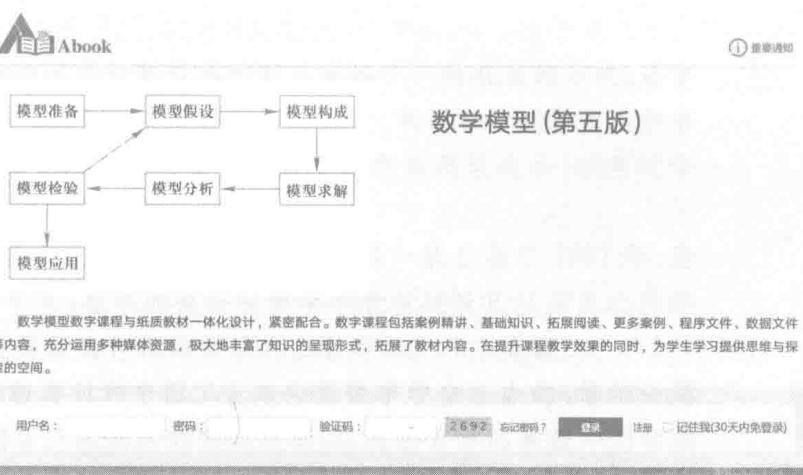

课程绑定后一年为数字课程使用有效期。受硬件限制,部分内容无法在手机端显示,请按提示通过计算机访问学习。

如有使用问题,请发邮件至abook@hep.com.cn。

案例精讲

更多案例

# 第五版前言

半个多世纪以来,由于数学科学与计算机技术的紧密结合,形成了一种普遍的、可以实现的关键技术——数学技术,成为当代高新技术的一个重要组成部分和突出标志,"高技术本质上是一种数学技术"的提法,已经得到越来越多人们的认同,建模与算法正在成为数学这门基础学科从科学向技术转化的主要途径。与此同时,时代发展和科技进步的大潮推动数学科学迅速进入了经济、人口、生物、医学、环境、地质等领域,一些交叉学科如计量经济学、人口控制论、生物数学、数学地质学等应运而生,为数学建模开拓了许多新的、广阔的用武之地。

将数学建模引入大学教育,为数学和外部世界的联系提供了一种有效的方式,让学生能亲自参加将数学用于实际的尝试,参与发现和创造的过程,取得在传统课堂里和书本上无法获得的宝贵经验和切身感受,在知识、能力及素质等方面迅速成长,这是近年来规模最大、最成功的一项数学教学改革实践。

数学建模课程于20世纪80年代初进入我国大学,本书第一版出版于1987年,是我国第一本数学建模教材。30多年来,数学建模课程教学和教材建设已从星星之火迅速发展成燎原之势,这期间起着重要影响和推动作用的主要有以下几个方面:

1. 1992年开始由教育部高等教育司和中国工业与应用数学学会主办的、每年一届的全国大学生数学建模竞赛,得到了广大同学的热烈欢迎,以及教育部门和教师们的热情关心和支持,成为我国高校规模最大的课外科技活动。在全国竞赛的推动下,许多学校、地区也纷纷组织竞赛,举办各种形式的课外活动。竞赛促进了数学建模教学的开展,教学又扩大了受益面,为竞赛奠定了坚实的基础。

2. 数学建模教学和竞赛的开展,对数学教学体系、内容和方法改革起了积极的推动作用,得到众多教育界人士和教师们的认可。将数学建模的思想和方法有机地融入大学数学主干课程中去的研究与实践已经起步,讲授数学建模课和数学主干课教师之间的不断交流,使得在教学上得以相互借鉴与促进。

3. 计算机技术及数学软件的飞速发展和普及,为改善、丰富数学建模课程的内容提供了良好的外部条件。以计算机为教学工具的数学实验课程的开设,对数学建模的教学内容和方法既有很大启示,也提出了新的挑战。

4. 信息技术在课堂教学中的广泛应用,给传统的教学模式带来了一场革命,也为改进、丰富数学建模课程的教师授课方式和学生学习方式提供了新的平台。

本书编者长期从事数学建模和数学实验教学、数学建模竞赛组织和辅导,并经常关注国内外数学建模教学案例的收集与研究,在保持前四版基本结构和风格的基础上,第五版充分考虑学生学习方式改变的新趋势,与数字化资源进行有机结合,以"纸质教材+数字课程"的方式,对教材的内容和形式进行重新设计,进行了以下几项较大的增补、修订与删减:

1. 案例研究是数学建模教学的主要形式,精心选取并适时更新一些生动新颖、内

涵丰富的案例,才能吸引学生浓厚的学习兴趣,有效地培养学生数学建模的意识、方法和能力,是建设数学建模教材的关键。第五版增加了33个新案例(包括8个融入案例的全国大学生数学建模竞赛赛题),改编了7个老案例,合计接近全书案例总数89个的一半。

2. 为保持全书的容量基本不变,删减了第四版的29个案例(其中7个案例删减了部分内容),全部放入数字课程的"更多案例"中。与此相配合,撤销第四版第7章稳定性模型,将其中3个案例分别放入第五版第5、第6章,撤销第四版第12章马氏链模型,将其中2个案例放入第五版第8章,撤销第四版第13章动态优化模型,将其中1个案例放入第五版第5章。

3. 学习数学建模既要阅读、消化别人做的模型,更要自己动手、做一些实际的练习。第五版对习题进行了相应的增减与修订,并分为复习题与训练题两部分。前者放在每一个案例(节)的后面,供该案例复习所用;后者放在每一类型案例(章)的后面,供这类案例的训练所用。习题参考解答也作了相应的修订,将另行出版。

4. 作为纸质教材内容的拓展和补充,数字课程包括案例精讲、基础知识、拓展阅读、更多案例、程序文件和数据文件等教学资源,在正文中用  $\mathbb{R}$  标出。其中,案例精讲共10篇,为相关教学案例的视频讲授;基础知识共10篇,是学习本书一些案例所用到的数学原理、方法的简单介绍;拓展阅读共10篇,是对书中相关案例的进一步研究;更多案例共29篇,全部来自本书第四版被删减的内容;程序文件和数据文件为案例和习题中求解模型用到的部分计算程序及过于庞大的原始数据。数字课程的内容将定期进行调整和补充。

本书第4章、7.8节及10.1至10.4节由谢金星编写,9.2至9.7节由叶俊编写,其余各章节由姜启源编写,全书由姜启源统稿。

萧树铁先生1983年在清华大学首次为本科生讲授数学模型课,接着在20世纪80年代中期他先后主持召开了两次数学建模教学、教材研讨会,主持举办了3届教师培训班,培养了我国最早一批数学建模骨干教师,是我国数学模型课程的开拓者和奠基人。萧先生直接筹划了本书第一版的出版,并为第一、二、三、四版作序。萧树铁先生为我国教育事业的发展做出了重大贡献,为了表达对他不幸离世的深切追思和沉痛悼念,这里将萧先生为本书第一版作的序言重新刊出。纵观30多年数学建模课程教学、教材建设和竞赛活动发展的历程,我们从这篇序言可以清晰地看到,萧先生在将数学建模引进我国大学课堂的初创时期,就展现出令人敬佩的远见卓识。李大潜院士十分关注数学建模课程建设和竞赛活动,多次就数学建模对推动科技发展和社会进步、促进教育改革的重要意义发表演讲。本次修订,李先生将他在"走近数学——数学建模篇"MOOC中的一段讲解赠予我们,作为本书数字课程的开篇。在此谨向李大潜院士致以谢意。

我们向在使用本书过程中提出宝贵建议的教师们致谢,向通过学习本书从而喜爱数学建模的同学们致意,希望大家共同努力,为数学建模教学和竞赛活动取得更大成绩继续努力。

编者

2017年9月

# 第一版序

近十年来,我国高等理工科学校所设置的应用数学专业(系)在数量上有较大的增长,然而直到现在,在如何培养这个专业学生的问题上,却还没有来得及进行认真的研究。

通过一些传统的数学基础课对应用数学专业的学生进行比较严格的数学训练仍然是重要的。但如果要把他们培养成为"会应用"的应用数学工作者,似乎还应该在另外一些方面使他们得到训练。例如,第一,面对一个不太复杂的现象,经过一番初步分析后,能较快地抓住问题的主要方面;可以名之为洞察力。第二,能从两个表面看上去没有多少联系的现象中找出共同点而加以类比;这是一种想象力。在传统的大学数学基础课里面,并非没有对这些方面的要求,然而似乎还没有哪一门课程把进行这类训练作为自己的主要任务,只是近年来国外出现的"数学模型"一课也许不在此列。

为了在这方面进行探索,1982年秋天我们(姜启源、谭泽光、葛玉安和我)组织了一个"数学模型"讨论班,围绕E.A.Bender的书:"An Introduction to Mathematical Modeling",搜集资料,进行分析讨论。1983年春和暑假中,我分别为清华应用数学系三、四年级和大连的"数学模型讲习班"试讲了"数学模型"课。此后国内有些应用数学系也开设了这门课,其中姜启源同志在清华应用数学系讲了两次。他在讲授中又补充了一些新的材料,尤其是他花了很大的功夫把讲的这些材料以学生较易接受的形式编成讲义,成了这本书的基础。

要培养学生的洞察力和想象力,靠一本教科书当然是不够的,至少还需通过教师根据不同的背景和学生的实际情况来灵活运用书中的内容。因此,在多种不同风格的教材出现以前,一本教材的弹性是不可少的。编者在这方面也作了不少的努力,其中包括选了一批有趣的习题。它们除了可供学生动手练习(这是学习这门课必不可少的环节)以外,有一些也可以作为讲授或讨论的内容。

姜启源同志的这本书是一个很有益的尝试,希望通过它的出版,能促使更多这方面不同风格的教材出现。

萧树铁

1986年6月于清华园

# 第1章 建立数学模型 1

1.1 从现实对象到数学模型 1

1.2 数学建模的重要意义 4

1.3 建模示例之一 包饺子中的数学 5

1.4 建模示例之二 路障间距的设计 7

1.5 建模示例之三 椅子能在不平的地面上放稳吗 9

1.6 数学建模的基本方法和步骤 10

1.7 数学模型的特点和分类 12

1.8 怎样学习数学建模——学习课程和参加竞赛 14

第1章训练题 18

# 第2章 初等模型 19

2.1 双层玻璃窗的功效 19

2.2 划艇比赛的成绩 21

2.3 实物交换 23

2.4 汽车刹车距离与道路通行能力 25

2.5 估计出租车的总数 28

2.6 评选举重总冠军 33

2.7 解读CPI 39

2.8 核军备竞赛 47

2.9 扬帆远航 50

2.10 节水洗衣机 52

第2章训练题 55

# 第3章 简单的优化模型 57

3.1 存贮模型 57

3.2 森林救火 61

3.3 倾倒的啤酒杯 63

3.4 铅球掷远 67

3.5 不买贵的只买对的 71

3.6 血管分支 78

3.7 冰山运输 81

3.8 影院里的视角和仰角 85

3.9 易拉罐形状和尺寸的最优设计 90

第3章训练题 93

# Ⅱ目录

# 第4章 数学规划模型 96

4.1 奶制品的生产与销售 96

4.2 自来水输送与货机装运 104

4.3 汽车生产与原油采购 108

4.4 接力队的选拔与选课策略 113

4.5 饮料厂的生产与检修 117

4.6 钢管和易拉罐下料 120

4.7 广告投入与升级调薪 125

4.8 投资的风险与收益 130

第4章训练题 135

# 第5章 微分方程模型 141

5.1 人口增长 141

5.2 药物中毒急救 150

5.3 捕鱼业的持续收获 153

5.4 资金、劳动力与经济增长 156

5.5 香烟过滤嘴的作用 159

5.6 火箭发射升空 163

5.7 食饵与捕食者模型 168

5.8 赛跑的速度 173

5.9 万有引力定律的发现 177

5.10 传染病模型和SARS的传播 180

第5章训练题 188

# 第6章 差分方程与代数方程模型 192

6.1 贷款购房 192

6.2 管住嘴迈开腿 195

6.3 市场经济中的物价波动 199

6.4 动物的繁殖与收获 203

6.5 信息传播 208

6.6 原子弹爆炸的能量估计 212

6.7 CT技术的图像重建 217

6.8 等级结构 220

6.9 中国人口增长预测 225

第6章训练题 230

# 第7章 离散模型 233

7.1 汽车选购 233

7.2 职员晋升 240

7.3 厂房新建还是改建 247

7.4 循环比赛的名次 251

7.5 公平的席位分配 253

7.6 存在公平的选举吗 259

7.7 价格指数 267

7.8 钢管的订购和运输 271

第7章训练题 275

第8章 概率模型 279

8.1 传送系统的效率 279

8.2 报童的诀窍 281

8.3 航空公司的超额售票策略 284

8.4 作弊行为的调查与估计 287

8.5 轧钢中的浪费 290

8.6 博彩中的数学 293

8.7 钢琴销售的存贮策略 300

8.8 基因遗传 302

8.9 自动化车床管理 306

第8章训练题 309

第9章 统计模型 312

9.1 孕妇吸烟与胎儿健康 312

9.2 软件开发人员的薪金 321

9.3 酶促反应 325

9.4 投资额与生产总值和物价指数 331

9.5 冠心病与年龄 336

9.6 蠖虫分类判别 342

9.7 学生考试成绩综合评价 348

9.8 艾滋病疗法的评价及疗效的预测 357

第9章训练题 363

第10章 博弈模型 369

10.1 点球大战 369

10.2 拥堵的早高峰 373

10.3 "一口价"的战略 379

10.4 不患寡而患不均 382

10.5 效益的合理分配 385

10.6 加权投票中权力的度量 389

第10章训练题 398

参考文献 401

# 第1章 建立数学模型

随着科学技术的迅速发展,数学模型这个词汇越来越多地出现在现代人的生产、工作和社会活动中.电气工程师必须建立所要控制的生产过程的数学模型,用这个模型对控制装置做出相应的设计和计算,才能实现有效的过程控制.气象工作者为了得到准确的天气预报,一刻也离不开根据气象站、气象卫星汇集的气压、雨量、风速等资料建立的数学模型.生理医学专家有了药物浓度在人体内随时间和空间变化的数学模型,就可以分析药物的疗效,有效地指导临床用药.城市规划工作者需要建立一个包括人口、经济、交通、环境等大系统的数学模型,为领导层对城市发展规划的决策提供科学根据.厂长经理们要是能够根据产品的需求状况、生产条件和成本、贮存费用等信息,筹划出一个合理安排生产和销售的数学模型,一定可以获得更大的经济效益.就是在日常活动如访友、采购当中,人们也会谈论找一个数学模型,优化一下出行的路线.对于广大的科学技术人员和应用数学工作者来说,建立数学模型是沟通摆在面前的实际问题与他们掌握的数学工具之间联系的一座必不可少的桥梁.

本章作为全书的导言和数学模型的概述,主要讨论建立数学模型的意义、方法和步骤,给读者以建立数学模型的全面的、初步的了解.1.1节介绍现实对象和它的模型的关系,给出一些模型形式,说明什么是数学模型;1.2节阐述建立数学模型的重要意义;1.3~1.5节通过几个示例说明用数学语言和数学方法表述和解决实际问题,即建立数学模型的过程;1.6节阐述建立数学模型的一般方法和步骤;1.7节介绍数学模型的特点及数学模型的分类;1.8节给出一些怎样学习数学建模的建议,并对正在蓬勃发展的大学生数学建模竞赛及如何参加竞赛作简要介绍.

# 1.1 从现实对象到数学模型

人类生活在丰富多彩、变化万千的现实世界里,无时无刻不在运用智慧和力量去认识、利用、改造这个世界,从而不断地创造出日新月异、五彩缤纷的物质文明和精神文明.博览会常常是集中展示这些成果的场所之一,那些五光十色、精美绝伦的展品给我们留下了深刻的印象.工业博览会上,豪华、舒适的新型汽车叫人赞叹不已;农业博览会上,硕大、娇艳的各种水果令人流连忘返;科技展览厅里,港珠澳大桥模型雄伟壮观,长征系列运载火箭模型高高耸立、清晰的数字和图表显示着电力工业的迅速发展,和整面墙壁一样大的地图上鲜明地标出了新建的高速铁路和新辟的航线,核电站工程的彩色巨照前,手持原子结构模型的讲解员深入浅出地介绍反应堆的运行机理;体验厅里,智能机器人通过语音识别、触摸交互、移动互联,帮助人们完成各种生活服务活动;"数字故宫"让珍贵文物随着手指滑动屏幕,从沉睡中活了过来,实现360度全视角展示.

参观博览会,像汽车、水果那些原封不动地从现实世界搬到展厅里的物品固然给人以亲切真实的感受,可是从开阔眼界、丰富知识的角度看,火箭、电站、大桥、铁路……这些在现实世界被人们认识、建造、控制的对象,以它们的各种形式的模型——实物模型、

照片、视频、图表、程序……汇集在人们面前,这些模型在短短几小时里所起的作用,恐怕是置身现实世界多少天也无法做到的。

与形形色色的模型相对应,它们在现实世界里的原始参照物通称为原型。本节先讨论原型和模型,特别是和数学模型的关系,再介绍数学模型的意义。

原型和模型 原型(prototype)和模型(model)是一对对偶体。原型指人们在现实世界里关心、研究或者从事生产、管理的实际对象。在科技领域通常使用系统(system)、过程(process)等词汇,如机械系统、电力系统、生态系统、生命系统、社会经济系统,又如钢铁冶炼过程、导弹飞行过程、化学反应过程、污染扩散过程、生产销售过程、计划决策过程等。本书所述的现实对象、研究对象、实际问题等均指原型。模型则指为了某个特定目的将原型的某一部分信息简缩、提炼而构造的原型替代物。

这里特别强调构造模型的目的性。模型不是原型原封不动的复制品,原型有各个方面和各种层次的特征,而模型只要求反映与某种目的有关的那些方面和层次。一个原型,为了不同的目的可以有许多不同的模型。如放在展厅里的飞机模型应该在外形上逼真,但是不一定会飞。而参加航模竞赛的模型飞机要具有良好的飞行性能,在外观上不必苛求。至于在飞机设计、试制过程中用到的数学模型和计算机模拟,则只要求在数量规律上真实反映飞机的飞行动态特性,毫不涉及飞机的实体。所以模型的基本特征是由构造模型的目的决定的。

我们已经看到模型有各种形式。按照模型替代原型的方式来分类,模型可以分为物质模型(形象模型)和理想模型(抽象模型)。前者包括直观模型、物理模型等,后者包括思维模型、符号模型、数学模型等。

直观模型 指那些供展览用的实物模型,以及玩具、照片等,通常是把原型的尺寸按比例缩小或放大,主要追求外观上的逼真。这类模型的效果是一目了然的。

物理模型 主要指科技工作者为了一定目的根据相似原理构造的模型,它不仅可以显示原型的外形或某些特征,而且可以用来进行模拟实验,间接地研究原型的某些规律。如波浪水箱中的舰艇模型用来模拟波浪冲击下舰艇的航行性能,风洞中的飞机模型用来试验飞机在气流中的空气动力学特性。有些现象直接用原型研究非常困难,更可借助于这类模型,如地震模拟装置、核爆炸反应模拟设备等。应注意验证原型与模型间的相似关系,以确定模拟实验结果的可靠性。物理模型常可得到实用上很有价值的结果,但也存在成本高、时间长、不灵活等缺点。

思维模型 指通过人们对原型的反复认识,将获取的知识以经验形式直接贮存于大脑中,从而可以根据思维或直觉做出相应的决策。如汽车司机对方向盘的操纵、一些技艺性较强的工种(如钳工)的操作,大体上是靠这类模型进行的。通常说的某些领导者凭经验作决策也是如此。思维模型便于接受,也可以在一定条件下获得满意的结果,但是它往往带有模糊性、片面性、主观性、偶然性等缺点,难以对它的假设条件进行检验,并且不便于人们的相互沟通。

符号模型 是在一些约定或假设下借助于专门的符号、线条等,按一定形式组合起来描述原型。如地图、电路图、化学结构式等,具有简明、方便、目的性强及非量化等特点。

本书要专门讨论的数学模型则是由数字、字母或其他数学符号组成的,描述现实对

象数量规律的数学公式、图形或算法。

什么是数学模型 其实你早在学习初等代数的时候就已经碰到过数学模型了。当然其中许多问题是老师为了教会学生知识而人为设置的。譬如你一定解过这样的所谓"航行问题":

甲乙两地相距  $750 \mathrm{~km}$ , 船从甲到乙顺水航行需  $30 \mathrm{~h}$ , 从乙到甲逆水航行需  $50 \mathrm{~h}$ , 问船速、水速各若干?

用  $x, y$  分别代表船速和水速, 可以列出方程

$$
(x + y) \cdot 30 = 750, \quad (x - y) \cdot 50 = 750
$$

实际上, 这组方程就是上述航行问题的数学模型。列出方程, 原问题已转化为纯粹的数学问题。方程的解  $x = 20 \mathrm{~km} / \mathrm{h}, y = 5 \mathrm{~km} / \mathrm{h}$ , 最终给出了航行问题的答案。

当然, 真正实际问题的数学模型通常要复杂得多, 但是建立数学模型的基本内容已经包含在解这个代数应用题的过程中了。那就是: 根据建立数学模型的目的和问题的背景做出必要的简化假设 (航行中设船速和水速为常数); 用字母表示待求的未知量  $(x, y$  代表船速和水速); 利用相应的物理或其他规律 (匀速运动的距离等于速度乘以时间), 列出数学式子 (二元一次方程); 求出数学上的解答  $(x = 20, y = 5)$ ; 用这个答案解释原问题 (船速和水速分别为  $20 \mathrm{~km} / \mathrm{h}$  和  $5 \mathrm{~km} / \mathrm{h}$  ); 最后还要用实际现象来验证上述结果。

一般地说, 数学模型可以描述为, 对于现实世界的一个特定对象, 为了一个特定目的, 根据特有的内在规律, 做出一些必要的简化假设, 运用适当的数学工具, 得到的一个数学结构。

需要指出, 本书的重点不在于介绍现实对象的数学模型 (mathematical model) 是什么样子, 而是要讨论建立数学模型 (mathematical modelling) 的全过程。建立数学模型下面简称为数学建模或建模。

与数学建模有密切关系的数学模拟, 主要指运用数字式计算机的计算机模拟 (computer simulation)。它根据实际系统或过程的特性, 按照一定的数学规律用计算机程序语言模拟实际运行状况, 并依据大量模拟结果对系统或过程进行定量分析。例如通过各种工件在不同机器上按一定工艺顺序加工的模拟, 能够识别生产过程中的瓶颈环节; 通过高速公路上交通流的模拟, 可以分析车辆在路段上的分布特别是堵塞的状况。与用物理模型的模拟实验相比, 计算机模拟有明显的优点: 成本低、时间短、重复性高、灵活性强。有人把计算机模拟作为建立数学模型的手段之一, 但是数学模型在某种意义下描述了对象内在特性的数量关系, 其结果容易推广, 特别是得到了解析形式答案时, 更易推广。而计算机模拟则完全模仿对象的实际演变过程, 难以从得到的数字结果分析对象的内在规律。当然, 对于那些因内部机理过于复杂, 目前尚难以建立数学模型的实际对象, 用计算机模拟获得一些定量结果, 可称是解决问题的有效手段。

# 复习题

怎样解决下面的实际问题, 包括需要哪些数据资料, 要做些什么观察、试验以及建立什么样的数学模型等 [24,35]。

(1) 估计一个人体内血液的总量。

(2)为保险公司制定人寿保险金计划(不同年龄的人应缴纳的金额和公司赔偿的金额).

(3)估计一批日光灯管的寿命.

(4)确定火箭发射至最高点所需的时间.

(5)决定十字路口黄灯亮的时间长度.

(6)为汽车租赁公司制订车辆维修、更新和出租计划.

(7)一高层办公楼有4部电梯,早晨上班时间非常拥挤,试制订合理的运行计划.

# 1.2 数学建模的重要意义

数学作为一门研究现实世界数量关系和空间形式的科学,在它产生和发展的历史长河中,一直是和人们生活的实际需要密切相关的.作为用数学方法解决实际问题的第一步,数学建模自然有着与数学同样悠久的历史.两千多年以前创立的欧几里得几何,17世纪牛顿发现的万有引力定律,都是科学发展史上数学建模的成功范例.

半个多世纪以来,随着数学以空前的广度和深度向一切领域的渗透,以及电子计算机和信息技术的飞速发展,数学建模越来越受到人们的重视,可以从以下几方面来看数学建模在现实世界中的重要意义.

1)在一般工程技术领域,数学建模仍然大有用武之地.

在以声、光、热、力、电这些物理学科为基础的诸如机械、电机、土木、水利等工程技术领域中,数学建模的普遍性和重要性不言而喻.虽然这里的基本模型大多是已有的,但是由于新技术、新工艺的不断涌现,提出了许多需要用数学方法解决的新问题;高速、大型计算机的飞速发展,使得过去即便有了数学模型也无法求解的课题(如大型水坝的应力计算、中长期天气预报等)迎刃而解;建立在数学模型和计算机模拟基础上的CAD技术,以其快速、经济、方便等优势,很大程度上替代了传统工程设计中的现场实验、物理模拟等手段.

# 2)在高新技术领域,数学建模几乎是必不可少的工具.

无论是发展互联网通信、航天、微电子、人工智能等高新技术本身,还是将高新技术用于传统工业去创造新工艺、开发新产品,计算机技术支持下的建模和模拟都是经常使用的有效手段.数学建模、数值计算和计算机图形学等相结合形成的计算机软件,已经被固化于产品中,在许多高新技术领域起着核心作用,在临床医疗、无损探测、资源勘探等领域被广泛采用的CT(计算机断层成像)技术就是典型的成功范例.在这个意义上,数学不再仅仅作为一门科学,是许多技术的基础,而且直接走向了技术的前台.国际上一位学者就提出了"高技术本质上是一种数学技术"的观点.

3)数学迅速进入一些新领域,为数学建模开拓了许多新的处女地.

随着数学向诸如经济、人口、生态、地质等所谓非物理领域的渗透,一些交叉学科如计量经济学、人口控制论、数学生态学、数学地质学等应运而生.这里一般地说不存在作为支配关系的物理定律,当用数学方法研究这些领域中的定量关系时,数学建模就成为首要的、关键的步骤和这些学科发展与应用的基础.在这些领域里建立不同类型、不同方法、不同深浅程度的模型的余地相当大,为数学建模提供了广阔的新天地.马克思说过:"一门科学只有成功地运用数学时,才算达到了完善的地步."数学必将大踏步地进

入所有学科, 数学建模将迎来蓬勃发展的新时期。

今天, 在国民经济和社会活动的以下诸多方面, 数学建模都有着非常具体的应用。

分析与设计 例如描述药物浓度在人体内的变化规律以分析药物的疗效; 建立跨音速流和激波的数学模型, 用数值模拟设计新的飞机翼型。

预报与决策 生产过程中产品质量指标的预报、气象预报、人口预报、经济增长预报, 等等, 都要有预报模型; 使经济效益最大的价格策略、使费用最少的设备维修方案, 都是决策模型的例子。

控制与优化 电力、化工生产过程的最优控制、零件设计中的参数优化, 要以数学模型为前提。建立大系统控制与优化的数学模型, 是迫切需要和十分棘手的课题。

规划与管理 生产计划、资源配置、运输网络规划、水库优化调度, 以及排队策略、物流管理等, 都可以用数学规划模型解决。

数学建模与计算机技术的关系密不可分。一方面, 像新型飞机设计、石油勘探数据处理中数学模型的求解当然离不开巨型计算机, 而微型电脑的普及更使数学建模逐步进入人们的日常活动。比如, 当一位公司经理根据客户提出的产品数量、质量、交货期等要求, 用笔记本电脑与客户进行价格谈判时, 您不会怀疑他的电脑中贮存了由公司的各种资源、产品工艺流程及客户需求等数据研制的数学模型——快速报价系统和生产计划系统。另一方面, 以数字化为特征的大数据信息正以爆炸之势涌入计算机, 去伪存真、归纳整理、分析现象、显示结果……, 计算机需要人们给它以思维的能力, 这些当然要求助于数学模型。所以把计算机技术与数学建模在知识经济中的作用比喻为如虎添翼, 是恰如其分的。

美国国家科学院一位院士总结了将数学科学转化为生产力过程中的成功和失败, 得出了"数学是一种关键的、普遍的、可以应用的技术"的结论, 认为数学"由研究到工业领域的技术转化, 对加强经济竞争力具有重要意义", 而"计算和建模重新成为中心课题, 它们是数学科学技术转化的主要途径"。

# 复习题

举出两三个实例说明建立数学模型的必要性, 包括实际问题的背景, 建模目的, 需要大体上什么样的模型以及怎样应用这种模型等。

# 1.3 建模示例之一 包饺子中的数学

不少人认为需要用数学方法解决的基本上是高新技术、科学研究或者生产建设、经济管理中的重大问题, 带着一些神秘色彩的数学离人们的日常生活很远。其实, 通过数学建模可以分析我们身边的许多现象和问题。为了让数学走进生活, 使大家更容易地了解什么是数学建模, 本节和下面两节展示日常生活中三个实例的建模过程, 并简单介绍数学建模的方法和步骤。

在最平凡不过的包饺子当中还有什么数学问题吗? 让我们从一个具体例子说起[70]。

通常, 你家用  $1 \mathrm{~kg}$  面和  $1 \mathrm{~kg}$  馅包 100 个饺子. 某次, 馅做多了而面没有变, 为了把馅全包完, 问应该让每个饺子小一些, 多包几个, 还是每个饺子大一些, 少包几个? 如果回答是包大饺子, 那么如果 100 个饺子能包  $1 \mathrm{~kg}$  馅, 问 50 个饺子可以包多少馅呢?

讨论 有人对饺子数量减少一倍就能多包约  $40\%$  的馅这一结果表示怀疑, 认为饺子越大面皮应该越厚, 建模中关于面皮厚度不变的假设值得探讨, 这是有道理的!(复习题2)

问题分析 很多人都会根据"大饺子包的馅多"的直观认识, 觉得应该包大饺子. 但是这个理由不足以令人信服, 因为大饺子虽然包的馅多, 但用的面皮也多, 这就需要比较馅多和面多二者之间的数量关系. 利用数学方法不仅可以确有道理地回答应该包大饺子, 而且能够给出数量结果, 回答比如"50 个饺子可以包多少馅"的问题.

首先, 把包饺子用的馅和面皮与数学概念联系起来, 那就是物体的体积和表面积. 用  $V$  和  $S$  分别表示大饺子馅的体积和面皮面积,  $v$  和  $s$  分别表示小饺子馅的体积和面皮面积, 如果一个大饺子的面皮可以做成  $n$  个小饺子的面皮, 那么我们需要比较的是,  $V$  与  $nv$  哪个大? 大多少?

模型假设 容易想到, 进行比较的前提是所有饺子的面皮一样厚, 虽然这不可能严格成立, 但却是一个合理的假定. 在这个条件下, 大饺子和小饺子面皮面积满足

$$
S = n s \tag{1}
$$

为了能比较不同大小饺子馅的体积, 所需要的另一个假设是所有饺子的形状一样, 这是又一个既近似又合理的假定.

模型建立 能够把体积和表面积联系起来的是半径. 虽然球体的体积和表面积与半径才存在我们熟悉的数量关系, 但是对于一般形状的饺子, 仍然可以引入所谓"特征半径"  $R$  和  $r$ , 使得

小结 回顾整个建模过程, 关键的有以下几点:

1. 用数学语言(体积和表面积)表示现实对象(馅和面皮).

在(2)和(3)中消去  $R$  和  $r$ , 得

$$
V = k S^{\frac{3}{2}}, \quad v = k s^{\frac{3}{2}} \tag{4}
$$

(馅和面皮).

2. 做出简化、合理的假设(面皮厚度一样, 饺子形状一样).

$$
V = n^{\frac{3}{2}} v = \sqrt{n} (nv) \tag{5}
$$

3. 利用问题蕴含的内在规律(体积、表面积与半径间的几何关系).

实际上在数学建模中这样几条都是基本的和关键的步骤.

结果解释 模型(5)不仅定性地说明  $V$  比  $nv$  大(对于  $n > 1$ ), 大饺子比小饺子包的馅多, 而且给出了定量结果, 即  $V$  是  $nv$  的  $\sqrt{n}$  倍. 由此能够回答前面提出的"100 个饺子能包  $1 \mathrm{~kg}$  馅, 50 个饺子可以包多少馅"的问题, 因为饺子数量由 100 变成 50, 所以 50 个饺子能包  $\sqrt{100 / 50} = \sqrt{2} ( \approx 1.4) \mathrm{~kg}$  馅. 不用数学建模, 你想不到这个结果吧.

# 复习题

1. 利用模型(5)式说明: 如果  $n_{1}$  个饺子包  $m \mathrm{~kg}$  馅, 那么  $n_{2}$  个饺子能包多少馅? 由此给出本节中  $\sqrt{2}$  的结果.

2. 将所有饺子面皮一样厚的假设改为饺子越大面皮越厚, 并对此给以简化、合理的数学描述, 重

新建模,得出  $V$  与  $nv$  之间的关系,讨论"饺子数量减少一倍能多包多少馅"与什么因素有关。

# 1.4 建模示例之二 路障间距的设计

在校园、机关、居民小区的道路中间,常常设置用于限制汽车速度的路障。看到路障你会想到下面这个问题能够用数学解决吗?

路障之间相距太远,起不到限制车速的作用,相距太近又会引起行车的不便,所以应该有一个合适的间距。不妨向设计者提出这样的问题:如果要求限制车速不超过  $40 \mathrm{km / h}$ ,路障的间距应该是多少?[70]

问题分析 设计者可以设想,当汽车通过一个路障时,速度近乎零,过了路障,司机就会加速,当车速达到  $40 \mathrm{km / h}$  时,让司机因为前面有下一个路障而减速,至路障处车速又近乎零,如此循环,即可达到限速的目的。

按照这种分析,如果认为汽车在两个相邻路障之间一直在作等加速运动和等减速运动,那么只要确定了加速度和减速度这两个数值,根据基本的物理知识,就很容易算出两个相邻路障之间应有的间距。

收集数据 要得到汽车的加速度和减速度,一个办法是查阅资料,通常可以查到:某牌号的汽车在若干秒内(或多远距离内)可以从静止加速到多快,或者某牌号的汽车在若干秒内(或多远距离内)可从多大车速紧急刹车。由这样的数据推算出的是最大加速度和最大减速度,不能直接用于这里的问题。还有资料会给出加速度的一个范围,如从  $1 \mathrm{m / s}^2$  到  $10 \mathrm{m / s}^2$ ,也不方便使用。

比较实用的方法是进行测试,办法是请驾驶普通牌号汽车的司机在与设计路障的环境相似的道路上,模拟有路障的情况作加速行驶和减速行驶,记录行驶中的车速和对应的时间(需要坐在副驾位置的助手辅助)。假定我们已经得到了如表1、表2的数据。

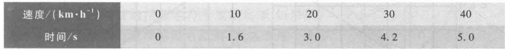

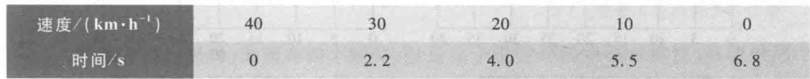

模型假设 汽车通过路障时车速为零,其后作等加速运动,当车速达到限速时立即作等减速运动,到达下一个路障时车速为零。

模型建立 记汽车加速行驶的距离为  $s_1$ ,时间为  $t_1$ ,加速度为  $a_1$ ,减速行驶的距离为  $s_2$ ,时间为  $t_2$ ,减速度为  $a_2$ ,限速为  $v_{\mathrm{max}}$ 。根据熟知的物理定律有

$$
s_1 = \frac{1}{2} a_1 t_1^2, \quad s_2 = \frac{1}{2} a_2 t_2^2 \tag{1}
$$

$$
v_{\mathrm{max}} = a_1 t_1, \quad v_{\mathrm{max}} = a_2 t_2 \tag{2}
$$

汽车在两相邻路障间行驶的总距离  $s = s_{1} + s_{2}$ , 从(1),(2)中消去  $t_{1}, t_{2}$  得到

$$
s = \frac{v_{\mathrm{max}}^{2}}{2}\left(\frac{1}{a_{1}} +\frac{1}{a_{2}}\right) \tag{3}
$$

(3)式为路障间距设计的数学模型.对于某个给定限速  $v_{\mathrm{max}}$  的具体问题,由测试数据估计出加速度  $a_{1}$  和减速度  $a_{2}$  后,即可计算路障间距  $s$ .

模型计算以速度  $v$  为横坐标、时间  $t$  为纵坐标,将表1、表2的数据作散点图(图1、图2中的圆点),可以看出速度与时间大致为线性关系,这也能用于验证汽车在路障间作等加速运动和等减速运动的假设是否基本正确.记等加速和等减速运动速度与时间的关系分别为  $v = c_{1}v + d_{1}$  和  $t = c_{2}v + d_{2}$ .作为粗略估计,不妨手工在图1上尽量靠近数据点画一条直线,因为直线在  $v = 0$  和  $v = 40$  的  $t$  的坐标差约为  $5.3 - 0.3 = 5$ ,所以图1直线的斜率为  $c_{1} = \frac{5\times 3.6}{40} = 0.45(\mathrm{s}^{2} / \mathrm{m})$ .类似地处理图2,得到直线的斜率为  $c_{2} = - \frac{7\times 3.6}{40} = - 0.63(\mathrm{s}^{2} / \mathrm{m})$ .由图1、图2可知  $d_{1}, d_{2}$  很小,视为0,于是加速度  $a_{1} = \frac{1}{c_{1}}$ ,减速度  $a_{2} = - \frac{1}{c_{2}}$ .又按问题要求

$$
v_{\mathrm{max}} = 40 \mathrm{km / h} = 11.1 \mathrm{m / s}
$$

将  $a_{1}, a_{2}, v_{\mathrm{max}}$  代入(3)式计算得

$$
s = \frac{11.1^{2}\times(0.45 + 0.63)}{2}\approx 66.5(\mathrm{~m})
$$

可将路障间距设计为  $67 \mathrm{~m}$ .

如果根据表1、表2的数据利用最小二乘法编程计算,可得  $c_{1} = 0.4536, c_{2} = - 0.6084$ ,  $s = 65.5556$ ,与手算结果相差不大.

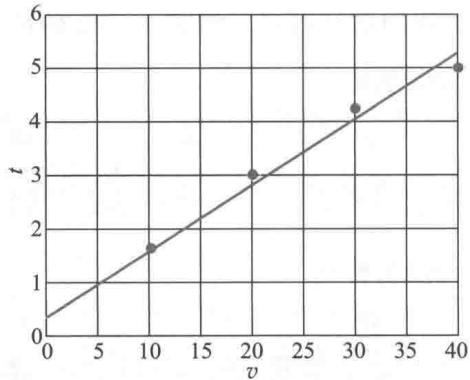  
图1 加速行驶测试数据图形

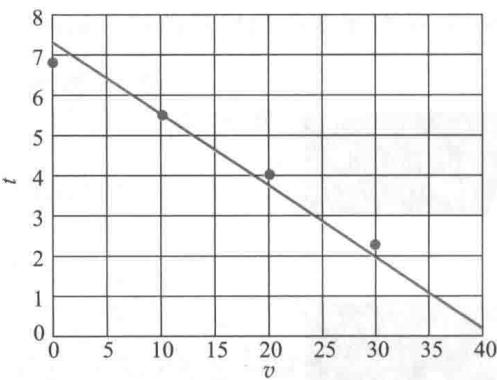  
图2 减速行驶测试数据图形

# 复习题

1. 通过资料调查或实地测试,自己获取汽车加速度和减速度的数据,用来求解模型.

2. 关于路障,你还能想到有哪些问题可以用数学建模分析和解决吗?

# 1.5 建模示例之三 椅子能在不平的地面上放稳吗

这个问题来源于日常生活中一个普通的事实:把四只脚的椅子往不平的地面上一放,通常只有三只脚着地,放不稳,然而只需稍挪动几次,就可以使四只脚同时着地,放稳了.这个看来似乎与数学无关的现象能用数学语言给以表述,并用数学工具来证实吗?让我们试试看[40]

模型假设 对椅子和地面应该做一些必要的假设:

1. 椅子四条腿一样长,椅脚与地面接触处可视为一个点,四脚的连线呈正方形.

2. 地面高度是连续变化的,沿任何方向都不会出现间断(没有像台阶那样的情况),即地面可视为数学上的连续曲面.

3. 对于椅脚的间距和椅腿的长度而言,地面是相对平坦的,使椅子在任何位置至少有三只脚同时着地.

假设1是对椅子本身合理的简化.假设2相当于给出了椅子能放稳的条件,因为如果地面高度不连续,比如在有台阶的地方是无法使四只脚同时着地的.假设3是要排除这样的情况:地面上与椅脚间距和椅腿长度的尺寸大小相当的范围内,出现深沟或凸峰(即使是连续变化的),致使三只脚无法同时着地.

模型建立 中心问题是用数学语言把椅子四只脚同时着地的条件和结论表示出来.

首先要用变量表示椅子的位置.注意到椅脚连线呈正方形,以中心为对称点,正方形绕中心的旋转正好代表了椅子位置的改变,于是可以用旋转角度这一变量表示椅子

的位置.在图1中椅脚连线为正方形ABCD,对角线AC与  $x$  轴重合,椅子绕中心点  $o$  旋转角度  $\theta$  后,正方形ABCD转至  $A^{\prime}B^{\prime}C^{\prime}D^{\prime}$  的位置,所以对角线  $A C$  与  $x$  轴的夹角  $\theta$  表示了椅子的位置.

其次要把椅脚着地用数学符号表示出来.如果用某个变量表示椅脚与地面的竖直距离,那么当这个距离为零时就是椅脚着地了.椅子在不同位置时椅脚与地面的距离不同,所以这个距离是椅子位置变量  $\theta$  的函数.

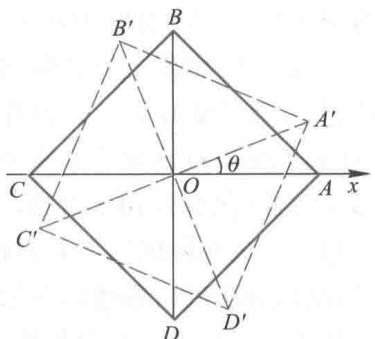  
图1变量  $\theta$  表示椅子的位置

虽然椅子有四只脚,因而有四个距离,但是由于正方形的中心对称性,只要设两个距离函数就行了.记  $A,C$  两脚与地面距离之和为  $f(\theta),B,D$  两脚与地面距离之和为 $g(\theta)\left(f(\theta),g(\theta)\geqslant 0\right)$  .由假设  $2,f$  和  $g$  都是连续函数.由假设3,椅子在任何位置至少有三只脚着地,所以对于任意的  $\theta ,f(\theta)$  和  $g\left(\theta\right)$  中至少有一个为零.当  $\theta = 0$  时,不妨设 $g(0) = 0,f(0) > 0$  ,而当椅子旋转  $90^{\circ}$  后,对角线  $A C$  与  $B D$  互换,于是  $f(\pi /2) = 0,g(\pi /2) > 0$  这样,改变椅子的位置使四只脚同时着地,就归结为证明如下的数学命题:

已知  $f(\theta)$  和  $g(\theta)$  是  $\theta$  的连续函数,对任意  $\theta ,f(\theta)\cdot g(\theta) = 0$  且  $g(0) = f(\pi /2) =$ $0,f(0) > 0,g(\pi /2) > 0.$  证明存在  $\theta_{0}$  ,使  $f(\theta_{0}) = g(\theta_{0}) = 0$

模型求解上述命题有多种证明方法,这里介绍其中比较简单,但是有些粗糙的

评注这个模型的巧妙之处在于用一元变量  $\theta$  表示椅子的位置,用  $\theta$  的两个函数表示椅子四脚与地面的距离,进而把模型假设和椅脚同时着地的结论用简单、精确的数学语言表达出来,构成了这个实际问题的数学模型.

模型假设中"四脚连线呈正方形"不是本质的,读者可以考虑四脚连线呈长方形的情况。

一种.

令  $h(\theta) = f(\theta) - g(\theta)$ ,则  $h(0) > 0$  和  $h(\pi /2)< 0.$  由  $f$  和  $g$  的连续性知  $h$  也是连续函数。根据连续函数的基本性质,必存在  $\theta_{0}(0< \theta_{0}< \pi /2)$  使  $h(\theta_{0}) = 0$ ,即  $f(\theta_{0}) = g(\theta_{0})$ 。

最后,因为  $f(\theta_{0})\cdot g(\theta_{0}) = 0$  ,所以  $f(\theta_{0}) = g(\theta_{0}) = 0$

由于这个实际问题非常直观和简单,模型解释和验证就略去了。

复习题

将假设条件1中的"四脚的连线呈正方形"改为"四脚的连线呈长方形",试建立模型并求解。

# 1.6 数学建模的基本方法和步骤

数学建模面临的实际问题是多种多样的,建模的目的不同、分析的方法不同、采用的数学工具不同,所得模型的类型也不同,我们不能指望归纳出若干条准则,适用于一切实际问题的数学建模方法。下面所谓基本方法不是针对具体问题而是从方法论的意义上讲的。

数学建模的基本方法

一般说来,建模方法大体上可分为机理分析和测试分析两种。机理分析是根据对客观事物特性的认识,找出反映内部机理的数量规律,建立的模型常有明确的物理或现实意义。前面几个示例都是用的机理分析。测试分析是将研究对象看作一个"黑箱"系统(意思是它的内部机理看不清楚),通过对系统输入、输出数据的测量和统计分析,按照一定的准则找出与数据拟合得最好的模型。

面对一个实际问题用哪一种方法建模,主要取决于人们对研究对象的了解程度和建模目的。如果掌握了一些内部机理的知识,模型也要求具有反映内在特征的物理意义,建模就应以机理分析为主。而如果对象的内部规律基本上不清楚,模型也不需要反映内部特性(例如仅用于对输出作预报),那么就可以用测试分析。

对于许多实际问题还常常将两种方法结合起来建模,即用机理分析建立模型的结构,用测试分析确定模型的参数。

机理分析当然要针对具体问题来做,不可能有统一的方法,因而主要是通过实例研究(case studies)来学习。测试分析有一套完整的数学方法,第9章统计模型是其中的一小部分。以动态系统为主的测试分析称为系统辨识(system identification),是一门专门学科。本书以后所说的数学建模主要指机理分析。

数学建模的一般步骤

建模要经过哪些步骤并没有一定的模式,通常与问题性质、建模目的等有关。下面介绍的是机理分析方法建模的一般过程,如图1所示。

模型准备 了解问题的实际背景,明确建模目的,搜集必要的信息如现象、数据等,尽量弄清对象的主要特征,形成一个比较清晰的"问题",由此初步确定用哪一类模型。情况明才能方法对。在模型准备阶段要深入调查研究,虚心向实际工作者请教,尽量掌握第一手资料。

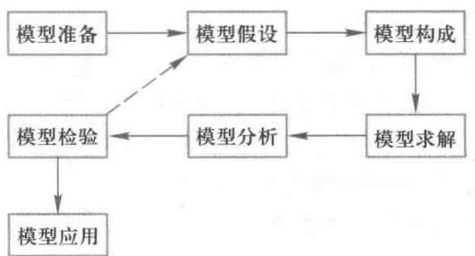  
图1 数学建模步骤示意图

模型假设 根据对象的特征和建模目的,抓住问题的本质,忽略次要因素,做出必要的、合理的简化假设。对于建模的成败这是非常重要和困难的一步。假设做得不合理或太简单,会导致错误的或无用的模型;假设做得过分详细,试图把复杂对象的众多因素都考虑进去,会使你很难或无法继续下一步的工作。常常需要在合理与简化之间做出恰当的折中。通常,做假设的依据,一是出于对问题内在规律的认识,二是来自对现象、数据的分析,以及二者的综合。想象力、洞察力、判断力以及经验,在模型假设中起着重要作用。

模型构成 根据所做的假设,用数学的语言、符号描述对象的内在规律,建立包含常量、变量等的数学模型,如优化模型、微分方程模型、差分方程模型、图的模型等。这里除了需要一些相关学科的专门知识外,还常常需要较为广阔的应用数学方面的知识。要善于发挥想象力,注意使用类比法,分析对象与熟悉的其他对象的共性,借用已有的模型。建模时还应遵循的一个原则是:尽量采用简单的数学工具,因为你的模型总是希望更多的人了解和使用,而不是只供少数专家欣赏。

模型求解 可以采用解方程、画图形、优化方法、数值计算、统计分析等各种数学方法,特别是数学软件和计算机技术。

模型分析 对求解结果进行数学上的分析,如结果的误差分析、统计分析、模型对数据的灵敏性分析、对假设的强健性分析等。

模型检验 把求解和分析结果翻译回到实际问题,与实际的现象、数据比较,检验模型的合理性和适用性。如果结果与实际不符,问题常常出在模型假设上,应该修改、补充假设,重新建模,如图1中的虚线所示。这一步对于模型是否真的有用非常关键,要以严肃认真的态度对待。有些模型要经过几次反复,不断完善,直到检验结果获得某种程度上的满意。

模型应用 应用的方式与问题性质、建模目的及最终的结果有关,一般不属于本书讨论的范围。

应当指出,并不是所有问题的建模都要经过这些步骤,有时各步骤之间的界限也不那么分明,建模时不要拘泥于形式上的按部就班,本书的实例就采用了灵活的表述形式。

数学建模的全过程

从前面几个建模示例以及一般步骤的分析,可以将数学建模的过程分为表述、求解、解释、验证几个阶段,并且通过这些阶段完成从现实对象到数学模型,再从数学模型

回到现实对象的循环,如图2所示。

表述是将现实问题"翻译"成抽象的数学问题,属于归纳法.数学模型的求解则属于演绎法.归纳是依据个别现象推出一般规律,演绎是按照普遍原理考察特定对象,导出结论.因为任何事物的本质都要通过现象来反映,必然要透过偶然来表露,所以正确的归纳不是主观、盲目的,而是有客观基础的,但也往往是不精细的、带感性的,不易直接检验其正确

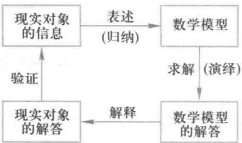  
图2 数学建模的全过程

性.演绎则利用严格的逻辑推理,对解释现象、做出科学预见具有重要意义,但是它要以归纳的结论作为公理化形式的前提,只能在这个前提下保证其正确性.因此,归纳和演绎是辩证统一的过程:归纳是演绎的基础,演绎是归纳的指导[75]

解释是把数学模型的解答"翻译"回到现实对象,给出分析、预报、决策或者控制的结果.最后,作为这个过程的重要一环,这些结果需要用实际的信息加以验证.

图2也揭示了现实对象和数学模型的关系.一方面,数学模型是将现象加以归纳、抽象的产物,它源于现实,又高于现实;另一方面,只有当数学建模的结果经受住现实对象的检验时,才可以用来指导实际,完成实践一理论一实践这一循环.

# 复习题

对于1.1节的复习题,考虑建立模型的基本方法,并对建模的具体步骤做出计划.

# 1.7 数学模型的特点和分类

数学建模是利用数学工具解决实际问题的重要手段,得到的模型有许多优点,也有一些弱点.下面归纳出数学模型的若干特点,以期读者在学习过程中逐步领会[35]

数学模型的特点

模型的逼真性和可行性一般说来总是希望模型尽可能逼近研究对象,但是一个非常逼真的模型在数学上常常是难以处理的,因而不容易达到通过建模对现实对象进行分析、预报、决策或者控制的目的,即实用上不可行.另一方面,越逼真的模型常常越复杂,即使数学上能处理,这样的模型应用时所需要的"费用"也相当高,而高"费用"不一定与复杂模型取得的"效益"相匹配.所以建模时往往需要在模型的逼真性与可行性,"费用"与"效益"之间做出折中和抉择.

模型的渐进性稍微复杂一些的实际问题的建模通常不可能一次成功,要经过上一节描述的建模过程的反复迭代,包括由简到繁,也包括删繁就简,以获得越来越满意的模型.在科学发展过程中,随着人们认识和实践能力的提高,各门学科中的数学模型也存在着一个不断完善或者推陈出新的过程.从19世纪力学、热学、电学等许多学科由牛顿力学的模型主宰,到20世纪爱因斯坦相对论模型的建立,是模型渐进性的明显例证.

模型的强健性模型的结构和参数常常是由模型假设及对象的信息(如观测数

据)确定的,而假设不可能太准确,观测数据也是允许有误差的。一个好的模型应该具有下述意义的强健性:当模型假设改变时,可以导出模型结构的相应变化;当观测数据有微小改变时,模型参数也只有相应的微小变化。

模型的可转移性 模型是现实对象抽象化、理想化的产物,它不为对象的所属领域所独有,可以转移到另外的领域。在生态、经济、社会等领域内建模就常常借用物理领域中的模型。模型的这种性质显示了它的应用的极端广泛性。

模型的非预制性 虽然已经发展了许多应用广泛的模型,但是实际问题是各种各样、变化万千的,不可能要求把各种模型做成预制品供你在建模时使用。模型的这种非预制性使得建模本身常常是事先没有答案的问题(open- end problem)。在建立新的模型的过程中甚至会伴随着新的数学方法或数学概念的产生。

模型的条理性 从建模的角度考虑问题可以促使人们对现实对象的分析更全面、更深入、更具条理性,这样即使建立的模型由于种种原因尚未达到实用的程度,对问题的研究也是有利的。

模型的技艺性 建模的方法与其他一些数学方法如方程解法、规划问题解法等是根本不同的,无法归纳出若干条普遍适用的建模准则和技巧。建模是技艺性很强的技巧。经验、想象力、洞察力、判断力以及直觉、灵感等在建模过程中起的作用往往比一些具体的数学知识更大。

模型的局限性 这里有几方面的含义。第一,由数学模型得到的结论虽然具有通用性和精确性,但是因为模型是现实对象简化、理想化的产物,所以一旦将模型的结论应用于实际问题,就回到了现实世界,那些被忽视、简化的因素必须考虑,于是结论的通用性和精确性只是相对的和近似的。第二,由于人们认识能力和科学技术包括数学本身发展水平的限制,还有不少实际问题很难得到有着实用价值的数学模型。如一些内部机理复杂、影响因素众多、测量手段不够完善、技艺性较强的生产过程,像生铁冶炼过程,常常需要开发专家系统,与建立数学模型相结合才能获得较满意的应用效果。专家系统是一种计算机软件系统,它总结专家的知识和经验,模拟人类的逻辑思维过程,建立若干规则和推理途径,主要是定性地分析各种实际现象并作出判断。专家系统可以看成计算机模拟的新发展。第三,还有些领域中的问题今天尚未发展到用建模方法寻求数量规律的阶段,如中医诊断过程,目前所谓计算机辅助诊断也是属于总结著名中医的丰富临床经验的专家系统。

数学模型的分类

数学模型可以按照不同的方式分类,下面介绍常用的几种。

1. 按照模型的应用领域(或所属学科)分。如人口模型、交通模型、环境模型、生态模型、城镇规划模型、水资源模型、再生资源利用模型、污染模型等。范畴更大一些则形成许多边缘学科,如生物数学、医学数学、地质数学、数量经济学、数学社会学等。

2. 按照建立模型的数学方法(或所属数学分支)分。如初等模型、几何模型、微分方程模型、统计回归模型、数学规划模型等。

3. 按照模型的表现特性又有几种分法:

确定性模型和随机性模型 取决于是否考虑随机因素的影响。近年来随着数学的发展,又有所谓突变性模型和模糊性模型。

静态模型和动态模型 取决于是否考虑时间因素引起的变化。

线性模型和非线性模型 取决于模型的基本关系,如微分方程是否是线性的。

离散模型和连续模型 指模型中的变量(主要是时间变量)取为离散还是连续的。

虽然从本质上讲大多数实际问题是随机性的、动态的、非线性的,但是由于确定性、静态、线性模型容易处理,并且往往可以作为初步的近似来解决问题,所以建模时常先考虑确定性、静态、线性模型。连续模型便于利用微积分方法求解析解,作理论分析,而离散模型便于在计算机上作数值计算,所以用哪种模型要看具体问题而定。在具体的建模过程中将连续模型离散化,或将离散变量视作连续的,也是常采用的方法。

4. 按照建模目的分。有描述模型、预报模型、优化模型、决策模型、控制模型等。

5. 按照对模型结构的了解程度分。有所谓白箱模型、灰箱模型、黑箱模型。这是把研究对象比喻成一只箱子里的机关,要通过建模来揭示它的奥妙。白箱主要包括用力学、热学、电学等一些机理相当清楚的学科描述的现象以及相应的工程技术问题,这方面的模型大多已经基本确定,还需深入研究的主要是优化设计和控制等问题了。灰箱主要指生态、气象、经济、交通等领域中机理尚不十分清楚的现象,在建立和改善模型方面都还不同程度地有许多工作要做。至于黑箱则主要指生命科学和社会科学等领域中一些机理(数量关系方面)很不清楚的现象。有些工程技术问题虽然主要基于物理、化学原理,但由于因素众多、关系复杂和观测困难等原因,也常作为灰箱或黑箱模型处理。当然,白、灰、黑之间并没有明显的界限,而且随着科学技术的发展,箱子的"颜色"必然是逐渐由暗变亮的。

# 1.8 怎样学习数学建模——学习课程和参加竞赛

有人说,数学建模与其说是一门技术,不如说是一门艺术。大家知道,技术一般是有章可循的,许多工程领域都有专门的技术规范,只要严格按照规范去做,事情就可以完成得八九不离十。而艺术通常无法归纳出几条一般的准则或方法,一位出色的艺术家需要大量的观摩和前辈的指教,更需要亲身的实践。从这样的意义上说,数学建模更接近艺术,其含义是,目前尚不能找到若干法则或规律,用以完成不同领域各种问题的建模。

这样看来,学习数学建模与学习一般的数学课程会有较大的不同。多数建模课程和建模教材主要讲解的是数学建模过程的一头一尾,即如何将实际问题表述成数学模型和如何用模型的结果分析、解释实际现象,至于建模过程的中段,即模型的求解部分,由于所用的数学方法基本上是大家已经学过的,就不会是讲授的重点。当然,如果用到数学公共课没有涉及的内容,则会有适当的补充。

培养数学建模的意识和能力

在学习数学建模的过程中,与掌握一些建模方法、补充一些数学知识相比,更为重要、也许更加困难的是培养数学建模的意识和能力。

所谓数学建模的意识是指,对于我们日常生活和工作中那些需要或者可以用数学工具分析、解决的实际问题,能够敏锐地发现并从建模的角度去积极地思考、研究。这些问题可能有几种不同的情况,一种是必须用数学方法才能解决的,需要做的大概就是如何建模了;第二种是虽然已经用工程的或经验的办法处理,但是再用上数学方法可能解

决得更好, 这就需要你勇于和善于利用数学建模这个工具了; 第三种是依靠经验和常识就能得到满意的处理, 不一定要用建模解决的问题, 而你尝试从数学的角度去考虑, 可以起到提高数学建模能力的作用, 1.3 节中包饺子和 1.4 节中设计路障就是这样的问题. 总之, 希望你的头脑里时刻保持从数学建模角度对实际问题做定量分析的一根弦.

至于数学建模的能力, 内容很广泛, 大体上包含以下内容:

想象力 在已有形象的基础上, 根据新的信息在头脑中创造出新形象的能力, 是一种形象思维活动, 可以通过细心观察、善于联想、勇于突破思维定势 (如运用逆向思维、发散思维) 等方式来培养.

洞察力 透过现象看到本质, 对复杂事物进行分析和判断的能力, 需要集中注意力、刻苦工作、勤于思考, 适应和创造浓厚的学术环境, 培养对科学研究敏锐的"感觉".

类比法 由一类事物具有的某种属性, 推测类似事物也具有这种属性的推理方法. 因为同一个数学模型可以描述不同领域的对象, 所以联想、类比是建模中常用的方法. 当然, 类比的结果是否正确, 需要由实践来检验.

较广博的数学知识 对于已经学过微积分、线性代数、概率论等基础课的大学生来说, 还需要了解数值计算、数理统计、数学规划、数值模拟等学科中那些直接与应用相关的内容, 如怎样用这些方法建模、怎样在计算机上用数学软件实现、怎样解释模型求解的结果等, 并不需要深入了解这些学科的数学原理.

深入实际调查研究的决心和能力 与埋头撰写纯数学论文不同, 做数学建模首先要有到实际中去的决心和勇气, 并且善于调查研究, 掌握第一手材料.

从培养意识、提高能力的角度来学习数学建模, 基本上是"学别人的"和"做自己的"两条途径, 下面给出一些具体建议.

案例研究——学习、分析、评价、改进和推广

案例研究是学习数学建模课程的主要方法之一, 这与法学、管理学的学习方法有些相近. 学习课堂上讲的和教材里写的别人做过的模型, 不能听过、看过就算学了, 应该通过学习、分析、评价、改进和推广几个步骤来逐步深化. 首先是弄懂它, 再分析它为什么这样做, 哪些地方是关键, 评价有什么优缺点, 最后, 如果可能的话, 去尝试改进、推广它.

让我们以 1.5 节的案例"椅子能在不平的地面上放稳吗"为例, 看看在学懂的基础上可以做哪些研究 (有些是应该做的).

# 1. 对模型假设进行分析

假设 1 对椅子本身的要求大致是合理的, 椅脚与地面点接触可看作几何抽象. 假设 2 相当于要求地面高度是数学上的连续函数. 假设 3 排除了三只脚不能着地的情况, 对地面的要求更高.

由建模过程可以知道, 假设 2 的地面连续性和假设 3 的三只脚着地是证明命题的必要条件, 从常识看这对放稳椅子也是必需的, 而假设 1 的椅脚正方形只是为了得到简单的中心对称, 对证明命题不是必要的. 事实上, 很容易将这个条件放宽到椅脚连线为长方形或梯形的情况. 还可以对椅子四脚连线的几何形状能放宽到什么程度进行讨论.

# 2. 对建模的关键进行分析

建模的关键是用数学符号、数学语言把椅子的位置及四只脚着地的条件和结论表

示出来.利用椅脚的中心对称性,用单变量  $\theta$  表示椅子的位置,用两个函数  $f(\theta), g(\theta)$  表示椅脚与地面的距离,从而得到四脚着地的条件和结论的数学关系.

# 3. 对建模过程做深入研究

如果读者对上面如此简单的建模过程仔细考虑一下,可能会发现不严谨之处.如椅子的旋转轴在哪里,它在旋转过程中怎样变化?

更严谨些的一种考虑如下:取  $A, B, D$  脚同时着地的位置为初始位置,经过  $O$  点且与  $A, B, D$  脚所在平面垂直的直线为初始旋转轴.此后将椅子沿该轴高高举起,并在与该轴垂直的平面内逆时针旋转后再慢慢放下.放下的过程中,首先保持旋转轴始终通过  $O$  点但允许发生倾斜,使得  $A, D$  脚先着地,然后再让  $B, C$  两脚中至少一个着地(此时保持  $A, D$  脚位置不变,但旋转轴可能不再通过  $O$  点).

参加数学建模竞赛,做自己的模型

学习数学建模,如果只停留在学别人的模型上,是远远不够的,一定要亲自动手,踏踏实实地做几个实际题目.不妨从包饺子这样的简单问题开始,读者也可以利用本书训练题中提供的那些需要自己做出假设、构造模型的题目,我们更提倡读者在实际生活中发现、提出问题,建立模型.

参加数学建模竞赛为同学们通过亲手做课题,更快地提高用数学建模方法分析、解决实际问题的能力,搭建了广阔的平台.大学生数学建模竞赛是近年来我国高校蓬勃开展的一项学科竞赛活动,有全国性的、地区性的,更有院校自己组织的.各种层次建模竞赛的内容、组织方式、评判标准等都大致相同.下面对竞赛的特点、参赛的过程和收获作简单介绍.

竞赛内容赛题由工程技术、管理科学及社会热点问题简化而成,要求用数学建模方法和计算机技术完成一篇包括模型的假设、建立和求解,结果的分析和检验以及自我评价优缺点等方面的学术论文.

竞赛方式采取通信竞赛办法,三名大学生为一队,在三天时间内完成,可以使用任何资料和软件,唯一的限制是不能与队外的同学、老师讨论赛题(包括在网上).

评判标准赛题没有标准答案,评判以假设的合理性、建模的创造性、结果的正确性、表述的清晰性为标准.其中结果正确指的是与做出的假设和建立的模型相符合.

全国大学生数学建模竞赛从1992年开始举办,规模由最初的几十所学校、几百个队,发展到2017年的1400多所院校、36000多个队,参加地区、院校竞赛的人数更多.数学建模竞赛之所以受到广大同学的欢迎,主要是由于它的内容、形式和评判标准具有明显区别于大家熟悉的数学等学科竞赛的特点,适合培养有创新精神和综合素质人才的需要.

参加数学建模竞赛的过程一般可以分为三个阶段:

赛前准备通过教师讲授、学生自学、讨论等方式了解数学建模的基本概念、方法和步骤,学习求解模型的一些数学方法(数值计算、数理统计、数学规划、数值模拟等)及数学软件,还可以演练往年的赛题和模拟题.尽可能地选择不同专业、不同特质(认真踏实、思路灵活、写作好)的同学组队,并在准备过程中进行充分磨合.

三天竞赛选定赛题既要抓紧时间又需充分讨论,一定要把题目的要求吃透,并拟定一个三人、三天工作的初步计划.开始时不要把目标定得过高,不妨考虑用多数时间、

多数人力保证基本模型的完成,有余力再锦上添花。论文写作要尽早开始,用清晰、完整的文章结构指导全队分工合作、有条不紊地完成任务。

赛后继续应该结合三天的参赛总结一下整个竞赛准备过程的收获及经验教训。如果有兴趣和精力对赛题作进一步钻研,或者对赛题进行扩展研究,可以寻求教师和其他同学共同参加。更希望通过竞赛激发同学参与数学建模相关实践活动的兴趣。

20多年来的事实说明,只要认真参加竞赛,同学们的收获和提高是多方面的。

首先,运用数学建模方法分析和解决实际问题的能力会得到切实的锻炼。赛题通常要用到几门数学和计算机课程及多方面的知识,对于长期一门课一门课学习的同学来说,这种训练运用综合知识的机会是难得的,对于同学独立工作能力的培养有很大的好处。

其次,合作精神与团队意识会得到培养和提高。竞赛需要3个人相互启发、争辩和相互妥协、合作,与以后经常面临的集体工作方式十分相近,对于一直在读书、做题、考试等一系列个人奋斗的环境中成长起来的同学们来说,竞赛提供了一个既充分展示个人的智商,又有助于培养与人合作的情商的平台。

还有,竞赛需要快捷地搜集、整理、消化与题目有关的资料(主要依靠互联网),使之为我所用,对于尚处于学习阶段的同学来说,这是少有的机会;一篇清晰、通畅的阐明建模思路、假设、方法、结果等内容的论文,是参赛成果的集中体现,竞赛有益于文字表述能力的锻炼;赛题的实用性有助于培养同学们关注社会生活、理论联系实际的学风;既充分开放、又有规则约束的竞赛方式,可以培养慎独、自律的良好道德品质。

许多同学表示,不管三天竞赛的成绩如何,只要认真参加了培训、自学、讨论、竞赛的全过程,都会有丰硕的收获,他们用"一次参赛、终身受益"来总结竞赛经历。

# 复习题

为了培养想象力、洞察力和判断力,考察对象时除了从正面分析外,还常常需要从侧面或反面思考。试尽可能迅速地回答下面的问题:

(1)某甲早8:00从山下旅店出发,沿一条路径上山,下午5:00到达山顶并留宿。次日早8:00沿同一路径下山,下午5:00回到旅店。某乙说,甲必在两天中的同一时刻经过路径中的同一地点。为什么?

(2)37支球队进行冠军争夺赛,每轮比赛中出场的每两支球队中的胜者及轮空者进入下一轮,直至比赛结束。问共需进行多少场比赛,共需进行多少轮比赛。如果是n支球队比赛呢?

(3)甲乙两站之间有电车相通,每隔10min甲乙两站相互发一趟车,但发车时刻不一定相同。甲乙之间有一中间站丙,某人每天在随机的时刻到达丙站,并搭乘最先经过丙站的那趟车,结果发现100天中约有90天到达甲站,约有10天到达乙站。问开往甲乙两站的电车经过丙站的时刻表是如何安排的。

(4)某人家住T市在他乡工作,每天下班后乘火车于6:00抵达T市车站,他的妻子驾车准时到车站接他回家。一日他提前下班搭早一班火车于5:30抵达T市车站,随即步行回家,他的妻子像往常一样驾车前来,在半路上遇到他,即接他回家,此时发现比往常提前了10min。问他步行了多长时间。

(5)一男孩和一女孩分别在离家2km和1km且方向相反的两所学校上学,每天同时放学后分

别以  $4 \mathrm{km} / \mathrm{h}$  和  $2 \mathrm{km} / \mathrm{h}$  的速度步行回家。一小狗以  $6 \mathrm{km} / \mathrm{h}$  的速度由男孩处奔向女孩,又从女孩处奔向男孩,如此往返直至回到家中。问小狗奔波了多少路程。

如果男孩和女孩上学时小狗也往返奔波在他们之间,问当他们到达学校时小狗在何处[40]。

# 第1章训练题

1. 用宽  $w$  的布条缠绕直径  $d$  的圆形管道,要求布条不重叠,问布条与管道轴线的夹角  $\alpha$  应多大(如右图)。若知道管道长度,需用多长布条(不考虑或考虑两端的影响)。如果管道是其他形状呢?[17]

2. 雨滴匀速下降,假定空气阻力与雨滴表面积和速度平方的乘积成正比,试确定雨速与雨滴质量的关系。

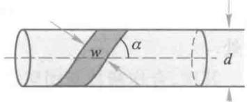

3. 参考更多案例1-1商人们怎样安全过河中的状态转移模

型,做下面这个众所周知的智力游戏:人带着猫、鸡、米过河,除需要人划船之外,船至多能载猫、鸡、米三者之一,而当人不在场时猫要吃鸡、鸡要吃米。试设计一个安全过河方案,并使渡河次数尽量地少。

4. 大包装商品比小包装商品便宜是人所共知的事实(当然指单位质量或体积),你能仅从包装成本的对比对此做出解释吗?

# 更多案例···

1- 1 商人们怎样安全过河

# 第2章 初等模型

如果研究对象的机理比较简单,一般用静态、线性、确定性模型描述就能达到建模目的时,我们基本上可以用初等数学的方法来构造和求解模型。通过本章介绍的若干实例读者能够看到,用很简单的数学方法已经可以解决一些饶有兴味的实际问题,其中只有2.5节涉及简单的随机现象。

需要强调的是,衡量一个模型的优劣全在于它的应用效果,而不是采用了多么高深的数学方法。进一步说,如果对于某个实际问题我们用初等的方法和所谓高等的方法建立了两个模型,它们的应用效果相差无几,那么受到人们欢迎并采用的,一定是前者而非后者。

# 2.1 双层玻璃窗的功效

你是否注意到北方城镇的有些建筑物的窗户是双层的,即窗户上装两层玻璃且中间留有一定空隙,如图1左图所示,两层厚度为  $d$  的玻璃夹着一层厚度为  $l$  的空气。据说这样做是为了保暖,即减少室内向室外的热量流失。我们要建立一个模型来描述热量通过窗户的传导(即流失)过程,并将双层玻璃窗与用同样多材料做成的单层玻璃窗(如图1右图,玻璃厚度为  $2d$ )的热量传导进行对比,对双层玻璃窗能够减少多少热量损失给出定量分析结果[45]。

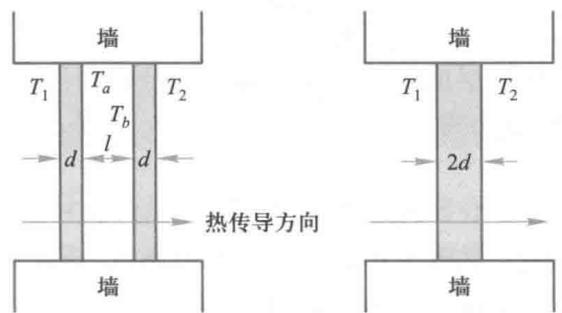  
图1 双层玻璃窗与单层玻璃窗

案例精讲2- 1 双层玻璃窗的功效

模型假设

1. 热量的传播过程只有传导,没有对流。即假定窗户的密封性能很好,两层玻璃之间的空气是不流动的。

2. 室内温度  $T_{1}$  和室外温度  $T_{2}$  保持不变,热传导过程已处于稳定状态,即沿热传导方向,单位时间通过单位面积的热量是常数。

3. 玻璃材料均匀,热传导系数是常数。

模型构成 在上述假设下热传导过程遵从下面的物理定律:

厚度为  $d$  的均匀介质,两侧温度差为  $\Delta T$ ,则单位时间由温度高的一侧向温度低的

一侧通过单位面积的热量  $Q$  与  $\Delta T$  成正比,与  $d$  成反比,即

$$
Q = k \frac{\Delta T}{d} \tag{1}
$$

$k$  为热传导系数

记双层窗内层玻璃的外侧温度是  $T_{a}$ ,外层玻璃的内侧温度是  $T_{b}$ ,如图1,玻璃的热传导系数为  $k_{1}$ ,空气的热传导系数为  $k_{2}$ ,由(1)式单位时间单位面积的热量传导(即热量流失)为

$$
Q_{1} = k_{1} \frac{T_{1} - T_{b}}{d} = k_{2} \frac{T_{a} - T_{b}}{l} = k_{1} \frac{T_{b} - T_{2}}{d} \tag{2}
$$

从(2)式中消去  $T_{a}, T_{b}$ ,可得

$$
Q_{1} = \frac{k_{1}(T_{1} - T_{2})}{d(s + 2)}, \quad s = h \frac{k_{1}}{k_{2}}, \quad h = \frac{l}{d} \tag{3}
$$

对于厚度为  $2d$  的单层玻璃窗,容易写出其热量传导为

$$
Q_{2} = k_{1} \frac{T_{1} - T_{2}}{2d} \tag{4}
$$

二者之比为

$$
\frac{Q_{1}}{Q_{2}} = \frac{2}{s + 2} \tag{5}
$$

显然  $Q_{1}< Q_{2}$ .为了得到更具体的结果,我们需要  $k_{1}$  和  $k_{2}$  的数据.从有关资料可知,常用玻璃的热传导系数  $k_{1} = 4 \times 10^{- 3} \sim 8 \times 10^{- 3} \mathrm{J} / (\mathrm{cm} \cdot \mathrm{s} \cdot \mathrm{K})$ ,不流通、干燥空气的热传导系数  $k_{2} = 2.5 \times 10^{- 4} \mathrm{J} / (\mathrm{cm} \cdot \mathrm{s} \cdot \mathrm{K})$ ,于是

$$
\frac{k_{1}}{k_{2}} = 16 \sim 32
$$

在分析双层玻璃窗比单层玻璃窗可减少多少热量损失时,我们作最保守的估计,即取  $k_{1} / k_{2} = 16$ ,由(3),(5)式可得

$$
\frac{Q_{1}}{Q_{2}} = \frac{1}{8h + 1}, \quad h = \frac{l}{d} \tag{6}
$$

比值  $Q_{1} / Q_{2}$  反映了双层玻璃窗在减少热量损失上的功效,它只与  $h = l / d$  有关,图2给

出了  $Q_{1} / Q_{2} \sim h$  的曲线,当  $h$  增加时,  $Q_{1} / Q_{2}$  迅速下降,而当  $h$  超过一定值(比如  $h > 4$ )后  $Q_{1} / Q_{2}$  下降变缓,可见  $h$  不必选择过大.

模型应用这个模型具有一定应用价值.制作双层玻璃窗虽然工艺复杂会增加一些费用,但它减少的热量损失却是相当可观的.通常,建筑规范要求  $h = l / d \approx 4$ .按照这个模型,  $Q_{1} / Q_{2} \approx 3\%$ ,即双层窗比用同样多的玻璃材料制成的单层窗节约热量  $97\%$  左右.不难

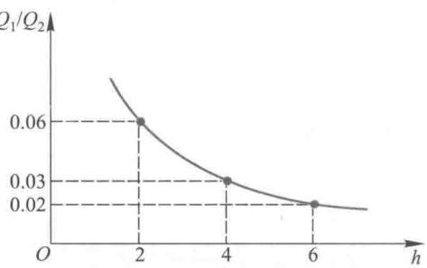  
图2热量损失比  $\frac{Q_{1}}{Q_{2}}$  与  $h = \frac{l}{d}$  的关系

发现,之所以有如此高的功效主要是由于层间空气的极低的热传导系数  $k_{2}$ ,而这要求

空气是干燥、不流通的。作为模型假设的这个条件在实际环境下当然不可能完全满足,所以实际上双层窗户的功效会比上述结果差一些。另外,应该注意到,一个房间的热量散失,通过玻璃窗常常只占一小部分,热量还要通过天花板、墙壁、地面等流失。

# 复习题

北方旧宅改造时,为了增强保暖效果常用保温材料在外墙外面再加一层墙。假定仍然只考虑热传导,试通过建模对改造后减少的热量损失给出定量分析,并获取相关数据作简单计算。

# 2.2 划艇比赛的成绩

赛艇是一种靠桨手划桨前进的小船,分单人艇、双人艇、四人艇、八人艇四种。各种艇虽大小不同,但形状相似。T.A.McMahon比较了各种赛艇1964—1970年四次  $2000\mathrm{~m~}$  比赛的最好成绩(包括1964年和1968年的两次奥运会和两次世界锦标赛),见表1第1至6列,发现它们之间有相当一致的差别,他认为比赛成绩与桨手数量之间存在着某种联系,于是建立了一个模型来解释这种关系[7]。

表1 何种赛艇的比赛成绩和规格  

<table><tr><td rowspan="2">艇种</td><td colspan="5">2 000 m 成绩t/min</td><td>艇长l</td><td>艇宽b</td><td>艇重w0/kg</td><td></td></tr><tr><td>1</td><td>2</td><td>3</td><td>4</td><td>平均</td><td>/m</td><td>/m</td><td>1/b</td><td>桨手数n</td></tr><tr><td>单人</td><td>7.16</td><td>7.25</td><td>7.28</td><td>7.17</td><td>7.21</td><td>7.93</td><td>0.293</td><td>27.0</td><td>16.3</td></tr><tr><td>双人</td><td>6.87</td><td>6.92</td><td>6.95</td><td>6.77</td><td>6.88</td><td>9.76</td><td>0.356</td><td>27.4</td><td>13.6</td></tr><tr><td>四人</td><td>6.33</td><td>6.42</td><td>6.48</td><td>6.13</td><td>6.34</td><td>11.75</td><td>0.574</td><td>20.5</td><td>18.1</td></tr><tr><td>八人</td><td>5.87</td><td>5.92</td><td>5.82</td><td>5.73</td><td>5.84</td><td>18.28</td><td>0.610</td><td>30.0</td><td>14.7</td></tr></table>

问题分析 赛艇前进时受到的阻力主要是艇浸没部分与水之间的摩擦力。艇靠桨手的力量克服阻力保持一定的速度前进。桨手越多划艇前进的动力越大。但是艇和桨手总质量的增加会使艇浸没面积加大,于是阻力加大,增加的阻力将抵消一部分增加的动力。建模目的是寻求桨手数量与比赛成绩(航行一定距离所需时间)之间的数量规律。如果假设艇速在整个赛程中保持不变,那么只需构造一个静态模型,使问题简化为建立桨手数量与艇速之间的关系。注意到在实际比赛中桨手在极短的时间内使艇加速到最大速度,然后把这个速度保持到终点,那么上述假设也是合理的。

为了分析所受阻力的情况,调查了各种艇的几何尺寸和质量,表1第7至10列给出了这些数据。可以看出,桨手数  $n$  增加时,艇的尺寸  $l, b$  及艇重  $w_{0}$  都随之增加,但比值  $l / b$  和  $w_{0} / n$  变化不大。若假定  $l / b$  是常数,即各种艇的形状一样,则可得到艇浸没面积与排水体积之间的关系。若假定  $w_{0} / n$  是常数,则可得到艇和桨手的总质量与桨手数之间的关系。此外还需对桨手体重、划桨功率、阻力与艇速的关系等方面做出简化且合理的假定,才能运用合适的物理定律建立需要的模型。

模型假设

1. 各种艇的几何形状相同,  $l / b$  为常数; 艇重  $w_{0}$  与桨手数  $n$  成正比. 这是艇的静态特性.

2. 艇速  $v$  是常数, 前进时受的阻力  $f$  与  $sv^{2}$  成正比 (  $s$  是艇浸没部分面积). 这是艇的动态特性.

3. 所有桨手的体重都相同, 记作  $w$ ; 在比赛中每个桨手的划桨功率  $p$  保持不变, 且  $p$  与  $w$  成正比.

假设1是根据所给数据做出的必要且合理的简化. 根据物理学的知识, 运动速度中等大小的物体所受阻力  $f$  符合假设2中  $f$  与  $sv^{2}$  成正比的情况. 假设3中  $w, p$  为常数属于必要的简化, 而  $p$  与  $w$  成正比可解释为:  $p$  与肌肉体积、肺的体积成正比, 对于身材匀称的运动员, 肌肉、肺的体积与体重  $w$  成正比.

模型构成 有  $n$  名桨手的艇的总功率  $np$  与阻力  $f$  和速度  $v$  的乘积成正比, 即

$$
n p \propto f v \tag{1}
$$

由假设2,3,

$$
f \propto s v^{2}, \quad p \propto w
$$

代入(1)式可得

$$
v \propto \left(\frac{n}{s}\right)^{\frac{1}{3}} \tag{2}
$$

由假设1, 各种艇几何形状相同, 若艇浸没面积  $s$  与艇的某特征尺寸  $c$  的平方成正比 (  $s \propto c^{2}$  ), 则艇排水体积  $A$  必与  $c$  的立方成正比  $(A \propto c^{3})$ , 于是有

$$
s \propto A^{\frac{2}{3}} \tag{3}
$$

又根据艇重  $w_{0}$  与桨手数  $n$  成正比, 所以艇和桨手的总质量  $w^{\prime} = w_{0} + nw$  也与  $n$  成正比, 即

$$
w^{\prime} \propto n \tag{4}
$$

而由阿基米德定律, 艇排水体积  $A$  与总质量  $w^{\prime}$  成正比, 即

$$
A \propto w^{\prime} \tag{5}
$$

(3), (4), (5)式给出

$$
s \propto n^{\frac{2}{3}} \tag{6}
$$

将(6)式代入(2)式, 当  $w$  是常数时得到

因为比赛成绩  $t$  (时间)与  $v$  成反比, 所以

(8)式就是根据模型假设和几条物理规律得到的各种艇的比赛成绩与桨手数之间的关系.

模型检验 为了用表1中各种艇的平均成绩检验(8)式, 设  $t$  与  $n$  的关系为

其中  $\alpha , \beta$  为待定常数. 由(9)式

$$
\ln t = \alpha^{\prime} + \beta \ln n, \alpha^{\prime} = \ln \alpha \tag{10}
$$

利用最小二乘法, 根据所给数据拟合上式  $①$ , 得到

$$
t = 7.21n^{-0.111}
$$

可以看出(8)式与这个结果吻合得相当好

# 复习题

考虑八人艇分重量级组(桨手体重不超过  $86 \mathrm{~kg}$  )和轻量级组(桨手体重不超过  $73 \mathrm{~kg}$  ), 建立模型说明重量级组的成绩比轻量级组的大约好  $5\%$ .

# 2.3 实物交换

甲有面包若干, 乙有香肠若干. 二人共进午餐时希望相互交换一部分, 达到双方满意的结果. 这种实物交换问题可以出现在个人之间或国家之间的各种类型的贸易市场上. 显然, 交换的结果取决于双方对两种物品的偏爱程度, 而偏爱程度很难给出确切的定量关系, 我们用作图的方法对双方将如何交换实物建立一个模型[7].

设交换前甲占有物品  $X$  的数量为  $x_{0}$ , 乙占有物品  $Y$  的数量为  $y_{0}$ , 交换后甲占有物品  $X$  和  $Y$  的数量分别为  $x$  和  $y$ . 于是乙占有  $X, Y$  的数量为  $x_{0} - x$  和  $y_{0} - y$ . 这样在  $xOy$  坐标系中长方形  $0 \leqslant x \leqslant x_{0}, 0 \leqslant y \leqslant y_{0}$  内任一点的坐标  $(x, y)$  都代表了一种交换方案(图1).

用无差别曲线描述甲对物品  $X$  和  $Y$  的偏爱程度. 如果占有  $x_{1}$  数量的  $X$  和  $y_{1}$  数量的  $Y$  (图1中的  $p_{1}$  点)与占有  $x_{2}$  的  $X$  和  $y_{2}$  的  $Y(p_{2}$  点), 对甲来说是同样满意的话, 称  $p_{1}$  和  $p_{2}$  对甲是无差别的. 或者说  $p_{2}$  与  $p_{1}$  相比, 甲愿意以  $Y$  的减少  $y_{1} - y_{2}$  换取  $X$  的增加  $x_{2} - x_{1}$ . 所有与  $p_{1}, p_{2}$  具有同样满意程度的点组成一条甲的无差别曲线  $MN$ , 而比这些点的满意程度更高的点如  $p_{3}(x_{3}, y_{3})$  则

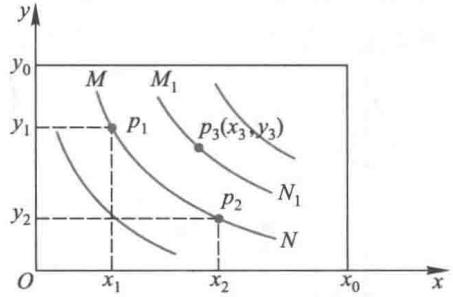  
图1 甲的无差别曲线

位于另一条无差别曲线  $M_{1}N_{1}$  上. 这样, 甲有无数条无差别曲线, 不妨将这族曲线记作

$$
f(x,y) = c_{1} \tag{1}
$$

$c_{1}$  称满意度, 随着  $c_{1}$  的增加, 曲线向右上方移动. 按照常识, 无差别曲线应是下降的 ( $x$  增加时  $y$  减小)、下凸的(本节最后作解释)和互不相交的(否则交点处有不同的满意度).

同样, 乙对物品  $X$  和  $Y$  也有一族无差别曲线, 记作

$$
g(x,y) = c_{2} \tag{2}
$$

不管无差别曲线  $f, g$  是否有解析表达式, 每个人都可根据对两种物品的偏爱程度用曲线表示它们, 为用图解法确定交换方案提供了依据.

为得到双方满意的交换方案, 将双方的无差别曲线族画在一起. 图2中甲的无差别曲线族  $f(x, y) = c_{1}$  如图1, 而乙的无差别曲线族  $g(x, y) = c_{2}$  原点在  $O^{\prime}, x, y$  轴均反向, 于是当乙的满意度  $c_{2}$  增加时无差别曲线向左下移动. 这两族曲线的切点连成一条曲线

AB,图中用点线表示.可以断言:双方满意的交换方案应在曲线AB上,AB称交换路径.这是因为,假设交换在AB以外的某一点  $p^{\prime}$  进行,若通过  $p^{\prime}$  的甲的无差别曲线与AB的交点为  $p$  ,甲对  $p$  和  $p^{\prime}$  的满意度相同,而乙对  $p$  的满意度高于  $p^{\prime}$  ,所以双方满意的交换不可能在  $p^{\prime}$  进行.

有了双方的无差别曲线,交换方案的范围可从整个长方形缩小为一条曲线AB,但仍不能确定交换究竟应在曲线AB上的哪一点进行.显然,越靠近  $B$  端甲的满意度越高而乙的满意度越低,靠近A端则反之.要想把交换方案确定下来,需要双方协商或者依据双方同意的某种准则,如等价交换准则.

等价交换准则是指:两种物品用同一种货币衡量其价值,进行等价交换.不妨设交换

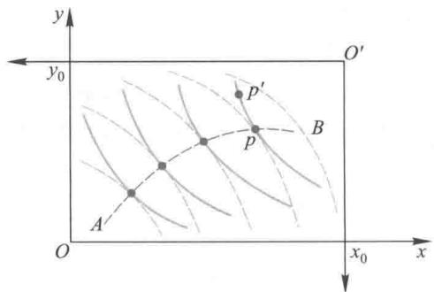  
图2 双方的无差别曲线和交换路径

前甲占有的  $x_{0}$  (物品  $X$  )与乙占有的  $y_{0}$  (物品  $Y$  )具有相同的价值,  $x_{0}, y_{0}$  分别相应于图3中  $x$  轴,  $y$  轴上的  $C, D$  两点,那么在直线  $CD$  上的点进行交换,都符合等价交换准则(为什么?).最后,在等价交换准则下,双方满意的交换方案必是  $CD$  与  $AB$  的交点  $p$ .

最后,对无差别曲线呈下凸形状作如下解释:当人们占有的  $x$  较小时(  $p_{1}$  点附近),他宁愿以较多的  $\Delta y$  交换较少的  $\Delta x$  (图4),而当占有的  $x$  较大时(  $p_{2}$  点附近),就要用较多的  $\Delta x$  换取较少的  $\Delta y$ ,正是"物以稀为贵"这一哲理的写照.满足这种特性的曲线是下凸的.

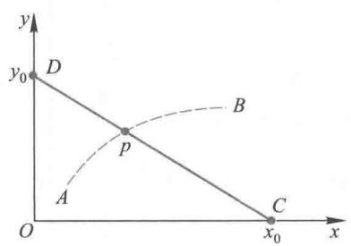  
图3 等价交换准则确定的交换方案

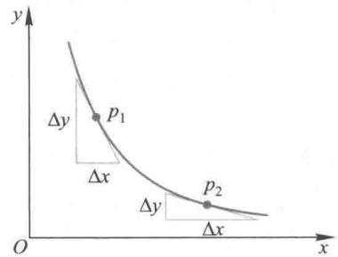  
图4 无差别曲线下凸形状的解释

# 复习题

用实物交换模型中介绍的无差别曲线的概念,讨论以下雇员和雇主之间的协议关系:

(1)以雇员一天的工作时间  $t$  和工资  $w$  分别为横坐标和纵坐标,画出雇员无差别曲线族的示意图.解释曲线为什么是你画的那种形状.

(2)如果雇主付计时工资,对不同的工资率(单位时间的工资)画出计时工资线族.根据雇员的无差别曲线族和雇主的计时工资线族,讨论双方将在怎样的一条曲线上达成协议.

(3)雇员和雇主已经达成了一个协议(工作时间  $t_{1}$  和工资  $w_{1}$  ).如果雇主想使雇员的工作时间增加到  $t_{2}$ ,他有两种办法:一是提高计时工资率,在协议线的另一点  $(t_{2}, w_{2})$  达成新的协议;二是实行超时工资制,即对工时  $t_{1}$  仍付原计时工资,对工时  $t_{2} - t_{1}$  付给更高的超时工资.试用作图方法分析哪种办法对雇主更有利,指出这个结果的条件[7].

# 2.4 汽车刹车距离与道路通行能力

在现代城市生活中, 提高道路通行能力是城市交通工程面临的重要课题之一。常识告诉我们, 车辆速度越高、密度越大, 道路通行能力就越大。但是速度高了, 刹车距离必然变大, 车辆密度将受到制约, 所以需要对影响通行能力的因素进行综合分析。本节首先引入交通流的主要参数及基本规律, 然后介绍汽车刹车距离与道路通行能力两个模型[83]。

交通流的主要参数及基本规律

为明确和简单起见, 这里的交通流均指由标准长度的小型汽车在单向道路上行驶而形成的车流, 没有外界因素如岔路、信号灯等的影响。

借用物理学的概念, 将交通流近似看作一辆辆汽车组成的连续的流体, 可以用流量、速度、密度这 3 个参数描述交通流的基本特性。

流量  $q$  指某时刻单位时间内通过道路指定断面的车辆数, 通常以辆/h为单位。

速度  $v$  指某时刻通过道路指定断面的车辆速度, 通常以  $\mathrm{km} / \mathrm{h}$  为单位。

密度  $k$  指某时刻通过道路指定断面单位长度内的车辆数, 通常以辆/km为单位。

虽然一般说来流量、速度和密度都是时间和地点的函数, 但是在讨论指定时段 (如早高峰)、指定路段或路口的交通状况时, 可以认为交通流是稳定的, 即流量、速度和密度都是常数, 与时间和地点无关。

根据物理学的基本常识, 流量  $q$  、速度  $v$  和密度  $k$  显然满足

$$
q = v k \tag{1}
$$

例如在高速公路上以  $100 \mathrm{~km} / \mathrm{h}$  的车速、  $200 \mathrm{~m}$  的车距行驶的车流, 其流量为  $100 \mathrm{~km} / \mathrm{h} \times (1$  辆  $/0.2 \mathrm{~km}) = 500$  辆/h.(1)式是这3个参数之间的基本关系。

经验和观测告诉我们, 速度与密度之间存在密切关系, 当道路上车辆增多, 车流密度加大时, 司机考虑到刹车距离必然被迫降低车速。1935年Greenshields通过对观测数据的统计分析, 提出车速与密度之间的一个线性模型

$$
v = v_{f}(1 - k / k_{j}) \tag{2}
$$

其中  $v_{f}$  是密度  $k = 0$  时的车速, 即理论上的最高车速, 称畅行车速 (自由流),  $k_{j}$  是速度  $v = 0$  时的密度, 称阻塞密度。实际上, 模型(2)可以在一些仔细的分析与合理的假设下推导出来。

将线性模型(2)代入(1), 得到流量与密度的关系

$$
q = v_{f}k\left(1 - k / k_{j}\right) \tag{3}
$$

这是一条抛物线, 车流密度  $k$  由小变大时流量增加, 当  $k = k_{j} / 2$ , 即阻塞密度的一半时, 流量最大, 密度  $k$  继续变大, 流量减小。

由(1),(2)可以导出流量与车速之间的关系

$$
q = k_{j}v(1 - v / v_{f}) \tag{4}
$$

也是一条抛物线, 最大流量出现在车速  $v = v_{f} / 2$ , 即畅行车速的一半处。

交通工程中常将由(2)~(4)式确定的流量、速度和密度之间的关系用图1表示, 其中  $q_{\mathrm{m}}$  是最大流量,  $k_{\mathrm{m}}$ ,  $v_{\mathrm{m}}$  分别是对应于最大流量的密度和速度。

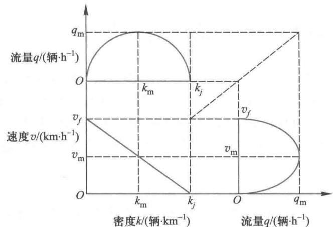  
图1 交通流的流量、速度、密度关系图

汽车刹车距离模型

汽车司机在行驶过程中发现前方出现突发事件,会紧急刹车,人们把从司机决定刹车到车完全停止这段时间内汽车行驶的距离,称为刹车距离。车速越快,刹车距离越长。刹车距离与车速之间是线性关系吗?让我们先做一组实验:用固定牌子的汽车,由同一司机驾驶,在不变的道路、气候等条件下,对不同的车速测量其刹车距离,得到的数据如表1和图2所示。

<table><tr><td>车速/(km·h-1)</td><td>20</td><td>40</td><td>60</td><td>80</td><td>100</td><td>120</td><td>140</td></tr><tr><td>刹车距离/m</td><td>6.5</td><td>17.8</td><td>33.6</td><td>57.1</td><td>83.4</td><td>118.0</td><td>153.5</td></tr></table>

从图2可以看到,刹车距离与车速之间并非简单的线性关系,需要对刹车过程的机理进行分析,建立刹车距离与车速之间的数学模型。

问题分析 刹车距离由反应距离和制动距离两部分组成,前者指从司机决定刹车到制动器开始起作用这段时间内汽车行驶的距离,后者指从制动器开始起作用到汽车完全停止所行驶的距离。

反应距离由反应时间和车速决定,反应时间取决于司机个人状况(灵巧、机警、视野等)和制动系统的灵敏性(从司机脚踏刹车板到制动器真正起作用的时间),对

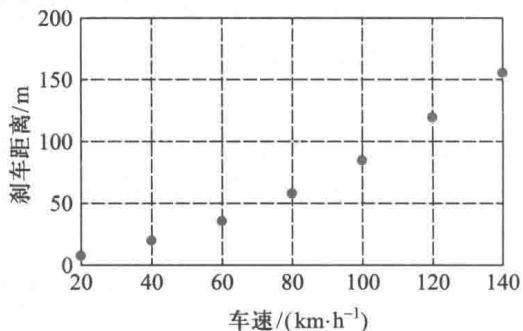  
表1 车速和刹车距离的一组数据 图2 表1的数据（实际刹车距离）

于固定牌子的汽车和同一类型的司机,反应时间可以视为常数,并且在这段时间内车速尚未改变。

制动距离与制动器作用力、车重、车速以及道路、气候等因素有关,制动器是一个能量耗散装置,制动力作的功被汽车动能的改变所抵消。设计制动器的一个合理原则是,最大制动力大体上与车的质量成正比,使汽车大致做匀减速运动,司机和乘客少受剧烈的冲击。这里不考虑道路、气候等因素。

模型假设 基于上述分析, 作以下假设:

1. 刹车距离  $d$  等于反应距离  $d_{1}$  与制动距离  $d_{2}$  之和.

2. 反应距离  $d_{1}$  与车速  $v$  成正比, 比例系数为反应时间.

3. 刹车时使用最大制动力  $F, F$  做的功等于汽车动能的改变, 且  $F$  与车的质量  $m$  成正比.

模型建立 由假设2,

$$
d_{1} = c_{1}v \tag{5}
$$

$c_{1}$  为司机反应时间. 由假设3, 在  $F$  作用下行驶距离  $d_{2}$  做的功  $F d_{2}$  使车速从  $v$  变成0, 动能的变化为  $m v^{2} / 2$ , 有  $F d_{2} = m v^{2} / 2$ , 又  $F$  与  $m$  成正比, 按照牛顿第二定律可知, 刹车时的减速度  $a$  为常数, 于是

$$
d_{2} = c_{2}v^{2} \tag{6}
$$

$c_{2}$  为比例系数, 实际上  $c_{2} = 1 / (2 a)$ . 由假设1, 刹车距离为

$$
d = c_{1}v + c_{2}v^{2} \tag{7}
$$

即刹车距离  $d$  与车速  $v$  之间是二次函数关系.

参数估计估计模型(7)式中的参数  $c_{1}, c_{2}$  通常有两种方法, 一是查阅交通工程学的相关资料, 二是根据实测数据对(7)式作拟合. 按照交通工程学提供的数据, 司机反应时间  $c_{1}$  为  $0.7 \sim 1 \mathrm{~s}$ , 系数  $c_{2}$  约为  $0.01 \mathrm{~m} \cdot \mathrm{h}^{2} / \mathrm{km}^{2} \text{①}$ . 数据拟合的方法将留作复习题1.

道路通行能力模型

道路通行能力指标, 由道路设施、交通服务、环境、气候等诸多条件决定, 其数值是相对稳定的. 通行能力表示道路的容量, 交通流量表示道路的负荷, 交通流量与通行能力的比值反映了道路的负荷程度, 称饱和度或利用率.

按照流量、速度和密度的基本关系(1)式, 当车辆以一定速度行驶时, 道路通行能力应该在安全条件下车辆密度最大, 即前后两车车头之间的距离(下称车头间隔)达到最小来计算, 而车头的最小间隔主要由刹车距离决定.

记车速为  $v(\mathrm{km} / \mathrm{h})$ , 最小车头间隔为  $D(\mathrm{m})$ , 道路通行能力为  $N(\mathrm{m} / \mathrm{h})$ , 显然

$$
N = 1000v / D \tag{8}
$$

交通工程学中通常将最小车头间隔分解为  $D = d + d_{0}$ , 其中  $d(\mathrm{m})$  是刹车距离, 由(7)式给出,  $d_{0}(\mathrm{m})$  是车身的标准长度与两车间的安全距离之和, 取一固定值. 于是

$$
N = \frac{1000v}{c_{1}v + c_{2}v^{2} + d_{0}} = \frac{1000}{c_{1} + c_{2}v + \frac{d_{0}}{v}} \tag{9}
$$

由(9)式可知, 当车速  $v$  一定时道路通行能力  $N$  与  $c_{1}, c_{2}$  和  $d_{0}$ , 即道路、车辆、司机等的状况有关. 那么, 在道路等状况不变时多大的车速可以使通行能力  $N$  达到最大呢? 显然只需(9)最后一个等号分式的分母最小. 利用初等数学知识就能够得到, 当车速  $v =$

$\sqrt{\frac{d_{0}}{c_{2}}}$  时, 通行能力  $N$  达到最大值  $N_{\mathrm{m}}$  为

$$
N_{\mathrm{m}} = \frac{1000}{c_{1} + 2\sqrt{c_{2}d_{0}}} \tag{10}
$$

在利用(9)和(10)式计算时需注意  $v, c_{1}, c_{2}, d_{0}$  这些量的单位.

# 复习题

1. 由表1的数据用最小二乘法拟合模型(7), 计算参数  $c_{1}, c_{2}$ , 对数据和拟合曲线作图, 并估计刹车时的减速度.

2. 采用第1题得到的  $c_{1}, c_{2}$ , 或者按照交通工程学提供的数据, 适当地设定  $d_{0}$  (可取车身标准长度的1.5~2倍), 对于不同的车速  $(20 \sim 100 \mathrm{~km} / \mathrm{h})$ , 利用(9)式计算道路通行能力, 并由(10)式分析各参数对最大通行能力的影响.

# 2.5 估计出租车的总数

站在城市的街头, 看着一辆辆汽车驶过身旁, 眼疾手快地记下一些汽车号码, 拿着这些杂乱无章的数字, 有人用它来选择处于两难境地的决策 (如看到第一辆车是单号今天就去炒股, 是双号就不炒), 有人把它当作与朋友打赌的"骰子" (如单号你请客买单, 双号朋友买单). 做这样的事情人们脑子里想着的基本前提是: 在这座城市的千万辆汽车中, 出现任何一辆的机会都一样, 所以看到的汽车号码是随机的. 其实这也是大家的共识.

根据这样的共识, 我们能做一些有一定意义的事情. 例如, 已经知道一座小城市出租车的牌号是从某一个数字0101开始按顺序发放的, 你随意地记下了驶过的10辆出租车牌号: 0421, 0128, 0702, 0410, 0598, 0674, 0712, 0529, 0867, 0312, 根据这些号码能否估计这座城市出租车的总数[33]

问题分析把随意记下的10个号码从小到大重新排列, 记作  $x_{1}, x_{2}, \dots , x_{10}$ , 已知的起始号码记作  $x_{0}$ , 未知的终止号码记作  $x$ , 可以在数轴上表示出来 (图1).  $x_{1}, x_{2}, \dots , x_{10}$  可以看作是从  $[x_{0}, x]$  区间内全部整数值 (称为总体) 中取出的一个样本, 问题是根据样本和  $x_{0}$  对总体的  $x$  做出估计. 显然, 出租车总数为  $x - x_{0} + 1$ .

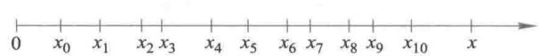  
图1 号码在数轴上的图示

模型建立为了记号的简单、方便, 将起始号码  $x_{0}$  设定为0001, 未知的终止号码仍记作  $x$ , 全部号码为模型的总体, 记作  $\{0001, 0002, \dots , x\}$ ,  $x$  即是出租车总数. 从总体中随机抽取的  $n$  个号码为模型的样本, 从小到大排列后记作  $\{x_{1}, x_{2}, \dots , x_{n}\}$ . 需要建立由  $x_{1}, x_{2}, \dots , x_{n}$  估计  $x$  的模型, 其基本假定是, 样本中每个  $x_{i}(i = 1,2, \dots , n)$  取自总体中任一号码的概率相等. 由样本估计总体的方法有很多, 下面给出几个简单的模型.

模型1——平均值模型

记样本  $x_{1}, x_{2}, \dots , x_{n}$  的平均值为  $\overline{x}$ , 总体0001, 0002,  $\dots$ ,  $x$  的平均值为  $\overline{X}$ , 显然,  $\overline{x} = \frac{1}{n} \sum_{i = 1}^{n} x_{i}, \overline{X} = \frac{1}{x} \sum_{j = 1}^{x} j = \frac{x + 1}{2}$ , 用  $\overline{x}$  作为  $\overline{X}$  的估计值即  $\overline{X} = \overline{x}$ , 于是得到

$$
x = 2\overline{x} -1 \tag{1}
$$

$\overline{x}$  较大时可以忽略(1)式右端的1, 所以总数  $x$  可近似用样本平均值  $\overline{x}$  的2倍来估计.

模型2——中位数模型

记样本和总体的中位数分别为  $\tilde{x}, \tilde{X}$ , 用  $\tilde{x}$  作为  $\tilde{X}$  的估计值, 由于  $\tilde{X} = \overline{X} = \frac{x + 1}{2}$ , 所以

$$
x = 2\tilde{x} -1 \tag{2}
$$

$x$  也可近似用样本中位数  $\tilde{x}$  的2倍估计

模型3——两端间隔对称模型

样本中最小号码与总体的起始号码的间隔(即其中包含的除样本号码之外的号码个数)是  $x_{1} - 1$ , 样本中最大号码与总体的终止号码的间隔是  $x - x_{n}$ , 假定样本的最小值与最大值在总体中对称, 即两个间隔相等:  $x - x_{n} = x_{1} - 1$ , 所以

$$
x = x_{n} + x_{1} - 1 \tag{3}
$$

$x$  可近似用样本最大值  $x_{n}$  与最小值  $x_{1}$  之和来估计

模型4——平均间隔模型

将利用两端间隔的想法给以推广, 把起始号码和样本排成数列:  $1, x_{1}, x_{2}, \dots , x_{n}$ , 考察相邻两数之间的  $n$  个间隔  $x_{1} - 1, x_{2} - x_{1} - 1, \dots , x_{n} - x_{n - 1} - 1$ , 取这些间隔的平均值, 作为  $x_{n}$  与终止号码  $x$  间隔  $x - x_{n}$  的估计, 即  $x - x_{n} = \frac{1}{n} \left[ (x_{1} - 1) + \sum_{i = 2}^{n} (x_{i} - x_{i - 1} - 1) \right] = \frac{1}{n} (x_{n} - n)$ , 由此可得

$$
x = \left(1 + \frac{1}{n}\right) x_{n} - 1 \tag{4}
$$

$x$  可近似用样本最大值的  $1 + \frac{1}{n}$  倍来估计

模型5——区间均分模型

将总体所在区间  $[1, x]$  平均分成  $n$  份, 每个小区间长度为  $\frac{x - 1}{n}$ , 假定样本中每个  $x_{i} (i = 1, 2, \dots , n)$  都位于小区间的中点, 将区间均分, 那么  $x_{n}$  与  $x$  的距离  $x - x_{n}$  应是小区间长度的一半, 即  $x - x_{n} = \frac{x - 1}{2n}$ , 由此可得

$$
x = \left(1 + \frac{1}{2n - 1}\right) \left(x_{n} - \frac{1}{2n}\right) \tag{5}
$$

$x$  可近似用样本最大值的  $1 + \frac{1}{2n}$  倍来估计

利用以上模型(1)~(5)计算后, 都应取靠近的整数作为出租车总数  $x$  的估计值

计算与分析 对于你最初随意地记下的10辆出租车牌号, 将起始号码  $x_{0}$  由0101

平移为0001后,得到的样本(称第1样本)为  $\{0321, 0028, 0602, 0310, 0498, 0574, 0612, 0429, 0767, 0212\}$ ,用5个模型分别计算出的  $x$  列入表1第2行,估计的出租车总数最少是模型3得到的794,最多是模型2得到的926,差别很大.哪个准确呢?

让我们再随机记下10个牌号,平移0001后得到的第2样本为  $\{0249, 0739, 0344, 0148, 0524, 0284, 0351, 0089, 0206, 0327\}$ ,同样计算的  $x$  列入表1第3行,发现不仅各个模型估计的不同,而且与第1样本相比,同一模型估计的也相差较大.特别值得注意的是,模型1、模型2估计出的  $x$  为651和610,都小于样本中的最大值739,显然是不合理的.

表1根据2个样本用5个模型估计的出租车总数  

<table><tr><td></td><td>模型1</td><td>模型2</td><td>模型3</td><td>模型4</td><td>模型5</td></tr><tr><td>第1样本</td><td>870</td><td>926</td><td>794</td><td>843</td><td>807</td></tr><tr><td>第2样本</td><td>651</td><td>610</td><td>827</td><td>812</td><td>778</td></tr></table>

但是,因为不知道出租车总数实际上到底是多少,所以无法从这样的结果判断哪个模型更准确.并且,样本是从总体中随机抽取的,从少数几个样本得出的结果随意性很大.下面我们通过大量的数值模拟来对这些模型的准确度进行评价.

数值模拟这里的数值模拟是指给定一个总体,从中抽取若干样本,根据5个模型分别对样本进行计算,估计总体,将估计结果与给定总体作对比,根据各个模型的估计值与总体比较的结果做出评价.

对于总体  $\{1,2,\dots ,x\}$ ,设定  $x = 1000$ ,从总体中随机取  $n = 10$  个数为一个样本,对每个样本用5个模型分别估计  $x$  (估计值记作  $\hat{x}$ ),如此取  $m = 200$  个样本,计算由  $m$  个样本估计的  $\hat{x}$  的平均值和标准差,以及平均值与真值(1000)间的误差.为了进一步分析  $m$  个样本估计的  $\hat{x}$  的分布情况,可以画出  $\hat{x}$  的直方图.

这样的模拟做了2次,数值结果如表2和表3,直方图如图2和图  $3①$

表2第1次模拟的数值结果  

<table><tr><td></td><td>模型1</td><td>模型2</td><td>模型3</td><td>模型4</td><td>模型5</td></tr><tr><td>^x的平均值</td><td>1 023.2</td><td>1 037.4</td><td>1 010.0</td><td>1 005.6</td><td>962.3</td></tr><tr><td>平均值的误差</td><td>23.2</td><td>37.4</td><td>10.0</td><td>5.6</td><td>-37.7</td></tr><tr><td>^x的标准差</td><td>170.1</td><td>261.0</td><td>126.3</td><td>90.9</td><td>87.0</td></tr></table>

表3第2次模拟的数值结果  

<table><tr><td></td><td>模型1</td><td>模型2</td><td>模型3</td><td>模型4</td><td>模型5</td></tr><tr><td>^x的平均值</td><td>986.5</td><td>985.4</td><td>980.8</td><td>992.9</td><td>950.1</td></tr><tr><td>平均值的误差</td><td>-13.5</td><td>-14.6</td><td>-19.2</td><td>-7.1</td><td>-49.9</td></tr><tr><td>^x的标准差</td><td>181.4</td><td>271.1</td><td>107.9</td><td>86.6</td><td>82.8</td></tr></table>

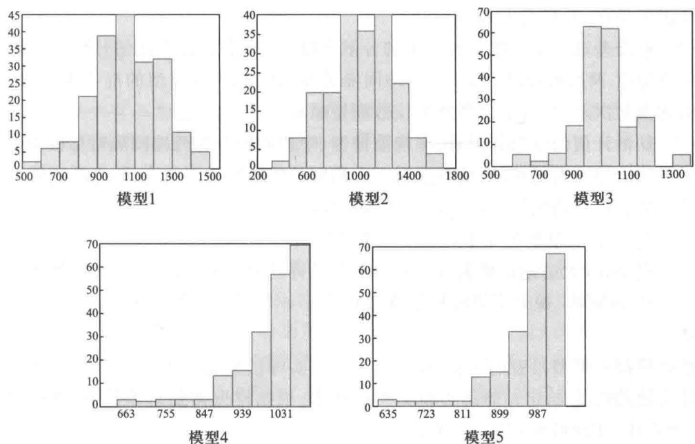  
图2 第1次模拟的直方图

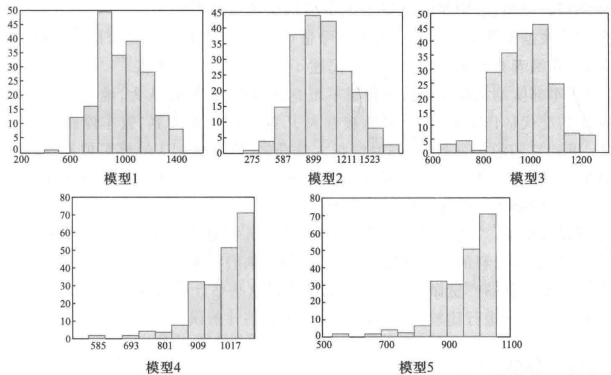  
图3 第2次模拟的直方图

根据两次模拟的结果可以得出以下的初步结论:

(1) 平均值模型和中位数模型是容易想到、容易理解的方法, 并且从理论上讲, 对于均匀分布的总体, 样本平均值和中位数都是总体平均值和中位数的无偏估计. 但是, 从有限个样本得到的总体平均值的估计误差却很大. 两端间隔对称模型是无偏的, 估计误差也不小. 区间均分模型不仅估计误差较大, 而且有过低估计的趋势. 平均间隔模型

的估计误差最小,并且是无偏的  $①$ .

(2)标准差表示了多次估计结果的分散程度,在一定意义上比估计误差更能反映模型的准确度.两次模拟结果表明,平均间隔模型和区间均分模型的准确度最高,两端间隔对称模型次之,平均值模型和中位数模型最差.

(3)从估计值的分布情况看,平均值模型、中位数模型和两端间隔对称模型的估计值对于平均值是左右对称的,显然这与3个模型的构造形式相符合.平均间隔模型和区间均分模型的估计值则呈左低右高的非对称型.

综合地看,5个模型中以平均间隔模型最优.

需要指出,以上结论是根据编者的两次模拟得到的,不排除读者通过模拟得出不同结论的可能.特别地,如果模拟时增加样本的大小  $n$  和样本的数量  $m$ ,应该能得到更可信的结论.

数值模拟是模型检验的重要方法,特别是在实际信息缺乏、需要由少数样本估计未知总体参数的情况.给定总体通过模拟产生样本,根据模型得到总体参数,进行比较和评价,很有些"实践检验真理"的味道.

估计值标准差的大小对于应用的实际价值影响较大,文献[33]给出了(1)~(4)式估计值的(理论)方差(标准差的平方),从大到小的顺序是:中位数模型、平均值模型、两端间隔对称模型、平均间隔模型.我们的模拟结果与此相符合.

后记根据随意记下的几个汽车牌号估计出租车数量,似乎是个臆造的问题,而有意思的是,在编者查到的一篇文献中,记述了这样一个历史事实[20],第二次世界大战中,一支盟军部队的指挥部急需掌握德军坦克的数量,指挥官认为,他们根据德军的宣传和战俘的交代估计出的数字,可能被夸大了.随着战争的进展,盟军俘获了若干辆德军坦克,得到它们的序列号码,同时情报人员获知,这支标记I的德军坦克号码是按顺序编排的.于是,就有数学家以俘获的坦克号码为样本,用统计方法估计出标记I的德军坦克总量,帮助盟军指挥部修正了此前的估计.

不仅仅是坦克,二次世界大战期间,英美情报机构通过对捕获德军武器装备上序列编号、生产日期等资料的分析研究,对于从军用车辆的轮胎、枪支、装甲车,直到飞弹、火箭等众多武器装备的产量做出估计.战后,有人将这些估计值与从敌人档案中得到的这些装备的实际产量进行比较,令人惊讶的是,多数估计的误差竟然在  $10\%$  以内[53].

# 复习题

1. 对总体  $\{1,2,\dots ,x\}$  仍然设定  $x = 1000$ ,增加样本大小  $n$  和样本数量  $m$ ,用5个模型作模拟计算,估计总体,对估计结果进行分析研究.  $n$  和  $m$  的增加对结果有什么影响.

2. 如果汽车的起始号码未知,5种建模方法中有哪种方法可加以改进来解决这样的问题?给出具体的估计模型并作模拟.

# 2.6 评选举重总冠军

体育运动中有一些项目按照运动员的体重划分级别进行比赛,如举重、赛艇、拳击、摔跤等,因为这些项目在相当程度上依靠运动员全身的力量来完成,而人体的力量与体重有密切的关系,让体重大体相同的运动员相互比赛才能维护竞赛的公平.本节讨论大家比较熟悉、划分级别较多、规则较为简单的举重比赛.

男子举重比赛按照运动员体重(上限)分为8个级别:  $56\mathrm{~kg},62\mathrm{~kg},69\mathrm{~kg},77\mathrm{~kg},$ $85\mathrm{~kg},94\mathrm{~kg},105\mathrm{~kg}$  和  $105\mathrm{~kg}$  以上.每个级别都设3个项目:抓举、挺举和总成绩(抓举与挺举成绩之和).每个级别、每个项目都产生一个冠军,所以一次比赛共有24个冠军.大级别冠军的成绩一般都高于小级别冠军,问题是,从同一项目(如抓举)的8个冠军中能评选出一个"总冠军"吗?当然不能直接比较他们的成绩,但是如果把不同级别冠军的成绩,都按照各自的体重合理地"折合"成某个标准级别的成绩,对折合成绩进行比较,选出最高的作为总冠军,应该是可以被人们接受的[70].

问题分析构造折合成绩的前提是建立体重与举重成绩之间的数学模型.如果有了这样的模型,就可以计算出各个级别冠军举重成绩的理论值.当在一次比赛中得到了各个级别冠军成绩的实际值后,计算实际值与理论值的比值.再根据这个比值构造一个简单、合适的数量指标作为折合成绩,各个级别冠军中折合成绩最大者,即可评选为总冠军.

数据收集与分析大家知道,举重成绩除了与体重有关以外,还在相当大程度上取决于运动员的选拔、训练等因素.在建立举重成绩的数学模型时,为了只保留体重而尽量排除其他因素的影响,一个合适的办法是利用举重比赛的世界纪录.因为作为世界顶级运动员,他们通过严格的选拔和艰苦的训练,在举重技巧的发挥方面已趋完善(当然是在目前的环境条件下,随着时代的发展,运动水平还将提高),不同级别成绩的差别基本上是由运动员体重决定的.另外,多年积累下来的世界纪录与某一次比赛成绩(如奥运会、世锦赛等)相比,更能避免偶然性.

男子举重比赛世界纪录的情况(截至2013年)如表1所示,可以看到,中国运动员在小级别比赛中占有较大的优势,保持着7项世界纪录.

表1男子举重比赛世界纪录（截至2013年）  

<table><tr><td>级别</td><td>项目</td><td>纪录</td><td>纪录保持者</td><td>日期</td></tr><tr><td></td><td>抓举</td><td>138 kg</td><td>穆特鲁(土耳其)</td><td>2001.11.4</td></tr><tr><td>56 kg级</td><td>挺举</td><td>168 kg</td><td>穆特鲁(土耳其)</td><td>2001.4.24</td></tr><tr><td></td><td>总成绩</td><td>305 kg</td><td>穆特鲁(土耳其)</td><td>2000.9.16</td></tr><tr><td></td><td>抓举</td><td>153 kg</td><td>石智勇(中国)</td><td>2002.6.28</td></tr><tr><td>62 kg级</td><td>挺举</td><td>182 kg</td><td>乐茂盛(中国)</td><td>2002.10.2</td></tr><tr><td></td><td>总成绩</td><td>327 kg</td><td>金恩国(朝鲜)</td><td>2012.7.31</td></tr></table>

续表  

<table><tr><td>级别</td><td>项目</td><td>纪录</td><td>纪录保持者</td><td>日期</td></tr><tr><td rowspan="3">69 kg级</td><td>抓举</td><td>165 kg</td><td>马尔科夫(保加利亚)</td><td>2000.9.20</td></tr><tr><td>挺举</td><td>198 kg</td><td>廖辉(中国)</td><td>2013.10.23</td></tr><tr><td>总成绩</td><td>358 kg</td><td>廖辉(中国)</td><td>2013.10.23</td></tr><tr><td rowspan="3">77 kg级</td><td>抓举</td><td>176 kg</td><td>吕小军(中国)</td><td>2013.10.25</td></tr><tr><td>挺举</td><td>210 kg</td><td>佩雷佩切诺夫(俄罗斯)</td><td>2001.4.27</td></tr><tr><td>总成绩</td><td>380kg</td><td>吕小军(中国)</td><td>2013.10.25</td></tr><tr><td rowspan="3">85 kg级</td><td>抓举</td><td>187 kg</td><td>雷巴科夫(白俄罗斯)</td><td>2007.9.22</td></tr><tr><td>挺举</td><td>218 kg</td><td>张勇(中国)</td><td>1998.4.25</td></tr><tr><td>总成绩</td><td>394 kg</td><td>雷巴科夫(白俄罗斯)</td><td>2008.8.15</td></tr><tr><td rowspan="3">94 kg级</td><td>抓举</td><td>188 kg</td><td>阿卡基奥斯(希腊)</td><td>1999.11.27</td></tr><tr><td>挺举</td><td>233 kg</td><td>伊利亚(哈萨克斯坦)</td><td>2012.8.4</td></tr><tr><td>总成绩</td><td>418 kg</td><td>伊利亚(哈萨克斯坦)</td><td>2012.8.4</td></tr><tr><td rowspan="3">105 kg级</td><td>抓举</td><td>200 kg</td><td>安德烈(白俄罗斯)</td><td>2008.8.18</td></tr><tr><td>挺举</td><td>237 kg</td><td>特萨加耶夫(保加利亚)</td><td>2004.4.25</td></tr><tr><td>总成绩</td><td>436 kg</td><td>安德烈(白俄罗斯)</td><td>2008.8.18</td></tr><tr><td rowspan="3">105 kg以上级</td><td>抓举</td><td>214 kg</td><td>萨利米(伊朗)</td><td>2011.11.13</td></tr><tr><td>挺举</td><td>263 kg</td><td>拉扎扎德(伊朗)</td><td>2004.8.25</td></tr><tr><td>总成绩</td><td>472 kg</td><td>拉扎扎德(伊朗)</td><td>2000.9.26</td></tr></table>

在处理世界纪录与体重数据时还应注意到,虽然我们不掌握创造纪录的运动员的实际体重,但是基于体重越大、举得越重的常识,比赛时运动员的体重都会调整到非常接近各级别的上限,所以可用每个级别的上限代表运动员的实际体重①.并且,由于 $105\mathrm{~kg}$  以上级未设上限,更不知道运动员的实际体重,只好略去这个级别,在其余7个级别中评选总冠军.

在定量地研究举重成绩与运动员体重的模型之前,将表1中抓举、挺举和总成绩3个项目的世界纪录与体重数据,以散点图形式用图1表示出来,直观地看一下二者之间大致呈现怎样的关系.图1(a)显示,世界纪录与体重大致上呈线性关系,但是大级别运动员成绩的增加有变慢的趋势.如果将世界纪录和体重先取对数,再用图1(b)表示,可以看出取对数后二者的线性关系有所改进,这启示我们,用幂函数(幂次小于1)比线性函数表示举重成绩与体重的关系可能更为合适.

从表1和图1还可以知道,虽然举重总成绩记录并不等于抓举和挺举记录之和(由于是不同时间、不同运动员创造的),但只是略小一点,3个记录随体重变化的趋势相

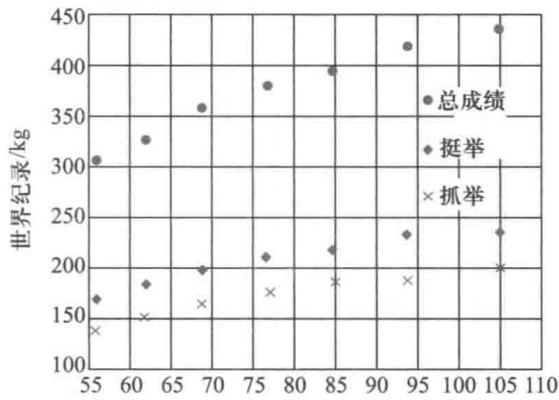  
体重/kg  
(a) 普通坐标

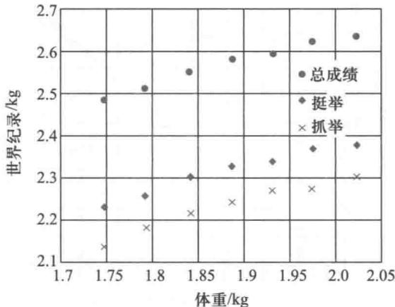  
(b) 对数坐标 图1 抓举、挺举和总成绩世界纪录与体重数据图示

同,且总成绩没有像  $94\mathrm{~kg}$  级抓举那样个别点的变异现象。下面只利用举重总成绩的记录来建立模型,其方法完全可用于抓举和挺举。

下面通过3个模型研究举重成绩与运动员体重的关系[13]

模型建立记举重总成绩为  $y$  ,运动员体重为  $w$  ,建立  $y$  与  $w$  的线性模型、幂函数模型和幂函数改进模型。

模型——线性模型

将举重总成绩  $y$  与体重  $w$  的数据重新画一个散点图(图2,其中7个点与图1最上方7个点相同,只是坐标轴有别),然后尽量接近这些点作一条直线,发现直线与横坐标相交于- 60左右。据此建立如下的线性模型

$$
y = k\left(w + 60\right) \tag{1}
$$

式中的系数  $k$  可以由图2直线的斜率粗略地估计:  $k \approx \frac{430}{160} = 2.69$  ,也可由表1的数据利用最小二乘法编程计算:  $k = 2.7039$  ,于是(1)式表为

$$
y = 2.7039(w + 60) \tag{2}
$$

模型二——幂函数模型

建立这个模型的关键是确定幂函数的幂次,可以从运动生理学的角度研究。

合理地假定举重成绩  $y$  与运动员身体肌肉的截面积  $s$  成正比,而  $s$  与身体的特定尺寸  $l$  的平方成正比,再假定体重  $w$  与  $l$  的立方成正比,即有

$$
y = k_{1}s, s = k_{2}l^{2}, w = k_{3}l^{3} \tag{3}
$$

$k_{1}, k_{2}, k_{3}$  为比例系数。从(3)式可以得到

$$
y = k w^{\frac{2}{3}} \tag{4}
$$

将举重总成绩  $y$  与  $w^{\frac{2}{3}}$  的数据画在散点图(图3)上,然后尽量接近这些点作一条直线,(4)式中的系数  $k$  可以由图3直线的斜率粗略地估计:  $k \approx \frac{140}{7.5} = 18.7$  ,也可由表1数据利用最小二乘法编程计算出  $k = 20.4711$  ,得到

$$
y = 20.4711w^{\frac{2}{3}} \tag{5}
$$

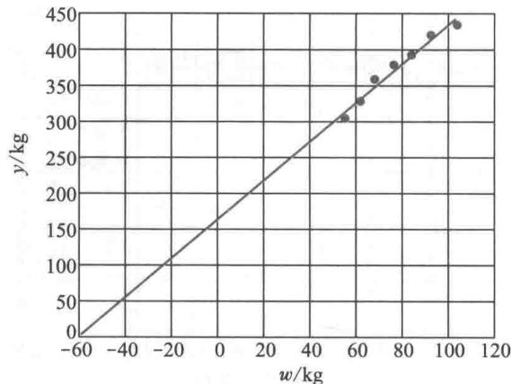  
图2 总成绩  $y$  与体重  $w$  及直线

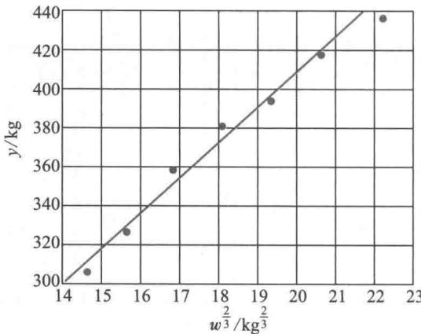  
图3 总成绩  $y$  与  $w^{\frac{2}{3}}$  及直线

模型三——幂函数改进模型

1967年,Carroll对幂函数模型作了如下改进。首先,他从生理学的角度认为,考虑到举重过程中力量的损失以及身体尺寸的各种变化,(3)式中  $y, s, l$  之间的关系应改写为

$$
y = k_{1} s^{\alpha} (\alpha < 1), s = k_{2} l^{\beta} (\beta < 2) \tag{6}
$$

并且将体重  $w$  分为肌肉与非肌肉两部分,记非肌肉部分为  $w_{0}$ ,(3)式中  $w$  与  $l$  的关系改写为

$$
w = k_{3} l^{3} + w_{0} \tag{7}
$$

从(6),(7)两式得到

$$
y = k(w - w_{0})^{\gamma}, \gamma < 2 / 3 \tag{8}
$$

然后,Carroll利用1964年以前世界范围内50名各级别顶尖运动员的成绩对(8)式作统计分析,得到  $w_{0} = 35 \mathrm{~kg}, \gamma = 1 / 3$ ,于是有

$$
y = k(w - 35)^{\frac{1}{3}} \tag{9}
$$

略去作图粗略估计(9)式中系数  $k$  的方法,直接由表1数据利用最小二乘法编程计算,得到

$$
y = 108.1106(w - 35)^{\frac{1}{3}} \tag{10}
$$

(2)、(5)、(10)式表示的曲线见图4~图6,计算结果以及与实际记录的相对误差分别列入表2第3、4、5列。

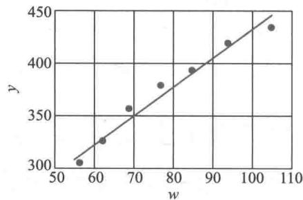  
图4 总成绩与体重的线性模型

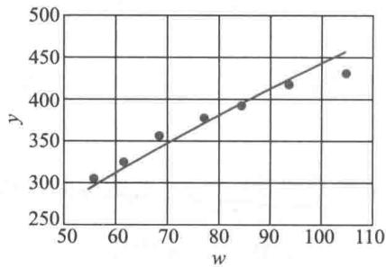  
图5 总成绩与体重的幂函数模型

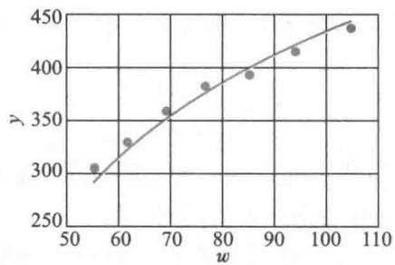  
图6 总成绩与体重的幂函数改进模型

表2三个模型的计算结果及与实际记录的相对误差（定义为（实际值-计算值）/计算值）  

<table><tr><td>级别</td><td>总成绩纪录</td><td>线性模型(2)</td><td>幂函数模型(5)</td><td>幂函数改进模型(10)</td></tr><tr><td>56 kg级</td><td>305 kg</td><td>313.648 6(-2.76%)</td><td>299.640 5(1.79%)</td><td>298.268 9(2.26%)</td></tr><tr><td>62 kg级</td><td>327 kg</td><td>329.871 8(-0.87%)</td><td>320.678 4(1.97%)</td><td>324.331 7(0.82%)</td></tr><tr><td>69 kg级</td><td>358 kg</td><td>348.798 8(2.64%)</td><td>344.382 7(3.95%)</td><td>350.236 3(2.22%)</td></tr><tr><td>77 kg级</td><td>380 kg</td><td>370.429 8(2.58%)</td><td>370.512 1(2.56%)</td><td>375.795 2(1.12%)</td></tr><tr><td>85 kg级</td><td>394 kg</td><td>392.060 7(0.49%)</td><td>395.750 2(-0.44%)</td><td>398.282 7(-1.08%)</td></tr><tr><td>94 kg级</td><td>418 kg</td><td>416.395 5(0.39%)</td><td>423.214 4(-1.23%)</td><td>420.874 0(-0.68%)</td></tr><tr><td>105 kg级</td><td>436 kg</td><td>446.138 0(-2.27%)</td><td>455.618 6(-4.31%)</td><td>445.554 5(-2.14%)</td></tr></table>

为根据表2的结果比较三个模型与实际记录的拟合程度,将每个模型7个级别的相对误差取绝对值后加以平均,称为总平均误差,计算得到:线性模型(2)、幂函数模型(5)、幂函数改进模型(10)的总平均误差依次为  $1.71\%$  、  $2.32\%$  、  $1.47\%$  看来两个幂函数模型的结果比线性模型并没有多大改进.

观察图5、图6可以发现,如果降低这两个幂函数的幂次,使曲线上升得更缓慢一点,有可能提高曲线与数据点的拟合程度.不妨作如下试验:将(4)式的幂次2/3降为0.6,(9)式的幂次1/3降为0.3,用同样的数据可得

$$
y = 27.4329w^{0.6} \tag{11}
$$

$$
y = 122.6278(w - 35)^{0.3} \tag{12}
$$

模型(11)、(12)的总平均误差分别为  $1.23\%$  和  $0.66\%$  ,相比有很大改进.

评选总冠军 以上面的线性模型(1)、幂函数模型(4)和幂函数改进模型(9)为基础,建立评选总冠军的模型,并以模型(1)为例说明建模过程.

将7个级别从轻量级到重量级记作  $i = 1,2,\dots ,7$  ,体重(上限)记作  $w_{i}$  ,按照模型(1)各个级别冠军的理论成绩应为  $\hat{y}_{i} = k(w_{i} + 60)$  ,在一次比赛中各个级别冠军的实际成绩记作  $y_{i}$  ,比值  $y_{i} / \hat{y}_{i}$  表示第  $i$  级别冠军在评选总冠军中的实力.取与这个比值成正比(比例系数  $\lambda$  )的数量指标  $z_{i}$  为

$$
z_{i} = \frac{\lambda y_{i}}{\hat{y}_{i}} = \frac{\lambda y_{i}}{k(w_{i} + 60)} \tag{13}
$$

为了确定(13)式中的系数  $\lambda /k$  ,任意取一个级别如  $77\mathrm{~kg}$  级(  $i = 4$  )为标准,使  $w_{4} = 77$  时

$z_{4}$  正好等于这个级别冠军的实际成绩  $y_{4}$ ,将这个关系代入(13)式得  $\lambda /k = 77 + 60 = 137$ ,于是(13)式化为

$$
z_{i} = y_{i} \frac{137}{w_{i} + 60} \tag{14}
$$

$z_{i}$  是将体重折合成  $77 \mathrm{~kg}$  级后第  $i$  级别冠军的实际成绩,称为折合成绩。按照比赛中7个级别冠军的折合成绩排名,排名第一者为总冠军。

(14)式是以线性模型(1)为基础建立的评选总冠军的模型,可以注意到,(14)式的折合成绩  $z_{i}$  完全由第  $i$  级别冠军的实际成绩  $y_{i}$  决定(体重上限  $w_{i}$  对每个级别是固定的),与模型(1)中随着世界纪录的不断刷新而改变的系数  $k$  (如(2)式那样)无关,所以(14)式是一个简单的、便于应用的模型。

从幂函数模型(4)和幂函数改进模型(9)出发,仍以  $77 \mathrm{~kg}$  级为标准,可以完全类似地推出相应的评选总冠军的模型

让我们用模型(14)、(15)、(16)评选2008年北京奥运会男子举重比赛的总冠军。表3的前3列是各级别举重总成绩冠军的实际资料(  $105 \mathrm{~kg}$  以上级未列入),后3列是用这3个模型计算的折合成绩及排名。可以看到,由模型(15)、(16)评选的前3名完全相同,与模型(14)的前2名只是稍有出入,综合3个模型的结果,可以评选出总冠军是  $69 \mathrm{~kg}$  级的廖辉(中国)。

表32008年北京奥运会男子举重比赛各级别总成绩冠军及由模型得到的折合成绩及排名  

<table><tr><td rowspan="2">级别</td><td rowspan="2">冠军获得者</td><td rowspan="2">总成绩</td><td rowspan="2">线性模型(14)</td><td colspan="2">折合成绩及名次</td></tr><tr><td>幂函数模型(15)</td><td>幂函数改进模型(16)</td></tr><tr><td>56 kg级</td><td>龙清泉(中国)</td><td>292 kg</td><td>344.862 1(7)</td><td>361.064 4(5)</td><td>367.896 9(4)</td></tr><tr><td>62 kg级</td><td>张湘祥(中国)</td><td>319 kg</td><td>358.221 3(6)</td><td>368.572 9(3)</td><td>369.617 5(3)</td></tr><tr><td>69 kg级</td><td>廖辉(中国)</td><td>348 kg</td><td>369.581 4(2)</td><td>374.403 9(1)</td><td>373.395 7(1)</td></tr><tr><td>77 kg级</td><td>史才秀(韩国)</td><td>366 kg</td><td>366.000 0(3)</td><td>366.000 0(4)</td><td>366.000 0(6)</td></tr><tr><td>85 kg级</td><td>陆永(中国)</td><td>394 kg</td><td>372.262 1(1)</td><td>368.873 5(2)</td><td>371.754 3(2)</td></tr><tr><td>94 kg级</td><td>伊利亚(哈萨克斯坦)</td><td>406 kg</td><td>361.181 8(5)</td><td>355.441 3(6)</td><td>362.514 3(7)</td></tr><tr><td>105 kg级</td><td>阿拉姆诺夫(白俄罗斯)</td><td>436 kg</td><td>362.012 1(4)</td><td>354.558 1(7)</td><td>367.736 6(5)</td></tr></table>

模型(1)基于对世界纪录数据的直观观察,(4)和(9)则是从机理分析角度出发,结合数据分析完成建模的。读者可能已经注意到,3个模型中都只有一个以因子形式出现的系数  $k$ ,这是构造折合成绩的需要。大家已经看到,在总冠军模型(14)、(15)、(16)中系数  $k$  消失了。按照通常的建模方法,线性模型等3个模型的一般形式为  $y = a w^{b}, y = a w^{b}, y = a(w - b, w_{0})^{b}$ ,其中系数  $a, b, w_{0}$  用最小三乘法由世界纪录确定后,可以得到与实际数据拟合得更好的模型。但是如果这样做,在构造折合成绩时难以将这些系数全部消去,包含系数的总冠军模型不便于应用,因为系数会随世界纪录的刷新而改变。

从表3还可以看出,利用线性模型得到的第一名与最后一名的折合成绩相差约  $30 \mathrm{~kg}$ ,利用幂函数模型相差约  $20 \mathrm{~kg}$ ,而利用幂函数改进模型相差仅约  $10 \mathrm{~kg}$ 。如果这届奥运会男子举重比赛的各级别冠军都是顶尖选手,那么这也能够从一个方面说明,幂函数改进模型比其他两个模型更合理一些。

1. 搜集下列举重比赛的实际数据,利用(14)~(16)式计算折合成绩及排名:

(1)截至目前的男子举重比赛世界纪录

(2)最近一届奥运会男子举重比赛成绩

(3)截至目前的女子举重比赛世界纪录

2. 研究一般形式的幂函数模型  $y = a w^{b}$ ,利用表1的男子举重比赛世界纪录或第1题搜集的数据,确定系数  $a$ ,  $b$  (提示:通过取对数将幂函数化为线性函数),与幂函数模型(5)式比较与实际记录的拟合程度,再构造计算折合成绩的公式,对搜集的某次举重比赛各级别总成绩冠军进行排名.

# 2.7 解读CPI

"你看,最近菜价又涨啦,可电视上说,CPI回落了,怎样回事?"

"哟!大妈,您还懂CPI啊,人家说的是CPI涨幅回落,是比过去涨得少点,可还是涨!"

眼下,居民消费价格指数(consumer price index,简称CPI)差不多全民普及了.每个月的9日左右国家统计局会发布上个月全国的CPI数据,经过多种媒体的宣传和各界人士的解读,引起老百姓的普遍关心和纷纷议论.

CPI是反映居民购买生活消费品和服务项目时价格变动趋势的相对数字,是观察通货膨胀水平的重要指标.这里,我们既不从国家经济政策的角度,也不从与其他经济指标的关系方面研讨CPI的变化,而是沿着数学建模的思路,按照数据分析的方法去解读  $\mathrm{CPI}^{[70]}$

按照时间顺序解读CPI

根据国家统计局消费价格统计方法,目前我国CPI按照对比基期的不同,有环比价格指数、同比价格指数、累计价格指数等,基期指当前与过去的哪个时期对比.

通常,国家统计局直接公布的不是价格指数,而是价格指数的增长率(以%表示),为方便人们更直观地了解价格上涨的幅度,表1和表2给出的就是全国2011年和2012年CPI每个月份3个指数的增长率.由这些数据很容易得到价格指数,如表1显示2011年1月至3月的环比增长率分别是  $1.0\%$  ,  $1.2\%$  ,  $- 0.2\%$  ,由于基期的价格指数一般取作100,所以这3个月的环比指数分别是  $100\times (1 + 0.01) = 101.0$  (可以简单地将1.0加上100即得),  $100\times (1 + 0.012) = 101.2$ $100\times (1 - 0.002) = 99.8$  同比指数与累计指数可以类似地推算.

表1全国2011年CPI各月份的3个价格指数增长率  

<table><tr><td rowspan="2"></td><td colspan="12">月份</td></tr><tr><td>1</td><td>2</td><td>3</td><td>4</td><td>5</td><td>6</td><td>7</td><td>8</td><td>9</td><td>10</td><td>11</td><td>12</td></tr><tr><td>环比增长率/%</td><td>1.0</td><td>1.2</td><td>-0.2</td><td>0.1</td><td>0.1</td><td>0.3</td><td>0.5</td><td>0.3</td><td>0.5</td><td>0.1</td><td>-0.2</td><td>0.3</td></tr><tr><td>同比增长率/%</td><td>4.9</td><td>4.9</td><td>5.4</td><td>5.3</td><td>5.5</td><td>6.4</td><td>6.5</td><td>6.2</td><td>6.1</td><td>5.5</td><td>4.2</td><td>4.1</td></tr><tr><td>累计增长率/%</td><td>4.9</td><td>4.9</td><td>5.0</td><td>5.1</td><td>5.2</td><td>5.4</td><td>5.5</td><td>5.6</td><td>5.7</td><td>5.6</td><td>5.5</td><td>5.4</td></tr></table>