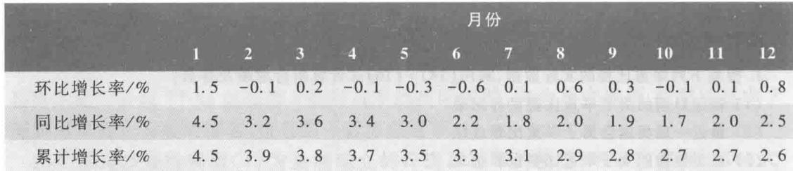

1. 环比价格指数 以上月为基期进行对比的价格指数, 简称环比, 是最能反映当前价格波动的指标. 如表 1 中 2011 年 1 月环比增长率  $1.0\%$ , 表示 2011 年 1 月比 2010 年 12 月价格上涨  $1.0\%$ , 2011 年 3 月环比增长率  $-0.2\%$ , 表示 2011 年 3 月比 2011 年 2 月价格下降  $0.2\%$ .

记  $p_{k}$  为某年  $k$  月的环比增长率  $(k = 1,2,\dots ,12)$ , 表 1、表 2 的第 3 行即 2011 年和 2012 年的  $p_{k}$ , 图 1(a)、图 2(a) 是按照 2011 年和 2012 年的  $p_{k}$  画出的. 由表 1 和图 1(a) 可知, 2011 年只有 3 月和 11 月的环比增长率为负值, 即价格比上月下降, 而 8 月和 10 月虽然图上曲线下降, 表示增长率比上月减少, 但是价格仍然是上涨的, 公布 CPI 数据时会说"价格涨幅回落". 根据表 2 和图 2(a), 2012 年有 5 个月价格比上月下降, 还有 1 个月价格涨幅回落, 物价形势比 2011 年明显好转.

为了得到更直接、清晰的全年价格走势, 以上一年 12 月为基期 (价格指数 100), 可以根据  $p_{k}$  计算这一年逐月的价格指数  $P_{k}(k = 1,2,\dots ,12)$  为

$$
P_{k} = 100 \prod_{i = 1}^{k} \left(1 + p_{i}\right). \tag{1}
$$

图 1(b)、图 2(b) 是由 (1) 式计算的 2011 年和 2012 年的 1 至 12 月的价格指数  $P_{k}$  的曲线. 将图 1、图 2 的 (a) 图与 (b) 图对比, 可以发现, 当  $p_{k}$  为负值时  $P_{k}$  下降, 当  $p_{k}$  为正值但下降时  $P_{k}$  上升但增量减少.

由图 1(b)、图 2(b) 可以看出, 2011 年全年的价格走势比 2012 年明显偏高, 2011 年 12 月  $P_{12}$  约为 104, 即比 2010 年 12 月约增长  $4\%$ , 而 2012 年 12 月  $P_{12}$  约为 102.5, 即比 2011 年 12 月约增长  $2.5\%$ .

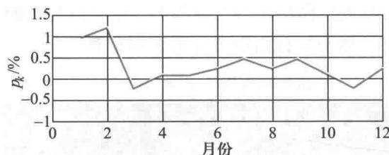  
(a) 全国 2011 年各月份环比增长率  $p_{k}$

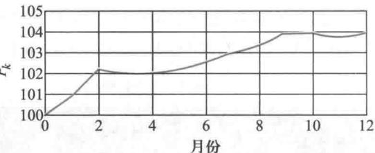  
(b) 全国 2011 年各月份价格指数  $P_{k}$  (上一年 12 月为 100) 图 1

2. 同比价格指数 以上年同月为基期进行对比的价格指数, 简称同比. 为了消除季节变化和春节、国庆节等节日对价格的影响, 今年与上年同月份的价格做比较, 也是

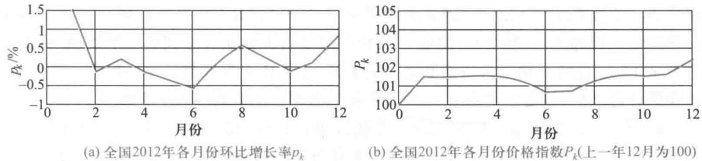

有意义的.

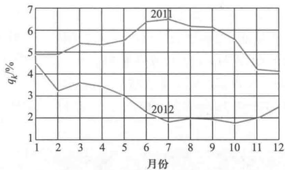  
图3 2011年和2012年各月份同比增长率

记  $q_{k}$  为某年  $k$  月的同比增长率  $(k = 1,2,\dots ,12)$ , 表1、表2的第4行即2011年和2012年的  $q_{k}$ , 由这些数据画出图3的两条曲线. 可以明显地看到, 虽然这两年每个月的价格比上年同月都有所上涨(增长率为正值), 但是2012年比2011年每月价格上涨的幅度明显减少.

环比和同比之间应该有数量关系. 记  $p_{k}(j)$ ,  $q_{k}(j)$  分别为  $j$  年  $k$  月的环比指数和同比指数(注意是指数, 不是增长率),  $x_{k}(j)$  为  $j$  年  $k$  月的价格指数(基于同一基期, 例如以  $j - 2$  年12月为基期), 按照环比和同比的定义, 有

$$
p_{k}(j) = \frac{x_{k}(j)}{x_{k - 1}(j)}, q_{k - 1}(j) = \frac{x_{k - 1}(j)}{x_{k - 1}(j - 1)}, q_{k}(j) = \frac{x_{k}(j)}{x_{k}(j - 1)}, p_{k}(j - 1) = \frac{x_{k}(j - 1)}{x_{k - 1}(j - 1)}
$$

由此可得

$$
p_{k}(j)q_{k - 1}(j) = q_{k}(j)p_{k}(j - 1) \tag{2}
$$

于是若已知(2)式的  $p_{k}(j - 1)$  和  $q_{k - 1}(j)$ ,  $q_{k}(j)$ , 可以算出  $p_{k}(j)$ , 如由2011年的环比指数(表1第3行数字加上100)和2012年的同比指数(表2第4行数字加上100), 可计算2012年的环比指数(读者可检验, 若忽略计算误差, 结果应与表2第3行数字加上100相符).

另外, 由同比的定义和按照(1)式计算的价格指数  $P_{k}$  可以知道, 每年12月的同比指数与每年的  $P_{12}$  是一回事, 从图1(b)、图2(b)可以看到, 2011年的  $P_{12}$  等于表1给出的12月的同比指数104.1, 2012年的  $P_{12}$  等于表2给出的12月的同比指数102.5.

3. 累计价格指数 从1月起到发布月份为止累计的、以上年同一期间价格为基期进行对比的指数, 简称累计. 因为若干个月的价格指数是以其每个月价格指数的平均值

度量的, 所以累计可以由同比价格指数得到.1 月份的累计与 1 月份的同比相同, 2 月份的累计是 1 月和 2 月同比的平均值, 3 月份的累计是 1 月至 3 月同比的平均值, 依此下去直至 12 月. 这既是两个价格指数之间的关系, 也是两个指数增长率之间的关系, 对于这样的计算结果, 读者不妨用表 1、表 2 中同比和累计的数据核对一下.

4. 年价格增长指数 环比和同比是按月进行统计、比较的, 如果要得到年价格增长指数, 只需注意到, 每年 12 月的累计为 1 月至 12 月同比的平均值, 由此可得每一年与上年比较的价格指数增长率. 表 1、表 2 右下角的那个数字表示, 2011 年比 2010 年价格增长  $5.4\%$ , 2012 年比 2011 年增长  $2.6\%$ .

全国 2004 年至 2013 年 CPI 年增长率列入表 3 第 3 行, 利用 (1) 式 (其中  $p_i$  取为年增长率) 并以 2003 年为基期 (价格指数 100), 计算 2004 年至 2013 年的 CPI, 得表 3 第 4 行. 这两组数据的图形如图 4(a) (b). 可以看出, 这 10 年中价格起伏不定, 2007 年、2008 年和 2011 年上升得较高, 2009 年呈负增长, 可能是对 2008 年过高增长的调整. 总体上看, 从 2003 年到 2013 年 10 年全国 CPI 增长了  $35\%$ , 平均年增长率  $3.5\%$ .

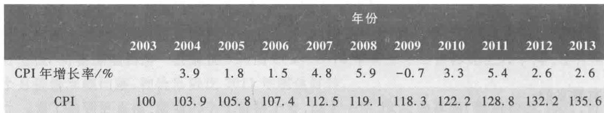  
表 3 全国 2004 年至 2013 年 CPI 的增长

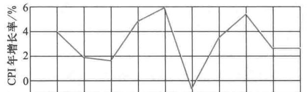  
2003 2004 2005 2006 2007 2008 2009 2010 2011 2012 2013 年份

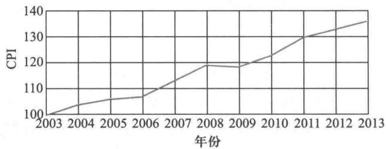  
(b) 全国 2004 年至 2013 年 CPI  
(a) 全国 2004 年至 2013 年 CPI 年增长率 图 4

按照分类结构解读 CPI

在按照时间顺序解读我国 CPI 的过程中我们看到, 2011 年和 2012 年的月环比增长率基本上不超过  $1\%$ , 还有近三分之一的月份是负增长, 近 10 年的平均年增长率也不过  $3.5\%$ . 这些数据可能与你和你的家庭对物价的亲身感受有较大差距. 原因是多方面

的,其中一个重要因素是,国家统计局公布的CPI是对全国居民家庭衣食住行各类消费品和服务价格,采用抽样、统计、综合加工得到的,而个人和家庭可能只关注了个别种类商品的价格变化。

目前,我国在编制CPI过程中将消费品和服务项目分为8大类,263个基本分类,约700个代表品种。国家统计局在按照《流通和消费价格统计调查方案》采样取得各个品种的价格后,加权计算出各个分类的指数及各个大类的指数,再由各个大类的指数加权计算CPI,所以CPI是由各种消费品和服务项目的价格及其权重二者共同决定的。

权重是国家统计局根据居民家庭用于各种消费品和服务项目的开支占总消费支出的比重确定的,随着人们生活水平的提高及消费结构的变化,权重会进行调整,据称我国每5年、10年会有较大的调整。表4是我国现行的消费品和服务项目的大类和若干中类的类别,以及2011年调整后的8大类的权重①。

表4我国消费品和服务项目的类别及权重（2011年）  

<table><tr><td>大类</td><td>中类</td><td>权重</td></tr><tr><td>1 食品</td><td>粮食、油脂、肉禽及其制品、水产品、蛋、鲜菜、鲜果、液体乳及乳制品</td><td>31.79%</td></tr><tr><td>2 烟酒及用品</td><td>烟草、酒</td><td>3.49%</td></tr><tr><td>3 衣着</td><td>服装、鞋</td><td>8.52%</td></tr><tr><td>4 家庭设备及维修服务</td><td>耐用消费品、家庭服务及加工维修服务</td><td>5.64%</td></tr><tr><td>5 医疗保健个人用品</td><td>中药材及中成药、西药、医疗保健服务</td><td>9.64%</td></tr><tr><td>6 交通和通信</td><td>交通工具、车用燃料及零配件、通信工具、通信服务</td><td>9.95%</td></tr><tr><td>7 娱乐教育文化用品及服务</td><td>教育服务、文娱用耐用消费品及服务、文化娱乐类、旅游</td><td>13.75%</td></tr><tr><td>8 居住</td><td>建房及装修材料、住房租金、水、电、燃料</td><td>17.22%</td></tr></table>

由表4可以看出,当前在8大类消费品和服务项目中以食品权重最大,居住和娱乐教育文化用品及服务次之。一直有不少舆论认为前者的权重仍太大,而后者偏小。实际上,我国CPI中的食品权重已由20世纪80年代的  $60\%$  左右下降了很多,近年来每次调整还在下降。另外应该注意到,居住中并不包含近年来飞涨的购买房屋的支出,官方的解释是购房属于投资而非消费②。

用  $v$  表示CPI总水平,  $v_{i}$  、  $w_{i}$  分别表示第  $i$  大类消费品和服务项目的价格指数及权重  $(i = 1,2,\dots ,8)$ ,且权重之和等于1,则CPI总水平与8大类消费品和服务项目的价格指数及权重的数学模型可表为

$$
v = \sum_{i = 1}^{8}w_{i}v_{i},\quad \sum_{i = 1}^{8}w_{i} = 1 \tag{3}
$$

用  $\Delta v$  和  $\Delta v_{i}$  表示  $v$  和  $v_{i}$  的增长率,即  $\Delta v = \frac{v - 100}{100}$ ,  $\Delta v_{i} = \frac{v_{i} - 100}{100}$ , 由于模型(3)是线性的,所以有

$$
\Delta v = \sum_{i = 1}^{8}w_{i}\Delta v_{i},\quad \sum_{i = 1}^{8}w_{i} = 1 \tag{4}
$$

(3)或(4)适用于计算每个月CPI总水平的环比及同比指数或指数增长率.

一方面,权重  $w_{i}$  对CPI总水平的大小有很大影响,引起民间对权重数值合理性的关注和研究,另一方面,权重随时调整的具体情况并不能为民间及时掌握,于是,利用每个月官方公布的CPI的相关数据,校核原来的权重是否有变化,以及估算调整后的权重,便成为一些研究者和关心者的课题.下面我们根据模型(4)讨论几种校核与估算的方法.

1. 利用每个月公布的环比和同比分类增长率  $\Delta v_{i}$  及原来权重  $w_{i}$ ,按照(4)计算环比和同比CPI总水平增长率,检查与每个月公布的  $\Delta v$  是否相符.

表5、表6分别是国家统计局公布的2013年环比和同比各月份的  $\Delta v_{i}$  和  $\Delta v$ ,用其中的  $\Delta v_{i}$  及表4的权重  $w_{i}$ ,按照模型(4)计算各月份CPI总水平的环比和同比,将计算值分别列入表5、表6的最后一列,以便与倒数第2列公布的  $\Delta v$  比较.

这是一个粗糙的方法.如果计算值与公布的  $\Delta v$  相符,并不能说明所有的  $w_{i}$  没有改变;如果不符,无法确认是否是数字的舍入误差所致,因为公布的指数只有2位有效数字,对计算结果可能有很大影响.

单位: $\%$

<table><tr><td>月
份</td><td>食品
Δv1</td><td>烟酒及
用品
Δv2</td><td>衣着
Δv3</td><td>家庭设
备及维
修服务
Δv4</td><td>医疗保
健个人
用品
Δv5</td><td>交通
和通
信
Δv6</td><td>娱乐教
育文化
用品及
服务
Δv7</td><td>居住
Δv8</td><td>CPI
总水平
Δv</td><td>CPI
总水平
计算值</td></tr><tr><td>1</td><td>2.8</td><td>0</td><td>-0.4</td><td>0.3</td><td>0.1</td><td>0.1</td><td>0.5</td><td>0.2</td><td>1.0</td><td>0.995 7</td></tr><tr><td>2</td><td>2.7</td><td>-0.1</td><td>-0.7</td><td>0.2</td><td>0.3</td><td>0.5</td><td>0.6</td><td>0.3</td><td>1.1</td><td>1.019 3</td></tr><tr><td>3</td><td>-2.9</td><td>0.1</td><td>0.6</td><td>0</td><td>0</td><td>-0.3</td><td>-0.4</td><td>0.5</td><td>-0.9</td><td>-0.866 1</td></tr><tr><td>4</td><td>0.4</td><td>0</td><td>0.7</td><td>0.1</td><td>0</td><td>-0.4</td><td>0.4</td><td>0.2</td><td>0.2</td><td>0.242 1</td></tr><tr><td>5</td><td>-1.6</td><td>-0.1</td><td>0.1</td><td>0.1</td><td>0.1</td><td>-0.4</td><td>-0.3</td><td>0.1</td><td>-0.6</td><td>-0.552 2</td></tr><tr><td>6</td><td>0</td><td>-0.1</td><td>-0.3</td><td>0.1</td><td>0</td><td>0</td><td>0</td><td>0.1</td><td>0</td><td>-0.006 2</td></tr><tr><td>7</td><td>0</td><td>0</td><td>-0.6</td><td>0.1</td><td>0</td><td>0.3</td><td>0.8</td><td>0.3</td><td>0.1</td><td>0.146 0</td></tr><tr><td>8</td><td>1.2</td><td>0</td><td>-0.2</td><td>0.1</td><td>0.1</td><td>0.2</td><td>0</td><td>0.2</td><td>0.5</td><td>0.434 1</td></tr><tr><td>9</td><td>1.5</td><td>-0.2</td><td>1.2</td><td>0</td><td>0.2</td><td>0.2</td><td>1.0</td><td>0.3</td><td>0.8</td><td>0.800 5</td></tr><tr><td>10</td><td>-0.4</td><td>0</td><td>1.0</td><td>0.1</td><td>0.1</td><td>-0.3</td><td>0.8</td><td>0.2</td><td>0.1</td><td>0.087 9</td></tr><tr><td>11</td><td>-0.2</td><td>0.1</td><td>0.6</td><td>0.1</td><td>0.1</td><td>-0.2</td><td>-0.6</td><td>0.2</td><td>-0.1</td><td>-0.061 7</td></tr><tr><td>12</td><td>0.6</td><td>0</td><td>0.1</td><td>0.1</td><td>0</td><td>0.3</td><td>-0.1</td><td>0.3</td><td>0.3</td><td>0.272 7</td></tr></table>

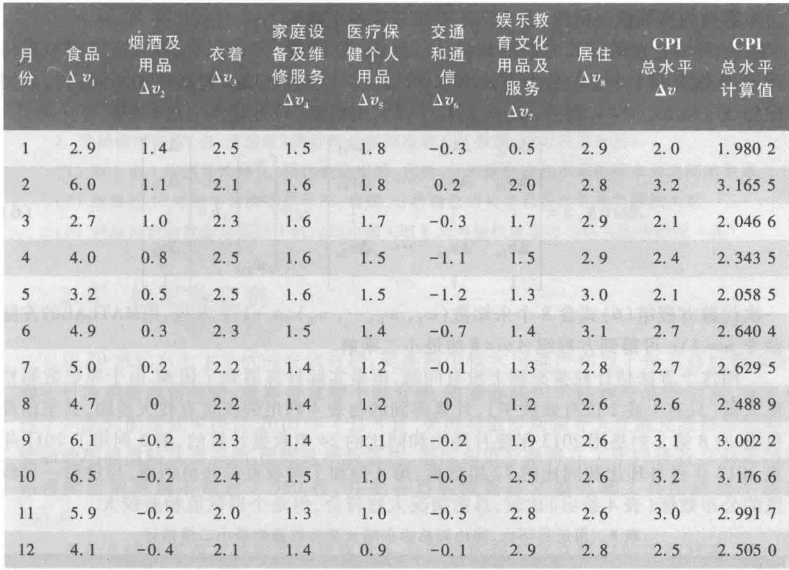

2. 利用每个月公布的环比和同比分类增长率  $\Delta v_{i}$  及其对CPI总水平  $\Delta v$  的影响,根据模型(4)计算权重,检查与原来的  $w_{i}$  是否相符.

在模型(4)中只考虑第  $i$  大类价格的变化  $\Delta v_{i}$  (即其他大类价格不变)对总水平的影响  $\Delta v$ ,可以得到

$$
w_{i} = \frac{\Delta v}{\Delta v_{i}}, \quad i = 1,2, \dots , 8 \tag{5}
$$

这里,  $w_{i}$  相当于多元函数  $v$  对自变量  $v_{i}$  的偏导数.

据国家统计局公布,2013年1月份食品价格环比上涨  $2.8\%$ ,影响居民消费价格总水平环比上涨约  $0.92\%$ ,食品价格同比上涨  $2.9\%$ ,影响居民消费价格总水平同比上涨约  $0.95\%$ .表7是2013年1月至12月公布的食品价格同比增长率  $\Delta v_{1}$  和影响居民消费价格总水平同比增长率  $\Delta v$ ,以及利用(5)式计算食品的权重  $w_{1}$ ,比表4给出的  $w_{1} = 0.317.9$  稍大.

表7 2013年1月至12月的食品同比增长率  $\Delta v_{1}$  和影响价格总水平同比增长率  $\Delta v$

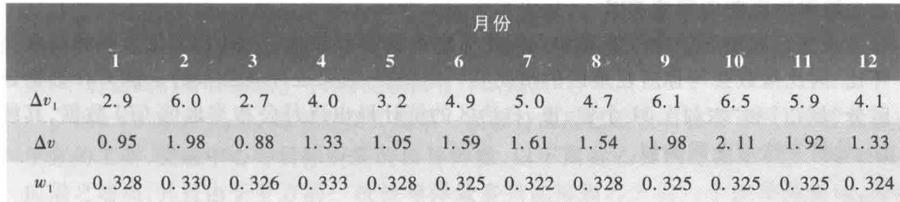

这个方法的优点是,如果数据完整,可以对各个权重  $w_{i}$  分别计算、校核。当然,由于公布数据的有效数字所限,舍入误差对结果有不小影响。

3. 利用公布的较长时期的数据  $\Delta v_{i}$  和  $\Delta v$ ,对模型(4)作拟合,对权重进行重新估计。设已收集到  $n$  个月的分类增长率  $\Delta v_{i}$  和总水平增长率  $\Delta v$  (包括环比和同比),分别记作  $\Delta v_{ik}$  和  $\Delta v_{k}(k = 1,2,\dots ,n,i = 1,2,\dots ,8)$ ,则模型(4)可写作

$$
A w = b,A = \left[ \begin{array}{c c c c}{\Delta v_{11}} & {\Delta v_{21}} & \dots & {\Delta v_{81}}\\ {\Delta v_{12}} & {\Delta v_{22}} & \dots & {\Delta v_{82}}\\ \vdots & \vdots & & \vdots \\ {\Delta v_{1n}} & {\Delta v_{2n}} & \dots & {\Delta v_{8n}}\\ 1 & 1 & \dots & 1 \end{array} \right],w = \left[ \begin{array}{c}{w_{1}}\\ {w_{2}}\\ \vdots \\ {w_{8}} \end{array} \right],b = \left[ \begin{array}{c}{\Delta v_{1}}\\ {\Delta v_{2}}\\ \vdots \\ {\Delta v_{8}}\\ 1 \end{array} \right] \tag{6}
$$

一次代数方程组(6)式含8个未知数  $(w_{1},w_{2},\dots ,w_{8})$ $n + 1$  个方程,用MATLAB的左除命令  $\scriptstyle w = \mathrm{A}\backslash \mathrm{b}$  可得到方程组  $A w = b$  的最小二乘解.

用这个方法估计权重原则上没有问题,但是实际计算遇到了困难。由于原始数据精度太低(只有1或2位有效数字),计算得到的与表4列出的权重有较大差距,甚至出现负值。表8第2列是用2013年逐月环比和同比的24组数据计算的,第3列用了2011年至2013年逐月环比和同比的72组数据,第4列加了对权重的非负约束,与最后一列权重的公布数据(表4给出)比较,总的情况大致符合,但是个别数值相差较大。

表8用逐月环比、同比和总水平增长率对权重的最小二乘估计  

<table><tr><td>权重</td><td>n=24(2013年)</td><td>n=72(2011—2013年)</td><td>n=72加非负约束</td><td>公布数据</td></tr><tr><td>w1</td><td>0.328 3</td><td>0.314 2</td><td>0.314 3</td><td>0.317 9</td></tr><tr><td>w2</td><td>-0.048 6</td><td>-0.003 5</td><td>0</td><td>0.034 9</td></tr><tr><td>w3</td><td>0.077 6</td><td>0.095 6</td><td>0.095 3</td><td>0.085 2</td></tr><tr><td>w4</td><td>0.032 3</td><td>0.083 4</td><td>0.081 7</td><td>0.056 4</td></tr><tr><td>w5</td><td>0.235 3</td><td>0.137 8</td><td>0.133 7</td><td>0.096 4</td></tr><tr><td>w6</td><td>0.115 7</td><td>0.069 3</td><td>0.069 8</td><td>0.099 5</td></tr><tr><td>w7</td><td>0.102 1</td><td>0.147 5</td><td>0.148 7</td><td>0.137 5</td></tr><tr><td>w8</td><td>0.159 4</td><td>0.142 6</td><td>0.143 9</td><td>0.172 2</td></tr></table>

评注 CPI是当今社会的热门词汇,各种媒体特别是互联网上有大量的报道和评论,但大多是经济政策方面的论述。从数据分析和数学建模角度看,资料较少且不够完整,编者只能根据查到的有限数据作了以上的解读。一定会有若干不足之处,读者可按照自己的理解和兴趣继续研究。

以上几种校核与估算各大类权重的方法也适用于各中类的权重,只要能得到各中类的环比和同比数据。

按照地区差别解读CPI

我国不同地区的经济发展和人们生活水平的差异较大,全国CPI总水平和各大类环比、同比指数会与你所在地区的情况有一定差距。国家统计局公布的全国CPI数据还区分"城市"和"农村",31个省、市、自治区的统计局也逐月公布当地的CPI数据,其统计、分析方法与全国类似。

1. 表 5、表 6 显示,2013 年 12 月全国 CPI 环比增长率比 11 月上升  $0.4\%$ ,而同比增长率比 11 月下降  $0.5\%$ ,如何解释?

2. 按照你所在省(市、自治区)统计局公布的当地 CPI 数据,进行以下分析:

(1)取 1 至 2 年逐月的环比、同比数据作图,观察、分析指数增长率和指数本身之间的关系。

(2)取最近 10 年的年价格指数作图,观察、分析指数增长率和指数本身之间的关系。

(3)利用得到的数据分析表 4 列出的全国 CPI 8 大类的权重是否与你当地的情况一样?

# 2.8 核军备竞赛

在 20 世纪六七十年代的冷战时期,美苏两个核大国都声称为了保卫自己的安全,而实行所谓核威慑战略,核军备竞赛不断升级。随着苏联的解体和冷战的结束,双方通过了一系列的核裁军协议。2010 年 4 月 8 日,美国与俄罗斯领导人在捷克首都布拉格签署新的削减战略武器条约。根据这项新条约,美国和俄罗斯将在 7 年内将各自部署的战略核武器削减到不超过 1550 枚,并把各自的战略核武器运载工具削减到不超过 700 枚。

在什么情况下双方的核军备竞赛才不会无限扩张而存在暂时的平衡状态,处于这种平衡状态下双方拥有最少的核武器数量是多大,这个数量受哪些因素影响,当一方采取诸如加强防御、提高武器精度、发展多弹头导弹等措施时,平衡状态会发生什么变化?本节将介绍一个定性的模型,在给核威慑战略做出一些合理、简化的假设下,对双方核武器的数量给以图形(结合式子)的描述,粗略地回答上述问题[7,24]。

模型假设以双方的(战略)核导弹数量为对象,描述双方核军备的大小,假定双方采取如下同样的核威慑战略:

1. 认为对方可能发起所谓第一次核打击,即倾其全部核导弹攻击己方的核导弹基地。

2. 己方在经受第一次核打击后,应保存有足够的核导弹,给对方的工业、交通中心等目标以毁灭性的打击。

在任一方实施第一次核打击时,假定一枚核导弹只能攻击对方的一个核导弹基地,且摧毁这个基地的可能性是常数,它由一方的攻击精度和另一方的防御能力所决定。

图的模型记  $y = f(x)$  为甲方拥有  $x$  枚核导弹时,乙方采取核威慑战略所需的最小核导弹数,  $x = g(y)$  为乙方拥有  $y$  枚核导弹时,甲方采取核威慑战略所需的最小核导弹数,不妨让我们看看曲线  $y = f(x)$  应该具有什么性质。

当  $x = 0$  时  $y = y_{0}, y_{0}$  是甲方在实施第一次核打击后已经没有核导弹时,乙方为毁灭甲方的工业、交通中心等目标所需的核导弹数,以下简称乙方的威慑值;当  $x$  增加时  $y$  应随之增加,并且由于甲方的一枚核导弹最多只能摧毁乙方的一个核导弹基地,所以  $y = f(x)$  不会超过直线。

$$
y = y_{0} + x \tag{1}
$$

这样,曲线  $y = f(x)$  应在图1所示的范围内,可以猜想它的大致形状如图2.

曲线  $x = g(y)$  应有类似的性质(  $y = 0$  时  $x = x_{0},x = g(y)$  不超过直线  $x = x_{0} + y$  ),图2中将两条曲线画在一起,可以知道它们会相交于一点,记交点为  $P(x_{m},y_{m})$  ,我们讨论  $P$  点的含义.

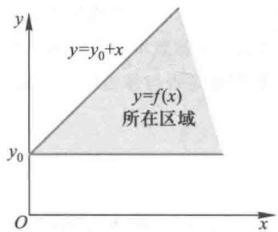  
图1 曲线  $y = f(x)$  的范围

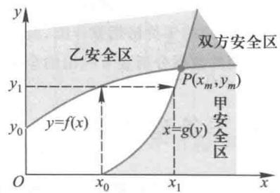  
图2 安全区、安全线和平衡点

根据  $y = f(x)$  的定义,当  $y\geqslant f(x)$  时乙方是安全的(在核威战略意义下),不妨称该区域为乙安全区,曲线  $y = f(x)$  为(临界情况下的)乙安全线.类似地,  $x\geqslant g(y)$  的区域为甲安全区,  $x = g(y)$  为甲安全线.两个安全区的公共部分即为双方安全区,是核军备竞赛的稳定区域,而  $P$  点的坐标  $x_{m}$  和  $y_{m}$  则为稳定状态下甲乙双方分别拥有的最小核导弹数,  $P$  点是平衡点.

平衡点怎样达到呢?不妨假定甲方最初只有  $x_{0}$  枚导弹(威限值),乙方为了自己的安全至少要拥有  $y_{1}$  枚导弹,见图2,而甲方为了安全需要将导弹数量增加到  $x_{1}$  ,如此下去双方的导弹数量就会趋向  $x_{m},y_{m}$

模型的精细化为了研究  $x_{m}$  和  $y_{m}$  的大小与哪些因素有关,这些因素改变时平衡点如何变动,我们尝试寻求  $y = f(x)$  和  $x = g(y)$  的具体形式.

若  $x< y$  ,当甲方以全部  $x$  枚核导弹攻击乙方的  $y$  个核基地中的  $x$  个时,记每个基地未被摧毁的概率为  $s$  ,以下简称乙方的残存率,则乙方(平均)有  $s x$  个基地未被摧毁,且有  $y - x$  个基地未被攻击,二者之和即为乙方经受第一次核打击后保存下来的核导弹数,它应该就是图的模型中的威限值  $y_{0}$  ,即  $y_{0} = s x + y - x$  ,于是

$$
y = y_{0} + (1 - s)x \tag{2}
$$

由  $0< s< 1$  知直线(2)的斜率小于直线(1)的斜率,如图3.

当  $x = y$  时显然有  $y_{0} = s y$  ,所以有

$$
y = \frac{y_{0}}{s} \tag{3}
$$

若  $y< x< 2y$  ,当甲方以全部  $x$  枚核导弹攻击乙方的 $y$  个核基地时,乙方的  $x - y$  个将被攻击2次,其中  $s^{2}(x-$ $y$  )个未被摧毁,且有  $y - (x - y) = 2y - x$  个被攻击1次,其中  $s(2y - x)$  个未被摧毁,二者之和即为图的模型中的 $y_{0}$  ,即  $y_{0} = s^{2}(x - y) + s(2y - x)$  ,于是

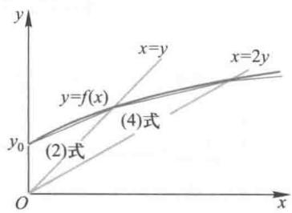  
图3 曲线  $y = f(x)$  的形成

$$
y = \frac{y_{0}}{s(2 - s)} +\frac{1 - s}{2 - s} x \tag{4}
$$

直线(4)的斜率小于直线(2)的斜率,如图3.

当  $x = 2y$  时显然有  $y_{0} = s^{2}y$  ,所以有

$$
y = \frac{y_{0}}{s^{2}} \tag{5}
$$

虽然上述过程可以继续下去,但是如果我们允许  $x,y$  取连续值,考察  $x = a y,a$  为大于零的任意实数,表示乙(临界)安全条件下甲乙双方导弹数量之比,那么由  $x = y$  时的(3)式和  $x = 2y$  时的(5)式可以设想  $y = f(x)$  的形式为  $①$

$$
y = \frac{y_{0}}{s^{a}} = \frac{y_{0}}{s^{x / y}},0< s< 1 \tag{6}
$$

它应该是图3中的光滑曲线,利用微积分的知识可以证明这是一条上凸的曲线

$x = g(y)$  有类似的形式,曲线是向右凸的,当然,其中的  $s$  应为甲方的残存率

由此可知,这样两条曲线  $y = f(x)$  和  $x = g(y)$  必定相交,并且交点唯一

进一步研究由(6)式表示的乙安全线  $y = f(x)$  的性质(复习题1):

若威模值  $y_{0}$  变大,则曲线整体上移,且变陡;若残存率  $s$  变大,则曲线变平

甲安全线  $x = g(y)$  有类似的性质.利用这些性质可以用上述模型解释核军备竞赛中平衡点  $P(x_{m},y_{m})$  的变化

模型解释

1. 若甲方增加经费保护及疏散工业、交通中心等目标,则乙方的威模值  $y_{0}$  将变大,而其他因素不变,那么乙安全线  $y = f(x)$  的上移会使平衡点变为  $P^{\prime}(x_{m}^{\prime},y_{m}^{\prime})$  ,如图4.显然有  $x_{m}^{\prime} > x_{m},y_{m}^{\prime} > y_{m}$  ,说明虽然甲方的防御是被动的,但也会使双方的军备竞赛升级.

2. 若甲方将原来的固定核导弹基地改进为可移动发射架,则乙安全线  $y = f(x)$  不变(试说明其威模值  $y_{0}$  、残存率  $s$  均不变),而甲方的残存率变大(威模值  $x_{0}$  不变),于是甲安全线  $x = g(y)$  向  $y$  轴靠近,平衡点变为  $P^{\prime}(x_{m}^{\prime},y_{m}^{\prime})$  ,如图5.显然有  $x_{m}< x_{m},y_{m}^{\prime}< y_{m}$  ,说明甲方的这种单独行为,会使双方的核导弹减少

3. 若双方都发展多弹头导弹,每个弹头可以独立地摧毁目标,设  $x,y$  仍为双方核导弹的数量,则双方的

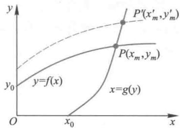  
图4模型解释1的示意图

威模值  $x_{0},y_{0}$  和残存率均减小.乙安全线由于  $y_{0}$  的减小而下移且变平,又由于残存率的变小,使曲线变陡.甲安全线有类似的变化,二者的综合影响则可能使平衡点变为  $P^{\prime}(x_{m}^{\prime},y_{m}^{\prime})$  或  $P^{\prime \prime}(x_{m}^{\prime \prime},y_{m}^{\prime \prime})$  ,出现图6所示的两种情况,究竟会使双方的核导弹增加还是减少,需要更多的信息及更详细的分析.

评注核军备竞赛问题初看起来似乎与数学无缘,但是如果把所谓核威模战略作一些合理、简化的假设,就能够用一个简单的图的模型,来描述双方核武器数量相互制约,达到平衡的过程本节还通过更精细的分析找到影响安全曲线的参

数: 威慑值和残存率, 给出了曲线的表达式, 并由此对核军备竞赛中的一些现象做出解释, 这种由粗及细、从定性到定量(在一定程度上)的建模方法是值得借鉴的.

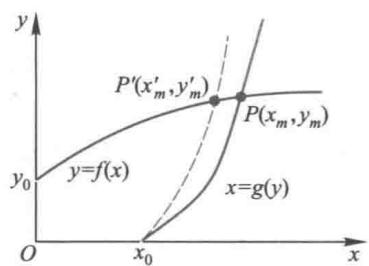  
图5 模型解释2的示意图

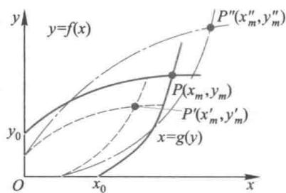  
图6 模型解释3的示意图

# 复习题

1. 在核军备竞赛模型中, 证明由(6)式表示的乙安全线  $y = f(x)$  的性质.

2. 在核军备竞赛模型中, 讨论以下因素引起的平衡点的变化[24]:

(1) 甲方提高导弹导航系统的性能.

(2) 甲方增加导弹爆破的威力.

(3) 甲方发展电子干扰系统.

(4) 双方建立反导弹系统.

# 2.9 扬帆远航

海面上东风劲吹, 帆船要从  $A$  点驶向正东方的  $B$  点(图1). 稍有常识的人都知道, 为了借助风力, 船应该先朝东北方向前进, 然后再转向东南方, 才能到达  $B$  点. 这里要解决的问题是, 确定起航时的航向  $\theta$  (与正东方向的夹角) 及帆的朝向  $\alpha$  (帆面与航向的夹角)[76].

模型分析 帆船在航行过程中既受到风通过帆对船的推力, 又受到风对船体的阻力, 需要对这两种力作合理、简化的分解, 找出它们在航向的分力(图2).

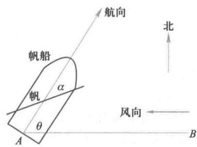  
图1 帆船航行示意图

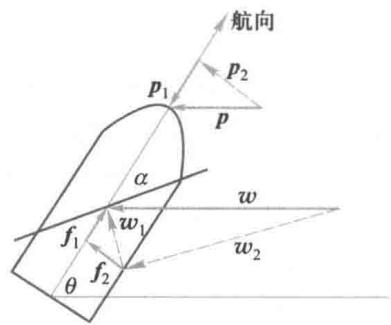  
图2 帆船受力分析图

风的推力  $\boldsymbol{w}$  分解为  $\boldsymbol{w} = \boldsymbol{w}_{1} + \boldsymbol{w}_{2}$ , 其中  $\boldsymbol{w}_{1}$  垂直于帆,  $\boldsymbol{w}_{2}$  平行于帆.  $\boldsymbol{w}_{1}$  又分解为  $\boldsymbol{w}_{1} = \boldsymbol{f}_{1} + \boldsymbol{f}_{2}, \boldsymbol{f}_{1}$  即为风在航向的推力. 风的阻力  $p$  分解为  $p = p_{1} + p_{2}$ , 其中  $p_{1}$  为风在航向的阻力. 因为  $f_{1}$  和  $p_{1}$  的方向相反, 所以船受到的净推力为  $f_{1} - p_{1}$ .

按照流体力学的知识, 在航行速度不大的情况下, 航速与净推力成正比. 于是航向  $\theta$

和帆的朝向  $\alpha$  的确定,应该使船在正东方向的速度,即净推力在正东方向的分力达到最大。

模型假设 记帆的迎风面积为  $s_{1}$ ,船的迎风面积为  $s_{2}$ 。

1. 风通过帆对船的推力  $w$  与  $s_{1}$  成正比,风对船体的阻力  $p$  与  $s_{2}$  成正比,比例系数相同(记作  $k$ ),且  $s_{1}$  远大于  $s_{2}$ 。

2.  $\boldsymbol{w}$  的分力  $\boldsymbol{w}_{2}$  与帆面平行,可以忽略。

3. 分力  $f_{2}$  和  $p_{2}$  垂直于船身,可以被船舵抵消,不予考虑。

4. 航速  $\boldsymbol{w}$  与净推力  $f = f_{1} - p_{1}$  成正比,比例系数记作  $k_{1}$ 。

模型建立 根据模型假设和图2表示的各个力之间的几何关系,容易得到

$$
w = k s_{1}, \quad p = k s_{2} \tag{1}
$$

$$
w_{1} = w \sin (\theta - \alpha), \quad f_{1} = w_{1} \sin \alpha = w \sin (\theta - \alpha) \sin \alpha \tag{2}
$$

$$
p_{1} = p \cos \theta \tag{3}
$$

$$
v = k_{1}(f_{1} - p_{1}) \tag{4}
$$

记船在正东方向的速度分量为  $v_{1}$ ,则

$$
v_{1} = v \cos \theta = k_{1}(f_{1} - p_{1}) \cos \theta \tag{5}
$$

问题是确定  $\theta$  和  $\alpha$ ,使  $v_{1}$  最大。

模型求解 这本来是一个二元函数的极值问题,但是由(3),(5)式知, $p_{1}$  与  $\alpha$  无关,首先只需在  $\theta$  固定时使  $f_{1}$  最大,解出  $\alpha$ ,然后再求  $\theta$  使  $v_{1}$  最大。用初等数学的办法即可求解。

由(2)式  $,f_{1}$  可化为

$$
f_{1} = w[\cos (\theta - 2\alpha) - \cos \theta ] / 2 \tag{6}
$$

所以当

$$
\alpha = \theta /2 \tag{7}
$$

时

$$
f_{1} = w(1 - \cos \theta) / 2 \tag{8}
$$

最大。

将(7),(8),(3)代入(5)式得

$$
\begin{array}{r l} & {v_{1} = k_{1}\left[w\left(1 - \cos \theta\right) / 2 - p\cos \theta \right]\cos \theta}\\ & {\quad = \left(k_{1}w / 2\right)\left[1 - \left(1 + 2p / w\right)\cos \theta \right]\cos \theta} \end{array} \tag{9}
$$

注意到(1)式,记

$$
k_{2} = k_{1}w / 2,\quad t = 1 + 2p / w = 1 + 2s_{2} / s_{1} \tag{10}
$$

则(9)式为

$$
v_{1} = k_{2}(1 - t \cos \theta) \cos \theta = k_{2} t \left[ \frac{1}{4 t^{2}} - \left(\cos \theta - \frac{1}{2 t}\right)^{2} \right] \tag{11}
$$

显然

$$
\cos \theta = 1 / 2 t \tag{12}
$$

时  $v_{1}$  最大。由(10)式,且  $s_{1}$  远大于  $s_{2}$ ,可知

$$
1 / 4 < \cos \theta < 1 / 2, \quad 60^{\circ} < \theta < 75^{\circ} \tag{13}
$$

结果分析 航向  $\theta$  角应在  $60^{\circ}$  和  $75^{\circ}$  之间(具体数值取决于  $s_{1}$  和  $s_{2}$  的比值),帆的

朝向  $\alpha$  角为  $\theta$  的一半, 这是从  $A$  点出发时的航向及帆的朝向. 行驶中  $B$  点将不在船的正东方, 上述结论不再成立, 所以应该不断调整  $\theta$  和  $\alpha$ , 才能尽快地到达  $B$  点.

# 复习题

若风向不变, 行驶中  $B$  点将不在船的正东方, 应该如何确定航向及帆的朝向.

# 2.10 节水洗衣机

我国淡水资源有限, 节约用水人人有责. 洗衣在家庭用水中占有相当大的份额, 目前洗衣机已非常普及, 节约洗衣机用水十分重要. 假设在放入衣物和洗涤剂后洗衣机的运行过程为: 加水一漂洗一脱水一加水一漂洗一脱水……(称"加水一漂洗一脱水"为运行一轮). 请为洗衣机设计一种程序(包括运行多少轮, 每轮加水量等), 使在满足一定洗涤效果的条件下, 总用水量最少. 选用合理的数据进行计算. 对照目前常用的洗衣机的运行情况, 对你的模型做出评价(引自1996年全国大学生数学建模竞赛B题).

问题分析 不论是用手洗衣、洗菜, 还是使用洗衣机, 甚至工业品、矿产品的清洗, 都存在一个在洗净污物的前提下, 尽量节省水的问题. 因为机器比人能够更精确地控制用水量和洗涤过程, 洗衣机又是人人熟悉的家用电器, 所以用所谓"节水洗衣机"来研究这样一类应用广泛的实际问题, 是具有相当代表性的.

洗衣机运行的基本过程可以简述为: 开始时将待洗的衣物和洗涤剂一起放入缸内, 加入水后启动洗衣机. 在漂洗中通过洗涤剂的物理化学作用, 将附着在衣物上的污物溶于水中, 再脱去含有污物的污水, 构成一个"加水一漂洗一脱水"环节, 称为一轮. 一轮后残留在衣物上的污物自然有所减少, 但若尚未达到洗净的效果, 就需要再来一轮. 如此循环, 直到衣物上的污物减少到相对清洁、可以为人们接受的程度. 在现实生活中, 洗衣机大多是运行2轮或3轮, 建模过程中应该考虑这个实际情况. 至于通常洗衣机运行的最后一步——甩干或烘干, 不在本文的讨论范围之内.

需要指出的是, 开始洗衣时一次性加入的洗涤剂固然能帮助衣物上的污物溶解于水, 但它本身也是不希望留在衣物上的东西, 因此不妨将"污物"视为衣物上原有的污物与留在衣物上的洗涤剂的总和, 下文中的污物就照此理解.

此外, 洗涤剂溶解污物的过程涉及物理化学的微观机制, 超出这个问题的研究范围, 我们只需从宏观层面上认为, 在每一轮运行中污物都已充分溶于水中, 形成一定的浓度. 通过一轮一轮地加水和脱水, 使污物浓度不断降低.

模型假设 根据对洗衣机运行过程的分析, 结合实际情况做出以下合理的简化假设:

1. 洗衣机的运行以"加水一漂洗一脱水"为一轮, 每轮漂洗后衣物上的污物全部均匀地溶于水中.

2. 与每轮的加水量相比, 每轮脱水后衣物仍含少量的水, 且每轮的含水量为常数.

3. 每轮脱水前和脱水后污物在水中的浓度保持不变.

4. 洗衣机通常运行2轮或3轮, 最多不超过4轮.

5. 相对于初始(洗涤前)衣物含有的污物,洗涤后只能达到相对的清洁,所以规定,最后一轮脱水后衣物的污物含量与衣物的初始污物含量之比(简称污物比),需不超过某个给定的数值.

6. 建立模型的目标是,在满足衣物污物比的条件下,确定洗衣机运行多少轮(在2至4轮范围内)及每轮的加水量,使总的用水量最少.

需要说明的是,由于洗衣机缸体容积的限制及加水需浸没衣物的要求,每轮加水量应该有一个上限和一个下限.为了模型求解的简便,我们先不考虑这个限制条件来建立模型,再在对模型结果的解释中给以讨论.

模型建立设洗衣机共运行  $n$  轮  $(n = 2,3,4)$ . 记  $u_{k}$  为第  $k$  轮加水量,  $x_{k}$  为第  $k$  轮脱水后污物含量  $(k = 1,2,\dots ,n)$ ,  $x_{0}$  为初始污物含量,常数  $c$  为每轮脱水后衣物的含水量,  $\epsilon$  为给定的污物比.

污物浓度是单位容积水中的污物含量,根据假设1、2和假设3关于每轮脱水前后污物浓度保持不变的特性,有

$$
\frac{x_{0}}{u_{1}} = \frac{x_{1}}{c}, \frac{x_{1}}{u_{2} + c} = \frac{x_{2}}{c}, \dots , \frac{x_{n - 1}}{u_{n} + c} = \frac{x_{n}}{c} \tag{1}
$$

经代数运算可得

$$
\frac{x_{n}}{x_{0}} = \frac{c^{n}}{u_{1}(u_{2} + c) \cdots(u_{n} + c)} \tag{2}
$$

根据假设5应有  $x_{n} / x_{0} \leqslant \epsilon$ ,即

$$
\frac{c^{n}}{u_{1}(u_{2} + c) \cdots(u_{n} + c)} \leqslant \epsilon \tag{3}
$$

总的用水量等于每轮加水量之和,记作  $z$ ,即

$$
z = \sum_{k = 1}^{n} u_{k} \tag{4}
$$

按照假设6,我们建模的目标函数是,在(3)式条件下确定洗衣机运行轮数  $n (= 2,3,4)$  和每轮加水量  $u_{k}(k = 1,2,\dots ,n)$ ,使(4)式的总用水量  $z$  最少,其中每轮脱水后衣物含水量  $c$  和污物比  $\epsilon$  是已知常数.

模型简化根据假设2,  $c$  与  $u_{k}$  相比较小,(3)式可简化为

$$
\frac{c^{n}}{\prod_{k = 1}^{n} u_{k}} \leqslant \epsilon \tag{5}
$$

要使(4)式的  $z$  最小,每轮加水量  $u_{k}$  应该尽量小,所以(5)式必为等式,可以写成

$$
\prod_{k = 1}^{n} u_{k} = a \tag{6}
$$

其中  $a = c^{n} / \epsilon$ .注意到对于每个固定的  $n (= 2,3,4)$ ,(4)式右端与(6)式左端分别相当于  $n$  个  $u_{k}$  的算术平均值与几何平均值(分别相差因子  $1 / n$  与幂次  $1 / n$ ,不影响下面的结论),根据论据:"  $n$  个数的几何平均值小于或等于算术平均值,当且仅当  $n$  个数相等时等号成立",可知(4)式和(6)式的解  $u_{k}(k = 1,2,\dots ,n)$  必全相等,即每轮加水量是一个固定值,记作  $u$ .于是(4)式和(6)式分别简化为

$$
z = n u \tag{7}
$$

$$
u^{n} = c^{n} / \epsilon \tag{8}
$$

问题则简化为求  $u$  和  $n$  (在2,3,4中取值)使  $z$  最小.

回顾从(3)式到(5)式的简化,不妨认为,由(7)式和(8)式得到的  $u$  是第1轮加水量,此后各轮的加水量应减掉一个  $c$  (脱水后衣物的含水量).

模型求解 简化后的(7)式和(8)式能够用初等方法求解.

由于  $n$  取有限个离散值,可以先固定  $n$ ,从(8)式解出  $u = \frac{c}{\epsilon^{1 / n}}$ ,再代入(7)式得  $z = n \frac{c}{\epsilon^{1 / n}}$ . 对于给定的  $c, \epsilon$ ,令  $n = 2,3,4$ ,通过总用水量  $z$  的比较确定  $u$  和  $n$  的解.

注意到  $u$  和  $n$  的表达式中  $c$  以独立因子出现,我们可以将其记为

$$
u = \mu_{n} c, \quad \mu_{n} = \frac{1}{\epsilon^{1 / n}} \tag{9}
$$

$$
z = \lambda_{n} c, \quad \lambda_{n} = \frac{n}{\epsilon^{1 / n}} \tag{10}
$$

对于固定的  $c$ ,数值  $\mu_{n}$  和  $\lambda_{n}$  直接反映了每轮加水量和总用水量的大小.

不妨设定若干个污物比  $\epsilon$  (从  $0.5\%$  到  $10\%$ ),对于  $n = 2,3,4$ ,按照(9)式和(10)式计算  $\mu_{n}$  和  $\lambda_{n}$ ,结果如表1和图1.

表1不同污物比  $\epsilon$  下的  $\mu_{n}$  和  $\lambda_{n}\left(n = 2,3,4\right)$  

<table><tr><td>ε</td><td>0.5%</td><td>1%</td><td>2%</td><td>5%</td><td>10%</td></tr><tr><td>μ2</td><td>14.2</td><td>10.0</td><td>7.1</td><td>4.5</td><td>3.2</td></tr><tr><td>μ3</td><td>5.8</td><td>4.6</td><td>3.7</td><td>2.7</td><td>2.2</td></tr><tr><td>μ4</td><td>3.8</td><td>3.2</td><td>2.7</td><td>2.1</td><td>1.8</td></tr><tr><td>λ2</td><td>28.3</td><td>20.0</td><td>14.2</td><td>8.9</td><td>6.3</td></tr><tr><td>λ3</td><td>17.5</td><td>13.9</td><td>11.1</td><td>8.1</td><td>6.5</td></tr><tr><td>λ4</td><td>15.0</td><td>12.6</td><td>10.6</td><td>8.5</td><td>7.1</td></tr></table>

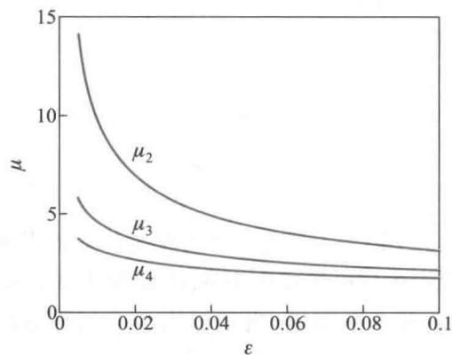  
(a) 不同污物比  $\epsilon$  下的  $\mu_{n}(n = 2,3,4)$

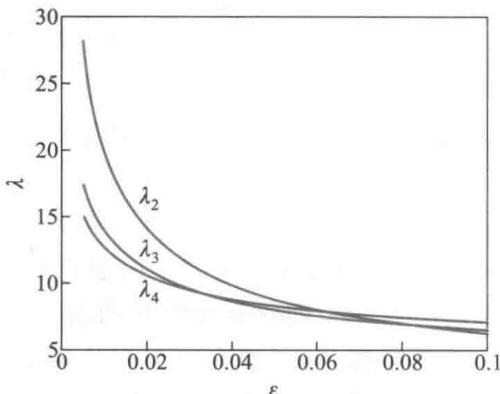  
(b) 不同污物比  $\epsilon$  下的  $\lambda_{n}(n = 2,3,4)$  图1

从表1和图1可以看出,当对衣物的清洁程度要求较高时(污物比  $\epsilon$  不超过  $2\%$ ), 洗衣机运行4轮的总用水量最少,而当清洁程度要求较低时(污物比  $\epsilon$  大于  $5\%$ ),洗衣机总用水量都差不多,可能运行3轮更合适。

模型讨论在模型假设中曾经提到,由于洗衣机缸体容积的限制,每轮加水量应该有一个上限,记作  $u_{\mathrm{max}}$ ,又由于加水需浸没衣物便于漂洗的要求,每轮加水量应该有一个下限,记作  $u_{\mathrm{min}}$ 。那么,上面的模型简化后得到的加水量  $u$  是否满足上下限的限制呢?

从(9)式可知,加水量  $u$  正比于脱水后衣物的含水量  $c$ ,而  $c$  的大小与洗涤前衣物本身的重量和质地有关。记洗涤前衣物重量为  $w$ ,可以合理地假设脱水后衣物的含水量  $c = aw$ , $a$  是单位重量衣物脱水后的含水量。加水量下限  $u_{\mathrm{min}}$  由浸没衣物以便漂洗的需要决定,类似地可以假设  $u_{\mathrm{min}} = bw$ , $b$  是单位重量衣物浸泡所需的水量。 $a$  和  $b$  主要取决于衣物的质地,但其变化范围不会太大。 $a$  和  $b$  的数值可以通过实验大致确定。

从以上分析及(9)式可知,要使加水量  $u$  满足下限  $u_{\mathrm{min}}$  的限制,只需  $\mu_{n}a \geq b$ 。按照表1中洗衣机运行3轮的数据  $\mu_{3}$ ,对衣物的清洁程度要求较高时,这个条件大体上能够满足。

按照上面的分析不难看出,只需对洗涤衣物的重量加以控制,加水量上限  $u_{\mathrm{max}}$  的限制就可以满足。

实际上,有些洗衣机开始运行时先通过空转对衣物重量进行自动量测,这相当于对含水量  $c$  和下限  $u_{\mathrm{min}}$  做出估计,再按照衣物的重量范围采用不同的程序运行,如不同的加水量,甚至不同的轮数。

至于题目中提出的选用合理的数据进行计算,对照目前洗衣机运行情况对模型做出评价的工作就留给读者了。

1. 对于模型(3),(4)式考虑  $n = 2$  的情况,不作简化直接用初等方法求解,与(9),(10)式的结果比较。

2. 对于模型(3),(4)式考虑  $n = 3$  的情况,设第2,3轮的加水量相同,不作简化直接求解(可用微积分),与(9),(10)式的结果比较。

3. 如果将模型假设1的"每轮漂洗后衣物上的污物全部均匀地溶于水中",改为"每轮漂洗后衣物上只有一定比例的污物均匀地溶于水中",重新建立模型,讨论如何求解。

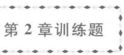

1. 在超市购物时你注意到大包装商品比小包装商品便宜这种现象了吗?比如佳洁士牙膏  $120 \mathrm{~g}$  装的每支10.80元,  $200 \mathrm{~g}$  装的每支15.80元,二者单位质量的价格比是  $1.14:1$ 。试用比例方法构造模型解释这个现象。

(1)分析商品价格  $c$  与商品质量  $w$  的关系。价格由生产成本、包装成本和其他成本等决定,这些

成本中有的与质量  $w$  成正比,有的与表面积成正比,还有与  $w$  无关的因素。

(2)给出单位质量价格  $c$  与  $w$  的关系,画出它的简图,说明  $w$  越大  $c$  越小,但是随着  $w$  的增加  $c$  减小的程度变小。解释实际意义是什么。

2. 一垂钓俱乐部鼓励垂钓者将钓上的鱼放生,打算按照放生的鱼的质量给予奖励,俱乐部只准备了一把软尺用于测量,请你设计按照测量的长度估计鱼的质量的方法。假定鱼池中只有一种鲈鱼,并且得到8条鱼的如下数据(胸围指鱼身的最大周长):

<table><tr><td>身长/cm</td><td>36.8</td><td>31.8</td><td>43.8</td><td>36.8</td><td>32.1</td><td>45.1</td><td>35.9</td><td>32.1</td></tr><tr><td>质量/g</td><td>765</td><td>482</td><td>1 162</td><td>737</td><td>482</td><td>1 389</td><td>652</td><td>454</td></tr><tr><td>胸围/cm</td><td>24.8</td><td>21.3</td><td>27.9</td><td>24.8</td><td>21.6</td><td>31.8</td><td>22.9</td><td>21.6</td></tr></table>

先用机理分析建立模型,再用数据确定参数[24]

3. 用已知尺寸的矩形板材加工半径一定的圆盘,给出几种简便、有效的排列方法,使加工出尽可能多的圆盘[17]

4. 动物园里的成年热血动物靠饲养的食物维持体温基本不变,在一些合理、简化的假设下建立动物的饲养食物量与动物的某个尺寸之间的关系[24]

5. 生物学家认为,对于休息状态的热血动物,消耗的能量主要用于维持体温,能量与从心脏到全身的血流量成正比,而体温主要通过身体表面散失,建立一个动物体重(单位:g)与心率(单位:次/min)之间关系的模型,并用下面的数据加以检验[24]

<table><tr><td>动物</td><td>体重</td><td>心率</td></tr><tr><td>田鼠</td><td>25</td><td>670</td></tr><tr><td>家鼠</td><td>200</td><td>420</td></tr><tr><td>兔</td><td>2 000</td><td>205</td></tr><tr><td>小狗</td><td>5 000</td><td>120</td></tr><tr><td>大狗</td><td>30 000</td><td>85</td></tr><tr><td>羊</td><td>50 000</td><td>70</td></tr><tr><td>人</td><td>70 000</td><td>72</td></tr><tr><td>马</td><td>450 000</td><td>38</td></tr></table>

6. 你能针对估计出租车数量问题提出自己的模型吗?如果有,通过模拟与2.5节5个模型作比较。

# 更多案例……

2- 1 光盘的数据容量

2- 2 污水均流池的设计

2- 3 信号灯控制的十字路口的通行能力与车速线性模型

2- 4 天气预报的评价

# 第3章 简单的优化模型

优化问题可以说是人们在工程技术、经济管理和科学研究等领域中最常遇到的一类问题.设计师要在满足强度要求等条件下选择材料的尺寸,使结构总质量最轻;公司经理要根据生产成本和市场需求确定产品价格,使所获利润最高;调度人员要在满足物资需求和装载条件下安排从各供应点到各需求点的运量和路线,使运输总费用最低;投资者要选择一些股票、债券"下注",使收益最大,而风险最小.

有些人习惯于依赖过去的经验解决面临的优化问题,认为这样切实可行,并且没有太大的风险.但是这种处理过程常常会融入决策者太多的主观因素,从而无法确认结果的最优性.也有些人习惯于作大量的试验反复比较,认为这样真实可靠.但是显然需要花费很多资金和人力,而且得到的最优结果基本上跑不出原来设计的试验范围.

第3,4两章讨论的是用数学建模的方法来处理优化问题,即建立和求解所谓优化模型.虽然由于建模时要作适当的简化,可能使得结果不一定完全可行或达到实际上的最优,但是它基于客观规律和数据,又不需要多大的费用.如果在建模的基础上再辅之以适当的经验和试验,就可以期望得到实际问题的一个比较圆满的回答.在决策科学化、定量化的呼声日益高涨的今天,这无疑是符合时代潮流和形势发展需要的.

本章介绍较简单的优化模型,归结为微积分中的函数极值问题,可以直接用微分法求解.

当你打算用数学建模方法来处理一个优化问题的时候,首先要确定优化的目标是什么,寻求的决策是什么,决策受到哪些条件的限制(如果有限制的话),然后用数学工具(变量、常数、函数等)表示它们.当然,在这个过程中要对实际问题作若干合理的简化假设.最后,在用微分法求出最优决策后,要对结果作一些定性、定量的分析和必要的检验.让我们通过下面的实例说明建立优化模型的过程.

# 3.1 存贮模型

工厂定期订购原料,存入仓库供生产之用;车间一次加工出一批零件,供装配线每天生产之需;商店成批购进各种商品,放在货柜里以备零售;水库在雨季蓄水,用于旱季的灌溉和发电.显然,这些情况下都有一个贮存量多大才合适的问题.贮存量过大,贮存费用太高;贮存量太小,会导致一次性订购费用增加,或不能及时满足需求.

本节在需求量稳定的前提下讨论两个简单的存贮模型:不允许缺货模型和允许缺货模型.前者适用于一旦出现缺货会造成重大损失的情况(如炼铁厂对原料的需求),后者适用于像商店购货之类的情形,缺货造成的损失可以允许和估计[63,84].

不允许缺货的存贮模型

先考察这样的问题:配件厂为装配线生产若干种部件,轮换生产不同的部件时因更换设备要付生产准备费(与生产数量无关),同一部件的产量大于需求时因积压资金、占用仓库要付贮存费.今已知某一部件的日需求量100件,生产准备费5000元,贮存费

每日每件 1 元。如果生产能力远大于需求,并且不允许出现缺货,试安排该产品的生产计划,即多少天生产一次(称为生产周期),每次产量多少,可使平均每天总费用最小。

问题分析 让我们试算一下:

若每天生产一次,每次 100 件,无贮存费,生产准备费 5000 元,每天费用 5000 元;

若 10 天生产一次,每次 1000 件,贮存费  $900 + 800 + \dots +100 = 4500$  元,生产准备费 5000 元,总计 9500 元,平均每天费用 950 元;

若 50 天生产一次,每次 5000 件,贮存费  $4900 + 4800 + \dots +100 = 122500$  元,生产准备费 5000 元,总计 127500 元,平均每天费用 2550 元。

虽然从以上结果看,10 天生产一次比每天和 50 天生产一次的费用少,但是,要得到准确的结论,应该建立生产周期、产量与需求量、生产准备费、贮存费之间的关系,即数学建模。

从上面的计算看,生产周期短、产量少,会使贮存费小,准备费大;而周期长、产量多,会使贮存费大,准备费小。所以必然存在一个最佳的周期,使平均每天总费用最小。显然,应该建立一个优化模型。

一般地,考察这样的不允许缺货的存贮模型:产品需求稳定不变,生产准备费和产品贮存费为常数、生产能力无限、不允许缺货,确定生产周期和产量,使每天费用最小。

模型假设为了处理的方便,考虑连续模型,即设生产周期  $T$  和产量  $Q$  均为连续量。根据问题性质作如下假设:

1. 产品每天的需求量为常数  $r$ 。

2. 每次生产准备费为  $c_{1}$ ,每天每件产品贮存费为  $c_{2}$ 。

3. 生产能力为无限大(相对于需求量),当贮存量降到零时, $Q$  件产品立即生产出来供给需求,即不允许缺货。

模型建立将贮存量表示为时间  $t$  的函数  $q(t), t = 0$  生产  $Q$  件,贮存量  $q(0) = Q$ , $q(t)$  以需求速率  $r$  递减,直到  $q(T) = 0$ ,如图 1。显然有

$$
Q = r T \tag{1}
$$

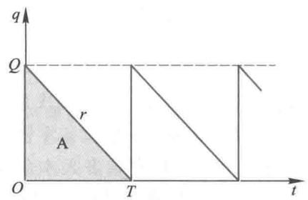  
图 1 不允许缺货模型的贮存量  $q(t)$

一个周期内的贮存费是  $c_{2} \int_{0}^{T} q(t) \mathrm{d}t$ ,其中积分恰等于图 1 中三角形 A 的面积  $QT / 2$ 。因为一个周期的准备费是  $c_{1}$ ,再注意到(1)式,得到一个周期的总费用为

$$
\overline{C} = c_{1} + c_{2} QT / 2 = c_{1} + c_{2} rT^{2} / 2 \tag{2}
$$

于是每天的平均费用是

$$
C(T) = \bar{C} /T = c_{1} / T + c_{2}r T / 2 \tag{3}
$$

(3)式为这个优化模型的目标函数。

模型求解 求  $T$  使(3)式的  $c$  最小。容易得到

$$
T = \sqrt{\frac{2c_{1}}{c_{2}r}} \tag{4}
$$

代入(1)式可得

$$
Q = \sqrt{\frac{2c_{1}r}{c_{2}}} \tag{5}
$$

由(3)式算出最小的每天费用为

$$
C = \sqrt{2c_{1}c_{2}r} \tag{6}
$$

(4),(5)式是经济学中著名的经济订货批量公式(EOQ公式)

结果解释 由(4),(5)式可以看到,当准备费  $c_{1}$  增加时,生产周期和产量都变大;当贮存费  $c_{2}$  增加时,生产周期和产量都变小;当需求量  $r$  增加时,生产周期变小而产量变大。这些定性结果都是符合常识的。当然,(4),(5)式的定量关系(如平方根、系数2等)凭常识是无法猜出的,只能由数学建模得到。

用得到的模型计算本节开始的问题:以  $c_{1} = 5000, c_{2} = 1, r = 100$  代入(4),(6)式可得  $T = 10$  天,  $C = 1000$  元。这里得到的费用  $C$  与前面计算的950元有微小的差别,你能解释吗?

敏感性分析 讨论参数  $c_{1}, c_{2}, r$  有微小变化时对生产周期  $T$  的影响。

用相对改变量衡量结果对参数的敏感程度,  $T$  对  $c_{1}$  的敏感度记作  $S(T, c_{1})$  ,定义为

$$
S(T,c_{1}) = \frac{\Delta T / T}{\Delta c_{1} / c_{1}}\approx \frac{\mathrm{d}T}{\mathrm{d}c_{1}}\frac{c_{1}}{T} \tag{7}
$$

由(4)式容易得到  $S(T, c_{1}) = 1 / 2$ 。做类似的定义并可得到  $S(T, c_{2}) = - 1 / 2, S(T, r) = - 1 / 2$  即  $c_{1}$  增加  $1\% , T$  增加  $0.5\%$  ,而  $c_{2}$  或  $r$  增加  $1\% , T$  减少  $0.5\% . c_{1}, c_{2}, r$  的微小变化对生产周期  $T$  的影响是很小的。

思考

1. 建模中未考虑生产费用(这应是最大的一笔费用),在什么条件下才可以不考虑它(复习题1)?

2. 建模时作了"生产能力为无限大"的简化假设,如果生产能力有限,是大于需求量的一个常数,如何建模(复习题2)?

允许缺货的存贮模型

在某些情况下用户允许短时间的缺货,虽然这会造成一定的损失,但是如果损失费不超过不允许缺货导致的准备费和贮存费的话,允许缺货就应该是可以采取的策略。

模型假设 下面讨论一种较简单的允许缺货模型:不允许缺货模型的假设1,2不变,假设3改为:

3a.生产能力为无限大(相对于需求量),允许缺货,每天每件产品缺货损失费为  $c_{3}$  但缺货数量需在下次生产(或订货)时补足。

模型建立 因贮存量不足造成缺货时,可认为贮存量函数  $q(t)$  为负值,如图2. 周

期仍记作  $T, Q$  是每周期初的贮存量, 当  $t = T_{1}$  时  $q(t) = 0$ , 于是有

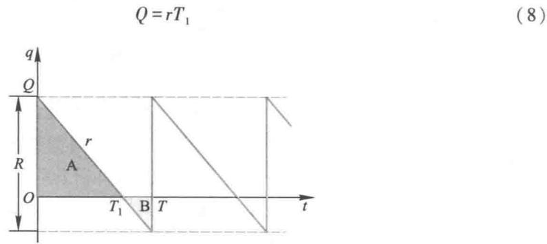  
图2 允许缺货模型的贮存量  $q(t)$

在  $T_{1}$  到  $T$  这段缺货时段内需求率  $r$  不变,  $q(t)$  按原斜率继续下降. 由于规定缺货量需补足, 所以在  $t = T$  时数量为  $R$  的产品立即到达, 使下周期初的贮存量恢复到  $Q$ .

与建立不允许缺货模型时类似, 一个周期内的贮存费是  $c_{2}$  乘以图2中三角形A的面积, 缺货损失费则是  $c_{3}$  乘以图2中三角形B的面积. 计算这两块面积, 并加上准备费  $c_{1}$ , 得到一个周期的总费用为

$$
\bar{C} = c_{1} + c_{2} Q T_{1} / 2 + c_{3} r (T - T_{1})^{2} / 2 \tag{9}
$$

利用(8)式将模型的目标函数——每天的平均费用——记作  $T$  和  $Q$  的二元函数

$$
C(T, Q) = \frac{c_{1}}{T} + \frac{c_{2} Q^{2}}{2 r T} + \frac{c_{3}(T T - Q)^{2}}{2 r T} \tag{10}
$$

模型求解利用微分法求  $T$  和  $Q$  使  $C(T, Q)$  最小, 令  $\partial C / \partial T = 0, \partial C / \partial Q = 0$ , 可得 (为了与不允许缺货模型相区别, 最优解记作  $T^{\prime}, Q^{\prime}$ )

$$
T^{\prime} = \sqrt{\frac{2 c_{1}}{c_{2} r}} \frac{c_{2} + c_{3}}{c_{3}}, \quad Q^{\prime} = \sqrt{\frac{2 c_{1} r}{c_{2}} \frac{c_{3}}{c_{2} + c_{3}}} \tag{11}
$$

注意到每个周期的供货量  $R = r T^{\prime}$ , 有

$$
R = \sqrt{\frac{2 c_{1} r}{c_{2}} \frac{c_{2} + c_{3}}{c_{3}}} \tag{12}
$$

记

$$
\lambda = \sqrt{\frac{c_{2} + c_{3}}{c_{3}}} \tag{13}
$$

与不允许缺货模型的结果(4),(5)式比较不难得到

$$
T^{\prime} = \lambda T, \quad Q^{\prime} = Q / \lambda , \quad R = \lambda Q \tag{14}
$$

结果解释由(13)式,  $\lambda > 1$ , 故(14)式给出  $T^{\prime} > T, Q^{\prime} < Q, R > Q$ , 即允许缺货时周期及供货量应增加, 周期初的贮存量减少. 缺货损失费  $c_{3}$  越大 (相对于贮存费  $c_{2}$ ),  $\lambda$  越小,  $T^{\prime}$  越接近  $T, Q^{\prime}, R$  越接近  $Q$ . 当  $c_{3} \rightarrow \infty$  时  $\lambda \rightarrow 1$ , 于是  $T^{\prime} \rightarrow T, Q^{\prime} \rightarrow Q, R \rightarrow Q$ . 这个结果合理吗 (考虑  $c_{3} \rightarrow \infty$  的意义)? 由此不允许缺货模型可视为允许缺货模型的特例.

1. 在存贮模型的总费用中增加购买货物本身的费用, 重新确定最优订货周期和订货批量. 证明在不允许缺货模型和允许缺货模型中结果都与原来的一样.

2. 建立不允许缺货的生产销售存贮模型. 设生产速率为常数  $k$ , 销售速率为常数  $r, k > r$ . 在每个生产周期  $T$  内, 开始的一段时间  $(0 < t < T_{2})$  一边生产一边销售, 后来的一段时间  $(T_{0} < t < T)$  只销售不生产, 画出贮存量  $q(t)$  的图形. 设每次生产准备费为  $c_{1}$ , 单位时间每件产品贮存费为  $c_{2}$ , 以平均每天总费用最小为目标确定最优生产周期. 讨论  $k \gg r$  和  $k \approx r$  的情况.

# 3.2 森林救火

森林失火了! 消防站接到报警后派多少消防队员前去救火呢? 派的队员越多, 森林的损失越小, 但是救援的开支会越大, 所以需要综合考虑森林损失费和救援费与消防队员人数之间的关系, 以总费用最小来决定派出队员的数目[7].

问题分析 损失费通常正比于森林烧毁的面积, 而烧毁面积与失火、灭火 (指火被扑灭) 的时间有关, 灭火时间又取决于消防队员数目, 队员越多灭火越快. 救援费既与消防队员人数有关, 又与灭火时间长短有关. 记失火时刻为  $t = 0$ , 开始救火时刻为  $t = t_{1}$ , 灭火时刻为  $t = t_{2}$ . 设在时刻  $t$  森林烧毁面积为  $B(t)$ , 则造成损失的森林烧毁面积为  $B(t_{2})$ . 建模要对函数  $B(t)$  的形式作出合理的简单假设.

研究  $\frac{\mathrm{d}B}{\mathrm{d}t}$  比  $B(t)$  更为直接和方便.  $\frac{\mathrm{d}B}{\mathrm{d}t}$  是单位时间烧毁面积, 表示火势蔓延的程度. 在消防队员到达之前, 即  $0 \leqslant t \leqslant t_{1}$ , 火势越来越大, 即  $\frac{\mathrm{d}B}{\mathrm{d}t}$  随  $t$  的增加而增加; 开始救火以后, 即  $t_{1} < t < t_{2}$ , 如果消防队员救火能力足够强, 火势会越来越小, 即  $\frac{\mathrm{d}B}{\mathrm{d}t}$  应减小, 并且当  $t = t_{2}$  时  $\frac{\mathrm{d}B}{\mathrm{d}t} = 0$ .

救援费可分为两部分: 一部分是灭火器材的消耗及消防队员的薪金等, 与队员人数及灭火所用的时间均有关; 另一部分是运送队员和器材等的一次性支出, 只与队员人数有关.

模型假设 需要对烧毁森林的损失费、救援费及火势蔓延程度  $\frac{\mathrm{d}B}{\mathrm{d}t}$  的形式做出假设.

1. 损失费与森林烧毁面积  $B(t_{2})$  成正比, 比例系数  $c_{1}$  为烧毁单位面积的损失费.

2. 从失火到开始救火这段时间  $(0 \leqslant t \leqslant t_{1})$  内, 火势蔓延程度  $\frac{\mathrm{d}B}{\mathrm{d}t}$  与时间  $t$  成正比, 比例系数  $\beta$  称火势蔓延速度.

3. 派出消防队员  $x$  名, 开始救火以后  $(t > t_{1})$  火势蔓延速度降为  $\beta - \lambda x$ , 其中  $\lambda$  可视为每个队员的平均灭火速度. 显然应有  $\beta < \lambda x$ .

4. 每个消防队员单位时间的费用为  $c_{2}$ , 于是每个队员的救火费用是  $c_{2}(t_{2} - t_{1})$ ; 每

个队员的一次性支出是  $c_{3}$ .

第2条假设可作如下解释:火势以失火点为中心,以均匀速度向四周呈圆形蔓延,所以蔓延的半径  $r$  与时间  $t$  成正比.又因为烧毁面积  $B$  与  $r^{2}$  成正比,故  $B$  与  $t^{2}$  成正比,从而  $\frac{\mathrm{d}B}{\mathrm{d}t}$  与  $t$  成正比.这个假设在风力不大的条件下是大致合理的.

模型构成根据假设条件2,3,火势蔓延程度  $\frac{\mathrm{d}B}{\mathrm{d}t}$  在  $0\leqslant t\leqslant t_{1}$  线性地增加,在  $t_{1}< t< t_{2}$  线性地减小  $\frac{\mathrm{d}B}{\mathrm{d}t}\sim t$  的图形如图1所示.记  $t = t_{1}$  时  $\frac{\mathrm{d}B}{\mathrm{d}t} = b.$  烧毁面积  $B(t_{2}) = \int_{0}^{b}\frac{\mathrm{d}B}{\mathrm{d}t}\mathrm{d}t$  恰是图中三角形的面积,显然有  $B(t_{2}) = \frac{1}{2} b t_{2}$  而  $t_{2}$  满足

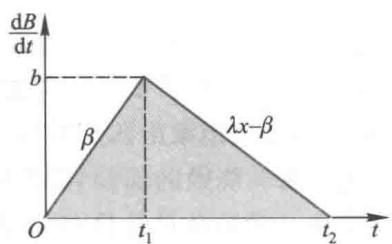  
图1  $\frac{\mathrm{d}B}{\mathrm{d}t}\sim t$  关系

$$
t_{2} - t_{1} = \frac{b}{\lambda x - \beta} = \frac{\beta t_{1}}{\lambda x - \beta} \tag{1}
$$

于是

$$
B(t_{2}) = \frac{\beta t_{1}^{2}}{2} +\frac{\beta^{2}t_{1}^{2}}{2(\lambda x - \beta)} \tag{2}
$$

根据假设条件1,4,森林损失费为  $c_{1}B(t_{2})$  ,救援费为  $c_{2}x(t_{2} - t_{1}) + c_{3}x.$  将(1),(2)代入,得到救火总费用为

$$
C(x) = \frac{c_{1}\beta t_{1}^{2}}{2} +\frac{c_{1}\beta^{2}t_{1}^{2}}{2(\lambda x - \beta)} +\frac{c_{2}\beta t_{1}x}{\lambda x - \beta} +c_{3}x \tag{3}
$$

$C(x)$  即为这个优化模型的目标函数

评注 建立这个模型的关键是对  $\frac{\mathrm{d}B}{\mathrm{d}t}$  的假设.比较合理而又简化的假设条件2,3只能符合风力不大的情况.在风势的影响下应考虑另外的假设.再者,有人对队员灭火的平均速度  $\lambda$  是常数的假设提出异议,认为  $\lambda$  应与开始

模型求解 为求  $x$  使  $C(x)$  达到最小,令  $\frac{\mathrm{d}C}{\mathrm{d}x} = 0$  ,可以得到应派出的队员人数为

$$
x = \frac{\beta}{\lambda} +\beta \sqrt{\frac{c_{1}\lambda t_{1}^{2} + 2c_{2}t_{1}}{2c_{3}\lambda^{2}}} \tag{4}
$$

结果解释首先,应派出队员数目由两部分组成,其中一部分  $\beta /\lambda$  是为了把火扑灭所必需的最少队员数.因为  $\beta$  是火势蔓延速度,而  $\lambda$  是每个队员的平均灭火速度,所以这个结果是明显的.从图1也可以看出,只有当  $x > \beta /\lambda$  时,斜率为  $\lambda x - \beta$  的直线才会与  $t$  轴有交点  $t_{2}$

其次,派出队员数的另一部分,即在最低限度之上的队员数,与问题的各个参数有

关.当队员灭火速度  $\lambda$  和救援费用系数  $c_{3}$  增大时,队员数减少;当火势蔓延速度  $\beta$  开始救火时刻  $t_{1}$  及损失费用系数  $c_{1}$  增加时,队员数增加.这些结果与常识是一致的.(4)式还表明,当救援费用系数  $c_{2}$  变大时队员数也增加,请读者考虑为什么会有这样的结果.

实际应用这个模型时,  $c_{1}, c_{2}, c_{3}$  是已知常数,  $\beta , \lambda$  由森林类型、消防队员素质等因素决定,可以预先制成表格以备查用.由失火到救火的时间  $t_{1}$  则要根据现场情况估计.

救火时的火势  $b$  有关,  $b$  越大  $\lambda$  越小.这时要对函数  $\lambda (b)$  做出合理的假设,再得到进一步的结果.(复习题)

复习题

在森林救火模型中,如果考虑消防队员的灭火速度  $\lambda$  与开始救火时的火势  $b$  有关,试假设一个合理的函数关系,重新求解模型.

# 3.3 倾倒的啤酒杯

一个春意盎然的午后,你和家人来到郊野公园的草地上,铺下一领凉席,打开带来的食品袋,斟满一杯啤酒随手放到席子上,哎哟,啤酒杯倾倒了,金黄色的啤酒洒了一滩.又一个夏日炎炎的傍晚,你和朋友来到碧沙起伏的海边,朋友刚要把从吧台买来的啤酒撒在沙滩上,你突然想起那次在草地上的教训,赶紧接过来一口气把啤酒喝得只剩下不多,才放心地放下,哎呀,啤酒杯又倒了.满杯也倒,空杯也倒,怎么回事?

上面的场景说明,在不大平坦的地方盛着啤酒的杯子不容易放稳,这是因为重心太高了.直观地看,满杯和空杯的重心都大约在杯子中央稍下一点的位置.而在你饮用一满杯啤酒的过程中,随着杯中啤酒液面的下降,重心应该先降低,后又升高(从常识角度想想为什么会升高),那么重心必然有一个最低点.如果你在啤酒杯的重心大致处于最低点时停止饮用,放下来,就是最不容易倾倒的情况.

饮酒时啤酒杯重心的变化过程与倒酒时的正好相反,重心的最低点是一样的,而讨论倒酒过程比较方便.本节要建立一个数学模型,描述啤酒杯的重心随啤酒液面上升而变化的规律,找出重心最低点的位置,并讨论最低点由哪些因素决定[70].

模型分析与假设将最简单的啤酒杯的形状看作一个圆柱体,杯子的高度可以假定为1(个单位).由于在啤酒液面上升过程中,重心始终在杯子的中轴线上变化,故以中轴线的底端为坐标原点,沿中轴线建立坐标轴  $x$ ,倒酒时液面高度从  $x = 0$  增加到  $x = 1$ ,而重心是  $x$  的函数,记作  $s(x)$ ,见图1.

装着酒的啤酒杯的重心位置由啤酒和空杯的质量和重心决定.假设啤酒和杯子材料都是均匀的,一满杯啤酒(不计杯子)的

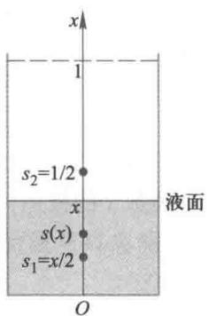  
图1 啤酒杯及其重心坐标

质量记作  $w_{1}$ ,空杯侧壁的质量记作  $w_{2}$ ,空杯底面的质量记作  $w_{3}$ .因为啤酒杯是高度为1的圆柱,所以液面高度为  $x$  的啤酒质量是  $w_{1}x$ ,其重心记作  $s_{1}$ ,是高度的一半,即  $s_{1} = \frac{x}{2}$ .倒酒过程中空杯的质量不变,其重心与  $x$  无关,只由  $w_{2}$  和  $w_{3}$  的大小决定.为简化起见,

下面先忽略  $w_{3}$ , 建立啤酒杯重心  $s(x)$  的模型, 求解重心最低点的位置, 并讨论其性质, 然后再将  $w_{3}$  加入模型.

模型一的建立与求解 在忽略空杯底面质量而只考虑侧壁的情况下, 空杯的重心位置记作  $s_{2}$ , 显然  $s_{2} = \frac{1}{2}$ , 如图 1 所示.

液面高度为  $x$  时啤酒杯的质量为  $w_{1}x + w_{2}$ , 其重心  $s = s(x)$  由啤酒质量  $w_{1}x$  、重心  $s_{1}$  与空杯质量  $w_{2}$  、重心  $s_{2}$  的力矩平衡关系得到, 根据物理学关于重心的计算公式, 有

$$
\left(w_{1}x + w_{2}\right)s = w_{1}x s_{1} + w_{2}s_{2} \tag{1}
$$

将  $s_{1} = \frac{x}{2}, s_{2} = \frac{1}{2}$  代入, 并记  $a = \frac{w_{2}}{w_{1}}$ , 由 (1) 式可解出  $s$  得

$$
s(x) = \frac{x^{2} + a}{2(x + a)} \tag{2}
$$

(2)式表明啤酒杯的重心随液面高度的变化规律  $s(x)$  只与空杯和满杯啤酒(不计杯子)的质量比  $a$  有关. 当  $a$  取不同数值 0.1, 0.3, 0.5, 1 时,  $s$  随  $x$  的变化曲线如图 2. 由图可见对于每一个  $a, s$  都有一最小值. 如若  $a = 0.3$ , 则液面  $x$  在 0.35 左右  $s$  最小, 即重心最低.

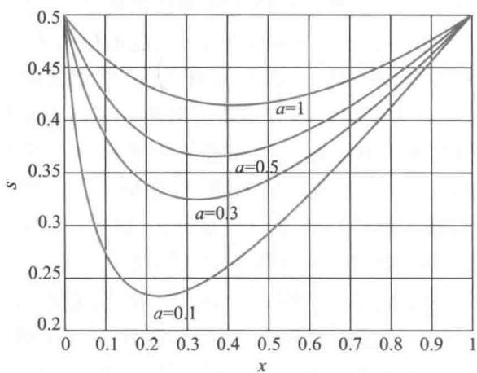  
图2 重心  $s$  随  $x$  的变化曲线（对不同的  $a$ ）

函数  $s$  的极值问题可以用微分法求解. 对 (2) 式求导数得

$$
\frac{\mathrm{d}s}{\mathrm{d}x} = \frac{4x(x + a) - 2(x^{2} + a)}{4(x + a)^{2}} \tag{3}
$$

令  $\frac{\mathrm{d}s}{\mathrm{d}x} = 0$  得到  $x^{2} + 2ax - a = 0$ , 这个二次代数方程的正根是  $s(x)$  的最小点, 记作  $x^{*}$ , 有

$$
x^{*} = \sqrt{a^{2} + a} -a \tag{4}
$$

当液面高度为  $x^{*}$  时, 啤酒杯重心处于最低位置. 由 (4) 式表示的曲线如图 3, 给出了  $x^{*}$  与质量比  $a = w_{2} / w_{1}$  之间的关系. 将 (4) 代入 (2) 即可得到重心的最低点.

模型一结果分析 由 (4) 式可知, 啤酒杯重心最低时的液面高度只取决于空杯和满杯啤酒的质量比  $a$ . 如果考察半升啤酒的杯子, 啤酒的密度与水差不多, 满杯啤酒的

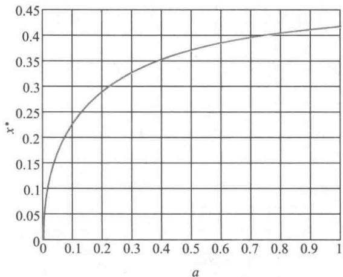  
图3 重心最低时的液面位置随  $a$  的变化曲线

质量是  $500 \mathrm{~g}$ ,空杯的质量则依材料的不同(纸制品、化学制品、玻璃制品等)可在相当大的范围(如从  $50 \mathrm{~g}$  到  $500 \mathrm{~g}$  )内变化,于是质量比  $a$  取0.1到1的数值。若将  $a = 0.3$  (空杯质量  $150 \mathrm{~g}$  )代入(4)式可算出  $x^{*} = 0.3245$ ,表明一杯啤酒喝到差不多只剩  $\frac{1}{3}$  时重心最低,最不容易倾倒。

由图2、图3可以看出,随着质量比  $a$  的变大,啤酒杯重心最低时的液面高度  $x^{*}$  在升高。对于固定的  $w_{1}$  而言,空杯质量越大,重心最低时的液面越高,这显然是符合常识的。比如你用质量  $500 \mathrm{~g}$  、半升装的厚玻璃杯饮酒时  $a = 1$ ,按照(4)式重心最低的液面高度应为  $\sqrt{2} - 1 = 0.414$ 。

从数学角度还可以研究,质量比  $a$  无限变大时重心最低的液面高度变化趋势,即(4)式中  $a \rightarrow \infty$  的极限值,可如下计算:

$$
\lim_{a \rightarrow \infty}(\sqrt{a^{2} + a} - a) = \lim_{a \rightarrow \infty} \frac{a}{\sqrt{a^{2} + a} + a} = \lim_{a \rightarrow \infty} \frac{1}{\sqrt{1 + \frac{1}{a}} + 1} = \frac{1}{2}
$$

说明用(与啤酒质量相比)非常重的杯子饮酒,喝到一半  $(x = \frac{1}{2})$  重心最低。还可注意到,此时啤酒杯的重心也是  $s = \frac{1}{2}$ ,正好在液面的位置。显然是由于啤酒质量可以忽略,啤酒杯重心与空杯重心相合。

意料之外与情理之中将(4)式的  $x^{*}$  代入重心  $s$  随  $x$  的变化规律(2)式,得到

$$
s(x^{*}) = \frac{(\sqrt{a^{2} + a} - a)^{2} + a}{2[(\sqrt{a^{2} + a} - a) + a]} = \frac{2(a^{2} + a - a\sqrt{a^{2} + a})}{2\sqrt{a^{2} + a}} = \sqrt{a^{2} + a} -a \tag{5}
$$

与(4)式的  $x^{*}$  完全相同,表明当啤酒杯重心与液面高度相重合时重心最低。这是否在你的意料之外呢?

这个结果其实也在情理之中。考察向杯中倒酒的过程,液面高度  $x = 0$  时重心  $s = s_{2} =$

$\frac{1}{2}$ , 随着  $x$  的升高, 由于啤酒重心  $s_{1} = \frac{x}{2}$  的"向下作用", 重心  $s$  下降, 直至  $x$  与  $s$  重合。此后,  $x$  继续升高,  $s_{1} = \frac{x}{2}$  起"向上作用", 重心  $s$  上升, 直到  $x = 1$  时  $s = \frac{1}{2}$ 。

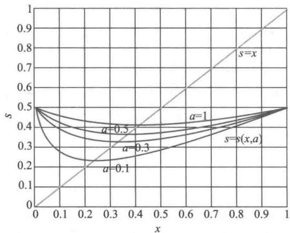  
图4直线  $s = x$  通过曲线  $s(x,a)$  的最低点

上述过程可以通过数学模型给以清晰的表示。对(2)、(3)两式作代数运算可得

$$
\frac{\mathrm{d}s}{\mathrm{d}x} = \frac{x - s}{x + a} \tag{6}
$$

表示  $s$  对  $x$  的导数与差  $x - s$  同号, 且当  $x = s$  时导数为0。这说明, 随着  $x$  变大,  $x< s$  时,  $s$  对  $x$  的导数为负,  $s$  下降;  $x > s$  时,  $s$  对  $x$  的导数为正,  $s$  上升;  $x = s$  时,  $s$  达到最小值。

将图2的坐标范围稍加改动, 画成图4, 可以看出, 对于任意的  $a$ , 直线  $s = x$  通过每条曲线  $s(x,a)$  的最低点, 这是上述结果的图示。

评注对于一个虽然实际意义不大、却饶有生活情趣的现象, 用数学建模的方法加以表述, 对得到的结果给予解释。在对杯子做适当的简化假设后, 应用物理学的基本知识, 建立了函数极值问题的优化模型, 通过求导数、极限、作图等数学手段, 给出了精确的数量关系。

我们得到的"啤酒杯重心与液面高度相重合时重心最低"这个既在意料之外又在情理之中的结果, 不通过数学建模

模型二的建立与求解考虑空杯底面的质量  $w_{3}$ , 重心记作  $s_{3}$ , 由于与杯子高度相比底面的厚度很小, 可以忽略, 所以可认为  $s_{3} = 0$ 。仍然利用重心的计算公式, 与模型一(1)式类似地有

$$
(w_{1}x + w_{2} + w_{3})s = w_{1}x s_{1} + w_{2}x_{2} + w_{3}s_{3} \tag{7}
$$

将  $s_{1} = \frac{x}{2}, s_{2} = \frac{1}{2}, s_{3} = 0$  代入, 仍记  $a = w_{2} / w_{1}$ , 再记  $b = w_{3} / w_{1}$ , 由(7)式可解出  $s$  得

$$
s(x) = \frac{x^{2} + a}{2(x + a + b)} \tag{8}
$$

$b = 0$  时, 与模型一(2)式相同。

用与模型一相同的方法求解, 得到(2)式的最小点与最小值为

$$
x^{*} = s(x^{*}) = \sqrt{(a + b)^{2} + a - (a + b)} \tag{9}
$$

再次出现与模型一同样的结果: 当啤酒杯重心与液面高度相重合时重心最低。

粗略估计一下考虑空杯底面的质量对最低重心位置的影响。设杯子侧壁和底面的厚度和材质相同, 记侧壁高度和底面直径分别为  $h, d$ , 且不妨假定  $h = 2d$ , 则容易得到  $\frac{w_{3}}{w_{2}} = \frac{d}{4h} = \frac{1}{8}$ 。若设  $a = \frac{w_{2}}{w_{1}} = 0.3$  (空杯质量  $150 \mathrm{~g}$ ), 则  $b = \frac{w_{3}}{w_{1}} = \frac{1}{8} \times 0.3 = 0.0375$ 。将  $a, b$  代入

(9)式得  $x^{*} = 0.3059$ . 与模型一在  $a = 0.3$  时的结果  $x^{*} = 0.3245$  相比,相差不到  $6\%$ .

模型推广 由于设定啤酒杯是最简单的圆柱形,所以建立的模型及求解的结果也非常简明. 如果啤酒杯呈圆台或球台等形状,建模的方法是一样的,但是推导会比较复杂. 一个有趣的现象是,只要啤酒杯是旋转体(侧壁由任意曲线绕中轴线旋转而成),那么上面那个意料之外、情理之中的结果就会成立.

大概是难以想象的. 从数学角度看,这相当于函数  $s = s(x)$  的最小点  $x^{*}$  (满足  $s'(x^{*}) = 0$ ) 是函数的不动点,即  $x^{*} = s(x^{*})$ .

复习题

设啤酒杯的侧壁是由任意曲线绕中轴线旋转形成的,建立啤酒杯重心随啤酒液面上升而变化的数学模型,证明啤酒杯重心与液面高度相重合时重心最低.

# 3.4 铅球掷远

你投掷过铅球或者看过投掷铅球吧. 运动员手指握球、置于颌下、上体微屈、背对投向,左腿摆动、右腿蹬伸、滑步向前、送出右髋,伸直右臂,将球迅速、有力地推出,极大的爆发力使铅球画出一条优美的弧线,落向远方.

铅球掷远起源于14世纪欧洲炮兵闲暇期间推掷炮弹的游戏和比赛,当时炮弹是圆形铁球,重量为16磅(合  $7.26 \mathrm{~kg}$ ),这一重量一直沿袭成为现在男子铅球正式比赛的标准. 见证这一历史渊源的还有,英语中"铅球"与"炮弹"是同一单词"shot". 男子铅球早在1896年第一届奥运会上就被列为比赛项目,女子铅球也在1948年进入奥运会.

虽然运动会上我们看到的铅球运动员都是人高马大、胳膊粗壮,但并不是只要有力气就能把铅球掷得远. 从常识判断,运动员能够对铅球施加作用的因素只有初始速度和出手角度,显然初始速度越大掷得越远,出手角度则存在一个使投掷距离最远的最佳值. 另外,教练员在挑选运动员时还会注意他(她)的身高,因为出手高度越大也会让铅球掷得越远. 本节要通过数学建模,定量地分析投掷距离与铅球的初始速度、出手角度、出手高度等因素的关系,找出最佳出手角度,并研究初始速度、出手角度、出手高度的微小改变对投掷距离的影响[70].

问题分析 男子铅球的直径只有  $11 \mathrm{~cm}$  至  $13 \mathrm{~cm}$ ,在短暂的飞行中所受的阻力可以忽略. 于是可将铅球视为一个质点,以一定的初始速度和出手角度投出后,在重力作用下作斜抛运动. 中学物理知识告诉我们,飞行轨迹是一条抛物线,如图1,投掷距离除了取决于铅球的初始速度  $v$  、出手角度  $\theta$  外,还与出手高度  $h$  有关. 下面先暂不考虑出手高度,建立一个简单模型,分析初始速度  $v$  和出手角度  $\theta$  对投掷距离的影响,再将出手高度  $h$  加入,改进原来的模型[13].

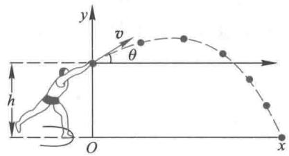  
图1 铅球飞行轨迹示意图

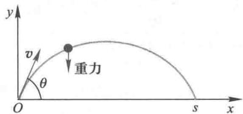  
图2 不考虑出手高度的简单模型

模型一不考虑铅球出手高度,建立坐标系如图2,初始速度  $v$  方向与  $x$  轴的夹角为  $\theta .v$  在  $x$  轴和  $y$  轴上的投影分别为  $v_{x} = v\mathrm{cos}\theta ,v_{y} = v\mathrm{sin}\theta .$  忽略空气阻力,铅球飞行过程中在  $x$  轴方向不受力,在  $y$  轴方向只受重力作用(与  $y$  轴反向),记重力加速度为  $g.$  设铅球在时刻  $t = 0$  从坐标原点投出,按照运动的基本规律,铅球在任意时刻  $t$  的位置坐标 $(x,y)$  满足

$$
x = v t c o s\theta , y = v t s i n \theta -\frac{g t^{2}}{2} \tag{1}
$$

记投掷距离为  $s$  ,注意到铅球落地即  $\gamma = 0$  ,此时的  $s$  坐标等于  $s$  ,(1)式化为

$$
s = v t c o s\theta , 0 = v t s i n \theta -\frac{g t^{2}}{2} \tag{2}
$$

消去  $t$  得到

$$
s = \frac{v^{2}\sin2\theta}{g} \tag{3}
$$

(3)式给出投掷距离  $s$  与铅球初始速度  $v$  和出手角度  $\theta$  的关系.对模型一可作以下初步分析:

1. 当出手角度  $\theta = \frac{\pi}{4}$  时  $\sin 2\theta = 1$  ,投掷距离  $s = \frac{v^{2}}{g}$  达到最大,最佳出手角度  $\frac{\pi}{4}$  与初始速度无关,这也就是大家熟知的"物体以45度角抛出的距离最远"

2. 对任何出手角度  $\theta$  ,投掷距离  $s$  与铅球初始速度  $v$  的平方成正比,表明初始速度的提高能使投掷距离大幅度地增加

模型二设铅球出手高度为  $h$  ,建立坐标系如图3,铅球在时刻  $t = 0$  从坐标(0,h)投出,(1)式改为

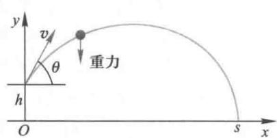  
图3考虑出手高度的改进模型

$$
x = v_{x}t, y = h + v_{y}t - \frac{g t^{2}}{2} \tag{4}
$$

将  $y = 0,x = s$  代入(4)式得到

$$
s = v t c o s\theta , 0 = h + v t s i n \theta -\frac{g t^{2}}{2} \tag{5}
$$

消去  $t$  解出

$$
s = \frac{v^{2}\sin\theta\cos\theta}{g} +\frac{v\cos\theta}{g}\sqrt{v^{2}\sin^{2}\theta + 2h g} \tag{6}
$$

显然,当  $h = 0$  时(6)式等同于模型一的(3)式

由(6)式计算  $\frac{\mathrm{d}s}{\mathrm{d}\theta} = 0$  可以得到最佳出手角度,但是这个计算太繁了!我们另辟一条捷径:先由(5)式消去  $t$  得

$$
h + \mathrm{stan} \theta -\frac{g s^{2}}{2v^{2}\cos^{2}\theta} = 0 \tag{7}
$$

对(7)式求导数并令  $\frac{\mathrm{d}s}{\mathrm{d}\theta} = 0$  得

$$
\frac{s}{\cos^{2}\theta} \frac{g s^{2} \sin \theta}{v^{2} \cos^{3} \theta} = 0 \tag{8}
$$

由此解出

$$
s = \frac{v^{2}}{g \tan \theta} \tag{9}
$$

将(9)式代入(7)式有

$$
h + \frac{v^{2}}{g} - \frac{v^{2}}{2 g \sin^{2} \theta} = 0 \tag{10}
$$

于是

$$
\sin \theta = \frac{v}{\sqrt{2\left(v^{2} + g h\right)}} \tag{11}
$$

(11)式的  $\theta$  为最佳出手角度. 将(11)式代入(9)式得

$$
s = \frac{v}{g} \sqrt{v^{2} + 2 g h} \tag{12}
$$

容易验证,当  $h = 0$  时(11),(12)式给出与模型一相同的结果

(6)式表示的是投掷距离  $s$  与铅球初始速度  $v$  、出手角度  $\theta$  和出手高度  $h$  之间的一般关系,(11),(12)式则给出了由初始速度  $v$  、出手高度  $h$  决定的最佳出手角度和最远投掷距离. 对模型二可作以下初步分析:

1. 最佳出手角度  $\theta < \frac{\pi}{4}$ ,且  $\theta$  与  $v$  和  $h$  有关, $v$  越大  $\theta$  越大, $h$  越大  $\theta$  越小.

2. 以最佳角度  $\theta$  投出的最远距离  $s$  与  $v$  和  $h$  有关, $v$  越大  $s$  越大, $h$  越大  $s$  越大. 由于大致上  $s$  与  $v$  为 2 次方关系,与  $h$  为  $\frac{1}{2}$  次方关系,所以提高  $v$  远比提高  $h$  对  $s$  的增加有效.

表1是出手高度为  $1.8 \mathrm{~m} \sim 2.2 \mathrm{~m}$  、初始速度为  $8 \mathrm{~m} / \mathrm{s} \sim 15 \mathrm{~m} / \mathrm{s}$  下的最佳出手角度及最远投掷距离. 出手高度可以按照身高加  $20 \mathrm{~cm}$  左右估计,对普通人初始速度大概在  $8 \mathrm{~m} / \mathrm{s} \sim 10 \mathrm{~m} / \mathrm{s}$ ,一般运动员可达  $10 \mathrm{~m} / \mathrm{s} \sim 13 \mathrm{~m} / \mathrm{s}$ ,最佳出手角度应在  $40^{\circ}$  左右. 目前男子铅球(重  $7.26 \mathrm{~kg}$  )世界纪录为  $23.12 \mathrm{~m}$  (巴恩斯,美国,1990年),女子铅球(重  $4 \mathrm{~kg}$  )世界纪录为  $22.63 \mathrm{~m}$  (里索斯卡娅,苏联,1987年). 按照这个模型,他(她)投掷的初始速度应接近  $15 \mathrm{~m} / \mathrm{s}$ .

表1按照模型二计算的最佳出手角度及最远投掷距离  

<table><tr><td rowspan="2"></td><td colspan="9">初始速度/(m·s-1)</td></tr><tr><td>8</td><td>9</td><td>10</td><td>11</td><td>12</td><td>13</td><td>14</td><td>15</td><td></td></tr><tr><td>最佳</td><td>h=1.8 m</td><td>38.76</td><td>39.85</td><td>40.69</td><td>41.35</td><td>41.87</td><td>42.29</td><td>42.63</td><td>42.92</td></tr><tr><td>角度</td><td>h=2.0 m</td><td>38.22</td><td>39.38</td><td>40.28</td><td>40.99</td><td>41.56</td><td>42.02</td><td>42.39</td><td>42.70</td></tr><tr><td>/°</td><td>h=2.2 m</td><td>37.70</td><td>38.93</td><td>39.89</td><td>40.65</td><td>41.26</td><td>41.75</td><td>42.16</td><td>42.49</td></tr><tr><td>最远</td><td>h=1.8 m</td><td>8.13</td><td>9.90</td><td>11.87</td><td>14.03</td><td>16.40</td><td>18.96</td><td>21.73</td><td>24.69</td></tr><tr><td>距离</td><td>h=2.0 m</td><td>8.29</td><td>10.07</td><td>12.04</td><td>14.21</td><td>16.57</td><td>19.14</td><td>21.91</td><td>24.88</td></tr><tr><td>/m</td><td>h=2.2 m</td><td>8.45</td><td>10.23</td><td>12.21</td><td>14.38</td><td>16.75</td><td>19.32</td><td>22.09</td><td>25.06</td></tr></table>

根据表1中模型二的计算结果,设  $h = 2.0 \mathrm{m}$ $v = 10 \mathrm{m / s}$  时  $s = 12.04 \mathrm{m}$ $v = 12 \mathrm{m / s}$  时  $s = 16.57 \mathrm{m}$ . 按照模型一中  $\theta = \frac{\pi}{4}$  的  $s = \frac{v^{2}}{g}$  计算,得  $v = 10 \mathrm{m / s}$  时  $s = 10.20 \mathrm{m}$ $v = 12 \mathrm{m / s}$  时  $s = 14.69 \mathrm{m}$ . 对比发现,模型二的最远投掷距离  $s$  比模型一大约增加了  $2 \mathrm{m}$  ,差不多正是一个出手高度  $h$ . 这个结果可以由(12)式近似地推出(复习题1).

敏感性分析研究铅球初始速度  $v$  出手角度  $\theta$  和出手高度  $h$  的微小改变对投掷距离  $s$  的影响. 让我们先看数值计算结果,再利用微分法作理论分析.

模型一的数值计算若  $v$  提高  $5\%$  ,用  $1.05v$  代替(3)式中的  $v$  ,则  $s$  将变为1.1025 $s$  ,即  $s$  增加约  $10\%$  ,表明初始速度微小的提高能使投掷距离成倍地增加.

如果出手角度  $\theta$  变化  $5\%$  ,由最佳角度  $45^{\circ}$  变为  $42.75^{\circ}$  (或  $47.25^{\circ}$  ),则(3)式中sin  $2\theta = \sin 85.5^{\circ} = 0.9969$  ,投掷距离  $s$  仅减少约  $0.3\%$  ,说明出手角度在最佳角度处的微小改变对投掷距离的影响很小.

模型一的理论分析可以用  $\frac{\Delta s}{s}, \frac{\Delta v}{v}$  分别表示  $s$  和  $v$  的相对微小改变量,并用微分  $\mathrm{d}s, \mathrm{~d}v$  代替增量  $\Delta s, \Delta v$  ,由(3)式计算  $s$  的微分,得到

$$
\frac{\mathrm{d}s}{s} = 2 \frac{\mathrm{d}v}{v} \tag{13}
$$

即  $s$  的相对(微小)改变是  $v$  的相对(微小)改变的两倍.

类似的计算可得

$$
\frac{\mathrm{d}s}{s} = \frac{2\theta}{\tan 2\theta} \frac{\mathrm{d}\theta}{\theta} \tag{14}
$$

这个结果不能分析  $\theta$  正好等于  $\pi /4$  时的情况,不妨取略小于  $\pi /4$  的角度如  $42.75^{\circ}$  ,可得  $\frac{\mathrm{d}s}{s} = 0.12 \frac{\mathrm{d}\theta}{\theta}$  ,所以  $\theta$  的微小改变对  $v$  的影响很小.

模型二的数值计算从表1可以看出,出手高度增加  $0.2 \mathrm{m}$  (约  $10\%$  ),最佳出手角度减小不到  $0.5^{\circ}$  ,最远投掷距离增加近  $0.2 \mathrm{m}$  (约  $1.5\%$  ),对于激烈的比赛来说这个数值还是相当可观的,所以运动员选材时应该对身高给予关注.

初始速度提高  $1 \mathrm{m / s}$  (约  $10\%$  ),最佳出手角度增加稍多于  $0.5^{\circ}$  ,最远投掷距离可提高  $2 \mathrm{m}$  以上(  $15\%$  以上),这是一个非常重要的结果,说明在注重运动员身高与出手角度的基础上,训练中应调动全身力量,形成巨大的投掷爆发力,使铅球达到尽可能大的初始速度.

模型二的理论分析根据(12)式计算  $s$  的微分  $\mathrm{d}s$  与  $v$  的微分  $\mathrm{d}v$  (  $h$  视为常数),及  $\mathrm{d}s$  与  $h$  的微分  $\mathrm{d}h$  (  $v$  视为常数),

$$
\mathrm{d}s = \frac{2\left(v^{2} + g h\right)}{g\sqrt{v^{2} + 2g h}}\mathrm{d}v, \mathrm{d}s = \frac{v}{\sqrt{v^{2} + 2g h}}\mathrm{d}h \tag{15}
$$

再由(15)式和(12)式计算出

$$
\frac{\mathrm{d}s}{s} = \left(1 + \frac{v^{2}}{v^{2} + 2g h}\right) \frac{\mathrm{d}v}{v}, \frac{\mathrm{d}s}{s} = \frac{g h}{v^{2} + 2g h} \frac{\mathrm{d}h}{h} \tag{16}
$$

可以看出  $\frac{\mathrm{d}s}{s} >\frac{\mathrm{d}v}{v}$ ,而  $\frac{\mathrm{d}s}{s} < \frac{\mathrm{d}h}{h}$ ,且因通常  $v^{2}$  比  $2gh$  大许多,所以  $v$  的微小改变对投掷距离  $s$  的影响比  $h$  的微小改变对  $s$  的影响显著得多。

若以  $v = 12 \mathrm{m / s}, h = 2.0 \mathrm{m}$  代入(16)式,可得  $\frac{\mathrm{d}s}{s} = 1.78 \frac{\mathrm{d}v}{v}, \frac{\mathrm{d}s}{s} = 0.11 \frac{\mathrm{d}h}{h}$ ,说明在  $v = 12 \mathrm{m / s}, h = 2.0 \mathrm{m}$  附近, $v$  的  $1\%$  改变可引起  $s$  多达  $1.78\%$  的变化,而  $h$  的  $1\%$  改变只引起  $s$  有  $0.11\%$  的变化。

理论上严格分析出手角度  $\theta$  的微小改变对  $s$  的影响需计算(6)式的微分,因过于烦琐不作推导,不过根据(6)式的近似(3)式及模型一的(14)式可以估计到, $\theta$  的微小改变对  $s$  的影响也会很小。

本节利用微分对模型一、二所做的敏感性分析方法可以一般地表示如下:

已知函数  $y = f(x)$ ,计算微分  $\mathrm{d}y = f'(x) \mathrm{d}x$ ,在  $x = x_{0}$  有

$$
\frac{\mathrm{d}y}{y} = g(x_{0}) \frac{\mathrm{d}x}{x}, g(x_{0}) = \frac{x_{0}f'(x_{0})}{f(x_{0})} \tag{17}
$$

式中  $g(x_{0})$  是  $x = x_{0}$  处函数的相对(微小)改变  $\frac{\mathrm{d}y}{y}$  与自变量的相对(微小)改变  $\frac{\mathrm{d}x}{x}$  之比, $g(x_{0})$  越大, $x$  的变化对  $y$  的影响越大,即  $y$  对  $x$  越敏感。

对多元函数用(17)式计算时,应将其他自变量作为常数处理。

中最适于用数学模型描述的项目之一,我们应用简单的物理知识建立了两个模型,对影响投掷距离的主要因素——初始速度、出手角度和出手高度进行定性和定量研究。

当一个实际问题归结为自变量与因变量之间函数形式的数学模型时,由于自变量不易精确控制到预先设定的或理想的数值(或者根本不能控制),常常需要研究自变量在这个数值附近的微小改变对因变量的影响,因此敏感性分析是数学建模的重要环节之一。

# 复习题

1. 从(12)式出发,利用近似关系  $(1 + x)^{\frac{1}{2}} \approx 1 + \frac{x}{2}$  说明,模型二的最远投掷距离比模型一大约增加了一个出手高度。

2. 根据(6)式,用类似的方法说明,对任意出手角度,模型二的投掷距离比模型一大约增加了多少,并从图3与图2给以几何解释。

# 3.5 不买贵的只买对的

作为一个消费者,你在琳琅满目的市场里徘徊,如何花掉口袋里的钱,选择购买若干件商品。"不买贵的,只买对的"!买哪些商品、买多少才是"对的"?当然应该买最需要的、最有用的。"消费者追求最大效用"是经济学最优化原理中的一条,可以根据这条原理,用数学建模的方法帮助你决定在市场里的选择。让我们从商品的效用说起[70]。

效用函数刚打完一场篮球,你又累又饿。朋友买来一袋切片面包,你狼吞虎咽地吃下一片又一片。开始的几片使饥饿感得到极大的缓解,生理上和心理上都很满足,继续吃下去,每一片面包产生的快感会逐渐减少,饱胀以后就不想再吃了。

为了定量地研究随着吃下越来越多的面包,所得到的满足感的变化趋势,用  $U(x)$  表示吃了  $x$  片面包后获得的满足程度,可看作面包产生的效用,如表1中吃一片面包的效用为10(单位),2片面包的效用为20,3片的效用为28,……,9片的效用为46,与8片相同,等于白吃,再吃,效用反而减少,说明你吃到第8片、最多第9片面包就应该停

止了.以下我们就不再考虑  $x = 10$  的情况.表1中  $\Delta U(x)$  表示每多吃一片面包所产生效用的增量,即  $\Delta U(x) = U(x) - U(x - 1)$  图1是  $U(x)$  和  $\Delta U(x)$  的图形.由表1、图1可以看到,  $U(x)$  是递增的,但是增长越来越慢,曲线呈上凸形状;  $\Delta U(x)$  大于或等于零,但它是递减的.

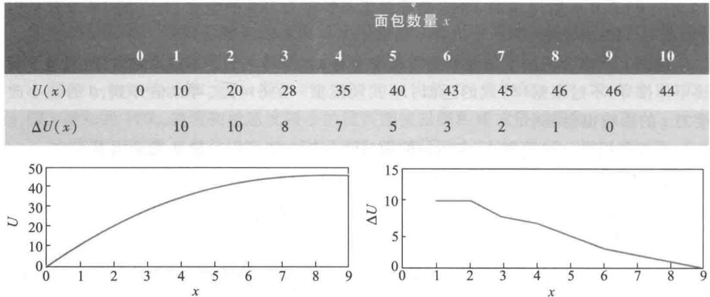

像购买面包以满足人们生活需要这样的例子,在经济社会里比比皆是.经济学中把人们商品消费、服务消费所获得的生理、心理上的满足程度称为效用,引入效用函数(u- tility function)  $U(x)$  ,表示数量为  $x$  的某种商品产生的效用,用约定的某个单位来度量①.为了数学研究的方便,将U(x)视为连续、可微函数,其变化率  $\frac{\mathrm{d}U(x)}{\mathrm{d}x}$  表示商品数量 $x$  增加1个单位时效用函数  $U(x)$  的增量,称为边际效用(marginalutility).一种典型的效用函数数学表达式为

$$
U(x) = a x^{\alpha},a > 0,0< \alpha < 1 \tag{1}
$$

图2是(1)式中  $a = 2$ $\alpha = \frac{1}{3}$  的  $U(x)$  和  $\frac{\mathrm{d}U(x)}{\mathrm{d}x}$  的曲线.在理性消费情况(指消费增加导致效用也增加)下效用函数和边际效用具有以下性质:

1. 效用函数  $U(x) > 0$  ,随着  $x$  的增加  $U(x)$  递增,但增量越来越小

2. 边际效用  $\frac{\mathrm{d}U(x)}{\mathrm{d}x} >0$  ,随着  $x$  的增加  $\frac{\mathrm{d}U(x)}{\mathrm{d}x}$  递减,即边际效用的变化率  $\frac{\mathrm{d}}{\mathrm{d}x}\left(\frac{\mathrm{d}U}{\mathrm{d}x}\right)$  为负值.

"边际效用递减"是经济学中一条普遍的、重要的法则.除了人们的商品消费、服务消费以外,还可以举出一些用这条法则解释的例子.月收入5000元的职员拿到500元的奖金,会十分高兴地盘算给亲人买些什么礼品,而月入5万元的小老板对于500元的外快就不会有多大兴趣.一些中老年人回忆起童年的困难生活时,常常对一碗红烧肉带

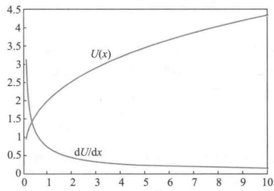  
图2  $U(x) = a x^{n}\left(a = 2, \alpha = \frac{1}{3}\right)$  及  $\mathrm{d}U(x) / \mathrm{d}x$  的曲线

来的满足和快感津津乐道,而当前餐桌上再好的美味佳肴也引不起太大兴趣。

效用函数和边际效用的这种特性可用两个数学式子简明地表示为

$$
\frac{\mathrm{d}U}{\mathrm{d}x} >0, \frac{\mathrm{d}^{2}U}{\mathrm{d}x^{2}} < 0 \tag{2}
$$

容易验证(1)式的效用函数  $U(x)$  满足(2)式。

当消费者面对两种商品时效用函数会是什么样子呢?

无差别曲线这次朋友买来的除了面包还有香肠,你可以搭配着吃。如果1片面包加4根香肠,或者4片面包加1根半香肠,又或者7片面包加1根香肠,都能使你获得同样的满足,那么这几种面包加香肠组合的效用函数相等。用  $U(x, y)$  表示  $x$  片面包和  $y$  根香肠组合的效用函数。在图3的  $x - y$  平面中,上面3种组合分别用坐标点  $A_{1}, A_{2}, A_{3}$  表示,将它们连接成一条曲线,线上所有点(如2片面包加2根半香肠)对应的效用函数都等于某常数  $u_{1}$ ,记作  $U(x, y) = u_{1}$ ,这条连线称为无差别曲线(指效用相同)或等效用线,与2.3节实物交换中介绍的曲线一样。

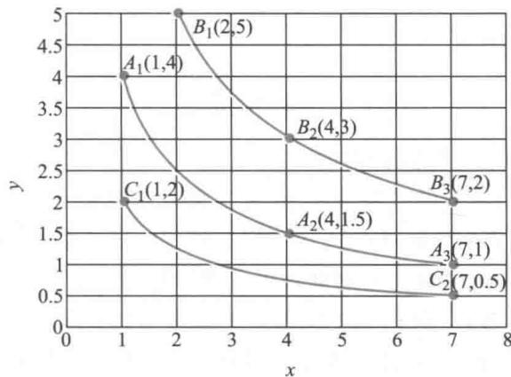  
图3 面包和香肠的无差别曲线

如果你拿取更多的面包和香肠(吃不完留下次吃),像图3的点  $B_{1}$  (2片面包加5根香肠)以及与  $B_{1}$  有同样效用函数值的  $B_{2}, B_{3}$ ,这3个点连成另一条无差别曲线,记作

$U(x, y) = u_{2}$ , 显然  $u_{2} > u_{1}$ . 可以画出更多的无差别曲线, 例如由点  $C_{1}$  (1 片面包加 2 根香肠),  $C_{2}$  连成的  $U(x, y) = u_{3}$ , 有  $u_{3} < u_{1}$ .

两种商品的效用函数  $U(x, y)$  是二元函数, 当  $U(x, y)$  的一个变量  $y$  (或  $x$  ) 固定时, 看作另一个变量  $x$  (或  $y$  ) 的一元函数, 所以  $U(x, y)$  仍然具有前面关于  $U(x)$  的"边际效用递减"性质, 与(2)式相应, 对二元函数  $U(x, y)$  应该用偏导数表示为

$$
\frac{\partial U}{\partial x} >0, \frac{\partial U}{\partial y} >0, \frac{\partial^{2}U}{\partial x^{2}} < 0, \frac{\partial^{2}U}{\partial y^{2}} < 0 \tag{3}
$$

作为(1)式  $U(x)$  形式的推广, 一种典型的两种商品效用函数的数学表达式为

$$
U(x, y) = a x^{\alpha} y^{\beta}, a > 0, 0 < \alpha , \beta < 1 \tag{4}
$$

图4是(4)式中  $a = 1, \alpha = \frac{1}{3}, \beta = \frac{1}{2}$  的无差别曲线  $U(x, y) = u (u = 1, 2, 3)$ .

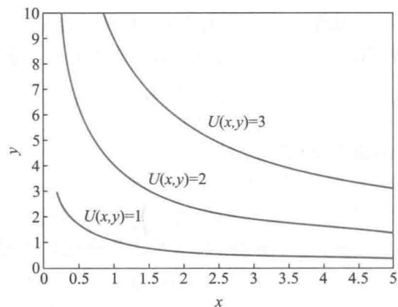  
图4  $U(x, y) = a x^{\alpha} y^{\beta} \left(a = 1, \alpha = \frac{1}{3}, \beta = \frac{1}{2}\right)$  的无差别曲线

无差别曲线  $U(x, y) = u$  (  $u$  为常数) 在  $x - y$  平面上表示为  $y$  对  $x$  的函数关系  $y = y(x)$ , 数学上  $U(x, y) = u$  是  $y = y(x)$  的隐函数, 即有  $U(x, y(x)) = u$ . 如(4)式中  $U(x, y) = u$  可表示为

$$
y = y(x) = \left(\frac{u}{a}\right)^{\frac{1}{\beta}} x^{\frac{\alpha}{\beta}} \tag{5}
$$

图4的3条曲线正是按照(5)式画出的.

无差别曲线是效用函数的几何表示. 由图3、图4的几何直观可以看出, 无差别曲线是下降 (斜率为负)、下凸 (凸向原点)、互不相交的, 2.3 节实物交换中曾给出简单解释, 现在从经济学和数学的角度对无差别曲线的这些性质进行论证.

(1)下降(斜率为负)既然无差别曲线上效用函数  $U(x,y) = u$  不变,那么  $x$  的增加必导致  $y$  的减少.在经济学中对于两种可以相互替代的商品,  $x$  增加1个单位引起  $y$  的减少量称为  $x$  对  $y$  的边际替代率(指绝对值),在图5无差别曲线  $U(x,y) = u$  上的  $P_{1}$  点,边际替代率用  $\frac{\Delta y}{\Delta x}$  表示(  $\Delta x > 0$  时  $\Delta y< 0$  ),  $\Delta x$  趋于0时  $\frac{\Delta y}{\Delta x}$  趋于曲线斜率  $\frac{\mathrm{d}y}{\mathrm{d}x}$  边际替代率为  $-\frac{\mathrm{d}y}{\mathrm{d}x}.$  注意到  $x,y$  的边际效用分别为  ${\frac{\partial U}{\partial x}},{\frac{\partial U}{\partial y}}$  用  $\Delta x$  替代  $-\Delta y$  后效用不变,即有

$\frac{\partial U}{\partial x} \Delta x = - \frac{\partial U}{\partial y} \Delta y$ , 于是有

$$
\frac{\mathrm{d}y}{\mathrm{d}x} = -\frac{\partial U / \partial x}{\partial U / \partial y} < 0 \tag{6}
$$

即边际替代率  $- \frac{\mathrm{d}y}{\mathrm{d}x}$  等于边际效用  $\frac{\partial U}{\partial x} = \frac{\partial U}{\partial y}$  之比.

其实,在数学上,(6)式可以由隐函数  $U(x, y(x)) = u$  的求导公式直接得到.

(2)下凸(凸向原点)随着  $x$  增加,  $x$  对  $y$  的"边际替代率递减",也是经济学中一条重要法则,其数学意义为边际替代率  $-\frac{\mathrm{d}y}{\mathrm{d}x}$  对  $x$  的导数是负值,即  $\frac{\mathrm{d}}{\mathrm{d}x} \left(-\frac{\mathrm{d}y}{\mathrm{d}x}\right) < 0$ , 于是

$$
\frac{\mathrm{d}^{2}y}{\mathrm{d}x^{2}} >0 \tag{7}
$$

这正是曲线下凸(凸向原点)的条件

(3)互不相交两条无差别曲线  $U(x, y) = u_{1}$ ,  $U(x, y) = u_{2} (u_{1} \neq u_{2})$  如果相交,交点的效用函数将取两个不同的数值  $u_{1}, u_{2}$ , 这是不可能的.

当  $U(x, y) = u$  取不同的效用函数值  $u$  时,得到一族无差别曲线. 随着  $u$  的增加曲线向右上方移动,如图5. 至于曲线的具体形状,则由两种商品对消费者带来的效用以及消费者对两种商品的偏爱程度决定. 如对(4)式表示的效用函数,无差别曲线的具体形状取决于参数  $\alpha , \beta$  的大小.

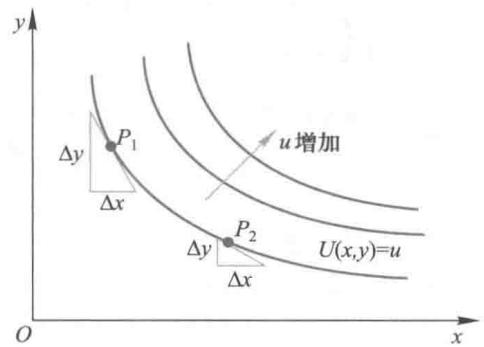  
图5 无差别曲线的下凸解释

效用最大化模型

如果消费者已经确定了对甲乙两种商品效用函数  $U(x, y)$  和无差别曲线,那么他用一定数额的钱会购买多少数量的商品甲和乙呢?从效用最大化的角度出发,当然应该使  $U(x, y)$  达到最大.

设甲乙两种商品的单价分别为  $p_{1}, p_{2}$ ,消费者准备付出的钱为  $s$ ,则他购买甲乙两种商品的数量  $x, y$  应满足

$$
\max U(x, y) \tag{8}
$$

$$
\begin{array}{r}{p_{1}x + p_{2}y = s} \end{array} \tag{8}
$$

式中s.t.是受约束于(subjectto)的符号.这就是效用最大化模型

先从几何图形上分析、求解这个模型. 在图6中,模型(8)的目标函数值由一族下

降、下凸、互不相交的无差别曲线  $U(x, y) = u$  给出,而由线  $s$  和商品单价  $p_{1}, p_{2}$  构成的约束条件是直线  $AB$ ,称消费线,在  $x$  轴、  $y$  轴上的截距分别为  $\frac{s}{p_{1}}, \frac{s}{p_{2}}$ . 直线  $AB$  与某一条无差别曲线  $l$  相切,记切点为  $Q(x, y)$ ,称消费点,当购买甲乙两种商品的数量为  $x, y$  时,效用函数达到最大.因为在  $AB$  与其他无差别曲线  $l_{1}$  的交点  $Q_{1}$ ,其效用函数值小于  $Q$  点的效用函数值.

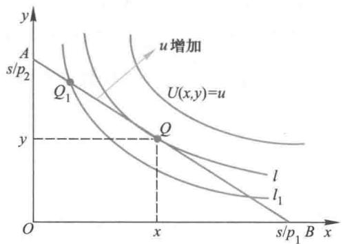  
图6 效用最大化模型的几何解法

如果知道效用函数  $U(x, y)$  的数学表达式(如(4)式),可以按照二元函数条件极值的方法求解模型(8).引入拉格朗日乘子  $\lambda$ ,构造函数

$$
L(x, y, \lambda) = U(x, y) + \lambda (s - p_{1} x - p_{2} y)
$$

由  $L(x, y, \lambda)$  对  $x, y$  的偏导数等于0,即

$$
\frac{\partial L}{\partial x} = \frac{\partial U}{\partial x} - \lambda p_{1} = 0, \frac{\partial L}{\partial y} = \frac{\partial U}{\partial y} - \lambda p_{2} = 0
$$

可得

$$
\frac{\partial U / \partial x}{p_{1}} = \frac{\partial U / \partial y}{p_{2}} = \lambda \tag{9}
$$

即最优解在甲乙两种商品的边际效用与二者价格之比相等时取得.(9)式又可记作

$$
\frac{\partial U / \partial x}{\partial U / \partial y} = \frac{p_{1}}{p_{2}} \tag{10}
$$

(10)式表明,当两种商品的边际效用之比等于它们的价格之比时,效用函数达到最大,称效用最大化原理,是经济学中又一条重要法则.这个结果与总钱数  $s$  无关,但可以给出购买商品甲和乙的数量之比  $\frac{x}{y}$  或钱数之比  $\frac{p_{1} x}{p_{2} y}$ .

几何解法得到的  $Q(x, y)$  点与(10)式是一致的.因为消费线  $AB$  的斜率是  $\frac{p_{1}}{p_{2}}$ ,而由(6)式无差别曲线  $U(x, y) = u$  的斜率是  $\frac{\partial U / \partial x}{\partial U / \partial y}$ .

如果某消费者对甲乙两种商品的效用函数如(4)式所示,则  $\frac{\partial U}{\partial x} = a \alpha x^{\alpha - 1} y^{\beta}, \frac{\partial U}{\partial y} =$

$a\beta x^{\alpha}y^{\beta - 1}$  ,由(10)式,最优解  $x$  ,  $y$  应满足  $\frac{\alpha y}{\beta x} = \frac{p_{1}}{p_{2}}$  或记作

$$
\frac{p_{1}x}{p_{2}y} = \frac{\alpha}{\beta} \tag{11}
$$

这表示按照效用最大化原理,他购买两种商品的钱数之比,等于效用函数(4)中的参数 $\alpha$  与  $\beta$  之比,与商品价格无关,说明  $\alpha$  与  $\beta$  分别是甲乙两种商品对消费者效用的度量,或者代表消费者对两种商品的偏爱.

模型(8)可以推广到购买  $n$  种商品的情况.记消费者的效用函数为  $U(x_{1},x_{2},\dots ,$ $x_{n}$  ),  $n$  种商品的单价分别为  $p_{1},p_{2},\dots ,p_{n}$  ,消费者准备付出的钱为  $s$  ,则他购买  $n$  种商品的数量  $x_{1},x_{2},\dots ,x_{n}$  满足

$$
\begin{array}{l}{{\max \quad U(x_{1},x_{2},\cdots,x_{n})}}\\ {{\mathrm{s.t.}\sum_{i=1}^{n}p_{i}x_{i}=s}}\end{array} \tag{12}
$$

用多元函数条件极值的方法求解模型(12),其结果是(9)式或(10)式的推广,即

$$
\frac{\partial U / \partial x_{1}}{p_{1}} = \frac{\partial U / \partial x_{2}}{p_{2}} = \dots = \frac{\partial U / \partial x_{n}}{p_{n}} \tag{13}
$$

式中边际效用与价格比值的含义是单位金额的边际效用.于是效用最大化原理又可表述为,当每种商品单位金额的边际效用均相等时,效用函数达到最大.

怎样才能"不买贵的,只买对的"!

市场上有草莓、芒果和橘子3种水果,每千克价格依次为15元、10元和5元,李君准备花100元从中选择、采购.他应该怎样分配这笔钱呢?

按照效用最大化原理,李君应该先确定自己对这3种水果的效用函数或边际效用,然后根据(13)式决定100元钱的采购方案.记3种水果的价格分别为  $p_{1},p_{2},p_{3}$  ,购买数量分别为  $x_{1},x_{2},x_{3}.$  有两种办法确定效用函数或边际效用.

第一种办法是采用现成的效用函数数学表达式,如(4)式类型的  $U(x_{1},x_{2},x_{3}) =$ $a x_{1}^{\alpha}x_{2}^{\beta}x_{3}^{\gamma},a > 0,0< \alpha ,\beta ,\gamma < 1$  ,李君需根据3种水果带来的效用或他对3种水果的偏爱程度确定参数  $\alpha ,\beta ,\gamma$  ,然后计算边际效用  $\frac{\partial U}{\partial x_{1}},\frac{\partial U}{\partial x_{2}},\frac{\partial U}{\partial x_{3}}$  ,由(13)式得到效用函数达到最大的条件为  $p_{1}x_{1}:p_{2}x_{2}:p_{3}x_{3} = \alpha :\beta :\gamma$  ,即按照  $\alpha :\beta :\gamma$  的比例分配100元钱.若李君认定  $\alpha =$ $\frac{6}{10},\beta = \frac{1}{10},\gamma = \frac{3}{10}$  ,则他应该用60元买  $4\mathrm{~kg}$  草莓、10元买  $1\mathrm{~kg}$  芒果、30元买  $6\mathrm{~kg}$  橘子.

采用这样的效用函数购买量  $x_{1},x_{2},x_{3}$  可以是连续的(若实际情况允许),如果李君准备只花60元,那么他应该用36元买  $2.4\mathrm{~kg}$  草莓、6元买  $0.6\mathrm{~kg}$  芒果、18元买 $3.6\mathrm{~kg}$  橘子.

第二种办法是李君根据3种水果带来的效用或他对3种水果的偏爱程度,分别给出每多购买  $1\mathrm{~kg}$  草莓、  $1\mathrm{~kg}$  芒果和  $1\mathrm{~kg}$  橘子时效用函数的增加,即边际效用,如他给出表2的数据,相当于  $\frac{\partial U}{\partial x_{1}},\frac{\partial U}{\partial x_{2}},\frac{\partial U}{\partial x_{3}}$  在  $x_{1},x_{2},x_{3} = 1,2,3,\dots$  的取值.为了应用(13)式,先计算3种水果单位金额的边际效用(应将边际效用分别除以  $p_{1} = 15,p_{2} = 10,p_{3} = 5$  ,由

于比例关系,等价于分别除以3,2,1),如此得到表3.

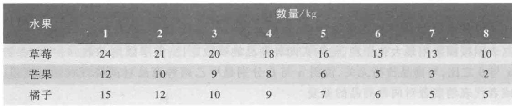  
表2 草莓、芒果和橘子的边际效用

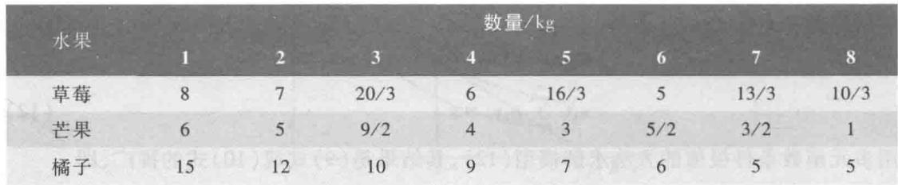

评注无差别曲线的引入使得人们可以通过图形直观、定性地讨论效用最大化原理以及实际应用中的问题,至于效用函数的数学表达式虽然能够给出一些具体的定量结果,但是这些表达式(包括其中的参数)与商品本身的特性以及消费者的需要和偏爱密切相关,是很难确定的.

根据表3,可以按照3种水果单位金额边际效用从大到小的顺序,每次增加  $1\mathrm{kg}$  的购买量,直到花完准备付出的钱.如果李君准备花100元,那么第一笔钱买  $1\mathrm{kg}$  橘子(表3中15最大),第二笔钱又买  $1\mathrm{kg}$  橘子(表3中12次大),如此下去,结果仍是一共买 $4\mathrm{kg}$  草莓、  $1\mathrm{kg}$  芒果和  $6\mathrm{kg}$  橘子(表3中大于或等于6);而若他准备只花70元,那么将只能买  $3\mathrm{kg}$  草莓和  $5\mathrm{kg}$  橘子,不买芒果.

在第二种办法中,由于表2的边际效用是在离散点  $x_{1}, x_{2}, x_{3} = 1,2,3,\dots$  得到的,所以隐含了购买量也是离散值的假定,这样,准备付出的钱(假如是60元)就不一定恰好花完.当然,可以先将边际效用拟合为适当的连续函数,再按第一种办法处理.

在这个例子中,芒果比橘子贵,但芒果买的比橘子少(钱不多时甚至不买芒果),这是因为芒果对李君的效用比橘子小,效用最大化的结果正是"不买贵的,只买对的"!

# 复习题

1. 检验(4)式表示的效用函数是否满足(6)、(7)式

2. 如果商品甲的单价  $p_{1}$  下降,而商品乙单价  $p_{2}$  、消费者准备付出的钱  $s$  和两种商品的效用函数 $U(x,y)$  均不变,讨论效用最大化模型的最优解如何变化.

3. 如果收入  $s$  增加,而两种商品的单价  $p_{1},p_{2}$  和效用函数  $U(x,y)$  均不变,讨论效用最大化模型的最优解如何变化.

# 3.6 血管分支

血液在动物的血管中一刻不停地流动,为了维持血液循环,动物的机体要提供能量.能量的一部分用于供给血管壁以营养,另一部分用来克服血液流动受到的阻力.消耗的总能量显然与血管系统的几何形状有关.在长期的生物进化过程中,高级动物血管

系统的几何形状应该已经达到消耗能量最小原则下的优化标准了。

我们不可能讨论整个血管系统的几何形状,这会涉及太多的生理学知识。下面的模型只研究血管分支处粗细血管半径的比例和分叉角度,在消耗能量最小原则下应该取什么样的数值[7,64]。

模型假设

1. 一条粗血管在分支点处分成两条细血管,分支点附近三条血管在同一平面上,有一对称轴。因为如果不在一个平面上,血管总长度必然增加,导致能量消耗增加,不符合最优原则。这是一条几何上的假设。

2. 在考察血液流动受到的阻力时,将这种流动视为黏性流体在刚性管道中的运动。这当然是一种近似,实际上血管是有弹性的,不过这种近似的影响不大。这是一条物理上的假设。

3. 血液对血管壁提供营养的能量随管壁内表面积及管壁所占体积的增加而增加。管壁所占体积又取决于管壁厚度,而厚度近似地与血管半径成正比。这是一条生理上的假设。

根据假设1,血管分支示意图如图1所示。一条粗血管与两条细血管在  $c$  点分叉,并形成对称的几何形状。设粗细血管半径分别是  $r$  和  $r_{1}$ ,分叉处夹角是  $\theta$ 。考察长度为  $l$  的一段粗血管  $AC$  和长度为  $l_{1}$  的两条细血管  $CB$  和  $CB^{\prime}$ , $ACB(ACB^{\prime})$  的水平和竖直距离为  $L$  和  $H$ ,如图所示。再设血液在粗细血管中单位时间的流量分别为  $q$  和  $q_{1}$ ,显然  $q = 2q_{1}$ 。

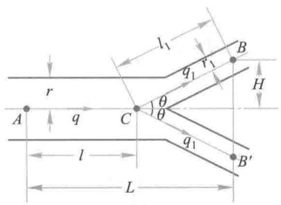  
图1 血管分支示意图

假设2使我们可以利用流体力学关于黏性流体在刚性管道中流动时能量消耗的定律。按照Poiseuille定律,血液流过半径  $r$ 、长  $l$  的一段血管  $AC$  时,流量

$$
q = \frac{\pi r^{4}\Delta p}{8\mu l} \tag{1}
$$

其中  $\Delta p$  是  $A,C$  两点的压力差,  $\mu$  是血液的黏性系数.在血液流动过程中,机体克服阻力所消耗能量为  $E_{1} = q\cdot \Delta p$  ,将(1)式中的  $\Delta p$  代入,得

$$
E_{1} = \frac{8\mu q^{2}l}{\pi r^{4}} \tag{2}
$$

假设3比较复杂,需要作进一步简化。对于半径为  $r$ 、长度为  $l$  的血管,管壁内表面积  $s = 2\pi rl$ ,管壁所占体积  $v = s^{\prime}l$ ,其中  $s^{\prime}$  是管壁截面积。记壁厚为  $d$ ,则  $s^{\prime} = \pi \left[(r + d)^{2} - r^{2}\right] = \pi (d^{2} + 2rd)$ 。设壁厚  $d$  近似地与半径  $r$  成正比,可知  $v$  近似地与  $r^{2}$  成正比。又因为  $s$  与  $r$  成正比,综合考虑管壁内表面积  $s$  和管壁所占体积  $v$  对能量消耗的影响,可设血液流过

长度  $l$  的血管的过程中,为血管壁提供营养消耗的能量为

$$
E_{2} = b r^{\alpha}l \tag{3}
$$

其中  $1 \leqslant \alpha \leqslant 2, b$  是比例系数.

模型建立 根据上述假设及对假设的进一步分析得到的(2),(3)式,血液从粗血管  $A$  点流动到细血管  $B, B^{\prime}$  两点的过程中,机体为克服阻力和供养管壁所消耗的能量为  $E_{1}, E_{2}$  两部分之和,即有

$$
E = \left(\frac{k q^{2}}{r^{4}} +b r^{\alpha}\right)l + \left(\frac{k q_{1}^{2}}{r_{1}^{4}} +b r_{1}^{\alpha}\right)2l_{1} \tag{4}
$$

由图1所示的几何关系不难得到

$$
l = L - \frac{H}{\tan \theta}, \quad l_{1} = \frac{H}{\sin \theta} \tag{5}
$$

将(5)式代入(4)式,并注意到  $q_{1} = q / 2$ ,能量  $E$  可表示为  $r, r_{1}$  和  $\theta$  的函数,即

$$
E\left(r, r_{1}, \theta\right) = \left(\frac{k q^{2}}{r^{4}} +b r^{\alpha}\right)\left(L - \frac{H}{\tan \theta}\right) + \left(\frac{k q^{2}}{4 r_{1}^{4}} +b r_{1}^{\alpha}\right)\frac{2 H}{\sin \theta} \tag{6}
$$

按照最优化原则,  $r / r_{1}$  和  $\theta$  的取值应使(6)式表示的  $E\left(r, r_{1}, \theta\right)$  达到最小.

由  $\frac{\partial E}{\partial r} = 0$  和  $\frac{\partial E}{\partial r_{1}} = 0$  可以得到

$$
\left\{ \begin{array}{l} -\frac{4 k q^{2}}{r^{5}} +b \alpha r^{\alpha -1} = 0 \\ -\frac{k q^{2}}{r_{1}^{5}} +b \alpha r_{1}^{\alpha -1} = 0 \end{array} \right. \tag{7}
$$

从方程(7)可解出

$$
\frac{r}{r_{1}} = 4^{\frac{1}{\alpha + 4}} \tag{8}
$$

再由  $\frac{\partial E}{\partial \theta} = 0$ ,并利用(8)式可得

$$
\cos \theta = 2\left(\frac{r}{r_{1}}\right)^{-4} \tag{9}
$$

将(8)代入(9)式,则

$$
\cos \theta = 2^{\frac{\alpha - 4}{\alpha + 4}} \tag{10}
$$

(8),(10)两式就是在能量消耗最小原则下血管分叉处几何形状的结果,由  $1 \leqslant \alpha \leqslant 2$ ,可以算出  $\frac{r}{r_{1}}$  和  $\theta$  的大致范围为

$$
1.26 \leqslant \frac{r}{r_{1}} \leqslant 1.32, \quad 37^{\circ} \leqslant \theta \leqslant 49^{\circ} \tag{11}
$$

结果解释 生物学家认为,上述结果与经验观察吻合得相当好. 由此还可以导出一个有趣的推论.

记动物的大动脉和最细的毛细血管的半径分别为  $r_{\mathrm{max}}$  和  $r_{\mathrm{min}}$ ,设从大动脉到毛细血管共有  $n$  次分叉,将(8)式反复利用  $n$  次可得

$$
\frac{r_{\mathrm{max}}}{r_{\mathrm{min}}} = 4^{\frac{n}{n + 4}} \tag{12}
$$

$r_{\mathrm{max}} / r_{\mathrm{min}}$  的实际数值可以测出,例如对狗而言有  $r_{\mathrm{max}} / r_{\mathrm{min}} \approx 1000 \approx 4^{5}$ ,由(12)式可知  $n \approx 5(\alpha + 4)$ . 因为  $1 \leqslant \alpha \leqslant 2$ ,所以按照这个模型,狗的血管应有  $25 \sim 30$  次分叉.又因为当血管有  $n$  次分叉时血管总条数为  $2^{n}$ ,所以估计狗应约有  $2^{25} \sim 2^{30}$ ,即  $3 \times 10^{4} \sim 10^{9}$  条血管.这个估计不可过于认真看待,因为血管分支很难是完全对称的.

如果模型假设中不作(3)式的简化,而是在消耗的能量中既有与  $r^{2}$  成正比、又有与  $r$  成正比的部分,试分析对建模和求解有什么影响.

# 3.7 冰山运输

在以盛产石油著称的波斯湾地区,浩瀚的沙漠覆盖着大地,水资源十分贫乏,不得不采用淡化海水的办法为国民提供用水,成本大约是每立方米淡水0.1英镑.有些专家提出从相距  $9600 \mathrm{~km}$  之遥的南极用拖船运送冰山到波斯湾,以取代淡化海水的办法.这个模型要从经济角度研究冰山运输的可行性[16].

为了计算用拖船运送冰山获得每立方米水所花的费用,我们需要关于拖船的租金、运量、燃料消耗及冰山运输过程中融化速率等方面的数据,以此作为建模必需的准备工作.

模型准备 根据建模的需要搜集到以下数据

1. 三种拖船的日租金和最大运量(表1).

表1日租金和最大运量  

<table><tr><td>船型</td><td>小</td><td>中</td><td>大</td></tr><tr><td>日租金/英镑</td><td>4.0</td><td>6.2</td><td>8.0</td></tr><tr><td>最大运量/m³</td><td>5×10⁵</td><td>10⁶</td><td>10⁷</td></tr></table>

2. 燃料消耗.主要依赖于船速和所运冰山的体积,船型的影响可以忽略.

表2燃料消耗 单位:英镑/km

<table><tr><td rowspan="2">船速/(km·h-1)</td><td colspan="3">冰山体积/m³</td></tr><tr><td>10⁵</td><td>10⁶</td><td>10⁷</td></tr><tr><td>1</td><td>8.4</td><td>10.5</td><td>12.6</td></tr><tr><td>3</td><td>10.8</td><td>13.5</td><td>16.2</td></tr><tr><td>5</td><td>13.2</td><td>16.5</td><td>19.8</td></tr></table>

3. 冰山运输过程中的融化速率.指在冰山与海水、大气接触处每天融化的深度.融化速率除与船速有关外,还和运输过程中冰山与南极的距离有关,这是由于冰山要从南

极运往赤道附近的缘故.

表3融化速率  

<table><tr><td rowspan="2">船速/(km·h-1)</td><td colspan="3">与南极距离/km</td></tr><tr><td>0</td><td>1 000</td><td>&amp;gt;4 000</td></tr><tr><td>1</td><td>0</td><td>0.1</td><td>0.3</td></tr><tr><td>3</td><td>0</td><td>0.15</td><td>0.45</td></tr><tr><td>5</td><td>0</td><td>0.2</td><td>0.6</td></tr></table>

建立模型的目的是选择拖船的船型和船速,使冰山到达目的地后,可得到的每立方米水所花的费用最低,并与海水淡化的费用相比较.

根据建模目的和搜集到的有限的资料,需要作如下的简化假设.

模型假设

1. 拖船航行过程中船速不变,航行不考虑天气等任何因素的影响.总航行距离 $9600\mathrm{km}$

2. 冰山形状为球形,球面各点的融化速率相同.这是相当无奈的假设,在冰山上各点融化速率相同的条件下,只有球形的形状不变,体积的变化才能简单地计算.

3. 冰山到达目的地后,  $1\mathrm{m}^{3}$  冰可融化成  $0.85\mathrm{m}^{3}$  水.

模型构成首先需要知道冰山体积在运输过程中的变化情况,然后是计算航行中的燃料消耗,由此可以算出到达目的地后的冰山体积和运费.在计算过程中需要根据搜集到的数据拟合出经验公式.模型构成可分为以下几步.

1. 冰山融化规律根据假设2,先确定冰山球面半径的减小,就可以得到冰山体积的变化规律.

记冰山球面半径融化速率为  $r$  (  $\mathrm{m}$  天),船速为  $u$  (  $\mathrm{km} / \mathrm{h}$  ),拖船与南极距离为 $d$  (km).根据表3中融化速率的数据,可设  $r$  是船速  $u$  的线性函数,且当  $0\leqslant d\leqslant$ $4000\mathrm{km}$  时  $r$  与  $d$  成正比,而当  $d > 4000\mathrm{km}$  时  $r$  与  $d$  无关,即设

$$
r = \left\{ \begin{array}{l l}{a_{1}d\left(1 + b u\right),0\leqslant d\leqslant 4 000}\\ {a_{2}\left(1 + b u\right),d > 4 000} \end{array} \right. \tag{1}
$$

其中  $a_{1},a_{2},b$  为待定参数.这可以解释为,  $0\leqslant d\leqslant 4000\mathrm{km}$  相当于从南极到赤道以南,海水温度随  $d$  增加而上升,使融化速率  $r$  也随  $d$  的增加而变大,而  $d > 4000\mathrm{km}$  后海水温度变化较小,可以忽略.

利用表3所给数据确定出  $①$

$$
a_{1} = 6.5\times 10^{-5},\quad a_{2} = 0.2,\quad b = 0.4 \tag{2}
$$

当拖船从南极出发航行第  $t$  天时,与南极的距离为

$$
d = 24u t \tag{3}
$$

记第  $t$  天冰山球面半径融化速率为  $r_{t}$  ,将(2),(3)代入(1)式得

$$
r_{t} = \left\{ \begin{array}{l l}{1.56\times 10^{-3}u\left(1 + 0.4u\right)t,} & {0\leqslant t\leqslant \frac{1000}{6u}}\\ {0.2\left(1 + 0.4u\right),} & {t > \frac{1000}{6u}} \end{array} \right. \tag{4}
$$

记第  $t$  天冰山半径为  $R_{t}$ , 体积为  $V_{t}$ , 则

$$
R_{t} = R_{0} - \sum_{k = 1}^{t} r_{k} \tag{5}
$$

$$
V_{t} = \frac{4\pi}{3} R_{t}^{3}, \quad V_{0} = \frac{4\pi}{3} R_{0}^{3} \tag{6}
$$

其中  $R_{0}, V_{0}$  为从南极启运时冰山的初始半径和体积. 由  $(4) \sim (6)$  式可知, 冰山体积是船速  $u$  、初始体积  $V_{0}$  和航行天数  $t$  的函数, 记作  $V(u, V_{0}, t)$ , 有

$$
V(u, V_{0}, t) = \frac{4\pi}{3} \left(\sqrt[3]{\frac{3V_{0}}{4\pi}} - \sum_{k = 1}^{t} r_{k}\right)^{3} \tag{7}
$$

其中  $r_{k}$  由(4)式表示.

2. 燃料消耗费用分析表2给出的燃料消耗(英镑  $\mathrm{km}$ , 记作  $\overline{q}$  )的数据可以看出,  $q$  对船速  $u$  和冰山体积  $V$  的对数  $\lg V$  均按线性关系变化, 所以可设

$$
\overline{q} = c_{1}(u + c_{2})(\lg V + c_{3}) \tag{8}
$$

其中  $c_{1}, c_{2}, c_{3}$  为待定参数. 利用表2所给数据可以确定  $①$

$$
c_{1} = 0.3, \quad c_{2} = 6, \quad c_{3} = -1 \tag{9}
$$

由  $(7) \sim (9)$  式可将拖船航行第  $t$  天的燃料消耗记作  $q(u, V_{0}, t)$  (英镑/天), 且有

$$
\begin{array}{l}{{q\left(u,V_{0},t\right)=24u\cdot c_{1}\left(u+c_{2}\right)\left[\mathrm{~lg~}V\left(u,V_{0},t\right)+c_{3}\right]}}\\ {{\mathrm{~}}}\\ {{\mathrm{~}=7.2u\left(u+6\right)\left[\mathrm{~lg~}\frac{4\pi}{3}\left(\sqrt[3]{\frac{3V_{0}}{4\pi}}-\sum_{k=1}^{t}r_{k}\right)^{3}-1\right]}}\\ {{\mathrm{~}}}\\ {{\mathrm{~}=7.2u\left(u+6\right)\left[3\mathrm{lg}\left(\sqrt[3]{\frac{3V_{0}}{4\pi}}-\sum_{k=1}^{t}r_{k}\right)-0.378\right]}}\end{array} \tag{10}
$$

3. 运送冰山费用费用由拖船的租金和燃料消耗两部分组成. 由表1知船的日租金取决于船型, 船型又由冰山的初始体积  $V_{0}$  决定, 记日租金为  $f(V_{0})$ , 显然有

$$
f(V_{0}) = \left\{ \begin{array}{ll}4.0, & V_{0} \leqslant 5 \times 10^{5} \\ 6.2, & 5 \times 10^{5} < V_{0} \leqslant 10^{6} \\ 8.0, & 10^{6} < V_{0} \leqslant 10^{7} \end{array} \right. \tag{11}
$$

又因为当船速为  $u(\mathrm{km} / \mathrm{h})$  时冰山抵达目的地所需天数为  $T = \frac{9600}{24u} = \frac{400}{u}$ , 所以租金费用为  $\frac{400f(V_{0})}{u}$ . 而整个航程的燃料消耗为  $\sum_{t = 1}^{T} q(u, V_{0}, t)$ , 由(10)式得运送冰山的总费用为

$$
S(u,V_{0}) = \frac{400f(V_{0})}{u} +7.2u(u + 6)\left[3\sum_{t = 1}^{T}\lg \left(\sqrt[3]{\frac{3V_{0}}{4\pi}} -\sum_{k = 1}^{t}r_{k}\right) - \frac{151}{u}\right] \tag{12}
$$

4. 冰山运抵目的地后可获得水的体积 将  $t = T$  代入(7)式知,冰山运抵目的地后的体积为

$$
V(u,V_{0},T) = \frac{4\pi}{3}\left(\sqrt[3]{\frac{3V_{0}}{4\pi}} -\sum_{t = 1}^{T}r_{t}\right)^{3} \tag{13}
$$

注意到假设(3),则得到水的体积为

$$
W(u,V_{0}) = \frac{3.4\pi}{3}\left(\sqrt[3]{\frac{3V_{0}}{4\pi}} -\sum_{k = 1}^{T}r_{k}\right)^{3} \tag{14}
$$

5. 每立方米水所需费用 记冰山运抵目的地后每立方米所需费用为  $Y(u,V_{0})$ ,由(12),(14)式显然有

$$
Y(u,V_{0}) = \frac{S(u,V_{0})}{W(u,V_{0})} \tag{15}
$$

模型求解这个模型归结为选择船速  $u$  和冰山初始体积  $V_{0}$ ,使(15)式表示的费用  $Y(u,V_{0})$  最小,其中  $S(u,V_{0})$  由(12),(4)式给出,  $W(u,V_{0})$  由(14),(4)式给出。由于  $f(V_{0})$  是分段函数,只能固定一系列  $V_{0}$  值对  $u$  求解。又因为由调查数据(表2,表3)得到的经验公式是非常粗糙的,对船速  $u$  的选取也不用太精细,所以没有必要用微分法求解这个极值问题。表4是对几组  $(V_{0},u)$  值的计算结果,可知若选取最大的冰山初始体积  $V_{0} = 10^{7} \mathrm{~m}^{3}$  (当然要租用大型拖船),船速  $u = 4\sim 5 \mathrm{~km / h}$ ,每立方米水的费用约0.065英镑。

单位:英镑

评注 这个模型的思路是简单的、建模方法有两点值得注意:一是根据有限的数据(表2,表3)建立了经验公式(1),(2)和(8),(9),为整个计算过程提供了基础;二是假定冰山呈球形,简化了计算。读者可以考虑,如果假定冰山为其他规则的形状,将如何处理。

<table><tr><td rowspan="2">V0</td><td colspan="6">u</td></tr><tr><td>3</td><td>3.5</td><td>4</td><td>4.5</td><td>5</td><td></td></tr><tr><td>107</td><td>0.072 3</td><td>0.068 3</td><td>0.064 9</td><td>0.066 3</td><td>0.065 8</td><td></td></tr><tr><td>5×106</td><td>0.225 1</td><td>0.201 3</td><td>0.183 4</td><td>0.184 2</td><td>0.179 0</td><td></td></tr><tr><td>106</td><td>78.903 2</td><td>9.822 0</td><td>6.213 8</td><td>5.464 7</td><td>4.510 2</td><td></td></tr></table>

结果分析 得到的结果虽然小于海水淡化的费用(每立方米0.1英镑),但是模型中未考虑影响航行的种种不利因素,会拖长航行时间致使冰山抵达目的地后的体积显著地小于模型中的  $V(u,V_{0},T)$ ,并且没有计算空船费等其他费用。专家们认为,只有当用这个模型计算出来的费用显著地小于海水淡化的费用时(譬如小一个数量级),才有理由考虑采用冰山运输的办法获得淡水。

# 复习题

将冰山看作长方体更切合实际,试对冰山融化状况作适当假定后建立模型,用本节的数据求解。

# 3.8 影院里的视角和仰角

到影院看电影时有人愿意坐在前排,有人愿意坐在后面,更多的人选择中间的座位.除了个人的原因之外,前后排的主要差别在于视角和仰角.视角是观众眼睛到屏幕上、下边缘视线的夹角,视角大画面看起来饱满;仰角是观众眼睛到屏幕上边缘视线与水平线的夹角,仰角太大会使人的头部过分上仰,引起不舒适感.从影院设计者的角度出发,应该在总体上使观众的视角尽可能大①,仰角则应有一定限制.这个模型简单地讨论影院屏幕和座位设计中的一些问题,对于观众选择座位也有一定意义[70].

作为一种简化情况,图1是垂直于屏幕和地面的影院纵向剖面示意图,即只考虑前后座位观看屏幕的差别,不管左右座位及屏幕横向方面的因素.影院座位的地板线与水平面有一个角度  $\theta$  ,主要是避免前排观众遮挡后排的视线.

图1中画出了某一排观众的视角  $\alpha$  和仰角  $\beta$  ,可以看到,影响视角  $\alpha$  和仰角  $\beta$  的因素很多,除了观众在第几排座位以外,有屏幕高度  $h$  、屏幕下边缘距地面高度  $b$  、第一排座位与屏幕水平距离  $d$  、座位地板线与地面夹角  $\theta$  、两排座位间距  $② q$  、观众眼睛到地板的距离  $c$  等,其中  $h$ $q,c$  基本上是固定的,如果总排数一定,  $d$  的改变余地也不大,于是在影院设计时只有  $b$  和  $\theta$  可以在一定范围内调整.本节将  $h$ $d,q,c$  的数值以及座位总排数  $n$  固定,只讨论  $b$  和  $\theta$  的变化对观众满意程度的影响,研究  $b$  和  $\theta$  取什么数值时(在设定范围内)全体观众的满意程度最高.

从设计者的角度,按照以下几个方面考虑观众的满意程度:

1. 全体观众视角的平均值尽量大,而各排座位视角的分散程度尽量小.

2. 各排座位的仰角基本上不要超过  $30^{\circ}$  ,可以允许1~2排的例外.

3. 前排观众不应遮挡后排观众的视线

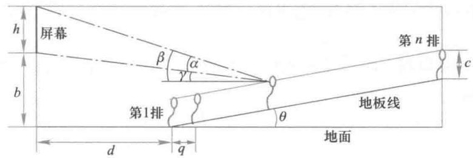  
图1影院纵向剖面示意图

问题分析记影院各排座位序号为  $k = 1,2,\dots ,n$  ,从图1可以直观地看出,随着座位序号  $k$  的增加,视角  $\alpha$  和仰角  $\beta$  均在减小.全体观众视角的平均值为  $k = 1$  到  $n$  排视角的均值,各排座位视角的分散程度不妨借用概率统计中这  $n$  个视角的均方差来度量.因为均值越大且均方差越小,全体观众满意程度就越高,所以观众的满意程度可以定义为

各排视角的均值与均方差之比, 概率统计中称为变异系数  $①$ . 这个优化问题的目标函数就取作各排座位视角的变异系数.

问题的第一个约束条件是仰角  $\beta \leqslant 30^{\circ}$ , 且允许  $1 \sim 2$  排不满足. 由于  $\beta$  随着  $k$  的增加而减小, 所以只需检查前 3 排仰角  $\beta$  的数值即可.

第二个约束条件是前排观众不遮挡后排的视线, 需要在观众眼睛到地板距离  $c$  之上设定眼睛到头顶的高度, 使后排观众眼睛到屏幕下边缘的视线, 在前排观众头顶之上. 直观地看, 只要最后一排满足这个条件, 所有座位都会满足.

目标函数的自变量即设计者的控制变量, 是屏幕下边缘距地面高度  $b$  及座位地板线与地面夹角  $\theta$ .

模型假设作为固定参数, 设屏幕高度  $h = 2.5 \mathrm{~m}$ , 第 1 排座位与屏幕水平距离  $d = 6 \mathrm{~m}$ , 两排座位间距  $q = 0.8 \mathrm{~m}$ , 观众眼睛到地板的距离  $c = 1.1 \mathrm{~m}$ , 观众眼睛到头顶的高度  $c_{1} = 0.1 \mathrm{~m}$ , 座位总排数  $n = 16$ . 作为控制变量, 设屏幕下边缘距地面高度  $b$  在  $2 \mathrm{~m}$  至  $3 \mathrm{~m}$  变化, 座位地板线与地面夹角  $\theta$  在  $10^{\circ}$  至  $20^{\circ}$  变化.

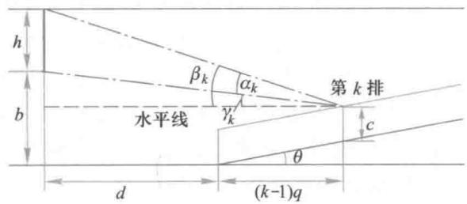  
图2 仰角和视角的计算

记观众眼睛到屏幕下边缘的视线与水平线的夹角为  $\gamma$ , 称下仰角, 由图 1 可见, 视角  $\alpha = \beta - \gamma$ . 需要注意的是, 当这条视线在水平线之下时 (可能有这种情况) 下仰角  $\gamma$  应取负值. 对仰角  $\beta$  (以下称上仰角) 也应作此规定, 不过实际上不大可能出现  $\beta$  为负的情况.

模型建立截取图 1 的一部分如图 2, 计算第  $k$  排座位的下仰角  $\gamma_{k}$  、上仰角  $\beta_{k}$  和视角  $\alpha_{k}$ . 利用三角关系容易得到

$$
\tan \gamma_{k} = \frac{b - c - (k - 1)q\tan\theta}{d + (k - 1)q} \tag{1}
$$

$$
\tan \beta_{k} = \frac{b - c - (k - 1)q\tan\theta + h}{d + (k - 1)q} \tag{2}
$$

$$
\alpha_{k} = \beta_{k} - \gamma_{k} \tag{3}
$$

记各排视角的均值为  $m(\alpha)$ , 均方差为  $s(\alpha)$ , 变异系数为  $v(\alpha)$ , 则

$$
m(\alpha) = \frac{1}{n}\sum_{k = 1}^{n}\alpha_{k}, s(\alpha) = \sqrt{\frac{1}{n - 1}\sum_{k = 1}^{n}\left[\alpha_{k} - m(\alpha)\right]^{2}}, v(\alpha) = \frac{m(\alpha)}{s(\alpha)} \tag{4}
$$

$v(\alpha)$  是这个优化模型的目标函数, 其中  $h, d, q, c$  和  $n$  为常数, 要确定  $b$  和  $\theta$  (在设定区间内) 使  $v(\alpha)$  最大.

按照前面的分析, 模型对于仰角  $\beta$  的约束条件为

$$
\beta_{k} \leqslant 30^{\circ}, k = 3, \dots , n \tag{5}
$$

对于前排不遮挡后排视线的约束条件可作以下计算.图3表示的是最后一排与前一排之间的遮挡关系,图中  $\gamma_{n}$  是从第  $n$  排观众眼睛  $A$  点到屏幕下边缘视线的下仰角,  $\delta$  是连接  $A$  点和第  $n - 1$  排观众头顶  $B$  点连线与水平线的夹角,当连线在水平线以下时  $\delta$  为负.视线不被遮挡的条件是  $\gamma_{n} > \delta$ , 或者

$$
\tan \gamma_{n} > \tan \delta \tag{6}
$$

其中tan  $\gamma_{n}$  由(1)式以  $k = n$  代人得到,tan  $\delta$  可根据图3写出

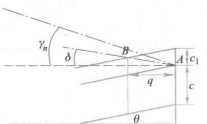  
图3 前排不遮挡后排视线的计算

$$
\tan \delta = \frac{c_{1} - q \tan \theta}{q} \tag{7}
$$

于是(6)式等价于

$$
\frac{b - c - (n - 1)q \tan \theta}{d + (n - 1)q} > \frac{c_{1} - q \tan \theta}{q} \tag{8}
$$

不难看出,由于  $\gamma_{k}$  是  $k$  的减函数,而  $\delta$  是与  $k$  无关的常数,所以(6)式或(8)式就是全体观众视线不被遮挡的条件.

综上,建立了以(1)~(4)式为目标函数、(5)式和(6)式为约束条件、  $b$  和  $\theta$  为自变量的优化模型.

模型分析 在求解之前,让我们对模型作一个定性分析,讨论  $b$  和  $\theta$  的变化对目标函数和约束条件会有什么影响.

由(1)式和(2)式容易知道,  $b$  增加使  $\gamma_{k}$  和  $\beta_{k}$  均增加,而  $\theta$  增加使  $\gamma_{k}$  和  $\beta_{k}$  均减少,这也可以从图2上直观地看出.视角  $\alpha_{k}$  是  $\gamma_{k}$  与  $\beta_{k}$  之差((3)式),  $b$  和  $\theta$  的增加对  $\alpha_{k}$  的影响如何呢?根据三角公式  $\tan (\beta - \gamma) = \frac{\tan \beta - \tan \gamma}{1 + \tan \beta \tan \gamma}$ , 从(1)~(3)式可得

$$
\tan \alpha_{k} = \frac{h\left[d + (k - 1)q\right]}{\left[d + (k - 1)q\right]^{2} + \left[b - c + h - (k - 1)q\tan \theta\right]\left[b - c - (k - 1)q\tan \theta\right]} \tag{9}
$$

对(9)式分析,  $b$  增加会使  $\alpha_{k}$  减少,而  $\theta$  增加会使  $\alpha_{k}$  增加.你的直观感觉是这样吗?

再看(4)式,各排视角  $\alpha_{k}$  的增减当然导致均值  $m(\alpha)$  的增减.多数情况下,均方差  $s(\alpha)$  也会有同样的增减.但是变异系数  $v(\alpha)$  作为二者之比,将有什么样的变化就无法作定性分析了.

对于仰角的约束条件(5)式,只能说  $b$  越小、  $\theta$  越大,越容易满足.

对于遮挡的约束条件(8)式,作代数运算可化为

$$
b + d \tan \theta > c + c_{1}(n - 1) + \frac{c_{1} d}{q} \tag{10}
$$

可知,  $b$  和  $\theta$  越大,这个条件越容易满足,并且当模型的已知常数  $c, c_{1}, n$  变小及  $q$  变大时,也会使条件(10)容易满足,这些都是与直观相符的.

模型求解 用导数为零的解析方法求解上述模型显然是难以实现的,我们转向数

值搜索方法,在  $b$  和  $\theta$  的设定区间内取一系列离散值,先按照  $(1)\sim (4)$  式计算目标函数 $v(\alpha)$  ,找出最优解,再检验约束条件(5)式和(6)式是否满足,如果不满足,将最优解放宽后再作检验,直到找出满足约束条件的最优解.

根据  $(1)\sim (4)$  式和给定的  $h,d,q,c,n$  数值,对屏幕下边缘距地面高度  $b$  在  $2\textrm{m}$  至 $3\textrm{m}$  区间、座位地板线与地面夹角  $\theta$  在  $10^{\circ}$  至  $20^{\circ}$  区间离散化,编程计算得到视角  $\alpha_{k}$  的均值  $m(\alpha)$  、均方差  $s(\alpha)$  及变异系数  $v(\alpha)$  ,表1只给出了模型的目标函数  $v(\alpha)$  的结果.

计算结果显示,随着  $b$  的增加,均值  $m(\alpha)$  和均方差  $s(\alpha)$  都在减少,但  $m(\alpha)$  只减少约  $5\%$  ,而  $s(\alpha)$  减少约  $15\%$  ,结果导致  $v(\alpha)$  一直在增加,最大值位于  $b$  的区间端点 $3.0\mathrm{~m~}$  ,如表1所示;随着  $\theta$  的增加,  $m(\alpha)$  和  $s(\alpha)$  都在增加,导致  $v(\alpha)$  先增后减(当  $b>$ $2.3\mathrm{~m~}$  ),最大值在  $\theta$  区间  $[10^{\circ},20^{\circ}]$  内部,表1中  $b = 3.0\mathrm{~m~}$  时  $v(\alpha)$  最大值在  $\theta = 13^{\circ}$  达到(表中黑体数字).

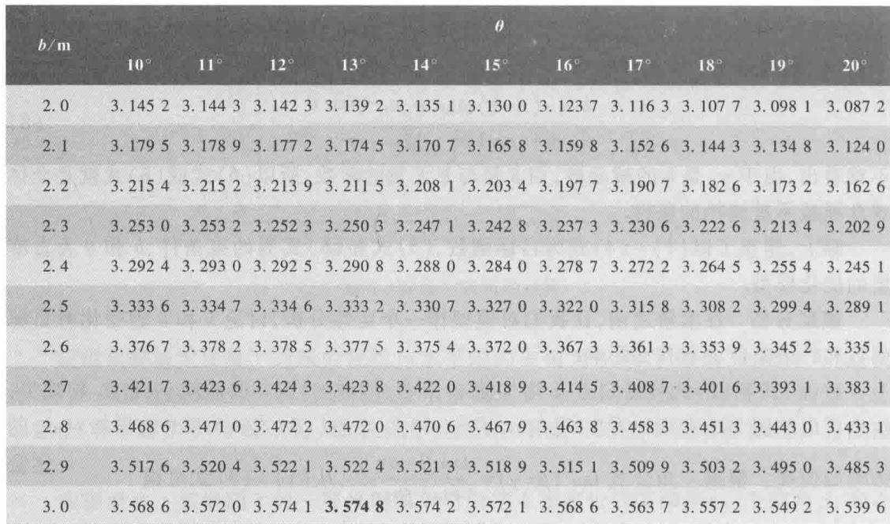  
表1各排座位视角变异系数的计算结果

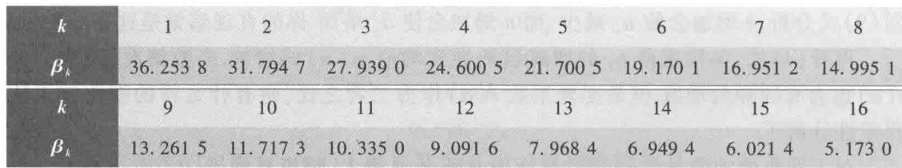  
表2在  $b = 3.0\mathrm{~m~},\theta = 13^{\circ}$  处各排座位仰角的计算结果

接着需要检查在  $b = 3.0\mathrm{~m~},\theta = 13^{\circ}$  处的约束条件是否满足.仰角  $\beta_{k}$  的计算结果如表2,可知除  $\beta_{1},\beta_{2}$  外均满足(5)式.按照(1)式计算出tan  $\gamma_{n} = - 2.7685$  ,按照(7)式计算出tan  $\delta = - 6.0433$  ,可知满足(6)式.于是  $b = 3.0\mathrm{~m~},\theta = 13^{\circ}$  确是整个模型的最优解.

表3是在最优解  $b = 3.0\mathrm{~m~},\theta = 13^{\circ}$  处视角  $\alpha_{k}$  及均值  $m(\alpha)$  、均方差  $s(\alpha)$  的计算结果.表2、表3的仰角  $\beta_{k}$  和视角  $\alpha_{k}$  还表示在图4中.

表3在  $b = 3.0\mathrm{~m~},\theta = 13^{\circ}$  处各排座位视角的计算结果  

<table><tr><td>k</td><td>1</td><td>2</td><td>3</td><td>4</td><td>5</td><td>6</td><td>7</td><td>8</td><td>9</td></tr><tr><td>αk</td><td>18.682 6</td><td>17.637 1</td><td>16.552 1</td><td>15.497 5</td><td>14.506 7</td><td>13.592 7</td><td>12.757 9</td><td>11.999 0</td><td>11.310 3</td></tr><tr><td>k</td><td>10</td><td>11</td><td>12</td><td>13</td><td>14</td><td>15</td><td>16</td><td>m(α)</td><td>s(α)</td></tr><tr><td>αk</td><td>10.685 5</td><td>10.117 8</td><td>9.601 2</td><td>9.130 1</td><td>8.699 3</td><td>8.304 4</td><td>7.941 5</td><td>12.313 5</td><td>3.444 5</td></tr></table>

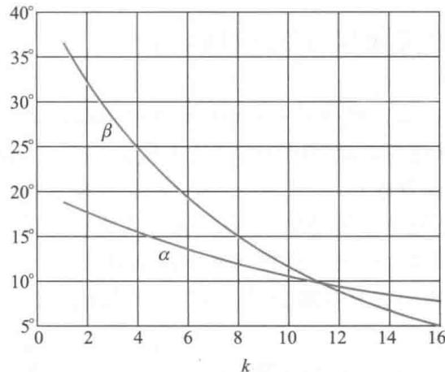  
图4最优解处各排座位的仰角  $\beta$  和视角  $\alpha$

评注 影院屏幕和座位设计中要考虑的因素很多,作为初步的简化,这里只选取各排座位的视角和仰角为控制目标,屏幕下边缘距地面高度和座位地板线与地面夹角为控制变量,根据设计者对全体观众的视角及其分散程度的要求,用视角均值和均方差之比构造目标函数,并按照对仰角

结果分析首先根据表1作敏感性分析.在最优解  $b = 3.0\mathrm{~m~}$  ,当  $\Delta b = 0.1\mathrm{~m~}$  即  $\frac{\Delta b}{b} \approx$

大小和视线遮挡的限制给定约束条件,建立了完整的优化模型.鉴于模型表述的复杂性,采用数值搜索方法通过编程计算求得最优解.

$3.3\%$  时  $\frac{\Delta v}{v} \approx 1.5\%$  ,相当于自变量  $b$  的  $1\%$  的改变引起目标函数不到  $0.5\%$  的变化.在最优解  $\theta = 13^{\circ}$  ,当  $\Delta \theta = 1^{\circ}$  即  $\frac{\Delta \theta}{\theta} \approx 8\%$  时  $\frac{\Delta v}{v} \approx 0.2\%$  ,相当于自变量  $\theta$  的  $1\%$  的改变引起目标函数不到  $0.03\%$  的变化.  $b$  对目标函数的影响比  $\theta$  的影响大十几倍.

在模型的定性分析中,研究了控制变量的变化对目标函数和约束条件的影响,所得结论与直观和常识相符合,可作为检验模型正确性的一个方面,是建模过程的重要环节之一.模型定量结果与定性分析的相互印证、控制变量的敏感性分析,以及对各排座位仰角和视角的讨论,更丰富了建模的成果,拓广了模型的应用.

由表2看到,在最优解  $b = 3.0\mathrm{~m~}, \theta = 13^{\circ}$  处,第1,2排座位的仰角大于  $30^{\circ}$  ,刚刚满足约束(5)式.如果对仰角的要求更严格,需要调整  $b$  和  $\theta$  (复习题1).

由表3看到,最优解处各排视角都在  $8^{\circ}$  到  $19^{\circ}$  之间,相邻两排视角相差不到  $1^{\circ}$

图4直观地给出各排座位仰角和视角的变化情况,观众可以据此选择适合自己的座位.从图上看,仰角下降很快,而视角变化不大,所以建议一般观众可以选择仰角下降变缓的第10排左右.

从结果分析看出,地板线与地面夹角的变化对目标函数的影响较小,不妨在设定范围内固定某个数值,而将其他因素如第1排座位与屏幕水平距离作为新的控制变量,重新研究这个优化问题.

在影院屏幕和座位设计中,控制变量、目标函数、约束条件都可以因考虑问题的目的不同、角度不同而改变.此外,这个模型仅仅讨论了影院座位的纵向设计,读者不妨拓宽眼界和思路,研究座位的横向设计,甚至座位的二维平面设计.