# 复习题

1. 如果严格限制各排座位的仰角不超过  $30^{\circ}$  (误差  $0.5^{\circ}$  ), 如何调整  $b$  和  $\theta$ ?

2. 将  $\theta$  设定在  $15^{\circ}$ , 而第一排座位与屏幕水平距离  $d$  可在  $5 \mathrm{~m}$  至  $7 \mathrm{~m}$  间调整, 先定性分析  $d$  的变化对仰角和视角的影响, 再重新求解模型, 得出  $b$  和  $d$  的最优解.

# 3.9 易拉罐形状和尺寸的最优设计

我们只要稍加留意就会发现销量很大的饮料(例如饮料量为  $355 \mathrm{~mL}$  的可口可乐、青岛啤酒等)的饮料罐(即易拉罐)的形状和尺寸几乎都是一样的. 看来, 这并非偶然, 这应该是某种意义下的最优设计. 当然, 对于单个的易拉罐来说, 这种最优设计可以节省的钱可能是很有限的, 但是如果是生产几亿, 甚至几十亿个易拉罐的话, 可以节约的钱就很可观了(引自全国大学生数学建模竞赛 2006 年 C 题).

现在就请你们小组来研究易拉罐的形状和尺寸的最优设计问题. 具体说, 请你们完成以下的任务:

1. 取一个饮料量为  $355 \mathrm{~mL}$  的易拉罐, 例如  $355 \mathrm{~mL}$  的可口可乐饮料罐, 测量你们认为验证模型所需要的数据, 例如易拉罐各部分的直径、高度、厚度等, 并把数据列表加以说明; 如果数据不是你们自己测量得到的, 那么你们必须注明出处.

2. 设易拉罐是一个正圆柱体. 什么是它的最优设计? 其结果是否可以合理地说明你们所测量的易拉罐的形状和尺寸? 例如说, 半径和高之比, 等等.

3. 设易拉罐的中心纵断面如图 1 所示, 即上面部分是一个正圆台, 下面部分是一个正圆柱体. 什么是它的最优设计? 其结果是否可以合理地说明你们所测量的易拉罐的形状和尺寸?

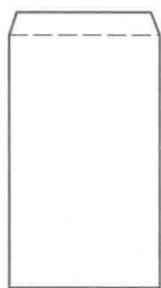  
图1易拉罐纵断面

4. 利用你们对所测量的易拉罐的洞察和想象力, 做出你们自己的关于易拉罐形状和尺寸的最优设计.

本节以发表在《工程数学学报》2006 年增刊上参赛学生的优秀论文和评述文章为基本材料, 加以整理、归纳和提高, 介绍建模的全过程.

问题分析 很多微积分教材在导数应用的章节中都有这样的极值问题: 设计一个容积固定的、有盖的圆柱形容器, 若侧壁及底、盖的厚度都相同, 问容器高度与底面半径之比为多少时, 所耗的材料最少?

其求解过程简述如下: 由于侧壁及底、盖的厚度相同, 容器所耗材料可用总面积表示. 记容器底面半径为  $r$ , 高度为  $h$ , 侧壁及盖、底的总面积为  $S$ , 容器容积为  $V$ , 则

$$
S = 2\pi r h + 2\pi r^{2} \tag{1}
$$

$$
V = \pi r^{2}h \tag{2}
$$

问题化为在  $V$  固定的条件下求  $r, h$  满足什么关系可使  $S$  最小.

从(2)式解出  $h$  代入(1)式右端, 有

$$
S = \frac{2V}{r} +2\pi r^{2} \tag{3}
$$

$S$  对  $r$  求导并令其等于0,得

$$
\frac{\mathrm{d}S}{\mathrm{d}r} = -\frac{2V}{r^{2}} +4\pi r = 0 \tag{4}
$$

不必解出  $r$  与  $V$  的关系,可以直接从(4)式得到  $\frac{V}{\pi r^{2}} = 2r$ ,代入  $h = \frac{V}{\pi r^{2}}$  即得

$$
h = 2r \tag{5}
$$

表明容器高度与底面直径相等时所耗材料最少

当用这个结果审视日常所见的易拉罐时,不相符合之处十分明显。通常易拉罐的高度比底面直径大得多。究其原因,抛开设计美学等因素的考虑,单纯从节省材料的角度分析,如果罐底、盖的厚度比侧壁大,就应该增加高度、减少底面直径。本题要求先测量易拉罐的直径、高度、厚度等数据,正是让大家在实际的感性认识的基础上,注意到易拉罐各个表面的材料厚度的不同,建模时应考虑这个因素的影响。

粗略地看,易拉罐是一个正圆柱体。利用简单的几何知识,容易写出它的体积和表面积,在各表面厚度不同的情况下,建立类似于(1)、(2)式的模型。精细一些,易拉罐的形状是圆柱体上面有一个小的圆台,由于独立变量数量的增加,建立的模型是多元函数,求解会复杂一些。至于如何发挥洞察力和想象力,做出易拉罐形状和尺寸的最优设计,容易想到又比较符合实际的是将顶部的小圆台改为球台,看看能否有所改进。

数据测量对形如图1的易拉罐的各项尺寸用适当的仪器进行测量,为精确起见,取5只罐子测量后计算平均值,得表  $1①$

表1易拉罐（可口可乐）的各项尺寸  

<table><tr><td>罐高
/mm</td><td>圆柱高
/mm</td><td>圆柱直径
/mm</td><td>圆台高
/mm</td><td>顶盖直径
/mm</td><td>罐壁厚
/mm</td><td>顶盖厚
/mm</td><td>罐底厚
/mm</td><td>罐内容积
/cm³</td></tr><tr><td>120.6</td><td>110.5</td><td>66.1</td><td>10.1</td><td>60.1</td><td>0.103</td><td>0.306</td><td>0.300</td><td>364.8</td></tr></table>

表1数据中值得注意的有两点:一是易拉罐底、盖的厚度约为罐壁的3倍,相差很大,这大概是制作工艺和使用方便的需要,正因为这样,易拉罐尺寸的优化设计才与前面简述的微积分中的极值问题有差别;二是圆台高不到圆柱体高度的  $10\%$ ,顶盖与圆柱的直径相差也是  $10\%$ ,所以把圆台近似作圆柱处理误差很小。另外,表中罐内容积是用量筒测出的,不妨用罐的各项尺寸粗略地核算一下:罐内圆柱直径为  $66.1 - 0.1 \times 2 = 65.9(\mathrm{~mm})$ ,罐内高度为  $120.6 - 0.3 \times 2 = 120(\mathrm{~mm})$ ,所以罐内体积应是  $\pi \times 33^{2} \times 120 = 410.3 \times 10^{3}(\mathrm{~mm}^{3})$ ,比测量数据大  $12\%$ ,这大概是测量误差造成的。

下面按照对题目中第2,3,4个问题的分析,依次讨论圆柱模型、圆台模型和球台模型。

圆柱模型将易拉罐顶部的小圆台近似于圆柱,与下面圆柱体的直径相同。

记圆柱半径为  $r$ , 高度为  $h$ , 侧壁厚度为  $b$ , 底、盖的厚度分别为  $kb$  和  $k_{1}b$ . 在罐壁与盖、底厚度不同的情况下, 假定所耗材料用侧壁、底、盖的面积乘以厚度得到的体积表示, 记作  $SV_{1}$ , 罐的容积记作  $V_{1}$ , 则  $①$

$$
S V_{1} = 2\pi r h b + \pi r^{2}(k b + k_{1}b) \tag{6}
$$

$$
V_{1} = \pi r^{2}h \tag{7}
$$

其中  $b, k$  和  $k_{1}$  为已知常数. 易拉罐尺寸的最优设计是在  $V_{1}$  固定的条件下, 求  $r, h$  满足什么关系可使  $SV_{1}$  最小. 经过与(3)式至(5)式完全相似的推导可得

$$
h = (k + k_{1})r \tag{8}
$$

这个结果表明, 易拉罐高度是底面半径的多少倍, 取决于罐底和罐盖的厚度比侧壁厚度大多少. 显然, 这与人们的直观认识是一致的.

如果根据表1中的测量数据,  $k$  和  $k_{1}$  都接近3, 按照(8)式将有  $h = 6r$ , 圆柱高度为直径的3倍  $②$ . 但是表1的数据又显示, 罐高大致是直径的2倍, 这比较符合我们日常看到的情景. 对于这里出现的矛盾, 编者认为可能有两种原因: 一是表1中侧壁及底、盖厚度的测量存在较大误差  $③$ , 二是罐的实际加工制作还有除节省材料外的其他考虑.

圆台模型 实际生活中多数易拉罐顶部有一个小圆台, 圆台下面与圆柱相接. 设圆柱半径、高度、侧壁和底部厚度仍采用圆柱模型的记号  $r, h, b$  和  $kb$ , 圆台上底面 (即罐盖) 的半径、高度和厚度分别记作  $r_{1}, h_{1}$  和  $k_{1}b$ , 再设圆台侧壁的厚度与圆柱相同, 由圆柱和圆台组成的易拉罐所耗材料的体积记作  $SV_{2}$ , 罐的容积记作  $V_{2}$ , 则  $④$

$$
SV_{2} = 2\pi r h b + \pi r^{2}k b + \pi r_{1}^{2}k_{1}b + \pi \sqrt{\left(r - r_{1}\right)^{2} + h_{1}^{2}}\left(r + r_{1}\right)b \tag{9}
$$

$$
V_{2} = \pi r^{2}h + \frac{\pi h_{1}\left(r^{2} + r_{1}^{2} + r r_{1}\right)}{3} \tag{10}
$$

其中  $b, k$  和  $k_{1}$  为已知常数. 易拉罐尺寸的最优设计是在  $V_{2}$  固定的条件下, 求  $r, h, r_{1}, h_{1}$  满足什么关系可使  $SV_{2}$  最小, 这个模型实际上只有3个独立变量  $⑤$ .

这是一个多元函数的条件极值问题, 理论上可用拉格朗日乘子法求解. 令

$$
F(r,h,r_{1},h_{1},\lambda) = S V_{2}(r,h,r_{1},h_{1}) + \lambda V_{2}(r,h,r_{1},h_{1}) \tag{11}
$$

(9)、(10)式的最优解由

$$
\frac{\partial F}{\partial r} = 0, \frac{\partial F}{\partial h} = 0, \frac{\partial F}{\partial r_{1}} = 0, \frac{\partial F}{\partial h_{1}} = 0, \frac{\partial F}{\partial h_{2}} = 0 \tag{12}
$$

确定. 但是由于这些方程的复杂性, 由(11)、(12)式难以求出解析解, 转而根据(9)、(10)式直接求如下约束极小问题的数值解:

$$
\begin{array}{r l}{\min }&{{}S V_{2}(r,h,r_{1},h_{1})}\\ {\mathrm{s.t.}}&{{}V_{2}(r,h,r_{1},h_{1})=V_{0}}\end{array}
$$

$$
r > 0,h > 0,r_{1} > 0,h_{1} > 0 \tag{13}
$$

其中  $b, k, k_{1}$  和容积  $V_{0}$  可由测量数据给出。

对(13)式用LINGO软件编程计算,得到的结果是  $r = 31.43, h = 108.34, r_{1} = 0, h_{1} = 28.10$  (单位:  $\mathrm{mm}$ ,下同),即易拉罐的顶部从圆台退化为一个圆锥。分析出现这种结果的原因,是因为假定圆台侧壁与下面圆柱的厚度  $b$  一样,而圆台上底面的厚度是  $k_{1} b$ ,为  $b$  的3倍,从节省材料的角度,自然要尽量减少圆台上底面的面积。

由于罐盖要安装拉环以及工艺、美观等方面的考虑,圆台上底面的半径  $r_{1}$  应该有一个下限,不妨设  $r_{1} \geqslant 20$  将(13)式中的  $r_{1} > 0$  改成这个约束后,得到的结果是  $r = 31.62, h = 104.52, r_{1} = 20, h_{1} = 17.29$ ,目标函数值(材料体积)为  $3732(\mathrm{mm}^{3})$ 。

另外,圆台侧壁的厚度可能与圆柱侧壁厚度不同,圆台的高度也应该有所限制,这些问题留作复习题2。

球台模型将圆台模型中顶部的小圆台改为球台,可以与下面的圆柱连接得更为光滑,并且符合体积一定下球体表面积最小的原则。设圆柱半径、高度、侧壁和底部厚度仍采用圆柱模型的记号  $r, h, b$  和  $kb$ ,球台上底面(即罐盖)的半径、高度和厚度分别记作  $r_{1}, h_{1}$  和  $k_{1} b$ ,再设球台侧壁的厚度与圆柱相同,由圆柱和圆台组成的易拉罐所耗材料的体积记作  $S V_{3}$ ,罐的容积记作  $V_{3}$ ,则

$$
S V_{3} = 2\pi r h b + \pi r^{2}k b + \pi r_{1}^{2}k_{1}b + \pi b\sqrt{4r^{2}h_{1}^{2} + \left(r^{2} - r_{1}^{2} - h_{1}^{2}\right)^{2}} \tag{14}
$$

$$
V_{3} = \pi r^{2}h + \frac{\pi h_{1}(3r^{2} + 3r_{1}^{2} + h_{1}^{2})}{6} \tag{15}
$$

其中  $b, k$  和  $k_{1}$  为已知常数。易拉罐尺寸的最优设计是在  $V_{3}$  固定的条件下,求  $r, h, r_{1}, h_{1}$  满足什么关系可使  $S V_{3}$  最小,这个模型实际上仍然是3个独立变量  $①$ 。

可以像圆台模型那样,对球台上底面的半径  $r_{1}$  加以限制,求类似于(13)式的约束极小问题数值解。由于易拉罐顶部只占整个罐体的一小部分,估计求解结果不会有太大变动。

评注从像易拉罐尺寸这样司空见惯的日常事物中,发现与数学课本类似问题的结果有不同之处,并在亲自实践(测量数据)的基础上,用数学方法给以分析和解决,对于培养数学建模的意识和能力是大有益处的。

本节的建模经过了从圆柱到圆台和球台、从材料厚度相同到不同、从解析解到数值解的过程,对于学习数学建模方法也有启示和指导意义。

实际问题是复杂的,即使像易拉罐的形状和尺寸的优化设计这样看来相对简单的事物,单靠数学手段也不能得到圆满的解决,必须考虑工艺、美观以及使用方便等方面的因素,才能满足人们的需要。

复习题

1. 对于圆柱和圆台形状的易拉罐,在容积一定的情况下要求焊缝最短,建立数学模型确定易拉罐的尺寸。

2. 实际测量易拉罐的尺寸,特别注意上盖、下底、圆柱和圆台侧壁的厚度,并考虑对上盖和圆台侧壁高度的限制,按照圆柱模型重新计算。

1. 一饲养场每天投入  $a$  元资金用于饲料、设备、人力,估计可使一头重  $w_{0} \mathrm{~kg}$  的生猪每天增加

$b \mathrm{~kg}.$  目前生猪出售的市场价格为  $c$  元  $\mathrm{kg}$ , 但是预测每天会降低  $d$  元, 建立最佳出售生猪时间的模型。若  $a = 4, b = 2, c = 8, d = 0.1, w_{0} = 80$ , 问应饲养几天后出售。如果上面估计和预测的  $b$  和  $d$  有出入, 对结果有多大影响?

2. 研究生入学考试科目为数学、外语和专业课三门, 王君已经报考, 尚有 12 周复习时间。下表是他每门课的复习时间和预计得分, 问在下面两种情况下他应该如何分配 12 周的复习时间? 预计最高可得多少分?

(1) 只考虑总分最多。

(2) 在三门课都及格的条件下总分最多。

<table><tr><td rowspan="2">科目</td><td colspan="11">周数</td></tr><tr><td>0</td><td>1</td><td>2</td><td>3</td><td>4</td><td>5</td><td>6</td><td>7</td><td>8</td><td>9</td><td>10</td></tr><tr><td>数学</td><td>20</td><td>40</td><td>55</td><td>65</td><td>72</td><td>77</td><td>80</td><td>82</td><td>83</td><td>84</td><td>85</td></tr><tr><td>外语</td><td>30</td><td>45</td><td>53</td><td>58</td><td>62</td><td>65</td><td>68</td><td>70</td><td>72</td><td>74</td><td>75</td></tr><tr><td>专业课</td><td>50</td><td>70</td><td>85</td><td>90</td><td>93</td><td>95</td><td>96</td><td>96</td><td>96</td><td>96</td><td>96</td></tr></table>

3. 要在雨中从一处沿直线跑到另一处, 若雨速为常数且方向不变, 试建立数学模型讨论是否跑得越快, 淋雨量越少。

将人体简化成一个长方体, 高  $a = 1.5 \mathrm{~m}$  (颈部以下), 宽  $b = 0.5 \mathrm{~m}$ , 厚  $c = 0.2 \mathrm{~m}$  。设跑步距离  $d = 1000 \mathrm{~m}$ , 跑步最大速度  $v_{0} = 5 \mathrm{~m} / \mathrm{s}$ , 雨速  $u = 4 \mathrm{~m} / \mathrm{s}$ , 降雨量  $w = 2 \mathrm{~cm} / \mathrm{h}$ , 记跑步速度为  $v$ . 按以下步骤进行讨论:

(1) 不考虑雨的方向, 设降雨淋遍全身, 以最大速度跑步, 估计跑完全程的总淋雨量。

(2) 雨从迎面吹来, 雨线方向与跑步方向在与地面垂直的同一平面内, 且与人体的夹角为  $\theta$ , 如下左图。建立总淋雨量与速度  $v$  及参数  $a, b, c, d, u, w, \theta$  之间的关系, 问速度  $v$  多大, 总淋雨量最少。计算  $\theta = 0^{\circ}, \theta = 30^{\circ}$  时的总淋雨量。

(3) 雨从背面吹来, 雨线方向与跑步方向在与地面垂直的同一平面内, 且与人体的夹角为  $\alpha$ , 如下右图。建立总淋雨量与速度  $v$  及参数  $a, b, c, d, u, w, \alpha$  之间的关系, 以总淋雨量为纵轴, 速度  $v$  为横轴作图 (考虑  $\alpha$  的影响), 问速度  $v$  多大, 总淋雨量最少。计算  $\alpha = 30^{\circ}$  时的总淋雨量, 并解释结果的实际意义。

(4) 若雨线方向与跑步方向不在同一平面内, 模型会有什么变化?

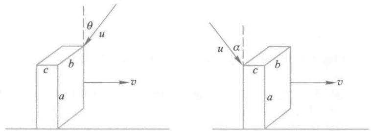

4. 甲乙两公司通过广告来竞争销售商品的数量, 广告费分别是  $x$  和  $y$ . 设甲乙公司商品的销售量在两公司总销售量中占的份额, 是他们的广告费在总广告费中所占份额的函数  $f\left(\frac{x}{x + y}\right)$  和  $f\left(\frac{y}{x + y}\right)$ . 又设公司的收入与销售量成正比, 从收入中扣除广告费后即为公司的利润。试构造模型的图形, 并讨论甲公司怎样确定广告费才能使利润最大。

(1) 令  $t = \frac{x}{x + y}$ , 则  $f(t) + f(1 - t) = 1$ . 画出  $f(t)$  的示意图。

(2)写出甲公司利润的表达式  $p(x)$ . 对于一定的  $y$ , 使  $p(x)$  最大的  $x$  的最优解应满足什么关系? 用图解法确定这个最优解[7].

5. 人行走时做的功是抬高人体重心所需势能与两腿运动所需动能之和. 试建立模型讨论在做功最小的准则下每秒走几步最合适 (匀速行走).

(1)设腿长  $l$ , 步长  $s$ , 且  $s < l$ . 证明人体重心在行走时升高  $\delta \approx s^2 /(8l)$ .

(2)将腿看作均匀直杆, 行走看作腿绕腰部的转动. 设腿的质量  $m$ , 行走速度  $v$ , 证明单位时间所需动能为  $mv^3 /(6s)$ .

(3)设人体质量  $M$ , 证明在速度  $v$  一定时每秒行走  $n = \sqrt{\frac{3Mg}{4ml}}$  步做功最小. 实际上,  $\frac{M}{m} \approx 4$ ,  $l \approx 1 \mathrm{~m}$ , 分析这个结果合理吗?

(4)将(2)的假设修改为: 腿的质量集中在脚部, 行走看作脚的直线运动. 证明结果应为  $n = \sqrt{\frac{Mg}{4ml}}$  步. 分析这个结果是否合理[57].

6. 观察鱼在水中的运动发现, 它不是水平游动, 而是突发性、锯齿状地向上游动和向下滑行. 可以认为这是在长期进化过程中鱼类选择的消耗能量最小的运动方式.

(1)设鱼总是以常速  $v$  运动, 虽在水中净重  $w$ , 向下滑行时的阻力是  $w$  在运动方向的分力; 向上游动时所需的力是  $w$  在运动方向分力与游动所受阻力之和, 而游动的阻力是滑行阻力的  $k$  倍. 水平方向游动时的阻力也是滑行阻力的  $k$  倍. 写出这些力.

(2)证明当鱼要从  $A$  点到达处于同一水平线上的  $B$  点时 (见下图), 沿折线  $ACB$  运动消耗的能量与沿水平线  $AB$  运动消耗的能量之比为 (向下滑行不消耗能量)  $\frac{k \sin \alpha + \sin \beta}{k \sin (\alpha + \beta)}$ .

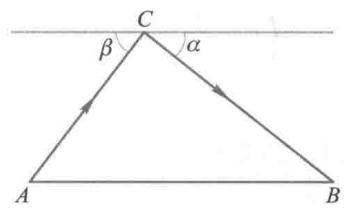

(3)据实际观察  $\tan \alpha \approx 0.2$ , 试对不同的  $k$  值 (1.5, 2, 3), 根据消耗能量最小的准则估计最佳的  $\beta$  值[7].

# 更多案例……

3- 1 生产者的决策

3- 2 生猪的出售时机

3- 3 效用函数的构造及应用

# 第4章 数学规划模型

在上一章中我们看到,建立优化模型要确定优化的目标和寻求的决策.用  $x$  表示决策变量  $,f(x)$  表示目标函数.实际问题一般对决策变量  $x$  的取值范围有限制,不妨记作 $x\in \Omega ,\Omega$  称为可行域.优化问题的数学模型可表示为

$$
\min (或\max)f(x),x\in \Omega
$$

在第3章,  $x$  通常是1维或2维变量,  $\Omega$  通常是1维或2维的非负域

实际中的优化问题通常有多个决策变量,用  $n$  维向量  $\pmb {x} = (x_{1},x_{2},\dots ,x_{n})^{\mathrm{~T~}}$  表示,目标函数  $f(x)$  是多元函数,可行域  $\Omega$  比较复杂,常用一组不等式(也可以有等式)  $g_{i}(x)\leqslant$ $0(i = 1,2,\dots ,m)$  来界定,称为约束条件.一般地,这类模型可表述成如下形式

$$
\min_{x}z = f(x)
$$

$$
\mathrm{~s.t.~}\quad g_{i}(\pmb {x})\leqslant 0,i = 1,2,\dots ,m
$$

显然,上述模型属于多元函数的条件极值问题的范围,然而许多实际问题归结出的这种形式的优化模型,其决策变量个数  $n$  和约束条件个数  $m$  一般较大,并且最优解往往在可行域的边界上取得,这样就不能简单地用微分法求解,数学规划是解决这类问题的有效方法.

需要指出的是,本章无意涉及数学规划(或运筹学)的具体计算方法,仍然着重于从数学建模的角度,介绍如何建立若干实际优化问题的模型,并且在用现成的数学软件求解后,对结果作一些分析

# 4.1 奶制品的生产与销售

企业内部的生产计划有各种不同的情况.从空间层次看,在工厂级要根据外部需求和内部设备、人力、原料等条件,以最大利润为目标制订产品的生产计划,在车间级则要根据产品生产计划、工艺流程、资源约束及费用参数等,以最小成本为目标制订生产作业计划.从时间层次看,若在短时间内认为外部需求和内部资源等不随时间变化,可制订单阶段生产计划,否则就要制订多阶段生产计划.

本节选择几个单阶段生产计划的实例,说明如何建立这类问题的数学规划模型,利用软件求解并对输出结果作一些分析.

例1加工奶制品的生产计划

问题一奶制品加工厂用牛奶生产  $\mathrm{A}_{1},\mathrm{A}_{2}$  两种奶制品,1桶牛奶可以在甲类设备上用  $12\textrm{h}$  加工成  $3\mathrm{~kg~A}_{1}$  ,或者在乙类设备上用  $8\textrm{h}$  加工成  $4\mathrm{~kg~A}_{2}$  .根据市场需求,生产的  $\mathrm{A}_{1},\mathrm{A}_{2}$  全部能售出,且每千克  $\mathrm{A}_{1}$  获利24元,每千克  $\mathrm{A}_{2}$  获利16元.现在加工厂每天能得到50桶牛奶的供应,每天正式工人总的劳动时间为  $480\mathrm{~h~}$  ,并且甲类设备每天至多能加工  $100\mathrm{~kg~A}_{1}$  ,乙类设备的加工能力没有限制.试为该厂制订一个生产计划,使每天获利最大,并进一步讨论以下3个附加问题:

1) 若用 35 元可以买到 1 桶牛奶, 应否作这项投资? 若投资, 每天最多购买多少桶牛奶?

2) 若可以聘用临时工人以增加劳动时间, 付给临时工人的工资最多是每小时几元?

3) 由于市场需求变化, 每千克  $\mathrm{A}_{1}$  的获利增加到 30 元, 应否改变生产计划?

问题分析这个优化问题的目标是使每天的获利最大, 要做的决策是生产计划, 即每天用多少桶牛奶生产  $\mathrm{A}_{1}$ , 用多少桶牛奶生产  $\mathrm{A}_{2}$  (也可以是每天生产多少千克  $\mathrm{A}_{1}$ , 多少千克  $\mathrm{A}_{2}$  ), 决策受到 3 个条件的限制: 原料 (牛奶) 供应、劳动时间、甲类设备的加工能力. 按照题目所给, 将决策变量、目标函数和约束条件用数学符号及式子表示出来, 就可得到下面的模型.

基本模型

决策变量: 设每天用  $x_{1}$  桶牛奶生产  $\mathrm{A}_{1}$ , 用  $x_{2}$  桶牛奶生产  $\mathrm{A}_{2}$ .

目标函数: 设每天获利为  $z$  元.  $x_{1}$  桶牛奶可生产  $3x_{1}$  kg  $\mathrm{A}_{1}$ , 获利  $24 \times 3x_{1}, x_{2}$  桶牛奶可生产  $4x_{2}$  kg  $\mathrm{A}_{2}$ , 获利  $16 \times 4x_{2}$ , 故  $z = 72x_{1} + 64x_{2}$ .

约束条件:

原料供应 生产  $\mathrm{A}_{1}, \mathrm{~A}_{2}$  的原料 (牛奶) 总量不得超过每天的供应, 即  $x_{1} + x_{2} \leqslant 50$

劳动时间 生产  $\mathrm{A}_{1}, \mathrm{~A}_{2}$  的总加工时间不得超过每天正式工人总的劳动时间, 即  $12x_{1} + 8x_{2} \leqslant 480$

设备能力  $\mathrm{A}_{1}$  的产量不得超过甲类设备每天的加工能力, 即  $3x_{1} \leqslant 100$

非负约束  $x_{1}, x_{2}$  均不能为负值, 即  $x_{1} \geqslant 0, x_{2} \geqslant 0$ .

综上可得

$$
\max z = 72x_{1} + 64x_{2} \tag{1}
$$

$$
\mathrm{s.t.} \quad x_{1} + x_{2} \leqslant 50 \tag{2}
$$

$$
12x_{1} + 8x_{2} \leqslant 480 \tag{3}
$$

$$
3x_{1} \leqslant 100 \tag{4}
$$

$$
x_{1} \geqslant 0, x_{2} \geqslant 0 \tag{5}
$$

这就是该问题的基本模型. 由于目标函数和约束条件对于决策变量而言都是线性的, 所以称为线性规划 (linear programming, 简记作 LP).

模型分析与假设 从本章下面的实例可以看到, 许多实际的优化问题的数学模型都是线性规划 (特别是在像生产计划这样的经济管理领域), 这不是偶然的. 让我们分析一下线性规划具有哪些特征, 或者说, 实际问题具有什么性质, 其模型才是线性规划.

- 比例性 每个决策变量对目标函数的"贡献", 与该决策变量的取值成正比; 每个决策变量对每个约束条件右端项的"贡献", 与该决策变量的取值成正比.

- 可加性 各个决策变量对目标函数的"贡献", 与其他决策变量的取值无关; 各个决策变量对每个约束条件右端项的"贡献", 与其他决策变量的取值无关.

- 连续性 每个决策变量的取值是连续的.

比例性和可加性保证了目标函数和约束条件对于决策变量的线性性, 连续性则允许得到决策变量的实数最优解.

对于本例, 能建立上面的线性规划模型, 实际上是事先做了如下的假设:

1.  $\mathrm{A}_{1}, \mathrm{~A}_{2}$  两种奶制品每千克的获利是与它们各自产量无关的常数,每桶牛奶加工出  $\mathrm{A}_{1}, \mathrm{~A}_{2}$  的数量和所需的时间是与它们各自的产量无关的常数;

2.  $\mathrm{A}_{1}, \mathrm{~A}_{2}$  每千克的获利是与它们相互间产量无关的常数,每桶牛奶加工出  $\mathrm{A}_{1}, \mathrm{~A}_{2}$  的数量和所需的时间是与它们相互间产量无关的常数;

3. 加工  $\mathrm{A}_{1}, \mathrm{~A}_{2}$  的牛奶的桶数可以是任意实数.

这3条假设恰好保证了上面的3条性质.当然,在现实生活中这些假设只是近似成立的,比如,  $\mathrm{A}_{1}, \mathrm{~A}_{2}$  的产量很大时,自然会使它们每千克的获利有所减少.

由于这些假设对于书中给出的、经过简化的实际问题是如此明显地成立,本章下面的例题就不再一一列出类似的假设了.不过,读者在打算用线性规划模型解决现实生活中的实际问题时,应该考虑上面3条性质是否近似地满足.

模型求解

图解法这个线性规划模型的决策变量为2维,用图解法既简单,又便于直观地把握线性规划的基本性质.

将约束条件  $(2) \sim (5)$  中的不等号改为等号,可知它们是  $x_{1} O x_{2}$  平面上的5条直线,依次记为  $L_{1} \sim L_{5}$ ,如图1. 其中  $L_{4}, L_{5}$  分别是  $x_{1}$  轴和  $x_{2}$  轴,并且不难判断,  $(2) \sim (5)$  式界定的可行域是5条直线上的线段所围成的5边形  $O A B C D$ .容易算出,5个顶点的坐标为:  $O(0,0), A(0,50), B(20,30), C(100 / 3,10), D(100 / 3,0)$ .

目标函数(1)中的  $z$  取不同数值时,在图1中表示一组平行直线(虚线),称等值线族.如  $z = 0$  是过  $O$  点的直线,  $z = 2400$  是过  $D$  点的直线,  $z = 3040$  是过  $C$  点的直线……可以看出,当这族平行线向右上方移动到过  $B$  点时,  $z = 3360$ ,达到最大值,所以  $B$  点的坐标  $(20,30)$  即为最优解:  $x_{1} = 20, x_{2} = 30$ .

我们直观地看到,由于目标函数和约束条件都是线性函数,在2维情形,可行域为直线段围成的凸多边形,目标函数的等值线为直线,于是最优解一定在凸多边形的某个顶点取得.

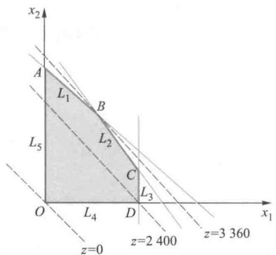  
图1 模型的图解法

推广到  $n$  维情形,可以猜想,最优解会在约束条件所界定的一个凸多面体(可行域)的某个顶点取得.线性规划的理论告诉我们,这个猜想是正确的.

软件实现 求解线性规划有不少现成的数学软件,比如用LINGO软件就可以很方便地实现.在LINGO下新建一个模型文件(即LINGO程序,一般以"lg4"为后缀名),像书写模型  $(1) \sim (5)$  一样,直接输入:

model:

$\max = 72 * \mathrm{x}1 + 64 * \mathrm{x}2$

[milk]  $\times 1 + \times 2< 50$

[time]  $12 * \mathrm{x}1 + 8 * \mathrm{x}2< 480$

[cpt]  $3 * \mathrm{x}1< 100$

end

注:LINGO程序总是以"model:"开始,最后以"end"结束(也可以省略不写);字母不区分大小写;每个语句都必须以分号";"结束(注意必须是英文的分号).LINGO中已规定所有决策变量均为非负,故(5)式不必输入;模型中符号  $\leqslant ,\geqslant$  用"<="、">="形式输入,它们与"<"、">"等效.输入模型中第1行为目标函数,[milk]、[time]、[cpct]是为了对各约束条件命名,便于从输出结果中查找相应信息(也可以不对约束命名,此时LINGO会自动用数字按顺序对约束条件命名).

将文件存储并命名后,选择菜单"LINGO!Solve"执行,即可得到如下输出:

Global optimal solution found:

Objective value: 3360.000

Total solver iterations: 2

Variable Value Reduced Cost

X1 20.00000 0.000000

X2 30.00000 0.000000

Row Slack or Surplus Dual Price

1 3360.000 1.000000

MILK 0.000000 48.00000

TIME 0.000000 2.000000

CPCT 40.00000 0.000000

上面结果的前3行告诉我们,LINGO求出了模型的全局最优解(global optimal solution),最优值为3360(即最大利润为3360元),迭代次数为2次.接下来的3行告诉我们,这个线性规划的最优解为  $x_{1} = 20,x_{2} = 30$  (即用20桶牛奶生产  $\mathrm{A}_{1},30$  桶牛奶生产 $\mathrm{A}_{2}$  ).对其中"ReducedCost"的含义,将在例2中结合问题3)的讨论进行说明.

结果分析上面的输出中除了告诉我们问题的最优解和最优值以外,还有许多对分析结果有用的信息,下面结合题目中提出的3个附加问题,并利用图解法的直观给予说明.

(1)3个约束条件的右端不妨看作3种"资源":原料、劳动时间、甲类设备的加工能力.输出第8~11行SlackorSurplus给出这3种资源在最优解下是否有剩余:原料[MILK]、劳动时间[TIME]的剩余均为0,甲类设备[CPCT]尚余  $40\mathrm{kg}$  加工能力.这与图解法的如下结果一致:最优解在  $B$  点(图1中约束条件2,3所定义的直线  $L_{1}$  和  $L_{2}$  的交点)取得,表明原料、劳动时间已用完,而甲类设备的能力有余.一般称"资源"剩余为0的约束为紧约束(有效约束).

(2)目标函数可以看作"效益",成为紧约束的"资源"一旦增加,"效益"必然跟着增长.输出第8~11行DualPrice给出这3种资源在最优解下"资源"增加1个单位时"效益"的增量:原料[MILK]增加1个单位(1桶牛奶)时利润增长48元,劳动时间[TIME]增加1个单位(1h)时利润增长2元,而增加非紧约束[CPCT]甲类设备的能力显然不会使利润增长.这里,"效益"的增量可以看作"资源"的潜在价值,经济学上称为影子价格,即1桶牛奶的影子价格为48元,1h劳动的影子价格为2元,甲类设备的影子价格为0.

读者可以用直接求解的办法验证上面的结论,即将输入文件中原料约束[MILK]

右端的 50 改为 51, 看看得到的最优值 (利润) 是否恰好增长 48 元.

用影子价格的概念很容易回答附加问题 1): 用 35 元可以买到 1 桶牛奶, 低于 1 桶牛奶的影子价格, 当然应该做这项投资. 类似地, 可以回答附加问题 2): 聘用临时工人以增加劳动时间, 付给的工资低于劳动时间的影子价格才可以增加利润, 所以工资最多是每小时 2 元.

(3)目标函数的系数发生变化时(假定约束条件不变),最优解和最优值会改变吗?这个问题不能简单地回答.从图1看,目标函数的系数决定了等值线族的斜率,原题中该斜率(取绝对值,下同)为  $72 / 64 = 9 / 8$  介于直线  $L_{1}$  的斜率1与  $L_{2}$  的斜率3/2之间,最优解自然在  $L_{1}$  和  $L_{2}$  的交点  $B$  取得.并且只要目标函数系数的变化使得等值线族的斜率仍然在(1,3/2)范围内,这个最优解就不会改变.而当目标函数系数的变化使得等值线族的斜率小于1时,最优解将在A点取得,大于3/2时,最优解将在  $c$  点取得.

这种对目标函数系数变化的影响的讨论,通常称为对目标函数系数的敏感性分析LINGO在缺省设置中不会给出这种敏感性分析结果,但可以通过修改LINGO选项得到.具体做法是:选择"LINGO|Options"菜单,在弹出的选项卡中选择"General Solver",然后找到选项"Dual Computations",在下拉框中选中"Prices & Ranges",应用或保存设置.重新运行"LINGO|Solve",然后选择"LINGO|Ranges"菜单,则得到如下输出:

Ranges in which the basis is unchanged:

Objective Coefficient Ranges

Current Allowable Allowable

Variable Coefficient Increase Decrease

X1 72.00000 24.00000 8.000000

X2 64.00000 8.000000 16.00000

Righthand Side Ranges

Row Current Allowable Allowable

RHS Increase Decrease

MILK 50.00000 10.00000 6.666667

TIME 480.0000 53.33333 80.00000

CPCT 100.0000 INFINITY 40.00000

上面输出的第2~6行"Current Coefficient"(当前系数)对应的"Allowable Increase"和"Allowable Decrease"给出了最优解不变条件下目标函数系数的允许变化范围:  $x_{1}$  的系数为(72- 8,72+24),即(64,96);  $x_{2}$  的系数为(64- 16,64+8),即(48,72).注意:  $x_{1}$  系数的允许范围需要  $x_{2}$  系数64不变,反之亦然.

用这个结果很容易回答附加问题3):若每千克  $A_{1}$  的获利增加到30元,则  $x_{1}$  系数变为  $30 \times 3 = 90$ ,在允许范围内,所以不应改变生产计划.

(4)对"资源"的影子价格作进一步的分析.从图1看,随着原料(牛奶)的增加,直线  $L_{1}$  向右上方平移,  $L_{1}$  与  $L_{2}$  的交点  $B$  (它仍是最优解)向  $A$  点靠近,在这个过程中,每增加1桶牛奶利润增长48元(影子价格).但是,当  $B$  点与  $A$  点重合后再增加牛奶就不可能使利润增长了.这就是说,影子价格的作用(即在最优解下"资源"增加1个单位时"效益"的增量)是有限制的.这种对影子价格在什么条件下才有意义的讨论,通常称为

对资源约束右端项的敏感性分析.上面输出的第7~12行"Current RHS"(当前右端项)对应的"Allowable Increase"和"Allowable Decrease"给出了影子价格有意义条件下约束右端项的限制范围:原料[MILK]最多增加10桶牛奶,劳动时间[TIME]最多增加  $53.3\mathrm{~h~}$

现在可以回答附加问题1)的第2问:虽然应该批准用35元买1桶牛奶的投资,但每天最多购买10桶牛奶.类似地,可以用低于2元/h的工资聘用临时工人以增加劳动时间,但最多增加  $53.3\mathrm{~h~}$

需要注意的是:一般情况下LINGO给出的敏感性分析结果只是充分条件,如上述"最多增加10桶牛奶"应理解为"增加10桶牛奶"一定是有利可图的,但并不意味着"增加10桶以上的牛奶"一定不是有利可图的(对最大可增加的劳动时间也应该类似地理解),只是此时无法通过敏感性分析直接得到结论,而需要重新求解新的模型进行判断.以后我们对此不再特别进行说明(同样,对目标函数系数给出的敏感性分析结果也只是充分条件).

例2 奶制品的生产销售计划

问题例1给出的  $\mathrm{A}_{1},\mathrm{A}_{2}$  两种奶制品的生产条件、利润及工厂的"资源"限制全都不变.为增加工厂的获利,开发了奶制品的深加工技术:用  $2\mathrm{~h~}$  和3元加工费,可将  $1\mathrm{~kg~}$ $\mathrm{B}_{1}$  加工成  $0.8\mathrm{~kg~}$  高级奶制品  $\mathrm{B}_{1}$  ,也可将  $1\mathrm{~kg~A}_{2}$  加工成  $0.75\mathrm{~kg~}$  高级奶制品  $\mathrm{B}_{2}$  ,每千克  $\mathrm{B}_{1}$  能获利44元,每千克  $\mathrm{B}_{2}$  能获利32元.试为该厂制订一个生产销售计划,使每天的净利润最大,并讨论以下问题:

(1)若投资30元可以增加供应1桶牛奶,投资3元可以增加  $1\mathrm{~h~}$  劳动时间,应否作这些投资?若每天投资150元,可赚回多少?

(2)每千克高级奶制品  $\mathrm{B}_{1},\mathrm{B}_{2}$  的获利经常有  $10\%$  的波动,对制订的生产销售计划有无影响?若每千克  $\mathrm{B}_{1}$  的获利下降  $10\%$  ,计划应该变化吗?

(3)若公司已经签订了每天销售  $10\mathrm{~kg~A}_{1}$  的合同并且必须满足,该合同对公司的利润有什么影响?

问题分析要求制订生产销售计划,决策变量可以像例1那样,取作每天用多少桶牛奶生产  $\mathrm{A}_{1},\mathrm{A}_{2}$  ,再添上用多少千克  $\mathrm{A}_{1}$  加工  $\mathrm{B}_{1}$  ,用多少千克  $\mathrm{A}_{2}$  加工  $\mathrm{B}_{2}$  ,但是由于问题要分析  $\mathrm{B}_{1},\mathrm{B}_{2}$  的获利对生产销售计划的影响,所以决策变量取作  $\mathrm{A}_{1},\mathrm{A}_{2},\mathrm{B}_{1},\mathrm{B}_{2}$  每天的销售量更方便.目标函数是工厂每天的净利润——  $\mathrm{A}_{1},\mathrm{A}_{2},\mathrm{B}_{1},\mathrm{B}_{2}$  的获利之和扣除深加工费用.约束条件基本不变,只是要添上  $\mathrm{A}_{1},\mathrm{A}_{2}$  深加工时间的约束.在与例1类似的假定下用线性规划模型解决这个问题.

基本模型

决策变量:设每天销售  $x_{1}\mathrm{~kg~A}_{1},x_{2}\mathrm{~kg~A}_{2},x_{3}\mathrm{~kg~B}_{1},x_{4}\mathrm{~kg~B}_{2}$  ,用  $x_{5}\mathrm{~kg~A}_{1}$  加工  $\mathrm{B}_{1}$ $x_{6}\mathrm{~kg~A}_{2}$  加工  $\mathrm{B}_{2}$  (增设  $x_{5},x_{6}$  可使下面的模型简单).

目标函数:设每天净利润为  $x$  ,容易写出  $z = 24x_{1} + 16x_{2} + 44x_{3} + 32x_{4} - 3x_{5} - 3x_{6}.$

约束条件:

原料供应每天生产  $x_{1} + x_{5}\mathrm{~kg~A}_{1}$  ,用牛奶  $(x_{1} + x_{5}) / 3$  桶,每天生产  $x_{2} + x_{6}\mathrm{~kg~A}_{2}$  ,用牛奶  $(x_{2} + x_{6}) / 4$  桶,二者之和不得超过每天的供应量50桶;

劳动时间每天生产  $\mathrm{A}_{1},\mathrm{A}_{2}$  的时间分别为  $4(x_{1} + x_{5})$  和  $2(x_{2} + x_{6})$  ,加工  $\mathrm{B}_{1},\mathrm{B}_{2}$  的

时间分别为  $2x_{5}$  和  $2x_{6}$ ,二者之和不得超过总的劳动时间  $480 \mathrm{~h}$ ;

设备能力  $\mathrm{A}_{1}$  的产量  $x_{1} + x_{5}$  不得超过甲类设备每天的加工能力  $100 \mathrm{~kg}$ ;

非负约束  $x_{1}, x_{2}, \dots , x_{6}$  均为非负;

附加约束  $1 \mathrm{~kg} \mathrm{A}_{1}$  加工成  $0.8 \mathrm{~kg} \mathrm{B}_{1}$ ,故  $x_{3} = 0.8 x_{5}$ ,类似地  $x_{4} = 0.75 x_{6}$

由此得基本模型:

$$
\max z = 24 x_{1} + 16 x_{2} + 44 x_{3} + 32 x_{4} - 3 x_{5} - 3 x_{6} \tag{6}
$$

$$
\frac{x_{1} + x_{5}}{3} +\frac{x_{2} + x_{6}}{4} \leqslant 50 \tag{7}
$$

$$
4\left(x_{1} + x_{5}\right) + 2\left(x_{2} + x_{6}\right) + 2 x_{5} + 2 x_{6} \leqslant 480 \tag{8}
$$

$$
x_{1} + x_{5} \leqslant 100 \tag{9}
$$

$$
x_{3} = 0.8 x_{5} \tag{10}
$$

$$
x_{4} = 0.75 x_{6} \tag{11}
$$

$$
x_{1}, x_{2}, x_{3}, x_{4}, x_{5}, x_{6} \geqslant 0 \tag{12}
$$

这仍然是一个线性规划模型

模型求解 用 LINGO 软件求解,输入文件时为方便起见将(7)式改写为

$$
4 x_{1} + 3 x_{2} + 4 x_{5} + 3 x_{6} \leqslant 600 \tag{7'}
$$

(8)式改写为

$$
4 x_{1} + 2 x_{2} + 6 x_{5} + 4 x_{6} \leqslant 480 \tag{8'}
$$

输入并求解,可得如下输出:

Global optimal solution found.

Objective value: 3460.800

Total solver iterations: 2

计划 prog0401b.lg4

Variable Value Reduced Cost

X1 0.000000 1.680000

X2 168.0000 0.000000

X3 19.20000 0.000000

X4 0.000000 0.000000

X5 24.00000 0.000000

X6 0.000000 1.520000

Row Slack or Surplus Dual Price

1 3460.800 1.000000

MILK 0.000000 3.160000

TIME 0.000000 3.260000

CPCT 76.00000 0.000000

5 0.000000 44.00000

6 0.000000 32.00000

Ranges in which the basis is unchanged:

Objective Coefficient Ranges

Current Allowable Allowable

Variable Coefficient Increase Decrease X1 24.00000 1.680000 INFINITY X2 16.00000 8.150000 2.100000 X3 44.00000 19.75000 3.166667 X4 32.00000 2.026667 INFINITY X5 - 3.000000 15.80000 2.533333 X6 - 3.000000 1.520000 INFINITY

Righthand Side Ranges

Row Current Allowable Allowable RHS Increase Decrease

MILK 600.0000 120.0000 280.0000

TIME 480.0000 253.3333 80.00000

CPCT 100.0000 INFINITY 76.00000

5 0.0 INFINITY 19.20000

6 0.0 INFINITY 0.0

最优解为  $x_{1} = 0, x_{2} = 168, x_{3} = 19.2, x_{4} = 0, x_{5} = 24, x_{6} = 0$ , 最优值为  $z = 3460.8$ , 即每天生产销售  $168 \mathrm{~kg} \mathrm{A}_{2}$  和  $19.2 \mathrm{~kg} \mathrm{B}_{1}$  (不出售  $\mathrm{A}_{1}, \mathrm{~B}_{2}$ ), 可获净利润 3460.8 元. 为此, 需用 8 桶牛奶加工成  $\mathrm{A}_{1}, 42$  桶加工成  $\mathrm{A}_{2}$ , 并将得到的  $24 \mathrm{~kg} \mathrm{A}_{1}$  全部加工成  $\mathrm{B}_{1}$ .

和例 1 一样, 原料 (牛奶)、劳动时间为紧约束.

结果分析 利用输出中的影子价格和敏感性分析讨论以下问题:

(1)上述结果给出,约束[MLK]、[TIME]的影子价格分别为3.16和3.26,注意到约束[MLK]的影子价格为(7)右端增加1个单位时目标函数的增量,由(7)式可知,增加1桶牛奶可使净利润增长  $3.16\times 12 = 37.92$  元,约束[TIME]的影子价格则说明:增加  $1\textrm{h}$  劳动时间可使净利润增长3.26元.所以应该投资30元增加供应1桶牛奶,或投资3元增加  $1\textrm{h}$  劳动时间.若每天投资150元,增加供应5桶牛奶,可赚回  $37.92\times$ $5 = 189.6$  元.但是通过投资增加牛奶的数量是有限制的,输出结果表明,约束[MLK]右端的允许变化范围为(600-280,600+120),相当于(7)式右端的允许变化范围为(50-23.  $3,50 + 10$  ),即最多增加供应10桶牛奶.

(2)上述结果给出,最优解不变条件下目标函数系数的允许变化范围:  $x_{3}$  的系数为(44-3.17,44+19.75);  $x_{4}$  的系数为(32-∞,32+2.03). 所以当  $\mathrm{B}_{1}$  的获利向下波动  $10\%$ , 或  $\mathrm{B}_{2}$  的获利向上波动  $10\%$  时, 上面得到的生产销售计划将不再一定是最优的, 应该重新制订. 如若每千克  $\mathrm{B}_{1}$  的获利下降  $10\%$ , 应将原模型(6)式中  $x_{3}$  的系数改为 39.6, 重新计算, 得到的最优解为  $x_{1} = 0, x_{2} = 160, x_{3} = 0, x_{4} = 30, x_{5} = 0, x_{6} = 40$ , 最优值为  $z = 3400$ , 即 50 桶牛奶全部加工成  $200 \mathrm{~kg} \mathrm{A}_{2}$ , 出售其中  $160 \mathrm{~kg}$ , 将其余  $40 \mathrm{~kg}$  加工成  $30 \mathrm{~kg} \mathrm{B}_{2}$  出售, 获净利润 3400 元, 可见计划变化很大, 这就是说, (最优) 生产计划对  $\mathrm{B}_{1}$  或  $\mathrm{B}_{2}$  获利的波动是很敏感的.

(3)上述结果给出,变量  $x_{1}$  对应的"Reduced Cost"严格大于0(为1.68),首先 评注与例1相 表明目前最优解中  $x_{1}$  的取值一定为0;其次,如果限定  $x_{1}$  的取值大于等于某个正数,则 产品  $\mathrm{B}_{1}, \mathrm{~B}_{2}$ , 它们  $x_{1}$  从 0 开始增加一个单位时, (最优的) 目标函数值将减少 1.68. 因此, 若公司已经签订 的销售量与  $\mathrm{A}_{1}$ ,

$\mathrm{A}_{2}$  的加工量之间了每天销售  $10\mathrm{~kg~A}_{1}$  的合同并且必须满足,该合同将会使公司利润减少  $1.68 \times 10 =$  16.8元,即最优利润为  $3460.8 - 16.8 = 3444$  元.也可以反过来理解:如果将目标函数中  $x_{1}$  对应的费用系数增加不小于1.68,则在最优解中  $x_{1}$  将可以取到严格大于0的值.

有两点需要注意:一是与敏感性分析结果类似,这只是一个充分条件,即如果一个变量对应的"ReducedCost"大于0,则当前最优解中  $x_{1}$  的取值一定为0;反之不成立,如上面最优解中  $x_{1}$  的取值为0,对应的"ReducedCost"也等于0而不是大于0(此时的"ReducedCost"就不能按上面的解释来理解).二是"ReducedCost"有意义也是有条件的,但条件不能通过上述结果直接得到,例如,如果将  $x_{1}$  限定为不小于100,则问题的最优值为3040,而不再是  $3460.8 - 1.68 \times 100 = 3292.8$

# 复习题

考虑以下"食谱问题"[72]:某学校为学生提供营养套餐,希望以最小费用来满足学生对基本营养的需求.按照营养学家的建议,一个人一天对蛋白质、维生素A和钙的需求如下:  $50\mathrm{~g~}$  蛋白质、4000IU(国际单位)维生素A和  $1000\mathrm{~mg~}$  钙.我们只考虑以下食物构成的食谱:苹果、香蕉、胡萝卜、枣汁和鸡蛋,其营养含量见下表.确定每种食物的用量,以最小费用满足营养学家建议的营养需求,并考虑:

(1)对维生素A的需求增加一个单位时,是否需要改变食谱?成本增加多少?如果对蛋白质的需求增加  $1\mathrm{~g~}$  呢?如果对钙的需求增加  $1\mathrm{~mg~}$  呢?

(2)胡萝卜的价格增加1角时,是否需要改变食谱?成本增加多少?

<table><tr><td>食物</td><td>单位</td><td>蛋白质/g</td><td>维生素A/IU</td><td>钙/mg</td><td>价格/角</td></tr><tr><td>苹果</td><td>138 g/个(中等大小)</td><td>0.3</td><td>73</td><td>9.6</td><td>10</td></tr><tr><td>香蕉</td><td>118 g/个(中等大小)</td><td>1.2</td><td>96</td><td>7</td><td>15</td></tr><tr><td>胡萝卜</td><td>72 g/个(中等大小)</td><td>0.7</td><td>20 253</td><td>19</td><td>5</td></tr><tr><td>枣汁</td><td>178 g/杯</td><td>3.5</td><td>890</td><td>57</td><td>60</td></tr><tr><td>鸡蛋</td><td>44 g/个(中等大小)</td><td>5.5</td><td>279</td><td>22</td><td>8</td></tr></table>

# 4.2 自来水输送与货机装运

钢铁、煤炭、水电等生产、生活物资从若干供应点运送到一些需求点,怎样安排输送方案使运费最小,或者利润最大?各种类型的货物装箱,由于受体积、质量等的限制,如何相互搭配装载,使获利最高,或者装箱数量最少?本节将通过两个例子讨论用数学规划模型解决这类问题的方法.

例1 自来水输送问题

问题某市有甲、乙、丙、丁四个居民区,自来水由A,B,C三个水库供应.四个区每天必须得到保证的基本生活用水量(单位:  $10^{3}$  t)分别为30,70,10,10,但由于水源紧张,三个水库每天最多只能分别供应自来水50,60,50. 由于地理位置的差别,自来水公司从各水库向各区送水所需付出的引水管理费不同(见表1,其中C水库与丁区之间没有输水管道),其他管理费用(单位:元/  $10^{3}$  t)都是450. 根据公司规定,各区用户按照统

一标准 900 收费. 此外, 四个区都向公司申请了额外用水量, 分别为每天 50,70,20,40. 该公司应如何分配供水量, 才能获利最多?

为了增加供水量, 自来水公司正在考虑进行水库改造, 使三个水库每天的最大供水量都提高一倍, 问那时供水方案应如何改变? 公司利润可增加到多少?

表1从水库向各区送水的引水管理费 单位:元/  $10^{3}$  t  

<table><tr><td></td><td>甲</td><td>乙</td><td>丙</td><td>丁</td></tr><tr><td>A</td><td>160</td><td>130</td><td>220</td><td>170</td></tr><tr><td>B</td><td>140</td><td>130</td><td>190</td><td>150</td></tr><tr><td>C</td><td>190</td><td>200</td><td>230</td><td>/</td></tr></table>

问题分析 分配供水量就是安排从三个水库向四个区送水的方案, 目标是获利最多. 而从题目给出的数据看, A, B, C 三个水库的供水量 160, 不超过四个区的基本生活用水量与额外用水量之和 300, 因而总能全部卖出并获利, 于是自来水公司每天的总收入是  $900 \times (50 + 60 + 50) = 144000$  元, 与送水方案无关. 同样, 公司每天的其他管理费用  $450 \times (50 + 60 + 50) = 72000$  元也与送水方案无关. 所以, 要使利润最大, 只需使引水管理费最小即可. 另外, 送水方案自然要受三个水库的供应量和四个区的需求量的限制.

模型建立 很明显, 决策变量为 A, B, C 三个水库  $(i = 1,2,3)$  分别向甲、乙、丙、丁四个区  $(j = 1,2,3,4)$  的供水量. 设水库  $i$  向  $j$  区的日供水量为  $x_{ij}$ . 由于 C 水库与丁区之间没有输水管道, 即  $x_{34} = 0$ , 因此只有 11 个决策变量.

由上分析, 问题的目标可以从获利最多转化为引水管理费最少, 于是有

min  $z = 160x_{11} + 130x_{12} + 220x_{13} + 170x_{14} + 140x_{21} + 130x_{22} + 190x_{23} + 150x_{24} + 190x_{31} + 200x_{32} + 230x_{33}$

$$
190x_{23} + 150x_{24} + 190x_{31} + 200x_{32} + 230x_{33} \tag{1}
$$

约束条件有两类: 一类是水库的供应量限制, 另一类是各区的需求量限制.

由于供水量总能卖出并获利, 水库的供应量限制可以表示为

$$
x_{11} + x_{12} + x_{13} + x_{14} = 50 \tag{2}
$$

$$
x_{21} + x_{22} + x_{23} + x_{24} = 60 \tag{3}
$$

$$
x_{31} + x_{32} + x_{33} = 50 \tag{4}
$$

考虑到各区的基本生活用水量与额外用水量, 需求量限制可以表示为

$$
30 \leqslant x_{11} + x_{21} + x_{31} \leqslant 80 \tag{5}
$$

$$
70 \leqslant x_{12} + x_{22} + x_{32} \leqslant 140 \tag{6}
$$

$$
10 \leqslant x_{13} + x_{23} + x_{33} \leqslant 30 \tag{7}
$$

$$
10 \leqslant x_{14} + x_{24} \leqslant 50 \tag{8}
$$

模型求解 (1)~(8) 构成一个线性规划模型 (当然, 要加上  $x_{ij}$  的非负约束). 求解得到送水方案为 (输出结果略): A 水库向乙区供水 50, B 水库向乙、丁区分别供水 50, 10, C 水库向甲、丙分别供水 40, 10. 引水管理费为 24400 元, 利润为 144000- 72000- 24400 = 47600 元.

讨论 如果 A, B, C 三个水库每天的最大供水量都提高一倍, 则公司总供水能力为 320, 大于总需求量 300, 水库供水量不能全部卖出, 因而不能像前面那样, 将获利最多

转化为引水管理费最少。此时我们首先需要计算A,B,C三个水库分别向甲、乙、丙、丁四个区供应每  $10^{3}$  t水的净利润,即从收入900元中减去其他管理费450元,再减去表1中的引水管理费,得表2.

单位:元

表2从水库向各区送水的净利润  

<table><tr><td>净利润</td><td>甲</td><td>乙</td><td>丙</td><td>丁</td></tr><tr><td>A</td><td>290</td><td>320</td><td>230</td><td>280</td></tr><tr><td>B</td><td>310</td><td>320</td><td>260</td><td>300</td></tr><tr><td>C</td><td>260</td><td>250</td><td>220</td><td>/</td></tr></table>

于是决策目标为

max  $z = 290x_{11} + 320x_{12} + 230x_{13} + 280x_{14} + 310x_{21} + 320x_{22} + 260x_{23} + 300x_{24} + 260x_{31} + 250x_{32} + 220x_{33}$  (9)

由于水库供水量不能全部卖出,所以上面约束  $(2)\sim (4)$  的右端增加一倍的同时,应将  $=$  改成  $\leqslant$  ,即

$$
x_{11} + x_{12} + x_{13} + x_{14}\leqslant 100 \tag{10}
$$

$$
x_{21} + x_{22} + x_{23} + x_{24}\leqslant 120 \tag{11}
$$

$$
x_{31} + x_{32} + x_{33}\leqslant 100 \tag{12}
$$

约束  $(5)\sim (8)$  不变.将  $(5)\sim (12)$  构成的线性规划模型输入LINGO求解得到送水方案为(详细程序和输出结果略):A水库向乙区供水100,B水库向甲、乙、丁区分别供水30,40,50,C水库向甲、丙区分别供水50,30,总利润为88700元.

其实,由于每个区的供水量都能完全满足,所以上面  $(5)\sim (8)$  每个式子左边的约束可以去掉,右边的  $\leqslant$  可以改写成  $=$  .作这样的简化后得到的解没有任何变化.

例2 货机装运

问题某架货机有三个货舱:前仓、中仓、后仓.三个货舱所能装载的货物的最大质量和体积都有限制,如表3所示.并且为了保持飞机的平衡,三个货舱中实际装载货物的质量必须与其最大容许质量成比例.

<table><tr><td></td><td>前仓</td><td>中仓</td><td>后仓</td></tr><tr><td>质量限制/t</td><td>10</td><td>16</td><td>8</td></tr><tr><td>体积限制/m³</td><td>6 800</td><td>8 700</td><td>5 300</td></tr></table>

现有四类货物供该货机本次飞行装运,其有关信息如表4,最后一列指装运后所获得的利润.

<table><tr><td></td><td>质量/t</td><td>体积/(m³·t¹)</td><td>利润/(元·t¹)</td></tr><tr><td>货物1</td><td>18</td><td>480</td><td>3 100</td></tr></table>

续表  

<table><tr><td></td><td>质量/t</td><td>体积/(m³·t¹)</td><td>利润/(元·t¹)</td></tr><tr><td>货物2</td><td>15</td><td>650</td><td>3 800</td></tr><tr><td>货物3</td><td>23</td><td>580</td><td>3 500</td></tr><tr><td>货物4</td><td>12</td><td>390</td><td>2 850</td></tr></table>

应如何安排装运,使该货机本次飞行获利最大?

模型假设问题中没有对货物装运提出其他要求,我们可作如下假设:

1. 每种货物可以分割到任意小

2. 每种货物可以在一个或多个货舱中任意分布

3. 多种货物可以混装,并保证不留空隙

4. 所给出的数据都是精确的,没有误差

模型建立

决策变量:用  $x_{ij}$  表示第  $i$  种货物装入第  $j$  个货舱的质量(单位:t),货舱  $j = 1,2,3$  分别表示前仓、中仓、后仓

已知参数:货舱  $j$  的质量限制  $WET_{j}$ ,体积限制  $VOL_{j}$ ;第  $i$  种货物的质量  $w_{i}$ ,单位质量的体积  $v_{i}$ ,利润  $p_{i}$ . 用行向量表示,即  $WET = (10,16,8)$ ,  $VOL = (6800,8700,5300)$ ;  $w = (18,15,23,12)$ ,  $v = (480,650,580,390)$ ,  $p = (3100,3800,3500,2850)$

决策目标是最大化总利润,即

$$
\max z = \sum_{i = 1}^{4}p_{i}\left(\sum_{j = 1}^{3}x_{ij}\right) \tag{13}
$$

约束条件包括以下四个方面(除对  $x_{ij}$  的非负约束外):

1. 供装载的四种货物的总质量约束,即

$$
\sum_{j = 1}^{3}x_{ij}\leqslant w_{i},i = 1,2,3,4 \tag{14}
$$

2. 三个货舱的质量限制,即

$$
\sum_{i = 1}^{4}x_{ij}\leqslant WET_{j},j = 1,2,3 \tag{15}
$$

3. 三个货舱的空间限制,即

$$
\sum_{i = 1}^{4}v_{i}x_{ij}\leqslant VOL_{j},j = 1,2,3 \tag{16}
$$

4. 三个货舱装入质量的平衡约束,即

$$
\sum_{i = 1}^{4}x_{ij} / WET_{j} = \sum_{i = 1}^{4}x_{ik} / WET_{k},j,k = 1,2,3;j\neq k \tag{17}
$$

模型求解将以上模型输入LINGO,不妨将所得最优解作四舍五入,结果为货物2装入前仓7t、装入后仓8t;货物3装入前仓3t、装入中仓13t;货物4装入中仓3t.最大利润约121516元.(注意:这个问题的最优解并不唯一,但LINGO只能给出一个解.)

程序文件4- 4

货机装运

prog0402b.1g4

评注初步看来,例2与运输问题

类似,似乎可以把

四种货物看成四

个供应点,三个货

舱看成三个需求

点(或者反过来,

把货舱看成供应

点,货物看成需求

点).但是,这里对

供需量的限制包

括两个方面:质量

限制和空间限制,

且有装载平衡要

求.因此它只能看

成是运输问题的

一种变形和扩展

考虑以下"运输问题"[72]:某公司有6个建筑工地要开工,每个工地的位置(用平面坐标  $x, y$  表示,距离单位:  $\mathrm{km}$  )及水泥日用量  $d$  (单位:t)由下表给出.目前有两个临时料场位于A(5,1),B(2,7),日储量各有  $20 \mathrm{t}$  假设从料场到工地之间均有直线道路相连,试制定每天的供应计划,即从A,B两料场分别向各工地运送多少吨水泥,使总的吨千米数最小.

<table><tr><td></td><td>1</td><td>2</td><td>3</td><td>4</td><td>5</td><td>6</td></tr><tr><td>x/km</td><td>1.25</td><td>8.75</td><td>0.5</td><td>5.75</td><td>3</td><td>7.25</td></tr><tr><td>y/km</td><td>1.25</td><td>0.75</td><td>4.75</td><td>5</td><td>6.5</td><td>7.75</td></tr><tr><td>d/t</td><td>3</td><td>5</td><td>4</td><td>7</td><td>6</td><td>11</td></tr></table>

# 4.3 汽车生产与原油采购

在4.1节和4.2节的例题中研究的对象都是连续可分的,于是决策变量是连续的,建立的模型是线性规划.在本节的例子中将会遇到不同的情况.

例1 汽车厂生产计划

问题 一汽车厂生产小、中、大三种类型的汽车,已知各类型每辆车对钢材、劳动时间的需求,利润以及每月工厂钢材、劳动时间的现有量如表1所示.试制订月生产计划,使工厂的利润最大.

进一步讨论:由于各种条件限制,如果生产某一类型汽车,则至少要生产80辆,那么最优的生产计划应作何改变?

表1汽车厂的生产数据  

<table><tr><td></td><td>小型</td><td>中型</td><td>大型</td><td>现有量</td></tr><tr><td>钢材/t</td><td>1.5</td><td>3</td><td>5</td><td>600</td></tr><tr><td>劳动时间/h</td><td>280</td><td>250</td><td>400</td><td>60 000</td></tr><tr><td>利润/万元</td><td>2</td><td>3</td><td>4</td><td></td></tr></table>

模型建立与求解 设每月生产小、中、大型汽车的数量分别为  $x_{1}, x_{2}, x_{3}$ ,工厂的月利润为  $z$ ,在题目所给参数均不随生产数量变化的假设下,立即可得线性规划模型:

$$
\max z = 2x_{1} + 3x_{2} + 4x_{3} \tag{1}
$$

$$
1.5x_{1} + 3x_{2} + 5x_{3} \leqslant 600 \tag{2}
$$

$$
280x_{1} + 250x_{2} + 400x_{3} \leqslant 60000 \tag{3}
$$

$$
x_{1}, x_{2}, x_{3} \geqslant 0 \tag{4}
$$

用LINGO求解,可得最优解  $x_{1} = 64.516129, x_{2} = 167.741928, x_{3} = 0$ ,出现小数,显然不合适.通常的解决办法有以下几种:

(1)简单地舍去小数,取  $x_{1} = 64, x_{2} = 167$ ,它会接近最优的整数解,可算出相应的目

标函数值  $z = 629$ , 与 LP 得到的最优值  $z = 632.2581$  相差不大。

(2)在上面这个解的附近试探:如取  $x_{1} = 65, x_{2} = 167; x_{1} = 64, x_{2} = 168$  等。因为从输出可知,约束都是紧的,所以若试探的  $x_{1}, x_{2}$  大于 LP 最优解时,必须检验它们是否满足约束条件(2),(3),然后计算函数值  $z$ ,通过比较可能得到更优解。

(3)在线性规划模型中增加约束条件:

$$
x_{1}, x_{2}, x_{3} \quad \text{均为整数} \tag{5}
$$

这样得到的(1)~(5)式称为整数规划(integer programming,简记作 IP),可以用 LINGO 直接求解,输入文件中需要用"@gin"函数将变量限定为整数。

最优解  $x_{1} = 64, x_{2} = 168, x_{3} = 0$ ,最优值  $z = 632$ ,即问题要求的月生产计划为生产小型车 64 辆、中型车 168 辆,不生产大型车。

程序文件4- 5

讨论对于问题中提出的"如果生产某一类型汽车,则至少要生产 80 辆"的限制,汽车生产上面得到的 IP 的最优解不满足这个条件。这种类型的要求是实际生产中经常提出的。下面以本问题为例说明解决这类要求的办法。

对于原 LP 模型(1)~(4),需将(4)式改为

(6)

下面是求解模型(1)~(3),(6)的 3 种方法:

1)分解为多个 LP 子模型

(6)式可分解为 8 种情况:

$$
x_{1} = 0, x_{2} = 0, x_{3} \geqslant 80 \tag{6-1}
$$

$$
x_{1} = 0, x_{2} \geqslant 80, x_{3} = 0 \tag{6-2}
$$

$$
x_{1} = 0, x_{2} \geqslant 80, x_{3} \geqslant 80 \tag{6-3}
$$

$$
x_{1} \geqslant 80, x_{2} = 0, x_{3} = 0 \tag{6-4}
$$

$$
x_{1} \geqslant 80, x_{2} \geqslant 80, x_{3} = 0 \tag{6-5}
$$

$$
x_{1} \geqslant 80, x_{2} = 0, x_{3} \geqslant 80 \tag{6-6}
$$

$$
x_{1} \geqslant 80, x_{2} \geqslant 80, x_{3} \geqslant 80 \tag{6-7}
$$

$$
x_{1}, x_{2}, x_{3} = 0 \tag{6-8}
$$

(6- 8)显然不可能是问题的解。可以检查,(6- 3)和(6- 7)不满足约束条件(2),也不可能是问题的解。对其他 5 个 LP 子模型逐一求解,比较目标函数值,可知最优解在(6- 5)情形得到:  $x_{1} = 80, x_{2} = 150.399994, x_{3} = 0$ ,最优值  $z = 611.2$ 。若加上对  $x_{1}, x_{2}, x_{3}$  的整数约束,可得:  $x_{1} = 80, x_{2} = 150, x_{3} = 0$ ,最优值  $z = 610$ 。

注:可以不检查是否满足约束条件,解所有 LP 子模型,结果同上。

2)引入 0-1 变量,化为整数规划

设  $y_{1}$  只取 0,1 两个值,则"  $x_{1} = 0$  或  $\geqslant 80$  "等价于

$$
80y_{1} \leqslant x_{1} \leqslant M y_{1}, y_{1} \in \{0, 1\} \tag{7-1}
$$

程序文件4- 6

其中  $M$  为相当大的正数,本例可取  $1000(x_{1}$  不可能超过1000).类似地有

汽车生产(加产量限制)0- 1规划

$$
80y_{2} \leqslant x_{2} \leqslant M y_{2}, y_{2} \in \{0, 1\} \tag{7-2}
$$

$$
80y_{3} \leqslant x_{3} \leqslant M y_{3}, y_{3} \in \{0, 1\} \tag{7-3}
$$

prog0403b.lg4

于是(1)~(3),(5),(7- 1)~(7- 3)构成一个特殊的整数规划模型(既有一般的整数变量,又有 0- 1 变量),用 LINGO 直接求解时,输入的最后要加上 0- 1 变量的限定语句:

$$
\@ \mathrm{bin}(\mathrm{y}1);\@ \mathrm{bin}(\mathrm{y}2);\@ \mathrm{bin}(\mathrm{y}3);
$$

程序文件4- 7汽车生产(加产量限制)非线性规划prog0403c.lg4

源性像汽车这样的对象自然是整数变量,应该建立整数规划模型,但是求解整数规划比线性规划要难得多(即使使用数学软件),所以当整数变量取值很大时,常作为连续变量用线性规划处理

求解可得到与第1种方法同样的结果

3)化为非线性规划

条件(4),(6)可表示为

$$
x_{1}(x_{1} - 80)\geqslant 0 \tag{8-1}
$$

$$
x_{2}(x_{2} - 80)\geqslant 0 \tag{8-2}
$$

$$
x_{3}(x_{3} - 80)\geqslant 0 \tag{8-3}
$$

式子左端是决策变量的非线性函数,(1)~(4),(8- 1)~(8- 3)构成非线性规划(non- linear programming,简记作NLP).求解可得到与第2种方法同样的结果.

一般来说,非线性规划的求解比线性规划困难得多,特别是问题规模较大或者要求得到全局最优解时更是如此.为了考虑(6)式这样的条件,通常是引入0- 1变量,建立整数规划模型,而一般尽量不用非线性规划.

例2原油采购与加工

问题某公司用两种原油(A和B)混合加工成两种汽油(甲和乙).甲、乙两种汽油含原油A的最低比例分别为  $50\%$  和  $60\%$  ,售价分别为4800元/t和5600元/t.该公司现有原油A和B的库存量分别为  $500\mathrm{~t~}$  和  $1000\mathrm{~t~}$  ,还可以从市场上买到不超过  $1500\mathrm{~t~}$  的原油A.原油A的市场价为:购买量不超过  $500\mathrm{~t~}$  时的单价为10000元/t;购买量超过 $500\mathrm{~t~}$  但不超过  $1000\mathrm{~t~}$  时,超过  $500\mathrm{~t~}$  的部分8000元/t;购买量超过  $1000\mathrm{~t~}$  时,超过1000t的部分6000元/t.该公司应如何安排原油的采购和加工?[61]

问题分析安排原油采购、加工的目标只能是利润最大,题目中给出的是两种汽油的售价和原油A的采购价,利润为销售汽油的收入与购买原油A的支出之差.这里的难点在于原油A的采购价与购买量的关系比较复杂,是分段函数关系,能否以及如何用线性规划、整数规划模型加以处理是关键所在.

模型建立设原油A的购买量为  $x$  ,根据题目所给数据,采购的支出  $c(x)$  可表为如下的分段线性函数(以下价格以千元/t为单位):

$$
c(x) = \left\{ \begin{array}{l l}{10x,} & {0\leqslant x\leqslant 500}\\ {1000 + 8x,} & {500\leqslant x\leqslant 1000}\\ {3000 + 6x,} & {1000\leqslant x\leqslant 1500} \end{array} \right. \tag{9}
$$

设原油A用于生产甲、乙两种汽油的数量分别为  $x_{11}$  和  $x_{12}$  ,原油B用于生产甲、乙两种汽油的数量分别为  $x_{21}$  和  $x_{22}$  ,则总的收入为  $4.8(x_{11} + x_{21}) + 5.6(x_{12} + x_{22})$  .于是本例的目标函数——利润为

$$
\max z = 4.8(x_{11} + x_{21}) + 5.6(x_{12} + x_{22}) - c(x) \tag{10}
$$

约束条件包括加工两种汽油用的原油A、原油B库存量的限制,和原油A购买量的限制,以及两种汽油含原油A的比例限制,分别表示为

$$
x_{11} + x_{12}\leqslant 500 + x \tag{11}
$$

$$
x_{21} + x_{22}\leqslant 1000 \tag{12}
$$

$$
x\leqslant 1500 \tag{13}
$$

$$
\frac{x_{11}}{x_{11} + x_{21}}\geqslant 0.5 \tag{14}
$$

$$
\frac{x_{12}}{x_{12} + x_{22}} \geqslant 0.6 \tag{15}
$$

$$
x_{11}, x_{12}, x_{21}, x_{22}, x \geqslant 0 \tag{16}
$$

由于(9)式中的  $c(x)$  不是线性函数,(9)~(16)给出的是一个非线性规划。而且,对于这样用分段函数定义的  $c(x)$ ,一般的非线性规划软件也难以输入和求解。能不能想办法将该模型化简,从而用现成的软件求解呢?

模型求解 下面介绍3种解法。

第1种解法一个自然的想法是将原油A的采购量  $x$  分解为三个量,即用  $x_{1}, x_{2}, x_{3}$  分别表示以价格10千元/t、8千元/t、6千元/t采购的原油A的数量,总支出为  $c(x) = 10x_{1} + 8x_{2} + 6x_{3}$ ,且

$$
x = x_{1} + x_{2} + x_{3} \tag{17}
$$

这时目标函数(10)变为线性函数:

$$
\max z = 4.8(x_{11} + x_{21}) + 5.6(x_{12} + x_{22}) - (10x_{1} + 8x_{2} + 6x_{3}) \tag{18}
$$

应该注意到,只有当以10千元/t的价格购买  $x_{1} = 500$  t时,才能以8千元/t的价格购买  $x_{2}(x_{2} > 0)$ ,这个条件可以表示为

$$
(x_{1} - 500)x_{2} = 0 \tag{19}
$$

同理,只有当以8千元/t的价格购买  $x_{2} = 500$  t时,才能以6千元/t的价格购买  $x_{3}(x_{3} > 0)$ ,于是

$$
(x_{2} - 500)x_{3} = 0 \tag{20}
$$

此外,  $x_{1}, x_{2}, x_{3}$  的取值范围是

$$
0 \leqslant x_{1}, x_{2}, x_{3} \leqslant 500 \tag{21}
$$

由于有非线性约束(19)和(20),(11)~(21)构成非线性规划模型。

最优解是用库存的500t原油A、500t原油B生产1000t汽油甲,不购买新的原油A,利润为4800000元。

但是LINGO得到的结果只是一个局部最优解(local optimal solution),还能得到更好的解吗?除线性规划外,LINGO在缺省设置下一般只给出局部最优解,但可以通过修改LINGO选项要求计算全局最优解。具体做法是:选择"LINGO|Options"菜单,在弹出的选项卡中选择"General Solver",然后找到选项"Use Global Solver"将其选中,并应用或保存设置。重新运行"LINGO|Solve",可得到全局最优解是购买1000t原油A,与库存的500t原油A和1000t原油B一起,共生产2500t汽油乙,利润为5000000元,高于局部最优解对应的利润。

第2种解法 引入0- 1变量将(19)和(20)转化为线性约束。

令  $y_{1} = 1, y_{2} = 1, y_{3} = 1$  分别表示以10千元/t、8千元/t、6千元/t的价格采购原油A,则约束(19)和(20)可以替换为

$$
500y_{2} \leqslant x_{1} \leqslant 500y_{1} \tag{22}
$$

$$
500y_{3} \leqslant x_{2} \leqslant 500y_{2} \tag{23}
$$

$$
x_{3} \leqslant 500y_{3} \tag{24}
$$

$$
y_{1}, y_{2}, y_{3} = 0 \text{或} 1 \tag{25}
$$

(11)~(18),(21)~(25)构成整数(线性)规划模型,最优解与第1种解法得到的结果

程序文件4- 9 原油采购与加工第2种解法  $\mathrm{prog0403e.lg4}$

(全局最优解)相同。

第3种解法 直接处理分段线性函数  $c(x)$ . (9) 式表示的  $c(x)$  如图1.

记  $x$  轴上的分点为  $b_{1} = 0,b_{2} = 500,b_{3} = 1000$ $b_{4} = 1500.$  当  $x$  在第1个小区间  $[b_{1},b_{2}]$  时,记  $x =$ $z_{1}b_{1} + z_{2}b_{2},z_{1} + z_{2} = 1,z_{1},z_{2}\geqslant 0$  ,因为  $c(x)$  在  $[b_{1},b_{2}]$  是线性的,所以  $c(x) = z_{1}c(b_{1}) + z_{2}c(b_{2})$  同样,当  $x$  在第2个小区间  $[b_{2},b_{3}]$  时,  $x = z_{2}b_{2} + z_{3}b_{3},z_{2} + z_{3} = 1$ $z_{2},z_{3}\geqslant 0,c(x) = z_{2}c(b_{2}) + z_{3}c(b_{3})$  当  $x$  在第3个小区间  $[b_{3},b_{4}]$  时,  $x = z_{3}b_{3} + z_{4}b_{4},z_{3} + z_{4} = 1,z_{3},z_{4}\geqslant 0$ $c(x) = z_{3}c(b_{3}) + z_{4}c(b_{4}).$

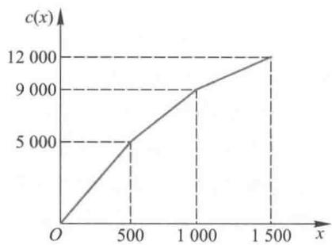  
图1分段线性函数  $c(x)$  图形

为了表示  $x$  在哪个小区间,引入0- 1变量  $y_{k}$ $(k = 1,2,3)$  ,当  $x$  在第  $k$  个小区间时,  $y_{k} = 1$  ,否则,  $y_{k} = 0.$  这样,  $z_{1},z_{2},z_{3},z_{4},y_{1},y_{2},y_{3}$  应满足

$$
z_{1}\leqslant y_{1},z_{2}\leqslant y_{1} + y_{2},z_{3}\leqslant y_{2} + y_{3},z_{4}\leqslant y_{3} \tag{26}
$$

$$
z_{1} + z_{2} + z_{3} + z_{4} = 1,z_{k}\geqslant 0(k = 1,2,3,4) \tag{27}
$$

$$
y_{1} + y_{2} + y_{3} = 1,y_{1},y_{2},y_{3} = 0 \tag{28}
$$

此时  $x$  和  $c(x)$  可以统一地表示为

$$
x = z_{1}b_{1} + z_{2}b_{2} + z_{3}b_{3} + z_{4}b_{4} = 500z_{2} + 1000z_{3} + 1500z_{4} \tag{29}
$$

$$
c(x) = z_{1}c(b_{1}) + z_{2}c(b_{2}) + z_{3}c(b_{3}) + z_{4}c(b_{4}) \tag{29}
$$

$$
= 5000z_{2} + 9000z_{3} + 12000z_{4} \tag{30}
$$

(10)~(16),(26)~(30)也构成一个整数规划模型,将它输入LINGO软件求解,得到的结果与第2种解法相同.

设一个  $n$  段线性函数  $f(x)$  的分点为  $b_{1}\leqslant \dots \leqslant b_{n}\leqslant b_{n + 1}$  ,引入  $z_{k}$  ,将  $x$  和  $f(x)$  表示为

$$
x = \sum_{k = 1}^{n + 1}z_{k}b_{k} \tag{31}
$$

$$
f(x) = \sum_{k = 1}^{n + 1}z_{k}f(b_{k}) \tag{32}
$$

评注 这个问题的关键是处理分段线性函数,我们推荐化为整数规划模型的第2、3种解法,第3种解法更具一般性.

# 复习题

1. 考虑4.2节的复习题,为了进一步减少吨千米数,打算舍弃两个临时料场,改建两个新的,日储量仍各为20t,应建在何处?节省的吨千米数有多大?[72]

2. 某公司将4种不同含硫量的液体原料(分别记为甲、乙、丙、丁)混合生产两种产品(分别记为A,B).按照生产工艺的要求,原料甲、乙、丁必须首先倒入混合池中混合,混合后的液体再分别与原料丙混合生产A,B.已知原料甲、乙、丙、丁的含硫量分别是  $3\% ,1\% ,2\% ,1\%$  ,进货价格(单位:千元/t)分别为6,16,10,15;产品A,B的含硫量分别不能超过  $2.5\% ,1.5\%$  ,售价分别为9,15.根据市场信息,原

料甲、乙、丙的供应没有限制,原料丁的供应量最多为50t;产品A,B的市场需求量分别为100t,200t. 问应如何安排生产[21]?

# 4.4 接力队的选拔与选课策略

实际生活中可能遇到这样的分派问题:若干项任务分给一些候选人来完成,因为每个人的专长不同,他们完成每项任务取得的效益或需要的资源就不一样,如何分派这些任务使获得的总效益最大,或付出的总资源最少?也会遇到这样的选择问题:有若干种策略供你选择,不同的策略得到的收益或付出的成本不同,各个策略之间可以有相互制约关系,如何在满足一定条件下做出抉择,使得收益最大或成本最小?本节将通过几个实例说明怎样用数学规划模型解决这种问题.

例1 混合泳接力队的选拔

问题 某班准备从5名游泳队员中选择4人组成接力队,参加学校的  $4 \times 100 \mathrm{~m}$  混合泳接力比赛.5名队员4种泳姿的百米平均成绩如表1所示,问应如何选拔队员组成接力队?

如果最近队员丁的蛙泳成绩有较大退步,只有  $1'15''2$ ;而队员戊经过艰苦训练自由泳成绩有所进步,达到  $57''5$ ,组成接力队的方案是否应该调整?

表15名队员4种泳姿的百米平均成绩  

<table><tr><td>甲</td><td>乙</td><td>丙</td><td>丁</td><td>戊</td></tr><tr><td>蝶泳</td><td>1&#x27;06&quot;8</td><td>57&quot;2</td><td>1&#x27;18&quot;</td><td>1&#x27;10&quot;</td></tr><tr><td>仰泳</td><td>1&#x27;15&quot;6</td><td>1&#x27;06&quot;</td><td>1&#x27;07&quot;8</td><td>1&#x27;14&quot;2</td></tr><tr><td>蛙泳</td><td>1&#x27;27&quot;</td><td>1&#x27;06&quot;4</td><td>1&#x27;24&quot;6</td><td>1&#x27;09&quot;6</td></tr><tr><td>自由泳</td><td>58&quot;6</td><td>53&quot;</td><td>59&quot;4</td><td>57&quot;2</td></tr></table>

问题分析 从5名队员中选出4人组成接力队,每人一种泳姿,且4人的泳姿各不相同,使接力队的成绩最好.容易想到的一个办法是穷举法,组成接力队的方案共有5!  $= 120$  种,逐一计算并作比较,即可找出最优方案.显然这不是解决这类问题的好办法,随着问题规模的变大,穷举法的计算量将是无法接受的.

可以用0- 1变量表示一个队员是否入选接力队,从而建立这个问题的0- 1规划模型,借助现成的数学软件求解.

模型的建立与求解 记甲乙丙丁戊分别为队员  $i = 1,2,3,4,5$ ;记蝶泳、仰泳、蛙泳、自由泳分别为泳姿  $j = 1,2,3,4$ . 记队员  $i$  的第  $j$  种泳姿的百米最好成绩为  $c_{ij}(\mathrm{~s~})$ ,即有

<table><tr><td></td><td>i=1</td><td>i=2</td><td>i=3</td><td>i=4</td><td>i=5</td></tr><tr><td>j=1</td><td>66.8</td><td>57.2</td><td>78</td><td>70</td><td>67.4</td></tr><tr><td>j=2</td><td>75.6</td><td>66</td><td>67.8</td><td>74.2</td><td>71</td></tr></table>

续表

<table><tr><td rowspan="2"></td><td colspan="5">cij</td></tr><tr><td>i=1</td><td>i=2</td><td>i=3</td><td>i=4</td><td>i=5</td></tr><tr><td>j=3</td><td>87</td><td>66.4</td><td>84.6</td><td>69.6</td><td>83.8</td></tr><tr><td>j=4</td><td>58.6</td><td>53</td><td>59.4</td><td>57.2</td><td>62.4</td></tr></table>

引入0- 1变量  $x_{ij}$ ,若选择队员  $i$  参加泳姿  $j$  的比赛,记  $x_{ij} = 1$ ,否则记  $x_{ij} = 0$ .根据组成接力队的要求,  $x_{ij}$  应该满足两个约束条件:

第一,每人最多只能入选4种泳姿之一,即对于  $i = 1,2,3,4,5$ ,应有  $\sum_{j = 1}^{4}x_{ij} \leqslant 1$ ;

第二,每种泳姿必须有1人而且只能有1人入选,即对于  $j = 1,2,3,4$ ,应有  $\sum_{i = 1}^{5}x_{ij} = 1$ .

当队员  $i$  入选泳姿  $j$  时,  $c_{ij}x_{ij}$  表示他(她)的成绩,否则  $c_{ij}x_{ij} = 0$ .于是接力队的成绩可表示为  $z = \sum_{j = 1}^{4}\sum_{i = 1}^{5}c_{ij}x_{ij}$ ,这就是该问题的目标函数.

综上,这个问题的0- 1规划模型可写作

$$
\min_{\mathrm{~\scriptstyle~\cdot~}}z = \sum_{j = 1}^{4}\sum_{i = 1}^{5}c_{i j}x_{i j} \tag{1}
$$

$$
\mathrm{s.t.}\sum_{j = 1}^{4}x_{i j}\leqslant 1,i = 1,2,3,4,5 \tag{2}
$$

$$
\sum_{i = 1}^{5}x_{i j} = 1,j = 1,2,3,4 \tag{3}
$$

$$
x_{ij} = \{0,1\} \tag{4}
$$

求解得到结果为:  $x_{14} = x_{21} = x_{32} = x_{43} = 1$ ,其他变量为0,成绩为  $253.2 \mathrm{~s} = 4'13''2$ .即应当选派甲乙丙丁4人组成接力队,分别参加自由泳、蝶泳、仰泳、蛙泳的比赛.

讨论考虑到丁、戊最近的状态,  $c_{43}$  由原来的  $69.6 \mathrm{~s}$  变为  $75.2 \mathrm{~s}, c_{54}$  由原来的  $62.4 \mathrm{~s}$  变为  $57.5 \mathrm{~s}$ ,讨论对结果的影响.这类似于4.1节中的敏感性分析,但是对于整数规划模型,一般没有与线性规划相类似的理论,此时LINGO中所输出的敏感性分析结果通常是没有意义的.于是我们只好用  $c_{43}, c_{54}$  的新数据重新输入模型,用LINGO求解得到:  $x_{21} = x_{32} = x_{43} = x_{54} = 1$ ,其他变量为0,成绩为  $257.7 \mathrm{~s} = 4'17''7$ .即应当选派乙丙丁戊4人组成接力队,分别参加蝶泳、仰泳、蛙泳、自由泳的比赛.

评注 典型的指答问题中,任务的数量与能够承担的人员数量相等,但是二者不相等的情况也常见,本例是人数多于任务数,如果任务数多于人数呢?这时虽然不是上述意义下的指派问题,但能建立类似的模型.

例1属于这样一类分派问题:有若干项任务,每项任务必须有一人且只能有一人承担,每人也只能承担其中一项,不同人员承担不同任务的收益(或成本)不同,问题是怎样分派各项任务使总收益最大(或总成本最小).它又称为指派问题(assignment).建立0- 1规划模型是解决这类问题的常用方法.

例2 选课策略

某学校规定,运筹学专业的学生毕业时必须至少学习过两门数学课、三门运筹学课和两门计算机课.这些课程的编号、名称、学分、所属类别和先修课要求如表2所示.那

么,毕业时学生最少可以学习这些课程中的哪些课程?

如果某个学生既希望选修课程的数量少,又希望所获得的学分多,他可以选修哪些课程?

表2课程情况  

<table><tr><td>课程编号</td><td>课程名称</td><td>学分</td><td>所属类别</td><td>先修课要求</td></tr><tr><td>1</td><td>微积分</td><td>5</td><td>数学</td><td></td></tr><tr><td>2</td><td>线性代数</td><td>4</td><td>数学</td><td></td></tr><tr><td>3</td><td>最优化方法</td><td>4</td><td>数学;运筹学</td><td>微积分;线性代数</td></tr><tr><td>4</td><td>数据结构</td><td>3</td><td>数学;计算机</td><td>计算机编程</td></tr><tr><td>5</td><td>应用统计</td><td>4</td><td>数学;运筹学</td><td>微积分;线性代数</td></tr><tr><td>6</td><td>计算机模拟</td><td>3</td><td>计算机;运筹学</td><td>计算机编程</td></tr><tr><td>7</td><td>计算机编程</td><td>2</td><td>计算机</td><td></td></tr><tr><td>8</td><td>预测理论</td><td>2</td><td>运筹学</td><td>应用统计</td></tr><tr><td>9</td><td>数学实验</td><td>3</td><td>运筹学;计算机</td><td>微积分;线性代数</td></tr></table>

模型的建立与求解用  $x_{i} = 1$  表示选修表2中按编号顺序的9门课程(  $x_{i} = 0$  表示不选;  $i = 1,2,\dots ,9$ . 问题的目标为选修的课程总数最少,即

$$
\min z = \sum_{i = 1}^{9}x_{i} \tag{5}
$$

约束条件包括两个方面:

第一,每人最少要学习2门数学课、3门运筹学课和2门计算机课.根据表中对每门课程所属类别的划分,这一约束可以表示为

$$
x_{1} + x_{2} + x_{3} + x_{4} + x_{5}\geq 2 \tag{6}
$$

$$
x_{3} + x_{5} + x_{6} + x_{8} + x_{9}\geq 3 \tag{7}
$$

$$
x_{4} + x_{6} + x_{7} + x_{9}\geq 2 \tag{8}
$$

第二,某些课程有先修课程的要求.例如"数据结构"的先修课是"计算机编程",这意味着如果  $x_{4} = 1$ ,必须  $x_{7} = 1$ ,这个条件可以表示为  $x_{4}\leqslant x_{7}$  (注意:  $x_{4} = 0$  时对  $x_{7}$  没有限制)."最优化方法"的先修课是"微积分"和"线性代数"的条件可表为  $x_{3}\leqslant x_{1},x_{3}\leqslant x_{2}$ ,而这两个不等式可以用一个约束表示为  $2x_{3} - x_{1} - x_{2}\leqslant 0$ .这样,所有课程的先修课要求可表为如下的约束:

$$
2x_{3} - x_{1} - x_{2}\leqslant 0 \tag{9}
$$

$$
x_{4} - x_{7}\leqslant 0 \tag{10}
$$

$$
2x_{5} - x_{1} - x_{2}\leqslant 0 \tag{11}
$$

$$
x_{6} - x_{7}\leqslant 0 \tag{12}
$$

$$
x_{8} - x_{5}\leqslant 0 \tag{13}
$$

$$
2x_{9} - x_{1} - x_{2}\leqslant 0 \tag{14}
$$

程序文件4- 12选课策略prog0404b.lg4

由上得到以(5)为目标函数、以(6)~(14)为约束条件的0- 1规划模型.将这一模型输入LINGO(注意加上  $x_{i}$  为0- 1的约束),求解得到结果为  $x_{1} = x_{2} = x_{3} = x_{6} = x_{7} = x_{9} = 1$ ,其他变量为0. 对照课程编号,它们是微积分、线性代数、最优化方法、计算机模拟、计算机编程、数学实验,共6门课程,总学分为21.

下面将会看到,这个解并不是唯一的,还可以找到与以上不完全相同的6门课程,也满足所给的约束.

讨论如果一个学生既希望选修课程数少,又希望所获得的学分数尽可能多,则除了目标(5)之外,还应根据表2中的学分数写出另一个目标,即

$$
\max w = 5x_{1} + 4x_{2} + 4x_{3} + 3x_{4} + 4x_{5} + 3x_{6} + 2x_{7} + 2x_{8} + 3x_{9} \tag{15}
$$

我们把只有一个优化目标的规划问题称为单目标规划,而将多于一个目标的规划问题称为多目标规划.多目标规划的目标函数相当于一个向量,如目标(5)和(15)可以表示为对一个向量进行优化:

$$
\mathrm{V} - \min \left(z, - w\right) \tag{16}
$$

上面符号"V- min"是"向量最小化"的意思,注意其中已经通过对  $w$  取负号而将(15)中的最大化变成了最小化问题

要得到多目标规划问题的解,通常需要知道决策者对每个目标的重视程度,称为偏好程度.下面通过几个例子讨论处理这类问题的方法.

1. 同学甲只考虑获得尽可能多的学分,而不管所修课程的多少,那么他可以以(15)为目标,不用考虑(5),这就变成了一个单目标优化问题.显然,这个问题不必计算就知道最优解是选修所有9门课程.

2. 同学乙认为选修课程数最少是基本的前提,那么他可以只考虑目标(5)而不管(15),这就是前面得到的,最少为6门.如果这个解是唯一的,则他已别无选择,只能选修上面的6门课,总学分为21.但是LINGO无法告诉我们一个优化问题的解是否唯一,所以他还可能在选修6门课的条件下,使总学分多于21.为探索这种可能,应在上面的规划问题中增加约束

程序文件4- 13两目标选课策略prog0404c.lg4

评注用0- 1变量表示选择策略是常用的方法,而对于"要选甲必选乙"这样的约束,可以用类似于(10)式  $x_{4} \leqslant x_{7}$  来描述.有些选择问题,如从众多球员中选拔上场队员时,由于相互配合或相互制约的关系,还会遇到诸如"甲乙二人至多选一人"、"甲乙二人至少选一人"、"要选甲必不能选乙"等约束.

本节还讨论了多目标规划问题的处理办法,其

$$
\sum_{j = 1}^{9} x_{i} = 6 \tag{17}
$$

得到以(15)为目标函数、以(6)~(14)和(17)为约束条件的另一个0- 1规划模型.求解后发现会得到不同于前面6门课程的最优解  $x_{1} = x_{2} = x_{3} = x_{5} = x_{7} = x_{9} = 1$ ,其他变量为0,即3学分的"计算机模拟"换成了4学分的"应用统计",总学分由21增至22. 注意这个模型的解仍然不是唯一的,如  $x_{1} = x_{2} = x_{3} = x_{5} = x_{6} = x_{7} = 1$ ,其他变量为0,也是最优解.

3. 同学丙不像甲、乙那样,只考虑学分最多或以课程最少为前提,而是觉得学分数和课程数这两个目标大致上应该三七开.这时可以将目标函数  $z$  和  $-w$  分别乘以0.7和0.3,组成一个新的目标函数  $y$ ,有

min  $y = 0.7z - 0.3w$

$$
= -0.8x_{1} - 0.5x_{2} - 0.5x_{3} - 0.2x_{4} - 0.5x_{5} - 0.2x_{6} + 0.1x_{7} + 0.1x_{8} - 0.2x_{9} \tag{18}
$$

得到以(18)为目标、以(6)~(14)为约束的0- 1规划模型.输入LINGO求解得到结果为:  $x_{1} = x_{2} = x_{3} = x_{4} = x_{5} = x_{6} = x_{7} = x_{9} = 1$ ,即只有"预测理论"不需要选修,共28学分.

实际上,0.7和0.3是  $z$  和  $- w$  的权重.一般地,将权重记作  $\lambda_{1}, \lambda_{2}$ ,且令  $\lambda_{1} + \lambda_{2} = 1$

$0 \leqslant \lambda_{1}, \lambda_{2} \leqslant 1$ , 则 0- 1 规划模型的新目标为

$$
\min_{y} y = \lambda_{1} z - \lambda_{2} w \tag{19}
$$

前面同学甲的考虑相当于  $\lambda_{1} = 0, \lambda_{2} = 1$ , 同学乙的考虑相当于  $\lambda_{1} = 1, \lambda_{2} = 0$ , 是两种极端情况。通过选取许多不同的  $\lambda_{1}, \lambda_{2}$  进行计算, 可以发现当  $\lambda_{1}< 2 / 3$  时, 结果与同学甲相同; 而当  $\lambda_{1} > 3 / 4$  时, 结果与同学乙相同。这是偶然的吗? 我们根据给出的数据分析一下。

当  $\lambda_{1}< 2 / 3$  时, (19) 式中  $x$  的所有系数都小于 0, 因此为了使  $y$  取最小值, 所有决策变量应尽可能取 1, 这与  $\lambda_{1} = 0, \lambda_{2} = 1$  的情况, 即学分数最多是一样的。

当  $\lambda_{1} > 3 / 4$  时, (19) 式中  $x$  的系数中至少有 5 个大于 0, 它们分别是  $x_{4}, x_{6}, x_{7}, x_{8}, x_{9}$  的系数, 因此为了使  $y$  取最小值,  $x_{4}, x_{6}, x_{7}, x_{8}, x_{9}$  应尽可能取 0, 而根据前面的计算知道约束条件已经保证至少要选修 6 门课, 所以  $x_{4}, x_{6}, x_{7}, x_{8}, x_{9}$  中最多只能有 3 个同时取 0, 这与  $\lambda_{1} = 1, \lambda_{2} = 0$  的情况, 即选修的课程数最少是一样的。

# 复习题

某公司指派  $n$  个员工到  $n$  个城市工作 (每个城市单独一人), 希望使所花费的总电话费用尽可能少。  $n$  个员工两两之间每个月通话的时间表示在下面的矩阵的上三角形部分 (假设通话的时间矩阵是对称的, 没有必要写出下三角形部分),  $n$  个城市两两之间通话费率表示在下面的矩阵的下三角形部分 (同样道理, 假设通话的费率矩阵是对称的, 没有必要写出上三角形部分)。试求解该二次指派问题。(如果你的软件解不了这么大规模的问题, 那就只考虑最前面的若干员工和城市。)[21]

$$
\begin{array}{r}{\left(\begin{array}{l l l l l l l l l}{0}&{5}&{3}&{7}&{9}&{3}&{9}&{2}&{9}&{0}\\ {7}&{3}&{7}&{8}&{3}&{2}&{3}&{3}&{5}&{7}\\ {4}&{8}&{0}&{9}&{3}&{5}&{3}&{3}&{9}&{3}\\ {6}&{2}&{10}&{0}&{8}&{4}&{1}&{8}&{0}&{4}\\ {8}&{6}&{4}&{6}&{0}&{8}&{8}&{7}&{5}&{9}\\ {8}&{5}&{4}&{6}&{6}&{0}&{4}&{8}&{0}&{3}\\ {8}&{6}&{7}&{9}&{4}&{3}&{0}&{7}&{9}&{5}\\ {6}&{8}&{2}&{3}&{8}&{8}&{6}&{0}&{5}&{5}\\ {6}&{3}&{2}&{2}&{8}&{3}&{7}&{8}&{0}&{5}\\ {5}&{6}&{7}&{6}&{6}&{2}&{8}&{8}&{9}&{0}\end{array}\right)}\end{array}
$$

# 4.5 饮料厂的生产与检修

在 4.1 节的例子中我们讨论的是单阶段的生产销售计划, 实际上由于生产、需求在时间上的连续性, 从长期效益出发, 应该制订多阶段生产计划。

实际生产中要考虑的除了成本费、存贮费等与产量有关的费用外, 有时还要考虑与产量无关的固定费用, 如生产准备费, 这会给优化模型的求解带来新的困难。

本节通过两个实例研究以上问题。

例 1 饮料厂的生产与检修计划

问题 某饮料厂生产一种饮料用以满足市场需求。该厂销售科根据市场预测, 已经

确定了未来 4 周该饮料的需求量。计划科根据本厂实际情况给出了未来 4 周的生产能力和生产成本,如表 1 所示。每周当饮料满足需求后有剩余时,要支出存贮费,为每周每千箱饮料 0.2 千元。问应如何安排生产计划,在满足每周市场需求的条件下,使四周的总费用(生产成本与存贮费之和)最小?

如果工厂必须在未来四周的某一周中安排一次设备检修,检修将占用当周 15 千箱的生产能力,但会使检修以后每周的生产能力提高 5 千箱,则检修应该安排在哪一周?

<table><tr><td>周次</td><td>需求量/千箱</td><td>生产能力/千箱</td><td>每千箱成本/千元</td></tr><tr><td>1</td><td>15</td><td>30</td><td>5.0</td></tr><tr><td>2</td><td>25</td><td>40</td><td>5.1</td></tr><tr><td>3</td><td>35</td><td>45</td><td>5.4</td></tr><tr><td>4</td><td>25</td><td>20</td><td>5.5</td></tr><tr><td>合计</td><td>100</td><td>135</td><td></td></tr></table>

问题分析 从表 1 的数据看,除第 4 周外每周的生产能力都超过每周的需求,且总生产能力超过总需求,故可以满足每周市场需求。如果第 1 周、第 2 周按需生产,第 3 周多生产 5 千箱以弥补第 4 周生产能力对需求的不足,就可以使总的存贮费最小。但是我们注意到:生产成本在逐周上升,所以从总费用最小的角度考虑,前几周多生产一些备用,可能是更好的生产方案。于是应该建立数学规划模型来寻找最优的生产与存贮策略。

模型假设 设饮料厂在第 1 周开始时没有库存;从费用最小考虑,自然地假定第 4 周末也不能有库存;周末有库存时需支出一周的存贮费;每周末的库存量就是下周初的库存量。

模型建立与求解 显然,问题的决策变量是未来 4 周饮料的生产量,分别记作  $x_{1}, x_{2}, x_{3}, x_{4}$ ;由于存贮费取决于库存量,记第 1,2,3 周末的库存量分别为  $y_{1}, y_{2}, y_{3}$ ;4 周的总费用生产成本与存贮费之和(记作  $z$ )是问题的目标函数,如下面模型中的(1)式。

每周的产量、需求与库存之间存在着平衡关系,比如对第 2 周有  $y_{1} + x_{2} - 25 = y_{2}$ ,再注意到第 1 周初和第 4 周末的库存为 0,就得到下面模型的约束条件(2- 1)~(2- 4)。(3),(4)则分别是产量限制和非负约束。综上可得如下的线性规划模型

$$
\min z = 5.0x_{1} + 5.1x_{2} + 5.4x_{3} + 5.5x_{4} + 0.2(y_{1} + y_{2} + y_{3}) \tag{1}
$$

$$
\mathrm{s.t.} \quad x_{1} - y_{1} = 15 \tag{2-1}
$$

$$
x_{2} + y_{1} - y_{2} = 25 \tag{2-2}
$$

$$
x_{3} + y_{2} - y_{3} = 35 \tag{2-3}
$$

$$
x_{4} + y_{3} = 25 \tag{2-4}
$$

$$
x_{1} \leqslant 30, x_{2} \leqslant 40, x_{3} \leqslant 45, x_{4} \leqslant 20 \tag{3}
$$

$$
x_{1}, x_{2}, x_{3}, x_{4}, y_{1}, y_{2}, y_{3} \geqslant 0 \tag{4}
$$

将以上模型输入 LINGO 求解,可以得到最优解  $(x_{1}, x_{2}, x_{3}, x_{4}, y_{1}, y_{2}, y_{3}) = (15,40, 25,20,0,15,5)$ ,即四周的产量分别为 15 千箱、40 千箱、25 千箱、20 千箱,这样第 1 周没有库存,第 2,3 周各有 15 千箱、5 千箱库存。这个生产计划的总费用为 528 千元,达到

最小.

讨论在需要安排检修时,如果希望以上生产计划保持不变,可以看出:第1周和第2周都有不小于15千箱的生产能力剩余,因此这两周都可以安排检修:究竟将检修安排在哪一周呢?

实际上,由于检修后生产能力发生变化,把检修安排在第1或第2周不一定是最佳选择.从题目给的条件来看,将检修安排在任何一周都是可以的.我们引入0- 1变量  $w_{1}$ $w_{2},w_{3},w_{4}$  ,用  $w_{i} = 1$  表示检修安排在第  $t$  周  $(t = 1,2,3,4)$  .由于检修将占用当周15千箱的生产能力,但会使检修以后每周的生产能力提高5千箱,所以上面模型中关于产量限制的约束条件(3)需要修改为

$$
x_{1} + 15w_{1}\leqslant 30 \tag{3-1}
$$

$$
x_{2} + 15w_{2} - 5w_{1}\leqslant 40 \tag{3-2}
$$

$$
x_{3} + 15w_{3} - 5w_{2} - 5w_{1}\leqslant 45 \tag{3-3}
$$

$$
x_{4} + 15w_{4} - 5w_{1} - 5w_{2} - 5w_{3}\leqslant 20 \tag{3-4}
$$

同时,由于四周中只有一次检修,模型中还需要增加关于  $w_{1},w_{2},w_{3},w_{4}$  的约束

$$
w_{1} + w_{2} + w_{3} + w_{4} = 1 \tag{5}
$$

$$
w_{1},w_{2},w_{3},w_{4}\in \{0,1\} \tag{6}
$$

用LINGO对修改的模型直接求解,应当将检修安排在第1周,每周的生产量分别为15千箱、45千箱、15千箱、25千箱,最小总费用从528千元下降为527千元.

为安排检修计划引入0- 1变量,得到混合整数规划模型,求解的结果总费用只下降了一点,是由于检修导致的生产能力的提高,在短短的4周内其作用远未得到充分体现.

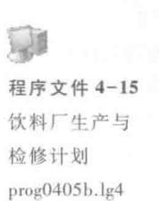

评注 这一生产计划问题涉及多个生产阶段,各阶段的产量、需求与库存之间有一定的联系,如上面模型的  $(2 - 1) - (2 - 4)$  所示.虽然由这些式子可以解出库存量  $y_{1},y_{2},y_{3}$  代入(1)得到只有产量  $x_{1},x_{2},x_{3},x_{4}$  的目标函数,但是通常我们宁愿增加库存量作为决策变量,使模型清晰和便于检查,而尽可能地把计算工作都留给计算机去做.

例2 饮料的生产批量问题

问题某饮料厂使用同一条生产线轮流生产多种饮料以满足市场需求.如果某周开工生产其中一种饮料,就要清洗设备和更换部分部件,于是需支出生产准备费8千元.现在只考虑一种饮料的生产,假设其未来四周的需求量、生产能力、生产成本和存贮费与例1给出的完全相同.问应如何安排这种饮料的生产计划,在按时满足市场需求的条件下,使生产该种饮料的总费用最小?

问题分析这一问题与例1的主要差别在于:除了考虑随产品数量变化的费用(如生产成本和存贮费)外,还要考虑与产品数量无关的费用,即生产准备费,只要某周开工生产时就有这项费用.

模型建立与求解我们先用一般的数学符号表述这类问题.设需要考虑的时间跨度为  $T$  个时段(在本例中为4个时段,1周是1个时段),第  $t$  时段的市场需求为  $d_{t}$  ,生产能力为  $M_{t}(t = 1,2,\dots ,T)$  .如果第  $t$  时段开工生产,则需付出生产准备费为  $s_{t}\geqslant 0$  ,单件产品的生产成本为  $c_{t}\geqslant 0.$  在  $t$  时段末,如果有产品库存,单件产品1个时段的存贮费为  $h_{t}\geqslant 0.$  目标函数是生产准备费、生产成本和存贮费之和.

假设在  $t$  时段,产品的生产量为  $x_{t}(\geqslant 0)$ $t$  时段末产品的库存(即下一个时段的初始库存)为  $y_{t}(\geqslant 0)$  ,合理地假设  $y_{t} = y_{T} = 0.$  产量、需求与库存之间的平衡关系同前.

为了表述在  $t$  时段是否生产这种饮料,从而确定是否要支付生产准备费,引入0- 1变量  $w_{t},w_{t} = 1$  表示生产,  $w_{t} = 0$  表示不生产.于是这一问题可以用如下的数学规划模型

描述:

程序文件4- 16饮料厂生产批量计划prog0405c.lg4

评注这种既包含可变费用(生产成本、存贮费)又包含固定费用(生产准备费)的生产计划问题一般称为生产批量(lotsizing)问题,通常引入0- 1变量来处理.如果对产量和库存量没有提出整数要求(即认为它们可以取任意非负实数),那么这种模型是同时包含连续变量和整数变量的数学规划,一般称为混合整数规划.

$$
\begin{array}{r l} & {\min z = \sum_{t = 1}^{T}\left(s_{t}w_{t} + c_{t}x_{t} + h_{t}y_{t}\right)}\\ & {\mathrm{s.t.}\quad y_{t - 1} + x_{t} - y_{t} = d_{t},\quad t = 1,2,\dots ,T}\\ & {\quad \quad \quad \quad \quad \quad \quad \quad \quad \quad \quad \quad \quad \quad \quad \quad \quad \quad \quad \quad \quad \quad \quad \quad \quad \quad \quad \quad \quad \quad \quad \quad \quad \quad \quad \quad \quad \quad \quad \quad \quad \quad \quad \quad \quad \quad \quad \quad \quad \quad \quad}\\ & {\quad \quad \quad \quad \quad \quad \quad \quad \quad \quad \quad \quad \quad \quad \quad \quad \quad \quad \quad \quad \quad \quad \quad \quad \quad \quad \quad \quad \quad \quad \quad \quad \quad \quad \quad \quad \quad \quad \quad \quad \quad \quad \quad \quad \quad \quad \quad \quad \qquad \quad \quad \quad \quad \quad \quad \quad \quad \quad \quad \quad \quad \quad \quad \quad \quad \quad \quad \quad \quad \quad \quad \quad \quad \quad \quad \quad \quad \quad \quad \quad \quad \quad \quad \quad \quad \quad \quad \quad \quad \quad \quad \quad \quad \quad \quad \quad \quad \quad} \end{array} \tag{10}
$$

(9)式不便于计算,可以将(9),(10)合并地表为  $x_{t} \leqslant M_{t} w_{t}$ ,或用下面的线性不等式代替

$$
x_{t} - M_{t} w_{t} \leqslant 0, \quad t = 1, 2, \dots , T \tag{13}
$$

将本题所给参数代入这一模型,求解得到生产计划为:4周的生产量分别为15千箱、40千箱、45千箱、0千箱,最小总费用为554.0千元.与例1每周都有生产的结果相比,这里只在前3周生产,虽然存贮费增加了,但是节省了生产准备费.

如果把对每周生产能力的限制去掉,则将约束(13)中的  $M_{t}$  换成一个充分大的常数(比如4周的总需求量)就可以了.读者不妨解一下这个问题,会发现其最优解为,4周的生产量分别为15千箱、85千箱、0千箱、0千箱.与上面生产能力有限制的结果相比,这里只有第1、2周生产、生产准备费会更加节省.

# 复习题

某储蓄所每天的营业时间是上午9:00到下午5:00. 根据经验,每天不同时间段所需要的服务员数量如下表:

<table><tr><td>时间段/时</td><td>9~10</td><td>10~11</td><td>11~12</td><td>12~1</td><td>1~2</td><td>2~3</td><td>3~4</td><td>4~5</td></tr><tr><td>服务员数量</td><td>4</td><td>3</td><td>4</td><td>6</td><td>5</td><td>6</td><td>8</td><td>8</td></tr></table>

储蓄所可以雇佣全时和半时两类服务员.全时服务员每天报酬100元,从上午9:00到下午5:00工作,但中午12:00到下午2:00之间必须安排1h的午餐时间.储蓄所每天可以雇佣不超过3名的半时服务员,每个半时服务员必须连续工作4h,报酬40元.问该储蓄所应如何雇佣全时和半时两类服务员?如果不能雇佣半时服务员,每天至少增加多少费用?如果雇佣半时服务员的数量没有限制,每天可以减少多少费用?

# 4.6 钢管和易拉罐下料

生产中常会遇到通过切割、剪裁、冲压等手段,将原材料加工成所需尺寸这种工艺过程,称为原料下料问题.按照进一步的工艺要求,确定下料方案,使用料最省或利润最大,是典型的优化问题.本节通过两个实例讨论用数学规划模型解决这类问题的方法.

例1钢管下料

例1 钢管下料问题 某钢管零售商从钢管厂进货, 将钢管按照顾客的要求切割后售出, 从钢管厂进货时得到的原料钢管都是  $19 \mathrm{~m}$ .

(1)现有一客户需要50根  $4\mathrm{~m},20$  根  $6\mathrm{~m~}$  和15根  $8\mathrm{~m~}$  的钢管.应如何下料最节省?

(2)零售商如果采用的不同切割模式太多,将会导致生产过程的复杂化,从而增加生产和管理成本,所以该零售商规定采用的不同切割模式不能超过3种.此外,该客户除需要(1)中的三种钢管外,还需要10根  $5\mathrm{~m~}$  的钢管.应如何下料最节省[21]?

问题(1)的求解

问题分析首先,应当确定哪些切割模式是可行的.所谓一个切割模式,是指按照客户需要在原料钢管上安排切割的一种组合.例如:我们可以将  $19\mathrm{~m~}$  的钢管切割成3根  $4\mathrm{~m~}$  的钢管,余料为  $7\mathrm{~m~}$  ;或者将  $19\mathrm{~m~}$  的钢管切割成  $4\mathrm{~m},6\mathrm{~m~}$  和  $8\mathrm{~m~}$  的钢管各1根,余料为  $1\mathrm{~m~}$  显然,可行的切割模式是很多的.

其次,应当确定哪些切割模式是合理的.通常假设一个合理的切割模式的余料不应该大于或等于客户需要的钢管的最小尺寸.例如:将  $19\mathrm{~m~}$  的钢管切割成3根  $4\mathrm{~m~}$  的钢管是可行的,但余料为  $7\mathrm{~m~}$  ,可以进一步将  $7\mathrm{~m~}$  的余料切割成  $4\mathrm{~m~}$  钢管(余料为  $3\mathrm{~m~}$  ),或者将  $7\mathrm{~m~}$  的余料切割成  $6\mathrm{~m~}$  钢管(余料为  $1\mathrm{~m~}$  ).在这种合理性假设下,切割模式一共有7种,如表1所示.

表1钢管下料的合理切割模式  

<table><tr><td></td><td>4 m钢管根数</td><td>6 m钢管根数</td><td>8 m钢管根数</td><td>余料/m</td></tr><tr><td>模式1</td><td>4</td><td>0</td><td>0</td><td>3</td></tr><tr><td>模式2</td><td>3</td><td>1</td><td>0</td><td>1</td></tr><tr><td>模式3</td><td>2</td><td>0</td><td>1</td><td>3</td></tr><tr><td>模式4</td><td>1</td><td>2</td><td>0</td><td>3</td></tr><tr><td>模式5</td><td>1</td><td>1</td><td>1</td><td>1</td></tr><tr><td>模式6</td><td>0</td><td>3</td><td>0</td><td>1</td></tr><tr><td>模式7</td><td>0</td><td>0</td><td>2</td><td>3</td></tr></table>

问题化为在满足客户需要的条件下,按照哪些合理的模式,切割多少根原料钢管,最为节省.而所谓节省,可以有两种标准:一是切割后剩余的总余料量最小,二是切割原料钢管的总根数最少.下面将对这两个目标分别讨论.

模型建立

决策变量用  $x_{i}$  表示按照第  $i$  种模式  $(i = 1,2,\dots ,7)$  切割的原料钢管的根数,显然它们应当是非负整数.

决策目标以切割后剩余的总余料量最小为目标,则由表1可得

$$
\min z_{1} = 3x_{1} + x_{2} + 3x_{3} + 3x_{4} + x_{5} + x_{6} + 3x_{7} \tag{1}
$$

以切割原料钢管的总根数最少为目标,则有

$$
\min z_{2} = x_{1} + x_{2} + x_{3} + x_{4} + x_{5} + x_{6} + x_{7} \tag{2}
$$

下面分别在这两种目标下求解。

约束条件 为满足客户的需求,按照表1应有

$$
4x_{1} + 3x_{2} + 2x_{3} + x_{4} + x_{5} \geqslant 50 \tag{3}
$$

$$
x_{2} + 2x_{4} + x_{5} + 3x_{6} \geqslant 20 \tag{4}
$$

$$
x_{3} + x_{5} + 2x_{7} \geqslant 15 \tag{5}
$$

模型求解

1. 将(1),(3),(4),(5)构成的整数线性规划模型(加上整数约束)输入LINGO求解,可以得到最优解如下:  $x_{2} = 12, x_{5} = 15$  (其余变量为0). 即按照模式2切割12根原料钢管,按照模式5切割15根原料钢管,共27根,总余料量为  $27 \mathrm{~m}$ . 显然,在总余料量最小的目标下,最优解将是使用余料尽可能小的切割模式(模式2和5的余料为  $1 \mathrm{~m}$  ),这会导致切割原料钢管的总根数较多.

2. 将(2)~(5)构成的整数线性规划模型(加上整数约束)输入LINGO求解,可以得到最优解如下:  $x_{2} = 15, x_{5} = x_{7} = 5$  (其余变量为0). 即按照模式2切割15根原料钢管、按照模式5切割5根、按照模式7切割5根,共25根,可算出总余料量为  $35 \mathrm{~m}$ . 与上面得到的结果相比,总余料量增加了  $8 \mathrm{~m}$ ,但是所用的原料钢管的总根数减少了2根. 在余料没有什么用途的情况下,通常选择总根数最少为目标.

问题(2)的求解

问题分析 按照(1)的思路,可以通过枚举法首先确定哪些切割模式是可行的. 但由于需求的钢管规格增加到4种,所以枚举法的工作量较大. 下面介绍的整数非线性规划模型,可以同时确定切割模式和切割计划,是带有普遍性的方法.

同(1)类似,一个合理的切割模式的余料不应该大于或等于客户需要的钢管的最小尺寸(本题中为  $4 \mathrm{~m}$  ),切割计划中只使用合理的切割模式,而由于本题中参数都是整数,所以合理的切割模式的余量不能大于  $3 \mathrm{~m}$ . 此外,这里我们仅选择总根数最少为目标进行求解.

模型建立

决策变量 由于不同切割模式不能超过3种,可以用  $x_{i}$  表示按照第  $i$  种模式(  $i = 1,2,3$  )切割的原料钢管的根数,显然它们应当是非负整数. 设所使用的第  $i$  种切割模式下每根原料钢管生产  $4 \mathrm{~m}, 5 \mathrm{~m}, 6 \mathrm{~m}$  和  $8 \mathrm{~m}$  的钢管数量分别为  $r_{1i}, r_{2i}, r_{3i}, r_{4i}$  (非负整数).

决策目标 切割原料钢管的总根数最少,目标为

$$
\min z = x_{1} + x_{2} + x_{3} \tag{6}
$$

约束条件 为满足客户的需求,应有

$$
r_{11} x_{1} + r_{12} x_{2} + r_{13} x_{3} \geqslant 50 \tag{7}
$$

$$
r_{21} x_{1} + r_{22} x_{2} + r_{23} x_{3} \geqslant 10 \tag{8}
$$

$$
r_{31} x_{1} + r_{32} x_{2} + r_{33} x_{3} \geqslant 20 \tag{9}
$$

$$
r_{41} x_{1} + r_{42} x_{2} + r_{43} x_{3} \geqslant 15 \tag{10}
$$

每一种切割模式必须可行、合理,所以每根原料钢管的成品量不能超过  $19 \mathrm{~m}$ ,也不能少于  $16 \mathrm{~m}$  (余量不能大于  $3 \mathrm{~m}$  ),于是

$$
16 \leqslant 4 r_{11} + 5 r_{21} + 6 r_{31} + 8 r_{41} \leqslant 19 \tag{11}
$$

$$
16 \leqslant 4 r_{12} + 5 r_{22} + 6 r_{32} + 8 r_{42} \leqslant 19 \tag{12}
$$

$$
16 \leqslant 4r_{13} + 5r_{23} + 6r_{33} + 8r_{43} \leqslant 19 \tag{13}
$$

模型求解 在(7)~(10)式中出现决策变量的乘积,是一个整数非线性规划模型,虽然用LINGO软件可以直接求解,但也可以增加一些显然的约束条件,从而缩小可行解的搜索范围,有可能减少运行时间。

例如,由于3种切割模式的排列顺序是无关紧要的,所以不妨增加以下约束

$$
x_{1} \geqslant x_{2} \geqslant x_{3} \tag{14}
$$

又例如,我们注意到所需原料钢管的总根数有着明显的上界和下界.首先,无论如何,原料钢管的总根数不可能少于  $\left[\frac{14 \times 50 + 5 \times 10 + 6 \times 20 + 8 \times 15}{19}\right] + 1 = 26$  根.其次,考虑一种非常特殊的生产计划:第一种切割模式下只生产  $4 \mathrm{~m}$  钢管,一根原料钢管切割成4根  $4 \mathrm{~m}$  钢管,为满足50根  $4 \mathrm{~m}$  钢管的需求,需要13根原料钢管;第二种切割模式下只生产  $5 \mathrm{~m}, 6 \mathrm{~m}$  钢管,一根原料钢管切割成1根  $5 \mathrm{~m}$  钢管和2根  $6 \mathrm{~m}$  钢管,为满足10根  $5 \mathrm{~m}$  和20根  $6 \mathrm{~m}$  钢管的需求,需要10根原料钢管;第三种切割模式下只生产  $8 \mathrm{~m}$  钢管,一根原料钢管切割成2根  $8 \mathrm{~m}$  钢管,为满足15根  $8 \mathrm{~m}$  钢管的需求,需要8根原料钢管.于是满足要求的这种生产计划共需  $13 + 10 + 8 = 31$  根原料钢管,这就得到了最优解的一个上界.所以可增加以下约束

$$
20 \leqslant x_{1} + x_{2} + x_{3} \leqslant 31 \tag{15}
$$

将(6)~(15)构成的模型输入LINGO求解得到:按照模式1,2,3分别切割10,10,8根原料钢管,使用原料钢管总根数为28根.第一种切割模式下一根原料钢管切割成3根  $4 \mathrm{~m}$  钢管和1根  $6 \mathrm{~m}$  钢管;第二种切割模式下一根原料钢管切割成2根  $4 \mathrm{~m}$  钢管、1根  $5 \mathrm{~m}$  钢管和1根  $6 \mathrm{~m}$  钢管;第三种切割模式下一根原料钢管切割成2根  $8 \mathrm{~m}$  钢管.但这个模型的解并不唯一,你能找出一个与此不同的解吗?

例2 易拉罐下料

问题 某公司采用一套冲压设备生产一种罐装饮料的易拉罐,这种易拉罐是用镀锡板冲压制成的.易拉罐为圆柱形,包括罐身、上盖和下底,罐身高  $10 \mathrm{~cm}$ ,上盖和下底的直径均为  $5 \mathrm{~cm}$ .该公司使用两种不同规格的镀锡板原料:规格1的镀锡板为正方形,边长  $24 \mathrm{~cm}$ ;规格2的镀锡板为长方形,长、宽分别为  $32 \mathrm{~cm}$  和  $28 \mathrm{~cm}$ .由于生产设备和生产工艺的限制,对于规格1的镀锡板原料,只可以按照图1中的模式1、模式2或模式3进行冲压;对于规格2的镀锡板原料只能按照模式4进行冲压.使用模式1、模式2、模式3、模式4进行每次冲压所需要的时间分别为  $1.5 \mathrm{~s}, 2 \mathrm{~s}, 1 \mathrm{~s}, 3 \mathrm{~s}$ .

该工厂每周工作  $40 \mathrm{~h}$ ,每周可供使用的规格1、规格2的镀锡板原料分别为5万张和2万张.目前每只易拉罐的利润为0.10元,原料余料损失为0.001元  $\mathrm{cm}^{2}$  (如果周末有罐身、上盖或下底不能配套组装成易拉罐出售,也看作是原料余料损失).

问工厂应如何安排每周的生产?

问题分析 与钢管下料问题不同的是,这里的切割模式已经确定,只需计算各种模式下的余料损失.已知上盖和下底的直径  $d = 5 \mathrm{~cm}$ ,可得其面积为  $s = \pi d^{2} / 4 \approx 19.6 \mathrm{~cm}^{2}$ ,周长为  $L = \pi d \approx 15.7 \mathrm{~cm}$ ;已知罐身高  $h = 10 \mathrm{~cm}$ ,可得其面积为  $S = hL \approx 157.1 \mathrm{~cm}^{2}$ .于是模式1下的余料损失为  $24^{2} \mathrm{~cm}^{2} - 10s - S \approx 222.6 \mathrm{~cm}^{2}$ .同理计算其他模式下的余料损失,并可将4种冲压模式的特征归纳如表2.

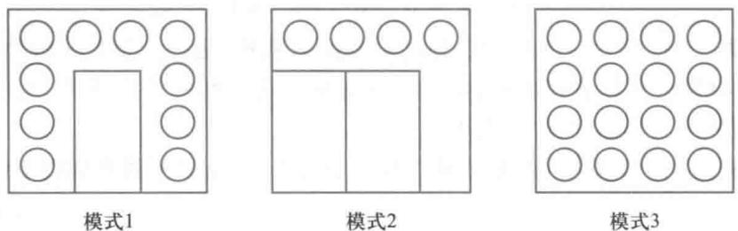

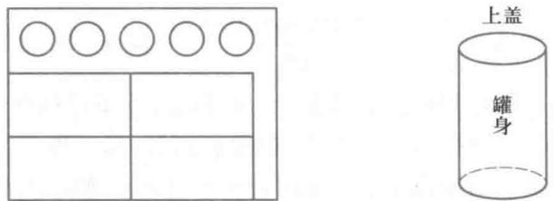  
模式4

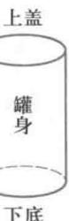  
图1易拉罐下料模式

表24种冲压模式的特征  

<table><tr><td></td><td>罐身个数</td><td>底、盖个数</td><td>余料损失/cm²</td><td>冲压时间/s</td></tr><tr><td>模式1</td><td>1</td><td>10</td><td>222.6</td><td>1.5</td></tr><tr><td>模式2</td><td>2</td><td>4</td><td>183.3</td><td>2</td></tr><tr><td>模式3</td><td>0</td><td>16</td><td>261.8</td><td>1</td></tr><tr><td>模式4</td><td>4</td><td>5</td><td>169.5</td><td>3</td></tr></table>

问题的目标显然应是易拉罐的利润扣除原料余料损失后的净利润最大,约束条件除每周工作时间和原料数量外,还要考虑罐身和底、盖的配套组装.

模型建立

决策变量用  $x_{i}$  表示按照第  $i$  种模式的冲压次数  $(i = 1,2,3,4)$ ,  $y_{1}$  表示一周生产的易拉罐个数.为计算不能配套组装的罐身和底、盖造成的原料损失,用  $y_{2}$  表示不配套的罐身个数,  $y_{3}$  表示不配套的底、盖个数.虽然实际上  $x_{i}$  和  $y_{1},y_{2},y_{3}$  应该是整数.但是由于生产量相当大,可以把它们看成是实数,从而用线性规划模型处理.

决策目标假设每周生产的易拉罐能够全部售出,公司每周的销售利润是  $0.1y_{1}$  原料余料损失包括两部分:4种冲压模式下的余料损失和不配套的罐身和底、盖造成的原料损失.按照前面的计算及表2的结果,总损失为  $0.001(222.6x_{1} + 183.3x_{2} + 261.8x_{3} + 169.5x_{4} + 157.1y_{2} + 19.6y_{3})$

于是,决策目标为

max  $z = 0.1y_{1} - 0.001(222.6x_{1} + 183.3x_{2} + 261.8x_{3} + 169.5x_{4} + 157.1y_{2} + 19.6y_{3})$  (16)

约束条件

时间约束:每周工作时间不超过  $40\mathrm{h} = 144000\mathrm{s}$ ,由表2最后一列得

$$
1.5x_{1} + 2x_{2} + x_{3} + 3x_{4} \leqslant 144000 \tag{17}
$$

原料约束:每周可供使用的规格 1、规格 2 的镀锡板原料分别为 50000 张和 20000 张,即

$$
x_{1} + x_{2} + x_{3} \leqslant 50000 \tag{18}
$$

$$
x_{4} \leqslant 20000 \tag{19}
$$

配套约束:由表 2 一周生产的罐身个数为  $x_{1} + 2x_{2} + 4x_{4}$ ,一周生产的底、盖个数为  $10x_{1} + 4x_{2} + 16x_{3} + 5x_{4}$ ,因为应尽可能将它们配套组装成易拉罐销售。所以  $y_{1}$  满足

$$
y_{1} = \min \left\{x_{1} + 2x_{2} + 4x_{4}, \left(10x_{1} + 4x_{2} + 16x_{3} + 5x_{4}\right) / 2\right\} \tag{20}
$$

这时不配套的罐身个数  $y_{2}$  和不配套的底、盖个数  $y_{3}$  应为

$$
y_{2} = x_{1} + 2x_{2} + 4x_{4} - y_{1} \tag{21}
$$

$$
y_{3} = 10x_{1} + 4x_{2} + 16x_{3} + 5x_{4} - 2y_{1} \tag{22}
$$

(16)~(22)就是我们得到的模型,其中(20)是一个非线性关系,不易直接处理,但是它可以等价为以下两个线性不等式

$$
y_{1} \leqslant x_{1} + 2x_{2} + 4x_{4} \tag{23}
$$

$$
y_{1} \leqslant \left(10x_{1} + 4x_{2} + 16x_{3} + 5x_{4}\right) / 2 \tag{24}
$$

模型求解模型(16)~(19)和(21)~(24)可以直接输入LINGO求解,但注意到约束(17)~(19)中右端项的数值过大(与左端的系数相比较),模型中数据之间的数量级不匹配,此时LINGO在计算中容易产生比较大的误差。我们可以先进行预处理,缩小数据之间的差别,例如可以将所有决策变量扩大10000倍(相当于  $x_{i}$  以万次为单位, $y_{i}$  以万件为单位)。此时,目标(16)可以保持不变(记住得到的结果单位为万元就可以了),而约束(17)~(19)改为

$$
1.5x_{1} + 2x_{2} + x_{3} + 3x_{4} \leqslant 14.4 \tag{25}
$$

$$
x_{1} + x_{2} + x_{3} \leqslant 5 \tag{26}
$$

$$
x_{4} \leqslant 2 \tag{27}
$$

评注下料问题的建模主要由两部分组成,一是确定下料模式,二是构造优化模型。确定下料模式尚无通用的方法,对于钢管下料这样的

一维问题,当需要下料的规格不太多时,可以枚举出下料模式,建立整数线性规划模型;否则就要构造整数非线性规划模

型,而这种模型求解比较困难。本节介绍的增加约束

条件的方法是将原来的可行域"割去"一部分,但要保证剩下的可行域中仍存在原问题的最优解。而像易拉罐下料这样的二维问题,就要

复杂多了,读者不妨试一下,看看还有没有比图1给出的更好的模式。

出的更好的模式。至于构造优化模型,则要根据问题的要求和限制具体处理,其中应特别注意配套组装的情况。

# 复习题

某钢管零售商从钢管厂进货,将钢管按照顾客的要求切割后售出。从钢管厂进货时得到的原料钢管长度都是  $1850 \mathrm{~mm}$ 。现有一客户需要15根  $290 \mathrm{~mm}$ 、28根  $315 \mathrm{~mm}$ 、21根  $350 \mathrm{~mm}$  和30根  $455 \mathrm{~mm}$  的钢管。为了简化生产过程,规定所使用的切割模式的种类不能超过4种,使用频率最高的一种切割模式按照一根原料钢管价值的1/10增加费用,使用频率次之的切割模式按照一根原料钢管价值的2/10增加费用。以此类推,且每种切割模式下的切割次数不能太多(一根原料钢管最多生产5根产品)。此外,为了减少余料浪费,每种切割模式下的余料浪费不能超过  $100 \mathrm{~mm}$ 。为了使总费用最小,应如何下料[21]?

# 4.7 广告投入与升级调薪

从4.4节中的例2可以看出,很多实际决策问题往往需要考虑多个目标,本节例1

再给出一个多目标规划的例子。在本节的例2中,决策者不仅要考虑多个目标,而且这些目标以"软约束"的形式出现且有优先顺序,这时可以建立目标规划模型。

例1 广告投入

问题 某公司计划在某地通过5种媒体(手机、网络、电视、报纸、电台)对公司产品做广告,并将目标人群分为7类(如按年龄分为小孩、老人、青年人、中年人,某些年龄段的人再按性别细分,等等)。根据过去的经验以及当前的市场预测,每花费1万元广告费,能够新吸引到的目标人群的数量(万人)如表1的2~6行所示(空格处为0),反映不同媒体对不同人群的吸引能力,表1最后两行还分别列出了公司希望吸引到的目标人群的最小数量,和可能吸引到的目标人群的最大数量。问公司应该在5种媒体上分别花费多少广告费?如果公司还希望吸引到尽可能多的目标人群,并得到花费的广告费与所能吸引的目标人群之间的数量关系,应该怎么做呢?[59]

<table><tr><td></td><td>人群1</td><td>人群2</td><td>人群3</td><td>人群4</td><td>人群5</td><td>人群6</td><td>人群7</td></tr><tr><td>手机</td><td></td><td>10</td><td>4</td><td>50</td><td>5</td><td></td><td>2</td></tr><tr><td>网络</td><td></td><td>10</td><td>30</td><td>5</td><td>12</td><td></td><td></td></tr><tr><td>电视</td><td>20</td><td></td><td></td><td></td><td></td><td>5</td><td>3</td></tr><tr><td>报纸</td><td>8</td><td></td><td></td><td></td><td></td><td>6</td><td>10</td></tr><tr><td>电台</td><td></td><td>6</td><td>5</td><td>10</td><td>11</td><td>4</td><td></td></tr><tr><td>最小数量</td><td>25</td><td>40</td><td>60</td><td>120</td><td>40</td><td>11</td><td>15</td></tr><tr><td>最大数量</td><td>60</td><td>70</td><td>120</td><td>140</td><td>80</td><td>25</td><td>55</td></tr></table>

模型建立 公司当然希望花费尽量少的广告费而吸引到尽可能多的目标人群,这是两个互相冲突的目标。这个问题仅给出了希望吸引到和可能吸引到的目标人群的最小数量和最大数量,并没有给出公司所能花费的广告费的上下限,我们首先在满足吸引到的目标人群的最低要求的情况下,建立使广告费最少的模型。

将5种媒体依次记为  $i = 1,2,\dots ,5,7$  类目标人群依次记为  $j = 1,2,\dots ,7$ ,表1中2~6行的目标人群数量记为  $a_{ij}$ ,最后2行的数据分别记为  $l_{j}$  和  $u_{j}$ 。

用  $x_{i}$  表示投入第  $l$  种媒体的广告费(万元),则总的广告费投入为

$$
z_{1} = x_{1} + x_{2} + x_{3} + x_{4} + x_{5} \tag{1}
$$

记通过广告吸引到的7类目标人群的数量分别为  $y_{j},j = 1,2,\dots ,7$ ,则由表1第2列数据可知

$$
y_{1} = \min (20x_{3} + 8x_{4},60) \tag{2}
$$

类似地,可得  $y_{j}(j = 2,3,\dots ,7)$  的表达式。一般可表为

$$
y_{j} = \min \Bigl (\sum_{i = 1}^{5}a_{ij}x_{i},u_{j}\Bigr),\quad j = 1,2,\dots ,7 \tag{3}
$$

由于吸引到的目标人群最小数量为  $l_{j}$  (最大数量限制  $u_{j}$  已列在(3)中),所以

$$
y_{j}\geqslant l_{j},\quad j = 1,2,\dots ,7 \tag{4}
$$

还有对广告费的非负约束

$$
x_{i} \geqslant 0, i = 1,2, \dots , 5 \tag{5}
$$

因此,如果仅考虑广告费最少,问题归结为在约束(3)~(5)下求(1)的最小值,是一个单目标的线性规划模型。按照这个模型,虽然花费的广告费最少,但可以预见,吸引到的人群在满足最低要求的条件下也会比较少。

现在考虑公司的第二个目标——吸引到尽可能多的目标人群,目标函数为

$$
z_{2} = y_{1} + \dots +y_{7} \tag{6}
$$

如果直接在约束(3)~(5)下求(6)的最大值,也是一个单目标的线性规划模型,但显然最优解是将所有潜在的目标人群(最大数量  $u_{j}$ )全部吸引过来,这时花费的总广告费相应地也会很高。

综合考虑两个目标(1)和(6),我们可以把这个问题表示为一个多目标规划模型:

$$
\min \quad z = (z_{1}, -z_{2}) \tag{7}
$$

注意到  $z_{1}$  希望最小,而  $z_{2}$  希望最大,所以(7)中对  $z_{2}$  取了负号。利用求解多目标规划的方法,可以得到花费的广告费与所能吸引的目标人群的数量关系。

模型求解如果公司希望在吸引到最小数量目标人群的条件下使广告费最少,可直接在约束(3)~(5)下求(1)的最小值,得到最少广告费为6.327万元,吸引到328.7万人;如果希望将所有潜在的目标人群全部吸引过来,可再增加约束  $x_{1} = u_{j}(j = 1,2,\dots , 7)$ ,求(1)的最小值,可得到最少广告费为13.798万元,所有550万人都被吸引了。

下面介绍求解多目标规划问题(7)的一种方法:分别以广告费不超过6.5,7.0,…,14(万元)作为约束,计算对应的所能吸引到的目标人群的最大数量。注意到目标人群人数较多,这里将其作为连续变量处理。

为此,将(1)式的目标改为约束(以广告费不超过6.5万元为例,其他类似)

$$
x_{1} + x_{2} + x_{3} + x_{4} + x_{5} \leqslant 6.5 \tag{8}
$$

则可以在约束(3)~(5)和(8)下求(6)的最大值,同时得到最优解  $x_{1}$ 。

LINGO软件(10.0以上版本)提供了子模型功能,可以方便地处理诸如(8)这类约束(右端项取不同数值进行计算的情形)。

编程求解可得到结果如表2所示。

表2广告费与吸引到的总人数的关系  

<table><tr><td>广告费/万元</td><td>6.5</td><td>7.0</td><td>7.5</td><td>8.0</td><td>8.5</td><td>9.0</td><td>9.5</td><td>10.0</td></tr><tr><td>总人数/万人</td><td>343.8</td><td>373.1</td><td>400.8</td><td>428.5</td><td>447.5</td><td>462.4</td><td>475.0</td><td>486.2</td></tr><tr><td>广告费/万元</td><td>10.5</td><td>11.0</td><td>11.5</td><td>12.0</td><td>12.5</td><td>13.0</td><td>13.5</td><td>14.0</td></tr><tr><td>总人数/万人</td><td>497.0</td><td>507.8</td><td>518.3</td><td>525.7</td><td>533.0</td><td>540.0</td><td>546.2</td><td>550.0</td></tr></table>

将这个结果画图可得到有效前沿如图1所示。

例2 升级调薪

问题某单位的员工薪资分成3个等级(Ⅰ、Ⅱ、Ⅲ),分别为年薪20、15、10万元;上级核定的编制人数分别为12、15、15人,而实际现有36名员工,其中Ⅰ、Ⅱ、Ⅲ级的人数分别为9、12、15人。该单位计划最近进行升级调薪,按规定员工不得越级提升。此外,

评注例1中决

策者希望得到广

告费和广告吸引

到的目标人群之

间的数量关系,即

由非劣解构成的

有效前沿,采用

(8)式将广告费目

标作为约束处理

是很自然和方便

的。当然,也可以采

用与4.4节例2中

类似的加权法,通

过设置多个不同

的权系数求解得

到结果。需要指出

的是,对于多个目

标量纲不同的情

形,加权后的新目

标函数往往并没

有什么物理意义。

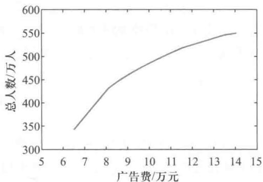  
图1例1的有效前沿

需要依次考虑以下要求:

1)该单位年工资总额尽可能不超过600万元

2)每级的人数尽可能不超过定编规定的人数

3)Ⅱ、Ⅲ级的升级面尽可能达到现有相应等级人数的  $20\%$

4)Ⅲ级不足编制的人数可录用新员工

请为该单位拟定一个满意的升级调薪方案.84]

模型建立记  $x_{1},x_{2},x_{3}$  分别为Ⅱ、Ⅲ级提升到I、Ⅱ级和新录用到Ⅲ级的员工数量,是这个问题的决策变量(非负整数).

首先考虑要求1):升级调薪后,该单位年工资总额为  $20(9 + x_{1}) + 15(12 - x_{2} + x_{3})+$ $10(15 - x_{2} + x_{3}) = 510 + 5x_{1} + 5x_{2} + 10x_{3}$  ,这个数额应该尽可能不超过600万元.怎么描述这个"尽可能"的约束呢?可以采用目标规划的思想建模,把600万元理解为工资总额的目标值,并引入非负变量  $d_{1}^{+}$  和  $d_{1}^{- }$  ,其中  $d_{1}^{+}$  表示决策值超过目标值的部分,  $d_{1}^{- }$  表示决策值低于目标值的部分,则

$$
510 + 5x_{1} + 5x_{2} + 10x_{3} - d_{1}^{+} + d_{1}^{-} = 600 \tag{9}
$$

目标规划中将  $d_{1}^{+}$  和  $d_{1}^{- }$  分别称为(工资总额的)正、负偏差变量(均为非负变量).由于决策值不可能既超过又低于目标值,所以  $d_{1}^{+}$  和  $d_{1}^{- }$  至少有一个为0. 要求1)希望薪资总额尽可能不超过600万元,也就是希望超过600万元的部分  $d_{1}^{+}$  尽可能小.

类似地考虑要求2):记升级调薪后与I、Ⅱ、Ⅲ级员工定编数对应的正、负偏差变量分别为  $d_{2}^{+}$  和  $d_{2}^{- },d_{2}^{+}$  和  $d_{3}^{- },d_{4}^{+}$  和  $d_{4}^{- }$  ,则

$$
9 + x_{1} - d_{2}^{+} + d_{2}^{-} = 12 \tag{10}
$$

$$
12 - x_{1} + x_{2} - d_{3}^{+} + d_{3}^{-} = 15 \tag{11}
$$

$$
15 - x_{2} + x_{3} - d_{4}^{+} + d_{4}^{-} = 15 \tag{12}
$$

要求2)希望尽可能不超编,也就是总的超编人数  $d_{2}^{+} + d_{3}^{+} + d_{4}^{+}$  尽可能小(这里我们不再对超编属于哪一个级别进行区分).

对于要求3),记Ⅱ、Ⅲ级员工升级人数对应的正、负偏差变量分别为  $d_{5}^{+}$  和  $d_{5}^{- },d_{6}^{+}$  和  $d_{6}^{- }$  ,则

$$
x_{1} - d_{5}^{+} + d_{5}^{-} = 12\times 0.2 \tag{13}
$$

$$
x_{2} - d_{6}^{+} + d_{6}^{-} = 15\times 0.2 \tag{14}
$$

要求3)希望升级面尽可能达到现有相应等级人数的  $20\%$  ,也就是希望低于  $20\%$  升级面的人数  $d_{5}^{+} + d_{6}^{+}$  尽可能小.

要求4)只是说Ⅲ级不足编制的人数可录用新员工,而没有说录用的新员工越多越好还是越少越好.我们假设在满足前面三个要求的前提下尽可能多地录用新员工,即希望  $x_{3}$  尽可能大.

该单位需要"依次"考虑上述4个要求,其含义应该是重要性按照要求1)到要求4)排序.记  $P_{1},P_{2},P_{3},P_{4}$  分别为要求1),2),3),4)的优先级,则可以认为  $P_{1}\gg P_{2}\gg$ $P_{3}\gg P_{4} > 0$  此时,可将该单位最后的决策目标表达成

$$
\min z = P_{1}d_{1}^{+} + P_{2}(d_{2}^{+} + d_{3}^{+} + d_{4}^{+}) + P_{3}(d_{5}^{-} + d_{6}^{-}) - P_{4}x_{3} \tag{15}
$$

自然,需要加上升级人数的整数约束以及所有变量的非负约束,即

$x_{1},x_{2},x_{3}\geqslant 0$  ,且为整数;  $d_{i}^{- },d_{i}^{+}\geqslant 0$ $i = 1,2,3,4,5,6$

于是问题归结为优化模型(9)~(16),这是一个目标规划

读者可能会问:  $d_{i}^{- },d_{i}^{+}$  至少有一个为0这个条件为什么不写在约束中?仔细分析上述与  $d_{i}^{- },d_{i}^{+}$  相关的约束会发现,当它们同时增加或减少时也是满足上述约束的,因此只要最小化其中一个偏差变量,另一个自然会是0,所以没有必要再增加  $d_{i}^{- },d_{i}^{+}$  至少有一个为0这个条件.

模型求解按照(15),决策总目标是使  $z = P_{1}d_{1}^{+} + P_{2}(d_{2}^{+} + d_{3}^{+} + d_{4}^{+}) + P_{3}(d_{5}^{- } + d_{6}^{- }) - P_{4}x_{3}$  最小,而各目标的权重  $P_{1}\gg P_{2}\gg P_{3}\gg P_{4} > 0$  ,所以首先以  $d_{1}^{+}$  最小为目标,(9)~(14)和(16)为约束求解.可得  $d_{1}^{+}$  最小值为0,即可以保证达到第一目标——工资总额不超过600万元.

将  $d_{1}^{+} = 0$  加入约束,以  $d_{2}^{+} + d_{3}^{+} + d_{4}^{+}$  最小为目标,可求得其最小值也为0,可以同时保证达到第二目标——各级人员人数不超编.

将  $d_{2}^{+} + d_{3}^{+} + d_{4}^{+} = 0$  也加入约束,以  $d_{5}^{- } + d_{6}^{- }$  最小为目标,可求得其最小值也为0,可以同时保证达到第三目标——各级提职人员人数不少于  $20\%$

最后,将  $d_{5}^{- } + d_{6}^{- } = 0$  也加入约束,以  $x_{3}$  最大为目标,可求得其最大值为5,对应的最优解为  $x_{1} = 3,x_{2} = 5,x_{3} = 5$  (其他略).即从Ⅱ级提升3人至I级,从Ⅲ级提升5人至Ⅱ级,新录用Ⅲ级人员为5名.

程序文件4- 21升级调薪prog0407. b.1g4

评注例2中决策者希望达到的目标不是强制性的"硬约束"(刚性约束),而是以"尽可能大于(小于)"、"尽可能接近"等"软约束"(柔性约束)的形式出现.不同目标的优先顺序已经明确给定,通过引入偏差变量建立目标规划模型是处理这类问题的合适方法,求解时可以按照目标的优先顺序依次进行求解.

# 复习题

某公司3个工厂生产的产品供应给4个客户,各工厂生产量、各用户需求量及从各工厂到各用户的单位产品的运输费用由下表给出.

<table><tr><td>用户</td><td>1</td><td>2</td><td>3</td><td>4</td><td>生产量</td></tr><tr><td>工厂1</td><td>5</td><td>2</td><td>6</td><td>7</td><td>300</td></tr><tr><td>工厂2</td><td>3</td><td>5</td><td>4</td><td>6</td><td>200</td></tr><tr><td>工厂3</td><td>4</td><td>5</td><td>2</td><td>3</td><td>400</td></tr><tr><td>需求量</td><td>200</td><td>100</td><td>450</td><td>250</td><td></td></tr></table>

(1)如果只考虑总运费最小,制定所有产品的最优运输方案。

(2)由于总生产量小于总需求量,公司经研究确定了调配方案的8项目标并规定了重要性的次序:

第一目标:用户4为重要客户,需求量必须全部满足;

第二目标:供应用户1的产品中,工厂3的产品不少于100个单位;

第三目标:每个用户的满足率不低于  $80\%$

第四目标:应尽量满足各用户的需求;

第五目标:总运费不超过(1)中运输方案的  $10\%$

第六目标:工厂2到用户4的路线应尽量避免运输任务;

第七目标:用户1和用户3的需求满足率应尽量保持平衡;

第八目标:力求减少总运费

请列出相应的目标规划模型并进行求解。[79]

# 4.8 投资的风险与收益

随着生产力的发展和生活水平的提高、经济条件的改善,个人和社会的财富积累大幅增长,投资需求应运而生。投资收益往往具有很大的不确定性,投资者需要具备很强的控制风险意识。在投资的风险和收益之间寻求平衡,本质上是一个多目标规划问题。本节给出投资方面的两个例子。

例1 投资组合

问题 某3种股票A,B,C从1943年到1954年价格每年的增长(包括分红在内)如表1所示。例如,表中第一个数据1.300的含义是股票A在1943年的年末价值是其年初价值的1.300倍,即年收益率为  $30\%$  ,其余数据的含义依此类推。假设你在1955年有一笔资金准备投资这3种股票,希望年收益率至少达到  $15\%$  ,问应当如何投资?并考虑以下问题:

1)假设除了上述3种股票外,投资人还有一种无风险的投资方式,如购买国库券。假设国库券的年收益率为  $5\%$  ,应如何调整投资计划?

2)在1)的条件下,如果希望年收益率至少达到  $10\%$  而不是  $15\%$  ,应如何调整投资计划?[79]

表1股票收益数据  

<table><tr><td>年份</td><td>股票A</td><td>股票B</td><td>股票C</td></tr><tr><td>1943</td><td>1.300</td><td>1.225</td><td>1.149</td></tr><tr><td>1944</td><td>1.103</td><td>1.290</td><td>1.260</td></tr><tr><td>1945</td><td>1.216</td><td>1.216</td><td>1.419</td></tr><tr><td>1946</td><td>0.954</td><td>0.728</td><td>0.922</td></tr><tr><td>1947</td><td>0.929</td><td>1.144</td><td>1.169</td></tr><tr><td>1948</td><td>1.056</td><td>1.107</td><td>0.965</td></tr><tr><td>1949</td><td>1.038</td><td>1.321</td><td>1.133</td></tr></table>

续表  

<table><tr><td>年份</td><td>股票A</td><td>股票B</td><td>股票C</td></tr><tr><td>1950</td><td>1.089</td><td>1.305</td><td>1.732</td></tr><tr><td>1951</td><td>1.090</td><td>1.195</td><td>1.021</td></tr><tr><td>1952</td><td>1.083</td><td>1.390</td><td>1.131</td></tr><tr><td>1953</td><td>1.035</td><td>0.928</td><td>1.006</td></tr><tr><td>1954</td><td>1.176</td><td>1.715</td><td>1.908</td></tr></table>

问题分析 上面提出的问题称为投资组合(portfolio),早在1952年,现代投资组合理论的开创者Markowitz就给出了这个模型的基本框架,并于1990年获得了诺贝尔经济学奖.

一般来说,人们投资股票的收益是不确定的,可视为一个随机变量,其大小很自然地可以用年收益率的期望来度量.收益的不确定性当然会带来风险,风险怎样度量呢?Markowitz建议,风险可以用收益的方差(或标准差)来衡量:方差越大,风险越大;方差越小,风险越小.在一定的假设下,用收益的方差来衡量风险确实是合适的.为此,我们可用表1给出的1955年以前12年的数据,计算出3种股票收益的均值和方差(包括协方差).

于是,一种股票收益的均值衡量的是这种股票的平均收益状况,而收益的方差衡量的是这种股票收益的波动幅度,方差越大则波动越大,收益越不稳定.两种股票收益的协方差表示的则是它们之间的相关程度:

$\bullet$  协方差为0时两者不相关.

$\bullet$  协方差为正表示两者正相关,协方差越大则正相关性越强(越有可能一赚皆赚,一赔俱赔).

$\bullet$  协方差为负表示两者负相关,绝对值越大则负相关性越强(越有可能一个赚,另一个赔).

记股票A,B,C每年的收益率分别为  $R_{1},R_{2}$  和  $R_{3}$  (注意表中的数据减去1以后才是年收益率),则  $R_{i}(i = 1,2,3)$  是一个随机变量.用  $E$  和  $D$  分别表示随机变量的期望和方差,用cov表示两个随机变量的协方差(covariance),根据概率论的知识和表1给出的数据,可以计算出股票A,B,C年收益率的期望为

$$
E R_{1} = 0.0891,\quad E R_{2} = 0.2137,\quad E R_{3} = 0.2346 \tag{1}
$$

年收益率的协方差矩阵为

$$
C O V = \left( \begin{array}{l l l}{0.0108} & {0.0124} & {0.0131}\\ {0.0124} & {0.0584} & {0.0554}\\ {0.0131} & {0.0554} & {0.0942} \end{array} \right) \tag{2}
$$

即  $D R_{1} = \mathrm{cov}(R_{1},R_{1}) = 0.0108$ $D R_{2} = \mathrm{cov}(R_{2},R_{2}) = 0.0584$ $D R_{3} = \mathrm{cov}(R_{3},R_{3}) =$ $0.0942,\mathrm{cov}(R_{1},R_{2}) = 0.0124,\mathrm{cov}(R_{1},R_{3}) = 0.0131,\mathrm{cov}(R_{2},R_{3}) = 0.0554.$

模型建立用决策变量  $x_{1}, x_{2}, x_{3}$  分别表示投资人投资股票A,B,C的比例.假设市场上没有其他投资渠道,且手上资金(不妨假设只有1个单位的资金)必须全部用于

投资这3种股票,则

$$
x_{1},x_{2},x_{3}\geqslant 0,\quad x_{1} + x_{2} + x_{3} = 1 \tag{3}
$$

年投资收益率  $R = x_{1}R_{1} + x_{2}R_{2} + x_{3}R_{3}$  也是一个随机变量.根据概率论的知识,投资的年期望收益率为

$$
E R = x_{1}E R_{1} + x_{2}E R_{2} + x_{3}E R_{3} \tag{4}
$$

年投资收益率的方差为

$$
\begin{array}{r l} & {V = D\big(x_{1}R_{1} + x_{2}R_{2} + x_{3}R_{3}\big)}\\ & {\quad = D\big(x_{1}R_{1}\big) + D\big(x_{2}R_{2}\big) + D\big(x_{3}R_{3}\big) + }\\ & {\qquad 2\mathrm{cov}\big(x_{1}R_{1},x_{2}R_{2}\big) + 2\mathrm{cov}\big(x_{1}R_{1},x_{3}R_{3}\big) + 2\mathrm{cov}\big(x_{2}R_{2},x_{3}R_{3}\big)}\\ & {\quad = x_{1}^{2}D R_{1} + x_{2}^{2}D R_{2} + x_{3}^{2}D R_{3} + }\\ & {\qquad 2x_{1}x_{2}\mathrm{cov}\big(R_{1},R_{2}\big) + 2x_{1}x_{3}\mathrm{cov}\big(R_{1},R_{3}\big) + 2x_{2}x_{3}\mathrm{cov}\big(R_{2},R_{3}\big)}\\ & {\quad = \sum_{j = 1}^{3}\sum_{i = 1}^{3}x_{i}x_{j}\mathrm{cov}\big(R_{i},R_{j}\big)} \end{array}
$$

实际的投资者可能面临许多约束条件,这里只考虑题中要求的年收益率的期望不低于  $15\%$  ,即

$$
x_{1}E R_{1} + x_{2}E R_{2} + x_{3}E R_{3}\geqslant 0.15 \tag{6}
$$

最后的优化模型是在约束(3)和(6)下使(5)最小.这里目标函数  $V$  是决策变量的二次函数,而约束都是线性函数,称为二次规划.这是一类特殊的非线性规划.

模型求解计算结果表明,投资3种股票的比例大致是:A占  $53.01\%$  ,B占  $35.64\%$  ,C占  $11.35\%$  .风险(年收益率的方差)为0.0224,即收益率的标准差为0.1497.

下面分析本题需要进一步研究的两个问题.对于问题1),由于无风险的投资方式(如国库券、银行存款等)是有风险的投资方式(如股票)的一种特例,所以模型(3)~(6)仍然是适用的.只不过无风险的投资方式的收益是固定的(  $5\%$  ),所以方差以及与其他投资方式收益的协方差都是0.

相应地可以得到,在年收益率仍然达到  $15\%$  的条件下,投资A约占  $8.69\%$  ,B占  $42.85\%$  ,C占  $14.34\%$  ,国库券占  $34.12\%$  ,风险(方差)为0.0208. 与上面的结果比较,无风险资产的存在可以使得投资风险减小.虽然国库券的收益率只有  $5\%$  ,比希望得到的总投资的收益率  $15\%$  小很多,但只要国库券的投资占到  $34.12\%$  ,同时将投资A的比例从  $53.01\%$  降到  $8.69\%$  (B,C变化不大),就可以减少风险.

对于问题2),只需把模型中的期望收益减少到  $10\%$  ,结果表明投资A约占  $4.34\%$  ,B占  $21.43\%$  ,C占  $7.17\%$  ,国库券占  $67.06\%$  ,此时风险(方差为0.0052)进一步下降.仔细观察问题1)和2)的两个结果,可以发现:后者投资在有风险资产(股票A,B,C)上的比例大约都是前者相应的比例的一半!也就是说,无论你的期望收益大小如何,你手上所握有的风险资产相互之间的比例居然是不变的!变化的只是投资于风险资产与无风险资产之间的比例.有趣的是,这一现象在一般情况下也是成立的,一般称为"分离定理",即风险资产之间的相对投资比例与期望收益无关.发现这一重要规律的Tobin教授于1981年获得了诺贝尔经济学奖.

例2 投资的收益和风险(1998年全国大学生数学建模竞赛A题)

问题市场上有  $n$  种资产(如股票、债券、……)  $\mathrm{S}_{i}(i = 1,\dots ,n)$  供投资者选择,某公司有数额为  $M$  的一笔相当大的资金可用作一个时期的投资。公司财务分析人员对这  $n$  种资产进行了评估,估算出在这一时期内购买  $\mathrm{S}_{i}$  的平均收益率为  $r_{i}$ ,并预测出购买  $\mathrm{S}_{i}$  的风险损失率为  $q_{i}$ 。考虑到投资越分散,总的风险越小,公司确定,当用这笔资金购买若干种资产时,总体风险可用所投资的  $\mathrm{S}_{i}$  中最大的一个风险来度量。

购买  $\mathrm{S}_{i}$  要付交易费,费率为  $p_{i}$ ,并且当购买额不超过给定值  $u_{i}$  时,交易费按购买  $u_{i}$  计算(不买当然无须付费)。另外,假定同期银行存款利率是  $r_{0}(r_{0} = 5\%)$ ,且既无交易费又无风险。

1)已知  $n = 4$  时的相关数据如表2所示:

表2 四种资产的相关数据  

<table><tr><td>S1</td><td>r/%</td><td>q/%</td><td>p/%</td><td>u/%</td></tr><tr><td>S1</td><td>28</td><td>2.5</td><td>1</td><td>103</td></tr><tr><td>S2</td><td>21</td><td>1.5</td><td>2</td><td>198</td></tr><tr><td>S3</td><td>23</td><td>5.5</td><td>4.5</td><td>52</td></tr><tr><td>S4</td><td>25</td><td>2.6</td><td>6.5</td><td>40</td></tr></table>

试给该公司设计一种投资组合方案,即用给定的资金  $M$ ,有选择地购买若干种资产或存银行生息,使净收益尽可能大,而总体风险尽可能小。

2)试就一般情况对以上问题进行讨论,并利用数据文件4-2中的数据进行计算。[71]

模型建立设购买资产  $\mathrm{S}_{i}$  的金额为  $x_{i}(i = 1,\dots ,n)$ ,存银行的金额为  $x_{0}$ ,投资组合向量记为  $\boldsymbol {x} = (x_{0},x_{1},\dots ,x_{n})$ ,它是这个问题的决策变量。题目中明确指出要考虑两类目标,即投资的净收益和风险,分别记为  $V(\boldsymbol {x})$  和  $Q(\boldsymbol {x})$ 。

由于购买  $\mathrm{S}_{i}$  要付交易费,费率为  $p_{i}$ ,并且当购买额不超过给定值  $u_{i}$  时,交易费按购买  $u_{i}$  计算(不买当然无须付费),所以购买  $\mathrm{S}_{i}$  的交易费为

$$
c_{i}(x_{i}) = \left\{ \begin{array}{ll}0, & x_{i} = 0, \\ p_{i}u_{i}, & 0< x_{i}< u_{i}, & i = 1,2,\dots ,n \\ p_{i}x_{i}, & x_{i}\geqslant u_{i}, \end{array} \right. \tag{7}
$$

对于存银行的金额  $x_{0}$ ,显然  $c_{0}(x_{0}) = 0$ 。

题目给出购买  $\mathrm{S}_{i}$  的平均收益率为  $r_{i}$ ,因此投资  $\mathrm{S}_{i}$  的平均净收益为

$$
V_{i}(x_{i}) = r_{i}x_{i} - c_{i}(x_{i}),\quad i = 0,1,\dots ,n \tag{8}
$$

于是投资组合  $\boldsymbol{x}$  的平均净收益为

$$
V(\boldsymbol {x}) = \sum_{i = 0}^{n}V_{i}(x_{i}) \tag{9}
$$

题目给出购买  $\mathrm{S}_{i}$  的风险损失率为  $q_{i}$ ,且投资组合  $\boldsymbol{x}$  的风险用  $\mathrm{S}_{i}$  中最大的一个风险来度量,所以投资组合  $\boldsymbol{x}$  的风险为

$$
Q(\boldsymbol {x}) = \max_{0\leqslant i\leqslant n}q_{i}x_{i} \tag{10}
$$

投资所需的总资金为

$$
I(\pmb {x}) = \sum_{i = 0}^{n}\left(x_{i} + c_{i}(x_{i})\right) \tag{11}
$$

题目给出公司提供的资金是  $M(M$  相当大)

为了使投资的净收益尽量高和风险尽量低,这个问题归结为以下多目标规划模型:

$$
\min \quad (Q(x), - V(x))
$$

$$
\mathrm{~s.t.~}I(x) = M \tag{12}
$$

$$
x\geq 0
$$

模型求解 设定风险和净收益的权重分别为  $w,1 - w$  ,即目标函数如下:

$$
w Q(x) - (1 - w)V(x) \tag{13}
$$

我们只针对第一组数据(  $n = 4$  )计算,假设总资金  $M$  为1万元,对  $w$  在0到1之间按0.1的间隔取值计算,结果如表3所示.

程序文件4- 23投资收益和风险prog0408b.lg4

程序文件4- 24投资收益和风险的有效前沿prog0408c.m

评注 本节介绍的两个例子只是基本模型,现实中的投资决策需要考虑的因素还有很多.例如,我们在例1评注中已经指出还存在其他的风险指标.又如,本节都假设投资

(比例)非负,这仅适用于不考虑融资融券等买空卖空行为的投资活动.实际中可供投资的资产品种成千上万,投资者通常还会为投资的资产总数量设定上下限,为单一资产的投资比例设定上下限等.另外,

还可以考虑投资人通常并不拥有完全的信息、投资人之间存在复杂的博弈行为等因素.

<table><tr><td colspan="12">权值</td></tr><tr><td></td><td>0.0</td><td>0.1</td><td>0.2</td><td>0.3</td><td>0.4</td><td>0.5</td><td>0.6</td><td>0.7</td><td>0.8</td><td>0.9</td><td>1.0</td></tr><tr><td>风险/元</td><td>247.5</td><td>247.5</td><td>247.5</td><td>247.5</td><td>247.5</td><td>247.5</td><td>247.5</td><td>247.5</td><td>92.25</td><td>59.40</td><td>0.00</td></tr><tr><td>收益/元</td><td>2 673</td><td>2 673</td><td>2 673</td><td>2 673</td><td>2 673</td><td>2 673</td><td>2 673</td><td>2 673</td><td>2 165</td><td>2 016</td><td>500</td></tr></table>

可以看出,在权值  $w$  小于0.7时,计算结果相同,此时收益最大,风险也大,对应的投资方案是将所有资金购买资产  $\mathrm{S}_{1}$  ;当  $w$  从0.7增加到1.0时,风险和收益逐步下降;收益最低为500元(即收益率为  $5\%$  ),此时风险为0,对应的投资方案显然是将所有资金存入银行.

我们可以在0.7到1.0之间取更多权值计算,更仔细地观察结果的变化过程.例如,对  $w$  按0.001的间隔取值计算,可得表4结果(只列出部分结果).

表4权值按0.001的间隔对应的风险与收益(部分结果)

<table><tr><td colspan="12">权值</td></tr><tr><td></td><td>0.766</td><td>0.767</td><td>0.810</td><td>0.811</td><td>0.824</td><td>0.825</td><td>0.962</td><td>0.963</td><td>0.964</td><td>0.965</td><td>0.966</td></tr><tr><td>风险/元</td><td>247.5</td><td>92.29</td><td>92.25</td><td>78.49</td><td>78.49</td><td>59.40</td><td>59.40</td><td>2.97</td><td>2.97</td><td>2.86</td><td>0.00</td></tr><tr><td>收益/元</td><td>2 673</td><td>2 165</td><td>2 165</td><td>2 106</td><td>2 106</td><td>2 016</td><td>2 016</td><td>576</td><td>576</td><td>573</td><td>500</td></tr></table>

将这个结果画图可得到有效前沿如图1所示.图中曲线存在一个明显的拐点,其坐标大约是(59,2016).对于风险和收益没有明显偏好的投资者来说,这一点应该是一个满意的选择,其对应的投资方案是购买  $\mathrm{S}_{1} \sim \mathrm{S}_{4}$  的资金(不含手续费)分别为2376元、3960元、1080元、2284元,没有资金存入银行.

对于问题中给出的第二组数据,可类似计算.

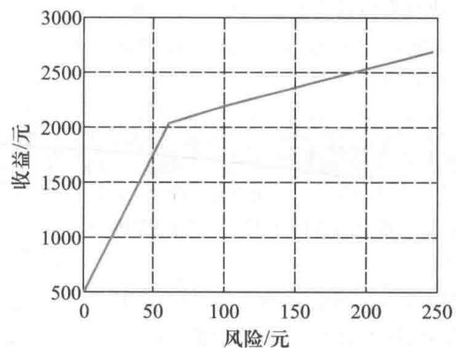  
图1 例2的有效前沿

1. 对一个随机变量  $R$ , 其下半方差定义为  $\operatorname{Var}^{-}(R) = E(\max (ER - R,0))^{1}$ . 请对例1采用下半方差作为风险指标建立模型, 求解并与例1的结果比较. 你觉得采用哪个风险指标更合适?

2. 例2中的约束(7)是一个分段线性函数, 请你分别按照以下两种思路对这个约束进行预处理, 并对模型进行求解.

(1)由于总的投资金额  $M$  较大, 而购买各种资产的阈值  $u_{i}$  都不太大, 可将约束(7)用线性约束  $c_{i}(x_{i}) = p_{i}x_{i}$  近似, 使模型得到简化. 请进一步分析这一近似的效果与  $M$  的大小有什么关系?

(2)对每种资产, 引入两个0-1变量, 对投资额是否为0、是否大于阈值  $u_{i}$  进行刻画, 得到约束(7)的另一种等价描述.

# 第4章训练题

1. 某银行经理计划用一笔资金进行有价证券的投资, 可供购进的证券以及其信用等级、到期年限、到期税前收益如下表所示. 按照规定, 市政证券的收益可以免税, 其他证券的收益需按  $50\%$  的税率纳税. 此外还有以下限制:

(1)政府及代办机构的证券总共至少要购进400万元;

(2)所购证券的平均信用等级不超过1.4(信用等级数字越小, 信用程度越高);

(3)所购证券的平均到期年限不超过5年

<table><tr><td>证券名称</td><td>证券种类</td><td>信用等级</td><td>到期年限</td><td>到期税前收益/%</td></tr><tr><td>A</td><td>市政</td><td>2</td><td>9</td><td>4.3</td></tr><tr><td>B</td><td>代办机构</td><td>2</td><td>15</td><td>5.4</td></tr><tr><td>C</td><td>政府</td><td>1</td><td>4</td><td>5.0</td></tr><tr><td>D</td><td>政府</td><td>1</td><td>3</td><td>4.4</td></tr><tr><td>E</td><td>市政</td><td>5</td><td>2</td><td>4.5</td></tr></table>

问:(1)若该经理有1000万元资金, 应如何投资?

(2)如果能够以  $2.75\%$  的利率借到不超过100万元资金,该经理应如何操作?

(3)在1000万元资金情况下,若证券A的税前收益增加为  $4.5\%$  ,投资应否改变?若证券C的税前收益减少为  $4.8\%$  ,投资应否改变[10]?

2. 一家出版社准备在某市建立两个销售代理点,向7个区的大学生售书,每个区的大学生数量

(单位:千人)表示在右图上.每个销售代理点只能向本区和一个相邻区的大学生售书,这两个销售代理点应该建在何处,才能使所能供应的大学生的数量最大?建立该问题的整数线性规划模型并求解[61]

3. 一家保姆服务公司专门向顾主提供保姆服务.公司向顾主收取费用后,统一给保姆发工资,每人每月工资固定.根据估计,下

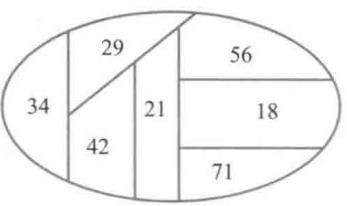

一年的需求是:春季5000人日,夏季7500人日,秋季5500人日,冬季9000人日.公司新招聘的保姆必须经过5天的培训才能上岗,每个保姆每季度工作(新保姆包括培训)65天.春季开始时公司拥有120名保姆,在每个季度结束后,将有  $15\%$  的保姆自动离职.

(1)如果公司不允许解雇保姆,请你为公司制订下一年的招聘计划;哪些季度需求的增加不影响招聘计划?可以增加多少?

(2)如果公司在每个季度结束后允许解雇保姆,请为公司制订下一年的招聘计划[10]

4. 在甲乙双方的一场战争中,一部分甲方部队被乙方部队包围长达4个月.由于乙方封锁了所有水陆交通通道,被包围的甲方部队只能依靠空中交通维持供给.运送4个月的供给分别需要2次,3次,3次,4次飞行,每次飞行编队由50架飞机组成(每架飞机需要3名飞行员),可以运送  $10^{5}$  t物资.每架飞机每个月只能飞行一次,每名飞行员每个月也只能飞行一次.在执行完运输任务后的返回途中有  $20\%$  的飞机会被乙方部队击落,相应的飞行员也因此牺牲或失踪.在第1个月开始时,甲方拥有110架飞机和330名熟练的飞行员.在每个月开始时,甲方可以招聘新飞行员和购买新飞机.新飞机必须经过一个月的检查后才可以投入使用,新飞行员必须在熟练飞行员的指导下经过一个月的训练才能投入飞行.只有不执行当月飞行任务的熟练飞行员可以作为当月的教练指导新飞行员进行训练,每名教练每个月正好指导20名飞行员(包括他自己在内)进行训练.每名飞行员在完成一个月的飞行任务后,必须有一个月的带薪假期,假期结束后才能再投入飞行.已知各项费用(单位略去)如下表所示,请你为甲方安排一个飞行计划.

<table><tr><td></td><td>第1个月</td><td>第2个月</td><td>第3个月</td><td>第4个月</td></tr><tr><td>新飞机价格</td><td>200.0</td><td>195.0</td><td>190.0</td><td>185.0</td></tr><tr><td>闲置的熟练飞行员报酬</td><td>7.0</td><td>6.9</td><td>6.8</td><td>6.7</td></tr><tr><td>教练和新飞行员报酬(包括培训费用)</td><td>10.0</td><td>9.9</td><td>9.8</td><td>9.7</td></tr><tr><td>执行飞行任务的熟练飞行员报酬</td><td>9.0</td><td>8.9</td><td>9.8</td><td>9.7</td></tr><tr><td>休假期间的熟练飞行员报酬</td><td>5.0</td><td>4.9</td><td>4.8</td><td>4.7</td></tr></table>

如果每名教练每个月可以指导不超过20名新飞行员(不包括他自己在内)进行训练,模型和结果有哪些改变[1]?

5. 某电力公司经营两座发电站,发电站分别位于两个水库上,位置如下图所示.

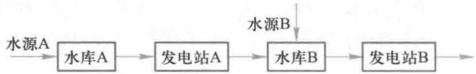

已知发电站A可以将水库A的  $10000\mathrm{m}^{3}$  的水转换为400千度电能,发电站B只能将水库B的

$10000\mathrm{m}^{3}$  的水转换为200千度电能.发电站A,B每个月的最大发电能力分别是60000千度、35000千度.每个月最多有50000千度电能够以200元/千度的价格售出,多余的电能只能够以140元/千度的价格售出.水库A,B的其他有关数据如下表(单位:  $10^{4}\mathrm{m}^{3}$  ).

<table><tr><td></td><td colspan="2">水库A</td><td>水库B</td></tr><tr><td colspan="2">水库最大蓄水量</td><td>2 000</td><td>1 500</td></tr><tr><td rowspan="2">水源流入水量</td><td>本月</td><td>200</td><td>40</td></tr><tr><td>下月</td><td>130</td><td>15</td></tr><tr><td colspan="2">水库最小蓄水量</td><td>1 200</td><td>800</td></tr><tr><td colspan="2">水库目前蓄水量</td><td>1 900</td><td>850</td></tr></table>

请你为该电力公司制订本月和下月的生产经营计划(千度是非国际单位制单位,1千度  $= 10^{3}\mathrm{kW}\cdot \mathrm{h}$  ).

6. 如下图所示,有若干工厂的污水经排污口流入某江,各口有污水处理站,处理站对面是居民点.工厂1上游江水流量和污水质量浓度、国家标准规定的水的污染浓度及各个工厂的污水流量和污水质量浓度均已知道.设污水处理费用与污水处理前后的质量浓度差和污水流量成正比,使每单位流量的污水下降一个质量浓度单位需要的处理费用(称处理系数)为已知.处理后的污水与江水混合,流到下一个排污口之前,自然状态下的江水也会使污水质量浓度降低一个比例系数(称自净系数),该系数可以估计.试确定各污水处理站出口的污水质量浓度,使在符合国家标准规定的条件下总的处理费用最小.

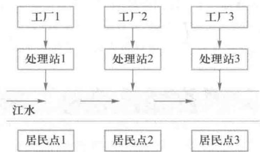

先建立一般情况下的数学模型,再求解以下的具体问题:

设上游江水流量为  $1000\times 10^{12}\mathrm{L} / \mathrm{min}$  ,污水质量浓度为  $0.8\mathrm{mg / L},3$  个工厂的污水流量均为  $5\times$ $10^{12}\mathrm{L} / \mathrm{min}$  ,污水质量浓度(从上游到下游排列)(单位:  $\mathrm{mg / L}$  )分别为100,60,50,处理系数均为1万元/  $(10^{12}\mathrm{L} / \mathrm{min})\times (\mathrm{mg} / \mathrm{L})$  ),3个工厂之间的两段江面的自净系数(从上游到下游)分别为0.9和0.6. 国家标准规定水的污染浓度不能超过  $1\mathrm{mg / L}$

(1)为了使江面上所有地段的水污染达到国家标准,最少需要花费多少费用?

(2)如果只要求3个居民点上游的水污染达到国家标准,最少需要花费多少费用?[80]

(提示:可以进行适当简化和近似,建立线性规划模型.)

7. 生产裸铜线和塑包线的工艺如下图所示:

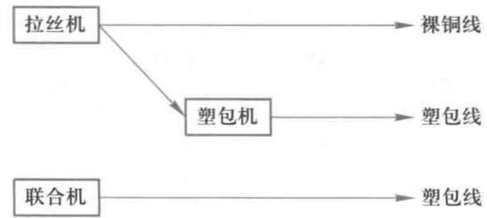

某厂现有 I 型拉丝机和塑包机各一台,生产两种规格的裸铜线和相应的两种塑包线,没有拉丝塑包联合机(简称联合机)。由于市场需求扩大和现有塑包机设备陈旧,计划新增 II 型拉丝机或联合机(由于场地限制,每种设备最多 1 台),或改造塑包机,每种设备选用方案及相关数据如下表:

<table><tr><td rowspan="2"></td><td colspan="2">拉丝机</td><td colspan="2">塑包机</td><td>联合机</td></tr><tr><td>原有Ⅰ型</td><td>新购Ⅱ型</td><td>原有</td><td>改造</td><td>新购</td></tr><tr><td>方案代号</td><td>1</td><td>2</td><td>3</td><td>4</td><td>5</td></tr><tr><td>所需投资/万元</td><td>0</td><td>20</td><td>0</td><td>10</td><td>50</td></tr><tr><td>每小时运行费用/元</td><td>5</td><td>7</td><td>8</td><td>8</td><td>12</td></tr><tr><td>每年固定费用/万元</td><td>3</td><td>5</td><td>8</td><td>10</td><td>14</td></tr><tr><td>规格1生产效率/(m·h-1)</td><td>1 000</td><td>1 500</td><td>1 200</td><td>1 600</td><td>1 600</td></tr><tr><td>规格2生产效率/(m·h-1)</td><td>800</td><td>1 400</td><td>1 000</td><td>1 300</td><td>1 200</td></tr><tr><td>废品率/%</td><td>2</td><td>2</td><td>3</td><td>3</td><td>3</td></tr><tr><td>每千米废品损失/元</td><td>30</td><td>30</td><td>50</td><td>50</td><td>50</td></tr></table>

已知市场对两种规格裸铜线的需求分别为  $3000\mathrm{km}$  和  $2000\mathrm{km}$ ,对两种规格塑包线的需求分别为  $10000\mathrm{km}$  和  $8000\mathrm{km}$ 。按照规定,新购及改进设备按每年  $5\%$  提取折旧费,老设备不提;每台机器每年最多只能工作  $8000\mathrm{h}$ 。为了满足需求,确定使总费用最小的设备选用方案和生产计划[66]。

8. 有 4 名同学到一家公司参加三个阶段的面试。公司要求每个同学都必须首先找公司秘书初试,然后到部门主管处复试,最后到经理处参加面试,并且不允许插队(即在任何一个阶段 4 名同学的顺序是一样的)。由于 4 名同学的专业背景不同,所以每人在三个阶段的面试时间也不同,如下表所示(单位:min):

<table><tr><td></td><td>秘书初试</td><td>主管复试</td><td>经理面试</td></tr><tr><td>同学甲</td><td>13</td><td>15</td><td>20</td></tr><tr><td>同学乙</td><td>10</td><td>20</td><td>18</td></tr><tr><td>同学丙</td><td>20</td><td>16</td><td>10</td></tr><tr><td>同学丁</td><td>8</td><td>10</td><td>15</td></tr></table>

这 4 名同学约定他们全部面试完以后一起离开公司。假定现在时间是早 8:00,问他们最早何时能离开公司[66]?

9. 在如下图所示的电网中,需要从节点 1 传送 710 A 的电流到节点 4。当电流通过电网传送时,存在功率损失,而电流在传送时将"自然而然"地使总功率损失达到最小。请根据这种自然特性,确定流过各个电阻的电流,并与按照电路定律列出的代数方程组的解相比较。[72]

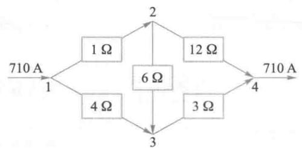

10. 某电子系统由 3 种元件组成, 系统正常运转需要 3 种元件都正常工作. 如一种或多种元件安装几个备用件, 将提高元件的可靠性. 系统运转的可靠性是各元件可靠性的乘积, 而每一元件的可靠性是备用件数量的函数, 具体数值如下表中 2~7 行所示. 3 种元件的价格和质量如表中 8~9 行所示. 已知全部备用件的预算限制为 150 元, 质量限制为  $20 \mathrm{~kg}$ , 应如何安装备用件, 可使系统运转的可靠性最大? [66]

<table><tr><td rowspan="2"></td><td colspan="4">元件序号</td></tr><tr><td>1</td><td>2</td><td>3</td><td></td></tr><tr><td rowspan="6">备用件数</td><td>0</td><td>0.5</td><td>0.6</td><td>0.7</td></tr><tr><td>1</td><td>0.6</td><td>0.75</td><td>0.9</td></tr><tr><td>2</td><td>0.7</td><td>0.95</td><td>1.0</td></tr><tr><td>3</td><td>0.8</td><td>1.0</td><td>1.0</td></tr><tr><td>4</td><td>0.9</td><td>1.0</td><td>1.0</td></tr><tr><td>5</td><td>1.0</td><td>1.0</td><td>1.0</td></tr><tr><td>单件价格/元</td><td></td><td>20</td><td>30</td><td>40</td></tr><tr><td>单件质量/kg</td><td></td><td>2</td><td>4</td><td>6</td></tr></table>

11. 某公司利用钢材和铝材作为原材料, 生产两种产品 (A 和 B). 单件产品 A 需消耗钢材  $6 \mathrm{~kg}$ , 铝材  $8 \mathrm{~kg}$ , 劳动力  $11 \mathrm{~h}$ , 利润 5000 元 (不含工人加班费); 单件产品 B 需消耗钢材  $12 \mathrm{~kg}$ , 铝材  $20 \mathrm{~kg}$ , 劳动力  $24 \mathrm{~h}$ , 利润 11000 元 (不含工人加班费). 该企业目前可提供钢材  $200 \mathrm{~kg}$ , 铝材  $300 \mathrm{~kg}$ , 劳动力  $300 \mathrm{~h}$ . 如果要求工人加班, 每小时加班费 100 元. 请制订生产计划, 最大化公司的利润和最小化工人加班时间.

12. 某银行营业部设立 3 个服务窗口, 分别为个人业务、公司业务和特殊业务 (如外汇和理财等). 现有 3 名服务人员, 每人处理不同业务的效率 (每天服务的最大顾客数), 以及每人处理不同业务的质量 (如顾客的满意度) 见下表. 如何为服务人员安排相应的工作 (服务窗口)?

顾客满意度  
最大顾客数  

<table><tr><td></td><td>个人业务</td><td>公司业务</td><td>特殊业务</td></tr><tr><td>员工1</td><td>20</td><td>12</td><td>10</td></tr><tr><td>员工2</td><td>12</td><td>15</td><td>9</td></tr><tr><td>员工3</td><td>6</td><td>5</td><td>10</td></tr></table>

<table><tr><td></td><td>个人业务</td><td>公司业务</td><td>特殊业务</td></tr><tr><td>员工1</td><td>6</td><td>8</td><td>10</td></tr><tr><td>员工2</td><td>6</td><td>5</td><td>9</td></tr><tr><td>员工3</td><td>9</td><td>10</td><td>8</td></tr></table>

13. 某农场有 3 万亩农田 (1 亩 = 666.67  $\mathrm{m}^{2}$ ), 准备种植玉米、大豆和小麦 3 种农作物. 每种作物每