亩需施化肥分别为  $0.12 \mathrm{t}, 0.20 \mathrm{t}, 0.15 \mathrm{t}$ . 预计秋后玉米每亩可收获  $500 \mathrm{kg}$ , 售价为 1.2 元  $/ \mathrm{kg}$ ; 大豆每亩可收获  $200 \mathrm{kg}$ , 售价为 6 元  $/ \mathrm{kg}$ ; 小麦每亩可收获  $300 \mathrm{kg}$ , 售价为 3.5 元  $/ \mathrm{kg}$ . 农场年初规划时依次考虑以下几个方面:

(1) 年终总收益尽量不低于 1650 万元.

(2) 总产量尽量不低于  $1.25 \times 10^{4} \mathrm{t}$ .

(3) 小麦产量以  $0.5 \times 10^{4} \mathrm{t}$  为宜.

(4)大豆产量尽量不低于  $0.2 \times 10^{4} \mathrm{t}$ .

(5)玉米产量尽量不超过  $0.6 \times 10^{4} \mathrm{t}$ .

(6) 农场目前能提供 5000 t 化肥, 若不够, 可额外购买, 但希望额外购买量越少越好. 请为该农场制订种植规划. [66]

更多案例……

4- 1 销售代理的开发与中断

# 第5章 微分方程模型

微分方程是包含连续变化的自变量、未知函数及其变化率(函数的微分或导数)的方程式,当我们的研究对象涉及某个过程或物体随时间连续变化的规律时,通常会建立微分方程模型.例如,进行人口预测时应建立包含人口数量及增长率的微分方程,研究发射火箭的高度时要建立燃料燃烧的推力所提供的火箭加速度与速度、高度关系的微分方程.

建立微分方程模型通常采用机理分析方法,如果研究对象来自工程技术、科学研究,大多归属于力、热、光、声、电等物理领域,那么牛顿定律、热传导定律、电路原理等物理规律可能是必不可少的理论依据,而若研究对象属于人口、经济、医药、生态等非物理领域,则要具体分析该领域特有的机理,找出研究对象所遵循的规律.

事实上,高等数学课程中解应用题时我们已经遇到简单的建立动态模型问题,例如"一质量为  $m$  的物体自高  $h$  处自由下落,初速是0,设阻力与下落速度的平方成正比,比例系数为  $k$  ,求下落速度随时间的变化规律".本章讨论的动态模型与这些问题的主要区别是,所谓微分方程应用题大多是物理或几何方面的典型问题,假设条件已经给出,只需用数学符号将已知规律表示出来,即可列出方程,求解的结果就是问题的答案,答案是唯一的,已经确定的.而本章的模型主要是非物理领域的实际问题,要分析具体情况或进行类比才能给出假设条件.做出不同的假设,就得到不同的方程,所以是事先没有答案的.求解结果还要用来解释实际现象并接受检验.

虽然动态过程的变化规律一般要用微分方程建立的动态模型来描述,但是对于某些实际问题,建模的主要目的并不是要寻求动态过程每个瞬时的性态,而是研究某种意义下稳定状态的特征,特别是当时间充分长以后动态过程的变化趋势.这时常常不需要求解微分方程(并且我们将会看到,即使对于不太复杂的方程,解析解也不是总能得到的),而可以利用微分方程稳定性理论,直接研究平衡状态的稳定性就行了.

# 5.1 人口增长

2011年10月31日,在俄罗斯海港城市加里宁格勒出生的一名婴儿被联合国人口基金会认定为世界上第70亿个居民.全球人口在哪一天真正达到70亿,真正的"第70亿个人"诞生在哪里,都只具有象征意义,而人口迅猛增长给自然资源和生态环境带来的压力,给各国发展与稳定带来的挑战却是严峻的现实,需要全人类积极、妥善地应对.

联合国人口基金会的统计显示(表1),世界人口翻番的时间已由过去的一个多世纪缩短为20世纪的40多年.从1960年开始,每十三四年就增长10亿.随着文化普及和妇女社会地位的提高,21世纪的女性平均生育率已显著下降,但庞大的人口基数仍将驱动"人口时钟"快速前行.据预测,如果目前的生育率不变,21世纪中期世界人口将突破90亿,此后人口增速才会放缓,到21世纪末超过100亿.

表1世界人口  

<table><tr><td>年份</td><td>1625</td><td>1804</td><td>1927</td><td>1960</td><td>1974</td><td>1987</td><td>1999</td><td>2011</td></tr><tr><td>人口/亿</td><td>5</td><td>10</td><td>20</td><td>30</td><td>40</td><td>50</td><td>60</td><td>70</td></tr></table>

中国是世界第一人口大国,地球上每5个人中就有一位中国同胞。在20世纪的一段时间内,我国人口的增长速度过快,从20世纪70年代开始实施计划生育政策,经过40多年的努力,有效控制了人口快速增长,缓解了资源和环境的压力(见表2)。我国人口的年净增量由最多时的2000多万降到目前的600多万。但是,随着计划生育政策实施周期拉长,其积极效应正在递减,人口老龄化提速、性别比失调等结构性矛盾却日益凸显,对人口政策进行适当调整的措施已经开始实施。

<table><tr><td>年份</td><td>1949</td><td>1953</td><td>1965</td><td>1982</td><td>1990</td><td>2000</td><td>2010</td></tr><tr><td>人口/亿</td><td>5.42</td><td>5.88</td><td>7.25</td><td>10.17</td><td>11.43</td><td>12.67</td><td>13.40</td></tr></table>

认识人口数量的变化过程,建立数学模型描述人口发展规律,做出较准确的增长预测,是制定积极、稳妥的人口政策的前提。下面引入两个最基本的人口模型,利用表3给出的美国人口统计数据进行参数估计,并作模型检验和增长预测。

表3美国人口②  

<table><tr><td>年份</td><td>1790</td><td>1800</td><td>1810</td><td>1820</td><td>1830</td><td>1840</td><td>1850</td><td>1860</td></tr><tr><td>人口/百万</td><td>3.9</td><td>5.3</td><td>7.2</td><td>9.6</td><td>12.9</td><td>17.1</td><td>23.2</td><td>31.4</td></tr><tr><td>增长率/10年</td><td>0.294 9</td><td>0.311 3</td><td>0.298 6</td><td>0.296 9</td><td>0.290 7</td><td>0.301 2</td><td>0.308 2</td><td>0.245 2</td></tr><tr><td>年份</td><td>1870</td><td>1880</td><td>1890</td><td>1900</td><td>1910</td><td>1920</td><td>1930</td><td>1940</td></tr><tr><td>人口/百万</td><td>38.6</td><td>50.2</td><td>62.9</td><td>76.0</td><td>92.0</td><td>105.7</td><td>122.8</td><td>131.7</td></tr><tr><td>增长率/10年</td><td>0.243 5</td><td>0.242 0</td><td>0.205 1</td><td>0.191 4</td><td>0.161 4</td><td>0.145 7</td><td>0.105 9</td><td>0.105 9</td></tr><tr><td>年份</td><td>1950</td><td>1960</td><td>1970</td><td>1980</td><td>1990</td><td>2000</td><td>2010</td><td></td></tr><tr><td>人口/百万</td><td>150.7</td><td>179.3</td><td>203.2</td><td>226.5</td><td>248.7</td><td>281.4</td><td>308.7</td><td></td></tr><tr><td>增长率/10年</td><td>0.157 9</td><td>0.146 4</td><td>0.116 1</td><td>0.100 4</td><td>0.110 4</td><td>0.134 9</td><td></td><td></td></tr></table>

# 一、指数增长模型

1. 一个常用的人口预测公式

如果已知今年人口为  $x_{0}$ ,年增长率为  $r$ ,你一定会用下面的公式预测  $k$  年后的人口  $x_{k}$ ,

$$
x_{k} = x_{0}(1 + r)^{k} \tag{1}
$$

显然,这个公式的基本前提是年增长率  $r$  在  $k$  年内保持不变。

利用(1)式还可以根据人口统计数据估计年增长率,例如,若经过  $n$  年人口翻了一番,那么这期间的年平均增长率约为  $(70 / n)\%$  如世界人口从1960年到1999年翻了一番(表1),则年平均增长率约为  $(70 / 39)\% = 1.8\%$  ;中国人口从1953年到1990年将近翻了一番(表2),那么年平均增长率也不低于  $1.8\%$

# 2. 人口指数增长模型的建立

当考察一个国家或一个较大地区的人口随着时间延续而变化的规律时,为了利用微积分这一数学工具,可以将人口看作连续时间  $t$  的连续可微函数  $x(t)$  记初始时刻  $(t = 0)$  的人口为  $x_{0}$  假设单位时间人口增长率为常数  $r$ ,  $rx(t)$  就是单位时间内  $x(t)$  的增量  $\frac{\mathrm{d}x}{\mathrm{d}t}$ ,于是得到  $x(t)$  满足的微分方程和初始条件

$$
\frac{\mathrm{d}x}{\mathrm{d}t} = rx, x(0) = x_{0} \tag{2}
$$

由(2)式容易解出

$$
x(t) = x_{0} \mathrm{e}^{rt} \tag{3}
$$

$r > 0$  时,人口将按指数规律无限增长,(2)或(3)式称为指数增长模型

请读者解释,我们常用的公式(1)是(3)式的离散近似形式(复习题2)

指数增长模型又被称为Malthus人口模型.Malthus是18世纪末、19世纪初的英国著名人口学家、经济学家,他在1798年发表的"人口原理"中断言:"正常情况下,人口每25年以几何级数增加,而生活资料只以算术级数增长",得到"占优势的人口繁殖力为贫困和罪恶所抑制,因而使现实的人口得以与生活资料保持平衡"的所谓人口均衡原理,继而做出"平等制度不可能实现、济贫法的作用适得其反"等反对社会改革的推论.Malthus的人口理论从问世开始,就一直遭到猛烈的抖击,但是它在客观上提醒人们注意人口与生活资料的协调,防止人口过快增长,从而成为现代人口理论的开端

# 3. 指数增长模型的参数估计

根据数据对模型的参数进行估计又称数据拟合,对(3)式中参数  $r$  和  $x_{0}$  的估计主要有两种方法.

方法一 直接用人口数据和线性最小二乘法,将(3)式取对数得

$$
y = \tau t + a, y = \ln x, a = \ln x_{0} \tag{4}
$$

根据表3中1790年至2000年的美国人口数据,用MATLAB编程计算,1790年取作  $t = 0$  (本节以后均作此规定),得到  $r = 0.2020 / 10$  年,  $x_{0} = 6.0496$  将  $r$  和  $x_{0}$  代入(3)式,计算结果列入表4第3列,可与实际数据(表4第2列,同表3)比较.

方法二 先对人口数据作数值微分,再计算增长率并将其平均值作为  $r$  的估计;  $x_{0}$  直接采用原始数据.

数值微分的中点公式如下:设函数  $x(t)$  在分点  $t_{0}, t_{1}, \dots , t_{n}$  (等间距  $\Delta t$  )的离散值为  $x_{0}, x_{1}, \dots , x_{n}$ ,则函数在各分点的导数近似值为

$$
x^{\prime}(t_{k}) = \frac{x_{k + 1} - x_{k - 1}}{2\Delta t}, k = 1,2, \dots , n - 1
$$

$$
x^{\prime}(t_{0}) = \frac{-3x_{0} + 4x_{1} - x_{2}}{2\Delta t}, x^{\prime}(t_{n}) = \frac{x_{n - 2} - 4x_{n - 1} + 3x_{n}}{2\Delta t} \tag{5}
$$

根据表3中1790年至2000年的美国人口数据,利用(5)式的  $x^{\prime}\left(t_{k}\right)\left(k = 0,1,\dots ,\right.$ $n$  )计算增长率  $\frac{x^{\prime}\left(t_{k}\right)}{x\left(t_{k}\right)}$  (以10年为间距  $\Delta t$  ),记作  $r_{k}$  ,表3第3行的增长率就是这样得到的.将  $r_{k}(k = 0,1,\dots ,n)$  的均值作为平均增长率  $r$  的估计,得到  $r = 0.2052 / 10$  年,再取  $x_{0} = 3.9$  (1790年的人口),将  $r$  和  $x_{0}$  代入(3)式的计算结果列入表4第4列.

图1是用这两种方法估计的参数计算的美国人口增长曲线(图中圆点是实际人口).由表4和图1看到,用指数增长模型计算的美国人口与实际数据相差很大,这主要是由于在长达200多年的时间内,假设增长率  $r$  为常数与实际情况不符合的缘故.

表4用指数增长模型计算的美国人口  

<table><tr><td>年份</td><td>实际人口 /百万</td><td>指数增长模型 (方法一)</td><td>指数增长模型 (方法二)</td><td>改进的指数 增长模型</td></tr><tr><td>1790</td><td>3.9</td><td>6.0</td><td>3.9</td><td>3.9</td></tr><tr><td>1800</td><td>5.3</td><td>7.4</td><td>4.8</td><td>5.4</td></tr><tr><td>1810</td><td>7.2</td><td>9.1</td><td>5.9</td><td>7.3</td></tr><tr><td>1820</td><td>9.6</td><td>11.1</td><td>7.2</td><td>9.8</td></tr><tr><td>1830</td><td>12.9</td><td>13.6</td><td>8.9</td><td>13.1</td></tr><tr><td>1840</td><td>17.1</td><td>16.6</td><td>10.9</td><td>17.2</td></tr><tr><td>1850</td><td>23.2</td><td>20.3</td><td>13.4</td><td>22.3</td></tr><tr><td>1860</td><td>31.4</td><td>24.9</td><td>16.4</td><td>28.7</td></tr><tr><td>1870</td><td>38.6</td><td>30.4</td><td>20.1</td><td>36.5</td></tr><tr><td>1880</td><td>50.2</td><td>37.3</td><td>24.7</td><td>45.8</td></tr><tr><td>1890</td><td>62.9</td><td>45.6</td><td>30.4</td><td>56.9</td></tr><tr><td>1900</td><td>76.0</td><td>55.8</td><td>37.3</td><td>69.9</td></tr><tr><td>1910</td><td>92.0</td><td>68.3</td><td>45.8</td><td>84.8</td></tr><tr><td>1920</td><td>105.7</td><td>83.6</td><td>56.2</td><td>101.8</td></tr><tr><td>1930</td><td>122.8</td><td>102.3</td><td>69.0</td><td>120.8</td></tr><tr><td>1940</td><td>131.7</td><td>125.2</td><td>84.7</td><td>141.6</td></tr><tr><td>1950</td><td>150.7</td><td>153.3</td><td>104.0</td><td>164.2</td></tr><tr><td>1960</td><td>179.3</td><td>187.6</td><td>127.6</td><td>188.3</td></tr><tr><td>1970</td><td>203.2</td><td>229.6</td><td>156.7</td><td>213.4</td></tr><tr><td>1980</td><td>226.5</td><td>281.0</td><td>192.4</td><td>239.1</td></tr><tr><td>1990</td><td>248.7</td><td>343.8</td><td>236.2</td><td>264.8</td></tr><tr><td>2000</td><td>281.4</td><td>420.8</td><td>290.0</td><td>290.0</td></tr><tr><td>误差平方和/104</td><td></td><td>3.474 2</td><td>2.204 8</td><td>0.113 3</td></tr></table>

# 4. 改进的指数增长模型

将表3第3行美国人口10年增长率  $r$  对时间  $t$  作图,如图2中圆点所示,可以看

到,  $r$  从19世纪上半叶的  $0.3 / 10$  年左右,下降到20世纪末只略大于  $0.1 / 10$  年。针对这么大的变化,应该改进指数增长模型(4)中人口增长率为常数的假设,将  $r$  视为  $t$  的函数  $r(t)$ 。若认为图2中圆点大致在一条直线附近,则可假设  $r(t) = r_{0} - r_{1}t$ ,将指数增长模型(2)改写为

$$
\frac{\mathrm{d}x}{\mathrm{d}t} = r(t)x = \left(r_{0} - r_{1}t\right)x, x(0) = x_{0} \tag{6}
$$

这是可分离变量的微分方程,其解为

$$
x\left(t\right) = x_{0}e^{\left(r_{0}t - r_{1}t^{2} / 2\right)} \tag{7}
$$

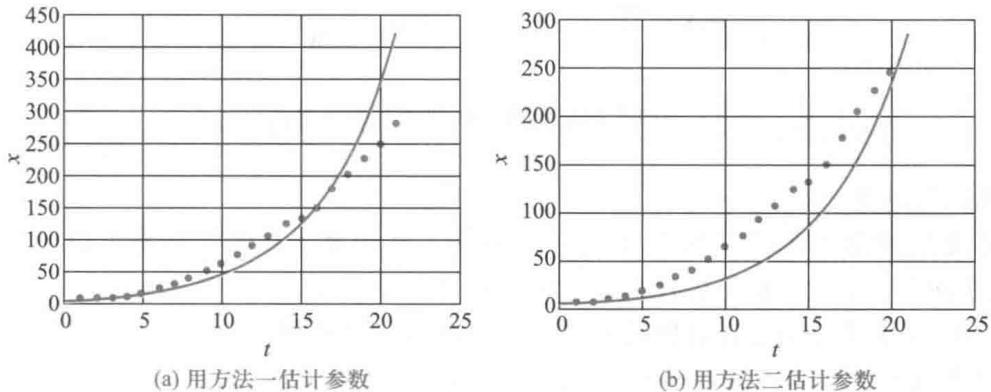  
图1 用指数增长模型计算的美国人口

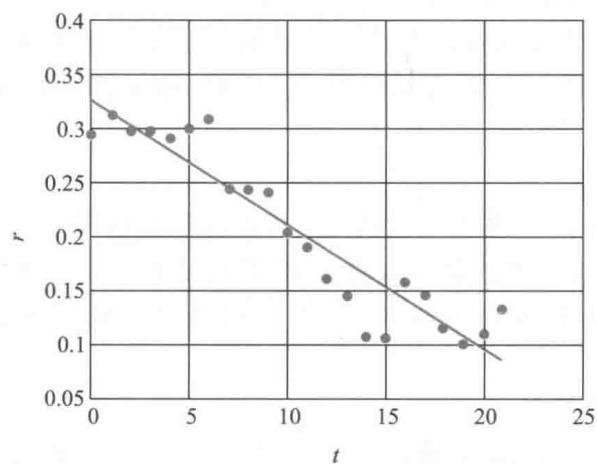  
图2 美国人口10年增长率  $t - r$  散点图及拟合直线

实际应用中,方程(6)中的  $r(t)$  可以根据人口增长率的变化情况,选取简单、合适的其他函数形式。

由美国人口10年增长率数据,利用最小二乘法得到  $r_{0} = 0.3252, r_{1} = 0.0114$ ,再取  $x_{0} = 3.9$  (1790年的人口),将  $r_{0}, r_{1}$  和  $x_{0}$  代入(7)式,计算结果列入表4第5列,其图形见图3。

比较图3和图1,可以明显地看到这个模型的改进效果。定量上常用误差平方和(计算值与实际值之差的平方和)来度量模型或方法与实际数据拟合的程度,表4最后一行给出了指数增长模型的两种参数估计方法及改进的指数增长模型的误差平方和,

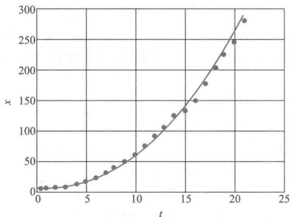  
图3 用改进的指数增长模型计算的美国人口

其差别相当显著.

历史上,指数增长模型与19世纪以前欧洲一些国家人口统计数据可以很好地吻合,迁往加拿大的欧洲移民后代人口也大致符合这个模型。另外,虽然指数增长模型不适于描述、也不能预测较长时期的人口演变过程,但是用它做短期人口预测可以得到较好的结果。显然是因为在这些情况下,模型的基本假设——人口增长率是常数——大致成立。

改进的指数增长模型考虑到增长率随时间的变化,计算结果有所改善,但是它没有反映增长率下降的成因,增长率函数形式也呈不确定性,给应用带来不便。为了建立更符合实际情况的人口增长模型,必须考察人口增长率下降的机理,修改原来的模型假设。

# 二、logistic模型

在分析人口增长到一定数量后增长率下降的主要原因时,人们注意到,自然资源、环境条件等因素对人口的增长起着阻滞作用,并且随着人口的增加,阻滞作用越来越大。logistic模型就是考虑到这些因素,对指数增长模型的基本假设进行修改后得到的[39]。

# 1. logistic模型的建立

资源和环境对人口增长的阻滞作用体现在对增长率  $r$  的影响上,使  $r$  随着人口数量  $x$  的增加而下降。将  $r$  表示为  $x$  的函数  $r(x)$ ,并且取既简单又便于应用的线性减函数  $r(x) = a + bx$ 。为了赋予增长率函数  $r(x)$  中的系数  $a, b$  以实际含义,引入两个参数:

1)内禀增长率  $r$ $r$  是(理论上)  $x = 0$  的增长率,即  $r(0) = r$ ,于是  $a = r$

2)人口容量  $x_{\mathrm{m}}$ $x_{\mathrm{m}}$  是资源和环境所能容纳的最大人口数量,当  $x = x_{\mathrm{m}}$  时人口不再增长,即  $r(x_{\mathrm{m}}) = r + bx_{\mathrm{m}} = 0$ ,得到  $b = -\frac{r}{x_{\mathrm{m}}}$ 。

由此导出的增长率函数为  $r(x) = r\left(1 - \frac{x}{x_{\mathrm{m}}}\right)$ 。用  $r(x)$  代替模型(2)的  $r$ ,得到

$$
\frac{\mathrm{d}x}{\mathrm{d}t} = r x\left(1 - \frac{x}{x_{\mathrm{m}}}\right), x(0) = x_{0} \tag{8}
$$

方程(8)右端的因子  $r x$  体现人口自身的增长趋势,因子  $\left(1 - \frac{x}{x_{\mathrm{m}}}\right)$  则体现了资源和环境对人口增长的阻滞作用.显然,  $x$  越大,前一因子越大,后一因子越小,人口增长是两个因子共同作用的结果.

以  $x$  为横轴  $\frac{\mathrm{d}x}{\mathrm{d}t}$  为纵轴对(8)式作图,得到一条抛物线(图4),  $x = \frac{x_{\mathrm{m}}}{2}$  时,  $\frac{\mathrm{d}x}{\mathrm{d}t}$  最大.根据图4中  $\frac{\mathrm{d}x}{\mathrm{d}t}$  随  $x$  增加而变化的情况,可以对曲线  $x(t)$  的形状作如下分析.

设  $t = 0$  时  $x_{0}< \frac{x_{\mathrm{m}}}{2}$  ,随着  $t$  的增加  $\frac{\mathrm{d}x}{\mathrm{d}t}$  变大,所以  $x$  增长越来越快,曲线  $x(t)$  呈下凸状上升;  $x > \frac{x_{\mathrm{m}}}{2}$  后  $\frac{\mathrm{d}x}{\mathrm{d}t}$  变小,  $x$  增长越来越慢,  $x(t)$  呈上凸状升高;  $x = \frac{x_{\mathrm{m}}}{2}$  为曲线的拐点;  $x\rightarrow x_{\mathrm{m}}$  时  $\frac{\mathrm{d}x}{\mathrm{d}t}\rightarrow 0$  ,于是  $x = x_{\mathrm{m}}$  是曲线  $x(t)$  的渐近线.由以上分析可以大致画出  $x(t)$  的图形如图5,它是一条S形曲线.

实际上,微分方程(8)可以用分离变量法求解得到

$$
x(t) = \frac{x_{\mathrm{m}}}{1 + \left(\frac{x_{\mathrm{m}}}{x_{0}} - 1\right)\mathrm{e}^{-r t}} \tag{9}
$$

读者可以随意设定参数  $r,x_{0},x_{\mathrm{m}}$  ,编程画出(9)式的图形,与图5比较.(8)式称为logistic方程,(9)式称为logistic曲线,统称为logistic模型.

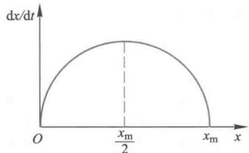  
图4logistic模型的  $x - \mathrm{d}x / \mathrm{d}t$  曲线

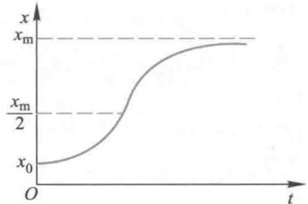  
图5logistic模型的  $t - x$  曲线

2. logistic模型的参数估计

可以用两种方法估计(9)式的参数  $r,x_{0},x_{\mathrm{m}}$

方法一 将方程(8)改写为

$$
\frac{\mathrm{d}x / \mathrm{d}t}{x} = r - \frac{r}{x_{\mathrm{m}}} x,x(0) = x_{0} \tag{10}
$$

像指数增长模型参数估计的方法二一样,对人口数据  $x(t)$  作数值微分后计算增长率,即(10)式左端;对(10)式右端  $x$  用线性最小二乘法估计  $r,x_{\mathrm{m}};x_{0}$  直接采用原始数据.

根据表3中1790年至2000年的美国人口数据,利用数值微分计算的10年增长率已列入表3第3行,将其对  $x$  作图,如图6中圆点所示.圆点大致在一条直线附近,用线性最小二乘法编程计算的结果为  $r = 0.2805,x_{\mathrm{m}} = 352.0548.$  再取  $x_{0} = 3.9$  (1790年的人口),将  $r,x_{\mathrm{m}}$  和  $x_{0}$  代入(9)式,计算结果列入表5第3列.

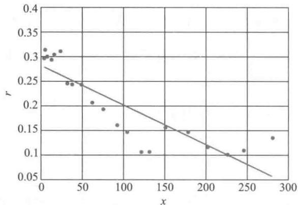  
图6 美国人口增长率  $x - r$  散点图及拟合直线

方法二 直接用人口数据和非线性最小二乘法估计(9)式的  $r, x_{0}, x_{\mathrm{m}}$ .

根据表3中1790年至2000年的美国人口数据,用非线性最小二乘法对(9)式编程计算得到  $r = 0.2155, x_{0} = 7.6962, x_{\mathrm{m}} = 443.9931$ ,再代入(9)式,计算结果列入表5第4列.

表5最后一行给出了logistic模型的两种参数估计方法的误差平方和.图7是用这两种方法估计的参数计算的美国人口(图中圆点是实际人口).

表5用logistic模型计算的美国人口  

<table><tr><td>年份</td><td>实际人口
/百万</td><td>logistic 模型
(方法一)</td><td>logistic 模型
(方法二)</td></tr><tr><td>1790</td><td>3.9</td><td>3.9</td><td>7.7</td></tr><tr><td>1800</td><td>5.3</td><td>5.1</td><td>9.5</td></tr><tr><td>1810</td><td>7.2</td><td>6.8</td><td>11.7</td></tr><tr><td>1820</td><td>9.6</td><td>8.9</td><td>14.5</td></tr><tr><td>1830</td><td>12.9</td><td>11.7</td><td>17.8</td></tr><tr><td>1840</td><td>17.1</td><td>15.3</td><td>21.9</td></tr><tr><td>1850</td><td>23.2</td><td>20.0</td><td>26.8</td></tr><tr><td>1860</td><td>31.4</td><td>26.0</td><td>32.8</td></tr><tr><td>1870</td><td>38.6</td><td>33.6</td><td>40.0</td></tr><tr><td>1880</td><td>50.2</td><td>43.2</td><td>48.5</td></tr><tr><td>1890</td><td>62.9</td><td>55.0</td><td>58.6</td></tr><tr><td>1900</td><td>76.0</td><td>69.3</td><td>70.5</td></tr><tr><td>1910</td><td>92.0</td><td>86.3</td><td>84.2</td></tr><tr><td>1920</td><td>105.7</td><td>105.8</td><td>99.9</td></tr><tr><td>1930</td><td>122.8</td><td>127.6</td><td>117.6</td></tr><tr><td>1940</td><td>131.7</td><td>151.2</td><td>137.1</td></tr><tr><td>1950</td><td>150.7</td><td>175.8</td><td>158.4</td></tr><tr><td>1960</td><td>179.3</td><td>200.3</td><td>180.9</td></tr><tr><td>1970</td><td>203.2</td><td>223.9</td><td>204.4</td></tr><tr><td>1980</td><td>226.5</td><td>245.8</td><td>228.3</td></tr><tr><td>1990</td><td>248.7</td><td>265.4</td><td>252.0</td></tr><tr><td>2000</td><td>281.4</td><td>282.4</td><td>275.1</td></tr><tr><td>误差平方和/103</td><td></td><td>2.810 4</td><td>0.458 2</td></tr></table>

对比表5与表4最后一行的误差平方和以及图7、图1和图3,不难看出,就1790年至2000年美国人口数据的拟合效果而言,logistic模型比指数增长模型有很大改善,特别是用非线性最小二乘估计参数的结果,效果很好(图7(b)).

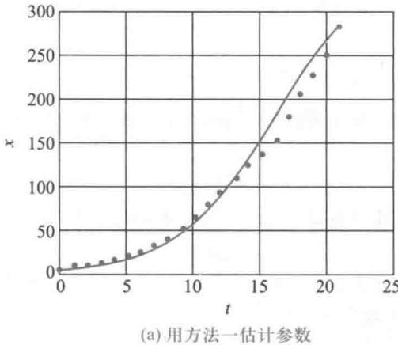  
图7用logistic模型计算的美国人口

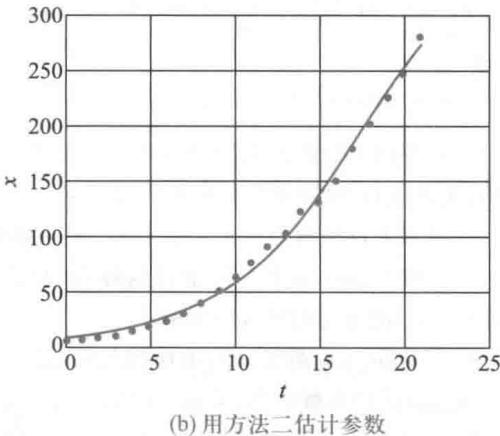

小结用数学工具描述人口变化规律.关键是对人口增长率做出合理、简化的假定.指数增长模型关于人口增长率是常数的假设过于简化,不适于作长期人口预测logistic模型对增长率随人口增加而线性减少的假设,是一个合理、简化的修正.

logistic方程(曲线)是比利时生物数学家Verhulst1845年提出的,它不仅能够大体上描述人口及许多物种数量(如森林中的树木、鱼塘中的鱼群等)的变化规律,

# 三、模型检验和人口预测

表4、表5和图1、图3、图7给出的结果,都是利用1790年至2000年美国人口数据估计的参数代入两个模型计算得到的,将这些结果与同期的实际数据比较,能够反映模型与这些数据的拟合程度,还不是真正意义上的模型检验.

你可能已经注意到,在估计指数增长模型和logistic模型的参数过程中,我们没有用表3中2010年的美国人口,留下这个实际数据正是为了用来做模型检验的.用这两个模型及前面估计的参数计算2010年的美国人口,列入表6第2行,与实际人口308.7(百万)的误差见表6第3行.用改进的指数增长模型和logistic模型计算结果的误差是可以接受的.

最后,我们用改进的指数增长模型和第2种方法估计参数的logistic模型,对2020年的美国人口作预测.将2010年美国实际人口加入,重新估计模型参数①,然后计算2020年的人口,得到表6第4行的两个数据.至于预测的准确性如何,需要等到2020年美国人口调查结果的公布,让我们拭目以待.

域也有广泛的应用,例如耐用消费品的销售量就可以认为受到已售量的阻滞增长作用.

评注参数估计是建模的重要步骤,最小二乘法是参数估计的基本方法,并且应该尽量采用线性最小

二乘法.当然,随着数学软件的发展,非线性最小二乘法的应用也是很方便的.对于微分方程模型来说,参

数估计既可直接从方程的解出发,也可针对方程本身,应灵活掌握.

做模型检验时需要注意的一点是,用作检验的数据不应该参与建模过程的参数估计,正像裁判员不宜做运动员一样.

表6指数增长模型和logistic模型的检验和预测  

<table><tr><td></td><td>实际人口</td><td>指数增长模型
(方法一)</td><td>指数增长模型
(方法二)</td><td>改进的指数
增长模型</td><td>logistic模型
(方法一)</td><td>logistic模型
(方法二)</td></tr><tr><td>2010 年人口
/百万
(误差)</td><td>308.7</td><td>515.0
(66.8%)</td><td>356.0
(15.3%)</td><td>314.0
(1.7%)</td><td>296.8
(-3.9%)</td><td>297.0
(-3.8%)</td></tr><tr><td>预测 2020 年
人口/百万</td><td>?</td><td></td><td></td><td>327.8</td><td></td><td>326.8</td></tr></table>

本节介绍的两个模型都是以人口总数、人口平均增长率为研究对象,实际上,一个国家或地区的人口发展规律与年龄结构密切相关,考虑年龄结构的人口模型可参考更多案例5- 3.

1. 利用(1)式解释:若经过  $n$  年人口翻了一番,那么这期间的年平均增长率约为  $(70 / n)\%$ . 由表3估计美国人口1950年后的年平均增长率.

2. 解释人口预测公式  $x_{k} = x_{0}(1 + r)^{k}$  是指数增长模型  $x(t) = x_{0}\mathrm{e}^{r t}$  的离散近似形式.

3. 求解logistic方程(8),验证其解为(9)式,设定几组参数  $r, x_{0}, x_{\mathrm{m}}$ ,用软件编程画出解的曲线,分析  $r$  和  $x_{\mathrm{m}}$  的变化对曲线的影响.

4. 写出logistic曲线  $x(t)$  出现拐点时刻的表达式,分析这个时刻与参数  $r, x_{0}, x_{\mathrm{m}}$  的关系.按照本节两种方法估计的参数计算,美国人口增长曲线的拐点出现在哪一年?

5. 求解logistic方程(8),将  $t$  表示为  $x$  的函数.说明logistic有log-like(像对数)的含义(参考拓展阅读5-1logistic方程的发展进程).

# 5.2 药物中毒急救

一天夜晚,你作为见习医生正在医院内科急诊室值班,两位家长带着一个孩子急匆匆进来,诉说两小时前孩子一口气误吞下11片治疗哮喘病的、剂量为每片  $100\mathrm{mg}$  的氨茶碱片,已经出现呕吐、头晕等不良症状.按照药品使用说明书,氨茶碱的每次用量成人是  $100\sim 200\mathrm{mg}$ ,儿童是  $3\sim 5\mathrm{mg / kg}$ .如果过量服用,可使血药浓度(单位血液容积中的药量)过高,当血药浓度达到  $100\mu \mathrm{g / mL}$  时,会出现严重中毒,达到  $200\mu \mathrm{g / mL}$  则可致命[60].

作为一位医生你清楚地知道,由于孩子服药是在两小时前,现在药物已经从胃进入肠道,无法再用刺激呕吐的办法排除.当前需要作出判断的是,孩子的血药浓度会不会达到  $100\mu \mathrm{g / mL}$  甚至  $200\mu \mathrm{g / mL}$ ,如果会达到,则临床上应采取紧急方案来救治孩子.

问题的调查与分析人体服用一定量的药物后,血药浓度与人体的血液总量有关.一般来说,血液总量约为体重的  $7\% \sim 8\%$ ,即体重  $50\sim 60\mathrm{kg}$  的成年人血液总量约为  $4000\mathrm{mL}$ .目测这个孩子的体重约为成年人的一半,可认为其血液总量约为  $2000\mathrm{mL}$ .由此,血液系统中的血药浓度与药量之间可以相互转换.

药物口服后迅速进入胃肠道,再由胃肠道的外壁进入血液循环系统,被血液吸收.胃肠道中药物的转移率,即血液系统的吸收率,一般与胃肠道中的药量成正比.药物在被血液吸收的同时,又通过代谢作用由肾脏排出体外,排除率一般与血液中的药量成正比.如果认为整个血液系统内药物的分布,即血药浓度是均匀的,可以将血液系统看作一个房室,建立所谓一室模型.

血液系统对药物的吸收率和排除率可以由半衰期确定,从药品说明书可知,氨茶碱吸收的半衰期约  $5\mathrm{h}$ ,排除的半衰期约  $6\mathrm{h}$ .

如果血药浓度达到危险的水平,临床上施救的一种办法是采用口服活性炭来吸附药物,可使药物的排除率增加到原来(人体自身)的2倍,另一种办法是进行体外血液

透析,药物排除率可增加到原来的6倍,但是安全性不能得到充分保证,建议尽量少用。

模型的假设和建立为了判断孩子的血药浓度会不会达到危险的水平,需要寻求胃肠道和血液系统中的药量随时间变化的规律。记胃肠道中的药量为  $x(t)$ ,血液系统中的药量为  $y(t)$ ,时间  $t$  以孩子误服药的时刻为起点  $(t = 0)$ 。根据前面的调查与分析可作以下假设:

1. 胃肠道中药物向血液系统的转移率与药量  $x(t)$  成正比,比例系数记作  $\lambda (>0)$ ,总剂量  $1100\mathrm{mg}$  的药物在  $t = 0$  瞬间进入胃肠道。

2. 血液系统中药物的排除率与药量  $y(t)$  成正比,比例系数记作  $\mu (>0)$ , $t = 0$  时血液中无药物。

3. 氨茶碱被吸收的半衰期为  $5\mathrm{~h~}$ ,排除的半衰期为  $6\mathrm{~h~}$

4. 孩子的血液总量为  $2000\mathrm{~mL~}$

根据假设对胃肠道中药量  $x(t)$  和血液系统中药量  $y(t)$  建立如下模型。

由假设  $1,x(0) = 1100\mathrm{mg}$ ,随着药物从胃肠道向血液系统的转移, $x(t)$  下降的速度与  $x(t)$  本身成正比(比例系数  $\lambda >0$ ),所以  $x(t)$  满足微分方程

$$
\frac{\mathrm{d}x}{\mathrm{d}t} = -\lambda x, x(0) = 1100 \tag{1}
$$

由假设  $2,y(0) = 0$ ,药物从胃肠道向血液系统的转移相当于血液系统对药物的吸收, $y(t)$  由于吸收作用而增长的速度是  $\lambda x$ ,由于排除而减少的速度与  $y(t)$  本身成正比(比例系数  $\mu >0$ ),所以  $y(t)$  满足微分方程

$$
\frac{\mathrm{d}y}{\mathrm{d}t} = \lambda x - \mu y, y(0) = 0 \tag{2}
$$

方程(1),(2)中的参数  $\lambda$  和  $\mu$  可由假设3中的半衰期确定。

模型求解 微分方程(1)是可分离变量方程,容易得到

$$
x(t) = 1100\mathrm{e}^{-\lambda t} \tag{3}
$$

表明胃肠道中的药量  $x(t)$  随时间单调减少并趋于0。为了确定  $\lambda$ ,利用药物吸收的半衰期为  $5\mathrm{~h~}$ ,即  $x(5) = 1100\mathrm{e}^{- 5\lambda} = x(0) / 2 = 1100 / 2$ ,得  $\lambda = (\ln 2) / 5 = 0.1386(1 / \mathrm{h})$

将(3)代入方程(2),得到一阶线性微分方程,求解得

$$
y(t) = \frac{1100\lambda}{\lambda - \mu} (\mathrm{e}^{-\mu t} - \mathrm{e}^{-\lambda t}) \tag{4}
$$

表明血液系统中的药量  $y(t)$  随时间先增后减并趋于0。

为了根据药物排除的半衰期为  $6\mathrm{~h~}$  来确定  $\mu$ ,考虑血液系统只对药物进行排除的情况,这时  $y(t)$  满足方程  $\frac{\mathrm{d}y}{\mathrm{d}t} = - \mu y$ ,若设在某时刻  $\tau$  有  $y(\tau) = a$ ,则  $y(t) = a\mathrm{e}^{- \mu (t - \tau)}$ , $t \geq \tau$ 。利用  $y(\tau +6) = a / 2$ ,可得  $\mu = (\ln 2) / 6 = 0.1155(1 / \mathrm{h})$

将  $\lambda = 0.1386$  和  $\mu = 0.1155$  代入(3),(4),得  $(t$  的单位: $\mathrm{h};x,y$  的单位: $\mathrm{mg}$

$$
x(t) = 1100\mathrm{e}^{-0.1386t} \tag{5}
$$

$$
y(t) = 6600(\mathrm{e}^{-0.1155t} - \mathrm{e}^{-0.1386t}) \tag{6}
$$

结果分析 用MATLAB软件对(5),(6)作图,得图1。

根据假设4,孩子的血液总量为  $2000\mathrm{~mL~}$ ,出现严重中毒的血药浓度  $100\mu \mathrm{g} / \mathrm{mL}$  和

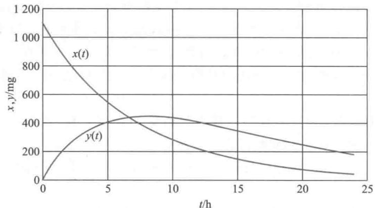  
图1胃肠道中药量  $x(t)$  和血液系统中药量  $y(t)$

致命的血药浓度  $200~\mu \mathrm{g / mL}$  分别相当于血液中药量  $y$  达到  $200~\mathrm{mg}$  和  $400~\mathrm{mg}$ . 由图1看出, 药量  $y$  在约  $2\mathrm{~h}$  达到  $200~\mathrm{mg}$ , 即孩子到达医院时已经出现严重中毒; 如不及时施救, 药量  $y$  将在约  $5\mathrm{~h}$  (到医院后  $3\mathrm{~h}$  ) 达到  $400~\mathrm{mg}$ .

由(6)容易精确地算出孩子到达医院时血液中药量  $y(2) = 236.5\mathrm{mg}$ , 而计算药量达到  $400~\mathrm{mg}$  的时间(记作  $t_{1}$ ), 则需要解非线性方程  $6600(\mathrm{e}^{- 0.1155t_{1}} - \mathrm{e}^{- 0.1386t_{1}}) = 400$ , 用MATLAB软件计算可以得到  $t_{1} = 4.87\mathrm{~h}$ .

由图1还可以看出, 血液中药量  $y(t)$  达到最大值的时间约在  $t = 8\mathrm{~h}$ , 即到达医院后  $6\mathrm{~h}$ , 其精确值可由方程(2)或解(4)计算, 记作  $t_{2}, t_{2} = \frac{\ln(1 + \lambda / 6\mu)}{\lambda - \mu} = 7.89\mathrm{~h}$ , 且  $y(t_{2}) = 442.1\mathrm{mg}$ .

利用这个模型还可以确定对于孩子及成人服用氨茶碱能引起严重中毒和致命的最小剂量(复习题1).

施救方案根据模型计算的结果, 如不及时施救, 孩子会有生命危险. 根据调查, 如采用口服活性炭来吸附药物的办法施救, 药物的排除率可增加到  $\mu$  的2倍, 即0.2310. 让我们计算一下, 采用这种施救方案血液中药量  $y(t)$  的变化情况.

设孩子到达医院时刻  $(t = 2)$  就开始施救, 前面已经算出  $y(2) = 236.5$ , 由(2), (3), 新的模型为(血液中药量记作  $z(t)$  )

$$
\frac{\mathrm{d}z}{\mathrm{d}t} = \lambda x - \mu z, t \geqslant 2, x = 1100\mathrm{e}^{-\lambda t}, z(2) = 236.5 \tag{7}
$$

仍是一阶线性微分方程, 只不过初始时刻为  $t = 2$ , 当  $\lambda = 0.1386$  (不变) 而  $\mu = 0.2310$  时, (7) 的解为

$$
z(t) = 1650\mathrm{e}^{-0.1386t} - 1609.5\mathrm{e}^{-0.2310t}, t \geqslant 2 \tag{8}
$$

用MATLAB软件对(8)作图, 如图2.

由图2可看出, 施救后血液中药量  $z(t)$  达到最大值的时间约在  $t = 5\mathrm{~h}$ , 即到达医院施救后  $3\mathrm{~h}$ , 其精确值可由(8)算出, 记作  $t_{3}, t_{3} = 5.26\mathrm{~h}$ , 且  $z(t_{3}) = 318.4\mathrm{mg}$ , 远低于  $y(t)$  的最大值和致命水平.

图2还表明, 虽然采用了口服活性炭来吸附药物的办法施救, 血液中药量  $z(t)$  仍有一段时间在上升, 说明用这种方法药物的排除率增加还不够大. 不妨计算一下, 如果要

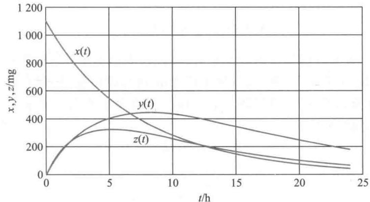  
图2施救后血液系统中药量  $z(t) (x(t), y(t)$  同图1）

使  $z(t)$  在施救后  $(t \geqslant 2)$  立即下降, 排除率  $\mu$  至少应该多大.

$z(t)$  在  $t = 2$  取得极大值, 相当于  $t = 2$  时(7)式满足

$$
\left. \frac{\mathrm{d}z}{\mathrm{d}t} \right|_{t = 2} = \left(\lambda x - \mu z\right) \bigg|_{t = 2} = 0 \tag{9}
$$

由(5)算出  $x(2) = 833.7$ , 再利用前面已有的  $z(2) = 236.5$  和  $\lambda = 0.1386$ , 立即得到  $\mu = 0.4885$ , 约为原来(人体自身  $\mu = 0.1155$ )的4.2倍.

如果采用体外血液透析的办法, 药物排除率可增加到  $\mu = 0.1155 \times 6 = 0.693$ , 血液中药量下降更快, 读者可以用这个  $\mu$  重新求解(7)并作图(复习题2). 至于临床上究竟是否需要采取这种办法, 当由医生综合考虑并征求病人和家属意见后确定.

# 复习题

1. 利用药物中毒施救模型确定对于孩子(血液总量为  $2000 \mathrm{~mL}$  )及成人(血液总量为  $4000 \mathrm{~mL}$  )服用氨茶碱能引起严重中毒和致命的最小剂量.

2. 如果采用的是体外血液透析的办法, 求解药物中毒施救模型的血液中药量的变化规律并作图.

# 5.3 捕鱼业的持续收获

可持续发展是一项基本国策, 对于像渔业、林业这样的可再生资源, 一定要注意适度开发, 不能为了一时的高产去"竭泽而渔", 应该在持续稳产的前提下追求产量或效益的最优化.

考察一个渔场, 其中的鱼量在天然环境下按一定规律增长, 如果捕捞量恰好等于增长量, 那么渔场鱼量将保持不变, 这个捕捞量就可以持续下去. 本节要建立在捕捞情况下渔场鱼量遵从的方程, 分析鱼量稳定的条件, 并且在稳定的前提下讨论如何控制捕捞使持续产量或经济效益达到最大. 最后研究所谓捕捞过度的问题[15,38].

产量模型 记时刻  $t$  渔场中鱼量为  $x(t)$ , 关于  $x(t)$  的自然增长和人工捕捞作如下假设:

1. 在无捕捞条件下  $x(t)$  的增长服从logistic方程(见5.1节), 即

$$
\dot{x} (t) = f(x) = r x\left(1 - \frac{x}{N}\right) \tag{1}
$$

$r$  是固有增长率,  $N$  是环境容许的最大鱼量, 用  $f(x)$  表示单位时间的增长量.

2. 单位时间的捕捞量(即产量)与渔场鱼量  $x(t)$  成正比, 比例常数  $E$  表示单位时间捕捞率, 又称为捕捞强度, 可以用比如捕鱼网眼的大小或出海渔船数量来控制强度. 于是单位时间的捕捞量为

$$
h(x) = E x \tag{2}
$$

根据以上假设并记

$$
F(x) = f(x) - h(x)
$$

得到捕捞情况下渔场鱼量满足的方程

$$
\dot{x} (t) = F(x) = r x\left(1 - \frac{x}{N}\right) - E x \tag{3}
$$

我们并不需要解方程(3)以得到  $x(t)$  的动态变化过程, 只希望知道渔场的稳定鱼量和保持稳定的条件, 即时间  $t$  足够长以后渔场鱼量  $x(t)$  的趋向, 并由此确定最大持续产量. 为此可以直接求方程(3)的平衡点并分析其稳定性(可参考基础知识5- 1).

令

$$
F(x) = r x\left(1 - \frac{x}{N}\right) - E x = 0
$$

得到两个平衡点

$$
x_{0} = N\left(1 - \frac{E}{r}\right), \quad x_{1} = 0 \tag{4}
$$

不难算出

$$
F^{\prime}(x_{0}) = E - r, \quad F^{\prime}(x_{1}) = r - E
$$

所以若

$$
E< r \tag{5}
$$

有  $F^{\prime}(x_{0})< 0, F^{\prime}(x_{1}) > 0$ , 故  $x_{0}$  点稳定,  $x_{1}$  点不稳定; 若  $E > r$ , 则结果正好相反.

$E$  是捕捞率,  $r$  是最大的增长率, 上述分析表明, 只要捕捞适度  $(E< r)$ , 就可使渔场鱼量稳定在  $x_{0}$ , 从而获得持续产量  $h(x_{0}) = E x_{0}$ ; 而当捕捞过度时  $(E > r)$ , 渔场鱼量将趋向  $x_{1} = 0$ , 当然谈不上获得持续产量了.

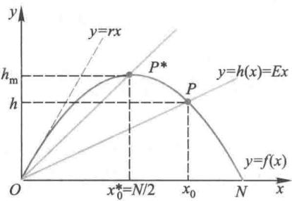  
图1 最大持续产量的图解法

进一步讨论渔场鱼量稳定在  $x_{0}$  的前提下, 如何控制捕捞强度  $E$  使持续产量最大的问题. 用图解法可以非常简单地得到结果.

根据(1),(2)式作抛物线  $y = f(x)$  和直线  $y = h(x) = E x$ , 如图1. 注意到  $y = f(x)$  在原点的切线为  $y = r x$ , 所以在条件(5)下  $y = E x$  必与  $y = f(x)$  有交点  $P, P$  的横坐标就是稳定平衡点  $x_{0}$ .

根据假设2,  $P$  点的纵坐标  $h$  为稳定条件下单位时间的持续产量. 由图1立刻知道, 当  $y = E x$  与  $y = f(x)$  在抛物线顶点  $P^{*}$  相交时可获得最大的持续产量, 此时的稳定平衡

点为

$$
x_{0}^{*} = \frac{N}{2} \tag{6}
$$

且单位时间的最大持续产量为

$$
h_{\mathrm{m}} = \frac{r N}{4} \tag{7}
$$

而由(4)式不难算出保持渔场鱼量稳定在  $x_{0}^{*}$  的捕捞率为

$$
E^{*} = \frac{r}{2} \tag{8}
$$

综上所述,产量模型的结论是将捕捞率控制在固有增长率  $r$  的一半,更简单一些,可以说使渔场鱼量保持在最大鱼量  $N$  的一半时,能够获得最大的持续产量.

效益模型从经济角度看不应追求产量最大,而应考虑效益最佳.如果经济效益用从捕捞所得的收入中扣除开支后的利润来衡量,并且简单地假设:鱼的销售单价为常数  $p$ ,单位捕捞率(如每条出海渔船)的费用为常数  $c$ ,那么单位时间的收入  $T$  和支出  $S$  分别为

$$
T = p h\left(x\right) = p E x,\quad S = c E \tag{9}
$$

单位时间的利润为

$$
R = T - S = p E x - c E \tag{10}
$$

在稳定条件  $x = x_{0}$  下,以(4)代入(10)式,得

$$
R(E) = T(E) - S(E) = p N E\left(1 - \frac{E}{r}\right) - c E \tag{11}
$$

用微分法容易求出使利润  $R(E)$  达到最大的捕捞强度为

$$
E_{R} = \frac{r}{2}\left(1 - \frac{c}{p N}\right) \tag{12}
$$

将  $E_{R}$  代入(4)式,可得最大利润下的渔场稳定鱼量  $x_{R}$  及单位时间的持续产量  $h_{R}$  为

$$
x_{R} = \frac{N}{2} +\frac{c}{2p} \tag{13}
$$

$$
h_{R} = r x_{R}\left(1 - \frac{x_{R}}{N}\right) = \frac{r N}{4}\left(1 - \frac{c^{2}}{p^{2}N^{2}}\right) \tag{14}
$$

将(12)一(14)式与产量模型中的(6)一(8)式相比较可以看出,在最大效益原则下捕捞率和持续产量均有所减少,而渔场应保持的稳定鱼量有所增加,并且减少或增加的部分随着捕捞成本  $c$  的增长而变大,随着销售价格  $p$  的增长而变小.请读者分析这些结果是符合实际情况的.

捕捞过度上面的效益模型是以计划捕捞(或称封闭式捕捞)为基础的,即渔场由单独的经营者有计划地捕捞,可以追求最大利润.如果渔场向众多盲目的经营者开放,比如在公海上无规则地捕捞,那么即使只有微薄的利润,经营者也会蜂拥而去,这种情况称为盲目捕捞(或开放式捕捞).这种捕捞方式将导致捕捞过度,下面讨论这个模型.

(11)式给出了利润与捕捞强度的关系  $R(E)$ ,令  $R(E) = 0$  的解为  $E_{s}$ ,可得

$$
E_{s} = r\left(1 - \frac{c}{p N}\right) \tag{15}
$$

当  $E< E_{s}$  时,利润  $R(E) > 0$  ,盲目的经营者们会加大捕捞强度;若  $E > E_{s}$  ,利润  $R(E)< 0$  ,他们当然要减小强度.所以  $E_{s}$  是盲目捕捞下的临界强度.

$E_{s}$  也可由图解法确定.在图2中以  $E$  为横坐标,按(11)式画出  $T(E)$  和  $S(E)$  ,它们交点的横坐标即为  $E_{s}$  (图2中的  $E_{S1}$  或  $E_{S2}$  ).由(15)式或图2容易知道,  $E_{s}$  存在的必要条件(即  $E_{s} > 0$  )是

$$
p > \frac{c}{N} \tag{16}
$$

即售价大于(相对于总量而言)成本.并且由(15)式可知,成本越低,售价越高,则  $E_{s}$  越大.

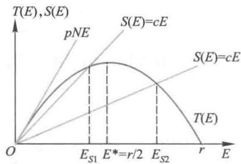  
图2盲目捕捞强度的图解法

将(15)代入(4)式,得到盲目捕捞下的渔场稳定鱼量为

$x_{s}$  完全由成本- 价格比决定,随着价格的上升和成本的下降,  $x_{s}$  将迅速减少,出现捕捞过度.

比较(12)和(15)式可知,  $E_{s} = 2E_{R}$  ,即盲目捕捞强度比最大效益下捕捞强度大一倍.

从(15)式和图2还可以得到,当  $\frac{c}{N} < p< 2\frac{c}{N}$  时,  $(E_{R}< )E_{S}< E^{*}$  ,如图2中  $E_{S1}$  ,称经济学捕捞过度;当  $p > 2\frac{c}{N}$  时,  $E_{s} > E^{*}$  ,如图2中  $E_{S2}$  ,称生态学捕捞过度.

# 复习题

1. 如果渔场鱼量的自然增长仍服从logistic方程,而单位时间捕捞量为常数  $h$

(1)分别就  $h > r N / 4,h< r N / 4,h = r N / 4$  这3种情况讨论渔场鱼量方程的平衡点及其稳定状况

(2)如何获得最大持续产量,其结果与本节的产量模型有何不同?

2. 与logistic模型不同的另一种描述种群增长规律的是Gompertz模型:  $\dot{x}\left(t\right) = r x\ln{\frac{N}{x_{0}}}$  ,其中  $r$  和 $N$  的意义与logistic模型相同.设渔场鱼量的自然增长服从这个模型,且单位时间捕捞量为  $h = E x.$  讨论渔场鱼量的平衡点及其稳定性,求最大持续产量  $h_{\mathrm{m}}$  及获得最大产量的捕捞强度  $E_{\mathrm{m}}$  和渔场鱼量水平  $\boldsymbol{x}_{0}^{\star}$

# 5.4 资金、劳动力与经济增长

发展经济、提高生产力主要有以下手段:增加投资、增加劳动力、技术革新.这里暂不考虑技术革新的作用,一是因为在经济发展的初期(如资本主义早期社会)或者在不

太长的时期内, 技术相对稳定, 二是由于技术革新量化比较困难。

本节的模型将首先建立产值与资金、劳动力之间的关系, 然后研究资金与劳动力的最佳分配, 使投资效益最大, 最后讨论如何调节资金与劳动力的增长率, 使劳动生产率得到有效的增长[45].

1. Douglas 生产函数

用  $Q(t), K(t), L(t)$  分别表示某一地区或部门在时刻  $t$  的产值、资金和劳动力, 它们的关系可以一般地记作

$$
Q(t) = F(K(t), L(t)) \tag{1}
$$

其中  $F$  为待定函数. 对于固定的时刻  $t$ , 上述关系可写作

$$
Q = F(K,L) \tag{2}
$$

为寻求  $F$  的函数形式, 引入记号

$$
z = Q / L, \quad y = K / L \tag{3}
$$

$z$  是每个劳动力的产值,  $y$  是每个劳动力的投资. 如下的假设是合理的:  $z$  随着  $y$  的增加而增长, 但增长速度递减. 进而简化地把这个假设表示为

$$
z = e g(y), \quad g(y) = y^{\alpha}, \quad 0< \alpha < 1 \tag{4}
$$

显然函数  $g(y)$  满足上面的假设, 常数  $c > 0$  可看成技术的作用. 由(3), (4)即可得到(2)式中  $F$  的具体形式为

$$
Q = c K^{\alpha} L^{1 - \alpha}, \quad 0< \alpha < 1 \tag{5}
$$

由(5)式容易知道,  $Q$  有如下性质

$$
\frac{\partial Q}{\partial K}, \frac{\partial Q}{\partial L} >0, \quad \frac{\partial^{2} Q}{\partial K^{2}}, \frac{\partial^{2} Q}{\partial L^{2}} < 0 \tag{6}
$$

请读者解释(6)式的含义.

记  $Q_{K} = \frac{\partial Q}{\partial K}, Q_{K}$  表示单位资金创造的产值;  $Q_{L} = \frac{\partial Q}{\partial L}, Q_{L}$  表示单位劳动力创造的产值, 则从(5)式可得

$$
\frac{K Q_{K}}{Q} = \alpha , \quad \frac{L Q_{L}}{Q} = 1 - \alpha , \quad K Q_{K} + L Q_{L} = Q \tag{7}
$$

(7)式可解释为:  $\alpha$  是资金在产值中占有的份额,  $1 - \alpha$  是劳动力在产值中占有的份额. 于是  $\alpha$  的大小直接反映了资金、劳动力二者对于创造产值的轻重关系.

(5)式是经济学中著名的Cobb-Douglas生产函数, 它经受了资本主义社会一些实际数据的检验. 更一般形式的生产函数表示为

$$
Q = c K^{\alpha} L^{\beta}, \quad 0< \alpha , \beta < 1 \tag{8}
$$

2. 资金与劳动力的最佳分配

这里将根据生产函数(5)式, 讨论怎样分配资金和劳动力, 使生产创造的效益最大.

假定资金来自贷款, 利率为  $r$ , 每个劳动力需付工资  $w$ , 于是当资金  $K$  、劳动力  $L$  产生产值  $Q$  时, 得到的效益为

$$
S = Q - r K - w L \tag{9}
$$

问题化为求资金与劳动力的分配比例  $K / L$  (即每个劳动力占有的资金), 使效益  $S$  最大.

这个模型用微分法即可解得

$$
\frac{Q_{K}}{Q_{L}} = \frac{r}{w} \tag{10}
$$

再利用(7)式, 有

$$
\frac{K}{L} = \frac{\alpha}{1 - \alpha} \frac{w}{r} \tag{11}
$$

这就是资金与劳动力的最佳分配. 从(11)式可以看出, 当  $\alpha , w$  变大,  $r$  变小时, 分配比例  $K / L$  变大, 这是符合常识的.

# 3. 劳动生产率增长的条件

常用的衡量经济增长的指标, 一是总产值  $Q(t)$ , 二是每个劳动力的产值  $z(t) = Q(t) / L(t)$ , 这个模型讨论  $K(t), L(t)$  满足什么条件, 才能使  $Q(t), z(t)$  保持增长.

首先需要对资金和劳动力的增加做出合理的简化假设:

1) 投资增长率与产值成正比, 比例系数  $\lambda > 0$ , 即用一定比例扩大再生产;

2) 劳动力的相对增长率为常数  $\mu , \mu$  可以是负数, 表示劳动力减少.

这两个条件的数学表达式分别为

$$
\frac{\mathrm{d}K}{\mathrm{d}t} = \lambda Q, \quad \lambda > 0 \tag{12}
$$

$$
\frac{\mathrm{d}L}{\mathrm{d}t} = \mu L \tag{13}
$$

方程(13)的解是①

$$
L(t) = L_{0} \mathrm{e}^{t} \tag{14}
$$

将(4), (5)代入(12)式, 得

$$
\frac{\mathrm{d}K}{\mathrm{d}t} = c \lambda L y^{\alpha} \tag{15}
$$

注意到(3)式, 有  $K = L y$ , 再用(13)式可得

$$
\frac{\mathrm{d}K}{\mathrm{d}t} = L \frac{\mathrm{d}y}{\mathrm{d}t} + \mu L y \tag{16}
$$

比较(15), (16), 得到关于  $y(t)$  的方程

$$
\frac{\mathrm{d}y}{\mathrm{d}t} + \mu y = c \lambda y^{\alpha} \tag{17}
$$

这是著名的Bernoulli方程, 它的解是

$$
y(t) = \left\{\frac{c \lambda}{\mu} \left[ 1 - \left(1 - \mu \frac{K_{0}}{K_{0}}\right) \mathrm{e}^{-(1 - \alpha) \mu} \right] \right\}^{\frac{1}{1 - \alpha}} \tag{18}
$$

以下根据(18)式研究  $Q(t), z(t)$  保持增长的条件.

1)  $Q(t)$  增长, 即  $\frac{\mathrm{d}Q}{\mathrm{d}t} > 0$ , 由  $Q = c L y^{\alpha}$  及(13), (17)式可算得

$$
\frac{\mathrm{d}Q}{\mathrm{d}t} = c L \alpha y^{\alpha -1} \frac{\mathrm{d}y}{\mathrm{d}t} + c \mu L y^{\alpha} = c L y^{2 \alpha -1} \left[ c \lambda \alpha + \mu (1 - \alpha) y^{1 - \alpha} \right] \tag{19}
$$

将其中的  $y$  以(18)式代入,可知条件  $\frac{\mathrm{d}Q}{\mathrm{d}t} >0$  等价于

$$
\left(1 - \mu \frac{K_{0}}{\dot{K}_{0}}\right)\mathrm{e}^{-(1 - \alpha)\mu t}< \frac{1}{1 - \alpha} \tag{20}
$$

因为上式右端大于1,所以当  $\mu \geqslant 0$  (即劳动力不减少)时(20)式恒成立;而当  $\mu < 0$  时,(20)式成立的条件是

$$
t< \frac{1}{(1 - \alpha)\mu}\ln \left[(1 - \alpha)\left(1 - \mu \frac{K_{0}}{\dot{K}_{0}}\right)\right] \tag{21}
$$

说明如果劳动力减少,  $Q(t)$  只能在有限时间内保持增长。但应注意,若(21)式中的  $(1 - \alpha)\left(1 - \mu \frac{K_{0}}{\dot{K}_{0}}\right) \geqslant 1$ ,则不存在这样的增长时段。

2)  $z(t)$  增长,即  $\frac{\mathrm{d}z}{\mathrm{d}t} >0$ ,由  $z = cy^{\alpha}$  知,相当于  $\frac{\mathrm{d}y}{\mathrm{d}t} >0$ ,由方程(17)知,当  $\mu \leqslant 0$  时该条件恒成立;而当  $\mu >0$  时,由(18)式可得,  $\frac{\mathrm{d}y}{\mathrm{d}t} >0$  等价于

$$
\left(1 - \mu \frac{K_{0}}{\dot{K}_{0}}\right)\mathrm{e}^{-(1 - \alpha)\mu t} > 0 \tag{22}
$$

显然,此式成立的条件为  $\mu \frac{K_{0}}{\dot{K}_{0}} < 1$ ,即

$$
\mu < \dot{K}_{0} / K_{0} \tag{23}
$$

这个条件的含义是,劳动力增长率小于初始投资增长率。

评注 Douglas生产函数是计量经济学中重要的数学模型,本节给出它的一种简洁的建模过程。在此基础上讨论的资金与劳动力的最佳分配,是一个静态模型。而利用微分方程研究的劳动生产率增长的条件,是一个动态模型,虽然它的推导过程稍繁,但其结果却相当简明,并且可以给出合理的解释。

# 复习题

经济增长模型中为了适用于不同的对象,可将产量函数  $Q(t)$  折算成现金,仍用  $Q(t)$  表示。考虑到物价上升因素,记物价上升指数为  $p(t)$  (设  $p(0) = 1$ ),则产品的表面价值  $y(t)$  、实际价值  $Q(t)$  和物价指数  $p(t)$  之间满足  $y(t) = Q(t)p(t)$ 。

(1)导出  $y(t), Q(t), p(t)$  的相对增长率之间的关系,并做出解释。

(2)设雇用工人数目为  $L(t)$ ,每个工人工资  $w(t)$ ,企业的利润简化为从产品的收入  $y(t)$  中扣除工人工资和固定成本。利用 Douglas 生产函数讨论,企业应雇用多少工人能使利润最大。

# 5.5 香烟过滤嘴的作用

尽管科学家们对于吸烟的危害提出了许多无可辩驳的证据,不少国家的政府和有关部门也一直致力于减少或禁止吸烟,但是仍有不少人不愿放弃对香烟的嗜好。香烟制造商既要满足瘾君子的需要,又要顺应减少吸烟危害的潮流,还要获取丰厚的利润,于是普遍地在香烟上安装了过滤嘴。过滤嘴的作用到底有多大,与使用的材料和过滤嘴的长度有什么关系?要从定量的角度回答这些问题,就要建立一个描述吸烟过程的数学

模型, 分析人体吸入的毒物数量与哪些因素有关, 以及它们之间的数量表达式[42].

吸烟时毒物吸入人体的过程大致是这样的:毒物基本上均匀地分布在烟草中,吸烟时点燃处的烟草大部分化为烟雾,毒物由烟雾携带着一部分直接进入空气,另一部分沿香烟穿行.在穿行过程中又部分地被未点燃的烟草和过滤嘴吸收而沉积下来,剩下的进入人体.被烟草吸收而沉积下来的那一部分毒物,当香烟燃烧到那里的时候又通过烟雾部分进入空气,部分沿香烟穿行,这个过程一直继续到香烟燃烧至过滤嘴处为止.于是我们看到,原来分布在烟草中的毒物除了进入空气和被过滤嘴吸收的一部分外,剩下的全都被人体吸入.

实际的吸烟过程非常复杂并且因人而异.点燃处毒物随烟雾进入空气和沿香烟穿行的数量比例,与吸烟的方式、环境等多种因素有关;烟雾穿过香烟的速度随着吸烟动作的变化而不断地改变;过滤嘴和烟草对毒物的吸收作用也会随烟雾穿行速度等因素的影响而有所变化.如果要考虑类似于上面这些复杂情况,将使我们寸步难行.为了能建立一个初步的模型,可以设想一个机器人在典型的环境下吸烟,它吸烟的动作、方式及外部环境在整个过程中不变,于是可以认为毒物随烟雾进入空气和沿香烟穿行的数量比例、烟雾穿行的速度、过滤嘴和烟草对毒物的吸收率等在吸烟过程中都是常数.

模型假设 基于上述分析,这个模型的假设条件如下:

1. 烟草和过滤嘴的长度分别是  $l_{1}$  和  $l_{2}$ , 香烟总长  $l = l_{1} + l_{2}$ , 毒物  $M$  (单位:  $\mathrm{mg}$  ) 均匀分布在烟草中,密度为  $w_{0} = M / l_{1}$ .

2. 点燃处毒物随烟雾进入空气和沿香烟穿行的数量比例是  $a^{\prime}:a, a^{\prime} + a = 1$ .

3. 未点燃的烟草和过滤嘴对随烟雾穿行的毒物的吸收率(单位时间内毒物被吸收的比例)分别是常数  $b$  和  $\beta$ .

4. 烟雾沿香烟穿行的速度是常数  $v$ , 香烟燃烧速度是常数  $u$ , 且  $v \gg u$ .

将一支烟吸完后毒物进入人体的总量(不考虑从空气的烟雾中吸入的)记作  $Q$ , 在建立模型以得到  $Q$  的数量表达式之前, 让我们先根据常识分析一下  $Q$  应与哪些因素有关, 采取什么办法可以降低  $Q$ .

首先, 提高过滤嘴吸收率  $\beta$ . 增加过滤嘴长度  $l_{2}$ . 减少烟草中毒物的初始含量  $M$ , 显然可以降低吸入毒物量  $Q$ . 其次, 当毒物随烟雾沿香烟穿行的比例  $a$  和烟雾速度  $v$  减小时, 预料  $Q$  也会降低. 至于在假设条件中涉及的其他因素, 如烟草对毒物的吸收率  $b$ 、烟草长度  $l_{1}$ 、香烟燃烧速度  $u$  对  $Q$  的影响就不容易估计了.

下面通过建模对这些定性分析和提出的问题做出定量的验证和回答.

模型建立 设  $t = 0$  时在  $x = 0$  处点燃香烟, 坐标系如图 1 所示. 吸入毒物量  $Q$  由毒物穿过香烟的流量确定, 后者又与毒物在烟草中的密度有关, 为研究这些关系, 定义两个基本函数:

毒物流量  $q(x, t)$  表示时刻  $t$  单位时间内通过香烟截面  $x$  处  $(0 \leqslant x \leqslant l)$  的毒物量;

毒物密度  $w(x, t)$  表示时刻  $t$  截面  $x$  处单位长度烟草中的毒物含量  $(0 \leqslant x \leqslant l_{1})$ . 由假设 1,  $w(x, 0) = w_{0}$ .

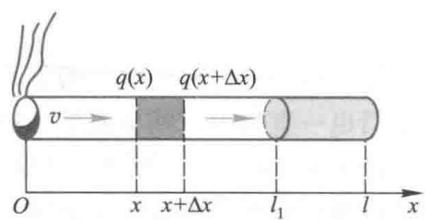  
图 1  $x = 0$  处点燃的香烟

如果知道了流量函数  $q(x, t)$ , 吸入毒物量  $Q$

就是  $x = l$  处的流量在吸一支烟时间内的总和.注意到关于烟草长度和香烟燃烧速度的假设,我们得到

$$
Q = \int_{0}^{T}q(l,t)\mathrm{d}t,\quad T = l_{1} / u \tag{1}
$$

下面分4步计算  $Q$

1. 求  $t = 0$  瞬间由烟雾携带的毒物单位时间内通过  $x$  处的数量  $q(x,0)$ . 由假设4中关于  $v \gg u$  的假定,可以认为香烟点燃处  $x = 0$  静止不动.

为简单起见,记  $q(x,0) = q(x)$ ,考察  $(x,x + \Delta x)$  一段香烟(图1),毒物通过  $x$  和  $x + \Delta x$  处的流量分别是  $q(x)$  和  $q(x + \Delta x)$ ,根据守恒定律,这两个流量之差应该等于这一段未点燃的烟草或过滤嘴对毒物的吸收量,于是由假设2和4有

$$
q(x) - q(x + \Delta x) = \left\{ \begin{array}{ll}b q(x) \Delta \tau , & 0 \leqslant x \leqslant l_{1}, \\ \beta q(x) \Delta \tau , & l_{1} < x \leqslant l, \end{array} \right. \quad \Delta \tau = \frac{\Delta x}{v}
$$

其中  $\Delta \tau$  是烟雾穿过  $\Delta x$  所需时间.令  $\Delta \tau \rightarrow 0$ ,得到微分方程

$$
\frac{\mathrm{d}q}{\mathrm{d}x} = \left\{ \begin{array}{ll} - \frac{b}{v} q(x), & 0 \leqslant x \leqslant l_{1} \\ -\frac{\beta}{v} q(x), & l_{1} < x \leqslant l \end{array} \right. \tag{2}
$$

在  $x = 0$  处点燃的烟草单位时间内放出的毒物量记作  $H_{0}$ ,根据假设1,3,4可以写出方程(2)的初始条件为

$$
q(0) = a H_{0}, \quad H_{0} = u w_{0} \tag{3}
$$

求解(2)、(3)式时,先解出  $q(x)\left(0 \leqslant x \leqslant l_{1}\right)$ ,再利用  $q(x)$  在  $x = l_{1}$  处的连续性确定  $q(x)\left(l_{1} \leqslant x \leqslant l\right)$ . 其结果为

$$
q(x) = \left\{ \begin{array}{ll}a H_{0} \mathrm{e}^{-\frac{b x}{v}}, & 0 \leqslant x \leqslant l_{1} \\ a H_{0} \mathrm{e}^{-\frac{b l_{1}}{v}} \mathrm{e}^{-\frac{\beta(x - l_{1})}{v}}, & l_{1} < x \leqslant l \end{array} \right. \tag{4}
$$

2. 在香烟燃烧过程的任意时刻  $t$ ,求毒物单位时间内通过  $x = l$  的数量  $q(l,t)$

因为在时刻  $t$  香烟燃至  $x = u t$  处,记此时点燃的烟草单位时间放出的毒物量为  $H(t)$ ,则

$$
H(t) = u w(u t,t) \tag{5}
$$

根据与第1步完全相同的分析和计算,可得

$$
q(x,t) = \left\{ \begin{array}{ll}a H(t) \mathrm{e}^{-\frac{b(x - u t)}{v}}, & u t \leqslant x \leqslant l_{1} \\ a H(t) \mathrm{e}^{-\frac{b(l_{1} - u t)}{v}} \mathrm{e}^{-\frac{\beta(x - l_{1})}{v}}, & l_{1} < x \leqslant l \end{array} \right. \tag{6}
$$

实际上,在(4)式中将坐标原点平移至  $x = u t$  处即可得到(6)式.由(5)、(6)式能够直接写出

$$
q(l,t) = a u w(u t,t) \mathrm{e}^{-\frac{b(l_{1} - u t)}{v}} \mathrm{e}^{-\frac{\beta l_{2}}{v}} \tag{7}
$$

3. 确定  $w(u t,t)$

因为在吸烟过程中未点燃的烟草不断地吸收烟雾中的毒物,所以毒物在烟草中的

密度  $w(x, t)$  由初始值  $w_{0}$  逐渐增加. 考察烟草截面  $x$  处  $\Delta t$  时间内毒物密度的增量  $w(x, t + \Delta t) - w(x, t)$ , 根据守恒定律它应该等于单位长度烟雾中的毒物被吸收的部分, 按照假设2,4,有

$$
w\left(x, t + \Delta t\right) - w\left(x, t\right) = b \frac{q\left(x, t\right)}{v} \Delta t
$$

令  $\Delta t \rightarrow 0$ , 并将(5),(6)式代入得

$$
\left\{ \begin{array}{l}\frac{\partial w}{\partial t} = \frac{abu}{v} w(ut, t) \mathrm{e}^{\frac{b(x - ut)}{r}} \\ w(x, 0) = w_{0} \end{array} \right. \tag{8}
$$

方程(8)的解为(推导见[42])

$$
\left\{ \begin{array}{l}w(x, t) = w_{0} \left[1 + \frac{a}{a^{\prime}} \mathrm{e}^{\frac{bx}{r}} \left(\mathrm{e}^{\frac{but}{r}} - \mathrm{e}^{\frac{abut}{r}}\right)\right] \\ w(ut, t) = \frac{w_{0}}{a^{\prime}} (1 - a \mathrm{e}^{\frac{a^{\prime}but}{r}}) \end{array} \right. \tag{9}
$$

其中  $a^{\prime} = 1 - a$  (假设2).

4. 计算  $Q$

将(9)代入(7)式, 得

$$
q(l, t) = \frac{a u w_{0}}{a^{\prime}} \mathrm{e}^{\frac{b l_{1}}{r}} \mathrm{e}^{\frac{b l_{2}}{r}} \left(\mathrm{e}^{-\frac{b u t}{r}} - a \mathrm{e}^{\frac{a b u t}{r}}\right) \tag{10}
$$

最后将(10)代入(1)式, 作积分得到

$$
Q = \int_{0}^{l_{1} / u} q(l, t) \mathrm{d}t = \frac{a w_{0} v}{a^{\prime} b} \mathrm{e}^{-\frac{b l_{2}}{r}} \left(1 - \mathrm{e}^{-\frac{a^{\prime} b l_{1}}{r}}\right) \tag{11}
$$

为便于下面的分析, 将上式化作

$$
Q = a M \mathrm{e}^{\frac{a l_{2}}{r}} \cdot \frac{1 - \mathrm{e}^{-\frac{a^{\prime} b l_{1}}{r}}}{\frac{a^{\prime} b l_{1}}{v}} \tag{12}
$$

记

$$
r = \frac{a^{\prime} b l_{1}}{v}, \quad \phi (r) = \frac{1 - \mathrm{e}^{-r}}{r} \tag{13}
$$

则(12)式可写作

$$
Q = a M \mathrm{e}^{\frac{a l_{2}}{r}} \phi (r) \tag{14}
$$

(13)、(14)式是我们得到的最终结果, 表示了吸入毒物量  $Q$  与  $a, M, \beta , l_{2}, v, b, l_{1}$  等诸因素之间的数量关系.

结果分析

1.  $Q$  与烟草含毒物量  $M$  、毒物随烟雾沿香烟穿行比例  $a$  成正比  $①$ . 设想将毒物  $M$  集中在  $x = l$  处, 则吸入量为  $a M$ .

2. 因子  $\mathrm{e}^{\frac{\beta_{2}}{v}}$  体现了过滤嘴减少毒物进入人体的作用,提高过滤嘴吸收率  $\beta$  和增加长度  $l_{2}$  能够对  $Q$  起到负指数衰减的效果,并且  $\beta$  和  $l_{2}$  在数量上增加一定比例时起的作用相同。降低烟雾穿行速度  $v$  也可减少  $Q$ 。设想将毒物  $M$  集中在  $x = l_{1}$  处,利用上述建模方法不难证明,吸入毒物量为  $a M \mathrm{e}^{\frac{\beta_{2}}{v}}$ 。

3. 因子  $\phi (r)$  表示的是由于未点燃烟草对毒物的吸收而起到的减少  $Q$  的作用。虽然被吸收的毒物还要被点燃,随烟雾沿香烟穿行而部分地进入人体,但是因为烟草中毒物密度  $w(x, t)$  越来越高,所以按照固定比例跑到空气中的毒物增多,相应地减少了进入人体的毒物量。

根据实际资料  $r = \frac{a^{\prime} b l_{1}}{v} \ll 1$ ,在(13)式  $\phi (r)$  中的  $\mathrm{e}^{- r}$  取 Taylor 展开的前 3 项可得  $\phi (r) \approx 1 - r / 2$ ,于是(14)式为

$$
Q \approx a M \mathrm{e}^{\frac{\beta_{2}}{v}} \left(1 - \frac{a^{\prime} b l_{1}}{2 v}\right) \tag{15}
$$

可知,提高烟草吸收率  $b$  和增加长度  $l_{1}$  (毒物量  $M$  不变)对减少  $Q$  的作用是线性的,与  $\beta$  和  $l_{2}$  的负指数衰减作用相比,效果要小得多。

4. 为了更清楚地了解过滤嘴的作用,不妨比较两支香烟,一支是上述模型讨论的,另一支长度为  $l$ ,不带过滤嘴,参数  $w_{0}, b, a, v$  与第一支相同,并且吸到  $x = l_{1}$  处就扔掉。

吸第一支和第二支烟进入人体的毒物量分别记作  $Q_{1}$  和  $Q_{2}, Q_{1}$  当然可由(11)式给出, $Q_{2}$  也不必重新计算,只需把第二支烟设想成吸收率为  $b$  (与烟草相同)的假过滤嘴香烟就行了,这样由(11)式可以直接写出

$$
Q_{2} = \frac{a w_{0} v}{a^{\prime} b} \mathrm{e}^{-\frac{b l_{2}}{v}} \left(1 - \mathrm{e}^{-\frac{a^{\prime} b l_{1}}{v}}\right) \tag{16}
$$

与(11)式给出的  $Q_{1}$  相比,我们得到

$$
\frac{Q_{1}}{Q_{2}} = \mathrm{e}^{-\frac{(\beta - b) l_{2}}{v}} \tag{17}
$$

所以只要  $\beta > b$ ,就有  $Q_{1} < Q_{2}$ ,过滤嘴是起作用的。并且,提高吸收率之差  $\beta - b$  与加长过滤嘴长度  $l_{2}$ ,对于降低比例  $Q_{1} / Q_{2}$  的效果相同。不过提高  $\beta$  需要研制新材料,将更困难一些。

评注 这个模型在基本合理的简化假设下,运用精确的数学工具解决了一个粗看起来不易下手的实际问题。从提出假设、引入两个基本函数  $q(x, t)$  和  $w(x, t)$ ,到运用物理学上常用的守恒定律建立微分方程,从而构造出动态模型,最后到对结果的分析,整个过程可以说是用建模方法解决实际问题的一个范例。

# 复习题

在香烟过滤嘴模型中,

(1)设  $M = 800 \mathrm{mg}, l_{1} = 80 \mathrm{mm}, l_{2} = 20 \mathrm{mm}, b = 0.02 \mathrm{s}^{-1}, \beta = 0.08 \mathrm{s}^{-1}, v = 50 \mathrm{mm} / \mathrm{s}, a = 0.3$ ,求  $Q$  和  $Q_{1} / Q_{2}$ 。

(2)若有一支不带过滤嘴的香烟,参数同上。比较全部吸完和只吸到  $l_{1}$  处的情况下,进入人体毒物量的区别。

# 5.6 火箭发射升空

"10,9,8,…,3,2,1,点火",随着指令员的口令,巨大火箭的尾端喷出炽烈的

火焰,在震天动地的轰鸣声中,搭载着宇宙飞船拔地而起,冉冉上升。"助推器分离""一二级分离""船箭分离",随着第一级火箭关机、分离,第二级、第三级火箭点火、关机、分离等步骤,火箭不断加速飞行,达到预定的高度和速度,将飞船送上地球引力作用下的惯性运行轨道,运载火箭完成了它的使命。一次次在屏幕上目睹这绚丽、壮观的情景,我们注意到火箭是垂直地面发射的,这样才能以很短的距离穿越稠密的大气层,尽量减少空气的阻力;三级火箭接力棒式地助推,把燃料耗尽的火箭结构残骸一一丢弃,以便在产生巨大推力的同时,减轻火箭本身的质量,得到尽可能大的有效载荷。本节建立的是单级小型火箭发射、上升过程的数学模型,并由此讨论提高火箭上升高度的办法[70]。

单级小型火箭的发射

考察火箭垂直于地面发射、上升的过程:火箭垂直向上发射后,燃料以一定的速率燃烧,火焰向后喷射,对火箭产生向前的推力,在克服地球引力和空气阻力的同时,推动火箭加速飞行。燃料燃尽后火箭依靠获得的速度继续上升,但在引力和阻力的作用下速度逐渐减小,直到速度等于零,火箭达到最高点。建立数学模型研究火箭上升高度、速度和加速度的变化规律以及与火箭质量、燃料推力等因素的关系。

显然,这个虚拟的场景只是实际发射火箭最初的一个阶段,若不施加其他手段,火箭将从最高点自由下落。

火箭发射、上升过程所遵循的基本规律是牛顿第二定律,火箭在运动中受到燃料燃烧的推力、地球引力和空气阻力的联合作用,其中推力与引力的作用是明确和易于处理的,空气阻力随着火箭速度的增加而变大,但二者之间的数量关系则不易确定。下面先不考虑空气阻力,建立相对简单的模型,再通过简化、合理的假定将阻力引入模型。

不考虑空气阻力的简单模型

问题与假设设小型火箭初始质量为  $m_{0} = 1600\mathrm{~kg}$ ,其中包括  $m_{1} = 1080\mathrm{~kg}$  燃料。火箭从地面垂直向上发射时,燃料以  $r = 18\mathrm{~kg / s}$  的速率燃烧,对火箭产生  $F = 27000\mathrm{~N}$  的恒定推力。燃料燃尽后火箭继续上升,直到达到最高点。因为火箭上升高度与地球半径相比很小,所以可认为整个过程中受到的地球引力不变,重力加速度取  $g = 9.8\mathrm{~m / s}^{2}$ 。建立火箭上升高度、速度和加速度随时间变化的数学模型,给出燃料燃尽时火箭的高度、速度和加速度以及火箭到达最高点的时间和高度。

模型建立设火箭  $t = 0$  时从地面  $x = 0$  向上发射,火箭高度为  $x(t)$ ,速度为  $\dot{x} (t)$ ,加速度为  $\ddot{x} (t)$ 。火箭的质量记为  $m(t)$ ,随燃料燃烧而减少,有  $m(t) = m_{0} - rt$ 。燃料燃尽的时间记为  $t_{1}$ ,显然  $t_{1} = \frac{m_{1}}{r} = 60\mathrm{~s}, t_{1}$  以后火箭质量保持为  $m_{0} - m_{1} = 520\mathrm{~kg}$ 。火箭到达最高点的时间记为  $t_{2}, t_{2}$  由  $v(t_{2}) = 0$  确定。

火箭从  $x = 0$  处零初速地发射,上升过程中燃料燃烧阶段受到推力  $F$  和重力  $m(t)g$  的作用,按照牛顿第二定律可以写出

$$
(m_{0} - rt)\ddot{x} = F - (m_{0} - rt)g, 0 \leqslant t \leqslant t_{1}, t_{1} = \frac{m_{1}}{r}, \quad x(0) = \dot{x} (0) = 0 \tag{1}
$$

燃料燃尽后火箭只受重力作用,于是

$$
(m_{0} - m_{1})\ddot{x} = -(m_{0} - m_{1})g, \quad t_{1}< t \leqslant t_{2} \tag{2}
$$

方程(2)的初始条件由(1)的结果  $x(t_{1}), \dot{x} (t_{1})$  给出。

模型求解(1)式虽然表示为  $x(t)$  的二阶微分方程的形式,但是由于方程不含  $x$  和  $\dot{x}$ ,可以用积分法直接求解。将加速度记作  $a(t)$ ,速度记作  $v(t)$ ,方程(1)可写作

$$
a(t) = -g + \frac{F}{m_{0} - rt} \tag{3}
$$

对(3)式积分并利用  $v(0) = 0$ ,得到

$$
v(t) = \int_{0}^{t}a(t)\mathrm{d}t = -g t + \frac{F}{r}\ln \frac{m_{0}}{m_{0} - r t} \tag{4}
$$

对(4)式积分并利用  $x(0) = 0$ ,得到

$$
\begin{array}{l}{{x(t)=\int_{0}^{t}v(t)\mathrm{d}t}}\\ {{\mathrm{~}=-\frac{g t^{2}}{2}+\frac{F(m_{0}-r t)\left[\ln(m_{0}-r t)-1\right]}{r^{2}}+\frac{(F\mathrm{ln}m_{0})t}{r}-\frac{F m_{0}\left[\mathrm{ln}m_{0}-1\right]}{r^{2}}}}\end{array} \tag{5}
$$

由(3)、(4)、(5)式可计算燃料燃烧阶段(  $0\leqslant t\leqslant t_{1}$  )的加速度、速度和高度的变化,并得到  $a(t_{1}),v(t_{1})$  和  $x(t_{1})$

方程(2)可写作

$$
a(t) = -g \tag{6}
$$

对(6)式积分并利用  $v(t_{1})$ ,得到

$$
v(t) = \int_{t_{1}}a(t)\mathrm{d}t = -g(t - t_{1}) + v(t_{1}) \tag{7}
$$

对(7)式积分并利用  $x(t_{1})$ ,得到

$$
x(t) = \int_{t_{1}}^{t}v(t)\mathrm{d}t = -\frac{g(t - t_{1})^{2}}{2} +v(t_{1})(t - t_{1}) + x(t_{1}) \tag{8}
$$

由(6)、(7)、(8)式可计算燃料燃尽后  $(t_{1}< t\leqslant t_{2})$  的加速度、速度和高度的变化。在(7)式中令  $v(t_{2}) = 0$  可得火箭到达最高点的时间  $t_{2}$ ,再由(8)式得到最高点的高度  $x(t_{2})$

将问题中给出的数据代入(3)至(8)式编程计算,结果见图1,燃料燃尽时(  $t_{1} =$ $60~\mathrm{s}$  )火箭的高度  $x\left(t_{1}\right) = 2.3656\times 10^{4}\mathrm{~m~}$  ,速度  $v\left(t_{1}\right) = 1098\mathrm{~m / s~}$  ,加速度  $a\left(t_{1}\right) =$ $42.12\mathrm{~m / s}^{2}$  ,火箭到达最高点的时间  $t_{2} = 172\mathrm{~s~}$  ,高度  $x\left(t_{2}\right) = 8.5155\times 10^{4}\mathrm{~m~}$

可以看出,燃料燃烧阶段(  $0\leqslant t\leqslant t_{1}$  )火箭的高度  $x(t)$  、速度  $v(t)$  和加速度  $a(t)$  都在快速地增大,在燃料燃尽后  $(t_{1}< t\leqslant t_{2})$  ,  $a(t)$  突降并保持为  $- g,v(t)$  呈直线下降,  $x(t)$  则上升减缓。

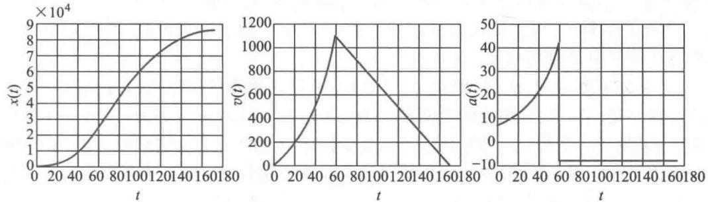  
图1不考虑空气阻力时火箭上升的高度  $x(t)$  、速度  $v(t)$  和加速度  $a(t)$

考虑空气阻力的模型

运动的物体都会受到空气的阻力,运动速度越大阻力就越大,但二者之间没有确定的数量关系。按照相关知识和经验,低速时阻力与速度成正比,高速时阻力与速度的平方甚至三次方成正比。对于小型火箭,通常可设阻力与速度的平方成正比,比例系数记作  $k$ ,于是在考虑空气阻力情况下方程(1)、(2)应改写为

$$
(m_{0} - r t)\ddot{x} = F - k\dot{x}^{2} - (m_{0} - r t)g,0\leqslant t\leqslant t_{1},t_{1} = m_{1} / r,x(0) = \dot{x} (0) = 0 \tag{9}
$$

$$
(m_{0} - m_{1})\ddot{x} = -k\dot{x}^{2} - (m_{0} - m_{1})g, t_{1}< t\leqslant t_{2} \tag{10}
$$

方程(10)的初始条件由(9)的结果  $x(t_{1}),\dot{x} (t_{1})$  给出。

方程(9)无法解析地求解,转而求数值解。设方程(1)中已有的数据不变,阻力系数一般为  $0.2\mathrm{kg} / \mathrm{m}$  至  $0.4\mathrm{kg} / \mathrm{m}$ ,不妨取  $k = 0.3\mathrm{kg} / \mathrm{m}$ 。需要注意的是,用MATLAB软件求解高阶微分方程时必须先转化为方程组,设  $x = x_{1},\dot{x} = x_{2}$ ,方程(9)化为

$$
\dot{x}_{1} = x_{2},\dot{x}_{2} = -g + \frac{F - k x_{2}^{2}}{m_{0} - r t},0\leqslant t\leqslant t_{1},t_{1} = m_{1} / r,x_{1}(0) = x_{2}(0) = 0 \tag{11}
$$

方程(10)可类似地计算。对方程(9)、(10)编程计算的结果见图2,燃料燃尽时(  $t_{1} = 60$  s)火箭的高度  $x(t_{1}) = 1.0546\times 10^{4}\mathrm{m}$ ,速度  $v(t_{1}) = 266\mathrm{m} / \mathrm{s}$ ,加速度  $a(t_{1}) = 1.296\mathrm{m} / \mathrm{s}^{2}$ ,火箭到达最高点的时间  $t_{2} = 75\mathrm{s}$ ,高度  $x(t_{2}) = 1.1969\times 10^{4}\mathrm{m}$ 。

对比图2与图1,抛掉数值上的差别(这与给定的数据有关),我们看到,燃料燃烧阶段火箭的加速度已经由增变减,速度增加渐缓,致使上升高度大大减少。

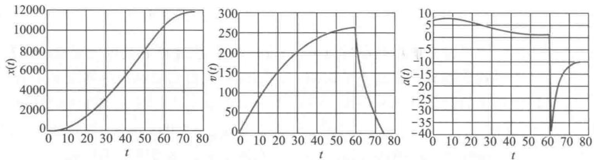  
图2考虑空气阻力时火箭上升的高度  $x(t)$  速度  $v(t)$  和加速度  $a(t)$

提升火箭高度的办法 提高上升高度是火箭发射的中心问题之一,按照前面的模型,从火箭燃料方面可以有两种办法实现,一是增加燃料的数量  $m_{1}$ ,从而延长燃烧时间  $t_{1}$ ,二是改进燃料的效能,提高产生的恒定推力  $F$ 。下面通过实例计算,考察这两种办法对提高火箭上升高度的效果。

1)将燃料数量增加一倍即  $m_{1} = 2160\mathrm{kg}$ ,火箭初始质量相应地增为  $m_{0} = 2680\mathrm{kg}$ ,其他参数不变。于是燃料燃尽的时间延长为  $t_{1} = m_{1} / r = 120\mathrm{s}$ ,按照方程(9)、(10)编程计算,结果见图3中标记#1的曲线,及表1中标记#1的数值,与原来的结果(标记#0的曲线和表1中标记#0的数值)比较,虽然燃料燃尽时的速度  $v(t_{1})$  和加速度  $a(t_{1})$  都相同,但高度  $x(t_{1})$  及火箭到达最高点的高度  $x(t_{2})$  均有较大提高。

2)将燃料产生的推力增加一倍即  $F = 54000\mathrm{N}$ ,其他参数不变。燃料燃尽的时间仍为  $t_{1} = 60\mathrm{s}$ ,按照方程(9)、(10)编程计算,结果见图4中标记#2的曲线,及表1中

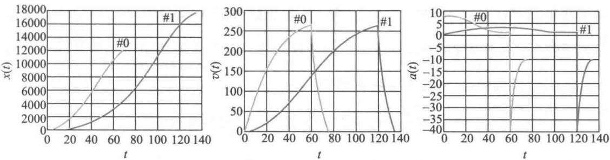  
图3 燃料数量增加一倍时火箭上升的高度  $x(t)$  、速度  $v(t)$  和加速度  $u(t)$  (标记#1)

标记#2的数值,与原来的结果比较,燃料燃尽时的加速度  $a(t_{1})$  减小,速度  $v(t_{1})$  增大,高度  $x(t_{1})$  及火箭到达最高点的高度  $x(t_{2})$  均有很大提高.

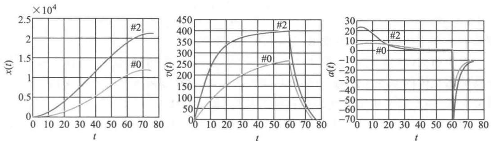  
图4 燃料推力增加一倍时火箭上升的高度  $x(t)$  、速度  $v(t)$  和加速度  $u(t)$  (标记#2)

将燃料数量和产生的推力同时增加一倍的计算结果见表1中标记#3的数值.

表1将燃料数量和推力增加一倍时的计算结果  

<table><tr><td></td><td>t1/s</td><td>x(t1)/
(104m)</td><td>v(t1)/
(m·s-1)</td><td>a(t1)/
(m·s-2)</td><td>t2/s</td><td>x(t2)/
(104m)</td><td></td></tr><tr><td>#0</td><td>m1=1 080 kg
F=27 000 N</td><td>60</td><td>1.054 6</td><td>266</td><td>1.30</td><td>75</td><td>1.196 9</td></tr><tr><td>#1</td><td>m1=2 160 kg
F=27 000 N</td><td>120</td><td>1.598 3</td><td>266</td><td>1.30</td><td>135</td><td>1.740 5</td></tr><tr><td>#2</td><td>m1=1 080 kg
F=54 000 N</td><td>60</td><td>1.933 4</td><td>402</td><td>0.80</td><td>77</td><td>2.137 3</td></tr><tr><td>#3</td><td>m1=2 160 kg
F=54 000 N</td><td>120</td><td>3.660 7</td><td>402</td><td>0.80</td><td>137</td><td>3.864 6</td></tr></table>

下面讨论火箭燃料燃烧产生的推力是如何确定的.仍记火箭上升过程中的质量为  $m(t)$ ,速度为  $v(t)$ ,燃料燃烧时向后喷出气体产生对火箭的推力,记喷出气体相对于火

箭的速度为  $u$  ,则相对地球的(绝对)速度为  $v(t) - u.$  在忽略引力和阻力的情况下,根据动量守恒定律,  $t$  到  $t + \Delta t$  时间内火箭质量、速度变化所引起的动量的改变,应等于  $\Delta t$  内燃料燃烧喷出气体产生的动量,而因为喷出气体的质量就是火箭质量的减少量,即  $- \frac{\mathrm{d}m}{\mathrm{d}t}\Delta t$  (注意  $m(t)$  是减函数,导数为负值),所以

$$
m(t)v(t) - m(t + \Delta t)v(t + \Delta t) = -\frac{\mathrm{d}m}{\mathrm{d}t}\Delta t(v(t) - u) \tag{12}
$$

两端除以  $\Delta t$  且令  $\Delta t\rightarrow 0$  ,再利用  $\frac{\mathrm{d}}{\mathrm{d}t} (m(t)v(t)) = \frac{\mathrm{d}m}{\mathrm{d}t} v(t) + m(t)\frac{\mathrm{d}v}{\mathrm{d}t}$  ,由(12)式可得

$$
m(t)\frac{\mathrm{d}v}{\mathrm{d}t} = -u\frac{\mathrm{d}m}{\mathrm{d}t} \tag{13}
$$

根据牛顿第二定律,这就是火箭的推力  $F.$  当燃料以不变的速率  $r$  燃烧时,  $\frac{\mathrm{d}m}{\mathrm{d}t} = - r$  ,于是

即推力  $F$  等于燃烧速率  $r$  与喷出气体速度  $u$  的乘积

对于前面讨论的提高火箭高度的第二种办法(表1中的标记#2),在  $r$  不变的情况下将喷出气体的速度  $u$  提高一倍,即可使推力增加一倍.如果  $u$  保持不变,将燃烧速率  $r$  提高一倍,对于提高火箭高度的影响有多大呢(复习题)?

将(13)式左端的  $m(t)$  移到右端作积分,设  $v(0) = 0,m(0) = m_{0}$  ,可得

$$
v(t) = u\ln{\frac{m_{0}}{m(t)}} \tag{15}
$$

与(4)式的结果一致(忽略引力).(15)式表明增加喷出气体速度  $u$  和减少质量  $m(t)$  可以提高火箭速度,而要减少  $m(t)$  ,一种办法是上面所说的提高燃烧速率  $r$  ,但提高是有限的;另一种办法是分级携带燃料,每一级的燃料一旦燃尽就将这一级的结构部分抛弃,以尽量减轻火箭的质量,这就是构造多级火箭的理由.那为什么常用三级火箭呢?有兴趣的读者可参考文献[76].

# 复习题

在考虑空气阻力的火箭发射模型中,如果将燃料燃烧速率  $r$  提高一倍,而喷出气体速度  $u$  保持不变,在以下两种情况下讨论对于提高火箭高度的影响:

(1)燃料质量  $m_{1}$  不变,燃料燃尽时间  $t_{1}$  减半

(2)燃料质量  $m_{1}$  也增加一倍,燃料燃尽时间  $t_{1}$  不变

# 5.7 食饵与捕食者模型

自然界中不同种群之间存在着一种非常有趣的既有依存、又有制约的生存方式:种群甲靠丰富的自然资源生长,而种群乙靠捕食种群甲为生,食用鱼和鲨鱼、美洲兔和山猫、落叶松和蚜虫等都是这种生存方式的典型.生态学上称种群甲为食饵(prey),种群

乙为捕食者(predator),二者共处组成食饵- 捕食者系统(简称P- P系统).近百年来许多数学家和生态学家对这一系统进行了深入的研究,建立了一系列数学模型,本节着重介绍P- P系统最初的、最简单的一个模型,它的由来还有一段历史背景.

意大利生物学家D'Ancona曾致力于鱼类各种群间相互依存、相互制约关系的研究,从第一次世界大战期间地中海各港口捕获的几种鱼类占总捕获量百分比的资料中,发现鲨鱼(捕食者)的比例有明显的增加.他知道,捕获的各种鱼的比例基本上代表了地中海渔场中各种鱼的比例.战争中捕获量大幅度下降,应该使渔场中食用鱼(食饵)和以此为生的鲨鱼同时增加,但是,捕获量的下降为什么会使鲨鱼的比例增加,即对捕食者更加有利呢?他无法解释这种现象,于是求助于他的朋友、著名的意大利数学家Volterra.Volterra建立了一个简单的数学模型,回答了D'Ancona的问题[11,39,46,49].

Volterra食饵- 捕食者模型

食饵(食用鱼)和捕食者(鲨鱼)在时刻  $t$  的数量分别记作  $x(t), y(t)$ ,因为大海中资源丰富,假设当食饵独立生存时以指数规律增长,(相对)增长率为  $r$ ,即  $\dot{x} = r x$ ,而捕食者的存在使食饵的增长率减少,设减少率与捕食者数量成正比,于是  $x(t)$  满足方程

$$
\ddot{x} (t) = x(r - a y) = r x - a x y \tag{1}
$$

比例系数  $a$  反映捕食者掠取食饵的能力.

捕食者离开食饵无法生存,设它独自存在时死亡率为  $d$ ,即  $\dot{y} = - d y$ ,而食饵的存在为捕食者提供了食物,相当于使捕食者的死亡率降低,且促使其增长.设增长率与食饵数量成正比,于是  $y(t)$  满足

$$
\dot{y} (t) = y(-d + b x) = -d y + b x y \tag{2}
$$

比例系数  $b$  反映食饵对捕食者的供养能力.

方程(1),(2)是在自然环境中食饵和捕食者之间依存和制约的关系,这里没有考虑种群自身的阻滞增长作用,是Volterra提出的最简单的模型.

模型分析方程(1),(2)没有解析解,我们分两步对这个模型所描述的现象进行分析.首先,利用数学软件求微分方程的数值解,通过对数值结果和图形的观察,猜测它的解析解的构造;然后,从理论上研究其平衡点及相轨线的形状,验证前面的猜测.

# 1.数值解

记食饵和捕食者的初始数量分别为

$$
x(0) = x_{0}, y(0) = y_{0} \tag{3}
$$

为求微分方程(1),(2)满足初始条件(3)的数值解  $x(t), y(t)$  (并作图)及相轨线  $y(x)$ ,设  $r = 1, d = 0.5, a = 0.1, b = 0.02, x_{0} = 25, y_{0} = 2$ ,用MATLAB软件编程计算,可得  $x(t)$ , $y(t)$  及相轨线  $y(x)$  如图1、图2(数值结果从略).可以猜测, $x(t), y(t)$  是周期函数,与此相应地,相轨线  $y(x)$  是封闭曲线.从数值解近似地定出周期为  $10.7, x$  的最大、最小值分别为99.3和  $2.0, y$  的最大、最小值分别为28.4和2.0,并且用数值积分容易算出  $x(t)$ , $y(t)$  在一个周期的平均值为  $\overline{x} = 25, \overline{y} = 10$ .

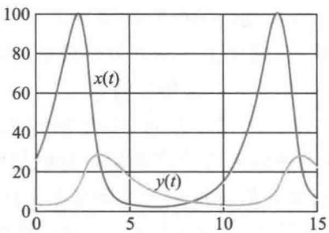  
图1数值解  $x(t), y(t)$  的图形

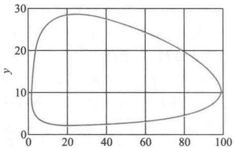  
图2相轨线  $y(x)$  的图形

2. 平衡点及相轨线

首先求得方程(1),(2)的两个平衡点为

$$
P\left(\frac{d}{b}, \frac{r}{a}\right), P'(0, 0) \tag{4}
$$

计算它们的  $p, q$  发现,对于  $P', q< 0, P'$  不稳定;对于  $P, p = 0, q > 0$ ,处于临界状态,不能用判断线性方程平衡点稳定性的准则研究非线性方程(1),(2)的平衡点  $P$  的情况。下面用分析相轨线的方法解决这个问题。

从方程(1),(2)消去  $\mathrm{d}t$  后得到

$$
\frac{\mathrm{d}x}{\mathrm{d}y} = \frac{x(r - ay)}{y(-d + bx)} \tag{5}
$$

这是可分离变量方程,写作

$$
\frac{-d + bx}{x} \mathrm{~d}x = \frac{r - ay}{y} \mathrm{~d}y \tag{6}
$$

两边积分得到方程(5)的解,即方程(1),(2)的相轨线为

$$
(x^{d}\mathrm{e}^{-b x})(y^{r}\mathrm{e}^{-a y}) = c \tag{7}
$$

其中常数  $c$  由初始条件确定

为了从理论上证明相轨线(7)是封闭曲线,记

$$
f(x) = x^{d}\mathrm{e}^{-b x}, g(y) = y^{r}\mathrm{e}^{-a y} \tag{8}
$$

可以用软件做出它们的图形(图3(a),(b)),将它们的极值点记为  $x_{0}, y_{0}$ ,极大值记为  $f_{\mathrm{m}}, g_{\mathrm{m}}$ ,则不难知道  $x_{0}, y_{0}$  满足

$$
f(x_{0}) = f_{\mathrm{m}}, \quad x_{0} = d / b \tag{9}
$$

$$
g(y_{0}) = g_{\mathrm{m}}, \quad y_{0} = r / a \tag{9}
$$

与(4)相比可知,  $x_{0}, y_{0}$  恰好是平衡点  $P$

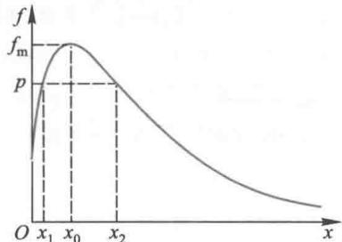  
(a)  $f(x)$  的图形

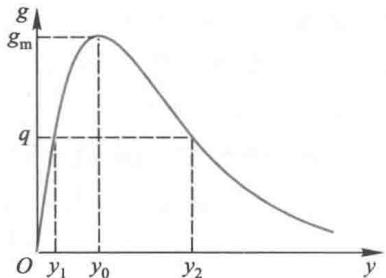  
(b)  $g(y)$  的图形 图3

下面对于给定的  $c$  值考察相轨线(7)的形状

当  $c = f_{\mathrm{m}}g_{\mathrm{m}}$  时,  $x = x_{0}, y = y_{0}$ , 相轨线在图 4 中退化为平衡点  $P$ .

为了考察  $0< c< f_{\mathrm{m}}g_{\mathrm{m}}$  时相轨线的形状,不妨设  $c = p g_{\mathrm{m}}(0< p< f_{\mathrm{m}})$ . 若令  $y = y_{0}$ ,则由(8), (9)可得  $f(x) = p$ ,而从图3(a)知道,必存在  $x_{1}, x_{2}$ ,使  $f(x_{1}) = f(x_{2}) = p$ ,且  $x_{1}< x_{0}< x_{2}$ . 于是相轨线应通过图4中的  $Q_{1}(x_{1}, y_{0}), Q_{2}(x_{2}, y_{0})$  两点.

接着分析区间  $(x_{1}, x_{2})$  内的任一点  $x$ ,因为  $f(x) > p$ ,由  $f(x)g(y) = p g_{\mathrm{m}}$  可知,  $g(y)< g_{\mathrm{m}}$ . 记  $g(y) = q$ ,从图3(b)知道,存在  $y_{1}, y_{2}$ ,使  $g(y_{1}) = g(y_{2}) = q$ ,且  $y_{1}< y_{0}< y_{2}$ ,于是这条轨线又通过图4中的  $Q_{3}(x, y_{1}), Q_{4}(x, y_{2})$  两点. 而因为  $x$  是区间  $(x_{1}, x_{2})$  内的任意点,所以轨线在  $Q_{1}, Q_{2}$  之间对于每个  $x$  总要通过纵坐标为  $y_{1}, y_{2}$  (且  $y_{1}< y_{0}< y_{2}$ )的两点,这就证明了图4中的相轨线是一条封闭曲线.

这样,当  $c$  由最大值  $f_{\mathrm{m}}g_{\mathrm{m}}$  变小时,相轨线是一族从  $P$  点向外扩展的封闭曲线(图5).  $P$  点称为中心.

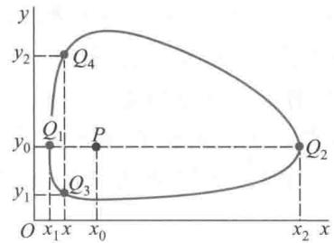  
图4 相轨线的图形

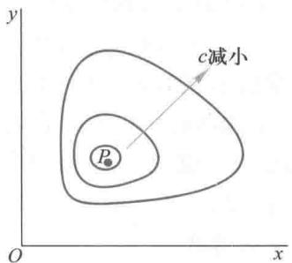  
图5 相轨线族

为确定相轨线的方向,考察相平面上被  $x = x_{0}, y = y_{0}$  两条直线分成的4个区域内  $\dot{x}$ ,  $\dot{y}$  的正负号,由此就决定了相轨线是逆时针方向运动的,如图6.

相轨线是封闭曲线等价于  $x(t), y(t)$  是周期函数(图7),记周期为  $T$ . 在图7中周期  $T$  分为4段:  $T_{1} \sim T_{4}$ ,它们恰好与图6中4个区域内的4段轨线相对应. 结合图6、图7可以看出,  $x(t), y(t)$  的周期变化存在着相位差,  $x(t)$  领先于  $y(t)$ ,如  $x(t)$  领先  $T_{2}$  达到最大值.

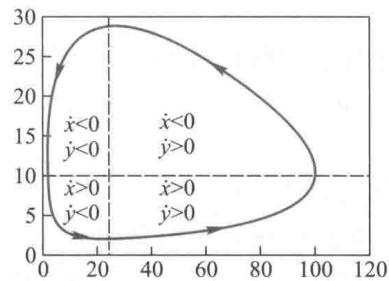  
图6 相轨线的方向

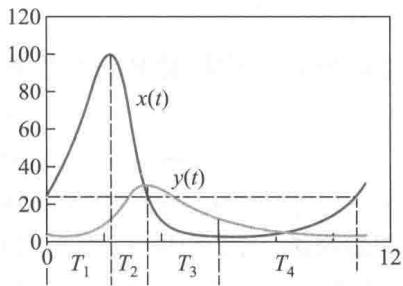  
图7  $x(t), y(t)$  的相位差

3.  $x(t), y(t)$  在一个周期内的平均值

在数值解中我们看到,  $x(t), y(t)$  一个周期的平均值为  $\overline{x} = 25, \overline{y} = 10$ ,这个数值与平衡点  $x_{0} = d / b = 0.5 / 0.02, y_{0} = r / a = 1 / 0.1$  刚好相等. 实际上,可以用解析的办法求出它们在一个周期的平均值  $\overline{x}, \overline{y}$ .

将方程(2)改写作

$$
x(t) = \frac{1}{b}\left(\frac{\dot{y}}{y} +d\right) \tag{10}
$$

(10)式两边在一个周期内积分,注意到  $y(T) = y(0)$ ,容易算出平均值为

$$
\overline{x} = \frac{1}{T}\int_{0}^{T}x(t)\mathrm{d}t = \frac{1}{T}\left[\frac{\ln y(T) - \ln y(0)}{b} +\frac{dT}{b}\right] = \frac{d}{b} \tag{11}
$$

类似地可得

$$
\overline{y} = \frac{r}{a} \tag{12}
$$

将(11),(12)与(9)比较可知

$$
\overline{x} = x_{0},\quad \overline{y} = y_{0} \tag{13}
$$

即  $x(t),y(t)$  的平均值正是相轨线中心  $P$  点的坐标

模型解释注意到  $r,d,a,b$  在生态学上的意义,上述结果表明,捕食者的数量(用一个周期的平均值  $\overline{y}$  代表)与食饵增长率  $r$  成正比,与它掠取食饵的能力  $a$  成反比;食饵的数量(用一个周期的平均值  $\overline{x}$  代表)与捕食者死亡率  $d$  成正比,与它供养捕食者的能力  $b$  成反比。这就是说:在弱肉强食情况下降低食饵的繁殖率,可使捕食者减少,降低捕食者的掠取能力却会使之增加;捕食者的死亡率上升导致食饵增加,食饵供养捕食者的能力增强会使食饵减少。

Volterra用这个模型这样来解释生物学家D'Ancona提出的问题:战争期间捕获量下降为什么会使鲨鱼(捕食者)的比例有明显的增加。

上面的结果是在自然环境下得到的,为了考虑人为捕获的影响,可以引入表示捕获能力的系数  $e$ ,相当于食饵增长率由  $r$  下降为  $r - e$ ,而捕食者死亡率由  $d$  上升为  $d + e$ ,用  $\overline{x}_{1},\overline{y}_{1}$  表示这种情况下食用鱼(食饵)和鲨鱼(捕食者)的(平均)数量,由(11),(12)式可知

$$
\overline{x}_{1} = \frac{d + e}{b},\quad \overline{y}_{1} = \frac{r - e}{a} \tag{14}
$$

显然,  $\overline{x}_{1} > \overline{x},\overline{y}_{1}< \overline{y}$

战争期间捕获量下降,即捕获系数为  $e^{\prime}(< e)$ ,于是食用鱼和鲨鱼的数量变为

$$
\overline{x}_{2} = \frac{d + e^{\prime}}{b},\quad \overline{y}_{2} = \frac{r - e^{\prime}}{a} \tag{15}
$$

显然,  $\overline{x}_{2}< \overline{x}_{1},\overline{y}_{2} > \overline{y}_{1}$  这正说明战争期间鲨鱼的比例会有明显的增加。

杀虫剂的影响用Volterra模型还可以对某些杀虫剂的影响做出似乎出人意料的解释。自然界中不少吃农作物的害虫都有它的天敌——益虫,以害虫为食饵的益虫是捕食者,于是构成了一个食饵- 捕食者系统。如果一种杀虫剂既杀死害虫又杀死益虫,那么使用这种杀虫剂就相当于前面讨论的人为捕获的影响,即有  $\overline{x}_{1} > \overline{x},\overline{y}_{1}< \overline{y}$ 。这说明,从长期效果看(即平均意义下),用这种杀虫剂将使害虫增加,而益虫减少,与使用者的愿望正好相反。

# Volterra模型的局限性

尽管Volterra模型可以解释一些现象,但是它作为近似反映现实对象的一个数学模型,必然存在不少局限性.

第一,许多生态学家指出,多数食饵- 捕食者系统都观察不到Volterra模型显示的那种周期振荡,而是趋向某种平衡状态,即系统存在稳定平衡点.实际上,只要在Volterra模型中加入考虑自身阻滞作用的logistic项,用方程

$$
\dot{x}_{1}(t) = r_{1}x_{1}\left(1 - \frac{x_{1}}{N_{1}} -\sigma_{1}\frac{x_{2}}{N_{2}}\right) \tag{16}
$$

$$
\dot{x}_{2}(t) = r_{2}x_{2}\left(-1 + \sigma \frac{x_{1}}{N_{1}} -\frac{x_{2}}{N_{2}}\right) \tag{17}
$$

就可以描述这种现象,其中各个参数的含义可参看更多案例5- 6,5- 7.

第二,一些生态学家认为,自然界里长期存在的呈周期变化的生态平衡系统应该是结构稳定的,即系统受到不可避免的干扰而偏离原来的周期轨道后,其内部制约作用会使系统自动恢复原状,如恢复原有的周期和振幅.而Volterra模型描述的周期变化状态却不是结构稳定的,因为根据图5,一旦离开某一条闭轨线,就进入另一条闭轨线(其周期和振幅都会改变),不可能恢复原状.为了得到能反映周期变化的结构稳定的模型,要用到极限环的概念,这超出了本书的范畴.

评注 用数学模型描述、分析食饵- 捕食者系统的动态过程和稳定状态,不仅对生态学的研究有重要意义,而且因为它与微分方程定性理论有着密切联系,所以也引起了许多数学家的关注.

# 第习题

1. 在食饵-捕食者系统中,如果在食饵方程(1)中增加自身阻滞作用的logistic项,方程(2)不变,讨论平衡点及稳定性,解释其意义.

2. 如果在食饵和捕食者方程中都增加logistic项,即方程(16),(17),讨论平衡点及稳定性.

# 5.8 赛跑的速度

参加赛跑的运动员要根据自己的生理状况对赛程中各阶段的速度做出最恰当的安排,以期获得最好的成绩.寻求速度安排的最佳策略是一个涉及生理力学的复杂问题.T.B.Keller提出了一个简单模型,根据4个生理参数从最优控制的角度确定赛程中的速度函数,并可以预测比赛成绩.

按照Keller的模型,短跑比赛应该用最大冲力跑完全程,对于中长跑则要将距离分为3段,先用最大冲力起跑,然后匀速跑过大部分赛程,最后把贮存在体内的能量用完,靠惯性冲过终点[36].

问题分析 运动员在赛跑过程中克服体内外的阻力以达到或保持一定速度,需要发挥出向前的冲力,为冲力做功提供能量有两个来源,一是呼吸和循环系统通过氧的新陈代谢作用产生的与吸入氧量等价的能量,二是赛跑前贮存在身体内的供赛跑用的能量.对于前者可以合理地假设在赛跑过程中保持常数,而后者则有一个如何将贮存能量分配到赛程的各个阶段,并恰在到达终点前将其用完的问题.

模型需要确定三个关系.一是冲力与速度的关系,二是冲力做功与上述两个能量来

源的关系, 三是速度与比赛成绩的关系. 虽然比赛成绩指的是一定赛程所用的时间, 但是在用数学工具处理时可以等价为一定时间所跑的距离. 于是最佳成绩将归结为以距离为目标泛函的, 与速度、冲力、贮存能量等函数有关的极值问题. 这个问题的一般解过于复杂, Keller 把它简化了.

由以上分析还可以看出模型需要 4 个生理参数: 运动员能发挥的最大冲力, 体内外的阻力系数, 氧的新陈代谢作用在单位时间提供的能量, 体内贮存能量的初值. 在 Keller 的模型中这些参数是用世界纪录创造者的成绩估计出来的.

模型假设 需要对赛跑中的阻力做出假设, 以确定冲力与速度的关系, 还要对氧的代谢作用提供的能量做出假设, 以建立能量供给与消耗间的平衡.

1. 赛跑时体内外的阻力与速度成正比, 比例系数  $\tau^{-1}$ . 运动员能发挥的最大冲力为  $F$ , 初速度为 0.

2. 呼吸和循环系统在氧的代谢作用下单位时间提供的能量是常数  $\sigma$ , 初始时刻体内贮存的供赛跑用的能量是  $E_{0}$ .

实际上, 上述参数因人而异, 特别是与运动员的体重有关. 为了消除这个因素的影响, 我们对运动员的单位质量建模, 即在下面各式中均设质量  $m = 1 \mathrm{~kg}$ .

一般模型 设运动员以速度函数  $v(t)$  跑完赛程  $D$  的时间为  $T$ , 则

$$
D(v(t)) = \int_{0}^{T} v(t) \mathrm{d}t \tag{1}
$$

$D$  已知时求  $v(t)$  使  $T$  达到最小, 等价于  $T$  固定求  $v(t)$  使  $D$  达到最大, 后一问题较便于研究.

运动员的冲力记作  $f(t)$ , 由假设 1, 根据牛顿第二定律可以得到

$$
\dot{v} (t) + \frac{v}{\tau} = f(t) \tag{2}
$$

$$
v(0) = 0 \tag{3}
$$

$$
0 \leqslant f(t) \leqslant F \tag{4}
$$

运动员体内贮存的能量记作  $E(t)$ , 其变化率为单位时间提供的能量  $\sigma$  与消耗的能量  $f v$  之差, 即

$$
\dot{E} (t) = \sigma - f v \tag{5}
$$

$$
E(0) = E_{0} \tag{6}
$$

$$
E(t) \geqslant 0 \tag{7}
$$

这样构成了在条件 (2)~(7) 下以 (1) 式  $D(v(t))$  为目标函数的泛函极值问题, 其中  $F, \tau , \sigma , E_{0}$  视为已知参数.

这个一般模型的求解是困难的, 因为一旦最优解出现在条件 (4), (7) 的边界上 (从下面的分析可知实际情况正是这样), 变分法就不再适用. 此外, 将 (1), (2), (3), (5) 式合并后得到的泛函表达式

$$
D(E(t)) = \sqrt{2} \int_{0}^{T} \mathrm{e}^{-\frac{t}{\tau}} \left[ \int_{0}^{t} (\sigma - \dot{E} (t)) \mathrm{e}^{\frac{2s}{\tau}} \mathrm{d}s \right]^{\frac{1}{2}} \mathrm{d}t \tag{8}
$$

过于复杂, 即使利用其他方法求解也十分不便.

下面将 Keller 提出的简化方法分成两个模型叙述.

短跑模型 当赛程较短时可以用最大冲力  $F$  跑完全程, 这必然会取得最佳成绩. 至于多长的赛程才能用这种方法跑, 应以贮存于体内的能量  $E(t)$  不小于零为标准, 由参数  $F, \tau , \sigma , E_{0}$  决定.

将  $f(t) = F$  代入方程(2), 在初始条件(3)下的解为

$$
v(t) = F \tau \left(1 - \mathrm{e}^{-\frac{t}{\tau}}\right) \tag{9}
$$

可知速度是递增的. 将(9)及  $f = F$  代入(5)式得

$$
\dot{E} (t) = \sigma -F^{2} \tau \left(1 - \mathrm{e}^{-\frac{t}{\tau}}\right) \tag{10}
$$

方程(10)在初始条件(6)下的解为

$$
E(t) = E_{0} - \left(F^{2} \tau - \sigma\right) t + F^{2} \tau^{2} \left(1 - \mathrm{e}^{-\frac{t}{\tau}}\right) \tag{11}
$$

由(10),(11)式可以画出  $E(t)$  的示意图(图1), 起跑后在很短的时间  $0 \leqslant t \leqslant t_{e}$

内, 由于速度  $v$  很小,  $\sigma$  的一部分补充给  $E(t)$  (见(5)式), 所以  $E(t)$  增加; 稍后, 随着  $v$  的迅速变大,  $E(t)$  下降, 当  $t = t_{c}$  时  $E(t) = 0$ . 容易得到  $t_{c} = t \mid_{E(t) = 0}$

$$
t_{e} = t \Big|_{\dot{E} (t) = 0} = \tau \ln \frac{F^{2} \tau}{F^{2} \tau - \sigma}
$$

并且, 在这种情况下所能跑的最远距离为

$$
D_{c} = \int_{0}^{t_{c}} v(t) \mathrm{d}t = F \tau^{2} \left(\mathrm{e}^{-\frac{t_{c}}{\tau}} + \frac{t_{c}}{\tau} - 1\right) \tag{12}
$$

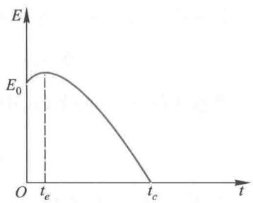  
图1 体内能量  $E(t)$  的示意图

为了估计模型中的参数, 并算出  $t_{c}$  和  $D_{c}$ , Keller用若干个当时的短跑世界纪录拟合由(1),(9)式计算的理论结果, 得到  $F, \tau$  的估计值为  $F \approx 12.2 \mathrm{~N} / \mathrm{kg}$  (对于质量  $m = 1 \mathrm{~kg}$  而言),  $\tau \approx 0.892 \mathrm{~s}$ , 算出  $t_{c} \approx 27.63 \mathrm{~s}, D_{c} \approx 291 \mathrm{~m}$ . 即当小于  $291 \mathrm{~m}$  时用最大冲力跑完全程是可行的, 并且能够取得最佳成绩(当然是对世界纪录创造者而言).

后来, 有人用1987年世界田径锦标赛上Johnson和Lewis的  $100 \mathrm{~m}$  成绩(每  $10 \mathrm{~m}$  的记录如表1)对  $F, \tau$  的估计值进行修正. 由(9)式知最大速度约为  $v_{\mathrm{m}} = F \tau \left(t \gg \tau\right)$ , 且距离函数为  $x(t) = F \tau \left[t - \tau \left(1 - \mathrm{e}^{- t / \tau}\right)\right]$ , 当  $t \gg \tau$  时  $x \approx v_{\mathrm{m}}\left(t - \tau\right)$ . 从表1可得  $v_{\mathrm{m}} = 11.76 \mathrm{~m} / \mathrm{s}, \tau \approx 1.28 \mathrm{~s}$  或  $1.42 \mathrm{~s}$ , 考虑到起跑的反应时间, 取  $\tau \approx 1.06 \mathrm{~s}$  或  $1.16 \mathrm{~s}$ , 而  $F \approx 11.1 \mathrm{~N} / \mathrm{kg}$  或  $10.1 \mathrm{~N} / \mathrm{kg}$ .

表1Johnson的成绩  $t_{1}$  和Lewis的成绩  $t_{2}$  

<table><tr><td>x/m</td><td>10</td><td>20</td><td>30</td><td>40</td><td>50</td><td>60</td><td>70</td><td>80</td><td>90</td><td>100</td></tr><tr><td>t1/s</td><td>1.84</td><td>2.86</td><td>3.80</td><td>4.67</td><td>5.53</td><td>6.38</td><td>7.23</td><td>8.10</td><td>8.96</td><td>9.83</td></tr><tr><td>t2/s</td><td>1.94</td><td>2.96</td><td>3.91</td><td>4.78</td><td>5.64</td><td>6.50</td><td>7.36</td><td>8.22</td><td>9.07</td><td>9.93</td></tr></table>

中长跑模型当赛程大于  $D_{c}$  时, 将全程分为3段: 初始阶段  $0 \leqslant t \leqslant t_{1}$  以最大冲力  $f(t) = F$  跑, 以便在短时间内获得尽可能的高速度; 最后阶段  $t_{2} \leqslant t \leqslant T$  把体内贮存能量

用完,即  $E(t) = 0$ ,靠惯性冲刺;中间阶段  $t_{1} \leqslant t \leqslant t_{2}$  保持匀速  $①$ . 可以看出,由于在第1,3段分别把控制函数  $f(t), E(t)$  确定在约束条件(4),(7)的边界上,且取常值,从而这两阶段的速度(分别记作  $v_{1}(t)$  和  $v_{3}(t)$  )即可确定. 由此不难进一步求出中间阶段的  $v_{2}(t) = v_{2}$  (常数).

第1段  $0 \leqslant t \leqslant t_{1}$  (  $t_{1}$  以后确定)  $v_{1}(t)$  由(9)式表示(将  $v(t)$  写作  $v_{1}(t)$  ).

第3段  $t_{2} \leqslant t \leqslant T$  (  $t_{2}$  以后确定) 将  $E(t) = 0$  代入(5),(2)式得到

$$
\frac{1}{2} \frac{\mathrm{d}}{\mathrm{d}t} v_{3}^{2} + \frac{v_{3}^{2}}{\tau} = \sigma \tag{13}
$$

方程(13)在条件  $v_{3}(t_{2}) = v_{2}$  下的解为

$$
v_{3}(t) = \left[\left(v_{2}^{2} - \sigma \tau\right) \mathrm{e}^{\frac{2(t - t_{2})}{\tau}} + \sigma \tau \right]^{\frac{1}{2}} \tag{14}
$$

$v_{3}(t)$  是单调减和下凸的  $(\dot{v}_{3}(t) < 0, \ddot{v}_{3}(t) > 0)$

第2段  $t_{1} \leqslant t \leqslant t_{2}$ $v_{2}$  由目标泛函(1)式  $D(v(t))$  达到最大来确定,这里

$$
D(v(t)) = \int_{0}^{t_{1}} v_{1}(t) \mathrm{d}t + v_{2}(t_{2} - t_{1}) + \int_{t_{2}}^{T} v_{3}(t) \mathrm{d}t \tag{15}
$$

为了得到  $E(t_{2}) = 0$  的条件,由方程(2),(5)及初始条件(6)解  $E(t)$ ,得到

$$
E(t) = E_{0} + \sigma t - \frac{v^{2}(t)}{2} - \frac{1}{\tau} \int_{0}^{t} v_{1}^{2}(t) \mathrm{d}t \tag{16}
$$

令  $t = t_{2}$  并将(9)式代入得

$$
E(t_{2}) = E_{0} + \sigma t_{2} - \frac{v_{2}^{2}}{2} - \frac{1}{\tau} \int_{0}^{t} v_{1}^{2}(t) \mathrm{d}t - \frac{v_{2}^{2}(t_{2} - t_{1})}{\tau} \tag{17}
$$

问题归结为在条件  $E(t_{2}) = 0$  和  $v_{1}(t_{1}) = v_{2}$  下求  $v_{2}, t_{1}, t_{2}$  使  $D(v(t))$  最大.

由于在条件  $v_{1}(t_{1}) = v_{2}$  下  $D(v(t))$  和  $E(t_{2})$  对  $t_{1}$  的偏导数均为零,所以在用待定常数  $\lambda$  构造的函数

$$
I(v(t), t_{2}) = D(v(t)) + \frac{\lambda}{2} E(t_{2}) \tag{18}
$$

中可以将右端不显含  $v_{2}$  和  $t_{2}$  的项略去,写成

$$
I(v_{2}, t_{2}) = \int_{t_{2}}^{T} v_{3}(t) \mathrm{d}t + \frac{\lambda \sigma}{2} t_{2} - \frac{\lambda}{4} v_{2}^{2} + \left(v_{2} - \frac{\lambda v_{2}^{2}}{2\tau}\right)(t_{2} - t_{1}) \tag{19}
$$

$v_{2}, t_{2}$  为最优解的必要条件是

Keller对赛跑的一般模型(1)~(7)提出了分段解法,虽然没有严格证明它的解就是(1)~(7)的最优解,但是从分析过程和实际检验可以看出这种简化方法是合理的.另一方面,模型本身也存在着一些不合适的地方,例如对短跑和中长

$$
v_{2} = \frac{\tau}{\lambda} \tag{20}
$$

$$
2 \int_{t_{2}}^{T} \left[(v_{2}^{2} - \sigma \tau) \mathrm{e}^{-\frac{2(t - t_{2})}{\tau}} + \sigma \tau \right]^{-\frac{1}{\tau}} \mathrm{e}^{\frac{2(t - t_{2})}{\tau}} \mathrm{d}t = \lambda \tag{21}
$$

至此,3个阶段的  $v(t)$  分别由(9),(14)和(20)给出,剩下的问题是确定  $t_{1}, t_{2}$  和  $\lambda$ .  $t_{1}, t_{2}, \lambda$  的确定 利用  $v(t)$  在  $t = t_{1}$  的连续性,由(9)和(20)式得

$$
\lambda F(1 - \mathrm{e}^{-\frac{t_{1}}{\tau}}) = 1 \tag{22}
$$

将(20)代入(17)后令其为0,得

$$
E_{0} + \sigma t_{2} - \frac{\tau^{2}}{2\lambda^{2}} -\int_{0}^{t_{1}}F^{2}\tau (1 - \mathrm{e}^{-t / \tau})^{2}\mathrm{d}t - \frac{\tau}{\lambda^{2}} (t_{2} - t_{1}) = 0 \tag{23}
$$

将(20)代入(21)并作积分得到

$$
2\big[(\tau^{2} - \lambda^{2}\sigma \tau)\mathrm{e}^{-\frac{2(\tau - t_{2})}{\tau}} + \lambda^{2}\sigma \tau \big]^{\frac{1}{2}} - 2\tau = \lambda^{2}\sigma -\tau \tag{24}
$$

$t_{1},t_{2},\lambda$  由(22)—(24)确定.

以上模型中的参数  $F,\tau$  已在前面估计出,Keller又用一些中长跑世界纪录得到  $\sigma$  和  $E_{0}$  的估计值:  $\sigma = 41.5,E_{0} = 2403.5.$

模型解释中长跑模型的速度函数由3段组成,示意图如图2对于最后一段(通

模型解释 中长跑模型的速度函数由3段组成,示意图如图2对于最后一段(通常有一两秒钟)速度的下降,Keller的解释是:像汽车比赛到终点前将燃料用完,靠惯性冲过终点一样,赛跑的最佳策略应该是把贮存在体内供赛跑用的能量全部耗尽,借助惯性冲刺,这必导致短暂的速度下降.单从赛跑所用的时间来看,比如一名运动员测验自己的成绩,这样做是最优的.而在实际比赛中当运动员与对手势均力敌时,从击败对手取得好名次的目的出发,需要按照实际情况巧妙地安排自己的速度,这已不是本模型讨论的范围了.

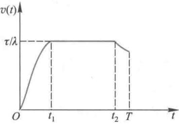  
图2中长跑模型的最佳速度示意图

跑的所有赛程用了同一组生理参数,而短跑和中长跑运动员的这些参数可能有较大差别.还有,运动员达到一定的高速度后不可能持续地发挥自己的最大冲力,短跑模型和中长跑模型中最初阶段的速度(9)式需要修正(复习题).尽管如此,这个模型在把动力学与生理学相结合,用建模方法讨论体育运动问题上,为人们提供了示范.后来,不断有人继续研究赛跑的数学模型,对生理参数的估计值做出修正,并且考虑空气阻力、海拔高度等因素的影响[52].

# 复习题

经研究发现在短跑比赛中,运动员由于生理条件的限制,在达到一定的高速度后,不可能持续发挥自己的最大冲力.假设运动员克服生理限制后能发挥的冲力  $f(t)$  满足  $\dot{f} (t) / f(t) = - 1 / k,$  其中  $k$  是冲力限制系数  $,f(0) = F$  为最大冲力.将上述关系代入(2)式,求出短跑比赛时速度  $v(t)$  和距离  $s(t)$  的关系式,及达到最高速度的时间,并做出  $v(t)$  的示意图.

某届奥运会,男子百米决赛前6名在比赛中到达距离  $s$  处所用的时间  $t$  和当时的速度  $v$  如下表所示(平均值):

<table><tr><td>s/m</td><td>0</td><td>5</td><td>15</td><td>25</td><td>35</td><td>45</td><td>55</td><td>65</td><td>75</td><td>85</td><td>95</td></tr><tr><td>t/s</td><td>0</td><td>0.955</td><td>2.435</td><td>3.435</td><td>4.355</td><td>5.230</td><td>6.085</td><td>6.945</td><td>7.815</td><td>8.690</td><td>9.575</td></tr><tr><td>v/(m·s-1)</td><td>0</td><td>5.24</td><td>9.54</td><td>10.52</td><td>11.19</td><td>11.62</td><td>11.76</td><td>11.49</td><td>11.47</td><td>11.36</td><td>11.22</td></tr></table>

试从这组数据估计出参数  $\tau ,k,F.$  算出  $v(t)$  的理论值,并与实际数据比较

# 5.9 万有引力定律的发现

万有引力定律的发现是伟大科学家牛顿的重大贡献之一.牛顿在研究力学的过程中发明了微积分,又成功地在开普勒三定律的基础上运用微积分推出了万有引力定律.这一创造性的成就可以看作是历史上最著名的数学模型之一.

历史背景 15 世纪下半叶开始, 欧洲商品经济的繁荣促进了航海业的发展. 哥伦布发现的新大陆、麦哲伦的环球远航, 引起了社会的普遍关注. 当时远洋航船的方位全靠星球的位置来确定. 在强大的社会需求推动下, 天文观测的精确程度不断提高. 在大量的实际观测数据面前, 一直处于天文学统治地位的"地心说"开始动摇了.

波兰天文学家哥白尼 (1473- 1543) 在天文观测的基础上, 冲破宗教统治和"地心说"的束缚, 提出了"日心说". 这是天文学乃至整个科学的一大革命. 但是由于历史条件和科学水平的限制, 哥白尼的理论还有一些缺陷. 他接受了圆周运动是最完善的天体运动形式的概念, 认为行星绕太阳的运行轨道是圆形的.

意大利物理学家伽利略 (1564- 1642) 不仅用观察方法证实了哥白尼的学说, 而且用实验方法发现了落体定律和惯性原理, 揭示了物体在不受阻挠时做匀速直线运动的规律.

德国天文学家、数学家开普勒 (1571- 1630) 在第谷·布拉赫对于行星运动大量观测资料的基础上, 用数学方法研究发现, 火星的实际位置与按哥白尼理论计算的位置相差 8 弧分 (  $1^{\circ} = 60$  弧分). 经过对观测数据长期深入的分析, 开普勒终于归纳出著名的所谓行星运动三定律, 即

各颗行星分别在不同的椭圆轨道上绕太阳运行, 太阳位于这些椭圆的一个焦点上;

每颗行星运行过程中单位时间内太阳一行星向径扫过的面积是常数;

各颗行星运行周期的平方与其椭圆轨道长半轴的 3 次方成正比.

在伽利略、开普勒的基础上, 17、18 世纪许多科学家致力于行星沿椭圆轨道运行时受力状况的研究. 从开普勒定律可以看出, 行星运行速度是变化的, 而在当时尚没有计算变速运动的动力学方法. 英国物理学家胡克 (1635- 1703) 和荷兰物理学家惠更斯 (1629- 1695) 等人虽然都取得了一些成果, 但终未得到有关引力的定律.

卓越的英国物理学家、数学家牛顿 (1642- 1727) 认为一切运动都有其力学原因, 开普勒三定律的背后必定有力学定律起作用. 他在研究变速运动过程中发明了微积分 (当时称流数法), 又以微积分为工具在开普勒三定律和牛顿第二定律的基础上, 用演绎方法得到所谓万有引力定律, 于 1687 年汇编入《自然科学之数学原理》出版. 这一发现成功地解释了许多自然现象, 并为一系列观测和实验进一步证实, 直到今天仍是物理学中的一条基本定律.

下面介绍的万有引力定律的推导过程是在牛顿使用的流数法的基础上改写的.

模型假设 开普勒三定律和牛顿第二定律是导出万有引力定律的基础, 所以需要将它们表述为这个模型的假设条件.

对于任意一颗行星的椭圆运行轨道, 建立极坐标系  $(r, \theta)$ , 以太阳为极点  $r = 0$ , 以椭圆长半轴方向为  $\theta = 0$ , 用向径  $① r(t) (r(t), \theta (t))$  表示行星的位置, 见图 1.

1. 轨道方程为

$$
r = \frac{p}{1 + e \cos \theta}, \quad p = \frac{b^{2}}{a}, \quad b^{2} = a^{2}(1 - e^{2}) \tag{1}
$$

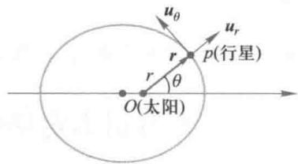  
图 1 极坐标系中的行星轨道

$a, b$  为椭圆的长、短半轴,  $e$  为离心率.

2. 单位时间内向径  $r$  扫过的面积是常数  $A$ , 即

$$
\frac{1}{2} r^{2} \dot{\theta} = A \tag{2}
$$

3. 行星运行周期  $T$  满足

$$
T^{2} = \lambda a^{3} \tag{3}
$$

其中  $\lambda$  是绝对常数, 与是哪一颗行星无关

4. 行星运行时受的作用力  $f$  等于行星加速度  $\ddot{r}$  和质量  $m$  的乘积, 即

$$
f = m \ddot{r} \tag{4}
$$

模型建立万有引力定律研究的是力  $f$  的方向和大小. 由(4)式可知, 它取决于行星的运动加速度  $\ddot{r}$ , 从而必须研究行星的位置  $r$  和速度  $\dot{r}$ . 首先引入基向量(图1)

$$
\left\{ \begin{array}{l}u_{r} = \cos \theta i + \sin \theta j \\ u_{\theta} = -\sin \theta i + \cos \theta j \end{array} \right. \tag{5}
$$

向径  $r$  可表为

$$
r = r u_{r} \tag{6}
$$

因为由(5)式可以算出

$$
\left\{ \begin{array}{l} \dot{u}_{r} = \dot{\theta} u_{\theta} \\ \dot{u}_{\theta} = -\dot{\theta} u_{r} \end{array} \right. \tag{7}
$$

所以由(6),(7)式得到行星运动的速度和加速度为

$$
\dot{r} = \dot{r} u_{r} + r \dot{\theta} u_{\theta} \tag{8}
$$

$$
\ddot{r} = \left(\ddot{r} -r \dot{\theta}^{2}\right) u_{r} + \left(r \ddot{\theta} + 2 \dot{r} \dot{\theta}\right) u_{\theta} \tag{9}
$$

根据(2)式可得

$$
\dot{\theta} = \frac{2 A}{r^{2}}, \ddot{\theta} = \frac{-4 A \dot{r}}{r^{3}} \tag{10}
$$

将  $\ddot{\theta}$  代入(9)式右端, 可知第二项  $r \ddot{\theta} + 2 \dot{r} \dot{\theta} = 0$ , 于是(9)式简化为

$$
\ddot{r} = \left(\ddot{r} -r \dot{\theta}^{2}\right) u_{r} \tag{11}
$$

对(1)式求导并利用(10)式  $\dot{\theta}$  的结果, 得到

$$
\dot{r} = \frac{2 A e}{p} \sin \theta \tag{12}
$$

$$
\ddot{r} = \frac{4 A^{2} e}{p r^{2}} \cos \theta = \frac{4 A^{2}(p - r)}{p r^{3}} \tag{13}
$$

将(10)和(13)代入(11)式, 得

$$
\ddot{r} = \frac{-4 A^{2}}{p r^{2}} u_{r} \tag{14}
$$

最后把(14)和(6)代入(4)式, 有

$$
\pmb {f} = -\frac{4 A^{2} m}{p r^{2}} \pmb{r}_{0}, \quad \pmb{r}_{0} = \frac{\pmb{r}}{r} \tag{15}
$$

这里  $r_{0}$  是单位向径, 指示向径方向. (15)式表明, 行星运行时受的力  $f$  的方向与它的向

径方向  $r_{0}$  相反,即在太阳一行星连线方向,指向太阳;  $f$  的大小与行星质量  $m$  成正比,与太阳一行星距离  $r$  的平方成反比.  $f$  为太阳对行星的引力.

为了完成万有引力的推导,只需进一步证明(15)式中的  $\frac{A^{2}}{p}$  是绝对常数,即它与是哪一颗行星无关(  $A$  和  $p$  不是绝对常数).

因为  $A$  是单位时间内向径扫过的面积,行星运行一个周期  $T$  向径扫过的面积恰是以  $a, b$  为长. 短半轴的椭圆面积,所以

由(1),(3),(16)式容易算出

$$
T A = \pi a b \tag{16}
$$

$$
\frac{A^{2}}{p} = \frac{\pi^{2}}{\lambda} \tag{17}
$$

评注从发现万有引力定律的过程可以看出,在正确假设的基础上运用数学演绎方法建模,对自然科学的发展能够发挥多么巨大的作用.虽然我们大多数人发明不了什么定律,但是学习前辈如何创造性地运用数学方法,对于培养解决实际问题的能力是大有好处的.

$\pi$  和  $\lambda$  均为绝对常数. 将(17)代入(15)式有

$$
f = -\frac{4\pi^{2} m}{\lambda r^{2}} r_{0} \tag{18}
$$

(18)式表明,太阳对行星的作用力  $f$  的大小除了与行星质量  $m$  成正比、与相互距离平方  $r^{2}$  成反比以外,余下的因子  $4\pi^{2} / \lambda$  与行星无关,它就只可能由太阳本身确定了. 将这个结果与我们熟知的形式

$$
f = -k \frac{M m}{r^{2}} r_{0} \tag{19}
$$

相比较,应该有  $\frac{4\pi^{2}}{\lambda} = k M$  ( $k$  为万有引力常数,  $M$  为太阳质量). 请读者验证这个关系(复习题).

# 复习题

将万有引力定律(18)式与(19)式进行比较,查询太阳质量、地球运行轨道(椭圆)的长半轴、万有引力常数等数据,说明二者是一致的.

# 5.10 传染病模型和SARS的传播

2002年冬到2003年春,一种名为SARS(severe acute respiratory syndrome,严重急性呼吸道综合征,民间俗称非典)的传染病肆虐全球.SARS首发于中国广东,迅速扩散到东南亚乃至30多个国家和地区,包括医务人员在内的多名患者死亡,引起社会恐慌、媒体关注,以及各国政府和联合国、世界卫生组织的高度重视、积极应对,直至最终控制住疫情的蔓延.突如其来的SARS及其迅猛的传播和严重的后果,成为21世纪初的第一大社会热点事件.

SARS被控制住不久,2003年的全国大学生数学建模竞赛就以"SARS的传播"命名当年的A题和C题,题目中要求"建立你们自己的模型;特别要说明怎样才能建立一个真正能够预测以及能为预防和控制提供可靠、足够的信息的模型,这样做的困难在哪

里?对于卫生部门所采取的措施做出评论,如:提前或延后5天采取严格的隔离措施,对疫情传播所造成的影响做出估计."题目还给出北京市从2003年4月20日至6月23日逐日的疫情数据供参考(表1是部分数据).

表1北京市的疫情数据  

<table><tr><td>日期</td><td>已确诊病例累计</td><td>现有疑似病例</td><td>死亡累计</td><td>治愈出院累计</td></tr><tr><td>4月20日</td><td>339</td><td>402</td><td>18</td><td>33</td></tr><tr><td>4月21日</td><td>482</td><td>610</td><td>25</td><td>43</td></tr><tr><td>4月22日</td><td>588</td><td>666</td><td>28</td><td>46</td></tr><tr><td>...</td><td>...</td><td>...</td><td>...</td><td>...</td></tr><tr><td>6月22日</td><td>2521</td><td>2</td><td>191</td><td>2257</td></tr><tr><td>6月23日</td><td>2521</td><td>2</td><td>191</td><td>2277</td></tr></table>

数据文件5- 1 SARS的传播

本节先介绍数学医学领域中基本的传染病模型,然后结合赛题,介绍几个描述、分析SARS传播过程的模型及求解结果.

基本的传染病模型虽然不同类型传染病的传播过程在医学上有其各自的特点,但是可以从数学建模的角度,按照一般的传播机理建立以下几种基本模型[11,12,38]

SI模型这个模型将人群分为两类:易感染者(susceptible)和已感染者(infective),分别简称健康人和患者.在传染病模型中取两个词的英文字头称为SI模型.设所考察地区的总人数(记作  $N$  )不变,时刻  $t$  健康人和患者在总人数中的比例分别记作  $s(t)$  和  $i(t)$ ,显然有  $s(t) + i(t) = 1$

假设每个患者每天有效接触的人数是常数  $\lambda$ ,称接触率,且当健康人被有效接触后立即被感染成为患者,  $\lambda$  也称感染率.

根据上述假设,每个患者每天有效接触的健康人数是  $\lambda s(t)$ ,全部患者  $N i$  每天有效接触的健康人数是  $N \lambda s(t) i(t)$ ,这些健康人立即被感染成为患者,于是患者比例  $i(t)$  满足微分方程(约去方程两端的  $N$ )

$$
\frac{\mathrm{d} i}{\mathrm{~d} t} = \lambda s i \tag{1}
$$

将  $s = 1 - i$  代入,并记初始时刻的患者比例为  $i_{0}$ ,得

$$
\frac{\mathrm{d} i}{\mathrm{~d} t} = \lambda i(1 - i), i(0) = i_{0} \tag{2}
$$

这是我们熟悉的logistic模型(参见5.1节).

logistic方程(2)的解为S形曲线,患者比例  $i(t)$  从  $i_{0}$  迅速上升,通过曲线的拐点后上升变缓,当  $t \to \infty$  时  $i \to 1$ ,即所有健康人终将被感染成为患者.这显然不符合实际情况.究其原因,是SI模型只考虑了健康人可以被感染,而没有考虑到患者可以被治愈的情况.下面的模型将增加关于患者被治愈的假设.

SIS模型有些传染病如伤风、痢疾等,虽然可以治愈,但愈后基本上没有免疫力,于是患者愈后又变成易感染的健康人.由此将这个模型称为SIS模型.

SIS模型增加的假设条件是:患者每天被治愈的人数比例是常数  $\mu$ ,称治愈率.

容易知道,增加了这个假设后,方程(1)的右端应该减去每天被治愈的患者数  $N\mu i$  于是有(同样约去方程两端的  $N$  )

$$
\frac{\mathrm{d}i}{\mathrm{d}t} = \lambda si - \mu i \tag{3}
$$

定义

$$
\sigma = \lambda /\mu \tag{4}
$$

将  $s = 1 - i$  和  $\mu = \lambda /\sigma$  代入(3)式,可得

$$
\frac{\mathrm{d}i}{\mathrm{d}t} = \lambda i\left[\left(1 - 1 / \sigma\right) - i\right] \tag{5}
$$

若  $\sigma >1$  ,(5)式仍然是logistic方程,  $i(t)$  呈S形曲线上升,当  $t\rightarrow \infty$  时  $i\rightarrow 1 - 1 / \sigma$  ,图形如图1(a)(通常初始时刻的患者比例  $i_{0}$  很小,可设  $i_{0}< 1 - 1 / \sigma$  ).而若  $\sigma \leqslant 1$  ,则方程(5)的右端恒为负,曲线  $i(t)$  将单调下降,当  $t\rightarrow \infty$  时  $i\rightarrow 0$  ,图形如图1(b).

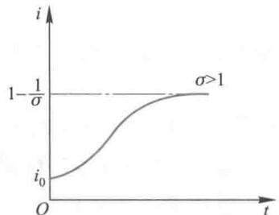  
(a)SIS模型的i(t)曲线（o>1）

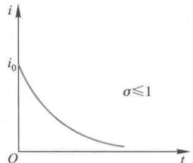  
(b)SIS模型的i(t)曲线（o≤1） 图1

由此可知,  $\sigma$  是一个重要参数,  $\sigma >1$  还是  $\sigma \leqslant 1$  ,决定了患者比例是持续增加,还是持续减少.检查  $\sigma$  的定义(4)式,因为  $\mu$  是治愈率,  $1 / \mu$  可以视为平均传染期(指患者被治愈所需的平均时间),而  $\lambda$  是感染率,所以  $\sigma$  表示整个感染期内每个患者有效接触而感染的平均(健康)人数,可称感染数.于是直观上容易理解,若每个患者在生病期间因有效接触而感染的人数大于1,那么患者比例自然会增加,反之,患者比例会减少.

SIR模型许多传染病如天花、流感、麻疹等,治愈后免疫力很强,于是患者愈后不会成为易感染的健康人,当然也不再是患者.传染病模型中将病愈免疫后和因病死亡的人称为移除者(removed),由此将这个模型称为SIR模型.仍设总人数  $N$  不变,时刻  $t$  移除者在总人数中的比例记作  $r(t)$  ,有

$$
s\left(t\right) + i\left(t\right) + r\left(t\right) = 1 \tag{6}
$$

关于感染率  $\lambda$  、治愈率  $\mu$  (因包含死亡,实际上是移除率)和感染数  $\sigma$  的假设和定义与SIS模型相同.容易看出,SIS模型中患者比例  $i(t)$  满足的方程(3)不变,即

$$
\frac{\mathrm{d}i}{\mathrm{d}t} = \lambda si - \mu i
$$

但是由于SIR模型中增加了移除者  $r(t)$  ,在条件(6)下3个函数  $s(t),i(t)$  和  $r(t)$  中有2个是独立的,还需要列出健康人  $s(t)$  或移除者  $r(t)$  的微分方程.根据接触率  $\lambda$  的假设和定义,  $s(t)$  将单调减少,每天被患者有效接触的健康人数为  $N\lambda s(t)i(t)$  ,所以  $s(t)$  满足方程(同样约去方程两端的  $N$  )

$$
\frac{\mathrm{d}s}{\mathrm{d}t} = -\lambda s i \tag{7}
$$

而  $r(t)$  的方程为

$$
\frac{\mathrm{d}r}{\mathrm{d}t} = \mu i \tag{8}
$$

拓展阅读5- 2

SIR模型的相轨线分析与群体免疫

当参数  $\lambda$  和  $\mu$  确定后,给定  $s(0), i(0), r(0)$  中的任意2个初始值,即可由上面3个微分方程及条件(6)中的任意3个式子求解,得到SIR模型中3类人群的人数比例  $s(t), i(t)$  和  $r(t)$ . 但是,这个非线性微分方程组没有解析解(虽然形式上看来很简单),只能求数值解. 图2是设定  $\lambda , \mu , s(0), i(0)$  后用MATLAB编程计算得到的  $s(t), i(t), r(t)$  曲线.

由图2可以看到,健康人比例  $s(t)$  单调减少,移除者比例  $r(t)$  单调增加,都趋向稳定值,而患者比例  $i(t)$  先增后减趋向于  $0. t \rightarrow \infty$  时  $s(t)$  的稳定值表示在传染病传播过程中最终没有被感染的人数比例,  $i(t)$  的最大点和最大值表示传染病高潮(患者最多)到来的时刻和人数比例,这些数值可以衡量传染病传播的强度和速度.

感染率  $\lambda$  和治愈率  $\mu$  (可以假定死亡率很低)是影响传播过程的重要参数. 社会的卫生水平越高感染率  $\lambda$  越小,医疗水平越高治愈率  $\mu$  越大,于是感染数  $\sigma (= \lambda / \mu)$  越小,应该有助于控制传染病的传播. 对比不同  $\sigma$  下的图2(a) ( $\sigma = 2$ ) 和图2(b) ( $\sigma = 1.25$ ),后者的健康人比例  $s(t)$  更大,患者比例  $i(t)$  更小.

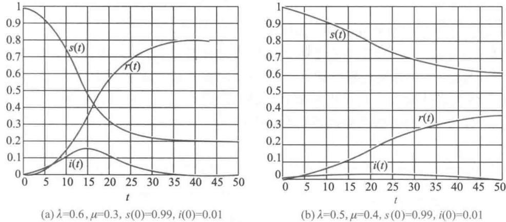  
图2 SIR模型的  $s(t), i(t), r(t)$

进一步的研究表明,当  $\sigma \sigma (0) > 1$  时  $i(t)$  先增后减,可认为传染病有一个蔓延过程;而若  $\sigma s(0) \leqslant 1$  则  $i(t)$  单调减少,传染病没有蔓延开来. 一般情况下  $i(0)$  和  $r(0)$  都很小,  $s(0)$  接近1,所以控制传染病蔓延需要  $\sigma$  小于1,可以通过提高卫生水平和医疗水平达到.

控制传染病蔓延的另一途径是降低  $s(0)$ ,这可以通过提高  $r(0)$ ,即预防接种使群体免疫来实现(参考拓展阅读5- 2).

上面所有的模型都假定参数  $\lambda$  和  $\mu$  是常数,而在实际的传播过程中,它们会随着预防措施的加强与医疗水平的提高而发生较大变化,下面对于SARS传播的讨论就是这种情况.

评注 3个传染病模型(SI,SIS,SIR)体现了建模过程的不断深化.SI模型描述了传染病的蔓延,但不符合实际:SIS和SIR模型则针对愈后是否免疫这两种情况,描述了传播过程,得到患者比例的变化规律.SIR模型特别值得注意,它是研究更复杂、也更实用的许多传染病模型的基础.

SARS的传播 2003年SARS在我国爆发初期,限于卫生部门和公众对这种疾病的认识,使其处于几乎不受制约的自然传播形式,后期随着卫生部门预防和治疗手段的不断加大,SARS的传播受到严格控制.虽然影响这个过程的因素众多,也不只有健康人、患者、移除者3个人群,但是仍然可以用愈后免疫的SIR模型来描述.并且,越复杂的模型包含的参数越多,为确定这些参数所需要的疫情数据就越全面,而实际上能够得到的数据是有限的.下面介绍3个模型.

模型——参数时变的SIR模型

模型构造为了计算的方便,在总人数不变的条件下用  $s(t), i(t), r(t)$  分别表示第  $t$  天健康人、患者、移除者(治愈与死亡之和)的数量,  $\lambda (t), \mu (t)$  分别表示第  $t$  天的感染率和移除率(治愈率与死亡率之和).SIR模型表示为如下参数时变方程:

$$
\frac{\mathrm{d}s}{\mathrm{d}t} = -\lambda (t)s(t)i(t) \tag{9}
$$

$$
\frac{\mathrm{d}i}{\mathrm{d}t} = \lambda (t)s(t)i(t) - \mu (t)i(t) \tag{10}
$$

$$
\frac{\mathrm{d}r}{\mathrm{d}t} = \mu (t)i(t) \tag{11}
$$

由于  $s$  远大于  $i$  和  $r, s(t)$  几乎是常数,所以方程(10)可简化为

$$
\frac{\mathrm{d}i}{\mathrm{d}t} = \lambda (t)i(t) - \mu (t)i(t) \tag{12}
$$

下面用方程(11),(12)研究SARS的传播

参数估计与拟合首先对表1提供的数据进行预处理:第1列日期从  $t = 1$  开始到  $t = 65$  (天)为止,第4列死亡累计和第5列治愈出院累计之和是移除者数量  $r(t)$ ,第2列已确诊病例累计减去  $r(t)$  是患者数  $i(t)$ ,原始数据  $i(t), r(t)$  见图3,可以看出,在  $t = 25$  (天)左右SARS的传播达到高潮(患者最多).

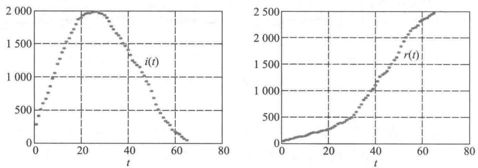  
图3原始数据的患者数  $i(t)$  和移除数  $r(t)$

为了估计感染率  $\lambda (t)$  和移除率  $\mu (t)$ ,取  $i(t), r(t)$  的差分  $\Delta r(t), \Delta i(t)$  作为方程(11),(12)左端导数的近似值.先用(11)式估计  $\mu (t) = \Delta r(t) / i(t)$ ,再将这个结果代入(12)式得  $\lambda (t) = (\Delta i(t) + \Delta r(t)) / i(t).\lambda (t), \mu (t)$  如图4中的圆点所示,可以看出,感染率迅速下降,  $t = 15$  (天)以后已经很小,说明疫情传播受到有力制约:移除率在  $t = 40$  (天)之前变化不大,以后较快上升,表明经过约1个月的治疗期后,传播达到高潮时的

大量患者被治愈.

为了求解并检验模型,用  $\lambda (t), \mu (t)$  的部分数据拟合这两条曲线.图4中圆点的变化趋势表明,用指数函数作拟合比较合适.对  $\lambda (t)$  用  $t = 1\sim 20$  的数据拟合的结果是  $\hat{\lambda} (t) = 0.2612\mathrm{e}^{- 0.1160t}$ ,对  $\mu (t)$  用  $t = 20\sim 50$  的数据拟合的结果是  $\hat{\mu} (t) = 0.0017\mathrm{e}^{- 0.0825t}$ ,这两条指数曲线在图4中用实线表示,拟合较好.

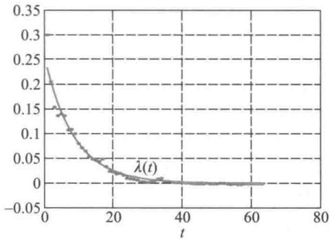  
图4感染率  $\lambda (t)$  和移除率  $\mu (t)$  的估计与拟合

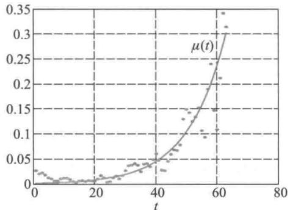

模型求解与检验将拟合得到的  $\hat{\lambda} (t)$  和  $\hat{\mu} (t)$  代入(11),(12)式,是变量分离的方程组,解析解比较复杂,我们仍求  $i(t),r(t)$  的数值解,结果如图5实线所示.与  $i(t)$ $r(t)$  的原始数据(图中圆点)比较,  $i(t)$  的计算值整体较小,且  $t = 50$  后下降过快,在模型构造、参数拟合等方面仍需改进.

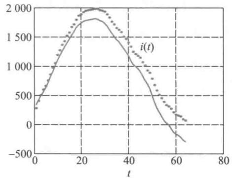  
图5  $i(t),r(t)$  的计算值与原始数据的比较

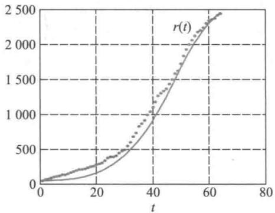

模型二——引入不可控带菌者和疑似已感染者的模型这是在SARS的传播受到严格控制条件下的模型[16]

$s(t),i(t),r(t),\mu$  的含义与SIR模型相同.增加两个人群:不可控带菌者和疑似已感染者,其比例分别记作  $c(t)$  和  $e(t)$  .每个不可控带菌者发病后(收治前)每天有效感

染的人数为  $\lambda$  (相当于SIR模型的感染率),  $\lambda$  中可以控制的比例为  $\alpha$ ,不可控带菌者每天转化为已感染者的比例为  $\epsilon$ .疑似已感染者每天被排除的比例为  $\beta$ ,每天被确诊的比例为  $\gamma .5$  个人群之间的转移关系如图6所示.

仿照SIR模型并按照图6的转移关系可建立如下方程:

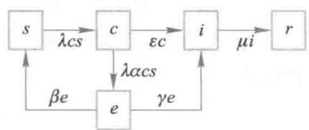  
图6模型二中人群的构造和转移

$$
s(t) + c(t) + e(t) + i(t) + r(t) = 1 \tag{13}
$$

$$
\frac{\mathrm{d}s}{\mathrm{d}t} = \beta e - \lambda c s \tag{14}
$$

$$
\frac{\mathrm{d}c}{\mathrm{d}t} = \lambda (1 - \alpha) c s - \epsilon c \tag{15}
$$

$$
\frac{\mathrm{d}e}{\mathrm{d}t} = -(\beta + \gamma) e + \lambda \alpha c s \tag{16}
$$

$$
\frac{\mathrm{d}i}{\mathrm{d}t} = \epsilon c - \mu i + \gamma e \tag{17}
$$

$$
\frac{\mathrm{d}r}{\mathrm{d}t} = \mu i \tag{18}
$$

当参数  $\lambda , \mu , \epsilon , \alpha , \beta , \gamma$  确定后,由 (13)~(18) 式的任意 5 个方程及  $s(0), i(0), c(0), e(0), r(0)$  中任意 4 个初始值,可以计算传播过程中 5 类人群的比例  $s(t), c(t), e(t), i(t)$  和  $r(t)$ .

这个模型中各个参数的估计可通过两种方式进行,一种是直接利用实际数据做出估计,另一种是先由经验估计的初值,代入模型计算,再根据计算值与实际值的偏差调整估计值  $①$ .

模型三——引入尚未隔离和已经隔离已感染者的模型 下面再介绍一个关于 SARS 在中国的传播与控制的模型 [62].

我们结合图 7 说明各个人群的构造和转移关系(图中没有画出易感染者  $S(t)$  )  $②$ .

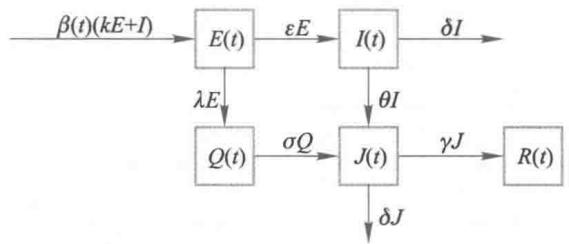  
图7 模型三人群的构造和转移

$E(t)$  表示处于潜伏期的已感染者,有弱传染性;

$I(t)$  表示已发病但尚未隔离的已感染者,有强传染性;

$Q(t)$  表示已发病且已经隔离、尚未治疗的已感染者(无传染性);

$J(t)$  表示已发病且已经隔离、正在治疗的已感染者(无传染性);

$R(t)$  表示治愈者(无传染性,有免疫性);

$\beta (t)$  表示感染率(每个有强传染性的已感染者每天传染的人数);

$k$  表示一个处于潜伏期  $(E)$  的已感染者折合成未隔离  $(I)$  的已感染者的分值(指传染性);

$\epsilon , \lambda$  表示处于潜伏期  $(E)$  的已感染者分别转入未隔离  $(I)$  和已隔离  $(Q)$  的已感染者的比例;

$\theta , \sigma$  表示未隔离  $(I)$  和已隔离  $(Q)$  的已感染者分别转入正在治疗  $(J)$  的人群的比例;

$\gamma$  表示正在治疗的已感染者  $(J)$  治愈的比例;

$\delta$  表示未隔离  $(I)$  和正在治疗  $(J)$  的已感染者的死亡率

按照图7各个人群的转移关系建立如下方程:

$$
\frac{\mathrm{d}E}{\mathrm{d}t} = \beta (I) \left(kE + I\right) - \left(\epsilon + \lambda\right)E \tag{19}
$$

$$
\frac{\mathrm{d}I}{\mathrm{d}t} = \epsilon E - \left(\theta + \delta\right)I \tag{20}
$$

$$
\frac{\mathrm{d}Q}{\mathrm{d}t} = \lambda E - \sigma Q \tag{21}
$$

$$
\frac{\mathrm{d}J}{\mathrm{d}t} = \theta I + \sigma Q - \left(\gamma + \delta\right)J \tag{22}
$$

$$
\frac{\mathrm{d}R}{\mathrm{d}t} = \gamma J \tag{23}
$$

方程中的参数满足  $0 < k < 1, 0 < \epsilon + \lambda < 1, 0 < \theta + \delta < 1, 0 < \sigma < 1, 0 < \gamma + \delta < 1$ , 可以利用公布的资料和试验的方法确定.

设潜伏期为6天,其中后3天才有强传染性,于是  $\epsilon + \lambda = 1 / 3$ ,设潜伏期的已感染者  $(E)$  转入未隔离  $(I)$  和已隔离  $(Q)$  的比例为  $2:3$ ,可得  $\epsilon = 1 / 3 \times 2 / 5 = 2 / 15$ , $\lambda = 1 / 3 \times 3 / 5 = 1 / 5$ ;设  $I$  和  $Q$  均约3天后转入治疗  $(J)$ ,于是  $\theta = \sigma = 1 / 3$ ;设治疗者  $(J)$  平均3周治愈,于是  $\gamma = 1 / 21$ ;死亡率取为  $\delta = 1 / 21 \times 15 / 100 = 1 / 140$ ;取  $k = 0.1$

感染率  $\beta (t)$  是模型中最重要的参数,从实际数据可知,在严格控制措施下  $\beta$  是  $t$  的减函数.经过多次数值计算确定  $\beta (t) = \frac{31 + t}{22 + 5t}$ .

根据公布的数据,以2003年4月21日各个人群的数量为初始值:  $E(0) = 477, I(0) = 286, Q(0) = 191, J(0) = 848, R(0) = 1213$ ,将上面确定的参数代入模型(19)—(23),结果如图8,实际数据与计算值相当接近(原文还有  $\theta$  和  $k$  取其他数值的计算结果,与实际数据相差较大).

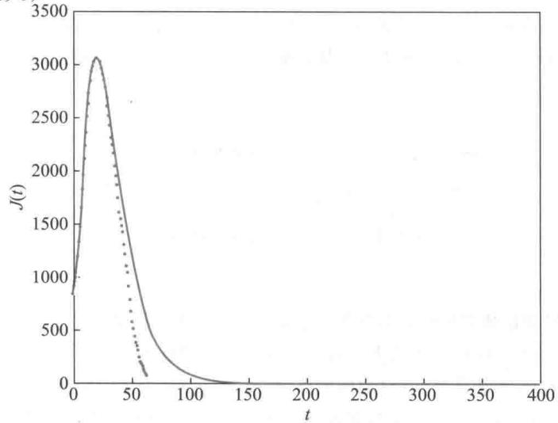  
图8 模型三  $J(t)$  的实际数据与计算结果

评注 上面3个模型以及许多参赛论文都在SIR模型的基础上建立各具特色的微分方程(或差分形式)模型,差别主要是人群的划分和参数的定义. 模型求解的结果是否与实际数据相吻合,关键之一在于参数估计. 而一些参数能否得到比较恰当的估计,又依赖于是否有充分的数据.人群的细分必然要引进更多的参数,如果因为受限于能够得到的实际数据,致使某些参数无法或很难估计,那么即便模型很精细,也得不到好的结果.

# 复习题

1. 在SIR模型中设定不同的参数  $\lambda , \mu$  和初始值  $s(0), i(0)$ , 编程计算  $s(t)$  和  $i(t)$  并作图. 需包含  $\sigma s(0) > 1$  及  $\sigma s(0) < 1$  的设定, 分析这两种情况下患者比例  $i(t)$  的不同变化.

2. 在SIS模型中若  $\sigma > 1$ , 且  $i_0 > 1 - 1 / \sigma$ , 画出  $i(t)$  的略图, 分析曲线的特性 (单调、凹凸、极限值等).

3. 尝试对描述SARS传播的参数时变的SIR模型进行改进, 重新计算, 如改变感染率  $\lambda (t)$  和移除率  $\mu (t)$  的拟合函数、取不同时期的数据作拟合、将治愈和死亡人群分开等.

1. 为治理湖水的污染, 引入一条较清洁的河水, 河水与湖水混合后又以同样的流量由另一条河排出. 设湖水容积为  $V$ , 河水单位时间流量为  $Q$ , 河水的污染浓度为常数  $c_h$ , 湖水的初始污染浓度为  $c_0$ .

(1) 建立湖水污染浓度  $c$  随时间  $t$  变化的微分方程, 并求解.

(2) 若测量出引入河水 10 天后湖水的污染浓度  $0.9 \mathrm{~g} / \mathrm{m}^3$ , 40 天后湖水的污染浓度  $0.5 \mathrm{~g} / \mathrm{m}^3$ , 且河水的污染浓度  $c_h = 0.1 \mathrm{~g} / \mathrm{m}^3$ , 问引入河水后多少天, 湖水的污染浓度可以降到标准值  $0.2 \mathrm{~g} / \mathrm{m}^3$ .

(3) 若由于水的蒸发等原因湖水容积每天减少  $b$ , 湖水污染浓度如何变化?

2. 凌晨某地发生一起凶杀案, 警方于早晨 6 时到达现场, 测得尸温  $26^{\circ} \mathrm{C}$ , 室温  $10^{\circ} \mathrm{C}$ . 早晨 8 时, 又测得尸温  $18^{\circ} \mathrm{C}$ .

(1) 若近似认为室温不变, 估计凶杀案发生的时间.

(2) 若早晨 8 时室温升至  $12^{\circ} \mathrm{C}$ , 如何处理这个问题?

3. 对于技术革新的推广, 在下列几种情况下分别建立模型:

(1) 推广工作通过已经采用新技术的人进行, 推广速度与已采用新技术的人数成正比, 推广是无限的.

(2) 总人数有限, 因而推广速度还会随着尚未采用新技术的人的人数的减少而降低.

(3) 在 
(2) 的前提下考虑广告等媒介的传播作用 [12,39].

4. 人工肾是帮助人体从血液中带走废物的装置, 它通过一层薄膜与需要带走废物的血管相通, 如下图. 人工肾中通以某种液体, 其流动方向与血液在血管中的流动方向相反, 血液中的废物透过薄膜进入人工肾.

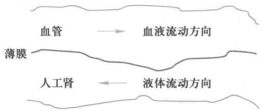

设血液和人工肾中液体的流速均为常数, 废物进入人工肾的数量与它在这两种液体中的浓度差成正比, 人工肾总长  $b$  建立单位时间内人工肾带走废物数量的模型 [12].

5. 在鱼塘中投放  $n_0$  尾鱼苗, 随着时间的增长, 尾数将减少而每尾的质量将增加.

(1) 设尾数  $n(t)$  的 (相对) 减少率为常数; 由于喂养引起的每尾鱼质量的增加率与鱼表面积成正比, 由于消耗引起的每尾鱼质量的减少率与质量本身成正比. 分别建立尾数和每尾鱼质量的微分方

程, 并求解.

(2)用控制网眼的办法不捕小鱼,到时刻  $T$  才开始捕捞,捕捞能力用尾数的相对减少量  $\vert \dot{n} /n\vert$  表示,记作  $E$  ,即单位时间捕获量是  $E n(t)$  .问如何选择  $T$  和  $E$  ,使从  $T$  开始的捕获量最大[12]

6. 侦察机搜索潜艇.设  $t = 0$  时艇在  $o$  点,飞机在  $A$  点,  $O A = 6$  n mile(  $1\mathrm{~n~m i l e} = 1.852\mathrm{~k m}$  ).此时艇潜人水中并沿着飞机不知道的某一方向以直线形式逃去,艇速  $20\mathrm{~n~m i l e / h.}$  飞机以速度  $40\mathrm{~n~m i l e / h}$  按照待定的航线搜索潜艇,当且仅当飞到艇的正上方时才可发现它.

(1)以  $o$  为原点建立极坐标系  $(r,\theta)$ $A$  点位于  $\theta = 0$  的向径上,见下图.分析图中由  $P,Q,R$  组成

的小三角形,证明在有限时间内飞机一定可以搜索到潜艇的航线,是先从  $A$  点沿直线飞到某点  $P_{0}$  ,再从  $P_{0}$  沿一条对数螺线飞行一周,而  $P_{0}$  是一个圆周上的任一点.给出对数螺线的表达式,并画出一条航线的示意图.

(2)为了使整条航线是光滑的,直线段应与对数螺线在  $P_{0}$  点相切.找出这条光滑的航线

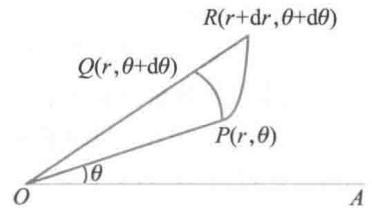

(3)在所有一定可以发现潜艇的航线中哪一条航线最短,长度是多少?光滑航线的长度又是多少[40]

7. 建立肿瘤生长模型.通过大量医疗实践发现,肿瘤细胞的生长有以下现象:1)当肿瘤细胞数目超过  $10^{11}$  时才是临床可观察的;2)在肿瘤生长初期,几乎每经过一定时间肿瘤细胞就增加一倍;3)由于各种生理条件限制,在肿瘤生长后期肿瘤细胞数目趋向某个稳定值.

(1)比较logistic 模型与 Gompertz 模型:  $\frac{\mathrm{d}n}{\mathrm{d}t} = -\lambda n\ln \frac{n}{N}$  其中  $n\left(t\right)$  是细胞数,  $N$  是极限值,  $\lambda$  是参数.

(2)说明上述两个模型是Usher模型  $\frac{\mathrm{d}n}{\mathrm{d}t} = \frac{\lambda n}{\alpha}\left[1 - \left(\frac{n}{N}\right)^{\alpha}\right]$  的特例[32]

8. 与7题中Usher模型类似的是  $\theta$  -logistic 模型  $\frac{\mathrm{d}x}{\mathrm{d}t} = r x\left[1 - \left(\frac{x}{N}\right)^{\theta}\right]$  ,当  $\theta = 1$  时即为普通的logistic模型.讨论  $\theta < 1$  和  $\theta >1$  时模型的性质[46]

9. 药物动力学中的Michaelis-Menton 模型为  $\frac{\mathrm{d}x}{\mathrm{d}t} = -\frac{k x}{a + x} (k,a > 0)$  ,x(t)表示人体内药物在时刻t的血药浓度.研究这个方程的解的性质[46]

(1)对于很多药物(如可卡因),  $a$  比  $x(t)$  大得多,Michaelis-Menton方程及其解如何简化?

(2)对于另一些药物(如酒精),  $x(t)$  比  $a$  大得多,Michaelis-Menton方程及其解如何简化?

10. 建立一个模型说明要用三级火箭发射人造卫星的道理

(1)设卫星绕地球做匀速圆周运动,证明其速度为  $v = R\sqrt{g / r}$ $R$  为地球半径,  $r$  为卫星与地心距离,  $g$  为地球表面重力加速度.要把卫星送上离地面  $600\mathrm{~km}$  的轨道,火箭末速  $v$  应为多少?

(2)设火箭飞行中速度为  $v(t)$  ,质量为  $m(t)$  ,初速为0,初始质量  $m_{0}$  ,火箭喷出的气体相对于火箭的速度为  $u$  ,忽略重力和阻力对火箭的影响.用动量守恒原理证明  $v(t) = u\ln \frac{m_{0}}{m(t)}.$  由此你认为要提高火箭的末速应采取什么措施.

(3)火箭质量包括3部分:有效载荷(卫星)  $m_{p}$  ,燃料  $m_{f}$  ,结构(外壳、燃料仓等)  $m_{s}$  ,其中  $m_{s}$  在  $m_{f}$ $+m_{s}$  中的比例记作  $\lambda$  ,一般  $\lambda$  不小于  $10\%$  .证明若  $m_{p} = 0$  (即火箭不带卫星),则燃料用完时火箭达到的最大速度为  $v_{\mathrm{m}} = -u\ln \lambda .$  已知目前的  $v = 3\mathrm{~km / s}$  取  $\lambda = 10\%$  ,求  $v_{\mathrm{m}}$  .这个结果说明什么?

(4)假设火箭燃料燃烧的同时,不断丢弃无用的结构部分,即结构质量与燃料质量以  $\lambda$  和  $1 - \lambda$  的比例同时减少,用动量守恒原理证明  $v(t) = (1 - \lambda)u\ln \frac{m_{0}}{m(t)}.$  问燃料用完时火箭末速为多少,与前面