的结果有何不同?

(5)(4)是个理想化的模型,实际上只能用建造多级火箭的办法一段段地丢弃无用的结构部分.记  $m_{i}$  为第  $i$  级火箭质量(燃料和结构),  $\lambda m_{i}$  为结构质量(  $\lambda$  对各级是一样的).有效载荷仍用  $m_{p}$  表示.当第1级的燃料用完时丢弃第1级的结构,同时第2级点火.再设燃烧级的初始质量与其负载质量之比保持不变,比例系数为  $k$  证明3级火箭的末速  $v_{3} = 3u\ln{\frac{k + 1}{\lambda k + 1}}.$  计算要使  $v_{3} = 10.5 \mathrm{km / s}$  发射1t重的卫星需要多重的火箭(  $u,\lambda$  用以前的数据)?若用2级或4级火箭,结果如何?由此得出使用3级火箭发射卫星的道理[82]

11. 一个岛屿上栖居着食肉爬行动物和哺乳动物,又长着茂盛的植物.爬行动物以哺乳动物为食物,哺乳动物又依赖植物生存.在适当假设下建立三者之间关系的模型,求平衡点[11]

12. 大陆上物种数目可以看作常数,各物种独立地从大陆向附近一岛屿迁移.岛上物种数量的增加与尚未迁移的物种数目有关,而随着迁移物种的增加又导致岛上物种的减少.在适当假设下建立岛上物种数的模型,并讨论稳定状况[39]

13. 人体注射葡萄糖溶液时,血液中葡萄糖浓度  $g(t)$  的增长率与注射速率  $r$  成正比,与人体血液容积  $V$  成反比,而由于人体组织的吸收作用,  $g(t)$  的减少率与  $g(t)$  本身成正比.分别在以下几种假设下建立模型,并讨论稳定情况:

(1)人体血液容积  $V$  不变

(2)  $V$  随着注入溶液而增加

(3)由于排泄等因素,  $V$  的增加有极限值[39]

14. 讨论资金积累、国民收入与人口增长的关系:

(1)若国民平均收入  $x$  与按人口平均资金积累  $y$  成正比,说明仅当总资金积累的相对增长率  $k$  大于人口的相对增长率  $r$  时,国民平均收入才是增长的.

(2)做出  $k(x)$  和  $r(x)$  的示意图,说明二曲线交点是平衡点,讨论它的稳定性

(3)分析人口激增会引起什么后果[7]

15. 讨论另一种捕渔业持续收获的效益模型.设渔场鱼量方程仍为5.3节(3)式,但捕捞强度为变量  $E(t)$  ,其变化规律是:当单位时间收入  $T$  大于支出  $s$  时(见5.3节(9)式)  $E$  增加,  $T$  小于  $s$  时  $E$  减少,  $E$  的变化率与  $T\sim S$  成正比

(1)建立关于  $E(t)$  的方程,求  $x(t),E(t)$  的平衡点并讨论其稳定性

(2)将所得结果与5.3节的效益模型和捕捞过度模型进行比较[51]

16. 降落伞的选择为向灾区空投救灾物资共  $2000 \mathrm{kg}$  ,需选购一些降落伞.已知空投高度为  $500 \mathrm{m}$  ,要求降落伞落地时的速度不能超过  $20 \mathrm{m / s}$  降落伞面为半径  $r$  的半球面,用每根长  $l$  共16根绳索连接的载重  $m$  位于球心正下方球面处,如右图.

每个降落伞的价格由三部分组成.伞面费用  $C_{1}$  由伞的半径  $r$  决定,见下表;绳索费用  $C_{2}$  由绳索总长度及单价4元  $\mathrm{m}$  决定;固定费用  $C_{3}$  为200元.

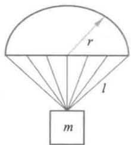

<table><tr><td>r/m</td><td>2</td><td>2.5</td><td>3</td><td>3.5</td><td>4</td></tr><tr><td>C1/元</td><td>65</td><td>170</td><td>350</td><td>660</td><td>1 000</td></tr></table>

降落伞在降落过程中受到的空气阻力,可以认为与降落速度和伞面积的乘积成正比.为了确定阻力系数,用半径  $r = 3 \mathrm{m}$  载重  $m = 300 \mathrm{kg}$  的降落伞从  $500 \mathrm{m}$  高度作降落试验,测得各时刻  $t$  的高度  $x$  ,见下表.

<table><tr><td>t/s</td><td>0</td><td>3</td><td>6</td><td>9</td><td>12</td><td>15</td><td>18</td><td>21</td><td>24</td><td>27</td><td>30</td></tr><tr><td>x/m</td><td>500</td><td>470</td><td>425</td><td>372</td><td>317</td><td>264</td><td>215</td><td>160</td><td>108</td><td>55</td><td>1</td></tr></table>

试确定降落伞的选购方案,即共需多少个,每个伞的半径多大(在第1个表中选择),在满足空投要求的条件下,使费用最低.

# 更多案例······

5- 1 正规战与游击战

5- 2 药物在体内的分布与排除

5- 3 考虑年龄结构和生育模式的人口模型

5- 4 烟雾的扩散与消失

5- 5 军备竞赛

5- 6 种群的相互竞争

5- 7 种群的相互依存

# 第6章 差分方程与代数方程模型

差分方程是在离散的时间点上描述研究对象动态变化规律的数学表达式。有的实际问题本身就是以离散形式出现的,如存贷款利息的计算;也有的是将现实世界中随时间连续变化的过程离散化,例如湖泊中的污水浓度是因上游河流的入流量和污水浓度、湖泊的天然处理污物能力等因素的不同,随时间连续变化的,而管理者采用每周对湖泊和上游河流监测一次、获取数据的方法,建立以周为离散时间单位的湖泊污水浓度的变化规律,即差分方程模型。还有一些实际问题,当不考虑时间因素作为静态问题处理时,常常可以建立代数方程模型。把代数方程与差分方程合在一章,是因为它们都用类似的矩阵、向量的数学形式表达,求解过程也有相似之处。

# 6.1 贷款购房

当今许多年轻人把购置一套属于自己的住房,当作是成家立业的一个标志或者前提。面对大中城市飙升的房价,大多数人选择向银行贷款购房,虽然要节衣缩食、月月上供,但是有一个温馨的小家,还是会感到无比甜蜜。买多大的房子,一共贷多少钱,每月还款几何,是首要考虑的问题。当然,网上有现成的房贷计算器,输入必要的信息,轻击鼠标立即可得结果。然而,作为一位学习数学建模、对数学的应用有兴趣的读者,了解计算原理,对结果作一些数量上的分析,会是有趣的、有帮助的。贷款购房的数学模型是最简单的差分方程模型[70]。

单利和复利 你有1万元长期不用,到银行存5年定期,年利率为  $4.75\%$  ①,到期后得到的本金加利息(下称本息)为  $10000 \times (1 + 0.0475 \times 5) = 12375$  元,这样计算的利息称为单利。如果想灵活一点取用,存1年定期,年利率为  $3\%$ ,并申报若到期不取则自动转存,那么一年后本息为  $10000 \times (1 + 0.03)$ ,仍按年利率  $3\%$  再存1年,若如此共存5年,得到的本息为  $10000 \times (1 + 0.03)^5 = 11593$  元,这样计算的利息称为复利,俗称"利滚利"。按照复利算出的结果比单利还少,是因为年利率不同造成的。如果用同一利率  $r$  计算,存期为  $n$ ,那么单位本金按照单利计算的本息是  $1 + nr$ ,而按照复利计算的本息是  $(1 + r)^n$ ,显然后者大于前者。

银行的零存整取业务是按单利计算的。零存整取是指每月固定存额,集零成整,约定存款期限,到期一次支取本息的定期储蓄,一般5元起存,多存不限。存期分为1年、3年、5年。走上工作岗位的年轻人如果计划贷款购房,就要开始准备首付款,其办法之一是每月从收入中留下一部分办理零存整取,既能培养勤俭节约、科学理财的习惯,也可得到一点回报。如果你打算每月存3000元,5年能有多少利息呢?

用网上的零存整取计算器,输入存期5年、每月存入金额3000元和5年期的年利率  $3.5\%$ ,得到的结果是,累计存入金额180000元,到期本息总额196012.50元。这是

怎么计算的?

记每月存入金额为  $a$ , 月利率为  $r = \frac{0.035}{12}$ , 存入  $k$  个月本息总额为  $x_{k}$ , 按单利计算时只有本金产生利息, 没有"利滚利", 设存期  $n = 12 \times 5 = 60$  个月, 有

$$
x_{1} = a + a r, x_{2} = x_{1} + a + a 2 r, \dots , x_{k} = x_{k - 1} + a + a k r, k = 2, 3, \dots , n \tag{1}
$$

将(1)式由  $k = n$  递推至  $k = 1$  得到整个存期的本息总额为

$$
x_{n} = n a + a r(1 + 2 + \dots +n) = n a + a r \frac{n(n + 1)}{2} \tag{2}
$$

(2)式是零存整取计算到期本息总额的一般公式, 将上面的  $a, r, n$  代入, 即得计算器给出的 196012.50 元.(2)式右端  $n a$  为累计存入金额, 后一项是利息. 其实, 由于每份本金  $a$  分别存了  $n, n - 1, \dots , 2, 1$  个月, 利息可以直接算出.

等额本息贷款和等额本金贷款 下面讨论贷款购房, 先利用网上的房贷计算器计算每月的还款金额, 这需要先作一些选择, 并输入必要的信息:

$\bullet$  贷款类别: 商业贷款、公积金、组合型. 区别在于年利率不同, 组合型指商业贷款和公积金的组合. 以下选择商业贷款.

$\bullet$  计算方法: 根据贷款总额计算或根据面积、单价及按揭成数计算. 以下选择根据贷款总额计算.

$\bullet$  按揭年数: 可选 1 至 30 年. 以下选择 20 年.

$\bullet$  银行利率: 可选基准利率、利率上限或下限. 以下选择商业贷款的基准利率  $6.55\%$ .

$\bullet$  还款方式: 等额本息还款或等额本金还款. 这是我们讨论的重点, 下面将对二者分别研究, 进行分析、比较.

例 1 在房贷计算器上选择等额本息还款, 并输入: 商业贷款总额 100 万元, 期限 20 年, 年利率  $6.55\%$ . 点击"开始计算"得到: 还款总额 1796447.27 元, 月均还款 7485.2 元. 建立等额本息还款方式的数学模型, 并作数值计算.

建模所谓等额本息还款, 是指每月归还本息的金额相同, 记每月还款金额为  $a$ , 设贷款总额为  $x_{0}$ , 月利率为  $r$ , 第  $k$  月还款后尚欠金额为  $x_{k}$ , 贷款期限 (月) 为  $n$ , 则

$$
x_{k} = x_{k - 1}(1 + r) - a, k = 1, 2, \dots , n \tag{3}
$$

将(3)式由  $k = n$  递推至  $k = 1$  得  $\mathbb{O}$

$$
x_{n} = x_{0}(1 + r)^{n} - a \left[1 + (1 + r) + \dots + (1 + r)^{n - 1}\right] = x_{0}(1 + r)^{n} - a \frac{(1 + r)^{n} - 1}{r} \tag{4}
$$

当贷款到期时, (4)式左端的  $x_{n} = 0$ , 于是得到每月还款金额为

$$
a = x_{0} r \frac{(1 + r)^{n}}{(1 + r)^{n} - 1} \tag{5}
$$

记等额本息还款总额为  $A_{1}$ , 显然

$$
A_{1} = n a = x_{0} r n \frac{(1 + r)^{n}}{(1 + r)^{n} - 1} \tag{6}
$$

(3)~(6)式为等额本息还款方式的数学模型

将  $x_{0} = 100$  万元,  $r = 0.0655 / 12$ ,  $n = 12 \times 20 = 240$  月代入(5)、(6)式, 即得计算器给出的  $a = 7485.2$  元,  $A_{1} = 1796447.27$  元.

例2 在房贷计算器上选择等额本金还款, 并输入: 商业贷款总额100万元, 期限20年, 年利率  $6.55\%$ . 点击"开始计算"得到: 还款总额1657729.17元, 每月还款金额由第1月的9625元逐月递减, 最后1月为4189.41元. 建立等额本金还款方式的数学模型, 并作数值计算.

建模所谓等额本金还款, 是指每月归还同等数额的本金, 加上所欠本金的利息由于所欠本金逐月减少, 所以每月还款金额递减, 记第  $k$  月还款金额为  $x_{k}$ . 仍设贷款总额为  $x_{0}$ , 月利率为  $r$ , 贷款期限(月)为  $n$ , 则每月归还本金为  $\frac{x_{0}}{n}$ , 且还款金额逐月减少归还本金  $\frac{x_{0}}{n}$  所产生的利息  $\frac{x_{0}r}{n}$ , 于是

$$
x_{k} = x_{k - 1} - \frac{x_{0}r}{n}, k = 2, 3, \dots , n \tag{7}
$$

(7)式递推至  $k = 2$ , 并注意到第1月的还款金额为  $x_{1} = \frac{x_{0}}{n} + x_{0}r$ , 得第  $k$  月还款金额为

$$
x_{k} = \frac{x_{0}}{n} + x_{0}\left(1 - \frac{k - 1}{n}\right)r, k = 1, 2, \dots , n \tag{8}
$$

记等额本金还款总额为  $A_{2}$ , 则

$$
A_{2} = \sum_{k = 1}^{n} x_{k} = x_{0} + x_{0}r \frac{n + 1}{2} \tag{9}
$$

(7)~(9)式为等额本金还款方式的数学模型

将  $x_{0} = 100$  万元,  $r = 0.0655 / 12$ ,  $n = 12 \times 20 = 240$  月代入, 即得计算器给出的  $x_{1} =$

9625元,  $x_{240} = 4189.41$  元, 每月还款金额递减  $\frac{x_{0}r}{n} = 22.7431$  元,  $A_{2} = 1657729.17$  元.

等额本息与等额本金方式的比较 从以上建模过程和数值计算可以归纳出两种还款方法的特点如下:

$\bullet$  等额本息还款方式简单, 便于安排收支;

$\bullet$  等额本金方式每月还款金额前期高于等额本息方式, 后期低于等额本息方式, 适合当前收入较高人群;

$\bullet$  等额本息方式的还款总额大于等额本金方式

对于最后一点, 例1和例2的数值计算表明等额本息还款总额  $A_{1}$  比等额本金还款总额  $A_{2}$  多了近14万元. 直观地看, 等额本金方式将每月利息还清, 而等额本息方式还款额(前期)比等额本金少, 所欠本息的利息归入以后逐月归还, 产生的利息总额将大于等额本金方式. 从数量关系上, 可以根据(6)、(9)式证明  $A_{1} > A_{2}$  (复习题2).

复习题

1. 在网上用当前的还款利率在等额本息还款、商业贷款100万元、期限20年条件下, 查出还款

总额和月均还款, 然后用本节的模型计算, 予以核对.

2. 根据(6)、(9)式证明等额本息还款总额  $A_{1}$  大于等额本金还款总额  $A_{2}$ .

# 6.2 管住嘴迈开腿

您的体重正常吗? 目前人们公认的测评体重的标准是联合国世界卫生组织颁布的体重指数(body mass index, 简记BMI), 定义为  $\mathrm{BMI} = \frac{h}{l^{2}}$ , 其中  $h$  是体重(单位:  $\mathrm{kg}$ ),  $l$  是身高(单位:  $\mathrm{m}$ ), 显然身材矮胖者比瘦高者的BMI要大. 标准身材的  $\mathrm{BMI} = 22$ , 如身高  $l = 1.70 \mathrm{~m}$  的人的标准体重为  $h = 63.5 \mathrm{~kg}$ . 按照BMI的大小, 世界卫生组织和我国给出的体重指数分级标准如表1.

表1体重指数分级标准  

<table><tr><td></td><td>偏瘦</td><td>正常</td><td>超重</td><td>肥胖</td></tr><tr><td>世界卫生组织标准</td><td>&amp;lt;18.5</td><td>18.5~24.9</td><td>25.0~29.9</td><td>≥30.0</td></tr><tr><td>我国参考标准</td><td>&amp;lt;18.5</td><td>18.5~23.9</td><td>24.0~27.9</td><td>≥28.0</td></tr></table>

20世纪80年代以后, 随着我国人民物质生活水平的迅速提高, 越来越多自感肥胖, 甚至害怕肥胖的人纷纷奔向减肥药品的柜台. 可是大量事实说明, 大多数减肥药品并达不到减肥的效果, 或者即使成功一时, 也难以维持下去. 许多医生和专家的意见是, 只有通过控制饮食和适当的运动, 也就是人们常说的"管住嘴、迈开腿", 才能在不伤害身体的前提下, 达到减轻体重并使体重得以控制的目的. 本节要建立一个简单的体重变化规律的数学模型, 并由此通过节食与运动制定合理、有效的减肥计划[70].

模型分析 在正常情况下, 人体通过食物摄入的热量与代谢和运动消耗的热量大体上是平衡的, 于是体重基本保持不变, 而当体内能量守恒被破坏时就会引起体重的变化. 因此需要从人体对热量的吸收和消耗两方面进行分析, 在适当简化的假设下建立体重变化规律的数学模型.

减肥计划应以不伤害身体为前提, 这可以用吸收热量不要过少、减少体重不要过快来限制. 另外, 增加运动量是加速减肥的有效手段, 也要在模型中加以考虑.

通常, 制订减肥计划以周为时间单位比较方便, 所以这里用离散时间模型——差分方程来讨论.

模型假设 根据上述分析, 参考有关生理数据, 做出以下简化假设:

1. 体重增加正比于吸收的热量, 平均每8000 kcal(kcal为非国际单位制单位,  $1 \mathrm{kcal} = 4.2 \mathrm{~kJ}$  ) 增加体重  $1 \mathrm{~kg}$ ;

2. 身体正常代谢引起的体重减少正比于体重, 每周每千克体重消耗热量一般在  $200 \mathrm{kcal}$  至  $320 \mathrm{kcal}$  之间, 且因人而异, 这相当于体重  $70 \mathrm{~kg}$  的人每天消耗  $2000 \mathrm{kcal}$  至  $3200 \mathrm{kcal}$ ;

3. 运动引起的体重减少正比于体重, 且与运动形式和运动时间有关;

4. 为了安全与健康, 每周吸收热量不要小于  $10000 \mathrm{kcal}$ , 且每周减少量不要超过  $1000 \mathrm{kcal}$ , 每周体重减少不要超过  $1.5 \mathrm{~kg}$ .

调查资料经综合后, 得到若干食物每百克所含热量及各项运动每小时每千克体重消耗热量, 如表 2 和表 3, 供参考.

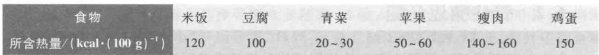

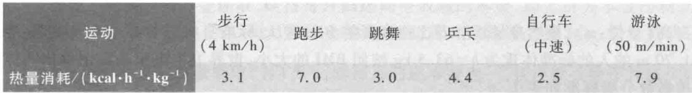  
表3 运动每小时每千克体重消耗热量

基本模型记第  $k$  周(初)体重为  $w(k)$  (kg), 第  $k$  周吸收热量为  $c(k)$  (kcal),  $k = 1,2, \dots$  设热量转换(体重的)系数为  $\alpha$ , 身体代谢消耗系数为  $\beta$ , 根据模型假设, 正常情况下(不考虑运动)体重变化的基本方程为

$$
w(k + 1) = w(k) + \alpha c(k) - \beta w(k), \quad k = 1,2, \dots \tag{1}
$$

由假设  $1, \alpha = \frac{1}{8000} \mathrm{~kg} / \mathrm{kcal}$ , 当确定了每个人的代谢消耗系数  $\beta$  后, 就可按(1)式由每周吸收的热量  $c(k)$  推导他(她)体重  $w(k)$  的变化. 增加运动时, 只需将  $\beta$  改为  $\beta + \beta_{1}$ ,  $\beta_{1}$  由运动的形式和时间决定.

减肥计划的提出 通过制定一个具体的减肥计划讨论模型(1)的应用.

某人身高  $1.70 \mathrm{~m}$ , 体重  $100 \mathrm{~kg}$ , BMI 高达 34.6. 自述目前每周吸收  $20000 \mathrm{kcal}$  热量, 体重长期未变. 试为他按照以下方式制订减肥计划, 使其体重减至  $75 \mathrm{~kg}$  (即  $\mathrm{BMI} = 26$  ) 并维持下去:

1) 在正常代谢情况下安排一个两阶段计划, 第一阶段: 吸收热量由  $20000 \mathrm{kcal}$  每周减少  $1000 \mathrm{kcal}$ , 直至达到安全下限(每周  $10000 \mathrm{kcal}$  ); 第二阶段: 每周吸收热量保持下限, 直至达到减肥目标.

2) 为加快进程而增加运动, 重新安排两阶段计划.

3) 给出达到目标后维持体重不变的方案.

减肥计划的制订首先应确定某人的代谢消耗系数  $\beta$ . 根据他每周吸收  $c = 20000 \mathrm{kcal}$  热量, 体重  $w = 100 \mathrm{~kg}$  不变, 在(1)式中令  $w(k + 1) = w(k) = w$ ,  $c(k) = c$ , 得

$$
w = w + \alpha c - \beta w
$$

于是

$$
\beta = \frac{\alpha c}{w} = \frac{20000 / 8000}{100} = 0.025 \tag{2}
$$

相当于每周每千克体重消耗热量  $\frac{20000}{100} = 200 \mathrm{kcal}$ . 从假设 2 可以知道, 某人属于正常代谢消耗相当弱的人. 他又吃得那么多, 难怪如此之胖.

1) 正常代谢情况下的两阶段计划. 第一阶段要求吸收热量由  $20000 \mathrm{kcal}$  每周减少  $1000 \mathrm{kcal}$  (由表 2, 如每周减少米饭和瘦肉各  $350 \mathrm{~g}$  ), 达到下限  $c_{\min} = 10000 \mathrm{kcal}$ , 即

$$
c(k) = 20000 - 1000k, k = 1,2,\dots ,10 \tag{3}
$$

将  $c(k)$  及  $\alpha = \frac{1}{8000}, \beta = 0.025$  代入(1)式,可得

$$
\begin{array}{c}{{w\left(k+1\right)=\left(1-\beta\right)w\left(k\right)+\alpha\left(20 000-1 000 k\right)}}\\ {{=0.975w\left(k\right)+2.5-0.125k, k=1,2,\cdots,10}}\end{array} \tag{4}
$$

(4)式虽是一阶线性常系数差分方程,但因右端含有时间变量  $k$ ,不能直接应用基础知识6-1的求解公式。更方便的办法是,以  $w(1) = 100 \mathrm{~kg}$  为初始值,按照(4)式编程计算,可得第11周(初)体重  $w(11) = 93.6157 \mathrm{~kg}$ 。

第二阶段要求每周吸收热量保持下限  $c_{\mathrm{min}}$ ,由(1)式可得

$$
\begin{array}{c}{{w\left(k+1\right)=\left(1-\beta\right)w\left(k\right)+\alpha c_{\mathrm{min}}}}\\ {{=0.975w\left(k\right)+1.25, k=11,12,\cdots}}\end{array} \tag{5}
$$

以第一阶段的终值  $w(11)$  为第二阶段的初值,按照(5)式编程计算,直至  $w(11 + n) \leqslant 75 \mathrm{~kg}$  为止,可得  $w(11 + 22) = 74.9888 \mathrm{~kg}$ ,即每周吸收热量保持下限  $10000 \mathrm{kcal}$ ,再有22周体重可减至  $75 \mathrm{~kg}$ 。两阶段共需32周。

2)为加快进程而增加运动。记表3中热量消耗为  $\gamma$ ,每周运动时间为  $t \mathrm{~h}$ ,在(1)式中将  $\beta$  改为  $\beta + \alpha \gamma t$ ,即

$$
w\left(k + 1\right) = w\left(k\right) + \alpha c\left(k\right) - \left(\beta +\alpha \gamma t\right)w\left(k\right) \tag{6}
$$

试取  $\alpha \gamma t = 0.005$ ,则  $\beta + \alpha \gamma t = 0.03$ ,(4)、(5)式分别变为

$$
w\left(k + 1\right) = 0.97w\left(k\right) + 2.5 - 0.125k, \quad k = 1,2,\dots ,10 \tag{7}
$$

$$
w\left(k + 1\right) = 0.97w\left(k\right) + 1.25, \quad k = 11,12,\dots \tag{8}
$$

类似的计算可得,  $w(11) = 89.3319 \mathrm{~kg}, w(11 + 12) = 74.7388 \mathrm{~kg}$ ,即若增加  $\alpha \gamma t = 0.005$  的运动,就可将第二阶段的时间缩短为12周。由  $\alpha = \frac{1}{8000}$  可知,增加的运动内容应满足  $\gamma t = 40$ ,可从表3选择合适的运动形式和时间,如每周步行  $7 \mathrm{~h}$  加乒乓  $4 \mathrm{~h}$ 。两阶段共需22周,增加运动的效果非常明显。

将正常代谢和增加运动两种情况下的体重  $w(k)$  作图,得到的曲线如图1。

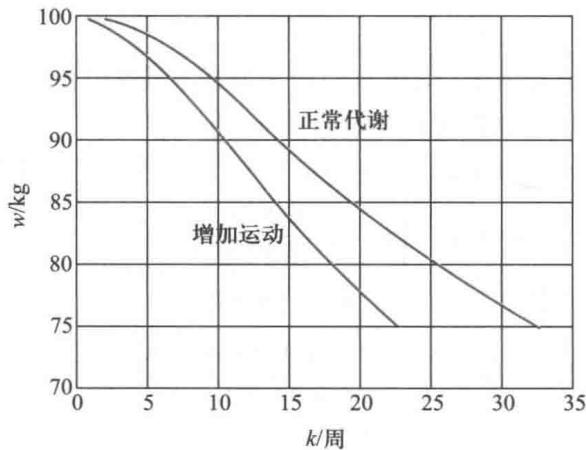  
图1 正常代谢和增加运动下的体重  $w(k)$  曲线

经检查,两种情况下每周体重的减少都不超过  $1.5 \mathrm{kg}$ .

3)达到目标后维持体重不变的方案.最简单的是寻求每周吸收热量保持某常数值 $c$  ,使体重  $w = 75\mathrm{~kg~}$  不变.类似于(2)式,在(6)式中令  $w\left(k + 1\right) = w\left(k\right) = w$ $c\left(k\right) = c$  ,得

$$
w = w + \alpha c - \left(\beta +\alpha \gamma t\right)w
$$

于是

$$
c = \frac{\left(\beta + \alpha\gamma t\right)w}{\alpha} \tag{9}
$$

由(9)式,在正常代谢下(  $\gamma = 0$  )可算出  $c = 15000\mathrm{\kcal}$  ;若增加  $\gamma t = 40$  的运动,则  $c =$ $18000\mathrm{\kcal}$

实际上,如果在减肥计划的开始,就让某人每周吸收热量由  $20000\mathrm{\kcal}$  直接减至 $c = 15000\mathrm{\kcal}$  ,那么他的体重也将逐渐下降,很长时间以后(理论上是无穷长)才会降到  $75\mathrm{~kg}$  而若每周吸收热量减至  $14000\mathrm{\kcal}$  ,13000kcal,12000kcal,体重下降速度将加快,直接按照(1)式计算,得到的曲线如图2. 可以看到,达到目标体重  $75\mathrm{~kg}$  的时间分别约为70周、50周和40周,都比上面的两阶段计划长,且吸收热量的突减也对身体不利.

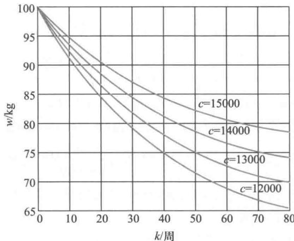  
图2吸收不同热量  $c$  下的体重  $w(k)$  曲线

评注 人体体重的变化是有规律可循的,减肥也应科学化、定量化.这个模型虽然只考虑了一个非常简单的情况,但是它对自愿进行科学减肥,甚至打算将其作为一项事业的人来说也不无参考价值.

体重的变化与每个人特殊的生理条件有关,特别是代谢消耗系数  $\beta$  ,不仅因人而异,而且即使同一个人,在不同环境下也会有所改变.从上面的计算中我们看到,当  $\beta$  由0.025增加到0.03时(变化  $20\%$  ).减肥所需时间就从32周减少到22周(变化约  $30\%$  ).所以应用这个模型时要对  $\beta$  做仔细的核对.

如果要寻求达到目标体重(记作  $w^{*}$  )所需时间(周数记作  $n$  )与每周吸收热量  $c$  之间的关系,将基本模型(1)式的  $k$  由1递推至  $n$  ,得

$$
\begin{array}{c}{{w\left(n+1\right)=\left(1-\beta\right)^{n}w\left(1\right)+\alpha c\left[1+\left(1-\beta\right)+\cdots+\left(1-\beta\right)^{n-1}\right]}}\\ {{=\left(1-\beta\right)^{n}\left[w\left(1\right)-\frac{\alpha c}{\beta}\right]+\frac{\alpha c}{\beta}}}\end{array} \tag{10}
$$

令  $w^{*} = w\left(n + 1\right)$  并记  $w_{1} = w\left(1\right)$  ,由(10)式得

$$
n = \frac{\ln\left(w^{*} - \alpha c / \beta\right) - \ln\left(w_{1} - \alpha c / \beta\right)}{\ln\left(1 - \beta\right)} \tag{11}
$$

以  $w^{*} = 75,w_{1} = 100,\alpha = \frac{1}{8000},\beta = 0.025$  及  $c = 14000,13000,12000$  代入(11)式算出  $n$  分别为70.7707,49.4815,38.7407,与图2所示基本相同.

若将模型假设修改为"每周体重减少不要超过  $1 \mathrm{~kg}$  ", 检查所制订的减肥计划是否满足. 如不满足. 重新制订计划.

# 6.3 市场经济中的物价波动

在自由竞争的市场经济中常会出现这样的现象: 一个时期以来某种商品如鸡蛋的供应量大于需求, 由于销售不畅致使价格下跌, 生产者发现养鸡赔钱, 于是转而经营其他农副业. 过一段时间, 鸡蛋供应量就会大减, 供不应求将导致价格上涨, 生产者看到有利可图又重操旧业, 这样, 下一个时期又会重现供过于求、价格下跌的局面.

商品数量和价格主要由供求关系决定, 供求平衡时, 商品的数量和价格基本稳定, 一旦出现不平衡, 商品的数量和价格就会发生振荡. 市场经济中这种振荡是绝对的, 不可避免的, 它可以有两种完全不同的形式. 常见的一种是振幅逐渐减小, 最终趋向平稳, 这是老百姓能够接受的形式. 另一种是振幅越来越大, 如果没有外界如政府的干预, 将导致一定意义下的经济崩溃. 本节要建立一个简化的数学模型描述这种振荡现象, 研究趋向平稳的条件, 并讨论不稳定时政府可能采取的干预方式[44].

模型假设研究对象是市场上某种商品的数量和价格随时间的变化规律. 时间离散化为时段, 1 个时段相当于 1 个生产周期, 对肉、禽等指的是牲畜饲养周期, 对蔬菜、水果等指的是种植周期. 记第  $k$  时段的商品数量为  $x_{k}$ , 价格为  $y_{k}$ . 模型假设如下:

1. 当商品的供求关系处于平衡状态时, 其数量为  $x_{0}$ , 价格为  $y_{0}$ , 均保持不变.

2. 按照经济规律, 第  $k$  时段的商品价格  $y_{k}$  由消费者的需求关系决定, 当商品数量  $x_{k}$  大于  $x_{0}$  时, 供过于求导致价格下跌,  $y_{k}$  将小于  $y_{0}$ . 商品数量  $x_{k + 1}$  由生产者的供应关系决定, 当价格  $y_{k}$  小于  $y_{0}$  时, 低价格导致产量下降, 第  $k + 1$  时段商品数量  $x_{k + 1}$  将小于  $x_{0}$ .

3. 在  $x_{k}, y_{k}$  偏离其平衡值  $x_{0}, y_{0}$  都不太大的范围内,  $y_{k}$  的偏离  $y_{k} - y_{0}$  与  $x_{k}$  的偏离  $x_{k} - x_{0}$  成正比,  $x_{k + 1}$  的偏离  $x_{k + 1} - x_{0}$  与  $y_{k}$  的偏离  $y_{k} - y_{0}$  成正比.

差分方程模型按照假设,  $y_{k} - y_{0}$  与  $x_{k} - x_{0}$  成正比, 且符号相反, 记比例系数为  $\alpha$ , 有

$$
y_{k} - y_{0} = -\alpha \left(x_{k} - x_{0}\right), \alpha > 0, k = 1, 2, \dots \tag{1}
$$

$x_{k + 1} - x_{0}$  与  $y_{k} - y_{0}$  成正比, 且符号相同, 记比例系数为  $\beta$ , 有

$$
x_{k + 1} - x_{0} = \beta \left(y_{k} - y_{0}\right), \beta > 0, k = 1, 2, \dots \tag{2}
$$

若系数  $\alpha , \beta$  及平衡值  $x_{0}, y_{0}$  已知, 那么由商品数量的初始值  $x_{1}$ , 可用 (1), (2) 式计算  $x_{k}, y_{k}$ .

(1), (2) 式是关于  $x_{k}, y_{k}$  的差分方程组, 从中消去  $y_{k} - y_{0}$  可得对于  $x_{k}$  的差分方程

$$
x_{k + 1} - x_{0} = -\alpha \beta \left(x_{k} - x_{0}\right), k = 1, 2, \dots \tag{3}
$$

由 (3) 式可以递推地解出

$$
x_{k + 1} - x_{0} = (-\alpha \beta)^{k} \left(x_{1} - x_{0}\right), k = 1, 2, \dots \tag{4}
$$

由 (4) 式可知, 对于给定的商品数量的初始偏离  $x_{1} - x_{0}$ , 仅当系数  $\alpha , \beta$  满足

时,才有  $x_{k} \longrightarrow x_{0}(k \rightarrow \infty)$ ,且  $y_{k} \longrightarrow y_{0}$ ,平衡值  $x_{0}, y_{0}$  是稳定的;而当

时,  $x_{k}, y_{k} \longrightarrow \infty (k \rightarrow \infty)$ ,平衡值  $x_{0}, y_{0}$  不稳定。

模型分析 (1)~(6)式给出市场经济中商品数量和价格随时间的变化规律,显然,这种振荡是否趋向平稳完全取决于系数  $\alpha , \beta$  的大小。先看一个数值例子。

若某种商品在市场上处于平衡状态时的数量为  $x_{0} = 100$  (单位),价格为  $y_{0} = 10$  (元/单位),开始时段商品数量为  $x_{1} = 110$ 。当商品数量减少1个单位时,需求关系使价格上涨0.1元,而当价格上涨1元时,供应关系使下一时段供应量增加5个单位,于是  $\alpha = 0.1$ ,  $\beta = 5$ 。按照方程(1),(2)编程计算,得到的  $x_{k}, y_{k}(k = 1,2, \dots , 10)$  如图1,可以看出  $x_{k}, y_{k}$  分别趋向平衡值  $x_{0}, y_{0}$ 。显然, $\alpha \beta = 0.5 < 1$ ,满足稳定条件(5)式。

如果  $\alpha$  提高至0.24而  $\beta = 5$  不变,得到的  $x_{k}, y_{k}$  如图2,因为  $\alpha \beta = 1.2 > 1$ ,由(6)式, $x_{0}, y_{0}$  不稳定。

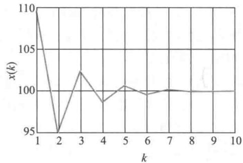

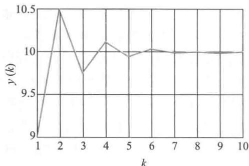  
图1  $\alpha = 0.1, \beta = 5$  差分方程模型(1)、(2)的  $x_{k}, y_{k}$

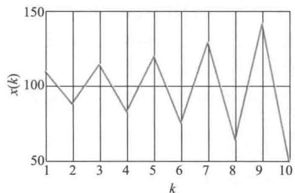  
图2  $\alpha = 0.24, \beta = 5$  差分方程模型(1)、(2)的  $x_{k}, y_{k}$

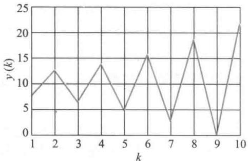

考察  $\alpha , \beta$  的含义,可以对商品数量和价格是否会趋于稳定做出合理的解释。由(1)式可知, $\alpha$  表示商品数量减少一个单位时价格的上涨幅度;由(2)式可知, $\beta$  表示价格上涨一个单位时(下一时段)供应量的增加。所以  $\alpha$  反映消费者需求的敏感程度,如果是生活必需品,消费者处于持币待购状态,商品数量稍缺,人们立即蜂拥抢购, $\alpha$  就会较大;反之,若消费者购物心理稳定,则  $\alpha$  较小。 $\beta$  的数值反映生产经营者对价格的敏感程

度,如果他们目光短浅,热衷于追逐一时的高利润,价格稍有上涨就大量增加生产,  $\beta$  就会较大;反之,若他们素质较高,有长远的计划,则  $\beta$  较小。差分方程(4)表明,仅当  $\alpha , \beta$  的乘积小于1时,商品数量和价格的振荡才会趋向稳定。

蛛网模型 差分方程模型以及振荡趋向稳定的条件可以通过经济学中的蛛网模型进行直观的解释。

以商品数量为横坐标  $x$  ,价格为纵坐标  $y,x$  ,  $y$  之间的关系通过  $x_{k},y_{k}$  由方程(1)、(2)给出.图3中,方程(1)表示为需求直线  $f$  ,方程(2)表示为供应直线  $g$  ,两条直线相交于  $P_{0}(x_{0},y_{0})$  点.  $P_{0}$  点称为平衡点,即一旦某时段  $k$  商品数量  $x_{k} = x_{k}$  ,则有  $y_{k} = y_{0},x_{k + 1}$ $= x_{0},y_{k + 1} = y_{0}$  ,…,永远保持在  $P_{0}(x_{0},y_{0})$  点。而实际上,种种干扰会使得商品数量和价格偏离  $P_{0}$  ,不妨设  $x_{1}$  偏离  $x_{0}$  ,如图3. 我们分析  $x_{k},y_{k}$  的变化。

商品数量  $x_{1}$  给定后,价格  $y_{1}$  由直线  $f$  上的  $P_{1}$  点决定。数量  $x_{2}$  又由  $y_{1}$  和直线  $g$  上的  $P_{2}$  点决定,  $y_{2}$  由  $x_{2}$  和  $f$  上的  $P_{3}$  点决定,这样在图3上得到一系列的点  $P_{1},P_{2},P_{3}$ $P_{4},\dots$  ,这些点按图上箭头方向趋向  $P_{0}$  点,称  $P_{0}$  为稳定平衡点,意味着商品的数量和价格的振荡将趋向稳定。

但是如果直线  $f$  和  $g$  如图4给出的那样,完全类似的分析可以发现,  $P_{1},P_{2},P_{3},\dots$  沿着箭头的方向,将越来越远离  $P_{0}$  点,称  $P_{0}$  为不稳定平衡点,意味着商品的数量和价格将出现越来越大的振荡。由于图3、图4中的折线  $P_{1}P_{2}P_{3}P_{4}\dots$  形似蛛网,所以称为蛛网模型。

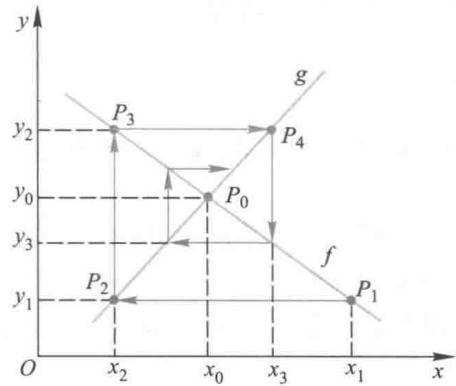  
图3 蛛网模型,  $P_{0}$  稳定

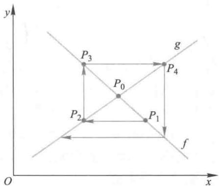  
图4 蛛网模型,  $P_{0}$  不稳定

为什么会有这样截然相反的现象呢?分析一下图3和图4的不同之处就可发现,图3的  $f$  比  $g$  平,而图4的  $f$  比  $g$  陡。用  $K_{f}$  和  $K_{g}$  分别表示  $f$  和  $g$  的斜率(取绝对值),可以看出,当  $K_{f}< K_{g}$  时  $P_{0}$  稳定;当  $K_{f} > K_{g}$  时  $P_{0}$  不稳定。

在差分方程模型中曾经得到平衡值  $x_{0},y_{0}$  稳定的条件(5)式,注意到蛛网模型中斜率  $K_{f}$  和  $K_{g}$  与差分方程中系数  $\alpha ,\beta$  的关系是  $K_{f} = \alpha$ $K_{g} = 1 / \beta$  ,可以知道蛛网模型的直观分析与差分方程模型推导出的条件(5)、(6)式完全一致。

政府的干预 基于上述分析可以得到政府在市场经济趋向不稳定时的两种干预办法。

一种办法是使  $\alpha$  尽量小,不妨考察其极端情况  $\alpha = 0$  ,即需求直线  $f$  变为水平,如图5. 这样不管供应关系如何,即不管  $\beta$  多大,(5)式恒成立,平衡点  $P_{0}$  总是稳定的。实际上

这种办法相当于政府控制价格,无论商品上市量有多少,命令价格  $\gamma_{0}$  不得改变。

另一种办法是使  $\beta$  尽量小,极端情况是  $\beta = 0$ ,即供应直线  $g$  变为竖直,如图6. 于是不管需求关系如何,即不管  $\alpha$  多大,(5)式恒成立,平衡点  $P_{0}$  也总是稳定的。实际上这相当于政府控制商品的上市数量,供不应求时,从外地收购,投入市场;供过于求时,收购过剩部分,维持上市量  $x_{0}$  不变。当然,这种办法需要政府具有相当的经济实力。

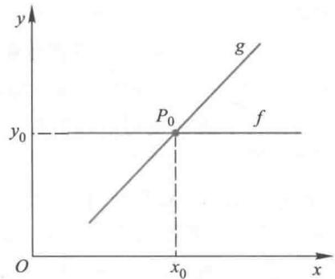  
图5 需求直线水平,经济稳定

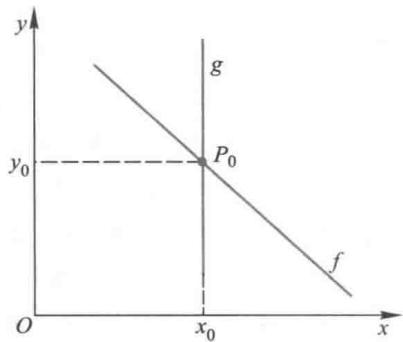  
图6 供应直线竖直,经济稳定

模型推广在差分方程模型中,商品价格  $y_{k}$  由数量  $x_{k}$  决定,用(1)式给出,商品数量  $x_{k + 1}$  由价格  $y_{k}$  决定,用(2)式给出。如果生产经营者的管理水平和素质更高一些,在决定产量  $x_{k + 1}$  时不仅根据价格  $y_{k}$ ,而且考虑更前一时段的价格  $y_{k - 1}$ 。在新的模型中, $y_{k}$  与  $x_{k}$  的关系仍由(1)式给出,而  $x_{k + 1}$  由  $y_{k}$  和  $y_{k - 1}$  的平均值决定,(2)式改为

$$
x_{k + 1} - x_{0} = \beta \left(\frac{y_{k} + y_{k - 1}}{2} -y_{0}\right), \beta > 0, k = 2, 3, \dots \tag{7}
$$

对于(1)、(7)式的  $x_{k}, y_{k}$  差分方程组,已知系数  $\alpha , \beta$  及平衡值  $x_{0}, y_{0}$ ,需要商品数量的2个初始值  $x_{1}, x_{2}$  才可递推地计算  $x_{k}, y_{k}$ 。

前面曾用模型(1)、(2)计算如下例子:  $\alpha = 0.24, \beta = 5, x_{0} = 100, y_{0} = 10, x_{1} = 110$ ,由于  $\alpha \beta = 1.2 > 1$ ,平衡值  $x_{0}, y_{0}$  不稳定,如图2(  $x_{k}, y_{k} \rightarrow \infty$  )。现在令  $\alpha , \beta , x_{0}, y_{0}, x_{1}$  不变,增加一个初始值  $x_{2} = 88①$ ,按照新模型(1)、(7)编程计算,得到的  $x_{k}, y_{k}$  如图7,可以看出  $x_{k}, y_{k}$  分别趋向平衡值  $x_{0}, y_{0}$ 。

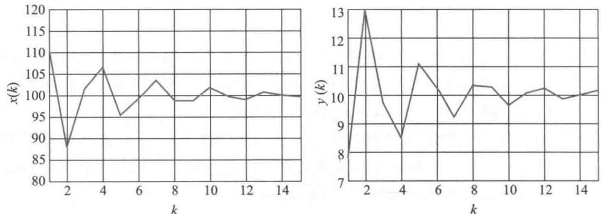  
图7  $\alpha = 0.24, \beta = 5$  时差分方程模型(1)、(7)的  $x_{k}, y_{k}$

我们看到,对于同样的  $\alpha \beta = 1.2 > 1$ ,原来不稳定的平衡值变为稳定了。为了分析新模型中平衡值  $x_{0}, y_{0}$  稳定的条件,从(1)、(7)式中消去  $y_{k}$  和  $y_{k - 1}$ ,得到对于  $x_{k}$  的二阶线性常系数差分方程:

$$
2x_{k + 2} + \alpha \beta x_{k + 1} + \alpha \beta x_{k} = 2(1 + \alpha \beta)x_{0}, k = 1,2,\dots \tag{8}
$$

方程(8)的解表示为(参考基础知识6- 1)

$$
x_{k} = c_{1}\lambda_{1}^{k} + c_{2}\lambda_{2}^{k} + x_{0}, k = 1,2,\dots \tag{9}
$$

其中  $\lambda_{1}, \lambda_{2}$  是特征方程

$$
2\lambda^{2} + \alpha \beta \lambda +\alpha \beta = 0 \tag{10}
$$

的特征根,有

$$
\lambda_{1}, \lambda_{2} = \frac{-\alpha \beta \pm \sqrt{(\alpha \beta)^{2} - 8 \alpha \beta}}{4} \tag{11}
$$

当  $\alpha \beta < 8$  时得到

$$
|\lambda_{1}| = |\lambda_{2}| = \sqrt{\frac{\alpha \beta}{2}} \tag{12}
$$

根据  $k \rightarrow \infty$  的稳定条件  $|\lambda_{1}|, |\lambda_{2}| < 1$  可得,当且仅当

$$
\alpha \beta < 2 \tag{13}
$$

时,平衡值  $x_{0}, y_{0}$  是稳定的,与原模型(1)、(2)的稳定条件  $\alpha \beta < 1$  相比,新模型(1)、(7)的稳定条件放宽了,可以想到,这是因为生产者的管理水平和素质提高,对经济稳定起着有利影响的必然结果。这也自然解释了上面数值例子中  $\alpha \beta = 1.2 < 2$  致使平衡值  $x_{0}, y_{0}$  稳定的事实。

差分方程平衡点的稳定性本是一个理论问题,在这个模型中却有明显的实际意义,也从一个侧面反映了数学建模与现实世界的密切关系。

评注 在市场经济中,供不应求价格上涨、供过于求价格下跌的现象司空见惯,本节用式子简单的差分方程和形式鲜明的蛛网模型给以描述和解读,模型参数都有明确的经济学含义,参数值的两种极端情况也具有人们熟知或了解的现实背景。

# 复习题

1. 因为一个时段上市的商品不能立即售完,其数量也会影响到下一时段的价格,所以第  $k + 1$  时段的价格  $y_{k + 1}$  由第  $k + 1$  时段和第  $k$  时段的数量  $x_{k + 1}$  和  $x_{k}$  决定。如果仍设  $x_{k + 1}$  只取决于  $y_{k}$ ,给出稳定平衡的条件,并与本节的结果进行比较。

2. 若除了  $y_{k + 1}$  由  $x_{k + 1}$  和  $x_{k}$  决定之外, $x_{k + 1}$  也由前两个时段的价格  $y_{k}$  和  $y_{k - 1}$  确定。试分析稳定平衡的条件是否还会放宽。

# 6.4 动物的繁殖与收获

野生动物种群在自然环境下繁殖、成长、死亡,只要环境条件不发生大的变化,种群的大小就会达到基本稳定,不同年龄动物的数量比例也会保持大致的平衡。饲养动物种群受到人类的控制,为了一些特殊需要,人们可以设法使不同年龄动物的数量达到预期的比例。本节先建立动物种群的自然增长模型,再讨论饲养动物种群的稳定收获问题。

按年龄分组的动物种群增长模型

不同年龄动物的繁殖率、死亡率有较大差别,因此在研究种群数量变化时,需要按

照年龄将动物分组,时间也相应地离散化。动物种群是直接通过雌性繁殖而增长的,用雌性个体数量的变化作为研究对象比较方便,下面讨论的种群数量均指其中的雌性,总体数量可按一定的性别比算出[73]。

模型假设对种群分组和时段划分、种群的繁殖和死亡作如下简化、合理的假设:

1. 将动物种群按年龄大小等间隔地分成  $n$  个年龄组,如每1岁或5岁为一组。与之相对应,时间也分成与年龄组区间大小相等的时段,如1年或5年为一个时段。

2. 在稳定环境下和不太长的时期内,每个年龄组种群的繁殖率和死亡率不随时段变化,只与年龄组有关。

模型建立记第  $i$  年龄组第  $k$  时段的种群数量为  $x_{i}(k), i = 1,2,\dots ,n,k = 0,1,2,\dots$  设第  $i$  年龄组的繁殖率为  $b_{i}$ ,即每个(雌性)个体在一个时段内繁殖的数量;第  $i$  年龄组的死亡率为  $d_{i}$ ,即一个时段内死亡数量在总量中的比例。记  $s_{i} = 1 - d_{i}$ ,称为存活率。通常  $b_{i}$  和  $s_{i}$  可由统计资料获得,且  $b_{i} \geqslant 0, i = 1,2,\dots ,n$ ,其中至少一个  $b_{i} > 0$ ,而  $0< s_{i} \leqslant 1, i = 1,2,\dots ,n - 1, s_{n} = 0$  (不考虑最高年龄组的存活)。

为寻求按年龄分组的种群数量  $x_{i}(k)$  由第  $k$  到  $k + 1$  时段的变化规律,首先注意到,第1年龄组(包含出生的年龄组)第  $k + 1$  时段的数量是各年龄组第  $k$  时段的繁殖数量之和,即

$$
x_{1}(k + 1) = \sum_{i = 1}^{n} b_{i} x_{i}(k), k = 0,1,2,\dots \tag{1}
$$

其中繁殖率  $b_{i}$  的统计中已经扣除了虽出生但在一个时段内死亡的幼年动物。其次,只有第  $k$  时段第  $i$  年龄组种群中存活下来的部分,才能在第  $k + 1$  时段演变到第  $i + 1$  年龄组  $(i = 1,2,\dots ,n - 1)$ ,所以

$$
x_{i + 1}(k + 1) = s_{i} x_{i}(k), k = 0,1,2,\dots ,i = 1,2,\dots ,n - 1 \tag{2}
$$

(1),(2)式构成包含  $n$  个变量  $x_{i}(k) (i = 1,2,\dots ,n)$  的差分方程组,表示了按年龄分组的种群数量的变化规律。已知繁殖率  $b_{i} (i = 1,2,\dots ,n)$ 、存活率  $s_{i} (i = 1,2,\dots ,n - 1)$  及种群各年龄组的初始数量  $x_{i}(0)$ ,可由方程组(1),(2)计算任意时段各年龄组种群的数量分布,称为按年龄分组的种群增长模型。

将各年龄组第  $k$  时段的种群数量  $x_{i}(k)$  排成如下向量

$$
\pmb{x}(k) = \left[x_{1}(k),x_{2}(k),\dots ,x_{n}(k)\right]^{\mathrm{T}},k = 0,1,2,\dots \tag{3}
$$

繁殖率  $b_{i}$  和存活率  $s_{i}$  排成如下矩阵

$$
L = \left[ \begin{array}{c c c c c}{b_{1}} & {b_{2}} & \dots & {b_{n - 1}} & {b_{n}}\\ {s_{1}} & 0 & \dots & 0 & 0\\ 0 & {s_{2}} & \dots & 0 & 0\\ \vdots & \vdots & & \vdots & \vdots \\ 0 & 0 & \dots & {s_{n - 1}} & 0 \end{array} \right] \tag{4}
$$

则差分方程组(1),(2)可以简洁地表示为如下的向量- 矩阵形式

$$
\pmb {x}(k + 1) = \pmb {L}\pmb {x}(k), k = 0,1,2,\dots \tag{5}
$$

给定种群各年龄组的初始数量  $x(0)$ ,种群各年龄组任意时段的数量为

$$
\pmb {x}(k) = \pmb{L}^{k}\pmb {x}(0), k = 0,1,2,\dots \tag{6}
$$

有了  $\boldsymbol {x}(k)$ , 就很容易计算种群在任意时段的总量.

有时, 人们更关注任意时段种群各年龄组的数量在总量中的比例, 记

$$
\boldsymbol{x}^{*}(k) = \left[x_{1}^{*}(k), x_{2}^{*}(k), \dots , x_{n}^{*}(k)\right]^{\mathrm{T}}, x_{i}^{*}(k) = \frac{x_{i}(k)}{\sum_{i = 1}^{n} x_{i}(k)} \tag{7}
$$

即  $\boldsymbol{x}^{*}(k)$  是  $\boldsymbol {x}(k)$  的归一化向量, 称为种群按年龄组的分布向量.

形如(4)式的矩阵  $\boldsymbol{L}$  是20世纪40年代由Leslie提出的, 称Leslie矩阵, 按年龄分组的种群增长规律完全由Leslie矩阵  $\boldsymbol{L}$  决定,  $(3) \sim (5)$  式又称Leslie模型.

模型求解 对一个数值例子做计算.

设一个种群分成5个年龄组, 各年龄组的繁殖率为  $b_{1} = 0, b_{2} = 0.2, b_{3} = 1.8, b_{4} = 0.8, b_{5} = 0.2$ , 存活率为  $s_{1} = 0.5, s_{2} = 0.8, s_{3} = 0.8, s_{4} = 0.1$ , 各年龄组现有数量均为100只, 求任意时段种群各年龄组的数量  $\boldsymbol {x}(k)$  及分布向量  $\boldsymbol{x}^{*}(k)$ .

按照  $(3) \sim (5)$  式及(7)式编程计算, 得到的结果见表1和图1.

表1  $x(k)$  和  $x^{*}(k)$  的计算结果  

<table><tr><td></td><td colspan="10">k</td></tr><tr><td></td><td>0</td><td>1</td><td>2</td><td>3</td><td>...</td><td>27</td><td>28</td><td>29</td><td>30</td><td></td></tr><tr><td>x1(k)</td><td>100</td><td>300</td><td>220</td><td>155</td><td>...</td><td>403</td><td>412</td><td>423</td><td>434</td><td></td></tr><tr><td>x2(k)</td><td>100</td><td>50</td><td>150</td><td>110</td><td>...</td><td>196</td><td>201</td><td>206</td><td>211</td><td></td></tr><tr><td>x3(k)</td><td>100</td><td>80</td><td>40</td><td>120</td><td>...</td><td>152</td><td>157</td><td>161</td><td>165</td><td></td></tr><tr><td>x4(k)</td><td>100</td><td>80</td><td>64</td><td>32</td><td>...</td><td>120</td><td>122</td><td>126</td><td>129</td><td></td></tr><tr><td>x5(k)</td><td>100</td><td>10</td><td>8</td><td>6</td><td>...</td><td>12</td><td>12</td><td>12</td><td>13</td><td></td></tr><tr><td>x1*(k)</td><td>0.200 0</td><td>0.576 9</td><td>0.456 4</td><td>0.365 8</td><td>...</td><td>0.456 4</td><td>0.455 3</td><td>0.455 9</td><td>0.456 2</td><td></td></tr><tr><td>x2*(k)</td><td>0.200 0</td><td>0.096 2</td><td>0.311 2</td><td>0.259 9</td><td>...</td><td>0.222 4</td><td>0.222 9</td><td>0.221 8</td><td>0.222 2</td><td></td></tr><tr><td>x3*(k)</td><td>0.200 0</td><td>0.153 8</td><td>0.083 0</td><td>0.283 6</td><td>...</td><td>0.172 6</td><td>0.173 7</td><td>0.173 7</td><td>0.173 0</td><td></td></tr><tr><td>x4*(k)</td><td>0.200 0</td><td>0.153 8</td><td>0.132 8</td><td>0.075 6</td><td>...</td><td>0.135 5</td><td>0.134 9</td><td>0.135 4</td><td>0.135 5</td><td></td></tr><tr><td>x5*(k)</td><td>0.200 0</td><td>0.019 2</td><td>0.016 6</td><td>0.015 1</td><td>...</td><td>0.013 2</td><td>0.013 2</td><td>0.013 1</td><td>0.013 2</td><td></td></tr></table>

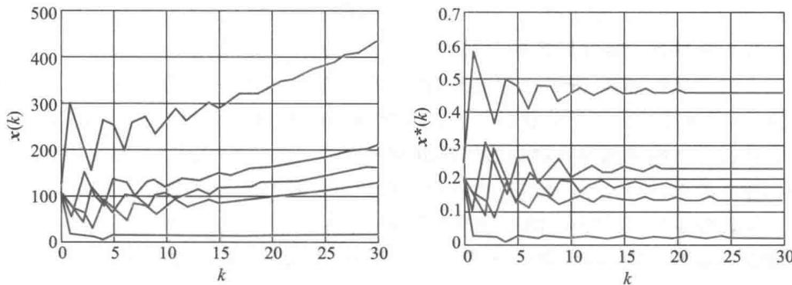  
图1  $x(k)$  和  $x^{*}(k)$  的图形（自上而下为  $x_{1}(k), x_{1}^{*}(k)$  至  $x_{5}(k), x_{5}^{*}(k)$ ）

结果分析 从表1和图1可以看出, 时间充分长以后, 虽然各年龄组（除最高年龄

组外)种群数量  $x(k)$  仍在增长,但是分布向量  $x^{*}(k)$  却趋向稳定。为了进一步分析  $k$  充分大以后  $x(k)$  和  $x^{*}(k)$  的变化规律,先不加证明地给出一个数学上的结论①:

矩阵  $L$  有一个正的最大特征根  $\lambda$  (单根),  $\lambda$  对应的特征向量记作  $x_{\lambda}$ , 由

$$
x_{\lambda} = \left[1,\frac{s_{1}}{\lambda},\frac{s_{1}s_{2}}{\lambda^{2}},\dots ,\frac{s_{1}s_{2}\cdots s_{n - 1}}{\lambda^{n - 1}}\right]^{\mathrm{T}} \tag{8}
$$

确定,可以验证  $L x_{\lambda} = \lambda x_{\lambda}$ , 且由(6)式表示的  $x(k)$  满足

$$
\lim_{k\to \infty}x(k) / \lambda^{k} = c x_{\lambda} \tag{9}
$$

其中  $c$  是常数,将  $x_{\lambda}$  归一化后记作  $x^{*}$ , 当  $k$  充分大以后,由此可得以下几条性质:

1. 种群按年龄组的分布向量  $x^{*}(k)$  满足

$$
x^{*}(k) \approx x^{*} \tag{10}
$$

表示按年龄组的分布向量接近于归一化的特征向量  $x^{*}, x^{*}$  称为稳定分布。

2. 各年龄组种群数量  $x(k)$  满足  $x(k + 1) \approx \lambda x(k)$ , 即

$$
x_{i}(k + 1) \approx \lambda x_{i}(k), i = 1,2, \dots , n \tag{11}
$$

表示各年龄组种群数量将按同一比例  $\lambda$  增减,  $\lambda$  称固有增长率。当  $\lambda = 1$  时,各年龄组种群数量保持不变。

3. 当  $\lambda = 1$  时,  $x_{\lambda} = \left[1, s_{1}, s_{1}s_{2}, \dots , s_{1}s_{2}\dots s_{n - 1}\right]^{\mathrm{T}}$ , 于是各年龄组种群数量  $x_{i}(k)$  满足

$$
x_{i + 1}(k) \approx s_{i}x_{i}(k), i = 1,2, \dots , n \tag{12}
$$

评注 在按年龄分组的种群模型中,曾假定种群的繁殖率和死亡率(或存活率)只与年龄组有关,如果这些参数随时段变化,用  $b_{i}(k)$ ,  $s_{i}(k)$ ,  $L(k)$  表示,也可以建立类似于(1)~(5)式的模型,得到种群各年龄组任意时段的数量,只是由于  $L(k)$  不再具有前面矩阵  $L$  的性质,所以无法进行  $k$  充分大以后的稳定性分析。

即存活率  $s_{i}$  等于同一时段相邻年龄组的数量之比。

上面的数值例子可以验证这几条结论:

1. 用MATLAB程序  $[\mathbf{v},\mathbf{d}] = \mathrm{eig}(\mathbf{L})$  可以得到任意矩阵  $L$  的全部特征根及特征向量。对例子中的矩阵  $L$  编程计算,得到特征根中最大的一个为  $\lambda = 1.0254$ ,  $\lambda$  对应的特征向量归一化后为  $x^{*} = [0.4559, 0.2223, 0.1734, 0.1353, 0.0132]^{\mathrm{T}}$ , 与按照(8)式计算的  $x_{\lambda}$  归一化后的  $x^{*}$  一致。表1中  $k$  充分大以后  $x^{*}(k)$  的计算结果非常接近  $x^{*}$ , 满足(10)式。

2. 可以校核在表1的  $x(k)$  的计算结果中,  $k$  充分大以后,  $x_{i}(k + 1)$  与  $x_{i}(k)$  的比值都在  $\lambda = 1.0254$  附近  $(i = 1,2, \dots , 5$ , 其中  $x_{5}(k)$  数值较小,取整后计算误差较大),满足(11)式。

3. 因  $\lambda = 1.0254$  比1略大,可以由表1对于充分大的  $k$  近似地验证(12)式。

饲养动物种群的持续稳定收获模型

对于饲养动物种群,除了自然繁殖、自然死亡之外,人们往往希望控制各年龄组的种群数量,实现持续稳定的收获,即同一年龄组种群的收获量在每个时段都相等。

假定自然环境下饲养动物仍然用种群增长模型(1)~(5)式表示,实现持续稳定收获的一种办法是,使每个年龄组每个时段种群的增长量都等于这个时段的收获量,并且种群数量始终不变。这个办法的数学模型如下:

建模 记第  $i$  年龄组种群的收获系数为  $h_{i}(0 \leqslant h_{i} \leqslant 1)$ , 表示收获量占总量的比例,那么增长量等于收获量就可以表为

$$
x_{i}(k + 1) - x_{i}(k) = h_{i}x_{i}(k + 1), i = 1,2,\dots ,n, k = 1,2,\dots \tag{13}
$$

用  $H$  表示以  $h_{i}$  为对角元素的对角矩阵

$$
H = \left[ \begin{array}{cccc}h_{1} & 0 & \dots & 0 \\ 0 & h_{2} & \dots & 0 \\ \vdots & \vdots & & \vdots \\ 0 & 0 & \dots & h_{n} \end{array} \right] \tag{14}
$$

则(13)式可记作

$$
\pmb {x}(k + 1) - \pmb {x}(k) = \pmb {H}\pmb {x}(k + 1), k = 1,2,\dots \tag{15}
$$

利用(5)式又可将(15)式写为

$$
L x(k) - x(k) = H L x(k), k = 1,2,\dots \tag{16}
$$

实现持续稳定收获,要求种群数量  $\pmb {x}(k)$  对  $k$  保持不变,记作  $\pmb{x}$ ,由(16)式得  $L x - x = H L x$ ,即

$$
L^{\prime}x = x,L^{\prime} = L - H L \tag{17}
$$

由(4)式和(14)式可将  $L^{\prime}$  表为

$$
L^{\prime}=\left[\begin{array}{c c c c c c}{b_{1}(1-h_{1})}&{b_{2}(1-h_{1})}&{\cdots}&{b_{n-1}(1-h_{1})}&{b_{n}(1-h_{1})}\\ {s_{1}(1-h_{2})}&{0}&{\cdots}&{0}&{0}\\ {0}&{s_{2}(1-h_{3})}&{0}&{0}\\ {\vdots}&{\vdots}&{\vdots}&{\vdots}&{\vdots}\\ {0}&{0}&{\cdots}&{s_{n-1}(1-h_{n})}&{0}\end{array}\right] \tag{18}
$$

$L^{\prime}$  也是Leslie矩阵.

持续稳定收获的条件  $L^{\prime}x = x$  表明,矩阵  $L^{\prime}$  的最大特征根  $\lambda^{\prime} = 1$ . 用线性代数中求矩阵特征根的方法,可知  $\lambda^{\prime} = 1$  等价于

$$
\left(1 - h_{1}\right)\left[b_{1} + b_{2}s_{1}(1 - h_{2}) + \dots +b_{n}s_{1}\dots s_{n - 1}(1 - h_{2})\dots (1 - h_{n})\right] = 1 \tag{19}
$$

$\lambda^{\prime} = 1$  对应的特征向量为

$$
\pmb{x}^{\prime} = \left[1,s_{1}(1 - h_{2}),\dots ,s_{1}\dots s_{n - 1}(1 - h_{2})\dots (1 - h_{n})\right]^{\mathrm{T}} \tag{20}
$$

设各年龄组的繁殖率  $b_{i}$  和存活率  $s_{i}$  已知,选择一组满足(19)式的收获系数  $h_{i}(i = 1,2,\dots ,n)$ ,就可以实现持续稳定收获,且种群按年龄组的稳定分布为(20)式的  $x^{\prime}$ ,而收获量的稳定分布为

$$
H L x^{\prime} = \left[h_{1}(b_{1} + b_{2}s_{1}(1 - h_{2}) + \dots +b_{n}s_{1}\dots s_{n - 1}(1 - h_{2})\dots (1 - h_{n})\right],
$$

$$
h_{1}s_{1},h_{2}s_{1}s_{2}(1 - h_{2}),\dots ,h_{n}s_{1}\dots s_{n - 1}(1 - h_{2})\dots (1 - h_{n - 1})\}^{\mathrm{T}} \tag{21}
$$

求解 对一个数值例子做计算.

设一个种群分成3个年龄组,各年龄组的繁殖率为  $b_{1} = 0$ ,  $b_{2} = 5$ ,  $b_{3} = 2$ ,存活率为  $s_{1} = 0.8$ ,  $s_{2} = 0.5$ ,确定各年龄组的收获系数以实现稳定收获,并求种群及收获量按年龄组的稳定分布.

记各年龄组的收获系数为  $h_{1}, h_{2}, h_{3}$ ,将以上数据代入持续稳定收获的条件(19)式得

$$
\left(1 - h_{1}\right)\left[4\left(1 - h_{2}\right) + 0.8\left(1 - h_{2}\right)\left(1 - h_{3}\right)\right] = 1 \tag{22}
$$

代入(20)式得种群按年龄组的稳定分布为

的变化规律基本上是相同的, 只需将  $b_{i}$  视为生育率, (1)~(5)式就可表示为离散型的女性人口模型。当然, 作为人口模型的应研究通过控制生育调整人口数量等方面的内容。

$$
\pmb{x}^{\prime} = \left[1,0.8(1 - h_{2}),0.4(1 - h_{2})(1 - h_{3})\right]^{\mathrm{T}} \tag{23}
$$

代入(21)式得收获量的稳定分布为

$$
H L x^{\prime} = \left[h_{1}(4(1 - h_{2}) + 0.8(1 - h_{2})(1 - h_{3})),0.8h_{2},0.4h_{3}(1 - h_{2})\right]^{\mathrm{T}} \tag{24}
$$

满足(22)式的  $h_{1}, h_{2}, h_{3}$  有很多, 可以根据饲养者的意愿选择。如取  $h_{1} = 0, h_{2} = 0.75, h_{3} = 1$ , 即不出售幼畜、出售  $75\%$  的成年牲畜及全部老年牲畜, 则  $\pmb{x}^{\prime} = [1,0.2,0]^{\mathrm{T}}$ ,  $H L x^{\prime} = [0,0.6,0.1]^{\mathrm{T}}$ ; 或取  $h_{1} = 0.5, h_{2} = 0.5, h_{3} = 1$ , 即出售  $50\%$  的幼畜和成年牲畜及全部老年牲畜, 则  $\pmb{x}^{\prime} = [1,0.4,0]^{\mathrm{T}}$ ,  $H L x^{\prime} = [1,0.4,0.2]^{\mathrm{T}}$ 。

# 复习题

1. 按年龄分组的种群模型中, 设一群动物最高年龄为 15 岁, 每 5 岁一组分成 3 个年龄组, 各组的繁殖率为  $b_{1} = 0, b_{2} = 4, b_{3} = 3$ , 存活率为  $s_{1} = 1 / 2, s_{2} = 1 / 4$ , 开始时 3 组各有 1000 只。求 15 年后各组分别有多少只, 以及时间充分长以后种群的增长率 (即固有增长率) 和按年龄组的分布。

2. 讨论饲养动物种群的持续稳定收获模型的两个特例:

(1) 有些种群最年幼组具有较大的经济价值, 所以饲养者只收获这个年龄组的种群, 可设收获系数为  $h_{1} = h, h_{2} = \dots = h_{n} = 0$ 。仍用第 1 题中繁殖率和存活率的数据, 求收获系数、种群及收获量按年龄组的稳定分布。

(2) 对于随机捕获的种群, 区分年龄是困难的, 不妨假定  $h_{1} = \dots = h_{n} = h$ 。讨论与(1)同样的问题。

# 6.5 信息传播

当今社会处于信息时代, 每天都有大量的、正面或负面的信息, 甚至谣言, 通过各种传统的、近代的、特别是互联网的渠道, 在几乎没有限制的人群中传播。信息传播, 尤其是在互联网上的传播, 已成为当前热门的研究课题。本节讨论传统的信息传播数学模型, 可作为进一步研究的基础。

考察一个封闭的、总人数一定的环境, 如一所学校、一座办公楼、一个社区内的人群, 开始时有极少数人得到了一条与这个人群有关的信息, 或者制造了一条谣言, 然后每天通过人与人之间的交流在这个人群中传播, 使得获知信息的人数越来越多。我们要在一些合理的简化假设下, 建立一个数学模型来描述信息传播的规律, 研究其发展趋势。

模型假设 在封闭环境中人群的总人数不变。信息通过已获知的人向未获知的人传播。

因为已获知信息的人数越多 (传播人群) 每天新获知信息的人数就越多; 未获知信息的人数越多 (潜在人群) 新获知信息的人数也越多。故可作如下假设: 每天新获知信息的人数与已获知信息的人数和未获知信息的人数的乘积成正比。

模型建立 记总人数为  $N$ , 第  $k$  天已获知信息的人数为  $p_{k}$ , 则未获知信息的人数为  $N - p_{k}$ 。按照假设, 第  $k + 1$  天新获知信息的人数  $p_{k + 1} - p_{k}$  (或记作  $\Delta p_{k}$ ) 与  $p_{k}$  和  $N - p_{k}$  的乘积成正比, 即

$$
p_{k + 1} - p_{k} = c p_{k}\left(N - p_{k}\right) \tag{1}
$$

其中  $c$  是比例系数, 可写成  $c = \frac{\Delta p_{k} / p_{k}}{N - p_{k}}$ , 其含义是对于每个未获知信息的人  $(N - p_{k})$  中的

一位)而言,每天新获知信息人数的相对增量(百分比增量).比如  $c = 0.0001$  ,若某天潜在人群尚有500人,则下一天新获知信息的人数将增加  $0.0001\times 500 = 5\%$  显然,  $c$  是反映传播速度的参数,  $c$  越大传播速度越快.

模型求解(1)式是一阶差分方程,可以改写成便于递推的形式:

$$
p_{k + 1} = (1 + c N) p_{k}(1 - \frac{c}{1 + c N} p_{k}) \tag{2}
$$

设定  $N = 1000$  ,初始获知信息的人数  $p_{0} = 10,c$  取2个不同的值0.0001和0.0002,按照(2)式递推地计算  $p_{k}(k = 1,2,\dots)$  ,结果如图1. 与  $c = 0.0001$  时80天后已获知信息的人数  $p_{k}$  才接近总人数  $N$  相比,  $c = 0.0002$  时  $p_{k}$  接近总人数  $N$  只需40天,传播速度明显加快.

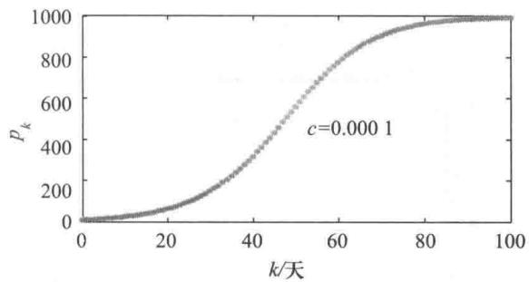  
图1  $c$  取不同值时方程（2）的解  $(N = 1000, p_{0} = 10)$

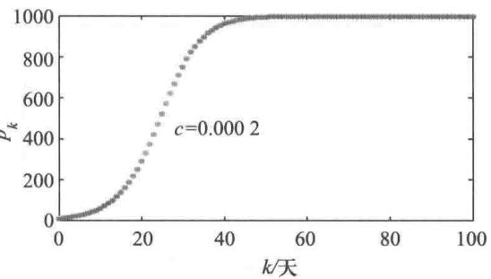

由图1还可以看出,  $p_{k}$  的图形恰似5.1节人口增长中的S形连续曲线.实际上,与5.1节的logistic方程对比可知,方程(1)就是logistic微分方程的离散形式——差分方程.

但是与logistic微分方程有解析解不同,其对应的差分方程(2)却无法得到  $p_{k}$  的显式表达式,对于这类方程人们常常更关注当  $k \rightarrow \infty$  时  $p_{k}$  的收敛性.为了研究的方便,对方程(2)作如下变换,令

$$
b = 1 + c N \tag{3}
$$

$$
x_{k} = \frac{c}{1 + c N} p_{k} \tag{4}
$$

则(2)式简化为只有一个参数  $b$  的标准形式:

$$
x_{k + 1} = b x_{k}(1 - x_{k}) \tag{5}
$$

(5)式是一阶非线性差分方程,尽管看起来足够简单,可是它的解  $x_{k}$  当  $k \rightarrow \infty$  时的收敛性却显示出复杂的性质.

方程(5)的平衡点及其稳定性(参考基础知识6- 1)为了求出方程(5)的平衡点,解代数方程  $x = f(x) = b x(1 - x)$ ,得到非零平衡点

$$
x^{*} = 1 - 1 / b \tag{6}
$$

为了判断平衡点  $x^{*}$  的稳定性,计算  $f(x) = b x(1 - x)$  在  $x^{*}$  点的导数  $f^{\prime}(x^{*}) = b(1 - 2x^{*}) = 2 - b$ ,由  $x^{*}$  的稳定性条件  $|f^{\prime}(x^{*})|< 1$ ,得到  $1< b< 3$ .按照(3)式定义的  $b$ ,必有  $b > 1$ .那么,对于  $b< 3$  和  $b > 3$ ,方程(5)的解  $x_{k}$  当  $k \rightarrow \infty$  时会发生什么现象呢?

图2是在不同  $b$  值下对方程(5)递推计算的结果(初始值均为  $x_{0} = 0.2$ ).可以看到,当  $b = 1.7$  和  $b = 2.9$  时  $x_{k}$  都趋向平衡点  $x^{*}$ ,即  $x^{*}$  是稳定的,二者的差别在于前者  $x_{k}$  单

调收敛,后者  $x_{k}$  振荡地(在某个  $k$  后  $x_{k}$  交替地大于和小于  $x^{*}$  )收敛(进一步分析表明,两种情况的分界点是  $b = 2$  )  $b = 3.15$  时  $x_{k}$  不趋向平衡点  $x^{*}$  ,而有  $x_{k}$  的2个子序列  $(x_{2k}$  和  $x_{2k + 1}$  序列)分别趋向另外2个平衡点;  $b = 3.525$  和  $b = 3.565$  时则分别有  $x_{k}$  的4个子序列  $(x_{4k}, x_{4k + 1}, x_{4k + 2}, x_{4k + 3})$  和8个子序列,分别趋向另外4个和8个平衡点,这种子序列的收敛称为分岔;  $b = 3.7$  时  $x_{k}$  就不趋向任何平衡点,序列变得杂乱无章,出现所谓混沌现象.

当参数  $b$  取不同的数值时方程(5)的解  $x_{k}$  呈现出不同的特性:单调或振荡收敛于稳定平衡点,出现分岔或混沌,这是非线性差分方程特有的现象.对方程(5)的平衡点及其稳定性的进一步分析,参考拓展阅读6- 1.

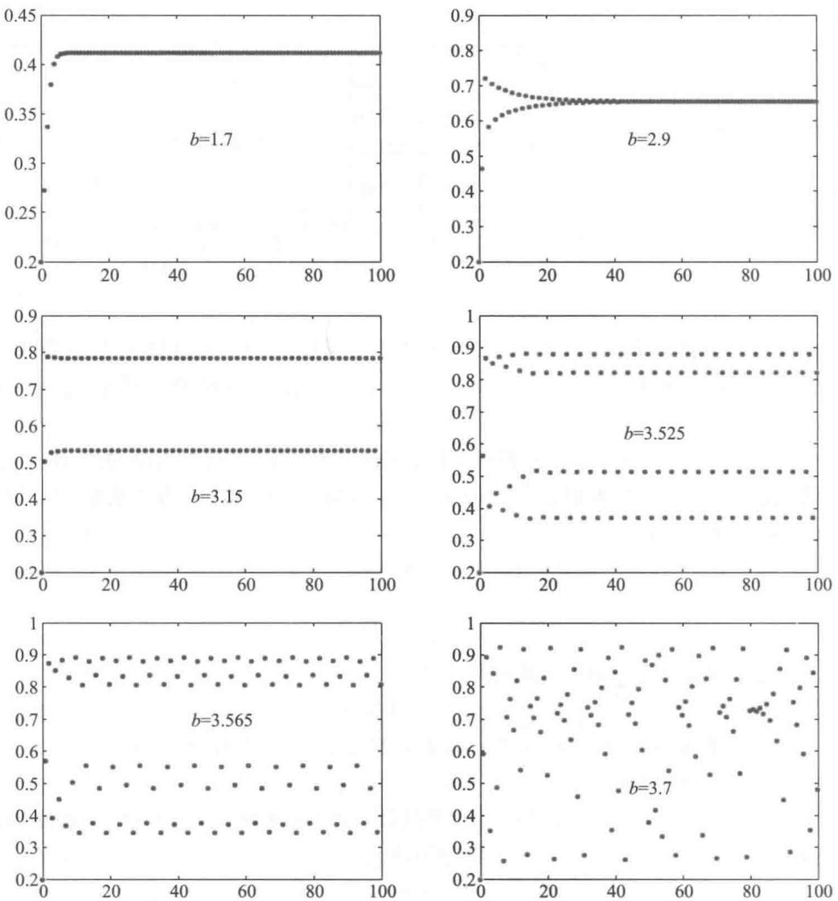  
图2在不同  $b$  值下方程（5）的计算结果（初始值均为  $x_{0} = 0.2$

模型讨论回到上面的信息传播模型,由(3),(4)可以验证,方程(5)的平衡点 $x^{*} = 1 - 1 / b$  等价于原方程(1)的非零平衡点  $p^{*} = N$  ,平衡点  $x^{*}$  的稳定性条件  $1< b< 3$  等价于原方程(1)平衡点  $p^{*}$  的稳定性条件  $c N< 2$  ,而  $x_{k}$  单调收敛于  $x^{*}$  的条件  $b< 2$  等价于 $c N< 1.$  我们已经看到,  $2< b< 3$  时  $x_{k}$  振荡收敛于  $x^{*}$ $b > 3$  时更是出现分岔、混沌现象,那么

需要讨论的是,对于信息传播模型的方程(1),会不会出现  $c N > 1$  的情况,导致  $p_{k}$  振荡收敛于  $p^{*} = N$  甚至出现分岔、混沌呢?

从方程(1)出发,设总人数  $N$  固定,很容易得出反映传播速度的参数  $c$  的上限是多少.注意到传播过程中对于任意的  $k$  都有  $p_{k + 1}< N$ ,于是由(1)式得  $c p_{k}< 1$ ,而  $p_{k}$  可以无限接近  $N$ ,所以  $c$  的上限是  $1 / N$ ,不会出现  $c N > 1$  的情况.

在实际的信息传播过程中,  $c$  不大可能保持不变,如果能够确定随  $k$  而变的  $c_{k}$ ,用以代替方程(1)的  $c$ ,仍然可以递推地计算  $p_{k}$ ,模型的结果会更好.

模型拓展 上面讨论的是信息得以自由传播的过程,如果对谣言的传播加以人为干预呢?

记总人数为  $N$ ,第  $k$  天已听信谣言的人数为  $p_{k}$  (传播人群),如果对于每天新听信谣言人数的增加仍遵从前面的假设,而对人为干预谣言的传播作如下假定:每天被制止传播谣言的人数比例为常数  $a$ ,则方程(1)的右端应增加一项  $- a p_{k}$ ,即

$$
p_{k + 1} - p_{k} = c p_{k}(N - p_{k}) - a p_{k} \tag{7}
$$

(7)式右端的含义还表明,被制止传播谣言的人又加入到听信谣言的潜在人群中,

容易看出,方程(7)的求解与方程(1)没有本质的区别

如果被制止传播谣言的人既不再传播也不会听信,从此退出这个信息传播系统呢?那就要考虑一个新的人群——被制止传播后退出系统者,记第  $k$  天退出系统者的人数为  $q_{k}$ ,则有

$$
q_{k + 1} - q_{k} = a p_{k} \tag{8}
$$

而上面的方程(7)应改为

$$
p_{k + 1} - p_{k} = c p_{k}(N - q_{k} - p_{k}) - a p_{k} \tag{9}
$$

(8),(9)联立组成非线性差分方程组,给定  $p_{0}$  和  $q_{0}$  (通常  $q_{0}$  很小),可递推地计算  $p_{k}$  和  $q_{k}$

评注看来信息传播模型的解  $p_{k}$  只能具有单调增的收敛形式,完全符合人们的直观认识,引入并介绍这类方程的标准形式(5)的平衡点及其稳定性,不过是说明即使非常简单的非线性差分方程,也会出现比它对应的logistic微分方程有着更为复杂的特性.

评注有不少与信息传播过程类似的实际问题,可以建立形如方程(1)的数学模型,例如受限环境下传染病的蔓延和生物种群的增长回顾5.10节介绍的传染病微分方程模型(SI模型、SIS模型和SIR模型)。如果按照那里的假设条件建立相应的差分方程模型,那么它们将转化为本节的哪几个方程呢?(复习题1)

1. 按照5.10节传染病模型中SI模型、SIS模型和SIR模型的假设条件,分别建立差分方程模型,并说明与本节的哪些方程相对应(特别注意SIR模型中变量的选取).

2. 下表是在受限环境下培养的酵母生物量的实验数据(  $k$  :小时,  $p_{k}$  :生物量)。[24]

(1)对  $k \sim p_{k}$  作散点图,观察变化趋势,估计  $p_{k}$  增长的上限  $N$

(2)参考本节的模型对酵母生物量的增长建模;

(3)用实验数据估计模型参数(提示:对数据  $\frac{p_{k + 1} - p_{k}}{p_{k}} \sim N - p_{k}$  作图,用线性最小二乘法估计参数);

(4)计算模型的理论值并与实验数据  $p_{k}$  比较

<table><tr><td>k</td><td>0</td><td>1</td><td>2</td><td>3</td><td>4</td><td>5</td><td>6</td><td>7</td><td>8</td><td>9</td></tr><tr><td>p k</td><td>9.6</td><td>18.3</td><td>29.0</td><td>47.2</td><td>71.1</td><td>119.1</td><td>174.6</td><td>257.3</td><td>350.7</td><td>441.0</td></tr><tr><td>k</td><td>10</td><td>11</td><td>12</td><td>13</td><td>14</td><td>15</td><td>16</td><td>17</td><td>18</td><td></td></tr><tr><td>p k</td><td>513.3</td><td>559.7</td><td>594.8</td><td>629.4</td><td>640.8</td><td>651.1</td><td>655.9</td><td>659.6</td><td>661.8</td><td></td></tr></table>

# 6.6 原子弹爆炸的能量估计

1945年7月16日,美国科学家在新墨西哥州的沙漠中试爆了全球第一颗原子弹,这一事件令世界为之震惊,并从某种程度上改变了第二次世界大战以及战后世界的历史.但在当时,有关原子弹爆炸的资料都是保密的,一般人无法得到任何有关的数据或影像资料,因此无法比较准确地了解这次爆炸的威力究竟有多大.两年以后,美国政府首次公开了这次爆炸的录像带,但没有发布任何其他有关的资料.英国物理学家Taylor(1886—1975)通过研究这次爆炸的录像带,建立数学模型对这次爆炸所释放的能量进行了估计,得到的估计值为  $19.2 \times 10^{3} \mathrm{t}(10^{3} \mathrm{t}$  相当于  $1000 \mathrm{t} \mathrm{TNT}$  的核子能量).后来正式公布的信息显示,这次爆炸实际释放的能量为  $21 \times 10^{3} \mathrm{t}$ ,与Taylor的估计相当接近.

除了公开的录像带,Taylor不掌握这次原子弹爆炸的其他任何信息,他如何估计爆炸释放的能量呢?物理常识告诉我们,爆炸产生的冲击波以爆炸点为中心呈球面向四周传播,爆炸的能量越大,在一定时刻冲击波传播得越远,而冲击波又通过爆炸形成的"蘑菇云"反映出来.Taylor研究这次爆炸的录像带,测量出了从爆炸开始,不同时刻爆炸所产生的"蘑菇云"的半径.表1是他测量出的时刻  $t$  所对应的"蘑菇云"的半径  $r$

<table><tr><td>t/ms</td><td>r/m</td><td>t/ms</td><td>r/m</td><td>t/ms</td><td>r/m</td><td>t/ms</td><td>r/m</td><td>t/ms</td><td>r/m</td></tr><tr><td>0.10</td><td>11.1</td><td>0.80</td><td>34.2</td><td>1.50</td><td>44.4</td><td>3.53</td><td>61.1</td><td>15.0</td><td>106.5</td></tr><tr><td>0.24</td><td>19.9</td><td>0.94</td><td>36.3</td><td>1.65</td><td>46.0</td><td>3.80</td><td>62.9</td><td>25.0</td><td>130.0</td></tr><tr><td>0.38</td><td>25.4</td><td>1.08</td><td>38.9</td><td>1.79</td><td>46.9</td><td>4.07</td><td>64.3</td><td>34.0</td><td>145.0</td></tr><tr><td>0.52</td><td>28.8</td><td>1.22</td><td>41.0</td><td>1.93</td><td>48.7</td><td>4.34</td><td>65.6</td><td>53.0</td><td>175.0</td></tr><tr><td>0.66</td><td>31.9</td><td>1.36</td><td>42.8</td><td>3.26</td><td>59.0</td><td>4.61</td><td>67.3</td><td>62.0</td><td>185.0</td></tr></table>

Taylor是首先用量纲分析方法建立数学模型,然后辅以小型试验,又利用表1的数据,对原子弹爆炸的能量进行估计的[69].让我们先对量纲分析方法作简单介绍.

量纲齐次原则量纲分析(dimensional analysis)是20世纪初提出的在物理和工程等领域建立数学模型的一种方法,它在经验和实验的基础上利用物理定律的量纲齐次原则,确定各物理量之间的关系.

许多物理量是有量纲的,在物理研究中把若干物理量的量纲作为基本量纲.它们是相互独立的,另一些物理量的量纲则可根据其定义或物理定律由基本量纲推导出来,称为导出量纲.例如,在研究力学问题时,通常将长度  $l$  、质量  $m$  和时间  $t$  的量纲作为基本量纲,记以相应的大写字母L,M和T.在量纲分析中,物理量  $q$  的量纲记作  $[q]$ ,于是有  $[l] = \mathrm{L},[m] = \mathrm{M},[t] = \mathrm{T}$ .而速度  $v$  、加速度  $a$  的量纲可以按照其定义表为  $[v] = \mathrm{LT}^{- 1}$ ,  $[a] = \mathrm{LT}^{- 2}$ ,力  $f$  的量纲则应根据牛顿第二定律用质量和加速度的乘积表示,即  $[f] = \mathrm{LMT}^{- 2}$ ,这些就是导出量纲.

有些物理常数也有量纲,如在万有引力定律  $f = k \frac{m_{1} m_{2}}{r^{2}}$  中引力常数  $k = \frac{f r^{2}}{m_{1} m_{2}}, k$  的量纲可从力  $f$  长度  $r$  和质量  $m$  的量纲得到:  $[k] = \mathrm{LMT}^{- 2} \cdot \mathrm{L}^{2} \cdot \mathrm{M}^{- 2} = \mathrm{L}^{3} \mathrm{M}^{- 1} \mathrm{T}^{- 2}$ . 对于无量纲的量  $\lambda$ , 记  $[\lambda ] = \mathrm{L}^{0} \mathrm{M}^{0} \mathrm{T}^{0} = 1$ .

用数学公式表示一些物理量之间的关系时,公式等号两端必须有相同的量纲,称为量纲齐次性(dimensional homogeneity).量纲分析就是利用量纲齐次原则来建立物理量之间的数学模型[7,24].先看一个简单的例子.

例单摆运动这是一个大家熟知的物理现象.质量  $m$  的小球系在长度  $l$  的线的一端,稍偏离平衡位置后小球在重力  $m g$  作用下(  $g$  为重力加速度)做往复摆动,忽略阻力,求摆动周期  $t$  的表达式.

在这个问题中出现的物理量有  $t, m, l, g$ ,设它们之间的关系是

$$
t = \lambda m^{\alpha_{1}} l^{\alpha_{2}} g^{\alpha_{3}} \tag{1}
$$

其中  $\alpha_{1}, \alpha_{2}, \alpha_{3}$  是待定常数,  $\lambda$  是无量纲的比例系数.(1)式的量纲表达式为

$$
[t] = [m]^{\alpha_{1}} [l]^{\alpha_{2}} [g]^{\alpha_{3}} \tag{2}
$$

将  $[t] = \mathrm{T}, [m] = \mathrm{M}, [l] = \mathrm{L}, [g] = \mathrm{L} \mathrm{T}^{- 2}$  代入得

$$
\mathrm{T} = \mathrm{M}^{\alpha_{1}} \mathrm{L}^{\alpha_{2} + \alpha_{3}} \mathrm{T}^{-2} \alpha_{3} \tag{3}
$$

按照量纲齐次原则应有

$$
\left\{ \begin{array}{l l}{\alpha_{1}} & {= 0}\\ {\alpha_{2}} & {+ \alpha_{3}}\\ {\qquad - 2 \alpha_{3}} & {= 1} \end{array} \right. \tag{4}
$$

(4)的解为  $\alpha_{1} = 0, \alpha_{2} = 1 / 2, \alpha_{3} = -1 / 2$ ,代入(1)式得

$$
t = \lambda \sqrt{\frac{l}{g}} \tag{5}
$$

我们看到,用非常简单的方法得到的(5)式与用较深入的力学知识推出的结果是一样的  $①$ .

为了导出用量纲分析建模的一般方法,将这个例子中各个物理量之间的关系写作

$$
f(t, m, l, g) = 0 \tag{6}
$$

这里没有因变量与自变量之分.进而假设(6)式形如

$$
t^{\gamma_{1}} m^{\gamma_{2}} l^{\gamma_{3}} g^{\gamma_{4}} = \pi \tag{7}
$$

其中  $\gamma_{1}, \gamma_{2}, \gamma_{3}, \gamma_{4}$  是待定常数,  $\pi$  是无量纲常数.将  $t, l, m, g$  的量纲用基本量纲  $\mathrm{L}, \mathrm{M}, \mathrm{T}$  表示为  $[t] = \mathrm{L}^{0} \mathrm{M}^{0} \mathrm{T}^{1}, [m] = \mathrm{L}^{0} \mathrm{M}^{1} \mathrm{T}^{0}, [l] = \mathrm{L}^{1} \mathrm{M}^{0} \mathrm{T}^{0}, [g] = \mathrm{L}^{1} \mathrm{M}^{0} \mathrm{T}^{- 2}$ ,则(7)式的量纲表达式可写作

$$
(\mathrm{L}^{0} \mathrm{M}^{0} \mathrm{T}^{1})^{\gamma_{1}} (\mathrm{L}^{0} \mathrm{M}^{1} \mathrm{T}^{0})^{\gamma_{2}} (\mathrm{L}^{1} \mathrm{M}^{0} \mathrm{T}^{0})^{\gamma_{3}} (\mathrm{L}^{1} \mathrm{M}^{0} \mathrm{T}^{-2})^{\gamma_{4}} = \mathrm{L}^{0} \mathrm{M}^{0} \mathrm{T}^{0} \tag{8}
$$

即

$$
\mathrm{L}^{\gamma_{3} + \gamma_{4}} \mathrm{M}^{\gamma_{2}} \mathrm{T}^{\gamma_{1} - 2 \gamma_{4}} = \mathrm{L}^{0} \mathrm{M}^{0} \mathrm{T}^{0} \tag{9}
$$

由量纲齐次原则有

$$
\left\{ \begin{array}{r l r l} & {} & {y_{3}} & {} & {+y_{4}} & {= 0}\\ & {} & {} & {} & {} & {= 0}\\ & {} & {} & {} & {} & {}\\ & {y_{1}} & {} & {} & {-2y_{4}} & {= 0} \end{array} \right. \tag{10}
$$

方程组(10)有一个基本解

$$
\mathbf{y} = \left(y_{1}, y_{2}, y_{3}, y_{4}\right)^{\mathrm{T}} = \left(2, 0, -1, 1\right)^{\mathrm{T}} \tag{11}
$$

代入(7)式得

$$
t^{2} l^{-1} g = \pi \tag{12}
$$

(6)式可以等价地表示为

$$
F(\pi) = 0 \tag{13}
$$

(12),(13)两式是量纲分析方法从(6)式导出的一般结果,前面的(5)式只是它的特殊表达形式.

把(6)到(13)式的推导过程一般化,就是著名的白金汉  $\pi$  定理(或记为  $\mathrm{Pi}$  定理)①.

$\pi$  定理设  $m$  个有量纲的物理量  $q_{1}, q_{2}, \dots , q_{m}$  之间存在与量纲单位的选取无关的物理规律,数学上可表示为

$$
f(q_{1}, q_{2}, \dots , q_{m}) = 0 \tag{14}
$$

若基本量纲记作  $\mathrm{X}_{1}, \mathrm{X}_{2}, \dots , \mathrm{X}_{n}(n \leqslant m)$ ,而  $q_{1}, q_{2}, \dots , q_{m}$  的量纲可表为

$$
\left[ \begin{array}{l}{q_{j}} \end{array} \right] = \prod_{i = 1}^{n}\mathrm{X}_{i}^{a_{i j}},j = 1,2,\dots ,m \tag{15}
$$

矩阵  $A = \left(a_{ij}\right)_{n \times m}$  称量纲矩阵.若  $A$  的秩

$$
\mathrm{Rank} A = r \tag{16}
$$

设线性齐次方程组

$$
A y = 0, y = \left(y_{1}, y_{2}, \dots , y_{m}\right)^{\mathrm{T}} \tag{17}
$$

的  $m - r$  个基本解记作

$$
y^{(s)} = \left(y_{1}^{(s)}, y_{2}^{(s)}, \dots , y_{m}^{(s)}\right)^{\mathrm{T}}, s = 1, 2, \dots , m - r \tag{18}
$$

则存在  $m - r$  个相互独立的无量纲量

$$
\pi_{s} = \prod_{j = 1}^{m} q_{j}^{y_{j}^{(s)}}, s = 1, 2, \dots , m - r \tag{19}
$$

且

$$
F(\pi_{1}, \pi_{2}, \dots , \pi_{m - r}) = 0 \tag{20}
$$

(19),(20)与(14)式等价,  $F$  是一个未定的函数关系.

原子弹爆炸能量估计的量纲分析方法建模

记原子弹爆炸能量为  $E$ ,将"蘑菇云"的形状近似看成一个球形,记时刻  $t$  球的半径为  $r$ ,与  $r$  有关的物理量还可能有"蘑菇云"周围的空气密度(记为  $\rho$ )和大气压强(记为  $P$ ),于是  $r$  作为  $t$  的函数还与  $E, \rho , P$  有关,要寻求的关系是

$$
r = \phi \left(t, E, \rho , P\right) \tag{21}
$$

更一般的形式记作

$$
f(r,t,E,\rho ,P) = 0 \tag{22}
$$

其中有5个物理量,(22)相当于  $\pi$  定理的(14)式.下面利用  $\pi$  定理解决这个问题.

取长度  $\mathbf{L}$ ,质量  $\mathbf{M}$  和时间  $\mathbf{T}$  为基本量纲,(22)中各个物理量的量纲分别是

$$
[r] = \mathrm{L},[t] = \mathrm{T},[E] = \mathrm{L}^{2}\mathrm{MT}^{-2},[\rho ] = \mathrm{L}^{-3}\mathrm{M},[P] = \mathrm{L}^{-1}\mathrm{MT}^{-2} \tag{23}
$$

由此得到量纲矩阵

$$
A_{3\times 5} = \left[ \begin{array}{cccccc}1 & 0 & 2 & -3 & -1 \\ 0 & 0 & 1 & 1 & 1 \\ 0 & 1 & -2 & 0 & -2 \end{array} \right] \tag{24}
$$

因为  $A$  的秩是3,所以齐次方程

$$
A y = \mathbf{0},y = \left(y_{1},y_{2},y_{3},y_{4},y_{5}\right)^{\mathrm{T}} \tag{25}
$$

有  $5 - 3 = 2$  个基本解.

令  $y_{1} = 1,y_{5} = 0$ ,得到一个基本解  $y = (1, - 2 / 5, - 1 / 5,1 / 5,0)^{\mathrm{T}}$  令  $y_{1} = 0,y_{5} = 1$ ,得到另一个基本解  $y = (0,6 / 5, - 2 / 5, - 3 / 5,1)^{\mathrm{T}}$ .由这2个基本解可以得到2个无量纲量

$$
\pi_{1} = r t^{-2 / 5}E^{-1 / 5}\rho^{1 / 5} = r\left(\frac{\rho}{t^{2}E}\right)^{1 / 5} \tag{26}
$$

$$
\pi_{2} = t^{6 / 5}E^{-2 / 5}\rho^{-3 / 5}P = \left(\frac{t^{6}P^{5}}{E^{2}\rho^{3}}\right)^{1 / 5} \tag{27}
$$

且存在某个函数  $F$ ,使得

$$
F(\pi_{1},\pi_{2}) = 0 \tag{28}
$$

与(22)式等价.

为了得到形如(21)式的关系,取(28)式的特殊形式  $\pi_{1} = \psi (\pi_{2})$  (其中  $\psi$  是某个函数),由(26),(27)式即

$$
r\left(\frac{\rho}{t^{2}E}\right)^{1 / 5} = \psi \left(\frac{t^{6}P^{5}}{E^{2}\rho^{3}}\right)^{1 / 5} \tag{29}
$$

于是

$$
r = \left(\frac{t^{2}E}{\rho}\right)^{1 / 5}\psi \left(\frac{t^{6}P^{5}}{E^{2}\rho^{3}}\right)^{1 / 5} \tag{30}
$$

函数  $\psi$  的具体形式需要采用其他方式确定.(30)式就是用量纲分析方法建立的、估计原子弹爆炸能量的数学模型.

原子弹爆炸能量估计的数值计算

为了利用表1中  $t$  和  $r$  的数据,由(30)式确定原子弹爆炸的能量  $E$ ,必须先估计无量纲量  $\psi (\pi_{2})$  的大小.

Taylor认为,对于原子弹爆炸来说,所经历的时间非常短,而所释放的能量非常大.仔细分析(27)式可知, $\pi_{2} = \left(\frac{t^{6}P^{5}}{E^{2}\rho^{3}}\right)^{1 / 5}\approx 0$ .于是  $\psi (0)$  可看作一个比例系数  $\lambda$ ,将(30)式记作

$$
r = \lambda \left(\frac{t^{2}E}{\rho}\right)^{1 / 5} \tag{31}
$$

为了确定  $\lambda$  的大小,Taylor借助一些小型爆炸试验的数据,最终决定取  $\lambda \approx 1$  ,这样就得到能量  $E$  的近似估计

$$
E = \frac{\rho r^{5}}{t^{2}} \tag{32}
$$

利用表1中时刻  $t$  所对应的"蘑菇云"的半径  $r$  作拟合来估计能量  $E$  ,相当于取(32)式右端的平均值.取空气密度为  $\rho = 1.25\mathrm{~kg} / \mathrm{m}^{3}$  ,可得到  $E = 8.2825\times 10^{13}$  J.查表可知  $10^{3}\mathrm{~t} = 4.184\times 10^{12}$  J,所以爆炸能量是  $19.7957\times 10^{3}$  t,与实际值  $21\times 10^{3}$  t相差不大(Taylor是直接由(31)式作拟合,得到爆炸能量为  $19.1863\times 10^{3}$  t).

(31)或(32)式还表明,当  $E,\rho$  一定时,  $r$  与  $t^{2 / 5}$  成正比,我们可以用表1的数据检验一下这个关系.设

$$
r = a t^{b} \tag{33}
$$

其中  $a,b$  是待定系数,对(33)式取对数后可以用线性最小二乘法拟合,根据表1中  $t$  和  $r$  的资料确定.经过计算得到  $b = 0.4058$  ,与量纲分析得到的结果(  $b = 2 / 5$  )非常接近.(33)式与实际数据拟合的情况如图1.

原子弹爆炸的能量估计被看作是量纲分析方法建模的一个成功范例

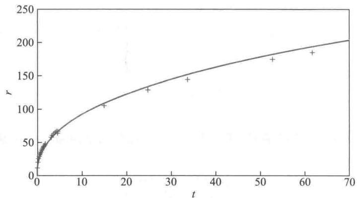  
图1（33）式（曲线）与实际数据  $(+)$  的拟合

量纲分析方法的要点量纲齐次原则和  $\pi$  定理是具有普遍意义、又相当初等的方法,它不需要掌握研究对象那个领域中专门的物理知识,也用不到高深的数学工具,得到的结果有的与用专门方法推出的结果相同,如单摆运动,有的是用其他方法难以得到的,如原子弹爆炸的能量.一般地说,从  $m$  个原始物理量具有的规律  $f(q_{1},q_{2},\dots ,q_{m}) = 0$  ,到它的等价形式  $F(\pi_{1},\pi_{2},\dots ,\pi_{m - r}) = 0$  ,不仅变量个数减少了  $r$  个,而且组成了一些非常有用的无量纲量.在  $\pi$  定理的应用过程中有几点值得注意:

1. 正确确定各个物理量面对一个实际问题,将哪些原始物理量  $q_{1},q_{2},\dots ,q_{m}$  包含在量纲分析之内,对所得结果的合理性是至关重要的.在原子弹爆炸的能量问题中,如果忽略空气密度  $\rho$  ,就得不到上面的结果.原始物理量的确定主要依靠经验和物理知识,无法绝对保证所得结果的正确或有用.

2. 合理选取基本量纲基本量纲选少了,无法给出各物理量的量纲表达,当然不行;选多了也会使问题复杂化.一般情况下,力学问题选L,M,T即可.当然,这不是唯一

的,比如可以将T换成速度量纲V.热学问题可考虑温度量纲,电学问题可考虑电量量纲.

3. 恰当构造基本解线性齐次方程组的基本解可以有许多不同的构造方法,从而有不同的无量纲量,从数学上看它们是等价的,如原子弹爆炸的能量问题中可以得到无量纲量  $\pi_{3} = r^{3}E^{-1}P\left(= \pi_{1}^{3}\pi_{2}\right),\pi_{4} = r^{2}l^{-2}\rho P^{-1}\left(= \pi_{1}^{2}\pi_{2}^{-1}\right)$  等,但是为了特定的建模目的,恰当地选取无量纲量,能够更直接地得到我们期望的结果.

1. 雨滴的速度  $v$  与空气密度  $\rho$  、黏滞系数  $\mu$  和重力加速度  $g$  有关,其中黏滞系数的定义是:运动物体在流体中受的摩擦力与速度梯度和接触面积的乘积成正比,比例系数为黏滞系数.用量纲分析方法给出速度  $v$  的表达式.

2. 用量纲分析方法研究人体浸在匀速流动的水里时损失的热量.记水的流速  $v$  ,密度  $\rho$  ,比热  $c$  ,黏性系数  $\mu$  ,热传导系数  $k$  ,人体尺寸  $d.$  证明人体与水的热交换系数  $h$  与上述各物理量的关系可表为  $h = \frac{k}{d}\phi \left(\frac{v\rho d}{\mu},\frac{\mu c}{k}\right),\phi$  是未定函数,  $h$  定义为单位时间内人体的单位面积在人体与水的温差为  $1^{\circ}$  时的热量交换[31].

3. 用量纲分析方法研究两带电平行板间的引力.板的面积为  $s$  ,间距为  $d$  ,电位差为  $v$  ,板间介质的介电常数为  $\epsilon$  ,证明两板之间的引力  $f = \epsilon v^{2}\phi \left(s / d^{2}\right)$  .如果又知道  $f$  与  $s$  成正比,写出  $f$  的表达式.这里介电常数  $\epsilon$  的定义是  $f = \frac{q_{1}q_{2}}{\epsilon d^{2}}$  ,其中  $q_{1},q_{2}$  是两个点电荷的电量,  $d$  是点电荷的距离,  $f$  是点电荷间的引力[31].

# 6.7 CT技术的图像重建

CT(计算机断层成像,computed tomography的缩写)技术是20世纪50至70年代由美国科学家A.M.Cormark和英国科学家G.N.Hounsfield通过核物理、核医学等领域的一系列研究和实验发明的,他们因此共同获得1979年诺贝尔医学奖.从1971年第一代供临床应用的CT设备问世以来,随着电子技术的飞速发展,CT技术不断改进,诸如螺旋式CT机、电子束扫描机等新型设备逐渐被医疗机构普遍采用.此外,CT技术在工业无损探测、资源勘探、生态监测等领域也得到了广泛的应用[28,76].

什么是CT,它与传统的X射线成像(如人们在医院拍的X光片)有什么区别?让我们看一个一般的概念图示,如图1.

假定有一个半透明物体,其中嵌入5个不同透明度的球.如果按照图1(a)那样单方向地观察,因为有2个球被前面的球遮挡,我们可能错误地认为只有3个球,尽管重叠球的透明度较低,仍无法确定球的数目,更不要说各个球的透明度了.而如果按照图1(b)那样让物体旋转起来,从多角度观察,就能够分辨出5个球以及它们各自的透明度.到医院作射线检查时,人体的内脏就像上面的半透明物体,传统的X射线成像原理就像图1(a),X射线和胶片相当于光源和人眼;CT技术原理就像图1(b),只不过旋转的不是人体,而是X光管和探测器.

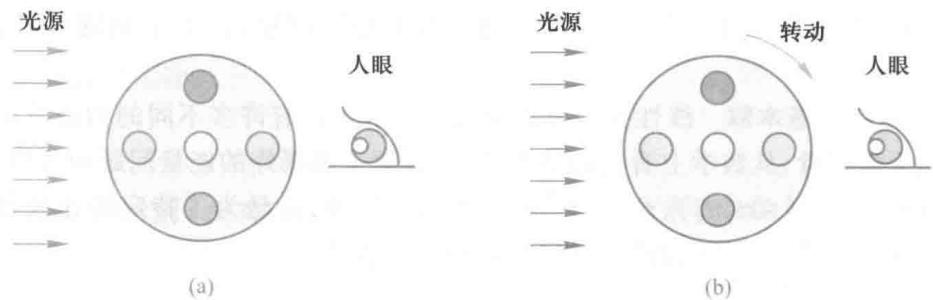  
图1 传统的X射线成像和CT的一般概念图示

概括地说,传统的X射线成像将人体器官和组织前后重叠地直接投影到胶片上,呈现出具有一定分辨率、但仍不够清晰的图像,CT则在不同深度的断面上,从各个角度用探测器接收旋转的X光管发出、并由于穿过人体而使强度衰减的射线,再经过测量和计算,将人体器官和组织的影像重新构建出来,称为图像重建.本节将在简要介绍X射线强度衰减与图像重建的数学原理之后,给出图像重建的一个代数模型.

X射线强度衰减与图像重建的数学原理X射线在穿过均匀材料的物质时,其强度的衰减率与强度本身成正比,即

$$
\frac{\mathrm{d}I}{\mathrm{d}l} = -\mu I \tag{1}
$$

其中  $I$  为射线强度,  $l$  为物质在射线方向的厚度,  $\mu$  为物质对射线的衰减系数.由此可得

$$
I = I_{0}\mathrm{e}^{-\mu l} \tag{2}
$$

其中  $I_{0}$  为入射强度.当X射线的能量一定时,衰减系数  $\mu$  随射线穿过的材料不同而改变,如骨骼的  $\mu$  比软组织的大,X射线的强度在骨骼中衰减得更快.(2)式称Beer- Lambert定律.

当X射线穿过由不同衰减系数的材料组成的非均匀物体,如人体内部的某一断面时,(1)式中的  $\mu$  为某平面坐标  $x,y$  的函数  $\mu (x,y)$  ,当射线沿  $xy$  平面内直线  $L$  穿行时,(2)式变为

$$
I = I_{0}\mathrm{e}^{-\int_{L}\mu (x,y)\mathrm{d}t} \tag{3}
$$

其中  $\int_{L}\mu (x,y)\mathrm{d}l$  是  $\mu (x,y)$  沿  $L$  的线积分,如图2. 由(3)可得

$$
\int_{L}\mu (x,y)\mathrm{d}l = \ln{\frac{I_{0}}{I}} \tag{4}
$$

(4)式右端的数值可从CT的X光管和探测器的测量数据得到

如果根据(4)式得到了沿许多条直线  $L$  的线积分  $\int_{L}\mu (x,y)\mathrm{d}l$  ,能不能确定被积函数  $\mu (x,y)$  呢?如果能,就可以根据人体内各个断面对X射线的衰减系数,得到反映人体器官和组织的大小、形状、密度的图像,即图像重建.

1917年奥地利数学家Radon给出以下积分变换的

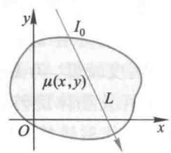  
图2 X射线沿直线  $L$  穿过衰减系数为  $\mu (x,y)$  的区域

逆变换的表达式,为图像重建提供了理论基础。

定义函数  $f(x,y)$  在平面上沿直线  $L$  的线积分为

$$
P_{f}(L) = \int_{L}f(x,y)\mathrm{d}l \tag{5}
$$

对任一点  $Q(x,y)$ ,作与  $Q$  相距为  $q(>0)$  的直线  $L$  的线积分  $P_{f}(L)$ ,对所有的  $q$ ,取  $P_{f}(L)$  的平均值,记作  $F_{Q}(q)$ ,则  $Q$  点的函数值  $f$  为

$$
f(Q) = -\frac{1}{\pi}\int_{0}^{\infty}\frac{\mathrm{d}F_{Q}(q)}{q} \tag{6}
$$

(5)、(6)式分别称  $f(x,y)$  的Radon变换和逆变换  $①$

从理论上,(5)、(6)式给出了图像重建问题的完整解答,而从应用的角度看这仅仅是个开始。Radon逆变换需要无穷多条直线  $L$  的线积分,实际上只能在有限条直线上得到投影(即线积分),在逆变换的数学方法及其稳定性、重建图像的清晰度以及积分的离散化等方面有许多工作要做。从反投影算法到滤波反投影算法和迭代算法,从平行光束到扇形光束、锥形光束的重建算法,图像重建问题在数学方法上的进展,为CT技术在各个领域成功的和不断拓广的应用提供了必要的条件。

下面只从离散化的角度,讨论图像重建的一个代数模型

图像重建的代数模型将待测的平面图形分成若干小正方形,称为像素,一定宽度的射线束从各个方向穿过这些像素,不同像素对射线的衰减系数可以不同,但合理地假定每一个像素对射线的衰减系数是常数。这个模型要通过对多条穿过待测平面图形的射线强度的量测,确定各个像素的衰减系数。

设有  $m$  个像素(记  $j = 1,2,\dots ,m$ ), $n$  束射线(记  $i = 1,2,\dots ,n$ ),第  $i$  束射线记作  $L_{i}$ ,由  $L_{i}$  的强度测量数据计算出(4)式的右端,记作  $\ln \left(I_{0} / I\right)_{i}$ ,则(4)式的积分形式可以写作如下的和式:

$$
\sum_{j\in J(L_{i})}\mu_{j}\Delta l_{j} = \ln \left(I_{0} / I\right)_{i},i = 1,2,\dots ,n \tag{7}
$$

其中  $\mu_{j}$  是像素  $j$  的衰减系数, $\Delta l_{j}$  是射线在像素  $j$  中的穿行长度(具体计算见下), $J\left(L_{i}\right)$  表示射线束  $L_{i}$  穿过的像素  $j$  的集合。

实际应用时,对(7)的计算定义了几种常用的方法。为简单起见,记  $\ln \left(I_{0} / I\right)_{i}$  为  $b_{i}$ , $\mu_{i}$  为  $x_{j}$ 。设每个像素的边长和射线束的宽度均为  $\sigma$ ,如图3。

1. 中心线法记射线束  $L_{i}$  的中心线在像素  $j$  内的长度  $l_{ij}$  与像素边长之比为  $a_{ij}$ ,(7)式化为( $L_{i}$  的中心线不经过像素  $j$  时  $a_{ij} = 0$ ,并不计常数因子)

$$
\sum_{j = 1}^{n}a_{ij}x_{j} = b_{i},i = 1,2,\dots ,n \tag{8}
$$

或写成向量- 矩阵形式

$$
A x = b \tag{9}
$$

其中  $A = \left(a_{ij}\right)_{n\times m},x = \left(x_{1},x_{2},\dots ,x_{m}\right)^{\mathrm{T}},b = \left(b_{1},b_{2},\dots ,b_{n}\right)^{\mathrm{T}}$

2. 面积法记射线束  $L_{i}$  在像素  $j$  内的面积  $s_{ij}$  与像素面积之比为  $a_{ij}$ ,(7)式同样化为(9)式( $L_{i}$  不经过像素  $j$  时  $a_{ij} = 0$ ,并不计常数因子)。

3. 中心法 当射线束  $L_{i}$  经过像素  $j$  的中心点时记  $a_{ij} = 1$ , 否则  $a_{ij} = 0$ , (7) 式同样化为(9)式.

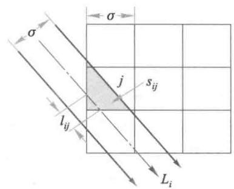  
图3 射线束  $L_{i}$  经过像素  $j$  示意图（像素边长和射线束宽度均为  $\sigma$ ）

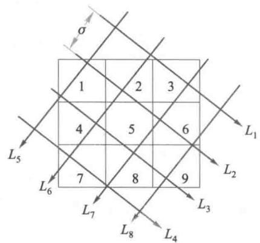  
图4 射线  $L_{1} \sim L_{8}$  经过像素  $1 \sim 9$  示意图（像素边长和射线间距均为  $\sigma$ ）

作为中心法的另一种简化形式, 假定射线束的宽度为 0, 间距  $\sigma$ , 当  $L_{i}$  经过像素  $j$  内任一点时记  $a_{ij} = 1$ , 否则  $a_{ij} = 0$ . 图4作为这种形式的一个具体例子  $(m = 9, n = 8)$ , 可以写出矩阵

$$
A = \left[ \begin{array}{l l l l l l l l l l l l l l l l l l l l l l l l l l l l l l l l l l l l l l l l l l l l l l l l l l l l l l l l l l l l l l l l l l l l l l l l l l l l l l l l l l l l l l l l l l l l l l l l l l l l l \end{array} \right]
$$

不论采用上面3种方法的哪一个, 都可以利用代数方程  $Ax = b$  来重建图像, 即根据已知的矩阵  $A$  和测量数据计算出的向量  $b$ , 确定像素的衰减系数向量  $x$ . 实际上, 像素数量  $m$  和射线数量  $n$  都很大, 且一般  $m > n$ , 使方程有无穷多解. 另外, 测量误差和噪声影响不可忽视, 于是可将(9)式修正为

$$
A x + e = b \tag{10}
$$

其中  $e$  是误差向量. 于是问题化为在  $x$  和  $e$  满足指定的最优准则下, 根据  $A$  和  $b$  估计  $x$ , 这一过程常用迭代算法进行, 称为代数重建技术 (ART), 详见[85].

# 6.8 等级结构

在社会系统中常常按照人们的职务或地位划分出许多等级, 如大学教师分为教授、讲师和助教, 工厂技术人员分为高级工程师、工程师和技术员, 军队里有将、校、尉, 学生也有研究生、大学生、中学生等. 不同等级人员的比例形成一个等级结构, 合适的、稳定

的等级结构有利于教学、科研、生产等各方面工作的顺利进行。因此希望建立一个模型来描述等级结构的变化状况,根据已知条件和当前的结构预报未来的结构,以及寻求为了达到某个理想的等级结构而应采取的策略[5]。

引起等级结构变化的因素有两种,一是系统内部等级间的转移,即提升或降级;二是系统内外的交流,即调入或退出(包括调离、退休、死亡等)。系统各个等级的人员每个时期按一定的比例变化,是一个确定性的转移问题。下面先定义若干基本量,建立基本方程,然后讨论如何调节调入成员在各等级的比例,保持等级结构的稳定。

基本量与基本方程设一个社会系统由低到高地分为  $k$  个等级,如大学教师有助教、讲师、教授3个等级。时间以年为单位离散化,即每年进行且只进行一次调级。等级记作  $i = 1,2,\dots ,k$ ,时间记作  $t = 0,1,2,\dots$  引入以下的定义和记号:

成员按等级的分布向量  $\pmb {n}(t) = (n_{1}(t),n_{2}(t),\dots ,n_{k}(t))$ ,其中  $n_{i}(t)$  为  $t$  年属于等级  $i$  的人数;  $N(t) = \sum_{i = 1}^{k}n_{i}(t)$  为系统  $t$  年的总人数。

成员按等级的比例分布  $\pmb {a}(t) = (a_{1}(t),a_{2}(t),\dots ,a_{k}(t))$ ,其中  $a_{i}(t) = \frac{n_{i}(t)}{N(t)}$ ,于是有  $a_{i}(t)\geqslant 0,\sum_{i = 1}^{k}a_{i}(t) = 1,\pmb {a}(t)$  又称为等级结构。

转移比例矩阵  $\pmb {Q} = \{p_{ij}\}_{k\times k}$ ,其中  $p_{ij}$  为每年从等级  $i$  转移至等级  $j$  的成员(在等级  $i$  中占的)比例。

退出比例向量  $\pmb {w} = (w_{1},w_{2},\dots ,w_{k})$ ,其中  $w_{i}$  为每年从等级  $i$  退出系统的成员(在等级  $i$  中占的)比例;  $t$  年退出系统总人数为

$$
W(t) = \sum_{i = 1}^{k}w_{i}n_{i}(t) = \pmb {n}(t)\pmb{w}^{\mathrm{T}} \tag{1}
$$

容易看出,  $p_{ij},w_{i}$  满足

$$
p_{ij},w_{i}\geqslant 0,\sum_{j = 1}^{k}p_{ij} + w_{i} = 1 \tag{2}
$$

调入比例向量  $\pmb {r} = (r_{1},r_{2},\dots ,r_{k})$ ,其中  $r_{i}$  为每年调入等级  $i$  的成员(在总调入人数中占的)比例;记  $t$  年调入总人数为  $R(t)$ ,则  $t$  年调入等级  $i$  的人数为  $r_{i}R(t).r_{i}$  满足

$$
r_{i}\geqslant 0,\sum_{i = 1}^{k}r_{i} = 1 \tag{3}
$$

等级结构的基本方程为了导出成员按等级的分布  $\pmb {n}(t)$  的变化规律,先写出总人数  $N(t)$  的方程

$$
N(t + 1) = N(t) + R(t) - W(t) \tag{4}
$$

和每个等级人数的转移方程

$$
n_{j}(t + 1) = \sum_{i = 1}^{k}p_{ij}n_{i}(t) + r_{j}R(t),\quad j = 1,2,\dots ,k \tag{5}
$$

请读者考虑,为什么在形式上方程(5)中没有像(4)中那样,减去退出的人数。

用向量、矩阵符号可将(5)式表为

$$
\pmb {n}(t + 1) = \pmb {n}(t)\pmb {Q} + \pmb {R}(t)\pmb {r} \tag{6}
$$

从  $t$  到  $t + 1$  年总人数的增长量记为  $M(t)$ ,再由(4),(1)式可得

$$
R(t) = W(t) + M(t) = n(t)w^{\mathrm{T}} + M(t) \tag{7}
$$

将(7)代入(6)式得到

$$
n(t + 1) = n(t)\left(Q + w^{\mathrm{T}}r\right) + M(t)r \tag{8}
$$

记

$$
P = Q + w^{\mathrm{T}}r \tag{9}
$$

从(2),(3)式可知  $P$  的行和为1,(8)式记为

$$
n(t + 1) = n(t)P + M(t)r \tag{10}
$$

当已知系统内部转移比例矩阵  $Q$  ,调入比例  $r$  ,初始的成员等级分布  $n(0)$  ,以及每年调入总人数  $R(t)$  或每年总增长量  $M(t)$  时,可以用(6)式或(9),(10)式计算成员等级分布的变化情况  $n(t)$  ,(6)或(9),(10)即为等级结构的基本方程

基本方程的特殊形式当每年系统总人数以固定的百分比  $\alpha$  增长时,即  $M(t) = \alpha N(t)$  ,可用成员的等级结构  $a(t)$  代替  $n(t)$  而将(10)式表示为

$$
\pmb {a}(t + 1) = (1 + \alpha)^{-1}\big[\pmb {a}(t)\pmb {P} + \alpha \pmb {r}\big] \tag{11}
$$

如果每年进出系统的人数大致相等,可以简化地假定系统总人数  $N(t)$  保持不变,即  $M(t) = 0$  (或  $\alpha = 0$  ),这样(10)或(11)式化为相当简单的形式

$$
\pmb {a}(t + 1) = \pmb {a}(t)\pmb {P} = \pmb {a}(t)\left(\pmb {Q} + \pmb{w}^{\mathrm{T}}\pmb {r}\right) \tag{12}
$$

注意等级结构  $a(t)$  的转移矩阵  $P$  的  $i,j$  元素为  $p_{ij} + w_{i}r_{j}$  ,即系统内部转移比例  $p_{ij}$  加上系统内外交流的比例  $w_{i}r_{j}$  下面在方程(12)的基础上进行讨论

用调入比例进行稳定控制假定在实际问题中人们的理想等级结构是  $a^{*}$  ,因为等级结构  $a(t)$  是按照(12)式的规律变化的,人们自然希望  $a^{*}$  一旦达到,就能够通过选取适当的调入比例使  $a^{*}$  保持不变.下面将看到并不是任何一个等级结构都可以用调入比例控制不变的.我们的目的是:给定了内部转移比例矩阵  $Q = \{p_{ij}\}$  (由(2)式,退出向量  $w$  也完全被确定),研究哪些等级结构用合适的调入比例可以保持不变,称为调入比例对等级结构的稳定控制

根据方程(12),对于某个等级结构  $a$  ,如果存在调入比例  $r$  使得

$$
\pmb {a} = \pmb {a}\left(\pmb {Q} + \pmb{w}^{\mathrm{T}}\pmb {r}\right) \tag{13}
$$

则称  $a$  为稳定结构,注意这里的  $r$  必须满足基本关系(3)式,即  $r_{i}\geqslant 0$  ,  $\sum_{i = 1}^{k}r_{i} = 1.$  由(13)式不难得到

$$
r = \frac{a - a Q}{a w^{\mathrm{T}}} \tag{14}
$$

可以验证(14)式给出的  $r$  满足  $\sum_{i = 1}^{k}r_{i} = 1.$  为满足  $r_{i}\geqslant 0$  的要求,可知稳定结构  $a$  的范围由

$$
a\geq a Q \tag{15}
$$

确定,称为等级结构的稳定域.下面举一个例子,看看如何得到这种稳定域

例设大学教师的3个职称(助教、讲师和教授)依次记为等级  $i = 1,2,3.$  每年等级之间的转移比例矩阵为

$$
Q = \left[ \begin{array}{ccc}0.5 & 0.4 & 0 \\ 0 & 0.6 & 0.3 \\ 0 & 0 & 0.8 \end{array} \right] \tag{16}
$$

这表示只有提升,没有降级,而且只能升一级,如每年由助教升入讲师的比例为  $40\%$ . 求等级结构  $a$  的稳定域.

将(16)代入(15)式得

$$
\left\{ \begin{array}{l l}{a_{1}\geqslant 0.5a_{1}}\\ {a_{2}\geqslant 0.4a_{1} + 0.6a_{2}}\\ {a_{3}\geqslant \qquad 0.3a_{2} + 0.8a_{3}} \end{array} \right.
$$

即

$$
\left\{ \begin{array}{l l}{a_{2}\geqslant a_{1}}\\ {a_{3}\geqslant 1.5a_{2}} \end{array} \right. \tag{17}
$$

这就是  $a$  的稳定域. 我们先从几何上把(17)式给定的区域表示出来

任何一个等级结构  $a = (a_{1}, a_{2}, a_{3})$  可看作三维空间的一个点,并且位于第一象限的平面

$$
a_{1} + a_{2} + a_{3} = 1, \quad a_{1}, a_{2}, a_{3} \geqslant 0 \tag{18}
$$

上. 这是一个以  $(1,0,0), (0,1,0), (0,0,1)$  为顶点的等边三角形,将它铺在平面上,如图1,记作  $A$ ,称可行域.

为了在  $A$  中找到(17)式所示的  $a$  的稳定域,画出  $a_{2} = a_{1}, a_{3} = 1.5a_{2}$  两条直线,它们相交于  $s_{1}$  点,容易看出,不等式(17)界定的是以  $s_{1}$  和  $s_{2}(0,0.4,0.6), s_{3}(0,0,1)$  为顶点的三角形,记作  $B, B$  即稳定域,且可以算出  $s_{1}$  的坐标为  $(0.286,0.286,0.428)$ .

在这个例子中,稳定域  $B$  是以可行域  $A$  的顶点  $s_{3}$  为一个顶点、以  $A$  的一条边的部分线段为一边的三角形,这是有代表性的. 为进一步得到一般情况下稳定域的构造,我们需要从(14)式出发加以研究.

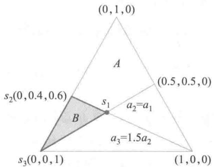  
图1 教师等级结构的可行域和稳定域

稳定域的构造设至少有一个  $i$  使  $\sum_{j = 1}^{k} p_{ij} < 1$ ,则  $I - Q$  可逆,记  $M = \{m_{ij}\} = (I - Q)^{- 1}$ ,则由(14)式可得

$$
\pmb {a} = (\pmb{a}\pmb{w}^{\mathrm{T}})\pmb {r}\pmb {M} \tag{19}
$$

记第  $i$  元素为1、其余元素为0的单位行向量为  $\boldsymbol{e}_{i}, \boldsymbol{r}$  可表示为  $\boldsymbol {r} = \sum_{i = 1}^{k} r_{i} \boldsymbol{e}_{i}$ . 又记  $M$  的第  $i$  行向量为  $\boldsymbol{m}_{i} = (m_{i1}, m_{i2}, \dots , m_{ik}), \boldsymbol{e}_{i} = \sum_{j = 1}^{k} m_{ij}$ ,则  $rM = \sum_{i = 1}^{k} r_{i} e_{i}M = \sum_{i = 1}^{k} r_{i} m_{i}$ . 对向量表达式(19)的诸分量求和,注意到其左端为1,可以得到

$$
a w^{\mathrm{T}} = \left(\sum_{j = 1}^{k}r_{j}\mu_{j}\right)^{-1} \tag{20}
$$

$$
a = \sum_{i = 1}^{k}\frac{r_{i}m_{i}}{\sum_{j = 1}^{k}r_{j}\mu_{j}} \tag{21}
$$

为了得到便于应用的结果,将(21)式进一步表示为

$$
a = \sum_{i = 1}^{k}b_{i}s_{i},\quad b_{i} = \frac{r_{i}\mu_{i}}{\sum_{j = 1}^{k}r_{j}\mu_{j}},\quad s_{i} = \frac{m_{i}}{\mu_{i}} \tag{22}
$$

对于  $b_{i}$ ,容易知道  $\sum_{i = 1}^{k}b_{i} = 1$ ;又因为  $M$  的元素  $m_{ij}$  非负(为什么?),  $\mu_{i}$  非负, $\sum_{j = 1}^{k}r_{j}\mu_{j}$  非负(为什么?),所以当且仅当  $r_{i}\geqslant 0$  时,  $b_{i}\geqslant 0.$  对于  $s_{i} = (s_{i1},s_{i2},\dots ,s_{ik})$ ,有  $s_{ij} = \frac{m_{ij}}{\mu_{i}}$ ,所以  $s_{ij}\geqslant 0$ ,  $\sum_{j = 1}^{k}s_{ij} = 1.$  上述分析表明:

当且仅当  $a$  能够表示为以  $b_{i}$  为系数的  $s_{i}$  的线性组合(22)式,且  $b_{i}$  满足

$$
b_{i}\geqslant 0,\quad \sum_{i = 1}^{k}b_{i} = 1 \tag{23}
$$

时,  $a$  是稳定结构,即存在  $r$ ,满足  $r_{i}\geqslant 0$ ,  $\sum_{i = 1}^{k}r_{i} = 1$ ,使(13)式成立.

回到上面教师等级结构的例子,先从(16)式算出

评注 本节讨论的是最基本的、也是最简单的问题,即在总人数和内部转移比例不变的情况下,用调入比例来控制等级结构的变化. 为了解决实际问题可以有各方面的推广,例如总人数按一定比例增长的情况(基本方程如(11)式):调入比例有上下界的情况,调入比例固定而用转移比例控制等级结构的问题,事实上许多社会系统是从外部向最低等级调入成员,如学生入学,军人入伍. 新教师也基本上由助教当起,即可认为

$$
M = (I - Q)^{-1} = \left[ \begin{array}{ccc}2 & 2 & 3 \\ 0 & 2.5 & 3.75 \\ 0 & 0 & 5 \end{array} \right]
$$

于是  $\mu_{1} = 7,\mu_{2} = 6.25,\mu_{3} = 5.$  然后由(22)式得到  $s_{1} = (0,286,0.286,0.428),s_{2} = (0,0.4,0.4)$ ,  $s_{3} = (0,0,1)$ . 稳定结构  $a$  可表示为  $a = b_{1}s_{1} + b_{2}s_{2} + b_{3}s_{3},b_{1},b_{2},b_{3}\geqslant 0,b_{1} + b_{2} + b_{3} = 1$ ,这正是图1中的稳定域  $B$ .

从计算过程可以看到,当等级转移只有提升一级使  $Q$  的非零元素只能位于(16)式所示的位置时,  $M$  必是上三角形矩阵,从而必然有  $s_{3} = (0,0,1),s_{2} = (0,*,*)$ ,  $s_{1} = (*,*,*)$ ( $*$ , $*$ , $*$ )( $*$  表示非零元素). 注意到  $s_{3}$  表示全部是教授的职称结构,  $s_{2}$  表示全部是讲师或教授的结构,由稳定域  $B$  的构造可知,较高级职称所占比例较大的结构才是稳定的. 这是职称只升不降的必然结果.

上面这个3等级例题的结果可以推广到一般包括  $k$  个等级的情况.

第一,等级结构  $a = (a_{1},a_{2},\dots ,a_{k})$  的可行域  $A$  是  $k$  维空间中由下式决定的  $k - 1$  维超平面,

$$
a_{1} + a_{2} + \dots +a_{k} = 1,\quad a_{1},a_{2},\dots ,a_{k}\geqslant 0 \tag{24}
$$

而稳定域  $B$  则是  $A$  中以  $s_{1},s_{2},\dots ,s_{k}$  为顶点的凸域.

第二,当系统内部只有提升一级的转移,即转移比例矩阵具有

$$
Q = \left[ \begin{array}{c c c c}{p_{11}} & {p_{12}} & {} & 0\\ {} & {p_{22}} & \ddots & {}\\ {} & {} & \ddots & {p_{k - 1,k}}\\ 0 & {} & {} & {p_{k k}} \end{array} \right] \tag{25}
$$

形式时,  $B$  的顶点为  $\pmb{s}_{k} = (0,\dots ,0,1),\pmb{s}_{k - 1} = (0,\dots ,0,*,*,*,s_{2} = (0,*,*,*,*,s_{1} =$ $(*,*,\dots ,*)$

等级结构的动态调节实际上人们关心的另一个问题可能是,给定转移比例矩阵 $\rho$  和初始结构  $\pmb {a}(0)$  ,怎样通过一系列的调入比例  $r$  ,使等级结构  $\pmb {a}(r)$  达到或逐渐接近某个理想结构  $\pmb{a}^{*}$  (可以合理地假设  $\pmb{a}^{*}$  在稳定域  $B$  内部).在这个过程中调入比例  $r$  可以变化,称为动态调节.具体做法可参考拓展阅读6- 2.

调入比例固定为  $r$ $= (1,0,\dots ,0)$  而转移比例,比如只考虑提升一级的比例,却是按照人们制订的政策可以改变的.用转移比例对等级结构进行控制的问题要比用调入比例复杂得多,因为控制变量多了,调节更为灵活,计算也更为复杂.

设某校每年助教、讲师和教授3个等级之间的转移矩阵如(16)式,目前3个等级人数的比例为  $6:3:1$

(1)若每年只调入助教,问5年后各等级人数比例是多少

(2)若每年调人3个等级的人数之比为  $7:1:2$  ,问5年后各等级人数比例是多少

(3)(1)和(2)得到的5年后等级人数比例是否是稳定结构?

拓展阅读6- 2

等级结构的动态调节

# 6.9 中国人口增长预测

中国是一个人口大国,人口问题始终是制约我国发展的关键因素之一.2007年公布的《国家人口发展战略研究报告》提出,如果我国人口总量峰值2033年前后达到峰值15亿人左右,全国总和生育率应保持在1.8左右,过高或过低都不利于人口与经济社会的协调发展①.

在全国大学生数学建模竞赛2007年A题"中国人口增长预测"中提出:近年来中国的人口发展出现了一些新的特点,例如,老龄化进程加速、出生人口性别比持续升高,以及乡村人口城镇化等因素,这些都影响着中国人口的增长.要求参赛者从中国的实际情况和人口增长的特点出发,参考2005年人口抽样数据(见表1),建立中国人口增长的数学模型,并对人口增长的中短期和长期趋势做出预测.

本节以发表在《工程数学学报》2007年增刊二上参赛学生的优秀论文为基本材料,加以整理、归纳和提高,介绍建模的全过程[70].

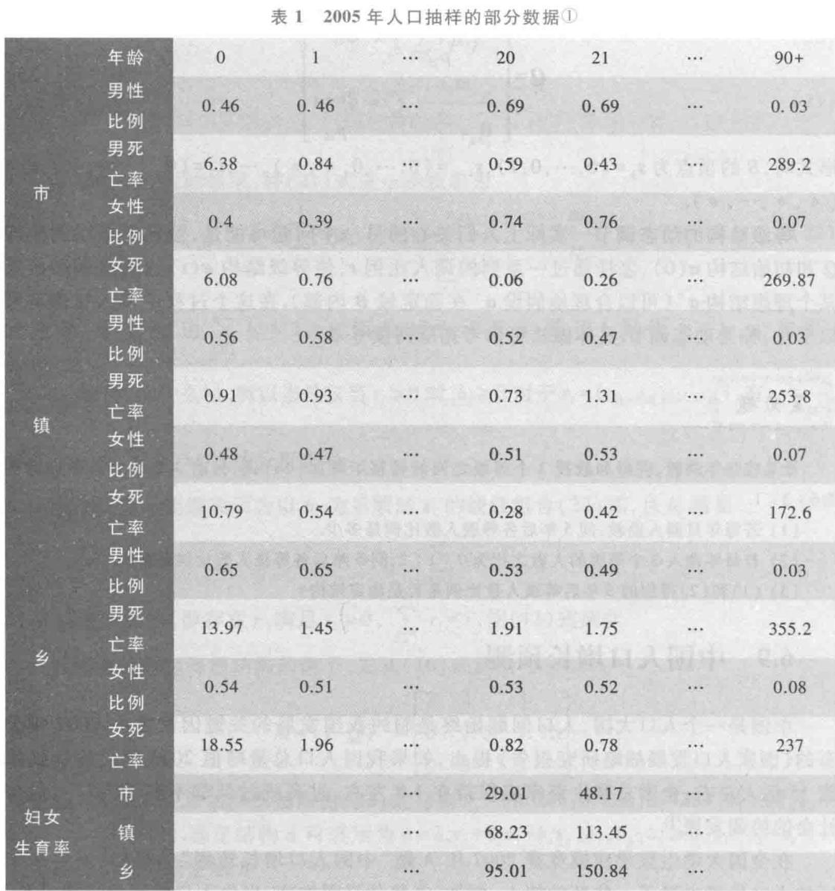

问题分析 用数学建模预测人口增长的方法主要有差分方程、微分方程、回归分析、时间序列等,结合题目所给数据,本节以差分方程姐形式表示的Leslie模型为基础,考虑不同地区、不同性别人口参数的差别,以及农村人口向城市的迁移等因素,按照地区和性别,建立以时间和年龄为基本变量的中国人口增长模型.利用历史数据用统计方法估计生育率、死亡率及人口迁移等参数,代入模型选代求解并做出预测.

模型假设 针对问题要求和所给数据作以下简化假设:

1. 中国人口系统是封闭的, 将表 1 数据中的市、镇合并为城市, 与农村 (乡) 作为两个地区, 只考虑农村向城市人口的单向迁移, 不考虑与境外的相互移民.

2. 作中短期人口预测时, 生育率、死亡率及人口迁移等参数用历史数据估计, 作长期人口预测时, 考虑总和生育率的控制、城镇化指数的变化趋势等政策因素.

3. 女性每胎生育一个子女.

模型建立以1年为一个时段,1岁为一个年龄段,记  $x_{j}^{l}(i,k)$  为  $k$  年、  $i$  岁(满  $i$  岁但不到  $i + 1$  岁)、地区  $j(j = 1$  为城市,  $j = 2$  为农村)、性别  $l(l = m$  为男性,  $l = w$  为女性)的人口数量,  $k = 0,1,2,\dots ,i = 0,1,2,\dots ,n,n$  为最高年龄.  $a_{j}^{l}(i,k)$  为人口死亡率(死亡人数占总人数的比例),  $s_{j}^{l}(i,k) = 1 - d_{j}^{l}(i,k)$  为存活率.  $b_{j}^{w}(i,k)$  为女性人口生育率(  $k$  年每位  $i$  岁女性平均生育婴儿数),  $[i_{1},i_{2}]$  为育龄区间,  $a_{j}(k)$  为出生婴儿性别比(男婴占婴儿总数的比例).  $v_{j}^{l}(i,k)$  为人口的迁移数量(迁入为正、迁出为负).对于  $k = 0,1,2,\dots ,j = 1$  2,  $l = m$  ,  $w$  ,一般模型可写作

$$
\left\{ \begin{array}{l l}{x_{j}^{m}(1,k + 1) =} & {s_{j}^{m}(0,k)a_{j}(k)\sum_{i = i_{1}}^{i_{2}}b_{j}^{w}(i,k)x_{j}^{w}(i,k) + v_{j}^{m}(0,k)}\\ {x_{j}^{w}(1,k + 1) =} & {s_{j}^{w}(0,k)(1 - a_{j}(k))\sum_{i = i_{1}}^{i_{2}}b_{j}^{w}(i,k)x_{j}^{w}(i,k) + v_{j}^{w}(0,k)}\\ {x_{j}^{l}(i + 1,k + 1) =} & {s_{j}^{l}(i,k)x_{j}^{l}(i,k) + v_{j}^{l}(i,k),i = 1,2,\dots ,n - 1,l = m,w} \end{array} \right. \tag{1}
$$

对女性生育率  $b_{j}^{w}(i,k)$  作进一步分析. 记

$$
\beta_{j}^{w}(k) = \sum_{i = i_{1}}^{i_{2}} b_{j}^{w}(i,k) \tag{2}
$$

$\beta_{j}^{w}(k)$  为  $k$  年每位育龄女性平均生育婴儿数, 如果所有女性在育龄期间都保持这个生育数, 那么  $\beta_{j}^{w}(k)$  也表示每位女性一生的平均生育数, 称总和生育率或生育胎次, 是表述与控制人口增长的重要指标. 记

$$
h_{j}^{w}(i,k) = \frac{b_{j}^{w}(i,k)}{\beta_{j}^{w}(k)} \tag{3}
$$

表示  $i$  岁女性的生育数在育龄女性中占的比例, 称生育模式, 满足  $\sum_{i = i_{1}}^{i_{2}} h_{j}^{w}(i, k) = 1$ .

记  $v^{l}(i,k)$  为农村向城市迁移的人口数量, 按照农村向城市单向迁移的假设, 有  $v_{1}(i,k) = v^{l}(i,k), v_{2}^{l}(i,k) = - v^{l}(i,k)$ . 记

$$
x_{j}^{l}(k) = \left[x_{j}^{l}(1,k), x_{j}^{l}(2,k), \dots , x_{j}^{l}(n,k)\right]^{\mathrm{T}}
$$

$$
\pmb{v}^{l}(k) = \left[v^{l}(0,k), v^{l}(1,k), \dots , v^{l}(n - 1,k)\right]^{\mathrm{T}} \tag{4}
$$

$$
S_{j}^{l}(k) = \left[ \begin{array}{cccccc}0 & 0 & \dots & 0 & 0 \\ s_{j}^{l}(1,k) & 0 & \dots & 0 & 0 \\ 0 & s_{j}^{l}(2,k) & \dots & 0 & 0 \\ \vdots & \vdots & & \vdots & \vdots \\ 0 & 0 & \dots & s_{j}^{l}(n - 1,k) & 0 \end{array} \right] \tag{5}
$$

$$
H_{j}^{w}(k) = \left[ \begin{array}{l l l l l l l l l l l l l l l l l l l l l l l l l l l l l l l l l l l l l l l l l l l l l l l l l l l l l l l l l l l l l l l l l l l l l l l l l l l l l l l l l l l l l l l l l l l l l l l l l l l l l \end{array} \right] \tag{6}
$$

上述模型可表为如下向量- 矩阵形式

$$
\begin{array}{r l} & {\left\{x_{1}^{m}(k + 1) = S_{1}^{m}(k)x_{1}^{m}(k) + s_{1}^{m}(0,k)a_{1}(k)\beta_{1}^{w}(k)H_{1}^{w}(k)x_{1}^{w}(k) + \pmb{v}^{m}(k)\right.}\\ & {\left.\left\{x_{1}^{w}(k + 1) = S_{1}^{w}(k)x_{1}^{w}(k) + s_{1}^{w}(0,k)(1 - a_{1}(k))\beta_{1}^{w}(k)H_{1}^{w}(k)x_{1}^{w}(k) + \pmb{v}^{w}(k)\right.\right.}\\ & {\left.\left\{x_{2}^{w}(k + 1) = S_{2}^{w}(k)x_{2}^{w}(k) + s_{2}^{w}(0,k)a_{2}(k)\beta_{2}^{w}(k)H_{2}^{w}(k)x_{2}^{w}(k) - \pmb{v}^{w}(k)\right.\right.}\\ & {\left.\left\{x_{2}^{w}(k + 1) = S_{2}^{w}(k)x_{2}^{w}(k) + s_{2}^{w}(0,k)(1 - a_{2}(k))\beta_{2}^{w}(k)H_{2}^{w}(k)x_{2}^{w}(k) - \pmb{v}^{w}(k)\right.\right.} \end{array} \tag{7}
$$

(7)式是按地区和性别划分、以年龄为离散变量、随时段演变的人口发展模型,其右端包括从  $k$  年到  $k + 1$  年人口发展的3个因素:由存活率构成的矩阵  $S_{j}^{t}(k)$  表述人口随年龄增长的演变;由总和生育率、生育模式构成的  $\beta_{j}^{w}(k)$  和矩阵  $H_{j}^{w}(k)$  表述人口生育形成的演变;由农村向城市的人口迁移向量  $\pmb{v}^{t}(k)$  引起的演变.

(7)式是  $4n$  阶差分方程组,因生育过程使得女性人口出现在男性人口的方程中,形成了耦合作用.

参数估计在利用模型(7)按照时段(年)进行递推,预测人口的演变过程时,应先确定存活率、生育率及迁移向量等参数,并且需要根据不同地区、性别和各年龄人口在  $k$  年的这些参数及人数,才能计算  $k + 1$  年的人口数量.所以为了预测人口的增长,需要先估计这些参数在未来时段的数值.

存活率的估计从常识看,死亡率与年龄的关系很大,与地区、性别和时间的关系较小.中国过去几十年死亡率降低较快,从长期看仍需考虑死亡率的持续下降,而短期则可近似地认为不变.所以在作中短期预测时,可以将过去若干年(如数据文件6- 1给出的2001—2005年)不同地区、性别和各年龄人口的死亡率简单地加以平均,作为模型中的死亡率参数.作长期预测时,则可利用统计方法对历史数据加以处理,并参考发达国家人口死亡率的演变过程给出估计值.

存活率按照定义由死亡率算出.

生育率的估计从20世纪80年代以来,随着计划生育政策的实施,中国女性生育率已在持续下降以后大致保持稳定,所以在作中短期预测时也可以将过去若干年(如数据文件6- 1给出的2001—2005年)不同地区、各年龄女性人口的生育率简单地加以平均,作为模型中的生育率参数,这时应将模型(7)中的  $\beta_{j}^{w}(k)h_{j}^{w}(i,k)$  还原回(1)式的  $b_{j}^{w}(i,k)$  (参见(3)式).

作长期预测时,不妨设定几个不同水平的总和生育率  $\beta_{j}^{w}$  (不考虑随时段  $k$  的变化)①,分别计算.至于生育模式  $h_{j}^{w}(i)$  (也不考虑  $k$  的变化),可以采用概率论中的伽马分布

$$
h_{j}^{w}(i) = \frac{1}{2^{n / 2}\Gamma(n / 2)} (i - i_{1})^{(n / 2 - 1)}\mathrm{e}^{-(i - i_{1}) / 2},n = i_{c} - i_{1} + 2,i_{1}\leqslant i\leqslant i_{2} \tag{8}
$$

其中  $i_{c}$  是生育高峰的年龄。如根据数据文件6- 1给出的数据,有  $i_{1} = 15, i_{2} = 49$ ,城市的  $i_{c}$  为25,农村的  $i_{c}$  为23。于是对城市可设  $h_{1}^{w}(i) = \frac{1}{7680} (i - 15)^{5}\mathrm{e}^{-(i - 15) / 2} (15\leqslant i\leqslant 49)①$ 。

模型(7)中的出生婴儿性别比可由数据文件6- 1给出的数据中0岁男婴和女婴的比率得出,或者参考近年公开发表的出生婴儿性别比资料。

人口迁移的估计需要从两个方面进行估计,一是每年农村向城市迁移的人口总数,可以按照城镇化率的增长来估算,二是迁移人口的年龄、性别分布。

记  $X_{1}(k), X_{2}(k), X(k)$  分别为  $k$  年全国的城镇人口、农村人口和总人口,则

$$
X_{j}(k) = \sum_{l = m,w}^{n}\sum_{i = 0}^{n}x_{j}^{l}(i,k), X(k) = X_{1}(k) + X_{2}(k) \tag{9}
$$

城镇化率定义为城镇人口占全国人口的比例,记作  $\alpha (k) = \frac{X_{1}(k)}{X(k)}\cdot \alpha (k)$  可以用合适的模型描述,并根据历史数据对  $\alpha (k)$  进行预测  $②$ .  $k$  年农村向城市迁移的人口总数记作  $V(k) = \sum_{l = m,w}^{n}\sum_{i = 0}^{n}v^{l}(i,k)$ ,可用城镇化率的增长估计为

$$
V(k) = [\alpha (k) - \alpha (k - 1)]X(k) \tag{10}
$$

对于迁移人口的年龄、性别分布,因为难以得到全国的数据,可以用典型城市的资料代替  $③$ ,得到  $i$  岁、性别  $l$  迁移人口占总数的比例  $c^{l}(i,k)$ ,则农村向城市迁移的人口数量  $v^{l}(i,k)$  为

$$
v^{l}(i,k) = c^{l}(i,k)V(k),\sum_{l = m,w}^{n}\sum_{i = 0}^{n}c^{l}(i,k) = 1 \tag{11}
$$

模型求解在确定存活率、生育率及迁移向量等参数后,选定初始年份(如2005年)即可利用模型(7)进行递推,对于任意年份  $k$ ,得到  $i$  岁、地区  $j$ 、性别  $l$  的人口数量  $x_{j}^{l}(i,k)$ ,它全面、完整地描述了人口的演变过程。而为了简明、方便的需要,通常采用一些人口指数来集中反映一个国家或地区的人口特征,主要有:

$\bullet$  人口总数 记作  $X(k)$ ,见(9)式。

$\bullet$  平均年龄 记作  $R(k)$ ,是年龄  $i$  对人口数量  $x_{j}^{l}(i,k)$  的加权平均,即

$$
R(k) = \frac{1}{X(k)}\sum_{i = m,w}^{2}\sum_{j = 0}^{n}\sum_{i = 0}^{n}i x_{j}^{l}(i,k) \tag{12}
$$

$\bullet$  平均寿命 记作  $S(k)$ ,是按  $k$  年的死亡率计算的  $k$  年出生人口的平均存活时间,有

$$
S(k) = \sum_{l = m,w}^{2}\sum_{j = 1}^{n}\sum_{r = 0}^{n}\exp (-\sum_{i = 0}^{r}d_{j}^{l}(i,k)) \tag{13}
$$

评注 差分方程组形式的Leslie模型简明地表述了人口发展过程中生育和死亡这两个自然因素的作用。死亡基本上是不可控制的,在稳定环境下死亡率变化很慢,所以用历史数据能够较

- 老龄化指数 记作  $\omega (k)$ , 是平均年龄与平均寿命之比, 即

$$
\omega (k) = \frac{R(k)}{S(k)} \tag{14}
$$

- 抚养指数 记作  $\rho (k)$ , 是每个劳动力人口平均抚养的 (无劳动力) 人数. 设劳动力年龄区间男性为  $[i_{m1}, i_{m2}]$ , 女性为  $[i_{w1}, i_{w2}]$ , 记劳动力人数为  $L(k)$ , 则

$$
L(k) = \sum_{j = 1}^{i_{m2}}\left(\sum_{i = i_{m1}}^{i_{m2}}x_{j}^{m}(i,k) + \sum_{i = i_{w1}}^{i_{w2}}x_{j}^{w}(i,k)\right), \rho (k) = \frac{X(k) - L(k)}{L(k)} \tag{15}
$$

其他如 60 岁、65 岁以上人口比例等可以类似于 (15) 式计算.

表 2 是发表在《工程数学学报》2007 年增刊二上优秀论文关于人口总数的部分计算结果  $①$ . 其他人口指数的计算结果参看上述期刊的论文.

表2人口总数（亿）的部分计算结果  

<table><tr><td rowspan="2"></td><td colspan="6">年份</td></tr><tr><td>2010</td><td>2020</td><td>2030</td><td>2040</td><td>2050</td><td></td></tr><tr><td>1</td><td>β=1.375</td><td>13.2</td><td>13.5</td><td>13.2</td><td>12.4</td><td>11.4</td></tr><tr><td>2</td><td>β=1.8</td><td>13.4</td><td>14.2</td><td>14.2</td><td>13.8</td><td>12.7</td></tr><tr><td>3</td><td>β=2.1</td><td>13.6</td><td>14.4</td><td>14.7</td><td>14.7</td><td>14.7</td></tr><tr><td>4</td><td></td><td>13.5</td><td>14.3</td><td>14.8</td><td>14.2</td><td>13.9</td></tr></table>

# 第 6 章训练题

1. 一老人 60 岁时将养老金 10 万元存入基金会, 月利率  $0.4\%$ , 他每月取 1000 元做生活费, 建立差分方程模型计算他每年末尚有多少钱? 多少岁时将基金用完? 如果想用到 80 岁, 60 岁时应存多少钱?

2. 在一处古篝火遗址附近发现了一个猿人头骨, 考古学家确信该头骨和古篝火是同时代的. 经测试确定在取自篝火的灰烬中, 碳 14 的含量仅留存原来的  $1\%$ . 已知碳 14 的半衰期是 5730 年. 建立一个用碳 14 测定年代的模型, 并用以确定古篝火遗址附近发现的猿人头骨的年代 [24].

3. 某湖泊每天有  $10^{3} \mathrm{~m}^{3}$  的河水流入, 河水中污物浓度为  $0.02 \mathrm{~g} / \mathrm{m}^{3}$ , 经渠道排水后湖泊容积保持  $200 \times 10^{4} \mathrm{~m}^{3}$  不变, 现测定湖泊中污物浓度为  $0.2 \mathrm{~g} / \mathrm{m}^{3}$ , 建立模型计算湖泊中一年内逐月 (每月按 30 天计) 下降的污物浓度, 问要多长时间才能达到环保要求的浓度  $0.04 \mathrm{~g} / \mathrm{m}^{3}$ ? 为了把这个时间缩短为一年, 应将河水中污物浓度降低到多少 [73]?

4. 当某种药物的浓度大于  $100 \mathrm{mg} / \mathrm{L}$  (有效水平) 时才能治疗疾病, 且最高浓度不能超过  $1000 \mathrm{mg} / \mathrm{L}$  (安全水平). 从实验知道该药物浓度以每小时现有量  $15\%$  的速率衰减.

(1) 建立每小时药物浓度的模型. 若初始浓度为  $600 \mathrm{mg} / \mathrm{L}$ , 确定何时浓度达到  $100 \mathrm{mg} / \mathrm{L}$ .

(2) 设计一个合适的药物处方 (包括初始剂量及维持剂量和间隔).

5. 设在一个受限环境中鲸鱼的最大容量是  $M$ , 最小生存水平是  $m$ , 用  $a_{n}$  表示  $n$  年后的鲸鱼数量,

建立关于  $a_{n}$  的差分方程模型. 再设  $M = 5000, m = 100$ , 对模型参数和初始鲸鱼数量取不同数值作计算, 分析对结果的影响.

6. 斑点猫头鹰和隼在同一栖息地为生存而竞争. 假定只有一个种群存在时可以无限增长, 即种群增量与此时的种群数量成正比. 而种群的竞争使每个种群增量的减少与两个种群的数量有关. 建立猫头鹰和隼数量变化的差分方程模型, 改变模型参数进行计算, 分析对结果的影响. 用这种模型描述的两个相互竞争种群的后果是什么, 怎样改进模型才能反映现实世界中在同一栖息地只有一个种群能够生存的现象[24].

7. 据报道, 某种山猫在较好、中等及较差的自然环境下, 年平均增长率分别为  $1.68\%$ ,  $0.55\%$  和  $-4.50\%$ , 假定开始时有 100 只山猫, 按以下情况讨论山猫数量逐年变化过程及趋势:

(1) 3 种自然环境下 25 年的变化过程 (作图).

(2) 如果每年捕获 3 只, 会发生什么情况? 山猫会灭绝吗? 如果每年只捕获 1 只呢?

(3) 在较差的自然环境下, 如果想使山猫数量稳定在 60 只左右, 每年要人工繁殖多少只[73]?

8. 在某种环境下猫头鹰的主要食物来源是田鼠, 设田鼠的年平均增长率为  $r_{1}$ , 猫头鹰的存在引起的田鼠增长率的减少与猫头鹰的数量成正比, 比例系数为  $a_{1}$ ; 猫头鹰的年平均减少率为  $r_{2}$ ; 田鼠的存在引起的猫头鹰减少率的增加与田鼠的数量成正比, 比例系数为  $a_{2}$ . 建立模型描述田鼠和猫头鹰共处时的数量变化规律, 对以下情况作图给出 50 年的变化过程.

(1) 设  $r_{1} = 0.2, r_{2} = 0.3, a_{1} = 0.001, a_{2} = 0.002$ , 开始时有 100 只田鼠和 50 只猫头鹰.

(2)  $r_{1}, r_{2}, a_{1}, a_{2}$  同上, 开始时有 100 只田鼠和 200 只猫头鹰.

(3) 适当改变参数  $a_{1}, a_{2}$  (初始值同上).

(4) 求差分方程的平衡点, 它们稳定吗[24]?

9. 研究将鹿群放入草场后草和鹿两种群的相互作用. 草的生长遵从 logistic 规律, 年固有增长率 0.8, 最大密度为 3000 (密度单位), 在草最茂盛时每只鹿每年可吃掉 1.6 (密度单位) 的草. 若没有草, 鹿群的年死亡率高达 0.9, 而草的存在可使鹿的死亡得以补偿, 在草最茂盛时补偿率为 1.5. 做出一些简化假设, 用差分方程模型描述草和鹿两种群数量的变化过程, 就以下情况进行讨论.

(1) 比较将 100 只鹿放入密度为 1000 和密度为 3000 的草场两种情况.

(2) 适当改变参数, 观察变化趋势[73].

10. 在 6.1 节的两种还款方式下, 如果将每月还款一次的办法改为每年还款一次 (每年的最后一月还款), 其他条件均不变, 比较两种办法的还款额.

11. 考察模拟水下爆炸的比例模型. 爆炸物质量  $m$ , 在距爆炸点距离  $r$  处设置仪器, 接收到的冲击波压强为  $p$ , 记大气初始压强  $p_{0}$ , 水的密度  $\rho$ , 水的体积弹性模量  $k$ , 用量纲分析方法已经得到  $p = p_{0} \phi \left(\frac{p_{0}}{k}, \frac{\rho r^{3}}{m}\right)$ . 设模拟实验与现场的  $p_{0}, \rho , k$  相同, 而爆炸物模型的质量为原型的  $1 / 1000$ . 为了使实验中接收到与现场相同的压强  $p$ , 问实验时应如何设置接收冲击波的仪器, 即求实验仪器与爆炸点之间的距离是现场的多少倍[31].

12. 牧场管理[29]. 有一块一定面积的草场放牧羊群, 管理者要估计草场能放牧多少羊, 每年保留多少母羊羔, 夏季要贮存多少草供冬季之用.

为解决这些问题调查了如下的背景材料:

1) 本地环境下这一品种草的日生长率为

<table><tr><td>季节</td><td>冬</td><td>春</td><td>夏</td><td>秋</td></tr><tr><td>日生长率/(g·m-2)</td><td>0</td><td>3</td><td>7</td><td>4</td></tr></table>

2)羊的繁殖率通常母羊每年产1~3只羊羔,5岁后被卖掉.为保持羊群的规模可以买进母羊,或者保留一定数量的母羊羔.每只母羊的平均繁殖率为

<table><tr><td>年龄</td><td>0~1</td><td>1~2</td><td>2~3</td><td>3~4</td><td>4~5</td></tr><tr><td>产羊羔数</td><td>0</td><td>1.8</td><td>2.4</td><td>2.0</td><td>1.8</td></tr></table>

3)羊的存活率不同年龄的母羊的自然存活率(指存活一年)为

<table><tr><td>年龄</td><td>1~2</td><td>2~3</td><td>3~4</td></tr><tr><td>存活率</td><td>0.98</td><td>0.95</td><td>0.80</td></tr></table>

4)草的需求量母羊和羊羔在各个季节每天需要的草的数量(单位  $\mathrm{kg}$  )为

<table><tr><td>季节</td><td>冬</td><td>春</td><td>夏</td><td>秋</td></tr><tr><td>母羊</td><td>2.10</td><td>2.40</td><td>1.15</td><td>1.35</td></tr><tr><td>羊羔</td><td>0</td><td>1.00</td><td>1.65</td><td>0</td></tr></table>

按照以下假设建模:

(1)只考虑羊的数量,而不管它们的体重

(2)母羊只在春季产羊羔,公、母羊羔各占一半,当年秋季将全部公羊羔和一部分母羊羔卖掉,以保持母羊(每个年龄的)数量不变

# 更多案例···

6- 1 投入产出模型

6- 2 量纲分析的应用与无量纲化

# 第7章 离散模型

所谓离散模型,一般是相对于连续模型而言的,前几章中的差分方程相对于微分方程、整数规划相对于线性规划,是常见的离散模型。本章的建模案例主要取自经济、社会等领域经常出现的决策、排序、分配等方面的问题。

# 7.1 汽车选购

选购一辆私家车是许多进入稳定社会生活的人们要费心考虑的事情之一。由于经济情况、生活习惯、兴趣追求等方面的差别,他(她)们选购汽车的标准自然不会相同。可以认为主要会考虑经济适用、性能良好、款式新颖3个因素,只是每个人对这3个因素的侧重有所不同。初入社会的年轻人可能以经济适用为重,有一定经济实力的中年人更注重性能良好,所谓"富二代"则更钟情于款式新颖。如果某人对3个因素在汽车选购这一目标中的重要性已经有了大致的比较,也确定了待选的若干种型号的汽车,那么他(她)必然要深入了解每一种待选的汽车,以便对各种汽车在每个因素中的优劣程度做出基本的判断。最后,他(她)要根据以上信息对待选汽车进行综合评价,从而为选购哪种汽车做出决策。

人们在日常生活中常常会碰到类似的决策问题:假期旅游,是去风光绮丽的苏杭,还是迷人的北戴河海滨,抑或山水甲天下的桂林,这与旅游地的景色、旅途的费用、吃住条件等因素在你心目中的重要程度有关;选择工作岗位,是国企、私企还是科研院所,当然会考虑薪酬、地域、发展前景等方面的因素。

从事各种职业的人在工作中也经常面对决策:厂长要决定购买哪种设备,上马什么产品;科技人员要选择研究课题;经理要从应聘者中选拔秘书;各地区、各部门的官员要对经济、环境、交通、居住等方面的发展做出规划。

现实世界里诸如此类的众多决策问题有一些共同的特点:需要考虑的因素经常涉及经济、社会、人文、环境等领域,对它们的重要性、影响力作比较、评价时缺乏客观的标准;待选对象对于这些因素的优劣程度也往往难以量化。这就给用数学建模解决一大类实际问题带来困难。多属性决策(multiple attribute decision making)和层次分析法(analytic hierarchy process)是处理这类决策问题的常用方法。本节以汽车选购为例介绍用多属性决策建模的全过程。[30,81]

多属性决策的几个要素

多属性决策指人们为了一个特定的目的,要在若干备选方案(如几种型号的汽车)中确定一个最优的,或者对这些方案按照优劣程度排序,或者需要给出优劣程度的数量结果,而方案的优劣由若干属性(如汽车的价格、性能、款式等因素)给以定量或定性的表述。一般地说,多属性决策包含以下要素:

- 决策目标、备选方案与属性集合 通常,决策目标和备选方案是由实际问题本身决定的,少有选择的余地。而选取哪些属性对于决策结果则至关重要,需要决策者在

相关领域有较多的实际经验.大体上,确定属性集合有以下几条原则:全面考虑影响决策目标的因素,注意选取影响力(或重要性)较强的属性;各个属性之间应尽量独立,至少相关性不要太强;尽量选取能够定量的属性,定性的也要能分出明确的优劣程度;如果某个属性对各备选方案的差别很小,根据该属性就难以辨别方案的优劣,那么这个属性就不必选入(即使它对决策目标的影响力很强);当属性数量太多时应该将它们分层,上层的每一属性包含下层的若干子属性.

$\bullet$  决策矩阵指以方案为行、属性为列,以每一方案对每一属性的取值为元素形成的矩阵,表示了方案对属性的优劣(或偏好)程度.当某一属性可以定量描述时(如汽车价格),矩阵这一列元素的数值比较容易得到,而当某一属性只能定性描述时(如汽车款式),这一列元素的数值就需要寻求合适的方法确定.

$\bullet$  属性权重各属性之间的权重分配对于决策结果至关重要,例如当今媒体上出现的不同机构给出的大学排名榜有不小的差别,在很大程度上是由于对属性(如教师水平、毕业生质量、研究经费等)的选取及其权重分配的不同造成的.同时,由于各属性的不同特性,常常难以客观地、定量地确定其权重.

$\bullet$  综合方法指将决策矩阵与属性权重加以综合,得到最终决策的数学方法.

下面结合汽车选购说明如何确定决策矩阵、属性权重以及利用综合方法得到决策结果.

决策矩阵及其标准化

假定有3种型号的汽车(相当于3个方案)供选购,记作  $\mathrm{A}_{1}$  ,  $\mathrm{A}_{2}$  ,  $\mathrm{A}_{3}$  ,3个属性为价格、性能和款式,依次记作  $X_{1}$  ,  $X_{2}$  ,  $X_{3}$  .对于价格  $X_{1}$  (单位:万元),3种汽车分别为25,18,12;对于性能  $X_{2}$  ,采用打分的办法(满分10分),3种汽车分别为9,7,5;对于款式 $X_{3}$  ,类似地打分为7,7,5. 将这些数值列入表1,并记作  $d_{i j}(i = 1,2,3,j = 1,2,3)$  ,表示方案  $\mathrm{A}_{i}$  对属性  $X_{j}$  的取值,或称原始权重.

<table><tr><td></td><td>X1</td><td>X2</td><td>X3</td></tr><tr><td>A1</td><td>25</td><td>9</td><td>7</td></tr><tr><td>A2</td><td>18</td><td>7</td><td>7</td></tr><tr><td>A3</td><td>12</td><td>5</td><td>5</td></tr></table>

一般地,如果一个多属性决策问题有  $m$  个备选方案  $\mathrm{A}_{1}$  ,  $\mathrm{A}_{2}$  ,…,  $\mathrm{A}_{m}$  ,  $n$  个属性  $X_{1}$ $X_{2}$  ,…,  $X_{n}$  ,方案  $\mathrm{A}_{i}$  对属性  $X_{j}$  的取值为  $d_{i j}$  ,以下称属性值,  $\pmb {D} = (d_{i j})_{m\times n}$  称决策矩阵,表1可以用(原始)决策矩阵表示为

$$
D = \left[ \begin{array}{lll}25 & 9 & 7 \\ 18 & 7 & 7 \\ 12 & 5 & 5 \end{array} \right]
$$

决策矩阵的获取一般有两种途径,一种是直接通过量测或调查得到,如表1中价格  $X_{1}$  ,是偏于客观的方法,另一种是由决策者或请专家评定,是偏于主观的方法.

决策矩阵的每一列表示各方案对某一属性的属性值,由于通常各属性的物理意义

(包括量纲)各不相同,在下一步分析之前常需要将决策矩阵标准化(或称规范化)。

进行标准化时首先需要区分效益型属性和费用型属性,前者指属性值越大,该属性对决策的重要程度越高,后者正相反。汽车选购中的属性  $X_{2}$ ,  $X_{3}$  是效益型的,而  $X_{1}$  是费用型的。如果一个多属性决策问题中效益型属性占多数(大多数实际情况如此),在标准化时应先对费用型属性值作变换,通常的方法是取原属性值的倒数,或者用一个大数减去原属性值,将全部属性统一为效益型的  $①$ 。用取倒数的方法可将汽车选购中的决策矩阵重新表示为

$$
D = \left[ \begin{array}{lll} 1 & 9 & 7 \\ 25 & & \\ 1 & 7 & 7 \\ 18 & & \\ 1 & 5 & 5 \end{array} \right]
$$

以下所说的决策矩阵  $D$  均对统一为效益型属性而言。

所谓决策矩阵标准化是对  $D = (d_{ij})_{m \times n}$  作比例尺度变换,标准化的决策矩阵  $R = (r_{ij})_{m \times n}$  有以下几种形式:

$$
r_{ij} = \frac{d_{ij}}{\sum_{i = 1}^{m} d_{ij}} \tag{1}
$$

$R$  的列向量的分量之和为1,称归一化;

$$
r_{ij} = \frac{d_{ij}}{\max_{i = 1,2,\dots,m} d_{ij}} \tag{2}
$$

$R$  的列向量的分量最大值为1,称最大化;

$$
r_{ij} = \frac{d_{ij}}{\sqrt{\sum_{i = 1}^{m} d_{ij}^{2}}} \tag{3}
$$

$R$  的列向量的模为1,称模一化。经过这些变换可得  $0 \leqslant r_{ij} \leqslant 1$ ,当且仅当  $d_{ij} = 0$  时才有  $r_{ij} = 0. R$  的各个列向量表示了在同一尺度下各属性的属性值。

汽车选购中的决策矩阵  $D$  经过(1),(2),(3)式标准化后分别化为

$$
R = \left[ \begin{array}{lll} 0.2236 & 0.4286 & 0.3684 \\ 0.3106 & 0.3333 & 0.3684 \\ 0.4658 & 0.2381 & 0.2632 \end{array} \right]
$$

$$
R = \left[ \begin{array}{lll} 0.4800 & 1.0000 & 1.0000 \\ 0.6667 & 0.7778 & 1.0000 \\ 1.0000 & 0.5556 & 0.7143 \end{array} \right]
$$

评注 比例尺度变换还假定属性对决策的重要性是随属性值线性变化的。对于明显的非线性,如边际效益递减的情况,应先对属性值拟合适当的函数再作变换。

$$
R = \left[ \begin{array}{lll}0.3709 & 0.7229 & 0.6312 \\ 0.5151 & 0.5623 & 0.6312 \\ 0.7727 & 0.4016 & 0.4508 \end{array} \right]
$$

属性权重的确定

各个属性对决策目标的影响程度(或重要性)称为属性权重,记属性  $X_{1}, X_{2}, \dots , X_{n}$  的权重为  $w_{1}, w_{2}, \ldots , w_{n}$ ,满足  $\sum_{j = 1}^{n} w_{j} = 1, w = (w_{1}, w_{2}, \dots , w_{n})^{\mathrm{T}}$  称为权向量。属性权重的确定也有偏于主观和偏于客观两种方法:偏于主观的方法可以由决策者根据决策目的和经验先验地给出。

信息熵法属于典型的偏于客观的方法。在信息论中熵是衡量不确定性的指标,一个信息量的(概率)分布越趋向一致,所提供信息的不确定性越大,当信息呈均匀分布时不确定性最大。在多属性决策中将按照归一化(1)式得到的决策矩阵  $R$  的各个列向量  $(r_{1j}, r_{2j}, \dots , r_{mj})^{\mathrm{T}}(j = 1,2, \dots , n)$  看作信息量的概率分布,按照 Shannon 给出的数量指标——熵的定义,各方案关于属性  $X_{j}$  的熵为

$$
E_{j} = -k\sum_{i = 1}^{m}r_{i j}\ln r_{i j}, k = 1 / \ln m, j = 1,2,\dots ,n \tag{4}
$$

当各方案对某个  $X_{j}$  的属性值全部相同,即  $r_{i j} = 1 / m(i = 1,2,\dots ,m)$  时,  $E_{j} = 1$  达到最大,这样的  $X_{j}$  对于辨别方案的优劣不起任何作用;当各方案对  $X_{j}$  的属性值  $r_{i j}$  只有一个1其余全为0时,  $E_{j} = 0$  达到最小,这样的  $X_{j}$  最能辨别方案的优劣.一般地,属性值  $r_{i j}$  相差越大,  $E_{j}$  越小,  $X_{j}$  辨别方案优劣的作用越大.于是定义

$$
F_{j} = 1 - E_{j}, 0 \leqslant F_{j} \leqslant 1 \tag{5}
$$

为属性  $X_{j}$  的区分度。进一步,将归一化的区分度取作属性  $X_{j}$  的权重  $w_{j}$ ,即

$$
w_{j} = \frac{F_{j}}{\sum_{j = 1}^{n} F_{j}}, \quad j = 1,2, \dots , n \tag{6}
$$

对于汽车选购,表2给出由归一化的决策矩阵  $R$  (即表中的  $r_{i j}$  )按照(4)~(6)式计算的熵  $E_{j}$ 、区分度  $F_{j}$  和权重  $w_{j}(j = 1,2,3)$ 。

表2汽车采购中决策矩阵的、区分度和权重  

<table><tr><td></td><td>X1</td><td>X2</td><td>X3</td></tr><tr><td rowspan="3">rij</td><td>0.223 6</td><td>0.428 6</td><td>0.368 4</td></tr><tr><td>0.310 6</td><td>0.333 3</td><td>0.368 4</td></tr><tr><td>0.465 8</td><td>0.238 1</td><td>0.263 2</td></tr><tr><td>Ej</td><td>0.959 4</td><td>0.974 9</td><td>0.989 5</td></tr><tr><td>Fj</td><td>0.040 6</td><td>0.025 1</td><td>0.010 5</td></tr><tr><td>wj</td><td>0.533 0</td><td>0.329 3</td><td>0.137 7</td></tr></table>

将各属性的权重按照大小排序为  $w_{1}, w_{2}, w_{3}$ 。实际上,观察原始决策矩阵  $D$  (或表1)可以看出:3种汽车对  $X_{1}$  (价格)的属性值相差很大,对  $X_{3}$  (款式)的属性值相差甚小,

根据这样的数据利用信息熵法计算权重,结果自然是  $w_{1}$  较大而  $w_{3}$  较小。

信息熵法完全由决策矩阵计算属性权重,如果决策矩阵主要是直接通过量测或调查得到的,那么这种获取权重的方法客观性较强。

与信息熵法的思路相似,可以用  $r_{1j}, r_{2j}, \dots , r_{mj}$  的标准差或极差作为区分度  $F_{j}$  计算权重,这适用于  $m$  较大的情况。

如果将偏于主观和客观两种方法得到的权重分别记作  $\begin{array}{r l}{\pmb{w}^{(1)} =} & {{}\big(w_{1}^{(1)},w_{2}^{(1)},\dots ,w_{n}^{(1)}\big)^{\mathrm{T}}} \end{array}$ $\pmb{w}^{(2)} = \left(\pmb{w}_{1}^{(2)},\pmb{w}_{2}^{(2)},\dots ,\pmb{w}_{n}^{(2)}\right)^{\mathrm{T}}$  ,那么可以用如下简单的方法将二者综合,得到新的权重

$$
w_{j} = \frac{w_{j}^{(1)}w_{j}^{(2)}}{\sum_{j = 1}^{n}w_{j}^{(1)}w_{j}^{(2)}},\quad j = 1,2,\dots ,n \tag{7}
$$

式中乘积  $w_{j}^{(1)}w_{j}^{(2)}$  可以改为  $w_{j}^{(1)\alpha}w_{j}^{(2)\beta}$  或  $\alpha w_{j}^{(1)} + \beta w_{j}^{(2)}$  ,其中  $\alpha ,\beta$  可根据决策者对  $w^{(1)}$  ,  $w^{(2)}$  的偏好程度进行调节。

综合方法

得到决策矩阵及属性权重以后,数学上可以采用多种方法将它们综合,按照决策者的需要确定一个最优方案,或者各方案按照优劣排序的数量结果,即方案对目标的(综合)权重。下面是几种主要的方法。

$\bullet$  加权和法这是人们熟知的、常用的方法。已知标准化决策矩阵  $\pmb {R} = \left(r_{ij}\right)_{m\times n}$  及属性权重  $\pmb {w} = \left(w_{1},w_{2},\dots ,w_{n}\right)^{\mathrm{T}}$  (满足  $\sum_{j = 1}^{n}w_{j} = 1$ ),则方案  $\mathrm{A}_{i}$  对目标的权重  $v_{i}$  是  $r_{ij}$  对  $w_{j}$  的加权和,即

$$
v_{i} = \sum_{j = 1}^{n}r_{ij}w_{j},\quad i = 1,2,\dots ,m \tag{8}
$$

若记向量  $\pmb {v} = \left(v_{1},v_{2},\dots ,v_{m}\right)^{\mathrm{T}}$  ,则(8)可写作矩阵形式

$$
\pmb {v} = \pmb {R}\pmb{w} \tag{9}
$$

应该指出,当对决策矩阵采用不同的标准化方法时,得到的结果会有差别。对于汽车选购问题,设属性权重为用信息熵法得到的表2的最后一行  $w$ ,用归一化和最大化的决策矩阵  $R$  代入(9)计算,得到的结果见表3的第2,3列(第3列是将直接计算出的数值又归一化的结果,以便与第2列比较)。

$\bullet$  加权积法将加权和(算数平均)改为加权积(几何平均),与(8)式相对应的公式为

$$
v_{i} = \prod_{j = 1}^{n}d_{ij}^{w_{j}},\quad i = 1,2,\dots ,m \tag{10}
$$

对于汽车选购直接根据决策矩阵  $D$  (统一为效益型属性后)及表2最后一行  $w$ ,利用(10)式计算,得到的结果归一化后见表3的第4列。

$\bullet$  接近理想解的偏好排序法(简称TOPSIS方法)将  $n$  个属性、 $m$  个方案的多属性决策放到  $n$  维空间中  $m$  个点的几何系统中处理。用向量模一化(3)式对决策矩阵标准化,以便在空间定义欧氏距离。每个点的坐标由各方案标准化后的加权属性值确定。理论上的最优方案(称正理想解)由所有可能的加权最优属性值构成,最劣方案(称负理想解)由所有可能的加权最劣属性值构成,在确定最优和最劣属性值时应区分效

益型与费用型属性. 定义距正理想解尽可能近、距负理想解尽可能远的数量指标——相对接近度, 备选方案的优劣顺序按照相对接近度的大小确定. 下面通过汽车选购说明 TOPSIS 方法的一般步骤.

1. 将决策矩阵模一化后的  $r_{ij}$  乘属性权重  $w_{j}$ , 得  $v_{ij} = r_{ij}w_{j}$ , 构成矩阵

$$
V = (v_{ij}) = \left[ \begin{array}{lll}0.1977 & 0.2381 & 0.0869 \\ 0.2746 & 0.1852 & 0.0869 \\ 0.4118 & 0.1323 & 0.0621 \end{array} \right]
$$

2. 正理想解(记作  $\boldsymbol{v}^{+}$  )和负理想解(记作  $\boldsymbol{v}^{-}$  )分别由  $V$  每一列向量的最大元素和最小元素构成, 有  $\boldsymbol{v}^{+} = (0.4118, 0.2381, 0.0869)$ ,  $\boldsymbol{v}^{-} = (0.1977, 0.1323, 0.0621)$ .

3. 方案  $\mathrm{A}_{i}$  与正理想解的(欧氏)距离按照  $S_{i}^{+} = \sqrt{\sum_{j = 1}^{3}\left(v_{ij} - v_{j}^{+}\right)^{2}}$  计算(其中  $v_{j}^{+}$  为  $\boldsymbol{v}^{+}$  的第  $j$  分量), 得  $S^{+} = (S_{1}^{+}, S_{2}^{+}, S_{3}^{+}) = (0.2142, 0.1471, 0.1087)$ ;  $\mathrm{A}_{i}$  与负理想解的距离按照  $S_{i}^{-} = \sqrt{\sum_{j = 1}^{3}\left(v_{ij} - v_{j}^{-}\right)^{2}}$  计算(其中  $v_{j}^{-}$  为  $\boldsymbol{v}^{-}$  的第  $j$  分量), 得  $S^{-} = (S_{1}^{-}, S_{2}^{-}, S_{3}^{-}) = (0.1087, 0.0966, 0.2142)$ .

4. 定义方案  $\mathrm{A}_{i}$  与正理想解的相对接近度为  $C_{i}^{+} = \frac{S_{i}^{-}}{S_{i}^{+} + S_{i}^{-}}$ ,  $0 < C_{i}^{+} < 1$ , 计算得  $C^{+} = (C_{1}^{+}, C_{2}^{+}, C_{3}^{+}) = (0.3366, 0.3963, 0.6634)$ , 归一化后的结果见表 3 的第 5 列.

评注 简单、直观的加权和法往往是人们的首选, 但是应注意这个方法的前提是, 属性之间相互独立, 并且具有互补性, 即一个方案在某一属性上的欠缺可以被在另一属性上的优势补偿. 由于实际应用时这个前提常常难以保证和检验, 所以要用加权和法需要小心点.

表 3 汽车采购问题用 3 种综合方法的计算结果(备选方案对决策目标的权重)

<table><tr><td rowspan="2">方案</td><td colspan="4">方法</td></tr><tr><td>加权和(R归一化)</td><td>加权和(R最大化)</td><td>加权积</td><td>TOPSIS</td></tr><tr><td>A1</td><td>0.311 0</td><td>0.316 2</td><td>0.306 7</td><td>0.241 1</td></tr><tr><td>A2</td><td>0.326 0</td><td>0.327 7</td><td>0.336 4</td><td>0.283 8</td></tr><tr><td>A3</td><td>0.362 9</td><td>0.356 2</td><td>0.356 8</td><td>0.475 1</td></tr></table>

由表 3 可以看出, 加权和法与加权积法得到的结果差别很小, TOPSIS 方法的结果差别稍大, 但用这些方法得到的 3 个方案的优劣顺序均为  $\mathrm{A}_{3}$ ,  $\mathrm{A}_{2}$ ,  $\mathrm{A}_{1}$ . 对综合方法更多的比较结果可参看[67].

多属性决策应用的步骤

1) 确定决策目标、备选方案与属性集合;

2) 通过量测、调查、专家评定等手段确定决策矩阵和属性权重, 推荐用信息熵法由决策矩阵得出属性权重;

3) 采用归一化(分配模式)、最大化(理想模式)或模一化对决策矩阵标准化;

4) 选用加权和、加权积、TOPSIS 等综合方法计算方案对目标的权重.

多属性决策应用中的几个问题

$\bullet$  比例尺度变换的归一化和最大化

比例尺度变换通过归一化或最大化将原始决策矩阵标准化, 用两种方法计算的结果一般不会相同(如表 3). 但是大多数实际问题中, 特别是在方案数量不多时, 方案的

优劣排序会大致一样.在实际应用中应该采用哪种方法呢?

以汽车选购为例,如果选购者的目标是综合指标最优、最理想,在确定各种型号汽车的每项属性值时,不受其他型号汽车的某些属性值变化的影响,那么他应该采用最大化方法;如果选购者的目标是综合指标在他的同事们选购的汽车中最突出,承认并接受不同型号汽车某些属性值变化对选择结果的影响,那么他就应该采用归一化方法.最大化和归一化方法又分别称为理想模式和分配模式[58]

# 区间尺度变换

所谓区间尺度变换是指对原始权重  $d_{ij}$  作如下形式的标准化:

$$
r_{ij} = \frac{d_{ij} - \min_{i = 1,2,\cdots,m}d_{ij}}{\max_{i = 1,2,\cdots,m}d_{ij} - \min_{i = 1,2,\cdots,m}d_{ij}} \tag{11}
$$

与比例尺度变换的最大化(2)式相似,  $d_{ij}$  的最大值都变为  $r_{ij} = 1$  ,它也可以用于多属性决策.需要注意的是,区间尺度变换后的最小值一定是  $r_{ij} = 0$  ,正是这个0可能造成不良后果.

虚拟一个既简单又极端的例子,说明当按照方案的优劣处理资源分配问题时,用归一化的比例尺度变换特别合适,用最大化变换会出现较大的谬误,而若采用区间尺度变换将得到极不合理的结果[68]

奖金分配将绩效奖金1万元按照教学和科研并重的原则分配给A,B两位教师,两个准则的权重  $w_{j}$  及两位教师的教学和科研原始得分  $d_{ij}$  如表4.

评注一般地说,当决策者关心的是每个方案相对于某些基准指标的性能时,应考虑使用理想模式,而当决策者关心的是每个方案相对其他方案的占优程度时,应考虑使用分配模式,由此看来,在实际应用中,对于从众多候选方案中只选一个最优者的情况,多用理想模式,而那些需要对候选方案的优劣给出定量意义下的比较,或者是对资源按照候选方案的优劣进行分配时,多用分配模式.

<table><tr><td>教学X1(w1=0.5)</td><td>科研X1(w2=0.5)</td></tr><tr><td>A</td><td>51</td></tr><tr><td>B</td><td>49</td></tr></table>

按照常识可以非常简单地大致分配1万元奖金:教学与科研各分5000元,教学5000元由A,B平分,科研5000元全给B,于是A得0.25万元,B得0.75万元.

用比例尺度变换的归一化、最大化及区间尺度变换3种方法计算的结果如表5.

评注区间尺度变换与比例尺度变换的最大化时常被混用,一般情况下可能没有问题,但是需要注意能否接受最小值变为0造成的后果.

<table><tr><td colspan="4">归一化</td><td colspan="4">最大化</td><td colspan="3">区间尺度</td></tr><tr><td>X1
(w1=0.5)</td><td>X2
(w2=0.5)</td><td>综合
权重</td><td>X1
(w1=0.5)</td><td>X2
(w2=0.5)</td><td>综合
权重</td><td>归一化</td><td>X1
(w1=0.5)</td><td>X2
(w2=0.5)</td><td>综合
权重</td><td></td></tr><tr><td>A</td><td>0.51</td><td>0.01</td><td>0.26</td><td>1</td><td>0.01</td><td>0.51</td><td>0.33</td><td>1</td><td>0</td><td>0.5</td></tr><tr><td>B</td><td>0.49</td><td>0.99</td><td>0.74</td><td>0.96</td><td>1</td><td>0.98</td><td>0.67</td><td>0</td><td>1</td><td>0.5</td></tr></table>

可以看出,归一化的结果与常识相符,只是更精确些;最大化的结果(再归一化)与常识相差较大,这是由于对应  $X_{1}$  的A,B权重之和远大于对应  $X_{2}$  的A,B权重之和,相当于放大了教学的权重,缩小了科研的权重;区间尺度的结果则完全不能接受,这显然是由于把A,B非常接近的教学原始分51和49分别变成1和0的缘故.