评注 虽然讨论了一些关于决策矩阵归一化和最大化的区别,但是在多属性决策的大多数实际应用中,采用不同的标准化和综合方法对最终决策的影响,总的说来远小于不同的属性集合及属性权重对最终决策的影响,所以通常不需要过度注意前者,而应对后者多花些精力.

# 方案的排序保持与排序逆转

在多属性决策中有时遇到新方案加入或旧方案退出的情况,假定各属性对目标的权重和原有方案对属性的权重都不变,那么方案的加入或退出会影响原有方案的优劣排序吗?直观上似乎不会,但是事实上用理想模式(最大化)在某些条件下原有方案的排序一定保持,而用分配模式(归一化)却可能发生逆转[55,58].本章训练题14给出了一个例子.

用两种模式计算会出现如此不同的后果并不难理解:在分配模式下各方案对每一属性权重  $r_{ij}$  之和恒为1,新方案的加入会导致原来  $r_{ij}$  的减少,即"稀释"了原有"资源"、"资源"的重新分配自然可能导致原方案排序逆转;在理想模式下各方案对每一属性权重  $r_{ij}$  的最大值为1,新方案的加入只要不改变原来的最大值,就不会"稀释"原有"资源",原方案排序将保持不变.

# 复习题

1. 在表1汽车采购的原始权重中,对价格  $X_{1}$  采用一个大数减去原属性值的方法(如果买车的心理价位是30万元,用它减去  $X_{1}$  相当于节省的钱),化为效益型.按照本节的方法,得出标准化决策矩阵、属性权重及表3那样的最终结果.

2. 选择战斗机.待测评或购买的战斗机有4种备选型号  $\mathrm{A}_{1},\mathrm{A}_{2},\mathrm{A}_{3},\mathrm{A}_{4}$  ,已确定的属性为:最高速度  $X_{1}$  (马赫)、航程  $X_{2}(10^{3}\mathrm{~n~m~i~l~e~})$  最大载荷  $X_{3}(10^{3}\mathrm{~lb~})$  、价格  $X_{4}(10^{6}$  美元)、可靠性  $X_{5}$  、机动性  $X_{6},4$  种战斗机对6个属性的定量取值或定性表述如下表[30]

<table><tr><td rowspan="2">备选方案</td><td colspan="6">属性</td></tr><tr><td>X1</td><td>X2</td><td>X3</td><td>X4</td><td>X5</td><td>X6</td></tr><tr><td>A1</td><td>2.0</td><td>1.5</td><td>20</td><td>5.5</td><td>中</td><td>很高</td></tr><tr><td>A2</td><td>2.5</td><td>2.7</td><td>18</td><td>6.5</td><td>低</td><td>中</td></tr><tr><td>A3</td><td>1.8</td><td>2.0</td><td>21</td><td>4.5</td><td>高</td><td>高</td></tr><tr><td>A4</td><td>2.2</td><td>1.8</td><td>20</td><td>5.0</td><td>中</td><td>中</td></tr></table>

根据以下要求确定最终决策(优劣排序和数值结果):

(1)对属性  $X_{5},X_{6}$  的定性表述给以定量化,对"很高"、"高"、"中"、"低"、"很低"分别给以分值9,7,5,3,1,或者分别给以分值5,4,3,2,1.

(2)属性权重主观地给定为0.2,0.1,0.1,0.1,0.2,0.3,或者对决策矩阵用信息熵方法得到

(3)对决策矩阵归一化、最大化、模一化

(4)用加权和法、加权积法、TOPSIS方法计算方案对目标的权重.

# 7.2 职员晋升

职场中公平、公正地实施职员晋升,是管理者的一件非常重要而又困难的工作.一种简单易行、具有一定合理性的办法是,由评委会先订立全面评价一位职员的几条准

则,如工作年限、教育程度、工作能力、道德品质等,并且确定各条准则在职员晋升这个总目标中所占的权重,然后按照每一条准则对每位申报晋升的职员进行比较和评判,最后将准则的权重与比较、评判的结果加以综合,得到各位申报者的最终排序,作为管理者对职员晋升的决策。

可以看出,职员晋升与7.1节的汽车选购是具有相同特点的决策问题,用多属性决策完全可以类似地给以解决。本节要以职员晋升为例,介绍处理这类问题的另一种常用的方法——层次分析法(analytic hierarchy process,简记AHP)建模的全过程。

层次分析法是Saaty T. L.于20世纪70年代(稍晚于多属性决策)提出的一种系统化、层次化、定性和定量相结合的思路和手段[40,54,57,77],在实际应用的领域、处理问题的类型以及具体的计算方法等方面,与多属性决策有诸多类似和相通之处。一般地说,层次分析法包含以下几个要素。

层次结构图

许多决策问题都可以自上而下地分为目标、准则、方案3个层次,并且直观地用一个层次结构图表示,如图1是职员晋升的结构图,最上层是目标层(职员晋升),通常只

有一个元素,最下层是方案层(3位职员),中间的准则层既影响目标,又支配方案,图中用直线表示上下层元素之间的联系。与多属性决策相同,层次分析法首先也要确定各个准则(即属性)对目标的权重以及各个方案对每一准则的权重,然后再将二者综合,得到方案对目标的权重。Saaty的贡献之一,在于提出利用成对比较矩阵和特征向量确定下层诸元素对上层元素的权重,并进行一致性检验。

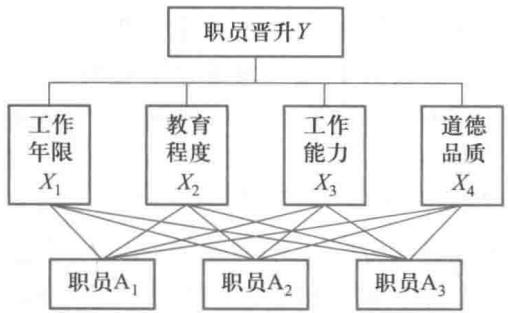  
图1 职员晋升的层次结构图

成对比较矩阵和特征向量当确定某一层的  $n$  个元素  $X_{1}, X_{2}, \dots , X_{n}$  对上层的一个元素  $Y$  的权重(如准则对目标的权重)时,为了减少在这些性质不同的元素之间相互比较的困难,Saaty建议不把它们放在一起比较,而是两两相互对比,并且对比时采用相对尺度。将  $X_{i}$  和  $X_{j}$  对  $Y$  的重要性之比用  $a_{ij}$  表示,  $n$  个元素  $X_{1}, X_{2}, \dots , X_{n}$  两两成对地对  $Y$  重要性之比的结果用成对比较矩阵

$$
A = (a_{ij})_{n \times n}, \quad a_{ij} > 0, \quad a_{ji} = 1 / a_{ij} \tag{1}
$$

表示,数学上  $A$  又称正互反降。显然  $A$  的对角线元素  $a_{ii} = 1(i = 1,2,\dots ,n)$

例如当确定4个准则(工作年限  $X_{1}$  、教育程度  $X_{2}$  工作能力  $X_{3}$  、道德品质  $X_{4}$  )对目标(职员晋升  $Y$  )的权重时,需将  $X_{1}, X_{2}, X_{3}, X_{4}$  两两进行对比。假定决策者认为对于职员晋升的重要性来说,工作年限  $X_{1}$  与教育程度  $X_{2}$  之比是  $1:2$ ,即  $a_{12} = 1 / 2, X_{1}$  与工作能力  $X_{3}$  之比是  $1:3$ ,即  $a_{13} = 1 / 3, X_{1}$  与道德品质  $X_{4}$  之比是  $1:2$ ,即  $a_{14} = 1 / 2$ ;教育程度  $X_{2}$  与  $X_{3}$  之比是  $1:2$ ,即  $a_{23} = 1 / 2, X_{2}$  与  $X_{4}$  之比是  $1:1$ ,即  $a_{24} = 1; X_{3}$  与  $X_{4}$  之比是  $2:1$ ,即  $a_{34} = 2$ 。这些  $a_{ij}(1 < i < j < 4)$  是矩阵  $A$  的上三角元素,按照(1)式即可写出成对比较阵为

$$
A = \left[ \begin{array}{cccc}1 & 1 / 2 & 1 / 3 & 1 / 2 \\ 2 & 1 & 1 / 2 & 1 \\ 3 & 2 & 1 & 2 \\ 2 & 1 & 1 / 2 & 1 \end{array} \right]
$$

你可能已经发现,既然  $a_{12} = 1 / 2, a_{23} = 1 / 2$ ,那么  $X_{1}$  与  $X_{3}$  比较时应该是  $1:4$ ,即  $a_{13} = 1 / 4$  而非  $1 / 3$ ,这样才能做到成对比较的一致性。但是,  $n$  个元素需做  $n(n - 1) / 2$  次成对比较,要求全部一致是不现实、也不必要的。层次分析法容许成对比较存在不一致,并且给出了不一致情况下计算各元素权重的方法,同时确定了这种不一致的容许范围。

为了说明Saaty提出的办法,考察成对比较完全一致的情况。假定  $n$  个元素  $X_{1}, X_{2}, \dots , X_{n}$  对  $Y$  的重要性之比已经精确地测定为  $w_{1}:w_{2}:\dots :w_{n}$ ,在成对比较时只需取  $a_{ij} = w_{i} / w_{j}$ ,就一定完全一致,这样的矩阵  $A = (a_{ij})_{n\times n}$  简称一致阵。实际上,只要成对比较的全部取值满足

$$
a_{ij}\cdot a_{jk} = a_{ik},\quad i,j,k = 1,2,\dots ,n \tag{2}
$$

成对比较阵  $A = (a_{ij})_{n\times n}$  就是一致阵。容易看出,一致阵的各列均相差一个比例因子,由此可得一致阵  $A$  的以下代数性质:

$A$  的秩为1,唯一非零特征根为  $n$ ,任一列向量都是对应于特征根  $n$  的特征向量。

如果成对比较阵  $A$  是一致阵,显然特征向量可以取  $\boldsymbol {w} = (w_{1},w_{2},\dots ,w_{n})^{\mathrm{T}}$  不妨设 $w_{1},w_{2},\dots ,w_{n}$  已经归一化,即满足  $\sum_{i = 1}^{n}w_{j} = 1$  ,那么  $\boldsymbol{w}$  的各个分量正是  $n$  个元素的权重如果成对比较阵  $A$  不一致,但在不一致的容许范围内(稍后说明),Saaty等人建议  $①$  用对应于  $A$  的最大特征根(记作  $\lambda$  )的特征向量(归一化后)为权向量  $\boldsymbol{w}$  ,即  $\boldsymbol{w}$  满足

$$
A w = \lambda w \tag{3}
$$

对于职业晋升中4个准则的成对比较阵  $A$ ,用MATLAB软件算出的最大特征根  $\lambda = 4.0104$ ,对应特征向量(归一化后)  $\boldsymbol {w} = (0.1223,0.2270,0.4236,0.2270)^{\mathrm{T}}$ 。

注意到成对比较阵是通过定性比较得到的相当粗糙的结果,精确地计算特征向量常常是不必要的,在实际应用时可以用成对比较阵各列向量的平均值近似代替特征向量(复习题1)。

一致性指标和一致性检验实际应用中成对比较阵  $A$  通常不是一致阵,为了能用对应于  $A$  最大特征根  $\lambda$  的特征向量作为权向量  $\boldsymbol{w}$ ,需要对它不一致的范围加以界定。

数学上已经证明,对于  $n$  阶成对比较阵(正互反阵)  $A$ ,其最大特征根  $\lambda \geqslant n$ ,且  $A$  是一致阵的充分必要条件为  $\lambda = n$ 。

根据这个结果可知,  $\lambda$  比  $n$  大得越多,  $A$  与一致阵相差得越远,用特征向量作为权向量引起的判断误差越大,因而可以用  $\lambda - n$  数值的大小来衡量  $A$  的不一致程度。Saaty将

$$
C I = \frac{\lambda - n}{n - 1} \tag{4}
$$

定义为一致性指标  $①$  显然  $C I = 0$  时  $A$  是一致阵,  $C I$  越大,  $A$  越不一致. 于是可以制定一个衡量  $C I$  数值的标准, 来界定  $A$  不一致的容许范围.

为此 Saaty 又引入随机一致性指标  $R I$ , 其产生过程是, 对于每个  $n (= 3,4, \dots)$  随机模拟大量的正互反阵  $A$  (其元素  $a_{ij}$  从  $1,2, \dots , 9$  及  $1,1 / 2, \dots , 1 / 9$  中等可能地随机取值, 原因稍后说明), 计算这些  $A$  的一致性指标  $C I$  的平均值作为  $R I$ . Saaty 用大量样本得到的  $R I$  如表 1.

表1 Saaty给出的随机一致性指标RI的数值  $②$  

<table><tr><td>n</td><td>3</td><td>4</td><td>5</td><td>6</td><td>7</td><td>8</td><td>9</td><td>10</td></tr><tr><td>RI</td><td>0.58</td><td>0.90</td><td>1.12</td><td>1.24</td><td>1.32</td><td>1.41</td><td>1.45</td><td>1.49</td></tr></table>

实际应用中计算出  $n$  阶成对比较阵  $A$  的一致性指标  $C I$  以后, 与同阶的随机一致性指标  $R I$  比较, 当比值  $C R$  (称为一致性比率) 满足

$$
C R = \frac{C I}{R I} < 0.1 \tag{5}
$$

时认为  $A$  的不一致程度在容许范围之内. (5) 式中的 0.1 是可以调整的, 对于重要决策问题应该适当减小.

对于成对比较阵  $A$  利用 (4), (5) 式及表 1 进行的检验称为一致性检验, 若检验通过, 可以用  $A$  的特征向量作为权向量, 若检验不通过, 需要对  $A$  作修正, 或者重新做成对比较.

对于职业晋升中 4 个准则的成对比较阵  $A$ , 由  $\lambda = 4.0104$  和 (4) 式算出  $C I = 0.0035$ , 由表 1 知  $R I = 0.90$ , 由 (5) 式  $C R = 0.0035 / 0.90 < 0.1$ , 一致性检验通过, 于是, 归一化的特征向量  $\boldsymbol{w} = (0.1223, 0.2270, 0.4236, 0.2270)^{\mathrm{T}}$  可以作为权向量.

综合权重对于职业晋升问题用成对比较得到第 2 层 4 个准则对第 1 层目标的权重 (记作  $\boldsymbol{w}^{(2)}$  ) 之后 (参看图 1), 用同样的方法确定第 3 层 3 个方案 (职员  $A_{1}, A_{2}, A_{3}$  ) 对第 2 层每一准则的权重. 设决策者给出的第 3 层对  $X_{1}, X_{2}, X_{3}, X_{4}$  的成对比较阵依次为

$$
B_{1} = \left[ \begin{array}{lll}1 & 1 / 2 & 1 / 4 \\ 2 & 1 & 1 / 3 \\ 4 & 3 & 1 \end{array} \right], B_{2} = \left[ \begin{array}{lll}1 & 2 & 3 \\ 1 / 2 & 1 & 2 \\ 1 / 3 & 1 / 2 & 1 \end{array} \right]
$$

$$
B_{3} = \left[ \begin{array}{lll}1 & 1 & 2 \\ 1 & 1 & 2 \\ 1 / 2 & 1 / 2 & 1 \end{array} \right], B_{4} = \left[ \begin{array}{lll}1 & 3 & 4 \\ 1 / 2 & 1 & 2 \\ 1 / 4 & 1 / 2 & 1 \end{array} \right]
$$

由  $B_{j}(j = 1,2,3,4)$  计算其最大特征根  $\lambda_{j}$ , 一致性指标  $C I_{j}$  及 (归一化) 特征向量  $\boldsymbol{w}_{j}^{(3)}$ , 结果如表 2. 为了下面计算的方便, 将已经得到的  $\boldsymbol{w}^{(2)}$  放到表 2 的最后一列.

因为表 1 的  $R I = 0.58$ , 由表 2 的  $C I_{j}$  可知  $C R_{j} = C I_{j} / R I < 0.1$ , 4 个成对比较阵均通过一致性检验, 4 个 (归一化) 特征向量  $\boldsymbol{w}_{j}^{(3)}$  可作为第 3 层 (职员  $A_{1}, A_{2}, A_{3}$  ) 对第 2 层每一

准则的权重.

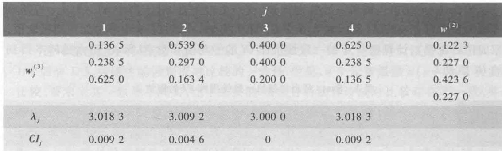

注意到表2中第2行的前4个数值分别是职员  $\mathrm{A}_{1}$  对4项准则的权重,将它们与表2最后一列4个准则对目标的权重  $w^{(2)}$  对应地相乘再求和,就得到职员  $\mathrm{A}_{1}$  对目标的权重.职员  $\mathrm{A}_{2}$ ,  $\mathrm{A}_{3}$  对目标的权重可以类似地得到.

容易看出,上述运算相当于用  $w_{j}^{(3)}$  构成的矩阵  $W^{(3)} = \left[w_{1}^{(3)},w_{2}^{(3)},w_{3}^{(3)},w_{4}^{(3)}\right]$  与权重向量  $w^{(2)}$  相乘,从而得到第3层对第1层的综合权重  $w^{(3)}$ ,表示为

$$
w^{(3)} = W^{(3)}w^{(2)} \tag{6}
$$

根据表2的数据,按照(6)式计算可得  $w^{(3)} = (0.4505,0.3202,0.2292)^{\mathrm{T}}$ ,表示如果管理者在职业晋升中所做的成对比较由  $A$  和  $B_{1},B_{2},B_{3},B_{4}$  给出,那么用层次分析法得到的3位职员的优劣顺序为  $\mathrm{A}_{1},\mathrm{A}_{2},\mathrm{A}_{3}$ .

在应用层次分析法作重大决策时,除了对每个成对比较阵进行一致性检验外,还需要作所谓综合一致性检验,详见文献[58].

1- 9比较尺度当成对比较  $X_{i},X_{j}$  对  $Y$  的重要性时,比较尺度  $a_{ij}$  采用什么数值表示合适呢?Saaty等人建议用1- 9尺度,即  $a_{ij}$  的取值范围规定为  $1,2,\dots ,9$  及其互反数  $1,1 / 2,\dots ,1 / 9$ ,其大致理由如下:

$\bullet$  进行定性的成对比较时人们脑海中通常有5个明显的等级,可以用1- 9尺度方便地表示如表3.

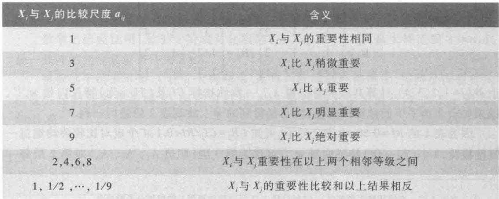

$\bullet$  心理学家认为, 成对比较的元素太多, 会超出人们的判断能力, 如以 9 个为限, 用 1- 9 尺度表示它们之间的差别正合适.

$\bullet$  Saaty 曾用  $1 - 3,1 - 5,\dots ,1 - 17,1^{p} - 9^{p}(p = 2,3,4,5)$  等 27 种尺度, 对一些已经知道元素权重的实例 (如不同距离处的光源) 构造成对比较阵, 再由此计算权重, 与已知的权重对比发现, 1- 9 尺度不仅在较简单的尺度中最好, 而且不劣于较复杂的尺度.

目前在层次分析法的应用中, 大多数人采用 1- 9 尺度.

职员晋升问题的再讨论

上面是对每位申报晋升的职员直接按照每一条准则进行比较和评判, 由于这些准则过于笼统、不够具体, 比较和评判起来有一定困难, 特别是当申报者较多时进行成对比较的一致性难以保证. 实际上, 可以将每条准则细分为若干等级, 如工作年限和教育程度可分别用入职时间和学历分级, 工作能力和道德品质大概只好按照优、良、中划分. 若评委会确定了每条准则中各个等级的分值, 那么每一位申报晋升的职员只需根据在每条准则中所处的等级"对号入座", 再根据 4 条准则在职员晋升中的权重, 就可以计算出他 (她) 的总分, 根据总分确定能否晋升.

算出他(她)的总分,根据总分确定能否晋升

对 4 个准则不妨作如下分级: 工作年限  $X_{1}$  分为很长 (10 年以上)、长 (5 至 10 年)、中 (2 至 5 年)、短 (2 年以下) 4 个等级、依次记为  $X_{11}, X_{12}, X_{13}, X_{14}$ ; 教育程度  $X_{2}$  分为本科以上、本科、专科、中学 4 个等级  $X_{21}, X_{22}, X_{23}, X_{24}$ ; 工作能力  $X_{3}$  分为优、良、中、差 4 个等级  $X_{31}, X_{32}, X_{33}, X_{34}$ ; 道德品质  $X_{4}$  只有优、良、中 3 个等级 (品质差的根本不考虑晋升)  $X_{41}, X_{42}, X_{43}$ . 申报晋升的职员有  $\mathrm{A}_{1}, \mathrm{~A}_{2}, \dots , \mathrm{A}_{k}, \dots$ . 职员晋升细分等级的层次结构如图 2.

假定 4 个准则对职员晋升目标的权重仍为前面用成对比较得到的  $\boldsymbol{w}^{(2)} = (w_{1}, w_{2}, w_{3}, w_{4}) = (0.1223, 0.2270, 0.4236, 0.2270)^{\mathrm{T}}$ , 在每一准则中将最高等级定为 100 分, 由评委会决定其他等级的分数  $w_{ij}(i = 1,2,3, j = 1,2,3, 4; i = 4, j = 1,2,3)$ , 其数值如表 4.

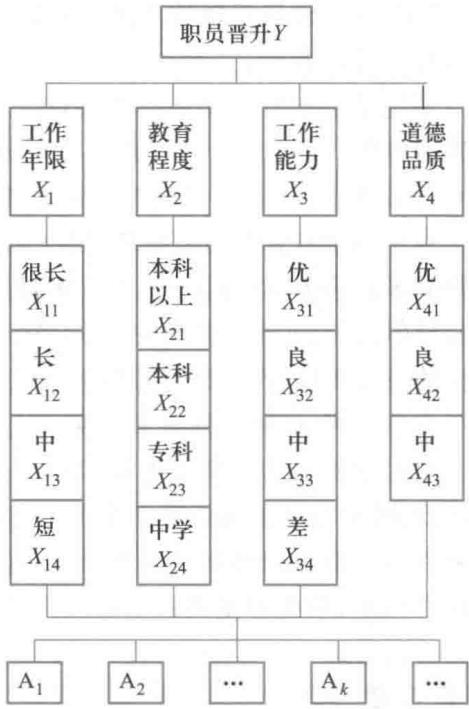  
图 2 职员晋升细分等级的层次结构图

评注 7.1 节提到的区间尺度变换不符合 Saaty 提出的用比例尺度构造正互反阵、得到 (正) 特征向量的要求, 因而不被层次分析法采用, 它只是多属性决策可以使用的方法之一.

评注 最高等级为 100 分的打分方法相当于多属性决策中属性值向量的最大化处理 (用 100 分代替 1). 用这种方法可以在评定之前确定一个标准分, 如 80 分, 标准分以上的才可以晋升, 这就避免了待评人员直接的相互比较以及一些其他人为因素的干扰.

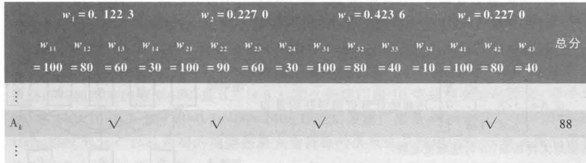  
表 4 职员晋升问题准则的权重  $w_{i}$  及其等级的分数  $w_{ij}$

每个申报的职员只需根据在每个准则中所处等级的位置"对号入座"(画  $\sqrt{}$  ),就可算出他(她)的总分.如一位工作4年、工作能力优秀、道德品质良好的本科毕业生  $\mathrm{A}_{k}$  总分为  $60\times 0.122 3 + 90\times 0.227 0 + 100\times 0.423 6 + 80\times 0.227 0 = 88.29.$  用符号表示:设  $\mathrm{A}_{k}$  在4项准则中所处的等级为  $\{j_{1},j_{2},j_{3},j_{4}\}$  ,则其总分是  $\sum_{i = 1}^{4}w_{i}w_{i j_{i}}.$  工作10年以上、工作能力和道德品质均优、获得硕士学位的毕业生可得最高总分100.

层次分析法应用的步骤

多属性决策应用的步骤可以归纳如下:

1)建立由目标层、准则层、方案层等构成的层次结构;

2)构造下层各元素对上层每一元素的成对比较阵;

3)计算各个成对比较阵的特征根和特征向量,作一致性检验,通过后将特征向量取作权向量;

4)用分层加权和法计算最下层各元素对最上层元素的权重

层次分析法与多属性决策的比较两种方法都能用于解决决策问题,从本节和上节的介绍可以看到,二者在步骤、方法上有很多相同之处,也有一些差别.

不论是层次分析法还是多属性决策,重点都是要确定准则(属性)对目标的权重和方案对准则(属性)的权重,其手段可分为相对量测和绝对量测.像层次分析法中进行的成对比较属于前者,而如果能用定量的尺度来描述方案或准则的特征,则属于后者.

对于尚没有太多知识的新问题和模糊、抽象的准则,主要依赖于相对量测,而对于已有充分了解的老问题和明确、具体的准则,应该尽可能地采用绝对量测.如购物选择、旅游地选择中的价格,人员聘用和录取中的工作年限、奖学金评定中的学习成绩、宜居城市评选中的空气质量、大学排行榜制定中的论文数量等,都是可以使用绝对量测的准则.

一般来说,相对量测偏于主观、定性,绝对量测偏于客观、定量,应尽量采用绝对量测

绝对量测的另一个好处是,当新方案加入或老方案退出时,原有方案的结果不会改变.而若用相对量测就要重新作若干比较,原有方案的结果也可能改变.

在应用中可以将多属性决策和层次分析中的方法结合起来,如用成对比较阵来确定属性权重,用绝对量测确定决策矩阵.

# 复习题

1. 层次分析法在实际应用时,可以用成对比较阵A的列向量的平均值近似代替特征向量,称为

拓展阅读7- 1层次分析法的若干问题

和法,其步骤是:先将A的每一列向量归一化,按行求和后再归一化,得到的  $\boldsymbol {w} = (\boldsymbol{w}_{1},\boldsymbol{w}_{2},\dots ,\boldsymbol{w}_{n})^{\mathrm{T}}$  即为近似特征向量,并将  $\frac{1}{n}\sum_{i = 1}^{n}\frac{(A\boldsymbol{w}_{i})^{T}}{w_{i}}$  作为近似最大特征根.

设  $A = \left[ \begin{array}{ccc}1 & 2 & 6 \\ 1 / 2 & 1 & 4 \\ 1 / 6 & 1 / 4 & 1 \end{array} \right]$ ,用和法计算近似特征向量和

近似最大特征根,并与精确值比较

2. 以选择旅游地为目标的层次结构图如右图,景色、

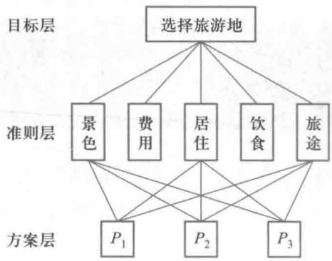

费用等5个准则构成准则层,  $P_{1}, P_{2}, P_{3}$  3个旅游地构成方案层.已知准则对目标的成对比较阵

$$
A = \left[ \begin{array}{ccccc}1 & 1 / 2 & 4 & 3 & 3 \\ 2 & 1 & 7 & 5 & 5 \\ 1 / 4 & 1 / 7 & 1 & 1 / 2 & 1 / 3 \\ 1 / 3 & 1 / 5 & 2 & 1 & 1 \\ 1 / 3 & 1 / 5 & 3 & 1 & 1 \end{array} \right]
$$

及方案对5个准则的成对比较阵

$$
B_{1} = \left[ \begin{array}{ccc}1 & 2 & 5 \\ 1 / 2 & 1 & 2 \\ 1 / 5 & 1 / 2 & 1 \end{array} \right], \qquad B_{2} = \left[ \begin{array}{ccc}1 & 1 / 3 & 1 / 8 \\ 3 & 1 & 1 / 3 \\ 8 & 3 & 1 \end{array} \right], \qquad B_{3} = \left[ \begin{array}{ccc}1 & 1 & 3 \\ 1 & 1 & 5 \\ 1 / 3 & 1 / 3 & 1 \end{array} \right]
$$

$$
B_{4} = \left[ \begin{array}{ccc}1 & 3 & 4 \\ 1 / 3 & 1 & 1 \\ 1 / 4 & 1 & 1 \end{array} \right], \qquad B_{5} = \left[ \begin{array}{ccc}1 & 1 & 1 / 4 \\ 1 & 1 & 1 / 4 \\ 4 & 4 & 1 \end{array} \right]
$$

(1)计算各个成对比较阵的特征向量,作一致性检验,确定权向量.

(2)计算方案对目标的综合权重,确定用层次分析法选择的旅游地.

3. 证明层次分析模型中定义的  $n$  阶一致阵  $A$  有下列性质:

(1)  $A$  的秩为1,唯一非零特征根为  $n$ .

(2)  $A$  的任一列向量都是对应于  $n$  的特征向量.

# 7.3 厂房新建还是改建

在经济活动中,管理者经常要对若干备选方案做出决策,有时决策的后果是确定的,像7.1节的汽车选购问题,有时决策的后果是随机的,比如公司面临扩大规模的几个备选方案,其后果取决于未来市场产品的销路,而目前只能估计出未来产品销路处于良好状态还是较差状态的概率.在这种情况下怎样做出决策呢?下面看一个具体的案例.

一家公司为提高某种产品的质量以拓展市场,拟制定一个10年计划.现有新建厂房与改建厂房两种备选方案.如果投资400万元新建厂房,若未来产品销路好,则年收益可达100万元;而若销路差,则年亏损20万元.如果投资100万元改建厂房,那么未来销路好和销路差的年收益分别为40万元和10万元.又据估计,未来产品销路好与产品销路差的可能性是  $7:3$ .从利润最大化的角度,公司应该新建还是改建厂房?

问题的分析与求解 这是一个非常简单的问题,只需计算、比较两种备选方案10年的总利润,就可得到应该新建还是改建厂房的决策.

如果把"未来产品销路好与产品销路差的可能性是  $7:3$  "简单地解释为,未来10年中有7年销路好和3年销路差,那么新建厂房10年的总利润是  $100 \times 7 - 20 \times 3 - 400 = 240$  (万元),改建厂房10年的总利润是  $40 \times 7 + 10 \times 3 - 100 = 210$  (万元),决策应该是新建厂房.

如果把"未来产品销路好与产品销路差的可能性是  $7:3$  "解释为,未来10年产品销路好与销路差的概率分别是0.7与0.3,那么新建厂房10年总利润的期望值(即平均值)是  $100 \times 10 \times 0.7 - 20 \times 10 \times 0.3 - 400 = 240$  (万元),改建厂房是  $40 \times 10 \times 0.7 + 10 \times 10 \times 0.3 - 100 = 210$  (万元),以总利润的期望值最大为目标的决策也是新建厂房.这种决策的依据称为期望值(平均值)准则.

值得注意的是,期望值可看作随机事件多次重复出现条件下的平均值,将期望值准则用于这里的一次性决策会有较大的风险.让我们计算一下,若选择新建厂房决策,如果未来10年产品真的销路好,总利润将是  $100 \times 10 - 400 = 600$  (万元),而如果未来10年产品真的销路差,总利润将是  $- 20 \times 10 - 400 = - 600$  (万元),即亏损600万元,正负相差1200万元,风险相当大.若选择改建厂房决策,则产品真的销路好的总利润是300万元,而产品真的销路差的总利润是零,风险相对较小.

在上面的计算中还可以看到,虽然根据期望值准则应选择新建厂房,但是与改建厂房相比总利润(期望值)只多  $240 - 210 = 30$  (万元).因为对未来产品销路好与销路差的概率的估计并不准确,让我们分析一下,对这种概率的估计有多大变化,就会导致最终决策的改变.

将新建厂房(方案1)和改建厂房(方案2)10年总利润的期望值分别记作  $E(1)$ ,  $E(2)$ ,未来产品销路好的概率记作  $p$ ,销路差的概率为  $1 - p$ ,像上面的计算一样,有

$$
E(1) = 100 \times 10 \times p + (-20 \times 10) \times (1 - p) - 400 = 1200p - 600
$$

$$
E(2) = 40 \times 10 \times p + 10 \times 10 \times (1 - p) - 100 = 300p
$$

令  $E(1) = E(2)$  可得  $p = 2 / 3$ ,且当  $p < 2 / 3$  时  $E(1) < E(2)$ .这个结果表明,若目前估计的销路好的概率从0.7降到0.66(下降只约  $5\%$ ),总利润期望值最大的决策就将由新建厂房变为改建厂房.看来,决策对概率的变化是相当敏感的.

新方案的提出新建厂房决策的一次性风险太大,决策对概率的变化十分敏感,促使公司考虑制定能降低风险的新的折中方案:先改建厂房经营3年,3年后视市场情况再定.如果3年销路好,则未来7年销路仍然好的概率预计将提高到0.9,这时若再投资200万元进行扩建,销路好时年收益将为90万元,销路差时不盈不亏;若不扩建,年收益不变.如果3年销路差,未来7年预计销路一定也差,则不扩建,年收益也不变.以总利润期望值最大为目标如何做出新的决策呢?

现在变成一个2次决策问题.第1次决策:当前是新建厂房还是改建厂房经营3年;第2次决策:3年后扩建还是不扩建.在进行第1次决策时,为了计算10年总利润的期望值必须先对第2次决策的后果做出估计,也就是要从整个过程的终点向前推进.下面介绍一种简洁、直观的方法解决这类问题.

用决策树模型求解决策树(decision tree)是表述、分析、求解风险性决策的有效方法[74],下面先用开始提出的只有新建与改建厂房两种备选方案的问题说明决策树模型的构造.

决策树由节点和分枝组成,用□表示决策节点,○表示状态节点,≤表示结果节点,在由决策节点引向状态节点的分枝(直线)上标注不同的方案,在由状态节点引向结果节点的分枝(直线)上标注发生的概率,在结果节点处标注取得的收益值(投资标以负值).对于新建或改建厂房的问题,决策树模型的构造如图1所示.

按照结果节点的收益值和状态节点引出分枝上的概率,计算出每个状态节点的期望值并作比较,取最大值的方案为决策,用//表示"砍掉"该方案分枝.新建或改建厂房问题决策树模型的求解见图2,结果与前面的直接计算相同.

新建还是改建的问题比较简单,决策树方法的优点并不明显,让我们用决策树模型继续讨论加入改建厂房经营3年新方案(方案3)后的决策问题.第1次决策在方案1,

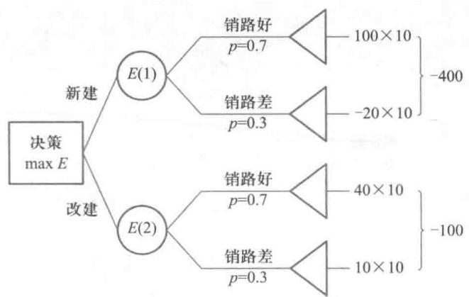  
图1 新建还是改建问题决策树的构造

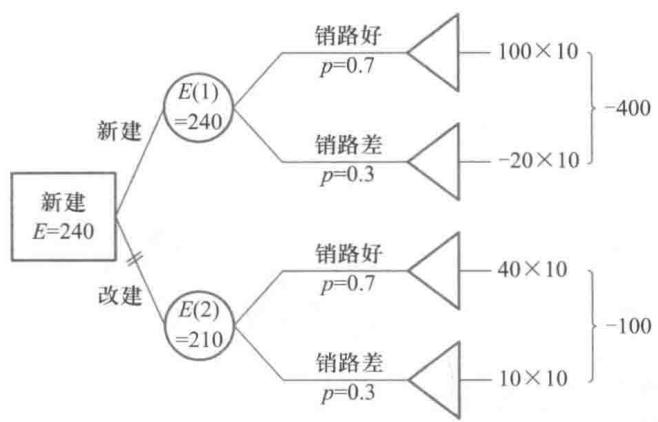  
图2 新建还是改建问题决策树的求解

2,3中选择(实际上由图2已将方案2淘汰),方案1,2的计算同前,只需分析方案3;若采用方案3,需在3年后作第2次决策——扩建或不扩建.决策树的构造如图3,其中与图1相同的部分(方案1,2)没有画出.

决策树的计算是由结果节点开始,反向进行.求解过程见图4. 首先计算第2次决策扩建与不扩建两种方案利润的期望值,记作  $E(3)_{1}, E(3)_{2}$

$$
E(3)_{1} = 90\times 7\times 0.9 - 200 = 367
$$

$$
E(3)_{2} = 40\times 7\times 0.9 + 10\times 7\times 0.1 = 259
$$

因为  $E(3)_{1} > E(3)_{2}$ ,所以第2次决策选择扩建,利润期望值  $E = E(3)_{1} = 367$  (万元)."砍掉"不扩建分支.

然后计算第1次决策中方案3的总利润期望值  $E(3)$

$$
E(3) = (40\times 3\times 0.7 + 10\times 3\times 0.3 - 100) + (367\times 0.7 + 10\times 7\times 0.3) = 270.9
$$

其中第1项是改建厂房经营3年的利润期望值(图4最后一行),第2项是3年以后的利润期望值.因为  $E(3) > E(1) = 240$ ,所以第1次决策选择改建厂房经营3年,2次决策的总利润期望值  $E = E(3) = 270.9$  (万元).

拓展阅读7- 2 贝叶斯决策

评注 风险性决策的风险在几个

随机状态出现的

概率相差不大的

情况下尤其严重

一种解决的办法

是通过有针对性

的试验,获取更多

的关于随机状态

出现概率的信息,

以提高某一状态

发生的(后验)概

率,可以使决策风

险明显降低,称为

贝叶斯决策,可参

考拓展阅读7- 2.

评注 决策树是

求解风险性决策

常用的手段,具有

直观、简便、逻辑

关系清晰等优点,

对于2次或更多

次决策(称为序列

决策)过程的表

述、分析和求解尤

其方便.

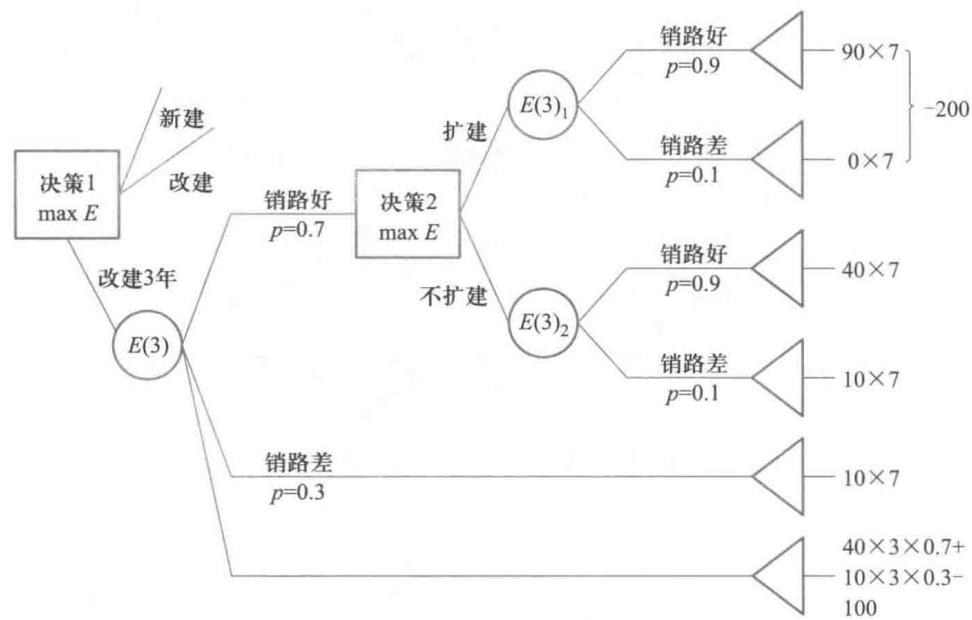  
图3 加入新方案后决策树的构造

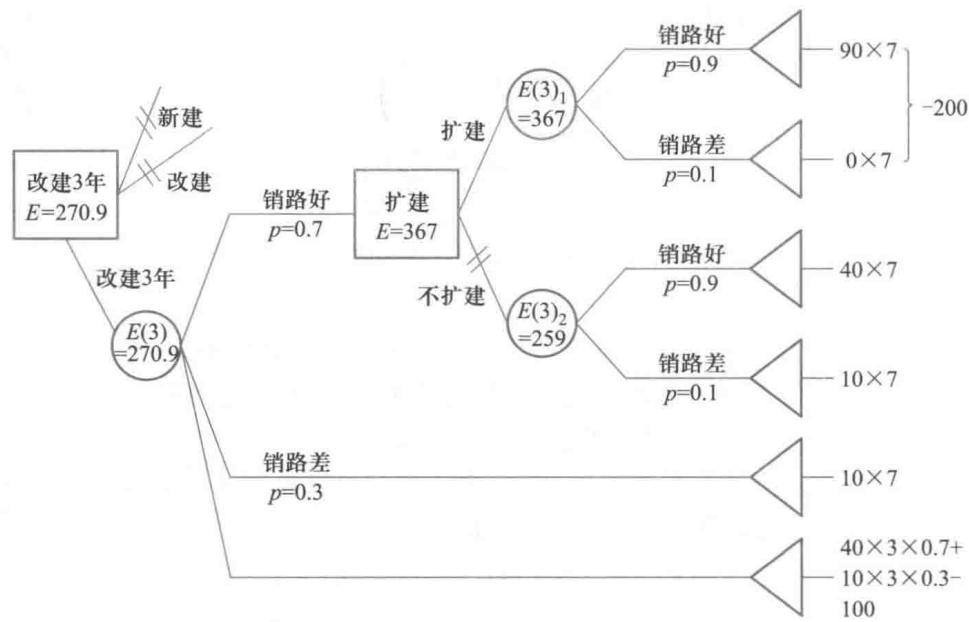  
图4 加入新方案后决策树的求解

<table><tr><td rowspan="2">方案</td><td colspan="3">状态</td></tr><tr><td>高需求(p=0.25)</td><td>中需求(p=0.4)</td><td>低需求(p=0.35)</td></tr><tr><td>大厂房</td><td>20</td><td>10</td><td>-12</td></tr><tr><td>小厂房</td><td>9</td><td>7.5</td><td>-2</td></tr></table>

# 7.4 循环比赛的名次

问题提出 单循环(若干参赛者需要两两交锋且只交锋一次)是很多比赛所采用的赛制,假设每场比赛只计胜负,不计比分,且不允许平局,比赛结束后如何根据比赛结果排列参赛者名次呢?一种常见的表示单循环比赛结果的方式如表1所示,这里有6支球队,"+"表示对应行的球队战胜了对应列的球队,"- "含义相反.很多比赛规定按照每个队的得分进行排名,如每胜一场计1分,败了则计0分,表1最后1列表明1队排名第1,其次是2、3队并列,再次4、5队并列,6队排名最后.但2、3队之间和4、5队之间无法确定排名,如果并列队按他们相互比赛的结果排名,可得到总排名(1,3,2,4,5,6).但这个排名可能不能令人信服:3队输给了排名最后的5、6队,却占据第2的名次,2队很可能不服气;而3队认为自己战胜了排名第1的1队,又战胜了2队,排在2队前合情合理;4、5队都只胜两场,除了都战胜排名最后的6队外,5队还战胜了排名第2的3队,仅仅因为其输给4队就将其排在4队之后,5队也很可能不服气.有没有更合理的排名方式呢?[9]

表16支球队的比赛成绩表  

<table><tr><td></td><td>1</td><td>2</td><td>3</td><td>4</td><td>5</td><td>6</td><td>得分</td></tr><tr><td>1</td><td>/</td><td>+</td><td>-</td><td>+</td><td>+</td><td>+</td><td>4</td></tr><tr><td>2</td><td>-</td><td>/</td><td>-</td><td>+</td><td>+</td><td>+</td><td>3</td></tr><tr><td>3</td><td>+</td><td>+</td><td>/</td><td>+</td><td>-</td><td>-</td><td>3</td></tr><tr><td>4</td><td>-</td><td>-</td><td>-</td><td>/</td><td>+</td><td>+</td><td>2</td></tr><tr><td>5</td><td>-</td><td>-</td><td>+</td><td>-</td><td>/</td><td>+</td><td>2</td></tr><tr><td>6</td><td>-</td><td>-</td><td>+</td><td>-</td><td>-</td><td>/</td><td>1</td></tr></table>

竞赛图除了如表1所示的表示法外,单循环比赛的结果还可以方便地用有向图表示:图的顶点表示球队,每对顶点间有且只有一条弧,弧的方向表示两支球队的比赛结果(如从胜者指向败者),这样的有向图称为竞赛图(tournament).例如,表1的比赛结果可表示成图1.

竞赛图具有以下性质:

1)必定存在完全路径,即从某个顶点出发,沿着弧的方向经过所有顶点的路径,如图1中的路径  $1 \rightarrow$

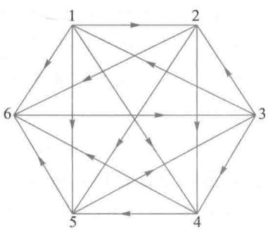  
图1 6支球队的比赛结果

$4 \rightarrow 6 \rightarrow 3 \rightarrow 2 \rightarrow 5,3 \rightarrow 1 \rightarrow 2 \rightarrow 4 \rightarrow 5 \rightarrow 6,4 \rightarrow 5 \rightarrow 6 \rightarrow 3 \rightarrow 1 \rightarrow 2$  等.

2)若存在唯一的完全路径,则由它确定的顶点顺序与按得分排列的顺序一致.

对于2)的情况,我们已经得到各队唯一的排名;对于2)之外的情况,又可以分为两种情形:a)竞赛图是双向连通图,即从任意一个顶点出发,至少存在一条有向路径到达另一个任意顶点,如图1;b)竞赛图不是双向连通图.下面只讨论情形a),因为情形b)发生时无法给出所有队的排名.

双向连通竞赛图的排名

为了便于用代数方法对竞赛图进行研究,采用有向图的邻接矩阵  $A = (a_{ij})_{n \times n} (n$  为顶点数,即球队数):

$$
a_{ij} = \left\{ \begin{array}{ll}1, & \text{存在从} i \text{到} j \text{的有向弧} \\ 0, & \text{否则} \end{array} \right. \tag{1}
$$

图1的邻接矩阵为(实际上就是将表1中对应的"+"变成1,其他元素为0)

$$
A = \left( \begin{array}{llllll}0 & 1 & 0 & 1 & 1 & 1 \\ 0 & 0 & 0 & 1 & 1 & 1 \\ 1 & 1 & 0 & 1 & 0 & 0 \\ 0 & 0 & 0 & 0 & 1 & 1 \\ 0 & 0 & 1 & 0 & 0 & 1 \\ 0 & 0 & 1 & 0 & 0 & 0 \end{array} \right)
$$

如果记顶点的得分向量为  $\boldsymbol {s} = (s_{1}, s_{2}, \dots , s_{n})^{\mathrm{T}}$ ,其中  $s_{i}$  是顶点  $i$  的得分,由邻接矩阵的定义不难得到

$$
\boldsymbol {s} = \boldsymbol {A}\boldsymbol {e}, \quad \boldsymbol {e} = (1, 1, \dots , 1)^{\mathrm{T}} \tag{2}
$$

对于6支球队的例子,  $\boldsymbol {s} = (4, 3, 3, 2, 2, 1)^{\mathrm{T}}$ ,无法由  $\boldsymbol{s}$  确定全部球队的名次.

得分向量只考虑了球队取胜的场次总数,而前面提到2队、5队可能不服气时,实际上是在进一步关注他们所战胜的那些球队的实力强弱.如何考虑这个因素呢?一种直觉的想法是:如果得分向量是一个队实力的初步估计,那么与战胜一个得分较低的队相比,战胜一个得分较高的队,对自己最后得到的累积分数的贡献应该更大.比如说,可以将所战胜的对手的得分加到自己的累积分数中.按照这样的想法,记  $\boldsymbol{s}^{(1)} = \boldsymbol{s}$ ,称为1级得分向量,进一步计算

$$
\boldsymbol{s}^{(k)} = \boldsymbol {A}\boldsymbol{s}^{(k - 1)} = \boldsymbol{A}^{k}\boldsymbol {e}, \quad k = 2, 3, \dots \tag{3}
$$

评注 体育比赛的排名是经常遇到的问题,针对不同项目和赛制有多种方法解决.本节讨论的是只计胜负(不设平局、不考虑比分)的单循环比赛,对于这种较简单的比赛形式,竞赛图的排名方法是有充分理论依据的.

称为  $k$  级得分向量,显然  $k$  级得分向量比  $k - 1$  级得分向量更能反映球队的实力.

对于6支球队的例子,2~4级得分向量分别为

$$
\boldsymbol{s}^{(2)} = (8, 5, 9, 3, 4, 3)^{\mathrm{T}}, \quad \boldsymbol{s}^{(3)} = (15, 10, 16, 7, 12, 9)^{\mathrm{T}}
$$

$$
\boldsymbol{s}^{(4)} = (38, 28, 32, 21, 25, 16)^{\mathrm{T}}
$$

如果  $k \rightarrow \infty$  时,  $\boldsymbol{s}^{(k)}$  收敛到某个极限得分向量(为了不让它趋向于无穷大,可进行归一化处理),那么就可以用这个向量作为排名的依据.

对于  $n \geqslant 4$  个顶点的双向连通竞赛图,可以证明存在正整数  $r$ ,使得邻接矩阵  $A$  满足  $A^{r} > 0$  (表示矩阵的所有元素均大于0),这样的  $A$  称为素阵.对于素阵  $A$ ,能够证明其最大特征根为正单根(记为  $\lambda$ ),其对应的特征向量  $s^{*}$  满足

$$
s^{*} = \lim_{k\to \infty}{\frac{A^{k}e}{\lambda^{k}}} \tag{4}
$$

因此,可以将  $s^{*}$  作为排名的依据,对于6支球队的例子,用MATLAB的eig命令算出邻接矩阵  $A$  的最大特征值为  $\lambda \approx 2,232$  ,其对应的归一化的特征向量  $s^{*} = (0.238,0.164$  0.231,0.113,0.150,0.104),球队排名为(1,3,2,5,4,6).

复习题

如图为网球选手循环赛的结果.作为竞赛图,它是双向连通的吗?找出几条完全路径,用适当方法排出5位选手的名次.

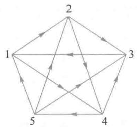

# 7.5 公平的席位分配

某学校有3个系共200名学生,其中甲系100名,乙系60名,丙系40名.若学生代表会议设20个席位,公平而又简单的席位分配办法是按学生人数的比例分配,显然甲乙丙三系分别应占有10,6,4个席位.

现在丙系有6名学生转入甲乙两系,各系人数如表1第2列所示.仍按比例(表1第3列)分配席位时出现了小数(表1第4列).在将取得整数的19席分配完毕后,三系同意参照所谓惯例分给比例分配中小数部分最大的丙系,于是三系仍分别占有10,6,4席(表1第5列).

因为有20个席位的代表会议在表决提案时可能出现  $10:10$  的局面,会议决定下一届增加1席.他们按照上述办法重新分配席位,计算结果见表1第6,7列.显然这个结果对丙系太不公平了,因为总席位增加1席,而丙系却由4席减为3席.

表1按照比例并参照惯例的席位分配  

<table><tr><td rowspan="2">系列</td><td rowspan="2">学生人数</td><td rowspan="2">学生人数的比例/%</td><td colspan="2">20个席位的分配</td><td colspan="2">21个席位的分配</td></tr><tr><td>按比例分配的席位</td><td>参照惯例的结果</td><td>按比例分配的席位</td><td>参照惯例的结果</td></tr><tr><td>甲</td><td>103</td><td>51.5</td><td>10.3</td><td>10</td><td>10.815</td><td>11</td></tr><tr><td>乙</td><td>63</td><td>31.5</td><td>6.3</td><td>6</td><td>6.615</td><td>7</td></tr><tr><td>丙</td><td>34</td><td>17.0</td><td>3.4</td><td>4</td><td>3.570</td><td>3</td></tr><tr><td>总和</td><td>200</td><td>100</td><td>20</td><td>20</td><td>21</td><td>21</td></tr></table>

看来问题出在所谓按照惯例分配上,实际上由A.Hamilton提出的这种办法在美国国会1850—1900年的众议院席位分配(按照人口比例每个州应分得几个席位)中就多次被采用,也同时被质疑[18,41],称之为最大剩余法(GR:greatest remainders)或最大分数法(LF:largest fractions),也称Hamilton法或Vinton法.它被质疑的一个理由就是上例出

现的所谓席位悖论——总席位增加反而可能导致某州席位的减少①.1880年美国众议院席位分配中亚拉巴马(Alabama)州就曾遇到这种情况,所以这个悖论又称亚拉巴马悖论.

最大剩余法的另一个重大缺陷是所谓人口悖论——某州人口增加反而可能导致该州席位的减少.如上例若三系学生变为114,64,34名,21席的分配结果将是11,6,4席,乙系学生人数增加却比原来少了1席,丙系学生数量未变反而多了1席.

为了寻求新的、公平的席位分配方法,先讨论衡量公平的数量指标[4,13]

不公平度指标为简单起见考虑A,B两方分配席位的情况.设两方人数分别为 $p_{1},p_{2}$  ,占有席位分别为  $n_{1},n_{2}$  ,则比值  $p_{1} / n_{1},p_{2} / n_{2}$  为两方每个席位所代表的人数.显然仅当  $p_{1} / n_{1} = p_{2} / n_{2}$  时分配才是完全公平的,但是因为人数和席位都是整数,所以通常 $p_{1} / n_{1}\neq p_{2} / n_{2}$  ,分配不公平,并且是对比值较大的一方不公平.

不妨设  $p_{1} / n_{1} > p_{2} / n_{2}$  ,不公平程度可用数值  $p_{1} / n_{1} - p_{2} / n_{2}$  衡量.如设  $p_{1} = 120,p_{2} =$ $100,n_{1} = n_{2} = 10$  ,则  $p_{1} / n_{1} - p_{2} / n_{2} = 12 - 10 = 2$  ,它衡量不公平的绝对程度,常常无法区分不公平程度明显不同的情况.如当双方人数增至  $p_{1} = 1 020,p_{2} = 1 000$  ,而  $n_{1},n_{2}$  不变时  $,p_{1} / n_{1} - p_{2} / n_{2} = 102 - 100 = 2$  ,即不公平的绝对程度不变,但是常识告诉我们,后面这种情况的不公平程度比起前面来已经大为改善了.

为了改进上述的绝对标准,自然想到用相对标准.仍设  $p_{1} / n_{1} > p_{2} / n_{2}$  ,定义

$$
r_{\mathrm{A}}(n_{1},n_{2}) = \frac{p_{1} / n_{1} - p_{2} / n_{2}}{p_{2} / n_{2}} \tag{1}
$$

为对A的相对不公平度.若  $p_{2} / n_{2} > p_{1} / n_{1}$  ,定义

$$
r_{\mathrm{B}}(n_{1},n_{2}) = \frac{p_{2} / n_{2} - p_{1} / n_{1}}{p_{1} / n_{1}} \tag{2}
$$

为对B的相对不公平度.

建立了衡量分配不公平程度的指标  $r_{\mathrm{A}},r_{\mathrm{B}}$  后,制定席位分配的原则是使它们尽可能小.

新的分配方法假设A,B两方已分别占有席位  $n_{1},n_{2}$  ,利用相对不公平度  $r_{\mathrm{A}},r_{\mathrm{B}}$  讨论当总席位增加1席时,应该分配给A还是B.

不失一般性可设  $p_{1} / n_{1}\geqslant p_{2} / n_{2}$  ,大于号成立时对A不公平.若增加的1席分配给A, $n_{1}$  就变为  $n_{1} + 1$  ,分配给B就有  $n_{2} + 1$  ,原不等式可能出现以下3种情况(只需讨论不等号的情况,一旦等号出现,按等式状况分配即可):

1.  $\frac{p_{1}}{n_{1} + 1} >\frac{p_{2}}{n_{2}}$  ,说明即使A增加1席仍对A不公平,这一席显然应分配给A.

2.  $\frac{p_{1}}{n_{1} + 1} < \frac{p_{2}}{n_{2}}$  ,说明A增加1席将对B不公平,参照(2)计算出对B的相对不公平度为

$$
r_{\mathrm{B}}(n_{1} + 1,n_{2}) = \frac{p_{2}(n_{1} + 1)}{p_{1}n_{2}} -1 \tag{3}
$$

3.  $\frac{p_{1}}{n_{1}} > \frac{p_{2}}{n_{2} + 1}$ ,说明B增加1席将对A不公平,参照(1)计算出对A的相对不公平度为

$$
r_{\mathrm{A}}(n_{1},n_{2} + 1) = \frac{p_{1}(n_{2} + 1)}{p_{2}n_{1}} -1 \tag{4}
$$

(不可能出现  $\frac{p_{1}}{n_{1}} < \frac{p_{2}}{n_{2} + 1}$  的情况).

在使相对不公平度尽量小的分配原则下,如果

$$
r_{\mathrm{B}}(n_{1} + 1,n_{2})< r_{\mathrm{A}}(n_{1},n_{2} + 1) \tag{5}
$$

则增加的1席应分配给A,反之,则增加的1席应分配给B(等号成立时可分给任一方).根据(3),(4)两式,(5)式等价于

$$
\frac{p_{2}^{2}}{n_{2}(n_{2} + 1)} < \frac{p_{1}^{2}}{n_{1}(n_{1} + 1)} \tag{6}
$$

还不难证明,上述第1种情况  $\frac{p_{1}}{n_{1} + 1} > \frac{p_{2}}{n_{2}}$  也会导致(6)式.于是我们的结论是:当(6)式成立时增加的1席应分配给A,反之应分配给B.

这种方法可推广到有  $m$  方分配席位的情况.设第  $i$  方人数为  $p_{i}$ ,已占有  $n_{i}$  个席位, $i = 1,2,\dots ,m$ ,当总席位增加1席时,计算

$$
Q_{i} = \frac{p_{i}^{2}}{n_{i}(n_{i} + 1)},\qquad i = 1,2,\dots ,m \tag{7}
$$

增加的1席应分配给  $Q$  值最大的一方,此方法暂称之为  $Q$  值法.

下面用  $Q$  值法重新讨论本节开头提出的甲乙丙三系分配21个席位的问题

对本例,  $Q$  值法可以从  $n_{1} = n_{2} = n_{3} = 1$  开始按总席位每增1席计算,但对这个问题直到19席的分配结果是  $n_{1} = 10,n_{2} = 6,n_{3} = 3$ ,与最大剩余法得到的整数部分相同.再每次增加1席计算

第20席:  $Q_{1} = \frac{103^{2}}{10\times11} = 96.45,Q_{2} = \frac{63^{2}}{6\times7} = 94.50,Q_{3} = \frac{34^{2}}{3\times4} = 96.33,Q_{1}$  最大,增加的1席应分配给甲系.

第21席:  $Q_{1} = \frac{103^{2}}{11\times12} = 80.37,Q_{2},Q_{3}$  同上,  $Q_{3}$  最大,增加的1席应分配给丙系.

这样,21个席位的分配结果是三系分别占有11,6,4席,看来丙系保住了按照最大剩余法分配将会失掉的1席.可是,如果你注意一下上面的计算过程就会发现,当总席位是20席时,结果为11,6,3席,与最大剩余法的10,6,4席不同,所以很难说这个方法对丙系有利还是不利.

$Q$  值方法是20世纪20年代由哈佛大学数学家E.V.Huntington提出和推荐的一系列席位分配方法中的一个,下面对这类方法作简单的介绍与比较[4,41].

Huntington除数法设共有  $m$  方分配  $N$  个席位,第  $i$  方人数为  $p_{i}$ ,记  $p = (p_{1},p_{2},\dots ,p_{m})$ ,  $P = \sum_{i = 1}^{m}p_{i}$ .席位分配是要寻求  $n = (n_{1},n_{2},\dots ,n_{m})$ ,其中  $n_{i}$  是第  $i$  方分配的

席位,满足  $\sum_{i = 1}^{m}n_{i} = N$ ,且  $n_{i}$  均为非负整数。

按照最大剩余法(GR)分配席位时,首先计算第  $i$  方精确的席位份额,记作  $q_{i}$ ,显然  $q_{i} = N\frac{p_{i}}{P},i = 1,2,\dots ,m$ ,若  $q_{i}$  均为整数,令  $n_{i} = q_{i}$  即可完成分配,否则,记  $[q_{i}]$  为  $q_{i}$  的整数部分,先将  $[q_{i}]$  分给第  $i$  方,然后将尚未分配的  $r = N - \sum_{i = 1}^{m}[q_{i}]$  个席位分给剩余  $q_{i} - [q_{i}]$  中最大的  $r$  方,每方1席。

Huntington除数法是首先对于非负整数  $n$  定义一个非负单调增函数  $d(n)$ ,当总席位为  $s$  时,第  $i$  方分配的席位是  $\pmb {p},s$  的函数,记作  $f_{i}(\pmb {p},s)$ ,而且  $f_{i}(\pmb {p},0) = 0,i = 1,2,\dots ,m$ ,让  $s$  每次1席地递增至  $N$ ,按照以下准则分配  $①$

设  $n_{i} = f_{i}(\pmb {p},s)$ ,若对于某个  $k$ ,有

$$
\frac{p_{k}}{d(n_{k})} = \max_{i = 1,2,\dots ,m}\frac{p_{i}}{d(n_{i})} \tag{8}
$$

则令

$$
f_{k}(\pmb {p},s + 1) = n_{k} + 1, \quad f_{i}(\pmb {p},s + 1) = n_{i}(i\neq k) \tag{9}
$$

可以看出,  $p_{i} / d(n_{i})$  是一种得到新席位的优先级的度量,除数  $d(n)$  则表示各方当前席位数的权重。若定义除数  $d(n) = \sqrt{n(n + 1)}$ ,由(6),(7)式可知,  $Q$  值法正是按照上述准则分配席位的。

取不同的除数就得到不同的方法,Huntington推荐的5种除数法见表2,第1列是它们的名称和英文缩写,前面讨论过的  $Q$  值法正式的名称是相等比例法(EP)。第2列为采用的除数,最后一列以人名命名的称谓也经常在文献中出现。

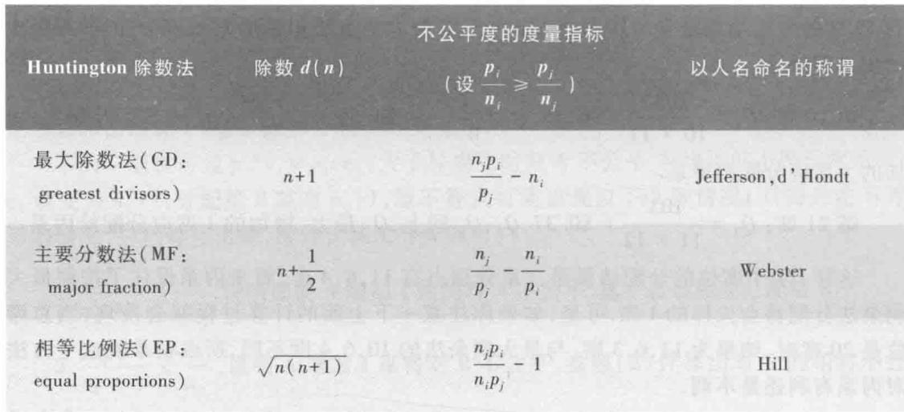

续表

<table><tr><td rowspan="3">Huntington 除数法</td><td colspan="3">不公平度的度量指标</td></tr><tr><td rowspan="2">除数d(n)</td><td colspan="2">以人名命名的称谓</td></tr><tr><td>p i
(设n i≥p j
n j)</td><td></td></tr><tr><td>调和平均法(HM: harmonic mean)</td><td>2n(n+1)
2n+1</td><td>p i
n i
- p j
n j</td><td>Dean</td></tr><tr><td>最小除数法(SD: smallest divisors)</td><td>n</td><td>n j
- n i p j
p i</td><td>Adams</td></tr></table>

我们已经看到,EP方法可以使相对不公平度最小,由相对不公平度的定义(1),(2)可知这相当于对任意两方  $i,j,$  使得  $\frac{p_{i} / n_{i} - p_{j} / n_{j}}{p_{j} / n_{j}} = \frac{n_{j}p_{i}}{n_{i}p_{j}} - 1$  最小.表2的第3列给出了5种除数法对不公平度的度量指标,其中HM与EP类似,但用的是绝对不公平度,而MF方法采用  $n_{j} / p_{j} - n_{i} / p_{i}$  ,即用单位人数(如千人)的席位数之差来度量不公平度.不公平度的度量指标也可以看作一种均衡检验,即是否存在任意两方的席位转移(将一方的席位给另一方),使得转移后的度量指标更优.

用这些方法做的一个数值例子见表3,其中第2,3列分别是5方的人数  $p_{i}$  和精确的席位份额  $q_{i}$  ,其余各列是用5种方法得到的结果,请读者验证(留作复习题1,在计算过程中可以利用  $q_{i}$  从适当的总席位数  $s$  递推).

容易看出,5种除数法的除数  $d(n)$  满足  $n\leqslant d(n)\leqslant n + 1$  ,并且在表2中是按照从大到小排列的.一般情况下GD偏向人数  $p_{i}$  较大的一方,偏向程度也按照表2的顺序,SD偏向人数较小的一方.Huntington特别推荐偏向适中的EP,该法1930年后一直在美国国会众议院席位分配中采用  $①$

表3用5种除数法做的一个数值例子  

<table><tr><td></td><td>p1</td><td>q1</td><td>GD</td><td>MF</td><td>EP</td><td>HM</td><td>SD</td></tr><tr><td>A</td><td>9 061</td><td>9.061</td><td>10</td><td>9</td><td>9</td><td>9</td><td>9</td></tr><tr><td>B</td><td>7 179</td><td>7.179</td><td>7</td><td>8</td><td>7</td><td>7</td><td>7</td></tr><tr><td>C</td><td>5 259</td><td>5.259</td><td>5</td><td>5</td><td>6</td><td>5</td><td>5</td></tr><tr><td>D</td><td>3 319</td><td>3.319</td><td>3</td><td>3</td><td>3</td><td>4</td><td>3</td></tr><tr><td>E</td><td>1 182</td><td>1.182</td><td>1</td><td>1</td><td>1</td><td>1</td><td>2</td></tr><tr><td>总和</td><td>26 000</td><td>26</td><td>26</td><td>26</td><td>26</td><td>26</td><td>26</td></tr></table>

从除数法分配席位的过程(8),(9)可以得到其结果  $\pmb {n} = (n_{1},n_{2},\dots ,n_{m})$  满足以下min- max不等式:

$$
\min_{k = 1,2,\dots ,m}\frac{p_{k}}{d(n_{k} - 1)}\geqslant \max_{i = 1,2,\dots ,m}\frac{p_{i}}{d(n_{i})},\sum_{i = 1}^{m}n_{i} = N \tag{10}
$$

从优化的角度出发,席位分配问题可以归结为,给定  $p$  和  $N$ ,在  $\sum_{i = 1}^{m}n_{i} = N$  且  $n_{i}$  均为非负整数的条件下,寻求  $n_{1},n_{2},\dots ,n_{m}$  使某一事先定义的目标函数最优.容易验证,本节开头用的最大剩余法(GR)得到的是  $\min \sum_{i = 1}^{m}\left(n_{i} - q_{i}\right)^{2}$  的解.一些除数法也都可看作与某个理想状态偏差的加权最小二乘解,如相等比例法(EP)给出了  $\min \sum_{i = 1}^{m}n_{i}\left(\frac{p_{i}}{n_{i}} - \frac{P_{i}}{N}\right)^{2}$  (等价于  $\min \sum_{i = 1}^{m}\frac{\left(n_{i} - q_{i}\right)^{2}}{n_{i}}$ ) 的解,而主要分数法(MF)给出了  $\min \sum_{i = 1}^{m}p_{i}\left(\frac{n_{i}}{p_{i}} - \frac{N}{P_{i}}\right)^{2}$  (等价于  $\min \sum_{i = 1}^{m}\frac{\left(n_{i} - q_{i}\right)^{2}}{q_{i}}$ ) 的解.

存在公平的席位分配方法吗约两个世纪以来,出于美国和欧洲诸如议会席位分配等社会政治活动的需要,一些人包括数学家们先后提出了许多分配方法,这些方法对同一个问题常常给出不同的结果,还会出现违反人们意愿甚至违背常识的现象,这更引起数学家们深入研究的兴趣.所谓公理化方法就是先提出公平的席位分配应该具有的若干性质,再找出满足这些性质的分配方法.如果不存在这样的方法,那就讨论现有的方法分别满足其中的哪些,再做改进,使之满足更多的性质;或者改变、减少原来提出的性质,再作探寻.

作为初步的、简明的介绍,这里只给出公平的席位分配明显应该具备的3条主要性质(仍用前面定义的符号,  $n_{i} = f_{i}(p,s)$  表示人数为  $p$  、总席位为  $s$  时分配给第  $i$  方的席位, $i = 1,2,\dots ,m$ ):

1.  $\lfloor q_{i}\rfloor \leqslant n_{i}\leqslant \lceil q_{i}\rceil$ ,即  $n_{i}$  必是精确的席位份额  $q_{i}$  向下或向上取整得到,称为份额性.

2.  $f_{i}(p,s)\leqslant f_{i}(p,s + 1)$ ,即总席位增加时各方的席位都不会减少,称为席位单调性.

3. 若对于任意的  $i,j = 1,2,\dots ,m,j\neq i,p_{i}^{\prime} / p_{j}^{\prime}\geqslant p_{i} / p_{j}$ ,则  $f_{i}(p^{\prime},s)\geqslant f_{i}(p,s)$  或  $f_{j}(p^{\prime},s)\leqslant f_{j}(p,s)$ ,即当  $i$  方相对于  $j$  方人数增加时(总席位不变),不会导致  $i$  方席位减少而  $j$  方席位增加(不排除  $i,j$  两方席位都增加或都减少)①,称为人口单调性.

我们已经看到,最大剩余法满足性质1,但会出现席位悖论和人口悖论从而不满足性质2,3. 而对于5种除数法,从递推计算过程可知它们自然满足性质2,3,是否能满足性质1呢?试看表4给出的例子,5种除数法都不满足性质1,且其偏向十分明显.当然,从这个具体问题看,因为第2~6方人数都差不多,满足性质1的GR(最后一列)给第2~3方各2席,给第4~6方各1席,也不见得公平,反而是HM或GD,SD的结果更值得考虑.

表45种除数法都不满足性质1的数值例子  

<table><tr><td>i</td><td>p i</td><td>q i</td><td>GD</td><td>MF</td><td>EP</td><td>HM</td><td>SD</td><td>GR</td></tr><tr><td>1</td><td>91 490</td><td>91.49</td><td>94</td><td>93</td><td>90</td><td>89</td><td>88</td><td>92</td></tr><tr><td>2</td><td>1 660</td><td>1.66</td><td>1</td><td>2</td><td>2</td><td>2</td><td>2</td><td>2</td></tr><tr><td>3</td><td>1 460</td><td>1.46</td><td>1</td><td>1</td><td>2</td><td>2</td><td>2</td><td>2</td></tr><tr><td>4</td><td>1 450</td><td>1.45</td><td>1</td><td>1</td><td>2</td><td>2</td><td>2</td><td>1</td></tr><tr><td>5</td><td>1 440</td><td>1.44</td><td>1</td><td>1</td><td>2</td><td>2</td><td>2</td><td>1</td></tr><tr><td>6</td><td>1 400</td><td>1.40</td><td>1</td><td>1</td><td>1</td><td>2</td><td>2</td><td>1</td></tr><tr><td>7</td><td>1 100</td><td>1.10</td><td>1</td><td>1</td><td>1</td><td>1</td><td>2</td><td>1</td></tr><tr><td>总和</td><td>100 000</td><td>100</td><td>100</td><td>100</td><td>100</td><td>100</td><td>100</td><td>100</td></tr></table>

是否存在满足所有3条性质的分配方法呢?事实上已经证明[4]:对于  $m \geqslant 4, N \geqslant m + 3$ , 不存在满足上述3条性质的分配方法①.

也许因为份额性和席位单调性一直是美国议会席位分配争论的主题之一,Balinski和Young将GR与GD相结合,提出了满足性质1,2的份额法(QM:quota method)[4,41].

在席位分配问题中,影响分配结果的因素有人口  $p$ ,总席位数  $s$  和参与分配的单位数  $m$ ,性质3对于人口单调性的定义能扩充到  $s$  和  $m$  均可改变的情况,即若对于任意的  $i,j = 1,2,\dots ,m,j \neq i,i^{\prime},j^{\prime} = 1,2,\dots ,m^{\prime},j^{\prime} \neq i^{\prime},p_{i}^{\prime} / p_{j}^{\prime} \geqslant p_{i} / p_{j}$ ,则  $f_{i^{\prime}}(p^{\prime},s^{\prime}) \geqslant f_{i}(p_{i},s)$  或  $f_{j}(p^{\prime},s^{\prime}) \leqslant f_{j}(p,s)$  ②.这样的定义已经蕴含了性质2席位单调性.

对于本节提出的分配问题一些更深入的性质,诸如相容性、稳定性、无偏性等及其他方法的讨论,还有在应用中可能遇到的给每方分配的席位事先设置最小值和最大值时的处理办法等,读者可以从[41]及其参考文献中查到.

# 复习题

1. 验证表3用5种除数法得到的结果.

2. 证明主要分数法(MF)给出了  $\min \sum_{i = 1}^{m} p_{i} \left(\frac{n_{i}}{p_{i}} - \frac{N}{P}\right)^{2}$  的解.

# 7.6 存在公平的选举吗

在现代社会的公众生活和政治活动中,有很多事情是靠投票选举的办法决定的.从推选班长、队长,到竞选市长、总统;从评选最佳影片、优秀运动员,到推举旅游胜地、宜居城市;国际奥委会经过层层筛选、一轮一轮地投票选出奥运会举办城市的过程更为世人瞩目.无论什么层次的选举,人们都希望公平、公正,可是,世界上存在公平的选举吗?面对这个问题,你当然会问"什么是真正的公平",这正是本节要讨论的重点之一[37].

我们对投票选举作如下的表述和约定:每位选民对所有候选人按照偏爱程度所做的排序称为一次投票,根据全体选民的投票确定哪位候选人是获胜者的规则称为选举方法;按照公认的民主法则和选民的理性行为,对选举的公平、公正做出的一些规定,称为公平性准则。下面介绍几种选举方法和几条公平性准则,并讨论是否存在满足全部公平性准则的选举方法,由此引入著名的Arrow不可能性定理,最后给出选举方法和公平性准则的两个应用实例①。先看一个虚拟的例子:选举班级喜爱的球队。

先看一个虚拟的例子:选举班级喜爱的球队

一个班30名学生从A,B,C,D共4支球队中投票选举班级喜爱的球队,每个学生按照自己的偏爱程度将球队从第1名排到第4名的投票结果如表1.

<table><tr><td>票数</td><td>11</td><td>10</td><td>9</td></tr><tr><td>第1名</td><td>B</td><td>C</td><td>A</td></tr><tr><td>第2名</td><td>D</td><td>D</td><td>D</td></tr><tr><td>第3名</td><td>C</td><td>A</td><td>C</td></tr><tr><td>第4名</td><td>A</td><td>B</td><td>B</td></tr></table>

如果只比较哪支球队得第1名的票数最多,那么获胜者是B,但是有近2/3的学生将B排到最后一名;也可以认为获胜者是C,因为C不仅没有排到最后,而且得第1名只比B少1票;还可以考虑D,因为没有学生把D排到第2名以后。那么怎样决定获胜者呢?这就取决于采用什么选举方法了。

选举方法集锦 这里介绍5种选举方法。

1. 简单多数法 得到第1名票数最多的候选人为获胜者。

这个方法易于实施,但是缺点很明显,因为没有考虑到除排在第1名的候选人以外的全部排序信息,甚至被大多数选民排在最后的候选人都有可能是获胜者,正如选举喜爱球队例子中的获胜者B(见表1)。显然,好的选举方法应该考虑更多的排序信息。

2. 单轮决胜法 得到第1名票数最多和次多的两位候选人进入单轮决胜投票,由简单多数法决定决胜投票的获胜者,并确定为整个选举的获胜者。

在选举喜爱球队例子中,得到第1名票数最多和次多的是B,C,按照单轮决胜法,这2支球队进入决胜投票。假定所有学生对B,C的偏爱没有改变,那么决胜投票的结果如表2。

<table><tr><td>票数</td><td>11</td><td>10</td><td>9</td></tr><tr><td>第1名</td><td>B</td><td>C</td><td>C</td></tr><tr><td>第2名</td><td>C</td><td>B</td><td>B</td></tr></table>

按照单轮决胜法选举的获胜者是 C.

3. 系列决胜法 进行多轮决胜投票, 每轮只淘汰得第 1 名票数最少的候选人, 当剩下两位候选人时, 由简单多数法决定获胜者, 并确定为整个选举的获胜者.

在选举喜爱球队的例子中, 初次投票得到第 1 名票数最少的是 D, 按照系列决胜法进入第 2 轮的球队是 A, B, C. 假定所有学生对这些球队的偏爱没有改变 (以下均作偏爱不变的假定, 不再重复), 那么第 2 轮的投票结果如表 3.

表3按照系列决胜法对喜爱球队第2轮的投票结果  

<table><tr><td>票数</td><td>11</td><td>10</td><td>9</td></tr><tr><td>第1名</td><td>B</td><td>C</td><td>A</td></tr><tr><td>第2名</td><td>C</td><td>A</td><td>C</td></tr><tr><td>第3名</td><td>A</td><td>B</td><td>B</td></tr></table>

按照系列决胜法应该淘汰 A, 进入第 3 轮的是 B, C, 投票结果如表 4.

表4按照系列决胜法对喜爱球队第3轮的投票结果  

<table><tr><td>票数</td><td>11</td><td>10</td><td>9</td></tr><tr><td>第1名</td><td>B</td><td>C</td><td>C</td></tr><tr><td>第2名</td><td>C</td><td>B</td><td>B</td></tr></table>

于是, 按照系列决胜法, 整个选举的获胜者是 C.

4. Coombs 法 除了每轮不是淘汰第 1 名票数最少的, 而是淘汰倒数第 1 名票数最多的候选人以外, 其余与系列决胜法相同. 这种办法是美国心理学家 Clyde Coombs (1912—1988) 提出的. 娱乐游戏中常常采用系列决胜法和 Coombs 法.

在选举喜爱球队的例子中, 初次投票倒数第 1 名票数最多的是 B, 按照 Coombs 法进入第 2 轮的是 A, C, D, 第 2 轮的投票结果如表 5.

表5按照Coombs法对喜爱球队第2轮的投票结果  

<table><tr><td>票数</td><td>11</td><td>10</td><td>9</td></tr><tr><td>第1名</td><td>D</td><td>C</td><td>A</td></tr><tr><td>第2名</td><td>C</td><td>D</td><td>D</td></tr><tr><td>第3名</td><td>A</td><td>A</td><td>C</td></tr></table>

倒数第 1 名票数最多的 A 被淘汰, 进入第 3 轮的是 C, D, 第 3 轮的投票结果如表 6.

表6按照Coombs法对喜爱球队第3轮的投票结果  

<table><tr><td>票数</td><td>11</td><td>10</td><td>9</td></tr><tr><td>第1名</td><td>D</td><td>C</td><td>D</td></tr><tr><td>第2名</td><td>C</td><td>D</td><td>C</td></tr></table>

于是, 按照 Coombs 法, 最终获胜者是 D.

5. Borda 计数法 对每一张选票, 排倒数第 1 名的候选人得 1 分, 排倒数第 2 名的得 2 分, 依此下去, 排第 1 名的得分是候选人的总数. 将全部选票中各位候选人的得分求和, 总分最高的为获胜者. 这种方法以法国天文学家、海军军官 Jean-Charles de Borda (1733-1799) 命名. 在美国大学的篮球、橄榄球队的民意调查中, 经常采用 Borda 计数法选出最受欢迎的球队和球星.

在选举喜爱球队的例子中,A 排第 1 名 9 票, 第 3 名 10 票, 第 4 名 11 票, A 的总分为  $9 \times 4 + 10 \times 2 + 11 \times 1 = 67$  (分). 同样地计算 B 的总分为  $11 \times 4 + 19 \times 1 = 63$  (分), C 的总分为  $10 \times 4 + 20 \times 2 = 80$  (分), D 的总分为  $30 \times 3 = 90$  (分). 按照 Borda 计数法获胜者是 D.

我们看到, 在选举喜爱球队的例子中 (表 1), 按照简单多数法获胜者是 B, 按照单轮决胜法和系列决胜法获胜者是 C, 按照 Coombs 法和 Borda 计数法获胜者是 D. 这个结果表明, 哪位候选人是获胜者不仅取决于选民的偏爱, 而且与采用的选举方法有关.

在选民对候选人同样的偏爱下, 不同的选举方法可能产生不同的获胜者, 这是一个既有趣又令人不安的现象. 人们自然要问: 哪一种选举办法才是公平的?

直接回答这个问题是困难的. 让我们换一个角度思考, 讨论在公认的民主法则和选民的理性行为下, 选举方法应该满足哪些所谓"公平性准则", 上面的几种方法满足或者违反了其中哪些准则.

选举中的公平性准则 下面给出 5 条准则.

1. 多数票准则 得到第 1 名票数超过选民半数的候选人应当是获胜者.

一种特定的选举方法或者满足, 或者违反这个准则. 例如, 简单多数法满足多数票准则, 因为若一位候选人得到第 1 名票数超过半数, 那么他的票数必定多于其他候选人, 按照简单多数法他必定是获胜者. 类似地, 单轮决胜法和系列决胜法也满足多数票准则.

应该正确理解多数票准则的含义. 比如这个准则不能倒过来说成, 获胜者必须是第 1 名得票数超过半数的. 多数票准则也不能用于选举喜爱球队的例子, 因为没有球队第 1 名票数超过半数, 所以谈不上哪种选举方法是否违反这条准则.

Borda 计数法满足还是违反多数票准则呢? 请看这样一个例子: 27 位选民对 4 位候选人的投票结果如表 7.

表727位选民对4位候选人的投票结果  

<table><tr><td>票数</td><td>0</td><td>8</td><td>5</td><td>4</td><td>1</td></tr><tr><td>第1名</td><td>C</td><td>A</td><td>C</td><td>A</td><td>B</td></tr><tr><td>第2名</td><td>D</td><td>D</td><td>D</td><td>B</td><td>A</td></tr><tr><td>第3名</td><td>A</td><td>B</td><td>B</td><td>D</td><td>D</td></tr><tr><td>第4名</td><td>B</td><td>C</td><td>A</td><td>C</td><td>C</td></tr></table>

按照 Borda 计数法计算各位候选人的得分: D 为  $22 \times 3 + 5 \times 2 = 76$  (分), C 为 69 分, B 为 51 分, A 为 74 分, 所以获胜者是 D. 但是 C 得第 1 名票数是 14, 超过选民的半数, 按照多数票准则获胜者应该是 C.

显然, 在这个例子中 Borda 计数法违反多数票准则, 当然, 并不是说采用 Borda 计数法每次选举都会违反这个准则.

2. Condorcet获胜者准则如果候选人X在与每一位候选人的两两对决中都获胜(按照多数票准则),那么X应当是获胜者.这条准则以法国哲学家、政治学家Marquis de Condorcet(1743—1794)命名,以下简称获胜者准则.

考察选举喜爱球队例子中球队两两对决的结果:由表1可知在D和B的对决中,D名学生将D排在B前面,11名学生将B排在D前面,D与B的票数之比是  $19:11$  D获胜.类似地,D与C的票数之比是  $20:10$  ,D与A的票数之比是  $21:9. \mathrm{D}$  在所有的两两对决中都获胜,按照获胜者准则D是这次选举的获胜者.对于表1给出的投票结果,若某种选举方法的获胜者不是D,那就一定违反获胜者准则.这样,简单多数法(获胜者是B)、单轮决胜法和系列决胜法(获胜者是C)都违反获胜者准则.

虽然在选举喜爱球队的例子中Coombs法和Borda计数法的获胜者正好是D,但是据此并不能说明这两种方法满足获胜者准则.

3. Condorcet失败者准则如果候选人Y在与每一位候选人的两两对决中都未获胜,那么Y不应当是获胜者.以下简称失败者准则.

考察选举喜爱球队例子中B与其他球队两两对决的结果:由表1可知B与D,C,A的票数之比都是  $11:19$  ,按照失败者准则B不应当是获胜者.对于表1给出的投票结果,若某种选举方法的获胜者是B,那就一定违反失败者准则,所以简单多数法(获胜者是B)违反这条准则.

4. 无关候选人的独立性准则假定在最终排序中候选人X领先于候选人Y,如果其他一位候选人退出选举,或者一位新的候选人进入选举,那么在最终排序中候选人X仍领先于候选人Y.这条准则的意思是,候选人的最终排序与其他候选人的退出或进入无关,以下简称独立性准则.

考察用系列决胜法确定选举喜爱球队例子中获胜者的过程,根据被淘汰的顺序,4支球队最终排序应为C,B,A,D.假定B退出选举,投票结果将如表8.

表8学生对喜爱球队的投票结果（B退出选举）  

<table><tr><td>票数</td><td>11</td><td>10</td><td>9</td></tr><tr><td>第1名</td><td>D</td><td>C</td><td>A</td></tr><tr><td>第2名</td><td>C</td><td>D</td><td>D</td></tr><tr><td>第3名</td><td>A</td><td>A</td><td>C</td></tr></table>

A被淘汰,进入第2轮的是C,D,投票结果将如表9.

表9用系列决胜法的第2轮投票结果(B退出选举)

<table><tr><td>票数</td><td>11</td><td>10</td><td>9</td></tr><tr><td>第1名</td><td>D</td><td>C</td><td>D</td></tr><tr><td>第2名</td><td>C</td><td>D</td><td>C</td></tr></table>

于是在B退出选举后用系列决胜法对其余3支球队的最终排序是D,C,A.D排到了C,A前面,而B未退出时D是排在最后的,所以系列决胜法违反了独立性准则.

5. 单调性准则假定候选人X在一次选举的最终排序中居于某个位置,如果某些

评注说明某种选举方法违反一条公平性准则,只需举出一个例子,但是论证某种选举方法满足一条公平性准则,必须对于任意的投票,选举结果都不能违反准则,这就不能举例说明,而需要给以证明.

选民只将 X 的顺序提前而其他候选人的排序不变, 那么对于新的选举, X 在最终排序中的位置不应在原来位置的后面. 这条准则的意思是, 若选民对 X 的排序没有后移, 那么最终排序中 X 相对其他候选人的优先性不应改变.

可以证明, 简单多数法和 Borda 计数法满足单调性准则. 虽然违反单调性准则看来似乎是荒谬的, 然而后面的实例说明单轮决胜法和系列决胜法都违反这条准则.

上面讨论了 5 种选举方法和 5 条公平性准则, 没有一种选举方法满足全部公平性准则①, 虽然我们没有考察当今社会上使用的所有选举方法, 但是还需要沿着这条路继续研究下去, 净力搜寻满足全部准则的那种方法吗?

Arrow 不可能性定理

美国经济学家 K. Arrow 1951 年开始研究选举理论时, 先列出自己认为的公平性准则, 并且为找不到满足所有准则的选举方法而困扰, 他不断修正提出的准则, 在一再尝试但是没有结果之后改变了思路. 后来他这样表述这段经历: "我开始有种想法, 也许不存在满足所有我认为是合理条件的选举方法, 我着手去证明这点, 实际上只用了不过几天时间."

Arrow 用不过几天时间得到的是选举理论历史上最重要的结果, 现在称为 Arrow 不可能性定理, 正是由于这个成果, Arrow 获得了 1972 年诺贝尔经济学奖.

Arrow 不可能性定理 (修正版本②) 任何一种选举方法都至少违反下列 4 条准则之一: 多数票准则、获胜者准则、独立性准则、单调性准则.

应该确切地理解这个定理. 比如它不是说, 按照任何选举方法进行的每一次投票都至少违反 4 条准则之一, 而是表明, 对于任意的选举方法, 总可以发现选民对候选人的一次投票, 使得在这种选举方法下投票结果至少违反上述 4 条准则之一.

面对这个"残酷"的事实, 人们想到的是重新审查那些所谓公平性准则, 其中最受人质疑的是独立性准则, 认为这条准则太强势, 要求太高. D. Saari 提出一条考虑到选民对候选人偏爱强度的、比独立性更弱的准则, 用于代替原来的独立性准则, 从而得到了所谓 Saari 可能性定理, 即存在满足这些准则的选举方法. 事实上, Borda 计数法就是满足可能性定理中全部准则的一种选举方法. 关于 Arrow 不可能性定理的原始版本、Saari 可能性定理的内容, 以及其他一些选举方法, 可参看拓展阅读 7- 3.

选举方法和公平性准则的应用实例

$\bullet$  系列决胜法在推选 2004 年奥运会举办城市中的应用及讨论

国际奥委会采用系列决胜法选择奥运会举办城市. 通常先从申办城市中挑出几座候选城市, 然后奥委会成员进行几轮投票, 投票时不要求对候选城市排序, 只要求投给最偏爱的一座城市, 每轮将得票最少的城市淘汰, 直至选出获胜城市.

1. 2004 年奥运会举办城市的推选过程

2004 年奥运会的候选城市是雅典、布宜诺斯艾利斯、开普敦、罗马、斯德哥尔摩, 在奥委会成员的第 1 轮投票中, 5 座城市的票数如表 10 第 2 行.

因为得票最少的布宜诺斯艾利斯和开普敦票数相同, 按照规定需对这两座城市进

行一轮附加投票,得票少的淘汰.投票结果布宜诺斯艾利斯被淘汰,其他4座城市进入下一轮.第2轮投票结果如表10第3行.

斯德哥尔摩被淘汰,其他3座城市进入下一轮.第3轮投票结果如表10第4行  $①$

开普敦被淘汰,其他2座城市进入最后一轮.第4轮投票结果如表10第5行.

最终获胜者是雅典.

表102004年奥运会举办城市各轮投票结果  

<table><tr><td>城市</td><td>雅典</td><td>布宜诺斯艾利斯</td><td>开普敦</td><td>罗马</td><td>斯德哥尔摩</td></tr><tr><td>第1轮票数</td><td>32</td><td>16</td><td>16</td><td>23</td><td>20</td></tr><tr><td>第2轮票数</td><td>38</td><td></td><td>22</td><td>28</td><td>19</td></tr><tr><td>第3轮票数</td><td>52</td><td></td><td>20</td><td>35</td><td></td></tr><tr><td>第4轮票数</td><td>66</td><td></td><td></td><td>41</td><td></td></tr></table>

2. 采用系列决胜法在推选过程中可能出现的情况

尽管开普敦在第1轮投票中是得票最少的城市之一,但并不是在淘汰布宜诺斯艾利斯后下一个被淘汰的.如果第2轮投票中投给斯德哥尔摩的19票在第3轮投票中都投给开普敦  $②$  ,那么开普敦将得到  $22 + 19 = 41$  票,第3轮淘汰的将是罗马,而开普敦将在最后一轮投票中与雅典对决.二者之中哪个会获胜?如果投给罗马的35票在最后一轮投票中都投给开普敦  $③$  ,那么开普敦将是最终的获胜者.这就是说,采用系列决胜法在最初一轮投票中差点被淘汰的城市也可能最终获胜!

3. 采用系列决胜法可能违反单调性准则

在用系列决胜法的第1轮投票中(见表10),假定原来投给开普敦的票中有一票转投给雅典,只发生有利于雅典的这一点改变,可使第1轮投票结果如表11第2行.

于是第1个被淘汰的城市不是布宜诺斯艾利斯,而是开普敦.剩下4座城市进入下一轮,我们无法确切知道会有什么结果,但是出现表11第3行的情况是可能的.

斯德哥尔摩被淘汰,第3轮投票结果可能如表11第4行.

罗马被淘汰,雅典和布宜诺斯艾利斯将进入最后一轮的竞争,而布宜诺斯艾利斯有可能最终获胜.

表112004年奥运会举办城市各轮投票结果(假定第1轮投给开普敦的票中有一票转投给雅典)

<table><tr><td>城市</td><td>雅典</td><td>布宜诺斯艾利斯</td><td>开普敦</td><td>罗马</td><td>斯德哥尔摩</td></tr><tr><td>第1轮票数</td><td>33</td><td>16</td><td>15</td><td>23</td><td>20</td></tr><tr><td>第2轮票数</td><td>33</td><td>31</td><td></td><td>23</td><td>20</td></tr><tr><td>第3轮票数</td><td>33</td><td>51</td><td></td><td>23</td><td></td></tr></table>

我们看到,在用系列决胜法的选举过程中,第1轮投票雅典位居第1,而有利于雅典的一点点改变(投给开普敦的票中有一票转投给雅典),在最终排序中却可以使雅典落到第2位.如果真的如此(这是完全可能的),单调性准则就不成立了.

$\bullet$  单轮决胜法在2002年法国总统选举中的应用及讨论

法国总统选举采用单轮决胜法.在初次投票中不要求选民对候选人排序,只投票给最偏爱的一位候选人,获得票数最多和次多的两位候选人进入决胜投票,决胜投票由简单多数法决定获胜者.

1. 2002年法国总统的选举过程

在2002年法国总统选举中进入初次投票的有16位候选人,其得票百分比如表12.

表122002年法国总统选举初次投票中候选人的得票百分比(略去的候选人得票低于  $6\%$

<table><tr><td>候选人</td><td>Chirac</td><td>Le Pen</td><td>Jospin</td><td>Bayrou</td><td>...</td></tr><tr><td>得票百分比</td><td>19.88%</td><td>16.86%</td><td>16.18%</td><td>6.84%</td><td>...</td></tr></table>

得票最多和次多的Chirac和LePen进入决胜投票,结果Chirac以  $82\%$  的绝对优势获胜.

2. 采用单轮决胜法在选举过程中可能出现的情况

在初次投票中Chirac,LePen和Jospin3位候选人得票都超过  $15\%$  且相差不大,其中Chirac是著名右翼政治家,1995—2007年任法国总统,LePen是极右翼政治家,有 $60\%$  以上选民反对他,Jospin是左翼政治家,1997—2002年任法国总理.本来Chirac和Jospin是被看好能够进入决胜投票的势均力敌的两位候选人,但是LePen以稍多一点的票数挤掉了Jospin.然而几乎可以肯定,假若不用单轮决胜法而是采用系列决胜法的话,如果选民的偏爱不变,Chirac和Jospin将有一场决战,结果难料.

3. 采用单轮决胜法可能违反单调性准则

假定在初次投票中有  $1\%$  的选民将原来投给LePen的票转投Chirac,这会使Chirac的得票由  $19.88\%$  上升到  $20.88\%$  ,而LePen的得票由  $16.86\%$  下降到  $15.86\%$  ,低于Jospin的  $16.18\%$  .这样在决胜投票中竞选的将是Chirac和Jospin.虽然无法知道谁会在决胜投票中获胜,但Jospin确有胜出的可能.而一旦Jospin获胜,就违反了单调性准则.这次选举中按照选民最初的真实意愿排序是Chirac位居第1,而好像有利于Chirac的 $1\%$  选民的转投这一点点改变,却可能使Chirac在最终排序中落到第2位.

后记15年之后的2017年法国总统选举中,进入初次投票的11位候选人的得票百分比如表13.

表132017年法国总统选举初次投票中候选人的得票百分比(略去的候选人得票低于  $7\%$

<table><tr><td>候选人</td><td>Macron</td><td>Le Pen</td><td>Fillon</td><td>Melenchon</td><td>...</td></tr><tr><td>得票百分比</td><td>24.01%</td><td>21.30%</td><td>20.01%</td><td>19.58%</td><td>...</td></tr></table>

评注 本节讨论的选举过程可以看作一种群体决策,即根据若干人

得票最多和次多的Macron和LePen(表12中LePen的女儿)进入决胜投票,结果Macron以  $66\%$  的优势获胜.

对比这两次选举可以发现,旧的一幕几乎重演,采用单轮决胜法同样可能出现违反

单调性准则的情况.

4. 单调性准则与虚假投票

上面所说的这个诡异的结果清楚地说明单调性准则的重要性.那些最偏爱Chirac将他排到第1位的选民,可能会伤害Chirac在最终排序中的位置!对于这些选民来说,更好的策略是把一部分票投给LePen(即使很不喜欢他),增加LePen领先Jospin进入决胜投票的可能性(他们知道在决胜投票中Chirac一定能击败LePen),以避免让Jospin进入有可能胜过Chirac的决胜投票.

这就是说,单轮决胜法对于虚假投票非常敏感.所谓虚假投票是指:投票不反映选民的真实意愿,而是帮助所喜爱的候选人在最终结果中得到某个位置.

对某些对象的个体决策结果(如每位选民的投票),综合得到这个群体的决策.社会上有许多专门机构通过民意调查了解部分群众对社会福利、内外政策及领导人的态度,然后用群体决策方法归纳出国民的整体倾向.

# 复习题

1.19位选民对4位候选人的投票结果如下表

<table><tr><td>票数</td><td>7</td><td>5</td><td>4</td><td>3</td></tr><tr><td>第1名</td><td>B</td><td>D</td><td>C</td><td>A</td></tr><tr><td>第2名</td><td>A</td><td>C</td><td>D</td><td>C</td></tr><tr><td>第3名</td><td>D</td><td>A</td><td>A</td><td>D</td></tr><tr><td>第4名</td><td>C</td><td>B</td><td>B</td><td>B</td></tr></table>

(1)分别用简单多数法、单轮决胜法、系列决胜法、Coombs法和Borda计数法确定获胜者.

(2)对于本题,前4种方法的结果违反多数票准则、获胜者准则、失败者准则吗?若是,哪种方法违反?若不是,做出解释.

(3)假定C退出选举,选民对其他3位候选人的偏爱不变,重新用Borda计数法确定获胜者.这两个选举结果违反独立性准则、单调性准则吗?做出解释.

2. 下表是本节已经说明的5种选举方法满足/违反5条公平性准则的情况,试尽可能完成表格("满足"需说明理由,"违反"需举出例子).

<table><tr><td></td><td>多数票准则</td><td>获胜者准则</td><td>失败者准则</td><td>独立性准则</td><td>单调性准则</td></tr><tr><td>简单多数法</td><td>满足</td><td>违反</td><td>违反</td><td></td><td>满足</td></tr><tr><td>单轮决胜法</td><td>满足</td><td>违反</td><td></td><td></td><td>违反</td></tr><tr><td>系列决胜法</td><td>满足</td><td>违反</td><td></td><td>违反</td><td>违反</td></tr><tr><td>Coombs法</td><td></td><td></td><td></td><td></td><td></td></tr><tr><td>Borda计数法</td><td>违反</td><td></td><td></td><td></td><td>满足</td></tr></table>

# 7.7 价格指数

消费品价格的变化在任何国家都是普通百姓十分关心的问题之一.由于政局不稳或市场失控,物价几倍、几十倍地上涨,固然会引起经济崩溃、民不聊生,而由政府把所

有的价格定死, 长期不准变动, 也会导致生产停滞、比例失调, 阻碍经济的正常发展。为了逐步理顺各个经济部门和各种生产品之间的关系, 既要允许各种商品的价格有升有降, 又要将消费品价格总的上涨幅度控制在一定范围之内。怎样衡量价格变化的趋势和程度呢? 在资本主义社会发展的几百年历史中, 经济学家们提出了许多种所谓价格指数。目前我国有关部门常用的价格指数也是其中的一种。本节要讨论的问题是, 如何评价已经存在的这些价格指数; 根据客观的经济规律人们有理由要求价格指数满足哪些性质; 能否找到满足这些性质的价格指数[8,82]。

可以看出, 这个问题的提法与 7.6 节有相似之处, 我们可以把价格指数应该满足的性质归纳为若干条公理, 然后用逻辑推理的方法讨论这些公理的相容性和独立性, 这样既能够从一个角度评价已有的一些价格指数, 又可以回答满足上述性质的价格指数的存在性问题。

各种形式的价格指数首先, 对于一种固定的商品, 若原来的价格为  $p^{0}$ , 现在的价格为  $p$ , 那么可以简单地用

$$
I = \frac{p}{p^{0}} \tag{1}
$$

衡量价格的变动。如果两种商品原价是  $p_{1}^{0}$  和  $p_{2}^{0}$ , 现价是  $p_{1}$  和  $p_{2}$ , 简单地用如下的平均

$$
I = \frac{p_{1}}{p_{1}^{0}} +\frac{p_{2}}{p_{2}^{0}} \quad \text{或} \quad \frac{p_{1} + p_{2}}{p_{1}^{0} + p_{2}^{0}} \quad \text{或} \quad \frac{p_{1}p_{2}}{p_{1}p_{2}^{0}} \tag{2}
$$

显然都不能表示总的价格变化, 因为若第一种商品是大米, 第二种是钢琴, 那么 (2) 式无法反映人们对大米涨价远比对钢琴降价更为关切的实际情况。我们自然想到应该用加权平均的办法。

与人民生活息息相关的消费品有成百上千种, 各个国家和地区要根据具体情况选出具有代表性的若干种, 作为制订价格指数的依据。价格指数通常是衡量基准年 (基年) 和考察年 (现年) 价格的总的变动。设  $n$  种代表性消费品在基年的价格为  $p_{1}^{0}, p_{2}^{0}, \dots , p_{n}^{0}$ , 在现年的价格为  $p_{1}, p_{2}, \dots , p_{n}$ , 按照它们对人民生活、国家财政等方面的影响综合考虑, 其权重分别为  $q_{1}^{0}, q_{2}^{0}, \dots , q_{n}^{0}$  和  $q_{1}, q_{2}, \dots , q_{n}$ , 可以用它们的销售量、销售额或其他指标作为权重。记向量  $\pmb{p}^{0} = (p_{1}^{0}, p_{2}^{0}, \dots , p_{n}^{0})^{\mathrm{T}}$ ,  $\pmb{q}^{0} = (q_{1}^{0}, q_{2}^{0}, \dots , q_{n}^{0})^{\mathrm{T}}$ ,  $\pmb{p} = (p_{1}, p_{2}, \dots , p_{n})^{\mathrm{T}}$ ,  $\pmb{q} = (q_{1}, q_{2}, \dots , q_{n})^{\mathrm{T}}$ , 价格指数可记作  $I(p, q | p^{0}, q^{0})$ 。下面列举经济学家们提出来的一些价格指数。

$$
I_{1}(p, q | p^{0}, q^{0}) = \frac{p \cdot q^{0}}{p^{0} \cdot q^{0}} = \frac{\sum_{i = 1}^{n} p_{i} q_{i}^{0}}{\sum_{i = 1}^{n} p_{i}^{0} q_{i}^{0}} \tag{3}
$$

$$
I_{2}(p, q | p^{0}, q^{0}) = \frac{p \cdot q}{p^{0} \cdot q} = \frac{\sum_{i = 1}^{n} p_{i} q_{i}}{\sum_{i = 1}^{n} p_{i}^{0} q_{i}} \tag{4}
$$

$$
I_{3}(p, q | p^{0}, q^{0}) = \frac{p \cdot q}{p^{0} \cdot q^{0}} = \frac{\sum_{i = 1}^{n} p_{i} q_{i}}{\sum_{i = 1}^{n} p_{i}^{0} q_{i}^{0}} \tag{5}
$$

$$
I_{4}(p,q|p^{0},q^{0}) = \frac{p\cdot a}{p^{0}\cdot a} = \frac{\sum_{i = 1}^{n}p_{i}a_{i}}{\sum_{i = 1}^{n}p_{i}^{0}a_{i}},\quad a_{i} > 0 \tag{6}
$$

$$
I_{5}(p,q|p^{0},q^{0}) = \left(\frac{p\cdot q^{0}}{p^{0}\cdot q^{0}}\frac{p\cdot q}{p^{0}\cdot q}\right)^{\frac{1}{2}} \tag{7}
$$

$$
I_{6}(p,q|p^{0},q^{0}) = \prod_{i = 1}^{n}\left(\frac{p_{i}}{p_{i}^{0}}\right)^{\alpha_{i}},\quad \alpha_{i} > 0,\sum_{i = 1}^{n}\alpha_{i} = 1 \tag{8}
$$

$$
I_{7}(p,q|p^{0},q^{0}) = \prod_{i = 1}^{n}\left(\frac{p_{i}}{p_{i}^{0}}\right)^{\beta_{i}},\quad \beta_{i} = \frac{q_{i}^{0}}{\sum_{i = 1}^{n}q_{i}^{0}} \tag{9}
$$

$$
I_{8}(p,q|p^{0},q^{0}) = \prod_{i = 1}^{n}\left(\frac{p_{i}}{p_{i}^{0}}\right)^{\gamma_{i}},\quad \gamma_{i} = \frac{q_{i}}{\sum_{i = 1}^{n}q_{i}} \tag{10}
$$

可以看出,在  $I_{1}$  中权重均用基年的数据,统计和计算比较简单,很多国家都用这种指数。在  $I_{2}$  中权重均用现年的数据,增加了统计和计算量,但是较确切地反映了价格的变化对当前人民生活的影响,我国有关部门采用这种指数。 $I_{4}$  的权重是固定的,与基年和现年无关。 $I_{5}$  是  $I_{1}$  和  $I_{2}$  的几何平均。 $I_{6}$  与  $I_{7},I_{8}$  的区别在于  $\alpha_{i}$  为固定常数,与  $q_{i}^{0}$  或  $q_{i}$  无关。

为了进一步比较、评价这些指数,并研究更合适的价格指数的存在性,下面从直观上价格指数应满足的性质出发,引入若干公理。

价格指数的公理化 首先列出大多数人认可的价格指数应具有的性质:

1. 只要有一种商品的价格上涨,其他商品的价格不下降,价格指数就应该上升(对价格的单调性)。

2. 若所有商品的价格不变,价格指数不随权重的改变而改变(对权重的不变性)。

3. 若所有商品的价格均上升  $k$  倍,价格指数也上升  $k$  倍(对价格的齐次性)。

4. 价格指数介于单种商品价格比值的最小值和最大值之间。

5. 价格指数与货币单位的选取无关,即只要商品的实际价格不变,仅仅货币单位改变,价格指数不应改变(对货币单位的独立性)。

6. 价格指数与商品计量单位的选取无关(对计量单位的独立性,这里隐含着用商品数量表示权重)。

7. 两年的价格指数之比与基年的选取无关。

8. 价格指数不因某种商品被淘汰而失去意义。

这8条性质可以用数学语言表述为如下的公理。

对于  $p_{i},q_{i},p_{i}^{0},q_{i}^{0} > 0(i = 1,2,\dots ,n)$ ,价格指数  $I(p,q|p^{0},q^{0}) > 0$ ,应满足以下8条公理:

1. 若  $\widetilde{p} >p$  (指对所有的  $i,\widetilde{p},\geqslant p_{i}$ ,且至少有一个  $i,\widetilde{p}_{i} > p_{i}$ ),则  $I(\widetilde{p},q|p^{0},q^{0}) > I(p,q|p^{0},q^{0})$ 。

2.  $I(p^{0},q|p^{0},q^{0}) = 1$ .

3.  $I(k p,q|p^{0},q^{0}) = k I(p,q|p^{0},q^{0}),k > 0.$

4.  $\min_{i}\frac{p_{i}}{p_{i}^{0}} \leqslant I(p,q|p^{0},q^{0}) \leqslant \max_{i}\frac{p_{i}}{p_{i}^{0}}.$

5.  $I(\lambda p,q|\lambda p^{0},q^{0}) = I(p,q|p^{0},q^{0}),\lambda >0.$

6.  $I(\Lambda p,\Lambda^{-1}q|\Lambda p^{0},\Lambda^{-1}q^{0}) = I(p,q|p^{0},q^{0})$  ,其中  $\Lambda = \mathrm{Diag}\left[\lambda_{1},\lambda_{2},\dots ,\lambda_{n}\right],\lambda_{i} > 0(i$ $= 1,2,\dots ,n).\mathbb{O}$

$$
\frac{I(\overline{{p}},\overline{{q}} |p^{0},q^{0})}{I(p,q|p^{0},q^{0})} = \frac{I(\overline{{p}},\overline{{q}} |p^{0},\overline{{q}}^{0})}{I(p,q|p^{0},\overline{{q}}^{0})}.
$$

8.  $\lim_{p_{i}\to 0}I(p,q|p^{0},q^{0}) > 0.②$

用这8条公理一一检验  $(3)\sim (10)$  列举的价格指数  $I_{1}\sim I_{8}$  ,我们发现没有一个价格指数满足所有公理.譬如  $I_{1},I_{2},I_{5}$  不满足公理  $7,I_{6},I_{7},I_{8}$  不满足公理  $8,I_{3}$  不满足公理2, $I_{4}$  不满足公理6.那么,是否可以找到其他的、由  $p,q,p^{0},q^{0}$  决定的价格指数  $I$  满足所有公理呢?可惜的是Eichhorn证明了如下的定理[38].

定理不存在同时满足公理2,3,6,7,8的价格指数  $I(p,q|p^{0},q^{0})$

证明其过程是证明任何一个满足公理2,3,6,7的指数  $I(p,q|p^{0},q^{0})$  必然不满足公理8.

记  $\pmb {e} = (1,1,\dots ,1)^{\mathrm{T}}$ $C = \mathrm{Diag}\left[\: c_{1},\: c_{2},\: \dots ,\: c_{n}\right],D = \mathrm{Diag}\left[\: d_{1},\: d_{2},\: \dots ,\: d_{n}\right],$ $(c_{i},d_{i} > 0,i = 1,2,\dots ,n)$  .容易推出

$$
I(C D e,C^{-1}D^{-1}e\mid e,e) = \frac{I(C D e,C^{-1}D^{-1}e\mid e,e)}{I(C e,C^{-1}e\mid e,e)}\cdot I(C e,C^{-1}e\mid e,e)
$$

$$
\frac{\mathrm{~\textit~{~\textit~{~\textit~{~\textit~{~\textit~{~\textit~{~\textit~{~\textit~{~\textit~{~\textit~{~\textit~{~\textit~{~\textit~{~\textit~{~\textit~{~\textit~{~\textit~{~\cdot~}~}~}~}~}~}~}~}~}~}~}~}~}~}}}}{I(C e,C^{-1}e\mid C e,C^{-1}e)}\cdot I(C e,C^{-1}e\mid e,e)
$$

$$
\frac{\mathrm{~\textit~{~\textit~{~\textit~{~\textit~{~\textit~{~\textit~{~\textit~{~\textit~{~\textit~{~\textit~{~\textit~{~\textit~{~\textit~{~\textit~{~\cdot~}~}~}~}~}~}}~}~}~}~}~}~}}}{I(C e,D^{-1}e\mid e,e)\cdot I(C e,C^{-1}e\mid e,e)} \tag{11}
$$

$$
I(p,e\mid e,e) = \frac{I(p,e\mid e,e)}{I(p,p^{-1}\mid e,e)}\cdot I(p,p^{-1}\mid e,e)
$$

$$
\frac{\mathrm{~\textit~{~\textit~{~\textit~{~\textit~{~\textit~{~\textit~{~\textit~{~\textit~{~\textit~{~\textit~{~\textit~{~\textit~{~\textit~{~\textit~{~\mathcal~{~\textit~{~\textit~{~\textit~{~\textit~{~\textit~{~\textit~{~\textit~{~\textit~{~\textit~{~\textit~{~\textit~{~\textit~{~\textit~{~\textit~{~\textit~{~\textit~{~}~}~}~}~}~}~}~}~}~}~}~}~}~}~}~}~}~}~}~}~}~}~}~}~}~}~}~}~}~}~}~}~}~}~}~}~}~}~}~}~}~}~}~}~}~}~}~}~}~}~\}~}~}~}~}~}~}~}~}~}~}~}~}~}~}~}~}~}~}~}~}~}~}~}~}~}~}~}~}~}~}~}~}~}~}~}~}~}~}~}~}~}~}~}~}~}~}~}~}~} \tag{12}
$$

记  $\boldsymbol{A}_{i} = \mathrm{Diag}\left[1,\dots ,\lambda ,\dots ,1\right]$  (第  $i$  对角元为  $\lambda ,\lambda >0$  ,其余为1),于是 $\prod_{i = 1}^{n}A_{i} = \lambda E(E$  为单位阵).

设  $I(p,q|p^{0},q^{0})$  是满足公理2,3,6,7的价格指数,令

$$
s = \prod_{i = 1}^{n}I(\Lambda_{i}e,e\mid e,e) \tag{13}
$$

则

$$
\begin{array}{r l} & {s\frac{(12)\mathcal{X}}{1}\prod_{i = 1}^{n}I(\Lambda_{i}e,\Lambda_{i}^{-1}e\mid e,e)}\\ & {\quad \frac{(11)\mathcal{X}}{1}\prod_{i = 1}^{n}\Lambda_{i}e,\prod_{i = 1}^{n}\Lambda_{i}^{-1}e\mid e,e)}\\ & {\quad = I(\lambda e,\lambda^{-1}e\mid e,e)}\\ & {\quad \frac{\mathcal{X}\mathcal{X}}{1}\lambda I(e,\lambda^{-1}e\mid e,e)\frac{\mathcal{X}\mathcal{X}}{1}\lambda} \end{array} \tag{14}
$$

当  $\lambda \to 0$  时  $s \to 0$ , 于是在 (13) 式右端必存在某个因子有

$$
\lim_{\lambda \to 0} I(\Lambda_{i} e, e \mid e, e) = 0 \tag{15}
$$

这个结果与公理 8 矛盾.

[证毕]

顺便指出, 该定理没有涉及公理 1, 4, 5 的一个原因是, 可以证明:

若指数  $I$  满足公理 1, 2, 3, 则  $I$  满足公理 4;

若指数  $I$  满足公理 2, 3, 7, 则  $I$  满足公理 5.

对常用的价格指数的分析既然不存在满足所有公理的价格指数, 我们只好回到前面列举的  $I_{1} \sim I_{8} \left(\frac{3}{2} \right) \sim \left(10\right)$  式). 首先,  $I_{4}$  和  $I_{6}$  需要构造另外的参数  $a_{i}$  和  $\alpha_{i}$ , 不便应用,  $I_{5}$  可由  $I_{1}, I_{2}$  直接得到,  $I_{3}$  不满足公理 2 (这是非常基本的要求), 所以不再对它们作进一步的分析.

对于  $I_{7}, I_{8}$ , 不难验证它们不满足公理 6, 7, 8 (复习题 2), 并且计算量较大, 而对于  $I_{1}$  和  $I_{2}$ , 可以验证它们满足除公理 7 以外的其余公理 (复习题 1), 计算也较方便, 所以  $I_{1}$  和  $I_{2}$  是目前常用的价格指数. 进一步分析它们与公理 7 的矛盾还可以发现, 在一般情况下公理 7 能够近似地成立. 例如对于价格指数  $I_{2}$  和两个不同基年的价格向量  $\boldsymbol{p}^{0}, \boldsymbol{p}^{0}$ , 公理 7 成立的条件是存在正数  $k$ , 使

$$
\overline{{p}}^{0} = k p^{0} \tag{16}
$$

即对于所有商品一个基年的价格都是另一基年价格的  $k$  倍. 这个条件虽然不会绝对成立, 但实际上是近似满足的. 于是为人们采用  $I_{1}$  和  $I_{2}$  作为实用的价格指数提供了更强的论据.

1. 验证价格指数  $I_{2}$  满足公理 7 以外的其余公理; 而且当条件 (16) 式成立时它也满足公理 7.

2. 验证价格指数  $I_{3}$  满足公理 1~5, 但不满足公理 6~8.

# 7.8 钢管的订购和运输

要铺设一条  $\mathrm{A}_{1} \longrightarrow \mathrm{A}_{2} \longrightarrow \dots \longrightarrow \mathrm{A}_{13}$  的输送天然气的主管道, 如图 1 所示. 经筛选后可以生产这种主管道钢管的钢厂有  $\mathrm{S}_{1}, \mathrm{~S}_{2}, \dots , \mathrm{~S}_{7}$ . 图中粗线表示铁路, 单细线表示公路, 双细线表示要铺设的管道 (假设沿管道或者原来有公路, 或者建有施工公路), 圆圈表示火车站, 每段铁路、公路和管道旁的阿拉伯数字表示里程 (单位:  $\mathrm{km}$ ). 为方便计,  $1 \mathrm{~km}$  主管道钢管称为 1 单位钢管.

一个钢厂如果承担制造这种钢管,至少需要生产500个单位。钢厂  $S_{i}$  在指定期限内能生产该钢管的最大数量为  $s_{i}$  个单位,钢管出厂销价1单位钢管为  $p_{i}$  万元,如表1;1单位钢管的铁路运价如表2。

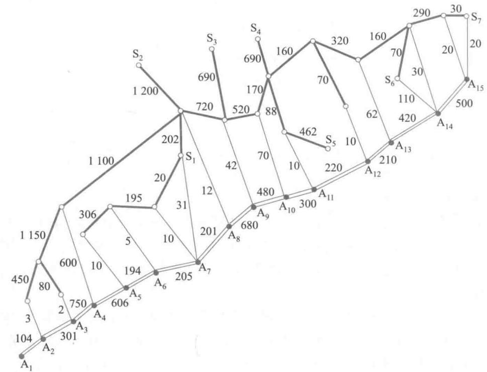  
图1

表1钢管生产的数量与价格  

<table><tr><td>i</td><td>1</td><td>2</td><td>3</td><td>4</td><td>5</td><td>6</td><td>7</td></tr><tr><td>s i</td><td>800</td><td>800</td><td>1000</td><td>2000</td><td>2000</td><td>2000</td><td>3000</td></tr><tr><td>p i</td><td>160</td><td>155</td><td>155</td><td>160</td><td>155</td><td>150</td><td>160</td></tr></table>

表2单位钢管的铁路运价①  

<table><tr><td>里程/km</td><td>≤300</td><td>301~350</td><td>351~400</td><td>401~450</td><td>451~500</td></tr><tr><td>运价/万元</td><td>20</td><td>23</td><td>26</td><td>29</td><td>32</td></tr><tr><td>里程/km</td><td>501~600</td><td>601~700</td><td>701~800</td><td>801~900</td><td>901~1000</td></tr><tr><td>运价/万元</td><td>37</td><td>44</td><td>50</td><td>55</td><td>60</td></tr></table>

公路运输费用为1单位钢管0.1万元  $\mathrm{km}$  (不足整千米部分按整千米计算).

钢管可由铁路、公路运往铺设地点(不只是运到点  $\mathrm{A}_{1}, \mathrm{~A}_{2}, \dots , \mathrm{~A}_{15}$ ,而是管道全线).这是2000年全国大学生数学建模竞赛B题的已知条件.该题第一问要求制定一个

主管道钢管的订购和运输计划,使总费用最小.为此需要首先计算从任一钢管厂订购钢管并运输到任一铺设地点的最小费用.如果能够根据图上所给的距离(一种赋权),按照题意转换成相应的费用(另一种赋权),那么这个问题相当于最短路问题.在此基础上,就可以建立钢管的订购和运输计划的数学规划模型.[79]该题第二问和第三问留作复习题2.

运费矩阵的计算考虑从每个钢管厂  $\mathrm{S}_{1},\mathrm{S}_{2},\dots ,\mathrm{S}_{7}$  (记为  $i = 1,2,\dots ,7$  )到每个节点  $\mathrm{A}_{1},\mathrm{A}_{2},\dots ,\mathrm{A}_{15}$  (记为  $j = 1,2,\dots ,15$  )每单位钢管的最小运费  $c_{ij}$  (不妨称为运费矩阵)及其对应的运输方式和路线.

因为题目没有给出装卸成本,可以简单地假设总是采用最经济的运输方式,在运输过程中允许多次装卸(如铁路转公路,再转铁路,等等)而不计费用.自然的想法是运输路线应该是距离最短的路径,但由于有两种运输和计价方式(铁路和公路),公路运输费用为1单位钢管0.1万元  $\mathrm{km}$  (不足整千米部分按整千米计算),运费是路程的线性函数;而铁路运费要通过运输里程查表得到,是一个阶梯函数.这两种运输计价方式混合在一起,使得我们不能直接将整个铁路、公路混合的运输网络上计算得到的距离最短的路径作为运输路线.但可以分别在铁路、公路网上计算距离最短的路径,然后换算成相应的运输费用;最后以两个子网上相应的运输费用为基础在整个网络上赋权,再求一次最短路问题,就可以得到最小运费矩阵.当年竞赛有不少论文对此处理不当,没能正确求出最小运费  $c_{ij}$

1)铁路子网络和公路子网络假设铁路运输路线应该是距离最短的路径,而且采用连续路径计价方式一定优于分段计价方式(其实题中数据并不符合这一假定,例如题中  $650\mathrm{km}$  的运价为44万元,而分成  $300\mathrm{km}$  和  $350\mathrm{km}$  两段计价只需要43万元,这是不符合实际的,估计是命题时选择数据的疏忽,我们不再考虑这种情况).这时可以把铁路运输子网络独立出来,在这个子网络上计算任意两个节点  $i,j$  之间的最短路长度(距离)  $d_{ij}^{(1)}$  ,然后按照这个最短路长度查铁路运价表得到最小运费  $c_{ij}^{(1)}$

类似地假设公路运输路线应该是距离最短的路径,把公路运输子网络独立出来,在这个子网络上计算任意两个节点  $i,j$  之间的最短路长度  $d_{ij}^{(2)}$  ,然后乘以运费0.1万元/ $\mathrm{km}$  就得到最小运费  $c_{ij}^{(2)}$

2)最小费用矩阵的计算经过上述的预处理,就可以将上面两个子网络(需要分别看成两个完全子图,即任意节点间都有弧相连)组合成一个网络,以每条弧上相应的运费  $c_{ij}^{(1)}$  或  $c_{ij}^{(2)}$  为权.需要注意的是,如果从某节点  $i$  到节点  $j$  既有铁路可到达,也有公路可到达,则弧  $(i,j)$  上既有铁路运费  $c_{ij}^{(1)}$  ,又有公路运费  $c_{ij}^{(2)}$  ,此时只需取其中较小的一个为权.然后再依此计算从每个钢管厂  $i = 1,2,\dots ,7$  到每个节点  $j = 1,2,\dots ,15$  的最短路,得到的就是每单位钢管的最小运费  $c_{ij}$

具体算法的选择求解最短路的算法主要有Dijkstra算法、Bellman- Ford算法、Floyd- Warshall算法等.本题弧上的权(距离)全为正数,可以采用Dijkstra算法.但由于需要求出任意两点之间最短路,所以采用Floyd- Warshall算法计算最短距离  $d_{ij}^{1},d_{ij}^{2}$  和最小运费  $c_{ij}$  可能更方便.利用软件或自己编程求解,最后可以得到最小费用  $c_{ij}$  为(同时可以得到相应的运输路径,从略):

170.7 160.3 140.2 98.6 38.0 20.5 3.1 21.2 64.2 92.0 96.0 106.0 121.2 128.0 142.0 215.7 205.3 190.2 171.6 111.0 95.5 86.0 71.2 114.2 142.0 146.0 156.0 171.2 178.0 192.0 230.7 220.3 200.2 181.6 121.0 105.5 96.0 86.2 48.2 82.0 86.0 96.0 111.2 118.0 132.0 260.7 250.3 235.2 216.6 156.0 140.5 131.0 116.2 84.2 62.0 51.0 61.0 76.2 83.0 97.0 255.7 245.3 225.2 206.6 146.0 130.5 121.0 111.2 79.2 57.0 33.0 51.0 71.2 73.0 87.0 265.7 255.3 235.2 216.6 156.0 140.5 131.0 121.2 84.2 62.0 51.0 45.0 26.2 11.0 28.0 275.7 265.3 245.2 226.6 166.0 150.5 141.0 131.2 99.2 76.0 66.0 56.0 38.2 26.0 2.0

订购和运输计划的制定题目图中已经给出了从节点  $j$  到节点  $j + 1$  需要铺设的钢管总长度  $l_{j}, j = 1,2,\dots ,14.$  记钢管厂  $i$  订购并运输到节点  $j$  的钢管数量为  $x_{ij}$ , 从节点  $j$  向左(节点  $j - 1$  方向)铺设的钢管数量为  $y_{j}$ , 向右(节点  $j + 1$  方向)铺设的钢管数量为  $z_{j}$ , 引入0- 1变量  $f_{i}$  表示是否从第  $i$  个钢厂订购钢管, 则可以建立如下数学规划模型:

$$
\sum_{i = 1}^{7}\sum_{j = 1}^{15}\left(p_{i} + c_{ij}\right)x_{ij} + \frac{0.1}{2}\sum_{j = 1}^{15}\left(y_{j}\left(y_{j} + 1\right) + z_{j}\left(z_{j} + 1\right)\right) \tag{1}
$$

$$
500f_{i} \leqslant \sum_{j = 1}^{15} x_{ij} \leqslant s_{j} f_{i}, \qquad i = 1,2,\dots ,7 \tag{2}
$$

$$
\sum_{i = 1}^{7} x_{ij} = z_{j} + y_{j}, \qquad j = 1,2,\dots ,15 \tag{3}
$$

$$
z_{j} + y_{j + 1} = l_{j}, \qquad j = 1,2,\dots ,14 \tag{4}
$$

$$
x_{ij} \geqslant 0, z_{j} \geqslant 0, y_{j} \geqslant 0, \qquad i = 1,2,\dots ,7, j = 1,2,\dots ,15 \tag{5}
$$

$$
y_{1} = 0, z_{1} = 0, \tag{6}
$$

$$
f_{i} \in \{0,1\} , \qquad i = 1,2,\dots ,7 \tag{7}
$$

评注当年不少参赛论文在以下几个方面存在不足:(1)只是针对题目所给的数据用凑的方法算出结果,没有给出解决这类问题的一般模型;(2)对铁路和公路混合运输网络处理不当,没能正确求出运费矩阵;(3)对一个钢厂如果承担制造这种钢管,至今需要生产500个单位"这个要求处理不当,得到的只是局部最优.

其中目标函数(1)中的第一项表示从钢管厂  $i$  订购并运输到节点  $j$  的总购运费用,第二项表示从节点  $j$  向左右两个方向铺设的总费用.由于假设沿管道或者原来有公路,或者建有施工公路,所以第二项中的费用是按公路运费计算的(0.1万元  $\mathrm{km}$  ).例如,从节点  $j$  向左铺设第  $1\mathrm{km}$  的运费为0.1,铺设第  $2\mathrm{km}$  的运费为  $0.2,\dots ,$  ,铺设第  $y_{j}\mathrm{km}$  的运费为  $0.1y_{j}$  ,因此向左铺设的总费用为  $0.1 + 0.2 + \dots +0.1y_{j} = 0.1y_{j}(y_{j} + 1) / 2.$  如果考虑到不足整千米部分按整千米计算,严格来说这里的  $y_{j}$  还需要向上取整数,但实际上可以忽略.

约束(2)和(7)描述了"一个钢厂如果承担制造这种钢管,至少需要生产500个单位"的要求.约束(3)~(6)的含义很容易理解,这里就不再多解释了.

求解上述模型,可以得到问题的最小费用约为128亿元(最优方案从略).

# 复习题

1. 哪个钢厂钢管的销价的变化对购运计划和总费用影响最大?哪个钢厂钢管的产量的上限的变化对购运计划和总费用的影响最大?

2. 如果要铺设的管道不是一条线,而是一个树形图,铁路、公路和管道构成网络如下图所示,请给出相应的模型和计算结果.

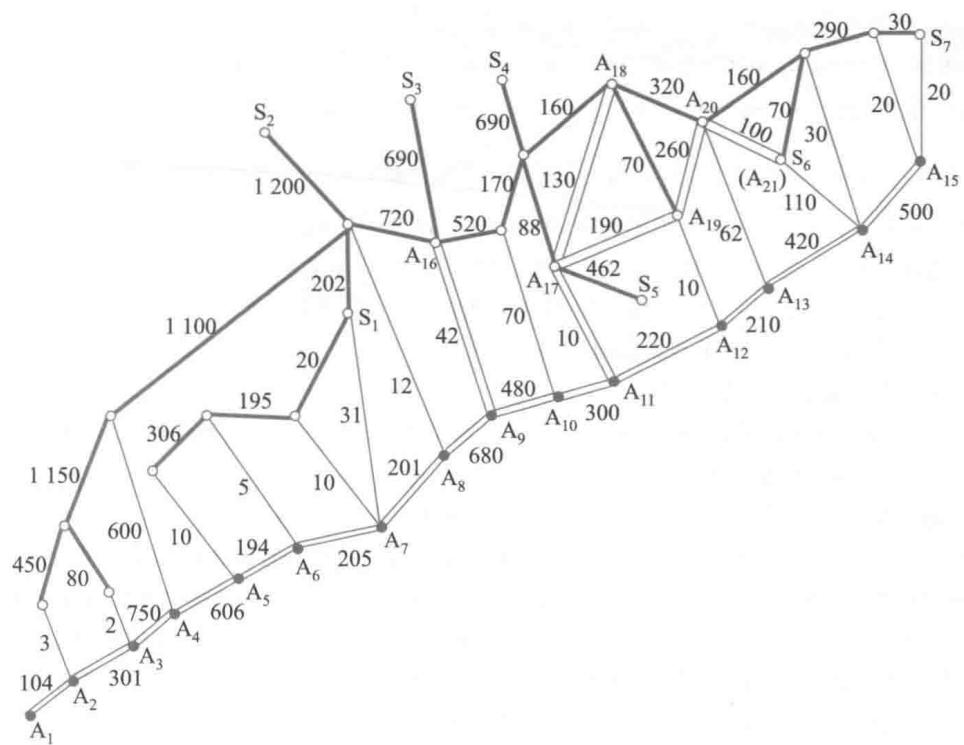

# 第7章训练题

1. 奖学金申请.6位大学毕业生申请某校的研究生奖学金,该校决定考察申请者的5项指标:  $X_{1} \sim$  GRE,  $X_{2} \sim$  GPA,  $X_{3} \sim$  毕业学校等级分,  $X_{4} \sim$  推荐书等级分,  $X_{5} \sim$  面试等级分.5项指标的权重及申请者的考查结果如下表,其中  $X_{1}$  满分800,  $X_{2}$  满分4.0,其余为10点尺度(10点最优).用加权和法、加权积法、TOPSIS方法计算,如给3位学生奖学金,应给哪3位?[67]

<table><tr><td rowspan="2">指标权重</td><td>X1</td><td>X2</td><td>X3</td><td>X4</td><td>X5</td></tr><tr><td>w1=0.3</td><td>w2=0.2</td><td>w3=0.2</td><td>w4=0.15</td><td>w5=0.15</td></tr><tr><td rowspan="6">申请者</td><td>A</td><td>690</td><td>3.1</td><td>9</td><td>7</td></tr><tr><td>B</td><td>590</td><td>3.9</td><td>7</td><td>6</td></tr><tr><td>C</td><td>600</td><td>3.6</td><td>8</td><td>8</td></tr><tr><td>D</td><td>620</td><td>3.8</td><td>7</td><td>10</td></tr><tr><td>E</td><td>700</td><td>2.8</td><td>10</td><td>4</td></tr><tr><td>F</td><td>650</td><td>4.0</td><td>6</td><td>9</td></tr></table>

2. 利用多属性决策和层次分析法从以下问题中选一两个完成建模过程(简单地给出模型结构、收集数据手段、计算方法和步骤等,或者详细地利用数据、得出结果):

(1)学校评选优秀学生或优秀班级

(2)大学毕业生选择工作岗位

(3)民众评选优秀电影、电视剧或优秀运动员

(4)民众评选宜居城市

3. 为减少层次分析法中的主观成分,可请若干专家每人构造成对比较阵.试给出一种由若干个

成对比较阵确定权向量的方法。

4. 用另一种方法构造成对比较阵  $A = \left(a_{ij}\right)$ ,  $a_{ij}$  表示因素  $C_{j}$  与  $C_{j}$  的影响之差,  $a_{ji} = -a_{ij}$ , 于是  $A$  为反对称阵, 并且, 当  $a_{ij} + a_{kj} = a_{ij}(i,k,j = 1,2,\dots ,n)$  时  $A$  是一致阵. 规定权向量  $\boldsymbol {w} = \left(w_{1},\dots ,w_{n}\right)^{\mathrm{T}}$  应满足  $\sum_{i = 1}^{n}w_{i} = 0$ ,  $a_{ij}$  可记作  $a_{ij} = \left(w_{i} - w_{j}\right) + \epsilon_{ij}$  (对一致阵  $\epsilon_{ij} = 0$ ). 试给出一种由  $A$  确定权向量  $\boldsymbol{w}$  的方法. 与 1-9 尺度对应, 这里用 0-8 尺度, 即  $a_{ij}$  取值范围是  $0,1,\dots ,8$  及  $-1,\dots , -8$ .

5. 一家向全国播送节目的地方电视台得到 150 万元投资, 准备将新节目推向市场, 有 3 种方案:

(1) 在当地试播新节目并作市场调查, 根据调查结果决定, 将新节目推向全国还是取消新节目.

(2) 不进行试播, 直接将新节目推向全国.

(3) 不进行试播, 也不推向全国.

在直接推向全国的情况下, 电视台估计有  $55\%$  的可能成功,  $45\%$  的可能失败, 如果成功, 将得到 300 万元的收益; 如果失败, 损失 100 万元.

在当地试播进行市场调查的费用为 30 万元, 有  $60\%$  的概率预测乐观结果 (新节目在当地成功),  $40\%$  的概率预测悲观结果 (在当地失败). 如果预测当地成功, 有  $85\%$  的概率推向全国成功; 如果预测当地失败, 有  $10\%$  的概率推向全国成功. 利用期望值准则和决策树方法为电视台确定最优方案[24].

6. 一台机器生产零件每批 1000 个, 次品率的概率分布如下表. 若一个次品未被检出, 损失费 5 元. 如添置一套检验装置, 每批零件检验费 350 元, 可将次品自动检出. 从费用期望值最小角度出发, 是否应该添置检验装置? 如果对零件作一次抽样检查, 10 个零件中发现 1 个次品, 通过修正先验概率, 重新考虑添置检验装置的决策 (参考拓展阅读 7-2).

<table><tr><td>次品率</td><td>0.01</td><td>0.05</td><td>0.10</td><td>0.15</td></tr><tr><td>概率</td><td>0.2</td><td>0.4</td><td>0.3</td><td>0.1</td></tr></table>

7. 排名次的另一方法是考察"失分向量"以代替得分向量 (选手输掉场次的数目为他的失分), 按失分由小到大排列名次.

(1) 证明: 这相当于把竞赛图中各有向边反向后, 按得分向量排列名次, 再把名次倒过来.

(2) 用得分向量和失分向量方法分别对竞赛图 (右图) 排列名次, 两种方法结果一致吗?

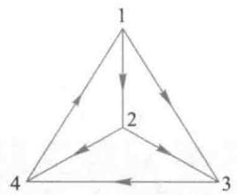

8. 份额法QM可简述如下:定义第i方分配第s十1席位"合格"是指n<(s+1),即不违反份额性的上限,记E(ns+1)=第i方分配第s十1席位合格,i=1,2,,m,当总席位为s时第i方的席位分配记作  $n_{i} = f_{i}(p,s)$  ,且有  $f_{i}(p,0) = 0$  ,让  $s$  每次1席地递增,若对于所有  $i\in E(n,s + 1)$  及某个k有  $\frac{p_{k}}{n_{k} + 1}\geq \frac{p_{i}}{n_{i} + 1}$  则令  $f_{k}(p,s + 1) = n_{k} + 1,f_{i}\left(p,s + 1\right) = n_{i}(i\neq k).$

现有 5 方人口分别为 5117,4400,162,161,160, 试分别用 5 种除数法及 GR 和 QM 分配总共 100 个席位.

份额法不满足人口单调性, 你能举出例子吗?

9. 已知 A,B,C,D 的人口  $p_{i}$  如下表第 2 列, 分配 35 个席位, 算出份额  $q_{i}$  如下表第 3 列. 验证按照 MF 和 EP 法分配的结果如下表第 4 列, 不满足份额性. 如果从 B 拿出 1 席给 D, 以满足份额性, 验证当 A,B,C,D 的人口由  $p_{i}$  变成  $p_{i}^{\prime}$  (下表第 5 列) 时, 将违反人口单调性.

<table><tr><td></td><td>p1</td><td>q1</td><td>MF,EP</td><td>p1</td></tr><tr><td>A</td><td>70 653</td><td>1.552</td><td>2</td><td>86 228</td></tr><tr><td>B</td><td>117 404</td><td>2.579</td><td>3</td><td>113 908</td></tr><tr><td>C</td><td>210 923</td><td>4.633</td><td>5</td><td>232 778</td></tr><tr><td>D</td><td>1 194 456</td><td>26.236</td><td>25</td><td>1 160 522</td></tr><tr><td>总和</td><td>1 593 436</td><td>35</td><td>35</td><td>1 593 436</td></tr></table>

10. 构造一个有 5 位候选人的投票, 使得按照 5 种投票方法确定的获胜者是这 5 位候选人中的同一个人; 再构造一个投票, 使得 5 位获胜者正好分别是这 5 位候选人.

11. 下面的选举方法称为成对比较法: 每一对候选人进行两两对决, 按照多数票规则决定获胜者, 并赋予 1 分 (若二人平手各得 0.5 分), 全部对决结束后, 总分最高的为获胜者.

(1) 考察 7.6 节选举喜爱球队的投票结果, 用成对比较法确定获胜者.

(2) 说明成对比较法满足多数票准则、获胜者准则、失败者准则.

12. 赞成投票被很多人认为是最简单、实用的选举方法: 每位选民可以对任意多的候选人投赞成票, 获得最多赞成票的候选人获胜. 在现实生活中找一个按照赞成投票方法确定获胜者的例子, 写出简述. 研究这种方法满足还是违反 5 条公平性准则.

13. 在定义价格指数时如何构造权重  $q^0$  和  $q^0$  是关键之一, 你认为应该如何确定权重. 当然, 你也可以定义不同于  $I_1 \sim I_8$  的价格指数, 并说明其含义和性质.

14. 选择工作岗位主要考虑发展前景和当前报酬 2 个指标, 某人有 3 个岗位  $A_1, A_2, A_3$  可选, 权重  $w_j$  及原始分  $d_{ij}$  如下表.

<table><tr><td>发展前景X1(w1=0.6)</td><td>当前报酬X2(w2=0.4)</td></tr><tr><td>A1</td><td>4</td></tr><tr><td>A2</td><td>1</td></tr><tr><td>A3</td><td>2</td></tr></table>

(1) 分别用理想模式 (最大化) 和分配模式 (归一化) 计算 3 个岗位的综合权重, 给出优劣排序.

(2) 增加一个新的岗位, 其发展前景和当前报酬都与  $A_1$  相同, 再用理想模式和分配模式计算, 原岗位  $A_1, A_2, A_3$  的排序是保持不变, 还是发生逆转?

(3) 如果增加的新岗位是  $A_4^{\prime}$ , 其发展前景比其他岗位都好, 如下表, 用理想模式计算, 原岗位的排序也会逆转吗? 如果允许新方案的权重大于 1 呢 (原方案的最大权重仍为 1)?

<table><tr><td>发展前景X1(w1=0.6)</td><td>当前报酬X2(w2=0.4)</td></tr><tr><td>A1</td><td>4</td></tr><tr><td>A2</td><td>1</td></tr><tr><td>A3</td><td>2</td></tr><tr><td>A4</td><td>6</td></tr></table>

从以上的讨论, 你能得出什么结论?

# 更多案例……

7- 1 层次分析法的广泛应用

7- 2 社会经济系统中的冲量过程模型

# 第8章 概率模型

现实世界的变化受着众多因素的影响,这些因素根据其本身的特性及人们对它们的了解程度,可分为确定的和随机的.虽然我们研究的对象通常包含随机因素,但是如果从建模的背景、目的和手段看,主要因素是确定的,而随机因素可以忽略,或者随机因素的影响可以简单地以平均值的作用出现,那么就能够建立确定性的数学模型,本书前面的部分正是这样的.

如果随机因素对研究对象的影响必须考虑,就应该建立随机性的数学模型,简称随机模型.本章通过几个实例讨论,如何用随机变量和概率分布描述随机因素的影响,建立比较简单的随机模型——概率模型.

# 8.1 传送系统的效率

8.1 传送系统的效率在机械化生产车间里你可以看到这样的情景:排列整齐的工作台旁工人们紧张地生产同一种产品,工作台上方一条传送带在运转,带上设置着若干钩子,工人们将产品挂在经过他上方的钩子上带走,如图1.当生产进入稳定状态后,每个工人生产出一件产品所需时间是不变的,而他要挂产品的时刻却是随机的.衡量这种传送系统的效率可以看它能否及时地把工人们生产的产品带走,显然在工人数目不变的情况下传送带速度越快,带上钩子越多,效率会越高.我们要构造一个衡量传送系统效率的指标,并且在一些简化假设下建立一个模型来描述这个指标与工人数目、钩子数量等参数的关系.

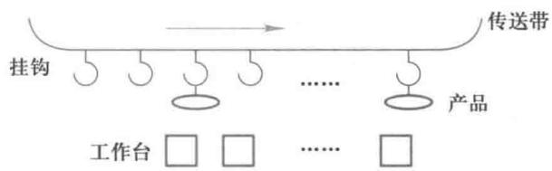  
图1传送系统示意图

模型分析为了用传送带及时带走的产品数量来表示传送系统的效率,在工人们生产周期(即生产一件产品的时间)相同的情况下,需要假设工人们在生产出一件产品后,要么恰好有空钩子经过他的工作台,使他可以将产品挂上带走,要么没有空钩子经过,迫使他将产品放下并立即投入下一件产品的生产,以保持整个系统周期性地运转.

工人们的生产周期虽然相同,但是由于各种随机因素的干扰,经过相当长时间后,他们生产完一件产品的时刻就不会一致,可以认为是随机的,并且在一个生产周期内任一时刻的可能性是一样的.

由上面的分析,传送系统长期运转的效率等价于一周期的效率,而一周期的效率可以用它在一周期内能带走的产品数与一周期内生产的全部产品数之比来描述.

为了将问题简化到能用简单的概率方法来解决,我们做出如下的假设.

# 模型假设

1. 有  $n$  个工人, 他们的生产是相互独立的, 生产周期是常数,  $n$  个工作台均匀排列.

2. 生产已进入稳态, 即每个工人生产出一件产品的时刻在一周期内是等可能的.

3. 在一周期内有  $m$  个钩子通过每一工作台上方, 钩子均匀排列, 到达第一个工作台上方的钩子都是空的.

4. 每个工人在任何时刻都能触到一只钩子, 也只能触到一只钩子, 于是在他生产出一件产品的瞬间, 如果他能触到的那只钩子是空的, 则可将产品挂上带走; 如果那只钩子非空 (已被他前面的工人挂上了产品), 则他只能将这件产品放在地上. 而产品一旦放在地上, 就永远退出这个传送系统.

模型建立 将传送系统效率定义为一周期内带走的产品数与生产的全部产品数之比, 记作  $D$ . 设带走的产品数为  $s$ , 生产的全部产品数显然为  $n$ , 于是  $D = s / n$ . 只需求出  $s$  就行了.

如果从工人的角度考虑, 分析每个工人能将自己的产品挂上钩子的概率, 那么这个概率显然与工人所在的位置有关 (如第 1 个工人一定可以挂上), 这样就使问题复杂化. 我们从钩子的角度考虑, 在稳态下钩子没有次序, 处于同等的地位. 若能对一周期内的  $m$  只钩子求出每只钩子非空 (即挂上产品) 的概率  $p$ , 则  $s = mp$ .

得到  $p$  的步骤如下 (均对一周期内而言):

任一只钩子被一名工人触到的概率是  $1 / m$

任一只钩子不被一名工人触到的概率是  $1 - 1 / m$

由工人生产的独立性, 任一只钩子不被所有  $n$  个工人挂上产品的概率, 即任一只钩子为空钩的概率是  $\left(1 - \frac{1}{m}\right)^n$

任一只钩子非空的概率是  $p = 1 - \left(1 - \frac{1}{m}\right)^n$ .

这样, 传送系统效率指标为

$$
D = \frac{mp}{n} = \frac{m}{n}\left[1 - \left(1 - \frac{1}{m}\right)^n\right] \tag{1}
$$

为了得到比较简单的结果, 在钩子数  $m$  相对于工人数  $n$  较大, 即  $\frac{n}{m}$  较小的情况下, 将多项式  $\left(1 - \frac{1}{m}\right)^n$  展开后只取前 3 项, 则有

$$
D \approx \frac{m}{n}\left[1 - \left(1 - \frac{n}{m} + \frac{n(n - 1)}{2m^2}\right)\right] = 1 - \frac{n - 1}{2m} \tag{2}
$$

如果将一周期内未带走的产品数与全部产品数之比记作  $E$ , 再假定  $n \gg 1$ , 则

$$
D = 1 - E, \quad E \approx \frac{n}{2m} \tag{3}
$$

当  $n = 10, m = 40$  时, (3) 式给出的结果为  $D = 87.5\%$ , (1) 式得到的精确结果为  $D = 89.4\%$ .

设工人数  $n$  固定不变. 若想提高传送带效率  $D$ , 一种简单的办法是增加一个周期内通过工作台的钩子数  $m$ , 比如增加一倍, 其他条件不变. 另一种办法是在原来放置一只钩子的地方放置两只钩子, 其他条件不变, 于是每个工人在任何时刻可以同时触到两只钩子, 只要其中有一只是空的, 他就可以挂上产品, 这种办法用的钩子数量与第一种办法一样. 试推导这种情况下传送带效率的公式, 从数量关系上说明这种办法比第一种办法好.

# 8.2 报童的诀窍

报童每天清晨用每份2元的价格从报社买进一批报纸后, 在报亭以每份4元零售, 到晚上将没有卖掉的报纸退回, 得到每份1元的补偿. 这样, 他每售出一份报纸可赚2元, 每退回一份要赔1元. 报童每天应该买进多少报纸, 当然取决于他每天能卖出多少报纸. 显然, 卖出的数量是随机的, 因而报童每天的收入也是随机的. 如果已经由统计资料或经验判断得到了报纸需求量的概率分布. 那么, 所谓报童的诀窍是指, 他每天应该买进多少份报纸, 从长期来看可以获得最高的日均利润.[32]

类似的实际问题很多. 面包店每天早上烘烤一定数量的面包出售, 每卖出一只可获利若干, 晚间要将未卖出的面包处理掉而赔钱. 如果知道了需求量的概率分布, 确定每天烘烤面包的数量, 便可得到最高的日均利润. 出版社每年都要重印一次教科书, 按照过去的销售记录, 可以给出今年需求量的概率分布. 在确定这次印刷数量时需要考虑的是, 如果供过于求当然会因占用资金及库存而蒙受损失, 而若供不应求, 那么为保证学生用书必须临时加印, 则会导致成本的增加.

这些问题的共同点是, 已知某种商品在供过于求和供不应求时所带来的收益或损失, 在需求量概率分布一定的条件下, 确定商品的数量使得平均利润最高. 下面以报童售报为例建立这类问题的数学模型.

离散型需求下的报童售报模型

问题 为简单起见, 将每天报纸需求量看作离散型随机变量, 100份报纸为1单位, 由统计资料得到的需求量概率分布如表1所示. 对于报童每天以一份报纸2元买进、4元售出、退回得到1元补偿的情况, 可知每售出1单位报纸可获利200元, 因剩余而退回1单位的报纸则损失100元. 问报童每天应该购进多少单位报纸, 能够获得最高的日均利润?

表1 报童售报离散型需求的概率分布  

<table><tr><td>需求量/单位</td><td>0</td><td>1</td><td>2</td><td>3</td><td>4</td><td>5</td></tr><tr><td>概率/分布</td><td>0</td><td>0.1</td><td>0.3</td><td>0.4</td><td>0.1</td><td>0.1</td></tr></table>

建模 记需求量取值  $r$  时的概率为  $f(r)$  ( $r = 0, 1, 2, \dots$ ,  $n$ , 对上述问题  $n = 5, f(r)$  如表1). 已知报童每天售出1单位报纸获利为  $s_1$ , 因剩余而退回1单位报纸损失为  $s_2$ . 设报童每天购进  $q$  单位报纸, 若某天的需求量为  $r$ , 当供不应求即  $r > q$  时, 其售出的获利

为  $s_{1}q$ ,没有损失;而当供过于求即  $r \leqslant q$  时,其售出的获利为  $s_{1}r$ ,因剩余而退回的损失为  $s_{2}(q - r)$ 。记一天的利润为  $s(r,q)$ ,则由上分析可得

$$
s(r,q) = \left\{ \begin{array}{ll} s_{1}r - s_{2}(q - r), & r \leqslant q \\ s_{1}q, & r > q \end{array} \right. \tag{1}
$$

日均利润为  $s(r,q)$  的期望值,记作  $E(q)$ ,即有

$$
E(q) = \sum_{r = 0}^{n}s(r,q)f(r) = \sum_{r = 0}^{q}\left[s_{1}r - s_{2}(q - r)\right]f(r) + \sum_{r = q + 1}^{n}s_{1}qf(r) \tag{2}
$$

问题归结为在已知  $s_{1}, s_{2}$  和  $f(r)$  的条件下,求购进报纸的最优数量  $q$ ,使日均利润  $E(q)$  最大。

求解用  $P(r > q)$  和  $P(r \leqslant q)$  分别表示需求量取值  $r > q$  和  $r \leqslant q$  时的概率,让  $q$  从 1,2,依次增加,分析从  $E(q)$  到  $E(q + 1)$  的变化。

若  $q< r,q$  增加到  $q + 1$  ,可以多售出1单位,利润增加  $s_{1}$  ;若  $q\geqslant r,q$  增加到  $q + 1$  ,因剩余而多退回1单位,利润减少  $s_{2}$  于是

$$
E(q + 1) - E(q) = s_{1}P(r > q) - s_{2}P(r \leqslant q) \tag{3}
$$

注意到  $P(r > q) = 1 - P(r \leqslant q)$ ,(3)式化为

$$
E(q + 1) - E(q) = s_{1}\left[1 - P(r \leqslant q)\right] - s_{2}P(r \leqslant q) = s_{1} - \left(s_{1} + s_{2}\right)P(r \leqslant q) \tag{4}
$$

当  $E(q + 1) - E(q)$  由正变负时  $E(q)$  达到最大,从(4)式可知,这相当于  $P(r \leqslant q)$  由小于  $s_{1} / (s_{1} + s_{2})$  变为大于  $s_{1} / (s_{1} + s_{2})$ 。由此得到结论:不等式

$$
P(r \leqslant q) \geqslant \frac{s_{1}}{s_{1} + s_{2}} \tag{5}
$$

成立时的最小  $q$  值,就是  $E(q)$  达到最大的最优点。

对于问题中的  $s_{1} = 200$  元、  $s_{2} = 100$  元,可得  $s_{1} / (s_{1} + s_{2}) = 2 / 3$ ,根据表1的  $f(r)$ ,使  $P(r \leqslant q) \geqslant 2 / 3$  成立的最小  $q$  值是  $q = 3$ ,即每天购进3单位报纸可使日均利润  $E(q)$  达到最大。至于  $E(q)$  的最大值仍需由(2)式计算,其结果为  $E(q) = 450$  元。

分析对于离散型需求下的报童售报(或其他类似问题的)模型(2),当  $s_{1},s_{2}$  和 $f(r)$ $\left(r = 0,1,2,\dots ,n\right)$  已知时,可由(5)式直接得到使日均利润  $E(q)$  达到最大的  $q.$  容易看出,若获利  $s_{1}$  变大则  $q$  增加,若损失  $s_{2}$  变大则  $q$  减少.显然这是符合常识的.

连续型需求下的报童售报模型

问题如果报纸的需求以1份为1单位,当份数很多时离散型随机变量概率分布的表述和计算就很烦琐,而将其视为连续型随机变量,用概率密度函数描述概率分布,就更为方便。

设由统计资料和经验判断认为连续型的报纸需求量大致服从正态分布,设其平均值是260,标准差是50,即需求量为  $N(260,50^{2})$ 。报童仍然每天以一份报纸2元买进、4元售出、退回得到1元补偿,即每售出1份报纸获利2元,因剩余而退回1份报纸损失1元。问报童每天应该购进多少份报纸,才能获得最高的日均利润?

建模记报纸需求量的概率密度函数为  $p(r)$ ,  $s_{1}, s_{2}$  和  $q$  的含义同前,用  $p(r) \mathrm{d}r$  代替(2)式中的  $f(r)$ ,对  $r$  的求和变为积分,于是日均利润为①

$$
E(q) = \int_{-\infty}^{q}\left[s_{1}r - s_{2}(q - r)\right]p(r)\mathrm{d}r + \int_{q}^{\infty}s_{1}q p(r)\mathrm{d}r \tag{6}
$$

问题是在已知  $s_{1},s_{2}$  和  $p(r)$  的条件下,求购进报纸的最优数量  $q$  ,使  $E(q)$  达到最大.

求解建立连续模型的好处是,能够用微积分方法求解优化问题.(6)式对  $q$  求导数  $①$  并令  $\frac{\mathrm{d}E}{\mathrm{d}q} = 0$  ,再记  $r$  的概率分布函数为  $F(q) = \int_{- \infty}^{q}p(r)\mathrm{d}r$  ,可得  $q$  的最优解满足

$$
F(q) = \frac{s_{1}}{s_{1} + s_{2}} \tag{7}
$$

不难看出,这个结果与离散型需求下的模型(5)式是一致的

当  $s_{1} = 2,s_{2} = 1$  时(7)式右端为  $2 / 3$  ,对于需求概率分布  $N(260,50^{2})$  ,为求解  $F(q)$ $= 2 / 3$  ,可以利用MATLAB软件的逆正态分布函数命令  $\mathrm{~x~} =$  norminv(p,mu,sigma),其中输入  $\mathrm{mu}$  ,sigma分别是正态分布的均值和标准差,p是分布函数值,输出  $\mathbf{x}$  是  $\mathrm{p}$  的分位数(分布函数自变量的值).将以上数据代入计算得到  $x = 281.5409.$  取  $q = 282$  ,报童每天购进282份报纸能获得最高的日均利润.

如果要得到最高日均利润  $E(q)$  的数值,应将  $q = 282$  代入(6)式计算.

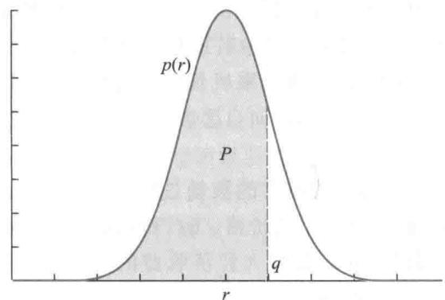  
图1连续型需求模型求解的图形表示

分析对于连续型模型的解(7)式,可以用概率密度函数  $p(r)$  的图形给以直观的表示.图1中曲线是正态分布概率密度函数(实际上可以是任意的概率密度函数),曲线下的总面积为1,图中虚线  $r = q$  左边曲线下的面积记作  $P$  ,显然  $P = \int_{- q}^{q}p(r)\mathrm{d}r = F(q)$  恰是需求量不超过  $q$  的概率.(7)式表明,  $E(q)$  达到最大的  $q$  值应使需求量概率密度曲线下的面积满足  $P = \frac{s_{1}}{s_{1} + s_{2}}$  可以看出,若获利  $s_{1}$  变大则虚线  $r = q$  右移,若损失  $s_{2}$  变大则虚线  $r = q$  左移.

评注对于报童及类似的实际问题,虽然用连续型需求模型表述和计算更为便捷,但是需要知道需求量的概率密度函数,当需求量不大或者不掌握密度函数时,还是要采用离散型模型.

复习题

1. 用微积分求极值的方法由(6)式导出(7)式,并验证(7)式确实为最大值.

2. 若每天报纸的需求量服从正态分布  $N(\mu ,\sigma^{2})$  ,证明最高日均利润  $E(q)$  为

$$
E(q) = s_{1}q - (s_{1} + s_{2})\left[(q - \mu)F(q) + \sigma^{2}p(q)\right]
$$

将本节的数据代入,计算  $E(q)$  的数值。

3. 面包店每天烘烤一定数量的面包出售,每只成本3元,以8元的价格卖出,晚间关门前将未卖完的面包无偿处理掉,若已知每天面包需求量的概率分布如下表,确定每天烘烤面包的数量,使得能够得到最高的日均收入,这个收入是多少?

<table><tr><td>需求量/只</td><td>50</td><td>100</td><td>150</td><td>200</td><td>250</td></tr><tr><td>概率</td><td>0.2</td><td>0.3</td><td>0.2</td><td>0.2</td><td>0.1</td></tr></table>

# 8.3 航空公司的超额售票策略

你遇到过预订了机票、赶到机场却因飞机已满员而无法登机的情况吗?实际上,由于不少人是提前很长时间预订机票的,总有旅客因为各种变故不能按时登机(有资料统计这个数在  $2\%$  左右),航空公司为了减少按座位定额售票导致空位运行所蒙受的经济损失,通常采用超额售票策略,每个航班超额多售几张票。

航空公司超额售票时必须考虑对因飞机满员而无法登机的正常旅客给以相当力度的补偿。我国民航行业标准《公共航空运输航班超售处置规范》要求,航空公司制定详细的超售实施办法,明确旅客的权利、优先乘机规则和补偿标准;航班超售时在使用优先乘机规则前应寻找放弃登机的自愿者,向自愿者提供免费或减价航空运输、赠送里程等作为补偿。

由于预订了机票而不按时登机旅客的数量是随机的,航空公司需要针对不同航班分析这个数量的概率分布,再结合机票价格、飞行费用、补偿金额等因素,建立一个数学模型来确定超额售票的数量,在获取最大经济收益的同时,尽量维护公司的社会声誉(避免出现过多旅客无法登机的情况)。

模型分析 实行超额售票时公司的经济收益通常用机票收入扣除飞行费用和补偿金额后的利润来衡量,社会声誉可以用因飞机满员而无法登机的旅客限制在一定数量为标准。注意到这个问题的关键因素——订票旅客是否按时前来登机——是随机的,所以经济收益和社会声誉两个方面的指标应该在平均意义或概率意义下衡量。对于这个两目标的优化问题,我们先分析经济收益,以收益最大为目标确定超额售票的数量,再来考虑如何维护社会声誉。

经济收益最大的超额售票模型

模型假设 根据以上所述超额售票的内容和分析,对于一次航班作以下假设:

1. 飞机容量为  $n$ ,超额售票的数量为  $q$ ,已订票的  $n + q$  位旅客中不按时登机的数量为  $r$ , $r$  是一个随机变量。

2. 每位订票旅客不按时登机的概率为  $p$ ,他们是否按时登机的行为相互独立,这个假设适用于单独行动的商人、游客等。

3. 每张机票价格为  $s_{1}$ ,因飞机满员而无法登机的每位旅客得到的补偿金额为  $s_{2}$ . 飞行费用与旅客数量关系很小,不予考虑.

模型建立 根据订票而不按时登机的旅客数量  $r$  的多少,公司的收益有两种情况:

若  $r \leqslant q$ ,即按时登机的旅客数量  $n + q - r \geqslant n$ ,则只有  $n$  位旅客可以登机,机票收入为  $s_{1}n$ ,剩下  $q - r$  位旅客因无法登机而得到的补偿金额为  $s_{2}(q - r)$ ,于是公司收益为  $s_{1}n - s_{2}(q - r)$ ;

若  $r > q$ ,即按时登机的旅客数量  $n + q - r < n$ ,则他们均可登机,于是公司收益为  $s_{1}(n + q - r)$

对于订票而不按时登机的旅客数量为  $r$  的一次航班,记公司的收益为  $s(r,q)$ ,按照上面的分析有

$$
s\left(r,q\right) = \left\{ \begin{array}{l l}{s_{1}n - s_{2}\left(q - r\right),} & {r\leqslant q}\\ {s_{1}\left(n + q - r\right),} & {r > q} \end{array} \right. \tag{1}
$$

已订票的  $n + q$  位旅客中恰有  $r$  位不按时登机的概率记作  $f(r), r = 0,1,\dots ,n + q$ ,则航班的平均收益为  $s(r,q)$  的期望值,记作  $E(q)$ ,有

$$
E(q) = \sum_{r = 0}^{n + q}s(r,q)f(r) = \sum_{r = 0}^{q}\left[s_{1}n - s_{2}(q - r)\right]f(r) + \sum_{r = q + 1}^{n + q}s_{1}(n + q - r)f(r) \tag{2}
$$

因为每位订票旅客不来登机的概率为  $p$ ,且他们是否前来登机相互独立,所以随机变量  $r$  服从二项分布,即

$$
f(r) = \mathrm{C}_{n + q}^{r}p^{r}(1 - p)^{n + q - r}, \quad r = 0,1,\dots ,n + q \tag{3}
$$

问题归结为:已知  $s_{1},s_{2},n,p$ ,求超额售票的数量  $q$ ,使航班的平均收益  $E(q)$  最大.

模型求解 注意到平均收益  $E(q)$  的表达式(2)与8.2节离散型需求下报童售报模型(2)式相似,利用同样的方法可以得到与8.2节(5)式完全相同的结果,即最优的  $q$  应为满足不等式

$$
P(r \leqslant q) = \sum_{r = 0}^{q}\mathrm{C}_{n + q}^{r}p^{r}(1 - p)^{n + q - r} \geqslant \frac{s_{1}}{s_{1} + s_{2}} \tag{4}
$$

的最小  $q$  值.

若将补偿金额  $s_{2}$  与机票价格  $s_{1}$  之比记为  $s = s_{2} / s_{1}$ ,则(4)式可表示为

$$
P(r \leqslant q) = \sum_{r = 0}^{q}\mathrm{C}_{n + q}^{r}p^{r}(1 - p)^{n + q - r} \geqslant \frac{1}{1 + s} \tag{5}
$$

如果设定飞机容量  $n = 300$ ,每位订票旅客不来登机的概率  $p = 0.05$ ,补偿金额与机票价格之比  $s = 1 / 2$ ,(5)式可用MATLAB软件逆二项分布函数命令  $\mathbf{x} =$  binoinv(y,n,p)求解,其中输入  $\mathbf{n}$  是二项分布的试验总数,对应于模型中的  $n + q,p$  是概率,与模型的  $p$  相同, $\mathbf{y}$  是分布函数值,对应于模型中的  $1 / (1 + s)$ ,输出  $\mathbf{x}$  是分布函数的自变量,对应于模型中的  $q$ . 代入  $s,n,p$  的数据,从  $q = 1$  开始运行程序  $\mathbf{x} =$  binoinv(2/3,300+q,0.05),直到  $\mathbf{x} = \mathbf{q}$  为止,即可得到(5)式的解  $q = 17$ .

可以看出,在航班平均收益最大的目标下,对于固定的飞机容量  $n(= 300)$ ,影响超额售票数量  $q$  的参数只有  $p$  和  $s$ . 表1是  $p$  和  $s$  取若干数值时  $q$  的计算结果.

评注 直观地看,当旅客不来登机的概率  $p$  变大时,超额售票数量  $q$  可以增加;补偿金额(与机票价格相比)变大时,超额售票数量  $q$  应该减少。表1定量地反映了这个认识。

表1平均收益最大的超额售票数量  $q\left(\begin{array}{l}{n=300}\end{array}\right)$  

<table><tr><td>q</td><td>s=1/3</td><td>s=1/2</td><td>s=1</td></tr><tr><td>p=0.01</td><td>4</td><td>4</td><td>3</td></tr><tr><td>p=0.03</td><td>11</td><td>10</td><td>9</td></tr><tr><td>p=0.05</td><td>18</td><td>17</td><td>16</td></tr></table>

# 考虑社会声誉的超额售票模型

从维护社会声誉的角度,应该对因飞机满员而无法登机的旅客数量加以限制,由于订票旅客按时登机的随机性,所谓限制也只能以概率表示。

设超额售票的数量为  $q$ ,将因飞机满员而无法登机的旅客数量超过  $j$  人的概率记作  $P_{j}(q)$ , $j$  可视为维护社会声誉的"门槛",不妨限制  $P_{j}(q)$  不超过某个可以接受的数值  $\alpha$ 。因为"无法登机的旅客数量超过  $j$  人"与"订票旅客不来登机的不超过  $q - (j + 1)$  人"等价,所以这种限制可以表示为

$$
P_{j}(q) = \sum_{r = 0}^{q - (j + 1)} \mathrm{C}_{n + q}^{r} p^{r} (1 - p)^{n + q - r} \leqslant \alpha \tag{6}
$$

(6)式的  $P_{j}(q)$  可用MATLAB软件二项分布函数命令  $\mathrm{~y~} =$  binocdf  $(\mathrm{~x~},\mathrm{~n~},\mathrm{~p~})$  计算,其中  $\mathbf{x}$  是模型中的  $q = (j + 1)$  ,y即  $P_{j}(q),\mathrm{n},\mathrm{p}$  与binoinv中的含义相同.实际应用时对于给定的  $p$  和  $s$  ,先算出航班平均收益最大的超额售票数量  $q$  ,再设定"门槛"  $j$  ,然后计算 $P_{j}(q)$  ,与可以接受的数值  $\alpha$  比较.当超额售票数量  $q$  变大时"门槛"  $j$  应该随之提高.对于表1得到的结果我们取  $j$  约为  $q$  的  $1 / 3$  ,得到的  $P_{j}(q)$  如表2所示.

拓展阅读8- 1 超额售票策略的再讨论

<table><tr><td>Pj(q)</td><td>s=1/3</td><td>s=1/2</td><td>s=1</td></tr><tr><td>p=0.01,j=1</td><td>0.4131</td><td>0.4131</td><td>0.1932</td></tr><tr><td>p=0.03,j=3</td><td>0.2828</td><td>0.1767</td><td>0.0968</td></tr><tr><td>p=0.05,j=5</td><td>0.1931</td><td>0.1282</td><td>0.0791</td></tr></table>

评注 直观地看,当旅客不来登机的概率  $p$  或者设定的"门槛"  $j$  变大时,因超额售票而无法登机旅客数量超过  $j$  人的概率  $P_{j}(q)$  都会减少;而超额售票数量  $q$  变大时,这个概率将增加。表2大致反映了这个认识。

需要注意的是,概率  $P_{j}(q)$  与费用参数  $s$  无关,在表2的同一行中,  $P_{j}(q)$  数值的变化是由于  $q$  的不同引起的。

对于航空公司的超额售票策略我们建立了经济收益最大和考虑社会声誉两个模型,应用时可以将二者结合起来。如果对于经济收益最大的超额售票数量  $q$ ,考虑社会声誉的"门槛"  $j$  所对应的概率  $P_{j}(q)$  可以接受,问题自然解决;否则,可以适当改变  $q$ ,牺牲一定的经济收益,来换取  $P_{j}(q)$  的降低。

从上面的计算结果可以看到,订票旅客不来登机的概率  $p$  对经济收益和社会声誉的两个指标影响都比较大,应用时需要针对不同航班、不同时间(季节、假日等因素),利用统计数据实时调整概率  $p$ ,以提高模型的准确度。

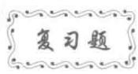

1. 由  $E(q)$  的表达式(2)推导(4)式;将(2)中的概率  $f(r)$  换为密度函数,对连续型模型求解。

2. 据统计数据订票旅客不来登机的概率  $p = 0.02$ , 对于  $n = 300, j = 3$  和  $s = 1 / 3, 1 / 2, 1$ , 计算平均收益最大的超额售票数量  $q$  及概率  $P_{j}(q)$ . 如果设定  $\alpha = 0.1, s = 1 / 3$ , 问  $P_{j}(q)$  是否满足(6)式的限制? 若不满足, 如何调整  $q$ , 调整的后果是什么?

# 8.4 作弊行为的调查与估计

"考试时你是否有过作弊行为?"如果在学生中做这样的、即使是无记名的直接调查, 恐怕也很难消除被调查者的顾虑, 极有可能拒绝应答或故意做出错误的回答, 使得调查结果存在很大的偏差.

社会调查中类似"考试作弊"的所谓敏感问题有不少, 例如是否有过赌博、婚外恋、酒后驾车行为等. 如何通过巧妙的调查方案设计, 尽可能地获取被调查者的真实回答, 得到比较可靠的统计结果, 是社会调查工作的难题之一. 本节以学生考试作弊行为的调查和估计为例, 讨论这类敏感问题的调查方法及数学模型.

问题分析 学生在考试中的作弊行为是一个严重困扰学校的学风问题, 为了对这种现象的严重程度有一个定量的认识, 需要通过调查来估计有过作弊行为的学生到底占多大的比例. 需要强调的是, 这种调查并不涉及具体是哪些学生有过作弊行为, 所以调查方案的设计应该保护被调查者的隐私, 消除他们的顾虑, 从而能对调查的问题做出真实的回答.

进行这项调查的基本想法是, 让被调查的学生从包含"是否有过作弊行为"的若干个问题中, 按照一定的随机规律, 对其中某一个问题用一个字"是"或"否"作答. 调查者只知道, 对于全部调查问题回答"是"的有多少人, 回答"否"的有多少人, 而根本不了解被调查者回答的是哪一个具体问题.

调查者面临的任务是, 设计具体的调查方案, 并建立相应的数学模型, 使得能从调查结果估计出有过作弊行为学生的比例.

正反问题选答的调查方案及数学模型

所谓正反问题选答, 就是将要调查的内容用一正、一反两个问题表述.

方案设计 在学生作弊行为调查中, 设计以下两个正反问题供选答其中一个:

问题  $A$ : 你在考试中有过作弊行为, 是吗?

问题  $B$ : 你在考试中从未有过作弊行为, 是吗? 对选择的问题只需回答"是"或"否".

选答问题的规则是让每个被调查的学生按照一定的概率选答问题  $A$  或  $B$ , 比如采取以下方式: 调查者准备  $A, 2, 3, \dots , Q, K$  共 13 张不同点数的扑克牌, 学生在选答问题前随机抽取一张, 并约定, 如果抽取的是不超过 10 点的牌 (牌  $A$  看作 1 点) 则回答问题  $A$ , 如果抽取的是  $J, Q, K$ , 则回答问题  $B$ . 学生看完牌后还原, 且使调查者不能知道抽取的牌. 这样, 学生选答问题  $A$  和  $B$  的概率分别为  $\frac{10}{13}$  和  $\frac{3}{13}$ .

模型假设 按照问题分析及方案设计作以下假设:

1. 调查共收回  $n$  张有效答卷, 其中有  $m$  张回答"是",  $n - m$  张回答"否", 于是回答"是"的学生的比例  $m / n$  可视为学生回答"是"的概率.

2. 被调查的学生对每个选定的问题作真实回答, 于是对问题  $A$  回答"是"的学生(在选定问题  $A$  的所有学生中)所占的比例可视为学生作弊的概率。同样, 对问题  $B$  回答"否"的学生所占的比例也视为学生作弊的概率。

3. 每个被调查的学生选答问题  $A$  的概率是确定的, 记作  $P(A)$ , 选答问题  $B$  的概率记作  $P(B), P(A) + P(B) = 1$ 。

模型建立记事件  $A$  为学生选答问题  $A$ , 事件  $B$  为学生选答问题  $B$ , 事件  $C$  为学生回答"是", 事件  $\overline{C}$  为学生回答"否"。按照全概率公式有

$$
P(C) = P(C|A)P(A) + P(C|B)P(B) \tag{1}
$$

且

$$
P(C|B) = 1 - P(\overline{C} |B) \tag{2}
$$

在(1)和(2)式中, 由假设  $1, P(C) = m / n$  为调查结果; 由假设2, 条件概率  $P(C|A)$ ,  $P(\overline{C} |B)$  正是学生作弊的概率, 记作  $p$ ; 由假设  $3, P(A), P(B)$  已确定, 且  $P(B) = 1 - P(A)$  于是(1)式化为

$$
P(C) = pP(A) + (1 - p)(1 - P(A)) \tag{3}
$$

由此容易推出待估计的学生作弊的概率为

$$
p = \frac{P(C) + P(A) - 1}{2P(A) - 1} \tag{4}
$$

这个模型是1965年由美国统计学家Warner提出的, 称为Warner模型。请特别注意,(4)式成立的前提是  $P(A) \neq \frac{1}{2}$ , 也就是说, 不能让学生选答问题  $A$  与问题  $B$  的概率相等, 像掷硬币出现正面和反面那样。请读者检查(1)~(3)式, 对此给以解释。

具体算例假定采用方案设计中抽取扑克牌的办法决定学生选答问题  $A$  或  $B$ , 在400张有效答卷中有112张回答"是", 按照(4)式估计学生作弊的概率。

将Warner模型  $P(C) = \frac{112}{400}, P(A) = \frac{10}{13}$  代入(4)式, 立即得到  $p = 0.091$ , 即根据这个调查有  $9.1\%$  的学生在考试中有过作弊行为。

模型分析对模型(4)式先考察两种极端情况: 若学生无人作弊, 对问题  $A$  均答"否"、问题  $B$  均答"是", 即  $P(C|A) = 0, P(C|B) = 1$ , 由(1)式得  $P(C) = P(B)$ , 于是(4)式给出  $p = 0$ ; 若学生都作弊, 对问题  $A$  均答"是"、问题  $B$  均答"否", 即  $P(C|A) = 1$ ,  $P(C|B) = 0$ , 由(1)式  $P(C) = P(A)$ , 于是(4)式给出  $p = 1$ 。

其次, 当  $P(A) > \frac{1}{2}$ , 即选问题  $A$  的比选问题  $B$  的人数多, 若  $P(C)$  变大, 即回答"是"的增加, 其中对问题  $A$  回答"是"(作弊)占的比例大于对问题  $B$  回答"是"(未作弊)占的比例, 所以学生作弊的概率  $p$  变大。当  $P(A) < \frac{1}{2}$  时, 情况正好相反。

最后, 按照概率统计的观点, 由模型(4)确定的  $p$  是学生作弊概率的估计值, 通常

记作  $\hat{p}$ , 这是一个随机变量  $①$ , 可以推导出  $\hat{p}$  的期望  $E(\hat{p})$  和方差  $D(\hat{p})$  如下:

$$
E(\hat{p}) = p \tag{5}
$$

$$
D(\hat{p}) = \frac{P(C)\left(1 - P(C)\right)}{\left(2P(A) - 1\right)^{2}n} \tag{6}
$$

(5)式右端的  $p$  是学生作弊概率的真值.(5)式表明,模型(4)确定的  $\hat{p}$  是  $p$  的无偏估计,即如果作多次这样的调查,其估计值的平均值将趋于真值.

(6)式表明,被调查的人数  $n$  越多,方差越小,调查结果的精度越高.  $P(A)$  越接近 $\frac{1}{2}$ ,方差越大,调查结果的精度越低.当  $P(A)$  接近1或0时,方差固然会变小,但是这意味着让绝大多数人都回答问题  $A$  或问题  $B$ ,对被调查者的保护程度会降低,不利于调查的正常进行.

对于上面的算例,将  $P(C) = \frac{112}{400}, P(A) = \frac{10}{13}, n = 400$  代入(6)式,可得  $\sqrt{D(\hat{p})} = 0.042$ ,即标准差为  $4.2\%$ .如果用2倍标准差作为估计值的精度,可以说有过作弊行为学生的比例为  $9.1\% \pm 8.4\%$  (以  $95\%$  的概率在此区间内).

无关问题选答的调查方案及数学模型

Warner模型虽然比直接调查要好,但正反两个问题涉及的是同一个内容,可能会引起被调查者的猜疑或不快,而且要求回答每个问题的人数比例不要等于或接近  $1 / 2$ ,也会给调查带来不利影响.1967年,Simmons等人对Warner模型进行了改进,其最大的不同点在于调查者提出的是两个不相关的问题,其中一个为要调查的敏感问题,另一个是与调查无关的非敏感问题,这样的处理能使被调查者的合作态度进一步提高.下面这个模型称为Simmons模型.

方案设计与建模在学生作弊行为调查中,问题  $A$  不变,而问题  $B$  设计为一个与问题  $A$  完全无关的问题,如:

问题  $A$ :你在考试中有过作弊行为吗?

问题  $B$ :你生日的月份是偶数吗?

对选择的问题只需回答"是"或"否".选答规则也是让每个被调查的学生按照一定的概率选答问题  $A$  或  $B$ .

仍设调查收回  $n$  张有效答卷,其中  $m$  张回答"是",回答"是"的概率为  $P(C) = m / n$ .条件概率  $P(C|A)$  仍是学生作弊的概率,为了区别于Warner模型,将其记作  $p^{\prime}$ .另一个条件概率  $P(C|B)$  是能够事先确定的,记作  $p_{0}$ ,当  $n$  较大时,对于"生日的月份是偶数"可以认为  $p_{0} = \frac{1}{2}$ .由全概率公式(1)得到

$$
P(C) = p^{\prime}P(A) + p_{0}(1 - P(A)) \tag{7}
$$

由此得到待估计的学生作弊的概率为

$$
p^{\prime} = \frac{P(C) + p_{0}(P(A) - 1)}{P(A)} \tag{8}
$$

$①$  (4)式中  $P(C)$  也是随机变量,  $\frac{m}{n}$  是它的估计值.

评注 利用Warner模型制订方案时,选答问题  $A$  或  $B$  的概率  $P(A)$  、  $P(B)$  是由调查者设计的.根据前面的分析,  $P(A)$  接近  $\frac{1}{2}$  或者接近于(或0)都不合适.一般地说,在实际采用Warner模型作调查时,建议  $P(A)$  在0.7到0.8之间取值.