评注 不论是Warner模型还是Simmons模型,全概率公式(1)都是建模的基础.Warner模型中对问题  $B$  回答"是"的概率为  $1 - p$  Simmons模型中对问题  $B$  回答"是"的概率  $p_{0}$  为已知,通常设计问题  $B$  使  $p_{0} = 1 / 2$  于是从全概率公式(1)可以直接推出学生作弊的概率,如(4)和(8)式.若Simmons模型的  $p_{0}$  本身也是未知的,如问题  $B$  是"你喜欢红色吗?",而且调查者并不知道喜欢红色的学生的比例,那么就需要设计另外的调查方法.比如将被调查者分成两批,做两次调查,且选答问题  $A$  的概率不同,从而用全概率公式得到两个方程,得出学生作弊的概率  $p$  (本章训练题3).

模型分析与算例根据(8)式,若  $P(C)$  变大,不论  $P(A)$  的大小如何,学生作弊的概率  $p^{\prime}$  都会增加,这点与Warner模型有别.

按照概率统计的观点,由模型(8)确定的  $p^{\prime}$  也是学生作弊概率的估计值,记作  $\hat{p}^{\prime},\hat{p}^{\prime}$  的期望和方差如下:

$$
E(\hat{p}^{\prime}) = p^{\prime} \tag{9}
$$

$$
D(\hat{p}^{\prime}) = \frac{P(C)\left(1 - P(C)\right)}{\left(P(A)\right)^{2}n} \tag{10}
$$

(9)式右端的  $p^{\prime}$  是学生作弊概率的真值,  $\hat{p}^{\prime}$  是  $p^{\prime}$  的无偏估计.(10)式表明,被调查的人数  $n$  越多,方差越小,调查结果的精度越高.  $P(A)$  越接近1,虽然方差也变小,但是让绝大多数人都回答问题  $A$  显然是不合适的.

给出一个具体算例:在400张有效答卷中有80张回答"是",选答问题规则采用与Warner模型相同的抽扑克牌的办法,按照(8)式估计学生作弊的概率.

将  $n = 400, P(C) = \frac{80}{400}, p_{0} = \frac{1}{2}, P(A) = \frac{10}{13}$  代入(8)和(10)式,得到  $\hat{p}^{\prime} = 0.11$

$\sqrt{D(\hat{p}^{\prime})} = 0.026$  ,仍用2倍标准差作为估计值的精度,有过作弊行为学生的比例为  $11\%$ $\pm 5.2\%$ .

在采用Simmons模型时,如何确定选答问题  $A$  的概率  $P(A)$  ,才能使估计值的精度比Warner模型更高呢?对(6)式与(10)式作进一步的分解,去除其中因  $P(C)$  不同造成的影响,可以得到,当  $P(A) > 1 / 3$  时,  $D(\hat{p}^{\prime})< D(\hat{p})$

# 复习题

为克服Warner模型中正反两个问题都是敏感问题的缺点,设计如下调查方案:调查者先制作三种卡片,每种卡片若干张,第一种卡片上写"若你有过作弊行为,请回答数字1;若你从未有过作弊行为,请回答数字0";第二种卡片上写"请直接回答数字1";第三种卡片写"请直接回答数字0".将三种卡片充分混合放入一盒,使第一、二、三种卡片的比例为  $p_{1}:p_{2}:p_{3},p_{1} + p_{2} + p_{3} = 1$ .每个被调查学生从盒中随机抽一张卡片,做真实回答后放回.若被调查学生的总数为  $n$  ,回答"1"的人数为  $m$  ,建立估计有过作弊行为学生比例的模型.

若三种卡片的比例为  $5:3:2,200$  名被调查学生中有70人回答数字1,估计有过作弊行为学生的比例.

# 8.5 轧钢中的浪费

你到过轧钢厂吗?把粗大的钢坯变成合格的钢材(如钢筋、钢板)通常要经过两道工序,第一道是粗轧(热轧),形成钢材的雏形;第二道是精轧(冷轧),得到规定长度的成品材.粗轧时由于设备、环境等方面众多因素的影响,得到的钢材的长度是随机的,大体上呈正态分布,其均值可以在轧制过程中由轧机调整,而均方差则是由设备的精度决定的,不能随意改变.如果粗轧后的钢材长度大于规定长度,精轧时把多出的部分切掉,

造成浪费①;如果粗轧后的钢材已经比规定长度短,则整根报废,造成更大的浪费.显然,应该综合考虑这两种情况,使得总的浪费最少[7].

上面的问题可叙述为:已知成品材的规定长度  $l$  和粗轧后钢材长度的均方差  $\sigma$ ,确定粗轧后钢材长度的均值  $m$ ,使得当轧机调整到  $m$  进行粗轧,再通过精轧以得到成品材时总的浪费最少.

问题分析粗轧后钢材长度记作  $x,x$  是均值  $m$  、均方差  $\sigma$  的正态随机变量,  $x$  的概

率密度记作  $p(x)$  ,如图1所示,其中  $\sigma$  已知,  $m$  待定.当成品材的规定长度  $l$  给定后,记  $x\geqslant l$  的概率为  $P$  即  $P = P(x\geqslant l)$ $P$  是图中阴影部分面积

轧制过程中的浪费由两部分构成.一是当  $x\geqslant l$  时,精轧时要切掉长  $x - l$  的钢材;二是当  $x< l$  时,长  $x$  的整根钢材报废.由图可以看出,  $m$  变大时曲线右移,概率  $P$  增加,第一部分的浪费随之增加,而第二部分的浪费将减少;反之,当  $m$  变小时曲线左移,虽

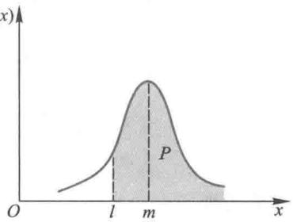  
图1钢材长度  $x$  的概率密度

然被切掉的部分减少了,但是整根报废的可能将增加.于是必然存在一个最佳的  $m$  ,使得两部分的浪费综合起来最小.

这是一个优化模型,建模的关键是选择合适的目标函数,并用已知的和待确定的量  $\iota ,\sigma ,m$  把目标函数表示出来.一种很自然的想法是直接写出上面分析的两部分浪费,以二者之和作为目标函数,于是容易得到总的浪费长度为②

$$
W = \int_{l}^{\infty}\left(x - l\right)p\left(x\right)\mathrm{d}x + \int_{-\infty}^{l}x p\left(x\right)\mathrm{d}x \tag{1}
$$

利用  $\int_{- \infty}^{\infty}p\left(x\right)\mathrm{d}x = 1,\int_{- \infty}^{\infty}x p\left(x\right)\mathrm{d}x = m$  和  $\int_{l}^{\infty}p\left(x\right)\mathrm{d}x = P,\left(1\right)$  式可化简为

$$
W = m - l P \tag{2}
$$

其实,(2)式可以用更直接的办法得到.设想共粗轧了  $N$  根钢材(  $N$  很大),所用钢材总长为  $m N,N$  根中可以轧出成品材的只有  $P N$  根,成品材总长为  $l P N$  ,于是浪费的总长度为  $m N - l P N$  ,平均每粗轧一根钢材浪费长度为

$$
W = \frac{m N - l P N}{N} = m - l P \tag{3}
$$

问题在于以  $W$  为目标函数是否合适呢?

轧钢的最终产品是成品材,如果粗轧车间追求的是效益而不是产量的话,那么浪费的多少不应以每粗轧一根钢材的平均浪费量为标准,而应该用每得到一根成品材浪费的平均长度来衡量.为了将目标函数从前者(即(3)式所表示的)改成后者,只需将(3)式中的分母  $N$  改为成品材总数  $P N$  即可.

建模与求解以每得到一根成品材所浪费钢材的平均长度为目标函数.因为当粗轧  $N$  根钢材时浪费的总长度是  $m N - l P N$  ,而只得到  $P N$  根成品材,所以目标函数为

$$
J_{1} = \frac{m N - l P N}{P N} = \frac{m}{P} -l \tag{4}
$$

因为  $l$  是已知常数,所以目标函数可等价地只取上式右端第一项,记作

$$
J(m) = \frac{m}{P(m)} \tag{5}
$$

式中  $P(m)$  表示概率  $P$  是  $m$  的函数。实际上, $J(m)$  恰是平均每得到一根成品材所需钢材的长度。

下面求  $m$  使  $J(m)$  达到最小。对于表达式

$$
P(m) = \int_{l}^{\infty} p(x) \mathrm{d}x, \quad p(x) = \frac{1}{\sqrt{2\pi\sigma}} \mathrm{e}^{-\frac{(x - m)^{2}}{2\sigma^{2}}} \tag{6}
$$

作变量代换

$$
y = \frac{x - m}{\sigma} \tag{7}
$$

并令

$$
\mu = \frac{m}{\sigma}, \quad \lambda = \frac{l}{\sigma}, \quad z = \lambda - \mu \tag{8}
$$

则(5)式可表为

$$
J(z) = \frac{\sigma(\lambda - z)}{1 - \Phi(z)} \tag{9}
$$

其中  $\Phi (z)$  是标准正态变量的分布函数,即

$$
\Phi (z) = \int_{-\infty}^{z} \phi (y) \mathrm{d}y, \quad \phi (y) = \frac{1}{\sqrt{2\pi}} \mathrm{e}^{-\frac{y^{2}}{2}} \tag{10}
$$

$\phi (y)$  是标准正态变量的密度函数。

用微分法求解函数  $J(z)$  的极值问题。注意到  $\Phi '(z) = \phi (z)$ ,并记

$$
F(z) = \frac{1 - \Phi(z)}{\phi(z)} \tag{11}
$$

可以得到  $J(z)$  的最优值  $z^{*}$  应满足方程

$$
F(z) = \lambda - z \tag{12}
$$

用MATLAB软件得到方程(12)的根  $z^{*}$ ,再代回(8)式即得到  $m$  的最优值  $m^{*}$ 。

值得指出的是,对于给定的  $\lambda > F(0) = 1.253①$ ,方程(12)不止一个根,但是可以证明,只有唯一负根  $z^{*}< 0$ ,才使  $J(z)$  取得极小值(复习题2)。

试看下面的例子,设要轧制长  $l = 2.0 \mathrm{~m}$  的成品钢材,由粗轧设备等因素决定的粗

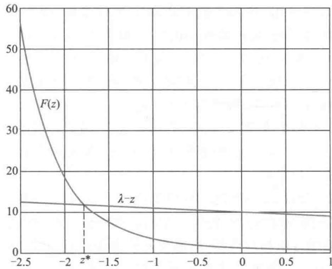  
图2  $F(z)$  的图形及（12）的图解法

轧冷却后钢材长度的均方差  $\sigma = 20 \mathrm{cm}$ , 问这时钢材长度的均值  $m$  应调整到多少才使浪费最少.

以(5)式给出的  $J(m)$  为目标函数,由(8)式算出  $\lambda = l / \sigma = 10$ , 解出方程(12)的负根为  $z^{*} = - 1.78$ , 如图2所示. 由(8)式算得  $\mu^{*} = 11.78, m^{*} = 2.36$ , 即最佳的均值应调整为  $2.36 \mathrm{m}$ . 还可以算出  $P(m^{*}) = 0.9625$ , 按照(4)式每得到一根成品材浪费钢材的平均长度为  $J_{1} = \frac{m^{*}}{P(m^{*})} - l = 0.45 \mathrm{m}$ . 为了减小这个相当可观的数字, 应该设法提高粗轧设备的精度, 即减小  $\sigma$ .

在日常生产活动中类似的问题很多, 如用包装机将某种物品包装成  $500 \mathrm{g}$  一袋出售, 在众多因素的影响下包装封口后一袋的重量是随机的, 不妨仍认为服从正态分布, 均方差已知, 而均值可以在包装时调整. 出厂检验时精确地称量每袋的重量, 多于  $500 \mathrm{g}$  的仍按  $500 \mathrm{g}$  一袋出售, 厂方吃亏; 不足  $500 \mathrm{g}$  的降价处理, 或打开封口返工, 或直接报废, 将给厂方造成更大的损失. 问如何调整包装时每袋重量的均值使厂方损失最小. 生活中类似的现象也很多, 常常难以完全用数量描述, 如你从家中出发去车站赶火车, 由于途中各种因素的干扰, 到达车站的时间是随机的. 到达太早白白浪费时间, 到达晚了则赶不上火车, 损失巨大. 你如何权衡两方面的影响来决定出发时间呢?

评注 模型中假定当粗轧后钢材长度  $x$  小于规定长度  $l$  时就整根报废, 实际上这种钢材还常常能轧成较小规格如长  $l_{1} (< l)$  的成品材. 只有当  $x < l_{1}$  时才报废. 或者当  $x < l$  时可以降级使用 (对浪费打一折扣). 这些情况下的模型及求解就比较复杂了.

复习题

1. 若  $l = 2.0 \mathrm{m}$  不变, 而均方差减为  $\sigma = 10 \mathrm{cm}$ , 问均值  $m$  应为多大, 每得到一根成品材的浪费量多大 (与原来的数值相比较).

2. 证明方程(12)仅有一个负根  $z^{*}$ , 并且在  $z^{*}$  取得(9)式  $J(z)$  的极小值.

# 8.6 博彩中的数学

每到福彩、体彩开奖的电视和网站直播时刻, 千万彩民手握彩票, 双眼紧盯摇奖机

里滚出的一个个小球的号码,迎来的既有幸运中奖的喜悦,也有擦肩而过的遗憾。据2006年的调查结果推算,全国的经常性彩民约7000万人。夜幕下的澳门是赌场的天下,轮盘、老虎机、扑克牌等赌台前挤满了赌客。与北美的拉斯维加斯、欧洲的蒙特卡罗齐名,亚洲的澳门是世界三大赌城之一,政府财政收入的  $30\%$  、税收的  $50\%$  都来自赌场。香港赛马场上人头攒动,骏马狂奔,据说600多万港人中有200多万马迷,"马照跑"作为香港回归后实行"一国两制"的重要特征而广为人知。一场精彩的足球赛开赛在即,两队的赔率已经开出,竞猜者犹豫再三、押下赌注,随着赛场形势的跌宕起伏,下注者的心情比一般的球迷更多了一份牵挂。

上面描述的彩票、赌台、动物赛跑和体育竞猜,是当前世界上博彩业的4种主要经营方式。博彩起源于赌博,可以追溯到两人面对某个悬而不决的问题而抓阄,以及市井中用扔铜币看正反面的办法相对而赌,后来有人从中看到了生财之道,为赌客提供物质条件并居中抽头,成为今天赌场的雏形。而随着赌博名声越来越坏,人们为它找到了一个好听的名字——博彩。词典上给博彩下的定义是,对一个不确定的结果做出预测判断,并以押上的钱来为自己的决策承担后果。这里的钱实际上指任何抵押物。可以说,有赌注、有对手、碰运气,是博彩的三大要素[78]。

在我国,目前只有一部分彩票发行和体育竞猜是合法的,在政府监督下由相关机构管理,其他如赌台、赛马等都被禁止。不过从数学的角度看,彩票与轮盘、掷骰子等赌台游戏的数学模型基本上是一样的。本节讨论两种博彩方式中的数学问题,首先以叙述简单、便于计算的轮盘为例,从玩家(赌客)和庄家(赌场)两方面,介绍赌台游戏中的建模,然后选择一种简单的球赛竞猜方式,研究开盘、下注以及收益中的模型[25]。

轮盘游戏中的数学

轮盘(roulette)是一种赌场中常见的非常刺激的游戏,由一个轮盘、一个白色小球和一张赌桌构成。(美式)轮盘分成38个沟槽,并以转轴为中心转动,沟槽编号1至36,一半红色、一半黑色,还有两个绿色沟槽编号0和  $00①$  。玩家可以对单独一个数字、几个数字组合、单双数字、红或黑一种颜色下注,然后庄家让转轮沿逆时针方向转动,并使放在微凸盘面上的小球以顺时针方向旋动,以小球最后停在某个沟槽的那个数字或颜色与下注的数字或颜色是否相同,决定玩家是赢还是输。

概率和赔率 讨论轮盘游戏中玩家的两种下注方式:对1至36其中一个数字下注;对红或黑一种颜色下注。转动后小球最后停在38个沟槽中的哪一个是随机的、等可能性的,于是对一个数字下注时玩家赢钱的概率为  $\frac{1}{38}$ ,对一种颜色下注时赢钱的概率为  $\frac{18}{38}$ ,输钱的概率自然分别为  $\frac{37}{38}$  和  $\frac{20}{38}$ 。

赌场里很多人玩同一种游戏,每个人还会玩很多次,按照概率论中的大数定律,玩家赢钱次数的频率将逐渐稳定于赢钱的概率,记作  $p$  。博彩中常用概率的另一种表示——赔率。理论上的赔率称为真实赔率(true odds),记作  $y$ ,其含义是,如果庄家按照赔率  $y$  赔给赢钱的玩家,那么很多次游戏后,庄家和玩家都不赔不赚。设玩家下注1元,

如果玩家赢(概率  $p$  ),则得到庄家赔付的  $y$  元;如果玩家输(概率  $1 - p$  ),则失去下注的1元,不赔不赚应表示为  $p \times y = (1 - p) \times 1$ ,由此得到赔率与概率的关系

$$
y = \frac{1 - p}{p}, \text{或} p = \frac{1}{y + 1} \tag{1}
$$

按照(1)式计算,对一个数字下注(赢钱概率  $p = \frac{1}{38}$ )的真实赔率  $y = 37$ ,即1赔37. 对一种颜色下注(赢钱概率  $p = \frac{18}{38}$ )的真实赔率  $y = 1.11$ ,即1赔1.11. 这样的赔率对双方是公平的,所以又称平率.

实际上,任何一个赌场老板都不会以真实赔率  $y$  赔付给赢钱的赌客,那样他就一分钱也赚不到还白搭上服务.通常赌场对一种游戏会选择一个比真实赔率  $y$  稍低一点的赔率赔付,称为支付赔率(payoffodds),记作  $x$  ,如对一个数字下注的支付赔率取  $x = 35$  即1赔35,对一种颜色下注的支付赔率取  $x = 1.$  以下如不特别说明,赔率均指支付赔率.

玩家劣势和庄家优势常识告诉人们,赌场上的赌客碰到好运气,可能赢上几把,但是一直赌下去,最终总是要输的.在轮盘游戏中,让我们算一下对一个数字下注并一直赌下去的玩家会输多少钱.仍设下注1元,如果玩家赢  $(p = \frac{1}{38})$  ,他得到庄家赔付的35元(赔率  $x = 35$  );如果玩家输,失去下注的1元.如此下注很多次玩家的平均收益(即期望收益)为  $35 \times \frac{1}{38} + (- 1) \times \frac{37}{38} = \frac{2}{38} = - 0.0526$  (元),即输掉下注金额的  $5.26\%$ .用式子表示这个计算,玩家的期望收益  $E V_{1}$  (expected value)为

$$
E V_{1} = x p + \left[-\left(1 - p\right)\right] = \left(x + 1\right) p - 1 \tag{2}
$$

$E V_{1}$  完全由概率  $p$  和赔率  $x$  决定,通常以百分比的形式表示.

换一种玩法,对一种颜色下注  $(p = \frac{18}{38}, x = 1)$ ,由(2)式得到,玩家的期望收益  $E V_{1}$  与上面算出的对一个数字下注时完全一样.实际上这是庄家早就安排好的.

赌场中各种游戏玩家的期望收益  $E V_{1}$  一般都是负值,取绝对值后的数值称为玩家劣势(赌客劣势).

更一般地,如果玩家在一种游戏中的下注金额为1个单位,游戏出现第  $i$  种结果的收益是  $a_{i} (i = 1,2, \dots , n)$ ,出现这种结果的概率是  $p_{i}$ ,则期望收益

$$
E V_{1} = \sum_{i = 1}^{n} a_{i} p_{i} \tag{3}
$$

买彩票的期望收益就可以用(3)式计算.

赌场上玩家输的正是庄家赢的,如果计算庄家的期望收益  $E V_{2}$ ,得到的结果与(2)式的  $E V_{1}$  相差一个负号,一般都是正值,称为庄家优势(赌场优势).显然,轮盘游戏中对一个数字下注与对一种颜色下注的庄家优势也都是  $5.26\%$ .

玩家的加倍下注策略赌场上对于赔率  $x = 1$  (如对轮盘一种颜色下注)的游戏,有些玩家会采用一种自以为能够稳赢不输的下注策略.办法是,从最低金额(假定是1元)开始下注,输了就加倍下注,再输再加倍,直到赢了为止.这样只要赢一次,就不仅能把

输的钱全部捞回来,而且净赚 1 元. 真的是这样吗?

玩家手中的钱当然是有限的,不妨假定他有 1 万元,首次下注 1 元,够他连输 13 次,因为  $1 + 2 + 2^{2} + \dots +2^{12} = 2^{13} - 1 = 8$  191(元).对一种颜色下注时赢的概率  $p = \frac{18}{38} = 0.4737$ ,将近  $\frac{1}{2}$ ,连输 13 次的概率极小,于是他想当然地认为最终会赢钱.让我们仔细算一下吧.

玩家输的概率  $q = 1 - p = 0.5263$ ,连输 13 次、输掉 8 191 元的概率是  $q^{13} = 0.0002378$ ,而赢其中一次、净赚 1 元的概率是  $1 - q^{13}$ ,于是期望收益为  $- 8191q^{13} + (1 - q^{13}) = - 0.9480$ ,所以理论上(长期按照这种策略下注)他还是会输的,虽然输得并不多.

这种策略下玩家的期望下注金额是  $1 + 2q + 2^{2}q^{2} + \dots +2^{12}q^{12} = \frac{(2q)^{13} - 1}{2q - 1} = 18.0087$ ,所以他每下注 1 元的期望收益为  $- \frac{0.9480}{18.0087} = - 0.0526$ ,与前面按照(2)式计算的一次下注的期望收益分毫不差.这说明与普通的下注方式相比,采用加倍下注策略(在理论上)没有得到任何便宜.请读者自行推导:不论概率  $p$  多大、玩家手中的钱有多少,加倍下注策略的期望收益与(2)式的  $EV_{1}$ (赔率  $x = 1$ )完全相同.

赌场游戏的设计方法和步骤 站在庄家的角度上,对于赌场中的每一种游戏,从制定玩法、确定赔率,到估计收益、规避风险,有一系列的设计方法和步骤.

1. 概率计算 赌场中各种游戏结果的不确定性正是吸引赌客的魅力所在,而隐藏在实际发生的不确定性背后的,是理论上的确定性——出现每种结果的精确概率.概率计算是整个游戏设计的基础,轮盘、掷骰子等游戏的概率计算比较简单,彩票各等级奖项的概率计算要复杂些,而像扑克牌 21 点游戏的概率通常需要作计算机模拟才能得到.

2. 赔率确定 理论上的真实赔率  $y$  直接由概率决定,如(1)式,赌场实际上采用的赔率  $x$ (支付赔率)需根据真实赔率向下调整到一个简单的(一般取整数)、合理的(见下面的讨论)数值.

3. 庄家优势的调整 如前所述,庄家优势(即期望收益  $EV_{2}$ )与玩家期望收益  $EV_{1}$  只差负号.对于简单的轮盘游戏(2)式,有  $EV_{2} = 1 - (x + 1)p$ .对一种游戏(玩家赢钱)的概率  $p$  是一定的,赌场可以采用降低或提高赔率  $x$  的方法调整庄家优势.

4. 最低和最高下注额的设定 对下注额的限制称为限红.赌场通常采用筹码(如 10 元兑换 1 个最小面额的筹码)的下注方式来设定最低限红,防止个别玩家零敲碎打地下注,以节约服务成本.设最高限红(如 10 万元的筹码)的目的是,防止个别财大气粗的玩家过分高额地下注,给赌场带来瞬间的威胁.比如一个赌客拿 1 亿元(对轮盘的一种颜色)下注,赌场和赌客双方输的概率都接近  $\frac{1}{2}$ ,赌场没有必要冒这样的风险,因为只需设一个最高限红,并鼓励这位亿万富翁长期地赌下去,那 1 亿元早晚会落入赌场老板的囊中.另外,最高、最低限红的区间也限制了玩家的加倍下注策略,赌场毕竟是不欢迎这种下注方式的.

赌场的收益及其波动 赌场对经营的所有游戏都会作一系列的设计或调整,使总的收益控制在一个适当的范围内。收益太高监管部门会干预,也不利于行业内部的竞争;收益太低会影响扣除税收、成本以及慈善捐赠等支出后的利润。

博彩业的收益是随机的,前面讨论的庄家优势  $E V_{2}$  是期望值,实际收益的波动范围可用收益的标准差描述。对于一次下注1元的轮盘游戏,赌场收益的标准差  $S D_{2}$  可以参照(2)式写出

$$
S D_{2} = \sqrt{x^{2}p + (1 - p) - E V_{2}^{2}} \tag{4}
$$

若对一种颜色下注  $(x = 1, p = \frac{18}{38}, E V_{2} = 0.0526)$ ,可算出  $S D_{2} = 0.9986$ ;若对一个数字下注  $(x = 35, p = \frac{1}{38}, E V_{2} = 0.0526)$ ,可算出  $S D_{2} = 5.7628$ 。一次下注时庄家收益(相对于期望值)的波动太大(当然玩家也一样)。可是赌场接待成千上万个赌客,每个赌客要玩好多次,当上述游戏下注  $n$  次时,收益的平均值仍是  $E V_{2}$ ,而收益的标准差却是

$$
S D_{2}(n) = \frac{S D_{2}}{\sqrt{n}} \tag{5}
$$

假设  $n = 10000$  (如1000个赌客,每人玩10次),则对一种颜色下注的  $S D_{2}(n) = 0.0100$ ,对一个数字下注的  $S D_{2}(n) = 0.0576$ 。虽然后者的标准差仍然不小,可是实际赌场上的  $n$  会更大。

进而,根据概率论的中心极限定理,当下注次数  $n$  很大时,其平均收益趋向正态分布。于是可以以  $95\%$  的把握预测,赌场的收益在  $E V_{2} \pm 2 S D_{2}(n)$  范围内。

玩家应该关注的赌场中的玩家看到的只是每种游戏的赔率,买彩票也只知道各等级奖项的中奖额。如果不同赌场同一种游戏的赔率不同,玩家自然会选赔率高的。在不同游戏或不同彩票中选择时,如果不管兴趣,只从赢钱的角度出发(应该说是少赔钱),应该估算游戏中各种结果或彩票各奖项出现的概率,然后根据赔率和概率计算玩家的期望收益  $E V_{1}$ ,进行比较。实际上,如果玩家只是偶尔赌上几次或买几张彩票,期望收益的大小就没有多大意义,更需要关注的是反映收益波动范围的标准差(与(4)、(5)式给出的赌场收益的标准差类似)。一般地说,保守型玩家宜选择标准差小的,如在轮盘游戏中对一种颜色下注,冒险型玩家可选择标准差大的,如在轮盘游戏中对一个数字下注。

体育竞猜中的数学

体育竞猜是近些年来迅速发展起来的一项博彩,庄家(博彩公司)在一场体育比赛(各种球赛、拳击等)开始前,组织玩家预测比赛结局并下注,比赛结束后根据实际结果决定玩家的输赢。与彩票、赌台游戏各种结果出现的概率可以精确计算不同的是,体育比赛双方胜负的概率,不论玩家或庄家都只能根据两队的实力、状态等因素做出大致的估计,所以竞猜既对庄家的技术水平、经营技巧和经验积累有很高的要求,是博彩业中风险最大的分支,也给一些比较内行的玩家提供了赢钱的机会,是博彩业中最容易产生职业赌客的地方。

体育竞猜中下注金额的制定称为开盘,国际上开盘的机制有所谓加(让)线盘、加(让)分盘、赔率盘等,下面只介绍在竞猜中计算较为简单、又颇吸引人的加线盘。

开盘、押注、玩家劣势和庄家优势 在A,B两支球队比赛前庄家为竞猜开盘,即给出两队胜负的赔率,让玩家押注.赔率用两个数字表示,如  $- 160 / + 140$  ,其含义是,当玩家押A队获胜时,赔率为1.6赔1,即一注押160元,结果若A队胜,玩家获赔100元(押金退还),若A队负,押金归庄家;当玩家押B队获胜时,赔率为1赔1.4,即一注押100元,结果若B队胜,玩家获赔140元(押金退还),若B队负,押金归庄家.这就是说, $- 160 / + 140$  中前面带- 号和后面带  $^+$  号的数字分别代表了A队和B队的赔率.很明显,这个开盘说明庄家认为A队是强队(押多赔少)、B是弱队(押少赔多).这种形式的开盘称加线盘(后面解释加线的含义),又称独赢盘,即不考虑平局,或者将平局归为弱队获胜.

两队强弱对比的定量关系用双方的获胜概率(以下简称胜率)表示,假定庄家已经估计出强队A的胜率为0.6,弱队B的胜率为0.4. 让我们先按这个概率算一下,竞猜中玩家和庄家的期望收益有多大.

押强队A胜的玩家的期望收益为  $100\times 0.6 - 160\times 0.4 = - 4$  ,押弱队B胜的玩家的期望收益为  $140\times 0.4 - 100\times 0.6 = - 4$  ,二者相等.对这两种下注方式,单位下注额的玩家劣势分别为  $\frac{4}{160} = 2.5\%$  和  $\frac{4}{100} = 4\%$  ,押强队A胜的玩家劣势较小.

两种下注方式的玩家劣势正是对这两种下注方式的庄家优势.在押强队A胜和押弱队B胜的玩家数量相等的情况下,单位下注额的整体庄家优势为  $\frac{4 + 4}{160 + 100} = 3.08\%$

应该注意到,与彩票、赌台在大量、重复的游戏中各种结果出现的频率逐渐稳定于概率不同,体育竞猜中两队在相同条件下的比赛很少重复,庄家估计的胜率实际上并不具有大数定律所赋予的性质,它只是在开盘和计算理论的期望收益中用到,同时,玩家也会估计两队的胜率,并结合庄家的开盘决定押注.

加线盘的设计方法和步骤在实际操作中,庄家开盘的设计方法和步骤如下:

1. 估计获胜概率、开出公平盘庄家首先组织专家(称开盘手)估计强队A的胜率,记作  $p.$  当两队胜率相等即  $p = 0.5$  时,竞猜没有任何意义,设定开盘为  $-100 / + 100.$  而当强队A胜率为  $p$  时,容易验证,当开盘为  $-\frac{100p}{1 - p} +\frac{100p}{1 + p}$  时,押强队A胜和押弱队B胜的玩家劣势均等于零.显然,强队A的胜率  $p$  越大,开盘中的数字就越大,如  $p = 0.6$  时开盘为  $-150 / + 150,p = 0.8$  时开盘为  $-400 / + 400.$  这种开盘的庄家优势也是零,称为公平盘.

2. 调整公平盘、开出加线盘庄家为了有利可图,需要在公平盘基础上加以调整,称为加线.如  $p = 0.6$  时在  $-150 / + 150$  上各加10(线),变成  $-160 / + 140$  ,即押强队A胜的下注额加10,押弱队B胜的获赔减10,这一加一减就制造出庄家优势.一般地,设在公平盘  $-\frac{100p}{1 - p} +\frac{100p}{1 - p}$  上强队A和弱队B的加线分别为  $a$  和  $b(a,b > 0)$  ,开出的加线盘为

可以算出押强队A胜和押弱队B胜的玩家的期望收益分别为  $- a\left(1 - p\right)$  和  $- b\left(1 - p\right)$  ,于

是庄家的期望收益分别为  $a(1 - p)$  和  $b(1 - p)$ . 当  $a = b$  时, 二者相等.

在押强队A胜和押弱队B胜的玩家数量相等的情况下, 单位下注额的整体庄家优势为

$$
\frac{\left(a + b\right)\left(1 - p\right)}{\frac{100p}{1 - p} + a + 100} = \frac{\left(a + b\right)\left(1 - p\right)^{2}}{100 + a\left(1 - p\right)} \tag{7}
$$

当  $a, b$  增加时, 整体庄家优势变大  $①$ .

3. 加线的调整 在一场竞猜中庄家的实际收益并不能按照期望值计算, 而是取决于多少玩家押强队A胜、多少玩家押弱队B胜, 以及结果是A还是B获胜. 设押强队A胜与押弱队B胜的玩家数量 (假定每人押一注) 分别为  $n_{\mathrm{A}}, n_{\mathrm{B}}$ , 对于开出的加线盘 (6), 计算庄家的实际收益如下:

若结果是强队A胜, 则庄家的实际收益为

$$
V_{\mathrm{A}} = -100n_{\mathrm{A}} + 100n_{\mathrm{B}} = 100\left(n_{\mathrm{B}} - n_{\mathrm{A}}\right) \tag{8}
$$

若结果是弱队B胜, 则庄家的实际收益为

$$
V_{\mathrm{B}} = \left(\frac{100p}{1 - p} +a\right)n_{\mathrm{A}} - \left(\frac{100p}{1 - p} -b\right)n_{\mathrm{B}} = \frac{100p}{1 - p}\left(n_{\mathrm{A}} - n_{\mathrm{B}}\right) + a n_{\mathrm{A}} + b n_{\mathrm{B}} \tag{9}
$$

仍设  $p = 0.6, a = b = 10$ , 即开盘为  $- 160 / + 140$ , 由 (9) 式得  $V_{\mathrm{B}} = 150\left(n_{\mathrm{A}} - n_{\mathrm{B}}\right) + 10\left(n_{\mathrm{A}} + n_{\mathrm{B}}\right)$ , 对于不同的  $n_{\mathrm{A}}, n_{\mathrm{B}}$  及胜负结果, 计算庄家的实际收益如表 1.

表1开盘  $-160 / + 140$  下的庄家实际收益  

<table><tr><td></td><td>nA</td><td>nB</td><td>获胜队</td><td>庄家实际收益</td></tr><tr><td>1</td><td>100</td><td>100</td><td>A</td><td>0</td></tr><tr><td>2</td><td>100</td><td>100</td><td>B</td><td>2 000</td></tr><tr><td>3</td><td>150</td><td>50</td><td>A</td><td>-10 000</td></tr><tr><td>4</td><td>50</td><td>150</td><td>A</td><td>10 000</td></tr><tr><td>5</td><td>150</td><td>50</td><td>B</td><td>17 000</td></tr><tr><td>6</td><td>50</td><td>150</td><td>B</td><td>-13 000</td></tr></table>

评注 无论是赌场里的各种游戏, 还是博彩公司开盘的体育竞猜, 从表面上看玩家都是在与庄家对赌, 玩家赢了向庄家讨取赔付, 输了下注额归庄家. 但是实质上, 现代的博彩无一不是玩家与玩家之间的博弈, 赌场里每天无数的筹码从大部分玩家的口袋, 经庄家之手转入少数赢钱赌客的囊中, 庄家只靠玩家对赌而从中抽头牟利, 自己绝不涉赌. 体育竞猜中博彩公司开盘后一再调整加线, 竭力均衡押注两队的玩家之间的角力, 也是为了促成玩家的对赌, 实现自己抽身而退.

由表1可以看出, 当  $n_{\mathrm{A}}, n_{\mathrm{B}}$  相差很大时, 庄家可能暴赢也可能暴输. 因为比赛结束前庄家并不知道最终哪一队获胜. 所以为了规避风险, 庄家必须密切关注玩家下注的走势. 一旦发现  $n_{\mathrm{A}}, n_{\mathrm{B}}$  相差变大, 就应适时地调整  $a, b$ , 尽量使  $n_{\mathrm{A}}, n_{\mathrm{B}}$  接近. 从 (8)、(9) 式看出, 只要  $n_{\mathrm{A}} = n_{\mathrm{B}}$ , 不论A胜还是B胜, 庄家都不会赔钱. 读者可以替庄家考虑一下, 如果发现  $n_{\mathrm{A}}$  比  $n_{\mathrm{B}}$  大了很多, 应该怎样调整、提高  $a$  和  $b$ .

# 复习题

证明加倍下注策略 (赔率为 1) 与普通下注方式玩家 (单位下注金额) 的期望收益相同.

# 8.7 钢琴销售的存贮策略

在考察有随机因素影响的动态系统时,常常碰到这样的情况:系统在每个时期所处的状态是随机的,从这个时期到下个时期的状态按照一定的概率进行转移,并且下个时期的状态只取决于这个时期的状态和转移概率,与以前各时期的状态无关.这种性质称为无后效性,或Markov性,通俗地说就是:已知现在,将来与历史无关.具有无后效性的,时间、状态均为离散的随机转移过程通常用Markov链模型描述.8.7和8.8节介绍2个Markov链模型.不熟悉Markov链的读者可参考基础知识8- 1.

像钢琴这样的奢侈品销售量很小,商店里一般不会有多大的库存量让它积压资金.这里通过一个简单的实例来分析、评价一种存贮策略的效果.

一家商店根据以往经验,平均每周只能售出1架钢琴.现在经理制订的存贮策略是,每周末检查库存量,仅当库存量为零时,才订购3架供下周销售;否则,不订购.试估计在这种策略下失去销售机会的可能性有多大,以及每周的平均销售量是多少[43]

问题分析对于钢琴这种商品的销售,顾客的到来是相互独立的,在服务系统中通常认为需求量近似服从泊松分布,其参数可由均值为每周销售1架得到,由此可以算出不同需求量的概率.周末的库存可能是0,1,2,3(架),而周初的库存量则只有1,2,3这3种状态,每周不同的需求将导致周初库存状态的变化,于是可用Markov链来描述这个过程.当需求超过库存时就会失去销售机会,可以计算这种情况发生的概率.在动态过程中这个概率每周是不同的,每周的销售量也不同,通常采用的办法是在时间充分长以后,按稳态情况进行分析和计算.

模型假设

1. 钢琴每周需求量服从泊松分布,均值为每周1架.

2. 存贮策略是:当周末库存量为零时,订购3架,周初到货;否则,不订购.

3. 以每周初的库存量作为状态变量,状态转移具有无后效性.

4. 在稳态情况下计算该存贮策略失去销售机会的概率和每周的平均销售量.

模型建立记第  $n$  周的需求量为  $D_{n}$  ,由假设  $1,D_{n}$  服从均值为1的泊松分布,即

$$
P(D_{n} = k) = \mathrm{e}^{-1} / k!\quad (k = 0,1,2,\dots) \tag{1}
$$

记第  $n$  周初的库存量为  $S_{n},S_{n}\in \{1,2,3\}$  是这个系统的状态变量,由假设2,状态转移规律为

$$
S_{n + 1} = \left\{ \begin{array}{l l}{S_{n} - D_{n},} & {D_{n}< S_{n}}\\ {3,} & {D_{n}\geqslant S_{n}} \end{array} \right. \tag{2}
$$

由(1)式不难算出  $P\left(D_{n} = 0\right) = 0.368,P\left(D_{n} = 1\right) = 0.368,P\left(D_{n} = 2\right) = 0.184,$ $P(D_{n} = 3) = 0.061,P(D_{n} > 3) = 0.019$  ,由此计算状态转移矩阵

$$
P = \left[ \begin{array}{lll}p_{11} & p_{12} & p_{13}\\ p_{21} & p_{22} & p_{23}\\ p_{31} & p_{32} & p_{33} \end{array} \right]
$$

其中

$$
p_{11} = P(S_{n + 1} = 1\mid S_{n} = 1) = P(D_{n} = 0) = 0.368
$$

$$
p_{12} = P(S_{n + 1} = 2\mid S_{n} = 1) = 0
$$

$$
p_{13} = P(S_{n + 1} = 3\mid S_{n} = 1) = P(D_{n}\geqslant 1) = 0.632
$$

$$
p_{21} = P(S_{n + 1} = 1\mid S_{n} = 2) = P(D_{n} = 1) = 0.368
$$

$$
p_{22} = P(S_{n + 1} = 2\mid S_{n} = 2) = P(D_{n} = 0) = 0.368
$$

$$
p_{23} = P(S_{n + 1} = 3\mid S_{n} = 2) = P(D_{n}\geqslant 2) = 0.264
$$

$$
p_{31} = P(S_{n + 1} = 1\mid S_{n} = 3) = P(D_{n} = 2) = 0.184
$$

$$
p_{32} = P(S_{n + 1} = 2\mid S_{n} = 3) = P(D_{n} = 1) = 0.368
$$

$$
p_{33} = P(S_{n + 1} = 3\mid S_{n} = 3) = P(D_{n} = 0) + P(D_{n}\geqslant 3) = 0.448
$$

得到

$$
P = \left[ \begin{array}{ccc}0.368 & 0 & 0.632 \\ 0.368 & 0.368 & 0.264 \\ 0.184 & 0.368 & 0.448 \end{array} \right] \tag{3}
$$

记状态概率  $a_{i}(n) = P(S_{n} = i), i = 1,2,3, a(n) = (a_{1}(n), a_{2}(n), a_{3}(n))$ , 根据状态转移具有无后效性的假设, 有

$$
\pmb {a}(n + 1) = \pmb {a}(n)\pmb{P}
$$

可以看出,转移矩阵  $P$  是一个正则链,具有稳态概率  $\boldsymbol{w}$ ,满足  $\boldsymbol {w}\boldsymbol {P} = \boldsymbol{w}$ ,可得

$$
\pmb {w} = (\pmb{w}_{1},\pmb{w}_{2},\pmb{w}_{3}) = (0.285,0.263,0.452) \tag{4}
$$

该有贮策略(第  $n$  周)失去销售机会的概率为  $P(D_{n} > S_{n})$ ,按照全概率公式有

$$
P(D_{n} > S_{n}) = \sum_{i = 1}^{3}P(D_{n} > i\mid S_{n} = i)P(S_{n} = i) \tag{5}
$$

其中的条件概率  $P(D_{n} > i\mid S_{n} = i)$  容易由(1)式计算.当  $n$  充分大时,可以认为

$$
P(S_{n} = i) = w_{i},\quad i = 1,2,3
$$

最终得到

$$
P(D_{n} > S_{n}) = 0.264\times 0.285 + 0.080\times 0.263 + 0.019\times 0.452 = 0.105
$$

即从长期看,失去销售机会的可能性大约  $10\%$ .

在计算该存贮策略(第  $n$  周)的平均销售量  $R_{n}$  时,应注意到,当需求超过存量时只能销售掉存量,于是

$$
R_{n} = \sum_{i = 1}^{3}\left[\sum_{i = 1}^{i - 1}jP(D_{n} = j\mid S_{n} = i) + iP(D_{n}\geqslant i\mid S_{n} = i)\right]P(S_{n} = i) \tag{6}
$$

同样地,当  $n$  充分大时用稳态概率  $\boldsymbol{w}_{i}$  代替  $P(S_{n} = i)$ ,得到

$$
R_{n} = 0.632\times 0.285 + 0.896\times 0.263 + 0.976\times 0.452 = 0.857
$$

即从长期看,每周的平均销售量为0.857架.你能解释为什么这个数值略小于模型假设中给出的每周平均需求量为1架吗?

敏感性分析这个模型用到的唯一一个原始数据是,平均每周售出1架钢琴,这个数值会有波动.为了计算当平均需求在1附近波动时,最终结果有多大变化,设  $D_{n}$  服从均值为  $\lambda$  的泊松分布,即有  $P(D_{n} = k) = \lambda^{k}\mathrm{e}^{- \lambda} / k!$ $(k = 0,1,2,\dots)$ ,由此得状态转移矩阵为

评注 动态随机存贮策略是Markov链的典型应用,关键之一是在无后效性的前提下恰当地定义系统的状态.本例可以每周初的库存量作为状态变量即可,但是如果制订的存贮策略不仅与本周的销售有关,还要考虑上周销售的情况,那么状态变量就要扩充,包含  $S_{n}$  和  $S_{n - 1}$ ,相应的状态转移概率也要改变.

$$
P = \left[ \begin{array}{ccc}\mathrm{e}^{-\lambda} & 0 & 1 - \mathrm{e}^{-\lambda} \\ \lambda \mathrm{e}^{-\lambda} & \mathrm{e}^{-\lambda} & 1 - (1 + \lambda) \mathrm{e}^{-\lambda} \\ \lambda^{2} \mathrm{e}^{-\lambda} / 2 & \lambda \mathrm{e}^{-\lambda} & 1 - (\lambda +\lambda) / 2 \mathrm{e}^{-\lambda} \end{array} \right] \tag{7}
$$

对于不同的平均需求  $\lambda$  (在1附近),类似于上面的计算过程,记  $P = P\left(D_{n} > S_{n}\right)$ ,可得到以下结果:

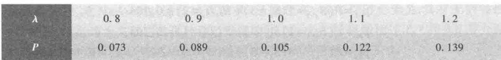

即当平均需求增长(或减少)  $10\%$  时,失去销售机会的概率将增长(或减少)约  $15\%$ ,这是可以接受的.

类似地可以作每周平均销售量的敏感性分析.

# 复习题

将钢琴销售的存贮策略修改为:当周末库存量为0或1时,订购,使下周初的库存达到3架;否则,不订购.建立Markov链模型,计算稳态下失去销售机会的概率和每周的平均销售量.

# 8.8 基因遗传

豆科植物茎的颜色有绿有黄,生猪的毛有黑有白、有粗有光,人类会出现先天性疾病如色盲等,这些都是基因遗传的结果.基因从一代到下一代的转移是随机的,并且具有无后效性,因此Markov链模型是研究遗传学的重要工具之一.本节给出的简单模型属于完全优势基因遗传理论的范畴.

生物的外部表征,如豆科植物茎的颜色、人的皮肤或头发的色素,由生物体内相应的基因决定.基因分优势基因和劣势基因两种,分别用  $d$  和  $r$  表示.每种外部表征由体内的两个基因决定,而每个基因都可以是  $d$  或  $r$  中的一个,于是有三种基因类型,即  $D(d d), H(d r)$  和  $R(r r)$ ,分别称为优种、混种和劣种.含优种  $D$  和混种  $H$  基因类型的个体,外部表征呈优势,如豆科植物的茎呈绿色、人的皮肤或头发有色素;含劣种  $R$  基因类型的个体,外部表征呈劣势,如豆科植物的茎呈黄色、人的皮肤或头发无色素.

生物繁殖时,一个后代随机地继承父亲两个基因中的一个和母亲两个基因中的一个①,形成它的两个基因.一般两个基因中哪一个遗传下去是等概率的,所以父母的基因类型就决定了每一后代基因类型的概率.父母基因类型有全是优种  $D D$ ,全是劣种  $R R$ ,一优种一混种  $D H$  (父为  $D$ ,母为  $H$  或父为  $H$ ,母为  $D$ ),及  $D R, H H, H R$  共6种组合,对每种组合简单的计算可以得到其后代各种基因类型的概率,如表1所示.

表1父母基因类型决定后代各种基因类型的概率  

<table><tr><td rowspan="2">后代基因类型</td><td colspan="6">父母基因类型</td></tr><tr><td>DD</td><td>RR</td><td>DH</td><td>DR</td><td>HH</td><td>HR</td></tr><tr><td>D</td><td>1</td><td>0</td><td>1/2</td><td>0</td><td>1/4</td><td>0</td></tr><tr><td>H</td><td>0</td><td>0</td><td>1/2</td><td>1</td><td>1/2</td><td>1/2</td></tr><tr><td>R</td><td>0</td><td>1</td><td>0</td><td>0</td><td>1/4</td><td>1/2</td></tr></table>

下面以Markov链为工具讨论混种繁殖、优种繁殖和近亲繁殖3个基因遗传模型。

混种繁殖假设在繁殖过程中用一混种与一个个体交配,所得后代仍用混种交配,如此继续下去,称为混种繁殖。建立Markov链模型描述在混种繁殖下各代具有3种基因类型的概率,并讨论稳态情况。

状态用基因类型定义,  $i = 1,2,3$  依次表示优种  $D$  、混种  $H$  和劣种  $R$  ,状态概率  $a_{i}(k)$  表示第  $k$  代个体具有第  $i$  种基因类型的概率,记  $\pmb {a}(k) = [a_{1}(k),a_{2}(k),a_{3}(k)]$  当用混种  $H$  与优种  $D$  交配时,其后代的基因类型是  $D,H$  和  $R$  的概率如表1第4列;类似地,当用混种  $H$  与混种  $H$  和劣种  $R$  交配时,后代的基因类型是  $D,H$  和  $R$  的概率如表1第6列和第7列。这样就可以写出转移概率矩阵为(表1的列转换为矩阵的行)

$$
P = \left[ \begin{array}{ccc}\frac{1}{2} & \frac{1}{2} & 0 \\ \frac{1}{4} & \frac{1}{2} & \frac{1}{4} \\ 0 & \frac{1}{2} & \frac{1}{2} \end{array} \right] \tag{1}
$$

若初始时混种与优种交配,即  $\pmb {a}(0) = [1,0,0]$  ,按照Markov链的基本方程

$$
\pmb {a}(k + 1) = \pmb {a}(k)P
$$

计算任意时段的状态概率  $\pmb {a}(k)$  ,结果如表2。当  $k\rightarrow \infty$  时  $\pmb {a}(k)\rightarrow \pmb {a} = [1 / 4,1 / 2,1 / 4]$  ,表示经过足够多代繁殖以后,优种、混种、劣种的比例接近于  $1:2:1$

表2混种繁殖下3种基因类型的状态概率(初始与优种交配)

<table><tr><td>k</td><td>0</td><td>1</td><td>2</td><td>3</td><td>4</td><td>5</td><td>...</td><td>∞</td></tr><tr><td>a1(k)</td><td>1</td><td>1/2</td><td>3/8</td><td>5/16</td><td>9/32</td><td>17/64</td><td>...</td><td>1/4</td></tr><tr><td>a2(k)</td><td>0</td><td>1/2</td><td>1/2</td><td>1/2</td><td>1/2</td><td>1/2</td><td>...</td><td>1/2</td></tr><tr><td>a3(k)</td><td>0</td><td>0</td><td>1/8</td><td>3/16</td><td>7/32</td><td>15/64</td><td>...</td><td>1/4</td></tr></table>

如果初始时混种与混种交配、混种与劣种交配,当  $k\rightarrow \infty$  时也会有同样的结果。实际上,由(1)式容易检验  $P^{2} > O$  ,这个Markov链是正则链,存在唯一的稳态概率  $\pmb {a} = [a_{1}$

$a_{2}, a_{3}$ ],而  $\mathbf{a}$  可由  $\mathbf{a} \mathbf{P} = \mathbf{a}$  解出,得  $\mathbf{a} = \left[1 / 4, 1 / 2, 1 / 4\right]$ ,与表2的结果一致。

优种繁殖 对状态和状态概率的定义同上,只是将混种交配改为每代都用优种交配,那么当用优种  $D$  与  $D, H, R$  交配时,其后代的基因类型是  $D, H$  和  $R$  的概率如表1第2列、第4列和第5列。于是优种繁殖的转移概率矩阵为

$$
P = \left[ \begin{array}{ccc}1 & 0 & 0 \\ \frac{1}{2} & \frac{1}{2} & 0 \\ 0 & 1 & 0 \end{array} \right] \tag{2}
$$

与吸收链转移矩阵的标准形式比较,可知这个Markov链是吸收链,优种  $D(i = 1)$  是吸收态。不论初始时用优种与优种、混种还是劣种交配,最终都将成为优种。

在农业、畜牧业生产中常常是纯种(优种或劣种)的抗病性等品质不如混种,仅从这个意义上说,根据上面的两个Markov链模型,用混种繁殖比用优种繁殖的效果要好。

近亲繁殖 是指这样一种繁殖方式,从同一对父母的大量后代中,随机地选取一雄一雌进行交配,产生后代,如此继续下去,考察一系列后代的基因类型的演变情况。

与前面的模型不同的是,那里讨论后代群体中基因类型的分布,只需设置  $D, H, R$  三个状态即可。这里则需按照随机选取的雄雌配对,分析后代配对中基因类型的变化。于是状态应取雄雌6种基因类型组合,设  $X_{n} = 1, 2, 3, 4, 5, 6$  依次定义为  $DD, RR, DH, DR, HH, HR$ 。

构造Markov链模型的关键是写出转移概率  $p_{ij}$ ,它可根据本节开始给出的表1算出。显然  $p_{11} = 1, p_{1j} = 0 (j \neq 1), p_{22} = 1, p_{2j} = 0 (j \neq 2)$ ,因为父母全为优种  $D$  (或劣种  $R$ )时,后代全是优种(或劣种),随机选取的雄雌配对当然也是。  $p_{31} = 1 / 4$ ,因为配对  $DH$  (状态3)的后代中  $D$  和  $H$  各占  $1 / 2$ ,所以随机选取的配对为  $DD$  (状态1)的概率是  $1 / 2 \cdot 1 / 2 = 1 / 4$ ,而  $p_{33} = P$  (后代配对为  $DH$  |父母配对为  $DH$ )  $= P$  (后代雄性为  $D$ ,雌性为  $H$  |父母配对为  $DH$ )  $+P$  (后代雄性为  $H$ ,雌性为  $D$  |父母配对为  $DH$ )  $= 1 / 2 \cdot 1 / 2 + 1 / 2 \cdot 1 / 2 = 1 / 2$ ,同理有  $p_{35} = 1 / 4$ 。又因配对  $DH$  的后代中没有  $R$ ,故对于含有  $R$  的状态2,4,6,有  $p_{32} = p_{34} = p_{36} = 0$ 。其他的  $p_{ij}$  可以类似地计算,最后得到转移矩阵为

$$
P=\left[\begin{array}{l l l l l l l}{1}&{0}&{0}&{0}&{0}&{0}\\ {0}&{1}&{0}&{0}&{0}&{0}\\ {\frac{1}{4}}&{0}&{\frac{1}{2}}&{0}&{\frac{1}{4}}&{0}\\ {0}&{0}&{0}&{0}&{1}&{0}\\ {\frac{1}{16}}&{\frac{1}{16}}&{\frac{1}{4}}&{\frac{1}{8}}&{\frac{1}{4}}&{\frac{1}{4}}\\ {0}&{\frac{1}{4}}&{0}&{0}&{\frac{1}{4}}&{\frac{1}{2}}\end{array}\right] \tag{3}
$$

容易看出,状态  $1(DD)$  和状态  $2(RR)$  是吸收状态,这是一个吸收链。它表明不论最初选取的配对是哪种基因类型组合,经过若干代近亲繁殖,终将变为  $DD$  或  $RR$ ,即变成全是优种或全是劣种,而且一旦如此,就永远保持下去。

为了计算从任一个非吸收状态3,4,5,6出发,平均经过多少代就会被吸收状态1,

2吸收,我们首先将(3)式表示的  $P$  化为转移矩阵的标准形式  $P = \left[ \begin{array}{ll}I & O \\ R & Q \end{array} \right]$ ,得到

$$
Q = \left[ \begin{array}{llll}\frac{1}{2} & 0 & \frac{1}{4} & 0 \\ 0 & 0 & 1 & 0 \\ \frac{1}{4} & \frac{1}{8} & \frac{1}{4} & \frac{1}{4} \\ 0 & 0 & \frac{1}{4} & \frac{1}{2} \end{array} \right],R = \left[ \begin{array}{ll}\frac{1}{4} & 0 \\ 0 & 0 \\ \frac{1}{16} & \frac{1}{16} \\ 0 & \frac{1}{4} \end{array} \right] \tag{4}
$$

然后计算

$$
M = (I - Q)^{-1} = \left[ \begin{array}{llll}\frac{8}{3} & \frac{1}{6} & \frac{4}{3} & \frac{2}{3} \\ \frac{4}{3} & \frac{4}{3} & \frac{8}{3} & \frac{4}{3} \\ \frac{4}{3} & \frac{1}{3} & \frac{8}{3} & \frac{4}{3} \\ \frac{2}{3} & \frac{1}{6} & \frac{4}{3} & \frac{8}{3} \end{array} \right] \tag{5}
$$

$$
y = M e = \left(4 \frac{5}{6}, 6 \frac{2}{3}, 5 \frac{2}{3}, 4 \frac{5}{6}\right)^{\mathrm{T}} \tag{6}
$$

$$
F = M R = \left[ \begin{array}{ll}\frac{3}{4} & \frac{1}{4} \\ \frac{1}{2} & \frac{1}{2} \\ \frac{1}{2} & \frac{1}{2} \\ \frac{1}{4} & \frac{3}{4} \end{array} \right] \tag{7}
$$

$M$  的第1行至第4行依次代表非吸收状态  $D H,D R,H H$  和  $H R$  ,根据对于向量  $y$  的各个分量的解释,从DH配对的状态出发,在近亲繁殖的情况下平均经过4  $\frac{5}{6}$  代就会被状态DD或RR吸收,即全变成优种或劣种.而根据基础知识8- 1的定理5,被吸收状态吸收的概率为矩阵  $F$  的第1行元素,即变成优种和劣种的概率分别为3/4和1/4. 从其他状态DR,HH和HR出发,可以得到相应的结论.

上述结果的实用价值在于,在农业和畜牧业中常常是纯种(优种或劣种)生物的某些品质(如抗病性)不如混种,所以在近亲繁殖情况下大约经过5~6代就应该重新选种,以防止品质的下降.

评注 Markov 链模型是研究离散时间、离散状态随机转移过程的有力工具,在经济、社会、生态、遗传等许多领域有着广泛的应用.状态转移的无后效性是应用Markov链模型的先决条件,定义状态和状态概率,并构造转移概率矩阵是建立Markov链模型的关键.一些实际问题需要恰当地选择状态,精心计算转移概率,甚至有的随机转移过程粗看起来并不具有无后效性,但通过适当扩充状态可以改变其性质,仍然可以构建Markov链模型.

1. 在基因遗传中, 若初始时取一劣种, 通过计算三种基因类型状态概率, 比较混种繁殖和优种繁殖两种形式, 经过足够多代繁殖以后的演变.

2. 推导近亲繁殖的概率转移矩阵  $P((3)$  式)的第5行

# 8.9 自动化车床管理

自动化车床管理是全国大学生数学建模竞赛1999年A题, 原文如下:

一道工序用自动化车床连续加工某种零件, 由于刀具损坏等原因该工序会出现故障, 其中刀具损坏故障占  $95\%$ , 其他故障仅占  $5\%$ . 工序出现故障是完全随机的, 假定在生产任一零件时出现故障的机会均相同. 工作人员通过检查零件来确定工序是否出现故障.

现积累有100次刀具故障记录, 故障出现时该刀具完成的零件数见数据文件8- 1. 现计划在刀具加工一定件数后定期更换新刀具.

已知生产工序的费用参数如下:

故障时产出的零件损失费用  $f = 200$  元/件;

进行检查的费用  $t = 10$  元/次;

发现故障进行调节使恢复正常 的平均费用  $d = 3000$  元/次(包括刀具费);

未发现故障时更换一把新刀具的费用  $k = 1000$  元/次.

1) 假定工序故障时产出的零件均为不合格品, 正常时产出的零件均为合格品, 试对该工序设计效益最好的检查间隔(生产多少零件检查一次)和刀具更换策略.

2) 如果该工序正常时产出的零件不全是合格品, 有  $2\%$  为不合格品; 而工序故障时产出的零件有  $40\%$  为合格品,  $60\%$  为不合格品. 工序正常而误认有故障停机产生的损失费用为1500元/次. 对该工序设计效益最好的检查间隔和刀具更换策略.

3) 在2)的情况, 可否改进检查方式获得更高的效益?

本节以发表在《数学的实践与认识》2000年第1期上参赛学生的优秀论文和评述文章为基本材料, 加以整理和归纳, 介绍建模的全过程.

问题分析 在生产设备运行过程中, 工具、部件如本题自动化车床的刀具, 一般都会随机地发生故障, 需要通过对生产的零件及时检查发现故障, 加以维修或更换. 同时, 由于刀具的寿命有限, 运行到一定时期后, 即使尚未出现故障, 也进行所谓预防性更换, 以减少刀具带故障运行造成的损失, 经济上可能更为合算. 所以对刀具的检查和更换策略应该包含两个方面, 一是确定一个检查间隔(以生产的零件数计量), 每次检查时若发现故障立即更换刀具. 二是确定一个更换周期(也以生产的零件数计量), 到期即便刀具运行正常也需更换. 显然, 为了方便起见, 应使更换周期是检查间隔的整数倍.

本题要求确定能使效益达到最佳的检查间隔和更换周期. 由于题目给出的是检查、更换、零件损失等费用, 所以可以用每生产一个零件付出的总费用最小为目标. 而因为刀具发生故障是随机的, 于是应该用总费用的期望值即平均费用来计算. 由此, 首先需

要根据题目给出的刀具故障记录,找出刀具无故障时间(以故障出现时完成的零件数计量)的概率分布.

以上叙述的是生产过程中的一种基本的、简单的情况:通过零件检查发现故障,即认定是刀具故障并进行更换,而且零件检查不存在错误判断.这道题目还需考虑两个附加内容:一是其他故障的影响,即通过检查零件发现的除刀具故障外,还有其他故障,二者合称工序故障.二是零件检查存在误判的影响,即工序正常时生产的零件有不合格品,若检查出不合格品会误判为工序故障;工序故障时生产的零件有合格品,若检查出合格品又会误判为工序正常.这两种情况增加了建模的复杂性.下面先建立基本问题的模型,再讨论这两个附加内容.

建模准备作100次刀具故障记录的直方图,近似于正态分布.计算出均值  $\mu =$  600,均方差  $\sigma = 196$  ,经统计检验,可认为刀具的无故障时间或称刀具寿命(以故障出现时完成的零件数计量)服从正态分布  $N(\mu ,\sigma^{2})$

模型假设与符号对刀具检查和更换的基本问题作如下假设:

1. 检查间隔为常数  $n$  件,预防性更换周期为常数  $m$  件,且  $m = sn$  ,其中  $s$  为整数.

2. 检查时若发现零件为不合格品,则认为是刀具故障,需立即更换

3. 相对于刀具寿命而言,检查间隔很短,可认为在相邻两次检查之间每个零件出现故障是等可能的.

4. 刀具寿命  $X\sim N(600,196^{2})$  ,其分布函数和密度函数分别记作  $F(x)$  和  $f(x)$ $F(x)$  是刀具寿命不超过  $x$  的概率.

5. 检查费  $t = 10$  元/次,预防性更换刀具费  $k = 1000$  元/次,零件为不合格品的损失费  $f = 200$  元/件,发现故障更换刀具并恢复正常生产的费用  $d = 3000$  元/次.

基本模型先计算一个更换周期  $m$  的平均费用,包括预防更换费用和故障更换费用两部分.

由假设1,在刀具预防性更换前共检查  $s - 1$  次,由假设5得预防更换费用为  $(s - 1)t$ $+k.$  由假设4,预防更换的刀具寿命应超过  $m$  ,其概率为  $1 - F(m)$

若在第  $i$  次检查中发现故障  $(i = 1,2,\dots ,s - 1)$  ,由假设3,在第  $i - 1$  次到第  $i$  次检查中生产出1个、2个、…、个不合格零件的概率相等,平均为  $\frac{n + 1}{2}$  件,由假设5,零件损失费为  $\frac{f(n + 1)}{2}$  ,检查、更换及恢复生产费用共  $i t + d$  ,故障更换总费用为  $i t + d + \frac{f(n + 1)}{2}.$  由假设4,第  $i$  次检查发现(第  $i - 1$  次检查未发现)故障的概率为  $F(i n) - F((i - 1)n)$

记一个更换周期的平均费用为  $E C$  ,则

$$
\begin{array}{c}{{E C=c_{1}\big[1-F(m)\big]+\sum_{i=1}^{s-1}c_{2i}\big[F(i n)-F\big((i-1)n\big)\big]}}\\ {{c_{1}=(s-1)t+k,~c_{2i}=i t+d+\frac{f(n+1)}{2}}}\end{array} \tag{1}
$$

为了表达和计算的方便,利用密度函数  $f(x)$  将和式化为积分(其中  $x = i n$  ),进行整理并取近似可得

$$
E C = k\big[1 - F(m)\big] + \left[d + \frac{f(n + 1)}{2}\right]F(m) + \left[\int_{0}^{m}x f(x)\mathrm{d}x + m\big(1 - F(m)\big)\right]\frac{t}{n} \tag{2}
$$

利用分部积分可将(2)式的一部分简化为

$$
\int_{0}^{m}x f(x)\mathrm{d}x + m\left(1 - F(m)\right) = m - \int_{0}^{m}F(x)\mathrm{d}x \tag{3}
$$

然后计算一个更换周期生产零件的平均数量,记作  $E R$  只需在(1)式中令  $c_{1} = m, c_{2i} = i n$  与(1)~(3)式类似推导可得

$$
E R = m - \int_{0}^{m}F(x)\mathrm{d}x \tag{4}
$$

记  $E L$  为一个更换周期中生产一个零件的平均费用,定义为  $①$

$$
E L = \frac{E C}{E R} \tag{5}
$$

检查和更换问题的基本模型为,确定检查间隔  $n$  和更换周期  $m$  ,使(1)~(5)式表示的一个零件的平均费用  $E L$  达到最小.

模型用搜索法求解,即设定一系列的  $n$  和  $m(m$  为  $n$  的整数倍),计算  $E L$  ,选出使  $E L$  最小的那一组解为  $n = 18, m = 360②$

其他故障的影响工序故障包括刀具故障和其他故障两类,检查只能发现工序故障,在基本模型中认为工序故障就是刀具故障.

为了考虑其他故障的影响,先计算其他故障出现的概率,即故障率.记  $p, q$  分别是刀具故障率和其他故障率,根据两类故障分别占  $95\%$  和  $9\%$  ,我们有  $p:q = 95:5$  因为刀具故障的均值为  $\mu = 600$  ,所以刀具故障率是  $p = \frac{1}{\mu} = \frac{1}{600}$  于是  $q = \frac{5}{95} \times p = \frac{1}{11400}$

假定生产任一零件时其他故障出现的概率均为  $q$  ,并且相互独立,则生产第  $j$  个零件才出现其他故障的概率  $P_{j}$  服从几何分布,即  $P_{j} = (1 - q)^{j - 1}q(j = 1,2,\dots ,m - 1)$  ,而  $P_{m} = (1 - q)^{m - 1}$  (第  $m$  个零件后不再生产).与刀具故障下平均费用  $E C$  的公式(1)类似,若记其他故障下平均费用为  $E C_{1}$  ,则

$$
E C_{1} = c_{1}(1 - q)^{m - 1} + \sum_{j = 1}^{m - 1}c_{2j}(1 - q)^{j - 1}q, \quad c_{2j} = \left[\frac{j}{n}\right]t + d + \frac{f(n + 1)}{2} \tag{6}
$$

其中  $c_{1}$  同前.再记其他故障下生产零件的平均数量为  $E R_{1}$  ,则有

$$
E R_{1} = m(1 - q)^{m - 1} + \sum_{j = 1}^{m - 1}j(1 - q)^{j - 1}q = \frac{1 - (1 - q)^{m}}{q} \tag{7}
$$

将工序故障下的平均费用记作  $C_{2}$  ,生产零件的平均数量记作  $R_{2}, C_{2}$  和  $R_{2}$  可分别由刀具故障和其他故障的平均费用  $E C, E C_{1}$  和  $E R, E R_{1}$  加权得到,即

$$
C_{2} = \lambda E C + (1 - \lambda)E C_{1}, \quad R_{2} = \lambda E R + (1 - \lambda)E R_{1} \tag{8}
$$

将生产一个零件的平均费用记作  $L_{2}$  ,与(5)式类似有

$$
L_{2} = C_{2} / R_{2} \tag{9}
$$

如果将刀具故障和其他故障出现的比例  $95\%$  和  $5\%$  作为权重,那么由(6)~(9)式表示的其他故障的影响不会太大.

零件检查存在误判的影响当零件检查存在两种误判时,讨论基本模型(工序故障中只考虑刀具故障)应做哪些修改.

第一种误判是由于刀具正常时生产的零件有  $2\%$  的不合格品,若检查时正好查到不合格品,则会判断刀具故障导致停机,由此产生的损失费用为1500元/次.

在每个检查间隔内生产每个零件时的刀具故障率是  $p = \frac{1}{\mu} = \frac{1}{600}$ ,所以每次检查时刀具正常的概率为  $(1 - p)^{n}$ ,因查到不合格品误判停机产生的损失费为  $0.02 \times 1500 \times (1 - p)^{n} = 30(1 - p)^{n}$ ,于是基本模型(1)式  $c_{1}, c_{2i}$  中的检查费  $t$  应增加为  $t \times 30(1 - p)^{n}$ .

第二种误判是由于刀具故障时生产的零件有  $40\%$  合格品,若检查时查到的是合格品,则会判断刀具正常,将继续生产直到下一次检查,导致不合格品数量的增加.经过仔细推导得增加量可近似为  $n \times \frac{0.4}{1 - 0.4} = \frac{2n}{3}$ ,于是基本模型(1)式  $c_{2i}$  中的零件损失费  $\frac{f(n + 1)}{2}$  应增加为  $f\left[\frac{(n + 1)}{2} + \frac{2n}{3}\right]$ .

模型改进在上面的模型中检查间隔  $n$  是常数,但是由于刀具寿命服从正态分布,新刀具发生故障的概率很小,随着生产零件数的增加,发生故障概率逐渐变大,所以直观地看,为了降低检查费用,应该让刀具开始使用阶段的检查间隔大一些,然后逐渐缩小.一种具体做法是根据"每个检查间隔内刀具发生故障的概率相等"的原则,确定一系列的检查点(进行检查的零件顺序号)①,还可以参考本书第三版13.5节,将检查间隔视为生产零件数的函数  $n(x)$ ,以某种定义下的费用函数最小为目标,建立泛函极值问题的优化模型.当然,不等间隔的检查会带来实际操作上的麻烦.

如果零件检查误判造成的损失远大于检查费(本题给出的费用数据就是如此),那么增加检查零件的数量应会减小误判的影响.当然,检查几个零件(不宜过多)、怎样根据零件的合格与否判断刀具故障等,都需要经过仔细演算.

由日本田口玄一博士创立的所谓田口方法,也可以确定生产过程中零部件的检查间隔和更换周期,用于求解本题.②

# 第8章训练题

1. 出版社每年都要重印某种教科书,按照过去的销售记录知道今年需求量大致为均值8000本、均方差1000本的正态分布.已知每本书的成本15元,售价50元,如果供过于求则以售价的2折处理,问年初应重印多少本使出版社平均收入最大?这个收入是多少?如果供不应求,为保证学生用书必须临时加印以满足需求,每本书成本加倍,售价不变,再问年初应重印多少本使出版社平均收入最大?这个收入是多少?

2. 某单位每年一届会议的组织者要为各地客户在一家有合同约定的宾馆预订住房,每个房间需交100元的预订金,若预订房间过多,即使无人入住预订金也不退回.而若预订房间不足,则需为参会

评注自动化生产过程中零部件的检查和更换是保证产品质量、降低运行成本的重要手段,而最优的检查间隔和更换周期是由各种费用的构成比例以及零部件的寿命分布决定的.根据基本模型的求解,检查间隔  $n = 18$  更换周期  $m = 360$  注意到由100次刀具故障记录计算出的刀具寿命均值  $\mu = 600$  可知在预防性更换时刀具大都未出现故障,这是由于刀具故障后生产的每件不合格零件的损失费  $f(= 200)$ ,相对于更换刀具费  $k(= 1000)$  及发现故障更换刀具并恢复正常生产的费用  $d(= 3000)$  较大的缘故.

客户在另外的宾馆临时订房,每个房间租金250元.按照往年会议的规模估计今年参会人数在250人至350人之间(  $95\%$  的把握).请为组织者确定预订房间的数量(按每人一间),使预期的总费用最低.

3. 在8.4节Simmons模型中假设问题  $B$  为"你喜欢红色吗?",而且调查者不知道喜欢红色的学生的比例,调查方法是将被调查者分成两批,做两次独立调查,且选答问题  $A$  的概率不同.试设计具体的调查方案并建立模型,估计有过作弊行为学生的比例.

4. 作弊与赌博是两个不相关的敏感问题,调查者的目的是估计学生中曾有作弊和赌博行为的比例,为此设计了如下的问题:

问题  $A$  :你在考试中作过牌吗?

问题  $B$  :你从未参加过赌博吗?

这样设计提问也能为被调查者提供足够的保护.为实现此调查方案,选取两组学生独立进行调查,并设计两套外形相同的卡片,其中第  $i$  套卡片中写有问题  $A$  的比例为  $p_{i}(i = 1,2)$  ,写有问题  $B$  的比例为 $1 - p_{i}$  ,且  $p_{1}\neq p_{2}$  ,第  $i$  组被调查学生的人数为  $m_{i}$  ,他们从第  $i$  套卡片中随机选择一张,真实作答后放回,其中回答"是"的人数为  $m_{i}^{(Y)}$

(1)分别估计学生中曾有作弊和赌博行为的比例

(2)假定曾作过弊学生真实回答问题  $A$  的概率为  $T_{A}$  ,参加过赌博的学生真实回答问题  $B$  的概率为  $T_{B}$  ,且  $T_{A},T_{B}$  均已知,而其他情形均真实作答.试分别重新估计学生中曾有作弊和赌博行为的比例

5. 若钢材粗轧后,长度在  $l_{1}$  与  $l$  之间的可降级使用,长度小于  $l_{1}$  的才整根报废.试选用合适的目标函数建立优化模型,使某种意义下的浪费量最小.

6. 双骰是根据掷出的两颗骰子点数之和判断输赢的一种游戏.玩家下注后掷出两颗骰子,称出场掷.输赢规则如下:

出场掷两颗骰子点数之和是7、11,玩家赢,此轮结束

出场掷两颗骰子点数之和是2、3、12,玩家输,此轮结束

出场掷两颗骰子点数之和是4、5、6、8、9、10,该数字成为牌点,玩家继续掷骰子,直到牌点或点数之和7出现.如果牌点先出现,玩家赢,此轮结束;如果7先出现,玩家输,此轮结束.

(1)计算各种结果出现的概率,并由此计算玩家劣势

(2)双骰游戏有不同的下注机制,前面给出的是"过线"(passline)方式,另一种是"不过线"(don'tpass)方式,其输赢规则与"过线"方式正好相反,只是出场掷两颗骰子点数之和是12时,仍为玩家输.计算"不过线"方式各种结果出现的概率,并由此计算玩家劣势.

7. 将钢琴销售的存贮策略修改为:当周末库存量为0时,订购量为本周销售量加2架;否则,不订购.建立Markov链模型,计算稳态下失去销售机会的概率和每周的平均销售量.

8. 色盲具有遗传性,由两种基因  $c$  和  $s$  的遗传规律决定.男性只有一个基因  $c$  或  $s$  ;女性有两个基因  $c c, c s$  或  $s s$  ,当某人具有基因  $c$  或  $c c$  时则呈色盲表征.基因遗传关系是:男孩等概率地继承母亲两个基因中的一个;女孩继承父亲的那个基因,并等概率地继承母亲的一个基因.由此可以看出,当母亲是色盲时男孩一定色盲,女孩却不一定.用Markov链模型研究非常极端的近亲结婚情况下的色盲遗传.即同一对父母的后代婚配.父母的基因组合共有6种类型,形成Markov链模型的6种状态,问哪些是吸收状态.若父亲非色盲而母亲为色盲,问平均经过多少代其后代就会变成全为色盲或全不为色盲的状态,变成这两种状态的概率各为多大?(参考基础知识8-1. Markov链的基本概念)

9. 两种不同的外部表征是由两种不同基因决定的,这两种基因的遗传关系是相互独立的.例如猪的毛有颜色表征(黑和白)与质地表征(粗和光).对于每一种表征仍分为优种  $D(d d)$  ,混种  $H(d r)$  和劣种  $R(r r)3$  种基因类型,两种表征的组合则有9种基因类型.在完全优势遗传中,优种和混种的猪毛颜色黑、质地粗,劣种则颜色白、质地光,这样共有4种外部表征组合,即黑粗、黑光、白粗、白光.假设群体的两种外部表征对应的基因中  $d$  和  $r$  的比例相同(即均为1/2),在随机交配情况下构造Markov链模型.证明在稳定情况下上述4种外部表征组合的比例为  $9:3:3:1$

10. 一个服务网络由  $k$  个工作站  $v_{1},v_{2},\dots ,v_{k}$  依次串接而成,当某种服务请求到达工作站  $v_{i}$  时,  $v_{i}$  能够处理的概率为  $p_{i}$ ,转往下一站  $v_{i + 1}$  处理的概率为  $q_{i}(i = 1,2,\dots ,k - 1$ ,设  $q_{k} = 0$ ),拒绝处理的概率为  $r_{i}$ ,满足  $p_{i} + q_{i} + r_{i} = 1$ .试构造Markov链模型,确定到达  $v_{i}$  的请求平均经过多少工作站才能获得接受处理或拒绝处理的结果,被接受和拒绝的概率各多大?(参考基础知识8-1 Markov链的基本概念)

11. 血样的分组检验[17].在一个很大的人群中通过血样检验普查某种疾病,假定血样为阳性的先天概率为  $p$  (通常  $p$  很小).为减少检验次数,将人群分组,一组人的血样混合在一起化验.当某组的混合血样呈阴性时,即可不经检验就判定该组每个人的血样都为阴性;而当某组的混合血样呈阳性时,则可判定该组至少有一人血样为阳性,于是需要对这组的每个人再作检验.

(1)当  $p$  固定时(如  $0.01\% ,\dots ,0.1\% ,\dots ,1\% ,\dots$ )如何分组,即多少人一组,可使平均总检验次数最少?与不分组的情况比较.

(2)当  $p$  多大时不应分组检验?

(3)当  $p$  固定时如何进行二次分组(即把混合血样呈阳性的组再分成小组检验,重复一次分组时的程序)?

(4)讨论其他分组方式,如二分法(人群一分为二,阳性组再一分为二,继续下去)、三分法等.

12. 一类答卷评阅结果的处理.在数学建模竞赛、语文作文考试等一类没有标准答案的答卷评阅中,不同评阅人对同一份答卷给出的分数,出现一定范围内的差别是正常的.但是,由于众多客观、主观因素的影响,某些评阅人的打分会存在以下异常现象:

- 打分普遍偏高或偏低,导致他评阅的所有答卷的平均分明显高于或低于总体的平均分(总体指全体评阅人对所有答卷的打分);

- 打分范围过窄,区分度太小,导致他评阅的所有答卷的分数范围明显小于总体的分数范围.

在评阅过程中组织者可以通过一定的程序,让每位评阅人随机地评阅若干份答卷,并且同一份答卷也随机地由若干位评阅人评阅.而在评阅结束后,组织者要根据所有评阅结果筛选出打分存在上述异常现象的评阅人,并且确定每一份答卷的最终分数.需要

(1)给出筛选打分存在上述异常现象的评阅人的数学模型和求解方法.

(2)给出确定每份答卷最终分数的数学模型和求解方法.

模拟产生数据进行计算并检验模型:将150份答卷随机分配给9位评阅人,每份答卷由3人评阅(每位评阅人评阅50份),评阅人中一人打分偏高,一人打分偏低,一人打分范围过窄.首先模拟产生一组数据作为答卷的真实分数,再在真实分数上增加扰动,作为评阅人的打分.然后将模型用于这组数据,应能把三位出现异常的评阅人筛选出来,并且使确定的每份答卷最终分数与其真实分数相近.

更多案例···

8- 1 随机存贮策略

8- 2 随机入口模型

8- 3 健康与疾病

8- 4 资金流通

# 第9章 统计模型

当人们对研究对象的内在特性和各因素间的关系有比较充分的认识时,一般用机理分析方法建立数学模型,本书前面讨论的绝大多数模型都是如此。如果由于客观事物内部规律的复杂性及人们认识程度的限制,无法分析实际对象内在的因果关系,建立合乎机理规律的数学模型,那么通常的办法是搜集大量的数据,基于对数据的统计分析去建立模型,本章主要介绍用途非常广泛的一类统计模型——各种类型的回归模型,包括线性回归(9.1节、9.2节)、非线性回归(9.3节)、自回归(9.4节)、logit回归(9.5节),以及判别分析模型(9.6节)和主成分分析模型(9.7节)。

# 9.1 孕妇吸烟与胎儿健康

"吸烟有害健康"是人们的共识,那么孕妇吸烟是否还会伤害到腹中的胎儿呢?美国公共卫生总署在香烟盒上设置的一条健康警告是:"孕妇吸烟可能导致胎儿受损、早产及新生儿低体重"。他们在一份报告中更详细的叙述是:"对于新生儿体重来说,看来吸烟比妇女怀孕前身高、体重、受孕历史等因素的影响更为显著。孕妇吸烟也会增加早产率,对每个受孕年龄段妇女来说新生儿都更小"[48]

让我们利用美国儿童保健和发展项目(简记CHDS)提供的一份数据来研究上述说法。这份数据包括1236个出生后至少存活28天的男性单胞胎新生儿的体重及其母亲的相关资料,见表1,全部数据见数据文件9- 1。

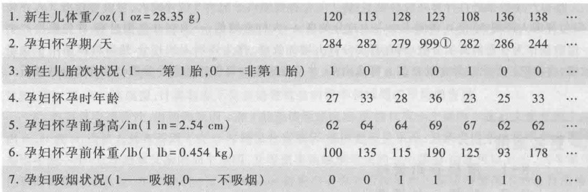  
表1 CHDS的部分原始数据（数据量  $n = 1236$

CHDS的数据来自美国奥克兰市参加支付医疗保险项目的家庭,在就业人群中具有广泛的代表性。参加这个项目的妇女在怀孕初期就接受了全面、详细的调查,得到了新生儿父母双方诸多方面的信息,这里给出的数据只是调查记录的一部分。因为关于孕妇的那些数据是怀孕初期得到的,所以不会受到所关心的结果——新生儿体重的影响。

我们的任务是利用这份数据来建立新生儿体重与孕妇怀孕期、吸烟状况等诸因素

之间的数学模型,定量地讨论以下问题:

- 对于新生儿体重来说,孕妇吸烟是否是比孕妇年龄、身高、体重等更为显著的决定因素;

- 孕妇吸烟是否会使早产率增加,怀孕期长短是否对新生儿体重有影响;

- 对每个年龄段来说,孕妇吸烟对新生儿体重和早产率的影响是怎样的.

问题背景及分析 美国公共卫生总署的警告容易受到人们的质疑,因为按照是否吸烟划分人群所做的任何研究,都只能依赖于观测数据,而不可能受研究者的控制,即无法作人为的实验,于是很难确定新生儿体重的差别是由于吸烟的缘故,还是与吸烟相关联的其他因素(如怀孕期长短)有关,又如吸烟孕妇往往年轻,自身体重较轻,会不会由此造成新生儿体重低呢?

显然,"孕妇吸烟可能导致胎儿受损、早产及新生儿低体重"的警告从语气上就不如"吸烟导致肺癌"来得强,这是由于对孕妇吸烟与胎儿健康之间生理学上的关系研究得不够.现在能够解释的理由是:吸烟产生一氧化碳,由于血液中血色素与一氧化碳的亲和力远大于与氧的亲和力,血色素与一氧化碳结合形成的血红蛋白限制了血液携带的氧的流量,于是孕妇吸烟会造成氧对胎儿的供应量减少.虽然这对胎儿生理上的影响目前尚不完全清楚,但已有的研究表明,为了补偿氧供应的减少,孕妇胎盘的表面积和血管数量以及胎儿的血色素水平都要增加,血流会重新分布以供养胎儿的各个组织,导致胎盘直径变大和变细,其后果可能是使胎盘过早地从子宫壁上剥离,从而导致早产甚至胎儿死亡.

关于新生儿体重及孕妇早产的标准,一般认为,新生儿的正常体重为  $2500 \sim 4000 \mathrm{~g}(88.2 \sim 141.1 \mathrm{oz})$ ,小于  $2500 \mathrm{~g}$  视为体重低;正常怀孕期为 40 周左右,小于 37 周视为早产. 下面采用这个标准来讨论.

参数估计与假设检验 首先根据 CHDS 的数据对不吸烟与吸烟孕妇的各项指标作参数估计,包括新生儿体重均值的点估计(记作  $\mu_{y0}$  和  $\mu_{y1}$ )和区间估计、新生儿体重低的比例(指体重小于  $2500 \mathrm{~g}$  的比例)的点估计(记作  $r_{0}$  和  $r_{1}$ )、怀孕期均值的点估计(记作  $\mu_{x0}$  和  $\mu_{x1}$ )和区间估计、早产率(指孕期小于 37 周的比例)的点估计(记作  $q_{0}$  和  $q_{1}$ ),结果如表 2.

表 2 不吸烟与吸烟孕妇的新生儿体重和怀孕期的参数估计(  $n$  是样本数,下同)

基础知识 9- 1

参数估计与假设检验的基本内容

程序文件 9- 1 胎儿健康的参数估计与假设检验 prog(901a.m

<table><tr><td>参数估计</td><td>不吸烟孕妇(n=742)</td><td>吸烟孕妇(n=484)①</td></tr><tr><td>新生儿体重(oz)均值的点估计</td><td>μx0=123.047 2</td><td>μy1=114.109 5</td></tr><tr><td>新生儿体重均值的区间估计</td><td>[121.793 2,124.301 1]</td><td>[112.493 0,115.726 0]</td></tr><tr><td>新生儿体重低的比例的点估计</td><td>r0=0.031 0</td><td>r1=0.082 6</td></tr><tr><td>怀孕期(天)均值的点估计</td><td>μx0=280.186 9(n=733)</td><td>μx1=277.979 2(n=480)②</td></tr><tr><td>怀孕期均值的区间估计</td><td>[278.981 2,281.392 6]</td><td>[276.627 3,279.331 1]</td></tr><tr><td>早产率的点估计</td><td>q0=0.076 4</td><td>q1=0.085 4</td></tr></table>

从表2可以看出,吸烟孕妇比不吸烟孕妇的新生儿体重平均约低  $9\mathrm{~oz}$  (约  $250\mathrm{~g}$  ),新生儿体重低的比例则明显地高;吸烟孕妇的怀孕期比不吸烟孕妇平均只约短2天,早产率相差不多。对于不吸烟与吸烟孕妇来说,新生儿体重和怀孕期的这些差别在统计学意义上是不是显著的,需要进行两总体的假设检验,结果如表3。

表3不吸烟与吸烟孕妇的新生儿体重和怀孕期的假设检验（显著性水平  $\alpha = 0.05$  

<table><tr><td>假设检验</td><td>假设</td><td>检验结果</td></tr><tr><td>新生儿体重均值的假设检验</td><td>H0:μx0≤μx1;H1:μx0&amp;gt;μx1</td><td>拒绝H0,接受H1</td></tr><tr><td>新生儿体重低的比例的假设检验</td><td>H0:r0≥r1;H1:r0&lt;r1&gt;拒绝H0,接受H1(t=4.0304)</td><td></td></tr><tr><td>怀孕期均值的假设检验</td><td>H0:μx0≤μx1;H1:μx0&amp;gt;μx1</td><td>拒绝H0,接受H1①</td></tr><tr><td>早产率的假设检验</td><td>H0:q0=q1;H1:q0≠q1</td><td>接受H0,拒绝H1(t=0.5663)</td></tr></table>

</r1>

基础知识9- 2线性回归分析的基本内容

评注"吸烟孕妇比不吸烟孕妇的新生儿体重平均约低  $9\mathrm{~oz}$  "的结论虽然有显著意义,但是这里面混杂着孕妇的怀孕期、体重等诸多可能影响新生儿体重的因素,利用回归分析能够将这些因素分开。

从表3可以看出,吸烟孕妇的新生儿体重比不吸烟孕妇的低,且新生儿体重低的比例高,这个结论在统计学上是有显著意义的;而吸烟与不吸烟孕妇的怀孕期和早产率的差别则难以肯定是显著的。

为了充分利用所给的数据进行全面的研究,需要借助回归分析方法,建立新生儿体重与孕妇吸烟状况、怀孕期等诸因素的回归模型,分析模型得到的结果,回答提出的问题。

一元线性回归分析从参数估计和假设检验的结果可以知道,孕妇的吸烟状况对新生儿体重大小有显著影响,但是对怀孕期长短的影响难以确定。那么,新生儿体重与怀孕期之间有怎样的关系呢?显然需要对吸烟孕妇和不吸烟孕妇分别讨论。

对于CHDS数据中的480位吸烟孕妇,将新生儿体重和怀孕期分别记作  $y_{i}$  和  $x_{i}(i = 1,2,\dots ,480)$ ,其散点图如图1。用  $y$  和  $x$  分别表示新生儿体重和怀孕期这两个变量,由图1假定二者的关系可以用一次函数模型  $y = b_{0} + b_{1}x$  来描述,按照最小二乘准则,用数据拟合的办法很容易得到模型系数  $b_{0},b_{1}$ ,这个一次函数就是图1中的那条直线。

从图1看出,虽然直线大致描述了数据点的变化趋势,但是拟合得并不好。怎样衡量由拟合得到的模型的有效性?模型系数的精确度和模型预测的数值范围有多大?实际应用中的这些重要问题需要用回归分析的方法来回答。

将新生儿体重(因变量  $y$  )与孕妇怀孕期(自变量  $x$  )的一元线性回归模型表为

$$
y = b_{0} + b_{1}x + \epsilon \tag{1}
$$

程序文件9- 2胎儿健康(吸烟孕妇)的一元回归prog0901b.m

其中随机误差  $\epsilon$  是  $x$  以外影响  $y$  的随机因素的总和。假定对于不同的  $x,\epsilon$  是相互独立的随机变量,服从  $N(0,\sigma^{2})$  分布。

根据480位吸烟孕妇的新生儿体重和怀孕期数据,对回归模型(1)编程计算,结果如表4.

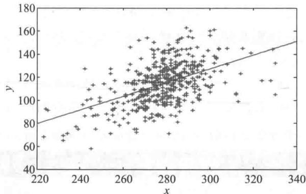  
图1 480位吸烟孕妇的新生儿体重和怀孕期散点图及拟合的直线

表4模型（1）的计算结果（吸烟孕妇  $n = 480$  

<table><tr><td>回归系数</td><td>系数估计值</td><td>系数置信区间</td></tr><tr><td>b0</td><td>-51.298 3</td><td>[-77.511 0,-25.085 6]</td></tr><tr><td>b1</td><td>0.594 9</td><td>[0.500 8,0.689 1]</td></tr><tr><td></td><td>R²=0.243 8 F=154.146 3 p&amp;lt;0.000 1 s²=249.919 2</td><td></td></tr></table>

由表4可对模型做检验:  $b_{1}$  的置信区间不含零点,  $F = 154.1463$  远大于  $F_{(1,n - 2),1 - \alpha} = 3.8610(\alpha = 0.05)$ , 表示应拒绝  $H_{0}:b_{1} = 0$  的假设, 模型有效. 但是  $b_{1}$  的置信区间较长, 决定系数  $R^{2}$  较小(  $y$  的  $24.38\%$  由  $x$  决定), 剩余方差  $s^{2}$  较大, 说明模型的精度不高.

模型(1)中  $y, b_{0}, b_{1}$  的估计值分别记作  $\hat{y}, \hat{b}_{0}, \hat{b}_{1}$ , 于是新生儿体重  $y$  的估计为

$$
\hat{y} = \hat{b}_{0} + \hat{b}_{1} x = -51.298 3 + 0.594 9 x \tag{2}
$$

$\hat{b}_{1} = 0.5949$  是这个模型最重要的数值, 它表示吸烟孕妇的怀孕期  $x$  增加一天, 新生儿体重平均增加约  $0.6(\mathrm{oz})$ . 当然, 这里没有考虑除怀孕期外的其他因素对新生儿体重的影响. 至于  $\hat{b}_{0}$ , 决不能理解为  $x = 0$  时  $y$  的估计值, 由于模型依据的数据中吸烟孕妇怀孕期大约在220至340天(见图1), 因此  $x$  只能在这个范围之内对  $y$  作估计. 比如, 若怀孕期  $x = 280$  天, 按(2)式计算, 新生儿体重的预测值为  $114.5937(\mathrm{oz})$ , 还可以得到预测区间是  $[88.0949,141.0925]$  (  $\alpha = 0.05$  ), 这个区间如此之大也是由于模型精度不高的缘故.

$y$  的实际值和预测值的差  $y - \hat{y}$  是模型的残差, 视为随机误差  $\epsilon$  的估计值, 应服从均值为0的正态分布. 由程序可以得到残差的图形, 如果发现有一些数据的残差的置信区间不含零点, 可以认为这些数据偏离整体数据的变化趋势, 称为异常点, 应予以剔除.

在480位吸烟孕妇新生儿体重的模型中, 剔除异常点后重新计算得到的结果如表5.

表5剔除异常点后模型（1）的计算结果（吸烟孕妇  $n = 451$  

<table><tr><td>回归系数</td><td>系数估计值</td><td>系数置信区间</td></tr><tr><td>b0</td><td>-53.612 6</td><td>[-77.060 6,-30.164 5]</td></tr><tr><td>b1</td><td>0.600 7</td><td>[0.516 4,0.685 0]</td></tr><tr><td></td><td>R²= 0.304 0 F= 196.159 9 p&amp;lt;0.000 1 s²= 182.785 2</td><td></td></tr></table>

评注 与数据拟合只计算出模型系数的估计值不同,回归分析可以得到系数的估计值(在最小二乘准则下与数据拟合达到的数值相同)和置信区间,以及 $R^{2}, s^{2}, F$  等。从而对模型的有效性和精度作出判断。由于采用最小二乘准则,异常点对残差平方和的"贡献"很大,给模型的有效性和精度带来不利影响,应注意剔除。

比较表5和表4可以看出,虽然  $b_{0}$  和  $b_{1}$  的估计值变化不大,但置信区间变短,且 $R^{2}$  和  $F$  变大,  $s^{2}$  减小,说明模型精度得到提高。在残差及其置信区间图上又会发现新的异常点,剔除它们后模型又会有所改进。

对于不吸烟孕妇可以建立与(1)式形式相同的另一个一元线性回归模型,用她们的新生儿体重与怀孕期的数据编程计算并剔除异常点后得到的结果表6。

表6剔除异常点后模型（1）的计算结果（不吸烟孕妇  $n = 690$  

<table><tr><td>回归系数</td><td>系数估计值</td><td>系数置信区间</td></tr><tr><td>b0</td><td>33.5330</td><td>[14.9989,52.0671]</td></tr><tr><td>b1</td><td>0.3201</td><td>[0.2541,0.3860]</td></tr><tr><td colspan="3">R²= 0.1165 F=90.7415 p&amp;lt;0.0001 s²= 180.856 7</td></tr></table>

对表6可作与上类似的分析,值得注意的是,  $\hat{b}_{1} = 0.3201$  表示不吸烟孕妇的怀孕期 $x$  增加一天,新生儿体重平均只增加约  $0.32(\mathrm{oz})$  ,与吸烟孕妇差别很大。

能不能将吸烟状况也作为一个自变量,建立新生儿体重与孕妇怀孕期和吸烟状况2个自变量的回归模型,从而利用全体孕妇的相关数据进行计算呢?

多元线性回归分析新生儿体重仍记作  $y$  ,孕妇怀孕期记作  $x_{1}$  吸烟状况记作  $x_{2}$  只取2个数值:  $x_{2} = 0$  表示不吸烟,  $x_{2} = 1$  表示吸烟。如果假定  $y$  与  $x_{1}$  ,  $x_{2}$  之间的关系都是线性的,则可建立如下的多元线性回归模型:

$$
y = b_{0} + b_{1}x_{1} + b_{2}x_{2} + \epsilon \tag{3}
$$

其中  $\epsilon$  仍是服从  $N(0,\sigma^{2})$  分布、相互独立的随机变量。

根据新生儿体重和孕妇怀孕期、吸烟状况的全部数据,按照(3)式编程计算并剔除异常点,得到  $b_{0}, b_{1}, b_{2}$  的估计值(置信区间等其他结构从略),对  $y$  的估计为

$$
\hat{y} = \hat{b}_{0} + \hat{b}_{1}x_{1} + \hat{b}_{2}x_{2} = 0.7698 + 0.4365x_{1} - 8.7610x_{2} \tag{4}
$$

程序文件9- 4

胎儿健康的多元

回归

prog0901d.m

这里的  $\hat{b}_{2} = - 8.7610$  表示,对于怀孕期  $x_{1}$  相同的孕妇,吸烟比不吸烟的新生儿体重平均约低  $8.8(\mathrm{oz})$  ,虽然与前面参数估计的数值基本一样,但增加了怀孕期相同的条件;这个数值还补充了2个一元回归模型无法得到的、吸烟与不吸烟孕妇相互比较的结果。而  $\hat{b}_{1} = 0.4365$  表示的是,对于吸烟状况  $x_{2}$  相同的孕妇,怀孕期  $x_{1}$  增加一天新生儿体重平均增加约  $0.44(\mathrm{oz})$  ,介于一元回归模型得到的、吸烟孕妇的0.6与不吸烟孕妇的0.32之间,但是这个数值却无法区分吸烟状况对怀孕期增加引起的新生儿体重的变化。

为了反映怀孕期  $x_{1}$  和吸烟状况  $x_{2}$  对新生儿体重的综合影响,需要改进模型(3),增加二者的乘积项  $x_{1}x_{2}$  ,有

$$
y = b_{0} + b_{1}x_{1} + b_{2}x_{2} + b_{3}x_{1}x_{2} + \epsilon \tag{5}
$$

这仍是多元线性回归模型,因为它对于待定系数而言是线性的。按照(5)式编程计算并剔除异常点后得到的结果如表7。

表7模型（5）的计算结果（  $n = 1143$  

<table><tr><td>回归系数</td><td>系数估计值</td><td>系数置信区间</td><td></td></tr><tr><td>b0</td><td>34.0925</td><td>[15.4605,52.7244]</td><td></td></tr><tr><td>b1</td><td>0.3181</td><td>[0.2517,0.3844]</td><td></td></tr><tr><td>b2</td><td>-87.0738</td><td>[-116.9656,-57.1820]</td><td></td></tr><tr><td>b3</td><td>0.2804</td><td>[0.1734,0.3875]</td><td></td></tr><tr><td>R²=0.2766</td><td>F=145.1357</td><td>p&amp;lt;0.0001</td><td>s²=182.9536</td></tr></table>

由表7,对  $y$  的估计可表示为

$$
\hat{y} = 34.0925 + 0.3181x_{1} - 87.0738x_{2} + 0.2804x_{1}x_{2} \tag{6}
$$

对不吸烟孕妇和吸烟孕妇,分别以  $x_{2} = 0$  和  $x_{2} = 1$  代入(6)式,得

$$
\hat{y} = 34.0925 + 0.3181x_{1}, \quad \hat{y} = -52.9813 + 0.5985x_{1} \tag{7}
$$

(7)式中的系数与只含  $x_{1}$  的一元模型得到的表6和表5的数值非常接近,(6)式所表示的多元线性回归模型综合描述了  $x_{1},x_{2}$  两个自变量与  $y$  的关系.

表7的结果虽然可以验证模型的有效性,但是  $R^{2}$  较小,  $s^{2}$  较大,仍有改进余地.

变量选择与逐步回归在CHDS提供的数据中,除了新生儿体重以及孕妇怀孕期和吸烟状况外,还有孕妇怀孕时的年龄、体重、身高和胎次状况,在以新生儿体重为因变量的模型中,这些因素中是否有几个也应该作为自变量加入呢?这是建立多元线性回归模型时经常遇到的问题.

一般地说,实际问题中影响因变量的因素可能很多,从应用的角度既希望将所有对因变量影响显著的自变量都纳入回归模型,又希望最终的模型尽量简单,即不包含那些对因变量影响不显著的自变量,这就是所谓"变量选择".逐步回归是一种迭代式的变量选择方法,下面利用CHDS数据提供的全部信息,通过逐步回归来选择变量,建立新生儿体重的多元线性回归模型.

用  $y$  表示新生儿体重,  $x_{1}, x_{2}, x_{3}, x_{4}, x_{5}, x_{6}$  依次表示孕妇怀孕期、胎次状况、年龄、身高、体重、吸烟状况(与表1的顺序相同),组成候选变量集合.根据前面的结果认为孕妇的怀孕期和吸烟状况是最重要的变量,故选取  $x_{1}, x_{6}$  为初始子集.用MATLAB的逐步回归程序计算,显著性水平取缺省值(引入变量  $\alpha = 0.05$ ,移出变量  $\alpha = 0.10$ ).

程序运行的第1个输出图形如图2.

图左上部的窗口用圆点和线段显示各个候选变量的回归系数估计值及其置信区间,屏幕上蓝色表示在模型中的变量(图2中也是蓝色),红色表示不在模型中的变量(图2中是黑色),粗线段和细线段分别表示  $90\%$  和  $95\%$  的置信区间.图右上部的窗口中列出一个统计表,包括各个候选变量的回归系数估计值、  $t$  统计量和  $p$  概率值(图2中蓝字、黑字的含义同上).图的中部是当前模型的输出:常数项  $b_{0}$  的估计值(intercept),决定系数  $R^{2}, F$  值,剩余标准差  $s$  (RMSE),  $p$  值等.图下部的窗口用圆点记录每次选取模型的剩余标准差  $s$ ,供比较用,当鼠标指向某个圆点时,就显示那个模型包含的变量,若点击圆点,则重现那个模型的结果.

评注 多元回归模型中某一个自变量系数估计值的含义,是在其余自变量固定的条件下,所引起的因变量的变化率.因此,对于自变量集合不同的模型,同一个自变量系数估计值的含义并不相同.如模型(1)和(2)中的  $b_{1}$

程序文件9- 5胎儿健康的逐步回归prog0901e.m

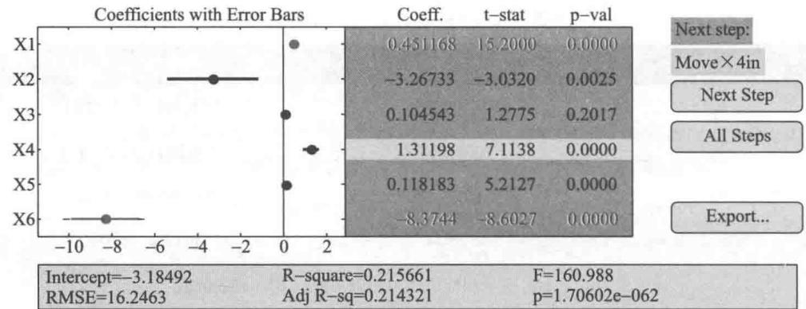

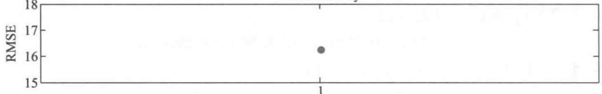  
图2 MATLAB逐步回归程序运行的第1个输出图形  
Model Histroy

当用鼠标点击左上部的圆点或右上部的字段时,可使之由红变蓝,该变量被引入;或者由蓝变红,该变量被移出。通常用剩余标准差s达到最小作为确定最终模型的标准,点击图右侧的按钮Next Step,可以按照s减少的大小自动地引入或移出变量,直至出现Move no terms的提示,结束运行。如果点击按钮All Steps,则立即得到最终结果。

新生儿体重逐步回归程序的最终输出图形如图3(蓝色、黑色的含义同图2),包含  $x_{3}$  以外的其余5个自变量。

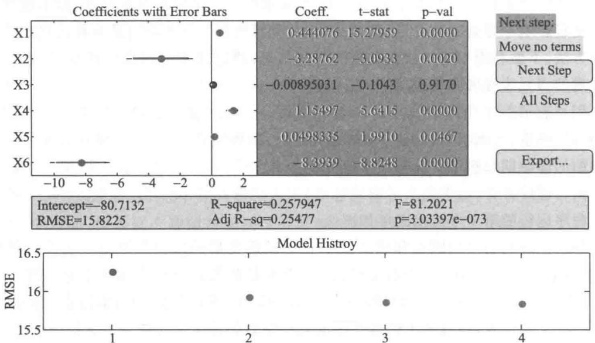  
图3逐步回归程序运行的最终输出图形

通过图3右侧的Export菜单可以传送输出数据,得到的结果如表8。

表8逐步回归的最终结果  $\left(n = 1174\right)$  

<table><tr><td>回归系数</td><td>系数估计值</td><td>系数置信区间</td></tr><tr><td>b0</td><td>-80.713 2</td><td></td></tr><tr><td>b1</td><td>0.444 1</td><td>[0.387 0,0.501 1]</td></tr><tr><td>b2</td><td>-3.287 6</td><td>[-5.372 9,-1.202 4]</td></tr><tr><td>b4</td><td>1.155 0</td><td>[0.753 3,1.556 6]</td></tr><tr><td>b5</td><td>0.049 8</td><td>[0.000 7,0.098 9]</td></tr><tr><td>b6</td><td>-8.393 9</td><td>[-10.260 1,-6.527 7]</td></tr><tr><td></td><td>R²=0.257 9 F=81.202 1 p&amp;lt;0.000 1 s=15.822 5</td><td></td></tr></table>

最终模型为

$$
\hat{y} = -80.713 2 + 0.444 1x_{1} - 3.287 6x_{2} + 1.155 0x_{4} + 0.049 8x_{5} - 8.393 9x_{6} \tag{8}
$$

需要指出,由于残差的置信区间无法通过MATLAB的逐步回归程序输出,所以未剔除异常点,致使表8中的  $R^{2}$ ,  $s$  等与表7相比没有什么改进。读者可以对这里选出的变量建立多元线性回归模型,并剔除异常点,看看结果如何。

评注当遇到影响因变量的因素众多、又难以辨识哪些因素最为重要的实际问题时,采用逐步回归来选择自变量不失为一种有效的建立多元线性回归模型的方法。除了原始的自变量,变量的平方、两个变量的乘积等(如本节中孕妇怀孕期  $x_{1}$  和吸烟状况  $x_{6}$  的乘积项  $x_{1}x_{6}$ ) 也可以作为新的变量供模型选择。同时,人机交互式的逐步回归程序更大大提高了建模的"效率"。

结果分析用逐步回归方法得到的新生儿体重模型(表8和(8)式)包含孕妇的怀孕期、胎次状况、体重和吸烟状况等自变量,它们的回归系数置信区间不含零点,可以认为对新生儿体重的影响都是显著的,回归系数的数值给出了定量关系。如  $b_{6} = - 8.393 9$  说明当孕妇的怀孕期、胎次状况、身高、体重相同时,吸烟孕妇比不吸烟孕妇的新生儿体重约低  $8.4 \mathrm{oz}$ ,可与前面的结果(表2和(4)式)相比。 $b_{1}, b_{4}, b_{5}$  均为正值表明孕妇的怀孕期、身高、体重对新生儿体重的影响都是正面的, $b_{2} = - 3.287 6$  则表示第1胎新生儿体重比非第1胎约低  $3.3 \mathrm{oz}$ 。

在这个问题中,不仅因变量与每个自变量有一定的相关关系,而且许多自变量两两之间也可能存在相关关系。多元随机变量的相关系数矩阵用于描述相关性的正反和强弱,即相关系数的正或负表示正相关或负相关,相关系数绝对值越大相关性越强。 $y, x_{1}, x_{2}, x_{3}, x_{4}, x_{5}, x_{6}$  的相关系数矩阵如表9。

表9  $y,x_{1},x_{2},x_{3},x_{4},x_{5},x_{6}$  的相关系数矩阵（对称矩阵只给出上三角元素）  

<table><tr><td></td><td>y</td><td>x1</td><td>x2</td><td>x3</td><td>x4</td><td>x5</td><td>x6</td></tr><tr><td>y</td><td>1.000 0</td><td>0.407 5</td><td>-0.043 9</td><td>0.027 0</td><td>0.203 7</td><td>0.155 9</td><td>-0.246 8</td></tr><tr><td>x1</td><td></td><td>1.000 0</td><td>0.080 9</td><td>-0.053 4</td><td>0.070 5</td><td>0.023 7</td><td>-0.060 3</td></tr><tr><td>x2</td><td></td><td></td><td>1.000 0</td><td>-0.351 0</td><td>0.043 5</td><td>-0.096 4</td><td>-0.009 6</td></tr><tr><td>x3</td><td></td><td></td><td></td><td>1.000 0</td><td>-0.006 5</td><td>0.147 3</td><td>-0.067 8</td></tr><tr><td>x4</td><td></td><td></td><td></td><td></td><td>1.000 0</td><td>0.435 3</td><td>0.017 5</td></tr><tr><td>x5</td><td></td><td></td><td></td><td></td><td></td><td>1.000 0</td><td>-0.060 3</td></tr><tr><td>x6</td><td></td><td></td><td></td><td></td><td></td><td></td><td>1.000 0</td></tr></table>

从表9相关系数的数值可以看出,与新生儿体重  $y$  相关性较强(相关系数大于0.2)的依次是孕妇的怀孕期  $x_{1}$  、吸烟状况  $x_{6}$  、身高  $x_{4}$  各自变量之间相关性较强的有:孕妇体重  $x_{5}$  与身高  $x_{4}$  的正相关,这是自然的;孕妇年龄  $x_{3}$  与胎次状况  $x_{2}$  的负相关,大概因为年龄越大第1胎越少.

评注 当回归模型的自变量之间存在较强的(线性)相关时,求解将出现病态,称为多重共线性,是应该避免的现象,可以通过相关系数矩阵进行筛查。

如果几个自变量之间存在较强的相关性,那么删除多余的只保留一个变量不会对模型的有效性和精确度有多大影响,比如可以去掉孕妇体重  $x_{5}$  与身高  $x_{4}$  两个变量中任何一个。

表9中孕妇怀孕期  $x_{1}$  与吸烟状况  $x_{6}$  的相关系数很小,表明二者几乎无关,这与假设检验的结果(表2)一致。

不同年龄段孕妇吸烟对新生儿体重的影响按照孕妇的年龄将数据分为4组:小于25岁,25~30岁,30~35岁,大于35岁。对每组建立  $y$  与  $x_{1}, x_{2}, x_{4}, x_{5}, x_{6}$  的回归模型,得到的结果如表10。

评注 本节通过孕妇吸烟与胎儿健康案例的讨论,介绍了利用一元线性回归、多元线性回归和逐步回归方法建立模型、分析结果的全过程。线性回归是回归分析方法的基础,应用也最广泛,希望读者不仅会用软件求解,而且能从应用的角度对它的基本原理和方法有一定的了解。可参考基础知识9- 2。

<table><tr><td></td><td>小于25岁</td><td>25~30岁</td><td>30~35岁</td><td>大于35岁</td></tr><tr><td>b0</td><td>-66.389 3</td><td>-39.129 6</td><td>-157.130 7</td><td>-130.174 0</td></tr><tr><td>b1</td><td>0.397 2</td><td>0.352 1</td><td>0.593 1</td><td>0.672 8</td></tr><tr><td>b2</td><td>-0.997 8</td><td>-7.412 4</td><td>-0.093 2</td><td>-4.183 5</td></tr><tr><td>b4</td><td>1.214 4</td><td>0.840 9</td><td>1.682 8</td><td>0.874 7</td></tr><tr><td>b5</td><td>-0.002 1</td><td>0.095 9</td><td>0.055 7</td><td>0.073 2</td></tr><tr><td>b6</td><td>-8.411 9</td><td>-8.265 6</td><td>-10.541 1</td><td>-6.400 8</td></tr><tr><td>R²</td><td>0.254 9</td><td>0.233 0</td><td>0.339 4</td><td>0.313 6</td></tr><tr><td>s²</td><td>211.635 9</td><td>239.720 1</td><td>272.602 1</td><td>304.720 8</td></tr><tr><td>n</td><td>444</td><td>362</td><td>211</td><td>157</td></tr></table>

比较表10中各年龄组  $b_{1}$  和  $b_{6}$  的数值发现,对于孕妇怀孕期  $x_{1}$  和吸烟状况  $x_{6}$  这两个影响新生儿体重的主要因素,30岁以下的两组结果差别不大,而与30岁以上的两组则有一定的差异。至于这些差别是否具有显著意义,则需要通过假设检验或方差分析作进一步研究。

# 复习题

1. 对逐步回归选出的变量  $x_{1}, x_{2}, x_{4}, x_{5}, x_{6}$ ,建立  $y$  的多元线性回归模型,并剔除异常点,与逐步回归的结果(表8)比较。

2. 在候选变量集合中增加乘积项  $x_{1}x_{6}$ ,重作逐步回归,与原来的结果(表8)比较,解释增加  $x_{1}x_{6}$  后各个系数的含义。

# 9.2 软件开发人员的薪金

一家高技术公司人事部门为研究软件开发人员的薪金与他们的资历、管理责任、教育程度等因素之间的关系,要建立一个数学模型,以便分析公司人事策略的合理性,并作为新聘用人员薪金的参考.他们认为目前公司人员的薪金总体上是合理的,可以作为建模的依据,于是调查了46名软件开发人员的档案资料,如表1,包括薪金(单位:元)、资历(从事专业工作的年数)、管理责任(1表示管理人员,0表示非管理人员)、教育程度(1表示中学,2表示大学,3表示研究生),全部数据见数据文件9- 2.

表1软件开发人员的薪金与资历、管理责任、教育程度  

<table><tr><td>编号</td><td>薪金</td><td>资历</td><td>管理</td><td>教育</td></tr><tr><td>1</td><td>13 876</td><td>1</td><td>1</td><td>1</td></tr><tr><td>2</td><td>11 608</td><td>1</td><td>0</td><td>3</td></tr><tr><td>...</td><td>...</td><td>...</td><td>...</td><td>...</td></tr><tr><td>46</td><td>19 346</td><td>20</td><td>0</td><td>1</td></tr></table>

数据文件9- 2软件开发人员的薪金data0902. txt

分析与假设按照常识,薪金自然随着资历的增长而增加,管理人员的薪金应高于非管理人员,教育程度越高薪金也越高.薪金记作  $y$  ,资历记作  $x_{1}$  ,定义

为了表示3种教育程度,定义

$$
x_{3}={{1,}}\\ {0,\left.}\end{array}\qquad x_{4}={{1,}}\\ {0,\left.}\end{array}
$$

这样,中学用  $x_{3} = 1,x_{4} = 0$  表示,大学用  $x_{3} = 0,x_{4} = 1$  表示,研究生则用  $x_{3} = 0,x_{4} = 0$  表示.

为简单起见,我们假定资历对薪金的作用是线性的,即资历每加一年,薪金的增长是常数;管理责任、教育程度、资历诸因素之间没有交互作用,建立线性回归模型.

基本模型薪金  $y$  与资历  $x_{1}$  ,管理责任  $x_{2}$  ,教育程度  $x_{3},x_{4}$  之间的多元线性回归模型为

$$
y = a_{0} + a_{1}x_{1} + a_{2}x_{2} + a_{3}x_{3} + a_{4}x_{4} + \epsilon \tag{1}
$$

其中  $a_{0},a_{1},\dots ,a_{4}$  是待估计的回归系数,  $\epsilon$  是随机误差.

利用MATLAB的统计工具箱可以得到回归系数及其置信区间(置信水平 $\alpha = 0.05$  )、检验统计量  $R^{2},F,p,s^{2}$  的结果,见表2.

程序文件9- 6软件开发人员薪金基本模型prog0902a.m

表2模型（1）的计算结果  

<table><tr><td>参数</td><td>参数估计值</td><td>参数置信区间</td></tr><tr><td>a0</td><td>11 032</td><td>[10 258, 11 807]</td></tr><tr><td>a1</td><td>546</td><td>[484, 608]</td></tr></table>

续表

<table><tr><td>参数</td><td colspan="3">参数估计值</td><td>参数置信区间</td></tr><tr><td>a2</td><td colspan="3">6 883</td><td>[6 248, 7 517]</td></tr><tr><td>a3</td><td colspan="3">-2 994</td><td>[-3 826, -2 162]</td></tr><tr><td>a4</td><td colspan="3">148</td><td>[-636, 931]</td></tr><tr><td></td><td>R²=0.957</td><td>F=226</td><td>p&amp;lt;0.000 1</td><td>s²=1.057×106</td></tr></table>

结果分析从表2知  $R^{2} = 0.957$  ,即因变量(薪金)的  $95.7\%$  可由模型确定,  $F$  值远远超过  $F$  检验的临界值,  $p$  远小于  $\alpha$  ,因而模型(1)从整体来看是可用的.比如,利用模型可以估计(或预测)一个大学毕业、有2年资历、非管理人员的薪金为

$$
\hat{y} = \hat{a}_{0} + \hat{a}_{1} \times 2 + \hat{a}_{2} \times 0 + \hat{a}_{3} \times 0 + \hat{a}_{4} \times 1 = 12272
$$

模型中各个回归系数的含义可初步解释如下:  $x_{1}$  的系数为546,说明资历每增加1年,薪金增长546;  $x_{2}$  的系数为6883,说明管理人员的薪金比非管理人员多  $6883; x_{3}$  的系数为- 2994,说明中学程度的薪金比研究生少  $2994; x_{4}$  的系数为148,说明大学程度的薪金比研究生多148,但是应该注意到  $a_{4}$  的置信区间包含零点,所以这个系数的解释是不可靠的.

需要指出,以上解释是就平均值来说,并且,一个因素改变引起的因变量的变化量,都是在其他因素不变的条件下才成立的.

进一步的讨论  $a_{4}$  的置信区间包含零点,说明基本模型(1)存在缺点.为寻找改进的方向,常用残差分析方法(残差  $\epsilon$  指薪金的实际值  $\gamma$  与用模型估计的薪金  $\hat{y}$  之差,是模型(1)中随机误差  $\epsilon$  的估计值,这里用了同一个符号).我们将影响因素分成资历与管理- 教育组合两类,管理- 教育组合的定义如表3.

<table><tr><td>组合</td><td>1</td><td>2</td><td>3</td><td>4</td><td>5</td><td>6</td></tr><tr><td>管理</td><td>0</td><td>1</td><td>0</td><td>1</td><td>0</td><td>1</td></tr><tr><td>教育</td><td>1</td><td>1</td><td>2</td><td>2</td><td>3</td><td>3</td></tr></table>

为了对残差进行分析,图1给出  $\epsilon$  与资历  $x_{1}$  的关系,图2给出  $\epsilon$  与管理  $x_{2}$  - 教育  $x_{3}, x_{4}$  组合间的关系.

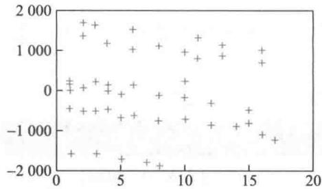  
图1 模型（1）  $\epsilon$  与  $x_{1}$  的关系

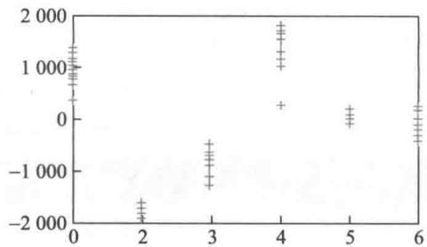  
图2 模型（1）  $\epsilon$  与  $x_{2} - x_{3}, x_{4}$  组合的关系

从图1看,残差大概分成3个水平,这是由于6种管理- 教育组合混在一起,在模型中未被正确反映的结果;从图2看,对于前4个管理- 教育组合,残差或者全为正,或者全为负,也表明管理- 教育组合在模型中处理不当。

在模型(1)中管理责任和教育程度是分别起作用的,事实上,二者可能起着交互作用,如大学程度的管理人员的薪金会比二者分别的薪金之和高一点。

以上分析提示我们,应在基本模型(1)中增加管理  $x_{2}$  与教育  $x_{3}, x_{4}$  的交互项,建立新的回归模型。

更好的模型 增加  $x_{2}$  与  $x_{3}, x_{4}$  的交互项后,模型记作

$$
y = a_{0} + a_{1}x_{1} + a_{2}x_{2} + a_{3}x_{3} + a_{4}x_{4} + a_{5}x_{2}x_{3} + a_{6}x_{2}x_{4} + \epsilon \tag{2}
$$

利用MATLAB的统计工具箱得到的结果如表4

表4模型（2）的计算结果  

<table><tr><td>参数</td><td>参数估计值</td><td>参数置信区间</td><td></td><td></td></tr><tr><td>a0</td><td>11 204</td><td>[11 044, 11 363]</td><td></td><td></td></tr><tr><td>a1</td><td>497</td><td>[486, 508]</td><td></td><td></td></tr><tr><td>a2</td><td>7 048</td><td>[6 841, 7 255]</td><td></td><td></td></tr><tr><td>a3</td><td>-1 727</td><td>[-1 939, -1 814]</td><td></td><td></td></tr><tr><td>a4</td><td>-3 48</td><td>[-545, -152]</td><td></td><td></td></tr><tr><td>a5</td><td>-3 071</td><td>[-3 372, -2 769]</td><td></td><td></td></tr><tr><td>a6</td><td>1 836</td><td>[1 571, 2 101]</td><td></td><td></td></tr><tr><td></td><td>R²=0.998 8</td><td>F=5 545</td><td>p&amp;lt;0.000 1</td><td>s²=3.004 7×10⁴</td></tr></table>

由表4可知,模型(2)的  $R^{2}$  和  $F$  值都比模型(1)有所改进,并且所有回归系数的置信区间都不含零点,表明模型(2)是完全可用的。

与模型(1)类似,作模型(2)的两个残差分析图(图3,图4),可以看出,已经消除了图1、图2中的不正常现象,这也说明了模型(2)的适用性。

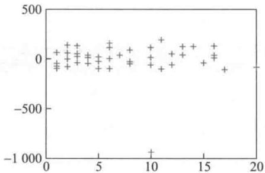  
图3 模型  $(2)\epsilon$  与  $x_{1}$  的关系

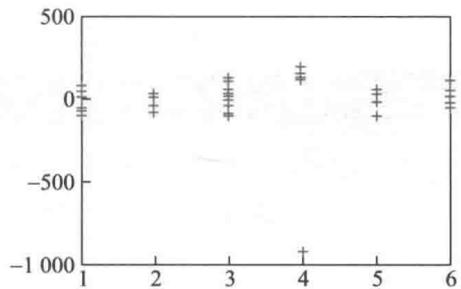  
图4 模型  $(2)\epsilon$  与  $x_{2} - x_{3}, x_{4}$  组合的关系

从图3、图4还可以发现一个异常点:具有10年资历、大学程度的管理人员(从数据文件9- 2可以查出是33号),他的实际薪金明显低于模型的估计值,也明显低于与他有类似经历的其他人的薪金。这可能是由我们未知的原因造成的。为了使个别的数据不致影响整个模型,应该将这个异常数据去掉,对模型(2)重新估计回归系数,得到的

结果如表 5, 残差分析图见图 5, 图 6. 可以看出, 去掉异常数据后结果又有改善.

表5模型（2）去掉异常数据后的计算结果  

<table><tr><td>参数</td><td>参数估计值</td><td>参数置信区间</td></tr><tr><td>a0</td><td>11 200</td><td>[11 139, 11 261]</td></tr><tr><td>a1</td><td>498</td><td>[494, 503]</td></tr><tr><td>a2</td><td>7 041</td><td>[6 962, 7 120]</td></tr><tr><td>a3</td><td>-1 737</td><td>[-1 818, -1 656]</td></tr><tr><td>a4</td><td>-356</td><td>[-431, -281]</td></tr><tr><td>a5</td><td>-3 056</td><td>[-3 171, -2 942]</td></tr><tr><td>a6</td><td>1 997</td><td>[1 894, 2 100]</td></tr><tr><td colspan="3">R²=0.999 8 F=36 701 p&amp;lt;0.000 1 s²=4.347×10³</td></tr></table>

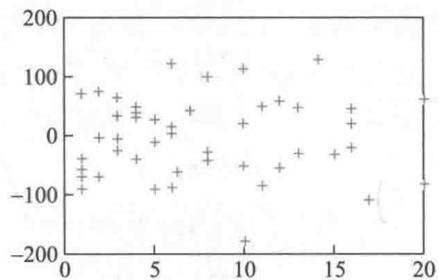  
图5 模型（2）去掉异常数据后  $\epsilon$  与  $x_{1}$  的关系

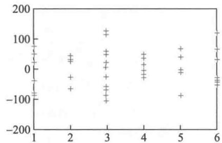  
图6 模型（2）去掉异常数据后

$\epsilon$  与  $x_{2} - x_{3}, x_{4}$  组合的关系

模型应用对于回归模型（2），用去掉异常数据（33号）后估计出的系数，得到的结果是满意的。作为这个模型的应用之一，不妨用它来"制订"6种管理- 教育组合人员的"基础"薪金（即资历为零的薪金，当然，这也是平均意义上的）。利用模型（2）和表5容易得到表6.

评注 对于影响因变量的定性因素（管理、教育），可以引入0- 1变量来处理，0- 1变量的个数可比定性因素的水平少1（如教育程度有3个水平，引入2个0- 1变量），用残差分析方法可以发现模型的缺陷，引入交互作用项常能够给予改善。实际上，可以直接对6种管理- 教育组合引入5个0- 1变量。

表66种管理-教育组合人员的“基础”薪金  

<table><tr><td>组合</td><td>管理</td><td>教育</td><td>系数</td><td>“基础”薪金</td></tr><tr><td>1</td><td>0</td><td>1</td><td>a0+a3</td><td>9 463</td></tr><tr><td>2</td><td>1</td><td>1</td><td>a0+a2+a3+a5</td><td>13 448</td></tr><tr><td>3</td><td>0</td><td>2</td><td>a0+a4</td><td>10 844</td></tr><tr><td>4</td><td>1</td><td>2</td><td>a0+a2+a4+a6</td><td>19 882</td></tr><tr><td>5</td><td>0</td><td>3</td><td>a0</td><td>11 200</td></tr><tr><td>6</td><td>1</td><td>3</td><td>a0+a2</td><td>18 241</td></tr></table>

可以看出，大学程度的管理人员的薪金比研究生程度的管理人员的薪金高，而大学

程度的非管理人员的薪金比研究生程度的非管理人员的薪金略低.当然,这是根据这家公司实际数据建立的模型得到的结果,并不具普遍性.

# 复习题

1. 用逐步回归重新建立模型,与表5的结果比较

2. 汽车销售商认为汽车销售量与汽油价格、贷款利率有关,两种类型汽车(普通型和豪华型)18个月的调查资料如下表,其中  $y_{1}$  是普通型汽车销售量(手辆),  $y_{2}$  是豪华型汽车销售量(手辆),  $x_{1}$  是汽油价格(美元/加仑),  $x_{2}$  是贷款利率  $(\%)$  [72],全部数据见数据文件9-3.

<table><tr><td>序号</td><td>y1</td><td>y2</td><td>x1</td><td>x2</td></tr><tr><td>1</td><td>22.1</td><td>7.2</td><td>1.89</td><td>6.1</td></tr><tr><td>2</td><td>15.4</td><td>5.4</td><td>1.94</td><td>6.2</td></tr><tr><td>...</td><td>...</td><td>...</td><td>...</td><td>...</td></tr><tr><td>18</td><td>44.3</td><td>15.6</td><td>1.68</td><td>2.3</td></tr></table>

(1)对普通型和豪华型汽车分别建立如下模型:

$$
y_{1} = \beta_{0}^{(1)} + \beta_{1}^{(1)}x_{1} + \beta_{2}^{(1)}x_{2}, y_{2} = \beta_{0}^{(2)} + \beta_{1}^{(2)}x_{1} + \beta_{2}^{(2)}x_{2}
$$

给出  $\beta$  的估计值和置信区间,决定系数  $R^{2}, F$  值及剩余方差等

(2)用  $x_{3} = 0$  ,1表示汽车类型,建立统一模型:  $y = \beta_{0} + \beta_{1}x_{1} + \beta_{2}x_{2} + \beta_{3}x_{3}$  ,给出  $\beta$  的估计值和置信区间,决定系数  $R^{2}, F$  值及剩余方差等.以  $x_{3} = 0$  ,1代入统一模型,将结果与(1)的两个模型的结果比较,解释二者的区别.

(3)对统一模型就每种类型汽车分别作  $x_{1}$  和  $x_{2}$  与残差的散点图,有什么现象,说明模型有何缺陷?

(4)对统一模型增加二次项和交互项,考察结果有什么改进

# 9.3 酶促反应

酶是一种具有特异性的高效生物催化剂,绝大多数的酶是活细胞产生的蛋白质.酶的催化条件温和,在常温、常压下即可进行.酶催化的反应称为酶促反应,要比相应的非催化反应快  $10^{3} \sim 10^{17}$  倍.酶促反应动力学简称酶动力学,主要研究酶促反应的速度与底物(即反应物)浓度以及其他因素的关系.在底物浓度很低时酶促反应是一级反应;当底物浓度处于中间范围时,是混合级反应;当底物浓度增加时,向零级反应过渡.

某生化系学生为了研究嘌呤霉素在某项酶促反应中对反应速度与底物浓度之间关系的影响,设计了两个实验,一个实验中所使用的酶是经过嘌呤霉素处理的,而另一个实验所用的酶是未经嘌呤霉素处理过的,所得的实验数据见表1. 试根据问题的背景和这些数据建立一个合适的数学模型,来反映这项酶促反应的速度与底物浓度以及嘌呤霉素处理与否之间的关系[6].

表1嘌呤霉素实验中的反应速度与底物浓度数据  

<table><tr><td colspan="2">底物浓度/ppm ①</td><td colspan="2">0.02</td><td colspan="2">0.06</td><td colspan="2">0.11</td><td colspan="2">0.22</td><td colspan="2">0.56</td><td colspan="2">1.10</td></tr><tr><td>反应</td><td>处理</td><td>76</td><td>47</td><td>97</td><td>107</td><td>123</td><td>139</td><td>159</td><td>152</td><td>191</td><td>201</td><td>207</td><td>200</td></tr><tr><td>速度</td><td>未处理</td><td>67</td><td>51</td><td>84</td><td>86</td><td>98</td><td>115</td><td>131</td><td>124</td><td>144</td><td>158</td><td>160</td><td>—</td></tr></table>

分析与假设 记酶促反应的速度为  $y$ , 底物浓度为  $x$ , 二者之间的关系写作  $y = f(x, \beta)$ , 其中  $\beta$  为参数。由酶促反应的基本性质可知, 当底物浓度较小时, 反应速度大致与浓度成正比 (即一级反应); 而当底物浓度很大, 渐进饱和时, 反应速度将趋于一个固定值——最终反应速度 (即零级反应)。下面的两个简单模型具有这种性质:

Michaelis- Menten 模型

$$
y = f(x, \beta) = \frac{\beta_1 x}{\beta_2 + x} \tag{1}
$$

指数增长模型

$$
y = f(x, \beta) = \beta_1 (1 - \mathrm{e}^{-\beta_2 x}) \tag{2}
$$

图1和图2分别是表1给出的经过嘌呤霉素处理和未经处理的反应速度  $y$  与底物浓度  $x$  的散点图, 可以知道, 模型(1), (2)与实际数据得到的散点图是大致符合的。下面只对模型(1)进行详细的分析, 将模型(2)留给有兴趣的读者 (复习题)。

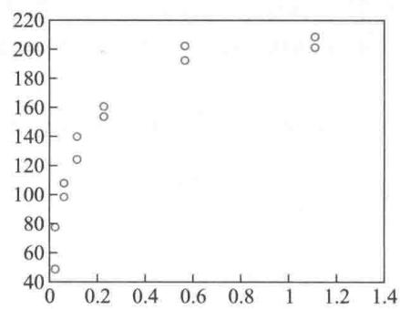  
图1  $y$  对  $x$  (经处理)的散点图

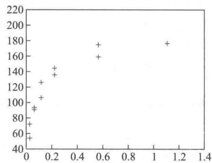  
图2  $y$  对  $x$  (未经处理)的散点图

首先对经过嘌呤霉素处理的实验数据进行分析 (未经处理的数据可同样分析), 在此基础上, 再来讨论是否有更一般的模型来统一刻画处理前后的数据, 进而揭示其中的联系。

线性化模型 模型(1)对参数  $\beta = (\beta_1, \beta_2)$  是非线性的, 但是可以通过下面的变量代换化为线性模型

$$
\frac{1}{y} = \frac{1}{\beta_1} + \frac{\beta_2}{\beta_1} \frac{1}{x} = \theta_1 + \theta_2 u \tag{3}
$$

模型(3)中的因变量  $1 / y$  对新的参数  $\theta = (\theta_1, \theta_2)$  是线性的。

对经过嘌呤霉素处理的实验数据, 作出反应速度的倒数  $1 / y$  与底物浓度的倒数  $u =$

$1 / x$  的散点图(图3),可以发现在  $1 / x$  较小时有很好的线性趋势,而  $1 / x$  较大时则出现很大的起落.

如果单从线性回归模型的角度作计算,很容易得到线性化模型(3)的参数  $\theta_{1},\theta_{2}$  的估计和其他统计结果(见表2)以及  $1 / y$  与  $1 / x$  的拟合图(图3).再根据(3)式中  $\beta$  与  $\theta$  的关系得到  $\beta_{1} =$ $1 / \theta_{1},\beta_{2} = \theta_{2} / \theta_{1}$  ,从而可以算出  $\beta_{1}$  和  $\beta_{2}$  的估计值分别为  $\hat{\beta}_{1} = 195.802 0$  和  $\hat{\beta}_{2} = 0.048 4$

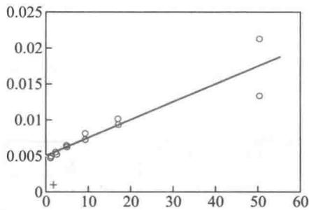  
图3  $1 / y$  与  $1 / x$  的散点图和回归直线

程序文件9- 9

程序文件9- 9 稳定反应线性化模型和非线性模型 prog0903a.m

#

程序文件9- 10

程序文件9- 10 稳定反应非线性模型子程序 prog0903a1. m

程序文件9- 10 稳定反应非线性模型子程序 prog0903a1. m 评注无论从机理分析,还是从实验数据看, 酶促反应中反应速度与底物浓度及嘌呤霉素的作用之间

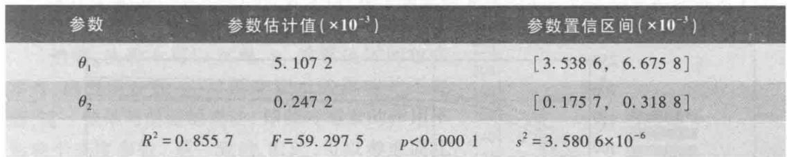  
表2 线性化模型（3）参数的估计结果

将经过线性化变换后最终得到的  $\beta$  值代入原模型(1),得到与原始数据比较的拟

合图(图4).可以发现,在  $x$  较大时  $y$  的预测值要比实际数据小,这是因为在对线性化模型作参数估计时,底物浓度  $x$  较低(  $1 / x$  很大)的数据在很大程度上控制了回归参数的确定,从而使得对底物浓度  $x$  较高数据的拟合,出现较大的偏差

为了解决线性化模型中拟合欠佳的问题,我们直接考虑非线性模型(1).

非线性模型及求解可以用非线性回归的方法直接估计模型(1)中的参数  $\beta_{1}$  和  $\beta_{2}$ . 模型的求解可利用MATLAB统计工具箱进行,得到的数值结果见表3.

底物浓度及嘌呤霉素的作用之间的关系都是非线性的,先用线性化模型来简化参数估计,如果这样能得到满意的结果,当然很好,但是由于变量的代换已经隐含了误差扰动项的变换,因此,除非变换后的误差项仍具有常数方差,一般情况下还需要采用原始数据做非线性回归,而把线性化模型的参数估计结果作为非线性模型参数估计的迭代初值.

在非线性模型参数估计中,用不同的参数初值进行迭代,可能得到差别很大的结果(它们都是拟合误差平方和的局部极小点),也可能出现收敛速度等问题,因此,合适的初值是非常重要的.

表3 非线性模型（1）参数的估计结果  

<table><tr><td>参数</td><td>参数估计值</td><td>参数置信区间</td></tr><tr><td>β1</td><td>212.683 7</td><td>[197.204.5, 228.162 9]</td></tr><tr><td>β2</td><td>0.064 1</td><td>[0.045 7, 0.082 6]</td></tr></table>

拟合的结果直接画在原始数据图(图5)上.程序中的nlintool用于给出一个交互式画面(图6),拖动画面中的十字线可以改变自变量  $x$  的取值,直接得到因变量  $y$  的预测值和预测区间,同时通过左下方Export下拉式菜单,可输出模型的统计结果,如剩余标准差等,本例中剩余标准差  $s = 10.933 7$

从上面的结果可以知道,对经过嘌呤霉素处理的实验数据,在用Michaelis- Menten模型(1)进行回归分析时,最终反应速度为  $\hat{\beta}_{1} = 212.683 7$ . 还容易得到,反应的"半速度

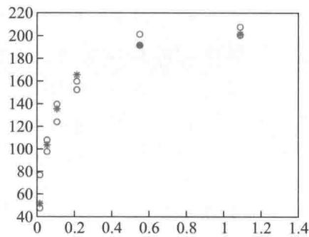  
图5 模型（1）的预测图

(α——原始数据;+——拟合结果)

点"(达到最终反应速度一半时的底物浓度  $x$  值)恰为  $\beta_{2} = 0.0641$ . 以上结果对这样一个经过设计的实验(每个底物浓度做两次实验)已经很好地达到了要求.

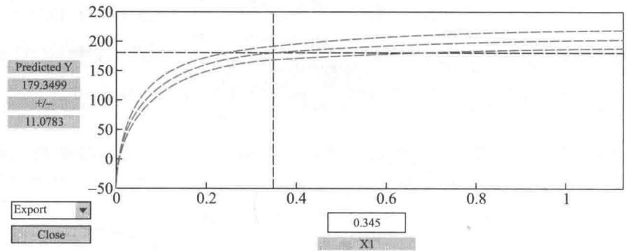  
图6 模型（1）的预测及结果输出

混合反应模型 酶动力学知识告诉我们,酶促反应的速度依赖于底物浓度,并且可以假定,嘌呤霉素的处理会影响最终反应速度参数  $\beta_{1}$ ,而基本不影响半速度参数  $\beta_{2}$ . 表1的数据(图1、图2更为明显)也印证了这种看法. 模型(1)的形式可以分别描述经过嘌呤霉素处理和未经处理的反应速度与底物浓度的关系(两个模型的参数  $\beta$  会不同),为了在同一个模型中考虑嘌呤霉素处理的影响,我们采用对未经嘌呤霉素处理的模型附加增量的方法,考察混合反应模型

$$
y = f(\pmb {x},\pmb {\beta}) = \frac{(\beta_{1} + \gamma_{1}x_{2})x_{1}}{(\beta_{2} + \gamma_{2}x_{2}) + x_{1}} \tag{4}
$$

其中自变量  $x_{1}$  为底物浓度(即模型(3)中的  $x$ ,  $x_{2}$  为一示性变量(0- 1变量),用来表示是否经嘌呤霉素处理,令  $x_{2} = 1$  表示经过处理,  $x_{2} = 0$  表示未经处理;参数  $\beta_{1}$  是未经处理的最终反应速度,  $\gamma_{1}$  是经处理后最终反应速度的增长值,  $\beta_{2}$  是未经处理的反应的半速度点,  $\gamma_{2}$  是经处理后反应的半速度点的增长值(为一般化起见,这里假定嘌呤霉素的处理也会影响半速度点).

混合模型的求解和分析 仍用MATLAB统计工具箱来计算模型(4)的回归系数  $\beta_{1}, \beta_{2}, \gamma_{1}$  和  $\gamma_{2}$ . 为了给出合适的初始迭代值,从实验数据我们注意到,未经处理的反应速度的最大实验值为160,经处理的最大实验值为207,于是可取参数初值  $\beta_{1}^{0} = 170, \gamma_{1}^{0} = 60$ ; 又从数据可大致估计未经处理的半速度点约为0.05,经处理的半速度点约为0.06,

我们取  $\beta_{2}^{0} = 0.05, \gamma_{2}^{0} = 0.01$ .

与模型(1)相似,得到混合模型(4)的回归系数的估计值与其置信区间(表4)、拟合结果(图7),及预测和结果输出图(图8),模型的剩余标准差  $s = 10.4000$ .

程序文件9- 11 确促反应混合模型prog0903b.m

程序文件9- 12

程序文件9- 13 确促反应混合模型子程序2prog0903b2. m

然而,从表4可以发现,  $\gamma_{2}$  的置信区间包含零点,这表明参数  $\gamma_{2}$  对因变量  $y$  的影响并不显著,这一结果与前面的说法(即嘌呤霉素的作用不影响半速度参数)是一致的。因此,可以考虑简化模型

$$
y = f(\mathbf{x}, \beta) = \frac{(\beta_{1} + \gamma_{1} x_{2}) x_{1}}{\beta_{2} + x_{1}} \tag{5}
$$

采用与模型(4)类似的计算、分析方法,模型(5)的结果概括在表5和表6,以及图9、图10中,模型(5)的剩余标准差  $s = 10.5831$ .

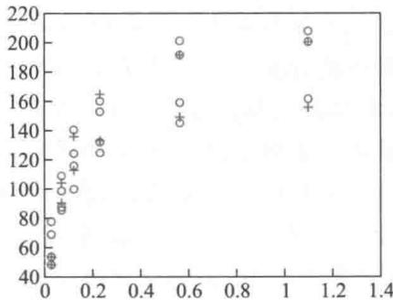  
图7 模型（4）的预测图

程序文件9- 13 确促反应混合模型子程序2prog0903b2. m

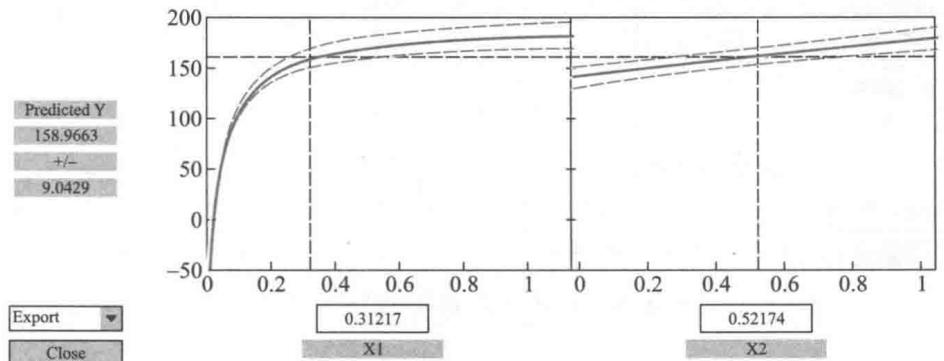  
图8 模型（4）的预测及结果输出

表5非线性模型（5）参数的估计结果  

<table><tr><td>参数</td><td>参数估计值</td><td>参数置信区间</td></tr><tr><td>β1</td><td>166.602 5</td><td>[154.488 6, 178.716 4]</td></tr><tr><td>β2</td><td>0.058 0</td><td>[0.045 6, 0.070 3]</td></tr><tr><td>γ1</td><td>42.025 2</td><td>[28.941 9, 55.108 5]</td></tr></table>

表6 模型(4)与(5)预测值与预测区间的比较(预测区间为预测值±△,全部数据见运行程序文件9- 11后的输出结果)

全部数据见运行程序文件9-11后的输出结果）  

<table><tr><td>实际数据</td><td>模型(4)预测值</td><td>△(模型(4))</td><td>模型(5)预测值</td><td>△(模型(5))</td></tr><tr><td>67</td><td>47.344 3</td><td>9.207 8</td><td>42.735 8</td><td>5.444 6</td></tr><tr><td>51</td><td>47.344 3</td><td>9.207 8</td><td>42.735 8</td><td>5.444 6</td></tr><tr><td>：</td><td>：</td><td>：</td><td>：</td><td>：</td></tr><tr><td>200</td><td>200.968 8</td><td>11.044 7</td><td>198.183 7</td><td>10.181 2</td></tr></table>

混合模型(4)和(5)不仅有类似于模型(1)的实际解释,同时把嘌呤霉素处理前后酶促反应的速度之间的变化体现在模型之中,因此它们比单独的模型具有更实际的价值。另外,虽然模型(5)的某些统计指标可能没有模型(4)的好,比如模型(5)的剩余标准差略大于模型(4),但由于它的形式更简单明了,易于实际中的操作和控制,而且从表6中数据可以发现,虽然两个模型的预测值相差不大,但模型(5)预测区间的长度明显比模型(4)的短。因此,总体来说模型(5)更为优良。

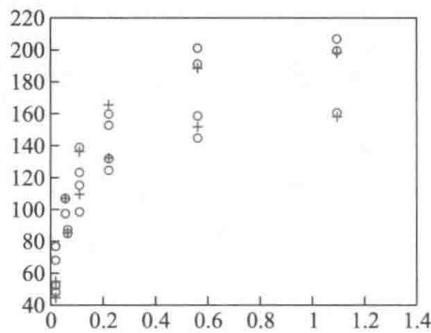  
图9 模型（5）的预测图（o——原始数据；+——拟合结果）

评注 评价线性回归模型拟合程度的统计检验无法直接用于非线性模型。例如, $F$ 统计量不能用于非线性模型拟合程度的显著性检验,因为即使误差项服从均值为0的正态分布,也无法从回归残差得到误差方差的一个无偏估计。但是  $R^2$  和剩余标准差  $\epsilon$  仍然可以在通常意义下用于非线性回归模型拟合程度的度量。

从本例还可以看到,通过引入示性变量,能够描述定性上不同的处理水平对模型参数的影响,这是一种直接明了的建模方法。

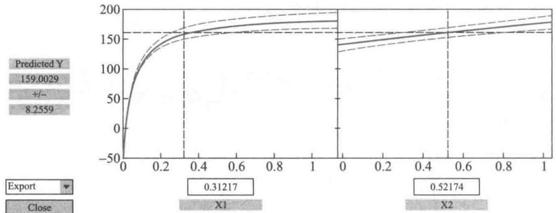  
图10 模型（5）的预测及结果输出

可进一步研究的模型假如在实验中当底物浓度增加到一定程度后,反应速度反而有轻微的下降(在本例中只有一个数据点如此),那么可以考虑模型

$$
y = f(x,\beta) = \frac{\beta_{1}x}{\beta_{2} + x + \beta_{3}x^{2}} \tag{6}
$$

或引入混合模型

$$
y = f(x,\beta) = \frac{(\beta_{1} + \gamma_{1}x_{2})x_{1}}{(\beta_{2} + \gamma_{2}x_{2}) + x_{1} + (\beta_{3} + \gamma_{3}x_{2})x_{2}^{2}} \tag{7}
$$

有兴趣的读者可以尝试一下,会发现用这些模型可以改善模型(4)和(5)的残差图中表现出来的在各个浓度下残差散布不均匀的现象。

在酶促反应中如果用指数增长模型  $y = \beta_{1}(1 - \mathrm{e}^{- \beta_{2}x})$  代替Michaelis- Menten模型对经过嘌呤霉素处理的实验数据作非线性回归分析,其结果将如何?更进一步,若选用模型  $y = \beta_{1}(\mathrm{e}^{- \beta_{2}x} - \mathrm{e}^{- \beta_{2}x})$  来拟合相同的数据,其结果是否比指数增长模型有所改进?试作出模型的残差图进行比较.

# 9.4 投资额与生产总值和物价指数

为研究某地区实际投资额与国民生产总值(GNP)及物价指数的关系,收集了该地区连续20年的统计数据(见表1),目的是由这些数据建立一个投资额的模型,根据对未来国民生产总值及物价指数的估计,预测未来的实际投资额.

表1的数据是以时间为序的,称时间序列.由于投资额、国民生产总值、物价指数等许多经济变量均有一定的滞后性,比如,前期的投资额对后期投资额一般有明显的影响.因此,在这样的时间序列数据中,同一变量的顺序观测值之间的出现相关现象(称自相关)是很自然的.然而,一旦数据中存在这种自相关序列,如果仍采用普通的回归模型直接处理,将会出现不良后果,其预测也会失去意义,为此,我们必须先来诊断数据是否存在自相关,如果存在,就要考虑自相关关系,建立新的回归模型[47,65].

表1某地区实际投资额（亿元）与国民生产总值（亿元）及物价指数数据  

<table><tr><td>年份
序号</td><td>投资额</td><td>国民生
产总值</td><td>物价
指数</td><td>年份
序号</td><td>投资额</td><td>国民生
产总值</td><td>物价
指数</td></tr><tr><td>1</td><td>90.9</td><td>596.7</td><td>0.716 7</td><td>11</td><td>229.8</td><td>1 326.4</td><td>1.057 5</td></tr><tr><td>2</td><td>97.4</td><td>637.7</td><td>0.727 7</td><td>12</td><td>228.7</td><td>1 434.2</td><td>1.150 8</td></tr><tr><td>3</td><td>113.5</td><td>691.1</td><td>0.743 6</td><td>13</td><td>206.1</td><td>1 549.2</td><td>1.257 9</td></tr><tr><td>4</td><td>125.7</td><td>756.0</td><td>0.767 6</td><td>14</td><td>257.9</td><td>1 718.0</td><td>1.323 4</td></tr><tr><td>5</td><td>122.8</td><td>799.0</td><td>0.790 6</td><td>15</td><td>324.1</td><td>1 918.3</td><td>1.400 5</td></tr><tr><td>6</td><td>133.3</td><td>873.4</td><td>0.825 4</td><td>16</td><td>386.6</td><td>2 163.9</td><td>1.504 2</td></tr><tr><td>7</td><td>149.3</td><td>944.0</td><td>0.867 9</td><td>17</td><td>423.0</td><td>2 417.8</td><td>1.634 2</td></tr><tr><td>8</td><td>144.2</td><td>992.7</td><td>0.914 5</td><td>18</td><td>401.9</td><td>2 631.7</td><td>1.784 2</td></tr><tr><td>9</td><td>166.4</td><td>1 077.6</td><td>0.960 1</td><td>19</td><td>474.9</td><td>2 954.7</td><td>1.951 4</td></tr><tr><td>10</td><td>195.0</td><td>1 185.9</td><td>1.000 0</td><td>20</td><td>424.5</td><td>3 073.0</td><td>2.068 8</td></tr></table>

基本的回归模型首先仿照前几节的方法建立普通的回归模型.记该地区第  $t$  年的投资额为  $y_{t}$ ,国民生产总值为  $x_{1t}$ ,物价指数为  $x_{2t}$  (以第10年的物价指数为基准,基准值为1),  $t = 1,2,\dots ,n(= 20)$ .因变量  $y_{t}$  与自变量  $x_{1t}$  和  $x_{2t}$  的散点图见图1和图2.

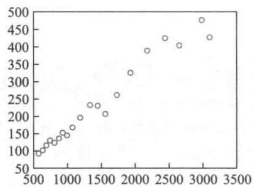  
图1  $y_{t}$  对  $x_{1t}$  的散点图

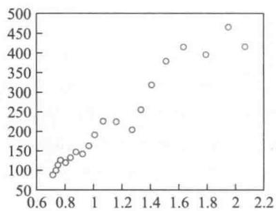  
图2  $y_{t}$  对  $x_{2t}$  的散点图

可以看出,随着国民生产总值的增加,投资额增大,而且两者有很强的线性关系,物价指数与投资额的关系也类似,因此可建立多元线性回归模型

$$
y_{t} = \beta_{0} + \beta_{1}x_{1t} + \beta_{2}x_{2t} + \epsilon_{t} \tag{1}
$$

模型(1)中除了国民生产总值和物价指数外,影响  $y_{t}$  的其他因素的作用都包含在随机误差  $\epsilon_{t}$  内,这里假设  $\epsilon_{t}$  (对  $t$  )相互独立,且服从均值为0的正态分布,  $t = 1,2,\dots ,n.$  与前几节不同的是,为了后面模型记号的考虑,这里的变量均加了下标  $t.$

根据表1的数据,对模型(1)直接利用MATLAB统计工具箱求解,得到的回归系数估计值及其置信区间(置信水平  $\alpha = 0.05$  )、检验统计量  $R^{2},F,p,s^{2}$  的结果见表2.

<table><tr><td>参数</td><td>参数估计值</td><td>参数置信区间</td><td></td><td></td></tr><tr><td>β0</td><td>322.725 0</td><td>[224.338 6, 421.111 4]</td><td></td><td></td></tr><tr><td>β1</td><td>0.618 5</td><td>[0.477 3, 0.759 6]</td><td></td><td></td></tr><tr><td>β2</td><td>-859.479 0</td><td>[-1 121.475 7, -597.482 3]</td><td></td><td></td></tr><tr><td></td><td>R²=0.990 8</td><td>F=919.852 9</td><td>p&amp;lt;0.000 1</td><td>s²=161.7</td></tr></table>

将参数估计值代入(1)得到

$$
\hat{y}_{t} = 322.725 + 0.6185x_{1t} - 859.479x_{2t} \tag{2}
$$

交互式画面见图3,由此可以给出不同水平下的预测值及其置信区间,通过左下方Export下拉式菜单,可输出模型的统计结果,如剩余标准差  $s = 12.7164$

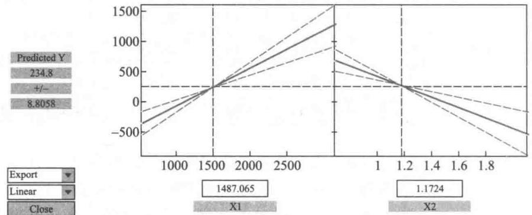  
表2 模型（1）的计算结果 图3 模型（2）的输出

自相关性诊断与处理方法从表面上看得到的基本模型(2)的拟合度非常之高(  $R^{2} = 0.9908$  ),应该很满意了。但是,这个模型并没有考虑到我们的数据是一个时间序列(将表1的年份序号打乱,不影响模型(2)的结果)。实际上,在对时间序列数据做回归分析时,模型的随机误差项  $\epsilon_{t}$  有可能存在相关性,违背模型关于  $\epsilon_{t}$  (对时间  $t$  )相互独立的基本假设。如在投资额模型中,国民生产总值和物价指数之外的因素(比如政策等因素)对投资额的影响包含在随机误差  $\epsilon_{t}$  中,如果它的影响成为  $\epsilon_{t}$  的主要部分,则由于政策等因素的连续性,它们对投资额的影响也有时间上的延续,即随机误差  $\epsilon_{t}$  会出现(自)相关性。

残差  $e_{t} = y_{t} - \hat{y}_{t}$  可以作为随机误差  $\epsilon_{t}$  的估计值,画出  $e_{t} - e_{t - 1}$  的散点图,能够从直观上判断  $\epsilon_{t}$  的自相关性。模型(2)的残差  $e_{t}$  可在计算过程中得到,如表3,数据  $e_{t} - e_{t - 1}$  散点图如图4,可以看到,大部分点子落在第1,3象限,表明  $\epsilon_{t}$  存在正的自相关。

表3模型（2）的残差  $\boldsymbol{\epsilon}_{t}$  

<table><tr><td>t</td><td>e1</td><td>t</td><td>e1</td><td>t</td><td>e1</td><td>t</td><td>e1</td></tr><tr><td>1</td><td>15.130 6</td><td>6</td><td>-20.171 0</td><td>11</td><td>-4.346 8</td><td>16</td><td>18.425 0</td></tr><tr><td>2</td><td>5.728 1</td><td>7</td><td>-11.306 2</td><td>12</td><td>8.072 9</td><td>17</td><td>9.531 1</td></tr><tr><td>3</td><td>2.468 2</td><td>8</td><td>-6.473 3</td><td>13</td><td>6.400 6</td><td>18</td><td>-14.934 9</td></tr><tr><td>4</td><td>-4.842 1</td><td>9</td><td>2.411 9</td><td>14</td><td>10.101 0</td><td>19</td><td>2.008 5</td></tr><tr><td>5</td><td>-14.567 7</td><td>10</td><td>-1.673 7</td><td>15</td><td>18.690 0</td><td>20</td><td>-20.652 1</td></tr></table>

为了对  $\epsilon_{t}$  的自相关性作定量诊断,并在确诊后得到新的结果,我们考虑如下的模型:

$$
y_{t} = \beta_{0} + \beta_{1}x_{1t} + \beta_{2}x_{2t} + \epsilon_{t}, \quad \epsilon_{t} = \rho \epsilon_{t - 1} + u_{t} \tag{3}
$$

其中  $\rho$  是自相关系数,  $|\rho | \leqslant 1$ ,  $u_{t}$  相互独立且服从均值为零的正态分布,  $t = 1,2,\dots ,n$

模型(3)中若  $\rho = 0$ ,则退化为普通的回归模型;若  $\rho > 0$ ,则随机误差  $\epsilon_{t}$  存在正的自相关;若  $\rho < 0$ ,存在负的自相关。大多数与经济有关的时间序列数据,在经济规律作用下,一般随着时间的推移有一种向上或向下变动的趋势,其随机误差表现出正相关趋势。

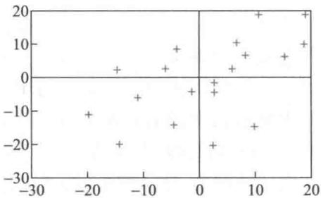  
图4 模型（2）  $e_{t} - e_{t - 1}$  的散点图

Durbin- Watson检验(以下简称D- W检验)是一种常用的诊断自相关现象的统计方法。首先根据模型(1)得到的残差计算  $DW$  统计量:

$$
DW = \frac{\sum_{t = 2}^{n}\left(e_{t} - e_{t - 1}\right)^{2}}{\sum_{t = 2}^{n}e_{t}^{2}} \tag{4}
$$

经过简单的运算可知,当  $n$  较大时,

$$
DW \approx 2\left(1 - \frac{\sum_{t = 2}^{n}e_{t}e_{t - 1}}{\sum_{t = 2}^{n}e_{t}^{2}}\right) \tag{5}
$$

而(5)式右端的  $\sum_{t = 2}^{n}e_{t}e_{t - 1} / \sum_{t = 2}^{n}e_{t}^{2}$  正是自相关系数  $\rho$  的估计值  $\hat{\rho}$ ,于是

$$
DW \approx 2(1 - \hat{\rho}) \tag{6}
$$

由于  $- 1 \leqslant \hat{\rho} \leqslant 1$ ,所以  $0 \leqslant DW \leqslant 4$ ,并且,若  $\hat{\rho}$  在0附近,则  $DW$  在2附近,  $\epsilon_{t}$  的自相关性很弱(或不存在自相关);若  $\hat{\rho}$  在  $\pm 1$  附近,则  $DW$  接近0或  $4, \epsilon_{t}$  的自相关性很强.

要根据  $DW$  的具体数值确定  $\epsilon_{t}$  是否存在自相关,应该在给定的检验水平下,依照样本容量和回归变量数目,查D- W分布表,得到检验的临界值  $d_{L}$  和  $d_{U}$ ,然后由图5中  $DW$  所在的区间来决定[65].

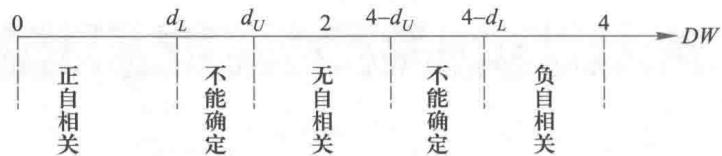  
图5与  $DW$  值对应的自相关状态

谓注经D- W检验认为普通回归模型(2)的随机误差存在自相关,由(4)、(7)式估计出自相关系数  $\rho$  后,采用变换(8)的方法得到模型(9),称为广义差分法.这种方法消除了原模型随机误差的自相关性,得到的(9)式是一阶自相关模型.

如果检验结果判定存在自相关,就应该采用模型(3),其中  $\rho$  可由(6)式估计,即

$$
\hat{\rho} = 1 - \frac{DW}{2} \tag{7}
$$

作变换

$$
y_{t}^{*} = y_{t} - \rho y_{t - 1}, \quad x_{it}^{*} = x_{it} - \rho x_{i,t - 1}, \quad i = 1,2 \tag{8}
$$

则模型(3)化为

$$
y_{t}^{*} = \beta_{0}^{*} + \beta_{1}x_{1t}^{*} + \beta_{2}x_{2t}^{*} + u_{t}, \quad \beta_{0}^{*} = \beta_{0}(1 - \rho) \tag{9}
$$

其中  $u_{t}$  相互独立且服从均值为0的正态分布,所以(9)是普通的回归模型.

加入自相关后的模型利用表3给出的残差  $e_{t}$ ,根据(4)式计算出  $DW = 0.8754$ ,对于显著性水平  $\alpha = 0.05$ ,  $n = 20$ ,  $k = 3$ (回归变量包括常数项的数目),查D- W分布表[65],得到检验的临界值  $d_{L} = 1.10$  和  $d_{U} = 1.54$ .现在  $DW \leqslant d_{L}$ ,由图5可以认为随机误差存在正自相关,且  $\rho$  可由(7)式估计得  $\hat{\rho} = 0.5623$ .

以  $\rho$  的估计值代入(8)式作变换,利用变换后的数据  $y_{t}^{*}, x_{1t}^{*}, x_{2t}^{*}$  估计模型(9)的参数,得到的结果见表4.

表4模型（9）的计算结果  

<table><tr><td>参数</td><td>参数估计值</td><td>参数置信区间</td><td></td><td></td></tr><tr><td>β0*</td><td>163.490 5</td><td>[1 265.459 2, 2 005.217 8]</td><td></td><td></td></tr><tr><td>β1</td><td>0.699 0</td><td>[0.575 1, 0.824 7]</td><td></td><td></td></tr><tr><td>β2</td><td>-1 009.033 3</td><td>[-1 235.939 2, -782.127 4]</td><td></td><td></td></tr><tr><td></td><td>R²=0.977 2</td><td>F=342.898 8</td><td>p&amp;lt;0.000 1</td><td>s²=96.58</td></tr></table>

当然应该对模型(9)也作一次自相关检验,即诊断随机误差  $u_{t}$  是否还存在自相关。从模型(9)的残差可以计算出  $DW = 1.5751$ ,对于显著性水平  $\alpha = 0.05, n = 19, k = 3$ ,检验的临界值为  $d_{t} = 1.08$  和  $d_{U} = 1.53$ 。现在  $d_{U}< DW< 4 - d_{U}$ ,由图5可以认为随机误差不存在自相关。因此,经变换(8)得到的回归模型(9)是适用的。

最后,将模型(9)中的  $y_{t}^{*}, x_{1t}^{*}, x_{2t}^{*}$  还原为原始变量  $y_{t}, x_{1t}, x_{2t}$ ,得到的结果为

$$
\hat{y}_{t} = 163.4905 + 0.5623y_{t - 1} + 0.699x_{1t} - 0.3930x_{1,t - 1}
$$

$$
1009.0333x_{2t} + 567.3794x_{2,t - 1} \tag{10}
$$

结果分析及预测从机理上看,对于带滞后性的经济规律作用下的时间序列数据,加入自相关的模型(10)更为合理,而且在本例中,衡量与实际数据拟合程度的指标——剩余标准差从原模型(2)的12.7164减小到9.8277。我们将模型(10)、模型(2)的计算值  $\hat{y}_{t}$  与实际数据  $y_{t}$  的比较,以及两个模型的残差  $e_{t}$ ,表示在表5和图6、图7上,可以看出模型(10)更合适些。

表5模型(10)、模型(2)的计算值  $\hat{y}_{t}$  与残差  $e_{t}$  (全部数据见运行程序文件9- 14后的输出结果)

<table><tr><td>t</td><td>y1(实际数据)</td><td>hat(模型(10))</td><td>hat(模型(2))</td><td>e1(模型(10))</td><td>e1(模型(2))</td></tr><tr><td>2</td><td>97.400 0</td><td>98.468 2</td><td>91.671 9</td><td>-1.068 2</td><td>5.728 1</td></tr><tr><td>3</td><td>113.500 0</td><td>113.559 6</td><td>111.031 8</td><td>0.059 6</td><td>2.468 2</td></tr><tr><td>...</td><td>...</td><td>...</td><td>...</td><td>...</td><td>...</td></tr><tr><td>20</td><td>424.500 0</td><td>438.188 6</td><td>445.152 1</td><td>-13.688 6</td><td>-20.652 1</td></tr></table>

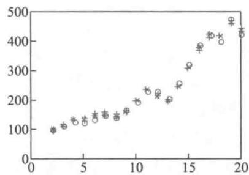  
图6模型（10），（2）的预测图

(0- y; \* - 1(10);+ - 1(1)

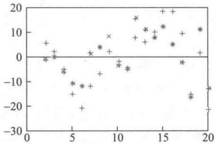  
图7模型（10），（2）的残差图（\*—e(10);+—e(12)

评注D- W检验和广义差分法在经济数据建模中有着广泛的应用,但是也存在明显的不足:若DW的数值落在无法确定自相关性的区间,则只能设法增加数据量,或选用其他方法;如果原始数据序列存在高阶自相关,则需反复使用D- W检验和广义差分法,直至判定不存在自相关为止。另外,D- W分布表中数据容量  $n$  的下限是15.

当用模型(10)或(2)对未来的投资额  $y_{t}$  作预测时,需先估计未来的国民生产总值  $x_{1t}$ ,物价指数  $x_{2t}$ ,比如,设  $t = 21$  时  $x_{1t} = 3312, x_{2t} = 2.1938$ ,容易由模型(10)得到  $\hat{y}_{t} = 469.7638$ ,由模型(2)得到  $\hat{y}_{t} = 485.6720$ 。模型(10)的  $\hat{y}_{t}$  较小,是由于上一年的实际数据  $y_{t - 1} = 424.5$  过小的作用所致,而在模型(2)中它不出现。

# 复习题

某公司想用全行业的销售额作为自变量来预测公司的销售额,下表给出了1977—1981年公司销售额和行业销售额的分季度数据(单位:百万元)。

(1)画出数据的散点图,观察用线性回归模型拟合是否合适。

(2)建立公司销售额对全行业销售额的回归模型,并用D-W检验诊断随机误差项的自相关性(3)建立消除了随机误差项自相关性后的回归模型[47].

<table><tr><td>年</td><td>季</td><td>公司销售额y</td><td>行业销售额x</td><td>年</td><td>季</td><td>公司销售额y</td><td>行业销售额x</td><td></td><td></td></tr><tr><td>1977</td><td>1</td><td>1</td><td>20.96</td><td>127.3</td><td>1979</td><td>3</td><td>11</td><td>24.54</td><td>148.3</td></tr><tr><td></td><td>2</td><td>2</td><td>21.40</td><td>130.0</td><td></td><td>4</td><td>12</td><td>24.30</td><td>146.4</td></tr><tr><td></td><td>3</td><td>3</td><td>21.96</td><td>132.7</td><td>1980</td><td>1</td><td>13</td><td>25.00</td><td>150.2</td></tr><tr><td></td><td>4</td><td>4</td><td>21.52</td><td>129.4</td><td></td><td>2</td><td>14</td><td>25.64</td><td>153.1</td></tr><tr><td>1978</td><td>1</td><td>5</td><td>22.39</td><td>135.0</td><td></td><td>3</td><td>15</td><td>26.36</td><td>157.3</td></tr><tr><td></td><td>2</td><td>6</td><td>22.76</td><td>137.1</td><td></td><td>4</td><td>16</td><td>26.98</td><td>160.7</td></tr><tr><td></td><td>3</td><td>7</td><td>23.48</td><td>141.2</td><td>1981</td><td>1</td><td>17</td><td>27.52</td><td>164.2</td></tr><tr><td></td><td>4</td><td>8</td><td>23.66</td><td>142.8</td><td></td><td>2</td><td>18</td><td>27.78</td><td>165.6</td></tr><tr><td>1979</td><td>1</td><td>9</td><td>24.10</td><td>145.5</td><td></td><td>3</td><td>19</td><td>28.24</td><td>168.7</td></tr><tr><td></td><td>2</td><td>10</td><td>24.01</td><td>145.3</td><td></td><td>4</td><td>20</td><td>28.78</td><td>171.7</td></tr></table>

# 9.5 冠心病与年龄

冠心病是一种常见的心脏疾病,严重地危害着人类的健康.到目前为止,其病因尚未完全研究清楚,医学界普遍认同的、重要的易患因素是高龄、高血脂、高血压、糖尿病、动脉粥样硬化及家族史等.多项研究表明,冠心病发病率随着年龄的增加而上升,在冠心病的流行病学研究中,年龄也是最常见的混杂因素之一.

为了更好地说明冠心病发病率与年龄的关系,医学家们对100名不同年龄的人进行观察,表1中给出了这100名被观察者的年龄及他们是否患冠心病的部分数据(其中冠心病一行中,1代表被观察者患冠心病,0代表不患冠心病).本节的目的是根据这些数据建立数学模型,来分析冠心病发病率与年龄的关系,并进行统计预测[27].

表1100名被观察者的年龄与是否患冠心病的部分数据（全部数据见程序文件9-15）  

<table><tr><td>序号</td><td>1</td><td>2</td><td>...</td><td>100</td></tr><tr><td>年龄</td><td>20</td><td>23</td><td>...</td><td>69</td></tr><tr><td>冠心病</td><td>0</td><td>0</td><td>...</td><td>1</td></tr></table>

分析与假设假设这100名被观察者是独立选取的,记  $x$  为被观察者的年龄,  $Y$  为被观察者患冠心病的情况(  $Y = 1$  表示患冠心病,  $Y = 0$  表示未患冠心病),显然,  $Y$  是一个0- 1变量.利用表1的数据作出  $Y$  对  $x$  的散点图(见图1).

从图1容易看出,直接对上述数据建立像前面几节那样的回归模型是行不通的,需

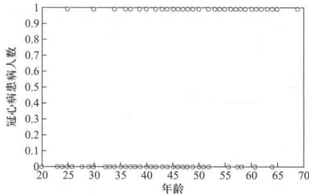  
图1 冠心病患病人数与年龄的散点图

要对数据进行预处理

要对数据进行预处理.数据预处理的一种方法是将被观察者按年龄段进行分组, 并统计各年龄段中患冠心病的人数, 及患病人数占该年龄段总人数的比例 (以下简称患病比例). 为方便起见, 我们将年龄分成 8 个年龄段, 分段后的数据见表 2.

表2各年龄段的冠心病患病人数及比例  

<table><tr><td>年龄段</td><td>年龄段中点</td><td>人数</td><td>患冠心病人数</td><td>患病比例</td></tr><tr><td>20～29</td><td>24.5</td><td>10</td><td>1</td><td>0.1</td></tr><tr><td>30～34</td><td>32</td><td>15</td><td>2</td><td>0.13</td></tr><tr><td>35～39</td><td>37</td><td>12</td><td>3</td><td>0.25</td></tr><tr><td>40～44</td><td>42</td><td>15</td><td>5</td><td>0.33</td></tr><tr><td>45～49</td><td>47</td><td>13</td><td>6</td><td>0.46</td></tr><tr><td>50～54</td><td>52</td><td>8</td><td>5</td><td>0.63</td></tr><tr><td>55～59</td><td>57</td><td>17</td><td>13</td><td>0.76</td></tr><tr><td>60～69</td><td>64.5</td><td>10</td><td>8</td><td>0.80</td></tr><tr><td>合计</td><td></td><td>100</td><td>43</td><td>0.43</td></tr></table>

为考察患病比例与年龄的关系, 首先根据表 2 数据作出患病比例对各年龄段中点的散点图 (见图 2. 为方便起见, 散点的横坐标均简单地取各年龄段的中点).

从图 2 可以看出, 冠心病患病比例随年龄的增大而递增, 大致是一条介于 0 与 1 之间的 S 形曲线, 这条曲线应该怎样用回归方程来确定呢? 表 2 和图 2 中的患病比例实际上就是年龄为  $x$  时 (以下均取年龄段的中点)  $Y$  的平均值, 用 (条件) 期望的符号记作

$$
y = E(Y\mid x) \tag{1}
$$

患病比例  $y$  是年龄  $x$  的函数, 其取值在区间  $[0,1]$  上. 如果用普通的方法建立回归方程, 那么很容易求得其线性回归曲线或更接近于 S 形曲线的 3 次多项式回归曲线 (分别见图 3 和图 4), 其回归模型的形式为

$$
y = \beta_{0} + \beta_{1} x + \beta_{2} x^{2} + \beta_{3} x^{3} + \epsilon \tag{2}
$$

其中随机误差  $\epsilon$  服从均值为 0 的正态分布, 特别地, 当  $\beta_{2} = \beta_{3} = 0$  时为线性回归模型.

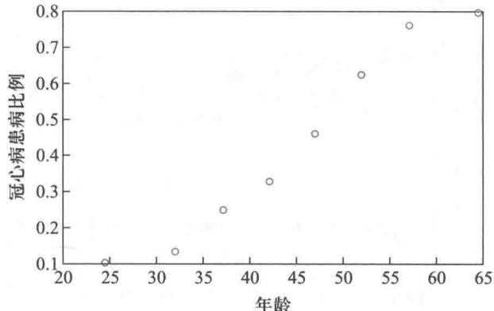  
图2 冠心病患病比例对年龄段中点的散点图

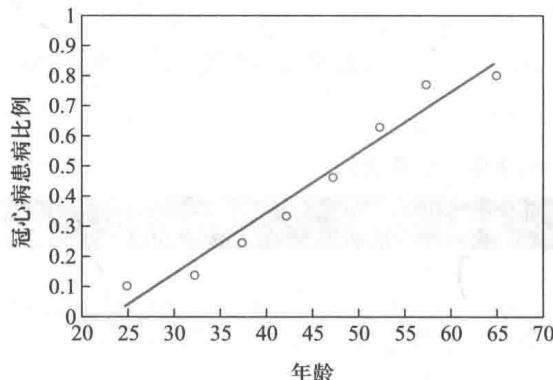  
图3  $y$  对  $x$  的线性回归曲线

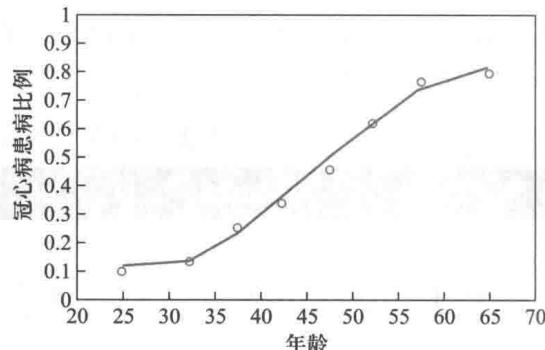  
图4  $y$  对  $x$  的三次多项式回归曲线

然而在这个问题中,(2)式回归方程中  $y$  的取值不一定在[0,1]中.进一步说,即使 $y$  的值在[0,1]中,由于在给定  $x$  时,误差项  $\epsilon$  也只能取0,1两个值,显然  $\epsilon$  不具有正态性,而且  $\epsilon$  的方差依赖于  $x$  ,具有异方差性,这些都违反了普通回归分析的前提条件.因此,当  $Y$  为一个二分类(或多分类)变量而不是连续变量时,用前几节介绍的普通的回归分析是不适合的,需要用到新的回归模型.

logit模型 下面用  $\pi (x)$  表示年龄为  $x$  的被观察者患冠心病的概率, 即

$$
\pi (x) = P(Y = 1 \mid x) \tag{3}
$$

显然  $Y$  的(条件)期望为  $E(Y \mid x) = \pi (x)$ , (条件)方差为  $D(Y \mid x) = \pi (x) \left(1 - \pi (x)\right)$ . 由(1)式可知,  $\pi (x)$  即为该年龄段的患病比例  $y$ .

为了寻求患病概率  $\pi (x)$  与年龄  $x$  之间、形如图2的S形曲线的函数关系, 并注意到  $\pi (x)$  在[0,1]区间取值, 可以建立如在第5章多次用到的logistic模型(如5.1节(9)式的变形)

$$
\pi (x) = \frac{\mathrm{e}^{\beta_{0} + \beta_{1}x}}{1 + \mathrm{e}^{\beta_{0} + \beta_{1}x}} \tag{4}
$$

(4)的反函数写作

$$
\ln \frac{\pi(x)}{1 - \pi(x)} = \beta_{0} + \beta_{1}x \tag{5}
$$

(5)式左端可看作  $\pi \left(x\right)$  的变换,记作  $\log \operatorname {it}\left(\pi \left(x\right)\right) = \ln {\frac{\pi\left(x\right)}{1 - \pi\left(x\right)}}$  ,称为logit模型或logistic回归模型.当  $\pi (x)$  在[0,1]取值时,  $\log \operatorname {it}\left(\pi \left(x\right)\right)$  取值为  $(- \infty , + \infty)$

在数据预处理时,将被观察者的年龄分成  $k = 8$  组,记第  $i$  组  $(i = 1,2,\dots ,k)$  年龄为 $x_{i}$  ,被观察人数为  $n_{i}$  ,患病人数为  $m_{i}$  ,每位被观察者患病概率为  $\pi_{i} = m_{i} / n_{i}$  ,这时logit模型具有如下形式  $①$

$$
\mathrm{logit}(\pi_{i}) = \ln {\frac{\pi_{i}}{1 - \pi_{i}}} = \beta_{0} + \beta_{1}x_{i} \tag{6}
$$

其中  $\beta_{0},\beta_{1}$  是回归系数.合理地设  $m_{i}$  服从二项分布  $B(n_{i},\pi_{i}),\beta_{0},\beta_{1}$  可用最大似然法估计得到[27].

模型求解logit模型是一种广义线性模型(generalized linear model),可利用MATLAB统计工具箱中的命令glmfit求解,通常的使用格式为:

b=glmfit(x,y,'distr','link')

或[b,dev,stats]  $=$  glmfit(x,y,'distr,'link)

其中输入  $x$  为自变量数据矩阵,缺省时会自动添加一列1向量作为  $x$  的第1列;  $y$  为因变量数据向量;distr为估计系数时所用的分布,可以是binomialpoisson等,缺省时为normal;特别当distr取binomial时,y可取一个2列矩阵,第1列为观察"成功"的次数,第2列为观察次数;link取logit,probit(probit模型见下面)等,缺省时为logit.输出b为回归系数的估计值;dev为拟合偏差,是一般的残差平方和的推广;stats输出一些统计指标,详见MATLAB的帮助文件.

用表2的数据编程得到logit模型中的参数  $\beta_{0},\beta_{1}$  的最大似然估计值分别为- 5.0382和0.1050. 图5给出了logistic回归曲线与散点图.

表3给出自变量为  $x$  时因变量  $y$  的预测值及置信度为  $95\%$  的置信区间.

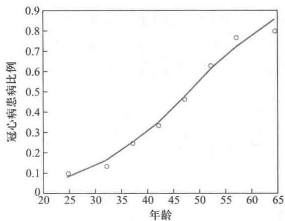  
图5logistic回归曲线与散点图