模型评价与结果分析首先我们看到,logit模型(5)的右端是年龄  $x$  的线性函数,如果加入  $x$  的二次项后,是否能显著地提高模型的拟合程度呢?即考虑模型

$$
\operatorname {logit}(\pi (x)) = \ln {\frac{\pi(x)}{1 - \pi(x)}} = \beta_{0} + \beta_{1}x + \beta_{2}x^{2} \tag{7}
$$

计算得到  $\beta_{0}, \beta_{1}, \beta_{2}$  的估计值分别为  $- 5.3506, 0.1194$  和  $- 0.0002$ ,其中  $\beta_{2}$  的  $p$  值为 0.9371,表示模型中引入  $x^{2}$  项并不能显著提高拟合程度.

其次,处理这类问题的另一种广义线性模型是 probit 模型,其形式为

$$
\pi (x) = \Phi (\beta_{0} + \beta_{1}x) \tag{8}
$$

$$
\operatorname {probit}(\pi (x)) = \Phi^{-1}(\pi (x)) = \beta_{0} + \beta_{1}x \tag{9}
$$

其中  $\Phi$  是正态概率分布函数,它也是 S 形曲线.利用 MATLAB 统计工具箱中的命令 glmfit 求解时,只需将 logit 改为 probit 即可.

用表 2 数据计算得到 probit 模型系数  $\beta_{0}, \beta_{1}$  的估计值分别为  $- 2.9933$  和 0.0624,标准差分别为 0.6011 和 0.0128,拟合偏差为 0.6529.  $y$  的预测值及置信区间与 logit 模型的结果比较见表 3,拟合曲线比较见图 6,可以发现这两个模型的拟合程度不相上下.

表3 probit模型与logit模型预测值的比较  

<table><tr><td>年龄段</td><td>年龄x</td><td>患病比例</td><td>预测值 (logit)</td><td>预测值 (probit)</td><td>置信区间 (logit)</td><td>置信区间 (probit)</td></tr><tr><td>20~29</td><td>24.5</td><td>0.1</td><td>0.078 3</td><td>0.071 5</td><td>[0.028 2, 0.199 2]</td><td>[0.019 7, 0.192 4]</td></tr><tr><td>30~34</td><td>32</td><td>0.13</td><td>0.157 4</td><td>0.159 5</td><td>[0.078 8, 0.289 8]</td><td>[0.076 0, 0.287 6]</td></tr><tr><td>35~39</td><td>37</td><td>0.25</td><td>0.240 0</td><td>0.246 9</td><td>[0.146 1, 0.368 3]</td><td>[0.151 3, 0.367 7]</td></tr><tr><td>40~44</td><td>42</td><td>0.33</td><td>0.348 1</td><td>0.354 8</td><td>[0.245 8, 0.466 6]</td><td>[0.255 2, 0.465 6]</td></tr><tr><td>45~49</td><td>47</td><td>0.46</td><td>0.474 4</td><td>0.475 9</td><td>[0.362 5, 0.589 1]</td><td>[0.369 0, 0.584 6]</td></tr><tr><td>50~54</td><td>52</td><td>0.63</td><td>0.604 1</td><td>0.599 4</td><td>[0.472 0, 0.722 7]</td><td>[0.474 2, 0.715 0]</td></tr><tr><td>55~59</td><td>57</td><td>0.76</td><td>0.720 7</td><td>0.713 5</td><td>[0.566 8, 0.835 7]</td><td>[0.566 6, 0.831 4]</td></tr><tr><td>60~69</td><td>64.5</td><td>0.80</td><td>0.850 1</td><td>0.848 9</td><td>[0.685 5, 0.936 6]</td><td>[0.685 4, 0.943 0]</td></tr></table>

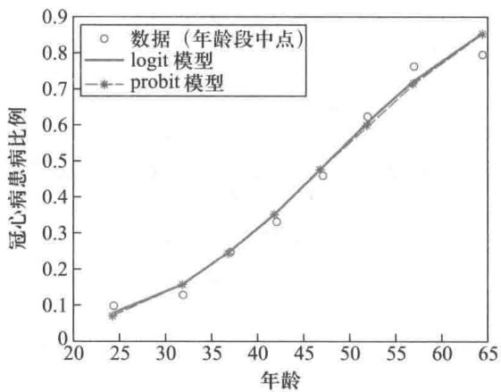  
图 6 probit 模型与 logit 模型的拟合比较

模型预测与进一步分析 通过上述分析可知, 对于我们的问题和观察数据, logit 模型

$$
\log \mathrm{it}(\hat{\pi} (x)) = \ln \frac{\hat{\pi}(x)}{1 - \hat{\pi}(x)} = -5.0382 + 0.1050x \tag{10}
$$

是一个合适的模型, 从(10)式能够给出任何年龄的人患冠心病的概率及相应的置信区间. 例如, 图7给出了年龄分别为20,30,40,50,60,70,80的人患冠心病的概率, 以及置信度为  $95\%$  的置信区间.

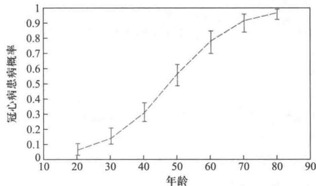  
图7 不同年龄的人患冠心病的概率的预测（竖线为置信区间）

logit模型的另一个好处是其中的回归系数  $\beta_{1}$  有很好的直观解释.logit模型与统计中odds(发生比或优势)的概念有密切的联系,所谓odds就是事件的发生概率与不发生概率之比.本节中,若记odds  $(x)$  为年龄  $x$  的人患与不患冠心病的概率之比,则

$$
\operatorname {odds}(x) = \frac{\pi(x)}{1 - \pi(x)} \tag{11}
$$

于是logit模型可以表示为

$$
\operatorname {odds}(x) = \mathrm{e}^{\beta_{0} + \beta_{1}x} \tag{12}
$$

当年龄增加1岁时odds比(发生比率或优势比)为

$$
\frac{\operatorname{odds}(x + 1)}{\operatorname{odds}(x)} = \frac{\mathrm{e}^{\beta_{0} + \beta_{1}(x + 1)}}{\mathrm{e}^{\beta_{0} + \beta_{1}x}} = \mathrm{e}^{\beta_{1}} \tag{13}
$$

于是

$$
\beta_{1} = \ln \frac{\operatorname{odds}(x + 1)}{\operatorname{odds}(x)} \tag{14}
$$

即  $\beta_{1}$  为自变量增加1个单位时odds比的对数  $\beta_{1} > 0$  时,  $\mathrm{e}^{\beta_{1}} > 1, x$  每增加1个单位, odds比会相应增加, 且对任意正整数  $k$ , 有

$$
\operatorname {odds}(x + k) = \mathrm{e}^{k\beta_{1}}\operatorname {odds}(x) \tag{15}
$$

在模型(10)中  $\beta_{1} = 0.1050$ , 可以算出一个20岁的青年人患冠心病的概率仅为  $\hat{\pi} (20) = 0.0503$ , 且发生比(患与不患冠心病的概率之比)为  $\operatorname {odds}(20) = 0.0593$ , 说明这个年龄的人患冠心病几乎是不太可能的, 年龄增加1岁患病概率的变化很小.10年后, 30岁人的发生比就变成  $\operatorname {odds}(30) = \mathrm{e}^{10\times \beta_{1}}\times 0.0593 = 0.1695$ , 发生比(可解释作危险

率)增大到20岁时的2.8577倍,而到60岁时,  $\mathrm{odds}(60) = \mathrm{e}^{40\times \beta_{1}}\times 0.0593 = 3.9545$  ,危险率是20岁的  $\mathrm{e}^{40\times \beta_{1}} = 66.6863$  倍.可见回归系数  $\beta_{1}$  在logit模型中有着重要的意义.这一点在probit模型中是无法体现的.

最后,在logit模型中,人们常常感兴趣的是,  $x$  取何值时  $\pi (x) = 0.5.$  由模型(10)求解  $\hat{\pi} (x^{*}) = 0.5$  ,可得  $x^{*} = 47.98.$  这就是说,当你到48岁时,患冠心病的概率就会大于不患冠心病的概率,要格外小心了!

上面只涉及因变量是0- 1变量且只有一个自变量的情形,对多个自变量  $x_{1},\dots ,x_{m}$  的情形,logit模型和probit模型的一般形式分别为

$$
\mathrm{logit}(\pi (x)) = \ln {\frac{\pi(x)}{1 - \pi(x)}} = \beta_{0} + \sum_{i = 1}^{m}\beta_{i}x_{i} \tag{16}
$$

$$
\mathrm{probit}(\pi (x)) = \Phi^{-1}(\pi (x)) = \beta_{0} + \sum_{i = 1}^{m}\beta_{i}x_{i} \tag{17}
$$

评注因变量是定性变量的回归分析作为一种有效的数据处理方法已被广泛应用,尤其在医学、社会调查、生物信息处理等领域.这类回归模型属于广义线性模型的研究范畴.

其中  $x_{1},\dots ,x_{m}$  可以是数值变量,也可以是分类变量(如  $x_{1} = 1$  表示男性,  $x_{1} = 0$  表示女性等),其分析与处理方式类似于一元的情形.

在建立多元logit模型和probit模型时,可以借鉴逐步回归的思想,在初始模型中一个个地加入自变量,包括某个自变量的二次或高次项(如(7)式),也包括某些自变量的交叉变量,并且实时地进行模型比较检验,以便选择与数据拟合较好的模型.

另外,当因变量是(特别是有序)多分类指标变量时,如观察结果为"无、轻、中、重"不同等级的数据,可以采用(有序)多分类logit模型[20]

# 复习题

将程序文件9- 15的冠心病数据按每5岁为一年龄段进行分组,重新建立患病比例与年龄的logit模型和probit模型,并进行分析和比较.

# 9.6 蠖虫分类判别

生物学家Grogan和Wirth曾就两种虫Af和Apf的鉴别问题进行研究,他们根据虫的触角长和翅长对虫进行了分类,这种分类方法在生物学上是常用的.研究中他们对已经确定类别的6个Apf虫与9个Af虫的触角长和翅长分别进行了测量,结果见表1.

<table><tr><td colspan="2">Apf 蠖虫样本</td><td colspan="2">Af 蠖虫样本</td><td colspan="2">待判样本 x</td></tr><tr><td>触角长</td><td>翅长</td><td>触角长</td><td>翅长</td><td>触角长</td><td>翅长</td></tr><tr><td>1.14</td><td>1.78</td><td>1.24</td><td>1.72</td><td>1.24</td><td>1.80</td></tr><tr><td>1.18</td><td>1.96</td><td>1.36</td><td>1.74</td><td>1.29</td><td>1.81</td></tr><tr><td>1.20</td><td>1.86</td><td>1.38</td><td>1.64</td><td>1.43</td><td>2.03</td></tr></table>

续表

<table><tr><td colspan="2">Apf 蝶虫样本</td><td colspan="2">Af 蝶虫样本</td><td colspan="2">待判样本 x</td></tr><tr><td>触角长</td><td>翅长</td><td>触角长</td><td>翅长</td><td>触角长</td><td>翅长</td></tr><tr><td>1.26</td><td>2.00</td><td>1.38</td><td>1.82</td><td></td><td></td></tr><tr><td>1.28</td><td>2.00</td><td>1.38</td><td>1.90</td><td></td><td></td></tr><tr><td>1.30</td><td>1.96</td><td>1.40</td><td>1.70</td><td></td><td></td></tr><tr><td></td><td></td><td>1.48</td><td>1.82</td><td></td><td></td></tr><tr><td></td><td></td><td>1.54</td><td>1.82</td><td></td><td></td></tr><tr><td></td><td></td><td>1.56</td><td>2.08</td><td></td><td></td></tr></table>

我们的任务是利用这份数据来建立一种区分两种蠓虫的模型,用于对已知触角长和翅长的待判蠓虫样本进行识别,并着重讨论以下问题:

- 根据表1中给出的Apf蠓虫和Af蠓虫样本数据建立模型,以便正确区分这两类蠓虫;

- 用建立的模型对表1中已知触角长和翅长的3个待判蠓虫样本进行判别;

- 如果Apf蠓虫是某种疾病的载体毒蠓,Af蠓虫是传粉益蠓,在这种情况下是否需要修改所用的分类方法,如何修改?

问题背景 本问题改编自1989年美国大学生数学建模竞赛的赛题,实际中经常会遇到这类数学建模问题,比如医生在掌握了以往各种疾病(如流感、肺炎、心肌炎等)指标特征的情况下,根据一个新患者的各项检查指标来判定他患有哪类疾病,又如已知不同类型飞机的雷达反射波的各项特征指标,来判定一架飞机属于哪种类型。这种在已知样本分类的前提下,利用已有的样本数据建立判别模型,用来对未知类别的新样本进行分类的问题属于统计学中的判别分析。目前,判别分析已经成为数据挖掘、机器学习、模式识别(语音识别、图像识别、指纹识别、文本识别)等应用领域的重要理论基础。

蠓虫分类判别属于判别分析,可以通过生物学家给出的9个Af蠓虫与6个Apf蠓虫作为训练样本,利用这些蠓虫的触角长和翅长的数据,建立关于指标的判别函数和判别准则,由此对新的蠓虫样本进行分类,并且利用判别准则进行回判或交互验证,以估计误判率。下面先利用距离判别方法建立比较简单的模型,再用Bayes判别方法处理需要区分毒蠓和益蠓的特殊情况。

问题分析 对表1蠓虫样本的数据作散点图(图1),观察图形发现,Apf蠓虫的数据点集中在图的左上方,Af蠓虫的数据点集中在图的右下方,而3个待判样本处于两类点之间。这表明每类蠓虫的触角长和翅长两个指标之间是相关的。直观的判别方法应该是,找一条直线把这两类点分开,将它作为Apf蠓虫和Af蠓虫的分界线,依此构成判别准则,用于确定3个待判样本属于哪一类。

距离判别模型的基本思路 假设Apf蠓虫和Af蠓虫的训练样本分别来自总体  $G_{1}$  和  $G_{2}$ ,蠓虫的指标记作2维向量  $\boldsymbol{x} = (x^{(1)},x^{(2)})^{\mathrm{T}}$ ,是平面上的一个点,其中  $x^{(1)},x^{(2)}$  分别为蠓虫的触角长和翅长。距离判别模型的基本思路是,恰当地定义每个总体的中心,以及每个样本与中心的距离;计算待判样本与两个中心的距离,以距离较近作为判别

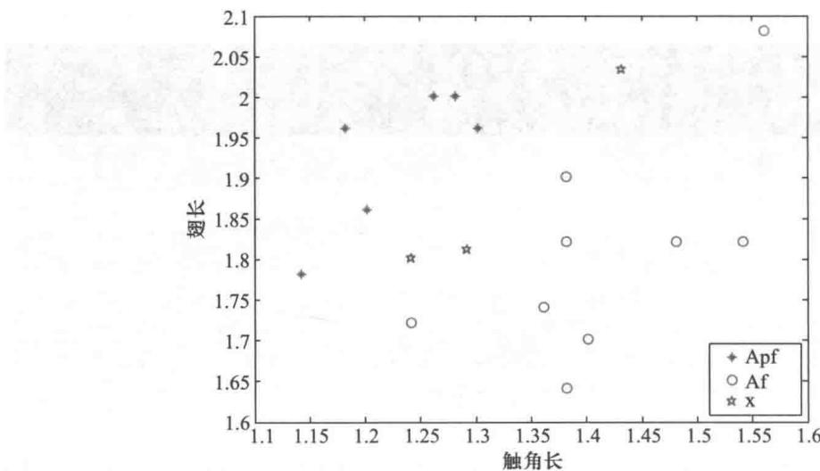  
图1 蟑虫样本数据的散点图（\*表示待判样本）

准则.[34]

设总体  $G$  的期望值向量为  $\mu$  ,协方差矩阵为  $\pmb{\Sigma}$  显然,取  $\mu$  为总体的中心.至于距离,我们不用通常的欧氏距离,而采用统计学的马氏(Mahalanobis)距离.样本  $\boldsymbol{x}$  到总体  $G$  的马氏距离定义为

$$
d(x,G) = \sqrt{(x - \mu)^{\mathrm{T}}\Sigma^{-1}(x - \mu)} \tag{1}
$$

应该指出,马氏距离考虑了指标  $x^{(1)}$  (触角长)和  $x^{(2)}$  (翅长)之间的相关性及各自取值的分散性,而欧氏距离则把两个指标视为完全独立的变量,所以在制定判别准则时采用马氏距离更加合理.显然,当  $\pmb{\Sigma}$  为单位矩阵时,两个距离等价.

记总体  $G_{1}$  和  $G_{2}$  的期望值向量分别为  $\mu_{1}$  与  $\mu_{2}$  ,协方差矩阵分别为  $\pmb{\Sigma}_{1}$  与  $\pmb{\Sigma}_{2}$  对给定的样本  $\boldsymbol{x}$  ,分别计算  $\boldsymbol{x}$  到总体  $G_{1}$  和  $G_{2}$  的马氏距离的平方  $d^{2}(x,G_{1})$  和  $d^{2}(x,G_{2})$  .依据距离就近的原则,若  $d^{2}(x,G_{1})\leqslant d^{2}(x,G_{2})$  ,则判定  $\boldsymbol{x}\in G_{1}$  ;否则判定  $\boldsymbol{x}\in G_{2}$  .由于

$$
d^{2}(x,G_{2}) - d^{2}(x,G_{1}) = (x - \mu_{2})^{\mathrm{T}}\Sigma_{2}^{-1}(x - \mu_{2}) - (x - \mu_{1})^{\mathrm{T}}\Sigma_{1}^{-1}(x - \mu_{1}) \tag{2}
$$

若记

$$
W(x) = \frac{1}{2} (d^{2}(x,G_{2}) - d^{2}(x,G_{1})) \tag{3}
$$

则判别准则等价于

$$
\left\{ \begin{array}{l l}{x\in G_{1},} & {\mathrm{~if~}\mathbb{H}\mathbb{H}\mathbb{H}\mathbb{H}\mathbb{H}\mathbb{H}\mathbb{H}\mathbb{H}\mathbb{H}\mathbb{H}\mathbb{H}\mathbb{H}\mathbb{H}\mathbb{H}\mathbb{H}\mathbb{H}\mathbb{H}\mathbb{H}\mathbb{H}\mathbb{H}\mathbb{I}}\\ {x\in G_{2},} & {\mathrm{~if~}\mathbb{H}\mathbb{H}\mathbb{H}\mathbb{H}\mathbb{H}\mathbb{H}\mathbb{H}\mathbb{H}\mathbb{H}\mathbb{H}\mathbb{H}\mathbb{H}\mathbb{H}\mathbb{H}\mathbb{H}\mathbb{H}\mathbb{H}\mathbb{H}} \end{array} \right. \tag{4}
$$

称  $W(x)$  为距离判别函数,它一般是  $\boldsymbol{x}$  的二次函数,而当  $\pmb{\Sigma}_{1} = \pmb{\Sigma}_{2} = \pmb{\Sigma}$  时容易证明

$$
W(x) = a^{\mathrm{T}}(x - \mu),\quad a = \Sigma^{-1}(\mu_{1} - \mu_{2}),\quad \mu = \frac{1}{2} (\mu_{1} + \mu_{2}) \tag{5}
$$

这时  $W(x)$  是  $\boldsymbol{x}$  的一次函数,称为线性距离判别函数,并称  $a$  为判别系数

虫分类的距离判别模型在实际应用中,总体的期望值向量  $\mu_{1},\mu_{2}$  及协方差矩阵  $\pmb{\Sigma}_{1},\pmb{\Sigma}_{2}$  需要用训练样本数据来估计.设样本  $x_{1k}(k = 1,2,\dots ,n_{1})$  取自  $G_{1},x_{2k}(k = 1$

$2,\dots ,n_{2})$  取自  $G_{2}$  ,分别计算样本的均值向量  $\overline{{x}}_{1},\overline{{x}}_{2}$

$$
\overline{{x}}_{1} = \frac{1}{n_{1}}\sum_{k = 1}^{n_{1}}x_{1k},\quad \overline{{x}}_{2} = \frac{1}{n_{2}}\sum_{k = 1}^{n_{2}}x_{2k} \tag{6}
$$

和协方差矩阵  $S_{1},S_{2}$

$$
S_{1} = \frac{1}{n_{1} - 1}\sum_{k = 1}^{n_{1}}\left(x_{1k} - \overline{{x}}_{1}\right)\left(x_{1k} - \overline{{x}}_{1}\right)^{\mathrm{T}},\quad S_{2} = \frac{1}{n_{2} - 1}\sum_{k = 1}^{n_{2}}\left(x_{2k} - \overline{{x}}_{2}\right)\left(x_{2k} - \overline{{x}}_{2}\right)^{\mathrm{T}} \tag{7}
$$

作为  $\mu_{1},\mu_{2}$  及  $\pmb{\Sigma}_{1},\pmb{\Sigma}_{2}$  的估计

当  $\pmb{\Sigma}_{1}\neq \pmb{\Sigma}_{2}$  时,用  $S_{1},S_{2}$  代替(2)式的  $\pmb{\Sigma}_{1},\pmb{\Sigma}_{2}$  当  $\pmb{\Sigma}_{1} = \pmb{\Sigma}_{2}$  时,用混合协方差矩阵

$$
S_{w} = \frac{\left(n_{1} - 1\right)S_{1} + \left(n_{2} - 1\right)S_{2}}{n_{1} + n_{2} - 2} \tag{8}
$$

代替(5)式的  $\pmb{\Sigma}$

为了将上述方法应用到虫分类判别,首先需要确定Apf虫总体  $G_{1}$  和Af虫  $G_{2}$  是否具有相同的协方差矩阵,这关系到我们将选用线性判别函数还是二次判别函数,为此需要先作两总体  $G_{1}$  和  $G_{2}$  协方差矩阵的一致性检验(BoxM检验),即检验假设

$$
H_{0}:\pmb{\Sigma}_{1} = \pmb{\Sigma}_{2},\quad H_{1}:\pmb{\Sigma}_{1}\neq \pmb{\Sigma}_{2}
$$

由多元统计的结果可以知道,对于2维总体,该假设检验的统计量为  $①$

$$
M^{*} = (1 - c)M\sim \chi^{2}(3)
$$

其中  $M = (n_{1} + n_{2} - 2)\ln |S_{w}| - (n_{1} - 1)\ln |S_{1}| - (n_{2} - 1)\ln |S_{2}|,c = \frac{13}{18}\Big(\frac{1}{n_{1} - 1} +\frac{1}{n_{2} - 1} - \frac{1}{n_{1} + n_{2} - 2}\Big).$

对给定的检验水平  $\alpha$  ,计算概率  $p_{0} = P(M^{*} > \chi_{\alpha}^{2}(3))$  ,若  $p_{0}< \alpha$  则拒绝  $H_{0}$  ,否则接受  $H_{0}$  在虫分类问题中,若取  $\alpha = 0.05$  ,经编程计算,  $p_{0} = 0.4359 > 0.05$  ,故接受原假设  $H_{0}$  可以用线性判别函数进行分类.

程序文件9- 16 虫分类判别

根据表1的虫样本数据,按照  $(5)\sim (8)$  式编程计算  $②$  ,输出的判别系数  $\pmb {a} =$  prog0906. m (- 58.2364,38.0587),常数项为5.8715,故线性距离判别函数为

$$
W(x) = -58.2364x^{(1)} + 38.0587x^{(2)} + 5.8715 \tag{9}
$$

判别直线  $W(x) = 0$  的图形见图2.3个待判虫样本的判别结果见表2,其结论是:待判虫样本1属于Apf虫,而样本2和3均属于Af虫.从图2也可直接给出这个结果.

表23个待判虫样本的距离判别结果  

<table><tr><td>待判虫虫序号</td><td>触角长x(1)</td><td>翅长x(2)</td><td>判别函数值W(x)</td><td>判别结果</td></tr><tr><td>1</td><td>1.24</td><td>1.80</td><td>2.1640</td><td>Apf</td></tr><tr><td>2</td><td>1.29</td><td>1.81</td><td>-0.3673</td><td>Af</td></tr><tr><td>3</td><td>1.43</td><td>2.03</td><td>-0.1475</td><td>Af</td></tr></table>

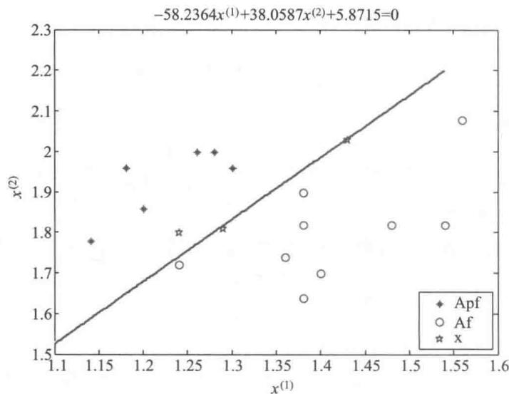  
图2 距离判别直线及样本判别结果图

模型检验 对于距离判别函数比如虫分类判别(9)式的有效性,通常有下面两种检验方法:

方法一 回代误判法

将取自总体  $G_{1}$  的  $n_{1}$  个训练样本和  $G_{2}$  的  $n_{2}$  个训练样本,逐个回代到判别函数中并判定其归属.若原本属于  $G_{1}$  被误判属于  $G_{2}$  的样本个数为  $n_{12}$  ,原本属于  $G_{2}$  被误判属于  $G_{1}$  的样本个数为  $n_{21}$  ,则回代误判率的估计值为  $\hat{p} = \frac{n_{12} + n_{21}}{n_{1} + n_{2}}.$

对于虫分类判别问题,经编程计算,  $n_{12} = n_{21} = 0$  ,故回代误判率的估计值为0.

方法二 交叉验证法

从来自总体  $G_{1}$  的  $n_{1}$  个训练样本中,每次拿出一个作为验证样本,其余  $n_{1} - 1$  个与来自总体  $G_{2}$  的  $n_{2}$  个一起,作为训练样本用于建立判别准则,用验证样本进行检验.然后换一个作为验证样本.在总共  $n_{1}$  次检验中误判的样本个数记为  $n_{12}^{*}$  .对来自总体  $G_{2}$  的 $n_{2}$  个训练样本完成同样的步骤,在总共  $n_{2}$  次检验中误判的样本个数记为  $n_{21}^{*}$  ,则交叉验

证误判率的估计值为  $\hat{p}^{*} = \frac{n_{12}^{*} + n_{21}^{*}}{n_{1} + n_{2}}.$

对于虫分类判别问题,经编程计算,  $n_{12}^{*} = 0$  ,  $n_{21}^{*} = 1$  ,因为  $n_{1} + n_{2} = 15$  ,所以交叉验证误判率的估计值为  $1 / 15$

距离判别方法虽然简单、直观,应用较广,但也有明显的缺点,一是没有考虑在整体环境中两个总体出现的概率会有不同;二是没有涉及误判造成的损失的影响.在虫分类问题中已经指出,Apf 虫是某种疾病的载体毒, Af 虫是传粉益.这两种虫在自然界中出现的概率应该是不一样的,并且,将毒,Apf误判成益, Af的危害要比将益, Af误判成毒, Apf的危害更大.基于这些考虑,需要在模型中引入总体类别的先验概率和误判造成的损失函数,于是有下面的Bayes判别模型.[34]

Bayes判别模型的基本思路假设样本来自总体  $G_{1}$  和  $G_{2}$  的先验概率分别是  $p_{1}$  和 $p_{2}(p_{1} + p_{2} = 1)$  ,并且两总体的概率密度函数分别是  $f_{1}({\pmb x})$  和  $f_{2}({\pmb x})$  ,那么在取到样本  $\pmb{x}$  以后,它属于总体  $G_{i}(i = 1,2)$  的后验概率可以根据Bayes公式得到

$$
P(G_{i}|\pmb {x}) = \frac{p_{i}f_{i}(\pmb{x})}{p_{1}f_{1}(\pmb{x}) + p_{2}f_{2}(\pmb{x})},\quad i = 1,2 \tag{10}
$$

因此,在不考虑误判损失的情况下,有以下的判别规则

$$
\left\{ \begin{array}{l l}{\pmb {x}\in G_{1},}\\ {\pmb {x}\in G_{2},} \end{array} \right. \tag{11}
$$

若考虑误判损失,用  $R_{1},R_{2}$  分别表示样本  $\pmb{x}$  根据某种判别规则被判人总体  $G_{1}$  和 $G_{2}$  的取值集合  $(R_{1}\cup R_{2} = \Omega)$  .用  $L(j|i)\left(i,j = 1,2\right)\left(i\neq j\right)$  表示将来自总体  $G_{i}$  的样本  $\pmb{x}$  误判人  $G_{j}$  的损失,造成损失  $L(j|i)\left(i\neq j\right)$  的误判概率为

$$
P(j\mid i) = P(\pmb {x}\in R_{j}\mid \pmb {x}\in G_{i}) = \int_{R_{j}}f_{i}(\pmb {x})\mathrm{d}\pmb {x},\quad i,j = 1,2 \tag{12}
$$

因此,总误判损失的期望(平均误判损失)为

$$
E C M(R_{1},R_{2}) = L(2\mid 1)P(2\mid 1)p_{1} + L(1\mid 2)P(1\mid 2)p_{2} \tag{13}
$$

一个合理的判别准则是最小化  $E C M(R_{1},R_{2})$

可以证明,最小化  $E C M(R_{1},R_{2})$  的判别准则为

$$
\left\{ \begin{array}{l l}{\pmb {x}\in G_{1},}\\ {\pmb {x}\in G_{2},} \end{array} \right. \tag{14}
$$

称为Bayes判别准则

特别地,当总体  $G_{1}\sim N(\pmb{\mu}_{1},\pmb{\Sigma}_{1})$ $G_{2}\sim N(\pmb{\mu}_{2},\pmb{\Sigma}_{2})$  ,且  $\pmb{\Sigma}_{1} = \pmb{\Sigma}_{2} = \pmb{\Sigma}$  时,经过简单的计算,可知(14)式等价于以下的Bayes判别准则

$$
\left\{ \begin{array}{l l}{\pmb {x}\in G_{1},}\\ {\pmb {x}\in G_{2},} \end{array} \right. \tag{15}
$$

其中

$$
W_{B}(\pmb {x}) = \left(\pmb {x}\frac{\pmb{\mu}_{1} + \pmb{\mu}_{2}}{2}\right)^{\mathrm{T}}\pmb{\Sigma}^{-1}(\pmb{\mu}_{1} - \pmb{\mu}_{2}),\quad \beta = \ln \frac{L(1\mid 2)p_{2}}{L(2\mid 1)p_{1}} \tag{16}
$$

$W_{B}({\pmb x})$  称为Bayes判别函数,与(5)式定义的线性距离判别函数完全一致,因此当阈值  $\beta = 0$  时,Bayes判别准则与线性距离判别准则等价,而这正是既不考虑样本的先验概率(即  $p_{1} = p_{2}$  )、也不考虑误判损失(即  $L(1\mid 2) = L(2\mid 1)$  )的特殊情况.

由分类的Bayes判别模型假定Apf 螺虫总体服从二维正态分布,  $G_{1}\sim N(\pmb{\mu}_{1}$ $\pmb{\Sigma}_{1}$  ),Af 螺虫总体  $G_{2}\sim N(\pmb{\mu}_{2},\pmb{\Sigma}_{2})$  ①.前面已经验证  $\pmb{\Sigma}_{1} = \pmb{\Sigma}_{2} = \pmb{\Sigma}$  ,Bayes判别函数  $W_{B}({\pmb x})$  与(9)式表示的线性距离判别函数  $W({\pmb x})$  完全相同,对待判虫进行判别时只需考虑阈值 $\beta$  的影响.

实际上,总体  $G_{1}$  和  $G_{2}$  的先验概率可以利用历史资料和经验进行估计,一种常见的

做法是取为训练样本个数的比例,即令Apf 螺虫的先验概率  $p_{1} = \frac{n_{1}}{n_{1} + n_{2}} = 0.4$ , Af 螺虫的先验概率  $p_{2} = \frac{n_{2}}{n_{1} + n_{2}} = 0.6$ . 考虑到将毒蠓 Apf 误判成益蠓 Af 的危害更大,可设  $L(211) = \alpha L(112)$ ,其中参数  $\alpha > 1$ ,于是阈值  $\beta = \ln \left(\frac{3}{2\alpha}\right)$ ,Bayes 判别函数为

$$
W_{B}(\pmb {x}) = -58.2364x^{(1)} + 38.0587x^{(2)} + 5.8715 \tag{17}
$$

而 Bayes 判别准则为

$$
\left\{ \begin{array}{l l}{\pmb {x}\in G_{1},} & {\mathrm{~}\mathrm{~}\mathrm{~}\mathrm{~}\mathrm{~}\mathrm{~}\mathrm{~}\mathrm{~}\mathrm{~}\mathrm{~}\mathrm{~}\mathrm{~}\mathrm{~}\mathrm{~}\mathrm{~}\mathrm{~}\mathrm{~}\mathrm{~}\mathrm{~}\mathrm{~}\mathrm{~}\mathrm{~}\mathrm{~}\mathrm{~}\mathrm{~}\mathrm{~}}\\ {\pmb {x}\in G_{2},} & {\mathrm{~}\mathrm{~}\mathrm{~}\mathrm{~}\mathrm{~}\mathrm{~}\mathrm{~}\mathrm{~}\mathrm{~}\mathrm{~}\mathrm{~}\mathrm{~}\mathrm{~}\mathrm{~}\mathrm{~}\mathrm{~}\mathrm{~}\mathrm{~}\mathrm{~}\mathrm{~}\mathrm{~}\mathrm{~}\mathrm{~}\mathrm{~}} \end{array} \right. \tag{18}
$$

评注 本节以蠓虫分类判别为例介绍了距离判别模型和 Bayes 判别模型,针对的是两分类的判别问题,可以推广到多分类的判别情况. 还有很多其他的判别方法,拓展阅读9- 1将介绍 Fisher 判别法. 还有,逐步判别法、k 近邻判别法、支持向量机及主成分判别法等,在处理高维数据分类研究中起着非常重要的作用,目前判别分析建模已经成为人工智能和数据挖掘中非常有影响力的方法.

分别取  $\alpha = 1.5,2,2.5$  等,用 Bayes 判别准则对待判蠓虫进行判别,结果见表 3.

表3不同误判损失下的判别结果  

<table><tr><td>待判蠓虫序号</td><td>触角长x(1)</td><td>翅长x(2)</td><td>判别函数值Wx(x)</td><td>判别结果(α=1.5)</td><td>判别结果(α=2.0)</td><td>判别结果(α=2.5)</td></tr><tr><td>1</td><td>1.24</td><td>1.80</td><td>2.1640</td><td>Apf</td><td>Apf</td><td>Apf</td></tr><tr><td>2</td><td>1.29</td><td>1.81</td><td>-0.3673</td><td>Af</td><td>Af</td><td>Apf</td></tr><tr><td>3</td><td>1.43</td><td>2.03</td><td>-0.1475</td><td>Af</td><td>Apf</td><td>Apf</td></tr></table>

当  $\alpha = 1.5$  时,三个待判样本的 Bayes 判别法的判别结果完全与距离判别法的结果一致,当  $\alpha = 2$  时,待判样本 3 被判别为 Apf 螵虫,而当  $\alpha = 2.5$  时,待判样本 2 和 3 均被判别为 Apf 螵虫,这充分反映了考虑到误判造成损失的 Bayes 判别法的作用,也说明了 Bayes 判别法要比距离判别法更切合实际.

经编程计算,对上述三种  $\alpha$  的不同取值,Bayes 判别的回代误判率的估计值为 0,事实上可以验证,当  $\alpha \in [0.0129,3.6189]$  时,回代误判率的估计值均为 0. 其交叉验证误判率的估计值,有兴趣的读者可以自行编程得到.

# 复习题

1. 假定 Apf 螵虫总体与 Af 螺虫总体的协方差矩阵不相等,对问题中所给的 螺虫数据,重新估计三个待判样本到两总体的距离,并进行分类判别.

2. 如果已经确认了三个待判蠓虫样本 1,2 和 3 分别属于 Apf 螵虫、Af 螵虫和 Af 螵虫,请再次用 距离判别法对新发现的 螺虫样本  $\pmb {x} = (1.35,1.88)^{\top}$  进行判别,并写出线性距离判别函数.

# 9.7 学生考试成绩综合评价

某高校数学系为开展研究生的推荐免试工作,对报名参加推荐的 52 名学生已修过的 6 门课的考试分数统计如表 1. 这 6 门课是:数学分析、高等代数、概率论、微分几何、

抽象代数和数值分析, 其中前 3 门基础课采用闭卷考试, 后 3 门为开卷考试.

表152名学生的原始考试成绩（全部数据见数据文件9-4）  

<table><tr><td>学生序号</td><td>数学分析</td><td>高等代数</td><td>概率论</td><td>微分几何</td><td>抽象代数</td><td>数值分析</td><td>总分</td></tr><tr><td>A1</td><td>62</td><td>71</td><td>64</td><td>75</td><td>70</td><td>68</td><td>410</td></tr><tr><td>A2</td><td>52</td><td>65</td><td>57</td><td>67</td><td>60</td><td>58</td><td>359</td></tr><tr><td>...</td><td>...</td><td>...</td><td>...</td><td>...</td><td>...</td><td>...</td><td>...</td></tr><tr><td>A52</td><td>70</td><td>73</td><td>70</td><td>88</td><td>79</td><td>69</td><td>449</td></tr></table>

在以往的推荐免试工作中, 该系是按照学生 6 门课成绩的总分进行学业评价, 再根据其他要求确定最后的推荐顺序. 但是这种排序办法没有考虑到课程之间的相关性, 以及开闭卷等因素, 丢弃了一些信息. 我们的任务是利用这份数据建立一个统计模型, 并研究以下问题:

- 如何确定若干综合评价指标来最大程度地区分学生的考试成绩, 并在不丢失重要信息的前提下简化对学生的成绩排序;

- 在学生评价中如何体现开闭卷的影响, 找到成绩背后的潜在因素, 并科学地针对考试成绩进行合理排序.

问题分析 考试成绩是目前衡量学生学业水平最重要的标准, 对于多门课的成绩, 通常的方法是用总分作为排序的定量依据. 这样做虽然简化了问题, 但失去了许多有用的信息. 若用  $x_{1}, x_{2}, x_{3}, x_{4}, x_{5}, x_{6}$  分别表示数学分析、高等代数、概率论、微分几何、抽象代数和数值分析的分数, 那么 6 维向量  $\boldsymbol{x} = (x_{1}, x_{2}, \dots , x_{6})^{\mathrm{T}}$  表示一个学生的 6 门课的分数, 平均分相当于各门课分数的等权平均值, 是将一个 6 维的数据简单地化为一维指标. 能不能不用这样的平均分, 而是寻找一组权重  $\boldsymbol{a}_{1} = (a_{11}, a_{12}, \dots , a_{16})^{\mathrm{T}}$ , 将加权后的平均分数  $y_{1} = \sum_{j = 1}^{6} a_{1j} x_{j}$  作为评价一个学生综合成绩的指标呢?

当然希望选取合适的  $\boldsymbol{a}_{1}$  使  $y_{1}$  能尽可能多地反映原变量  $\boldsymbol{x}$  的信息, 即最大程度地区分学生的成绩. 我们知道, 一个变量的方差越大, 它的区分性就越大, 因此取  $\boldsymbol{a}_{1}$  使  $y_{1}$  的方差最大, 并且可以要求  $\boldsymbol{a}_{1}$  是单位向量, 即  $\boldsymbol{a}_{1}^{\mathrm{T}} \boldsymbol{a}_{1} = 1$ . 这样选择的原变量  $\boldsymbol{x}$  的线性组合  $y_{1}$  在统计上称为第一主成分 (即第一个综合变量). 用  $y_{1}$  代替  $\boldsymbol{x}$ , 评价指标就从 6 维降到了 1 维.

如果  $y_{1}$  反映的原变量  $\boldsymbol{x}$  的信息还不够充分, 则可以提取新的信息, 构造第二主成分  $y_{2} = \boldsymbol{a}_{2}^{\mathrm{T}} \boldsymbol{x}$ , 在  $y_{2}$  与  $y_{1}$  所提供的信息不重叠 (即不相关) 的条件下, 选取  $\boldsymbol{a}_{2}$  使  $y_{2}$  的方差最大. 用  $y_{1}, y_{2}$  代替  $\boldsymbol{x}$ , 评价指标降到 2 维. 依此类推, 这种解决问题的方法就是统计中主成分分析的基本思路.

为了直观地描述这样的降维过程, 假定只有数学分析和高等代数两门课的成绩, 即 2 维数据, 全体学生的成绩可用散点图表示, 如图 1 中的符号  $+$  (其横坐标、纵坐标分别是数学分析和高等代数的分数). 这些数据点大多集中在一个向上斜置的椭圆内, 表明两门课的分数有较强的正相关性. 椭圆的长轴 (实线) 与短轴 (虚线) 相互垂直, 显然, 在长轴方向数据变化较大, 在短轴方向数据变化较小, 选用长轴方向的 1 维

变量就包含了2维数据的大部分信息,而寻求这样的新变量可以通过变量代换(即坐标旋转)来完成.

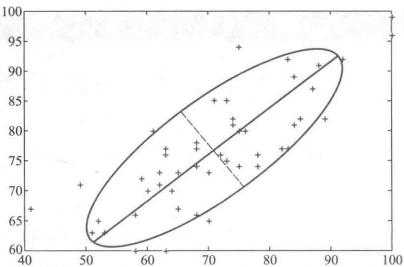  
图1 2维数据（数学分析和高等代数的分数）降维示意图

主成分分析和因子分析是用统计学解决这个问题的两种方法[34],下面先简单介绍它们的基本思路,再用来处理学生成绩的综合评价.

主成分分析的基本思路按照统计学的观点,将学生各门课(假定是  $p$  门)的分数视为一个  $p$  维随机变量,记作  $\pmb {x} = (x_{1},x_{2},\dots ,x_{p})^{\mathrm{T}}$  ,假设  $\boldsymbol{x}$  的期望向量  $E(x) = \pmb{\mu}$  和协方差矩阵  $\operatorname {Cov}(\pmb {x}) = \pmb{\Sigma}$  为已知.用一组单位向量  $a_{1},a_{2},\dots ,a_{p}$  构造  $\boldsymbol{x}$  的  $p$  个线性组合,称为主成分  $\boldsymbol {y} = (y_{1},y_{2},\dots ,y_{p})^{\mathrm{T}}$  ,有

$$
\left\{ \begin{array}{l l}{y_{1} = a_{11}x_{1} + a_{12}x_{2} + \dots +a_{1p}x_{p} = a_{1}^{\mathrm{T}}x}\\ {y_{2} = a_{21}x_{1} + a_{22}x_{2} + \dots +a_{2p}x_{p} = a_{2}^{\mathrm{T}}x}\\ {\qquad \dots \dots \dots \dots}\\ {y_{p} = a_{p1}x_{1} + a_{p2}x_{2} + \dots +a_{p p}x_{p} = a_{p}^{\mathrm{T}}x} \end{array} \right. \tag{1}
$$

简记作

$$
\begin{array}{r}{\boldsymbol {y} = \boldsymbol {A}\boldsymbol {x},\quad \boldsymbol {A} = (\boldsymbol{a}_{1},\boldsymbol{a}_{2},\dots ,\boldsymbol{a}_{p})^{\mathrm{T}}} \end{array} \tag{2}
$$

$a_{1},a_{2},\dots ,a_{p}$  称为主成分(载荷)系数.要求各个主成分  $y_{1},y_{2},\dots ,y_{p}$  之间互不相关,即协方差矩阵  $\operatorname {Cov}(y)$  为对角阵,记作  $\pmb {\Lambda} = \mathrm{diag}(\lambda_{1},\lambda_{2},\dots ,\lambda_{p})^{\mathrm{T}}$  .且第一主成分  $y_{1}$  是  $\boldsymbol{x}$  的一切线性组合中方差最大的,第二主成分  $y_{2}$  是与  $y_{1}$  不相关的  $\boldsymbol{x}$  的线性组合中方差最大的,依此类推.

怎样确定主成分系数  $a_{1},a_{2},\dots ,a_{p}$  呢?按照  $y$  的协方差矩阵应为对角阵的要求,有

$$
\operatorname {Cov}(\boldsymbol {y}) = \operatorname {Cov}\left(\boldsymbol {A}\boldsymbol {x}\right) = \boldsymbol {A}\operatorname {Cov}\left(\boldsymbol {x}\right)\boldsymbol{A}^{\mathrm{T}} = \boldsymbol {A}\boldsymbol {\Sigma}\boldsymbol{A}^{\mathrm{T}} = \boldsymbol {A} = \operatorname {diag}\left(\lambda_{1},\lambda_{2},\dots ,\lambda_{p}\right) \tag{3}
$$

因为  $\boldsymbol{x}$  的协方差矩阵  $\pmb{\Sigma}$  通常是对称正定矩阵,根据线性代数的基本定理,一定存在一组单位正交特征向量  $a_{1},a_{2},\dots ,a_{p}$  构成的正交矩阵  $A$  ,使(3)式成立,且若  $\pmb{\Sigma}$  的特征根(也是  $\boldsymbol{A}$  的特征根)按照大小排序  $\lambda_{1}\geqslant \lambda_{2}\geqslant \dots \geqslant \lambda_{p}\geqslant 0$  ,则  $a_{1},a_{2},\dots ,a_{p}$  为其对应的单位正交特征向量.

评注原始变量 $x_{1},x_{2},\dots ,x_{p}$  之间的相关性越强,主成分包含的信息

记  $\pmb{\Sigma}$  的特征根之和为  $\lambda = \sum_{j = 1}^{p}\lambda_{j}$  ,则主成分  $y_{1},y_{2},\dots ,y_{p}$  的方差之和与原始变量

$x_{1},x_{2},\dots ,x_{p}$  的方差之和均等于  $\lambda$  ,可见  $p$  个互不相关的主成分包含了原始数据中的全部信息,但主成分所包含的信息更为集中.并且,第  $j$  主成分  $y_{j}$  的方差占全部方差的比例为  $\lambda_{j} / \lambda$  ,称为  $y_{j}$  的方差贡献率,显然第一主成分  $y_{1}$  的方差贡献率最大,其余的依次递减.前  $m$  个主成分的方差贡献率之和称为它们的累积贡献率.

主成分分析的目的是要降维,所以一般不会使用所有的  $p$  个主成分,在信息损失不太多的情况下,可用少数几个主成分来代替原始变量进行数据分析.究竟需要多少个主成分来代替呢?通常取累积贡献率达到  $80\%$  的前  $m$  个即可.

学生成绩的主成分分析回到学生成绩的综合评价问题,记  $x_{ij}(i = 1,2,\dots ,n,j = 1,2,\dots ,p)$  为第  $i$  位学生第  $j$  门课的分数,  $\boldsymbol {X} = (x_{ij})_{n\times p}$  为分数数据矩阵(对于表  $1,n = 52$ $p = 6$  ).记  $\boldsymbol{x}_{i} = (x_{i1},x_{i2},\dots ,x_{ip})^{\mathrm{T}}(i = 1,2,\dots ,n)$  ,是  $p$  维随机变量  $x$  的一个观测值,均值向量  $\overline{{x}} = \frac{1}{n}\sum_{i = 1}^{n}x_{i} = (\overline{{x}}_{1},\overline{{x}}_{2},\dots ,\overline{{x}}_{p})^{\mathrm{T}}$  作为  $E\left(x\right) = \mu$  的估计值,  $X$  的协方差矩阵  $S =$ ${\frac{1}{n- 1}}\sum_{i=1}^{n}\left(x_{i}- {\overline{{x}}}\right)\left(x_{i}- {\overline{{x}}}\right)^{\mathrm{T}}$  作为  $\operatorname {Cov}\left(\boldsymbol {x}\right) = \boldsymbol{\Sigma}$  的估计值.

计算  $s$  的特征根并按大小排序为  $\lambda_{1}\geqslant \lambda_{2}\geqslant \dots \geqslant \lambda_{p}\geqslant 0$  ,其对应的单位正交特征向量就是主成分系数  $a_{1},a_{2},\dots ,a_{p}$

MATLAB中用观测数据矩阵  $X$  进行主成分分析的函数命令是princomp,调用格式为:

[COEFF,SCORE,LATENT]  $=$  princomp(X)

其中输入参数X是  $n\times p$  阶观测数据矩阵,每一行对应一个观测值,每一列对应一个变量.输出参数COEFF是主成分的  $p\times p$  阶系数矩阵,第  $j$  列是第  $j$  主成分的系数向量;SCORE是  $n\times p$  阶得分矩阵,其第  $i$  行第  $j$  列元素是第  $i$  观测值、第  $j$  主成分的得分;LATENT是X的特征根按大小排序构成的向量.

值得注意的是,princomp函数对观测数据进行了中心化处理,即  $X$  的每一个元素减去其所在列的均值,相应地,其输出也是中心化的主成分系数.

用协方差矩阵或相关系数矩阵进行主成分分析的函数命令是pcacov,调用格式见MATLAB帮助系统.

对于数据文件9- 4的考试成绩数据矩阵,首先计算均值向量  $\overline{{x}}$  和协方差矩阵  $s$  ,得

$$
\overline{{x}} = (\overline{{x}}_{1},\overline{{x}}_{2},\overline{{x}}_{3},\overline{{x}}_{4},\overline{{x}}_{5},\overline{{x}}_{6})^{\mathrm{T}}
$$

$$
= (70.903 8,76.576 9,71.807 7,74.769 2,67.826 9,61.384 6)^{\mathrm{T}}
$$

$$
S = (\dot{s}_{i j})_{6\times 6}
$$

$$
\begin{array}{r l}{(\begin{array}{l l l l l l l l l l l l l l l l l l l l l l l l l l l l l l l l l l l l l l l l l l l l l l l l l l l l l l l l l l l l l l l l l l l l l l l l l l l l l l l l l l l l l l l l l l l l l l l l l l l l l \end{array})}&{=(\begin{array}{l l l l l l l l l l l l l l l l l l l l l l l l l l l l l l l l l l l l l l l l l l l l l l l l l l l l l l l l l l l l l l l l l l l l l l l l l l l l l l l l l l l l l l l l l l l l l \end{array})}\\ &{=(\begin{array}{l l l l l l l l l l l l l l l l l l l l l l l l l l l l l l l l l l l l l l l l l l l l l l l l l l l l l l l l l l l l l l l l l l l l l l l l l l l l l l l l l l l l l l l l l l l \end{array})}&{=}&{=(\begin{array}{l l l l l l l l l l l l l l l l l l l l l l l l l l l l l l l l l l l l l l l l l l l l l l l l l l l l l l l l l l l l l l l l l l l l l l l l l l l l l l l l l l l l l l l l l l l}\end{array})}&{=(\begin{array}{l l l l l l l l l l l l l l l l l l l l l l l l l l l l l l l l l l l l l l l l l l l l l l l l l l l l l l l l l l l l l l l l l l l l l l l l l l l l l l l l l l l l \end{array})}&{=(\begin{array}{c}{\begin{array}{c}{\begin{array}{c}{\begin{array}{c}{\begin{array}{c}{\begin{array}{c}{\begin{array}{c}{\begin{array}{c}{\begin{array}{c}{\begin{array}{c}{\begin{array}{c}{\begin{array}{c}{\begin{array}{c}{\begin{array}{c}{\begin{array}{c}{\begin{\begin{array}{c}{\begin{array}{c}{\begin{array}{c}{\begin{\begin{array}{c}{\begin{\begin{array}{c}{\begin{\begin{array}{c}{\begin{\begin{array}{c}{\begin{\begin{array}{c}{\begin{\begin{array}{c}{\begin{\begin{array}{c}{\begin{\begin{array}{c}{\begin{\begin{array}{c}{\begin{\begin{array}{c}{\begin{\begin{array}{c}{\begin{\left.\begin{array}{c}{\begin{\begin{array}{c}{\begin{\begin{array}{c}{\begin{\begin{array}{c}{\begin{\begin{array}{c}{\begin{\begin{array}{c}{\begin{\begin{array}{c}{\begin{\begin{array}{c}{\begin{\begin{array}{c}{\begin{\begin{array}{c}{\begin{\begin{array}{c}{\begin{\mathbf{\begin{array}{c}{\begin{\begin{array}{c}{\begin{\begin{array}{c}{\begin{\begin{array}{c}{\begin{\begin{array}{c}{\begin{\begin{array}{c}{\begin{\begin{array}{c}{\begin{\begin{array}{c}{\begin{\begin{array}{c}{\begin{\begin{array}{c}{\begin{\begin{array}{c}{\begin{array}{c}{\begin{\begin{array}{c}{\begin{\begin{array}{c}{\begin{\begin{array}{c}{\begin{\begin{array}{c}{\begin{\begin{array}{c}{\begin{\begin{array}{c}{\begin{\begin{array}{c}{\begin{\begin{array}{c}{\begin{\begin{array}{c}{\begin{\begin{c}{\begin{\begin{array}{c}{\begin{\begin{array}{c}{\begin{\begin{c}{\begin{\begin{array}{c}{\begin{\begin{c}{\begin{\begin{c}{\begin{\begin{c}{\begin{\begin{c}{\begin{\begin{c}{\begin{\begin{c}{\begin{\begin{c}{\begin{\begin{c}{\begin{\begin{c}{\begin{\begin{c}{\begin{\begin{c}{\begin{\begin{c}{\begin{\begin{c}{\begin{\begin{c}{\begin{\begin{c}}}}}}}}}}}}}}}}}}}}}}}}}}}}}}}}}}}}}}}}}}}}}}}}}}}}}}}}}}}}}}}}}}}}}}}}}}}}}}}}}}}}}}}}}}}}}}}}}}}}}}}}}}}}}}}}}}}}}}}}}}}}}}}}}}}}}}}}}}}}}}}}}}}}}}}}}}}}}}}}}}}}}}}}}}}}}}}}}}}}}}}}}}}}}}}}}}}}}}}}}\}}}}}}}}}}}}}}}}}}}}}}}}}}}}}}}}}}}}}}}}}}}}}}}}}}}}}}}}}}}}}}}}}}}}}}}}}}}}}}}}}}}}}}}}}}}}}}}}}}}}}}}}}}}}}}}}}}}}}}}}}}}}}}}}}}}}}}}}}}}}}}}}}}}}}}}}}}}}}}}}}}}}}}}}}}}}}}}}}}}}}}}}}}}}}}}}}}}}}}}}}}}}}}}}}}}}}}}}}}}}}}}}}}}}}}}}}}}}}}}}}}}}}}}}}}}}}}}}}}}}}}}}}}}}}}}}}}}}}}}}}}}}}}}}}}}}}}}}}}}}}}}}}}}}}}}}}}}}}}}}}}}}}}}}}}}}}}}}}}}}}}}}}}}}}}}}}}}}}}}}}}}}}}}}}}}}}}}}}}}}}}}}}}}}}}}}}}}}}}}}}
$$

程序文件9- 17学生考试成绩综合评价prog0907. m

由MATLAB编程计算出协方差矩阵  $s$  的特征根,进而得到各主成分的方差贡献率,以便确定主成分的个数,具体结果见表2. 从图像上观测主成分的方差累积贡献率也

是常见的办法之一, 只要图 2 中的曲线达到方差解释为  $80\%$  的位置, 即可确定所需主成分的个数.

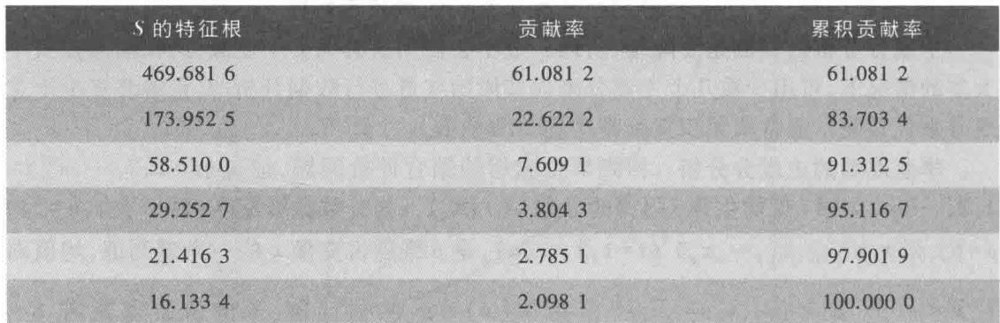

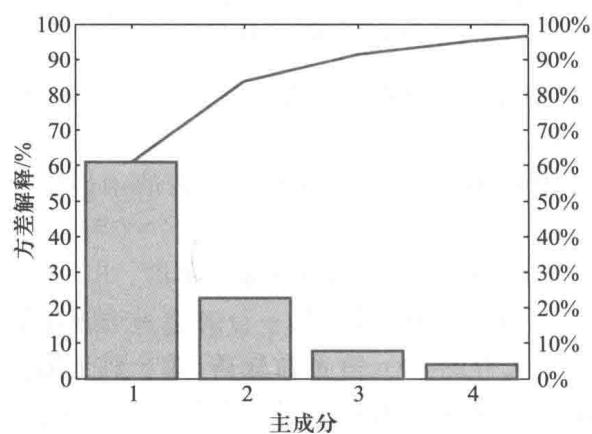  
图2 方差解释图

前两个主成分的累积贡献率为  $83.7034\%$  ,所以只取两个主成分是合适的.根据主成分系数矩阵的输出结果,可得第一主成分与第二主成分分别为

$$
\begin{array}{r l} & {y_{1} = 0.515 7x_{1}^{*} + 0.332 1x_{2}^{*} + 0.387 9x_{3}^{*} - 0.453 4x_{4}^{*} - 0.345 8x_{5}^{*} - 0.385 0x_{6}^{*}}\\ & {y_{2} = 0.381 2x_{1}^{*} + 0.348 2x_{2}^{*} + 0.414 7x_{3}^{*} + 0.677 0x_{4}^{*} + 0.222 3x_{5}^{*} + 0.231 8x_{6}^{*}} \end{array} \tag{5}
$$

这里  $x_{j}^{*}$  是  $x_{j}$  的中心化数据, 即  $x_{j}^{*} = x_{j} - \overline{x}_{j}, j = 1,2, \dots , 6$ .

结果分析 在(5)式中第一主成分对应的系数符号前 3 个均为正, 后 3 个均为负, 系数绝对值相差不大. 由于前 3 个系数正好对应 3 门闭卷考试分数, 后 3 个对应开卷考试分数, 如果一个学生第一主成分的得分是个很大的正数, 说明他更擅长闭卷考试, 反之, 如果得分是一个绝对值很大的负数, 就说明他在开卷科目考试中有很好的表现. 如果得分接近于 0 , 则说明开闭卷对该学生无所谓. 因此, 第一主成分实际上反映了开闭卷考试的差别, 可理解为"成绩的开闭卷成分". 第二主成分对应的系数符号均为正, 只有微分几何课程对应的系数比其他课程略大, 反映了学生各门课程成绩的某种均衡性, 可理解为"成绩的均衡成分".

通过以上分析可知, 为了综合评价考试成绩, 需要知道每个学生在这两个主成分上

的得分. 根据得分矩阵的输出结果, 将 52 名学生的第一主成分、第二主成分的得分以及成绩总分列于表 3, 第一、第二主成分的得分散点图如图 3.

表3第一、第二主成分得分表（全部数据见运行程序文件9-17后的输出结果）  

<table><tr><td>学生序号</td><td>成绩总分</td><td>第一主成分得分</td><td>第二主成分得分</td></tr><tr><td>A1</td><td>410</td><td>-12.874 8</td><td>-6.401 1</td></tr><tr><td>A2</td><td>359</td><td>-11.803 7</td><td>-25.162 0</td></tr><tr><td>...</td><td>...</td><td>...</td><td>...</td></tr><tr><td>AS2</td><td>449</td><td>-15.149 4</td><td>10.866 3</td></tr></table>

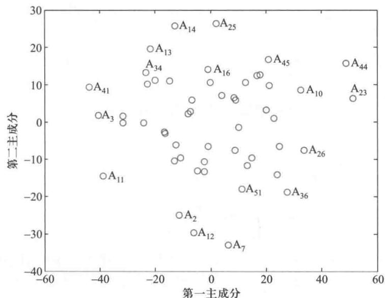  
图3 前两个主成分得分散点图

由图3可以直观地发现, 从第一主成分来看, 学生  $\mathrm{A}_{23} 、 \mathrm{~A}_{44} 、 \mathrm{~A}_{26} 、 \mathrm{~A}_{10}$  具有较大的正数, 说明他们擅长于闭卷考试, 体现在三门基础课数学分析、高等代数和概率论有较好的成绩, 学生  $\mathrm{A}_{41} 、 \mathrm{~A}_{3} 、 \mathrm{~A}_{11}$  有绝对值较大的负数, 说明他们更擅长于开卷考试; 从第二主成分来看, 学生  $\mathrm{A}_{25} 、 \mathrm{~A}_{14} 、 \mathrm{~A}_{13}$  具有较大的正数, 说明他们6门课程比较均衡, 成绩也较好, 而学生  $\mathrm{A}_{7} 、 \mathrm{~A}_{12} 、 \mathrm{~A}_{2}$  有绝对值较大的负数, 说明各科成绩均不太理想.

因子分析的基本思路与主成分分析中构造原始变量  $x_{1}, x_{2}, \dots , x_{p}$  的线性组合  $y_{1}, y_{2}, \dots , y_{p}$  (见(1)式)不同, 因子分析是将原始变量  $x_{1}, x_{2}, \dots , x_{p}$  分解为若干个因子的线性组合, 表示为

$$
\left\{ \begin{array}{l l}{x_{1} = \mu_{1} + a_{11}f_{1} + a_{12}f_{2} + a_{13}f_{3} + \dots +a_{1m}f_{m} + \epsilon_{1}}\\ {x_{2} = \mu_{2} + a_{21}f_{1} + a_{22}f_{2} + a_{23}f_{3} + \dots +a_{2m}f_{m} + \epsilon_{2}}\\ {\dots \dots \dots \dots \dots}\\ {x_{p} = \mu_{p} + a_{p1}f_{1} + a_{p2}f_{2} + a_{p3}f_{3} + \dots +a_{p m}f_{m} + \epsilon_{p}} \end{array} \right. \tag{6}
$$

简记作

评注 利用主成分分析无须考察6门课程的具体成绩, 只要对原始分数做恰当的线性组合, 就可以找到两个指标(主成分)在不丢失重要信息的前提下, 最大程度地区分学生的成绩, 还可以直接从第一、第二主成分的得分出发, 构造合适的评价函数对学生作进一步的评价, 也可以用主成分得分值对学生进行聚类或判别, 后者就是目前人工智能中常提及的主成分聚类分析和主成分判别分析. 评注 当各变量数据的量纲不同或取值数量级相差较大时, 通常需要先将原始变量作标准化处理, 于是协方差矩阵变换为相关系数矩阵. 但是用这两个矩阵得到的主成分系数一般是不同的(复习题1). 如果原始数据的量纲相同且数量级相差不悬殊时, 建议不要对数据做标准化处理.

$$
x = \mu +A f + \epsilon \tag{7}
$$

其中  $\pmb {\mu} = (\mu_{1},\mu_{2},\dots ,\mu_{p})^{\mathrm{~T~}}$  是  $x$  的期望向量,  $\pmb {f} = (f_{1},f_{2},\dots ,f_{m})^{\mathrm{~T~}}$  称公共因子向量,  $\epsilon =$ $(\epsilon_{1},\epsilon_{2},\dots ,\epsilon_{p})^{\mathrm{~T~}}$  称特殊因子向量,均为不可观测的变量,  $A = (a_{i j})_{p\times m}$  称为因子载荷矩阵,  $a_{i j}$  是变量  $x_{i}$  在公共因子  $f_{j}$  上的载荷,反映  $f_{j}$  对  $x_{i}$  的重要度.通常对模型(6)作如下假设:  $f_{j}$  互不相关且具有单位方差;  $\epsilon_{i}$  互不相关且与  $f_{j}$  互不相关,  $\operatorname {Cov}\left(\epsilon\right) = \psi$  为对角阵.在这些假设下,由(7)式可得

$$
\operatorname {Cov}\left(\boldsymbol {x}\right) = A A^{\mathrm{T}} + \boldsymbol {\psi},\quad \operatorname {Cov}\left(\boldsymbol {x},\boldsymbol {f}\right) = A \tag{8}
$$

对因子模型(6),每个原始变量  $x_{i}$  的方差都可以分解成共性方差  $h_{i}^{2}$  与特殊方差  $\sigma_{i}^{2}$  之和,其中  $h_{i}^{2} = \sum_{j = 1}^{n}a_{i j}^{2}$  反映全部公共因子对变量  $x_{i}$  的方差贡献,  $\sigma_{i}^{2} = D\left(\epsilon_{i}\right)$  (即  $\psi$  的对角线上的元素)是特殊因子对  $x_{i}$  的方差贡献.显然,  $\sum_{i = 1}^{p}h_{i}^{2} = \sum_{i = 1}^{p}\sum_{j = 1}^{m}a_{i j}^{2}$  是全部公共因子对  $x$  总方差的贡献,令  $b_{j}^{2} = \sum_{i = 1}^{p}a_{i j}^{2}$  ,则  $b_{j}^{2}$  是公共因子  $f_{j}$  对  $x$  总方差的贡献,  $b_{j}^{2}$  越大,  $f_{j}$  越重要,称  $\frac{b_{j}^{2}}{\sum_{i = 1}^{p}\left(h_{i}^{2} + \sigma_{i}^{2}\right)}$  为  $f_{j}$  的贡献率.特别地,若  $x$  的各分量已经标准化,则有  $h_{i}^{2} + \sigma_{i}^{2} = 1$

故  $f_{j}$  的贡献率为  $\frac{b_{j}^{2}}{p} = \frac{\lambda_{j}}{p}$  其中  $\lambda_{j}$  是  $x$  的相关系数矩阵的第  $j$  大特征根.

根据模型(7),(8)式计算因子载荷矩阵  $A$  的过程比较复杂,并且这个矩阵不唯一,只要  $T$  为  $m$  阶正交矩阵,则  $A T$  仍为该模型的因子载荷矩阵.矩阵  $A$  左乘正交矩阵  $T$  相当于作因子旋转,目的是找到简单结构的因子载荷矩阵,使得每个变量都只在少数的因子上有较大的载荷值,即只受少数几个因子的影响.通常,在因子分析模型建立后,还需要对每个样本估计公共因子的值,即所谓因子得分.对于以上详细的分析过程,读者可参考基础知识9- 3.

学生成绩的因子分析模型学生的分数数据矩阵  $X$  的均值向量  $\overline{{\mathbf{x}}}$  和协方差矩阵 $S$  已由(4)式给出,为了分析因子模型公共因子的存在,一般先计算出  $X$  的相关系数矩阵

$$
R=(\begin{array}{c c c c c c c c c c c c c c c c c c c c c c c c c c c c c c c c c c c c c c c c c c c c c c c c c c c c c c c c c c c c c c c c c c c c c c c c c c c c c c c c c c c c c c c c c c c c c c c c c c c c c)(\begin{array}{c c c c c c c c c c c c c c c c c c c c c c c c c c c c c c c c c c c c c c c c c c c c c c c c c c c c c c c c c c c c c c c c c c c c c c c c c c c c c c c c c c c c c c c c c c c c c)(\begin{c c c c c c c c c c c c c c c c c c c c c c c c c c c c c c c c c c c c c c c c c c c c c c c c c c c c c c c c c c c c c c c c c c c c c c c c c c c c c c c c c c c c c c c c c c c c c c c c c c c\end{array})(\begin{array}{c c c c c c c c c c c c c c c c c c c c c c c c c c c c c c c c c c c c c c c c c c c c c c c c c c c c c c c c c c c c c c c c c c c c c c c c c c c c c c c c c c c c c c c c c c c\end{array})(\end{array}\) (9) \(\begin{array}{r}{(\begin{array}{c c c c c c c c c c c c c c c c c c c c c c c c c c c c c c c c c c c c c c c c c c c c c c c c c c c c c c c c c c c c c c c c c c c c c c c c c c c c c c c c c c c c c c c c c c c c c} & {} & {} & {} & {} & {} & {} & {} & {} & {} & {} & {} & {} & {} & {} & {} & {} & {} & {} & {} & {} & {} & {} & {} & {} & {} & {} & {} & {} & {} & {} & {} & {} & {} & {} & {} & {} & {} & {} & {} & {} & {} & {} & {} & {} & {} & {} & {} & {} & {} & {} & {}\end{array})} \end{array}\)
$$

从  $R$  中的相关系数可以发现,变量  $x_{1},x_{2},x_{3}$  之间具有较强的正相关性,相关系数均在0.8以上,变量  $x_{4},x_{5},x_{6}$  之间也存在较强的正相关性,而这两组之间的相关性就没有组内的大,因此,有理由相信它们的背后都会有一个或多个共同因素(公共因子)在驱动,需要用因子分析方法来解释.

为了确定公共因子个数  $m$  ,计算相关系数矩阵  $R$  的特征根.  $R$  的6个特征根按大小

排列为  $\lambda_{1} = 3.7099, \lambda_{2} = 1.2604, \lambda_{3} = 0.4365, \lambda_{4} = 0.2758, \lambda_{5} = 0.1703, \lambda_{6} = 0.1470$ . 前2个公共因子的累积贡献率为  $(\lambda_{1} + \lambda_{2}) / 6 = 0.8284$ , 超过  $80\%$ , 因此, 认为公共因子个数  $m = 2$  是合适的. 实际上, 一个经验的确定  $m$  的方法, 是将  $m$  定为  $R$  中大于1的特征根个数, 这与上面得到的结果一致.

MATLAB中利用数据矩阵  $X$  进行因子分析的函数命令是factoran, 调用格式为:

$\left[\mathrm{lambda}, \mathrm{psi}, \mathrm{T}, \mathrm{stats}, \mathrm{F}\right] = \mathrm{factoran}(\mathrm{X}, \mathrm{m})$

其中输入参数  $x$  与主成分分析命令princomp相同,  $m$  为公共因子个数, 需满足  $(p - m)^{2} \geqslant p + m$ . 输出参数lambda是  $p \times m$  的因子载荷矩阵, 其第  $i$  行第  $j$  列的元素是第  $i$  变量在第  $j$  公共因子上的载荷, 默认是用最大方差旋转法计算的; 参数psi是  $p$  维列向量, 对应  $p$  个特殊方差的最大似然估计; 参数  $\mathrm{T}$  为  $m$  阶 (旋转后的) 因子载荷旋转矩阵; 参数stats是对原假设  $H_{0}$  (给定因子数  $m$  ) 做检验的统计量, 其中  $p$  值若大于显著性水平  $\alpha$ , 则接受  $H_{0}$ ; 参数  $\mathrm{F}$  是  $n \times m$  因子得分矩阵, 每一行对应一个样本的  $m$  个公共因子的得分. 这个函数命令也可以输入协方差矩阵或相关系数矩阵, 调用格式见MATLAB帮助系统.

输入分数数据矩阵  $X$  和  $m = 2$ , 调用factoran函数命令, 在输出的检验信息中stats.  $p = 0.5060 > 0.05$ , 可知在显著性水平  $\alpha = 0.05$  下接受  $H_{0}: m = 2$ . 根据因子载荷矩阵的输出结果可以得到

$$
\left\{ \begin{array}{l l}{x_{1}^{*} = 0.849~2f_{1} - 0.362~8f_{2} + \epsilon_{1}^{*}}\\ {x_{2}^{*} = 0.863~7f_{1} - 0.209~3f_{2} + \epsilon_{2}^{*}}\\ {x_{3}^{*} = 0.898~7f_{1} - 0.204~3f_{2} + \epsilon_{3}^{*}}\\ {x_{4}^{*} = -0.101~4f_{1} + 0.807~3f_{2} + \epsilon_{4}^{*}}\\ {x_{5}^{*} = -0.309~3f_{1} + 0.819~6f_{2} + \epsilon_{5}^{*}}\\ {x_{6}^{*} = -0.314~7f_{1} + 0.668~6f_{2} + \epsilon_{6}^{*}} \end{array} \right. \tag{10}
$$

其中  $x_{i}^{*}$  为  $x_{i}$  的标准化, 即  $x_{i}^{*} = \frac{x_{i} - \overline{x}_{i}}{\sqrt{s_{ii}}}, i = 1,2, \dots , 6, \overline{x}_{i}, s_{ii}$  由 (4) 式给出. 由此不难转换为原始变量  $x_{i}$  的因子分析模型. (10) 式中特殊方差的估计也可以得到:  $D(\epsilon^{*}) = (0.1473, 0.2101, 0.1505, 0.3380, 0.2326, 0.4540)^{\mathrm{T}}$ .

结果分析在(10)式中第一公共因子  $f_{1}$  与数学分析、高等代数、概率论三门课程有很强的正相关,说明  $f_{1}$  对这3门课的解释力非常高,而对其他3门课就没那么重要了;第二公共因子  $f_{2}$  与微分几何、抽象代数和数值分析有很强的正相关,其解释恰好与 $f_{1}$  相反.由于数学分析、高等代数、概率论是数学系学生最重要的基础课,所以我们将  $f_{1}$  取名为"基础课因子",而微分几何、抽象代数与数值分析均为开卷考试  $,f_{2}$  又恰好是解释这3门课,为了区分考试类型的不同,不妨将  $f_{2}$  叫作"开闭卷因子"  $f_{1}$  和  $f_{2}$  的方差贡献率分别为  $\lambda_{1} / 6 = 0.6183$  和  $\lambda_{2} / 6 = 0.2101,f_{1}$  的影响要比  $f_{2}$  大得多.

每位学生的因子得分也可以在函数命令factoran的输出中得到, 其结果列于表4. 由于只有2个公共因子, 以基础课因子  $f_{1}$  的得分为横轴, 开闭卷因子  $f_{2}$  的得分为纵轴, 画出因子得分的散点图, 见图4.

表4公共因子得分表（全部数据见运行程序文件9-17后的输出结果）  

<table><tr><td>学生序号</td><td>成绩总分</td><td>因子f1得分</td><td>因子f2得分</td></tr><tr><td>A1</td><td>410</td><td>-0.775 0</td><td>0.057 1</td></tr><tr><td>A2</td><td>359</td><td>-1.966 7</td><td>-1.350 9</td></tr><tr><td>：</td><td>：</td><td>：</td><td>：</td></tr><tr><td>A52</td><td>449</td><td>0.161 7</td><td>1.284 6</td></tr></table>

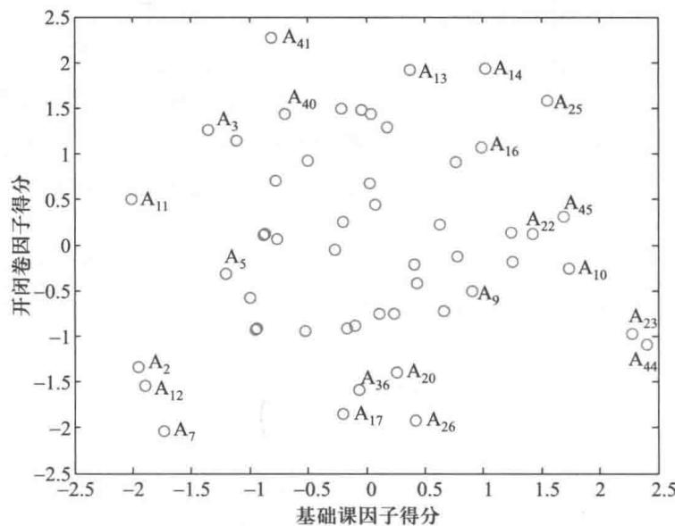  
图4 因子得分散点图

从图4可以发现,学生  $\mathrm{A}_{44}$ 、 $\mathrm{A}_{23}$ 、 $\mathrm{A}_{10}$  在  $f_{1}$  上有较高的得分,说明他们3门基础课的成绩表现非常好,而学生  $\mathrm{A}_{11}$ 、 $\mathrm{A}_{2}$ 、 $\mathrm{A}_{12}$  在  $f_{1}$  上的得分偏低,3门基础课的表现不够好。学生  $\mathrm{A}_{41}$ 、 $\mathrm{A}_{14}$ 、 $\mathrm{A}_{13}$  在  $f_{2}$  上有较高的得分,他们较擅长于开卷考试,而学生  $\mathrm{A}_{7}$ 、 $\mathrm{A}_{26}$ 、 $\mathrm{A}_{17}$  的  $f_{2}$  的得分偏低,说明他们在开卷考试中表现不够理想。

以2个公共因子  $f_{1}$  和  $f_{2}$  的方差贡献率所占的比重加权,可以构造一个因子综合得分

$$
F(f_{1},f_{2}) = c_{1}f_{1} + c_{2}f_{2} \tag{11}
$$

这里权重  $c_{1} = \frac{\lambda_{1}}{\lambda_{1} + \lambda_{2}} = 0.7464, c_{2} = \frac{\lambda_{2}}{\lambda_{1} + \lambda_{2}} = 0.2536$ ,由(11)式计算出每位学生的因子综合得分值,并按得分值的大小对学生进行排序。为便于比较,将考试总分及排序一起列入表5。

表5因子综合得分排名与排序结果（全部数据见运行程序文件9-17后的输出结果）  

<table><tr><td>学生序号</td><td>成绩总分</td><td>总分排名</td><td>因子综合得分</td><td>因子综合得分排名</td></tr><tr><td>A1</td><td>410</td><td>34</td><td>-0.564 0</td><td>39</td></tr><tr><td>A2</td><td>359</td><td>51</td><td>-1.810 5</td><td>50</td></tr><tr><td>：</td><td>：</td><td>：</td><td></td><td>：</td></tr><tr><td>AS2</td><td>449</td><td>14</td><td>0.446 4</td><td>16</td></tr></table>

评注 多元统计中的主成分分析与因子分析方法的主要思想,都是

从表5可以看到,在总成绩排名前10名的同学中,有8人的因子综合得分的排名也在前10名,在总成绩排名后10名的同学中,有9人的因子综合得分的排名也在后10名;反过来,在因子综合得分排名前10名的同学中,有8人的总成绩的排名也在前10名,在因子综合得分排名后10名的同学中,也有8人的总成绩的排名在后10名;并且这两种排名次序差异不超过5名的比例为  $61.54\%$  ,具有较好的吻合度.

两种排名次序差异较大的如学生  $\mathrm{A}_{3}$  ,总分排名为29,综合因子得分排名为44,相差15名,分析发现该学生的基础课因子  $f_{1}$  得分排名仅为48,尽管在3门开卷考试中的表现不错(因子  $f_{2}$  得分排名为10),由于综合得分中  $f_{1}$  占了约  $75\%$  的权重,虽然总分排名不错,但因子综合得分就要差些了.再看一个极端的例子,如学生  $\mathrm{A}_{44}$  ,其总分排名第7,而因子综合得分排名高居第2,分析该学生的基础课因子  $f_{1}$  和开闭卷因子  $f_{2}$  的得分情况,发现在  $f_{1}$  上的得分排在第1名,而在  $f_{2}$  上的得分排在第45,说明他极不擅长开卷考试,好在他有极好的基础课考试成绩,使得因子综合得分跃升到了第2名.看来,利用因子综合得分排名,比传统的排名方法更具有科学性与参考价值.

采取常用的降维手段来降低整个数据的复杂程度.因子分析是从数据的协方差矩阵或相关系数矩阵出发,寻找潜在的起支配作用的因子,和主成分分析相比,由于因子分析可以使用因子旋转技术帮助解释因子,在数据解释方面更加有优势.这两种方法各有优缺点,都是目前数据挖掘与人工智能领域研究的重要方法.

# 复习题

1. 假定原始数据  $X$  的协方差阵  $S = \left( \begin{array}{cc}1 & 4 \\ 4 & 100 \end{array} \right)$ ,若将原始数据  $X$  标准化,得到相关系数阵  $R = \left( \begin{array}{cc}1 & 0.4 \\ 0.4 & 1 \end{array} \right)$ ,分别计算  $S$  和  $R$  的特征根和特征向量,构造相应的2个主成分,你会发现二者有很大差别.试做出解释.

2. 在制定服装标准过程中对100名成年男子的身材进行了测量,共6项指标:身高  $x_{1}$  、坐高  $x_{2}$  、胸围  $x_{3}$  、臂长  $x_{4}$  、肋围  $x_{5}$  、腰围  $x_{6}$  ,样本相关系数阵为

$$
R=\left(\begin{array}{c c c c c c}{{1}}&{{0.80}}&{{0.37}}&{{0.78}}&{{0.26}}&{{0.38}}\\ {{0.80}}&{{1}}&{{0.32}}&{{0.65}}&{{0.18}}&{{0.33}}\\ {{0.37}}&{{0.32}}&{{1}}&{{0.36}}&{{0.71}}&{{0.62}}\\ {{0.78}}&{{0.65}}&{{0.36}}&{{1}}&{{0.18}}&{{0.39}}\\ {{0.26}}&{{0.18}}&{{0.71}}&{{0.18}}&{{1}}&{{0.69}}\\ {{0.38}}&{{0.33}}&{{0.62}}&{{0.39}}&{{0.69}}&{{1}}\end{array}\right)
$$

试给出主成分分析表达式,并对主成分做出解释

3. 同第2题数据,试给出因子分析表达式,并对因子做出解释

# 9.8 艾滋病疗法的评价及疗效的预测

艾滋病是当前人类社会最严重的瘟疫之一,从1981年发现以来它已经吞噬了数千万人的生命.人们正在艾滋病的研究、预防、治疗等各个领域进行着不懈的努力,作为用数学方法分析和解决实际问题关键途径的数学建模,也在这场艰苦的斗争中发挥着重要作用."艾滋病疗法的评价及疗效的预测"被选为2006年全国大学生数学建模竞赛B题(以下有删节):

艾滋病的医学全名为"获得性免疫缺陷综合征",英文简称AIDS,它是由艾滋病毒

(医学全名为"人体免疫缺陷病毒",英文简称HIV)引起的.这种病毒破坏人的免疫系统,使人体丧失抵抗各种疾病的能力,从而严重危害人的生命.人类免疫系统的CD4细胞在抵御HIV的人侵中起着重要作用,当CD4被HIV感染而裂解时,其数量会急剧减少,HIV将迅速增加,导致艾滋病发作.

艾滋病治疗的目的是尽量减少人体内HIV的数量,同时产生更多的CD4,至少要有效地降低CD4减少的速度,以提高人体免疫能力.迄今为止,人类还没有找到能根治AIDS的疗法.

题目给出了美国艾滋病医疗试验机构公布的两组数据(ACTG320,193A),要求:

1)利用ACTG320数据,预测继续治疗的效果,或者确定最佳治疗终止时间(继续治疗指在测试终止后继续服药,如果认为继续服药效果不好,则可选择提前终止治疗).

2)利用193A数据,评价4种疗法的优劣(仅以CD4为标准),并对较优的疗法预测继续治疗的效果,或者确定最佳治疗终止时间.

表1ACTG320数据:服用3种药物的300多名患者每隔几周测试的CD4和HIV浓度

(全部数据见数据文件9- 5)

数据文件9- 5

艾滋病疗法ACTG320数据

<table><tr><td>患者序号</td><td>CD4时间/周</td><td>CD4浓度</td><td>HIV时间/周</td><td>HIV浓度</td></tr><tr><td>23 424</td><td>0</td><td>178</td><td>0</td><td>5.5</td></tr><tr><td></td><td></td><td>228</td><td>4</td><td>3.9</td></tr><tr><td></td><td>8</td><td>126</td><td>8</td><td>4.7</td></tr><tr><td></td><td>25</td><td>171</td><td>25</td><td>-4</td></tr><tr><td></td><td>40</td><td>99</td><td>40</td><td>5</td></tr><tr><td>23 425</td><td>0</td><td>14</td><td>0</td><td>5.3</td></tr><tr><td></td><td>4</td><td>62</td><td>4</td><td>2.4</td></tr><tr><td></td><td>9</td><td>110</td><td>9</td><td>3.7</td></tr><tr><td></td><td>23</td><td>122</td><td>23</td><td>2.6</td></tr><tr><td></td><td>40</td><td>320</td><td></td><td></td></tr><tr><td></td><td>：</td><td>：</td><td>：</td><td>：</td></tr></table>

表2193A数据:1300多名患者随机地分为4组,每组按一种疗法服药,每隔约8周测试的CD4浓度(取lg(CD4+1))(全部数据见数据文件9- 6)

数据文件9- 6艾滋病疗法193A数据

<table><tr><td>患者序号</td><td>疗法</td><td>年龄</td><td>CD4时刻/周</td><td>CD4浓度</td></tr><tr><td>1</td><td>2</td><td>36.427 1</td><td>0</td><td>3.135 5</td></tr><tr><td></td><td></td><td></td><td>7.271 4</td><td>3.044 5</td></tr><tr><td></td><td></td><td></td><td>15.271 4</td><td>2.772 6</td></tr><tr><td></td><td></td><td></td><td>23.271 4</td><td>2.833 2</td></tr><tr><td></td><td></td><td></td><td>32.271 4</td><td>3.218 9</td></tr><tr><td></td><td></td><td></td><td>40</td><td>3.044 5</td></tr></table>

续表  

<table><tr><td>患者序号</td><td>疗法</td><td>年龄</td><td>CD4 时刻/周</td><td>CD4 浓度</td></tr><tr><td>2</td><td>4</td><td>47.846 7</td><td>0</td><td>3.068 1</td></tr><tr><td></td><td></td><td></td><td>8</td><td>3.891 8</td></tr><tr><td></td><td></td><td></td><td>16</td><td>3.970 3</td></tr><tr><td></td><td></td><td></td><td>23</td><td>3.610 9</td></tr><tr><td></td><td></td><td></td><td>30.714</td><td>3.332 2</td></tr><tr><td></td><td></td><td></td><td>39</td><td>3.091 0</td></tr><tr><td></td><td></td><td></td><td></td><td></td></tr></table>

问题分析查阅相关资料可知,目前对AIDS的治疗以针对HIV的高效抗逆转录病毒疗法为主.临床上需要改变治疗方案的原因有:最新临床试验结果提示,感染者正在使用的不是最佳治疗方案;感染者虽然采用高效的治疗方案,但CD4细胞数量继续下降;患者有临床进展表现或严重的毒副作用,使之难以坚持治疗,

HIV浓度的测试成本很高,而CD4细胞数量的降低是免疫缺陷进展的直接标志,被认为是HIV感染状态最重要的参考,也是各类疗法的有效评价指标.

艾滋病疗法的评价标准是降低HIV病毒,提升CD4细胞.治疗过程中如果HIV不再降低,CD4不再升高,就应及时终止治疗,否则可以继续治疗.

数据处理分析数据文件9- 5,9- 6的数据可知,大多数是一位病人在5或6个时间点的测试记录,如果测试时间点过少(只有2或3个),可将该患者删除.根据前后记录可辨别的、明显的错误数据予以删除.

为了消除患者的初始状态(时间  $t = 0$  的CD4和HIV浓度)对模型的影响,可以取各位患者每次的测量值与初始值的比值或差值,作为以下分析、建模的依据.也可以先按照患者的初始状态分类(如轻度、中度、重度),然后对于每一类患者进行分析、建模.

预测治疗效果或确定治疗终止时间

数据分析为了利用ACTG320数据预测治疗效果或确定治疗终止时间,随机选取若干患者(如20个)画出CD4和HIV浓度变化图形,如图1. 可以发现,CD4浓度大致有先增后减的趋势,HIV浓度有先减后增的趋势,启示我们应建立浓度对时间的二次回归模型:  $y = b_{0} + b_{1}t + b_{2}t^{2}$ ,其中  $y$  是CD4(或HIV)浓度,  $t$  是时间.

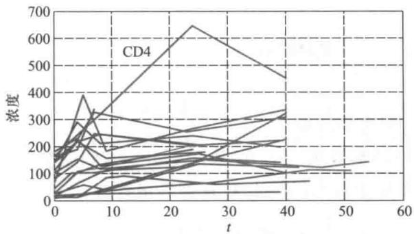  
图1 20个患者的CD4和HIV浓度变化

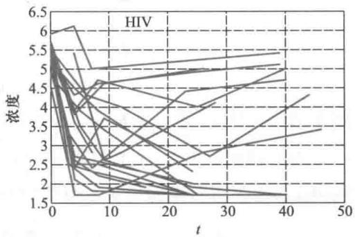

随机取3位患者的CD4浓度拟合二次回归模型,如图2. 可以发现,彼此差异较大.

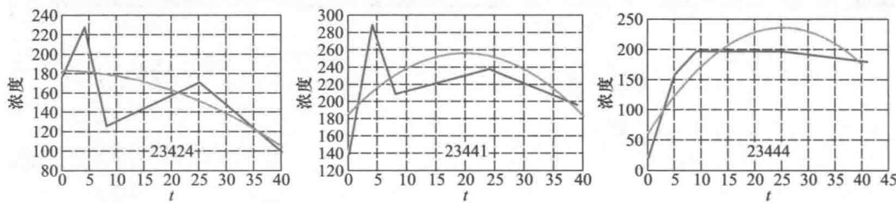  
图23个患者CD4浓度拟合的二次回归曲线（折线为原始数据）

模型建立分别用  $t_{ij}$ ,  $y_{ij}$  表示表1中第  $i$  个患者第  $j$  次测量的时间(周)和CD4浓度,二者之间可以建立以下几种形式的回归模型:

1)纵向数据回归模型首先写出  $y_{ij}$  对  $t_{ij}$  的二次回归函数

$$
y_{ij} = b_{0i} + b_{1i}t_{ij} + b_{2i}t_{ij}^{2} + \epsilon_{ij}, \quad i = 1, \dots , n, \quad j = 1, \dots , n_{i} \tag{1}
$$

其中  $b_{0i}$ ,  $b_{1i}$ ,  $b_{2i}$  是回归系数,  $\epsilon_{ij}$  是随机误差,假定服从零均值、方差为常数  $\sigma^{2}$  的正态分布,  $n$  是患者数,  $n_{i}$  是第  $i$  个患者的测量次数.需要注意的是,与普通的回归模型相比,模型(1)的  $b_{0i}$ ,  $b_{1i}$ ,  $b_{2i}$  多了下标  $i$ ,用于描述不同患者的CD4浓度具有不同的二次曲线系数(如图2那样),它们也应视为随机变量.

为了将患者整体CD4浓度的二次曲线系数从  $b_{0i}$ ,  $b_{1i}$ ,  $b_{2i}$  中分离出来,令

$$
b_{ki} = b_{k} + \eta_{ki}, \quad k = 0,1,2 \tag{2}
$$

其中  $b_{k}$  是患者整体的固定效应系数(与哪个患者无关),  $\eta_{ki}$  是随患者  $i$  变化的随机效应系数,假定服从零均值、方差为常数  $d_{k}^{2}$  的正态分布,且  $\eta_{ki}$  之间(对  $k$  )相互独立.

将(2)代入(1)式得到回归系数分解后的纵向数据回归模型:

$$
y_{ij} = b_{0} + b_{1i}t_{ij} + b_{2i}t_{ij}^{2} + \eta_{0i} + \eta_{1i}t_{ij} + \eta_{2i}t_{ij}^{2} + \epsilon_{ij} \tag{3}
$$

记

$$
Y_{i}=\left[\begin{array}{c}{y_{i1}}\\ {y_{i2}}\\ {\vdots}\\ {y_{i n_{i}}}\end{array}\right],\quad X_{i}=\left[\begin{array}{c c c}{1}&{t_{i1}}&{t_{i1}^{2}}\\ {1}&{t_{i2}}&{t_{i2}^{2}}\\ {\vdots}&{\vdots}&{\vdots}\\ {1}&{t_{i n_{i}}}&{t_{i n_{i}}^{2}}\end{array}\right],\quad B=\left[\begin{array}{c}{b_{0}}\\ {b_{1}}\\ {b_{2}}\end{array}\right]
$$

$$
D = \left[ \begin{array}{ccc}d_{0}^{2} & 0 & 0 \\ 0 & d_{1}^{2} & 0 \\ 0 & 0 & d_{2}^{2} \end{array} \right], \quad V_{i} = X_{i}DX_{i}^{\mathrm{T}} + \sigma^{2}I_{n_{i}} \tag{4}
$$

则  $\boldsymbol{Y}_{i}$  服从均值向量为  $X_{i}b$  、方差矩阵为  $\boldsymbol{V}_{i}$  的正态分布.

为了利用数据  $t_{ij}$ ,  $y_{ij}$  估计模型(3)、(4)的系数  $b_{0}$ ,  $b_{1}$ ,  $b_{2}$  及  $\eta_{0i}$ ,  $\eta_{1i}$ ,  $\eta_{2i}$  的方差  $d_{0}^{2}$ ,  $d_{1}^{2}$ ,无法利用简单的最小二乘法,而需要应用最大似然法.  $Y_{i}$  的似然函数为

$$
L(\pmb {b},\pmb {D},\pmb{\sigma}^{2}) = \prod_{i = 1}^{n}\left\{\left(2\pi\right)^{\frac{n_{i}}{2}}|V_{i}|^{\frac{1}{2}}\mathrm{exp}\left(-\frac{1}{2} (Y_{i} - X_{i}\pmb {b})^{\mathrm{T}}V_{i}^{-1}(Y_{i} - X_{i}\pmb {b})\right)\right\} \tag{5}
$$

求解似然函数  $L$  的最大值点,即得系数  $b$  及  $D, \sigma^{2}$  的估计值,用 SAS 等软件可以方便地实现.

固定效应系数  $b_{k}$  反映的是全体患者的总体效应,利用  $b_{k}$  可以预测平均意义下的最佳治疗终止时间(或继续治疗).随机效应系数  $\eta_{k i}$  的方差  $d_{k}^{2}$  反映随不同患者而异的分散性,在正态分布假定下可以得到  $b_{k}$  属于任意区间的概率,从而在一定置信度下给出最佳治疗终止时间的置信区间.

2)个体回归模型形式与(1)式相同,但不分解回归系数,相当于  $n$  个二次回归模型.对每个患者  $i(= 1,\dots ,n)$  由数据  $t_{i j}$ $\boldsymbol{y}_{i j}$  用最小二乘法估计  $b_{0i}$ $b_{1i}$ $b_{2i}$  ,再计算  $n$  个患者  $b_{0i}$ $b_{1i}$ $b_{2i}$  的平均值和方差,作为纵向数据回归模型  $b_{0}$ $b_{1}$ $b_{2}$  和  $d_{0}^{2}$ $d_{1}^{2},d_{2}^{2}$  的近似.

因为每位患者只有5或6个时间点的测试记录,数据量过少使得每个模型的回归系数估计的精度都较低,由此得到的平均值和方差的可靠性也不高.

3)总体回归模型若忽略患者之间的差异,可以将(1)式简化为普通的回归模型:

$$
y_{i j} = b_{0} + b_{1}t_{i j} + b_{2}t_{i j}^{2} + \epsilon_{i j},\quad i = 1,\dots ,n,\quad j = 1,\dots ,n_{i} \tag{6}
$$

由全部数据  $t_{i j}$ $\boldsymbol{y}_{i j}$  用最小二乘法估计(6)式的系数  $b_{0}$ $b_{1}$ $b_{2}$  ,作为纵向数据回归模型系数的近似值.

由于对(6)式作计算时,将患者的分散性造成的随机效应方差与模型的随机误差混合在一起,因而剩余方差将很大,相当于纵向数据回归模型中  $D$  和  $\sigma^{2}$  的总和,这就降低了总体回归模型的有效性.

一种代替用全部数据直接估计总体回归模型(6)式的办法是,先在每个时间点上对患者的CD4浓度取平均,再由这些平均浓度用最小二乘法估计系数  $b_{0}$ $b_{1}$ $b_{2}$  这种看似简单的方法有什么问题吗(有相当一部分竞赛论文正是这样做的)?

全部数据  $t_{i j}$ $\boldsymbol{y}_{i j}$  是300多名患者在若干时间点上的CD4浓度,观察发现,多数患者的测试时间点是  $0,4,8,24,\dots ,40$  ,少数患者是  $5,9,23,\dots$  ,还有其他一些个别的时间点.在这些时间点上对CD4浓度取平均后,有的是上百个患者的平均浓度,也有的是几个患者的平均浓度,用这些平均值与用原始数据得到的回归系数可能会有较大的差别.

怎样能够使得利用(对自变量的每个数值取因变量的)平均值得到的回归系数与利用原始数据得到的回归系数相同呢?办法是对每个平均值用它所"代表"的原始数据的个数加权.可以证明,用加权后的平均值作普通的最小二乘拟合,得到的系数  $b_{0}$ $b_{1}$ $b_{2}$  与用原始数据相同.

结果分析根据ACTG320数据和上述3个模型得到的CD4与HIV浓度随时间的变化规律可用  $y = b_{0} + b_{1}t + b_{2}t^{2}$  表示,二次曲线示意图如图3所示.

根据得到的系数  $b_{0}$ $b_{1}$ $b_{2}$  可知,对CD4有  $b_{2}< 0$ $b_{1} > 0$  ,当  $t = - b_{1} / 2b_{2}$  时浓度达到最大;对HIV有  $b_{2} > 0$ $b_{1}< 0$  ,当  $t = - b_{1} / 2b_{2}$  时浓度达到最小.示意图的结果提示,大致应在25~30周终止治疗.

与采用原始数据的结果相比,当模型的  $y_{i j}$  取各位患者每次的测量值与初始值的比值或差值时,所得结果有较大差别,后者合理性更高.

根据个体回归模型的结果,可以将300多位患者中CD4浓度曲线  $b_{2}< 0$  且最大点

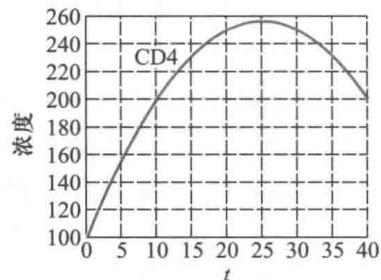  
图3 由ACTG320数据得到的CD4和HIV浓度的二次曲线示意图

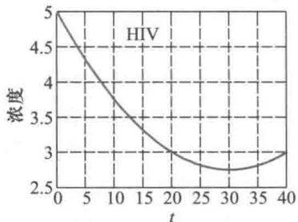

$t< 40$  的比例,作为及时终止治疗的概率(同时考虑HIV浓度曲线  $b_{2} > 0$  且最小点  $t< 40$  )。相反情况的比例可作为继续治疗的概率。

评价4种疗法的优劣

数据分析与ACTG320数据(数据文件9- 5)相比,193A数据(数据文件9- 6)只有CD4浓度,而增加了疗法和患者年龄2个因素。

对于每种疗法随机取若干患者(年龄尽量接近),画出CD4浓度随时间变化的图形(如图1那样),图形显示采用疗法1~3的患者CD4浓度变化不大且略有下降,而疗法4有先增后减的趋势,由此可以对4种疗法建立浓度对时间的一次回归模型,其中疗法4可建立二次模型,估计并比较一次项系数,以便对4种疗法的优劣给出定量的评价。

模型及其求解 为简便起见用总体回归模型给以说明。

对4种疗法分别建模 只需对(6)式作如下修改:去掉  $t_{ij}$  的二次项(疗法4可保留),增加年龄变量  $x_{i}$  (患者  $i$  的年龄)。具体做法不再详述。

对4种疗法统一建模引入0- 1变量  $z_{ik}$ ,若患者  $i$  采用疗法  $k$ ,令  $z_{ik} = 1 (k = 1,2,3,4)$ ,否则  $z_{ik} = 0$ 。回归模型可表示为

$$
y_{ij} = a_{0}x_{i} + \sum_{k = 1}^{4} a_{k}z_{ik} + \sum_{k = 1}^{4} b_{k}z_{ik}t_{ij} + b_{5}z_{i4}t_{ij}^{2} + \epsilon_{ij} \tag{7}
$$

利用表2的全部数据估计出(7)式的系数,从而得到4种疗法的回归曲线,其中疗法1~3是直线,疗法4是二次曲线,如图4所示。直观地看,4种疗法的优劣按照4,3,2,1排序,并且疗法4在30周之前明显优于其他。

实际的计算结果表明,4种疗法分别建模和统一建模得到的系数  $b_{k}$  的估计值相同,但是后者  $b_{k}$  的置信区间较短,模型的有效性提高,这是由于统一建模所用的数据量远大于分别建模的缘故。

可以采用假设检验和方差分析的方法,从统计意义上辨别各种疗法是否存在显著差异。

比较两种疗法的假设检验 为比较疗法1和疗法2,应检验它们的一次项系数,即(7)式的  $b_{1}$  与  $b_{2}$  有无显著性差异,可以仅引入一个0- 1变量  $z_{i}$ ,若患者  $i$  采用疗法1,令  $z_{i} = 1$ ,否则(即疗法2)  $z_{i} = 0$ 。将回归模型表示为(略去  $x_{i}$  项)

$$
y_{ij} = c_{0} + c_{1}t_{ij} + c_{2}z_{i} + c_{3}z_{i}t_{ij} + \epsilon_{ij} \tag{8}
$$

并作如下假设检验:  $H_{0}:c_{3} = 0; H_{1}:c_{3} \neq 0$ 。

利用疗法1,2的数据计算  $c_{3}$  的置信区间,若区间包含零点,则接受  $H_{0}$ 。显然,(8)式

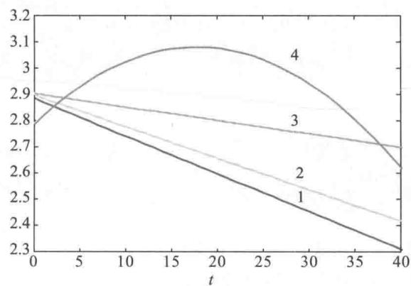  
图4 4种疗法统一模型的回归曲线

的  $c_{3} = 0$  等价于(7)式的  $b_{1}$  与  $b_{2}$  无显著性差异.

同样的方法可用于比较疗法1和疗法3、疗法2和疗法3.

假设检验的结果显示,  $b_{1}$  与  $b_{2}$  无显著性差异,而  $b_{3}$  与  $b_{1},b_{2}$  有显著性差异,即统计意义上的结论是,疗法3优于疗法1和疗法2,疗法1,2并无差别.

如果要比较疗法4和疗法3,不妨对这两种疗法建立如(8)式那样的一次回归模型,可以得出疗法4优于疗法3的结论.

4种疗法一起比较的单因素方差分析4种疗法都建立一次回归模型,以疗法为单因素对一次项系数进行方差分析,即作假设检验:  $H_{0}:4$  个回归系数相等;  $H_{1}:4$  个回归系数不全相等.如果检验结果是拒绝  $H_{0}$ ,那么仍需进行疗法的两两比较.

评注 以上几种统计方法都是根据一次回归模型的一次项系数,即CD4浓度的变化率的正负和大小,来比较4种疗法的优劣,对于这个题目提供的数据而言,基本上是合理的.如果数据需要用到二次回归模型,则优劣的比较就复杂多了.

# 复习题

在一元回归模型中,若对自变量的每个数值  $t_{i}(i = 1,2,\dots ,m)$ ,因变量都有  $k$  个取值  $y_{ij}(j = 1,2,\dots ,k)$ ,其平均值记作  $y_{i}$ ,证明:用  $t_{i}$  和  $y_{i}$  得到的回归系数与用原始数据  $t_{i}$  和  $y_{ij}$  得到的回归系数相同;但若对每个  $t_{i}$  因变量  $y_{ij}$  的个数不同,即  $j = 1,2,\dots ,k_{i}$ ,而  $k_{i}$  不全相等,则得不到这个结论.

# 第9章训练题

1. 电影院调查电视广告费用和报纸广告费用对每周收入的影响,得到数据如下表,建立回归模型并进行检验,诊断异常点的存在并进行处理.

<table><tr><td>每周收入</td><td>96</td><td>90</td><td>95</td><td>92</td><td>95</td><td>95</td><td>94</td><td>94</td></tr><tr><td>电视广告费用</td><td>1.5</td><td>2.0</td><td>1.5</td><td>2.5</td><td>3.3</td><td>2.3</td><td>4.2</td><td>2.5</td></tr><tr><td>报纸广告费用</td><td>5.0</td><td>2.0</td><td>4.0</td><td>2.5</td><td>3.0</td><td>3.5</td><td>2.5</td><td>3.0</td></tr></table>

2. 营养学家为研究食物中蛋白质含量对婴儿生长的影响,按照食物中蛋白质含量的高低,调查了两组两个月到三岁婴儿的身高(cm),见下表.

高蛋白食物组  

<table><tr><td>年龄</td><td>0.2</td><td>0.5</td><td>0.8</td><td>1.0</td><td>1.0</td><td>1.4</td><td>1.8</td><td>2.0</td><td>2.0</td><td>2.5</td><td>2.5</td><td>2.7</td><td>3.0</td></tr><tr><td>身高</td><td>54</td><td>55</td><td>63</td><td>66</td><td>69</td><td>73</td><td>82</td><td>83</td><td>80</td><td>91</td><td>93</td><td>94</td><td>94</td></tr></table>

低蛋白食物组  

<table><tr><td>年龄</td><td>0.2</td><td>0.4</td><td>0.7</td><td>1.0</td><td>1.0</td><td>1.3</td><td>1.5</td><td>1.8</td><td>2.0</td><td>2.0</td><td>2.4</td><td>2.8</td><td>3.0</td></tr><tr><td>身高</td><td>51</td><td>52</td><td>55</td><td>61</td><td>64</td><td>65</td><td>66</td><td>69</td><td>68</td><td>69</td><td>72</td><td>76</td><td>77</td></tr></table>

(1)分别用两组数据建立蛋白质高、低含量对婴儿身高的回归模型,解释所得结果.

(2)怎样检验蛋白质含量的高低对婴儿的生长有无显著影响?检验结果如何?

3. 在有氧锻炼中人的耗氧能力  $y$  (单位:  $\mathrm{mL} / (\mathrm{min} \cdot \mathrm{kg})$  )是衡量身体状况的重要指标,它可能与以下因素有关:年龄  $x_{1}$ ,体重  $x_{2}$  (单位:  $\mathrm{kg}$  ),  $1500 \mathrm{~m}$  跑用的时间  $x_{3}$  (单位:  $\mathrm{min}$  ),静止时心率  $x_{4}$  (单位:次/min),跑步后心率  $x_{5}$  (单位:次/min).对24名38至57岁的志愿者进行了测试,结果如下表(全部数据见数据文件9-7).试建立耗氧能力  $y$  与诸因素之间的回归模型.

数据文件9- 7第9章训练题3耗氧能力

<table><tr><td>序号</td><td>y</td><td>x1</td><td>x2</td><td>x3</td><td>x4</td><td>x5</td></tr><tr><td>1</td><td>44.6</td><td>44</td><td>89.5</td><td>6.82</td><td>62</td><td>178</td></tr><tr><td>2</td><td>45.3</td><td>40</td><td>75.1</td><td>6.04</td><td>62</td><td>185</td></tr><tr><td>...</td><td>...</td><td>...</td><td>...</td><td>...</td><td>...</td><td>...</td></tr><tr><td>24</td><td>54.7</td><td>50</td><td>70.9</td><td>5.35</td><td>48</td><td>146</td></tr></table>

(1)若  $x_{1} \sim x_{5}$  中只许选择1个变量,最好的模型是什么?

(2)若  $x_{1} \sim x_{5}$  中只许选择2个变量,最好的模型是什么?

(3)若不限制变量个数,最好的模型是什么?你选择哪个作为最终模型,为什么?

(4)对最终模型观察残差,有无异常点?若有,剔除后如何?

4. 一个医药公司的新药研究部门为了掌握一种新止痛剂的疗效,设计了一个药物试验,给24名患有同种病痛的患者使用这种新止痛剂的以下4个剂量中的某一个:2,5,7和  $10(\mathrm{~g})$ ,并记录每个患者病痛明显减轻的时间(单位:  $\mathrm{min}$ ).为了解新药的疗效与患者性别和血压有什么关系,试验过程中研究人员把患者按性别及血压的低、中、高三档平均分配来进行测试.通过比较每个患者血压的历史数据,从低到高分成3组,分别记作0.25,0.50和0.75.试验结束后,公司的记录结果见下表(性别以0表示女,1表示男)(全部数据见数据文件9-8).请你为公司建立一个模型,根据患者用药的剂量、性别和血压组别,预测出服药后病痛明显减轻的时间.

数据文件9- 8第9章训练题4止痛剂疗效

<table><tr><td>患者序号</td><td>减轻时间/min</td><td>用药剂量/g</td><td>性别</td><td>血压组别</td></tr><tr><td>1</td><td>35</td><td>2</td><td>0</td><td>0.25</td></tr><tr><td>2</td><td>43</td><td>2</td><td>0</td><td>0.50</td></tr><tr><td>...</td><td>...</td><td>...</td><td>...</td><td>...</td></tr><tr><td>24</td><td>5</td><td>10</td><td>1</td><td>0.75</td></tr></table>

5. 调查了12名6至12岁正常儿童的体重、身高和年龄,如下表.

<table><tr><td>序号</td><td>体重/kg</td><td>身高/m</td><td>年龄</td><td>序号</td><td>体重/kg</td><td>身高/m</td><td>年龄</td></tr><tr><td>1</td><td>27.1</td><td>1.34</td><td>8</td><td>7</td><td>30.9</td><td>1.39</td><td>10</td></tr><tr><td>2</td><td>30.2</td><td>1.49</td><td>10</td><td>8</td><td>27.8</td><td>1.21</td><td>9</td></tr><tr><td>3</td><td>24.0</td><td>1.14</td><td>6</td><td>9</td><td>29.4</td><td>1.26</td><td>10</td></tr><tr><td>4</td><td>33.4</td><td>1.57</td><td>11</td><td>10</td><td>24.8</td><td>1.06</td><td>6</td></tr><tr><td>5</td><td>24.9</td><td>1.19</td><td>8</td><td>11</td><td>36.5</td><td>1.64</td><td>12</td></tr><tr><td>6</td><td>24.3</td><td>1.17</td><td>7</td><td>12</td><td>29.1</td><td>1.44</td><td>9</td></tr></table>

(1) 建立直接用身高  $x_{1}$  和年龄  $x_{2}$  预测儿童体重  $y$  的回归模型

(2) 考虑  $x_{3} = x_{1}^{2}$ ,  $x_{4} = x_{2}^{2}$ ,  $x_{5} = x_{1}x_{2}$  等候选变量, 用逐步回归建立预测儿童体重的模型.

6. 下表列出了某城市 18 位 35~44 岁经理的年平均收入  $x_{1}$  千元, 风险偏好度  $x_{2}$  和人寿保险额  $y$  千元的数据, 其中风险偏好度是根据发给每个经理的问卷调查表综合评估得到的, 它的数值越大就越偏爱高风险. 研究人员想研究此年龄段中的经理所投保的人寿保险额与年均收入及风险偏好度之间的关系. 研究者预计, 经理的年均收入和人寿保险额之间存在着二次关系, 并有把握地认为风险偏好度对人寿保险额有线性效应, 但对风险偏好度对人寿保险额是否有二次效应以及两个自变量是否对人寿保险额有交互效应, 心中没底.

请你通过表中的数据来建立一个合适的回归模型, 验证上面的看法, 并给出进一步的分析.

<table><tr><td>序号</td><td>y</td><td>x1</td><td>x2</td><td>序号</td><td>y</td><td>x1</td><td>x2</td></tr><tr><td>1</td><td>196</td><td>66.290</td><td>7</td><td>10</td><td>49</td><td>37.408</td><td>5</td></tr><tr><td>2</td><td>63</td><td>40.964</td><td>5</td><td>11</td><td>105</td><td>54.376</td><td>2</td></tr><tr><td>3</td><td>252</td><td>72.996</td><td>10</td><td>12</td><td>98</td><td>46.186</td><td>7</td></tr><tr><td>4</td><td>84</td><td>45.010</td><td>6</td><td>13</td><td>77</td><td>46.130</td><td>4</td></tr><tr><td>5</td><td>126</td><td>57.204</td><td>4</td><td>14</td><td>14</td><td>30.366</td><td>3</td></tr><tr><td>6</td><td>14</td><td>26.852</td><td>5</td><td>15</td><td>56</td><td>39.060</td><td>5</td></tr><tr><td>7</td><td>49</td><td>38.122</td><td>4</td><td>16</td><td>245</td><td>79.380</td><td>1</td></tr><tr><td>8</td><td>49</td><td>35.840</td><td>6</td><td>17</td><td>133</td><td>52.766</td><td>8</td></tr><tr><td>9</td><td>266</td><td>75.796</td><td>9</td><td>18</td><td>133</td><td>55.916</td><td>6</td></tr></table>

7. 柒地人事部门为研究中学教师的薪金与他们的资历、性别、教育程度及培训情况等因素之间的关系, 要建立一个数学模型, 分析人事策略的合理性, 特别是考察女教师是否受到不公正的待遇, 以及她们的婚姻状况是否会影响收入. 为此, 从当地教师中随机选了 3414 位进行观察, 然后从中保留了 90 个观察对象, 得到了下表给出的相关数据. 尽管这些数据具有一定的代表性, 但是仍有统计分析的必要. 现将表中数据的符号介绍如下 (全部数据见数据文件 9-9):

Z——月薪(单位:元);  $X_{1}$  ——工作时间(以月计);  $X_{2} = 1$  ——男性,  $X_{2} = 0$  ——女性;  $X_{3} = 1$  ——男性或单身女性,  $X_{3} = 0$  ——已婚女性;  $X_{4}$  ——学历(取值 0~6, 值越大表示学历越高);  $X_{5} = 1$  ——受雇于重点中学,  $X_{5} = 0$  ——其他;  $X_{6} = 1$  ——受过培训的毕业生,  $X_{6} = 0$  ——未受过培训的毕业生或受过培训的肄业生;  $X_{7} = 1$  ——已两年以上未从事教学工作,  $X_{7} = 0$  ——其他. 注意组合  $(X_{2}, X_{3}) = (1,1)$ , (0,1), (0,0) 的含义.

(1)进行变量选择,建立变量  $X_{1} \sim X_{7}$  与  $Z$  的回归模型(不一定包括每个自变量),说明教师的薪金与哪些变量的关系密切,是否存在性别和婚姻状况上的差异.为了数据处理上的方便,建议对薪金取对数后作为因变量.

(2)除了变量  $X_{1} \sim X_{7}$  本身之外,尝试将它们的平方项或交互项加入到模型中,建立更好的模型.

数据文件9- 9第9章训练题7教师薪金

<table><tr><td></td><td>Z</td><td>X1</td><td>X2</td><td>X3</td><td>X4</td><td>X5</td><td>X6</td><td>X7</td></tr><tr><td>1</td><td>998</td><td>7</td><td>0</td><td>0</td><td>0</td><td>0</td><td>0</td><td>0</td></tr><tr><td>2</td><td>1 015</td><td>14</td><td>1</td><td>1</td><td>0</td><td>0</td><td>0</td><td>0</td></tr><tr><td>...</td><td>...</td><td>...</td><td>...</td><td>...</td><td>...</td><td>...</td><td>...</td><td>...</td></tr><tr><td>90</td><td>2 000</td><td>464</td><td>1</td><td>1</td><td>2</td><td>1</td><td>1</td><td>0</td></tr></table>

8. logistic增长曲线模型和Gompertz增长曲线模型是计量经济学等学科中的两个常用模型,可以用来拟合销售量的增长趋势.

记logistic增长曲线模型为  $y_{t} = \frac{L}{1 + a \mathrm{e}^{- kt}}$ ,记Gompertz增长曲线模型为  $y_{t} = L \mathrm{e}^{- b \mathrm{e}^{- kt}}$ ,这两个模型中  $L$  的经济学意义都是销售量的上限.下表中给出的是某地区高压锅的销售量(单位:万台),为给出此两模型的拟合结果,请考虑如下的问题:

(1)logistic增长曲线模型是一个可线性化模型吗?如果给定  $L = 3000$ ,是否是一个可线性化模型?如果是,试用线性化模型给出参数  $a$  和  $k$  的估计值.

(2)利用(1)所得到的  $a$  和  $k$  的估计值和  $L = 3000$  作为logistic模型的拟合初值,对logistic模型做非线性回归.

(3)取初值  $L^{(0)} = 3000$ ,  $b^{(0)} = 30$ ,  $k^{(0)} = 0.4$ ,拟合Gompertz模型.并与logistic模型的结果进行比较.

<table><tr><td>年份</td><td>t</td><td>y</td><td>年份</td><td>t</td><td>y</td></tr><tr><td>1981</td><td>0</td><td>43.65</td><td>1988</td><td>7</td><td>1 238.75</td></tr><tr><td>1982</td><td>1</td><td>109.86</td><td>1989</td><td>8</td><td>1 560.00</td></tr><tr><td>1983</td><td>2</td><td>187.21</td><td>1990</td><td>9</td><td>1 824.29</td></tr><tr><td>1984</td><td>3</td><td>312.67</td><td>1991</td><td>10</td><td>2 199.00</td></tr><tr><td>1985</td><td>4</td><td>496.58</td><td>1992</td><td>11</td><td>2 438.89</td></tr><tr><td>1986</td><td>5</td><td>707.65</td><td>1993</td><td>12</td><td>2 737.71</td></tr><tr><td>1987</td><td>6</td><td>960.25</td><td></td><td></td><td></td></tr></table>

9. 下表给出了某工厂产品的生产批量与单位成本(单位:元)的数据,从散点图可以明显地发现,生产批量在500以内时,单位成本对生产批量服从一种线性关系,生产批量超过500时服从另一种线性关系,此时单位成本明显下降.希望你构造一个合适的回归模型全面地描述生产批量与单位成本的关系.

<table><tr><td>生产批量</td><td>650</td><td>340</td><td>400</td><td>800</td><td>300</td><td>600</td><td>720</td><td>480</td><td>440</td><td>540</td><td>750</td></tr><tr><td>单位成本</td><td>2.48</td><td>4.45</td><td>4.52</td><td>1.38</td><td>4.65</td><td>2.96</td><td>2.18</td><td>4.04</td><td>4.20</td><td>3.10</td><td>1.50</td></tr></table>

10. 在一项调查降价折扣券对顾客的消费行为影响的研究中,商家对 1000 个顾客发放了商品折扣券和宣传资料,折扣券的折扣比例分别为  $5\%$ ,  $10\%$ ,  $15\%$ ,  $20\%$ ,  $30\%$ ,每种比例的折扣券均发放了 200 人,现记录他们在一个月内使用折扣券购物的人数和比例数据如下表:

<table><tr><td>折扣比例/%</td><td>持折扣券人数</td><td>使用折扣券人数</td><td>使用折扣券人数比例</td></tr><tr><td>5</td><td>200</td><td>32</td><td>0.160</td></tr><tr><td>10</td><td>200</td><td>51</td><td>0.255</td></tr><tr><td>15</td><td>200</td><td>70</td><td>0.350</td></tr><tr><td>20</td><td>200</td><td>103</td><td>0.515</td></tr><tr><td>30</td><td>200</td><td>148</td><td>0.740</td></tr></table>

(1)对使用折扣券人数比例先作 logit 变换,再对使用折扣券人数比例与折扣比例,建立普通的一元线性回归模型.

(2)直接利用 MATLAB 统计工具箱中的 glmfit 命令,建立使用折扣券人数比例与折扣比例的 logit 模型.与(1)做比较,并估计若想要使用折扣券人数比例为  $25\%$ ,则折扣券的折扣比例应该为多大?

11. 人类的性别是由基因决定的,乌龟的性别主要是由什么因素决定的呢?科学研究表明,决定幼龟性别的最关键的因素是乌龟蛋孵化时的温度.为了研究温度是如何影响幼龟的雌雄比例,美国科学家对某一类乌龟的孵化过程作了试验.试验在 5 个不同的恒定温度下进行,每个温度下分别观察 3 批乌龟蛋的孵化过程,得到的数据如下:

<table><tr><td>温度/℃</td><td>乌龟蛋个数</td><td>雄龟个数</td><td>雌龟个数</td><td>雄龟比例</td></tr><tr><td></td><td>10</td><td>1</td><td>9</td><td>10%</td></tr><tr><td>27.2</td><td>8</td><td>0</td><td>8</td><td>0%</td></tr><tr><td></td><td>9</td><td>1</td><td>8</td><td>11.1%</td></tr><tr><td></td><td>10</td><td>7</td><td>3</td><td>70%</td></tr><tr><td>27.7</td><td>6</td><td>4</td><td>2</td><td>66.7%</td></tr><tr><td></td><td>8</td><td>6</td><td>2</td><td>75%</td></tr><tr><td></td><td>13</td><td>13</td><td>0</td><td>100%</td></tr><tr><td>28.3</td><td>9</td><td>6</td><td>3</td><td>66.7%</td></tr><tr><td></td><td>8</td><td>7</td><td>1</td><td>87.5%</td></tr><tr><td></td><td>10</td><td>7</td><td>3</td><td>70%</td></tr><tr><td>28.4</td><td>8</td><td>5</td><td>3</td><td>62.5%</td></tr><tr><td></td><td>9</td><td>7</td><td>2</td><td>77.8%</td></tr><tr><td></td><td>11</td><td>10</td><td>1</td><td>90.9%</td></tr><tr><td>29.9</td><td>8</td><td>8</td><td>0</td><td>100%</td></tr><tr><td></td><td>9</td><td>9</td><td>0</td><td>100%</td></tr></table>

建立幼龟性别比和孵化温度之间的 logit 模型, 并求出在孵化温度多大时, 孵化出的幼龟的性别比例恰好为  $1:1$ . 分析温度每升高  $1^{\circ} \mathrm{C}$ , 幼龟性别的变化情况.

12. 下表列出了 2005 年 54 个国家或地区男子径赛纪录的数据 (全部数据见数据文件 9-10).

(1) 求标准化变量的前两个主成分, 并给出主成分及由这两个主成分解释的 (标准化) 样本总方差的累积百分比, 并解释这两个主成分.

(2) 把这 54 个国家或地区按它们在第一主成分的得分排序, 这种排序与你最初对不同国家或地区的运动水平的看法是否一致?

(3) 对标准化变量作因子分析, 解释公共因子的含义.

(4) 根据因子得分说明, 哪些国家或地区的短跑项目具有优势, 哪些国家或地区的长跑项目更具有优势.

单位: s

<table><tr><td>序号</td><td>国家或地区</td><td>100 m</td><td>200 m</td><td>400 m</td><td>800 m</td><td>1500 m</td><td>5000 m</td><td>10000 m</td><td>马拉松</td></tr><tr><td>1</td><td>阿根廷</td><td>10.23</td><td>20.37</td><td>46.18</td><td>106.2</td><td>220.8</td><td>799.8</td><td>1659</td><td>7774.2</td></tr><tr><td>2</td><td>澳大利亚</td><td>9.93</td><td>20.06</td><td>44.38</td><td>104.4</td><td>211.8</td><td>775.8</td><td>1651.8</td><td>7650.6</td></tr><tr><td>3</td><td>奥地利</td><td>10.15</td><td>20.45</td><td>45.8</td><td>106.2</td><td>214.8</td><td>795.6</td><td>1663.2</td><td>7933.2</td></tr><tr><td>：</td><td>：</td><td>：</td><td>：</td><td>：</td><td>：</td><td>：</td><td>：</td><td>：</td><td>：</td></tr><tr><td>54</td><td>美国</td><td>9.78</td><td>19.32</td><td>43.18</td><td>102.6</td><td>207.6</td><td>778.2</td><td>1632.6</td><td>7522.8</td></tr></table>

更多案例……

9- 1 牙膏的销售量

9- 2 教学评估

# 第10章 博弈模型

在第4章中,我们介绍了解决决策问题的优化模型(数学规划模型),这类模型的三个基本要素是:决策变量(寻求的决策是什么)、目标函数(需要优化的目标是什么)、约束条件(决策面临哪些限制条件).对单一决策者(个体或组织)如何做出最有利于自己的决策的问题,优化建模是一类重要和有效的方法.但当存在多个决策者,每个决策者有自己的决策变量和目标函数,并且一个决策者的决策变量以某种形式出现在另一个决策者的目标函数中时,决策者之间的决策行为相互影响,就不能用一般的优化模型进行建模和求解了.这种决策主体的决策行为发生直接相互作用的多人决策问题一般称为博弈或对策(game),研究博弈模型及其均衡问题的理论称为博弈论或对策论(game theory).博弈论对这类问题进行建模和求解提供了有效方法,其基本假定是所有决策主体是完全理性的,每个决策主体都希望最优化自己的个人目标,与整个系统的整体目标不一定一致.

博弈可以分为合作博弈和非合作博弈,其主要区别在于决策者的决策行为相互作用时,当事人能否达成一种有约束力的协议.如果有,就是合作博弈;如果没有,就是非合作博弈.对于合作博弈,决策者面临的主要问题是如何分享合作带来的成果.对于非合作博弈,每个决策者都面临如何选择自己的行动,即决策变量应该取什么值,更一般地说,每个决策者要制定自己的行动战略,即选择自己的行动规则,这一规则决定在什么情况下自己应该采取什么行动.根据所有决策者的决策是同时做出的、还是按一定先后顺序做出的,非合作博弈可以分为静态博弈和动态博弈;根据决策者在决策时所掌握的信息的多少,非合作博弈可以分为完全信息博弈和不完全信息博弈.本章前4节属于非合作博弈,后2节属于合作博弈.

博弈论的内容非常丰富,目前已经成为微观经济学的基本分析工具,在军事、政治、企业管理和社会科学中的应用也日益广泛.与本书中其他章节的思路类似,我们在本章不准备介绍博弈论的完整理论,而是通过一些具体例子介绍几个基本的博弈模型.

# 10.1 点球大战

在很多体育比赛项目中,双方队员需要斗智斗勇,相互博弈,此时博弈模型是分析双方策略的重要工具.本节以点球大战为例进行说明.

问题背景足球比赛中的点球大战紧张刺激、扣人心弦,我们会对扑住点球的守门员交口称赞,也会为未能进球的罚球队员扼腕惋惜.假设罚点球时不考虑罚球队员把球踢向中路以及守门员停在球门中间扑救的情况,那么罚球队员有两种基本策略:把球踢向左侧或者右侧;守门员也有两种基本策略:扑向左侧或者右侧.实战中罚球队员和守门员几乎是同时做出射门和扑球的决策,因为罚球队员踢出的球速非常快,守门员若想看到球的方向后再扑救,肯定来不及.我们可能会认为,罚球队员会完全随机地把球踢向左侧或右侧,即踢向左侧或右侧的概率各为  $50\%$ ;守门员也会完全随机地向左或向

右扑球,即扑向左侧或右侧的概率各为  $50\%$ .

果真如此吗?如果不是,射门方向和扑球方向应该有什么规律?[14][24]

问题分析 为了回答这个问题,应该先弄清楚射门方向和扑球方向确定后,进球的概率分别是多少。为方便起见,方向以其中一人如防守队员的位置为基准。通常会认为,只要射门方向和扑球方向一致(都是左侧或者都是右侧),进球的概率就一样;只要方向不一致,进球的概率也一样。如果真是这样,根据直觉就可以知道,罚球队员应该完全随机地把球踢向左侧或右侧,守门员也没有理由不完全随机地向左或向右扑球。但有人通过对实战中大约1400次罚球的统计分析,得到的进球概率(不妨称为经验概率)却不是这样,见表1。

表1根据实战统计得到的进球概率（依赖于射门和扑球方向）  

<table><tr><td rowspan="2">罚球队员</td><td colspan="2">守门员</td></tr><tr><td>扑向左侧</td><td>扑向右侧</td></tr><tr><td>踢向左侧</td><td>0.58</td><td>0.95</td></tr><tr><td>踢向右侧</td><td>0.93</td><td>0.70</td></tr></table>

由表1不仅看到"射门和扑球方向不一致时进球概率要比方向一致时大得多"这个完全合乎逻辑的现象,而且可以注意到,射门和扑球方向都是右侧时的进球概率比都是左侧时有显著的增加。基于这样的统计数据,射门方向和扑球方向应该不会是完全随机的。显然,能否进球及进球的概率取决于两个队员(决策者)的决策,二者的决策是相互影响的。假设所有决策者都知道以上信息(博弈论中一般称为共同知识),两名队员同时做出决策,这样的博弈称为完全信息的静态博弈。

模型建立 完全信息的静态博弈模型包括三个基本要素:参与人(player,也译为局中人,即决策者)的集合,每个参与人的策略空间(决策变量的取值范围),以及每个参与人的效用函数(决策的目标函数)。

点球大战的博弈中参与人集合可以用  $N = \{1,2\}$  表示,1表示罚球队员,2表示守门员。罚球队员可能的策略记作  $a_{1} \in A_{1} = \{1,2\}$ ,1,2分别表示把球踢向左侧和右侧;守门员可能的策略记作  $a_{2} \in A_{2} = \{1,2\}$ ,1,2分别表示扑向左侧和右侧。 $A_{1}$  和  $A_{2}$  分别是参与人1和2的策略空间。

对于双方每一种策略组合  $(a_{1},a_{2})$ ,用  $u_{1}(a_{1},a_{2})$  表示罚球队员一次射门的期望得分(进球得1分,不进球得0分),实际上等于进球概率,可作为罚球队员的效用函数。由表  $1,u_{1}(a_{1},a_{2})$  可以用矩阵

$$
M = (m_{ij})_{2 \times 2} = \begin{pmatrix} 0.58 & 0.95 \\ 0.93 & 0.70 \end{pmatrix} \tag{1}
$$

表示,即  $u_{1}(i,j) = m_{ij},M$  称为罚球队员的支付矩阵(pairoffmatrix,也译为收益矩阵、赢得矩阵等)。类似地,守门员的效用函数用  $u_{2}(a_{1},a_{2})$  表示,显然有  $u_{2}(a_{1},a_{2}) = - u_{1}(a_{1},a_{2})$ ,于是其支付矩阵是  $- M$ 。在对策中双方都力求通过决策行动使己方的效用函数最大化。本例是两人之间的博弈,且具有完全竞争性质,即一方所得正是对手所失,这种对策一般称为零和博弈。

纯策略Nash均衡 用  $a_{1}^{*},a_{2}^{*}$  分别表示罚球队员和守门员应该选择的策略,由于

双方都希望通过决策使自己的效用函数达到最大,所以  $a_{1}^{*},a_{2}^{*}$  应该满足

$$
u_{1}(a_{1}^{*},a_{2}^{*})\geqslant u_{1}(a_{1},a_{2}^{*}),u_{2}(a_{1}^{*},a_{2}^{*})\geqslant u_{2}(a_{1}^{*},a_{2}),a_{1}\in \{1,2\} ,a_{2}\in \{1,2\} \tag{2}
$$

在博弈论中这样的策略组合  $a^{*} = (a_{1}^{*},a_{2}^{*})$  称为(纯策略)Nash均衡(Nashequilibrium),其含义是,如果对方不改变策略,每一方的策略选择都是最优的.每一方都不会偏离这个策略,因为单方面地偏离不能使自己的效用得到提升.

对于由(1)给出的效用函数,通过枚举不难验证这样的策略组合即(纯策略)Nash均衡不存在:对于(2)式,(1,2)和(2,1)满足关于  $u_{1}$  的不等式,即  $u_{1}(1,2) = 0.95>$ $u_{1}(2,2) = 0.70,u_{1}(2,1) = 0.93 > u_{1}(1,1) = 0.58;(1,1)$  和(2,2)满足关于  $u_{2}$  的不等式,即  $u_{2}(1,1) = - 0.58 > u_{2}(1,2) = - 0.95,u_{2}(2,2) = - 0.70 > u_{2}(2,1) = - 0.93,$  但(1,2),(2,1),(1,1),(2,2)都不能同时满足(2)的所有关系.以上结果与"射门和扑球方向不一致只对罚球队员有利、方向一致只对守门员有利,因而不存在对双方均有利的策略"这样的常识完全符合.

对于点球大战而言,什么情况下才会存在(纯策略)Nash均衡呢?让我们虚拟一个进球概率,将表1中的0.95改为0.65,则双方的效用函数如表2所示(其中两个数字分别是罚球队员和守门员的得分),可以验证,对于策略组合  $a^{*} = (a_{1}^{*},a_{2}^{*}) = (2,2)$  ,由于  $u_{1}(2,2) = 0.70 > u_{1}(1,2) = 0.65$  ,使得双方的效用函数  $u_{1}(a_{1}^{*},a_{2}^{*})$  和  $u_{2}(a_{1}^{*},a_{2}^{*})$  满足(2)式,即  $a^{*}$  为纯策略Nash均衡.实际上我们虚拟了这样一种情况:即便守门员扑向右侧,罚球队员踢向左侧时的进球概率还小于踢向右侧时的进球概率(可能是一位向左踢不准的队员),于是罚球队员踢向右侧时得分更高(不论守门员扑向哪一侧),而守门员自然是扑向右侧更有利,所以  $a^{*} = (2,2)$  是对双方最优的策略.

表2双方的效用函数（根据虚拟的进球概率）  

<table><tr><td rowspan="2">罚球队员</td><td colspan="2">守门员</td></tr><tr><td>扑向左侧</td><td>扑向右侧</td></tr><tr><td>踢向左侧</td><td>0.58,-0.58</td><td>0.65,-0.65</td></tr><tr><td>踢向右侧</td><td>0.93,-0.93</td><td>0.70,-0.70</td></tr></table>

混合策略Nash均衡对于不存在纯策略Nash均衡的博弈问题,如对(1)式的  $M$  给出的效用函数,可以考虑双方随机地采取行动,即双方都对每一种策略赋予一定的概率,形成混合策略.设罚球队员采取策略  $i$  的概率为  $p_{i}(i = 1,2)$  ,守门员采取策略  $j$  的概率为  $q_{j}(j = 1,2)$  ,记行向量  $\pmb {p} = (p_{1},p_{2}),\pmb {q} = (q_{1},q_{2})$  ,满足

$$
0\leqslant p_{i}\leqslant 1,\sum_{i = 1}^{2}p_{i} = 1,0\leqslant q_{i}\leqslant 1,\sum_{i = 1}^{2}q_{i} = 1 \tag{3}
$$

的概率向量  $p,q$  分别构成罚球队员和守门员的混合策略空间,记为  $S_{1},S_{2}$

在混合策略下双方的效用函数用期望效用定义,记作

$$
U_{1}(\pmb {p},\pmb {q}) = \sum_{i = 1}^{2}\sum_{j = 1}^{2}p_{i}m_{ij}q_{j} = \pmb {p}\pmb {M}\pmb{q}^{\mathrm{T}},\quad U_{2}(\pmb {p},\pmb {q}) = -U_{1}(\pmb {p},\pmb {q}) \tag{4}
$$

将(2)式中的效用  $u_{1},u_{2}$  改成期望效用  $U_{1},U_{2}$  ,可以类似地定义(混合策略)Nash均衡.

显然,前面  $A_{1}$  的每一个策略  $i(= 1,2)$  是罚球队员混合策略的特例(采取策略  $i$  的概率为1),称为纯策略,  $A_{1}$  称为纯策略空间.  $A_{2}$  类似.

模型求解罚球队员希望最大化期望效用  $U_{1}(p,q)$ ,所面临的决策问题是

$$
\max_{p\in S_{1}}U_{1}(p,q) = p M q^{\mathrm{T}} \tag{5}
$$

而守门员希望最大化  $U_{2}(p,q)$ ,面临的决策等价于

$$
\min_{q\in S_{2}}U_{1}(p,q) = p M q^{\mathrm{T}} \tag{6}
$$

与一般的优化模型不同,这里双方各有一个优化问题,而且决策存在相互影响,双方各自控制部分决策变量,难以用第4章介绍的数学规划方法直接求解.

罚球队员怎样在不能控制  $q$  的情况下使  $p M q^{\mathrm{T}}$  最大?守门员怎样在不能控制  $p$  的情况下使  $p M q^{\mathrm{T}}$  最小?双方都希望使自己的效用最大化,而且他们都知道,不管己方怎么做,对方总是会采取策略使己方的效用尽量小,所以己方在采用一定的策略时得到的效用,总是可能得到的效用当中最小的那个,而最优策略应该使得己方最小的效用达到最大.

由此,罚球队员所面对的决策问题(5)可以转化为

$$
\max_{p\in S_{1}}\min_{p}p M \tag{7}
$$

注意  $p M$  是一个向量,这里  $\min$  是对  $p M$  的所有元素取极小.

类似地,守门员所面对的决策问题(6)转化为

$$
\min_{q\in S_{2}}\max_{M q^{\mathrm{T}}} \tag{8}
$$

求解得到的最优解(精确到三位小数)为  $p_{1} = 0.383, p_{2} = 0.617$ ,最优值为0.796. 类似地得到(8)的最优解为  $q_{1} = 0.417, q_{2} = 0.583$ ,最优值也是0.796. 理论上可以证明,对于双方效用  $U_{1}, U_{2}$  之和为0的零和博弈,(7)(8)两个优化问题的最优值是一样的.

这个最优解(策略组合)具有如下重要性质:没有任何一方通过单方面地偏离这一组合中自己的策略,可以提高自己的期望效用.也就是说,它就是(混合策略)Nash均衡.

模型检验按照Nash均衡的要求,罚球队员应该以  $38.3\%$  的概率向左侧踢球, $61.7\%$  的概率向右侧踢球,而守门员以  $41.7\%$  的概率向左侧扑球,  $58.3\%$  的概率向右侧扑球.这个结果是否与实战中罚球队员和守门员的行为基本一致?有人收集了400多次实际罚球的数据,统计分析发现罚球队员大约以  $40\%$  的概率向左侧踢球,  $60\%$  的概率向右侧踢球,而守门员以  $42\%$  的概率向左侧扑球,  $58\%$  的概率向右侧扑球.可见,博弈论模型的结果是实际情况的一个较好的近似.

在上面的零和博弈中,双方的支付矩阵是  $M$  和  $- M$ .更一般地,也可以将  $- M$  中的每个元素加上一个常数后作为守门员的支付矩阵,如加上常数1时,效用的含义是不进球的概率,可视为守门员的期望得分,这时博弈一般称为常数和博弈.可以想到,由于二者效用之和为常数,双方仍然是严格竞争的,这时上面的求解方法依然有效.

# 复习题

1. "田忌赛马"是一个家喻户晓的故事:战国时期,齐国将军田忌经常与齐王赛马,设重金赌注.孙膑发现田忌与齐王的马脚力都差不多,可分为上、中、下三等.于是孙膑对田忌说:"您只管下大赌注,我能让您取胜."田忌相信并答应了他,与齐王用千金来赌胜.比赛即将开始,孙膑对田忌说:"现在用您的下等马对付他的上等马,拿您的上等马对付他的中等马,拿您的中等马对付他的下等马."三场

比赛完后,田忌只有一场不胜而另两场胜,最终赢得齐王的千金赌注。

(1)分析这个故事中还隐含了哪些信息,并思考何时可以建模为一个博弈问题,何时只是一个简单的单人决策问题。

(2)如果齐王和田忌约定比赛开始前双方同时决定马的出场顺序,并且以后不可改变,这个博弈是否存在纯战略Nash均衡?如果不存在,求出该博弈模型的混合战略Nash均衡。

2. 一场棒球比赛即将开赛,击球手已经出场,等待投球手上场。准备上场的投球手可能投出快球、弧线球、变速球、叉指快速球,而该击球手可以猜测投球手会投出哪种球而做好应对准备。过去的经验数据显示,不同投球方式和应对方式下该击球手的平均得分不同,并且得分还依赖于投球手是右手投球队员还是左手投球队员(分别参见下表)。如果你是教练员,你应该派右手投球手还是左手投球手出场?

<table><tr><td rowspan="2">击球手</td><td colspan="4">右手/左手投球手</td></tr><tr><td>快球</td><td>弧线球</td><td>变速球</td><td>叉指快速球</td></tr><tr><td>快球</td><td>0.337/0.353</td><td>0.246/0.185</td><td>0.220/0.220</td><td>0.200/0.244</td></tr><tr><td>叉指快速球</td><td>0.283/0.143</td><td>0.571/0.333</td><td>0.339/0.333</td><td>0.303/0.253</td></tr><tr><td>弧线球</td><td>0.188/0.071</td><td>0.347/0.333</td><td>0.714/0.353</td><td>0.227/0.247</td></tr><tr><td>变速球</td><td>0.200/0.300</td><td>0.227/0.240</td><td>0.154/0.254</td><td>0.500/0.450</td></tr></table>

# 10.2 拥堵的早高峰

交通拥堵是现代城市生活中司空见惯的现象,它可以理解为出行者之间相互博弈的结果。本节通过一个简单的博弈模型对拥堵的早高峰现象进行分析。

问题背景 小王最近高兴地搬进了某居民区的新居,但上班的公司位于新技术开发区,居民区与公司之间没有公共交通,每天只能开私家车上班。居民区与开发区之间有高速公路连接,如果没有拥堵,20 min 就可以到达公司。但高速公路的出口在上班早高峰时段非常拥堵,虽然公司要求早上8:30上班,小王刚开始的几天每天8:00从居民区出发,8:30以后才到公司;后来他改为7:30出发,结果8:00以前就到了公司。在路上拥堵的时间耗费更多汽油,而迟到后公司要扣工资,早到了又浪费时间(早到的时间不算在工作时间之内)。小王想,自己应该几点出发去上班呢?

问题分析 在不考虑交通事故等突发因素的情况下,道路拥堵本质上是由于一段时间内车辆出行的实际需求超过了道路允许的通行能力(供给)而必然出现的现象。对于纵横交错的复杂道路网络,每条道路的通行能力与车流密度有关,而且由于车流不断分流和汇合,每条道路上的需求也不容易界定,理论上进行分析比较困难。我们这里只考虑一种非常简单的情形,假设从居民区到公司的高速道路没有分叉、没有其他道路与其交汇。这样就可以合理地假设每天早高峰的出行需求是一个常数(不妨设每天通过这条道路去上班的人每人驾驶一辆车),并且出口是这条道路唯一可能的拥堵点(称为瓶颈),瓶颈处单位时间最多只能通过一定数量的车辆,超过这个上限的车辆就出现排队现象。即使对于这样简单的情形,小王一个人的决策(何时

出发去上班)也不能简单地决定他何时到达公司.显然,道路是否拥堵、拥堵程度如何还取决于其他人的行为(其他人何时出发去上班).同一时刻出发的人越多,在出口处的排队时间就越长.因此出行者之间的决策是相互影响的,这类问题也可以用完全信息的静态博弈进行建模和分析.

按照上述分析,不妨认为处于开发区的公司位于高速公路出口处,忽略从出口到公司所需的时间,而出口是公路上唯一的拥堵点(瓶颈).对小王与住在同一居民区开车到公司上班的所有出行者来说,出发到达公路出口的时间相同,都是  $20\mathrm{min}$  (忽略瓶颈处的车辆排队对此路程和所需时间的微小影响).这个常数对整个问题的分析、求解没有本质的影响,可以不做考虑.这样,每个出行者上班所需的时间就等于他在公路出口处排队等待的时间.

每个出行者需要做的决策是从居民区出发的时刻,使得自己每天的效用函数最大,这等价于每天的总出行成本最小.成本怎样衡量呢?排队等待时间过长不好,按照小王的经验,早到、晚到公司也不好,所以可认为每人的总出行成本包括等待成本、早到成本和迟到成本.尽管每个人出发和在公路出口排队等待的时刻不同,从而有人会早到公司、有人会正点到达,也有的会迟到,但是在经过一段时间的尝试、磨合之后,所有出行者的决策将处于Nash均衡状态,即每个人的总出行成本相同,都达到最小.

在10.1节纯策略Nash均衡的讨论中,每个参与人的策略只取有限个离散值,而对于拥堵的早高峰问题,每个参与人的决策是出门去上班的时间这样一个连续变量.根据Nash均衡(策略组合)的本质是任一参与人单方面地偏离该策略均不能使自己的效用得到提升,可以将Nash均衡的概念推广到纯策略空间是无限集合的情形.

本节的问题就是要在Nash均衡状态下建立出行者出发时刻的分布规律.

模型假设在Nash均衡状态下作以下具体假设:

1)公司对所有出行者要求的上班时刻为  $t^{*}$ ,每天早高峰有  $n$  辆完全相同的车通过高速公路去公司,公路出口的最大通行能力为  $s$  (单位时间最多通过的车辆数).

2)早高峰时段(从在出口排队的第一辆车开始到最后一辆车为止)出口处一直处于拥堵状态,记从居民区第一辆车的出发时刻为  $t_{1}$ ,最后一辆车的出发时刻为  $t_{2}$ ,正点时刻  $t^{*}$  到公司的车的出发时刻为  $t_{0}, t_{1} \leqslant t_{0} \leqslant t_{2}$ .

3)出行者出发时刻的分布规律用时刻  $t$  累计出发的车辆数描述,记为  $F(t) (t_{1} \leqslant t \leqslant t_{2})$ ;时刻  $t$  出口处的车辆数(排队长度)记为  $Q(t)$ ,且  $Q(t_{1}) = Q(t_{2}) = 0$ ;时刻  $t$  累计通过出口(即到达公司)的车辆数为  $G(t)$ .由于  $n$  较大,把  $F(t), Q(t), G(t)$  当成连续量(可取任意非负实数值)处理.

4)单位时间的等待成本(耗油等)记为  $\alpha$ ,早到成本(浪费时间等)记为  $\beta$ ,迟到成本(罚金等)记为  $\gamma$ ,且  $\gamma > \alpha > \beta > 0$ ;总出行成本是这些成本之和,并且每个出行者的总出行成本相同.

模型建立记时刻  $t$  出发的车辆在公路出口处排队等待的时间为  $T(t)$ ,由假设  $1) \sim 3$  可知

$$
T(t) = Q(t) / s \tag{1}
$$

$T(t)$  也就是时刻  $t$  出发的车辆到达公司的时间。

对于正点时刻  $t^{*}$  到达公司的车辆,其出发时刻为

$$
t_{0} = t^{*} - T(t_{0}) \tag{2}
$$

如果  $t< t_{0}$ ,时刻  $t$  出发的车辆早到的时间记为  $E(t)$ ,则

$$
E(t) = t^{*} - T(t) - t \tag{3}
$$

如果  $t > t_{0}$ ,时刻  $t$  出发的车辆晚到的时间记为  $L(t)$ ,则

$$
L(t) = t + T(t) - t^{*} \tag{4}
$$

按照假设4),时刻  $t$  出发的每个出行者花费的总成本为

$$
C(t) = \alpha T(t) + \beta E(t) + \gamma L(t) \tag{5}
$$

当  $t< t_{0}$ ,将(1)和(3)代入(5)得到

$$
C(t) = \beta (t^{*} - t) + \frac{\alpha - \beta}{s} Q(t) \tag{6}
$$

根据假设4)所有早到的出行者的成本相同,即  $C(t)$  与  $t$  无关,所以  $\mathrm{d}C / \mathrm{d}t = 0.$  对(6)求导并得到  $Q(t)$  后,再利用  $Q(t_{1}) = 0$  可得

$$
Q(t) = \frac{\beta s}{\alpha - \beta} (t - t_{1}) \tag{7}
$$

当  $t > t_{0}$ ,将(1)和(4)代入(5)得到

$$
C(t) = \gamma (t - t^{*}) + \frac{\alpha + \gamma}{s} Q(t) \tag{8}
$$

根据假设4)所有晚到的出行者成本相同,类似于(7)式的推导,并利用  $Q(t_{2}) = 0$  得到

$$
Q(t) = \frac{\gamma s}{\alpha + \gamma} (t_{2} - t) \tag{9}
$$

由(7)(9)可知,排队长度  $Q(t)$  是分段线性函数,并且在  $t = t_{0}$  点  $Q(t)$  是连续的。

由假设3)时刻  $t$  累计出发的车辆数  $F(t)$  等于通过出口车辆数  $G(t)$  与排队长度  $Q(t)$  之和,即

$$
F(t) = G(t) + Q(t) \tag{10}
$$

因为出口处从  $t_{1}$  到  $t_{2}$  一直处于拥堵状态(否则显然不是Nash均衡),时刻  $t$  累计通过出口的车辆数  $G(t) = s(t - t_{1})$ ,将  $G(t)$  及(7)(9)式的  $Q(t)$  一起代入(10)可得

$$
F(t) = \left\{ \begin{array}{ll}s(t - t_{1}) + \frac{\beta s}{\alpha - \beta} (t - t_{1}) = \frac{\alpha s}{\alpha - \beta} (t - t_{1}), & t_{1}\leqslant t\leqslant t_{0}\\ s(t - t_{1}) + \frac{\gamma s}{\alpha + \gamma} (t_{2} - t) = \frac{\alpha s}{\alpha + \gamma} t + \left(\frac{\gamma s}{\alpha + \gamma} t_{2} - s t_{1}\right), & t_{0}< t\leqslant t_{2} \end{array} \right. \tag{11}
$$

这就是出行者出发时刻的分布规律。可以看出  $F(t)$  ( $t_{1}\leqslant t\leqslant t_{2}$ )也是分段线性函数,且在区间端点有  $F(t_{1}) = 0,F(t_{2}) = s(t_{2} - t_{1})$ 。在已知成本参数  $\alpha ,\beta ,\gamma$  及  $t^{*},n,s$  的条件下,需要确定的只是区间端点  $t_{1},t_{2}$  以及  $t_{0}$  的值。

模型求解为了求出  $t_{1},t_{2},t_{0}$  的值,需要找到它们应满足的3个方程。

由假设1),2)容易得到区间  $[t_{1},t_{2}]$  的长度为

$$
t_{2} - t_{1} = \frac{n}{s} \tag{12}
$$

因为  $Q(t)$  在时刻  $t_{0}$  是连续的,在(7)(9)中以  $t = t_{0}$  代入可得

$$
\frac{t_{2} - t_{0}}{t_{0} - t_{1}} = \frac{\beta(\alpha + \gamma)}{\gamma(\alpha - \beta)} \tag{13}
$$

这给出了  $t_{0}$  对区间  $[t_{1},t_{2}]$  划分的比值

根据(1)(2)式并将  $t = t_{0}$  代入(7)得(若代入(9)结果是等价的)

$$
t_{0} = \frac{\alpha - \beta}{\alpha} t^{*} + \frac{\beta}{\alpha} t_{1} \tag{14}
$$

求解方程组  $(12)\sim (14)$  可以得到

$$
t_{1} = t^{*} - \frac{\gamma}{\beta + \gamma}\frac{n}{s} \tag{15}
$$

$$
t_{2} = t^{*} + \frac{\beta}{\beta + \gamma}\frac{n}{s} \tag{16}
$$

$$
t_{0} = t^{*} - \frac{\beta\gamma}{\alpha(\beta + \gamma)}\frac{n}{s} \tag{17}
$$

(15)~(17)给出了  $t_{1},t_{2},t_{0}$  与参数  $\alpha ,\beta ,\gamma ,t^{*},n,s$  的关系.因为  $\gamma >\beta >0$  ,所以  $t^{*} - t_{1} > t_{2} - t^{*}$

下面计算时刻  $t$  出发的每个出行者花费的总成本.对于  $t\leqslant t_{0}$  ,由(6)(7)(15)可得

$$
C(t) = \frac{\beta\gamma}{\beta + \gamma}\frac{n}{s} \tag{18}
$$

对于  $t\geqslant t_{0}$  ,由(8)(9)(16)得到的结果相同.  $C(t)$  与  $t$  无关,即任意时刻出发的出行者花费的总成本相同,正是均衡状态的结果.于是  $n$  个人出行的总成本为

$$
\mathrm{TC} = \frac{\beta\gamma}{\beta + \gamma}\frac{n^{2}}{s} \tag{19}
$$

表明总成本与单位时间的等待成本  $\alpha$  和  $t^{*}$  无关(请思考一下这是为什么)

结果分析在图1中按照(11)式画出时刻  $t$  累计出发的车辆数  $F(t)$  (折线  $OBD$  ),及时刻  $t$  累计通过出口(即到达公司)的车辆数  $G(t)$  (直线  $OD$  ),每一线段的斜率已在图中标出,显然  $OB$  段的斜率大于  $BD$  段的斜率.

对于任意时刻  $t$  由(10)式可知,折线  $OBD$  与直线  $OD$  之间的垂直距离表示出口处排队的车辆数  $Q(t)$  ,而这两条线之间的水平距离表示在出口处的排队等待时间  $T(t)$  时刻  $t_{0}$  对应  $B$  点,  $t = t_{0}$  出发的人等待时间(  $BC$  段的长度)最长,但是能够正点  $t^{*}$  到达公司.  $t< t_{0}$  (  $OB$  段)出发的人都会早到,  $t > t_{0}$  (  $BD$  段)出发的人都会迟到.

由图所表示的等待时间  $T(t)$  可以清楚地看出,三角形  $OBD$  的面积  $S_{\triangle OBD}$  正好对应于所有人的等待时间之和.根据简单的几何关系:  $S_{\triangle OBD} = S_{\triangle OBC} + S_{\triangle BCD} = BC\cdot OA / 2 + BC\cdot DE / 2 = BC\cdot DG / 2$  ,又  $BC = t^{*} - t_{0},DG = n$  ,利用(17)式可得所有人的总等待成本是

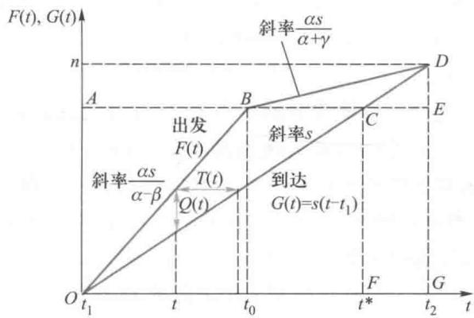  
图1累计的出发车辆数  $F(t)$  与到达车辆数  $G(t)$

$$
\mathrm{TTC} = \alpha S_{\triangle O B D} = \frac{\beta\gamma}{\beta + \gamma}\frac{n^{2}}{2s} \tag{20}
$$

与(19)式比较可知  $\mathrm{TTC} = \mathrm{TC} / 2$  ,即总等待成本正好是总成本的一半,那么另一半应该就等于总的早到和迟到成本之和.在图1中,三角形  $O C F$  的面积  $S_{\triangle O C F}$  对应于总的早到时间之和,而三角形CDE的面积  $S_{\triangle C D E}$  对应于总的迟到时间之和.读者容易对此进行计算和验证.

根据以上分析,无论小王什么时候从居民区出发,他的出行成本都是一样的.如果他早些出发或者晚些出发,虽然可以减少在出口的排队等待时间,但要么会早到公司浪费时间,要么会迟到被罚款.如果他希望正点到公司,就需要在路上忍受更长时间的车辆排队.

模型应用为了减少大家在上班路上的拥堵时间,有人建议管理部门对早高峰时段通过高速公路出口的车辆按照拥堵程度收取"拥堵费".这一建议是否真的有效?如果有效,拥堵费又应该按照什么标准收取为好?

首先我们分析一下,如果有一个权威的计划人员为所有出行车辆进行统一规划(即所谓的"集中决策"),希望使所有人出行的总成本最小(称为"系统最优"),那么车辆应该如何出发?由于排队等待时间完全是浪费,因此应尽量避免;此外,应该使瓶颈资源得到充分利用,即车流应保持连续且瓶颈全程处于满负荷状态;第一辆车早到的成本应等于最后一辆车晚到的成本,否则可以将部分车流从一端移动到另一端而降低总成本.这表明,系统最优决策其实很简单,就是从  $t_{1}$  到  $t_{2}$  的任意时刻  $(t_{1}\leqslant t\leqslant t_{2})$  ,单位时间内出发的车辆数正好等于瓶颈的通行能力  $s.$  从图1中看,就是使累计的出发车辆数OBD与OCD线重合.由于完全消除了等待成本,而早到成本和迟到成本不变,因此系统最优值将等于(19)式TC的一半,即可以节省一半的成本.

但是在没有权威的计划人员的情况下,是否存在一种在瓶颈处的收费方案,使得出行者的行为与"系统最优"一致呢?如果能够实现这一目标,我们通常说整个系统达到了协调.对社会整体来说,这应该是比较理想的状态.

可以想象,如果管理部门规定对任何排队的车辆收取一个足够高的固定拥堵费,以至于任何人偏离系统最优的出行方案都将增加其成本(因此也是达到了Nash均衡状

态),那么将不会有车辆排队(因此管理部门实际上也收不到拥堵费),从而实现系统最优.但这种方案将导致不同时刻出发的车辆的出行成本不同,似乎不太公平,是一种变相的、强制性的计划行为.

考虑到  $t$  时刻  $(t_{1} \leqslant t \leqslant t_{2})$  出发的车辆将于  $t + T(t)$  时刻到达公司,导致的早到成本是  $\beta E(t) = \beta [t^{*} - t - T(t)]$  (当  $t < t_{0}$  )或者晚到成本是  $\gamma L(t) = \gamma [t + T(t) - t^{*}]$  (当  $t > t_{0}$  ),为了消除排队(此时要求对于任意  $t(t_{1} \leqslant t \leqslant t_{2}$  ),对应的  $T(t) = 0$  ,即出发时间就是到达时间),收费方案可以考虑对每辆车"虚拟地"收取一个固定费用  $a$  ,然后对早到成本和晚到成本分别进行补偿,让每辆车的出行成本都相同(等于  $a$  )。具体来说,一种精细的收费方案是:管理部门制定一个与到达时刻  $t$  相关的收费方案,即对时刻  $t$  到达瓶颈(出口)的车辆所收取的实际费用为

评注 本模型作了很多简化,有很多学者对其做了进一步推广,如考虑多个瓶颈、更为复杂的道路网络(如文献[3]);出行者并不是完全相同的,每个人的参数  $\alpha , \beta , \gamma$  可能不相同,上班时间也不一定相同(可能会有错峰上班、弹性上班时间等);瓶颈的通行能力可能也会受到气候等因素的影响而有一定随机性等。

$$
p\left(t\right) = \left\{ \begin{array}{l l}{0,} & {\mathrm{~\#~}t< t_{1}}\\ {a - \beta \left(t^{*} - t\right),} & {\mathrm{~\#~}t_{1}\leqslant t< t^{*}}\\ {a - \gamma \left(t - t^{*}\right),} & {\mathrm{~\#~}t^{*}\leqslant t\leqslant t_{2}}\\ {0,} & {\mathrm{~\#~}t > t_{2}} \end{array} \right. \tag{21}
$$

其中  $a$  是一个常数,表示每辆车在收费后的最终出行成本,此时瓶颈处不会出现排队(请读者对此进行证明)。例如,如果取常数  $a = C(t) = (n / s) \beta \gamma /(\beta + \gamma)$ ,则每个出行者的成本与收费前相同,而管理部门却可以收取到拥堵费(读者容易验证此时  $p(t) \geqslant 0$  ),可以说是一种双赢的方案(车辆不再出现排队等待现象,管理部门收到拥堵费)。

从实际实施的角度出发,(21)的收费方案也存在一定缺陷:因为收费额随时刻  $t$  实时变化,对收费系统有较高的要求。随着智能交通设施不断完善,这一困难可能会被逐步克服。也可以考虑分为若干离散时段分别收费(同一时段收费相同)来近似实现这一精细的收费方案(如最简单地分为两段,分别对早到和迟到车辆收取不同费用),这在实际中比较容易实施(可以减缓但不能完全消除排队)。

# 复习题

1. 在收费方案(21)中,如果选择  $a < (n / s) \beta \gamma /(\beta + \gamma)$ ,每个出行者的实际成本与不收费时相比还有所降低,但此时不能保证  $p(t) \geqslant 0$ ,即对于靠近  $t_{1}$  和  $t_{2}$  的某些  $t$  有  $p(t) < 0$ ,这意味着管理部门对最早出发和最晚出发的一部分车辆应补贴  $|p(t)|$ ;但只要  $a$  不是太小,扣除补贴后,管理部门最终仍可能收取到一定的拥堵费。请你计算对于任意的  $a$ ,管理部门实际收到的总的拥堵费(扣除补贴后)为多少。为了保证管理部门"不亏本",相应的  $a$  最小为多少?

2. 考虑如下 Y 字形的道路网,两个小区分别有  $n_{1}, n_{2}$  辆车从各自小区到目的地上班,小区 1 的车辆可以直接进入下游瓶颈,而小区 2 的车辆要先通过上游瓶颈,上下游瓶颈的通行能力分别为每单位时间  $s_{2}, s_{d}$ 。假设所有车辆都希望不迟到(迟到成本非常高),建立相应的数学模型,求出早高峰时的均衡结果(包括每个小区的车辆出发率,每个瓶颈前的车辆到达率和每个瓶颈后的车辆通过率,每个小区每辆车的出行成本、总出行成本等)。根据上述计算结果,说明如果只增加上游瓶颈的通行能力  $s_{2}$ ,什么情况下将会导致总出行成本增加而不是减少。[3]

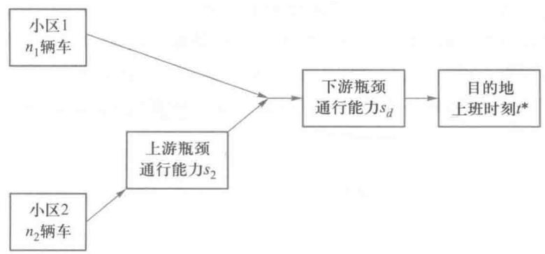

# 10.3 "一口价"的战略

问题背景 外出旅游时人们常常为了买一点纪念品,与商店或小商贩们反复地讨价还价,很浪费时间。当然,也有人把这当作一种乐趣,又另当别论。有家纪念品商店为了节省顾客和商家双方的宝贵时间,推出了一项新的销售策略:双方同时给出报价,如果顾客的出价不低于商家的卖价,则成交,并且成交价等于双方报价的平均值;否则不成交。在这种"一口价"的情况下,双方应该如何报价?

模型假设 1. 商家知道商品对自己的真实价值  $v_{s}$ ,也就是可以卖出的最低价格;顾客知道商品对自己的真实价值  $v_{s}$ ,也就是可以支付的最高价格。

2. 商家不知道商品对顾客的真实价值  $v_{b}$ ,但知道其概率分布;顾客不知道商品对商家的真实价值  $v_{s}$ ,但也知道其概率分布。

3. 不妨假设  $v_{s}, v_{b}$  都服从[0,1]上的均匀分布。

4. 对一组给定的  $(v_{s}, v_{b})$  如果以价格  $p$  成交,该交易对商家和顾客的效用分别为  $p - v_{s}, v_{b} - p$ ;如果不成交,双方的效用均为0。商家和顾客都希望最大化自己的期望效用。

5. 以上信息为双方所共有。

模型建立 记商家的战略为  $p_{s}(v_{s})$ ,即当商家认为商品的价值为  $v_{s}$  时,他给出卖价  $p_{s}(v_{s})$ ;记顾客的战略为  $p_{b}(v_{b})$ ,即当顾客认为商品的价值为  $v_{b}$  时,他给出报价  $p_{b}(v_{b})$ 。自然地, $p_{b}(v_{b})$  和  $p_{s}(v_{s})$  都应该是定义在[0,1]区间上、取值也在[0,1]区间上的非减函数。

对于任意给定的  $v_{s} \in [0,1]$ ,商家的报价  $p_{s}(v_{s})$  应该使其期望利润最大。因为只有  $p_{b}(v_{b}) \geqslant p_{s}(v_{s})$  时才能成交,成交后商家的利润为  $(p_{s}(v_{s}) + p_{b}(v_{b})) / 2 - v_{s}$ ,而不成交时利润为0,所以  $p_{s}(v_{s})$  应满足

$$
\max_{p_{s}} \left\{\frac{p_{s} + E[p_{b}(v_{s}) \mid p_{b}(v_{b}) \geqslant p_{s}]}{2} - v_{s}\right\} P\{p_{b}(v_{b}) \geqslant p_{s}\} \tag{1}
$$

这里  $E[]$  表示的是条件  $p_{b}(v_{b}) \geqslant p_{s}$  下  $p_{b}(v_{b})$  的条件期望, $P\{\}$  表示事件的概率。

类似地,对于任意给定的  $v_{b} \in [0,1]$ ,顾客的报价  $p_{b}(v_{b})$  应该使其期望赢得最大,成交后顾客的赢得为  $v_{b} - (p_{s}(v_{s}) + p_{b}(v_{b})) / 2$ ,不成交时赢得为0,所以  $p_{b}(v_{b})$  应满足

$$
\max_{p_{b}} \left\{v_{b} - \frac{p_{b} + E[p_{s}(v_{s}) \mid p_{b} \geqslant p_{s}(v_{s})]}{2}\right\} P\{p_{b} \geqslant p_{s}(v_{s})\} \tag{2}
$$

如果战略组合  $(p_{s}(v_{s}), p_{b}(v_{b}))$  同时满足(1)和(2),则是双方的一个均衡。对于这个博弈问题存在很多均衡,下面介绍其中两个比较简单的均衡。

单一价格均衡设定(0,1)区间上一个数  $x$  ,商家如果认为商品的价值  $v_{s} \leqslant x$  ,则报价  $x$  ,否则报价为1;顾客如果认为商品的价值  $v_{b} \geqslant x$  ,则报价  $x$  ,否则报价为0。这种价格战略可表示为

$$
\begin{array}{r l} & {p_{s}(v_{s}) = \left\{ \begin{array}{l l}{x,} & {v_{s}\leqslant x}\\ {1,} & {v_{s} > x} \end{array} \right.}\\ & {p_{b}(v_{b}) = \left\{ \begin{array}{l l}{x,} & {v_{b}\geqslant x}\\ {0,} & {v_{b}< x} \end{array} \right.} \end{array} \tag{3}
$$

战略组合  $(p_{s}(v_{s}), p_{b}(v_{b}))$  是否同时满足(1)和(2)呢?答案是肯定的。

首先,可以注意到成交价格只能发生在价格  $x$

此外,从商家的角度看,如果顾客坚持战略(4),则商家在  $v_{s} \leqslant x$  时报价  $x$  是他的最优反应。因为报价低于  $x$  显然使自己的利润降低(假设能成交);而报价高于  $x$  则不能成交,自己本来可以从成交中获得的利润不能实现。如果  $v_{s} > x$  ,则成交会使商家利润为负,商家当然不希望成交,而报价为1可以保证不成交(连续分布下双方都报价1的可能性为0,可以不考虑)。因此战略(3)是商家对顾客的战略(4)的最优反应。

同理,如果商家坚持战略(3),战略(4)是顾客的最优反应。因此,(3)和(4)给出的战略组合是一个均衡,称为单一价格均衡。

对一组给定的  $(v_{s}, v_{b})$  ,当  $v_{s} < v_{b}$  时称交易是有利的,因为此时一定存在  $p \in (v_{s}, v_{b})$  当双方以价格  $p$  交易时,对双方都是有利的(由模型假设4),交易给双方带来的效用之和(即  $v_{b} - v_{s}$  )称为交易价值。在给定的战略组合下,能够实际发生的交易的期望价值与有利的全部交易的期望价值的比值称为该战略的交易效率。

下面分析单一价格战略的交易效率。显然,当且仅当  $v_{s} \leqslant x \leqslant v_{b}$  时交易实际上才能发生。若  $v_{s}, v_{b}$  都服从[0,1]上的均匀分布,图1中对角线上的三角形是交易有利的区域,而只有标出"交易"的矩形才是交易实际发生的区域,所以交易效率为

域,而只有标出"交易"的矩形才是交易实际发生的区域,所以交易效率为

$$
\eta = \frac{\int_{0}^{1} \int_{0}^{x}(v_{b} - v_{s}) \mathrm{d}v_{s} \mathrm{d}v_{b}}{\int_{0}^{1} \int_{0}^{v_{b}}(v_{b} - v_{s}) \mathrm{d}v_{s} \mathrm{d}v_{b}}
$$

$$
= 3x(1 - x) \leqslant \frac{3}{4} \tag{5}
$$

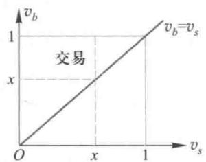  
图1 单一价格战略的交易效率

显然当  $x = 0.5$  时交易效率最大,但最大效率也只有3/4。

线性价格均衡 假设商家和顾客的报价分别是商品对二者价值的线性函数,表示为

$$
p_{s}(v_{s}) = a_{s} + c_{s}v_{s} \tag{6}
$$

$$
p_{b}(v_{b}) = a_{b} + c_{b}v_{b} \tag{7}
$$

让我们看看能否确定其中的系数(不妨假设均为正数)  $a_{s}, c_{s}, a_{b}, c_{b}$ ,使这个战略组合

$\left(p_{s}\left(v_{s}\right), p_{b}\left(v_{b}\right)\right)$  同时满足(1)和(2), 即构成一个均衡.

假设商家的战略为(6), 由假设3知  $p_{s}$  服从  $\left[a_{s}, a_{s} + c_{s}\right]$  上的均匀分布. 此时对于给定的  $v_{b}$ , 顾客的最优反应就是寻找满足(2)式的  $p_{b}$ . 当  $p_{b} \in \left[a_{s}, a_{s} + c_{s}\right]$  时,  $P\left\{p_{b} \geqslant p_{s}\left(v_{s}\right)\right\} = \left(p_{b} - a_{s}\right) / c_{s}, E\left[p_{s} \mid p_{b} \geqslant p_{s}\right] = \left(a_{s} + p_{b}\right) / 2$ , 于是(2)式为

$$
\max_{p_{b}}\left\{v_{b} - \frac{p_{b} + \left(a_{s} + p_{b}\right) / 2}{2}\right\} \cdot \frac{p_{b} - a_{s}}{c_{s}} \tag{8}
$$

这是一个二次函数的优化, 其最优解为

$$
p_{b} = \frac{2}{3} v_{b} + \frac{1}{3} a_{s} \tag{9}
$$

类似地, 假设顾客的战略为(7), 则对于给定的  $v_{s}$ , 当  $p_{s} \in \left[a_{b}, a_{b} + c_{b}\right]$  时, 由(1)式可得商家的最优反应为

$$
p_{s} = \frac{2}{3} v_{s} + \frac{1}{3}\left(a_{b} + c_{b}\right) \tag{10}
$$

比较(6),(7),(9),(10),可以解出

$$
a_{b} = \frac{1}{12}, a_{s} = \frac{1}{4}, \quad c_{b} = c_{s} = \frac{2}{3} \tag{11}
$$

即线性价格战略(6),(7)为

$$
p_{s}\left(v_{s}\right) = \frac{2}{3} v_{s} + \frac{1}{4} \tag{12}
$$

$$
p_{b}\left(v_{b}\right) = \frac{2}{3} v_{b} + \frac{1}{12} \tag{13}
$$

理论上来说, 在考虑端点条件时, 上述(12)式应该只对  $p_{s}\left(v_{s}\right) \in \left[a_{b}, a_{b} + c_{b}\right] = \left[\frac{1}{12}, \frac{3}{4}\right]$ , 即  $v_{s} \leqslant \frac{3}{4}$  有效, (13)式应该只对  $p_{b}\left(v_{b}\right) \in \left[a_{s}, a_{s} + c_{s}\right] = \left[\frac{1}{4}, \frac{11}{12}\right]$ , 即  $v_{b} \geqslant \frac{1}{4}$  有效, 否则双方总有一方不会愿意成交. 考虑到  $v_{s} > \frac{3}{4}$  或  $v_{b} < \frac{1}{4}$  时即使按(12),(13)报价, 也一定不会成交, 因此, 由(12),(13)确定的战略  $\left(p_{s}\left(v_{s}\right), p_{b}\left(v_{b}\right)\right)$  是整个  $[0,1]$  区间上的一个均衡的战略组合(参见图2).

下面分析线性价格战略的交易效率. 显然, 当且仅当  $p_{s}\left(v_{s}\right) \leqslant p_{b}\left(v_{b}\right)$  时交易实际上才能发生, 将(12),(13)代入得到交易条件为  $v_{b} \geqslant v_{s} + \frac{1}{4}$ , 在图3上标出了有利的交易中实际发生的区域(小三角形), 所以其交易效率为

$$
\eta = \frac{\int_{0}^{1} \int_{0}^{v_{b} - \frac{1}{4}}\left(v_{b} - v_{s}\right) \mathrm{d}v_{s} \mathrm{d}v_{b}}{\int_{0}^{1} \int_{0}^{v_{b}}\left(v_{b} - v_{s}\right) \mathrm{d}v_{s} \mathrm{d}v_{b}} = \frac{27}{32} > \frac{3}{4} \tag{14}
$$

可见, 线性价格战略的交易效率大于单一价格战略的交易效率. 更有意义的是, 比较图1和图3可以看出, 线性价格战略中包含了所有交易价值大于1/4的交易, 交易有利但不能成交的都是交易价值不大的. 而在单一价格战略中, 有些交易价值很小的交易成交了, 也有些交易价值很大的却未能成交(即使取  $x = 1 / 2$ , 也可能漏掉交易价值接近1/2

的交易).

评注是否存在比线性战略均衡的交易效率更高的Bayes均衡?学校门已经证明,答案是否定的.这也意味着,不存在使所有有利的交易都发生的均衡战略组合(而且已经证明这一结论对一般的连续分布也成立).也就是说,与信息完全(对称信息)的情形相比,信息的不完全(非对称信息)降低了交易效率.

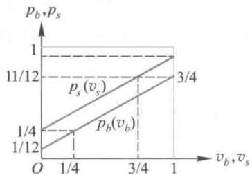  
图2均衡的线性价格战略

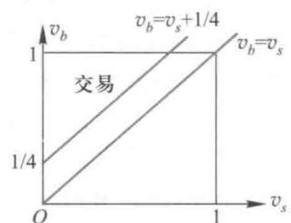  
图3线性价格战略的交易效率

这里讨论的模型一般称为双向拍卖[22],是一个同时出价的博弈(静态博弈),而且信息不完全(双方的真实价值是各自的私有信息,对方只知道其分布),所以是一个不完全信息静态博弈.可以看出,这个问题不仅是对某个具体交易(给定的  $v_{s},v_{b}$  )提供报价决策,而是要对所有可能的  $v_{s},v_{b}$  提供一个报价方案  $(p_{s}(v_{s}),p_{b}(v_{b}))$  ,这才是一个均衡(战略组合).对不完全信息静态博弈,这样的均衡一般称为Bayes均衡或Bayes- Nash均衡.

# 复习题

1. 两个投标人为获得某件物品竞标,每个投标人知道自己对该物品的估值,但不知道对手的估值,只知道对手的估值服从[0,1]区间上的均匀分布.投标采用最高价格密封拍卖,即两个投标者分别同时向物品的拥有者秘密地、一次性地给出自己的报价,然后物品的拥有者(拍卖者)从中选择报价最高者成交(如果两个投标人给出的报价相同,则等概率地随机选择一个成交),成交的竞标者向拍卖者支付的费用等于自己的报价.试建模分析两个投标人的均衡报价策略,并将结果推广到多于两个投标人的情形.

2. 继续考虑第1题中的问题,但假设投标采用次高价格密封拍卖,即成交的竞标者向拍卖者支付的费用等于除自己的报价外其他人的最高报价.试建模分析投标人的均衡报价策略,并比较两种拍卖形式下拍卖者的期望收益.

# 10.4 不息寡而患不均

问题背景互不相识的甲乙两人获得了总额一定的一笔财富(如100元),假设双方决定按如下程序分配:首先由甲("提议者")拿出一个分配提议——分给乙s元钱,剩下的1- s留给甲自己;其次,由乙("反应者")决定是否接受这个提议,如果接受,则按此分配,否则双方什么也得不到(如100元钱被其他人没收).

分配程序是公开的,两人决策有先后,所以是一个很简单的完全信息动态博弈.假设双方都只关心自己的所得,即各自的效用等于自己所得,按照经典博弈论的理论,轮到乙决策时,乙应该接受甲给出的任何分配提议,因为他如果不接受提议,就什么也得不到.于是甲应该提议  $s = 0$  ,即均衡结果是:  $s = 0$  ,乙接受.如果对乙来讲要求他接受时的效用严格大于不接受时的效用,则  $s = 1$  分钱也就可以了.

这个博弈称为最后通牒博弈(ultimatum game),学者们为了检验现实中人们是否会

真的按照经典博弈论导出的均衡进行决策,在世界各地对于不同性别、不同文化、不同富裕程度的人进行了大量实验.结果表明,绝大多数人的决策与上述均衡相差很远.首先,甲提议的分配比例一般位于  $40\% \sim 50\%$  之间,而不是接近于0;其次,乙经常会拒绝甲给出的低于  $20\%$  的提议,比例越小,越容易被乙拒绝.

对于实验结果与理论预测不一致的矛盾,有很多学者提出了各种解释,如认为这是因为实验者不懂博弈论,但这很难解释为什么这么多人都会犯同样的错误.一种比较有说服力的解释是,经典博弈论把每个参与者的赢得作为他的效用函数,这相当于认为人们只关心自己的实际所得,即人是"绝对自私"而且"完全理性"的,而现实中人们在决策时不仅仅考虑自己的得失,还关注自己的感受,例如人们可能还具有"利他"与"互惠"思想,特别是还会关注分配是否公平.中国有句老话"不患寡而患不均",就是表达类似的道理.下面介绍一个考虑这种公平性的模型[19].

模型假设与建立设甲乙二人按如下程序分配总额为1的财富:甲提议分给乙 $s(0\leqslant s\leqslant 1)$  ,自己留  $1 - s$  ;乙如果接受提议,则甲乙二人所得分别为  $x_{1} = 1 - s,x_{2} = s$  ,否则  $x_{1} =$ $x_{2} = 0$

在构造两人的效用函数时,假定他们除了考虑自己的所得  $x_{1},x_{2}$  以外,还都偏爱公平,具体表现为:如果某人所得比对方少,他因"愤怒"使效用降低;如果某人所得比对方多,他因"愧疚"也使效用降低.用  $\alpha_{1},\alpha_{2}(\geqslant 0)$  分别表示两人的"愤怒"系数,  $\beta_{1},\beta_{2}(\geqslant 0)$  分别表示两人的"愧疚"系数,并且不妨假设  $\alpha_{i}\geqslant \beta_{i},i = 1,2.$  建立两人的效用函数为

$$
U_{i}(x_{1},x_{2}) = x_{i} - \alpha_{i}\mathrm{max}\left\{x_{j} - x_{i},0\right\} -\beta_{i}\mathrm{max}\left\{x_{i} - x_{j},0\right\} ,i = 1,2,j = 3 - i \tag{1}
$$

还可以进一步假设  $\beta_{i}< 1 / 2$  ,否则,当  $i$  的所得比对手  $j$  多,即  $x_{i} > x_{j} = 1 - x_{i}$  时,  $i$  的效用函数是  $x_{i} - \beta_{i}(x_{i} - x_{j}) = \beta_{i} - (2\beta_{i} - 1)x_{i}$  关于  $i$  自己的所得  $x_{i}$  的系数非正,因此  $i$  宁愿将自己多得的部分(即使是很小的一部分)全部让给对方,这种过分"愧疚"的情形一般也是不符合实际的.

由于财富的分配  $x_{1},x_{2}$  实际上只与  $s$  有关,所以下面将效用函数(1)简记为  $U_{1}(s)$  和  $U_{2}(s)$

模型求解首先讨论乙的最优反应.对于给定的  $s$  ,如果他不接受,则  $x_{1} =$ $x_{2} = 0,U_{1}(s) = U_{2}(s) = 0.$

如果乙接受,即  $x_{1} = 1 - s,x_{2} = s.$  若  $s\geqslant 1 / 2$  ,则  $x_{2}\geqslant x_{1}$  ,于是

$$
U_{2}(s) = s - \beta_{2}(2s - 1) \tag{2}
$$

由  $\beta_{2}< 1 / 2$  可知(2)式中的  $U_{2}(s)\geqslant 1 / 2 > 0$  ,所以乙的最优反应是接受.

若  $s\leqslant 1 / 2$  ,则  $x_{2}\leqslant x_{1}$  ,于是

$$
U_{2}(s) = s - \alpha_{2}(1 - 2s) = (1 + 2\alpha_{2})s - \alpha_{2} \tag{3}
$$

仅当(3)式中的  $U_{2}(s)\geqslant 0$  ,即  $s\geqslant \alpha_{2} / (1 + 2\alpha_{2})$  时,乙的最优反应才是接受;否则,乙不会接受.记  $\overline{{s}} (\alpha_{2}) = \alpha_{2} / (1 + 2\alpha_{2})$  ,容易看出  $0\leqslant \overline{{s}} (\alpha_{2})< 1 / 2$

可以发现,当  $s = 1 / 2$  时(2)和(3)是一致的,所以特例  $s = 1 / 2$  放到上面的哪种情况讨论都是一样的,以下也类似,不再特别说明.

现在讨论甲的决策.由于乙不接受时双方的效用都是0,而甲显然有可行的提议可

以让乙接受并且使自己的效用为正(如  $s = 1 / 2$  ),所以只需要考虑乙接受提议的情形.分两种情况讨论:

情况1甲知道乙的"愤怒"系数  $\alpha_{2}$

若  $s\geqslant 1 / 2$  ,则  $x_{2}\geqslant x_{1}$  ,于是

$$
U_{1}(s) = 1 - s - \alpha_{1}(2s - 1) \tag{4}
$$

$U_{1}(s)$  在  $s^{*} = 1 / 2$  时达到最大值  $1 / 2$  ,所以只需要讨论  $s\leqslant 1 / 2$  且  $s\geqslant \overline{{s}} (\alpha_{2})$  的情况.此时  $x_{2}\leqslant x_{1}$  ,于是

$$
U_{1}(s) = 1 - s - \beta_{1}(1 - 2s) = 1 - \beta_{1} + (2\beta_{1} - 1)s, \qquad \overline{{s}} (\alpha_{2}) \leqslant s \leqslant 1 / 2 \tag{5}
$$

$U_{1}(s)$  是  $s$  的线性函数,由  $\beta_{1}< 1 / 2$  知最优值在左端点取得,于是甲的最佳决策  $s^{*}$  应该是

$$
s^{*} = \overline{{s}} (\alpha_{2}) = \alpha_{2} / (1 + 2\alpha_{2}) \tag{6}
$$

可见,甲提议给乙的比例为  $\overline{{s}} (\alpha_{2})$  ,严格小于  $50\%$  此外,  $\overline{{s}} (\alpha_{2})$  是乙的"愤怒"系数  $\alpha_{2}$  的增函数,  $\alpha_{2}$  越大,甲提议分给乙的份额就会越高,这是符合人们直觉的.

情况2甲不知道乙的"愤怒"系数  $\alpha_{2}$  ,但知道  $\alpha_{2}$  的概率分布.

若  $s\geqslant 1 / 2$  ,则  $x_{2}\geqslant x_{1}$  ,因为此时乙一定会接受甲的提议,甲的效用仍如(4)式所示,在  $s^{*} = 1 / 2$  时达到最大值  $1 / 2$  ,所以仍只需要讨论  $s\leqslant 1 / 2$  的情况.

甲知道  $s\geqslant \overline{{s}} (\alpha_{2})$  时乙才会接受甲的提议,且  $s\geqslant \overline{{s}} (\alpha_{2}) = \alpha_{2} / (1 + 2\alpha_{2})$  等价于  $\alpha_{2}\leqslant$ $s / (1 - 2s)$  若设  $\alpha_{2}$  的概率分布函数为  $F(\alpha_{2})$  ,且  $F(\alpha) = 0,F(\alpha) = 1\mathbb{O}$  ,则甲可以推测乙接受甲的提议  $s$  的概率  $p$  为

$$
p = \left\{ \begin{array}{l l}{0,} & {s\leqslant \overline{{s}} (\underline{{\alpha}})}\\ {F(s / (1 - 2s)),} & {\overline{{s}} (\underline{{\alpha}})< s< \overline{{s}} (\overline{{\alpha}})}\\ {1,} & {s\geqslant \overline{{s}} (\overline{{\alpha}})} \end{array} \right. \tag{7}
$$

这个概率是关于  $s$  的非减函数,即甲提议的  $s$  越大,越可能被乙接受,这与实验中观察到的现象完全吻合.

于是由(5)和(7)式,如果甲提议  $s$  ,其期望效用为

$$
E U_{1}(s) = \left\{ \begin{array}{l l}{0,} & {s\leqslant \overline{{s}} (\underline{{\alpha}})}\\ {\left[1 - \beta_{1} + (2\beta_{1} - 1)s\right]F(s / (1 - 2s)),} & {\overline{{s}} (\underline{{\alpha}})< s< \overline{{s}} (\overline{{\alpha}})}\\ {1 - \beta_{1} + (2\beta_{1} - 1)s,} & {s\geqslant \overline{{s}} (\overline{{\alpha}})} \end{array} \right. \tag{8}
$$

甲应该最大化(8)式表示的期望效用.考虑到  $\beta_{1}< 1 / 2$  及(8)式中  $E U_{1}(s)$  是连续函数,只需要考虑在区间  $\overline{{s}} (\alpha)< s\leqslant \overline{{s}} (\overline{{\alpha}})$  上最大化  $[1 - \beta_{1} + (2\beta_{1} - 1)s]F(s / (1 - 2s))$  即可,其最优解  $s^{*}$  就是甲的最优战略.

与情况1类似,甲提议给乙的比例不超过  $\overline{{s}} (\overline{{\alpha}})$  ,严格小于  $50\%$

二人分配财富的模型可以推广到有  $n$  个参与人,记参与人  $i$  得到的财富为  $x_{i}, x = (x_{1}, x_{2}, \dots , x_{n})$ ,定义  $i$  的效用函数为

$$
U_{i}(\pmb {x}) = x_{i} - \alpha_{i}\frac{1}{n - 1}\sum_{j\neq i}\max \left\{x_{j} - x_{i},0\right\} - \tag{9}
$$

$$
\beta_{i}\frac{1}{n - 1}\sum_{j\neq i}\max \left\{x_{i} - x_{j},0\right\} ,i = 1,2,\dots ,n \tag{9}
$$

其中  $\alpha_{i}, \beta_{i}$  的含义与前面相同.与二人情形假设  $\beta_{i}< 1 / 2$  类似,对于多人情形一般假设  $\beta_{i}< 1$ ,主要理由是:当  $i$  的所得比其他人多而其他人所得相同,即对任意  $j \neq i, x_{i} > x_{j} = (1 - x_{i}) / (n - 1)$  时,  $i$  的效用函数是

$$
\begin{array}{l}{{U_{i}({\pmb x})=x_{i}-\beta_{i}\frac{1}{n-1}\sum_{j\neq i}\left(x_{i}-x_{j}\right)=x_{i}-\beta_{i}\bigg(x_{i}-\frac{1-x_{i}}{n-1}\bigg)}}\\ {{=\frac{\beta_{i}}{n-1}+\left(1-\frac{n\beta_{i}}{n-1}\right)x_{i}}}\end{array} \tag{10}
$$

评注这个模型对公平性进行了量化,很好地解释了实验结果与理论预测不一致的矛盾.通过建立数学模型解释存在的现象,这是建模的重要功能之一.可以相信,如果一个模型能够很好地解释存在的现象,这个模型应该对未来的现象也具有很强的预测能力.

为了避免该效用函数关于  $i$  自己的所得  $x_{i}$  的系数非正(过分"愧疚"的情形),一般假设  $1 - \frac{n\beta_{i}}{n - 1} >0$ ,即  $\beta_{i}< \frac{n - 1}{n} < 1$

# 复习题

按照本节介绍的公平性概念,建立考虑公平性的博弈模型,分析如下具有多个(至少两个)"反应者"的最后通牒博弈:首先由一个唯一指定的"提议者"提出一个分配提议——从总量为1的财富中分给反应者  $s$ ,剩下的1- s留给提议者自己;其次,由  $n - 1$  个"反应者"同时决定自己是否接受这个提议,如果没有人接受,则所有参与者什么也得不到;如果至少有一个人接受,则所有接受的反应者以等概率地(如通过抓阄)得到  $s$ ,提议者得到1- s.假设(9)式定义的  $\beta_{i}< (n - 1) / n$ ,给出这个博弈的均衡[19].

# 10.5 效益的合理分配

在经济或社会活动中若干实体(如个人、公司、党派、国家等)相互合作结成联盟或集团,常能比他们单独行动获得更多的经济或社会效益.确定合理地分配这些效益的方案是促成合作的前提.先看一个简单例子.

甲乙丙三人经商.若单干,每人仅能获利1元;甲乙合作可获利7元;甲丙合作可获利5元;乙丙合作可获利4元;三人合作则可获利11元.问三人合作时怎样合理地分配11元的收入.

人们自然会想到的一种分配方法是:设甲乙丙三人各得  $x_{1}, x_{2}, x_{3}$  元,满足

$$
x_{1} + x_{2} + x_{3} = 11 \tag{1}
$$

$$
x_{1}, x_{2}, x_{3} \geqslant 1, \quad x_{1} + x_{2} \geqslant 7, \quad x_{1} + x_{3} \geqslant 5, \quad x_{2} + x_{3} \geqslant 4 \tag{2}
$$

(2)式表示这种分配必须不小于单干或二人合作时的收入.但是容易看出(1),(2)有许多组解,如  $(x_{1}, x_{2}, x_{3}) = (5,3,3)$ ,  $(4,4,3)$ ,  $(4,3.5,3.5)$  等.于是应该寻求一种圆满的

分配方法.

上例提出的这类问题称为  $n$  人合作对策(cooperative  $n$ - person game). L.S.Shapley 1953 年给出了解决该问题的一种方法, 称 Shapley 值[17].

$n$  人合作对策和 Shapley 值  $n$  个人从事某项经济活动, 对于他们之中若干人组合的每一种合作(为统一起见, 单人也视为一种合作), 都会得到一定的效益, 当人们之间的利益是非对抗性时, 合作中人数的增加不会引起效益的减少. 这样, 全体  $n$  个人的合作将带来最大效益.  $n$  个人的集合及各种合作的效益就构成  $n$  人合作对策, Shapley 值是分配这个最大效益的一种方案. 正式的定义如下.

设集合  $I = \{1,2,\dots ,n\}$ , 如果对于  $I$  的任一子集  $s$  都对应着一个实值函数  $v(s)$ , 满足

$$
v(\emptyset) = 0 \tag{3}
$$

$$
v(s_{1}\cup s_{2})\geqslant v(s_{1}) + v(s_{2}),\quad s_{1}\cap s_{2} = \emptyset \tag{4}
$$

称  $[I,v]$  为  $n$  人合作对策,  $v$  为对策的特征函数

在上面所述经济活动中,  $I$  定义为  $n$  人集合,  $s$  为  $n$  人集合中的任一种合作,  $v(s)$  为合作  $s$  的效益.

用  $x_{i}$  表示  $I$  的成员  $i$  从合作的最大效益  $v(I)$  中应得到的一份收入.  $x = (x_{1},x_{2},\dots ,x_{n})$  叫作合作对策的分配(imputation), 满足

$$
\sum_{i = 1}^{n}x_{i} = v(I) \tag{5}
$$

$$
x_{i}\geqslant v(i),\quad i = 1,2,\dots ,n \tag{6}
$$

请读者解释(6)式的含义. 显然, 由(3), (4)定义的  $n$  人合作对策  $[I,v]$  通常有无穷多个分配.

Shapley 值由特征函数  $v$  确定, 记作  $\Phi (v) = (\phi_{1}(v),\phi_{2}(v),\dots ,\phi_{n}(v))$ . 对于任意的子集  $s$ , 记  $x(s) = \sum_{i\in s}x_{i}$ , 即  $s$  中各成员的分配. 对一切  $s\subset I$ , 满足  $x(s)\geqslant v(s)$  的  $x$  组成的集合称  $[I,v]$  的核心(core). 当核心存在时, 即所有  $s$  的分配都不小于  $s$  的效益, 可以将 Shapley 值作为一种特定的分配, 即  $\phi_{i}(v) = x_{i}$ .

Shapley 首先提出看来毫无疑义的几条公理, 然后用逻辑推理的方法证明, 存在唯一的满足这些公理的分配  $\Phi (v)$ , 并把它构造出来. 这里只给出  $\Phi (v)$  的结果, Shapley 公理可参看[8].

Shapley 值  $\Phi (v) = (\phi_{1}(v),\phi_{2}(v),\dots ,\phi_{n}(v))$  为

$$
\phi_{i}(v) = \sum_{s\in S_{i}}w(|s|) [v(s) - v(s\backslash i)], i = 1,2,\dots ,n \tag{7}
$$

$$
w(|s|) = \frac{(n - |s|)!(|s| - 1)!}{n!} \tag{8}
$$

其中  $S_{i}$  是  $I$  中包含  $i$  的所有子集,  $|s|$  是子集  $s$  中的元素数目(人数),  $w(|s|)$  是加权因

子,  $s \backslash i$  表示  $s$  去掉  $i$  后的集合.

我们用这组公式计算本节开始给出的三人经商问题的分配, 以此解释公式的用法和意义.

甲乙丙三人记为  $I = \{1,2,3\}$  ,经商获利定义为  $I$  上的特征函数,即  $v(\emptyset) = 0,v(1) =$ $v(2) = v(3) = 1,v(1,2) = 7,v(1,3) = 5,v(2,3) = 4,v(I) = 11.$  容易验证  $v$  满足(3),(4).为计算  $\phi_{1}(v)$  首先找出  $I$  中包含1的所有子集  $S_{1}:\{1\} ,\{1,2\} ,\{1,3\} ,I,$  然后令  $s$  跑遍  $S_{1}$  ,将计算结果记人表1. 最后将表中末行相加得  $\phi_{1}(v) = 13 / 3.$  同法可计算出  $\phi_{2}(v) = 23 / 6,\phi_{3}(v)$ $= 17 / 6.$  它们可作为按照Shapley值方法计算的甲乙丙三人应得的分配.

让我们通过此例对(7)式作些解释.对表1中的  $s$  ,比如  $\{1,2\} ,v(s)$  是有甲(即  $\{1\}$  )参加时合作  $s$  的获利,  $v(s\backslash 1)$  是无甲参加时合作  $s$  (只剩下乙)的获利,所以  $v(s) - v(s\backslash$  1)可视为甲对这一合作的"贡献"用Shapley值计算的甲的分配  $\phi_{1}(v)$  是,甲对他所参加的所有合作  $(S_{1})$  的贡献的加权平均值,加权因子  $w(\mid s\mid)$  取决于这个合作  $s$  的人数.通俗地说就是按照贡献取得报酬.

表1三人经商中甲的分配  $\phi_{1}(v)$  的计算  

<table><tr><td>s</td><td>1</td><td>|1,2|</td><td>|1,3|</td><td>/</td></tr><tr><td>v(s)</td><td>1</td><td>7</td><td>5</td><td>11</td></tr><tr><td>v(s\1)</td><td>0</td><td>1</td><td>1</td><td>4</td></tr><tr><td>v(s)-v(s\1)</td><td>1</td><td>6</td><td>4</td><td>7</td></tr><tr><td>|s|</td><td>1</td><td>2</td><td>2</td><td>3</td></tr><tr><td>w(|s|)</td><td>1/3</td><td>1/6</td><td>1/6</td><td>1/3</td></tr><tr><td>w(|s|)[v(s)-v(s\1)]</td><td>1/3</td><td>1</td><td>2/3</td><td>7/3</td></tr></table>

Shapley值方法可以有效地处理经济和社会合作活动中的利益分配问题.请看下面的例子.

污水处理费用的合理分担沿河有三城镇1,2和3,地理位置如图1所示.污水需处理后才能排入河中.三城镇既可以单独建立污水处理厂,也可以联合建厂,用管道将污水集中处理(污水应由河流的上游城镇向下游城镇输送).用  $Q$  表示污水量(单位:  $\mathrm{t} / \mathrm{s}$  ),  $L$  表示管道长度(单位:  $\mathrm{km}$  ),按照经验公式,建立处理厂的费用为  $P_{1} = 73Q^{0.712}$  千元,铺设管道费用为  $P_{2} = 0.66Q^{0.51}L$  千元.已知三城镇污水量为  $Q_{1} = 5, Q_{2} = 3, Q_{3} = 5, L$  的数值如图1所示.试从节约总投资的角度为三城镇制定污水处理方案.如果联合建厂,各城镇如何分担费用[41]?

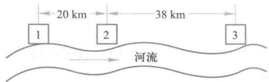  
图1三城镇地理位置示意图

三城镇污水处理共有以下5种方案,计算出投资费用以作比较.

1) 分别建厂. 投资分别为

$C(1) = 73 \times 5^{0.712} = 230, C(2) = 160, C(3) = 230$ , 总投资  $D_{1} = C(1) + C(2) + C(3) = 620$ .

2) 1,2 合作, 在城2建厂. 投资为

$C(1,2) = 73 \times (5 + 3)^{0.712} + 0.66 \times 5^{0.51} \times 20 = 350$ , 总投资  $D_{2} = C(1,2) + C(3) = 580$ .

3) 2,3 合作, 在城3建厂. 投资为

$C(2,3) = 73 \times (3 + 5)^{0.712} + 0.66 \times 3^{0.51} \times 38 = 365$ , 总投资  $D_{3} = C(1) + C(2,3) = 595$ .

4) 1,3 合作, 在城3建厂. 投资为

$C(1,3) = 73 \times (5 + 5)^{0.712} + 0.66 \times 5^{0.51} \times 58 = 463$ , 这个费用超过了1,3分别建厂的费用  $C(1) + C(3) = 460$ . 合作没有效益, 不可能实现.

5) 三城合作, 在城3建厂. 总投资为  $D_{5} = C(1,2,3) = 73 \times (5 + 3 + 5)^{0.712} + 0.66 \times 5^{0.51} \times 20 + 0.66 \times (5 + 3)^{0.51} \times 38 = 556$ .

比较结果以  $D_{5} = 556$  千元最小, 所以应选择联合建厂方案. 下面的问题是如何分担费用  $D_{5}$ .

总费用  $D_{5}$  中有3部分: 联合建厂费  $d_{1} = 73 \times (5 + 3 + 5)^{0.712} = 453$ ; 城1至2的管道费  $d_{2} = 0.66 \times 5^{0.51} \times 20 = 30$ ; 城2至3的管道费  $d_{3} = 0.66 \times (5 + 3)^{0.51} \times 38 = 73$ . 城3提出,  $d_{1}$  由三城按污水量比例  $5:3:5$  分担,  $d_{2}, d_{3}$  是为城1,2铺设的管道费, 应由他们担负; 城2同意, 并提出  $d_{3}$  由城1,2按污水量之比  $5:3$  分担,  $d_{2}$  则应由城1自己担负; 城1提不出反对意见, 但他们计算了一下按上述办法各城应分担的费用:

城3分担费用为  $d_{1} \times \frac{5}{13} = 174$ ;

城2分担费用为  $d_{1} \times \frac{3}{13} + d_{3} \times \frac{3}{8} = 132$ ;

城1分担费用为  $d_{1} \times \frac{5}{13} + d_{3} \times \frac{5}{8} + d_{2} = 250$ .

结果表明城2,3分担的费用均比他们单独建厂费用  $C(2), C(3)$  小, 而城1分担的费用却比  $C(1)$  大. 显然, 城1不能同意这种分担总费用的办法.

为了促成三城联合建厂以节约总投资, 应该寻求合理分担总费用的方案. 三城的合作节约了投资, 产生了效益, 是一个  $n$  人合作对策问题, 可以用Shapley值方法圆满地分配这个效益.

把分担费用转化为分配效益, 就不会出现城1联合建厂分担的费用反比单独建厂费用高的情况. 将三城镇记为  $I = (1,2,3)$ , 联合建厂比单独建厂节约的投资定义为特征函数. 于是有

$$
v(\emptyset) = 0, v(1) = v(2) = v(3) = 0
$$

$$
v(1,2) = C(1) + C(2) - C(1,2) = 230 + 160 - 350 = 40
$$

$$
v(2,3) = C(2) + C(3) - C(2,3) = 160 + 230 - 365 = 25
$$

$v(1,3) = 0$

$$
v(I) = C(1) + C(2) + C(3) - C(1,2,3)
$$

$$
= 230 + 160 + 230 - 556 = 64
$$

三城联合建厂的效益为64千元. 用Shapley值作为这个效益的分配, 城1应分得的

份额  $\phi_{1}(v)$  的计算结果列入表2,得到  $\phi_{1}(v) = 19.7.$  类似地算出  $\phi_{2}(v) = 32.1,\phi_{3}(v) =$  12.2. 可以验证  $\phi_{1}(v) + \phi_{2}(v) + \phi_{3}(v) = 64 = v(I).$  看来,城2从总效益64千元中分配的份额最大,你能从城2的地理位置与合作对策的角度解释这个结果吗?

评注Shapley值最初是从解决合作对策的分配问题提出来的,后来给以公理化的证明,成为一种公正、合理的解决方法,但是定义特征函数时需要知道集合  $N = \mid 1,2,\dots ,$ $n\mid$  的每一个子集S(共有  $2^{n}$  个)获得的效益,在实际上常常做不到,这就限制了Shapley值方法的应用范围.当掌握的信息较少时处理这类分配问题有另一类方法,参见更多案例10- 3.

最后,在联合建厂方案总投资额556千元中各城的分担费用为:城1是  $C(1) - \phi_{1}(v) =$ $230 - 19.7 = 210.3$  城2是  $C(2) - \phi_{2}(v) = 127.9$  城3是  $C(3) - \phi_{3}(v) = 217.8.$

# 复习题

1. 某甲(农民)有一块土地,若从事农业生产可收入1万元;若将土地租给某乙(企业家)用于工业生产,可收入2万元;若租给某丙(旅店老板)开发旅游业,可收入3万元;当旅店老板请企业家参与经营时,收入达4万元.为促成最高收入的实现,试用Shapley值方法分配各人的所得.

2. 证明由(7),(8)给出的Shapley值  $\Phi (v)$  满足  $\phi_{i}(v)\geqslant v(i),i = 1,2,\dots ,n.$

# 10.6 加权投票中权力的度量

在许多经济或政治机构中,为了保证每个参与者有平等的权力,在进行投票选举和表决提案等活动时,通常采取"一人一票"的方式,以显示投票和表决的公正性.然而还有不少不宜采用按人头计票的情况,如在股份制公司的一些机构中,每位股东投票和表决权的大小常由他们占有的股份多少决定.又如一些国家、地区的议会、政府,甚至总统的产生,是由这些国家、地区所属的州、县等各个区域推出的代表投票决定的,而这些代表投票的权重又取决于他们代表的那个区域的人口,这种看似公平的办法在一些情况下也会出现矛盾,引起质疑.

美国的总统选举是一个典型案例.根据美国宪法,总统选举不是全民普选,而是实行选举人制度.总统候选人获得全国50个州和华盛顿特区共538张选举人票数的一半以上即可当选,各州拥有的选举人票数与该州在国会拥有的参、众议员人数相等.参议员每州2位,众议员人数则根据各州人口比例来确定,而各州人口的悬殊使得各州选举人票的数量相差很大,如人口众多的加利福尼亚州的选举人票多达55张,人口较少的阿拉斯加州只有3张.