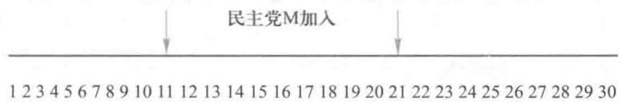
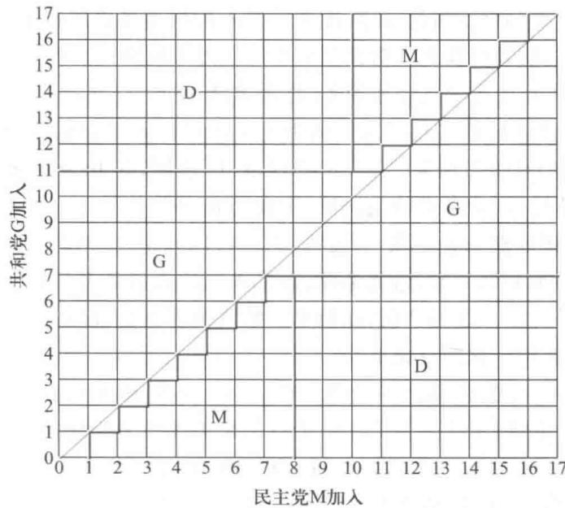
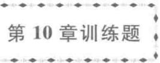

各州的选举人如何投票呢?原来,总统候选人先在各州内实行普选,获得相对多数选票的候选人将得到该州的全部选举人票,这就是在48个州和华盛顿特区实行的"胜者全得"原则。这样,在加利福尼亚州以微弱多数普选获胜的总统候选人可得到全部55张选举人票。如果有几个人口多的州出现这种情况,总统选举的结果就可能违反全国多数人的意愿,即在各州累计得票最多的总统候选人在选举人投票中反而不能获胜。美国历史上曾多次发生这种情况,在2000年布什与戈尔进行的竞选中,戈尔最终败给布什就是一例。

选举人制度在美国已经历了200多年的发展与演变。近年来,虽然要求改革的呼声不断,但由于多种因素的制约,改革始终无法进行。

为了叙述的方便,本节考察的对象可以解释为:由若干区域(如省、县、镇等)组成的某个机构中,每区都有代表任职,其数量按照各区人口的比例分配,在机构进行投票选举和表决时,每区的全体代表投相同的票。这种情况等价于每区各派一位代表(也称投票人),按照他们所代表的各区人口比例赋予他们以投票的权重,这就是加权投票的含义。股份制公司中股东以所占有的股份为权重来投票也属于这种情况。

如何度量每位代表的投票对最终结果的影响力(不妨称为投票人的权力),本节根据对策论的方法引入一个模型,介绍两种合理的数量指标,并且通过实例给出它们的应用,最后研究如何调整投票人的权重,使他们的权力大致与他们所代表的各区人口成比例[41]。

加权投票与获胜联盟 本节研究的对象称为加权投票,让我们先看一个虚拟的例子。

例1假设一个县有5个区,记作A,B,C,D,E,人口(单位:千人)分别为60,20,10,5,5,每区出一位代表,按照人口比例分配各区代表的投票权重为12,4,2,1,1,总权重20。按照简单多数规则决定投票结果,即当投赞成票代表的权重之和超过10(总权重的一半)时,投票结果即为赞成(以下表述为决议通过)。显然,A区的代表是一位独裁者,他可以决定投票结果,其他各区代表都成了摆设。

为了改变这种情况,将A区分成人口相等的3个子区A1,A2,A3,于是一共7个区,按人口比例分配,每区一位代表的投票权重为4,4,4,4,2,1,1。如果仍按简单多数规则决定投票结果,那么可以决定投票结果的区域集合除了[A1,A2,A3]外,还有[A1,A2,B],[A1,A3,C,D],[A1,B,C,E],[A1,A3,B,D],等等。

加权投票可描述如下:一个系统由  $n$  个投票人的集合  $N = \left|A,B,C,\dots \right|$  及他们的投票权重(均为正数)  $w_{1},w_{2},\dots ,w_{n}$  构成,投票规则规定,当投赞成票的投票人权重之和达到或超过事先给定的正数  $q$  时,决议通过。具有这种构造及规则的系统称为加权投票系统,记作  $S$  用  $S = [q;w_{1},w_{2},\dots ,w_{n}]$  表示,其中  $q$  称为定额( quota),若记  $w = w_{1} + w_{2} + \dots +w_{n}$ ,一般假定  $w / 2< q\leqslant w$ 。在简单多数规则并且权重取整数的情况,  $q$  为大于  $w / 2$  的最小整数。

像例1那样,若  $n$  个区的人口比例为  $p = (p_{1},p_{2},\dots ,p_{n})$ ,按照这个比例直接赋予各位代表的投票权重,称为直接比例加权投票系统。例1中的2个系统分别记作  $S^{(1)} = [11;12,4,2,1,1]$  和  $S^{(2)} = [11;4,4,4,4,2,1,1]$ 。

权重之和达到或超过定额  $q$  的投票人子集称为获胜联盟(winning coalition).获胜联盟如果没有它的一个真子集也是获胜联盟,那么称它为极小获胜联盟.在系统  $S^{(2)}$  中,[A1,A2,B],[A1,A3,C,D]都是极小获胜联盟,而[A1,A3,B,D]是获胜联盟,却不是极小的.所有获胜联盟的集合称获胜联盟集,记作  $W$  ,极小获胜联盟集记作  $\boldsymbol{W}_{m}$  一个加权投票系统  $S = [q;w_{1},w_{2},\dots ,w_{n}]$  也可以用投票人集合  $N$  和获胜联盟集  $W$  表示,记作  $G = (N,W)$  ,在对策论中是一个合作对策.

极小获胜联盟在加权投票系统中起着重要作用.再看一个例子.

例2某系的一个委员会由主任、教授、学生各一人组成,依次记作A,B,C,投票权重为  $w_{1},w_{2},w_{3}$ .考察以下几种加权投票系统:

1.  $S^{(1)} = [3;3,1,1]$ .只有一个极小获胜联盟,  $W_{m} = ([\mathrm{A}])$ ,主任是独裁者,教授、学生的投票对结果没有任何影响,可以说他们没有权力,这样的投票人称为傀儡(dummy).

2.  $S^{(2)} = [2;1,1,1]$ .任何2人组成极小获胜联盟,  $W_{m} = ([\mathrm{AB}],[\mathrm{AC}],[\mathrm{BC}]),3$  人的权力相同.

3.  $S^{(3)} = [4;2,2,1]$ .只有一个极小获胜联盟,  $W_{m} = ([\mathrm{AB}])$ ,学生不在其中,是傀儡,而主任和教授的权力相同.

4.  $S^{(4)} = [3;2,1,1]$ .有2个极小获胜联盟,  $W_{m} = ([\mathrm{AB}],[\mathrm{AC}])$ .主任虽不是独裁者,但每一个极小获胜联盟都有他,表明主任有否决权,而教授和学生的权力相同.

可以看出,给定一个加权投票系统  $S$ ,能够写出极小获胜联盟集  $W_{m}$ ,由  $W_{m}$  也容易写出获胜联盟集  $W$ .实际上,我们常常用获胜规则描述一个投票过程,如某系务会由一位主任和两位教师组成,投票结果由主任和至少一位教师决定,主任有否决权.由此首先写出的是  $N = \{\mathrm{A},\mathrm{B},\mathrm{C}\}$ ,  $W_{m} = ([\mathrm{AB}],[\mathrm{AC}]),W = ([\mathrm{AB}],[\mathrm{AC}],[\mathrm{ABC}])$ ,这里A是主任,B,C是教师.而根据这样的  $N,W_{m}$  或  $W$  可以得到不同的加权投票系统,如上面的  $S^{(4)} = [3;2,1,1],[5;3,2,2]$  等.

分析例2的加权投票系统及其极小获胜联盟可以看出,每个投票人的投票对系统投票结果的影响,并不直接依赖于他的投票权重,如  $S^{(1)}$  中主任的权重不过是教授或学生的3倍,却能完全操纵结果,  $S^{(3)}$  中学生的权重是主任或教授的一半,却对结果毫无影响力.

显然,每个投票人对投票结果的影响力才是他在系统中权力或地位最重要的度量.若用  $\pmb {k} = (k_{1},k_{2},k_{3})$  描述例2加权投票系统中3位投票人的(相对)权力,作初步分析就可看出,在  $S^{(1)},S^{(2)},S^{(3)}$  中投票人要么有权,且权力相同,可以用1表示,要么无权,用0表示,于是对于  $S^{(1)}$  有  $\pmb{k}^{(1)} = (1,0,0),S^{(2)}$  有  $\pmb{k}^{(2)} = (1,1,1),S^{(3)}$  有  $\pmb{k}^{(3)} = (1,1,0)$ ,而对于  $S^{(4)},k^{(4)}$  如何呢?因为教授和学生的权力相同,可以令  $k_{2} = k_{3} = 1$ ,显然  $k_{1}$  应该大一些,等于多少合适呢?

实际上在加权投票系统中,除了很简单的情况外,找到公平、合理的度量投票人权力的办法并不那么容易.下面介绍两种度量投票人权力的数量指标——Shapley指标和Banzhaf指标,统称权力指标(power index).

Shapley权力指标对于前面讨论的加权投票系统  $S = [q;w_{1},w_{2},\dots ,w_{n}]$  或其对策论的表述  $G = (N,W)$ ,必有空集  $\varnothing \notin W,N\in W$ ,且若  $R,T\in N,R\subset T,R\in W$ ,则  $T\in W$ .下

面先列出作为度量投票人权力的数量指标应该具有的性质:

1. 对于每个投票人  $i$  有一个非负实数  $k_{i}$  作为他的权力指标;

2. 当且仅当  $i \notin W_{m}$  即  $i$  是傀儡时,  $k_{i} = 0$ ;

3. 若权重  $w_{i} > w_{j}$ , 则  $k_{i} \geqslant k_{j}$ ;

4. 若投票人  $i$  和  $j$  在  $W$  中"对称"(通过下面例子解释),则  $k_{i} = k_{j}$ ;

5.  $\sum_{i \in N} k_{i} = 1$  (这种归一化不是必须的).

满足这些性质的数量指标并不唯一,Shapley权力指标(或称Shapley- Shubik权力指标)是常用的一个.下面先通过例2由主任A、教授B、学生C构成的加权投票系统 $S^{(4)} = [3;2,1,1]$ ,看看这个指标是如何得到的.

首先写出3位投票人的全排列ABC,ACB,BAC,BCA,CAB,CBA.对第1个排列ABC,由左向右依次检查:从A增至AB时,[AB]变为获胜联盟,B下划以横线;对第2个排列ACB,从A增至AC时,[AC]变为获胜联盟,C下划以横线;对第6个排列CBA,从CB增至CBA时,[CBA]变为获胜联盟,A下划以横线.这样得到

A下有4条横线,B,C下各有1条横线,于是系统  $S^{(4)}$  的Shapley指标是(4,1,1),可归一化为  $(4 / 6,1 / 6,1 / 6)$

一般地,对于有  $n$  个投票人的加权投票系统,写出投票人的共  $n!$  个全排列,然后对每一个排列由左向右依次检查,若某位投票人加入时该集合变成获胜联盟,称该投票人为决定者(pivot).将每位投票人在所有排列中的成为决定者的次数  $\xi$  除以排列数  $n!$ ,定义为他们在系统中的Shapley权力指标,记作  $\phi = \xi /n!$ ,  $\phi = (\phi_{1}, \phi_{2}, \dots , \phi_{n})$ .再看一个例子.

例3某股份有限公司的4个股东分别持有  $40\% , 30\% , 20\% , 10\%$  的股份,公司的决策必须经持有半数以上股份的股东的同意才可通过,求这4个股东在公司决策中的Shapley指标.

4个股东依次记作A,B,C,D,上述问题可归结为加权投票系统  $S = [6;4,3,2,1]$ ,为计算系统的Shapley指标,写出4个股东的  $4! = 24$  个全排列,对每一个排列找出决定者,下划横线,如下:

ABCD ABDC ACBD ACDB ADBC ADCB BADC BCAD BCDA BDAC BDCA CABD CADB CBAD CBDA CDAB CDBA DABC DACB DBAC DBCA DCAB DCAB

统计出A,B,C,D成为决定者的次数  $\xi = (10,6,6,2)$ ,Shapley指标为  $\phi = (5 / 12,3 / 12,3 / 12,1 / 12)$ .

可以通过例2的  $S^{(4)}$  和例3检查Shapley指标满足上面的5条性质,其中1,2,3,5是显然的,对于性质4,考察投票人在获胜联盟集  $W$  或极小获胜联盟集  $W_{m}$  中的对称性.例2的  $S^{(4)}$  中  $W = ([\mathrm{AB}],[\mathrm{AC}],[\mathrm{ABC}])$ ,B和C对称,  $\phi_{2} = \phi_{3}$ ; 例3中  $W_{m} = ([\mathrm{AB}],[\mathrm{AC}],[\mathrm{BCD}])$ ,B和C对称,  $\phi_{2} = \phi_{3}$ .而如果事先判断出B和C对称,则上面24个排列中可以只保留B在C之前的那些,减至如下12个:

ABCD ABDC ADBC BACD BADC BCAD

BCDA BDAC BDCA DABC DBAC DBCA

统计出A,B(和C),D成为决定者的次数  $\xi = (5,6,1)$ ,其中6为B和C分享,所以Shapley指标与上相同.

Banzhaf权力指标这是另一个常用的权力指标,让我们仍然通过例2的加权投票系统  $S^{(4)} = [3;2,1,1]$ ,看看它是如何得到的.

首先写出  $S^{(4)}$  的获胜联盟集  $W = ([\mathrm{AB}],[\mathrm{AC}],[\mathrm{ABC}]$ ),对于  $W$  中的每个获胜联盟,检查每位投票人是否决定者,即这个联盟是否由于他的加入才获胜的,若是,下划以横线,于是得到

A下有3条横线,B,C下各有1条横线,于是系统  $S^{(4)} = [3;2,1,1]$  的Banzhaf指标是(3,1,1),可归一化为  $(3 / 5,1 / 5,1 / 5)$ .注意到它与  $S^{(4)}$  的Shapley指标(4,1,1)或  $(4 / 6,1 / 6,1 / 6)$  不同,并且这两个指标都与投票人的权重(2,1,1)不一样.

两个指标虽然都是由投票人成为决定者的次数决定,但是Shapley指标是在投票人的排列中检查,而Banzhaf指标是在投票人的组合(获胜联盟)中检查.

一般地,对于有  $n$  个投票人的加权投票系统,写出它的获胜联盟集  $W$ ,然后对于每一个联盟检查每位投票人是否决定者,将每位投票人在  $W$  中成为决定者的次数  $\eta$  归一化,定义为他们在系统中的Banzhaf权力指标,记作  $\beta = (\beta_{1},\beta_{2},\dots ,\beta_{n})$

让我们计算例3加权投票系统  $S = [6;4,3,2,1]$  的Banzhaf指标.

写出  $S$  的获胜联盟集  $W = ([\mathrm{AB}],[\mathrm{AC}],[\mathrm{ABC}],[\mathrm{ABD}],[\mathrm{ACD}],[\mathrm{BCD}],[\mathrm{ABCD}]$ ),在  $W$  中的每一个检查每位投票人,是决定者的下划以横线,得到

统计出A,B,C,D成为决定者的次数  $\eta = (5,3,3,1)$ ,归一化后Banzhaf指标为  $\beta = (5 / 12,3 / 12,3 / 12,1 / 12)$ ,与前面得到的Shapley指标  $\phi$  相同.从这里也可以检查Banzhaf指标满足上面的5条性质.

加权投票与权力指标的应用给出两个应用案例.

例4在某些国际拳击比赛中,设两个5人裁判组,每位裁判一票,先由第1组判,若第1组以5:0或4:1判选手甲胜,则甲胜;若第1组以3:2判选手甲胜,则由第2组再判,除非第2组以0:5或1:4判选手甲负,其他情况最终都判甲胜.试将以上裁判规则用加权投票系统表示,并计算Shapley指标和Banzhaf指标.

设两组10人同时裁判,组成集合  $N = \{\mathrm{A},\mathrm{A},\mathrm{A},\mathrm{A},\mathrm{A},\mathrm{B},\mathrm{B},\mathrm{B},\mathrm{B},\mathrm{B}\}$ ,其中A是第1组,B是第2组.根据裁判规则这一系统的极小获胜联盟为:第1组的4位裁判;第1组的3位裁判加上第2组的2位裁判;第1组的2位裁判加上第2组的4位裁判,记作

$W_{m} = \left(\left[4\mathrm{A}\right],\left[3\mathrm{A}2\mathrm{B}\right],\left[2\mathrm{A}4\mathrm{B}\right]\right)$  .可以合理地将加权投票系统取为  $S = [q;a,a,a,a,a,$  1,1,1,1,1],其中  $a,q$  为大于1的整数,且  $a,q$  应满足  $4a\geqslant q,3a + 2\geqslant q,2a + 4\geqslant q,3a + 1<$ $q,\dots$  .容易看出,只需简单地取  $a = 2,q = 8$  即可.于是上面的两组裁判办法等价于:令第1组5位裁判的权重各为2,第2组5位裁判的权重各为1,一起裁判,按简单多数规则执行.

按照这样的规则裁判A的权力刚好是裁判B的2倍吗?下面计算系统的Shapley指标和Banzhaf指标时,将5个A看作可分辨的,但仍记作A,5个B也是如此.

对于Shapley指标,5个A和5个B的全排列共10!个.为了得到某个B在所有排列中成为决定者的次数,只需计算(3A1B)B和(2A3B)B的排列数,其中下划横线的为决定者B,横线前括号内应取全排列,横线后字母省略,仍取全排列.它们的排列数是

$\mathrm{C}_{5}^{3}\mathrm{C}_{4}^{1}4!5!$  和  $\mathrm{C}_{5}^{2}\mathrm{C}_{4}^{3}4!5!$  于是某个B的Shapley指标为  $\frac{4!5!}{10!} (\mathrm{C}_{5}^{3}\mathrm{C}_{4}^{1} + \mathrm{C}_{5}^{2}\mathrm{C}_{4}^{3}) = \frac{4}{63} =$  0.0635,而某个A的Shapley指标就很容易得到,为  $\frac{1}{5}\left(1 - \frac{4}{63}\times 5\right) = 0.1365.$  系统的Sha- pley指标为  $\phi = (0.1365,0.1365,0.1365,0.1365,0.0635,0.0635,0.0635,$  0.0635,0.0635).

对于Banzhaf指标,需要写出A,B可能成为决定者的那些获胜联盟类型和个数,由此计算A,B为决定者(下划横线)的次数(表1).

<table><tr><td>获胜联盟类型</td><td>4A</td><td>4A1B</td><td>3A2B</td><td>3A3B</td><td>2A4B</td><td>2A5B</td></tr><tr><td>联盟个数</td><td>5</td><td>25</td><td>100</td><td>100</td><td>50</td><td>10</td></tr><tr><td>A为决定者次数</td><td>20</td><td>100</td><td>300</td><td>300</td><td>100</td><td>20</td></tr><tr><td>B为决定者次数</td><td>0</td><td>0</td><td>200</td><td>0</td><td>200</td><td>0</td></tr></table>

评注 两种权力指标常常给出相同或近似的结果,而从理论上区分它们的数学公理既不直观.在使用时也不具说服力,所以在实际应用中公理化方法并不能解决选择哪一指标的问题.一般认为,Banzhaf指标在道理上更浅显,容易口头解释,因而更易为实际工作者接受;Shapley指标可以作为对策论中早已著名的Shapley值方法的副产品,在数学界更有市场.还有的文章指出,Banzhaf指标适于设计投票系统,在代表尚未选出之前,假定所有投票意愿的等可能性是合理的;Shapley指标适于评价投票系统,代表已经选出,他们的立场已为众人所知.

在获胜联盟中A为决定者的次数与B为决定者的次数之比840:400,归一化后的Banzhaf指标为  $\beta = (0.1355,0.1355,0.1355,0.1355,0.1355,0.0645,0.0645,$  0.0645,0.0645,0.0645).

两个权力指标相差无几,也与权重基本一致.

从计算过程可以看出,由于Shapley指标自然就是归一的,可以在A,B中选一个较容易的计算(读者不妨试算A,看看有多繁).Banzhaf指标没有这种归一性.A,B都要计算.

例5"团结就是力量"吗?在加权投票系统中通过结盟能加强权力吗?下面虚拟一个议会的例子来分析.为了叙述的简便我们采用民主党、共和党这样的词汇.

在40位议员组成的议会中民主党(记作M)占11席,共和党(记作G)占14席,其余15席属于独立人士(记作D).投票采取简单多数规则,21票通过.用Shapley指标来度量议员的权力.

最初是每位议员都独立投票,系统记作  $S^{(1)} = [21;1,1,\dots ,1]$  ,其中有40个1,不必计算就知道每位议员(投票人)的Shapley指标相等  $(\phi_{i} = 1 / 40,i = 1,\dots ,40)$  ,民主党议

员的Shapley指标之和为  $\phi_{\mathrm{M}} = 11 / 40 = 0.275$ ,共和党议员为  $\phi_{\mathrm{G}} = 14 / 40 = 0.350$ ,独立人士为  $\phi_{\mathrm{D}} = 15 / 40 = 0.375$ .

如果民主党11位议员结盟,推出1位代表作为投票人,系统记作  $S^{(2)} = [21;11,1,\dots ,1]$ ,除民主党M的权重为11外,其中29人均为1. 对于这种特殊的系统,为计算M的Shapley指标  $\phi_{\mathrm{M}}$ ,不必写出所有30!个排列,而只考察M在30个投票人中的位置,如图1的直线.当M在第11到第21的任一位置加入排列时,M成为决定者,  $21 - 11 + 1 = 11$  个位置在总共30个位置中的比例即为  $\phi_{\mathrm{M}} = 11 / 30 = 0.367$ .共和党议员的Shapley指标之和由余下的19/30中按照14:15与独立人士分享,于是  $\phi_{\mathrm{G}} = (19 / 30)\times (14 / 29) = 0.306$ ,独立人士  $\phi_{\mathrm{D}} = 0.327$ .显然,民主党议员通过结盟增加了权力,共和党和独立人士的权力则有所减少.

  
图1 计算民主党投票人M的Shapley指标的图示

如果民主党议员的结盟诱使共和党14位议员也结盟,推出1位代表作为投票人,系统记作  $S^{(3)} = [21;11,14,1,\dots ,1]$ ,其中有15个1,共17位投票人.将图1用直线表示民主党投票人M的加入,推广到在平面上用  $x$  轴和  $y$  轴分别表示民主党投票人M和共和党投票人G的加入,如图2. 图上格子点的坐标  $(i,j)$  表示M在第  $i$  位置加入,G在第  $j$  位置加入,因为  $i\neq j$ ,所以共  $17\times 17 - 17 = 272$  个点,点  $(i,j)$  与它左下方的方格相对应,用方格表述更为清晰.

  
图2 计算民主党M和共和党G的Shapley指标的图示

图中对角线以下的方格表示G在M之前加入,注意到M和G的权重  $w_{\mathrm{M}} = 11,w_{\mathrm{G}} = 14$  和定额  $q = 21$ ,可知当  $j\leqslant 7,i\leqslant 8$  时M成为决定者,  $j\leqslant 7,i > 8$  时独立人士D为决定者,若

$j > 7$  则G为决定者.对角线以上的方格表示M在G之前加入,做类似的分析得到M,G,D为决定者的区域.如图中字母所示.数一下各区域的方格分别为49,100,123,于是 $\phi_{\mathrm{M}} = 49 / 272 = 0.180,\phi_{\mathrm{G}} = 100 / 272 = 0.368,\phi_{\mathrm{D}} = 0.452.$

顺便指出,用图2的方式进行计算的一个好处是,当除两个主要投票人(M和G)之外第3方(D)的人数很大时,可以用各个区域面积的比例近似得到Shapley指标.

将上面几种情况下得到的民主党M和共和党G的Shapley指标用表2列出,其中共和党结盟、民主党不结盟的数据是按照类似图1的方法得到的.

<table><tr><td></td><td>共和党G不结盟</td><td>共和党G结盟</td></tr><tr><td>民主党M不结盟</td><td>φM=0.275 φG=0.350</td><td>φM=0.204 φG=0.519</td></tr><tr><td>民主党M结盟</td><td>φM=0.367 φG=0.306</td><td>φM=0.180 φG=0.368</td></tr></table>

可以看出,不论民主党是否结盟,共和党议员联合起来总比单干要好.而共和党一旦结盟,民主党议员不联合更好.不过从民主党的角度看,应该尽量保持原来大家都是单干的局面,不要率先结盟,贪图一时的胜利,反而会诱使共和党也结盟,结果会败得很惨——远不如全都单干的情况.

有意思的是,从独立人士的角度看,虽然若只有民主党或只有共和党结盟自己都有损失,但如果两个党均结盟,反而可得渔翁之利.

调整加权投票系统在加权投票系统中我们已经多次看到各位投票人的权重与他们的两种权力指标不相符的情况.如果各位投票人的权重是直接按照各区域的人口比例赋予的,这种情况就表明投票人对投票结果的权力与他所代表的人口比例出现失调.如在例1中将C,D,E这3个区合并为F,则A,B,F的人口(单位:千人)为60,20,20,人口比例为  $\pmb {p} = (3,1,1)$  ,若按人口比例赋予3个区投票人的权重,并用简单多数规则(定额  $q = 3$  ),得到的系统与例2的  $S^{(1)} = [3;3,1,1]$  相同,其Banzhaf指标  $\beta = (1,0,0)$  与人口比例相差甚远(因为考虑的是比例,用  $\beta$  与  $\beta^{\prime}$  是等价的).

要使Banzhaf指标  $\beta$  与  $\pmb{p}$  一致,只需将[3;3,1,1]调整为[3;2,1,1]即可,因为前面已得到它的  $\beta = (3 / 5,1 / 5,1 / 5)$  .这就是说,虽然A区的人口是B区的3倍,但是赋予A区投票人的权重只应是B区的2倍,在简单多数规则下可使投票人的权力正好与他们的人口比例相同(在归一化的意义下).

当然,这样的加权投票系统不是唯一的.比如,若仍按人口比例赋予权重,而将定额改为  $q = 4$  ,则系统[4;3,1,1]仍有  $\beta = (3 / 5,1 / 5,1 / 5)$  .其实,还可以写出很多个  $\beta$  相同的系统,如[17;9,8,8],[51;50,49,1],[51;48,26,26]等,虽然其权重和定额各不相同,系统内部权重有的还相差很大,但是它们有相同的极小获胜联盟集  $W_{m} = (\mathrm{~[~A B~]~},\mathrm{~[~A C~]~})$  ,而正是极小获胜联盟的结构确定了Banzhaf指标.

若  $n$  个区的人口比例为  $\pmb {p} = (p_{1},p_{2},\dots ,p_{n})$  ,调整加权投票系统的目的是,寻求一组权重和定额,使加权投票系统  $S = [q;w_{1},w_{2},\dots ,w_{n}]$  的Banzhaf指标  $\beta$  与人口比例  $\pmb{p}$  (在

归一化的意义下)相近似,且当  $n$  较大时近似程度很高。下面用一个例子说明调整的方法。

例6 回到例1,5个区A,B,C,D,E的人口(单位:千人)分别为60,20,10,5,5,比例  $\pmb {p} = (12,4,2,1,1)$ 。若以  $\pmb{p}$  为权重,用简单多数规则  $q = 11$ ,加权投票系统  $S = [11;12,4,2,1,1]$  的Banzhaf指标显然是  $\pmb {\beta} = (1,0,0,0,0)$ 。下面在权重不变而增大定额  $q$  的情况下,借助分析极小获胜联盟的办法,寻找  $\pmb{\beta}$  与  $\pmb{p}$  相近似的加权投票系统。

令  $q = 12$ ,则  $S = [12;12,4,2,1,1]$ ,仍然有  $\pmb {\beta} = (1,0,0,0,0)$ 。

令  $q = 13$ ,则  $S = [13;12,4,2,1,1]$ ,极小获胜联盟集  $W_{m} = ([\mathrm{AB}],[\mathrm{AC}],[\mathrm{AD}],[\mathrm{AE}]),\mathrm{B},\mathrm{C},\mathrm{D},\mathrm{E}$  的权力相同,即  $\beta_{2} = \beta_{3} = \beta_{4} = \beta_{5}$ ,与要求相差甚远。

令  $q = 14$ ,则  $S = [14;12,4,2,1,1]$ ,极小获胜联盟集  $W_{m} = ([\mathrm{AB}],[\mathrm{AC}],[\mathrm{ADE}])$ , $\mathrm{B},\mathrm{C}$  的权力相同,即  $\beta_{2} = \beta_{3}$ ,与要求相差也远。

令  $q = 15$ ,则  $S = [15;12,4,2,1,1]$ ,极小获胜联盟集  $W_{m} = ([\mathrm{AB}],[\mathrm{ACD}],[\mathrm{ACE}])$ ,从这些集合的结构可以知道,A,B,C,D,E之间的权力大小的次序为  $\beta_{1} > \beta_{2} > \beta_{3} > \beta_{4} = \beta_{5}$ ,与人口比例  $\pmb {p} = (12,4,2,1,1)$  的大小次序相同,是一个有希望的选择,可仔细计算它的Banzhaf指标。

令  $q = 16$ ,则  $S = [16;12,4,2,1,1]$ ,极小获胜联盟集  $W_{m} = ([\mathrm{AB}],[\mathrm{ACDE}]),\mathrm{C},\mathrm{D},\mathrm{E}$  的权力相同,即  $\beta_{3} = \beta_{4} = \beta_{5}$ ,结果又变坏了。

根据以上的分析,对最有希望的  $S = [15;12,4,2,1,1]$  计算Banzhaf指标  $\pmb{\beta}$ ,结果是  $\pmb {\beta} = (11 / 21,5 / 21,3 / 21,1 / 21,1 / 21)$ ,可以说是人口比例  $\pmb {p} = (12,4,2,1,1)$  的一个不错的近似。

当  $n$  较大时,调整加权投票系统的过程可以借助计算机,通过人机交互方式完成。一种可行的方法是:

首先定义Banzhaf指标  $\pmb{\beta}$  与人口比例  $\pmb{p}$  之间的"距离"  $(\beta ,p$  可看作  $n$  维空间的两个点),作为衡量二者一致程度的指标。按照实际需要确定一个"阈值",然后按以下步骤迭代地进行:

1)给出权重  $w_{1},w_{2},\dots ,w_{n}$  和定额  $q$  的一个初始值,通常权重可取  $\pmb{p}$  或其近似,  $q$  取稍大于  $w / 2$  的数;

2)编程计算Banzhaf指标  $\pmb{\beta}$  及  $\pmb{\beta}$  与  $\pmb{p}$  的距离,当距离小于阈值时停止,否则转3;

3)改变  $w_{1},w_{2},\dots ,w_{n}$  和  $q$ ,转2。

迭代过程中的难点在尚没有调整  $w_{1},w_{2},\dots ,w_{n}$  和  $q$  的好方法。每调整一次权重和定额,必须使极小获胜联盟的结构有所变化, $\pmb{\beta}$  才有可能改进,而怎样检查极小获胜联盟结构的变化则是需要仔细考虑的。

评注 在加权投票系统中定义量化的权力指标,是将数学应用于社会政治领域的一个有意义的范例。虽然这些模型没有涉及实际的社会政治生活中既有联盟又有对抗,既有党内统一行动又有外界各种干扰,还有弃权、缺席、妥协甚至背叛等种种复杂因素,因而受到一些人的质疑,但是当对投票过程建立起一套规范、标准以及合理要求时,这些研究还是有用的,可以成为社会政治问题在量化分析方面公认的常识。权力指标作为判断社会政治结构中平等性的一种手段,也会显示出它的价值。近年来已经有人提出与"计量经济学"类似的新学科——"计量政治学"。

拓展阅读10- 1Shapley,Banzhaf两种权力指标的公理化和概率解释

的  $S.$

(3)由  $S$  到  $W_{m}$  是存在且唯一的吗?由  $W_{m}$  到  $S$  是存在且唯一的吗?考察  $W_{m} = ([\mathrm{AB}],[\mathrm{BC}]$  [CD]).

2. 例5中由民主党M(11席)、共和党G(14席)和独立人士D(15席)并按简单多数规则投票组成的议会中,分别就M和G结盟与不结盟各种情况计算Banzhaf指标,得出类似表2的结果.

1.1943年2月,第二次世界大战中的新几内亚战争处于关键阶段,日军决定从新不列颠附近的岛屿调派援兵.日军运输船可以沿新不列颠北侧航行,但是可能会遇上下雨,能见度也较差;或者沿岛屿的南侧航行,天气会比较好.不论哪种路线都需要三天时间.如果他们希望有个好天气,当然应该选择沿南部走的路线.但是战争期间日军指挥部希望运输船暴露在由西南太平洋盟军空军司令肯尼将军指挥的美军攻击火力下的时间尽可能少.在这样的条件下日军应该选择哪条路线?

和日军一样,此刻肯尼将军也面临着困难的选择.盟军情报部门已经侦察到日本护卫舰队在新不列颠远侧集结.肯尼将军当然希望轰炸日军船队的天数达到最大.但是美军没有足够的侦察机兼顾南北两条路线,而无法尽早侦察到日本运输船的航行路线.因此,肯尼将军只能将大量的侦察机集中在南部或者北部路线上.肯尼将军应该怎么做呢?

如果盟军将侦察机集中在南部路线上,日军也选择南部路线,则盟军可以轰炸日军三天;而若日军选择北部路线,则盟军只能轰炸日军一天.如果盟军将侦察机集中在北部路线上,则无论日军选择哪条路线,盟军可以轰炸日军两天.

(1)建立博弈模型描述双方指挥官的决策问题

(2)求出该博弈模型的纯战略Nash均衡,并查阅当时的历史,看看双方的行动是否确实与此一致.

2.2004年美国总统选举即将开始前,两位候选人布什和克里都把拉票的重点转移到了竞争异常激烈的宾夕法尼亚、俄亥俄、佛罗里达三个州.民意调查显示,当时布什在这三个州赢得选举的可能性分别是  $20\%$ $60\%$  和  $80\%$  .为了赢得整个选举,布什必须至少赢得其中两个州.假设如果两人同时到某个州拉票,则对每个州获胜的概率没有影响;如果两人到不同州拉票,则候选人在其所到访的州获胜的概率将增加  $10\%$  .由于剩余的时间只能允许每位候选人到其中一个州拉票,那么他们应该分别选择到哪个州[23]?

(1)建立博弈模型描述两位候选人的决策问题

(2)求出博弈模型的纯战略Nash均衡

3. 我们经常见到媒体报道:一些不文明现象或违法行为发生在众目睽睽之下,却无人出面阻止或干预.如果不考虑这类事件的复杂的社会、道德等因素,你能否完全从数学的角度通过建立博弈模型来定量分析一下这种"人多未必势众"的现象?具体来说,希望你的模型回答下面的问题:假设有多个人正在目睹某个不文明现象或违法行为,那么当目睹人数增加时,有人出面阻止或干预的可能性是增加了还是减少了?

4. 同类型的商家经常会出现"扎堆"现象,形成各式各样的商品城,如"书城"、"灯具城"等.人们有时不得不跑很远的路去这类商品城,于是会抱怨:如果他们大致均匀地分布到城市的不同地点,难道不是对商家更为有利可图,也更方便顾客?请你以下面的问题为例,做出适当的假设,进行建模分

析:某海滨浴场准备设立两个售货亭,以供海滩上游泳和休闲的人购买饮用水和小食品等.那么,这两个售货亭的店主会分别将售货亭设立在哪里?

5. 分析两个完全类似的国家对某种商品的关税税率设定问题,假设每个国家对该商品的需求与价格间成线性减函数关系,两国博弈的顺序为:(1)两个国家的政府各自制定关于该商品的进口关税税率;(2)两个国家各有一家企业决定生产该商品的数量(设两家企业的单件生产成本相同,并且不考虑固定成本),其中一部分供国内消费,一部分供出口(设运输成本可忽略不计).每家企业关注的是最大化自己的利润,而每个国家关注的是最大化本国的社会总福利,包括本国消费者享受到的消费者剩余(如果消费者用价格  $p$  购得一件他愿意出价  $v$  购买的商品,他的剩余为  $v - p$  )、企业利润和关税收入[12]

(1)建模并求出这个博弈的均衡

(2)如果两国政府联合起来决策,希望最大化两国的社会总福利之和,结果有什么不同?特别是,关税税率是会提高还是会下降?

6. 有两家企业同时向政府申请投资某个项目,对企业  $i(i = 1,2)$  这个项目申请得到批准后的价值(利润)为  $v_{i}$ .假设政府的态度是:如果两家企业中没有任何一家放弃申请,则一直不批准这个项目,并且申请期间每单位时间向两家企业各收取1个单位的申请费,直到其中一家放弃申请后,将项目批给未放弃的企业.如果同时放弃,可以通过公平的抽签过程让两家企业中的一家得到项目,机会都是  $50\%$ .

(1)如果  $v_{i}(i = 1,2)$  是共同信息,问两家企业应该采用什么策略?

(2)如果  $v_{i}$  是企业  $i$  的私有信息,对方只知道其服从[0,1]上的均匀分布,问两家企业应该采用什么策略?

7. 在一条东西向的笔直河流的南岸,依次分布着三个村庄A,B,C,村庄B位于A,C之间,与A,C距离相等.现有两个商家,都计划选择三个村庄中的一个开一家杂货店.村庄A,B,C分别住着200人,200人,120人,假设所有人都只到离他最近的杂货店购物(如果他到两家杂货店的距离相等,就完全随机地选择一家).两个商家的杂货店应分别开在哪个村庄?当村庄B的人数发生变化时,结果是否会发生变化?

8. 奇数个席位的理事会由三派组成,议案表决实行过半数通过方案.证明在任一派都不能操纵表决的条件下,三派占有的席位不论多少,他们在表决中的权重都是一样的.

9. 对于  $n$  人投票系统  $S = [q,1,1,\dots ,1]$ ,其中有  $n$  个1,设  $n$  为奇数,  $q = (n + 1) / 2$ ,证明当  $n$  很大时,每人的绝对Banzhaf指标  $\beta '$  与  $1 / \sqrt{n}$  成正比(参考拓展阅读10-1 Shapley,Banzhaf两种权力指标的公理化和概率解释).

10. 对于加权投票系统  $S = [q,w_{1},w_{2},w_{3}]$ ,设  $w_{1} \geqslant w_{2} \geqslant w_{3},q > w / 2$ ,说明只有5种极小获胜联盟集,对应于4种不同的Banzhaf指标  $\beta$ .

11. 联合国安理会由5个常任理事国和10个非常任理事国组成,仅当全部常任理事国和至少4个非常任理事国投赞成票时决议方能通过.试将这种规则表示为一个加权投票系统,并计算、比较它的Shapley指标和Banzhaf指标.

12. (1)设某公司一个大股东控制股份的  $40\%$ ,其余  $60\%$  由6位小股东平分,按照控股的简单多数规则运作,计算大股东的Shapley指标.如果  $60\%$  由60位、600位小股东平分的话,大股东的Shapley指标如何变化,讨论小股东无穷多的极限情况.

(2)若有两个主要股东分别控制股份的  $3 / 9$  和  $2 / 9$ ,其余  $4 / 9$  由很多小股东平分,仍按控股的简单多数规则运作,计算两个主要股东的Shapley指标,分析结果.

(3)作为(2)的一般化,两个主要股东A,B分别控制股份的  $x$  和  $y$  (都小于  $1 / 2$ ),其余由很多小股东平分,按控股的简单多数规则运作,用作图的方法计算A,B的Shapley指标.

# 更多案例···

10- 1 进攻与撤退的抉择

10- 2 让报童订购更多的报纸

10- 3 合理分配效益的另一类模型

参考文献

# 郑重声明

高等教育出版社依法对本书享有专有出版权。任何未经许可的复制、销售行为均违反《中华人民共和国著作权法》,其行为人将承担相应的民事责任和行政责任;构成犯罪的,将被依法追究刑事责任。为了维护市场秩序,保护读者的合法权益,避免读者误用盗版书造成不良后果,我社将配合行政执法部门和司法机关对违法犯罪的单位和个人进行严厉打击。社会各界人士如发现上述侵权行为,希望及时举报,本社将奖励举报有功人员。

反盗版举报电话 (010)58581999 58582371 58582488

反盗版举报传真 (010)82086060

反盗版举报邮箱 dd@hep.com.cn

通信地址 北京市西城区德外大街4号

高等教育出版社法律事务与版权管理部

邮政编码 100120

防伪查询说明

用户购书后刮开封底防伪涂层,利用手机微信等软件扫描二维码,会跳转至防伪查询网页,获得所购图书详细信息。也可将防伪二维码下的20位密码按从左到右、从上到下的顺序发送短信至106695881280,免费查询所购图书真伪。

反盗版短信举报

编辑短信"JB,图书名称,出版社,购买地点"发送至10669588128

防伪客服电话

(010)58582300

[General Information]  书名=a  SS号=14695964