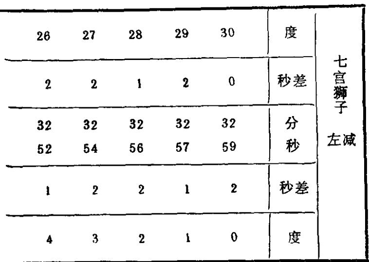
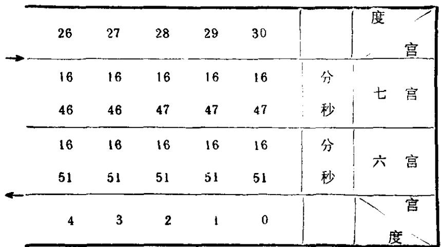
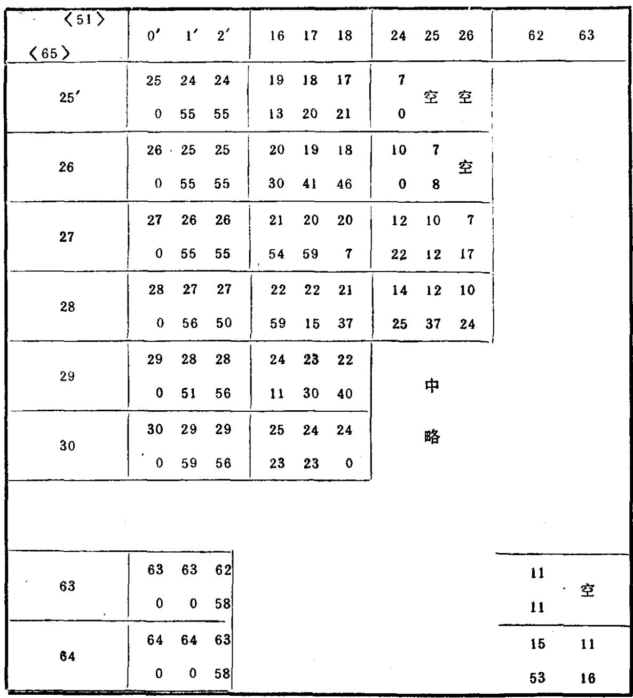
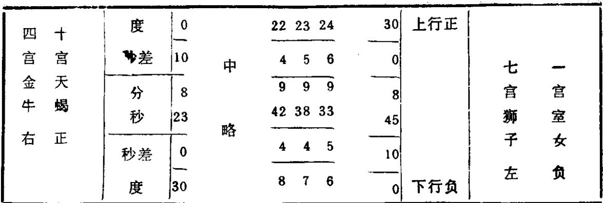
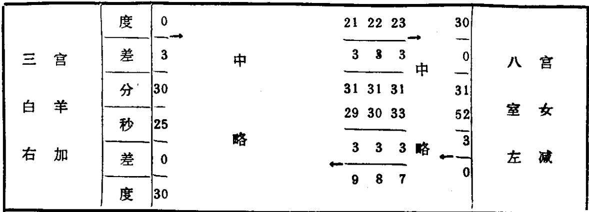
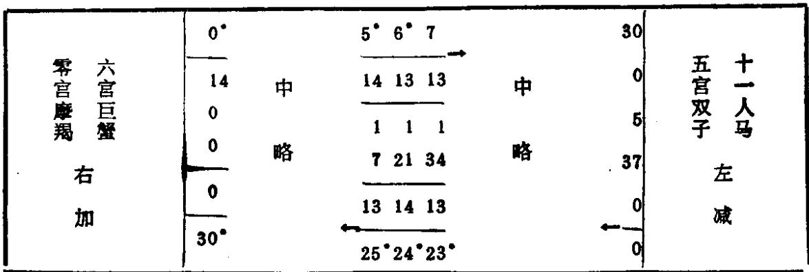
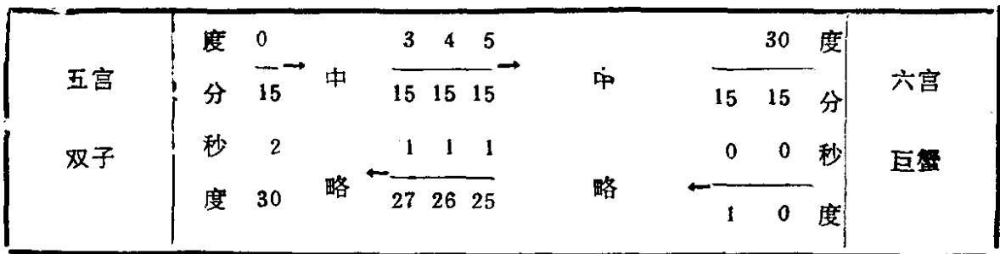
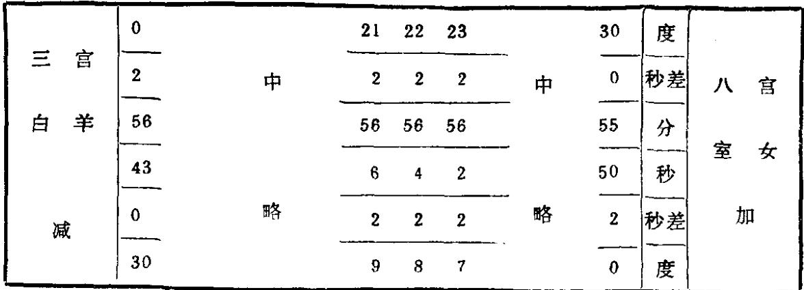
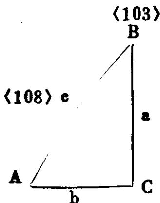

# 藏传时宪历算例

马杨寺汉历心要所传时宪历交食推步基本数据

译解用符号表

实例一 月全食

实例二 日食

# 马杨寺汉历心要所传时宪历

# 交食推步基本数据

A历元 乾隆九年甲子 公元1744年

B岁首 天正冬至

C首朔 鬼宿月 夏历十二月初一

D周岁(回归年)  $36\div \frac{60}{247} = 365.2429149$  日

E朔策(会望、朔望月)  $29^{\circ}12^{\circ}44^{\circ}3^{\circ}\frac{3}{60}\frac{111}{360} = 29^{\circ}.530590916$

F朔应  $23^{\circ}1^{\circ}55^{\circ}1^{\circ}\frac{6}{60}\frac{322}{360} = 23^{\circ}.079874015 = 1994101^{\prime \prime},1149$

G闰周 65年24闰

H闰余  $\frac{10}{65}$

1天正冬至日分 23

J天正冬至宿应 25

K太阳平行 朔策  $0^{\circ}29^{\circ}6^{\prime}24^{\prime \prime}\frac{15^{\prime\prime}}{60}\frac{103^{\prime\prime\prime}}{360} = 104784^{\prime \prime}.2547685$

L 应  $0^{\circ}23^{\circ}31^{\prime}32^{\prime \prime}\frac{37}{60}\frac{8}{360} = 84692^{\prime \prime}.617037$

M太阳自行 朔策  $0^{\circ}29^{\circ}6^{\prime}19^{\prime \prime}\frac{9}{60}\frac{242}{360} = 104779^{\prime \prime}.1612037$

N 应  $0^{\circ}15^{\circ}1^{\prime}53^{\prime \prime}\frac{19}{60}\frac{100}{360} = 54113^{\prime \prime}.3212962$

O太阴自行 朔策  $0^{\circ}25^{\circ}49^{\prime}0^{\prime \prime}\frac{3}{60}\frac{317}{360} = 92940^{\prime \prime}.064675925$

P 应  $0^{\circ}5^{\circ}11^{\prime}21^{\prime \prime}\frac{48}{60}\frac{103}{360} = 18681^{\prime \prime}.8047685$

Q罗喉距月(太阴 交周)  $19^{\circ}40^{\prime}13^{\prime \prime}\frac{55}{60}\frac{167}{360} = 110413^{\prime \prime}.924398248$

R 应  $8^{\circ}17^{\circ}57^{\prime}13^{\prime \prime}\frac{10}{60}\frac{133}{360} = 928633^{\prime \prime}.172824074$

S月距日一小时平行  $1828^{\prime \prime}.6121108$

T太阳一小时自行  $147^{\prime \prime}.84$

U太阴一小时自行  $1959^{\prime \prime}.75$

V太阴一小时交周  $1984^{\prime \prime}.40$

恒星月  $27^{\circ}.32158$

转终分(近点月)  $27^{\circ}.554568$

# 译解用符号表

时间单位

d 日 弧度

b 小时  $24^{\circ} = 1^{\circ}$  z 宫  $12^{\circ} = 1^{\circ}$  (周天)

q 刻  $4^{\circ} = 1^{\circ}$  度  $30^{\circ} = 1^{\circ}$

$$
\begin{array}{l l l l l l}{{\mathrm{~m~}}}&{{\mathrm{~\mathcal{P}~}}}&{{15^{\prime}=1^{\circ}}}&{{\mathrm{~\mathcal{P}~}}}&{{60^{\prime}=10}}\\ {{\mathrm{~s~}}}&{{\mathrm{~\mathcal{P}~}}}&{{60^{\prime\prime}=1^{\prime}}}&{{\mathrm{~\mathcal{P}~}}}&{{60^{\prime\prime}=1^{\prime}}}\\ {{\mathrm{~\mathcal{P}~}}}&{{\mathrm{~\mathcal{P}~}}}&{{60^{\prime\prime}=1^{\prime\prime}}}&{{\mathrm{~\mathcal{P}~}}}&{{60^{\prime\prime}=1^{\prime\prime}}}\\ {{\mathrm{~\mathcal{P}~}}}&{{\mathrm{~\mathcal{P}~}}}&{{360^{\prime\prime\prime}=1^{\prime\prime\prime}}}&{{\mathrm{~\mathcal{P}~}}}&{{360^{\prime\prime\prime}=1^{\prime\prime\prime}}}\end{array}
$$

这些符号原书里没有,是译者加的。

# 实例一月全食

推藏历第十六丁卯周铁鸡年霍尔月十一月十五日即农历辛酉年十二月十六日

公历1982年1月10日

(1) 积年  $1981 - 1744 = 237$

(2) 岁首积朔  $(1) \times 12 + (\langle 1 \rangle \times 12 \times 2 + 10) + 65 = 931 \frac{43}{65}$

(3) 人年后已过11月

(4) 通朔(历元至所求月前积月)  $(1) \times 12 + 11 + (\langle 1 \rangle \times 12$

$$
\times 11) \times 2 + 65 = 2943 \frac{20}{65}
$$

(5) 转年积日(通积分)

$$
\langle 1 \rangle \times 365 + (\langle 1 \rangle \times 60 + 53) + 247 = 86562 \frac{194}{247}
$$

(6) 转年日干支  $(\langle 5 \rangle + 23) + 60 = 86585 + 60 = 1443 \dots 5$  已已

(7) 转年日值宿  $(\langle 5 \rangle + 25) + 28 = 86587 + 28 = 3092 \dots 11$  危宿

(15) 首望罗头距(太阴交周)

$$
\begin{array}{r l} & {\langle 2\rangle \times \mathbf{Q}(1^{\bullet}0^{\circ}40^{\prime}13^{\prime \prime}\frac{55}{60}\frac{167}{360}) + \mathbf{R}(8^{\bullet}17^{\circ}57^{\prime}13^{\prime \prime}10^{\prime \prime}133^{\prime \prime \prime})}\\ & {+\frac{\mathbf{Q}}{2} = 5^{\bullet}3^{\circ}17^{\prime}25^{\prime \prime}35^{\prime \prime}10^{\prime \prime \prime} + \frac{\mathbf{Q}}{2} = 11^{\bullet}18^{\circ}37^{\prime}32^{\prime \prime}32^{\prime \prime}274^{\prime \prime \prime}} \end{array}
$$

逐月加Q至十月皆不在食限内,至十一月望

$$
\langle 15\rangle +\mathsf{Q}\times 11 = 11^{\circ}26^{\circ}40^{\prime}19^{\prime \prime}38^{\prime \prime}118^{\prime \prime \prime}
$$

$11^{\circ}14^{\circ}51< 11^{\circ}26^{\circ}< 0^{\circ}15^{\circ}9^{\prime}$  可能有食故就从十一月望日起布算,先算五项根数。

<21> <4>  $2943\times \mathrm{E}(29^{\mathrm{d}}12^{\mathrm{b}}44^{\prime}3^{\prime \prime}3^{\prime \prime}111^{\prime \prime \prime})$

$$
+\mathrm{F}(23^{\mathrm{d}}1^{\mathrm{b}}55^{\prime}1^{\prime \prime}6^{\prime \prime}322^{\prime \prime \prime}) + \frac{\mathrm{E}}{2} (14^{\mathrm{d}}18^{\mathrm{b}}22^{\prime}1^{\prime \prime}31^{\prime \prime}235^{\prime \prime \prime})
$$

- <5>86562d

$= 277^{\circ}8^{\circ}58^{\circ}53^{\prime \prime}54^{\prime \prime}350^{\prime \prime \prime})$

平望根

<22> <4>  $2943\times \mathbf{K}(0^{\circ}29^{\circ}6^{\prime}24^{\prime \prime}15^{\prime \prime}103^{\prime \prime \prime})$

$$
\begin{array}{l}{{+\mathrm{L}(0^{\circ}23^{\circ}31^{\prime}32^{\prime\prime}37^{\prime\prime}8^{\prime\prime\prime})+\frac{\mathrm{K}}{2}(0^{\circ}14^{\circ}33^{\prime}12^{\prime\prime}7^{\prime\prime}232^{\prime\prime\prime})}}\\ {{=11^{\circ}21^{\circ}50^{\prime}50^{\prime\prime}43^{\prime\prime}213^{\prime\prime\prime}+\mathrm{L}+\frac{\mathrm{K}}{2}}}\\ {{=0^{\circ}15^{\circ}22^{\prime}23^{\circ}20^{\prime\prime}221^{\prime\prime\prime}+\frac{\mathrm{K}}{2}}}\\ {{=0^{\circ}19^{\circ}12^{\prime}26^{\prime\prime}31^{\prime\prime}248^{\prime\prime\prime}}}\end{array}
$$

太阳平行根

<25> <4>  $2943\times \mathbf{M}(0^{\circ}29^{\circ}6^{\prime}19^{\prime \prime}9^{\prime \prime \prime}42^{\prime \prime \prime})$

$$
+\mathrm{N}(0^{\circ}15^{\circ}1^{\prime}53^{\prime \prime}19^{\prime \prime}100^{\prime \prime \prime}) + \frac{\mathrm{M}}{2} (0^{\circ}14^{\circ}33^{\prime}9^{\prime \prime}34^{\prime \prime}301^{\prime \prime \prime}
$$

$$
= 0^{\circ}6^{\circ}32^{\prime}54^{\prime \prime}19^{\prime \prime}167^{\prime \prime \prime}
$$

太阳自行根

<24> <4>  $2943\times 0(0^{\circ}25^{\circ}49^{\prime}0^{\prime \prime}3^{\prime \prime}317^{\prime \prime \prime})$

$$
+\mathrm{P}(0^{\circ}5^{\circ}11^{\prime}21^{\prime \prime}48^{\prime \prime}103^{\prime \prime \prime}) + \frac{\mathrm{O}}{2} (6^{\circ}12^{\circ}54^{\prime}30^{\prime \prime}1^{\prime \prime}338^{\prime \prime \prime})
$$

$= 7^{\circ}6^{\circ}36^{\prime}2^{\prime \prime}10^{\prime \prime}252^{\prime \prime \prime}$

太阴自行根

<25> <4>  $2943\times \mathrm{Q}(1^{\circ}0^{\circ}40^{\prime}13^{\prime \prime}55^{\prime \prime}167^{\prime \prime \prime}$

$$
+\mathrm{R}(8^{\circ}17^{\circ}57^{\prime}13^{\prime \prime}10^{\prime \prime}133^{\prime \prime \prime}) + \frac{\mathrm{Q}}{2} (6^{\circ}15^{\circ}20^{\prime}6^{\prime \prime}57^{\prime \prime}264^{\prime \prime \prime})
$$

$$
= 11^{\circ}26^{\circ}40^{\prime}19^{\prime \prime}38^{\prime \prime}118^{\prime \prime \prime}
$$

太阴平交周根

<26> 求太阳损益数

置太阳自行根  $\langle 23\rangle 0^{\circ}6^{\circ}32^{\prime}54^{\prime \prime}19^{\prime \prime}167^{\prime \prime \prime}$  。以其宫、度两位0宫6度查表二

<table><tr><td colspan="2">度</td><td>0</td><td>1</td><td></td><td>5</td><td>6</td><td>7</td><td></td></tr><tr><td colspan="2">宫</td><td></td><td></td><td></td><td></td><td></td><td></td><td></td></tr><tr><td rowspan="5">零
醇
右
正</td><td rowspan="5">宫
羯
右
正</td><td>秒差</td><td>124</td><td>124</td><td>123</td><td>124</td><td>123</td><td></td></tr><tr><td rowspan="3">度
分
秒</td><td>0</td><td>0</td><td>0</td><td>0</td><td>0</td><td rowspan="4">左
略</td></tr><tr><td>0</td><td>2</td><td>10</td><td>12</td><td>14</td></tr><tr><td>0</td><td>4</td><td>21</td><td>24</td><td>28</td></tr><tr><td>秒差</td><td>0</td><td>124</td><td>124</td><td>123</td><td>124</td></tr><tr><td colspan="2">宫
度</td><td>度</td><td>30°</td><td>29°</td><td>25°</td><td>24°</td><td>23°</td><td></td></tr></table>

内插法举例:

零宫摩羯在右侧(按纸面说,不按读者说)所以查度数时用顶行顺数,  $6^{\circ}$  查得  $0^{\circ}12^{\prime}24^{\prime \prime}$  ,其秒差用其顶行的124(如果是  $11^{\circ}24^{\circ}$  则用底行逆数,也得  $0^{\circ}12^{\prime}24^{\prime \prime}$  ,但秒差则用其脚下的123)。

以秒差124乘太阳自行根的分以下各位:

$(32^{\prime}54^{\prime \prime} \frac{19}{60} \frac{167}{360}) \times 124$  ,按360.60,60,60收位,商数最上一位为68,其单位为秒、满60进位为分、得  $1^{\prime}8^{\prime \prime}$  ,以下各位弃去不用。与查表所得之  $0^{\circ}12^{\prime}24^{\prime \prime}$  相加或相减,因其后一度  $7^{\circ}$  为  $0^{\circ}14^{\prime}28^{\prime \prime}$  ,较本度之  $0^{\circ}12^{\prime}24^{\prime \prime}$  为大,所以相加,  $0^{\circ}12^{\prime}24^{\prime \prime} + 1^{\prime}8^{\prime \prime} = 0^{\circ}13^{\prime}32^{\prime \prime}$  。秒差取自顶行,故此数为正数,记为  $+0^{\circ}13^{\prime}32^{\prime \prime}$

以下各表求中比例法相似,不再重复。但各表正负号记法不同,须特别注意。

(27) 求太阴损益数

置(24)太阴自行根  $7^{\circ}6^{\circ}36^{\prime}2^{\prime \prime} 10^{\prime \prime} / 252^{\prime \prime}$

秒差

用其宫、度查表三得  $2^{\circ}59^{\prime}52^{\prime \prime} \dots \dots$  (秒差253取自下行)

<table><tr><td>253</td><td>257</td><td>260</td><td>265</td><td>268</td><td>270</td><td>373</td><td>0</td><td>秒差</td><td rowspan="6">七 官 獅 子 左 正 数 下 行</td></tr><tr><td>3</td><td>2</td><td>2</td><td>2</td><td>2</td><td>2</td><td>2</td><td>2</td><td>度</td></tr><tr><td>4</td><td>59</td><td>55</td><td>50</td><td>46</td><td>42</td><td>37</td><td>33</td><td>分</td></tr><tr><td>5</td><td>52</td><td>35</td><td>14</td><td>49</td><td>21</td><td>51</td><td>18</td><td>秒</td></tr><tr><td>250</td><td>253</td><td>257</td><td>261</td><td>265</td><td>268</td><td>270</td><td>272</td><td>秒差</td></tr><tr><td>7</td><td>6</td><td>5</td><td>4</td><td>3</td><td>2</td><td>1</td><td>0</td><td>度</td></tr></table>

$$
253 \times (36^{\prime}, 2^{\prime \prime}, 10, 252) = 2^{\prime} 31^{\prime \prime}
$$

与表中原数相加:  $2^{\circ} 59^{\prime} 52^{\prime \prime} + 2^{\prime} 31^{\prime \prime} = 3^{\circ} 2^{\prime} 23^{\prime \prime}$

在巨蟹等六宫者为正数(与太阳损益数相反)此例为第七宫,故记为正数  $+3^{\circ} 2^{\prime} 23^{\prime \prime}$

(28) 求平距时

(26) (27) 正负相同,故应以小减大。(如不同,则相加)

$3^{\circ} 2^{\prime} 23^{\prime \prime} - 0^{\circ} 13^{\prime} 32^{\prime \prime} = 2^{\circ} 48^{\prime} 51^{\prime \prime}$  (平距弧)

$2^{\circ} 48^{\prime} 51^{\prime \prime} \times 18000 \div 9143 = 5^{\mathrm{b}} 32^{\prime} 25^{\prime \prime}$  (变时)

(26) (27) 同为正数而 (27) 较大,故此得数为负数,记为  $-5^{\mathrm{b}} 32^{\prime} 25^{\prime \prime}$

(29) 求太阳实行

(28)  $(-5^{\mathrm{b}} 32^{\prime} 25^{\prime \prime}) \times 887 \div 360 = -13^{\prime} 39^{\prime \prime}$  (引弧)

(23)  $(0^{\circ} 6^{\circ} 32^{\prime} 54^{\prime \prime} 19 167) - 13^{\prime} 39^{\prime \prime}$

$= 0^{\circ} 6^{\circ} 19^{\prime} 15^{\prime \prime} 19 167$

(30) 求太阴实行

(28)  $(-5^{\mathrm{b}} 32^{\prime} 25^{\prime \prime}) \times 871 \div 1600 = -3^{\circ} 0^{\prime} 57^{\prime \prime}$  (引弧)

(24)  $7^{\circ} 6^{\circ} 36^{\prime} 2^{\prime \prime} 10 252 +$  引弧  $(-3^{\circ} 0^{\prime} 57^{\prime \prime})$

$= 7^{\circ} 3^{\circ} 35^{\prime} 5^{\prime \prime} 10 252$

(31) 求太阳实损益(日实均)

以  $(29) 0^{\circ} 6^{\circ} 19^{\prime} 15^{\prime \prime} 19 167$  之宫与度

再查表二(见  $\langle 26\rangle$  太阳损益数表)得  $0^{\circ}12^{\prime}24^{\prime \prime}$ ,秒位差124,用顶行秒位差  $\mathcal{E}$  (29)分以下各位  $(19,15,19,167) \times \frac{124}{3600} = 39^{\prime \prime}$

$$
0^{\circ}12^{\prime}24^{\prime \prime} + 39^{\prime \prime} = 0^{\circ}13^{\prime}3^{\prime \prime}
$$

后一度  $7^{\circ}$  项下之  $0^{\circ}14^{\prime}28^{\prime \prime}$  大于  $6^{\circ}$  项下  $0^{\circ}12^{\prime}24^{\prime \prime}$

故为正数,记为:  $+0^{\circ}13^{\prime}3^{\prime \prime}$

(32) 求太阴实损益(月实均)

以  $\langle 30\rangle 7^{\circ}3^{\circ}35^{\prime}5^{\prime \prime}10$  252之宫、度

再查表三(见  $\langle 27\rangle$  太阴损益数表)得  $2^{\circ}46^{\prime}49$ ,秒差为265

$$
(35^{\prime},5^{\prime \prime},10^{\prime \prime},25^{\prime \prime \prime}2)\times \frac{265}{3600} = 2^{\prime}34^{\prime \prime}
$$

$$
2^{\prime}34^{\prime \prime} + 2^{\circ}46^{\prime}49^{\prime \prime} = 2^{\circ}49^{\prime}23^{\prime \prime}
$$

$7^{\circ}3^{\circ}$  之后一度  $4^{\circ}$  项下之  $2^{\circ}50^{\prime}14^{\prime \prime}$  大于  $3^{\circ}$  项下之  $2^{\circ}46^{\prime}49^{\prime \prime}$  故为正数,记为  $+2^{\circ}49^{\prime}23^{\prime \prime}$

(33) 求实距时

(31)  $\langle 32\rangle$  正负相同,以小减大(不同则相加), $2^{\circ}49^{\prime}23^{\prime \prime} - 0^{\circ}13^{\prime}3^{\prime \prime} = 2^{\circ}36^{\prime}20^{\prime \prime}$ (实距弧)

变时:  $(2^{\circ}36^{\prime}20^{\prime \prime})\times 18000 + 9143 = 5^{\mathrm{b}}7^{\prime}46^{\prime \prime}$

(11)  $\langle 12\rangle$  同为正号而  $\langle 32\rangle >\langle 31\rangle$  故为负数,记为:  $-5^{\mathrm{b}}7^{\prime}46^{\prime \prime}$

(34) 求实望

$$
\langle 33\rangle +(-5^{\mathrm{b}}7^{\prime}46^{\prime \prime}) + \langle 21\rangle (277^{\mathrm{d}}8^{\mathrm{h}}58^{\prime}53^{\prime \prime}54350)
$$

$= 277^{\mathrm{d}}3^{\mathrm{h}}51^{\prime}7^{\prime \prime}54350$

(35) 求太阳实平行

$$
\begin{array}{r l} & {\langle 22\rangle (0^{\circ}19^{\circ}12^{\prime}26^{\prime \prime}) + \langle 33\rangle (-5^{\circ}7^{\prime}46^{\prime \prime})\times 2129\div 864}\\ & {= 0^{\circ}19^{\circ}12^{\prime}26^{\prime \prime} - 12^{\prime}38^{\prime \prime} = 0^{\circ}18^{\circ}59^{\prime}48^{\prime \prime}} \end{array}
$$

(37) 求实望罗距月(平交周距弧)

$$
\langle 25\rangle (11^{\circ}26^{\circ}40^{\prime}19^{\prime \prime}38^{\prime \prime}118^{\prime \prime \prime}) + \langle 33\rangle (-5^{\circ}7^{\prime}46^{\prime \prime})
$$

$$
\times 4961 + 150 = 11^{\circ}26^{\circ}40^{\prime}19^{\prime \prime}38^{\prime \prime}118^{\prime \prime \prime} - 2^{\circ}49^{\prime}39^{\prime \prime}
$$

$$
= 11^{\circ}23^{\circ}50^{\prime}40^{\prime \prime}38^{\prime \prime}118^{\prime \prime \prime}
$$

<38> 求太阳定度(真黄经)

$$
\langle 35\rangle 0^{\circ}18^{\circ}59^{\prime}48^{\prime \prime} + \langle 31\rangle (0^{\circ}0^{\circ}13^{\prime}3^{\prime \prime})
$$

$$
= 0^{\circ}19^{\circ}12^{\prime}51^{\prime \prime}31^{\prime \prime}248^{\prime \prime \prime}
$$

<39>求罗月实距(实交周)

$$
\langle 37\rangle (11^{\circ}23^{\circ}50^{\prime}40^{\prime \prime}38^{\prime \prime}118^{\prime \prime \prime} + \langle 32\rangle (2^{\circ}49^{\prime}23^{\prime \prime})
$$

$$
= 11^{\circ}26^{\circ}40^{\prime}4^{\prime \prime}38^{\prime \prime}118^{\prime \prime \prime}
$$

<40>求太阳赤道经度

以<38>太阳真黄经  $0^{\circ}19^{\circ}12^{\prime}$  查表四黄赤升度表。按藏文各版均缺此表,现据汉文《新法算书》卷廿七补译。见本书441—452页

<table><tr><td rowspan="2">太阳黄经</td><td rowspan="2">宫
度</td><td>0</td><td>0</td><td>0</td><td>0</td><td>0</td><td>11</td><td>11</td><td>11</td><td>11</td></tr><tr><td>1</td><td>2</td><td>18</td><td>19</td><td>20</td><td>0</td><td>1</td><td>28</td><td>29</td></tr><tr><td rowspan="4">太阳赤经</td><td rowspan="2">宫
度</td><td>0</td><td>0</td><td>0</td><td>0</td><td>0</td><td>10</td><td>10</td><td>11</td><td>11</td></tr><tr><td>1</td><td>2</td><td>19</td><td>20</td><td>21</td><td>27</td><td>28</td><td>27</td><td>28</td></tr><tr><td rowspan="2">分
秒</td><td>5</td><td>10</td><td>30</td><td>34</td><td>38</td><td>48</td><td>51</td><td>47</td><td>54</td></tr><tr><td>25</td><td>50</td><td>34</td><td>47</td><td>51</td><td>36</td><td>10</td><td>10</td><td>35</td></tr></table>

$$
0^{\circ}20^{\circ}34^{\prime}47^{\prime \prime} + (0^{\circ}21^{\circ}38^{\prime}51^{\prime \prime} - 0^{\circ}20^{\circ}34^{\prime}47^{\prime \prime}) + 60\times 12
$$

$$
= 0^{\circ}20^{\circ}34^{\prime}47^{\prime \prime} + 0^{\circ}0^{\circ}12^{\prime}48^{\prime \prime} = 0^{\circ}20^{\circ}47^{\prime}35^{\prime \prime}
$$

用公式求法:

$$
\mathrm{~t~g~}\mathrm{~y~} = \frac{\mathrm{~t~g~}19^{\circ}12^{\prime}}{\cos23^{\circ}30^{\prime}} = \frac{0.3482368}{0.91706} = 0.3797317
$$

$\therefore \quad y = 20^{\circ}.793357 = 20^{\circ}47^{\prime}36^{\prime \prime}$

<41>求损益数时差(均数时差)

用<29>太阳实行  $0^{\circ}6^{\circ}19^{\prime}15^{\prime \prime}19$  167的宫、度,查表五;得  $0^{\prime}50^{\prime \prime}$

<table><tr><td>度
官</td><td></td><td>0 1</td><td></td><td>5 6 7</td></tr><tr><td rowspan="4">容
宫
摩
羯
右
加</td><td>秒差</td><td>8 9</td><td>中</td><td>9 8 8</td></tr><tr><td>分</td><td>0 0</td><td rowspan="3">略</td><td>0 0 0</td></tr><tr><td>秒</td><td>0 8</td><td>41 50 58</td></tr><tr><td>秒差</td><td>0 8</td><td>8 9 8</td></tr></table>

$\frac{8}{60} \times (19' 15'' 19''' 167'''') + (0' 50'') = 2'' 34''' + (0' 50'') = 0' 52''$

在摩羯等六宫内,故为负数,记为  $- 0' 52''$

(42)求并行度时差

用(38)太阳黄经  $0^{\circ} 19^{\circ} 12' 51'' 31 248$  的宫、度查表六黄赤升度时差表

<table><tr><td>10</td><td>11</td><td>12</td><td>28</td><td>29</td><td>30</td><td>度</td><td>正数</td></tr><tr><td>16</td><td>17</td><td>17</td><td>中</td><td>21</td><td>22</td><td>0</td><td>秒差</td></tr><tr><td>6</td><td>6</td><td>6</td><td>0</td><td>0</td><td>0</td><td rowspan="2">分秒</td><td>零宫</td></tr><tr><td>35</td><td>19</td><td>2</td><td>43</td><td>22</td><td>0</td><td>廉羯</td></tr><tr><td>16</td><td>16</td><td>17</td><td>略</td><td>22</td><td>21</td><td>22</td><td>左加</td></tr><tr><td>20</td><td>19</td><td>18</td><td>2</td><td>1</td><td>0</td><td>度</td><td>负数</td></tr></table>

得  $6' 19'' \dots \dots$  秒差16,在零宫故加。

$$
(6' 19'') + 16 \times (12', 15'', 31, 248) + (60 \times 60)
$$

$$
= 6' 19'' + 3'' = 6' 22''
$$

秒差取自下行,故为负数,记为:  $- 6' 22''$

(44)求定望(实望用时)

$$
\langle 34\rangle (277^{\mathrm{d}}3^{\mathrm{b}}50^{\prime}67^{\prime \prime} + \langle 41\rangle (-0^{\prime}52^{\prime \prime} + \langle 42\rangle (-6^{\prime}22^{\prime \prime})
$$

$= 277^{\mathrm{d}}3^{\mathrm{b}}43^{\prime}53^{\prime}54, 350$

(45)定望纪日于支

$\left[\langle 44\rangle \left(277^{\mathrm{d}}\right) + \langle 6\rangle \left(5^{\mathrm{d}}\right) \div 60 = 4\dots 42$

(46)定望值宿

$\left[44(277) + \langle 7\rangle (11)\right] \div 28 = 28\dots 8$

斗宿

(50)判食限

$$
11^{\circ}20^{\circ}46^{\prime}< \langle 39\rangle 11^{\circ}26^{\circ}40^{\prime}< 0^{\circ}21^{\circ}18^{\prime}
$$

有食

(51)求食甚定距(食甚距纬)

用(39)(11'26°40'4"38"118")之宫与度查表七

<table><tr><td>度
官</td><td>度</td><td>0</td><td>1</td><td>2</td><td>3</td><td>4</td><td>5</td><td>6</td><td>7</td><td>29</td><td>30</td><td>度</td><td>度</td></tr><tr><td rowspan="6">零
官
摩
羯
北</td><td>秒
差</td><td>312</td><td>312</td><td>312</td><td>312</td><td>311</td><td>311</td><td>310</td><td>310</td><td>272</td><td>0</td><td>秒
差</td><td>十一宫人马南
官</td></tr><tr><td>度</td><td>0</td><td>0</td><td>0</td><td>0</td><td>0</td><td>0</td><td>0</td><td>0</td><td>中</td><td>2</td><td>2</td><td>分</td></tr><tr><td>分</td><td>0</td><td>5</td><td>10</td><td>15</td><td>20</td><td>25</td><td>31</td><td>36</td><td>24</td><td>29</td><td>秒</td><td></td></tr><tr><td>秒</td><td>0</td><td>12</td><td>24</td><td>36</td><td>48</td><td>59</td><td>10</td><td>20</td><td>35</td><td>7</td><td>秒</td><td></td></tr><tr><td>秒差</td><td>0</td><td>312</td><td>319</td><td>312</td><td>312</td><td>311</td><td>311</td><td>310</td><td>略</td><td>275</td><td>272</td><td>秒差</td></tr><tr><td>度</td><td>30</td><td>29</td><td>28</td><td>27</td><td>26</td><td>25</td><td>24</td><td>23</td><td>1</td><td>0</td><td>度</td><td>官</td></tr></table>

得  $0^{\circ}20^{\prime}48^{\prime \prime}$  秒差取自下行,故减

$$
0^{\circ}20^{\prime}48^{\prime \prime} - \frac{312}{3600} \times (40^{\prime}4^{\prime \prime}38, 118) = 0^{\circ}20^{\prime}48^{\prime \prime} - 3^{\prime}28^{\prime \prime}
$$

$= 0^{\circ}17^{\prime}20^{\prime \prime}$  南

(52)求月[距日]实行

用(35)太阴实行  $7^{\circ}3^{\circ}35^{\prime}5^{\prime \prime}10, 252$  之宫、度查表八太阴实行表

得  $32^{\prime}54^{\prime \prime} - 2\times (35, 5, 10, 252) = 32^{\prime}54^{\prime \prime} - 1^{\prime \prime}$ $= 32^{\prime}53^{\prime \prime}$

(53)求罗月并行度差(交周升度差)

用(39)实交周  $11^{\prime}26^{\prime}40^{\prime}4^{\prime \prime}$  查表九太阴交周黄经行度表

<table><tr><td>度</td><td>0</td><td>1</td><td>2</td><td>3</td><td>4</td><td>5</td><td>→</td><td>负</td><td>数</td></tr><tr><td>秒 差</td><td>14</td><td>13</td><td>14</td><td>13</td><td>13</td><td>14</td><td></td><td></td><td rowspan="5">五 官 双 子 十 一 人 马 左</td></tr><tr><td>分</td><td>0</td><td>0</td><td>0</td><td>0</td><td>0</td><td>1</td><td></td><td></td></tr><tr><td>秒</td><td>0</td><td>14</td><td>27</td><td>41</td><td>54</td><td>7</td><td></td><td></td></tr><tr><td>秒 差</td><td>0</td><td>14</td><td>13</td><td>14</td><td>13</td><td>13</td><td></td><td></td></tr><tr><td>度</td><td>30</td><td>29</td><td>98</td><td>27</td><td>26</td><td>25</td><td>正</td><td>数</td></tr></table>

$$
0^{\prime}54^{\prime \prime} - 13\times (40, 4) = 0^{\prime}54^{\prime \prime} - 8^{\prime \prime} = 0^{\prime}46^{\prime \prime}
$$

度数取白下行,故记为  $+0^{\prime}46^{\prime \prime}$

(54)求食甚距时

$$
\langle 53\rangle (+0^{\prime}4\hat{\mathbf{r}}^{\prime \prime})\times 60 + \langle 52\rangle (32^{\prime}53^{\prime \prime}) = 2760 + 1973
$$

$= 1^{\prime}\dots \dots 787$

$$
787 × 60 + 1973 = 23"……1841
$$

尾数舍去不用．正负同（53）记为  $+ 1^{\prime}23^{\prime \prime}$

(55)求食甚用时

$$
(44) \((3^{\mathrm{b}}43^{\prime}53^{\prime \prime}) + (54) (+1^{\prime}23^{\prime \prime}) = 3^{\mathrm{b}}45^{\prime}16^{\prime \prime}\)
$$

(56)求太阴半径

用<30>之宫度两位7°3°查表十交食视半径表得16'46

(57)求地影半径

用<30>7°3°查表十一得46'28"

<table><tr><td rowspan="5">四 宫
右 加</td><td>度 0</td><td></td><td>26 27 28 29 30 度</td><td>顺 数</td></tr><tr><td>差 1</td><td>1 1 1 1 0 差</td><td>七 宫</td><td></td></tr><tr><td>分 45</td><td>46 46 46 46 46 分</td><td></td><td></td></tr><tr><td>秒 46</td><td>27 28 29 30 31 秒</td><td></td><td></td></tr><tr><td>度 0</td><td>2 1 1 1 1 差</td><td>左 减</td><td></td></tr><tr><td rowspan="5">五 宫
右 加</td><td>差 1</td><td></td><td>0 差</td><td>六 宫</td></tr><tr><td>分 46</td><td>46 分</td><td></td><td rowspan="3">左 减</td></tr><tr><td>秒 31</td><td>48 秒</td><td></td></tr><tr><td>差 0</td><td>0 差</td><td></td></tr><tr><td>度 30</td><td>4 3 2 1 0 度</td><td>(逆数)</td><td></td></tr></table>

# (58)求影差(影半径差)

用  $\langle 29\rangle 0^{\circ}6^{\circ}$  查表十二得  $35^{\prime \prime}$

<table><tr><td>度</td><td>0</td><td>1</td><td>2</td><td>3</td><td>4</td><td>5</td><td>6</td><td>7</td><td>29</td><td>30</td><td>度
官</td></tr><tr><td>幂官</td><td>35</td><td>35</td><td>35</td><td>35</td><td>35</td><td>35</td><td>35</td><td>35</td><td>33</td><td>33</td><td>十一官</td></tr><tr><td>一宫</td><td>33</td><td>33</td><td>32</td><td>32</td><td>32</td><td>32</td><td>32</td><td>31</td><td>27</td><td>26</td><td>十官</td></tr><tr><td>二宫</td><td>26</td><td>26</td><td></td><td></td><td></td><td></td><td></td><td>18</td><td>18</td><td>九官</td><td></td></tr><tr><td>三宫</td><td>18</td><td>17</td><td></td><td></td><td></td><td></td><td></td><td>9</td><td>9</td><td>八官</td><td></td></tr><tr><td>四宫</td><td>9</td><td>8</td><td></td><td></td><td></td><td></td><td></td><td>3</td><td>2</td><td>七官</td><td></td></tr><tr><td>五官</td><td>2</td><td>2</td><td></td><td></td><td></td><td></td><td></td><td>0</td><td>0</td><td>六官</td><td></td></tr><tr><td></td><td>30</td><td>29</td><td></td><td></td><td></td><td></td><td></td><td>1</td><td>0</td><td>官</td><td></td></tr></table>

(59) 求实影(地影实半径)

(57)  $(46^{\prime}28^{\prime \prime}) - \langle 58\rangle (0^{\prime}35^{\prime \prime}) = 45^{\prime}53^{\prime \prime}$

(60) 求交食限距差(井径)

(59)  $(45^{\prime}53^{\prime \prime}) + \langle 56\rangle (16^{\prime}46^{\prime \prime}) = 1^{\circ}2^{\prime}39^{\prime \prime}$

(60)  $1^{\circ}2^{\prime}39^{\prime \prime} > \langle 51\rangle 0^{\circ}17^{\prime}20^{\prime \prime}$

故有食。

(61) 求食分差

(60)  $(1^{\circ}2^{\prime}39^{\prime \prime}) - \langle 51\rangle (0^{\circ}17^{\prime}20^{\prime \prime}) = 0^{\circ}45^{\prime}19^{\prime \prime}$

(62) 求食甚实分(食分)

(61)  $(0^{\circ}45^{\prime}19^{\prime \prime})\times 5 + \langle 56\rangle (16^{\prime}46^{\prime \prime}) = 13^{\prime}30^{\prime \prime}$

$13^{\prime}30^{\prime \prime} > 10^{\prime}$  故为全食

(63) 求初亏复圆月行(起复月行距弧)

用  $\langle 60\rangle (1^{\circ}2^{\prime}39^{\prime \prime})$  查表十三直行

用  $\langle 51\rangle (0^{\circ}17^{\prime}20^{\prime \prime})$  查表十三横行

<table><tr><td>&amp;lt;51&amp;gt;</td><td>15&#x27;</td><td>16&#x27;</td><td>17&#x27;</td><td>18&#x27;</td><td>19&#x27;</td></tr><tr><td>&amp;lt;60&amp;gt;</td><td></td><td></td><td></td><td></td><td></td></tr><tr><td rowspan="2">61&#x27;</td><td>59</td><td>58</td><td>58</td><td>58</td><td>57</td></tr><tr><td>8</td><td>53</td><td>35</td><td>17</td><td>58</td></tr><tr><td rowspan="2">62&#x27;</td><td>60</td><td>59</td><td>59</td><td>59</td><td>59</td></tr><tr><td>9</td><td>54</td><td>37</td><td>30</td><td>1</td></tr><tr><td rowspan="2">63&#x27;</td><td>81</td><td>60</td><td>60</td><td>60</td><td>60</td></tr><tr><td>11</td><td>56</td><td>40</td><td>32</td><td>40</td></tr></table>

《64》求初亏复圆距时

用  $\langle 63\rangle (59^{\prime}37^{\prime \prime})\times 60\div \langle 52\rangle (32^{\prime}53^{\prime \prime})$

$$
= 3577^{\prime \prime}\times 60 + 1973^{\prime \prime} = 1^{\mathrm{b}}48^{\prime}46^{\prime \prime}
$$

《65》求全食距弧

$$
(45^{\prime}53^{\prime \prime}) - \langle 56\rangle (16^{\prime}46^{\prime \prime}) = 29^{\prime}7^{\prime \prime}
$$

《66》求食既生光月行距弧

表十三 月行距弧表,直  $25^{\prime} - 64^{\prime}$  ,横  $0^{\prime} - 63^{\prime}$  呈大三角形用  $\langle 65\rangle (29^{\prime}7^{\prime \prime})$  查表十三直行得  $23^{\prime}30^{\prime \prime}$  (表见下页)

《67》求食既生光距时

《66》  $(23^{\prime}30^{\prime \prime})\times 60\div \langle 52\rangle (32^{\prime}53^{\prime \prime})$

$= 1410\times 60\div 1973 = 42^{\prime}52^{\prime \prime}$

《68》求初亏时刻

《68》求初亏时刻  $\langle 55\rangle (3^{\mathrm{b}}45^{\prime}16^{\prime \prime}) - \langle 64\rangle (1^{\mathrm{b}}48^{\prime}46^{\prime \prime}) = 1^{\mathrm{b}}56^{\prime}30^{\prime \prime}$

《69》求复圆时刻

《69》求复圆时刻  $\langle 55\rangle (3^{\mathrm{b}}45^{\prime}16^{\prime \prime}) + \langle 64\rangle (1^{\mathrm{b}}48^{\prime}46^{\prime \prime}) = 5^{\mathrm{b}}34^{\prime}2^{\prime \prime}$

《70》求起复距时 食限总时

《70》求起复距时 食限总时  $\langle 64\rangle (1^{\mathrm{b}}48^{\prime}46^{\prime \prime})\times 2 = 3^{\mathrm{b}}37^{\prime}32^{\prime \prime}$

# 《71》求食既时刻

$\langle 55\rangle (3^{\mathfrak{h}}45^{\prime}16^{\prime \prime}) - \langle 67\rangle (0^{\mathfrak{h}}42^{\prime}52^{\prime \prime}) = 3^{\mathfrak{h}}2^{\prime}24^{\prime \prime}$

《72》求生光时刻

$$
\langle 55\rangle 3^{\mathfrak{h}}45^{\prime}16^{\prime \prime} + \langle 67\rangle 0^{\mathfrak{h}}42^{\prime}52^{\prime \prime} = 4^{\mathfrak{h}}28^{\prime}8^{\prime \prime}
$$

《73》求全食时延(食既生光总时)

$$
\langle 67\rangle 0^{\mathfrak{h}}42^{\prime}52^{\prime \prime}\times 2 = 1^{\mathfrak{h}}25^{\prime}44^{\prime \prime}
$$

(74)求食甚距交(食既生光)

$$
\begin{array}{c}{{\langle39\rangle\langle11^{\bullet}26^{\circ}40^{\bullet}4^{\prime\prime}38,118\rangle+\langle42\rangle\langle-6^{\prime}22^{\prime\prime}\rangle}}\\ {{=11^{\bullet}26^{\circ}33^{\prime}42^{\prime\prime}38,118}}\end{array}
$$

(75)求初亏距交

$$
\langle 74\rangle 11^{\bullet}26^{\circ}33^{\prime}42^{\prime \prime} - \langle 63\rangle 59^{\prime}37^{\prime \prime} = 11^{\bullet}25^{\circ}34^{\prime}5^{\prime \prime}
$$

(76)求复圆距交

(74)  $11^{\bullet}26^{\circ}33^{\prime}42^{\prime \prime} + \langle 63\rangle 59^{\prime}37^{\prime \prime} = 11^{\bullet}27^{\circ}33^{\prime}19^{\prime \prime}$  人马南

(79)求初亏方位全食,下半夜,从上左方入食。

(80)复圆方位,全食,下半夜,从下右方复圆

(180)(181)求日出时刻:

由(38)已知太阳黄经  $0^{\circ}19^{\circ}12^{\prime}$

$$
0^{\bullet}19^{\circ}12^{\prime} - 6^{\bullet} + 12^{\bullet} = 6^{\bullet}19^{\circ} = 199^{\circ} \qquad 199^{\circ} - 180^{\circ} = 19^{\circ}
$$

推北京:  $19^{\circ} \times 17^{\circ} + 18 = 17^{\prime}$  。94444

$$
445^{\prime} - 17^{\prime},94444 = 427^{\prime},055
$$

$427^{\prime}, 055 + 15 = 28, 47$  刻  $= 7$  时0刻7分(日出)

(182)96刻  $- 28, 47$  刻  $= 67, 53$  刻  $= 16$  时3刻8分(日没)

(183)28.47刻  $- 67, 53$  刻  $+96$  刻  $= 56, 94$  刻  $= 14$  时0刻14分(夜刻)

(184)  $96 - 56, 94 = 39, 06$  刻  $= 9$  时3刻1分(昼刻)

附:按此法推算与现代天文学推算结果的比较,公历1982年1月10日,金鸡年霍尔月十二月十五日(下半夜)月全食(北京时间)

<table><tr><td></td><td>藏传时先历推算结果</td><td>1982年天文普及年历</td><td>设 差</td></tr><tr><td>初 亏</td><td>1 时 56分 30秒</td><td>2 时 13.5分</td><td>-17分</td></tr><tr><td>食 既</td><td>3 时 2分 24秒</td><td>3 时 16.6分</td><td>-14分12秒</td></tr><tr><td>食 蔬</td><td>3 时 45分 16秒</td><td>3 时 55.8分</td><td>-10分32秒</td></tr><tr><td>生 光</td><td>4 时 28分 8秒</td><td>4 时 35.0分</td><td>-6分52秒</td></tr><tr><td>复 圆</td><td>5 时 34分 2秒</td><td>5 时 38.0分</td><td>-3分58秒</td></tr><tr><td>食 分</td><td>1.35</td><td>1.337</td><td>0.013</td></tr></table>

# 实例二日食

藏历第十六丁卯周铁鸡年霍尔月六月三十日

农历 辛酉年七月一日

公元 1981年7月31日星期五

(1) 积年  $1981 - 1744 = 237$

(2) 首朔积月  $237 \times 12 + (237 \times 12 \times 2 + 10) + 65 = 2931 \frac{43}{65}$

(11)  $\langle 2\rangle 2931 \times \mathbf{Q} + \mathbf{R} = 5^{\circ} 3^{\circ} 17^{\prime} 25^{\prime \prime}$  首朔太阴平交周

$\langle 11\rangle + \mathbf{Q} = 6^{\circ} 3^{\circ} 57^{\prime} 37^{\prime \prime}$  一月一日

$\langle 11\rangle + 2 \mathbf{Q} = 7^{\circ} 4^{\circ} 37^{\prime} 51^{\prime \prime}$  二月一日

$\langle 11\rangle + 3 \mathbf{Q} = 8^{\circ} 5^{\circ} 18^{\prime} 5^{\prime \prime}$  三月一日

$\langle 11\rangle + 4 \mathbf{Q} = 9^{\circ} 5^{\circ} 58^{\prime} 19^{\prime \prime}$  四月一日

$\langle 11\rangle + 5 \mathbf{Q} = 10^{\circ} 6^{\circ} 38^{\prime} 33^{\prime \prime}$  五月一日

$\langle 11\rangle + 6 \mathbf{Q} = 11^{\circ} 7^{\circ} 18^{\prime} 49^{\prime \prime}$  六月一日

$\langle 11\rangle + 7 \mathbf{Q} = 0^{\circ} 7^{\circ} 59^{\prime} 3^{\prime \prime}$  七月一日

$11^{\circ} 23^{\circ} 38^{\prime} - 0^{\circ} 18^{\circ} 36^{\prime}$  为可食之限

(3) 七月一日之太阴平交周已入可食之限,初步断定有出现日食之可能,即就此日进行布算,至推算出实交周,再进一步看是否进入必食之限。所以入年后已过7月。

(4) 所求月前积  $237 \times 12 + 7 + [(237 \times 12 + 7) \times 2 + 10] + 65 = 2938 \frac{57}{65}$

以下按所求月之积月  $2931 + 7 = 2938$  进行运算

(5) 天正冬至积日

$$
237 \times 365 + (237 \times 60 + 53) + 247 = 86562 \frac{194}{247}
$$

(6) 天正冬至日分

$$
(86562 + 23) + 60 = 1443\dots 6 已已
$$

(7) 天正冬至宿分

$(86562 + 25) \div 28 = 3092\dots 11$  危宿

(16) 求平朔根

日  $\langle 4\rangle 2938\times 29^{\mathrm{d}} + 23 + 1558 - 86562 = 221$  日

时  $(2938\times 12^{\mathrm{h}} + 1 + 2157) \div 24 = 1558$  日  $\dots 22^{\mathrm{h}}$  时

分  $(2938\times 44^{\prime} + 55 + 149) \div 60 = 2157$  时  $\dots 56^{\prime}$  分

秒  $(2938\times 3^{\prime \prime} + 1^{\prime \prime} + 162) \div 60 = 149$  分  $\dots 37^{\prime \prime}$  秒

微  $(2938\times 3^{\prime \prime} + 6 + 906) \div 60 = 162$  秒  $\dots 6$  微

纤  $(2938\times 111^{\prime \prime \prime} + 322) \div 360 = 906$  微  $\dots 280$  纤

得  $221^{\mathrm{d}}22^{\mathrm{b}}56^{\prime}37^{\prime \prime}6,280 = 221^{\mathrm{d}}.9559837$

(17) 太阳平行根

(4)  $2938\times \mathrm{K}(0^{\ast}29^{\circ}6^{\prime}24^{\prime \prime}15, 103) + \mathrm{L}(0^{\ast}23^{\circ}31^{\prime}32^{\prime \prime}37, 8)$ $= 7^{\circ}9^{\prime \prime}7^{\prime}13^{\prime \prime}7, 222$

(18) 太阳自行根(太阳平引)

$$
\langle 4\rangle 2938\times \mathbf{M}(0^{\ast}29^{\circ}6^{\prime}19^{\prime \prime}9^{\prime \prime}242^{\prime \prime \prime})
$$

$$
+\mathrm{N}(0^{\ast}15^{\circ}1^{\prime}53^{\prime \prime}19^{\prime \prime}100^{\prime \prime \prime}) = 6^{\ast}26^{\circ}28^{\prime}8^{\prime \prime}56^{\prime \prime}96^{\prime \prime \prime}
$$

(19) 求太阴自行根

(4)  $2938\times \mathrm{O}(0^{\ast}25^{\circ}49^{\prime}0^{\prime \prime}3, 317) + \mathrm{P}(0^{\ast}5^{\circ}11^{\prime}21^{\prime \prime}48, 103)$ $= 8^{\ast}14^{\circ}36^{\prime}31^{\prime \prime}49, 129$

(20) 罗月距根(太阴交周)

$$
\langle 4\rangle 2938\times \mathrm{Q}(1^{\ast}0^{\circ}40^{\prime}13^{\prime \prime}55, 167)
$$

$$
+ \mathrm{R}(8^{\ast}17^{\circ}57^{\prime}13^{\prime \prime}10, 133) = 0^{\ast}7^{\circ}59^{\prime}3^{\prime \prime}3, 99
$$

(26) 求太阳损益数(日初均)

置(18)太阳自行根  $6^{\ast}26^{\circ}28^{\prime}8^{\prime \prime}56,96$  以其宫度两位  $6^{\ast}26^{\circ}$  为引数查表二

<table><tr><td rowspan="7">五宫右减</td><td>度</td><td>0</td><td>3 4 5</td><td>26</td><td>30</td><td rowspan="2">顺数</td><td rowspan="7">六官左加</td></tr><tr><td>秒差</td><td>104</td><td>107 108 109</td><td>114</td><td>0</td></tr><tr><td>度</td><td>0</td><td>中</td><td>0 0 0</td><td>中</td><td rowspan="5">0 0</td></tr><tr><td>分</td><td>57</td><td>51 49 48</td><td>7</td><td>0</td></tr><tr><td>秒</td><td>1</td><td>46 59 11</td><td>56</td><td>0</td></tr><tr><td>秒差</td><td>0</td><td>106 107 108</td><td>119</td><td>119</td></tr><tr><td>度</td><td>30</td><td>27 26 25</td><td>4</td><td>0</td></tr></table>

第6宫巨蟹在左侧(按纸面说,不按读者本人说),度数  $26^{\circ}$ ,用最下一行逆数,得  $0^{\circ}49^{\prime}59^{\prime \prime}$ 。秒差用其脚下之107。[假如为第五宫  $26^{\circ}$ ,则用顶上的一行顺数,得  $0^{\circ}7^{\prime}56^{\prime \prime}$ ,秒差则用其顶上之114。]

以秒差107乘(18)的分位以下四个数字  $(28^{\prime}8^{\prime}46,96)$  按360,60,60,60进位,商数最上一位(50)为秒(以下各位弃去不用)。满60则进位为分,此例不满60,分位记为零。  $(0^{\circ}50^{\prime \prime})$  与青表所得之  $0^{\circ}49^{\prime}59^{\prime \prime}$  或加或减,看其后一度之数值比本度大小而定,大者加,小者减。此例后一度  $(27^{\circ})$  为  $0^{\circ}5^{\prime}46^{\prime \prime}$  比本度的  $(0^{\circ}49^{\prime}56^{\prime \prime})$  大,所以相加:

$$
0^{\prime}50^{\prime \prime} + 0^{\circ}49^{\prime}59^{\prime \prime} = 0^{\circ}50^{\prime}49^{\prime \prime}
$$

查表时凡在0摩羯,1宝瓶,2双鱼,3白羊,4金牛,5双子等六宫内者为正数;其在6巨蟹,7狮子,8室女,9天秤,10天蝎,11人马等六宫内者为负数。此例在第六宫,故应记为负数:

$$
-0^{\circ}50^{\prime}49^{\prime \prime}
$$

以下第三、四、六、七、八、九、十、十一、十四、十五各表用法相同,不再重复细说。唯各表加减正负不同,须注意。

(27) 太阴损益数(月初均)

置(19)太阴自行根  $8^{\circ}14^{\circ}36^{\prime}31^{\prime \prime}49,129$  。用其宫度两位  $8^{\circ}14^{\circ}$  同上法查表三室女宫  $14^{\circ}$  得  $4^{\circ}49^{\prime}7^{\prime \prime}$ ,秒差76。以秒差乘分

以下各位  $(36^{\prime}31^{\prime \prime}49,129)$  ,收位得  $0^{\circ}0^{\prime}46^{\prime \prime}$  。后一度  $15^{\circ}(4^{\circ}50^{\prime}23^{\prime \prime})$  较大,故相加。第八宫为正数(与表二相反)故记为  $+4^{\circ}49^{\prime}53^{\prime \prime}$  。在实际运算中,秒以下各位相差甚微,可以不计。

<table><tr><td rowspan="2">三 宫</td><td>度</td><td>4</td><td>4</td><td>4</td><td></td><td>4</td><td>4</td><td>4</td><td>度</td><td>八 宫</td></tr><tr><td>分</td><td>50</td><td>49</td><td>47</td><td>中</td><td>41</td><td>39</td><td>37</td><td>分</td><td>室 女</td></tr><tr><td rowspan="2">右 负</td><td>秒</td><td>23</td><td>7</td><td>46</td><td></td><td>31</td><td>43</td><td>51</td><td>秒</td><td rowspan="2">左 正</td></tr><tr><td>秒差</td><td>70</td><td>76</td><td>81</td><td></td><td>104</td><td>108</td><td>112</td><td>秒差</td></tr><tr><td>宫</td><td>度</td><td>15*</td><td>14*</td><td>13*</td><td></td><td>10</td><td>9</td><td>8</td><td></td><td>宫</td></tr></table>

# 《28》 求平距时

《26》太阳损益数与《27》太阴损益数正负相同者以小减大,不同者则相加,无论加减只用度、分、秒三位。此例两数正负不同,故相加:

$0^{\circ}50^{\prime}49^{\prime \prime} + 4^{\circ}49^{\prime}53^{\prime \prime} = 5^{\circ}40^{\prime}42^{\prime \prime}$  [距弧]

变时:  $(5^{\circ}\times 18000 + 12210)\div 9143 = 11^{\mathfrak{b}}\dots \dots 1637^{\prime}$

$$
(40^{\prime}\times 18000 + 12600)\div 60) = 12210
$$

$$
(42^{\prime \prime}\times 18000)\div 60 = 12600
$$

最上一式所得商数为11小时;

商余  $1637\times 60 + 9143 = 10$  单位为分,

商余  $6790\times 60 + 9143 = 44$  单位为秒

其商余(5108)可再如前乘除,亦可弃去不用。此得数  $11^{\mathfrak{h}}10^{\prime}44^{\prime \prime}$  名平距时。

亦可用小数运算:

$$
5^{\circ}40^{\prime}42^{\prime \prime}\times 18000 + 9143 = 20442^{\prime \prime}\times \frac{18000}{9143}
$$

$$
= 40244^{\prime \prime},558 = 670^{\prime}.74263^{\prime} = 11^{\mathfrak{h}}1044^{\prime \prime}
$$

或  $20442^{\prime \prime} + \mathrm{S}1828^{\prime \prime}.6121 = 11^{\mathfrak{h}}.17897011 = 11^{\mathfrak{h}}10^{\prime}44^{\prime \prime}$

正负号记法:日、月同为正数时,日大者正,月大者负,日、月同为负数时,日大者负,月大者正;日月正负不同者按<26>太阳损益数之正负计。此例<26>〈27〉正负不同,而〈26〉为负数,故记为负数  $- 11^{\circ}10^{\prime}44^{\prime \prime}\langle 28\rangle$

<29> 求太阳实自行(实引)

置  $\langle 28\rangle 11^{\circ}10^{\prime}44^{\prime \prime} = 11^{\circ}.1788888$  负数

$$
(11\times 887 + 158)\div 360 = 27^{\prime}\dots \dots 195
$$

$$
(10\times 887 + 650)\div 60 = 158\dots 40
$$

$$
(44\times 887)\div 60 = 650\dots 28.
$$

$$
(195\times 60 + 40)\div 360 = 32^{\prime \prime}
$$

得引弧为  $0^{\circ}27^{\prime}32^{\prime \prime}$  负数或用上题所介绍的简法。

<28>化秒  $- 40244\times 887 + 360 = - 99156.744$

$= - 1652^{\prime \prime}.6124 = - 27^{\prime}.54354 = - 27^{\prime}32^{\prime \prime}$

$\langle 18\rangle 6^{\circ}26^{\circ}28^{\prime}8^{\prime \prime}56,96 - 27^{\prime}32^{\prime \prime} = 6^{\circ}26^{\circ}0^{\prime}36^{\prime \prime}56,96$

<30> 求太阴实行(实引)

置  $\langle 28\rangle - 11^{\circ}10^{\prime}44^{\prime \prime}$

$$
(11\times 871 + 155)\div 1600 = 6^{\circ}\dots 136
$$

$$
(10\times 871 + 638)\div 60 = 155\dots 48
$$

$$
(44\times 871)\div 60 = 638\dots 44
$$

$$
(136\times 60 + 48)\div 1600 = 5^{\prime}\dots 13
$$

$$
(13\times 60 + 44)\div 1600 = 0^{\prime \prime}\dots 824
$$

得引弧  $- 6^{\circ}5^{\prime}0^{\prime \prime}$

$\langle 19\rangle 8^{\circ}14^{\circ}36^{\prime}31^{\prime \prime}49,129 - 6^{\circ}5^{\prime}7^{\prime \prime} = 8^{\circ}8^{\circ}31^{\prime}24^{\prime \prime}49,129$

<31> 求太阳实损益(日实均)

用<29>太阳实行之宫和度两位  $6^{\circ}26^{\circ}$  为引数查表二,(格式见<26>)得  $0^{\circ}49^{\prime}59^{\prime \prime}\dots 107$ ,用此秒差107乘<29>的分以下各位  $(0^{\prime}36^{\prime \prime}56,96)$  按360,60,60收为分秒,得  $(0^{\prime}1^{\prime \prime})$ ,与表内原数

$(49^{\prime}59^{\prime \prime})$  加减得太阳实损益。其加减视其后一度之数值大小而定,此例后一度  $27^{\circ}$  表内之数值较本度大,故相加。其在摩羯等六宫者为正数,在巨蟹等六宫者为负数,此例在第六宫为负数,故得  $- 0^{\circ}50^{\prime}0^{\prime \prime}$

<32> 求太阴实损益(月实均)

用<30>太阴月实自行之宫度两位  $(8^{\circ}8^{\circ})$  为引数查表三[格式见<27>]得  $4^{\circ}39^{\prime}43^{\prime \prime}\dots \dots 108$  。同上法,用秒差108乘实自行之分位  $(31^{\prime})$  得  $(0^{\prime}56^{\prime \prime})$  ,与原数加减得太阴实损益。其正负与太阳相反,此例在8宫,故为正数,记为  $+4^{\circ}40^{\prime}39^{\prime \prime}$

<33> 求实距时

<31>与<32>正负不同故相加。

$$
0^{\circ}51^{\prime}0^{\prime \prime} + 4^{\circ}40^{\prime}39^{\prime \prime} = 5^{\circ}30^{\prime}39^{\prime \prime}
$$

变时:  $5^{\circ}30^{\prime}39^{\prime \prime}\times 18000 + 9143 = 10^{\mathrm{b}}50^{\prime}57^{\prime \prime}$

正负号:  $\langle 31\rangle$  与<32>正负不同,  $\langle 31\rangle$  为负数,故记为负数  $- 10^{\mathrm{b}}50^{\prime}57^{\prime \prime}$

<34> 求实朔

$$
\langle 16\rangle (221^{\mathrm{d}}22^{\mathrm{b}}56^{\prime}37^{\prime \prime}) + \langle 33\rangle (-10^{\mathrm{b}}50^{\prime}57^{\prime \prime})
$$

$$
= 221^{\mathrm{d}}12^{\mathrm{b}}5^{\prime}40^{\prime \prime}
$$

<35> 求太阳实平行

所求月朔太阳平行根<17>为  $7^{\circ}9^{\circ}7^{\prime}13^{\prime \prime}7^{\prime \prime}222^{\prime \prime \prime \prime}$

$$
\langle 17\rangle (7^{\circ}9^{\circ}7^{\prime}13^{\prime \prime}7^{\prime \prime}222^{\prime \prime \prime}) + \langle 33\rangle (-10^{\mathrm{b}}50^{\prime}57^{\prime \prime})\times
$$

$$
2129\div 864 = 7^{\circ}9^{\circ}7^{\prime}13^{\prime \prime}7^{\prime \prime}222^{\prime \prime \prime} + (-0^{\circ}26^{\prime}44^{\prime \prime})
$$

$$
= 7^{\circ}8^{\circ}40^{\prime}29^{\prime \prime}7^{\prime \prime}222^{\prime \prime \prime}
$$

<36> 求实朔罗月距(交周距弧)

$$
\begin{array}{r l} & {\langle 20\rangle (0^{\circ}7^{\circ}59^{\prime}3^{\prime \prime}3^{\prime \prime}99^{\prime \prime \prime}) + \langle 33\rangle (-10^{\mathrm{b}}50^{\prime}57^{\prime \prime})\times 4961\div 150}\\ & {= 0^{\circ}7^{\circ}59^{\prime}3^{\prime \prime}3^{\prime \prime}99^{\prime \prime \prime} - 5^{\circ}58^{\prime}49^{\prime \prime} = 0^{\circ}2^{\circ}0^{\prime}14^{\prime \prime}3^{\prime \prime}99^{\prime \prime \prime}} \end{array}
$$

<38> 求太阳定度(真黄经)

$$
\langle 36\rangle (7^{\circ}8^{\circ}40^{\prime}29^{\prime \prime}7^{\prime \prime}222^{\prime \prime \prime} + \langle 31\rangle (-0^{\circ}51^{\prime}0^{\prime \prime})
$$

$$
\begin{array}{r l} & {\equiv 7^{\circ}7^{\circ}50^{\prime}29^{\prime \prime}7^{\prime \prime}222^{\prime \prime}} \end{array}
$$

<39> 求实朔罗月实距(实交周)

$$
\langle 37\rangle (0^{\circ}2^{\circ}0^{\prime}14^{\prime \prime}3^{\circ}^{\prime}99^{\prime \prime \prime}) + \langle 32\rangle (4^{\circ}40^{\prime}39^{\prime \prime})
$$

$$
= 0^{\circ}6^{\circ}40^{\prime}53^{\prime \prime}3^{\prime \prime}99^{\prime \prime \prime}
$$

$$
11^{\circ}23^{\circ}38< \langle 39\rangle < 0^{\circ}18^{\circ}36^{\prime}
$$

故判为必有食。

<40> 求太阳赤经y

以x<38>(7°7°50')查表四太阳黄赤升度表

译注:原书缺此表。用公式求之:(参看月食例题<40>)

$\mathbf{tg}y = \mathbf{tg}7^{\circ}7^{\circ}50^{\prime} / \cos 23^{\circ}.5_{\circ}$

$$
\mathbf{y} = 7^{\circ}10^{\circ}15^{\prime}34^{\prime \prime}
$$

<41> 求损益数时差(均数时差)

以太阳实自行<29>之宫与度  $6^{\circ}26^{\circ}$  查表五

<table><tr><td rowspan="6">五 双 右</td><td rowspan="6">宫 子 减</td><td>度</td><td>0</td><td>3</td><td>4</td><td>5</td><td>30</td><td>度</td><td>六 亘 左</td></tr><tr><td>秒 差</td><td>7</td><td>中</td><td>7</td><td>7</td><td>8</td><td>0</td><td rowspan="3">六 亘 左</td></tr><tr><td>分</td><td>3</td><td>3</td><td>3</td><td>3</td><td>3</td><td rowspan="2">0</td></tr><tr><td>秒</td><td>48</td><td>27</td><td>20</td><td>13</td><td>0</td></tr><tr><td>秒 差</td><td>0</td><td>略</td><td>7</td><td>7</td><td>7</td><td>8</td><td rowspan="2">秒 差</td></tr><tr><td>度</td><td>30</td><td>27</td><td>26</td><td>25</td><td>0</td><td>度</td></tr></table>

查得  $3^{\prime}20^{\prime \prime}$  其下一度为  $3^{\prime}27^{\prime \prime}$  ,较大,以小减大

$$
3^{\prime}27^{\prime \prime} - 3^{\prime}20^{\prime \prime} = 0^{\prime}7^{\prime \prime}
$$

以秒差7乘<29>的分以下各位  $(0^{\prime}36^{\prime \prime}56,96)$  收位得  $(0^{\prime},4^{\prime \prime})$  以之加表内查到的原数(因后一度较大,故加),但因秒位为  $0^{\prime}$  1微位不用,无可加,仍为  $+3^{\prime}20^{\prime \prime}$

<42> 并行度时差(黄赤升度时差)

以太阳黄经  $\langle 38\rangle 7^{\circ}7^{\circ}50^{\prime}$  查表六

得  $9^{\prime}38^{\prime \prime}$ , 再以秒差4乘度以下各位  $(5^{\prime}29^{\prime \prime}7,222)$  收位得  $3^{\prime \prime}$  。后一度  $8^{\circ}$  项下为  $9^{\prime}42^{\prime \prime}$ , 较大, 故应加。

$$
9^{\prime}38^{\prime \prime} + 0^{\prime}3^{\prime \prime} = 9^{\prime}41^{\prime \prime}
$$

此例系由下行逆行查得, 故为负数, 记为  $- 9^{\prime}41^{\prime \prime}$

(43) 求定朔(实朔用时)

$$
\langle 34\rangle (221^{\circ}12^{\circ}5^{\prime}40^{\prime \prime}6^{\prime \prime}280^{\prime \prime \prime}) + \langle 41\rangle (3^{\prime}20^{\prime \prime})
$$

$$
+\langle 42\rangle (-9^{\prime}41^{\prime \prime}) = 221^{\circ}11^{\circ}59^{\prime}19^{\prime \prime}6^{\prime \prime}280^{\prime \prime \prime}
$$

(52) 求月实行(月距日)

以太阴实自行  $(30)8^{\circ}8^{\circ}$  查表八得31,30,秒差3

以秒差3乘太阴实行行分以下各位, 得数为秒, 八宫在表左为负数,  $3\times (31^{\prime},24^{\prime \prime},49^{\prime \prime},129^{\prime \prime \prime})$  收位得  $- 1^{\prime \prime},34$  与表中所得原数相加:  $31^{\prime}30 + (- 1^{\prime \prime}) = 31^{\prime}29^{\prime \prime}$

(53) 求罗月并行度差(交周升度差)

以实交周  $\langle 39\rangle (0^{\circ}6^{\circ}40^{\prime}53^{\prime \prime}3,99)$  查表九得  $1^{\prime}21^{\prime \prime}\dots 13$

以秒差13乘实交周之分以下各位(实际运算中可只用分秒两位,微、忽两位可以不计算),得数为秒,零宫在右,与查表所得原数相加:  $13 \times (40'53'') + 60 = 8''$

表中原数  $1'21'' + 8'' = - 1'29''$  零宫为负数

(54)求食甚距时

(53)  $(- 1'29'') \times 60 + \langle 52 \rangle (31'29'') = - 5340 + 1889 = - 2'49''$

(55)求食甚用时

(43)  $(11'59'19'') + \langle 54 \rangle (- 2'49'') = 11'56'30''$

(56)求太阴半径

以太阴实自行  $(30)8'8^{\circ}$  查表十,得  $16'33''$

<table><tr><td rowspan="2">3 宫</td><td rowspan="4">中</td><td>16</td><td>16</td><td>16</td><td>8 宫</td></tr><tr><td>32</td><td>33</td><td>33</td><td>中</td></tr><tr><td rowspan="2">4 宫</td><td>16</td><td>16</td><td>16</td><td rowspan="2">7 宫</td></tr><tr><td>45</td><td>45</td><td>46</td></tr><tr><td rowspan="3">5 宫</td><td rowspan="3">略</td><td>16</td><td>16</td><td>16</td><td>6 宫</td></tr><tr><td>51</td><td>51</td><td>51</td><td>略</td></tr><tr><td>9°</td><td>8°</td><td>7°</td><td>官</td></tr></table>

# 100》求太阳半径

以太阳实行  $\langle 29\rangle 6^{\circ}26^{\circ}$  查表十四得  $15^{\prime}1^{\prime \prime}$  。

# 101》求太阴地半径差

以  $\langle 30\rangle 8^{\circ}8^{\circ}$  查表十五,得  $56^{\prime}4^{\prime \prime}$

102》求太阴高下

101》为  $56^{\prime}$  按规定加5得  $61^{\prime}$

103》求太阴高下粗分

$\langle 29\rangle 6^{\circ}26^{\circ}$  在第六宫巨蟹,按规定  $\langle 102\rangle$  减  $1^{\prime}$  ,得  $60^{\prime}$  。

104》求黄平差(用时春分距午)

以太阳黄经  $\langle 38\rangle$ $(7^{\circ}7^{\circ}50^{\prime})$  查表十六黄平象限表。(见下页)

以7宫7度查表得  $8^{\circ}37^{\circ}38^{\prime}$  。

黄经7宫7度下面还有分位  $50^{\prime}$  ,数值较大,有必要用内插法求中比例:

比  $8^{\circ}37^{\circ}38^{\prime}$  大一度的数值是  $8^{\circ}41^{\circ}43^{\prime}$  。相减得秒位差

$4^{\prime}5^{\prime \prime} = 245^{\prime \prime}$  (有的表内已有现成秒位差数值)

<table><tr><td rowspan="2">太阳
黄经</td><td rowspan="2">官
度</td><td>6</td><td>6</td><td>6</td><td></td><td>7</td><td>7</td><td>7</td><td>7</td><td>7</td><td>7</td><td>7</td><td></td></tr><tr><td>18</td><td>19</td><td>20</td><td></td><td>0</td><td>4</td><td>5</td><td>6</td><td>7</td><td>8</td><td></td><td>30</td></tr><tr><td rowspan="3">黄平象
限距时</td><td rowspan="3">时
分
秒</td><td>7</td><td>7</td><td>7</td><td>中</td><td>8</td><td>8</td><td>8</td><td>8</td><td>8</td><td>8</td><td>8</td><td>10</td></tr><tr><td>18</td><td>22</td><td>26</td><td></td><td>8</td><td>25</td><td>29</td><td>32</td><td>37</td><td>41</td><td></td><td>8</td></tr><tr><td>2</td><td>19</td><td>35</td><td></td><td>46</td><td>20</td><td>27</td><td>33</td><td>38</td><td>43</td><td></td><td>24</td></tr><tr><td rowspan="4">黄平象
限官度</td><td rowspan="4">官
度
分
秒</td><td>6</td><td>6</td><td>6</td><td></td><td>6</td><td>6</td><td>6</td><td>7</td><td>7</td><td>7</td><td></td><td>7</td></tr><tr><td>15</td><td>16</td><td>17</td><td></td><td>25</td><td>28</td><td>29</td><td>0</td><td>1</td><td>2</td><td></td><td>19</td></tr><tr><td>33</td><td>24</td><td>15</td><td></td><td>37</td><td>53</td><td>43</td><td>31</td><td>19</td><td>7</td><td></td><td>10</td></tr><tr><td>51</td><td>55</td><td>52</td><td></td><td>36</td><td>58</td><td>40</td><td>1</td><td>32</td><td>44</td><td></td><td>13</td></tr><tr><td rowspan="3">限距
地高</td><td rowspan="3">度
分
秒</td><td>72</td><td>72</td><td>72</td><td></td><td>70</td><td>69</td><td>69</td><td>69</td><td>69</td><td>69</td><td>69</td><td>63</td></tr><tr><td>26</td><td>19</td><td>12</td><td></td><td>39</td><td>54</td><td>42</td><td>30</td><td>17</td><td>4</td><td></td><td>28</td></tr><tr><td>28</td><td>25</td><td>1</td><td></td><td>53</td><td>31</td><td>28</td><td>10</td><td>36</td><td>47</td><td></td><td>22</td></tr></table>

$$
\frac{50^{\prime}}{60^{\prime}} = \frac{\mathbf{X}}{245^{\prime\prime}}
$$

$$
\mathbf{X} = 50 \times 245 \div 60 = 3^{\prime}26^{\prime \prime}
$$

$$
8^{\mathrm{b}}37^{\prime}38^{\prime \prime} + 3^{\prime}26^{\prime \prime} = 8^{\mathrm{b}}41^{\prime}4^{\prime \prime}
$$

(105) 求黄平象限距时(用时春分距午时分)

(104)  $(8^{\mathrm{b}}41^{\prime}4^{\prime \prime}) + \langle 55\rangle (11^{\mathrm{b}}56^{\prime}30^{\prime \prime}) = 20^{\mathrm{b}}37^{\prime}34^{\prime \prime}$

大于  $12^{\mathrm{b}}$  ,故减,  $20^{\mathrm{b}}37^{\prime}34^{\prime \prime} - 12^{\mathrm{b}} = 8^{\mathrm{b}}37^{\prime}34^{\prime \prime}$

(106) 求用时黄平象限宫度

以(105)春分距午  $8^{\mathrm{b}}37^{\prime}34^{\prime \prime}$  为引数,在表十六(见(104)条)内取与之最近而又较小的一个数字是:  $8^{\mathrm{b}}33^{\prime}33^{\prime \prime}$  。它垂直下面的数值  $7^{\circ}0^{\circ}31^{\prime}11^{\prime \prime}$  就是所求的黄平象限宫度。比它大一度的是  $7^{\circ}1^{\circ}19^{\prime}32^{\prime \prime}$  ,再求中比例:

$8^{\mathrm{b}}37^{\prime}34^{\prime \prime} - 8^{\mathrm{b}}33^{\prime}33^{\prime \prime} = 4^{\prime}1^{\prime \prime} = 241^{\prime \prime}$  乘数

$8^{\mathrm{b}}37^{\prime}38^{\prime \prime} - 8^{\mathrm{b}}33^{\prime}33^{\prime \prime} = 4^{\prime}5^{\prime \prime} = 245^{\prime \prime}$  除数

$7^{\circ}1^{\circ}19^{\prime}32^{\prime \prime} - 7^{\circ}0^{\circ}31^{\prime}11^{\prime \prime} = 48^{\prime}21^{\prime \prime} = 2901$  被除数

$$
\frac{241}{245} = \frac{\mathbf{X}}{2901}
$$

$$
\mathbf{X} = 2901 \times 241 + 245 = 2853^{\prime \prime} = 47^{\prime}33^{\prime \prime}
$$

$$
7^{\circ}0^{\circ}31^{\prime}11^{\prime \prime} + 47^{\prime}33^{\prime \prime} = 7^{\circ}1^{\circ}18^{\prime}44^{\prime \prime}
$$

<107>求月距限

<38>  $(7^{\circ}7^{\circ}50^{\prime}29^{\prime \prime}) - \langle 106\rangle$ $(7^{\circ}1^{\circ}18^{\prime}44^{\prime \prime}) = 6^{\prime \prime}31^{\prime}45^{\prime \prime}$

$\langle 38\rangle >\langle 106\rangle$  ,故记为东

<108>求用时限距地高

承  $\langle 106\rangle$  ,再取与之相应的下栏内的数值  $69^{\circ}31^{\prime}10^{\prime \prime}$  .即是。若再求中比例.则以此数与其下一度之间的秒差754为被除数,仍用  $\langle 106\rangle$  内的乘数、除数:

$$
754 + 245 \times 241 = 741^{\prime \prime} = 12^{\prime}21^{\prime \prime}
$$

由原数内减之  $69^{\circ}31^{\prime}10^{\prime \prime} - 12^{\prime}21^{\prime \prime} = 69^{\circ}17^{\prime}49^{\prime \prime}\langle 108\rangle$

<109> 求用时大时分

用  $\langle 108\rangle 69^{\circ}17^{\prime}49^{\prime \prime}$  查表十八横行,  $\langle 103\rangle 0^{\circ}60^{\prime}$  查直行

<table><tr><td>&amp;lt;108&amp;gt;</td><td rowspan="2">17° 18° 19° 20°</td><td rowspan="2">21</td><td rowspan="2">22</td><td rowspan="2">23</td><td rowspan="2">67° 68° 69° 70° 71° 72° 73°</td><td rowspan="2"></td><td rowspan="2"></td><td rowspan="2"></td><td rowspan="2"></td><td rowspan="2"></td></tr><tr><td>&amp;lt;103&amp;gt;</td></tr><tr><td rowspan="2">60&#x27;</td><td rowspan="2">分秒</td><td>17 18 19 20</td><td>21</td><td>22</td><td>23</td><td>55 55 56 56 56 57 57</td><td></td><td></td><td></td><td></td></tr><tr><td>32 32 32 31</td><td>30</td><td>29</td><td>26</td><td>14 38 1 23 44 4 23</td><td></td><td></td><td></td><td></td></tr><tr><td></td><td>秒差</td><td>60 60 59 59</td><td>58</td><td>57</td><td>58</td><td>27 23 22 21 20 19 18</td><td></td><td></td><td></td><td></td></tr></table>

得  $56^{\prime}1^{\prime \prime}\dots \frac{22}{60}$  还可求中比例:

秒差  $22 / 60 \times \langle 108\rangle$  的分秒两位  $(17^{\prime}49^{\prime \prime}) = 6^{\prime \prime}$

$56^{\prime}1^{\prime \prime} + 6^{\prime \prime} = 56^{\prime}7^{\prime \prime}\langle 109\rangle$  。这一步的原理如下:

$$
\sin \mathbf{b} = \sin \mathbf{B}\sin \mathbf{c} = \sin 1^{\circ}\sin 69^{\circ}17^{\prime}49^{\prime \prime}
$$

$$
= 0.0174524 \times 0.9354251 = 0.0163254
$$

b=u.9354192=0°56'7".51

  
(109)

(110) 求用时东西差

用  $\langle 109\rangle 56^{\prime}7^{\prime \prime}$  查表十八直行,  $\langle 107\rangle 6^{\circ}31^{\prime}45^{\prime \prime}$  查横行

<table><tr><td>&amp;lt;107&amp;gt; 
&amp;lt;109&amp;gt;</td><td>6°</td><td>6°</td><td>7°</td><td>8°</td><td>9°</td><td>10°</td><td>11°</td></tr><tr><td rowspan="3">56&#x27;</td><td>4</td><td>5</td><td>6</td><td>7</td><td>8</td><td>9</td><td>10</td></tr><tr><td>53</td><td>51</td><td>49</td><td>48</td><td>46</td><td>43</td><td>41</td></tr><tr><td>58</td><td>58</td><td>58</td><td>58</td><td>57</td><td>58</td><td>58</td></tr></table>

得  $5^{\prime}51^{\prime \prime}\dots \frac{58}{60}\times (31^{\prime},45^{\prime \prime}) = 30^{\prime \prime}$

$$
5^{\prime}51^{\prime \prime} + 30^{\prime \prime} = 6^{\prime}21^{\prime \prime}
$$

(111) 求定时距分

$$
\langle 110\rangle (6^{\prime}21^{\prime \prime})\times 60\div \langle 52\rangle (31^{\prime}29^{\prime \prime})
$$

$$
= 381^{\prime \prime}\times 60\div 1889 = 22860\div 1889 = 12^{\prime}6^{\prime \prime}
$$

(107) 在东, 故记为负数  $- 12^{\prime}6^{\prime \prime}$

(112) 求食甚近时

$$
\langle 55\rangle (11^{\mathrm{b}}56^{\prime}30^{\prime \prime}) + \langle 111\rangle (-12^{\prime}6^{\prime \prime}) = 11^{\mathrm{b}}44^{\prime}24^{\prime \prime}
$$

(113) 求近时象限距时(近时黄平象限距午)

$$
\langle 105\rangle (8^{\mathrm{b}}37^{\prime}34^{\prime \prime}) + \langle 111\rangle (-12^{\prime}6^{\prime \prime}) = 8^{\mathrm{b}}25^{\prime}28^{\prime \prime}
$$

(114) 求近时黄平象限宫度

在表十六上栏内寻得距  $\langle 113\rangle (8^{\mathrm{b}}25^{\prime}28^{\prime \prime})$  最近,而又较小之数为  $7^{\circ}4^{\circ}$  下之  $(8^{\mathrm{b}}25^{\prime}20^{\prime \prime})$ ,其上一度为  $7^{\circ}5^{\circ}$  之  $(8^{\mathrm{b}}29^{\prime}27^{\prime \prime})$

$8^{\mathrm{b}}25^{\prime}28^{\prime \prime} - 8^{\mathrm{b}}25^{\prime}20^{\prime \prime} = 8^{\prime \prime}$  为乘数

此表之中栏内  $7^{\circ}4^{\circ}$  下之宫度为  $(6^{\circ}28^{\circ}53^{\prime}58^{\prime \prime})$ , $7^{\circ}5^{\circ}$  下之宫度为  $(6^{\circ}29^{\circ}43^{\prime}40^{\prime \prime})$

$6^{\circ}29^{\circ}43^{\prime}40^{\prime \prime} - 6^{\circ}28^{\circ}53^{\prime}58^{\prime \prime} = 49^{\prime}42^{\prime \prime} = 2922$  为被乘数。

$$
\frac{247}{2922} = \frac{8}{\mathrm{~X~}}\quad \mathrm{~X~} = 2922\times 8\div 247 = 94^{\prime \prime} = 1^{\prime}34^{\prime \prime}
$$

$7^{\circ}4^{\circ}$  下之宫度  $(6^{\circ}28^{\circ}53^{\prime}58^{\prime \prime}) + 1^{\prime}34^{\prime \prime} = 6^{\circ}28^{\circ}55^{\prime}28^{\prime \prime}$

因在六宫故记为负数  $- 6^{\circ}28^{\circ}55^{\prime}28^{\prime \prime}$

(115) 求近时月距限

$$
\langle 38\rangle (7^{\circ}7^{\circ}50^{\prime}29^{\prime \prime}) + \langle 114\rangle (-6^{\circ}28^{\circ}55^{\prime}28^{\prime \prime})
$$

$= 0^{\circ}8^{\circ}55^{\prime}1^{\prime \prime}$  东

$\langle 38\rangle >\langle 114\rangle$  故记为东

(116) 求近时黄平象限距地高度

承  $\langle 114\rangle$  查得表十六下栏限距地高为  $69^{\circ}54^{\prime}32^{\prime \prime}$  。秒差723,仍如  $\langle 114\rangle$  乘除,  $723\times 8\div 247 = 23^{\prime \prime}$

减后得  $69^{\circ}54^{\prime}8^{\prime \prime}$

(117) 求近时大时分

用  $\langle 116\rangle 69^{\circ}$  查表十八顶上横行,  $\langle 103\rangle 60^{\prime}$  查直行得  $56^{\prime}1^{\prime \prime}\dots$  秒差22(表见前  $\langle 109\rangle$  )

$$
\frac{22}{60}\times 54^{\prime}8^{\prime \prime} = 19^{\prime \prime}
$$

$$
56^{\prime}1^{\prime \prime} + 19^{\prime \prime} = 56^{\prime}20^{\prime \prime}
$$

(118) 求近时东西差

用  $\langle 117\rangle (56^{\prime}20^{\prime \prime})$  查表十八直行,  $\langle 115\rangle 0^{\circ}8^{\circ}55^{\prime}1^{\prime \prime}(\approx 9^{\circ})$  查横行,见表  $\langle 110\rangle$ ,得  $- 8^{\prime}46^{\prime \prime}$

(119) 求食甚实行(食甚视行)

$$
\langle 110\rangle (-6^{\prime}21^{\prime \prime})\times 2 + \langle 118\rangle (-8^{\prime}46^{\prime \prime}) = 3^{\prime}56^{\prime \prime}
$$

(120) 求真时距(真时距分)

$$
\langle 110\rangle 6^{\prime}21^{\prime \prime}\times \langle 111\rangle (-12^{\prime}6^{\prime \prime})\div \langle 119\rangle (-3^{\prime}56^{\prime \prime})
$$

$$
= 381\times (-726)\div (-236) = 19^{\prime}32^{\prime \prime}
$$

(115) 为东,故为负数  $- 19^{\prime}32^{\prime \prime}$

(121) 求食甚真时

$$
\langle 55\rangle 11^{\mathrm{h}}56^{\prime}30^{\prime \prime} + \langle 120\rangle (-19^{\prime}32^{\prime \prime})
$$

$= 11^{\mathrm{h}}36^{\prime}58^{\prime \prime}$  (北京)

$$
\langle 196\rangle \frac{1}{\hbar}\pm \frac{11^{\mathrm{h}}36^{\prime}58^{\prime\prime} - 1^{\mathrm{h}}12^{\prime} = 10^{\mathrm{h}}24^{\prime}56^{\prime\prime}}{1}
$$

译注:按《文殊笑颜篇》增加:

此地  $11^{\mathrm{h}}36^{\prime}58^{\prime \prime} - 50^{\prime} = 10^{\mathrm{h}}46^{\prime}58^{\prime \prime}$  (马杨寺一带)

(122) 求真时象限距时(黄平象限距午)

$$
\langle 105\rangle 8^{\mathrm{h}}37^{\prime}34^{\prime \prime} + \langle 120\rangle (-19^{\prime}32^{\prime \prime})
$$

$$
= 8^{\mathrm{h}}18^{\prime}2^{\prime \prime}
$$

(123) 求真时黄平象限宫度

用  $\langle 122\rangle 8^{\mathrm{h}}18^{\prime}2^{\prime \prime}$  在表十六上栏——春午距午栏——内寻得最近之较小者  $8^{\mathrm{h}}17^{\prime}4^{\prime \prime}$  (秒差249作为除数)相减得  $58^{\prime \prime}$  作为乘数.

其中栏相应项为  $6^{\circ}27^{\circ}16^{\prime}7^{\prime \prime}$  之秒差2940为被乘数,秒差求法同(114)

$$
2940\times \frac{58}{60}\div 249 = 6884 / 60 = 11^{\prime}25^{\prime \prime}
$$

$$
6^{\circ}27^{\circ}16^{\prime}7^{\prime \prime} + 11^{\prime}25^{\prime \prime} = 6^{\circ}27^{\circ}27^{\prime}32^{\prime \prime}
$$

因在6宫记为负数  $- 6^{\circ}27^{\circ}27^{\prime}32^{\prime \prime}$

(124) 求真时月距限

$$
\langle 38\rangle 7^{\circ}7^{\circ}50^{\prime}29^{\prime \prime}7,222 + \langle 123\rangle (-6^{\circ}27^{\circ}27^{\prime}32^{\prime \prime})
$$

$\mathbf{\Sigma} = 0^{\circ}10^{\circ}22^{\prime}58^{\prime \prime}$  东,〈38〉较大.故为东

〈125〉求真时限距地高

以  $\langle 122\rangle 8^{\circ}18^{\prime}2^{\prime \prime}$  查表十六上栏取其最近之一数  $8^{\circ}17^{\prime}4^{\prime \prime}$  秒差249为分母

$8^{\circ}18^{\prime}2^{\prime \prime} - 8^{\circ}17^{\prime}4^{\prime \prime} = 58^{\prime \prime}$  为分子下栏中相应之数为  $70^{\circ}17^{\prime}45^{\prime \prime}$  .秒差689作为被乘数

$$
689\times {\frac{58}{60}}\div 249 = {\frac{160,49}{60}} = 2^{\prime}40^{\prime \prime}
$$

$$
70^{\circ}17^{\prime}45^{\prime \prime} - 2^{\prime}40^{\prime \prime} = 70^{\circ}15^{\prime}5^{\prime \prime}
$$

〈126〉求限天仰角(限距天顶)

$$
90^{\circ} - \langle 125\rangle 70^{\circ}15^{\prime}5^{\prime \prime} = 19^{\circ}44^{\prime}55^{\prime \prime}
$$

〈127〉求真时大时分

用  $\langle 103\rangle 60^{\prime}$  查表十八(参看〈109〉)直栏,〈125〉  $70^{\prime \prime}$  查横栏,得  $56^{\prime}23^{\prime \prime}\frac{21}{60}$  用  $21\frac{21}{60}\times \langle 125\rangle$  的分位以下  $15^{\prime}5$  ,收位得  $5^{\prime \prime}$  。加于  $56^{\prime}23^{\prime \prime}$  得  $56^{\prime}28^{\prime \prime}$

〈128〉求真时东西差

用  $\langle 127\rangle 56^{\prime}$  查表十八直行,〈124〉  $10^{\circ}22^{\prime}58$  东查横行,得  $9^{\prime}43^{\prime \prime}$  秒差  $\frac{58}{60}$  (参看〈110〉)  $\frac{58}{60}\times (22^{\prime}58^{\prime \prime}) = 22^{\prime \prime}$

$9^{\prime}43^{\prime \prime} + 22^{\prime \prime} = 10^{\prime}5^{\prime \prime}$  限东为负

记为  $- 10^{\prime}5^{\prime \prime}$  。

〈129〉求南北差

用  $\langle 103\rangle 60^{\prime}$  查表十八直行,〈126〉限天仰角  $19^{\circ}40^{\prime}55^{\prime \prime}$  查横行,得  $19^{\prime}32^{\prime \prime}$  秒差60(表见〈109〉)

$$
44^{\prime}55^{\prime \prime}\times \frac{60}{60\times60} = 44^{\prime \prime}55
$$

$$
19^{\prime}32^{\prime \prime} + 44^{\prime \prime} = 20^{\prime}16^{\prime \prime}
$$

〈130〉求交食实距(食甚距纬)

$$
\langle 39\rangle 0^{\circ}6^{\circ}40^{\prime}53^{\prime \prime}3,99 - \langle 128\rangle 10^{\prime}5^{\prime \prime} = 0^{\circ}6^{\circ}30^{\prime}48^{\prime \prime}3,99
$$

(131) 求食甚实距(食甚实纬)

用  $\langle 130\rangle (0^{\circ}6^{\circ}48^{\prime \prime}399)$  查表七(见月食《51》)

得  $0^{\circ}30^{\prime}10^{\prime \prime}$ ,秒差310

310  $\times 30^{\prime}48^{\prime \prime} = 2^{\prime}39^{\prime \prime}$  3600

$0^{\circ}31^{\prime}10^{\prime \prime} + 2^{\prime}39^{\prime \prime} = 0^{\circ}33^{\prime}49^{\prime \prime}$  零宫在北

(132) 求食甚定距(食甚视纬)

$\langle 131\rangle 0^{\circ}33^{\prime}49^{\prime \prime} - \langle 129\rangle 20^{\prime}16^{\prime \prime} = 13^{\prime}33^{\prime \prime}$  北

(129) 小故减

(133) 求太阳食限距差(并径)

$\langle 100\rangle 15^{\prime}1^{\prime \prime} + \langle 56\rangle 16^{\prime}33 = 31^{\prime}34^{\prime \prime}$

$\langle 133\rangle 31^{\prime}34^{\prime \prime} > \langle 132\rangle 13^{\prime}33^{\prime \prime}$  、断定有食

(134) 求食分差

$\langle 133\rangle 31^{\prime}34^{\prime \prime} - \langle 132\rangle 13^{\prime}33^{\prime \prime} = 18^{\prime}1^{\prime \prime}$

(135) 求食分

$$
\langle 134\rangle 18^{\prime}1^{\prime \prime}\times 5 + \langle 100\rangle 15^{\prime}1^{\prime \prime} = 1081^{\prime \prime}\times 5 + 901^{\prime \prime} = 6
$$

食六分

(136) 求食程月行(初亏、复圆距弧)

以  $\langle 133\rangle 31^{\prime}34^{\prime \prime}$  查表十三直行,以  $\langle 132\rangle 13^{\prime}33^{\prime \prime}$  查横行得  $28^{\prime}9^{\prime \prime}$

<table><tr><td></td><td>12</td><td>13</td><td>14</td></tr><tr><td>30</td><td>27</td><td>27</td><td>26</td></tr><tr><td></td><td>30</td><td>2</td><td>32</td></tr><tr><td>31</td><td>28</td><td>28</td><td>27</td></tr><tr><td></td><td>35</td><td>9</td><td>40</td></tr><tr><td>32</td><td colspan="3">略</td></tr></table>

(137) 求初亏复圆距时

$$
\langle 136\rangle (28^{\prime}9^{\prime \prime})\times 60 + \langle 52\rangle 31^{\prime}29^{\prime \prime} = 1689\times 60 + 1889
$$

$= 53^{\prime},64 = 53^{\prime}39^{\prime \prime}$

(138) 求初亏用时

(131)(北京)  $11^{\mathrm{b}}36^{\prime}58^{\prime \prime} - \langle 137\rangle 53^{\prime}39^{\prime \prime} = 10^{\mathrm{b}}43^{\prime}19^{\prime \prime}$

(139) 求复圆用时

$$
\langle 121\rangle +\langle 137\rangle = 12^{\mathrm{b}}30^{\prime}37^{\prime \prime}
$$

(140) 求初亏限距(黄平象限距午)

$$
\langle 122\rangle 8^{\mathrm{b}}18^{\prime}2^{\prime \prime} - \langle 137\rangle 53^{\prime}39^{\prime \prime} = 7^{\mathrm{b}}24^{\prime}23^{\prime \prime}
$$

(141) 求复圆限距(黄平象限距午)

$$
\langle 122\rangle +\langle 137\rangle = 9^{\mathrm{b}}11^{\prime}41^{\prime \prime}
$$

(142) 求初亏黄平象限宫度

以  $\langle 140\rangle 7^{\mathrm{b}}24^{\prime}23^{\prime \prime}$  查表十六上栏,相近数得  $7^{\mathrm{b}}22^{\prime}19^{\prime \prime}$  (求法同  $\langle 106\rangle$  ),相差  $2^{\prime}4^{\prime \prime} = 124^{\prime \prime}$  作为乘数.前后两度之秒差256作为除数。

其下中栏宫度为  $6^{\circ}16^{\circ}24^{\prime}55^{\prime \prime}$  ...前后两度之秒差3057作被乘数,求中比例:

$$
3057\times 124 + 256 = 1480,7344 = 24^{\prime}40^{\prime \prime}
$$

$$
6^{\circ}16^{\circ}24^{\prime}55^{\prime \prime} + 24^{\prime}40^{\prime \prime} = 6^{\circ}16^{\circ}49^{\prime}35^{\prime \prime}
$$

(143) 求初亏限距地

承上,下栏  $72^{\circ}19^{\prime}25^{\prime \prime}$  。如前法求中比例,

$$
444\times 124 + 256 = 215^{\prime \prime},0625 = 3^{\prime}35^{\prime \prime}
$$

$$
72^{\circ}19^{\prime}25^{\prime \prime} - 3^{\prime}35^{\prime \prime} = 72^{\circ}15^{\prime}50^{\prime \prime}
$$

(144) 求初亏太阴实度(黄道经度)

$$
\begin{array}{r l} & {\langle 38\rangle 7^{\mathrm{a}}7^{\circ}50^{\prime}29^{\prime \prime}7,222 - \langle 136\rangle (28^{\prime}9^{\prime \prime}) + \langle 128\rangle (-10^{\prime}5^{\prime \prime})}\\ & {= 7^{\mathrm{a}}7^{\circ}12^{\prime}15^{\prime \prime}7~222} \end{array}
$$

(145) 求初亏月距限

$$
\langle 144\rangle 7^{\circ}7^{\circ}12^{\prime}15^{\prime \prime}7,222 - \langle 142\rangle 6^{\circ}16^{\circ}49^{\prime}55^{\prime \prime}
$$

$= 0^{\circ}20^{\circ}22^{\prime}40^{\prime \prime}7,222$  东,因  $\langle 144\rangle >\langle 142\rangle$

# (146) 求复圆黄平象限宫度

用  $\langle 141\rangle 9^{\circ}11^{\prime}41^{\prime \prime}$  在表十六之上栏内寻得与之相近而又较小之数值,得  $9^{\circ}9^{\prime}54^{\prime \prime}$  ,并求得秒差为239,前后两度之秒差为  $107^{\prime \prime}$  ,在中栏内查得相应之宫度为  $7^{\circ}7^{\circ}40^{\prime}35^{\prime \prime}$  、秒差为2816

求中比例  $2816\times 10\div 239 = 21^{\prime \prime}$ $7^{\circ}7^{\circ}41^{\prime}35^{\prime \prime} + 21^{\prime \prime} = 7^{\circ}7^{\circ}41^{\prime}56^{\prime \prime}$

(147) 求复圆限距地高

承上,在下栏内查得  $67^{\circ}28^{\prime}22^{\prime \prime}$

依前法求中比例  $880\times 107 + 239 = 6^{\prime \prime}$

$$
67^{\circ}28^{\prime}22^{\prime \prime} + 0^{\prime \prime} = 67^{\circ}28^{\prime}28^{\prime \prime}
$$

(148) 求复圆太阴实度(太阴黄经)

$\langle 38\rangle 7^{\circ}7^{\circ}50^{\prime}29^{\prime \prime} + \langle 136\rangle 28^{\prime}9^{\prime \prime} + \langle 128\rangle (- 10^{\prime}5^{\prime \prime})$ $= 7^{\circ}8^{\circ}8^{\prime}33^{\prime \prime}$

(149) 求复圆月距限

$$
\begin{array}{l}{{\mid\langle148\rangle7^{\circ}7^{\circ}8^{\prime}33^{\prime\prime}-\langle146\rangle7^{\circ}7^{\circ}40^{\prime}56^{\prime\prime}\mid}}\\ {{=0^{\circ}0^{\circ}28^{\prime}37^{\prime\prime}}}\end{array}
$$

$\because \langle 148\rangle >\langle 146\rangle$  :在东

(150) 求初亏限距天

$$
90^{\circ} - \langle 143\rangle 72^{\circ}15^{\prime}50^{\prime \prime} = 17^{\circ}44^{\prime}10^{\prime \prime}
$$

(151) 求复圆限距天

$$
90^{\circ} - \langle 147\rangle 67^{\circ}28^{\prime}28^{\prime \prime} = 22^{\circ}31^{\prime}32^{\prime \prime}
$$

(152) 求初亏大时分

用  $\langle 103\rangle 60$  (查表十八(见  $\langle 109\rangle$  )直行,用  $\langle 143\rangle 72^{\circ}$  查横行,得  $57^{\prime}4^{\prime \prime}$  秒差  $19\times \langle 143\rangle$  分以下  $15^{\prime}50^{\prime \prime} = 4^{\prime \prime}$

$$
57^{\prime}4^{\prime \prime} + 4^{\prime \prime} = 57^{\prime}8^{\prime \prime}
$$

(153) 求复圆大时分

以  $\langle 103\rangle 60^{\prime},\langle 147\rangle 67^{\circ}28^{\prime}$  查表十八,得  $55^{\prime}14^{\prime \prime}$  秒差  $27\times$  分以下  $28^{\prime}28^{\prime \prime} = 12^{\prime \prime}$

$$
55^{\prime}14^{\prime \prime} + 12^{\prime \prime} = 55^{\prime}26^{\prime \prime}
$$

<154> 求初亏东西差

用  $\langle 152\rangle 5^{\prime},\langle 145\rangle 20^{\circ}22^{\prime}$  查表十八,得  $19^{\prime}30^{\prime \prime}$  ,初差50。分以下  $22^{\prime}40^{\prime \prime}\times$  秒差56收位得  $21^{\prime \prime}$

$$
19^{\prime}30^{\prime \prime} + 21^{\prime \prime} = 19^{\prime}51^{\prime \prime}
$$

<155> 求复圆东西差

以  $\langle 153\rangle 55^{\prime}$ $(149)0^{\circ}0^{\circ}$  查表十八,表内无  $0^{\circ}0^{\circ}$  ,按90将表延长得  $1^{\prime}4^{\prime \prime}$

<156> 求初亏南北差

以  $\langle 103\rangle 60^{\prime}$ $\langle 150\rangle 17^{\circ}44^{\prime}10^{\prime \prime}$  查表十得  $17^{\prime}32^{\prime \prime}$

<157> 求复圆南北差

以  $\langle 103\rangle 60^{\prime}\langle 151\rangle 22^{\circ}31^{\prime}32^{\prime \prime}$  查表十八得  $23^{\prime}26^{\prime \prime}$

<158> 求初亏实行(初亏视行)

$$
\langle 136\rangle 28^{\prime}9^{\prime \prime}\pm \langle 154\rangle 19^{\prime}51^{\prime \prime} + \langle 128\rangle (-10^{\prime}5^{\prime \prime})
$$

$$
= 28^{\prime}9^{\prime \prime} - 9^{\prime}46^{\prime \prime} = 18^{\prime}23^{\prime \prime}
$$

<159> 求复圆实行(视行)

$$
\langle 136\rangle 28^{\prime}9^{\prime \prime} - \langle 128\rangle 10^{\prime}5^{\prime \prime} - \langle 155\rangle 1^{\prime}4^{\prime \prime} = 19^{\prime}8^{\prime \prime}
$$

<160> 求初亏延经时刻(初亏距分)

$$
\langle 137\rangle \times \langle 136\rangle +\langle 158\rangle
$$

$$
\begin{array}{c}{{53^{\prime}39^{\prime\prime}\times28^{\prime}9^{\prime\prime}+18^{\prime}23^{\prime\prime}=3219^{\prime}\times1689^{\prime}+1103^{\prime}}}\\ {{=4929^{\prime},18=1^{\flat}22^{\prime}10^{\prime\prime}}}\end{array}
$$

<161> 求复圆延经时刻

$$
\begin{array}{r l} & {\langle 137\rangle 53^{\prime}39^{\prime \prime}\times \langle 136\rangle 28^{\prime}9^{\prime \prime} + \langle 159\rangle 19^{\prime}8^{\prime \prime}}\\ & {= 3219\times 1689 + 1148 = 4735^{\prime \prime},9677}\\ & {= 78^{\prime},9328 = 1^{\flat}18^{\prime}55^{\prime \prime}} \end{array}
$$

<162> 求起复延经时刻

$$
\langle 160\rangle 1^{\flat}22^{\prime}10^{\prime \prime} + \langle 161\rangle 1^{\flat}18^{\prime}55^{\prime \prime} = 2^{\flat}41^{\prime}5^{\prime}
$$

<163> 求初亏(北京)时刻

$$
\langle 121\rangle 11^{\flat}36^{\prime}58^{\prime \prime} - \langle 160\rangle 1^{\flat}22^{\prime}10^{\prime \prime} = 10^{\flat}14^{\prime}48^{\prime \prime}
$$

<164>求复圆时刻

$$
\langle 121\rangle 11^{\flat}36^{\prime}58^{\prime \prime} + \langle 161\rangle 1^{\flat}18^{\prime}55^{\prime \prime} = 12^{\flat}55^{\prime}53^{\prime \prime}
$$

<170>求初亏方位

根据(132)食甚定距(视线)在北,上半天入食,应从上偏右,即南偏西,未方入食。

<171>求复圆方位

根据(132)食甚视纬在北,上半天入食,应从左之上,即东偏北,寅方出食。

附:按此法推算与现代天文学推算结果的比较:

公历1981年7月31日

夏历辛酉年七月一日

藏历金鸡年六月三十日

日偏食(北京时间)

<table><tr><td></td><td>腋 传 时 宪 历</td><td>天文普及年历</td><td>银 巷</td></tr><tr><td>初 亏</td><td>10时14分48秒</td><td>9时59分16秒</td><td>+15分32秒</td></tr><tr><td>食 甚</td><td>11时38分58秒</td><td>11时17分58秒</td><td>+19分 0秒</td></tr><tr><td>复 圆</td><td>12时55分53秒</td><td>12时39分48秒</td><td>+16分 5秒</td></tr><tr><td>食 分</td><td>6°</td><td>0.56</td><td>+0.04</td></tr></table>

<180>求日出日没时刻

<38>太阳黄经  $7^{\circ}7^{\circ}50^{\prime}29^{\prime \prime}$

$$
7^{\circ}7^{\circ}50^{\prime},5 - 6^{\circ} = 1^{\circ}7^{\circ}50^{\prime} = 37^{\circ}50^{\prime}
$$

$$
180^{\circ} - 37^{\circ}50^{\prime} = 142^{\circ}10^{\prime}
$$

<181>  $445 - 142\times 17 + 18 = 445 - 134.11$

$= 311^{\prime} = 20$  刻11分  $= 5$  时0刻11分(日出)

<182> 96刻- 20刻11分  $= 75$  刻4分  $= 18$  时3刻4分（日没）

<183> 20刻11分－75刻4分  $+ 96$  刻  $= 41$  刻7分  $= 1$  0时1刻7分（夜刻）

<184> 96刻－41刻7分  $= 54$  刻8分  $= 13$  时2刻8分（昼刻）

# 藏传时宪历源流述略

# 黄明信 陈久金

关于藏传时宪历至今国内外尚未见人做过介绍和研究。本文确认了现在流传于藏族中的"汉历"属于时宪历系统。介绍了时宪历在中国天文学史中的先进地位,及其经典著作《历象考成》的渊源。分析了时宪历传入西藏的社会背景和时代条件。论证了藏文的《康熙御制汉历大全》并不就是《御制历象考成》,而是《历象考成》的蓝本《新法算书》的选译本。由于此书艰深,在藏区未能推广。所以藏传时宪历的祖本又并不就是《汉历大全》,而是乾隆初年的《马杨寺汉历心要》。此书把《汉历大全》的交食部分压缩成六十页,并加以改编,将其运算方式改编得与由印度传来的时轮历近似,这才受到已经熟悉时轮历的蒙藏历算家的欢迎,建立了传习的组织,至今未断。尤其是其日月食预报,成为藏历的一个组成部分。本文对这项工作进行了评价,肯定它是富有创造性的,很有影响的。同时又指出其有几项重要的缺点,致使其日食预报不如原法精密。最后对二十种藏传时宪历文献做了介绍,并对这一学派流传的概况做了简明的表解。

# 一、藏族"算明"的几个组成部分

藏族传统把知识分为大五明和小五明,小五明之一是"算明"或算学。讲算明有几个基本概念要分清楚。算明包括两个方面:

一是天文历算方面,属于科学成分;一是吉凶占算方面,属于迷信成分。这两方面又各有从汉族传入和印度传入两种来源,构成四大类:1、那孜又称窘孜,2、噶孜,3、央恰,4、贾孜。其中的"那孜"直译为黑算,"窘孜"译为五行占,是七世纪开始从汉族引进的占算;"央恰"译为韵占或占音术,是从印度引进的;"噶孜"直译为白算.是十一世纪从印度引进的时轮历;"贾孜"译为汉历.是十八世纪从汉族引进的时宪历。四者是互相影响、渗透的,其中时轮历和时宪历是现行藏历的两个主要成分。

在这些国内外的知识传入之前,藏族人民原来就有历史悠久的较粗疏的历算。吸收了这些成分之后,结合本地区的实际,尤其是对天气预报的丰富经验,形成了富有民族特色的藏历,在祖国丰富多采的文化宝库中占有重要地位。

"噶孜"有人译为星算,不妥。"星算"一词在汉语中习惯上专指利用星象预言吉凶祸福的数术,是迷信的东西,而"噶孜"则属于科学的范畴。"噶孜"一词本来泛指天文历法,但是在时宪历传入之前,时轮历是唯一的一种历法,因而习惯上"噶孜"与时轮历形成为同义语。时轮历传自印度,藏语称印度为"贾噶日"是白衣大邦之意,因而又称之为"白算"。时宪历传入时,这个名称已约定俗成,于是另外起名.叫做"贾孜"因为藏语称汉族为"贾那",是黑衣大邦之意。但"贾孜"与"那孜"的性质根本不同,有的人把它们混为一谈,都译为《汉历》是不对的。例如:《续藏史鉴》中说《白琉璃》后附《汉历法抄》六十三页。《西藏研究》总第三期第31页

四者的关系列表如下：  

<table><tr><td>发源地</td><td>科学成分</td><td>迷信成分</td></tr><tr><td>汉族</td><td>贾孜=时宪历 又称黄历</td><td>那孜=五行占 又称黑算</td></tr><tr><td>印度</td><td>噶孜=时轮历 又称白算</td><td>央恰=音韵占</td></tr></table>

注  $11$  沿用其说。其实此书原名《黑算札记》,分六章:1、身命气运,2、关煞,3、疾病,4、丧葬,5、堪舆,6、合婚。全为五行占之数术,并非历法。

还有"赛日孜"直译为黄金算,它是五行占而不是黄历。时轮历部分我们已在本书的第一部分中介绍过了,  $①$  现在介绍一下时宪历部分。此文主要讨论其来龙去脉。其科学原理则另在《藏传时宪历原理研究》一文中讨论。

# 二、时宪历简介

什么叫"时宪历"?简单地说,就是现在普通所说的农历。那么,为什么不直接了当地说农历,而要说时宪历呢?

"农历"是近几十年才流行的名词。公元1911年辛亥革命之后政府宣布纪月、纪日改用公历。公历是一种太阳历,不过群众大都认为我国固有的历法里面的廿四节气对于农业仍有价值,还有一些传统的节日也不能废除,为了区别于公历,就通称之为农历,又称夏历,因为以冬至所在之月为子月,而以寅月为正月,这在夏商周三正里是夏正之故。

1911年以前清朝二百七十一年间使用的历法叫做时宪历。根据时宪历的理论、公式、数据而制订的每年的历书叫做"时宪书"。简称"宪书";凡是皇家统一制订颁布全国通行的历书,都叫做"皇历",又因为使用黄色封面,所以又称为"黄历"。藏族对时宪历这个名称不大熟悉,一般用汉语"黄历"这个词作为其同义语。

时宪历这个名称是用以区别于清朝以前的其他各种历法的。因为历法并不是一成不变,而是在实践中不断地改革的。我国在清朝以前用汉文正式颁行的历法约有六十种。但并不是每次改革都是成功的,其中有的历法只实行了几个月。实行最长的是元

代王恂和郭守敬制订的"授时历",明代换了一个名称叫做"大统历",实际内容仍然是授时历。这种历法先后使用了三百六十多年。授时历比以前的各种历法都精确,所用的数据当时在世界上也是很先进的,但仍然有细微的误差。经过三百多年,这些误差积累起来,就形成了较大的数值,影响到推算日、月食的精确,到明朝晚年就很清楚地感觉到重新修改历法的必要了。

怎样修改呢?这时候西洋的耶稣会传教士来到中国,带来了十六世纪末欧洲的天文历算。这时候欧洲已经有了望远镜等观测手段,其成就已经超过十三世纪的授时历的水平。于是以徐光启为首的一批中国学者向他们学习,1635年制订出新的历法137卷.取名《崇祯历书》。已经刻版,但由于政治动乱,没有来得及颁行,明朝就亡了。顺治元年(1644年)清朝在北京建立政权,曾经参加崇祯历书编写工作的意大利传教士汤若望把这部书稍加删改压缩成103卷献给清廷,取名《西洋新法历书》。清廷很果断地立即采用,顺治二年(1645年)颁行,并且给它定了一个新的名称叫做"时宪历"。取"宪天义民"之意。"宪"是准绳的意思,义与义两字同音,形也相似,但上面少了一个点儿,是治理、安定的意思。西洋新法历书的木版入清后曾经多次挖改或重刻.卷次紊乱,1669年重编了卷次成为整一百卷,后因避乾隆名讳改名《新法算书》,后来收入四库全书。

时宪历顺治二年(1645年)颁行到清末(1911年)二百六十多年间,除短暂的波折(1660一1669年)外,没有改用其他历法,虽法数几经改革,但历名未变。1911年虽然宣布改用公历,实际上公历与农历并行。

耶稣会的传教士们当时虽然在天文历法上有较高的水平,但是为了保持他们在学术上的垄断地位,采取了"留一手"、"故神其技"的手法,致使《新法算书》中有"图与表不合而解多隐晦难解"等严重缺点。

公元1661年康熙即位,这位皇帝对数学和天文学有很大的兴趣,而且系统地学习过,不但他本人学,而且还给别人讲。例如康熙御制汉历藏译本的题记里提到:"又命文殊大皇帝之亲弟子格隆·阿旺罗卜藏、格隆·丹巴加参二人为钦使……"。《割圆密率捷法序》里说到明安图"自幼受数学于圣祖仁皇帝,至老不倦"。究竟康熙的水平高到什么程度还不易谈,至少总不是外行,对于《新法算书》的这些缺点是了解的。他晚年曾组织我国的天文学者重加修订,从康熙五十三年(1714年)开始,到他去世那年(1722年)才完成。题名《御制历象考成》,共四十二卷,以康熙廿三年甲子(1684年)为历元,于1723年刊版。十五年后,从乾隆三年起,又经过明安图等人修订,改用椭圆面积法,更加精密,于乾隆七年完成,共十卷,以雍正六年癸卯(1723年)为历元,题名《历象考成后编》。乾隆十七年编成的《仪象考成》以乾隆九年甲子(1744年)为历元②。这里我们不厌其烦地交代这些年代,是因为它与下文有密切的关系。

这里顺便介绍一下明安图(1692—1763),他是蒙古族正白旗人,在中国的科学史。尤其是天文和数学史上是一位杰出的人物。十九岁选入钦天监当官学生,非常聪颖,得到康熙帝的喜爱。1712年扈从侍直去热河,"上亲临提命,许其问难如师弟子。"③公元1713至1752年担任钦天监时宪科五官正职务达四十年之久。其工作之一是把时宪书译成满文、蒙文,以便向满族、蒙族散发。④1730年因准算日食不准由两个耶稣会士负责重新编译了一份历表,包括日月离等重要内容,他们既不说明编表所依据的天文理论,也不说明使用方法,结果整个钦天监中的中国人只有明安图一人能用这份表。这种情况当然不能容忍,于是由明安图等人增修表解图说,写成《历象考成后编》,打破了耶稣会士的垄断。下述《康熙御制汉历蒙文译本》成书时他初入钦天监,《马杨汉历心要》出现的时候他年约五十余岁,有可能与此书有间

接的关系,不过还没有资料足以证明。

接的关系,不过还没有资料足以证明。时宪历在世界天文学史上属于欧洲十六世纪末的第谷·布拉赫系统,已经开始进入近代天文学的领域,其推算日月食的结果是很精确的,误差不超过几分钟;而其宇宙构造论则仍是古希腊的托勒玫的地心说,而不是哥白尼的日心说。有人怀疑:既然基础理论是错误的,其计算结果还可能正确吗?回答这个问题,中国大百科全书天文卷211页《历象考成》条说:其整个体系是落后的,《后编》采用的是颠倒了的开普勒第一、第二定律,即认为太阳沿椭圆轨道绕地球运动,地球在第一个焦点上。由于《后编》只涉及日月运动和交食问题,因此,作这样的颠倒在数学计算上并没有什么影响"。英国学者李约瑟也注意到这个问题,他说:"人文学者有时会感到奇怪,耶稣会传教士为什么一方面为中国朝廷制订"文艺复兴式"历法如此成功,而同时又坚持托勒玫的观点,摒弃哥白尼的学说?这个问题的答案是:第一,按纯历法的标准来说,他们并不需要在两者之间做什么选择。地心说和日心说在数学上意义是完全等同的,不论静止不动的是地球还是太阳,距离和角度总是一样,要求解的三角形也一样。起决定作用的完全不是历算学家的参照构架,需要的是……较准确的观测数据。第二……"⑤他特别说明提出这个质问的是一位"人文学者",那是因为天文学者是不会提出这样的问题的。现在有一些人由于受到这种外行人的舆论的压力,极力想把时轮历和时宪历都解释成地球绕太阳的学说,那是完全没有必要的。

# 三、时宪历传入藏族地区的历史背景

时宪历开始传入藏族地区是在十八世纪中,目前我们所能看到的藏族从汉族引进的、有系统的历法只有这一种。

这里说的是历法,而不仅是历书。人们日常应用的年历、月

历、日历都是根据某一种历法推算出来的历书,而历法则是编制历书所根据的公式和数据。对于一种阴阳合历来说,最起码的是要有回归年和朔望月的长度,安排大小月和置闰的方法。

七世纪以前藏族有自己的比较粗的历法,详情不知。七、八世纪文成公主、金城公主进藏带来的有卜筮占星堪舆之术。吐蕃王朝可能用过唐朝编制的现成的历书,但是否掌握了推算的方法和数据,则尚待研究。

十一世纪以前藏族所使用的历法是怎样的?现在只有片言只语的零星材料,还不能判断其基本面貌。

现在能明确判断的是十一世纪从印度引进了时轮经,保存在藏文大藏经里。十三世纪开始有了藏族自己关于时轮历的著作,其后流传渐广,直到现在,西藏每年出版的藏历和印度达兰萨拉(Dharamshala)每年出版的藏历(The Tibetan Medical Centre's Annual Almanac)基本仍是属于时轮历体系的,不过吸收了不少时宪历的内容。

十三世纪从元朝接受了以寅月(冬至后第二个月)为正月即年首,称之为王者年,即皇帝的正朔;"霍尔月"即蒙古月。但编制历书时仍然保持时轮历的体系,从角宿月(相当于蒙古月三月)开始,每年历书的最后一个月相当于蒙古月的二月。

十八世纪藏族从北京系统地引进时宪历有三方面的条件:一是有需要,二是有可能,三是有人促进。

首先是藏族的需要。

藏族对汉族历法最有兴趣的是日月食的推算。时轮历对日月食预报的各个项目:食限、食延、食甚、食分、入食方向等都已齐备,但不够精密,使用数百年后误差越来越大。藏族的学者们很希望知道还有什么其他的方法。

对于汉族的学者说来,日月食的预报只是专司其职的极少数人的职责,一般人没有必要去学,甚至学了有时是有危险的,

在藏族则不然, 大学者大都通历算, 民间也有不少业余爱好者, 他们每年自己编制历书, 然后与公家发布的历书核对, 看有无出入。这是因为日月食的推算不仅有天文历算上的意义, 还有宗教上的重要意义。

第一、释迦牟尼的生、卒和几项重大活动的年代对佛教是极为重要的事, 而恰恰是在这个问题上异说纷纭, 争论不休。但有一点是共同承认的, 就是佛经里记载释迦成道在氐宿月望日后夜, 这一天月全食, 这是无可怀疑的。如果能用天文的方法准确无误地逆推出这个年代, 对于问题的解决将是大有裨益的。藏族有不少学者用时轮历各派的不同方法进行过推算, 尚未得到公认的满意的结果。他们很希望知道还有什么其他更准确的方法。

第二、密宗认为日、月食是修证的最佳时刻。日本版《佛国历象篇》引《底哩三摩耶经》和《陀罗尼集经》说: "求闻持经等密轨, 往往明期日月食以求悉地。"梵语悉地意即修行成就。藏文的《时轮历精要》第五章15节: "月食时善恶作用增长七俱胝倍"。又说: "昔者释迦牟尼于氐宿月望日夜间证佛果时适值罗喉入食月轮。现在诸多大士亦复如是, 登密道之阶梯, 升三身之高堂"。"是故一切明智之士, 凡际此刻, 皆应加行修习生起、圆满次第、入尊诸法、以及念诵、朝山、布施、放生等善事。"蒙藏的宗教信仰者特别重视交食的预报, 这是原因之一。

其次是可能性。

汉族历代皇室都垄断天文知识, 禁止民间私习天文。至于历法, 唐宋时虽不象对天文星象那样严, 也受到一定的限制。到了明朝则私习天文, 私造历书都有重罪, 无论官民一律如此, 对于其他民族当然就更不肯传给了。迟至万历年间即十七世纪初年才放松了一些。清朝皇室本身是少数民族, 没有汉族皇室的这种禁忌, 所以只有到了这时才有可能外传。

第三、可能性变成现实还要有具体的人做有力的推动。

第五世达赖(1617—1682年)对于历算很有兴趣,他本人有关于历算的著作《黑白算答问》56叶,  $\circledcirc$  顺治八年(1651年)他到北京会见清朝皇帝期间在紫禁城内看到钦天监的历书后很高兴地说: "汉历是有办法用时轮历的语言表达的!"  $\circledcirc$  记载下来的这句话虽然很简短,却充分表达了藏族的历算家们渴望掌握汉族推算方法的迫切心情,现在把这句话的意义进一步仔细分析一下:

1. 公元1651年清朝使用的是1645年新颁的时宪历。所以达赖所说的"汉历"就是指时宪历。

2. 时宪历之所以能取代大统历是因为其日月食预报准确,已经多次实测证明。

3. 在此以前还没人能用藏族所熟悉的历算学术语翻译汉历。

4. 这里所说的历书很显然不仅是民用历书上的年、月、日、闰月、大小月、廿四节气等,这些用藏语表达是没有什么困难的,不值得达赖喇嘛这样兴奋。这里所说的汉历是指编制民用历书所根据的天文历书上的日、月离、交食等方面一系列的术语和公式的表达法。

5. 藏族所熟悉的历算语言是时轮历的,它与时宪历的不同还有数学语言,时宪历用小数运算,而时轮历是用分数运算的。确实存在着能否用时轮历的语言表达的问题。

6. 达赖不是走马看花或辗转传闻,而是亲自下过一些功夫。

康熙年间钦天监里有学习天文历算和大地测量的喇嘛,后文还要讲到。我们完全可以推断这里面有达赖喇嘛派来,为引进时宪历做准备的人。

清廷方面,康熙帝(1654—1722在位)对天文数学有很大的兴趣,而且积极向少数民族传播。在钦天监学习的喇嘛,其中有的甚至算做皇帝的"亲弟子",很受重视。每年的"时宪书"都要译成满文,蒙文颁行。并且主持组织蒙藏族的"精于此道者"将编制黄历和推算日月食的方法、公式和数据都译成蒙文,又从蒙文译成了

藏文。

藏文。总之,由于藏族的需要,时代的变化,汉文的天文资料允许外传。又加上五世达赖和康熙皇帝这样两个有力人物的热心促进,培养了专业的翻译人才,这才出现了《康熙御制汉历大全藏文译本》。

# 四、《康熙御制汉历大全藏文译本》

四、《康熙御制汉历大全藏文译本》把时宪历变成藏文不是简单的文字翻译的问题。科学著作的译者首先自己对其内容要有所熟悉。而《新法算书》是一部一百卷的巨著,内容相当深,这项工作不可能一蹴而就。虽然当时已开始派人入钦天监学习做翻译的准备,五世达赖于康熙二十一年(1682年)去世时,还没有能看到这个愿望的实现。继承他掌握政权的是第巴·桑吉嘉措(1653—1705),此人在政治上毁誉不一,这里我们不去评论,至少在文化学术上他是做出了重大贡献的。他主持编篡的《白琉璃》则是历算学的官书。其历元是康熙二十六年丁卯(1687年),这显然是从时轮历的观点选定的。书中规定了编制历书的详、中、略三种模式,采取了二十四节等不少汉文历书的项目,但基本数据仍然是时轮历的。从此书可以看出十七世纪末,时宪历的推算法还没有介绍到西藏。直到1715年才出现了题为《康熙御制汉历大全藏文译本》一书,(以下简称《汉历大全》)。第巴·桑吉嘉措也未及见到其成书。《汉历大全》,拉卜楞寺有写本870页,交食表中已有三卷残缺,布达拉宫有刻本,我们只见到其下帙,每卷均有黄绫裹硬纸板的封面,极精致。有校阅刊版题记,因罕见,详细摘译如下:"释迦我佛降生年代,学者之说不一,按浦派之说,生于铁猴年(公元前961年),八十岁铁龙年(公元前881年)三月十五日说《时轮根本经》,宏传体系派历算,是年四月十五日示寂。又据

《汉历大全》,拉卜楞寺有写本870页,交食表中已有三卷残缺,布达拉宫有刻本,我们只见到其下映,每卷均有黄绫裹硬纸板的封面,极精致。有校阅刊版题记,因罕见,详细摘译如下:

"释迦我佛降生年代,学者之说不一,按浦派之说,生于铁猴年(公元前961年),八十岁铁龙年(公元前881年)三月十五日说《时轮根本经》,宏传体系派历算,是年四月十五日示寂。又据

《莲华生遗教》,其后四十四年(公元前837年)文殊菩萨诞生于五台山。为利益众生故,说《文殊师利身、口、意功德事业经》八万四千算门、三百六十'噶卜孜'。文殊诞生后五百六十年(公元前277年)苦婆罗国法王绛伯扎巴作《时轮摄略经》,宏传作用派历算。文殊诞生后二千四百九十二年康熙帝诞生,铁牛年(公元1661)即帝位,大弘佛法(以下词从略)……集一切历象典籍之大成,以汉文撰写成书,于汉地广为传播。复命驾前之凯雅扎西主持,与汉蒙大译师共同译成蒙文。又命文殊大皇帝之亲弟子,精习此道之格隆·阿旺罗卜藏、格隆·丹巴加木参二人为钦使,携此蒙文译本送交哲布尊丹巴呼图克图,请其译为藏文。于是以大师为首,与呼毕拉干·兰占巴、衮班智达、额尔德尼毕力克图等共同译成后进献于帝。时予承乏驻京掌教,奉旨校阅刊版,参与其事者有总管京师喇嘛扎萨克·阿旺巴拉珠尔·呼图克图(以下名单,共八人,略,其中有达喇嘛·错尔秦藏布·兰占巴,下详)竭尽绵薄、细勘蒙藏两文,遇难解处则对勘汉文;浑天仪等图绘制者系汉族算术博士刘玉思(译音)。大清康熙五十四年乙未刊版。"

据全国蒙文古旧图书资料联合目录的记载⑧,内蒙古语文研究所存有一部《御制数理精义》,内容为:1、火星表,2、五纬表,3、金星表,4、土星表,6、木星表,7、步天歌,8、新七政,9、仪象,10、凌犯,11、八线,12、交食草。其中没有最关重要的日表和月离表,书名由蒙文还原为汉文译成《数理精义》,不确。《御制律历渊源》的第二部分为《数理精蕴》,但与此内容不符,显然是《历象考成》的误译。北京图书馆得到一部完整的复制本,其中日、月离表都有,联合目录的子目看来有遗漏。

蒙文本刊于公元1711年,而汉文的《御制历象考成》则撰于1714至1722之间,反在蒙文之后,可见蒙文是直接从《新法算书》选译的。从具体内容也可以得到证明。

由蒙文译成藏文的主持人哲布尊丹巴,按年代应当是其第一世,是五世达赖的弟子,生于1635年,此时已近八十岁了。1723年逝世后转世成为外蒙地位最高的活佛。

藏文译本刊版于1715年,这样大部头的专著,着手翻译定稿当又在其前几年,也在《御制历象考成》之前。那么,蒙文本翻译时和藏文本与汉文核对时,所据的原本是什么?题记中并未交代,至于时宪历的来源和特点更是只字未提,甚至把时宪历与时轮历混为一谈,看来这篇题记的作者虽然宗教上地位很高,它对于天文历算并不甚内行。从原书的题记中既得不到其原本的线索,于是只能靠我们自己从原书的具体内容去研究了。

藏文译本共三十九卷,兹全录其题目以备核对:

目录及刊版题记一卷

日表一卷 月离表四卷

土星表一卷 木星表一卷

火星表一卷 金星表一卷

水星表一卷 五纬表一卷

交食表九卷

增交食表  $^{\circ}42^{\circ}44^{\circ}46^{\circ}48^{\circ}50^{\circ}54^{\circ}58^{\circ}62^{\circ}66^{\circ}$  表共九卷

增表来源图说·一卷

天政度说·一卷 平浑仪义、总星图义一卷

八线表两卷 凌犯表一卷

增制仪表·一卷

七耀细记· 交食细记·

(其中有"号者单从字面找不到准确的相应的汉文,暂按藏文字面硬译,以后有机会对勘时再改正。)

这些内容大体上相当于《新法算书》的卷二十五至八十一,而略去了其中三种《历指》约三十卷,对于《历象考成》来说则等于是只译了表十六卷。上编揆天查纪十六卷、下编明正时度十卷均未