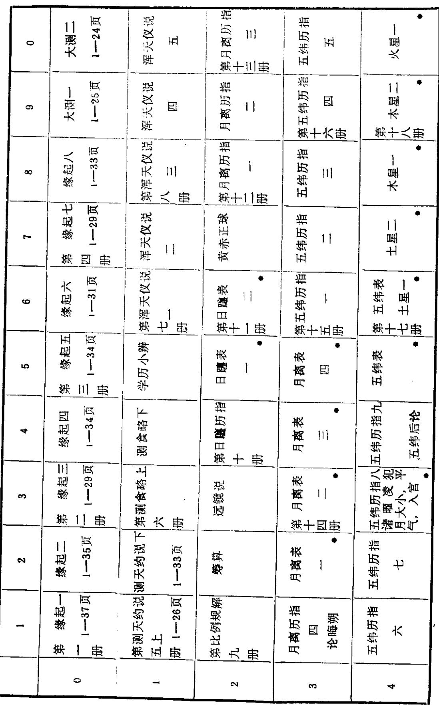
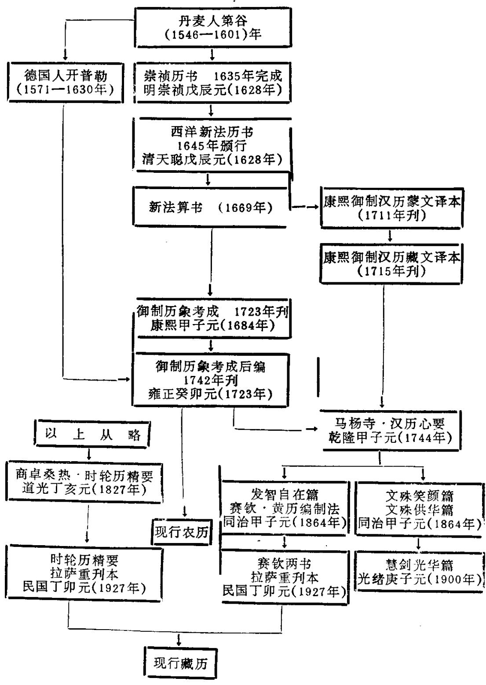
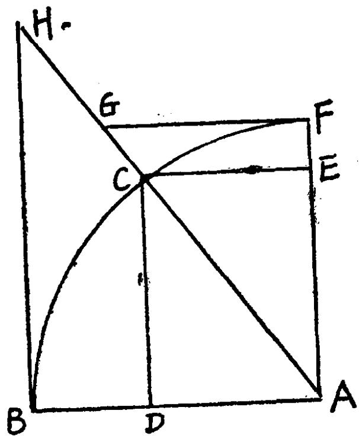
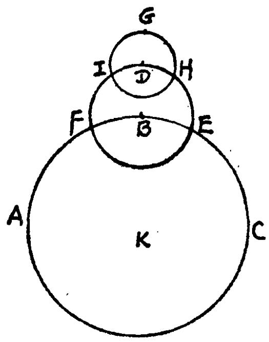

表

<table><tr><td></td><td>1</td><td>2</td><td>3</td><td>4</td><td>5</td><td>6</td><td>7</td><td>8</td><td>9</td><td>0</td></tr><tr><td rowspan="39">7</td><td rowspan="25">火星二</td><td>金星一</td><td>金星二</td><td>水星一</td><td>第恒星历指
十六册</td><td>一</td><td>一</td><td>一</td><td>恒星历指
三</td><td>一</td></tr><tr><td>·</td><td>·</td><td>·</td><td>·</td><td>·</td><td>·</td><td>·</td><td>·</td><td>·</td></tr><tr><td>·</td><td>·</td><td>·</td><td>·</td><td>·</td><td>·</td><td>·</td><td>·</td><td>·</td></tr><tr><td>·</td><td>·</td><td>·</td><td>·</td><td>·</td><td>·</td><td>·</td><td></td><td></td></tr><tr><td>·</td><td>·</td><td>·</td><td>·</td><td>·</td><td>·</td><td>·</td><td>·</td><td>·</td></tr><tr><td>·</td><td>·</td><td>·</td><td>·</td><td>·</td><td>·</td><td>·&lt;fuel&gt;·</td><td>·</td><td></td></tr><tr><td>·</td><td>·</td><td>·</td><td>·</td><td>·</td><td>·</td><td>·</td><td>·</td><td>·</td></tr><tr><td>·</td><td>·</td><td>·</td><td>·</td><td>·</td><td>五</td><td>·</td><td>·</td><td>·</td></tr><tr><td>·</td><td>·</td><td>·</td><td>·</td><td>·</td><td>·</td><td>·</td><td>·</td><td>·</td></tr><tr><td>·</td><td>·</td><td>·</td><td>·</td><td>-</td><td>·</td><td>·</td><td>·</td><td>·</td></tr><tr><td>·</td><td>·</td><td>·</td><td>·</td><td>·</td><td>·</td><td>·</td><td>·</td><td>·</td></tr><tr><td>·</td><td>·</td><td>·</td><td></td><td></td><td></td><td></td><td></td><td></td></tr><tr><td>·</td><td>·</td><td>·</td><td></td><td></td><td></td><td></td><td></td><td></td></tr><tr><td>·</td><td>·</td><td>·</td><td></td><td></td><td></td><td></td><td></td><td></td></tr><tr><td>·&lt;fcul&gt;</td><td>·</td><td>·</td><td>·</td><td>·</td><td>·</td><td>·</td><td>·</td><td></td></tr><tr><td>·&lt;fcul&gt;</td><td>·</td><td>·</td><td>·</td><td>·</td><td>·</td><td>·</td><td>·</td><td></td></tr><tr><td>·&lt;fcul&gt;</td><td>·</td><td>·</td><td>·</td><td>·</td><td>·</td><td>·</td><td></td><td></td></tr><tr><td>·&lt;fcul&gt;</td><td>·</td><td>·</td><td>·</td><td>·</td><td>·</td><td>·</td><td>·</td><td></td></tr><tr><td>·&lt;fcul&gt;</td><td>·</td><td>·</td><td>·</td><td>·</td><td>·</td><td>-</td><td>·</td><td></td></tr><tr><td>·&lt;fcul&gt;</td><td>·</td><td>·</td><td>·</td><td>·</td><td>·</td><td>·</td><td>·</td><td></td></tr><tr><td>·&lt;fcul&gt;</td><td>·</td><td>·</td><td>·</td><td>·</td><td>·\fcel&gt;·</td><td>·</td><td></td><td></td></tr><tr><td>·&lt;fcul&gt;</td><td>·</td><td>·</td><td>·</td><td>·</td><td>·\fcel&gt;·</td><td>·</td><td></td><td></td></tr><tr><td>·&lt;fcul&gt;</td><td>·</td><td>·</td><td>·</td><td>·</td><td></td><td></td><td></td><td></td></tr><tr><td>·&lt;fcul&gt;</td><td>·</td><td>·</td><td>·</td><td>·</td><td></td><td></td><td></td><td></td></tr><tr><td>·&lt;fcul&gt;</td><td>·</td><td>·</td><td>·</td><td>·</td><td></td><td></td><td></td><td></td></tr><tr><td>·</td><td>·</td><td>·</td><td>·</td><td>·</td><td></td><td></td><td></td><td></td><td></td></tr><tr><td>·</td><td>·</td><td>·</td><td>·</td><td>·</td><td></td><td></td><td></td><td></td><td></td></tr><tr><td rowspan="12">·</td><td>五</td><td>·</td><td>·</td><td>·</td><td></td><td></td><td></td><td></td><td></td></tr><tr><td>·</td><td>五</td><td>·</td><td>·</td><td>·</td><td>·</td><td></td><td></td><td></td></tr><tr><td>·</td><td>五</td><td>·</td><td>·</td><td>·</td><td>·</td><td></td><td></td><td></td></tr><tr><td>·</td><td>五</td><td>·</td><td>·&lt;f</td><td>·</td><td>·</td><td></td><td></td><td></td></tr><tr><td>·</td><td>五</td><td>·</td><td>·</td><td>·</td><td>·</td><td></td><td></td><td></td></tr><tr><td>·</td><td>五</td><td>·</td><td>·</td><td>·&lt;f</td><td>·</td><td></td><td></td><td></td></tr><tr><td>·</td><td>五</td><td>·</td><td>·</td><td>·</td><td>·</td><td></td><td></td><td></td></tr><tr><td>·</td><td>五</td><td>·</td><td>·</td><td>·</td><td>·&lt;ecal&gt;</td><td></td><td></td><td></td></tr><tr><td>·</td><td>五</td><td>·</td><td>·</td><td>·</td><td>·</td><td></td><td></td><td></td></tr><tr><td>·</td><td>五</td><td>·</td><td>·</td><td>·</td><td>·</td><td></td><td></td><td></td></tr><tr><td>·</td><td>五</td><td>·</td><td>·</td><td>·</td><td>·</td><td></td><td></td><td></td></tr><tr><td>·</td><td>五</td><td>·</td><td>·</td><td>·</td><td>·</td><td></td><td></td><td></td></tr><tr><td rowspan="5">&lt;fcel&gt;</td><td rowspan="5">&lt;fcel&gt;</td><td>&lt;fcel&gt;</td><td>&lt;fcel&gt;</td><td>&lt;fcel&gt;</td><td>&lt;fcel&gt;</td><td>&lt;fcel&gt;</td><td>&lt;fcel&gt;</td><td>&lt;fcel&gt;</td><td>&lt;ecel&gt;</td><td></td></tr><tr><td>&lt;fcel&gt;</td><td>&lt;fcel&gt;</td><td>&lt;fcel&gt;</td><td>&lt;fcel&gt;</td><td>&lt;fcel&gt;</td><td>&lt;fcel&gt;</td><td>&lt;fcel&gt;</td><td rowspan="4">&lt;fcel&gt;</td><td rowspan="4">&lt;nl&gt;</td></tr><tr><td>&lt;fcel&gt;</td><td>&lt;fcel&gt;</td><td>&lt;fcel&gt;</td><td>&lt;fcel&gt;</td><td>&lt;fcel&gt;</td><td>&lt;fcel&gt;</td><td>&lt;ucel&gt;</td></tr><tr><td>&lt;fcel&gt;</td><td>&lt;fcel&gt;</td><td>&lt;fcel&gt;</td><td>&lt;fcel&gt;</td><td>&lt;fcel&gt;</td><td>&lt;fcel&gt;</td><td>&lt;ucel&gt;</td></tr><tr><td>&lt;fcel&gt;</td><td>&lt;fcel&gt;</td><td>&lt;fcel&gt;</td><td>&lt;fcel&gt;</td><td>&lt;fcel&gt;</td><td>&lt;fcel&gt;</td><td>&lt;ucel&gt;</td></tr></table>

译。总之,是个选译本。只选了实践部分。而省略了原理部分。(见附表)

我们还未得到全书的复制本,无法进行正式的对勘,只拿交食表卷一开首的三页与汉文《新法算书》核对过。算交食诸表法的说明,历元后二百年五行(hang)表的算法,以至所举崇祯元年戊辰的例题,都与《新法算书》字句完全吻合,而与《历象考成》有出入。可惜译笔生硬晦涩,加以那时藏族的历算家们缺乏几何、三角的数学基础,所以他们看不懂,只好望书兴叹。看起来问题在于当初译出之后,紧跟着就应该建立一个讲授、练习、实用的传承。可惜没有做到,以至费了那么大的力量翻译并刊刻的这部巨著,竟未能发挥作用。第五世达赖喇嘛的遗愿仍未能实现。

# 五、《马杨寺汉历心要》时宪历的藏文改编本

《汉历大全》藏文选译本成书后不久,有一位蒙古人把此书学通,并加以简化,创造了一套与时轮历的运算方法揉合起来的方法。随即有人用藏文写下来,题为《汉历中以北京地区为主之日月食推算法》,通称为《汉历心要》,其历元乾隆九年甲子(1744年)距《汉历大全藏译本》成书仅廿九年。未见刻本,手写本只十六页,书中提到的应用的表格有十八种,亦未见,但可用后世的刻本代用。手写本末尾有一段题记:

"《以首都北京地区为主之日月食推算法》系华瑞马杨寺之数理学人索巴坚参,依精于此道之师尊口传,忠实于支那历算原文而意译。愿此法遍扬于大地!"华瑞指现在青海省东北角的门源、互助、甘肃的天祝、永登一带的藏族地区。关于马杨寺据阿拉善

旗人阿旺多尔济所写的第六世达赖《仓央嘉措秘传》记载  $⑨$  说是乾隆五年仓洋嘉措派人去修建的。看来是在永登县一带。

这一段题记下面另有一行小字写道:"此汉历系录自马杨历书,尾跋原文如此,唯北京雍和宫及蒙古地区亦有此算法流行,予曾见其书,历元年份、正文词句以及表格均与此无异。彼等云系此前雍和宫之一精通历算者所授,但均无署名。"

这条题记关于汉历(即时宪历)日月食推算法在蒙族地区流传情况的记载看来都是事实。蒙藏地区掌握历法知识的大都是喇嘛,雍和宫是蒙藏佛教在北京的中心寺庙,首先由雍和宫的一位喇嘛(很可惜其名未传)向北京的历法家学习了汉历中的日月食推算法,然后再传入蒙藏地区。马杨寺的索巴坚参所写下的这部书仅是这些流传的著作之一。

我们说马杨历书只是其中之一,是因为我们在北京图书馆又发现了一种手写本的藏文的《摩诃支那传规交食推步术》,作者为雍和宫达喇嘛乌里季巴图,从名字看显然是蒙族人。虽然其历元同治三年甲子(公元1864)比马杨历书晚一百二十年,但其内容有马杨历书所没有的。例如:求初亏复圆方位,原法中有求纬差角与黄道高弧交角相加减以求定交角的步骤,马杨历书中略去,而乌里季巴图此书中仍有。此外,还有各省及诸蒙古北极高度、东西偏度,包括康熙年间实测的和乾隆《时宪》所增的,也是马杨系统诸书所没有的。可见其所根据的祖本不是马杨历书,而是比马杨更早一些的一种。可惜这种祖本目前我们尚未见到。

把卷帙浩繁的《新法算书》的交食部分压缩到六十页的藏文(包括表格),并且能实际运用它来推算日月食,达到比时轮历精确一些的效果,实在难得!这项工作是谁做的呢?尚未见到明确的记载,目前我们只能提供几点可能有关的线索:

一是明安图,已如上述。但以他的水平应该不致于产生下面将论到的那些错误。

另一个是汉历大全藏译本工作人员中有个达喇嘛·楚儿沁藏布·兰占巴。达喇嘛是职位名,兰占巴是个学位名。此人见于《大清一统志》:"本朝康熙五十六年遣喇嘛楚儿沁藏布·兰木占巴、理藩院主事胜柱等绘画西海西藏舆图、测量地形"。翁文灏根据西文的记载更详细地叙述此事说:"康熙派兵入藏时派人注意绘图,……1711年交给传教士雷孝思审阅,……因无经纬度认为无用。玄烨便再派曾在钦天监学习数学测量的喇嘛二人……后来因策旺侵西藏……匆匆回来……因此康熙时代的西藏地图远不及内地及满蒙图的精确,而西部尤未详勘,故多错误。"⑩这一段叙述的主要是测绘地图的事,但因当时拉萨经纬度的不精确,对推算拉萨日食的时刻和食分有很大的影响,下文还要讲到。这段记载与藏传时宪历也是有关系的,所以附记于此。此人又见于北京版的藏文大藏经工作人员名单中:"对看喇嘛、达喇嘛·错尔秦兰占巴"。北京版刊于雍正二年(1724年),乾隆初年此人仍有在世的可能。

第五世达赖在1651年提出要把汉历用时轮历的语言表达出来这个心愿之后将近一百年,经过蒙、藏、汉许多历算家的努力,到《马杨寺汉历心要》一书总算把它实现了。从此藏族的历算又开辟了一个新领域。

《康熙御制汉历大全》与《马杨寺汉历心要》这两部著作的作用和价值完全不同。前者是选译本,其作用是在忠实于原著的基础上将它翻译成藏文,以便于藏族学者学习和研究。后者则是蒙族藏族学者自己关于时宪历的著作。它是蒙族藏族人民经过自己的学习和钻研后写成的,是已经为藏族学者所吸收了的东西。因此,至少从此书开始,藏族已经建立起研究时宪历的学派,它年复一年地师徒相传,直到今天。我们研究藏传时宪历的科学原理并进行评价,也是以此书为主要依据。因为它是藏传时宪历最早的著作之一,而且文中加进了不少夹注,是作者根据自己的认识所作

的注释,对于帮助学习者理解时宪历的内容有一定的帮助作用。原著我们已译成汉文,与《时宪志》进行了详细的对勘,做了注解并依照它的方法进行过两个例题的演算,为不懂藏文的学者们提供第一手的资料。懂藏文的人也可对照研究,因为历算的藏文著作文笔特殊,未经人讲解,自学是有困难的。

《马杨寺汉历心要》对时宪历做了哪些改编呢?

(一)简化了一些步骤,如:原法正午黄赤距纬、黄平与子午圈交角、正午黄道宫度和高度等几项步骤各有用时、近时、真时、初亏、复圆等五套,此法省略了。由食甚近时、真时直接求黄平象限距午和宫度。从限距地高到东西差之间的步骤和求起复方位的步骤也有所简化。总的说来推日食的步骤减少了约二分之一,推月食的步骤减化得较少。

(二)求平朔,太阳平行,自行,太阴自行,平交周等五项根数,原法用积日求,此法改用积月,再加入年月数,再加入月日数,这是时轮历的办法。

(三)把小数运算改为分数运算。这也是将就时轮历的习惯。例如:

1. 把回归年的长度改为  $365 \frac{60}{247}$ 。

2. 求平距时,原法以月距日一小时平行(1828".6101)为一率、一小时化秒(3600)为二率、已求得之平距弧为三率、求得四率为距时秒。此法将一率、二率各乘以5,化成整数9143与1800。

3. 求太阳黄道经度之步骤中,原法有以一小时化秒(3600)为一率、太阳一小时平行(147".847105)为二率、已求得之实距时化秒为三率、求得四率为太阳距弧之步骤。此法将一率、二率各乘以14.4,改为  $864 \times 60$  与2129。

(四)凡用到三角函数的地方都制出现成的表,直接检表即得,不用查八线表。例如:

1. 月食求食甚距纬。原法以本天半径  $(10^{\circ})$  为一率、黄白大距  $(5^{\circ}8^{\prime})$  之正弦为二率、已求得之实交周之正弦为三率、求得四率为正弦,检八线表得食甚距纬。此法制成太阴交周差度表,用实交周直接检表即得。

2. 求月食初亏复圆时刻,原法以食甚距纬之余弦为一率、并径(太阴与地影两半径)之余弦为二率、半径千万为三率、求得四率为余弦,检八线表得初亏复圆距弧。此法制成初亏复圆月行距弧表,以食甚距纬查其横行,并径查其直行,即可直接求得。

(五)所用基本数据,在康熙甲子元与雍正癸卯元二者中更接近于后者。例如:

<table><tr><td></td><td>朔 策</td><td>每月太阳平行</td><td>太 阳 交 周</td></tr><tr><td>康熙甲子元</td><td>29°12&#x27;44&#x27;3&#x27;14&#x27;&#x27;&#x27;</td><td>29°9&#x27;24&#x27;13&#x27;&#x27;&#x27;</td><td>1°0°40&#x27;14&#x27;0&#x27;&#x27;&#x27;</td></tr><tr><td>雍正癸卯元</td><td>29°12&#x27;44&#x27;3&#x27;1&#x27;&#x27;&#x27;</td><td>29°6&#x27;24&#x27;15&#x27;&#x27;&#x27;</td><td>1°0°40&#x27;13&#x27;55&#x27;&#x27;&#x27;</td></tr><tr><td>马杨历书乾隆甲子元</td><td>29°12&#x27;44&#x27;3&#x27;3&#x27;&#x27;&#x27;</td><td>29°6&#x27;24&#x27;15&#x27;&#x27;&#x27;</td><td>1°0°40&#x27;13&#x27;55&#x27;&#x27;&#x27;</td></tr></table>

(六)《汉历大全》有五纬即五星运动,汉历心要里没有。

由此可见,《马杨寺汉历心要》不是简单地减去一些步骤,而是经过一番改编,成为有西藏特色的时宪历了。这次改编,大大便利了藏族人的学习和使用,其功绩是不可磨灭的。但也存在一些缺点:

一、回归年的长度,它自造的这个分数  $365 \frac{60}{247} = 365.2420149$ ,既不等于康熙甲子元的365.2421875。也不等于雍正癸卯元的365.24233442。其实康熙甲子元有一个现成的分数,即回回历的  $365 \frac{31}{128}$ ,不知因何不用?这个误差的影响是不小的。

太阳平行是用周年除周天得到的,但从此书所给的太阳每月平行  $29^{\circ}6'24''15''$  返回去求周年则只能得到雍正癸卯元的周年,而得不到  $365\frac{60}{247}$ 。

二、闰周。六十五年二十四闰是时轮历的闰周,是与其回归年的长度  $365\frac{4975}{18382}$  相适应的。(本书296页)此书用了另一个回归年,而坚持65年24闰不改,于是就成了自相矛盾。

三、北京与拉萨的时差。马杨历书中说:"在善土推初亏、复圆时刻时,太阴从食甚用时,太阳从食甚真时,似以减去一小时十二分为宜。"并未指定十分具体的地点,应减数值也未十分肯定。但后来此派各书都实指为拉萨,对此数值亦完全肯定。按:北京在东经116度19分,拉萨在东经91度8分,相差25度  $1^{1}$  分,时间应差1小时44分。藏传汉历所用数值小28分44秒,将近半小时。产生的原因如上所述,这个误差也不算很小。康熙时两次派人入藏测量都未取得实地测量的完全数据。主稿绘图的耶稣会传教士因第二次派去的人出身钦天监,不敢再驳,遂据以入图。因此马杨历书所据经度不准是难怪的。

四、拉萨的纬度。日食食分与纬度关系很大。本来:"黄平象限表按京师北极高度  $39^{\circ}55'$ ,……依黄道经度推得"。①《马杨汉历心要》全书没有直接提出"纬度"这一概念,但也交代了:"各地两至昼夜长短不同,故黄平差表亦不同。……北京最长三十七漏刻。西藏地区,《日光论》和《白琉璃》都认为最长为三十三漏刻四十四分。本书按三十四漏刻地区之黄平差而写,似应相符"。按:时轮历把一昼夜分为六十漏刻。37漏刻  $= 14$  小时48分。34漏刻  $= 13$  小时36分,与两地区的实际日出日没时刻相差不大,此说基本正确。但是马杨此表失传。现代的藏族所用的黄平象限表(例如麦许寺印的)标明为"昼夜最长为37漏刻地区之表。"北京在北

纬四十度马杨寺纬度约三十七度,只差三度,用此表误差影响尚不太大。拉萨在北纬二十九度四十三分,也用此表,误差就相当大了。这也是藏传时先历推算日食,不如原法准确的重要因素之一。

《新法算书》推步用表甚多,《历象考成》康熙甲子元用二十二表(五星不在内)。《马杨寺汉历心要》只用十八表,表名如下:

1. 首朔诸根表,包括首望,又称十三月诸根表

2. 太阳损益表(均数表)

3. 太阴损益表(均数表)

4. 太阳黄赤升度表(原书缺)

5. 均数时差表

6. 黄赤升度时差表

7. 太阴交周距度表(黄白距度表)

8. 月距日实行表

9. 罗月并行度差表(黄白升度差表)

10. 太阴半径表

11. 地影半径表

12. 影差表

13. 初亏复圆月实行(距弧)表

14. 太阳半径表

15. 太阴地半径差表(地平视差表)

16. 黄平象限表(北京地区适用)

17. 原缺。(据乌里季巴图历书此表应为太阳黄道高弧交角表)

18. 大时分、东西差、南北差表

# 六、《汉历心要》的传布和使用

从18世纪40年代起,这种改编了的时宪历就逐渐在北京雍和

宫,内蒙,和甘肃省东北部的蒙藏族中流传。但是从此时到19世纪六十年代,约一百二十年间,这方面的新著却极少,目前我们所知道的只有两种:一种是《第十三胜生周甲子元(公元1804年)汉历基数·文殊意旨庄严篇》,据拉卜楞寺总目,仅三页,我们尚未见到。一种是《汉历大海甘露一滴》抄本21页,历元为道光廿二年壬寅(1842年)与马杨寺汉历心要内容大致相同,署名亦同,估计是另一人更换了历元而未署名。

这120年间,不仅新著少而且曾经被人篡改得面貌全非,又因地方变乱典籍散逸濒于绝传。到19世纪60年代才又重新兴旺发达起来。同时出现了三个人同样以同治甲子(1864年)为历元的时宪历著作。

一个人是雍和宫的达喇嘛蒙古人乌里季巴图,著有《摩诃支那传规日月交食推步术》。此书比《汉历心要》虽然时代晚,内容却多一些,例如:关于黄赤升度差表有一说明,大段引用了《汉历大全》里有关的原文。又如:求各地交食三限的时刻,《汉历心要》只给出了北京和幕土的时差而没有给出经纬度。此书则完整地给出了十八省首府和蒙古廿二个旗的北极高度和距京些的东西偏度。看起来它所据的原本可能比《汉历心要》更早一些。

第二个人是甘肃北部永登县天堂寺的赛钦·扎巴丹增,他著的《汉历发智自在王篇》手写本21页。对运算步骤的先后作了调整,带食出没部分有所补充。《黄历编制法》手写本21页,介绍了时宪历民用历书的编制方法。

第三个人是甘肃西南部拉卜楞寺的图登嘉措,著有《纯汉历日月食推算法·文殊笑颜篇》手写本13页,和历书编制法《文殊华篇》。在题记中他说曾经将推算的结果与历年颁布的汉蒙文黄历做过核对。还有《醉蜂嗡嘈篇》杂收《春牛经》《廿四方位图》《汉历简史》、《释迦年代考》、《汉蒙藏对照历注用语》等短篇多种,他还有一部第十四胜生周(1864—1923年)积日表。

这三个人的工作标志着时宪历在蒙藏地区的复兴,它是由北京传到内蒙、陇北、又传入陇西南的。拉卜楞寺1879年建立了喜金刚院,开设时宪历的专修课,每年独立地编制时宪书,1959年因地方动乱一度中止,现又恢复。《发智自在王篇》和《文殊供华篇》两书后来在拉萨曾刊版。

1864年以后,这方面的著作仍不断出现,我们见到的有:

一、《北京地区日月食推算法》通称《恭息历书》,木刻本12页,历元为丙子年(1876年)。编者为恭息·隆多丹增策臣尼玛,当即赛钦所说的天堂寺座主。跋尾:"索巴嘉参开传授此学之端,后因地方变乱,典籍散逸,濒于绝传。幸有其弟子罗桑欧色细译文义,重兴传习,命予改写篇首归敬礼赞偈文"云。

二、《日月食推算法·慧剑光华篇》木刻本32页,历元为庚子年(1900年),作者麦许曲培。刻本上又续增甲子年(1924年)为历元之各项"应数"。自叙:曾闻赛钦历书有"秒位差"本,未能得见,兹仿其意自编秒位差。(按:为求中比例之用。)

三、汉历用表十六种。麦许寺木刻本共44页,是现有的表格最全的一种版本。自叙:"此诸表与他处之表有不一致之处,何正何误,尚待研究。"可见他们在使用中发现过问题,但因不知制表原理,无法改正,这是藏族历算家迫切要求解决的问题之一。本书的《藏传时宪历原理研究》一章提供了答案。

四、《汉历所需节气及日期等数值二五二○周期表·白莲花束》。木刻本,有详略两种,详本42页,略本6页,历元为庚子年(1900年)。2520是七曜八卦九宫十二建六十干支的最小公倍数构成的周期。详本下半大量采用《玉匣记》的历注。

五、《汉历文殊悦容篇》木刻本8页,附表10页。历元甲子年(1924年),才旦夏茸编。篇幅较小,而日月食及历书编制都涉及到了,是进一步的简化本,精密度较差。有1985年青海人民出版社铅印本。

六、《汉历聪人遂愿篇》木刻本8页,表6页。历元丁卯(1927年)青海隆务寺第钦喇嘛编。专述历书编制,不包括日月食。

七、第十六丁卯周(1927—1986年)积日表,木刻本5页。后记中说:"奉命合编,人众手杂,难期无误,皇室黄历,尚且有失,何况我辈?"所记当属实况。

八、《第十六丁卯周(1927—1986年)积日表智者意趣庄严篇》木刻本6页。扎贡巴嘉样丹巴嘉措编制。他指出:"此法所用六十五的闰周与汉历原法不符,故求得之积月应做适当调整。用前后两月实朔之差定月之大小。汉历用真黄经定节气、无中气则置闰,两原则最可靠。但亦发现(宪书)有与之不符之处。此方学者须反复仔细推算实朔数值,勿使有误,再进一步推究,不可厌烦,不可有任何成见、偏见。"由此可见他已清楚地觉察到藏传时宪历中的某些问题,但未完全明白问题症结之所在。

九、《春牛经》(有人从藏文还原直译成"牛算",不妥),上述诸书有的已包括此项内容。此外,还有单行的,例如:

1. 央金朱比多吉(1809—1892年)编,拉萨木刻本,6页,收在其文集第三帙中。此人系俄曲达日麻拔扎大师之大弟子,本名罗桑曲培。

2. 岗朱·罗追塔益(1813—1890年)编,德格木刻本,13页。编者系晚近之宁玛派大师,著述甚富,德格版有其文集八帙,但此篇原未署名未收入,兹据题记定。自述其师哦勒丹增曾与京师大译师公·工查布通信得其指教,又曾从丽江府汉族历算家袁万灵(译音)学得实际运算之法。他所著《知识总汇》①中亦述及此人,值得进一步研究。推算春牛要用到冬至与立春的具体时刻,此书中用时轮历的"中日",即太阳的平黄经,进行推算,可见《马杨汉历心要》的算法在康区尚未普及。标题上有"公规"二字。按春牛经的版本不一,标准本为《协纪辨方》中的公规春牛经。

十、拉卜楞寺喜金刚院历年编制的黄历。

此外还有阿嘉呼图克图·罗桑丹比嘉参(1767年逝世)所著的《京师地区协时法》56页,《五行占之年首答问》12页,  $13$  这两篇是讲五行占的,但涉及到汉历中年首与岁首,孟春季春,子月寅月等几个重要概念的关系,提出了他自己的见解和疑问。

所见到的藏文里有关时宪历的著作,目前主要就只有这些。《拉卜楞寺总目》中汉历部分编号有一百○三号,这里只举出了二十几种,是不是有重要的遗漏呢?其实总目中把《康熙御制汉历藏文译本》三十九卷各列一号,麦许寺版的表格十六种及其他几种的附表都各列为一号,还有十几种是五行占方面的。因此真正讲时宪历的书的种类并没有那样多,不可误会。

附带谈一下这些书所用的历元与其写作年代的关系。上述有五、六种书的历元都是1864年,而编写年代分别为1861、1862年、早于历元。这似乎不好理解。因一种新的历法编制出来之后,总是希望马上废旧用新的,而且许多是政策下令颁布实行的。既然马上要用,其历元就不能晚于编制的年份,例如《历象考成》编于康熙五十三至六十年,历元为康熙二十三年甲子。但是藏文历书的情况与此不同,新的历元并不意味着新的历法,其基本数据仍然是《汉历心要》所用的,丝毫未变,只是把各项"应数"换一下而已。因此,在新历元的年份到达之前,旧历书完全可以继续使用。这种做法是继承了时轮历的传统:最长六十年必须更换历元,短者不限,尽可能采用丁卯年。仿此,藏传时宪历诸书多数为甲子元。其他为壬子、丙子、庚子年。这是根据历元推断其写书大致年代时要注意的一个特点。只有《马杨寺汉历心要》一书与此不同,它是一个新的创作,没有旧历元可继承,其编制年代应稍晚于其历元。

# 小结

(一)藏族古代的历法,目前只有零星材料,还不能画出其清楚的轮廓。现在能明确判断的是十一世纪从印度引进的时轮历,有完整的体系。从十三世纪起藏族有了自己的关于时轮历的著作,先后有数百种,非常丰富。元代藏族吸收了以寅月为正月的纪月法,称为"蒙古月",后来又吸收了汉历的二十四气节等,但藏历的基本体系仍是时轮历,没有改变。

(二)由于生产、生活和宗教上的需要,藏族十分重视日、月食的预报。时轮历使用数百年后误差越来越大,迫切希望有新的推算法。

(三)汉族的历法,在元代本是先进的,但使用到明朝中期,也是误差越来越大,而且皇家严禁私人学天文、编历书。因此明朝时藏族不可能从汉族学到好的天文历法。

(四)欧洲的天文学到十六世纪末年已开始进入近代天文学的领域,较为精密。明朝末年开始引进这种天文学,编制了历法,但没有来得及实行。十七世纪中期清朝取得全国政权后,马上采用了这种历法,取名"时宪历"。满族没有汉族传统的那种"私习天文之禁"。

(五)五世达赖(1617—1682年)晋京,在紫禁城内两次看到钦天监的历书,兴奋地表示了要用时轮历的语言把时宪历引进西藏的愿望。康熙皇帝本人学过天文,并积极培养少数民族的历算人才。在这样的条件下,有蒙藏喇嘛进入钦天监学习。在康熙帝主持下将时宪历中用表推算的部分译成了蒙文,随即又从蒙文译成藏文,题名《康熙御制汉历藏文译本》。时宪历进入西藏的条件逐渐成熟。

(六)《汉历大全》虽然译出来了,但是没有三角、几何基础

的人学不了, 不适应当时蒙族藏族一般人的数学水平, 一时尚难推广。乾隆初年雍和宫里有一位蒙古族喇嘛将《汉历大全》简化, 并加以改编, 使其适应当时蒙族藏族的数学水平。这种改编本受到蒙藏历算家的欢迎。

(七)最先将这种改编本传入藏族地区的是甘肃北部马杨寺的一个人, 他所传下来的藏文本就以《马杨寺汉历心要》著称。这就是藏传时宪历的祖本, 五世达赖的愿望至此得到实现。藏族的天文历算学从此又开辟了一个新的领域。十九世纪中传到甘肃南部的拉卜楞寺, 1879年建立喜金刚院传习这种汉历, 每年自己编制"黄历", 直到1958年没有中断。二十世纪初传到了拉萨, 在藏医院里设立了传习的课程, 并将按这种方法推算日月食的结果载入每年编制的藏文年历里, 至今仍保持不断。

(八)《马杨寺汉历心要》的改编工作在推广普及方面成绩很大, 但是由于过分迁就时轮历的运算习惯, 产生了几项重要的缺点, 致使推算日月食的结果不如原法精确。后来的藏族历算家们也发现了一些问题, 但是由于看不懂《汉历大全》, 不明白其原理, 无法做出有效的改进。我们这两篇文章虽然初步分析出来了《马杨寺汉历心要》中的几项缺点, 也还未能供给藏族的历算家们一个现成的、拿起来就用的新的改编本。只是给这项工作做了一点开路的工作, 下一步还有待于藏族自己的学者, 尤其是受过现代科学训练的青年学者们继续完成。

# 注:

$①$  本书第268页

$②$  以上这几段主要参考科学出版社1980年出版的《中国天文学史》第232页。

$③$  《续畴人传》四十八。

$④$  李迪:《蒙古族科学家明安图》,内蒙古人民出版社1979年。

$⑤$  李约瑟:《中国科学技术史》中译本第四卷666页。

$⑥$  第五世达赖喇嘛文集第二十帙。

$⑦$  据钦饶努布:《汉历发智自在天篇重刊题记》转引,又:五世达赖:《黑白算答问》第34页。

$⑧$  《全国蒙文古旧图书资料联合目录》第376页,1980年内蒙古人民出版社。

$⑨$  《仓央嘉措情歌及秘传》,民族出版社1981年版,藏文本第173页,汉文译本第101页。

$10$  地学杂志第十九卷第三期,转引自王庸:《中国地图学史》

$11$  《清史稿·时宪志》第1816页。

$12$  民族出版社1982年出版的藏文本第599页。

$13$  阿嘉呼图克图文集,北京嵩祝寺版。

# 5555555555555555555555555555555555555555555555555555555555555555555555555555555555555555555555555555

5555555555555555555555555555555555555555555555555555555555555555555555555555555555555555555555555556666666666666666666666666666666666666666666666666666666666666666666666666666666666666666666666666666888888888888888888888888888888888888888888888888888888888888888888888888888888888888888888888888888899999999999999999999999999999999999999999999999999999999999999999999999999999999999999999999999999990000000000000000000000000000000000000000000000000000000000000000000000000000000000000000000000000000888888888888888888888888888888888888888888888888888888888888888888888888888888888888888888888888888000000000000000000000000000000000000000000000000000000000000000000000000000000000000000000000000000666666666666666666666666666666666666666666666666666666666666666666666666666666666666666666666666666000000000000000000000000000000000000000000000000000000000000000000000000000000000000000000000000000

1560 1066 15

1066 171 771 55

476 476 476 476 476 476 476 476 476 476 476 476 476 476 476 476 476 476 476 476 476 476 476 476 476 476

1260 1260 1260 1260 1260 1260 1260 1260 1260 1260 1260 1260 1260 1260 1260 1260 1260 1260 1260 1260 1260

104 104 104 104 104 104 104 104 104 104 104 104 104 104 104 104 104 104 104 104 104 104 104 104 104 104

5555555555555555555555555555555555555555555555555555555555555555555555555555555555555555555555555555999999999999999999999999999999999999999999999999999999999999999999999999999999999999999999999999999900000000000000000000000000000000000000000000000000000000000000000000000000000000000000000000000000001111111111111111111111111111111111111111111111111111111111111111111111111111111111111111111111111111222222222222222222222222222222222222222222222222222222222222222222222222222222222222222222222222222233333333333333333333333333333333333333333333333333333333333333333333333333333333333333333333333333339999999999999999999999999999999999999999999999999999999999999999999999999999999999999999999999999998888888888888888888888888888888888888888888888888888888888888888888888888888888888888888888888888888999999999999999999999999999999999999999999999999999999999999999999999999999999999999999999999999999

180 180 180 180 180 180 180 180 180 180 180 180 180 180 180 180 180 180 180 180 180 180 180 180 180 180

330

462 45 464 45 464 45 464 45 464 45 464 45 464 45 464 45 464 45 464 45 464 45 464 45 464 45 464 45 464 45 464 5 464 45 464 45 464 45 464 45 464 45 464 45 464 45 464 45 464 45 464 45 464 45 464 45 464 45 464 45

1635 《周·》司司司司司司司司司司司司司司司司司司司司司司司司司司司司司司司司司司司司司司司司司司司司司司司司司司司司司司司司司司司司司司司司司司司司司司司司司司司司司司司司司司司司司司司司司司司司司司司司司司司司可可可可可可可可可可可可可可可可可可可可可可可可可可可可可可可可可可可可可可可可可可可可可可可可可可可可可可可可可可可可可可可可可可可可可可可可可可可可可可可可可可可可可可可可可可可可可可可可可可可可司司司司司司司司司司司司司司司司司司司司司司司司司司司司司司司司司司司司司司司司司司司司司司司司司司司司司司司司司司司司司司司司司司司司司司司司司司司司司司司司司司司司司司司司司司司司司司司司司司司

司司司司司司司司司司司司司司司司司司司司司司司司司司司司司司司司司司司司司司司司司司司司司司司司司司司司司司司司司司司司司司司司司司司司司司司司司司司司司司司司司司司司司司司司司司司司司司司司司司司间间间间间间间间间间间间间间间间间间间间间间间间间间间间间间间间间间间间间间间间间间间间间间间间间间间间间间间间间间间间间间间间间间间间间间间间间间间间间间间间间间间间间间间间间间间间间间间间间间间间同同同同同同同同同同同同同同同同同同同同同同同同同同同同同同同同同同同同同同同同同同同同同同同同同同同同同同同同同同同同同同同同同同同同同同同同同同同同同同同同同同同同同同同同同同同同同同同同同同同同

· 1723 · 1 5 · 5 · 5 · 5 · 5 · 5 · 5 · 5 · 5 · 5 · 5 · 5 · 5 · 5 · 5 · 5 · 5 · 5 · 5 · 5 · 5 · 5 · 5 · 5 · 5 · 5 · 5 · 5 · 5 · 5 · 5 · 5 · 5 · 5 · · 5 · 5 · 5 · 5 · 5 · 5 · 5 · 5 · 5 · 5 · 5 · 5 · 5 · 5 · 5 · 5 · 5 · 5 · 5 · 5 · 5 · 5 · 5 · 5 · 5 · 5 · 5 · 5 · 5 · 5 · 5 · 5 · 5 . 5 · 5 · 5 · 5 · 5 · 5 · 5 · 5 · 5 · 5 · 5 · 5 · 5 · 5 · 5 · 5 · 5 · 5 · 5 · 5 · 5 · 5 · 5 · 5 · 5 · 5 · 5 · 5 · 5 · 5 · 5 · 5 · 5 ·

· 5 · 5 · 5 · 5 · 5 · 5 · 5 · 5 · 5 · 5 · 5 · 5 · 5 · 5 · 5 · 5 · 5 · 5 · 5 · 5 · 5 · 5 · 5 · 5 · 5 · 5 · 5 · 5 · 5 · 5 · 5 · 5 · 5 · . 5 · 5 · 5 · 5 · 5 · 5 · 5 · 5 · 5 · 5 · 5 · 5 · 5 · 5 · 5 · 5 · 5 · 5 · 5 · 5 · 5 · 5 · 5 · 5 · 5 · 5 · 5 · 5 · 5 · 5 · 5 · 5 · 5 . · 5 · 5 · 5 · 5 · 5 · 5 · 5 · 5 · 5 · 5 · 5 · 5 · 5 · 5 · 5 · 5 · 5 · 5 · 5 · 5 · 5 · 5 · 5 · 5 · 5 · 5 · 5 · 5 · 5 · 5 · 5 · 5 · 5 5 · 5 · 5 · 5 · 5 · 5 · 5 · 5 · 5 · 5 · 5 · 5 · 5 · 5 · 5 · 5 · 5 · 5 · 5 · 5 · 5 · 5 · 5 · 5 · 5 · 5 · 5 · 5 · 5 · 5 · 5 · 5 · 5 · : 5 · 5 · 5 · 5 · 5 · 5 · 5 · 5 · 5 · 5 · 5 · 5 · 5 · 5 · 5 · 5 · 5 · 5 · 5 · 5 · 5 · 5 · 5 · 5 · 5 · 5 · 5 · 5 · 5 · 5 · 5 · 5 · 5 ·  $\mathbb{F}_{\mathbb{F}}^{\mathbb{F}}\mathbb{F}_{\mathbb{F}}^{\mathbb{F}}\mathbb{F}_{\mathbb{F}}^{\mathbb{F}}\mathbb{F}_{\mathbb{F}}^{\mathbb{F}}\mathbb{F}_{\mathbb{F}}^{\mathbb{F}}\mathbb{F}_{\mathbb{F}}^{\mathbb{F}}\mathbb{F}\mathbb{F}_{\mathbb{F}}^{\mathbb{F}}\mathbb{F}_{\mathbb{F}}^{\mathbb{F}}\mathbb{F}_{\mathbb{F}}^{\mathbb{F}}\mathbb{F}_{\mathbb{F}}^{\mathbb{F}}\mathbb{F}_{\mathbb{F}}^{\mathbb{F}}\mathbb{F}^{\mathbb{F}}\mathbb{F}_{\mathbb{F}}^{\mathbb{F}}\mathbb{F}_{\mathbb{F}}^{\mathbb{F}}\mathbb{F}_{\mathbb{F}}^{\mathbb{F}}\mathbb{F}_{\mathbb{F}}^{\mathbb{F}}\mathbb{F}_{\mathbb{F}}^{\mathbb{\mathbb{F}}}\mathbb{F}_{\mathbb{F}}^{\mathbb{\mathbb{F}}}\mathbb{F}_{\mathbb{F}}^{\mathbb{\mathbb{F}}}\mathbb{F}_{\mathbb{F}}^{\mathbb{\mathbb{F}}}\mathbb{F}_{\mathbb{F}}^{\mathbb{\mathbb{F}}}\mathbb{F}_{\mathbb{F}}$  5 · 5 · 5 · 5 · 5 · 5 · 5 · 5 · 5 · 5 · 5 · 5 · 5 · 5 · 5 · 5 · 5 · 5 · 5 · 5 · 5 · 5 · 5 · 5 · 5 · 5 · 5 · 5 · 5 · 5 · 5 · 5 · 5 ·  $5555555555555555555555555555555555555555555555555555555555555555555555555555555555555555555555555555$  5 · 5 · 5 · 5 · 5 · 5 · 5 · 5 · 5 · 5 · 5 · 5 · 5 · 5 · 5 · 5 · 5 · 5 · 5 · 5 · 5 · 5 · 5 · 5 · 5 · 5 · 5 · 5 · 5 · 5 · 5 · 5 · 5 .

#

1651 1651 1651 1651 1651 1651 1651 1651 1651 1651 1651 1651 1651 1651 1651 1651 1651 1651 1651 1651 1651

1651 1651 1651 1651 1651 1651 1651 1651 1651 1651 1651 1651 1651 1651 1651 1651 1651 1651 1651

111111111111111111111111111111111111111111111111111111111111111111111111111111111111111111111111111100000000000000000000000000000000000000000000000000000000000000000000000000000000000000000000000000001111111111111111111111111111111111111111111111111111111111111111111111111111111111111111111111111112222222222222222222222222222222222222222222222222222222222222222222222222222222222222222222222222222111111111111111111111111111111111111111111111111111111111111111111111111111111111111111111111111111

“”927) 881) 881) 881) 881) 881) 881) 881) 881) 881) 881) 881) 881) 881) 881) 881) 881) 881) 881) 881) 881) 882) 882) 882) 882) 882) 882) 882) 882) 882) 882) 882) 882) 882) 882) 882) 882) 882) 882) 882) 882) 883) 883) 883) 883) 883) 883) 883) 883) 883) 883) 883) 883) 883) 883) 883) 883) 883) 883) 883) 883) 882) 882) 882) 882) 882) 882) 882) 882) 882) 882) 882) 882) 882) 882) 882) 882) 882) 882) 882) 881) 881) 881) 881) 881) 881) 881) 881) 881) 881) 881) 881) 881) 881) 881) 881) 881) 881) 881) 883) 883) 883) 883) 883) 883) 883) 883) 883) 883) 883) 883) 883) 883) 883) 883) 883) 883) 883) 884) 884) 884) 884) 884) 884) 884) 884) 884) 884) 884) 884) 884) 884) 884) 884) 884) 884) 884) 884) 885) 885) 885) 885) 885) 885) 885) 885) 885) 885) 885) 885) 885) 885) 885) 885) 885) 885) 885) 885) 882) 882) 882) 882) 882) 882) 882) 882) 882) 882) 882) 882) 882) 882) 882) 882) 882) 882) 882) 885) 885) 885) 885) 885) 885) 885) 885) 885) 885) 885) 885) 885) 885) 885) 885) 885) 885) 885) 883) 883) 883) 883) 883) 883) 883) 883) 883) 883) 883) 883) 883) 883) 883) 883) 883) 883) 883) 885) 885) 885) 885) 885) 885) 885) 885) 885) 885) 885) 885) 885) 885) 885) 885) 885) 885) 885) 886) 886) 886) 886) 886) 886) 886) 886) 886) 886) 886) 886) 886) 886) 886) 886) 886) 886) 886) 886) 888) 888) 888) 888) 888) 888) 888) 888) 888) 888) 888) 888) 888) 888) 888) 888) 888) 888) 888) 888) 889) 889) 889) 889) 889) 889) 889) 889) 889) 889) 889) 889) 889) 889) 889) 889) 889) 889) 889) 889) 888) 888) 888) 888) 888) 888) 888) 888) 888) 888) 888) 888) 888) 888) 888) 888) 888) 888) 888) 882) 882) 882) 882) 882) 882) 882) 882) 882) 882) 882) 882) 882) 882) 882) 882) 882) 882) 882) 888) 888) 888) 888) 888) 888) 888) 888) 888) 888) 888) 888) 888) 888) 888) 888) 888) 888) 888) 885) 885) 885) 885) 885) 885) 885) 885) 885) 885) 885) 885) 885) 885) 885) 885) 885) 885) 885) 888) 888) 888) 888) 888) 888) 888) 888) 888) 888) 888) 888) 888) 888) 888) 888) 888) 888) 888) 880) 880) 880) 880) 880) 880) 880) 880) 880) 880) 880) 880) 880) 880) 880) 880) 880) 880) 880) 880) 888) 888) 888) 888) 888) 888) 888) 888) 888) 888) 888) 888) 888) 888) 888) 888) 888) 888) 888) 886) 886) 886) 886) 886) 886) 886) 886) 886) 886) 886) 886) 886) 886) 886) 886) 886) 886) 886) 882) 882) 882) 882) 882) 882) 882) 882) 882) 882) 882) 882) 882) 882) 882) 882) 882) 882) 882) 880) 880) 880) 880) 880) 880) 880) 880) 880) 880) 880) 880) 880) 880) 880) 880) 880) 880) 880) 882) 882) 882) 882) 882) 882) 882) 882) 882) 882) 882) 882) 882) 882) 882) 882) 882) 882) 882) 886) 886) 886) 886) 886) 886) 886) 886) 886) 886) 886) 886) 886) 886) 886) 886) 886) 886) 886) 880) 880) 880) 880) 880) 880) 880) 880) 880) 880) 880) 880) 880) 880) 880) 880) 880) 880) 880) 886) 886) 886) 886) 886) 886) 886) 886) 886) 886) 886) 886) 886) 886) 886) 886) 886) 886) 886) 885) 885) 885) 885) 885) 885) 885) 885) 885) 885) 885) 885) 885) 885) 885) 885) 885) 885) 885) 880) 880) 880) 880) 880) 880) 880) 880) 880) 880) 880) 880) 880) 880) 880) 880) 880) 880) 880) 885) 885) 885) 885) 885) 885) 885) 885) 885) 885) 885) 885) 885) 885) 885) 885) 885) 885) 885) 884) 885) 885) 885) 885) 885) 885) 885) 885) 885) 885) 885) 885) 885) 885) 885) 885) 885) 885) 882) 885) 885) 885) 885) 885) 885) 885) 885) 885) 885) 885) 885) 885) 885) 885) 885) 885) 885) 882) 880) 880) 880) 880) 880) 880) 880) 880) 880) 880) 880) 880) 880) 880) 880) 880) 880) 880) 882) 880) 880) 880) 880) 880) 880) 880) 880) 880) 880) 880) 880) 880) 880) 880) 880) 880) 880) 885) 880) 880) 880) 880) 880) 880) 880) 880) 880) 880) 880) 880) 880) 880) 880) 880) 880) 880) 882) 885) 880) 880) 880) 880) 880) 880) 880) 880) 880) 880) 880) 880) 880) 880) 880) 880) 880) 880) 885) 882) 880) 880) 880) 880) 880) 880) 880) 880) 880) 880) 880) 880) 880) 880) 880) 880) 880) 882) 880) 882) 880) 880) 880) 880) 880) 880) 880) 880) 880) 880) 880) 880) 880) 880) 880) 880) 880) 882) 882) 880) 880) 880) 880) 880) 880) 880) 880) 880) 880) 880) 880) 880) 880) 880) 880) 880) 882) 885) 882) 880) 880) 880) 880) 880) 880) 880) 880) 880) 880) 880) 880) 880) 880) 880) 880) 880) 885) 882) 882) 880) 880) 880) 880) 880) 880) 880) 880) 880) 880) 880) 880) 880) 880) 880) 880) 880) 885) 880) 882) 882) 880) 880) 880) 880) 880) 880) 880) 880) 880) 880) 880) 880) 880) 880) 880) 880) 882) 882) 880) 882) 880) 880) 880) 880) 880) 880) 880) 880) 880) 880) 880) 880) 880) 880) 880) 880) 882) 882) 882) 880) 880) 880) 880) 880) 880) 880) 880) 880) 880) 880) 880) 880) 880) 880) 880) 882) 880) 880) 882) 880) 880) 880) 880) 880) 880) 880) 880) 880) 880) 880) 880) 880) 880) 880) 880) 882) 880) 882) 882) 880) 880) 880) 880) 880) 880) 880) 880) 880) 880) 880) 880) 880) 880) 880) 880) 885) 882) 882) 882) 882) 882) 882) 882) 882) 882) 882) 882) 882) 882) 882) 882) 882) 882) 882) 880) 882) 882) 882) 882) 882) 882) 882) 882) 882) 882) 882) 882) 882) 882) 882) 882) 882) 882) 880) 888) 888) 888) 888) 888) 888) 888) 888) 888) 888) 888) 888) 888) 888) 888) 888) 888) 888) 880) 888) 888) 888) 888) 888) 888) 888) 888) 888) 888) 888) 888) 888) 888) 888) 888) 888) 888) 882) 880) 880) 880) 880) 880) 880) 880) 880) 880) 880) 880) 880) 880) 880) 880) 880) 880) 880) 888) 882) 882) 882) 882) 882) 882) 882) 882) 882) 882) 882) 882) 882) 882) 882) 882) 882) 882) 880) 885) 882) 882) 882) 882) 882) 882) 882) 882) 882) 882) 882) 882) 882) 882) 882) 882) 882) 880) 882) 880) 880) 880) 880) 880) 880) 880) 880) 880) 880) 880) 880) 880) 880) 880) 882) 882) 882) 882) 880) 882) 882) 882) 882) 882) 882) 882) 882) 882) 882) 882) 882) 882) 882) 880) 882) 882) 882) 882) 880) 882) 882) 882) 882) 882) 882) 882) 882) 882) 882) 882) 882) 882) 880) 882) 882) 882) 882) 882) 880) 882) 882) 882) 882) 882) 882) 882) 882) 882) 882) 882) 882) 882) 880) 888) 888) 888) 888) 888) 880) 882) 882) 882) 882) 882) 882) 882) 882) 882) 882) 882) 882) 882) 882) 882) 882) 882) 882) 888) 882) 882) 882) 882) 882) 882) 882) 882) 882) 882) 882) 882) 882) 882) 882) 882) 882) 882) 888) 885) 882) 882) 882) 882) 882) 882) 882) 882) 882) 882) 882) 882) 882) 882) 882) 882) 882) 882) 888) 880) 882) 882) 882) 882) 882) 882) 882) 882) 882) 882) 882) 882) 882) 882) 882) 882) 882) 880) 882) 888) 888) 888) 888) 888) 888) 888) 888) 888) 888) 888) 888) 888) 888) 888) 888) 888) 888) 882) 8882) 882) 882) 882) 882) 882) 882) 882) 882) 882) 882) 882) 882) 882) 882) 882) 882) 882) 882) 882)

(·277)·(·15·)·(·1654)·(·1661)·(·1664)·(·1664)·(·1664)·(·1664)·(·1664)·(·1664)·(·1664)·(·1664)·(·1664)·(·1664)·(·1664)·(·1664)·(·1664)·(1664)·(1664)·(1664)·(1664)·(1664)·(1664)·(1664)·(1664)·(1664)·(1664)·(1664)·(1664)·(1664)·(1664)·(15·)·(·15·)·(·15·)·(·15·)·(·15·)·(·15·)·(·15·)·(·15·)·(·15·)·(·15·)·(·15·)·(·15·)·(·15·)·(·15·)·(·15·)·(·16·)·(·16·)·(·16·)·(·16·)·(·16·)·(·16·)·(·16·)·(·16·)·(·16·)·(·16·)·(·16·)·(·16·)·(·16·)·(·16·)·(·16·))·(·16·)·(·16·)·(·16·)·(·16·)·(·16·)·(·16·)·(·16·)·(·16·)·(·16·)·(·16·)·(·16·)·(·16·)·(·16·)·(·16·)·

5 1 1 1 1 1 1 1 1 1 1 1 1 1 1 1 1 1 1 1 1 1 1 1 1 1 1 1 1 1 1 1 1 1 1 1 1 1 1 1 1 1 1 1 1 1 1 1 1 1 1 2 2 2 2 2 2 2 2 2 2 2 2 2 2 2 2 2 2 2 2 2 2 2 2 2 2 2 2 2 2 2 2 2 2 2 2 2 2 2 2 2 2 2 2 2 2 2 2 2 2 3 3 3 3 3 3 3 3 3 3 3 3 3 3 3 3 3 3 3 3 3 3 3 3 3 3 3 3 3 3 3 3 3 3 3 3 3 3 3 3 3 3 3 3 3 3 3 3 3 3 5 5 5 5 5 5 5 5 5 5 5 5 5 5 5 5 5 5 5 5 5 5 5 5 5 5 5 5 5 5 5 5 5 5 5 5 5 5 5 5 5 5 5 5 5 5 5 5 5 5 6 6 6 6 6 6 6 6 6 6 6 6 6 6 6 6 6 6 6 6 6 6 6 6 6 6 6 6 6 6 6 6 6 6 6 6 6 6 6 6 6 6 6 6 6 6 6 6 6 6 5 5 5 5 5 5 5 5 5 5 5 5 5 5 5 5 5 5 5 5 5 5 5 5 5 5 5 5 5 5 5 5 5 5 5 5 5 5 5 5 5 5 5 5 5 5 5 5 5 3 3 3 3 3 3 3 3 3 3 3 3 3 3 3 3 3 3 3 3 3 3 3 3 3 3 3 3 3 3 3 3 3 3 3 3 3 3 3 3 3 3 3 3 3 3 3 3 3 4 4 4 4 4 4 4 4 4 4 4 4 4 4 4 4 4 4 4 4 4 4 4 4 4 4 4 4 4 4 4 4 4 4 4 4 4 4 4 4 4 4 4 4 4 4 4 4 4 4 5 5 5 5 5 5 5 5 5 5 5 5 5 5 5 5 5 5 5 5 5 5 5 5 5 5 5 5 5 5 5 5 5 5 5 5 5 5 5 5 5 5 5 5 5 5 5 5 5 7 7 7 7 7 7 7 7 7 7 7 7 7 7 7 7 7 7 7 7 7 7 7 7 7 7 7 7 7 7 7 7 7 7 7 7 7 7 7 7 7 7 7 7 7 7 7 7 7 7 5 5 5 5 5 5 5 5 5 5 5 5 5 5 5 5 5 5 5 5 5 5 5 5 5 5 5 5 5 5 5 5 5 5 5 5 5 5 5 5 5 5 5 5 5 5 5 5 5 4 4 4 4 4 4 4 4 4 4 4 4 4 4 4 4 4 4 4 4 4 4 4 4 4 4 4 4 4 4 4 4 4 4 4 4 4 4 4 4 4 4 4 4 4 4 4 4 4 6 6 6 6 6 6 6 6 6 6 6 6 6 6 6 6 6 6 6 6 6 6 6 6 6 6 6 6 6 6 6 6 6 6 6 6 6 6 6 6 6 6 6 6 6 6 6 6 6 7 7 7 7 7 7 7 7 7 7 7 7 7 7 7 7 7 7 7 7 7 7 7 7 7 7 7 7 7 7 7 7 7 7 7 7 7 7 7 7 7 7 7 7 7 7 7 7 7 6 6 6 6 6 6 6 6 6 6 6 6 6 6 6 6 6 6 6 6 6 6 6 6 6 6 6 6 6 6 6 6 6 6 6 6 6 6 6 6 6 6 6 6 6 6 6 6 6 4 4 4 4 4 4 4 4 4 4 4 4 4 4 4 4 4 4 4 4 4 4 4 4 4 4 4 4 4 4 4 4 4 4 4 4 4 4 4 4 4 4 4 4 4 4 4 4 4 7 7 7 7 7 7 7 7 7 7 7 7 7 7 7 7 7 7 7 7 7 7 7 7 7 7 7 7 7 7 7 7 7 7 7 7 7 7 7 7 7 7 7 7 7 7 7 7 7 4 4 4 4 4 4 4 4 4 4 4 4 4 4 4 4 4 4 4 4 4 4 4 4 4 4 4 4 4 4 4 4 4 4 4 4 4 4 4 4 4 4 4 4 4 4 4 4 4 1 1 1 1 1 1 1 1 1 1 1 1 1 1 1 1 1 1 1 1 1 1 1 1 1 1 1 1 1 1 1 1 1 1 1 1 1 1 1 1 1 1 1 1 1 1 1 1 1 5 5 5 5 5 5 5 5 5 5 5 5 5 5 5 5 5 5 5 5 5 5 5 5 5 5 5 5 5 5 5 5 5 5 5 5 5 5 5 5 5 5 5 5 5 5 5 5 5 1 1 1 1 1 1 1 1 1 1 1 1 1 1 1 1 1 1 1 1 1 1 1 1 1 1 1 1 1 1 1 1 1 1 1 1 1 1 1 1 1 1 1 1 1 1 1 1 1

15151711151515151515151515151515151515151515151515151515151515151515151515151515151515151515151515151515151516151515151515151515151515151515151515151515151515151515151515151515151515151515151515151515151515151

1515151515151515151515151515151515151515151515151515151515151515151515151515151515151515151515151514151515151515151515151515151515151515151515151515151515151515151515151515151515151515151515151515151015151515151515151515151515151515151515151515151515151515151515151515151515151515151515151515151515171515151515151515151515151515151515151515151515151515151515151515151515151515151515151515151515151519151515151515151515151515151515151515151515151515151515151515151515151515151515151515151515151515151815151515151515151515151515151515151515151515151515151515151515151515151515151515151515151515151515131515151515151515151515151515151515151515151515151515151515151515151515151515151515151515151515151512515151515151515151515151515151515151515151515151515151515151515151515151515151515151515151515151515

1515151515151515151515151515151515151515151515151515151515151515151515151515151515151515151515251515151515151515151515151515151515151515151515151515151515151515151515151515151515151515151515151651515151515151515151515151515151515151515151515151515151515151515151515151515151515151515151515151525151415151515151515151515151515151515151515151515151515151515151515151515151515151515151515151515152515111515151515151515151515151515151515151515151515151515151515151515151515151515151515151515151515151611515151515151515151515151515151515151515151515151515151515151515151515151515151515151515151515151526151515151515151515151515151515151515151515151515151515151515151515151515151515151515151515151515152715151515151515151515151515151515151515151515151515151515151515151515151515151515151515151515151515281515151515151515151515151515151515151515151515151515151515151515151515151515151515151515151515151529151515151515151515151515151515151515151515151515151515151515151515151515151515151515151515151515152015151515151515151515151515151515151515151515151515151515151515151515151515151515151515151515151515215151515151515151515151515151515151515151515151515151515151515151515151515151515151515151515151515115151515151515151515151515151515151515151515151515151515151515151515151515151515151515151515151515

15 1628 5 5 5 5 5 5 5 5 5 5 5 5 5 5 5 5 5 5 5 5 5 5 5 5 5 5 5 5 5 5 5 5 5 5 5 5 5 5 5 5 5 5 5 5 5 5 5 5 5 5 1 1 1 1 1 1 1 1 1 1 1 1 1 1 1 1 1 1 1 1 1 1 1 1 1 1 1 1 1 1 1 1 1 1 1 1 1 1 1 1 1 1 1 1 1 1 1 1 1 1 2 2 2 2 2 2 2 2 2 2 2 2 2 2 2 2 2 2 2 2 2 2 2 2 2 2 2 2 2 2 2 2 2 2 2 2 2 2 2 2 2 2 2 2 2 2 2 2 2 2 3 3 3 3 3 3 3 3 3 3 3 3 3 3 3 3 3 3 3 3 3 3 3 3 3 3 3 3 3 3 3 3 3 3 3 3 3 3 3 3 3 3 3 3 3 3 3 3 3 3 5 5 5 5 5 5 5 5 5 5 5 5 5 5 5 5 5 5 5 5 5 5 5 5 5 5 5 5 5 5 5 5 5 5 5 5 5 5 5 5 5 5 5 5 5 5 5 5 5 6 5 5 5 5 5 5 5 5 5 5 5 5 5 5 5 5 5 5 5 5 5 5 5 5 5 5 5 5 5 5 5 5 5 5 5 5 5 5 5 5 5 5 5 5 5 5 5 5 5 7 5 5 5 5 5 5 5 5 5 5 5 5 5 5 5 5 5 5 5 5 5 5 5 5 5 5 5 5 5 5 5 5 5 5 5 5 5 5 5 5 5 5 5 5 5 5 5 5 5 3 5 5 5 5 5 5 5 5 5 5 5 5 5 5 5 5 5 5 5 5 5 5 5 5 5 5 5 5 5 5 5 5 5 5 5 5 5 5 5 5 5 5 5 5 5 5 5 5 6 6 5 5 5 5 5 5 5 5 5 5 5 5 5 5 5 5 5 5 5 5 5 5 5 5 5 5 5 5 5 5 5 5 5 5 5 5 5 5 5 5 5 5 5 5 5 5 5 5 6 7 5 5 5 5 5 5 5 5 5 5 5 5 5 5 5 5 5 5 5 5 5 5 5 5 5 5 5 5 5 5 5 5 5 5 5 5 5 5 5 5 5 5 5 5 5 5 5 5 6 8 5 5 5 5 5 5 5 5 5 5 5 5 5 5 5 5 5 5 5 5 5 5 5 5 5 5 5 5 5 5 5 5 5 5 5 5 5 5 5 5 5 5 5 5 5 5 5 5 5

5 5 5 5 5 5 5 5 5 5 5 5 5 5 5 5 5 5 5 5 5 5 5 5 5 5 5 5 5 5 5 5 5 5 5 5 5 5 5 5 5 5 5 5 5 5 5 5 5 5

· · · · · · · · · · · · · · · · · · · · · · · · · · · · · · · · · · · · · · · · · · · · · · · · · · · · · · · · · · · · · · · · · · · · · · · · · · · · · · · · · · · · · · · · · · · · · · · · · · · · ·  · · · · · · · · · · · · · · · · · · · · · · · · · · · · · · · · · · · · · · · · · · · · · · · · · · · · · · · · · · · · · · · · · · · · · · · · · · · · · · · · · · · · · · · · · · · · · · · · · · ·· · · · · · · · · · · · · · · · · · · · · · · · · · · · · · · · · · · · · · · · · · · · · · · · · · · · · · · · · · · · · · · · · · · · · · · · · · · · · · · · · · · · · · · · · · · · · · · · · · ··  · · · · · · · · · · · · · · · · · · · · · · · · · · · · · · · · · · · · · · · · · · · · · · · · · · · · · · · · · · · · · · · · · · · · · · · · · · · · · · · · · · · · · · · · · · · · · · · · · ··

1. 1.

2. 3.

4. 5 5 5 5 5 5 5 5 5 5 5 5 5 5 5 5 5 5 5 5 5 5 5 5 5 5 5 5 5 5 5 5 5 5 5 5 5 5 5 5 5 5 5 5 5 5 5 5 5 5 4 5 5 5 5 5 5 5 5 5 5 5 5 5 5 5 5 5 5 5 5 5 5 5 5 5 5 5 5 5 5 5 5 5 5 5 5 5 5 5 5 5 5 5 5 5 5 5 5 5 6 101 5 5 5 5 5 5 5 5 5 5 5 5 5 5 5 5 5 5 5 5 5 5 5 5 5 5 5 5 5 5 5 5 5 5 5 5 5 5 5 5 5 5 5 5 5 5 5 5 5 7 9 143 5 5 5 5 5 5 5 5 5 5 5 5 5 5 5 5 5 5 5 5 5 5 5 5 5 5 5 5 5 5 5 5 5 5 5 5 5 5 5 5 5 5 5 5 5 5 5 5 5 18000 5 5 5 5 5 5 5 5 5 5 5 5 5 5 5 5 5 5 5 5 5 5 5 5 5 5 5 5 5 5 5 5 5 5 5 5 5 5 5 5 5 5 5 5 5 5 5 5 5 8471 5 5 5 5 5 5 5 5 5 5 5 5 5 5 5 5 5 5 5 5 5 5 5 5 5 5 5 5 5 5 5 5 5 5 5 5 5 5 5 5 5 5 5 5 5 5 5 5 5

5. 5 5 5 5 5 5 5 5 5 5 5 5 5 5 5 5 5 5 5 5 5 5 5 5 5 5 5 5 5 5 5 5 5 5 5 5 5 5 5 5 5 5 5 5 5 5 5 5 5

6.  6.  6.  6.  6.  6.  6.  6.  6.  6.  6.  6.  6.  6.  6.  6.  6.  6.  6.  6.  6.  6.  6.  6.  6.  6.

5 5 5 5 5 5 5 5 5 5 5 5 5 5 5 5 5 5 5 5 5 5 5 5 5 5 5 5 5 5 5 5 5 5 5 5 5 5 5 5 5 5 5 5 5 5 5 5 5 5 5

1715 1744 1804 1842 1855 1864 1875 1886 1896 1907 1917 1927 1937 1947 1957 1967 1977 1987 1997 2007 2017 2027 2037 2047 2057 2067 2077 2087 2097 2107 2117 2127 2137 2147 2157 2167 2177 2187 2197 2207 2217 2227 2237 2247 2257 2267 2277 2287 2297 2307 2317 2327 2337 2347 2357 2367 2377 2387 2397 2407 2417 2427 2437 2447 2457 2467 2477 2487 2497 2507 2517 2527 2537 2547 2557 2567 2577 2587 2597 2607 2617 2627 2637 2647 2657 2667 2677 2687 2697 2707 2717 2727 2737 2747 2757 2767 2777 2787 2797 2807 2817 2827 2837 2847 2857 2867 2877 2887 2897 2907 2917 2927 2937 2947 2957 2967 2977 2987 2997 3007 3017 3027 3037 3047 3057 3067 3077 3087 3097 3107 3117 3127 3137 3147 3157 3167 3177 3187 3197 3207 3217 3227 3237 3247 3257 3267 3277 3287 3297 3307 3317 3327 3337 3347 3357 3367 3377 3387 3397 3407 3417 3427 3437 3447 3457 3467 3477 3487 3497 3507 3517 3527 3537 3547 3557 3567 3577 3587 3597 3607 3617 3627 3637 3647 3657 3667 3677 3687 3697 3707 3717 3727 3737 3747 3757 3767 3777 3787 3797 3807 3817 3827 3837 3847 3857 3867 3877 3887 3897 3907 3917 3927 3937 3947 3957 3967 3977 3987 3997 4007 4017 4027 4037 4047 4057 4067 4077 4087 4097 4107 4117 4127 4137 4147 4157 4167 4177 4187 4197 4207 4217 4227 4237 4247 4257 4267 4277 4287 4297 4307 4317 4327 4337 4347 4357 4367 4377 4387 4397 4407 4417 4427 4437 4447 4457 4467 4477 4487 4497 4507 4517 4527 4537 4547 4557 4567 4577 4587 4597 4607 4617 4627 4637 4647 4657 4667 4677 4687 4697 4707 4717 4727 4737 4747 4757 4767 4777 4787 4797 4807 4817 4827 4837 4847 4857 4867 4877 4887 4897 4907 4917 4927 4937 4947 4957 4967 4977 4987 4997 5007 5017 5027 5037 5047 5057 5067 5077 5087 5097 5107 5117 5127 5137 5147 5157 5167 5177 5187 5197 5207 5217 5227 5237 5247 5257 5267 5277 5287 5297 5307 5317 5327 5337 5347 5357 5367 5377 5387 5397 5407 5417 5427 5437 5447 5457 5467 5477 5487 5497 5507 5517 5527 5537 5547 5557 5567 5577 5587 5597 5607 5617 5627 5637 5647 5657 5667 5677 5687 5697 5707 5717 5727 5737 5747 5757 5767 5777 5787 5797 5807 5817 5827 5837 5847 5857 5867 5877 5887 5897 5907 5917 5927 5937 5947 5957 5967 5977 5987 5997 6117

1804 1842 1864 1875 1886 1896 1907 1917 1927 1937 1947 1957 1967 1977 1987 1997 2007 2017 2027 2037 2047 2058 2068 2078 2088 2098 2108 2118 2128 2138 2148 2158 2168 2178 2188 2198 2208 2218 2228 2238 2248 2258 2268 2278 2288 2298 2210 2228 2238 2248 2258 2268 2278 2288 2298 2210 2228 2238 2248 2258 2268 2278 2288 2298 2210 2228 2239 2249 2259 2269 2279 2289 2299 2300 2310 2320 2330 2340 2350 2360 2370 2380 2390 2310 2320 2330 2340 2350 2360 2370 2380 2390 2310 2320 2330 2340 2350 2360 2370 2380 2390 2400 2410 2420 2430 2440 2450 2460 2470 2480 2490 2410 2420 2430 2440 2450 2460 2470 2480 2490 2500 2510 2520 2530 2540 2550 2560 2570 2580 2590 2600 2610 2620 2630 2640 2650 2660 2670 2680 2690 2700 2710 2720 2730 2740 2750 2760 2770 2780 2790 2800 2810 2820 2830 2840 2850 2860 2870 2880 2890 2900 2910 2920 2930 2940 2950 2960 2970 2980 2990 3000 3010 3020 3030 3040 3050 3060 3070 3080 3090 3100 3110 3120 3130 3140 3150 3160 3170 3180 3190 3200 3210 3220 3230 3240 3250 3260 3270 3280 3290 3300 3310 3320 3330 3340 3350 3360 3370 3380 3390 3400 3410 3420 3430 3440 3450 3460 3470 3480 3490 3500 3510 3520 3530 3540 3550 3560 3570 3580 3590 3600 3610 3620 3630 3640 3650 3660 3670 3680 3690 3700 3710 3720 3730 3740 3750 3760 3770 3780 3790 3800 3810 3820 3830 3840 3850 3860 3870 3880 3890 3900 3910 3920 3930 3940 3950 3960 3970 3980 3990 4000 4010 4020 4030 4040 4050 4060 4070 4080 4090 4100 4110 4120 4130 4140 4150 4160 4170 4180 4190 4200 4210 4220 4230 4240 4250 4260 4270 4280 4290 4300 4310 4320 4330 4340 4350 4360 4370 4380 4390 4400 4410 4420 4430 4440 4450 4460 4470 4480 4490 4500 4510 4520 4530 4540 4550 4560 4570 4580 4590 4600 4610 4620 4630 4640 4650 4660 4670 4680 4690 4700 4710 4720 4730 4740 4750 4760 4770 4780 4790 4800 4810 4820 4830 4840 4850 4860 4870 4880 4890 4900 4910 4920 4930 4940 4950 4960 4970 4980 4990 5000 5010 5020 5030 5040 5050 5060 5070 5080 5090 5100 5110 5120 5130 5140 5150 5160 5170 5180 5190 5200 5210 5220 5230 5240 5250 5260 5270 5280 5290 5300 5310 5320 5330 5340 5350 5360 5370 5380 5390 5400 5410 5420 5430 5440 5450 5460 5470 5480 5490 5500 5510 5520 5530 5540 5550 5560 5570 5580 5590 5600 5610 5620 5630 5640 5650 5660 5670 5680 5690 5700 5710 5720 5730 5740 5750 5760 5770 5780 5790 5800 5810 5820 5830 5840 5850 5860 5870 5880 5890 5900 5910 5920 5930 5940 5950 5960 5970 5980 5990 6100 6110 6120 6130 6140 6150 6160 6170 6180 6190 6200 6210 6220 6230 6240 6250 6260 6270 6280 6290 6300 6310 6320 6330 6340 6350 6360 6370 6380 6390 6400 6410 6420 6430 6440 6450 6460 6470 6480 6490 6500 6510 6520 6530 6540 6550 6560 6570 6580 6590 6600 6610 6620 6630 6640 6650 6660 6670 6680 6690 6700 6710 6720 6730 6740 6750 6760 6770 6780 6790 6800 6810 6820 6830 6840 6850 6860 6870 6880 6890 6900 6910 6920 6930 6940 6950 6960 6970 6980 6990 7000 7010 7020 7030 7040 7050 7060 7070 7080 7090 7100 7110 7120 7130 7140 7150 7160 7170 7180 7190 7200 7210 7220 7230 7240 7250 7260 7270 7280 7290 7300 7310 7320 7330 7340 7350 7360 7370 7380 7390 7400 7410 7420 7430 7440 7450 7460 7470 7480 7490 7500 7510 7520 7530 7540 7550 7560 7570 7580 7590 7600 7610 7620 7630 7640 7650 7660 7670 7680 7690 7700 7710 7720 7730 7740 7750 7760 7770 7780 7790 7800 7810 7820 7830 7840 7850 7860 7870 7880 7890 7900 7910 7920 7930 7940 7950 7960 7970 7980 7990 8000 8010 8020 8030 8040 8050 8060 8070 8080 8090 8100 8110 8120 8130 8140 8150 8160 8170 8180 8190 8200 8210 8220 8230 8240 8250 8260 8270 8280 8290 8300 8310 8320 8330 8340 8350 8360 8370 8380 8390 8400 8410 8420 8430 8440 8450 8460 8470 8480 8490 8500 8510 8520 8530 8540 8550 8560 8570 8580 8590 8600 8610 8620 8630 8640 8650 8660 8670 8680 8690 8700 8710 8720 8730 8740 8750 8760 8770 8780 8790 8800 8810 8820 8830 8840 8850 8860 8870 8880 8890 8900 9000 9100 9110 9120 9130 9140 9150 9160 9170 9180 9190 9200 9210 9220 9230 9240 9250 9260 9270 9280 9290 9300 9310 9320 9330 9340 9350 9360 9370 9380 9390 9400 9410 9420 9430 9440 9450 9460 9470 9480 9490 9500 9510 9520 9530 9540 9550 9560 9570 9580 9590 9600 9610 9620 9630 9640 9650 9660 9670 9680 9690 9700 9710 9720 9730 9740 9750 9760 9770 9780 9790 9800 9810 9820 9830 9840 9850 9860 9870 9880 9890 9900 9910 9920 9930 9940 9950 9960 9970 9980 9990 10000 10100 10200 10300 10400 10500 10600 10700 10800 10900 11000 11100 11200 11300 11400 11500 11600 11700 11800 11900 12000 12100 12200 12300 12400 12500 12600 12700 12800 12900 13000 13100 13200 13300 13400 13500 13600 13700 13800 13900 14000 14100 14200 14300 14400 14500 14600 14700 14800 14900 15000 15100 15200 15300 15400 15500 15600 15700 15800 15900 16000 16100 16200 16300 16400 16500 16600 16700 16800 16900 17000 17100 17200 17300 17400 17500 17600 17700 17800 17900 18000 18100 18200 18300 18400 18500 18600 18700 18800 18900 19000 19100 19200 19300 19400 19500 19600 19700 19800 19900 20000 20100 20200 20300 20400 20500 20600 20700 20800 20900 21000 21100 21200 21300 21400 21500 21600 21700 21800 21900 22000 22100 22200 22300 22400 22500 22600 22700 22800 22900 23000 23100 23200 23300 23400 23500 23600 23700 23800 23900 24000 24100 24200 24300 24400 24500 24600 24700 24800 24900 25000 25100 25200 25300 25400 25500 25600 25700 25800 25900 26000 26100 26200 26300 26400 26500 26600 26700 26800 26900 27000 27100 27200 27300 27400 27500 27600 27700 27800 27900 28000 28100 28200 28300 28400 28500 28600 28700 28800 28900 29000 29100 29200 29300 29400 29500 29600 29700 29800 29900 30000 30100 30200 30300 30400 30500 30600 30700 30800 30900 31000 31100 31200 31300 31400 31500 31600 31700 31800 31900 32000 32100 32200 32300 32400 32500 32600 32700 32800 32900 33000 33100 33200 33300 33400 33500 33600 33700 33800 33900 34000 34100 34200 34300 34400 34500 34600 34700 34800 34900 35000 35100 35200 35300 35400 35500 35600 35700 35800 35900 36000 36100 36200 36300 36400 36500 36600 36700 36800 36900 37000 37100 37200 37300 37400 37500 37600 37700 37800 37900 38000 38100 38200 38300 38400 38500 38600 38700 38800 38900 39000 39100 39200 39300 39400 39500 39600 39700 39800 39900 40000 40100 40200 40300 40400 40500 40600 40700 40800 40900 41000 41100 41200 41300 41400 41500 41600 41700 41800 41900 42000 42100 42200 42300 42400 42500 42600 42700 42800 42900 43000 43100 43200 43300 43400 43500 43600 43700 43800 43900 44000 44100 44200 44300 44400 44500 44600 44700 44800 44900 45000 45100 45200 45300 45400 45500 45600 45700 45800 45900 46000 46100 46200 46300 46400 46500 46600 46700 46800 46900 47000 47100 47200 47300 47400 47500 47600 47700 47800 47900 48000 48100 48200 48300 48400 48500 48600 48700 48800 48900 49000 49100 49200 49300 49400 49500 49600 49700 49800 49900 50000 50100 50200 50300 50400 50500 50600 50700 50800 50900 51000 51100 51200 51300 51400 51500 51600 51700 51800 51900 52000 52100 52200 52300 52400 52500 52600 52700 52800 52900 53000 53100 53200 53300 53400 53500 53600 53700 53800 53900 54000 54100 54200 54300 54400 54500 54600 54700 54800 54900 55000 55100 55200 55300 55400 55500 55600 55700 55800 55900 56000 56100 56200 56300 56400 56500 56600 56700 56800 56900 57000 57100 57200 57300 57400 57500 57600 57700 57800 57900 58000 58100 58200 58300 58400 58500 58600 58700 58800 58900 59000 59100 59200 59300 59400 59500 59600 59700 59800 59900 60000 60100 60200 60300 60400 60500 60600 60700 60800 60900 61000 61100 61200 61300 61400 61500 61600 61700 61800 61900 62000 62100 62200 62300 62400 62500 62600 62700 62800 62900 63000 63100 63200 63300 63400 63500 63600 63700 63800 63900 64000 64100 64200 64300 64400 64500 64600 64700 64800 64900 65000 65100 65200 65300 65400 65500 65600 65700 65800 65900 66000 66100 66200 66300 66400 66500 66600 66700 66800 66900 67000 67100 67200 67300 67400 67500 67600 67700 67800 67900 68000 68100 68200 68300 68400 68500 68600 68700 68800 68900 69000 69100 69200 69300 69400 69500 69600 69700 69800 69900 70000 70100 70200 70300 70400 70500 70600 70700 70800 70900 71000 71100 71200 71300 71400 71500 71600 71700 71800 71900 72000 72100 72200 72300 72400 72500 72600 72700 72800 72900 73000 73100 73200 73300 73400 73500 73600 73700 73800 73900 74000 74100 74200 74300 74400 74500 74600 74700 74800 74900 75000 75100 75200 75300 75400 75500 75600 75700 75800 75900 76000 76100 76200 76300 76400 76500 76600 76700 76800 76900 77000 77100 77200 77300 77400 77500 77600 77700 77800 77900 78000 78100 78200 78300 78400 78500 78600 78700 78800 78900 79000 79100 79200 79300 79400 79500 79600 79700 79800 79900 80000 80100 80200 80300 80400 80500 80600 80700 80800 80900 81000 81100 81200 81300 81400 81500 81600 81700 81800 81900 82000 82100 82200 82300 82400 82500 82600 82700 82800 82900 83000 83100 83200 83300 83400 83500 83600 83700 83800 83900 84000 84100 84200 84300 84400 84500 84600 84700 84800 84900 85000 85100 85200 85300 85400 85500 85600 85700 85800 85900 86000 86100 86200 86300 86400 86500 86600 86700 86800 86900 87000 87100 87200 87300 87400 87500 87600 87700 87800 87900 88000 88100 88200 88300 88400 88500 88600 88700 88800 88900 89000 89100 89200 89300 89400 89500 89600 89700 89800 89900 90000 90100 90200 90300 90400 90500 90600 90700 90800 90900 91000 91100 91200 91300 91400 91500 91600 91700 91800 91900 92000 92100 92200 92300 92400 92500 92600 92700 92800 92900 93000 93100 93200 93300 93400 93500 93600 93700 93800 93900 94000 94100 94200 94300 94400 94500 94600 94700 94800 94900 95000 95100 95200 95300 95400 95500 95600 95700 95800 95900 96000 96100 96200 96300 96400 96500 96600 96700 96800 96900 97000 97100 97200 97300 97400 97500 97600 97700 97800 97900 98000 98100 98200 98300 98400 98500 98600 98700 98800 98900 99000 99100 99200 99300 99400 99500 99600 99700 99800 99900 10000 10100 10200 10300 10400 10500 10600 10700 10800 10900 11000 11100 11200 11300 11400 11500 12000 12100 12200 12300 12400 12500 12600 12700 12800 12900 13000 13100 13200 13300 13400 13500 20000 20100 20200 20300 20400 20500 20600 20700 20800 20900 21000 21100 21200 21300 21400 21500 10000 10100 10200 10300 10400 10500 10600 10700 10800 10900 11000 11100 11200 11300 11400 11500 20000 20100 20200 20300 20400 20500 20600 20700 20800 20900 20100 20200 20300 20400 20500 20600 20700 20800 20900 21000 21100 21200 21300 21400 21500 21600 10000 10100 10200 10300 10400 10500 10600 10700 10800 10900 11000 11100 11200 11300 11400 11500 30000 10000 10100 10200 10300 10400 10500 10600 10700 10800 10900 11000 11100 11200 11300 11400 11500 50000 10000 10100 10200 10300 10400 10500 10600 10700 10800 10900 11000 11100 11200 11300 11400 1150

1864 1882 A·D 1919 1819

《 《 《 《 《 《 《 《 《 《 《 《 《 《 《 《 《 《 《 《 《 《 《 《 《 《 《 《 《 《 《 《 《 《 《 《 《 《 《 《 《 《 《 《 《 《 《 《 《 《 《

· 1 · · · · · · · · · · · · · · · · · · · · · · · · · · · · · · · · · · · · · · · · · · · · · · · · · · · · · · · · · · · · · · · · · · · · · · · · · · · · · · · · · · · · · · · · · · · · · · · · · · · · 5 · · · · · · · · · · · · · · · · · · · · · · · · · · · · · · · · · · · · · · · · · · · · · · · · · · · · · · · · · · · · · · · · · · · · · · · · · · · · · · · · · · · · · · · · · · · · · · · · · · · - · · · · · · · · · · · · · · · · · · · · · · · · · · · · · · · · · · · · · · · · · · · · · · · · · · · · · · · · · · · · · · · · · · · · · · · · · · · · · · · · · · · · · · · · · · · · · · · · · · ·

· · · · · · · · · · · · · · · · · · · · · · · · · · · · · · · · · · · · · · · · · · · · · · · · · · · · · · · · · · · · · · · · · · · · · · · · · · · · · · · · · · · · · · · · · · · · · · · · · · · ·· · · · · · · · · · · · · · · · · · · · · · · · · · · · · · · · · · · · · · · · · · · · · · · · · · · · · · · · · · · · · · · · · · · · · · · · · · · · · · · · · · · · · · · · · · · · · · · · · · · - 5 · · · · · · · · · · · · · · · · · · · · · · · · · · · · · · · · · · · · · · · · · · · · · · · · · · · · · · · · · · · · · · · · · · · · · · · · · · · · · · · · · · · · · · · · · · · · · · · · · - · - · · · · · · · · · · · · · · · · · · · · · · · · · · · · · · · · · · · · · · · · · · · · · · · · · · · · · · · · · · · · · · · · · · · · · · · · · · · · · · · · · · · · · · · · · · · · · · · · · - · 5 · · · · · · · · · · · · · · · · · · · · · · · · · · · · · · · · · · · · · · · · · · · · · · · · · · · · · · · · · · · · · · · · · · · · · · · · · · · · · · · · · · · · · · · · · · · · · · · · - · · - · · · · · · · · · · · · · · · · · · · · · · · · · · · · · · · · · · · · · · · · · · · · · · · · · · · · · · · · · · · · · · · · · · · · · · · · · · · · · · · · · · · · · · · · · · · · · · · · - · · 5 · · · · · · · · · · · · · · · · · · · · · · · · · · · · · · · · · · · · · · · · · · · · · · · · · · · · · · · · · · · · · · · · · · · · · · · · · · · · · · · · · · · · · · · · · · · · · · · - · · · - · · · · · · · · · · · · · · · · · · · · · · · · · · · · · · · · · · · · · · · · · · · · · · · · · · · · · · · · · · · · · · · · · · · · · · · · · · · · · · · · · · · · · · · · · · · · · · · - · · · 5 · · · · · · · · · · · · · · · · · · · · · · · · · · · · · · · · · · · · · · · · · · · · · · · · · · · · · · · · · · · · · · · · · · · · · · · · · · · · · · · · · · · · · · · · · · · · · · - · · · · - · · · · · · · · · · · · · · · · · · · · · · · · · · · · · · · · · · · · · · · · · · · · · · · · · · · · · · · · · · · · · · · · · · · · · · · · · · · · · · · · · · · · · · · · · · · · · · - · · · · 5 · · · · · · · · · · · · · · · · · · · · · · · · · · · · · · · · · · · · · · · · · · · · · · · · · · · · · · · · · · · · · · · · · · · · · · · · · · · · · · · · · · · · · · · · · · · · · - · · · · · - · · · · · · · · · · · · · · · · · · · · · · · · · · · · · · · · · · · · · · · · · · · · · · · · · · · · · · · · · · · · · · · · · · · · · · · · · · · · · · · · · · · · · · · · · · · · · - · · · · · 5 · · · · · · · · · · · · · · · · · · · · · · · · · · · · · · · · · · · · · · · · · · · · · · · · · · · · · · · · · · · · · · · · · · · · · · · · · · · · · · · · · · · · · · · · · · · · - · · · · · · - · · · · · · · · · · · · · · · · · · · · · · · · · · · · · · · · · · · · · · · · · · · · · · · · · · · · · · · · · · · · · · · · · · · · · · · · · · · · · · · · · · · · · · · · · · · · - · · · · · · 5 · · · · · · · · · · · · · · · · · · · · · · · · · · · · · · · · · · · · · · · · · · · · · · · · · · · · · · · · · · · · · · · · · · · · · · · · · · · · · · · · · · · · · · · · · · · - · · · · · · · - · · · · · · · · · · · · · · · · · · · · · · · · · · · · · · · · · · · · · · · · · · · · · · · · · · · · · · · · · · · · · · · · · · · · · · · · · · · · · · · · · · · · · · · · · · · - · · · · · · · 5 · · · · · · · · · · · · · · · · · · · · · · · · · · · · · · · · · · · · · · · · · · · · · · · · · · · · · · · · · · · · · · · · · · · · · · · · · · · · · · · · · · · · · · · · · · - · · · · · · · · - · · · · · · · · · · · · · · · · · · · · · · · · · · · · · · · · · · · · · · · · · · · · · · · · · · · · · · · · · · · · · · · · · · · · · · · · · · · · · · · · · · · · · · · · · · - · · · · · · · · 5 · · · · · · · · · · · · · · · · · · · · · · · · · · · · · · · · · · · · · · · · · · · · · · · · · · · · · · · · · · · · · · · · · · · · · · · · · · · · · · · · · · · · · · · · · - · · · · · · · · · - · · · · · · · · · · · · · · · · · · · · · · · · · · · · · · · · · · · · · · · · · · · · · · · · · · · · · · · · · · · · · · · · · · · · · · · · · · · · · · · · · · · · · · · · · - · · · · · · · · · 5 · · · · · · · · · · · · · · · · · · · · · · · · · · · · · · · · · · · · · · · · · · · · · · · · · · · · · · · · · · · · · · · · · · · · · · · · · · · · · · · · · · · · · · · · - · · · · · · · · · · - · · · · · · · · · · · · · · · · · · · · · · · · · · · · · · · · · · · · · · · · · · · · · · · · · · · · · · · · · · · · · · · · · · · · · · · · · · · · · · · · · · · · · · · · - · · · · · · · · · · 5 · · · · · · · · · · · · · · · · · · · · · · · · · · · · · · · · · · · · · · · · · · · · · · · · · · · · · · · · · · · · · · · · · · · · · · · · · · · · · · · · · · · · · · · - · · · · · · · · · · · - · · · · · · · · · · · · · · · · · · · · · · · · · · · · · · · · · · · · · · · · · · · · · · · · · · · · · · · · · · · · · · · · · · · · · · · · · · · · · · · · · · · · · · · - · · · · · · · · · · · 5 · · · · · · · · · · · · · · · · · · · · · · · · · · · · · · · · · · · · · · · · · · · · · · · · · · · · · · · · · · · · · · · · · · · · · · · · · · · · · · · · · · · · · · - · · · · · · · · · · · · 5 · · · · · · · · · · · · · · · · · · · · · · · · · · · · · · · · · · · · · · · · · · · · · · · · · · · · · · · · · · · · · · · · · · · · · · · · · · · · · · · · · · · · · - · · · · · · · · · · · · · 5 · · · · · · · · · · · · · · · · · · · · · · · · · · · · · · · · · · · · · · · · · · · · · · · · · · · · · · · · · · · · · · · · · · · · · · · · · · · · · · · · · · · · - · · · · · · · · · · · · · · 5 · · · · · · · · · · · · · · · · · · · · · · · · · · · · · · · · · · · · · · · · · · · · · · · · · · · · · · · · · · · · · · · · · · · · · · · · · · · · · · · · · · · - · · · · · · · · · · · · · · · 5 · · · · · · · · · · · · · · · · · · · · · · · · · · · · · · · · · · · · · · · · · · · · · · · · · · · · · · · · · · · · · · · · · · · · · · · · · · · · · · · · · · - · · · · · · · · · · · · · · · · 5 · · · · · · · · · · · · · · · · · · · · · · · · · · · · · · · · · · · · · · · · · · · · · · · · · · · · · · · · · · · · · · · · · · · · · · · · · · · · · · · · · - · · · · · · · · · · · · · · · · · 5 · · · · · · · · · · · · · · · · · · · · · · · · · · · · · · · · · · · · · · · · · · · · · · · · · · · · · · · · · · · · · · · · · · · · · · · · · · · · · · · · - · · · · · · · · · · · · · · · · · · 5 · · · · · · · · · · · · · · · · · · · · · · · · · · · · · · · · · · · · · · · · · · · · · · · · · · · · · · · · · · · · · · · · · · · · · · · · · · · · · · · - · · · · · · · · · · · · · · · · · · · 5 · · · · · · · · · · · · · · · · · · · · · · · · · · · · · · · · · · · · · · · · · · · · · · · · · · · · · · · · · · · · · · · · · · · · · · · · · · · · · · - · · · · · · · · · · · · · · · · · · · · 5 · · · · · · · · · · · · · · · · · · · · · · · · · · · · · · · · · · · · · · · · · · · · · · · · · · · · · · · · · · · · · · · · · · · · · · · · · · · · · - · · · · · · · · · · · · · · · · · · · · · 5 · · · · · · · · · · · · · · · · · · · · · · · · · · · · · · · · · · · · · · · · · · · · · · · · · · · · · · · · · · · · · · · · · · · · · · · · · · · · - · · · · · · · · · · · · · · · · · · · · · · 5 · · · · · · · · · · · · · · · · · · · · · · · · · · · · · · · · · · · · · · · · · · · · · · · · · · · · · · · · · · · · · · · · · · · · · · · · · · · - · · · · · · · · · · · · · · · · · · · · · · · 5 · · · · · · · · · · · · · · · · · · · · · · · · · · · · · · · · · · · · · · · · · · · · · · · · · · · · · · · · · · · · · · · · · · · · · · · · · · - · · · · · · · · · · · · · · · · · · · · · · · · 5 · · · · · · · · · · · · · · · · · · · · · · · · · · · · · · · · · · · · · · · · · · · · · · · · · · · · · · · · · · · · · · · · · · · · · · · · · - · · · · · · · · · · · · · · · · · · · · · · · · · 5 · · · · · · · · · · · · · · · · · · · · · · · · · · · · · · · · · · · · · · · · · · · · · · · · · · · · · · · · · · · · · · · · · · · · · · · · - · · · · · · · · · · · · · · · · · · · · · · · · · · 5 · · · · · · · · · · · · · · · · · · · · · · · · · · · · · · · · · · · · · · · · · · · · · · · · · · · · · · · · · · · · · · · · · · · · · · · - · · · · · · · · · · · · · · · · · · · · · · · · · · · 5 · · · · · · · · · · · · · · · · · · · · · · · · · · · · · · · · · · · · · · · · · · · · · · · · · · · · · · · · · · · · · · · · · · · · · · - · · · · · · · · · · · · · · · · · · · · · · · · · · · · 5 · · · · · · · · · · · · · · · · · · · · · · · · · · · · · · · · · · · · · · · · · · · · · · · · · · · · · · · · · · · · · · · · · · · · · - · · · · · · · · · · · · · · · · · · · · · · · · · · · · · 5 · · · · · · · · · · · · · · · · · · · · · · · · · · · · · · · · · · · · · · · · · · · · · · · · · · · · · · · · · · · · · · · · · · · · - · · · · · · · · · · · · · · · · · · · · · · · · · · · · · · 5 · · · · · · · · · · · · · · · · · · · · · · · · · · · · · · · · · · · · · · · · · · · · · · · · · · · · · · · · · · · · · · · · · · · - · · · · · · · · · · · · · · · · · · · · · · · · · · · · · · · 5 · · · · · · · · · · · · · · · · · · · · · · · · · · · · · · · · · · · · · · · · · · · · · · · · · · · · · · · · · · · · · · · · · · - · · · · · · · · · · · · · · · · · · · · · · · · · · · · · · · · 5 · · · · · · · · · · · · · · · · · · · · · · · · · · · · · · · · · · · · · · · · · · · · · · · · · · · · · · · · · · · · · · · · · - · · · · · · · · · · · · · · · · · · · · · · · · · · · · · · · · · 5 · · · · · · · · · · · · · · · · · · · · · · · · · · · · · · · · · · · · · · · · · · · · · · · · · · · · · · · · · · · · · · · · - · · · · · · · · · · · · · · · · · · · · · · · · · · · · · · · · · · 5 · · · · · · · · · · · · · · · · · · · · · · · · · · · · · · · · · · · · · · · · · · · · · · · · · · · · · · · · · · · · · · · - · · · · · · · · · · · · · · · · · · · · · · · · · · · · · · · · · · · 5 · · · · · · · · · · · · · · · · · · · · · · · · · · · · · · · · · · · · · · · · · · · · · · · · · · · · · · · · · · · · · · - · · · · · · · · · · · · · · · · · · · · · · · · · · · · · · · · · · · · 5 · · · · · · · · · · · · · · · · · · · · · · · · · · · · · · · · · · · · · · · · · · · · · · · · · · · · · · · · · · · · · - · · · · · · · · · · · · · · · · · · · · · · · · · · · · · · · · · · · · · 5 · · · · · · · · · · · · · · · · · · · · · · · · · · · · · · · · · · · · · · · · · · · · · · · · · · · · · · · · · · · · - · · · · · · · · · · · · · · · · · · · · · · · · · · · · · · · · · · · · · · 5 · · · · · · · · · · · · · · · · · · · · · · · · · · · · · · · · · · · · · · · · · · · · · · · · · · · · · · · · · · · - · · · · · · · · · · · · · · · · · · · · · · · · · · · · · · · · · · · · · · · 5 · · · · · · · · · · · · · · · · · · · · · · · · · · · · · · · · · · · · · · · · · · · · · · · · · · · · · · · · · · - · · · · · · · · · · · · · · · · · · · · · · · · · · · · · · · · · · · · · · · · 5 · · · · · · · · · · · · · · · · · · · · · · · · · · · · · · · · · · · · · · · · · · · · · · · · · · · · · · · · · - · · · · · · · · · · · · · · · · · · · · · · · · · · · · · · · · · · · · · · · · · 5 · · · · · · · · · · · · · · · · · · · · · · · · · · · · · · · · · · · · · · · · · · · · · · · · · · · · · · · · - · · · · · · · · · · · · · · · · · · · · · · · · · · · · · · · · · · · · · · · · · · 5 · · · · · · · · · · · · · · · · · · · · · · · · · · · · · · · · · · · · · · · · · · · · · · · · · · · · · · · - · · · · · · · · · · · · · · · · · · · · · · · · · · · · · · · · · · · · · · · · · · · 5 · · · · · · · · · · · · · · · · · · · · · · · · · · · · · · · · · · · · · · · · · · · · · · · · · · · · · · - · · · · · · · · · · · · · · · · · · · · · · · · · · · · · · · · · · · · · · · · · · · · - · · · · · · · · · · · · · · · · · · · · · · · · · · · · · · · · · · · · · · · · · · · · · · · · · · · · · · - · · · · · · · · · · · · · · · · · · · · · · · · · · · · · · · · · · · · · · · · · · · · 5 · · · · · · · · · · · · · · · · · · · · · · · · · · · · · · · · · · · · · · · · · · · · · · · · · · · · · - · · · · · · · · · · · · · · · · · · · · · · · · · · · · · · · · · · · · · · · · · · · · · - · · · · · · · · · · · · · · · · · · · · · · · · · · · · · · · · · · · · · · · · · · · · · · · · · · · · · - · · · · · · · · · · · · · · · · · · · · · · · · · · · · · · · · · · · · · · · · · · · · ·· · · · · · · · · · · · · · · · · · · · · · · · · · · · · · · · · · · · · · · · · · · · · · · · · · · · · · - · · · · · · · · · · · · · · · · · · · · · · · · · · · · · · · · · · · · · · · · · · · · · 5 · · · · · · · · · · · · · · · · · · · · · · · · · · · · · · · · · · · · · · · · · · · · · · · · · · · · - · · · · · · · · · · · · · · · · · · · · · · · · · · · · · · · · · · · · · · · · · · · · · · - · · · · · · · · · · · · · · · · · · · · · · · · · · · · · · · · · · · · · · · · · · · · · · · · · · · · - · · · · · · · · · · · · · · · · · · · · · · · · · · · · · · · · · · · · · · · · · · · · · ·· · · · · · · · · · · · · · · · · · · · · · · · · · · · · · · · · · · · · · · · · · · · · · · · · · · · · - · · · · · · · · · · · · · · · · · · · · · · · · · · · · · · · · · · · · · · · · · · · · · · 5 · · · · · · · · · · · · · · · · · · · · · · · · · · · · · · · · · · · · · · · · · · · · · · · · · · · - · · · · · · · · · · · · · · · · · · · · · · · · · · · · · · · · · · · · · · · · · · · · · · · - · · · · · · · · · · · · · · · · · · · · · · · · · · · · · · · · · · · · · · · · · · · · · · · · · · · - · · · · · · · · · · · · · · · · · · · · · · · · · · · · · · · · · · · · · · · · · · · · · · ·· · · · · · · · · · · · · · · · · · · · · · · · · · · · · · · · · · · · · · · · · · · · · · · · · · · · - · · · · · · · · · · · · · · · · · · · · · · · · · · · · · · · · · · · · · · · · · · · · · · · 5 · · · · · · · · · · · · · · · · · · · · · · · · · · · · · · · · · · · · · · · · · · · · · · · · · · - · · · · · · · · · · · · · · · · · · · · · · · · · · · · · · · · · · · · · · · · · · · · · · · · - · · · · · · · · · · · · · · · · · · · · · · · · · · · · · · · · · · · · · · · · · · · · · · · · · · - · · · · · · · · · · · · · · · · · · · · · · · · · · · · · · · · · · · · · · · · · · · · · · · ·· · · · · · · · · · · · · · · · · · · · · · · · · · · · · · · · · · · · · · · · · · · · · · · · · · · - · · · · · · · · · · · · · · · · · · · · · · · · · · · · · · · · · · · · · · · · · · · · · · · ··· · · · · · · · · · · · · · · · · · · · · · · · · · · · · · · · · · · · · · · · · · · · · · · · · · · · · · · · · · · · · · · · · · · · · · · · · · · · · · · · · · · · · · · · · · · · · · · · · · · ··· · · · · · · · · · · · · · · · · · · · · · · · · · · · · · · · · · · · · · · · · · · · · · · · · · · - · · · · · · · · · · · · · · · · · · · · · · · · · · · · · · · · · · · · · · · · · · · · · · · · 5 · · · · · · · · · · · · · · · · · · · · · · · · · · · · · · · · · · · · · · · · · · · · · · · · · - · · · · · · · · · · · · · · · · · · · · · · · · · · · · · · · · · · · · · · · · · · · · · · · · · - · · · · · · · · · · · · · · · · · · · · · · · · · · · · · · · · · · · · · · · · · · · · · · · · ·· · · · · · · · · · · · · · · · · · · · · · · · · · · · · · · · · · · · · · · · · · · · · · · · · · - · · · · · · · · · · · · · · · · · · · · · · · · · · · · · · · · · · · · · · · · · · · · · · · · ··· · · · · · · · · · · · · · · · · · · · · · · · · · · · · · · · · · · · · · · · · · · · · · · · · · - · · · · · · · · · · · · · · · · · · · · · · · · · · · · · · · · · · · · · · · · · · · · · · · · · 5 · · · · · · · · · · · · · · · · · · · · · · · · · · · · · · · · · · · · · · · · · · · · · · · · - · · · · · · · · · · · · · · · · · · · · · · · · · · · · · · · · · · · · · · · · · · · · · · · · · ·· · · · · · · · · · · · · · · · · · · · · · · · · · · · · · · · · · · · · · · · · · · · · · · · · - · · · · · · · · · · · · · · · · · · · · · · · · · · · · · · · · · · · · · · · · · · · · · · · · · ··· · · · · · · · · · · · · · · · · · · · · · · · · · · · · · · · · · · · · · · · · · · · · · · · · - · · · · · · · · · · · · · · · · · · · · · · · · · · · · · · · · · · · · · · · · · · · · · · · · · · 5 · · · · · · · · · · · · · · · · · · · · · · · · · · · · · · · · · · · · · · · · · · · · · · · - · · · · · · · · · · · · · · · · · · · · · · · · · · · · · · · · · · · · · · · · · · · · · · · · · · ·· · · · · · · · · · · · · · · · · · · · · · · · · · · · · · · · · · · · · · · · · · · · · · · · - · · · · · · · · · · · · · · · · · · · · · · · · · · · · · · · · · · · · · · · · · · · · · · · · · · ··· · · · · · · · · · · · · · · · · · · · · · · · · · · · · · · · · · · · · · · · · · · · · · · · - · · · · · · · · · · · · · · · · · · · · · · · · · · · · · · · · · · · · · · · · · · · · · · · · · · · 5 · · · · · · · · · · · · · · · · · · · · · · · · · · · · · · · · · · · · · · · · · · · · · · - · · · · · · · · · · · · · · · · · · · · · · · · · · · · · · · · · · · · · · · · · · · · · · · · · · · ·· · · · · · · · · · · · · · · · · · · · · · · · · · · · · · · · · · · · · · · · · · · · · · · - · · · · · · · · · · · · · · · · · · · · · · · · · · · · · · · · · · · · · · · · · · · · · · · · · · · ··· · · · · · · · · · · · · · · · · · · · · · · · · · · · · · · · · · · · · · · · · · · · · · · - · · · · · · · · · · · · · · · · · · · · · · · · · · · · · · · · · · · · · · · · · · · · · · · · · · · · 5 · · · · · · · · · · · · · · · · · · · · · · · · · · · · · · · · · · · · · · · · · · · · · - · · · · · · · · · · · · · · · · · · · · · · · · · · · · · · · · · · · · · · · · · · · · · · · · · · · · ·· · · · · · · · · · · · · · · · · · · · · · · · · · · · · · · · · · · · · · · · · · · · · · - · · · · · · · · · · · · · · · · · · · · · · · · · · · · · · · · · · · · · · · · · · · · · · · · · · · · ··· · · · · · · · · · · · · · · · · · · · · · · · · · · · · · · · · · · · · · · · · · · · · · - · · · · · · · · · · · · · · · · · · · · · · · · · · · · · · · · · · · · · · · · · · · · · · · · · · · · · 5 · · · · · · · · · · · · · · · · · · · · · · · · · · · · · · · · · · · · · · · · · · · · - · · · · · · · · · · · · · · · · · · · · · · · · · · · · · · · · · · · · · · · · · · · · · · · · · · · · · ·· · · · · · · · · · · · · · · · · · · · · · · · · · · · · · · · · · · · · · · · · · · · · - · · · · · · · · · · · · · · · · · · · · · · · · · · · · · · · · · · · · · · · · · · · · · · · · · · · · · ··· · · · · · · · · · · · · · · · · · · · · · · · · · · · · · · · · · · · · · · · · · · · · - · · · · · · · · · · · · · · · · · · · · · · · · · · · · · · · · · · · · · · · · · · · · · · · · · · · · · · 5 · · · · · · · · · · · · · · · · · · · · · · · · · · · · · · · · · · · · · · · · · · · - · · · · · · · · · · · · · · · · · · · · · · · · · · · · · · · · · · · · · · · · · · · · · · · · · · · · · · · - · · · · · · · · · · · · · · · · · · · · · · · · · · · · · · · · · · · · · · · · · · · - · · · · · · · · · · · · · · · · · · · · · · · · · · · · · · · · · · · · · · · · · · · · · · · · · · · · · · ·· · · · · · · · · · · · · · · · · · · · · · · · · · · · · · · · · · · · · · · · · · · · - · · · · · · · · · · · · · · · · · · · · · · · · · · · · · · · · · · · · · · · · · · · · · · · · · · · · · · ··· · · · · · · · · · · · · · · · · · · · · · · · · · · · · · · · · · · · · · · · · · · · - · · · · · · · · · · · · · · · · · · · · · · · · · · · · · · · · · · · · · · · · · · · · · · · · · · · · · · · 5 · · · · · · · · · · · · · · · · · · · · · · · · · · · · · · · · · · · · · · · · · · - · · · · · · · · · · · · · · · · · · · · · · · · · · · · · · · · · · · · · · · · · · · · · · · · · · · · · · · · - · · · · · · · · · · · · · · · · · · · · · · · · · · · · · · · · · · · · · · · · · · - · · · · · · · · · · · · · · · · · · · · · · · · · · · · · · · · · · · · · · · · · · · · · · · · · · · · · · · ·· · · · · · · · · · · · · · · · · · · · · · · · · · · · · · · · · · · · · · · · · · · - · · · · · · · · · · · · · · · · · · · · · · · · · · · · · · · · · · · · · · · · · · · · · · · · · · · · · · · ··· · · · · · · · · · · · · · · · · · · · · · · · · · · · · · · · · · · · · · · · · · · - · · · · · · · · · · · · · · · · · · · · · · · · · · · · · · · · · · · · · · · · · · · · · · · · · · · · · · · ·

# 1876

1917

1900 191 1924 193 194 195

1924 193 194 195

1924 193

1924 193

1927 1927 1927 1927 1927 1927 1927 1927 1927 1927 1927 1927 1927 1927 1927 1927 1927 1927 1927 1927 1927

1927 1927 1927 1927 1927 1927 1927 1927 1927 1927 1927 1927 1927 1927 1927 1927 1927 1927 1927

1927 1927 1927 1927 1927 1927 1927 1927 1927 1927 1927 1927 1927 1927 1927 1927 1927 1927 1928 1928 1928 1928 1928 1928 1928 1928 1928 1928 1928 1928 1928 1928 1928 1928 1928 1928 1928 1928 1929 1929 1929 1929 1929 1929 1929 1929 1929 1929 1929 1929 1929 1929 1929 1929 1929 1929 1929 1929 1928 1928 1928 1928 1928 1928 1928 1928 1928 1928 1928 1928 1928 1928 1928 1928 1928 1928 1928 1927 1927 1927 1927 1927 1927 1927 1927 1927 1927 1927 1927 1927 1927 1927 1927 1927 1927 1927 1928 1928

<3><@@@@@@@@@@@@@@@@@@@@@@@@@@@@@@@@@@@@@@@@@@@@@@@@@@@@@@@@@@@@@@@@@@@@@@@@@@@@@@@@@@@@@@@@@@@@@@@@@@@@ @@@@@@@@@@@@@@@@@@@@@@@@@@@@@@@@@@@@@@@@@@@@@@@@@@@@@@@@@@@@@@@@@@@@@@@@@@@@@@@@@@@@@@@@@@@@@@@@@@@@@@@@@@@@@@@@@@@@@@@@@@@@@@@@@@@@@@@@@@@@@@@@@@@@@@@@@@@@@@@@@@@@@@@@@@@@@@@@@@@@@@@@@@@@@@@@@@@@@@@@@

19111111111111111111111111111111111111111111111111111111111111111111111111111111111111111111111111111100000000000000000000000000000000000000000000000000000000000000000000000000000000000000000000000000001111111111111111111111111111111111111111111111111111111111111111111111111111111111111111111111111112222222222222222222222222222222222222222222222222222222222222222222222222222222222222222222222222222000000000000000000000000000000000000000000000000000000000000000000000000000000000000000000000000000

# 1

111111111111111111111111111111111111111111111111111111111111111111111111111111111111111111111111111

1744) 《 《 《 《 《 《 《 《 《 《 《 《 《 《 《 《 《 《 《 《 《 《 《 《 《 《 《 《 《 《 《 《 《 《 《 《 《 《 《 《 《 《 《 《 《 《 《 《 《 《 1744) 《 《 《 《 《 《 《 《 《 《 《 《 《 《 《 《 《 《 《 《 《 《 《 《 《 《 《 《 《 《 《 《 《 《 《 《 《 《 《 《 《 《 《 《 《 《 《 ( 《 《 《 《 《 《 《 《 《 《 《 《 《 《 《 《 《 《 《 《 《 《 《 《 《 《 《 《 《 《 《 《 《 《 《 《 《 《 《 《 《 《 《 《 《 《 《 《 《 61744) 《 《 《 《 《 《 《 《 《 《 《 《 《 《 《 《 《 《 《 《 《 《 《 《 《 《 《 《 《 《 《 《 《 《 《 《 《 《 《 《 《 《 《 《 《 《 《

1744) 《 《 《 《 《 《 《 《 《 《 《 《 《 《 《 《 《 《 《 《 《 《 《 《 《 《 《 《 《 《 《 《 《 《 《 《 《 《 《 《 《 《 《 《 61744) 《 《

# 藏传时宪历原理研究

# 陈久金 黄明信

关于时宪历在中国天文学史中的地位及其经典著作《历象考成》的渊源,时宪历传入蒙藏地区的社会背景和历时条件,藏文的《汉历大全》改编成《汉历心要》的过程和作用等,已见《藏传时宪历源流述略》一文。本篇专就藏传时宪历的科学原理和各项计算步骤的意义,进行分析和研究。

# 一、太阳月亮运动方位的推算

太阳月亮是最显著的天象,它们直接关系到人们的日常生活,因而人们必然对它们特别关注,研究和探讨它们的运动规律,准确地计算出它们的运动方位,不仅是制定历法的基础而且也是预报日月食最关键的部分。

在时宪历传入西藏之前,藏族计算太阳月亮的运动方位大都依据时轮历,其计算方法我们在本书的第一部分《藏传时轮历原理研究》一文中已作了介绍。由于这种历法的基础来源于一千年以前,其计算方法是较为古老的,它虽然也有日月不均匀运动的计算,但较为简略,其误差经过许多世纪的积累,就较为显著了。

在时轮历中,虽有推算月亮近点运动的方法,也有月亮近地点运动的计算,但尚未认识到太阳月亮并不在一条轨道上运动,

因而也就没有认识到月亮运动的白道与太阳运动的黄道有一个约五度左右的交角。交食的成因,也只能用一假想的天体罗喉头尾的掩盖来解释。

对于太阳,在时轮历中虽有近点运动的计算方法,但尚未认识到近地点也在运动,也不知有岁差。这些误差,在一个短时期内虽然不易发现,但经过数百年的积累,就已经很大了,尤其是推算日月食误差较大,常有失误,这些都是当时的藏族学者渴望学习和引进时宪历的原因。

时宪历的前身是明末徐光启和西方传教士汤若望等合编的《崇祯历书》,采用西方的第谷体系。它在理论上虽然还存在缺陷,但所使用的基本数据和所推得的天体方位都是很精密的,这套计算体系,已经进入近代天文学的范畴。因此,它与古老的时轮历系统相比,自然就要先进得多。

第谷体系认为恒星、日、月以地为心运动,行星又围绕太阳运动。在这个体系中,它给出了日月与地球半径的比例,给出了计算日月诸天体距离的方法。也给出了日月视半径与距离的关系,这些知识,对于当时中国的知识界来说,都是闻所未闻的。

在汉族古代,缺少几何学的理论,因此,在历算中运用的都是代数方法。藏族时轮历也是如此。时宪历引进了西方的三角几何理论,只有懂得了这套概念,才能彻底理解时宪历推算天体运动和交食的原理。

所谓八线表,如图(一)所示,对BAC角而言,BC为本弧(即 $\angle$ BAC所对之弧),CF为余弧(即 $\angle$ CAF所对之弧),CD为正弦,CE为余弦( $\mathrm{CE} = \mathrm{AD}$ ),BH为正切,FG为余切,HA为正割,AC为余割。即代表了平面三角形和弧三角形中,已知三个数值求另外五个值的关系。它依据不同的角度列成表,称之为八线表,这是时宪历的数学基础。在时宪历中,应用到一些平面三角形和正弧三角形的边角互求的公式。在本文中,不能对这些公式一一介

  
图（一）八线图解

  
图（二） 本轮均轮示意图

绍,我们只能把这些公式当作是已知的。有兴趣的读者请参阅《历象考成》有关内容。

第谷体系仍然遵循希腊天文学家提出的,天体都只能作正圆匀速运动的概念。人们通常所观测到的天体不均匀运动,则用本轮均轮体系来解释。如图(二)所示,K为地球,G为太阳的实际位置。太阳在GHI圆上均匀运动,这个圆叫作均轮,太阳在这个圆上的运动方位叫做均数。均轮的圆心D在另一个圆DEF上均匀地运动,这个圆叫作本轮,均轮心D在本轮上的运动方位称作引数。本轮的圆心B又在另一个大圆ABC上均匀转动,这个圆叫作本天,本轮心B在本天上的运动方位称为平行,本天的中心即为地球。适当地选择各圆的半径及G、D、B各点的运动速度,就可以计算出太阳在各个时刻的运动方位,并能用以说明太阳的迟疾变化。太阳的平行度与依引数求得的均数相加减,便得到太阳的实际运行方位。