时宪历在推算天体运动方位时是以一周分为360度计算的,所用的计算单位是宫、度、分、秒、微、纤,冬至点为计算的起点。求太阳平行度,为从冬至时刻至所求日时刻(例如某月平朔或平望时刻),其间相距的日分,乘以太阳每日的平行度。这日平行度的数值等于圆周长除以岁实。《汉历心要》一书中所用的太阳每朔望月平行度为  $29^{\circ}6^{\prime}24^{\prime \prime}15^{\prime \prime}103^{\prime \prime \prime}$  (以"代表微,以"表示藏传时宪历中最小一个弧长单位,为360进位),与时宪历中雍正癸卯元所用的太阳日平行  $3548^{\prime \prime}.3291$  是一致的,而与康熙甲子元所用的月平行  $3548^{\prime \prime}.3305$  有差异。再如《汉历心要》所用的太阴距交行为每月  $1^{\circ}0^{\prime}40^{\prime}13^{\prime \prime}55^{\prime \prime}167^{\prime \prime \prime}$  ,也与雍正癸卯元的数值完全一致,而与康熙甲子元的  $110414^{\prime \prime}.016574$  有差异。由此看来,马杨寺《汉历心要》书中所用的数据,主要来自雍正癸卯元。但是,在雍正癸卯元中已采用椭圆体系,而藏传时宪历则并无此反映。

值得注意的是,在藏传时宪历中,仍然保持原有的分数算法,没有引进小数概念。因此在推算中要增加很多困难。藏传时宪历的岁实采用  $365 \frac{60}{247}$  日(即  $365 \cdot 2429149$  日),这是译者根据藏族历算的习惯自造的一个数据,与时宪历无关。其所以取此数值,大约是分子60正好与六十干支周相合,而分母  $247 = 13 \times 19$ ,与十九年七闰的闰周有关。它所自造的这个岁实,虽然比藏族时轮历中所用的精密得多,但比时宪历的岁实却要粗疏。而且按这个岁实,太阳月平行应为  $29^{\circ}6^{\prime}24^{\prime \prime}5^{\prime \prime \prime}$ ,它却仍然用了雍正癸卯元的  $29^{\circ}6^{\prime}24^{\prime \prime}15^{\prime \prime \prime}$ ,这在体系上是自相矛盾的。其实,康熙甲子元的岁实有一个现成的分数  $365 \frac{31}{128}$ ,比它这个数值要好得多。

时宪历求任何一个月的平朔时刻至该年冬至的日分时,是以月数乘朔策,再加冬至至12月平朔的时刻(称作首朔)。如要求任何一月平望时刻至冬至的日分,则还需加上望策。冬至到12月平

朔的时刻,则由历元的基本数据分别推得。在《汉历心要》的书中,则不用时宪历的上述算法,而是改用时轮历的传统计算方法,直接求出积月:

积月  $=$  积年  $\times 12 + [$  积年  $\times 12\times 2 + 10]\div 65($  (取整数商)  $+$  所求平朔月序数

其中10是闰应。然后,积月乘朔策,满岁实去之,即得。

时轮历的朔策与时宪历相同,而岁实却相差很大。65年设24闰月,是与其岁实365270645日相适应的。《汉历心要》采用时轮历的这个闰周,在体系上是不周密的。

太阳有近点运动,故运行有盈缩。求盈缩需从近地点(或远地点)起算。在时宪历中,近地点称作最卑点,是自西向东移动的。它每年每月每日所在的位置都不同。故求日行盈缩需先求出该日太阳近地点的位置(在时轮历中,太阳远地点和近地点的位置是不变的永远是  $90^{\circ}$  和  $270^{\circ}$  ),即时宪历中所说的最卑行。然后以太阳平行度减去最卑行,即得太阳平位置距近地点的度数(引数)。每部历法都已测得太阳近点运动的盈缩差表(时宪历中称作均数表)。有了太阳距近地点的数值(引数),就可求得盈缩分,也就是时宪历中所说的均数。

时宪历求引数的方法是:引数  $=$  所求日太阳平行度- 该日太阳最卑行度  $=$  所求日的太阳平行度- (历元至所求日之积日数  $\times$  每日太阳最卑行度  $+$  历元时的太阳近地点所在度(最卑应)。

《汉历心要》书中把引数叫做"自行",它所给出的求引数的方法有所改变,采用:

引数  $=$  该日太阳平行- 最卑平行- 最卑应

$=$  积月  $\times$  (太阳每月平行- 太阳最卑点每月行度)- 最卑应

$=$  积月  $\times$  太阳每月自行  $29^{\circ}6^{\prime}19^{\prime \prime}9^{\prime \prime}242^{\prime \prime \prime} -$  最卑应

由此可见,此书所用太阳最卑点每月行度为:

$$
29^{\circ}6^{\prime}24^{\prime \prime}15^{\prime \prime}103^{\prime \prime \prime} - 29^{\circ}6^{\prime}19^{\prime \prime}9^{\prime \prime}242^{\prime \prime \prime} = 5^{\prime \prime}5^{\prime \prime}221^{\prime \prime \prime}
$$

即每月  $5^{\prime \prime}.0935648$  ,岁差为  $62^{\prime \prime}.9986$  ,与雍正癸卯元每年 $62^{\prime}.9975$  极为相近,而与康熙甲子元的  $61^{\prime \prime}.16666$  差异较大。

时宪历以引数求均数在几何学上的理论根据是,如图(三)所示:K为地球,B  $\mathbf{B^{\prime}}$  为本天圆周,本轮心在B点时,太阳在最单点G,根据均轮心行本天度的假设,当本轮心在本天圆上移动X角

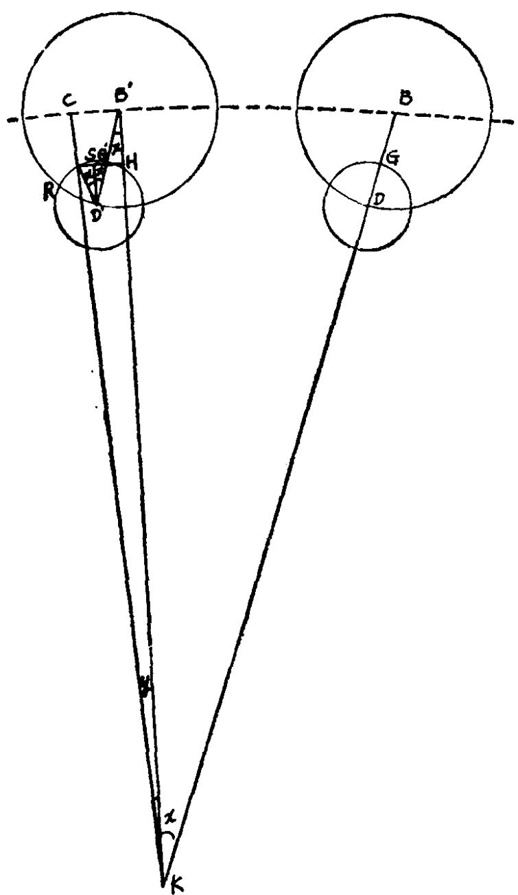  
图(三)太阳平弧、引数、均数示意图图内R的位置应移向右上

时,本轮心也移过X角到达  $\mathbf{B}^{\prime}$  ,则根据本轮均轮系统的假设,太阳将在均轮上移动2倍于引数的角度,则太阳自最单点  $\mathbf{G}^{\prime}$  移动到R,又根据均轮半径  $\mathbf{D}^{\prime}\mathbf{G}^{\prime}$  等于本轮半径  $\frac{1}{3}$  的假设,设本轮半径为r(268812),则  $\mathbf{B}^{\prime}\mathbf{G}^{\prime} = \frac{2}{3}\mathbf{r}$  ,再自  $\mathbf{G}^{\prime}$  向本天半径  $\mathbf{B}^{\prime}\mathbf{K}$  作垂线,交于H,连接  $\mathbf{G}^{\prime}\mathbf{R}$  ,则在等腰  $\triangle \mathbf{D}^{\prime}\mathbf{R}\mathbf{G}^{\prime}$  中,顶角  $\mathbf{D}^{\prime}$  等于2乙B,则  $\mathbf{R}\mathbf{G}^{\prime}\mathbf{H}$  必为一直线,在  $\triangle \mathbf{B}^{\prime}\mathbf{G}^{\prime}\mathbf{H}$  和  $\triangle \mathbf{D}^{\prime}\mathbf{R}\mathbf{G}^{\prime}$  中,可分别求得 $\mathbf{G}^{\prime}\mathbf{H} = \frac{2}{3}\mathbf{r}\mathbf{s}\mathbf{i}\mathbf{n}\mathbf{x}$  ,  $\mathbf{B}^{\prime}\mathbf{H} = \frac{2}{3}\mathbf{r}\mathbf{c}\mathbf{o}\mathbf{s}\mathbf{x},\mathbf{R}\mathbf{G}^{\prime} = \frac{2}{3}\mathbf{r}\mathbf{s}\mathbf{i}\mathbf{n}\mathbf{x}$  ,又设本天半径BK为已知(1千万),设  $\angle \mathbf{B}^{\prime}\mathbf{K}\mathbf{C} = \mathbf{y}$  ,为太阳运动的盈缩分,即均数,则利用△HKR可求得  $\mathbf{t}\mathbf{g}\mathbf{y} = \frac{\mathbf{H}\mathbf{R}}{\mathbf{H}\mathbf{K}} = \frac{4}{3}\mathbf{r}\mathbf{s}\mathbf{i}\mathbf{n}\mathbf{x} / (\mathbf{B}\mathbf{K} - \frac{2}{3}\mathbf{r}$  cosx),查正切表即可求得y角,于是求出均数,它即是本天圆上的  $\mathbf{B}^{\prime}\mathbf{C}$  弧,  $\angle \mathbf{B}\mathbf{K}\mathbf{B}^{\prime} + \angle \mathbf{y}$  即为太阳的实行度。

由于本天和均轮是自西向东顺行,而本轮则是自东向西逆行的,太阳在均轮上的移动速度又始终等于均轮心移动速度的两倍,则当太阳在最单点或最高点时,均数为0,实行等于平行,当引数为  $90^{\circ}$  和  $270^{\circ}$  时均数达到正负极大。对于一般情况,其数值可用以上公式求得,引数为一二象限为正,三四象限为负。时宪历中所列均数表的数值,就是根据以上公式求得的。以上所勾画出的天体盈缩运动的规律,仅仅是一种假设,用这种理论所求得的天体运动方位,与实际观测到的方位确是大致相合的。但更精密的观测证明,用这套理论所求得的天体运动方位与实际是有差异的,其中月亮运动方位的差异尤其明显,为了求得更精密的月亮方位,所以又作出在均轮以外再加上新的次轮的假设。然而加上次轮以后,所求得的方位仍不密合,后来终于被开普勒以椭圆运动的理论所取代。

求得太阳的实行度以后,太阳的方位就已确定,但是用行度表示太阳方位不适宜于肉眼观测,所以又仍然按古代的习惯方法,将太阳的行度转换成宿度。在时宪历中,历元时二十八宿中

的任何一宿的距星距离冬至点的数值都是测定了的,这个数值称作宿铃。由于有岁差,二十八宿的距星离开冬至点的数值每年都在改变。所求年的距星位置等于积年  $\times$  岁差  $(51^{\prime \prime})+$  黄道宿铃,将太阳或其它天体的行度与相近的二十八宿距星的位置相减,便得到太阳或其它天体的入宿度。

在藏传时宪历中,仍未引入岁差的概念,因此,黄道十二宫与十二星座是不分的。所以它没有再求宿度的步骤。

由以上数例已可明显地看出,藏传时宪历已不是简单地将时宪历译成藏文的问题,而是经过藏族学者学习、研究,再经过自己的创作,与自己的传统历法融合到一起了。

从原理上说,推算月亮运行方位的方法与太阳完全一致,仅是数据不同而已。推算平朔平望时的月亮方位,又往往依据太阳的方位直接推得。因此,这里就不再重复了。

# 二、月食预报

时宪历推算月食的方法主要可分为求人交月数,求平实望时刻,求食甚时刻和初亏复圆食既生光时刻,推食分、推月食方位等五个部分。现从原理上作出讨论如下:

# (1)求人交月数

这是推算月食的第一步,也是最基本的一步,是判断有无月食发生的关键。只有判断准确该月有月食发生,才有进一步推算的必要,否则将白费气力。因此,事先有一个判断有无交食发生的标准,计算起来就很方便了。自古以来,各家推算月食都给出有判断是否入交的标准,称作食限,大都是经验性的,唯独时宪历,已经建立起一套推算食限的理论基础。

在时宪历中,康熙甲子元的食限为  $14^{\circ}54^{\prime}$  ,雍正癸卯元是 $15^{\circ}9^{\prime}$  ,差别很少,仅是基础数据略作修改后作出的调整。如图

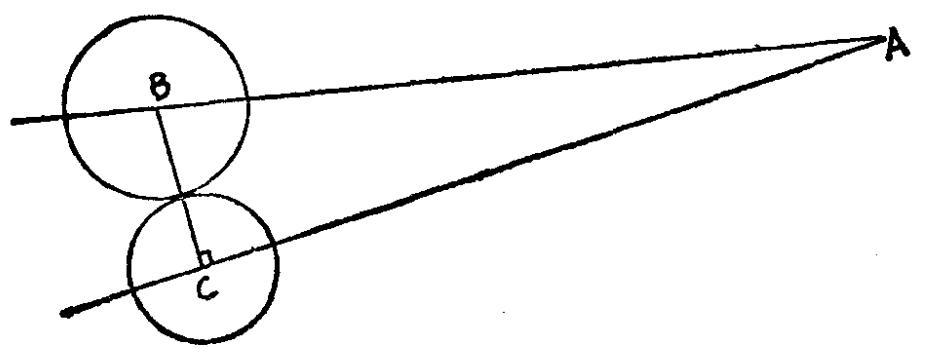  
图（四）月食食限示意图

(四)所示,BA为黄道,CA为白道,日月分别沿BA和CA方向运行,A为黄白升交点。B圆为地影半径,C圆为月亮视半径,只有当二者相切或相交时,也即当BC小于两圆半径时才能入交。在弧△ABC中,C是直角,A是黄白大距  $4^{\circ}58^{\prime}30^{\prime \prime}$  ,BC为两圆最大并径,为  $46^{\prime}48^{\prime \prime} + 16^{\prime}51^{\prime \prime} = 1^{\circ}8^{\prime}39^{\prime \prime}$  ,当黄白距纬小于此数时就有可能发生月食,依弧△公式  $\mathrm{SinAC} = \mathrm{tgBC} / \mathrm{tgA}$  。便可求得食限  $\mathbf{AC} = 12^{\circ}17^{\prime}$  。

以上求得的是平望食限,如考虑到太阳月亮的运动都是不均匀的,则用以判断食限还要放宽,故食限达  $15^{\circ}$  左右。在《汉历心要》的书中所用的食限为  $12^{\circ}17^{\prime}$  ,这意味着所用食限仅考虑平望时两圆相切的关系,而不考虑日月不均匀运动的影响。这种考虑问题方法是出于藏区的实际需要的,因为在  $12^{\circ}$  以上的食限中,不仅发生月食的机会不大,而且食分太小,不易看到,所以也就当作无食来处理了。

有了入交的食限,则就可以判断入交的月份了。《汉历心要》中的"罗头距月根数",就是时宪历中的首朔太阴交周。在这里,"罗喉头"仍是沿用时轮历的名词。首先求出首朔太阴交周:

首朔太阴交周  $= [$  积月  $\times$  太阴交周朔策](满周天分去之)  $+$  太阴交周应,再加望策,便得第一个月(12月)太阴交周,分别以朔策相加,得各月平望交周,若在食限以内,便有月食。《汉历心要》

的太阴交周朔策采用雍正癸卯元的数值  $1^{\circ} 41^{\prime} 13^{\prime \prime} 55^{\prime \prime} 167^{\prime \prime}$ , 称之为"罗头距月根数"。

(2)求平、实望时刻

$①$  求平望时刻,这是发生月食的大致平均时刻,是相数,但是,也是用以推算精确的月食时刻的第一步。推算方法在上一节中已经作了介绍。在《汉历心要》的书中是依时轮历推算积月的传统方法,仅改用时宪历的基本数据。由于时轮历的闰周与时宪历有差异,计算时还要进行校对,关于这一点,在《汉历心要》书中的夹注上也已交待清楚。

$②$  求平望太阳平行,这是发生月食时的太阳平均方位,也是推算月食时最基本的重要一步。推算时先求出首朔(所求年年前的十二月平朔)太阳的平行度,然后再加上发生交食的月数与月亮月平行度的乘积,再加上太阳平行望策(即半个太阴月的太阳平行度),即得。首朔太阳平行度可由以上求得的首朔日分乘以太阳日平行求得。

$③$  求日月均数

求日月的平位置和均数的方法,在上节中已经作了介绍。首先求得交食时刻日月近地点(或远地点)的位置,以日月平位置相减,即得日月引数,由引数查太阳均数表和太阴初均数表即得。

$④$  求实望时刻。如图(五)所示A为地心,  $\mathbf{C}^{\prime}$  为平望时太阳所在,C为月亮及地影心所在。由于日月都有迟速运动,则平望时实际月在B,日在D、地影心在D。BD即为距弧。只有当月自B追至D,日月才能相合。月自B追至D所需时间称作"距时"。但在距时这段时间内,太阳又产生引数DE,月亮又产生引数BF,称作"引弧"。因此,太阳实引为引数  $\mathbf{CD}+$  引弧DE,月亮实引为引数  $\mathbf{CB}+$  引弧BF,由日月实引求得实均,则实距弧为日月实均相加减。由实距弧便可求得实距时。

因此,在时宪历中,有日月均数加减求距弧,又以距弧与月

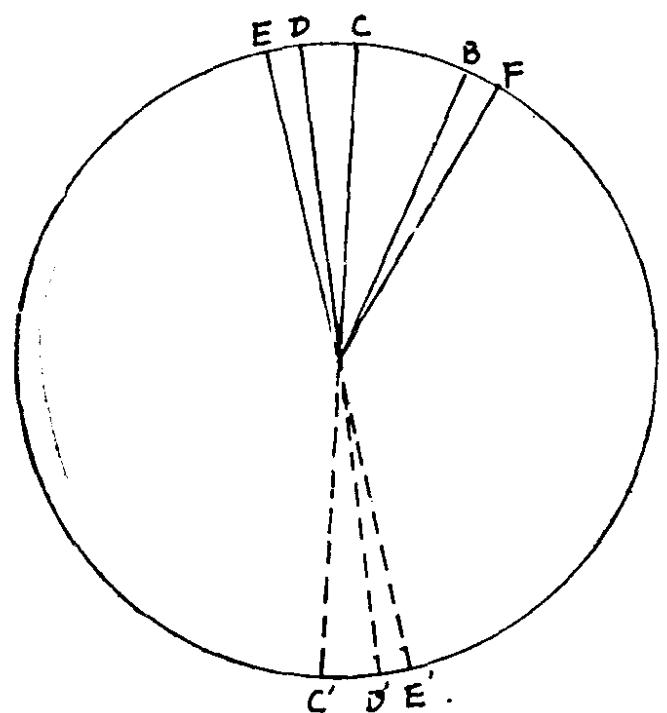  
图(五)平望、实望示意图

距日平行相乘求距时,再由距时求日月引弧,以日月引数与引弧相加得实引,然后才求得日月实均,再由日月实均相加减求得实距弧,由实距弧求得实距时。以平望加减实距时,得到实望时刻。

$⑤$  求实望用时。经实测,实望与日月相对时刻还有微差,需做均数时差和升度时差的改正。均数时差较为简单,以太阳实均,凡1度化为4时分即可。升度时差即太阳黄经和赤经差数之变时。以均数时差和升度时差与实望相加减得实望用时。

推太阳黄经赤经时,先以实距时求出距弧,以平望太阳平行度加减太阳距弧再加减太阳实均即得黄经,以黄经查黄赤升度表即得赤经。

(5)求食甚时刻

实望时刻并不等于食甚时刻,二者的方位是有差别的,望者,月亮的白道交周等于地球影心的黄道交周。如图(六)所示,AB为黄道,B为地影心,H、G、C、D、F、E、A为白道,E、

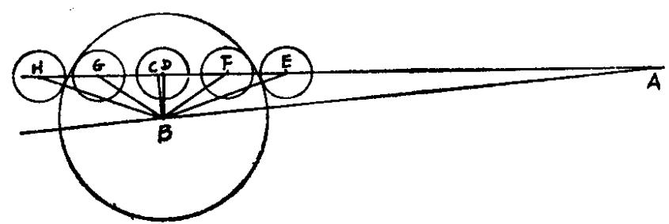  
图（六）月食五限图

F、D、G、H分别为初亏、食既、食甚、生光、复圆的白道月心方位,当地影心在B,月心在C时为望,这时  $\mathbf{AB} = \mathbf{AC}$ ,当月心在D时,为食甚,BD垂直于白道,延长线通过白极。

因此,要求食甚时刻,关键是要求得DC长。所以,只需求出AD,然后与AC相减即得。

在直角弧△ADB中,  $\angle A$  为黄白大距,AB为实望实交周,AD为食甚交周,BD为食甚距纬。  $\angle A\angle B$  和AB为已知,则利用

Sin  $\widehat{\mathbf{D}\mathbf{B}} = \mathbf{S}\mathbf{i}\mathbf{n}\angle \mathbf{A}\cdot \mathbf{S}\mathbf{i}\mathbf{n}\widehat{\mathbf{A}\mathbf{B}}$  查正弦表,可以求得DB,利用 $\mathbf{tg}\widehat{\mathbf{A}}\widehat{\mathbf{D}} = \mathbf{C}\mathbf{O}\mathbf{S}\angle \mathbf{A}\cdot \mathbf{t}\mathbf{g}\widehat{\mathbf{A}}\widehat{\mathbf{B}}$  查正切表,可求得AD

则交周升度差  $\widehat{\mathbf{DC}} = \widehat{\mathbf{AC}} - \widehat{\mathbf{AD}}$ ,为食甚与实望时太阴交周之差。

求得交周升度差DC以后,再除以月距日每单位时间的行度以后,便得到食甚距时,以食甚距时与实望用时相加减,便得到食甚时刻。

(6)求初亏、食既、生光、复圆时刻

要求这些时刻,只要求出这些月食阶段与食甚时相距的时间,而要求这段时间,只需求得这些阶段月心距食甚时月心的距弧。如上图所示,ED、FD、GD、HD分别为这四个阶段距食甚时的距弧,由于初亏复圆时月心与地影心相距为月视径与影径之和,食既与生光时月心与地影相距等于影半径与月视半径之差。食甚距

纬DB是已知的,则分别以弧直角△EDB、FDB、GDB、HDB,可求得四个阶段的距弧ED、FD、GD、HD分别除以单位时间月距日行度,便得这四个阶段的距时,与食甚时刻相加减,便得初亏、食既、生光、复圆时刻。

# (7)推食分

时宪历的食分大小是这样规定的:

食分  $= \frac{\text {并经} - \text {食甚距纬}}{\text {月亮视直径}} \times 10$

其中并径为月亮视半径与地影半径之和。这样,当并径等于食甚距纬时,食分为0,当并径减食甚距纬等于月亮视直径时食分为10分。时宪历食分在10分以上为全食,最大食分可达18分多。食分在10分以下为偏食,此时无食既和生光,而只有初亏、食甚、复圆三限。

因此,推食分时关键在于求月亮视径和地影半径。月亮视半径仅决定于月距地心的距离,而月距地心的变化决定于月亮的实行宫度,查交食视半径表即得。地球阻挡太阳投向地球方向的光,在地球的背面留下阴影。由于太阳实径大于地球实径,所留下的阴影是圆锥形的,最终聚于一点,因此,离开地球越远,地影半径就越小。我们所要求的是发生交食时月亮进入地影处的地影半径,它的大小不仅决定于月亮离开地球的距离,同时也与太阳到地球的距离有关。因此,在实际推算时,先定出太阳在最高时的影半径数值,制成影半径表,以月亮实行,在表中就能查得太阳在最高时的地影半径。然后再以太阳实行宫度查影差表,便得到太阳位于相应高度与最高时的影差,与以上求得的地影半径相减便得实影半径。于是可求并径。很明显,这种推算食分的方法与时轮历的传统方法不同,较为严密。

很明显,这种推算食分的方法与时轮历的传统方法不同,较为严密。

(8)推月食方位

以往人们定月食初亏复圆方位时,有一条较为简单的方法,即当距纬在黄道北时,则初亏东南,复圆西南;当距纬在黄道南时,初亏东北,复圆西北;食八分以上,包括全食在内,则初亏正东,复圆正西。但实际上,以上法则是对黄道而言的,因此,只有当半夜时(也正是月亮在天顶),且逢月实行度在初宫六宫时才是如此,其它情况与以上所说均有较大误差。

因此,时宪历设计了一个新的判别方法,将月体从上到下分为左右两部分,再平分为上下两象限,成为左上、左下、右上、右下四部分。这样,一般有上、上左、左上、左、左下、下左、下和上、上右、右上、右、右下、下右、下等十四个方位,来表示月食的入食和复圆的方向。因此,在时宪历中,它所表示的入食和复圆方向,是与东西南北方向无关,只与表示地平坐标的上下左右有关。

在《汉历心要》书中所载的判别月食方位的标准,就是依据以上原则制定的,它分距纬在南、北及无距纬三种情况。每一种情况又分别以上半夜和下半夜(即月在子午线东或子午线西)的两种情况来进行讨论。例如,距纬在北,上半夜时,起食下之左,复圆右之下,下半夜时,起食左之下,复圆下之右;距纬在南,上半夜时,起食上之左,复圆上之右,下半夜时,起食左之上,复圆右之上;全食时,上半夜起食下之左,复圆上之右,下半夜起食上之左,复圆下之右。这样的判别方法,就要比时轮历的方法准确得多了。

事实上,在时宪历中,推算月食方位都有具体定量的计算方法,首先从天顶向月亮作地平经线,与黄道相交,求出它与黄道的交角,称之为黄道与高弧相交之角。又求出地影心与月心连线与黄道的交角纬差角。黄道高弧交角与纬差角相加减,得通过地影心的地平经线与地影心和月心连线的交角,称之为定交角。人食、复圆时,偏上、偏下的度数完全由定交角决定。

(9)推各地月食时刻

当月亮一旦进入地影,便照射不到太阳光,因此世界各地只要能见到月亮的地方,都几乎同时看到月食。只是由于各地经度不同,也就是地方时不同,若要以各地的地方时来表示发生月食的时刻,只要用在北京地区推出的结果,加以地方时的改正。也就是在前面已用过的地平经度化时的方法,每向东西1度加减4分钟。

《汉历心要》中最后确定月食发生时刻时说:"蕃土在京师之南下方,所以出入似均应较此为迟",似应"减一时十二分为宜"。以1度相差4分钟换算,它大致应在东经  $98^{\circ}$  稍西,而拉萨则在东经  $90^{\circ}$  。这一地域确在蕃地,但与拉萨却有较大差异。康熙时虽然进行过大规模的经纬度测量,但拉萨未经实测,所用结果不准确也不奇怪。而且原书的口气也并不肯定。不过,一百余年之后有关这方面的著作都仍然沿用此数,並且完全肯定了它,这就很不准确了。

# 三、日食预报

预报日食时,在计算太阳月亮的运动时,包括平行、均数、距时、实均、实朔、实交周、太阳的黄经赤经、实朔用时、食甚距纬、食甚用时等基本数据的方法,与计算月食时几乎完全一致,因此,关于这些问题可以略而不谈。

月食的成因是由于地掩月,所以发生月食时,在地球上不同地方的人们差不多同时见到。日食则是由于月掩日而产生的。太阳比月亮要大得多,但由于月亮距离地球近,所以看上去两者的视直径大致相同。由于日月离开地球的距离都在变化,所以日月的视径也在改变。当月亮视径大时,也即月距地近时,月亮的影锥便落在地面上,最大时能投下一条宽约数百公里的影带,称为全食带;当月亮离地远,视径小时,影锥落不到地球上,便发生环

食。由于月亮离地球近,在地球不同地区的观测者所看到的月亮视位置与真位置有显著的差别:观测者偏东,则月的视位置就偏西;观测者偏西,则月的视位置就偏东;观测者在南,则视位置偏北;观测者在北,则视位置偏南。因此,它与月食所看到的情况不同,在各地所看到的日食情况都不一样。推算食甚用时时,是以地心立算的,但实际观测都在地面,它的位置便有差异,时宪历称为地半径差,现代称之为地平视差。月亮近视差大,太阳远视差小,以月视差减日视差,得太阳高下差,即变真高为视高,因而所见日食情况便发生变化。因此,求日食时的高下差、东西差、南北差,简称推步日食三差,便成为与月食不同的最主要的课题,也是推算日食时的困难所在。现分如下几个主要问题来进行讨论:

(1)求实朔用时和实朔实交周(食限问题)

与推算月食时完全相同的方法,不同之处仅在于月食时算实望,日食时算实朔,利用计算平朔,由日月均数再求出距弧,距时,再由距时算出日月引弧,然后再利用实均求得实距时,与平朔相加减,便得实朔。

由距时求得交周距弧,以平朔太阴交周加减交周距弧再加减太阴实均,得实朔实交周。

《汉历心要》书中所用的食限为:  $11^{\circ}23^{\circ}38^{\prime} \sim 0^{\circ}18^{\circ}36^{\prime}$  ,  $5^{\circ}11^{\circ}45^{\prime} \sim 6^{\circ}6^{\circ}22^{\prime}$  。这一判据与时宪历雍正癸卯元完全一致,仅  $0^{\circ}18^{\circ}26^{\prime}$  错写为  $0^{\circ}18^{\circ}36^{\prime}$  。

# (2)求食甚用时

由距时可求得太阳距弧,然后由太阳平行加减实均和距弧,得太阳黄经。由黄经查黄赤升度表可得赤经。将太阳实均和黄赤经度差变时(1度为4分钟),得均数时差和升度时差,,与实朔相加减,得实朔用时。

以实朔实交周之数查黄白距度表,便得食甚实纬,又以实朔

实交周之数查黄白升度表,可得交周升度差。于是,由实朔实交周加减交周升度差便得食甚交周。另以太阴实引数值,查月距日实行表,可得月距日实行。以交周升度差除以月距日实行,便得食甚距时。以实朔用时,加减食甚距时,便得食甚用时。

(3)求食甚近时和真时

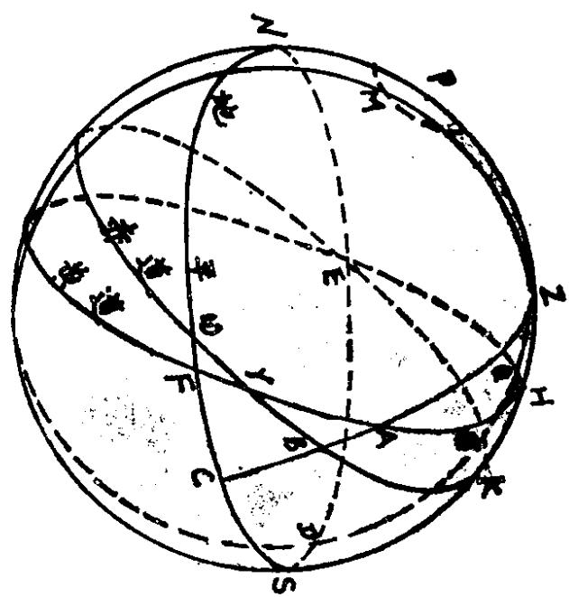  
图（七）黄平象限、黄道高弧交角和黄道高弧等诸数示意图

在由日食食甚用时求三差及食甚真时时,首先需要引进黄平象限的概念。如图(七)所示,O为地球,位于天球的中央。P为赤极,Z为天顶,E、W、S、N为地平圈,并代表东西南北方向。PZSN为子午圈。WrKE为赤道,交地平于W,E,交子午圈于K。FrAHQ为黄道,交地平于F,交子午线于H。黄道赤道相交于t,为春分点。M为黄极,MZQGD为通过天顶的黄经,交地平于D,又与黄道相交于Q,则Q便称为黄平象限,太阳在Q东时称为限东,在西时称为限西。QH为黄平象限距正午之度。黄平象限Q距地平F为  $90^{\circ}$ ,设太阳在A,通过天顶Z向A作地平经线,交赤道于B,交地平于C,则AC称为太阳高弧,∠CAF称为

太阳的黄道高弧交角。

现在的首要目标是求得用时黄道高弧交角A角和日月距地平之高弧AC,现分以下几个主要步骤进行讨论:

$①$  求用时黄道与子午圈交角和用时正午黄道高

这两个数值,可以由图中弧直角△HrK求得。其中K为直角,r为春分点,黄赤大距  $\angle \mathbf{r}$  为已知,  $\mathbf{rK}$  为用时春分点距赤道度。

求春分点距午赤道度的方法是以太阳赤道度减三宫为太阳距春分点度数。再以食甚用时以一时变为  $15^{\circ}$  之法变时为度,并加减半周,为太阳距午赤道度。两数相加,得春分距午赤道度。

在弧△HrK中,依弧直角△公式,便可求得用时黄道与子午圈交角rHK、用时春分距午黄道度rH和用时正午黄赤距纬HK。正午赤道的高度等于北极高度的余角,是已知的,与正午黄赤距纬相加,便得到正午黄道高。

$②$  在弧直角△HFS中,S为直角,HS和  $\angle \mathbf{H}$  上面已经求得,则由弧直角△公式,可求得  $\angle \mathbf{H}\mathbf{F}\mathbf{S}$  和  $\widehat{\mathbf{H}}\widehat{\mathbf{F}}$  。根据定义,黄平象限距地平为直角,所以可求得黄平象限距午度分  $\mathbf{Q}\mathbf{H} = 90^{\circ} - \widehat{\mathbf{H}}\mathbf{F}$  。前已求得用时春分点距午黄道度,加三宫便得用时正午黄道宫度,与太阳黄道宫度相减便得太阳距黄平象限  $\widehat{\mathbf{A}}\widehat{\mathbf{Q}}$  之度数。此数在《历象考成》中称之为用时月距限。则可求得太阳距地平黄道经度  $\widehat{\mathbf{A}}\mathbf{F} = 90^{\circ} - \widehat{\mathbf{A}}\widehat{\mathbf{Q}}$

$③$  求黄道高弧交角FAC和日月高弧AC

在弧直角△AFC中,C为直角,  $\widehat{\mathbf{A}}\widehat{\mathbf{F}}$  和  $\angle \mathbf{A}\mathbf{F}\mathbf{C}$  前已求得,则利用弧直角△公式可求得  $\angle \mathbf{F}\mathbf{A}\mathbf{C}$  和用时日月高弧  $\widehat{\mathbf{A}}\widehat{\mathbf{C}}$  。

在《西洋新法历书》中就是直接使用黄道高弧交角来求用时高下差的。藏传时宪历也依其法。但这只是粗略的计算方法,由于交食以白道立算,因而不能直接使用黄平象限,而应转换成白平象限计算。在《历象考成》中就已经作了这种改正。计算时只需将黄

道高弧交角加减黄白交角即可。

$④$  求用时高下差。高下差实际就是因人不在地心而在地面观测所产生的日月视位置改变所引起的差异。它实际等于日月地半径差(现代称周日视差)相减之数。这是由于月亮距地球比太阳近。而天体地半径差的改变主要有两个原因,一是由于天体本身距离发生了改变(远则小,近则大),二是天体距离地平的高低不同。

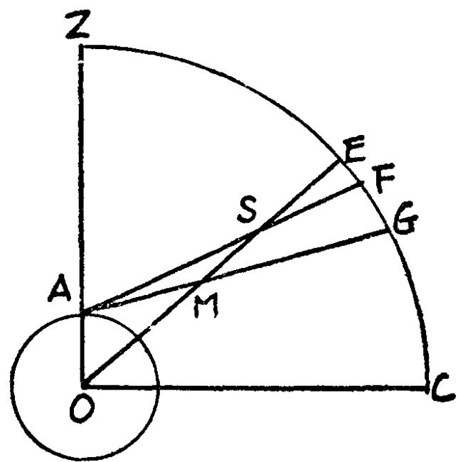  
图（八）求日月地半径差示意图

如图(八)所示,0为地心,Z为天顶,ZC为天球,EOC为日月高弧。人在地面A处观测,S、M表示日、月,从地心O看去,S、M在一直线上,交于天球E处。但在地面观测,则发生了差异,从A点看去,太阳S落在天球F处,月亮M落在天球G处。则这时月亮的地半径差为  $\angle \mathrm{AMO}$ ,太阳为  $\angle \mathrm{ASO}$ 。则日月视高的改变  $= \angle \mathrm{AMO} - \angle \mathrm{ASO} = \widehat{\mathrm{EG}} - \widehat{\mathrm{EF}} = \widehat{\mathrm{FG}}$ 。日月的地半径差都已依据日月实行宫度以日月在地平方向时的最大地半径差计算列表,实际使用时只需依日月实引查表即可。再乘以地平纬度的余弦,便得不同高度的日月地半径差。两数相减便得用时高下差。

$\circledcirc$  求东西南北差。如图(九)所示,0 为地心,  $\mathbf{P}$  为赤极,  $\mathbf{M}$  为黄极,  $\mathbf{Z}$  为天顶,  $\mathbf{CW}$  为地平,  $\mathbf{A}\mathbf{W}$  为黄道,太阳视高在  $\mathbf{A}$ ,月亮视高在  $\mathbf{B}$  。  $\mathbf{Z}\mathbf{C}$  为通过  $\mathbf{A}$  点的地平经圈。从黄极向  $\mathbf{A}$  及  $\mathbf{B}$  作经圈,  $\mathbf{MB}$  截黄道于  $\mathbf{D}$ ,则在弧直角  $\triangle \mathbf{ABD}$  中,  $\mathbf{D}$  为直角,  $\mathbf{AB}$  为高下差,  $\angle \mathbf{DAB}$  为黄道高弧交角,这两个数值前面都已求得,由此便可求得  $\mathbf{AD}$  和  $\mathbf{DB}$  。  $\mathbf{AD}$  称为用时东西差,  $\mathbf{DB}$  称为用时南北差。

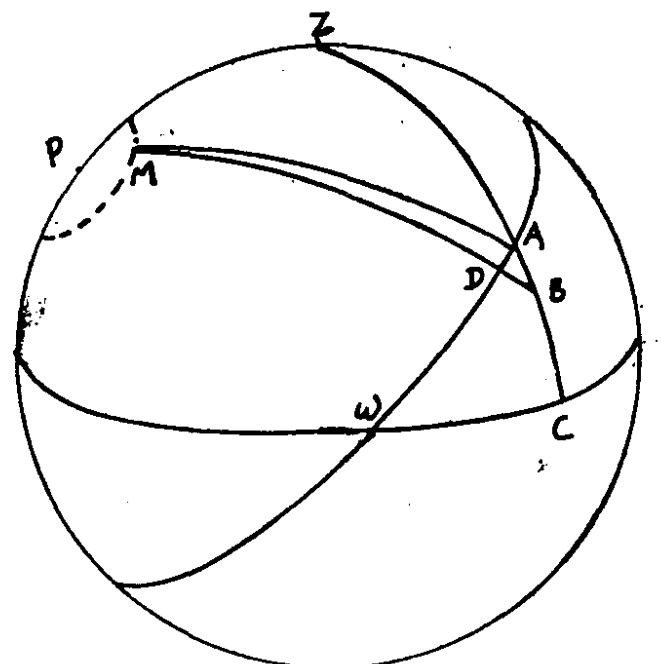  
图（九）由高下差求东西南北差（图中表示地心的0字匾写）

$\circledcirc$  求食甚近时

以用时东西差与月距日实行相除,便得近时距分,再与食甚用时相加减,便得食甚近时。

$\circledcirc$  求食甚真时

为了求得更精密的食甚时刻,则再以食甚近时推算东西差以定视行,从而求得真时距分加减食甚用时,得食甚真时。

《汉历心要》的书中,在推算近时真时的原理方面与时宪历是完全一致的,只是为了计算方便起见,应用了几份表格,在计算步骤上有所简化。

(4)求食分,主要分以下几步进行;

$①$  求食甚真时南北差。求得食甚真时以后,仍然如由食甚用时求食甚近时相同的方法,求出真时黄道与子午圈交角和正午黄道高,黄平象限距午度分和真时太阴高弧、真时黄道高弧交角等,从而求得真时高下差,以高下差求得东西差和南北差。

$②$  求食甚视纬。求得南北差是推算日食食分中最为关键的一步,得到之后,与食甚实纬相加减,便得到食甚视纬。

$③$  求并径。以太阳太阴实引宫度,分别查交食视半径表,便得到日月视半径。两半径相加,得并径。

$④$  求食分。食分  $= \frac{\text {并径} - \text {食甚视纬}}{\text {太阳视直径}} \times 10$  得数为食分,满10分者为全食。

(5)求初亏复圆真时。其计算方法分以下几步进行:

$①$  求初亏用时。其推算方法与求月食初亏时刻完全相同,仅以日径代替地影径而已。利用视纬和并径求得初亏复圆距弧,再由距弧求出距时。以食甚真时减距时便得初亏用时。

$②$  求初亏东西差。其求法与求食甚东西差完全一致,不再重复。

$③$  求初亏真时。其计算原理也完全与食甚真时相同。但由于前已求得食甚东西差和真时,可借以为比例,直接求得初亏距分。以食甚真时减初亏距分,得初亏真时。

$④$  求复圆真时。其原理与其初亏真时相同。

(6)求太阳宿度。先求出本年黄道或赤道宿转,以太阳黄道(或赤道)经度与相应的宿度相减即得,其方法与求月食宿度相同。

# (7)推日食方位

时死历推日食方位的方法与月食也相一致,即不象过去那样亏食方位以东西南北,而改以日面的上下左右来表示。先以初亏距弧求出初亏交周,由初亏交周便能求得月距日的初亏实纬,实纬

加减南北差得初亏视纬。然后以日月并径为弦,以视纬为一边的弧直角△,可求得初亏时日月两心连线与黄道的交角,称之为纬差角。再与初亏黄道高弧交角相加减,得定交角。此定交角便是判别日食初亏入食点偏离日面上下角度的标准。求复圆方位的方法完全与求初亏一致。推算日食初亏复圆方位与月食不同之点在于日食有视差,所以需将实纬改以视纬立算。

推算日食初亏复圆方位与月食不同之点在于日食有视差,所以需将实纬改以视纬立算。

# 四、关于藏传时宪历预报日食问题的讨论

西藏天文研究所的同志曾经问我们:"在西藏为什么用时宪历预报月食准确,而预报日食却不大准确?"由于我们当时未作过研究,不能作出准确而又具体的回答,现就这一问题进行讨论如下。

关于月食预报,在月食的预报部分我们已作过介绍。食分是各地相同的,自然不存在差异。至于月食时刻,各地只存在因地处不同地理经度而产生的地方时差。拉萨在北京以西  $25^{\circ}11^{\prime}$  ,应有大约1小时44分钟的差异。《汉历心要》书中作出1小时12分的改正,是大致合理的。在清朝初年时,拉萨的地理经度未经精密测定,使用的仅是估计数值(参见《藏传时宪历源流述略》)。预报的时间存在二十多分钟的误差,相对于时轮历来说,还是较为准确的。而且马杨算书所说的"蕃土",本不一定就是专指拉萨。

对于预报西藏的日食,《汉历心要》说:求蕃土食甚真时时,"太阳则从食甚真时,减去1小时12分而推。"又说:"无论何方,日中均为午正,夜半均为子正,蕃土属于京师之南下方(西南),所以出入似均应较此为迟。""似应在推算月食食甚用时,日食食

甚真时,减1小时12分为宜。"

由此看来,藏族学者在推算藏区日食时,都是按照时先历首先推出北京地区看到的食甚、初亏、复圆真时,然后再一律减去1小时12分,便得藏区食甚,初亏、复圆真时,食分和入食复圆方向也依北京地区所推得的结果。

使用以上方法来预报藏区的日食情况,自然就会带来很大的误差,其错误有以下几个方面:

(1)混淆了两个不同地理经度地区的食甚用时和食甚真时的区别。《历象考成》在求各省日食时刻分秒时说:"以京师食甚用时,按各省东西偏度加减之,得各省食甚用时,乃以各省食甚用时,按各省北极高度,以京师推近时、真时、食分及初亏、复圆真时法算之,得各省日食时刻分秒。"在两个不同地理经度的地区,其食甚用时之差确实是等于两个地方时之差的。但两地对食甚真时的影响,并不仅仅决定于两地地方时的差异,同时还受到当地的地理纬度的影响。这样,两地的黄平象限之高是不同的,也就是影响到黄道高弧交角的不同和日月视半径差的不同。于是,求得的东西南北差也都不同。简言之,北京地区和藏区两地的近时距分和真时距分是不同的,必须按藏区食甚用时和北极高度来推算食甚真时。

# (2)食分误差

《历象考成》推各省食分方法也如上所引。由于北京和藏区地理纬度相差很大,两地所求得的南北差的数值足有很大差异的。这就难怪以藏传时宪历预报的藏区日食食分,误差竟能达到数分以上。

# (3)判断入食和复圆方位

《历象考成》在求各省日食方位时说:"以各省黄道高弧交角及各省初亏复圆视纬,以京师推日食方位算法,得各省日食方位。"日食初亏和复圆方位决定于定交角。定交角决定于纬差角和黄

道高弧交角。两地纬差角虽然相同,但黄道高弧交角却不同。它不仅受到交食时间早晚不同的影响,而且也与各地地理纬度有关。因此,藏区的日食初亏和复圆方向是与北京地区不同的。将北京地区的日食初亏复圆方位直接搬用到藏区的做法是不合适的,因而也就必然带来较大误差。

另外还有一个问题必须指出。时宪历用以判断初亏复圆方位的标准是日面的上下左右。在时宪历中,还特地指出前人用东西南北的方向来判别交食的方位是不准确的。时轮历也是用东西南北方向来判别的。在藏传时宪历中,藏族学者也是接受了改以上下左右的判别方法的。但在藏族学者中间,是否都能理解上下左右和东西南北的不同概念,是令人怀疑的。

前已述及,无论日月是在正午或是在东方、西方,其圆面最高处称之为上,最低处称之为下。当观测者面对日面或月面时,在其右手的一边称为右,对面则为左。因此,当太阳或月亮在正午时,也即在南北方向时,在北半球观测时,人面对正南方,这时上为北,下为南,右为西,左为东;当交食发生在东方时,则人面对东方观测,上为西,下为东,右为南,左为北;交食发生在西方时与在东方时正好相反。

在《汉历心要》书中,关于上下左右的解释是不清楚的。在藏传其它有关著作中也未解释得更好一点。例如,在《慧剑光华论》中就绘有一幅关于解释上下左右方位的插图。它将上下左右与北南东西等同起来。并且更进一步附上了地平二十四方位与上下左右的对应关系。其实,这种对应关系,仅仅符合日月在正南北方向时的情况。

(4)基本数据不够精密所带来的误差

藏传时宪历用以推算日月食的基本数据,基本上维持在康熙、雍正时代所应用的状态,直到解放以后,藏区用以预报日月食所应用的基本数据仍然未变。乾隆初年以后,虽然传进了法国人葛

西尼的椭圆算法,比本轮均轮的算法更为精密,但这套算法对藏区并未发生影响。这些误差经过二百多年的积累,就自然较为显著。

另一个更重要的影响是藏传时宪历所应用的回归年长度是  $365 \frac{60}{247}$  日,它与真值相较,误差每年达0.0007日。则每60年就将产生一个小时的误差。这个误差,对于藏区的日月食预报来说,影响就太大了。如果藏区至今仍然应用光绪年间的历元(例如,我们就曾见到过以1900年为历元的版本)来进行推算,则所产生的误差将会达到1个小时以上。

另外,在推算日食食甚近时时,藏传时宪历也是仅用黄平象限来代替白平象限进行计算,也会带来一些误差。不过,这与以上几种情况相比,就要小得多了。

因此,如果消除掉上述误差,用藏传时宪历预报日食,仍然可以达到相当精密的程度。

由此看来,清初的《西洋新法历书》主要内容虽然早已被人摘译成《康熙御制汉历大全藏文译本》,但一直很少为藏族学者注意和研究,为藏族学者所关心和注意的,主要是应用时宪历来准确地推算和预报日月食。从藏传时宪历推算日食的方法中,能准确地推算北京地区的日食状态,而不能准确地预报符合藏区实际情况的交食状态来看,藏族学者所掌握的时宪历推算日月食的方法,不是直接从《康熙御制汉历大全藏文译本》中获得的,可能首先是北京雍和宫里喇嘛向汉族学者学得了用时宪历推算日月食的方法,然后再直接或间接地口传到藏区,一代接一代地向下传授,并且常被一些在行的学者记载了下来。前面已介绍过的《汉历心要》书中末尾的小注说,"北京雍和宫及蒙古亦有此算法盛行",为"此前雍和宫之一精通历算者所做",就是记载了它所以能够传入藏族地区的基础和起始点。由于蒙族也信藏传佛教,近代藏蒙二族在宗教

和文化上的交往是很密切的。因此,这种预报日月食的知识有可能是直接传给藏族学者,但也可能先传入蒙古地区,然后再间接地传入西藏。

# 1

# 1

5555555555555555555555555555555555555555555555555555555555555555555555555555555555555555555555555555999999999999999999999999999999999999999999999999999999999999999999999999999999999999999999999999999900000000000000000000000000000000000000000000000000000000000000000000000000000000000000000000000000001111111111111111111111111111111111111111111111111111111111111111111111111111111111111111111111111111000000000000000000000000000000000000000000000000000000000000000000000000000000000000000000000000000

5555555555555555555555555555555555555555555555555555555555555555555555555555555555555555555555666666666666666666666666666666666666666666666666666666666666666666666666666666666666666666666666666677777777777777777777777777777777777777777777777777777777777777777777777777777777777777777777777777778888888888888888888888888888888888888888888888888888888888888888888888888888888888888888888888888888999999999999999999999999999999999999999999999999999999999999999999999999999999999999999999999999999

# 555555555555555555555555555555555555555555555555555555555555555555555555555555555555555555555555555

5555555555555555555555555555555555555555555555555555555555555555555555555555555555555555555555

# (1) 55555555555555555555555555555555555555555555555555555555555555555555555555555555555555555555555555

G

GH1 5 5 5 5 5 5 5 5 5 5 5 5 5 5 5 5 5 5 5 5 5 5 5 5 5 5 5 5 5 5 5 5 5 5 5 5 5 5 5 5 5 5 5 5 5 5 5 5 5 5 6 5 5 5 5 5 5 5 5 5 5 5 5 5 5 5 5 5 5 5 5 5 5 5 5 5 5 5 5 5 5 5 5 5 5 5 5 5 5 5 5 5 5 5 5 5 5 5 5 5 1

D

DEF 5 5 5 5 5 5 5 5 5 5 5 5 5 5 5 5 5 5 5 5 5 5 5 5 5 5 5 5 5 5 5 5 5 5 5 5 5 5 5 5 5 5 5 5 5 5 5 5 5 7 5 5 5 5 5 5 5 5 5 5 5 5 5 5 5 5 5 5 5 5 5 5 5 5 5 5 5 5 5 5 5 5 5 5 5 5 5 5 5 5 5 5 5 5 5 5 5 5 5 8 5 5 5 5 5 5 5 5 5 5 5 5 5 5 5 5 5 5 5 5 5 5 5 5 5 5 5 5 5 5 5 5 5 5 5 5 5 5 5 5 5 5 5 5 5 5 5 5 5 3 5 5 5 5 5 5 5 5 5 5 5 5 5 5 5 5 5 5 5 5 5 5 5 5 5 5 5 5 5 5 5 5 5 5 5 5 5 5 5 5 5 5 5 5 5 5 5 5 5 4 5 5 5 5 5 5 5 5 5 5 5 5 5 5 5 5 5 5 5 5 5 5 5 5 5 5 5 5 5 5 5 5 5 5 5 5 5 5 5 5 5 5 5 5 5 5 5 5 5 2 5 5 5 5 5 5 5 5 5 5 5 5 5 5 5 5 5 5 5 5 5 5 5 5 5 5 5 5 5 5 5 5 5 5 5 5 5 5 5 5 5 5 5 5 5 5 5 5 5 0 5 5 5 5 5 5 5 5 5 5 5 5 5 5 5 5 5 5 5 5 5 5 5 5 5 5 5 5 5 5 5 5 5 5 5 5 5 5 5 5 5 5 5 5 5 5 5 5 5 9 5 5 5 5 5 5 5 5 5 5 5 5 5 5 5 5 5 5 5 5 5 5 5 5 5 5 5 5 5 5 5 5 5 5 5 5 5 5 5 5 5 5 5 5 5 5 5 5 5 五 5 5 5 5 5 5 5 5 5 5 5 5 5 5 5 5 5 5 5 5 5 5 5 5 5 5 5 5 5 5 5 5 5 5 5 5 5 5 5 5 5 5 5 5 5 5 5 5 5 三 5 5 5 5 5 5 5 5 5 5 5 5 5 5 5 5 5 5 5 5 5 5 5 5 5 5 5 5 5 5 5 5 5 5 5 5 5 5 5 5 5 5 5 5 5 5 5 5 5 二 5 5 5 5 5 5 5 5 5 5 5 5 5 5 5 5 5 5 5 5 5 5 5 5 5 5 5 5 5 5 5 5 5 5 5 5 5 5 5 5 5 5 5 5 5 5 5 5 5 一 5 5 5 5 5 5 5 5 5 5 5 5 5 5 5 5 5 5 5 5 5 5 5 5 5 5 5 5 5 5 5 5 5 5 5 5 5 5 5 5 5 5 5 5 5 5 5 5 5 与 5 5 5 5 5 5 5 5 5 5 5 5 5 5 5 5 5 5 5 5 5 5 5 5 5 5 5 5 5 5 5 5 5 5 5 5 5 5 5 5 5 5 5 5 5 5 5 5 5 于 5 5 5 5 5 5 5 5 5 5 5 5 5 5 5 5 5 5 5 5 5 5 5 5 5 5 5 5 5 5 5 5 5 5 5 5 5 5 5 5 5 5 5 5 5 5 5 5 5 产 5 5 5 5 5 5 5 5 5 5 5 5 5 5 5 5 5 5 5 5 5 5 5 5 5 5 5 5 5 5 5 5 5 5 5 5 5 5 5 5 5 5 5 5 5 5 5 5 5 作 5 5 5 5 5 5 5 5 5 5 5 5 5 5 5 5 5 5 5 5 5 5 5 5 5 5 5 5 5 5 5 5 5 5 5 5 5 5 5 5 5 5 5 5 5 5 5 5 5 有 5 5 5 5 5 5 5 5 5 5 5 5 5 5 5 5 5 5 5 5 5 5 5 5 5 5 5 5 5 5 5 5 5 5 5 5 5 5 5 5 5 5 5 5 5 5 5 5 5 、 5 5 5 5 5 5 5 5 5 5 5 5 5 5 5 5 5 5 5 5 5 5 5 5 5 5 5 5 5 5 5 5 5 5 5 5 5 5 5 5 5 5 5 5 5 5 5 5 5 用 5 5 5 5 5 5 5 5 5 5 5 5 5 5 5 5 5 5 5 5 5 5 5 5 5 5 5 5 5 5 5 5 5 5 5 5 5 5 5 5 5 5 5 5 5 5 5 5 5 例 5 5 5 5 5 5 5 5 5 5 5 5 5 5 5 5 5 5 5 5 5 5 5 5 5 5 5 5 5 5 5 5 5 5 5 5 5 5 5 5 5 5 5 5 5 5 5 5 5 附 5 5 5 5 5 5 5 5 5 5 5 5 5 5 5 5 5 5 5 5 5 5 5 5 5 5 5 5 5 5 5 5 5 5 5 5 5 5 5 5 5 5 5 5 5 5 5 5 5 附件 5 5 5 5 5 5 5 5 5 5 5 5 5 5 5 5 5 5 5 5 5 5 5 5 5 5 5 5 5 5 5 5 5 5 5 5 5 5 5 5 5 5 5 5 5 5 5 5 5 证 5 5 5 5 5 5 5 5 5 5 5 5 5 5 5 5 5 5 5 5 5 5 5 5 5 5 5 5 5 5 5 5 5 5 5 5 5 5 5 5 5 5 5 5 5 5 5 5 5 证明 5 5 5 5 5 5 5 5 5 5 5 5 5 5 5 5 5 5 5 5 5 5 5 5 5 5 5 5 5 5 5 5 5 5 5 5 5 5 5 5 5 5 5 5 5 5 5 5 5 书 5 5 5 5 5 5 5 5 5 5 5 5 5 5 5 5 5 5 5 5 5 5 5 5 5 5 5 5 5 5 5 5 5 5 5 5 5 5 5 5 5 5 5 5 5 5 5 5 5 证书 5 5 5 5 5 5 5 5 5 5 5 5 5 5 5 5 5 5 5 5 5 5 5 5 5 5 5 5 5 5 5 5 5 5 5 5 5 5 5 5 5 5 5 5 5 5 5 5 5 本 5 5 5 5 5 5 5 5 5 5 5 5 5 5 5 5 5 5 5 5 5 5 5 5 5 5 5 5 5 5 5 5 5 5 5 5 5 5 5 5 5 5 5 5 5 5 5 5 5 件 5 5 5 5 5 5 5 5 5 5 5 5 5 5 5 5 5 5 5 5 5 5 5 5 5 5 5 5 5 5 5 5 5 5 5 5 5 5 5 5 5 5 5 5 5 5 5 5 5 事 5 5 5 5 5 5 5 5 5 5 5 5 5 5 5 5 5 5 5 5 5 5 5 5 5 5 5 5 5 5 5 5 5 5 5 5 5 5 5 5 5 5 5 5 5 5 5 5 5 东 5 5 5 5 5 5 5 5 5 5 5 5 5 5 5 5 5 5 5 5 5 5 5 5 5 5 5 5 5 5 5 5 5 5 5 5 5 5 5 5 5 5 5 5 5 5 5 5 5 陈 5 5 5 5 5 5 5 5 5 5 5 5 5 5 5 5 5 5 5 5 5 5 5 5 5 5 5 5 5 5 5 5 5 5 5 5 5 5 5 5 5 5 5 5 5 5 5 5 5 你 5 5 5 5 5 5 5 5 5 5 5 5 5 5 5 5 5 5 5 5 5 5 5 5 5 5 5 5 5 5 5 5 5 5 5 5 5 5 5 5 5 5 5 5 5 5 5 5 5 会 5 5 5 5 5 5 5 5 5 5 5 5 5 5 5 5 5 5 5 5 5 5 5 5 5 5 5 5 5 5 5 5 5 5 5 5 5 5 5 5 5 5 5 5 5 5 5 5 5 际 5 5 5 5 5 5 5 5 5 5 5 5 5 5 5 5 5 5 5 5 5 5 5 5 5 5 5 5 5 5 5 5 5 5 5 5 5 5 5 5 5 5 5 5 5 5 5 5 5 业 5 5 5 5 5 5 5 5 5 5 5 5 5 5 5 5 5 5 5 5 5 5 5 5 5 5 5 5 5 5 5 5 5 5 5 5 5 5 5 5 5 5 5 5 5 5 5 5 5 人 5 5 5 5 5 5 5 5 5 5 5 5 5 5 5 5 5 5 5 5 5 5 5 5 5 5 5 5 5 5 5 5 5 5 5 5 5 5 5 5 5 5 5 5 5 5 5 5 5 个 5 5 5 5 5 5 5 5 5 5 5 5 5 5 5 5 5 5 5 5 5 5 5 5 5 5 5 5 5 5 5 5 5 5 5 5 5 5 5 5 5 5 5 5 5 5 5 5 5 里 5 5 5 5 5 5 5 5 5 5 5 5 5 5 5 5 5 5 5 5 5 5 5 5 5 5 5 5 5 5 5 5 5 5 5 5 5 5 5 5 5 5 5 5 5 5 5 5 5 中国 5 5 5 5 5 5 5 5 5 5 5 5 5 5 5 5 5 5 5 5 5 5 5 5 5 5 5 5 5 5 5 5 5 5 5 5 5 5 5 5 5 5 5 5 5 5 5 5 5 世 5 5 5 5 5 5 5 5 5 5 5 5 5 5 5 5 5 5 5 5 5 5 5 5 5 5 5 5 5 5 5 5 5 5 5 5 5 5 5 5 5 5 5 5 5 5 5 5 5 世界 5 5 5 5 5 5 5 5 5 5 5 5 5 5 5 5 5 5 5 5 5 5 5 5 5 5 5 5 5 5 5 5 5 5 5 5 5 5 5 5 5 5 5 5 5 5 5 5 5 今 5 5 5 5 5 5 5 5 5 5 5 5 5 5 5 5 5 5 5 5 5 5 5 5 5 5 5 5 5 5 5 5 5 5 5 5 5 5 5 5 5 5 5 5 5 5 5 5 5 时 5 5 5 5 5 5 5 5 5 5 5 5 5 5 5 5 5 5 5 5 5 5 5 5 5 5 5 5 5 5 5 5 5 5 5 5 5 5 5 5 5 5 5 5 5 5 5 5 5 期 5 5 5 5 5 5 5 5 5 5 5 5 5 5 5 5 5 5 5 5 5 5 5 5 5 5 5 5 5 5 5 5 5 5 5 5 5 5 5 5 5 5 5 5 5 5 5 5 5 限 5 5 5 5 5 5 5 5 5 5 5 5 5 5 5 5 5 5 5 5 5 5 5 5 5 5 5 5 5 5 5 5 5 5 5 5 5 5 5 5 5 5 5 5 5 5 5 5 5 保 5 5 5 5 5 5 5 5 5 5 5 5 5 5 5 5 5 5 5 5 5 5 5 5 5 5 5 5 5 5 5 5 5 5 5 5 5 5 5 5 5 5 5 5 5 5 5 5 5 交 5 5 5 5 5 5 5 5 5 5 5 5 5 5 5 5 5 5 5 5 5 5 5 5 5 5 5 5 5 5 5 5 5 5 5 5 5 5 5 5 5 5 5 5 5 5 5 5 5 电 5 5 5 5 5 5 5 5 5 5 5 5 5 5 5 5 5 5 5 5 5 5 5 5 5 5 5 5 5 5 5 5 5 5 5 5 5 5 5 5 5 5 5 5 5 5 5 5 5 画 5 5 5 5 5 5 5 5 5 5 5 5 5 5 5 5 5 5 5 5 5 5 5 5 5 5 5 5 5 5 5 5 5 5 5 5 5 5 5 5 5 5 5 5 5 5 5 5 5

B 可

ABC 可可可可可可可可可可可可可可可可可可可可可可可可可可可可可可可可可可可可可可可可可可可可可可可可可可可可可可可可可可可可可可可可可可可可可可可可可可可可可可可可可可可可可可可可可可可可可可可可可可可可可

K 可可可可可可可可可可可可可可可可可可可可可可可可可可可可可可可可可可可可可可可可可可可可可可可可可可可可可可可可可可可可可可可可可可可可可可可可可可可可可可可可可可可可可可可可可可可可可可可可可可

(2) 5555555555555555555555555555555555555555555555555555555555555555555555555555555555555555555555555555

5555555555555555555555555555555555555555555555555555555555555555555555555555555555555555555555555556666666666666666666666666666666666666666666666666666666666666666666666666666666666666666666666666666

55555555555555555555555555555555555555555555555555555555555555555555555555555555555555555555555555559999999999999999999999999999999999999999999999999999999999999999999999999999999999999999999999999999000000000000000000000000000000000000000000000000000000000000000000000000000000000000000000000000000011111111111111111111111111111111111111111111111111111111111111111111111111111111111111111111111111112222222222222222222222222222222222222222222222222222222222222222222222222222222222222222222222222222000000000000000000000000000000000000000000000000000000000000000000000000000000000000000000000000000

55555555555555555555555555555555555555555555555555555555555555555555555555555555555555555555566666666666666666666666666666666666666666666666666666666666666666666666666666666666666666666666666668888888888888888888888888888888888888888888888888888888888888888888888888888888888888888888888888888999999999999999999999999999999999999999999999999999999999999999999999999999999999999999999999999999888888888888888888888888888888888888888888888888888888888888888888888888888888888888888888888888888000000000000000000000000000000000000000000000000000000000000000000000000000000000000000000000000000888888888888888888888888888888888888888888888888888888888888888888888888888888888888888888888888888

5555555555555555555555555555555555555555555555555555555555555555555555555555555555555555555555

d 555555555555555555555555555555555555555555555555555555555555555555555555555555555555555555555555555

55555555555555555555555555555555555555555555555555555555555555555555555555555555555555555555556

167 360

# (3)

B C

CAF

CAF BAC + CAF = 90°

CD

CE = AD

BH

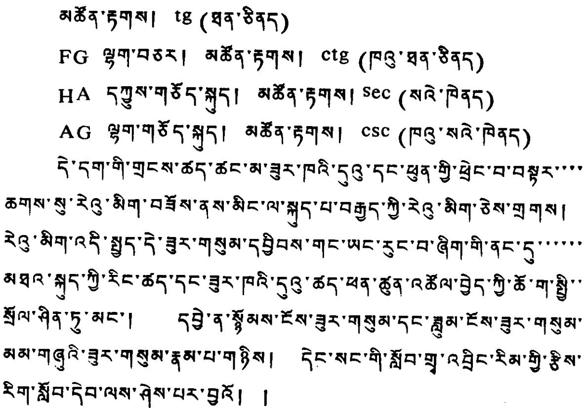

# 可

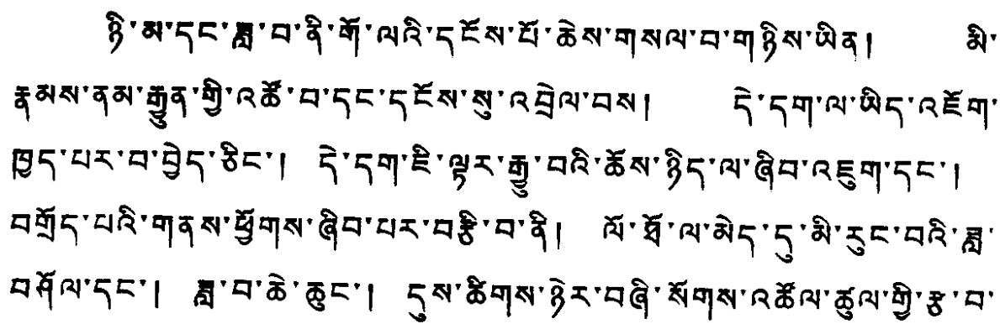

# (1)

360°×60×60 =3548".3290897 365.24233442

3548".3290897×29".53059053

=104784".2508841=029°6'24"15"103 360 55555555555555555555555555555555555555555555555555555555555555555555555555555555555555555555555555556666666666666666666666666666666666666666666666666666666666666666666666666666666666666666666666666666555555555555555555555555555555555555555555555555555555555555555555555555555555555555555555555555555

365.24233442553542552429149365.242187535425535425535425535425535425535425535425535425535425535425535425535425535425535425535425535425535425535535425535425535425535425535425535425535425535425535425535425535425535425535425535425535425535425533542553542553542553542553542553542553542553542553542553542553542553542553542553542553542553542553543255354255354255354255354255354255354255354255354255354255354255354255354255354255354255354255354255535425535425553542555354255535425553542555354255535425553542555354255535425553542555354255535425553542555354255655555555555555555555555555555555555555555555555555555555555555555555555555555555555555555555555555556555555555555555555555555555555555555555555555555555555555555555555555555555555555555555555555555666666666666666666666666666666666666666666666666666666666666666666666666666666666666666666666666666688888888888888888888888888888888888888888888888888888888888888888888888888888888888888888888888888889999999999999999999999999999999999999999999999999999999999999999999999999999999999999999999999999999888888888888888888888888888888888888888888888888888888888888888888888888888888888888888888888888888

# (2)

35555555555555555555555555555555555555555555555555555555555555555555555555555555555555555555555555558888888888888888888888888888888888888888888888888888888888888888888888888888888888888888888888888880000000000000000000000000000000000000000000000000000000000000000000000000000000000000000000000000000888888888888888888888888888888888888888888888888888888888888888888888888888888888888888888888888888666666666666666666666666666666666666666666666666666666666666666666666666666666666666666666666666666

可可可可可可可可可可可可可可可可可可可可可可可可可可可可可可可可可可可可可可可可可可可可可可可可可可可可可可可可可可可可可可可可可可可可可可可可可可可可可可可可可可可可可可可可可可可可可可可可可可可可可在可可可可可可可可可可可可可可可可可可可可可可可可可可可可可可可可可可可可可可可可可可可可可可可可可可可可可可可可可可可可可可可可可可可可可可可可可可可可可可可可可可可可可可可可可可可可可可可可可可可可是是是是是是是是是是是是是是是是是是是是是是是是是是是是是是是是是是是是是是是是是是是是是是是是是是是是是是是是是是是是是是是是是是是是是是是是是是是是是是是是是是是是是是是是是是是是是是是是是是是是是是否否否否否否否否否否否否否否否否否否否否否否否否否否否否否否否否否否否否否否否否否否否否否否否否否否否否否否否否否否否否否否否否否否否否否否否否否否否否否否否否否否否否否否否否否否否否否否否否否否否否否在在在在在在在在在在在在在在在在在在在在在在在在在在在在在在在在在在在在在在在在在在在在在在在在在在在在在在在在在在在在在在在在在在在在在在在在在在在在在在在在在在在在在在在在在在在在在在在在在在在在是是是是是是是是是是是是是是是是是是是是是是是是是是是是是是是是是是是是是是是是是是是是是是是是是是是是是是是是是是是是是是是是是是是是是是是是是是是是是是是是是是是是是是是是是是是是是是是是是是是是一一一一一一一一一一一一一一一一一一一一一一一一一一一一一一一一一一一一一一一一一一一一一一一一一一一一一一一一一一一一一一一一一一一一一一一一一一一一一一一一一一一一一一一一一一一一一一一一一一一一一一一一一一一一一一一一一一一一一一一一一一一一一一一一一一一一一一一一一一一一一一一一一一一一一一一一一一一一一一一一一一一一一一一一一一一一一一一一一一一一一一一一一一一一一一一一一一一一一一一一一一

0°29°6'24"15"- 103 - 5°5"- 221 = 0°29°6'19"9"- 242 360 360 360 《可可可可可可可可可可可可可可可可可可可可可可可可可可可可可可可可可可可可可可可可可可可可可可可可可可可可可可可可可可可可可可可可可可可可可可可可可可可可可可可可可可可可可可可可可可可可可可可可可可可

K 5 5 5 5 5 5 5 5 5 5 5 5 5 5 5 5 5 5 5 5 5 5 5 5 5 5 5 5 5 5 5 5 5 5 5 5 5 5 5 5 5 5 5 5 5 5 5 5 5 5 6 6 6 6 6 6 6 6 6 6 6 6 6 6 6 6 6 6 6 6 6 6 6 6 6 6 6 6 6 6 6 6 6 6 6 6 6 6 6 6 6 6 6 6 6 6 6 6 6 6 5 5 5 5 5 5 5 5 5 5 5 5 5 5 5 5 5 5 5 5 5 5 5 5 5 5 5 5 5 5 5 5 5 5 5 5 5 5 5 5 5 5 5 5 5 5 5 5 5 7 5 5 5 5 5 5 5 5 5 5 5 5 5 5 5 5 5 5 5 5 5 5 5 5 5 5 5 5 5 5 5 5 5 5 5 5 5 5 5 5 5 5 5 5 5 5 5 5 5 1 5 5 5 5 5 5 5 5 5 5 5 5 5 5 5 5 5 5 5 5 5 5 5 5 5 5 5 5 5 5 5 5 5 5 5 5 5 5 5 5 5 5 5 5 5 5 5 5 5 4 5 5 5 5 5 5 5 5 5 5 5 5 5 5 5 5 5 5 5 5 5 5 5 5 5 5 5 5 5 5 5 5 5 5 5 5 5 5 5 5 5 5 5 5 5 5 5 5 5 3 5 5 5 5 5 5 5 5 5 5 5 5 5 5 5 5 5 5 5 5 5 5 5 5 5 5 5 5 5 5 5 5 5 5 5 5 5 5 5 5 5 5 5 5 5 5 5 5 5 2 5 5 5 5 5 5 5 5 5 5 5 5 5 5 5 5 5 5 5 5 5 5 5 5 5 5 5 5 5 5 5 5 5 5 5 5 5 5 5 5 5 5 5 5 5 5 5 5 5 0 5 5 5 5 5 5 5 5 5 5 5 5 5 5 5 5 5 5 5 5 5 5 5 5 5 5 5 5 5 5 5 5 5 5 5 5 5 5 5 5 5 5 5 5 5 5 5 5 5 8 5 5 5 5 5 5 5 5 5 5 5 5 5 5 5 5 5 5 5 5 5 5 5 5 5 5 5 5 5 5 5 5 5 5 5 5 5 5 5 5 5 5 5 5 5 5 5 5 5 9 5 5 5 5 5 5 5 5 5 5 5 5 5 5 5 5 5 5 5 5 5 5 5 5 5 5 5 5 5 5 5 5 5 5 5 5 5 5 5 5 5 5 5 5 5 5 5 5 5

R B 5 5 5 5 5 5 5 5 5 5 5 5 5 5 5 5 5 5 5 5 5 5 5 5 5 5 5 5 5 5 5 5 5 5 5 5 5 5 5 5 5 5 5 5 5 5 5 5 5 五 5 5 5 5 5 5 5 5 5 5 5 5 5 5 5 5 5 5 5 5 5 5 5 5 5 5 5 5 5 5 5 5 5 5 5 5 5 5 5 5 5 5 5 5 5 5 5 5 5 三 5 5 5 5 5 5 5 5 5 5 5 5 5 5 5 5 5 5 5 5 5 5 5 5 5 5 5 5 5 5 5 5 5 5 5 5 5 5 5 5 5 5 5 5 5 5 5 5 5 二 5 5 5 5 5 5 5 5 5 5 5 5 5 5 5 5 5 5 5 5 5 5 5 5 5 5 5 5 5 5 5 5 5 5 5 5 5 5 5 5 5 5 5 5 5 5 5 5 5 一 5 5 5 5 5 5 5 5 5 5 5 5 5 5 5 5 5 5 5 5 5 5 5 5 5 5 5 5 5 5 5 5 5 5 5 5 5 5 5 5 5 5 5 5 5 5 5 5 5 与 5 5 5 5 5 5 5 5 5 5 5 5 5 5 5 5 5 5 5 5 5 5 5 5 5 5 5 5 5 5 5 5 5 5 5 5 5 5 5 5 5 5 5 5 5 5 5 5 5 于 5 5 5 5 5 5 5 5 5 5 5 5 5 5 5 5 5 5 5 5 5 5 5 5 5 5 5 5 5 5 5 5 5 5 5 5 5 5 5 5 5 5 5 5 5 5 5 5 5 产 5 5 5 5 5 5 5 5 5 5 5 5 5 5 5 5 5 5 5 5 5 5 5 5 5 5 5 5 5 5 5 5 5 5 5 5 5 5 5 5 5 5 5 5 5 5 5 5 5 有 5 5 5 5 5 5 5 5 5 5 5 5 5 5 5 5 5 5 5 5 5 5 5 5 5 5 5 5 5 5 5 5 5 5 5 5 5 5 5 5 5 5 5 5 5 5 5 5 5 作 5 5 5 5 5 5 5 5 5 5 5 5 5 5 5 5 5 5 5 5 5 5 5 5 5 5 5 5 5 5 5 5 5 5 5 5 5 5 5 5 5 5 5 5 5 5 5 5 5 业 5 5 5 5 5 5 5 5 5 5 5 5 5 5 5 5 5 5 5 5 5 5 5 5 5 5 5 5 5 5 5 5 5 5 5 5 5 5 5 5 5 5 5 5 5 5 5 5 5 用 5 5 5 5 5 5 5 5 5 5 5 5 5 5 5 5 5 5 5 5 5 5 5 5 5 5 5 5 5 5 5 5 5 5 5 5 5 5 5 5 5 5 5 5 5 5 5 5 5 、 5 5 5 5 5 5 5 5 5 5 5 5 5 5 5 5 5 5 5 5 5 5 5 5 5 5 5 5 5 5 5 5 5 5 5 5 5 5 5 5 5 5 5 5 5 5 5 5 5 东 5 5 5 5 5 5 5 5 5 5 5 5 5 5 5 5 5 5 5 5 5 5 5 5 5 5 5 5 5 5 5 5 5 5 5 5 5 5 5 5 5 5 5 5 5 5 5 5 5 电 5 5 5 5 5 5 5 5 5 5 5 5 5 5 5 5 5 5 5 5 5 5 5 5 5 5 5 5 5 5 5 5 5 5 5 5 5 5 5 5 5 5 5 5 5 5 5 5 5 事 5 5 5 5 5 5 5 5 5 5 5 5 5 5 5 5 5 5 5 5 5 5 5 5 5 5 5 5 5 5 5 5 5 5 5 5 5 5 5 5 5 5 5 5 5 5 5 5 5 书 5 5 5 5 5 5 5 5 5 5 5 5 5 5 5 5 5 5 5 5 5 5 5 5 5 5 5 5 5 5 5 5 5 5 5 5 5 5 5 5 5 5 5 5 5 5 5 5 5 画 5 5 5 5 5 5 5 5 5 5 5 5 5 5 5 5 5 5 5 5 5 5 5 5 5 5 5 5 5 5 5 5 5 5 5 5 5 5 5 5 5 5 5 5 5 5 5 5 5 会 5 5 5 5 5 5 5 5 5 5 5 5 5 5 5 5 5 5 5 5 5 5 5 5 5 5 5 5 5 5 5 5 5 5 5 5 5 5 5 5 5 5 5 5 5 5 5 5 5 人 5 5 5 5 5 5 5 5 5 5 5 5 5 5 5 5 5 5 5 5 5 5 5 5 5 5 5 5 5 5 5 5 5 5 5 5 5 5 5 5 5 5 5 5 5 5 5 5 5 本 5 5 5 5 5 5 5 5 5 5 5 5 5 5 5 5 5 5 5 5 5 5 5 5 5 5 5 5 5 5 5 5 5 5 5 5 5 5 5 5 5 5 5 5 5 5 5 5 5 附 5 5 5 5 5 5 5 5 5 5 5 5 5 5 5 5 5 5 5 5 5 5 5 5 5 5 5 5 5 5 5 5 5 5 5 5 5 5 5 5 5 5 5 5 5 5 5 5 5 例 5 5 5 5 5 5 5 5 5 5 5 5 5 5 5 5 5 5 5 5 5 5 5 5 5 5 5 5 5 5 5 5 5 5 5 5 5 5 5 5 5 5 5 5 5 5 5 5 5 证 5 5 5 5 5 5 5 5 5 5 5 5 5 5 5 5 5 5 5 5 5 5 5 5 5 5 5 5 5 5 5 5 5 5 5 5 5 5 5 5 5 5 5 5 5 5 5 5 5 证明 5 5 5 5 5 5 5 5 5 5 5 5 5 5 5 5 5 5 5 5 5 5 5 5 5 5 5 5 5 5 5 5 5 5 5 5 5 5 5 5 5 5 5 5 5 5 5 5 5 时 5 5 5 5 5 5 5 5 5 5 5 5 5 5 5 5 5 5 5 5 5 5 5 5 5 5 5 5 5 5 5 5 5 5 5 5 5 5 5 5 5 5 5 5 5 5 5 5 5 个 5 5 5 5 5 5 5 5 5 5 5 5 5 5 5 5 5 5 5 5 5 5 5 5 5 5 5 5 5 5 5 5 5 5 5 5 5 5 5 5 5 5 5 5 5 5 5 5 5 你 5 5 5 5 5 5 5 5 5 5 5 5 5 5 5 5 5 5 5 5 5 5 5 5 5 5 5 5 5 5 5 5 5 5 5 5 5 5 5 5 5 5 5 5 5 5 5 5 5 期 5 5 5 5 5 5 5 5 5 5 5 5 5 5 5 5 5 5 5 5 5 5 5 5 5 5 5 5 5 5 5 5 5 5 5 5 5 5 5 5 5 5 5 5 5 5 5 5 5 陈 5 5 5 5 5 5 5 5 5 5 5 5 5 5 5 5 5 5 5 5 5 5 5 5 5 5 5 5 5 5 5 5 5 5 5 5 5 5 5 5 5 5 5 5 5 5 5 5 5 交 5 5 5 5 5 5 5 5 5 5 5 5 5 5 5 5 5 5 5 5 5 5 5 5 5 5 5 5 5 5 5 5 5 5 5 5 5 5 5 5 5 5 5 5 5 5 5 5 5 世 5 5 5 5 5 5 5 5 5 5 5 5 5 5 5 5 5 5 5 5 5 5 5 5 5 5 5 5 5 5 5 5 5 5 5 5 5 5 5 5 5 5 5 5 5 5 5 5 5 际 5 5 5 5 5 5 5 5 5 5 5 5 5 5 5 5 5 5 5 5 5 5 5 5 5 5 5 5 5 5 5 5 5 5 5 5 5 5 5 5 5 5 5 5 5 5 5 5 5 保 5 5 5 5 5 5 5 5 5 5 5 5 5 5 5 5 5 5 5 5 5 5 5 5 5 5 5 5 5 5 5 5 5 5 5 5 5 5 5 5 5 5 5 5 5 5 5 5 5 限 5 5 5 5 5 5 5 5 5 5 5 5 5 5 5 5 5 5 5 5 5 5 5 5 5 5 5 5 5 5 5 5 5 5 5 5 5 5 5 5 5 5 5 5 5 5 5 5 5 量 5 5 5 5 5 5 5 5 5 5 5 5 5 5 5 5 5 5 5 5 5 5 5 5 5 5 5 5 5 5 5 5 5 5 5 5 5 5 5 5 5 5 5 5 5 5 5 5 5 举 5 5 5 5 5 5 5 5 5 5 5 5 5 5 5 5 5 5 5 5 5 5 5 5 5 5 5 5 5 5 5 5 5 5 5 5 5 5 5 5 5 5 5 5 5 5 5 5 5 申 5 5 5 5 5 5 5 5 5 5 5 5 5 5 5 5 5 5 5 5 5 5 5 5 5 5 5 5 5 5 5 5 5 5 5 5 5 5 5 5 5 5 5 5 5 5 5 5 5 顺 5 5 5 5 5 5 5 5 5 5 5 5 5 5 5 5 5 5 5 5 5 5 5 5 5 5 5 5 5 5 5 5 5 5 5 5 5 5 5 5 5 5 5 5 5 5 5 5 5 信 5 5 5 5 5 5 5 5 5 5 5 5 5 5 5 5 5 5 5 5 5 5 5 5 5 5 5 5 5 5 5 5 5 5 5 5 5 5 5 5 5 5 5 5 5 5 5 5 5 话 5 5 5 5 5 5 5 5 5 5 5 5 5 5 5 5 5 5 5 5 5 5 5 5 5 5 5 5 5 5 5 5 5 5 5 5 5 5 5 5 5 5 5 5 5 5 5 5 5 传 5 5 5 5 5 5 5 5 5 5 5 5 5 5 5 5 5 5 5 5 5 5 5 5 5 5 5 5 5 5 5 5 5 5 5 5 5 5 5 5 5 5 5 5 5 5 5 5 5 服 5 5 5 5 5 5 5 5 5 5 5 5 5 5 5 5 5 5 5 5 5 5 5 5 5 5 5 5 5 5 5 5 5 5 5 5 5 5 5 5 5 5 5 5 5 5 5 5 5 代 5 5 5 5 5 5 5 5 5 5 5 5 5 5 5 5 5 5 5 5 5 5 5 5 5 5 5 5 5 5 5 5 5 5 5 5 5 5 5 5 5 5 5 5 5 5 5 5 5 中国 5 5 5 5 5 5 5 5 5 5 5 5 5 5 5 5 5 5 5 5 5 5 5 5 5 5 5 5 5 5 5 5 5 5 5 5 5 5 5 5 5 5 5 5 5 5 5 5 5 专 5 5 5 5 5 5 5 5 5 5 5 5 5 5 5 5 5 5 5 5 5 5 5 5 5 5 5 5 5 5 5 5 5 5 5 5 5 5 5 5 5 5 5 5 5 5 5 5 5 任 5 5 5 5 5 5 5 5 5 5 5 5 5 5 5 5 5 5 5 5 5 5 5 5 5 5 5 5 5 5 5 5 5 5 5 5 5 5 5 5 5 5 5 5 5 5 5 5 5 今 5 5 5 5 5 5 5 5 5 5 5 5 5 5 5 5 5 5 5 5 5 5 5 5 5 5 5 5 5 5 5 5 5 5 5 5 5 5 5 5 5 5 5 5 5 5 5 5 5 里 5 5 5 5 5 5 5 5 5 5 5 5 5 5 5 5 5 5 5 5 5 5 5 5 5 5 5 5 5 5 5 5 5 5 5 5 5 5 5 5 5 5 5 5 5 5 5 5 5 ① 5 5 5 5 5 5 5 5 5 5 5 5 5 5 5 5 5 5 5 5 5 5 5 5 5 5 5 5 5 5 5 5 5 5 5 5 5 5 5 5 5 5 5 5 5 5 5 5 5 ５ 5 5 5 5 5 5 5 5 5 5 5 5 5 5 5 5 5 5 5 5 5 5 5 5 5 5 5 5 5 5 5 5 5 5 5 5 5 5 5 5 5 5 5 5 5 5 5 5 5 《 5 5 5 5 5 5 5 5 5 5 5 5 5 5 5 5 5 5 5 5 5 5 5 5 5 5 5 5 5 5 5 5 5 5 5 5 5 5 5 5 5 5 5 5 5 5 5 5 5 》

G'H G' 555555555555555555555555555555555555555555555555555555555555555555555555555555555555555555555555555590°591

H G'H 55555555555555555555555555555555555555555555555555555555555555555555555555555555555555555555555555655555555555555555555555555555555555555555555555555555555555555555555555555555555555555555555555555566666666666666666666666666666666666666666666666666666666666666666666666666666666666666666666666666665555555555555555555555555555555555555555555555555555555555555555555555555555555555555555555555555567777777777777777777777777777777777777777777777777777777777777777777777777777777777777777777777777777888888888888888888888888888888888888888888888888888888888888888888888888888888888888888888888888888899999999999999999999999999999999999999999999999999999999999999999999999999999999999999999999999999998888888888888888888888888888888888888888888888888888888888888888888888888888888888888888888888888880000000000000000000000000000000000000000000000000000000000000000000000000000000000000000000000000000

△HKR·F·5

$\mathbf{tgy} = \frac{\mathbf{HR}}{\mathbf{HK}} = \frac{4}{8}\mathbf{r}\sin \mathbf{x}\quad \angle \mathbf{CBK} - \frac{2}{8}\mathbf{r}\cos \mathbf{x}$

x5可可可可可可可可可可可可可可可可可可可可可可可可可可可可可可可可可可可可可可可可可可可可可可可可可可可可可可可可可可可可可可可可可可可可可可可可可可可可可可可可可可可可可可可可可可可可可可可可可可可可

3·可可可可可可可可可可可可可可可可可可可可可可可可可可可可可可可可可可可可可可可可可可可可可可可可可可可可可可可可可可可可可可可可可可可可可可可可可可可可可可可可可可可可可可可可可可可可可可可可可可可3

"可可可可可可可可可可可可可可可可可可可可可可可可可可可可可可可可可可可可可可可可可可可可可可可可可可可可可可可可可可可可可可可可可可可可可可可可可可可可可可可可可可可可可可可可可可可可可可可可可可可可是可可可可可可可可可可可可可可可可可可可可可可可可可可可可可可可可可可可可可可可可可可可可可可可可可可可可可可可可可可可可可可可可可可可可可可可可可可可可可可可可可可可可可可可可可可可可可可可可可可可是可可可可可可可可可可可可可可可可可可可可可可可可可可可可可可可可可可可可可可可可可可可可可可可可可可可可可可可可可可可可可可可可可可可可可可可可可可可可可可可可可可可可可可可可可可可可可可可可可可可了可可可可可可可可可可可可可可可可可可可可可可可可可可可可可可可可可可可可可可可可可可可可可可可可可可可可可可可可可可可可可可可可可可可可可可可可可可可可可可可可可可可可可可可可可可可可可可可可可可可的可可可可可可可可可可可可可可可可可可可可可可可可可可可可可可可可可可可可可可可可可可可可可可可可可可可可可可可可可可可可可可可可可可可可可可可可可可可可可可可可可可可可可可可可可可可可可可可可可可可它可可可可可可可可可可可可可可可可可可可可可可可可可可可可可可可可可可可可可可可可可可可可可可可可可可可可可可可可可可可可可可可可可可可可可可可可可可可可可可可可可可可可可可可可可可可可可可可可可可可其可可可可可可可可可可可可可可可可可可可可可可可可可可可可可可可可可可可可可可可可可可可可可可可可可可可可可可可可可可可可可可可可可可可可可可可可可可可可可可可可可可可可可可可可可可可可可可可可可可可此可可可可可可可可可可可可可可可可可可可可可可可可可可可可可可可可可可可可可可可可可可可可可可可可可可可可可可可可可可可可可可可可可可可可可可可可可可可可可可可可可可可可可可可可可可可可可可可可可可可这可可可可可可可可可可可可可可可可可可可可可可可可可可可可可可可可可可可可可可可可可可可可可可可可可可可可可可可可可可可可可可可可可可可可可可可可可可可可可可可可可可可可可可可可可可可可可可可可可可可之可可可可可可可可可可可可可可可可可可可可可可可可可可可可可可可可可可可可可可可可可可可可可可可可可可可可可可可可可可可可可可可可可可可可可可可可可可可可可可可可可可可可可可可可可可可可可可可可可可可到可可可可可可可可可可可可可可可可可可可可可可可可可可可可可可可可可可可可可可可可可可可可可可可可可可可可可可可可可可可可可可可可可可可可可可可可可可可可可可可可可可可可可可可可可可可可可可可可可可可至可可可可可可可可可可可可可可可可可可可可可可可可可可可可可可可可可可可可可可可可可可可可可可可可可可可可可可可可可可可可可可可可可可可可可可可可可可可可可可可可可可可可可可可可可可可可可可可可可可可得可可可可可可可可可可可可可可可可可可可可可可可可可可可可可可可可可可可可可可可可可可可可可可可可可可可可可可可可可可可可可可可可可可可可可可可可可可可可可可可可可可可可可可可可可可可可可可可可可可可何可可可可可可可可可可可可可可可可可可可可可可可可可可可可可可可可可可可可可可可可可可可可可可可可可可可可可可可可可可可可可可可可可可可可可可可可可可可可可可可可可可可可可可可可可可可可可可可可可可可才可可可可可可可可可可可可可可可可可可可可可可可可可可可可可可可可可可可可可可可可可可可可可可可可可可可可可可可可可可可可可可可可可可可可可可可可可可可可可可可可可可可可可可可可可可可可可可可可可可可将可可可可可可可可可可可可可可可可可可可可可可可可可可可可可可可可可可可可可可可可可可可可可可可可可可可可可可可可可可可可可可可可可可可可可可可可可可可可可可可可可可可可可可可可可可可可可可可可可可可正可可可可可可可可可可可可可可可可可可可可可可可可可可可可可可可可可可可可可可可可可可可可可可可可可可可可可可可可可可可可可可可可可可可可可可可可可可可可可可可可可可可可可可可可可可可可可可可可可可可三可可可可可可可可可可可可可可可可可可可可可可可可可可可可可可可可可可可可可可可可可可可可可可可可可可可可可可可可可可可可可可可可可可可可可可可可可可可可可可可可可可可可可可可可可可可可可可可可可可可已可可可可可可可可可可可可可可可可可可可可可可可可可可可可可可可可可可可可可可可可可可可可可可可可可可可可可可可可可可可可可可可可可可可可可可可可可可可可可可可可可可可可可可可可可可可可可可可可可可可只可可可可可可可可可可可可可可可可可可可可可可可可可可可可可可可可可可可可可可可可可可可可可可可可可可可可可可可可可可可可可可可可可可可可可可可可可可可可可可可可可可可可可可可可可可可可可可可可可可可全可可可可可可可可可可可可可可可可可可可可可可可可可可可可可可可可可可可可可可可可可可可可可可可可可可可可可可可可可可可可可可可可可可可可可可可可可可可可可可可可可可可可可可可可可可可可可可可可可可可过可可可可可可可可可可可可可可可可可可可可可可可可可可可可可可可可可可可可可可可可可可可可可可可可可可可可可可可可可可可可可可可可可可可可可可可可可可可可可可可可可可可可可可可可可可可可可可可可可可可止可可可可可可可可可可可可可可可可可可可可可可可可可可可可可可可可可可可可可可可可可可可可可可可可可可可可可可可可可可可可可可可可可可可可可可可可可可可可可可可可可可可可可可可可可可可可可可可可可可可行可可可可可可可可可可可可可可可可可可可可可可可可可可可可可可可可可可可可可可可可可可可可可可可可可可可可可可可可可可可可可可可可可可可可可可可可可可可可可可可可可可可可可可可可可可可可可可可可可可可引可可可可可可可可可可可可可可可可可可可可可可可可可可可可可可可可可可可可可可可可可可可可可可可可可可可可可可可可可可可可可可可可可可可可可可可可可可可可可可可可可可可可可可可可可可可可可可可可可可可习可可可可可可可可可可可可可可可可可可可可可可可可可可可可可可可可可可可可可可可可可可可可可可可可可可可可可可可可可可可可可可可可可可可可可可可可可可可可可可可可可可可可可可可可可可可可可可可可可可可于可可可可可可可可可可可可可可可可可可可可可可可可可可可可可可可可可可可可可可可可可可可可可可可可可可可可可可可可可可可可可可可可可可可可可可可可可可可可可可可可可可可可可可可可可可可可可可可可可可可有可可可可可可可可可可可可可可可可可可可可可可可可可可可可可可可可可可可可可可可可可可可可可可可可可可可可可可可可可可可可可可可可可可可可可可可可可可可可可可可可可可可可可可可可可可可可可可可可可可可打可可可可可可可可可可可可可可可可可可可可可可可可可可可可可可可可可可可可可可可可可可可可可可可可可可可可可可可可可可可可可可可可可可可可打打打打打打打打打打打打打打打打打打打打打打打打打打打打打打打打打打打打打打打打打打打打打打打打打打打打打打打打打打打打打打打打打打打打打打打打打打打打打打打打打打打打打打打打打打打打打打打打打打打打

# (3)

可可可可可可可可可可可可可可可可可可可可可可可可可可可可可可可可可可可可可可可可可可可可可可可可可可可可可可可可可可可可可可可可可可可可可可可可可可可可可可可可可可可可可可可可可可可可可可可可可可可可

可可可可可可可可可可可可可可可可可可可可可可可可可可可可可可可可可可可可可可可可可可可可可可可可可可可可可可可可可可可可可可可可可可可可可可可可可可可可可可可可可可可可可可可可可可可可可可可是是是是是是是是是是是是是是是是是是是是是是是是是是是是是是是是是是是是是是是是是是是是是是是是是是是是是是是是是是是是是是是是是是是是是是是是是是是是是是是是是是是是是是是是是是是是是是是是是是是是是

Keper)Kepe

# (4)

Kepe

# 可

# (1)

BC B R  C R  B  B  B  B  B  B  B  B  B  B  B  B  B  B  B  B  B  B  B  B  B  B  B  B  B  B  B  B  B  B  B  B  B  B  B  B  B  B  B  B  B  B  B  B  B  B  B  B  B  B  C  A  B  C  C  C  C  C  C  C  C  C  C  C  C  C  C  C  C  C  C  C  C  C  C  C  C  C  C  C  C  C  C  C  C  C  C  C  C  C  C  C  C  C  C  C  C  C  C  C  C  C  C  B  C  C  C  C  C  C  C  C  C  C  C  C  C  C  C  C  C  C  C  C  C  C  C  C  C  C  C  C  C  C  C  C  C  C  C  C  C  C  C  C  C  C  C  C  C  C  C  C  B  B  B  B  B  B  B  B  B  B  B  B  B  B  B  B  B  B  B  B  B  B  B  B  B  B  B  B  B  B  B  B  B  B  B  B  B  B  B  B  B  B  B  B  B  B  B  B  B  A  B  C  C  C  C  C  C  C  C  C  C  C  C  C  C  C  C  C  C  C  C  C  C  C  C  C  C  C  C  C  C  C  C  C  C  C  C  C  C  C  C  C  C  C  C  C  C  C  B  C  B  C  C  C  C  C  C  C  C  C  C  C  C  C  C  C  C  C  C  C  C  C  C  C  C  C  C  C  C  C  C  C  C  C  C  C  C  C  C  C  C  C  C  C  C  C  C  C  B  B  C  C  C  C  C  C  C  C  C  C  C  C  C  C  C  C  C  C  C  C  C  C  C  C  C  C  C  C  C  C  C  C  C  C  C  C  C  C  C  C  C  C  C  C  C  C  C  C

ACB 90°

BAC 9

94°58'30"

5°17'30"

16'51"

46'48"

BC=46'48"+16'51"=1°3'39"

94°1) tg AC= tg AC 94°5°5° 95°6°17" 94°1

94°5°6°17" 94°1 94°5°5° 95°1 94°1 94°5°6°17" 94°1 94°5°6°17" 94°1 94°5°6°17" 94°1 94°5°6°17" 94°1 94°5°6°17" 94°1 94°5°6°17" 94°1 94°5°6°17" 94'9°9°9°9°9°9°9°9°9°9°9°9°9°9°9°9°9°9°9°9°9°9°9°9°9°9°9°9°9°9°9°9°9°9°9°9°9°9°9°9°9°9°9°9°9°9°9°9°9°9°9'9°9°9°9°9°9°9°9°9°9°9°9°9°9°9°9°9°9°9°9°9°9°9°9°9°9°9°9°9°9°9°9°9°9°9°9°9°9°9°9°9°9°9°9°9°9°9°9°9°

# (2)

(1)

(2)

(3)

(4)

A 5 5 5 5 5 5 5 5 5 5 5 5 5 5 5 5 5 5 5 5 5 5 5 5 5 5 5 5 5 5 5 5 5 5 5 5 5 5 5 5 5 5 5 5 5 5 5 5 5 5 6 5 5 5 5 5 5 5 5 5 5 5 5 5 5 5 5 5 5 5 5 5 5 5 5 5 5 5 5 5 5 5 5 5 5 5 5 5 5 5 5 5 5 5 5 5 5 5 5 5 7 5 5 5 5 5 5 5 5 5 5 5 5 5 5 5 5 5 5 5 5 5 5 5 5 5 5 5 5 5 5 5 5 5 5 5 5 5 5 5 5 5 5 5 5 5 5 5 5 5 1 5 5 5 5 5 5 5 5 5 5 5 5 5 5 5 5 5 5 5 5 5 5 5 5 5 5 5 5 5 5 5 5 5 5 5 5 5 5 5 5 5 5 5 5 5 5 5 5 5 3 5 5 5 5 5 5 5 5 5 5 5 5 5 5 5 5 5 5 5 5 5 5 5 5 5 5 5 5 5 5 5 5 5 5 5 5 5 5 5 5 5 5 5 5 5 5 5 5 5 2 5 5 5 5 5 5 5 5 5 5 5 5 5 5 5 5 5 5 5 5 5 5 5 5 5 5 5 5 5 5 5 5 5 5 5 5 5 5 5 5 5 5 5 5 5 5 5 5 5 4 5 5 5 5 5 5 5 5 5 5 5 5 5 5 5 5 5 5 5 5 5 5 5 5 5 5 5 5 5 5 5 5 5 5 5 5 5 5 5 5 5 5 5 5 5 5 5 5 5 0 5 5 5 5 5 5 5 5 5 5 5 5 5 5 5 5 5 5 5 5 5 5 5 5 5 5 5 5 5 5 5 5 5 5 5 5 5 5 5 5 5 5 5 5 5 5 5 5 5 8 5 5 5 5 5 5 5 5 5 5 5 5 5 5 5 5 5 5 5 5 5 5 5 5 5 5 5 5 5 5 5 5 5 5 5 5 5 5 5 5 5 5 5 5 5 5 5 5 5 9 5 5 5 5 5 5 5 5 5 5 5 5 5 5 5 5 5 5 5 5 5 5 5 5 5 5 5 5 5 5 5 5 5 5 5 5 5 5 5 5 5 5 5 5 5 5 5 5 5 五 5 5 5 5 5 5 5 5 5 5 5 5 5 5 5 5 5 5 5 5 5 5 5 5 5 5 5 5 5 5 5 5 5 5 5 5 5 5 5 5 5 5 5 5 5 5 5 5 5 三 5 5 5 5 5 5 5 5 5 5 5 5 5 5 5 5 5 5 5 5 5 5 5 5 5 5 5 5 5 5 5 5 5 5 5 5 5 5 5 5 5 5 5 5 5 5 5 5 5 二 5 5 5 5 5 5 5 5 5 5 5 5 5 5 5 5 5 5 5 5 5 5 5 5 5 5 5 5 5 5 5 5 5 5 5 5 5 5 5 5 5 5 5 5 5 5 5 5 5 一 5 5 5 5 5 5 5 5 5 5 5 5 5 5 5 5 5 5 5 5 5 5 5 5 5 5 5 5 5 5 5 5 5 5 5 5 5 5 5 5 5 5 5 5 5 5 5 5 5 与 5 5 5 5 5 5 5 5 5 5 5 5 5 5 5 5 5 5 5 5 5 5 5 5 5 5 5 5 5 5 5 5 5 5 5 5 5 5 5 5 5 5 5 5 5 5 5 5 5 于 5 5 5 5 5 5 5 5 5 5 5 5 5 5 5 5 5 5 5 5 5 5 5 5 5 5 5 5 5 5 5 5 5 5 5 5 5 5 5 5 5 5 5 5 5 5 5 5 5 产 5 5 5 5 5 5 5 5 5 5 5 5 5 5 5 5 5 5 5 5 5 5 5 5 5 5 5 5 5 5 5 5 5 5 5 5 5 5 5 5 5 5 5 5 5 5 5 5 5

B

D

D

B

DE

BF

CE 3

CF 4

CE

CF 5

CF 6

① ② ③ ④ ⑤ ⑥ ⑦ ⑧ ⑨ ⑩ 12356789123567891235678912356789123567891235678912356789123567891235678912356789123567891235678912356789123

567891235678912356789123567891235678912356789123567891235678912356789123567891235678912356789123567

$$
\frac{360^{\circ} \times 60^{\prime} \times 60^{\prime\prime}}{29^{4} \cdot 53059 \times 24^{h}} = \frac{43886^{\prime\prime} \cdot 7}{24^{h}} = 1828^{\prime \prime} \cdot 6121
$$

5

1826.6121 3600 5 1 3600 5 5 5 5 5 5 5 5 5 5 5 5 5 5 5 5 5 5 5 5 5 5 5 5 5 5 5 5 5 5 5 5 5 5 5 5 5 5 5 5 5 5 5 5 5 5 5 5 5 5 6 5 5 5 5 5 5 5 5 5 5 5 5 5 5 5 5 5 5 5 5 5 5 5 5 5 5 5 5 5 5 5 5 5 5 5 5 5 5 5 5 5 5 5 5 5 5 5 5 5 1 1 1 1 1 1 1 1 1 1 1 1 1 1 1 1 1 1 1 1 1 1 1 1 1 1 1 1 1 1 1 1 1 1 1 1 1 1 1 1 1 1 1 1 1 1 1 1 1 1 2 1 1 1 1 1 1 1 1 1 1 1 1 1 1 1 1 1 1 1 1 1 1 1 1 1 1 1 1 1 1 1 1 1 1 1 1 1 1 1 1 1 1 1 1 1 1 1 1 1 5 5 5 5 5 5 5 5 5 5 5 5 5 5 5 5 5 5 5 5 5 5 5 5 5 5 5 5 5 5 5 5 5 5 5 5 5 5 5 5 5 5 5 5 5 5 5 5 5 7 5 5 5 5 5 5 5 5 5 5 5 5 5 5 5 5 5 5 5 5 5 5 5 5 5 5 5 5 5 5 5 5 5 5 5 5 5 5 5 5 5 5 5 5 5 5 5 5 5 3 6 0 0 5 5 5 5 5 5 5 5 5 5 5 5 5 5 5 5 5 5 5 5 5 5 5 5 5 5 5 5 5 5 5 5 5 5 5 5 5 5 5 5 5 5 5 5 5 5 5 5 5

3600×5 18000 1826.6×5 9143 5 5 5 5 5 5 5 5 5 5 5 5 5 5 5 5 5 5 5 5 5 5 5 5 5 5 5 5 5 5 5 5 5 5 5 5 5 5 5 5 5 5 5 5 5 5 5 5 5 4 5 5 5 5 5 5 5 5 5 5 5 5 5 5 5 5 5 5 5 5 5 5 5 5 5 5 5 5 5 5 5 5 5 5 5 5 5 5 5 5 5 5 5 5 5 5 5 5 5 2 5 5 5 5 5 5 5 5 5 5 5 5 5 5 5 5 5 5 5 5 5 5 5 5 5 5 5 5 5 5 5 5 5 5 5 5 5 5 5 5 5 5 5 5 5 5 5 5 5 0 5 5 5 5 5 5 5 5 5 5 5 5 5 5 5 5 5 5 5 5 5 5 5 5 5 5 5 5 5 5 5 5 5 5 5 5 5 5 5 5 5 5 5 5 5 5 5 5 6 6 5 5 5 5 5 5 5 5 5 5 5 5 5 5 5 5 5 5 5 5 5 5 5 5 5 5 5 5 5 5 5 5 5 5 5 5 5 5 5 5 5 5 5 5 5 5 5 5 6 7 5 5 5 5 5 5 5 5 5 5 5 5 5 5 5 5 5 5 5 5 5 5 5 5 5 5 5 5 5 5 5 5 5 5 5 5 5 5 5 5 5 5 5 5 5 5 5 5 6 8 5 5 5 5 5 5 5 5 5 5 5 5 5 5 5 5 5 5 5 5 5 5 5 5 5 5 5 5 5 5 5 5 5 5 5 5 5 5 5 5 5 5 5 5 5 5 5 5 5 8 5 5 5 5 5 5 5 5 5 5 5 5 5 5 5 5 5 5 5 5 5 5 5 5 5 5 5 5 5 5 5 5 5 5 5 5 5 5 5 5 5 5 5 5 5 5 5 5 6 9 5 5 5 5 5 5 5 5 5 5 5 5 5 5 5 5 5 5 5 5 5 5 5 5 5 5 5 5 5 5 5 5 5 5 5 5 5 5 5 5 5 5 5 5 5 5 5 5 5 9 5 5 5 5 5 5 5 5 5 5 5 5 5 5 5 5 5 5 5 5 5 5 5 5 5 5 5 5 5 5 5 5 5 5 5 5 5 5 5 5 5 5 5 5 5 5 5 5 6 1 5 5 5 5 5 5 5 5 5 5 5 5 5 5 5 5 5 5 5 5 5 5 5 5 5 5 5 5 5 5 5 5 5 5 5 5 5 5 5 5 5 5 5 5 5 5 5 5 6 2 5 5 5 5 5 5 5 5 5 5 5 5 5 5 5 5 5 5 5 5 5 5 5 5 5 5 5 5 5 5 5 5 5 5 5 5 5 5 5 5 5 5 5 5 5 5 5 5 6 3 5 5 5 5 5 5 5 5 5 5 5 5 5 5 5 5 5 5 5 5 5 5 5 5 5 5 5 5 5 5 5 5 5 5 5 5 5 5 5 5 5 5 5 5 5 5 5 5 5

3601 361

③ 360°+25°49'0"=1388940"

360°+25°49'0"=1388940" 360°+25°49'0"=1388940" 360°+25°49'0"=1388940" 360°+25°49'0"=1388940" 360°+25°49'0"=1388940" 360°+25'49'0"=1388940" 360°+25'49'0"=1388940" 360°+25'49'0"=1388940" 360°+25'49'0"=1388940" 360°+25'49'0"=1600°+25'49'0"=1600°+25'49'0"=1600°+25'49'0"=1600°+25'49'0"=1600°+25'49'0"=1600°+25'49'0"=1600°+25'49'

5°°°°°°°°°°°°°°°°°°°°°°°°°°°°°°°°°°°°°°°°°°°°°°°°°°°°°°°°°°°°°°°°°°°°°°°°°°°°°°°°°°°°°°°°°°°°°°°°°°°° °°°°°°°°°°°°°°°°°°°°°°°°°°°°°°°°°°°°°°°°°°°°°°°°°°°°°°°°°°°°°°°°°°°°°°°°°°°°°°°°°°°°°°°°°°°°°°°°°°°°.

1959·75÷2.25 = 871 1959·75÷2.25 = 871 1600°°°°°°°°°°°°°°°°°°°°°°°°°°°°°°°°°°°°°°°°°°°°°°°°°°°°°°°°°°°°°°°°°°°°°°°°°°°°°°°°°°°°°°°°°°°°°°°°°°°6600÷2.25 1600°°°°°°°°°°°°°°°°°°°°°°°°°°°°°°°°°°°°°°°°°°°°°°°°°°°°°°°°°°°°°°°°°°°°°°°°°°°°°°°°°°°°°°°°°°°°°°6600°°°°°°°°°°°°°°°°°°°°°°°°°°°°°°°°°°°°°°°°°°°°°°°°°°°°°°°°°°°°°°°°°°°°°°°°°°°°°°°°°°°°°°°°°°°°°°°°660°°°°°°°°°°°°°°°°°°°°°°°°°°°°°°°°°°°°°°°°°°°°°°°°°°°°°°°°°°°°°°°°°°°°°°°°°°°°°°°°°°°°°°°°°°°°°°°°°°671°°°°°°°°°°°°°°°°°°°°°°°°°°°°°°°°°°°°°°°°°°°°°°°°°°°°°°°°°°°°°°°°°°°°°°°°°°°°°°°°°°°°°°°°°°°°°°°°°°°871°°°°°°°°°°°°°°°°°°°°°°°°°°°°°°°°°°°°°°°°°°°°°°°°°°°°°°°°°°°°°°°°°°°°°°°°°°°°°°°°°°°°°°°°°°°°°°°°°67°°°°°°°°°°°°°°°°°°°°°°°°°°°°°°°°°°°°°°°°°°°°°°°°°°°°°°°°°°°°°°°°°°°°°°°°°°°°°°°°°°°°°°°°°°°°°°°°°°°。

147.85×14.4 2129 60×14.4 864 可 1可可可可可可可可可可可可可可可可可可可可可可可可可可可可可可可可可可可可可可可可可可可可可可可可可可可可可可可可可可可可可可可可可可可可可可可可可可可可可可可可可可可可可可可可可可可可可可可可可可可可2129可可可可可可可可可可可可可可可可可可可可可可可可可可可可可可可可可可可可可可可可可可可可可可可可可可可可可可可可可可可可可可可可可可可可可可可可可可可可可可可可可可可可可可可可可可可可可可可可可可可3可可可可可可可可可可可可可可可可可可可可可可可可可可可可可可可可可可可可可可可可可可可可可可可可可可可可可可可可可可可可可可可可可可可可可可可可可可可可可可可可可可可可可可可可可可可可可可可可可可可可是可可可可可可可可可可可可可可可可可可可可可可可可可可可可可可可可可可可可可可可可可可可可可可可可可可可可可可可可可可可可可可可可可可可可可可可可可可可可可可可可可可可可可可可可可可可可可可可可可可可

$$
\frac{1^{\circ}0^{\circ}41^{\prime}13^{\prime\prime}}{29.53059\times24} = 155^{\prime \prime}.79044\quad \cdot
$$

$$
\frac{360\times60\times60}{29.53059\times24} = \frac{43886.7}{24} = 1828^{\prime \prime}.6
$$

\[\frac{(155^{\prime\prime}.8 + 1826^{\prime\prime}6)\times2.5}{3600\times2.5} = \frac{4961}{150\times60}\]可可可可可可可可可可可可可可可可可可可可可可可可可可可可可可可可可可可可可可可可可可可可可可可可可可可可可可可可可可可可可可可可可可可可可可可可可可可可可可可可可可可可可可可可可可可可可可可可可可可可在可可可可可可可可可可可可可可可可可可可可可可可可可可可可可可可可可可可可可可可可可可可可可可可可可可可可可可可可可可可可可可可可可可可可可可可可可可可可可可可可可可可可可可可可可可可可可可可可可可可在可可可可可可可可可可可可可可可可可可可可可可可可可可可可可可可可可可可可可可可可可可可可可可可可可可可可可可可可可可可可可可可可可可可可可可可可可可可可可可可可可可可可可可可可可可可可可可可可可可可它它它它它它它它它它它它它它它它它它它它它它它它它它它它它它它它它它它它它它它它它它它它它它它它它它它它它它它它它它它它它它它它它它它它它它它它它它它它它它它它它它它它它它它它它它它它它它它它它它它它

150 1 1

(5) 3 3 3 3 3 3 3 3 3 3 3 3 3 3 3 3 3 3 3 3 3 3 3 3 3 3 3 3 3 3 3 3 3 3 3 3 3 3 3 3 3 3 3 3 3 3 3 3 3 3 5 5 5 5 5 5 5 5 5 5 5 5 5 5 5 5 5 5 5 5 5 5 5 5 5 5 5 5 5 5 5 5 5 5 5 5 5 5 5 5 5 5 5 5 5 5 5 5 5 5 6 5 5 5 5 5 5 5 5 5 5 5 5 5 5 5 5 5 5 5 5 5 5 5 5 5 5 5 5 5 5 5 5 5 5 5 5 5 5 5 5 5 5 5 5 5 5 5 5 5 7 5 5 5 5 5 5 5 5 5 5 5 5 5 5 5 5 5 5 5 5 5 5 5 5 5 5 5 5 5 5 5 5 5 5 5 5 5 5 5 5 5 5 5 5 5 5 5 5 5 3 5 5 5 5 5 5 5 5 5 5 5 5 5 5 5 5 5 5 5 5 5 5 5 5 5 5 5 5 5 5 5 5 5 5 5 5 5 5 5 5 5 5 5 5 5 5 5 5 6 6 5 5 5 5 5 5 5 5 5 5 5 5 5 5 5 5 5 5 5 5 5 5 5 5 5 5 5 5 5 5 5 5 5 5 5 5 5 5 5 5 5 5 5 5 5 5 5 5 6 7 5 5 5 5 5 5 5 5 5 5 5 5 5 5 5 5 5 5 5 5 5 5 5 5 5 5 5 5 5 5 5 5 5 5 5 5 5 5 5 5 5 5 5 5 5 5 5 5 6 8 5 5 5 5 5 5 5 5 5 5 5 5 5 5 5 5 5 5 5 5 5 5 5 5 5 5 5 5 5 5 5 5 5 5 5 5 5 5 5 5 5 5 5 5 5 5 5 5 5 8 5 5 5 5 5 5 5 5 5 5 5 5 5 5 5 5 5 5 5 5 5 5 5 5 5 5 5 5 5 5 5 5 5 5 5 5 5 5 5 5 5 5 5 5 5 5 5 5 6 9 5 5 5 5 5 5 5 5 5 5 5 5 5 5 5 5 5 5 5 5 5 5 5 5 5 5 5 5 5 5 5 5 5 5 5 5 5 5 5 5 5 5 5 5 5 5 5 5 5 9 5 5 5 5 5 5 5 5 5 5 5 5 5 5 5 5 5 5 5 5 5 5 5 5 5 5 5 5 5 5 5 5 5 5 5 5 5 5 5 5 5 5 5 5 5 5 5 5 6 10 5 5 5 5 5 5 5 5 5 5 5 5 5 5 5 5 5 5 5 5 5 5 5 5 5 5 5 5 5 5 5 5 5 5 5 5 5 5 5 5 5 5 5 5 5 5 5 5 5 1 5 5 5 5 5 5 5 5 5 5 5 5 5 5 5 5 5 5 5 5 5 5 5 5 5 5 5 5 5 5 5 5 5 5 5 5 5 5 5 5 5 5 5 5 5 5 5 5 5 2 5 5 5 5 5 5 5 5 5 5 5 5 5 5 5 5 5 5 5 5 5 5 5 5 5 5 5 5 5 5 5 5 5 5 5 5 5 5 5 5 5 5 5 5 5 5 5 5 5 4 5 5 5 5 5 5 5 5 5 5 5 5 5 5 5 5 5 5 5 5 5 5 5 5 5 5 5 5 5 5 5 5 5 5 5 5 5 5 5 5 5 5 5 5 5 5 5 5 5 0 5 5 5 5 5 5 5 5 5 5 5 5 5 5 5 5 5 5 5 5 5 5 5 5 5 5 5 5 5 5 5 5 5 5 5 5 5 5 5 5 5 5 5 5 5 5 5 5 5

3 3 3 3 3 3 3 3 3 3 3 3 3 3 3 3 3 3 3 3 3 3 3 3 3 3 3 3 3 3 3 3 3 3 3 3 3 3 3 3 3 3 3 3 3 3 3 3 3 3

(3)

A 57

B 8

C 9

AB

AC 57

BAC=4°58'30" 57

AB=AC 9

ABC55'ACB 90°90°

DB 90°90°

D DBAC 9

E 90°90°

F 90°90°

G 90°90°

H 90°90°

DC 90°90°

$$
\widehat{\mathbf{D}}\widehat{\mathbf{C}} = \widehat{\mathbf{A}}\widehat{\mathbf{C}} -\widehat{\mathbf{A}}\widehat{\mathbf{D}}
$$

ADB=90°

$\angle BAC = 4^{\circ}58^{\prime}30^{\prime \prime}$

$\angle ABD = 90^{\circ} - 4^{\circ}58^{\prime}30^{\prime \prime}$

AC=AB 88888888888888888888888888888888888888888888888888888888888888888888888888888888888888888888888888889

888888888888888888888888888888888888888888888888888888888888888888888888888888888888888888888888888

sin DB=sin BAC·sin AB

58888888888888888888888888888888888888888888888888888888888888888888888888888888888888888888888888880

$\mathrm{aE}^{\cdot}\mathrm{tg}\widehat{\mathrm{AD}} = \cos \angle \mathrm{BAC}\cdot \mathrm{tg}\widehat{\mathrm{AB}}$

88888888888888888888888888888888888888888888888888888888888888888888888888888888888888888888889

DC=AC- AD 8888888888888888888888888888888888888888888888888888888888888888888888888888888888888888888888888898888888888888888888888888888888888888888888888888888888888888888888888888888888888888888888888888881

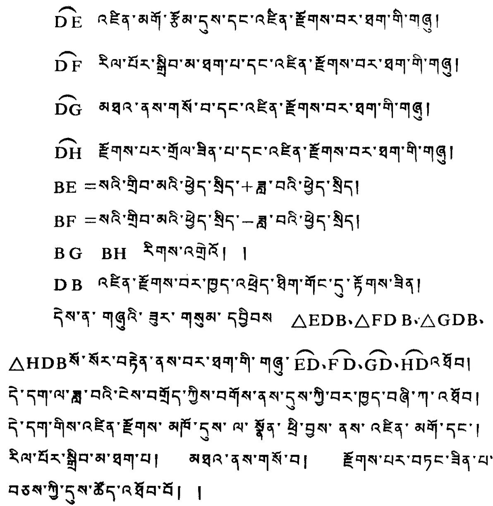

# (5)

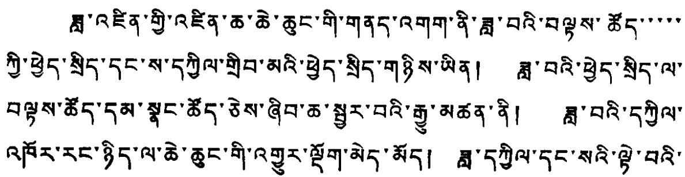

11111111111111111111111111111111111111111111111111111111111111111111111111111111111111111111111111110000000000000000000000000000000000000000000000000000000000000000000000000000000000000000000000000000111111111111111111111111111111111111111111111111111111111111111111111111111111111111111111111111111222222222222222222222222222222222222222222222222222222222222222222222222222222222222222222222222222211111111111111111111111111111111111111111111111111111111111111111111111111111111111111111111111111188888888888888888888888888888888888888888888888888888888888888888888888888888888888888888888888888889999999999999999999999999999999999999999999999999999999999999999999999999999999999999999999999999999000000000000000000000000000000000000000000000000000000000000000000000000000000000000000000000000000888888888888888888888888888888888888888888888888888888888888888888888888888888888888888888888888888000000000000000000000000000000000000000000000000000000000000000000000000000000000000000000000000000999999999999999999999999999999999999999999999999999999999999999999999999999999999999999999999999999888888888888888888888888888888888888888888888888888888888888888888888888888888888888888888888888888111111111111111111111111111111111111111111111111111111111111111111111111111111111111111111111111111

# (6)

?#'3#'3#'3#'3#'3#'3#'3#'3#'3#'3#'3#'3#'3#'3#'3#'3#'3#'3#'3#'3#'3#'3#'3#'3#'3#'3#'3#'3#'3#'3#'3#'3#'3#'3 #'3#'3#'3#'3#'3#'3#'3#'3#'3#'3#'3#'3#'3#'3#'3#'3#'3#'3#'3#'3#'3#'3#'3#'3#'3#'3#'3#'3#'3#'3#'3#'3#'3#3#'3#'3#'3#'3#'3#'3#'3#'3#'3#'3#'3#'3#'3#'3#'3#'3#'3#'3#'3#'3#'3#'3#'3#'3#'3#'3#'3#'3#'3#'3#'3#'3#' 3#'3#'3#'3#'3#'3#'3#'3#'3#'3#'3#'3#'3#'3#'3#'3#'3#'3#'3#'3#'3#'3#'3#'3#'3#'3#'3#'3#'3#'3#'3#'3#'3#'

?#'3#'3#'3#'3#'3#'3#'3#'3#'3#'3#'3#'3#'3#'3#'3#'3#'3#'3#'3#'3#'3#'3#'3#'3#'3#'3#'3#'3#'3#'3#'3 #'3#'3 #'3#'3 #'3#'3 #'3#'3 #'3#'3 #'3#'3 #'3#'3 #'3#'3 #'3#'3 #'3#'3 #'3#'3 #'3#'3 #'3#'3 #'3#'3 #'3#'3 #'3#'3 #'3#3 #'3#'3 #'3#'3 #'3#'3 #'3#'3 #'3#'3 #'3#'3 #'3#'3 #'3#'3 #'3#'3 #'3#'3 #'3#'3 #'3#'3 #'3#'3 #'3#'3 #'3#'3 #'3#'3 #'

(7) ?#'3#'3#'3#'3#'3#'3#'3#'3#'3#'3#'3#'3#'3#'3#'3#'3#'3#'3#'3#'3#'3#'3#'3#'3#'3#'3#'3#'3#'3#'3#'3#'3#'3

?#'3#'3#'3#'3#'3#'3#'3#'3#'3#'3#'3#'3#'3#'3#'3#'3#'3#'3#'3#'3#'3#'3#'3#'3#'3#'3#'3#'3#'3#'3#'3

5 5 5 5 5 5 5 5 5 5 5 5 5 5 5 5 5 5 5 5 5 5 5 5 5 5 5 5 5 5 5 5 5 5 5 5 5 5 5 5 5 5 5 5 5 5 5 5 5 5 5

5 5 5 5 5 5 5 5 5 5 5 5 5 5 5 5 5 5 5 5 5 5 5 5 5 5 5 5 5 5 5 5 5 5 5 5 5 5 5 5 5 5 5 5 5 5 5 6 5 5 5 5 5 5 5 5 5 5 5 5 5 5 5 5 5 5 5 5 5 5 5 5 5 5 5 5 5 5 5 5 5 5 5 5 5 5 5 5 5 5 5 5 5 5 5 5 5 6 5 5

# 5 5 5 5 5 5 5 5 5 5 5 5 5 5 5 5 5 5 5 5 5 5 5 5 5 5 5 5 5 5 5 5 5 5 5 5 5 5 5 5 5 5 5 5 5 5 5 5 5 7 5 5 5 5 5 5 5 5 5 5 5 5 5 5 5 5 5 5 5 5 5 5 5 5 5 5 5 5 5 5 5 5 5 5 5 5 5 5 5 5 5 5 5 5 5 5 5 5 5 1 5 5 5 5 5 5 5 5 5 5 5 5 5 5 5 5 5 5 5 5 5 5 5 5 5 5 5 5 5 5 5 5 5 5 5 5 5 5 5 5 5 5 5 5 5 5 5 5 5 2 5 5 5 5 5 5 5 5 5 5 5 5 5 5 5 5 5 5 5 5 5 5 5 5 5 5 5 5 5 5 5 5 5 5 5 5 5 5 5 5 5 5 5 5 5 5 5 5 5 3 5 5 5 5 5 5 5 5 5 5 5 5 5 5 5 5 5 5 5 5 5 5 5 5 5 5 5 5 5 5 5 5 5 5 5 5 5 5 5 5 5 5 5 5 5 5 5 5 5 4 5 5 5 5 5 5 5 5 5 5 5 5 5 5 5 5 5 5 5 5 5 5 5 5 5 5 5 5 5 5 5 5 5 5 5 5 5 5 5 5 5 5 5 5 5 5 5 5 5 0 5 5 5 5 5 5 5 5 5 5 5 5 5 5 5 5 5 5 5 5 5 5 5 5 5 5 5 5 5 5 5 5 5 5 5 5 5 5 5 5 5 5 5 5 5 5 5 5 5 8 5 5 5 5 5 5 5 5 5 5 5 5 5 5 5 5 5 5 5 5 5 5 5 5 5 5 5 5 5 5 5 5 5 5 5 5 5 5 5 5 5 5 5 5 5 5 5 5 5 9 5 5 5 5 5 5 5 5 5 5 5 5 5 5 5 5 5 5 5 5 5 5 5 5 5 5 5 5 5 5 5 5 5 5 5 5 5 5 5 5 5 5 5 5 5 5 5 5 5 五

5 5 5 5 5 5 5 5 5 5 5 5 5 5 5 5 5 5 5 5 5 5 5 5 5 5 5 5 5 5 5 5 5 5 5 5 5 5 5 5 5 5 5 5 5 5 5 7 5 5

《西·》天·》 《西·》天·》 《西·》天·》 《西·》天·》 《西·》天·》 《西·》天·》 《西·》天·》 《西·》天·》 《西·》天·》 《西·》天·》 《西·》天·》 《西·》天·》 《西·》天·》 《西·

# (1)

(西·)

(西·)