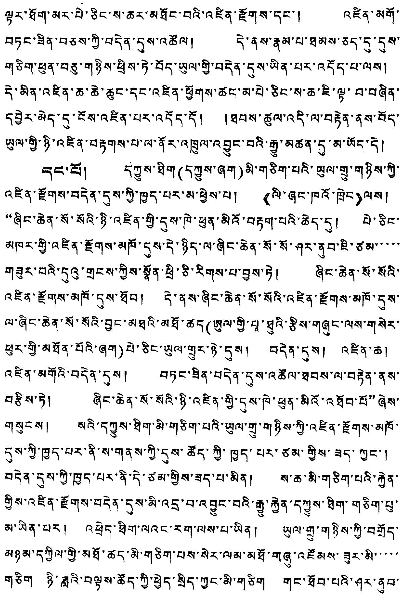

1153'23538530531853653515311531153536532253111826'18°36'18°36'18°36'18°36'18°36'18°36'18°36'18°36'18°36'18°36'18°36'18°36'18°36'18°36'18°36'18°36'18°36'19°36'19°36'19°36'19°36'19°36'19°36'19°36'19°36'19°36'19°36'19°36'19°36'19°36'19°36'19°36'19°36'19°36"18°26'18°36'18°36'18°36'18°36'18°36'18°36'18°36'18°36'18°36'18°36'18°36'18°36'18°36'18°36'18°36'18°36'20°36'20°36'20°36'20°36'20°36'20°36'20°36'20°36'20°36'20°36'20°36'20°36'20°36'20°36'20°36'20°36'20°36"18°26'18°36'18°36'18°36'18°36'18°36'18°36'18°36'18°36'18°36'18°36'18°36'18°36'18°36'18°36'18°36"18°26'18°36'18°36'18°36'18°36'18°36'18°36'18°36'18°36'18°36'18°36'18°36'18°36'18°36'18°36'18°36''18°36'18°36'18°36'18°36'18°36'18°36'18°36'18°36'18°36'18°36'18°36'18°36'18°36'18°36'18°36'18°36'18°26'18°36'18°36'18°36'18°36'18°36'18°36'18°36'18°36'18°36'18°36'18°36'18°36'18°36'18°36'18°36'18°26'19°36'18°36'18°36'18°36'18°36'18°36'18°36'18°36'18°36'18°36'18°36'18°36'18°36'18°36'18°36'18°36'18°36"18°26'19°36'18°36'18°36'18°36'18°36'18°36'18°36'18°36'18°36'18°36'18°36'18°36'18°36'18°36'18°36'18°26'19°36"18°26'19°36'18°36'18°36'18°36'18°36'18°36'18°36'18°36'18°36'18°36'18°36'18°36'18°36'18°36'18°36"18°26'19°36"18°36'18°36'18°36'18°36'18°36'18°36'18°36'18°36'18°36'18°36'18°36'18°36'18°36'18°36'18°36'18°36'18°46'18°36'18°36'18°36'18°36'18°36'18°36'18°36'18°36'18°36'18°36'18°36'18°36'18°36'18°36'18°36'18°36'17°36'18°36'18°36'18°36'18°36'18°36'18°36'18°36'18°36'18°36'18°36'18°36'18°36'18°36'18°36'18°36'18°36''18°36'19°36'18°36'18°36'18°36'18°36'18°36'18°36'18°36'18°36'18°36'18°36'18°36'18°36'18°36'18°36'18°36'19°36"18°26'19°36'18°36'18°36'18°36'18°36'18°36'18°36'18°36'18°36'18°36'18°36'18°36'18°36'18°36'19°36'18°36'18°36'18°36'18°36'18°36'18°36'18°36'18°36'18°36'18°36'18°36'18°36'18°36'18°36'18°26'18°36"18°26'19°36'18°36'18°36'18°36'18°36'18°36'18°36'18°36'18°36'18°36'18°36'18°36'18°36'18°36'19°36"18°26'19°36"18°36'18°36'18°36'18°36'18°36'18°36'18°36'18°36'18°36'18°36'18°36'18°36'18°36'18°36"18°26'19°36'18°26'18°36'18°36'18°36'18°36'18°36'18°36'18°36'18°36'18°36'18°36'18°36'18°36'18°36'18°36'18°36"18°36'18°36'18°36'18°36'18°36'18°36'18°36'18°36'18°36'18°36'18°36'18°36'18°36'18°36'18°36'18°36"18°36'19°36'18°36'18°36'18°36'18°36'18°36'18°36'18°36'18°36'18°36'18°36'18°36'18°36'18°36'18°36'18°46'18°36"18°26'19°36'18°36'18°36'18°36'18°36'18°36'18°36'18°36'18°36'18°36'18°36'18°36'18°36'18°36'17°36'18°36'18°36"18°36'19°36'18°36'18°36'18°36'18°36'18°36'18°36'18°36'18°36'18°36'18°36'18°36'18°36"18°26'19°36'18°36'18°36"18°36'18°36'18°36'18°36'18°36'18°36'18°36'18°36'18°36'18°36'18°36'18°36'18°36'18°36"18°36'19°36'18°26'18°36'18°36'18°36'18°36'18°36'18°36'18°36'18°36'18°36'18°36'18°36'18°36'18°36'18°36'19°36"18°26'18°36'18°36'18°36'18°36'18°36'18°36'18°36'18°36'18°36'18°36'18°36'18°36'18°36'18°36"18°36'19°36'19°36'18°36'18°36'18°36'18°36'18°36'18°36'18°36'18°36'18°36'18°36'18°36'18°36'18°36'18°36'18°36"18°26"19°36'18°36'18°36'18°36'18°36'18°36'18°36'18°36'18°36'18°36'18°36'18°36'18°36'18°36'18°36'18°36'18°26"18°36'19°36'18°26'18°36'18°36'18°36'18°36'18°36'18°36'18°36'18°36'18°36'18°36'18°36'18°36'18°36'19°36"18°26'19°36'19°36'18°36'18°36'18°36'18°36'18°36'18°36'18°36'18°36'18°36'18°36'18°36'18°36'18°36'18°36'19°36"18°36'19°36'18°26'18°36'18°36'18°36'18°36'18°36'18°36'18°36'18°36'18°36'18°36'18°36'18°36'18°36"18°26'19°36'18°26'19°36'18°26'18°36'18°36'18°36'18°36'18°36'18°36'18°36'18°36'18°36'18°36'18°36'18°36'18°36'18°26"18°36'19°36'19°36'18°26'18°36'18°36'18°36'18°36'18°36'18°36'18°36'18°36'18°36'18°36'18°36'18°36'18°36'18°36"18°26'19°36'19°36'18°26'18°36'18°36'18°36'18°36'18°36'18°36'18°36'18°36'18°36'18°36'18°36'18°36'18°36'19°36'19°36'18°26'18°36'18°36'18°36'18°36'18°36'18°36'18°36'18°36'18°36'18°36'18°36'18°36'18°26"18°36'19°36'19°36'19°36'18°26'18°36'18°36'18°36'18°36'18°36'18°36'18°36'18°36'18°36'18°36'18°36'18°36'18°36"18°26"19°36'19°36'18°26'18°36'18°36'18°36'18°36'18°36'18°36'18°36'18°36'18°36'18°36'18°36'18°36'18°36'18°26"19°36'19°36'18°26'18°36'18°36'18°36'18°36'18°36'18°36'18°36'18°36'18°36'18°36'18°36'18°36'18°26"19°36'19°36'18°26'19°36'18°26'18°36'18°36'18°36'18°36'18°36'18°36'18°36'18°36'18°36'18°36'18°36'18°36'19°36"19°36'19°36'18°26'18°36'18°36'18°36'18°36'18°36'18°36'18°36'18°36'18°36'18°36'18°36'18°36'18°36'19°26"19°36'19°36'18°26'18°36'18°36'18°36'18°36'18°36'18°36'18°36'18°36'18°36'18°36'18°36'18°36'18°36"19°36'19°36'18°26'18°36'18°36'18°36'18°36'18°36'18°36'18°36'18°36'18°36'18°36'18°36'18°36'18°36"18°36'19°36'18°26'19°36'18°26'18°36'18°36'18°36'18°36'18°36'18°36'18°36'18°36'18°36'18°36'18°36'18°36"19°36'19°36'18°26'18°36'19°36'18°26'18°36'18°36'18°36'18°36'18°36'18°36'18°36'18°36'18°36'18°36'18°36'18°36'18°36'18°26'18°36"19°36'19°36'18°26'18°36'18°36'18°36'18°36'18°36'18°36'18°36'18°36'18°36'18°36'18°36'18°36'19°36"19°36'18°26'18°36'18°36'18°36'18°36'18°36'18°36'18°36'18°36'18°36'18°36'18°36'18°36'18°36'18°36'18°26"19°36'19°36'19°36'18°26'18°36'18°36'18°36'18°36'18°36'18°36'18°36'18°36'18°36'18°36'18°36'18°36'18°26'18°36"19°36'19°36'19°36'18°26'18°36'18°36'18°36'18°36'18°36'18°36'18°36'18°36'18°36'18°36'18°36'18°36'19°36"19°26'19°36'18°26'18°36'18°36'18°36'18°36'18°36'18°36'18°36'18°36'18°36'18°36'18°36'18°36'18°36'18°36"19°26'19°36'18°26'18°36'18°36'18°36'18°36'18°36'18°36'18°36'18°36'18°36'18°36'18°36'18°36'18°36"19°26'19°36'18°26'19°36'18°26'18°36'18°36'18°36'18°36'18°36'18°36'18°36'18°36'18°36'18°36'18°36'18°36"18°26'19°36'18°26'18°36'19°36'18°26'18°36'18°36'18°36'18°36'18°36'18°36'18°36'18°36'18°36'18°36'18°36'19°36"19°26'19°36'18°26'18°36'19°36'18°26'18°36'18°36'18°36'18°36'18°36'18°36'18°36'18°36'18°36'18°36'18°36"19°26'19°36'18°26'18°36'18°36'19°36'18°26'18°36'18°36'18°36'18°36'18°36'18°36'18°36'18°36'18°36'18°36'18°36'18°36'18°36'19°26'18°36'18°26'18°36'18°36'18°36'18°36'18°36'18°36'18°36'18°36'18°36'18°36'18°36'18°36'18°36'18°36'19°36'18°26'18°36'18°36'18°36'18°36'18°36'18°36'18°36'18°36'18°36'18°36'18°36'18°36'19°36"18°26'19°36'18°26'18°36'18°36'18°36'18°36'18°36'18°36'18°36'18°36'18°36'18°36'18°36'18°36'18°36"18°26'18°36'18°26'18°36'18°36'18°36'18°36'18°36'18°36'18°36'18°36'18°36'18°36'18°36'18°36'18°36'18°36"18°26"19°36'19°26'18°26'18°36'18°26'18°36'18°36'18°36'18°36'18°36'18°36'18°36'18°36'18°36'18°36'18°36'18°36'18°36'18°26'18°36'18°36'19°36"19°26'19°36'18°26'18°36'18°36'18°36'18°36'18°36'18°36'18°36'18°36'18°36'18°36'19°36"19°26'19°36'18°26'18°36'18°36'19°36'18°26'18°36'18°36'18°36'18°36'18°36'18°36'18°36'18°36'18°36"19°26'19°36'18°26'18°36'18°36'19°36'18°26'19°36'18°26'18°36'18°36'18°36'18°36'18°36'18°36'18°36'18°36'18°36'18°36'18°36'18°26'18°36'18°36'18°36'18°36'19°36"19°26'19°36'18°26'18°36'18°36'19°36'18°26'18°36'18°36'18°36'18°36'19°36"19°26'19°36'18°26'18°36'18°36'19°36'18°26'18°36'18°36'18°36"19°26'19°36'18°26'18°36'18°36'19°36'18°26'18°36'18°36'18°36'18°36'18°36'18°36'19°36"19°26'19°36'18°26'18°36'18°36'19°36'18°26'18°36'18°36'19°36"19°26'19°36'18°26'18°36'18°36'19°36'18°26'18°36'18°36'18°36'18°36'19°36"19°26'18°36'18°26'18°36'18°36'19°36'18°26'18°36'18°36'18°36'18°36'18°36'19°36"19°26'18°36'18°26'18°36'18°36'19°36'18°26'18°36'18°36'18°36'18°36'19°36"19°26'18°36'18°26'18°36'18°36'19°36"19°26'18°36'18°26'18°36'18°36'19°36'18°26'18°36'18°36'18°36'19°36"19°26'18°36'18°26'18°36'18°36'19°36'18°26'18°36'18°36'18°36'19°36"19°26'18°36'19°26'18°36'18°36'19°36'18°26'18°36'18°36'18°36'19°36"19°26'18°36'18°26'18°36'18°36'19°36'18°26'18°36"19°26'18°36'18°26'18°36'18°36'19°36'18°26'18°36'18°36'18°36'19°36"19°26'18°36'18°26'18°36'19°36'18°26'18°36'18°36'18°36'19°36"19°26'18°36'18°26'18°36'19°36'18°26'18°36'18°36'18°36'18°36'19°36"19°26'18°36'18°26'18°36'19°36'18°26'18°36'18°36'18°36'19°36"19°26'18°36'19°26'18°36'19°36'18°26'18°36'18°36'19°36"19°26'18°36'19°26'18°36'19°36'18°26'18°36'18°36'19°36"19°26'18°36'19°26'18°36'18°36'19°36'18°26'18°36'18°36'19°36"19°26'18°36'19°26'18°36'19°36'18°26'18°36'18°36'19°36"19°26'19°36'18°26'18°36'19°36'18°26'18°36'18°36'19°36"19°26'18°36'18°26'18°36'19°36'18°26'18°36'18°36'19°36"19°26'18°36'18°26'18°36'19°36'18°26'18°36'18°36'19°36'18°26'18°36'18°36'19°36"19°26'18°36'18°26'18°36'19°36'18°26'18°36'18°36'19°36"19°26'19°36'18°26'18°36'19°36'18°26'18°36'18°36'19°36"19°26"18°36'18°26'18°36'19°36'18°26'18°36'18°36'19°36"19°26'18°36'18°26'18°36'19°36'18°26'18°36'18°36'19°26"19°26'18°36'18°26'18°36'19°36'18°26'18°36'18°36'19°26"19°26'18°36'18°26'18°36'19°36'18°26'18°36'19°26"19°26'18°36'18°26'18°36'19°36'18°26'18°36'19°26"19°26'18°36'18°26'18°36'19°36'18°26'1

53

(3)

O 5 636 5 5 5 5 5 5 5 5 5 5 5 5 5 5 5 5 5 5 5 5 5 5 5 5 5 5 5 5 5 5 5 5 5 5 5 5 5 5 5 5 5 5 5 5 5 5 5 5 5 5 6 5 5 5 5 5 5 5 5 5 5 5 5 5 5 5 5 5 5 5 5 5 5 5 5 5 5 5 5 5 5 5 5 5 5 5 5 5 5 5 5 5 5 5 5 5 5 5 5 5

FrAHQ

F

H

r

M

MZQGD

D MZQGD

Q MZQGD

黄平象限

Q

Q

QH

QF

A

B

C

AC

CAF

AC 5F CAF 5F

① 5 5F

r 5 5F

rK 5 5F 5F 5F 5F 5F 5F 5F 5F 5F 5F 5F 5F 5F 5F 5F 5F 5F 5F 5F 5F 5F 5F 5F 5F 5F 5F 5F 5F 5F 5F 5F 5F 5F 5F

5 5 5 5 5 5 5 5 5 5 5 5 5 5 5 5 5 5 5 5 5 5 5 5 5 5 5 5 5 5 5 5 5 5 5 5 5 5 5 5 5 5 5 5 5 5 5 5 5 5 5

②可写'只写'写'写'写'写'写'写'写'写'写'写'写'写'写'写'写'写'写'写'写'写'写'写'写'写'写'写'写'写'写'写'写'写'写'写'写'写'写'写'写'写'写'写'写'写'写'写'写'写'写'写" 90°写1HS'5'2H写'写'写'写'写'写'写'写'写'写'写'写'写'写'写'写'写'写'写'写'写'写'写'写'写'写'写'写'写'写'写'写'写'写'写'写'写'写'写'写'写'写'写'写'写'写'写'写'写'写',写'写'写'写'写'写'写'写'写'写'写'写'写'写'写'写'写'写'写'写'写'写'写'写'写'写'写'写'写'写'写'写'写'写'写'写'写'写'写'写'写'写'写'写'写'写'写'写'写'写,写'写'写'写'写'写'写'写'写'写'写'写'写'写'写'写'写'写'写'写'写'写'写'写'写'写'写'写'写'写'写'写'写'写'写'写'写'写'写'写'写'写'写'写'写'写'写'写'写'写''写'写'写'写'写'写'写'写'写'写'写'写'写'写'写'写'写'写'写'写'写'写'写'写'写'写'写'写'写'写'写'写'写'写'写'写'写'写'写'写'写'写'写'写'写'写'写'写'写'写' $\angle S$  90°写1HS'5'2H写'写'写'写'写'写'写'写'写'写'写'写'写'写'写'写'写'写'写'写'写'写'写'写'写'写'写'写'写'写'写'写'写'写'写'写'写'写'写'写'写'写'写'写',写'写'写'写'写'写',写'写'写'写'写'写',写'写'写'写'写',写'写'写'写'写',写'写'写'写'写',写'写'写'写'写',写'写'写'写'写',写'写'写'写'写',写'写'写'写'写',写'写'写'写'写',写'写'写'写'写',写'写'写'写'写','写'写'写'写',写'写'写'写'写','写'写'写'写',写'写'写'写'写','写'写'写'写',写'写'写'写',写'写'写'写',写'写'写'写',写'写'写'写',写'写'写'写',写'写'写'写',写'写'写'写',写'写'写'写',写'写'写'写',写'写'写'写',写'写'写'写',写'写'写'写',写'写',写'写'写',写'写',写'写',写'写',写'写',写',写',写',写',写',写',写',写',写',写',写',写',写',写',写',写',写',写',写',写',写',写',写',写',写',写',写',写',写',写',写',写',写',写',写',写',写',写',写',写',写',写',写',写',写',写',写',写',写',写','写',写',写',写',写',写',写',写',写',写',写',写',写',写',写',写',写',写',写',写',写',写',写',写',写',写',写',写',写',写',写',写',写',写',写',写',写',写',写',写',写',写',写',写',写',写',写',写',写',写",写',写',写',写',写',写',写',写',写',写',写',写',写',写',写',写',写',写',写',写',写',写',写',写',写',写',写',写',写',写',写',写',写',写',写',写',写',写',写',写',写',写',写',写',写',写',写',写',写',写,,写',写',写',写',写',写',写',写',写',写',写',写',写',写',写',写',写',写',写',写',写',写',写',写',写',写',写',写',写',写',写',写',写',写',写',写',写',写',写',写',写',写',写',写',写',写',写',写',写',写'写',写',写',写',写',写',写',写',写',写',写',写',写',写',写',写',写',写',写',写',写',写',写',写',写',写',写',写',写',写',写',写',写',写',写',写',写',写',写',写',写',写',写',写',写',写',写',写','写',写','写',写',写',写',写',写',写',写',写',写',写',写',写',写',写',写',写',写',写',写',写',写',写',写',写',写',写',写',写',写',写',写',写',写',写',写',写',写',写',写',写',写',写',写',写',写',写',写','写',写'',写',写',写',写',写',写',写',写',写',写',写',写',写',写',写',写',写',写',写',写',写',写',写',写',写',写',写',写',写',写',写',写',写',写',写',写',写',写',写',写',写',写',写',写',写',写',写',写',写',写'',写',写',写',写',写',写',写',写',写',写',写',写',写',写',写',写',写',写',写',写',写',写',写',写',写',写',写',写',写',写',写',写',写',写',写',写',写',写',写',写',写',写',写',写',写',写',写',写','写',写,,写',写',写',写',写',写',写',写',写',写',写',写',写',写',写',写',写',写',写',写',写',写',写',写',写',写',写',写',写',写',写',写',写',写',写',写',写',写',写',写',写',写',写',写',写',写',写',写','写',写,,,写',写',写',写',写',写',写',写',写',写',写',写',写',写',写',写',写',写',写',写',写',写',写',写',写',写',写',写',写',写',写',写',写',写',写',写',写',写',写',写',写',写',写',写',写',写',写',写',写',写,'写',写,,写',写',写',写',写',写',写',写',写',写',写',写',写',写',写',写',写',写',写',写',写',写',写',写',写',写',写',写',写',写',写',写',写',写',写',写',写',写',写',写',写',写',写',写',写',写',写',写,,写',写,,写',写',写',写',写',写',写',写',写',写',写',写',写',写',写',写',写',写',写',写',写',写',写',写',写',写',写',写',写',写',写',写',写',写',写',写',写',写',写',写',写',写',写',写',写',写',写',写,'写',写,,,写',写',写',写',写',写',写',写',写',写',写',写',写',写',写',写',写',写',写',写',写',写',写',写',写',写',写',写',写',写',写',写',写',写',写',写',写',写',写',写',写',写',写',写',写',写',写',写','写',写,,,,,写',写',写',写',写',写',写',写',写',写',写',写',写',写',写',写',写',写',写',写',写',写',写',写',写',写',写',写',写',写',写',写',写',写',写',写',写',写',写',写',写',写',写',写',写',写',写',写',写',写,,,,,写',写',写,,,,,写',写',写,,,,,写',写',写,,,,,写',写',写,,,,,写',写',写,,,,,写',写',写,,,,,写',写',写,,,,,写',写',写,,,,,写',写',写,,,,,写',写',写,,,,,写',写',写,,,,,写',写',写,,,,,写',写',写,,,,,写',写',写,,,,,写','写',写,,,,,写',写',写,,,,,写',写',写,,,,,写',写',写,,,,,写',写',写,,,,,写',写',写,,,,,写',写',写,,,,,写',写',写,,,,,写',写',写,,,,,写',写',写,,,,,写',写',写,,,,,写',写',写,,,,,写',写',写,,,,,写',写',写,,,,,写',写','写',写,,,,,写',写',写,,,,,写',写',写,,,,,写',写',写,,,,,写',写',写,,,,,写',写',写,,,,,写',写',写,,,,,写',写',写,,,,,写',写',写,,,,,写',写',写,,,,,写',写',写,,,,,写',写',写,,,,,写',写',写,,,,,写',写',写,,,,,写','写','写,,,,,写',写',写,,,,,写',写',写,,,,,写',写',写,,,,,写',写',写,,,,,写',写',写,,,,,写',写',写,,,,,写',写',写,,,,,写',写',写,,,,,写',写',写,,,,,写',写',写,,,,,写',写',写,,,,,写',写',写,,,,,写',写',写,,,,,写',写',写,,写',写',写',写',写',写',写',写',写',写',写',写',写',写',写',写',写',写',写',写',写',写',写',写',写',写',写',写',写',写',写',写',写',写',写',写',写',写',写',写',写',写',写',写',写',写',写','写',写,,,,,

《日·》日·日·日·日·日·日·日·日·日·日·日·日·日·日·日·日·日·日·日·日·日·日·日·日·日·日·日·日·日·日·日·日·日·日·日·日·日·日·日·日·日·日·日·日·日·日·日·日·日·日·日日日日日日日日日日日日日日日日日日日日日日日日日日日日日日日日日日日日日日日日日日日日日日日日日日日日日日日日日日日日日日日日日日日日日日日日日日日日日日日日日日日日日日日日日日日日日日日日日日日日目目目目目目目目目目目目目目目目目目目目目目目目目目目目目目目目目目目目目目目目目目目目目目目目目目目目目目目目目目目目目目目目目目目目目目目目目目目目目目目目目目目目目目目目目目目目目目目目目目目目日日日日日日日日日日日日日日日日日日日日日日日日日日日日日日日日日日日日日日日日日日日日日日日日日日日日日日日日日日日日日日日日日日日日日日日日日日日日日日日日日日日日日日日日日日日日日日日日日日日

④ 5日日日日日日日日日日日日日日日日日日日日日日日日日日日日日日日日日日日日日日日日日日日日日日日日日日日日日日日日日日日日日日日日日日日日日日日日日日日日日日日日日日日日日日日日日日日日日日日日日日日 日日日日日日日日日日日日日日日日日日日日日日日日日日日日日日日日日日日日日日日日日日日日日日日日日日日日日日日日日日日日日日日日日日日日日日日日日日日日日日日日日日日日日日日日日日日日日日日日日日日日月月月月月月月月月月月月月月月月月月月月月月月月月月月月月月月月月月月月月月月月月月月月月月月月月月月月月月月月月月月月月月月月月月月月月月月月月月月月月月月月月月月月月月月月月月月月月月月月月月月月日日日日日日日日日日日日日日日日日日日日日日日日日日日日日日日日日日日日日日日日日日日日日日日日日日日日日日日日日日日日日日日日日日日日日日日日日日日日日日日日日日日日日日日日日日日日日日日日日日日自日日日日日日日日日日日日日日日日日日日日日日日日日日日日日日日日日日日日日日日日日日日日日日日日日日日日日日日日日日日日日日日日日日日日日日日日日日日日日日日日日日日日日日日日日日日日日日日日日日日日本本本本本本本本本本本本本本本本本本本本本本本本本本本本本本本本本本本本本本本本本本本本本本本本本本本本本本本本本本本本本本本本本本本本本本本本本本本本本本本本本本本本本本本本本本本本本本本本本本本本本

O

Z 可写

ZC 可写

EOC

S

M

E 5 5 5 5 5 5 5 5 5 5 5 5 5 5 5 5 5 5 5 5 5 5 5 5 5 5 5 5 5 5 5 5 5 5 5 5 5 5 5 5 5 5 5 5 5 5 5 5 5 5 6 5 5 5 5 5 5 5 5 5 5 5 5 5 5 5 5 5 5 5 5 5 5 5 5 5 5 5 5 5 5 5 5 5 5 5 5 5 5 5 5 5 5 5 5 5 5 5 5 5 7 5 5 5 5 5 5 5 5 5 5 5 5 5 5 5 5 5 5 5 5 5 5 5 5 5 5 5 5 5 5 5 5 5 5 5 5 5 5 5 5 5 5 5 5 5 5 5 5 5 1 5 5 5 5 5 5 5 5 5 5 5 5 5 5 5 5 5 5 5 5 5 5 5 5 5 5 5 5 5 5 5 5 5 5 5 5 5 5 5 5 5 5 5 5 5 5 5 5 5 4 5 5 5 5 5 5 5 5 5 5 5 5 5 5 5 5 5 5 5 5 5 5 5 5 5 5 5 5 5 5 5 5 5 5 5 5 5 5 5 5 5 5 5 5 5 5 5 5 5 3 5 5 5 5 5 5 5 5 5 5 5 5 5 5 5 5 5 5 5 5 5 5 5 5 5 5 5 5 5 5 5 5 5 5 5 5 5 5 5 5 5 5 5 5 5 5 5 5 5 2 5 5 5 5 5 5 5 5 5 5 5 5 5 5 5 5 5 5 5 5 5 5 5 5 5 5 5 5 5 5 5 5 5 5 5 5 5 5 5 5 5 5 5 5 5 5 5 5 5 0 5 5 5 5 5 5 5 5 5 5 5 5 5 5 5 5 5 5 5 5 5 5 5 5 5 5 5 5 5 5 5 5 5 5 5 5 5 5 5 5 5 5 5 5 5 5 5 5 5 8 5 5 5 5 5 5 5 5 5 5 5 5 5 5 5 5 5 5 5 5 5 5 5 5 5 5 5 5 5 5 5 5 5 5 5 5 5 5 5 5 5 5 5 5 5 5 5 5 5 9 5 5 5 5 5 5 5 5 5 5 5 5 5 5 5 5 5 5 5 5 5 5 5 5 5 5 5 5 5 5 5 5 5 5 5 5 5 5 5 5 5 5 5 5 5 5 5 5 5 五 5 5 5 5 5 5 5 5 5 5 5 5 5 5 5 5 5 5 5 5 5 5 5 5 5 5 5 5 5 5 5 5 5 5 5 5 5 5 5 5 5 5 5 5 5 5 5 5 5 三 5 5 5 5 5 5 5 5 5 5 5 5 5 5 5 5 5 5 5 5 5 5 5 5 5 5 5 5 5 5 5 5 5 5 5 5 5 5 5 5 5 5 5 5 5 5 5 5 5 二 5 5 5 5 5 5 5 5 5 5 5 5 5 5 5 5 5 5 5 5 5 5 5 5 5 5 5 5 5 5 5 5 5 5 5 5 5 5 5 5 5 5 5 5 5 5 5 5 5 一 5 5 5 5 5 5 5 5 5 5 5 5 5 5 5 5 5 5 5 5 5 5 5 5 5 5 5 5 5 5 5 5 5 5 5 5 5 5 5 5 5 5 5 5 5 5 5 5 5 与 5 5 5 5 5 5 5 5 5 5 5 5 5 5 5 5 5 5 5 5 5 5 5 5 5 5 5 5 5 5 5 5 5 5 5 5 5 5 5 5 5 5 5 5 5 5 5 5 5 于 5 5 5 5 5 5 5 5 5 5 5 5 5 5 5 5 5 5 5 5 5 5 5 5 5 5 5 5 5 5 5 5 5 5 5 5 5 5 5 5 5 5 5 5 5 5 5 5 5 、 5 5 5 5 5 5 5 5 5 5 5 5 5 5 5 5 5 5 5 5 5 5 5 5 5 5 5 5 5 5 5 5 5 5 5 5 5 5 5 5 5 5 5 5 5 5 5 5 5 ③ 5 5 5 5 5 5 5 5 5 5 5 5 5 5 5 5 5 5 5 5 5 5 5 5 5 5 5 5 5 5 5 5 5 5 5 5 5 5 5 5 5 5 5 5 5 5 5 5 5

A 5

F A 5

G A 5

AMO 5

ASO 5

FG 5

FG=EG- EF=AMO- - ASO

5 5 5 5 5 5 5 5 5 5 5 5 5 5 5 5 5 5 5 5 5 5 5 5 5 5 5 5 5 5 5 5 5 5 5 5 5 5 5 5 5 5 5 5 5 5 5 5 5 5

8"8"8"8"8"8"8"8"8"8"8"8"8"8"8"8"8"8"8"8"8"8"8"8"8"8"8"8"8"8"8"8"8"8"8"8"8"8"8"8"8"8"8"8"8"8"8"8"8"8"8

98888888888888888888888888888888888888888888888888888888888888888888888888888888888888888888888888888999999999999999999999999999999999999999999999999999999999999999999999999999999999999999999999999999988888888888888888888888888888888888888888888888888888888888888888888888888888888888888888888888888988888888888888888888888888888888888888888888888888888888888888888888888888888888888888888888888888

0888888888888888888888888888888888888888888888888888888888888888888888888888888888888888888888888888

AB

DAB

AD5

AD 5

DB

③ 55555555555555555555555555555555555555555555555555555555555555555555555555555555555555555555555555556666666666666666666666666666666666666666666666666666666666666666666666666666666666666666666666666666555555555555555555555555555555555555555555555555555555555555555555555555555555555555555555555555555

⑦ 555555555555555555555555555555555555555555555555555555555555555555555555555555555555555555555555556 55555555555555555555555555555555555555555555555555555555555555555555555555555555555555555555555555

② 良节可口可口可口可口可口可口可口可口可口可口可口可口可口可口可口可口可口可口可口可口可口可口可口可口可口可口可口可口可口可口可口可口可口可口可口可口可口可口可口可口可口可口可口可口可口可口可口可口可口可口可可口可口可口可口可口可口可口可口可口可口可口可口可口可口可口可口可口可口可口可口可口可口可口可口可口可口可口可口可口可口可口可口可口可口可口可口可口可口可口可口可口可口可口可口可口可口可口可口可口可

③ 55可口可口可口可口可口可口可口可口可口可口可口可口可口可口可口可口可口可口可口可口可口可口可口可口可口可口可口可口可口可口可口可口可口可口可口可口可口可口可口可口可口可口可口可口可口可口可口可口可口可 可口可口可口可口可口可口可口可口可口可口可口可口可口可口可口可口可口可口可口可口可口可口可口可口可口可口可口可口可口可口可口可口可口可口可口可口可口可口可口可口可口可口可口可口可口可口可口可口可口可口口可口可口可口可口可口可口可口可口可口可口可口可口可口可口可口可口可口可口可口可口可口可口可口可口可口可口可口可口可口可口可口可口可口可口可口可口可口可口可口可口可口可口可口可口可口可口可口可口可口 可口可口可口可口可口可口可口可口可口可口可口可口可口可口可口可口可口可口可口可口可口可口可口可口可口可口可口可口可口可口可口可口可口可口可口可口可口可口可口可口可口可口可口可口可口可口可口可口可口 可 口可口可口可口可口可口可口可口可口可口可口可口可口可口可口可口可口可口可口可口可口可口可口可口可口可口可口可口可口可口可口可口可口可口可口可口可口可口可口可口可口可口可口可口可口可口可口可口可口可口可 10 可口可口可口可口可口可口可口可口可口可口可口可口可口可口可口可口可口可口可口可口可口可口可口可口可口可口可口可口可口可口可口可口可口可口可口可口可口可口可口可口可口可口可口可口可口可口可口可口可口

④ 良节可口可口可口可口可口可口可口可口可口可口可口可口可口可口可口可口可口可口可口可口可口可口可口可口可口可口可口可口可口可口可口可口可口可口可口可口可口可口可口可口可口可口可口可口可口可口可口可 可口可 口可口可 口可口可 口可口可 口可口可 口可口可 口可口可 口可口可 口可口可 口可口可 口可口可 口可口可 口可口可 口可口可 口可口可 口可口可 口可口可 口可口可 口可口可 口可口可 口可口可 口口可 口口可 口口可 口口可 口口可 口口可 口口可 口口可 口口可 口口可 口口可 口口可 口口可 口口可 口口可 口口可 口口可 口口可 口口可 口口可 口口可 口口可 口口可 口口可 口口可 只可口可 口口可 口口可 口口可 口口可 口口可 口口可 口口可 口口可 口口可 口口可 口口可 口口可 口口可 口口可 口口可 口口可 口口可 口口可 口口可 口口可 口口可 口口可 口口可 口口可 10 口口可 口口可 口口可 口口可 口口可 口口可 口口可 口口可 口口可 口口可 口口可 口口可 口口可 口口可 口口可 口口可 口口可 口口可 口口可 口口可 口口可 口口可 口口可 口口可 口口

(5) 良节可口可口可口可口可口可口可口可口可口可口可口可口可口可口可口可口可口可口可口可口可口可口可口可口可口可口可口可口可口可口可口可口可口可口可口可口可口可口可口可口可口可口可口可口可口可口可口可

②

③

# (6)

51" 51" 51" 51" 51" 51" 51" 51" 51" 51" 51" 51" 51" 51" 51" 51" 51" 51" 51" 51" 51" 51" 51" 51" 51" 51"

# (7)

(7) 今、今、今、今、今、今、今、今、今、今、今、今、今、今、今、今、今、今、今、今、今、今、今、今、今、今、今、今、今、今、今、今、今、今、今、今、今、今、今、今、今、今、今、今、今、今、今、今、今、今、今、、今、、今、、今、、今、、今、、今、、今、、今、、今、、今、、今、、今、、今、、今、、今、、今、、今、、今、、今、、今、、今、、今、、今、、今、、今、、今、、今、、今、、今、、今、、今、、今、、今、、今、、今、、今、、今、、今、、今、、今、、今、、今、、今、、今、、今、、今、、今、、今、、今、、今、今、、今、、今、、今、、今、、今、、今、、今、、今、、今、、今、、今、、今、、今、、今、、今、、今、、今、、今、、今、、今、、今、、今、、今、、今、、今、、今、、今、、今、、今、、今、、今、、今、、今、、今、、今、、今、、今、、今、、今、、今、、今、、今、、今、、今、、今、、今、、今、、今、今、今、、今、、今、、今、、今、、今、、今、、今、、今、、今、、今、、今、、今、、今、、今、、今、、今、、今、、今、、今、、今、、今、、今、、今、、今、、今、、今、、今、、今、、今、、今、、今、、今、、今、、今、、今、、今、、今、、今、、今、、今、、今、、今、、今、、今、、今、、今、、今、今、、今、今、、今、、今、、今、、今、、今、、今、、今、、今、、今、、今、、今、、今、、今、、今、、今、、今、、今、、今、、今、、今、、今、、今、、今、、今、、今、、今、、今、、今、、今、、今、、今、、今、、今、、今、、今、、今、、今、、今、、今、、今、、今、、今、、今、、今、、今、、今、、今、今、今、今、、今、、今、、今、、今、、今、、今、、今、、今、、今、、今、、今、、今、、今、、今、、今、、今、、今、、今、、今、、今、、今、、今、、今、、今、、今、、今、、今、、今、、今、、今、、今、、今、、今、、今、、今、、今、、今、、今、、今、、今、、今、、今、、今、、今、、今、、今、今、、今、、今、今、、今、、今、、今、、今、、今、、今、、今、、今、、今、、今、、今、、今、、今、、今、、今、、今、、今、、今、、今、、今、、今、、今、、今、、今、、今、、今、、今、、今、、今、、今、、今、、今、、今、、今、、今、、今、、今、、今、、今、、今、、今、、今、、今、、今、、今、、今、今、、今、今、今、、今、、今、、今、、今、、今、、今、、今、、今、、今、、今、、今、、今、、今、、今、、今、、今、、今、、今、、今、、今、、今、、今、、今、、今、、今、、今、、今、、今、、今、、今、、今、、今、、今、、今、、今、、今、、今、、今、、今、、今、、今、、今、、今、、今、、今、、今、今、今、、今、今、、今、、今、、今、、今、、今、、今、、今、、今、、今、、今、、今、、今、、今、、今、、今、、今、、今、、今、、今、、今、、今、、今、、今、、今、、今、、今、、今、、今、、今、、今、、今、、今、、今、、今、、今、、今、、今、、今、、今、、今、、今、、今、、今、、今、、今、、今、今、今、今、今、、今、、今、、今、、今、、今、、今、、今、、今、、今、、今、、今、、今、、今、、今、、今、、今、、今、、今、、今、、今、、今、、今、、今、、今、、今、、今、、今、、今、、今、、今、、今、、今、、今、、今、、今、、今、、今、、今、、今、、今、、今、、今、、今、、今、、今、今、、今、、今、、、今、、今、、今、、今、、今、、今、、今、、今、、今、、今、、今、、今、、今、、今、、今、、今、、今、、今、、今、、今、、今、、今、、今、、今、、今、、今、、今、、今、、今、、今、、今、、今、、今、、今、、今、、今、、今、、今、、今、、今、、今、、今、、今、、今、、今、、今、、今、、今、、今、、

今、今、今、今、今、今、今、今、今、今、今、今、今、今、今、今、今、今、今、今、今、今、今、今、今、今、今、今、今、今、今、今、今、今、今、今、今、今、今、今、今、今、今、今、今、今、今、今、今、今

#

55555555555555555555555555555555555555555555555555555555555555555555555555555555555555555555555555556666666666666666666666666666666666666666666666666666666666666666666666666666666666666666666666666666888888888888888888888888888888888888888888888888888888888888888888888888888888888888888888888888888899999999999999999999999999999999999999999999999999999999999999999999999999999999999999999999999999998888888888888888888888888888888888888888888888888888888888888888888888888888888888888888888888888880000000000000000000000000000000000000000000000000000000000000000000000000000000000000000000000000000888888888888888888888888888888888888888888888888888888888888888888888888888888888888888888888888888

8888888888888888888888888888888888888888888888888888888888888888888888888888888888888888888888888886666666666666666666666666666666666666666666666666666666666666666666666666666666666666666666666666660000000000000000000000000000000000000000000000000000000000000000000000000000000000000000000000000006666666666666666666666666666666666666666666666666666666666666666666666666666666666666666666666666667777777777777777777777777777777777777777777777777777777777777777777777777777777777777777777777777777888888888888888888888888888888888888888888888888888888888888888888888888888888888888888888888888888777777777777777777777777777777777777777777777777777777777777777777777777777777777777777777777777777000000000000000000000000000000000000000000000000000000000000000000000000000000000000000000000000000

55555555555555555555555555555555555555555555555555555555555555555555555555555555555555555555555555556666666666666666666666666666666666666666666666666666666666666666666666666666666666666666666666666666888888888888888888888888888888888888888888888888888888888888888888888888888888888888888888888888888899999999999999999999999999999999999999999999999999999999999999999999999999999999999999999999999999990000000000000000000000000000000000000000000000000000000000000000000000000000000000000000000000000000

999999999999999999999999999999999999999999999999999999999999999999999999999999999999999999999999999888888888888888888888888888888888888888888888888888888888888888888888888888888888888888888888888888000000000000000000000000000000000000000000000000000000000000000000000000000000000000000000000000000888888888888888888888888888888888888888888888888888888888888888888888888888888888888888888888888888

999999999999999999999999999999999999999999999999999999999999999999999999999999999999999999999988888999999999999999999999999999999999999999999999999999999999999999999999999999999999999999999999988888000000000000000000000000000000000000000000000000000000000000000000000000000000000000000000000088888999999999999999999999999999999999999999999999999999999999999999999999999999999999999999999999900000999999999999999999999999999999999999999999999999999999999999999999999999999999999999999999999999999111111111111111111111111111111111111111111111111111111111111111111111111111111111111111111111111111100000000000000000000000000000000000000000000000000000000000000000000000000000000000000000000000000099999999999999999999999999999999999999999999999999999999999999999999999999999999999999999999990000088888888888888888888888888888888888888888888888888888888888888888888888888888888888888888888880000088888888888888888888888888888888888888888888888888888888888888888888888888888888888888888888889999988888888888888888888888888888888888888888888888888888888888888888888888888888888888888888888880000099999999999999999999999999999999999999999999999999999999999999999999999999999999999999999999998888822222222222222222222222222222222222222222222222222222222222222222222222222222222222222222222222222220000000000000000000000000000000000000000000000000000000000000000000000000000000000000000000000000006666666666666666666666666666666666666666666666666666666666666666666666666666666666666666666666666660000000000000000000000000000000000000000000000000000000000000000000000000000000000000000000000000002222222222222222222222222222222222222222222222222222222222222222222222222222222222222222222222222223333333333333333333333333333333333333333333333333333333333333333333333333333333333333333333333333333000000000000000000000000000000000000000000000000000000000000000000000000000000000000000000000000000333333333333333333333333333333333333333333333333333333333333333333333333333333333333333333333333333

365 247 5 5 5 5 5 5 5 5 5 5 5 5 5 5 5 5 5 5 5 5 5 5 5 5 5 5 5 5 5 5 5 5 5 5 5 5 5 5 5 5 5 5 5 5 5 5 5 5 5 5 652

# 1

可 7天· 85、329 7天· 311 7 85 7 96 51 计都 342 7 16 7 617 319 606、619 591、592 15 15 15、330 15、330 113

331 41 310 321、658 665 658 371 368 649 649 610、686 618 38 613 336 46 339 20

# P

# 1

#

110

313

96

88

113

353

113

113

85

8

8

73

8、113

8、114

320

315

86

334

86

88

614

38、105

30、342

54

30

30

30

76

76

76

76

76

364

33、344

364

364

364

364

13

# 二

359、659

359、673

359

618

# 5

# 35

# 5

RE 113,647

603

3 333

328

358

23

341

36

375,671

24

20

35

86,87

97,360

20

604,683

55

370

359

595

55

21

356,653

335,651

367

72

355,652

371

55

55

34,671

336

38

99

339

339,361

339,361

33

315

36,375

117

334

25,648

40

105

38

326

367

369

369

360

591

20

# 5

59

590

316,596

602

612

595

595

603

612

670

372

372

683

364,374

373

110

377,685

57

9

20,327

13

333

54

54

315

115

330,593

5

10

329

12

\~95

12

\~95

320

326

325

93

668,684

13

11

# 1

314

597

319

593

24

357,361

94,338

321

59

59

364,665

593

678

360

360

366

41,114

46

43,346

39

54

55

313

60

324,361

607,613

358

14

312

311

368

5 361,648

5 38

5 58

5 30,342

5 597

5 593

5 361

5 17

17

85

333

333

5 19

58

114,346

39

58

319

613

57

20

35

37

601

84

369

23

19,88

27

11

11

332

15,374

58,97

19,353

19,329

12

86,87

112

112

113

606

#

333 110 19.591 312

312 311 27

# 3

310.615 37 346 590 615

615 656 597 36 34 55.114 94 670.674 316.353

602 674 684 318 319 651 66 602.604 46 595 114.320 346.667 356.653 356 357 360 600

319

651

66

602.604

46

595

114.320

346.667

356.653

356

357

360

600

5

81

312

367

博土 602

113

330

316

12

116

98

80

18

97

346

659

353

357

97,616

91,100

38

# 2

86

8

27

18,335

312

36

80

668

599

312

20

24

311

59

37,57

346

115

325

101

35,372

57

661

9

658

115

602,604

96

# 1

607

590

85

614

23,312

67

15,376

319

338

59,115

674

377,685

25

26

9

83

118

15,331

83

83

27

58

609,616

611

41

599

612

612

10

84

37

68

323

334

85,362

617

31

595

# 2

# 5

90,608

342

356

11,13

614

329

313

94

18,331

311

311

312

17

# 7

318

115

606

91

616

313

353

341

25,335

67,327

51

9

610

375

312

# 7

374

374

32

683

33,682

\~ 363 116 112 36 364 364 364 364 364 610 365,374 364 670 33,669 22,44 364 343,682 345 363 369,681 371

- 5

366

- 5

370,681

- 5

362,682

- 5

365

35

85

17

# 9

319

313,594

# 9

612

591

598

335

324

81

39

39

40

80

114、346

598

334

85

646

654

113

592

319

# 三

20

20

368、677

368、677

663、672

97、327

97、327

19

315、598

10

341、660

(西)西)西

14

10

10

345

367、662

75

326

74

367

357

363、658

#

363

74

355

33,657

19,361

367

610

96,318

327,595

38

78,592

78

8

24,104

20

22

20

341

34

365

37

364

99

112

112

375

316

# 3

113

# 1

54

22

19,24

85

617

10

331

111

377

611

8,323

112

112

322

13

57

318

615

310

355

310

355

356

359

359

57

359

355

331

363,665

363

357

113

59

114,654

10

15

10,15

113

598

14

15,330

15,330

330

330

14

\~5

16

\~5

14

\~5

\~5

\~5

\~5

\~5

\~5

616

\~5

\~5

\~5

\~5

# 2

\~5 1

\~5

597

\~5

\~5

\~5

\~5

\~5

\~5

\~5

\~5

\~5

\~5

\~5

\~5

\~5

\~5

\~5

\~5

\~5

\~5

\~5

\~5

# 9

\~5

\~5

\~5

\~5

\~5

51 16

597,599

315

22,49

616

618

615

616

619

319

#

679

667

3

318

377

594

110

590

317

317

659

58

596

329

612

597

318

318

113

112

31

377

598

346

314

314

314

314

315

617

617

# 5

5 314

5 592

5 310

329

86,333

591

597

597

597

314

54

606

671

113

649

111,115

117

5

112

334

59

371

117

# 8

315

346

94

606

84

612

18

# 名词术语索引

# A

阿嘉·罗桑丹贝嘉·········585

阿跋亚··································235

阿修罗······························287、304

暗天体··································288

按宫日推五星····························187

按太阳日推五星························190

奥波尔策《日月食典》··········175

# B

八卦················································237

八线表··································572、621

(剩)白边··································169

白道····························287、394、630

白分··································131、213

白极················································631

白胶日················································303

《白莲亲传》··································238、248

(白琉璃)················································269

白平象限················································408

"白算"················································562

白羊宫为首··································261

半定跃················································153

半食················································289、396、409

北极高度················································580、642

北行六宫················································264

北京················································378

~食甚用时················································394

~昼夜最长时刻················································402

本轮················································294、622

~半径················································626

~心················································625

本身行················································262、282

本天······························································622

本影················································632

《毗奈耶经》················································277

(圭)表················································209、300

别时轮················································176、206

并行(升度)················································390

~时差················································390

罗月······························································430

不均匀运动················································261、280

布顿·仁钦竹················································124、270

蕃土……212、402、417、641

蕃域……260

博叉……204

# C

才且复茸……12、584

长尾曜……204

澄水星……234

成吉思汗……278

迟行……283

\~步度……182

\~定数……182、284

\~中数……177

赤道经度……636

赤极……636、639

《崇祯历书》……564

重日缺日……162、290、621

重者缺大……248、290

重张位……143、378

冲……285

船说……262、306

除以135……155

除以126……151

初极上元……226、276

初亏……397、409

初亏复圆……369、409、632

出食……398

楚尔沁藏布……577

春分点……155、636

春分距午……403

春牛……302、584

春社……302

"此地……582

《聪人遂愿》……584

粗日……246

粗曜……246

# D

达喇嘛·错尔森藏布……577

达摩师利……269

《大日经疏》……287

大时分……404

大统历……563

大瞻部洲……259、304

(五)大种……258

大自在天起居……231

依历……277

代数系统……272

带食出没……416

诞生宫宿……305

"当日……187

滴漏系统……145

第巴·桑吉嘉措……269、570

第谷体系……566、621

第七洲……259

第钦·喇嘛……584

地方时差··· 580、641

地理经纬度··· 641、642

地轮··· 258

地平圈··· 636

地平视差··· 401、581、635

地球··· 622

地心··· 639

地心说··· 566

地影··· 289

~半径··· 395

~心··· 629

地支··· 236

"颠倒"··· 172

叠盔说··· 262、366

丁卯周··· 276

"定"字的意义··· 157

定交角··· 397、641

定日··· 157、162

定朔··· 157、390、400

定望··· 390

定曜··· 157

冬至··· 335、379

东大距··· 286

东西差··· 407

毒水日··· 233、243、302

度··· 392

《对法藏》··· 258

多麦地区··· 412

# E

哦勒丹增··· 584

二十四方位··· 643

二十四节气··· 303

二十七"会合"··· 129、160

二十七宿··· 127、261

二十八宿··· 127、261

二五二○周期表··· 583

# F

《发智自在王篇》··· 582

法足··· 136

方位··· 289

分(时间,弧度)··· 391

分位常数··· 209

风轮··· 258

风行··· 262、304

福乐区六洲··· 259

复圆··· 397、409

负数··· 153、383

# G

迦玛·让迥多吉··· 270

干支··· 391

岗珠·罗追塔益··· 584

高下差··· 635

《格登新历》··· 276

更换历元 138、144

工查布 584

宫 392

宫首 392

宫序 280

宫日 213、275

宫月 274、291

宫年 272

恭息·隆多丹增 583

弓(四肘) 261

《公规春牛经》 585

公积日 176

顾观光 274

卦 237

圭表测影 209、300

# H

汉历 584

《汉历大全》 570

《汉历心要》 575

汉文历书 583

汉历用表十六种 583

汉域 260

合时(协时) 211

合朔 157、293

合运动 284

恒加数 138、418

恒气 275

恒星 128

~背景 282

~年 218

~月 221、275

~周期 218

黑分 213

黑算 562

黑月 290

红白种子 176、252

后步 151

弧刻 128、145、220、271

狐日 303

华瑞(地区) 575

环食 634

黄白大距 394、628

黄白交点 306、389

黄白升交点 287、393、628

黄白降交点 287、393

黄赤大距 390

黄道 287、630

~经度 390

(月亮)~距纬 633

~高弧交角 407、633

黄极 636、639

黄历 563

《黄历编制法》 582

黄平象限 402、636

~表 402

\~宫度· 403

\~距时· 402

皇历· 563

回归年· 297、579

"回归日" 303

回归雨期· 303

回回历· 287

《慧剑光华篇》 583

彗星· 287

会合神· 223

(五星)会合周期· 284

火·空·海纪元· 135、277

火轮· 258

霍尔月· 278

# J

几何方法· 621

疾行· 183

\~步度· 184

\~定数· 183、186

疾迟与快慢· 177

积步· 195

积年· 143、378

积月· 144、278、297、378

积宫月· 187

《积日表》 583

吉日凶日· 296

吉凶宜避· 236

极微· 261

基本数据· 271、523

计都· 287

计量单位· 271

计算的起点· 623

加速减速· 262

渐加渐减· 149

减6宿45刻· 280

交宫· 232

交节· 233

交食· 168

\~方位· 169

\~年· 168

\~推步术· 378

\~限差· 396

\~颜色· 171、174

交周· 381、388、628

\~升度差· 631

角宿月· 143

劫(大、中、小)· 261

劫火· 166

节气· 230、291、392

金刚山· 258

《金光明经》 277

近地点· 151

\~周期· 305

近点月· 275

近距历元· 276

近时 405

净行 151、182

九宫 237

九六轮围 207、212

九执历 149、157、204

距弧 629

距时 629

距星 627

俱卢舍 261

《俱舍论》 126、277、303

均衡不均衡 151

均轮 284、622

均数 383

~时差 390

君臣吉凶 232

# K

康熙帝 565、569

康熙甲子元 400

《康熙御制汉历大全藏文

译本》 570

凯雅扎西 571

开普勒 626

刻 391

克主杰 124

快行 285

快、慢、曲、跃、四种行

285

# L

拉卜楞寺 268

~藏书总目 582

~喜金刚院 583

拉加寺 175、268、421

黎域 260

李约瑟 566

理论交宫度 208

立春为年首 278

历法 566

历书 566

《历象考成》 565

历元 275、585

历注 302

连环说 262、306

凉山 264

两文曜 177

~检步 177

~周期 177

~行度 226

麟德历 306

凌犯 262、572

"零数" 151

留 285

刘宝琳 133

六重海 259

六重山 257

六重洲 259

六宫的共值 250

六十大数名 125

六十干支 129

六十年周期 129

隆都喇嘛 277、305

娄宿为首 261、305

漏刻 128、145、271

漏分 271

率(一率、二率) 388

罗喉 287

~表 252

~修正值 172

~基数(根数) 167、381

~四化身 204

~头 167、287、382

~尾 167、287、382

~行度 166、222、287

~恒星周期 287

罗桑欧色 583

罗头距月 381、628

罗月定距 393

洛线(地区) 303

轮值曜 127

伦珠嘉措 269

# M

马首火山 258、304

马杨寺 575

《马杨历书》 418

麦许曲培 583

慢行 285

蒙古月 567

孟春正月 382

孟、仲、季 382

民用历书 302

墨尔根论师 236

秒 391

秒差 383

明安图 565

昂宿为首 305

# N

南北差 407

南北行 306

南行六宫 208

南洲东区 260、304

内插法 403

内行星 177、282

内外别三时轮 176、206、269

尼泊尔 8

泥婆罗 282

逆行 282

逆序 183

年的长度 231、273、578

年首 277

"鸟日" 303

农历 563

诺桑嘉措 235、299

# P

判断有食 289

旁下数 152、189

偏食 632

平方位 279

平黄经 279

平距弧 385

平距时 385

平气 275

平朔 145、378、381

平望 629

平引 381

卜以决疑 236

浦派 137、269

# Q

七地狱 261

七曜 137、306

起食方位 169、174、207

气应 379

乾隆甲子元 378

前步 151

"前后见三" 292

钦饶努布 268

秋社 302

曲行 187、285

祛疵转年 230

全食 289、396、409

~距弧 631

全食带 634

缺日 162、291、621

缺者重小 248、291

# R

"饶迥" 143

日步 157

日 154、390

日出日没 416

日分 379

《日光篇》 269

日食 172

日余 379

日月食预报 287、617、634

《日藏经》 277

入宫 232、297

入历年数 143

入年月数 143

入食方位 280、640

入宿度 627

闰分 379

闰日(=重日) 292

闰应 144

闰余……238、287

闰月……296

闰章……307

闰周……279、580

# S

赛钦·扎巴丹增……582

塞迦纪元……232、276

三伏……302

三角函数……578

三年零三博叉……204

"三日同见"……292

三十三天……260

三士……247

三武曜……177

三武检步……178

三种日……212

\~概念……213

\~互求……217

\~比例……272

色界……260

沙盘演算……125

山口瑞凤……9

苦婆罗……212、260

上扩说……262

上下午……211

上、下、左、右、……398

上元……226、276

升度……398

\~时差……398

黄赤  $\sim$  表……420

交周  $\sim$  差……400

生光……398

《胜乐经首品释》……129、276

胜生年……135、143

胜生周……135、276

十二地支……236

十二宫……128、261、380

十二缘起……129

十三分表……234、237

十四方位……633

十曜……127、282、304

十一作用神……129、160

实晦……400

实交周……388

实距弧……387

实距时……387

实朔……387

实望……387、629

实影……395

时辰……391

《时轮根本经》……269

《时轮摄略经》

……135、163、269、571

时轮历……271

\~的计量单位……271

\~的语言 269

时宪历 564

《时宪书》 563

《时宪志》 379

时限总时 397、411

食分 1f9、288、396、406、639

\~差 396、408

食既 396

\~生光 396

食神 287

食甚 289

\~交周 394

\~距交 398

\~距时 394

\~距纬(定距) 393

\~实纬 408

\~视纬 408、640

\~用时 394

\~近时 405、636

\~真时 406、639

食限 383、392、627

食延 159、290

室壁日 303

释迦纪元 276

释迦成道月食 132

视半径 631

视差 635

\~位移 282、284

视直径 632

首朔 623

授时历 564

殊日 177、249

舒迪特 9

数九 302

数七 303

数字的异名 126

水轮 258

顺行 153、282

顺序 152

朔策 378

朔实 378

朔望月 145、381

《四部医典》 277

四季 306

45°线 262

四天王 260

四文曜 262

四洲各三区 304

四洲与四季 262、306

四种行 285

速算法 246

《算表渊海》 248

算余 138、418

宿步 128

宿差 285

宿度 626、640

宿刻 220

宿铃 627、640

岁差 281、297、627

岁实 379、623

损益率 150、280

损益数 383

索巴坚参 418、583

# T

太阳 401

\~半径 401

\~赤经 389、630

\~粗数 246

\~方位 278、620

\~高弧 407、636

\~恒星周期 218

\~黄经 389、630

\~基数 147

\~净行 155

\~平行 147、381

\~食限距 408

\~视高 639

\~真黄经 389

\~自行 381、386

太阳日 213、273

太阴 410

\~半径 395、400

\~超行度 159

\~地半径差 401

\~高下差 401

\~高下粗分 401

\~交周 381

\~距地 395

\~距交行 381

\~日 148、213、273

\~曜 231

\~月 273

\~自行 381、386

汤若望 564、621

体系派 225、270、281

"天高" 303

天气预报 303

天球 638

天体 306

天堂寺 583

天文普及年历 174、538、559

天正冬至 379

甜头算 232

推步日食三差 635

托勒玫 284、566

椭圆体系算法 623、644

通分 153

通积分 379

通月 382

土尔只布 299

# W

外扩说 262

外行星 177、282

王者年 382、567

望 382、631

望策 382、629

微 391

威镇三界法 168

纬差角 398、633

(地理)纬度 402、580

"未过" 152

卫藏 403

文成公主 277、567

文殊 571

~菩萨 571

《~笑颜篇》 381、582

《~供华篇》 582

《~悦容篇》 584

《~意旨庄严篇》 582

文曜 282

乌里季巴图 576

邬摩妃 231

《无垢光大碗》 135

无色界 260

无中气则闰 233、291、392

五分表 234、237

五世达赖 236、569

五行 236

五行占 562

《五行占年首问题》 585

五星 282

~周期 224

~远地点 284

五曜 176、282

~速算法 249

~仙人 192

~行度 226

~周期 224

五要素 143、163

五支 161

武曜 282

物候 302、305

# X

西大距 286

西夏 278

《西洋新法历书》 564

西藏天文历算研究所 268

希吉来纪元 277

息 213、271

喜善胜空满 161

下合 285

下弦居前 277

夏迦纪元 232、276

夏历 563