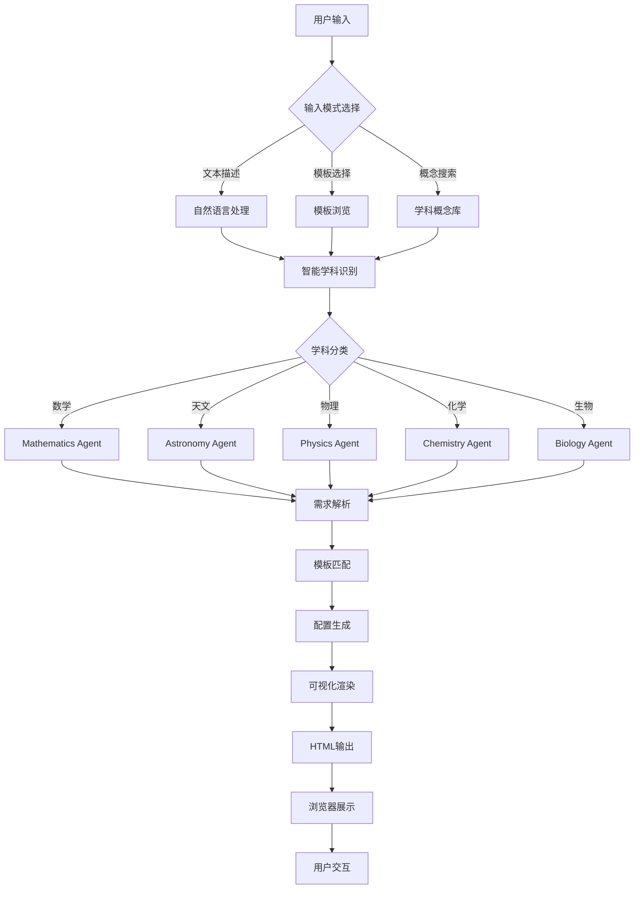
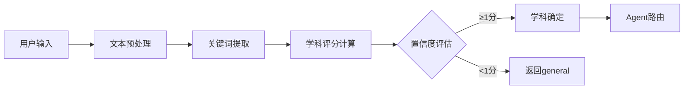
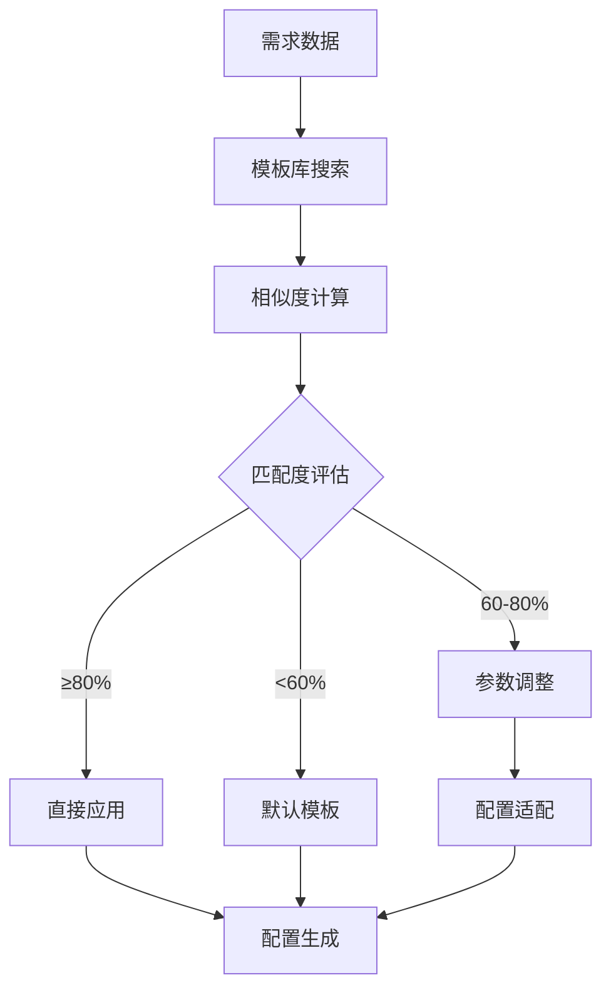
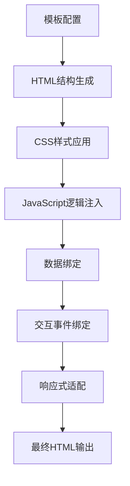
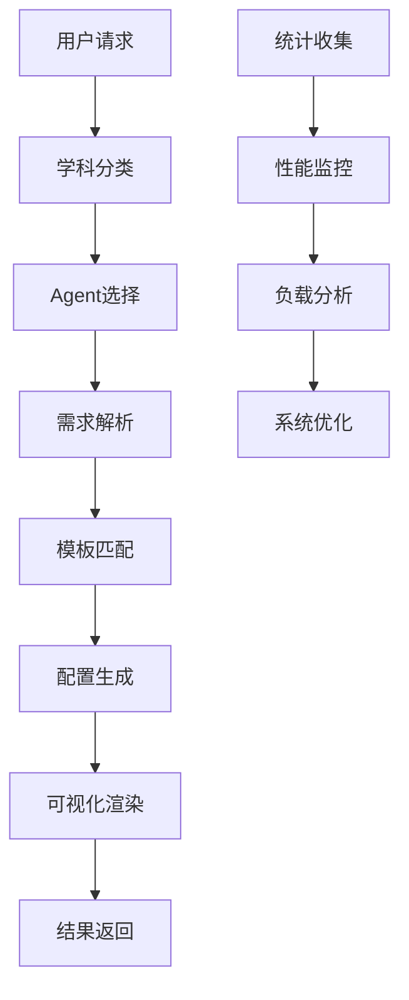
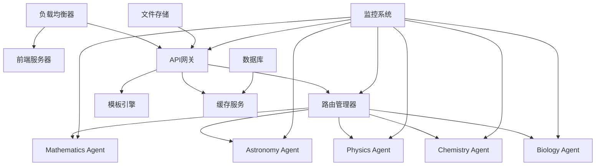

# 万物可视化 - 任务流程完整拆解

## 系统概述

**万物可视化 v2.0** 采用集中式路由架构（方案A），实现"一图胜千言"的设计理念，将复杂的自然语言描述转换为专业的可视化图表。

### 技术栈
- **前端**：HTML5 + CSS3 + JavaScript (ES6+)
- **后端**：FastAPI + Python 3.9+
- **可视化**：Plotly.js + Three.js + D3.js + MathJax
- **架构**：集中式路由 + 学科Agent系统

---

## 核心任务流程图



---

## 详细流程拆解

### 阶段1：用户输入与交互 📝

**位置**: `main-app/index.html:114-353`

#### 输入模式
1. **文本输入模式** (main-app/index.html:151-264)
   - 自然语言描述可视化需求
   - 支持中英文混合输入
   - 字符限制：1-5000字符
   - 智能提示和自动补全

2. **模板选择模式** (main-app/index.html:267-326)
   - 预定义模板库浏览
   - 按学科分类展示
   - 模板搜索和筛选
   - 一键应用配置

3. **概念搜索模式** (main-app/index.html:329-351)
   - 学科概念树形浏览
   - 智能关键词匹配
   - 相关概念推荐
   - 学习路径引导

#### 智能辅助功能
- **实时搜索建议** (main-app/index.html:132-141)
- **提示词样例库** (main-app/index.html:184-263)
- **参数配置引导** (main-app/index.html:160-169)

---

### 阶段2：智能学科识别 🤖

**位置**: `backend-v2/agents/router_manager.py:125-184`

#### 支持的5大学科领域

| 学科 | 核心概念 | 关键词示例 | 权重级别 |
|------|----------|------------|----------|
| **数学** | 概率统计、线性代数、微积分、几何 | 正态分布、矩阵、导数、概率 | 高优先级 |
| **天文** | 行星运动、星系结构、天体现象 | 行星、轨道、太阳系、星座 | 高优先级 |
| **物理** | 力学、电磁学、光学、现代物理 | 力学、电磁、波动、量子 | 高优先级 |
| **化学** | 有机化学、无机化学、物理化学 | 分子、原子、化学反应、元素 | 高优先级 |
| **生物** | 细胞生物学、遗传学、生态学 | 细胞、DNA、基因、光合作用 | 高优先级 |

#### 学科分类算法

```python
评分机制：
高优先级关键词匹配: +3分
中优先级关键词匹配: +2分
普通关键词匹配:   +1分
最低阈值:          1分 (低于返回general)
```

#### 分类流程


---

### 阶段3：需求解析与模板匹配 🔍

**位置**: `backend-v2/main.py:544-574`

#### 需求解析流程
1. **概念类型识别**
   - 可视化类型：统计图表、3D模型、动画演示
   - 数据类型：数值、分类、时间序列、地理数据
   - 交互需求：静态展示、动态操作、实时计算

2. **参数提取与验证**
   - 数值参数：范围、精度、单位
   - 分类参数：类别、标签、颜色
   - 结构参数：维度、层次、关系

3. **用户偏好应用**
   - 难度等级：初级、中级、高级
   - 交互深度：基础操作、高级分析
   - 视觉风格：简约、详细、艺术化

#### 模板匹配策略



---

### 阶段4：可视化生成与渲染 🎨

**位置**: `backend-v2/main.py:557-574`

#### 技术栈选择策略

| 可视化类型 | 主要技术 | 备选技术 | 适用场景 |
|------------|----------|----------|----------|
| **统计图表** | Plotly.js | Chart.js | 数学、物理数据 |
| **3D模型** | Three.js | Babylon.js | 天文、化学分子 |
| **自定义图形** | D3.js | SVG + JS | 复杂概念展示 |
| **数学公式** | MathJax | KaTeX | 数学符号渲染 |

#### 渲染流程


#### 输出格式
- **完整HTML页面**：包含所有依赖和样式
- **自包含设计**：无需外部依赖即可运行
- **响应式布局**：适配桌面、平板、手机
- **交互式元素**：支持缩放、拖拽、参数调整

---

### 阶段5：结果交付与用户反馈 📤

#### 交付机制
1. **静态文件服务** (backend-v2/main.py:512-528)
   - 生成唯一可视化ID
   - HTML文件持久化存储
   - CDN加速访问

2. **状态跟踪** (backend-v2/main.py:495-511)
   - 实时生成进度查询
   - 错误状态监控
   - 性能指标收集

#### 用户交互功能
- **参数动态调整**：实时修改可视化参数
- **多视角切换**：不同角度观察数据
- **导出功能**：PNG、SVG、PDF格式导出
- **分享机制**：生成分享链接和嵌入代码

---

## 核心API端点

### 主要生成接口

| 端点 | 方法 | 功能 | 特殊处理 |
|------|------|------|----------|
| `/api/v2/generate` | POST | 通用可视化生成 | 智能学科识别 |
| `/api/v2/{subject}/generate` | POST | 学科特定生成 | 直接路由到指定Agent |
| `/api/v2/highschool/generate` | POST | 高中教育专用 | 年级适配和教学优化 |

### 辅助服务接口

| 端点 | 方法 | 功能 | 返回数据 |
|------|------|------|----------|
| `/api/v2/classify` | POST | 智能学科分类 | 学科、置信度、详细评分 |
| `/api/v2/templates` | GET | 模板库查询 | 所有可用模板 |
| `/api/v2/{subject}/templates` | GET | 学科模板查询 | 指定学科模板 |
| `/api/v2/templates/search` | GET | 模板搜索 | 关键词匹配结果 |
| `/api/v2/status/{generation_id}` | GET | 生成状态查询 | 进度、状态、结果URL |

---

## 智能路由系统架构

### 路由管理器设计
**位置**: `backend-v2/agents/router_manager.py`

#### 核心组件
1. **SubjectClassifier** - 学科分类器
   - 关键词词典管理
   - 权重计算引擎
   - 置信度评估

2. **VisualizationRouter** - 路由管理器
   - Agent注册和发现
   - 请求分发和负载均衡
   - 统计和监控

3. **BaseAgent** - Agent基类
   - 统一的Agent接口
   - 通用功能封装
   - 扩展机制

#### 路由决策流程


---

## 模板引擎系统

### 统一模板管理
**位置**: `backend-v2/agents/template_engine.py`

#### 模板结构定义
```json
{
  "id": "unique_template_id",
  "name": "模板名称",
  "description": "模板描述",
  "subject": "所属学科",
  "category": "模板分类",
  "difficulty": "难度等级",
  "parameters": [
    {
      "name": "参数名",
      "type": "参数类型",
      "default": "默认值",
      "required": "是否必需",
      "description": "参数描述"
    }
  ],
  "keywords": ["关键词1", "关键词2"],
  "examples": ["示例用法1", "示例用法2"]
}
```

#### 动态模板匹配算法
1. **语义相似度计算**
   - TF-IDF向量化
   - 余弦相似度计算
   - 关键词权重调整

2. **参数兼容性检查**
   - 必需参数完整性验证
   - 参数类型兼容性检查
   - 默认值填充机制

3. **自适应调整**
   - 参数范围自动适配
   - 样式主题智能调整
   - 交互功能动态配置

---

## 性能优化策略

### 前端优化

#### 加载性能
- **懒加载机制**：模块按需加载，减少初始包大小
- **代码分割**：按学科和功能分割代码块
- **CDN加速**：静态资源使用CDN分发
- **缓存策略**：浏览器缓存和Service Worker

#### 运行时优化
- **虚拟DOM**：减少DOM操作开销
- **防抖节流**：优化用户交互响应
- **Web Workers**：复杂数据计算后台处理
- **GPU加速**：CSS3硬件加速

### 后端优化

#### 并发处理
- **异步任务队列**：使用BackgroundTasks处理长时间任务
- **连接池管理**：数据库和HTTP连接复用
- **内存优化**：大文件流式处理
- **缓存策略**：Redis缓存热点数据

#### 算法优化
- **预计算缓存**：常用计算结果缓存
- **索引优化**：模板搜索算法优化
- **批量处理**：多请求合并处理
- **智能路由**：基于负载的Agent选择

---

## 质量保证机制

### 输入验证

#### 安全检查
```python
验证规则：
- 文本长度: 1-5000字符
- XSS防护: HTML标签过滤
- SQL注入防护: 参数化查询
- 文件上传检查: 类型、大小、内容验证
```

#### 数据完整性
- **参数类型验证**：数值、字符串、布尔值严格检查
- **范围验证**：数值参数在合理范围内
- **格式验证**：日期、URL、邮箱等特殊格式
- **依赖关系**：参数间逻辑关系验证

### 输出质量控制

#### HTML标准兼容
- **W3C验证**：符合HTML5标准
- **浏览器兼容**：支持主流浏览器
- **响应式设计**：多设备适配测试
- **无障碍访问**：ARIA标签和键盘导航

#### 可视化质量
- **数据准确性**：计算结果验证
- **视觉效果**：色彩、布局、可读性检查
- **交互功能**：用户操作响应测试
- **性能监控**：渲染时间统计

---

## 监控与日志系统

### 系统监控

#### 健康检查
**端点**: `/health`
```json
返回数据：
{
  "status": "healthy",
  "version": "2.0.0",
  "agents": 5,
  "active_generations": 12,
  "timestamp": "2025-12-01T10:00:00Z"
}
```

#### 性能指标
- **响应时间**：API接口响应时间统计
- **吞吐量**：每秒处理请求数
- **错误率**：失败请求比例
- **资源使用**：CPU、内存、磁盘使用率

### 业务分析

#### 使用统计
```json
统计维度：
- 学科分布：各学科请求比例
- 模板热度：常用模板排行
- 用户行为：输入模式、交互偏好
- 时间分析：高峰时段、使用时长
```

#### 错误追踪
- **异常日志**：详细错误信息和堆栈
- **失败原因分析**：分类统计失败原因
- **恢复机制**：自动重试和降级策略
- **告警通知**：关键错误实时通知

---

## 部署与运维

### 系统架构图



### 扩展性设计

#### 水平扩展
- **微服务架构**：各Agent独立部署
- **容器化**：Docker容器化部署
- **自动扩缩容**：基于负载自动调整实例数
- **分布式缓存**：Redis集群支持

#### 功能扩展
- **插件机制**：新学科Agent插件化接入
- **模板市场**：社区模板贡献和分享
- **API开放**：第三方系统集成接口
- **多语言支持**：国际化语言包

---

## 总结

万物可视化系统通过智能化的任务流程，成功实现了"一图胜千言"的设计目标：

### 核心优势
1. **智能化处理**：从自然语言到专业可视化的自动转换
2. **多学科覆盖**：数学、天文、物理、化学、生物五大领域
3. **高质量输出**：基于专业Agent的精准可视化生成
4. **用户体验优化**：多种输入模式和智能辅助功能
5. **技术先进性**：现代化技术栈和性能优化

### 技术亮点
- **集中式路由架构**：高效的任务分发和处理
- **智能学科分类**：基于关键词权重的精确分类
- **统一模板引擎**：可扩展的模板管理系统
- **异步处理机制**：高并发请求处理能力
- **质量保证体系**：全方位的输入验证和输出控制

### 应用价值
- **教育领域**：帮助学生直观理解抽象概念
- **科研支持**：为研究人员提供数据可视化工具
- **科普传播**：将复杂知识以可视化方式传播
- **商业应用**：数据分析和报告生成

这个任务流程体现了现代AI技术在教育可视化领域的创新应用，为用户提供了从概念到图像的完整转换体验。