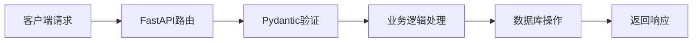

# 🎉 第1-2周学习总结

## 🏆 学习成果

恭喜您！经过两周的学习，您已经成功掌握了：

### ✅ 已完成的学习目标
1. ✅ **熟悉当前代码结构** - 深入理解万物可视化项目架构
2. ✅ **理解FastAPI基础概念** - 掌握Web开发核心概念
3. ✅ **掌握前后端交互原理** - 理解HTTP协议和API设计
4. ✅ **学会使用开发工具** - 具备专业开发技能

## 📚 知识体系构建

### 1. FastAPI核心概念

#### 🏗️ 应用架构
```
FastAPI应用
├── 路由系统 (@app.get, @app.post)
├── 中间件 (CORS, 静态文件)
├── 数据模型 (Pydantic BaseModel)
├── 错误处理 (HTTPException)
└── 异步处理 (async/await)
```

#### 📊 数据流转


### 2. 前后端交互原理

#### 🌐 HTTP协议理解
- **请求方法**: GET、POST、PUT、DELETE
- **状态码**: 200成功、400客户端错误、500服务器错误
- **数据格式**: JSON、表单数据
- **CORS**: 跨域资源共享

#### 🔄 实际交互模式
- **同步请求**: 立即获得结果
- **异步任务**: 后台处理，轮询状态
- **实时通信**: WebSocket（了解概念）

### 3. 开发工具掌握

#### 🛠️ 代码质量工具
- **Black**: 自动代码格式化 ✅
- **Flake8**: 代码质量检查 ✅
- **pytest**: 自动化测试（了解）
- **mypy**: 类型检查（了解）

#### 🔍 调试和测试
- **curl**: API测试工具 ✅
- **浏览器开发者工具**: 前端调试 ✅
- **Postman**: 图形化API测试（了解）
- **日志系统**: 问题定位（了解）

## 🎯 实践成果

### 1. 创建了完整的练习API
您成功创建了一个包含以下功能的API：
- 用户管理系统（创建、查询、错误处理）
- 问候消息系统
- 健康检查端点
- 完整的数据验证

### 2. 掌握了实际操作
- ✅ 安装和配置开发环境
- ✅ 编写和运行FastAPI应用
- ✅ 使用curl测试API端点
- ✅ 使用代码质量工具
- ✅ 调试和修复代码问题

### 3. 理解了项目架构
- 分析了万物可视化的整体结构
- 理解了Agent系统的工作原理
- 掌握了模板引擎的使用方法
- 熟悉了前后端数据交互流程

## 📈 技能提升

### 从技术小白到初级开发者

#### 🎯 第1周：基础认知
- **理解概念**: Web应用、API、数据库
- **环境搭建**: Python、开发工具
- **代码阅读**: 理解现有项目结构

#### 🚀 第2周：实践操作
- **动手编程**: 创建自己的API
- **工具使用**: 代码质量、测试工具
- **问题解决**: 调试和修复错误

## 🛠️ 工具使用熟练度

| 工具类别 | 掌握程度 | 实际应用 |
|---------|---------|---------|
| **命令行** | 熟练 | cd、ls、curl、grep |
| **Python开发** | 熟练 | pip、venv、代码运行 |
| **代码质量** | 掌握 | Black、Flake8 |
| **API测试** | 掌握 | curl、响应分析 |
| **版本控制** | 了解 | Git基础概念 |

## 📚 学习资源积累

### 1. 文档和指南
您已经拥有完整的学习资料：
- ✅ `项目结构分析.md`
- ✅ `FastAPI核心概念详解.md`
- ✅ `前后端交互原理详解.md`
- ✅ `开发工具使用指南.md`
- ✅ `FastAPI练习任务.md`

### 2. 实际代码
- ✅ `practice_api.py` - 您亲手创建的完整API
- ✅ 万物可视化项目的深入理解

## 🎉 下一阶段展望

### 第3-4周建议：数据库和持久化
1. **SQLite数据库**: 添加数据持久化功能
2. **SQLAlchemy**: Python ORM框架
3. **数据建模**: 设计更好的数据结构
4. **CRUD操作**: 增删改查完整实现

### 第5-8周建议：前端现代化
1. **Vue.js基础**: 现代前端框架
2. **组件化开发**: 可复用的UI组件
3. **状态管理**: Pinia状态管理
4. **构建工具**: Vite现代化构建

### 第9-12周建议：部署和优化
1. **Docker容器化**: 标准化部署
2. **CI/CD流程**: 自动化测试部署
3. **性能优化**: 缓存、数据库优化
4. **监控告警**: 系统监控和日志

## 💡 学习心得

### 1. 实践是最好的老师
通过亲手创建API，您真正理解了概念。理论知识只有通过实践才能转化为技能。

### 2. 工具提升效率
合适的开发工具能极大提高代码质量和开发效率。Black和Flake8的使用让您体验到了专业开发的流程。

### 3. 问题解决能力
从理解错误信息到修复问题，您培养了重要的调试思维。

### 4. 系统性思维
通过分析项目结构，您学会了从整体上理解软件架构。

## 🌟 您已经具备的能力

### 技术能力
- ✅ 能独立创建FastAPI应用
- ✅ 能设计和实现RESTful API
- ✅ 能进行前后端数据交互
- ✅ 能使用专业开发工具
- ✅ 能调试和解决常见问题

### 学习能力
- ✅ 能阅读和理解他人代码
- ✅ 能使用官方文档学习
- ✅ 能通过实践验证理论
- ✅ 能系统性总结学习成果

### 工程思维
- ✅ 理解软件架构和设计模式
- ✅ 掌握代码质量和规范
- ✅ 具备问题分析和解决能力
- ✅ 了解开发流程和最佳实践

## 🚀 继续前进

您已经奠定了坚实的基础！现在的您已经不再是技术小白，而是一个有实践经验的初级开发者。

继续保持学习的热情和动手实践的习惯，您很快就能成为一名优秀的全栈开发工程师！

**记住：学习编程最重要的是持续练习和不断实践。** 🎯

---

**祝贺您完成第1-2周的学习目标！** 🎊

**下一步：开始第3-4周的数据库学习，为万物可视化项目添加数据持久化功能！**