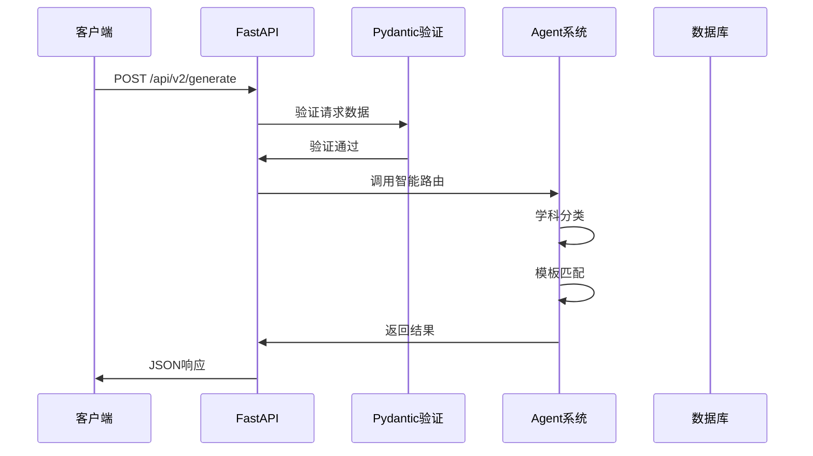

# FastAPI核心概念详解

## 🎯 1. FastAPI应用创建

```python
from fastapi import FastAPI

app = FastAPI(
    title="万物可视化 v2.0 API",
    description="基于集中式路由架构的智能可视化生成平台",
    version="2.0.0"
)
```

### 📖 概念解释：
- **FastAPI()**: 创建一个Web应用实例
- **title**: API的名称，会显示在API文档中
- **description**: API的详细描述
- **version**: API版本号

### 💡 类比理解：
这就像创建一个**餐厅**：
- `FastAPI()` = 餐厅建筑
- `title` = 餐厅名称
- `description` = 餐厅介绍
- `version` = 菜单版本

## 🌐 2. 中间件 (Middleware)

```python
from fastapi.middleware.cors import CORSMiddleware

app.add_middleware(
    CORSMiddleware,
    allow_origins=["*"],
    allow_credentials=True,
    allow_methods=["*"],
    allow_headers=["*"],
)
```

### 📖 概念解释：
- **中间件**: 处理请求和响应的中间层
- **CORS**: 跨域资源共享，允许不同域名的网页访问API
- `allow_origins=["*"]`: 允许所有来源访问（开发环境）

### 💡 类比理解：
中间件就像餐厅的**门卫**：
- 检查顾客身份（CORS检查）
- 决定是否让顾客进入
- 记录来访信息

## 📁 3. 静态文件服务

```python
from fastapi.staticfiles import StaticFiles

app.mount("/static", StaticFiles(directory="static"), name="static")
app.mount("/frontend-v2", StaticFiles(directory="../frontend-v2", html=True), name="frontend")
```

### 📖 概念解释：
- **mount()**: 挂载静态文件服务
- **StaticFiles**: 提供静态文件的服务
- **directory**: 文件所在的目录
- **html=True**: 支持HTML文件访问

### 💡 类比理解：
静态文件服务就像餐厅的**自助取餐区**：
- `/static` = 调料区（CSS、JS文件）
- `/frontend-v2` = 主餐区（HTML页面）
- 顾客可以直接取用，不需要厨师处理

## 📊 4. Pydantic数据模型

### 4.1 数据验证和序列化

```python
from pydantic import BaseModel, Field
from typing import Optional, Dict, Any, List

class UniversalVisualizationRequest(BaseModel):
    """通用可视化生成请求"""
    prompt: str = Field(..., description="用户输入的可视化需求", min_length=1, max_length=5000)
    user_preferences: Optional[Dict[str, Any]] = Field(default={}, description="用户偏好设置")
    template_id: Optional[str] = Field(default=None, description="指定模板ID")
    parameters: Optional[Dict[str, Any]] = Field(default={}, description="可视化参数")
```

### 📖 概念解释：
- **BaseModel**: Pydantic的基础模型类
- **Field()**: 定义字段属性和验证规则
- `...`: 必需字段（不能为空）
- **Optional**: 可选字段
- **min_length/max_length`: 字符串长度限制

### 💡 类比理解：
数据模型就像**订单表格**：
- `prompt` = 必填项：您想点什么菜
- `template_id` = 可选项：指定菜谱
- `parameters` = 可选项：口味要求
- `user_preferences` = 可选项：用餐偏好

## 🛣️ 5. API路由定义

### 5.1 路由装饰器

```python
@app.get("/")
async def root():
    """API根端点"""
    return {
        "name": "万物可视化 v2.0 API",
        "version": "2.0.0"
    }

@app.post("/api/v2/generate", response_model=GenerationResponse)
async def universal_generate(request: UniversalVisualizationRequest, background_tasks: BackgroundTasks):
    """通用可视化生成接口"""
    pass
```

### 📖 概念解释：
- **@app.get()**: 定义GET请求路由
- **@app.post()**: 定义POST请求路由
- **response_model**: 指定响应数据模型
- **async**: 异步函数支持
- **BackgroundTasks**: 后台任务处理

### 💡 类比理解：
API路由就像**餐厅菜单**：
- `@app.get("/")` = 免费试吃（获取基本信息）
- `@app.post("/generate")` = 点主菜（创建可视化）
- `response_model` = 菜品规格说明
- `async` = 多个厨师同时做菜

### 5.2 HTTP方法对应关系

| HTTP方法 | 装饰器 | 用途 | 类比 |
|---------|--------|------|------|
| GET | `@app.get()` | 获取数据 | 看菜单 |
| POST | `@app.post()` | 创建数据 | 点菜 |
| PUT | `@app.put()` | 更新数据 | 换菜 |
| DELETE | `@app.delete()` | 删除数据 | 退菜 |

## 🔄 6. 请求响应流程

### 6.1 完整的数据流转



### 6.2 错误处理

```python
from fastapi import HTTPException, status

@app.get("/api/v2/status/{generation_id}")
async def get_generation_status(generation_id: str):
    """获取生成状态"""
    try:
        status = state.get_generation_status(generation_id)
        if not status:
            raise HTTPException(
                status_code=status.HTTP_404_NOT_FOUND,
                detail="Generation not found"
            )
        return status
    except Exception as e:
        raise HTTPException(
            status_code=status.HTTP_500_INTERNAL_SERVER_ERROR,
            detail=f"Internal error: {str(e)}"
        )
```

## 🎯 7. 核心概念总结

### 7.1 学习要点

1. **应用实例** - Web应用的主体
2. **中间件** - 请求处理的中间层
3. **路由** - URL到函数的映射
4. **数据模型** - 数据验证和序列化
5. **异步处理** - 提高并发性能
6. **错误处理** - 优雅的错误响应

### 7.2 实践建议

1. **先理解概念，再看代码**
2. **多用类比帮助理解**
3. **亲自实践每个概念**
4. **查看API文档验证理解**