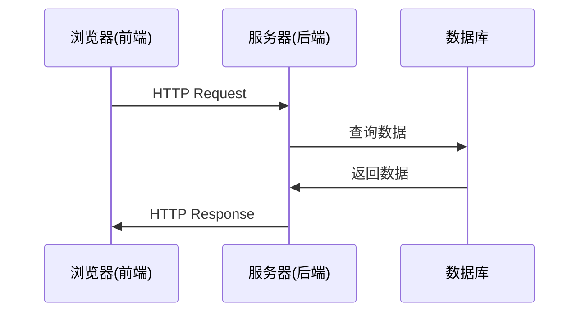

# 前后端交互原理详解

## 🔄 通信流程概述

### 1. HTTP协议基础

前后端通信基于**HTTP协议**，这是一个客户端-服务器模型：



### 2. 请求-响应模式

#### 2.1 HTTP请求的组成
```http
POST /api/v2/generate HTTP/1.1
Host: localhost:8000
Content-Type: application/json
Content-Length: 123

{
  "prompt": "画一个正弦函数",
  "template_id": "default"
}
```

**请求包含：**
- **请求行**: 方法 + 路径 + 协议版本
- **请求头**: 元数据信息
- **请求体**: 实际数据

#### 2.2 HTTP响应的组成
```http
HTTP/1.1 200 OK
Content-Type: application/json
Content-Length: 456

{
  "generation_id": "abc123",
  "status": "processing",
  "message": "生成中..."
}
```

**响应包含：**
- **状态行**: 协议版本 + 状态码 + 状态描述
- **响应头**: 元数据信息
- **响应体**: 实际数据

## 📡 前端如何调用后端API

### 1. 原生JavaScript方法

#### 1.1 使用fetch API
```javascript
// GET请求示例
async function getTemplates() {
    try {
        const response = await fetch('http://localhost:8000/api/v2/templates');

        if (!response.ok) {
            throw new Error(`HTTP error! status: ${response.status}`);
        }

        const data = await response.json();
        console.log('模板数据:', data);
        return data;
    } catch (error) {
        console.error('获取模板失败:', error);
    }
}

// POST请求示例
async function generateVisualization(prompt) {
    try {
        const response = await fetch('http://localhost:8000/api/v2/generate', {
            method: 'POST',
            headers: {
                'Content-Type': 'application/json',
            },
            body: JSON.stringify({
                prompt: prompt,
                template_id: 'default'
            })
        });

        if (!response.ok) {
            throw new Error(`HTTP error! status: ${response.status}`);
        }

        const data = await response.json();
        console.log('生成结果:', data);
        return data;
    } catch (error) {
        console.error('生成失败:', error);
    }
}
```

### 2. 万物可视化项目的API服务类

#### 2.1 分析现有代码
从您的项目中可以看到：

```javascript
class APIService {
    constructor() {
        this.baseUrl = '';
        this.timeout = 30000;
        this.retryCount = 3;
    }

    async generateVisualization(request) {
        const url = `${this.baseUrl}/generate`;
        return this.postRequest(url, request);
    }

    async postRequest(url, data) {
        // 实现POST请求逻辑
        // 包含重试机制
        // 错误处理
    }
}
```

#### 2.2 设计模式优势
- **封装性**: 隐藏HTTP请求细节
- **可复用**: 统一的请求处理逻辑
- **可维护**: 集中管理API配置
- **错误处理**: 统一的错误处理机制

## 🔧 开发工具使用

### 1. 浏览器开发者工具

#### 1.1 网络面板
- **查看HTTP请求**: F12 → Network
- **分析请求/响应**: 点击具体请求
- **调试问题**: 查看状态码、响应时间

#### 1.2 控制台面板
- **查看日志**: console.log输出
- **调试JavaScript**: 直接执行代码
- **错误信息**: 捕获运行时错误

### 2. API测试工具

#### 2.1 curl命令
```bash
# 测试GET请求
curl http://localhost:8000/api/v2/templates

# 测试POST请求
curl -X POST "http://localhost:8000/api/v2/generate" \
  -H "Content-Type: application/json" \
  -d '{"prompt": "测试"}'

# 包含响应头
curl -i http://localhost:8000/api/v2/templates

# 只显示响应头
curl -I http://localhost:8000/api/v2/templates
```

#### 2.2 Postman/Insomnia
- 图形化API测试工具
- 保存请求集合
- 环境变量管理
- 自动化测试

### 3. 代码调试技巧

#### 3.1 后端调试
```python
import logging

# 配置日志
logging.basicConfig(level=logging.INFO)
logger = logging.getLogger(__name__)

@app.post("/api/v2/generate")
async def generate(request: UniversalVisualizationRequest):
    logger.info(f"收到生成请求: {request.prompt}")

    try:
        # 业务逻辑
        result = await process_request(request)
        logger.info(f"生成成功: {result.generation_id}")
        return result
    except Exception as e:
        logger.error(f"生成失败: {str(e)}")
        raise
```

#### 3.2 前端调试
```javascript
class APIService {
    async postRequest(url, data) {
        console.log(`🚀 发送请求: ${url}`, data);

        try {
            const response = await fetch(url, {
                method: 'POST',
                headers: {
                    'Content-Type': 'application/json',
                },
                body: JSON.stringify(data)
            });

            console.log(`📡 收到响应: ${response.status}`, response);

            if (!response.ok) {
                console.error(`❌ 请求失败: ${response.status}`);
                throw new Error(`HTTP error! status: ${response.status}`);
            }

            const result = await response.json();
            console.log(`✅ 解析成功:`, result);
            return result;
        } catch (error) {
            console.error(`❌ 请求异常:`, error);
            throw error;
        }
    }
}
```

## 🔄 异步处理机制

### 1. 异步任务模式

#### 1.1 长时间运行的任务
```javascript
// 前端轮询模式
async function pollGenerationStatus(generationId) {
    const maxAttempts = 30; // 最多等待30次
    let attempts = 0;

    while (attempts < maxAttempts) {
        try {
            const response = await fetch(`/api/v2/status/${generationId}`);
            const status = await response.json();

            console.log(`状态检查 ${attempts + 1}:`, status.status);

            if (status.status === 'completed') {
                console.log('✅ 生成完成!');
                return status.html_url;
            } else if (status.status === 'failed') {
                console.error('❌ 生成失败:', status.error);
                throw new Error(status.error);
            }

            // 等待2秒后再次检查
            await new Promise(resolve => setTimeout(resolve, 2000));
            attempts++;
        } catch (error) {
            console.error('状态检查失败:', error);
            throw error;
        }
    }

    throw new Error('生成超时');
}
```

#### 1.2 WebSocket实时通信（高级）
```javascript
// WebSocket连接（用于实时更新）
const ws = new WebSocket('ws://localhost:8000/ws');

ws.onopen = function(event) {
    console.log('WebSocket连接已建立');
};

ws.onmessage = function(event) {
    const data = JSON.parse(event.data);
    console.log('收到实时更新:', data);

    if (data.type === 'generation_progress') {
        updateProgress(data.progress);
    }
};
```

## 🎯 最佳实践

### 1. 错误处理
```javascript
// 统一错误处理
class APIError extends Error {
    constructor(message, status, data) {
        super(message);
        this.name = 'APIError';
        this.status = status;
        this.data = data;
    }
}

async function apiCall(url, options = {}) {
    try {
        const response = await fetch(url, {
            timeout: 30000,
            ...options
        });

        if (!response.ok) {
            const errorData = await response.json().catch(() => ({}));
            throw new APIError(
                errorData.detail || `HTTP ${response.status}`,
                response.status,
                errorData
            );
        }

        return await response.json();
    } catch (error) {
        if (error instanceof APIError) {
            throw error;
        }

        // 网络错误等
        throw new APIError('网络连接失败', 0, { originalError: error.message });
    }
}
```

### 2. 请求重试机制
```javascript
async function retryRequest(url, options = {}, maxRetries = 3) {
    let lastError;

    for (let i = 0; i <= maxRetries; i++) {
        try {
            return await apiCall(url, options);
        } catch (error) {
            lastError = error;

            if (i < maxRetries) {
                console.warn(`请求失败，${2 ** i}秒后重试 (${i + 1}/${maxRetries})`);
                await new Promise(resolve => setTimeout(resolve, 1000 * Math.pow(2, i)));
            }
        }
    }

    throw lastError;
}
```

### 3. 数据缓存
```javascript
class CachedAPIService {
    constructor() {
        this.cache = new Map();
        this.cacheTimeout = 5 * 60 * 1000; // 5分钟
    }

    async getTemplates() {
        const cacheKey = 'templates';
        const cached = this.cache.get(cacheKey);

        if (cached && Date.now() - cached.timestamp < this.cacheTimeout) {
            console.log('📦 使用缓存数据');
            return cached.data;
        }

        console.log('🌐 请求新数据');
        const data = await apiCall('/api/v2/templates');

        this.cache.set(cacheKey, {
            data,
            timestamp: Date.now()
        });

        return data;
    }
}
```

## 💡 学习要点总结

### 1. 核心概念
- **HTTP协议**: 请求-响应模式
- **RESTful API**: 资源导向的设计
- **JSON格式**: 轻量级数据交换格式
- **异步处理**: 非阻塞的操作模式

### 2. 实践技能
- **fetch API**: 现代浏览器请求方法
- **错误处理**: 优雅的错误处理机制
- **调试工具**: 开发者工具的使用
- **性能优化**: 缓存和重试机制

### 3. 进阶概念
- **WebSocket**: 实时双向通信
- **CORS**: 跨域资源共享
- **认证授权**: JWT、OAuth等
- **API版本管理**: 向后兼容性

---

**掌握这些概念后，您就能独立设计和实现前后端交互系统了！** 🎉