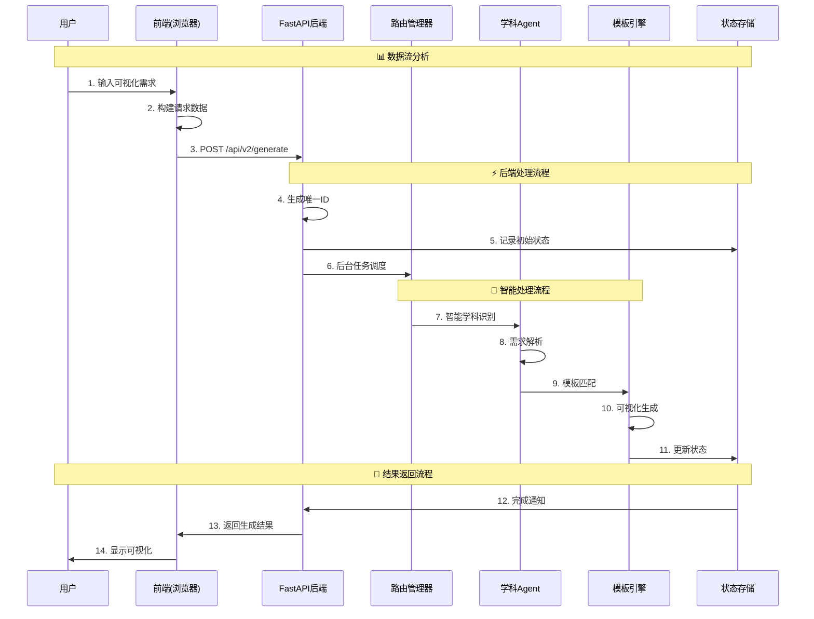

# 万物可视化数据流分析

## 🔄 完整数据流程图

### 1. 前端到后端的数据流



## 📊 详细数据处理流程

### 阶段1：请求接收 (API层)
```python
# 1. FastAPI接收请求
@app.post("/api/v2/generate")
async def universal_generate(request: UniversalVisualizationRequest):
    # 2. 数据验证
    # Pydantic自动验证请求数据
    # - prompt: 字符串，1-5000字符
    # - template_id: 可选，字符串
    # - parameters: 可选，对象
    # - user_preferences: 可选，对象

    # 3. 生成唯一标识
    generation_id = str(uuid.uuid4())

    # 4. 初始化状态
    state.active_generations[generation_id] = {
        "status": "initializing",
        "prompt": request.prompt,
        "progress": 0
    }

    # 5. 异步处理
    background_tasks.add_task(
        process_visualization_generation,
        generation_id,
        request.prompt,
        ...
    )
```

### 阶段2：智能处理 (Agent层)
```python
# router_manager.py - 智能路由管理器
async def process_visualization_generation(
    generation_id: str,
    prompt: str,
    user_preferences: dict,
    template_id: Optional[str],
    parameters: dict
):
    # 1. 状态更新
    state.active_generations[generation_id]["status"] = "processing"

    # 2. 学科分类分析
    # 分析关键词：函数、图像、物理、天文等
    subject_scores = {
        "mathematics": analyze_math_keywords(prompt),
        "physics": analyze_physics_keywords(prompt),
        "astronomy": analyze_astronomy_keywords(prompt)
    }

    # 3. 选择最适合的学科
    selected_subject = max(subject_scores, key=subject_scores.get)

    # 4. 获取对应的Agent
    agent = state.router.get_agent(selected_subject)

    # 5. Agent处理
    result = await agent.process_request(
        prompt,
        user_preferences,
        template_id,
        parameters
    )

    # 6. 更新最终状态
    state.active_generations[generation_id].update({
        "status": "completed",
        "progress": 100,
        "html_url": f"/api/v2/visualizations/viz_{generation_id[:8]}"
    })
```

### 阶段3：模板引擎 (Template层)
```python
# template_engine.py - 可视化生成
class UnifiedTemplateEngine:
    async def render_template(
        template_id: str,
        context: dict,
        generation_id: str
    ):
        # 1. 获取模板配置
        template = self.templates[template_id]

        # 2. 准备渲染数据
        render_data = {
            "title": context.get("title", "未命名可视化"),
            "description": context.get("description", ""),
            "content": self.generate_chart_data(context),
            "generation_id": generation_id
        }

        # 3. Jinja2模板渲染
        html_content = await self.jinja_env.from_string(
            template["html_template"]
        ).render_async(render_data)

        # 4. 更新状态
        state.active_generations[generation_id]["html_content"] = html_content

        return html_content
```

### 阶段4：结果返回 (前端层)
```javascript
// api-service.js - 前端轮询机制
async function pollGenerationStatus(generationId) {
    const maxAttempts = 30;
    let attempts = 0;

    while (attempts < maxAttempts) {
        try {
            // 1. 查询状态
            const response = await fetch(`/api/v2/status/${generationId}`);
            const status = await response.json();

            // 2. 处理结果
            if (status.status === 'completed') {
                console.log('✅ 生成完成');

                // 3. 获取可视化内容
                const vizResponse = await fetch(status.html_url);
                const htmlContent = await vizResponse.text();

                // 4. 更新前端显示
                this.displayVisualization(htmlContent);
                return;
            } else if (status.status === 'failed') {
                console.error('❌ 生成失败:', status.error);
                throw new Error(status.error);
            }

            // 5. 继续轮询
            await new Promise(resolve => setTimeout(resolve, 2000));
            attempts++;
        } catch (error) {
            console.error('状态检查失败:', error);
            throw error;
        }
    }
}
```

## 🗄️ 数据存储结构

### 1. 内存中的状态管理
```python
class AppState:
    def __init__(self):
        # 当前活跃的生成任务
        self.active_generations: Dict[str, Dict] = {}

        # 模板引擎实例
        self.template_engine = UnifiedTemplateEngine()

        # 路由管理器实例
        self.router = VisualizationRouter()

# 示例：活跃生成任务状态
{
    "generation_id_123": {
        "status": "processing",
        "progress": 75,
        "prompt": "正弦函数图像",
        "template_id": "default",
        "created_at": "2024-01-10T10:00:00",
        "html_content": "<html>...</html>"
    }
}
```

### 2. 模板数据结构
```json
{
  "id": "normal_distribution",
  "name": "正态分布可视化",
  "subject": "mathematics",
  "parameters": [
    {
      "name": "mu",
      "type": "number",
      "default": 0,
      "min": -10,
      "max": 10
    }
  ],
  "html_template": "<html>...</html>"
}
```

## 🔍 错误诊断：您截图中的问题

### 🚨 常见错误类型及解决方案

#### 1. 模板渲染错误
**错误表现**: `❌ 模板渲染失败: 模板不存在: default`

**原因分析**:
- 系统找不到指定的模板ID
- 模板文件不存在或未正确加载
- 模板引擎初始化问题

**解决方案**:
```python
# 检查模板是否已加载
if template_id not in state.template_engine.templates:
    logger.error(f"模板不存在: {template_id}")
    # 使用默认模板或返回错误
    template_id = "default"
```

#### 2. 数据验证错误
**错误表现**: `422 Unprocessable Entity`

**原因分析**:
- 请求数据不符合Pydantic模型定义
- 必需字段缺失
- 数据类型或格式错误

**解决方案**:
```python
class UniversalVisualizationRequest(BaseModel):
    prompt: str = Field(..., min_length=1, max_length=5000)
    # 添加详细验证规则
```

#### 3. 生成超时错误
**错误表现**: 生成过程长时间无响应

**原因分析**:
- 后台任务处理时间过长
- 系统资源不足
- 复杂的数学计算或图表生成

**解决方案**:
```python
# 添加超时机制
@timeout_after(300)  # 5分钟超时
async def process_generation():
    # 复杂处理逻辑
```

#### 4. 内存不足错误
**错误表现**: `MemoryError` 或系统卡顿

**原因分析**:
- 同时处理太多生成任务
- 图表数据量过大
- 内存泄漏

**解决方案**:
```python
# 限制并发任务数
MAX_CONCURRENT_GENERATIONS = 5

# 定期清理完成的任务
async def cleanup_completed_tasks():
    pass
```

## 💡 调试技巧

### 1. 查看后端日志
```bash
# 实时查看日志
tail -f backend-v2/logs/app.log

# 搜索特定错误
grep "error" backend-v2/logs/app.log
```

### 2. 监控数据流
```python
# 添加详细日志
logger.info(f"🎯 开始处理: {prompt}")
logger.info(f"📚 识别学科: {subject}")
logger.info(f"🎨 选择模板: {template_id}")
logger.info(f"✅ 生成完成: {generation_id}")
```

### 3. 前端调试
```javascript
// 添加详细日志
console.log('🚀 发送请求:', request);
console.log('📡 收到响应:', response);

// 监控轮询状态
console.log(`⏳ 状态检查 ${attempts + 1}:`, status.status);
```

## 🎯 优化建议

### 1. 数据流优化
- 使用缓存减少重复计算
- 实现任务队列管理并发
- 添加进度反馈机制

### 2. 错误处理优化
- 完善错误分类和处理
- 提供用户友好的错误信息
- 实现自动重试机制

### 3. 监控和日志
- 添加性能监控
- 完善日志记录
- 实现健康检查

---

**理解数据流是调试复杂系统的关键！** 🎯

通过这个分析，您现在应该能更好地理解可视化生成的工作原理，并能够快速定位和解决数据流问题。