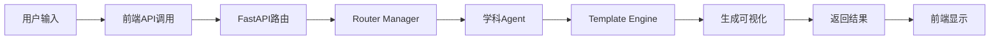

# 万物可视化项目结构分析

## 📁 整体项目结构

```
AlVisualization/
├── backend-v2/           # 后端API服务
│   ├── main.py          # 主应用入口文件 ⭐
│   ├── config.py        # 配置文件
│   ├── agents/          # Agent智能体系统
│   │   ├── base_agent.py
│   │   ├── router_manager.py
│   │   ├── template_engine.py
│   │   ├── mathematics_agent.py
│   │   ├── physics_agent.py
│   │   └── astronomy_agent.py
│   ├── templates/       # 可视化模板
│   │   ├── mathematics/
│   │   ├── physics/
│   │   └── astronomy/
│   └── static/          # 静态文件
├── frontend-v2/         # 前端应用
│   ├── index.html       # 主页面
│   ├── js/             # JavaScript文件
│   │   ├── app.js
│   │   ├── api-service.js
│   │   ├── ui-controller.js
│   │   └── template-manager.js
│   └── styles/         # CSS样式
└── start-v2.sh         # 启动脚本
```

## 🎯 核心文件解析

### 1. main.py - 应用入口
这是整个后端应用的**心脏**，负责：
- 创建FastAPI应用实例
- 定义API路由
- 配置中间件
- 集成各个Agent

### 2. Agent系统 - 智能处理核心
```
agents/
├── base_agent.py        # 基础Agent类
├── router_manager.py    # 智能路由管理器
├── template_engine.py   # 模板引擎
└── *_agent.py          # 各学科专门Agent
```

### 3. 模板系统 - 可视化生成
```
templates/
├── mathematics/
│   └── normal_distribution.json
├── physics/
└── astronomy/
```

## 🔄 数据流转过程



## 🧠 理解核心概念

### FastAPI基础概念：

1. **应用实例 (App Instance)**
   - FastAPI()创建的应用对象
   - 包含所有配置和路由

2. **路由 (Routes)**
   - URL路径到处理函数的映射
   - 如：POST /api/v2/generate

3. **中间件 (Middleware)**
   - 处理请求和响应的组件
   - 如CORS、静态文件服务

4. **依赖注入 (Dependency Injection)**
   - 自动注入需要的组件
   - 如数据库连接、用户认证

5. **Pydantic模型**
   - 数据验证和序列化
   - 自动API文档生成

## 💡 学习重点

### 第一周重点：
1. **理解main.py的结构**
2. **掌握FastAPI基础语法**
3. **学会定义API端点**
4. **理解请求响应流程**

### 第二周重点：
1. **深入Agent系统**
2. **掌握模板引擎原理**
3. **理解前后端数据交互**
4. **学会调试和测试方法**