# 第一部分

# 计算与算法基础

# 第1章导论

我国以计算为主的古代科学，在相当长的时期里处于世界领先的地位。其中一个重要原因，就是我们的先祖们很早就创造了一种简便的计算系统——算筹记数及其操作。后来，又进一步发明了更为简捷的珠算，大大地推动了古代科学技术的进步。珠算系统一直沿用至今。本章立足珠算系统看现代计算机系统，其结论是现代计算机系统与古老的珠算系统是一脉相承的。

学习本章，读者通过类比珠算系统，应该初步了解电子计算机系统的基本原理和工作方式；了解信息数字化及其标准化的必要性和重要性；了解电子计算机存储器空间字节地址的线性性；了解算法的基本概念和算法执行的时序性。初步形成计算机科学与技术的时空观、方法论。

# 1.1 计算系统

在本节中，将分析珠算系统的特点，通过类比方法“导出”电子计算机系统的基本组成，力求使读者初步理解电子计算机系统的基本特点。

# 1.1.1 珠算系统

珠算系统由算盘（硬件，如图1-1所示）、珠算口诀（软件）和人（操作者，软硬兼备）三个方面紧密结合而成。

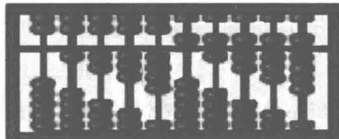  
(a) 10档7珠算盘  
图1-1 算盘

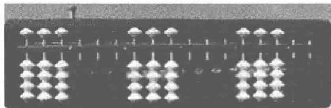  
（b）17档5珠算盘

# 1. 算珠、档及记数法

算盘由若干个档按空间位置顺序排列而成；每一档上有个数相同的算珠。算珠在其档中可以被上下移动，算珠的不同位置可用于表示不同的数码（如可表示数码0，1，2，……，9）。

按顺序排列的档，从右至左依次编号为第1档、第2档……根据计算时的具体需要，这些档可被分成若干段（位组），每一段可存放一个数据。这样，在有限的算盘盘面上可以同时存放多个数据。算盘上的档数越多，存储数据的能力就越强。理论上，算盘的档数可以无限制地扩充。珠算系统的组成如图1-2所示。

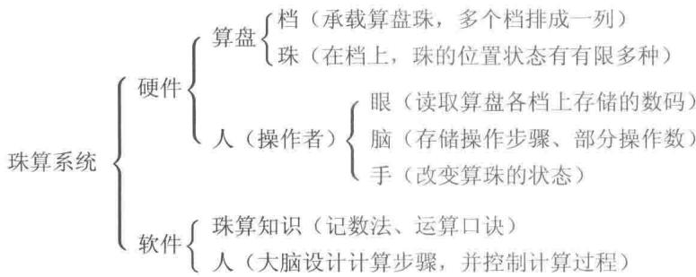  
图1-2 珠算系统的组成

# 2. 珠算方法及特点

在算盘上能够进行的操作（动作）只有有限多种。

① 选择某一档。  
② 读取该档上算珠的状态。  
③ 移动该档上的算珠（即改变算珠的状态）。

对于一个可由珠算系统计算的问题，其解题过程被分解成有限多个上述操作的有序动作集合。这个有穷动作序列存储在人脑中，由人脑根据其时序控制其逐步执行。显然，人脑中需要记录当前动作在整个动作序列中的位置（指令计数器或指令指针，标示动作序列的当前位置）。

算珠的移动过程所展现的就是珠算解题的计算过程。参与计算的原始数据、计算的中间结果、最终结果常常存放在同一段（位组）中，即从原始数据起“就地”逐步演变成为结果。这表明，一些操作步可能覆盖原始数据和中间结果（应用于那些不需要保留中间结果的情形）。这样可使有限的算盘空间得到充分地利用。

例如，人们学习珠算加法时，常进行的练习是  $1 + 2 + 3 + \dots + 36$  的累加计算。其过程如下（中间结果均未保留）。

步1 开始；  
步2 在算盘上选择若干档（即位组，“分配算盘空间”对应累加的结果）并清0；  
步3 读取算盘盘面上的数字（0），运用口诀加1，将结果（1）仍存放在本位组；  
步4 读取算盘盘面上的数字（1），运用口诀加2，将结果（3）仍存放在本位组；  
步5 读取算盘盘面上的数字（3），运用口诀加3，将结果（6）仍存放在本位组；  
步6 读取算盘盘面上的数字（6），运用口诀加4，将结果（10）仍存放在本位组；

：

步38 读取算盘盘面上的数字（630），运用口诀加36，将结果（666）仍存放在本位组；  
步39 读取算盘盘面上的数字（666），即运行结果；

步40 结束。

综上所述，算盘是数据的载体，能够存放多个数据；将计算问题分解成一系列的算盘可进行的操作是珠算的关键；珠算口诀是设计动作分解的基础和依据。

采用珠算系统解题，实质上是将复杂的计算问题转化为一系列简单操作的顺序执行。这表明一些计算过程可以机械化。但是，珠算系统中需要人的大量介入：除了“有穷的动

作序列”存放在人的大脑中以外，一些操作数、辅助量可能也存放在人的大脑中；读取算盘上的信息、算珠的移动等都需要人工实现。

“脑力劳动机械化”是人类的一种愿望。目前，许多脑力劳动已经实现了机械化、自动化。计算工具的产生和发展是脑力劳动机械化成功的典范。然而，一把算盘的存储空间容量是极其有限的，手工操作的速度是低下的。

【提出问题】拥有一把存储空间容量大、能快速操作、且自动化程度高的“算盘”是人们所追求的。

# 【分析问题】

（1）这样的“算盘”应具有如下特点。

① 尽可能多的“档”数，每个“档”有多种稳定性好的可控状态（用不同的状态表示不同的数码）。  
② 有一只“手”，它能左右移动，选择指定的“档”，还能改变该“档”上的状态。

（2）用什么材料作“档”及“珠”？显然，要求这种材料具有稳定性好、可检测其状态、可控制其状态的改变等特点。例如：

① 电子元件（利用电平信号“低”“高”两种状态分别表示0，1两个数码）——电子计算机。  
② 光学器件（利用光信号的几种不同的可检测、可控制的稳定状态表示数码）——光学计算机。  
③ 其他器件（如：量子、生物信号等）。

# 1.1.2 电子计算机基本原理

本小节介绍抽象的计算机模型，主要内容有二进制算术、图灵机和冯·诺依曼存储程序原理。以便使读者理解计算机内存字节编址的线性性、程序执行的时序性。

# 1. 二进制算术

数字是客观存在的。通过抽象及符号表示，数字系统已经被人们认识。对于数字系统，人们最熟悉和习惯的是用十进制表示的形式。其实，人们同时也在使用数字系统的其他不同进制形式。例如，计时就采用了多种进制：60秒  $= 1$  分钟，60分钟  $= 1$  小时，24小时  $= 1$  天，7天  $= 1$  周。

事实上，对于任何大于1的整数  $p$  ，均可以将数字按  $p$  进制表示及运算。在  $p$  进制数表示中，  $p$  被称为“基数”。首先确定  $p$  个符号依次对应从0开始的前  $p$  个1位  $p$  进制数。“逢  $p$  进1，借1当  $p$  ”是  $p$  进制数运算时的进位法则和借位法则。

同一个数在不同进制下的表现形式不同，它们之间可以转换。

将一个整数部分有  $n$  位的  $p$  进制数  $(d_{n - 1}d_{n - 2}\dots d_1d_0.d_{-1}d_{-2}\dots)_p$  转换成十进制数表示，直接将其按基数展开即可。

$$
\begin{array}{l} \left(d _ {n - 1} d _ {n - 2} \dots d _ {1} d _ {0}. d _ {- 1} d _ {- 2} \dots\right) _ {p} \\ = d _ {n - 1} p ^ {n - 1} + d _ {n - 2} p ^ {n - 2} + \dots + d _ {1} p + d _ {0} + d _ {- 1} p ^ {- 1} + d _ {- 2} p ^ {- 2} + \dots \\ \end{array}
$$

反过来，将一个十进制数转换成  $p$  进制数表示的方法如下。

（1）整数部分：反复除以  $p$  取余，直至商为0，依次得到  $p$  进制表示法的各位（从低位到高位，即第0,1,位）。  
（2）小数部分：反复将剩下的纯小数部分乘  $p$  取其整数部分，依次得到小数点后的第1,2,位，直到剩下的纯小数部分为0，或者达到一定位数的精度为止。

数字的二进制表示中，基数为  $p = 2$ ，两个数码分别为0和1，“逢2进1，借1当2”。采用二进制表示数值的优点是：易于物理实现且可靠性高；运算规则少且简单[1]。不足之处是：与其他进制形式相比表示同一数值时需要更多的位数。

例1.1 将十进制数123.45转换成二进制数。

解：（1）整数部分。设将该十进制整数部分123转换成的二进制数为

$$
\left(b _ {n - 1} b _ {n - 2} \dots b _ {1} b _ {0}\right) _ {2} = b _ {n - 1} 2 ^ {n - 1} + b _ {n - 2} 2 ^ {n - 2} + \dots + b _ {1} 2 + b _ {0} = 1 2 3
$$

其中  $b_{n - 1}, b_{n - 2}, \dots, b_1, b_0$  只取0或1。我们的任务是确定  $b_{n - 1}, b_{n - 2}, \dots, b_1, b_0$  。

将上式各端都除以2，则其商为

$$
\left(b _ {n - 1} b _ {n - 2} \dots b _ {1}\right) _ {2} = b _ {n - 1} 2 ^ {n - 2} + b _ {n - 2} 2 ^ {n - 3} + \dots + b _ {1} = 6 1
$$

余数为  $b_{0} = 1$  。再对所得到的商做类似的处理，可依次得到  $b_{1}, b_{2}, \dots, b_{n - 2}, b_{n - 1}$  。即

<table><tr><td>2</td><td>1</td><td>2</td><td>3</td></tr><tr><td></td><td>6</td><td>1</td><td></td></tr><tr><td></td><td>3</td><td>0</td><td></td></tr><tr><td></td><td>1</td><td>5</td><td></td></tr><tr><td></td><td>2</td><td>7</td><td></td></tr><tr><td></td><td>2</td><td>3</td><td></td></tr><tr><td></td><td>2</td><td>1</td><td></td></tr><tr><td></td><td></td><td>0</td><td></td></tr></table>

因此，  $123 = (1111011)_2$  。验证

$$
\begin{array}{l} (1 1 1 1 0 1 1) _ {2} = 1 \times 2 ^ {6} + 1 \times 2 ^ {5} + 1 \times 2 ^ {4} + 1 \times 2 ^ {3} + 0 \times 2 ^ {2} + 1 \times 2 ^ {1} + 1 \times 2 ^ {0} \\ = 6 4 + 3 2 + 1 6 + 8 + 2 + 1 \\ = 1 2 3 \\ \end{array}
$$

（2）小数部分。设将该十进制小数部分0.45转换成的二进制数如下。

$$
(0. b _ {- 1} b _ {- 2} b _ {- 3} \dots b _ {- m}) _ {2} = b _ {- 1} 2 ^ {- 1} + b _ {- 2} 2 ^ {- 2} + b _ {- 3} 2 ^ {- 3} + \dots + b _ {- m} 2 ^ {- m} = 0. 4 5
$$

上式各端都乘以2，则产生的整数部分  $b_{-1} = 0$  ，剩下的纯小数部分如下。

$$
(0. b _ {- 2} b _ {- 3} \dots b _ {- m}) _ {2} = b _ {- 2} 2 ^ {- 1} + b _ {- 3} 2 ^ {- 2} + \dots + b _ {- m} 2 ^ {- (m - 1)} = 0. 9
$$

上式各端都再乘以2，则产生的整数部分  $b_{-2} = 1$ ，剩下的纯小数部分如下。

$$
(0. b _ {- 3} \dots b _ {- m}) _ {2} = b _ {- 3} 2 ^ {- 1} + \dots + b _ {- m} 2 ^ {- (m - 2)} = 0. 8
$$

依此类推，得到  $0.45 \approx (0.01110011001100 \dots)_{2}$ ，从计算过程中可以看出 1100 是其循环节。

（3）综合。最后得到结果是  $123.45 = (1111011.01110011001100\dots)_{2}$

从上述例子可以看出，一个小数位数有限的十进制数，可能表示成无穷循环的二进制小数。

我们已经了解了实数十进制、二进制表示的形式。人们习惯于使用十进制表示法，而电子计算机采用二进制数表示法，这是“人一机矛盾”之一。这一矛盾是可调和的：计算机在输入输出数据时，进行适当转换，使得呈现在人们面前的是熟悉的十进制数，这种转换由计算机系统完成。不仅如此，人们还在10附近找了两个“基数”——8和16，它们之中一个小于10，另一个大于10。由于  $8 = 2^{3}$ ， $16 = 2^{4}$ ，因此计算机系统可以非常方便地将数据按照八进制数或者十六进制数[1]的形式输出。其转换过程无须计算，只要查表即可（如表1-1、表1-2所示）。

表 1-1 二进制数与八进制数转换  

<table><tr><td>3位
二进制数</td><td>1位
八进制数</td></tr><tr><td>000</td><td>0</td></tr><tr><td>001</td><td>1</td></tr><tr><td>010</td><td>2</td></tr><tr><td>011</td><td>3</td></tr><tr><td>100</td><td>4</td></tr><tr><td>101</td><td>5</td></tr><tr><td>110</td><td>6</td></tr><tr><td>111</td><td>7</td></tr></table>

表 1-2 二进制数与十六进制数转换  

<table><tr><td>4位二进制数</td><td>1位十六进制数</td><td>4位二进制数</td><td>1位十六进制数</td></tr><tr><td>0000</td><td>0</td><td>1000</td><td>8</td></tr><tr><td>0001</td><td>1</td><td>1001</td><td>9</td></tr><tr><td>0010</td><td>2</td><td>1010</td><td>A</td></tr><tr><td>0011</td><td>3</td><td>1011</td><td>B</td></tr><tr><td>0100</td><td>4</td><td>1100</td><td>C</td></tr><tr><td>0101</td><td>5</td><td>1101</td><td>D</td></tr><tr><td>0110</td><td>6</td><td>1110</td><td>E</td></tr><tr><td>0111</td><td>7</td><td>1111</td><td>F</td></tr></table>

具体过程：以小数点为中心，整数部分从右向左，小数部分从左向右，每3位二进制数对应1位八进制数，或每4位二进制数对应1位十六进制数。

例如，  $(1111011.01110011001100)_{2} = (173.34630)_{8} = (7B.7330)_{16}$

# 2. 图灵机

图灵机（Turing Machine）为一种抽象机器，是20世纪30年代中期英国数学家图灵（AM Turing）首先提出来（由后人命名）的。这种机器由一个控制部件、一条存储带和一个读写头构成（如图1-3所示）。这种机器所能进行的操作有（请与算盘类比）：

① 左移（读写头在存储带上向左移一格）。  
② 右移（读写头在存储带上向右移一格）。  
③ 在存储带的某一格内写下或清除一个符号。  
④ 条件转移。

这种机器的结构虽然简单，但在理论上它却能够模拟现代计算机的一切运算，因此，它可以被看作是现代计算机的一种抽象模型。

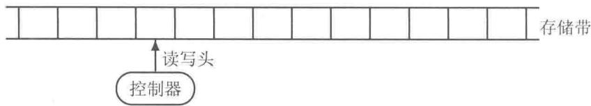  
图1-3 图灵机的构成

最简单的情形是存储带上的每一格只能记录0或1。换言之，存储带是由一系列具有双稳态的元器件线性排列而成的。此时的存储带便可视为现代计算机的内存储器（memory，内存）的模型。计算机内存中实质上只是一个很长的、可控制其变化的、仅由0与1组成的串，它是信息的载体。我们可以将计算机视为一把有很多档的算盘，而每一档上却仅有一粒算珠，算珠仅有“下”或“上”两种状态来表示一个二进制位0或1。

上面叙述的由0与1组成的串是没有间隔的。其中，不同位置上的0或者1均可以表示不同的含义。为了有效地使用、方便地控制这条存储带，须将它按位分组、按组分段，并约定每一个0或1的含义。

位（bit）：二进制的一个位，可表示0或1两种状态之一。

字节（byte）：也称为位组，作为一个单位来处理的一串二进制数位。最常用的是8位二进制数，即  $1\mathrm{byte} = 8$  bit，亦即：1字节由8位组成。

字节地址（byte address）：在存储器中，以字节（位组）为单位进行编址的地址。即一个字节赋予一个地址，字节地址将按线性方式顺序编排。

计算机运行时，还可按字节地址将内存分成一些片段，供不同的程序使用。在计算机高级语言程序中，将更多地使用抽象的内存单元名称（由程序员命名，编译系统将某一部分内存空间与之联系），而不一定直接使用内存的字节地址。

例如，一台内存容量为512MB（兆字节[1]）的计算机内存由  $512 \times 2^{20} \times 8 = 2^{32}$  个双稳态的元器件组成。 $2^{32}$  就是这种串的长度，这种串的所有不同状态共有  $2^{2^{32}}$  种，可以存放许许多多不同的信息，可以刻画世间的万事万物。

# 3. 存储程序原理

美籍匈牙利数学家冯·诺依曼（John von Neumann）于1945年提出了存储程序的概念：程序和数据一样存储在内存中，并可以由机器来加工及修改。存储程序被认为是近代通用计算机最重要的概念之一。从此还出现了一门新的分支学科——程序设计，为构造和开发现代计算机奠定了基础。

# 4. 计算机系统组成

计算机系统由硬件系统和软件系统组成（如图1-4所示）。硬件系统主要有中央处理器（central processing unit，CPU）、存储器（内存、外存）和输入输出设备等组成；软件系统由系统软件和应用软件构成，其中操作系统是最重要的系统软件。

在计算机系统中，输入输出设备属于计算机外部设备，如图1-5所示。输入是指数据从外部设备流向计算机内存的操作；输出是指数据从计算机内存流向外部设备的操作。标

准输入设备特指键盘，标准输出设备特指显示器。外存储器（如磁盘、光盘和U盘）和网络设备既可以作为输入设备（如从磁盘上读取文件内容到内存），又可以作为输出设备（将内存中的数据存入磁盘文件以长期保存）。

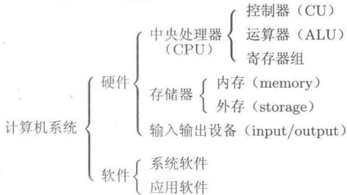  
图1-4 计算机系统的组成

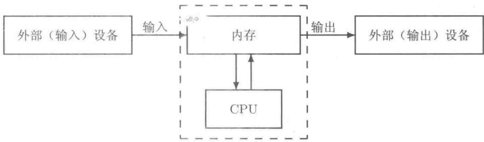  
图1-5 输入与输出

# 5. 计算机执行程序的基本步骤

通常，一些应用程序以文件的形式存放在外存储器（如磁盘）上。每当启动一个程序时，进行如下操作。

① 首先将该程序文件载入（load）到计算机内存：将该程序中的数据放置到数据区，机器指令存放到代码区。  
② 按照指令的顺序依次执行：根据指令的操作码和地址码将数据区中的操作数送至CPU中运算器进行运算。同样根据指令将计算结果存回到计算机内存单元中（可以覆盖原操作数，或者存放到其他允许存放的内存单元中）。  
③ 除了驻留内存的程序外，程序应该在其结束后从内存中退出。

计算机内存是数据及其操作指令的载体，而数据及其操作指令是所讨论的实际问题的计算机表达方式。程序设计的任务就是控制数据在计算机内存中的活动过程：在计算机内存中何处存放数据？何处存放机器指令？如何进行输入输出操作？如何实现基本的运算？如何将结果存放到内存的特定单元？在程序设计高级语言中，这些问题均已经被高度抽象化，用类似于英语的语句（如输入语句、输出语句、表达式语句和赋值语句等）表示。例如，在  $\mathrm{C}++$  语言中：

```javascript
int n; //定义变量（意味着为  $\mathbf{n}$  分配内存空间单元）  
n = 1; //变量赋值  
 $\mathrm{n} = \mathrm{n} + 1$  //运算及赋值
```

其中，第1行为变量定义语句。此处定义了一个只能存放整数数值的变量，n为变量名。变量n与内存某单元联系（可以认为n是该单元的名字）。第2，3行中符号“=”被称为赋值运算符，它将其右边表达式的值存入其左边变量所联系的内存单元中。换言之，赋值符号“=”左边的量获得一个新值。显然要求赋值符号左边的量必须联系内存中的某单元，并且该单元还是允许写的，这种量在C++语言中被称为左值（left value）。第3行中，变量n既出现在赋值符号的左边，又出现在赋值符号的右边。出现在赋值符号右边的变量n是右值（right value），此时仅读取变量n所表示的数值。第3行中，符号“+”表示算术加法运算符，其运算优先级高于赋值运算。因此，第3行的执行过程是，将右值n的值与1进行加法运算（在CPU中进行），得到结果2；再将结果赋值给左值n（n的结果为2）。

前面介绍珠算计算  $1 + 2 + 3 + \dots + 36$  的过程，用符号表示如下。

```txt
int s; //定义一个整型变量s（由系统安排某一内存单元与之关联）  
s = 0; //累加器，清零  
s = s + 1; //累加计算，覆盖存储  
s = s + 2;  
//中间省略了若干行  
s = s + 36; //得到结果s为666，最后可输出s的值
```

综合上面的两个部分，计算  $1 + 2 + 3 + \dots + 36$  的过程可进一步表示如下。

```txt
int s, n; // 定义两个整型变量（由系统安排两个内存单元分别与之关联）  
s = 0; // 累加器，清零  
n = 1; // 计数器，同时又是加数，置初始值  
s = s + n; // 累加计算，覆盖存储  
n = n + 1; // 计数器（即加数）增1  
s = s + n;  
n = n + 1; // 中间省略了若干行  
s = s + n; // 得到结果s为666，最后可输出s的值
```

细心的读者可能已经发现：上述过程中的一些部分在形式上是完全相同的重复。这种重复过程有更加简捷的表达方式（参见第1.2.3小节）。须注意的是上述过程是自上而下顺序执行的，具有时序性。

# 1.1.3 信息数字化及其标准化

计算机内存是数据的载体。任何信息进入计算机中进行处理的第一步便是信息数字化：图形、图像、声音和文字，包括数字本身，都需要数字化，计算机指令也需要数字化。只有将各种信息变换成了数字，才能被存入计算机内存，才能利用计算机进行处理。这里只讨论数值数字化和字符数字化的问题，其他信息的数字化问题超出本书的范围。

# 1. 数值数字化

我们知道，实数有无穷多个，无理数的小数部分是无限不循环的。显然，在有限的计算机内存中精确表示所有的实数（即使只表示一个无理数，如圆周率  $\pi$ ）是不可能的。因此，计算机中的数系不可能是完备的，而是残缺不全的。这是一对“有限一无穷”的矛盾，此矛盾是无法调和的。缓解此矛盾的方法是选择某种精度，近似地表示一些实数。然

而，实际计算问题又不能“容忍”所有的数都是近似的。因此，又必须选择一些数值在计算机系统中精确地表示。最终的解决之道是一种折中方案：将数据分成不同的类型，并按不同的方式存储及加工处理，有些是近似表示的，有些是精确表示的。

不同的数据类型在计算机内存中所占用的单元数量多少、可表示的数值范围、具体的存放格式均有所不同（参见第2章表2-1）。程序员在使用数据时，需要考虑选择某一种数据类型，使其既能满足应用的需要又尽可能地节省内存空间。在应用中，若选用的数据类型不恰当，则可能导致数据溢出（超出可表示的范围）或者精度过低；若将某种类型的数据强行地按另一种类型的数据使用（如将较大的无符号数当成带符号数，则数据可能表示负数；或将四字节的整数理解为单精度浮点数）将导致错误。

在计算机系统中，为了便于算术运算，通常整型数值按其补码形式存放在计算机内存中。对于带符号的整数（包括signed char, signed short int和signed long int）用其最高位表示符号（称为符号位）：最高位为1表示负数，最高位为0则表示非负数。

① 原码：二进制码。  
② 补码：非负数的补码为其原码；负数的补码是其原码按位求反（0-1互反）后，在末位加1。

# 2.字符数字化

# （1）字符编码

常用的英文大写字母（26个）、小写字母（26个）、阿拉伯数字  $0\sim 9$  （10个）、标点符号和算术运算符号若干，总数超过  $64 = 2^{6}$  个。因此，为这些字符编号至少需要7位二进制数。7位二进制数共有  $2^{7} = 128$  个（对应到十进制数为  $0\sim 127$  ，能区分128种不同的情形），亦即采用7位二进制编码可以将128个字符进行编码。计算机中使用的编码方案有多种，最多的是采用“美国信息交换用标准代码（American Standard Code for Information Interchange，ASCII）”（参见附录A）。

ASCII字符集采用7位编码，而一个字节有8位（能编码256个字符），因此，ASCII编码的最高位为0者对应ASCII基本字符集（详见附录A）；最高位为1者称为ASCII扩展字符集（如图1-6所示）。这样，一个字节恰好存放一个ASCII字符的编号。换言之，字符在计算机内存中按照其编码存放、运算。

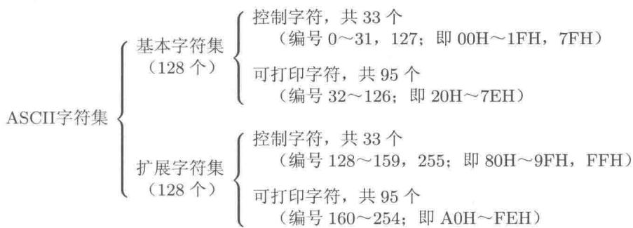  
图1-6 ASCII字符集

当然，若将字符'A'（ASCII码为65）作为整数时就是整数65。因此，将其作为颜

色值时，可能是某种具体的颜色；作为声音信号时，可能表示某种频率或某种音量；作为机器指令时，可能对应某种操作。即字符与整数是兼容的。亦即字符是一字节的整数。

例1.2 给出整型数据的存放格式，即讨论其每一个二进制位的情况[1]。

解：一字节的无符号整数（即 unsigned char 型）和一字节带符号整数（即 signed char 型）在内存中均各占一个字节（均各 8 个位，均分别能精确表示  $2^{8} = 256$  个不同的整数）。它们所精确表示的数值列表如表 1-3 所示。

表 1-3 一字节整数 (即字符) 在内存中的表示  

<table><tr><td>一字节 8 个位情况</td><td>unsigned char</td><td>signed char</td></tr><tr><td>0000 0000</td><td>0</td><td>0</td></tr><tr><td>0000 0001</td><td>1</td><td>1</td></tr><tr><td>0000 0010</td><td>2</td><td>2</td></tr><tr><td>:</td><td>:</td><td>:</td></tr><tr><td>0111 1111</td><td>127</td><td>127</td></tr><tr><td>1000 0000</td><td>128</td><td>-128</td></tr><tr><td>1000 0001</td><td>129</td><td>-127</td></tr><tr><td>:</td><td>:</td><td>:</td></tr><tr><td>1111 1110</td><td>254</td><td>-2</td></tr><tr><td>1111 1111</td><td>255</td><td>-1</td></tr></table>

对于一字节的无符号整数，其表示的整数均为非负数，取值范围为  $0 \sim 2^{8} - 1$ ；而一字节的带符号整数，其最高位为符号位（0表示非负数，1表示负数），取值范围为  $-2^{7} \sim 2^{7} - 1$ 。两字节、四字节以及扩展长整型的带符号或无符号整型数在内存中的存放形式是类似的，故略。

汉字编码利用了ASCII扩展字符集中的编码，在非中文系统下，原先的汉字编码将不会对应汉字库字模，而显示出所谓的“乱码”（实为原ASCII扩展字符集字符）。

《信息交换用汉字编码字符集——基本集》（即GB2312—80）精选了一些常用汉字，将其分成94个区（实际使用87个区），每区94位，共可给  $94 \times 94 = 8836$  个汉字编码。在计算机系统中采用两字节的汉字编码实现GB2312—80标准。即利用两个连续的、范围在  $161 \sim 254$  的数字给一个汉字编码。其中，第一个字节对应汉字的区号（ $160+$  区号），第二个字节对应汉字的位号（ $160+$  位号）。

2000年3月，国家信息产业部和质量技术监督局在北京联合发布了《信息技术和信息交换用汉字编码字符集、基本集的扩充》，国家标准号为GB18030—2000，收录了27000多个汉字，还收录了藏、蒙、维等主要少数民族的文字。该标准于2000年12月31日强制执行。GB18030—2000作为GBKforUnicode3.0的更新而诞生，并且作为GB2312—80的扩展，向下兼容GBK和GB2312—80标准。

GB18030是我国继GB2312—80和GB13000—93之后最重要的汉字编码标准，是我国计算机系统必须遵循的基础性标准之一。编码空间超过150万个码位，为解决邮

政、户政、金融和地理信息系统等迫切需要的人名、地名用字问题提供了解决方案，也为汉字研究、古籍整理等领域提供了统一的信息平台基础。

# （2）字库——字模数字化

在显示器、打印机上所看到的字符，实质上是该字符的字形（字模）。同样也需要对字形进行数字化形成字库。在计算机进行文字处理时，通常只涉及字符的编码；当需要显示、打印输出时，由系统自动在字库中查询该编码字符对应的字模，并将字模显示或打印；当输出到磁盘时，通常只存储字符的编码，而不存储其字模数据（由于采用一定的编码标准，字符编码与字库中字模形成固定的对应关系，这种处理及存储方式既灵活又节省存储空间）。同一编码的字符，可有不同字体的字模与之对应。这样，根据字符的编码，再附加一定的字体、字号等属性便能演绎出多种变化。

对于两字节的汉字编码，现连续输出两个字符char(160+16)和char(160+1)，若在汉字系统下，系统将在汉字字库中查找对应的汉字字模并显示一个汉字“啊”（其国标区位码为1601，两个字节值依次为176，161被称为该汉字的机内码）；若在非汉字系统下，系统则分别查找扩展ASCII字符集中对应的两个字符的字模，显示结果为“ $\text{空} \mathbf { i } "$ 即所谓的“乱码”，请参照第3.6节。

一个  $16 \times 16$  点阵的汉字字模需要  $16 \times 16$  （bit）  $= 16 \times 16 / 8$  （byte）  $= 32$  （byte）字节的存储空间。汉字“汉”的编码仅需要两个字节，这两个字节机内码分别为186，186（因为其国标区位码为2626）。图1-7是根据该汉字的机内码分别从  $16 \times 16$  点阵的简体汉字库文件、繁体汉字库文件中读取字模数据（各32字节，见每个汉字的左侧用十六进制数表示的数据），再根据这些点阵信息模拟“显示”的结果。

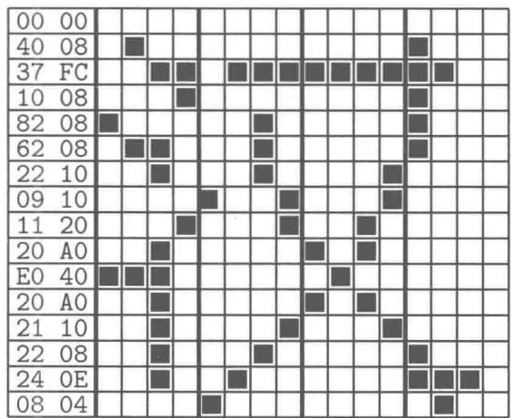  
图1-7 不同字库中的“汉”字点阵数据

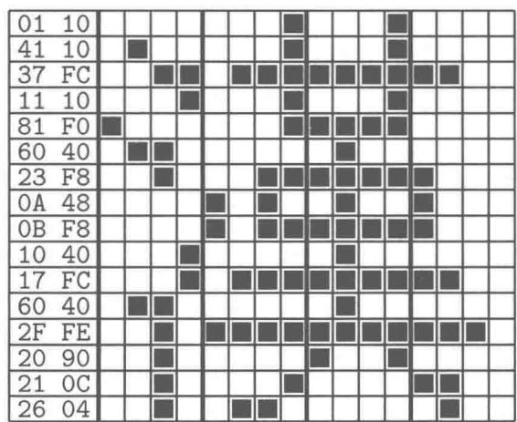

# 3. 计算机指令数字化

计算机的所有指令也必须数字化，其数字化的结果是一系列二进制编码。计算机硬件系统不同，其机器指令集也不同。在此，我们仅指出，计算机只能按其所能识别的机器语言程序（机器指令序列）执行。不同类型计算机的可执行程序一般是不能通用的。计算机机器语言强烈地依赖于计算机硬件。

计算机高级语言（如  $\mathrm{C}++$  ）程序是一种抽象程度十分高的程序设计语言，它接近人

类的自然语言（英语），且基本上独立于具体的计算机硬件系统和操作系统。高级语言程序可以方便地在不同的计算机系统之间移植。但需经相应的软件工具将其编译（翻译）成相应计算机所能识别的机器语言程序之后才可以运行。

# 4. 其他信息的数字化及其标准化

对于多媒体信息（如声音、图像等）、网络通信中的信息等，其数字化是它们进入计算机系统，利用计算机高速、程序化自动处理的第一步。数字化还需要有标准、协议来规范、约定这些数字的含义，以便各种信息的数字编码在多种系统中兼容，并对这些数字进行一致的理解、有效地利用和正确地进行交换。这些内容有专门的书籍讨论，故不在此赘述。

# 1.2 计算机程序设计语言概述

# 1.2.1 计算机低级语言与高级语言

人类的自然语言是人们在生产等社会活动中逐步形成的，自然语言的发展变迁经历了漫长的岁月。不同种族、不同地域、不同时代的语言皆有差异。有些自然语言之间的差别之大，以至于在使用不同语言进行交流时出现障碍。跨越这种障碍的方法有学习并直接使用对方的语言；或者聘请精通不同语言者充当翻译。翻译员的工作方式有两种：口译和笔译。

与人类自然语言的情况类似，不同的计算机硬件系统（如CPU类型不同）其指令集及其数字化——指令的编码是不同的，即其机器语言是不同的。

从计算机的原型——图灵机可见，计算机能够做的事情十分简单和原始，如同人们手工操作算盘一样。信息数字化、存储程序及数据，并按指令序列操控计算机、操控计算机外部设备。这一切，从外表看来显得如此的“理所当然”！其实，计算机的高速处理能力、系统软件及应用软件的强大功能及友好的用户界面，将计算机内部巨量操作的繁忙景象隐藏到了背后。想象一下计算机内部，其内存是一本只有0和1两种符号写成的“天书”。这部“天书”的内容随时间变化而变化。但这却是一部由人写就的“天书”！在内存中，何处安排指令、何处存放数据，积聚了人类的大智慧。

使用计算机最“原始”（也是最根本）的方法，是编写或设法生成能够被计算机直接执行的仅由0和1序列构成的程序——计算机机器语言程序。显然，用机器语言编写程序既难写也难修改，编写这种“天书”者非是精通具体型号机器指令者不可。另外，计算机执行程序的高速度与手工编制机器语言程序的琐碎、低效率形成巨大的反差。

为了方便编程，计算机专家们将机器指令编码（0-1串）进行命名，即用英文缩写词与机器指令一一对应，以帮助记忆，这就是汇编语言。用汇编语言编写的程序其可读性、易维护性、编写效率等方面均较机器语言程序的编写有较大的提高。汇编语言程序需要翻译成机器语言程序后才能在计算机上运行。不过，这个翻译系统是不太复杂的，它是一种简单的字面上的“笔译”。

机器语言和汇编语言程序都依赖于具体的计算机硬件系统和操作系统，它们是面向具体机器的程序设计语言，被称为计算机低级语言（实为底层语言）。用低级语言编写程序

时，必须对程序的执行过程描写得十分具体。例如，必须详尽地描述具体数据的存放地址、数据的存放与读取、算术运算、数据转移等过程。这种程序的编写效率仍然是较低的，程序仍然不够直观，但是，这种低级语言程序的执行效率往往是最高的。

屏蔽具体操作细节、面向问题表达及求解过程描述的程序设计语言——计算机高级语言应运而生。高级语言采用接近人类自然语言的、规范化了的符号系统，高度抽象地表达问题及其解题过程。与人类词汇丰富、存在多义性、存在模糊性的自然语言不同，计算机程序设计高级语言用少量的字符和单词（字符集、保留字等）按照严格的语法规则、明确的语句含义和规定的流程描述问题的求解过程。

用高级语言编写的计算机程序需要经过翻译（解释或者编译）生成机器语言程序（机器指令序列）才能在计算机上运行。

早期的BASIC语言是解释型的，其程序的执行过程是取一条语句、检查该语句是否有错，有错即停，无错则立即（现场）将该语句翻译成机器指令序列然后执行，再取下一条语句……重复上述过程直至程序结束。这种现场查错、现场翻译、立即执行的方式类似于“口译”。解释型程序设计语言易学，程序的执行速度慢。

现在的大多数程序设计语言是编译型的，其程序翻译和执行过程是先检查整个程序中是否有错误，有错即报告之，无错则将整个程序翻译成机器语言程序，生成可执行程序；需要时再启动所生成的可执行程序执行。需要指出的是，所生成的可执行程序以文件的形式存放在外部设备（如磁盘）上。该可执行文件运行时，将由操作系统将其装入计算机内存（将指令装入内存的代码区，操作数存放在内存的数据区），并根据指令顺序执行程序。可执行程序运行时将不再需要源程序（源程序由开发者或著作权拥有者保留以便以后的维护、移植等）。这种方式是程序员编写源程序文件；再由编译系统（一种软件）将源程序文件翻译（编译、连接）成机器语言程序的可执行文件；需要时启动该可执行文件运行程序。相当于程序员撰写“原著”；编译系统充当“笔译”；需要时，计算机直接“阅读译著”。

计算机程序设计高级语言数以百计、种类繁多，涉及科学计算、事务处理、人工智能等。经典的高级语言有BASIC、FORTRAN、ALGOL60、COBOL、LISP（LISP用于符号演算、公式推导、博弈等非数值处理）和Pascal（该语言的创始人是瑞士N Wirth教授，NWirth教授是图灵奖获得者，他将其创造的计算机程序设计语言命名为Pascal是为了纪念17世纪法国著名的科学家，世界上第一台机械加法器的创造者Blaise Pascal）。

C语言是一个良好的结构化程序设计语言，它具有高级语言的特点和功能，还具有像汇编语言那样的低级语言的部分功能。C语言具有丰富的数据类型，且数据的构造能力较强；C语言本身简洁，且表达能力强；C语言为众人集体开发大型软件、系统软件提供了有力的支撑；C语言程序的可移植性好，执行速度快。

$\mathrm{C}++$  是 C 语言的超集，即 C 语言是  $\mathrm{C}++$  的子集。  $\mathrm{C}++$  保留了 C 语言的灵活性、高效性及可移植性等；  $\mathrm{C}++$  又吸收了许多著名语言的最优秀的特征。例如，  $\mathrm{C}++$  从 Simula 语言中吸取了类，从 ALGOL 语言中吸取了引用，综合了 Ada 语言的类属。  $\mathrm{C}++$  是一种面向对象范型的通用程序设计语言，程序的代码可重用性好。

学习计算机高级语言，不仅要掌握其语法规则，更重要的是通过多阅读（阅读范例程

序）、多仿写（模仿范例编写自己的程序）、多调试（在计算机上调试、优化程序）来掌握程序设计规范和原则，来训练算法设计思想。使读者掌握精确的C++语法规则、掌握基本的程序设计规范、建立朴素的算法设计思想，使读者达到这三位一体的要求是本书的宗旨和目标。

# 1.2.2 高级语言程序要素

计算机程序设计高级语言包装并屏蔽了计算机硬件、操作系统中的诸多细节，用高度抽象的文字符号描述计算过程，便于程序员将主要精力集中到问题的描述和求解中来。N Wirth教授提出如下经典公式：

程序  $=$  算法十数据结构

数据是所描述问题的载体，算法则是对数据加工方法和步骤的表达。大多数数据在程序的执行过程中是可以变化的，它们被称为变量。变量所承载的数据的逐步变化，标志着问题求解过程的时序递进。

计算机高级语言及程序均有如下要素。

（1）语言基本元素。字符集、保留字（关键词）集，自定义标识符。  
（2）程序结构概貌。包括程序的首、尾，语句及其分隔，程序的书写规范和书写风格。  
（3）数据表示及运算。基本数据类型及其运算，新数据类型的构造、使用方法。  
（4）输入输出操作。标准输入、标准输出，文件输入、文件输出。  
（5）算法流程控制。程序执行的起点、终点，执行顺序、分支选择、循环。  
（6）子程序。标准库函数及自定义函数的声明、定义和调用方法。

学习一种计算机程序设计高级语言，常常亦按上述顺序进行。

# 1.2.3 高级语言程序设计方法

程序设计的实践中，起初人们好像是走在一片丛林之中，不断探索，却常常迷路。直到有一天，人们意识到是滥用goto导致迷茫，进而人们意识到要研究程序设计方法。程序设计方法的根本任务是解决如何组织程序的问题。下面从微观（结构化）和宏观（面向过程、面向对象）层次分别介绍有关程序设计方法的基本概念。

# 1.结构化程序设计 微观技术

N Wirth 提出的结构化程序设计思想对程序的微观结构控制做了本质的描述。他指出，描述任何过程的操作只需要顺序、选择、循环这三种基本控制结构（如图 1-8 所示）。仅用这三种结构及其相互嵌套，可以实现任何复杂的计算机程序。

结构化程序设计着眼于程序局部结构的规范化，强调每一种结构应具有“单入口、单出口”的性质，以便使一种结构嵌入其他结构时能够完全被嵌入。

循环是“唯一”使程序语句（或多个语句组成的复合语句）反复执行的结构，重复执行的部分被称为循环体。一般而言，循环体中所进行的操作是不变的，所变化的是参与重复计算的数据的值，往往对应数学中的迭代计算，或数据集合（如数组）各元素的依次处理。

例如，在  $1 + 2 + 3 + \dots + 36$  的计算过程中，累加操作是反复进行的，变化的是加数、部分和的值。前面分别用了近40行（详见第1.1.1小节）和近80行（详见第1.1.2小节）表示了这一计算过程，有些语句是完全相同的（操作数的值在逐步改变）。幸运的是，算法及程序中的循环结构能够用极少的几行语句表示这一计算过程[1]，具体如下。

```txt
int s, n; //定义两个整型变量由系统安排两个内存单元分别与之关联  
s = 0; //累加器。清零  
n = 1; //计数器，同时又是加数。置起始值  
while(n <= 36) //当n小于或等于36时，执行循环体  
{  
    s = s + n;  
    n = n + 1; //花括号内的语句被称为循环体  
} //循环结束后，n为37（即n <= 36不成立时），s为666  
cout << "Sum_口 = _口" << s << endl; //输出计算结果：Sum = 666
```

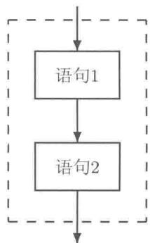  
（a）顺序

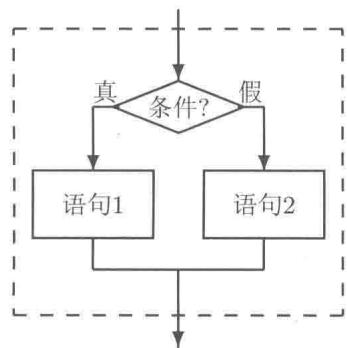  
（b）选择  
图1-8 结构化程序中的三种控制结构

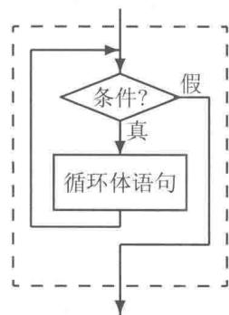  
（c）循环

循环结构是解决“手工编程低效率与计算机运算高速度”这一矛盾的武器之一。问题求解的算法设计中，发现并利用循环不变式是设计循环结构程序的关键。

# 2. 面向过程程序设计方法

自顶向下，逐步求精是过程化程序设计的基本思想方法，它将待解决的问题由粗到细地逐层分解（参见第4.1.1小节例4.1）。究竟将待解决的问题分解到何种地步，取决于所使用的高级语言提供的最基本的数据表达方式、最基本的数据操作方法，以及提供的标准函数库。

# 3. 面向对象程序设计方法

$\mathrm{C}++$  是既支持面向过程的程序设计，又支持面向对象的程序设计语言。本书第  $2\sim 8$  章介绍面向过程程序设计，第  $9\sim 15$  章介绍面向对象程序设计。

分类、分层是人们认识客观事物的一个有效方法，是对事物的聚类和抽象。正确的分类标志着人们深刻地认识了该类事物。面向对象程序设计语言和方法直接描述问题域中的类、类的对象，以及对象之间的相互关系。

例如，“运载工具”就是对一类事物的高度抽象，“运载工具”都有一些共同的属性（如自重、载重量和设计最高时速等），还有一些相同的行为（如启动、行驶、加速、倒

车和停止等）。“汽车”“小轿车”仍然是抽象的。这几个类中，“小轿车”是“汽车”的子类，“汽车”是“运载工具”的子类，它们呈现出一种继承关系：子类具有其父类的属性和行为；子类可能还有自己特殊的属性和行为。当谈到具体的某辆小轿车时，这便是“小轿车”这个类的一个具体对象。

面向对象程序设计方法从对客观事物的分类和分层出发，更加符合人们的认知规律、符合人们的思维方式，更加有利于描述和刻画纷繁的客观事物。面向对象程序设计将数据（即属性）以及对数据的操作方法（即行为）封装在一起，成为一个相互依存、不可分离的整体——类。类通过一些简单的接口与外界联系。对象是类的实体。这样，程序模块间的关系更加简单；界面更加清晰；程序中数据的安全性、程序模块之间的独立性、程序的移植性等都有了良好的保障。通过继承与多态性还可以大大提高程序的重用性，使所开发的大型软件产品的质量得到好的保障。

$\mathrm{C}++$  、Java等是优秀的面向对象程序设计语言。面向对象程序的公式为

$$
\left\{ \begin{array}{l} \text {对 象} = (\text {算 法} + \text {数 据 结 构}) \\ \text {程 序} = \text {对 象} + \text {对 象} + \dots \end{array} \right.
$$

公式中的圆括号表示封装。从上述公式可见，面向对象程序设计方法需要面向过程程序设计方法为基础。不应该将它们割裂开，更不能将它们对立起来。

# 1.3 算法基础

算法学是计算机科学最重要的内容，有的计算机学者甚至认为，计算机科学就是算法的科学。算法的设计、验证、分析是算法学的主要内容。算法设计指创作算法的过程和研究有代表性的、好的创作策略；算法验证是指证明算法的正确性，即证明它满足欲求解问题的要求；算法分析是指对算法效率的确定，如算法所需要执行时间之长短（时间复杂度）和运行空间之多少（空间复杂度）。如果同一问题存在几个不同的算法解，算法分析的任务之一就是比较这些算法效率的高低。

算法分为数值计算方法和非数值计算方法两个方面。计算方法有直接法、迭代法等；算法设计策略有穷举、回溯、仿生和拟物等。新的算法层出不穷。

本书所涉及的算法是最基本的，其设计思想是朴素的。本书不讨论算法验证与算法分析方面的内容。

# 1.3.1 算法的概念

算法是解决问题方法的精确描述。比较正式的定义是，算法是一组具有明确步骤的有序动作的集合，它产生结果并在有限的时间内终止。

具体地，算法具有如下性质：① 解题算法是一有穷动作序列；② 动作序列仅有一个初始动作；③ 序列中每个动作的后继动作是确定的；④ 序列的终止表示问题得到解答或者问题没有解答。

# 1.3.2 算法的表示

求解问题的算法不依赖于具体的计算机程序设计语言。换言之，算法可以用图表或文

字表示，以描述待解问题从开始到结束的整个计算过程的时序流程。常用的算法描述方式有流程图和伪代码。流程图是算法的图形表示方式，它用处理框和箭头等表示计算的流程；伪代码是算法的文字表示方式，其中可使用自然语言（如英文及中文）、符号和数学语言等方式描述算法的各个步骤。

例1.3 求解一元二次方程  $ax^2 + bx + c = 0 (a \neq 0)$ 。

【分析】一元二次方程及其性质由其系数唯一决定，未知量变元的记号  $x$  是次要的。因此，在程序中只需要存储系数  $a, b, c$  的值和可能的两个解  $x_{1}, x_{2}$  的值（共五个变量）。这五个变量是所论问题的载体。除此以外，我们可能还需要一些中间变量。例如，在下面的算法中，我们使用了一个变量  $d$  存放方程的判别式，这个变量起辅助作用。我们还需要根据变量的作用，估计其可能的取值范围并为其选定适当的数据类型。

解：求解一元二次方程的算法描述如下（计算流程图如图1-9所示）。

步1（开始）

步2（输入） 输入方程的系数  $a,b,c$  （双精度浮点型）；

步3（计算）  $d = b^{2} - 4ac;$

步4（判断） 若  $d\geq 0$  ，则

（计算）  $x_{1} = \frac{-b - \sqrt{d}}{2a}, x_{2} = \frac{-b + \sqrt{d}}{2a};$

（输出）显示  $x_{1},x_{2}$  的值；

否则

（输出）显示“原方程无实数解。”；

步5（结束）

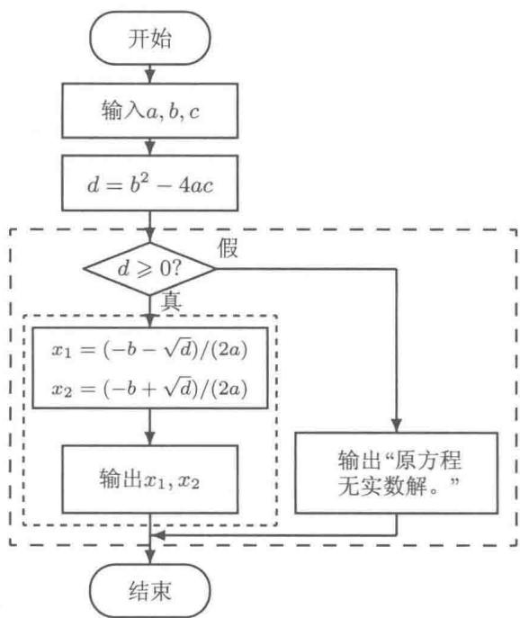  
图1-9 求解一元二次方程的计算流程图

算法描述中省略了变量的定义，使用了汉字、数学公式。至于如何进行算术四则运

算、乘方和开方，如何进行输入、输出等操作，以及如何将这些操作步骤转化为计算机机器指令等细节均不必考虑。

在高级语言（如  $\mathrm{C}++$  ）中，算术四则运算、整数相除求商、整数相除求余、数值大小关系比较和赋值等基本操作均已经高度抽象化，并且十分接近自然语言；乘方、开方、指数、对数和三角函数等数学函数也由编译系统提供。程序员均可直接使用而不必了解其内部的实现过程。从源程序到计算机机器语言程序的翻译工作由编译程序完成。高级语言程序设计将困难留给编译器，将方便让给程序员。

【附注】  $\sqrt{d}$  到底是如何计算出来的。这个问题涉及数值计算方法的内容，在此，直接给出计算非负实数算术平方根的方法——牛顿迭代法。牛顿迭代公式如下：

$$
\left\{ \begin{array}{l} x _ {0} = 1 \\ x _ {n} = \left(x _ {n - 1} + \frac {d}{x _ {n - 1}}\right) / 2 \quad n = 1, 2, 3, \dots \end{array} \right.
$$

具体计算中，给定一定的精度控制，如  $\varepsilon = 10^{-8}$  ，当  $|x_{n} - x_{n - 1}| < \varepsilon$  时，将  $x_{n}$  当作  $\sqrt{d}$  的近似值。以计算  $\sqrt{2}$ ， $\sqrt{10}$  为例，进行列表计算如下。

表 1-4 牛顿迭代法计算非负数算术平方根过程  

<table><tr><td>迭代次数n</td><td>计算√2，xn</td><td>计算√10，xn</td></tr><tr><td>0</td><td>1</td><td>1</td></tr><tr><td>1</td><td>1.5</td><td>5.5</td></tr><tr><td>2</td><td>1.41666666666667</td><td>3.65909090909091</td></tr><tr><td>3</td><td>1.41421568627451</td><td>3.19600508187465</td></tr><tr><td>4</td><td>1.41421356237469</td><td>3.16245562280389</td></tr><tr><td>5</td><td>1.41421356237309</td><td>3.16227766517568</td></tr><tr><td>6</td><td></td><td>3.16227766016838</td></tr><tr><td>标准函数计算结果</td><td>1.4142135623731</td><td>3.16227766016838</td></tr></table>

由表1-4可见，计算非负实数算术平方根的牛顿迭代法确实非常神奇高效，它仅仅用少量的几次算术四则运算，便可以获得精度高的计算结果。计算  $\sqrt{2}$  仅用5次迭代（共15次算术运算），计算  $\sqrt{10}$  仅用6次迭代（共18次算术运算）便达到较高的精度。

上述公式只是牛顿迭代公式的一个具体应用，牛顿迭代公式的一般理论还有许多用途。建立牛顿迭代公式所用到的数学原理涉及函数的导数等微积分知识（参见任何一本《计算方法》或《数值分析》的教材）。

上面的例子中，解一元二次方程采用的是直接法（直接运用求根公式），计算非负实数算术平方根的算法被称为迭代法（通过建立迭代公式进行迭代计算）。

# 1.4 小结

计算机（computer）是一种具有存储能力、能进行高速运算（操作）的自动电子装置。

计算机系统由紧密相关的硬件和软件组成。硬件系统由运算器、控制器、存储器和输

入输出设备组成。中央处理器（CPU）中包含了运算器和控制器两个重要部件，是计算机的“心脏”。

可以粗略地理解为CPU是执行计算的场所，操作数来自计算机内存，计算结果又回到内存中。

计算机的内存空间以字节为单位按线性方式编地址——字节地址。计算机程序按时序逐步执行。计算机系统与珠算系统的原理一脉相承。

数值数字化、字符数字化（包括字模数字化）、多媒体信息数字化和计算机机器指令数字化等，是利用计算机进行信息处理的第一步。对具体信息如何进行数字化除了涉及数学、物理等学科知识外，还需要建立一些协议、标准，以便在信息处理、存储、传输过程中进行正确的交换和识别。在计算机中，所有的信息均被称为数据。

电子计算机采用二进制表示各种数字化了的信息。按位看待计算机内存，它是仅仅由0与1组成的序列。对于某个固定的位，其所有的变化归根到底就是将0变成0或1，1变成0或1。因此，计算机是简单的。而计算机应用已经渗透到各个领域，能处理许多极其复杂的事情。我们感叹：复杂是重复简单的结果。

算法是计算机科学的灵魂。算法设计是一项最能体现人类智力的活动。进行算法设计常常需要数学、物理等方面的知识。然而，算法设计的基本思想是朴素的、自然的，除了需要细致周密的逻辑思维以外，常常还需要大智慧。

如果说算法是计算机科学的灵魂，那么，变量就是算法及程序中的“小精灵”。这些“小精灵”中，有的代表实际的物理量；有的则表示计算过程中的某些特殊状态、标志，起着辅助作用。这些“小精灵”们可以“招之即来、挥之即去”，任凭程序员差遣。在实际问题中，到底设置哪些“小精灵”，并控制好这些“小精灵”需要一定的技巧。“实践—实践—再实践”是练就技巧的重要途径，也是唯一途径。

# 练习1

（1）将十进制数78.5分别转换成二进制、八进制和十六进制形式。  
（2）写出直接将十进制数化成十六进制数的方法。  
（3）设  $x = 1234567890, y = 987654321$ ，分析如下计算  $x - y$  方法的特点。

$$
\begin{array}{l} x - y = (x - 1 0 0 0 0 0 0 0 0 0) + (9 9 9 9 9 9 9 9 9 - y + 1) \\ = 2 3 4 5 6 7 8 9 0 + 1 2 3 4 5 6 7 9 \\ = 2 4 6 9 1 3 5 6 9 \\ \end{array}
$$

（4）设  $x = (10011000)_{2},y = (01110101)_{2}$

① 仿照上题设计一种方法计算  $x - y$  ，并按所设计的方法计算之。

$②$  写出  $-y$  的补码。

（5）在ASCII字符集的可打印字符中，空格（'」）、数码（‘0'～‘9'）、大写字母（‘A'～‘Z'）、小写字母（‘a'～‘z'）编码大小的基本顺序是什么？  
（6）在ASCII字符集中，英文大写字母与其对应的小写字母的编号相差多少？内存中若存有字符'M'，如何将其转换成对应的小写字母'm'？（提示：在内存中字符以其编码——整数的格式存放。）

（7）给定一个正整数  $n$ ，设计一个判断  $n$  是否为素数的算法。若  $n$  是素数，则显示“是”，否则显示“否”。写出算法步骤并画出流程图。  
（8）给定一个数组，数组中的元素为一些同学的考试成绩，要求计算他们的名次，并将计算的结果存入另一个数组中（注意其中有并列名次；不必对原始数据进行排序）。例如：若有8位同学的考试成绩存放在数组double score[8] = {85.5, 95, 85.5, 78, 78, 78, 80, 70}; 中，需将他们对应的名次存放在数组int rank[8]中，结果应该是{2，1，2，5，5，5，4，8}。试写出算法步骤并画出流程图。

# 第二部分

# 面向过程程序设计

# 第2章 C++概貌

一个人走路，用不着把路上所有的石头搬掉再走。有时候要绕过去，等你走远了回头看，看到的只是走过的路，有些石头早已看不见了。

钱伟长

本章中，通过一个具体例子的逐步改进和扩展介绍  $\mathrm{C}++$  程序的概貌，使读者了解 $\mathrm{C}++$  语言的基本要素、  $\mathrm{C}++$  程序的基本结构；掌握  $\mathrm{C}++$  程序的书写规范，并有意识地培养良好的程序书写习惯；掌握  $\mathrm{C}++$  程序的开发步骤，并学会一种  $\mathrm{C}++$  语言程序集成开发环境的使用及初步的程序调试方法。

# 2.1 基本程序设计

# 2.1.1 “算术测验”程序之一

【“算术测验”问题】以“求给定的两个整数之和”为题，首先在显示器上输出一道具体算式，然后要求应试者从键盘输入一个数作为答案，最后由程序给出正确与否的评判。

【分析】我们知道“程序  $=$  算法十数据结构”，因此，我们从数据设置、动作序列设计两个方面开始。

数据：本问题涉及两个加数（x，y）及其和（z），共三个整数。

算法：（有穷的动作序列）

（1）定义三个整型变量  $\mathbf{x}$  ，y，z。  
(2) 确定两个加数  $x$  及  $y$  的值。  
(3) 输出题目（在显示器上显示）。  
(4) 输入答案（从键盘输入一个整数，存放到变量  $z$  中）。  
(5) 判断  $x + y$  是否等于  $z$

若是则输出“正确”；否则输出“错误”。

根据上述分析，编写如下源程序（见下页）。

程序运行时[1]，将在显示器上显示“ $3 + 5 =$ ”及一个闪烁的光标，等待操作者从键盘输入一个整数。输入8并回车，则程序输出“正确！”，随后整个程序结束。再次启动程序运行，从键盘输入一个不为8的其他整数（如输入7）并回车，则程序输出“错误。”，随后整个程序结束。

连同空行在内的源程序共有22行，其中的行号不是程序中的部分，它是为了便于解释源程序而添加上去的，程序员在编辑  $\mathrm{C}++$  源程序时不要输入行号。

源代码2.1 算术测验程序之一  
```cpp
// test1.cpp 源程序文件名
2 #include <iostream>
3 using namespace std;
4
5 int main()
6 {
7     int x, y, z;
8     x = 3; y = 5;
9     cout << x << "□+□";
10     cout << y << "□=□";
11     cout << x << "□+□";
12     cout << y << "□=□";
13
14     cin >> z;
15     if (x + y == z)
20
30
40
50
60
70
80
90
100
110
120
130
140
150
160
170
180
190
200
210
220
```

从程序可见， $\mathrm{C}++$  程序由英文字母、数字、运算符号、标点符号、空格和换行字符等组成。由字符组成具有一定含义的单词（被称为标识符）。有些标识符的含义是固定的（被称为保留字或关键词。本书的所有程序中，我们将保留字按粗体字排版，便于辨认）。由标识符、数字、运算符号及分号组成语句。由语句的顺序排列及其他成分组成一个完整的程序。

$\mathrm{C}++$  程序按照“缩进”方式编排：将语法上属于不同层次的部分从不同的列开始对齐，以使程序的层次结构清晰。使用一个或多个空格字符、制表符，或者换行符（连续两个换行符，则出现一个空行）将程序中的一些部分隔开，便于阅读。可以将多个语句写在同一行（第9行上有两条语句，语句之间用分号分隔），也可以将一条语句写在多行中（如第11、12行为一条语句）。

以符号“//”引出的，直至该行结束的部分称为程序的注释。编译器在将源程序翻译成机器语言程序时将忽略所有的程序注释。因此，注释的具体内容不影响程序中的任何语句。注释部分的作用是帮助阅读者理解程序，编写适当的注释将有助于程序的维护。程序注释的另一个用途是在调试程序时——可在某些语句上添加（或去掉）注释符号，使该部分语句不作为（或成为）程序中的执行语句。另一种编写注释的符号是/\*注释部分\*/。这种注释可以将多行文字作为程序的注释内容。

上述程序中的第1行是一个注释行。本书中的绝大多数程序都将其文件名作为注释内容写在第1行上。程序中的第2、3行只需照搬，暂不必深究。

一个  $\mathrm{C}++$  程序必须有一个，且只能有一个 main 函数，该函数被称为主函数。标识函数的一对圆括号“()”是不可缺少的。函数体用一对花括号包围起来（此对花括号也是不可缺少的）。标准  $\mathrm{C}++$  要求主函数的返回类型为 int 型。上例中，第  $5 \sim 22$  行为主函数。其中第 5 行为主函数首部，int 表示主函数的返回类型；第  $6 \sim 22$  行为主函数的函数

体。函数体语句大致上可以分成如下三个部分。

（1）变量定义。数据是所论问题的数字化表述形式。计算机内存是数据的载体，可以承载（即存放）大量的数据。将数据存放到计算机内存的第一步是定义变量。在  $\mathrm{C}++$  程序中，定义一个变量就意味着为该变量分配内存空间，使该内存空间成为存放一个数据的场所，该空间的大小取决于变量的数据类型，变量名则成为该内存空间的标识，程序中通过变量名使用内存空间。变量必须先定义后使用。

程序中第7行为变量定义语句，该语句定义了三个变量，x，y，z是变量的名字（由程序员自行命名），它们分别联系到计算机内存中三个不同的单元。

（2）执行语句。存放数据的内存空间准备好后，便可以利用这些内存空间将数据存入其中（称为写），或将其中所存放的数据取出（称为读）。读、写操作统称为访问。随着变量的访问，其中的数据将由起始值经一系列演变（中间结果）最终得到问题的解，即数据的逐步变化标志着问题的求解历程。数据的演变是通过执行语句实现的。

程序中第  $9\sim 19$  行为执行语句。第9行和第14行分别对变量  $\mathbf{x}$  ，y，z进行了写的访问操作。第9行两条语句分别将整数3及5存入变量x及变量y联系的内存空间中（该语句称为变量赋值语句）。程序执行到第14行时，将暂停并等待用户从键盘输入一个整数，将用户输入的整数存入变量z所联系的内存空间中（该语句称为输入语句）。程序中cin指键盘，>>为输入操作符。赋值语句和输入语句均能将一个新数值写入指定的变量（即变量联系的内存空间）中，覆盖其原有的数值。上述程序中变量  $\mathbf{x}$  ，y，z原有的数值是不可预知的。

第11、12和16行中涉及读取相应变量的当前值的访问操作，并进行运算加工。执行这些语句不会修改这些变量的值。

程序中cout指显示器， $\ll$ 为输出操作符，该操作符将其右边的数据输出到显示器上，并且可以连续输出多种数据（称为输出语句）。双引号包围起来的称为字符串常量，字符串常量在输出时会“原样照印”，但不输出双引号本身。endl表示换行。第11、12行为输出语句，输出题目作为提示信息（不换行），第17和19行的输出语句为输出汉字字符串后换行，作为反馈给用户的结果。

第  $16\sim 19$  行为一条语句（if语句），它将表达式  $\mathrm{x + y == z}$  （即  $\mathbf{X}$  加y的结果与z的值进行是否相等的比较）作为分支的判断条件，选择进一步执行第17行或者第19行。

（3）返回语句。主函数中的返回语句将引起整个程序结束，并返回到操作系统。标准  $\mathrm{C}++$  要求主函数的返回类型为int。即用一个整数作为程序执行结束后报告给操作系统的信息（第21行），该语句中的整数0对应第5行函数首部的函数返回类型int。

建议读者录入源程序时按如下方式先编写一个完整的框架。

```cpp
1//myprog.cpp 源程序文件名  
2#include<iostream>  
3using namespace std;  
4int main()  
6{  
7return 0;  
8}
```

然后在“return 0;”语句前插入程序的其他语句，如变量定义语句、执行语句。

# 2.1.2 C++程序基本元素

汉语的基本元素是汉字，由汉字组成词语（既有约定俗成的成语，也可以为一些事物自行命名）；由词语组成语句；由语句组成段落；由段落组成节；由节组成章；由章组成一部完整的作品。英语中的情况也是类似的。

在文学创作中，对整部作品的谋篇布局，章节标题“画龙点睛”般的命名；各种人物角色的名字设计；人物的特点、事件、命运变化和对他人的影响等，皆需要精心构思、设计出框架。接下来就是按照语言的语法遣词造句，按照事情发展的时序写作。

在  $\mathrm{C}++$  语言中，从最基本的元素到程序，大致上可以与自然语言对应地表述为“字符集  $\rightarrow$  标识符（保留字、标准名字和自定义名字）  $\rightarrow$  语句（表达式语句、流程控制语句）  $\rightarrow$  函数（标准函数、自定义函数）  $\rightarrow$  类（数据及其操作的封装体）  $\rightarrow$  源程序文件（编译单元）  $\rightarrow \mathbf{C}++$  程序（多文件结构）”。

与文学创作一样，程序各部分的层次结构、功能的划分，各种函数的命名，各种变量的命名、存储类型、数据类型和变量值的变化等，皆需要精心构思、画出流程框图。接下来按照  $\mathrm{C}++$  的语法，按照算法的执行顺序编写程序。同小学生开始学写作文一样，“记流水账”式的结构是朴素而有效的。

与自然语言相比，计算机程序设计语言中字词少而精——数量少、语义精确（没有二义性）。在这个意义上，计算机程序设计语言是容易学习和掌握的，主要靠多思勤练。善于把握整体结构、精于刻画细节者为创作高手。

# 1.字符集

规定2.1（ $\mathrm{C}++$  字符集）  $\mathrm{C}++$  字符集包含如下字符。

<table><tr><td>小写字母（26个）</td><td>a b c d e f g h i j k l m n o p q r s t u v w x y z</td></tr><tr><td>大写字母（26个）</td><td>A B C D E F G H I J K L M N O P Q R S T U V W X Y Z</td></tr><tr><td>数 字（10个）</td><td>0 1 2 3 4 5 6 7 8 9</td></tr><tr><td>其他符号（若干）</td><td>空格制表符换行符+ - * / % = , . ; : ? ! | \ # &amp; ~ ^ _ &lt; &gt; [ ] { }</td></tr></table>

$\mathrm{C}++$  语言对英文字母的大、小写是敏感的，即大写字母与小写字母是严格区分的。因此，num，Num，NUM是三个不同的标识符。

说明：作为字符型数据（字符常量的值、字符变量的值和字符串的内容），可取 ASCII 表中的所有字符（参见第 3.1.1 小节）。例如：

```txt
const char c = '@'; //等价于const char c = 64;  
char str[9] = "程序设计"; //包含汉字的字符串
```

# 2.标识符

由  $\mathrm{C}++$  字符集中一定字符组成的单词被称为标识符。有些标识符的含义是固定的，有些标识符已经由系统命名，有些标识符由程序员自行命名。

规定2.2（ $\mathrm{C}++$  保留字）保留字亦称为关键词，它是系统预先定义的标识符，有其固定的特殊含义，程序员不能挪作他用。 $\mathrm{C}++$  的保留字如下。

<table><tr><td>auto</td><td>bool</td><td>break</td><td>case</td><td>catch</td></tr><tr><td>char</td><td>class</td><td>const</td><td>const_cast</td><td>continue</td></tr><tr><td>default</td><td>delete</td><td>do</td><td>double</td><td>dynamic_cast</td></tr><tr><td>else</td><td>enum</td><td>explicit</td><td>extern</td><td>false</td></tr><tr><td>float</td><td>for</td><td>friend</td><td>goto</td><td>if</td></tr><tr><td>inline</td><td>int</td><td>long</td><td>mutable</td><td>namespace</td></tr><tr><td>new</td><td>operator</td><td>private</td><td>protected</td><td>public</td></tr><tr><td>register</td><td>reinterpret_cast</td><td>return</td><td>short</td><td>signed</td></tr><tr><td>sizeof</td><td>static</td><td>static_cast</td><td>struct</td><td>switch</td></tr><tr><td>template</td><td>this</td><td>throw</td><td>true</td><td>try</td></tr><tr><td>typedef</td><td>typeid</td><td>typename</td><td>union</td><td>unsigned</td></tr><tr><td>using</td><td>virtual</td><td>void</td><td>volatile</td><td>while</td></tr></table>

不同的  $\mathrm{C}++$  编译器还可能添加一些保留字。这些保留字的意义和用法将在以后逐步介绍，其中排成斜体字的保留字本书将不做介绍。

有一些标识符已经由系统命名（如 main, cin, cout, cerr, endl, sqrt, std, NULL 和 RAND_MAX 等）。尽管我们可以将其中的一些名字挪作他用，但在程序中最好还是使用它们已经存在的含义。

规定2.3（自定义标识符的命名规则）程序员在给自定义变量、函数等命名时，须遵守如下规则：

（1）不能与保留字相同。  
（2）必须以字母或者下画线开头，后面可跟字母、下画线或数字。  
（3）名字的长度不宜过长（编译器一般对标识符名字的长度有限制）。

例如, New、NEW、newRecord、_new、new_recored、_、_new1、first 和 First 均是合法的自定义标识符的名字。不能用保留字 new 做变量名。$x、1st、2nd、#123 和 new-record、TEST.H 都不是合法的名字。

# 3. 基本数据类型

由第1章关于数字化的讨论可知，计算机系统中的数系是残缺不全的。为了缓解“有限的内存容量与无限的数字空间”之间的矛盾，以满足一般应用的需求， $\mathrm{C}++$  语言提供了如下基本数据类型。不同数据类型的数据在计算机内存中所占用空间单元数量（字节数）及存放格式是不同的。程序员在实际应用中，应该选择适当的类型来刻画实际数据，既要满足实际问题的需要，又能尽可能地节省内存空间。

规定2.4（ $\mathrm{C}++$  基本数据类型）  $\mathrm{C}++$  基本数据类型的名称、数据尺寸及其取值范围如表2-1所示。

表 2-1 C++ 基本数据类型  

<table><tr><td>类型</td><td>名称</td><td>占用字节</td><td>取值范围</td><td>说明</td></tr><tr><td>布尔型</td><td>bool</td><td>1</td><td>false, true</td><td>分别与0，1兼容</td></tr><tr><td>无符号字符型</td><td>unsigned char</td><td>1</td><td>0~255</td><td>0~(2^8-1)</td></tr><tr><td>带符号字符型</td><td>[signed] char</td><td>1</td><td>-128~127</td><td>-2^7~(2^7-1)</td></tr><tr><td>无符号短整型</td><td>unsigned short [int]</td><td>2</td><td>0~65 535</td><td>0~(2^16-1)</td></tr><tr><td>带符号短整型</td><td>[signed] short [int]</td><td>2</td><td>-32 768~32 767</td><td>-2^15~(2^15-1)</td></tr><tr><td>无符号整型</td><td>unsigned int</td><td>4</td><td>0~4 294 967 295</td><td>0~(2^32-1)</td></tr><tr><td>带符号整型</td><td>[signed] int</td><td>4</td><td>-2 147 483 648~2 147 483 647</td><td>-2^31~(2^31-1)</td></tr><tr><td>无符号长整型</td><td>unsigned long [int]</td><td>4</td><td>0~4 294 967 295</td><td>0~(2^32-1)</td></tr><tr><td>带符号长整型</td><td>[signed] long [int]</td><td>4</td><td>-2 147 483 648~2 147 483 647</td><td>-2^31~(2^31-1)</td></tr><tr><td>单精度浮点型</td><td>float</td><td>4</td><td>-3.4×10^38~3.4×10^38</td><td>7个十进制有效位</td></tr><tr><td>双精度浮点型</td><td>double</td><td>8</td><td>-1.7×10^308~1.7×10^308</td><td>15个十进制有效位</td></tr><tr><td>扩展的浮点型</td><td>long double</td><td>12</td><td>-1.2×10^4932~1.2×10^4932</td><td>19个十进制有效位</td></tr></table>

表2-1是GCC对  $\mathrm{C + + }$  标准的实现[1]。不同的编译系统可能有不同的实现，如Visual $\mathrm{C + + }$  中long double与double相同，占用8字节，有的编译系统中long double为10字节（即80位）。在GCC中，还可以使用无符号扩展长整型unsigned long long，它占用8字节，取值范围是  $0\sim 18446744073709551615$  （即  $0\sim 2^{64} - 1$  ）；以及带符号扩展长整型signed long long，它占用8字节，取值范围是  $-9223372036854775808\sim$  9223372036854775807（即  $-2^{63}\sim 2^{63} - 1$  ）。

在表2-1中，方括号本身不是数据类型名称的一部分，它表示其所包围的部分是可以省略的。例如，long表示signed long int。另外，程序中常用的int型，在Visual C++及MinGW GCC等编译系统中相当于signed long int型。

# 4. 变量定义

定义变量就意味着给该变量分配内存空间。定义变量的格式为

[存储类型] 数据类型 变量名；

或者

[存储类型] 数据类型 变量名 = 初始化数值；

还可以用一条语句定义多个数据类型相同的变量，并且可以初始化它们中的部分或者全部。关于变量的存储类型将在第3章介绍。

例如：

int a, b=2, c=b; //变量b被初始化为2，c用b的值进行初始化double x, y, z=0; //变量z被初始化为0.0

程序中定义的所有变量均有各自独立的内存单元，它们之间是相互独立的。多个变量参与同一个运算操作并不能建立变量之间的长期联系，更不存在变量之间的自动联动机制。

# 2.1.3 输入输出及赋值操作

规定2.5（ $\mathrm{C}++$  运算符）运算符亦称为操作符，是表示数据加工的符号。对于基本数据类型，这些运算符有其固定的含义。

规定2.6（运算表达式）运算表达式（简称为表达式）是由操作符和操作数（常量、变量或函数调用）组成的序列，用来说明一个计算过程。运算表达式后加分号便成为一条语句，称为表达式语句。

$\mathrm{C}++$  提供了丰富的运算符，所有运算符被分成18个优先级（第1级最高，第18级最低）（参见第3.3.1小节）。在一个表达式中，优先级高的运算先进行，优先级低者后进行；同级运算则按其结合方向（从左至右或从右至左）依次进行。

根据参与运算的操作数的个数， $\mathrm{C}++$  运算分为单目运算（只需要一个操作数）、双目运算（需要两个操作数）和三目运算（需要三个操作数）。

本节先介绍一些简单的运算符及运算表达式，其他的运算符将在后续的章节中逐步予以介绍。

# 1. 赋值运算表达式及赋值语句

规定2.7（左值与右值）左值是指具有存储单元的量，并且该单元是可写的。右值是指其值可以被读取的量。

左值的本质是变量。变量之所以被称为左值是因为它可以出现在赋值运算符“=”的左边。输入操作、自增操作、自减操作能对左值进行，也只能对左值进行。这些操作能使变量获得一个新数值，以覆盖旧值。

右值是指可以出现在赋值运算符右边的值。常量、变量和函数调用表达式均可做右值。左值可以用做右值，作为右值的量参与表达式运算时，只取其值不改其值。

$\mathrm{C}++$  语言使用一个等号“ $=$ ”作为赋值运算符。赋值表达式的一般形式为

变量名  $=$  右值表达式

赋值表达式执行时，将其中“右值表达式”的值存入“变量名”对应的变量所联系的内存单元中，该变量的原值将被覆盖，是对变量的写访问操作。整个赋值表达式的值为其左值。

赋值表达式后加分号则成为一个语句，称其为赋值语句。

赋值表达式；

例如，语句

```txt
int a, b, c;  
double x, y, z;  
a = b = c = 0; //即  $\mathrm{a} = (\mathrm{b} = (\mathrm{c} = 0))$ ; 赋值运算的结合方向从右至左  
x = (y = 1) + 2; //相当于  $\mathrm{y} = 1$ ;  $\mathrm{x} = \mathrm{y} + 2$ ;
```

```latex
$\mathbf{z} = \mathrm{sqrt}(\mathbf{x})$  //将  $\mathbf{x}$  的算术平方根（函数调用）赋值给变量  $\mathbf{z}$ $\mathbf{x} = 5.5$  //  $\mathbf{x}$  与  $\mathbf{z}$  独立。仅修改  $\mathbf{x}$  的值，不影响  $\mathbf{z}$
```

表达式中有多个运算符时，根据其优先级和结合方向按步骤依次进行。其中，表达式  $(y = 1)$  中的  $y$  为左值，而表达式  $(y = 1) + 2$  为右值。表达式 sqrt(x) 中的  $x$  为右值（仅仅使用  $x$  的值，而不会改变  $x$  的值）。

# 2. 输入输出语句

输入输出（input/output，I/O）操作涉及计算机外部设备与计算机内存之间交换数据。程序中涉及I/O操作时，需要先用包含文件指令（#include）将I/O流头文件（iostream）的内容插入到程序中。在该头文件（header file）中，声明了一些与外部设备关联的名字及其操作符（如表2-2所示），并将这些名字及操作符放在标准（standard）名字空间std中。因此，程序中涉及I/O操作时，需要如下两行（参见上例程序第2、3行，初学者只需模仿照搬即可）。

```txt
include<iostream> using namespace std;
```

表 2-2 常用的 I/O 名字及操作符  

<table><tr><td>名 字</td><td>意 义</td><td>说 明</td></tr><tr><td>cout</td><td>控制台输出console output</td><td>显示器,可重新定向到文件</td></tr><tr><td>cin</td><td>控制台输入console input</td><td>键盘,可重新定向到文件</td></tr><tr><td>&lt;&lt;</td><td>插入运算符(输出操作符)</td><td>可连续输出</td></tr><tr><td>&gt;&gt;</td><td>抽取运算符(输入操作符)</td><td>可连续输入</td></tr><tr><td>flush</td><td>刷新输出流缓冲区</td><td>将输出流缓冲区中尚未显示的内容立即显示并清空</td></tr><tr><td>endl</td><td>输出换行并刷新输出流缓冲区</td><td>相当于输出&#x27;\n&#x27;及flush</td></tr></table>

“<<”被称为插入运算符，它将其右边的表达式的值插入到输出流之中，即将表达式的值输出到其左边的设备（如cout）上。“>>”被称为抽取运算符，它通过输入设备（如cin）获取数据，并将数据存入其右边的变量中。

（1）插入运算表达式的一般格式为

```txt
cout << 表达式
```

上述插入运算表达式除输出其中表达式的值外，其结果仍为cout，因此可实现连续插入。插入运算表达式后加分号，便成为输出语句。一般地，在控制台标准输出设备（即显示器）上，每行能输出80个字符（一个汉字占两个字符宽）。输出时，一般只能从左至右（除输出退格字符'\b'其ASCII编码为8，回车字符'\r'其ASCII编码为13外）、从上至下依次输出。

执行输出语句，实际上先将所输出的信息存放到内存某个区域（称为输出流缓冲区）。当输出流缓冲区充满时，由系统进行刷新。刷新的实际效果是将输出流缓冲区中尚未呈现在显示器（外部设备）上的内容立即呈现在显示器上，随后清空该缓冲区。若输出流缓冲区未满可使用语句：

```txt
cout << flush;
```

进行强制刷新，使之及时在显示器上呈现输出语句执行的结果。

endl是（end of line）的缩写，表示输出换行字符'\n'（ASCII编码为10）并刷新输出流缓冲区。若要求输出的信息立即在显示器上显示，而又不需要换行，可用如下语句：

```batch
cout << x << "  $\square +\square$  " << y << "  $\square = \square$  " << flush;
```

常需要在输出的数据项中插入一些空格字符（'」）、制表符（'\t'）或换行符（'\n'）以分隔各数据项。

（2）抽取运算表达式的一般格式为

```txt
cin >> 变量名
```

上述抽取运算表达式除在输入流缓冲区[1]中抽取数据存放到指定的变量中外，其结果仍为cin，因此可实现连续抽取。抽取运算表达式后加分号，便成为输入语句。可以通过输入语句修改变量的值（覆盖其原值），是对变量的写访问操作。

执行抽取操作时，系统根据一个或多个空白字符（'□'、'\t' 或 '\n') 分隔各项数据。若抽取的数据不合法（例如，需要抽取一个数字时，却抽取到字符或字符串；或者按 Ctrl+Z 键），则表达式（cin >> 变量名）的值为 NULL。

# 2.2 基本程序改进

# 2.2.1 “算术测验”程序之二

前面的基本程序只能测验用户一道固定的算术题。下面，我们从两个方面对该基本程序进行改进。

① 测试题目是随机变化的（两个加数均不超过20）。  
② 提供10道测验题（每题10分），统计并输出测验成绩。

分析如下。

（1）在基本程序test1.cpp中，第  $9\sim 19$  行“确定两个加数、显示测验题目、接收答案输入、判断答案是否正确”是其主要功能实现部分。也是如下改进程序中需要重复执行的部分，即将其作为循环体执行10次（参见程序test2.cpp第  $14\sim 19$  行）。  
（2） $\mathrm{C}++$  提供了一个产生伪随机数的标准函数 rand，它产生  $0 \sim \text{RAND_MAX}^{[2]}$  之间的一个伪随机整数。表达式 rand() % 21 将所取得的伪随机整数除以 21 取余数，结果为  $0 \sim 20$  之间的伪随机整数（参见程序 test2.cpp 第 14、15 行）。  
（3）条件分支语句修改成“当答案正确时加10分”；答案不正确时不需做任何操作。因此，程序中使用缺省 else 分支的判断语句（参见程序 test2.cpp 第 18、19

行）。第19行中使用的运算符“+=”（被称为迭代赋值运算符）累加得分。第20行用运算符“++”（被称为增量运算符）使循环控制变量i随循环次数增加1，起到循环计算次数的作用。

改进的程序如下。

源代码2.2 算术测验程序之二  
```cpp
1 // test2.cpp
2 #include <iostream>
3 using namespace std;
4
5 int main()
6 {
7     int x, y, z;
8     int i, score; // 再定义两个整型变量
9
10         score = 0; // 开始答题前，成绩为 0
11         i = 0; // i 为循环控制变量，初值为 0
12         while (i < 10) // 继续循环的条件为 i < 10
13         {
14         x = rand() % 21; // 给 x 赋 0~20 之间的某个随机整数值
15         y = rand() % 21; // 给 y 赋值。x 与 y 的值不一定相同
16         cout << x << "□+□" << y << "□=□"; 
17         cin >> z;
18         if (x + y == z)
19         score += 10; // 回答正确，加 10 分
20         i++;
21     }
22
23     cout << "成绩: " << score
24     << "□分" << endl; // 完成测试后，输出成绩
25     return 0;
26 }
```

多次运行该程序就会发现：产生随机数的规律不变。这就是称其为“伪随机数”的原因。因为这些所谓的“随机数”是按照某个公式计算出来的。计算公式中用到一个被称为“种子”的整数，程序员可以通过设定不同的“种子”使rand函数产生随机性更好的随机数。选定一个与时间相关的量做“种子”是一个常用的好方法。具体做法如下（只需要模仿）。

（1）在第2行与第3行之间添加文件包含指令#include<ctime>。  
（2）在第8行后增加如下两行语句：

```c
time_t t; //类型time_t即为类型long，定义一个变量t  
srand(time(&t)); //用获取的系统时间做“种子”
```

# 2.2.2  $\mathbf{C} + +$  基本运算

# 1. 算术运算

算术运算符有  $+$  （加）、-（减）、\*（乘）、/（除）以及  $\%$  （整除取余，只能对整型数据进行操作）。

一般地，本质上，系统只提供了数据类型相同的数据之间的算术四则运算。不同数据类型的数据之间的算术运算须通过类型自动转换或强制转换成相同数据类型后进行。

```txt
int a,b,c;   
double x,y,z;   
unsigned int u=3,v=4;   
b = 5;   
c = 2;   
a = b + c + b/c; // a的值为9   
y = 5;   
z = 2;   
x = y + z + y/z; // x的值为9.5   
if(u-v >= 0) //无论u,v取何值，条件始终成立。此处u-v为4294967295  
cout << "u\s>=\sqv" << endl; //永远输出u >= v  
else  
cout << "u\s<\sqv" << endl;   
if(u >= v) //此if语句正确  
cout << "u\s>=\sqv" << endl;   
else  
cout << "u\s<\sqv" << endl;
```

由于变量  $\mathsf{b}$  与变量  $\mathbf{y}$ ，变量  $c$  与变量  $z$  在计算机内存中的存放格式不同，计算机执行加法运算  $b + c$  与  $y + z$  的具体操作是不同的（尽管使用相同的加法运算符号“+”）。

需要注意的是两个整数相除的结果为它们的整数商，舍弃余数。

如  $5 / 2$  及  $(-5) / (-2)$  为2，-5/2及  $5 / (-2)$  的值为-2。表达式  $\mathfrak{m} / \mathfrak{n}$  的绝对值及符号用数学公式表示为

$$
\left\{ \begin{array}{l} | m / n | = | m | / | n | \\ \operatorname {s g n} (m / n) = \operatorname {s g n} (m) \operatorname {s g n} (n) \end{array} \right.
$$

运算符  $\%$  只能对两个整型数操作，即两个整数相除，取其余数。表达式  $5\% 2$  的值为1。事实上  $\mathbf{x}\% \mathbf{y}$  按照公式  $\mathrm{x - (x / y)*y}$  计算。因此，表达式  $5\% (-2)$  为1。表达式  $-5\% 2$  及  $-5\% (-2)$  为-1。

# 2. 类型转换

一般来说，运算符对操作数的数据类型是有要求的。当操作数的数据类型不符合要求时，编译系统将尝试类型的自动转换（或称为隐式转换）。若转换不成功，则报错。我们建议程序员在程序中使用类型转换运算符进行强制转换（或称为显式转换），以保证计算按程序员的要求进行。

基本数据类型自动转换的规则是向字节数更长的数据类型转换。其他方向的转换需要使用类型转换运算符进行强制转换，此时可能造成数据精度的损失。

类型转换运算符为单目运算，其一般形式为

数据类型（右值表达式）

或者

（数据类型）右值表达式

其中的括号不可缺少。类型转换操作只将表达式做右值处理，即将其值取出后按指定的数据类型建立并初始化一个临时变量，让该临时变量参与其他的运算。因此，类型转换不改变变量定义时所规定的数据类型，也不改变变量的值。例如：

```txt
int b, c;  
double x, y, z;  
b = 5;  
c = 2;  
x = b + c + double(b/c); // x 的值为 9.0。b, c 的值不变  
y = b + c + (double)b/c; // y 的值为 9.5。b, c 的值不变  
z = b + c + 1.0*b/c; // z 的值为 9.5。b, c 的值不变
```

表达式  $y = b + c +$  (double)  $b / c$  的计算涉及多个运算。各个运算按其优先级从高到低依次为类型转换（取  $b$  的值并将其显式地转换成 double 型数值 5.0，取  $c$  的值并将其隐式地转换成 double 型数值 2.0）；计算两个双精度浮点型临时变量的值的除法（5.0/2.0）得到 2.5；两个整数（ $b$  与  $c$ ）相加，得到整数 7；然后将整数 7 隐式地转换成 double 型数值 7.0；计算两个双精度浮点数的和  $7.0 + 2.5$ ；最后将计算结果 9.5 赋值给左值  $y$ 。共计执行 7 个运算操作，如图 2-1 所示。

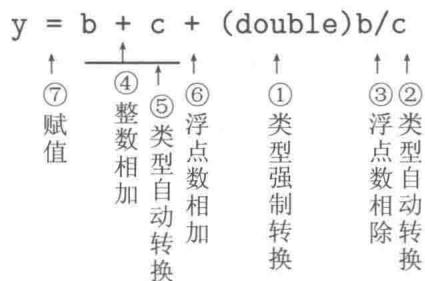  
图2-1 运算操作顺序示例

# 3. 自增及自减运算

变量增1及减1运算是计算机程序中频繁使用的操作。C++语言提供了变量增1或减1的运算。它们是单目运算，优先级为2与3。根据运算符在操作数的前后分为前置运算、后置运算两种。也分别被称为前（后）增（减）量运算。自增及自减运算符只能对左值操作，是对变量既读又写的访问操作。

前置自增运算（++变量名）首先将变量的值增加1，然后以新值参加表达式的其他运算。前置自增的结果可以做左值。如++++a即  $++(+ + a)$  合法。

前置自减运算（--变量名）首先将变量的值减去1，然后以新值参加表达式的其他运算。前置自减的结果可以做左值。如----a即--（--a）合法。

后置自增运算（变量名++）先以变量的原值参加所在表达式的其他一次运算，然后变量的值增加1。后置自增运算的结果不能做左值。++（a++）及a++++均有语法错。

后置自减运算（变量名--）先以变量的原值参加所在表达式的其他一次运算，然后变量的值减去1。后置自减运算的结果不能做左值。--（a--）及a----均有语法错。

例如：

```txt
int a = 0;  
cout << ++a << endl; // 输出1（先增1以新值1输出）  
cout << a << endl; // 输出1  
a = 0;  
cout << a++ << endl; // 输出0（先以原值0输出）  
cout << a << endl; // 输出1（表明a的值被改变）
```

# 4. 关系运算

比较两个量之间的大小、相等或不等的运算被称为关系运算。C++语言中，如下六个运算符号  $>$  、  $\geq$  、  $<$  、  $<=$  、  $==$  和  $!=$  被称为关系运算符，用于比较两个量之间的关系，分别为大于、大于或等于、小于、小于或等于、等于和不等于。关系运算的结果为逻辑值（即bool型）：true“真”，或者false“假”。若关系成立，则关系运算的结果为true（同整数1）；若关系不成立，则关系运算的结果为false（同整数0）。

请读者务必严格区分、正确使用赋值运算符“=”和关系运算符“==”。

# 5. 逻辑运算

关于逻辑（bool型）值false，true的运算有逻辑非！（单目运算）、逻辑与&&、逻辑或||。它们的运算法则（真值表）如下：

<table><tr><td>!</td><td>真假</td><td>&amp;&amp;</td><td>真假</td><td>||</td><td>真假</td></tr><tr><td></td><td>0 1</td><td>真</td><td>1 0</td><td>真</td><td>1 1</td></tr><tr><td></td><td></td><td>假</td><td>0 0</td><td>假</td><td>1 0</td></tr><tr><td colspan="2">逻辑非</td><td colspan="2">逻辑与</td><td colspan="2">逻辑或</td></tr></table>

逻辑运算的结果为逻辑值。系统给出的逻辑值与整数兼容，“逻辑真（true）”用1表示，“逻辑假（false）”用0表示。系统判断真假时，将非零数当成“逻辑真（true）”，将零当成“逻辑假（false）”。

例如，给定年份int year = 2016; 判断该年是否为闰年。

历法规定，年份能被4整除但不能被100整除，或者年份能被400整除者为闰年。如：

```txt
int year;  
bool flag;  
year = 2016;  
flag = year%4 == 0 && year%100 != 0 || year%400 == 0;  
cout << flag << endl; // 输出 1，表示 2016 年为闰年  
year = 2017;  
flag = year%4 == 0 && year%100 != 0 || year%400 == 0;  
cout << flag << endl; // 输出 0，表示 2017 年为平年
```

对于多个逻辑表达式的“或者”运算（||），只需要判断到其中（从左到右）有逻辑真（true）便可知整个逻辑表达式的结果为真。对于多个逻辑表达式的“并且”运算（&&），只要判断到其中（从左到右）有逻辑假（false）便可知整个逻辑表达式的结果为假。 $\mathrm{C}++$  语言充分利用了逻辑计算的这个特点，用所谓的逻辑表达式的短路计算法省去不必要的计算。

虽然“或者（||）”运算、“并且（&&）”运算皆满足交换律，但是逻辑表达式的短路计算对  $\mathrm{C}++$  程序的运行会产生一定的影响，程序员要善于利用其有利影响，避免其不利影响的发生。例如：

```txt
int x, y, z;  
x = rand() % 21;  
y = rand() % 21;  
cout << x << "/" << y << "□=□";  
cin >> z;  
if(y != 0 && x/y == z) // 短路求法避免了除数为0的计算发生 // 因此，不能写成 if(x/y == z && y != 0) cout << "回答正确!" << endl;  
else if(y != 0) cout << "回答错误。" << endl;  
else cout << "题目错误（除数为零）." << endl;
```

# 6. 迭代赋值运算

+ = 、- = 、* = 、/ = 和 % = 为算术迭代赋值运算符。其一般格式为

```javascript
变量名  $+ =$  右值表达式变量名  $- =$  右值表达式变量名  $\ast =$  右值表达式变量名  $= \frac{1}{2}$  右值表达式整型变量名  $\% =$  整型右值表达式
```

计算这些运算表达式时，首先将其左边的量作为右值（即读取变量的当前值）与运算符右边的右值表达式进行相应的  $(+,-,*,/或\%)$  运算，再将计算结果赋值给左值变量。即先对变量进行读访问操作，然后进行相应的运算，最后对该变量进行写访问操作。显然要求该变量事先具有有意义的数值供读取。例如：

```javascript
double  $x = 5$  ，y=10.5;  
int a=15，b=3;  
 $\mathrm{x} + = \mathrm{y};$  //相当于，但效率高于  $\mathrm{x} = \mathrm{x} + \mathrm{y};$ $\mathrm{x} - = 5;$  //相当于，但效率高于  $\mathrm{x} = \mathrm{x} - 5;$ $\mathrm{x} * = 3;$  //相当于，但效率高于  $\mathrm{x} = \mathrm{x} * 3;$ $\mathrm{x} / = 2;$  //相当于，但效率高于  $\mathrm{x} = \mathrm{x} / 2;$ $\mathrm{a} / = 2;$  //相当于，但效率高于  $\mathrm{a} = \mathrm{a} / 2;$ $\mathrm{a}\% = \mathrm{b};$  //相当于，但效率高于  $\mathrm{a} = \mathrm{a}\% \mathrm{b};$
```

# 2.2.3 C++程序流程控制

# 1. 条件分支语句

规定2.8（分支语句）  $\mathrm{C}++$  提供的刻画选择结构的语句为分支语句（或称为if语句）。其语法格式和流程图如图2-2所示。

分支语句对应算法中的选择结构。语句中的圆括号不能缺少。若语句2为空语句，则连同else在内均可省略。

若某分支需要执行多条语句，则必须用一对花括号将这些语句包围起来，使之在语法上作为一条单语句（复合语句，参见第3.4节规定3.10）。

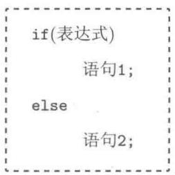  
（a）语法格式

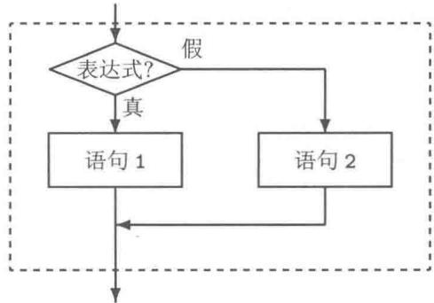  
（b）流程图  
图2-2 if语句

if语句可以嵌套，以实现多路选择。if语句嵌套时，else与if配对的规定为else与其上面最近的、同一层次的、尚未与其他else配对的if配对。例如，若有语句：

```txt
if  $(x>=0)$   
if  $(x>0)$   
cout << x << "大于0." << endl;  
else  
cout << x << "小于0." << endl;
```

则编译器将上面的程序段按如下方式编译：

```txt
if  $(x>=0)$   
{  
    if  $(x>0)$   
        cout << x << "大于0." << endl;  
    else  
        cout << x << "小于0." << endl;  
}
```

显然，上面的程序段不是程序员的本意。正确的程序段应该如下，尽管花括号内仅为一个单语句，此处的花括号不可缺少。

```txt
if  $(\mathrm{x}> = 0)$    
{ if  $(x > 0)$  cout<<x<<"大于0。"<<endl;   
} else cout<<x<<"小于0。"<<endl;
```

$\mathrm{C}++$  程序的书写格式是自由式的，书写格式不能代替语法规定。应该按照一定的书写规范编辑源程序代码，养成良好的程序书写习惯。程序决不会因为书写格式紧凑而执行效率高。

根据 else 与 if 配对的规定，不难分析并“推导”出如下多路分支结构。

```txt
if（表达式1）语句1;  
else if（表达式2）语句2;
```

```txt
$\vdots$  else if（表达式n）语句n;else 语句  $\mathrm{n + 1}$
```

例如：

```txt
char grade; //五级分制成绩  
double score; //百分制分数  
cout << "请输入百分制分数："；  
cin >> score;  
if (score >= 90)  
    grade = 'A';  
else if (score >= 80)  
    grade = 'B';  
else if (score >= 70)  
    grade = 'C';  
else if (score >= 60)  
    grade = 'D';  
else  
    grade = 'E';  
cout << "转换成五级分制成绩：" << grade << endl;
```

请读者思考，在上面的条件判断中为什么不必用（score>=80 && score<90），而只需要简单地用（score>=80）？

# 2. 循环语句

$\mathrm{C}++$  提供的刻画循环结构的语句有三种形式，这三种形式能够相互转换。程序员可以只用其中的任意一种便能编写任何循环结构的程序。这三种形式各有其最便利的应用场合。

在循环结构中，循环体内的语句执行完后，称为结束本轮（本次）循环，准备进入下轮循环。整个循环语句是否结束，依赖于：

① 准备进入下一轮循环的条件判断（即继续循环的条件判断）。  
② 循环体内是否有机会执行中断循环的 break 语句，甚至 return 语句。

规定2.9（while循环）while循环的语法格式及其对应的流程图如图2-3所示。

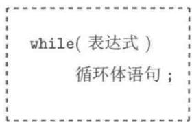  
（a）语法格式

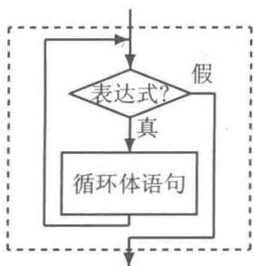  
（b）流程图  
图2-3 while循环

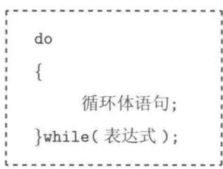  
（a）语法格式

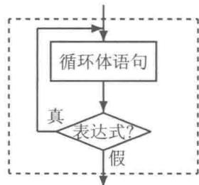  
（b）流程图  
图2-4do循环

规定2.10（do循环）do循环的语法格式及其对应的流程图如图2-4所示。

do 循环的特点是先执行循环体语句，再判断继续循环的条件。因此，在 do 循环中，循环体语句至少被执行一次。  
do 循环语句中的一对花括号可能是不必要的。建议读者在书写 do 循环语句时写下一对花括号，并且将右花括号写在 while 之前（写在同一行）。这样更容易区分该语句是 do 循环语句块中的最后一行，而不是一个 while 循环语句。

规定2.11（for循环）for循环的语法格式及其对应的流程图如图2-5所示。

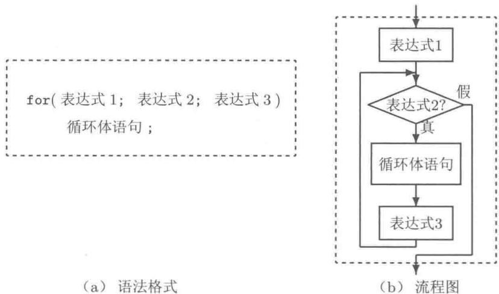  
图2-5 for循环

其中“表达式1”“表达式2”和“表达式3”都可以缺省，但其中的两个分号不可缺少。缺省“表达式2”时，默认为true（即“真”，亦即1），称其为“永真循环”。此时，循环体内应该有机会执行到break语句（如图2-7所示），以避免程序中出现“死循环”。“表达式1”只执行一次，常用于为进入循环体做准备；“表达式3”也可以看成循环体中的最后一条语句；也可以将循环体语句放在“表达式3”的位置。for循环的循环体语句，有可能一次都不执行，而“表达式1”总是会执行一次的。

显然，在for循环中“表达式1”和“表达式3”均缺省时，便相当于while循环。

# 3. 开关语句

规定2.12（开关语句）  $\mathrm{C}++$  提供分情况多路选择的开关语句，其语法格式为

```txt
switch（整型或枚举型表达式）  
{  
case 常量表达式1：语句组1；  
case 常量表达式2：语句组2；  
}  
case 常量表达式n：语句组n；  
default：语句组  $\mathrm{n + 1}$  ·  
}
```

switch语句块中的case相当于语句标号。根据进入该语句块时所提供的整型或枚举型表达式的值，跳转到相应的case处开始执行其后的所有语句组语句直到整个switch语句块结束，或者遇到break语句而结束整个switch语句块。其执行流程如图2-6所示。default及其“语句组n+1；”是可以缺省的。

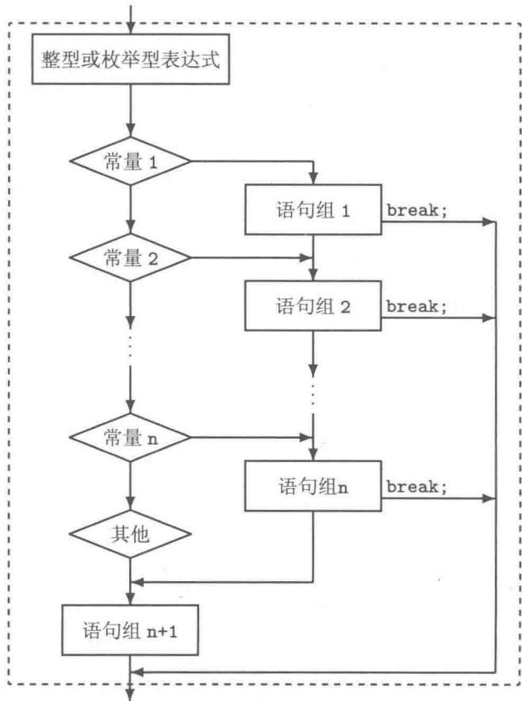  
图2-6 switch开关语句

case后面所跟的必须是常量，而且各常量值不能重复（这意味着同一switch语句块中不能有重复的标号）。流程图中借用菱形框表示各标号，并不表示条件判断。若需要用浮点型数据的关系运算作为判断条件，只能使用if语句嵌套实现多路分支选择。

# 4. 跳转语句

规定2.13（break语句）结束其所在的一层循环语句或者开关语句，从本层结构之后的语句起执行。若有多重循环，则break仅中断其所在的那一层循环。

规定2.14（continue语句）提前结束本轮循环，准备进入下一轮循环。即本轮循环体中所剩下的语句将不予执行。

图2-7给出了break和continue在for循环语句中的作用，在其他两种循环中的作用是类似的。

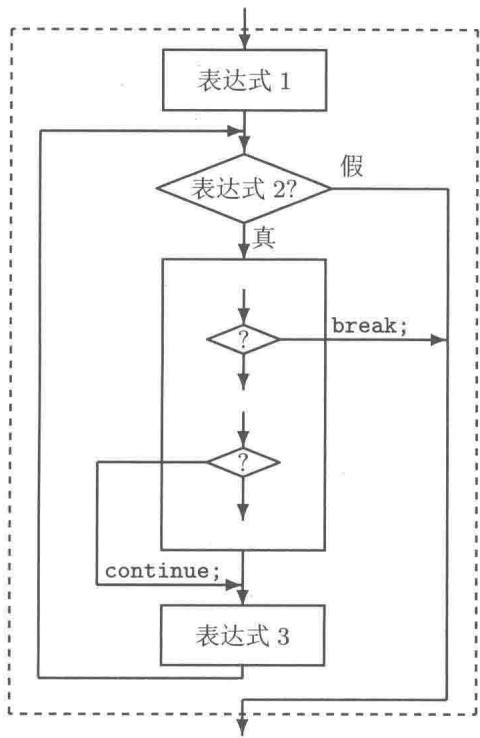  
图2-7 for循环中的跳转

规定2.15（return语句）return语句也被称为返回语句，其语法格式为

return 表达式；

或者

return ;

在程序的执行过程中，用函数名及一定的实际参数调用函数时，系统将保存当前的状态，并将程序的控制权转移给该函数。在该函数体内若遇到 return 语句或执行完该函数体所有的语句时，该函数立即结束，并将控制权交还给调用它的函数。若在主函数 main 中遇到 return 语句，则将引起整个程序结束，返回到操作系统。

返回语句中的表达式的类型应该与函数的返回类型相匹配（必要时通过类型转换）。若函数的返回类型为void，则函数体内可以编写return；语句（无表达式的返回语

句），也可以不编写return；语句（函数体内的语句执行完毕后，自动返回）。如：

```cpp
1 #include <iostream>
2
3 void greeting()
4 {
5 std::cout << "Hello." << std::endl;
6 return; // 交还程序控制权。此语句可缺省。
7 }
8
9 int main() // 程序执行的起点
10 {
11 greeting(); // 调用函数，程序控制权转移给 greeting 函数
12 return 0;
13 } // 程序执行的终点
```

规定2.16（语句标号与goto语句）C++程序中，可以在某语句前设置一个标号（标识符后跟冒号）。goto语句可以从其所在的语句，或向前或向后跳转到任意的标号处。注意：此处的语句标号与switch-case语句中相当于语句标号的case是不相同的。

goto语句的滥用将导致程序结构的混乱，是结构化程序设计所忌讳的。我们不提倡使用goto语句。仅限制在一种情形[1]下使用：从多重循环的深处直接跳出多重循环。这样处理，实际上有利于程序的结构。因为，倘若要一层层地退出，势必要增加一些标志量及标志值的判断，使程序的结构反而复杂。

# 2.3 基本程序扩展

本节将前面的“算术测验”程序改编成“主控模块/功能模块”结构的程序，目的是使程序具有良好的可扩展性。具体地，首先将test2.cpp程序按照功能拆分成两个函数；然后将程序写成多文件结构并进行扩展使之能够进行算术减法运算的测验。

# 2.3.1 简单函数

将某些完成一定功能的程序语句段包装成一个整体，形成一个功能单一、相对独立的模块，以便灵活地组装到其他功能模块中或者主控模块中。程序的功能模块在  $\mathrm{C}++$  语言中体现为函数（或者称为子程序）。

一个  $\mathrm{C}++$  程序由一个主函数和若干个其他函数构成，即  $\mathrm{C}++$  用函数组织程序。编写  $\mathrm{C}++$  程序就是编写函数。一个函数是否被执行或执行多少次与其编写时的位置无关，而取决于是否有机会执行调用该函数的语句。因为，程序运行是由函数的相互调用所驱动的。除了给全局变量分配内存空间及初始化在主函数执行前完成外，主函数是程序执行的起点，主函数执行完毕（在主函数中返回）也就意味着程序即将结束（之后，还要销毁已经定义的全局变量）。

本节介绍简单的函数：无形式参数。下面将test2.cpp程序改编成如下形式。

源代码2.3 算术测验程序之三  
```cpp
1 // test3.cpp
2 #include <iostream>
3 #include <time>
4 using namespace std;
5
6 int add_test(); // ①函数声明（函数原型）
7
8 int main()
9 {
10     int score;
11
12     score = add_test(); // ②函数调用（执行语句）
13     // 函数调用表达式 add_test() 本身表示函数的返回值
14     cout << "成绩：" << score << "口分" << endl;
15     return 0;
16 }
17
18 int add_test()
19 {
20     int x, y, z;
21     int i, score;
22     time_t t;
23     brand(time(&t)); // 设置随机数发生器的“种子”
24
25     score = 0; // 开始答题前，成绩为 0
26     i = 0; // i 为循环控制变量，初值为 0
27     while (i < 10) // 继续循环的条件为 i < 10
28     {
29         x = rand() % 21; // 给 x 赋 0 ~ 20 之间的某个随机值
30         y = rand() % 21; // 给 y 赋值。x 与 y 的值不一定相同
31         cout << x << "口+口" << y << "口=口"; 
32         cin >> z;
33         if (x + y == z)
34         score += 10; // 回答正确，加 10 分
35         i++; // i 增加 1，相当于 i = i + 1;
36 }
37     return score; // 完成测验后，将成绩（分数）返回
38 }
```

本程序与程序test2.cpp的功能相同。本程序由函数add_test和函数main组成。其执行过程如下。

（1）执行主函数，定义主函数中的score变量（其初值不可预知）。  
（2）执行程序第12行前半段：调用add_test函数（即转子程序），将程序的控制权转移给该函数（从第18行起）。

① 定义6个变量x，y，z，i，score，t。此处的score与主函数中的score相互独立，即既无关联也无冲突，是不同的两个变量。  
② 随机产生10道算术题、显示题目、接收答案输入、判题评分等（第25~36行）。  
③ 返回测验成绩，销毁本函数中定义的6个变量x，y，z，i，score，t（第37、38行）。

（3）程序的控制权返回给主函数，执行第12行后半段：用add_test函数的返回值

（该返回值就用函数调用表达式add_test()本身表示）给主函数的变量score赋值。

（4）输出测验成绩（第14行）。  
（5）执行主函数中的返回语句（第15行），销毁主函数中的变量score，结束整个程序返回到操作系统。

在这两个函数中各自定义了一些变量，这些变量皆为局部自动 auto 变量（简称为局部变量）。局部自动变量的生命期随所在函数的调用及函数体中变量定义语句的执行而开始，至所在函数返回而结束。局部变量的可见性也仅为其所在函数内。因此，尽管两个函数中都定义了变量 score（数据类型、变量名皆相同），事实上，这两个变量是相互独立的，它们有各自所联系的内存单元。它们虽有重叠的生命期，却没有同时的可见性，故它们之间不会引起任何冲突。

函数必须先声明或先定义才能被调用。

① 程序中第6行为函数原型用于函数声明。函数声明的作用是告诉编译器（同时也告知程序员）如何使用该函数。从函数原型可见，调用该函数时不需要提供实际参数（即圆括号中不需要表达式，但表示函数的圆括号不可缺少）。  
② 调用该函数后将得到一个整型数值（这个数值是执行函数的结果）直接用函数调用表达式本身表示（参见程序第12行）。  
③ 函数定义（函数功能的具体实现过程）见程序第  $18\sim 38$  行。

此外，程序中并不在add_test函数中直接输出测试成绩，而是将测试成绩返回给调用该函数的函数（main）。这样做的好处是：主函数（main）中用变量score保存了add_test函数的执行结果，不仅仅可以进行输出，而且还可以做更多其他的操作。

# 2.3.2 多文件结构

在第1章中，提到“C/C++语言支持众人集体开发大型软件”。显然众人集体开发程序时，不会将所有的函数都写进同一个文件。一个  $\mathrm{C} + +$  程序由多个文件组成，主要有源程序文件和头文件两种。一般地，将这些文件组织成一个工程文件（也被称为项目文件）。可以向工程文件中添加新的文件或者添加已经存在的文件；也可以从工程文件中剔除一些文件。

规定2.17（编译单元）  $\mathrm{C}++$  程序以源程序文件为单位，进行分割编译。源程序文件被称为编译单元。一个源程序文件可以包含多个头文件。头文件不是编译单元，编译系统不编译头文件。头文件中的内容常在编译前插入到某源程序文件中进行编译。

本节仅介绍基本的多文件结构。读者只需要模仿这种结构。程序中使用了I/O流格式控制以便使测验题目在显示器上整齐地排列输出（其语法详见第3.5节）。多文件结构的“算术测验”程序由如下三个文件组成。

(1) test.cpp: 源程序文件, 其内容为函数的定义。  
(2) test.h: 头文件, 其内容为函数的声明。  
(3) test_main.cpp: 源程序文件, 其中有主函数的定义。

文件test.cpp与test.h为一组文件。可假定这两个文件是由程序开发小组的其他程序员所完成，现移植到此进行组装。三个文件的具体内容如下。

源代码2.4 算术测验程序之四  
```txt
1//test.cpp  
2#include<iostream>  
3#include<ioanip> //为了使用I/O流格式控制。见第18行、第41行  
4#include<ctime>  
5using namespace std;  
6int add_test() //函数定义  
7{  
9int x,y,z, score  $= 0$    
10time_t t;  
11srand(time(&t));  
12  
13cout<<"加法测验（共  $\square 10_{\text{口}}$  题）"<<endl;  
14for(int i  $= 0$  ;i<10;i++)  
15{  
16x  $=$  rand(）%21;  
17y  $=$  rand(）%21;  
18cout<<setw(2)  $<  <   x <   <   " _ { \sqcup } + _ { \sqcup } "$  <setw(2)  $<  <   y <   <   " _ { \sqcup } = _ { \sqcup } "$  .  
19cin>>z;  
20if(x+y==z)  
21score+=10;  
22}  
23return score;  
24}  
25  
26int sub_test() //函数定义  
27{  
28int x,y,z, score  $= 0$    
29time_t t;  
30srand(time(&t));  
31  
32cout<<"减法测验（共  $\square 10_{\text{口}}$  题）"<<endl;  
33for(int i  $= 0$  ;i<10;i++)  
34{  
35x  $=$  rand(）%21;  
36y  $=$  rand(）%21;  
37if(x<y)  
38{  
39z=x;x=y;y=z;//借助z交换x与y的值  
40}  
41cout<<setw(2)  $<  <   x <   <   " _ { \sqcup } - _ { \sqcup } "$  <setw(2)  $<  <   y <   <   " _ { \sqcup } = _ { \sqcup } "$  .  
42cin>>z;  
43if(x-y==z)  
44score+=10;  
45}  
46return score;  
47}
```

```c
1//test.h  
2#ifndefTEST_H //采用判断某标识符是否没有定义  
3#defineTEST_H //以避免重复包含（详见第7章）  
4  
5int add_test(); //函数声明  
6int sub_test(); //函数声明  
7#endif
```

```cpp
1 // test_main.cpp
2 #include <iostream>
3 #include "test.h" // 包含头文件，完成函数声明
4 using namespace std;
5
6 int main()
7 {
8 int choice = 1, score;
9
10 while (true)
11 {
12 cout << "算术测验\n"
13 << "1□---□加法\n"
14 << "2□---□减法\n"
15 << "0□---□退出\n"
16 << "请选择："; // 显示“菜单”
17 cin >> choice; // 输入选项
18 if (choice <= 0) break;
19 if (choice > 2) continue;
20 switch (choice) // 根据选项进行调度，调用不同函数
21 {
22 case 1: score = add_test(); break;
23 case 2: score = sub_test(); break;
24 }
25 if (score >= 60)
26 cout << "成绩：" << score << "分，通过。" << endl;
27 else
28 cout << "成绩：" << score << "分，不及格。" << endl;
29 }
30 return 0;
31 }
```

# 2.4 C++程序开发流程

用  $\mathrm{C}++$  语言编写的源程序必须经过编译、连接，生成可执行文件后才能在操作系统的控制下运行。  $\mathrm{C}++$  程序的基本开发流程如图2-8所示。

一个  $\mathrm{C}++$  程序可能由多个源程序文件、多个头文件等组成。而头文件的内容将在编译之前的预处理阶段，根据包含指令“插入”到源程序文件或其他头文件的当前位置。 $\mathrm{C}++$  以源程序文件为编译单元分别进行编译（分割编译），分别生成目标代码文件。连接程序将各个目标代码文件，以及标准函数库代码连接起来，产生可执行文件。

系统在程序的编译、连接、运行阶段都具有检查错误的能力。只要出现错误就应该分析源程序、修改源程序，再重新编译、连接、运行程序。程序中的错误或问题被分成三类：第一类是错误 error(s)，遇此情况，将不会生成可执行文件；第二类是警告 warning(s)，若程序中仅有警告，则可以生成可执行文件。程序员应该认真对待编译系统给出的警告，仔细分析其原因（有些警告并不表示有错，只是系统的“温馨提示”）；第三类是程序运行时产生的错误。例如，计算过程中数据溢出（数据超出该类型所能表示的范围）、用0做除数、当应该输入数值时却输入了字母等。读者需要通过在计算机上多实践，不断积累经验，以提高自己调试程序的能力。

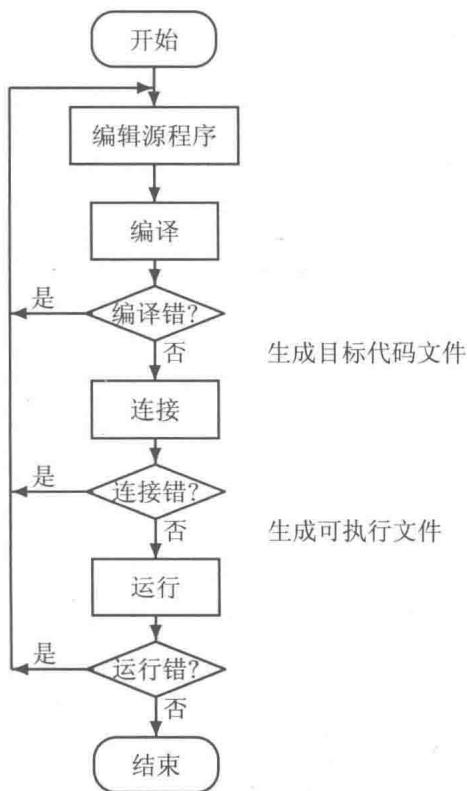  
图2-8 C++程序开发流程

# 2.5 C++ 应用程序集成开发环境简介

为方便程序员使用高级语言开发应用软件，一些公司或团体根据不同计算机语言研制开发了一些应用程序集成开发环境(Integrated Development Environment, IDE)。IDE集成了编辑器（用于录入、修改、保存源程序文件）、编译器、连接器、调试及运行工具为一体，方便程序员使用计算机语言进行软件开发。常用的  $\mathrm{C}++$  IDE有MinGW Developer Studio、Code Blocks和Microsoft Visual C++等。本教材中的所有程序均在这些IDE下编译通过。

需要指出的是  $\mathrm{C} + +$  IDE 只是  $\mathrm{C} + +$  语言的开发工具，不等于  $\mathrm{C} + +$  语言； $\mathrm{C} + +$  IDE 中集成的编译器是  $\mathrm{C} + +$  语言的一种实现，并不一定完全符合  $\mathrm{C} + +$  标准。

本教材中涉及非标准  $\mathrm{C}++$  的内容主要有“控制台输入输出”的几个函数，它们的原型在头文件 conio.h 中，如表 2-3 所示。

表 2-3 控制台输入输出函数  

<table><tr><td>函数原型</td><td>功能</td></tr><tr><td>int getch();</td><td>暂停，等待用户按任意键（不必回车）并返回所按键的编码</td></tr><tr><td>int getchar();</td><td>同上，且回显（echo）用户所按键的字符</td></tr><tr><td>int kbhit();</td><td>判断是否按键，若是则返回1，否则返回0</td></tr></table>

本节提到的  $\mathrm{C}++$  IDE 均支持这些函数。但使用了这些函数的程序不能直接移植到其他系统（如 UNIX/Linux 操作系统）中。

下面以MinGW Developer Studio为例介绍  $\mathrm{C / C + + }$  IDE的一般使用方法。其他IDE的使用步骤大致相同。

MinGW Developer Studio 是一个小巧的可运行于 Windows 操作系统下的 C/C++ 应用程序集成开发环境。它集成了：

① Minimalist GNU for Windows 软件[1]（简记 MinGW C++）即 Windows 版的 GCC 编译器。  
② 一个功能完善的编辑器，支持代码折叠等。  
③ 其他工具（如一个图形用户界面设计工具箱、一个资源编辑器等）。

该集成开发环境可以通过互联网免费获取、自由发布[2]。

下面简要介绍运用MinGW Developer Studio C/C++ IDE开发Windows操作系统下控制台应用程序（Win32 Console Application）的过程。

（1）启动IDE（如图2-9所示）。

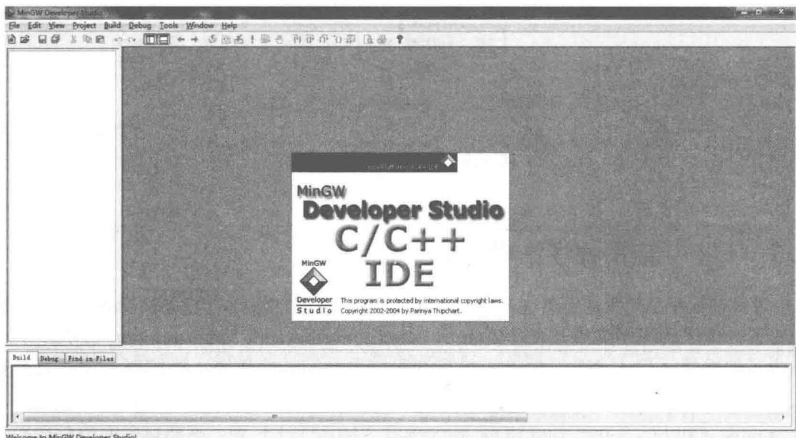  
图2-9MinGW Developer Studio  $\mathrm{C / C + + }$  IDE主界面

（2）新建工程文件。

在主界面的主菜单上选择File|New（如图2-10(a)所示），则弹出如图2-10(b)所示的对话框（系统自动进入Projects选项卡），选择Win32 Console Application；然后点击Location的右下方省略号处，选择工程文件存放的文件夹（即子目录）。例如：D:\CPP（假定文件夹D:\CPP已经存在，请事先建立该文件夹）表示将工程文件的工作目录创建在该文件夹下；再在Project name的编辑栏中直接输入test1作为工程文件的文件名，同时该工程文件的工作文件夹为D:\CPP\test1；最后单击OK按钮。

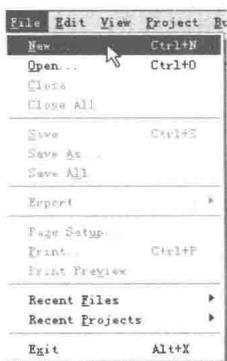  
(a)

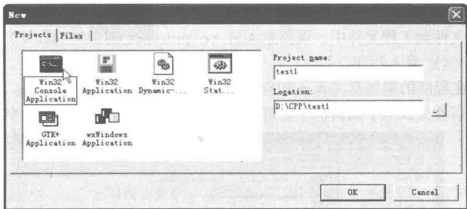  
(b)  
图2-10 创建工程文件

此时将在D:\CPP文件夹中再自动建立一个文件夹D:\CPP\test1，并在新文件夹中建立一个工程文件test1.mdsp。

新建工程文件成功后，该工程文件便处于“已打开”的状态。之后，便可以添加新的源程序文件、头文件，或添加已经存在的源程序文件、头文件到该工程文件中。

须注意的是：一个  $\mathrm{C / C + + }$  程序往往由多个源程序文件、多个头文件等组成，工程文件能够很好地管理它们：  $①$  自动打开所有相关程序文件；  $②$  分割编译所有的编译单元；  $③$  连接所有分割编译的目标代码生成可执行程序。即，一个程序对应一个工程文件。一个程序（一个工程文件）包含多个源程序文件或头文件。因此，打开一个程序的方法是打开其工程文件，而不是孤零零地单独打开一个源程序文件（即使整个程序仅由一个源程序文件组成）。

打开一个已经存在的工程文件的方法：鼠标双击扩展名为.mdisp的文件图标。或者在主菜单上选Project|Open Project，再根据所弹出的对话框选择工程文件。

当打开了工程文件后，主界面的左侧将不再是“灰暗的”，其中列有该工程文件管理的所有文件，将其中的加号“+”展开，可见具体的文件。主要有源程序文件、头文件两类。

（3）添加新源程序文件或头文件到工程文件中。

当某工程文件打开后，仍然在主界面的主菜单上选File|New，则弹出的对话框自动跳至“新建文件Files”选项卡（如图2-11所示）。

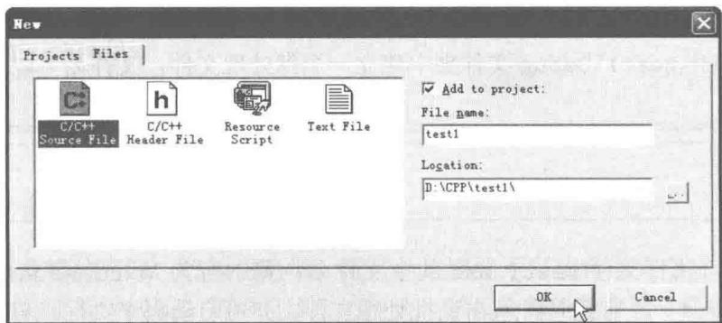  
图2-11 添加新源程序文件到工程文件中

此时将在D:\CPP\test1文件夹中新建一个文件test1.cpp。采用同样的方法可以添加头文件到工程文件中。请留意Add to project前的对勾（√）是否出现。

（4）录入程序。

在程序的编辑框中录入相应文件的内容。此时可用键盘上的 [Ctrl] 键，配合鼠标滚轮，以放大或缩小编辑框中字符的大小，特别适合于课堂讲解（参见图 2-12）。

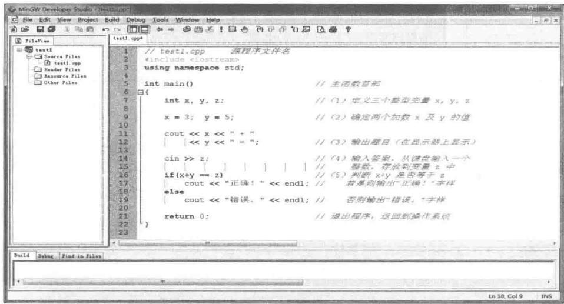  
图2-12 录入程序

（5）编译链接及运行程序。

主菜单上有三个图标分别是编译、编译并连接、编译连接并运行。直接用鼠标单击其中的感叹号便可以由系统决定是否需要重新编译、重新连接、直至运行。其中任何一步出现错误，均需要程序员进一步修改程序。对于编译系统给出的警告错误（温馨提示）也需要认真对待。

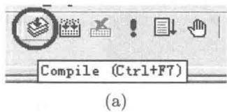

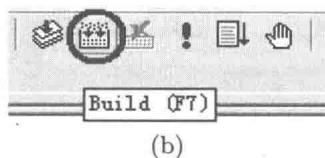  
图2-13 编译、连接与运行程序

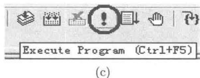

请读者观察D:\CPP\test1文件夹中的文件，及其子文件夹Debug中的文件，以了解系统将用户的程序存放在何处。

可在D:\CPP\test1\Debug文件夹中建立一个批处理文件，文件名可取为run.bat。  
文件内容如下。

```batch
test1 pause
```

其中第一行为可执行文件test1.exe的主文件名；第二行为Windows命令（功能为暂停，按任意键继续）。存盘后，双击该批处理文件，亦可启动程序执行。与直接双击文件test1.exe启动程序执行不同之处是程序执行完毕后还执行暂停命令，以便操作者有足够的时间看清程序的输出结果，待用户按任意键后再关闭Windows命令窗口。

# 2.6 趣味程序——变换的字符

源代码2.5 变换的字符  
```cpp
#include <iostream>
#include <time>
#include <conio.h>
using namespace std;
void delay(int n) // 延时  $n$  毫秒
{
clock_t t = clock(); // 记录进入本函数的时刻
while (clock() - t < n) // 继续循环条件：时间差小于  $n$ 
; // 循环体为空语句，因为无其他事情要做
}
void trans_char()
{
int n = 0;
cout << "按任意键……" << endl;
while (kbhit() == false) // 继续循环条件：未按键
{
n = (n + 20) % 200; // 设置延时时间，0~200毫秒，步长20毫秒
cout << "-\r"; delay(n); // 转义字符 \r 为回车（不换行）
cout << "/\r"; delay(n);
cout << "\|\r"; delay(n);
cout << "\\"\r"; delay(n);
}
getch(); // “吃掉”所按键产生的输入
cout << endl;
while (!kbhit()) // 继续循环条件：未按键
{
n = (n + 20) % 200;
cout << "☆\r"; delay(n);
cout << "★\r"; delay(n);
}
getch();
cout << endl;
}
```

# 2.7 小结

学习语言从模仿开始，边模仿边学。语言的运用绝不应该待学完全部语法后才开始。“主动出击，在实战中成长”是学习语言的要诀。学习计算机程序设计语言也是一样的。

学习C++语言程序设计，先模仿其外观、风格，“照葫芦画瓢”是常用方法。字母的大小写、空格空行、分号括号均需认真对待。C++程序的书写格式是自由的。虽然格

式“规范”不是必需的，但是，格式优美的程序犹如一首诗，它能体现其设计者的专业素养。

程序员犹如一个钟表匠：

① 钟表几乎都是为他人而制作的。  
② 尽量使钟表的外表简洁美观、含义清晰。  
③ 留给用户一些简单的操作接口（按钮、旋钮），将复杂的操作包装在内部。

因此，程序员也要时刻考虑为使用者（他人）提供简洁明了、符合问题描述规范的接口界面，如输出适当的提示信息以指引操作者进行操作。

$\mathrm{C}++$  应用程序开发集成环境（  $\mathrm{C}++$  IDE）的使用方法应该在第一次上机实践就学会。  $\mathrm{C}++$  支持众人集体开发大型软件，一个程序可能包含多个文件，在  $\mathrm{C}++$  IDE中这些文件被组织到一个工程文件中进行有效的集中管理。即使程序中只有一个源程序文件，在打开该程序时，也不要只孤零零地打开该一个源程序文件，而应该打开一个工程文件（双击MinGW C++中的.mdisp文件，或者Code Blocks中的.cbp文件），工程文件会很好地管理其中的所有文件。

一个工程文件（可能包含多个文件）对应一个程序。一个程序中有且仅能有一个主函数 main。（程序中没有全局变量时）主函数常常是程序执行的起点及终点，其他函数执行与否取决于是否有机会执行调用它的表达式，与该函数所在的文件及编排前后次序无关，只需保证先声明或先定义后调用。

调试程序是程序员的基本工作内容。调试程序磨砺程序员的意志，锻炼程序员的思维。C++集成开发环境为程序员提供了方便的调试工具。学会调试程序，也是本课程的目的之一。

# 练习2

# 1. 指出下列各程序中的错误

(1)

```cpp
1 #include <iostream>
2 using namespace std;
3
4 int main()
5 {
6 cout << "HELLO, World." << endl;
7 return 0;
8 }
9
10 int main()
11 {
12 cout << "I am a programmer." << endl;
13 return 0;
14 }
```

(2）

```txt
include<iostream> using namespace std;
```

```txt
4 Int Main()
5 {
6 cout << "HELLO, World."; 7 return 0;
9 }
```

(3）  
```cpp
1 #include <iostream>
2 using namespace std;
3
4 int main()
5 {
6     int x, y, z;
7     z = x + y;
8     cout << "Input two integers: ";
9     cin >> x, y;
10     cout << x << "□+□" << y << "□=□" << z << endl;
11     return 0;
12 }
```

(4)  
```cpp
#include <iostream>
using namespace std;
int main()
{
    int x, y, z;
    x = rand() % 100;
    y = rand() % 100;
    cout << x << "□+□" << y << "□=□";
    cin >> z;
    if (z == x + y)
        cout << "正确!" << endl;
    else
        cout << "错误。" << endl;
    return 0;
}
```

（5）  
```txt
1 #include<iostream>  
2 using namespace std;  
3  
4 int main()  
5 {  
6 double x = 0.5, y = -x;  
7  
8 if (1 < x < 2)  
9 cout << x << "在区间(1,2)中。" << endl;  
10 else  
11 cout << x << "不在区间(1,2)中。" << endl;  
12  
13 if (-1 < y < 0)  
14 cout << y << "在区间(-1,0)中。" << endl;
```

(6)  
```txt
15 else  
16 cout << y << "不在区间  $\square (-1, \square 0)$  中。" << endl;  
17 return 0;  
18 }
```

(7)  
```cpp
1 #include<iostream>   
2 using namespace std;   
3   
4 int main()   
5 {   
6 int i, sum;   
7   
8  $\mathrm{i} = 1$    
9 while(i<=100)   
10 {   
11 sum += i;   
12 }   
13 cout << "Sum  $\square = \square$  " << sum << endl;   
14 return 0;   
15 }
```

(8)  
```cpp
1 #include <iostream>
2 using namespace std;
3
4 int main()
5 {
6 greeting();
7 return 0;
8 }
9
10 void greeting()
11 {
12 cout << "Hello." << endl;
13 }
```

```c
1 #include<iostream>   
2 using namespace std;   
3   
4 int func();   
5   
6 int main()   
7 {   
8 int sum  $= 0$  .   
9 func();   
10 cout << "Sum  $\text{口} = \text{口}"$  <sum<<endl;   
11 return 0;   
12 }   
13   
14 int func()   
15 {   
16 for(int i  $= 1$  ;i<=100;i++)   
17 sum += i;
```

(9)  
```txt
18 return sum; 19}
```

(10)  
```cpp
1 #include<iostream>   
2 using namespace std;   
3   
4 int func();   
5   
6 int main()   
7 {   
8 sum  $=$  func();   
9 cout << "Sum  $\square = \square$  " << sum << endl;   
10 return 0;   
11 }   
12   
13 int func()   
14 {   
15 int sum  $= 0$  .   
16 for(int i=1; i<=100; i++)   
17 sum += i;   
18 return sum;   
19 }
```

```txt
1 #include<iostream>  
2 using namespace std;  
3  
4 int main()  
5 {  
6 int choice;  
7  
8 while (choice)  
9 {  
10 cout << "===主菜单===" << endl;  
11 cout << "11--Hello" << endl;  
12 cout << "22--Hi" << endl;  
13 cout << "33--0k" << endl;  
14 cout << "0--Bye-bye" << endl;  
15 cout << "="======" << endl;  
16 cout << "Yourchoice:";  
17 cin >> choice;  
18 switch (choice)  
19 {  
20 case 1: cout << "Hello." << endl;  
21 case 2: cout << "Hi." << endl;  
22 case 3: cout << "0k." << endl;  
23 case 0: cout << "Bye-bye!" << endl;  
24 }  
25 }  
26 return 0;  
27 }
```

# 2. 基本题

（1）编写一个程序实现第1章中分析的  $1 + 2 + 3 + \dots + 36$  迭加计算，并使累加计

算的中间结果都显示出来。

（2）编写一个程序实现迭加计算  $1 + 2 + 3 + \dots + n$  ，其中整型变量n的值用cin>>n；语句从键盘输入。执行输入语句前，用cout<<"Input $\sqcup$ n:；输出提示信息，不要显示中间结果。  
（3）第2.2.3小节介绍的if语句嵌套实现多路分支例题中，为什么只需要将条件表达式简单地写成关系运算(score>=80)，而不必要写成(score>=80 && score<90)?

# 3. 扩展题（程序设计竞赛题型）

下面的两个题目按程序设计竞赛的常见题型给出。这种题型中包含“问题描述”“输入说明”“输出说明”“输入样例”和“输出样例”。参赛者通过网络将编写的源程序提交到竞赛判题系统进行自动评判。自动判题系统中储备了一定数量的测试数据（与题目中样例的格式相同，常特别增加一些非常特殊的测试用例，考查编程者是否考虑全面）用于判断参赛者的程序运行结果是否正确。

下面的第1题给出完整的解答以及递交前的自我测试方法。

（1）计算两个整数的和。

问题描述 对于给定的两个整数，要求计算它们的和。

输入说明 输入数据有多行，每一行为两个整数。

输出说明 对于每一行的两个数据，要求先输出“Case序号：”（序号从1起），然后输出算式及结果。

输入样例

```txt
153   
4289   
51201   
303-99   
755800
```

输出样例

```txt
Case 1:  $15 + 3 = 18$   
Case 2:  $42 + 89 = 131$   
Case 3:  $51 + 201 = 252$   
Case 4:  $303 - 99 = 204$   
Case 5:  $755 + 800 = 1555$
```

【解答】

源代码2.6 简单的竞赛题型程序  
```cpp
1 //addition.cpp   
2 #include<iostream>   
3 using namespace std;   
4   
5 int main()   
6{   
7 int x，y，k=0;   
8 while(cin>>x>>y)   
9 {   
10 cout << "Case" << ++k<<":\n< x;   
11 if(y>=0)
```

```txt
12 cout  $<  <   " \sqcup +\sqcup " <   <   y$    
13 else   
14 cout  $<  <   " \sqcup -\sqcup " <   <   -y$    
15 cout  $<  <   " \sqcup = \sqcup " <   <   x + y <   <   \text{endl};$    
16 }   
17 return 0;   
18}
```

# 说明：

① 当读完输入数据文件中的数据后，再执行 cin >> x >> y 时将读到文件结束标志，此时返回 NULL（即 0，亦即 false“假”），导致第 8 行继续循环条件不成立而结束循环，进而执行第 17 行使程序结束。  
② 从输出样例看，对输出格式是有要求的。当第二个加数为负数时，需要特殊处理。

【递交前的自测方法之一】利用  $\mathrm{C}++$  集成开发环境将上述程序编译、连接、生成可执行文件。设可执行文件在文件夹 D:\CPP\addition\Debug 中，文件名为addition.exe。现用Windows“记事本”建立如下两个文件。

① 输入数据文件。文件名为input.txt，内容同输入样例。

```txt
153   
4289   
51201   
303-99   
755800
```

② 批处理文件。文件名为 run.bat（注意将文件的扩展名改为 .bat），内容为

```batch
addition  $<$  input.txt  $>$  output.txt
```

其一般格式如下。

```txt
可执行文件名 < 输入数据文件名 > 输出数据文件名
```

执行批处理文件（双击文件 run.bat 的图标），将启动可执行文件 addition.exe 并将标准输入设备重定向到文件 input.txt（即输入设备不是键盘，而是该文件）。同时将标准输出设备重定向到文件 output.txt（即输出设备不是显示器，而是该文件）。若文件 output.txt 不存在则产生该文件，否则将覆盖该文件原有的内容。这样可使输入与输出分隔开来。

若所产生的output.txt文件内容与输出样例一致，则可初步认为程序正确，可考虑将源程序递交到自动判题系统。

【递交前的自测方法之二】直接运行程序，按输入样例的格式从键盘依次输入测试数据，程序随即输出计算结果（请与输出样例比较。不必顾虑输入与输出交织在一起）。最后按 Ctrl+Z 组合键（适用于 Windows 系统。UNIX/Linux 系统中为 Ctrl+D 组合键）表示测试数据输入完毕，此时表达式（cin >> x >> y）为 NULL 而结束循环，进而结束程序运行。若测试结果正确，可考虑将源程序递交到自动判题系统。

（2）计算一系列整数的和。

问题描述 对于给定的一系列整数，要求计算它们的和。

输入说明 输入数据文件有多行，每行上可能有0个、一个或多个整数，直到文件结束。

输出说明 输出数据的个数、逗号、空格、总和。

输入样例

15 42

51

303

755

输出样例

5, 1166