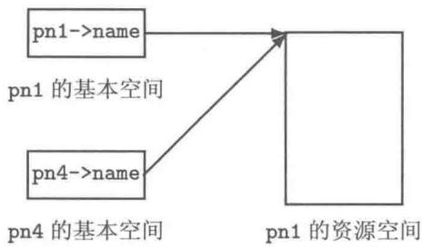

# 第10章 构造函数及赋值运算

构造函数、拷贝构造函数和析构函数是  $\mathrm{C}++$  类中具有特殊地位的函数，它们与对象的创建、销毁相关。构造函数或者拷贝构造函数用于创建对象，析构函数用于销毁对象。它们的形式特别容易辨认。它们的执行常常是由系统自动调用的，识别何时调用了哪个函数却需要读者一定的细心和耐心，其中涉及有关对象的生命期、对象在函数之间传递等概念。

执行赋值运算并不创建新对象，作为参与赋值运算的左操作数（左值对象）是早已存在的对象，赋值运算操作只是可能改变该左值对象的数据成员的值而已。

学习本章后，读者应该对面向过程程序设计中介绍的变量的生命期、数据在函数之间传递（值传递、引用传递、值返回和引用返回）有更加深刻的认识。学习本章后，读者应该对对象的数据空间，尤其是带资源的对象的资源空间有一个全面而深刻的认识。对于对象可能带资源的类的设计，要时刻警醒深拷贝构造、深赋值运算及析构操作的必要性。

# 10.1 构造函数

创建对象时由系统自动调用适当的构造函数来完成处理对象空间、构造结构和初始化数据成员等工作。没有构造函数就不能构造对象，任何类都至少有两个构造函数，其中一个是拷贝构造函数。构造函数没有返回类型（函数体内可以使用return；语句），函数名与类名相同，可以没有或有一个或有多个参数。构造函数可以被重载以方便多种场合、多种条件下创建对象。

# 10.1.1 默认构造函数

不需要实参的构造函数被称为默认的构造函数。声明一个类时，若未定义任何构造函数，则系统会为该类提供一个默认的构造函数，系统提供的这种默认构造函数将不对对象的数据成员进行初始化。此时，所创建的对象数据成员的初值取决于对象的存储类型（全局对象、静态全局对象和静态局部对象的数据成员初始化为各位全为0；局部自动对象、动态对象各数据成员的值是不可预知的）。只要在类声明时定义了构造函数，系统将不再提供默认的构造函数，倘若仍需要默认的构造函数，则需要类的设计者重载默认构造函数。通常的做法是：设计所有参数均带默认值的构造函数。当不提供实参时，该构造函数便成为默认的构造函数。

例如，第9章例9.1、例9.2中均使用了参数带默认值的构造函数。下面的语句：

```txt
Time t;  
Complex z;
```

分别为用类 Time 的默认构造函数创建对象 t；用类 Complex 的默认构造函数创建对象 z。由于这两个类的构造函数的所有参数均带默认值 0，因此，无论这两个对象的存储类

型是什么（即使是局部自动对象），它们的数据成员的初始化值均为0。

需要指出的是如下语句：

```txt
Time t();  
Complex z();
```

不是创建对象，而是函数原型用于函数声明。即声明了参数个数为0，返回类型为Time值返回的函数t；声明了参数个数为0，返回类型为Complex值返回的函数z。

# 10.1.2 转换构造函数

带一个实参的构造函数被称为转换构造函数。之所以称这种构造函数为转换构造函数，是因为可以用它实现数据类型的隐式转换或强制转换。可以为一个类设计多个转换构造函数。

例10.1 学生（Student）的描述及处理方法。

（1）属性：学号（id）、姓名（name）、性别（gender）和年龄（age）。  
（2）行为：构造函数、输出学生信息，其余行为暂略。

```cpp
1//Student.h   
2#	define STUDENT_H   
3#define STUDENT_H   
4#include string> //为了使用  $\mathrm{C + + }$  字符串   
5using namespace std;   
6class Student   
7{   
8public:   
9Student(char  $^ { \text{丰} } \mathrm { I d } = ^ { \text{丰} } 0 0 0 0 0 0 0 0$  ，stringName  $=$  "NoName"，   
10charGender  $\equiv$  m'，intAge=20);   
11Student(stringId，char\*pName  $\equiv$  "无名氏"，   
12charGender  $\equiv$  f'，intAge=20);   
13void Show()const;   
14   
15private:   
16char id[9]； //字符数组，存放C-字符串   
17stringname; //  $\mathbb{C} + +$  字符串   
18chargender;   
19intage;   
20};   
21endif
```

```cpp
1//Student.cpp   
2#include"Student.h"   
3#include<iostream>   
4#include<romanip>   
5#include<cstring> //为了使用C-字符串处理函数   
6using namespace std;   
7Student::Student(char \*Id，stringName，charGender，intAge)   
8{   
9strncpy(id，Id,sizeof(id));id[typeof(id)-1]  $=$  '\0';   
10name  $\equiv$  Name;   
11gender  $=$  (Gender  $= = ^{\prime}\mathsf{M}^{\prime}$  ||Gender  $= = ^{\prime}\mathsf{m}^{\prime})?$  m'：'f';   
12age  $\equiv$  Age;   
13}
```

```cpp
14 Student::Student(string Id, char *pName, char Gender, int Age)  
15 {  
16 strcpy(id, Id.c_str(), sizeof(id)); id[sizeof(id)-1] = '\0';  
17 name = pName; // 自动转换后赋值  
18 gender = (Gender == 'M' || Gender == 'm') ? 'm' : 'f');  
19 age = Age;  
20 }  
21 void Student::Show() const  
22 {  
23 cout << setw(8) << id << "□"  
24 << setw(8) << name << "□"  
25 << (gender == 'm'? "男" : "女")  
26 << "□" << age << endl;  
27 }
```

其中c_str是string类的成员函数，其功能是将  $\mathrm{C + + }$  字符串转换成C-字符串。

```c
1 //StudentTest.cpp 测试程序  
2 #include"Student.h"  
3 void test1()  
4 {  
5 Student s1; //调用默认的构造函数  
6 //利用C-字符串转换构造Student对象  
7 Student s2 = "00001357"; //调用转换构造函数（格式一）  
8 Student s3("00001357"); //调用转换构造函数（格式二）  
9 //利用C-字符串转换构造C++字符串对象  
10 string id("00002468"); //利用C-字符串转换构造string对象  
11 //利用C++字符串转换构造Student对象  
12 Student s4 = id; //调用另一个转换构造函数（格式一）  
13 Student s5(id); //调用另一个转换构造函数（格式二）  
14 s1.Show();  
15 s2.Show();  
16 s3.Show();  
17 s4.Show();  
18 s5.Show();  
19 }  
20 int main()  
21 {  
22 test1();  
23 return 0;  
24 }
```

程序的运行结果：

```txt
00000000 NoName 男20  
00001357 NoName 男20  
00001357 NoName 男20  
00002468 无名氏女20  
00002468 无名氏女20
```

从运行结果可见，利用转换构造函数可以用其他数据类型（即参数的数据类型）的数据初始化新创建的类对象。初始化有两种格式：

```txt
类名对象名（实参，实参，...）；  
类名对象名  $=$  转换构造函数的实参； //“  $=$  ”为初始化记号，不是赋值运算符
```

# 10.1.3 构造函数的使用

第9.2节中已经提到可以创建各种存储类型的对象、对象数组等，本小节侧重构造函数及其应用，特别是构造对象数组时参数的传递问题。

通常情况下，构造函数是在创建对象时由系统自动调用的，系统根据实际参数选择一个匹配的构造函数来创建对象、初始化数据成员。程序员也可以在程序中直接使用构造函数初始化正在创建的新对象。

在这里，顺带提到了拷贝构造函数。关于拷贝构造函数的详情见第10.3节。

# 1. 创建对象数组

创建对象数组时，需要提供一个常量作为数组的元素个数。在依次创建数组的每个元素时均要调用一次构造函数或者拷贝构造函数。

可以显式地使用构造函数初始化数组元素；可以用已经存在的对象利用拷贝构造函数初始化数组元素；可以利用转换构造函数（即直接提供转换构造函数实参，这种情况下每个元素对象仅分别接受一个实参数数据）初始化数组元素：

```txt
类名 对象数组名[元素个数] = {转换构造函数的实参表}；  
类名 对象数组名[元素个数] = {构造函数名(实参表)}；
```

# 2. 创建动态对象或动态对象数组

$\mathrm{C}++$  运算符 new 和 delete 具有很强的功能[1]。用 new 运算符创建堆对象时，该操作运算具有调用类的相应构造函数或拷贝构造函数的功能，使分配空间、构造结构和初始化对象数据成员等工作一气呵成。

```txt
new 类名；  
new 类名（实参，实参，...）；  
new 类名[元素个数]（实参，实参，...）；
```

同样，运算符 new 创建堆对象（堆对象数组）成功后，返回从堆空间所“切”下的那一片连续空间的首地址。程序中需要用指针变量记录下这个地址值，以便能方便地访问堆对象或堆对象数组的元素，以及使用完毕后释放所申请的堆内存资源。若 new 操作不成功，则返回空指针 NULL。创建动态数组的每一个元素时都要调用一次构造函数。

释放堆内存资源仍然使用  $\mathrm{C}++$  操作符 delete。关于 delete 释放动态对象时的特性参见第 10.2 节。

接例10.1，补充几个函数并在主函数中调用。

```cpp
1 // StudentTest.cpp  
2 #include "Student.h"  
3  
4 void test2()  
5 {
```

```txt
6 Student s1("00012345", string("Zhang"));  
7 Student s2("00013456", string("Li"), 'm');  
8 Student s3("00014567", string("Zhao"), 'f', 18);  
9 s1.Show();  
10 s2.Show();  
11 s3.Show();  
12}  
13  
14 void test3()  
15{  
16 int i;  
17 Student s("00020001", string("Zhou"), 'f', 16);  
18 Student array[5] = {  
19 "00020002", // 使用转换构造函数  
20 string("00020003"), // 使用另一个转换构造函数  
21 Student("00020004", string("Wang"), 'f'),  
22 // 直接调用构造函数  
23 Student(string("00020005"), "Chen", 'm', 19),  
24 // 直接调用构造函数  
25 s // 调用拷贝构造函数  
26 };  
27 for(i=0; i<5; i++)  
28 array[i].Show();  
29  
30 Student *p = new Student(string("00030001"), "Sun", 'm', 18);  
31 // 调用适当的构造函数  
32 p->Show();  
33 delete p; // 释放堆内存资源  
34  
35 Student *p1 = new Student[2](string("00040008"), "Qian");  
36 // 调用适当的构造函数（VC++只能用默认的构造函数创建堆对象数组）  
37 for(i=0; i<2; i++)  
38 p1[i].Show();  
39 delete [] p1; // 释放堆内存资源  
40}  
41  
42 int main()  
43{  
44 test2();  
45 test3();  
46 return 0;  
47}
```

程序的运行结果：

```txt
00012345 Zhang 男 20  
00013456 Li 男 20  
00014567 Zhao 女 18  
00020002 NoName 男 20  
00020003 无名氏 女 20  
00020004 Wang 女 20  
00020005 Chen 男 19  
00020001 Zhou 女 16  
00030001 Sun 男 18  
00040008 Qian 女 20  
00040008 Qian 女 20
```

# 10.2 析构函数

# 10.2.1 析构函数的概念

析构函数也是类中特殊的成员函数。析构函数没有返回类型、没有参数、不能被重载，一般不应显式地调用它。对于某个对象而言，当其生命期结束时由系统自动调用析构函数完成一些必要的善后处理工作。类的析构函数是容易辨认的，其函数名为~类名（波浪号与类名），常称析构函数为逆构造函数。辨别何时调用了析构函数需要对对象的生命期有清晰的认识。

在声明一个类时，若未设计析构函数，则系统会为该类提供一个默认的析构函数。由系统提供的默认析构函数仅完成对象基本数据空间的清理工作。若对象带有资源，则应该定义析构函数以完成对象所带资源的清理工作。

$\mathrm{C}++$  的运算符 delete 在释放堆对象或 delete [ ] 在释放堆对象数组时，具有自动调用对象的析构函数的功能[1]。析构对象数组时，将为每一个元素调用一次析构函数。

# 10.2.2 对象构造和析构的顺序

（1）全局对象、静态全局对象在主函数执行之前被构造，直至主函数结束后析构。  
（2）静态局部对象在其所在的函数第一次被调用时创建（该对象的基本空间在全局数据区，其所在函数返回后，静态局部对象为不可见，对象仍然存在且保留当前属性值，当再次调用其所在函数时，该对象成为可见的，不重复创建），直至主函数结束后析构。  
（3）局部自动对象（包括值传递的形参对象）在其所在函数每一次调用时创建，函数返回后析构。  
（4）函数值返回的临时对象在函数返回时创建，在参与其所在表达式运算后析构。  
（5）动态对象（堆对象）在执行 new 操作时创建，在执行 delete 时析构。

在上述基本原则下，先创建的对象后析构，后创建的对象先析构。

# 10.3 拷贝构造函数

对于基本数据类型 int，定义整型变量及初始化方式有

```txt
int a, b = 3; //采用默认方式定义变量a，用常量初始化变量b  
int c = a, d = b; //用已经存在的变量a,b分别初始化变量c,d
```

变量a的初始化值取决于其存储类型，变量b的初始化值为3。变量c的初始化值与变量a的值相同（它们的sizeof(int)字节的各个位皆相同）；变量d的初始化值与变量b的值相同（皆为3）。

对于类类型，也希望能像基本数据类型一样，除了用构造函数创建对象外，也可以用已经存在的对象的值来初始化新创建的对象。这是一种新情况：呼唤一种新的“构造函

数”，要求这种构造函数的形式参数为本类对象的引用（请读者思考：为什么不能用传值型的形式参数，也不能用指针型的形式参数？）。

在类体中声明拷贝构造函数，其函数原型的格式为

类名(const 类名&);

拷贝构造函数可以在类体中声明时定义，也可以在类体外定义。在类体外定义的格式如下：

```txt
类名：：类名(const 类名& 形式参数）执行语句
```

这样的函数被称为拷贝构造函数或复制构造函数。拷贝构造函数也是类的一个特殊成员函数：它没有返回类型、函数名与类名相同、函数的形式参数为该类对象的常引用（即用const对实参进行保护）。用拷贝构造函数创建对象时，将不再调用其他的构造函数。亦即，构造函数、拷贝构造函数均是创建对象时所用的函数，它们使用的场合不同。

声明一个类时若未定义拷贝构造函数，则编译系统会为该类提供一个默认的拷贝构造函数。默认的拷贝构造函数按对象的数据成员（数组成员则按每一个元素）依次调用成员的拷贝构造函数进行拷贝构造。若在声明类时定义了拷贝构造函数，则系统将不再提供拷贝构造函数。

与构造函数、析构函数一样，拷贝构造函数的形式是容易辨认的。拷贝构造函数由系统自动调用。然而，何时调用了拷贝构造函数则需要读者概念清楚加上细心。拷贝构造函数被调用的总原则：当用一个已经存在的对象初始化一个正在创建的对象时，调用拷贝构造函数。有如下三种常见场合。

（1）创建新对象时，用一个已经存在的对象作为初始化值。

（2）调用函数时，用实参（已经存在的对象）初始化值传递创建的形参。

（3）函数类类型对象值返回时，用函数所返回的表达式（一个已经存在的对象）初始化值返回时创建的临时对象（参见第3.2.2小节的注）。

对于上述（2）、（3）两点，常称创建了对象的副本。值传递型形式参数对象（实参对象的副本）、函数值返回时创建的临时对象（返回值的副本）都不是实参本身，对副本的操作不会影响实参；另一方面，创建副本需要花费时间和内存空间。因此，在今后的函数设计中，应该尽可能地使用引用型形式参数、引用返回类型来避免拷贝构造对象。一般是在不得已的情况下才采用值传递、值返回。

然而，采用引用型形式参数传递即传递了对象本身，对引用型形式参数的修改，就是对实参对象的修改。许多情况下，为了避免拷贝构造而采用引用型形式参数，又不希望函数体内对实参对象进行修改，此时，可加保留字const对实参予以保护。不仅如此，调用这样的函数还能用常量对象做实参。

拷贝构造函数可以访问另一个对象的所有（包括公开的、受保护的、私有的）成员。因为类的成员函数对该类所有对象的所有成员有无限制的访问权限（参见第9.1.2小节）。

# 10.3.1 浅拷贝构造——拷贝对象基本空间的数据成员

在拷贝构造对象时，仅根据对象基本空间的数据成员拷贝者被称为浅拷贝构造。系统提供的默认拷贝构造函数只执行浅拷贝操作（取决于其各个成员的拷贝构造函数）。

例10.2 名称（Name）类的设计。

下面将围绕名称类的设计，按“初步设计  $\rightarrow$  发现问题  $\rightarrow$  解决问题”螺旋式递进，逐步展开讨论。为简单起见，仅设计一个数据成员name。为了看清何时调用了何种函数，在成员函数中添加一定的输出语句。

本例相当于设计自定义的字符串类。下面先用字符数组（第10.3节），然后用字符指针（第10.4节）进行设计。在第10.5节组合  $\mathrm{C}++$  的string类设计方案实质上只是外加了一个“壳”，没有实质意义。更为一般的设计参见第12.3节或练习13（3）。

例10.2（A）字符数组做数据成员（正例，但容量受限）。

```cpp
1 // ArrayName.cpp  
2 #include <iostream>  
3 #include <string>  
4 using namespace std;  
5  
6 class Name  
7 {  
8 public:  
9 ArrayName(const char *pName="NoName") //构造函数  
10 {  
11 strcpy(name, pName, sizeof(name));  
12 name[sizeof(name)-1] = '\0';  
13 cout << "Constructing an object of arrayName"  
14 << name << ". ." << endl;  
15 }  
16 ArrayName(const Name&an) //拷贝构造函数  
17 {  
18 strcpy(name, an.name);  
19 cout << "COPY constructing an object of arrayName"  
20 << name << ". ." << endl;  
21 }  
22 ~ArrayName() //析构函数  
23 {  
24 cout << "Destructing an object of arrayName"  
25 << name << ". ." << endl;  
26 }  
27 void ChangeName(const char *pName)  
28 {  
29 cout << "ChangeArrayName" << name;  
30 strcpy(name, pName, sizeof(name));  
31 name[sizeof(name)-1] = '\0';  
32 cout << "." -> [" << name << ". ." << endl;  
33 }  
34 void Show() const  
35 {  
36 cout << "ArrayName:" << name << "." << endl;  
37 }  
38 private:  
39 char name[10];  
40 };  
41
```

```txt
42 ArrayName fAN(ArrayName x, ArrayName *p, ArrayName &r)  
43 { // 测试函数。值传递，地址值传递，引用传递，值返回  
44 cout << "InfAN()... ." << endl;  
45 x.Name("Architecture");  
46 p->ChangeName("Software");  
47 r.Name("Application");  
48 x.Show();  
49 p->Show();  
50 r.Show();  
51 cout << "ReturnfromfAN()..." << endl;  
52 return r;  
53 }  
54 int main()  
55 {  
56 ArrayList an1("JavaProgram");  
57 ArrayList an2("C++Program");  
58 ArrayList an3("C#Program");  
59 cout << "\nBeginfAN()..." << endl;  
60 fAN(an1, &an2, an3);  
61 cout << "EndoffAN()..." << endl;  
62 an1.Show(); an2.Show(); an3.Show();  
63  
64 an2 = an1; // 赋值操作  
65 cout << "\nAfterassignan2=an1;" << endl;  
66 an2.Show();  
67 cout << "ReturntoOperatingSystem." << endl;  
68 return 0;  
69 }
```

ArrayName 类的特点：对象的基本空间就是对象全部数据空间，即用对象基本空间字符数组为容器存放字符串的内容；字符串有最大长度的限制。

（1）由于数据成员name是一个数组的数组名，不能对其赋值，故在成员函数体中用函数 strcpy或函数 strncpy将字符串的内容拷贝至数组各元素。  
（2）构造函数中使用 strcpy 函数是为了将从参数处传入的可能超长的字符串截短，因为每一个对象仅能存放长度不超过 sizeof(name)-1（此处为 9）个字符的 C- 字符串。又因为 strcpy 函数不一定拷贝串结束标志（'\0')，故至少应保证字符数组的最后一个元素为串结束标志。成员函数 ChangeName 的情形是类似的。  
（3）拷贝构造函数仅需要使用 strcpy 函数即可，因为已经存在的对象的数据成员字符串肯定不会超长。  
（4）析构函数无须做其他事情，故仅输出一些信息。

其实，若去掉类中的拷贝构造函数、析构函数，直接利用系统提供的默认拷贝构造函数、析构函数，除了无输出语句外，程序的功能是相同的。

请读者分析如下的运行结果，注意何时调用了拷贝构造函数及析构五个对象的顺序。

```txt
Constructing an object of Name [Java Prog].   
Constructing an object of Name [C++ Progr].   
Constructing an object of Name [C# Progra].   
Begin fAN() ...   
COPY constructing an object of Name [Java Prog].
```

```txt
In fAN() ..   
Change Name [Java Prog]->[Architect].   
Change Name [C++ Progr]->[Software].   
Change Name [C# Progra]->[Applicati].   
ArrayName: [Architect].   
ArrayName: [Software].   
ArrayName: [Applicati].   
Return from fAN() ...   
COPY constructing an object of Name [Applicati].   
Destructing an object of Name [Applicati].   
Destructing an object of Name [Architect].   
End of fAN() ...   
ArrayName: [Java Prog].   
ArrayName: [Software].   
ArrayName: [Applicati].   
After assign an2 = an1;   
ArrayName: [Java Prog].   
Return to Operating System.   
Destructing an object of Name [Applicati].   
Destructing an object of Name [Java Prog].   
Destructing an object of Name [Java Prog].
```

例10.2（B） 字符型指针变量做数据成员（反例之一）。

```cpp
1 // PointName1.cpp  
2 #include <iostream>  
3 #include <string>  
4 using namespace std;  
5  
6 class PointName1  
7 {  
8 public:  
9 PointName1(char *pName="NoName") { name = pName; }  
10 void UpperName() {strupr(name);}  
11 void Show() const {cout << "\\"" << name << "\\"" << endl;}  
12 private:  
13 char *name;  
};  
15  
16 int main()  
17 {  
18 char str[10] = "Tom", *ptr = new char[10];  
19 strcpy(pk, "Jerry");  
20 PointName1 pn1(str), pn2(pk), pn3("Snoopy"); // 创建三个对象  
21 pn1.Show();  
22 pn2.Show();  
23 pn3.Show();  
24 cout << "DoSomething..." << endl;  
25 strcpy(str, "Winnie");  
26 pn1.Show(); //名字已被修改，而对象却浑然不知  
27 delete[] ptr;  
28 pn2.Show(); //目标已不存在，而对象也浑然不知  
29 pn3.UpperName(); //此行编译通过，运行时出错  
30 pn3.Show(); //因为数据成员指针所指的区域为常量  
31 return 0;  
32 }
```

每个 PointName1 类的对象的基本空间为一个指针，仅占 sizeof(void*) 字节，仅能存放一个内存地址值，这个地址值是对象的直接属性。然而真正重要的是以该地址为起始的 C-字符串的内容（间接属性）。对象对字符串的长度却没有限制。

这个类的设计虽无语法错误，但存在一个非常严重的问题——封装不严（实际上是没有封装）。出现如下荒唐的情况。因此，我们将这样设计的类作为反例示众。

① 对象不能对自己的（间接）属性作主（对象pn3数据成员所指之处为字符串常量，不允许被修改）。  
② 尽管对象的数据成员是私有的，对象的（间接）属性却可以被外部任意修改（如对象pn1的属性），甚至被销毁（对象pn2的属性），而对象却浑然不知。

# 10.3.2 对象的资源空间

那么，如何突破字符串最大长度的限制，并且封装严密呢？一个可行的解决方案是：创建对象时由构造函数为该对象申请堆内存空间、在该对象生命期终止时由析构函数释放对象所占用的堆内存资源。我们称这种情形为对象带资源。

# 对象的空间  $=$  对象的基本空间十对象的资源空间

堆内存空间是一种常用的资源（除此以外，数据文件、图标、鼠标指针等都有可能成为对象的资源），本教材主要讨论堆内存资源。对象的基本空间占用 sizeof（类型名或对象名）字节，对象的资源空间的大小可因对象不同而异，这两部分在内存中不一定连续。例如，基本空间可能在全局数据区、栈区或堆区，而堆内存资源在堆区。

例10.2（C） 字符型指针变量做数据成员（反例之二）。

```cpp
// PointName2.cpp
#include <iostream>
#include <string>
using namespace std;
class PointName2 {
public:
    PointName2(const char *pName = "NoName") // 构造函数
    {
        name = new char[strlen(pName) + 1]; // 根据需要量身定做
        strcpy(name, pName); // 无须截短处理
    }
    ~PointName2()
    // 析构函数
    {
        if (name != NULL) delete [] name;
    }
    void UpperName() {strupr(name);} 
    void Show() const {cout << "\\" << name << "\" << endl; }
private:
    char *name;
};
int main()
{
char str[10] = "Tom", *ptr = new char[10];
strcpy(pptr, "Jerry");
}
```

```cpp
29 PointName2 pn1(str), pn2(ptr), pn3("Snoopy");   
30 pn1.Show();   
31 pn2.Show();   
32 pn3.Show();   
33 cout << "DoSomething..." << endl;   
34 strcpy(str, "Winnie"); // 这个修改不影响对象 pn1   
35 pn1.Show();   
36 delete[]ptr; // 这个释放不影响对象 pn2   
37 pn2.Show();   
38 pn3.UpperName(); // 对象属性的修改由对象自己作主   
39 pn3.Show();   
40 PointName2 pn4 = pn1; // 浅拷贝构造 pn4, 引出新问题   
41 cout << "Return to Operating System." << endl;   
42 return 0;   
43 }
```

在创建 PointName2 类的对象时，构造函数根据实参的尺寸“量身定做”申请堆内存空间。该空间的首地址仅由该对象掌握（存放在私有数据成员 name 指针变量中）保证良好的封装性。一般地，外界无法知道对象所带堆内存资源的首地址。该堆内存资源也应该由其析构函数释放。

sizeof (PointName2) 等于 sizeof(void*) 为一个对象基本空间的尺寸。对象资源空间的尺寸与创建对象时的实参有关。这两部分之和为对象的空间。

从上面的测试程序（主函数）可见，直到执行主函数的 return 0；语句，上述程序均不出现错误。但是程序结束时需要依次析构对象 pn4，pn3，pn2 和 pn1。首先析构对象 pn4，其析构函数将对象 pn1 的资源释放了（因为，程序第 40 行对象 pn4 是由对象 pn1 通过默认的拷贝构造函数创建的。默认的拷贝构造函数为浅拷贝构造，仅拷贝了对象的基本空间的内容，造成指针 pn4.name 与指针 pn1.name 存放相同的堆内存地址值，即它们的目标是相同的，如图 10-1 所示）；紧接着析构对象 pn3，pn2（未暴露错误）；最后析构对象 pn1 执行析构函数中的 delete [] name；时，由于再次释放已经释放的空间而导致出错。因此，我们也将这个类作为反例示众。

造成这种错误的根本原因是：不同的对象共享同一资源。类的对象的资源是对象的属性，应该具有一定的私有性。对象之间的这种“资源共享”是应该避免的。

  
图10-1 利用对象pn1浅拷贝构造对象pn4的结果

# 10.3.3 深拷贝构造——构造属于自己的资源空间

对象带资源时，若不同的对象共享同一个资源，析构对象时将已经释放的资源再度释放是错误的。解决这个问题的办法是让每个对象各自带自己独立的资源。因此，拷贝构造

函数在创建对象时，还需要申请属于自己的资源空间，然后仿照已经存在的对象拷贝一份数据到自己的资源空间中来。这种拷贝资源空间数据的拷贝构造被称为深拷贝构造。

因此，上面的类设计中必须设计深拷贝构造函数，以取代系统提供的默认拷贝构造函数。

例10.2（D） 字符型指针变量做数据成员（反例之三）。

```cpp
1 // PointName3.cpp
2 #include <iostream>
3 #include <string>
4 using namespace std;
5
6 class PointName3
7 {
8 public:
9 PointName3(const char *pName="NoName") //构造函数
10 {
11 name = new char[strlen(pName) + 1];
12 strcpy(name, pName);
13 }
14 PointName3(const PointName3 &pn) //深拷贝构造函数
15 {
16 name = new char[strlen(pn.name) + 1];
17 //构造属于自己的资源空间
18 strcpy(name, pn.name); //复制已存在对象资源内容
19 }
20 ~PointName3() { if(name) delete [] name; } //析构函数
21 void UpperName() {strupr(name); }
22 void Show() const {cout << "\\" << name << "\\" << endl; }
23 private:
24 char *name;
};
26 int main()
27 char str[10] = "Tom", *ptr = new char[10];
28 char strcpy(ppr, "Jerry");
30 PointName3 pn1(str), pn2(ppr), pn3("Snoopy");
31 void pn1.Show();
32 pn2.Show();
33 pn3.Show();
34 cout << "DoSomething..." << endl;
35 strcpy(str, "Winnie"); //这个修改不影响对象pn1
36 pn1.Show();
37 delete[] ptr; //这个释放不影响对象pn2
38 pn2.Show();
40 pn3.UpperName(); //对象属性的修改由对象自己作主
41 pn3.Show();
42 PointName3 pn4 = pn1; //深拷贝构造对象pn4,有其自己的资源空间
43 pn2 = pn1; //浅赋值运算,又引出新问题
44 //导致对象pn2原来的资源丢失而无法释放(错误之一)
45 //同时导致对象pn2共享pn1的资源,析构pn1时出错(错误之二)
46 cout << "Return to Operating System." << endl;
47 return 0;
48 }
```

与反例之二比较，上述程序在类的声明中定义了深拷贝构造函数，使拷贝构造的对象

pn4 拥有自己独立的资源。解决了反例之二中的问题。

上述程序的主函数中新增加的赋值语句  $\mathrm{pn2} = \mathrm{pn1}$ ；又引出一个新的问题。赋值操作的结果也导致不同的对象共享同一资源，而且左值对象原有的资源被丢失（pn2.name存放的堆内存地址被修改）且无法释放。解决这个新问题的方法请看下一节。

# 10.4 赋值运算

与拷贝构造函数创建新对象不同，赋值运算是用右值对已经存在的左值对象的属性进行修改的操作，不创建新对象。虽然赋值操作不创建新对象，我们将赋值运算的有关内容纳入本章是因为对象带资源时需要深赋值的根本原因与需要深拷贝构造一样——希望对象所带的资源是各自独立、独享的。

与类的几种特殊函数类似，在声明一个类时若未定义赋值运算符，则系统会为类提供一个默认的赋值运算符。系统所提供的默认赋值运算符按对象的数据成员（数组成员则按每一个元素）依次赋值（称其为浅赋值运算）。若对象不带资源，则浅赋值运算就足以满足赋值操作的需要。

若对象带有资源，则简单的浅赋值运算将会导致左值对象“遗忘”（即“丢失”）自己原有的资源而导致无法释放它们，并且“共享”另一对象的资源将导致析构资源错误。因而，对于对象可能带资源的类需要设计深赋值运算操作。

可以想象，深赋值运算需完成如下操作[1]：

（1）主动释放对象原有的资源。  
（2）重构对象的新资源空间。  
（3）复制右值对象资源的数据以填充新资源。  
（4）引用返回本对象（*this），这是因为赋值运算表达式应该有运算结果，其结果就是该左值对象本身。

$\mathrm{C}++$  中，运算符是一种特殊的函数（被称为运算符函数），函数名为保留字operator及运算符；对于双目运算符，其两个操作数就是运算符函数的两个参数；执行运算表达式操作就是调用运算符函数，此时可将两个实参分别放置到运算符的左右两边（也可以用一般的函数调用格式执行运算符操作）。关于运算符重载的详细讨论将在第13章进行，本节仅讨论赋值运算符函数。读者只需将“operator  $=$  ”视为函数名即可，赋值表达式（即赋值运算符函数调用格式）为：

对象名. operator=(右值)

或者，更多地是使用格式：

对象名 = 右值

$\mathrm{C}++$  中，赋值运算符函数必须为非静态成员函数。我们知道，类的非静态成员函数的第一个形式参数是隐含的this指针常量，在用对象调用这样的成员函数时系统隐含地

传递本对象的地址。而在使用运算表达式格式或运算符函数调用时，编译系统将实参对象本身（左值）兼容地处理成对象的地址（初始化this指针）。

有了深拷贝构造函数、深赋值运算符函数和析构函数，字符型指针变量做数据成员，带资源的类可正确地设计如下。

例10.2（E）字符型指针变量做数据成员（正确的程序）。

```cpp
1 // PointName.cpp
2 #include <iostream>
3 #include <string>
4 using namespace std;
5
6 class PointName
7 {
8 public:
9 PointName(const char *pName="NoName") //构造函数
10 {
11 name = new char[strlen(pName) + 1];
12 strcpy(name, pName);
13 cout << "Constructing an object of PointName\n"
14 << name << "\\". << endl;
15 }
16
17 PointName(const PointName &pn) //深拷贝构造函数
18 {
19 name = new char[strlen(pn.name) + 1];
20 strcpy(name, pn.name);
21 cout << "COPY constructing an object of PointName\n"
22 << name << "\\". << endl;
23 }
24
25 ~PointName() //析构函数
26 {
27 cout << "Destructing an object of PointName\n"
28 << name << "\\". << endl;
29 if (name != NULL)
30 delete [] name;
31 }
32
33 PointName & operator=(const PointName &pn) //深赋值运算符函数
34 {
35 cout << "ASSIGN an object of PointName\n"
36 << pn.name << "\\". << endl;
37 if (&pn != this) //防止自我赋值而丢失资源
38 {
39 if (name) delete [] name; //(1)主动释放原资源
40 name=new char[strlen(pn.name) + 1]; //(2)申请自己的资源
41 strcpy(name, pn.name); //(3)复制右值数据
42 }
43 return *this; //(4)返回赋值结果
44 }
45
46 void UpperName()
47 {
48 cout << "Upper\n" << name << "\\"->\"";
49strupr(name);
50 cout << name << "\\". << endl;
51 }
```

```cpp
52 void Show() const  
53 {  
54 cout << "\\"" << name << "\\"" << endl;  
55 }  
56 private:  
57 char *name;  
58 };  
59  
60 int main()  
61 {  
62 char str[10] = "Tom", *ptr = new char[10];  
63 strcpy(pk, "Jerry");  
64 PointName pn1(str), pn2(pk), pn3("Snoopy");  
65 pn1.Show();  
66 pn2.Show();  
67 pn3.Show();  
68 cout << "Do\something..." << endl;  
69 strcpy(str, "Winnie"); // 这个修改不影响对象 pn1  
70 pn1.Show();  
71 delete[] ptr; // 这个修改不影响对象 pn2  
72 pn2.Show();  
73 pn3.UpperName(); // 对象属性的修改由自己作主  
74 pn3.Show();  
75 PointName pn4 = pn1; // 深拷贝构造 pn4, pn4 有自己的资源空间  
76 pn2 = pn1; // 深赋值运算，重构 pn2 的资源  
77 // 或 pn2 operator=(pn1);  
78 cout << "Return\to\OperatingSystem." << endl;  
79 return 0;  
80 }
```

程序的运行结果：

```txt
Constructing an object of PointName "Tom".   
Constructing an object of PointName "Jerry".   
Constructing an object of PointName "Snoopy".   
"Tom"   
"Jerry"   
"Snoopy"   
Do something...   
"Tom"   
"Jerry"   
Upper "Snoopy"-  $\rightharpoondown$  "SNOOPY".   
"SNOOPY"   
COPY constructing an object of PointName "Tom".   
ASSIGN an object of PointName "Tom".   
Return to Operating System.   
Destructing an object of PointName "Tom".   
Destructing an object of PointName "SNOOPY".   
Destructing an object of PointName "Tom".   
Destructing an object of PointName "Tom".
```

请读者分析程序的运行结果。特别注意深拷贝构造函数、深赋值运算、析构函数的作用和具体的执行情况。

最后需强调的是，在类的设计中，若类的对象可能带有资源，则应该定义深拷贝构造函数；重载赋值运算符实现深赋值运算；定义析构函数释放资源。

# 10.5 组合成员的构造

既然类是一种数据类型，其对象便可以作为另一个类的数据成员。即作为类的数据成员者是另一个类的对象，称这种情形为类的组合，该数据成员被称为组合成员。一个很自然的问题是组合成员的数据成员由谁来构造，答案也是很自然的一一自己的事情自己做。这是  $\mathrm{C} + +$  的一个基本原则。接下来的问题是如何实现自己的事情自己做，亦即何时调用组合成员的构造函数，构造函数的参数如何转递给组合成员的构造函数？

# 10.5.1 成员的构造时机

定义变量的同时给该变量确定初值的过程是初始化。也就是说，在构造变量空间的同时，就为该空间各个字节的各个位确定了指定的初始状态。

```javascript
double  $x = 3.1415926$  //定义变量，显式初始化。  $" = "$  不是赋值运算符doubley; //定义变量，隐式初始化 $\mathrm{y} = 3.1415926;$  //执行赋值运算，修改变量的值
```

其实，定义变量中系统在分配存储单元空间时对变量进行了“初始化”（对局部自动变量可能“不作为”）。上面的变量  $x$  的初始化值由程序员指定为 3.1415926；变量  $y$  的初始化值按系统约定（存储类型为全局、静态全局和静态局部者默认初始化为各位全为 0；其他存储类型变量的初始化值不可预知）。上面的语句  $y = 3.1415926$ ；是一条赋值语句，此时的变量  $y$  已经存在，赋值语句修改了变量  $y$  原有的值，不属于初始化。

我们先回顾前面所设计的构造函数，如第10.1.2小节例10.1中的代码。

```cpp
8 Student::Student(char *Id, string Name, char Gender, int Age)  
9 {  
10     strncpy(id, Id, sizeof(id)); id[sizeof(id)-1] = '\0';  
11     name = Name;  
12     gender = (Gender=='M' || Gender=='m')? 'm' : 'f';  
13     age = Age;  
14 }  
15 Student::Student(string Id, char *pName, char Gender, int Age)  
16 {  
17     strncpy(id, Id.c_str(), sizeof(id)); id[sizeof(id)-1]='\0';  
18     name = pName; // 自动转换后赋值  
19     gender = (Gender=='M' || Gender=='m')? 'm' : 'f';  
20     age = Age;  
21 }
```

粗略地，我们说构造函数“完成对象数据空间处理、构造结构、初始化数据成员”。但实际上，上面的构造函数应该理解为“完成对象数据空间处理、构造结构、初始化数据成员，再修改数据成员的值”。因为，当进入到构造函数的函数体时，编译系统已经“完成对象数据空间处理、构造结构、初始化数据成员”。那么编译系统完成这些事情的时机何在？用  $\mathrm{C}++$  语句表述：其时机应该在构造函数首部与左花括号之间！我们赞叹  $\mathrm{C}++$  语言设计者的智慧！

准确地说，在进入构造函数或拷贝构造函数体左花括号之前，对象数据成员业已构造并初始化完毕。进入函数体后所进行的赋值运算是调整、修改数据成员的值。

# 10.5.2 组合成员的构造——冒号语法

分析了类的数据成员的初始化时机，并指出了  $\mathrm{C}++$  语句表述的位置。  $\mathrm{C}++$  具体的语法格式是冒号语法，  $\mathrm{C}++$  规定：

（1）先调用组合成员的构造函数，构造组合成员。若有多个组合成员，则依照它们在数据成员描述时声明的顺序构造之，与冒号后面书写顺序无关。

(2) 再进入本类的构造函数的函数体, 执行函数体语句, 以调整、修改成员的值。

冒号语法只能用在构造函数、拷贝构造函数中，位置在函数首部与左花括号之间。构造函数中的冒号语法格式如下。

```txt
构造函数（总参数表）：组合成员名1（参数表），组合成员名2（参数表），…  
//函数体语句  
}
```

对于那些显式的冒号语法中未提及的数据成员，或者没有使用显式的冒号语法时，系统自动采用隐式的冒号语法，即自动调用相应的默认构造函数构造并初始化数据成员。

析构含组合成员的对象时，遵循析构与构造顺序相反的原则。

（1）先执行本对象的析构函数体。

（2）然后执行组合成员的析构函数。有多个组合成员时，按其声明时的相反顺序依次析构。

上面的构造函数最好写成如下形式。

```cpp
8 Student::Student(char *Id, string Name, char Gender, int Age)  
9 : name(Name), gender(Gender), age(Age)  
10 {  
11 strcpy(id, Id, sizeof(id)); id[sizeof(id)-1] = '\0';  
12 gender = (gender=='M' || gender=='m')? 'm' : 'f';  
13 }  
14 Student::Student(string Id, char *pName, char Gender, int Age)  
15 : name(pName), gender(Gender), age(Age)  
16 {  
17 strcpy(id, Id.c_str(), sizeof(id)); id[sizeof(id)-1] = '\0';  
18 gender = (gender=='M' || gender=='m')? 'm' : 'f';  
19 }
```

从上面修改后的构造函数来看，其效率更高，因为它们对数据成员name,gender,age实行了真正的初始化，成员name,age的构造一步到位。成员gender需要调整其值（考虑到兼容实参'M'及容错既非'm'又非'f'的字符）。数组id的元素尚不能一步到位。

另外，原来的构造函数中使用string类的深赋值运算操作修改组合成员的值亦不符合“自己的事情自己做”的设计原则。与此类似的还有，如第9章的复数类中，虽有Set函数可用于设置私有数据成员的值。若新声明的类中包含该复数类的对象作为组合成员，我们也不提倡先构造组合成员，再用Set函数修改其组合成员值的做法。因为这是“你的事情由我来做”的不明之举。

这里，还看到基本数据类型成员（如age）能使用冒号语法进行初始化（注意圆括号格式）。

从上述程序行第9行可见，Student类的构造函数作为“二传手”将参数Name转递给string类的拷贝构造函数深拷贝构造组合成员name。第15行，Student类的构造函数作为“二传手”将参数pName转递给string类的转换构造函数构造组合成员name。

在上面的例子中，显式使用或隐式使用冒号语法（例10.1）都能够达到同样的效果，它们在效率上略有差别。必须指出，在一些情况下，必须显式使用冒号语法：

（1）初始化类的常量数据成员（因为常量必须在定义时初始化。常量不能先定义，后赋值）。  
（2）初始化类的引用成员声明（引用是其目标的别名，必须在声明时绑定目标，且不能改变绑定）。  
（3）组合成员所属的类没有默认的构造函数时，构造组合成员必须带参数，这个参数只能通过冒号语法转递。

例10.3 使用冒号语法示例。本程序仅说明冒号语法的作用，无实际意义。

```cpp
1 //ColonRule.cpp  
2 #include<iostream>  
3 #include<ioanip>  
4 #include<ctime>  
5 using namespace std;  
6  
7 class A //无默认构造函数，创建对象必须提供参数  
8 {  
9 public:  
10 A(int x):a(x){}  
11 private:  
12 int a;  
13 };  
14  
15 class ColonRule  
16 {  
17 public:  
18 ColonRule(int size=5):n(size),len(n)，num(size)  
19 { //这三个量都必须用冒号语法  
20 x = new double[(n>0)?n:1]；//使其至少有一个元素  
21 x[0] = (rand()%101)/10.0;  
22 for(int i=1;i<n;i++)  
23 x[i] = (rand()%101)/10.0;  
24 }  
25 ColonRule(const ColonRule&cr)  
26 :n(cr.n)，len(n)，num(cr num)  
27 { //这三个量都必须用冒号语法  
28 x = new double[(n>0)?n:1]；//使其至少有一个元素  
29 x[0] = cr.x[0];  
30 for(int i=1;i<n;i++)  
31 x[i] = cr.x[i];  
32 }  
33 ColonRule & operator=(const ColonRule&cr)  
34 { //n为常量，资源空间大小不便改变  
35 int i;  
36 x[0] = cr.x[0];  
37 for(i=1;i<n&&i<cr.n;i++)//实际复制的数据个数受限制  
38 x[i] = cr.x[i];  
39 for(;i<n;i++) //可能有剩余，全置0  
40 x[i] = 0;
```

```txt
41 return \*this;   
42 }   
43 ~ColonRule()   
44 {   
45 delete [] x;   
46 }   
47 void Show() const   
48 {   
49 cout \(<  <   "n_{\perp} = "\) \(<  <   \mathrm{setw}(3) <   <   n <   <   ":(")\)   
50 cout \(<  <   \mathrm{fixed} <   <   \mathrm{setprecision}(1)\)   
51 \(<  <   \mathrm{setw}(4) <   <   x[0]\) //至少输出一个数据   
52 for(int i=1; i<len; i++)   
53 cout \(<  <   "\) , \(<  <   \mathrm{setw}(4) <   <   x[i]\)   
54 cout \(<  <   "\) ) \(<  <   \mathrm{endl}\)   
55 }   
56 private:   
57 const int n; //常量数据成员   
58 const int &len; //引用成员   
59 A num; //组合成员。类A无默认构造函数   
60 double \*x;   
61 };   
62 int main()   
63 {   
64 time_t t;   
65 srand(time(&t));   
66 ColonRule a,b(8)，c(-1)，d(a);//不同的对象可以有不同的常量值   
67 cout \(<  <   "a.Show();_{\square}"\) ;a.Show();   
68 cout \(<  <   "b.Show();_{\square}"\) ;b.Show();   
69 cout \(<  <   "c.Show();_{\square}"\) ;c.Show();   
70 cout \(<  <   "由对象a深拷贝构造对象d的结果"<<endl;   
71 cout \(<  <   "d.Show();_{\square}"\) ;d.Show();   
72 a=b;   
73 b=d;   
74 cout \(<  <   "执行赋值运算a=b;↓深赋值的结果"<<endl;   
75 cout \(<  <   "a.Show();_{\square}"\) ;a.Show();   
76 cout \(<  <   "执行赋值运算b=d;↓深赋值的结果"<<endl;   
77 cout \(<  <   "b.Show();_{\square}"\) ;b.Show();   
78 return 0;   
79 }
```

程序的运行结果（其中的一些数据是随机产生的）：

```txt
a.Show();  $n = 5:(8.2,8.1,4.3,6.0,7.3)$    
b.Show();  $n = 8:(9.7,9.2,6.9,3.8,4.7,0.4,6.8,7.9)$    
c.Show();  $n = -1:(8.7)$    
由对象a深拷贝构造对象d的结果  
d.Show();  $n = 5:(8.2,8.1,4.3,6.0,7.3)$    
执行赋值运算  $\mathbf{a} = \mathbf{b}$  ；深赋值的结果  
a.Show();  $n = 5:(9.7,9.2,6.9,3.8,4.7)$    
执行赋值运算  $\mathbf{b} = \mathbf{d}$  ；深赋值的结果  
b.Show();  $n = 8:(8.2,8.1,4.3,6.0,7.3,0.0,0.0,0.0)$
```

本程序还说明，不同对象的常量成员的值可以不同，引用所绑定的目标也随对象不同而异。这种不能更改的指定或绑定只能通过显式的冒号语法实现。

请注意构造函数及拷贝构造函数中均应该用len(n)使常量引用len绑定本对象自己的常量n。尤其是拷贝构造函数中，不应使用len(cr.len)来绑定其他对象的常量n。因

为其他对象可能先于本拷贝构造的对象析构，这将使len绑定的目标先消失而可能导致错误。

如果去掉本程序中的赋值运算符函数定义，仅使用由系统提供的默认赋值运算符，则上述程序的第73、74行出现编译错（常量成员间赋值错）。在定义的赋值运算符函数中，也只能赋值能够复制的部分（由左值对象的常量n及右值对象的常量n值的大小决定）。

本节最后介绍  $\mathrm{C}++$  字符串类string的对象为成员的名字类。

例10.4类string的对象做组合数据成员（正确的程序。本例仅展示拷贝构造、赋值运算和析构函数依赖于成员的拷贝构造、赋值运算的实现）。

$\mathrm{C}++$  提供的字符串类 string 是一个设计完善的类。该类的对象是带资源的，自然地，string 类有深拷贝构造函数、深赋值运算符和析构函数。该类还重载了关系运算符、I/O 操作符和字符串拼接（+）等其他运算符。现在我们讨论用 string 类的对象作为组合成员的名字类。

```cpp
// StringName.cpp
#include <iostream>
#include <string>
using namespace std;
class StringName
{
public:
    StringName(const char *pName = "NoName") : name(pName)
    {
        // 冒号语法。调用 string 类的转换构造函数
        cout << "Constructing\san\sobject\s of\sStringName\s"
        << name << "|.| << endl;
    }
    StringName(const StringName &sn) : name(sn.name)
    {
        // 冒号语法。调用 string 类的深拷贝构造函数
        cout << "COPY\sconstructing\san\sobject\s of\sStringName\s"
        << name << "|.| << endl;
    }
    StringName & operator = (const StringName &sn)
    {
        name = sn.name; // 赋值运算。调用 string 类的深赋值运算.
        return *this;
    }
    ~StringName() // 析构函数。自动调用 string 类的析构函数
    {
        cout << "Destructing\san\sobject\s of\sStringName\s"
        << name << "|.| << endl;
    }
    void ChangeName(const char *pName)
    {
        cout << "Change\sStringName\s" << name;
        name = pName;
        cout << "|->|" << name << "|.| << endl;
    }
    void Show() const
    {
        cout << "StringName:\s" << name << "|.| << endl;
    }
}
```

```txt
40 string name;   
41 };   
42   
43 StringName fSN(StringName x, StringName \*p, StringName &r)   
44 {   
45 cout  $<  <   "In_{\perp}fSN()_{\perp}\dots <   " <   <   endl;$    
46 x.ChangeName("Architecture");   
47 p->ChangeName("Software");   
48 r.ChangeName("Application");   
49 x.Show();   
50 p->Show();   
51 r.Show();   
52 cout  $<  <   "Return_{\perp}$  from  $\sqcup$  fSN()...""  $<  <$  endl;   
53 return r;   
54 }   
55   
56 int main()   
57 {   
58 StringName sn1("JavaProgram");   
59 StringName sn2("C++Program");   
60 StringName sn3("C#Program");   
61   
62 cout  $<  <   "\backslash nBegin_{\perp}fSN()_{\perp}\dots <   " <   <   endl;$    
63 fSN(sn1, &sn2, sn3);   
64 cout  $<  <   "End_{\perp}$  of  $\sqcup$  fSN()...\\n"  $<  <$  endl;   
65 sn1.Show();   
66 sn2.Show();   
67 sn3.Show();   
68 sn2 = sn1;   
69 cout  $<  <   "\backslash nAfter_{\perp}$  assign  $\sqcup$  sn2  $=$  sn1;"  $<  <$  endl;   
70 sn2.Show();   
71 cout  $<  <   "Return_{\perp}$  to  $\sqcup$  OperatingSystem."  $<  <$  endl;   
72 return 0;   
73 }
```

# 程序的运行结果：

```txt
Constructing an object of StringName | Java Program|.   
Constructing an object of StringName |C++ Program|.   
Constructing an object of StringName |C# Program|.   
Begin fSN() ...   
COPY constructing an object of StringName | Java Program|.   
In fSN() ...   
Change StringName | Java Program|->|Architecture|.   
Change StringName |C++ Program|->|Software|.   
Change StringName |C# Program|->|Application|.   
StringName: |Architecture|.   
StringName: |Software|.   
StringName: |Application|.   
Return from fSN() ...   
COPY constructing an object of StringName | Application|.   
Destructing an object of StringName | Application|.   
Destructing an object of StringName | Architecture|.   
End of fSN() ...   
StringName: |Java Program|.   
StringName: | Software|.
```

```txt
StringName: |Application|.   
After assign sn2 = sn1;   
StringName: |Java Program|.   
Return to Operating System.   
Destructing an object of StringName |Application|.   
Destructing an object of StringName |Java Program|.   
Destructing an object of StringName |Java Program|.
```

Visual C++ 实现的 C++ 字符串 string 类对象的尺寸（基本空间尺寸）为 sizeof(string) 等于 16 字节，它除记录了存放字符串的首地址外，还记录了字符串的长度等。而 GCC 实现的 C++ 字符串 string 类对象的尺寸（基本空间尺寸）为 sizeof(string) 等于 4 字节，它将字符串的长度等数据成员藏于其内部结构体中，真正的字符串内容是资源的资源。

在此，归纳三个设计正确的名字类的特点如下。

<table><tr><td>类名</td><td>对象基本空间</td><td>对象资源空间</td></tr><tr><td>ArrayName</td><td>10字节</td><td>无</td></tr><tr><td>PointName</td><td>4字节</td><td>堆内存</td></tr><tr><td>StringName</td><td>sizeof(string)字节</td><td>堆内存</td></tr></table>

ArrayName 类的每个对象都不带资源，只能存放长度不超过 9 个字符的字符串，超长部分被截断。该类仅需要系统提供的默认拷贝构造函数、默认赋值运算符函数和默认析构函数即可。

PointName 类的对象是带资源的，资源空间用于存放字符串的内容；资源的首地址存放在对象的基本空间中（私有的指针成员）。所存储的字符串长度几乎不受限制，因而不必截断。该类必须定义深拷贝构造函数、深赋值运算符函数和析构函数。

StringName 类的对象不直接带资源（其资源由组合成员间接地拥有，所存储的字符串长度也几乎不受限制）。因此 StringName 类可以直接利用系统所提供的默认的拷贝构造函数、默认的赋值运算符函数、默认的析构函数而不必重新定义，即删除拷贝构造函数、赋值运算符函数和析构函数（请读者在计算机上进行相应的测试）。全仰仗于 string 类的较完善的功能设计和  $\mathrm{C}++$  语言的机制：系统会根据组合成员的拷贝构造、赋值运算、析构而自动调用 string 类的深拷贝构造函数、深赋值运算符函数、析构函数进行相应的操作。

可见，几乎可以将一个设计完善的类像使用基本数据类型一样地使用它，即使该类的对象带有资源。在设计一个类时，应该使其尽善尽美。

# 10.6 趣味程序——模拟银行打印储户存折

问题描述 本例设计一个类，用于处理多个储户的存取款操作，最后输出所有数据。为简单起见，每次输出均从换折记录开始，假定一个存折最多可以记录 MAX 次存取款活动情况（调试程序时取较小的值，如 MAX = 5）。采用多文件结构的源程序如下。

源代码10.1 模拟银行打印储户存折（头文件·类声明）  
```cpp
1 // Bank.h  
2 #ifdef BANK_H  
3 #define BANK_H  
4 #include <string>  
5 using namespace std;  
6 const int MAX = 5; // 每本存折最大记录条数，较小的值供调试  
7  
8 class Bank  
9 {  
10 public:  
11 Bank(const char *AccountName, const char *AccountNumber, const char *Date, double Money=0); // 开户  
13 void Deposit(const char *Date, double Money); // 存款  
14 void Withdraw(const char *Date, double Money); // 取款  
15 void Print() const; // 打印  
16 private:  
17 string name, num; // 户名，账号  
18 int booknum, top; // 存折编号，本册记录号  
19 struct Record // 内部结构体（可以无名）  
20 {  
21 string date; // 操作日期  
22 double money; // 本次金额  
23 double balance; // 余额  
24 } record [MAX]; // 记录业务活动  
25 };  
26 #endif
```

源代码10.2 模拟银行打印储户存折（源程序文件·类的内部实现）  
```cpp
1 // Bank.cpp  
2 #include <iostream>  
3 #include <iomanip>  
4 #include "Bank.h"  
5  
6 Bank::Bank(const char *AccountName, const char *AccountNumber, const char *Date, double Money)  
7 : name(AccountName), num(AccountNumber), booknum(1), top(1)  
9 {  
10 record[0].date = Date;  
11 record[0].money = Money;  
12 record[0].balance = Money;  
13 }  
14  
15 void Bank::Deposit(const char *Date, double Money)  
16 {  
17 record[top].date = Date;  
18 record[top].money = Money;  
19 record[top].balance = record[top-1].balance + Money;  
20 if (++top==MAX) // 记录存满，换折处理  
21 {  
22 Print(); // 打印  
23 booknum++;  
24 record[0].date = Date;  
25 record[0].money = 0;  
26 record[0].balance = record[MAX-1].balance;  
27 top = 1;
```

源代码10.3 模拟银行打印储户存折（源程序文件·主函数）  
```cpp
28 }  
29 }  
30  
31 void Bank::Withdraw(const char *Date, double Money)  
32 {  
33 record[top].date = Date;  
34 record[top].money = -Money;  
35 record[top].balance = record[top-1].balance - Money;  
36 if (++top == MAX) // 记录存满，换折处理  
37 {  
38 Print(); // 打印  
39 booknum++;  
40 record[0].date = Date;  
41 record[0].money = 0;  
42 record[0].balance = record[MAX-1].balance;  
43 top = 1;  
44 }  
45 }  
46  
47 void Bank::Print() const  
48 {  
49 cout << "\n"用户名: " << name << "LULU账号:" << num  
50 << "LULU存折序号:" << booknum;  
51 cout << "\n"序号日期LULU存入LULU"  
52 << "取出LULU余额" << endl;  
53 for (int i = 0; i < top; i++)  
54 {  
55 if (i == 0)  
56 cout << (booknum == 1 ? "开户" : "换折");  
57 else  
58 cout << setw(5) << i + 1;  
59 cout << setw(12) << record[i].date;  
60 if (record[i].money > 0)  
61 cout << setw(10) << record[i].money << setw(10) << 'L';  
62 else if (record[i].money < 0)  
63 cout << setw(10) << 'L' << setw(10) << -record[i].money;  
64 else  
65 cout << setw(20) << 'L';  
66 cout << setw(10) << record[i].balance << endl;  
67 }  
68 }
```

```txt
1 // main.cpp
2 #include "Bank.h"
3
4 int main()
5 {
6 Bank Zhang("张三", "0000372100003721", "2008.02.05", 1000);
7 Bank Li ("李四", "0123456789876543", "2008.02.08", 1500);
8
9 Li.Withdraw("2008.03.01", 600);
10 Zhang.Deposit("2008.03.02", 2000);
11 Li.Deposit("2008.03.03", 1000);
12 Zhang.Withdraw("2008.04.01", 500);
13 Zhang.Withdraw("2008.04.05", 800);
14 Zhang.Deposit("2008.04.20", 1000);
```

```txt
15 Zhang.Withdraw("2008.05.08", 400);  
16 Zhang.Deposit("2008.05.20", 1000);  
17  
18 Zhang.Print();  
19 Li.Print();  
20 return 0;  
21}
```

程序的运行结果：

<table><tr><td colspan="5">户名:张三 账号:0000372100003721 存折序号:1</td></tr><tr><td>序号</td><td>日期</td><td>存入</td><td>取出</td><td>余额</td></tr><tr><td>开户</td><td>2008.02.05</td><td>1000</td><td></td><td>1000</td></tr><tr><td>2</td><td>2008.03.02</td><td>2000</td><td></td><td>3000</td></tr><tr><td>3</td><td>2008.04.01</td><td></td><td>500</td><td>2500</td></tr><tr><td>4</td><td>2008.04.05</td><td></td><td>800</td><td>1700</td></tr><tr><td>5</td><td>2008.04.20</td><td>1000</td><td></td><td>2700</td></tr><tr><td colspan="5">户名:张三 账号:0000372100003721 存折序号:2</td></tr><tr><td>序号</td><td>日期</td><td>存入</td><td>取出</td><td>余额</td></tr><tr><td>换折</td><td>2008.04.20</td><td></td><td></td><td>2700</td></tr><tr><td>2</td><td>2008.05.08</td><td></td><td>400</td><td>2300</td></tr><tr><td>3</td><td>2008.05.20</td><td>1000</td><td></td><td>3300</td></tr><tr><td colspan="5">户名:李四 账号:0123456789876543 存折序号:1</td></tr><tr><td>序号</td><td>日期</td><td>存入</td><td>取出</td><td>余额</td></tr><tr><td>开户</td><td>2008.02.08</td><td>1500</td><td></td><td>1500</td></tr><tr><td>2</td><td>2008.03.01</td><td></td><td>600</td><td>900</td></tr><tr><td>3</td><td>2008.03.03</td><td>1000</td><td></td><td>1900</td></tr></table>

# 10.7 小结

本章介绍的对象构造过程中的若干问题是面向对象程序设计的重要基础，是本课程教学工作的重要内容。

构造函数的形式多样“丰富多彩”，赋值运算符函数也可以“丰富多彩”。拷贝构造函数、析构函数均有点“深沉”。数据成员尤其是组合成员的初始化采用“十分巧妙”的位置表达了其构造的时机。对象的数据成员的构造总是通过冒号语法（显式地或默认地）进行的。析构函数的调用次序与构造函数的恰好相反。

构造函数（特别是默认的构造函数、转换构造函数）、拷贝构造函数和赋值运算符函数的功能及用法，令我们有理由认为  $\mathrm{C}++$  的机制会使类类型向基本数据类型靠拢。基本数据类型变量的初始化由一般的int  $a = 3$  ，  $b = a$  ；格式发展到int a(3)，b(a)；格式也使我们看到基本数据类型融合类类型特征的迹象，似乎基本数据类型也有其默认构造函数、转换构造函数和拷贝构造函数等。

阅读理解程序能力的培养是本课程教学工作中的一个重要方面。提高阅读理解程序的能力需要读者积极主动，多思勤练。建议读者在阅读  $\mathrm{C}++$  程序时采用“扫读”的方法，扫读的基本顺序如下。

$①$  浏览整个程序的结构、概貌及大致功能。

② “扫描”类的数据成员（特别注意是否有指针成员）。  
③ 构造函数、拷贝构造函数、析构函数和赋值运算符函数。  
④ 其他成员函数。  
⑤ 对于应用或测试程序，注意程序中的“精灵”——类的对象的生命期（何时创建，如何自我表现，何时销毁）。

# 练习10

# 1. 指出下列各程序片段中的错误

(1)

```cpp
1 #include<iostream>   
2 using namespace std;   
3   
4 class Test   
5 {   
6 public:   
7 void Test(int  $\mathrm{x} = 0$  ）{a=x;}   
8 Test(const Test&t){a=t;}   
9 ~Test(intx){delete a;}   
10 void Set(int x)：a(x){}   
11 intGet(){returna;}   
12 private:   
13 inta;   
14};
```

(2）

```txt
1 #include<iostream>   
2 using namespace std;   
3   
4 class A   
5 {   
6 public:   
7 A(int x){a=x;}   
8 private:   
9 int a;   
10 };   
11   
12 class B   
13 {   
14 public:   
15 B(int  $\mathbf{x} = 0$  ）{a.a=x;}   
16 B(constB&x){a.a=x.a;}   
17 private:   
18 A a;   
19 };
```

# 2. 基本题

（1）设计一个人民币类（class RMB；）其中有表示“元、角、分”的数据成员 int yuan, jiao, fen;。要求编写默认的构造函数；转换构造函数（形式参数为以“元”为单位的双精度浮点型金额值）；三个参数的构造函数，其他必需的基本成员函数。

（2）阅读下面的程序，指出程序的运行结果。

```cpp
1 #include<iostream>
2 using namespace std;
3
4 class Sample
5 {
6 public:
7 Sample() { x = y = 0; }
8 Sample(int a, int b) { x = a; y = b; }
9 ~Sample()
10 {
11 if (x == y)
12 cout << "x□ == □y" << endl;
13 else
14 cout << "x□ != □y" << endl;
15 }
16 void Display() const
17 {
18 cout << "x□ = □" << x
19 << ", □y = □" << y << endl;
20 }
21 private:
22 int x, y;
23 };
24
25 int main()
26 {
27 Sample s1, s2(2, 3);
28 s1.Display();
29 s2.Display();
30 return 0;
31 }
```

（3）设计一个雇员类 Employee，该类中有表示姓名（name）、地址（addr）和邮政编码（zip）的字符数组。要求有默认的构造函数、转换构造函数和其他构造函数，定义 ChangeName 和 Display 等函数，函数的参数自定。测试用的主函数如下。

```txt
1 #include<iostream>   
2 #include"Employee.h"   
3 using namespace std;   
4   
5 int main()   
6 { Employee s("张山三","中山路18号","200020"); Employee staff[3]  $=$  {"李四",s, Employee("王五","中南路100号")};   
10   
11 staff[1]. changename("赵六");   
12 s.Display();   
13 for(int i=0;i<3;i++)   
14 staff[i].Display();   
15 return 0;   
16 }
```

（4）将上题数据成员的数据类型改成字符型指针，重新编制 Employee 类。测试的主函数同上。

（5）将上题数据成员的数据类型改成  $\mathrm{C + + }$  字符串类型string，重新编制Employee类。测试的主函数同上。  
（6）阅读下面的程序，指出程序的运行结果。

```cpp
1 #include<iostream>   
2 using namespace std;   
3   
4 class A   
5 {   
6 public:   
7 A(int  $\mathrm{x} = 0$  )：a(x)   
8 {   
9 cout << "ConstructinganobjectofclassA("   
10  $<  <   a <   <   "$  ."<<endl;   
11 }   
12 A(const A&x)：a(x.a)   
13 {   
14 cout << "COPYconstructinganobjectofclassA("   
15  $<  <   a <   <   "$  ."<<endl;   
16 }   
17 void Show() const   
18 {   
19 cout << "classA,("  $<  <   a <   <   "$  ."<<endl;   
20 }   
21   
22 private:   
23 int a;   
24 };   
25   
26 class A1   
27 {   
28 public:   
29 A1(int  $\mathrm{x} = 0$  )：a(x)   
30 {   
31 cout << "ConstructinganobjectofclassA1("   
32  $<  <   a <   <   "$  ."<<endl;   
33 }   
34 A1(const A1&x)：a(x.a)   
35 {   
36 cout<<"COPYconstructinganobjectofclassA1("   
37  $<  <   a <   <   "$  ."<<endl;   
38 }   
39   
40 void Show()   
41 {   
42 cout << "classA1,("  $<  <   a <   <   "$  ."<<endl;   
43 }   
44   
45 private:   
46 int a;   
47 };   
48   
49 class B   
50 {   
51 public:   
52 B(int  $\mathrm{x} = 0$  ，int  $\mathrm{y} = 0$  )：data1(y)，data(x){}   
53 void Show()
```

```txt
55 data.Show();  
56 data1.Show();  
57}  
58  
59 private:  
60 A data;  
61 A1 data1;  
62 };  
63  
64 int main()  
65 {  
66 B x(10, 20), y(x);  
67 x.Show();  
68 y.Show();  
69 return 0;  
70}
```

# 第11章 静态成员及友元

本章讨论类的静态成员，它与整个类相关，不默认联系具体对象（即只认类型不认对象）。静态成员是  $\mathrm{C}++$  封装全局变量，以达到消灭全局变量目的的重要机制。本章讨论的友元是  $\mathrm{C}++$  的另一个机制，其目的是为了提高程序的执行效率。友元不是类的成员，它仅是类的朋友。学习本章后，读者应该懂得为什么需要静态成员、友元；掌握静态数据成员在何处定义、初始化及其生命期；掌握静态成员函数处理具体对象的方法；掌握友元函数、友元类相关的声明、定义和使用方法。

# 11.1 静态成员

在面向过程程序设计部分，曾指出过不提倡在程序中使用全局变量，也曾提到过  $C++$  的一些机制可以彻底消灭程序中的全局变量。然而在某些情况下，全局变量确实给程序设计带来方便。显然，全局变量也是数据的载体，亦即它也是与某问题相联系的，对全局变量的操作也具有所论问题的特定性。由于“对象  $=$  （算法  $+$  数据结构）”，我们希望能将程序中的全局变量封装在类里面，成为类的所有对象所共享的量。当然，封装在类中的这种量不再是全局变量。这样，通过严密的封装既能使类的安全性、可移植性得到保障，而被封装在类中的“共享变量”又能给应用程序带来便利。

在程序中，一个全局变量可以被许多函数直接访问。大多数情况下，一个全局变量是一类事物的共用属性。例如，考察一个班级，该班的人数、班长的姓名、班导师姓名等信息是全班学生共用的属性。并不是每一个学生专有一个班长、专有一个班导师。这种共有属性如何封装？请先看一种不好的设计：

```txt
#include <string>
using namespace std;
class Student
{
public:
    //略
private:
    string id, name; //学生对象本人的学号，姓名
string monitor, tutor; //该班的班长、班导师姓名
int num; //该班的学生人数
};
int main()
{
Student Zhang, Li, array[8]; //共创建10个对象，学生人数为10
Student *p = new Student; //第11名同学，学生总人数应该增1
//...
delete p; //学生总人数应该减1
return 0;
}
```

显然，这样的设计有两个大问题：

① 数据冗余度大（每个对象的数据空间均存放有全班人数 num、班长姓名 monitor 和班导师姓名 tutor）。  
② 数据的一致性难以保证（当该班的学生人数变化、班长易人或更换班导师时，需要给每个对象发送消息令其修改各自的属性）。关于数据的一致性保证是费时的、困难的，甚至是无法实现的。例如上面代码中第17行增加了一名学生，此时并无一个机制发送消息通知以前的所有十个对象，令其修改其num成员；第19行删除一名学生导致人数变化也是类似的。对于这种情况，只能由程序员另写语句进行处理。因此，上述设计方案是不可取的。仔细分析这些属性的特点，得出我们所希望的解决方案，如表11-1所示。

表 11-1 对象的属性与类的属性  

<table><tr><td>属性</td><td>特点</td><td>解决方案</td></tr><tr><td>学号</td><td rowspan="2">对象的属性（每个对象特有）</td><td rowspan="2">占对象数据空间（已解决）</td></tr><tr><td>姓名</td></tr><tr><td>人数</td><td rowspan="3">类的属性（全体对象共用）</td><td>仅需要一份且与对象分离</td></tr><tr><td>班长</td><td>不占用对象的数据空间</td></tr><tr><td>班导师</td><td>（呼唤新机制）</td></tr></table>

既然所讨论问题的属性有“每个具体对象特有的”与“全体对象共用的”之分，又希望将这些属性封装进类中（拒绝全局变量便于程序移植等），必须有新的机制。

$\mathrm{C}++$  提供静态成员机制便是为了解决上述问题的。  $\mathrm{C}++$  类中的静态成员仍借用保留字static，与以前的静态全局变量、静态局部变量及静态函数的概念无任何关联。类的静态成员有静态数据成员和静态成员函数之分。

# 11.1.1 静态数据成员

类声明时，在所描述的数据成员的数据类型前加保留字static，则该数据成员便是该类全体对象所共用的属性，被称为静态数据成员。编译系统只为类的每个静态数据成员创建一份，存放于计算机内存的全局数据区，它不占具体对象的数据空间（请回顾第9.2.2小节对象的基本数据空间只包含非静态数据成员）。

# 1. 静态数据成员的定义及初始化

静态数据成员的创建和销毁处分权不属于任何对象。对象有权利访问（读或写）静态成员，更有义务维护静态数据成员。静态数据成员的改变可能影响到该类的所有对象。

类体中描述静态数据成员是数据组织形式的描述，堪称“静态数据成员参照访问声明”。一个很自然的要求：在创建具体对象时应该可以访问到静态数据成员。这就要求静态数据成员在创建类的任何对象之前就已经存在（犹如全局变量、全局对象在main函数执行前先创建一样）。因此静态数据成员应该也在主函数之前先行定义及初始化。

静态数据成员不能没有定义，也不能重复定义。与以前处理全局变量时一样，将类的静态数据成员定义及初始化语句放在类的内部实现源程序文件中，格式为

数据类型 类名::静态数据成员名 = 初始化值;

或者

数据类型 类名::静态数据成员名（初始化值）；

此处不能再写保留字static。

# 2. 访问静态数据成员

静态数据成员的生命期是全局的，与是否创建了对象无关。当有具体对象存在时可以采用对象访问成员的方式访问类的静态数据成员（当然还取决于该静态数据成员的访问控制属性）。

对象名.静态数据成员名

此时系统并不关心是哪个对象访问了静态数据成员而只关心对象所在的类。即只认类型，不认对象。访问静态数据成员的更一般方法是只用类名不用对象名。

类名：：静态数据成员名

其中须用作用域区分符“::”。

# 11.1.2 静态成员函数

有些处理方法（成员函数）并不一定针对具体的某个对象而是针对整个类的。例如：在没有任何对象存在（即尚未创建任何具体对象时），且类的静态数据成员是受保护的或私有的情况下，要访问该静态数据成员只能通过公开的被称为静态成员函数的函数来实现。这说明静态成员函数机制是必要的。

类体中声明静态成员函数的语法格式是

static 返回类型 静态成员函数名（形式参数表）；

在类体外定义静态成员函数的方法与定义非静态成员函数的方法一样。注意：不能添加保留字static。

静态成员函数与非静态成员函数一样均存放在计算机内存的代码区，被该类所有对象共享。它们之间的不同之处在于静态成员函数不隐含与任何具体对象联系。亦即静态成员函数没有隐含传递所谓“本对象地址”的指针形式参数this。若需要静态成员函数在类的层次高度处理某个具体对象，则需要将该对象（或对象的地址、或对象的引用）作为实参进行显式地传递。

与访问静态数据成员时相似，可以通过具体对象访问成员的方式调用静态成员函数

对象名.静态成员函数名（实际参数表）

因为静态成员函数不可能隐含地接收对象的地址，此时，静态成员函数仍然“只认类型，不认对象”。更为一般的调用静态成员函数的格式是

类名：：静态成员函数名（实际参数表）

例11.1 学生类（Student）中的静态成员及处理方法。

（1）属性

① 非静态数据成员：学号（id）、姓名（name）。  
② 静态数据成员：学生人数（num）、班长（monitor）、班导师（tutor）。

（2）行为

① 非静态成员函数：构造函数、拷贝构造函数、析构函数、输出信息。  
② 静态成员函数：获取学生人数，修改、获取班长姓名、班导师姓名。

【分析】作为静态数据成员学生人数 num 应该在定义时初始化为 0。然后，num 在创建对象、析构对象时发生改变。由于创建对象的途径有构造和拷贝构造两种。因此，学生人数由构造函数或拷贝构造函数随对象创建而增 1，由析构函数随某对象销毁而减 1。由此可见，本类的对象虽不带资源，但定义拷贝构造函数和析构函数却是必须的。因为赋值运算不创建对象，不改变学生人数，故不需要重载赋值运算符函数。

源代码11.1 静态成员示例程序  
```cpp
1 //Student.h  
2 #ifdef STUDENT_H  
3 #define STUDENT_H  
4 #include <string>  
5 using namespace std;  
6  
7 class Student  
8 {  
9 public:  
10 Student(string Id, string Name);  
11 Student(const Student &s); // 必须有拷贝构造函数  
12 ~Student(); // 必须有析构函数  
13 void Show() const;  
14 static int GetNum(); // 静态成员函数（下同）  
15 static string GetMonitor();  
16 static string GetTutor();  
17 static void SetMonitor(string Monitor);  
18 static void SetTutor(string Tutor);  
19 private:  
20 string id, name;  
21 static string monitor, tutor; // 静态数据成员（下同）  
22 static int num;  
23 };  
24 #endif
```

```cpp
1 //Student.cpp  
2 #include<iostream>  
3 #include"Student.h"  
4 using namespace std;  
5  
6 int Student::num = 0; //定义静态数据成员并初始化  
7 string Student::monitor = ""; //没有对象，班长空缺  
8 string Student::tutor = "张三"; //可以先指定班导师  
9  
10 Student::Student(string Id, string Name): id(Id), name(Name)  
11 {  
12 cout << "构造对象" << name
```

```cpp
13  $<<$  "  $\sqcup$  ("  $<< + +$  num  $<<$  ")"  $<<$  endl; // 创建对象 num 增 1  
14 }  
15 Student::Student(const Student &s): id(s.id), name(s.name)  
16 {  
17 cout  $<<$  "拷贝构造对象"  $<<$  name  
18  $<<$  "  $\sqcup$  ("  $<< + +$  num  $<<$  ")"  $<<$  endl; // 创建对象 num 增 1  
19 }  
20 Student::~Student()  
21 {  
22 cout  $<<$  "析构对象"  $<<$  name  
23  $<<$  "  $\sqcup$  ("  $<< -$  num  $<<$  ")"  $<<$  endl; // 销毁对象 num 减 1  
24 }  
25 void Student::Show() const  
26 {  
27 cout  $<<$  "学号："  $<<$  id  $<<$  ",姓名："  $<<$  name  $<<$  endl;  
28 }  
29 int Student::GetNum()  
30 {  
31 return num;  
32 }  
33 string Student::GetMonitor()  
34 {  
35 return monitor;  
36 }  
37 string Student::GetTutor()  
38 {  
39 return tutor;  
40 }  
41 void Student::SetMonitor(string Monitor)  
42 {  
43 monitor = Monitor;  
44 }  
45 void Student::SetTutor(string Tutor)  
46 {  
47 tutor = Tutor;  
48 }
```

```cpp
// main.cpp
#include <iostream>
#include "Student.h"
using namespace std;
void Display()
{
    cout << "学生人数：" << Student::GetNum()
    << ",班长:" << Student::GetMonitor()
    << ",班导师:" << Student::GetTutor()
    << endl;
}
void f(Student s, Student *p, Student &r)
{
    // 拷贝构造s
    cout << "Inf()..." << endl;
    static Student Li("004", "Li"); // 静态局部对象
    Student x("005", "Xiao"); // 局部自动对象
    cout << "Returnfromf()..." << endl;
}
int main()
{
Display(); // 未创建任何对象时
```

程序的运行结果：  
```cpp
22 Student Zhao("001", "Zhao"), Qian("002", "Qian");  
23 Student *p = new Student("003", "Sun"); // 动态对象（堆对象）  
24 Student::SetMonitor("Qian"); // 设置班长  
25 cout << "Beginf(   )... " << endl;  
26 f (Zhao, &Qian, *p); // 第一次调用f函数  
27 cout << "Endoff(   )... " << endl;  
28 cout << "Beginf(   )... " << endl;  
29 f (Zhao, &Qian, *p); // 第二次调用f函数  
30 cout << "Endoff(   )... " << endl;  
31 p->Show();  
32 delete p; // 释放堆对象  
33 Zhao.SetTutor("张珊"); // 更换班导师。不认对象Zhao，只认Zhao的类型  
34 Zhao.Show();  
35 Display();  
36 cout << "ReturntoOperatingSystem." << endl;  
37 return 0;  
38}
```

```txt
学生人数：0，班长：，班导师：张三  
构造对象 Zhao（1）  
构造对象 Qian（2）  
构造对象 Sun（3）  
Begin f（）...  
拷贝构造对象 Zhao（4）  
In f（）...  
构造对象 Li（5）  
构造对象 Xiao（6）  
Return from f（）...  
析构对象 Xiao（5）  
析构对象 Zhao（4）  
End of f（）...  
Begin f（）again ...  
拷贝构造对象 Zhao（5）  
In f（）...  
构造对象 Xiao（6）  
Return from f（）...  
析构对象 Xiao（5）  
析构对象 Zhao（4）  
End of f（）...  
学号：003，姓名：Sun  
析构对象 Sun（3）  
学号：001，姓名：Zhao  
学生人数：3，班长：Qian，班导师：张珊  
Return to Operating System.  
析构对象 Qian（2）  
析构对象 Zhao（1）  
析构对象 Li（0）
```

请读者分析上述运行结果，特别注意如下几点。

① 静态数据成员的定义及初始化。  
② 函数  $f$  传值型形式参数（s）、局部自动对象（x）和静态局部对象（Li）的生命周期。  
③ 主函数中动态对象（*p）的生命期。

# 11.2 友元

利用类成员的protected及private访问控制属性能很好地屏蔽对象的内部细节，起到保护作用。通常将对象的属性（数据成员）加以保护，通过类的成员函数访问它们。

若对象带有大量数据，而访问这些数据时全都通过专门的成员函数周转，则将导致程序执行的效率不高。希望在保证数据安全的前提下适当开放数据的访问权限给指定的“朋友”，使之不通过成员函数周转就能直接访问类中的受保护的或私有的成员（包括数据成员和成员函数）。这就是提出友元机制的背景。友元不是类的成员，仅仅是类的朋友。友元分为友元函数和友元类。

# 11.2.1 友元函数

友元函数可以是一个普通的函数，也可以是另一个类的成员函数。在类声明中，在函数返回类型前使用保留字 friend 表示该函数不是本类的成员，而是本类的友元函数。友元函数可以在类体内声明并定义，也可以在类体内声明后，在类体外定义。在类体外定义时不能用保留字 friend，也不存在类名及作用域区分符“::”，因为友元函数可以是一个普通的  $\mathrm{C}++$  函数（若该友元函数是另一个类的成员函数，则按其类的格式定义之）。

由于类的友元函数不是该类的成员函数，自然不默认联系具体的对象。友元函数访问类的具体对象及对象的成员时，应该将该对象（最好采用引用传递以避免拷贝构造对象的副本）作为实参显式地传递给友元函数。

例11.2 矩阵与向量相乘。这个问题涉及如下两个类。

# （1）向量类（Vector）

① 属性：向量维数（n），向量分量顺序存放的首地址（指针x）及其资源。

② 行为：构造函数、深拷贝构造函数、深赋值运算符函数、析构函数、设置分量值和输出向量。

# （2）矩阵类（Matrix）

① 属性：矩阵阶数（row，col），矩阵元素按行顺序存放的首地址（一级指针x，并升维处理）及其资源。  
② 行为：构造函数、深拷贝构造函数、深赋值运算符函数、析构函数、设置矩阵元素值和输出矩阵。

再设计一个矩阵乘向量的普通函数，并成为上述两个类共同的友元函数。程序采用多文件结构，由如表11-2所示的5个文件组成。

表 11-2 矩阵乘以向量程序的文件组成  

<table><tr><td>文件名</td><td>说明</td></tr><tr><td>Vector.h</td><td>向量类声明（头文件）</td></tr><tr><td>Vector.cpp</td><td>向量类内部实现（源程序文件）</td></tr><tr><td>Matrix.h</td><td>矩阵类声明（头文件）</td></tr><tr><td>Matrix.cpp</td><td>矩阵类内部实现（源程序文件）</td></tr><tr><td>main.cpp</td><td>矩阵乘向量测试程序（源程序文件）</td></tr></table>

具体源程序如下（请读者注意两个类的提前声明在两个头文件中的书写方法）。

源代码11.2 矩阵乘向量（友元函数应用）  
```cpp
1 // Vector.h
2 #ifdef VECTOR_H
3 #define VECTOR_H
4
5 class Matrix; // 提前声明
6
7 class Vector
8 {
9 public:
10 Vector(int dimension=0);
11 Vector(const Vector &vec);
12 Vector & operator=(const Vector &vec);
13 virtual ~Vector(); // 虚析构函数，详见第 14.3.3 小节
14 void Set();
15 int GetDim() const;
16 void Show() const;
17 friend Vector Multiply(const Matrix &m, const Vector &v);
18 private:
19 int n;
20 double *x;
21 };
22 #endif
```

```cpp
1 // Vector.cpp  
2 #include <iostream>  
3 #include "Vector.h"  
4 #include "Matrix.h"  
5 using namespace std;  
6  
7 Vector::Vector(int dimension)  
8 {  
9 if (dimension <= 0)  
10 {  
11 n = 0; x = NULL;  
12 return;  
13 }  
14 x = new double[n=dimension];  
15 for (int i=0; i<n; i++)  
16 x[i] = 0;  
17}  
18  
19 Vector::Vector(const Vector &vec)  
20 {  
21 x = NULL;  
22 if ((n=vec.n) != 0) // 赋值表达式作为判断条件  
23 {  
24 x = new double[n];  
25 for (int i=0; i<n; i++)  
26 x[i] = vec.x[i];  
27}  
28}  
29 Vector & Vector::operator=(const Vector &vec)  
30 {  
31 if (&vec == this) return *this;
```

```txt
32 if  $(\mathbf{x}! = \mathbf{NULL})$  delete[]x; //主动释放原有资源  
33  $x =$  NULL;  
34 if  $(\mathrm{(n = vec.n)}! = 0)$    
35 {  
36  $\mathbf{x} =$  new double[n];  
37 for(int i=0;i<n；i++)  
38  $\mathbf{x}[i] = \mathbf{vec.x}[i]$    
39 }  
40 return \*this;  
41 }  
42 Vector::~Vector()  
43 {  
44 if  $(\mathrm{x! = NULL})$  delete[]x;  
45 }  
46 void Vector::Set()  
47 {  
48 for(int i=0;i<n；i++)  
49  $\mathbf{x}[i] = \mathbf{rand}() \% 10;$  //为简单起见，随机取值  
50 }  
51 int Vector::GetDim() const  
52 {  
53 return n;  
54 }  
55 void Vector::Show() const  
56 {  
57 if  $(\mathrm{n = = 0})$  return;  
58 cout << "(" << x[0];  
59 for(int i=1;i<n；i++)  
60 cout << "", $^\square$  "<< x[i];  
61 cout << ") " << endl;  
62 }  
63  
64 Vector Multiply(const Matrix&mat, const Vector &vec)  
65 { //普通C++函数  
66 if(mat.col != vec.n) //无法相乘  
67 return Vector(0); //直接用构造函数创建一个无名对象返回  
68  
69 Vector result(mat.row); //创建向量类局部自动对象，分量皆为0  
70 for(int i=0;i<mat.row; i++)  
71 {  
72 for(int j=0;j<vec.n;j++)  
73 result.x[i] += mat.x[i*mat.col+j]*vec.x[j];  
74 }  
75 return result;  
76 }
```

```txt
1 // Matrix.h  
2 #ifdef MATRIX_H  
3 #define MATRIX_H  
4  
5 class Vector; // 提前声明  
6  
7 class Matrix  
8 {  
9 public:  
10 Matrix(int Row = 0, int Col = 0);  
11 Matrix(const Matrix &mat);  
12 Matrix & operator = (const Matrix &mat);
```

```c
virtual ~Matrix(); // 虚析构函数  
void Set();  
int GetRow() const, GetCol() const;  
void Show() const;  
friend Vector Multiply(const Matrix &m, const Vector&v);  
private:  
int row, col;  
double *x;  
};  
endif
```

```txt
1 // Matrix.cpp  
2 #include "Vector.h"  
3 #include "Matrix.h"  
4 #include <iostream>  
5 using namespace std;  
6  
7 Matrix::Matrix(int Row, int Col)  
8 {  
9 if (Row <= 0 || Col <= 0)  
10 {  
11 row = col = 0; x = NULL;  
12 return;  
13 }  
14 row = Row; col = Col;  
15 x = new double[row*col]; //一级指针  
16 for (int i = row * col - 1; i >= 0; i --)  
17 x[i] = 0; //一维数组  
18 }  
19  
20 Matrix::Matrix(const Matrix &mat)  
21 {  
22 if (mat[row == 0 || mat.col == 0)  
23 {  
24 row = col = 0; x = NULL;  
25 return;  
26 }  
27 row = mat[row; col = mat.col];  
28 x = new double[row*col];  
29 for (int i = row * col - 1; i >= 0; i --)  
30 x[i] = mat.x[i];  
31 }  
32  
33 Matrix & Matrix::operator=(const Matrix &mat)  
34 {  
35 if (&mat == this) return *this;  
36 if (x != NULL) delete [] x; //主动释放原有资源  
37 if (mat[row == 0 || mat.col == 0)  
38 {  
39 row = col = 0; x = NULL;  
40 return *this;  
41 }  
42 row = mat[row; col = mat.col;  
43 x = new double[row*col];  
44 for (int i = row * col - 1; i >= 0; i --)  
45 x[i] = mat.x[i];  
46 return *this;  
47 }
```

```cpp
48   
49 Matrix:~Matrix()   
50 {   
51 if(x!=NULL) delete [] x;   
52 }   
53   
54 void Matrix::Set()   
55 {   
56 for(int i=row*col-1; i>=0; i--）   
57  $\mathrm{x[i] = rand(}\% 10;$  //为简单起见，随机取值   
58 }   
59   
60 int Matrix::GetRow() const   
61 {   
62 return row;   
63 }   
64   
65 int Matrix::GetCol() const   
66 {   
67 return col;   
68 }   
69   
70 void Matrix::Show() const   
71 {   
72 for(int i=0; i<row; i++)   
73 {   
74 cout << [''< x[i*col];   
75 for(int j=1; j<col; j++)   
76 cout << "□" << x[i*col+j]; //一级指针处理二维数组   
77 cout << ';' << endl;   
78 }   
79 }
```

```cpp
1 // main.cpp
2 #include "Vector.h"
3 #include "Matrix.h"
4 #include <iostream>
5 #include <time>
6 using namespace std;
7
8 int main()
9 {
10 Vector vec(5);
11 Matrix mat(4, 5);
12 Vector result; // 暂时不指定其维数
13 time_t t;
14 srand(time(&t));
15 mat.Set();
16 vec.Set();
17 mat.Show();
18 vec.Show();
19
20 result = Multiply(mat, vec);
21 cout << "The result is: "
22 result.Show();
23 return 0;
24}
```

程序的运行结果（矩阵和向量的元素均随机取自  $0\sim 9$  之间的整数）：

```txt
[1 2 5 6 5]  
[5 7 8 1 2]  
[2 7 6 5 6]  
[4 2 1 3 1]  
(8, 6, 2, 3, 9)  
The result is : (93, 119, 139, 64)
```

# 11.2.2 友元类

可以声明一个类是另一个类的友元，称为友元类。这样一来，友元类中的所有成员函数均成为本类的友元函数，均能访问本类的所有成员。须注意的是友元类的友元函数不一定是本类的友元。如：

```cpp
1 // friendTest.cpp  
2 #include <iostream>  
3 using namespace std;  
4  
5 class A; // 提前声明  
6  
7 class B  
8 {  
9 public:  
10 B(int x=100): b(x) {}  
11 friend class A; // 声明类A为类B的友元类  
12 private:  
13 int b;  
14 };  
15 class A  
16 {  
17 public:  
18 A(int x=0): a(x) {}  
19 void g(B &b) // 类A的成员函数访问类B对象的私有成员  
20 {  
21 cout << "[ " << ++b.b << ")" << endl;  
22 }  
23 friend void f(A &a, B &b) // 声明并定义友元函数  
24 {  
25 cout << "(" << (a.a+=10) << ")" << endl; // ok  
26 // cout << b.b << endl; //error. 不能访问b的私有成员  
27 }  
28 private:  
29 int a;  
30 };  
31 int main()  
32 {  
33 A a; // 创建类A的对象  
34 B b; // 创建类B的对象  
35 f(a, b);  
36 f(a, b);  
37 a.g(b);  
38 a.g(b);  
39 return 0;  
40 }
```

程序的运行结果：

```lisp
(10)  
(20)  
[101]  
[102]
```

从结果可见，类A的成员函数g可以访问（读或写）类B对象的所有成员。但是，类A的友元函数f不再是类B的友元函数，不能访问类B对象的受保护的或私有的成员。

# 11.3 趣味程序——自动单向链表类

本节例子所设计的类能够处理单向链表，但对任何一种实际数据类型实例化的类（例如AutoLink<int>或AutoLink<char>，亦或AutoLink<student>）自始至终都有且仅有唯一的一条单向链表。因此，这种设计方案不适合作为单向链表类的普遍设计模式（更为一般的单向链表类模板设计方案见练习11的3(1)）。

本节设计的类有一个特点：无论通过何种途径创建（构造、拷贝构造）的对象——包括全局对象、静态全局对象、静态局部对象、局部自动对象、堆对象、对象数组各元素、堆对象数组各元素、对象值传递的参数（实参对象的副本）、对象值返回时函数创建的临时对象及组合成员对象等——都将自动地插入到这唯一的一条单向链表中（对于某一种实际数据类型）。若某对象的生命期结束，则该对象会自动从链表中退出，并在临退出前负责维护好单向链表的连接。总之，该链表全程记录了该类所有对象的创建、销毁事件。

读者可以利用这个类来验证各种存储类型对象生命期的特性；验证构造函数、析构函数的调用顺序；验证递归函数执行过程中函数参数的生命期及其值的变化情况（见练习11的2(3)）。

源代码11.3 自动单向链表类  
```cpp
1 //AutoLink.h自动单向链表类模板  
2 #ifdef AUTOLINK_H  
3 #define AUTOLINK_H  
4 #include<iostream>  
5 using namespace std;  
6  
7 template<typename T> class AutoLink  
8 {  
9 public:  
10     AutoLink<T>(const T &x=0);  
11     AutoLink<T>(const AutoLink<T> &a);  
12     AutoLink<T> & operator=(const AutoLink<T> &a);  
13     virtual ~AutoLink<T>(); //虚函数（参见第13章）  
14     operator T() const; //重载类型转换运算符  
15     static void ShowLink(); //静态成员函数  
16 private:  
17     T data;  
18     AutoLink<T>*next;  
19     static AutoLink<T>*head; //静态数据成员，链首指针  
20     static int num; //静态数据成员，结点个数  
21 };
```

```cpp
template <typename T> AutoLink<T> *AutoLink<T>::head = NULL; //定义静态数据成员。即创建一条空链表，见第8.2.2小节
template <typename T> int AutoLink<T>::num = 0; //定义静态数据成员
template <typename T> AutoLink<T>::AutoLink<T>(const T &x)
{
    num++;
    data = x;
    next = head; //等价于this->next=head;
    head = this; //将本对象挂在链首成为新首结点
    cout << "构造一个对象山(" << data << ") " << endl;
}
template <typename T> AutoLink<T>::AutoLink<T>(const AutoLink<T> &a)
{
    num++;
    data = a.data; //仅用对象a的一个数据成员的值
    next = head; //等价于this->next=head;
    head = this; //将本对象挂在链首成为新首结点
    cout << "拷贝构造一个对象山(" << data << ") " << endl;
}
template<typename T> AutoLink<T> & AutoLink<T>::operator=(const AutoLink<T> &a)
{
    cout << "赋值运算，将山" << data << "山修改成山" << a.data << endl;
    data = a.data; //仅修改数据，不能改变连接次序和num值
    return *this;
}
template<typename T> AutoLink<T>::~AutoLink<T>(   )
{
    while (pGuard->next != this) //寻找“本结点”的前哨结点
        pGuard = pGuard->next;
        pGuard->next = next; //负责地维护好链表
    } 
    num--;
    cout << "析构一个对象山(" << data << ") " << endl;
}
template<typename T> AutoLink<T>::operator T() const
{
    //数据类型转换运算符重载。将AutoLink<T>类型的对象转换成T类型的变量
    return data;
}
template<typename T> void AutoLink<T>::ShowLink()
{
    AutoLink<T> *p;
    cout << "结点数：" << num << ",山head";
    for (p=head; p!=NULL; p=p->next)
        cout << "山→" << p->data;
        cout << "山→NULL" << endl;
}
```

```cpp
1 // main.cpp   
2 #include "AutoLink.h"   
3   
4 void f1()   
5 {   
6 AutoLink<int> x(1), array[3], *p; //局部自动对象、数组   
7 AutoLink<int>::ShowLink();   
8 AutoLink<int> y = x; //复制构造对象   
9 AutoLink<int>::ShowLink();   
10 p = new AutoLink<int>(5); //动态对象（堆对象）   
11 array[1] = *p; //赋值运算   
12 AutoLink<int>::ShowLink();   
13 static AutoLink<int> s(6); //静态局部对象   
14 AutoLink<int>::ShowLink();   
15 delete p; //释放堆对象   
16 AutoLink<int>::ShowLink();   
17 }   
18   
19 class Test //测试静态数据成员和组合成员   
20 {   
21 public:   
22 Test(char x='A'): a(x {} )   
23 Test(const Test &t): a(t.a) {}   
24 private:   
25 static AutoLink<char> sa; //只要是AutoLink类的对象   
26 AutoLink<char> a; //不管身在何处，皆“一网打尽”   
27 };   
28   
29 AutoLink<char> Test::sa('Z'); //Test类的静态数据成员创建及初始化   
30 void f2()   
31 {   
32 Test t; //创建对象t时创建组合成员a（AutoLink类的对象）   
33 AutoLink<char>::ShowLink();   
34 } //析构t时，析构其组合成员a   
35 }   
36 int main()   
37 int main()   
38 {   
39 cout << "Begin... ." << endl;   
40 AutoLink<int>::ShowLink();   
41 f1();   
42 AutoLink<int>::ShowLink();   
43   
44 AutoLink<char>::ShowLink();   
45 f2();   
46 AutoLink<char>::ShowLink();   
47   
48 cout << "Return to Operating System." << endl;   
49 return 0;   
50 }
```

程序的运行结果：

构造一个对象（Z）

Begin ...

结点数：0，head->NULL

构造一个对象（1）

```txt
构造一个对象（0）  
构造一个对象（0）  
构造一个对象（0）  
结点数：4，head  $\rightarrow 0\rightarrow 0\rightarrow 0\rightarrow 1\rightarrow$  NULL  
拷贝构造一个对象（1）  
结点数：5，head  $\rightarrow 1\rightarrow 0\rightarrow 0\rightarrow 0\rightarrow 1\rightarrow$  NULL  
构造一个对象（5）  
赋值运算，将0修改成5  
结点数：6，head  $\rightarrow 5\rightarrow 1\rightarrow 0\rightarrow 5\rightarrow 0\rightarrow 1\rightarrow$  NULL  
构造一个对象（6）  
结点数：7，head  $\rightarrow 6\rightarrow 5\rightarrow 1\rightarrow 0\rightarrow 5\rightarrow 0\rightarrow 1\rightarrow$  NULL  
析构一个对象（5）  
结点数：6，head  $\rightarrow 6\rightarrow 1\rightarrow 0\rightarrow 5\rightarrow 0\rightarrow 1\rightarrow$  NULL  
析构一个对象（1）  
析构一个对象（0）  
析构一个对象（5）  
析构一个对象（0）  
析构一个对象（1）  
结点数：1，head  $\rightarrow 6\rightarrow$  NULL  
结点数：1，head  $\rightarrow Z\rightarrow$  NULL  
构造一个对象（A）  
结点数：2，head  $\rightarrow A\rightarrow Z\rightarrow$  NULL  
析构一个对象（A）  
结点数：1，head  $\rightarrow Z\rightarrow$  NULL  
Return to Operating System.  
析构一个对象（6）  
析构一个对象（Z）
```

运行结果的第一行及最后一行表明：类的静态数据成员在 main 函数执行之前就已经被构造了，并且最后被析构。静态数据成员 num 虽显得有一点冗余，但有了它，可省去计算结点数的遍历操作，使程序的执行效率更高。

# 11.4 小结

$\mathrm{C}++$  静态成员机制进一步完善了类的封装性。利用这一机制能彻底消灭程序中的全局变量，进一步增强了程序的安全性、可移植性。静态数据成员在main函数执行之前定义并初始化，其生命期是全局的，直到main函数结束后才被销毁。从本章所介绍的程序实例可见，有静态数据成员的类应该考虑是否需要定义拷贝构造函数、析构函数。另一方面，拷贝构造函数、析构函数也不一定只是做深拷贝、释放资源之类的事情。它们的需要性及应该完成的操作是由实际问题决定的。

严密的封装可能带来效率上的损失。为了弥补这一损失，除了可以采用内联（inline）建议外， $\mathrm{C}++$  还提供了一种有效的机制——友元函数及友元类。友元只是类的朋友而不是类的成员，“朋友的朋友”不一定是朋友。友元在类的封装上开了一扇小门，作为朋友身份者应该谨慎行事，切忌滥用权力。友元将在第12章中大显身手，大放异彩。

静态成员函数、友元函数在处理具体对象时均需要将对象（最好是对象的引用）显式地传递给函数。

# 练习11

# 1. 指出下列各程序片段中的错误

(1)

```cpp
1 #include<iostream>   
2 using namespace std;   
3 class A   
4 {   
5 public:   
6 static A(int  $\mathrm{x = 0})$  {s++;  $a = x$  ；}   
7 void Show() const;   
8 void Set(int x);   
9 static void Set(A&a,intx);   
10 static int GetS();   
11 static int GetA();   
12 private:   
13 int a;   
14 static int s=0;   
15 };   
16 void A::Show() const   
17 {   
18 cout << "a=□" << a   
19 << ",s=□" << s << endl;   
20 }   
21 void A::Set(int x){a=x;}   
22 static void A::Set(A&a,intx){a.a=x;}   
23 static int A::GetS(){return s;}   
24 static int A::GetA(){return a;}   
25   
26 int main()   
27 {   
28 A obj;   
29 A::Set(obj,100);   
30 obj.Show();   
31 return 0;   
32 }
```

(2）

```cpp
1 #include<iostream>   
2 using namespace std;   
3 class A   
4 {   
5 public:   
6 A(int  $\mathbf{x} = 0$  ：x(a）{}   
7 friend void Set(constA&a,intx)   
8 {   
9 a=x;   
10 }   
11 friendvoid Show(constA&a);   
12 private:   
13 int a;   
14 };   
15 friendvoid Show(constA&a)   
16{   
17 cout<<a.a<<endl;   
18}
```

# 2. 基本题

（1）设计一个日期（Date）类，其中有数据成员int year, month, day;，有静态数据成员数组int days[12];，用于分别存放一年12个月的天数，初始化为{31, 28, 31, 30, 31, 30, 31, 31, 30, 31, 30, 31}。在具体应用时，根据对象的成员year年是否为闰年调整2月份的天数days[1]的值。请设计一个成员函数计算对象的日期在当年是第几天。  
（2）设计 Point 类描述平面直角坐标系中的点，其中有数据成员 double x, y;，再设计一个该类的友元函数用于计算两个给定的 Point 类对象之间的距离。  
（3）利用自动单向链表类设计测试程序，分别观察计算阶乘的递归函数、计算最大公因数的递归函数的调用及返回过程。

# 3.研讨设计题

# （1）单向链表类模板设计。

第8章介绍了单向链表的概念，并用结构体描述了结点类型，用一系列函数实现了对结点及整个链表的操作。用面向对象的设计方法将所有这些内容封装在类中是可行的，并且也无太大的困难。

在对整个链表及对结点的许多操作中，并不直接涉及结点中具体的数据类型及其具体操作。例如，统计链表中结点的个数、释放链表中的所有结点等函数就几乎与结点中的数据域成员无关（只要求指向下一个结点的指针变量名为 next）。我们曾在第 8.3.1 小节将上述函数写成函数模板的形式。

# 单向链表类模板框架设计

构成单向链表涉及数据、结点、链表三层结构。

① 底层：数据域类。数据域成员类无须特别设计，可将其想象成int即可。

- 抽象化：认为已经将各种组分封装成一个类。

- 统一化：认为数据类型已经“向基本数据类型看齐”了（具有一系列处理实际应用问题的数据成员及对数据成员的基本操作，如：构造、拷贝构造、析构、赋值、计算以及I/O操作等）。

② 中间层：结点类。

- 数据成员（两个）：数据域类的对象（组合成员）data，指向下一个结点的指针变量 next。

- 成员函数：一些必要的外部接口，或者将最高层的链表类作为友元类以便链表类的成员函数能直接访问结点的数据成员。

③ 最高层：链表类。

- 数据成员（三个）：链首指针 head（必须），记录“当前结点”的指针cur_node（为方便应用），结点数 num（此成员是冗余的，但增加该成员将获得运行效率方面的好处）。

- 成员函数：构造链表、复制链表、析构链表、链表赋值运算，插入、删除结点，定位“当前结点”、获取“当前结点”状态，结点数据操作，I/O 操作，排序、归并等。

在上述三层结构中，位于中间层的结点类是重要的，但它的结构及功能比较简单，它

是底层到最高层的纽带，起“二传手”的作用：数据域的具体操作由数据域自己完成、链表的操作由最高层负责。这种设计方案也体现了自己的事情自己做的设计原则。

# 单向链表类模板部分代码

其中链表类模板的31个成员函数实现为练习的主要内容。请统计函数实现中对形式数据类型的数据所进行的具体操作（如：构造、转换构造、拷贝构造、赋值运算、算术运算、关系运算、I/O操作、类型转换运算等）。

源代码11.4 单向链表类模板（头文件）  
```cpp
1 // LinkList.h  
2 #ifdef LinkList_H  
3 #define LinkList_H  
4 #include <iostream>  
5 #include <fstream> //因为文件操作  
6 using namespace std;  
7  
8 template<typename T> class LinkList; //提前声明  
9  
10 template<typename T> class Node //结点类  
11 {  
12 public:  
13 Node(const T &t=0): data(t) //冒号语法初始化组合成员  
14 {  
15 }  
16 friend class LinkList<T>; //声明友元类  
17 private:  
18 T data;  
19 Node *next;  
20 };  
21  
22 template<typename T> class LinkList  
23 {  
24 private:  
25 Node<T> *head, *cur_node; //链首指针、当前结点指针  
26 int num; //链表中的结点数  
27  
28 public:  
29 LinkList(); //默认的构造函数  
30 LinkList(const T *t, int n); //利用连续元素创建链表  
31 LinkList(const LinkList &list); //拷贝构造链表  
32 LinkList & operator=(const LinkList &list); //赋值运算  
33 virtual ~LinkList(); //析构函数（虚函数）  
34  
35 //定位当前结点  
36 Node<T> *GoTop(); //绝对位置：首结点  
37 Node<T> *Go(int n); //绝对位置：第n(从0起)个结点  
38 Node<T> *GoBottom(); //绝对位置：尾结点  
39 Node<T> *Skip(int n=1); //相对定位：偏移n(可为负数)个结点  
40 template<typename T1>  
41 Node<T> *Locate(const T1 &t, bool restart=false);  
42 //依条件(将结点数据域强制转换成T1类型)定位/继续定位。restart!=0时从链首开始  
43  
44 //判断当前结点位置及其他  
45 bool isEmpty() const; //当前链表是否为空链表  
46 bool isBegin() const; //当前结点是否为首结点  
47 bool isLast() const; //当前结点是否为尾结点
```

（2）单向链表类模板应用。

① 约瑟夫（Josephus）问题。有  $n$  个小孩（编号  $1 \sim n$ ）按顺时针围成一圈，从第一个小孩开始按顺时针方向从  $1 \sim m$  循环报数，凡报数字  $m$  的小孩皆退出该圈。直至最后剩下的一个小孩为胜利者。这便是约瑟夫问题。要求从键盘输入  $n$  和  $m$ ，逐次输出出圈小孩的编号以及尚留在圈中的小孩的编号。  
② 链表结点的奇偶二分。给定一条单向链表，要求按结点顺序号的奇偶性拆分结点。具体地，要求创建两条新链表：偶链表和奇链表（要求不破坏原链表，包括保持其原“当前记录”位置）。要求编写二分操作的函数（写成函数模板）以适用于尽可能多的数据类型，在主函数中对整型、字符型数据进行了测试。  
③ 删除两条链表的最大相同前缀。给定两个同类单向链表，要求删除它们数据域数据值相同的最大前缀结点。

# 第12章 运算符重载

本章介绍的运算符重载将给类的封装做最后的修饰，使我们所设计的类类型更加“向基本数据类型看齐”。运算符重载不仅仅是为了书写程序时的直观和方便，在第10章中我们已经感受到重载赋值运算符的必要性。类类型向基本数据类型看齐后，可以直接应用到已经设计好了的类模板中。本章介绍运算符重载的概念、语法和应用。希望读者特别关注本章的程序代码中函数形式参数、函数返回类型的设计，它们体现了向基本数据类型看齐，并保持运算表达式左值或右值特性的设计理念。

# 12.1 运算符概述

运算符是计算机程序设计语言中表达数据加工操作的符号。运算符由语言本身规定其意义，由编译系统内部定义其基本功能。C++ 语言不仅运算符的符号丰富，而且还用相同的运算符对不同数据类型的数据执行不同的操作。

例如，基本算术运算符  $+$  、-、\*、/对  $\mathrm{C + + }$  的十几种基本数据类型就有十几种不同的操作，因为不同数据类型的数据在内存中所占用的字节数多少、存放格式是各异的，对它们的操作自然就不会完全相同（最多只能说有些操作的原理相同，但实际操作确实是不同的）。可见，编译系统早就能根据程序的上下文正确地辨析用同一个符号表示的多种不同的操作了。其中的除法运算比较明显：两个整数相除的结果为其整数商（舍弃余数部分）；而两个浮点数相除为其含小数的商。对指针进行运算时，其结果与指针的目标数据类型有关，指针加减整数n的结果为偏移n*sizeof(数据类型）字节地址值；两个同类指针相减的结果不是字节地址的差而是数据的项数（字节地址的差/sizeof(数据类型)）。

另一个明显的例子是运算符“>>”和“<<”。在  $\mathrm{C / C + + }$  语言中，它们是整数的位操作符（右移、左移）；在  $\mathrm{C + + }$  中，它们还被用作I/O操作——将它们重载为输入输出操作符。对于不同的数据类型更有具体的不同：

① 对于 signed char*, unsigned char* 类型的操作数进行操作时，系统将运算符“<<”重载为“输出从操作数所指向地址处开始的一系列连续字符（字符串），直至遇到字符‘\0’为止”。另将运算符“>>”重载为“从输入流缓冲区中抽取一系列字符，并将抽取到的字符从操作数所指向的地址处开始依次存放，直至遇到空格字符（‘\t’）、或者<Tab>字符（‘\t’）、或者换行字符（‘\n’）为止，最后追加存放串结束标志字符（‘\0’）”。参见第5.7.3小节所述的“适应性调整”，实为运算符重载。  
② 对其他基本数据类型或其指针类型，则按一般的I/O流进行处理。其实际进行的操作自然也会因数据类型不同而异。

在  $\mathrm{C}++$  中，可以称运算符为运算符函数，即运算符是一种特殊的函数，它们的名称、定义和调用格式与普通函数有些差别。运算符函数可以作为某个类的成员函数，也可以作为普通的  $\mathrm{C}++$  函数（常作为类的友元函数）。

在第10章已经介绍过赋值运算符函数。其函数名为operator=，其中operator是 $\mathrm{C}++$  的保留字，在保留字与具体的运算符之间可以插入空格。可以像使用一般函数那样向运算符函数传递实参来调用它。可以用更加直观方便的格式调用它：将实参作为运算操作数分别写在运算符的左侧或右侧（如前、后置自增、自减运算），或运算符的左右两侧（如双目运算）；函数的返回值便是运算操作表达式的运算结果。

程序员可以自行重载  $\mathrm{C}++$  的某些运算符用于自定义的类类型。关于运算符重载， $\mathrm{C}++$  规定如下。

①  $\mathrm{C}++$  不允许用户自己定义新的运算符，只能对已有的部分运算符进行重载；不允许改变运算符操作数的个数（自然不允许使用带默认值的参数）；不能改变运算符的运算优先级；不能改变运算符的运算结合方向。

② 下列5个运算符不允许被重载。

<table><tr><td>::</td><td>作用域区分符</td></tr><tr><td>.</td><td>成员访问运算符</td></tr><tr><td>.*</td><td>成员指针访问运算符</td></tr><tr><td>sizeof</td><td>数据尺寸运算符</td></tr><tr><td>? :</td><td>三目条件运算符（唯一的三目运算）</td></tr></table>

③ 重载运算符时，至少要有一个操作数为用户自定义的类类型（因为对基本数据类型及其指针而言，其定义已经存在，而构成重载必须有不同于基本数据类型的参数）。

④ 重载的运算符函数不能为类的静态成员函数。

须指出的是系统不会将运算符“+”与运算符“=”自动组合成运算符“+=”。需要使用运算符“+=”时，应该单独重载它。

关于运算符重载，有如下基本原则。

① 尽可能地使用引用型形式参数，并尽可能地加以const限制（其作用是尽可能地避免拷贝构造形参操作数；尽可能地保护实参操作数；同时使操作符具有与常量运算的功能）。  
② 尽可能地采用引用返回（其作用是尽可能地避免拷贝构造临时对象，并使运算表达式成为左值）。  
③ 若第一个操作数可能为非本类的对象时，必须将运算符重载成类的友元函数（例如希望日期类的对象 Date d(2008, 8, 8)；与整数 int n=6；进行相加运算。运算表达式  $d + n$  与  $n + d$  执行的是两个不同的运算符函数。前者可以作为类的成员函数，隐含对象 d 作为第一个操作数。而后者只能作为友元函数定义，将整数 n 作为第一个操作数）。  
④ 尽可能地保持运算符原有的含义、保持运算符的直观可视性。  
⑤ 充分利用类型转换函数（参见第12.4节）、转换构造函数（参见第10.1.2小节）。

# 12.2 重载运算符

在设计单向链表类模板时，希望类模板具有更强的通用性——支持更多的数据类型。然而，在具体设计类模板时，假想的数据类型是基本数据类型，甚至是int类型。倘若希望程序员自己设计的类类型也能利用上类模板，则自然要求该类类型能够进行类模

板中所进行的操作（如：构造、拷贝构造、一定的转换构造、赋值运算，可能需要的输入/输出、关系运算等）。因此，只要自定义的类类型能进行相关操作，则这个类类型便能使用单向链表类模板，亦即，这个自定义的类类型就向基本数据类型“看齐了”。

本节以日期类的设计为例，按照前面提到的设计原则设计一个“干净利落”的、向基本数据类型看齐的类类型。最后还用单向链表类模板进行了测试。

例13.1 日期（Date）的描述及处理方法。

（1）属性：年（year）、月（month）、日（day）。  
（2）行为：构造函数、算术运算（日期与整数相加减、两个日期相减）、关系运算（约定：以前的日期小，之后的日期大）、I/O操作（插入运算、抽取运算）、增量运算（前增量、后增量、前减量、后减量），以及与日期有关的其他函数。

开始，仅能给出类Date的声明体的基本框架，其中一些成员函数、友元函数的函数原型暂时无法给出，下面将边分析边设计，最后需要读者根据本节中所定义的成员函数和友元函数完成一个完整的日期类声明体。

源代码12.1 日期Date类声明（头文件·部分）  
```txt
1 // Date.h  
2 #ifdef DATE_H  
3 #define DATE_H  
4 #include <iostream>  
5 using namespace std;  
6  
7 class Date  
8 {  
9 public:  
10 Date(int Year=2008, int Month=1, int Day=1);  
11 bool isLeapyear() const; //判断是否为闰年  
12 friend bool isLeapyear(int y); //判断是否为闰年  
13 Date & SetDate(int Year, int Month, int Day);  
14 //根据年、月、日设置日期  
15 Date & SetDate(int Year, int Daysofyear);  
16 //根据年、当年的天数设置日期。Daysofyear可为负数、较大的数  
17 int GetYear() const, GetMonth() const, GetDay() const;  
18 int GetWeek() const; //计算当前日期的星期数  
19 int DaysOfYear() const; //计算当前日期在当年的天数  
20 //重载的运算符函数原型（声明）待读者根据后续的设计逐步补充  
21 protected:  
22 static bool isValid(int y, int m, int d); //静态成员函数  
23 static int GetTotalDays(int y, int m, int d); //静态成员函数  
24 int GetTotalDays() const; //计算“总天数”，仅内部使用  
25 private:  
26 static int days[12]; //静态数据成员  
27 int year, month, day;  
30 };  
31 #endif
```

有如下几点说明。

（1）静态数据成员 days 为一个数组，用于存放 12 个月每月的天数。唯有 days[1] 的值可能经常被改变（会影响所有对象），其他元素保持其初始化值不变。

（2）由于该类的对象不带资源，其中的静态数据成员的值基本上稳定，直接利用编译系统所提供的默认拷贝构造函数、默认析构函数和默认赋值运算符即可。  
（3）判断闰年的函数isLeapyear有两个。其一是成员函数，另一为友元函数。  
（4）设置日期的函数 SetDate 有重载。  
（5）获取“总天数”[1]的函数GetTotalDays有重载。其一是静态成员函数、另一个是非静态成员函数。  
（6）函数GetWeek为计算当前日期的星期数，返回值为0、1、……、6依次表示星期日、星期一、……、星期六。

对于上述已经列入类体中声明的成员函数、友元函数的定义并不是本章的重点，读者不必细究，只需了解其函数原型（以掌握其调用格式）和功能。具体代码如下。

源代码12.2 日期Date类内部实现（源程序文件·部分）  
```cpp
1 // Date.cpp  
2 #include "Date.h"  
3 #include <iomanip>  
4  
5 int Date::days[12] = {31, 28, 31, 30, 31, 30, 31, 30, 31, 30, 31};  
6 //定义及初始化静态数据成员  
7 Date::Date(int Year, int Month, int Day)  
8 {  
9 SetDate(Year, Month, Day);  
10 }  
11  
12 bool Date::isLeapyear() const  
13 {  
14 return year%4 == 0 && year%100 != 0 || year%400 == 0;  
15 }  
16  
17 bool isLeapyear(int year)  
18 {  
19 return year%4 == 0 && year%100 != 0 || year%400 == 0;  
20 }  
21  
22 bool Date::isValid(int y, int m, int d)  
23 {  
24 if (y <= 0 || m <= 0 || m > 12 || d <= 0) return false;  
25 days[1] = ::isLeapyear(y)? 29 : 28;  
26 if (d > days[m-1]) return false;  
27 return true;  
28 }  
29  
30 int Date::GetTotalDays(int year, int month, int day)  
31 {  
32 int y = year-1, n;  
33 n = 365*y + y/4 - y/100 + y/400;  
34 days[1] = ::isLeapyear(year)? 29 : 28;  
35 for (int i=1; i<month; i++)  
36 n += days[i-1];  
37 n += day;  
38 return n;
```

```cpp
39}  
40  
int Date::GetTotalDays() const  
{  
return GetTotalDays(year, month, day);  
}  
45  
int Date::GetYear() const {return year;}  
int Date::GetMonth() const {return month;}  
int Date::GetDay() const {return day;}  
int Date::GetWeek() const {return GetTotalDays() % 7;}  
50  
int Date::DaysOfYear() const  
{  
int i, n = day;  
days[1] = ::isLeapyear(year) ? 29 : 28;  
// 常量成员函数可以修改静态数据成员的值  
for(i=1; i<month; i++)  
n += days[i-1];  
return n;  
}  
60  
Date & Date::SetDate(int Year, int Month, int Day)  
{  
if(isValid(Year, Month, Day))  
year = Year, month = Month, day = Day; // 逗号运算表达式  
else  
year = month = day = 0;  
return *this;  
}  
69  
Date & Date::SetDate(int Year, int Dayofyear)  
{  
int y, n;  
n = GetTotalDays(Year, 1, 1) + Daysofyear - 1;  
y = n / 365;  
y -= (y/4-y/100+y/400)/365;  
if(n <= (365*y+y/4-y/100+y/400))  
year = y;  
else  
year = y+1;  
y = year-1;  
n -= 365*y + y/4 - y/100 + y/400;  
days[1] = ::isLeapyear(year) ? 29 : 28;  
for(month=1; month<=12; month++)  
{  
if(n > days[month-1])  
n -= days[month-1];  
else  
{  
day = n;  
break;  
}  
}  
return *this;
```

下面按双目运算、单目运算依次介绍重载运算符函数的定义[1]，请读者将其添加到源程序文件Date.cpp中，并将运算符函数的原型写入头文件Date.h中。

需提醒读者注意的是将成员函数的函数原型写入头文件中时，类名及其作用域区分符可以省略；对于友元函数必须加上保留字friend。

# 12.2.1 重载双目运算符

双目运算符需要两个操作数。运算符函数做类的成员函数时，由于隐含传递本对象的地址给this指针（运算符函数将实参对象兼容地处理成对象的地址），故双目运算符成员函数只有一个显式形式参数。而作为友元的双目运算符函数，其两个形式参数均应该为显式的。

重载双目运算符时，要特别注意当两个操作数联系同一个实参对象时的处理，要避免因修改左操作数（同时也是右操作数，即使右操作数有const限制）而“无意”中改变了右操作数导致计算错误（见练习12的1，以及第  $10\sim 12$  章有关赋值运算符重载）。

# 1. 重载算术运算符

算术运算中一般不应该修改操作数，必须将运算结果存放在其他对象或变量中。这些运算符函数的返回类型只能为值返回。与日期相关的算术运算如下。

① 日期加整数、日期减整数、整数加日期，结果为一个新的日期对象。  
② 两个日期对象相减，结果为一整数。

接前面的源程序文件 Date.cpp。

```cpp
97 Date operator+ (const Date &d, int n) // 友元函数  
98 {  
99 Date temp(d);  
100 int m = temp.DaysOfYear() + n;  
101 temp.SetDate(d.year, m);  
102 return temp;  
103 }  
104 Date operator- (const Date &d, int n) // 友元函数  
105 {  
106 return d + (-n); // 利用已经重载的运算符函数  
107 }  
108  
109 Date operator+ (int n, const Date &d) // 友元函数  
110 {  
111 return d + n;  
112 }  
113 int Date::operator-(const Date &d) const // 常量成员函数  
114 {  
115 return GetTotalDays() - GetTotalDays(d.year, d.month, d.day);  
116 }
```

上述四个函数中，由于第三个函数的第一个操作数为非 Date 对象，因而不能将该函数设计成成员函数，而将其作为友元函数。其余的函数可以设计成成员函数或友元函数。

# 2. 重载迭代赋值运算符

迭代赋值运算中一般不应该修改右操作数，计算结果存入左操作数。因此，这些运算符函数可以是成员函数（也可以是友元函数），并且应该设计成引用返回本对象本身。它们是日期加整数并赋值和日期减整数并赋值。

```c
118 Date & Date::operator+= (int n)  
119 {  
120 *this = *this + n; // 利用 operator+ 和默认的赋值运算符函数  
121 return *this;  
122 }  
123  
124 Date & Date::operator-=(int n)  
125 {  
126 *this = *this + (-n);  
127 return *this;  
128 }
```

# 3. 重载关系运算符

重载了两个日期相减的运算符函数后，便可以利用它重载如下六个关系运算符。

```cpp
130 bool Date::operator> (const Date &d) const {return *this-d> 0;}  
131 bool Date::operator>= (const Date &d) const {return *this-d>=0;}  
132 bool Date::operator< (const Date &d) const {return *this-d< 0;}  
133 bool Date::operator<= (const Date &d) const {return *this-d<=0;}  
134 bool Date::operator== (const Date &d) const {return *this-d==0;}  
135 bool Date::operator!= (const Date &d) const {return *this-d!=0;}
```

上述重载的关系运算符函数设计为成员函数。读者可以将其改成友元函数设计。

# 4. 重载 I/O 流操作运算符

插入运算（运算符“<<”）是双目运算，其第一个操作数常常为cout并且可以连续插入（相当于“复合函数”调用）。抽取运算（运算符“>>”）也是双目运算，其第一个操作数常常为cin并且可以连续抽取（相当于“复合函数”调用）。如：

```cpp
int n;  
double x;  
cout << "Input  $\square$  n  $\square$  x:  $\square$  "; // 相当于operator<<(cout, "Input n x: ");  
cin >> n >> x; // 相当于operator>>(operator>>(cin, n), x);  
cout << n << ",\n" << x << endl;
```

可见，上面的语句在调用插入运算符函数时使用了实参cout，它是类ostream的对象；插入运算的第二个操作数可以为常量。在调用抽取运算符函数时使用了实参cin，它是类istream的对象。抽取运算的第二个操作数必须是左值，其形式参数应该为引用（双向传递）。使用类ostream和类istream需要包含头文件<iostream>。

重载插入、抽取运算符使其能处理 Date 类的对象，相应的函数定义如下。

```html
137 stream & operator<<(ostream &out, const Date &d)
138 {
139 out << setfill('0') << setw(4) << d.year
140 << '/' << setw(2) << d.month
```

```txt
141  $<< 1 / 1 <<$  setw(2)  $\ll$  d.day  
142  $<<$  setfill('');  
143 return out;  
144}  
145  
146 istream & operator>> (istream &in, Date &d)  
147{  
148 int year, month, day;  
149 char str[100];  
150  
151 in.getline(str, 100, '/'); // 抽取操作，遇到字符 '/' 为止  
152 if(in==NULL) return in;  
153 year = atoi(str);  
154  
155 in.getline(str, 100, '/'); // 抽取操作，遇到第二个 '/' 字符为止  
156 if(in==NULL) return in;  
157 month = atoi(str);  
158  
159 in.getline(str, 100, '\n'); // 抽取操作，遇到字符 '\n' 为止  
160 if(in==NULL) return in;  
161 day = atoi(str);  
162  
163 d.SetDate(year, month, day);  
164 return in;  
165}
```

【注意】插入运算符函数传递ostream类对象的引用并且引用返回，这是实现连续插入的关键。抽取运算符函数传递istream类对象的引用并且引用返回，也是实现连续抽取的关键。上述运算符不仅仅可以分别对cout与cin进行操作，也可以对输出输入数据文件进行操作。抽取运算符从数据文件中抽取数据时强烈地依赖于数据文件的格式，因此需要精心设计插入运算操作的格式，确保插入运算和抽取运算相匹配。

抽取运算符函数中语句 if(in == NULL) return in; 的作用是处理输入非正常结束的情形。执行抽取操作时，若遇到文件结尾或者在 Windows 操作系统下按 Ctrl+Z 键，或者在 UNIX/Linux 操作系统下按 Ctrl+D 键，则返回istream 类的空对象 (istream) NULL，此时上述抽取运算不改变对象 d 的原有值。

# 12.2.2 重载单目运算符

单目运算符仅需要一个操作数。运算符函数作为类的成员函数时，由于隐含传递了一个参数，故单目运算符成员函数不再需要显式形式参数。而作为友元的单目运算符函数其形式参数应该为显式的。

# 1. 重载前增（减）量运算符

前增量、前减量运算符都是单目运算符，其特点是：先修改操作数的值，然后以新值参与所在表达式的其他运算。并且前增量、前减量运算的结果都可以做左值。这就要求引用传递对象及引用返回对象本身，所返回的对象具有新值。

```cpp
166 Date & Date::operator++()  
167 {  
168 days[1] = isLeapyear() ? 29 : 28;  
169 day++;
```

```txt
170 if(day  $>$  days[month-1]){ day  $= 1$  month  $^{+ + }$  ；}  
171 if(month>12) { month  $= 1$  ;year  $^{+ + }$  ；}  
172 return \*this;  
173 }  
174  
175 Date&Date::operator--()  
176{  
177 days[1]  $=$  isLeapyear(）？29：28;  
178 if(day  $= = 1$  &&month  $= = 1$  ）  
179{  
180 year--;month  $= 12$  day  $= 31$  ·  
181 return \*this;  
182 }  
183 day--;  
184 if(day  $<  1$  ){month--;day  $=$  days[month-1]；}  
185 return \*this;  
186}
```

# 2. 重载后增（减）量运算符

后增量、后减量运算符也都是单目运算符。为了与前增量、前减量运算符区别， $\mathrm{C}++$  语言规定在其操作符函数原型及函数首部中添加一个纯形式上的参数int。这个参数仅仅起记号作用：告知编译器作为后增量、后减量运算符处理。

后增量、后减量运算的特点是先以操作数的原值参与所在表达式的其他运算一次，然后修改操作数的值。例如：

```txt
int a, b = 2;  
cout << (a = b++) << "",  $\square$  << b << endl; // 输出 2, 3
```

上面的第二行代码是一条表达式语句，参与运算的操作数有cout，a，b，"， $\square$ ”，endl，运算符有<<，（），=，++。根据运算优先级确定最先计算圆括号中的赋值运算：将b的原值（整数2）赋给变量a（这是变量b以原值参与的所在表达式的一次其他运算），然后变量b增1（此时，a的值为2，变量b的值为3，表达式  $(a = b++)$  的值为2，输出该值）。

这就要求函数返回的是操作数的“原值”（因为函数调用表达式正是函数返回值的表现形式），“之后”操作数的值却要发生变化（实际上，这个变化只能在函数返回之前，即在运算符函数体内发生）。因此，若为友元函数，则函数的形式参数应该为引用型（需要修改操作数的值），函数无法用“本对象”返回修改前的原值。具体定义如下。

```diff
189 Date Date::operator++(int) //对象值返回，不宜做左值  
190 {  
191 Date temp(*this); //拷贝构造对象以保存本对象“原值”  
192 ++(*this); //利用前增量运算符改变对象的值  
193 return temp; //返回所保存本对象的原值  
194 }  
195 Date Date::operator--(int)  
196 {  
197 Date temp(*this);  
198 --(*this);  
199 return temp;  
200 }
```

由于temp是一个局部自动对象，其生命期随函数返回而结束，故上述两个运算符函数不能采用引用返回（参见第6.2节最后的有错误的代码）。采用对象值返回需要拷贝构造一个临时对象存放“原值”以参与可能有的其他运算。C++中，基本数据类型的后增（减）量运算表达式不能做左值。用户自定义的类类型后增（减）量运算表达式虽可做左值，但被操作者却不是对象本身而是临时对象（参见练习12的2（3））。

在完成 Date 类的设计后，来做个测试——打印日历。

源代码12.3 打印万年历  
```cpp
1 // Calendar.cpp 万年历  
2 #include "Date.h"  
3 #include <iomanip>  
4 int main()  
5 {  
6 Date d;  
7 int year, day, week;  
8 cout << "Year☐?☐" << flush;  
9 cout >> year;  
10 d.SetDate(year, 1, 1); //从当年的元旦起  
11 week = d.GetWeek(); //计算元旦的星期数  
12 week = d.GetWeek();  
13 while(d.GetYear() == year)  
14 while(d.GetYear() == year)  
15 {  
16 day = d.GetDay();  
17 if(day == 1 || week == 0)  
18 {  
20 if(day == 1)  
21 {  
22 cout << "\n\s========\n" << setup(2)  
23 cout << d.GetMonth() << "月" << "\n";  
24 cout << "Sun.MonTueWedThuFriSat";  
25 }  
26 cout << "\n" << setup(4*week) << ";  
27 }  
28 cout << setup(4) << d.GetDay();  
29 week = (week + 1)%7;  
30 d++; //日期按历法增1（下一天的日期）  
31 }  
32 return 0;  
33 }
```

# 12.3 自定义版字符串类——String

本节的例子中有关于重载方括号运算符的语法及使用方法。重载方括号运算符后，对于对象s而言，需注意对象的地址&s与&s[0]是不同的，&s[0]也不是s。

$\mathrm{C}++$  提供的字符串类 string 具有很强的功能。在本节中，直接将 C-字符串进行封装，设计一个自定义版的字符串类——String。该类的设计方法与功能皆与 string 类有较大差别。此处并不是想用 String 取代 string，而是通过这个较完整、涉及较多知识点的例子使读者加深对相关知识点，特别是 C-字符串及 string 的理解。

在设计类 String 时尽量模仿类 string 的功能。例如，为类设计了多个常用的构造函数，重载了一些运算符用于字符串操作，还另增加了几个实用的成员函数或友元函数，如函数原型在头文件中第  $48 \sim 50$  行的函数。String 类的另一种设计方案参见练习 13（3）。

源代码12.4 自定义版字符串类class String  
```c
1 // String.h  
2 #ifdef MY_STRING_H  
3 #define MY_STRING_H  
4 #include <iostream>  
5 using namespace std;  
6  
7 class String  
8 {  
9 public:  
10 String(const char *s=" "); //构造函数  
11 String(const char *s, int n);  
12 String(int n, char c);  
13 String(const String &Str); //复制构造函数  
14 String(const String &Str, int pos, int n);  
15 String & operator=(const String &Str); //必须为成员函数  
16 virtual ~String(); //析构函数（虚函数）  
17  
18 String & insert(int p0, const char *s);  
19 //将s所指向的字符串插入在本串位置p0之前  
20 String substr(int pos, int n) const;  
21 //取子串，取本串位置pos开始的n个字符，构成新对象  
22 int find(const String &Str) const;  
23 //查找并返回Str在本串中第一次出现的位置  
24 int length() const; //返回串的长度（字符个数）  
25 const char *c_str(); //转换为C-字符串  
26 void swap(String &Str); //将本串与Str交换  
27 char & operator[](int index); //方括号（下标）运算符  
28 //引用返回可作左值、右值  
29 friend String operator+(const String &str1, const String &Str2); //友元函数，字符串拼接  
30 String & operator= (const String &Str); //字符串拼接及赋值  
31 //重载关系运算  
32 friend bool operator=(const String &Str1, const String &Str2);  
33 friend bool operator != (const String &Str1, const String &Str2);  
34 friend bool operator> (const String &Str1, const String &Str2);  
35 friend bool operator> = (const String &Str1, const String &Str2);  
36 friend bool operator< (const String &Str1, const String &Str2);  
37 friend bool operator<= (const String &Str1, const String &Str2);  
38 friend bool operator<= (const String &Str1, const String &Str2);  
39 //重载I/O流运算符  
40 friend stream& operator<< (ostream &out, const String &Str);  
41 friend stream& operator>> (istream &in, String &Str);  
42 //附加的成员函数  
43 friend stream& getline (istream &in, String &Str, int num, char delim='\n');  
44 String & trim(); //删除字符串前后的空白（空格、制表）字符  
45 private:  
46 char *str;  
47};  
48 private:  
49 };  
50 #endif
```

```cpp
1 // String.cpp
2 #include "String.h"
3 #include <cstring>
4
5 String::String(const char *s)
6 {
7 str = new char[strlen(s) + 1];
8 strcpy(str, s);
9 }
10
11 String::String(const char *s, int n)
12 {
13 int i, m = strlen(s);
14 if(m < n) n = m;
15 if(n<0) n = 0;
16 str = new char[n+1];
17 for(i=0; i<n; i++)
18 str[i] = s[i];
19 str[i] = '\0';
20 }
21
22 String::String(int n, char c)
23 {
24 int i;
25 if(n<0) n = 0;
26 str = new char[n+1];
27 for(i=0; i<n; i++)
28 str[i] = c;
29 str[i] = '\0';
30 }
31
32 String::String(const String &Str)
33 {
34 str = new char[strlen(Str.str) + 1];
35 strcpy(str, Str.str);
36 }
37
38 String::String(const String &Str, int pos, int n)
39 {
40 int i, m;
41 m = strlen(Str.str);
42 if(pos > m)
43 {
44 str = new char[1];
45 str[0] = '\0';
46 return;
47 }
48 if(m-pos < n) n = m-pos;
49 if(n<0) n = 0;
50 str = new char[n+1];
51 for(i=0; i<n; i++)
52 str[i] = Str.str[pos+i];
53 str[i] = '\0';
54 }
55
56 String & String::operator=(const String &Str)
57 {
58 if(&Str == this) return *this;
```

```cpp
59 delete[]str;   
60 str  $\equiv$  new char[strlen(Str.str)+1];   
61 strcpy(str，Str.str);   
62 return \*this;   
63 }   
64   
65 String:~String()   
66 {   
67 if(str!=NULL)   
68 delete[]str;   
69 }   
70   
71 String&String::insert(intp0，constchar\*s)   
72 {   
73 int  $\mathfrak{n} =$  strlen(str);   
74 if(p0>n）p0=n;   
75 char  $^{\ast}\mathrm{p} =$  new char[strlen(str)+strlen(s)+1];   
76 strncpy(p，str,p0); //原字符串内容的第一部分   
77 p[p0]  $\equiv$  '\0';   
78 strcat(p,s); //插入的部分   
79 strcat(p，str+p0); //原字符串的剩余部分   
80 delete[]str; //释放原字符串   
81 str=p; //保存新字符串的首地址   
82 return \*this;   
83 }   
84   
85 String String::substr(intpos,intn) const   
86 {   
87 String temp(\*this，pos,n);   
88 return temp;   
89 }   
90   
91 int String::find(const String&Str) const   
92 {   
93 inti,j,m,n,flag;   
94 m  $\equiv$  strlen(Str.str);   
95 n  $\equiv$  strlen(str);   
96 if(m>n)return -1;   
97 for(i=0；i<n-m；i++)   
98 {   
99 flag  $\equiv 1$  ·   
100 for(j=0；j<m；j++)   
101 if(str[i+j]！  $\equiv$  Str.str[j])   
102 {   
103 flag  $\equiv 0$  break;   
104 }   
105 ifFlag  $\equiv 1$  1   
106 return i;   
107 }   
108 return-1;   
109 }   
110   
111 int String::length（）const   
112 {   
113 return strlen(str);   
114 }   
115   
116 const char \*String::c_str()   
117 {
```

```txt
118 return str;   
119 }   
120   
121 void String::swap(String &Str)   
122 {   
123 char \*temp  $=$  Str.str;   
124 Str.str  $=$  str;   
125 str  $=$  temp;   
126 }   
127   
128 char&String::operator[] (int index) //重载方括号运算符   
129 {   
130 return str[index];   
131 }   
132   
133 String operator+(const String&Str1，const String&Str2)   
134 {   
135 String temp;   
136 temp.str  $=$  new char[strlen(Str1.str)+strlen(@tr2.str)+1];   
137 strcpy(temp.str，Str1.str); //自动扩展资源空间   
138 strcat(strp.str，Str2.str);   
139 return temp;   
140 }   
141   
142 String&String::operator+= (const String&Str)   
143 {   
144 \*this  $=$  \*this  $^+$  Str;   
145 return \*this;   
146 }   
147 bool operator  $= =$  (const String&Str1，const String&Str2)   
148 {   
149 return strcmp(Str1.str，Str2.str）  $= = 0$  .   
150 }   
151 bool operator!=(const String&Str1，const String&Str2)   
152 {   
153 return strcmp(Str1.str，Str2.str）!=0;   
154 }   
155 bool operator> (const String&Str1，const String&Str2)   
156 {   
157 return strcmp(Str1.str，Str2.str）>0;   
158 }   
159 bool operator  $= =$  (const String&Str1，const String&Str2)   
160 {   
161 return strcmp(Str1.str，Str2.str）>=0;   
162 }   
163 bool operator< (const String&Str1，const String&Str2)   
164 {   
165 return strcmp(Str1.str，Str2.str）<0;   
166 }   
167 bool operator  $<   =$  (const String&Str1，const String&Str2)   
168 {   
169 return strcmp(Str1.str，Str2.str）<=0;   
170 }   
171   
172 stream & operator<< (ostream &out, const String&Str)   
173 {   
174 out << Str.str;   
175 return out;
```

```txt
177 istream & operator>>(istream &in, String &Str)  
178 {  
179 char str[1000];  
180 in >> str;  
181 Str = str; //利用转换构造函数（自动转换），再利用赋值运算  
182 return in;  
183 }  
184  
185 //附加的成员函数  
186 istream & getline(istream &in, String &Str, int num, char delim)  
187 {  
188 if(num <= 0) return in;  
189  
190 if(Str.str != NULL) delete [] Str.str;  
191 Str.str = new char[num + 1];  
192 in.getline(Str.str, num, delim);  
193 return in;  
194 }  
195  
196 String & String::trim()  
197 {  
198 int i, j = strlen(str);  
199 if (j == 0) return *this;  
200 for (j--; j >= 0 && (str[j] == '\sq') || str[j] == '\t'); j--)  
201 ;  
202 for (i = 0; str[i] == '\sq' || str[i] == '\t'; i++)  
203 ;  
204 str[j + 1] = '\0';  
205 for (i = 0; str[i] == '\sq' || str[i] == '\t'; i++)  
206 ;  
207 if (i > j)  
208 {  
209 delete [] str;  
210 str = new char[1];  
211 str[0] = '\0';  
212 }  
213 else  
214 {  
215 char *temp = new char[j - i + 2];  
216 strcpy(temp, str + i);  
217 delete [] str;  
218 str = temp;  
219 }  
220 return *this;  
221 }
```

请读者设计一个程序测试类 String。

# 12.4 趣味程序——“评委评分”程序之类模板应用

本节的例子中有关于重载（强制）类型转换运算符函数的语法及使用方法。类型转换运算符函数重载有如下特殊性。

（1）类型转换运算符函数必须为非静态成员函数。  
（2）类型转换运算符函数无返回类型，因为函数名“operator数据类型”中已经指定了转换结果的数据类型。

（3）若只重载了一个类型转换运算符函数，系统将在适当的时候进行自动转换（称为默认的类型转换）。若定义了多个类型转换运算符函数，则需要使用强制类型转换运算符进行强制转换。  
（4）若声明一个类时，未定义类型转换运算符函数，系统不会提供任何类型转换运算符函数。

常常将类类型对象转换成基本数据类型的数据，然后充分利用基本数据类型的关系运算实现类类型的关系运算。类型转换运算符函数与转换构造函数的配合使用，可以实现更多的自动转换及运算（参见练习12的2（2））。

下面我们讨论所谓“评委评分”问题。设计 Contest 类如下。

（1）属性：选手编号、姓名、评委人数、平均分、名次和各个分数（堆资源）。  
（2）行为：构造函数、深拷贝构造函数、析构函数、深赋值运算符，设置各个分数、计算平均分，重载插入、抽取运算符，重载类型转换运算符，引用返回数据成员名次。

【说明】引用返回数据成员名次是因为本对象自身无法计算名次，因此，将其引用返回以便可以直接对该数据成员进行操作。

源代码12.5 “评委评分”之竞赛类  
```cpp
1 // Contest.h
2 #ifdef CONTEST_H
3 #define CONTEST_H
4 #include <iostream>
5 #include <string>
6 using namespace std;
7
8 class Contest
9 {
10 public:
11 Contest(int Referees); // 转换构造函数
12 Contest(string Id="000", string Name="NoName", int Referees=10);
13 Contest(const Contest &c); // 深复制构造
15 Contest & operator=(const Contest &c); // 深赋值运算符
16 virtual ~Contest(); // 析构函数
17 void Average(); // 计算“平均分”
18 void SetScores();
19 int & Rank(); // 引用返回可为左值
20 operator double() const; // 类型转换运算符, 将本类数据转换成 double
21 operator int() const; // 类型转换运算符, 将本类数据转换成 int
22 operator string() const; // 类型转换运算符, 将本类数据转换成 string
23 friend stream & operator<<(istream &out, const Contest &c);
24 friend istream & operator>>(istream &in, Contest &c);
25 private:
26 string id, name; // 选手编号、姓名
27 int referees; // 评委人数
28 double *score, average; // 各个分数、平均分
29 int rank; // 名次
30};
```

```cpp
1 // Contest.cpp
2 #include "Contest.h"
3 #include <iomanip>
4
5 Contest::Contest(int Referees)
6 : id("NoId", name("NoName"), referees(Referees)
7 {
8 if (referees <= 2) referees = 10;
9 score = new double[referees];
10 for (int i = 0; i < referees; i++)
11 score[i] = 0;
12 average = 0;
13 rank = 1;
14 }
15
16 Contest::Contest(string Id, string Name, int Referees)
17 : id(Id), name(Name), referees(Referees)
18 {
19 if (referees <= 2) referees = 10;
20 score = new double[referees];
21 for (int i = 0; i < referees; i++)
22 score[i] = 0;
23 average = 0;
24 rank = 1;
25 }
26
27 Contest::Contest(const Contest &c) : id(c.id), name(c.name)
28 {
29 score = new double[referees = c.referees];
30 for (int i = 0; i < referees; i++)
31 score[i] = c.score[i];
32 average = c_average;
33 rank = c_rank;
34 }
35
36 Contest & Contest::operator=(const Contest &c)
37 {
38 if (&c == this) return *this;
39 if (score != NULL) delete [] score;
40 id = c.id; name = c.name;
41 score = new double[referees = c.referees];
42 for (int i = 0; i < referees; i++)
43 score[i] = c.score[i];
44 average = c-average;
45 rank = c_rank;
46 return *this;
47 }
48
49 Contest::~Contest()
50 {
51 if (score != NULL) delete [] score;
52 }
53
54 void Contest::Average()
55 {
56 double max, min, sum;
57 max = min = sum = score[0];
58 for (int i = 1; i< referees; i++)
```

```cpp
59{  
60 if(score[i] \(\rightharpoondown\) max）max \(=\) score[i];  
61 if(score[i]<min）min \(=\) score[i];  
62 sum \(+ =\) score[i];  
63}  
64 average \(=\) (sum-max-min)/(references-2);  
65}  
66  
70 void Contest::SetScores()  
78{  
69 for(int i=0;i<references; i++) //为简单起见，分数随机取值  
70 score[i] \(=\) (80 \(^+\) rand( \()\% 21)/10.0;\)   
71 Average();  
72}  
73  
74 int&Contest::Rank()  
75{  
76 return rank;  
77}  
78  
79//重载运算符  
80 Contest::operator double() const //重载类型转换运算符  
81{  
82 return average; //将对象转换成“平均分”  
83}  
84 Contest::operator int() const  
85{  
86 return rank; //将对象转换成“名次”  
87}  
88  
89 Contest::operator string() const  
90{  
91 return id; //将对象转换成“选手编号”  
92}  
93  
94 ostream & operator<< (ostream&out, const Contest&c)  
95{  
96 out << setprecision(3) << showpoint;  
97 out << setw(3) << c.id << '\t' << setw(6) << c.name  
98 << '\t' << setw(6) << c-average << setprecision(2)  
99 << setw(4) << c_rank << "[" << setw(2) << c.referees  
100 << "]]";  
101 for(int i=0;i<c.referees；i++)  
102 out << setw(4) << c.score[i];  
103 return out;  
104}  
105  
106 istream& operator>> (istream&in, Contest&c)  
107{  
108 Contest temp;  
109 char str[80];  
110  
111 if(in.getline(str,80,'\t')==NULL) return in;  
112 temp.id \(=\) str;  
113 if(in.getline(str,80,'\t')==NULL) return in;  
114 temp.name \(=\) str;  
115 if(in>>temp.meanage == NULL) return in;  
116  
117 if(in.getline(str,80,'[\()==NULL])return in;
```

```txt
118 temp_rank  $=$  atoi(str);   
119 if(in.getline(str,80,'\n')  $\equiv =$  NULL）return in;   
120 temp.referees  $=$  atoi(str);   
121   
122 if(temp.score!=NULL) delete[]temp.score;   
123 temp.score  $=$  new double[temp.referees];   
124 for(int i=0；i<temp.referees-1；i++)   
125 {   
126 if(in>>temp.score[i]  $\equiv =$  NULL）return in;   
127 }   
128 if(in.getline(str,80,'\n')  $\equiv =$  NULL）return in;   
129 temp.score[temp.referees-1]  $=$  atoi(str);   
130 temp.Average();   
131 c  $=$  temp;   
132 return in;   
133
```

【说明】本例中，重载的抽取运算符函数强烈地依赖于重载的插入运算符所输出的格式。特别当字符串中含空格字符时，需要特殊处理。本程序中采用字符 '\t' 做字符串与其他数据的分隔符，以便正确地输入 id 和 name。

# （1）测试之一（数组应用）

下面的代码中利用数组存放六个对象进行处理。

源代码12.6 “评委评分”测试程序（数组应用）  
```cpp
1 //ArrayTest.cpp  
2 #include"Contest.h"  
3  
4 int main()  
5 {  
6 int i,j,n;  
7 Contest a[] = { Contest("001","Zhang"), Contest("002","Wang"), Contest("003","Li",8), Contest("004","Liu",5), Contest("005","Chen",6), Contest("006","Zhao") };  
13 n = sizeof(a)/sizeof(*a);  
14 time_t t;  
15 srand(time(&t));  
16 for(i=0;i<n;i++)  
17 a[i].SetScores(); //设置各个分数（随机取值）  
18 for(i=0;i<n;i++) //计算名次  
19 {  
20 a[i].Rank() = 1;  
21 for(j=0;j<n;j++)  
22 if((double)a[j] > (double)a[i]) a[i].Rank()++;  
23 //利用类型（强制）转换后的double型数据的关系运算结果  
24 }  
25 for(i=0;i<n;i++)  
26 cout << a[i] << endl; //输出结果  
27 return 0;  
28 }
```

程序的运行结果：

```txt
001 Zhang 8.81 5[10] 8.8 8.4 8.4 9.4 8.4 8.4 9.9 9.9 8.1 9.3  
002 Wang 8.67 6[10] 8.5 9.3 8.8 8.0 10. 9.0 8.0 8.7 8.5 8.6  
003 Li 8.85 3[8] 9.2 8.6 9.2 9.7 9.3 8.5 8.3 8.3  
004 Liu 9.17 1[5] 8.1 9.5 8.6 10. 9.4  
005 Chen 9.15 2[6] 9.0 8.1 9.4 8.5 9.9 9.7  
006 Zhao 8.84 4[10] 8.0 8.7 9.4 8.7 9.0 8.4 8.9 8.7 9.7 8.9
```

从运行结果可见，对每一位参赛选手而言，为其评分的评委人数（见方括号中的数字）还可以不同。

# （2）测试之二（单向链表类模板应用）

在本教材配套的电子文档中，提供有单向链表类模板头文件LinkList.h。直接利用它进行测试。

源代码12.7 “评委评分”测试程序（单向链表类模板应用）  
```txt
1 // LinkTest.cpp  
2 #include "Contest.h"  
3 #include "LinkList.h"  
4  
5 int main()  
6 {  
7 int i, j, n, rank;  
8 double x;  
9 Contest a[] = { Contest("001", "Zhang"), Contest("002", "Wang"), Contest("003", "Li", 8), Contest("004", "Liu", 5), Contest("005", "Chen", 6), Contest("006", "Zhao") };  
10 time_t t;  
11 srand(time(&t));  
12 for(i=0; i<n; i++)  
13 a[i].SetScores();  
14 Contest(a)/sizeof(*a);  
15 n = sizeof(a)/sizeof(*a);  
16 time_t t;  
17 srand(time(&t));  
18 for(i=0; i<n; i++)  
19 a[i].SetScores();  
20 LinkList<Contest> link(a, sizeof(a)/sizeof(*a)); // 创建链表  
21 n = link.NumNodes();  
22 n = link.NumNodes();  
23 for(i=0; i<n; i++) // 计算名次  
24 {  
25 link.Go(i);  
26 rank = 1;  
27 x = (double)link.CurData(); // 利用重载的转换运算符  
28 link.GoTop();  
29 for(j=0; j<n; j++)  
30 {  
31 if((double)link.CurData() > x) // 利用重载的转换运算符  
32 rank++;  
33 link.Skip();  
34 }  
35 link.Go(i);  
36 link.CurData().Rank() = rank;  
37 }  
38 link.ShowList(1); // 输出结果，每行一条记录  
39 cout << "Save to\n" < "Contest.txt" << endl;  
40 link.Save("Contest.txt"); // 将数据写入文件（存盘）
```

程序的运行结果：  
```txt
41 cout << "FreeList... ." << endl;  
42 link.FreeList();  
43 cout << "Load from ." Contest.txt ." << endl;  
44 link.Load("Contest.txt"); // 从文件中读取数据，插入结点到链表  
45 link.ShowList(1);  
46  
47 cout << "=" + Sortbyrank==" < endl;  
48 link.Sort(int(1)); // 升序  
49 link.ShowList(1);  
50 cout << "=" + Sortbyaverage==" < endl;  
51 link.Sort(double(1), 1); // 升序  
52 link.ShowList(1);  
53 cout << "=" + Sortbyid==" < endl;  
54 link.Sort(string(""), 0); // 降序  
55 link.ShowList(1);  
56 return 0;  
57 }
```

```csv
001 Zhang 9.03 3[10] 9.8 9.1 9.3 8.9 8.8 8.9 8.1 9.3 8.0 10.  
002 Wang 9.06 2[10] 9.6 8.8 9.1 9.2 8.0 8.5 9.4 8.7 10. 9.2  
003 Li 8.97 4[8] 9.9 8.0 9.0 8.6 9.2 9.7 9.0 8.3  
004 Liu 8.60 5[5] 9.6 8.1 8.7 8.5 8.6  
005 Chen 8.43 6[6] 8.9 8.2 8.1 8.5 8.2 8.8  
★006 Zhao 9.34 1[10] 9.6 9.7 8.2 9.6 9.5 9.7 8.8 9.1 9.6 8.8  
Save to "Contest.txt"  
FreeList ...  
Load from "Contest.txt"  
001 Zhang 9.03 3[10] 9.8 9.1 9.3 8.9 8.8 8.9 8.1 9.3 8.0 10.  
002 Wang 9.06 2[10] 9.6 8.8 9.1 9.2 8.0 8.5 9.4  $8.7$  10. 9.2  
003 Li 8.97 4[8] 9.9 8.0 9.0 8.6 9.2 9.7 9.0 8.3  
004 Liu 8.60 5[5] 9.6 8.1 8.7 8.5 8.6  
005 Chen 8.42 6[6] 8.9 8.2 8.1 8.5 8.2 8.8  
★006 Zhao 9.34 1[10] 9.6 9.7 8.2 9.6 9.5 9.7 8.8 9.1  $9,6,8,8$ $\equiv =$  Sort by rank  $\equiv =$    
★006 Zhao 9.34 1[10]  $9,6,7,8,2,9,6,9,5,9,7,8,8,9,1$ $9,6,8,8$    
002 Wang 9.06  $2[10]$ $9,6,8,8,9,1,9,2,8,0,8,5,9,4,8,7$ $10.$  .92  
001 Zhang  $9,03$ $3[10]$ $9,8,9,1,9,3,8,9,8,8,8,9,1$ $9,3,8,0$ $10$    
003 Li  $8,97$ $4[8]$ $9,9,8,0,9,0,8,6,9,2,9,7,9,0,8,3$    
004 Liu  $8,60$ $5[5]$ $9,6,8,1,8,7,8,5,8,6$    
005 Chen  $8,43$ $6[6]$ $8,9,8,2,8,1,8,5,8,2,8$ $\equiv =$  Sort by average  $\equiv =$    
005 Chen  $8,43$ $6[6]$ $8,9,8,2,8,1,8,5,8,2,8$    
004 Liu  $8,60$ $5[5]$ $9,6,8,1,$ $8,7,$ $8,$ $5,$ $6$    
003 Li  $8,97$ $4[8]$ $9,9,8,0\quad 9,0\quad 8\quad 6\quad 9\quad 2\quad 9\quad 7\quad 9\quad ,$ $0\quad .3$    
001 Zhang  $9,03$ $3[10]$ $9,8\quad .1\quad .9\quad .3\quad .\quad .\quad .\quad .\quad .\quad .\quad .\quad .\quad .\quad .\quad .\quad .$ $1\text{、}3\text{、}3\text{、}3\text{、}3\text{、}3\text{、}3\text{、}3\text{、}3\text{、}3\text{、}3\text{、}3\text{、}3\text{、}3\text{、}3\text{、}3\text{、}3\text{、}3\text{。}$    
002 Wang  $9,06$ $2[10]$ $9,6\quad .\quad .\quad .\quad .\quad .\quad .\quad .\quad .\quad .$ $1\text{、}3\text{、}3\text{、}3\text{、}3\text{、}3\text{、}3\text{、}3\text{、}3\text{、}3\text{、}3\text{、}3\text{。}$    
★006 Zhao  $9,44$ $1[10]$ $9,6\quad .\quad .\quad .\quad .$ $1\text{、}3\text{、}3\text{、}3\text{、}3\text{、}3\text{、}3\text{、}3$ $=$  Sort by id  $\equiv =$    
★006 Zhao  $9,44$ $1[10]$ $9,6\quad .\quad .\quad .$ $1\text{、}3\text{、}3\text{、}3\text{、}3\text{、}3$    
005 Chen  $8,43$ $6[6]$ $8,9\quad .\quad .$ $1\text{、}3\text{、}3$ $1\times$ $1\times$    
004 Liu  $8,60$ $5[5]$ $9,6\quad .\quad .$ $1\times$ $1\times$    
003 Li  $8,97$ $4[8]$ $9,9\quad .\quad .$ $1\times$ $1\times$    
002 Wang  $9,06$ $2[10]$ $9,6\quad .\quad .$ $1\times$ $1\times$    
001 Zhang  $9,03$ $3[10]$ $9,8\quad .1$ $9,3$ $8,$ $1\times$
```

# 12.5 小结

运算符重载给类做的华丽修饰不只是外观上的表现美、书写上的简洁美，更重要的是与基本数据类型相一致的统一美。

通过重载运算符函数的定义还能使读者进一步加深对运算符、运算表达式和函数的本质的理解。

将运算符设计成成员函数还是友元函数，函数的参数是否需要保护，函数是值返回还是引用返回，这些问题都在运算符函数重载中细致地呈现出来，好的设计体现了程序员的微观精细品质，锻炼着程序员的宏观分析和综合能力。

# 练习12

# 1. 指出下面函数中的错误

定义一个复数类Complex（参见第9.4节），若为该类增加运算符函数operator\*=重载，请指出下面重载运算符（成员函数）中的算法错误，并改正。

```txt
1 Complex & Complex::operator\*=(const Complex &c)   
2 {   
3 Complex temp  $=$  \*this;   
4 re  $=$  temp.re \* c.re - temp.im \* c.im;   
5 im  $=$  temp.re \* c.im + temp.im \* c.re;   
6 return \*this;   
7}
```

# 2. 基本题

（1）设计时间（class Time）类，要求重载算术运算符（时间与以秒为单位的整数相加减，两个时间对象相减）、插入运算符、抽取运算符（按“时：分：秒”格式）和前（后）增（减）量运算符。  
（2）有如下设计的人民币类class RMB；其中转换构造函数以“元”（double型）为单位。请完成类的类型转换运算符函数的重载，以使下面的主函数正确运行（不必重载其他运算符）。

```cpp
1 // RMB.cpp  
2 #include <iostream>  
3 using namespace std;  
4  
5 class RMB  
6 {  
7 public:  
8 RMB(double x=0)  
9 {  
10 int n = int(100*(x+0.005));  
11 yuan = n / 100;  
12 jiao = n / 10 % 10;  
13 fen = n % 10;  
14 }  
15 operator double() const; // 待定义  
16
```

```txt
17 private:  
18 int yuan, jiao, fen;  
19 };  
20  
21 int main()  
22 {  
23 RMB x = 1.23;  
24  
25 cout << x << "\n"  
26 << x + 2 << ""\t" << 2+x << ""\n"  
27 << x - 2 << ""\t" << 2-x << ""\n"  
28 << x*2 << ""\t" << 2*x << ""\n"  
29 << x/2 << ""\t" << 2/x << ""\n"  
30 << x*x << ""\n"  
31 << (x>1) << ""\t" << (x<1) << endl;  
32  
33 RMB y = x + 2;  
34 cout << (x<y) << ""\t" << (x<=y) << ""\t"  
35 << (x>y) << ""\t" << (x>=y) << ""\t"  
36 << (x==y) << ""\t" << (x!=y) << endl;  
37  
38 x = 2 + 2*x + 3.5;  
39 cout << x << endl;  
40 return 0;  
41 }
```

（3）测试本章设计的日期类Date中的运算符。请先指出程序的运行结果，再在计算机上进行验证，并对结果进行分析。

```cpp
1 // DateTest.cpp  
2 #include <iostream>  
3 #include "Date.h"  
4 using namespace std;  
5  
6 void main()  
7 {  
8 Date d;  
9 d.SetDate(2008, 5, 1);  
10 cout << ++d << endl; cout << d << endl;  
11 d.SetDate(2008, 5, 1);  
12 cout << d++ << endl; cout << d << endl;  
13 d.SetDate(2008, 5, 1);  
14 cout << ++(+d) << endl; cout << d << endl;  
15 d.SetDate(2008, 5, 1);  
16 cout << (++d)++ << endl; cout << d << endl;  
17 d.SetDate(2008, 5, 1);  
18 cout << ++(d++) << endl; cout << d << endl;  
19 d.SetDate(2008, 5, 1);  
20 cout << (d++)++ << endl; cout << d << endl;  
21 return 0;  
22 }
```

（4）设计class VeryLongInt；能表示及处理50位的十进制整数。要求能进行算术四则运算、关系运算、赋值及迭代赋值运算、前（后）增（减）量运算、插入运算和抽取运算等，并且能够将字符串转换成本类类型的对象（参考练习6的3（2））。