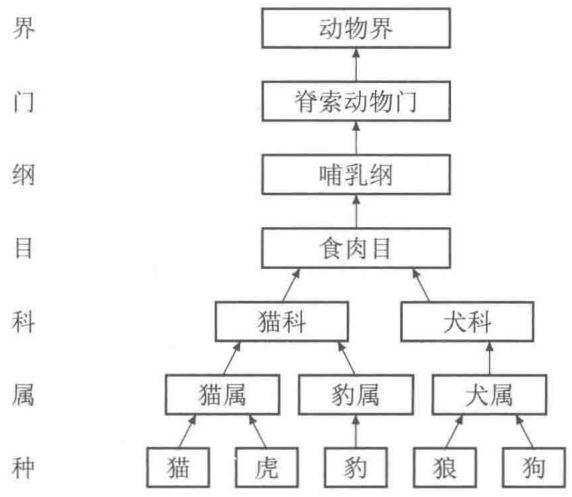
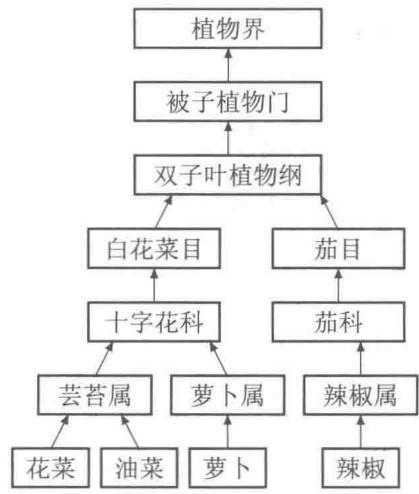
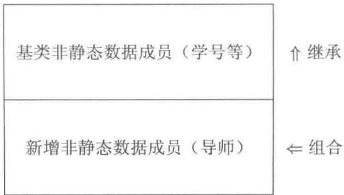
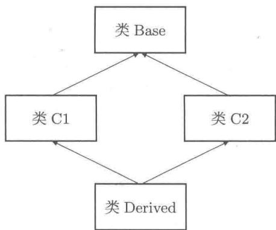
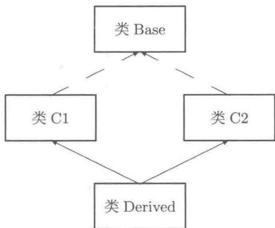

# 第13章 继承与多态性

继承与多态性是面向对象程序设计的重要特征。如果一种语言只支持类而不支持多态性（如VB、Ada），便不能称这种语言是面向对象的，只能称其是基于对象的。

本章简要介绍  $\mathrm{C}++$  语言中关于继承和多态性方面的基本概念及语法要点。希望读者理解派生类对象的构造、空间结构；理解虚函数的作用；掌握虚函数的语法与多态性的基本应用技术。

# 13.1 继承与派生概述

# 13.1.1 抽象与具体

$\mathrm{C}++$  的类（class）是对一类事物的抽象，类的对象是事物的具体实例。从前面各章的学习中，对此应该有较为深刻的认识。本节将在一个更高的层次上讨论抽象与具体。

分类、分层是人们表达和处理复杂事物的基本手段，正确的分类及分层是人们掌握事物间相互关系，深刻认识了事物之间异同的具体体现。分类是人类认知过程中的一个很自然的环节，知识存在于比较和分类之间。

以“生物分类学”为例。生物分类学是认识生物多样性的基础，各种各样的生物将按“界、门、纲、目、科、属、种”七个层次归类。整个分类结构庞大，图13-1仅是其中的几个自底上溯至顶的小分支。

  
图13-1 抽象与具体的层次结构



显然“界”的抽象程度高，“门”次之，依此类推，逐步从抽象到具体。这里所说的具体还不是指某个具体的一只猫或具体的某只狗，仍然是指一类对象的总称，仍然是一种抽象。用  $\mathrm{C}++$  的语言表示：仍然是类（class），而不是类的对象。

# 13.1.2 组合与继承

若要刻画“猫（cat）”和“豹（leopard）”，有如下方法。

# （1）方案一

分别独立地设计猫类（class Cat;）和豹类（class Leopard;）。这两个类之间会出现许多相同的部分。由于类的封装性，它们之间相同之处无法借用，也不宜相互成为“朋友”（友元类），只能分别从头开始设计并实现之。

# （2）方案二

先设计一个猫类（class Cat;），然后组合到豹类（class Leopard;）中。即豹类中有一个猫类的对象做组合成员。这犯了逻辑上的错误，因为，“豹有重量、有年龄、有性别”不错，但说“豹有猫”是不正确的。

# （3）方案三（可行方案）

先找到它们的共性——“猫科动物（feline）”，提取猫科动物的共性设计一个猫科动物类（class Feline；）包含猫科动物的基本属性、基本行为。然后由类Feline分别派生出Cat类和Leopard类。此时我们说：“猫是猫科动物，豹是猫科动物”。这完全符合生物学的分类。本方案是可行的，它克服了方案一中设计不能重用的不足，纠正了方案二中的逻辑错误。

从类 Feline 派生出类 Cat，我们也称类 Cat 继承了类 Feline。称 Feline 为基类，Cat 为派生类。C++ 中派生类承袭了基类的所有属性和行为（除构造函数、拷贝构造函数和析构函数外），在派生类中仅需要补充一些新的属性、新的行为或扩充基类的行为（重载或覆盖基类的成员函数）。面向对象设计技术强调软件的可重用性。C++ 语言提供的继承机制可用于解决软件重用的问题。

类的组合成员所刻画的是有（has）该属性的问题，类的继承或派生所刻画的是派生类的对象是（is）基类的对象。

同理，进一步考虑到刻画“狗（dog）”的需要，需要上溯到“食肉目”。当然，比较彻底的、科学的设计方案是方案四。

# （4）方案四（推荐方案）

设计一个动物类（class Animal;），派生脊索动物门类（class Chordate;），再继续派生哺乳纲类（class Mammal;），依此类推。

这种分层、分类的设计方案有许多优点：避免了大量重复的工作；在每个层次中，能专心致志地处理好本层次及相关层次的事情；当需要修改某个层次的内容时，只要公开的（public）部分不变，则不会影响其他层次及整个系统结构。

再看一个例子：某学校有本科生（Undergraduate）和研究生（Postgraduate）。他们的共同属性有：学号、姓名、性别、专业、学分和应缴纳的学费等；共同行为有：设置数据、返回数据、计算学费和输出数据等。本科生可能有选修第二专业的特殊属性和行为；研究生有导师（组合成员）、研究方向等特殊属性和行为。

因此，需要设计教师类 class Teacher；学生类 class Student；本科生类 class Undergraduate；研究生类 class Postgraduate；等。其中学生类作为基类，由它派生出本科生类、研究生类。按多文件结构共有 8 个文件，如表 13-1 所示。

表 13-1 继承与组合示例程序的文件组成  

<table><tr><td>文件名</td><td>说明</td></tr><tr><td>Teacher.h</td><td>教师类声明文件</td></tr><tr><td>Student.h</td><td>学生类（基类）声明文件</td></tr><tr><td>Student.cpp</td><td>学生类成员函数、友元函数定义</td></tr><tr><td>Undergraduate.h</td><td>本科生（由学生类派生）类声明文件</td></tr><tr><td>Undergraduate.cpp</td><td>本科生类成员函数、友元函数定义</td></tr><tr><td>Postgraduate.h</td><td>研究生（由学生类派生）类声明文件</td></tr><tr><td>Postgraduate.cpp</td><td>研究生类成员函数、友元函数定义</td></tr><tr><td>Main.cpp</td><td>测试用的主程序</td></tr></table>

源代码13.1 继承与组合示例程序（教师类）  
```cpp
1 // Teacher.h
2 #ifdef TEACHER_H
3 #define TEACHER_H
4 #include <iostream>
5 #include <string>
6 using namespace std;
7 class Teacher
8 {
9 public:
10 Teacher(char *Id="NoID", char *Name="NoName",
11     char *Title="Prof.", char *ResearchField="None")
12     {
13         strncpy(id, Id, sizeof(id));
14         id[sizeof(id)-1] = '\0';
15         strncpy(name, Name, sizeof(name));
16         name[sizeof(name)-1] = '\0';
17         strncpy(title, Title, sizeof(title));
18         title[sizeof(title)-1] = '\0';
19         strncpy(research_field, ResearchField,
20             sizeof(research_field));
21         research_field[sizeof(research_field)-1] = '\0';
22     }
23     const char *Id()   const { return id;
24     const char *Name()   const { return name;
25     const char *Title()   const { return title;
26     const char *ResearchField()   const {return research_field;} 
27     friendostream & operator<<(ostream &out, const Teacher &t)
28     {
29         out << t.id << "□" << t.name << "□"
30         << t.title << "□" << t.research_field;
31         return out;
32     }
33
34 private:
35     char id[9], name[9], title[11]; //工号，姓名，职称
36     char research_field[20]; //研究领域（方向）
37 };
```

源代码13.2 继承与组合示例程序（学生类）  
```cpp
1//Student.h  
2#	define STUDENT_H  
3#define STUDENT_H  
4#include<iostream>  
5using namespace std;  
6  
7class Student  
8{  
9public:  
10Student(char \*Id="NoID",char \*Name="NoName",  
11char Gender='M',char \*Specialty  $=$  "NoSpecialty");  
12void SetCredit(double Credit); //设置学分  
13  
14void Tuition(); //计算学费  
15void Show(ostream&out）const; //输出信息  
16friend ostream& operator<<(ostream&out，const Student&s);  
17  
18protected://受保护的，而不是私有的  
19char id[9]，name[9]，gender，specialty[20];  
20//学号，姓名，性别，专业  
21double credit,tuition; //学分，学费  
22}；  
23#endif
```

源代码13.3 继承与组合示例程序（本科生类）  
```cpp
1 //Undergraduate.h   
2 #idfdef UNDERGRADUATE_H   
3 #define UNDERGRADUATE_H   
4 #include"Student.h"   
5   
6 class Undergraduate:public Student //以Student为基类派生   
7 {   
8 public: Undergraduate(char \*Id="NoID",char \*Name="NoName", char Gender='M',char \*Specialty  $=$  "NoSpecialty", char \*Specialty1  $=$  "No2ndSpec");   
12   
13 void Set2ndSpec(char \*Specialty1); //处理新增属性等的新行为   
14 void Tuition(); //覆盖所继承的Tuition函数   
15 void Show(ostream&out）const; //覆盖所继承的Show函数   
16 friend ostream & operator<< (ostream&out，constUndergraduate&ug);   
17   
18 private://私有的   
19 char specialty1[20]; //新增属性：第二专业   
20};   
21 #endif
```

源代码13.4 继承与组合示例程序（研究生类）  
```c
1//Postgraduate.h   
2#idfnef POSTGRADUATE_H   
3#define POSTGRADUATE_H   
4#include"Student.h"   
5#include"Teacher.h"
```

```txt
6
7 class Postgraduate : public Student // 以Student为基类派生
8 {
9 public:
10     Postgraduate(Teacher &Advisor, char *Id="NoID", char *Name=
11     "NoName", char Gender='M', char *Specialty="NoSpecialty");
12
13     void SetAdvisor(Teacher &Advisor); // 处理新增属性等的新行为
14     void Tuition(); // 覆盖所继承的Tuition函数
15     void Show(ostream &out) const; // 覆盖所继承的Show函数
16
17     friend ostream & operator<<(ostream &out, const Postgraduate &pg);
18
19     private: // 私有的
20     Teacher advisor; // 新增属性。组合成员：导师
21 };
```

上述设计的本科生类（Undergraduate）是学生类（Student）的派生类，研究生类（Postgraduate）也是学生类（Student）的派生类。研究生类中拥有教师类（Teacher）的对象作为组合成员。这符合“本科生是学生，研究生是学生，研究生有导师”这种逻辑关系。继承是“纵向”的，而组合是“横向”的。

有关继承与派生的语法格式如下。

```txt
class派生类名：继承方式 基类类名{ //新增加的属性和行为，或者基类成员函数的覆盖、重载。}；
```

# 【说明】

① 基类是已经存在的类，任何已存在的类均能做基类。所声明的派生类是一个新类。  
② 继承方式有公开继承、保护继承和私有继承。这三种继承方式分别借用保留字 public、protected 和 private。无论哪种继承方式，派生类都全部继承了基类的一切成员（基类的构造函数、拷贝构造函数和析构函数除外）。从基类继承而来的成员已经成为派生类的成员，在不引起混淆的情况下，我们仍称它们为基类的成员。这些成员的访问属性变化如表 13-2 所示。  
③ 从基类继承而来的成员函数可以被覆盖（此时显式参数不变）[1]，也可以被重载（此时显式参数不同）。  
④ 派生类中可以增加新的数据成员和新的成员函数。

在上述派生类中，对于直接从基类继承而来的函数不要再声明（如设置学分的函数SetCredit）；对于基类成员函数的重载或覆盖，必须在派生类中声明（如派生类中覆盖计算学费的函数Tuition、输出信息的函数Show）。在上述两个派生类中还各自添加了一个新的数据成员和一个新的成员函数。

下面给出各个类的成员函数定义。

源代码13.5 继承与组合示例程序（学生类成员函数定义）  
```cpp
1 //Student.cpp   
2 #include"Student.h"   
3 #include <cstring>   
4   
5 Student::Student(char \*Id, char \*Name, char Gender, char \*Specialty)   
7 { //构造函数   
8 strcpy(id, Id, sizeof(id)); id[sizeof(id)-1] = '\0';   
9 strcpy(name, Name, sizeof(name));   
10 name [sizeof(name)-1]  $=$  '\0';   
11 gender  $=$  (Gender  $\equiv$  'M' || Gender  $\equiv$  'M)? 'M': 'F';   
12 strcpy(specialty, Specialty, sizeof(specialty));   
13 specialty[ sizeof(specialty)-1]  $=$  '\0';   
14 credit  $=$  tuition  $= 0$    
15 }   
16 void Student::SetCredit(double Credit)   
17 {   
18 credit  $=$  Credit;   
19 }   
20 void Student::Tuition()   
21 {   
22 //不必执行任何语句   
23 }   
24 void Student::Show(ostream&out) const   
25 {   
26 out << id << "L" << name << "L"   
27 << (gender  $\equiv$  'M'? "男": "女")   
28 << "L" << specialty;   
29 }   
30 stream & operator<< (ostream&out, const Student &s)   
31 {   
32 s.Show(out);   
33 return out;   
34 }
```

派生类构造函数的格式如下。

```txt
派生类名：：派生类构造函数名（总参数表）：基类构造函数名（部分参数表），组合成员名（部分参数表），其他成员初始化{//派生类新增数据成员处理语句。}
```

这里仍用冒号语法在最适当的时机构造从基类继承的数据成员。注意其中使用基类的构造函数名，组合成员则用成员名。

源代码13.6 继承与组合示例程序（本科生类成员函数定义）  
```cpp
1 //Undergraduate.cpp 派生类——本科生类的成员函数定义  
2 #include"Undergraduate.h"  
3 #include <cstring>  
4  
5 Undergraduate::Undergraduate(char *Id, char *Name, char Gender, char *Specialty, char *Specialty1) : Student(Id, Name, Gender, Specialty)  
6
```

```cpp
9 strcpy(specialty1, Specialty1, sizeof(specialty1));  
10 specialty1[sizeof(specialty1)-1] = '\0';  
11 }  
12  
13 void Undergraduate::Set2ndSpec(char *Specialty1)  
14 {  
15 strcpy(specialty1, Specialty1, sizeof(specialty1));  
16 specialty1[sizeof(specialty1)-1] = '\0';  
17 }  
18  
19 void Undergraduate::Tuition() // 覆盖所继承的函数  
20 {  
21 tuition = credit * 100; // 本科生每学分 100 元  
22 }  
23  
24 void Undergraduate::Show(ostream &out) const  
25 {  
26 Student::Show(out); // 直接调用基类的函数  
27 out << "山学分：" << credit << "山学费" << tuition;  
28 out << "山第二专业：" << specialty1;  
29 }  
30  
31 ostream & operator<<(ostream &out, const Undergraduate &ug)  
32 {  
33 ug.Show(out);  
34 return out;  
35 }
```

源代码13.7 继承与组合示例程序（研究生类成员函数定义）  
```cpp
1 // Postgraduate.cpp 派生类——研究生类的成员函数定义
2 #include "Postgraduate.h"
3
4 Postgraduate::Postgraduate(Teacher &Advisor, char *Id,
5 char *Name, char Gender, char *Specialty)
6 : Student(Id, Name, Gender, Specialty), advisor(Advisor)
7 {
8 }
9 void Postgraduate::SetAdvisor(Teacher &Advisor)
10 {
11 advisor = Advisor; //只需要浅赋值运算即可
12 }
13 void Postgraduate::Tuition()
14 {
15 tuition = credit * 500; //研究生每学分500元
16 }
17 void Postgraduate::Show(ostream &out) const
18 {
19 Student::Show(out); //直接调用基类的函数
20 out << "学习分：" << credit << "学费" << tuition;
21 out << "导师：" << advisor;
22 }
23
24 ostream & operator<<(ostream &out, const Postgraduate &pg)
25 {
26 pg.Show(out);
27 return out;
28 }
```

【说明】

① 按照  $\mathrm{C}++$  “自己的事情自己做”的原则，派生类的构造函数应该接收足够多的参数，以便传递给基类的构造函数，用于构造对象从基类继承的数据成员[1]。仍采用冒号语法在最适当的时机直接调用基类的构造函数。默认冒号部分时系统自动调用基类默认的构造函数构造基类数据成员的空间，并初始化它们。  
② 研究生类Postgraduate的构造函数中，用冒号语法调用了基类的构造函数，还调用了教师类Teacher默认的拷贝构造函数来构造派生类的组合成员。  
③ 派生类覆盖或重载从基类继承而来的成员函数时必须重新声明和定义。函数定义中仍可以使用基类的成员函数。如研究生类的 Show 函数，它不仅调用了基类的 Show 函数还调用了组合成员的插入运算符友元函数。请注意它们的格式不同，它们应该分别理解为 this->Student::Show(); 和 operator<<(out, this->advisor);。

# 13.1.3 派生类成员的访问属性

表 13-2 基类成员在派生类中的访问属性  

<table><tr><td>基类成员访问属性</td><td>公开继承</td><td>保护继承</td><td>私有继承</td></tr><tr><td>public</td><td>public</td><td>protected</td><td>private</td></tr><tr><td>protected</td><td>protected</td><td>protected</td><td>private</td></tr><tr><td>private</td><td>被隔离，不可访问</td><td>被隔离，不可访问</td><td>被隔离，不可访问</td></tr></table>

从表13-2的规定可以看到类中成员的访问属性为protected与private的区别。基类的私有成员在派生类中是存在的，但是被隔离起来，不能直接访问。若要访问它们，只能通过基类的成员函数。绝大多数情况下，程序设计都采用公开继承，很少使用保护继承和私有继承。因此，本章仅使用和讨论公开继承方式的继承。

# 13.2 派生类对象的构造

# 13.2.1 派生类对象的构造与析构

在构造派生类对象时，系统将先调用基类适当的构造函数或拷贝构造函数来构造从基类继承的数据成员部分（显式或隐式的冒号语法），其次调用组合成员的相应构造函数或拷贝构造函数来构造组合成员，然后构造并初始化其他数据成员（显式或隐式的冒号语法），最后进入派生类的构造函数体执行其中的语句。析构派生类对象的顺序与构造顺序相反：先执行派生类的析构函数体语句，然后执行组合成员的析构函数，最后再执行基类的析构函数。

在设计完成所有的类后，编写一个测试用的文件，包含如下三个函数。

源代码13.8 继承与组合示例程序（主程序文件）  
```cpp
1 // Main.cpp
2 #include "Undergraduate.h"
3 #include "Postgraduate.h"
4
5 void UGOffice(Undergraduate &x, double credit)
6 {
7     // 模拟财务部门专为本科生开设的办事处
8     x.SetCredit(credit);
9     x.Tuition();
10 }
11
12 void PGOffice(Postgraduate &x, double credit)
13 {
14         // 模拟财务部门专为研究生开设的办事处
15         x.SetCredit(credit);
16         cout << x << endl;
17 }
18
19 int main()
20 {
21         Teacher t1("1001", "张明", "教授", "计算机科学");
22         Teacher t2("1002", "李亮", "研究员", "数学");
23         Undergraduate s1("2001", "赵小刚", 'm', "力学");
24         Undergraduate s2("2002", "钱程锦", 'f', "数学", "管理科学");
25         Postgraduate g1(t2, "3001", "周有才", 'm', "数学");
26         Postgraduate g2(t1, "3002", "吴岚", 'f', "计算机科学");
27
28         UGOffice(s1, 28); // 函数调用，实参与形参类型严格匹配
29         UGOffice(s2, 30);
30         PGOffice(g1, 10);
31         PGOffice(g2, 12);
32         return 0;
33 }
```

将上述八个文件添加到一个项目文件（或称为工程文件）中，编译连接生成可执行文件后，运行结果如下。

```txt
2001 赵小刚 男力学 学分：28学费2800第二专业：No2ndSpec  
2002 钱程锦 女数学 学分：30学费3000第二专业：管理科学  
3001周有才 男数学 学分：10学费5000导师：1002李亮 研究员 数学  
3002吴岚 女计算机科学 学分：12学费6000导师：1001张明 教授 计算机科学
```

【说明】整个程序中创建了两个教师对象、两个本科生对象及两个研究生对象。并没有创建纯粹的“学生”对象。

# 13.2.2 派生类对象的空间

前面已经提到派生类继承了基类的所有数据成员，还可以添加新的数据成员。因此派生类对象的数据空间中的一部分可以看成基类对象的空间。图13-2是以上面的研究生类对象g1为例的对象空间结构示意图。

  
图13-2 派生类对象的空间结构

# 13.2.3 派生类对基类的赋值兼容性

强调“本科生是学生，研究生是学生”，而“研究生有导师”。反之不然：不能认为“学生一定是本科生”，也不能认为“学生一定是研究生”。那么将“本科生”或者“研究生”作为“学生”看待时是“完整的”学生。本科生对象可以：

① 初始化（拷贝构造）或赋值给学生类的对象（当然只用到基类的那一部分非静态数据成员）。  
② 可以初始化学生类的引用。  
③ 本科生对象的地址可以给学生类的指针初始化或赋值。

即派生类的对象可以初始化（拷贝构造）基类的对象、初始化基类的引用，可以赋值给基类的对象。派生类对象的地址可以初始化基类的指针变量，可以赋值给基类的指针变量。这种特性称为派生类对象对基类对象的初始化及赋值兼容性。

# 13.3 多态性

上一节中，介绍了继承与派生的概念。程序中留下了三个伏笔（下面最先讨论第三方面的内容）。

（1）基类Student中的成员函数Tuition是无用的。的确，在上面的程序中这个函数是可以去掉的。我们并不打算去掉它，而是改变其形式（参见第13.3.4小节）。  
（2）重载插入运算符时没有直接利用友元的身份访问对象的数据成员，而是调用成员函数 Show。并且 Show 函数的形式参数虽好理解，但有些怪异（原因参见第 13.3.2 小节）。

（3）两个函数：

```txt
void UGOffice(Undergraduate &x, double credit)  
{ //模拟财务部门专为本科生开设的办事处  
    x.SetCredit(credit);  
    x.Tuition();  
    cout << x << endl;  
}  
void PGOffice(Postgraduate &x, double credit)  
{ //模拟财务部门专为研究生开设的办事处  
    x.SetCredit(credit);  
    x.Tuition();  
    cout << x << endl;  
}
```

分别代表财务部门两个不同的服务窗口，本科生、研究生不能去错服务窗口。倘若学校的学生有更多的层次（如还有专科生、进修学生和博士研究生等），则要设置更多的专门窗口，岂不是“机构臃肿”。学校的财务部门能否做到“接待所有的学生，按具体学生办理相关事情”。这里的“所有的学生”可能是抽象的，而“具体学生”一定是具体的。

即要求只设计一个统一的函数（由于需要操作实参对象，因此需要引用型或指针型形式参数）处理各类学生。

```cpp
voidOffice(Student&x，doublecredit)  
{ //模拟财务部门为学生开设的办事处  
x.SetCredit（credit）;  
x.Tuition();  
cout<<x<<endl;  
}  
//或者  
voidOffice(Student\*x，doublecredit)  
{ //模拟财务部门为学生开设的办事处  
x->SetCredit（credit）;  
x->Tuition();  
cout<<\*x<<endl;  
}
```

在主函数中调用格式相应地改成如下形式。

```txt
Office(s1, 28); //形参为基类引用，实参为派生类对象  
Office(s2, 30);  
Office(g1, 10);  
Office(g2, 12);  
cout << endl;  
Office(&s1, 28); //形参为基类指针，实参为派生类对象地址  
Office(&s2, 30);  
Office(&g1, 10);  
Office(&g2, 12);  
cout << endl;
```

程序的运行结果：

```txt
2001 赵小刚 男力学  
2002 钱程锦 女数学  
3001 周有才 男数学  
3002 吴岚 女计算机科学  
2001 赵小刚 男力学  
2002 钱程锦 女数学  
3001 周有才 男数学  
3002 吴岚 女计算机科学
```

从运行结果可知，没有达到预期的目标：仅输出了基类的数据成员，派生类添加的新数据成员均未输出。即只执行了基类的友元插入运算符函数。事实上在调用函数Office时，将本科生或研究生皆视为学生，而无法处理实参对象的差异。

回顾函数重载（包括运算符重载），或者考虑函数模板（相当于由系统自动重载函数）。

```txt
template <typename T> void Office(T &x, double credit) {
    x.SetCredit(credit);
    x.Tuition();
    cout << x << endl;
}
```

这样似乎解决了问题。而事实上这种处理与最初的程序一样，本质上是由系统根据模板自动生成两个模板函数（分别用类型Undergraduate，Postgraduate取代形式数据类型T）。总之，利用函数重载、模板技术的本质还是定义了多个函数。即服务部门专门为各种类型的对象分别开设不同的服务窗口。与所希望的“设置统一的服务窗口，来者都是学生，之后再看对象类型”相距甚远。

上述各种处理方法均能在程序编译阶段就完全确定所将要调用的函数，用面向对象程序设计的术语称为先期联编或静态多态性或编译时的多态性。前面各章节介绍的函数重载、运算符重载及模板技术均为静态多态性。

与之相对应的是迟后联编或动态多态性或运行时的多态性。迟后联编所调用的函数不是在编译阶段确定的，而是在程序运行过程中根据实际对象动态地确定的。运行时的多态性是面向对象程序设计的一个重要特征。这种特性的实现机制是虚函数。

# 13.3.1 虚函数

设计一个类时，使用保留字 virtual 可将成员函数声明为虚函数 [1]。虚函数并非是“虚假的”，虚函数是实实在在的成员函数。使用虚函数会略微增加一些空间开销和很少的时间开销。总体来讲，虚函数将给程序带来方便，实现“一个接口，多种方法”，同时由于采用指针或引用操作，程序的执行效率依然很高。

再讨论上述程序，将基类Student中计算学费和输出信息的成员函数（Tuition和Show）声明成虚函数。仅修改头文件Student.h中第14和15行，其他有关类设计的文件的内容一律不变。

源代码13.9 继承与组合示例程序（含虚函数的学生类）  
```cpp
1 // Student.h  
2 #ifdef STUDENT_H  
3 #define STUDENT_H  
4 #include <iostream>  
5 using namespace std;  
6  
7 class Student  
8 {  
9 public:  
10 Student(char *Id="NoID", char *Name="NoName", char Gender='M', char *Specialty="NoSpecialty"); void SetCredit(double Credit); //设置学分  
13
```

```c
virtual void Tuition(); //计算学费（虚函数）  
virtual void Show(ostream&out) const; //输出信息（虚函数）  
friend ostream& operator<<(ostream&out, const Student&s);  
protected: //受保护的，而不是私有的  
char id[9], name[9], gender, specialty[20];  
//学号，姓名，性别，专业  
double credit, tuition; //学分，学费  
};  
#endif
```

主程序修改成如下形式。

源代码13.10 继承与组合示例程序（使用虚函数的主程序）  
```cpp
1 //Main.cpp  
2 #include"Undergraduate.h"  
3 #include"Postgraduate.h"  
4  
5 voidOffice(Student&x,double credit)  
6 { //模拟财务部门为学生开设的办事处  
7 x.SetCredit(credit);  
8 x.Tuition();  
9 cout<<x<<endl;  
10 }  
11  
12 voidOffice(Student\*x,double credit)  
13 { //模拟财务部门为学生开设的办事处  
14 x->SetCredit(credit);  
15 x->Tuition();  
16 cout<<\*x<<endl;  
17 }  
18  
19 voidOffice1(Studentx,double credit)  
20 { //形参为值传递，创建学生对象，不办实事  
21 x.SetCredit(credit);  
22 x.Tuition();  
23 cout<<x<<endl;  
24 }  
25  
26 int main()  
27 {  
28 Teacher t1("1001","张明","教授","计算机科学");  
29 Teacher t2("1002","李亮","研究员","数学");  
30 Undergraduate s1("2001","赵小刚","m","力学");  
31 Undergraduate s2("2002","钱程锦","f","数学","管理科学");  
32 Postgraduate g1(t2,"3001","周有才","m","数学");  
33 Postgraduate g2(t1,"3002","吴岚","f","计算机科学");  
34  
35 cout<<"Part1:"<<endl; //呈现多态性  
36 Office(s1,28); //形参为基类引用，实参为派生类对象  
37 Office(s2,30);  
38 Office(g1,10);  
39 Office(g2,12);  
40  
41 cout<<"\nPart2:"<<endl; //呈现多态性  
42 Office(&s1,28); //形参为基类指针，实参为派生类对象地址  
43 Office(&s2,30);
```

```txt
44 Office(&g1, 10);  
45 Office(&g2, 12);  
46  
47 cout << "\nPart\3:" << endl; //呈现多态性  
48 Student &rs = s1, *ps = &s2, &rg = g1, *pg = &g2;  
49 //定义基类的指针或声明基类的引用，用派生类进行相应初始化  
50 rs.SetCredit(29); rs.Tuition();  
51 cout << rs << endl;  
52 ps->SetCredit(31); ps->Tuition();  
53 cout << *ps << endl;  
54 rg.SetCredit(11); rg.Tuition();  
55 cout << rg << endl;  
56 pg->SetCredit(13); pg->Tuition();  
57 cout << *pg << endl;  
58  
59 cout << "\nPart\4:" << endl; //基类对象的自我表现  
60 Student x = s1, y = g1; //创建基类对象，用派生类对象初始化  
61 x.SetCredit(28); x.Tuition();  
62 cout << "x:" << x << endl;  
63 y.SetCredit(30); y.Tuition();  
64 cout << "y:" << y << endl;  
65  
66 cout << "\nPart\5:" << endl; //基类对象的自我表现  
67 Office1(s1, 28); //形参为值传递型基类对象  
68 Office1(s2, 30);  
69 Office1(g1, 10);  
70 Office1(g2, 12);  
71 cout << endl;  
72  
73 return 0;  
74}
```

# 程序的运行结果：

Part 1:

2001赵小刚男力学学分：28学费2800第二专业：No2ndSpec  
2002钱程锦女数学学分：30学费3000第二专业：管理科学  
3001周有才男数学学分：10学费5000导师：1002李亮研究员数学  
3002吴岚女计算机科学学分：12学费6000导师：1001张明教授计算机科学

Part 2:

2001赵小刚男力学学分：28学费2800第二专业：No2ndSpec  
2002钱程锦女数学学分：30学费3000第二专业：管理科学  
3001周有才男数学学分：10学费5000导师：1002李亮 研究员数学  
3002吴岚女计算机科学学分：12学费6000导师：1001张明教授计算机科学

Part 3:

2001赵小刚男力学学分：28学费2800第二专业：No2ndSpec  
2002钱程锦女数学学分：30学费3000第二专业：管理科学  
3001周有才男数学学分：10学费5000导师：1002李亮 研究员数学  
3002 吴岚 女 计算机科学 学分：12 学费6000 导师：1001 张明 教授 计算机科学

Part 4:

x:2001 赵小刚 男力学

y:3001周有才男数学

Part 5:

2001赵小刚男力学

2002钱程锦女数学  
3001周有才男数学  
3002吴岚女计算机科学

Part 1, 2, 3 的本质是类似的，它们采用基类引用派生类对象，或者基类指针变量访问派生类目标对象。由于虚函数的作用实现了运行时的多态性。

Part 4,5 的本质上是相同的，它们都是创建了基类的对象，具体操作时已经与派生类的对象无关。因而输出如上结果。

基类Student中两个函数（Tuition和Show）分别设计成虚函数或非虚函数共有四种组合。请读者就四种情形分别编译运行之，并分析运行的结果。

# 【注意】

（1）基类中的虚函数会自动地遗传给其派生类。在派生类中覆盖（参数及返回类型不变）基类的虚函数时已经隐含为虚函数，因此可省略派生类中的保留字virtual。建议在派生类中明确地用保留字virtual表示虚函数，以增加程序的可读性。  
（2）虚函数在类体外定义时不能用保留字virtual。  
（3）根据赋值兼容性，用基类的引用或基类的指针访问派生类的对象时，可以实现迟后联编。但是，用派生类的对象初始化基类对象后，再访问基类对象则与派生类的对象无关，仅是基类对象的自我表现。

# 13.3.2 重载运算符享受多态性

现在讨论本节开始时所述的第二个伏笔。若被重载的运算符是成员函数，则可以将该运算符函数声明成虚函数以实现动态多态性。

但是，有些运算符的第一个操作数不是本类的对象（例如插入运算符、抽取运算符等），常将这种运算符声明并定义成类的友元函数。友元函数不能是虚函数，但在友元函数中可以调用虚函数。因此，常声明并定义一个与运算符功能相同的成员函数并将该函数声明成虚函数（如Student类中的Show函数）；然后在重载运算符函数中调用该虚函数，便可让运算符函数享受多态性带来的便利（如Student类中的插入运算符友元函数）。

若该虚函数的访问属性是公开的，则重载的运算符函数还不必是友元。若该虚函数是受保护的或私有的，则需要声明运算符函数为友元。读者可以将例子中类 Student，类 Undergraduate 及类 Postgraduate 所声明的友元函数（插入运算符重载）的声明删除，改在类体外声明并定义成普通的  $\mathrm{C}++$  函数（不是任何类的友元函数），程序的其他部分不需做任何改变，也可直接编译连接并运行。

# 13.3.3 虚析构函数

前面曾介绍过对象带资源的类需要深拷贝构造函数、深赋值运算符函数，还需要析构函数。在前面的有些程序中我们将析构函数设计成虚函数（如LinkList类模板，自定义版字符串类String）。

下面举例说明，可能做基类的类应该定义其析构函数，而且还要将该析构函数声明为虚函数。

源代码13.11 虚析构函数的必要性  
```cpp
1 // TestVirtualDestructor.cpp
2 #include<iostream>
3 using namespace std;
4
5 #define VirtualDestructor
6 // 本程序实为两个程序：有或无上述编译预处理宏定义。请分别测试。
7 // 请参阅第7.2.3小节
8
9 class BASE // 基类
10 {
11 public:
12 BASE(){ cout << "构造基类对象。" << endl; }
13 #ifdef VirtualDestructor
14 virtual ~BASE(); // 虚析构函数
15 #else
16 ~BASE(); // 非虚析构函数
17 #endif
18 };
19
20 BASE::~BASE()
21 {
22 cout << "析构基类对象。" << endl;
23 }
24
25 //----class Derived : public BASE // 派生类
26 public:
27
28 public:
29 Derived(int n=10)
30 {
31 x = NULL;
32 if((size=n) > 0)
33 {
34 x = new double[size];
35 for(int i=0; i.size; i++)
36 x[i] = 0;
37 }
38 else size = 0;
39 cout << "构造派生类对象: Size = "
40 }
41
42 Derived(const Derived &d)
43 {
44 if((size=d.size) == 0) x = NULL;
45 else x = new double[size];
46 for(int i=0; i.size; i++)
47 x[i] = d.x[i];
48 cout << "拷贝构造派生类对象: Size = "
49 }
50
51 Derived & operator=(const Derived &d)
52 {
53 if(&d == this) return *this;
54 if(x != NULL) delete [] x;
55 if((size=d.size) == 0) x = NULL;
56 else x = new double[size];
57 for(int i=0; i.size; i++)
```

```txt
58 \(\mathbf{x}[\mathrm{i}] = \mathrm{d}\cdot \mathbf{x}[\mathrm{i}]\)   
59 cout \(<  <   "派生类对象间赋值：\(\square\)Size \(\equiv\) "<<size<<endl;  
60 return \*this;  
61 }  
62   
63 ~Derived()  
{  
65 if(x!=NULL) delete [] x;  
66 cout \(<  <   "析构派生类对象：\(\square\)Size \(\equiv\) "<<size<<endl;  
67 }  
68  
69 protected:  
70 int size;  
71 double \(\ast_{\mathrm{x}}\) //带堆资源  
72 };  
73  
74 int main()  
75 {  
76 BASE \(\ast_{\mathrm{pBB}}=\) new BASE;  
77 delete pBB;  
78 cout \(<  <   "BASE, \sqcup OK.\backslash n" <   <   endl;\)   
79  
80 Derived \(\ast_{\mathrm{pDD}}=\) new Derived(8);  
81 delete pDD;  
82 cout \(<  <   "Derived, \sqcup OK.\backslash n" <   <   endl;\)   
83  
84 BASE \(\ast_{\mathrm{pBD}}=\) new Derived(5);  
85 delete pBD;  
86 cout \(<  <   "请观察是否调用了派生类的析构函数。"<<endl;  
87 return 0;  
88 }
```

上述程序实际上包含两个版本，本质上是两个程序。

# （1）程序之一

保持程序中第5行的编译预处理宏定义指令，则编译器将编译第14行的语句，第16行的语句不参加编译，即基类的析构函数为虚函数。程序的运行结果如下。

构造基类对象。

析构基类对象。

BASE, OK.

构造基类对象。

构造派生类对象：Size  $= 8$

析构派生类对象：Size  $= 8$

析构基类对象。

Derived, OK.

构造基类对象。

构造派生类对象：Size  $= 5$

析构派生类对象：Size  $= 5$

析构基类对象。

请观察是否调用了派生类的析构函数。

将其中的一行输出特意用黑体字排版。有此行输出则表明派生类的析构函数已经被调用，其对象所带的堆内存资源被安全释放。

# （2）程序之二

删除程序中第5行的编译预处理宏定义指令（只要将该行作为注释行即可），则编译器将编译第16行的语句，第14行的语句不参加编译，即基类的析构函数不是虚函数。程序的运行结果如下。

构造基类对象。

析构基类对象。

BASE, OK.

构造基类对象。

构造派生类对象：Size  $= 8$

析构派生类对象：Size  $= 8$

析构基类对象。

Derived, OK.

构造基类对象。

构造派生类对象：Size  $= 5$

析构基类对象。

请观察是否调用了派生类的析构函数。

从程序的运行结果上看，最后的派生类的析构函数未被调用，即派生类对象所带的堆内存资源未被释放（将造成内存泄露）。

造成这种结果的根本原因是没有将基类的析构函数声明成虚函数。当使用基类的指针操作派生类对象时，对非虚函数仅操作基类部分，无法处理派生类新增的数据空间；而对于虚函数，则根据对象的类型操作对象的数据空间。

从类的设计来看，派生类的设计是无懈可击的（深拷贝构造、深赋值运算和析构函数一应俱全）；而基类非常单纯，其设计也似乎是“没有问题”。这个例子告诉我们，若某个类可能成为基类，最好将其析构函数声明为虚函数。

# 13.3.4 纯虚函数与抽象类

现在讨论本节开始时所述的第一个伏笔。

我们再次讨论前面提到的Student类。若不需要运行时的多态性，则其中计算学费的函数Tuition可以去掉；若要使计算学费函数Tuition能迟后联编，则基类中的这个函数是必须的且应该声明为虚函数。与另一个输出信息的虚函数Show不同的是基类中计算学费的函数“只占位置、不做事情”。这样的函数体不要也罢，让其成为一个纯粹的虚函数——纯虚函数。

纯虚函数是一种特殊的虚函数。在虚函数声明的函数首部后（分号前）写下记号“ $=0$ ”后该虚函数就是一个纯虚函数。纯虚函数没有函数体（当然也不需要定义），其作用只是“占个位置”，便于实现多态性。

至少含有一个纯虚函数的类被称为抽象类。抽象类的唯一作用就是用来被继承的。在派生类中可以覆盖定义基类的纯虚函数。抽象类的派生类也有可能仍然是抽象类（只要其中还有纯虚函数未被覆盖定义）。当一个类中没有纯虚函数时，这个类便成为具体类。

不能创建抽象类的对象；可以定义抽象类的指针变量指向由其派生的具体类的对象；可以声明抽象类的引用，声明引用时必须用其派生的具体类的对象进行初始化。

因此，可以将Student类的计算学费函数Tuition声明成纯虚函数。这样一来，类Student就是一个抽象类，此时不能创建Student类的对象，即“不存在抽象的学生”。

源代码13.12 继承与组合示例程序（抽象类）  
```c
1//Student.h   
2#	define STUDENT_H   
3#define STUDENT_H   
4   
5class Student   
6{   
7public:   
8Student(char \*Id="NoID",char \*Name  $=$  "NoName"， char Gender  $= 1$  M'，char \*Specialty  $=$  "NoSpecialty");   
10void SetCredit(double Credit); //设置学分   
11virtual void Tuition()  $= 0$  ： //计算学费（纯虚函数）   
12virtual void Show(); //输出信息（虚函数）   
13   
14protected://受保护的，而不是私有的   
15char id[9]，name[9]，gender，specialty[20];   
16//学号，姓名，性别，专业   
17double credit,tuition; //学分，学费   
18}；   
19#endif
```

当然，应该删除Student.cpp文件中原来的关于Tuition函数的定义。

# 13.3.5 关于虚函数的说明

$\mathrm{C}++$  编译器默认是在先期联编的状态下编译程序的，只有当编译器遇到了虚函数、纯虚函数后，才将该函数按照迟后联编处理。由于动态多态性是在程序运行时“认具体对象”，因此关于虚函数的应用有如下要求或建议。

（1）只有类的成员函数才能被声明为虚函数，以实现动态多态性。可以考虑将所有可以设置成虚函数的成员函数都声明成虚函数是有好处的。  
（2）派生类直接继承基类的虚函数特性（派生类中可以省略保留字virtual），虚函数可以被覆盖。但重载虚函数（形式参数不同）或返回类型不同的函数将不是虚函数，除非另行声明。虚函数在类体外定义时不能有保留字virtual。  
（3）纯虚函数没有函数体。抽象类就是用来被继承的。不能创建抽象类的对象，但可以定义抽象类的指针变量、声明抽象类的引用。  
（4）构造函数、拷贝构造函数不能是虚函数，因为虚函数是认具体对象的，而执行构造函数时所处理的对象尚未构造完成，对象尚未成型。  
（5）静态成员函数不能是虚函数，因为静态成员函数不默认联系某对象。  
（6）析构函数可以是虚函数。而且最好将析构函数声明为虚函数，以便当对象生命周期结束时能够确实调用自己的析构函数完成善后工作。  
（7）为了使一些作为友元函数的运算符享受到动态多态性带来的便利（如插入运算符“<<”等），应该在基类中声明一个虚函数或纯虚函数以便在派生类中覆盖，并被重载运算符函数调用。

# 13.4 多重继承

前面所介绍的继承都只是单继承（包括多层派生——派生类的派生类）。其实客观事物有时是“一体多能”、“一身兼任数职”的。这意味着派生类从多个基类继承而来。

例如，在职攻读研究生学位的教师（既是教师又是研究生）；优秀学生兼任学生辅导员（既是学生又兼任教师工作）；专业技术人员兼任管理工作（既是员工又是管理者）等。又如“打印复印一体机”（既是打印机，又是复印机，还可能是电话机、传真机和扫描仪）。再如“手机”（是电话机、MP3播放器、MP4播放器、照相机、电视机、收音机、录音机、U盘、闹钟和游戏机等）一机多能。

按继承的设计模式，对于这种“一身兼任数职”的事物应该有多个基类——这就是需要多重继承的原因。本书不打算详细介绍多重继承的有关内容，仅简单说明多重继承的语法、多重继承所带来的新问题（成员冲突和冗余）和解决新问题所引出的新语法规定（虚拟继承）。

# 13.4.1 多重继承的一般形式

多重继承的语法格式如下。

```txt
class派生类名：继承方式 基类类名1，继承方式 基类类名2  
{ //新增加的属性和行为，或者基类成员函数的覆盖、重载。}；
```

派生类构造函数的参数应该可供所有基类数据成员的初始化使用，仍然通过冒号语法将参数传递给各个基类的构造函数或拷贝构造函数。

由于派生类继承了基类的所有成员（构造函数、拷贝构造函数和析构函数除外），在有多个基类时难免出现数据成员名重复的情况，此时将产生数据的冗余。例如：教师在职攻读研究生的对象中，同一个对象将有多个编号、姓名、性别和年龄等。其中多个编号是合理的，但多个姓名（即使是相同的），也未免不合适。另外，同一个对象将可能出现多个设置函数和输出函数。

  
图13-3 多重继承中可能的数据冗余

图13-3给出了由共同基类间接派生类的情形。派生类Derived通过分别继承类C1，C2两次间接地继承了它们的共同基类Base的数据成员，这样不仅仅造成数据的冗余，而且造成数据的二义性（ambiguous），参见下一小节“虚拟继承示例”程序的编译说明。解决这个问题需要引入新的机制——虚拟继承。

# 13.4.2 虚拟继承

虚拟继承能解决上一小节所提出的问题，如图13-4所示。

  
图13-4 虚基类及虚拟继承

采用虚拟继承派生类C1及C2，则它们共同的基类被称为虚基类。虚拟继承仍然使用 $\mathrm{C + + }$  保留字virtual，但与虚函数、纯虚函数概念不同。虚拟继承能有效地除去数据成员的冗余、消除成员函数的重复。虚拟继承的格式如下。

```txt
class派生类名：virtual继承方式 基类类名{ //新增加的属性和行为，或者基类成员函数的覆盖、重载。}；
```

源代码13.13 虚拟继承示例  
```cpp
1 //VirtualInheritance.cpp  
2 #include <iostream>  
3 using namespace std;  
4  
5 class Base  
6 {  
7 public:  
8 Base(int x=0){b=x;}  
9 void Show() {cout << "b□=□" << b << endl;}  
10  
11 protected:  
12 int b;  
13 };  
14  
15 class C1 : virtual public Base //虚拟继承  
16 {  
17 public:  
18 C1(int x=1){c1=x;}  
19 void Set(int x, int y)  
20 {
```

```cpp
21  $\begin{array}{rl} & {\mathrm{b = x,c1 = y;}}\\ & {\mathrm{\{}}\\ & {\mathrm{void Show()}}\\ & {\mathrm{\{}}\\ & {\mathrm{Base::Show();}}\\ & {\mathrm{cout <   "c1\sqcup = \sqcup" <   c1 <   <   endl;}}\\ & {\mathrm{\{}}\\ & {\mathrm{int c1;}}\\ & {\mathrm{\{}}\\ & {\mathrm{int c2:}}\\ & {\mathrm{class C2: virtual public Base // 虚拟继承}}\\ & {\mathrm{\{}}\\ & {\mathrm{public:}}\\ & {\mathrm{C2(int x = 2) [ c2 = x; ]}}\\ & {\mathrm{void Set(int x, int y)}}\\ & {\mathrm{\{}}\\ & {\mathrm{b = x,c2 = y;}}\\ & {\mathrm{\{}}\\ & {\mathrm{void Show()}}\\ & {\mathrm{\{}}\\ & {\mathrm{Base::Show();}}\\ & {\mathrm{cout <   "c2\sqcup = \sqcup" <   c2 <   <   endl;}}\\ & {\mathrm{\{}}\\ & {\mathrm{\{}}\\ & {\mathrm{class Derived: public C1, public C2 // 多重继承}}\\ & {\mathrm{\{}}\\ & {\mathrm{public:}}\\ & {\mathrm{Derived(int x = 3) [ d = x; ]}}\\ & {\mathrm{void SetB(int x) [ b = x; ]}}\\ & {\mathrm{void SetC1(int x, int y) [ C1::Set(x, y); ]}}\\ & {\mathrm{void SetC2(int x, int y) [ C2::Set(x, y); ]}}\\ & {\mathrm{void Set(int x) [ d = x; ]}}\\ & {\mathrm{void Show()}}\\ & {\mathrm{\{}}\\ & {\mathrm{C1::Show();}}\\ & {\mathrm{C2::Show();}}\\ & {\mathrm{Base::Show();}}\\ & {\mathrm{cout <   "d\sqcup = \sqcup" <   d <   <   endl;}}\\ & {\mathrm{\{}}\\ & {\mathrm{\{}}\\ & {\mathrm{private:}}\\ & {\mathrm{int d;}}\\ & {\mathrm{\{};}}\\ & {\mathrm{\{}}}\\ & {\mathrm{int main().}}\\ & {\mathrm{\{}}}\\ & {\mathrm{Derived d;}}\\ & {\mathrm{d.SetC1(100, 200); d.Show(); cout <   <   endl;}}\\ & {\mathrm{d.SetC2(500, 800); d.Show(); cout <   <   endl;}}\\ & {\mathrm{return 0;}}\end{array}$    
23   
24   
25   
26   
27   
28   
29   
30   
31   
32   
33   
34   
35   
36   
37   
38   
39   
40   
41   
42   
43   
44   
45   
46   
47   
48   
49   
50   
51   
52   
53   
54   
55   
56   
57   
58   
59   
60   
61   
62   
63   
64   
65   
66   
67   
68   
69   
70   
71   
72   
73   
74   
75   
76
```

程序的运行结果：

```latex
$\begin{array}{l}\texttt{b} = 100\\ \texttt{c1} = 200\\ \texttt{b} = 100\\ \texttt{c2} = 2\\ \texttt{b} = 100\\ \texttt{d} = 3\\ \texttt{b} = 500\\ \texttt{c1} = 200\\ \texttt{b} = 500\\ \texttt{c2} = 800\\ \texttt{b} = 500\\ \texttt{d} = 3 \end{array}$
```

从运行结果可见，当语句d.SetC1(100, 200)；被执行后，C2对应的b也发生了变化；当语句d.SetC2(500, 800)；被执行后，C1对应的b也发生了变化。这表面在派生类Derived的对象d中确实只有一份基类Base的数据成员b。

在上述程序中，若去掉第15行及第33行中的保留字virtual，则程序在用GCC编译器编译时给出如下错误信息。

```txt
- Configuration: VirtualInheritance - Debug
- Compiling source file(s)... 
- VirtualInheritance.cpp
- VirtualInheritance.cpp: In member function 'void Derived::SetB(int)':
- VirtualInheritance.cpp:55: error: request for member 'b' is ambiguous in multiple inheritance lattice
- VirtualInheritance.cpp:12: error: candidates are: int Base::b
- VirtualInheritance.cpp:12: error: int Base::b
- VirtualInheritance.cpp: In member function 'void Derived::Show():
- VirtualInheritance.cpp:63: error: cannot call member function 'void Base::Show() without object
- ConstructDestruct.exe - 4 error(s), 0 warning(s)
```

# 13.5 构造顺序

构造一个派生类对象时，可能涉及一系列构造函数的调用。它们的调用顺序是：

（1）所有虚基类的构造函数按照它们被继承的顺序构造。  
（2）所有非虚基类的构造函数按照它们被继承的顺序构造。  
（3）所有组合成员对象的构造函数按照它们声明的顺序构造。  
（4）执行派生类构造函数体语句。

前三项均通过冒号语法执行。若定义派生类的构造函数未显式地使用冒号语法，则系统隐式地采用冒号语法调用相应的默认构造函数构造之。

析构的顺序与构造顺序相反：

（1）执行派生类析构函数体语句。  
（2）所有组合成员对象的析构函数按照它们声明的相反顺序执行。  
（3）所有非虚基类的析构函数按照它们被继承的相反顺序执行。

（4）所有虚基类的析构函数按照它们被继承的相反顺序执行。

如下例所示。

源代码13.14 继承与组合中派生类对象的构造与析构顺序  
```cpp
1 // ConstructDestruct.cpp
2 #include <iostream>
3 using namespace std;
4 class Obj1
5 {
6 public:
7 Obj1(){ cout << "Obj1" << endl; }
8 ~Obj1(){ cout << "~Obj1" << endl; }
9 };
10 class Obj2
11 {
12 public:
13 Obj2(){ cout << "Obj2" << endl; }
14 ~Obj2(){ cout << "~Obj2" << endl; }
15 };
16 class BASE1
17 {
18 public:
19 BASE1(){ cout << "BASE1" << endl; }
20 ~BASE1(){ cout << "~BASE1" << endl; }
21 };
22 class BASE2
23 {
24 public:
25 BASE2(){ cout << "BASE2" << endl; }
26 ~BASE2(){ cout << "~BASE2" << endl; }
27 };
28 class BASE3
29 {
30 public:
31 BASE3(){ cout << "BASE3" << endl; }
32 ~BASE3(){ cout << "~BASE3" << endl; }
33 };
34 class BASE4
35 {
36 public:
37 BASE4(){ cout << "BASE4" << endl; }
38 ~BASE4{ cout << "~BASE4" << endl; }
39 };
40 class Derived : public BASE1, virtual public BASE2,
41 public BASE3, virtual public BASE4
42 {
43 public:
44 Derived(): BASE4(), BASE3(), BASE2(), BASE1(), y(), x()
45 {
46 cout << "Derived" << endl;
47 }
48 ~Derived() { cout << "~Derived" << endl; }
49 private:
50 Obj1 x;
51 Obj2 y;
52 };
```

```txt
54 int main()
55 {
66 Derived d;
77 cout << "Return□to□Operator□System." << endl;
88 return 0;
99 }
```

用GCC编译器编译此程序时，编译器给出如下温馨警告：

```yaml
- Configuration: ConstructDestruct - Debug
- Compiling source file(s)... 
- ConstructDestruct.cpp
- ConstructDestruct.cpp: In constructor 'Derived::Derived()
- ConstructDestruct.cpp:49: warning: base 'BASE3' will be initialized after 
- ConstructDestruct.cpp:49: warning: base 'BASE2'
- ConstructDestruct.cpp:55: warning: 'Derived::y' will be initialized after 
- ConstructDestruct.cpp:54: warning: 'Obj1 Derived::x'
- Linking...
- ConstructDestruct.exe - 0 error(s), 4 warning(s)
```

程序的运行结果：

```txt
BASE2   
BASE4   
BASE1   
BASE3   
0obj1   
0obj2   
Derived   
Return to Operator System.   
\~Derived   
\~Obj2   
\~Obj1   
\~BASE3   
\~BASE1   
\~BASE4   
\~BASE2
```

# 13.6 小结

继承和多态性的内容丰富。在大型软件设计中，首先要从抽象到具体逐步弄清事物之间的隶属层次关系、并列关系；还要认真研究各种对象的属性和行为的特异之处，尽量避免数据冗余，尽量避免行为冲突。这些方面的内容有待读者在今后的实际应用中逐步积累经验。

$\mathrm{C}++$  的单继承已经提供了足够强大的功能，  $\mathrm{C}++$  语言同时还支持多重继承。我们建议，在可能的情况下应尽量避免使用多重继承，因为使用多重继承增加了程序的复杂度，使程序的编制、维护变得相对困难。

# 练习13

（1）设计一个平面直角坐标系的点（Point）类，派生出一个圆（Circle）类；再由

圆类派生一个圆柱体（Cylinder）类。要求圆类能输出其对象周长和面积、圆柱体类能输出其对象的表面积和体积。

（2）编写一个程序完成如下任务。有如下动物及其叫声（输出相应的文字）：

<table><tr><td>猫(Cat)</td><td>miaow ...</td></tr><tr><td>狗(Dog)</td><td>wang ...</td></tr><tr><td>鸡(Rooster)</td><td>crow ...</td></tr><tr><td>牛(Cattle)</td><td>moo ...</td></tr><tr><td>马(Horse)</td><td>neigh ...</td></tr></table>

① 在基类 Animal 中设计一个成员函数 void Sound();。  
② 编写一个“动物声音播放器”函数void Speaker(const Animal &a);（非成员函数）根据实参动物类型播放其叫声（输出相应的文字）。  
③ 增加一个重载函数，其函数原型为void Speaker(const Animal *a);并测试之。  
④ 增加原型为void Speaker1(Animal a);的函数是否可行？

就函数 Animal::Sound() 为非虚函数、一般的虚函数和纯虚函数分别进行讨论。

（3）给定一个头文件 Vec.h，其中有抽象类模板 VECTOR 的设计。还有插入运算符重载、抽取运算符重载的普通 C++ 函数（既不是成员函数，又非友元函数）。

```c
1 // Vec.h  
2 #ifdef VEC_H  
3 #define VEC_H  
4 #include <iostream>  
5 using namespace std;  
6  
7 template <typename T> class VECTOR  
8 {  
9 public:  
10 VECTOR(int size = 0, const T *x = NULL)  
11 {  
12 num = (size > 0) ? size : 0;  
13 p = NULL;  
14 if (num > 0)  
15 {  
16 p = new T[num];  
17 for (int i = 0; i < num; i++)  
18 p[i] = (x == NULL) ? 0 : x[i];  
19 }  
20 }  
21 VECTOR(const VECTOR &v)  
22 {  
23 num = v.num;  
24 p = NULL;  
25 if (num > 0)  
26 {  
27 p = new T[num];  
28 for (int i = 0; i < num; i++)  
29 p[i] = v.p[i];  
30 }  
31 }
```

```txt
virtual ~VECTOR()
{
    if(p!=NULL) delete [] p;
}
VECTOR & operator=(const VECTOR&v)
{
    if(num!=v.num)
    {
        if(p!=NULL) delete [] p;
        p = new T[num=v(num)];
    }
    for(int i=0; i<num; i++)
        p[i] = v.p[i];
    return *this;
}
T & operator[](int index)
{
    return p[index];
}
int getsize() const
{
    return num;
}
void resize(int size)
{
    if(size<0 || size==num) return;
    else if(size==0)
    {
        if(p!=NULL) delete [] p;
        num = 0;
        p = NULL;
    }
    else
    {
        T *temp = p;
        p = new T[size];
        for(int i=0; i.size; i++)
            p[i] = (i<num) ? temp[i] : 0;
        num = size;
        delete [] temp;
    }
}
virtual void Output(istream&out) const = 0;
virtual void Input(istream&in) = 0;
protected:
    int num;
    T *p;
};
template<typename T>
ostream & operator<<(istream&out, const VECTOR<T>&v)
{
    v.Output(out);
    return out;
}
```

```txt
91 v.Input(in);   
92 return in;   
93}   
94 #endif
```

① 将类模板 VECTOR 作为基类，通过公共继承派生一个新的类模板 Vector（向量类模板）。要求使如下测试程序能正确运行，并输出给定的结果。

```cpp
// testVector.cpp
#include "Vector.h"
#include <fstream>
using namespace std;
int testVector()
{
    int a[10] = {10, 9, 8, 7, 6, 5, 4, 3, 2, 1};
    double x[8];
    for (int i = 0; i < 8; i++) {
        x[i] = sqrt(double(i));
    }
    Vector<int> vi1(10, a), vi2(5, a+5);
    Vector<double> vd1(8, x), vd2(3, x);
    cout << "原始数据: " << endl;
    cout << "vi1=" << vi1 << "\nvi2=" << vi2;
    << "\nvd1=" << vd1 << "\nvd2=" << vd2 << endl;
    cout << "调整维数到5" << endl;
    vi1resize(5);
    vi2resize(5);
    vd1resize(5);
    vd2resize(5);
    cout << "vi1=" << vi1 << "\nvi2=" << vi2;
    << "\nvd1=" << vd1 << "\nvd2=" << vd2 << endl;
    cout << "\n将数据写入文件\nvector.txt"中..." << endl;
    ofstream outfile("vector.txt");
    outfile << vi1 << '\n'
    << vi2 //故意不换行
    outfile.close();
    outfile << "\n清除对象的数据（即调整维数到0" << endl;
    vi1.resize(0);
    vi2.resize(0);
    vd1 resize(0);
    vd2 resize(0);
    cout << "vi1=" << vi1 << "\nvi2=" << vi2;
    << "\nvd1=" << vd1 << "\nvd2=" << vd2 << endl;
    cout << "\n从文件\nvector.txt"中读取的数据：" << endl;
    ifstream infile("vector.txt");
    infile >> vi1 >> vi2 >> vd1 >> vd2;
    infile.close();
    cout << "vi1=" << vi1 << "\nvi2=" << vi2;
    << "\nvd1=" << vd1 << "\nvd2=" << vd2 << endl;
    cout << "\nvi1+" << vi1 + vi2;
    << "\nvd1+" << vd1 + vd2 << endl;
    return 0;
}
```

调用函数 testVector 的输出结果：

原始数据：

```txt
vi1 = (10, 9, 8, 7, 6, 5, 4, 3, 2, 1)  
vi2 = (5, 4, 3, 2, 1)  
vd1 = (0, 1, 1.41421, 1.73205, 2, 2.23607, 2.44949, 2.64575)  
vd2 = (0, 1, 1.41421)  
调整维数到5：  
vi1 = (10, 9, 8, 7, 6)  
vi2 = (5, 4, 3, 2, 1)  
vd1 = (0, 1, 1.41421, 1.73205, 2)  
vd2 = (0, 1, 1.41421, 0, 0)
```

将数据写入文件 vector.txt 中...

清除对象的数据（即调整维数到0）

```txt
vi1 = ( )  
vi2 = ( )  
vd1 = ( )  
vd2 = ( )
```

从文件 vector.txt 中读取的数据：

```txt
vi1 = (10, 9, 8, 7, 6)  
vi2 = (5, 4, 3, 2, 1)  
vd1 = (0, 1, 1.41421, 1.73205, 2)  
vd2 = (0, 1, 1.41421, 0, 0)  
vi1 + vi2 = (15, 13, 11, 9, 7)  
vd1 + vd2 = (0, 2, 2.82842, 1.73205, 2)
```

② 将类模板 VECTOR 作为基类，通过公共继承派生一个新的自定义字符串类 String。要求不使用字符 '\0' 串结束标志（即字符串的长度由数据成员 num 记录），并且使如下测试程序能正确运行。

```cpp
1 // testString.cpp
2 #include "MyString.h"
3 #include <fstream>
4 using namespace std;
5
6 int testString()
7 {
8 String str1 = "Hello", str2 = str1, str3;
9 // 转换构造 拷贝构造 默认构造
10 cout << "原始数据（双引号是另外添加的）：" << endl;
11 cout << "str1 = " << str1
12     << ";"
13     << ";"
14     str3 = str2; // 赋值运算
15     str1 = "C++program;";
16     str2 = str3 + ", world!";
17     cout << "str1 = " << str1
18         << ";"
19         << ";"
20     cout << ";将数据写入文件:string.txt中" << endl;
21     ofstream outfile("string.txt");
22     outfile << str1 << '\n'
23     << str2 << '\n'
```

```txt
24  $<<$  str3  $<<$  endl;   
25 outfile.close();   
26 cout  $<<$  "n清除对象的数据（即调整长度到  $\square 0_{\square}$  )  $<<$  endl;   
27 str1resize(0);   
28 str2 resize(0);   
29 str3resize(0);   
30 cout  $<<$  "str1  $\equiv$  \\""  $<<$  str1  $<<$  "\\nstr2  $\equiv$  \\""  $<<$  str2   
31  $<<$  "\\"nstr3  $\equiv$  \\""  $<<$  str3  $<<$  "\\"  $<<$  endl;   
32 cout  $<<$  "n从文件string.txt中读取的数据："  $<<$  endl;   
33 ifstream infile("string.txt");   
34 infile >> str1 >> str2 >> str3;   
35 infile.close();   
36 cout  $<<$  "str1  $\equiv$  \\""  $<<$  str1  $<<$  "\\nstr2  $\equiv$  \\""  $<<$  str2   
37  $<<$  "\\"nstr3  $\equiv$  \\""  $<<$  str3  $<<$  "\\"  $<<$  endl;   
38 return 0;   
39}
```

主函数所在的源程序文件如下：

```cpp
1 // main.cpp
2 int testVector(), testString();
3
4 int main()
5 {
6     testVector();
7     testString();
8     return 0;
9 }
```

调用函数 testString 的输出结果:

原始数据（双引号是另外添加的）：

```toml
str1 = "Hello"
str2 = "Hello"
str3 = ""
str1 = "C++program."
str2 = "Hello,world!"
str3 = "Hello"
```

将数据写入文件 string.txt 中

清除对象的数据（即调整长度到0）

```toml
str1 = ""
str2 = ""
str3 = ""
```

从文件string.txt中读取的数据：

```txt
str1 = "C++program."
str2 = "Hello, world!"
str3 = "Hello"
```

③ 简要回答如下问题。

- 抽象向量类模板 VECTOR 中的成员函数 Input 和 Output 为什么设计成虚函数？程序中何处利用了上述虚函数的特性？  
- 重载方括号运算符时为何采用引用返回？

# 第14章 I/O流

本章介绍标准输入输出流、文件输入输出流、字符串流及其相关函数。学习本章后，读者应该理解和掌握输入输出操作中的一些常用方法；理解文本文件、二进制文件的概念，掌握文件的定位、读、写等操作；理解字符串流的概念及其使用方法。

# 14.1 标准I/O流

关于I/O流的格式控制已经在面向过程程序设计部分做了介绍。本节先介绍操作系统命令处理程序中有关I/O重新定向的概念和用法，然后介绍  $\mathrm{C}++$  中有关I/O流类的一些常用成员函数。

# 14.1.1 操作系统关于标准I/O及其重新定向

一般而言，输入是数据从计算机外部设备流向计算机内存的操作；输出是数据从计算机内存流向外部设备的操作。从操作系统的角度上看，计算机的输入输出设备都被看作文件。操作系统规定的标准输入设备特指键盘、标准输出设备特指显示器。在操作系统的命令处理程序（例如Windows操作系统中的“命令提示符”）中可以用I/O重新定向操作符“<，>，>>”及管道操作符“|”使标准输入与标准输出重新定向到其他设备（文件）。关于操作系统命令处理程序中使用I/O重新定向及管道操作参见下面程序运行的各种方法及其效果。

到目前为止，本书所使用的  $\mathrm{C}++$  标准I/O流操作基本上都是对对象cin、cout进行的。此外， $\mathrm{C}++$  还有几个标准I/O流对象如表14-1所示。

表 14-1 C++ 标准 I/O 流对象  

<table><tr><td>对象名</td><td>所属类</td><td>设备名</td><td>说明</td></tr><tr><td>cin</td><td>istream</td><td>键盘</td><td>标准输入。可重新定向，有缓冲</td></tr><tr><td>cout</td><td>ostream</td><td>显示器</td><td>标准输出。可重新定向，有缓冲</td></tr><tr><td>cerr</td><td>ostream</td><td>显示器</td><td>常用于错误信息的标准输出。不可重新定向，无缓冲</td></tr><tr><td>clog</td><td>ostream</td><td>显示器</td><td>常用于错误信息的标准输出。不可重新定向，有缓冲</td></tr></table>

上述I/O流类的对象在标准名字空间std中。程序中只要包含了头文件iostream，编译系统会保证在使用这些对象之前构造它们，将它们分别与标准输入设备、标准输出设备相联系。

例14.1 标准I/O流及其重新定向。

本例程序中使用了四个标准I/O流类的对象。将程序编译、连接后生成可执行文件。假定可执行文件Hello.exe在文件夹D:\CPP\Hello\Debug中，我们将讨论多种不同的方式来运行该可执行文件。

源代码14.1 标准I/O流示例程序  
```cpp
1 //Hello.cpp   
2 #include<iostream>   
3 using namespace std;   
4   
5 int main()   
6{   
7 char name[20];   
8 int age;   
9   
10 cout << "What's your name?" << endl; //此处单引号可不用转义字符   
11 cin.getline(name,20);   
12 cerr << "How old are you?" << endl;   
13 cin >> age;   
14 clog << "姓名：" << name << ",年龄："   
15 << age << "。你好！" << endl;   
16 return 0;   
17 }
```

# （1）运行方式之一（标准输入输出）

这是以前一直使用的I/O操作，即从键盘输入数据、在显示器上输出数据。程序运行中用下画线表示键盘输入部分，其中第一行均为启动可执行程序的操作系统命令，命令前的字符为操作系统的提示符（包括当前目录的路径）。运行结果如下。

```txt
D:\CPP\Hello\Debug>Hello  
What's your name?  
Zhang San  
How old are you?  
20  
姓名：Zhang San，年龄：20。
```

# （2）运行方式之二（标准输入重新定向）

将标准输入设备（键盘）改变成一个指定的文件（即从文件中读取信息）。当然这个文件必须事先编辑好。例如，设其文件名为 Input.txt，内容为

```txt
Zhang San 20
```

启动程序执行的命令及运行结果如下。

```txt
D:\CPP\Hello\Debug>Hello < Input.txt  
What's your name?  
How old are you?  
姓名：Zhang San，年龄：20。你好！
```

从运行结果可见，程序中的输入操作 cin.getline(name,20) 和 cin>>age 直接从指定的文件中获取数据，不再需要操作者从键盘输入（也不会接受用户的键盘输入）。即标准输入（键盘）被重新定向。操作系统使用“<”作为输入重新定向操作符。这种重新定向在本次操作系统命令结束后结束。

# （3）运行方式之三（标准输出重新定向）

将标准输出设备（显示器）改变成一个指定的文件（即输出到文件）。启动程序执行的命令及运行结果如下。

```txt
D:\CPP\Hello\Debug>Hello>Output.txt  
Zhang San  
How old are you?  
20  
姓名：Zhang San，年龄：20。你好！
```

从运行结果可见，程序中插入到标准输出流对象cout的操作并不联系到显示器，其输出结果在文件Output.txt中（若该文件已经存在则覆盖其内容，否则新建该文件）。以至于程序运行时，在输入姓名前的提示信息“What's your name?”写入到文件中而不在显示器上输出。而插入到错误信息标准输出流对象cerr，clog的操作并不能被重新定向，依然在显示器上输出。操作系统使用“>”作为输出重新定向操作符。这种重新定向在本次操作系统命令结束后结束。

# （4）运行方式之四（标准输出重新定向）

将标准输出设备（显示器）改变成一个指定的文件（即输出到文件）。启动程序执行的命令及运行结果如下。

```txt
D:\CPP\Hello\Debug>Hello>>Output.txt  
Zhang San  
How old are you?  
20  
姓名：Zhang San，年龄：20。你好！
```

这里使用的操作系统重新定向操作符为“>>”。它将输出的内容追加到指定文件的尾部。若指定的文件不存在则与“>”的效果相同。

# （5）运行方式之五（标准输入输出重新定向）

结合上面的方式之二与方式之三，或者方式之二与方式之四。启动程序执行的命令及运行结果如下。

```txt
D:\CPP\Hello\Debug>Hello < Input.txt > Output.txt  
How old are you?  
姓名：Zhang San，年龄：20。你好！
```

请查看文件 Output.txt 的内容（仅有一行）。

```txt
D:\CPP\Hello\Debug>Hello  $\vDash$  Input.txt>>Output.txt  
How old are you?  
姓名：Zhang San，年龄：20。你好！
```

请再查看文件 Output.txt 的内容（有两行）。

# （6）运行方式之六（管道操作）

操作系统使用的管道操作符号为“|”。管道操作将操作符号左侧命令的标准输出结果作为输入，传递给操作符右边的命令程序（可执行程序）。这一操作常常借助于一个临时文件实施，命令执行完毕后操作系统自动将临时文件删除。启动程序执行的命令及运行结果如下。

```txt
D:\CPP\Hello\Debug>type Input.txt | Hello  
What's your name?  
How old are you?  
姓名：Zhang San，年龄：20。你好！
```

# 还可以

```txt
D:\CPP\Hello\Debug>type Input.txt | Hello > Output.txt  
How old are you?  
姓名：Zhang San，年龄：20。你好！
```

【说明】type是Windows操作系统的命令之一，其功能是显示指定文件的内容。Unix/Linux操作系统中的相应命令名称为cat。

# 14.1.2 常用输入流成员函数

# 1. 成员函数 get 及 getline

流成员函数 get 有多种形式，下面列出其中三个。

```txt
char istream::get(); //返回从输入流中获取的一个字符  
istream& istream::get(char &c); //从输入流中获取一个字符  
istream& istream::get(char *str, int n, char delim='\\n'); //从输入流中获取一个C-字符串  
istream& istream::getline(char *str, int n, char delim='\\n'); //从输入流中获取一个C-字符串
```

其中第三种形式的get函数与getline函数类似。其功能是从输入流中获取n-1个字符，或者在不足n-1个字符时遇到指定的终止字符delim（终止字符默认值为换行符'\n')或者读取到“文件结束标志”、流结束符后，按C-字符串的形式（自动添加串结束标志字符'\0')存入以str为起始地址的内存中。

值得指出的是：使用此成员函数输入的数据为C-字符串，其中可含空格'、制表符'\t'和换行符'\n'等，当然在这些字符不用于终止字符时（请参考第12.2.1小节）。

一种值得注意的情形：当我们用抽取运算符“>>”抽取数据时，位于输入流缓冲区中数据之前的空白符（'」、'\t'、'\n')会被自动过滤掉，因为系统默认std::skipws（参见第3.5节）。而数据后面的空白符仍然留在输入流缓冲区中。若仍有数据分隔符留在输入流缓冲区，且接下来的getline调用恰好用该分隔符为终止字符时，则getline调用的结果将仅读到一些空白字符组成的串。例如：

```cpp
1 #include<iostream>  
2 using namespace std;
```

```txt
3 int main()  
4 {  
5 int n;  
6 char str1[80], str2[80];  
7  
8 cin >> n;  
9 cin.getline(str1, 80); //此语句读取换行符后丢弃  
10 //cin-sync(); 或者用此方式刷新输入流缓冲区  
11 for(int i = 0; i < n; i++)  
12 {  
13 cin.getline(str1, 80);  
14 cin.getline(str2, 80);  
15 cout << str1 << "\n" << str2 << "\n" << endl;  
16 }  
17 return 0;  
18 }
```

程序第10行是需要的，或者参考练习5的3(2)忽略其后的空白字符及换行字符。请读者用标准I/O及I/O重新定向的方式测试该程序。

# 2. 抽取数值不当的处理

cin是istream类的对象，程序中的变量可以通过抽取运算符“>>”从输入流中抽取到各种类型的数据。用抽取运算符从输入流中抽取数据时，输入流中通常以一个或者多个空格（'」）、制表符（'\t')）和换行符（'\n')等作为数据项的分隔符。当抽取到无效数据（例如：当需要一个整型数值或浮点型数值时，却抽取到一个字母或一个非数码字符串）或者遇到文件结束标志[1]时，输入流cin就处于出错状态，cin的值为NULL。此时将无法继续正常抽取其他数据。需要清除出错状态（即设置成正确的状态）。

首先运行如下程序，观察抽取数值不当的情形，然后给出处理方法。

```cpp
1 #include <iostream>
2 using namespace std;
3 int main()
4 {
5     int n;
6     while(1)
7     {
8         cout << "请输入一个整数口  $(0 - - _{口}$  退出口):口";
9         cin >> n;
10         if (n == 0) break;
11         cout << "n口 = 口" << n << endl;
12     }
13         return 0;
14 }
```

若输入一个合法的数据（整数），则程序执行正常。若输入不当的数据，如输入字母、非数码字符串，则程序陷入无限循环，无法再正常地接收输入。

例14.2 清理输入流的出错状态。下面的函数（写成函数模板）能即时清理输入流的出错状态，恢复到正常的输入状态。可以以容错的方式接收数值型（整型、浮点型）数据的输入。

源代码14.2 输入数值不当的处理方法  
```cpp
1 // Input.cpp
2 #include <iostream>
3 using namespace std;
4 template <typename T> T &input(T &x)
5 {
6     while((cin >> x) == NULL)
7         { 
8         cin.clear(); // 清理错误状态位
9         cin sync(); // 刷新输入流缓冲区
10         }
11         return x;
12         return main()
13     }
14
15 int main()
16 {
17         int n;
18         while(1)
19         {
20         cout << "请输入一个整数口(0--_退出口):口";
21         input(n); // 替换了语句cin >> n;
22         if (n == 0) break;
23         cout << "n口=口" << n << endl;
24         }
25         double x;
26         while(1)
27         {
28         cout << "请输入一个实数口(0--_退出口):口";
29         input(x); // 替换了语句cin >> x;
30         if (x == 0) break;
31         cout << "x口=口" << x << endl;
32         }
33         return 0;
34     }
```

程序具有容错能力，程序运行时可以任意输入不合法的数据（如字母、非数码字符串）。若以有效数字打头输入时将抽取其中的有效数字，其后的不合法字符串将留在输入流缓冲区中。程序中的 clear 及 sync 是 stream 类的成员函数。

# 14.1.3 常用输出流成员函数

除了用插入运算符进行输出外，还可以用成员函数put输出一个字符。

ostream&ostream::put(charc）; //输出一个字符

因为cout为缓冲输出，当缓冲区未满时，位于缓冲区中的信息不一定立即在显示器上呈现。通过刷新缓冲区操作可使缓冲区中的信息立即在显示器上呈现出来。

cout << flush; //刷新输出流缓冲区  
cout << '\n' << flush; //输出换行符并刷新。等价于cout << endl;

# 14.2 文件I/O流

本节所介绍的文件是指存储在外部存储器（如磁盘、光盘或U盘）上的文件。C++程序可以对这些文件的内容进行操作（假定这些文件是可读或可写的）。文件I/O操作大致包括如下几个基本步骤：

（1）根据对文件将要进行的操作，创建适当的文件流类的对象。  
① 只读取文件内容。需创建一个输入文件流 ifstream 类（input-file-stream）的对象。  
② 只将数据写入文件。需创建一个输出文件流 ofstream 类（output-file-stream）的对象。  
③ 读/写文件内容。需创建一个输入/输出文件流fstream类（file-stream）的对象。  
（2）将创建的文件流对象与指定的文件进行关联（打开文件），需指定文件名，指定打开模式打开文件。  
（3）在文件内容中定位，读取文件内容或者将数据写入文件。  
（4）解除文件与文件流对象的关联（关闭文件）。

# 【说明】

① 利用文件流类的构造函数可将上述步骤（1）与（2）合并。  
② 读/写文件内容后，文件内容的当前位置自动顺序地移动，也可以根据需要任意定位当前位置。  
③ 关闭文件后，若文件流对象的生命期未终止，则该对象还可以与其他文件建立关联。

在  $\mathrm{C}++$  的I/O流类库中定义了几种文件流类：ifstream、ofstream和fstream。使用它们时需要编译预处理指令#include<fstream>包含头文件。这几个类分别有多个构造函数和一些成员函数。创建文件流对象的常用方法如下。

使用默认的构造函数创建对象，然后调用成员函数open关联到具体的文件如下。

文件流类名 对象名；

对象名.open(文件名，打开模式)；

或使用带参数的构造函数，在创建文件流类对象的同时关联具体的文件，使用默认的打开模式如下。

文件流类名 对象名（文件名）；

最常用的是在创建文件流对象的同时关联具体文件并且指定打开模式，如下。

文件流类名 对象名（文件名，打开模式）；

打开文件模式是在ios类中定义的，它们是一些枚举常量，有多种选择，如表14-2所示。

表 14-2 打开文件模式  

<table><tr><td>模式</td><td>作用</td></tr><tr><td>ios::in</td><td>以输入方式打开文件</td></tr><tr><td>ios::out</td><td>以输出方式打开文件。若文件已经存在，则先清除其所有内容</td></tr><tr><td>ios::app</td><td>以输出方式打开文件。将写入的数据追加到原来数据的末尾</td></tr><tr><td>ios::ate</td><td>打开已存在的文件，文件内容指针指向文件末尾</td></tr><tr><td>ios::trunc</td><td>打开文件。若文件已经存在，则先清除其所有内容</td></tr><tr><td>ios::binary</td><td>以二进制方式打开文件</td></tr></table>

这些模式可以用二进制位或运算符“|”进行组合。例如：

```txt
ios::in | ios::out | ios::binary // 以二进制、可读、可写模式打开文件
```

如果打开文件成功，则文件流对象的值为非0值（true）；如果打开文件失败，则返回0（false）。

解除文件流类对象与文件的关联应使用成员函数close:

```javascript
对象名.close();
```

# 14.2.1 文本文件

从不同的角度看文件，文件有多种不同的分类方式（如：系统文件/用户文件；程序文件/数据文件；图像文件/声音文件/；…）。本节讨论数据文件，并根据文件中数据的存放格式将文件区分为文本文件和二进制文件。

从构成文件的各个字节看，若一个文件内容的各字节仅由可打印的ASCII字符（参见第1.1.3小节）、回车字符（'\r'）、换行字符（'\n'）和制表字符（'\t'）组成。则该文件便是一个文本文件。在Windows操作系统中，文本文件以回车、换行两个字符标注一行结束，有时还用字符 '\x1A'（ $(1A)_{16} = 26$ ）作为文本文件的结束标志。在Unix/Linux操作系统中，文本文件仅以换行一个字符标注一行结束。常称文本文件为ASCII文件。

若将一个非文本文件当作文本文件打开，则可能遇到其中的 '\x1A' 字节即认为文件结束，可能导致其后的数据无法读取（Windows 操作系统中）。

$\mathrm{C}++$  源程序文件、头文件、Windows 批处理文件和 Linux 脚本文件等都是文本文件。文本文件可用文本编辑软件进行编辑。Windows 操作系统提供的“记事本”程序、 $\mathrm{C}++$  集成开发环境中的编辑器均能新建、编辑文本文件。采用文本文件格式存储数据比较直观。可以用文本文件编辑器预先编辑好数据并存入磁盘文件中，在程序运行时直接读取其中的数据，特别适合有大量原始数据输入给程序的情形（这里不是指采用重新定向的方法）。

$\mathrm{C}++$  程序中，对文本文件内容进行操作的函数、运算符主要有插入运算符（<<）、抽取运算符（>>）、put函数、get函数和getline函数等。一般采用顺序方式读或写文件内容。文件中的数据之间应该添加特定的数据项分隔字符（如制表符、换行符、逗号或

双引号等），否则将难以正确地读取文件内容。当然，要求所选用的特定分隔字符不会出现在数据本身之中。

例14.3 新建一个文本文件，将一些不同数据类型的数据写入其中，然后再从文件中将数据读取出来。如处理一本书的书名、作者、出版社（字符串）、页数（整数）和定价（浮点数）。

【分析】字符串中可能出现空格字符。为了能正确地读取文件中的数据，必须在将数据写入文件时选定一种特殊的字符用于分隔各数据项。本例采用制表符 '\t' 作为数据之间的分隔字符。

源代码14.3 文本文件的读写  
```txt
1 // TextFile.cpp  
2 #include <iostream>  
3 #include <fstream>  
4 using namespace std;  
5  
6 int SaveA(char *filename) // 将数据写入文本文件  
7 {  
8 char book[80] = "JaneEyre",  
9 author[20] = "CharlotteBronte",  
10 press[20] = "*L*";  
11 int pages = 300;  
12 double price = 28.5;  
13 ofstream outfile(filename); // 创建输出文件流对象并关联指定文件  
14 outfile << book << author << press  
15 // << pages << price << endl; // 输出数据项之间无分隔字符  
16 outfile << book << '\t' << author << '\t' // 插入特定字符  
17 << press << '\t' << pages << '\t' // 便于读取  
18 << price << endl;  
19 outfile.close(); // 关闭文件  
20 return 0;  
21 }  
22  
23 int LoadA(char *filename)  
24 {  
25 char book[80], author[20], press[20];  
26 int pages;  
27 double price;  
28 ifstream infile(filename); // 创建输入文件流对象并关联指定文件  
29 infileLine(book, 80, '\t'); // 读取文件内容  
30 infileLine(author, 20, '\t');  
31 infileLine Pressure, 20, '\t');  
32 infile >> pages >> price; // 读取文件内容  
33 cout << book << ",\t" << author << ",\t" // 标准输出  
34 << press << ",\t" << pages << ",\t"  
35 << price << endl;  
36 infile.close(); // 关闭文件  
37 return 0;  
38 }  
39 int main()  
40 {  
41 SaveA("TextFile.txt");  
42 LoadA("TextFile.txt");  
43 return 0;  
44 }
```

【说明】若按照程序中第15及16行语句输出，由于输出的各数据项之间无分隔符，将导致无法正确地读取数据，故是不可取的。本程序运行后将产生一个名为TextFile.txt的文本文件，该文件可用“记事本”或任何文本文件编辑软件打开。

对于自定义的类类型只要按第12章重载了插入、抽取运算符，便可以直接用于文本文件的读写操作（参见第12章关于“评委评分”程序）。

# 14.2.2 二进制文件

从构成文件的各个字节看，任何文件都可以看成二进制文件，都可以按照二进制模式打开。准确地说，若数据按其在计算机内存中的存放格式存储在文件中，则称这种文件为二进制文件。二进制文件不便用文本文件的编辑软件打开。一般而言，二进制文件需要用特定的程序打开（例如，图像文件、声音文件等多媒体文件需要用专门的查看程序、播放程序打开）。

打开二进制文件后，可以根据需要定位文件内容的当前位置、读取文件内容或者将数据写入文件中。相关类的成员函数原型及功能如下。

```javascript
istream&read(char \*buffer，intlen);//读取文件中的len字节内容存放到以buffer为起始的地址处  
ostream&write(const char\*buffer，intlen);//将buffer为首地址的len字节内容写入到文件中
```

由于数据在内存中的存放格式与文件中的存放格式相同，因此只要将首地址、字节数传递给函数，便能够“原封不动”地由计算机内存到文件或由文件到计算机内存之间进行复制。因此上述两个函数的形式参数仅为char*型，其他数据类型指针需要强制转换。

文件打开后，自动建立一个指向文件内容当前位置的指针，对文件的操作将在该指针所指向的位置上进行。一般情况下，打开文件后指针指向文件头（与文件第一个字节的偏移量为0）或指向文件尾（ios::ate或ios::app模式下与文件的最后一个字节的偏移量为0）。移动、获取文件当前位置内容的成员函数的原型及功能如下。

① 关于输入文件流对象（成员函数名中的字母g取自getting）

```rust
istream&seekg(long); //将输入文件内容指针移至指定位置  
istream&seekg(long，ios::seek_dir);//根据seek_dir指定的参照位置，相对移动指定字节数，定位文件内容指针long tellg(); //返回输入文件内容指针的当前位置  
int gcount(); //最后一次所读入的字节数
```

② 关于输出文件流对象（成员函数名中的字母p取自putting）

```cpp
ostream & seekp(long); // 将输出文件内容指针移至指定位置
ostream & seekp(long, ios::seek_dir);
// 根据 seek_dir 指定的参照位置，相对移动指定字节数，定位文件内容指针 long tellp(); // 返回输出文件内容指针的当前位置
```

其中作为参照位置的量 seek_dir 取下面的三者之一。

```txt
ios::beg 文件起始处（begin的缩写），这是默认值  
ios::cur 文件内容指针的当前位置为参考点（current的缩写）  
ios::end 文件末尾处
```

下面的例子将不同类型的数据分别按文本文件格式、二进制文件格式写入不同的文件中。并分析文件各字节的内容。

例14.4 文本文件及二进制文件的读写。

源代码14.4 文本文件及二进制文件的读写  
```txt
1 // TextAndBinaryFile.cpp  
2 #include <iostream>  
3 #include <fstream>  
4 using namespace std;  
5  
6 int SaveA(char *filename) // 按文本文件格式写入指定文件  
7 {  
8 int n = 538610154;  
9 double x = 3.1415926;  
10 ofstream outfile(filename); // 创建输出文件流对象并关联指定文件  
11 outfile.accuracy(8);  
12 outfile << n << "山" << x << endl;  
13 outfile.close();  
14 return 0;  
15 }  
16  
17 int SaveB(char *filename) // 按二进制文件格式写入指定文件  
18 {  
19 int n = 538610154;  
20 double x = 3.1415926;  
21 ofstream outfile(filename, ios::binary);  
22 // 创建输出文件流对象并关联指定的二进制文件  
23 outfile.write((char*)&n, sizeof(int));  
24 outfile.write((char*)&x, sizeof(double));  
25 outfile.close();  
26 return 0;  
27 }  
28  
29 int LoadA(char *filename) // 从指定的文本文件中读取数据  
30 {  
31 int n=0;  
32 double x=0;  
33 ifstream infl file(filename); // 创建输入文件流对象并关联指定文件  
34 infl >> n >> x;  
35 infl.close();  
36 coutprecision(8);  
37 cout << n << ",山" << x << endl;  
38 return 0;  
39 }  
40  
41 int LoadB(char *filename) // 从指定的二进制文件中读取数据  
42 {  
43 int n=0;  
44 double x=0;  
45 ofstream infl file(filename, ios::binary);  
46 // 创建输入文件流对象并关联指定的二进制文件  
47 infl.read((char*)&n, sizeof(int));  
48 infl.read((char*)&x, sizeof(double));  
49 infl.close();  
50 cout.precision(8);  
51 cout << x << ",山" << n << endl;  
52 return 0;  
53 }
```

```txt
54   
55 int LoadAB(char \*filename) //反例。将二进制文件按文本文件读取   
56{   
57 char c;   
58 int i=0; //记录从文件中读出的字符个数   
59 ifstream infile(filename);   
60 while(infile.get(c))   
61 cout  $<  <   + + i <   <   \backslash t^{\prime} <   <   (\mathrm{int})c$    
62 <<"\t""<<c<<"\n";   
63 infile.close();   
64 cout  $<  <   \text{end} l$    
65 return 0;   
66}   
67   
68 int main()   
69{   
70 SaveA("Test.txt"); //按文本文件格式写入   
71 SaveB("Test.dat"); //按二进制文件格式写入   
72 LoadA("Test.txt"); //按文本文件格式读取   
73 LoadB("Test.dat"); //按二进制文件格式读取   
74 LoadAB("Test.dat"); //将二进制文件按文本文件打开   
75 return 0;   
76}
```

运行程序，在显示器上输出的结果为

```txt
538605802，3.1415926  
3.1415926，538605802  
1 -22 ?'  
2 120 'x'
```

此外，还产生了如下两个文件。

① test.txt 文件长度 21 字节，其十六进制值依次为（可借助第 14.4 节的程序获取如下信息）

```txt
35 33 38 36 30 35 38 30 32 20 33 2E 31 34 31 35 39 32 36 0D 0A
```

其中  $\backslash \mathbf{x}35^{\prime}$  为字符  $5^{\prime}$  （ASCII编码为  $(35)_{16} = (53)_{10}$  ，其他数码字符类推）， $\backslash \mathbf{x}20^{\prime}$  为空格字符  $\sqcup^{\prime}$  ， $\backslash \mathbf{x}2\mathbf{E}^{\prime}$  为圆点字符  $\cdot ,$  ， $\backslash \mathbf{x}0\mathbf{D}^{\prime}$  为回车字符  $\backslash \mathbf{r}^{\prime}$  ， $\backslash \mathbf{x}0\mathbf{A}^{\prime}$  为换行字符  $\backslash \mathbf{n}^{\prime}$  。

② test.dat 文件长度 12 字节，即 sizeof(int) + sizeof(double) 与数据在内存中占用的字节总数相等、存放格式相同。其 12 字节的十六进制依次为

```txt
EA781A20(int型数据的低位在前高位在后  $(201\mathrm{A}78\mathrm{EA})_{16} = (538605802)_{10}$  4AD8124DFB210940 (double型数据3.1415926在内存中的具体存放形式）
```

可以看到，上述文件中的第三个字节恰好为 '\x1A'，因此将该文件按文本文件模式打开时，只能读取到前两个字节，这就是运行结果中最后只有两行的原因。其中十六进制数 '\xEA' 对应的 ASCII 字符是一个扩展 ASCII 字符，在中文操作系统下无法正常显示，该数表示成带符号的十进制整数为 -22（因为  $(\mathrm{EA})_{16} = 234$ ， $256 - 234 = 22$ ）。另一个十六进制表示的数  $(78)_{16} = 120$ ，为可打印字符 '\x' 的 ASCII 码。

# 14.2.3 应用举例

例14.5 变换文件内容。将文件内容的每个字节分别施行某种变换，相当于对文件内容进行一种加密。为简单起见，选用一种简单的处理方式：将文件的每个字节（8个位）的高4位与低4位交换。显然，这种变换的逆变换与变换相同，即两次变换为解密还原。用三种方式分别实现。

① 函数 ChangeFile1 将文件按可读、可写、二进制模式打开，边读边写。  
② 函数 ChangeFile2 打开一个输入文件和一个输出文件，从输入文件读取数据，经处理后写入输出文件：。  
③ 将输入文件的内容全部读入内存，经处理后写入文件（函数 ChangeFile3）。

源代码14.5 变换文件内容  
```cpp
1 // ChangeFile.cpp
2 #include <iostream>
3 #include <fstream>
4 #include <string>
5 using namespace std;
6
7 int ChangeFile1(char *filename)
8 {
9 fstream file(filename, ios::in | ios::out | ios::binary);
10 if(file.fail())
11 return -1; // 表示打开文件时出错
12
13 unsigned char c;
14 while(file.read((char*)&c, sizeof(char)))
15 {
16 c = (c & 0xF) << 4 | (c >> 4); // 字符 c 的高、低 4 位互换
17 file.seekp(-1, ios::cur); // 文件内容指针后退 1 字节
18 file.write((char*)&c, sizeof(char)); // 将变换结果写回文件
19 }
20 file.close();
21 return 0; // 表示正常返回
22 }
23
24 int ChangeFile2(char *filename1, char *filename2)
25 { // 两个文件名不能相同，否则文件内容将被清除
26 ifstream infile(filename1, ios::binary);
27 if(infile.fail())
28 return -1; // 表示打开文件时出错
29
30 ofstream outfile(filename2, ios::binary);
31 if(outfile.fail())
32 return -2; // 表示创建文件时出错
33
34 unsigned char c;
35 while(infile.read((char*)&c, sizeof(char)))
36 {
37 c = (c & 0xF) << 4 | (c >> 4);
38 outfile.write((char*)&c, sizeof(char));
39 }
40 inflie.close();
41 outfile.close();
42
```

```txt
43 return 0; //表示正常返回  
44 }  
45  
46 int main(int argc, char *argv[])  
47 {  
48 int flag;  
49  
50 if argv == 1)  
51 {  
52 cout << "命令格式：" << argv[0]  
53 << "<filename1>[<filename2>] << endl;  
54 return 1;  
55 }  
56 else if argv == 2 || argc > 2 && strcmp argv[1], argv[2]) == 0)  
57 flag = ChangeFile1 argv[1]);  
58 else  
59 flag = ChangeFile2 argv[1], argv[2]);  
60 switch (flag)  
61 switch (flag)  
62 {  
63 case -1: cout << "不能打开文件" << argv[1] << endl; break;  
64 case -2: cout << "不能创建文件" << argv[2] << endl; break;  
65 case 0: cout << "文件变换成功。" << endl; break;  
66 }  
67 return 0;  
68 }
```

编译连接该程序生成可执行文件后，执行该程序的命令格式为（在操作系统的命令提示符下）

```txt
ChangeFile <文件名1> [文件名2]
```

其中命令格式的描述中采用了一般的通用记号：尖括号“<>”中的内容是必须提供的命令参数；方括号“[]”中的内容是可选的。括号本身只是记号不是命令中的一部分，不要输入。若文件名中包含空格字符，则需将整个文件名用双引号包围起来。关于命令行参数的内容参见第5.8.1小节。

第三种实现方法的函数 ChangeFile3 的特点是读全后再写。将该函数替换上面程序中的函数 ChangeFile2。此时，函数的两个实参文件名可以相同，但对于长度超长的文件可能由于分配内存出错而失败。下面的代码段中还给出了计算并返回文件长度的函数，并在函数 ChangeFile3 中调用以确定需要分配的堆空间的尺寸。函数定义如下。

```cpp
int FileSize(ifstream &infile)  
{  
    int cur_pos = infile.tell(); // 获取文件内容当前位置  
   ,infile.seekg(0, ios::end); // 位置指针移至文尾  
    int size = infile.tell(); // 获取文件当前位置，即文件长度  
    infile.seekg(cur_pos, ios::beg); // 恢复文件当前位置  
    return size; // 返回文件长度（字节数）  
}  
int ChangeFile3(char *filename1, char *filename2)  
{  
    ifstream infile(filename1, ios::binary);  
    if (infile失败())  
    return -1; // 表示打开文件时出错
```

```txt
int n = FileSize(infile);
if(n == 0) return 0;
unsigned char *buf = new unsigned char[n];
if(buf == NULL)
return -3; //表示没有足够的内存空间
infile.read((char*)buf, n); //将文件内容全部读入内存
infile.close(); //关闭输入文件
for(int i = 0; i < n; i++)
{
    buf[i] = (buf[i] & 0xF) << 4 | (buf[i] >> 4);
}
ofstream outfile(filename2, ios::binary);
//filename2可与filename1相同
if(outfile.fail())
{
delete[]buf;
return -2; //表示创建文件时出错
}
```

# 14.3 字符串I/O流

# 14.3.1 C语言中的字符串生成与解析

C语言中的函数printf和函数ssscanf的功能与字符串流有类似之处。先看一例：

```c
1 // CStringIO.c C语言程序  
2 #include<stdio.h>  
3  
4 int main()  
5 {  
6 char str[1024];  
7 int n = 100;  
8 char c = 'A', s[20] = "Hello world.";  
9 double x = 3.1415926;  
10  
11 printf(str, "n:%d, c:%c, x:%lf, s:%s\n", n, c, x, s); //根据多种数据生成文本字符串 str  
12  
13 x = n = s[1] = 0;  
14 c = 'B'; //改变数据的值不影响已经生成的 str  
15  
16 printf("%s", str); //输出所生成的字符串 str  
17 printf("%d, %c, %lf, %s\n", n, c, x, s); //输出其他数据的值  
18  
19 sscanf(str, "n:%d, c:%c, x:%lf, s:%s\n", &n, &c, &x, s); //从字符串 str 中读取各种类型数据  
20  
21  
22 printf("%d, %c, %lf, %s\n", n, c, x, s);  
23  
24 return 0;  
25}
```

程序的运行结果：

```matlab
n = 100, c = A, x = 3.141593, s = Hello world.  
0, B, 0.000000, H  
100, A, 3.141593, Hello
```

【说明】这个程序将字符数组 str 视为输入输出的“介质”，类似于标准输入和标准输出。运行结果的第一行是字符数组 str 的内容，它是各种数据写入到其中的结果（生成一个 C-字符串）。运行结果的第二行表明，这些不同类型的数据值的确被故意改变了（第三行的结果表明这些数据的改变不影响已经生成的字符串）。运行结果的第三行表明可以从字符串中读出各种类型的数据。第 19、20 行从字符串 str 中读取字符串到 s 中时，将空格作为数据项的分隔符，故仅能读取“Hello”，其后面的字符未被读取。

这里的字符数组 str 就宛如一个标准 I/O 设备，也好像一个文本文件。C 语言程序中常用这种方法生成字符串，或从字符串中解析出各种不同数据类型的数据。

# 14.3.2 C++字符串流类

$\mathrm{C}++$  提供字符串流（string streams）类，以其对象的组合成员（string 类的对象）视为读写数据的“介质”，数据均在计算机内存中流动并进行必要的 ASCII 格式与二进制格式转换。  $\mathrm{C}++$  的字符串流类 istream、ostringstream 和 stringstream 分别是类 istream、ostream 和 iostream 的派生类。因而，对其对象的基本操作方法与标准 I/O 基本上相同。在这个意义上，我们也分别称为输入字符串流类，输出字符串流类，输入输出字符串流类。

使用字符串流类需包含头文件<sstream>。

类stringstream、ostringstream和stringstream的对象都分别联系到其一个内部的组合成员string对象，该字符串成员可通过串流类的成员函数str访问。stringstream类的对象在创建时可用string类的对象或C-字符串（字符数组的首地址）做实参实现初始化。ostringstream类的对象在创建时可采用其默认的初始化（使用其默认构造函数）而不必考虑其内部的string成员对象的尺寸，因为string类的对象能够自动扩展。

【说明】作为存放数据的“介质”，字符串流类对象组合的内部字符串也类似标准I/O或文本文件，需要由程序员设定数据之间的分隔符、结束标志。

练习5的3(1)程序便是字符串流类的应用示例。下面再举一例。

例14.6  $\mathrm{C}++$  字符串流类示例。

# 源代码14.6 C++字符串流类示例

```cpp
1 #include <iostream>
2 #include <fstream>
3 #include <string>
4 using namespace std;
5
6 int main()
7 {
8     int n = 100, m;
9         double x = 3.1415926535897932, y;
```

```txt
10 ostringstream oss;   
11 oss precision(8); oss  $<  <$  fixed;   
12 oss  $<  <   "n_{\square} = \square" <   <   n <   <   ",\sqcup x_{\square} = \square" <   <   x;$    
13 cout << oss.str()  $<  <$  endl; //输出所构造的字符串   
14 istream stream iss(oss.str()); //用所构造的字符串创建新对象   
15 cout << iss.str()  $<  <$  endl; //输出新对象的内部字符串   
16 string str;   
17 getline (iss, str, '='); //从iss读字符串至遇到第一个'='   
18 cout << "||||<< str << "||" << endl; //标准输出   
19 iss >> m;   
20 issignore(100,'='); //直接忽略至'='   
21 iss >> y;   
22 cout << "m  $\sqsubseteq$ $\sqsubseteq$  " << m //标准输出   
23  $<  <   "$  ,  $\sqcup \mathrm{y}\sqcup = \sqcup$ $<  <   y <   <$  endl;   
24 return 0;   
25 }
```

程序的运行结果：

```txt
n = 100, x = 3.14159265  
n = 100, x = 3.14159265  
|n |  
m = 100, y = 3.14159
```

# 14.4 趣味程序——探究文件字节内容

将指定的文件按二进制模式打开，仿照Windows操作系统debug.exe的查看格式，以字节为单位按十六进制数及对应的字符依次输出文件的内容。利用这个程序可以探究文件的字节内容，进一步理解文本文件和二进制文件。

程序采用面向对象设计方法，设计了一个类Brow。该类带内存堆资源，因而需要深拷贝构造函数、深赋值运算符函数和析构函数。在设计类Brow时，还提供了默认的构造函数和转换构造函数。使用类Brow时，可以先创建对象，然后使用成员函数Open打开指定的文件；也可以在创建对象时打开指定的文件（这一点是模仿创建文件流对象时的做法。请读者仔细体会）。此外，还重载了类型转换运算符，可以通过判断对象的值了解对象的状态（这也是模仿I/O流类的做法[1]。请读者体会）。

源代码14.7 探究文件字节内容  
```cpp
1 //Brow.h  
2 #ifdef BROW_H  
3 #define BROW_H  
4 #include <fstream>  
5 #include <string>  
6 using namespace std;  
7  
8 class Brow  
9 {  
10 public: //公开的成员
```

```c
11 Brow(char *filename  $\equiv$  NULL); //构造函数  
12 Brow(const Brow &b); //深复制构造函数  
13 Brow & operator = (const Brow &b); //深赋值运算符函数  
14 operator int(); //类型转换运算符函数  
15 virtual ~Brow(); //析构函数  
16 void Open(char *filename); //打开文件  
17 void Show(); //输出函数  
18 protected: //内部成员函数（受保护的）  
19 int GetKey(); //接收键盘输入，可为特殊键  
20 int isPrint(unsigned char c); //判断是否为可打印字符  
21 int FileSize(ifstream &infile); //返回文件长度（字节数）  
22 void ShowPage();  
23 private: //私有成员  
24 string fname; //文件名  
25 unsigned char *buf; //内存堆资源首地址  
26 int size; //文件长度  
27 int page, row, col; //内容当前位置  
28 };  
29 #endif
```

```cpp
1 // Brow.cpp  
2 #include <iostream>  
3 #include <iomanip>  
4 #include <fstream>  
5 #include "Brow.h"  
6 #include <conio.h>  
7 using namespace std;  
8  
9 Brow::Brow(char *filename)  
10 {  
11 buf = NULL; size = 0;  
12 if(filename == NULL)  
13 fname = "";  
14 else  
15 Open(filename);  
16}  
17 Brow::Brow(const Brow &b)  
18 {  
19 buf = NULL; fname = b.fname;  
20 size = b.size; page = b.page;  
21 row = b(row); col = b.col;  
22 if(size > 0)  
23 {  
24 buf = new unsigned char [size];  
25 for(int i=0; i sizeof; i++)  
26 buf[i] = b(buf[i];  
27 }  
28}  
29 Brow & Brow::operator=(const Brow &b)  
30 {  
31 if(&b == this) return *this;  
32 if(buf != NULL) delete [] buf;  
33 buf = NULL; fname = b.fname;  
34 size = b.size; page = b.page;  
35 row = b[row]; col = b.col;  
36 if(size > 0)  
37 {  
38 buf = new unsigned char [size];
```

```cpp
39 for(int i=0; i<size; i++)  
40 buf[i] = b(buf[i];  
41 }  
42 return *this;  
43 }  
44 Brow::operator int()  
45 {  
46 return size; // size为0表示打开文件出错  
47 }  
48 Brow::~Brow()  
49 {  
50 if(buf != NULL) delete [] buf;  
51 }  
52 void Brow::Open(char *filename)  
53 {  
54 if(buf != NULL) delete[] buf; //释放原来可能有的资源  
55 size = page = row = col = 0;  
56 buf = NULL;  
57 ifstream infile(filename, ios::binary);  
58 if(infile fread()) return;  
59 size =FileSize(infile);  
60 buf = new unsigned char[size];  
61 infile.read((char*)buf, size);  
62 infile.close();  
63 fname = filename;  
64 }  
65 int Brow::GetKey()  
66 {  
67 int key = getch();  
68 if(key==224 || key==0)  
69 key = getch();  
70 return key;  
71 }  
72 int Brow::isPrint(unsigned char c) //判断是否为可打印字符  
73 {  
74 c &= 0x7F;  
75 return c=''\' && c<0x7F;  
76 }  
77 int Brow::FileSize(ifstream &inode) //计算文件长度（字节数）  
78 {  
79 int cur_pos = inode.tell();  
80 inode.seekg(0, ios::end);  
81 int size = inode.tell();  
82 inode.seekg(cur_pos, ios::beg);  
83 return size;  
84 }  
85 void Brow::ShowPage()  
86 {  
87 system("cls"); //清屏。Windows系统适用  
88 char cstr[17];  
89 unsigned char *p = buf + page * 0x100;  
90 int i, j, len, m=0, m0=0x10*row + col;  
91 len = (size-page*0x100 > 0x100) ? 0x100 : size-page*0x100;  
92 cout << setfill('0') << hex << uppercase;  
93 for(j=0; j<0x10 && m<len; j++)  
94 {  
95 cout << setw(8) << page*0x100 + j*0x10 << "□□";  
96 stringstream outstr;  
97 outstr << hex << uppercase << setfill('0');
```

```lisp
98 for(i=0; i<0x10 && m<len; i++,m++)  
99 {  
100 outstr << setup(2) << (unsigned short)p[m];  
101 if(m == m0)  
102 outstr << "*";  
103 else  
104 outstr << (i==7 ? '-': '□');  
105  
106 cstr[i] = (isPrint(p[m])? p[m] : '.');  
107 }  
108 for(; i<0x10; i++)  
109 {  
110 outstr << "□□□";  
111 cstr[i] = '\0';  
112 }  
113 cstr[16] = '\0';  
114 cout << outstr.str() << '□' << cstr << endl;  
115 }  
116 m = page*0x100 + row*0x10 + col;  
117 cout << "\nFile:□" << fname  
118 << "\t(0x" << m << "+" / 0x" << size << "□=□"  
119 << dec << "(" << m << "+" / )" << size << "□=□"  
120 << 100.0*(m+1)/size << "%" << endl;  
121 cout << "\n<ESC>□<Home>□<End>□<PgUp>□<PgDn>□"  
122 << "<Up>□<Down>□<Left>□<Right>" << endl;  
123 }  
124 void Brow::Show()  
125 {  
int m, key=0;  
if(size==0)  
{  
129 cout << "\nFile:□" << fname << "□size:□0byte." << endl;  
130 return;  
}  
132 do  
do  
{  
m = 0x100 * page;  
ShowPage();  
key = GetKey();  
switch(key)  
{  
case 72: row--; break; // Up  
case 75: col--; break; // Left  
case 77: col++; break; // Right  
case 80: row++; break; // Down  
case 71: page = -1; break; // Home  
case 79: page = size; break; // End  
case 73: page--; break; // PgUp  
case 81: page++; break; // PgDn  
}  
m = page * 0x100 + row * 0x10 + col;  
if(m < 0) m = 0;  
if(m >= size) m = size-1;  
page = m / 0x100;  
row = m / 0x10 % 0x10;  
col = m % 0x10;  
} while(key!=27);
```

```cpp
1 // Main.cpp
2 #include <iostream>
3 #include "Brow.h"
4
5 int main(int argc, char *argv[])
6 {
7 // Brow bf; // **可以先用默认的构造函数创建对象**
8 char filename[80];
9 if(args == 1)
10 {
11 cout << "Please input filename:" << flush;
12 cin.ReadLinefilename, 80);
13 }
14 else
15 strcpy(filename, argv[1]);
16 // bf.Open(filename); // **后打开文件**
17 Brow bf(filename); // 创建对象同时打开文件
18 if (bf) // 利用重载的类型转换运算符
19 bf.Show();
20 else
21 cout << "\nSorry." Can't open file << filename << "." << endl;
22 return 0;
23 }
```

程序经编译、连接生成可执行文件Brow.exe。以探究文件Main.cpp文件为例，在操作系统命令提示符下，输入下列命令：

```txt
Brow Main.cpp
```

或者执行下面的命令，然后输入文件名Main.cpp

```txt
Brow
```

程序的执行结果片段如下。

```txt
00000000 2F*2F 20 4D 61 69 6E 2E-63 70 70 0D 0A 23 69 6E // Main.cpp..#in  
00000010 63 6C 75 64 65 20 3C 69-6F 73 74 72 65 61 6D 3E clude <iostream>  
00000020 0D 0A 23 69 6E 63 6C 75-64 65 20 22 42 72 6F 77 ..#include "Brow"  
00000030 2E 68 22 0D 0A 0D 0A 69-6E 74 20 6D 61 69 6E 28 .h".int main(  
00000040 69 6E 74 20 61 72 67 63-2C 20 63 68 61 72 20 2A int argc, char *  
00000050 61 72 67 76 5B 5D 29 0D-0A 7B 0D 0A 2F 2F 09 42 argv[])...{..//.B  
00000060 72 6F 77 20 62 66 3B 09-09 09 2F 2F 20 2A 2A 20 row bf;..// **  
00000070 BF C9 D2 D4 CF C8 D3 C3-C4 AC C8 CF B5 C4 B9 B9 可以先用默认的构  
00000080 D4 EC BA AF CA FD B4 B4-BD A8 B6 D4 CF F3 20 2A造函数创建对象 *  
00000090 2A OD OA O9 63 68 61 72-20 66 69 6C 65 E61 6D *..char filename  
00000AO 655B38305D3BODOA-O969662861726763 e[8O];..if(args)  
0000OOBO3D3D3129ODA O97B-ODOA O9 O9636F7574 ==1)...{...cout  
0000OCO2O3C3C2O225O6C65-6173652O696E7O75 << "Please inpu  
0000OODO742O66696C656E61-6D653A2O222O3C3C t filename:" <<  
0000OOEO2O666C7573683BOD-AO9O963696E2E67 flush;..cin.g  
0000OOFO65746C696E652866-696C656E616D652C etline(filename,  
File: main.cpp (OxO+1)/Ox23F = (O+1)/575 = O.173913%  
<ESC><Home><End><PgUp><Up><Down><Left><Right>
```

程序执行时可使用光标移动键查看文件的内容，按 ESC 键退出。其中左侧为文件中的对应字符距文件首字节的偏移量（十六进制表示）；中间用无符号的十六进制整数输出每个字符的 ASCII 码值，其中数字后面的星号“*”表示当前字符；右侧输出对应的字符，其中非可打印字符则显示成圆点“.”。

# 14.5 小结

I/O流是程序中常用的操作，标准I/O流的对象在程序启动执行时已经由系统自动打开，程序结束后由系统自动将其关闭。

文件流I/O则需要程序员创建文件流对象并与磁盘文件建立关联。文件能长期保存程序中的数据，特别有利于大量数据的处理。数据库就是由此而发展起来的专门处理大量数据的一项技术。

字符串流是将内存视为读写数据的介质，常用于生成字符串，或从字符串中解析数据。

本章的探究文件字节内容的程序令我们看到计算机中的所有信息皆是数字——皆是0或1。

# 练习14

（1）编写一个程序 TypeF.cpp 模仿 Windows 命令 type 的功能显示指定文件的内容。要求做如下改进：

① 命令行的第一个参数为指定的文件名，不可缺少省。若第一个参数为问号字符“?”，则输出本命令格式的说明（称命令本身为第0个参数）。  
② 命令行的第二个参数为一个整数。用正整数表示仅显示文件中的前若干个字符数；用负整数表示仅显示文件尾部的若干个字符。第二个参数可以缺省，缺省时指显示整个文件内容。  
③ 遇到文件中的非可打印字符时以输出圆点字符“.”代替。  
（2）编写一个程序Win2Unix.cpp将Windows系统中的文本文件转换成Unix/Linux系统中的文本文件。要求使用命令行参数，当第二个参数缺省时将输出结果覆盖第一个参数所指的文件（提示：按二进制格式打开文件，去掉其中的回车字符'\r'即可）。  
（3）编写一个程序Unix2Win.cpp将Unix/Linux系统中的文本文件转换成Windows系统中的文本文件。要求使用命令行参数，当第二个参数缺省时将输出结果覆盖第一个参数所指的文件（提示：按二进制格式打开文件，在所遇到的每一个换行字符'\n'前添加一个回车字符'\r'即可）。

# 第15章 异常处理

本章简要介绍程序中异常状况的概念，通过一个综合程序介绍一些典型的异常及其处理方法。学习本章后，读者应该初步掌握异常处理的语法和基本应用。

# 15.1 异常处理的概念

程序在编译、连接生成可执行程序文件后（表明程序无语法、连接错），便可以在操作系统下启动运行。程序在运行过程中可能出现一些可以预料、难以避免的状况。这些状况就是所谓的异常。异常不一定是错误。常见的异常状况有：

（1）用0做除数。  
（2）打开输入文件错。  
（3）内存空间分配错。  
（4）输入数据时类型不匹配。

对于程序中所出现的异常，甚至是极端异常（错误）状况的处理，最好不要“一遇见便终止了事”。我们希望在所预料到的操作执行前中断它，转而进行适当的处理。本质上，异常处理是一种程序流程控制转移。这种控制转移不同于以前的函数逐个地嵌套调用（入栈）及逐层地返回（退栈），异常处理应该能够跨越函数。

$\mathrm{C}++$  提供了性能卓越的异常处理机制。使程序设计人员在庞大而复杂的程序设计中能够集中精力解决主要方面的问题，遇到那些可以预料的情况，只管将其向外抛掷而不必处理。程序设计的另一些人员则可以只管圈定、捕捉并处理异常即可。这表明发生异常和处理异常不在同一函数中。这一“不在现场处理”的机制使异常处理能轻松跨越复杂的函数嵌套调用，可以从最深层的异常抛掷现场自动地逐层传递，直到跳转到能处理这种异常的层次为止，处理完异常后，程序可以继续执行；若所抛掷的异常皆未被捕捉到，则系统会使用“强制捕捉器” terminate 函数进行捕捉。terminate 是系统函数，它的默认操作是调用系统的 abort 函数而无条件地终止程序。

# 15.2 异常处理的方法

$\mathrm{C}++$  处理异常的机制是由两个部分组成的，包括：

① 在函数中预料的可能有异常之处抛掷（throw）异常。

② 圈定并尝试调用（try）那些可能抛掷异常的函数，再进行捕捉（catch）及处理。这里出现的throw、try、catch都是C++的保留字，其中throw是运算符，其运算优先级为第17级，仅高于最低的逗号运算符。

# 15.2.1 抛掷异常

例15.1 编写一个函数int Div(int a, int b); 计算并返回实参的商（整数）。

```txt
int Div(int a, int b)  
{ return a/b; }
```

显然可以预见，当调用上述函数的第二个实参为0时会出现除数为0的错误（将可能导致程序终止）。当然，我们不希望执行0为除数的除法。因此，在执行除法前进行判断是必要的。

遇到第二个实参为0时，如何处理呢？上述函数要求返回一个int型的数据，不能为其指定一个值返回了之，因为返回任何值都是不妥的。事实上，函数剩下的语句不能继续执行，必须当机立断跳转。C++的抛掷异常便具有这个功能。上述函数修改成具有抛掷异常的形式：

```txt
int Div(int a, int b) throw(char); //函数原型  
int Div(int a, int b) throw(char) //函数定义  
{ if  $(\mathrm{b} == 0)$  throw(char)0; //抛掷一种异常，类型选定为char return a/b; }
```

在第15.3节的程序中，将该函数设计成如下抛掷多种异常的形式：

```c
int Div(int a, int b) throw(char, double);  
int Div(int a, int b) throw(char, double)  
{ if  $(\mathrm{b} == 0)$  throw(char)0; //视情况抛掷不同类型的异常  
if  $(\mathrm{a} \% \mathrm{b})$  throw(double)b; return a/b; }
```

其中， $b == 0$  成立时为了避免错误而抛掷一个 char 型异常；而  $a \% b != 0$  成立时则是为了回避一种特定的状态（不是错误），本程序中约定抛掷一个 double 型的异常。抛掷何种类型的异常及其值，由程序员自行设定。

要求函数自己处理异常的确是“强人所难”，是“为难”函数的事情。因为函数并不能擅自修改调用时所传入的参数值，而擅自变更任务内容。调用函数时所用的实际参数是由调用者或者更“高层”指定的，理应由他们进行处理。例如，设计一个打开文件的函数void Open(char *filename)；，当实参所指的文件不存在而无法打开时，显然，函数Open不能自作主张地随便打开另一个文件。当函数遇到自己无法完成的事情时，最好的处理方案是“说明原因，上交矛盾”，由下达任务者另行处理，这就是  $\mathrm{C}++$  异常处理的基本思想。

【说明】

（1）throw是  $\mathrm{C + + }$  的运算符。抛掷异常表达式为

throw 表达式

在其后加分号“；”便是抛掷异常语句。

（2）函数在执行throw操作后将终止所在函数的执行，自动析构所在函数内已经创建，但尚未析构的局部自动对象，保证将可能的损失“降至最低”。程序控制转向本函数的调用者（其上一层函数）期待异常被捕捉及处理。  
（3）可以抛掷任何数据类型，包括用户自定义的类类型，任何指针类型。抛掷的类型可与函数类型相同或不同。可以分情况抛掷一种或多种异常类型。  
（4）可以在用于函数声明的函数原型上添加抛掷类型声明。这样便于使用该函数的程序员清楚地知道该函数可能有异常抛掷，利于圈定及捕捉处理。注意，在函数定义时也必须加上抛掷类型声明，否则编译系统认为抛掷类型不匹配而报错。若在函数原型中未列出可能抛掷的异常类型，则该函数允许抛掷任何类型的异常。  
（5）若要声明一个不能抛掷异常的函数，则需要在函数原型和定义中声明无参数的throw，如：

```txt
int funcA(int a, double x) throw();
```

即使在函数执行过程中出现了throw操作，实际上也并不执行抛掷语句，不抛掷任何异常信息，但程序将非正常终止。

可以看到，若预料到了可能出现某种状况，其实只要“一抛了之”，将“矛盾上交”由“上级部门”酌情处理。

# 15.2.2 圈定及捕捉处理

执行圈定、捕捉并处理的语句是try-catch语句块。try-catch语句块分为try子块和其后顺序排列的一系列catch子块构成。语法格式为

```txt
try  
{被圈定的语句序列； //可能有多个语句抛掷多种异常  
}  
catch(数据类型1形式参数）//捕捉“数据类型1”的异常，形式参数可缺省  
{具体的异常处理语句；  
}  
catch(数据类型2形式参数）//捕捉“数据类型2”的异常  
{具体的异常处理语句；  
}  
catch（...） //捕捉其他类型的异常  
{处理其他任何类型异常；  
}
```

# 【说明】

（1）try子块需与catch子块配合使用。一个try-catch语句块只能有一个try子块，可以有多个catch子块。当捕捉到一个异常时，将根据该异常类型（数据类型）依照catch子块顺序进行匹配；找到严格匹配的类型后即进入该catch子块执行其中的处理语句；处理语句执行完毕后，直接跳过其他的子块执行本try-catch语句块之后的语句。若没有严格的类型匹配则直接将异常继续上交（不进行类型兼容性匹配）。

（2）在调用具有抛掷异常的函数时，最好用try子块将其圈定。否则一旦出现抛掷异常而又没有圈定（当然就无法处理），将导致强制捕捉和程序终止。一个try子块可以圈定多个可能抛掷异常的函数调用语句。若在执行调用函数时无异常抛掷，则不会执行其后面的任何catch子块语句。  
（3）捕捉异常时首先根据异常的类型——数据类型——分门别类地处理。catch子块中可以缺省形式参数。catch子块中的数据类型不能重复，类型名称可以用省略号（“...”，即三个句点号）表示任何数据类型。这种catch子块将捕捉任何类型的异常，因此应该将这种子块放置在所有catch子块之后，表示“其他”类型。这种catch子块可以缺省。  
（4）catch子块中指定的数据类型后可以带形式参数，形式参数可以是传值型、指针型、引用型的。此时在子块内可以访问所抛掷的异常变量或异常对象。  
（5）catch子块在处理异常时，还可以再次将所捕捉到的异常抛掷出去，期待上一层的函数进行进一步处理。若不再抛掷该异常，则表示该异常处理结束。  
（6）若调用函数所抛掷的异常未被其上一层的函数圈定，或圈定后未被捕捉到，则该异常自动地继续向更上一层调用函数传递。倘若最终无法捕捉并处理，则导致系统“强制捕捉”而终止程序。

例15.2 简单的异常处理。

源代码15.1 简单的异常处理示例程序  
```cpp
1 //简单的异常处理.cpp  
2 #include<iostream>  
3 using namespace std;  
4  
5 int Div(int a, int b) throw(char, double); //函数原型  
6  
7 int main()  
8{  
9 int x[5] = {10, 10, 8, 6, 4};  
10 int y[5] = {5, 3, 0, 2, 0};  
11 int n=0, i, z;  
12  
13 for(i=0; i<5; i++)  
14 {  
15 try //圈定  
16 {  
17 cout << "No." << i+1 << "\t"  
18 << x[i] << "/" << y[i];  
19  
20 z = Div(x[i], y[i]); //调用可能有异常抛掷的函数  
21 cout << "L=" << z << endl;  
22 n++;  
23 }  
24 catch(char) //捕捉及处理  
25 {  
26 cout << "\t"除数为  $0$ 。跳过此题。“<< endl;  
27 }  
28 catch(double &x) //此处的x为引用型形式参数  
29 {  
30 cout << "\t"除不尽，除数为“<< x”//访问被抛掷的变量
```

```c
31  $<<$  "。跳过此题。"  $<<$  endl;  
32 }  
33 }  
34 cout  $<<$  "共"  $<<$  n  $<<$  "□题。"  $<<$  endl;  
35 return 0;  
36 }  
37  
38 int Div(int a, int b) throw(char, double) // 函数定义  
39 {  
40 if  $(\mathrm{b} == 0)$  throw(char)0; // 抛掷异常  
41 if  $(\mathrm{a}\% \mathrm{b})$  throw(double) b; // 抛掷异常  
42 return a/b;  
43 }
```

程序的运行结果：

```txt
No.1  $10 / 5 = 2$    
No.2  $10 / 3$  除不尽，除数为3。跳过此题。  
No.3  $8 / 0$  除数为0。跳过此题。  
No.4  $6 / 2 = 3$    
No.5  $4 / 0$  除数为0。跳过此题。  
共2题。
```

【注意】程序中第22行语句  $n++$ ；的位置很巧妙。当第20行调用Div函数时，若有异常抛掷，则便不会执行其后的第21、22两行语句。变量  $n$  的值不会增加。在下一节的程序中有意改变了语句  $n++$ ；的位置，是想说明异常处理时还可以做一些“有实际意义”的事情。

# 15.3 趣味程序——正整数算术运算测验程序

本节讨论一个“正整数算术运算测验”程序。所假想的用户是仅学了整数算术四则运算的小学生们，他们暂时还没有负数和小数的概念，出现负数、小数结果的题目便是异常的。

倘若测试数据（包括操作数和运算符）都随机产生，则出现“题目异常”是可以预料且难以避免的。为了简单起见，将题目算式按一定的格式编入文本文件中，由程序运行时通过指定文件名打开（可以预料可能出现“打开文件错”的异常发生）。文件中的第一行为该文件中的题目数量（实际题目数量取决于其后的题目行数，规定不超过该数量），接下来各行是具体题目的算式。下面是三个供测试程序使用的题目文件的具体内容。

文件test0.txt的内容：

```txt
-2  
12-10  
8/2
```

文件test1.txt的内容：

```txt
5  
1 -2  
10/3  
10-20
```

```txt
4-10   
3/0   
6/3
```

文件test2.txt的内容：

```txt
20   
10-12   
8/0   
7\*6   
9+3   
4-5   
2+8   
7\*2   
6\*0   
3\*10   
5+0
```

① 文件test0.txt的第一行为负数将导致一种异常。即由于new int[-2]；操作导致动态分配内存错，这时系统将抛掷一个类型为bad_alloc的异常。  
② 文件test1.txt的第一行为正整数5，而其后有6个题目，此时，仅前5题被处理，我们不将此视为异常。然而前5道题皆为“题目异常”，则有效题数为0，无法计算成绩视为异常。  
③ 文件test2.txt的第一行为正整数20，而其后仅有10个题目，则只处理这10道题目。并不将此视为异常。

程序中还处理了一种键盘输入异常，本程序按异常处理方法进行处理。另请参见第14.1.2小节中的内容“抽取数值不当的处理”，在第15章中采用的是现场即时处理方法（采用函数模板编写以适用于多种数值数据类型）。这两种处理方法皆是可取的。

程序中还将“输入用户名为空”作为一种异常，并利用这种异常跳出主函数中的主循环。这是利用异常处理机制实现控制转移的一种方法。

综上所述，本问题的异常类型指定及其处理方案如表15-1所示[1]。

表 15-1 异常类型及其处理方案  

<table><tr><td>序号</td><td>预料的异常现象</td><td>异常类型指定</td><td>抛掷异常函数</td><td>异常处理方案</td></tr><tr><td>1</td><td>被减数小于减数</td><td>int</td><td>Sub, Testing</td><td>该题不计分</td></tr><tr><td>2</td><td>除法运算除以0</td><td>char</td><td>Div, Testing</td><td>该题不计分</td></tr><tr><td>3</td><td>除法运算除不尽</td><td>double</td><td>Div, Testing</td><td>该题不计分</td></tr><tr><td>4</td><td>键盘输入整数错</td><td>float</td><td>InputInt</td><td>重做该小题</td></tr><tr><td>5</td><td>打开题目文件错</td><td>ifstream*</td><td>构造函数, Open</td><td>重新开始</td></tr><tr><td>6</td><td>动态分配内存错</td><td>bad_alloc</td><td>构造,拷贝构造,赋值,Open</td><td>重新开始</td></tr><tr><td>7</td><td>输入空用户名称</td><td>char*</td><td>GetName</td><td>退出主循环</td></tr></table>

为此，设计一个类 class myTest;，其中数据成员中有指向动态内存空间的指针。亦即该类的对象可能带有堆内存资源，故需要定义深拷贝构造函数、深赋值运算符函数和析构函数。此外，加减乘除函数、接收键盘输入整数的函数为友元。在函数（包括成员函数和友元函数）原型中明确地指出该函数可能抛掷的异常类型以便其他程序员使用。其中抛掷异常类型 bad_alloc 的真正源头是 new 操作符。下面是类 class myTest; 声明的头文件。

源代码15.2 正整数算术运算测验程序·头文件（异常处理）  
```cpp
// TestException.h
#	define TEST_ERROR_H
#	define TEST_ERROR_H
# include <string>
# include <fstream>
using namespace std;
class myTest {
public:
    myTest(char *username="NoName", char *filename=NULL)
    throw(ifstream*, bad_alloc);
    void Open(char *filename) throw(ifstream*, bad_alloc);
    // 可能抛掷文件指针异常，内存分配异常。采用指针类型以避免复制构造
    myTest(const myTest &t) throw(bad_alloc);
    myTest & operator=(const myTest &t) throw(bad_alloc);
    virtual ~myTest();
    void Testing() throw(char, int, double);
    // 可能抛掷三种类型异常
    void Show();
    friend int Add(int a, int b) { return a+b; }
    friend int Mul(int a, int b) { return a*b; }
    friend int Sub(int a, int b) throw(int);
    // 可能抛掷整型异常
    friend int Div(int a, int b) throw(char, double);
    // 可能抛掷两种类型异常
    friend int InputInt() throw(float);
}
private:
    string name; // 用户（测试者）姓名
    int num, *x, *y, *op; // 预定题数，题目数据，运算符号
    double score; // 测试成绩
};
```

成员函数和未定义的友元函数定义见下面的文件。其中成员函数void myTest::Testing() throw(char, int, double); 是该类的一个主要函数，它是一些异常的圈定、捕捉及处理的现场：处理“题目异常”和“键盘输入整数错”。当出现“有效题数为0”异常时，该函数无法计算成绩（score），它便将其捕捉到的异常再度抛掷出去，上交给主函数，期待主函数捕捉并处理。

源代码15.3 正整数算术运算测验程序·源程序文件（异常处理）  
```cpp
1 // TestException.cpp  
2 #include <iostream>  
3 #include "Assertion.h"
```

```cpp
4 using namespace std;  
5 //友元函数定义  
6 int Sub(int a, int b) throw(int)  
7 { //本函数需要有返回值，出现异常时不能随便返回一个值了之  
8 if(a<b)  
9 throw b; //只管抛掷异常，由调用者处理  
10 return a-b;  
11 }  
12 int Div(int a, int b) throw(char, double)  
13 { //本函数需要有返回值，出现异常时不能随便返回一个值了之  
14 if(b==0) //除数为零，抛掷字符型异常  
15 throw(char)0;  
16 if(a % b) //不能除尽，抛掷浮点型异常  
17 throw(double)b;  
18 return a/b;  
19 }  
20 int InputInt() throw(float)  
21 {  
22 int x;  
23 if(! (cin>>x))  
24 throw(float)x; //如输入字符，Ctrl+Z组合键等，抛掷异常  
25 return x;  
26 }  
27  
28 //成员函数定义  
29 myTest::myTest(char *username, char *filename)  
30 throw(ifstream*, bad_alloc): name username)  
31 { //此构造函数可能抛掷由Open函数所抛掷的任何异常  
32 score = num = 0;  
33 x = y = op = NULL;  
34 if(filename) Openfilename);  
35 }  
36 myTest::myTest(const myTest &t) throw(bad_alloc): name(t.name)  
37 { //深复制构造函数。注意冒号语法的位置  
38 score = t.score;  
39 num = t.num;  
40 x = new int[num]; //此处可能由系统抛掷bad_alloc异常  
41 y = new int[num]; //同上  
42 op = new int[num]; //同上  
43 for(int i=0; i<num; i++)  
44 {  
45 x[i] = t.x[i];  
46 y[i] = t.y[i];  
47 op[i] = t.op[i];  
48 }  
49 }  
50 myTest::~myTest()  
51 { //析构函数  
52 if(x) delete [] x;  
53 if(y) delete [] y;  
54 if(op) delete [] op;  
55 }  
56 myTest & myTest::operator=(const myTest &t) throw(bad_alloc)  
57 { //深赋值运算符重载  
58 if(&t == this) return *this;  
59 if(x) delete [] x;  
60 if(y) delete [] y;  
61 if(op) delete [] op;  
62 score = t.score;
```

```txt
63 num  $=$  t.num;   
64  $\mathbf{x} =$  new int[num]； //此处可能由系统抛掷bad_alloc异常   
65 y  $=$  new int[num]; //同上   
66 op  $=$  new int[num]; //同上   
67 for(int i=0; i<num; i++)   
68 {   
69 x[i]  $=$  t.x[i];   
70 y[i]  $=$  t.y[i];   
71 op[i]  $=$  t.op[i];   
72 }   
73 return \*this;   
74 }   
75   
76 void myTest::Open(char \*filename) throw(ifstream\*, bad_alloc)   
77 { //创建对象后再打开文件，分配内存   
78 if(x) delete [] x;   
79 if(y) delete [] y;   
80 if(op) delete[] op;   
81 score  $= 0$  .   
82 ifstream infile(filename);   
83 if(infile失败())throw&infile; //打开文件错，抛掷文件型异常   
84   
85 inflie>>num;   
86 x  $=$  new int[num]; //此处可能由系统抛掷bad_alloc异常   
87 y  $=$  new int[num]; //同上   
88 op  $=$  new int[num]; //同上   
89 char c;   
91 int i;   
92 for(i=0; i<num && infile >>x[i] >>c>>y[i];i++)   
93 { if(c=='/') op[i]  $= 3$  .   
95 else if(c=='*') op[i]  $= 2$  .   
96 else if(c=-') op[i]  $= 1$  .   
97 else op[i]  $= 0$  .   
98 }   
99 num  $=$  i; //实际题目数量   
100 inflie.close();   
101 }   
102   
103 void myTest::Testing() throw(char, int, double)   
104 { //圈定、捕捉处理异常现场。可能继续抛掷异常   
105 int i, n=0, z;   
106 char ch_op[4]  $= \{^{+^{\prime}}$  ,  $-^{\prime \prime}$  ,  $*^{\prime \prime}$  ,  $/^{\prime \prime}\}$  .   
107 int (*f[4])(int, int)  $=$  {Add, Sub, Mul, Div};   
108   
109 score  $= 0$  .   
110 for(i=0; i<num; i++)   
111 { cout << "No.\n" << i+1 << "\n of\n" << num   
113 <<"\t" << x[i] << "  $\sqcup$  " << ch_op[op[i]]   
114 << "\n" << y[i] << "  $\sqcup$  " ;   
115 n++;   
116 try   
117 {   
118 z  $=$  InputInt(); //预料可能出现异常之处   
119 if(z==f[op[i]](x[i], y[i])) //预料可能出现异常之处   
120 score++;
```

```txt
122 catch(float) //按所捕获的异常类型，分情况处理  
123 {  
124 cout << "\t\t"  
125 << "输入有误。此题重做。" << endl;  
126 cin.clear(); //清理错误状态位  
127 cin.ignore(80, '\n'); //跳过80个字符，或遇到换行符  
128 n--;  
129 i--; //i--；的目的是重做此题  
130 }  
131 catch(int)  
132 {  
133 cout << "\t\t"  
134 << "被减数小于减数。此题不计入成绩。" << endl;  
135 n--; //能处理的，尽量处理  
136 if(i==num-1 && n==0) throw; //不便处理，上交矛盾  
137 }  
138 catch(char)  
139 {  
140 cout << "\t\t"  
141 << "除数为口。此题不计入成绩。" << endl;  
142 n--; //能处理的，尽量处理  
143 if(i==num-1 && n==0) throw; //不便处理，上交矛盾  
144 }  
145 catch(double)  
146 {  
147 cout << "\t\t"  
148 << "除不尽。此题不计入成绩。" << endl;  
149 n--; //能处理的，尽量处理  
150 if(i==num-1 && n==0) throw; //不便处理，上交矛盾  
151 }  
152 }  
153 score *= 100.0/n; //此时的n不会为零  
154 }  
155 void myTest::Show()  
156 {  
157 cout << "Name:口" << name << ",Score:"  
158 << score << "." << endl;  
159 }
```

主函数是异常处理的最后一道屏障。一般应该使其具有处理所有异常的能力，不应有“漏网”者而导致程序异常结束。

源代码15.4 正整数算术运算测验程序·主程序（异常处理）  
```txt
1 // Main.cpp  
2 #include <iostream>  
3 #include "Assertion.h"  
4 using namespace std;  
5  
6 void getName(char *name, char *filename) throw(char*)  
7 {  
8 cin-sync(); //刷新标准输入缓冲区  
9 //特别是清除前面输入数据可能留下的换行符，便于下面的getline函数操作  
10 cout << "请输入姓名："；  
11 cin.getline(name, 40);  
12 if (name[0] == '\0') throw name; //未输入而直接回车则抛掷异常  
13 cout << "请输入题目文件名："；  
14 cin.getline(filename, 80);
```

```txt
15 }  
16  
17 int main()  
18 {  
19 char name[40], filename[80];  
20 while(true)  
21 {  
22 try  
23 {  
24 GetName(name, filename); // 预料可能有异常被抛掷  
25 myTest user(name, filename); // 预料可能有异常被抛掷  
26 user.Testing(); // 预料可能有异常被抛掷  
27 user.Show();  
28 }  
29 catch(ifstream*)  
30 {  
31 cout << "题目文件不存在。" << endl;  
32 }  
33 catch.bad_alloc)  
34 {  
35 cout << "内存分配错误。" << endl;  
36 }  
37 catch(int)  
38 {  
39 cout << "题目全部无效。" << endl; // 注意输出句号  
40 }  
41 catch(char)  
42 {  
43 cout << "题目全部无效!" << endl; // 注意输出感叹号  
44 }  
45 catch(double)  
46 {  
47 cout << "题目全部无效!!" << endl; // 注意输出双感叹号  
48 }  
49 catch(...)  
50 {  
51 cout << "其他异常。测试完毕。" << endl;  
52 break;  
53 }  
54 }  
55 cout << "返回操作系统。" << endl;  
56 return 0;  
57 }
```

程序的运行结果：

请输入姓名：张三

请输入题目文件名：test0.txt

内存分配错误。

请输入姓名：张三

请输入题目文件名：test1.txt

No. 1 of 5  $1 - 2 = 0$

被减数小于减数。此题不计入成绩。

No. 2 of 5  $10 / 3 = 1$

除不尽。此题不计入成绩。

No. 3 of 5  $10 - 20 = 2$

被减数小于减数。此题不计入成绩。

No. 4 of 5  $4 - 10 = 3\downarrow$

被减数小于减数。此题不计入成绩。

No. 5 of 5  $3 / 0 = 4\phi$

除数为0。此题不计入成绩。

题目全部无效！

请输入姓名：李四

请输入题目文件名：test2.txt

No. 1 of 10  $10 - 12 = \mathrm{aaa}^{\mathrm{d}}$

输入有误。此题重做。

No. 1 of 10  $10 - 12 = 5$

被减数小于减数。此题不计入成绩。

No. 2 of 10  $8 / 0 = 6$

除数为0。此题不计入成绩。

No. 3 of 10  $7 * 6 = \text{bbb}^{\downarrow}$

输入有误。此题重做。

No. 3 of 10  $7 * 6 = \underline{42}$

No. 4 of 10  $9 + 3 = 12$

No. 5 of 10  $4 - 5 = 10$

被减数小于减数。此题不计入成绩。

No. 6 of 10  $2 + 8 = 10$

No. 7 of 10  $7 * 2 = 14$

No. 8 of 10  $6 * 0 = 0$

No. 9 of 10  $3 * 10 = \underline{30}$

No. 10 of 10  $5 + 0 = 0$

Name: 李四, Score: 85.7143.

请输入姓名：王五

请输入题目文件名：test3.txt

题目文件不存在。

请输入姓名：

其他异常。测试完毕。

返回操作系统。

程序执行时进行如下操作。

① 首先输入用户名“张三”，输入文件名test0.txt。该文件中的第一行题目数量为负数，无法分配堆内存空间。  
② 输入用户名“张三”和文件名test1.txt出现全部五次异常，由成员函数void myTest::Testing() throw(char, int, double);将异常“上交”给main函数进行处理。其中最后一道题目是0为除数，抛掷char型异常，主函数中相应的异常捕捉处理子块输出“题目全部无效！”（一个感叹号者）。  
③ 输入用户名“李四”和文件名test2.txt在十个题目中出现三次异常、输入时出现两次异常（分别输入字符串aaa，bbb）被要求重做该小题。在有效的七题中最后一题做错，因此得分  $6 / 7 \times 100 \approx 85.7143$  分。  
④ 输入用户名“王五”和文件名test3.txt。由于该文件不存在，捕捉到所抛掷的异常。  
⑤ 最后在输入用户名时直接回车，由函数 void getName(char *name, char *filename) throw(char*) 抛掷一个 char* 型异常。程序中并没有专门捕捉这种类型的异常，这个异常是被 catch(...) 子块捕捉并处理的，执行其中的 break；语句结束主函数中的循环，执行最后的语句输出“返回操作系统。”，程序结束。

# 15.4 小结

函数调用是通过栈结构实现的。函数的嵌套调用是一个压栈过程，函数的返回是逐次退栈过程。异常的传播方向与函数退栈过程相同——使最近的能处理异常的层次处理（不一定蔓延到最高层，直至崩溃）。

异常不一定是错误。  $\mathrm{C}++$  异常处理机制也给程序员提供了一种新的流程控制方法。

设计函数（包括类的成员函数）时，在预料出现异常处只管抛掷可能的异常，而不必考虑本函数将可能在何种情形下、何种深层次中被调用。

调用有抛掷异常的函数时，应该将其调用语句进行圈定。也就是将可能抛掷异常的函数调用语句放入try-catch语句块的try子块中，并根据异常类型分情况捕捉（catch）及进行处理。

# 练习15

请分析第15.3节中的源程序。分别画出八种异常从其被抛掷出来到最后被圈定、捕捉及处理所经历的函数（异常传播路径）示意图。

# 参考文献

[1] 钱能.  $\mathrm{C}++$  程序设计教程（第1版）. 北京：清华大学出版社，1999.  
[2] Bruce Eckel. C++ 编程思想（第1卷）：标准 C++ 导引. 刘宗田译. 北京：机械工业出版社，2002.  
[3] Stroustrup B. C++ 程序设计语言（特别版）．裘宗燕译. 北京：机械工业出版社，2002.  
[4] Herb Sutter, Andrei Alexandrescu. C++ 编程规范. 刘基诚译. 北京：人民邮电出版社，2006.

# 附录A ASCII字符集

<table><tr><td></td><td>0</td><td>1</td><td>2</td><td>3</td><td>4</td><td>5</td><td>6</td><td>7</td></tr><tr><td>0</td><td>NUL</td><td>DLE</td><td>空格</td><td>0</td><td>@</td><td>P</td><td>~</td><td>p</td></tr><tr><td>1</td><td>SOH</td><td>DC1</td><td>!</td><td>1</td><td>A</td><td>Q</td><td>a</td><td>q</td></tr><tr><td>2</td><td>STX</td><td>DC2</td><td>&quot;</td><td>2</td><td>B</td><td>R</td><td>b</td><td>r</td></tr><tr><td>3</td><td>ETX</td><td>DC3</td><td>#</td><td>3</td><td>C</td><td>S</td><td>c</td><td>s</td></tr><tr><td>4</td><td>EOT</td><td>DC4</td><td>$</td><td>4</td><td>D</td><td>T</td><td>d</td><td>t</td></tr><tr><td>5</td><td>ENQ</td><td>NAK</td><td>%</td><td>5</td><td>E</td><td>U</td><td>e</td><td>u</td></tr><tr><td>6</td><td>ACK</td><td>SYN</td><td>&amp;</td><td>6</td><td>F</td><td>V</td><td>f</td><td>v</td></tr><tr><td>7</td><td>BEL</td><td>ETB</td><td>&#x27;</td><td>7</td><td>G</td><td>W</td><td>g</td><td>w</td></tr><tr><td>8</td><td>BS</td><td>CAN</td><td>(</td><td>8</td><td>H</td><td>X</td><td>h</td><td>x</td></tr><tr><td>9</td><td>HT</td><td>EM</td><td>)</td><td>9</td><td>I</td><td>Y</td><td>i</td><td>y</td></tr><tr><td>A</td><td>LF</td><td>SUB</td><td>*</td><td>:</td><td>J</td><td>Z</td><td>j</td><td>z</td></tr><tr><td>B</td><td>VT</td><td>ESC</td><td>+</td><td>;</td><td>K</td><td>[</td><td>k</td><td>{</td></tr><tr><td>C</td><td>FF</td><td>FS</td><td>,</td><td>&lt;</td><td>L</td><td>\</td><td>l</td><td>|</td></tr><tr><td>D</td><td>CR</td><td>GS</td><td>-</td><td>=</td><td>M</td><td>]</td><td>m</td><td>}</td></tr><tr><td>E</td><td>so</td><td>RS</td><td>.</td><td>&gt;</td><td>N</td><td>~</td><td>n</td><td>~</td></tr><tr><td>F</td><td>SI</td><td>US</td><td>/</td><td>?</td><td>O</td><td>-</td><td>o</td><td>DEL</td></tr></table>

说明：上表列出了ASCII基本字符集（7位）。表中纵向  $0\sim \mathrm{F}$  为低4位，横向  $0\sim 7$  为高3位。例如，字符A的ASCII码的十六进制值为0x41（十进制为65）。

# 附录B 常用库函数参考

# B.1 C-字符串函数

函数原型在头文件 cstring 或 string.h 中。

<table><tr><td>函数原型</td><td>int strlen(const char *str);</td></tr><tr><td>入口参数</td><td>字符型地址值（指针）</td></tr><tr><td>返回值</td><td>整数</td></tr><tr><td>功能</td><td>计算并返回字符串的长度，不包括串结束标志</td></tr><tr><td>函数原型</td><td>char * strcpy(char *dest, const char *source);</td></tr><tr><td>入口参数</td><td>source为源字符串首地址，dest为目标字符串首地址</td></tr><tr><td>返回值</td><td>目标字符串首地址</td></tr><tr><td>功能</td><td>将源串的内容复制到目标字符串中</td></tr><tr><td>函数原型</td><td>char * strncpy(char *dest, const char *source, size_t n);</td></tr><tr><td>入口参数</td><td>n为复制的字符数，其余的参数同 strcpy函数</td></tr><tr><td>返回值</td><td>目标字符串首地址</td></tr><tr><td>功能</td><td>将源串的前n个字符复制到目标字符串。若原串的长度小于n，则复制源串，不足n个字符时，用串结束标志补足。若字符串长度大于或等于n，则仅复制前n个字符。不复制、不添加串结束标志</td></tr><tr><td>函数原型</td><td>void *memcpy(void *dest, const void *source, size_t n);</td></tr><tr><td>入口参数</td><td>目标地址，源地址，n为复制的字节数</td></tr><tr><td>返回值</td><td>目标地址值</td></tr><tr><td>功能</td><td>将内存 source 起始处的n个字节复制到目标地址dest处</td></tr><tr><td>函数原型</td><td>char * strcat(char *dest, const char *source);</td></tr><tr><td>入口参数</td><td>源及目标字符串首地址</td></tr><tr><td>返回值</td><td>目标字符串首地址</td></tr><tr><td>功能</td><td>将源字符串的内容拼接到目标字符串的尾部</td></tr><tr><td>函数原型</td><td>char *strncat(char *dest, const char *source, size_t n);</td></tr><tr><td>入口参数</td><td>源、目标字符串首地址，整数n</td></tr><tr><td>返回值</td><td>目标字符串首地址</td></tr><tr><td>功能</td><td>将源字符串中前n个字符拼接到目标字符串的尾部</td></tr><tr><td>函数原型</td><td>int strcmp(const char *str1, const char *str2);</td></tr><tr><td>入口参数</td><td>两个字符串首地址</td></tr><tr><td>返回值</td><td>整数</td></tr><tr><td>功能</td><td>将两个字符串的内容按字典序比较。根据 str1 的内容大于、小于、等于 str2 的内容，分别返回一个大于零、小于零、等于零的值</td></tr><tr><td>函数原型</td><td>char *strupr(char *str);</td></tr><tr><td>入口参数</td><td>字符串首地址</td></tr><tr><td>返回值</td><td>入口参数的地址值</td></tr><tr><td>功能</td><td>将字符串中的所有英文小写字母转换成对应的大写字母，其他字符不变</td></tr><tr><td>函数原型</td><td>char *strlwr(char *str);</td></tr><tr><td>入口参数</td><td>字符串首地址</td></tr><tr><td>返回值</td><td>入口参数的地址值</td></tr><tr><td>功能</td><td>将字符串中的所有英文大写字母转换成对应的小写字母，其他字符不变</td></tr></table>

# B.2 转换函数

函数原型在 cstdlib 或 stdlib.h 中。

<table><tr><td>函数原型</td><td>int atoi(const char *str);</td></tr><tr><td>入口参数</td><td>字符串首地址</td></tr><tr><td>返回值</td><td>整数</td></tr><tr><td>功能</td><td>将数码字符串转换成相应的整数。若不能转换则返回整数0</td></tr><tr><td>函数原型</td><td>long atol(const char *str);</td></tr><tr><td>入口参数</td><td>字符串首地址</td></tr><tr><td>返回值</td><td>长整型数</td></tr><tr><td>功能</td><td>将数码字符串转换成相应的长整型数。若不能转换则返回整数0</td></tr><tr><td>函数原型</td><td>double atoi(const char *str);</td></tr><tr><td>入口参数</td><td>字符串首地址</td></tr><tr><td>返回值</td><td>双精度浮点型数</td></tr><tr><td>功能</td><td>将数码字符串转换成相应的双精度浮点型数。若不能转换则返回0.0</td></tr></table>

# B.3 随机数发生器

<table><tr><td>函数原型</td><td>void srand(unsigned int seed);</td></tr><tr><td>入口参数</td><td>无符号整型数</td></tr><tr><td>返回值</td><td>无</td></tr><tr><td>功能</td><td>设置随机数发生器的种子</td></tr><tr><td>函数原型</td><td>int rand(   );</td></tr><tr><td>入口参数</td><td>无</td></tr><tr><td>返 回 值</td><td>0~RAND_MAX之间的伪随机整数</td></tr><tr><td>功 能</td><td>产生伪随机数</td></tr></table>

# B.4 数学函数

函数原型在头文件 cmath 或 math.h 中。

绝对值函数：

```txt
int abs(int); //整型数据的绝对值  
long labs(long); //长整型数据的绝对值  
double fabs(double); //浮点型数据的绝对值
```

三角函数及反三角函数：

```lisp
double sin(double x); //正弦函数，  $x$  为弧度  
double cos(double x); //余弦函数，  $x$  为弧度  
double tan(double x); //正切函数，  $x$  为弧度  
double asin(double x); //反正弦函数，  $x\in [-1,1]$  ，函数值为弧度  
double acos(double x); //反余弦函数，  $x\in [-1,1]$  ，函数值为弧度  
double atan(double x); //反正切函数  
double atan2(double y,double x); //  $x\neq 0$  时，为atan(y/x)；否则返回  $\operatorname {sgn}(y)\pi /2$
```

指数、对数、幂函数：

```lisp
double sqrt(double x); // 计算  $\sqrt{x}$ ，要求  $x \geqslant 0$   
double  $\exp(\text{double} x)$ ; // 计算  $\mathrm{e}^x$   
double pow(double x, double y); // 计算  $x^y$ ，要求  $x \geqslant 0$   
double  $\log(\text{double} x)$ ; // 计算  $\ln(x)$ ，要求  $x > 0$   
double  $\log_{10}(\text{double} x)$ ; // 计算  $\lg(x)$ ，要求  $x > 0$
```

双曲函数：

```txt
double sinh(double x); //双曲正弦函数 double cosh(double x); //双曲余弦函数 double tanh(double x); //双曲正切函数
```

它们的定义为

```latex
$\sinh (x) = \frac{\mathrm{e}^x - \mathrm{e}^{-x}}{2},\cosh (x) = \frac{\mathrm{e}^x + \mathrm{e}^{-x}}{2},\tanh (x) = \frac{\mathrm{e}^x - \mathrm{e}^{-x}}{\mathrm{e}^x + \mathrm{e}^{-x}}$
```