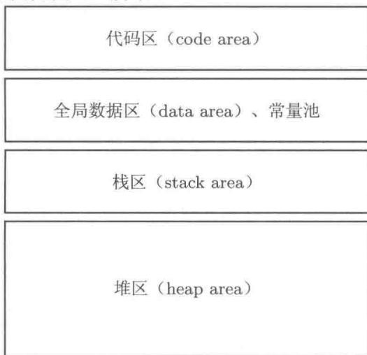
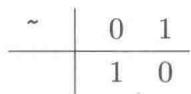
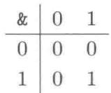
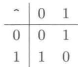
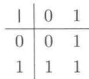
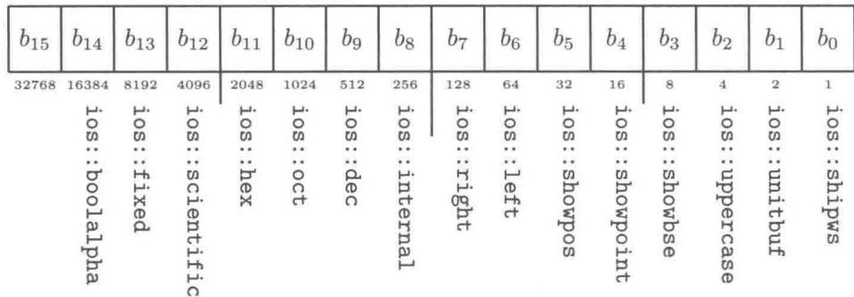
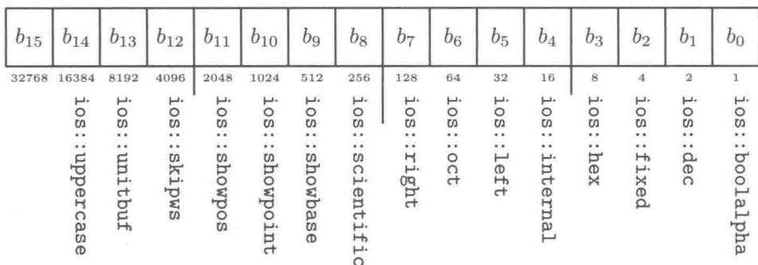
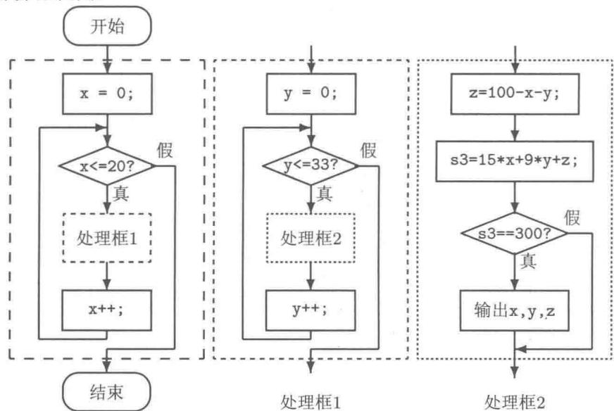

# 第3章 数据的表示及I/O流格式控制

在本章中，将进一步介绍  $\mathrm{C}++$  的运算，介绍数据的表示、数据的访问、函数定义、I/O流的格式控制等语法。最后给出一些具有一定功能的程序模块，希望读者精读它们并将它们有机地组织起来进行调试，以提高阅读程序和调试程序的能力。阅读程序的方法是跟踪变量的变化，以及外部设备（如键盘、显示器）上的反应。

# 3.1 数据的表示

# 3.1.1 常量

规定3.1（常量）常量是指其值在程序的运行中不允许被改变的量。常量有字面常量、符号常量两种。

# 1. 字面常量

(1) 字符常量: 用单引号包围起来的一个字符。字符在内存中按其 ASCII 码(整数)存放, 占 sizeof(char)(一个字节)。如 'a', 'A', '?', '$' 等; 一些特殊的字符用转义字符表示(如表 3-1 所示); 所有字符都可用十进制形式、八进制形式和十六进制形式表示, 还可以利用类型转换运算符表示(见表 3-1 最后三行)。

表 3-1 字符常量 (转义字符) 表  

<table><tr><td>字符形式</td><td>十六进制值</td><td>意 义</td></tr><tr><td>\a</td><td>0x07</td><td>响铃</td></tr><tr><td>\b</td><td>0x08</td><td>退格</td></tr><tr><td>\t</td><td>0x09</td><td>制表符(横向跳至下一制表站)</td></tr><tr><td>\n</td><td>0x0A</td><td>换行</td></tr><tr><td>\v</td><td>0x0B</td><td>纵向跳行</td></tr><tr><td>\r</td><td>0x0D</td><td>回车</td></tr><tr><td>\&quot;</td><td>0x22</td><td>双引号</td></tr><tr><td>&#x27;\&#x27;</td><td>0x27</td><td>单引号</td></tr><tr><td>\</td><td>0x5C</td><td>反斜杠“\”</td></tr><tr><td>\ddd</td><td>0x00~0xFF</td><td>ddd为1~3位八进制数</td></tr><tr><td>\xhh</td><td>0x00~0xFF</td><td>hh为1~2位十六进制数</td></tr><tr><td>char(ddd)或(char)ddd</td><td>0x00~0xFF</td><td>ddd为从0~255之间的整数</td></tr></table>

（2）字符串常量：用双引号包围起来的0个、一个或多个字符。如"\"、\"\\\"、"A"、"A\tB\tC\n"、"程序设计"、"双引号\"''和"单引号\"''等（注意其中的转义字符）。

字符串是程序中常用的一种数据类型（数据结构），它不是基本数据类型，而是内存中连续存放的一系列字符的集合。C++ 语言有两种字符串：C-String（被称为 C-字符串，它从 C 语言沿袭而来）；class string（字符串类，这种字符串将在面向对象程序设计部分讨论）。

（3）整型常量：可用十进制形式表示（如123，-123）、十六进制形式表示（以0x开头，如0x7B，-0x7B）和八进制形式（以零0开头，如0173，-0173）。以L（或1）为后缀表示长整型数据，以U（或u）表示无符号数据。例如，123L表示长整型数据，123U表示无符号整型数据，123LU或123UL表示无符号长整型数据。  
（4）浮点型（实型）常量：只能用十进制表示。可用小数形式或指数形式表示。如123.45、-123.45、1.2345E+2（表示  $1.2345 \times 10^{2}$ ）、12345E-2（表示  $12345 \times 10^{-2}$ ）。其中的E可用小写字母e。E（或e）前面的数字不能缺省。浮点数常量默认为double型。以F（或f）为后缀表示单精度浮点型（float）数据，如123.45f。  
（5）布尔常量：也称为逻辑常量。只有true（表示“真”）和false（表示“假”）两个值。将数值（字符型、整型、浮点型，带符号或无符号）型数据视为逻辑值时，非零表示“真”，零表示“假”。系统给出的逻辑值“真”用1表示，“假”用0表示。例如：while(true)与while(1)、while(0.5)、while(!0)、while(!false)皆是等效的。while(x!=0)与while(x)是等效的。while(x==0)与while(!x)是等效的。

# 2.符号常量

程序员在程序中通过如下语句定义自行命名的标识符为常量（其中 const 为保留字）。

```txt
const数据类型常量名  $=$  初始化值；
```

例如定义圆周率  $\pi$  、定义MAX_NUMBER为10000、定义LF为换行字符如下。

```c
const double PI = 3.1415926;  
const unsigned long MAX_NUMBER = 10000;  
const char LF = '\n';
```

符号常量在定义时必须对其初始化，这里的“ $=$ ”为初始化记号，不是赋值运算符。由于常量的值不允许被改变，因此常量不能做左值，试图对其赋值是错误的。

# 3.1.2 变量

规定3.2（变量）在程序的运行中其值可以被改变的量称为变量。

变量是程序中最活跃的基本元素。它既联系到计算机内存单元，又承载着所计算的问题。更重要的是，变量值的变化过程还标志着问题求解的进展。完整的变量定义语句为

```txt
存储类型数据类型变量名  $=$  初始化值；
```

值得注意的是：这里的“ $=$ ”为初始化记号，不是赋值运算符。定义变量时可以不对变量进行显式的初始化，而采用系统默认的初始化处理。

程序中变量必须先定义，后使用。定义变量意味着为变量分配内存空间。定义变量需要确定其如下五要素。

① 存储类型。  
② 数据类型。  
③ 变量名。  
④ 变量的初始值。  
⑤ 变量的地址。

其中变量的地址由系统确定，程序中可以通过取变量地址运算操作获取变量的地址值。其余的四个要素皆由程序员根据需要自行确定。

在一个程序中可以使用许许多多存储在不同内存区域（存储类型不同）、不同存放格式（数据类型不同）的变量。本质上，程序中的所有变量都是相互独立的。对变量的读或写操作称为对该变量的访问。变量以右值参与某一表达式运算时，只读取其数值，不会影响该变量本身。变量以左值参与运算时（如赋值、迭代赋值、抽取、自增和自减），可能会改变其值。一些变量参与某表达式运算，并不能建立它们之间的长久关系。变量之间的相关关系是算法逻辑上的，是由程序员努力控制的。

# 1. 变量的存储类型

一个程序在操作系统的控制下启动执行时，由操作系统分配给该程序一定的内存空间，同时允许程序申请使用堆空间。在逻辑上，这些空间可分成两大部分：代码区（用于存放程序代码，按照函数的入口地址——函数名来使用代码区）和数据区（用于存放数据）。数据区又细分为三块：全局数据区（存放全局变量、一些常量）；栈区（函数调用时存放局部自动变量，函数执行完毕返回时清除）；堆区（程序运行中根据需要可申请使用的内存空间，不需要继续使用它们时予以释放。因此，又称堆区为动态数据区）。一般地，堆区由操作系统直接掌管，其空间容量非常大，而全局数据区、栈空间的容量相对较小。程序可使用的内存空间如图3-1所示。

  
图3-1 程序可使用的内存空间

堆、栈分别是某种数据结构，是数据（如变量）的容器。它们对存储在其中的数据元

素有特殊的处理方式，适合不同的应用场合。栈的结构特点是数据先入后出——最先入栈的数据将被压在栈底，最后才能被弹出。函数调用时，局部变量（包括非引用型的形式参数）的创建和销毁经历栈操作处理（参见第6.2节）。

变量的存储类型决定了该变量在内存中的存储区域，决定了该变量的生命期（何时产生、何时销毁）和可见性（何种情形下可访问）。

规定3.3（全局变量[1]）在所有函数之外定义的变量被称为全局变量，定义全局变量时无存储类型名。全局变量存放在全局数据区中。在定义全局变量时若未显式地进行初始化，则系统将其初始化为各位（bit）全0。

全局变量的生命期是全局的。全局变量在程序启动后，主函数执行之前创建，主函数结束后销毁。在多文件结构的程序中，全局变量应该在某一个编译单元（.cpp源程序文件）中定义，在其他需要访问该全局变量的编译单元中用如下方式进行外部参照访问声明：

extern 数据类型 某全局变量名；

一般地，该语句只是声明在本编译单元中需要访问指定的全局变量，而不一定是定义变量，故一般不能对这种声明进行初始化。这种声明最好编写到头文件（.h）中，以便通过文件包含预处理操作插入到不同的编译单元中，使得相应的编译单元能正确地通过独立的分割编译，实现所谓的一处定义，多处声明。

全局变量的作用域从该变量被定义或外部参照访问声明之处起，直至本编译单元结束。利用外部参照访问声明，可以跨编译单元使用某个全局变量。亦即全局变量的作用域是可以跨编译单元的。在其作用域范围内的所有函数体内均可以直接访问该全局变量。

规定3.4（静态全局变量）在所有函数之外定义的存储类型为static的变量被称为静态全局变量。

静态全局变量与全局变量的唯一区别：静态全局变量的作用域和可见性为其所在的编译单元（不能跨越编译单元）。

规定3.5（静态局部变量）在某函数内定义的存储类型为static的变量被称为静态局部变量。

静态局部变量在其所在函数第一次被调用时创建，存放在全局数据区。直到整个程序结束时，静态局部变量才被销毁。在定义静态局部变量时若未显式地进行初始化，则系统将其初始化为各位（bit）全0。从定义静态局部变量的函数返回后，该变量处于“休眠”状态，仍保留其所占用的空间，保存其数值，任何其他函数都难以访问该变量。当再次调用其所在的函数时，静态局部变量被“唤醒”（跳过该变量的定义，也不再进行初始化，即静态局部变量最多只被定义及初始化一次）。静态局部变量具有全局生命期、局部可见性。

规定3.6（局部自动变量）在某函数内定义的存储类型为auto的变量被称为局部自动变量（简称为局部变量），其中保留字auto可被省略。

局部变量的生命期随其所在函数的调用而产生，存放在栈空间中，随其所在函数的返回而结束。定义局部变量时若未显式地对其初始化，则其初值是不可预知的。因而，未显式初始化的局部自动变量不宜直接将其作为右值使用。

变量的存储类型能够很好地解决变量名之间的冲突问题[1]。局部变量的作用域范围只在其函数内部，不同函数中定义的局部变量不会引起任何冲突。即使函数体内调用了本函数自己——递归函数（参见第6.4节），其不同层次函数调用的局部自动变量也是相互独立的，不会引起任何冲突。全局变量可以直接在一些函数中使用，给函数定义带来一点点方便，但是它破坏了函数的相对独立性、不利于函数代码的移植。因此，我们不提倡使用全局变量。事实上，C++语言的一些机制可以彻底消灭程序中的全局变量。

全局变量可能被局部变量屏蔽。此时需使用作用域区分符（::）指示全局变量。

例3.1 各种存储类型的变量使用举例（多文件结构）。

源代码3.1 变量的存储类型  
```c
1 // VarExample.h 头文件（编写声明语句）  
2 #ifdef VAREXAMPLE_H  
3 #define VAREXAMPLE_H  
4 extern int n; // 全局变量外部参照访问声明，并非定义变量  
6 void function1(); // 函数原型，用于函数声明  
7 void function2();  
8 void function3();  
9  
10 #endif
```

```cpp
1 // Variable_Test.cpp 源程序文件（编写定义语句）
2 #include <iostream>
3 #include "VarExample.h" // 声明全局变量 n 和三个函数
4 using namespace std;
5
6 static float a = 800.8f; // 定义静态全局变量，分配内存空间
7
8 int main()
9 {
10 int a = 10000, x = 500, n = 800; // 定义局部自动变量，分配内存空间
11 function()
12 function()
13 function()
14 function()
15 function()
16 function()
17 function()
18 cout << "in main()", a, b, c : N_ = _ << ::n // 访问全局变量
19 << ",", a, b, c : <= n // 访问局部自动变量
20 << ",", a, b, c : <= a // 访问静态全局变量
21 << ",", a, b, c : <= a // 访问局部自动变量
22 << ",", a, b, c : <= x <= endl; // 访问局部自动变量
23 return 0;
24 }
```

```cpp
1 // VarExam1.cpp 源程序文件（编写定义语句）  
2 #include <iostream>  
3 #include "VarExample.h" // 将文件 VarExample.h 的内容插入至此  
4 using namespace std;  
5  
6 int n; // 定义全局变量，分配内存空间，默认初始化为 0  
7 static int a = 10000; // 定义静态全局变量，分配内存空间，初始化为 10000  
8  
9 void function1()  
10 {  
11 static int a; // 定义静态局部变量（最多只执行一次）  
12 double x = 5.5; // 随函数每次调用定义局部自动变量  
13 int n = 100; // 随函数每次调用定义局部自动变量  
14 x++; // 访问局部变量  
15 ::n++; // 访问全局变量  
16 ::a++; // 访问静态全局变量  
17 a = a + ::a + (int) x + ::n + n;  
18 cout << "in_\sqfunction1():_\sqN_\sq = \sq" << ::n  
19 << ",\sqN_\sq = \sq" << n // 访问局部自动变量  
20 << ",\sqA_\sq = \sq" << ::a  
21 << ",\sqA_\sq = \sq" << a // 访问静态局部变量  
22 << ",\sqX_\sq = \sq" << x << endl;  
23}
```

```txt
1 // VarExam2.cpp 源程序文件（编写定义语句）  
2 #include <iostream>  
3 #include "VarExample.h" // 将文件 VarExample.h 的内容插入至此  
4 using namespace std;  
5  
6 static double a=200.5; // 定义一个静态全局变量  
7  
8 void function2()  
9 {  
10 static double a=2.71828; // 定义一个静态局部变量  
11 int x = 200;  
12 a += ++n + ++x; // 等效于 ++n; ++x; a=a+n+x;  
13 cout << "in_\function2():_\N_\ =_\n" << n // 全局变量 n  
14 << ",_\x_\ =_\n" << x // 局部变量 x  
15 << ",_\A_\ =_\n" << ::a // 静态全局变量 a  
16 << ",_\a_\ =_\n" << a << endl; // 静态局部变量 a  
17 }  
18  
19 void function3()  
20 {  
21 double a=3.1415926;  
22 static char x='C';  
23 int n = 300;  
24 ::a++;  
25 x++;  
26 a = a + ::a + n + ::n + x;  
27 cout << "in_\function3():_\N_\ =_\n" << ::n // 全局变量 n  
28 << ",_\n_\ =_\n" << n // 局部变量 n  
29 << ",_\A_\ =_\n" << ::a // 静态全局变量 a  
30 << ",_\a_\ =_\n" << a // 局部变量 a  
31 << ",_\x_\ =_\n" << x << endl; // 静态局部变量 x  
32 }
```

程序的运行结果如下。

```julia
in function1(): N = 1, n = 100, A = 10001, a = 10108, x = 6.5  
in function2(): N = 2, x = 201, A = 200.5, a = 205.718  
in function3(): N = 2, n = 300, A = 201.5, a = 574.642, x = D  
in function1(): N = 3, n = 100, A = 10002, a = 20219, x = 6.5  
in function2(): N = 4, x = 201, A = 201.5, a = 410.718  
in function3(): N = 4, n = 300, A = 202.5, a = 578.642, x = E  
in main() : N = 4, n = 800, A = 800.8, a = 10000, x = 500
```

从运行结果可见，各种变量（尽管有的名字相同，甚至有同时的可见性）也未引起冲突。

# 2. 变量的数据类型

变量的数据类型决定该变量的数据在内存中的存放格式：占用的字节数、取值范围。定义变量时所规定的数据类型是不会改变的。对变量使用类型转换操作时，只是将该变量的值（作为右值）读出，建立并初始化一个另一种数据类型的临时变量，用该临时变量参与表达式运算。这一操作并不影响变量原来的数据类型及其数值。

# 3. 变量名

变量的命名应符合自定义标识符的命名规则。变量名可视为相应内存单元的名字，是程序中访问数据的依据之一。在变量（原名）的可见范围内访问它是简单的；在变量的生命周期内，但在变量的原名不可见处访问该变量，则需要借助于变量的别名（参见第3.1.3小节）、或变量的间接名（参见第5.3.2小节）。因此，一个变量名称可能以多种形式呈现。

# 4. 变量的值

变量定义时可以对其进行初始化，使其在创建时便具有对问题求解有意义的初始值。变量在其整个生命期内，值的演变过程代表着问题求解的历程。程序运行过程中，变量的值的变化规律，尤其是变量的当前值是值得特别关注的，是阅读理解程序的关键之所在。

# 5. 变量的地址

变量所在的存储区域（参见图3-1）由其存储类型决定，变量在其存储区域中的具体地址由系统安排。  $\mathrm{C}++$  语言提供了获取变量具体地址值的运算操作。通常情况下，我们并不关心变量在其存储区域中的具体地址，只需要能够获取变量的地址值并能够根据变量地址值“间接地”访问变量即可。与变量地址相关的概念和操作详见第5章。

# 3.1.3 变量的引用

变量的引用是  $\mathrm{C}++$  语言的一个重要特色。C语言中没有变量引用的概念。

规定3.7（变量的引用）变量的引用是变量实体（一个已经存在的变量）的一个别名。

引用只是声明，不是定义，引用不占内存空间。声明引用时，必须用一个变量实体对其初始化。这样的“绑定”从引用声明开始，直到引用的生命期结束不能更改。对引用的访问就是对其“绑定”的变量的访问（包括读和写）。程序中应该保证实体变量的生命期包含其引用的生命期，否则“皮之不存，毛将焉附”。

声明引用的语法格式为

数据类型 & 引用名 = 已存在的变量名;

其中符号“&”是声明引用时的标记。作为标记的符号不是运算符。数据类型必须与被引用的变量实体的数据类型一致。这里的“=”为初始化记号，不是赋值运算符。

例如：

```txt
int x; //定义一个整型变量，分配一定的内存空间  
int  $\&\mathrm{rx} = \mathrm{x}$  //声明一个引用，不占用新的内存空间  
x = 100;  
cout << rx << endl; //将输出100  
rx = 200;  
cout << x << endl; //将输出200
```

【变量的名称】我们常说：算法是计算机科学的灵魂；变量是算法（程序）中的小精灵。这些小精灵们可以“招之即来，挥之即去”。这些多变的小精灵们，有时我们知道其变量名（原名），有时我们只知道其“绰号”（别名），有时我们仅知道其住址编号（间接名）。因而，访问变量的方法有通过变量名直接访问；或者通过变量的别名引用访问；或者通过变量的存储单元起始地址间接访问（见第5章）。

编写或阅读程序时，要正确地辨明那些五花八门的“间接名”“别名”所指代的真正变量实体。

# 3.1.4 常量的引用

$\mathrm{C}++$  中除了变量可以被引用外，常量也可以被引用。常量引用的声明如下。

const数据类型&引用名  $=$  常量或已存在的变量；

其中符号“&”是声明引用时的标志，不是运算符；符号“=”为初始化记号，不是赋值运算符。

例如：

```txt
double  $\mathbf{x} = 2.5$    
const double PI  $= 3.1415926$    
const double  $\& r\mathrm{PI} = 1 / \mathrm{PI}$  ，&E  $= 2.17281728$    
const double  $\& \mathrm{rx} = \mathrm{x}$  //允许将变量视为常量  
cout<<rx<<endl; //输出2.5  
 $\mathrm{x + + }$  //正确，即  $\mathbf{x}$  仍为变量，可以做左值  
//rx++; 错误，因为rx为常量，不能做左值  
cout<<rx<<endl; //输出3.5，说明“绑定”  
//double  $\& \mathrm{r} = \mathrm{PI};$  （20 错误，不能将常量视为变量
```

可见，可以将变量作为常量使用，但不允许将常量作为变量看待。

变量引用的主要作用之一是实现变量在函数之间的双向传递。在函数体内通过别名访问原名不可见的变量。

# 3.2 函数

规定3.8（函数）函数是程序按功能划分的基本单位，俗称子程序。函数是对程序中某种功能的包装和抽象。

$\mathrm{C}++$  中的函数有三个方面的内容：

① 函数原型是编译器检查源程序中调用函数语句语法正确性的依据，亦是程序员编写调用函数语句的依据。  
② 函数定义是指函数功能的具体实现过程，它被编译成目标代码后，是连接器连接诸目标代码生成可执行文件的依据。  
③ 函数调用是指实际使用函数，必要时需提供待加工的实际数据（被称为实际参数，用于初始化形式参数）。函数通过其返回类型获得计算结果，并用函数调用表达式本身表示结果。

只要用函数原型声明了某个函数，即使该函数尚未定义，调用该函数的语句便可以通过编译。若该函数始终未定义，则连接时出错。编译系统所提供的标准函数的定义已经被编译成函数库，直接由连接器连接。其函数原型已经写在标准头文件中，用#include指令包含了头文件后，相应的函数就被声明了，程序中便可以直接调用它们了。

函数原型的一般格式如下（注意其中的分号“;”）。

返回类型 函数名（形式参数表）；

函数必须先声明后调用，函数原型用于函数声明。当函数定义在前调用在后时，函数定义可以起到函数声明的作用。

我们将经常使用的、具有一定功能的、相对独立和完整的程序段组织成函数。函数定义完成，经由其原型声明后，便可以反复使用。调用函数时，只关心其功能和使用方法，不必关心其具体的实现细节。例如，计算非负实数算术平方根，数学函数为  $y = f(x) = \sqrt{x}$  。C++ 提供了根据给定“自变量”  $x$  计算这个数学函数值的标准函数，其原型在头文件 cmath 中声明为

double sqrt(double x);

设有变量 double  $x = 2.0$ ， $y$ ；欲计算  $x$  的算术平方根，并将结果存入变量  $y$  中，用 C++ 的语句表示为

$y = \operatorname{sqrt}(x)$ ; //不能写成  $y = \operatorname{sqrt}(\text{double } x)$ ;[1]

至于sqrt(x)函数是如何计算出“自变量”（ $\mathrm{C}++$  中称为参数） $\mathbf{x}$  的算术平方根的，程序员不必关心其中的细节（有兴趣的读者可参见第1.3.2小节的【附注】和第4.2.1小节）。程序员关心的是该函数的功能、函数的使用方法。函数的功能必须查阅相关的资料（反过来说明了程序员编写技术文档是重要的）；函数的使用方法从函数原型便可直接看出。

$\mathrm{C}++$  用函数组织程序，通过函数调用驱动程序运行。函数有标准库函数、自定义函数。编写  $\mathrm{C}++$  程序就是编写各种各样的函数，并将它们有机地组织起来。常用的标准库函数及声明其原型的头文件参见附录B。

第2章介绍的函数基本上是最简单的“不带参数的函数”。本节介绍带参数的函数。与数学中的一元函数、二元函数或多元函数类似， $\mathrm{C}++$  语言中也允许带一个参数、两个参数或多个参数的函数。各个参数的数据类型必须分别明确；函数可以通过返回类型返回计算结果。

本节主要介绍函数设计方面的语法规定。侧重数值、变量本身传递给函数，加工计算后返回数值、返回变量的相关规定。

# 3.2.1 函数的形式参数

# 1. 值传递型参数——传递数值

例如，绝对值函数。其函数原型在头文件 cmath 中的声明如下。

```txt
double fabs(double x);
```

该函数的定义（已经被编译成库函数）为

```c
double fabs(double x)  
{ if  $(x >= 0)$  return x; else return -x; }
```

函数的原型声明及函数定义中的double x为形式参数（简称形参）。从该形式参数的语法格式上看，属于变量定义。形式参数变量存放在栈区，其存储类型为auto，因而其生命期是局部的：它在函数每次调用时定义（意味着为其分配内存空间），并用调用该函数时的一个实际数值（被称为实际参数，简称实参）对形式参数进行初始化，该形式参数变量在函数返回时被销毁。

这种形式的参数之所以被称为“值传递型”的，是因为每次调用该函数时，创建了一个新的形参变量，用实参（某变量的值、某常量的值、某表达式的值）的右值初始化之。该形参变量有其独立的存储空间，其生命期、可见性皆限于本次调用之中，最多可称为实参的一个副本。对形参（副本）的任何操作均不影响实参。

绝对值函数不需要程序员重新定义。若要使用它，只需包含头文件 cmath 即可。如：

```cpp
#include <iostream>  
#include <math>  
using namespace std;  
int main()  
{ double a = -5.5, b = -8.5; cout << fabs(a) << endl // 输出 5.5  
<< fabs(b) << endl // 输出 8.5
```

```txt
10  $<<$  fabs(a+b+3)  $<<$  endl //输出11  
11  $<<$  fabs(-10.5)  $<<$  endl; //输出10.5  
12 cout  $<<$  a  $<<$  '\t'  $<<$  b  $<<$  endl; //输出-5.5 -8.5  
13 return 0;  
14}
```

显然，主函数中调用绝对值函数时使用了实际参数。对于值传递型的形式参数，实际参数体现的是实参的右值特性。本例中，只读取了变量a，b的值作为实际参数调用函数。实际参数还可以是一个运算表达式的值，或者为一个常量值。这些右值分别用于4次调用fabs(x)函数时定义形式参数变量x的初始化，亦即形式参数x经历了4次“创建一销毁”的生命历程。在形式参数每次的生命周期内，形式参数都独立于实际参数，因而对形参的操作不会影响到实参。因而，函数中的值传递型参数是单向的，即单向向函数传递数值。程序最后的输出结果表明变量a，b的值未被修改。

# 2. 引用型参数——传递变量

将函数的形式参数设计为引用（即引用型参数）是引用的主要用途。用已经存在的变量作为实际参数调用函数时，便是声明了对实参变量的引用。即用已经存在的变量初始化引用型形式参数的声明。引用型形式参数不占用内存空间，使形式参数成为实际变量参数的别名。函数体内对形式参数的访问实质上就是对具有生命期、但不具可见性的实参变量的访问。因而，引用型参数在函数间进行的数据传递实质上是变量传递（当然，变量的5要素全部传入），可形成双向的效果：实际参数带值进入函数，函数体内可通过实际参数的别名（即形参）对实参进行读、写操作。即通过引用型参数，还可以“返回”计算结果，尤其是实现要求“返回”多个计算结果的任务（此处的所谓“返回”不是指函数返回类型的返回）。

引用型形参（即别名）的生命周期起始于所在函数被调用时，形参“绑定”实参变量，这种绑定随其所在函数返回时，即形参生命周期结束而自动解除。函数再次被调用时，形参又可以再次“绑定”同一变量，或者另一变量。

另外，将形式参数声明为引用型时，该形式参数不占用内存空间，也不存在大数据体的传递，故执行效率高。须注意的是此时的实际参数应该是能够被引用的量，是一个变量实体。

例3.2 设计自定义函数求解一元二次方程  $ax^2 + bx + c = 0 (a \neq 0)$ ，并测试之。

【分析】该问题涉及3个系数（a，b，c）单向传入给处理函数，从函数“返回”获得2个可能的根（x1，x2，它们传入给函数的值并不重要）。当方程无实数根时，x1，x2的值是无意义的（它们总是有数值的）。为了区分这种情况，还需要设计一个量表示方程的类型。故函数需要“返回”或返回标志方程类型的标志值。为此，我们约定标志值为0、1和2分别表示方程无实数根、方程有重根和方程有两个不同的根。故本例有两种设计方案如下。

# 源代码3.2 求解一元二次方程的函数

```txt
1 #include<iostream>   
2 #include <math>   
3 using namespace std;
```

void Solver(double a,double b,double c,double &x1,double &x2,int &flag) //函数定义（6个参数，其中3个值传递、3个变量传递；函数无返回类型）

```txt
double  $d = b*b - 4*a*c;$    
if  $(\mathrm{d} <   0)$    
{ flag  $= 0$  return;   
}   
 $\mathrm{d} = \mathrm{sqrt}(\mathrm{d})$  · if(a>0)   
{ x1  $= (-b - d) / (2*a)$  x2  $= (-b + d) / (2*a)$  ·   
}   
else   
{ x1  $= (-b + d) / (2*a)$  x2  $= (-b - d) / (2*a)$  ·   
}   
if(d>0) flag  $= 2$  · else flag  $= 1$  ·
```

int Solver(double a, double b, double c, double &x1, double &x2) //函数定义（5个参数，其中3个值传递、2个变量传递；函数返回方程类型标志值）

```javascript
int flag; double d = b*b - 4*a*c; if(d<0) return 0; d = sqrt(d); if(a>0) { x1 = (-b - d)/(2*a); x2 = (-b + d)/(2*a); } else { x1 = (-b + d)/(2*a); x2 = (-b - d)/(2*a); } if(d>0) flag = 2; else flag = 1; return flag; }
```

```txt
void Display(int flag, double x1, double x2)  
{  
    switch (flag)  
{  
        case 1: cout << "该方程有重根: \(\square x1_{\square} = \square x2_{\square} = \square\) " << x1; break;  
        case 2: cout << "该方程的根为: \(\square x1_{\square} = \square\) " << x1  
            << ", \(\square x2_{\square} = \square" << x2; break;  
        default: cout << "该方程无实根。"; break;
```

```txt
63 }  
64 cout << endl;  
65 }  
66  
67 int main()  
68 {  
69 double a, b, c, x1, x2; // 定义五个double型变量  
70 int flag;  
71  
72 flag = Solver(1, -2, 1, x1, x2); // 调用5个参数的函数  
73 Displayflag, x1, x2);  
74 Solver(1, 2, -3, x1, x2, flag); // 调用6个参数的函数  
75 Displayflag, x1, x2);  
76  
77 a = 1; b = 2; c = 3;  
78 flag = Solver(a, b, c, x1, x2);  
79 Displayflag, x1, x2);  
80 Solver(a, b, c, x1, x2, flag);  
81 Displayflag, x1, x2);  
82 return 0;  
83 }
```

调用 Solver 函数时，前三个实际参数可以是任何表达式（使用其右值特性）；后面的参数必须是可以被引用的量（必须是变量实体，能作为左值的量）。

因为引用不占用内存空间，所以利用函数的引用型参数传递实参数数据具有较好的空间利用率及时间效率。另一方面，函数能获得对实参变量的访问权，使函数的作用范围扩大到本函数以外（这既有有利的方面，又有不利的方面）。使用引用型参数后，实参处于可能被函数修改的“危险境地”。有时我们不得不使用引用型参数（如面向对象程序设计部分的拷贝构造函数的形式参数），同时又不希望函数体对实参进行修改，此时可以用保留字const对引用型形式参数加以限制，成为常量引用以达到：

① 使函数体内不能修改实参的值（使程序员敢于大胆地调用该函数，因为从函数原型可知，传递给函数的实参值不会被修改）。  
② 可以用真正的常量作为实参初始化常量的引用。

例如，可将上述函数做如下修改。

```txt
1 int Solver(const double &a, const double &b, const double &c, double &x1, double &x2)  
2  
3  
4  
5  
6  
7  
8  
9  
10  
11  
12  
13  
14  
15  
16  
17  
18
```

```txt
19 if  $(\mathrm{d} > 0)$    
20 flag  $= 2$    
21 else   
22 flag  $= 1$    
23 return flag;   
24}
```

主函数中仍然可以使用语句flag = Solver(1, 2, -3, x1, x2); 和flag = Solver(a, b, c, x1, x2); 调用函数，甚至可以使用语句flag = Solver(a+1, -b, 10*c, x1, x2); 调用函数。

综上所述，形式参数在函数的每次调用时均定义（值传递型，分配内存空间）或声明（引用型传递，引用不占空间），并用实际参数对其进行初始化。函数形式参数的存储类型为auto，其定义或声明及其初始化完全遵循局部变量定义、局部引用声明及其初始化的语法规定。我们将值传递型的参数称为传递数值（函数传递数值型的形式参数是新定义的变量，其值与实参相同，因此常称此时的形参为实参的一个副本，函数体内只操作该副本而与实参无关，体现数据单向传入给函数）；将引用型参数称为传递变量本身（函数体内能操作实参变量，体现变量的双向传递）。

例3.3 交换两个实参的值。这是一个经典例子。

源代码3.3 交换两个实参的值  
```cpp
1 // swap.cpp  
2 void swap(int &a, int &b) //正确的函数，传递实参变量本身  
3 {  
4 int temp;  
5 temp = a; a = b; b = temp;  
6 }  
7 void swap1(int a, int b) //无用的函数，仅操作实参的副本  
8 {  
9 int temp;  
10 temp = a; a = b; b = temp;  
11 }  
12  
13 #include<iostream>  
14 using namespace std;  
15  
16 int main()  
17 {  
18 int x = 3, y = 5;  
19 cout << "x□=□" << x << ",□y□=□" << y << endl;  
20 swap1(x, y); //实参值传递  
21 cout << "x□=□" << x << ",□y□=□" << y << endl;  
22 swap(x, y); //实参引用传递  
23 cout << "x□=□" << x << ",□y□=□" << y << endl;  
24 return 0;  
25}
```

程序的运行结果：

```latex
$\begin{array}{rlr}{\mathrm{x}}&{=}&{3,\mathrm{y}=5}\\{\mathrm{x}}&{=}&{3,\mathrm{y}=5}\\{\mathrm{x}}&{=}&{5,\mathrm{y}=3}\end{array}$
```

可见，函数void swap1(int a, int b); 是一个无用的函数。其形式参数a，b分别是实参x，y的副本（复制品），函数体中对a，b的操作与x，y无关。函数void swap(int &a, int &b); 中的形式参数a，b分别是实参x，y的引用（别名），函数体中对a，b的操作就是对实参x，y的操作。

# 3.2.2 函数的返回类型

函数原型、函数定义中需要指明函数的返回类型。函数的返回类型有无返回、值返回、引用返回（变量返回）。函数返回类型的所有形式详见第6章。通过引用型形式参数双向传递的数据被称为所谓的“返回”（打引号的“返回”），本质上不属于函数的返回类型。

函数通过返回类型只能返回某种类型的一个量，这个量就用函数调用表达式本身表示。

# 1. 无返回

返回类型被指定为void者为无返回函数。这种函数通常只完成某个动作而不返回任何量。当然，这种函数仍能通过引用型形式参数“返回”多个量。

```txt
1 void greeting()
2 {
3 cout << "Hello." << endl;
4 return; //此语句可省略
5}
```

# 2. 值返回（返回临时无名变量）

函数值返回是最常见的一种形式。这种函数的返回类型为某种数据类型。如：函数原型在头文件 cmath 中的部分标准函数如表 3-2 所示。

表 3-2 头文件 cmath 中声明的部分函数  

<table><tr><td>函数原型</td><td>功能</td></tr><tr><td>int abs(int x);</td><td>绝对值函数</td></tr><tr><td>long labs(long x);</td><td>绝对值函数</td></tr><tr><td>double fabs(double x);</td><td>绝对值函数</td></tr><tr><td>double sqrt(double x);</td><td>算术平方根函数 (要求 \( \mathrm{x} \) 非负)</td></tr><tr><td>double pow(double x, double y);</td><td>\( \mathrm{x} \) 的 \( \mathrm{y} \) 次幂函数(要求 \( \mathrm{x} \) 非负)</td></tr><tr><td>double exp(double x);</td><td>e 的x次幂函数</td></tr><tr><td>double sin(double x);</td><td>正弦函数</td></tr></table>

调用数值返回的函数返回时，将创建一个与返回数据类型相同的临时变量[1]，用于存放函数的返回值；该临时变量是无名的，用函数调用表达式本身表示；该临时变量的生命期是短时的，不宜或不能将其作为左值使用。例如：

例3.4 加法运算函数。  
```javascript
double  $x = 2$  ，y;  
 $y = \mathrm{sqrt}(x)$  //函数返回时创建临时变量，存放返回值，再将临时变量的值赋给y  
 $y = \mathrm{sqrt}(x + 2)$  //临时变量是无名的，直接用函数调用表达式本身表示
```

```cpp
#include <iostream>
using namespace std;
int Add(int a, int b) //模拟“+”运算，值返回
{
    a += b; //故意改变了形参a的值
    return a; //a的生命期仅存在于本函数被调用时
}
int main()
{
    int a = 3, b;
    b = Add(a, 2); //Add(a, 2)表示一个临时变量
    cout << a << "", endl; //输出3,5（注意a的值不变）
    return 0;
}
```

其中 Add 函数的定义本应该写成如下更加清晰的形式（写成上述形式的目的是请读者比较后面的 AddAssign 函数）。

```txt
int Add(int a, int b) //模拟“+”运算  
{ return a + b; //与上面的函数等效
```

# 3. 引用返回（返回变量）

函数的返回类型可以被设计成某种数据类型的引用。与函数值返回不同，函数引用返回不创建临时变量，直接返回变量本身，使函数调用表达式成为左值。因此，引用返回也被称为变量返回。引用返回的变量仍然用函数调用表达式表示。这样，该函数调用表达式本身就成为了该变量“五花八门”的变量名的表现形式之一。自然要求引用返回的变量是可以被引用的，其生命期和作用域应该包含该函数调用语句所在的表达式。

例3.5 迭加计算函数。  
```cpp
#include <iostream>
using namespace std;
int & AddAssign(int &a, int b) // 模拟“+=”运算，引用返回
{
    // a所“绑定”的变量的生命期长于本函数的执行期
    a += b;
    return a; // 返回一个生命期长于本函数执行期的变量
}
```

```txt
13 AddAssign(a, 2); // a 的值被修改，增加 2  
14 cout << a << endl; // 输出 5  
15 AddAssign(a, 2)++; // 函数调用表达式成为左值，此处即为变量 a  
16 cout << a << endl; // 输出 8  
17 return 0;  
18}
```

例3.6 返回静态局部变量。

【说明】本例仅用于说明这样的函数在语法上是可行的。但不提倡这样的函数，因为这种函数中的静态局部变量“局部可见性”的特性丧失了。注意：整个程序中仅定义了一个变量（静态局部变量a），主函数中没有定义任何变量，对变量a是不可见的（即不知其原名）。主函数中的ra和函数调用表达式func()均是变量a“五花八门”的别名。

```cpp
#include <iostream>
using namespace std;
int & func()
{
static int a; // 静态局部变量a的生命期是全局的
return a; // 返回一个生命期长于本函数执行期的变量
}
int main()
{
int &ra = func(); // ra为func函数中静态局部变量的别名
cout << func() << endl; // 输出0，静态局部变量默认初始化为0
func() += 8;
cout << func() << endl; // 输出8
ra += 10; // 变量a丧失“局部可见性”
cout << func() << endl; // 输出18
return 0;
}
```

# 3.3 运算表达式

在第2章中介绍了一些基本的运算符和基本的运算表达式。主要涉及类型转换运算、算术运算、关系运算和逻辑运算。本节继续介绍一些运算符及运算表达式。

# 3.3.1 C++运算符汇总

表3-3列出了  $\mathrm{C + + }$  的各种运算符。由表可见，  $\mathrm{C + + }$  语言提供了丰富的运算操作符，运算表达能力强。这些运算符按运算优先级从高到低（从第1级到第18级）共分成18级。在  $\mathrm{C + + }$  程序中，可以将多种运算符组织到一个表达式中。在一个表达式中，优先级高者先计算，优先级低者后计算；优先级相同者根据其结合方向（从左到右或从右到左）依次进行。

需要指出的是，有些运算符由多个字符组成，使用时应将其作为一个整体，不能分开。运算符中出现圆括号、方括号时，其中的左、右括号应分开；唯一的三目运算符中的两个字符用于分隔三个操作数。

表 3-3 C++ 运算符汇总表  

<table><tr><td>优先级</td><td>运算符</td><td>结合方向</td><td>描述</td></tr><tr><td>1</td><td>::</td><td>左→右</td><td>作用域区分符</td></tr><tr><td>2</td><td>--&gt;[ ]()++--</td><td>左→右</td><td>对象取成员指针取目标对象成员访问数组元素组织运行次序后置自增1后置自减1</td></tr><tr><td>3(单目运算)</td><td>++--!+--*sizeofnewdelete(类型名)</td><td>左←右</td><td>前置自增1前置自减1二进制位反(波浪号)逻辑非正号负号指针目标内容取变量地址数据类型的尺寸(以字节为单位)在堆内存中申请一片可写的空间并返回其首地址释放由new申请的堆内存空间显式(强制)转换数据类型,或类型名(表达式)</td></tr><tr><td>4</td><td>.*-&gt;*</td><td>左→右</td><td>直接访问指向对象成员的指针(参见8.1.3小节)间接访问指向对象成员的指针(参见8.1.3小节)</td></tr><tr><td>5(算术运算)</td><td>*/%</td><td>左→右</td><td>乘法除法整数相除取余</td></tr><tr><td>6(算术运算)</td><td>+ -</td><td>左→右</td><td>加法,还用于指针加减整数(参见5:3.2小节)减法,还用于两个同类指针相减(参见5.3.2小节)</td></tr><tr><td>7(位运算)</td><td>&lt;&lt; &gt;&gt;</td><td>左→右</td><td>整数按其二进制位左移,还用做输出(插入运算)整数按其二进制位右移,还用做输入(抽取运算)</td></tr><tr><td>8(关系运算)</td><td>&lt;&lt;=&gt;&gt;=</td><td>左→右</td><td>小于小于等于大于大于等于</td></tr><tr><td>9(关系运算)</td><td>==!=</td><td>左→右</td><td>等于不等于</td></tr></table>

续表  

<table><tr><td>优先级</td><td>运算符</td><td>结合方向</td><td>描述</td></tr><tr><td>10(位运算)</td><td>&amp;</td><td>左→右</td><td>整型数按其二进制位进行与运算</td></tr><tr><td>11(位运算)</td><td>^</td><td>左→右</td><td>整型数按其二进制位进行异或运算(尖帽子)</td></tr><tr><td>12(位运算)</td><td>|</td><td>左→右</td><td>整型数按其二进制位进行或运算</td></tr><tr><td>13(逻辑运算)</td><td>&amp;&amp;</td><td>左→右</td><td>逻辑与(并且)</td></tr><tr><td>14(逻辑运算)</td><td>||</td><td>左→右</td><td>逻辑或(或者)</td></tr><tr><td>15(三目运算)</td><td>? :</td><td>左←右</td><td>三目条件运算</td></tr><tr><td>16(赋值运算)</td><td>= += -= *= /= %= &amp;= ^= |= &lt;&lt;= &gt;&gt;&gt;=</td><td>左←右</td><td>赋值运算迭代加迭代减迭代乘迭代除整型量迭代除取余迭代按位与迭代按位异或迭代按位或迭代按位左移迭代按位右移</td></tr><tr><td>17</td><td>throw</td><td>左→右</td><td>抛掷异常</td></tr><tr><td>18</td><td>,</td><td>左→右</td><td>逗号运算</td></tr></table>

# 3.3.2 单目运算

优先级为3的是单目运算，正号“+”、负号“-”运算符与数学符号的含义相同。自增“++”、自减“--”、逻辑非“!”、类型转换运算符“（类型名）表达式”或者“类型名（表达式)”见第2章。

运算符 *、&、new 和 delete 的用法涉及指针的概念，将在第 5 章介绍。

变量的尺寸（以字节为单位）：sizeof(数据类型名)或sizeof(变量名)。如：

```txt
double x;  
cout << sizeof(int) << endl; // 输出 4  
cout << sizeof(x) << endl; // 输出 8
```

表明所使用的编译器中 int 型数据同 long 型数据，在内存中占 4 字节。double 型的变量 x 在内存中占用 8 字节。

整数按其二进制位求反“~”运算符见下面的位运算。

# 3.3.3 二进制位运算

优先级为3的位反运算“~”是单目运算，只能对整型数据操作，它将操作数按二进制位求反。

优先级为7的运算是二进制位移运算，均为双目运算。设n，k均为整数，表达式 $\mathbf{n} <   \mathbf{k}$  表示将  $\mathbf{n}$  代表的整数按照二进制位左移  $\mathbf{k}$  位，左侧被移出的部分直接丢弃，右侧补零。左移  $\mathbf{k}$  位相当于乘以  $2^{k}$  。表达式  $\mathbf{n} > > \mathbf{k}$  表示将  $\mathbf{n}$  代表的整数按照二进制位右移 $\mathbf{k}$  位，右侧被移出的部分直接丢弃，左侧则补符号位（负数补1，非负数及无符号数则补0）。值得注意的是：负整数  $\mathbf{n}$  右移  $\mathbf{k}$  位不一定等于  $\mathbf{n}$  除以  $2^{k}$  。如：-1>>1，-1>>2， $-1 >> 3$  等，皆为-1。

优先级为10的是位与运算；优先级为11的是位异或运算；优先级为12的是位或运算。因为这三种位运算均不进位，故仅列出一位二进制数的位操作法则即可。

  
位反

  
位与

  
位异或

  
位或

# 3.3.4 迭代赋值运算

在第2章介绍了算术运算的迭代赋值运算，其优先级为16。本优先级的运算符还有二进制位运算的迭代赋值运算  $\& =$  、  $\hat{\mathbf{\Gamma}} =$  、  $| =$  、  $<< =$  和  $\gg =$  。例如：

```txt
char c='A'; //字符'A'的ASCII码为65，即01000001  
c |= '口'; //空格字符的ASCII码为32，即00100000  
cout << c << endl; //输出字符'a'，其ASCII码为97，即01100001  
c >> = 1; //右移1位，相当于除以2  
cout << c << endl; //输出字符'0'，其ASCII码为48，即00110000
```

# 3.3.5 抽取及插入运算

$\mathrm{C}++$  重载了运算符“>>”和“<<”分别用于输入与输出操作。“>>”被称为抽取运算符，“<<”被称为插入运算符。插入运算操作除了在输出设备上输出指定表达式的值外，运算的结果为其左边的输出设备名。这样，才使连续输出成为可能。即

```javascript
cout << "The result is " << 666 << endl;
```

相当于

```txt
((cout << "The result is") << 666) << endl;
```

因为表达式（cout << "The result is ")的结果为cout（别名）。

输入操作的情况是类似的。抽取运算操作不仅将从输入设备上输入的数值存入了相应的变量，而且运算的结果为其左边的输入设备名。这样，也才允许连续输入。如：

```txt
int m, n; //定义两个整型变量  
cout << "请输入两个整数："； //输出提示信息  
cin >> m >> n; //接收键盘输入  
(cin >> m) >> n; //与上一行等价
```

因为表达式（cin >> m）的结果是cin（别名）。

【注】若输入的数据不符合数据类型的要求（例如，若要求输入一个整数或实数却输入了一个字母或字符串，或者输入了如Ctrl+Z键等）则（cin>>x）为NULL（即0）。此时需要清除错误状态标志并忽略输入缓冲区中的信息（参见14.1.2小节例14.2）。

# 3.3.6 三目条件运算

优先级为15的运算是唯一的一个三目运算，它需要三个操作数参与运算：

```txt
表达式1？表达式2：表达式3
```

若表达式1为“真”（非零），则运算结果为表达式2的值，否则为表达式3的值。

三目条件运算的结合方向为从右到左。该运算符可以嵌套使用，有些场合下可代替条件分支或多分支语句。如：

```txt
int abs(int x) //绝对值函数  
{ return x >= 0 ? x : -x;  
}  
int sgn(int x) //符号函数  
{ return x > 0 ? 1 : (x < 0 ? -1 : 0); //此行的圆括号可以省略  
} //保留它则便于程序理解
```

# 3.3.7 逗号运算

优先级最低的是逗号运算。逗号运算是一系列用逗号连接起来的表达式。

```txt
表达式1，表达式2，…，表达式n
```

逗号运算将依次计算各表达式的值，并将最后一个表达式的值作为整个逗号运算表达式的值。

# 3.3.8 区分作用域

优先级最高的运算符是双冒号“::”：它被称为作用域区分符，用于区分全局变量（全局变量以双冒号开头。参见例3.1表达式::n，::a表示访问被局部变量屏蔽了的全局变量），或某名字空间中的名字，或者某个类的对象等。例如，若程序中有包含指令#include<iostream>而未使用语句using namespace std；即未声明使用标准名字空间，则需要使用如下格式：

```cpp
std::cout << "OK" << std::endl;
```

以指明cout和endl属于std名字空间。

# 3.4 语句

第二章已经介绍了大部分语句，包括最常见的赋值语句、输入/输出语句、程序执行流程控制语句等。

规定3.9（表达式语句） 表达式后加分号。

规定3.10（复合语句）用一对花括号包围起来的若干条（0条、一条或多条）语句被称为复合语句。复合语句在语法上作为一个单语句使用，可出现在任何可以使用语句的地方。

规定3.11（空语句）仅用一个分号或仅用一对花括号表示。其主要作用是满足语法的要求：需要一个语句，但不需要执行任何操作。

# 3.5 I/O流格式控制

将参数化了的 I/O 流格式控制标识符添加到 I/O 流中可以控制 I/O 的格式，以实现将数据按一定的格式进行输入或输出操作。这些控制标识符在 I/O 流控制头文件 iomanip（input/output manipulators）中声明，且属于标准名字空间 std。因此，使用 I/O 流格式控制的程序需要用 #include <iomanip> 包含该头文件，并需要使用名字空间 std。C++ 的 I/O 流格式控制标识符及其作用如表 3-4 所示。

表 3-4 I/O 流格式控制标识符及其作用  

<table><tr><td>格式控制标识符</td><td>作 用</td></tr><tr><td>std::left</td><td>输出的数据在本域宽内左对齐(填充字符填在右边)</td></tr><tr><td>std::internal</td><td>两端对齐(符号靠左,数值靠右,填充字符填在中间)输出</td></tr><tr><td>std::right</td><td>输出的数据在本域宽内右对齐(填充字符填在左边)</td></tr><tr><td>std::fixed</td><td>定点形式(小数形式)输出</td></tr><tr><td>std::scientific</td><td>指数形式(科学记数法)输出</td></tr><tr><td>std::dec</td><td>置基数为10,整数按十进制数输入或输出</td></tr><tr><td>std::oct</td><td>置基数为8,整数按八进制数输入或输出</td></tr><tr><td>std::hex</td><td>置基数为16,整数按十六进制数输入或输出</td></tr><tr><td>std::uppercase</td><td>十六进制数中的字母按大写字母输出</td></tr><tr><td>std::nouppercase</td><td>十六进制数中的字母按小写字母输出</td></tr><tr><td>std::showbase</td><td>八进制输出时,输出前缀(0);十六进制输出时,输出前缀(0x或0X,与 uppercase设置有关)</td></tr><tr><td>std::noshowbase</td><td>不输出基数(即取消showbase设置)</td></tr><tr><td>std::showpoint</td><td>强制输出浮点数的小数点</td></tr><tr><td>std::noshowpoint</td><td>取消强制输出浮点数的小数点设置</td></tr><tr><td>std::showpos</td><td>强制输出数值的符号(特指输出“+”号)</td></tr><tr><td>std::noshowpos</td><td>取消强制输出数值的符号设置(当然,负数会输出“-”号)</td></tr><tr><td>std::boolalpha</td><td>逻辑值输出字符true或false</td></tr><tr><td>std::noboolalpha</td><td>逻辑值输出字符1(表示true)或0(表示false)</td></tr><tr><td>std::skipws</td><td>忽略前导空白字符(用于输入控制)</td></tr><tr><td>std::noskipws</td><td>不忽略前导空白字符(用于输入控制)</td></tr></table>

续表  

<table><tr><td>格式控制标识符</td><td>作用</td></tr><tr><td>std::unitbuf</td><td>每次输出后刷新所有的流</td></tr><tr><td>std::nounbuf</td><td>取消每次输出后刷新所有的流设置</td></tr><tr><td>std::setiosflags(标志位)</td><td>直接设置格式控制标志位（标志位值如表3-5所示）</td></tr><tr><td>std::resetiosflags(标志位)</td><td>直接取消格式标志位设置</td></tr><tr><td>std::setprecision(精度位数)</td><td>设置输出数值的位数（默认6位）。设置fixed后为输出小数精度位数，小数位被截断时，最后的小数位四舍五入</td></tr><tr><td>std::setfill(字符)</td><td>设置填充字符。默认值为空格字符‘\t’</td></tr><tr><td>std::setw(域宽)</td><td>设置下一个输出项宽度（占字符数）。若实际数据超宽，则不受此限制。该设置仅对其下一个输出数据起作用</td></tr></table>

表3-4中的横线将I/O流格式控制标识符分成若干组，同一组中的两种或三种设置之间是互斥的。例如，设置了left后，将自动取消可能曾经设置的internal和right。表中，最后一项setw仅对其后的一个输出项起作用。

源代码3.4 I/O流格式控制示例程序  
```cpp
1 // iomanipTest.cpp
2 #include <iostream>
3 #include <iomanip>
4 using namespace std;
5 int main()
6 {
7     int n, left = 101, right = 303; //此处left,right为局部变量
8     const double E = 2.718281828459045;
9     cout << "请输入一个十六进制数:";
10     cin >> hex >> n >> dec; //接收十六进制数输入后还原成默认状态
11     cout << left << "\t" << right << endl;
12     //控制标识符left,right被屏蔽
13     cout << setfill('*') << showbase << showpos << uppercase
14     << std::left << "(" << oct << setw(8) << n << ")" []
15     //std::不可省略
16     << internal << dec << setw(8) << n << ")" []
17     << std::right << hex << setw(8) << n << ")" ]
18     //std::不可省略
19     << dec << nouppercase << noshowpos << noshowbase
20     << setfill('\n') << endl;
21     cout << E << "\n" << setprecision(10) << E << "\n"
22     fixed << E << "\n" << scientific << E
23     setprecision(6) << fixed << endl;
24     cout << setiosflags(ios::scientific) << E << endl;
25     cout << resetiosflags(ios::fixed) << E << endl;
26     cout << boolalpha << (3>2) << "\t" << (3<2) << "\n"
27     <noboolalpha << (3>2) << "\t" << (3<2) << endl;
28     return 0;
29 }
```

程序的运行结果：

```txt
请输入一个十六进制数：7f  
101 303  
(0177****)[+****127] {***0X7F}  
2.71828
```

```csv
2.718281828  
2.7182818285  
2.7182818285e+000  
2.71828  
2.718282e+000  
true false  
1 0
```

事实上， $\mathrm{C}++$  编译器用一个长整型变量的不同位分别记录程序中所设置的各种输入格式控制，系统将在每一次输入操作时根据该变量的具体情况实施格式控制。同理， $\mathrm{C}++$  编译系统用另一个长整型变量的不同位分别记录程序中所设置的各种输出格式控制，并在每一次输出操作时根据该变量的内容实施格式控制。这种变量被称为标志变量，标志变量的各个位可以独立地进行操作。

对于输入流、输出流格式控制变量，其默认值均为（ios::dec | ios::skipws）。可用cin.flags函数和cout.flags函数调用分别获取输入流及输出流格式控制标志变量的当前值。

为便于记忆， $\mathrm{C}++$  编译系统还提供了若干常量（参见表3-5第1列）。不过，在不同的编译器中，这些常量的值可能不同（参见表3-5的最后两列），因此，在程序中不应使用这些具体数值，而应该使用常量标识符以便使程序能在多种编译器中正确地移植。表3-5列出MinGW C++和Visual C++中具体常量的值是为了展示标志变量的使用方法。

表 3-5 I/O 格式标志位及功能描述  

<table><tr><td>格式标志</td><td>默认</td><td>功能描述</td><td>MinGW</td><td>VC++</td></tr><tr><td>ios::skipws</td><td>✓</td><td>忽略前导空白字符</td><td>4096</td><td>1</td></tr><tr><td>ios::unitbuf</td><td>×</td><td>每次输出后刷新所有的流</td><td>8192</td><td>2</td></tr><tr><td>ios:: uppercase</td><td>×</td><td>十六进制数中字母大写(A,B,C,D,E,F)</td><td>16384</td><td>4</td></tr><tr><td>ios::showbase</td><td>×</td><td>输出整数的基数。按八进制输出时,输出前缀(0);按十六进制输出时,输出前缀(0x或0X,与 uppercase设置有关)</td><td>512</td><td>8</td></tr><tr><td>ios::showpoint</td><td>×</td><td>强制输出浮点数的小数点</td><td>1024</td><td>16</td></tr><tr><td>ios::showpos</td><td>×</td><td>强制输出数值的符号(特别是“+”号)</td><td>2048</td><td>32</td></tr><tr><td>ios::left</td><td>×</td><td>输出的数据在本域宽内左对齐</td><td>32</td><td>64</td></tr><tr><td>ios::right</td><td>×</td><td>输出的数据在本域宽内右对齐</td><td>128</td><td>128</td></tr><tr><td>ios::internal</td><td>×</td><td>输出的数据在本域宽内两端对齐(符号左对齐,数值右对齐,中间由填充字符填充)</td><td>16</td><td>256</td></tr><tr><td>ios::dec</td><td>✓</td><td>置基数为10,整数按十进制操作</td><td>2</td><td>512</td></tr><tr><td>ios::oct</td><td>×</td><td>置基数为8,整数按八进制操作</td><td>64</td><td>1024</td></tr><tr><td>ios::hex</td><td>×</td><td>置基数为16,整数按十六进制操作</td><td>8</td><td>2048</td></tr><tr><td>ios::scientific</td><td>×</td><td>浮点数以科学记数法格式输出</td><td>256</td><td>4096</td></tr><tr><td>ios::fixed</td><td>×</td><td>浮点数以定点格式(小数形式)输出</td><td>4</td><td>8192</td></tr><tr><td>ios::boolalpha</td><td>×</td><td>逻辑值输出字符true或false,默认输出1或0</td><td>1</td><td>16384</td></tr><tr><td>ios::adjustfield</td><td>×</td><td>ios::left | ios::internal | ios::right</td><td>176</td><td>448</td></tr><tr><td>ios::basefield</td><td>×</td><td>ios::dec | ios::hex | ios::oct</td><td>74</td><td>3584</td></tr><tr><td>ios::floatfield</td><td>×</td><td>ios::fixed | ios::scientific</td><td>260</td><td>12288</td></tr></table>

另一种控制I/O流格式的方法是用setiosflags(标志位)或resetiosflags(标志位)直接设置格式控制标志变量的标志位（参见表3-4的倒数4、5行）。这些标志位的标识符参见表3-5的第1列。它们可以用位操作进行组合，甚至将互斥的设置组合在一起，

例如：

```txt
cout << setiosflags (ios::hex | ios::oct | ios::left | ios::right); //出现互斥设置  
cout << cout.flags() << endl; //输出当前格式控制标志变量的值  
cout << resetiosflags (ios::hex | ios::oct | ios::left | ios::right); //取消上述设置  
cout << cout.flags() << endl; //输出当前格式控制标志变量的值
```

用 setiosflags 和 resetiosflags 设置或取消格式控制变量的标志位时无法自动保证应该的互斥。当格式控制标志变量中 ios::dec、ios::oct 和 ios::hex 位设置不唯一时，系统按 ios::dec 处理。当格式控制标志变量中 ios::left、ios::internal 和 ios::right 位设置不唯一时，系统按 ios::right 处理。当格式控制标志变量中 ios::fixed 和 ios::scientific 位设置不唯一时，系统按 ios::fixed 处理。因此，执行上述程序第 24 行的结果仍按 ios::fixed 格式输出。第 25 行的作用是取消 ios::fixed 设置，使在其之前第 24 行设置的 ios::scientific 生效。

请注意控制标识符 std::left（参数化了的 I/O 流格式控制，实际上为函数）与 ios::left（标志位值）的区别。

```cpp
cout << ios::left << endl; //输出一个数值  
cout << std::left; //设置左对齐输出模式
```

  
图3-2 Visual  $\mathbf{C} + +$  中的I/O流格式控制标志变量各标志位

  
图3-3MinGW  $\mathrm{C} + +$  中的I/O流格式控制标志变量各标志位

Visual  $\mathrm{C}++$  与MinGW  $\mathrm{C}++$  中，I/O流格式控制标志变量各标志位如图3-2和图3-3所示。显然，Visual  $\mathrm{C}++$  对这些标志位的值是按照功能“意群”设计的，而MinGW $\mathrm{C}++$  则是以标志位的标识符名称按字典顺序设计的。

# 3.6 应用举例

本节综合运用  $\mathrm{C}++$  的基本语法介绍数据转换、I/O 操作等程序的设计。我们仅给出相应的函数，请读者仿照第 2.3.2 小节源代码 2.4 按多文件结构将下面的所有函数组织到同一个程序中，另编写主函数用简易菜单及 switch 语句对这些函数进行调度（模仿源代码 2.4 的 test_main.cpp）。必要时包含头文件 iomanip。

阅读理解程序的能力也是程序员所必须具备的。本节直接给出一些未加注释的自定义函数。希望读者精读它们以提高阅读理解程序的能力。阅读程序的方法：按照程序执行的时序，跟踪记录各变量的变化情况，注意各种控制状态的改变情况、显示器上输出的情况（一般地，显示器每行能输出80个字符，超过80个字符时自动换行）。

# 3.6.1 深入理解 ASCII 字符集

# 1. 显示 ASCII 字符集

源代码3.5 显示ASCII字符集  
```txt
1 void ShowASCII()
2 {
3 int i;
4 cout << setfill('0') << uppercase << showbase;
5 for(i=0; i<256; i++)
6 cout <<setw(3) << dec << i << '\t'
7 <<setw(4) << oct << i << '\t'
8 <<setw(4) << hex << i << '\t'
9 << char(i) << endl;
10 cout << setfill('\sq') << dec << nouppercase
11 << noshowbase; // 函数返回前还原为默认设置
12 }
```

# 2. 显示GB2312—80汉字字符集

请参见第1.1.3小节关于两字节汉字机内码的内容。

源代码3.6 显示GB2312—80汉字字符集  
```txt
1 void ShowGBHZ()
2 {
3 int section, position;
4
5 cout << setfill('0');
6 while(true)
7 {
8 cout << "\n请输入区码(1--87,0返回):";
9 cin >> section;
10 ifsection<1 || section>87) break;
11 for(position=1; position<=94; position++)
12 cout << setw(2)<<section << setw(2)<<position<<'';
13 << char(160+section)<<char(160+position)<<'';
14 cout << endl;
15 }
16 cout << setfill('');
```

# 3.英文字母大小写转换

源代码3.7 英文字母大小写转换  
```txt
char upper(char c) //不改变实参  
{  
if(c >= 'a' && c <= 'z')  
return c - 'a' + 'A';  
else  
return c;  
}  
char lower(char c) //不改变实参  
{  
if(c >= 'A' && c <= 'Z')  
return c - 'A' + 'a';  
else  
return c;  
}
```

# 3.6.2 深入理解整型数据

# 1. 整数按八、十、十六进制输入输出

整数在计算机内存中均按二进制形式存放，输入输出时默认按十进制形式。通过I/O流格式控制可实现八、十、十六进制整数之间的任意转换而不需要程序员编写其他转换计算语句。

源代码3.8 整数八、十、十六进制输入输出  
```txt
1 void InputInt(int base)  
2 {  
3 int n;  
4 if (base == 8)  
5 cin >> oct;  
6 else if (base == 16)  
7 cin >> hex;  
8 else  
9 {  
10 base = 10;  
11 cin >> dec;  
12 }  
13 cout << "请输入一个" << base << "进制形式的整数: ";  
14 cin >> n >> dec;  
15 cout << oct << n << " (0)  $\sqsubseteq$  "  
16 << hex << n << " (H)  $\sqsubseteq$  "  
17 << dec << n << endl;  
18 }
```

# 2. 输出整数的二进制各位

源代码3.9 整数的二进制各位  
```c
1 void CBits(char x)  
2 {  
3 int len = sizeof(x)*8;
```

```txt
4 cout << x << "□" << int(x) << ";□";  
5 for(int i=len-1; i>=0; i--){  
6 {  
7 cout << int(x>>i & 1);  
8 if(i%4==0) cout << '□';  
9 }  
10 cout << endl;  
11 }  
12  
13 void UCBits(unsigned char x)  
14 {  
15 int len = sizeof(x)*8;  
16 cout << x << "□" << int(x) << ";□";  
17 for(int i=len-1; i>=0; i--){  
18 {  
19 cout << int(x>>i & 1);  
20 if(i%4==0) cout << '□';  
21 }  
22 cout << endl;  
23 }  
24  
25 void IBits(int x)  
26 {  
27 int len = sizeof(x)*8;  
28 cout << x << ".";  
29 for(int i=len-1; i>=0; i--){  
30 {  
31 cout << (x>>i & 1);  
32 if(i%4==0) cout << '□';  
33 if(i%8==0) cout << '□';  
34 }  
35 cout << endl;  
36 }  
37  
38 void UIBits(unsigned int x)  
39 {  
40 int len = sizeof(x)*8;  
41 cout << x << ".";  
42 for(int i=len-1; i>=0; i--){  
43 {  
44 cout << (x>>i & 1);  
45 if(i%4==0) cout << '□';  
46 if(i%8==0) cout << '□';  
47 }  
48 cout << endl;  
49 }
```

# 3. 整数的十进制各位

源代码3.10 整数的十进制各位  
```txt
1 int SumDigits(int n) //十进制整数各位之和  
2 {  
3 int sum = 0;  
4 while (n != 0)  
5 {  
6 sum += n % 10; //取n当前的个位数字  
7 n /= 10; //除以10，取整数商
```

```c
8 }  
9 return sum;  
10 }  
11  
12 int reverse(int n) //十进制整数各位倒置  
13 {  
14 int m = 0;  
15 while (n != 0)  
16 {  
17 m = 10 * m + n % 10; //m乘以10，再添加个位数字  
18 n /= 10;  
19 }  
20 return m;  
21 }
```

# 3.6.3 输出字符图案

# 1. 九九乘法表

源代码3.11 九九乘法表  
```txt
1 void Multiply()
2 {
3 int i, j;
4
5 for(i=1; i<10; i++)
6 {
7 for(j=1; j<10; j++)
8 cout << i << "**" << j << "="
9 <<setw(2) << i*j << "□□"; //无换行
10 cout << endl; //换行
11 }
12 }
```

# 2.字符图案

源代码3.12 字符菱形图案  
```txt
1 void pattern()
2 {
3 int i, j;
4 for(i=0; i<9; i++)
5 {
6 cout <<setw(2*(10-i)) << "#";
7 for(j=0; j<2*i+1; j++)
8 cout << "#";
9 cout << endl;
10 }
11 for(i=9; i>=0; i--)
12 {
13 cout <<setw(2*(10-i)) << "#";
14 for(j=0; j<2*i+1; j++)
15 cout << "#";
16 cout << endl;
17 }
18 }
```

# 3.7 趣味程序——行走的字符串

源代码3.13 行走的字符串  
```cpp
#include <iostream>   
#include <time> //为了使用函数clock  
#include <conio.h> //为了使用函数kbit和函数getch  
using namespace std;   
void delay(int n) //延时n毫秒  
{   
    clock_t t = clock();   
    while (clock() - t < n) ;   
}   
void walking_string()   
{ int n = 100, w = 1, i;   
cout << "按任意键……" << endl;   
while (kbhit() != true) { cout << "右行的文字"; delay(n); for (i = 0; i < 10; i++) cout << '\b'; //转义字符：退格 if (w == 68) cout << "左行的文字"; delay(n); w = w % 68 + 1; } getch(); cout << endl; while (!kbhit()) { for (i = 0; i < w; i++) cout << '\b'; cout << "左行的文字"; delay(n); w = (w + 66) % 68 + 1; } getch(); cout << endl; }   
int main()   
{ walking_string(); return 0;
```

# 3.8 小结

本章的内容带有资料的性质，并不要求读者立即理解并熟练掌握，但要求读者经常翻阅，本课程结束时，应该最终完全掌握。到本章为止，已经介绍了  $\mathrm{C}++$  程序设计语言的基本语法。这些基本语法是程序设计的基础，需要读者尽快掌握，并且学会灵活运用。

与学习自然语言中的外国语一样，学习计算机程序设计语言也需要多读、多写。首先需要阅读一些简单的程序，然后立即动手编写类似的程序。当自己动手编写的总代码行数达到一定量的时候，自己的程序设计能力和水平就自然提高了。

事实上，主动地编写程序比被动地阅读程序更加容易。本章给出了一些源代码（即源程序），希望读者精读它们以培养和提高自己阅读程序的能力。

# 练习3

# 1. 指出下列各程序中的错误

（1）希望根据半径计算圆面积。

```cpp
1 #include <iostream>
2 using namespace std;
3
4 int main()
5 {
6 const double PI;
7 double r, area;
8
9 PI = 3.1415926;
10 area = PI*r*r;
11
12 cout << "请输入圆半径: ";
13 cin >> r;
14 cout << "圆面积为" << area << endl;
15 return 0;
16}
```

（2）希望输出字符及其ASCII编码。

```cpp
1 #include <iostream>
2 using namespace std;
3
4 int main()
5 {
6 char c = 48;
7 cout << 'ASCII'码为'%' << int(c);
8 cout << '的字符为' << c << endl;
9 return 0;
11 }
```

（3）希望制作一张数学用表——平方根表。

```cpp
1 #include<iostream>   
2 #include <iomanip>   
3 #include <math>   
4 using namespace std;   
5   
6 void PrintSQRT()   
7 {   
8 double x, y;   
9 int i, j;   
10 cout << setw(44) << "平方根表" << endl; //输出表的名称
```

```txt
12 cout  $<  <   \text{"sqrt} ()_{\square \square}|_{\square \square}$  0.0";   
13 for  $(x = 0.1$  .  $x <   = 0.9$  .  $x + = 0.1$    
14 cout  $<  <   \mathrm{setw}(7)$ $<  <   x$  //输出表头   
15   
16 cout  $<  <   \text{"}\backslash n^{\prime}$ $<  <   \mathrm{setfill}(' - ')$ $<  <   \mathrm{setw}(79)$ $<  <   \text{""}$    
17  $\ll$  setfill('」）  $<  <   \mathrm{endl};$  //输出横线   
18   
19 cout  $<  <   \mathrm{fixed}<  <   \mathrm{setprecision}(4)$ $<  <   \mathrm{showpoint};$    
20 for(i=0；i<=20；i++)   
21 { cout  $<  <   \mathrm{setw}(5)$ $<  <   i$ $<  <   \text{"}\sqcup \sqcup |$  //当前行左侧部分   
23 for(j=0；j<10；j++)   
24 {   
25  $\mathbf{x} = \mathbf{i} + \mathbf{j} / 10.0;$    
26 y  $=$  sqrt(double x);   
27 cout  $<  <   \mathrm{setw}(7)$ $<  <   y$  //输出表中的数值   
28 }   
29 cout  $<  <   \mathrm{endl};$  //换行   
30 }   
31 }   
32   
33 int main()   
34 { PrintSQRT();   
35 return 0;   
37 }
```

（4）希望计算100以内的所有偶数之和。

```cpp
1 #include <iostream>
2 using namespace std;
3 int main()
4 {
5     int i, sum;
6         for (i = 2; i <= 100; i++)
7             sum += i;
8         cout << "100" << sum << endl;
9         return 0;
10 }
```

（5）希望返回多个数据。

```c
1 #include<iostream>   
2 #include <math>   
3 using namespace std;   
4   
5 double triangle(double a, double b, double c)   
6 {   
7 double len, area;   
8 double s = (a + b + c) / 2;   
9 if(s > a && s > b && s > c)   
10 {   
11 len = a + b + c;   
12 area = sqrt(s * (s - a) * (s - b) * (s - c));   
13 }   
14 else   
15 len = area = 0;   
16 return len, area;
```

```txt
17}  
18  
19 int main()  
20{  
21 cout << "三角形的周长及面积分别为"  
22 << triangle(3, 4, 5) << endl;  
23 return 0;  
24}
```

（6）希望判断给定字符是否为数码字符。

```cpp
1 #include <iostream>
2 using namespace std;
3
4 int isDigit(char c)
5 {
6 if (c >= '0' && c <= '9')
7 return 1;
8 }
9
10 int main()
11 {
12 if (isDigit('3')) cout << "Yes." << endl;
13 return 0;
14 }
```

（7）指出下列函数中的错误。

```txt
1 int & f(int a)  
2 {  
3 return ++a;  
4 }
```

（8）指出下列函数中的错误。

```solidity
1 int & f(int &a)  
2 {  
3 return a + 1;  
4 }
```

（9）修改函数f中的错误（不要修改主函数）。

```txt
1 #include<iostream>   
2 using namespace std;   
3   
4 int f(int &a)   
5 {   
6 return 10*a;   
7 }   
8   
9 int main()   
10 {   
11 cout << f(3) << endl;   
12 return 0;   
13 }
```

（10）指出下列程序中的错误。

```txt
1 #include<iostream>  
2 using namespace std;  
3 int f(int &a)  
4 {  
5 return 10*a;  
6 }  
7 int main()  
8 {  
9 double x = 3;  
10 cout << f(x) << endl;  
11 return 0;  
12 }
```

# 2. 基本题

（1）第3.6.1小节的ShowASCII函数中，若将变量i定义成unsigned char型，程序中需要进行哪些修改？以保证函数功能不变。  
（2）将代数式  $\frac{-b - \sqrt{b^2 - 4ac}}{2a}$  写成  $C++$  表达式。  
（3）有某变量a，请分析if  $(\mathsf{a}! = 0)$  与if（a）的关系；if  $(\mathsf{a} == 0)$  与if（！a）的关系。  
（4）编写一个函数，函数原型为int digit(unsigned int n)；其功能是将非负整数n按十进制形式反复累加其各位数字之和，直到其和数在  $0\sim 9$  范围内，并返回该结果。再编写一个主函数，根据从键盘输入的无符号整数测试该函数的正确性。  
（5）编程求“水仙花数”。“水仙花数”是指一个三位数，其各位数字的立方和等于该数本身。例如，153是一个水仙花数，因为  $153 = 1^{3} + 5^{3} + 3^{3}$ 。  
（6）编程输出如下“下三角”形式和“上三角”形式的“九九乘法表”。

```txt
1*1= 1  
1*2= 2 2*2= 4  
1*3= 3 2*3= 6 3*3= 9  
1*4= 4 2*4= 8 3*4= 12 4*4= 16  
1*5= 5 2*5= 10 3*5= 15 4*5= 20 5*5= 25  
1*6= 6 2*6= 12 3*6= 18 4*6= 24 5*6= 30 6*6= 36  
1*7= 7 2*7= 14 3*7= 21 4*7= 28 5*7= 35 6*7= 42 7*7= 49  
1*8= 8 2*8= 16 3*8= 24 4*8= 32 5*8= 40 6*8= 48 7*8= 56 8*8= 64  
1*9= 9 2*9= 18 3*9= 27 4*9= 36 5*9= 45 6*9= 54 7*9= 63 8*9= 72 9*9=81  
1*1= 1 1*2= 2 1*3= 3 1*4= 4 1*5= 5 1*6= 6 1*7= 7 1*8= 8 1*9= 9  
1*2= 4 2*3= 6 2*4= 8 2*5=10 2*6=12 2*7=14 2*8=16 2*9=18  
1*3= 9 3*4= 12 3*5=15 3*6=18 3*7=21 3*8=24 3*9=27  
1*4= 16 4*5=20 4*6=24 4*7=28 4*8=32 4*9=36  
1*5=25 5*6=30 5*7=35 5*8=40 5*9=45  
1*6=36 6*7=42 6*8=48 6*9=54  
1*7=49  
7*8=56  
8*8=64  
9*9=81
```

（7）已知某年元旦为星期一，请编程输出该年一月份的日历。要求按星期日、星期一、……、星期六编排。  
（8）编写一个程序，从键盘输入顾客所购买商品的单价  $p$  和数量  $n$ ，计算出该顾客应付款 total 金额。然后根据用户所交纳的金额  $m$ ，计算出找零金额数  $c$ 。  
（9）修改上题以实现顾客购买多件商品的情形。提示：可以约定当输入的商品单价为0时，表示该顾客所购买的商品统计完毕。

# 3. 扩展题（程序设计竞赛题型）

（1）验证  $3n + 1$  问题。

问题描述 对于给定的一个正整数，若该数为偶数则将其除以2，若为奇数则将其乘3再加1。反复进行上述过程，直到结果为1时停止。这就是著名的“  $3n + 1$  ”问题。要求计算对于给定的整数按  $3n + 1$  规则变换到1所需要的变换次数。

输入说明 输入数据有多个，每个数据对应一种情形。

输出说明 对于每一种情形，要求先输出“Case序号：”，然后输出读入的整数、逗号、空格和计算结果。若输入的数据为非正整数，规定结果为-1。

输入样例

1024 1023 0 100 66

输出样例

```txt
Case 1: 1024, 10  
Case 2: 1023, 62  
Case 3: 0, -1  
Case 4: 100, 25  
Case 5: 66, 27
```

（2）输出由字符构成的16行8列图案。

问题描述 对于每一种情形，给定标志（负号“-”表示输出阴图，正号“+”或者缺省标志时输出阳图）、一个字符及图案数据。将每个图案数据的8个二进制位对应图案一行中的8列。对于阳图，当二进制位为1时输出给定字符，否则输出空格字符。对于阴图，当二进制位为1时输出空格字符，否则输出给定字符。

输入说明 输入数据有多行。每两行对应一种情形，其中的第一行为标志（可能缺省）及一个字符，第二行为16个由两位十六进制形式表示的图案数据。

输出说明 对于每一种情形输出由给定字符及空格字符组成的16行8列字符图案。

输入样例

```txt
-0   
00 38 6C C6 C6 C6 C6 C6 6C 38 00 00 00 00   
1   
00 18 38 78 18 18 18 18 18 7E 00 00 00 00   
-E   
00 00 FE 66 62 68 78 68 60 62 66 FE 00 00 00 00
```

输出样例（其中的行号不必输出，此处是为帮助理解特意添加的）

<table><tr><td>1</td><td>00000000</td><td></td></tr><tr><td>2</td><td>00000000</td><td></td></tr><tr><td>3</td><td>00 000</td><td></td></tr><tr><td>4</td><td>0 0 00</td><td></td></tr><tr><td>5</td><td>000 0</td><td></td></tr><tr><td>6</td><td>000 0</td><td></td></tr><tr><td>7</td><td>000 0</td><td></td></tr><tr><td>8</td><td>000 0</td><td></td></tr><tr><td>9</td><td>000 0</td><td></td></tr><tr><td>10</td><td>000 0</td><td></td></tr><tr><td>11</td><td>0 0 00</td><td></td></tr><tr><td>12</td><td>00 000</td><td></td></tr><tr><td>13</td><td>00000000</td><td></td></tr><tr><td>14</td><td>00000000</td><td></td></tr><tr><td>15</td><td>00000000</td><td></td></tr><tr><td>16</td><td>00000000</td><td></td></tr><tr><td>17</td><td></td><td></td></tr><tr><td>18</td><td></td><td></td></tr><tr><td>19</td><td>11</td><td></td></tr><tr><td>20</td><td>111</td><td></td></tr><tr><td>21</td><td>1111</td><td></td></tr><tr><td>22</td><td>11</td><td></td></tr><tr><td>23</td><td>11</td><td></td></tr><tr><td>24</td><td>11</td><td></td></tr><tr><td>25</td><td>11</td><td></td></tr><tr><td>26</td><td>11</td><td></td></tr><tr><td>27</td><td>11</td><td></td></tr><tr><td>28</td><td>111111</td><td></td></tr><tr><td>29</td><td></td><td></td></tr><tr><td>30</td><td></td><td></td></tr><tr><td>31</td><td></td><td></td></tr><tr><td>32</td><td></td><td></td></tr><tr><td>33</td><td>AAAAAAAA</td><td></td></tr><tr><td>34</td><td>AAAAAAAA</td><td></td></tr><tr><td>35</td><td>E</td><td></td></tr><tr><td>36</td><td>E EE E</td><td></td></tr><tr><td>37</td><td>E EEE E</td><td></td></tr><tr><td>38</td><td>E E EEE</td><td></td></tr><tr><td>39</td><td>E EEE</td><td></td></tr><tr><td>40</td><td>E E EEE</td><td></td></tr><tr><td>41</td><td>E EEEE</td><td></td></tr><tr><td>42</td><td>E EEE E</td><td></td></tr><tr><td>43</td><td>E EE E</td><td></td></tr><tr><td>44</td><td>E</td><td></td></tr><tr><td>45</td><td>AAAAAAAA</td><td></td></tr><tr><td>46</td><td>AAAAAAAA</td><td></td></tr><tr><td>47</td><td>AAAAAAAA</td><td></td></tr><tr><td>48</td><td>AAAAAAAA</td><td></td></tr></table>

# 第4章 变量设计

在本章中，通过几种不同类型的算法实现着重讨论算法实现中的变量设计问题，包括函数的参数、局部变量、标志辅助变量的设计与应用。从本章起，将围绕所谓的大奖赛“评委评分”程序的设计和优化、程序功能的扩充逐步展开讨论。本章涉及一些基本算法，这些算法的设计思想是朴素的。

变量设计是程序设计的重要环节，初学者应该重视这一环节。熟练后，这一环节将成为程序员程序设计时的一种“自觉行为”。

# 4.1 穷举计算

通过一个具体实例，介绍“实际问题  $\rightarrow$  数学模型  $\rightarrow$  计算方法  $\rightarrow$  C++程序  $\rightarrow$  计算机运行程序”这一计算机求解问题的全过程。本节重点介绍穷举法程序设计。

# 4.1.1 “百钱买百鸡”问题

例4.1【“百钱买百鸡”问题】公元前5世纪，我国古代数学家张丘建在《算经》一书中提出了“百鸡问题”：鸡翁一值钱五，鸡母一值钱三，鸡雏三值钱一。百钱买百鸡，问鸡翁、母、雏各几何？

【数学模型】记  $x, y, z$  分别表示购买鸡翁，鸡母，鸡雏的数量  $(x, y, z \in \mathbb{Z})$  ，则有

$$
\left\{ \begin{array}{l} x + y + z = 1 0 0 \\ 5 x + 3 y + z / 3 = 1 0 0 \end{array} \right.
$$

上述方程组有三个未知数仅有两个方程，是一个不定方程。它在非负整数范围内可能有多组解。求解不定方程的数学方法需要较多的理论知识，存在较大的困难。

【算法设计】显然有  $0 \leqslant x \leqslant 100 / 5, 0 \leqslant y \leqslant 100 / 3$ ，且  $x, y \in \mathbb{Z}$ 。即

$$
\left\{ \begin{array}{l} x = 0, 1, 2, \dots , 2 0 \\ y = 0, 1, 2, \dots , 3 3 \\ z = 1 0 0 - x - y \end{array} \right.
$$

亦即，该问题可以被限制在如上所述的一个较小范围——包含解集的某有限集合内讨论。利用计算机快速运算的能力，在该有限集合中逐个进行搜索（试算），以找出该问题的所有解。这种处理（算法创作）策略被称为穷举法或枚举法。这种以简御繁的策略是计算机解题的一种常用方法。穷举法将求解问题质的困难转化成量的重复。但是，当可能的解集中元素个数巨大时，该方法失效。尽量裁减搜索范围是穷举法成败的关键。

本问题可能的解集是三维空间中的点，由于有约束条件  $x + y + z = 100$  ，可将解集投影到任意一个二维坐标平面上。例如，将解集投影到  $xOy$  平面上，得到的点应该被包含在集合  $A = \{(x,y)|x = 0,1,2,\dots ,20;y = 0,1,2,\dots ,33\}$  中，该集合共有  $21\times 34 = 714$

个元素。因此，仅需要对这714种情形逐个试算，判断是否满足题意，并将满足者输出即可。即需要对  $(x,y)$  每一对组合反复地进行判断操作（必要时进行输出）。

值得指出的是，若考察  $(y,z)$  取值的各种组合，将有  $34\times 101 = 3434$  种情况。显然此时的穷举操作计算量将近是考察  $(x,y)$  组合的5倍。由于有约束条件，更不必去讨论 $(x,y,z)$ 各自独立取值的  $21\times 34\times 101 = 72114$  种组合，而且还要另外判断  $x + y + z$  是否等于100，其计算量是考察  $(x,y)$  组合的100多倍。这说明在穷举计算中，搜索范围的不同裁减可导致计算效率的巨大差别。

【计算流程】将集合  $A$  的714个元素描在平面坐标系中，将形成一个矩形点阵。遍历这714个元素可按“行”或按“列”依次扫描。例如，按“列”的具体扫描过程如下：

① 确定购买鸡翁的数量  $x$  （从0起，逐次增加1，直到20为止）。  
② 对于每一个确定的  $x$  而言，再确定购买鸡母的数量  $y$  （从0起，逐次增加1，直到33为止）。  
③ 对于每一个确定的  $(x, y)$  组合，计算购买鸡雏的数量  $z = 100 - x - y$ ；计算所需要的金额  $s = 5x + 3y + z/3$ ；判断  $s$  是否恰好为 100，若是，则对应的  $(x, y, z)$  便是该问题的一组解（输出该组解）。处理下一个组合。

显然，上述的三个过程是逐层嵌套的。按照自顶向下、逐步求精的设计方法分解成图4-1所示的计算流程图。

  
图4-1 “百钱买百鸡”问题计算流程图

在左侧的总框图中，留有一个待进一步细化的部分（处理框1）；同样，在处理框1中，也留有一个待细化的部分（处理框2）。它们是按层次完全嵌套的，从上一层看待下一层时，处理框是一个整体。逐层细化的部分见图4-1中用不同虚矩形框表示的部分。每一个虚矩形框内部均又由若干语句组成，从宏观来看，虚矩形框是“单入口、单出口”的，能保证该处理框完全嵌入到其上一层框图之中。

【C++程序】根据上述计算流程图，按照  $\mathrm{C + + }$  语言提供的表达方式，采用合适的循环结构、选择结构等  $\mathrm{C + + }$  语句，写成如下  $\mathrm{C + + }$  源程序。

源代码4.1 百钱买百鸡问题  
```cpp
1 // HundredChicken.cpp 源程序文件名  
2 #include <iostream>  
3 using namespace std;  
4  
5 int chicken100(); //函数原型用于函数声明  
6  
7 int main()  
8 {  
9 chicken100(); //主函数起调度作用，尽可能简单  
10 return 0;  
11 }  
12  
13 int chicken100()  
14 {  
15 int cocks, hens, chicks, n=0;  
16 for(cocks=0; cocks<=20; cocks++) //可能购买公鸡的数量0~20  
17 for(hens=0; hens<=33; hens++) //可能购买母鸡的数量0~33  
18 {  
19 chicks = 100 - cocks - hens; //购买小鸡的数量  
20 if(3*100 == 3*(5*cocks + 3*hens) + chicks)  
21 { //找到一个解  
22 cout << "鸡翁" << cocks  
23 << "只，鸡母" << hens  
24 << "只，鸡雏" << chicks  
25 << "只。" << endl; //输出解  
26 n++; //解集元素个数增1  
27 }  
28 }  
29 cout << "共有" << n << "个解。" << endl;  
30 return n;  
31 }
```

【运行程序】程序经过编译、连接后生成可执行文件，运行结果如下。

```txt
鸡翁0只，鸡母25只，鸡雏75只。  
鸡翁4只，鸡母18只，鸡雏78只。  
鸡翁8只，鸡母11只，鸡雏81只。  
鸡翁12只，鸡母4只，鸡雏84只。  
共有4个解。
```

将总框图中的虚矩形框写成函数chicken100由主函数调用，其主要部分是两重循环及一个分支选择语句的嵌套，与流程图（如图4-1所示）对应。整个循环结束时cocks的值为21（即继续循环条件cocks  $<= 20$  不成立时）；此时hens的值为34（这已经是该变量第21次，从0逐步递增到34，总共被改变714次）；此时chicks的值应该是 $100 - 20 - 33 = 47$

值得指出的是，若将第20行中的条件判断改成  $100 == 5*cocks + 3*hens + chicks / 3$  ，则程序的运行结果将给出7组解，其中有三组是错误的。若改成  $100 == 5*cocks + 3*hens + chicks / 3.0$  ，则程序运行正确。但是，这有赖于两个近似表示的浮点数之间的精确比较，这种做法是应该尽量避免的。本例中，将比较的双方均扩大到三倍成为整数后进行精确的比较。

另外，将常量写在关系运算符“==”的左侧有利于减少将关系运算符误用成赋值运算符“=”的机会，因为编译器会指出“if(3=a)”中的语法错，而“if(a=3)”却能够通过编译。由于赋值表达式“a=3”的值为3（非零，即true），上述判断相当于“if(true)”，这不一定是程序员的本意。

# 4.1.2 判定素数

例4.2 给定一个正整数  $n$ ，判断其是否为素数（素数亦称为质数，即只有1及自身两个平凡因数的正整数。正整数1不是素数）。

【算法设计】为了判断给定的正整数  $n$  是否有非平凡的因数，简单的方法是穷举搜索。因为  $n$  的非平凡因数一定不超过  $n$  。故可从2起到  $n - 1$  逐个进行判断。这样处理的计算量大约为  $n$  。进一步分析以裁减搜索范围。若  $n$  有一个非平凡因数  $a$  ，则  $n / a$  亦为  $n$  的一个非平凡因数，并且其中必有一个因数不超过  $\sqrt{n}$  （用反证法可证明之）。从而，实际计算只需要从2起穷举判断到  $\lfloor \sqrt{n} \rfloor$  （向下取整）即可。这样处理的计算量约为前一种处理方法的  $1 / \sqrt{n}$  ，节省的计算量十分可观！

源代码4.2 判定素数  
```cpp
1//isprime.cpp判定素数  
2#include<iostream>  
3#include<ioanip>  
4#include<cmath>  
5using namespace std;  
6  
7int isprime(unsigned int n)  
8{  
9if(n<2）return 0;  
10unsigned int k，m;  
11  $\texttt{m} =$  (unsigned int)sqrt(double(n)); //数据类型强制转换  
12for  $(\mathrm{k} = 2;\mathrm{k} <   = \mathrm{m};\mathrm{k} + + )$    
13if  $(\mathrm{n}\% \mathrm{k} == 0)$    
14return 0;  
15return 1;  
16}  
17int main()  
18{  
19const unsigned int N  $= 1000$  ·  
20unsigned int n，  $\mathfrak{m} = 0$  ·  
21for  $(\mathrm{n} = 2;\mathrm{n} <   = \mathrm{N};\mathrm{n}++)$    
22if(isprime(n))  
23{  
24cout<<setw(4）<<n;  
25m++;  
26}  
27cout<<"\"\n\n"<<N<<"以内共有素数"  
28<<m<<"个。"<<endl；  
29return 0;  
30}
```

程序中有如下两种情形结束第  $12\sim 14$  行循环语句。

① 在该循环体内有机会执行到 return 语句，表明此时的 k 是 n 的一个非平凡因数，故 n 是合数（不是素数），此时已无必要判断到底，可立即返回结果。

② 继续循环的条件不成立，此时  $k == m + 1$  成立。可见，变量  $k$  除了计数、做除数外，它还可充当了标志作用。

在用循环语句实现穷举计算，并且有提前结束循环语句情形时，循环控制变量常常也用做标志。在循环语句结束后，通过判断循环控制变量的值可知该循环语句的实际执行情况。上述函数可以改写成如下形式。

```c
1 int isprime(unsigned int n)  
2 {  
3 if(n<2) return 0;  
4 unsigned int k, m;  
5 m = (unsigned int) sqrt(double(n));  
6 for(k=2; k<=m; k++)  
7 if(n%k==0) break; // 提前结束循环，但不立即退出函数  
8 if(k<=m) // 循环语句结束后根据k的值进行判断  
9 return 0;  
10 else  
11 return 1;  
12 }
```

程序中的辅助变量  $\mathfrak{m}$  具有重要的作用。若去掉该变量而将循环语句的首部写成for  $(k = 2; k <= \text{sqrt(double(n))}; k++)$  则将执行许多重复的开方计算。当然，可写成for  $(k = (\text{unsigned int}) \text{sqrt(double(n)}); k >= 2; k --)$  而只执行一次开方计算。

关于for语句中定义的变量的生命期，标准  $\mathrm{C}++$  规定for语句中定义的变量的生命周期及作用域仅限于其所在的循环语句。例如：

```txt
1 for(int i=1; i<10; i++)  
2 {  
3 for(int j=1; j<10; j++)  
4 cout << i << "**" << j << "=" << setw(2) << i*j;  
5 cout << endl; //不能访问j  
6 } //不能访问i及j
```

# 4.2 迭代计算

迭代是一种常用的有效算法。本节介绍几个典型迭代计算的程序实现。

# 4.2.1 牛顿迭代法

在第1章中提到计算非负实数算术平方根（ $\sqrt{d}$ ）的牛顿迭代法[1]：

$$
\left\{ \begin{array}{l} x _ {0} = 1 \\ x _ {n} = x _ {n - 1} - \left(x _ {n - 1} - \frac {d}{x _ {n - 1}}\right) / 2 \quad n = 1, 2, 3, \dots \end{array} \right.
$$

[1]解方程  $f(x) = 0$  的牛顿迭代公式为

$$
x _ {n} = x _ {n - 1} - \frac {f (x _ {n - 1})}{f ^ {\prime} (x _ {n - 1})} \quad n = 1, 2, 3, \dots
$$

任取一满足  $f^{\prime}(x_0) \neq 0$  的  $x_0$  作为迭代计算的初值。对于预先给定的适当小的正数，如  $\varepsilon = 10^{-8}$ ，若前后两次迭代计算的差别  $|x_{n} - x_{n - 1}| < \varepsilon$ ，则可将  $x_{n}$  当作方程的近似解。考虑方程  $f(x) = x^{2} - d = 0$  （ $d \geqslant 0$ ），有导函数  $f^{\prime}(x) = 2x$  即得到上述计算非负实数算术平方根的迭代公式。

为了与cmath中声明的标准函数区别，将函数原型设计成如下形式：

```txt
double mysqrt(double); //形参类型是重要的，形参名称可缺省
```

函数定义如下：

源代码4.3 自定义的平方根函数  
```lisp
1 double mysqrt(double x)  
2 {  
3 double delta, y=1, epsilon=1e-8;  
4  
5 do  
6 {  
7 delta = (x/y - y)/2;  
8 y += delta;  
9 }while (delta >= epsilon || delta <= -epsilon);  
10 return y;  
11 }
```

# 4.2.2 级数计算

# 1. 指数函数

由高等数学的无穷级数理论可知，一些常用的数学函数可表示成无穷级数的和。通过计算无穷级数的前若干项部分和达到近似计算函数值的目的。本书不讨论级数的收敛性、收敛速度等数学问题，而是直接应用数学结论进行程序实现。

例4.3 根据如下级数计算指数函数的值。

$$
\mathrm {e} ^ {x} = 1 + x + \frac {x ^ {2}}{2 !} + \frac {x ^ {3}}{3 !} + \dots + \frac {x ^ {n}}{n !} + \dots \quad (- \infty <   x <   \infty)
$$

【分析】在计算机上计算无穷级数的部分和，到底需要计算多少项呢？一般采用精度控制法。取一个适当小的正数，例如， $\varepsilon = 10^{-8}$ ，当前后两次部分和的差（即某一项）的绝对值小于  $\varepsilon$  时便截断，并以此部分和当作级数的近似值。

级数求和计算是一个重复过程。一般地，根据级数项的递推公式依次计算出各项，再将其累加到部分和中。上述数学公式经过变形，可写成下面的迭代（递推）公式：

$$
\left\{ \begin{array}{l} s _ {0} = 1, p _ {0} = 1 \\ p _ {n} = p _ {n - 1} \times x / n \\ s _ {n} = s _ {n - 1} + p _ {n} \end{array} \right. \quad n = 1, 2, 3, \dots
$$

这种递推公式中涉及的运算是不变的，只有数据在发生变化，这就是所谓的循环不变式。

由于我们并不关心计算的中间结果，可将逐步计算出的项  $p_n$  及部分和  $s_n$  “原地覆盖存储”：用计算得到的新值  $p_n$  及  $s_n$  分别覆盖前一步的旧值  $p_{n-1}$  及  $s_{n-1}$  。因此，只需要少量的存储单元便能实现上述计算。也就是说，将上述数学迭代公式中的下标去掉，就是算法的伪代码。

```txt
步1 epsilon=1e-8;  $\mathrm{s} = \mathrm{p} = \mathrm{n} = 1$    
步2 若fabs(p）  $> =$  epsilon则循环 $\begin{array}{rl}{\mathrm{p}}&{=}\end{array}$  x/n;s +=p;n++;
```

步3 s即为所求。

源代码4.4 自定义的指数函数  
```txt
1 double myexp(double x)  
2 {  
3 int n;  
4 double s, p, epsilon=1e-8;  
5  
6 s = p = n = 1;  
7 do  
8 {  
9 p *= x/n;  
10 s += p;  
11 n++;  
12 }while(p==epsilon || p<=epsilon);  
13  
14 return s;  
15}
```

特别值得注意的是，计算第  $n$  项时，切勿分别计算  $x^n$  及  $n!$ ，然后计算它们的商。因为它们均可能是值非常大的数，可能出现数据溢出或出现较大的误差（参见练习4的2（2））；再做除法，又可能出现更大的误差。

# 2. 正弦函数

例4.4 计算正弦函数的值。正弦函数的级数展开式为交错级数：

$$
\sin (x) = x - \frac {x ^ {3}}{3 !} + \frac {x ^ {5}}{5 !} - \frac {x ^ {7}}{7 !} + \dots + (- 1) ^ {n - 1} \frac {x ^ {2 n - 1}}{(2 n - 1) !} + \dots \quad (- \infty <   x <   \infty)
$$

# 【算法描述】

```txt
步1 epsilon=1e-8;  $\mathrm{s} = \mathrm{p} = \mathrm{x};$  n  $= 3$    
步2 若fabs(p）  $\mathbf{\Psi}^{> = }$  epsilon则循环 $\begin{array}{rl}{\mathrm{p}}&{==-\mathrm{x}*\mathrm{x}/(\mathrm{n}*(\mathrm{n}-1));}\\{\mathrm{s}}&{+=\mathrm{p};}\\{\mathrm{n}}&{+=2;}\\{\mathrm{n}}&{+=2;}\end{array}$
```

步3 s即为所求。

源代码4.5 自定义的正弦函数  
```txt
1 double mysin(double x)  
2 {  
3 int n;  
4 double s, p, epsilon=1e-8;  
5 s = p = x;  
6 n = 3;  
7 do  
8 {  
9 p *= -x*x/(n*(n-1));  
10 s += p;  
11 n += 2;  
12 }while(p==epsilon || p<=-epsilon);  
13 return s;  
14 }
```

【综合测试】采用多文件结构测试上述自定义的数学函数。mymath.cpp，mymath.h为一对文件（可将其移植到其他程序中）。将上述三个自定义函数录入到mymath.cpp文件中（略）；头文件mymath.h中的内容为函数原型，作用是函数声明。

```c
1//mymath.h  
2#ifndefMYMATH_H  
3#defineMYMATH_H  
4  
5doublemysqrt(double);  
6doublemyexp(double);  
7doublemysin(double);  
8  
9#endif
```

测试函数及主函数编辑到另一个源程序文件MyMathTest.cpp中。

源代码4.6 自定义数学函数综合测试程序  
```cpp
1 // MyMathTest.cpp  
2 #include <iostream>  
3 #include <math.h> // 用标准函数与之比较  
4 #include "ythm.h"  
5 using namespace std;  
6  
7 int mysqrtTest()  
8 {  
9 double x, err, max_err=0;  
10 for(x=0; x<=100; x++)  
11 {  
12 err = mysqrt(x) - sqrt(x); // 自定义函数与标准函数之差  
13 iffabs(err) > fabs(max_err))  
14 max_err = err; // 找出误差绝对值的最大值  
15 }  
16 cout << "mysqrt(x)-sqrt(x),  $\square$  (  $\square$  0 <= x <= 100),  $\square$  Max_err:  
17 << max_err << endl;  
18 return 0;  
19 }  
20 int myexpTest()  
21 {  
22 double x, err, max_err=0;
```

```c
23 for  $(x = -10$  .  $x <   = 10$  .  $x + + )$    
24 {   
25 err  $=$  myexp(x)-exp(x);   
26 iffabs(err)>fabs(max_err))   
27 max_err  $=$  err;   
28 }   
29 cout << "myexp(x)  $\sqcup$  exp(x),(-10≤x≤10),Max_err:   
30 <max_err<<endl;   
31 return 0;   
32 }   
33 int mysinTest()   
34 {   
35 const double PI=3.1416;   
36 double x, err, max_err=0;   
37 for  $(x = -2\ast P I$  .  $x <   = 2\ast P I$  .  $x + = 0.1$  ）   
38 {   
39 err  $=$  mysin(x)-sin(x);   
40 iffabs(err)>fabs(max_err))   
41 max_err  $=$  err;   
42 }   
43 cout << "mysin(x)  $\sqcup$  sin(x),(-2PI≤x≤2PI),Max_err:   
44 <max_err<<endl;   
45 return 0;   
46 }   
47   
48 int main()   
49 {   
50 mysqrtTest();   
51 myexpTest();   
52 mysinTest();   
53 return 0;   
54 }
```

程序的运行结果：

```txt
mysqrt(x)-sqrt(x), (0 ≤ x ≤ 100), Max_err: 7.45058e-009  
myexp(x) - exp(x), (-10 ≤ x ≤ 10), Max_err: -1.67e-009  
mysin(x) - sin(x), (-2PI ≤ x ≤ 2PI), Max_err: -3.9544e-010
```

从结果可见，自定义的几个数学函数与标准数学函数的计算结果误差不超过所取的精度控制  $\varepsilon = 10^{-8}$ 。

# 4.2.3 最大公因数和最小公倍数

例4.5 求两个整数  $m, n$  的最大公因数  $(m, n)$  和最小公倍数  $[m, n]$ 。

【分析】首先有  $(m,n) = (|m|,|n|)$  及  $[m,n] = [|m|,|n|]$  ；其次考虑非负整数  $m,n$

$$
(m,n) = \left\{ \begin{array}{ll}m & n = 0,m\neq 0\\ \text{不存在} & n = 0,m = 0\\ (n,m\% n) & n\neq 0 \end{array} \right.
$$

$$
[ m, n ] = \left\{ \begin{array}{l l} { \frac {m \times n}{(m , n)}} & {n \neq 0, m \neq 0} \\ { \text {不 存 在}} & {n = 0 \text {或} m = 0} \end{array} \right.
$$

最后仅需讨论  $m, n$  全为正整数的情形。由带余除法：

$$
m = q _ {1} n + r _ {1} \quad 0 \leqslant r _ {1} <   n
$$

可知，  $m,n$  的公因数集合与  $n,r_1$  的公因数集合相同，因而其最大公因数相等。同理，由

$$
n = q _ {2} r _ {1} + r _ {2} \quad 0 \leqslant r _ {2} <   r _ {1}
$$

可知，  $(m,n) = (n,r_1) = (r_1,r_2)$  。重复这个过程（称为辗转相除法），由于 $0\leqslant \dots <  r_{2} <   r_{1} <   n$  ，必定有某  $r_k = 0$  ，则  $r_{k - 1}$  即为所求。

根据上述讨论，计算两个非负整数的最大公因数的函数设计如下。

# 源代码4.7 计算最大公因数

```txt
1 //最大公因数GreatestCommonDivisor  
2 unsigned int gcd(unsigned int m, unsigned int n)  
3 {  
4 unsigned int r;  
5 while(n)  
6 {  
7  $\mathrm{r} = \mathrm{m}\% \mathrm{n};$    
8  $\mathrm{m} = \mathrm{n};$    
9  $\mathrm{n} = \mathrm{r};$    
10 }  
11 return m;  
12 }
```

$m, n$  的最小公倍数存在时其函数可如下定义。

# 源代码4.8 计算最小公倍数

```c
1 //最小公倍数Lowest Common Multiple  
2 unsigned int lcm(unsigned int m, unsigned int n)  
3 {  
4 unsigned int gcd(unsigned int, unsigned int);  
5 //函数原型用于函数声明，声明gcd函数为局部函数  
6 unsigned int g = gcd(m, n);  
7 if (g == 0)  
8 return 0;  
9 else  
10 return m / g * n; //显然m%g为0（能除尽），尽量避免可能由m*n造成的溢出  
11 }
```

例如：

$$
m = 3 6, n = 1 4 \text {时},
$$

$$
3 6 = 2 \times 1 4 + 8
$$

$$
1 4 = 1 \times 8 + 6
$$

$$
8 = 1 \times 6 + 2
$$

$$
6 = 3 \times 2 + 0
$$

亦即  $(36,14) = (14,8) = (8,6) = (6,2) = (2,0) = 2$  。得到2为36与14的最大公因数。36与14的最小公倍数为  $36 / 2 \times 14 = 252$  。

# 4.3 标志变量的设计与应用

# 4.3.1 整除问题

例4.6编程输入一个整数，判断其是否能被3、5或7整除，并输出以下信息之一。

（1）能同时被3，5，7整除。  
（2）能被两个数（要指出哪两个数）整除。  
（3）仅能被一个数（要指出哪一个数）整除。  
（4）不能被3，5，7整除。

【分析】判断整数n能否被3整除的方法是判断n除以3的余数  $\mathsf{n}\% 3$  是否为0。

【方法一】

源代码4.9 整除问题  
```txt
1 //整除问题1.cpp  
2 #include<iostream>  
3 using namespace std;  
4  
5 void f(int n)  
6{  
7 if  $(n\% (3*5*7) == 0)$   
8 cout << n << "□能同时被□3,□5,□7□整除。";  
9 else if  $(n\% 3 == 0 && n\% 5 != 0 && n\% 7 != 0)$   
10 cout << n << "□仅能被一个数□(3)□整除。";  
11 else if  $(n\% 3 != 0 && n\% 5 == 0 && n\% 7 != 0)$   
12 cout << n << "□仅能被一个数□(5)□整除。";  
13 else if  $(n\% 3 != 0 && n\% 5 != 0 && n\% 7 == 0)$   
14 cout << n << "□仅能被一个数□(7)□整除。";  
15 else if  $(n\% 3 == 0 && n\% 5 == 0 && n\% 7 != 0)$   
16 cout << n << "□能被两个数□(3,□5)□整除。";  
17 else if  $(n\% 3 == 0 && n\% 5 != 0 && n\% 7 == 0)$   
18 cout << n << "□能被两个数□(3,□7)□整除。";  
19 else if  $(n\% 3 != 0 && n\% 5 == 0 && n\% 7 == 0)$   
20 cout << n << "□能被两个数□(5,□7)□整除。";  
21 else  
22 cout << n << "□不能被□3,□5,□7□整除。";  
23 cout << endl;  
24}  
25  
26 int main()  
27{  
28 int n;  
29  
30 while(1) //设置循环，以便重复执行下面的程序段  
31 {  
32 cout << "\n□请输入一个整数（负数退出）：□";  
33 cin >> n;  
34 if(n<0) break;  
35 f(n);  
36 }  
37 return 0;  
38}
```

【方法二】先完成所有的判断，然后输出，使计算与输出两个环节分离。为此，我们设计一个标志量（整型变量flag），记录n被3,5,7整除的情况。我们约定：这个标志变量的低3位（从最低位起）分别表示整数n被3,5,7整除的情况（用0表示不能整除，用1表示能整除），其余的位全置0。共有  $2^{3} = 8$  种情形。这样，若标志值为5（二进制为101），则表示整数n能被3,7整除，但不能被5整除。程序如下。

源代码4.10 整除问题（推荐方法）  
```txt
1 // 整除问题2.cpp  
2 #include <iostream>  
3 using namespace std;  
4 int mod_3_5_7(int n)  
5 {  
6 int flag = 0;  
7 if (n%3 == 0) flag += 1; //二进制001或flag |= 1  
8 if (n%5 == 0) flag += 2; //二进制010或flag |= 2  
9 if (n%7 == 0) flag += 4; //二进制100或flag |= 4  
10 return flag;  
11 }  
12 void show_result(int n)  
13 {  
14 switch(mod_3_5_7(n))  
15 {  
16 case 0: cout << n << "□不能被□3,□5,□7□整除。"; break;  
17 case 1: cout << n << "□仅能被一个数□(3)□整除。"; break;  
18 case 2: cout << n << "□仅能被一个数□(5)□整除。"; break;  
19 case 3: cout << n << "□能被两个数□(3,□5)□整除。"; break;  
20 case 4: cout << n << "□仅能被一个数□(7)□整除。"; break;  
21 case 5: cout << n << "□能被两个数□(3,□7)□整除。"; break;  
22 case 6: cout << n << "□能被两个数□(5,□7)□整除。"; break;  
23 default: cout << n << "□能同时被□3,□5,□7□整除。";  
24 }  
25 cout << endl;  
26 }  
27 int main()  
28 {  
29 int n;  
30 while(1)  
31 {  
32 cout << "\n请输入一个整数（负数退出）：□";  
33 cin >> n;  
34 if (n<0) break;  
35  
36 show_result(n);  
37 }  
38 return 0;  
39 }
```

第二个程序中之所以将计算与输出分离，是因为有可能采用与cout不同的其他输出方法，此时，只要修改输出部分的语句，计算部分的语句不变；或者计算结果有其他用途而根本不进行输出操作。

程序第14行直接用函数的返回值（整型临时变量，用函数调用表达式本身表示）作为switch语句的入口表达式，其值只能是  $0\sim 7$  之间的整数。最后的default情形后使用或者缺省break都是等效的。

# 4.3.2 三角形的周长及面积

例4.7 给定三条线段的长度  $a, b, c$ ，判断它们是否能够组成一个三角形，若能则计算并“返回”该三角形的周长和面积两个值，否则令其周长和面积全为零。

我们知道，三角形的周长（perimeter）和面积（area）分别为

$$
\begin{array}{l} \mathrm {p e r i m e t e r} = a + b + c \\ \mathrm {a r e a} = \sqrt {s (s - a) (s - b) (s - c)} \\ \end{array}
$$

其中  $s = (a + b + c) / 2$

【分析】设计一个函数完成该项计算。该项计算涉及的数据有三条线段的长度、周长、面积、辅助量  $s$  共六个数据。其中线段的长度单向传递给函数即可；周长和面积需要由函数传回给函数调用者；辅助量（s）在所论问题中不是独立的量，不必在函数之间来回传递，s应该作为函数的局部变量。

# 源代码4.11 三角形的周长及面积

```c
1 #include <math>  
2 int triangle(double a, double b, double c, double &perimeter, double &area)  
3 {  
4 double s = (a + b + c) / 2;  
5 if (s > a && s > b && s > c)  
6 {  
7 perimeter = a + b + c;  
8 area = sqrt(s * (s - a) * (s - b) * (s - c));  
9 return 1;  
10 }  
11 perimeter = area = 0;  
12 return 0;  
13 }
```

我们为本函数设计了一个返回类型：若a，b，c能构成一个三角形，则函数返回1（相当于逻辑值true），否则返回0（相当于逻辑值false）。这样的处理几乎不增加函数的设计工作量和难度，却给使用该函数的程序员带来便利：程序员不必在函数调用后通过判断近似表示的浮点型数据area是否精确地等于0来获知a，b，c能否构成一个三角形。

第3.2.1小节中所介绍的求解一元二次方程的函数int Solver(double a, double b, double c, double &x1, double &x2);与上述函数是类似的。

# 4.4 单变量版“评委评分”程序设计

从本节开始，将在后续的若干章节中逐步由浅入深地讨论所谓的大奖赛“评委评分”程序设计。随着这个具体例子的不断扩充逐步介绍  $\mathrm{C}++$  的语法及程序设计技术，目的是使读者了解相关的  $\mathrm{C}++$  语法为什么需要（必要性）以及如何使用的问题。

# 4.4.1 问题描述及算法分析

例4.8【“评委评分”问题的提出】有  $n$  名选手参加的某大奖赛，组委会聘请了  $m$  个评委为每一位参赛选手评分。每位选手在其所得的  $m$  个分数中按“去掉一个最高分，

去掉一个最低分，剩下的  $m - 2$  个分数的算术平均分”确定最后得分。现要求编写一个程序，帮助大奖赛组委会计算并输出各选手的最后得分。

【算法分析】我们认为，计算机解题的过程与算盘解题过程是一脉相承的。设想这样的情景：大奖赛组委会决定请读者您充当竞赛现场的秘书，组委会仅提供一把算盘。那么如何处理这项工作呢？

（1）这是一项重复劳动，对每一位选手的数据进行相同的处理（重复次数等于参赛选手人数  $n$ ）。

（2）对于每一位参赛选手，需要：

① 将算盘上的档分成五段，分别用于存放分数（x）、最高分（max）、最低分（min）、总分（sum）和平均分（aver）。并且对每一位选手计算前都需要先将算盘盘面清零。  
② 依次读取各位评委为当前选手所亮出的分数；边读边记录（x），边比较以得到目前的局部最高分（max）、局部最低分（min）及总分的部分和（sum）。这一过程也是重复劳动（重复次数等于评委人数m）。当读完全部评委所亮的分数后，这些局部最高分、局部最低分、部分和，便演变成了该选手的最高分、最低分、总分。

③ 计算 aver = (sum-max-min)/(m-2) 并宣布当前选手的最后得分。其中求最高分、最低分的过程就如同“擂台赛”，下一位评委所亮分数与“擂主”比较，更大（或更小）者成为新的“擂主”，因而俗称这种处理方法为“打擂台算法”。

# 4.4.2 程序实现

# 1. 变量设计

实际问题中的数据需要以变量的形式存放在计算机内存中。另外还需要一些起辅助作用的变量。解决本问题所需要的主要变量如表4-1所示。

表 4-1 单变量版 “评委评分” 程序的变量设计  

<table><tr><td>变量名</td><td>数据类型</td><td>存储类型</td><td>作 用</td></tr><tr><td>referees</td><td>int</td><td>auto</td><td>存放评委人数</td></tr><tr><td>players</td><td>int</td><td>auto</td><td>存放参赛选手人数</td></tr><tr><td>x</td><td>double</td><td>auto</td><td>存放评委给参赛选手的分数</td></tr><tr><td>max</td><td>double</td><td>auto</td><td>存放选手的最高分</td></tr><tr><td>min</td><td>double</td><td>auto</td><td>存放选手的最低分</td></tr><tr><td>sum</td><td>double</td><td>auto</td><td>存放选手的总分</td></tr><tr><td>aver</td><td>double</td><td>auto</td><td>存放选手的最后得分</td></tr></table>

程序的大致结构是二重循环，外层循环对应于参赛的各选手；内层循环对应于各评委给当前选手评分，以及计算该选手的最高分、最低分、总分，为计算最后得分做准备。

程序运行时，若输入的评委人数为10，参赛选手人数为20，则共有  $10 \times 20 = 200$  个

原始分数。如此多的数据，若皆从键盘输入则是十分不便的。为此，程序中利用伪随机数发生器产生各个原始数据，并且将所产生的随机数变换到  $8.0 \sim 10.0$  之间且仅有一位小数。

# 2. 源程序代码

源代码4.12 单变量版“评委评分”程序  
```cpp
// contest0.cpp 评委评分（单变量版）
#include <iostream>
#include <time>
#include <conio.h> // 参见第2.5节
using namespace std;
int main()
{
    int referees, players;
    double x, min, max, sum, aver;
    cout << "请输入评委人数:";
    cin >> referees;
    if (referees <= 2)
        cout << "评委人数太少。" << endl; // 无法继续运行
        return -1; // 返回-1给操作系统表示出现了某种状况
    }
    cout << "请输入参赛选手人数:";
    cin >> players;
    time_t t;
    srand(time(&t));
    for (int i = 0; i < players; i++)
        {
            cout << "\n\n========\No.\n" << i + 1 << endl;
            min = 10; // 最低分一定不超过10
            max = sum = 0; // 最高分一定高于0
            for (int j = 0; j < referees; j++)
                { x = (80 + rand() % 21) / 10.0; // 产生8.0~10.0之间随机数
                cout << x << '\t'; // 取代键盘输入语句cin >> x;
                if (x > max) max = x; // 打擂台算法求最大值
                if (x < min) min = x; // 打擂台算法求最小值
                sum += x; // 计算总分
            }
        }
    aver = (sum - min) / (referees - 2);
    cout << "\n□去掉一个最高分" << max
            << "□分, □去掉一个最低分" << min
            << "□分, 最后得分" << aver << "□分。" << endl;
    getch();
}
```

本程序中没有定义全局变量，因此程序开始执行时直接执行主函数 main。

（1）首先定义两个整型变量和5个双精度浮点型变量（意味着分配内存空间）。

（2）第12行为输出提示信息，以指引操作员在接下来的输入语句中正确地输入。倘若没有适当的提示信息，操作员将可能无所适从。  
（3）执行第13行语句时，系统将暂停、等待操作员输入数据并以回车结束输入。倘若输入的数值太小，则将会输出一个信息指出：“评委人数太少。”，进一步遇到return-1；语句而终止程序，将-1返回给操作系统。操作系统或者用户可以检测该程序的返回码（此处为-1）根据事先的约定以了解程序的执行情况，程序结束的原因。  
（4）若输入的评委人数大于2，则继续执行第19行的语句，输出提示信息；及第20行的语句：暂停、等待操作员输入参赛选手人数并回车。  
（5）程序第  $24\sim 43$  行为外层循环，循环控制变量i的初值为0；步长为1（即每循环一次，循环控制变量i的值增加1）；终值为players-1。外层循环将执行players次。循环结束时i的值为players，即继续循环的条件不再成立之时。  
（6）立足循环体内（第  $26\sim 42$  行）看变量i，则i是暂时不变的，这里特指第  $\mathrm{i + 1}$  位参赛选手。第27、28行便相当于“算盘”盘面上的清零操作：为了计算最低分，我们首先在“擂台”上放置一个最大值（本例中10.0为最大值）；为了计算最高分，“擂台”上放置了一个低于8.0的分数0；计算总分的累加器sum清零，这都是合理的或必需的。  
（7）第  $29\sim 36$  行为内层循环，其功能是处理第  $\mathrm{i} + 1$  位选手的分数。其中，第31行产生一个随机数并变换成  $8.0\sim 10.0$  之间的数，且仅包含一位小数。内层循环结束后，便计算该选手的“最后得分”（第37行），然后输出该选手的有关信息。

大赛结束后，“算盘”上留下来的数字应该有：x 是最后一位评委给最后一名选手的分数，max，min，sum，aver 是最后一名选手的相关数据。上述程序结束前，这些变量的值与“算盘”上的数值一样。此时变量 j 的值等于 referees，变量 i 的值等于 players。

若 referees 取 10, players 取 20, 则有 200 个原始分数都存放在同一内存单元 x（反复覆盖前一个数据值）；也分别各仅用一个变量存放过各位选手的最高分、最低分、总分和最后得分。这就是我们将该程序称为“单变量版”程序的原因。遗憾的是，前 199 个原始分数，以及前 19 位选手的所有信息都不存在了（注：显示器属于外部设备，虽然此时在显示器上仍然显示着有关数据，但是计算机内存中已经只有最后少量的几个数据了）。

我们知道，计算机是一个拥有巨量“档”数的“算盘”，有大容量的内存供我们支配使用。如何改进上述程序，使所有原始数据得以保留以便再利用，且看下章分解。

# 4.5 趣味程序——击打字母游戏

例4.9击打字母游戏。在显示器第二行中部若干列的随机位置、随机地出现一个大写或小写英文字母。操作员在规定的延时时间（delay  $= 2000\mathrm{ms}$  ）内在键盘上击打对应的键，击打正确则可得分。可修改本程序使得分及格者过关（每关20个字母），每过一关则适当缩短延时时间。

源代码4.13 击打字母游戏  
```txt
// typing.cpp 击打字母游戏
2 #include <iostream>
3 #include <iomanip> // 为了使用 setw
4 #include <time>
5 #include <conio.h>
6 using namespace std;
7
8 int hitted(int n, int delay) // 共被要求击 n 个字符，延时 delay 毫秒
9 {
10 int i, m=0, w;
11 char ch, key;
12 clock_t t;
13 cout << endl;
14 for(i=0; i<n; i++)
15 {
16 ch = 'A' + rand() % 26; // 随机产生一个大写字母
17 ifrand() % 2) ch += 'a' - 'A'; // 可能被转换成小写字母
18 w = rand() % 40 + 20; // 随机产生输出位置
19 cout << setw(w) << ch << '\r'; // 输出字符
20 t = clock() + delay; // 确定延时终止时间
21 while(clock() <= t) // 延时循环
22 if(kbhit())
23 { } if(kbhit())
24 { }
25 if(kbhit())
26 { }
27 key = getch(); // 接收键盘输出
28 if(key == ch) // 判断是否正确
29 m++; // 累计正确字符数
30 else
31 cout << "\a\r"; // 不正确时响铃
32 break; // 不等待延时期满
33 }
34 }
35 cout << setw(w) << '\r'; // 清除原来的字符
36 }
37 return m;
38 }
39 int main()
40 int main()
41 {
42 int n = 10, delay=2000, m; // 可修改 n, delay 的值
43 time_t t;
44 srand(time(&t));
45 m = hitted(n, delay);
46 cout << "\n" << m << "/" << n << "\sq=sq"
47 cout << 100.0*m/n << "%" << endl;
48 cout << "Press<ESC>..." << endl;
50 while(getch() != 27); // ESC 键的编码为 27
51 return 0;
52 while(getch() != 27); // ESC 键的编码为 27
53 return 0;
54 }
```

# 4.6 小结

计算机内存是数据的载体，变量是计算机内存的抽象。计算机高级语言程序通过变量使用计算机内存，同时通过变量刻画所计算的问题。程序设计中，变量设计是关键，变量所代表的实际量的逐步变化标志着问题求解过程的递进。我们必须关注变量的值的变化规律——初始化值、当前值、最终值。每个变量都有自己独立的运行轨迹，把握了变量的变化规律就能很好地把握程序。我们称变量是程序中的“小精灵”。程序员是这些“小精灵”们的主人：创造它们、给它们住所、为它们命名、规定它们的角色，等等。控制好这些“小精灵”们是程序员的职责，也能体现程序员控制、驾驭它们的能力。

对于一个命题作文，不同的人写出不同的作品。程序设计也一样，对同一问题可以有多种不同的算法、不同的方案来解决。读者应该善于总结基本的程序设计方法和技巧，做到举一反三。

# 练习4

# 1. 指出下列各程序或函数中的错误

（1）希望判定整数是否为素数。

```txt
1 int isprime(unsigned int n)  
2 {  
3 unsigned int k;  
4 for  $(k = 2; k < n; k++)$   
5 {  
6 if  $(n \% k == 0)$   
7 return 0;  
8 else  
9 return 1;  
10 }  
11 }
```

（2）希望根据  $\frac{\pi}{4} = 1 - \frac{1}{3} +\frac{1}{5} -\frac{1}{7} +\dots$  计算圆周率π。

```txt
1 double pi()
2 {
3     int n=1;
4         double s=0, p=1, epsilon=1e-8;
5         do
6         {
7             s += p;
8                 n += 2;
9                 p *= -1/n;
10             }while(p>=epsilon || p<=epsilon);
11             return 4*s;
12 }
```

（3）希望根据  $\mathrm{e}^x\approx 1 + x + \frac{x^2}{2!} +\frac{x^3}{3!} +\dots +\frac{x^{20}}{20!}$  以级数前20项之和为  $\mathrm{e}^x$  的近似值。

```txt
1 double Exp20(double x)  
2 {  
3 double s=0, p;  
4 int i, n, q;
```

```txt
5 for  $(n = 1$  .  $n <   = 20$  .  $n + + )$    
6 {  
7  $\mathrm{p} = \mathrm{q} = 1$  ·  
8 for(i=1；i<=n；i++)  
9 {  
10  $\mathrm{p} * = \mathrm{x};\quad \mathrm{q} * = \mathrm{i};$    
11 }  
12 s += p/q;  
13 }  
14 return s;  
15}
```

（4）希望根据二分法求解方程  $f(x) = \mathrm{e}^{-x} - (100x)^{-3} = 0$  的在区间(1,50)之间的根（事实上  $f(1) > 0, f(50) < 0$ ，精度较高的解为23.2551， $f(23.2551) = 9.5163 \times 10^{-20}$ ）。

```txt
1 #include<iostream>   
2 #include <math>   
3 using namespace std;   
4   
5 double f(double x){ return exp(-x)-pow(100*x, -3); }   
6 double g1(double a, double b)   
7 {   
8 double c;   
9 if(a>b)   
10 {   
11  $\mathrm{c = a}$  ；  $a = b$  ；  $b = c$  //使a为区间左端点   
12 }   
13 do   
14 {   
15  $\mathrm{c = (a + b) / 2};$    
16 if(f(c)=0） break;   
17 if(f(a)*f(c)<0）b=c;   
18 else a=c;   
19 }whilefabs(f(c))>=1e-8);   
20 return c;   
21 }   
22 double g2(double a, double b)   
23 {   
24 double c;   
25 if(a>b)   
26 {   
27  $\mathrm{c = a}$  ；  $a = b$  ；  $b = c$  //使a为区间左端点   
28 }   
29 while(true)   
30 {   
31  $\mathrm{c = (a + b) / 2};$    
32 if(f(c)=0）break;   
33 if(f(a)*f(c)<0）b=c;   
34 else a=c;   
35 }   
36 return c;   
37 }   
38   
39 int main()   
40 {   
41 cout << g1(1, 50) << endl; //输出25.5   
42 cout << g2(1, 50) << endl; //调用函数陷入无穷循环无法返回
```

```txt
43 return 0;  
44}
```

（5）希望求两个正整数的最大公因数及最小公倍数。

```c
1 void gcd_lcd(unsigned int m, unsigned int n
2 unsigned int &gcd, unsigned int &lcm)
3 {
4 unsigned int temp;
5 while(n)
6 {
7 temp = n; n = m%n; m = temp;
8 }
9 gcd = m;
10 lcm = m*n/gcd;
11 }
```

（6）给定4个数据类型相同的变量（如double a1，a2，a3，a4；），希望将它们的值进行交换使其满足  $a_1 \leqslant a_2 \leqslant a_3 \leqslant a_4$  （即对它们进行从小到大排序）。

```c
1 void Sort(double a1, double a2, double a3, double a4)  
2 {  
3 double temp;  
4 if (a1 > a2) { temp = a1; a1 = a2; a2 = temp; }  
5 if (a2 > a3) { temp = a2; a2 = a3; a3 = temp; }  
6 if (a3 > a4) { temp = a3; a3 = a4; a4 = temp; }  
7 if (a1 > a2) { temp = a1; a1 = a2; a2 = temp; }  
8 if (a2 > a3) { temp = a2; a2 = a3; a3 = temp; }  
9 if (a1 > a2) { temp = a1; a1 = a2; a2 = temp; }  
10 }
```

# 2. 基本题

（1）阅读程序，分析运行结果。

```cpp
1 // Fibonacci.cpp  
2 #include <iostream>  
3 using namespace std;  
4  
5 int main()  
6 {  
7 int a = 1, b = 1, i;  
8 cout << a << "",  $\square$  << b;  
9 for (i = 3; i < 16; i++)  
10 {  
11 a = a + b;  
12 b = a + b;  
13 cout << "",  $\square$  << a << "",  $\square$  << b;  
14 }  
15 cout << endl;  
16 return 0;  
17 }
```

（2）编程计算  $1! + 2! + \dots + 15!$ ，要求输出每个部分和的值。

（3）编程求1000之内的所有“完数”。“完数”是指一个数恰好等于它的所有因数（不包括该数本身）之和。例如，6是完数，因为6的因数有1，2，3，6且  $1 + 2 + 3 = 6$

（4）编写一个函数原型为int f(int n);的函数，对于给定的正整数n计算并返回不超过n的被3除余2，并且被5除余3，并且被7除余5的最大整数，若不存在则返回0。

（5）设  $f(x) = \cos (x) - x$ ，容易验证  $f(0)f(1) < 0$ ，根据连续函数的性质可知在区间(0,1)中，方程  $f(x) = 0$  至少有一个根。编程用二分法求其一个根，要求精度为  $10^{-8}$  。【提示】二分法的计算过程：计算区间中点c的函数值，若f(c）为0，则c即为所求；否则判断f(a)与f(c)是否异号，若它们异号则去掉右半区间（即令区间右端点 $b = c$ ），否则去掉左半区间（即令区间左端点  $a = c$  ），直到区间长度小于预先给定的精度控制值（如  $\varepsilon = 10^{-8}$  ）。

（6）计算  $\sqrt[3]{x}$  的牛顿迭代公式为

$$
\left\{ \begin{array}{l} y _ {0} = 1, \qquad x \neq - 2 \\ y _ {n} = y _ {n - 1} + \left(\frac {x}{y _ {n - 1} ^ {2}} - y _ {n - 1}\right) / 3 \qquad n = 1, 2, \dots \end{array} \right.
$$

试编写一个函数 double cuberoot(double x); 计算浮点型数值的立方根，并编写一个主函数测试它（包括计算正数、零、负数的立方根）。请注意：当  $x = -2$  时，初值  $y_0$  不能取1，取2即可。

（7）编程求解问题：有一种细菌，从其产生的第4分钟后，每分钟都产生一个同种细菌。若某初始时刻仅有一个这种细菌，那么此后第n分钟时共有多少个这种细菌？【提示】将产生后1,2,3分钟及大于等于4分钟的细菌数分别记为a，b，c，d，然后分析其变化规律。

# 3. 扩展题（程序设计竞赛题型）

判断算式正确性。

问题描述 给定一个算式，该算式中只含一个四则运算符号，操作数及结果均为整数。要求判断该算式的正确性（规定：除法必须除尽才可能正确）。

输入说明 输入数据有多行，每行为一个算式。

输出说明 对于每一种情形，要求先输出“Case序号：”，然后输出correct（表示算式正确）或者incorrect（表示算式错误）。

输入样例（有意不将算式编排整齐）

```txt
$1 + 2 = -3$    
1-2=-1  
5/2=2  
4/2=2
```

# 输出样例

```txt
Case 1: incorrect  
Case 2: correct  
Case 3: incorrect  
Case 4: correct
```