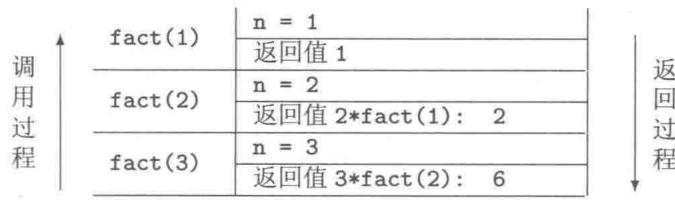
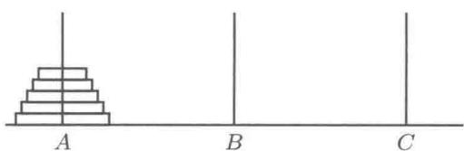
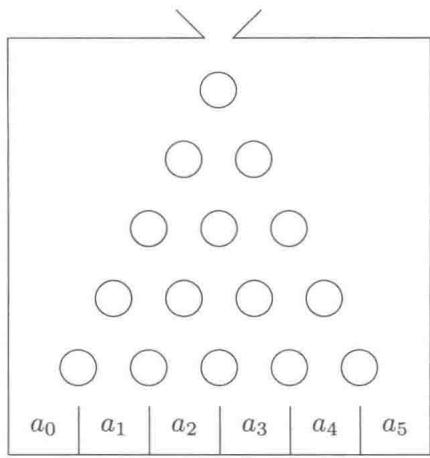

# 第5章 数组与指针

本章从改进第4章的单变量版“评委评分”程序出发，介绍一系列变量（数组、堆数组）版“评委评分”程序设计。学习本章后，读者应该理解为什么需要使用数组，掌握怎样使用数组的方法；理解指针的概念，掌握指针与堆数组的使用方法。本章还介绍  $\mathrm{C}++$  中C-字符串的概念与操作方法。

# 5.1 数组

# 5.1.1 数组的定义

数组是具有相同数据类型，顺序排列并连续存放的一系列变量的集合，其中的变量皆被称为数组元素。定义数组的语法格式为

```txt
存储类型数据类型数组名[元素个数] = {初始化数据表};
```

数组是一系列变量的容器，元素个数是该容器的容量。定义数组意味着定义一系列变量，意味着分配一系列内存空间。数组各元素在计算机内存中连续存放，共占用“元素个数*sizeof(数据类型)”字节连续的内存空间。数组名是该内存空间的首地址，亦即首元素的地址。数组名所代表的内存地址值为地址常量，也就是说，数组名不能做左值，不能对数组名赋值。

定义数组时，数组的元素个数必须为整型常量（在编译时能确定其值）。元素个数不能小于1。定义数组时可以对数组的全部或部分元素进行初始化。有初始化数据时，元素个数可以缺省，此时系统将按实际的初始化数据的个数认定数组的元素个数。

数组及其各元素的存储类型、数据类型、生命期、可见性和作用域等皆与普通变量的规定和特性一样。例如：

```c
double a[200]; //全局数组。定义了200个全局变量  
void f()  
{const int N = 10; //N为常量int a[N]; //局部自动数组。定义了10个局部自动变量int b[] = {12,45,32,66,56}; //元素个数为5//…}
```

常量数组是具有相同数据类型，顺序排列并连续存放的一系列常量的集合。例如：

```txt
const int a[10] = {0, 1, 2, 3, 4, 5, 6, 7, 8, 9};
```

其中初始化数据表中常量的个数应该与元素个数一致，局部常量数组必须提供全部元素的初始化值。

# 5.1.2 访问数组元素

相同的数据类型保证了这些变量在内存中所占用单元字节数相等、数据的存放格式一致，将它们连续存放有利于对这一系列变量进行统一地、集中地管理。数组元素是一系列相互独立的变量，它们有形式统一的变量名字（变量的原名）：

数组名[下标]

数组的下标始终从0起，到“元素个数-1”[1]。下标可以通过表达式计算得到。例如：

```txt
const int N = 10;  
int i, a[N];  
for(i=0; i<N; i++)  
    a[i] = i + 1; // 变量 a[i] 做左值  
for(i=0; i<N; i++)  
    cout << a[N-1-i] << '□'; // 数组元素做右值，表达式做下标
```

其中定义数组a相当于定义了10个变量，这些变量的原名依次为

```txt
a[0]，a[1]，a[2]，a[3]，a[4]，a[5]，a[6]，a[7]，a[8]，a[9]
```

特别需要指出的是， $\mathrm{C}++$  不提供对整个数组的直接表达方法。数组定义后，企图用数组名a表示整个数组是不行的，因为数组名是一个地址常量。另一方面，企图用a[10]表示整个数组更是错误的，因为它表示“第11个元素”（下标已经越界），访问该元素（尤其是给该元素赋值）的后果将不可预料。

定义数组时，方括号“[]”不是运算符，它仅仅是一个记号。访问数组元素时所用的方括号“[]”是运算符。定义数组、访问数组元素操作中的方括号有不同的含义。读者应该善于从程序的上下文正确地辨别。指明数据类型者为定义数组（方括号中的常量为元素个数）。无指明数据类型者为访问数组元素（方括号中的表达式为下标）。注意：(float)a[9]或者float(a[9])不是定义数组而是读取第10个（下标为9）元素的值（右值）进行类型转换运算。

既然  $\mathrm{C}++$  不提供对整个数组的直接表达方法，若要把握一个数组，就必须知晓数组的三要素：数据类型、首地址和元素个数。处理数组时这三要素缺一不可。此外，系统还必须提供地址运算和根据地址访问变量的运算（参见第5.3节）。

# 5.1.3 多维数组

一系列具有相同数据类型、相同元素个数，顺序排列并连续存放的数组的集合为二维数组。即二维数组是一维数组的数组。以此类推，可定义三维数组及更高维的数组。从这个意义上说，二维数组的概念是“推导”出来的而不是规定的。同时也说明，理解了一维数组，高维数组的概念与使用方法也就掌握了。

由于计算机内存编址的线性性，在实际应用中，常用所谓的升维/降维方法处理多维数组。

```txt
存储类型数据类型数组名[元素个数1][元素个数2] = {初始化值列表};
```

二维数组由（元素个数  $1 \times$  元素个数2）个元素组成，按照最右边的下标先变化的方式在内存中连续排列。俗称二维数组的元素按行存放。

例如，double a[3][4]；共定义了  $3 \times 4 = 12$  个元素，这些元素在内存中的排列顺序为：a[0][0]，a[0][1]，a[0][2]，a[0][3]，a[1][0]，a[1][1]，a[1][2]，a[1][3]，a[2][0]，a[2][1]，a[2][2]，a[2][3]。其中a[0]，a[1]，a[2]是3个“元素个数为4的一维数组”的数组名，仍然表示3个一维数组的起始地址。而a是二维数组的数组名表示首个一维数组的首地址——二级地址。

可将上述二维数组看成数组名为a[0]（一级地址），拥有12个元素的一维数组。a[0][0]，a[0][1]，……，a[0][11]为其所有元素的“五花八门”的名字之一。

# 5.2 数组版“评委评分”程序设计

# 5.2.1 问题描述及算法分析

例5.1【问题的提出】在第4章中讨论了所谓的某大奖赛“评委评分”问题的程序实现。在那个程序中，实现其基本功能时仅使用了数量极少的变量。现在，大赛组委会进一步提出按选手们的最后得分排列各选手的名次。

显然，第4章的单变量版程序无法实现此功能。因为比赛结束时仅有最后一名选手的部分信息还未被覆盖，大量的原始数据和计算结果已经被反复覆盖。

避免数据被覆盖的办法很简单：将不同的数据存放在不同的内存单元！因此，需要让系统为程序分配一系列内存单元——即定义一系列变量；并且要求这一系列变量是有组织的、能被集中而统一地管理。例如，希望这一系列变量有形式统一的变量名，以便在循环结构程序中方便地访问到它们。

回到“评委评分”问题上来，除了计算各选手的最后得分以外，还需要根据各选手的最后得分排列名次。因此，需要定义一个专门的一维数组作为容器存放各选手的最后得分（浮点型数据）、一个专门的一维数组作为容器存放各选手的名次（整型数据）。

为了使程序在最后能输出一张完整而详细的数据表，还可以考虑将所有的原始分数也都用数组来存放。由于  $\mathrm{C}++$  编译器要求数组的元素个数为常量，故选择两个适当大的整数分别作为评委人数的最大值及参赛选手数的最大规模（这里隐含该程序有最大处理能力的限制）。所需要的常量、变量和数组设计如表5-1所示。

表 5-1 数组版 “评委评分” 程序的常量及变量设计  

<table><tr><td>标 识 符</td><td>数据类型</td><td>存储类型</td><td>描 述</td></tr><tr><td>MAX_REFREES</td><td>int</td><td>auto</td><td>常量, 定为 50</td></tr><tr><td>MAX Players</td><td>int</td><td>auto</td><td>常量, 定为 100</td></tr><tr><td>referees</td><td>int</td><td>auto</td><td>实际评委数, 键盘输入其值</td></tr><tr><td>players</td><td>int</td><td>auto</td><td>实际参赛选手数, 键盘输入其值</td></tr><tr><td>x [MAX Players] [MAX_REFREES]</td><td>double</td><td>auto</td><td>二维数组, 存放原始分数</td></tr><tr><td>aver [MAX Players]</td><td>double</td><td>auto</td><td>一维数组, 存放选手的最后得分</td></tr><tr><td>rank [MAX Players]</td><td>int</td><td>auto</td><td>一维数组, 存放选手的名次</td></tr><tr><td>max</td><td>double</td><td>auto</td><td>计算最高分用</td></tr><tr><td>min</td><td>double</td><td>auto</td><td>计算最低分用</td></tr><tr><td>sum</td><td>double</td><td>auto</td><td>计算总分用</td></tr></table>

# 5.2.2 程序实现

源代码5.1 数组版“评委评分”程序  
```txt
1 // contest1.cpp 数组版“评委评分”程序
2 #include <iostream>
3 #include <iomanip>
4 #include <time>
5 using namespace std;
6
7 int main()
8 {
9 const int MAX_REFREES = 50, MAXPlayers = 100;
10 int referees, players;
11 double x[MAX Players][MAX_REFREES], aver[MAX Players];
12 double min, max, sum;
13 int rank[MAX Players], i, j;
14
15 cout << "请输入评委人数" (□例如□:□10):□";
16 cin >> referees;
17 if( referees <= 2 || referees > MAX_REFREES)
18 {
20 cout << "评委人数太少或太多。" << endl;
21 return -1; //返回-1给操作系统表示出现状况之一
22 }
23 cout << "请输入参赛选手人数" (□例如:□20):□";
24 cin >> players;
25 if( players > MAX Players)
26 cout << "参赛选手太多。" << endl;
27 return -2; //返回-2给操作系统表示出现状况之二
28 }
29 time_t t;
30 srand(time(&t));
31 for(i=0; i<players; i++)
32 {
33 cout << "\n\n===\No.\n" << i+1 << endl;
34 min = 10;
35 max = sum = 0;
36 for(j=0; j< referees; j++)
37 {
38 x[i][j] = (80 + rand() % 21)/10.0;
39 cout << x[i][j] << '\t';
40 sum += x[i][j];
41 if(x[i][j] > max) max = x[i][j];
42 if(x[i][j] < min) min = x[i][j];
43 }
44 aver[i] = (sum-max-min)/(referees-2);
45 cout << "\n\n去掉一个最高分" << max
46 << "分, 去掉一个最低分" << min
47 << "分, 第" << i+1 << "位选手最后得分"
48 << aver[i] << "分" << endl;
49 }
50
51 for(i=0; i<players; i++)
52 {
53 rank[i] = 1;
54 for(j=0; j<players; j++)
55 if(aver[j] > aver[i]) rank[i++]
```

```txt
56 }  
57 cout << setprecision(3) << showpoint;  
58 cout << "\nNo";  
59 for(j=0; j<references; j++)  
60 cout << "LULU" << char('A' + j);  
61 cout << "LULU Aver. Rank" << endl; // 输出表头  
62 for(i=0; i<players; i++)  
63 {  
64 cout << setw(3) << i+1;  
65 for(j=0; j<references; j++)  
66 cout << setw(6) << x[i][j];  
67 cout << setw(6) << aver[i]  
68 << setw(6) << rank[i] << endl; // 输出一行数据  
69 }  
70 return 0;  
71 }
```

与第4章中的程序相比，程序的结构、算法大致上相同。原来的单变量x换成了数组元素  $\mathbf{x}[\mathrm{i}][\mathrm{j}]$  ，原来的aver换成了aver[i]。程序中增加了如下两个部分。

（1）第  $51\sim 56$  行，根据选手的最后得分aver[0]～aver[players-1]计算各选手的名次。计算结果存放在数组元素  $\mathrm{rank}[0]\sim \mathrm{rank}[\mathrm{players - 1}]$  中。这个算法的设计思想来源于分数公布后，各选手看榜时暗自计算自己名次的过程。该段程序代码模拟了这个过程：每位选手首先记住自己的最后得分（aver[i]），在开始扫描别人的分数前，认为自己是第1名（  $\mathrm{rank}[i] = 1$  ）。然后与榜上所有选手的最后得分逐一比较，每遇到一个超过自己分数的人时，自己的名次便下降一位（  $\mathrm{rank}[i] + + )$  。扫遍所有选手后，名次也就确定了。这个算法很好地解决了出现并列名次时的排名问题：若有两个第二名，则不出现第三名。  
（2）按横行及纵栏输出所有数据，每一行为一名参赛选手的数据。纵栏包括选手的序号、评委所给出的分数、最后得分和名次等数据信息。在输出数据前，输出一个表头，表头中，用A,B,C,D,表示评委。为了使输出的数据对齐，程序中采用了I/O流格式控制符。

当程序运行时，若输入的 referees 值大于 MAX_REFREES 或者小于 2；或者输入的 players 值大于 MAX Players，则超出本程序的处理能力而无法继续运行，只能输出一定信息后终止程序运行，返回操作系统。倘若输入的 referees 值小于 MAX_REFREES，或者输入的 players 值小于 MAX Players，则显得预设的数组所占用的内存空间过大，造成宝贵的内存空间资源的浪费。解决这一问题的方法见第 5.6 节。

# 5.3 指针

$\mathrm{C}++$  语言能够直接操作内存地址。很多情形下，需要根据内存地址值及数据类型访问该内存单元处的数据。访问数组元素实际上就是利用数据类型、首地址和元素序号（元素地址与首元素地址的偏移量）进行的（即变量的间接名，参见第3.1.2小节）。

数据在内存中的具体存放格式、占用的字节数由数据类型决定。当我们获得某内存地址后，自然要求了解以此处为首地址的若干字节所存放的数据是什么类型（也将了解到占用多少字节），要求有一种表达方式表示该内存处的数据，以便访问它。

# 5.3.1 定义指针变量

存放地址值的变量被称为指针变量（简称为指针）。定义指针变量的语法格式为

存储类型 目标数据类型 * 指针变量名 = 初始化地址值；

可以定义无类型的指针变量：

存储类型void\*指针变量名  $\equiv$  初始化地址值；

无类型的指针变量只能存放一个内存地址值，不能直接进行指针运算。必须将其显式转换成某种具体的数据类型的指针后才能进行运算。

因为“定义变量就意味着为该变量分配内存空间”，那么，对于指针变量而言，无论以何种目标数据类型定义指针变量，系统均为每个指针变量分配同样字节数的内存单元，即sizeof(void*)字节[1]的内存单元。该单元能够存放，也只能存放一个内存地址值。可用语句

```cpp
cout << sizeof(void*) << endl;
```

查看所使用的系统中一个地址值需要用多少字节的单元来存放。

若指针变量的值是某个变量存储单元的首地址（简称为该变量的地址），我们称指针指向了该变量，亦称该变量是指针的目标变量。

指针变量的存储类型及初始化、生命期、可见性和作用域等属性与普通变量的属性规定一致。

定义指针变量时若不显式地进行初始化，根据该指针变量的存储类型，则其存放的初始地址值是不可预知的（称为指向不明）或为0（即NULL，称为空指针）。此时，指针的目标变量均是不可预知的，是不宜访问的。贸然访问指向不明或空指针的目标变量是危险的，可能引起不可预料的严重后果（参见第5.5.1小节例5.4）。

# 5.3.2 指针运算

# 1. 获取变量的地址

$\mathrm{C}++$  提供的获取变量地址值的操作符为“&”[2]（单目运算，优先级为3）。

# 2. 访问指定内存处的数据

$\mathrm{C}++$  提供的根据内存地址及数据类型访问该内存处数据的操作符为“*”[3]（单目运算，优先级为3）。我们称该运算符为取目标内容运算符（简称取内容运算符），或者称为间接访问运算符。

例如：

```txt
1 int a[10], b, *pa=a; // 定义一个指针变量并用数组名初始化之  
2 double x, y[10], *px=&x; // 定义一个指针变量并用  $\mathbf{x}$  的地址初始化之  
3 int *pb; // 定义的指针变量未初始化，目标不明  
4 double *py; // 定义的指针变量未初始化，目标不明  
5 pb = &b; // 用变量的地址给指针变量赋值  
6 py = y; // 用数组名（地址值）给指针变量赋值
```

上面出现的星号“*”全部是定义指针变量的记号，符号“&”全是取变量地址运算符。

表达式“*指针变量名”可视为指针变量的目标变量名，可称其为变量的间接名，可以做左值或右值。例如，接上面的语句：

```txt
7 \*pa  $= 100$  //相当于给a[0]赋值100  
8 \*pb  $= 200$  //相当于给变量b赋值200  
9 pb[0]  $= 200$  //与上一行等效，此时下标只能取0  
10 \*px  $= 3.14$  //相当于给变量x赋值3.14  
11 px[0]  $= 3.14$  //与上一行等效，此时下标只能取0  
12 \*py  $= 2.718$  //相当于给变量y[0]赋值2.718
```

在上面出现的星号“*”全部是取目标内容运算符。\*pa，\*pb，\*px和\*py分别被称为变量a[0]，b，x和y[0]的间接名。这里，可以看到指针变量目标数据类型的作用。

# 3. 地址的偏移

$\mathrm{C}++$  中地址值可以与整数进行加、减运算，运算的结果为一个新地址值。接上例：

```txt
13 pa++; //相当于pa = pa+1; 改变了指针pa的目标指向  
14 \*pa = 101; //相当于给a[1]赋值101，给新目标变量赋值  
15 pa += 4; //相当于pa = pa+4; 改变了指针pa的目标指向  
16 \*pa = 105; //相当于给a[5]赋值105，给新目标变量赋值  
17 \*(py+5) = 5.5; //相当于给变量y[5]赋值5.5，指针py的指向不变  
18 \*(py+9) = 9.9; //相当于给变量y[9]赋值9.9，指针py的指向不变
```

需要特别指出的是：地址值与整数  $n$  相加（减）得到的新地址值是在原地址值上增加（减少）了  $n * sizeof$  （数据类型）字节地址。  $C++$  语言的这项规定实质上是将困难留给编译器，将方便让给了程序员。这种规定与数组的下标运算遵循同样的规则，即整数  $n$  表示数据的项数。

两个目标数据类型相同的指针可以相减，结果为两个地址之间所存放的这种数据类型数据的个数。该运算仅对一片连续的内存空间中的两个地址值相减有实际意义。

# 4. 指针与数组

定义了如下数组和指针，并将指针指向数组首地址：

```javascript
double a[10], *p=a;
```

此时变量原名（第1排）及其间接名（第  $2\sim 4$  排）依次对应为

```txt
a[0] a[1] a[2] a[3] a[4] a[5] a[6] a[7] a[8] a[9]  $\ast_{\mathrm{a}}*(\mathrm{a} + 1)$ $(\mathrm{a} + 2)$ $(\mathrm{a} + 3)$ $(\mathrm{a} + 4)$ $(\mathrm{a} + 5)$ $(\mathrm{a} + 6)$ $(\mathrm{a} + 7)$ $(\mathrm{a} + 8)$ $(\mathrm{a} + 9)$  p[0] p[1] p[2] p[3] p[4] p[5] p[6] p[7] p[8] p[9]  $\ast_{\mathrm{p}}*(\mathrm{p} + 1)$ $(\mathrm{p} + 2)$ $(\mathrm{p} + 3)$ $(\mathrm{p} + 4)$ $(\mathrm{p} + 5)$ $(\mathrm{p} + 6)$ $(\mathrm{p} + 7)$ $(\mathrm{p} + 8)$ $(\mathrm{p} + 9)$
```

变量地址的四种表示方法分别依次为

<table><tr><td>a</td><td>a+1</td><td>a+2</td><td>a+3</td><td>a+4</td><td>a+5</td><td>a+6</td><td>a+7</td><td>a+8</td><td>a+9</td></tr><tr><td>&amp;a[0]</td><td>&amp;a[1]</td><td>&amp;a[2]</td><td>&amp;a[3]</td><td>&amp;a[4]</td><td>&amp;a[5]</td><td>&amp;a[6]</td><td>&amp;a[7]</td><td>&amp;a[8]</td><td>&amp;a[9]</td></tr><tr><td>p</td><td>p+1</td><td>p+2</td><td>p+3</td><td>p+4</td><td>p+5</td><td>p+6</td><td>p+7</td><td>p+8</td><td>p+9</td></tr><tr><td>&amp;p[0]</td><td>&amp;p[1]</td><td>&amp;p[2]</td><td>&amp;p[3]</td><td>&amp;p[4]</td><td>&amp;p[5]</td><td>&amp;p[6]</td><td>&amp;p[7]</td><td>&amp;p[8]</td><td>&amp;p[9]</td></tr></table>

可以看到，利用指针变量可能对计算机内存中的任何地方进行操作，俗称“指向哪里就可以打到哪里”。指针的这种特点给程序设计带来极大的方便，尤其是访问一片连续的内存空间中的数据集合。但是，指针操作不当又会给程序运行带来很大的隐患和危害（例如，指针变量所指向的目标不明、空地址、数据集合越界或目标不可写等）。因此，访问指针变量的目标前，必须先使该指针变量获得一个安全（即可以被访问）的地址。另外，变量原名的生命期应该不短于其间接名的生命期，因为当目标变量不存在时，指向目标的指针是无用的，贸然地访问该指针目标变量内容是危险的。例如：

```txt
1 void f()  
2 {  
3 double x, *px; // 指针未初始化，指向目标不明（不可预知）  
4 *px = x; // 错误！贸然访问指针的目标  
5 *px = 3.14;  
6 }
```

请注意：上述第3行语句中的“*”为定义指针变量的记号（不是运算符）。第4行语句中的“*”为运算符，该语句直接访问指向不明的指针目标变量。这种错误是初学者最容易犯的。第4行应该改为给指针变量赋一个安全的地址值，例如使其指向变量x：

```txt
px = &x;
```

之后的第5行才是正确的语句，间接地给  $\mathbf{x}$  赋值3.14。

取变量地址运算与指针变量取内容运算是一对互逆运算。例如：

```txt
double x, *px; // 指针未初始化，指向目标不明  
px = &x; // 明确指针的目标  
if (*(&x) == x && (*px) == px && *(&px) == px) // 条件成立，输出 Ok  
cout << "0k" << endl;  
else  
cout << "Sorry" << endl;
```

须注意的是，对于非指针变量x，表达式&（\*x）是错误的。另外，即使指针的目标不是数组元素而是一个普通变量，指针px皆可写成  $\& \mathrm{px}[0]$  ；指针的目标变量（间接名）\*px皆可写成px[0]。

# 5.4 动态变量和动态数组——堆变量和堆数组

堆（heap）是程序数据区中的一种（另外两种分别为全局数据区、栈区）。我们将堆内存视为可按需分配、随用随取、用后归还的一种系统资源。实际上，堆是一种数据结构（即数据的一种组织及使用方式）。堆内存空间一般不属于某个程序所专有，所有的程序（特别指多个程序同时运行时）都可以多次向操作系统申请使用堆内存空间。因此，在程

序中，当所申请的堆内存不再需要时，应该及时将其释放——归还给操作系统，以利其他程序或本程序其他时候使用。

$\mathrm{C}++$  提供了堆内存的操作方法。申请堆内存空间的运算符为 new，释放堆内存空间的运算符为 delete。它们的语法格式如下。

（1）申请堆变量（动态变量）：

new数据类型

（2）申请堆数组（动态数组）：

new 数据类型[元素个数]

执行上述运算表达式时，系统将在堆内存空间中“切下”一片连续的内存空间。该片空间占“sizeof(数据类型)”字节（对应于申请堆变量）或“元素个数*sizeof(数据类型)”字节（对应于申请堆数组）。若分配堆内存成功，则表达式的结果为该片堆内存空间的首地址；若分配内存空间不成功（如，元素个数为非正数或者太大）则表达式的结果为NULL（空地址）。new操作的结果是否为空地址常作为申请堆内存是否成功的判断依据。

动态变量没有原名，动态数组也无数组原名，只能利用 new 返回的地址值使用其间接名。因此，new 操作所返回的堆空间首地址需要妥善保存并保护好。通常用一个目标数据类型相同的指针变量存储该首地址值，丢失或改变该指针变量的指向将导致难以访问堆变量或堆数组的元素；也将导致所申请的堆空间无法被释放而造成内存泄漏。

当程序中不再需要所申请的堆内存时，应该及时归还给操作系统，称为释放堆内存空间。释放堆内存空间的运算符为 delete，其语法格式如下。

（1）释放堆变量：

delete 指向堆地址的指针变量

（2）释放堆数组：

delete[]指向堆地址的指针变量

由于堆变量、堆数组的生命期取决于 new 与 delete 操作，因此堆变量被称为动态变量、堆数组被称为动态数组，而堆空间也被称为动态空间。例如：

```c
int n = 10; //定义一个整型变量，并初始化  
double *ptr, *array; //定义两个指向双精度浮点型数据的指针变量  
ptr = new double; //申请分配堆内存，即定义一个动态变量  
//ptr存放首地址，*ptr为间接名，没有原名  
array = new double[n]; //在堆中申请一片连续空间，即定义动态数组  
//array存放首地址  
*ptr = 3.1415926; //使用“间接名”访问堆变量  
array[0] = 1*3.1415926; //访问堆数组元素，亦即\*array=1*3.1415926;  
array[1] = 2*3.1415926; //亦即\*(array+1) = 2*3.1415926;  
//…  
array[9] = 10*3.1415926; //亦即\*(array+9) = 10*3.1415926;  
delete ptr; //释放堆变量  
delete [] array; //释放堆数组
```

值得指出的是动态数组的元素个数可以是变量，或一个表达式的值，不必要求它是在编译时就须确定的常量，这样便能做到在程序运行过程中，根据运行时所确定的元素个数按需分配内存资源。

# 5.5 地址值在函数之间传递

指针和函数都是  $\mathrm{C} / \mathrm{C}++$  语言中的重要概念。显然，地址值（右值）、指针变量（左值）在函数之间的传递是重要的。本节的内容是指针变量套用函数参数传递、返回的直接推论，并非新规定。所需注意的是形参指针变量的目标变量是谁。

# 5.5.1 传递地址值——值传递

指针型形式参数本质上是数据值（实参右值）的传递。调用函数时，建立形参指针变量，占用 sizeof(void*) 字节，用实参（一个地址值）初始化之。函数体内对形参指针的指向改变不影响实参地址（属于单向的值传递，参见例 5.3）。

由于函数获得了某地址值以及相关数据类型，便能用指针的目标变量（即利用变量的间接名）间接地访问变量（称为间接双向传递，参见例5.2）。

# 1. 变量的地址值作为实参

例5.2 交换实参目标的值。

源代码5.2 交换实参目标的值  
```cpp
1 #include<iostream>   
2 using namespace std;   
3 void swap_p(double \*a, double \*b)   
4 {   
5 double temp;   
6 temp  $=$  \*a; //等价于temp  $=$  a[0]; \*a为实参目标变量的间接名   
7  $\ast_{\mathrm{a}} = \ast_{\mathrm{b}}$  //等价于a[0]  $=$  b[0]; \*b为实参目标变量的间接名   
8  $\ast_{\mathrm{b}} = \mathrm{temp};$  //等价于b[0]  $=$  temp;   
9 }   
10 int main()   
11 {   
12 double  $x = 3$  ，y=5;   
13 cout << "x□=□"<< x<< ",□y□=□"<< y<< endl;   
14 swap_p(&x,&y); //实参值传递（传递地址值）   
15 cout << "x□=□"<< x<< ",□y□=□"<< y<< endl;   
16 return 0;   
17 }
```

程序的运行结果为：

$$
\begin{array}{r l} \mathrm {x} & = 3, \mathrm {y} = 5 \\ \mathrm {x} & = 5, \mathrm {y} = 3 \end{array}
$$

本例中，实际参数  $\& x$  ， $\& y$  分别为变量  $x$  ， $y$  的地址值用于初始化指针型形式参数（严格匹配）。swap_p函数在获得了主函数中变量  $x$  ， $y$  地址后，通过其间接名（swap_p函数体内不可见main函数中的变量  $x$  ， $y$  ，不知其原名，只能通过间接名）对主函数中变量  $x$  ， $y$  进行了读写访问。

请将本例与第3.2.1小节例3.3中的函数swap进行比较。例5.2的程序是一个C语言风格的程序，本程序的语句“不太通顺”：第14行语句的“字面意思”似乎是交换变量的地址值！这是由于C语言没有引用的概念，交换两个变量的值的函数只能采用上述暴露变量的地址给函数，允许函数根据地址间接操作变量来实现。

例5.3 错误使用指针型形参的反例（无用的函数）。

源代码5.3 无法交换实参指针指向（反例）  
```cpp
1 #include<iostream>   
2 using namespace std;   
3 void swap2(double \*a, double \*b)   
4 {   
5 double \*temp;   
6 temp  $=$  a;   
7 a  $=$  b;   
8 b  $=$  temp;   
9 }   
10 int main()   
11 {   
12 double  $\mathrm{x} = 3$  ，y=5;   
13 double \*px  $=$  &x，\*py  $=$  &y;   
14 swap2(px，py); //等价于 swap2(&x，&y);   
15 cout << "x□=□" << x << ",□y□=□" << y << endl;   
16 cout << "*px□=□" << *px << ",□*py□=□" << *py << endl;   
17 return 0;   
18 }
```

程序的运行结果：

```latex
$\mathrm{x} = 3$  ，y  $= 5$  \*px  $= 3$  ，  $\ast \mathrm{py} = 5$
```

可见，上述函数既不能交换实参目标的值，也不能交换实参（指针）的指向，请对照本例与第3.2.1小节例3.3中的函数swap1。

例5.4 借道不明处交换实参目标的值（反例，危险的函数）。

源代码5.4 借道不明处交换实参目标的值（反例）  
```txt
1 #include<iostream>   
2 using namespace std;   
3 void swap3(double \*a, double \*b)   
4 {   
5 double \*temp; //指针未初始化，目标不明   
6 \*temp  $=$  \*a; //贸然访问指针 temp 的目标   
7  $\text{一} a = \text{一} b$    
8  $\text{一} b = \text{一} \text{temp}$    
9 }   
10 int main()   
11 {   
12 double  $x = 3$  ，y=5;   
13 swap3(&x,&y);   
14 cout << "x  $\sqsubseteq$ $\sqsubseteq$  "<< x << ",\sqcup y  $\sqsubseteq$ $\sqsubseteq$  "<< y << endl;   
15 return 0;   
16 }
```

因为局部自动指针变量 temp 未初始化，其指向不明。其目标变量 *temp 可能是内存中十分重要的单元，直接将 double 型数据 *a 写入其中可能会导致重大错误。或者该处不允许写入。因此，该程序可能出现运行时错。

可以将函数 swap3 修改为

```cpp
1 void swap3(double \*a, double \*b)   
2 {   
3 double \*temp  $=$  new double;   
4 \*temp  $=$  \*a; \*a  $=$  \*b; \*b  $=$  \*temp;   
5 delete temp;   
6}
```

这样修改后的函数是正确的，它借道堆空间实现实参目标变量值的交换。但有“大动干戈”或“弄巧成拙”之嫌。因而，例5.2中的swap_p函数借道局部自动变量temp是最明智的。

本章中关于交换变量数值的函数是C语言程序设计的经典例子。由于  $\mathrm{C}++$  语言增加了引用的概念和处理方法，交换变量数值的函数还是以例3.3为佳。

# 2. 数组在函数之间传递

将数组的所有元素值都按值传递方式传递给函数（建立数组所有元素的副本）是不必要的，而且是耗时费空间的。由于  $\mathrm{C}++$  不提供对整个数组的直接表达方法，而不能建立数组的引用，所以要想将数组的一系列变量“传递”给函数，实际上只要将数组的三要素传递给函数（设定数据类型，暴露首地址，告知元素个数）即可。这是一种间接的传递方式，这种方式的时间效率高（速度快，仅传递一个地址值和一个整数值）、空间效率高（不建立数组元素的副本，不复制数组元素）。

例5.5 数组（数组首地址）在函数之间传递。

```txt
1 #include<iostream>   
2 using namespace std;   
3   
4 void display(const double \*a,int n)   
5 {   
6 cout  $<  <   a[0]$  .   
7 for(int i=1;i<n；i++)   
8 cout  $<  <   "$  ，"  $<  <   a[i]$  .   
9 cout  $<  <   \mathrm{endl}$  ：   
10 }   
11   
12 int main()   
13 {   
14 double a[10];   
15 for(int i=0;i<10；i++)   
16 a[i]  $= 10^{*}i$  ·   
17 display(a，10);   
18 display(a+2，5);   
19 return 0;   
20 }
```

程序的运行结果：

```txt
0，10，20，30，40，50，60，70，80，90 20，30，40，50，60
```

从程序的运行结果可见，函数所获得的数据类型、首地址、元素个数不一定是主函数中原数组的首地址、元素个数。函数体内从给定的地址处开始、处理接下来的连续  $n$  个元素。

若执行函数调用 display(a+5, 6) 则函数体内访问的第 6 个元素已经越界，将输出一个不可预料的数据值。出现这种错误的原因在函数调用，而不应归咎于函数定义，因为函数没有义务，也不可能判断调用本函数时所提供的实际参数的合理性和正确性。

指向常量的指针（常量指针）的定义格式为：

```txt
const数据类型\*常量指针变量名  $\equiv$  初始化地址值；
```

常量指针可以指向常量，也可以指向变量。从指针的角度看常量指针的目标时，目标为常量（参见例5.5）。又如：

```txt
const int a = 3;
int b = 5;
const int *p = &a;
p = &b; //指针p的指向可以修改
*p = 10; //错误。*p为常量。尽管其目标为变量b
int *p1 = &a; //错误。不能用非常量指针指向常量
```

上述语句中，常量指针p被初始化为常量a的地址。后改变其指向使之指向变量b。从指针的角度上看，其目标\*p为常量，即所指之处皆常量。\*p不能做左值。b是变量仍然可以做左值，即可以将变量视为常量，但不允许将常量视为变量（一个例外，参见第5.7.2小节的注）。

函数的指针型形式参数用const加以限制，即形式参数为常量指针，能有效地保护实参地址处的数据不被修改，同时也给程序员信心使程序员放心地调用该函数（参见例5.5）。进一步，还可用常量数组名做实参，处理真正的常量数组。

通过上述一系列函数可见，指针型参数本质上是数值传递（传递地址值），这种形式的参数不可能改变实参指针的指向，但是可以修改指针的目标变量的值。可将指针型形式参数的这种特性称为数据间接地双向传递。有时，需要保护实参地址处的目标变量不被修改，可使用指向常量的指针型形式参数。

# 5.5.2 传递指针变量——引用传递

应用程序有时需要通过函数修改作为实际参数的指针变量的指向，即要求直接的双向传递指针变量。实现这种要求需要将函数的形式参数设计成指针引用型的。

例5.6 传递指针的引用。

```cpp
1 //引用传递指针变量.cpp  
2 #include<iostream>  
3 using namespace std;  
4  
5 void GetMemory(double *p, int n) //动态一维数组  
6 {
```

```c
7 p = new double[n]; //指针p是实参指针变量的别名  
8}  
9  
10 void FreeMemory(double *p)  
11{  
12 if(p != NULL)  
13 delete[] p; //释放空间，指针p的指向不变  
14 p = NULL; //修改指向，将指针赋值成空指针  
15}  
16  
17 int main()  
18{  
19 double *p; //局部自动指针变量，初始指向不明  
20 int n = 10; //n为变量  
21 GetMemory(p, n); //申请堆内存空间，改变p的指向  
22 for(int i=0; i<n; i++)  
23 cout << (p[i] = 10*i) << "山";  
24 cout << endl;  
25 FreeMemory(p); //释放堆数组，同时使p为空指针  
26 return 0;  
27}
```

主函数中定义指针变量  $p$  未初始化，其指向不明。调用函数 GetMemory，在该函数体内通过别名使主函数中的指针变量指向所申请的堆内存某地址。若不传递指针的引用，则 GetMemory 函数体内申请的堆内存的首地址将丢失（请读者在计算机上验证），其后也无法释放。

# 5.5.3 返回地址

函数的返回类型可以设计成指针（地址值）返回。这种函数调用本身只能做右值（函数调用表达式是一个临时指针变量），而函数调用的目标可能成为左值。

例5.7 返回地址值的函数示例。

```txt
1 //返回地址值.cpp  
2 #include<iostream>  
3 using namespace std;  
4  
5 double *ElementAddr(double *p, int size, int index)  
6 { //返回数组指定元素的地址值  
7 if(index < 0 || index >= size)  
8 return (double*)NULL;  
9 return p + index;  
10 }  
11  
12 int main()  
13 {  
14 const int N = 3;  
15 double a[N]; //元素个数须为常量  
16 int i;  
17 for(i = 0; i < N; i++)  
18 {  
19 // ElementAddr(a, N, i)++; 错误！函数调用本身不能为左值  
20 *ElementAddr(a, N, i) = 10*i; //函数调用的目标成为左值  
21 cout << *ElementAddr(a, N, i) << '\t'  
22 << ElementAddr(a, N, i)[0] << '\t'
```

```txt
23  $<<$  ElementAddr(a，N，0)[i]  $\ll$  endl;  
24 }  
25 return 0;  
26}
```

程序的运行结果：

```txt
0 0 0   
10 10 10   
20 20 20
```

还可以将函数的返回类型设计成指针的引用，这样的函数调用不仅能使其目标成为左值，函数调用本身也能成为指针变量左值，用于改变所返回的指针变量的指向（通过函数的形参“返回”指针变量新的指向、通过函数引用返回类型返回指针变量新的指向的程序，请参见第6章第6.9.5小节动态二维数组）。本章例5.6实为处理动态一维数组。

# 5.6 堆数组版“评委评分”程序设计

例5.8 堆数组版“评委评分”程序设计。

为了更合理地使用计算机内存空间，做到“按需分配”“有借有还”。可利用  $\mathrm{C}++$  的 new 操作在堆内存中创建动态数组用于存放一系列数据。为此，程序中所需的变量设计如表 5-2 所示。

表 5-2 堆数组版 “评委评分” 程序的变量设计  

<table><tr><td>标识符</td><td>数据类型</td><td>存储类型</td><td>描述</td></tr><tr><td>referees</td><td>int</td><td>auto</td><td>实际评委人数，从键盘输入其值</td></tr><tr><td>players</td><td>int</td><td>auto</td><td>实际参赛选手人数，从键盘输入其值</td></tr><tr><td>*x</td><td>double</td><td>auto</td><td>指针，将存放 new 操作返回的堆中某地址值</td></tr><tr><td>*aver</td><td>double</td><td>auto</td><td>指针，将存放 new 操作返回的堆中某地址值</td></tr><tr><td>*rank</td><td>int</td><td>auto</td><td>指针，将存放 new 操作返回的堆中某地址值</td></tr><tr><td>max</td><td>double</td><td>auto</td><td>计算最高分用</td></tr><tr><td>min</td><td>double</td><td>auto</td><td>计算最低分用</td></tr><tr><td>sum</td><td>double</td><td>auto</td><td>计算总分用</td></tr></table>

实现上述计算的  $\mathrm{C}++$  源程序如下：

源代码5.5 堆数组版“评委评分”程序  
```cpp
1 // contest2.cpp 指针一动态数组版“评委评分”程序
2 #include <iostream>
3 #include <iomanip>
4 #include <time>
5 using namespace std;
6
7 int main()
8 {
9     int referees, players;
10     double *x, *aver, min, max, sum;
11     int *rank, i, j;
12
```

```txt
cout << "请输入评委人数(例如：10)；"；  
cin >> referees;  
if (referees <= 2)  
{cout << "评委人数太少。" << endl;return -1;  
}  
cout << "请输入参赛选手人数(例如：20)；"；  
cin >> players;  
x = new double [referees * players]; // 申请使用堆内存  
aver = new double [players];  
rank = new int [players];  
if (x == NULL || aver == NULL || rank == NULL) // 若申请不成功  
{if(x) delete [] x;if (aver) delete [] aver;if (rank) delete [] rank; // 释放可能已申请成功的部分空间return -2; // 终止程序，返回到操作系统  
}  
time_t t;  
srand(time(&t));  
for(i = 0; i < players; i++)  
{cout << "\n\n===\No.," << i + 1 << endl;min = 10;max = 0;sum = 0;for(j = 0; j< referees; j++)  
{x[i* referees+j] = (80 + rand() % 21)/10.0;cout << x[i* referees+j] << '\t';sum += x[i* referees+j];if(x[i* referees+j] > max) max = x[i* referees+j];if(x[i* referees+j] < min) min = x[i* referees+j];}aver[i] = (sum-max-min)/(referees-2);cout << "\n□去掉一个最高分," << max<< ",□去掉一个最低分," << min<< "□分，第" << i+1<< "□位选手平均得分"<< aver[i] << "□分" << endl;  
}for(i = 0; i < players; i++) // 根据最后得分计算名次  
{rank[i] = 1;for(j = 0; j< players; j++)if(aver[j] > aver[i]) rank[i]++;  
}cout << setprecision(3) << showpoint;cout << "\nNo";for(j = 0; j< referees; j++)cout << "□□□□□" << char('A' + j);cout << "□□□Aver. □Rank" << endl; // 输出表头  
for(i = 0; i < players; i++)  
{cout <<setw(3) << i + 1;for(j = 0; j< referees; j++)cout <<setw(6) << x[i* referees+j];cout <<setw(6) << aver[i]
```

```txt
72  $<<$  setw(6)  $<<$  rank[i]  $<<$  endl;  
73 }  
74 delete [] x;  
75 delete [] aver;  
76 delete [] rank; //释放所有申请的堆内存空间  
77 return 0;  
78}
```

该程序不仅做到了需要多少内存空间就申请使用多少空间，而且还突破了第5.2节数组版程序中“最大处理能力”的限制，本节的程序与之相比有以下不同。

（1）定义变量时，除了普通变量外，定义了三个指针变量，系统自然会为它们分配内存空间，每个指针变量均各仅占用sizeof(void*)字节，用于存放一个内存地址值。定义这三个局部自动指针变量时未对其进行初始化，其初始指向是不可预知的。直到程序中执行new操作（第  $23\sim 25$  行）并将所返回的地址值赋值给这些指针变量后，这些指针变量才有了明确的指向。须指出的是，这三个地址值不能被丢失，否则将无法正确地用delete操作释放程序运行时所申请的这几部分堆内存空间。  
（2）new 操作不成功时所返回的值为 NULL，程序中利用这一点进行判断。当申请堆内存不成功时，则需要释放那些已经申请成功的堆内存，然后终止程序的执行，返回到操作系统，以保证不造成内存泄漏。  
（3）对于堆数组中的元素，如同普通数组元素一样，可以用“首地址[下标]”进行访问，如程序中的 aver[i]，rank[i]。本程序中的 new 操作所返回的堆地址是一个一级指针，程序中用 x[i*references+j] 访问堆数组中的元素是匹配的。这种方法称为升维处理方法——用一维数组模拟二维数组。  
（4）程序结束前，不再需要这些堆数组了，便用 delete[] 操作将它们释放，返还给操作系统。这一点是重要的。

# 5.7 字符数组与C-字符串

实际上，数组是利用已经存在的数据类型进一步构造的数据集合类型。它同时提供了数据集合中元素的存储及访问方式，属于一种数据结构——顺序表的一种简单形式。这是因为数组的各元素在内存中按顺序连续存放而得名。把握一个数组（包括堆数组），需要把握其数据类型、首地址、元素个数。有了这三要素，数组的一切便在我们的掌控之中。字符串是一系列有序字符的集合。下面首先讨论字符数组，再介绍字符串。

# 5.7.1 字符数组

数据类型为字符型（unsigned char 或 char）的数组被称为字符数组。它是一系列字符变量的集合，其每一个元素都能够独立地做左值。例如，可以定义一个字符数组存放某班级全体同学某课程的考试成绩等级 'A'，'B'，'C'，'D' 或 'E'。

字符型数据在内存中按字符的ASCII码存放，与整数兼容。即字符数组的各元素能像整数一样地运算。因此，还可以利用字符型数据作为标志变量，一个这样的标志量共可区分  $2^{8} = 256$  种不同的状态（ $0 \sim 255$  或  $-128 \sim 127$ ）。

可以定义字符数组

```javascript
char c[14] = {'I', '\\"', 'm', '\_, ', 'a', '\_, ', 's', 't', 'u', 'd', 'e', 'n', 't', '.'};
```

上述语句定义了14个变量的数组并对全部元素进行了初始化。其中单引号字符使用了其转义形式'\''来表达。要把握该数组，除了数据类型为字符型已经明确外，数组名c代表数组的起始地址，即首元素的地址（&c[0]）、元素个数14均不可忽视。

上述数组定义还等价于下面的定义语句（请对照附录A）：

```javascript
char c[] = {'I', ' ', 'm', ' ', 'a', ' ', 's', 't', 'u', 'd', 'e', 'n', 't', '.'}; 或 char c[] = {73, 39, 109, 32, 97, 32, 115, 116, 117, 100, 101, 110, 116, 46};
```

因为缺省元素个数时，编译系统将根据实际初始化的数据个数确定数组的元素个数。

若要对字符数组进行操作，与一般的数组一样，须逐个元素地进行。如：

（1）字符变换。c[6] += 'A'-'a'; 则将 c[6] 由 's' 转换成 'S'。c[13] = ['!']; 则将 c[13] 原来的圆点句号改成感叹号。

（2）字符  $\mathrm{I} / \mathrm{O}$  。例如：

```txt
for(int  $\mathrm{i} = 0$  ：i<14；  $\mathrm{i + + }$  ）cin>>c[i]； //顺序接收从键盘输入的字符，并存放到数组各元素中  
for(int  $\mathrm{i} = 0$  ：i<14；  $\mathrm{i + + }$  ）cout<<c[i]； //顺序输出数组各元素
```

这种按元素逐个字符地处理是最根本的。下面介绍的C-字符串将一些操作进行了包装，使用起来简捷方便。但其本质仍是按元素逐个处理。

# 5.7.2 C-字符串

$\mathrm{C}++$  中有两种字符串，一种是从 C 语言沿袭下来的，被称为 C-字符串（C-string）；另一种是字符串（string 类）类型。string 并不是  $\mathrm{C}++$  的保留字，这种类型属于自定义的数据类型， $\mathrm{C}++$  编译器都支持它。这种类型将在面向对象程序设计部分予以介绍。下面，主要讨论 C-字符串。

为了使字符串表达方便， $\mathrm{C} / \mathrm{C}++$  将存放字符串的数组的三要素“减少”为一要素（其他要素隐藏于其中）。

规定5.1（C-字符串）C-字符串（简称字符串）是存放在字符数组中的一系列有序字符，并以特殊的控制字符（'\0'，其ASCII码为0）作为字符串的结束标志。

字符 '\0' 也被称为 C-字符串的串结束标志。该字符兼容整数 0 和逻辑假 false。

C-字符串以字符数组作为其存放内容的容器。既然是数组就有数组三要素：

① 数据类型是显然的。  
② 容器的容量（数组的元素个数）需要足够大即可（实际字符串不一定存满。由于约定了串结束标志，常常只需要处理到串结束标志之前的数组元素为止）。  
③ 唯有字符串首地址是必须给出的。因此，C-字符串最重要的是其首地址，存放字符串的数组应该事先定义足够大的空间。在确认了有足够大的存放空间后，便将字符型的地址（即字符型的指针）与C-字符串等同看待。

特别提醒：存放C-字符串的数组元素个数至少应该比字符串的长度多1，以便存放串结束标志字符。

规定5.2（字符串常量）用双引号包围的一系列字符被称为字符串常量。字符串常量被存放在内存的全局数据区中常量池里，并追加串结束标志。实为字符型常量数组，其首地址值就用字符串字面常量本身表示。

例如，若有语句

```hcl
char *pStr = "I'\m\s a\s student."; // 注[1]
```

则定义了一个指针变量（仅占内存sizeof(void*)字节）。指针变量pStr的值为全局数据区常量池中的某地址值。从该地址处起，共占用15个字节（字符串的长度为14）。这15个字节的内容均为常量，不能被修改。故企图进行cin>>pstr;或pStr[6]='S';操作都是不可行的。这两个语句虽然能够通过编译，但会出现运行时错误，因为该内存处是不允许写的。

前面提到的字符数组 char c[14]；要成为 C-字符串，需要定义成

```javascript
char c[15] = {'I', '\', 'm', '\square', 'a', '\square', 's', 't', 'u', 'd', 'e', 'n', 't', '.', '\0'};
```

或者

```javascript
char c[15] = {73, 39, 109, 32, 97, 32, 115, 116, 117, 100, 101, 110, 116, 46, 0};
```

或者更为简捷地

```javascript
char c[15] = "I\m⊥a⊥student.";
```

此时不应该误解为用一个字符型地址值去初始化数组元素。应该理解为用字符串的内容（包括串结束标志）初始化数组各元素。这是编译系统内部悄悄进行的适应性调整。

# 5.7.3 字符串I/O操作

$\mathrm{C / C + + }$  编译系统对字符型指针所做的适应性调整不仅体现在初始化字符型数组元素上，它对字符型指针（即字符型地址）的操作给予了特别的关照。

例如：

```txt
char str[100]; //准备足够大的容器存放字符串  
cin >> str; //接收键盘输入一个字符串  
cout << str; //输出字符串的内容  
cout << str + 4; //跳过前4个字符，输出其余字符  
cin.getline(str, 100, '\n');
```

细心的读者可能对第  $2\sim 4$  行语句产生疑惑。str为数组名，是一个地址值（且为地址常量），难道要从键盘输入一个地址值？第3行语句将会输出一个地址值？原来，  $\mathrm{C / C + + }$  语言在处理字符型指针（或称为字符型地址）时，有别于其他数据类型的指针（如int\*,double*），也有别于字符型（char，unsigned char）数据。

由于字符串由其首地址决定，故  $\mathrm{C} + +$  中的插入运算符、抽取运算符，以及一些字符串处理函数将C-字符串等同于字符型地址。它们并非对地址值进行操作，而是从该地址处起对内存中的字符内容逐个进行操作，直到遇到串结束标志'  $\backslash 0^{\prime}$  而不问下标是否越界、该空间是否可读写。保证有足够的空间并保证该空间是可读或可写的是程序员的责任。

在  $\mathrm{C}++$  中用抽取运算符进行输入操作时，以一个或多个空格字符（'」）或制表字符（'\t')或换行字符（'\n')分隔各个数据项。在执行上述第2行时，若输入的字符串中包含上述分隔字符，则数组str存放的字符串内容只到输入的第一个分隔字符前为止，系统自动追加串结束标志。余下的数据存放在输入缓冲区，留给后面的输入语句（可能导致后面的语句接收到错误的数据，参见第2.1.3小节的注）。

第5行调用函数接收键盘输入时，可接收包含空格等字符的字符串。此处的第2个参数100表示接收字符串的最大长度。第3个参数'\n'表示遇到换行为止，并自动将该字符转换成串结束标志。其中的圆点“.”运算符的用法将在面向对象程序设计部分介绍，此处只需要读者模仿即可。

若输入的字符个数超过存放该字符串的存储空间容量时，超出的部分字符及串结束标志将破坏内存中的其他数据。这种情形是程序员应该警觉的。

第3、4行均为输出字符串的内容，而不是输出地址值。这两个字符串有共同的结束标志，但它们的起始地址不同（地址与整数相加减的运算结果为一个新地址值）。

例5.9 一个有趣的英文单词。

源代码5.6 一个有趣的英文单词  
```cpp
1 //smart.cpp   
2 #include<iostream>   
3 using namespace std;   
4   
5 int main()   
6{   
7 char \*p，str[100]  $=$  "smart";   
8 for(p=str；\*p；p++)   
9 cout<<p<<endl;   
10 cout<<p- str<<endl;   
11 return 0;   
12}
```

程序的运行结果：

```txt
smart  
mart  
art  
rt  
t  
5
```

还可以将字符串存放在堆空间中，即利用堆数组作为字符串的容器。如：

```txt
char *pStr; // 定义一个指针变量，仅占 sizeof(void*) 字节  
pStr = new char [100]; // 申请堆数组，并将首地址值存放到指针 pStr 中
```

```txt
cin.getline(pStr，100，'\n');  
cout << pStr;  
cin >> pStr;  
// .......  
delete [] pStr; // 用完后释放
```

须注意的是，对一般非 unsigned char*, char* 类型的其他指针变量的输出操作确实为对一地址值的操作，其中有些输入操作是不支持的。如：

```txt
char *pStr=new char[100];  
char str[100]="abcd";  
int a[100];  
double *p = new double[100];  
cin >> pStr; //接收从键盘输入一个字符串，OK  
cout << pStr; //输出字符串的内容，OK  
//cin >> a; 错误。a为地址常量  
//cin >> p; 错误。p虽为变量，但C++不支持对（double*）型的抽取操作  
cout << a; //可行。输出一个地址值！一般而言，无意义  
cout << p; //可行。输出一个地址值！一般而言，无意义  
delete [] p; //用完后释放  
delete [] pStr; //用完后释放
```

# 5.7.4 C-字符串处理函数

字符串处理的本质是数组元素处理。C++ 提供了一些操作 C-字符串的标准函数（参见附录 B），函数原型在头文件 cstring 中。自定义版的 C-字符串处理函数是读者练习指针操作的极佳素材。通过这种练习能够加深对指针的理解，加强对指针的掌控能力。建议读者独立完成附录 B.1 所列的 C-字符串处理函数的自定义版本。本节介绍部分自定义版字符串处理函数的设计原理。为了区别于标准函数，自定义版函数名按“驼峰”（英文字母大小写混合）方式命名。

# 1.字符串的长度

从给定的起始地址开始，顺序统计不等于串结束标志字符的个数，直到遇到串结束标志为止。字符串的长度不包括串结束标志字符。例如：

```txt
空串。长度为0，在内存中占用1个字节，存放的内容为串结束标志'\0'（整数0）  
空格串。长度为1，在内存中占用2个字节： $\square$ （整数32）和串结束标志'\0'（整数0）  
长度为4，在内存中占用5个字节，存放字符‘3'，‘2'，‘1'，‘0'（整数51,50,49,48）和串结束标志'\0'（整数0）
```

例5.10 计算字符串长度的自定义版本函数。

源代码5.7 字符串长度自定义函数（数组版）  
```c
1 int StrLen(const char *str)  
2 {  
3 int len;  
4 for(len=0; str[len] != '\0'; len++) // 指针的指向不变动  
5 ; // 循环体语句为空语句  
6 return len;  
7 }
```

该函数还可以用如下不同的方法实现。

源代码5.8 字符串长度自定义函数（指针版）  
```txt
1 int StrLen(const char *str)  
2 {  
3     int len;  
4     for(len = 0; *str++) //形式参数指针指向逐步移动  
5         ;  
6         return len;  
7 }
```

# 2. 字符串复制

将给定字符串的内容复制到另一个起始地址处，即字符串的内容复制。这种复制实际上是数组元素间的赋值（复制）。需要注意的是字符串结束标志必须复制到目标数组元素中。

例5.11 字符串复制的自定义版本函数。

源代码5.9 字符串复制自定义函数（数组版）  
```c
1 char *StrCpy(char *dest, const char *source)  
2 {  
3 int i;  
4 for(i=0; source[i] != '\0'; i++)  
5 dest[i] = source[i]; // 复制串结束标志前的字符  
6 dest[i] = '\0'; // 追加串结束标志字符  
7 return dest;  
8}
```

该函数还可以写成如下形式。

源代码5.10 字符串复制自定义函数（指针版）  
```txt
char *StrCpy(char *dest, const char *source)  
{  
    char *temp = dest; // 保存目标字符串的首地址  
    while (*source) // 循环条件：尚未遇到源串的串结束标志  
    {  
        *dest = *source; // 字符串内容，数组元素间的赋值  
        dest++; // 指向目标字符串的形式参数指针指向逐步移动  
        source++; // 指向源字符串的形式参数指针指向逐步移动  
    }  
10 /*dest = '\0';  
11 return temp; // 返回目标字符串的首地址  
12}
```

上述函数还可以进一步简写成如下形式。

源代码5.11 字符串复制自定义函数（指针版）  
```cpp
char *StrCpy(char *dest, const char *source)  
{  
    char *temp = dest; // 保存目标字符串的首地址  
    while (*dest++) // 此处为赋值运算而不是关系运算  
    {
```

```txt
6 return temp; //返回目标字符串的首地址
```

【测试程序】编写一个程序测试上述两个自定义版的字符串处理函数。要求从键盘输入一个字符串，计算其长度，并将其复制到另一字符串。

【分析】字符串以字符数组为容器。程序中需要定义元素个数足够大的数组用于存放字符串的内容。本例中，分别采用数组和堆数组存放字符串。其中数组的元素个数取一个“足够大的整数常量”1000，而堆数组则按需申请。源程序如下：

源代码5.12 自定义版字符串函数测试程序  
```cpp
1 #include<iostream>  
2 using namespace std;  
3 //请插入StrLen，StrCpy函数定义  
4 int main()  
5 {  
6 char str[1000]; //定义元素足够多的字符数组做字符串的容器  
7 char *p; //定义字符指针存放字符串的首地址  
8 int len;  
9 cout << "请输入一个字符串："；  
10 cin.Line(str, 1000, '\n'); //键盘输入字符串，可含空格  
11 len = StrLen(str); //计算字符串长度  
12 cout << "字符串长度：" << len << "\n" << endl;  
13 p = new char[len + 1]; //申请适量的堆内存空间  
14 StrCpy(p, str); //复制字符串  
15 cout << "("\\">< p << "("\\">< endl; //"为转义字符  
16 delete[] p;  
17 return 0;  
18 }
```

程序执行时输入“C++ Program.”，则输出结果为

```txt
请输入一个字符串：C++Program.字符串长度：12字节"C++Program."
```

程序中在输出字符串时，特意输出两个双引号字符'\"'（使用转义字符）将字符串的内容包围在其中。

# 5.8 指针数组与数组指针

其实指针数组、数组指针等概念也不需要规定。它们都能够从最基本的概念“推导”出来。

# 5.8.1 指针数组

规定5.3（指针数组）目标数据类型相同的一系列指针的集合为指针数组。其元素可以指向不同的地址。指针数组定义的格式为

```txt
目标数据类型  $\ast$  指针数组名[指针个数]  $=$  {地址值列表}；
```

例如，指向多个字符串的指针数组。在某函数中定义

```c
char str1[80] = "Hello,  $\square$ ";  
static char str2[80] = "World.";  
char *pStr1 = "C++ $\square$ ", *pStr2 = new char[100];  
strcpy(pStr2, "Program.");  
char *strings[5] = {str1, str2, pStr1, pStr2, "ok."}; // 指针数组
```

其中，字符串 str1 在栈空间中，字符串 str2 在全局数据区中，字符串 pStr1 在全局数据区的常量池中（指针本身在栈空间中），字符串 pStr2 在堆空间中（指针本身在栈空间中），字符串 "ok." 在全局数据区的常量池中。指针数组 strings 在栈空间中，其 5 个元素存放了上述 5 个字符型的地址值[1]。

# 命令行参数

操作系统在启动程序执行时，可将一些量作为实际参数传递给程序的主函数。主函数通过形式参数接收。主函数的首部可以是如下形式：

```m4
int main()  
int main(int argc, char *argv[])  
int main(int argc, char *argv[], char *env[])
```

其中：

① argc 为命令行参数的个数（含命令名本身）。  
② argv是字符串数组（指针数组），argv[0]～argv[argc-1]为命令行各个参数字符串的首地址，argv[0]为命令名本身。  
③ env 为操作系统环境变量及其值的字符串数组（指针数组）。

第二种格式是常见的，其典型的用法如下。

# 源代码5.13 命令行参数示例

```cpp
1 // comm_line.cpp  
2 #include <iostream>  
3 using namespace std;  
4  
5 int main(int argc, char *argv[])  
6 {  
7 int width, height, area;  
8  
9 if argv<3>  
10 {  
11 cout << "参数太少" << endl;  
12 cout << "命令格式：" << argv[0] << "宽" << endl;  
13 return -1;  
14 }  
15  
16 for(int i=0; i<argv; i++)  
17 cout << argv[i] << endl; // 输出命令行的所有参数  
18  
19 width = atoi argv[1]); // 将数码字符串转换成对应的整数
```

```javascript
height = atoi(argv[2]); // 将数码字符串转换成对应的整数
area = width * height;
cout << "面积: " << area << endl;
return 0;
}
```

编译连接生成可执行文件（如 comm_line.exe），直接在操作系统的提示符下输入如下命令。

```txt
D:\CPP\comm_line\Debug>comm_line 123 456 comm_line   
123   
456   
面积：56088   
D:\CPP\comm_line\Debug>comm_line 参数太少   
命令格式：comm_line宽高
```

若输入可执行文件名后还带有"123456"，则程序中的argc为3表示共有三个参数：

① argv[0]为命令名称（可执行文件名的主名）"comm_line"。  
② argv[1] 为字符串 "123"。  
③ argv[2] 为字符串 "456"。

程序中用函数 int atoi(char *); 将这两个数码字符串转换成整型数据, 便可以进行数值计算 (参见附录 B.2)。若执行程序时不带命令行参数, 或者命令行参数太少, 则执行第  $11 \sim 13$  行给出反馈信息后结束程序。

# 5.8.2 数组指针

规定5.4（数组指针）存放数组地址的变量称为数组指针[1]。定义数组指针的格式为

目标数据类型（*数组指针名）[目标数组的元素个数] = 目标数组地址值；

数组指针可指向同种类的一系列数组（包括数据类型、元素个数均相同）。数据类型、数组名、元素个数是数组的三要素。指向数组的指针移动时，将根据这三要素改变指向。例如：

有二维数组 int a[3][4]; 将其看成三个一维数组的集合，这三个一维数组名分别是 a[0], a[1], a[2]，它们皆是元素个数为 4 的整型数组。定义一个数组指针，专门指向具有 4 个元素的一维整型数组。

```txt
const int  $\mathbf{N} = 4$    
int a[3][4]  $= \{\{0,1,2,3\}$  ，{4，5，6，7}，{8，9，10，11}）;  
int  $(^{*}\mathrm{p})[\mathrm{N}] = \mathrm{a};$  //定义了一个指针变量，N必须为常量
```

则这个指针p与二维数组名a等效[1]。p[i][j]等于a[i][j]。指针p的下标取1（或者 $\mathsf{p}^{+ + }$ ），意味着指针指向下一个具有4个元素的一维数组，即等效于一维数组a[1]。数组指针的主要作用是：将二维数组作为实际参数传递给某函数，函数相应的形式参数应该为数组指针（参见第6.9.4小节）。

例5.12 创建二维堆数组。

# 源代码5.14 二维堆数组

```c
1 #include<iostream>  
2 using namespace std;  
3 int main()  
4 {  
5 const int N = 4;  
6 int m = 5, i, j;  
7 int (*p)[N]; //定义一个变量（即数组指针）  
8 p = new int [m][N]; //二维堆数组。m可为变量，N必须为常量  
9 for(i=0; i<m; i++)  
10 {  
11 for(j=0; j<N; j++) //用双方括号访问二维堆数组元素  
12 cout << (p[i][j] = 10*(i+1) + j+1) << '□';  
13 cout << endl;  
14 }  
15 delete[] p;  
16 return 0;  
17 }
```

这样创建二维堆数组仍然不够灵活，因为除最左端的一个元素个数可以是变量外，其余低维的元素个数都必须是常量。更加灵活方便的二维堆数组参见第6.9.5小节。

# 5.9 趣味程序

# 5.9.1 生日的概率问题

例5.13 某班级有  $n$  名同学（ $n \leqslant 365$ ），问至少有两名同学的生日在同一天的概率为多大？该问题的理论结果为

$$
p (n) = 1 - \frac {N !}{N ^ {n} (N - n) !}
$$

若一年按  $N = 365$  天计算，则有

<table><tr><td>人数n</td><td>10</td><td>20</td><td>23</td><td>30</td><td>40</td><td>50</td></tr><tr><td>概率p(n)</td><td>0.12</td><td>0.41</td><td>0.51</td><td>0.71</td><td>0.89</td><td>0.97</td></tr></table>

这是概率论中一个有趣的问题，当人数仅为23时其概率就超过  $50\%$  ；当人数为50时其概率竟高达  $97\%$  。下面，利用随机数发生器模拟  $n$  个人的生日。通过大量（如 $K = 1000$ ）次模拟，统计出现生日相同事件的频数。请读者在程序的语句后添加适当的注释，并分析程序中是如何利用标志变量的。

源代码5.15 生日的概率问题  
```cpp
1 //Birthday.cpp  
2 #include<iostream>  
3 #include<time>  
4 using namespace std;  
5  
6 int isSameBirthday(int n)  
7{  
8 const int N = 365;  
9 int i, day[N], r;  
10  
11 for(i=0; i<N; i++)  
12 day[i] = 0;  
13  
14 for(i=0; i<N; i++)  
15{  
16 r = rand() % N; //随机产生第i个人的生日  
17 if(day[r] == 0)  
18 day[r] = 1;  
19 else  
20 return 1;  
21}  
22 return 0;  
23}  
24  
25 int main()  
26{  
27 const int K = 1000;  
28 int n, m, k;  
29 time_t t;  
30 brand(time(&t));  
31  
32 cout << "请输入你所在班级的人数："；  
33 cin >> n;  
34  
35 for(k=m=0; k<K; k++)  
36 m += isSameBirthday(n);  
37 cout << "人数：" + m + " / " << K << " " + m + " / " + k + " / " + k + " / " + k + " / " + k + " / " + k + " / " + k + " / " + k + " / " + k + " / " + k + " / " + k + " / " + k + " / " + k + " / " + k + " / " + k + " / " + k + " / " + k + " / " + k + " / 
37 cout << "人数：" + m + " / " << K << " " + m + " / " + k + " / " + k + " / " + k + " / " + k + " / 
38 < double(m)/K << endl;  
40 return 0;  
41 return 0;
```

# 5.9.2 匹配的概率问题

例5.14 某人一次写了  $n$  封内容互不相同的信，又写了  $n$  个收件人互不相同的信封，如果他任意地将  $n$  封信装入  $n$  个信封中。问至少有一封信装正确的概率是多少？

该问题的理论结果为

$$
p (n) = 1 - \frac {1}{2 !} + \frac {1}{3 !} - \dots + (- 1) ^ {n - 1} \frac {1}{n !}
$$

当  $n$  充分大时， $p(n) \approx 1 - \mathrm{e}^{-1}$ 。

下面的程序模拟了该问题，计算了其频数和频率。最后还计算了  $1 / (1 - p(n))$  （即  $\mathbf{e}$  的近似值）。请读者在程序的语句后添加适当的注释。分析程序中为什么需要使用动态数组，程序中是如何利用标志变量的。

源代码5.16 匹配的概率问题  
```cpp
1 // matching.cpp  
2 #include <iostream>  
3 #include <time>  
4 using namespace std;  
5  
6 int matching(int n)  
7 {  
8 int *x, *y, i, r, flag = 0;  
9 x = new int [n];  
10 y = new int [n];  
11  
12 for (i=0; i<n; i++)  
13 x[i] = 0;  
14 for (i=0; i<n; i++)  
15 {  
16 while (true)  
17 {  
18 r = rand() % n;  
19 if (x[r] == 0)  
20 {  
21 y[i] = r;  
22 x[r] = 1;  
23 break;  
24 }  
25 }  
26 }  
27 for (i=0; i<n; i++)  
28 if (y[i] == i)  
29 {  
30 flag = 1; break;  
31 }  
32 delete [] x;  
33 delete [] y;  
34 return flag;  
35}  
36  
37 int main()  
38 {  
39 const int K = 10000;  
40 int n = 100, m = 0, k;  
41 time_t t;  
42 srand(time(&t));  
43 for (k=0; k<K; k++)  
44 m += matching(n);  
45  
46 cout << m << "/" << K << "□=□"  
47 < double(m)/K << endl;  
48 cout << double(K)/(K-m) << endl;  
49 return 0;  
50 }
```

# 5.9.3 模仿密码输入

例5.15 模仿密码输入。许多应用系统中，在进入某些有一定密级的功能模块前需要用户通过密码验证。通常不回显用户所输入的字符，代之以星号“*”输出，以回车结束。并限时或不限时地给用户三次机会输入密码。

下面的程序模仿密码输入过程。通过调用getch函数接收用户的键盘输入，并将输入的字符依次存入一数组中。允许用户使用退格键修改输入的字符；自动将用户输入的回车字符替换成串结束标志并结束输入。程序中将判断是否有键盘输入与计时器相结合实现限时和不限时功能。最后将输入的结果与给定的用C-字符串存放的密码（可包含空格，'\t'等字符）进行内容比较。

源代码5.17 模仿密码输入  
```cpp
// Password.cpp 模仿密码输入示例
#include <iostream>
#include <string> // 为了使用 strcmp函数比较两个C-字符串的内容
#include <conio.h> // 为了使用getch函数，kbit函数
#include <ctime> // 为了使用clock函数
using namespace std;
int InputPassword(const char *passwd, double timelimit)
{
    // 在限定的时间内输完正确的密码则返回1，否则返回0
    char str[80], c=0;
    int i=0;
    double t = clock() + timelimit*1000; // t为终止时间
    do
    {
        if (kbit())
        {
            c = getch(); //接收键盘输入一个字符，不回显
            switch(c)
            {
                case '\b':
                if (i>0)
                    cout << c << ' ', << c << flush;
                //覆盖一个星号，光标退一格
                i--;
            } break;
        }
        case '\r':
            str[i] = '\0';
            cout << endl; break;
        default:
            str[i++] = c; //将字符存入数组元素，下标增1
            cout << "**" << flush; //输出一个星号
        }
    } while (i sizeof(str) && c != '\r')
        && (clock() <= t || timelimit <= 0);
    return sizeof(str)-1; //保证有串结束标志
    return strcmp(passwd, str) == 0; //字符串比较
}
```

```txt
43 int main()  
44 {  
45 char passwd[80] = "How\sqare\sqyou!";  
46 int n;  
47  
48 for(n=0; n<3; n++)  
49 {  
50 cout << "\n\sq请输入密码（限时10秒）："；  
51 if(InputPasswd(passwd, 10) == 1)  
52 break;  
53 }  
54 if(n<3)  
55 cout << "\n\sq密码正确。" << endl;  
56 else  
57 cout << "\n\sq密码错误" << endl;  
58  
59 for(n=0; n<3; n++)  
60 {  
61 cout << "\n\sq请输入密码（不限时）："；  
62 if(InputPasswd(passwd, 0) == 1)  
63 break;  
64 }  
65 if(n<3)  
66 cout << "\n\sq密码正确。" << endl;  
67 else  
68 cout << "\n\sq密码错误" << endl;  
69 return 0;  
70 }
```

# 5.10 小结

数组是一系列变量的集合，用于存放大量数据的容器。数组各元素相同的数据类型，连续的存储单元安置使大量数据集中统一管理（如定义和销毁）及访问（如读和写）成为可能。数据类型、首地址和元素个数是数组三要素。访问数组元素、数组在函数之间传递，本质上是通过指针操作实现的。将指针与数组联系起来思考和应用是十分有利的。

指针既让人喜欢又让人头痛。学习C语言而不会操作指针者，等于没有学习C语言。 $\mathrm{C}++$  语言引入了一些好的机制（例如引用、类的封装、流），利用这些机制，可以将指针操作隐藏在幕后，使程序员少接触指针。如同木偶戏表演中，木偶们漂亮的动作造型背后，隐藏着其最基本的操作。学习高级语言程序设计的人，至少计算机专业的学生需要到后台看个究竟，揭秘其内幕。

自定义版C-字符串处理函数的实现是读者练习指针操作的极佳素材。通过这项练习，读者将能深刻体会指针与数组与函数的关系；深刻理解  $\mathrm{C / C + + }$  对字符指针（目标类型为字符型的地址值）所做的适应性调整的细节和本质。

本章出现的符号稍多，且同一个符号（如[]，\*，&）皆有多种含义。它们有时是作标志用的记号，有时是运算符。读者要善于从程序的上下文根据语法规定正确地辨析，在程序中正确地使用它们。

# 练习5

# 1. 指出下列各程序中的错误

(1)

```txt
1 #include<iostream>  
2 using namespace std;  
3  
4 double average(double *x)  
5 {  
6 int n = sizeof(x) / sizeof(double); //此处n将为0  
7 double s = 0;  
8 for (int i = 0; i < n; i++)  
9 s += x[i];  
10 return s / n;  
11 }  
12  
13 int main()  
14 {  
15 double a[10];  
16 int i, n = sizeof(a) / sizeof(double); //此处n为10，正确  
17 for (i = 0; i < n; i++)  
18 a[i] = rand() / (double)RAND_MAX;  
19 cout << "average:%" << average(a) << endl;  
20 return 0;  
21 }
```

(2）

```cpp
1 #include<iostream>   
2 using namespace std;   
3   
4 double average(double \*x，int n)   
5 { double  $s = 0$  · for(int  $\mathrm{i} = 0$  ;i<n；i++) s+=x[i]； return s/n;   
10   
11   
12 int main()   
13 { double a[10]; int i; for(i=0;i<10;i++) a[i]=rand()/double)RAND_MAX; cout << "average:□" <average(a[10]，sizeof(a)/sizeof(*a))<<endl;   
20 return 0;   
21 }
```

(3）

```txt
1 #include<iostream>  
2 using namespace std;  
3  
4 void swap_r(int &a, int &b)  
5 {
```

```c
6 int temp;
7 temp = a; a = b; b = temp;
8 }
9
10 void swap_p(int *a, int *b)
11 {
12 int temp;
13 temp = *a; *a = *b; *b = temp;
14 }
15
16 int main()
17 {
18 int a = 3, a = 5;
19 cout << "a" << a << ",\b" << b << endl;
20 swap_r(&a, &b);
21 cout << "a" << a << ",\b" << b << endl;
22 swap_p(*a, *b);
23 cout << "a" << a << ",\b" << b << endl;
24 return 0;
25 }
```

(4)

```cpp
1 #include<iostream>  
2 using namespace std;  
3  
4 int main()  
5 {  
6 char *p;  
7 cout << "请输入一个字符串："；  
8 cin >> p;  
9 cout << p << endl;  
10 return 0;  
11 }
```

（5）

```cpp
1 #include<iostream>   
2 using namespace std;   
3   
4 int main()   
5 {   
6 char str[100];   
7 str[0] = '0'; str[1] = 'k'; str[2] = ';'   
8 cout << str << endl;   
9 return 0;   
10 }
```

(6)

```txt
1 #include<iostream>   
2 using namespace std;   
3   
4 int main()   
5 {   
6 double  $\mathrm{x} = 1$ $^{\ast}\mathrm{px} = \& \mathrm{x}$  .   
7 px++;   
8 cout << \*px << endl;
```

(7)  
```solidity
return 0;  
10}
```

```cpp
1 #include<iostream>   
2 #include <cstring>   
3 using namespace std;   
4   
5 int main()   
6 {   
7 char \*p  $=$  "Hello,world.";   
8 char str[7]  $\equiv$  "Hello.";   
9 strcpy(p，str);   
10 cout<<p<<endl;   
11 return 0;   
12 }
```

（8）希望实现字符串复制、字符串拼接。

(9)  
```txt
char *StrCpy(char *dest, const char *source)  
{  
while (*dest++) = *source++)  
;  
return dest;  
}  
char *StrCat(char *dest, const char *source)  
{  
char *temp = dest;  
while (*dest++)  
;  
while (*dest++) = *source++)  
;  
return temp;  
}
```

(10)  
```cpp
1 #include <iostream>
2 using namespace std;
3
4 int main()
5 {
6 char *p = new char[100];
7 cout << "请输入一个字符串: ";
8 cin.getline(p, 100, '\n');
9 cout << p << endl;
10 return 0;
11 }
```

```txt
include<iostream>   
2 using namespace std;   
3   
4 void GetMemory(double \*x,int n)
```

```txt
5{   
6  $\mathbf{x} =$  new double [n];   
7}   
8   
9void FreeMemory(double  $^ { \text{串} } \mathrm { x }$    
10{   
11 delete[]x;   
12  $\mathbf{x} =$  NULL;   
13}   
14   
15int main()   
16{   
17double \*p;   
18GetMemory(p，100);   
19for(i=0；i<100；i++)   
20cout<<（p[i]=rand/（double）RAND_MAX）<<endl;   
21FreeMemory(p);   
22return 0;   
23}
```

# 2. 基本题

（1）阅读下述程序，指出其中各函数的功能。

```c
1 #include<iostream>  
2 using namespace std;  
3  
4 int isLeapyear(int year)  
5 {  
6 return year%4 == 0 && year%100 || year%400 == 0;  
7 }  
8  
9 void days_month(int year)  
10 {  
11 int days[12] = {31,28,31,30,31,30,31,31,30,31,30,31};  
12 days[1] += isLeapyear(year);  
13 for(int i = 0; i < 12; i++)  
14 cout << i + 1 << "山月" << days[i] << "天" << endl;  
15 }  
16  
17 int main()  
18 {  
19 days_month(2008);  
20 return 0;  
21 }
```

（2）编写一个原型为int week(int year, int month, int day); 的函数，其功能是计算并返回year年month月day日的星期（0、1、……、6依次表示星期日、星期一、……、星期六）。【提示】从“1年1月1日”起到“year年1月1日（含）”所经历的“总天数”为（该算法不适用于1582年以前，但今后的千年均正确，这是由于历法的原因）  $n = 365 * (year - 1) + (year - 1) / 4 - (year - 1) / 100 + (year - 1) / 400 + 1$ ；则year年1月1日为星期  $w = n \% 7$ 。

（3）编写一个程序根据输入的年份（year）输出该年的日历。

（4）编写一个输出杨辉三角的函数void Yanghui(int n);如语句Yanghui(6);的执行结果应该输出（每个数据占4字符宽）。

```txt
1 1 1 1 2 1 1 3 3 1 4 6 4 1 5 10 10 5 1 6 15 20 15 6 1
```

（5）指出函数int pos(char, const char*);的功能及程序的运行结果。

```cpp
1 #include<iostream>   
2 using namespace std;   
3   
4 int pos(char c, const char \*str)   
5 {   
6 for(int i=0; \*str; i++)   
7 if(\*str++==c)   
8 return i;   
9 return -1;   
10 }   
11   
12 int main()   
13 {   
14 cout << pos('a', "abcd") << "\n"   
15 << pos('c', "abcd") << "\n"   
16 << pos('e', "abcd") << "\n"   
17 << pos('\0', "abcd") << "\n"   
18 << pos(98, "abcd") << endl;   
19 return 0;   
20 }
```

（6）阅读程序，指出程序的运行结果。

```cpp
1 #include<iostream>   
2 #include <cstring>   
3 using namespace std;   
4   
5 int f(const char \*str)   
6 { int len  $=$  strlen(str); const char \*p  $\equiv$  str+len-1; while(p  $\coloneqq$  str)   
10 cout << p-- << endl; return len;   
12 }   
13   
14 int main()   
15 { cout << f("SMART") << endl; return 0;   
17 }
```

（7）在一个程序的主函数中，定义了两个字符型指针变量，它们分别指向两个字符串的首地址。通过调用函数实现两个字符型指针交换指向。请完成函数 exchange 的设计和定义。注意：不要交换字符串的内容（下面的程序中无法交换字符串的内容，因为它们都是字符串常量）。

```cpp
1 #include <iostream>
2 using namespace std;
3
4 // 定义 exchange 函数
5
6 int main()
7 {
8 char *p1 = "I'm_a PROGRAMmer."; 
9 char *p2 = "Hello, World."; 
10 cout << p1 << '\n' << p2 << endl; 
11 exchange(p1, p2); 
12 cout << p1 << '\n' << p2 << endl; 
13 return 0; 
14 }
```

（8）在一个程序的主函数中，定义了两个元素个数相等的字符型数组，它们分别存放两个字符串。通过调用函数实现两个字符串内容的交换。请完成函数StrSwap的设计与定义。注意：不要交换字符型地址值（下面的程序中无法交换字符串的首地址，因为它们都是数组名，为地址常量）。

```txt
1 #include<iostream>   
2 #include <cstring>   
3 using namespace std;   
4   
5 //定义StrSwap函数   
6   
7 int main()   
8 {   
9 char str1[100]  $=$  "I'maprogrammer.";   
10 char str2[100]  $=$  "Hello,World.";   
11 cout << str1 << '\n' << str2 << endl;   
12 StrSwap(str1,str2);   
13 cout << str1 << '\n' << str2 << endl;   
14 return 0;   
15 }
```

（9）编程输入一个字符串，将其倒置，然后输出倒置的结果。

（10）设计用户自定义版的C-字符串处理函数，实现与相应的标准函数相同的功能（参见附录B.1）。为了与标准函数相区别，函数命名采用“驼峰”表示法。请定义如下函数：

```c
int StrLen(const char *str); //计算字符串的长度  
char *StrCpy(char *dest, const char *source); //字符串复制  
char *StrNCpy(char *dest, const char *source, int size); //复制指定长度字符串  
char *StrCat(char *dest, const char *str); //字符串拼接
```

```txt
char *StrUpr(char *str); //字符串中小写字母转换成对应的大写字母 int StrCmp(const char *str1, const char *str2); //字符串比较 //当第一个字符串大于、等于、小于第二个字符串时，分别返回1、0、-1
```

# 3. 扩展题（程序设计竞赛题型）

（1）计算若干个整数的和。

问题描述 对于给定的若干个整数，要求计算它们的和。

输入说明 输入数据有多行，每一行有若干个整数，希望计算它们的项数及总和。

输出说明 对于每一行中的数据，要求先输出“Case序号：”，然后输出数据个数、逗号、空格、它们的和、换行。

输入样例

```txt
1534289   
512013039755800
```

输出样例

```txt
Case 1: 4, 149  
Case 2: 6, 2119
```

【解答】本题的难点在于如何读取一行中的数据（数据个数不定）。本程序中使用的串流类将在面向对象程序设计部分介绍（参见第15.3.2小节），程序中涉及串流类的操作只需模仿。

源代码5.18 竞赛题型·读取一整行上的多个数据  
```cpp
1 #include <iostream>
2 #include <fstream>
3 #include <string>
4 using namespace std;
5
6 int main()
7 {
8     string str; //定义一个C++字符串变量
9     int x, sum, n, k=0;
10
11     while(getline(cin, str)) //当作字符串读取一整行到str中
12     {
13         stringstream itr(str); //根据str定义一个串流类的对象
14         sum = 0;
15         n = 0;
16     while(istr >> x) //依次从串流类中读取各个数据
17     {
18         sum += x;
19         n++;
20         }
21         cout << "Case" << ++k << ":";
22         << n << ",", << sum << endl;
23     }
24     return 0;
25 }
```

# （2）判断回文串。

问题描述 判断给定的字符串是否为回文。所谓回文是指一个字符串，将其从左到右读和从右到左读都是相同的。

输入说明 输入数据的第一行为一个整数  $n$ ，其后共有  $n$  行待判断的字符串表示有  $n$  种情况（每行的字符总数不超过1000个字符）。

输出说明 对于每一种情况，要求先输出“Case序号：”，然后输出“YES.”（若对应的字符串为回文）或“NO.”（若对应的字符串不是回文）、换行。

# 输入样例

```asm
5   
1234567890987654321   
abcdefghijklmn   
level   
Abba   
x
```

# 输出样例

```txt
Case 1: YES.  
Case 2: NO.  
Case 3: YES.  
Case 4: NO.  
Case 5: YES.
```

【解答】本题除了回文判断算法外，容易出错处是抽取操作（cin>>n；）执行之后输入流缓冲区中仍留有换行符（整数  $n$  之后可能还有一系列空格字符 '」、一系列制表字符 '\t' 以及一个换行字符 '\n') 的处理。若不处理，直接使用 cin.getline(str, N) 则读取的是上述内容，将其当作第一种需要判断回文的情况将是错误的。

源代码5.19 竞赛题型·判断回文串  
```cpp
1 // Palindrome.cpp  
2 #include <iostream>  
3 using namespace std;  
4  
5 int Palindrome(const char *str)  
6 {  
7 int left = 0, right;  
8 for(right = 0; str右[right]; right++)  
9 ;  
10 right--; // 找到最右端字符的下标  
11 while(left < right && str[left] == str[right])  
12 {  
13 left++;  
14 right--;  
15 }  
16 return !(left < right);  
17 }  
18  
19 int main()  
20 {  
21 const int N = 1000;  
22 int i, n = 0;
```

```txt
23 char str[N];  
24  
25 cin >> n; //读取一个整数  
26 cin.ignore(N, '\n'); //忽略整数后直到换行符的所有字符  
27 //cin.getline(str, N); //或者读取后丢弃  
28 for(i = 1; i <= n; i++) //处理n种情况  
29 {  
30 cin.getline(str, N); //读取待处理的字符串  
31 cout << "Case:" << i << ".";  
32 << (Palindrome(str) ? "YES:" : "NO.")  
33 << endl;  
34 }  
35 return 0;  
36 }
```

（3）字符串变换（字符串加密与解密）

问题描述 对某字符串（原文）进行加密并形成密文，或者将这种密文解密还原成原文。给定一个密码字符串（例如"3721")。加密时，循环利用密码字符串的各字符依次与字符串原文字符进行位异或运算得到密文字符串。请根据上述规定编写程序实现字符串的加密与解密。

输入说明 输入数据有多行，每两行为一种情形。每两行中的第一行为密码字符串，其下一行是待加密的字符串（原文）。密码和原文字符串中皆可能出现空格等字符，它们的长度均不超过100个字符。

输出说明 对于每一种情形输出三行。要求三行中的第一行输出“Case序号：”，密码字符串；其下一行输出密文字符串各字符的ASCII值，每个数字后输出一个空格（这是考虑到密文中可能含有非可打印字符）；再下一行为解密的结果（应该与原文一致）。

# 输入样例

```txt
3721  
Hello, world.  
VC++ 6.0  
这是汉字字符串原文。  
密码  
This is a string.
```

# 输出样例

```txt
Case 1:3721  
123829493922718709269948529  
Hello,world.  
Case 2:VC++6.0  
131161225236154140249230129149156208148152250157152135138136  
这是汉字字符串原文。  
Case 3：密码  
151180171152227181177203162252177159177181172140237  
This is a string.
```

# 第6章 函数

函数是  $\mathrm{C}++$  语言的重要内容。本书将函数的基础知识分散到了前面的各章节之中。本章介绍函数调用操作的内部原理——栈操作机制。学习本章后，读者应该了解函数调用的栈操作过程，理解传递数值（包括传递地址值）、传递变量（包括传递指针变量）的本质；理解函数数值返回（包括地址值返回）、变量返回（包括指针变量返回）的本质；进一步理解局部自动变量和函数形式参数的生命期。

本章将对函数的形式参数、返回类型的各种情形进行汇总综述。还将介绍函数的其他语法，包括内联函数、递归函数、函数重载和参数带默认值等。本章将继续讨论“评委评分”程序的改编。

# 6.1 函数概述

设计程序是为了完成一定的计算、实现一定的功能。一个比较大的项目总是可以将其按照功能划分成若干个模块进行相对独立地处理，使程序模块化。一个好的模块划分方案本身就能体现对欲求解问题的理解和把握。例如，在“评委评分”程序中，我们可以将程序划分成配置、输入、计算、输出和善后5个模块。其中计算模块中还可以进一步细分成若干个子模块，如计算最后得分、计算选手名次。

程序模块是功能模块，整个程序是由大小不同、各俱特色的功能模块拼装而成的。就像用积木搭建建筑物模型一样，具有一定功能的各种积木块可以用在任何需要它的地方。一个设计好的模块，可能具有一定的通用性，能够将其应用到其他需要此功能模块的地方，使我们设计的程序模块可以重复使用。

显然，要使程序模块具有较高的灵活性、可重用性，在划分功能模块时，应该尽量使各功能模块具有相对独立、功能单一且模块之间接口清晰等特点。程序的功能模块在 $\mathrm{C}++$ 语言中体现为函数。主函数为主控模块。

常将具有一定功能，仅暴露少量用于信号流入流出接口的装置称为黑箱，在使用黑箱时并不关心其内部结构。从函数外部以使用函数的角度看，一个函数便是一个“黑箱”，给它提供一定的数据信息，经其处理后，可得到一定的结果。

函数原型是对函数内部与外部之间接口界面的一种描述。其作用是声明函数，它告诉编译器如何编译调用该函数的语句。函数原型也是程序员调用函数，进行数据传递并获取返回值的依据。根据函数的功能和函数原型，就能够很好地使用函数。当然，调用函数时应该给函数提供可靠的实际数据，因为在函数内部接收数据时，一般没有义务或者没有能力判断这些数据的来源和其正确性。事实上，函数体内常常无法考证数据的来源，也不便或根本无法判断这些数据的正确性（例如，字符串复制函数 strcpy 所接收的第一个参数——目标串首地址，该地址处是否可写，是否有足够大的空间，这些问题对该函数是无法考证和保证的）。函数内部只管“来料加工”“完工交货”。

# 6.2 函数的调用机制

# 6.2.1 函数调用的栈操作过程

在程序执行过程中调用函数A，则函数A获得程序控制权。若在函数A内又调用了另一个函数B，则函数A将程序的控制权暂时移交给函数B。此时，函数A必须等待函数B返回后，重新获得程序的控制权执行函数A剩下的语句，执行完毕后才可能返回到调用函数A的函数。这是一个“先进后出”的过程。这种先进后出的操作就像将子弹压入弹匣，而发射时则是最后压入的子弹最先发射。在计算机学科中，将这种先进后出的操作称为栈操作；称实现栈操作的容器为栈。

栈是一种数据结构，数据存放至栈中称为将数据压入栈中，被压入的数据将存放在当时的栈顶之上；当前栈顶数据在栈空间中取出称为数据从栈中退出。栈操作过程与函数嵌套调用逐层返回的要求是相吻合的。因此，函数调用适合用栈结构操作来实现。

调用函数时还涉及“保护现场”、程序控制权转移等一系列操作；函数返回时也涉及“恢复现场”、转移程序的控制权等一系列操作。值返回的函数返回值并不存放在栈空间中，在不影响理解的前提下，本章将函数的返回值画在栈中。这些方面的内容超出本课程的范围，故简略地称“保存状态，转移控制”。

下面我们将第3.2.1小节例3.2改编完整，用程序配合图解的方式介绍函数调用的栈操作机制。详细说明函数调用、参数传递、函数返回等操作在栈空间中的活动情况。

例6.1 求解一元二次方程。对于一元二次方程  $ax^2 + bx + c = 0$ ，我们知道，它由其三个系数唯一决定。为简单起见，始终认为  $a \neq 0$ 。源程序及程序的运行结果如下。

源代码6.1 求解一元二次方程  
```cpp
1 // solver.cpp 求解一元二次方程  
2 #include <iostream>  
3 #include <math> // 其中含有 sqrt 等标准函数声明  
4 using namespace std;  
5  
6 int Solver(double a, double b, double c, double &x1, double &x2);  
7 double Delta(double a, double b, double c); // 函数原型用于声明  
8  
9 int main()  
10 {  
11 double a = 1, b = 2, c = -3, x1, x2;  
12 int flag; // 准备存放数据的变量  
13  
14 flag = Solver(a, b, c, x1, x2); // 计算  
15 cout << "方程" << a << "x^2"; // 输出方程  
16 if (b > 0)  
17 cout << "a + b" << b << "x";  
18 else if (b < 0)  
19 cout << "a - b" << -b << "x";  
20 if (c > 0)  
21 cout << "a + b" << c;  
22 else if (c < 0)  
23 cout << "a - b" << -c;  
24 cout << "a = 0";  
25
```

```txt
26 switchflag //输出结果  
27 {  
28 case 0: cout << "无实数根。" << endl; break;  
29 case 1: cout << "有重根：x1=  $\equiv$  x2= " << x1 << endl; break;  
30 case 2: cout << "有两个根：x1= " << x1  
31 << ", $\square$ x2= " << x2 << endl;  
32 }  
33 return 0; //返回操作系统  
34 }  
35  
36 double Delta(double a, double b, double c)  
37 {  
38 return b*b - 4*a*c;  
39 }  
40  
41 int Solver(double a,double b,double c, double &x1,double &x2)  
42 {  
43 int flag = 0;  
44 double d = Delta(a,b,c); //调用函数  
45 if(d >= 0)  
46 {  
47 d = sqrt(d); //调用标准函数  
48 x1 = (-b - d)/(2*a);  
49 x2 = (-b + d)/(2*a);  
50 flag = (d>0)? 2 : 1;  
51 }  
52 return flag;  
53 }
```

程序的运行结果：

```txt
方程  $1x^2 + 2x - 3 = 0$  有两个根：  $x1 = -3, x2 = 1$
```

执行该程序时栈空间的活动情况如图6-1所示。本程序中没有使用全局变量，也没有使用堆变量。因此，图中没有画出全局数据区、堆区、代码区的情况。

图6-1（a）表现了程序执行时栈空间持续压栈的活动过程。

① 程序开始执行时首先将主函数压入栈底；建立命令行参数（本例不处理命令行参数）；定义局部自动变量a，b，c，x1，x2，flag（其生命期开始）。  
② 执行第14行：保存主函数状态；将Solver函数压栈；程序的控制权交给Solver函数。  
③ 执行 Solver 函数（第 41 行起），值传递型形式参数 a，b，c 的定义（分配内存空间）及初始化、引用型形参 x1，x2 声明（不另占空间）及初始化[1]；定义局部自动变量 flag（它们的生命期起始点）。  
④ 第44行完成变量d的定义之前需要调用Delta函数。保存Solver函数的状态；将Delta函数压栈；程序控制权转移给Delta函数。  
⑤ 执行 Delta 函数（第 36 行起），定义函数 Delta 的值传递型形式参数 a，b，c（分配内存空间）并初始化（其生命期开始）。此时 Delta 函数位于栈顶。Solver 函数中的局部自动变量 d 仍在待建中。

<table><tr><td rowspan="6">栈顶\(\rightarrow\)调用Delta</td><td>...</td><td rowspan="13">栈顶\(\rightarrow\)Solver</td><td>...</td><td rowspan="13">栈顶\(\rightarrow\)Solver</td><td>...</td><td rowspan="13">栈顶\(\rightarrow\)Solver</td><td>...</td><td rowspan="13">...</td><td>...</td><td rowspan="22">...</td></tr><tr><td>c=-3</td><td>c=-3</td><td>z</td><td>z</td><td>z</td></tr><tr><td>b=2</td><td>b=2</td><td>y</td><td>y</td><td>y</td></tr><tr><td>a=1</td><td>a=1</td><td>x=16</td><td>x=16</td><td>x=16</td></tr><tr><td>保存状态,转移控制</td><td>保存状态,转移控制</td><td>保存状态,转移控制</td><td>保存状态,转移控制</td><td>保存状态,转移控制</td></tr><tr><td>Delta函数返回值</td><td>临时变量,16</td><td>sqrt函数返回值</td><td>临时变量,4</td><td>临时变量,4</td></tr><tr><td rowspan="7">调用Solver</td><td>d=?</td><td>d=16</td><td>d=16</td><td>d=4☆</td><td>d=4</td></tr><tr><td>flag=0</td><td>flag=0</td><td>flag=0</td><td>flag=2</td><td>flag=2</td></tr><tr><td>c=-3</td><td>c=-3</td><td>c=-3</td><td>c=-3</td><td>c=-3</td></tr><tr><td>b=2</td><td>b=2</td><td>b=2</td><td>b=2☆</td><td>b=2</td></tr><tr><td>a=1</td><td>a=1</td><td>a=1</td><td>a=1☆</td><td>a=1</td></tr><tr><td>保存状态,转移控制</td><td>保存状态,转移控制</td><td>保存状态,转移控制</td><td>保存状态,转移控制</td><td>保存状态,转移控制</td></tr><tr><td>Solver函数返回值</td><td>Solver函数返回值</td><td>Solver函数返回值</td><td>Solver函数返回值</td><td>临时变量,2</td></tr><tr><td rowspan="9">栈底 main</td><td>flag</td><td rowspan="9">main</td><td>flag</td><td rowspan="9">main</td><td>flag</td><td rowspan="9">main</td><td>flag</td><td rowspan="9">flag</td><td>flag=2</td></tr><tr><td>x2</td><td>x2</td><td>x2</td><td>x2=1★</td><td>x2=1</td></tr><tr><td>x1</td><td>x1</td><td>x1</td><td>x1=-3★</td><td>x1=-3</td></tr><tr><td>c=-3</td><td>c=-3</td><td>c=-3</td><td>c=-3</td><td>c=-3</td></tr><tr><td>b=2</td><td>b=2</td><td>b=2</td><td>b=2</td><td>b=2</td></tr><tr><td>a=1</td><td>a=1</td><td>a=1</td><td>a=1</td><td>a=1</td></tr><tr><td>命令行参数</td><td>命令行参数</td><td>命令行参数</td><td>命令行参数</td><td>命令行参数</td></tr><tr><td>保存状态,转移控制</td><td>保存状态,转移控制</td><td>保存状态,转移控制</td><td>保存状态,转移控制</td><td>保存状态,转移控制</td></tr><tr><td>主函数返回值</td><td>主函数返回值</td><td>主函数返回值</td><td>主函数返回值</td><td>主函数返回值</td></tr></table>

(a) 调用函数 (b) Delta 函数返回 (c) 调用 sqrt 函数 (d) sqrt 函数返回 (e) Solver 函数返回

图6-1 函数调用的栈操作过程

可以看到，栈空间中有主函数的局部变量a，b，c及其副本（Solver函数的形参）以及副本的副本（Delta函数的形参）。它们存放于栈空间的不同地址处，彼此间相互独立，彼此间不能相互访问，不会引起冲突。栈空间中主函数的局部变量x1，x2只有一份，Solver函数的形式参数x1，x2分别是其别名，不另占空间。

图6-1（b）展示的是Delta函数返回时的栈空间状态。此时，标志栈空间当前位置的栈顶指针回落到Solver函数所占的空间处，表示程序的控制权交还给Solver函数，也表明Delta函数的形式参数的生命期终止。值返回的Delta函数的返回值16画在栈顶上方的临时变量中[1]，该临时变量用表达式Delta(a，b，c)本身表示。在完成了第44行初始化变量d之后该临时变量随即消失。变量d创建完成后，程序将在Solver函数中从第45行起继续执行。

图6-1（c）展示的是程序执行到第47行时，调用标准函数sqrt，将其压栈的情形。“保存状态，转移控制”均是类似的。作为标准函数sqrt有一个形式参数（姑且认为形式参数名为x），至于sqrt函数内部“黑箱”中定义了什么变量，我们不得而知，只好用y，z代替。栈顶指针再次上升。

图6-1（d）表现当sqrt函数返回时，销毁sqrt函数执行时创建的形式参数、局部自动变量后，将其返回值4存放在一临时变量（该临时变量用表达式sqrt(d)本身表示）中的情形。返回值4通过赋值语句仍然给变量d赋值覆盖其原值。接下来执行的第48、49行对Solver函数中声明的两个引用赋值，也就是对它们所引用的变量——主函数中定义的两个变量x1，x2分别赋值（参见图中的五角星，空心五角星做右值构成求根公式表达式，实心五角星做左值）。程序中第50行为Solver中定义的局部变量flag赋值2。第52行的return flag；语句结束Solver函数的执行。其中的局部自动变量d，flag被销毁，形式参数a，b，c及x1，x2的生命期皆终止，将控制权交还给主函数main。同时，将返回值2存放在一临时变量中，以便程序第14行给主函数中定义的变量flag赋值。

图6-1（e）表示Solver函数返回后，主函数中定义的变量flag获得Solver函数的返回值2的情形。主函数最后获得程序控制权，从“恢复现场”后的第15行继续执行余下的语句[2]。直到执行主函数中的return0；语句（第33行）而结束整个程序，返回到操作系统。

【说明】图6-1各子图中栈顶指针之上的存储空间的内容是不可访问的。其中的内容不一定被清除，应该理解为“未被使用”的区域。

上述 Solver 函数的第 4,5 个形参为传递变量（引用型形参），在函数体内直接使用变量的别名访问其绑定的实体变量，在主函数中则直接用主函数中可见的两个变量分别初始化形参。

若将第4,5个形参改成值传递（传递地址值，即指针型形参。参见下面的SolverP函数），则函数体内为间接访问指针的目标变量（用间接名访问主函数中不可见的实体变量）。而在主函数中，则需要用取地址运算，将两个实体变量的地址作为实参传递之。

```txt
1 int SolverP(double a,double b,double c, double *x1,double *x2);  
2  
3 int main()  
4  
5 double a=1, b=2, c=-3, x1, x2;  
6 int flag; //准备存放数据的变量  
7 flag = SolverP(a, b, c, &x1, &x2); //取地址运算的结果做实参  
8 //...  
9 return 0;  
10}  
11  
12 int SolverP(double a,double b,double c, double *x1,double *x2)  
13 {  
14 int flag = 0;  
15 double d = Delta(a, b, c);  
16 if (d >= 0)  
17 {  
18 d = sqrt(d);  
19 *x1 = (-b - d)/(2*a); //取指针的目标变量：间接名  
20 *x2 = (-b + d)/(2*a); //间接访问  
21 flag = (d>0)? 2 : 1;  
22 }  
23 return flag;  
24}
```

（1）SolverP函数体内对两个形参指针的目标变量  $*\mathrm{x}1$  ，  $*\mathrm{x}2$  进行赋值操作（参见程序段第  $19\sim 20$  行，即该地址处变量的间接名）。  
（2）主函数中调用函数时（第7行）的第4,5个实参应该传递变量的地址值，用于初始化调用函数SolverP时创建的两个形式参数指针变量（指针变量本身占用栈空间，分别各占用sizeof(void*)字节）。

程序的其他部分请读者补充。并请读者仿照前面的方法分析这样修改后的程序在运行时的栈空间活动情况，以掌握传递地址值的操作过程。

C语言没有引用的概念。当需要令一个函数“返回”多个数值时，常采用这种向函数“暴露变量地址”的方法，将变量的地址值传递给函数的指针型形式参数，让函数通过内存地址间接地访问变量。  $\mathrm{C} + +$  是C语言的超集，完全包容了C语言的一切。上面的传递指针的做法能够在  $\mathrm{C} + +$  编译器中编译通过，但它带有浓厚的C语言风格。

请读者分析第3.2.1小节例3.3，第5.5.1小节例5.2，以及例5.3（反例）、例5.4（反例）和改正反例5.4的函数swap3（涉及堆内存空间）运行时栈空间的活动情况。

上面的例子只讨论了函数值返回时的情形（创建临时变量存放返回值）。函数引用返回时不创建临时变量，直接返回变量本身，并用函数调用表达式表示所返回的变量。请读者思考这种函数调用返回时的栈操作情况。

全局变量、静态全局变量、静态局部变量和堆变量均不存放在栈空间中，它们的生命周期不因为函数的调用而存在（静态局部变量在其所在函数第一次调用时定义），也不因为函数的返回而销毁。

# 6.2.2 函数原型纵览

根据形式参数的不同形式，返回类型的不同形式，将函数原型归纳如下。

# 1. 函数形式参数类型

在函数原型中，形式参数名称可以被省略，类型名称不可缺少。函数的形式参数分为三类，共五种情形，如表6-1所示。

表 6-1 函数形式参数类型  

<table><tr><td colspan="2">实际要求</td><td>形式参数</td><td>例如</td><td>说明</td></tr><tr><td colspan="2">无</td><td>无,或void</td><td>void</td><td></td></tr><tr><td rowspan="2">传数值</td><td>普通数值</td><td>数据类型</td><td>int x</td><td rowspan="2">定义变量(创建副本)</td></tr><tr><td>地址值</td><td>数据类型 *void *数据类型[ ]</td><td>int *Ptrvoid *destint array[]</td></tr><tr><td rowspan="2">传变量</td><td>普通变量</td><td>数据类型&amp;</td><td>int &amp;rx</td><td rowspan="2">声明引用</td></tr><tr><td>指针变量</td><td>数据类型*&amp;</td><td>int*&amp;rPtr</td></tr></table>

特别需要说明的是，在函数的形式参数中写下方括号，甚至在方括号中写下所谓的元素个数，都不代表传递整个数组，而只是代表传递数组的地址。函数的形式参数仅获得了数组的地址，数组的元素个数仍需要另外用一个整型参数传递给函数。这种传递方式与指针型的形式参数是等效的。传递多维数组时，最高维的元素个数不必指明，其他低维的元素个数必须明确指出，此时仍为传递一个地址值，即用该地址值（实参）初始化一个数组指针（形参）。最高维的元素个数需要另外传递给函数。

函数形式参数的存储类型为auto，其生命期存在于函数被调用之时。函数的形式参数在调用该函数时产生（定义变量或声明引用），用实际参数对其进行初始化（初始化变量或初始化引用）。即函数形式参数定义或声明及其初始化完全遵循局部自动变量定义、局部引用声明及其初始化的语法规定。函数返回时销毁形式参数。

（1）无形式参数的函数也就是形式参数为void的函数。调用该函数时不需要提供任何实际参数，但是，表示函数的一对圆括号不可缺少。  
（2）传递数值是将数值（右值）单向地传入给函数，所创建的函数形参可视为实参的副本，其数值与实参的数值相等，但副本与实参是相互独立的、无关联的。  
（3）利用传递变量（引用型形式参数）的方法，可通过形式参数“返回”多个数据，实现数据的双向传递。特别地，对于大数据体（第8章及其后的结构体变量，或者类的对象）实际参数，即使只要求单向传入给函数，也常采用引用型传递（避免建立副本）以节省时间和空间。当然，实参必须是可以被引用的量。  
（4）采用传递指针值（仅传递一个地址值，形参仅占sizeof(void*)字节）也能起到节省时间和空间的作用。就指针本身而言，传递的指针值是单向的，所创建的形参指针副本与实参指针的指向一致，但与实参指针相互独立。函数体内无法修改实参指针的指向。就指针的目标而言，可实现指针目标的双向传递（间接双向传递）。然而这种传递常显得有些“语句不够通顺”（参见第5.5.1小节）。

（5）还可以传递指针的引用，不仅可以操作指针目标处的内容（间接双向传递），还可以改变实参指针本身的指向（直接双向传递）。

直接或间接的双向传递都具有较高的效率，它避免了目标变量副本值的构造（间接双向传递时需要构造指针变量）。常利用这一特点处理那些单向传递（仅读取目标的值）的应用问题。此时，为了保护实参目标不被修改，常用保留字const进行限制。亦即将形式参数设计成常量指针（所指之处皆常量）或者常量引用（所“绑定”之对象皆常量）。如函数int strlen(const char *str);就采用了这种保护措施。

# 2. 函数的返回类型

函数返回类型有三种形式，共分五种情况，如表6-2所示。

表 6-2 函数的返回类型  

<table><tr><td colspan="2">实际要求</td><td>例如</td><td>说明</td></tr><tr><td colspan="2">无返回</td><td>void display(const double *a, int size);</td><td></td></tr><tr><td rowspan="2">返回数值</td><td>普通数值</td><td>int strlen(const char *str);</td><td rowspan="2">创建临时变量只能做右值</td></tr><tr><td>地址值</td><td>void *memcpy(void*, const void*, size_t);char *strcpy(char*, const char*);</td></tr><tr><td rowspan="2">返回变量</td><td>普通变量</td><td>参见例3.5或例6.2</td><td rowspan="2">不创建临时变量直接返回左值量</td></tr><tr><td>指针变量</td><td>一般无此必要。参见例6.16</td></tr></table>

其中，void *memcpy(void *dest, const void *source, size_t length); 是一个标准函数，原型在头文件 cstring 中。其功能是将内存从 source 起，length 字节的内容复制到内存 dest 为起始处的空间中，返回值为 dest。数据类型 size_t 是某种基本数据类型，一般地将其定义为 unsigned int。该函数不管其中的数据是什么类型。需指出的是，程序中不能直接访问 void * 处的内容，应该先转换成某种类型的指针，再进行访问，如：

```c
int x[100] = {/* 初始化数据（略）*/}, y[100];  
int *p = (int*) memcpy((void*)y, (void*)x, 100*sizef(int));
```

例6.2返回数值（值返回）与返回变量（引用返回）。请读者比较第5.5.3小节例5.7程序中的函数double *ElementAddr(double *p,int size,int index);。

源代码6.2 返回数值与返回变量  
```txt
1 //ref.cpp  
2 #include<iostream>  
3 using namespace std;  
4 double element(double *p, int size, int index)  
5 { //返回数组指定元素值  
6 if(index < 0 || index >= size)  
7 exit(-1); //终止程序运行，返回到操作系统  
8 return p[index];
```

```txt
9}   
10 double &Element(double \*p,int size,int index)   
11{ //返回数组指定元素本身   
12 if(index  $<  0$  ||index  $\geqslant$  size)   
13 exit(-1); //终止程序运行，返回操作系统   
14 return p[index];   
15}   
16 int main()   
17{   
18 double array[10];   
19 int i;   
20 for(i=0;i<10;i++)   
21{   
22 Element(array,10,i）  $= 10^{*}\mathrm{i};$  //函数调用成为左值   
23 cout<< element(array,10,i）<<"□";   
24 }   
25 cout<< endl;   
26 for(i=0;i<10;i++)   
27{   
28 //element(array,10,i）  $= 100^{*}\mathrm{i};$  此行有错   
29 //error'  $\coloneqq '$  ：left operand must be l-value编译时的错误信息   
30 cout<< array[i]<<"□";   
31 }   
32 cout<< endl;   
33 return 0;   
34}
```

程序中函数 Element 是返回变量（引用返回）的，直接用函数调用表达式表示其所返回的变量。该变量是可以进行读写访问的，即函数调用表达式成为所返回的变量的别名，可以做左值。而函数 element 为返回数值的，函数返回时将新创建（定义）一个临时变量暂存其返回值，该临时变量稍后便被销毁。一般地，这种量不能做左值，或者做左值是无意义的。下面的代码在编译时将给出警告。

```txt
1 int &f(int a)
2 {
3 return a;
4 }
```

因为变量a的生命期是局部的。该函数调用表达式将成为变量a的别名，而变量a的生命期短于其别名的生命期。因而是不正确的。

# 6.3 函数版“评委评分”程序设计

# 6.3.1 功能模块设计

以堆数组版“评委评分”程序为蓝本进行改编，使程序模块化。可以考虑将程序按功能划分为如下7个模块。

```txt
模块名称 初始化Init  
功能 系统配置（确定程序中的参数）：评委人数、选手人数输入信息 两个待修改值的变量（双向传递）返回信息 评委人数小于2时返回-1，否则返回0  
函数原型 int Init(int &references, int &players);
```

<table><tr><td>模块名称</td><td>分配堆内存空间 GetMemory</td></tr><tr><td>功 能输入信息返回信息</td><td>根据评委人数值、选手人数值,申请适当的堆空间评委人数值、选手人数值(单向传递);三个待明确指向的指针变量(直接双向传递)分配不成功时返回-1,否则返回0</td></tr><tr><td>函数原型</td><td>int GetMemory(int referees,int players,double *&amp;x,double *&amp;aver,int *&amp;rank);</td></tr><tr><td colspan="2"></td></tr><tr><td>模块名称</td><td>释放所分配的堆内存空间 FreeMemory</td></tr><tr><td>功 能输入信息返回信息</td><td>释放由 GetMemory 模块所申请的堆空间三个指向堆内存的指针变量(释放堆空间后,置为空指针)(直接双向传递)无</td></tr><tr><td>函数原型</td><td>void FreeMemory(double *&amp;x,double *&amp;aver,int *&amp;rank);</td></tr><tr><td colspan="2"></td></tr><tr><td>模块名称</td><td>获取原始分数GetData</td></tr><tr><td>功 能输入信息返回信息</td><td>生成各种原始分数评委人数值,选手人数值(单向传递),存放原始分数的地址值(间接双向传递)无</td></tr><tr><td>函数原型</td><td>voidGetData(int referees,int players,double *x);</td></tr><tr><td colspan="2"></td></tr><tr><td>模块名称</td><td>计算各选手的最后得分 ComputingAver</td></tr><tr><td>功 能输入信息返回信息</td><td>根据原始分数计算各选手的最后得分评委、选手人数(单向),原始分数地址(受保护的间接双向),最后得分地址(间接双向)无</td></tr><tr><td>函数原型</td><td>void ComputingAver(int referees,int players,const double *x,double *aver);</td></tr><tr><td colspan="2"></td></tr><tr><td>模块名称</td><td>计算各选手的名次 ComputingRank</td></tr><tr><td>功 能输入信息返回信息</td><td>根据各选手的最后得分计算各选手的名次选手人数(单向传递),最后得分地址(受保护的间接双向传递),名次地址(间接双向传递)无</td></tr><tr><td>函数原型</td><td>void ComputingRank(int players,const double *aver,int *rank);</td></tr><tr><td colspan="2"></td></tr><tr><td>模块名称</td><td>输入详细的数据表 Display</td></tr><tr><td>功 能输入信息返回信息</td><td>输出一张详细数据表评委、选手人数(单向传递),各种数据地址(受保护的间接双向传递)无</td></tr><tr><td>函数原型</td><td>void Display(int referees,int players,const double *x,const double *aver,const int *rank);</td></tr></table>

# 6.3.2 功能实现——函数定义

上述模块基本上符合“相对独立、功能单一且模块之间接口清晰”的要求。一般地，具体的且功能单一的模块实现（函数定义）是简单的。此时可抛开其他所有的干扰——因为能够被利用的信息仅有那几个以形式参数表示的从函数输入接口接收到的数据，根据合适的算法编写语句即成。

源程序开始的部分为包含一些头文件，使用 std 名字空间。其后是各模块的具体实现，其中未列出的行号为各模块之间的空行。

源代码6.3 函数版“评委评分”程序  
```cpp
1 // contest3.cpp 函数版“评委评分”程序
2 #include <iostream>
3 #include <iomanip>
4 #include <time>
5 using namespace std;
```

# 1. 初始化

```txt
7 int Init(int &referees, int &players)
8 {
9 cout << "请输入评委人数（例如  $\square 10_{\square}$  )：";
10 cin >> referees;
11 if(referees <= 2)
12 {
13 cout << "评委人数太少。" << endl;
14 return -1; //此处不退出程序的运行，返回-1给调用者处理
15 }
16
17 cout << "请输入参赛选手人数（例如  $\square 20_{\square}$  )：";
18 cin >> players;
19 if(palyers < 1)
20 {
21 cout << "参赛选手人数错误。" << endl;
22 return -1;
23 }
24 return 0;
25 }
```

# 2.分配堆内存空间

```txt
27 int GetMemory(int referees, int players, double *&x, double *&aver, int *&rank)
28 { 
30     x = aver = NULL; 
31         rank = NULL; 
32     x = new double[referees * players]; 
33         if (x == NULL) return -1; //动态内存分配失败 
34 
35         aver = new double[players]; 
36         if (aver == NULL) 
37     {
```

```txt
38 delete[]x;   
39  $\mathbf{x} =$  NULL;   
40 return-1;   
41 }   
42   
43 if（（rank  $=$  new int[players]  $) ==$  NULL）   
44 {   
45 delete[]x;   
46 delete[]aver;   
47  $\mathbf{x} =$  aver  $=$  NULL;   
48 return-1;   
49 }   
50 return 0; //动态内存分配成功   
51}
```

# 3. 释放所分配堆内存空间

```txt
53 void FreeMemory(double \*&x, double \*&aver, int \*&rank)  
54 {  
55 if(x) delete [] x;  
56 if(aver) delete [] aver;  
57 if(rank) delete [] rank;  
58 x = aver = NULL;  
59 rank = NULL;  
60 }
```

# 4. 获取原始分数

```txt
62 void GetData(int referees, int players, double *x)  
63 { //随机产生原始分数  
64 int i, j;  
65 time_t t;  
66 srand(time(&t));  
67 for(i=0; i<players; i++)  
68 for(j=0; j< referees; j++)  
69 x[i* referees + j] = (80 + rand() % 21)/10.0;  
70 }
```

# 5. 计算各选手的最后得分

```txt
72 void ComputingAver(int referees, int players, const double *x, double *aver)  
73 {  
74 {  
75 int i, j;  
76 double min, max, sum;  
77  
78 for(i=0; i<players; i++)  
79 {  
80 min = 10;  
81 max = sum = 0;  
82 for(j=0; j<references; j++)  
83 {  
84 sum += x[i*references + j];  
85 if(x[i*references + j]>max) max = x[i*references + j];
```

```txt
if(x[i*references + j] < min) min = x[i*references + j];  
86 if (x[i*references + j] < min) min = x[i*references + j];  
87 }  
88 aver[i] = (sum-max-min)/(references-2);  
89 }  
90 }
```

# 6. 计算各选手的名次

```txt
92 void ComputingRank(int players, const double *aver, int *rank)  
93 {  
94 int i, j;  
95 for (i = 0; i < players; i++)  
96 {  
97 rank[i] = 1;  
98 for (j = 0; j < players; j++)  
99 if (aver[j] > aver[i]) rank[i]++;  
100 }  
101 }
```

# 7. 输出详细的数据表

```txt
103 void Display(int referees, int players, const double *x,  
104 const double *aver, const int *rank)  
105 {  
106 int i, j;  
107 cout << setprecision(3) << showpoint;  
108 cout << "\nNo";  
109 for(j=0; j<references; j++)  
110 cout << "□□□□" << char('A' + j);  
111 cout << "□□□Aver.□Rank" << endl;  
112 for(i=0; i<players; i++)  
113 {  
114 cout << setw(3) << i+1;  
115 for(j=0; j<references; j++)  
116 cout << setw(6) << x[i*references + j];  
117 cout << setw(6) << aver[i] << setw(6) << rank[i] << endl;  
118 }  
119 }
```

# 8. 功能组装

```txt
121 int Competition()  
122 {  
123 int referees, players; // 定义变量  
124 double *x, *aver; // 定义指针变量  
125 int *rank; // 定义指针变量  
126 if (Init(referees, players) == -1) return -1;  
127 if (GetMemory(referees, players, x, aver, rank) == -1) return -2;  
128 // 分配堆内存空间  
129 GetData(referees, players, x);  
130 ComputingAver(referees, players, x, aver);  
131 ComputingRank(referees, aver, rank);  
132 Display(referees, players, x, aver, rank);  
133 FreeMemory(x, aver, rank); // 释放堆内存空间
```

```txt
134 return 0;   
135   
136}
```

# 9. 主函数

```txt
138 int main()
139 {
140 Competition();
141 return 0;
142 }
```

由于所有的函数均在被调用之前定义，故程序中省略了用函数原型进行函数声明。

# 6.4 递归函数

递归函数是指在函数体内部直接或间接地调用该函数自身的函数。

例6.3 递归计算阶乘  $n!$  。有数学公式

$\left\{ \begin{array}{l}0! = 1! = 1\\ n! = n\times (n - 1)! \end{array} \right.$ $n = 1,2,3,\dots$  即  $\left\{ \begin{array}{ll}f(0) = f(1) = 1\\ f(n) = n\times f(n - 1) \end{array} \right.$ $n = 1,2,3,\dots$

写成  $\mathrm{C}++$  函数如下。

源代码6.4 计算阶乘的递归函数  
```c
1 unsigned long fact(int n)  
2 {  
3 if  $(n < 0)$  return 0; //排除实参可能的意外情况  
4 if  $(n == 0 || n == 1)$  //终止进一步递归的条件  
5 return 1;  
6 return fact(n-1)*n; //递归调用  
7}
```

由函数调用的栈操作机制可知，每进行一次递归调用，都会产生一个压栈过程，都会“保存状态，转移控制”并定义一个形式参数  $n$  。不同层次中的形式参数变量  $n$  存放在栈空间中的不同地址处，存放着不同的数值。当不再进一步递归调用时，函数才逐步从栈空间中按后进先出的顺序依次退栈（包括依次建立及销毁各层函数值返回的临时变量），返回到调用它的函数。若递归的深度太大，可能导致栈溢出而错。

以计算 fact(3) 为例分析其递归调用过程、返回过程：

① 递归调用过程。调用 fact(3)；由于  $3 > 1$  而继续递归调用 fact(2)；同理，继续递归调用 fact(1)。如图 6-2 自下而上所示。  
② 返回过程。当执行 fact(1) 调用时由于满足“终止进一步递归”的条件而直接返回常数 1，按照退栈的次序，返回到 fact(2) 中的表达式 fact(1)*2（其中 fact(1) 表示值为 1 的一个临时变量，2 为所在函数的形参 n 的值）计算得到乘积 2 紧接着返回到 fact(3) 中的表达式 fact(2)*3，进一步计算乘积得到 6，返回。

  
图6-2 递归调用及返回过程的栈空间结构示意图

例6.4 给定两个非负整数  $m, n$ ，计算它们的最大公因数。第4.2.3小节例4.5给出了其递归公式并用循环算法实现。直接根据递归公式的递归函数如下。

```txt
1 unsigned int gcd1(unsigned int m, unsigned int n)  
2 {  
3 if  $(n == 0)$  return m;  
4 return gcd1(n, m%n);  
5 }
```

递归函数在执行时具有较高的空间复杂度（需要较多的内存空间）和时间复杂度（因函数调用的辅助操作需要的计算时间稍长）。但是，递归程序结构清晰，可读性好。理论上已经证明所有的递归算法都能用循环结构实现。

递归函数设计时，应该先进行是否进一步递归调用的条件判断，确有必要时才进行进一步递归调用。先进行判断十分重要，使用不当则可能造成无穷递归导致栈溢出而使程序崩溃。

再举一个经典的递归函数的例子。

例6.5（汉诺塔问题）有三根针  $A$  、  $B$  、  $C$  ，如图6-3所示。  $A$  针上有  $n$  个大小不等的盘子，大盘子在下小盘子在上。要求将这  $n$  个盘子从  $A$  针借助  $B$  针移动到  $C$  针。规定每次只能移动一个盘子，并且始终保持大盘子在下小盘子在上。

  
图6-3 汉诺塔问题

【分析】将  $n$  个盘子从  $A$  针借助  $B$  针移动到  $C$  针可以分解为下面的三个步骤：

① 将  $A$  针上的  $n - 1$  个盘子借助  $C$  针移动到  $B$  针。  
② 将  $A$  针上的第  $n$  个盘子直接移动到  $C$  针。  
③ 将  $B$  针上的  $n - 1$  个盘子借助  $A$  针移动到  $C$  针。

经过上述分析，将  $n$  个盘子的移动问题，缩减成  $n - 1$  个盘子的移动问题。即问题的类型不变但规模缩减。当问题的规模小到一定程度时直接得到问题的解。

于是，有解汉诺塔问题的递归算法程序如下。

源代码6.5 汉诺塔  
```cpp
1 // Hanoi.cpp 汉诺塔  
2 #include <iostream>  
3 using namespace std;  
4  
5 void move(char x, char y)  
6 {  
7 cout << x << "□--" << y << endl;  
8}  
9  
10 void Hanoi(int n, char x, char y, char z)  
11 { // 将  $n$  个盘子从  $x$  针借助  $y$  针移动到  $z$  针  
12 if  $(n == 1)$   
13 move(x, z);  
14 else  
15 {  
16 Hanoi(n-1, x, z, y);  
17 move(x, z);  
18 Hanoi(n-1, y, x, z);  
19 }  
20}  
21  
22 int main()  
23 {  
24 int n;  
25 cout << "请输入盘子的个数："；  
26 cin >> n;  
27 cout << "移动过程：" << endl;  
28 Hanoi(n, 'A', 'B', 'C');  
29 return 0;  
30 }
```

程序的运行结果：

请输入盘子的个数：3移动过程：

```batch
A  $\rightarrow$  C A  $\rightarrow$  B C  $\rightarrow$  B A  $\rightarrow$  C B  $\rightarrow$  A B  $\rightarrow$  C A  $\rightarrow$  C
```

# 6.5 函数重载

在C语言中，不同的函数不能使用相同的函数名，以保证编译系统能正确地区分和处理。例如，在C语言中，计算给定参数的绝对值函数须有多个：

```txt
int abs(int); //计算整型数据的绝对值  
long labs(long); //计算长整型数据的绝对值  
double fabs(double); //计算浮点型数据的绝对值
```

对于程序员而言，当然希望有一个统一名称的函数能分别实现上述三个函数的功能。本着将方便让给程序员，把困难留给编译器的精神， $\mathrm{C}++$  语言提供了函数重载的支持。本质上，在编译系统进行实质性编译时仍然不允许不同的函数使用相同的函数名。编译系统根据函数的形式参数数据类型、顺序、个数信息，悄悄地修改了程序员给函数的命名，然后进行编译和连接。

因此，程序员在进行函数重载时，必须满足下列要求之一。

（1）函数的形式参数个数不同。  
（2）形式参数个数相同时，参数的数据类型不同，或数据类型出现的次序不同。

例如：

```c
char Max(char, char);  
char *Max(char*, char*);  
int Max(int, int);  
double Max(double, double);  
int Max(int, int, int);  
int Max(int, int, int, int);
```

均构成函数重载。但是int Max(int&, int&);与上述函数却不能构成重载，因为

```txt
int  $a = 1$  ，  $\mathsf{b} = 2$  ，c;  
 $\mathrm{c} = \mathrm{Max(a,b)}$
```

无法确定匹配 int Max(int, int); 还是匹配 int Max(int&, int&); 函数。

仅形式参数名称不同，仅函数的返回类型不同均不构成函数重载。

规定6.1（匹配重载函数的规则）  $\mathrm{C}++$  按下列三个步骤的次序寻找匹配的重载函数：

（1）根据数据类型寻找一个严格的匹配。  
（2）通过数据类型兼容性的隐式转换（自动转换）寻找一个匹配。  
（3）通过用户定义的类型转换寻找一个匹配（参见第13.4节）。

倘若经过上述三种寻找仍不能匹配一个重载函数，则编译系统放弃匹配并给出错误报告。

# 6.6 参数带默认值的函数

仍然是将方便让给程序员，把困难留给编译器。C++编译器支持参数带默认值的函数。例如，在下面的函数中，形式参数类型为字符指针，其后有一设定的值为该参数的默认值。该函数被称为参数带默认值的函数。

例6.6 参数带默认值的函数示例。

```txt
1 #include <conio.h>
2 int Pause(char *prompt="按任意键继续……");
3
4 int Pause(char *prompt) // 函数原型
5 {
6 cout << prompt << flush;
7 return getch();
8 }
```

该函数在调用时，可以有以下两种形式。

（1）不提供实参。此时编译系统使用默认值。如：

```txt
Pause();
```

（2）提供实参。此时编译系统不使用默认值，而使用程序员提供的实参数数据。如：

```txt
Pause("Press□any□key□to□continue...");  
int flag = Pause("确实要删除该记录吗？□(y/[N])");
```

在一个函数中可以有多个参数带默认值。调用这种函数时，无默认值的参数不能缺省实参，实参从左边依次初始化形参，其余的形参使用其默认值。因此，函数设计时应将带默认值的形参全部安排在参数表的右边。

参数的默认值只应出现在函数声明中。若无函数原型声明函数（即函数定义兼做函数声明）时，才允许在函数定义时声明参数默认值。有函数原型声明时，函数定义中不应出现参数默认值。

# 6.7 内联函数

调用函数及函数返回都需要一些辅助操作而耗费一定的时间。为了提高程序执行的速度， $\mathrm{C}++$  语言提供了一种机制，允许一些小巧的、常用的函数在编译时直接内嵌到调用它的函数体内。即在调用点“就地展开”。这样的函数已经成了调用点处的一段代码，本质上已经不是函数。之所以仍将其称为函数，是因为在形式上它和函数几乎是相同的。 $\mathrm{C}++$  采用这样的做法是用空间换时间——程序最后生成的可执行文件的尺寸增大，但程序的执行时间缩短了。在兼做函数声明的函数定义前加上保留字 inline 可将该函数设计成内联函数。

例6.7 内联函数示例。

源代码6.6 内联函数示例程序  
```cpp
1 // ex在线ine.cpp  
2 #include <iostream>  
3 #include <conio.h>  
4 using namespace std;  
5  
6 inline int isdigit(char ch) //内联函数定义  
7 {  
8 return (ch=='0' && ch=='9') ? 1 : 0;  
9 }  
10  
11 int main()  
12 {  
13 int key, n=0, digit=0;  
14  
15 cout << "请输入字符，按Esc键退出：" << endl;  
16 do  
17 {  
18     key = getche(); //暂停，等待用户按任意键  
19         n++;  
20         if(isdigit(key)) digit++;  
21         }while (key!=27); //27为ESC键的编码
```

```txt
cout  $<  <   \text{"}\backslash \mathrm{n}_{\square}$  共按键"  $<  <   \text{n} <   <   \text{"}$  次，其中数字键"  
23  $<  <   \text{digit}<  <   \text{"}$  次。"  $<  <   \text{endl}$  ·  
24 return0;  
25
```

内联函数中不能含有复杂的流程控制语句（如 switch, while）；递归函数不可能在调用点“就地展开”因而不能是内联函数。如果编译系统不能将程序员设计的内联函数“就地展开”，编译系统就按照普通的函数进行编译。也就是说，程序员在程序中将某个函数设置成内联的，只是程序设计者对编译器提出的一个建议。对程序员建议的内联函数，编译系统不是一定将该函数按内联函数处理的。

# 6.8 函数模板

函数模板更加体现了C++语言将方便让给程序员，把困难留给编译器的精神。C++允许程序员在源程序级将那些语句完全相同，仅数据类型不同的函数做成模具——函数模板（template）。在编译过程中遇到相应的函数调用时，由编译系统根据函数模板自动生成模板函数然后进行编译。省却了程序员编写一批重载函数还不一定能穷尽所有数据类型的麻烦。

# 6.8.1 描述函数模板

函数模板描述声明的格式为

```txt
template <typename 形式数据类型表> 返回类型 函数模板名（形式参数表）
{
    // 函数模板体
}
```

例6.8 返回给定的两个参数之中的较大值的函数模板。

```txt
1 template <typename T> T Max(T a, T b)  
2 {  
3 return (a > b)? a : b;  
4 }
```

这里，template，typename都是  $\mathrm{C + + }$  的保留字。T是程序员自行命名的标识符，代表某种数据类型。T只是形式上的，因此称其为形式数据类型。该函数模板名为Max有两个形式参数，其数据类型均为T所代表的数据类型；该函数有返回类型，仍然为T所代表的数据类型。在函数模板中不变的是操作，可变的是数据类型。

# 6.8.2 模板函数的使用

函数模板只是描述了对某种假想的数据类型的数据将要进行的操作，编译系统不会编译函数模板本身，因此，我们称模板为声明（它仅描述了可能进行的操作），而非定义。当编译系统遇到用具体的实际参数使用函数模板时，便用实际参数的数据类型取代形式数据类型T、根据函数模板体的执行语句，自动地为程序员定义一个函数——称为模板

函数，亦称为函数模板的实例化。然后对所生成的模板函数进行编译。接例6.8中的程序代码：

```txt
5 #include<iostream>  
6 using namespace std;  
7  
8 int main()  
9 {  
10 int a=3, b=5;  
11 char c='3', d='5';  
12 double x=3.5, y = 5.5;  
13 char s[10] = "ABCD", t[10] = "abcd";  
14  
15 cout << Max(a, b) << endl;  
16 cout << Max(c, d) << endl;  
17 cout << Max(x, y) << endl;  
18 cout << Max(s, t) << endl;  
19 return 0;  
20 }
```

程序的运行结果：

```txt
5   
5   
5.5   
ABCD
```

编译系统在编译主函数时，将遇到四次实际参数数据类型均不相同的Max函数调用。编译系统会根据实际参数的数据类型、函数模板体的执行语句，自动生成如下四个模板函数（四种不同的实例化）并进行编译。

```txt
int Max(int a, int b) // 比较两个整型数值的大小，T为int
{
    return (a > b)? a : b;
}
char Max(char a, char b) // 比较两个字符的大小，T为char
{
    return (a > b)? a : b;
}
double Max(double a, double b) // 比较两个浮点数的大小，T为double
{
    return (a > b)? a : b;
}
char *Max(char *a, char *b) // 比较两个地址值的大小，T为char*
{
    return (a > b)? a : b;
}
```

由此可见，实际参数的数据类型应该支持函数模板中描述的各种运算操作，否则编译系统生成的模板函数将不能通过编译。从结果可见char *Max(char *a, char *b)；函数并非比较字符串的内容而仅比较了意义不大的存放地的先后（地址值的大小），改进方

法见第6.8.3小节。

例6.9 交换两个实参变量值的函数模板。

```txt
1 template <typename T> void Swap(T &x, T &y) // 引用型形参
2 {
3     T temp;
4     temp = x; x = y; y = temp;
5 }
6
7 template <typename T> void Swap(T *x, T *y) // 指针型形参
8 {
9     T temp;
10     temp = *x; *x = *y; *y = temp;
11 }
```

# 6.8.3 重载模板函数

再看上面的例6.8，其中有一个比较两个字符串地址值大小的模板函数。一般情况下，这样的比较是没有意义的。当我们希望比较两个字符串内容的大小时，还需要重载模板函数。

在上面的例子中，若事先声明且定义了如下函数。

```txt
1 char *Max(char *a, char *b)  
2 {  
3 return strcmp(a, b) >= 0 ? a : b; // 字符串内容比较  
4 }
```

则编译系统首先匹配重载模板函数，而不会生成前面的第四个函数去比较两个字符串的起始地址值的大小。

# 6.9 函数应用

# 6.9.1 静态局部变量的特性

静态局部变量是在函数内部定义的静态变量。静态局部变量于其所在函数第一次被调用时创建，它存放在全局数据区，其生命期不受函数调用栈操作的影响，直到整个程序结束才结束。因此，静态局部变量最多只被初始化一次。当再次调用其所在函数时，将跳过其定义语句，该静态局部变量被“唤醒”，其值是上次函数返回时它所保存的值。一般地，静态局部变量只能在定义它的函数内部被访问。即静态局部变量具有全局生命期和局部可见性。

下面介绍一个应用静态局部变量的例子。其中用到在头文件 ctime 中声明的函数

```txt
clock_t clock(void); // clock_t 被定义为 long
```

该函数返回程序自启动之时起，到当前时刻所用的时间（以毫秒为单位）。

例6.10 测试计算时间。要求编写一个函数gettime具有如下功能：调用该函数可设置计时起点，可返回从所设置的计时起点到目前所间隔的时间（秒）。然后编写一个程序测试该函数。

下面的程序模拟“摇奖”选数过程。程序运行时不断地产生[0,1]区间上的随机数，直到用户按任意键。此时的随机数被“选中”。程序中顺便统计了所经历的时间、所产生的随机数个数、最大随机数值、最小随机数值和平均值。用户可反复按键选数，直到按ESC键结束程序。

源代码6.7 “摇奖”程序  
```cpp
1 // gettime.cpp  
2 #include <iostream>  
3 #include <ctype>  
4 #include <conio.h> //为了使用kbit及getch函数  
5 using namespace std;  
6  
7 double gettime(int restart=0) //参数带默认值，非零表示重新计时  
8 { //否则累计计时  
9 const double c = 1.0/CLOCKS_PER_SEC; //毫秒转换至秒  
10 static clock_t t = clock(); //第一次调用时，确定计时起点  
11 if (restart) t = clock(); //根据实参决定是否重新确定计时起点  
12 return c*(clock()-t); //从上一计时点到现在所经历的时间  
13 }  
14  
15 inline void proc(double x, double &min, double &max, double &sum)  
16 {  
17 if (x > max) max = x;  
18 if (x < min) min = x;  
19 sum += x;  
20 }  
21  
22 int main()  
23 {  
24 double x, min = 1, max = 0, sum = 0;  
25 int n = 0, key;  
26 time_t t;  
27 srand(time(&t)); //设置随机数发生器种子  
28  
29 gettime(); //第一次调用，设置计时起点  
30 do  
31 {  
32 x = rand() / (double)RAND_MAX; //产生区间[0,1]中的随机数  
33 proc(x, min, max, sum);  
34 cout << "Time:" << gettime() << "s\t"  
35 << x << "☐☐☐☐☐☐☐☐☐☐☐☐☐☐☐☐☐☐☐☐☐☐☐☐☐☐☐☐☐☐☐☐☐☐☐☐☐☐☐☐☐☐☐☐☐☐☐☐☐☐☐☐☐☐☐☐☐☐☐☐☐☐☐☐☐☐☐☐☐☐☐☐☐☐☐☐☐☐☐☐☐☐☐☐☐☐☐☐☐☐☐☐☐☐☐☐☐☐☐☐ ☐r"; //回车但不换行  
36 n++;  
37 if (kbit()) //判断是否按键  
38 {  
39 key = getch();  
40 cout << "\n": << n << ",",选中" << x  
41 << "\t[min:]: <min<<", max:]"  
42 << max << ",aver:?" << sum/n << ")" << endl;  
43 gettime(1); //重新设置计时起点  
44 min = 1; max = sum = n = 0;  
45 }  
46 }while(key != 27); //27为ESC键的编码  
47 return 0;
```

程序运行时可出现类似下面的结果，若按 ESC 键则程序运行结束。

```txt
Time: 1.612s 0.757775  
n: 3207, 选中 0.757775 [min: 0.000183111, max: 0.999786, aver: 0.501226]  
Time: 3.515s 0.171941  
n: 7448, 选中 0.171941 [min: 6.1037e-005, max: 0.999969, aver: 0.500125]  
Time: 2.063s 0.844356  
n: 4346, 选中 0.844356 [min: 0.000366222, max: 1, aver: 0.500661]
```

# 6.9.2 排序

给定元素个数为  $n$  的数组，要求将元素按照其值从小到大或者从大到小的顺序重新排列，这一过程被称为排序。排序是计算机科学与技术领域中的一个基本问题，应用十分广泛。

排序操作总是通过比较和交换进行的。不同的排序算法采用不同的策略，其比较和交换的次数是不尽相同的，有些算法的效率低，有些算法的效率高。下面介绍两种排序算法，一种是效率不高但容易理解的冒泡排序法，另一种是效率高的快速排序法。

排序算法只用到元素值的比较和交换两种操作。为了适应更多的数据类型，将排序算法设计成函数模板。只要某种数据类型能进行比较及赋值运算便可以使用本模板。

# 1. 冒泡排序法

例6.11 冒泡排序函数模板（升序）。

冒泡排序法的基本思想是反复比较相邻两个元素的值，必要时交换它们的位置。经过第一轮从头到第  $n$  个元素的处理，其中最大值必然被置换到最后（沉底）。经过第二轮从头到第  $n - 1$  个元素的处理，其中次最大元素必然位列  $n - 1$  。依此类推，直到经过  $n - 1$  轮后，全部数据排列有序。因为这种算法的每一次交换都将值小者向前交换，故称为冒泡排序法。函数模板设计如下：

<table><tr><td>函数名</td><td>Bubble</td></tr><tr><td>数组数据类型</td><td>形式类型 typename T</td></tr><tr><td>形式参数</td><td>数组首地址指针，元素个数</td></tr><tr><td>返回类型</td><td>void</td></tr></table>

# 源代码6.8 冒泡排序（升序）函数模板

```txt
template <typename T> void Bubble(T *a, int size) {
    T temp; // 定义一个局部变量，数据类型与形式数据类型相同
    int i, j;
    for (i = 1; i < size; i++) // 共进行size-1轮比较和交换
        {
            for (j = 0; j < size - i; j++) {
                if (a[j] > a[j + 1]) // 相邻元素之间比较，必要时
                    { 
            temp = a[j];
            a[j] = a[j + 1];
            a[j + 1] = temp;
        }
    }
}
```

```txt
16 17
```

测试举例（代码片段）。

```txt
1 //插入必要的头文件及冒泡排序函数模板  
2 template <typename T> void Display(const T *a, int size)  
3 { //输出数组各元素的值  
4 cout << *a++; //输出第一个元素的值。*a++等价于*(a++)  
5 for(int i=1; i<size; i++)  
6 cout << "", " ";  
7 cout << endl;  
8 }  
9  
10 int main()  
11 {  
12 int iArray[10] = {12, 56, 34, 87, 11, 3, 6, 36, 34, 89};  
13 char cArray[10] = {'A', 'b', '+, ', ', ', '2', ', ', 'Q', 'S', 'X', 'z'};  
14  
15 Display(iArray, 10); //输出原始数据  
16 Bubble(iArray, 10); //排序  
17 Display(iArray, 10); //输出排序结果  
18 Display(cArray, sizeof(cArray)/sizeof(char));  
19 Bubble(cArray, sizeof(cArray)/sizeof(cArray[0]);  
20 Display(cArray, sizeof(cArray)/sizeof(*cArray));  
21 return 0;  
22 }
```

请读者比较上述函数模板Display与例5.5相应函数在实现技术上的不同点。并分析表达式  $*a++$  与  $(\ast a)++$  的区别。程序中第  $18\sim 20$  行函数调用语句中的第二个实参均为10，以第  $19\sim 20$  行者为佳。

# 2. 快速排序法

例6.12 快速排序函数模板（升序）。

快速排序法是一种高效的排序算法。它建立在数据分组的基础上，采取“分而治之”的思想。在元素个数为  $n$  的数组中选择一个分界值，将数组元素按该分界值分成两个部分：小于等于分界值、大于等于分界值。将问题变成两个规模较小的同类问题，采用递归算法处理。因此，需要

① 选定分界值。  
② 分别从左右两端开始与分界值比较、交换，形成左右两个小组。  
③ 递归处理左右两个小组。

源代码6.9 快速排序（升序）函数模板  
```txt
1 template <typename T> void Qsort(T *a, int size)  
2 {  
3 T pivot, temp;  
4 int left = 0, right = size - 1; //下标（整数）  
5 if (size <= 1) return;  
6 pivot = a[right]; //选择最后一个值为分界值  
7 do  
8 {
```

```txt
9 while(left<right && a[left] <= pivot) left++;  
10 while(left<right && a[right] >= pivot) right--;  
11 if(left < right)  
12 {  
13 temp=a[left]; a[left]=a[right]; a[right]=temp;  
14 }  
15 }while(left < right);  
16 a[size-1] = a[left]; a[left] = pivot; // 找到分界点 left  
17 Qsort(a, left); // 递归调用（左侧部分）  
18 Qsort(a+left+1, size-left-1); // 递归调用（右侧部分）  
19 }
```

下面编写一个测试程序，测试三个排序函数的执行时间。这三个排序函数分别是：本书中的冒泡排序模板Bubble、本书中的快速排序模板Qsort和系统提供的快速排序函数qsort。为节省篇幅，程序中用到的已经在教材前面出现的函数、函数模板未列入，请读者实验时自行补上。

例6.13 几种排序算法函数执行时间的比较。

# 源代码6.10 排序算法时间测试程序

```cpp
1 // SortTest.cpp  
2 #include<iostream>  
3 #include<time>  
4 using namespace std;  
5 double gettime(int restart=0);  
6 template<typename T> void Qsort(T *a, int size);  
7 template<typename T> void Bubble(T *a, int size);  
8 return ((double*)a > *(double*)b) ? 1 : ((double*)a < *(double*)b) ? -1 : 0); //为了升序  
9 }  
10 //需要将前面介绍的相应函数及模板插入到此处  
11 int compare(const void *a, const void *b)  
12 { //为使用标准快速排序函数qsort设计的比较函数  
13 return (*(double*)a > *(double*)b) ? 1 : (((double*)a < *(double*)b) ? -1 : 0); //为了升序  
14 }  
15 return (int main()  
16 {  
17 int n, i;  
18 double *data0, *data, t;  
19 time_t t1;  
20 return ((double*)a < *(double*)b) ? -1 : 0); //为了升序  
21 for(n=1024; n<=65536; n*=2)  
22 {  
23 data0 = new double[n];  
24 data = new double[n];  
25 for(i=0; i<n; i++)  
26 data0[i] = data[i] = rand()/(double)RAND_MAX;  
27 gettime();  
28Bubble(data, n); //冒泡排序  
29 t = gettime();  
30 cout << "BubbleSort:" << n << ",t" << t << endl;  
31 for(i=0; i<n; i++)
```

```c
37 data[i]  $=$  data0[i]; //恢复原始数据  
38 gettime(1);  
39 Qsort(data，n); //本教材中设计的快速排序模板  
40 t  $=$  gettime();  
41 cout<<"QuickSort:  $\mathbb{Q}\mathbb{n}_{\perp} = \mathbb{Q}^{\prime \prime} <   <   \mathbb{n} <   <   \mathbb{Q}^{\prime \prime},\mathbb{t}_{\perp} = \mathbb{Q}^{\prime \prime} <   <   \mathbb{t} <   <   \mathbb{e n d l};$    
42  
43 for(i=0；i<n；i++)  
44 data[i]  $=$  data0[i]; //恢复原始数据  
45 gettime(1);  
46 qsort((void*)data，n，sizeof(double)，compare);  
47 t  $=$  gettime(); //系统提供的标准快速排序函数  
48 cout<<"quickSort：  $\mathbb{Q}\mathbb{n}_{\perp} = \mathbb{Q}^{\prime \prime} <   <   \mathbb{n} <   <   \mathbb{Q}^{\prime \prime},\mathbb{t}_{\perp} = \mathbb{Q}^{\prime \prime} <   <   \mathbb{t} <   <   \mathbb{e n d l};.$    
49 delete[] data0;  
50 delete[] data;  
51 }  
52 return 0;  
53
```

该程序某次在微型计算机上的运行结果如下，t为将元素个数为n的双精度浮点型数组排序所需要的时间（秒），各种排序函数处理的同一规模的数据是完全相同的。

```txt
Bubble Sort: n = 1024, t = 0.01  
Quick Sort: n = 1024, t = 0  
quick Sort: n = 1024, t = 0  
Bubble Sort: n = 2048, t = 0.04  
Quick Sort: n = 2048, t = 0  
quick Sort: n = 2048, t = 0.01  
Bubble Sort: n = 4096, t = 0.18  
Quick Sort: n = 4096, t = 0  
quick Sort: n = 4096, t = 0.01  
Bubble Sort: n = 8192, t = 0.661  
Quick Sort: n = 8192, t = 0  
quick Sort: n = 8192, t = 0  
Bubble Sort: n = 16384, t = 2.543  
Quick Sort: n = 16384, t = 0  
quick Sort: n = 16384, t = 0.011  
Bubble Sort: n = 32768, t = 10.224  
Quick Sort: n = 32768, t = 0.01  
quick Sort: n = 32768, t = 0.01  
Bubble Sort: n = 65536, t = 40.879  
Quick Sort: n = 65536, t = 0.02  
quick Sort: n = 65536, t = 0.04
```

由运行结果可见，快速排序比冒泡排序算法快许多倍，并且数据元素个数越多，它们之间的耗时差别越大。因此，实际应用程序中切勿使用冒泡排序算法。

系统提供的快速排序标准函数原型为

```c
void qsort(void *, size_t nelem, size_t width, int (*fcmp)(const void *, const void *));
```

其中，第一个参数为待排序数组首地址；第二个参数nelem为数组的元素个数；第三个参数width是元素数据类型的长度（字节数）；第四个参数fcmp是一个函数指针（参见第6.9.3小节规定6.2）指向用户设计的比较函数。

比较函数的返回类型应该为int，该函数名由用户命名，函数的形式参数类型必须为const void*, const void*。如果两个形式参数的目标变量值相等则返回0，如果前者大于后者则返回正数（负数），否则返回负数（正数），为升（降）序。

由于比较函数通过形式参数接收到的两个地址a和b是无类型的，在比较函数体内应该将它们强制转换成待排序的数据类型指针（还其本来面目）。在上面的程序中，由于待排序的数组为double型，所以比较函数体内首先将形参强制转换成double*类型，再取其内容（间接访问），即等价于如下函数。

```c
1 int compare(const void *a, const void *b)  
2 {  
3 double *x, *y;  
4 x = (double*) a; // 还其本来“面目”  
5 y = (double*) b; // 之后进行运算  
6 return (*x > *y)? 1 : ((*x < *y)? -1:0);  
7}
```

更简捷，但稍难理解的写法是程序中采用的。若换成如下定义，则排序的结果为降序。

```txt
1 int compare(const void *a, const void *b)  
2 {  
3 return (*(double*)a > *(double*)b) ? -1 :  
4 ((*(double*)a < *(double*)b) ? 1 : 0); //为了降序  
5 }
```

由于系统提供的标准函数 qsort 具有通用性，辅助操作稍多（如调用比较函数），故稍慢于 Qsort 模板。

# 6.9.3 定积分计算

$\mathrm{C}++$  程序运行时，编译后的函数代码存放在内存的代码区，函数名是函数的入口地址。可以定义指向函数的指针变量间接地访问函数，亦即间接地调用函数。

规定6.2（函数指针）指向函数入口地址的指针变量被称为函数指针。函数指针变量定义的语法格式为

目标函数返回类型（*函数指针名）（目标函数形式参数表）  $=$  已存在的函数名；

一个指向函数的指针变量，可以指向一类函数中的任意一个。其目标函数应该具有相同形式参数类型、相同返回类型。例如，如下语句定义了一个指向函数的指针变量f。该指针只能指向带有一个double型形式参数且返回类型为double的函数。

```javascript
double  $(\ast \mathrm{f})(\mathrm{double}) = \sin$
```

上述语句还用正弦函数sin的入口地址sin对该指针进行了初始化，即该指针指向正弦函数的入口地址。那么，函数指针间接访问其目标就是调用该目标函数。函数调用表达式f(x)与  $\sin (x)$  等效。之所以称等效而不是等价，是因为指针f是变量而sin是地址常量。变量还可以改变其值，如赋值运算  $f = \cos$  ；  $f = \mathrm{sqrt}$  ；等。

若函数  $f(x)$  在区间  $[a,b]$  上可积，取一个适当小的正数，如  $\Delta x = 0.0001$  ，则

$$
I = \int_ {a} ^ {b} f (x) \mathrm {d} x \approx \sum_ {a \leqslant x _ {i} \leqslant b} f (x _ {i}) \Delta x \quad x _ {i} = a + (i + 0. 5) \Delta x, \quad i = 0, 1, 2, \dots
$$

希望编写一个函数用于计算一元数学函数的定积分，此时作为函数形式参数的应该有指向被积函数的指针变量（函数指针）、积分下限和积分上限。函数返回积分值。

上述公式是计算定积分的中矩形公式，其计算的速度、精度均不太高。若需要高速度、高精度的定积分计算，可参考任何一本有关数值分析方面的教材（《数值分析》或《计算方法》）。本例展示如何将函数做实际参数传给另一个函数的方法。

例6.14 定积分计算。

源代码6.11 定积分计算  
```cpp
1 // integral.cpp
2 #include <iostream>
3 #include <math>
4 using namespace std;
5 double integral(double (*f)(double), double a, double b)
7 { // 函数的形式参数f为指向函数入口地址的指针
8 double s = 0, dx = 0.0001, x;
9 for (x = a + dx / 2; x < b; x += dx) // 循环初值，继续循环条件、步长
10 s += f(x); // 用指针访问函数，即调用函数
11 return s * dx;
12 }
13 double f1(double x)
14 {
15 return 4 / (1 + x * x); // 其原函数为 4*arctan(x)
16 }
17 double f2(double x)
18 { // 标准正态分布密度函数，该函数的原函数不能表成有限形式
19 const double u = 1 / sqrt(2*3.1415926);
20 return u * exp(-x * x / 2);
21 }
22 }
23 int main()
24 {
25 cout << integral(f1, 0, 1) << endl;
26 cout << integral(f2, -3, 3) << endl;
27 cout << integral(sin, 0, 3.1415926/2) << endl;
28 cout << integral(square, 0, 1) << endl;
29 cout << integral(exp, 0, 1) << endl;
30 return 0;
31 }
```

程序的运行结果：

3.14159

0.9973

1

0.66667

1.71828

对运行结果逐行说明如下：

$$
\int_ {0} ^ {1} \frac {4}{1 + x ^ {2}} \mathrm {d} x = 4 \arctan x \left| _ {0} ^ {1} = \pi \approx 3. 1 4 1 5 9 \right. \tag {1}
$$

$$
\int_ {- 3} ^ {3} \frac {1}{\sqrt {2 \pi}} \mathrm {e} ^ {- \frac {x ^ {2}}{2}} \mathrm {d} x \approx 0. 9 9 7 3 \tag {2}
$$

为正态分布的“3σ原则”。即服从正态分布  $N(\mu, \sigma^2)$  的随机变量取值在区间  $[-3\sigma, 3\sigma]$  的概率约为  $99.73\%$ 。

$$
\int_ {0} ^ {\frac {\pi}{2}} \sin x \mathrm {d} x = - \cos x \left| _ {0} ^ {\frac {\pi}{2}} = 1 \right. \tag {3}
$$

$$
\int_ {0} ^ {1} \sqrt {x} d x = \frac {2}{3} x ^ {\frac {3}{2}} | _ {0} ^ {1} = \frac {2}{3} \approx 0. 6 6 6 6 6 7 \tag {4}
$$

$$
\int_ {0} ^ {1} \mathrm {e} ^ {x} \mathrm {d} x = \mathrm {e} ^ {x} \left| _ {0} ^ {1} = \mathrm {e} - 1 \approx 1. 7 1 8 2 8 \right. \tag {5}
$$

# 6.9.4 矩阵乘积

存放矩阵元素常用二维数组，也可以用一维数组。本小节介绍这两种不同的方式将存放矩阵元素的数组首地址传递给函数。

在第5.8.2小节中讨论过指向一维数组的指针变量——数组指针。这种指针变量能指向一类数组（其目标数组应具有相同的数据类型、相同的元素个数）。当然，这种指针在计算机内存中仅占用sizeof(void*)字节。 $\mathrm{C}++$  程序中的二维数组是一系列同类一维数组的集合。可定义一个数组指针变量间接地访问二维数组的所有元素。若将函数的形式参数设计成数组指针，则可将二维数组地址传递给函数。这种传递方法的好处是可使用双方括号（即双下标）访问二维数组元素。

用二维数组刻画矩阵，借用矩阵的“行”与“列”的概念，称二维数组在内存中按行存放。各行的首地址便是那些一维数组的首地址，一维数组的元素对应为“列”。那么矩阵同一列上的元素在内存中不是连续存放的，它们之间相隔的元素个数恰好为一维数组的元素个数。

例6.15 计算两个矩阵之积。

# 源代码6.12 矩阵乘积

```cpp
1 // MultiMatrix.cpp  
2 #include <iostream>  
3 #include <iomanip>  
4 using namespace std;  
5  
6 int MultiMatrix(double (*pa)[4], int arow, // 需要传递行数  
7 double (*pb)[5], int brow,  
8 double (*pc)[5], int crow)  
9 {
```

```c
int acol, bcol, ccol; //用于存放矩阵的列数  
acol = pa[1] - pa[0]; //两个地址相减  
bcol = pb[1] - pb[0]; //参见第5.3.2小节  
ccol = pc[1] - pc[0]; //计算矩阵的列数  
if(acol != brow || arow != crow || bcol != ccol)  
return -1; //无法计算，返回  
for(int i = 0; i < crow; i++)  
{  
    for(int j = 0; j < ccol; j++)  
{  
        pc[i][j] = 0;  
    }  
}  
return 0;  
}  
template<typename T>  
void Display(const T *a, int row, int col)  
{ //形参a为一级指针  
for(int i = 0; i < row; i++)  
{  
    for(int j = 0; j < col; j++)  
cout << setw(5) << a[i*col + j]; //注意下标的表达式  
cout << endl; //输出一行后换行  
}  
cout << endl;  
}  
int main()  
{  
int flag;  
double a[3][4] = {{5,7,8,2}, {-2,4,1,1}, {1,2,3,4}};  
double b[4][5] = {{4, -2,3,3,9}, {4,3,8,-1,2}, {2,3,5,2,7}, {1,0,6,3,4}};  
double c[3][5];  
Display(a[0], 3, 4); //第一个参数为一级地址  
Display(b[0], 4, 5);  
flag = MultiMatrix(a, 3, b, 4, c, 3); //参数a,b,c为二级地址  
ifFlag == 0)  
Display(c[0], 3, 5);  
else  
cout << "矩阵的阶数不正确，无法计算。" << endl;  
return 0;
```

程序的运行结果：

```txt
5 7 8 2 -2 4 1 1 1 2 3 4
```

```txt
4 -2 3 3 9   
4 3 8 -1 2   
2 3 5 2 7   
1 0 6 3 4
```

<table><tr><td>66</td><td>35</td><td>123</td><td>30</td><td>123</td></tr><tr><td>11</td><td>19</td><td>37</td><td>-5</td><td>1</td></tr><tr><td>22</td><td>13</td><td>58</td><td>19</td><td>50</td></tr></table>

程序中，函数 MultiMatrix 的第一个形式参数为一个指向数组的指针，这种指针将其所指之处看成一系列具有 4 个元素的一维 double 型数组的集合。因此，不必传递矩阵的列数（它可在函数体内算出，参见第  $11 \sim 13$  行），但矩阵的行数必须传递给函数。在函数体内通过指向数组的指针直接访问二维数组元素（参见第 20、22 行）。

函数模板Display则采用传递一级指针的方法处理二维数组。程序第34行则通过表达式计算出矩阵对应元素的下标。这是因为二维数组仍然在内存中连续存放。此时，矩阵的行数和列数均需要传递给该函数。并且需要用一级指针（一级地址）a[0]或b[0]或c[0]为实参初始化形式参数一级指针（参见第47、48、51行）。

对于这个函数模板，还可以写成如下形式。需要注意的是形式参数指针变量a不断地移动，当两重循环结束时，该指针指向二维数组最后一个元素之后的地址，函数返回时指针a被销毁。

```cpp
template<typename T> void Display(const T *a, int row, int col) {
    for (int i = 0; i < row; i++) // 形式参数 a 为一级指针
    {
        for (int j = 0; j < col; j++) cout << setw(5) << *a++;
        cout << endl;
    }
    cout << endl;
}
```

# 6.9.5 动态二维数组

在矩阵乘积问题的计算中，我们采用传递数组指针（该函数只能计算指定列数的矩阵乘积，灵活性欠佳）、传递一级指针（下标计算复杂）的方法处理了二维数组。本小节介绍如何在堆空间中建立和使用二维数组的实现方案。采用函数模板编写，以适应所有的数据类型。这个例子有助于读者深入理解二级指针和二维数组。

$\mathrm{C}++$  的 new 操作运算成功的结果是返回堆中的某地址值，一般为一个一级地址，对应一维数组。若另外建立一个地址的索引——指针数组，用于存放一系列偏移地址，则通过两次寻址便能像访问二维数组元素一样用双下标访问所申请的堆空间中的元素。

例6.16 动态二维数组。

源代码6.13 动态（分配、释放）二维数组模板  
```txt
template<typename T>  
T **&New2DArray(T **&array, int row, int col)  
{  
    array = new T*[row]; //存放一系列行首址  
    if(array == NULL) return array;  
    array[0] = new T[row*col]; //分配一片连续的堆内存单元  
    if(array[0] == NULL)
```

```c
8 {  
9 delete[] array;  
10 return array=NULL;  
11 }  
12 for(int i=1; i<row; i++)  
13 array[i] = array[0] + i*col; //计算并保存各“行”首地址  
14 return array;  
15 }  
16  
17 template<typename T> void Delete2DArray(T **&array)  
18 { //释放动态二维数组  
19 if(array)  
20 {  
21 if(array[0]) delete[] array[0];  
22 delete[] array;  
23 array = NULL;  
24 }  
25 }
```

上述函数模板的形式参数传递二级指针变量（引用型参数，直接双向传递），其中第一个函数模板还返回所传递的二级指针变量（引用返回[1]）。函数模板的功能是定义（创建）一个二维动态数组和释放一个二维动态数组。测试程序如下。

```cpp
1 // DynamicArray.cpp  
2 #include <iostream>  
3 #include <iomanip>  
4 #include <ctype>  
5 using namespace std;  
6  
7 //请插入函数模板  
8  
9 template<typename T> void Display(T **a, int row)  
10 { //只需要传递行数  
11 int col = a[1] - a[0]; //列数可通过计算得到  
12 for(int i = 0; i<row; i++)  
13 {  
14 for(int j = 0; j<col; j++)  
15 cout << a[i][j] << '';  
16 cout << endl;  
17 }  
18 cout << endl;  
19 }  
20  
21 int main()  
22 {  
23 int **ip; //定义一个二级指针，仅占sizeof(void*)字节空间  
24 double **dp; //定义一个二级指针，仅占sizeof(void*)字节空间  
25 int m, n, i, j;  
26 double iAver = 0, dAver = 0;  
27  
28 cout << "请输入二维数组的行数列数m:n:";  
29 cin >> m >> n;  
30  
31 New2DArray(ip, m, n); //动态定义二维数组，其元素个数可为变量  
32 if(ip==NULL)  
33 {
```

```txt
cout  $<  <   " \text{内存分配不成功。}" <   <   \text{endl};$    
exit(-1); //直接结束程序返回到操作系统  
}  
if(New2DArray(dp，m，n)  $\equiv =$  NULL）//应用于不同的数据类型  
{cout  $<  <   " \text{内存分配不成功。}" <   <   \text{endl};$  （204Delete2DArray(ip); //释放已经分配的动态二维数组exit(-1);  
}time_t t;strand(time(&t));for(i=0；i<m；i++)for(j=0；j<n；j++)dp[i][j]  $\equiv$  (ip[i][j]=rand())/(double)RAND_MAX;Display(ip，m);Display(dp，m);  
for(i=0；i<m；i++)  
{for(j=0；j<n；j++)iAver  $+ =$  ip[i][j];dAver  $+ =$  dp[i][j];  
}  
}iAver  $\equiv$  m*n;dAver  $\equiv$  m*n;cout  $<  <   i$  Aver  $<  <   "\backslash \mathrm{t}\backslash \mathrm{t}" <   <   d$  Aver  $<  <   \text{endl};$  （26号  
Delete2DArray(ip); //释放动态二维数组Delete2DArray(dp); //释放动态二维数组return 0;
```

从上述程序可以看出，这样的动态数组建立在堆空间中。创建二维堆数组时，元素个数都不必是常量；访问数组元素时比采用a[i*col+j]的下标计算“升”维的处理方法简单。这种动态数组建立在堆空间中，系统不会自动释放它。当程序中不再需要这种动态二维数组时应该调用Delete2DArray函数将其释放。

# 6.10 趣味程序——高尔顿钉板实验模拟

例6.17 高尔顿钉板实验模拟。

高尔顿（Galton）钉板是统计学中的一个基本实验。在有若干排钉子的木板上方有一个漏斗形的入口。钉子的排列如图6-4所示。将一系列小球从入口处使其自由下落，小球在下落的过程中碰到板上的钉子后，以等可能的概率从钉子的左侧或者右侧继续下落，最终落至底部的槽中。统计各槽中的小球数量，可得到一个分布表。

下面的程序利用随机数发生器模拟了高尔顿钉板实验。程序中模拟了  $m = 10000$  个小球落入  $n = 20$  个槽中的情形。

  
图6-4 高尔顿钉板

源代码6.14 高尔顿钉板实验模拟  
```cpp
1 // Galton_board.cpp  
2 #include <iostream>  
3 #include <time>  
4 using namespace std;  
5  
6 void Galton_board(int m, int *a, int n)  
7 { // 总球数，各槽中的球数，槽数  
8 int i, j;  
9 double x;  
10  
11 for(j=0; j<n; j++)  
12 a[j] = 0;  
13 for(i=0; i<m; i++)  
14 {  
15 x = (n-1)/2.0; // 第i个小球的初始位置  
16 for(j=1; j<n; j++)  
17 x += (rand() % 2)? 0.5: -0.5;  
18 a[(int)x]++; // 落入第x个槽  
19 }  
20 }  
21 void display(const int *a, int n)  
22 {  
23 cout << a[0];  
24 for(int i=1; i<n; i++)  
25 cout << "", " << a[i];  
26 cout << endl;  
27 }  
28 int main()  
29 {  
30 const int N = 20;  
31 int m=10000, a[N];  
32 time_t t;  
33 srand(time(&t));  
34 Galton_board(m, a, N);  
35 display(a, N);  
36 return 0;  
37 }
```

某次运行程序的结果：

```csv
0,0,1,16,71,218,542,939,1444,1760,1775,1413,962,546,222,76,15,0,0,0
```

# 6.11 小结

函数是  $\mathrm{C}++$  的重要概念之一。理解函数调用的栈操作机制及操作过程可以：

① 彻底理解数据或变量在函数之间传递、返回的本质。  
② 彻底理解形式参数、自动变量的生命周期。  
③ 有助于理解全局变量、静态全局变量、静态局部变量和堆变量的生命周期。

因此，理解函数调用的机制也有助于程序员设计变量、设计函数。

函数的其他特性：重载、内联、参数带默认值和模板等在不增加程序员负担的同时带给程序员极大的方便。我们应乐意接受这些特性，并加以充分利用。

下面归纳在函数设计时的一些基本原则，供读者参考：

（1）函数的功能应小而单一，尽量将计算与I/O分离。  
（2）函数命名应尽量表明函数的功能。  
（3）不要使用全局变量。应让数据皆通过参数传递，考虑数据传递的方向是单向还是需要双向的。  
（4）形式参数的个数应尽可能地少（参数之间在算法上相互独立、无冗余，中间结果和辅助量不要作为参数），尝试使用参数带默认值。  
（5）加强参数的安全保护措施（如采用const限制）。  
（6）充分利用函数的返回类型，即使仅返回一个函数执行状态值。  
（7）考虑函数调用时的效率（尽可能传递引用、引用返回）。  
（8）尽量编写函数模板，使操作能穷尽所有可能的数据类型。

本章所介绍的函数应用例子程序都具有典型性，值得精读。

# 练习6

# 1. 指出下列各程序或函数中的错误

(1)

```c
1 #include<iostream>  
2 using namespace std;  
3 void display(const double *x, int m, int n) // 不修改函数首部  
4 {  
5 int i, j;  
6 for(i = 0; i < m; i++)  
7 {  
8 for(j = 0; j < n; j++)  
9 cout << x[i][j] << ' ',  
10 cout << endl;  
11 }  
12 }
```

(2)

```cpp
1 #include<iostream>   
2 using namespace std;   
3   
4 voidGetData(double \*x，int m，int n)   
5 {   
6 int i，j;   
7 for(i=0；i<m；i++)   
8 for(j=0；j<n；j++)   
9 x[i*n+j] = rand()/double)RAND_MAX;   
10 }   
11   
12 int main()   
13 {   
14 double a[4][5];   
15 GetData(a，4，5);   
16 return 0;   
17 }
```

(3）

```cpp
1 #include<iostream>  
2 using namespace std;  
3  
4 void f(int a){cout << a << endl; }  
5 int f(int x){return x*x; }  
6  
7 int main()  
8 {  
9 int m=3, x=5, n;  
10 f(m);  
11 n = f(x);  
12 return 0;  
13 }
```

(4)

```cpp
1 #include<iostream>  
2 using namespace std;  
3  
4 void f(int a){cout << a << endl; }  
5 int f(int &x){return x*x;}  
6  
7 int main()  
8 {  
9 int m=3, x=5, n;  
10 f(m);  
11 n = f(x);  
12 return 0;  
13 }
```

（5）

```txt
include<iostream>   
2 using namespace std;   
3 intf(intn)   
4 {
```

(6)  
```c
5 return f(n-1)+f(n-2); 6 if  $(n = =1||n = =2)$  return 1;   
7 }   
8   
9 int main()   
10 {   
11 cout  $<  <   \mathrm{f}(5) <   <   \mathrm{end}1$    
12 return 0;   
13 }
```

(7)  
```cpp
1 #include <iostream>
2 using namespace std;
3
4 int f(int n)
5 {
6 return f(n-1) + n;
7 if (n==1) return 1;
8 }
9
10 int main()
11 {
12 cout << f(5000) << endl;
13 return 0;
14 }
```

```cpp
1 #include <iostream>
2 using namespace std;
3
4 void f(int n=10);
5 void f(int n=10) { cout << n << endl; }
6
7 int main()
8 {
9 f();
10 f(100);
11 return 0;
12 }
```

(8)  
```txt
1 #include<iostream>  
2 using namespace std;  
3  
4 void f(int a=3, int b)  
5 {  
6 cout << a << '\t' << b << endl;  
7 }
```

(9)  
```cpp
1 #include<iostream> 2 using namespace std; 3
```

```txt
4 void f(int a, int b=a)  
5 {  
6 cout << a << '\t' << b << endl;  
7 }
```

(10)

```txt
1 template <typename T> void swap(T &a, T &b) {
2     { int temp;
3         temp = a; a = b; b = temp;
5 }
```

# 2. 基本题

（1）编写计算两点间距离的函数double distance(double x1, double y1, double x2, double y2);。  
（2）编写一个函数，其功能是根据表示年月日的三个整型变量year，month和day计算并“返回”下一天的日期。函数名定为NextDay，形式参数及返回类型请自行设计。  
（3）产生一个  $5 \times 5$  的矩阵（矩阵元素取  $0 \sim 99$  之间的随机整数），输出该矩阵并将该矩阵转置后再输出。  
（4）产生一个  $5 \times 5$  的矩阵（矩阵元素取  $0 \sim 99$  之间的随机整数），求该矩阵的鞍点。所谓矩阵的鞍点是矩阵的（行，列）位置，该位置上的元素是其所在行的最大值并且是其所在列的最小值，或者该位置上的元素是其所在行的最小值并且是其所在列的最大值。若该矩阵无鞍点，则输出“该矩阵无鞍点”。  
（5）根据递推公式编写一个递归函数计算Fibonacci数列的第  $\mathbf{n}$  项：

$$
\left\{ \begin{array}{l} f (1) = f (2) = 1 \\ f (n) = f (n - 1) + f (n - 2), \quad n = 3, 4, 5, \dots \end{array} \right.
$$

（6）阅读下列程序，指出函数模板 template <typename T> void ShowBits(T x); 的功能。请在计算机上运行该程序，观察其结果（比较第 3.6.2 小节的“整数的二进制各位”程序）。

```txt
1 #include<iostream>   
2 using namespace std;   
3   
4 template<typename T> void ShowBits(T x)   
5 {   
6 unsigned char \*p;   
7 int n,i,j;   
8 n  $=$  sizeof(T);   
9 p  $=$  (unsigned char\*)(&x);   
10 for(i=0;i<n;i++)   
11 {   
12 for(j=7;j>=0;j--）   
13 cout<<\*p>>j&1);   
14 cout<<'';   
15 p++;   
16 }   
17 cout << endl;
```

```txt
18 }  
19  
20 int main()  
21 {  
22 ShowBits(char(-1));  
23 ShowBits(short(-1));  
24 ShowBits(long(100));  
25 ShowBits(char(100));  
26 ShowBits(short(100));  
27 ShowBits(long(100));  
28 ShowBits(3.1415926f);  
29 ShowBits(3.1415926);  
30 return 0;  
31 }
```

（7）编写函数模板 template <typename T> void ShowTypeSize(const char* type, T x); 将根据实际参数的数据类型输出其所占用的字节数。主函数如下：

```txt
1 #include<iostream>  
2 using namespace std;  
3  
4 //添加函数模板  
5 int main()  
6 {  
7 ShowTYPESize("int", int(1));  
8 ShowTYPESize("double", double(1));  
9 //补充对其他数据类型的处理  
10 return 0;  
11 }
```

并希望按如下形式输出。

```txt
sizeof(int): 4 byte(s)  
sizeof(double): 8 byte(s)
```

（8）阅读程序，写出运行结果。

```cpp
1 #include <iostream>
2 using namespace std;
3
4 void ShowInt(unsigned int n, int base = 10)
5 {
6     static char BASE[17] = "0123456789ABCDEF";
7     if (n != 0) ShowInt(n / base, base);
8     else return;
9     cout << BASE[n / base];
10 }
11 int main()
12 {
13         ShowInt(127); cout << endl;
14         ShowInt(127, 2); cout << endl;
15         ShowInt(127, 8); cout << endl;
16         ShowInt(127, 16); cout << endl;
17         return 0;
18 }
```

（9）改编“摇奖”程序（源代码6.7）。要求在显示器上随机显示预设的若干城市名称，按键后确定所选择的城市名。  
（10）编写程序，使用标准函数 qsort，对各类数组进行排序。

① 对整数数组进行排序。比较是以一个整数的各位数字之和的大小为依据，从小到大排列。数组中的元素为：12，32，42，51，8，16，51，21，19，9。  
② 对浮点型数组进行排序。从小到大排列。数组中的元素为：32.1，456.87，332.67，442.0，98.12，451.79，340.12，54.55，99.87，72.5。  
③ 对字符串数组进行排序。比较是以各字符串的长度为依据，如果长度相等，再比较字符串的内容，从小到大排列。数组中的元素为："enter", "number", "size", "begin", "of", "cat", "case", "program", "centain", "a"。

# 3. 扩展题（程序设计竞赛题型）

# （1）计算逆序对的数目。

问题描述 给定  $1 \sim n$  这  $n$  个自然数的一个排列： $a_0 a_1 \cdots a_{n-1}$ ，若  $i < j$  且  $a_i > a_j$ ，则称  $\langle i, j \rangle$  为该排列的一个“逆序对”。对于给定排列，计算其总逆序对的个数，要求在尽可能短的时间内完成计算（注意：穷举法不符合要求，因为穷举法所需的计算时间较长。请参考快速排序的设计思想设计算法）。

输入说明 输入数据有多行，每一行为一种情形有若干个自然数形成一个排列。

输出说明 对于每一种情形输出“Case序号：”，空格，结果。

输入样例

```txt
31452   
123456   
7654321
```

输出样例

```txt
Case 1: 4  
Case 2: 0  
Case 3: 21
```

# （2）高精度计算。

问题描述 对于给定的两个不超过  $N - 1$  位的十进制整数（例如  $N = 51$ ），要求计算它们的和与差。计算过程中，若有数据溢出（数据超过  $N - 1$  位）时，直接丢掉溢出的部分。

输入说明 输入数据有两行，每一行为一个不超过50位的十进制整数。

输出说明 输出的第一行为输入数据的和，第二行为输入数据的差。

输入样例

```txt
112233445566778899001234567890-987654321097531864209876543210
```

# 输出样例

```c
-875420875530752965208641975320  
109988776666431076321111111100
```

【参考提示】定义常量const int  $N = 51$ ；用元素个数为  $N$  的字符数组倒序存放十进制整数。不妨称这种数据为VeryLong。约定：

① 数组首元素为0表示正数，为1表示负数。  
② 下标为1的元素存放十进制数的个位，下标为2的元素存放十进制数的十位，依此类推，下标为  $N - 1$  的元素存放十进制数的第  $N - 1$  位。

因此，这种数组能够存放多达50位的十进制整数。根据上述存储方式，要求对这种数据进行加工。下面给出从字符串到这种数据的转换函数、输出函数。请读者完成这种数据的加、减等功能的其他函数。

源代码6.15 高精度计算程序片段  
```txt
1 #include<iostream>  
2 using namespace std;  
3  
4 const int N = 51;  
5  
6 void output(const char *d) //输出函数，根据约定①和②  
7 {  
8 int i;  
9 for(i=N-1; i>=1 && d[i] == 0; i--) //扫描非零的最高位  
10 ;  
11 if(i==0) //若全为0  
12 {  
13 cout << 0; return;  
14 }  
15 if(d[0]) cout << "--"; //若为负数  
16 for(; i>0; i--)  
17 cout << (int)d[i];  
18 }  
19  
20 void outputline(const char *d) //输出并换行  
21 {  
22 output(d);  
23 cout << endl;  
24 }  
25  
26 char *atovl(char *d, const char *str) //转换函数  
27 { //字符串表示的整数串转换到约定的VeryLong格式  
28 int i, j, k;  
29 d[0] = 0; //默认为正数  
30 for(i=0; str[i] == '」' || str[i] == '\t' || str[i] == '0'; i++)  
31 ; //跳过前导空格、前导制表符、前导0  
32 if(str[i] == '-') //出现负号时  
33 {  
34 i++;  
35 d[0] = 1; //按约定①，表示负数  
36 }  
37 else if(str[i] == '+' //出现正号时  
38 i++; //处理符号（若有正号或者负号时）  
39 for(; str[i] == '」' || str[i] == '\t' || str[i] == '0'; i++)
```

```txt
40 ； //跳过符号后的空格、制表符及0  
41 //此时，i为最高位  
42 for(j=i; str[j]; j++)  
43 ； //找到串str的结束标志处  
44 //此时，j-1为最低位。因此，下面的语句中，首先j--  
45 for(k=1,j--; k<N && j>=i; j--)  
46 {  
47 if(str[j]>=0' && str[j]<=9') //过滤掉不合法的字符  
48 d[k++] = str[j] - '0'; //将合法的数码字符变换成数值  
49 }  
50 for(; k<N; k++) //剩余的高位全置0  
51 d[k] = 0;  
52 return d;  
53 }  
54 int main()  
56 {  
57 char x[N], y[N], p[N], q[N]; //分别存放原始数据和计算结果  
58 char str[2*N]; //用于读取数据，字符串  
59  
60 cin.getline(str, 2*N); //读取第一个字符串  
61 ctovl(x, str); //转换  
62 cin.getline(str, 2*N); //读取第二个字符串  
63 ctovl(y, str); //转换  
64  
65 add(x, y, p); //待读者完成该函数的定义  
66 sub(x, y, q); //待读者完成该函数的定义  
67 outputline(p); //输出计算结果  
68 outputline(q);  
69 return 0;  
70 }
```