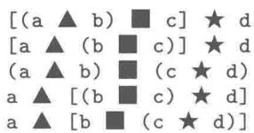
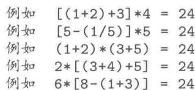
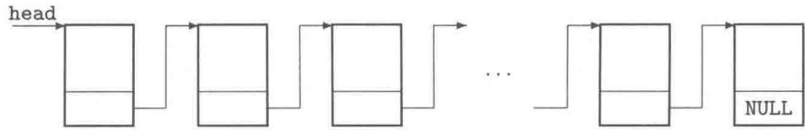
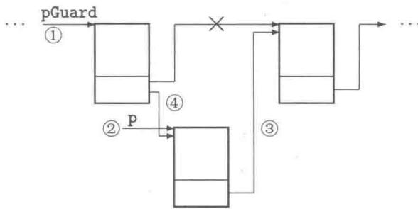
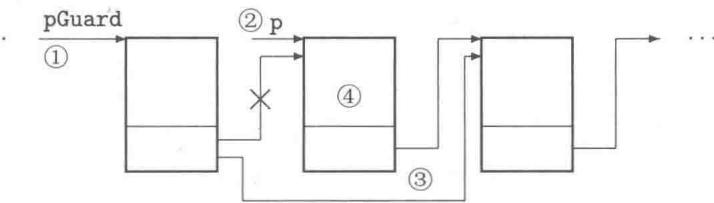

# 第7章 程序结构

$\mathrm{C}++$  以源程序文件（.cpp）为编译单元进行分割编译，支持众人集体开发大型软件。一个  $\mathrm{C}++$  程序往往由一系列文件组成，每个编译单元中均可能有一系列函数、一系列变量定义。不同开发人员自行命名的变量、函数等标识符可能相同，有些变量、函数和模板需要共享。 $\mathrm{C}++$  语言提供了良好的保障机制既能避免冲突发生，又能实现变量、函数等的共享。学习本章后，读者应该掌握多文件结构，并主动地加以实践。

# 7.1 多文件结构

# 7.1.1 同一编译单元中的共享变量及函数

静态全局变量的生命期是全局的：从程序启动时（主函数执行之前）产生，到程序结束时（主函数返回后）销毁。静态全局变量存放在全局数据区中（不受函数调用压栈、函数返回退栈影响）。静态全局变量的作用域为其所在的编译单元中，该变量定义语句之后（其后定义的函数体内均能直接访问该变量，在该变量定义语句之前的函数体内不可访问该静态全局变量）。

在不同编译单元中定义的静态全局变量（即使变量名称等均相同）是完全不同的变量，它们之间不存在任何关系，故不会引起任何冲突（参见第3.1.2小节例3.1）。

声明或定义函数时也可以将函数的存储类型设置为静态（static）的，这种函数被称为静态函数。静态函数的作用域将被限制在其所在的编译单元中。不同编译单元定义的静态函数也不会引起冲突。C++ 不允许在一个函数体内定义另一个函数。

设置静态全局变量、静态函数的作用是将它们规定为本编译单元“私有”，为本编译单元“共享”。

# 7.1.2 不同编译单元中的共享变量及函数

$\mathrm{C}++$  程序的不同编译单元之间总是需要相互联系的。我们在前几章编写的所有函数都是全局的，当需要使用其他编译单元中定义的函数时，只需要在本编译单元中用其函数原型声明，告诉编译器如何检查函数调用语句的语法正确性，由连接器寻找该函数的代码。同样，当需要使用其他编译单元中定义的全局变量时，也只需要在本编译单元中用保留字extern对其进行外部参照访问声明（参见第3.1.2小节规定3.3），告诉编译器这种全局变量的数据类型，由连接器寻找其定义。

全局变量的生命期是全局的：从程序启动时（主函数执行之前）产生，到程序结束时（主函数返回后）销毁。全局变量存放在全局数据区中（不受函数调用压栈、函数返回退栈影响）。全局变量的作用域为其所在的编译单元中定义或外部参照访问声明语句之后。

值得注意的是：全局变量不能只有外部参照访问声明而从未定义，也不能在多个编译单元中重复定义。倘若一个程序有30个编译单元，其中有10个编译单元需要共享某一个全局变量，则应该在这10个编译单元中的某一个编译单元中定义它（意味着为它分配内存空间），而在其他的需要访问该全局变量的9个编译单元中（可包括定义它的编译单元，即10个编译单元）对该全局变量进行外部参照访问声明。即一处定义，多处声明。在剩下的20个编译单元中不允许用该全局变量名定义另一个全局变量。这样，在定义或声明过该全局变量的编译单元中便可以共享它。既未定义也未声明的编译单元则不能访问该全局变量。

# 7.1.3 头文件

头文件不是编译单元，编译器不会单独地编译它。C++程序中，常常用编译预处理指令#include将指定的头文件的内容插入到该包含指令所在的位置。即，头文件中所书写的内容可能会随包含指令插入到多个编译单元中进行编译。因此，头文件中应该只写声明的内容，不要写定义的部分。

应该写入头文件的成分：

（1）全局变量的外部参照访问声明。  
（2）函数原型（函数声明）。  
（3）数据类型的描述。  
（4）内联函数。  
（5）模板描述。

由于变量或函数不能重复定义，故如下定义不宜写入头文件中。

（1）全局变量的定义。  
（2）函数的定义（即函数实现）。

若将函数模板写入源程序文件，则该模板仅能在该编译单元中使用，不能跨编译单元共享。

例7.1 求解一元二次方程的多文件结构程序。将例6.1改编成多文件结构的程序。整个程序由表7-1所示的三个文件组成。

表 7-1 求解一元二次方程程序的文件组成  

<table><tr><td>文件名</td><td>说明</td></tr><tr><td>solver.h</td><td>头文件，编写函数声明</td></tr><tr><td>solver.cpp</td><td>源程序文件，求解方程的若干函数定义</td></tr><tr><td>solverTesting.cpp</td><td>源程序文件，主函数，测试函数定义</td></tr></table>

显而易见，solver.h，solver.cpp是一组文件，它们构成相对独立的程序块，可移植到其他程序中。

在  $\mathrm{C}++$  应用程序集成开发环境中，创建一个新的工程文件；新建两个源程序文件和一个头文件并添加到该工程文件中；输入下面所列文件的内容；最后编译、连接、运行。

源代码7.1 头文件 solver.h  
```c
1 // solver.h
2 #ifdef SOLVER_H
3 #define SOLVER_H
4
5 int Solver(double a,double b,double c,double &x1,double &x2);
6 void ShowEquation(double a, double b, double c);
7 void ShowSolution(int flag, double x1, double x2);
8
9 #endif
```

源代码7.2 源程序文件 solver.cpp  
```cpp
1 // solver.cpp 求解一元二次方程  
2 #include <iostream>  
3 #include <math>  
4 using namespace std;  
5 static double Delta(double a, double b, double c)  
6 { // 静态函数，仅限于本编译单元中使用  
7 return b*b - 4*a*c;  
8 }  
9 int Solver(double a, double b, double c, double &x1, double &x2)  
10 {  
11 int flag = 0;  
12 double d = Delta(a, b, c);  
13 if (d >= 0)  
14 {  
15 d = sqrt(d);  
16 x1 = (-b - d)/(2*a);  
17 x2 = (-b + d)/(2*a);  
18 flag = (d > 0) ? 2 : 1;  
19 }  
20 return flag;  
21 }  
22 void ShowEquation(double a, double b, double c)  
23 {  
24 cout << "方程: " << a << "x^2";  
25 if (b > 0)  
26 cout << "□+□" << b << "x";  
27 else if (b < 0)  
28 cout << "□-□" << -b << "x";  
29 if (c > 0)  
30 cout << "□+□" << c;  
31 else if (c < 0)  
32 cout << "□-□" << -c;  
33 cout << "□=□0";  
34 }  
35 void ShowSolution(int flag, double x1, double x2)  
36 {  
37 switch (flag)  
38 {  
39 case 0: cout << "无实数根。" << endl; break;  
40 case 1: cout << "有重根: x1□=□x2□=□" << x1 << endl; break;  
41 case 2: cout << "有两个根: x1□=□" << x1  
42 << ",□x2□=□" << x2 << endl;  
43 }  
44 }
```

源代码7.3 源程序文件 solverTesting.cpp  
```txt
1 // solverTesting.cpp  
2 #include "solver.h" // 本编译单元不必包含其他头文件  
3  
4 int main()  
5 {  
6 double a=1, b=2, c=-3, x1, x2;  
7 int flag;  
8 flag = Solver(a, b, c, x1, x2);  
9 ShowEquation(a, b, c);  
10 ShowSolutionflag, x1, x2);  
11 return 0;  
12 }
```

# 7.2 编译预处理指令

顾名思义，编译预处理是指编译单元在被编译之前预先进行的处理。常见的编译预处理指令有文件包含指令、宏定义指令和条件编译指令。

# 7.2.1 文件包含指令

文件包含指令有两种格式：

```txt
include <文件名> #include "文件名"
```

第一种格式表示将在系统约定的子目录中查找指定的文件，若找到则相当于执行将该文件的内容“全选”“复制”并“粘贴”到包含指令处（简称包含该文件）。若找不到，则停止处理并给出出错信息。第二种格式将首先在当前目录中查找指定的文件，若找到则包含该文件；若在当前目录中找不到指定的文件，则再到系统约定的子目录中查找，若找到则包含之，否则才停止处理并给出出错信息。因此，建议读者将系统提供的头文件用第一种格式包含；自己编写的头文件（存放在当前工程文件的工作目录中）用第二种格式。

# 7.2.2 宏定义指令

C语言中没有const保留字，除了字面常量外，符号常量采用宏定义。如：

```txt
define M.PI 3.1415926
```

C语言中还常用带参数的宏描述一些简单的计算表达式，如：

```txt
define ABS(x)  $(\mathrm{x}) > 0?\mathrm{(x)}: - (\mathrm{x}))$
```

```txt
// 不管  $\mathbf{x}$  的数据类型
```

其中  $\mathbf{x}$  被称为参数，三目条件运算表达式为计算参数的绝对值。这里的  $\mathrm{ABS}(\mathbf{x})$  既不是函数定义，又不是语句（此处无分号）。程序中的语句  $y = \mathrm{ABS}(-2)$ ；也不是函数调用。这个语句将在编译前被处理（编译预处理）成如下语句。

```javascript
y  $= \left((-2) > 0?\left(-2\right): - (-2)\right);$
```

即编译系统在编译前首先扫描整个源程序，遇到使用宏的地方，如 M.PI，ABS（表达式），则将其进行“智能查找并替换”，处理后再进行编译。当然，编译系统并不修改用户的源程序文件，它将预处理的结果保存为一个临时文件，并对该临时文件进行编译。因此在编译的目标代码文件中，已经不可能有类似 M.PI，ABS 的身影。ABS(x) 不是函数调用，而是在编译前就“就地展开”了。

$\mathrm{C}++$  中有 const 定义符号常量，有 inline 内联函数实现“就地展开”，还有函数模板能适应多种不同的数据类型。这些新特性均超过 C 语言中的宏定义指令。因此，在  $\mathrm{C}++$  程序中宏定义指令最多出现在头文件中用于“挡驾”重复包含头文件（如头文件 solver.h 中第 3 行），或者用于下面介绍的条件编译。

# 7.2.3 条件编译指令

条件编译指令有 #if、#else、#elif、#endif、#ifdef 和 #ifdef。在程序中使用条件编译指令可以协调头文件之间的相互包含。例 7.1 求解一元二次方程的头文件中，使用了条件编译指令 #ifdef SOLVER_H 判断是否没有定义标识符 SOLVER_H。显然，作为分割编译的一个编译单元起初是没有定义该标识符的，此时，便将其后直到 #endif 之间的语句（第  $3 \sim 8$  行）插入到该编译单元中。需要注意的是，其中的指令 #define SOLVER_H（第 3 行）便使得标识符 SOLVER_H 被定义了。因此，倘若再包含该头文件，便会被条件编译指令（第 2，9 行）“挡驾”以避免重复包含。

例7.2 利用条件编译指令处理程序的兼容性问题。

问题描述 本教材的一些程序中使用了一个不属于标准  $\mathrm{C}++$  的头文件 conio.h 和其中的三个函数 getch、getche 和 kbhit。Visual  $\mathrm{C}++$  6.0、MinGW  $\mathrm{C}++$  和 Dev-C++ 均提供了这样的头文件和函数（为叙述方便，将其称为第一种编译系统）。假设有某编译系统提供了一个功能类似的头文件 otherHead.h 其中声明了一个功能相同或类似的函数，原型为 int getkey();（注意假想的头文件名、函数名皆不同，我们将其称为第二种编译系统）。或者某编译系统只能用标准  $\mathrm{C}++$  函数（我们将其称为第三种编译系统）。如何使相关程序能方便地在这三种编译系统中编译？

我们不能“因噎废食”而放弃使用getch函数，也不愿意重复地为每个编译系统重新写一遍程序。利用条件编译便能很好地解决这个问题。具体做法是将其他编译系统中功能相近的函数“包装”成函数int getch();的形式。

# 源代码7.4 条件编译示例程序

```c
1 //myconio.h  
2 #define COMP 3 //将标识符定义成不同的值对应不同的编译器  
3  
4 #if COMP == 1  
5 #include <conio.h>  
6 #else  
7 int getch(); //函数声明  
8 #endif
```

```cpp
1//myconio.cpp   
2#include"myconio.h"   
3   
4#if  $\mathrm{COMP} = = 1$  //适用于VC++、MinGW C++和Dev-C++   
5#include<conio.h>   
6#elif  $\mathrm{COMP} = = 2$  //适用于某种假想的C++编译器   
7#include<otherHead.h>   
8int getch(){return getkey();}   
9#else //适用于标准C++   
10#include<cstdio>   
11int getch(){return getchar();}   
12#endif
```

```cpp
1 // test.cpp  
2 #include <iostream>  
3 #include "myconio.h"  
4 using namespace std;  
5  
6 int main()  
7 {  
8 int i, key;  
9  
10 for(i=0; i<5; i++)  
11 {  
12 cout << "Press\s any\s key\s...\s" << flush;  
13 key = getch();  
14 cout << i+1 << '\t' << key << endl;  
15 }  
16 return 0;  
17 }
```

程序中的一些语句在某一种编译器下是正确的，在另一种编译器下却可能是错误的。显然这些语句不能全部被编译，必须“删除”其中的一部分。

（1）若将标识符COMP定义成3，则只需要标准的  $\mathrm{C} + +$  编译器。实际调用的是标准 $\mathrm{C} + +$  函数getchar，执行该函数时需要按回车键。其他函数未被编译。  
（2）若将标识符COMP定义成1，则直接使用非标准的函数getch。  
（3）若将标识符COMP定义成2，则出现编译错误！因为这种情形是我们假设的，根本没有这样的头文件，也没有函数getkey。

条件编译预处理指令还常用于程序的调试，例如：

```txt
define DEBUG //调试完成后，仅去掉此行即可  
//程序语句  
#ifdef DEBUG  
//编写调试用的语句  
#endif  
//程序语句
```

条件编译指令与条件分支选择语句是不同的。条件分支选择语句的每一个分支都是要被编译的（只是可能没有机会执行其某一分支），而条件编译指令是一种预处理，一些语句组可能不参加编译（相当于删除了这些不符合条件的语句），更谈不上被执行。条件编译预处理指令中条件的不同实为将源程序处理成几个不同的程序。

# 7.3 名字空间

在众人集体开发大型软件时，每个程序员可能编写有多个编译单元。现假设程序员  $A$  编写了五个编译单元都需要使用一个表示最大客户数的全局变量，程序员  $A$  将该变量命名为 MaxNumber；另有程序员  $B$  编写了三个编译单元都需要使用一个表示某物品最大件数的变量，程序员  $B$  将该变量命名为 MaxNumber。程序员  $A$  、程序员  $B$  所编写的共八个编译单元都能通过分割编译。但是在连接时将会导致该变量被定义两次的错误。不仅如此，这两个变量的含义和作用不相同，将会导致程序出现混乱。

名字空间是  $\mathbf{C} + +$  引入的可以由程序员命名的作用域，用来避免程序中标识符名字冲突的问题。名字空间可跨越编译单元。名字空间中声明的标识符具有一定的封装屏蔽特性，不同名字空间中的同名变量不会发生冲突。

名字空间中定义的非静态变量是一种受名字空间限制的全局变量，可以跨越不同的编译单元。这种“受限制的全局变量”与全局变量一样，只能且必须在某编译单元中被定义一次，其他编译单元中用extern进行参照访问声明。

下面，举例说明名字空间的用法。程序中三组文件声明了两个名字空间，两个名字空间中有些标识符完全相同，但是它们的功能不尽相同（为了区别起见，有的函数故意不按常理设计，敬请读者留意）。另外设计一个测试用的主函数。共7个文件如表7-2所示。

表 7-2 名字空间示例程序的文件组成  

<table><tr><td>文件名</td><td>说明</td></tr><tr><td>myMath.h</td><td>头文件，将一个数学函数原型，一个函数模板声明，一个常量定义放入mySpace空间中</td></tr><tr><td>myMath.cpp</td><td>定义mySpace::Sqrt函数</td></tr><tr><td>myString.h</td><td>头文件，将两个字符串处理函数放入mySpace空间中</td></tr><tr><td>myString.cpp</td><td>源程序文件，定义函数</td></tr><tr><td>OtherSpace.h</td><td>头文件，将一些函数声明等放入OtherSpace空间中</td></tr><tr><td>OtherSpace.cpp</td><td>源程序文件，定义函数</td></tr><tr><td>testSpace.cpp</td><td>源程序文件，主函数，测试程序</td></tr></table>

源代码7.5 头文件myMath.h  

<table><tr><td>1</td><td>// myMath.h</td><td>编写各种声明</td></tr><tr><td>2</td><td>#	define MYMATH_H</td><td></td></tr><tr><td>3</td><td>#define MYMATH_H</td><td></td></tr><tr><td>4</td><td></td><td></td></tr></table>

```c
5 namespace mySpace  
6 {  
7 const double PI = 3.1415926; // 定义常量  
8 extern int max; // 外部参照访问声明  
9 template<typename T> inline T Abs(T x) // 函数模板声明(描述)  
10 {  
11 return x >= 0 ? x : -x;  
12 }  
13 double Sqrt(double); // 函数声明  
14 }  
15 #endif
```

源代码7.6 源程序文件myMath.cpp  
```cpp
1//myMath.cpp 编写各种定义  
2#include"myMath.h"  
3  
4int mySpace::max  $= 1000$  //定义“受限制的全局变量”  
5//注意作用域及作用域区分符  
6double mySpace::Sqrt(double x）//函数定义  
7{  
8double  $\mathrm{y = 1}$  ，yold  $= 0$    
9do  
10{  
11  $\mathrm{yold} = \mathrm{y};$    
12  $\mathrm{y} = (\mathrm{y} + \mathrm{x} / \mathrm{y}) / 2;$    
13}while(Abs(y-yold)>1e-8);  
14return y;  
15}
```

源代码7.7 头文件myString.h  
```c
1 //myString.h  
2 #ifdef MYSTRING_H  
3 #define MYSTRING_H  
4 namespace mySpace  
5 {  
6 int StrLen(const char *); //函数声明  
7 char *StrCpy(char *, const char *); //函数声明  
8 }  
9 #endif
```

源代码7.8 源程序文件myString.cpp  
```cpp
1 // myString.cpp  
2 #include "myString.h"  
3 int mySpace::StrLen(const char *str)  
4 {  
5 int len;  
6 for(len = 0; str[len]; len++)  
7 ;  
8 return len;  
9 }  
10  
11 char *mySpace::StrCpy(char *dest, const char *source)
```

```lisp
12{   
13 char \*p  $=$  dest;   
14 while  $(\ast$  dest  $+ + =$  \*source++)   
15 ；   
16 return p;   
17}
```

源代码7.9 头文件OtherSpace.h  
```c
1 // OtherSpace.h  
2 #ifdef OTHERSPACE_H  
3 #define OTHERSPACE_H  
4 namespace OtherSpace  
5 {  
6 const double PI = 3.14;  
7 extern int max; //外部参照访问声明  
8 template<typename T> inline T Abs(T x) //函数模板声明  
9 {  
10 return x >= 0 ? x : -x;  
11 }  
12 int StrLen(const char *); //函数声明  
13 char *StrCpy(char *, const char *); //函数声明  
14 }  
15 #endif
```

源代码7.10 源程序文件OtherSpace.cpp  
```cpp
1 // OtherSpace.cpp  
2 #include "OtherSpace.h"  
3 // 本例仅用作说明标识符不冲突。故意将下列函数的功能进行了修改  
4 // 不合常理，切勿模仿  
5  
6 int OtherSpace::max = 2000; // 定义“受限制的全局变量”  
7  
8 int OtherSpace::StrLen(const char *str)  
9 { // 将串结束标志计入串长度（不合常理，切勿模仿）  
10 int len;  
11  
12 for(len=0; str[len]; len++)  
13 ;  
14 return len+1;  
15 }  
16  
17 char *OtherSpace::StrCpy(char *dest, const char *source)  
18 { // 将字符串颠倒复制（不合常理，切勿模仿）  
19 char *p = dest;  
20 int i;  
21  
22 for(i=0; source[i]; i++)  
23 ;  
24 for(i--; i>=0; i-- )  
25 *dest++ = source[i];  
26 *dest = '\0';  
27 return p;  
28 }
```

源代码7.11 源程序文件testSpace.cpp  
```cpp
1 // testSpace.cpp  
2 #include <iostream>  
3 #include "myString.h"  
4 #include "myMath.h"  
5 #include "OtherSpace.h"  
6  
7 using namespace std;  
8 using namespace mySpace;  
9 using namespace OtherSpace;  
10  
11 int max = 3000; //全局变量  
12  
13 int main()  
14 {  
15 char str[80];  
16 double x = 2.0;  
17  
18 cout <<":max:□:" << :max << endl << endl;  
19  
20 cout << "mySpace::max:□:" << mySpace::max << endl;  
21 cout << mySpace::PI << endl;  
22 cout << mySpace::StrCpy(str, "C++_Program.") << endl;  
23 cout << mySpace::StrLen(str) << endl;  
24 cout << Qt(x) << endl;  
25 cout << mySpace::Abs(3) << endl;  
26 cout << mySpace::Abs(-3.5) << endl << endl;  
27  
28 cout << "OtherSpace::max:□:" << OtherSpace::max << endl;  
29 cout << OtherSpace::PI << endl;  
30 cout << OtherSpace::StrCpy(str, "C++_Program.") << endl;  
31 cout << OtherSpace::StrLen(str) << endl;  
32 cout << OtherSpace::Abs(3) << endl;  
33 cout << OtherSpace::Abs(-3.5) << endl;  
34 return 0;  
35 }
```

程序的运行结果：  
```batch
::max : 3000  
mySpace::max : 1000  
3.14159  
C++ Program.  
12  
1.41421  
3  
3.5  
OtherSpace::max : 2000  
3.14  
.margorP ++C  
13  
3  
3.5
```

从程序及运行结果可知，可以从不同的编译单元向同一名字空间中添加标识符。不同名字空间中的标识符可以重名，还可以与全局变量重名。访问时只要不引起二义性，就能正确地匹配。用名字空间名和作用域区分符（::）可将它们严格地区分开来。若名字空间中的标识符与全局量相同，则“::标识符”表示访问全局量。在不引起二义性时，名字空间名称和双冒号运算符可省略。

回到本节开始所提出的问题。只要程序员  $A$  和程序员  $B$  分别设置各自的名字空间，并将各自所需要的全局变量放入其中成为受限制的全局变量即可解决标识符相冲突的问题。

# 7.4 隐藏函数的定义

软件开发过程包含许多环节。虽然编写源代码这一环节所占用的工作量不是最多的，但是所编写的源代码却是多个环节的具体体现。源代码中包含了多方面的成果，具有很高的技术含量。尤其是对于那些提供给用户进行二次开发的基础软件，如果不是开源（公开源代码）的，就很有必要将功能模块的实现技术细节隐藏起来，仅留一些接口给二次开发的用户使用。即给从事二次开发的用户一些黑箱，类似编译系统所提供的标准数学函数库一样，仅能看到头文件 cmath 中的内容。

下面，在Visual  $\mathrm{C}++6.0$  集成开发环境中以第7.1.3小节求解一元二次方程为例，介绍具体处理方法。其他开发环境的处理方法是类似的。需要注意的是不同编译器所生成的目标代码文件的格式可能不同，不一定相互兼容。

将编译单元 solver.cpp 单独编译生成目标代码文件 solver obj（该文件在 Debug 子目录中）。将文件 solver.h, solver obj 提供给二次开发的用户使用（不必提供源程序文件 solver.cpp，该文件由版权所有者保留）。

对于二次开发者，使用 solver.h，solver obj 的步骤如下：

① 创建一个工程文件，将文件 solver.h， solver obj 复制至其工程文件的工作目录中，另外添加一个源程序文件，如第 7.1.3 小节中的 solverTesting.cpp。  
② 将头文件 solver.h 添加到当前的工程文件中。从 Visual C++ 6.0 主菜单起，依次选择 Project | Add To Project | Files，在弹出的对话框中选择文件 solver.h，单击 OK 按钮。  
③ 将目标代码文件 solver obj 添加到当前工程文件的连接选项设置中。从 Visual C++ 6.0 主菜单起，依次选择 Project | Settings，在弹出的对话框中选择 Link 选项卡，在其中的 Object | library modules 编辑栏中添加文件名 solver obj（用空格分隔已经存在的项目），单击 OK 按钮。  
④ 编译、连接生成可执行文件，最后运行之。

由以上的步骤可见，用户仅根据头文件 solver.h（以及另外的说明文档、帮助文档）中的信息进行二次开发，并且不再需要源程序文件 solver.cpp。用户程序中调用函数时，仅能参考的是一些说明文档、帮助文档和头文件中的函数原型。这也说明函数原型是程序员之间交流信息的接口。同时，还看到 Delta 函数仅“内部使用”，其接口也不暴露给二次开发的用户，隐藏得更深。

MinGW Developer Studio 集成开发环境中目标代码文件的扩展名为 .o，其他的具体操作与 Visual C++ 的类似，参见第 9.4.2 小节。

# 7.5 小结

存储类型决定了标识符在内存中的位置、生命期和可见性等。它规定了在多文件结构中的连接特性。非静态全局名字具有外部存储属性，它能被多个编译单元共享，也容易引起冲突；同时，也处于随时随地可能被修改的危险境地。使用全局变量可能影响程序的移植性。建议读者在程序设计中不使用全局变量，或者只使用属于某名字空间中“受限制的全局变量”。由于静态全局变量具有在其编译单元内“私有”及“共享”的特性，可以适当加以利用。

在本教材中，虽然我们所设计的程序基本上没有使用全局变量，但是第  $2\sim 8$  章中所设计的函数均是全局的。对于众人集体开发同一个程序时，全局变量或外部函数的名字可能发生冲突。若所有设计者将其设计的全局变量、外部函数放入各自设计的名字空间中，或者使用面向对象方法将函数及数据封装起来，可消除不同设计者对于标识符命名的冲突。使用多文件结构将声明部分放入头文件，将全局变量定义、函数定义（即函数的实现细节）部分放入源程序文件，并编译成目标代码文件后隐藏起来（仅提供头文件和目标代码文件），可有效地保护源代码。

# 练习7

（1）设计一个名字空间myString将练习6中用户自定义版的字符串处理函数放入该名字空间中。编写一个头文件和相应的源程序文件，再编写一个含主函数的源程序文件对名字空间进行测试。  
（2）“24点”计算。给定四个不超过10的正整数a、b、c和d，允许交换其次序并在其间添加括号及运算符  $+$  、-、*、/（浮点数除法）使其结果为24。若无法使算式的结果为24则输出 Impossible。

【提示】不区分给定的四个数中是否有相同的，也不利用加法和乘法满足的交换律，所有的情形共  $4! \times 4^3 \times 5 = 7680$  种。① 四个数的全排列共有  $4! = 24$  种。② 四个数需要三次算术运算（从四种运算符中可重复地任选三个运算符，共有  $4^3 = 64$  种情形）。③ 共有如下五种添加括号的方式，其中“ $\triangle$ ”“ $\square$ ”“ $\star$ ”分别表示某种算术运算符：





建议将运算设计成函数，利用如下指向函数的指针数组对自定义的add（加），sub（减），mul（乘）和div（除）函数进行有效而统一的管理和使用：

```txt
double (*op[4])(double, double) = {add, sub, mul, div};
```

# 第8章 链表

本章通过“评委评分”程序的进一步改编，介绍一种数据结构——单向链表。这一部分内容是高级语言程序设计的传统“保留节目”。是读者今后深入学习数据结构课程的基础，也作为从过程化程序设计到面向对象程序设计的过渡。希望读者仿照本章的程序，设计一个“通讯录”程序或“学生成绩管理”程序或“图书资料管理”程序以进一步掌握指针、函数的概念和用法。通过链表应用程序的调试真正掌握链表的操作技术。

# 8.1 结构体

程序设计高级语言允许程序员利用已经存在的数据类型（包括基本数据类型、其他构造数据类型）自行构造新的数据类型。结构体是一种构造数据类型。构造一种新的数据类型需要：

① 规定这种新类型的数据组织形式。  
② 提供这种新数据类型的操作方法。

面向对象程序设计部分将对此问题进行深入细致的介绍。

# 8.1.1 数据组织形式描述

将一些数据类型不尽相同但有紧密关系的数据组织在一起是很有必要的。例如，描述一名“学生”的基本情况。“学生”的基本属性有学号（整型或者字符串型）、姓名（字符串型）、各科成绩（整型）和平均成绩（浮点型）等。将这些属性组织起来作为整体形成一种新的数据类型。

```txt
struct Student
{
    int id;
    char name[9]; // 可存放四个汉字
    int Chinese, math, English, physics, chemistry;
    double average;
};
```

这样，便完成了数据组织形式的描述，形成了一种新的构造数据类型——结构体。新的数据类型名称 Student 是由程序员根据标识符的命名规则自行命名的。在 Student 中描述的属性（如 id，name，Chinese，math，English，physics，chemistry 和 average）被称为结构体成员。结构体成员有其自己的数据类型。

# 8.1.2 创建结构体对象

与基本数据类型一样，可以用这种新的数据类型定义变量、定义数组、定义指针变量、申请堆变量和申请堆数组，可以声明引用，以及在函数之间传递这种新数据类型的数据。

所描述的结构体并不占用内存空间。只有当用这种新数据类型定义变量、数组、申请堆变量或申请堆数组时才意味着分配内存空间。每个这种变量占用 sizeof(Student) 字节的内存空间。今后，称定义结构体变量、结构体数组、申请堆变量、申请堆数组分别为创建结构体对象、创建结构体对象数组、创建结构体堆对象和创建结构体堆对象数组。

可以定义目标数据类型为结构体类型的指针变量。当然，指向结构体对象的指针变量仍然仅占 sizeof(void*) 字节的内存空间。可以声明结构体对象的引用，引用同样不占用内存空间。例如：

```txt
Student x, y; // 创建两个 Student 对象；  
Student *p = &x; // 定义一个指针变量；  
Student &rx = x; // 声明一个引用（不占空间）；  
Student a[50]; // 创建结构体数组；  
p = new Student [100]; // 创建堆对象数组  
delete [] p; // 释放堆对象数组所占用的堆内存资源
```

其中，对象x，y分别各占用sizeof(Student)字节；指针变量p在内存中仍然只占用sizeof(void*)字节，并用对象x的地址对该指针进行初始化；rx为声明的引用，不另占用内存空间，它是对象x的别名；数组名a仍然为数组的首地址；用new，delete操作申请及释放堆对象数组。

还可以将结构体对象的值、指向结构体对象的指针值（即某结构体对象的地址），结构体对象本身（引用型）和指向结构体对象的指针本身（指针的引用）作为实际参数传递给函数或作为函数的返回类型。参见第8.2节中的函数。

# 8.1.3 访问对象的成员

优先级为2的圆点运算符“.”用于结构体对象访问其成员；箭头运算符“->”（由减号及大于号组成）用于结构体指针访问其目标对象的成员。如：

```txt
Student s, *ps=&s, &rs=s; // 仅创建了一个对象 s
s.id = 1;
strcpy(s.name, "张□□三"); // 字符串复制。不能用 s.name="张三";
ps->Chinese = 85; // 指针变量访问其目标对象的成员
(*ps).math = 86; // 等价于 ps->math = 86;
rs.English = 82; // 引用访问其“绑定”的目标对象的成员
rs.physics = 80;
s.chemistry = 83;
ps->average = (s.Chinese + rs.math + s.English
+ ps->physics + s.chemistry)/5.0;
```

优先级为4的运算符为指向成员的指针，用法如下。例如，定义一个专用的指向Student类型成员average的指针pAver。

```cpp
//接上面的对象、指针变量doubleStudent::\*pAver  $\equiv$  &Student::average;cout<<"对象  $\text{山}$  s的平均成绩为"<<s.\*pAver<<endl;cout<<"对象  $\text{山}$  s的平均成绩为"<<ps->\*pAver<<endl;
```

输出结果均为“对象s的平均成绩为83.2”。

# 8.2 链表的概念

前面几章谈到某“大奖赛”，若其组委会决定：允许参赛选手中途退出比赛（退出比赛者将不参加排名，即该选手已经取得的部分成绩应该不对其他选手的名次产生影响）；比赛进行中仍可接收新报名参赛的选手。

这两个方面问题的共同点是参赛选手人数的变化（增加或减少）。用以前的方法（如数组、堆数组）解决这个问题是不方便的。在第5,6章介绍的程序中，首先配置的是评委人数、参赛选手人数（隐含地假定人数不变），然后分配适当的空间。若选手人数发生变化，则需要“重新分配空间、复制已有的数据、释放原来的空间”使相关数据在内存中连续存放。这样将导致大量的数据在内存中经常移动。

一种行之有效的解决方案是让选手们依次记录其下一位选手的座位号码，各选手的这种驻扎地址号码不一定连续、不一定有序，但固定不动，直至被销毁。具体地，现场主持人只需要找到首位选手的座位号码，选手们各负责记录其下一位选手的座位号码，末尾的选手所记录的座位号码为特殊的NULL（空）即可。这种单方向联络的连接方式被称为单向链表。构成单向链表的元素被称为结点。结点应该具有承载数据及指向下一个结点的能力。

在这种链式连接结构中，删除某个结点只需要将该结点保存的下一个结点地址“交给”其上一个结点即可。链表各结点在内存中不移动位置。添加一个结点到链表中，也只需要局部地调整相关结点所应该记录的下一个结点地址，也不必移动各个结点在内存中的位置。

由于约定了单向链表尾结点的结束标志，故只需要把握单向链表的链首结点地址即可。结点个数、各结点在内存中的地址都容易得到。这也说明将单向链表传递给函数时，只需要传递链首地址。这个特性有些像具有串结束标志的C-字符串。与字符串不同的是，字符串各元素在内存中连续存放，依靠与字符串首元素地址的偏移量（下标）便能找到指定的字符元素；而链表各结点在内存中不一定连续存放，要依靠存放在各结点间的索引“按图索骥”访问所需要的数据。

# 8.2.1 结点的结构

形成链式结构的结点可采用如下数据组织形式的描述。

```c
const int REFERENCES = 10;  
struct Player  
{  
    int num; //选手编号  
    char name[7]; //选手姓名（存放三个汉字）  
    double x[REFERENCES], aver; //选手分数  
    int rank; //选手名次  
    Player *next; //同类指针，下一位选手的地址  
};
```

【注意】结构体中不能嵌套地将本结构体对象作为成员。但可以将指向本结构体对象的指针变量作为成员（因为指针成员所占用的 sizeof(void*) 字节数是个定值）。在结点的成员中，除指向下一个同类结点的指针 next 外，其他成员统称为数据域成员。

这样一来，就描述了一种新的数据类型。这种数据类型名为Player（由程序员命名），一个这种数据类型的对象在内存中占用sizeof(Player）字节。

# 8.2.2 单向链表

我们约定：为了链表处理的方便和统一，本章中凡作为链表结点的变量（称为结点对象）均为堆变量（即堆对象）。链表的一般形式如图8-1所示。

  
图8-1 单向链表

单向链表是一种能够存储数据的容器，数据以结点（存放在结点的数据域中）的面貌出现，以“手拉手”的链式结构联络。需要设计一些对链表进行操作的函数使之便于应用。各结点都无原名，皆通过间接名访问，结点的地址存储在其前一个结点的指针域中，首结点的地址存放在head指针变量中。

【说明】另一种单向链表被称为带头结点的单向链表。带头结点的链表中设有一个专门结点，被称为头结点。头结点数据域中的数据无实际意义，头结点的 next 指针指向的结点为链表真正的第一个结点。头结点可以不在堆空间中。带头结点的单向链表更加容易控制，因为不管链表结点如何增减，头结点可以始终不动。头结点在函数间的传递是简单的，不必使用引用。本书不讨论这种链表。

# 1. 空链表

定义一个结点类型的指针变量并初始化为空指针，便是构建成功了一条单向链表（有头有尾）。该链表的结点数为0。构造一条空链表是进行链表操作的起点，虽简单但重要。如：

```txt
Player *head = NULL;
```

# 2. 首结点处的操作

单向链表在首结点处的操作是最简单的，这种操作有许多应用。若仅在链首进行操作，则此时的单向链表就是栈结构的一种具体实现——链首为栈顶，链尾为栈底。

链表创建（一般只需要创建一条空链表即可）后，添加一个新结点到链首前成为新的链首。用函数实现如下。

```txt
void InsertBeforeHead(Player *&head, int num, char *name) {
    Player *p = new Player; // 创建一个新结点（堆对象）
    p->num = num; // 确定数据成员 num 的值
    strcpy(p->name, name, sizeof(p->name)); // 为了不破坏其他数据，限定复制字符个数
    p->name[sizeof(p->name) - 1] = '\0'; // 确保有串结束标志
    // 其他数据成员赋值（略）
}
```

```txt
11  $\mathbb{P}\rightarrow$  next  $=$  head; //新结点将原链首结点当成下一个结点  
12 head  $=$  p; //head记录新结点的地址  
13}
```

其中第3行为创建一个堆结点，第11、12行完成将该结点插入到链表中，并成为新的链首结点。第  $5\sim 8$  行为给新结点的数据域成员赋值。

删除链首结点的函数为

```txt
1 void DeleteHead(Player *&head)  
2 {  
3 Player *p = head; // 记录当前链首结点地址  
4 if(head != NULL) // 如果不是空链表  
5 {  
6 head = head->next; // 下一个结点成为新的链首结点，可能为NULL  
7 delete p; // 释放原链首结点，隐含假定结点在堆空间中  
8 }  
9 }
```

特别需要指出的是上述两个函数在链首操作，需要修改链首指针的指向，使其指向新的链首，需要链首指针变量直接双向传递。因此函数的形式参数都应该设置成Player *&型，即传递指针变量本身。同时，前一个函数还设置（修改）了首结点的数据域成员的值和next指向（间接双向传递）。

# 8.3 链表操作

# 8.3.1 遍历

遍历是指将链表中的所有结点均按某种方式处理一次。遍历单向链表的方法是从链首结点开始，沿结点的指向依次处理每个结点，直到尾结点为止。典型的遍历操作采用与下面类似的循环语句。

```txt
1 Player \*p;   
2 for(p=head；p!=NULL；p=p->next)   
3 {   
4 //处理当前结点的数据成员，p->数据成员   
5}
```

下面的链表版“评委评分”程序中，有如下遍历操作：输出所有结点的所有数据；释放所有结点；计算各选手的名次。

# 1. 输出所有结点的数据

请读者分析下面的函数中为什么可以使用语句head=head->next；而不担心实参（链首指针）被修改。

```c
1 void Show(const Player *node)  
2 {  
3 cout << node->num << "□" << node->name;  
4 for (int i = 0; i < REFERENCES; i++)  
5 cout << "□" << node->x[i];
```

```txt
6 cout << "□" << node->aver << "□" << node->rank << endl;  
7}  
8  
9 void ShowList(const Player *head)  
10{  
11 if(head == NULL)  
12 {  
13 cout << "链表为空。" << endl;  
14 return;  
15 }  
16 while(head)  
17 {  
18 Show(head); // 输出的二维表格中数据可能未对齐  
19 head = head->next; // 参见下一节程序有格式控制的输出  
20 }  
21}
```

# 2. 释放所有结点

这一操作与结点的数据域无关，故可设计成函数模板。

```c
1 template <typename T> void FreeList(T *&head)  
2 {  
3 T *p;  
4 while (head != NULL)  
5 {  
6 p = head;  
7 head = head->next; // 要求指向下一结点的指针成员名为 next  
8 delete p; // 隐含假定所有的结点皆为堆结点  
9 }  
10 }
```

上述函数模板适用于多种类型的单向链表，只要求结点中指向下一个结点的指针成员名称为 next，且链表中的所有结点均为堆结点即可。

# 3. 统计计算

统计链表中的结点数。由于此项操作与结点的数据域无关，故也可写成函数模板。

```c
1 template <typename T> int Count(const T *head)  
2 {  
3     int n = 0;  
4     const T *p; // 常量指针（所指之处皆被视为常量）  
5     for (p = head; p != NULL; p = p->next)  
6         n++;  
7     return n;  
8 }
```

统计满足如下条件的选手数：有三名及三名以上的评委给该选手的分数低于8.5分。

```txt
1 int Stat(const Player *head)  
2 {  
3 int n = 0, m, i;  
4 const Player *p;  
5 for (p = head; p != NULL; p = p->next)  
6 {
```

```javascript
7  $\mathrm{m} = 0$  ·8 for(i=0；i<REFERENCES；i++)9 if(p->x[i]<8.5)10 m++;11 if(m>=3)12 n++;13 }14 return n;15
```

# 4. 定位某结点

给定某整数 num，要求在链表中查找编号等于 num 的结点。从链首起，依次比较结点数据域中的相应数据项，若找到则返回该结点的地址；若查完所有结点都未找到，我们约定返回 NULL。这种定位操作不一定遍历整个链表。

```txt
1 Player \*Search(Player \*head, int num)   
2 {   
3 Player \*p;   
4 for(p=head; p!  $=$  NULL;  $\mathsf{p} = \mathsf{p}\rightarrow$  next)   
5 if(p->num == num)   
6 break;   
7 return p;   
8}
```

# 5. 定位及继续定位

链表中满足某条件的结点可能没有或可能有多个，此时需要定位和继续定位。例如，查找所有第  $k$  名的选手，并输出他们的信息。这个函数应实现“返回满足条件的结点的地址，并为继续定位确定搜索新起点”。请注意分析其中静态局部指针变量  $p$  的特性，注意局部自动指针变量 temp 以及带默认值的参数的作用。

```c
1 Player \*Locate(Player \*head，int rank,int restart=0)   
2{   
3 static Player  $^{\ast}\mathbb{P} =$  head; //注意这里采用了静态局部指针变量   
4 Player \*temp;   
5   
6 if(restart）p  $=$  head; //restart非零时从头开始   
7   
8 for（；p！  $\equiv$  NULL；p=p->next)   
9 if(p->rank == rank)   
10 break;   
11 temp  $=$  p;   
12 if(p)p  $=$  p->next; //确定继续定位搜索的新起点   
13 return temp;   
14}
```

下面的测试函数说明了上述定位及继续定位函数的使用方法。

```txt
1 void Find(Player *head)  
2 {  
3 int n, rank;  
4 Player *p;
```

```c
5 cout << "查询所有第  $\text{山} _ { \text{山} }$  名的结点。请输入  $\text{山} _ { \text{山} }$  ：；  
6 cin >> rank;  
7 n = 0;  
8 p = Locate(head, rank, 1); //从头开始  
9 while(p != NULL)  
10 {  
11 Show(p); //输出指针p的目标对象的数据成员值  
12 n++;  
13 p = Locate(head, rank); //继续定位  
14 }  
15 cout << "共有" << n << "位选手并列第"  
16 << rank << "名。" << endl;  
17 }
```

# 8.3.2 插入一个结点

插入一个结点的操作（如图8-2所示），需按插入到链首前，插入其他处（包括链表中间结点、链表尾结点后）分别处理。其中插入到链首前的操作需要修改链表首地址。因此，插入函数中需要引用型形式参数Player\*head。

插入一个结点到链表首结点前的操作已经在前面做了介绍。插入一个结点到链表中间或者尾部的操作如下。

① 找到插入点的前一个结点的地址，称其为“前哨”，记其地址为pGuard。  
② 创建一个新的堆结点并对其数据域成员赋值。  
③ 将新结点的 next 指针指向“前哨”的下一个结点，即“前哨”原下一个结点成为新结点的下一个结点。  
④ 令“前哨”的next指针改向指向新结点，不再指向原来的结点。

插入一个结点到尾部是同样的，只是此时pGuard->next为NULL。

  
图8-2 插入一个结点到单向链表中

请读者将以上四步与下一节的源程序对应。

# 8.3.3 删除一个结点

删除一个结点的操作（如图8-3所示），需按删除首结点，删除其他结点（包括链表中间结点、链表尾结点）分别处理。其中删除链首结点将改变链首指针，因此删除结点的函数需要引用型形式参数Player\*head。

删除链首结点的操作已经在前面做了介绍。删除链表中间或者尾部的一个结点的操作如下。

① 找到待删结点的前一个结点，称其为“前哨”，记其地址为pGuard。

② 记录下“前哨”的下一个结点（即待删结点）的地址  $p = pGuard->next$ 。  
③ 将“前哨”的next指针指向待删结点的下一个结点pGuard->next=p->next使待删结点脱链。  
④ 释放待删结点所占用的堆内存单元资源。

删除尾结点的操作是完全相同的，只是此时的待删结点的  $p->next$  为 NULL，即  $pGuard->next->next$  为 NULL。请读者将以上四步与下一节的源程序对应。

  
图8-3 从链表中删除一个结点

# 8.3.4 链表版“评委评分”程序清单

程序采用多文件结构：contest.h，contest.cpp是一组文件，头文件 contest.h 中描述了一种新的数据类型 Player 并声明了各函数。以便被两个编译单元包含。源程序文件 contest.cpp 中对各函数进行了定义。其中有关文件读写操作暂不要求读者弄懂。文件操作能将数据永久性保存在磁盘文件中，便于程序或其他工具软件读写。

源程序文件Main.cpp中，主函数的结构为循环，可反复执行“输出菜单、接收选择、根据选择调用不同函数”的操作。

读者可有不同的次序阅读本程序。

① 按程序的执行次序阅读：从主函数出发，遇到函数调用时阅读相应的函数，返回后继续阅读主函数，直到主函数结束。

② 先阅读各个函数，掌握函数的功能，最后阅读主函数。

本节中的程序没有使用任何全局变量，各函数所需要的数据皆可根据形式参数获得；函数的处理结果皆从函数返回或通过参数“返回”。

源程序清单如下。

# 源代码8.1 链表版“评委评分”程序头文件

```c
1 // contest.h
2 #ifdef CONTEST_H
3 #define CONTEST_H
4
5 const int REFERENCES = 10;
6
7 struct Player
8 {
9 int num; //选手编号
10 char name[7]; //选手姓名
11 double x[REFERENCES], aver; //选手分数
12 int rank; //选手名次
13 Player *next; //同类指针，存放下一位选手的地址
14 };
```

```c
int Pause(const char *prompt="按任意键继续......");
char *trim(char *str); //去掉C-字符串前后的空白字符
//结点操作函数的函数原型
void Show(const Player *node); //输出结点数据
Player *ComputeAver (Player *node); //计算结点最后得分
Player *Modify (Player *node); //修改结点数据
//链表操作函数的函数原型
void FreeList (Player *&head); //释放所有结点
int Insert (Player *&head, Player *p); //插入一个结点
int Delete (Player *&head, int num); //删除一个结点
Player *Search (Player *head, int num); //查询结点
Player *Locate (Player *head, int rank, int restart=0); //定位、继续定位
Player *Modify (Player *head, int num); //修改结点数据
void ShowList(const Player *head); //输出所有结点数据
void ComputeRank (Player *head); //计算各选手的名次
enum SORT_FLAG { SORT_NUM=0, SORT_NAME=1, SORT_RATE=2}; //枚举型声明，用于排序
int compare(const Player *p1, const Player *p2, SORT_FLAG flag); //用于排序的比较函数
void SortList (Player*&head, SORT_FLAG flag=SORT_RATE); //按指定的数据项排序
//文件操作函数的函数原型（供参考）
int TSave(const Player *head, const char *filename); //按文本文件格式
int TLoad (Player*&head, const char *filename); //按二进制格式
int BLoad (Player*&head, const char *filename); //按二进制格式
endif
```

源代码8.2 链表版“评委评分”函数定义源程序文件  
```cpp
1 // contest.cpp  
2 #include<iostream>  
3 #include <iomanip>  
4 #include <cstring>  
5 #include <conio.h> //为了使用getch函数  
6 #include "contest.h"  
7 #include <fstream> //为了文件操作  
8 using namespace std;  
9  
10 int Pause(const char *prompt)  
11 {  
12 int key;  
13 cout << prompt << flush;  
14 key = getch();  
15 cout << endl;  
16 return key;  
17 }  
18  
19 char *trim(char *str) //去掉C-字符串前后的空白字符  
20 {  
21 int i, j;  
22 for(i=0; str[i] == ' ', || str[i] == '\t'; i++)  
23 ;
```

```c
for(j=0; str[j]=str[j+i]; j++)  
{  
for(j--; j>=0 && (str[j] == '□' || str[j] == '\t'); j--)  
{  
str[j+1] = '\0';  
return str;  
}  
void FreeList(Player*&head)  
{  
Player *p;  
while(head != NULL)  
{  
p = head;  
head = head->next;  
delete p; //隐含假定结点均为堆对象  
}  
}  
int Insert(Player*&head, Player *p)  
{//假设链表已经按编号顺序连接，则不会出现重号  
//若链表未按编号排序，则将新结点插入到首个更大的编号结点前  
Player *heapNode, *pGuard;  
if(head==NULL || p->num < head->num)  
{  
heapNode = new Player;  
//p指向的目标对象“来历不明”，不宜将其直接插入到链表中  
//故新建对象，以保证所有的结点均为堆结点  
*heapNode = *p; //录用其数据域中的数据  
heapNode->next = head; //插至链首前  
head = heapNode; //成为新链首，需要传递引用  
ComputeAver(heapNode); //计算最后得分  
ComputeRank(head); //计算名次  
return 1; //插入结点成功  
}  
if(p->num == head->num) //此时，链表至少有一个结点  
{ //访问head目标对象成员合法  
Show(head); //与首结点重号，拒绝插入  
}  
pGuard = head; //链表非空，pGuard->next合法  
while(pGuard->next != NULL && pGuard->next->num < p->num) //在pGuard->next不为空的前提下才可进一步访问成员  
pGuard = pGuard->next; //①循环结束后，确定插入点前哨  
if(pGuard->next != NULL && pGuard->next->num == p->num) { //pGuard->next != NULL不能少  
Show(pGuard->next); //与其他结点重号，拒绝插入  
}  
heapNode = new Player; //②新建堆对象  
*heapNode = *p;
```

```c
heapNode->next = pGuard->next; // ③指向下一个结点
pGuard->next = heapNode; // ④加入到前哨后
ComputeAver(heapNode); // 计算最后得分
ComputeRank(head); // 计算名次
return 1; // 插入结点成功
}
int Delete(Player *&head, int num) {
Player *p, *pGuard;
char yn;
if (head == NULL) return -3; // 链表为空
if (head->num == num) // 此时链表一定非空，可访问首结点数据成员 {
Show(head);
yn = Pause("是否删除该结点?  $\square$  (y/[N]) $\square$ ); // 默认 N
if (yn=='y' || yn=='Y')
{
p = head; // 暂存首结点地址
head = head->next; // 首结点脱链
delete p; // 删除原首结点，需要传递引用
ComputeRank(head); // 重新排名次
return -1;
}
return 0; // 结点未被删除
}
pGuard = head; // 此时至少有一个结点，且首结点不是待删结点
while (pGuard->next != NULL && pGuard->next->num != num)
pGuard = pGuard->next; // ①确定待删结点的前哨
if (pGuard->next != NULL) // 此条件判断是必须的
{
p = pGuard->next; // ②p指向待删结点
Show(p);
yn = Pause("是否删除该结点?  $\square$  (y/[N]) $\square$ ) ;
if (yn=='y' || yn=='Y')
{
pGuard->next = p->next; // ③待删结点脱链
delete p; // ④释放堆结点
ComputeRank(head); // 重新排名
return -1;
}
return 0; // 结点未被删除
}
else
return -2; // 查无此人
}
```

```txt
142 Player \*Locate(Player \*head, int rank, int restart)  
143{  
144 static Player \*p=head; //注意静态局部指针变量的特点  
145 Player \*temp;  
146 if(restart) p = head; //若restart非零，则从头开始  
147 for( ; p!=NULL; p=p->next)  
148 if(p->rank == rank)  
149 break;  
150 temp = p;  
151 if(p!=NULL) p = p->next;  
152 return temp;  
153}  
154  
155 Player \*Modify(Player \*node)  
156{  
157 char str[80];  
158 if(node==NULL) return node;  
159  
160 cout << "原有记录" << endl;  
161 Show(node);  
162  
163 cout << "不允许修改编号，可修改其他属性" << endl;  
164 cout << "请输入姓名："；  
165 cinSync(); //刷新输入缓冲区  
166 cin.getline(str, 80);  
167 strncpy(node->name, str, sizeof(node->name));  
168 //允许用户输入超长字符串  
169 node->name[sizeof(node->name)-1] = '\0'; //截断超长部分  
170  
171 cout << "重新输入新成绩：" << endl;  
172 for(int i=0; i<REFERENCES; i++)  
173 cin >> node->x[i];  
174 ComputeAver(node); //重新计算最后得分  
175 return node;  
176}  
177  
178 Player \*Modify(Player \*head, int num)  
179{  
180 Player \*p;  
181 p = Search(head, num);  
182 if(p!=NULL) {  
183 }  
184 {  
185 Modify(p); //调用重载函数，并非递归调用  
186 ComputeRank(head); //重新排名  
187 }  
188 return p;  
189}  
190  
191 void Show(const Player \*node) //输出一个结点的数据  
192{  
193 cout << setprecision(3) << showpoint;  
194 cout <<setw(4) << node->num << "☐"  
195 <<setw(6) << node->name << "☐";  
196 for(int i=0; i<REFERENCES; i++)  
197 cout <<setw(5) << node->x[i];  
198 cout <<setw(6) << node->aver  
199 <setw(6) << node->rank << endl;  
200}
```

```c
201   
202 void ShowList(const Player \*head)   
203 {   
204 int n;   
205 const Player \*p;   
206   
207 if(head==NULL)   
208 {   
209 cout << "链表为空。" << endl;   
210 return;   
211 }   
212   
213 cout << setprecision(3) << showpoint;   
214 cout << "\nNoNumName";   
215 for(int i=0; i<REFERENCES; i++)   
216 cout << "Aver.Rank" << char('A' + i);   
217 cout << "Aver.Rank" << endl;   
218 n = 0;   
219 for(p=head; p!=NULL; p=p->next)   
220 {   
221 cout << setup(3) << ++n; //输出序号   
222 Show(p);   
223 }   
224 }   
225   
226 Player \*ComputeAver(Player \*node)   
227 {   
double max, min, sum;   
max = min = sum = node->x[0];   
for(int i=1; i<REFERENCES; i++)   
{   
232 if(node->x[i]>max) max = node->x[i];   
233 if(node->x[i]<min) min = node->x[i];   
234 sum += node->x[i];   
235 }   
236 node->aver = (sum-max-min)/(REFERENCES-2);   
237 return node;   
238 }   
239   
240 void ComputeRank(Player \*head)   
241 {   
Player \*p, \*q;   
243   
for(p=head; p!=NULL; p=p->next)   
{   
246 p->rank = 1;   
247 for(q=head; q!=NULL; q=q->next)   
{   
249 if(q->aver > p->aver)   
250 p->rank++;   
251 }   
252 }   
253 }   
254   
int compare(const Player \*p1, const Player \*p2, SORT_FLAG flag)   
256 { //用于排序的比较函数
```

```txt
case SORT_NUM : result = p1->num - p2->num; break; case SORT_NAME: result = strcmp(p1->name, p2->name); break; case SORT_RANGE: result = p1->rank - p2->rank; } return result;   
}   
void SortList(Player *&head, SORT_FLAG flag) //链表插入排序法 //结点不移动，仅修改结点间的连接顺序 if(head==NULL) return; //将原链表拆成两条链表 Player \*oldLink = head->next; //“旧”链表从原第二个结点起 head->next = NULL; //“新”链表为单（原链首）结点链表 Player \*p, \*pGuard; while(oldLink!=NULL) { p = oldLink; oldLink = oldLink->next; //旧链表链首结点脱链 if(compare(p, head, flag)<0) { p->next = head; head = p; //脱链结点插入到新链表首结点前 continue; //提前结束本轮循环 } pGuard = head; while(pGuard->next && compare(pGuard->next,p,flag)<0) pGuard = pGuard->next; p->next = pGuard->next; //脱链结点插入到适当位置 pGuard->next = p; }   
}   
//文件操作（供参考） int TSave(const Player *head, const char \*filename) { //将链表各结点的数据按文本文件格式写入文件 ofstream outfile(filename); //建立文件 const Player \*p; int i, n=0; outfile << setprecision(3) << showpoint; for(p=head; p=p->next) { outfile << p->num << "\t" << p->name << "\t"; //注意字符 '\t' 的作用 for(i=0; i<REFERENCES; i++) outfile << setw(5) << p->x[i] << "t"; outfile << setw(6) << p->aver << "t" << setw(6) << p->rank << endl; //注：p->next所存放的地址值不必存储，参见下面的函数 n++; } outfile.close(); //关闭文件 return n;
```

源代码8.3 链表版“评委评分”程序主程序文件  
```txt
319 int TLoad(Player *&head, const char *filename)  
320 { // 从指定的文本格式文件中读取数据，形成结点插入到链表中  
321 ifstream infile(filename); // 打开文件  
322 Player x;  
323 char str[80];  
324 int i, n=0;  
325 while (infile >> x.num)  
326 {  
327 infile.getline(str, 80, '\t'); // 遇到字符 '\t' 结束  
328 trim(str);  
330 strcpy(x.name, str, sizeof(x.name));  
331 x.name [sizeof(x.name)-1] = '\0';  
332 for(i=0; i<REFERENCES; i++)  
333 infile >> x.x[i];  
334 infile >> x.aver >> x rank;  
335 Insert(head, &x); // 仅提供数据域数据，交给插入函数处理  
336 n++;  
337 }  
338 infile.close();  
339 return n;  
340 }  
341  
342 int BSave(const Player *head, const char *filename)  
343 { // 将链表各结点的数据按二进制格式写入文件  
ofstream outfile(filename, ios::binary); // 建立文件  
const Player *p;  
int n=0;  
for(p=head; p=p->next)  
{  
outfile.write((char*)p, sizeof(*p));  
// 注：每个结点占sizeof(*p)字节。p->next 存放的地址值也被存储  
n++;  
}  
350 // 注：每个结点占sizeof(*p)字节。p->next 存放的地址值也被存储  
351 n++;  
352 }  
353 outfile.close(); // 关闭文件  
354 return n;  
355 }  
356  
357 int BLoad(Player *&head, const char *filename)  
358 { // 从指定的二进制格式文件中读取数据，形成结点插入到链表中  
ifstream infile(filename, ios::binary); // 打开文件  
Player x;  
int n=0;  
while (infile.read((char*)&x, sizeof(x)) != NULL)  
{  
trim(x.name);  
Insert(head, &x);  
n++;  
}  
360 }  
361 int n=0;  
while (infile.read((char*)&x, sizeof(x)) != NULL)  
{  
trim(x.name);  
Insert(head, &x);  
n++;  
}
```

1 // Main.cpp  
2 #include<iostream>  
3#include<romanip>

```cpp
#include <time>
#include "contest.h"
using namespace std;
int Menu()
{
cout << "\n\t1\--\n添加多个结点(N)" // 输出菜单
<< "\n\t2\--\n插入一个结点(I)" 
<< "\n\t3\--\n删除一个结点(D)" 
<< "\n\t4\--\n输出链表数据(V)" 
<< "\n\t5\--\n查询一个结点(L)" 
<< "\n\t6\--\n根据名次查询(R)" 
<< "\n\t7\--\n修改结点数据(M)" 
<< "\n\t8\--\n释放所有结点(F)" 
<< "\n\t9\--\n排UUUUUUU排序(S)" 
<< "\n\tW\--\n数据按两种格式分别存盘(W)" 
<< "\n\tT\--\n从文本文件中读取数据UUUU(T)" 
<< "\n\tB\--\n从二进制文件中读取数据(B)" 
<< "\n\t0\--\n退UU出([ESC],UQ)" << endl;
return Pause("\\t"请选择:"); //接收选择
}
void InsertNodes(Player *&head)
{
int n, k;
Player x, *p;
cout << "添加若干个结点" << endl;
for (n=0; n<20; n++) 
{
x.num = rand().%99 + 1;
p = Search(head, x.num);
if (p==NULL) 
{
//C语言风格的语句
printf(x.name, "%c%05d", rand().%26+'A', x.num);
//以大写字母开头后跟5位数码（与编号相同，不足补0）
for (k=0; k<REFERENCES;k++) 
x.x[k] = (80 + rand().%21)/10.0; //准备数据
Insert(head, &x);
}
else
{
Show(p);
cout << "编号为:" << x.num<<"的结点已经存在。"<<endl;
}
}
void InsertNode(Player *&head)
{
int k;
char str[80];
Player x, *p;
cout << "插入一个结点，请输入新编号：" ;
cin >> x.num;
p = Search(head, x.num);
if (p==NULL)
{
```

```txt
63 cout  $<  <$  "请输入姓名："；  
64 cin.getline(str,80)；//“吃掉”前面输入的换行字符  
65 cin-sync(); //或刷新输入缓冲区  
66 cin.getline(x.name,sizeof(x.name));  
67 for  $(\mathrm{k} = 0$  ；k<REFERENCES;  $\mathbf{k + + }$  ）  
68 x.x[k]  $= (80+$  rand(）%21)/10.0;  
69 Insert(head,&x);  
70 }  
71 else  
72 {  
73 Show(p);  
74 cout  $<  <$  "编号为"<<x num  $<  <$  "的结点已经存在。"<<endl;  
75 }  
76 }  
77  
78 void DeleteNode(Player *&head)  
79{  
80 int k,num;  
81 cout  $<  <$  "删除一个结点，请输入其编号："；  
82 cin>>num;  
83 k  $=$  Delete(head，num);  
84 if  $(\mathrm{k} = -3)$  cout  $<  <$  "链表为空。"  $<  <$  endl;  
85 else if  $(\mathrm{k} = -2)$  cout  $<  <$  "查无此人。"  $<  <$  endl;  
87 else if  $(\mathrm{k} = -1)$  cout  $<  <$  "该结点已经被删除。"  $<  <$  endl;  
89 else cout  $<  <$  "该结点未被删除。"  $<  <$  endl;  
90 }  
91 cout  $<  <$  "该结点未被删除。"  $<  <$  endl;  
92 }  
93  
94 void SearchNode(Player *head)  
95 {  
96 int num;  
97 Player \*p;  
98   
99 cout  $<  <$  "查询结点，请输入编号："；  
100 cin>>num;  
101 p  $=$  Search(head，num);if(p)Show(p);elsecout  $<  <$  "查无此人。"  $<  <$  endl;  
105 cout  $<  <$  "查无此人。"  $<  <$  endl;  
106 }  
107  
108 void SearchRank(Player *head)  
109 {  
110 int n,k;  
111 Player \*p;  
112   
113 cout  $<  <$  "查询/继续查询"  
114 << "（因为可能存在并列名次或空缺名次）\n"  
115 << "请输入欲查询的名次："；  
116 cin>>k;  
117 n=0;  
118 p  $=$  Locate(head,k,1);  
119 while(p)  
120 {  
121 n++;
```

```c
122 Show(p);  
123 p = Locate(head, k);  
124 }  
125 switch(n)  
126 {  
127 case 0: cout << "无第" << k << "名" << endl; break;  
128 case 1: break;  
129 default: cout << "共有" << n << "人并列第"  
130 << k << "名" << endl; break;  
131 }  
132 }  
133  
134 void ModifyNode(Player *head)  
135 {  
136 int num;  
137 char str[80];  
138 cout << "修改结点数据，请输入其编号："；  
139 cin >> num;  
140 cin.getline(str, 80); //“吃掉”换行字符  
141 Modify(head, num);  
142 }  
143  
144 void Sort(Player *&head)  
145 {  
146 int choice = Pause("\\n", 按编号[I], 按姓名[N], 按名次[R], : ")");  
147 if (choice == "i" || choice == "I")  
148 SortList(head, SORT_NUM);  
149 else if (choice == "n" || choice == "N")  
150 SortList(head, SORT_NAME);  
151 else  
152 SortList(head, SORT_RANK);  
153 }  
154  
155 void Write2File(Player *head)  
156 {  
157 int n;  
158  
159 n = TSave(head, "Contest.txt");  
160 cout << "共" << n << "行记录写入文件Contest.txt\n"  
161 << "该文件可用Windows的记事本打开。" << endl;  
162  
163 n = BSave(head, "Contest.dat");  
164 cout << "共" << n << "个结点写入文件Contest.dat\n"  
165 << "该文件只能用本程序有意义地打开。" << endl;  
166 }  
167  
168 int main()  
169 {  
170 int choice = 1, n, yn;  
171 Player *head = NULL; // 创建一条空链表  
172 time_t t;  
173 srand(time(&t));  
174 while (choice)  
175 {  
176 choice = Menu(); // 输出菜单，返回输入的选项  
177 switch(choic) // 分情况处理
```

```txt
181 case '1':   
182 case 'n':   
183 case 'N': InsertNodes(head); break;   
184 case '2':   
185 case 'i':   
186 case 'I': InsertNode(head); break;   
187 case '3':   
188 case 'd':   
189 case 'D': DeleteNode(head); break;   
190 case '4':   
191 case 'v':   
192 case 'V': ShowList(head); break;   
193 case '5':   
194 case 'l':   
195 case 'L': SearchNode(head); break;   
196 case '6':   
197 case 'r':   
198 case 'R': SearchRank(head); break;   
199 case '7':   
200 case 'm':   
201 case 'M': ModifyNode(head); break;   
202 case '8':   
203 case 'f':   
204 case 'F': yn = Pause("释放所有结点，是否继续(y/[N]):"); if (yn == 'y' || yn == 'Y') FreeList(head); break;   
206   
207 case '9':   
208 case 's':   
209 case 'S': Sort(head); break;   
210 case 'w':   
211 case 'W': Write2File(head); break;   
212 case 't':   
213 case 'T': n = TLoad(head, "Contest.txt"); cout << "共读取" << n << "行记录。" << endl; break;   
214   
215   
216 case 'b':   
217 case 'B': n = BLoad(head, "Contest.dat"); cout << "共读取" << n << "个结点。" << endl; break;   
218   
219   
220 case 'O':   
221 case 'q':   
222 case 'Q':   
223 case 27: yn = Pause("退出本系统吗？(y/[N])：")； if (yn == 'y' || yn == 'Y') choice = 0;
```

# 8.4 小结

结构体（struct）是一种自定义的数据类型，它声明了数据的构成，即描述了数据的组织形式。作为一种自定义的数据类型名并不占用内存空间，只有当用这种数据类型定义变量（亦称为创建对象）或定义数组、申请堆变量、申请堆数组时才分配内存空间。结构体变量（对象）能和基本数据类型变量一样在函数中传递、返回。

其实， $\mathrm{C}++$  结构体（struct）与类（class）几乎没有区别。本章只涉及结构体的数据成员，免去成员函数等许多概念。本章的程序中假设评委人数是事先确定的常量，不能在程序执行时修改。对进一步允许评委人数可变的情形，我们将在面向对象程序设计中讨论。

本章讨论的单向链表是最基本的，在数据结构课程中将以此为基础进一步讨论双向链表、队列、栈和树等数据结构。

# 练习8

# 1. 指出下列各程序或片段中的错误

(1)

```solidity
1 struct Student  
2 {  
3 char id[9], name[9];  
4 double score;  
5 }
```

(2）

```txt
1 struct Point  
2 { double  $x = 0$  ，  $\mathrm{y} = 0$    
3
```

(3）

```txt
1 struct Person  
2 {  
3 char name[9];  
4 int age;  
5 };  
6  
7 #include <cstring>  
8  
9 int main()  
10 {  
11 Person x, *p;  
12 x.name = "张□□三";  
13 x.age = 18;  
14 strcpy(p->name, "李□□四");  
15 p->age = 19;  
16 // ...  
17 return 0;  
18 }
```

(4)

```txt
1 struct Node  
2 { double x;  
3 Node *next;  
5 };  
6  
7 Node *AddNode(Node *head, double x)
```

（5）  
```txt
8{  
9 Node \*p = new Node;  
10 p->x = x;  
11 p->next = head;  
12 head = p;  
13 return head;  
14}  
15  
16 int main()  
17{  
18 Node *head;  
19 AddNode(head, 3);  
20 AddNode(head, 2);  
21 AddNode(head, 1);  
22 return 0;  
23}
```

(6)  
```cpp
1 #include<iostream>  
2 using namespace std;  
3  
4 struct Node  
5 {  
6 double x;  
7 Node *next;  
8 };  
9  
10 void ShowList(Node *&head)  
11 {  
12 cout << "head";  
13 while(head)  
14 {  
15 cout << "-->" << x;  
16 head = head->next;  
17 }  
18 cout << "-->NULL" << endl;  
19 }  
20  
21 int main()  
22 {  
23 Node *head=NULL, *p;  
24 head = new Node;  
25 p->x = 1.1;  
26 head->next = p = new Node;  
27 p->x = 2.2;  
28 p->next=NULL;  
29 ShowList(head);  
30 ShowList(head);  
31 FreeList(head); // 假设已经定义了 FreeList 函数  
32 return 0;  
33 }
```

```txt
include<iostream> using namespace std; 3
```

```c
4 struct Node  
5 {  
6 int x;  
7 Node *next;  
8 };  
9  
10 void Create(Node *head)  
11 {  
12 Node *p, *pEnd;  
13 int x;  
14 head = NULL;  
15 while(true)  
16 {  
17 cout << "创建链表。请输入一个数（□0□结束）："；  
18 cin >> x;  
19 if(x == 0) break;  
20 p = new Node;  
21 p->x = x;  
22 if(head == NULL)  
23 head = p;  
24 else  
25 pEnd->next = p;  
26 pEnd = p;  
27 }  
28 }
```

（7）

```c
1 struct Node  
2 {  
3 int x;  
4 Node *next;  
5 };  
6  
7 template <typename T> void FreeList(T *head)  
8 {  
9 T *temp;  
10 while(head)  
11 {  
12 temp = head;  
13 head = head->next;  
14 delete temp;  
15 }  
16 }  
17  
18 int main()  
19 {  
20 Node *head = new Node;  
21 head->x = 1; head->next = NULL;  
22 FreeList(head);  
23 FreeList(head);  
24 return 0;  
25 }
```

(8)

```txt
1 struct Node 2{
```

```c
3 int x;  
4 Node \*next;  
5 };  
6  
7 void Insert(Node \*&head, int x)  
8 {  
9 Node \*p;  
10 if(x < head->x)  
11 {  
12 p = new Node;  
13 p->x = x;  
14 p->next = head;  
15 head = p;  
16 return;  
17 }  
18 // ...  
19 }
```

(9)  
```c
1 struct Node  
2 {  
3 int x;  
4 Node *next;  
5 };  
6  
7 void Insert(Node *&head, int x)  
8 {  
9 Node *p, *pGuard;  
10 if(head == NULL || x < head->x)  
11 {  
12 p = new Node;  
13 p->x = x;  
14 p->next = head;  
15 head = p;  
16 return;  
17 }  
18 for(pGuard=head; pGuard->next->x > x; pGuard=pGuard->next)  
19 ;  
20 // ...  
21 }
```

(10)  
```c
1 struct Node  
2 {  
3 int x;  
4 Node *next;  
5 };  
6  
7 void Delete(Node *&head, int x)  
8 {  
9 Node *p;  
10 if(x == head->x)  
11 {  
12 p = head;  
13 head = head->next;  
14 delete p;
```

```txt
15 return;   
16 }   
17 //…   
18}
```

# 2. 基本题

（1）链表综合练习。编写一个“ $\times \times$ 管理系统”，内容不限。要求有插入结点、删除结点、修改结点数据、输出结点数据、输出链表所有结点数据、释放所有结点等功能；要求在主函数中设置循环以反复对链表进行操作。

（2）编写一个函数统计“评委评分”程序中最后得分不低于9.50分的选手人数。

（3）编写一个函数模板，实现链表结点倒置。要求不移动结点在内存中的位置。假设结点的结构中有指向本类对象的指针 next。提示（拆旧链、造新链）：

① 先将原首结点做成单结点链表（新链表），同时将原第二个结点起的链表称为“旧链表”。  
② 将新旧两条链表分别看成两个栈，始终在它们的栈顶操作，将从旧链表退栈的结点（不能释放）压入新链表。

【提示】想象某教师批改学生的作业本。取未批改的作业本（最上面）一本进行批改，批改后放置到已批改的作业本（最上面）。批改结束时，学生的作业本倒序。

（4）设有单向链表（结点的数据域为一个整型数），编写一个函数对其进行排序（按结点数据域的数值从小到大）。提示：按照“拆旧链、造新链”的方法，将旧链表中退栈的结点（即首结点）插入到新链表的适当位置处。  
（5）设有两条同类单向链表（结点的数据域为一个整型数），首先用上题的方法将它们排序，然后合并这两条链表（并保证各结点有序）。  
（6）设有单向链表（结点的数据域为一个整型数），编写一个函数消去链表中数据域数据重复的结点。即，若链表中结点数据域数据等于10的结点有三个，要求删除后两个结点数据域数据为10的结点，保留前一个结点。

# 第三部分

面向对象程序设计

# 第9章 类与类的对象

从本章起至第12章，将围绕类（class）的基本特征——封装，以及由此而引出的新问题和解决这些新问题的新机制展开讨论。学习这些内容时应重点关注两个方面[1]：问题的提出（理解为什么）；语法规定（掌握怎样用）。读者将时刻体会到程序设计高级语言的高度抽象性，以及  $\mathrm{C}++$  语言的“将方便让给程序员，把困难留给编译器”的设计思想。

封装是对数据及其操作方法进行包裹；更重要的是，封装还意味着某种程度上的内部细节的屏蔽、外部联络接口的公开。

在第8章中，我们用结构体对一些紧密相关的、数据类型不尽相同的、集中描述某一事物多种属性的数据进行了组织。结构体中的数据被称为数据成员。事实上，常量、变量、数组、指针变量和引用均可以作为数据成员。这样的组织方式便是声明了一种新的数据类型，具有一定的封装作用。

显然，对于描述某具体事物的数据，其操作具有其特定性；反之，一种特定的操作往往是针对描述某种特定事物属性的数据进行的。总之，数据及其加工方法具有内在的必然联系。因此，数据的组织及其基本的加工方法有必要作为一个整体加以封装。公式对象  $=$  （算法十数据结构）中的括号就是封装的意思。

在第8章中，为简单起见，在结构体中仅对数据进行了包装。利用这种新数据类型创建对象（即定义变量）、创建对象数组、创建堆对象和创建堆数组均意味着分配内存空间，由所分配的内存空间承载对象的具体属性（对象的数据成员值）。对这种数据类型的对象进行操作（如对其数据成员进行输入输出、基本运算等），以及对由结构体构造的新数据结构——链表的操作（如输入输出、基本运算等）都通过外部函数进行。亦即这些数据及其操作并没有语法意义上的封装，数据及其操作的联系是通过程序员外在地维持的。所编写的应用程序带有明显的C语言风格。

另一方面，第8章所讨论的结构体虽对数据进行了包装，但未对数据进行有效地封闭，在程序中可直接操作结构体变量的数据成员。即未对数据进行隐藏和保护处理，此时对象的数据域是一个不设防的开放空间。

$\mathrm{C}++$  的类及  $\mathrm{C}++$  的结构体对 C 语言的结构体进行了变革式地扩充。  $\mathrm{C}++$  的类中可以包含数据（被称为数据成员）和函数（被称为成员函数，或者方法）。数据成员和成员函数统称为成员。数据成员反映事物的属性，成员函数体现事物的行为。  $\mathrm{C}++$  的类中可以通过设置其成员的不同访问属性实现切实有效地封装：屏蔽或隐藏内部细节，公开外部接口。

从设计到使用一个类，需要如下“三部曲”（三个步骤）：

① 类的声明，即类的设计或描述。对某一类事物的属性和行为进行抽象地描述：描述数据的组织形式、描述数据可能的加工方法。

② 创建类的对象。建立类的具体实例，占用内存空间，承载具体数据。  
③ 传递消息给对象。令对象自己表现自己，即通过对象调用成员函数，表现对象的行为，实现具体问题求解。

# 9.1 类的声明

将类的数据成员组织形式的描述、成员函数的原型声明和成员函数的定义统称为类的声明（或称为类的设计）。声明类的成员的同时，需要明确该成员的访问属性。

例9.1 时间（Time）的描述及处理方法。

（1）属性：时（h）、分（m）和秒（s）。  
（2）行为：调整时间（设置新时间）、获取时间和输出时间。

显然，时间的“时、分、秒”属性对于一个具体的时间来说至关重要，需要对它们加以保护——进行封装且对外屏蔽。具体地，只允许该类的一些方法（成员函数）有权对h、m和s进行访问（读或写），不能通过其他方式直接对h、m和s进行操作。就像我们应该通过手表上提供的外部接口（旋钮）调整时间，而不要打开手表的面盖直接转动时针、分针、秒针一样。

```cpp
1 #include <iostream>
2 #include <iomanip>
3 using namespace std;
4 class Time
5 { 
6 public: //公开的（访问属性）
7 Time(int hour=0, int minute=0, int second=0) //构造函数
8     h = hour; m = minute; s = second;
9         }
10         void SetTime(int hour, int minute, int second) //设置时间
11         {
12         h = hour; m = minute; s = second;
13         }
14         }
15         }
16         int GetHour() { return h; } //获取“时”的处理方法
17         int GetMinute() { return m; } //获取“分”的处理方法
18         int GetSecond() { return s; } //获取“秒”的处理方法
19         void Show()
20         {
21         cout << setfill('0') << setw(2) << h
22         << '::" << setw(2) << m
23         << '::" << setw(2) << s
24         << setfill('' << endl;
25        }
26
27 private: //私有的（访问属性）
28     int h, m, s; //数据成员
29 };
```

上述程序段完成了对新数据类型 Time 的抽象描述。其中有三个私有的整型数据成员和六个公开的成员函数。关于其中的构造函数将在第 10 章进行专门讨论。

# 9.1.1 成员的访问控制

上面的程序段中class为标识类声明的保留字。数据成员或成员函数的访问控制设定通过成员的访问属性设置实现。成员的访问属性有三种，它们分别用三个保留字public（公开的）、protected（受保护的）和private（私有的）标识。

C++ 的结构体与类的唯一区别是：struct 成员的访问属性默认为 public, class 成员的访问属性默认为 private。类声明中，成员的访问属性可以出现在任何成员前，且对成员连续有效，直至遇到新的访问属性设置。属性设置的次序、次数不限。有时将数据成员放在成员函数之前声明，有时则相反。

使用一个已经设计完好的类时，仅需要了解和掌握（通常，也只能了解）该类的具有public访问属性的成员。就好比钟表，调整时间的功能旋钮、显示时间值的钟面读数是钟表设计者留给用户进行输入输出操作的外部接口。钟表内部的各种子功能的实现及使用不必用户了解，也不必由用户来直接操作。因此，会操作旋钮、会读取钟表所指示的时间值便是会使用钟表的人了。

上例中，成员函数的访问属性是public的，是类的外部接口，其“外观”设计比较清晰、美观——成员函数形式参数名称的含义清楚。相比之下，数据成员的访问属性是private的，并不直接对外，数据成员的名称设计就可以逊色一些。这样，将方便让给类的使用者，将“不便”留给类的设计者自己。

类的设计应该遵循一定的原则，以使类的功能齐全，外部接口简单清晰、美观，使用方便。一般地，只将必须对外的部分设计成公开的；不必对外的成员尽量设计成受保护的或者私有的。称属性为protected或者private的成员为内部的。

# 9.1.2 数据成员和成员函数

类的成员有数据成员和成员函数之分。类的声明完成对数据组织形式的抽象描述，完成对数据可能的加工方法的抽象描述。

数据成员的访问属性可以是公开的、受保护的或私有的。通常，将数据成员设置成protected或private以保护类的对象的属性。

成员函数的访问（被调用）属性可以是公开的、受保护的或私有的。访问属性为protected或private的成员函数为内部的（参见练习9的2(2)中成员函数Delta），仅限类的其他成员函数或友元函数（参见第11.2.1小节）调用。类的成员函数对同类的所有对象的所有数据成员具有无限制的访问能力[1]。

成员函数可以在类体中定义，同时具有函数声明的作用。在类体中定义的成员函数含默认的inline建议。通常，在类体中用成员函数原型进行函数声明，而在类体外完成成员函数定义。在类体外定义成员函数时，必须使用函数全名“名字空间名::类名::成员函数名”，显式地指明成员函数所在的类，类所在的名字空间（参见练习9的2（3））。若无名字空间，则仅需要指明类名，其中的双冒号“::”为作用域区分符。通常将成员函数的定义写在某源程序文件中分割编译，以实现对具体操作方法的隐藏（参见第9.4.2小节）。

例9.1中，类Time中有一个特殊的成员函数：它没有返回类型（函数体内可以使用return；语句），函数名与类名相同。这个函数被称为构造函数，在创建具体对象时由系统自动调用它。从该函数原型可见，其三个参数均带默认值。关于构造函数的详细讨论将在第10章进行。

# 9.2 创建类的对象

类的声明（即设计）是描述性的、抽象的：数据的组织形式、数据可能的操作方法。简单地说，声明一个类就构造了一种新的数据类型，同时提供了对这种数据类型的一些操作方法。从数据类型的角度上看，这种新的数据类型是对基本数据类型的补充，可能提供给其他程序员使用。

既然所声明的类是一种数据类型，便可以用这种数据类型定义变量——用面向对象程序设计的语言称为创建对象。创建对象意味着为所创建的对象分配内存空间。只有分配了内存空间才能够承载具体的数据，才能进行实际的数据处理。

# 9.2.1 创建对象

首先回顾基本数据类型 int。我们知道，类型名 int 所描述的是一定范围内的整数在内存中的存放形式，以及一定的运算操作。类型名 int 本身并不占用内存空间，只有用它定义了变量、数组后，这些变量、数组元素才占用内存空间，每一个 int 型的变量占用 sizeof(int) 字节。

与之相仿，例9.1所声明的类Time的类名并不占用内存空间。只有用它创建了对象、创建了对象数组后，这些对象、对象数组的元素才占用内存空间，每一个Time型的对象占用sizeof(Time)字节。

```c
int n=0，m(10); //定义两个整型变量，各分别占sizeof(int)字节//初始化n为0，用另一种语法格式初始化m为10  
Time t0，t1(10)，t2(10，20），t3(10，20，30）；//创建四个对象，各分别占sizeof(Time)字节空间  
Time tArray[10]; //创建有十个元素的对象数组，//占用连续的10*sizeof(Time)字节内存空间  
Time \*tPtr  $=$  &t1; //定义一个指针变量，指针占sizeof(void*)字节，//并未创建新的Time对象  
Time&tRef  $=$  t0; //声明一个引用（对象的别名），不占用内存空间，//并未创建新的Time对象  
tPtr  $=$  new Time; //new操作创建一个动态对象（堆对象）  
delete tPtr; //delete操作释放一个动态对象  
tPtr  $=$  new Time[m]； //创建有m个元素的动态对象数组（堆对象数组）  
delete[] tPtr; //释放动态对象数组
```

可以创建全局对象、静态全局对象、静态局部对象、局部自动对象和动态对象（堆对象）；可以定义类类型的指针变量，声明类类型对象的引用；可以将类对象的值（右值）、地址值、对象本身（左值）作为实参或函数返回值使类的对象的值或对象本身在函数之间传递。关于对象的生命期、作用域和可见性等，均与基本数据类型的规定相同。请读者体会。

我们还希望将类类型设计成像基本数据类型一样的可以方便地进行初始化、赋值运

算、关系运算、可能的算术运算和I/O操作等。例如，系统所提供的字符串类string;就基本上“与基本数据类型看齐了”。有关这些内容的讨论将在后续的各章中逐步展开。

# 9.2.2 对象的基本空间

创建对象意味着给对象分配内存空间。例9.1所设计的类Time的每一个对象所占用的内存空间为sizeof(Time)字节，具体地为  $12 = 3 * \text{sizeof(int)}$  字节。例如：

```txt
Time t; //创建一个对象  
cout << sizeof(t) << endl; //输出12，因为这里sizeof(int）为4
```

可见，对象  $t$  的空间是三个数据成员所必需的空间。我们将对象的非静态[1]数据成员所占用的空间总和称为对象的基本空间。不同对象的基本空间在内存中的起始地址是不同的，但其大小（字节数）是相同的。对象的基本空间占 sizeof（类型名或对象名）字节。

由上述结果还可见，对象的成员函数并不占用对象的空间。系统将对象的成员函数代码与对象的数据分离，存放至内存的代码区，使之成为类的成员函数。成员函数为该类的所有对象共享。这样的处理显然能够节省宝贵的内存空间。

# 9.3 对象的自我表现

对象的自我表现体现在执行类的成员函数。以下代码接例 9.1。

```txt
30 int main()  
31 {  
32 Time t1, t2(10, 20, 30), *p=&t1; // 创建两个对象  
33 t1.Show();  
34 t1.SetTime(8, 30, 0); // 对象直接访问（调用）成员函数  
35 p->Show(); // 指针变量间接访问成员函数  
36 t2.Show();  
37 return 0;  
38 }
```

程序的运行结果：

```srt
00:00:00  
08:30:00  
10:20:30
```

称对象调用其成员函数为发送消息给对象，令对象自己表现自己。如语句t1.Show();及语句t1.SetTime(8,30,0);，均为发送消息给对象t1，令对象t1表现自己（输出对象t1时间值，调整、修改对象t1的时间值）。称语句t2.Show();是将消息发送给对象t2，令对象t2表现自己（输出时间值）；语句p->Show();等价于  $(^{*}\mathfrak{p})$  .Show();，为发送消息给指针变量p的目标变量（目标对象）\*p，此处即为对象t1，因此语句p->Show();等价于t1.Show();。

# 9.3.1 this指针常量

前面提到类的成员函数为该类的所有对象共享，而不同的对象有各自的对象空间。作为“身处代码区”的成员函数（如成员函数void Time::Show();）是如何区分具体的对象，操作不同对象的数据空间的呢？

原来， $\mathrm{C}++$  编译器悄悄地为所有的非静态成员函数添加了一个隐含的形式参数，这个隐含的参数的数据类型为该类的指针常量[1]，参数名为  $\mathrm{C}++$  保留字this，意味着this的指向被“锁定”不能更改。并且在该成员函数体中访问数据成员或成员函数时在成员名前隐含地添加了this->（意指本对象的）。成员函数的定义相当于（下面用加下画线的斜体字表示编译系统悄悄添加的隐含部分）：

```cpp
Time::Time(Time * const this, int hour, int minute, int second)  
{  
    this->h = hour;  
    this->m = minute;  
    this->s = second;  
}  
void Time::SetTime(Time * const this, int hour, int minute, int second)  
{  
    this->h = hour;  
    this->m = minute;  
    this->s = second;  
}  
int Time::GetHour (Time * const this) { return this->h; }  
int Time::GetMinute (Time * const this) { return this->m; }  
int Time::GetSecond (Time * const this) { return this->s; }  
void Time::Show (Time * const this)  
{  
    cout << setfill('0') << setw(2) << this->h  
    << '::" << setw(2) << this->m  
    << '::" << setw(2) << this->s  
    << setfill('\n') << endl;  
}
```

而在具体对象调用该类的非静态成员函数时，编译器又悄悄地将该对象的地址作为第一个实参传递给成员函数。亦即相当于：

```txt
int main()  
{ Time t1, t2(10, 20, 30), *p = &t1; t1.Show(&t1); // this指针常量锁定对象t1 t1.SetTime(&t1, 8, 30, 0); p->Show(p); // this指针常量锁定p的目标，即对象t1 t2.Show(&t2); // this指针常量锁定对象t2 return 0; }
```

这样，由于提供了具体对象的起始地址，类的成员函数虽不跟随对象数据而“身处代码区”，仍能正确而有效地访问具体对象的数据空间。自然地，要求成员函数对本类所有对象的所有成员具有无限制的访问能力（参见第9.1.2小节的注）。在后续的章节中，将看到显式地使用this指针的情形。

# 9.3.2 常量成员函数

有一些成员函数（如返回或输出对象的属性值函数）对于对象的属性只进行读访问，不进行写操作。在这种成员函数体内，仅靠程序员“自觉遵守”保证不修改对象的属性是不够的。C++ 提供了这个问题的语法上的保证：将成员函数声明成常量成员函数。

常量成员函数是类的成员函数，这种函数的隐含形式参数为指向本对象的常量指针常量（const * const this），故在函数体内只能读取但不能修改本对象的任何属性[1]。设计这种函数的语法格式是在所声明及定义的成员函数首部后添加保留字const。

例如，在类体中声明常量成员函数格式为int GetHour() const;，在类体外定义常量成员函数的格式为

```cpp
int Time::GetHour() const // 定义常量成员函数。隐含参数为
{
    return h;
}
```

常量成员函数的主要作用是处理常量对象。应用程序中直接定义常量对象并不多见，最常见的是出现在函数形式参数位置上的。

① 对象的常量引用（const Time &t）。  
② 指向常量对象的指针变量（const Time *p）。

例如，定义如下外部函数：

```cpp
void Print(const Time &t, const Time *p)  
{  
    t.Show();  
    p->Show();  
}
```

若类 Time 的成员函数 Show 为非常量成员函数，则上述函数编译时出错：认为使用了常量对象（实为对象的常量引用）t 的地址初始化非常量成员函数 Show 的隐含指针常量 this；认为使用了指向常量对象的指针 p 初始化了非常量成员函数 Show 的隐含指针常量 this。这是编译器不允许的，哪怕调用 Print 函数的实参对象确实不是常量对象。

$\mathrm{C}++$  可以将变量视为常量，但不能将常量视为变量[2]。关于对象，不能给常量对象发消息命其调用非常量成员函数。否则，这将意味着用常量对象的地址初始化指向非常量对象的指针常量this。常量对象只能调用常量成员函数。

读者可能会问，为什么要在函数的形式参数中用const限制，即为什么不将函数设计成void Print(Time &t, Time *p);呢？其原因是：调用该函数时，实参通过引用型

（双向传递）、指针型（间接双向传递）形式参数传递后，在函数体内存在被修改的危险。其他程序员仅看到函数原型，不能确认函数体是否修改了实参对象的值时，是不敢大胆使用该函数的，担心传入的对象被函数体语句修改。而大多数情况下，其他程序员也只能看到函数原型，不一定能看到函数体语句。另一方面，有时可能确实会用常量（常对象）做实参调用函数。

那么，读者可能会再问，为什么要采用引用型、指针型形式参数呢，即为什么不将函数设计成void Print(Time t1, Time t2)；呢？的确，仅将实际对象的值（单向）传递给函数时将创建局部对象（实参对象的副本），在函数体内无论怎样操作对象的副本均不影响实际对象。然而，创建对象的副本可能是一项费时间、耗空间的操作，需要通过拷贝构造（参见第10.3节），是程序中应该尽量回避的。

将类中所有不修改对象属性的成员函数都设计成常量成员函数总是有好处的。在类Time中，将成员函数Show设计成常量成员函数，则上述void Print(const Time&t, const Time *p);函数便能通过编译。该类中的GetHour函数、GetMinute函数和GetSecond函数最好也设计成常量成员函数。

由此可见， $\mathrm{C}++$  的机制具有强烈的应用需要，许多机制是从时间效率、空间效率和数据的安全性方面考虑的。希望读者能够将相关的知识点融会贯通。

# 9.4 封装与隐藏

# 9.4.1 屏蔽类的内部实现

不管钟表内部结构如何设计和改变，甚至由机械装置更换成电子芯片，只要钟表上调整时间的旋钮等外部接口的功能及使用方法不变，对于钟表的用户而言是差别不大的（或者认为没有差别）。当然，在保留原有的接口功能及使用方法不变的前提下，还可以新增若干功能接口。

软件设计及其升级维护的情形也是类似的。在应用软件升级中可以修改类的声明，增加一些新的功能。为了与旧系统保持兼容，常常需要保持类的原有外部接口不变。下面的例子是一个类的两种不同设计方案，其数据成员的含义不同，但是它们有着相同的外部接口，对那些基于该类进行二次开发的用户来说，它们是相同的。另一方面，若作为基础的类在保持原有接口不变的情况下增加了新的功能时，则应用软件仅需要增加对新功能的处理，原有的部分不变。这将使软件维护、升级的成本较低。

声明一个类已经将数据以及对数据的操作包裹在一起了。类的设计还要讲究功能齐全，接口清晰、简单。利用成员的访问属性控制可达到屏蔽甚至隐藏某些不必公开的部分，使所设计的类的外观简洁、使用方便。

例9.2 复数类（Complex）的描述及处理方法。

（1）属性：复数的实部（real）及虚部（imag）；或复数的模（radius）及复角（angle）。  
（2）行为：修改复数（设置新的复数值），计算复数的实部、虚部、模和复角，输出复数。

我们知道，复数有一般表示、三角函数表示和指数表示多种形式。记  $\mathrm{i} = \sqrt{-1}$ ，则

$$
a + \mathrm {i} b = r (\cos \theta + \mathrm {i} \sin \theta) = r \mathrm {e} ^ {\mathrm {i} \theta}
$$

其中  $a = r\cos \theta ,b = r\sin \theta$

或者  $r = \sqrt{a^2 + b^2},\theta = \arctan (b / a)$

设计方案之一：

```cpp
1 // Complex.h
2 #idfdef COMPLEX_H
3 #define COMPLEX_H
4 #include <iostream>
5 #include <math>6 using namespace std;
7
8 class Complex // 声明一个复数类
9 {
10 public:
11 Complex(double real=0, double imag=0) // 构造函数
12 {
13     re = real; im = imag;
14     }
15
16 double Real() const { return re; } // 返回复数的实部的值
17 double Imag() const { return im; } // 返回复数的虚部的值
18
19 double Radius() const { return sqrt(re*re+im*im); } // 返回模
20 double Angle() const { return atan2(im, re); } // 返回复角
21
22 void Set1(double real, double imag) // 设置复数的实部及虚部
23 {
24     re = real; im = imag;
25     }
26 void Set2(double radius, double angle) // 设置复数的模与复角
27 {
28     re = radius * cos(angle);
29     im = radius * sin(angle);
30     }
31
32 void Show1() const // 按一般形式输出复数
33 {
34         cout << re;
35         if(im > 0) cout << "^+^" << im << "i";
36         else if(im < 0) cout << "^-^" << -im << "i";
37     }
38 void Show2() const // 按指数形式输出复数
39 {
40         double r, angle;
41         r = sqrt(re*re + im*im);
42         angle = atan2(im, re);
43         if(r > 0) cout << r << "^*exp(" << angle << "i");
44         else cout << 0;
45     }
46 private: // 私有的
47     double re, im; // 数据成员（实部，虚部）
48 };
```

设计方案之二：  
```cpp
1 // Complex.h
2 #idfdef COMPLEX_H
3 #define COMPLEX_H
4 #include <iostream>
5 #include <math>6 using namespace std;
7
8 class Complex // 声明一个复数类
9 {
10 public:
11 Complex(double real=0, double imag=0) // 构造函数
12 {
13 _radius = sqrt(real*real + imag*imag);
14 _angle = atan2(imag, real);
15 }
16 double Real() const { return _radius*cos(_angle); }
17 // 返回复数的实部
18 double Imag() const { return _radius*sin(_angle); }
19 // 返回复数的虚部
20 double Radius() const { return _radius; } // 返回复数的模
21 double Angle() const { return _angle; } // 返回复数的复角
22 void Set1(double real, double imag) // 设置实部及虚部
23 {
24 _radius = sqrt(real*real + imag*imag);
25 _angle = atan2(imag, real);
26 }
27 }
28 void Set2(double radius, double angle) // 设置复数的模与复角
29 {
30 _radius = radius; _angle = angle;
31 }
32 void Show1() const // 按一般形式输出复数
33 {
34 double re, im;
35 re = _radius * cos(_angle);
36 im = _radius * cos(_angle);
37 cout << re;
38 if (im > 0) cout << "^+^" << im << "i";
39 else if (im < 0) cout << "^-^" << -im << "i";
40 }
41 void Show2() const // 按指数形式输出复数
42 {
43 if (_radius > 0) cout << _radius << "^*exp("<< _angle<< "i");
44 else cout << 0;
45 }
46 private: // 私有的
47 double _radius, _angle; // 数据成员（模，复角）
48 };
```

在这两种设计方案中，作为内部的（私有的）数据成员是不同的，成员函数的定义也不同。然而，这两种设计方案中的外部接口：公开的成员——成员函数的函数名、函数的形式参数类型、函数的返回类型、函数的功能均相同。因此，对于类Complex的使用者而言是不必区分这两种设计方案的。请读者设计程序分别测试上述两个类。

# 9.4.2 隐藏类的内部实现

既然类的内部实现方案可以有多种方式，而且类的内部实现不必让使用该类的其他程序员了解。更进一步，为了保护知识产权、保护类实现中的技术秘密，我们需要将类的内部实现与类的声明相分离，再进一步将成员函数的定义隐藏起来（参见第7.4节）。以复数类的第一种设计方案为例。

# 1. 分离类的声明与成员函数定义

采用多文件结构，编写一个头文件和一个源程序文件如下。

```cpp
1 //Complex.h //类体声明头文件  
2 #ifndef COMPLEX_H  
3 #define COMPLEX_H  
4 //无须包含任何头文件，亦不需声明使用某名字空间  
5 class Complex //声明复数类  
6 {  
7 public: //公开的  
8 Complex(double real=0, double imag=0); //构造函数  
9 double Real() const; //返回复数的实部的值  
10 double Imag() const; //返回复数的虚部的值  
11 double Radius() const; //返回复数的模  
12 double Angle() const; //返回复数的复角  
13 void Set1(double real, double imag); //设置复数的实部及虚部  
14 void Set2(double radius, double angle); //设置复数的模与复角  
15 void Show1() const; //按一般形式输出复数  
16 void Show2() const; //按指数形式输出复数  
17  
18 private: //私有的  
19 double re, im; //数据成员  
20 };  
21 #endif
```

头文件中的注释是供其他程序员参考的，最好另写详细的说明文档同时提交给其他程序员。而下面的源程序文件不一定直接提供给其他程序员，其中的注释是该类的开发者为方便自己以后维护而编写的。

```cpp
1 //Complex.cpp 类Complex的内部实现源程序文件  
2 #include<iostream>  
3 #include <math>  
4 #include "Complex.h" //包含头文件  
5 using namespace std;  
6  
7 Complex::Complex(double real, double imag)  
8 { //构造函数。注意参数默认值只能出现在函数声明中  
9 re = real; im = imag;  
10 }  
11  
12 double Complex::Real() const{ return re; } //返回复数的实部的值  
13 double Complex::Imag() const{ return im; } //返回复数的虚部的值  
14 double Complex::Radius() const{ return sqrt(re*re+im*im); } //返回复数的模  
15 double Complex::Angle() const{ return atan2(im, re); } //返回复数的复角  
16  
17 void Complex::Set1(double real, double imag) //设置复数的实部及虚部  
18 {
```

```cpp
19 re  $=$  real;im  $=$  imag;   
20 }   
21   
22 void Complex::Set2(double radius, double angle) //设置复数的模与复角   
23 {   
24 re  $=$  radius \* cos(angle);   
25 im  $=$  radius \* sin(angle);   
26 }   
27   
28 void Complex::Show1() const //按一般形式输出复数   
29{   
30 cout << re;   
31 if(im>0)   
32 cout << "  $\square +\square$  " << im << "i";   
33 else if(im<0)   
34 cout << "  $\square -\square$  " << -im << "i";   
35 }   
36   
37 void Complex::Show2() const //按指数形式输出复数   
38{   
39 double r, angle;   
40 r  $=$  sqrt(re\*re+im\*im);   
41 angle  $=$  atan2(im,re);   
42 if(r>0)   
43 cout << r << "exp(" << angle << "i");   
44 else   
45 cout << 0;   
46}
```

对基于上述类进行开发的其他程序员来说，只需要将上述两个文件移植到相应的程序（如某工程文件）中即可。程序员只需要研究头文件 Complex.h 中的内容以及一些必要的说明文档，而不必关心源程序文件 Complex.cpp 的具体实现细节。下面，进一步将源程序文件 Complex.cpp 隐藏起来。

# 2.单独编译源程序文件

$\mathrm{C}++$  程序按源程序文件分割编译分别生成目标代码文件，再由连接器将各目标代码文件、其他库文件中相关的函数目标码连接生成可执行文件。

将源程序文件Complex.cpp（编译前进行预处理时将头文件Complex.h的内容包含到源程序文件中）编译生成目标代码文件Complex.o（Visual C++等系统中的目标代码文件的后缀为 .obj）。

将头文件Complex.h和目标代码文件Complex.o（位于Debug或Release文件夹中）一起提供给需要使用Complex类的其他程序员（不提供源程序文件Complex.cpp）。此时，其他程序员只能通过头文件中类声明时的public（公开的）部分了解并使用该类。在新开发的程序中只需要将Complex.h和Complex.o复制到程序文件所在的工作目录中，将头文件添加到工程文件中，并在工程文件的连接选项中指定连接Complex.o文件即可。具体操作方法如下：

（1）MinGW Developer Studio 集成开发环境。在主菜单中依次选择 Project | Settings，则弹出工程设置的对话框，选其中的 Link 选项卡，在 Libraries 下的编辑栏中输入 Complex.o，再单击 OK 按钮即可。

（2）Visual  $\mathrm{C}++6.0$  集成开发环境。在主菜单中依次选择Project | Settings，则弹出工程设置的对话框，选其中的Link选项卡，在Object | library modules下的编辑栏中增加Complex obj，再单击OK按钮即可。还可以直接创建Win32 Static Library生成静态库Complex.lib，其他操作与前面的相同。

值得注意的是，不同编译器编译的目标代码文件一般是不能互换的。

# 9.5 类模板与模板类

在面向过程程序设计中，介绍了函数模板——在源代码级，数据类型待定而操作确定的函数描述。函数模板是程序员提供给编译系统的描述性声明。编译系统遇到相应的函数调用语句时，首先根据实际参数的数据类型自动生成（即由编译系统替程序员定义）一个实际的函数——模板函数，然后再编译这个模板函数。编译系统不编译函数模板只编译模板函数。因此，最好将函数模板写在头文件中供其他文件包含。描述函数模板时使用保留字 template，typename（或 class）以及尖括号“<”和“>”。

类似地，在源代码级将数据及其操作进行封装时，也可以用待定的数据类型声明一个类，将这种含有待定数据类型，操作描述确定的类称为类模板。

# 9.5.1 类模板声明

例如，描述二维向量类模板可以设计如下。

```cpp
1 // Vec2.h 类模板须写在头文件中
2 #ifdef VEC2_H
3 #define VEC2_H
4 #include <iostream>
5 using namespace std;
6
7 template<typename TYPE> class Vec2 // 类模板声明
8 { // TYPE为待定数据类型，或称为形式数据类型
9 public:
10 Vec2(const TYPE &x=0, const TYPE &y=0); // 构造函数
11 void Show() const // 可在类体中描述成员函数要进行的操作
12 {
13 cout << '(' << a << ",\b" << b << ')' ;
14 }
15 TYPE &GetX();
16 TYPE &GetY();
17 // 其他成员函数（略）
18
19 private:
20 TYPE a, b; // 数据成员的数据类型待定
21 };
22
23 // 在类声明体外描述成员函数要进行的操作
24 template<typename TYPE>
25 Vec2<typename&x, const TYPE&y)
26 {
27 a = x; b = y;
28 }
29
30 template<typename TYPE> TYPE & Vec2<typename&::GetX()
```

```cpp
31 { //采用引用返回，可使函数调用成为左值  
32 return a;  
33 }  
34  
35 template <typename TYPE> TYPE & Vec2(TYPE)::GetY()  
36 { //采用引用返回，可使函数调用成为左值  
37 return b;  
38 }  
39 #endif
```

其中的成员函数可以在类模板体内描述，也可以在类模板体外描述。编译系统并不编译类模板，只有遇到全部确定了的待定数据类型后，由编译系统先自动生成一个实际的类——称为模板类，然后再对该模板类进行编译。因此，类模板及其所有成员的声明、成员函数体的描述（无论写在类模板体内还是写在类模板体外）均应该放在头文件中供其他文件包含。

请注意类模板成员函数在类声明体外描述时的书写格式。其中，template<typename TYPE>表示模板，TYPE表示形式数据类型，而“模板名(TYPE)”则是类模板完整的形式类名——带形式数据类型的类名。

# 9.5.2 模板类及其对象

将类模板的形式类名中的形式参数（即形式数据类型）换成实际数据类型，便是模板类。模板类是实际的类，将由编译系统对其进行编译。实际数据类型可以是基本数据类型，也可能是其他已经存在的类类型。模板类是对类模板的第一次实例化。

一个模板类是否能够通过编译，就要看类模板的描述中所涉及的形式数据类型数据运算操作是否对这个具体的实际数据类型可进行。就上述类模板而言，对形式数据类型的数据进行过插入操作（第13行）、赋值运算（第27行）。当然，基本数据类型的变量均能进行这几种操作。

用模板类创建对象是对类模板的第二次实例化，其语法格式如下。

```txt
模板名<实际数据类型名>对象名（初始化表）；
```

例如，接上面的程序。

```cpp
// Testing.cpp
#include "Vec2.h"
int main()
{
    Vec2<int> a, b(10); // Vec2<int> 为模板类类名
    Vec2<char> c('A', 'B'); // Vec2<char> 为模板类类名
    Vec2<double> *p; // Vec2<double> 为模板类类名，p不是对象
    p = new Vec2<double>(2.72, 3.14); // 创建动态对象
    a.Show(); cout << endl; // a, b, c, *p为对象名
    b.Show(); cout << endl;
    c.Show(); cout << endl;
    p->Show(); cout << endl;
}
```

```javascript
17 a.GetX()  $= 5$    
18 a=Y()  $= 8$    
19 a.Show();cout<<endl;  
20 c.GetX()  $+ = 32$    
21 c.GetY()  $+ = \text{a}^{\prime} - \text{A}^{\prime}$    
22 c.Show();cout<<endl;  
23 delete p;  
24 return 0;  
25 }
```

程序的运行结果：

(0，0)

(10，0)  
(A,B)  
(2.72, 3.14)  
(5,8)  
(a, b)

# 9.6 小结

类是对事物的抽象，对象是类的具体化实例。在面向过程程序设计中，我们将程序中的变量比作“小精灵”。由公式“程序  $=$  对象  $+$  对象  $+\dots$  ”可知，与变量一样，对象是程序中的“精灵”。类的设计规定了对象的属性构成及对象自我表现的方法。类的设计是面向对象程序设计中最关键的部分。从数据类型的角度上看，类是一种构造数据类型，自然地，我们希望所设计的类类型能与基本数据类型一样的使用方便，甚至包括对象之间的关系运算、I/O操作、可能的算术运算和赋值运算等。这些要求是  $\mathrm{C}++$  语言新机制出现的原动力，我们将在后续的章节中逐步讨论这些内容。

对象有其存放数据成员值的空间，不同对象的数据空间位于内存中的不同地址处。类的成员函数存放在内存代码区为所有该类的对象共享。非静态成员函数通过隐含传递“本对象地址”给隐含的形式参数this指针，以识别具体的对象。

数据成员的访问属性常设置成 private 或 protected（这两种访问属性的差别在第 14 章介绍继承的概念时予以讨论）。一些仅内部使用的成员函数也应该设置成 private 或 protected 的。利用访问属性控制可使类的设计内外有别。设计一个类时，应该尽可能使其功能齐全，对外的接口简单、清晰，使类本身“干净利落”。

# 练习9

# 1. 指出下列各程序片段中的错误

（1）下面的代码中有多处错误，请指出。

```txt
1 #include <iostream>
2 using namespace std;
3
4 class Test
5 {
```

```cpp
6 int a=0;  
7 public:  
8 void Set(int x=0);  
9 int Get(){return a;}  
10 }  
11  
12 void Set(int x=0)  
13 {  
14 a = x;  
15 }  
16  
17 Test::int Get()  
18 {  
19 return a;  
20 }
```

（2）指出下面的多文件结构程序中的错误。

```cpp
1 // Point.h  
2 #ifdef POINT_H  
3 #define POINT_H  
4 class Point  
5 {  
6 double x, y;  
7 public:  
8 Point(double x=0, double y=0);  
9 void Move(double x=0, double y=0);  
10 void Show();  
11 double GetX(), GetY();  
12 };  
13 #endif
```

```cpp
1 // Point.cpp  
2 #include <iostream>  
3 #include "Point.h"  
4 Point::Point(double a, double b)  
5 {  
6 x = a; y = b;  
7 }  
8 void Point::Move(double a, double b)  
9 {  
10 x = a; y = b;  
11 }  
12 void Point::Show()  
13 {  
14 std::cout << "(" << x << ",\n" << y << ")"";  
15 }  
16 void Point::GetX() {return x;}  
17 void Point::GetY() {return y;}
```

```cpp
1 // Point_test.cpp  
2 #include <iostream>  
3 using namespace std;  
4  
5 int main()  
6 {  
7 Point a, b(3, 4), *p;
```

```txt
8 a.x = 5;  
9 a.y = 8;  
10 p->Show();  
11 cout << b << endl;  
12 return 0;  
13}
```

# 2. 基本题

（1）编写一个日期类，具有设置日期，返回年、月、日，输出日期，计算本日期的下一天的日期等方法（成员函数）。要求按多文件结构编写，并注意将一些函数设计成常量成员函数。最后编写主函数测试之。  
（2）阅读下面两个文件中的代码。再编写一个包含主函数的源程序文件，在主函数中创建若干个对象测试各种一元二次方程求解的情况。

源代码9.1 求解一元二次方程的类CSolver  
```c
1//CSolver.h   
2#	define CSOLVER_H   
3#define CSOLVER_H   
4class CSolver   
5{   
6public： //外部接口   
7CSolver(double a=1,double b=0,double c=0);   
8//构造函数   
9void Set(double a,double b,double c);   
10int Solve(),GetFlag() const;   
11double GetA() const,GetB() const,GetC() const;   
12double GetX1() const,GetX2() const;   
13void ShowEquation() const,ShowSolution() const;   
14protected://受保护的   
15double Delta(); //成员函数   
16private://私有的   
17double_a,_b,_c,x1,x2;//数据成员   
18int flag;   
19}；   
20#endif
```

```cpp
1 // CSolver.cpp  
2 #include <iostream>  
3 #include <math>  
4 #include "CSolver.h"  
5 using namespace std;  
6  
7 CSolver::CSolver(double a, double b, double c)  
8 {  
9 _a = a; _b = b; _c = c; flag = -3;  
10 }  
11 void CSolver::Set(double a, double b, double c)  
12 {  
13 _a = a; _b = b; _c = c; flag = -3;  
14 }  
15 double CSolver::GetA() const { return _a; }  
16 double CSolver::GetB() const { return _b; }  
17 double CSolver::GetC() const { return _c; }
```

```txt
18 double CSolver::GetX1(const{return x1; }   
19 double CSolver::GetX2(const{return x2; }   
20 int CSolver::GetFlag() const{ return flag; }   
21   
22 void CSolver::ShowEquation() const   
23 { if(_a==1) cout << "x^2"; else cout << _a << "x^2"; if(_b>0) cout << "L+L" << _b << "x"; else if(_b<0) cout << "L- L" << _b << "x"; if(_c>0) cout << "L+L" << _c; else if(_c<0) cout << "L- L" << _c; cout << "L=0";   
31 }   
32 void CSolver::ShowSolution() const   
33 { switchflag) { case -3:cout<< "尚未进行求解。"; break; case -2:cout<< "该方程无实数根。"; break; case -1:cout<< "该方程是矛盾式。"; break; case 0:cout<< "该方程为一次方程。其解:"  $<   <   \text{"}x_{\perp} = \text{"} <   <   \text{x}1;$  break; case 1:cout<< "该方程有重根："  $<   <   \text{"}x_{\perp} = \text{"}x_{\perp} = \text{"} <   <   \text{x}1;$  break; case 2:cout<< "该方程有两个不同的实数根："  $<   <   \text{"}x_{\perp} = \text{"} <   <   \text{x}1$  break; case 3:cout<< "该方程为恒等式。"; break; } cout<< endl;   
48 }   
50 int CSolver::Solve()   
51 { double d; if(_a==0) { if(_b==0) flag  $=$  (_c==0)?3:-1; else { flag  $= 0$  .  $\mathrm{x1} = \mathrm{x2} = -\mathrm{-c / - b};$  61 }   
62 }   
63 else   
64 { d  $=$  Delta(); if(d >=0) { d  $=$  sqrt(d); x1  $=$  (-_b-d)/(2*a); x2  $=$  (-_b+d)/(2*a); flag  $=$  (d>0)?2:1;   
72 }   
73 else flag  $= -2$  .   
74 }   
75 return flag;
```

```rust
77 double CSolver::Delta()
78 {
79 return _b*_b - 4*_a*_c;
80 }
```

（3）在计算机上调试下面所设计的类，再增加一个包含主函数的源程序文件，在主函数中创建若干个对象测试之。

```cpp
1 // Test.h  
2 #ifdef TEST_H  
3 #define TEST_H  
4 namespace mySpace  
5 {  
6 class Test  
7 {  
8 public:  
9 Test(int x = 0);  
10 void Set(int x);  
11 int Get() const;  
12 void Show() const;  
13 private:  
14 int a;  
15 };  
16 }  
17 #endif
```

```cpp
1 // test.cpp  
2 #include <iostream>  
3 #include "Test.h"  
4 using namespace std;  
5 mySpace::Test::Test(int x) { a = x; }  
6 void mySpace::Test::Set(int x) { a = x; }  
7 int mySpace::Test::Get() const { return a; }  
8 void mySpace::Test::Show() const { cout << a << endl; }
```