# 第十四章 气体动理论

在自然界中，宏观物质的状态、性质及其变化都与温度有关。常见的诸如热胀冷缩、汽化液化、结晶升华等，这些与温度有关的物理性质的变化，统称为热现象（heat phenomena）。热现象的本质在于物质的热运动（thermal motion），这是有别于物质的机械运动以及其他运动形式的一种基本的、重要的运动形式。热学就是研究物质的热性质和热运动规律的理论，是物理学的一个重要的分支学科。

热学的研究对象是由大量微观粒子（分子、原子等）所组成的宏观物体，热学研究中称之为热力学系统，而构成热力学系统的微观粒子又处于永不停息的无规则运动中，这种运动因与温度有关而被称为热运动。热运动的特点是：大量粒子中个别粒子的运动都是不规则的、随机的，但系统总体在一定的宏观条件下却遵循着确定的规律。正是热运动的这种特点，使得热学理论在研究发展的过程中形成了宏观和微观两种不同的描述方法，建立起宏观与微观两个不同的理论体系。

宏观描述方法形成的热学理论称为热力学（thermodynamics），它基于对热现象大量的直接观察和实验测量所总结出的普适的基本定律，应用数学方法，通过严密推演，得出有关物质各种宏观性质之间的关系、宏观物理过程进行的方向和限度等结论。热力学所得到的结论由于其基于大量实验事实，因而具有高度的可靠性与普遍性。但由于不涉

14-1 热力学系统的状态  
14-2 热力学第零定律与温度  
14-3 理想气体物态方程  
14-4 理想气体的压强和温度  
14-5 能量均分定理 理想气体内能  
14-6 麦克斯韦速率分布律  
14-7 玻耳兹曼分布律  
14-8 气体分子的平均自由程和平均碰撞频率  
14-9 气体内的输运过程  
14-10 实际气体和范德瓦耳斯方程

及物质的微观结构，因此它无法进一步给出宏观热现象深层次的原因.

微观描述方法形成的热学理论称为统计物理学（statistical physics），它基于物质的微观结构，通过建立微观模型，运用统计方法，把宏观性质看作由微观热运动的统计平均值所决定，由此找出微观量与宏观量之间的关系。统计物理学使得热力学理论获得微观层次上的解释，使热力学理论具有更深刻的意义。但微观描述方法在数学上常遇到很大的困难，由此而作出简化假设后所得到的结果与实验不能完全相符。

热力学与统计物理学分别从两个不同的角度去研究物质的热运动，尽管两者具有不同的特点并各自具有局限性，但它们彼此密切联系，相辅相成，使热学成为联系微观世界与宏观世界的桥梁。

本书用两章的篇幅分别介绍热学的两种理论. 由于气体动理论是统计物理学的一个组成部分, 统计物理学的基本研究方法在其中也有较完整的体现, 我们将其作为微观理论的代表加以介绍; 而宏观理论则重点介绍基本的热力学定律. 读者可在此基础上学习更为深入的热学理论课程.

以气体为研究对象，以物质结构的分子热运动为基本出发点构建的微观理论，称为气体动理论（kinetic theory of gases）.

气体动理论对个别分子的运动应用力学规律，对大量分子的集体行为应用统计平均的方法，认为系统的宏观性质是大量微观粒子热运动的统计平均效果，宏观量是相应的微观量的统计平均值.

本章重点讨论平衡态理想气体的压强和温度及其微观本质，讨论平衡态下理想气体所遵循的统计规律——能量均分定理和麦克斯韦速率分布律，进一步理解气体分子热运动的微观性质.

# 14-1 热力学系统的状态

# 热力学系统

热学中把所研究的对象称为热力学系统（thermodynamic system）[简称系统（system）]，系统是由大量微观粒子所组成的宏观物体。而把系统以外、与系统间发生相互作用的部分称为外界（surroundings）（或环境）。一般地，系统与外界之间总会存在某些相互作用，从而相互影响。通常根据系统与外界的关系可以将系统分成不同的类型：

（1）开放系统（open system）：与外界能进行物质及能量交换的系统，例如：一杯敞开盖子的水；  
（2）封闭系统（closed system）：与外界仅有能量交换而无物质交换的系统，例如：封闭在乒乓球内的气体；  
（3）孤立系统（isolated system）：与外界既无能量也无质量交换的系统，例如：封闭在理想保温瓶中的物质。

显然，孤立系统是个理想的极限概念。本课程内容主要讨论封闭系统。

# 物态参量

为确定热力学系统的状态而引入的物理量称为系统的物态参量（state parameter）. 与力学研究不同，在热学中，我们一般不关心系统整体的宏观机械运动状态，而把研究的注意力转向系统内部. 组成系统的大量微观粒子处于永不停息的无规则运动中，每个粒子都具有质量、速度、动量和能量等，这些物理量统称为微观量（microscopic quantity）. 在热学实验中一般不能直接对微观量进行观察和测量. 因

此，把系统所表现的各种宏观性质，统称为系统的宏观状态。描述系统宏观性质的物态参量称为宏观量（macroscopic quantity）。系统的各种宏观性质之间并非完全是独立的。通常选择若干个独立变化的、可以观测的宏观物理量作为系统的物态参量。常用的有四类：

几何参量：如气体的体积、液体的表面曲率、固体中的各种应变等；

力学参量：如气体的压强、液体的表面张力、固体中的各种应力等；

化学参量：如混合气体中各组分的浓度、物质的量等；

电磁参量：对于处于电磁场中的系统，还要给出电场强度、磁场强度，电极化强度、磁化强度等.

在一个具体问题中如何选用物态参量，需视具体情况而定.对于本课程中主要讨论的化学成分单一的气体系统，在给定其总质量和摩尔质量后，用体积和压强两个参量就可确定其状态.

体积  $V$  的国际单位制单位为立方米  $(\mathrm{m}^{3})$  。应注意，气体的体积是指气体分子活动所能达到的空间，而容器的容积则为气体活动空间与分子本身体积之和，两者是有区别的。在不计分子大小的情况下，体积通常就是容器的容积。

压强  $p$  的单位为  $\mathrm{N}\cdot \mathrm{m}^{-2}$  ，称为帕斯卡，简称帕，记为 $\mathrm{Pa},1\mathrm{Pa} = 1\mathrm{N}\cdot \mathrm{m}^{-2}.\mathrm{Pa}$  是国际单位制单位，过去习惯上还使用一些非国际单位制单位，常见的有“标准大气压”（atm）、“巴”（bar）、“毫米汞柱”（mmHg）或“壬”（torr）等，其间的换算关系为

$$
\begin{array}{l} 1 \mathrm {b a r} = 1 0 ^ {5} \mathrm {P a}, 1 \mathrm {a t m} \approx 1. 0 1 3 \times 1 0 ^ {5} \mathrm {P a}, \\ 1 \mathrm {m m H g} = 1 \mathrm {t o r r} = 1 3 3. 3 \mathrm {P a} \\ \end{array}
$$

化学物态参量中基本的是物质的量. 通常用摩尔为单位, 记为  $\mathrm{mol.1 mol}$  物质包含的物质单元的数目对任何物质都为一个常量, 称为阿伏伽德罗常量 (Avogadro constant),

  
文档：托里拆利

记为  $N_{\mathrm{A}}$  ，则

$$
1 N _ {\mathrm {A}} \approx 6. 0 2 2 1 3 6 7 \times 1 0 ^ {2 3} \mathrm {m o l} ^ {- 1}.
$$

$1\mathrm{mol}$  物质的质量称为该物质的摩尔质量，通常可用  $M$  表示.

注意到上述四类物态参量都不是热学所特有的，都不能直接表示系统的冷热程度。热学中还需引入温度（temperature）这一热学参量来表征系统的热学性质。温度概念的科学定义，是建立在实验定律——热力学第零定律（热平衡定律）基础上的。

# 三、平衡态

热力学系统的状态和性质由物态参量描述. 但在有些情况下, 热力学系统并没有确定的物态参量. 例如, 一封闭容器被活动挡板分成 A、B 两部分, A 部贮有一定量气体, B 部为真空. 如图 14-1(a) 所示. 在把挡板抽去, A 部气体向 B 部自由膨胀的过程中, 容器中各处气体密度是不均匀的, 并有气体的流动, 容器中任一处的压强都在随时间变化, 因此, 该热力学系统没有确定的压强, 其状态和性质都不确定. 这种状态常被称为非平衡态 (nonequilibrium state).

一般地，一个热力学系统在不受外界影响的条件下，系统各部分的宏观性质不随时间变化的状态，称为平衡态（equilibrium state）.相应地，不满足上述条件的系统状态即为非平衡态.处于非平衡态下的热力学系统就没有确定的物态参量.上述封闭容器内的气体，在经过足够长的时间后，容器内各处气体的状态将由不均匀达到各处均匀一致，如图14-1(b)所示.此后，如果没有外界影响，则该一定量气体的宏观性质不再发生任何变化，称该系统处于平衡态

又如，使冷热程度不同的两个物体相互接触，热的物体会变冷，冷的物体会变热，经过足够长时间后，两物体将达

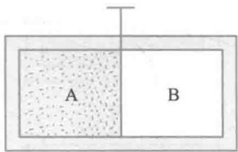  
(a)

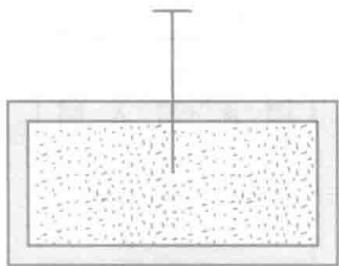  
(b)  
图14-1 平衡态

到冷热程度均匀一致的状态. 如果没有外界影响, 系统将保持这一状态, 不再发生宏观变化, 此时这两个物体的系统处于平衡态.

若系统受到外界的影响但保持了宏观性质不随时间变化，则称之为稳定态，而非平衡态。稳定态与平衡态的区别，在于是否存在外界影响。

深入的研究表明，经过适当的时间，偏离平衡态不太远的系统——近平衡系统总可以达到平衡态。热力学系统由其初始的非平衡态达到平衡态所经历的时间称为系统的弛豫时间（relaxation time）。不同的热力学系统有不同的弛豫时间，即使是在同一系统中，不同的物理量趋于平衡的弛豫时间也不一样。

平衡态下，不随时间变化的是所有能观测到的系统的宏观性质，微观上，组成系统的大量微观粒子仍处于不停的无规则运动中，只是这种热运动的平均效果不随时间而变因此，这种平衡蕴含着运动，称为“热动平衡”(thermodynamic equilibrium).

对于实际的热力学系统，绝对不受外界影响是不可能的，故平衡态为一理想的概念。只要系统的弛豫时间远小于过程进行的特征时间，平衡态就可以较好地实现。

热力学系统的状态和宏观性质由系统的几何、力学、电磁学、化学和热学物态参量表示.由于几何参量及电磁参量通常由外界限定，所以在考虑热力学系统自身宏观性质时，通常仅考虑力学、化学和热学物态参量.平衡态要求系统的宏观性质不随时间发生变化，就是要求这些物态参量确定不变，并且在所考虑的区域内各处之间达到平衡.力学参量不变说明系统各部分之间受力平衡，则系统内各部分没有宏观运动，也就是系统内部及系统与外界之间没有粒子流、没有物质交换，这种状态称为力学平衡状态.化学物态参量不变时，就要求系统中各处浓度相同，没有物质流动，化学

反应、相变也都达到平衡，这种状态称为化学平衡状态。热学物态参量（温度）不变时，说明系统中各处冷热程度相同，从而没有能量流动，这种状态称为热平衡。总之，热力学平衡态要求热力学系统同时处于力学平衡、热平衡和化学平衡，其宏观表征分别为压强均匀、无宏观粒子流动、温度处处相同、浓度相同、化学反应达到平衡、无物质流动、无化学成分变化、无物相变化。

# 14-2 热力学第零定律与温度

# 热力学第零定律

假设有两个系统通过导热壁相互接触后达到一个共同的平衡态，我们称这两个系统处于热平衡状态，或者说它们达到了热平衡(thermal equilibrium).

设想取三个热力学系统A、B、C，置于一与外界绝热的容器内.将系统A、B用绝热壁隔开，而使它们通过导热壁与处于确定状态的系统C接触，如图14-2(a)所示.经过足够长时间后，A和B分别都和C达到热平衡.这时，如果将绝热壁与导热壁互换，如图14-2(b)所示.则观察不到A、B的状态发生任何变化，这表明A与B已处于热平衡

上述实验可概括为热平衡定律：在与外界隔绝的条件下，如果两个系统分别与第三个处于确定状态下的系统处于热平衡，则这两个系统彼此也必定处于热平衡。

热平衡定律由福勒(R.H.Fowler)于20世纪30年代提出，在此之前，热力学第一、第二定律都已确立，为了想说明在逻辑上它应在那两条定律之前，故将其称为热力学第零定律（zerothlawofthermodynamics）.

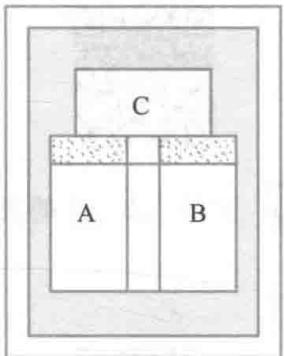  
(a)

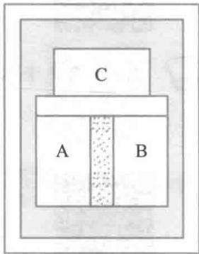  
(b)  
图14-2 热平衡定律

热力学第零定律揭示了一切互为热平衡的系统之间必定存在一个共同的宏观性质，我们把这一表征系统热平衡的宏观性质的物理量定义为温度，一切互为热平衡的系统具有相同的温度。深入一步说，每一个热力学系统都有一特别的状态函数，当几个系统互为热平衡时，它们各自的这一状态函数就取相同的值，该状态函数就被定义为温度（temperature）。

热力学第零定律不仅给出了温度的宏观定义，而且指出了测量温度的依据和方法。由于互为热平衡的物体具有相同的温度，在判别两个物体温度是否相同时，我们不一定非要让两物体直接热接触，而可借助一“标准”的物体分别与这两个物体热接触就行了，这个“标准”的物体就是温度计。

# 二、温标

  
文档：温度计的发明

  
文档：列奥米尔

  
文档：摄尔修斯

为定量地确定温度的数值，还必须给出温度的数值表示法——温标（thermometric scale）。温标可以分为经验温标、理论温标和国际温标三类。

凡是以在经验上某一物质特性随温度的变化为依据建立的温标，称为经验温标。通常可供选择的测温物质及其物理属性有：液体的体积、一定量定容气体的压强、一定量定压气体的体积、纯铂丝的电阻、黑体辐射的发射率等等。

在热力学第二定律基础上引入的一种温标称为热力学温标（thermodynamic scale），它不依赖于任何测温物质及其属性，是理想化的理论温标，又称“绝对温标”（absolute temperature scale），也是国际单位制（SI）中采用的温标。历史上首先由开尔文（Lord Kelvin）引入，所以也叫“开尔文温标”，用  $T$  表示，国际单位制单位为“开尔文（kelvin）”，简称

“开”，符号记作K.

为使国际间的温度计量归于统一，以便各国都能较方便地进行精确的温度计量，国际间制定出一种国际温标（international temperature scale，简写为ITS）. 国际温标的基本内容主要是定义测温固定点、规定在不同待测温段使用的测温标准器以及给出为确定不同固定点之间的温度的内插公式等. 国际实用温标是国际间协议性的温标，保证了国际间的温度标准在相当精确的范围内一致. 目前使用的是1990年国际温标（ITS—90）.

生活和技术中常用摄氏温标（Celsius thermometric scale），它所确定的温度叫摄氏温度，用  $t$  表示，单位记作  $\mathrm{^\circ C}$

在英、美等英语国家的商业及生活中还常用华氏温标（Fahrenheit thermometric scale），它所确定的温度叫华氏温度，用  $t_{\mathrm{F}}$  表示，单位记作  ${}^{\circ}\mathrm{F}$

摄氏温度、华氏温度、热力学温度之间有关系：

$$
t / ^ {\circ} \mathrm {C} = T / \mathrm {K} - 2 7 3. 1 5 \quad t _ {\mathrm {F}} / ^ {\circ} \mathrm {F} = 3 2 + \frac {9}{5} t / ^ {\circ} \mathrm {C}
$$

$$
T / \mathrm {K} = t / ^ {\circ} \mathrm {C} + 2 7 3. 1 5 \tag {14-1}
$$

当代科学实验室里能产生的最高温度约为  $10^{8}\mathrm{K}$ ，最低温度约为  $10^{-11}\mathrm{K}$ ，上下跨越了大约20个数量级，跨度范围非常大.

表14-1列出了一些典型的温度值

表 14-1 典型的温度值  

<table><tr><td>宇宙大爆炸后的10-43s</td><td>1032K</td></tr><tr><td>氢弹爆炸中心</td><td>108K</td></tr><tr><td>太阳中心和表面</td><td>1.5×107K、6×103K</td></tr><tr><td>地球中心和表面</td><td>4×103K、288K</td></tr><tr><td>钨的熔点</td><td>3.6×103K</td></tr></table>

  
视频：大爆炸

续表  

<table><tr><td>月球向阳面和背阴面</td><td>\( 4 \times  {10}^{2}\mathrm{\;K},{90}\mathrm{\;K} \)</td></tr><tr><td>通常所说的室温 \( \left( {{20} \sim  {30}{}^{ \circ  }\mathrm{C}}\right) \)</td><td>\( {300}\mathrm{\;K} \)</td></tr><tr><td>水的三相点</td><td>273.16 K</td></tr><tr><td>高温超导临界温度 (1988 年)</td><td>125 K</td></tr><tr><td>最早发现超导 \( \mathrm{{Hg}} \) 临界温度 (1911 年)</td><td>4. 15 K</td></tr><tr><td>宇宙背景辐射</td><td>2.7 K</td></tr><tr><td>迄今最低纪录：核自旋冷却法</td><td>\( 2 \times  {10}^{-{10}}\mathrm{\;K} \)</td></tr><tr><td>激光冷却法</td><td>\( {2.4} \times  {10}^{-{11}}\mathrm{\;K} \)</td></tr></table>

# 14-3 理想气体物态方程

文档：玻意耳

文档：马略特

文档：盖吕萨克

文档：查理

描述平衡态下热力学系统各物态参量之间函数关系的方程，称为该系统的物态方程（equation of state）. 物态方程中都显含有温度  $T$ . 在宏观上，可以在实验定律基础上结合温标的定义来建立.

根据实验结果，对于一定质量的气体，当压强不太大（和标准大气压相比），温度不太低（和室温相比）时，物态参量  $p, V, T$  之间有下列关系式：

$$
\frac {p V}{T} = C \tag {14-2}
$$

式中常量  $C$  随气体种类及气体的质量而定. 上式当  $T$  为常量时给出玻意耳定律（Boyle law），当  $p$  为常量时给出盖吕萨克定律（Gay-Lussac law），当  $V$  为常量时给出查理定律（Charles law）. 因此，上式概括了三个气体实验定律. 应该指出，上述三条定律都有其局限性和近似性. 温度越高（与室温相比），压强越低（与标准大气压相比），各种气体越是精确地服从这三个实验定律. 因此，为了使推理和计算更为简单，我们抽象、概括出理想气体（ideal gas）这一概念，即在

任何情况下，绝对遵守上述三条实验定律的气体称为理想气体。一般气体在温度不太低，压强不太大时，都可近似地看作理想气体。

阿伏伽德罗定律（Avogadro law）指出，在相同的温度和压强下，摩尔数相等的各种气体所占的体积相同。我们把气体在温度  $T_{0} = 273.15 \mathrm{~K}, p_{0} = 1 \mathrm{atm}$  下的状态称为标准状态（standard state），其相应的体积为  $V_{0}$ 。实验指出， $1 \mathrm{~mol}$  的任何气体在标准状态下所占有的体积都近似为22.4升，我们称该体积为摩尔体积（molar volume），用符号  $V_{\mathrm{m}}$  表示，即  $V_{\mathrm{m}} = 22.4 \mathrm{~L} \cdot \mathrm{mol}^{-1}$ 。平衡态时，我们设某一种气体的质量为  $m$ ，每摩尔气体的质量（称为摩尔质量）为  $M$ ，在标准状态下，该气体占有的体积为  $V_{0} = \frac{m}{M} V_{\mathrm{m}}$ ，则（14-2）式中的常量  $C$  为

$$
C = \frac {p V}{T} = \frac {p _ {0} V _ {0}}{T _ {0}} = \frac {p _ {0}}{T _ {0}} \frac {m}{M} V _ {\mathrm {m}} \tag {14-3}
$$

由于  $\frac{p_0V_{\mathrm{m}}}{T_0}$  是与气体种类无关的常量，用  $R$  表示此常量，通常称为摩尔气体常量（molar gas constant），则

$$
\begin{array}{l} R = \frac {p _ {0} V _ {\mathrm {m}}}{T _ {0}} = \frac {1 . 0 1 3 \times 1 0 ^ {5} \times 2 2 . 4 \times 1 0 ^ {- 3}}{2 7 3 . 1 5} \mathrm {J} \cdot \mathrm {m o l} ^ {- 1} \cdot \mathrm {K} ^ {- 1} \\ = 8. 3 1 \mathrm {J} \cdot \mathrm {m o l} ^ {- 1} \cdot \mathrm {K} ^ {- 1} \tag {14-4} \\ \end{array}
$$

如果  $p_0$  用atm作单位，  $V_{\mathrm{m}}$  用  $\mathrm{L}\cdot \mathrm{mol}^{-1}$  作单位，则

$$
\begin{array}{l} R = \frac {p _ {0} V _ {\mathrm {m}}}{T _ {0}} = \frac {1 \times 2 2 . 4}{2 7 3 . 1 5} \mathrm {a t m} \cdot \mathrm {L} \cdot \mathrm {m o l} ^ {- 1} \cdot \mathrm {K} ^ {- 1} \\ = 0. 0 8 2 \mathrm {a t m} \cdot \mathrm {L} \cdot \mathrm {m o l} ^ {- 1} \cdot \mathrm {K} ^ {- 1} \tag {14-5} \\ \end{array}
$$

将

$$
C = \frac {P _ {0}}{T _ {0}} \frac {m}{M} V _ {\mathrm {m}} = \frac {m}{M} R
$$

代入（14-2）式，得

$$
\frac {p V}{T} = \frac {m}{M} R
$$

即

$$
p V = \frac {m}{M} R T \tag {14-6}
$$

上式称为理想气体物态方程（equation of state for ideal gases). 它表明理想气体的三个物态参量  $p, V, T$  之间的关系. 式中： $m$  为气体质量， $M$  为气体的摩尔质量， $R$  为摩尔气体常量.  $p$  为气体压强， $V$  为气体体积， $T$  为热力学温度. 在国际单位制中， $p, V, T$  分别用  $\mathrm{Pa} \cdot \mathrm{m}^3$  和  $\mathrm{K}$  作为单位. 能严格满足理想气体物态方程的气体被称为理想气体，这也是从宏观上对理想气体作出的定义.

若设气体分子的质量为  $m_0$  ，一定量气体的总分子数为 $N,N_{\mathrm{A}} = 6.022\times 10^{23}\mathrm{mol}^{-1}$  为阿伏伽德罗常量．则气体质量 $m = m_0N$  ，气体的摩尔质量  $M = m_0N_{\mathrm{A}}$  ，上述状态方程可改写为

$$
p = \frac {m}{M} \frac {R T}{V} = \frac {m _ {0} N}{m _ {0} V} \frac {R}{N _ {\mathrm {A}}} T = n k T \tag {14-7}
$$

其中

$$
k = \frac {R}{N _ {\mathrm {A}}} = 1. 3 8 \times 1 0 ^ {- 2 3} \mathrm {J} \cdot \mathrm {K} ^ {- 1} \tag {14-8}
$$

$k$  称为玻耳兹曼常量（Boltzmann constant）， $n = \frac{N}{V}$  为单位体积内的分子数，即分子数密度（number density of molecule）

这是理想气体物态方程的另外一种常用的形式. 它指出, 理想气体的压强与分子数密度和热力学温度的乘积成正比. 在一定温度和压强下, 可用于计算分子的数密度  $n$ , 也可以较方便地讨论一些实际问题.

例14-1

两容器容积相同，装有相同质量的氮气和氧气，用一内壁光滑的水平玻璃管相通，玻璃管正中间有一小滴水银，如图14-3所示.问：

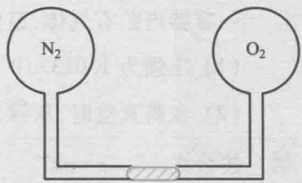  
图14-3 例题14-1

（1）如果两容器内气体的温度相同，水银滴能否平衡？  
（2）如果将氧气的温度保持为  $t_1 = 30\%$  ，氮气的温度保持为  $t_2 = 0\%$  ，水银滴将向哪一边移动？  
（3）要使水银滴不动，并维持两边温度差为  $30\%$  ，则氮气的温度应为多少？

解（1）水银滴是否能在正中间保持平衡取决于左右两侧的气体压强是否相等，根据理想气体物态方程，有

$$
p _ {\mathrm {N} _ {2}} V _ {\mathrm {N} _ {2}} = \frac {m _ {\mathrm {N} _ {2}}}{M _ {\mathrm {N} _ {2}}} R T _ {\mathrm {N} _ {2}}, p _ {\mathrm {O} _ {2}} V _ {\mathrm {O} _ {2}} = \frac {m _ {\mathrm {O} _ {2}}}{M _ {\mathrm {O} _ {2}}} R T _ {\mathrm {O} _ {2}}
$$

假设水银滴位于正中间，应有  $V_{\mathrm{N_2}} = V_{\mathrm{O_2}}$  ；又由于两种气体的质量、温度均相等，则气体的压强之比为

$$
\frac {p _ {\mathrm {N} _ {2}}}{p _ {\mathrm {O} _ {2}}} = \frac {M _ {\mathrm {O} _ {2}}}{M _ {\mathrm {N} _ {2}}} = \frac {3 2}{2 8} > 1
$$

因此，水银滴在两种气体温度相等时不能在正中间保持平衡.

（2）设两种气体达到力学平衡后，温度为  $t_1$  的氧气的体积为  $V_{1}$  ，温度为  $t_2$  的氮气的体积为  $V_{2}$  ，则由理想气体物态方程及

力学平衡条件  $p_1 = p_2$  ，有

$$
\frac {V _ {1}}{V _ {2}} = \frac {M _ {\mathrm {N} _ {2}} T _ {1}}{M _ {\mathrm {O} _ {2}} T _ {2}} = \frac {2 8 \times (2 7 3 + 3 0)}{3 2 \times 2 7 3} = 0. 9 7
$$

即  $V_{1} < V_{2}$ ，表明水银滴向氧气一边移动了。

（3）设氮气的温度为  $T$  ，按题目要求，此时氧气的温度应为  $T + 30\mathrm{K}$  ，同时两种气体的体积和压强也应相等，则可得如下关系式

$$
M _ {\mathrm {N} _ {2}} T _ {\mathrm {O} _ {2}} = M _ {\mathrm {O} _ {2}} T _ {\mathrm {N} _ {2}}
$$

代入数据有

$$
2 8 \times (T + 3 0 \mathrm {K}) = 3 2 \times T
$$

$$
T = \frac {2 8 \times 3 0}{3 2 - 2 8} \mathrm {K} = 2 1 0 \mathrm {K}
$$

即可知氮气的温度为  $210\mathrm{K}$

例14-2

一容器内贮有气体，温度为  $27\%$  问：

（1）压强为  $1.013 \times 10^{5} \mathrm{~Pa}$  时，在  $1 \mathrm{~m}^{3}$  中有多少个分子；  
（2）在高真空时，压强为  $1.33 \times 10^{-5} \mathrm{~Pa}$ ，在  $1 \mathrm{~m}^{3}$  中有多少个分子？

解 按公式  $p = nkT$

$$
\begin{array}{l} n = \frac {p}{k T} = \frac {1 . 0 1 3 \times 1 0 ^ {5}}{1 . 3 8 \times 1 0 ^ {- 2 3} \times 3 0 0} \mathrm {m} ^ {- 3} \tag {1} \\ = 2. 4 5 \times 1 0 ^ {2 5} \mathrm {m} ^ {- 3} \\ \end{array}
$$

$$
\begin{array}{l} n = \frac {p}{k T} = \frac {1 . 3 3 \times 1 0 ^ {- 5}}{1 . 3 8 \times 1 0 ^ {- 2 3} \times 3 0 0} \mathrm {m} ^ {- 3} \tag {2} \\ = 3. 2 1 \times 1 0 ^ {1 5} \mathrm {m} ^ {- 3} \\ \end{array}
$$

# 14-4 理想气体的压强和温度

从微观上讨论分子运动性质与规律时，通常以物质结构的分子假说为出发点，建立起一定的微观模型

# 一、理想气体的微观模型

严格遵守理想气体物态方程的气体是理想气体，这是理想气体的宏观模型。气体动理论假设理想气体的微观模型是：

# 1. 理想气体的分子模型

（1）分子本身的大小与分子间的距离相比较，可以忽略不计.

实验表明，在标准状态下，分子间平均距离的数量级为 $10^{-9}\mathrm{m}$  而分子的线度（直径）的数量级为  $10^{-10}\mathrm{m}$  ，可知在一般情况下，实际气体分子本身的线度，要比分子之间的平均距离小得多，因此，分子的大小可以忽略不计，分子可以看作质点.

（2）除了分子碰撞瞬间外，可以认为分子之间及分子

与容器壁之间均无相互作用力

实验表明，分子力作用范围的数量级为  $10^{-10}\mathrm{m}$  ，它远小于分子间的平均距离，所以除碰撞的瞬间外，分子间的作用力可以忽略不计.

（3）分子间的相互碰撞以及分子与容器壁之间的碰撞可以视为完全弹性碰撞

若假设分子间的碰撞或分子与器壁间的碰撞不是完全弹性的，分子的动能将因碰撞而减小，每碰撞一次就减小一次，这样，经过一段时间，所有分子的动能都将变为零，分子的运动便完全停止了，这是与实验事实不相符的。所以应该假设分子与分子之间以及分子与器壁之间的碰撞是完全弹性碰撞。即碰撞前后气体分子的动量守恒，动能也守恒。

综上所述，理想气体分子的微观模型是：遵从经典力学规律而自由地运动着的弹性质点群。

2. 平衡状态气体的统计假设（又称分子混沌性假设）

气体处于平衡态时，分子密度处处相等，各方向上的压强亦相等.因此，对处于平衡态时理想气体分子的热运动，还可作如下统计假设（statistical hypothesis）

（1）当忽略重力影响时，平衡态气体分子均匀地分布于容器中，即分子数密度  $n = \frac{N}{V} = \frac{\Delta N}{\Delta V}$  处处相等.  
（2）在平衡态下，向各个方向运动的分子数目是相等的，因此，分子速度在各个方向上的分量的各种平均值都是相等的。例如，设  $v_{x}, v_{y}, v_{z}$  是分子速度的三个分量，根据平衡态的统计假设，应有下式成立

$$
\overline {{v _ {x}}} = \overline {{v _ {y}}} = \overline {{v _ {z}}} \tag {14-9}
$$

$$
\overline {{v _ {x} ^ {2}}} = \overline {{v _ {y} ^ {2}}} = \overline {{v _ {z} ^ {2}}} \tag {14-10}
$$

因为  $\overline{v^2} = \overline{v_x^2} +\overline{v_y^2} +\overline{v_z^2}$  ，所以有

$$
\overline {{v _ {x} ^ {2}}} = \overline {{v _ {y} ^ {2}}} = \overline {{v _ {z} ^ {2}}} = \frac {1}{3} \overline {{v ^ {2}}} \tag {14-11}
$$

其中，  $\overline{v_{x}} = \frac{\sum_{i = 1}^{N}v_{ix}}{N},\overline{v_{y}} = \frac{\sum_{i = 1}^{N}v_{iy}}{N},\overline{v_{z}} = \frac{\sum_{i = 1}^{N}v_{iz}}{N};$

$$
\overline {{v _ {x} ^ {2}}} = \frac {\sum_ {i = 1} ^ {N} v _ {i x} ^ {2}}{N}, \overline {{v _ {y} ^ {2}}} = \frac {\sum_ {i = 1} ^ {N} v _ {i y} ^ {2}}{N}, \overline {{v _ {z} ^ {2}}} = \frac {\sum_ {i = 1} ^ {N} v _ {i z} ^ {2}}{N}.
$$

应当指出：这种统计假设是对大量分子而言的，是大量分子的统计平均值，气体分子数目愈多，准确度就愈高。一般情况下，这个物理条件是可以满足的，因为在标准状态下  $1\mathrm{m}^3$  气体中就约有  $10^{25}$  个分子，因此即使在宏观上非常小的体积中，微观上看来还是包含着大量分子的。

# 二、理想气体的压强公式

气体的压强等于气体作用在容器器壁单位面积上的压力. 根据力学定律, 该力等于单位时间内分子动量的增量. 当容器中的某个分子带有一定的动量与器壁发生碰撞时, 就会对器壁施加一个短暂的作用力, 碰撞前后分子动量的变化不同, 形成的冲力也不同. 此外, 尽管单个分子对器壁的冲力有大有小, 而且是不连续的, 但是容器中气体分子的数量是巨大的, 正是这些大量的分子与器壁的相互作用在宏观上形成了一个持续稳定的均匀压力, 犹如密集的雨点打在伞上而使我们感受到一个持续向下的压力一样. 所以, 气体的压强是大量气体分子对器壁不断碰撞的结果. 压强这一物理量只具有统计意义, 个别分子、少量分子碰撞在器壁上, 谈不上压强, 只有大量分子碰撞器壁时, 在宏观上才能产生均匀稳定的压强.

现在来具体讨论一下理想气体作用在器壁上的压强表达式.

为讨论方便起见，设容器为长方形，边长分别为  $l_{1}, l_{2}, l_{3}$ ，体积为  $V = l_{1}l_{2}l_{3}$ ，其中装有  $N$  个同类理想气体分子，每个分子的质量为  $m_{0}$ 。建立直角坐标系  $Oxyz$ ，并设与  $Ox$  轴垂直的两个器壁表面分别为  $A_{1}$  与  $A_{2}$ ，如图14-4所示。平衡态下，容器壁上各处的压强相同，所以我们只要计算  $A_{1}$  面上的压强就可以了。

先考察单个气体分子在一次碰撞中对  $A_{1}$  面的作用

设第  $i$  个分子的速度为  $\pmb{v}_i$  ，在直角坐标系中的三个分量分别为  $v_{ix}, v_{iy}, v_{iz}$  ，与  $A_1$  面碰撞起作用的是  $v_{ix}$  分量. 当该分子以速度  $v_{ix}$  与器壁  $A_1$  面发生碰撞时，因为碰撞是完全弹性的，所以该分子以速度  $-v_{ix}$  被弹回. 根据动量定理，该分子与  $A_1$  面碰撞一次受到器壁的冲量为其动量的增量，

$$
I _ {i} = - m _ {0} v _ {i x} - m _ {0} v _ {i x} = - 2 m _ {0} v _ {i x}
$$

则该分子施加给  $A_{1}$  面的冲量为  $2m_{0}v_{ix}$ ，沿  $x$  轴正方向

再考虑单个气体分子在单位时间内对  $A_{1}$  面的作用

第  $i$  个分子从  $A_{1}$  面弹向  $A_{2}$  面，经  $A_{2}$  面碰撞后再回到 $A_{1}$  面.显然，该分子在两个器壁之间往返一次通过的距离为  $2l_{1}$  ，因弹性碰撞，碰撞后的速率仍为  $v_{ix}$  ，所以与  $A_{1}$  面连续两次碰撞的时间间隔为  $\Delta t_i = \frac{2l_1}{v_{ix}}$  因此，在单位时间内该分子与  $A_{1}$  面的碰撞次数为  $\frac{v_{ix}}{2l_1}$  单位时间内该分子施加给 $A_{1}$  面的冲量为

$$
2 m _ {0} v _ {i x} \frac {v _ {i x}}{2 l _ {1}} = \frac {m _ {0} v _ {i x} ^ {2}}{l _ {1}}
$$

然后考虑容器中大量分子对  $A_{1}$  面的作用

根据动量定理，  $A_{1}$  面所受平均冲力  $\overline{F}$  的大小应等于单位时间内容器中所有分子给予  $A_{1}$  面冲量的总和，即

$$
\overline {{F}} = \sum_ {i = 1} ^ {N} \frac {m _ {0} v _ {i x} ^ {2}}{l _ {1}} = \frac {m _ {0}}{l _ {1}} \sum_ {i = 1} ^ {N} v _ {i x} ^ {2}
$$

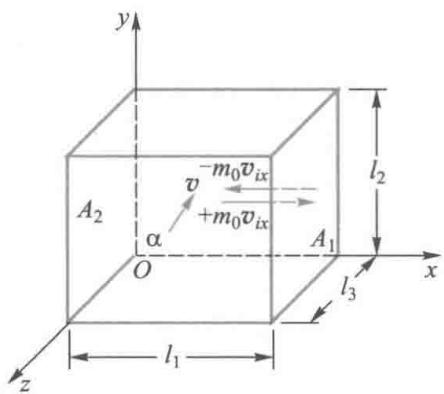

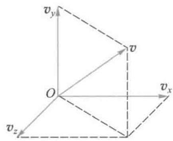  
图14-4 理想气体的压强

最后，按压强的定义可得到  $A_{1}$  面受到的压强为

$$
\begin{array}{l} p = \frac {\bar {F}}{l _ {2} l _ {3}} = \frac {m _ {0}}{l _ {2} l _ {3} l _ {1}} \sum_ {i = 1} ^ {N} v _ {i x} ^ {2} = \frac {N}{V} \cdot m _ {0} \sum_ {i = 1} ^ {N} \frac {v _ {i x} ^ {2}}{N} \\ = \frac {N}{V} \cdot m _ {0} \left(\frac {v _ {1 x} ^ {2} + v _ {2 x} ^ {2} + \cdots + v _ {i x} ^ {2} + \cdots + v _ {N x} ^ {2}}{N}\right) = n m _ {0} \overline {{v _ {x} ^ {2}}} \\ \end{array}
$$

式中  $n = \frac{N}{V}$  为分子数密度， $\overline{v_x^2}$  为容器中  $N$  个分子沿  $x$  方向速度分量平方的平均值.根据统计假设（14-11）式

$$
\overline {{v _ {x} ^ {2}}} = \overline {{v _ {y} ^ {2}}} = \overline {{v _ {z} ^ {2}}} = \frac {1}{3} \overline {{v ^ {2}}}
$$

上式可写为

$$
p = \frac {1}{3} n m _ {0} \overline {{v ^ {2}}} \tag {14-12}
$$

若以  $\overline{\varepsilon}_{\mathrm{kt}}$  表示气体分子的平均平动动能，即

$$
\overline {{\varepsilon}} _ {\mathrm {k t}} = \frac {1}{2} m _ {0} \overline {{v ^ {2}}}
$$

则（14-12）式又可写为

$$
p = \frac {2}{3} n \left(\frac {1}{2} m _ {0} \bar {v ^ {2}}\right) = \frac {2}{3} n \bar {\varepsilon} _ {\mathrm {k t}} \tag {14-13}
$$

（14-12）式和（14-13）式就是理想气体的压强公式

压强公式表明，理想气体压强的大小取决于分子数密度  $n$  和分子的平均平动动能  $\overline{\varepsilon}_{\mathrm{kt}}$ 。在压强公式的推导过程中可以看到，在对单个分子的运动处理时我们仍认定它遵守经典力学定律，而对大量分子的运动行为特征，我们运用统计平均的方法，最终把宏观物理量压强  $p$  与大量分子运动的微观物理量的统计平均值  $\bar{v}^2$  和  $\overline{\varepsilon}_{\mathrm{kt}}$  联系了起来，因而压强描述了大量分子的集体行为，具有统计意义。（14-13）式是气体动理论的一个基本公式，它表明了宏观量气体的压强  $p$  与微观量分子的平均平动动能  $\overline{\varepsilon}_{\mathrm{kt}}$  的关系。

# 理想气体温度的微观实质

根据理想气体的压强公式和物态方程，我们可以导出气体的温度与分子平均平动动能的关系，从而进一步阐明温度这一概念的微观实质.

将理想气体压强公式（14-13）式与理想气体物态方程的另一形式（14-7）式相比较，消去压强  $p$  ，得

$$
\overline {{\varepsilon}} _ {\mathrm {k t}} = \frac {1}{2} m _ {0} \overline {{v ^ {2}}} = \frac {3}{2} k T, \quad T = \frac {2}{3} \frac {\overline {{\varepsilon}} _ {\mathrm {k t}}}{k} \tag {14-14}
$$

上式给出了在平衡态下理想气体分子的微观量平均值  $\overline{\varepsilon}_{\mathrm{kl}}$  与宏观量温度  $T$  之间的定量关系，称为理想气体的能量公式（或称温度公式），它和压强公式一样，也是气体动理论的基本公式之一.（14-14）式揭示了温度的统计意义和微观实质：即气体的热力学温度是分子平均平动动能的量度；而分子平均平动动能的大小又是分子热运动剧烈程度的反映.所以，温度是气体内分子热运动剧烈程度的标志.这一结论适用于任何物体.（14-14）式还表明温度和压强一样，具有统计意义，离开了“大量分子”和“统计平均”，仅就个别分子而言，温度是没有意义的.

从能量公式中我们可以得到气体分子速率平方的平均值的开方根，称为方均根速率（root-mean-square speed），用符号  $v_{\mathrm{rms}}$  表示

$$
v _ {\mathrm {r m s}} = \sqrt {v ^ {2}} = \sqrt {\frac {3 k T}{m _ {0}}} = \sqrt {\frac {3 R T}{M}} \tag {14-15}
$$

这是大量气体分子速率平方的平均值的开方根，是一个平均值.在相同的温度下，任何理想气体分子的平均平动动能均相同，但是若分子质量不同，则方均根速率将不同

另外，据（14-14）式推断，当  $T = 0\mathrm{K}$  时，  $\overline{\varepsilon}_{\mathrm{kt}} = 0$  ，分子的热运动将停止.实际上，分子的热运动是永不停息的，所以，热力学温度的零度只能接近而不能达到，所以，我们称之为

绝对零度（absolute zero temperature）. 近代量子理论指出, 即使在绝对零度, 组成固体点阵的粒子也还具有某种振动能量, 称为零点能. 至于气体, 在温度尚未达到绝对零度前就已经变为液体或固体了, 所以, (14-14)式也就不能应用了.

例14-3

容器内贮有氧气，其压强为  $1.01325 \times 10^{5} \mathrm{~Pa}$ ，温度为  $0^{\circ} \mathrm{C}$ ，求：

（1）单位体积内的分子数；  
（2）氧气的质量密度；  
（3）氧分子的质量；  
（4）氧气分子的方均根速率；  
（5）分子的平均平动动能；  
（6）若容器是一个边长为  $0.30\mathrm{m}$  的正方体，当一个分子下降的高度等于容器的边长时，其重力势能改变多少？并将其重力势能的改变与其平均平动动能相比较

解（1）由理想气体物态方程的另一形式  $p = nkT$  ，可得标准状态下单位体积内的分子数为

$$
\begin{array}{l} n = \frac {p}{k T} = \frac {1 . 0 1 3 \times 1 0 ^ {5}}{1 . 3 8 \times 1 0 ^ {- 2 3} \times 2 7 3} \mathrm {m} ^ {- 3} \\ = 2. 6 9 \times 1 0 ^ {2 5} \mathrm {m} ^ {- 3} \\ \end{array}
$$

此数称为洛施密特（Loschmidt）常量.

（2）由理想气体物态方程，该容器中氧气的质量密度为

$$
\begin{array}{l} \rho = \frac {m}{V} = \frac {M p}{R T} \\ = \frac {3 2 . 0 \times 1 0 ^ {- 3} \times 1 . 0 1 3 \times 1 0 ^ {5}}{8 . 3 1 \times 2 7 3} \mathrm {k g} \cdot \mathrm {m} ^ {- 3} \\ = 1. 4 3 \mathrm {k g} \cdot \mathrm {m} ^ {- 3} \\ \end{array}
$$

（3）设氧气分子的质量为  $m_0^{\prime}$  ，则由

$\rho = m_0^{\prime}n$  可得

$$
m _ {0} ^ {\prime} = \frac {\rho}{n} = \frac {1 . 4 3}{2 . 6 9 \times 1 0 ^ {2 5}} \mathrm {k g} = 5. 3 2 \times 1 0 ^ {- 2 6} \mathrm {k g}
$$

（4）氧气分子的方均根速率为

$$
\begin{array}{l} v _ {\mathrm {r m s}} = \sqrt {\overline {{v ^ {2}}}} = \sqrt {\frac {3 k T}{m _ {0} ^ {\prime}}} = \sqrt {\frac {3 R T}{M _ {0 _ {2}}}} \\ = \sqrt {\frac {3 \times 8 . 3 1 \times 2 7 3}{3 2 \times 1 0 ^ {- 3}}} \mathrm {m} \cdot \mathrm {s} ^ {- 1} \\ = 4 6 1. 1 8 \mathrm {m} \cdot \mathrm {s} ^ {- 1} \\ \end{array}
$$

（5）该容器中氧分子的平均平动动能为

$$
\begin{array}{l} \overline {{\varepsilon}} _ {\mathrm {k t}} = \frac {3}{2} k T = \frac {3}{2} \times 1. 3 8 \times 1 0 ^ {- 2 3} \times 2 7 3 \mathrm {J} \\ = 5. 6 5 \times 1 0 ^ {- 2 1} J \\ \end{array}
$$

（6）题设过程中氧分子重力势能的改

变为

$$
\begin{array}{l} \Delta \varepsilon_ {\mathrm {p}} = m _ {0} ^ {\prime} g \Delta h = 5. 3 2 \times 1 0 ^ {- 2 6} \times 9. 8 0 \times 0. 3 0 \mathrm {J} \\ = 1. 5 6 \times 1 0 ^ {- 2 5} J \\ \end{array}
$$

而

$$
\frac {\Delta \varepsilon_ {\mathrm {p}}}{\overline {{\varepsilon}} _ {\mathrm {k t}}} = 2. 7 6 \times 1 0 ^ {- 5}
$$

由此可见，氧分子重力势能的改变与其平均平动动能相比可以忽略不计。

例14-4

从压强公式和温度公式导出道尔顿分压定律（Dalton law of partial pressure）：即混合气体的压强等于各种气体分压之和。

证设有  $n$  种不发生化学作用的不同气体，每种气体分子的质量分别为  $m_{1}, m_{2}, \dots$  单位体积内所含分子数分别为  $n_{1}, n_{2}, \dots$  ，则混合气体单位体积内的分子数为

$$
n = n _ {1} + n _ {2} + \dots
$$

根据压强公式，混合气体的压强为

$$
\begin{array}{l} p = \frac {2}{3} n \left(\frac {1}{2} m \bar {v ^ {2}}\right) \\ = \frac {2}{3} \left(n _ {1} + n _ {2} + \dots\right) \left(\frac {1}{2} m \bar {v ^ {2}}\right) \\ \end{array}
$$

又根据能量公式  $\overline{\varepsilon}_{\mathrm{kt}} = \frac{3}{2} kT$  ，在相同温度下，各种气体分子的平均平动动能相等，即

$$
\frac {1}{2} m _ {1} \overline {{v _ {1} ^ {2}}} = \frac {1}{2} m _ {2} \overline {{v _ {2} ^ {2}}} = \dots = \frac {1}{2} m \overline {{v ^ {2}}} = \frac {3}{2} k T
$$

式中  $\frac{1}{2} m_{1}\overline{v_{1}^{2}} = \frac{1}{2} m_{2}\overline{v_{2}^{2}} = \dots$  分别表示各种气体的平均平动动能，  $\frac{1}{2} m\overline{v^2}$  代表混合气体的平均平动动能.所以混合气体的压强为

$$
\begin{array}{l} p = \frac {2}{3} n _ {1} \frac {1}{2} m _ {1} \overline {{v _ {1} ^ {2}}} + \frac {2}{3} n _ {2} \frac {1}{2} m _ {2} \overline {{v _ {2} ^ {2}}} + \dots \\ = p _ {1} + p _ {2} + \dots \\ \end{array}
$$

由此可见：混合气体的压强等于各种气体分压之和，这就间接地证明了压强公式和温度公式的正确性

# 14-5 能量均分定理理想气体内能

在讨论理想气体压强公式和温度公式时，只考虑了分子的平动，引入了平均平动动能的概念，把分子当作了弹性

质点来处理.实际上，这样处理的结果与实验事实并不完全相符，我们还必须考虑分子本身的结构.分子是由原子组成的，单原子分子（如  $\mathrm{He},\mathrm{Ne},\mathrm{Ar},\mathrm{Kr},\mathrm{Xe}$  等）的运动只有平动，而双原子分子（如  $\mathrm{H}_{2},\mathrm{O}_{2},\mathrm{N}_{2}$  等）和多原子分子（如  $\mathrm{H}_{2}\mathrm{O}$ $\mathrm{N}_2\mathrm{O},\mathrm{NH}_3,\mathrm{CH}_4$  等）不仅有平动，而且还有转动和同一分子中原子间的振动，因此，气体分子热运动的能量也应包括这些运动所具有的能量.为了阐明气体分子无规则运动的能量所遵循的统计规律，并且在此基础上求出理想气体的内能，我们需先引入自由度的概念

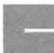

# 自由度

# 1.力学自由度

确定一个物体的空间位置所需的独立坐标数，称为该物体的自由度（degree of freedom）.

显然，自由度是与物体的机械运动方式相关的量。机械运动的基本方式包括平动、转动和振动，相应地就有平动自由度、转动自由度和振动自由度，分别用符号  $t, r, s$  来表示，于是，一个物体的总的力学自由度  $i$  为： $i = t + r + s$ .

一个质点在三维空间自由运动，需要三个独立坐标来确定它的位置，例如可以用直角坐标系中的  $x, y$  和  $z$  三个坐标变量来描述，所以它的自由度为  $i = t = 3$ 。若质点限定在平面上运动，则自由度为2；若质点沿一维直线运动，则其自由度为1。

刚体的一般运动可看作质心的平动和绕通过质心轴转动的叠加. 因此要确定刚体的空间位置, 如图14-5所示, 可用三个独立坐标确定质心  $C$  的位置; 用两个独立的方位角  $(\alpha, \beta, \gamma)$  中任意两个,  $\alpha, \beta, \gamma$  之间满足关系式  $\cos^2\alpha + \cos^2\beta + \cos^2\gamma = 1$  确定过质心的转轴  $AC$  的方位; 再用一个独立坐标  $\varphi$  确定刚体绕  $AC$  轴转过的角度. 因此刚体一般运动有6个自由度, 其中3个平动自由度和3个转动自由度. 当然,

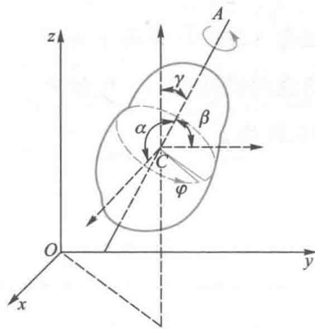  
图14-5 刚体的自由度

当刚体的运动受到某些限制时，其自由度也要减少

# 2. 分子的自由度

分子由原子组成，在热学中可将原子视为无结构的质点，除单原子分子外，其他分子都有一定的结构和形状，其运动将涉及平动、转动以及分子内原子之间的振动。通常将原子间距离保持不变的分子称为刚性分子，否则称为非刚性分子。

单原子分子可以看作是一个能够在空间自由运动的质点，确定它的位置需要3个独立坐标  $C(x,y,z)$  ，如图14-6(a)所示，因此单原子分子有3个平动自由度

双原子分子中的两个原子通过化学键相连接，常温下，当两个原子之间不存在振动、原子间距离保持不变时，双原子分子可看作是由两个质点组成的哑铃形状的刚性分子，如图14-6(b)所示.可用三个独立坐标确定其质心（或任一原子）的位置，再用两个独立的方位角确定两个原子连线的方位，由于两个质点绕其连线为轴的转动是无意义的，所以双原子分子有3个平动自由度和2个转动自由度，共计5个自由度.非刚性分子内的原子间有微小振动，因而还具有振动自由度.当研究常温下气体的性质时，对于大多数气体分子，一般可以不考虑分子的振动

多原子分子，只要各原子不排列在一条线上，便可视为自由刚体，如图14-6（c）所示，即有3个平动自由度和3个转动自由度，共计6个自由度

以上三种分子的自由度如表14-2所示

表 14-2 气体分子的自由度  

<table><tr><td>分子种类</td><td>平动自由度t</td><td>转动自由度r</td><td>总自由度i</td></tr><tr><td>单原子分子</td><td>3</td><td>0</td><td>3</td></tr><tr><td>刚性双原子分子</td><td>3</td><td>2</td><td>5</td></tr><tr><td>刚性多原子分子</td><td>3</td><td>3</td><td>6</td></tr></table>

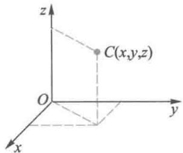  
(a)

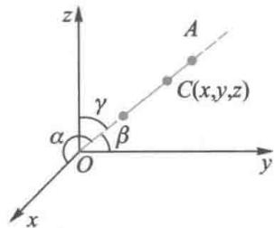  
(b)

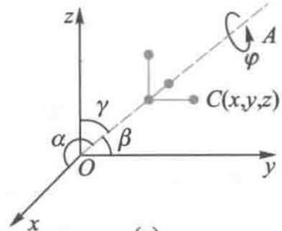  
(c)  
图14-6 分子的自由度

这里假定分子内各原子间的距离是固定不变的，即所谓“刚性”分子。对于由  $n$  个原子组成的非刚性多原子分子，其自由度为  $i = 3n$ ，其中包括3个平动自由度和3个转动自由度，其余为振动自由度。

# 二、能量按自由度均分定理

每类分子都具有3个平动自由度，前面我们已经得到理想气体分子的平均平动动能为  $\overline{\varepsilon}_{\mathrm{kt}} = \frac{1}{2} m_0\overline{v^2} = \frac{3}{2} kT.$  在直角坐标系下，根据平衡态的统计假设，气体分子沿各个方向运动的机会均等，有  $\overline{v_x^2} = \overline{v_y^2} = \overline{v_z^2}$  则

$$
\overline {{\varepsilon}} _ {\mathrm {k t}} = \frac {1}{2} m _ {0} \overline {{v ^ {2}}} = \frac {1}{2} m _ {0} \overline {{v _ {x} ^ {2}}} + \frac {1}{2} m _ {0} \overline {{v _ {y} ^ {2}}} + \frac {1}{2} m _ {0} \overline {{v _ {z} ^ {2}}} = \frac {3}{2} k T
$$

于是有

$$
\frac {1}{2} m _ {0} \overline {{v _ {x} ^ {2}}} = \frac {1}{2} m _ {0} \overline {{v _ {y} ^ {2}}} = \frac {1}{2} m _ {0} \overline {{v _ {z} ^ {2}}} = \frac {1}{2} k T \tag {14-16}
$$

上式表明，在分子的每一个自由度上都有相同的大小为  $\frac{1}{2} kT$  的平均能量，即分子的平均平动动能均等地分配给了每一个平动自由度.

这个结论可以推广到分子的转动和振动自由度，也可以推广到温度为  $T$  的平衡态下的其他物质（包括气体、液体或固体）。经典统计理论从它的基本原理出发，给出了一个普遍的结论：在温度为  $T$  的平衡态下，物质分子的每一个自由度都具有相同的平均动能，其大小都等于  $\frac{1}{2} kT$ 。这就是能量按自由度均分定理（theorem of equipartition of energy），简称能量均分定理。根据这一定理，对于自由度为  $i$  的分子，在平衡态下其平均动能为

$$
\overline {{\varepsilon}} _ {\mathrm {k}} = \frac {i}{2} k T \tag {14-17}
$$

因此，在常温下，单原子分子、刚性双原子分子、刚性多原子分子的平均动能分别是  $\frac{3}{2} kT, \frac{5}{2} kT$  和  $\frac{6}{2} kT$ .

必须指出，能量按自由度均分定理是对大量分子热运动动能求统计平均的结果，是一个统计规律。对于个别分子来说，由于气体分子运动的随机性、无规性，在某一瞬时它的各种形式的动能不一定按自由度均分。能量均分的物理机制是：气体由非平衡态演化为平衡态的过程是依靠大量分子无规则的、频繁的碰撞并交换能量来实现的。通过频繁的碰撞，一个分子的能量可以传递给另一个分子，一个自由度的能量可以转移到另一个自由度上，当达到平衡态时，能量就按自由度均匀分配了。因此，平衡态也可以看作是分子的能量实现了按自由度均分的标志。

# 三、理想气体的内能

在微观理论看来，热现象是组成热力学系统的大量微观粒子热运动的宏观表现，在热学中，把气体中所有分子各种形式的动能（平动动能、转动动能和振动动能）以及分子之间、分子内各原子之间相互作用势能的总和称为气体的内能（internal energy）。对于理想气体，因不考虑分子间的相互作用，分子间的相互作用势能便忽略不计，对于刚性分子则不考虑原子间的振动，因此刚性分子组成的理想气体的内能就是所有分子各种无规则热运动动能的总和。

根据能量均分定理，一个自由度为  $i$  的理想气体分子的平均总动能为  $\frac{i}{2} kT, 1\mathrm{mol}$  理想气体包含的分子数为  $N_{\mathrm{A}}$  （阿伏伽德罗常量），所以它的内能为

$$
E _ {\mathrm {m}} = N _ {\mathrm {A}} \frac {i}{2} k T = \frac {i}{2} R T \tag {14-18}
$$

质量为  $m$  ，摩尔质量为  $M$  的理想气体的内能为

$$
E = \frac {m}{M} E _ {\mathrm {m}} = \frac {m}{M} \frac {i}{2} R T \tag {14-19}
$$

上式表明，对于一定质量的理想气体，其内能只和气体分子的自由度和温度有关，而与气体的压强和体积无关.在分子结构确定的前提下，理想气体的内能仅是温度的单值函数，即  $E = E(T)$  .这一结论与宏观的实验观测结果相符

特别要注意，理想气体的内能只是指气体分子各种无规则热运动能量的总和，并不计及分子有规则运动（指整体宏观定向运动）的能量。气体分子的内能与宏观运动的机械能有明显的区别，不可混为一谈。

例14-5

$1\mathrm{mol}$  氧气，其温度为  $27^{\circ}C$  求：

（1）一个氧分子的平均平动动能、平均转动动能和平均总动能；  
（2）1mol氧气的内能、平动动能和转动动能；  
（3）温度升高  $1\%$  时，其内能增加多少？

解 氧气分子是双原子分子，平动自由度  $t = 3$  ，转动自由度  $r = 2$  ，自由度  $i = t + r = 5$

（1）根据能量按自由度均分定理，一个氧分子的平均平动动能、平均转动动能和平均动能分别为

$$
\begin{array}{l} \overline {{\varepsilon}} _ {\mathrm {k t}} = \frac {3}{2} k T = \frac {3}{2} \times 1. 3 8 \times 1 0 ^ {- 2 3} \times (2 7 3 + 2 7) \mathrm {J} \\ = 6. 2 1 \times 1 0 ^ {- 2 1} J \\ \end{array}
$$

$$
\begin{array}{l} \overline {{\varepsilon}} _ {\mathrm {k r}} = \frac {2}{2} k T = \frac {2}{2} \times 1. 3 8 \times 1 0 ^ {- 2 3} \times 3 0 0 \mathrm {J} \\ = 4. 1 4 \times 1 0 ^ {- 2 1} J \\ \end{array}
$$

$$
\begin{array}{l} \overline {{\varepsilon}} _ {\mathrm {k}} = \frac {5}{2} k T = \frac {5}{2} \times 1. 3 8 \times 1 0 ^ {- 2 3} \times 3 0 0 \mathrm {J} \\ = 1. 0 4 \times 1 0 ^ {- 2 0} J \\ \end{array}
$$

（2）  $1\mathrm{mol}$  氧气分子的平动动能、转动动能和内能分别为

$$
\begin{array}{l} E _ {\mathrm {k t}} = N _ {\mathrm {A}} \cdot \frac {3}{2} k T = \frac {3}{2} R T = \frac {3}{2} \times 8. 3 1 \times 3 0 0 \mathrm {J} \\ = 3. 7 4 \times 1 0 ^ {3} J \\ \end{array}
$$

$$
\begin{array}{l} E _ {\mathrm {k r}} = N _ {\mathrm {A}} \cdot \frac {2}{2} k T = R T = 8. 3 1 \times 3 0 0 \mathrm {J} \\ = 2. 4 9 \times 1 0 ^ {3} J \\ \end{array}
$$

$$
\begin{array}{l} E = E _ {\mathrm {k t}} + E _ {\mathrm {k r}} = \frac {5}{2} R T = \frac {5}{2} \times 8. 3 1 \times 3 0 0 \mathrm {J} \\ = 6. 2 3 \times 1 0 ^ {3} J \\ \end{array}
$$

（3）当温度升高  $1\%$  时， $1\mathrm{mol}$  氧气

的内能的增量为

$$
\Delta E = \frac {i}{2} R \Delta T = \frac {5}{2} \times 8. 3 1 \times 1 J = 2 0. 8 J
$$

例14-6

容积为  $2.0 \times 10^{-2} \mathrm{~m}^{3}$  的密闭绝热容器中贮有质量为  $100.0 \mathrm{~g}$  的氦气，容器以  $200 \mathrm{~m} \cdot \mathrm{s}^{-1}$  的速率作匀速直线运动，若容器突然停止，定向运动的动能全部转化为气体分子热运动的动能，则平衡后氦气的内能、温度、压强以及分子的平均动能各增加多少？

解按题意，当系统的定向运动动能全部转化为气体分子热运动的动能时，系统内能的增量为

$$
\begin{array}{l} \Delta E = E _ {\mathrm {k}} = \frac {1}{2} m v ^ {2} = \frac {1}{2} \times 1 0 0 \times 1 0 ^ {- 3} \times 2 0 0 ^ {2} \mathrm {J} \\ = 2 0 0 0 \mathrm {J} \\ \end{array}
$$

对于氦气，  $i = t = 3$  ，由理想气体内能公式 $E = \frac{m}{M}\frac{i}{2} RT$  知，对一定量的氦气，有

$$
\Delta E = \frac {m}{M} \frac {i}{2} R \Delta T
$$

则温度的改变为

$$
\begin{array}{l} \Delta T = \frac {2 M \Delta E}{i m R} = \frac {M v ^ {2}}{i R} = \frac {4 \times 1 0 ^ {- 3} \times 2 0 0 ^ {2}}{3 \times 8 . 3 1} \mathrm {K} \\ = 6. 4 2 \mathrm {K} \\ \end{array}
$$

由理想气体物态方程知压强的改变为

$$
\begin{array}{l} \Delta p = \frac {m R}{V M} \Delta T = \frac {1 0 0 . 0 \times 1 0 ^ {- 3} \times 8 . 3 1}{2 . 0 \times 1 0 ^ {- 2} \times 4 \times 1 0 ^ {- 3}} \times 6. 4 2 \mathrm {P a} \\ = 6. 6 7 \times 1 0 ^ {4} \mathrm {P a} \\ \end{array}
$$

设系统总分子数为  $N$  ，则  $N = \frac{m}{M} N_{\mathrm{A}}$  由 $\Delta E = N\Delta \overline{\varepsilon}_{\mathrm{kt}}$  ，得分子的平均动能的增量为

$$
\begin{array}{l} \Delta \overline {{\varepsilon}} _ {\mathrm {k t}} = \frac {\Delta E}{N} = \frac {\frac {1}{2} m v ^ {2}}{\frac {m}{M} N _ {\mathrm {A}}} = \frac {M v ^ {2}}{2 N _ {\mathrm {A}}} \\ = \frac {4 \times 1 0 ^ {- 3} \times 2 0 0 ^ {2}}{2 \times 6 . 0 2 \times 1 0 ^ {2 3}} J \\ = 1. 3 3 \times 1 0 ^ {- 2 2} J \\ \end{array}
$$

# 14-6 麦克斯韦速率分布律

统计物理学认为，一切热现象，其实质是大量微观粒子

的热运动在宏观上的表现. 在实验上所能观测到的宏观参量包括压强、温度、内能等, 都是在平衡态下大量分子热运动的一些微观量的统计平均值. 而所涉及的微观量都和分子的运动速度有关. 因此, 研究平衡态下气体分子的速度分布规律就有着非常重要的意义. 如果不考虑分子速度的方向, 只考虑分子按速度大小 (即速率) 的分布称为气体分子速率分布律.

# 一、速率分布函数

为了描述气体分子按速率的分布规律，首先要引入速率分布函数的概念。分子热运动速率可取  $0 \sim \infty$  之间的任意值，因此，分子速率为连续的随机变量。在研究大量分子的速率分布时，并不需要追踪每一个分子的运动，而只要知道分子在各种运动状态中的分布情况即可。通常是将  $0 \sim \infty$  的速率区间划分成许多等间隔的小区间，区间宽度为  $\mathrm{d}v$ ，由于分子运动的无规性，速率分布在  $v \sim v + \mathrm{d}v$  区间内的分子是不确定的，从统计的角度看，我们也无须知道速率分布在  $v \sim v + \mathrm{d}v$  区间内的究竟是哪些分子，我们只需知道速率分布在  $v \sim v + \mathrm{d}v$  区间内的分子数究竟有多少。

  
文档：麦克斯韦速率分布律的建立

  
文档：麦克斯韦

设一定量气体的总分子数为  $N$  ，而速率分布在  $v\sim v + \mathrm{d}v$  区间内的分子数为  $\mathrm{d}N$  ，则  $\frac{\mathrm{d}N}{N}$  就表示了速率分布在  $v\sim v + \mathrm{d}v$  区间内的分子数占气体总分子数的百分比.按照概率的定义，当  $N$  很大时这一百分比可以代表一个分子的速率在  $v\sim v + \mathrm{d}v$  区间内取值的概率.显然，一般地，这一百分比  $\frac{\mathrm{d}N}{N}$  在不同的速率区间是不同的，也即  $\frac{\mathrm{d}N}{N}$  应是速率  $v$  的某个函数；另一方面，在给定的速率  $v$  附近，如果所取的间隔  $\mathrm{d}v$  越大，则

百分比  $\frac{\mathrm{d}N}{N}$  也越大，可以认为  $\frac{\mathrm{d}N}{N}$  与  $\mathrm{dv}$  成正比，因此就有

$$
\frac {\mathrm {d} N}{N} = f (v) \mathrm {d} v
$$

或

$$
f (v) = \frac {\mathrm {d} N}{N \mathrm {d} v} \tag {14-20}
$$

式中函数  $f(v)$  称为分子的速率分布函数（speed distribution function). 其物理意义是：分子的速率分布在  $v$  附近单位速率区间内的分子数占总分子数的百分比，从概率的角度看， $f(v)$  也表示了单个分子的速率处于  $v$  附近单位速率区间内的概率，因此速率分布函数又称为概率密度（probability density）函数.

# 二、麦克斯韦速率分布律

1859年麦克斯韦（J.C.Maxwell）首先从理论上得出了平衡态下理想气体分子按速率分布的统计规律，因此称为麦克斯韦速率分布律（Maxwell speed distribution law），它指出：平衡态下，理想气体分子速率在  $v\sim v + \mathrm{d}v$  区间内的分子数占气体总分子数的百分比为

$$
\frac {\mathrm {d} N}{N} = 4 \pi \left(\frac {m _ {0}}{2 \pi k T}\right) ^ {3 / 2} \mathrm {e} ^ {- m _ {0} v ^ {2} / 2 k T} v ^ {2} \mathrm {d} v \tag {14-21}
$$

比较（14-20）式可得麦克斯韦速率分布函数（Maxwell speed distribution function）为

$$
f (v) = 4 \pi \left(\frac {m _ {0}}{2 \pi k T}\right) ^ {3 / 2} \mathrm {e} ^ {- m _ {0} v ^ {2} / 2 k T} v ^ {2} \tag {14-22}
$$

（14-21）式适用于平衡态下的理想气体，式中  $T$  为气体的热力学温度， $m_0$  为分子的质量， $k$  为玻耳兹曼常量。

下面对麦克斯韦速率分布函数作一些简单的讨论

（1）根据分布函数作出的  $f(v)$  与  $v$  的关系曲线称为麦

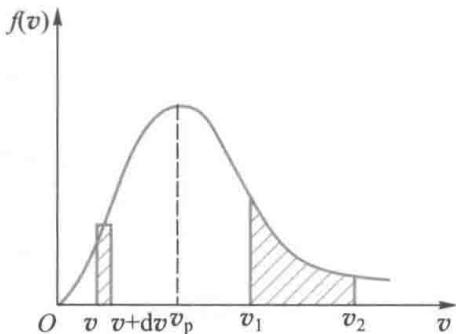  
图14-7 麦克斯韦速率分布曲线

克斯韦速率分布曲线，如图14-7所示.速率分布曲线形象地给出了气体分子按速率的分布情况.从中可以看出，气体分子的速率可以取大于零的一切值，具有很大速率或很小速率的分子数较少，其百分比较低，而具有中等速率的分子数较多，百分比较高

（2）在横坐标轴上任一速率  $v$  附近取速率间隔  $v\sim v+$ $\mathrm{dv}$  ，与该速率间隔对应的曲线下的窄条矩形面积为  $f(v)\mathrm{d}v =$ $\frac{\mathrm{d}N}{N}$  显然，该小面积表示速率分布在该速率间隔内的分子数的百分比，或者说表示分子速率分布在该速率间隔内的概率.  
（3）任一有限范围  $v_{1} \sim v_{2}$  曲线下的面积则表示分布在该有限范围  $v_{1} \sim v_{2}$  内的分子数占总分子数的百分比，可用积分法求出，即

$$
\frac {\Delta N}{N} = \int_ {v _ {1}} ^ {v _ {2}} f (v) \mathrm {d} v \tag {14-23}
$$

（4）曲线下的总面积等于分布在整个速率范围内所有各个速率间隔内的分子数的百分比的总和，显然这个总和应等于1，即

$$
\int_ {0} ^ {\infty} f (v) \mathrm {d} v = 1 \tag {14-24}
$$

这个关系式是由速率分布函数的物理意义所决定的，它是速率分布函数  $f(v)$  所必须满足的条件，称为分布函数的归一化条件（normalizing condition）.

（5）与分布函数曲线的极大值对应的速率称为最概然速率（most probable speed），用  $v_{\mathrm{p}}$  表示，它的物理意义是：如果把整个速率范围分成许多相等的小区间，则分布在  $v_{\mathrm{p}}$  所在小区间的分子数占总分子数的百分比最大。其概率意义是：分子速率可取各种值，而最可能的取值为  $v_{\mathrm{p}}$ 。 $v_{\mathrm{p}}$  可由分布函数对  $v$  求极值得到，即由

$$
\frac {\mathrm {d}}{\mathrm {d} v} f (v) = 0
$$

将（14-22）式代入，可得

$$
v _ {\mathrm {p}} = \sqrt {\frac {2 k T}{m _ {0}}} = \sqrt {\frac {2 R T}{M}} \approx 1. 4 1 \sqrt {\frac {R T}{M}} \tag {14-25}
$$

（14-25）式表明，温度越高则  $v_{\mathrm{p}}$  越大；分子质量越大则  $v_{\mathrm{p}}$  越小；对于给定的气体（ $M$  一定），则分布曲线的形状随温度而改变。在同一温度下，分布曲线的形状因气体不同而异。图14-8(a)给出了同种气体在不同温度下的分布曲线。当温度升高时，分子的无规则运动加剧，气体中速率较小的分子数减少而速率较大的分子数增加，最概然速率变大，于是，曲线的极大值移向速率大的一方。根据归一化条件，由于曲线下的面积恒等于1，所以温度升高时整个曲线变得比较平坦。图14-8(b)给出了在温度一定的条件下不同种类气体的分布曲线。质量较小的分子的速率分布曲线的峰值对应更大的速率，这是因为在温度相同时，两种气体分子的平均平动动能相等，所以质量小的气体分子其速率的平均值会更大。

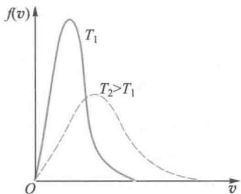  
(a)不同温度下的麦克斯韦速率分布曲线

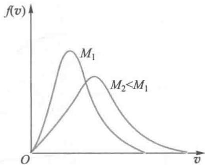  
(b) 不同摩尔质量下的麦克斯韦速率分布曲线  
图14-8

# 三、理想气体分子的三种统计速率

利用麦克斯韦速率分布函数，可以求出平衡态下一些与分子无规运动有关的物理量的统计平均值。典型的是最概然速率、平均速率以及方均根速率这三种速率。

与速率分布曲线的最大值所对应的速率称为最概然速率，用  $v_{\mathrm{p}}$  表示，上面已求出

$$
v _ {\mathrm {p}} = \sqrt {\frac {2 k T}{m _ {0}}} = \sqrt {\frac {2 R T}{M}} \approx 1. 4 1 \sqrt {\frac {R T}{M}}
$$

大量分子的速率的算术平均值称为分子的平均速率，常用  $\bar{v}$  表示.

$$
\begin{array}{l} \bar {v} = \frac {\int v \mathrm {d} N}{\int \mathrm {d} N} = \frac {\int_ {0} ^ {\infty} v N f (v) \mathrm {d} v}{N} = \int_ {0} ^ {\infty} v f (v) \mathrm {d} v \\ = 4 \pi \left(\frac {m _ {0}}{2 \pi k T}\right) ^ {3 / 2} \int_ {0} ^ {\infty} v ^ {3} \mathrm {e} ^ {- m _ {0} v ^ {2} / 2 k T} \mathrm {d} v \\ \end{array}
$$

利用高斯积分公式

$$
\int_ {0} ^ {\infty} x ^ {3} \mathrm {e} ^ {- \lambda x ^ {2}} \mathrm {d} x = \frac {1}{2 \lambda^ {2}}
$$

可得平衡态理想气体分子的平均速率

$$
\bar {v} = \sqrt {\frac {8 k T}{\pi m _ {0}}} = \sqrt {\frac {8 R T}{\pi M}} \approx 1. 6 0 \sqrt {\frac {R T}{M}} \tag {14-26}
$$

同理，可求得气体分子速率平方的平均值为

$$
\begin{array}{l} \overline {{v ^ {2}}} = \frac {\int v ^ {2} \mathrm {d} N}{\int \mathrm {d} N} = \frac {\int_ {0} ^ {\infty} v ^ {2} N f (v) \mathrm {d} v}{N} = \int_ {0} ^ {\infty} v ^ {2} f (v) \mathrm {d} v \\ = 4 \pi \left(\frac {m _ {0}}{2 \pi k T}\right) ^ {3 / 2} \int_ {0} ^ {\infty} v ^ {4} \mathrm {e} ^ {- m _ {0} v ^ {2} / 2 k T} \mathrm {d} v \\ \end{array}
$$

利用高斯积分公式

$$
\int_ {0} ^ {\infty} x ^ {4} \mathrm {e} ^ {- \lambda x ^ {2}} \mathrm {d} x = \frac {3}{8} \sqrt {\frac {\pi}{\lambda^ {5}}}
$$

得

$$
\overline {{v ^ {2}}} = \frac {3 k T}{m _ {0}} = \frac {3 R T}{M}
$$

于是，平衡态理想气体分子的方均根速率为

$$
v _ {\mathrm {r m s}} = \sqrt {\overline {{v ^ {2}}}} = \sqrt {\frac {3 k T}{m _ {0}}} = \sqrt {\frac {3 R T}{M}} \approx 1. 7 3 \sqrt {\frac {R T}{M}} \tag {14-27}
$$

这一结果与由温度公式得出的结果（14-15）式完全相同

由此可知，理想气体分子热运动的三种统计速率的共同特征是：都与  $\sqrt{T}$  成正比，与  $\sqrt{m_0}$  或  $\sqrt{M}$  成反比。它们的大小关系为  $v_{\mathrm{p}} < \overline{v} < v_{\mathrm{rms}}$ 。在室温下，它们的数量级一般为  $10^{2} \mathrm{~m} \cdot \mathrm{s}^{-1}$ 。

三种统计速率含义不同，各有用途，讨论分子速率分布状况时，常用  $v_{\mathrm{p}}$  ；讨论分子无规则运动平均能量时，常用  $v_{\mathrm{rms}}$  ；而讨论分子碰撞频率和平均自由程时，常用  $\bar{v}$

例14-7

在平衡态下，理想气体分子服从麦克斯韦速率分布律，分布函数为  $f(v)$ ，分子质量为  $m_0$ ，最概然速率为  $v_{\mathrm{p}}$ ，总分子数为  $N$ 。试说明下列各式的物理意义：（1）  $\int_{v_{\mathrm{p}}}^{\infty} f(v) \, \mathrm{d}v$ ；

(2)  $\int_{0}^{v_p}vf(v)\mathrm{d}v;(3)\int_{0}^{\infty}\frac{1}{v} f(v)\mathrm{d}v.$

解（1）因为

$$
\begin{array}{l} \int_ {v _ {p}} ^ {\infty} f (v) \mathrm {d} v = \frac {\int_ {v _ {p}} ^ {\infty} N f (v) \mathrm {d} v}{N} \\ = \frac {\int_ {v _ {p}} ^ {\infty} \mathrm {d} N}{N} = \frac {\Delta N}{N} \\ \end{array}
$$

所以该式表示速率处于  $v_{\mathrm{p}} \sim \infty$  区间的分子数占总分子数的百分比，或者说，气体分子中任意一个分子的速率处于  $v_{\mathrm{p}} \sim \infty$  区间的概率.

（2）因为

$$
\begin{array}{l} \int_ {0} ^ {v _ {p}} v f (v) \mathrm {d} v = \frac {\int_ {0} ^ {v _ {p}} v N f (v) \mathrm {d} v}{N} \\ = \frac {1}{N} \int_ {0} ^ {v _ {p}} v d N \\ \end{array}
$$

所以该式表示速率处于  $0\sim v_{\mathrm{p}}$  区间的分子的速率之和除以总分子数

（3）因为

$$
\int_ {0} ^ {\infty} \frac {1}{v} f (v) \mathrm {d} v = \frac {\int_ {0} ^ {\infty} \frac {1}{v} N f (v) \mathrm {d} v}{N} = \frac {\int_ {0} ^ {\infty} \frac {1}{v} \mathrm {d} N}{N}
$$

所以该式表示分子速率倒数的平均值

例14-8

计算地球表面的逃逸速度以及  $\mathrm{H}_2, \mathrm{He}, \mathrm{N}_2, \mathrm{O}_2, \mathrm{CO}_2$  分子的方均根速率. 设地球表面温度为  $290\mathrm{K}$ , 地球质量为  $m_{\mathrm{E}} = 5.98 \times 10^{24} \mathrm{~kg}$ , 地球半径为  $R_{\mathrm{E}} = 6378 \mathrm{~km}$ .

解由力学原理知，一个分子飞离地球的逃逸速度  $v_{\mathrm{es}}$  可由分子的动能等于相对于无穷远的引力势能求得，即由

$$
\frac {1}{2} m v _ {\mathrm {e s}} ^ {2} = G \frac {m m _ {\mathrm {E}}}{R _ {\mathrm {E}}}
$$

得

$$
\begin{array}{l} v _ {\mathrm {e s}} = \sqrt {\frac {2 G m _ {\mathrm {E}}}{R _ {\mathrm {E}}}} \\ = \sqrt {\frac {2 \times 6 . 6 7 \times 1 0 ^ {- 1 1} \times 5 . 9 8 \times 1 0 ^ {2 4}}{6 3 7 8 \times 1 0 ^ {3}}} \mathrm {m} \cdot \mathrm {s} ^ {- 1} \\ = 1. 1 2 \times 1 0 ^ {4} \mathrm {m} \cdot \mathrm {s} ^ {- 1} \\ \end{array}
$$

而

$$
\begin{array}{l} \sqrt {v _ {\mathrm {H} _ {2}} ^ {2}} = \sqrt {\frac {3 R T}{M _ {\mathrm {H} _ {2}}}} = \sqrt {\frac {3 \times 8 . 3 1 \times 2 9 0}{2 \times 1 0 ^ {- 3}}} \mathrm {m} \cdot \mathrm {s} ^ {- 1} \\ = 1. 9 0 \times 1 0 ^ {3} \mathrm {m} \cdot \mathrm {s} ^ {- 1} \\ \end{array}
$$

$$
\begin{array}{l} \sqrt {v _ {\mathrm {H e}} ^ {2}} = \sqrt {\frac {3 R T}{M _ {\mathrm {H e}}}} = \sqrt {\frac {3 \times 8 . 3 1 \times 2 9 0}{4 \times 1 0 ^ {- 3}}} \mathrm {m} \cdot \mathrm {s} ^ {- 1} \\ = 1. 3 4 \times 1 0 ^ {3} \mathrm {m} \cdot \mathrm {s} ^ {- 1} \\ \end{array}
$$

$$
\begin{array}{l} \sqrt {v _ {\mathrm {N} _ {2}} ^ {2}} = \sqrt {\frac {3 R T}{M _ {\mathrm {N} _ {2}}}} = \sqrt {\frac {3 \times 8 . 3 1 \times 2 9 0}{2 8 \times 1 0 ^ {- 3}}} \mathrm {m} \cdot \mathrm {s} ^ {- 1} \\ = 5. 0 8 \times 1 0 ^ {2} \mathrm {m} \cdot \mathrm {s} ^ {- 1} \\ \end{array}
$$

$$
\begin{array}{l} \sqrt {v _ {\mathrm {O} _ {2}} ^ {2}} = \sqrt {\frac {3 R T}{M _ {\mathrm {O} _ {2}}}} = \sqrt {\frac {3 \times 8 . 3 1 \times 2 9 0}{3 2 \times 1 0 ^ {- 3}}} \mathrm {m} \cdot \mathrm {s} ^ {- 1} \\ = 4. 7 5 \times 1 0 ^ {2} \mathrm {m} \cdot \mathrm {s} ^ {- 1} \\ \end{array}
$$

$$
\begin{array}{l} \sqrt {v _ {\mathrm {C O} _ {2}} ^ {2}} = \sqrt {\frac {3 R T}{M _ {\mathrm {C O} _ {2}}}} = \sqrt {\frac {3 \times 8 . 3 1 \times 2 9 0}{4 4 \times 1 0 ^ {- 3}}} \mathrm {m} \cdot \mathrm {s} ^ {- 1} \\ = 4. 0 5 \times 1 0 ^ {2} \mathrm {m} \cdot \mathrm {s} ^ {- 1} \\ \end{array}
$$

由以上计算可知，当  $\sqrt{v^2} < v_{\mathrm{es}}$  时，气体分子的无规则热运动动能远小于地球对它的引力势能，从而不能摆脱地球对它的束缚，于是在地球表面形成稳定的大气层， $\mathrm{N}_2, \mathrm{O}_2, \mathrm{CO}_2$  分子等构成了现今地球大气的主要成分。

例14-9

计算气体分子热运动速率介于  $v_{\mathrm{p}} \sim v_{\mathrm{p}} + v_{\mathrm{p}} / 100$  之间的分子数占总分子数的百分比.

解根据麦克斯韦速率分布律，在  $\Delta v$  较小时，引入  $u = \frac{v}{v_{\mathrm{p}}},\Delta u = \frac{\Delta v}{v_{\mathrm{p}}}$  可将麦克斯韦速率分布律改写为近似表达式

$$
\frac {\Delta N}{N} = f (u) \Delta u = \frac {4}{\sqrt {\pi}} u ^ {2} \mathrm {e} ^ {- u ^ {2}} \Delta u
$$

本题中，求速率介于  $v_{\mathrm{p}} \sim v_{\mathrm{p}} + v_{\mathrm{p}} / 100$  之间的

分子数占总分子数的百分比，可取  $v = v_{\mathrm{p}}$ $\Delta v = 0.01v_{\mathrm{p}}$  ，则  $u = 1,\Delta u = 0.01$  ，得

$$
\begin{array}{l} \frac {\Delta N}{N} = f (u) \Delta u = \frac {4}{\sqrt {\pi}} u ^ {2} \mathrm {e} ^ {- u ^ {2}} \Delta u \\ = \frac {4}{\sqrt {\pi}} \times 1 ^ {2} \times e ^ {- 1} \times 0. 0 1 \\ = 0.83\% \\ \end{array}
$$

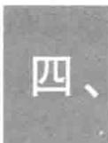

# 麦克斯韦速率分布律的实验验证

由于测量技术、高真空技术等实验技术的限制，麦克斯韦速率分布律直到20世纪20年代以后才获得实验验证。比较典型的实验包括1934年由我国物理学家葛正权完成的实验以及1955年由密勒和库什所完成的实验。这些实验所采用的原理大致相同。在此简单介绍一下葛正权实验的原理。

实验装置的原理如图14-9所示，实验测定的是金属铋(Bi)蒸气分子的速率分布。O是产生Bi蒸气的蒸气源， $\mathrm{S}_1$ 、 $\mathrm{S}_2$ 、 $\mathrm{S}_3$ 都是狭缝。由蒸气源溢出的分子经过狭缝后，形成一窄束分子射线。R是一个可以绕几何中心轴转动的空心圆筒。全部装置放在真空度约为  $1.33 \times 10^{-3} \mathrm{~Pa}$  的容器中。实验时，如果R静止，则分子射线进入R后沿直线射向装在R内壁上的弯曲玻璃片G上正对着  $\mathrm{S}_3$  的  $P$  处，并在那里形成一窄条的金属Bi沉积；当R以一定角速度旋转时，由于Bi分子从  $\mathrm{S}_3$  到达G需要一段时间，所以Bi分子将最终沉积在G上不同的地方，如  $P'$  处。速率不同，分子在G上沉积的位置不同。设速率为  $v$  的分子沉积在  $P'$  处， $P$  到  $P'$  处的弧长用  $s$  表示，圆筒直径为  $d$ ，从时间的角度考虑，有

$$
\frac {d}{v} = \frac {s}{(d / 2) \omega}, \quad v = \frac {d ^ {2} \omega}{2 s} \tag {14-28}
$$

$\omega$  和  $d$  为定值，则弧长  $s$  与速率  $v$  一一对应

实验所用Bi蒸气的温度约为  $900\mathrm{^\circ C}$ $\mathbf{S}_1$  的宽度为 $0.05\mathrm{mm}$  ，长为  $10  \mathrm{mm},\mathrm{S}_2$  和  $\mathrm{S}_3$  的宽度为  $0.60  \mathrm{mm}$  ，长为 $10  \mathrm{mm}$  ，圆筒直径为  $18.8\mathrm{cm},\mathrm{R}$  以  $30000\mathrm{r / min}$  的恒定转速转动约  $10\sim 20\mathrm{h}$  后，用测微光度计测定G上各处金属Bi分子沉积层的厚度，并通过沉积层厚度与弧长  $\boldsymbol{s}$  的变化关系

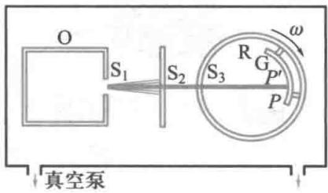  
图14-9 葛正权实验原理图

来确定Bi分子的速率分布律.实验结果与麦克斯韦给出的分布律理论结果符合得很好

# 14-7 玻耳兹曼分布律

# 一、玻耳兹曼分布律

文档：玻耳兹曼

在麦克斯韦速率分布律中讨论分子运动时，忽略了外场作用对分子运动的影响，认为分子在空间的分布是均匀的（即分子数密度  $n$  处处相等），并且在其分布函数的指数项中只出现了分子的平动动能  $\varepsilon_{\mathrm{t}} = \frac{1}{2} m_0 v^2$  ，即麦克斯韦速率分布函数可表示为

$$
f (v) = 4 \pi \left(\frac {m _ {0}}{2 \pi k T}\right) ^ {3 / 2} \mathrm {e} ^ {- \frac {\varepsilon_ {1}}{\lambda r}} v ^ {2}
$$

式中  $\varepsilon_{\mathrm{t}} = \frac{1}{2} m_{0}v^{2}$

玻耳兹曼把麦克斯韦分布律推广到处于保守力场中的气体，此时，气体分子的能量不仅是指分子的动能  $\varepsilon_{\mathrm{t}}$  ，还应包括分子在保守力场中的势能  $\varepsilon_{\mathrm{p}}$  ，分子能量  $\varepsilon = \varepsilon_{\mathrm{t}} + \varepsilon_{\mathrm{p}}$  由于考虑了外力场作用对分子的影响，气体分子在空间的分布不再均匀.显然，在考虑气体分子热运动的分布问题时，不但要指明它的速率区间，同时还应指明所在的空间区域.玻耳兹曼把麦克斯韦分布律推广为以下形式

当系统在外力场中处于平衡态时，其中坐标介于  $x\sim x+$ $\mathrm{dx};y\sim y + \mathrm{dy};z\sim z + \mathrm{dz}$  内，同时速度介于  $v_{x}\sim v_{x} + \mathrm{d}v_{x};v_{y}\sim v_{y}+$ $\mathrm{dv}_y;v_z\sim v_z + \mathrm{d}v_z$  区间内的分子数为

$$
\mathrm {d} N = n _ {0} \left(\frac {m _ {0}}{2 \pi k T}\right) ^ {3 / 2} \mathrm {e} ^ {- \left(\varepsilon_ {x} + \varepsilon_ {y}\right) / k T} \mathrm {d} v _ {x} \mathrm {d} v _ {y} \mathrm {d} v _ {z} \mathrm {d} x \mathrm {d} y \mathrm {d} z \tag {14-29}
$$

式中  $n_0$  表示势能为零处单位体积内具有各种速率的分子数，此结论称为玻耳兹曼分子按能量分布律，简称玻耳兹曼分布律（Boltzmann distribution law）.

考虑到麦克斯韦分布函数的归一化条件：

$$
\iiint_ {\pm \infty} \left(\frac {m _ {0}}{2 \pi k T}\right) ^ {3 / 2} \mathrm {e} ^ {- \varepsilon_ {1} / k T} \mathrm {d} v _ {x} \mathrm {d} v _ {y} \mathrm {d} v _ {z} = 1
$$

则，分布在坐标区间  $v_{x}\sim v_{x} + \mathrm{d}v_{x};v_{y}\sim v_{y} + \mathrm{d}v_{y};v_{z}\sim v_{z} + \mathrm{d}v_{z}$  内具有各种速度的分子数为

$$
\mathrm {d} N ^ {\prime} = n _ {0} \mathrm {e} ^ {- \varepsilon_ {p} / k T} \mathrm {d} v _ {x} \mathrm {d} x \mathrm {d} y \mathrm {d} z
$$

于是分布在坐标区间  $v_{x} \sim v_{x} + \mathrm{d}v_{x}; v_{y} \sim v_{y} + \mathrm{d}v_{y}; v_{z} \sim v_{z} + \mathrm{d}v_{z}$  内单位体积的分子数为

$$
n = \frac {\mathrm {d} N ^ {\prime}}{\mathrm {d} x \mathrm {d} y \mathrm {d} z} = n _ {0} \mathrm {e} ^ {- \frac {\varepsilon_ {\mathrm {p}}}{k T}} \tag {14-30}
$$

（14-30）式是玻耳兹曼分布律常用形式之一，即分子数密度按势能的分布律

玻耳兹曼分布律表明，在势场中的分子总是优先占据能量较低的状态。分布律中的指数因子  $\mathrm{e}^{-\frac{\varepsilon_{\mathrm{p}}}{kT}} = \frac{n}{n_0}$  反映了在一定温度下分子具有势能  $\varepsilon_{\mathrm{p}}$  的概率。

实验证明，玻耳兹曼分布律是自然界中的一个普遍规律，它对任何物质的微粒（气体、液体、固体的原子和分子、布朗粒子等）在任何保守力场（如重力场、静电场）中运动的情形都成立.

# 二、重力场中微粒按高度的分布

作为玻耳兹曼分布律的一个例子，当气体分子处于重力场中时，分子势能  $\varepsilon_{\mathrm{p}} = m_0gz$  ，那么，分布在高度  $z$  处单位体积内的分子数为

$$
n = n _ {0} \mathrm {e} ^ {- \frac {m _ {0} g z}{k T}} \tag {14-31}
$$

式中  $n_0$  表示  $z = 0$  处单位体积内具有各种速率的分子数. 上式表明, 在重力场中气体分子数密度随高度增加而按指数规律减小.

应用（14-31）式及  $p = nkT$  可得

$$
p = p _ {0} \mathrm {e} ^ {- \frac {m _ {0} g z}{k T}} = p _ {0} \mathrm {e} ^ {- \frac {M g z}{R T}} \tag {14-32}
$$

式中  $p_0 = n_0kT$  为  $z = 0$  处的压强，上式称为等温气压公式，可用于估算不同高度处的大气压强，在爬山和航空中，也可以根据大气压强随高度的变化来估算高度的变化

例14-10

试根据等温气压公式估算珠穆朗玛峰海拔8848米处的大气压强.假设海平面上大气压强为  $p_0 = 1.0\times 10^5\mathrm{Pa}$  ，温度为  $273\mathrm{K}$  ，忽略温度等随高度的变化

解等温气压公式

$$
p = p _ {0} \mathrm {e} ^ {- \frac {m _ {0} g z}{k T}} = p _ {0} \mathrm {e} ^ {- \frac {M g z}{R T}}
$$

取  $M = 29 \times 10^{-3} \mathrm{~kg} \cdot \mathrm{mol}^{-1}$ , 代入  $p_{0}, T$  的值, 有

$$
p = 1. 0 \times 1 0 ^ {5} \mathrm {e} ^ {- \frac {2 9 \times 1 0 ^ {- 3} \times 9 . 8 \times 8 8 4 8}{8 . 3 1 \times 2 7 3}} = 0. 3 3 \times 1 0 ^ {5} \mathrm {P a}
$$

可见  $p = 0.33p_{0}$  ，即是海平面上大气压强的0.33倍.由于大气中温度并不均匀，气体也没有完全达到平衡态，所以以上计算只是粗略的估算

# 三、统计规律性和涨落现象

从上面的讨论中可知，尽管组成气体的每一个分子的运动速度的大小和方向都是偶然的、随机的，但从宏观、整体的角度来看，由大量分子组成的气体都有着稳定的分布。这表明，这些大量偶然事件服从一定的分布规律。这种微观上千变万化、完全偶然，而宏观上具有一定规律的性质称为统计规律性，统计规律是对大量偶然事件整体起作用的规律。以气体分子速率的统计分布为例，尽管每一个粒子的运动是由动力学规律所制约的，但当体系中所包含的粒子数

目巨大时，就导致在本质上以全新的运动形式出现，运动形式发生了从量到质的飞跃。这种大数量粒子体系所表现出的最重要的特点之一，就是在一定宏观条件下的稳定性，这是由统计规律所制约的。

统计规律的另一个特点是永远伴随着涨落现象。在分子动理论观点看来，一切与热运动有关的宏观量（如温度、压强等）的数值都是统计平均值，而实际的测量值都与统计平均值存在着偏差，这称为涨落（fluctuation）现象。有关涨落现象的例子很多。布朗运动（Brown motion）就是典型的例子。布朗运动是液体或气体中线度只有  $10^{-6}\mathrm{m}$  数量级的布朗粒子在其周围的液体或气体分子撞击下进行的一种无规则运动，其实质是液体或气体分子热运动涨落的表现。由于布朗运动的粒子线度只有  $10^{-6}\mathrm{m}$  数量级，其表面积很小，因而同时与其相碰撞的分子数  $N$  就不是足够大，从而造成沿不同方向与布朗粒子相碰撞的分子数出现明显的涨落，导致各方向分子撞击布朗粒子的力不能抵消，这种随机力使布朗粒子不停地无规则地运动着。除布朗运动外，光在空气中的散射现象也是由于介质密度的涨落引起的。在各种电路中也可以观察到由于带电粒子的热运动而引起的电流涨落现象，这种涨落现象往往会严重影响仪器的工作。在电子管、半导体器件等中的电流涨落所引起的“噪音”是限制电子学、自动控制等仪器灵敏度的基本原因之一。因此，研究涨落现象具有非常重要的实际意义。

# 14-8 气体分子的平均自由程和平均碰撞频率

根据分子动理论，气体中大量分子都处于永不停息的热运动中，气体分子在热运动中必然要发生分子间的相互

文档：布朗

  
图14-10 气体分子的碰撞

碰撞，这种碰撞一般来说是极其频繁的。就个别分子来说，它与其他分子何时在何地发生碰撞，单位时间内与其他分子会发生多少次碰撞，每连续两次碰撞之间可以自由运动多长的路程等等，这些都是偶然的、不可预测的，但对大量分子构成的整体来说，分子间的碰撞却服从着确定的统计规律。

由于分子运动的无规性，一个分子在任意两次连续碰撞之间所通过的自由路程和所需要的时间，都具有偶然性，如图14-10所示.对于由大量分子所组成的热力学系统，可以采用统计平均的方法确定其平均值.分子在连续两次碰撞之间所通过的自由路程的平均值，称为平均自由程（mean free path），以  $\lambda$  表示；每个分子在单位时间内所受到的平均碰撞次数，称为平均碰撞频率（mean collision frequency），以  $\bar{z}$  表示

平均自由程与平均碰撞频率之间存在着简单的关系. 假设分子都以平均速率  $\bar{v}$  运动，在  $\Delta t$  时间内分子通过的路程为  $\bar{v} \Delta t$ ，碰撞次数为  $\bar{z} \Delta t$ ，则平均自由程为

$$
\bar {\lambda} = \frac {\bar {v} \Delta t}{\bar {z} \Delta t} = \frac {\bar {v}}{\bar {z}} \tag {14-33}
$$

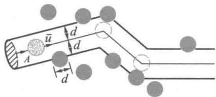  
图14-11  $\bar{\lambda}$  和  $\overline{z}$  的计算

为确定  $\bar{z}$  ，我们可以建立一个简化的模型.假设分子都可以看作平均有效直径为  $d$  的刚性小球，分子间碰撞为完全弹性碰撞.假想“跟踪”一个分子，例如A分子，它以平均相对速率  $\overline{u}$  运动，而其他分子则静止不动，考察A分子在运动中与多少个分子相碰撞.显然，在A分子运动过程中，由于碰撞，其中心的轨迹将是一条折线.在A分子运动过程中，只有中心与A分子的中心之间的距离小于或等于平均有效直径  $d$  的那些分子才有可能与A分子相碰撞.这些分子必定处于以A分子的中心的运动轨迹为轴线，以分子的平均有效直径  $d$  为半径的曲折圆柱体中，如图14-11所示.圆柱体的截面积  $\sigma = \pi d^2$  ，被称为分子的碰撞截面（collisioncross-section).设气体的分子数密度为  $n$  ，在  $\Delta t$  时间内，A分子所走过的路程为  $\overline{u}\Delta t$  ，相应的圆柱体体积为  $\sigma \overline{u}\Delta t$  ，而

圆柱体内的总分子数  $n\sigma \bar{u}\Delta t$  也就是A分子与其他分子的碰撞次数，因此，平均碰撞频率为

$$
\bar {z} = \frac {n \sigma \bar {u} \Delta t}{\Delta t} = \sigma \bar {u} n \tag {14-34}
$$

考虑分子之间的相对运动，由麦克斯韦速率分布律可以证明，气体分子的平均相对速率  $\overline{u}$  与平均速率  $\bar{v}$  之间的关系为

$$
\overline {{u}} = \sqrt {2} \overline {{v}} \tag {14-35}
$$

将这一关系代入（14-34）式，可得

$$
\bar {z} = \sqrt {2} \sigma \bar {v} n = \sqrt {2} \pi d ^ {2} \bar {v} n \tag {14-36}
$$

将（14-36）式代入（14-33）式就可以得到平均自由程  $\lambda$  为

$$
\bar {\lambda} = \frac {1}{\sqrt {2} \sigma n} = \frac {1}{\sqrt {2} \pi d ^ {2} n} \tag {14-37}
$$

上式表明，平均自由程与分子的平均有效直径  $d$  的平方以及分子数密度  $n$  成反比，而与平均速率无关

对于理想气体，  $p = nkT$  ，（14-37）式可以写作

$$
\overline {{\lambda}} = \frac {k T}{\sqrt {2} \pi d ^ {2} p} \tag {14-38}
$$

上式表明，当温度一定时，理想气体分子的平均自由程与气体的压强成反比

在常温下，气体分子的平均自由程大约为  $10^{-8} \sim 10^{-7} \mathrm{~m}$  而平均碰撞频率大约为  $10^{9} \sim 10^{10} \mathrm{~s}^{-1}$ . 表14-3列出了  $0^{\circ} \mathrm{C}$  时不同压强下空气分子的平均自由程理论计算结果.

表 14-3  $0^{\circ} \mathrm{C}$  时不同压强下空气分子的平均自由程  

<table><tr><td>压强p/Pa</td><td>平均自由程λ/m</td></tr><tr><td>1.01×105</td><td>6.9×10-8</td></tr><tr><td>1.33×102</td><td>5.2×10-5</td></tr><tr><td>1.33</td><td>5.2×10-3</td></tr><tr><td>1.33×10-2</td><td>5.2×10-1</td></tr><tr><td>1.33×10-4</td><td>5.2</td></tr></table>

例14-11

试计算空气分子在标准状态下的平均自由程和平均碰撞频率. 假设已知空气的摩尔质量  $M = 29 \times 10^{-3} \, \mathrm{kg} \cdot \mathrm{mol}^{-1}$ , 空气分子的平均有效直径  $d = 3.5 \times 10^{-10} \, \mathrm{m}$ .

解已知标准状态  $T = 273\mathrm{K},p = 1.013\times$ $10^{5}\mathrm{Pa}$  ，由平均自由程公式可得

$$
\begin{array}{l} \bar {\lambda} = \frac {k T}{\sqrt {2} \pi d ^ {2} p} \\ = \frac {1 . 3 8 \times 1 0 ^ {- 2 3} \times 2 7 3}{\sqrt {2} \times 3 1 4 \times (3 . 5 \times 1 0 ^ {- 1 0}) ^ {2} \times 1 . 0 1 3 \times 1 0 ^ {5}} \\ = 6. 9 \times 1 0 ^ {- 8} \mathrm {m} \\ \end{array}
$$

由理想气体分子平均速率公式可得标准状态下的  $\overline{v} = \sqrt{\frac{8RT}{\pi M}} = \sqrt{\frac{8\times 8.31\times 273}{3.14\times 29\times 10^{-3}}} =$

$446\mathrm{m}\cdot \mathrm{s}^{-1}$  ，按平均碰撞频率的定义可得

$$
\bar {z} = \frac {\bar {v}}{\lambda} = \frac {4 4 6}{6 . 9 \times 1 0 ^ {- 8}} = 6. 5 \times 1 0 ^ {9} \mathrm {s} ^ {- 1}
$$

理论计算表明，在标准状态下，每个空气分子每秒钟内将与其他分子发生几十亿次碰撞！或者说空气分子平均每隔约  $t = \frac{1}{\overline{z}}\approx 10^{-10}\mathrm{s}$  就要与其他分子发生一次碰撞，气体中分子热运动混乱性和无序性的物理图像由此可见一斑！

# 14-9 气体内的输运过程

前面所讨论的都是气体在平衡态下的性质，实际上，许多问题都牵涉气体在非平衡态下的变化过程。当气体各部分的物理性质不均匀时，譬如温度不同、压强不同或各气层之间有相对运动，或三者同时存在，那么由于分子之间的碰撞和掺和，气体将发生能量、质量或动量从一部分向另一部分的定向迁移。这就是非平衡态下气体内的迁移现象，也称为输运过程（transport process）。输运的结果，将使气体各部分的物理性质趋于均匀一致，即气体趋于平衡态。

气体内的输运过程典型的有三种. 当气体内各层流速不均匀时发生的黏性现象; 当气体内各处温度不均匀时发生的热传导现象; 当气体内各处分子数密度不同或分子类型不同时发生的扩散过程. 实际上, 三种迁移现象可以同时

存在，为了看出各自的实质，把它们分开讨论

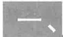

# 黏性现象及其宏观规律

流动中的气体，如果各气层的流速不同时，相邻的两个气层之间的接触面上，将形成一对阻碍两气层相对运动的等值而反向的摩擦力，称为黏性力（viscous force），也称内摩擦力（interfriction force）。例如用管道输送气体，气体在管道中前进时，紧靠着管壁的气体分子附着于管壁，其流速为零，离管壁越远，流速越大，在管道中心部分（即沿轴线部分）的气体流速最大，结果形成稳定的分层流动现象称为黏性现象（viscosity phenomenon）。

为了说明黏性现象的宏观规律，我们设想气体被限制在两个无限大的平行平板A、B之间，如图14-12所示.下面的平板A静止，上面的平板B沿  $x$  轴以速度  $u_{0}$  匀速运动，因而两板之间的气体也被带动着沿  $x$  方向流动，但平行于板的各层气体的流速不同，它们的流速  $u$  是  $z$  的函数，各层流速  $u$  随  $z$  的变化情况可以用流速梯度（gradient of flow velocity）  $\frac{\mathrm{d}u}{\mathrm{d}z}$  表示，它等于流速在  $z$  方向单位长度的增量，是描述流速不均匀情况的物理量.设想在气体内沿流速方向任选一分界平面  $(z = z_0)$  ，面积为  $\mathrm{d}S$  ，则下面流速小的气层对上面流速大的气层产生沿  $x$  负方向的黏性力  $\mathrm{d}F$  ，使上面的气层减速，而上面流速大的气层对下面流速小的气层产生沿  $x$  正方向的黏性力  $\mathrm{d}F^{\prime}$  ，使下面的气层加速，这一对黏性力大小相等、方向相反，即  $\mathrm{d}F = -\mathrm{d}F^{\prime}$

实验表明，上下气层通过  $\mathrm{d}S$  面相互作用的黏性力的大小与该处的流速梯度  $\left(\frac{\mathrm{d}u}{\mathrm{d}z}\right)_{z_0}$  成正比，与面积  $\mathrm{d}S$  成正比，即

$$
\mathrm {d} F = \eta \left(\frac {\mathrm {d} u}{\mathrm {d} z}\right) _ {z _ {0}} \mathrm {d} S \tag {14-39}
$$

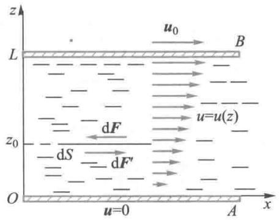  
图14-12 气体的黏性现象

上式称为牛顿黏性定律(Newtonlawofviscosity)，式中比例系数  $\eta$  称为气体的黏度（viscosity）或黏性系数（coefficientofviscosity），单位为帕秒（  $\mathrm{Pa}\cdot \mathrm{s})$  ，  $\eta$  的数值取决于气体的性质与状态，总取正值.

根据动量定理，上式还可以写作

$$
\mathrm {d} I = - \eta \left(\frac {\mathrm {d} u}{\mathrm {d} z}\right) _ {z _ {0}} \mathrm {d} S \mathrm {d} t \tag {14-40}
$$

式中  $\mathrm{d}I$  为  $\mathrm{dt}$  时间内通过  $\mathrm{dS}$  面沿  $z$  正方向输运的动量，负号表示动量沿速度减小的方向，即逆流速梯度的方向输运.

从气体分子动理论来看，当气体流动时，每个分子既有热运动动量又有定向运动动量，由于分子热运动，dS面上下两部分的分子不断地交换，下面的分子带着较小的定向动量通过dS面运动到上面，经过碰撞把它的动量传递给上面的分子，与此同时，上面的分子带着较大的定向动量通过dS面运动到下面，经过碰撞把它的动量传递给下面的分子，其结果是有净的定向动量由上向下输运。因此，黏性现象的微观解释是：气体分子在热运动过程中输运定向动量的过程。根据气体分子动理论可以导出（推导从略）在dt时间内通过dS面沿  $z$  正方向输运的动量为

$$
\mathrm {d} I = - \frac {1}{3} n m _ {0} \bar {v} \bar {\lambda} \left(\frac {\mathrm {d} u}{\mathrm {d} z}\right) _ {z _ {0}} \mathrm {d} S \mathrm {d} t \tag {14-41}
$$

其中  $n$  为气体分子数密度， $m_0$  为分子质量， $\bar{v}$  为平均速率， $\lambda$  为平均自由程.将此结果与宏观规律式（14-40）式相比较，可得黏度为

$$
\eta = \frac {1}{3} n m _ {0} \bar {v} \bar {\lambda} = \frac {1}{3} \rho \bar {v} \bar {\lambda} \tag {14-42}
$$

式中  $\rho = nm_0$  为气体的密度. 上式表明黏度与  $\rho, \bar{v}$  及  $\lambda$  有关，即取决于气体的性质与状态

# 二、热传导现象及其宏观规律

当气体内各处的温度不均匀时，将会有热量从温度较高处传向温度较低处，这种现象称为热传导（heat conduction）为了说明热传导现象的宏观规律，仍设想气体被限制在两个无限大的平行平板A、B之间，并假设气体的温度沿  $z$  轴正方向逐渐升高，温度的变化情况可以用温度梯度（temperature gradient）  $\frac{\mathrm{d}T}{\mathrm{d}z}$  来表示，它是描述温度不均匀情况的物理量. 设想在  $z = z_{0}$  处有一分界面，面积为  $\mathrm{d}S$  ，如图14-13所示

实验指出：在  $\mathrm{dt}$  时间内通过  $\mathrm{dS}$  面沿  $z$  轴方向传递的热量为

$$
\mathrm {d} Q = - \kappa \left(\frac {\mathrm {d} T}{\mathrm {d} z}\right) _ {z _ {0}} \mathrm {d} S \mathrm {d} t \tag {14-43}
$$

上式称为傅里叶热传导定律，式中比例系数  $\kappa$  称为导热系数（coefficient of heat conductivity）或热导率（thermal conductivity），其单位为  $\mathrm{W} \cdot \mathrm{m}^{-1} \cdot \mathrm{K}^{-1}$ ，它的数值取决于气体的性质与状态。负号表示热量沿温度减小的方向输运。

从气体分子动理论来看，气体内各部分温度不均匀，表明各部分分子的平均热运动动能不同，由于热运动，上、下两部分分子不断地交换，由下向上的分子带着较小的平均能量，而由上向下的分子带着较大的平均能量，分子交换的结果是有净能量自上向下输运。因此，气体内的热传导在微观上的解释是：分子在热运动过程中输运气体分子热运动动能的过程。根据气体分子动理论可以导出（推导从略）在dt时间内通过ds面沿z正方向输运的能量为

$$
\mathrm {d} Q = - \frac {1}{3} n \bar {v} \bar {\lambda} \frac {i}{2} k \left(\frac {\mathrm {d} T}{\mathrm {d} z}\right) _ {z _ {0}} \mathrm {d} S \mathrm {d} t \tag {14-44}
$$

将此结果与热传导宏观规律式（14-43）式相比较，可得热传导系数为

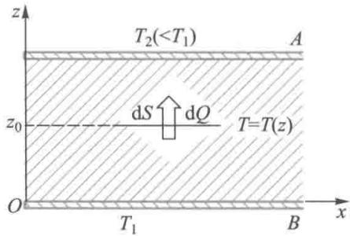  
图14-13 热传导现象

  
文档：传热现象的研究

$$
\kappa = \frac {1}{3} n \bar {v} \bar {\lambda} \frac {i}{2} k \tag {14-45}
$$

利用气体摩尔定容热容的概念，上式还可以写作

$$
\kappa = \frac {1}{3} \bar {v} \lambda \frac {C _ {V , m}}{M} \rho \tag {14-46}
$$

# 三、扩散现象及其宏观规律

当气体中各部分分子数密度不均匀时，由于热运动而使分子从密度高处迁移到密度低处的现象称为扩散（diffusion）。由于分子数分布不均匀会造成压强差，因此扩散常伴随有因压强不均匀而引起的宏观运动，若气体中还存在温度差，则还伴随有热传导和热对流等，这样的扩散过程是相当复杂的。为简单计，我们只讨论温度处处相同、并且不存在由压强差引起的粒子定向流动的纯扩散，比如两种化学成分不同的气体之间的相互渗透，称为互扩散。由于不同气体的分子的大小、质量、相互作用不同，它们的扩散速率也可能不同，从而互扩散仍比较复杂。如果发生互扩散的两种气体的分子质量、分子有效直径等的差异足够小，则它们相互扩散的速率趋于相同，这样的互扩散称为自扩散。设想取两种质量和有效直径都极为接近的分子（例如： $\mathrm{N}_2$  与  $\mathrm{CO}$  或由  ${}^{12}\mathrm{C}$  原子和  ${}^{14}\mathrm{C}$  原子组成的  $\mathrm{CO}_2$  气体）组成的混合气体，假定两种气体的比例各处不同但总的分子数密度处处相同，这样，由于各处总的分子数密度相同，则在同一温度下，气体内部不会出现压强不均匀，从而不会造成宏观的气体流动，这时，两种气体间进行的就是单纯的自扩散。假设气体的密度沿  $z$  轴方向减小，密度的变化情况可以用密度梯度（density gradient） $\frac{\mathrm{d}\rho}{\mathrm{d}z}$  来表示，它是描述密度不均匀情况的物理量。

图14-14 扩散现象

如图14-14所示，实验指出：在  $\mathrm{dt}$  时间内通过dS面沿

$z$  轴方向传递的质量为

$$
\mathrm {d} m = - D \left(\frac {\mathrm {d} \rho}{\mathrm {d} z}\right) _ {z _ {0}} \mathrm {d} S \mathrm {d} t \tag {14-47}
$$

上式称为菲克扩散定律（Ficklawofdiffusion），式中比例系数  $D$  称为自扩散系数（coefficientofdiffusion），其单位为二次方米每秒，记作  $\mathrm{m}^2\cdot \mathrm{s}^{-1}$  ，负号表示质量总是向分子数密度减小的方向输运.

从气体分子动理论来看，气体内各部分密度不均匀，由于dS面上方的气体密度小于dS面下方的气体密度，因而由热运动引起的在同样的时间内通过dS面交换的分子数不等，即有净质量由下向上输运，所以，扩散过程的微观解释是：分子在热运动过程中输运气体质量的过程。根据气体分子动理论可以导出（推导从略）在dt时间内通过dS面沿z正方向输运的气体质量为

$$
\mathrm {d} m = - \frac {1}{3} \bar {v} \bar {\lambda} \left(\frac {\mathrm {d} \rho}{\mathrm {d} z}\right) _ {z _ {0}} \mathrm {d} S \cdot \mathrm {d} t \tag {14-48}
$$

将此结果与扩散的宏观规律（14-47）式相比较，可得扩散系数为

$$
D = \frac {1}{3} \bar {v} \bar {\lambda} \tag {14-49}
$$

# 14-10 实际气体和范德瓦耳斯方程

# 一、实际气体的等温线

前面我们用气体分子动理论讨论了理想气体的基本性质，在压强不太大和温度不太低的情况下，可把真实气体近似地当作理想气体来处理，但在高压或低温下，实际气体与

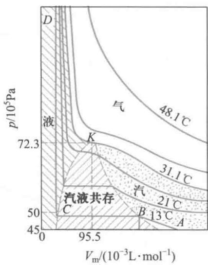  
图14-15  $\mathrm{CO}_{2}$  气体的等温线

理想气体在特性上有着显著的偏离. 在  $p - V$  图上，理想气体等温线（isotherm）是等轴双曲线，1869年英国物理学家安德鲁斯（Andrews）首先对  $\mathrm{CO}_{2}$  气体的等温变化进行了实验，得出的几条等温线如图14-15所示（图中横坐标为摩尔体积），可见它并不是等轴双曲线

在较低温度下，例如我们考察气体在  $13\%$  时的等温线。等温地压缩气体时，随着体积的减小，气体的压强逐渐增大（图中AB段），与理想气体等温线相似。当压强增大到约49atm后，进一步压缩气体时，气体的压强保持不变（图中BC段），但气缸中出现了液体，压缩只能使气体等压地向液体转变，此过程为液体与其蒸气平衡共存的状态，这时的蒸气称为饱和蒸气（saturated vapor），相应的压强称为饱和蒸气压强（saturated vapor pressure），在一定的温度下饱和蒸气压有一定的值。当蒸气全部液化（C点）后，再增大压强只能引起液体体积的微小收缩（图中CD段），反映了液体的可压缩性很小。等温线的BCD部分与理想气体等温线相差悬殊。

温度升高也观察到同样的过程，只是温度越高，平直部分越短，饱和蒸气压越高。在  $31\%$  的温度下，没有汽液共存的转变过程，平直部分缩成为一点  $K_{*}$  在高于  $31\%$  的温度下，不论压强多大，  $\mathrm{CO}_{2}$  也不会转变为液体，相应的等温线就越接近理想气体的等温线，如图中  $48.1\%$  的等温线。因此， $\mathrm{CO}_{2}$  在高温（  $48.1\%$  或低压（AB段）下，近似地遵守理想气体物态方程。

$\mathrm{CO}_{2}$  的  $31^{\circ} \mathrm{C}$  等温线是一条特殊的等温线，称临界等温线（critical isotherm），对应的状态称临界态，临界等温线上汽液转变点  $K$  是该曲线上斜率为零的一个拐点，叫做临界点（critical point），其物态参量称为临界参量（critical parameter），以  $(p_{\mathrm{c}}, V_{\mathrm{c}}, T_{\mathrm{c}})$  表示。几种物质的临界参量如表 14-4 所示。从表中可以看出，有些物质的临界温度高于室温，所以在常温下就可以使之液化。但有些物质（如  $\mathrm{O}_{2}, \mathrm{~N}_{2}, \mathrm{H}_{2}$

He等)的临界温度都很低，19世纪上半叶的低温技术还不足以使这些气体液化，于是曾把它们称之为“永久气体”随着低温技术的不断提高，至1908年，最后的一种“永久气体”氦也被液化，并在1928年被进一步凝成固体

表 14-4 几种物质的临界参量  

<table><tr><td></td><td>\( {T}_{\mathrm{c}}/\mathrm{K} \)</td><td>\( {p}_{\mathrm{c}}/\left( {{1.013} \times  {10}^{5}\mathrm{\;{Pa}}}\right) \)</td><td>\( {V}_{\mathrm{c}}/\left( {{10}^{-3}\mathrm{\;L} \cdot  {\mathrm{{mol}}}^{-1}}\right) \)</td></tr><tr><td>He</td><td>5.3</td><td>2.26</td><td>57.6</td></tr><tr><td>\( {\mathrm{H}}_{2} \)</td><td>33.3</td><td>12.8</td><td>64.9</td></tr><tr><td>\( {\mathrm{N}}_{2} \)</td><td>126.1</td><td>33.5</td><td>84.6</td></tr><tr><td>\( {\mathrm{O}}_{2} \)</td><td>154.4</td><td>49.7</td><td>74.2</td></tr><tr><td>\( {\mathrm{{CO}}}_{2} \)</td><td>304.3</td><td>72.3</td><td>95.5</td></tr><tr><td>\( {\mathrm{H}}_{2}\mathrm{O} \)</td><td>647.2</td><td>217.7</td><td>45.0</td></tr><tr><td>\( {\mathrm{C}}_{2}{\mathrm{H}}_{5}\mathrm{{OH}} \)</td><td>516</td><td>63.0</td><td>153.9</td></tr></table>

从图14-15可以看出，临界等温线把物质的  $p - V$  图分成了四个区域.在临界等温线以上的区域是气态，其性质近似于理想气体；在临界等温线以下，KB曲线右侧，物质也是气态，但由于能通过等温压缩被液化而称为蒸气或汽；BKC曲线下面是汽液共存的饱和状态，在临界等温线和KC曲线以左的状态是液态

# 二、范德瓦耳斯方程

实际气体的状态不符合理想气体物态方程的根本原因，是由于理想气体的模型是建立在假定气体分子都是质点，并且除碰撞的瞬间外分子之间无相互作用这一基础之上的。事实上，实际的分子都是由原子组成，而原子又由电子和原子核组成，它们之间总存在相互作用力。对实验结果的理论分析表明，两个分子间的相互作用力随两分子中心之间的距离变化的情况可用图14-16中的曲线表示。

  
文档：通往低温的历史

  
文档：气体的液化和低温的获得

  
文档：范德瓦耳斯

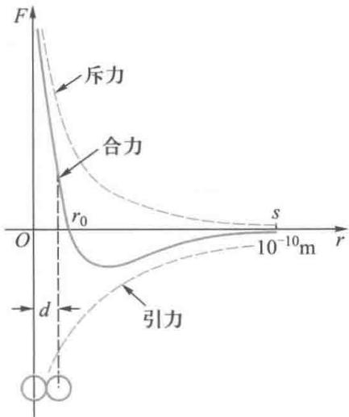  
图14-16 分子力

当  $r < r_0$  时，表现为排斥力；当  $r > r_0$  时，表现为吸引力；而当分子相距较远时，例如  $r > s$  时，两分子间的相互作用力趋于零而可以忽略， $s$  称为分子力的有效作用距离（effective action distance）。当  $r = r_0$  时，两分子间也没有相互作用，此  $r_0$  称为两分子间的平衡距离。由图可看出，当两个相向运动的分子彼此接近至  $r < r_0$  时，相互斥力迅速增大，这强大的斥力将阻止两者的进一步靠近，好像两个分子都是有一定大小的球体，可形象地说成分子具有体积。

为考虑分子间相互作用对气体宏观性质的影响，我们简化地认为当两个分子中心的距离达到某一值  $d$  时，斥力变为无限大，因而两个分子中心之间的距离不可能小于  $d$  这相当于把分子设想为直径  $d$  的刚性球， $d$  称为分子的有效直径（effective diameter），实验表明， $d$  的数量级为  $10^{-10} \mathrm{~m}$  当分子中心距离大于  $d$  时，两分子间只有引力作用，其有效作用距离  $s$  大约是  $d$  的几十到几百倍。这样，我们就建立起比理想气体分子模型更接近实际气体分子的分子模型——有吸引力的刚性球分子模型。根据这个模型来修正理想气体物态方程，可得出更接近实际气体性质的物态方程。

先考虑由于分子间斥力而使实际气体自身占有一定体积所引起的修正. 根据理想气体物态方程, 一摩尔理想气体的压强为

$$
p = \frac {R T}{V _ {\mathrm {m}}}
$$

式中的  $V_{\mathrm{m}}$  对理想气体来说就等于容器的容积，对刚性球模型，要计及分子本身体积，每个气体分子自由活动的空间就小于容器容积，应从  $V_{\mathrm{m}}$  中减去一个反映气体分子所占体积的修正量  $b$  ，于是

$$
p = \frac {R T}{V _ {\mathrm {m}} - b} \tag {14-50}
$$

式中的修正量  $b$  可用实验测定，从理论上也可以证明  $b$  约

等于一摩尔气体分子自身总体积的四倍，即

$$
\begin{array}{l} b = 4 N _ {\mathrm {A}} \cdot \frac {4}{3} \pi \left(\frac {d}{2}\right) ^ {3} = 4 N _ {\mathrm {A}} \cdot \frac {4}{3} \pi \left(\frac {1 0 ^ {- 1 0}}{2}\right) ^ {3} \mathrm {m} ^ {3} \\ \approx 1 0 ^ {- 6} \mathrm {m} ^ {3} = 1 \mathrm {c m} ^ {3} \\ \end{array}
$$

在标准状态下， $1\mathrm{mol}$  气体所占的容积约为  $22.4 \times 10^{-3} \mathrm{~m}^{3}$ ，这时  $b$  只是该容积的  $4 / 10^{5}$ ，所以可以忽略。但如果压强增大，例如增大到1000倍约  $10^{8} \mathrm{~Pa}$  时，假设玻意耳定律仍能成立，则气体所占容积将缩小到  $22.4 \times 10^{-3} / 1000 \mathrm{~m}^{3} = 22.4 \times 10^{-6} \mathrm{~m}^{3}$ ，此时  $b$  是该容积的1/20，修正量就必须考虑了。

再来考虑分子引力所引起的修正. 气体动理论指出, 气体的压强是大量分子无规则运动中碰撞容器器壁的平均总效果. 对理想气体, 分子间不考虑相互作用, 各个分子都无牵扯地撞向容器器壁. 考虑到分子间的引力, 由于当分子间距离大于分子的有效作用距离  $s$  时引力可以忽略, 因此对于容器中气体内部任一分子  $\alpha$ , 只有处在以它为中心, 以  $s$  为半径的球形作用圈内的分子才对它有吸引力作用. 因平衡态下这些分子相对  $\alpha$  分子作对称分布, 所以它们对  $\alpha$  分子的引力作用相互抵消, 其结果使  $\alpha$  分子好像不受吸引力作用一样, 如图14-17所示. 但对处于器壁附近厚度为  $s$  的表面层内的分子如  $\beta$ , 情况就不同了. 由于对  $\beta$  有引力作用的分子分布不对称, 平均来说  $\beta$  受到一个垂直于器壁指向气体内部的合力. 气体分子要与器壁碰撞, 必然要通过这一厚度为  $s$  的表面层区域, 这个指向气体内部的合力将减小分子撞击器壁的动量, 也就减小了气体施与器壁的压强. 设  $p_{i}$  表示实际气体表面层单位面积上所受的内部分子的引力总效果, 称为内压强 (internal pressure), 那么实际气体的压强为

$$
p = \frac {R T}{V _ {\mathrm {m}} - b} - p _ {\mathrm {i}} \tag {14-51}
$$

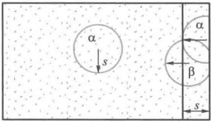  
图14-17 分子引力的修正

内压强  $p_{\mathrm{i}}$  一方面与器壁附近单位面积上被吸引气体分子数成正比，另一方面又与内部参与吸引的分子数成正比，这两者都与分子数密度  $n$  成正比，因此  $p_{\mathrm{i}}$  正比于  $n^2$  ，也即反比于  $V_{\mathrm{m}}^{2}$  ，即

$$
p _ {\mathrm {i}} \propto n ^ {2} \propto \frac {1}{V _ {\mathrm {m}} ^ {2}}
$$

引入比例常数  $a$  ，则

$$
p _ {\mathrm {i}} = \frac {a}{V _ {\mathrm {m}} ^ {2}}
$$

常数  $a$  决定于气体的性质，可由实验确定，它表示  $1\mathrm{mol}$  气体在占有单位体积时，由于分子间引力作用而引起的压强减小量.各种不同气体吸引力的强弱差别很大，所以不同气体的常数  $a$  也相差很大，见表14-5.

表 14-5 气体的范德瓦耳斯修正量  

<table><tr><td>气体</td><td>分子式</td><td>a/(0.1Pa·m6·mol-2)</td><td>b/(10-6m3·mol-1)</td></tr><tr><td>氢</td><td>H2</td><td>0.244</td><td>27</td></tr><tr><td>氦</td><td>He</td><td>0.034</td><td>24</td></tr><tr><td>氮</td><td>N2</td><td>1.39</td><td>39</td></tr><tr><td>氧</td><td>O2</td><td>1.36</td><td>32</td></tr><tr><td>水</td><td>H2O</td><td>5.46</td><td>30</td></tr><tr><td>二氧化碳</td><td>CO2</td><td>3.59</td><td>43</td></tr><tr><td>正戊烷</td><td>C5H12</td><td>19.0</td><td>146</td></tr></table>

将  $p_{\mathrm{i}}$  代入（14-51）式，即得  $1\mathrm{mol}$  实际气体的范德瓦耳斯方程为

$$
\left(p + \frac {a}{V _ {\mathrm {m}} ^ {2}}\right) (V _ {\mathrm {m}} - b) = R T \tag {14-52}
$$

对于质量为  $m$  的实际气体，其体积  $V = \frac{m}{M} V_{\mathrm{m}}$  ，所以  $V_{\mathrm{m}} =$

$\frac{M}{m} V$  ，把它代入（14-52）式即得质量为  $m$  的实际气体的范德瓦耳斯方程为

$$
\left(p + \frac {m ^ {2}}{M ^ {2}} \frac {a}{V ^ {2}}\right) \left(V - \frac {m}{M} b\right) = \frac {m}{M} R T \tag {14-53}
$$

范德瓦耳斯方程（VanderWaals equation）是荷兰物理学家范德瓦耳斯（VanderWaals）在1873年首先导出的. 方程形式简单，物理图像十分鲜明，同时它还能描述气、液及气液相互转变的性质，也能说明临界点的特征，从而揭示相变与临界现象的特点. 方程推导中的核心思想是将周围众多分子对一个分子的吸引力以平均作用力来代表. 这看来简单，但意义和影响重大，它导致20世纪相变理论中的平均场方法的广泛应用和发展，用它可以解释铁磁体向顺磁体的转变，解释超导相变和液晶相变等. 1910年范德瓦耳斯获诺贝尔物理学奖

# 三、范德瓦耳斯等温线

将  $1\mathrm{mol}$  气体的范德瓦耳斯方程改写为

$$
V _ {\mathrm {m}} ^ {3} - \left(\frac {p b + R T}{p}\right) V _ {\mathrm {m}} ^ {2} + \frac {a}{p} V _ {\mathrm {m}} - \frac {a b}{p} = 0 \tag {14-54}
$$

可见如果温度  $T$  保持恒定， $p$  与  $V_{\mathrm{m}}$  的关系为一个三次方程.在不同温度下的范德瓦耳斯等温线如图14-18所示.与实际气体等温线相比较，可以发现两者都有一条临界等温线，在温度很高时，两者没有区别；在临界等温线以上，两者较为接近；在临界等温线以下却有明显差别.真实气体的等温线有一个液化过程，即图14-18中的平直的虚线  $AB$  ，在这过程中体积减小而压强不变.但在范德瓦耳斯等温线上，与这一部分相应的却是曲线  $AA'B'B$  部分，其中  $A'B'$  部分在实际上是不存在的，因为它意味着在等温条件下气体被压缩

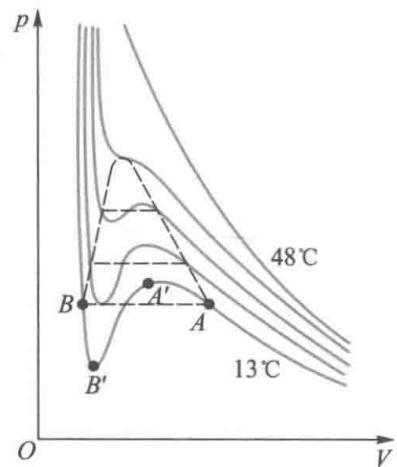  
图14-18 范德瓦耳斯等温线

而体积却增大. 而曲线的  $AA'$  和  $B'B$  部分在实验上是可以实现的. 如果气体内没有足够数量足够大小的尘埃或带电粒子等作为凝结核心, 那么在  $A$  点到达饱和状态以后, 可以继续压缩到  $A'$  点而仍不液化, 甚至在超过同温度的饱和蒸气压的压强下仍以蒸气状态存在, 这时蒸气密度大于该温度时的正常饱和蒸气密度, 这种蒸气称为过饱和蒸气 (supersaturated vapor) (或过冷蒸气), 即图 14-18 中的  $AA'$  部分, 这是一种亚稳态, 只要引入一点微尘或带电粒子, 蒸气分子就会以它们为核心而迅速凝结成液滴. 近代研究宇宙射线或粒子反应的实验中常利用这一原理制成云室来探测微观粒子 (尤其是带电粒子) 的运动径迹, 并在高能物理及核物理发展的早期为研究放射性原子核的性质及发现新的粒子等方面作出巨大贡献. 据此, 云室 (cloud chamber) 的发明人威耳孙 (C. T. R. Wilson) 获得了 1927 年的诺贝尔物理学奖. 日常生活中, 我们经常会看到天空中云层密布但仍不下雨, 也是这种过饱和现象. 如果利用飞机或火箭在云中喷洒一些粉末状物质 (如碘化银等), 即可在这些过饱和蒸气中形成凝结核, 在此基础上水蒸气凝结成较大水滴而下落成雨, 这就是人工降雨.

图14-18中的  $BB^{\prime}$  部分表示液体所受的压强比同温度下的饱和蒸气压还小时仍不蒸发，如果液体内没有尘埃或带电粒子作汽化核，这种状态实际上也是可以实现的，这时的液体称为过热液体（superheated liquid），它也是一种亚稳态。工业锅炉中的水多次煮沸后会变得很纯净，容易过热，在过热的水中如果猛然加进溶有空气的新鲜水，则会引起剧烈的汽化，压强突增，曾经由于这种原因引起过锅炉的爆炸。近代物理实验中利用过热液体的汽化现象制成气泡室（bubble chamber），当高速粒子射入过热液体时，沿途产生的离子作为汽化核，使过热液体汽化成一连串的小气泡，从而显示出离子的径迹。

例14-12

设有遵守范德瓦耳斯方程的  $1\mathrm{mol}$  气体，试建立起临界点温度与压强、体积之间的关系.

解根据（14-52）式，  $1\mathrm{mol}$  物质的临界等温线方程为

$$
\left(p + \frac {a}{V _ {\mathrm {m}} ^ {2}}\right) (V _ {\mathrm {m}} - b) = R T _ {\mathrm {K}}
$$

其中  $V_{\mathrm{m}}$  为  $1\mathrm{mol}$  气体可被压缩的体积， $T_{\mathrm{K}}$  为临界温度.在  $p - V$  图上范德瓦耳斯等温线的拐点对应临界点.根据拐点的数学条件，要求  $\frac{\mathrm{d}p}{\mathrm{d}V_{\mathrm{m}}}\bigg|_{V_{\mathrm{s}}} = 0$  和  $\frac{\mathrm{d}^2p}{\mathrm{d}V_{\mathrm{m}}^2}\bigg|_{V_{\mathrm{s}}} = 0$  ，将方程对 $V_{\mathrm{m}}$  求一阶导数、二阶导数，并代入  $p = p_{\mathrm{K}}$ $V_{\mathrm{m}} = V_{\mathrm{K}}$  ，可得

$$
p _ {\mathrm {K}} + \frac {a}{V _ {\mathrm {K}} ^ {2}} = \frac {2 a (V _ {\mathrm {K}} - b)}{V _ {\mathrm {K}} ^ {3}}
$$

$$
\frac {6 a}{V _ {\mathrm {K}} ^ {4}} (V _ {\mathrm {K}} - b) = \frac {4 a}{V _ {\mathrm {K}} ^ {3}}
$$

解上两式可得到临界点的  $p_{\mathrm{K}}$  和  $V_{\mathrm{K}}$  与常数 $a,b$  的理论关系为

$$
a = 3 V _ {\mathrm {K}} ^ {2} p _ {\mathrm {K}}, \quad b = \frac {1}{3} V _ {\mathrm {K}}
$$

代回临界的范德瓦耳斯等温线方程，得

$$
p _ {\mathrm {K}} V _ {\mathrm {K}} = \frac {3}{8} R T _ {\mathrm {K}}
$$

# 提要

本章从理想气体的微观模型入手，运用统计平均的方法，建立起描述气体平衡状态的宏观参量与相应微观量间的联系，阐明了气体热运动的性质和规律，揭示了宏观量的微观本质。气体分子的速率分布和能量分布则给出了在平衡态条件下，对大量粒子系统起主导作用的统计规律。本章还简单介绍了气体内部因密度、温度、流速不均匀而引起的由非平衡态向平衡态转变的过程，即气体内的输运（内迁移）现象，指出这是分子热运动和分子间频繁碰撞的结果。本章也采用有吸引力的刚性球分子模型建立起范德瓦耳斯方程并简单讨论了真实气体的性质。

基本概念与规律：

1. 热力学系统与外界 宏观量与微观量  
2. 热力学第零定律 如果系统A和系统B分别都与系统C的同一状态处于热平衡，那么当A和B接触时，它们也必定处于热平衡。  
3.理想气体的物态方程 平衡态下

$$
p V = \frac {m}{M} R T, \quad p = n k T
$$

摩尔气体常量  $R$

$$
R = 8. 3 1 \mathrm {J} \cdot \mathrm {m o l} ^ {- 1} \cdot \mathrm {K} ^ {- 1}
$$

玻耳兹曼常量  $k$

$$
k = 1. 3 8 \times 1 0 ^ {- 2 3} \mathrm {J} \cdot \mathrm {K} ^ {- 1}
$$

4. 理想气体压强的微观公式

$$
p = \frac {2}{3} n \left(\frac {1}{2} m _ {0} \bar {v ^ {2}}\right) = \frac {2}{3} n \bar {\varepsilon} _ {\mathrm {k t}}
$$

5. 温度的微观统计意义

$$
\overline {{\varepsilon}} _ {\mathrm {k t}} = \frac {1}{2} m _ {0} \overline {{v ^ {2}}} = \frac {3}{2} k T
$$

6. 能量均分定理 在温度为  $T$  的平衡态下，物质分子的每一个自由度都具有相同的平均动能，其大小都等于  $\frac{1}{2} kT$ . 对于自由度为  $i$  的分子，在平衡态下其平均动能为

$$
\overline {{\varepsilon}} _ {\mathrm {k}} = \frac {i}{2} k T
$$

质量为  $m$  ，摩尔质量为  $M$  的理想气体的内能为

$$
E = \frac {m}{M} \frac {i}{2} R T
$$

7. 速率分布函数与速率分布律

$$
f (v) = \frac {\mathrm {d} N}{N \mathrm {d} v}
$$

麦克斯韦速率分布律

$$
\frac {\mathrm {d} N}{N} = 4 \pi \left(\frac {m _ {0}}{2 \pi k T}\right) ^ {3 / 2} \mathrm {e} ^ {- m _ {0} v ^ {2} / 2 k T} v ^ {2} \mathrm {d} v
$$

三种特征速率

最概然速率  $v_{\mathrm{p}}$

$$
v _ {\mathrm {p}} = \sqrt {\frac {2 k T}{m _ {0}}} = \sqrt {\frac {2 R T}{M}} \approx 1. 4 1 \sqrt {\frac {R T}{M}}
$$

平均速率  $\bar{v}$

$$
\bar {v} = \sqrt {\frac {8 k T}{\pi m _ {0}}} = \sqrt {\frac {8 R T}{\pi M}} \approx 1. 6 0 \sqrt {\frac {R T}{M}}
$$

方均根速率  $v_{\mathrm{rms}}$

$$
v _ {\mathrm {r m s}} = \sqrt {v ^ {2}} = \sqrt {\frac {3 k T}{m _ {0}}} = \sqrt {\frac {3 R T}{M}} \approx 1. 7 3 \sqrt {\frac {R T}{M}}
$$

8. 玻耳兹曼分布律 平衡态下某能量状态区间的粒子数正比于  $\mathrm{e}^{-\varepsilon / kT}$

重力场中粒子数密度按高度的分布（温度恒定）

$$
n = n _ {0} \mathrm {e} ^ {- \frac {m _ {0} g z}{k T}}
$$

9. 气体分子的平均自由程和平均碰撞频率

$$
\bar {\lambda} = \frac {1}{\sqrt {2} \sigma n} = \frac {1}{\sqrt {2} \pi d ^ {2} n}, \bar {z} = \sqrt {2} \pi d ^ {2} \bar {v} n
$$

10. 输运过程 内摩擦（输运分子定向动量）、热传导（输运分子无规则运动能量）、扩散（输运分子质量）. 三种过程的宏观规律和系数的微观表达式如下

内摩擦  $\mathrm{d}I = -\eta \left(\frac{\mathrm{d}u}{\mathrm{d}z}\right)_{z_0}\mathrm{d}S\mathrm{d}t,\quad \eta = \frac{1}{3} nm_0\overline{v}\overline{\lambda}$

热传导  $\mathrm{d}Q = -\kappa \left(\frac{\mathrm{d}T}{\mathrm{d}z}\right)_{z_0}\mathrm{d}S\mathrm{d}t,\quad \kappa = \frac{1}{3}\bar{v}\overline{\lambda} C_{V,\mathrm{m}}\rho /M$

扩散  $\mathrm{dm} = -D\left(\frac{\mathrm{d}\rho}{\mathrm{d}z}\right)_{z_0}\mathrm{d}S\mathrm{d}t,\quad D = \frac{1}{3}\bar{v}\overline{\lambda}$

11. 范德瓦耳斯方程 对于  $1\mathrm{mol}$  气体

$$
\left(p + \frac {a}{V _ {\mathrm {m}} ^ {2}}\right) (V _ {\mathrm {m}} - b) = R T
$$

实际气体的等温线：在某些温度和压强下，可能存在汽液共存的状态，这时的蒸气称为饱和蒸气。温度高于某一限度，则不可能有这种汽液共存的平衡态出现，这一限度称为临界温度。

# 思考题

14-1 对热力学系统的宏观描述和微观描述的方法有何不同？有何联系？

14-2 什么是热力学系统的平衡态？气体在平衡状态时有何特征？这时气体中有分子热运动吗？热力学中的平衡与力学中的平衡有何不同？

14-3 怎样根据热平衡引进温度的概念？用温度计测量温度是根据什么原理？

14-4 对一定量的气体来说，当温度不变时，气体的压强随体积的减小而增大；当体积不变时，压强随温度的升高而增大。就微观来看，它们是否有区别？

14-5 如果气体由几种类型的分子组成，试写出混合理想气体的压强公式.

14-6 试用气体分子热运动说明为什么大气中氢的含量极少？

14-7 试回答下列问题：

（1）气体中一个分子的速率在  $v\sim v + \Delta v$  间隔内的概率是多少？

（2）一个分子具有最概然速率的概率是多少？

（3）气体中所有分子在某一瞬时速率的平均值是  $\bar{v}$ ，则一个气体分子在较长时间内的平均速率应如何考虑？

14-8 气体分子的最概然速率、平均速率以及方均根速率各是怎样定义的？它们的大小由哪些因素决定？各有什么用处？

14-9 如盛有气体的容器相对于某坐标系从静止开始运动，容器内的分子速度相对于这坐标系也将增大，则气体的温度会不会因此升高呢？

14-10 速率分布函数的物理意义是什么？试说明下列各量的意义：

(1)  $f(v)\mathrm{d}v;(2)Nf(v)\mathrm{d}v;(3)\int_{v_1}^{v_2}f(v)\mathrm{d}v;$  (4）  $\int_{v_1}^{v_2}Nf(v)\mathrm{d}v;(5)\int_{v_1}^{v_2}Nvf(v)\mathrm{d}v.$

14-11 如果作质点近似处理，在铁路上行驶的火车、在海面上航行的船只、在空中飞行的飞机各有几个自由度？

14-12 试指出下列各式所表示的物理意义：

(1)  $\frac{1}{2} kT$ ; (2)  $\frac{i}{2} RT$ ; (3)  $\frac{i}{2}\nu RT$  ( $\nu$  为物质的量); (4)  $\frac{3}{2} kT$ .

14-13 一定质量的气体，保持容器的容积不变.当温度增加时，分子运动更趋剧烈，因而平均碰撞次数增多，平均自由程是否也因此而减

小呢？

14-14 在恒压下，加热理想气体，则气体分子的平均自由程和平均碰撞频率将如何随温度的变化而变化？

14-15 分子热运动与分子间的碰撞，在迁移现象中各起什么作用？哪些物理量体现了它们的作用？

# 习题

14-1 在什么温度下，下列一对温标给出相同的读数：

（1）华氏温标和摄氏温标；  
（2）华氏温标和热力学温标；  
（3）摄氏温标和热力学温标

14-2 有一水银气压计，当水银柱为  $0.76\mathrm{m}$  高时，管顶离水银液面的距离为  $0.12\mathrm{m}$  管的截面积为  $2.0\times 10^{-4}\mathrm{m}^2$  当有少量氦气混入水银管内顶部时，水银柱高下降为  $0.60\mathrm{m}$  此时温度为 $27~\mathrm{^\circ C}$  ，试计算有多少质量的氦气在管顶（氦气的摩尔质量为  $0.004\mathrm{kg}\cdot \mathrm{mol}^{-1},0.76\mathrm{m}$  水银柱压强为  $1.013\times 10^{5}\mathrm{Pa})?$

14-3 体积为  $1.0 \times 10^{-3} \mathrm{~m}^{3}$  的容器中，含有  $4.0 \times 10^{-5} \mathrm{~kg}$  的氦气和  $4.0 \times 10^{-5} \mathrm{~kg}$  的氢气，它们的温度为  $30^{\circ} \mathrm{C}$ ，试求容器中混合气体的压强。

14-4 一氢气球在  $20^{\circ} \mathrm{C}$  下充气后，压强为  $1.2 \mathrm{atm}$ ，半径为  $1.5 \mathrm{~m}$ 。到夜晚时，温度降为  $10^{\circ} \mathrm{C}$ ，气球半径缩为  $1.4 \mathrm{~m}$ ，其中氢气压强降为  $1.1 \mathrm{atm}$ 。求已经漏掉多少氢气？

14-5 一气缸内贮有理想气体，其压强、摩尔体积和温度分别为  $p_{1}, V_{\mathrm{m1}}, T_{1}$ 。现将气缸加热使气体的压强和体积同比例地增大，即在初态和末态气体的压强  $p$  和摩尔体积  $V_{\mathrm{m}}$  都满足关系式

$$
p = C V _ {\mathrm {m}}
$$

其中  $C$  为常量，

（1）求常量  $C$  （用  $p_1, T_1$  和摩尔气体常量  $R$  表示）；  
（2）设  $T_{1} = 200\mathrm{K}$  ，当摩尔体积增大到  $2V_{\mathrm{ml}}$  时，气体的温度是多少？

14-6 目前可获得的极限真空度为  $1.00 \times 10^{-18} \mathrm{atm}$ ，求在此真空度下  $1 \mathrm{~cm}^3$  空气内平均有多

<table><tr><td>少个分子?(设温度为20℃.) 14-7 1mol氢气在温度为27℃时,它的 分子的平动动能和转动动能各为多少? 14-8 计算在300K温度下氢、氧和水银 蒸气分子的方均根速率和平均平动动能. 14-9 求压强为1.013×105Pa、质量为2×10-3kg、容积为1.54×10-3m3的氧气的分子平均 平动动能. 14-10 一瓶氢气和一瓶氧气温度相同. 若氢气分子的平均平动动能为6.21×10-21J. 试求: (1)氧气分子的平均平动动能和方均根 速率. (2)氧气的温度. 14-11 许多星球的温度达到108K.在这 温度下原子已经不存在了,而氢核(质子)是存 在的.若把氢核视为理想气体,求: (1)氢核的方均根速率是多少? (2)氢核的平均平动动能是多少电子伏? 14-12 有2×10-3m3刚性双原子分子理想 气体,其内能为6.75×102J. (1)试求气体的压强; (2)设分子总数为5.4×1022,求分子的平均 平动动能及气体的温度.</td><td>14-13 一容积为10cm3的电子管,当温度 为300K时,用真空泵把管内空气抽成压强为 5×10-6mmHg的高真空,问此时管内有多少个空 气分子?这些空气分子的平均平动动能的总和 是多少?平均转动动能的总和是多少?平均动 能的总和是多少? 14-14 水蒸气分解为同温度的氢气和氧 气,即H2O→H2+1/2O2,也就是1mol的水蒸气 可分解成同温度的1mol氢气和0.5mol氧 气,当不计振动自由度时,求此过程中内能的 增量. 14-15 容积为20.0L的瓶子以速率v= 200m·s-1匀速运动,瓶子中充有质量为100g 的氦气.设瓶子突然停止,且气体分子全部定向 运动的动能都变为热运动动能,瓶子与外界没有 热量交换.求热平衡后氦气的温度、压强、内能 及氦气分子的平均动能各增加多少? 14-16 求速率大小在vp与1.01vp之间的 气体分子占总分子数的百分之几? 14-17 求氢气在300K时分子速率在vp- 10m·s-1与vp+10m·s-1之间的分子数所占百 分比. 14-18 遵守麦克斯韦速率分布的分子的 最概然能量Ep等于什么量值?它就是1/2m0vp2吗?</td></tr></table>

14-19 试求温度为  $T$ ，分子质量为  $m_0$  的气体中分子速率倒数的平均值  $\left(\frac{1}{v}\right)$ ，它是否等于  $\frac{1}{\bar{v}}$ ？（提示： $\int_{0}^{\infty} \mathrm{e}^{-ba^2} u \, \mathrm{d}u = \frac{1}{2b}$ 。）

14-20 设  $N$  个粒子系统的速率分布函数为  $\begin{cases} \mathrm{d}N_{v} = K\mathrm{d}v(V > v > 0,K)\\ \mathrm{d}N_{v} = 0(v > V) \end{cases}$

（1）画出分布函数图；  
（2）用  $N$  和  $V$  定出常量  $K$  
（3）用  $V$  表示出算术平均速率和方均根速率.

14-21 导体中自由电子的运动类似于气体分子的运动. 设导体中共有  $N$  个自由电子. 电子气中电子最大速率  $v_{\mathrm{F}}$  称为费米速率. 电子速率在  $v$  与  $v + \mathrm{d}v$  之间的概率为

$$
\frac {\mathrm {d} N}{N} = \left\{ \begin{array}{c c} \frac {4 \pi v ^ {2} A \mathrm {d} v}{N}, & v _ {\mathrm {F}} > v > 0 \\ 0, & v > v _ {\mathrm {F}} \end{array} \right.
$$

式中  $A$  为常量.

（1）由归一化条件求  $A$  
（2）证明电子气中电子的平均动能  $\overline{\varepsilon}_{\mathrm{k}} = \frac{3}{5}\left(\frac{1}{2} mv_{\mathrm{F}}^{2}\right) = \frac{3}{5} E_{\mathrm{F}}$  ，此处  $E_{\mathrm{F}}$  称为费米能

14-22 假定大气层各处温度相同均为  $T$ ，空气的摩尔质量为  $M$ 。试根据玻耳兹曼分布律  $n = n_0 \mathrm{e}^{-(E_p / kT)}$  证明  $p$  与高度  $h$ （从海平面算起）的关系是  $h = \frac{RT}{Mg} \ln \frac{p_0}{p}$ （ $p_0$  是海平面处的大气压强）。  
14-23 求上升到什么高度处，大气压强减到地面的  $75\%$  设空气的温度为  $0^{\circ} \mathrm{C}$  ，空气的摩尔质量为  $0.0289 \mathrm{~kg} \cdot \mathrm{mol}^{-1}$ .  
14-24 无线电所用的真空管真空度为  $1.33 \times 10^{-3} \mathrm{~Pa}$ , 试求在  $27^{\circ} \mathrm{C}$  时单位体积中的分子数及分子平均自由程. 设分子的有效直径为  $3.0 \times 10^{-10} \mathrm{~m}$ .  
14-25 标准状态下氮气（He）的黏度  $\eta = 1.89 \times 10^{-5} \mathrm{~Pa} \cdot \mathrm{s}$ ，又  $M = 0.0040 \mathrm{~kg} \cdot \mathrm{mol}^{-1}, \overline{v} = 1.20 \times 10^{3} \mathrm{~m} \cdot \mathrm{s}^{-1}$ ，试求：

（1）在标准状态下氦原子的平均自由程；  
（2）氦原子的半径

14-26 设氮分子的有效直径为  $10^{-10}\mathrm{m}$

（1）求氮气在标准状态下的平均碰撞次数；  
（2）如果温度不变，气压降到  $1.33 \times 10^{-4} \mathrm{~Pa}$  则平均碰撞频率又为多少？