# 第十五章 热力学基础

15-1 热力学第一定律  
15-2 热力学第一定律对理想气体准静态过程的应用  
15-3 理想气体的绝热过程  
15-4 循环过程和卡诺循环卡诺定理  
15-5 热力学第二定律  
15-6 熵和熵增加原理  
15-7 热力学第二定律的统计意义

在第十四章中我们主要讨论了理想气体在平衡态下的基本性质和统计规律，本章讨论热力学系统在受到外界影响时，其状态变化所遵循的规律。实验表明，在热力学基本概念适用的范围内，一切与热运动有关的现象都遵循热力学基本定律，热学中最基本的热力学定律是热力学第一、第二定律。热力学第一定律是关于能量的规律，是获得物质系统各种宏观性质的依据；热力学第二定律是关于熵的原理，是判断宏观过程进行的方向和限度的依据。随着科学的发展，熵概念得到了深化和泛化，并已成为当代物理学前沿领域中的一个重要概念。本章重点介绍热力学第一、第二定律及其在热力学过程中的应用，简要分析熵及熵原理的微观统计意义。

# 15-1 热力学第一定律

# 一、热力学过程及准静态过程

热力学系统的状态随时间发生变化的过程称为热力学过程（thermodynamics process），简称过程。在过程进行中的任一时刻，系统的状态一般不是平衡态。例如，推动活塞压缩气缸内的气体时，气体的体积、密度、温度或压强都将发

生变化，在不同时刻有不同的状态。由于活塞运动方式不同，气缸中气体状态随时间的变化可以有不同的方式，即经历不同的过程。

对于不同的过程通常按过程中系统状态的性质可分为准静态过程和非准静态过程.所谓准静态过程（quasi-steadyprocess）是指：该过程进行得足够缓慢，以致过程连续经历的每一个中间状态都可视为处于平衡态，系统的状态都对应有确定的物态参量.于是我们也就可以在不涉及时间参量的情况下，用系统物态参量的变化规律来描述准静态过程的性质和特征.

对于以压强、体积和温度为物态参量的热力学系统，描述其平衡态的独立参量只有两个，因此，系统的每一个平衡态都可以用  $p - V$  图（或  $p - T$  图、 $T - V$  图）上的一个点来表示，而系统经历的一个准静态过程可以用图上的一条曲线来表示，如图15-1所示。

相对于准静态过程而言，中间态为非平衡态的过程就称为非准静态过程，对于非准静态过程，由于过程进行中的每一个中间态不都处于平衡态，非平衡态没有确定的物态参量，因而非准静态过程不能用  $p - V$  图上的曲线来表示

准静态过程是理想化的过程，在实际过程中，如果能够控制过程进行的速度，以至于系统状态每发生一个微小的变化所用的时间（常称为过程的特征时间），都远远超过系统本身的弛豫时间，就可以将此过程近似为准静态过程。仍以推动活塞压缩气缸中气体为例，由于活塞运动而使气体各处密度不同，这种作用在气体中以密度疏密波的形式传播，其传播速度为气体中的声速，数量级约为  $10^{2}\mathrm{m}\cdot \mathrm{s}^{-1}$ ，对于线度为  $10^{-1}\mathrm{m}$  的容器中的气体而言，压强恢复均匀一致所需时间（即压强的弛豫时间）大约为  $10^{-3}\mathrm{s}$ 。因此，只要控制推动活塞运动的速度，使每一次运动所经历的时间远大于上述弛豫时间，则在进行下一次运动之前，气体早已重新

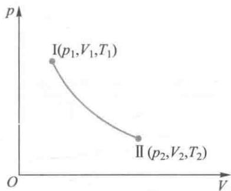  
图15-1 准静态过程

建立起新的平衡态，这样的过程可近似为准静态过程

需要指出的是，在准静态过程中，在不考虑摩擦阻力的情况下，外界作用的压强始终与系统的物态参量压强相平衡，以保证过程的准静态性质。若考虑存在摩擦阻力，那么虽然在过程进行得足够缓慢时，系统的每一个中间态仍然可以看作平衡态，但外界作用的压强不再等于系统内部的压强。我们将不考虑这种更为复杂的情况。因此，本书中提到的准静态过程均指无摩擦的准静态过程。

# 二、功 热量 热力学系统的内能

# 1. 准静态过程中的功

力学研究表明，外力对系统做功，将改变系统的运动状态，并且伴随有以功的形式出现的能量的转移。对于热力学系统，当系统与外界之间有能量交换时，做功也是系统实现能量转移的方式之一。在此我们只讨论准静态过程中系统的体积发生变化时，压力所做的机械功，也称体积功（volume work）。如图15-2所示，设想气缸内的气体经历了一个无摩擦的准静态膨胀过程，此时外界施于气体的压强等于气体的压强  $p$  ，当活塞移动一微小位移  $\mathrm{d}l$  时，气体对外界所做的微元功为

$$
\mathrm {d} W = p S \mathrm {d} l
$$

式中  $S$  为活塞的横截面积.因气体体积的增量为  $\mathrm{d}V = S\mathrm{d}l$  故上式可写为

$$
\mathrm {d} W = p \mathrm {d} V \tag {15-1}
$$

这就是在无摩擦准静态过程中体积功的微元功表达式. 显然, 当体积膨胀时,  $\mathrm{d}V > 0$ , 则  $\mathrm{d}W > 0$ , 表示系统对外界做正功; 当体积缩小时,  $\mathrm{d}V < 0$ , 则  $\mathrm{d}W < 0$ , 表示系统对外界做负功, 或称外界对系统做正功

对于系统体积由  $V_{1}$  变为  $V_{2}$  的有限的无摩擦准静态过

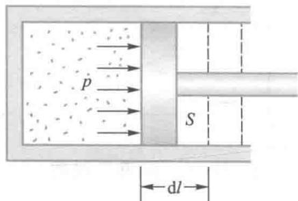  
图15-2 准静态过程的功

程，系统对外界所做的功为

$$
W = \int \mathrm {d} W = \int_ {V _ {1}} ^ {V _ {2}} p \mathrm {d} V \tag {15-2}
$$

（15-1）式和（15-2）式是计算准静态过程压力做功的基本公式.式中的  $p,V$  都是系统的状态参量，由此，可以利用物态方程找出函数关系来计算准静态过程的功

由（15-1)式和(15-2)式可知，当系统体积由  $V$  变化到 $V + \mathrm{d}V$  ，系统对外所做的微元功  $\mathrm{d}W$  在数值上就等于  $p - V$  图上过程曲线下小长方形的面积；而从状态I变化到状态Ⅱ所做的总功，在数值上就等于I到Ⅱ过程曲线下的面积，如图15-3所示.从图中还可以看出，如果系统的状态变化沿另一虚线所示的过程进行，那么气体所做的功就等于虚线下面的面积.由此可以得出一个重要结论：系统由一个状态变化到另一个状态时所做的功，不仅取决于系统的始、末两个状态，而且与系统所经历的过程有关.功是一个过程量（quantity of process）

# 2. 准静态过程中的热量

外界对系统做功使系统的状态发生变化，这是系统间相互作用的一种方式。热力学系统相互作用的另一种常见方式是热传递，两个温度不同的系统相互接触以后，高温系统的温度会下降而低温系统的温度会上升，最后达到热平衡而具有相同的温度，这种因系统间的温度差而在系统之间相互传递热运动能量的方式，称为热传导（heat conduction）。当系统与外界存在温度差时，系统与外界以热传导方式传递的热运动能量称为热量（heat），一般用符号  $Q$  表示。因此，热量的本质是能量，其单位为能量的单位：焦耳(J)。

对系统做功和传热都是改变系统能量状态的方式，功和热量都是系统能量变化的量度。功和热量的另一个共同特征是，二者都是与过程有关的量。

但热量和功在本质上是完全不同的两个概念. 外界对

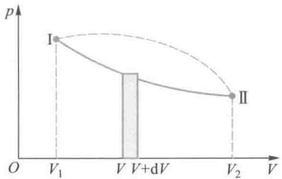  
图15-3 功的图示

  
文档：量热学的建立

  
文档：焦耳

系统做功从而改变系统的状态，是通过系统的宏观位移来完成的，本质上是外界的有规则运动能量转化为系统内分子无规则运动的能量，也就是外界机械能与系统内部热运动能量之间的转化。而通过传递热量而改变系统的状态，是通过系统内、外分子间的相互作用来完成的，本质上是外界物质分子无规则运动的能量转化为系统内分子无规则运动的能量。

应注意，一个系统与外界的热传递并不一定引起系统本身温度的变化。例如，一定量的理想气体和温度为  $T$  的热库（或称热源，指能吸收或放出热量而自身温度基本保持不变的大物体，如恒温箱。）保持接触而作准静态的膨胀（或压缩）时，气体的温度也等于  $T$  （实际上应和热库温度相差一无穷小量  $\mathrm{d}T$  ，以保证传热的条件）而保持不变。这就是准静态的等温变化过程。

# 3. 内能

在热力学研究中，把物质系统内部与热现象有关的能量称为内能。热力学系统由大量的分子、原子或其他粒子组成，这些粒子都处于永不停息的无规则运动状态，并且粒子之间有相互作用。一个宏观热力学系统内部的能量形式包括组成系统的分子（或原子）的热运动的动能、相互作用势能、化学能、电离能、原子核内部的核能等。在一般的热现象中，并不涉及微观粒子结构的变化，即不涉及化学反应和核反应，所以热力学系统的内能仅指参与热运动的分子的热运动动能以及分子间的相互作用势能的总和。用  $E$  表示内能（internal energy），由于分子热运动动能与系统的温度有关，而分子间的相互作用势能与分子间距离有关，即与气体体积有关，所以气体的内能是温度与体积的状态函数，即 $E = E(T,V)$  。对于理想气体，由于忽略分子之间的相互作用，其内能是只与温度有关的状态量（quantity of state）。

# 三、热力学第一定律

热力学系统与外界之间的相互作用可以分为力学的作用和热学的作用，在这些作用下，一方面，系统的状态会发生变化，从而作为状态函数的内能将会随之改变。另一方面，伴随有做功和传热两种形式的能量传递。根据能量守恒定律，做功、传热和内能改变这三种形式的能量的总和应保持守恒。于是，当热力学系统状态改变时，可以通过做功和传热等方式改变系统的内能，内能的增量等于外界对系统所做的功与外界传递给系统的热量之和，这就是著名的热力学第一定律（first law of thermodynamics）。用数学形式表述，则有

$$
Q = \Delta E + W \tag {15-3}
$$

其中  $Q$  和  $W$  分别表示热力学过程中系统从外界吸收的热量和对外界所做的功，  $\Delta E$  为始、末两状态内能的增量.在一个热力学过程中，上式中的三个物理量都是可正可负的代数量，它们的符号具有特定的物理含义：  $Q > 0$  ，表示系统吸热，  $Q < 0$  则表示系统放热；  $W > 0$  ，表示系统对外做正功，  $W < 0$  则表示系统对外做负功，也即外界对系统做正功；  $\Delta E > 0$  ，表示系统内能增加，  $\Delta E < 0$  表示系统内能减少

对于始末状态相差无限小的热力学过程，热力学第一定律可写为

$$
\mathrm {d} Q = \mathrm {d} E + \mathrm {d} W \tag {15-4}
$$

式中  $\mathrm{d}E$  代表内能的增量，由于内能是态函数，所以代表  $E$  的全微分，是与过程无关的量，而  $\mathrm{d}Q$  与  $\mathrm{d}W$  仅代表与过程有关的无限微小的增量

根据（15-1）式和（15-4）式，对于准静态过程，则有

$$
\mathrm {d} Q = \mathrm {d} E + p \mathrm {d} V
$$

$$
Q = \Delta E + \int_ {V _ {1}} ^ {V _ {2}} p \mathrm {d} V \tag {15-5}
$$

  
文档：热力学第一定律的建立

  
文档：永动机的否定

在历史上曾经有不少人企图制造一种既不消耗系统内能，又无须外界提供能量而能永远对外做功的机器，这种违背热力学第一定律的机器被称为“第一类永动机”（perpetual motion machine of the first kind）. 这样的企图经过无数次的尝试都以失败而告终. 因此，热力学第一定律又可以表述为：第一类永动机是不可能实现的.

可见，热力学第一定律是关于热现象的能量守恒与转化的定律，因此该定律的适用范围与过程是否为准静态过程无关，即（15-3）式适用于两个平衡态之间的一切过程能量守恒定律的普适性也使（15-3）式对于液态、气态和固态的物质系统均成立.

# 四、气体的两种摩尔热容

# 1. 热容和摩尔热容

前面已指出，热量是在热力学过程中传递的一种能量，一个物体或系统荷载或容纳这种形式的能量的能力就是该物体或系统的热容量，也常称热容（heat capacity）。定量地，在一定的条件下，物体或系统温度升高（或降低） $1\mathrm{K}$ 时吸收（或放出）的热量称为该物体或系统在该条件下的热容（heat capacity），用  $C$  表示，即

$$
C = \lim  \frac {\Delta Q}{\Delta T} = \frac {\mathrm {d} Q}{\mathrm {d} T} \tag {15-6}
$$

物质系统的热容与质量有关，单位质量物质的热容称为比热容（specificheatcapacity），常以小写  $c$  表示，单位为J· $\mathrm{K}^{-1}\cdot \mathrm{kg}^{-1};1\mathrm{mol}$  物质的热容称为摩尔热容（molarheatcapacity），单位为  $\mathrm{J}\cdot \mathrm{K}^{-1}\cdot \mathrm{mol}^{-1}$

由于热量是过程量，所以一个系统的热容量不具有唯一性，热容量定义中的一定条件还包括与过程进行的具体物理条件有关。热学中如果所研究的对象是气体，那么最常

用的是摩尔定容热容与摩尔定压热容，前者是在体积保持不变的过程中  $1\mathrm{mol}$  气体的热容，本书中用  $C_{V,\mathrm{m}}$  表示，后者是在压强保持不变的过程中  $1\mathrm{mol}$  气体的热容，本书中用 $C_{p,\mathrm{m}}$  表示.

由于气体的物态参量  $p, V, T$  中只有两个是独立的，因而系统的内能作为状态的函数，可以用  $p, V, T$  中的任意两个来表示，即气体的内能是两个变量的函数。例如，把内能看成温度和体积的函数时，就可以表示为  $E = E(T, V)$ 。

假定  $1\mathrm{mol}$  气体温度升高  $\Delta T$  ，吸收热量为  $\Delta Q_{\mathrm{m}}$  ，则有

$$
\begin{array}{l} C _ {V, \mathrm {m}} = \lim  \left(\frac {\Delta Q _ {\mathrm {m}}}{\Delta T}\right) _ {V} = \left(\frac {\mathrm {d} Q _ {\mathrm {m}}}{\mathrm {d} T}\right) _ {V} (15-7) \\ C _ {p, \mathrm {m}} = \lim  \left(\frac {\Delta Q _ {\mathrm {m}}}{\Delta T}\right) _ {p} = \left(\frac {\mathrm {d} Q _ {\mathrm {m}}}{\mathrm {d} T}\right) _ {p} (15-8) \\ \end{array}
$$

# 2. 理想气体的两种摩尔热容

# （1）理想气体的摩尔定容热容

系统在保持体积不变的过程中  $1\mathrm{mol}$  气体的热容量，称为摩尔定容热容（molarheatcapacityatconstantvolume）.由于等体过程中系统体积保持不变，对外不做功，有  $\mathrm{d}V = 0$  ，根据热力学第一定律，

$$
\left(\mathrm {d} Q _ {\mathrm {m}}\right) _ {V} = \left(\mathrm {d} E _ {\mathrm {m}}\right) _ {V}
$$

则（15-7）式可表示为

$$
C _ {V, \mathrm {m}} = \left(\frac {\mathrm {d} Q _ {\mathrm {m}}}{\mathrm {d} T}\right) _ {V} = \left(\frac {\mathrm {d} E _ {\mathrm {m}}}{\mathrm {d} T}\right) _ {V} \tag {15-9}
$$

对于理想气体，内能仅是其温度的函数，与体积无关。在气体动理论中，已根据经典的能量均分定理得出（14-18）式，即  $1\mathrm{mol}$  理想气体的内能

$$
E _ {\mathrm {m}} = \frac {i}{2} R T
$$

代入（15-9）式，可得理想气体的摩尔定容热容为

$$
C _ {V, \mathrm {m}} = \frac {i}{2} R \tag {15-10}
$$

# （2）理想气体的摩尔定压热容

系统在保持压强不变的过程中  $1\mathrm{mol}$  气体的热容，称为摩尔定压热容（molar heat capacity at constant pressure）.由于等压过程中系统压强保持不变，有  $\mathrm{dp} = 0$  ，根据热力学第一定律，

$$
\left(\mathrm {d} Q _ {\mathrm {m}}\right) _ {p} = \left(\mathrm {d} E _ {\mathrm {m}} + p \mathrm {d} V _ {\mathrm {m}}\right) _ {p}
$$

则（15-8）式可表示为

$$
C _ {p, \mathrm {m}} = \left(\frac {\mathrm {d} Q _ {\mathrm {m}}}{\mathrm {d} T}\right) _ {p} = \left(\frac {\mathrm {d} E _ {\mathrm {m}}}{\mathrm {d} T}\right) _ {p} + p \left(\frac {\mathrm {d} V _ {\mathrm {m}}}{\mathrm {d} T}\right) _ {p} \tag {15-11}
$$

由  $1\mathrm{mol}$  理想气体的物态方程

$$
p V _ {\mathrm {m}} = R T
$$

在保持压强不变的条件下，把上式两边对  $T$  求导，得

$$
p \left(\frac {\mathrm {d} V _ {\mathrm {m}}}{\mathrm {d} T}\right) = R
$$

代入（15-11）式，可得理想气体的摩尔定压热容为

$$
C _ {p, \mathrm {m}} = C _ {V, \mathrm {m}} + R \tag {15-12}
$$

上式又称为迈耶公式（Mayer formula），它表明  $1\mathrm{mol}$  理想气体的温度升高  $1\mathrm{K}$  时，等压过程要比等体过程多吸收 $R = 8.31\mathrm{J}$  的热量，这部分热量用于气体在膨胀时对外界做功.

通常把摩尔定压热容与摩尔定容热容之比称为摩尔热容比（molar heat ratio），用符号  $\gamma$  表示：

$$
\gamma = \frac {C _ {p , m}}{C _ {V , m}} \tag {15-13}
$$

在一般问题所涉及的温度范围内，理想气体的  $C_{V,\mathrm{m}}$  和 $C_{p,\mathrm{m}}$  分别近似为一常量.对于单原子气体分子（如氦、氖、氩等），  $i = 3$  ，有  $C_{V,\mathrm{m}} = \frac{3}{2} R,C_{p,\mathrm{m}} = \frac{5}{2} R,\gamma \approx 1.67;$  对于双原子气

体分子（如氢、氧、氮等），  $i = 5$  ，有  $C_{V,\mathrm{m}} = \frac{5}{2} R,C_{p,\mathrm{m}} = \frac{7}{2} R,\gamma \approx$  1.40；对于多原子分子气体（如水蒸气、二氧化碳、甲烷等），可取  $C_{V,\mathrm{m}} = 3R,C_{p,\mathrm{m}} = 4R,\gamma \approx 1.33.$

能量均分定理结果表明，  $C_{V,\mathrm{m}}, C_{p,\mathrm{m}}, \gamma$  均只与气体分子的自由度有关而与气体温度无关. 表15-1列出了一些气体的摩尔热容的实验值

表 15-1 0 ℃时几种气体摩尔热容的实验值  

<table><tr><td>原子数</td><td>气体</td><td>Cv,m</td><td>Cp,m</td><td>γ</td></tr><tr><td rowspan="3">单原子</td><td>氦</td><td>12.5</td><td>20.9</td><td>1.67</td></tr><tr><td>氖</td><td>12.9</td><td>21.2</td><td>1.64</td></tr><tr><td>氩</td><td>12.5</td><td>21.2</td><td>1.65</td></tr><tr><td rowspan="3">双原子</td><td>氢</td><td>20.4</td><td>28.8</td><td>1.41</td></tr><tr><td>氧</td><td>21.0</td><td>28.9</td><td>1.40</td></tr><tr><td>氮</td><td>20.4</td><td>28.6</td><td>1.41</td></tr><tr><td rowspan="2">多原子</td><td>水蒸气</td><td>27.8</td><td>36.2</td><td>1.31</td></tr><tr><td>乙醇</td><td>79.2</td><td>87.5</td><td>1.11</td></tr></table>

从表15-1中可以看出，对于各种气体两种摩尔热容之差  $(C_{p,\mathrm{m}} - C_{V,\mathrm{m}})$  都接近于  $R$  ；单原子分子和双原子分子气体的  $C_{V,\mathrm{m}}, C_{p,\mathrm{m}}, \gamma$  理论值与实验值也比较接近。但对多原子分子气体，理论值与实验值之间存在较大差距。实验还指明，这些量值与温度也有关系。

理论与实验的差异，其根本的原因在于，上述热容理论建立在能量均分定理之上，而这个定理是以“粒子能量可以连续变化”这一经典概念为基础的。实际上，原子、分子等微观粒子的运动遵从量子力学规律，能量的变化只能取一些不连续的分立值，称为“能量量子化”，因此只有量子理论才能对气体热容给出较满意的解释。

# 15-2 热力学第一定律对理想气体准静态过程的应用

理想气体是热力学中最简单、最重要的气体模型，通过研究理想气体在准静态过程中的性质和能量转化的规律，可以为实际应用提供信息和作出指导。由于在过程中系统的状态沿一定的过程发生变化，其物态参量间的关系称为过程方程，在过程进行中伴随有做功、传热和内能改变等形式的能量转化，因此过程方程和能量转化是过程性质典型的重要标志。本节中我们将讨论理想气体在经历的几种准静态过程中热力学第一定律的应用。

# 一、等体过程

等体过程（isochoric process）中系统的体积  $V =$  常量，由理想气体物态方程可知，等体过程的过程方程可表示为

$$
\frac {p}{T} = \text {常 量}
$$

或  $\frac{p_1}{p_2} = \frac{T_1}{T_2}$

在  $p - V$  图上，等体过程曲线为连接初态与末态并平行于  $p$  轴的直线段.

由于体积不变，系统对外不做功，即  $W = 0$  ，根据热力学第一定律，有

$$
Q _ {V} = \Delta E
$$

根据（15-9）式，有  $\mathrm{d}E_{\mathrm{m}} = C_{V,\mathrm{m}}\mathrm{d}T$  ，对质量为  $m$  的气体，则有

$$
\mathrm {d} E = \frac {m}{M} C _ {V, \mathrm {m}} \mathrm {d} T \tag {15-14}
$$

将  $C_{\nu_{\mathrm{m}}}$  视为常量，积分可得理想气体的内能增量

$$
\Delta E = \int_ {T _ {1}} ^ {T _ {2}} \frac {m}{M} C _ {V, m} d T = \frac {m}{M} C _ {V, m} \left(T _ {2} - T _ {1}\right) \tag {15-15}
$$

（15-15）式适用于理想气体各种过程的内能增量的计算

于是，理想气体的等体过程中有

$$
Q _ {V} = \Delta E = \frac {m}{M} C _ {V, m} \left(T _ {2} - T _ {1}\right)
$$

在理想气体的等体过程中，系统吸收的热量全部转化为系统的内能.

# 二、等压过程

等压过程（isobaric process）中系统的压强  $p =$  常量，由理想气体物态方程可知，等压过程的过程方程可表示为

$$
\frac {T}{V} = \text {常 量}
$$

或

$$
\frac {T _ {1}}{V _ {1}} = \frac {T _ {2}}{V _ {2}} \tag {15-16}
$$

在  $p - V$  图上，等压过程曲线为连接初态与末态并平行于  $V$  轴的直线段.

由于压强不变，系统对外做功为

$$
W = \int_ {V _ {1}} ^ {V _ {2}} p \mathrm {d} V = p \left(V _ {2} - V _ {1}\right) \tag {15-17}
$$

根据（15-8）式，有  $(\mathrm{d}Q_{\mathrm{m}})_p = C_{p,\mathrm{m}}\mathrm{d}T$  ，对质量为  $m$  的气体，则有

$$
\mathrm {d} Q _ {p} = \frac {m}{M} C _ {p, m} \mathrm {d} T \tag {15-18}
$$

将  $C_{p,\mathrm{m}}$  视为常量，积分可得在等压过程中系统吸热为

$$
Q _ {p} = \int_ {T _ {1}} ^ {T _ {2}} \frac {m}{M} C _ {p, m} d T = \frac {m}{M} C _ {p, m} \left(T _ {2} - T _ {1}\right) \tag {15-19}
$$

根据热力学第一定律，等压过程中的内能改变

$$
\Delta E = Q _ {p} - W
$$

将（15-17）、（15-19）式代入，并利用理想气体状态方程，有

$$
\begin{array}{l} \Delta E = Q _ {p} - W = \frac {m}{M} C _ {p, m} \left(T _ {2} - T _ {1}\right) - p \left(V _ {2} - V _ {1}\right) \\ = \frac {m}{M} C _ {p, m} \left(T _ {2} - T _ {1}\right) - \frac {m}{M} R \left(T _ {2} - T _ {1}\right) \\ = \frac {m}{M} \left(C _ {p, m} - R\right) \left(T _ {2} - T _ {1}\right) = \frac {m}{M} C _ {V, m} \left(T _ {2} - T _ {1}\right) \tag {15-20} \\ \end{array}
$$

此结果与（15-15）式一致，再次表明内能的增量与过程无关.

在等压过程中，气体从外界吸收的热量，一部分转化成系统内能，另一部分则用于对外界做功

# 三、等温过程

等温过程（isothermal process）中系统的温度  $T =$  常量，由理想气体物态方程可知，等温过程的过程方程可表示为

$$
p V = \text {常 量} \tag {15-21}
$$

在  $p - V$  图上，等温过程曲线为一条等轴双曲线

等温过程中系统对外界所做的功为

$$
W = \int_ {V _ {1}} ^ {V _ {2}} p \mathrm {d} V = \int_ {V _ {1}} ^ {V _ {2}} \frac {m}{M} R T \frac {\mathrm {d} V}{V} = \frac {m}{M} R T \ln \frac {V _ {2}}{V _ {1}} = \frac {m}{M} R T \ln \frac {p _ {1}}{p _ {2}} \tag {15-22}
$$

等温过程中，  $\Delta E = 0$  ，根据热力学第一定律，系统吸热

$$
Q _ {T} = W = \frac {m}{M} R T \ln \frac {V _ {2}}{V _ {1}} = \frac {m}{M} R T \ln \frac {p _ {1}}{p _ {2}} \tag {15-23}
$$

在等温过程中，系统将其从外界吸收的热量全部转化为对外界做功.

例15-1

一定质量的理想气体，其状态改变在  $p - T$  图上沿着一条直线从平衡态  $a$  到达平衡态  $b$  ，如图15-4所示，试问此过程为一个什么过程？

解 对理想气体的准静态过程，可以通过分析三个物态参量的变化情况来找出给定过程的特征。对于描述准静态过程来讲， $p - V$  图、 $p - T$  图、 $T - V$  图都是等价的。

由系统初、末态在  $p - T$  图上的位置可知

$$
\frac {p _ {1}}{T _ {1}} > \frac {p _ {2}}{T _ {2}}
$$

再根据理想气体的物态方程：

$$
\frac {p _ {1} V _ {1}}{T _ {1}} = \frac {p _ {2} V _ {2}}{T _ {2}}
$$

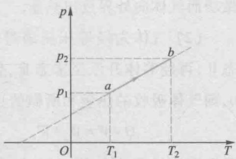  
图15-4

有

$$
V _ {1} <   V _ {2}
$$

所以气体体积膨胀对外做了正功， $W > 0$ 。由题图还知  $T_{2} > T_{1}$ ，所以该过程气体的内能增加了，即  $\Delta E = E_{2} - E_{1} > 0$ 。根据热力学第一定律，有

$$
Q = \Delta E + W > 0
$$

因此，该过程为吸热膨胀过程

例15-2

假定气体经历的是下列两种过程：（1）等温压缩；(2)先等压压缩，然后再等体升压到同样的末态，如图15-5所示.求把压强为  $1.013\times 10^{5}\mathrm{Pa}$  体积为  $100\mathrm{cm}^3$  的氮气压缩到  $20~\mathrm{cm}^3$  时，气体内能的增量、吸收的热量和所做的功各是多少？

解（1）如图所示，气体在状态I、Ⅲ的温度相同，视氮气为理想气体，则无论经怎样的过程到达末态Ⅲ，气体的内能不变，即

$$
\Delta E = E _ {3} - E _ {1} = 0
$$

等温压缩中气体吸收的热量和所做的功为

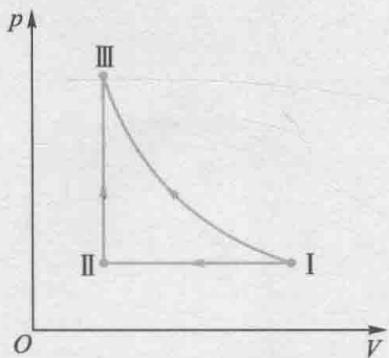  
图15-5

$$
\begin{array}{l} Q _ {T} = W = \frac {m}{M} R T \ln \frac {V _ {2}}{V _ {1}} = p _ {1} V _ {1} \ln \frac {V _ {2}}{V _ {1}} \\ = 1. 0 1 3 \times 1 0 ^ {5} \times 1 0 0 \times 1 0 ^ {- 6} \ln \frac {2 0 \times 1 0 ^ {- 6}}{1 0 0 \times 1 0 ^ {- 6}} J \\ = - 1 6. 3 \mathrm {J} \\ \end{array}
$$

负号表示在等温压缩过程中，外界对气体做功而气体向外界放出热量.

（2）气体先经等压压缩过程到达状态Ⅱ，再经等体升压至末态Ⅲ，仍有  $\Delta E = 0$  ，则气体吸收的热量和所做的功为

$$
Q = W = W _ {p} + W _ {V}
$$

因在等体过程中气体不做功，即  $W_{V} = 0$  所以得

$$
\begin{array}{l} Q = W _ {p} = p _ {1} \left(V _ {2} - V _ {1}\right) \\ = 1. 0 1 3 \times 1 0 ^ {5} \times (2 0 - 1 0 0) \times 1 0 ^ {- 6} J \\ = - 8. 1 \mathrm {J} \\ \end{array}
$$

从计算结果可知，尽管初、末状态相同，但过程不同时，气体所吸收的热量和所做的功也不相同，功与热量都与过程有关.

# 15-3 理想气体的绝热过程

绝热过程是系统与外界没有热量交换的过程，即  $Q = 0$  ，显然这是一种理想的过程。常见情形中，在良好绝热材料包围的系统内发生的准静态过程就是绝热过程（adiabatic process）。因进行得较快而来不及与外界交换热量的准静态过程，如气缸内气体经历的急速压缩或膨胀、空气中声音传播时所引起的膨胀或压缩过程等，都可以近似地当作绝热过程来处理。

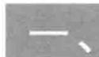

# 准静态绝热过程

# 1. 准静态绝热过程的特征

准静态绝热过程的特征是：对任一无限微小的过程，有  $\mathrm{d}Q = 0$ ；而对于一个有限的过程， $Q = 0$ 。因此，根据热力学第一定律，

$$
\mathrm {d} Q = \mathrm {d} E + p \mathrm {d} V = 0, Q = \Delta E + W = 0
$$

有下列关系式成立：

$$
\mathrm {d} E = - p \mathrm {d} V = \frac {m}{M} C _ {V, \mathrm {m}} \mathrm {d} T \tag {15-24}
$$

$$
\Delta E = - W = \frac {m}{M} C _ {V, m} \left(T _ {2} - T _ {1}\right) \tag {15-25}
$$

上式表明，准静态绝热过程中气体对外界所做的功完全来自气体内能的改变。当气体绝热膨胀时，气体对外界做正功，气体内能减少，温度随之降低，气体压强也因温度的降低和分子数密度的减小而减小；当气体被绝热压缩时，外界对气体做正功，气体内能增加，温度随之升高，气体压强也随之增大。所以，在绝热过程中，气体的三个物态参量  $p$ 、 $V$ 、 $T$  均发生了变化。

# 2. 绝热过程方程

考虑一个无限微小的准静态绝热过程.由于  $p\setminus V,T$  均变化，对理想气体的物态方程  $pV = \frac{m}{M} RT$  取微分可得

$$
p \mathrm {d} V + V \mathrm {d} p = \frac {m}{M} R \mathrm {d} T \tag {15-26}
$$

将（15-24）式代入上式，并利用  $C_{p,\mathrm{m}} = C_{V,\mathrm{m}} + R$  ，有

$$
V \mathrm {d} p = \frac {m}{M} C _ {p, \mathrm {m}} \mathrm {d} T \tag {15-27}
$$

从（15-24）和（15-27）两式中消去  $\mathrm{d}T$  ，分离变量可整理得

$$
\frac {\mathrm {d} p}{p} + \gamma \frac {\mathrm {d} V}{V} = 0 \tag {15-28}
$$

在一般问题所涉及的温度范围内，绝热指数  $\gamma$  可视为常数，对上式积分得

$$
\ln p + \gamma \ln V = C _ {1}
$$

即

$$
p V ^ {\gamma} = C _ {1} \tag {15-29}
$$

上式反映了绝热过程中压强与体积的关系，通常称为泊松公式（poisson formula）.利用理想气体物态方程，还可将(15-29)式写成以下两种形式，即

$$
T V ^ {\gamma - 1} = C _ {2} \tag {15-30}
$$

$$
p ^ {\gamma - 1} T ^ {- \gamma} = C _ {3} \tag {15-31}
$$

式中  $C_1, C_2$  和  $C_3$  均为常量，（15-29），（15-30），（15-31）三式都称为理想气体准静态绝热过程方程（adiabatic equation）。需要强调的是这些过程方程都只适用于准静态过程，因为在推导过程中应用了准静态过程功的计算公式  $\mathrm{d}W = p\mathrm{d}V$ 。对于非静态过程不适用。

# 3. 绝热过程曲线

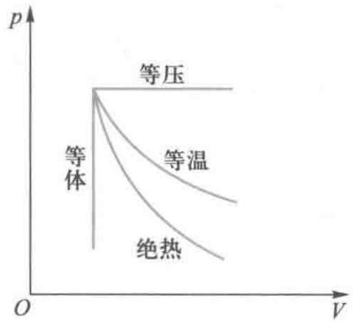  
图15-6 等温、等压、等体和绝热过程曲线

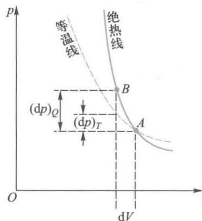  
图15-7 等温线与绝热线的比较

按（15-29）式，可在  $p - V$  图上画出绝热过程曲线.图15-6给出了理想气体等温、等压、等体和绝热过程的过程曲线，图15-7给出了理想气体等温线(isotherm)与绝热线（adiabat)的比较.因为绝热线的斜率与等温线的斜率之比为  $\gamma$  （见习题15-8.可由两过程的过程方程取微分得证），而  $\gamma$  总大于1，所以绝热线上任一点的斜率都比经过同一点的等温线的斜率陡一些.从物理上理解，  $p = nkT$  ，压强由分子数密度  $n$  和温度  $T$  两个因数决定.在等温压缩过程中，压强的增加仅由于分子数密度的增大而引起，而在绝热压缩过程中，压强不仅因分子数密度的增大而增加，还因为温度的升高而增强.因此在气体体积由  $V_{1}$  减小至  $V_{2}$  的过程中，绝热压缩所导致的压强增加量  $\Delta p$  大于等温压缩过程所引起的压强增加量

# 4. 绝热过程的功

设一定量的理想气体从初态  $(p_{1},V_{1})$  开始经历一准静态绝热过程，对于任一中间态  $(p,V)$  ，由泊松公式  $p_1V_1^\gamma = pV^\gamma$  ，有

$$
p = \frac {p _ {1} V _ {1} ^ {\gamma}}{V ^ {\gamma}}
$$

从初态  $(p_{1},V_{1})$  到末态  $(p_{2},V_{2})$  ，绝热过程的功为

$$
W = \int_ {V _ {1}} ^ {V _ {2}} p \mathrm {d} V = p _ {1} V _ {1} ^ {\gamma} \int_ {V _ {1}} ^ {V _ {2}} \frac {\mathrm {d} V}{V ^ {\gamma}} = \frac {p _ {1} V _ {1} ^ {\gamma}}{1 - \gamma} (V _ {2} ^ {1 - \gamma} - V _ {1} ^ {1 - \gamma})
$$

$$
= \frac {p _ {1} V _ {1}}{\gamma - 1} \left[ 1 - \left(\frac {V _ {1}}{V _ {2}}\right) ^ {\gamma - 1} \right] \tag {15-32}
$$

利用泊松公式  $p_1V_1^\gamma = p_2V_2^\gamma$  ，上式还可化为

$$
W = \frac {1}{\gamma - 1} \left(p _ {1} V _ {1} - p _ {2} V _ {2}\right) \tag {15-33}
$$

例15-3

气缸内贮有  $2\mathrm{mol}$  氮气（视为理想气体），初始温度为 $27~\mathrm{^\circ C}$  ，体积为  $20~\mathrm{L}$  先将氮气等压膨胀，直至体积加倍，然后绝热膨胀，直至回复到初始温度为止.求：

（1）在  $p - V$  图上大致画出气体的状态变化过程；  
（2）在此过程中的吸热；  
（3）氦气的内能改变；  
（4）氦气所做的功

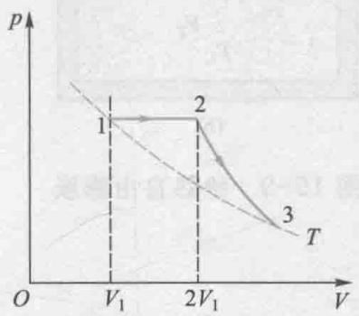  
图15-8

解（1）气体的状态变化过程如图15-8所示.  
（2）氦气仅在等压膨胀过程中吸热，所以有

$$
Q = Q _ {p} = \frac {m}{M} C _ {p, m} (T _ {2} - T _ {1})
$$

其中，  $\frac{m}{M} = 2\mathrm{mol}$  ，氦气为单原子分子气体， $C_{p,\mathrm{m}} = C_{V,\mathrm{m}} + R = \frac{5}{2} R,T_{1} = 300\mathrm{K},$

根据等压过程的过程方程  $\frac{V_1}{T_1} = \frac{V_2}{T_2}$  可得

$$
T _ {2} = \frac {V _ {2}}{V _ {1}} T _ {1} = \frac {4 0}{2 0} \times 3 0 0 \mathrm {K} = 6 0 0 \mathrm {K}
$$

代入吸热关系式可得

$$
\begin{array}{l} Q = Q _ {p} = \frac {m}{M} C _ {p, m} \left(T _ {2} - T _ {1}\right) \\ = 2 \times \frac {5}{2} \times 8. 3 1 \times (6 0 0 - 3 0 0) J \\ = 1. 2 5 \times 1 0 ^ {4} J \\ \end{array}
$$

（3）因为  $T_{3} = T_{1} = 300\mathrm{K}, \Delta T = 0$  ，所以氮气的内能改变  $\Delta E = 0$  
（4）根据热力学第一定律知，因  $\Delta E = 0$  ，故有

$$
W = Q = 1. 2 5 \times 1 0 ^ {4} J
$$

即氦气对外所做的功等于其从外界吸收的热量.

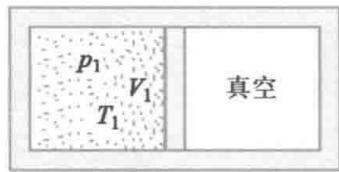  
(a)

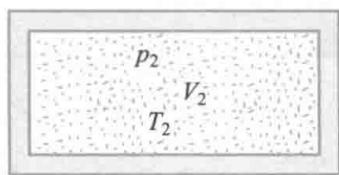  
(b)  
图15-9 绝热自由膨胀

# 二、非准静态绝热过程

非静态绝热过程的典型例子是理想气体的绝热自由膨胀过程. 设有一绝热容器, 用一隔板将容器分为容积相等的两半, 左半部贮有平衡态的理想气体, 其压强为  $p_1$ , 体积为  $V_1$ , 温度为  $T_1$ , 右半部为真空, 如图 15-9(a) 所示. 当把隔板抽去后, 气体将冲入右半部, 最后在整个容器内达到一个新的平衡态, 其物态参量为  $p_2$ ,  $V_2 (= 2V_1)$ ,  $T_2$ , 如图 15-9(b) 所示. 气体冲入右半部的过程不可能无限缓慢地进行, 过程中任一时刻气体显然不处于平衡态, 因而绝热自由膨胀过程是非准静态过程.

虽然绝热自由膨胀过程是非准静态过程，它仍应服从热力学第一定律.由于过程绝热，即  $Q = 0$  ，又由于向真空膨胀，气体对外不做功，即  $W = 0$  ，根据热力学第一定律，有

$$
E _ {2} - E _ {1} = 0
$$

即气体经绝热自由膨胀，内能保持不变.对于理想气体，因为内能只是温度的函数，所以

$$
T _ {2} = T _ {1}
$$

即理想气体经绝热自由膨胀后温度将复原. 注意, 由于过程的每一步中系统并不处于平衡态, 因此不能说成是等温过程.

根据理想气体物态方程，对于初、末两态应有

$$
p _ {1} V _ {1} = \frac {m}{M} R T _ {1}
$$

$$
p _ {2} V _ {2} = \frac {m}{M} R T _ {2}
$$

因为  $T_{2} = T_{1}, V_{2} = 2V_{1}$ ，由上两式给出理想气体经绝热自由膨胀后的压强为

$$
p _ {2} = \frac {p _ {1}}{2}
$$

如果用泊松公式  $p_1V_1^\gamma = p_2V_2^\gamma = p_2(2V_1)^\gamma$  ，将得到  $p_2 = \frac{p_1}{2^\gamma}$  这显然是错误的，因为绝热自由膨胀过程是非准静态的，泊松公式不适用.

# 三、多方过程

一般情况下，气体所进行的实际过程往往既非绝热也非等温。比较一下理想气体等压、等体、等温和绝热四个过程的过程方程，它们分别是

$$
p = C _ {1}, \quad V = C _ {2}, \quad p V = C _ {3}, \quad p V ^ {\gamma} = C _ {4}
$$

这四个方程都可以用

$$
p V ^ {n} = C \tag {15-34}
$$

的表达式来统一表示，其中  $n$  是对应于某一特定过程的常数.满足（15-34）式的过程称为多方过程（polytropicprocess），（15-34）式称为理想气体多方过程的过程方程，指数  $n$  称为多方指数（polytropicexponent）

# 1. 多方过程的特征

考虑一个无限微小的准静态过程. 由理想气体物态方程  $pV = \frac{m}{M} RT$  ，微分可得

$$
p \mathrm {d} V + V \mathrm {d} p = \frac {m}{M} R \mathrm {d} T
$$

根据热力学第一定律  $\mathrm{d}Q = \mathrm{d}E + \mathrm{d}W$  ，有

$$
\frac {m}{M} C _ {n, \mathrm {m}} \mathrm {d} T = \frac {m}{M} C _ {V, \mathrm {m}} \mathrm {d} T + p \mathrm {d} V
$$

式中  $C_{n,\mathrm{m}}$  为该过程的摩尔热容.完全类似于绝热过程方程的推导，若  $C_{n,\mathrm{m}}$  为常量，由上两式消去  $\mathrm{d}T$  ，分离变量、整理后积分，即可得（15-34）式.其中

$$
n = \left(1 - \frac {R}{C _ {n , m} - C _ {V , m}}\right) \tag {15-35}
$$

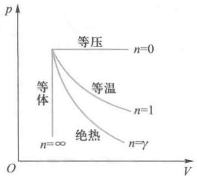  
图15-10 多方过程中  $n$  的值

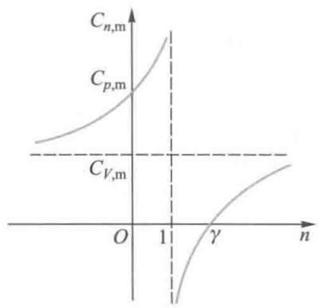  
图15-11  $C_{n,m} - n$  关系曲线

利用理想气体物态方程，还可将（15-34）式写成以下两种形式，即

$$
T V ^ {n - 1} = C \tag {15-36}
$$

$$
p ^ {n - 1} T ^ {- n} = C \tag {15-37}
$$

从推导过程可知，只有当  $n$  为常量时才能积分得到（15-34)式.而由（15-35）式可知，  $n$  为常量，在物理意义上也就是要求过程中的摩尔热容  $C_{n,\mathrm{m}}$  为常量.可见理想气体多方过程的基本特征，从热容的角度来看，可以认为是“过程中的摩尔热容  $C_{n,\mathrm{m}}$  为常量”

气体在多方过程中的功完全可用推导（15-32）式的方法求得，所得结果也与（15-32）式形式相同，只要把（15-32）式中的  $\gamma$  换成  $n$  即可

显然，对绝热过程  $n = \gamma$  ，等温过程  $n = 1$  ，等压过程  $n = 0$  而对于等体过程则相当于  $n\to \infty$  时的多方过程，如图15-10所示

可知，多方过程是包括了前述各种过程的较为一般的过程.

# 2. 多方过程的摩尔热容

由（15-35）式可得多方过程的摩尔热容

$$
C _ {n, \mathrm {m}} = C _ {V, \mathrm {m}} - \frac {R}{n - 1} = \frac {\gamma - n}{1 - n} C _ {V, \mathrm {m}} \tag {15-38}
$$

若以  $n$  为自变量， $C_{n,\mathrm{m}}$  为函数，画出的  $C_{n,\mathrm{m}} - n$  关系曲线如图15-11所示。（15-38）式表示，多方过程的摩尔热容可为正，也可为负。在多方指数  $n < 0; 0 \leqslant n \leqslant 1$  以及  $\gamma \leqslant n \leqslant \infty$  的范围内，均有  $C_{n,\mathrm{m}} > 0$ ，而在  $1 < n < \gamma$  范围内， $C_{n,\mathrm{m}} < 0$ ，即为多方负热容，它表示系统吸热反而要降温。在这样的多方过程中，理想气体对外做功大于它所吸收的热量，于是内能减少从而使温度降低，热容就是负的。

由上面的讨论知，理想气体多方过程是包括了前述一些较为一般的过程，但它并不是理想气体不受任何限制的普遍热力学过程，它是将热容视为常量时推导得到的。因此

必须指出，并非一切的实际过程都可以用多方过程来概括

还必须指出，热容为常量的假设来自能量按自由度均分定理，而能量均分定理是在经典力学适用、能量是连续函数的前提下导出的。实际上微观粒子的热运动应遵从量子力学规律，微观粒子的能量只能取一些分立的值。量子力学的理论计算与热容的实验结果符合得很好。热容实际上是温度的函数，则  $n$  也是温度的函数。在实际问题中，如果气体的热容随温度的变化并不显著，在处理问题时往往将热容近似为常数，因而  $n$  也可近似为常数，则多方过程也成立。

对理想气体多方过程的讨论，能为研究实际气体的实际过程提供更多的线索.

例15-4

一定量的双原子分子理想气体，经历如图15-12所示的ABCA准静态过程，设状态  $A$  的温度为  $300\mathrm{K}$

（1）求状态  $B, C$  的温度；  
（2）计算各过程中气体所吸收的热量、气体所做的功和气体内能的增量.

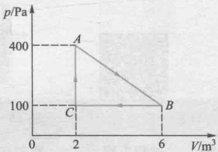  
图15-12

解 由图得  $p_A = 400\mathrm{Pa}, p_B = p_C = 100\mathrm{Pa}$

$$
V _ {A} = V _ {C} = 2 \mathrm {m} ^ {3}, V _ {B} = 6 \mathrm {m} ^ {3}.
$$

(1)  $C \rightarrow A$  为等体过程，由过程方程

$$
p _ {A} / T _ {A} = p _ {C} / T _ {C}
$$

得  $T_{C} = \frac{p_{C}}{p_{A}} T_{A} = 75\mathrm{K}$

$B \rightarrow C$  为等压过程，由过程方程

$$
V _ {B} / T _ {B} = V _ {C} / T _ {C}
$$

得

$$
T _ {B} = \frac {V _ {B}}{V _ {C}} T _ {C} = 2 2 5 \mathrm {K}
$$

(2)由理想气体物态方程可求出气体的物质的量  $\nu = p_{A}V_{A} / (RT_{A}) = 0.321\mathrm{mol}$

由题知，该气体为双原子分子气体， $C_{V,\mathrm{m}} = \frac{5}{2} R,C_{p,\mathrm{m}} = \frac{7}{2} R.$

$A\to B$  直线过程，气体做功可由过程曲线下的面积求得

$$
W _ {1} = \frac {1}{2} \left(p _ {A} + p _ {B}\right) \left(V _ {B} - V _ {C}\right) = 1 0 0 0 \mathrm {J}
$$

内能增量

$$
\Delta E _ {1} = \frac {5}{2} \nu R (T _ {B} - T _ {A}) = - 5 0 0 \mathrm {J}
$$

吸热

$$
Q _ {1} = \Delta E _ {1} + W _ {1} = 5 0 0 \mathrm {J}
$$

$B \rightarrow C$  等压过程，吸热

$$
Q _ {2} = \frac {7}{2} \nu R \left(T _ {C} - T _ {B}\right) = - 1 4 0 0 J
$$

（ $Q_{2} < 0$ ，说明该过程放热）

气体做功

$$
W _ {2} = p _ {B} \left(V _ {C} - V _ {B}\right) = - 4 0 0 \mathrm {J}
$$

内能增量

$$
\Delta E _ {2} = \frac {5}{2} \nu R (T _ {C} - T _ {B}) = - 1 0 0 0 \mathrm {J}
$$

$C\to A$  等体过程，吸热

$$
Q _ {3} = \frac {5}{2} v R \left(T _ {A} - T _ {C}\right) = 1 5 0 0 \mathrm {J}
$$

气体做功

$$
W _ {3} = 0
$$

内能增量

$$
\Delta E _ {3} = Q _ {3} = 1 5 0 0 \mathrm {J}
$$

整个过程内能改变

$$
\Delta E = 0
$$

净吸热等于对外做功

$$
Q = W = \frac {1}{2} \left(p _ {A} - p _ {C}\right) \left(V _ {B} - V _ {C}\right) = 6 0 0 J
$$

至此，我们讨论了理想气体在准静态过程中的性质及能量转移的方式、数量关系，为方便查阅，将有关公式列于表15-2中.

表 15-2 理想气体准静态过程的主要公式  

<table><tr><td>过程</td><td>过程方程</td><td>摩尔热容</td><td>对外界做功</td><td>吸收热量</td><td>内能改变</td></tr><tr><td>等体</td><td>\(\frac{p_1}{p_2}=\frac{T_1}{T_2}\)</td><td>\(C_{V,\mathrm{m}}\)</td><td>0</td><td>\(\frac{m}{M}C_{V,\mathrm{m}}(T_2-T_1)\)</td><td>\(\frac{m}{M}C_{V,\mathrm{m}}(T_2-T_1)\)</td></tr><tr><td>等压</td><td>\(\frac{T_1}{V_1}=\frac{T_2}{V_2}\)</td><td>\(C_{p,\mathrm{m}}\)</td><td>p\(V_2-V_1\)</td><td>\(\frac{m}{M}C_{p,\mathrm{m}}(T_2-T_1)\)</td><td>\(\frac{m}{M}C_{V,\mathrm{m}}(T_2-T_1)\)</td></tr><tr><td>等温</td><td>\(p_1V_1=p_2V_2\)</td><td>∞</td><td>\(\frac{m}{M}RT\ln\frac{V_2}{V_1}\)</td><td>\(\frac{m}{M}RT\ln\frac{V_2}{V_1}\)</td><td>0</td></tr><tr><td>绝热</td><td>\(pV^{\gamma}=C_1\)\(TV^{\gamma-1}=C_2\)\(p^{\gamma-1}T^{\gamma}=C_3\)</td><td>0</td><td>\(\frac{1}{\gamma-1}(p_1V_1-p_2V_2)\)</td><td>0</td><td>\(\frac{m}{M}C_{V,\mathrm{m}}(T_2-T_1)\)</td></tr><tr><td>多方</td><td>\(pV^n=C_1\)\(TV^{n-1}=C_2\)\(p^{n-1}T^{-n}=C_3\)</td><td>\(C_{n,\mathrm{m}}=\frac{n-\gamma}{n-1}C_{V,\mathrm{m}}\)</td><td>\(\frac{1}{n-1}(p_1V_1-p_2V_2)\)</td><td>\(\frac{m}{M}C_{n,\mathrm{m}}(T_2-T_1)\)</td><td>\(\frac{m}{M}C_{V,\mathrm{m}}(T_2-T_1)\)</td></tr></table>

# 15-4 循环过程和卡诺循环卡诺定理

在历史上，热力学理论的建立与发展，是与热机的使用和改进密切相关的。当今制冷设备与技术也愈益普及与精良，研究工作物质在热机和制冷机中所经历的热力学过程是有实际意义的。本节只从物理的角度介绍有关的基本概念与原理，不作深入的技术上的讨论。

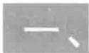

# 循环过程及其特征

如果一个系统由某个状态出发，经过任意的一系列的变化过程，最后又回到原来的状态，则这样的过程称为循环过程（cyclic process）。无摩擦准静态的循环过程可以用  $p - V$  图上的一条闭合曲线来描述。循环过程具有方向性，系统沿闭合曲线顺时针方向进行的循环称为正循环，反之则称为逆循环。无论何种循环，系统状态变化的特点是：循环一周后状态复原，因此，循环过程的重要特征是系统的内能不变，即  $\Delta E = 0$

如图15-13所示为一正循环过程.系统在整个循环过程过程中对外界做的功，在数值上等于闭合曲线所包围的面积.因此，正循环过程系统对外做净功，  $W > 0$

在循环过程中，系统既有吸热的过程，又有放热的过程。通常用  $Q_{1}$  表示系统吸收的热量，用  $Q_{2}$  表示系统放出的热量，则根据热力学第一定律，因内能不变，系统吸收的净热量应该等于它对外界所做的净功，即能量转化关系为

$$
Q _ {1} - Q _ {2} = W \tag {15-39}
$$

蒸汽机、内燃机等利用吸收热能对外做功的机器统称为热机（heat engine）. 以蒸汽机的工作过程为例, 其工作原

  
视频：自动门一循环过程和蒸汽机

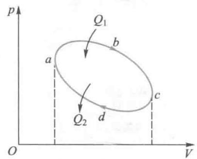  
图15-13 正循环过程曲线

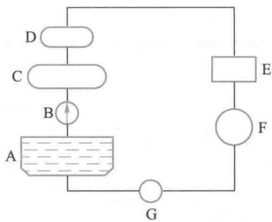  
图15-14 蒸汽机工作原理图

理如图15-14所示. 水泵B将水池A中的水抽入锅炉C中加热、汽化成水蒸气；进入过热器D中进一步加热成高温、高压蒸气，这是一个吸热而使蒸气内能增加的过程，蒸气经传送装置进入气缸E，在其中膨胀，推动活塞对外做功，蒸气的一部分内能转化为机械功. 最后部分蒸气成为废气进入冷却器F中凝结成水，内能的一部分通过放热而传递给外界. 水泵G再把冷却器中的水抽入水池A完成一次循环过程. 从能量转化的角度来看，工作物质（水蒸气）在高温热源（加热器锅炉）吸热升温增加内能，然后膨胀对外做功转化为机械能；另一部分内能在低温热源（冷却器）处放热而传到外界. 因此，热机不可能把从高温热源吸收来的热量全部转化为机械功，而必须将一部分热量释放给低温热源

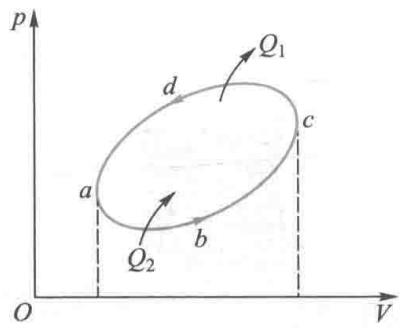  
图15-15 逆循环过程曲线

反映热机效能的重要标志之一是它的循环效率. 效率定义为在一次循环过程中, 工作物质对外所做的净功与它从高温热源吸收的热量之比, 用  $\eta$  表示. 则

$$
\eta = \frac {W}{Q _ {1}} = \frac {Q _ {1} - Q _ {2}}{Q _ {1}} = 1 - \frac {Q _ {2}}{Q _ {1}} \tag {15-40}
$$

同理可知，逆循环过程中，外界对系统做正净功，而系统向外界释放的净热量等于整个逆循环过程中系统释放与吸收热量的代数和，如图15-15所示

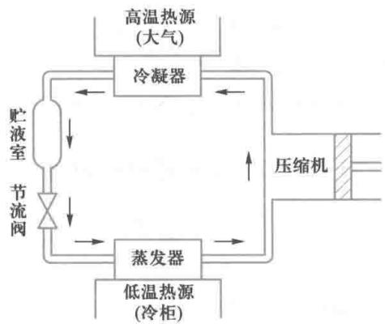  
图15-16 冰箱工作原理图

以逆循环方式工作的机器称为制冷机，如冷气机、冰箱等. 普通家用冰箱工作原理的示意图如图15-16所示. 压缩机把比较容易液化的工作物质（如氟利昂等）送入冷凝器，冷凝器与大气相接触，温度为室温，它相对于冷柜自然可称为高温热源，工作物质在冷凝器中放出汽化热后冷却并在高压下凝结成液体，高压液体经节流装置后降压降温，进入蒸发器中，蒸发器与低温热源（冷柜）相接触，高压液体在蒸发器中吸热汽化，使冷柜降温，自身则汽化变为蒸气后再进入压缩机，如此重复循环，起到制冷作用.

在夏天，可将房间作为低温热源，以室外大气作为高温

热源，制冷循环可使房间降温。在冬天则可以将室外大气作为低温热源，以房间为高温热源，制冷循环可使房间升温变暖，为此目的设计的制冷机又叫热泵（heat pump），空调就是一种热泵，目前已广泛应用于各种建筑物中。

制冷机的工作目的是利用外界提供的功  $W$  使工作物质从低温热源（如冷库）吸收热量  $Q_{2}$  ，向高温热源（如周围环境）放出绝对值为  $Q_{1}$  的热量，以使低温热源的温度降得更低. 反映制冷机工作效能的重要标志之一是制冷系数，制冷系数定义为在一次逆循环过程中，工作物质从低温热源吸收的热量  $Q_{2}$  与外界提供的功  $W$  之比，用  $e$  表示，则

$$
e = \frac {Q _ {2}}{W} = \frac {Q _ {2}}{Q _ {1} - Q _ {2}} \tag {15-41}
$$

# 二、卡诺循环

蒸汽机在18世纪末期因瓦特的工作而得到完善，成为了真正意义上的动力机械。但当时的蒸汽机效率非常低，大约仅有  $5\%$  左右。为了提高效率，人们做了许多改进工作，在经历了将近50年的改造之后，效率也仅提高到了接近  $8\%$  左右。于是，人们开始意识到应该从理论上来研究如何提高热机效率的问题。1824年法国青年工程师萨地·卡诺（S.Carnot）提出了一种理想热机模型：假设工作物质只与高、低温两个恒温热源交换热量，没有散热、漏气等因素存在，这种热机称为卡诺热机，其工作物质的循环过程叫作卡诺循环。卡诺还证明了这种热机的工作效率是最高的。

图15-17表示卡诺热机在一个循环过程中能量的转化情况.下面讨论以理想气体为工作物质、循环过程为无摩擦准静态过程的卡诺循环的效率

卡诺循环过程分为四步：

第一步，气缸与温度为  $T_{1}$  的高温热源接触，气体吸热

  
文档：蒸汽机的发明

  
文档：卡诺

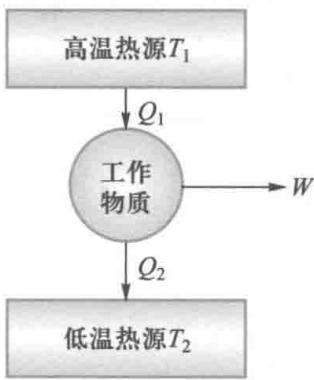  
图15-17 卡诺热机

膨胀推动活塞对外做功，尽管气体因膨胀而趋于降温，由于始终与热源接触，气体温度  $T_{1}$  保持了恒定，因此，这是一个等温膨胀过程

第二步，气缸脱离高温热源，同时气体进一步膨胀对外做功，气体因膨胀而冷却，温度随之降低至低温热源的温度 $T_{2}$ 。这一过程进行得很快，为一绝热膨胀过程。

第三步，气缸与温度为  $T_{2}$  的低温热源接触，活塞被压缩，尽管气体被压缩时趋于升温，但由于始终与低温热源接触，气体温度  $T_{2}$  保持不变，气体向低温热源放出热量，因此，这是一个等温压缩过程

第四步，气缸脱离低温热源，活塞进一步被压缩，这使气体压强增大，并且由于这一过程进行得很快，为一绝热压缩过程，最终气体温度回升至初温度  $T_{1}$ ，完成了一次循环过程.

可见，卡诺循环曲线是由两条等温线和两条绝热线构成，其  $p - V$  图如图15-18所示.由于系统仅在等温膨胀过程中吸热、并仅在等温压缩过程中放热，所以有

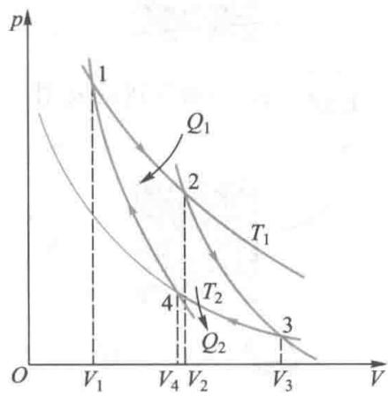  
图15-18 正向卡诺循环

$$
\begin{array}{l} Q _ {1} = \frac {m}{M} R T _ {1} \ln \frac {V _ {2}}{V _ {1}} \\ Q _ {2} = \frac {m}{M} R T _ {2} \ln \frac {V _ {3}}{V _ {4}} \\ \end{array}
$$

根据循环效率的定义，理想气体准静态卡诺循环效率为

$$
\eta_ {\mathrm {c}} = 1 - \frac {Q _ {2}}{Q _ {1}} = 1 - \frac {T _ {2} \ln V _ {3} / V _ {4}}{T _ {1} \ln V _ {2} / V _ {1}}
$$

上式可由理想气体准静态绝热过程方程得以简化. 对绝热膨胀过程  $2 \rightarrow 3$  有

$$
T _ {1} V _ {2} ^ {\gamma - 1} = T _ {2} V _ {3} ^ {\gamma - 1}
$$

对绝热压缩过程  $4\to 1$  有

$$
T _ {1} V _ {1} ^ {\gamma - 1} = T _ {2} V _ {4} ^ {\gamma - 1}
$$

两式相比，可得

$$
\frac {V _ {2}}{V _ {1}} = \frac {V _ {3}}{V _ {4}}
$$

代入效率关系式可得卡诺循环的效率为

$$
\eta_ {\mathrm {c}} = 1 - \frac {T _ {2}}{T _ {1}} \tag {15-42}
$$

上式表明，理想气体准静态卡诺循环的效率只由高、低温两个热源的温度决定，高温热源的温度越高，低温热源的温度越低，循环效率就越高.

对于按逆向卡诺循环方式工作的卡诺制冷机，其能量转化情况如图15-19所示，其  $p - V$  图如图15-20所示.通过与正向卡诺循环类似的推导，不难得到理想气体准静态逆向卡诺循环的制冷系数为

$$
e = \frac {Q _ {2}}{W} = \frac {Q _ {2}}{Q _ {1} - Q _ {2}} = \frac {T _ {2}}{T _ {1} - T _ {2}} \tag {15-43}
$$

上式表明，理想制冷机的制冷系数取决于高、低温热源的温度， $T_{2}$  愈低， $e$  愈小。因此，要从温度已经很低的系统中再吸热来降低其温度，就必须消耗更多外界的功。

对卡诺循环的理论研究，为提高热机的工作效率指出了有效的途径。对于实际的热机，其低温热源一般就是其工作的自然环境，降低自然环境的温度是很困难而又不经济的。因此，提高热机效率的有效途径之一便是提高高温热源的温度。例如环境温度为  $20\%$  时，当蒸汽温度由  $300\%$  提高到  $600\%$  时，按卡诺循环效率公式计算的效率由  $49\%$  提高为  $66\%$  。当然，实际的蒸汽机循环效率只有  $15\%$  到  $30\%$  左右，因为卡诺循环为理想的循环，实际循环中热源并不是恒温的，工作物质脱离热源后完全绝热也是不可能的，而且实际进行的循环过程也不是理想化准静态的。

在一般的制冷机中，高温热源的温度就是大气温度，所以逆向卡诺循环的制冷系数取决于所希望达到的制冷温度  $T_{2}$ 。例如，家用电冰箱冷库的温度为  $-10\,^{\circ}\mathrm{C}$ ，室温为  $25\,^{\circ}\mathrm{C}$ ，按

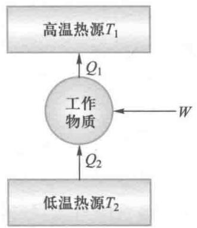  
图15-19 卡诺制冷机

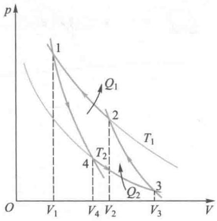  
图15-20 逆向卡诺循环

（15-43）式计算的制冷系数为7.5；假定室温不变而期望  $T_{2}$  愈低，制冷系数就愈小，则从冷库吸收相等的热量，外界所需做的功就愈多了。实际的评价是，外界所做的功一定时， $e$  愈大，表明能从低温热源吸收的热量愈多，温度降得愈低，即制冷效能愈好。同理，这样的讨论也是理想化的。然而（15-43）式表明，制冷机的效能与工作物质无关，这一结论为人们选择更为环保的物质作为制冷剂提供了理论依据。

# 卡诺定理

文档：卡诺热机理论

上面讨论了理想气体可逆卡诺循环的效率，但是实际热机的工质并不是理想气体，其循环也不是可逆卡诺循环。在对一般热机中热功转换问题的研究中，法国工程师卡诺建立的卡诺定理，原则上指出了提高热机效率的正确途径和提高热机效率所要受到的限制，对工程技术作出了卓越的贡献。

卡诺定理表述为：

（1）在两个给定温度的热源之间工作的一切可逆热机，其效率都相等，与工作物质无关；  
（2）在两个给定温度的热源之间工作的不可逆热机的效率，都小于可逆热机的效率

由卡诺定理（1）得出一切可逆热机的效率都应等于以理想气体为工作物质的准静态卡诺热机的效率，即

$$
\eta = 1 - \frac {T _ {2}}{T _ {1}} \tag {15-44}
$$

由卡诺定理(2)得出热机效率的最大值为

$$
\eta_ {\max } = 1 - \frac {T _ {2}}{T _ {1}} \tag {15-45}
$$

卡诺定理指明了提高热机效率的方向。首先，要增大高、低温热源的温度差，由于一般热机总是以周围环境作为低温热源，所以实际上只能是提高高温热源的温度；其次，则要尽可能地减少热机循环的不可逆性，也就是减少摩擦、漏气、散热等耗散因素。

在这里不再给出历史上对卡诺定理的证明[注]，而在本章的稍后用热力学第二定律和熵的概念加以简单讨论，以说明卡诺定理不仅

使用价值重大，还具有坚实的热力学基础，在热力学发展史上占有

重要的地位.

例15-5

一定量理想气体经历下列准静态循环过程：

（1）绝热压缩，由  $V_{1}, T_{1}$  到  $V_{2}, T_{2}$  
（2）等体吸热，由  $V_{2}, T_{2}$  到  $V_{2}, T_{3}$  
（3）绝热膨胀，由  $V_{2}, T_{3}$  到  $V_{1}, T_{4}$  
（4）等体放热，由  $V_{1}, T_{4}$  到  $V_{1}, T_{1}$ .

该循环称为奥托循环（Otto cycle），或等体加热循环，它是四冲程汽油机工作循环的理想模型.设  $V_{1}, V_{2}, \gamma$  为已知，试求此循环的效率

解 循环过程的  $p - V$  图如图15-21所示，因为吸热和放热只在两等体过程中进行，所以

吸热  $Q_{1} = \frac{m}{M} C_{V,\mathrm{m}}(T_{3} - T_{2})$

放热  $Q_{2} = \frac{m}{M} C_{V,\mathrm{m}}(T_{4} - T_{1})$

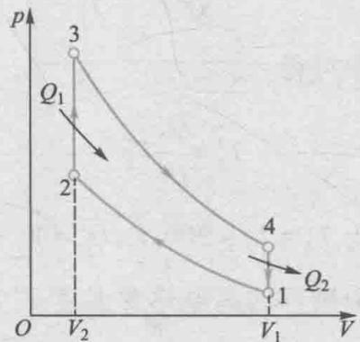  
图15-21

代入效率公式即得

$$
\eta = 1 - \frac {Q _ {2}}{Q _ {1}} = 1 - \frac {T _ {4} - T _ {1}}{T _ {3} - T _ {2}}
$$

又因  $1\to 2$  和  $3\to 4$  为绝热过程，由绝热过程方程得

$$
T _ {1} V _ {1} ^ {\gamma - 1} = T _ {2} V _ {2} ^ {\gamma - 1}, T _ {3} V _ {3} ^ {\gamma - 1} = T _ {4} V _ {4} ^ {\gamma - 1}
$$

因  $V_{2} = V_{3},V_{4} = V_{1}$  ，所以  $(T_{3} - T_{2})V_{2}^{\gamma -1} =$ $(T_4 - T_1)V_1^{\gamma -1},$

即

$$
\frac {T _ {4} - T _ {1}}{T _ {3} - T _ {2}} = \left(\frac {V _ {1}}{V _ {2}}\right) ^ {1 - \gamma}
$$

因而

$$
\eta = 1 - \frac {T _ {4} - T _ {1}}{T _ {3} - T _ {2}} = 1 - \left(\frac {V _ {1}}{V _ {2}}\right) ^ {1 - \gamma}
$$

引入绝热压缩比：

$$
r = \frac {V _ {1}}{V _ {2}}
$$

即得

$$
\eta = 1 - \frac {1}{\left(\frac {V _ {1}}{V _ {2}}\right) ^ {\gamma - 1}} = 1 - \frac {1}{r ^ {\gamma - 1}}
$$

由此可见，奥托循环的效率只由体积压缩比决定，并随着  $r$  的增大而增大.

例15-6

一卡诺热机，当  $t_1 = 127\mathrm{^\circ C}, t_2 = 27\mathrm{^\circ C}$  时，每次循环输出的功为8000J.现提高  $t_1$  而保持  $t_2$  ，使输出的功增加为10000J.若两个卡诺循环都工作在相同的两条绝热线之间，求：

（1）第二个循环的热机效率；  
（2）第二个循环的高温热源温度  $T_{1}^{\prime}$

解（1）如图15-22所示，由于工作在相同的两条绝热线之间，且低温热源的温度相同，所以两个循环向低温热源放出的热量必相等，即  $Q_{2}^{\prime} = Q_{2}$

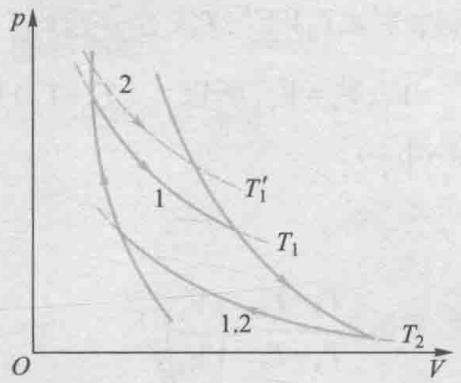  
图15-22

对于第一个循环，有下式成立：

$$
\eta = \frac {W}{Q _ {1}} = \frac {W}{W + Q _ {2}} = 1 - \frac {T _ {2}}{T _ {1}}
$$

由此可得

$$
Q _ {2} ^ {\prime} = Q _ {2} = \frac {W}{1 - \frac {T _ {2}}{T _ {1}}} - W
$$

已知  $T_{1} = 400\mathrm{K}, T_{2} = 300\mathrm{K}, W = 8000\mathrm{J}$ ，代入上式，得

$$
Q _ {2} ^ {\prime} = \frac {8 0 0 0}{1 - \frac {3 0 0}{4 0 0}} - 8 0 0 0 \mathrm {J} = 2 4 0 0 0 \mathrm {J}.
$$

由于已知第二个循环输出的功为  $W^{\prime} = 10000\mathrm{J}$  ，所以第二个循环的效率为

$$
\begin{array}{l} \eta^ {\prime} = \frac {W ^ {\prime}}{Q _ {1} ^ {\prime}} = \frac {W ^ {\prime}}{W ^ {\prime} + Q _ {2} ^ {\prime}} = \frac {1 0 0 0 0}{1 0 0 0 0 + 2 4 0 0 0} \\ = 29.4 \% \\ \end{array}
$$

（2）对于卡诺循环，有下列关系式成立：

$$
\eta = 1 - \frac {Q _ {2} ^ {\prime}}{Q _ {1} ^ {\prime}} = 1 - \frac {T _ {2} ^ {\prime}}{T _ {1} ^ {\prime}}
$$

从中可得

$$
T _ {1} ^ {\prime} = \frac {Q _ {1} ^ {\prime}}{Q _ {2} ^ {\prime}} T _ {2} ^ {\prime}
$$

因为  $T_{2}^{\prime} = T_{2} = 300\mathrm{K},Q_{1}^{\prime} = W^{\prime} + Q_{2}^{\prime}$  ，所以第二个循环的高温热源温度  $T_{1}^{\prime}$  为

$$
\begin{array}{l} T _ {1} ^ {\prime} = \frac {W ^ {\prime} + Q _ {2} ^ {\prime}}{Q _ {2} ^ {\prime}} T _ {2} ^ {\prime} = \frac {1 0 0 0 0 + 2 4 0 0 0}{2 4 0 0 0} \times 3 0 0 \mathrm {K} \\ = 4 2 5 \mathrm {K} \\ \end{array}
$$

例15-7

一定量理想气体经历下列准静态循环过程：

（1）等温压缩，由  $V_{1}, T_{1}$  到  $V_{2}, T_{1}$  
（2）等体降温，由  $V_{2}, T_{1}$  到  $V_{2}, T_{2}$  
（3）等温膨胀，由  $V_{2}, T_{2}$  到  $V_{1}, T_{2}$  
（4）等体升温，由  $V_{1}, T_{2}$  到  $V_{1}, T_{1}$ .

该循环称为逆向斯特林循环（reversed Stirling cycle），是回热式制冷机工作循环的理想模型。设  $T_{1}, T_{2}$  为已知，试求此循环的制冷系数  $e$ 。

解 循环过程的  $p - V$  图如图15-23所示，该循环过程中，在两个等体过程中与外界的热量交换相抵消，对于两个等温过程，有

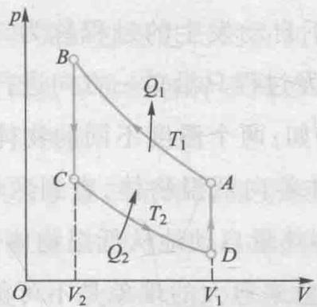  
图15-23

从冷库吸收的热量为

$$
Q _ {2} = \frac {m}{M} R T _ {2} \ln \frac {V _ {1}}{V _ {2}}
$$

向外界放出的热量为

$$
Q _ {1} = \frac {m}{M} R T _ {1} \ln \frac {V _ {1}}{V _ {2}}
$$

所以此循环的制冷系数为

$$
e = \frac {Q _ {2}}{W} = \frac {Q _ {2}}{Q _ {1} - Q _ {2}} = \frac {T _ {2}}{T _ {1} - T _ {2}}
$$

结果表明，逆向斯特林循环具有与逆向卡诺循环同样的制冷系数，因此作这种逆循环的制冷机具有较高的制冷效率

从上式可以看出，冷库与外界环境的温差越大，或者环境温度一定时冷库温度越低，制冷系数越小，制冷效果越差。利用上式可以计算从不同温度的冷库中吸收同样多的热量时所需要的功。假定环境温度  $T_{1} = 300\mathrm{K}$ ，吸取的热量都是  $Q_{2} = 100\mathrm{J}$ ，则当冷库温度分别为  $100\mathrm{K}, 1\mathrm{K}, 10^{-3}\mathrm{K}$  时，所需做功分别为

$$
W _ {1} = \frac {T _ {1} - T _ {2}}{T _ {2}} Q _ {2} = \frac {3 0 0 - 1 0 0}{1 0 0} \times 1 0 0 \mathrm {J} = 2 \times 1 0 ^ {2} \mathrm {J}
$$

$$
W _ {2} = \frac {3 0 0 - 1}{1} \times 1 0 0 \mathrm {J} = 3 \times 1 0 ^ {4} \mathrm {J}
$$

$$
W _ {3} = \frac {3 0 0 - 1 0 ^ {- 3}}{1 0 ^ {- 3}} \times 1 0 0 \mathrm {J} = 3 \times 1 0 ^ {7} \mathrm {J}.
$$

利用核绝热去磁方法，达到  $10^{-6}\mathrm{K}$  的低温时，若再要从其中吸取  $100\mathrm{J}$  的热量，则做功为  $3\times 10^{10}\mathrm{J}.$  这些结果表明，物体的温度越低，取出其中同样多的热量所需做

的功将迅速增大，因此再要降低温度将越困难.当物体温度接近于0K时，只要  $Q_{2}$  不为零，则所需的功将接近于无穷大.这表明绝对零度实际上是达不到的.热力学中有一条热力学第三定律，它可表述为：

不可能用有限的步骤使物体冷却到绝对零度，也称为绝对零度达不到原理。从热力学第三定律可以推出许多重要结论，特别是对于低温下物质特性的研究具有重要的意义。

# 15-5 热力学第二定律

# 自发过程的方向性

在没有外界的帮助下自动发生的过程称为自发过程。实验表明，自然界中的自发过程只沿单一方向进行，而其逆过程则不能自动进行。例如：两个温度不同的物体相接触，热量会自动地由高温物体传向低温物体，直到两者的温度相同为止；相反的过程，即热量自动地从低温物体传向高温物体，使得两者的温度差愈来愈大的现象是不可能发生的。转动着的飞轮制动后由于轴承的摩擦而最终将停止转动，在这过程中，飞轮的机械能转变为轴承和周围环境的内能（热）；相反的过程，即静止的飞轮由于轴承变冷而使飞轮重新转动起来的现象则是不可能发生的。用隔板将一容器分成左右两边，左边贮有一定量气体，右边为真空。当隔板抽去后，气体总是自动地向真空膨胀，最终充满整个容器；相反的过程，气体自动地收缩回容器的一边，另一边又变为真空的现象是不可能发生的。同样的容器内，左右两边贮有两种不同的气体，当隔板抽去后，两种气体将会自动地发生相互扩散，直到两种气体在容器内均匀地混合；相反的过程，即均匀混合的气体自动地分离为两种不同的气体而分处于

容器两边的现象是不可能发生的等

包括上述例子在内的大量实验事实表明，自然界中有许多过程能够自动地发生，它们都满足热力学第一定律。但也有许多过程，虽然不违反热力学第一定律，但不会自动地发生。也就是说，自然界中的自发过程都具有方向性。对这一问题的探索和研究，推动了热力学第二定律（second law of thermodynamics）的建立，导致热力学中熵这一概念的引入和发展。

# 二、热力学第二定律的两种语言表述

热力学第二定律是在研究热机和制冷机的工作原理以及如何提高它们的效能的基础上总结出来的，用它能解决与热现象有关的过程进行的方向性问题。热力学第二定律存在着逻辑上等价的各种不同的表述方式。下面介绍两种典型的语言表述。

# 1. 热力学第二定律的克劳修斯表述（1850年）

克劳修斯（R.J.E.Clausius）针对热传递过程的方向性问题指出：“不可能把热量从低温物体传向高温物体而不引起其他任何变化”或者说：“热量不能自动地从低温物体传向高温物体。”

从形式逻辑的角度看，这种表述属于否定式命题，其必要的条件是“不引起其他任何变化，”它意味着，如果引起了其他的变化，则该命题就不成立。因此可以将克劳修斯表述用肯定的形式表述为：将热量从低温物体传到高温物体时，必然会引起其他的变化。这表明，热量能够自发地从高温物体传到低温物体，而反方向的过程在没有外界帮助的条件下则不可能自动地发生。从能量的观点看，克劳修斯表述给出了能量在自发传递时的单向性的规律。

  
文档：克劳修斯

  
文档：开尔文

# 2. 热力学第二定律的开尔文表述（1851年）

开尔文（Kelvin）针对功与热量之间转化问题，以热机的效率为题指出：“不可能制成一种循环动作的热机，只从单一热源吸收热量，使之完全变为有用功而不产生其他的影响。”

同样，在这个否定式命题中，必要的条件是“不产生其他的影响，”它意味着，如果产生了其他的影响，则该命题就不成立。因此可以将开尔文表述用肯定的形式表述为：如果从单一热源吸收热量使之完全变为有用功，则必然会产生其他的影响。这表明，功可以自发地全部转化为热量，而反方向的过程，即热量不能自动地全部转化为功。从能量的观点看，开尔文表述也给出了能量在自发转化时单向性的规律。

能够从单一热源吸热并使之完全转化为有用功、又不产生其他影响的循环动作的热机必然是效率为百分之百的热机，这种单热源热机不违反热力学第一定律，被称之为第二类永动机（perpetual motion machine of the second kind）于是，热力学第二定律的开尔文表述也可以表述为：“第二类永动机是不可能制成的。”

# 3. 两种表述的等价性

按照逻辑学原理，两种表述完全等价意味着一种表述正确，则另一种表述也必然正确，一种表述错误，则另一种表述也必然错误。由此可知，对开尔文表述与克劳修斯表述，只要违背其一种表述，则另一种表述也不正确。下面我们利用逻辑学的反证法证明开尔文表述与克劳修斯表述的等价性。

（1）首先证明，如果克劳修斯表述不成立，则开尔文表述也不成立.

假设克劳修斯表述不成立，即热量  $Q$  可以通过某种方式自动地由低温热源传到高温热源而不产生其他任何影响，如图15-24所示，假设有一卡诺制冷机A不需要外界做

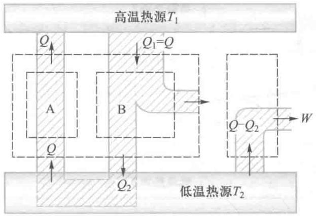  
图15-24 证明克劳修斯表述不成立，则开尔文表述也不成立

功，而可在低温热源处吸热传到高温热源而不产生其他任何影响，则可以设计另一卡诺热机B工作于上述高温热源和低温热源之间，并在高温热源处吸热  $Q_{1}$  ，在低温热源处放热  $Q_{2}$  ，同时对外做功  $W = Q_{1} - Q_{2}$  于是，当把A和B组合而成一联合机，并令  $Q_{1} = Q$  ，在完成了一个循环之后，其净效果是：高温热源没有发生变化，而联合机只是从单一的低温热源吸热  $Q_{1} - Q_{2}$  并全部转化为有用的功而不产生其他任何影响，即等价于一部单热源热机.显然，这个结果是违背开尔文表述的.由于上述卡诺热机是可以实现的，那么该论证表明，如果克劳修斯表述不成立则开尔文表述也不成立.  
（2）其次证明，如果开尔文表述不成立，则克劳修斯表述也不成立.

假设开尔文表述不成立，即存在一个单热源热机A从高温热源吸收热量  $Q_{1}$  ，完全转化为有用功  $W = Q_{1}$  而不产生其他任何影响，如图15-25所示，则可以设计另一卡诺制冷机B利用该热机提供的有用功  $W = Q_{1}$  ，从低温热源吸收热量  $Q_{2}$  ，在高温热源处放热  $Q_{1} + Q_{2}$  于是，当把A和B组合而成一联合机，在完成了一个循环之后，其净效果是：热量  $Q_{2}$  从低温热源传到高温热源而没有其他任何变化.显然，这个结果是违背克劳修斯表述的.由于上述卡诺制冷机是可以实现的，那么该论证表明，如果开尔文表述不成立，则克劳修斯表述也不成立.

  
文档：普里高津

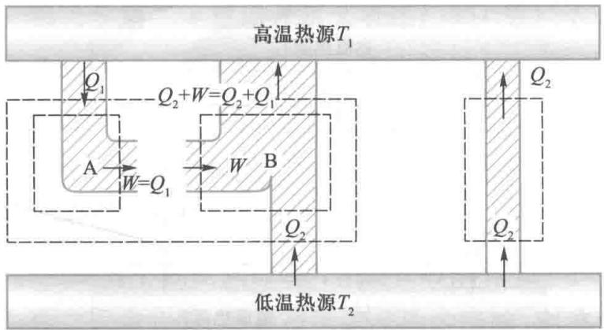  
图15-25 证明开尔文表述不成立则克劳修斯表述也不成立

上述证明满足逻辑学关于两种表述等价性的要求，故可证明这两种表述是等价的

# 三、可逆过程与不可逆过程

热力学第二定律两种表述的等价性反映了自然界与热现象有关的宏观过程应当有一个共同的特征，讨论过程的方向性就是讨论过程的可逆性问题，由此引出可逆与不可逆过程的概念.

# 1. 可逆与不可逆过程

物理学定义：一个热力学系统由某一状态  $A$  出发，经历某一过程到达另一状态  $B$  ，如果系统从状态  $B$  回复到状态  $A$  时，外界也同时恢复原状（即系统回到原状态的同时，消除了原来过程对外界引起的一切影响），则称原来的过程为可逆过程（reversible process）。反之，如果用任何方法都不能使系统在回复初态的同时，消除原来过程对外界的影响，则原过程称为不可逆过程（irreversible process）。

显然，如果一个过程是可逆的，则原过程与其逆过程的各个物理量应该只相差一个符号：  $\Delta E_{ab} = -\Delta E_{ba}, W_{ab} = -W_{ba},$ $Q_{ab} = -Q_{ba}$

可逆过程必须是准静态的，因为非静态过程的中间态不是平衡态，系统没有确定的物态参量，在使系统回复初态

的过程中，自然无法重现原过程经历的状态并不可能消除原过程造成的影响。例如，如图15-9所示的气体绝热自由膨胀过程。在抽出隔板后，左侧的气体将向右侧的真空作自由膨胀，这个过程是自发的。由于在膨胀过程中系统各处的压强不均匀，因此它又是一个非静态的过程，是不可逆的过程。

可逆过程必须是无摩擦的，如果过程中存在摩擦，则系统在正、反过程中都要克服摩擦力做功，这些功将自动转化为热量，这些热量一部分被系统吸收，其余部分会释放给外界，消失在环境中。因此，摩擦带来了能量的耗散，摩擦的存在给系统和外界带来的影响均无法消除。

分析表明，只有无耗散的准静态过程才是可逆的。

热力学第二定律的克劳修斯表述指出了热量传递的不可逆性，热力学第二定律的开尔文表述则指出了功热转化的不可逆性，而两种表述的等价性指出了功变热过程的不可逆性必然导致热传导的不可逆性，而热传导的不可逆性也必然导致功变热过程的不可逆性。不仅如此，我们还可以证明自然界中各种不可逆过程都是相互关联的。大量事实告诉我们，与热现象有关的实际宏观过程都是不可逆的，因而每一种不可逆过程都可以作为表述热力学第二定律的基础。由此可知，不管具体表述方法如何，热力学第二定律的实质在于指出，一切与热现象有关的实际宏观过程都是不可逆的。

无耗散的准静态过程是理想化的过程，严格地讲并不存在.在实际的宏观过程中有两方面的因素不可避免：一是因物质的固有属性引起的固有耗散效应，如由摩擦力、黏性力、电阻、磁滞以及非弹性等导致的耗散；二是存在于系统与外界之间的有限大小的压强差及温度差，这一因素导致了过程是非准静态的.实际过程中，

如果摩擦可以忽略不计，过程进行得足够缓慢就可以近似作可逆过程来处理。可逆过程的概念在理论研究与计算中有着重要的意义。

# 2. 能量的品质

从能量的角度看，热力学第二定律描述了能量在转化过程中的自然倾向，这使人们认识到，在自然界中存在着一个普遍趋势：非热能形式的能量最终会转化为热能形式的能量。由于热能本身不能自动地完全转化为其他形式的能量，表明热能与其他形式的能量相比更缺乏运动转化的潜力，其可用性更差，用品质因素来衡量，称热能的品质比其他形式能量的品质要低。

尽管在一切宏观过程中能量始终是守恒的，但由于耗散的不可避免，导致了非热能形式的能量转化为热能，同时也导致了能量品质的降低。因耗散产生的热量通常是流失在环境中无法再利用，这使得自然界中可利用的能量因耗散而不断减少。因此，热力学第二定律的实质是指出，一切宏观过程的进行都会导致能量贬值，即可用能量的减少，不可用能量的增加。

# 15-6 熵和熵增加原理

热力学第二定律是有关过程进行方向的规律，由热力学第二定律可以断定，对于一个没有外来影响的热力学系统来说，在其中所进行的不可逆过程的结果，不可能借助系统内部的任何其他过程而自动复原。当然，我们可以借助外界的作用使系统回复到初态，但同时必然在外界留下不能完全消除的变化。由此可见，热力学系统所进行的不可逆过程的初态和终态之间有重大的差异性，这种差异性决定了

过程的方向. 由此可以预期, 根据热力学第二定律有可能找到一个新的态函数, 用这个态函数在初、末两态的差异来对过程进行的方向作出数学分析.

# 一、克劳修斯不等式与态函数熵

# 1. 克劳修斯不等式

首先研究一下由可逆过程组成的循环具有的特性. 以卡诺循环为例, 由

$$
\eta = 1 - \frac {Q _ {2}}{Q _ {1}} = 1 - \frac {T _ {2}}{T _ {1}}
$$

可得

$$
\frac {Q _ {1}}{T _ {1}} = \frac {Q _ {2}}{T _ {2}}
$$

利用热力学第一定律的符号规则，可将上式改写为

$$
\frac {Q _ {1}}{T _ {1}} + \frac {Q _ {2}}{T _ {2}} = 0 \tag {15-46}
$$

因卡诺循环由两个等温和两个绝热过程组成，上式可理解为

$$
\sum_ {i} \frac {Q _ {i}}{T _ {i}} = 0 \tag {15-47}
$$

即在一个可逆卡诺循环中，系统吸收的热量与对应的热源温度之比的代数和为零.另一方面，由卡诺定理我们知道，热机效率满足关系

$$
\eta = 1 - \frac {Q _ {2}}{Q _ {1}} \leqslant 1 - \frac {T _ {2}}{T _ {1}}
$$

利用热力学第一定律的符号规则，与前面作相同的讨论，我们可得到关系式

$$
\sum_ {i} \frac {Q _ {i}}{T _ {i}} \leqslant 0 \tag {15-48}
$$

上式可推广到热机与多个热源接触的情况（证明从略）. 对

于一个热源温度连续变化的更普遍的循环过程，则应将上式的求和形式改写为积分形式

$$
\oint \frac {\mathrm {d} Q}{T} \leqslant 0 \tag {15-49}
$$

上式称为克劳修斯不等式（Clausius inequality），式中  $\mathrm{d}Q$  表示系统在微小过程中，工作物质在温度为  $T$  的热源处吸收的热量。对可逆过程取等号，对不可逆过程取不等号。

# 2. 态函数熵

设  $a, b$  为系统的任意两个平衡态，将克劳修斯等式应用于如图15-26所示的任意可逆循环过程，可有

$$
\oint_ {(R)} \frac {d Q}{T} = \int_ {a 1 b} \frac {d Q}{T} + \int_ {b 2 a} \frac {d Q}{T} = 0
$$

下标R表示可逆过程.由于过程可逆，有

$$
\int_ {b 2 a} \frac {\mathrm {d} Q}{T} = - \int_ {a 2 b} \frac {\mathrm {d} Q}{T}
$$

图15-26 克劳修斯等式

代入上式，得

$$
\int_ {a 1 b} \frac {\mathrm {d} Q}{T} = \int_ {a 2 b} \frac {\mathrm {d} Q}{T}
$$

上述积分路径1、2为任意路径，  $a,b$  两态也是任意选定的平衡态.这一结果表明：热量虽是与过程有关的量，但可逆过程中热温比  $\frac{\mathrm{d}Q}{T}$  的积分值却是与过程无关的、仅与初、末态有关的量，由此可以断定：系统一定存在着一个由物态参量所决定的态函数.初、末态一旦确定，这个态函数的增量也就确定了，并且，这个态函数的增量可以用任意一个联系相同初、末态的可逆过程的热温比的积分值来量度.在力学中由于保守力做功与路径无关而可引入势能函数.同理，克劳修斯根据这一性质引入一个态函数熵（entropy），记作  $S$  ，于是有定义式

$$
\Delta S = S _ {2} - S _ {1} = \int_ {1} ^ {2} \frac {\mathrm {d} Q}{T} \tag {15-50}
$$

上述定义由克劳修斯于1865年提出，熵  $S$  也称为克劳修斯熵或热力学熵。 $S_{1}, S_{2}$  分别为状态1、2的熵，积分是对连接1、2两个平衡态间的任意可逆过程的路径进行的。

对于一个无限微小的可逆过程，有

$$
\mathrm {d} S = \frac {\mathrm {d} Q}{T} \tag {15-51}
$$

由于熵的定义式只定义了两个平衡态间的熵差，因此这意味着系统在某一平衡态的熵的数值与熵的参考点的选取有关，具有相对性.热学中需要讨论的正是两态间的熵差熵的单位为  $\mathrm{J}\cdot \mathrm{K}^{-1}$

热力学的参量可分为两类，一类与总质量无关，称为强度量，如压强、温度、密度、比热容等；另一类与质量成正比，称为广延量，如体积、内能、热容、熵等。广延量具有可加性。处于平衡态的系统的熵等于各组成部分熵之和。

# 3. 熵差的计算

根据定义式（15-50），对于可逆过程，只要状态确定，则态函数熵也就确定，初、末状态间的熵差也就唯一地确定，而与等式右端选择的积分路径无关。因此，计算可逆过程熵差时，选择连接初、末状态的任一可逆过程都行。对于不可逆过程，因为熵是态函数，两状态间的熵差与过程无关，因而可以自行设计一个连接初、末态的任一可逆过程，按定义式计算出熵差，即为原来不可逆过程初、末态的熵差。

对于以  $p, V, T$  为物态参量的系统，熵  $S$  可表示为任意两个独立参量的函数关系式，即  $S = S(p, V)$ ， $S = S(p, T)$  或  $S = S(T, V)$ 。若知初、末两态的物态参量值，代入函数关系式即可得到两态间的熵差。

例15-8

求理想气体准静态过程的熵变.设初态为  $p_1,V_1,T_1$  ，末态为  $p_2,V_2,T_2$

解 根据热力学第一定律  $\mathrm{d}Q = \mathrm{d}E + \mathrm{d}W$  按定义，对理想气体，若以  $T,V$  为物态参量，则有

$$
\begin{array}{l} \mathrm {d} S = \frac {\mathrm {d} Q}{T} = \frac {\mathrm {d} E + \mathrm {d} W}{T} = \frac {\mathrm {d} E}{T} + \frac {p \mathrm {d} V}{T} \\ = \frac {m}{M} C _ {V, m} \frac {\mathrm {d} T}{T} + \frac {m}{M} R \frac {\mathrm {d} V}{V} \\ \end{array}
$$

视  $C_{V,\mathrm{m}}$  为常量，积分可得系统的熵变为

$$
\begin{array}{l} \Delta S (T, V) = \int_ {T _ {1}} ^ {T _ {2}} \frac {m}{M} C _ {V, m} \frac {\mathrm {d} T}{T} + \int_ {V _ {1}} ^ {V _ {2}} \frac {m}{M} R \frac {\mathrm {d} V}{V} \\ = \frac {m}{M} C _ {V, \mathrm {m}} \ln \frac {T _ {2}}{T _ {1}} + \frac {m}{M} R \ln \frac {V _ {2}}{V _ {1}} \tag {15-52a} \\ \end{array}
$$

若以  $p,V$  为物态参量，则由  $\frac{p_1V_1}{T_1} = \frac{p_2V_2}{T_2}$  得 $\frac{T_2}{T_1} = \frac{p_2V_2}{p_1V_1}$  ，代入上式，得

$$
\Delta S (p, V) = \frac {m}{M} C _ {V, m} \ln \frac {p _ {2}}{p _ {1}} + \frac {m}{M} C _ {p, m} \ln \frac {V _ {2}}{V _ {1}} \tag {15-52b}
$$

若以  $p, T$  为物态参量，则由  $\frac{p_1V_1}{T_1} = \frac{p_2V_2}{T_2}$ ，得

$\frac{V_2}{V_1} = \frac{T_2p_1}{T_1p_2}$  代人上式，得

$$
\Delta S (T, p) = \frac {m}{M} C _ {p, m} \ln \frac {T _ {2}}{T _ {1}} - \frac {m}{M} R \ln \frac {p _ {2}}{p _ {1}} \tag {15-52c}
$$

讨论：对等温过程，  $T_{2} = T_{1}$  ，则有

$$
\Delta S = \frac {m}{M} R \ln \frac {V _ {2}}{V _ {1}} = \frac {m}{M} R \ln \frac {p _ {1}}{p _ {2}} \tag {15-53}
$$

对等压过程，  $p_2 = p_1$  ，则有

$$
\Delta S = \frac {m}{M} C _ {p, m} \ln \frac {V _ {2}}{V _ {1}} = \frac {m}{M} C _ {p, m} \ln \frac {T _ {2}}{T _ {1}} \tag {15-54}
$$

对等体过程，  $V_{2} = V_{1}$  ，则有

$$
\Delta S = \frac {m}{M} C _ {V, m} \ln \frac {T _ {2}}{T _ {1}} = \frac {m}{M} C _ {V, m} \ln \frac {p _ {2}}{p _ {1}} \tag {15-55}
$$

对绝热过程，  $\mathrm{d}Q = 0,\Delta S = 0$  ，即可逆绝热过程为等熵过程

文档：熵增加原理

# 二、熵增加原理

从系统的一个状态1过渡到另一个状态2可以有不同的路径.对含有不可逆过程的循环过程，如图15-27所示，

根据克劳修斯不等式，有

$$
\int_ {1 \text {不 可 逆}} ^ {2} {\frac {\mathrm {d} Q}{T}} + \int_ {2 \text {可 逆}} ^ {1} {\frac {\mathrm {d} Q}{T}} <   0
$$

或

$$
\int_ {1 \text {不 可 逆}} ^ {2} {\frac {\mathrm {d} Q}{T}} <   - \int_ {2 \text {可 逆}} ^ {1} {\frac {\mathrm {d} Q}{T}} = \int_ {1 \text {可 逆}} ^ {2} {\frac {\mathrm {d} Q}{T}}
$$

于是，按照熵的定义式（15-50），对任意过程，我们有

$$
\Delta S = S _ {2} - S _ {1} \geqslant \int_ {1} ^ {2} \frac {\mathrm {d} Q}{T} \quad (\text {沿 任 意 过 程}) (1 5 - 5 6)
$$

这一不等式也可看作热力学第二定律的一种数学表述. 其中, 等号对应可逆过程, 不等号对应不可逆过程. 若过程为绝热时,  $\mathrm{d}Q = 0$ , 则有

$$
\Delta S = S _ {2} - S _ {1} \geqslant 0 \tag {15-57}
$$

若过程是可逆的绝热过程，则系统的熵值不变；若过程是不可逆的绝热过程，则系统的熵值增加。上式即表示熵增加原理（principle of entropy increase）：热力学系统的熵在任何绝热过程中永不减少。（15-57）式为熵增加原理的数学表述。

我们知道，“孤立系统”是指与外界不发生任何相互作用的系统，孤立系统一定不与外界交换热量，在孤立系统内进行的过程一定是绝热过程，因而系统的熵不会减少.所以，熵增加原理又表述为：一个孤立系统的熵永不减少.

由此我们知道，热力学第二定律指出一切宏观过程都是不可逆过程，而熵增加原理则指明任何自发的不可逆绝热过程总是向着熵增加的方向进行。因此，熵增加原理实质上是热力学第二定律的一种表述——熵表述。我们知道，任何自发过程都是由非平衡态趋于平衡态，到了平衡态就不再变化，由此，系统在平衡态时，熵函数应达到最大值。因此，热力学第二定律给出了判别自发过程进行的方向和限

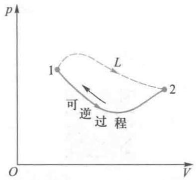  
图15-27

文档：远离平衡态的自组织现象研究

文档：热寂说的提出

度的准则：“任何自发过程必定向着熵增加的方向进行；自发不可逆绝热过程进行的限度是以熵函数达到最大值为准则”

必须指出，上面的讨论都是对孤立系统而言的，对于非孤立的开放系统来说，无序程度高的状态不一定就是概率大的状态，熵也可能在过程中减少从而使系统的无序程度降低。这是因为开放系统熵的改变来自两个方面：一是系统内部的不可逆过程引起熵的增加，称为熵产生，记作  $\mathrm{d}S_{\mathrm{i}}$ ；另一是与外界交换中流入系统的熵，称为熵流，记作  $\mathrm{d}S_{\mathrm{e}}$ 。系统熵的增量则为  $\mathrm{d}S = \mathrm{d}S_{\mathrm{i}} + \mathrm{d}S_{\mathrm{e}}$ 。对于一个开放系统中的热力学过程，其熵的变化有可能会减少。例如，生命系统就是一个高度有序的开放系统，熵越低就意味着系统越完善和健全而生命力越强。正是在与外界有着充分的物质、能量的交流中，生命系统不断地得到“负熵”从而从单细胞生物逐渐演化成现在这样丰富多彩的自然界。

例15-9

试求理想气体向真空绝热自由膨胀过程中的熵变

解理想气体的绝热自由膨胀为一不可逆过程，计算其熵变，可以选择连接同样初、末态的可逆过程来进行.这里，我们选择理想气体等温膨胀过程来计算气体由体积  $V_{1}$  膨胀到  $V_{2} = 2V_{1}$  过程中的熵变.设有一定量理想气体，等温过程中

$$
\mathrm {d} E = 0, \mathrm {d} Q = p \mathrm {d} V = \frac {m}{M} \frac {R \mathrm {d} V}{V}
$$

按熵差定义，有

$$
\begin{array}{l} \Delta S = S _ {2} - S _ {1} = \int_ {V _ {1}} ^ {V _ {2}} \frac {m}{M} \frac {R \mathrm {d} V}{V} \\ = \frac {m}{M} R \ln 2 > 0 \\ \end{array}
$$

这也就是理想气体自由膨胀的熵差.由于这是不可逆的绝热过程，所以熵差不为零，过程进行的方向是沿熵增大的方向进行的

例15-10

试由熵增加原理导出卡诺定理

解对于任意的一个热机工作循环过程，工作物质从温度为  $T_{1}$  的高温热源吸热 $Q_{1}$  ，向温度为  $T_{2}$  的低温热源放热  $Q_{2}$  ，整个复合系统包括高温热源、低温热源和工作物质三部分.由于高温热源和低温热源的温度分别保持不变，经历一个循环后工作物质恢复到原状态，那么，在一个循环过程中，高温热源、低温热源及工作物质的熵的变化分别为

$$
\Delta S _ {\mathrm {H}} = - \frac {Q _ {1}}{T _ {1}}, \Delta S _ {\mathrm {L}} = \frac {Q _ {2}}{T _ {2}}, \Delta S _ {\mathrm {M}} = 0
$$

由于高温热源、低温热源和工作物质三部分组成的复合系统为一个封闭的孤立系统，则由熵增加原理知，整个复合系统的熵变为

$$
\begin{array}{l} \Delta S = \Delta S _ {\mathrm {H}} + \Delta S _ {\mathrm {L}} + \Delta S _ {\mathrm {M}} \\ = - \frac {Q _ {1}}{T _ {1}} + \frac {Q _ {2}}{T _ {2}} \geqslant 0 \\ \end{array}
$$

于是有

$$
\frac {Q _ {2}}{T _ {2}} \geqslant \frac {Q _ {1}}{T _ {1}}
$$

由热力学第一定律知，热机循环一周后工作物质有  $\Delta E = (Q_{1} - Q_{2}) - W = 0$  于是

$$
Q _ {2} = Q _ {1} - W
$$

代入上式则有

$$
\frac {Q _ {1} - W}{T _ {2}} \geqslant \frac {Q _ {1}}{T _ {1}}
$$

可解得

$$
W \leqslant \frac {T _ {1} - T _ {2}}{T _ {1}} Q _ {1}
$$

所以热机的效率

$$
\eta = \frac {W}{Q _ {1}} \leqslant \frac {T _ {1} - T _ {2}}{T _ {1}} \leqslant \eta_ {\mathrm {c}}
$$

式中的等号适用于可逆过程，不等号适用于不可逆过程.卡诺定理由此得证.事实上，考察上述导出过程可知，卡诺定理是热力学第二定律的必然结果.由此还可以知道，热力学第二定律不仅解决了热力学过程中自发过程进行方向的问题，还解决了热机效率的最大限度及提高热机效率应采取措施的问题

# 15-7 热力学第二定律的统计意义

# 一、热力学第二定律的统计意义

  
文档：热力学第二定律的建立

# 1. 自然过程方向性的微观分析

自发过程的方向性和热力学过程的不可逆性是被大量观察实验所证明的事实，热力学第二定律就是这一事实的文字总结，而熵增加原理可以视为这一事实的数学表述。但宏观热力学还不能说明：为什么自发过程具有方向性？为什么热力学过程是不可逆的？

物理学在关于分子运动和物质结构的微观理论研究中，常常使用所谓有序与无序的概念，利用这个概念可以简明而形象地说明热力学第二定律和熵的微观意义。例如：功自动转变为热，定向运动的宏观机械能转化成了无规热运动的动能，从分子动理论来看，是大量分子的有序运动转变为大量分子无序运动的过程；又如，热量自动从高温物体传向低温物体的过程，两个温度不同的物体最终达到了共同的温度。我们原来还可区分两个不同温度物体的热运动动能的不同，最后两物体中的平均动能变为相同，原来这种简单的区分也没有了，分子热运动的无序程度增大了；再如气体的绝热自由膨胀过程，分子原先都集中在隔板的一边，分子运动的空间分布是相对有序的，膨胀结束后气体均匀充满整个容器，分子运动在空间分布上的无序程度当然也增加了。

# 2. 热力学第二定律的统计意义

前面曾指出，对于由大量分子组成的热力学系统，由于分子不停息的运动和碰撞，系统的微观态是瞬息变化着的。在给定的宏观条件下，系统存在大量彼此不同的微观态，而

且即使是在同一宏观态下，仍可以有许许多多的微观态。热力学中，把一个宏观态所包含的微观态数目称为热力学概率，记为  $W$ 。

我们以理想气体绝热向真空自由膨胀为例予以简单分析. 设有容器被隔板分为体积相等的左右两部分, 左边贮有气体, 共  $N$  个分子, 右边为真空, 隔板抽去后气体将向真空自由膨胀. 为简便计, 仅考察分子在左、右两边的分布情况. 且为便于讨论, 先假定考察分别标记为 a、b、c、d 的 4 个分子的分布, 如图 15-28 所示. 把哪几个分子处于哪一边的具体分布表示为系统的微观态, 由 4 个分子组成的系统, 在抽去隔板后共可取  $n = 2^{4} = 16$  种微观态. 而用分子数在左右两边的分布表示系统的宏观态, 每一种宏观态可以包含一个或多个微观态.

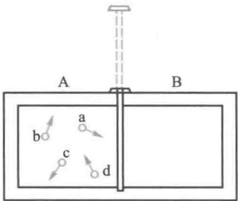  
图15-28 气体自由膨胀

表15-3列出了这4个分子在左右两边的分布情况

表 15-3 4 个分子在左右两边的分布  

<table><tr><td colspan="2">宏观态</td><td colspan="2">微观态</td><td rowspan="2">一个宏观态包含的微观态数目</td></tr><tr><td>左边</td><td>右边</td><td>左边</td><td>右边</td></tr><tr><td>4</td><td>0</td><td>a b c d</td><td>0</td><td>1</td></tr><tr><td>3</td><td>1</td><td>a b c b c d d a b a c d</td><td>d a c b</td><td>4</td></tr><tr><td>2</td><td>2</td><td>a b a c a d b c b d c d</td><td>c d b d b c a d a c a b</td><td>6</td></tr><tr><td>1</td><td>3</td><td>a b c d d</td><td>b c d c a d b d a a b c</td><td>4</td></tr><tr><td>0</td><td>4</td><td>0</td><td>a b c d</td><td>1</td></tr></table>

统计物理有一个基本假设，对于处于平衡态的孤立系，系统内各个微观态出现的概率是相等的。因此，那些包含微观态数目多的宏观态出现的概率就大，包含微观态数目少的宏观态出现的概率就小。上面的例子中，出现第  $i$  个宏观态的概率  $W_{i}$  为

$$
W _ {i} = \frac {n _ {i}}{n}
$$

其中，  $n$  为微观态总数，  $n_i$  为第  $i$  个宏观态所包含的微观态数.根据上面的列表可知，五个宏观态的概率分别为

$$
W _ {1} = \frac {1}{2 ^ {4}}, \quad W _ {2} = \frac {4}{2 ^ {4}}, \quad W _ {3} = \frac {6}{2 ^ {4}}, \quad W _ {4} = \frac {4}{2 ^ {4}}, \quad W _ {5} = \frac {1}{2 ^ {4}}
$$

文档：玻耳兹曼关于热力学第二定律的微观解释

也就是说，隔板抽去后，4个分子集中在一边的概率较小，为  $\frac{1}{2^4}$ ，而两边均匀分布的概率较大，为  $\frac{6}{2^4}$ 。进一步计算表明，分子总数越多，则左右两边分子数相等或差不多的宏观态出现的概率越大。如果一个系统所含分子数的数量级为  $10^{23}$ ，则打开隔板后分子运动到集中于一边的概率为  $\frac{1}{2^{10^{23}}}\rightarrow 0$ ，而均匀分布所出现的概率为最大，其中所包含的微观态数目最多。统计分析表明，平衡态所包含的微观态数目最多，所以，在不受外界影响时，系统总是处于平衡态。如果系统受到外界影响，使它处于非平衡态上，则经过足够长时间后，系统就将自动过渡到平衡态。

如果不是考察分子位置的空间分布，而是考察分子的速度。例如，对于一个孤立系统，其分子动能在各处大致均等的宏观态所包含的微观态数大大超过其他的情况。因此，在宏观上就自动发生热量从高温部分传向低温部分，并过渡到整个系统有统一温度的平衡态。又如在孤立系统中，分子速度方向作完全无规分布的宏观态与分子速度方向同向排列时的宏观态相比，在包含的微观态数目上要大得多。所

以，大量分子有规则运动总要向无规则运动过渡，其结果就表现为功向热的自动转换

由此可以得到结论：孤立系统中自发进行的不可逆过程总是由概率小的宏观态向概率大的宏观态进行，也就是由包含微观态数目少的宏观态向包含微观态数目多的宏观态进行。这就是热力学第二定律的统计意义，也就是熵增加原理的微观实质。

# 二、熵的统计表述

当孤立系统从热力学概率小的宏观态向热力学概率大的宏观态过渡时，系统就由不平衡态向平衡态发展，系统的熵值也随之达到最大值.由此可以推知熵S与宏观态的热力学概率  $W$  之间存在着本质的联系.历史上玻耳兹曼首先建立了熵的统计表达式：

$$
S = k \ln W \tag {15-58}
$$

上式由玻耳兹曼在1877年建立，称为玻耳兹曼熵公式，式中  $k$  即为玻耳兹曼常量.

玻耳兹曼公式揭示了熵的统计意义：热力学概率越大，即某一宏观态所对应的微观态数目越多，系统内分子热运动的无序性越大，熵就越大，所以熵是组成系统的微观粒子热运动无序性的量度.

理论上可以证明，根据玻耳兹曼熵公式可以得到宏观热力学熵或克劳修斯熵公式所能得到的所有结果

熵的增加就意味着无序程度的增加；平衡态时熵最大，表示系统达到了最无序的状态。正是在这个意义上使熵这一概念的内涵变得十分丰富而且充满了生命活力。现在，熵的概念以及与之有关的理论，已在物理、化学、气象、生物学、信息论等工程技术乃至社会科学的领域中获得了广泛的应用。

例15-11

试用玻耳兹曼熵公式（15-58）计算理想气体在等温膨胀过程中的熵变

解在等温膨胀过程中，对于一指定分子，在体积为  $V$  的容器中找到它的概率 $W_{1}$  是与该容器的体积成正比的，即

$$
W _ {1} = c V
$$

式中  $c$  是比例系数，对于  $N$  个分子，它们同时在  $V$  中出现的概率  $W$  ，等于各单个分子出现概率的乘积，而这个乘积也就是在 $V$  中由  $N$  个分子组成的宏观状态的概率，即

$$
W = \left(W _ {1}\right) ^ {N} = (c V) ^ {N}
$$

由（15-58）式，系统的熵为

$$
S = k \ln W = k N \ln (c V)
$$

经过等温膨胀，熵的增量为

$$
\begin{array}{l} \Delta S = k N \ln (c V _ {2}) - k N \ln (c V _ {1}) = k N \ln \frac {V _ {2}}{V _ {1}} \\ = \frac {R}{N _ {\mathrm {A}}} \frac {N _ {\mathrm {A}} m}{M} \ln \frac {V _ {2}}{V _ {1}} = \frac {m}{M} R \ln \frac {V _ {2}}{V _ {1}} \\ \end{array}
$$

这一结果已在自由膨胀的讨论中用（15-50）式计算得到.

# 提要

本章以观测和实验事实为依据，从能量的观点出发，分析研究热力学系统状态变化过程中有关热功转换的关系与条件.本章以理想气体为研究对象，重点讨论了热力学第一定律及其在各准静态过程中的应用，指出第一定律是包括热现象在内的能量守恒与转化定律.本章引入了熵函数的概念，加强了对热力学第二定律的讨论，阐明热力学第二定律是指明过程进行的方向与条件的基本定律.

# 基本概念与规律

1. 准静态过程 过程进行中的每一时刻，系统都无限接近于平衡态。  
2. 准静态过程的功、热量、内能

（1）准静态过程中系统对外界所做的体积功：

$$
W = \int_ {V _ {1}} ^ {V _ {2}} p \mathrm {d} V
$$

功是过程量，其几何意义由定义式可见，为  $p - V$  图上过程曲线（被积函数）下的面积

（2）热量：系统与外界之间因存在温度差而交换的热运动能量.热量也是过程量.准静态过程中系统与外界交换的热量为

$$
Q = \frac {m}{M} C _ {\mathrm {m}} \left(T _ {2} - T _ {1}\right)
$$

式中，  $C_{\mathrm{m}}$  为摩尔热容，随过程而异

（3）内能：系统内微观粒子各种形式的热运动能量之和，是态函数，与状态变化过程无关。理想气体的内能是温度的单值函数，两平衡态间系统内能的变化都可表示为

$$
\Delta E = \frac {m}{M} \frac {i}{2} R \left(T _ {2} - T _ {1}\right)
$$

3. 热力学第一定律

$$
Q = E _ {2} - E _ {1} + W
$$

$$
\mathrm {d} Q = \mathrm {d} E + \mathrm {d} W
$$

热力学第一定律在理想气体各准静态过程中应用时，常用到

摩尔定容热容：  $C_{V,\mathrm{m}} = \frac{i}{2} R$

摩尔定压热容：  $C_{p,\mathrm{m}} = \frac{i + 2}{2} R$

迈耶公式：  $C_{p,m} - C_{V,m} = R$

摩尔热容比：  $\gamma = \frac{C_{p,\mathrm{m}}}{C_{V,\mathrm{m}}} = \frac{i + 2}{i}.$

4. 循环过程

热机循环：系统从高温热源吸热，对外界做功，向低温

热源放热.

热机效率为

$$
\eta = \frac {W}{Q _ {1}} = 1 - \frac {Q _ {2}}{Q _ {1}}
$$

制冷循环：系统接受外界做功，从低温热源吸热，向高温热源放热

制冷系数为

$$
e = \frac {Q _ {2}}{W} = \frac {Q _ {2}}{Q _ {1} - Q _ {2}}
$$

卡诺循环：系统只和高温、低温两个恒温热源交换热量的准静态循环过程.

卡诺正循环的效率：

$$
\eta_ {\mathrm {c}} = 1 - \frac {T _ {2}}{T _ {1}}
$$

卡诺逆循环的制冷系数：

$$
e _ {\mathrm {c}} = \frac {T _ {2}}{T _ {1} - T _ {2}}
$$

5. 可逆与不可逆过程

可逆过程：借助外界条件改变无穷小的量就可以使其反向进行的过程，其结果是系统和外界能同时回复到初始状态.

无摩擦的以及与外界进行等温热传导的准静态过程是可逆过程.

不可逆过程：各种自然的宏观过程都是不可逆的，而且它们的不可逆性又是相互沟通的

三个典型实例：功热转化、热传导、气体的绝热自由膨胀.

6. 热力学第二定律

克劳修斯表述：

热量不能自动地从低温物体传向高温物体

开尔文表述：

不可能制成一种循环动作的热机，只从单一热源吸收热量，使之完全变为有用功而不产生其他的影响。

热力学第二定律的实质在于指出，一切与热现象有关的实际宏观过程都是不可逆的。

7.熵和熵增加原理

克劳修斯熵定义：

$$
\Delta S = S _ {2} - S _ {1} = \int_ {1} ^ {2} \frac {\mathrm {d} Q}{T} \quad (\text {沿 可 逆 过 程})
$$

因为熵是态函数，两状态间的熵差与过程无关，因而可以自行设计一个连接初、末态的任一可逆过程，按定义式计算出熵差.

熵增加原理：

$$
\Delta S = S _ {2} - S _ {1} \geqslant 0
$$

即，热力学系统的熵在任何绝热过程中永不减少。若过程是可逆的绝热过程，则系统的熵值不变；若过程是不可逆的绝热过程，则系统的熵值增加。

8. 热力学第二定律的统计意义

热力学概率：

一个宏观态所包含的微观态数目称为热力学概率，记为  $W$

热力学第二定律的统计意义：

孤立系统中自发进行的不可逆过程总是由概率小的宏观态向概率大的宏观态进行，也就是由包含微观态数目少的宏观态向包含微观态数目多的宏观态进行.

玻耳兹曼熵公式：

$$
S = k \ln W
$$

熵的物理意义：熵是组成系统的微观粒子热运动无序性的量度.

# 思考题

15-1 内能和热量的概念有何不同？下面两种说法是否正确？

（1）物体的温度愈高，则热量愈多；  
（2）物体的温度愈高，则内能愈大

15-2 在  $p - V$  图上用一条曲线表示的过程是否一定是准静态过程？理想气体经过自由膨胀由状态  $(p_{1},V_{1})$  变化到  $(p_{2},V_{2})$  ，这一过程能否在  $p - V$  图上用一条等温线表示？  
15-3 为什么气体热容的数值可以有无穷多个？什么情况下，气体的摩尔热容是零？什么情况下，气体的摩尔热容是无穷大？什么情况下是正值？什么情况下是负值？  
15-4 一理想气体经图示的过程，试讨论其摩尔热容的正负：

（1）过程  $\mathrm{I}\rightarrow \mathrm{II}$  
（2）  $\mathrm{I}^{\prime}\rightarrow \mathrm{II}$  （沿绝热线）；  
(3)  $\mathbb{I}\mathbb{I}^{\prime}\to \mathbb{I}$

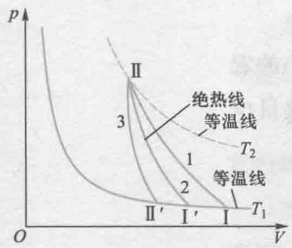  
思考题15-4图

15-5 如图所示，一定量的理想气体在  $p - V$

图上初态A经历（1）或（2）过程到达末态B，已知A、B两态处于同一条绝热线上（图中虚线是绝热线），试讨论两过程中气体  $\Delta E,\Delta T,W$  和  $Q$  的正负.

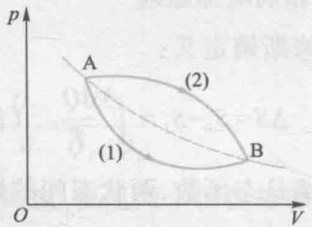  
思考题15-5图

15-6 对物体加热而其温度不变，有可能吗？没有热交换而系统的温度发生变化，有可能吗？  
15-7 某理想气体按  $pV^2 =$  常量的规律膨胀，问此理想气体的温度是升高了，还是降低了？  
15-8 有两个可逆机分别用不同热源作卡诺循环，在  $p - V$  图上，它们的循环曲线所包围的面积相等，但形状不同，如图所示，它们吸热和放热的差值是否相同？对外所做的净功是否相同？效率是否相同？

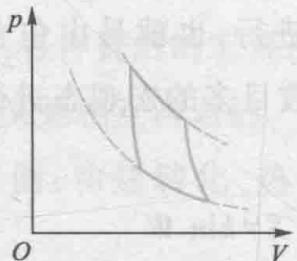  
(a)  
思考题15-8图

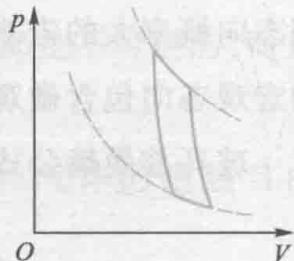  
(b)

15-9  $p - V$  图中表示循环过程的曲线所包围的面积，代表热机在一个循环中所做的净功如图所示，如果体积膨胀得大些，面积就大了（图中面积），所做的净功就多了，因此热机效率也就可以提高了，这种说法对吗？

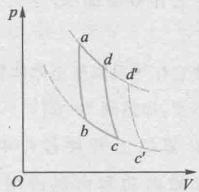  
思考题15-9图

15-10 有一可逆的卡诺机，它作热机使用时，如果工作的两热源的温度差越大，则对于做功就越有利。当作制冷机使用时，如果两热源的温度差越大，对于制冷是否也越有利？为什么？  
15-11 在一个房间里有一台电冰箱正工作着，如果打开冰箱的门，能否使房间降温？用一台热泵为什么能使房间降温？  
15-12 一条等温线与一条绝热线能否相交两次，为什么？  
15-13 两条绝热线与一条等温线能否构成一个循环，为什么？

15-14 从理论上如何计算物体在始末状态之间进行不可逆过程所引起的熵变？

15-15 可逆过程是否一定是准静态过程？准静态过程是否一定是可逆过程？

15-16 一杯热水置于空气中，它总是冷却到与周围环境相同的温度，因为处于比周围温度高或低的概率都较小，而与周围同温度的平衡却是最概然状态，但是这杯水的熵却是减小了，这与熵增加原理有无矛盾？

15-17 一定量的气体，初始压强为  $p_1$ ，体积为  $V_1$ ，今把它压缩到  $\frac{V_1}{2}$ ，一种方法是等温压缩，另一种方法是绝热压缩。问哪种方法最后的压强较大？这两种方法中气体的熵改变吗？

15-18 一定量气体经历绝热自由膨胀，既然是绝热的，即  $\mathrm{d}Q = 0$  ，那么熵变也应该为零.这种说法对吗？为什么？

15-19 试根据热力学第二定律判别下面说法是否正确？

（1）功可以全部转化为热，但热不能全部转化为功；  
（2）热量能从高温物体传到低温物体，但不能从低温物体传到高温物体

# 习题

15-1  $1\mathrm{mol}$  单原子理想气体从  $300\mathrm{K}$  加热至  $350\mathrm{K}$

（1）容积保持不变；

（2）压强保持不变，问在这两过程中各吸收了多少热量？增加了多少内能？对外做了多少功？

15-2 压强为  $1.0 \times 10^{5} \mathrm{~Pa}$ , 体积为  $0.0082 \mathrm{~m}^{3}$  的氮气, 从初始温度  $300 \mathrm{~K}$  加热到  $400 \mathrm{~K}$ , 如加热时: (1) 体积不变; (2) 压强不变, 问各需热量多少? 哪一个过程所需热量大? 为什么?

15-3  $2\mathrm{mol}$  氮气，在温度为  $300\mathrm{K}$  、压强为 $1.0\times 10^{5}\mathrm{Pa}$  时，等温地压缩到  $2.0\times 10^{5}\mathrm{Pa}$  求气体放出的热量

15-4 质量为  $1\mathrm{kg}$  的氧气，其温度由  $300\mathrm{K}$  升高到  $350\mathrm{K}$ . 若温度升高是在下列3种不同情况下发生的：（1）体积不变；（2）压强不变；（3）绝热，问其内能改变各为多少？

15-5 将  $500\mathrm{J}$  的热量传给标准状态下 $2\mathrm{mol}$  的氢气.

（1）若体积不变，问这热量变为什么？氢气的温度变为多少？  
（2）若温度不变，问这热量变为什么？氢气的压强及体积各变为多少？  
（3）若压强不变，问这热量变为什么？氢气的温度及体积各变为多少？

15-6  $1\mathrm{mol}$  氢气，在压强为  $1.0\times 10^{5}\mathrm{Pa}$  温度为  $20^{\circ}C$  时，其体积为  $V_{0}$  .今使它经历以下两个过程达到同一状态：

（1）先保持体积不变，加热使其温度升高到 $80\%$  ，然后令它作等温膨胀，体积变为原来的2倍；  
（2）先使它作等温膨胀至原体积的2倍，然后保持体积不变，加热到  $80\%$

试分别计算以上两种过程中吸收的热量，气体对外做的功和内能的增量；并作出  $p - V$  图.

15-7 理想气体作绝热膨胀，由初状态  $(p_0,V_0)$  至末状态  $(p,V)$

$$
A = \frac {p _ {0} V _ {0} - p V}{\gamma - 1}
$$

（1）试证明在此过程中气体所做的功为  
（2）设  $p_0 = 1.0 \times 10^6\mathrm{Pa}, V_0 = 0.001\mathrm{m}^3, p = 2.0 \times 10^5\mathrm{Pa}, V = 0.00316\mathrm{m}^3$ ，气体的  $\gamma = 1.4$ ，试计算气体所做的功为多少？  
15-8 试用比较曲线斜率的方法证明，在  $p - V$  图上相交于任一点的理想气体的绝热线比等温线陡.并用气体动理论的观点说明绝热线比等温线陡的原因  
15-9 一定量的理想气体在  $p - V$  图中的等温线与绝热线交点处两线的斜率之比为0.714，求其摩尔定容热容

15-10 气缸内有单原子理想气体，若绝热压缩使其容积减半，问气体分子的平均速率变为原来速率的几倍？若为双原子理想气体，则为几倍？

15-11 室温  $27\%$  下一定量理想气体氧气的体积为  $2.3\times 10^{-3}\mathrm{m}^3$  ，压强为  $1.0\times 10^{5}\mathrm{Pa}$  ，经过一多方过程后，体积变为  $4.1\times 10^{-3}\mathrm{m}^3$  ，压强为 $0.5\times 10^{5}\mathrm{Pa}$  求：

（1）多方指数  $n$

（2）内能的改变；

（3）吸收的热量；

（4）氧气膨胀时对外做的功.已知氧气的 $C_{V,\mathrm{m}} = \frac{5}{2} R.$

15-12 物质的量为  $\frac{m}{M}$  的某种理想气体，状态按  $V = a / \sqrt{p}$  的规律变化（式中  $a$  为正常量），当气体体积从  $V_{1}$  膨胀到  $V_{2}$  时，试求气体所做的功 $W$  及气体温度的变化  $T_{1} - T_{2}$  各为多少？

15-13  $1\mathrm{mol}$  双原子分子理想气体从状态 $A(p_{1},V_{1})$  沿  $p - V$  图所示直线变化到状态  $B(P_{2},$ $V_{2})$  ，试求：

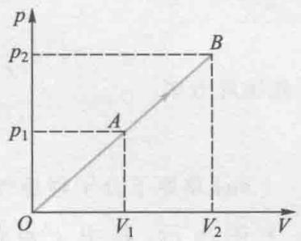  
习题15-13图

（1）气体的内能增量；  
（2）气体对外界所做的功；  
（3）气体吸收的热量；  
（4）此过程的摩尔热容

15-14  $1\mathrm{mol}$  理想气体在  $400\mathrm{K}$  与  $300\mathrm{K}$  之间完成一卡诺循环，在  $400\mathrm{K}$  的等温线上，起始体积为  $0.001\mathrm{m}^3$  ，最后体积为  $0.005\mathrm{m}^3$  ，试计算气体在此循环中所做的功，以及从高温热源吸收的热量和传给低温热源的热量

15-15 一热机，在  $1000\mathrm{K}$  和  $300\mathrm{K}$  的两热源之间工作.如果

（1）高温热源提高到  $1100\mathrm{K}$  
（2）低温热源降到  $200\mathrm{K}$  ，求理论上的热机效率各增加多少？为了提高热机效率，哪一种方案更好？

15-16 一可逆卡诺热机，当高温热源的温度为  $127\%$  ，低温热源的温度为  $27\%$  时，其每次循环对外做净功8000J.今维持低温热源的温度不变，提高其高温热源温度，使其每次循环对外做净功10000J.若两个卡诺循环都工作在相同的两条绝热线之间.试求：

（1）第二个循环热机的效率；  
（2）第二个循环的高温热源的温度

15-17 设以氮气（视为刚性分子理想气体）为工作物质进行卡诺循环，在绝热膨胀过程中气体的体积增大到原来的两倍，求循环的效率.

15-18 一理想气体的循环过程如图所示，由1经绝热压缩到2，再等体加热到3，然后绝热膨胀到4，再等体放热到1.设  $V_{1},V_{2},\gamma$  为已知，且循环的效率  $\eta = A / Q.$  求证：此循环的效率  $\eta =$ $1 - (V_1 / V_2)^{1 - \gamma}$

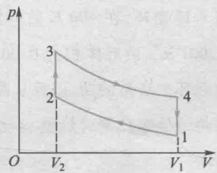  
习题15-18图

15-19 气缸内有  $36\mathrm{g}$  水蒸气（视为刚性分子的理想气体），经  $abcda$  循环过程，如图所示.其中  $a - b, c - d$  为等体过程， $b - c$  为等温过程， $d - a$  为等压过程.试求：

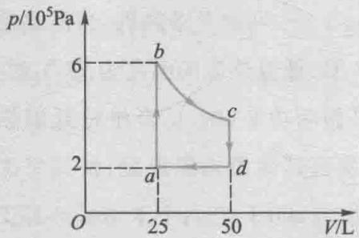  
习题15-19图

（1）  $W_{da} = ?$  
(2)  $\Delta E_{ab} = ?$  
（3）循环过程水蒸气做的净功  $W = ?$  
（4）循环效率  $\eta = ?$

15-20 如图所示，  $abcd\alpha$  为  $1\mathrm{mol}$  单原子分子理想气体的循环过程，求：

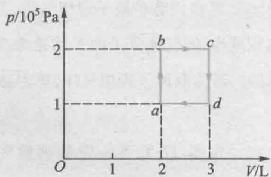  
习题15-20图

（1）气体循环一次，在吸热过程中从外界共吸收的热量；  
（2）气体循环一次对外做的净功；  
（3）证明  $T_{a}T_{c} = T_{b}T_{d}$

15-21  $1\mathrm{mol}$  单原子分子理想气体，经历如图所示的可逆循环，联结AC两点的曲线Ⅲ的方程为  $p = \frac{p_0V^2}{V_0^2},A$  点的温度为  $T_{0}$

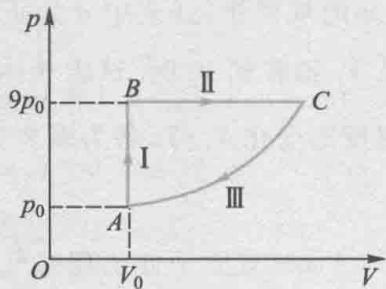  
习题15-21图

（1）试以  $T_{0}, R$  表示I，Ⅱ，Ⅲ过程中气体吸收的热量；  
（2）求此循环效率

15-22  $1\mathrm{mol}$  单原子分子理想气体的循环过程如  $T - V$  图所示，其中  $c$  点的温度为 $T_{c} = 600\mathrm{K}$  试求：

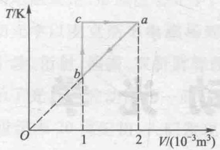  
习题15-22图

（1）  $ab, bc, ca$  各个过程系统吸收的热量；  
（2）经一循环系统所做的净功；  
（3）循环的效率

15-23 如图所示，绝热容器中间被一隔板等分为两部分，其中左边贮有  $1\mathrm{mol}$  某种理想气体，另一边为真空，现把隔板拉开，求气体膨胀后的熵变.

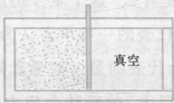  
习题15-23图

15-24 有  $2\mathrm{mol}$  的理想气体，经过可逆的等压过程，体积从  $V_{0}$  膨胀到  $3V_{0}$  求在这一过程中的熵变.提示：设想气体从初始状态到最终状态是先沿等温曲线，然后沿绝热曲线（在这个过程中熵没有变化）进行的

15-25  $1\mathrm{mol}$  双原子分子理想气体的状态变化如图所示，其中  $1\rightarrow 3$  为等温过程，  $1\rightarrow 4$  为绝热过程.试分别由下列三种过程计算气体的熵的变化  $\Delta S = S_{3} - S_{1}$

（1）  $1\to 2\to 3$  
(2)  $1 \rightarrow 3$ ;  
(3)  $1 \rightarrow 4 \rightarrow 3$ .

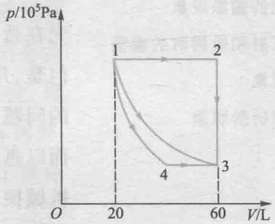  
习题15-25图