# 第十六章 波动光学

16-1 光的相干性  
16-2 双缝干涉  
16-3 薄膜干涉  
16-4 单缝衍射  
16-5 光栅衍射  
16-6 X射线的衍射  
16-7 光的偏振现象  
16-8 反射和折射时的偏振现象  
16-9 双折射现象

光是我们最熟悉的自然现象之一. 光学 (optics) 和天文学、几何学、力学一样, 是物理学中发展最早的学科之一. 然而, 在漫长的岁月中, 人们的光学知识仅局限在对一些与视觉有关的自然现象和简单成像规律的了解上. 随着天文学和解剖学的发展, 在研究、制造光学仪器的过程中, 17 世纪上半叶, 逐步形成了以光线为基础, 用几何学的方法来研究光在透明介质中传播规律的几何光学 (geometrical optics). 但是, 几何光学未触及“光是什么”这个至今仍然充满魅力的问题. 17 世纪, 以牛顿为代表的一些学者认为光是微粒, 而以惠更斯 (C. Huygens) 为代表的另一些学者则认为光是机械振动, 它在一种称为“以太”的特殊介质中的波动. 这两种观点在解释光的折射现象时发生了严重的对立: “微粒说” 认为光在水中的传播速度大于空气中的传播速度, 而“波动说”则持截然相反的观点. 然而占据主流地位的是“微粒说”. 从 19 世纪初开始, 光的波动说逐步得以确立: 1801 年杨 (T. Young) 用干涉原理, 解释了阳光下薄膜的颜色, 设计实验并首次测定了光的波长. 以后又经过马吕斯 (E. L. Malus)、菲涅耳 (A. J. Fresnel)、阿拉果 (D. Arago)、泊松 (S. D. Poisson)、傅科 (L. Foucault) 等人前后近 50 年的研究, 肯定了光的机械波动说. 1860 年前后, 麦克斯韦 (J. C. Maxwell) 的电磁波动方程又预言了光是一种电磁横波, 并由 1888 年赫兹 (H. R. Hertz) 的实验所证实, 由此确

立了光的电磁理论，形成波动光学（wave optics）.

波动光学以麦克斯韦电磁场理论为基础，完美地描述了光在干涉、衍射、偏振、双折射等现象中所遵循的规律，向人们揭示了光具有波动性的一面.

19世纪末20世纪初，人们发现光的电磁波动理论不能用来解释黑体辐射（blackbody radiation）、光电效应（photoelectric effect）和原子光谱等问题。1900年普朗克（M. Planck）提出物质体系在与电磁场交换能量过程中的量子化假设，导出了黑体辐射定律。1905年爱因斯坦（A. Einstein）进一步提出光在本质上是由光量子（光子 photon）组成的假设，进而成功地解释了光电效应和康普顿效应等问题。这些深入研究和大胆探索的成果，极大地深化了人们对光本性的认识：一方面，在与光的传播特性有关的一系列现象中，光表现出波动的本性；另一方面，在光与物质相互作用并产生能量和动量交换的过程中，又充分表现出分立的量子化（粒子性）特征。这就是说，光具有波粒二象性。现代自然科学已证明，自然界本质上是量子的，光也不例外。从某种意义上说，支配着所有光学现象的理论是量子理论（quantum theory）。

诞生于20世纪60年代的激光（laser）是量子理论产物，它的出现使光学领域发生了翻天覆地的变化。不断涌现的物理新现象、新效应使人们对光的量子特性有了更深刻的认识，量子光学（quantum optics）因而获得异常迅速的发展。与此同时，诸如激光生物、激光化学、激光医学等交叉学科也应运而生。历史悠远的光学学科由此掀开了新的更加绚丽的一页。

本章仅讨论波动光学中的一些基本现象及规律，主要包括光的干涉，光的衍射及其应用，光的偏振等内容.

# 16-1 光的相干性

# 一、光的电磁理论

19世纪60年代，麦克斯韦的电磁理论证实了光是一种电磁波。能引起人眼视觉的电磁波称为可见光（visible light）。实验表明，对人的视觉和光化学效应等起作用的主要是电场强度  $E$ ，我们把  $E$  称为光矢量。一般认为可见光的波长在  $400 \sim 760 \mathrm{~nm}$  之间，光振动频率的数量级为  $10^{14} \mathrm{~Hz}$ 。不同波长的可见光引起的色觉不同，大致说来，波长与颜色的对应关系如表16-1所示。

<table><tr><td></td><td></td><td></td><td></td><td></td><td></td><td></td></tr><tr><td>760</td><td>630</td><td>600</td><td>570</td><td>500</td><td>450</td><td>430</td></tr><tr><td>红</td><td>橙</td><td>黄</td><td>绿</td><td>青</td><td>蓝</td><td>紫</td></tr></table>

视频：彩虹

波长在  $760\mathrm{nm}$  到几毫米之间的电磁波叫红外线(infrared ray)，在  $400\mathrm{nm}$  到几纳米之间的电磁波叫紫外线(ultraviolet ray).从紫外光到红外光范围内的电磁波都是光学的研究对象，统称为光波（light wave）.只包含单一波长的光，称为单色光（monochromatic light），是一种理想化的光波.

电磁波是变化的电磁场在空间的传播，沿着  $z$  方向传播的单色平面电磁波可以表示为

$$
E _ {x} = E _ {0} \cos \left[ \omega \left(t - \frac {z}{u}\right) + \varphi \right]
$$

$$
H _ {y} = H _ {0} \cos \left[ \omega \left(t - \frac {z}{u}\right) + \varphi \right]
$$

式中  $\omega$  是单色光波的角频率，  $u$  是单色光波的相位在介质中的传播速率，

$$
u = \frac {1}{\sqrt {\varepsilon \mu}} = \frac {c}{\sqrt {\varepsilon_ {\mathrm {r}} \mu_ {\mathrm {r}}}} \tag {16-1}
$$

式中  $c = \frac{1}{\sqrt{\varepsilon_0\mu_0}}$  ，是单色光波在真空中的传播速率，代入 $\varepsilon_0 = 8.8542\times 10^{-12}\mathrm{F}\cdot \mathrm{m}^{-1}$  和  $\mu_0 = 4\pi \times 10^{-7}\mathrm{N}\cdot \mathrm{A}^{-2}$  后，即可得到，  $c = 2.99792\times 10^{8}\mathrm{m}\cdot \mathrm{s}^{-1}$  ，通常取  $c = 3.0\times 10^{8}\mathrm{m}\cdot \mathrm{s}^{-1}$

对大多数介质而言，当光波不是很强时，近似有  $\mu_{\mathrm{r}}\approx 1$ $\varepsilon_{\mathrm{r}} > 1$  ，因而  $u\approx \frac{c}{\sqrt{\varepsilon_{\mathrm{r}}}}$  折射率  $n$  可表示为

$$
n = \frac {c}{u} \approx \sqrt {\varepsilon_ {\mathrm {r}}} \tag {16-2}
$$

折射率  $n$  与介质的电磁性质密切相关. 对均匀、各向同性介质,  $\varepsilon_{\mathrm{r}}$  是一确定的常数, 因而  $n$  的数值也是一定的. 真空的折射率  $n = 1$ , 单色光波在介质中的波长  $\lambda_{n} = \frac{u}{\nu} = \frac{c}{n\nu} = \frac{\lambda}{n}$ ,  $\lambda_{n}$  小于在真空中的波长  $\lambda$ .

# 二、光程

光波的相位在真空中以速度  $c$  传播，在折射率为  $n$  的介质中以速度  $u$  传播。在相同的时间  $\Delta t$  内，光波在真空中和介质中经历的相位变化是相同的，但传播路程的长度是不同的。为方便以后的讨论，有必要引进光程的概念。

由波动知识可知，一频率为  $\nu$  、真空中波长为  $\lambda$  的光波，在折射率为  $n$  的介质中传播路程为  $s$  时，其相位变化为 $\Delta \varphi = \frac{2\pi}{\lambda_n} s.$  由于  $\lambda_{n} = \frac{\lambda}{n}$  ，这个相位变化也可表示为

$$
\Delta \varphi = \frac {2 \pi}{\lambda} n s = \frac {2 \pi}{\lambda} l
$$

式中

$$
l = n s \tag {16-3}
$$

我们把  $l$  称为光程（optical path），即光在介质中经历的几何路程  $s$  与介质折射率  $n$  的乘积

为了理解光程的物理意义，可以把（16-3）式化为

$$
l = c \frac {s}{u} = c \Delta t
$$

显然，光在介质中传播的光程等于同一时间内光在真空中经历路程的长度

# 三、光的相干性

干涉现象是一切波动所具有的共同特性。光波也不例外，在光强不是很大时，叠加原理成立。两束或两束以上这样的光波在空间相遇时，如果满足光的相干条件，在重叠区域会引起光能的重新分布，形成稳定的、明暗相间的条纹或者出现彩色。这称为光的干涉现象，光波的这种叠加称为相干叠加。肥皂泡和水面上的油膜，镀膜眼镜片和照相机镜头等在白光照射下呈现的色彩都是常见的光的干涉现象。光的相干条件（interference condition of light）是：（1）频率相同；（2）存在平行的光振动分量；（3）在叠加点的相位差恒定。满足相干条件的光波称为相干光波（coherent light wave）。如果参与叠加的这两束光波不满足相干叠加条件，在重叠区域就不会产生干涉现象，这称为非相干叠加。比如普通光源发出的光波，通常很难产生干涉现象。

下面我们从两个光矢量的叠加来讨论光的相干叠加和非相干叠加的区别.如图16-1所示，设在  $S_{1}, S_{2}$  处有相同相位的两束同频率的单色光波，传播到空间  $P$  点，引起的两个光振动矢量分别为  $\pmb{E}_{1}$  和  $\pmb{E}_{2}$ ，其量值分别为

$$
E _ {1} = E _ {1 0} \cos (\omega t + \varphi_ {1})
$$

$$
E _ {2} = E _ {2 0} \cos (\omega t + \varphi_ {2})
$$

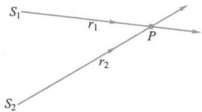  
图16-1 光的相干叠加

根据光矢量的叠加原理，在任意瞬时都有

$$
\boldsymbol {E} = \boldsymbol {E} _ {1} + \boldsymbol {E} _ {2}
$$

如果  $E_{1}, E_{2}$  的振动方向相同, 或者, 它们的振动方向虽不同, 但有平行的分量  $E_{1}$  和  $E_{2}$ , 那么在此平行方向上,  $P$  点光振动的合成仍然是简谐振动, 可表示为

$$
E = E _ {1} + E _ {2} = E _ {0} \cos (\omega t + \varphi)
$$

式中

$$
E _ {0} = \sqrt {E _ {1 0} ^ {2} + E _ {2 0} ^ {2} + 2 E _ {1 0} E _ {2 0} \cos (\varphi_ {2} - \varphi_ {1})}
$$

由于人眼或光探测仪器所能感光的时间  $\tau$  ，都远大于光振动周期  $T$  ，实际可被观察或被接收到的，是在  $\tau$  时间内的平均光强  $I$  （以后简称光强）.因此有

$$
\begin{array}{l} I \propto \overline {{E _ {0} ^ {2}}} = \frac {1}{\tau} \int_ {0} ^ {\tau} E _ {0} ^ {2} \mathrm {d} t \\ = E _ {1 0} ^ {2} + E _ {2 0} ^ {2} + 2 E _ {1 0} E _ {2 0} \frac {1}{\tau} \int_ {0} ^ {\tau} \cos (\varphi_ {2} - \varphi_ {1}) d t \\ \end{array}
$$

即

$$
I = I _ {1} + I _ {2} + 2 \sqrt {I _ {1} I _ {2}} \frac {1}{\tau} \int_ {0} ^ {\tau} \cos \Delta \varphi \mathrm {d} t \tag {16-4}
$$

式中  $I_{1} \propto E_{10}^{2}, I_{2} \propto E_{20}^{2}$  分别是两列光波单独在  $P$  点处的强度.  $\Delta \varphi = \varphi_{2} - \varphi_{1}$ , 是两列光波在  $P$  点处光振动的相位差.

显然，  $P$  点处的光强不是两个光强的简单相加，第三项

$$
\frac {1}{\tau} \int_ {0} ^ {\tau} \cos \Delta \varphi d t = \overline {{\cos \Delta \varphi}}
$$

起着决定的作用，我们称为干涉项

# 1. 相干叠加

如果  $P$  点处的  $\Delta \varphi$  恒定，不随  $t$  变化，那么这两列光波满足相干条件，称为相干光波。干涉项为

$$
\overline {{\cos \Delta \varphi}} = \cos \Delta \varphi
$$

则（16-4）式为

$$
I = I _ {1} + I _ {2} + 2 \sqrt {I _ {1} I _ {2}} \cos \Delta \varphi \tag {16-5}
$$

在两光波相遇区域内的光强，有稳定的非均匀分布，产生光的干涉现象，空间各点处的明暗情况决定于两相干光波在各点的相位差  $\Delta \varphi$

当  $I_{1} = I_{2}$  时，（16-5）式为

$$
I = 4 I _ {1} \cos^ {2} \frac {\Delta \varphi}{2}
$$

在满足  $\Delta \varphi = \pm 2k\pi$  的那些点，有

$$
I = 4 I _ {1} \propto \left(2 E _ {1 0}\right) ^ {2} \tag {16-6}
$$

在这些点的光强特别强，为单个光波的光强的4倍，是干涉加强处.

在满足  $\Delta \varphi = \pm (2k + 1)\pi /2$  的那些点上，显然有光强  $I = 0$  ，这些点是干涉减弱处

# 2.非相干叠加

如果  $\Delta \varphi$  在时间  $\tau$  内等概率地分布在  $(0,2\pi)$  之间，那么

干涉项

$$
\overline {{\cos \Delta \varphi}} = 0
$$

我们称这两列光波为非相干叠加. 由（16-4）式可知，两列光波在相遇区域内非相干叠加时的光强

$$
I = I _ {1} + I _ {2} \tag {16-7}
$$

是每列光波的光强  $I_{1}$  和  $I_{2}$  的代数和，在相遇区域内光强均匀分布，不出现光的干涉现象

在  $I_{1} = I_{2}$  时，（16-7）式也可表示为

$$
I = 2 I _ {1} \propto 2 E _ {1 0} ^ {2} \tag {16-8}
$$

所以，对于光波来说，能否产生干涉，除了必须满足条件：频率相同和存在平行的光振动分量外，最需要着重关注的是：在叠加点的相位差  $\Delta \varphi$  的稳定性，它涉及两个问题：普通光源的发光机制和光探测器的响应时间  $\tau$

# 四、普通光源发光微观机制的特点

光波的振源是原子或分子等微观客体. 按照量子理论, 微观客体的发光过程有两种微观机制: 自发辐射和受激辐射. 普通光源 (非激光光源) 以自发辐射 (spontaneous radiation) 为主, 即: 处在较高激发态的微观客体自发地向低能态或基态跃迁, 同时产生光辐射, 即发射一个光波列 (wave train). 由于微观客体在高能态 (非亚稳态) 的平均逗留时间 (寿命) 很短, 小于  $10^{-8} \mathrm{~s}$ , 又由于自发辐射是一个不受外界因素影响的随机过程, 因此, 普通光源发光具有以下两个显著特点:

# 1. 间歇性

处于激发态的原子何时发生跃迁是完全随机的，每次跃迁发光所持续时间  $\Delta t$  的数量级不会大于  $10^{-8}$  s. 因此，就每个原子而言，其辐射的光波列是断断续续的，此谓间歇性. 每次辐射的光波列的长度  $L = c\Delta t$  很短

# 2. 随机性

每个原子或分子先后发射的不同波列，以及不同原子或分子发射的各个波列，彼此之间在振动方向和初相位上没有任何联系，此谓随机性。

由于普通光源发出的光波列长度有限，按傅里叶分析，一个有限长的波列可以表示为许多不同频率和振幅的简谐波的叠加。因此，普通光源发出的光波是含有很多不同的波长的复合光，即复色光（polychromatic light）。除激光外，实际光源的光波一般都是单色光。在实际使用中，常用各种方法将光波波长限制在一定的小范围内，这种光称为准单色光（quasi-monochromatic light）。

根据普通光源发光的特点，为了对干涉项有进一步了解，我们可作个估算：将人眼作为光探测器的话，响应时间  $\tau$  约为  $10^{-1}\mathrm{s}$ ，在这段时间内，一个原子可发出约  $10^{7}$  个光波

列. 假定它们都是同频率、同方向振动的, 而我们观测任意两个光源 (或同光源的两个不同部分) 的光波在叠加点  $P$  的相位差  $\Delta \varphi$ , 其变化完全无规则, 等概率地分布在  $(0,2\pi)$  之间,  $\cos \Delta \varphi$  的数值在  $\pm 1$  间迅速变化着, 不可能有固定值. 人眼或仪器所记录到的在  $\tau$  内的平均值  $\cos \Delta \varphi$  只能为零, 即  $\overline{\cos \Delta \varphi} = 0$ . 所以, 我们说这两个光波是不相干的. 当然, 如果光源发出的光波列较长, 而光探测器的响应时间又相对较短, 那么也可以记录到这两个独立光波的干涉图样, 比如激光.

所以，在研究光的干涉现象中，要产生光波的相干叠加，其条件较之机械波或无线电波要苛刻得多，必须设法使光波之间有稳定的相位差。为此，人们设计了各种光的干涉装置，主要的方法是将同一光源发出的光束分成两支（或多支），然后使这些光束经过不同的光程后再相遇产生干涉。从同一个光束分离出几个光束的方法一般有分波面干涉法（wavefront-splitting interference）和分振幅干涉法（amplitude-splitting interference）两种。

# 16-2 双缝干涉

# 一、杨氏双缝实验

1801年英国医生兼物理学家托马斯·杨（T. Young）用波的干涉原理，设计了光的干涉实验并首次成功地测定了光的波长。这个实验理论意义重大，而实验的设计既巧妙又简单。

在图16-2的实验装置示意图中，单色平行光入射在垂直于纸面的狭缝  $S$  上，在与  $S$  平行的对称位置上，放置双狭缝  $S_{1}$  和  $S_{2}$ ，并在距离双狭缝为  $D$  处放置观察屏E.双狭缝

文档：托马斯·杨

$S_{1}$  和  $S_{2}$  中心的间隔  $d$  很小，通常在毫米数量级以下，而  $D$  很大，为米的数量级，即  $D \gg d$ 。由于  $S_{1}$  和  $S_{2}$  总是处在从  $S$  发出的同一个光波的波面上，因此  $S_{1}$  和  $S_{2}$  成为两个具有同初相位的单色线光源。它们满足相干光的条件，发出的光波在空间叠加，形成光的干涉（interference of light）现象。在观察屏E上可以观察到与狭缝平行的明暗相间的干涉条纹（interference fringe）。这就是杨氏双缝实验，它是通过分波面法来获得相干光的。

现在，我们分析在波长为  $\lambda$  的单色光垂直入射于双缝实验装置时，观察屏上明暗干涉条纹位置的分布。设实验装置置于空气中，如图16-3所示，在观察屏上取坐标  $Ox$  轴向上为正方向，坐标原点  $O$  位于  $S_{1}$  和  $S_{2}$  的对称中心， $P$  为屏上距  $O$  为  $x$  的任意一点。由于  $S_{1}$  和  $S_{2}$  同相位，从它们发出光波的初相相同，不妨设为零。两光波中到达  $P$  点的光线的光程分别为  $r_{1}$  和  $r_{2}$ ，光程差为

$$
\delta = r _ {2} - r _ {1} \approx d \sin \theta \tag {16-9}
$$

由于  $d \ll D$  ，因此  $\theta$  很小，所以

$$
\sin \theta \approx \tan \theta = \frac {x}{D}
$$

故有

$$
\delta = r _ {2} - r _ {1} \approx \frac {x d}{D} \tag {16-10}
$$

根据波动理论，当光程差为波长的整数倍，即  $\delta = \frac{xd}{D} = \pm k\lambda$  时，两光波在  $P$  点的合振动加强，屏上  $P$  点处出现干涉明条纹.该明纹的位置为

$$
x = \pm k \frac {D}{d} \lambda , \quad k = 0, 1, 2, \dots \tag {16-11}
$$

式中  $k$  称为条纹的级次.  $k = 0$  的明条纹称为零级明纹或中央明纹,对应的光程差为零,位于  $x = 0$  处.在其两侧对称地依次分布有  $k = 1,k = 2,k = 3,\dots$  等各级明条纹

  
动画：杨氏双缝干涉

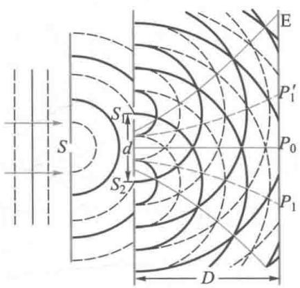  
(a)

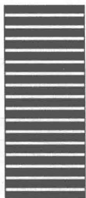  
(b)

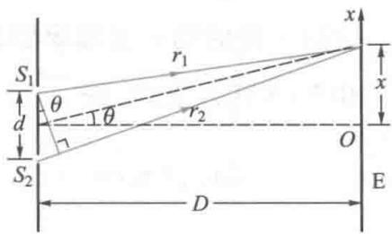  
图16-2 杨氏双缝实验  
图16-3 双缝干涉原理图

当光程差为半波长的奇数倍，即  $\delta \approx \frac{xd}{D} = \pm (2k + 1)\frac{\lambda}{2}$  时，两光波在  $P$  点的合振动减弱，屏上  $P$  点处为干涉暗条纹.该暗纹的位置为

$$
x = \pm (2 k + 1) \frac {D}{2 d} \lambda , \quad k = 0, 1, 2, \dots
$$

显然，在相邻两个明条纹之间分布有一个暗条纹

相邻两明条纹（或暗条纹）的级次差  $\Delta k = 1$  ，在屏上的间距都是

$$
\Delta x = \frac {D}{d} \lambda \tag {16-12}
$$

可见，屏上相邻两明条纹（或暗条纹）是等间隔分布的

当白光（复色光）垂直入射于双缝实验装置时，在屏上的对称中心  $x = 0$  处，各波长光波的光程差都为零，是各自的中央明纹的中心。该处不同波长的光强之间，因非相干叠加仍为白色。在其两侧，由于相邻明条纹的间隔正比于波长而对称地按波长排列成光谱。

例16-1

以单色光照射到相距为  $0.2\mathrm{mm}$  的双缝上，双缝与屏幕的垂直距离为  $0.8\mathrm{m}$

（1）从第一级明纹到同侧旁第四级明纹间的距离为  $7.5\mathrm{mm}$  ，求单色光的波长；  
（2）若入射光的波长为  $600\mathrm{nm}$  ，求相邻两明纹间的距离

解（1）根据双缝干涉明纹的条件

$$
x = \pm k \frac {D}{d} \lambda
$$

取同一侧的第一级和第四级明纹，即  $k = 1$  和  $k = 4$  代人上式，得

$$
\Delta x _ {4, 1} = x _ {4} - x _ {1} = (4 - 1) \frac {D}{d} \lambda
$$

$$
\begin{array}{l} \lambda = \frac {\Delta x _ {4 , 1} d}{3 D} = \frac {7 . 5 \times 1 0 ^ {- 3} \times 0 . 2 \times 1 0 ^ {- 3}}{3 \times 0 . 8} \mathrm {m} \\ = 6. 2 5 \times 1 0 ^ {- 7} \mathrm {m} = 6 2 5 \mathrm {n m} \\ \end{array}
$$

（2）当  $\lambda = 600\mathrm{nm}$  时，相邻两明纹间的距离为

$$
\Delta x = \frac {D}{d} \lambda = \frac {0 . 8 \times 6 0 0 \times 1 0 ^ {- 9}}{0 . 2 \times 1 0 ^ {- 3}} \mathrm {m} = 2. 4 \times 1 0 ^ {- 3} \mathrm {m}
$$

例16-2

在杨氏干涉实验中，当用白光（ $400\sim 760~\mathrm{nm}$ ）垂直入射时，在屏上会形成彩色光谱，试问哪几级彩色光谱不会发生重叠？

解 由白光的波长范围可知，这是可见光.设  $\lambda_{1} = 400\mathrm{nm},\lambda_{2} = 760\mathrm{nm}$

在杨氏双缝干涉实验中，观察屏上明条纹的位置满足

$$
x = \pm k \frac {D}{d} \lambda , \quad k = 0, 1, 2, \dots
$$

$x = 0$  ，对应各波长  $k = 0$  的中央明纹中心，为白色.在其两侧对称地排列有从紫色到红色的各级可见光光谱

在屏上中央明纹的一侧，如果从  $o$  点到第  $(k + 1)$  级最短波长  $\lambda_{1}$  的明纹的距离，恰大于第  $k$  级最长波长  $(\lambda_{2} = \lambda_{1} + \Delta \lambda)$  的明纹距离时，第  $k$  级光谱是独立的.所以，不发生光谱重叠的级次  $k$  应满足的光程差是

$$
\delta = (k + 1) \lambda_ {1} \geqslant k \lambda_ {2} = k (\lambda_ {1} + \Delta \lambda)
$$

即

$$
k \leqslant \frac {\lambda_ {1}}{\Delta \lambda} = \frac {4 0 0}{7 6 0 - 4 0 0} = 1. 1
$$

所以，可见光入射于杨氏双缝时，只有第一级光谱是独立的，第二级光谱与第三级光谱发生重叠

设第二级光谱中与第三级的最短波长  $\lambda_{1}$  （紫光）发生重叠的波长为  $\lambda^{\prime}$  ，则屏上开始发生光谱重叠的  $P$  点处应满足的光程差是

$$
\delta = 2 \lambda^ {\prime} = 3 \lambda_ {1}
$$

得

$$
\lambda^ {\prime} = \frac {3 \times 4 0 0}{2} \mathrm {n m} = 6 0 0 \mathrm {n m}
$$

# 二、劳埃德镜

如图16-4所示，一狭缝光源  $S$  和一块下表面涂黑的平板玻璃  $MN$  ，构成了著名的劳埃德镜实验（Lloyd mirror experiment）装置。狭缝光源  $S_{1}$  距平板玻璃的  $M$  端很远但又很接近玻璃板平面。 $S_{1}$  发出的光线，一部分直接入射到屏幕E上，另一部分则以接近  $90^{\circ}$  的角度掠射到平板玻璃  $MN$  表面，并被反射到屏幕E上。反射光实际来自狭缝光源  $S_{1}$ ，却好像是从  $S_{2}$  发出的，它是  $S_{1}$  的虚像。所以，入射于屏幕

上的这两部分光始终来自于同一光源的同一波面，是由分波面法得到的相干光。因此在屏幕上这两束光的重叠区域内会出现明暗相间的干涉条纹。

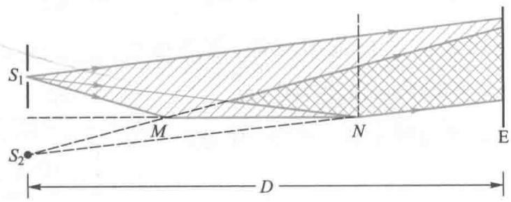  
图16-4 劳埃德镜

劳埃德镜实验揭示了光在介质（玻璃）表面反射时的一个重要特征.  $S_{1}$  和  $S_{2}$  相对反射面  $MN$  对称分布，若取它们的间隔为  $d$  ，到观察屏幕的距离为  $D$  ，则由图可见，劳埃德镜实验装置的光路与杨氏双缝的完全相同，在屏幕上两光束的重叠区域内干涉条纹的分布也应该相同.当把屏幕E平移到紧靠镜面的  $N$  点时，接触点处似乎应该是光程差为零的中央明纹中心.然而，实验事实与此相反，是一个暗条纹，其他条纹的明暗情况也都与杨氏双缝的相反.这表明两相干光波在  $N$  点处的光振动反相叠加，相位差为  $\pi$  ，在其他条纹处两光振动的相位差也都附加了  $\pi$  分析这一变化的原因，必然是在反射过程中发生的，严格的理论作出了与实验结果相符的解释：光作为电磁波，以接近  $90^{\circ}$  或  $0^{\circ}$  的入射角从光疏介质入射于光密介质表面(掠射或垂直入射)并反射时，在界面上反射波的振动相位相对入射波会发生  $\pi$  的相位突变，相当于光波多走（或少走）了半个波长的距离.这称为半波损失（halfwave loss）现象.根据（16-10）式，屏上 $P$  点的光程差应附加这一项，我们约定因“半波损失”而附加的这一额外光程差用  $+\frac{\lambda}{2}$  表示，所以

$$
\delta = r _ {2} - r _ {1} + \frac {\lambda}{2} \approx \frac {x d}{D} + \frac {\lambda}{2}
$$

劳埃德镜实验的干涉条纹分布，除了与杨氏双缝的明

暗相反外，另一区别是它只分布于  $N$  的一侧，而杨氏双缝则对称地分布在  $O$  的两侧

例16-3

如图16-5所示，一射电望远镜的天线设在湖岸上，距湖面高度为  $h$  对岸地平线上方有一颗恒星正在升起，发出波长为  $\lambda$  的电磁波.当天线第一次接收到电磁波的一个极大强度时，恒星的方位与湖面所成的角度  $\theta$  为多大？

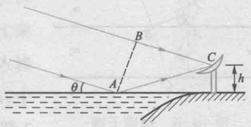  
图16-5 例16-3图

解天线接收到的电磁波一部分直接来自恒星，另一部分经湖面反射，这两部分电磁波满足相干条件，天线接收到的极大强度是它们干涉的结果.所以，可以用类似劳埃德镜的方法进行分析

设电磁波在湖面上  $A$  点反射，由图可知，  $AB\bot BC.$  这两束相干电磁波的波程差为

$$
\begin{array}{l} \delta = A C - B C + \frac {\lambda}{2} \\ = A C (1 - \cos 2 \theta) + \frac {\lambda}{2} \\ \end{array}
$$

式中  $\frac{\lambda}{2}$  是湖面反射时附加的额外波程差干涉极大时，波程差为波长的整数倍.即

$$
A C (1 - \cos 2 \theta) + \frac {\lambda}{2} = k \lambda
$$

上式可改写为

$$
2 A C \sin^ {2} \theta = (2 k - 1) \frac {\lambda}{2}
$$

利用几何关系

$$
A C \sin \theta = h
$$

取  $k = 1$  ，可得

$$
\theta = \arcsin \left(\frac {\lambda}{4 h}\right)
$$

# 16-3 薄膜干涉

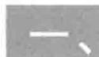

# 薄膜干涉

在日光照射下肥皂泡所闪现的斑斓色彩、水面上油膜所呈现的彩色条纹，都是薄膜在光照下产生的干涉现象，称

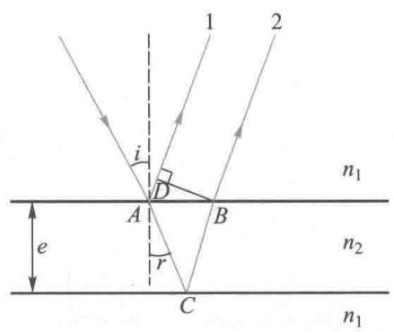  
图16-6 薄膜干涉

为薄膜干涉(thin film interference). 各种薄膜的表面形状不同, 光照方式也各不相同, 因此, 薄膜干涉的现象丰富多样.

我们先从图16-6分析薄膜干涉现象的规律.设折射率为  $n_2$  ，上下表面平行，厚度为  $\mathcal{e}$  的薄膜处在折射率为  $n_1$  的均匀介质中，并设  $n_2 > n_1$  一束单色光以入射角  $i$  投射到薄膜上，其光能的一部分被反射，成为反射光线1，另一部分折射入薄膜内，在膜的下表面反射，再经上表面折射回介质  $n_1$  中，成为反射光线2.当薄膜的厚度  $\mathcal{e}$  很小时，反射光线1和2都可认为是来自同一个入射光波列的，因而满足相干条件，它们相遇时即可产生干涉现象.由于反射光的能量来自入射光，而能流正比于光振动振幅的平方，所以在薄膜干涉中，相干光的获得方法属分振幅法，也称分振幅干涉

薄膜的两表面平行时，光线1和2也相互平行，利用透镜可使它们在透镜的焦平面会聚而相干.根据图16-6可以得出它们的光程差.因为  $DB\bot AD$  ，光线1和2自  $DB$  面以后至无限远的光程相等，所以光程差的计算应从入射光束在  $A$  点“一分为二”开始，到  $DB$  面为止.光线2在薄膜中的光程为  $n_2(AC + CB)$  ，光线1在路径  $AD$  上的光程为  $n_1AD$  ，记这部分光程差为  $\delta_0$  ，有

$$
\delta_ {0} = n _ {2} (A C + C B) - n _ {1} A D \tag {16-13}
$$

在  $n_2 > n_1$  情况下，光线1是由光疏介质  $n_1$  向光密介质  $n_2$  入射而被反射的，在接近垂直入射或掠射时的反射光会发生半波损失，而光线2则是在薄膜的下表面，由光密介质  $n_2$  向光疏介质  $n_1$  入射而被反射回  $n_2$  的，在反射时不发生半波损失.因此在这两条光线的光程差中需添加一项因反射产生半波损失而引起的额外光程差，记为  $\delta^{\prime}$  ，在图16-6的情况下

$$
\delta^ {\prime} = \frac {\lambda}{2}
$$

所以，光线1和2自  $A$  点分开到无限远相遇处的光程差为

$$
\delta = \delta_ {0} + \delta^ {\prime} \tag {16-14}
$$

根据图16-6所示的几何关系，可有

$$
A C = C B = \frac {e}{\cos r}, A D = A B \sin i = 2 e \tan r \sin i
$$

代入（16-13）式，并利用折射定律  $n_1\sin i = n_2\sin r$  可得

$$
\begin{array}{l} \delta_ {0} = \frac {2 n _ {2} e}{\cos r} - 2 e n _ {1} \tan r \sin i \\ = \frac {2 n _ {2} e}{\cos r} (1 - \sin^ {2} r) \\ = 2 n _ {2} e \cos r = 2 e \sqrt {n _ {2} ^ {2} - n _ {1} ^ {2} \sin^ {2} i} \\ \end{array}
$$

所以，光线1和2的光程差为

$$
\delta = 2 e \sqrt {n _ {2} ^ {2} - n _ {1} ^ {2} \sin^ {2} i} + \frac {\lambda}{2} \tag {16-15}
$$

（16-15）式是我们讨论薄膜干涉光程差的重要关系式

当光程差  $\delta$  是波长  $\lambda$  的整数倍，即

$$
\delta = 2 e \sqrt {n _ {2} ^ {2} - n _ {1} ^ {2} \sin^ {2} i} + \frac {\lambda}{2} = k \lambda , k = 1, 2, 3, \dots \tag {16-16}
$$

时，反射光干涉加强，  $k$  为干涉加强的级次

当光程差  $\delta$  是半波长  $\frac{\lambda}{2}$  的奇数倍，即

$$
\delta = 2 e \sqrt {n _ {2} ^ {2} - n _ {1} ^ {2} \sin^ {2} i} + \frac {\lambda}{2} = (2 k + 1) \frac {\lambda}{2}, k = 0, 1, 2, \dots \tag {16-17}
$$

时，反射光干涉减弱，  $k$  为干涉减弱的级次

同样的分析也适用于透射光的干涉情况.如图16-7所示，透射光束在  $A^{\prime}$  点被“一分为二”，形成相干的透射光束 $1^{\prime},2^{\prime},3^{\prime},\dots$  光线  $1^{\prime}$  和  $2^{\prime}$  间的光程差为

$$
\delta = 2 e \sqrt {n _ {2} ^ {2} - n _ {1} ^ {2} \sin^ {2} i}
$$

式中不出现额外光程差  $\frac{\lambda}{2}$ , 或者说  $\delta' = 0$ , 是由于光线  $1'$  未经反射过程, 而光线  $2'$  在下上界面的两次反射都由光密介

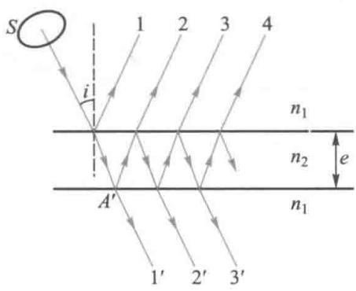  
图16-7 多光束干涉

质向光疏介质入射而被反射，最后透射而成，在反射过程中不发生相位  $\pi$  突变的缘故。当透射光的光程差  $\delta$  是波长  $\lambda$  的整数倍时，透射光干涉加强；而当透射光的光程差  $\delta$  是半波长的奇数倍时，透射光干涉减弱。对照（16-16）式和（16-17）式可知，透射光的干涉和反射光的干涉是互补的。这就是说，一束光入射于薄膜时，若在反射光中是干涉减弱的，则必然在透射光中因干涉而加强，反之亦然。这是能量守恒定律在光的干涉现象中的必然表现。

严格地说，一个入射光束在薄膜内可以相继多次发生反射和折射，如图16-7中所表示的那样，应当考虑多束反射光或折（透）射光间的干涉.但在上述讨论中我们仅考虑了两个光束间的干涉，这是为什么呢？理论和实验表明：当两种介质的折射率之差  $\Delta n = (n_{2} - n_{1})$  越大时，在其界面的反射光就越强，反之则越小.比如钻石的折射率为  $n_2 = 2.40$  ，在空气中看起来闪闪发光（  $\Delta n = 1,40$  ），而普通玻璃的折射率为  $n_2 = 1,50$  ，看起来较钻石逊色得多（  $\Delta n = 0,50$  ），水中  $(n_{1} = 1,33)$  的玻璃则更难看得清（  $\Delta n = 0,17$  ）.对于空气中的单层膜，以图16-7为例，设  $n_2 = 1,50,n_1 = 1,00$  ，在单色平行光垂直入射时，反射光线1的光能流约占入射光能流的  $4\%$  ，光线2约占  $3.7\%$  ，而光线3经过了二次折射和三次反射，仅占  $0.006\%$  左右，以后的4,5，…则更小.所以，在通常情况下，薄膜干涉主要考虑1和2两束光的干涉，并且近似认为它们的光强相等.当然，如果采取适当措施，增大薄膜上下表面的反射能力，就必须考虑强度彼此近似相等的多光束间的干涉

# 二、等厚干涉

# 1. 劈形膜

现在考察一个厚度不均匀，折射率为  $n_2$  的薄膜，置于

折射率为  $n_1$  的均匀介质中时的情况. 设薄膜的两个表面是光学平面, 两平面间的夹角  $\theta$  非常小, 如图16-8所示, 这样的薄膜称劈形膜(简称劈尖). 在如图16-9所示的装置中, 当单色平行光束垂直向下入射于劈形膜时, 在膜的上下表面的反射光可以满足相干条件. 由于  $\theta$  很小, 两反射光束在劈形膜的上表面附近相遇, 可以用助视仪比如显微镜来观察所形成干涉条纹. 用  $e$  表示上下两反射点处劈形膜的平均厚度, 由（16-15）式可知, 在  $\lambda$  一定,  $i \approx 0$  时, 两束相干的反射光在相遇处的光程差只决定于该处薄膜的厚度  $e$ , 为

$$
\delta = 2 e n _ {2} + \frac {\lambda}{2} \tag {16-18}
$$

式中的  $\frac{\lambda}{2}$  是两反射光线之一在反射时因产生半波损失而附加的额外光程差.

当反射光的光程差  $\delta$  是波长  $\lambda$  的整数倍，即

$$
\delta = 2 e n _ {2} + \frac {\lambda}{2} = k \lambda , \quad k = 1, 2, \dots \tag {16-19}
$$

时，形成第  $k$  级干涉明条纹

当反射光的光程差  $\delta$  是半波长  $\frac{\lambda}{2}$  的奇数倍，即

$$
\delta = 2 e n _ {2} + \frac {\lambda}{2} = (2 k + 1) \frac {\lambda}{2}, \quad k = 0, 1, 2, \dots \tag {16-20}
$$

时，形成第  $k$  级干涉暗条纹

显然，每一级次的明（暗）条纹都与劈形膜在该条纹处的厚度  $e$  相联系，在劈形膜的相同厚度处有相同的光程差，它们的轨迹对应同一个干涉条纹，这种条纹称为等厚干涉条纹（interference fringes of equal thickness）.

劈形膜两个表面相交的直线称为棱边，形成于劈形膜表面附近的等厚干涉条纹是一些与棱边平行的明暗相间的直条纹，如图16-10所示.棱边处  $e = 0$  ，其光程差为  $\frac{\lambda}{2}$  满足

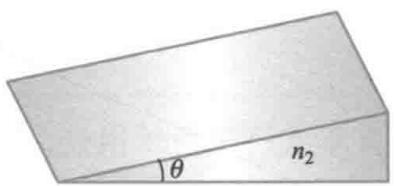  
图16-8 劈形膜

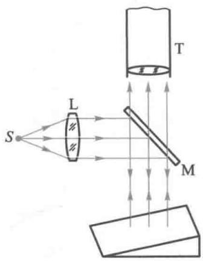  
图16-9 劈形膜干涉

  
动画：劈尖干涉

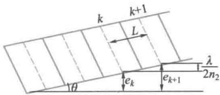  
图16-10 劈形膜干涉条纹

（16-20）式. 可见，半波损失使棱边处成为零级暗条纹. 随着  $e$  增加依次排列有一级明纹、一级暗纹、二级明纹、二级暗纹……

相邻两个明条纹（或暗条纹）的级次差  $\Delta k = 1$  ，由(16-19)式或(16-20)式很容易得到相邻两个明条纹（或暗条纹）所对应的膜的厚度差为

$$
\Delta e = e _ {k + 1} - e _ {k} = \frac {\lambda}{2 n _ {2}} \tag {16-21}
$$

由于劈尖的夹角  $\theta$  很小，由图16-10可得到相邻两个明条纹（或暗条纹）的间距  $L$  为

$$
L = \frac {\lambda}{2 n _ {2} \sin \theta} \approx \frac {\lambda}{2 n _ {2} \theta} \tag {16-22}
$$

从上式可知，对于一定波长的入射光，条纹间距与  $\theta$  角成反比.劈尖夹角  $\theta$  愈小，条纹分布愈疏；  $\theta$  愈大，则条纹分布愈密.

夹角  $\theta$  一定时，条纹间距与波长  $\lambda$  成正比.在平行白光入射情况下，由于各波长相邻明条纹的间距不同，因此将呈现彩色的等厚条纹

如图16-11所示，两块玻璃平板，使其一端叠合，另一端夹一纸片所形成的间隙相当于厚度不均匀的空气薄膜称空气劈尖，同样可以形成等厚干涉条纹，膜的折射率  $n_2 = 1$  应该注意，光在一块玻璃板的两个表面虽然也都有反射，然而却不能观察到它们的干涉现象，这是由于光程差已超过了普通光源发射光波列长度的缘故.所以，在普通窗玻璃上通常是不会出现干涉现象的

利用等厚干涉原理可以检测加工件表面的平整程度.比如在凹凸不平的玻璃板上放一块光学平板玻璃块，根据所显示的等厚干涉条纹的分布和间距，能够判断出加工件的表面形状以及表面凹凸缺陷

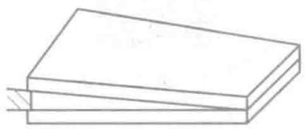  
图16-11 空气劈尖

例16-4

一折射率  $n = 1.50$  的玻璃劈尖，夹角  $\theta = 10^{-4}$  rad，放在空气中，当用单色平行光垂直照射时，测得相邻两明条纹间距为  $0.20\mathrm{cm}$ ，求：

（1）此单色光的波长；  
（2）设此劈尖长  $4.00\mathrm{cm}$  ，则总共出现几条明条纹

解（1）设入射光的波长为  $\lambda$  由玻璃劈尖上相邻两条明条纹的间距  $L$  和它所对应玻璃层的高度差  $\Delta e$  的几何关系

$$
\Delta e = L \sin \theta = \frac {\lambda}{2 n _ {2}}
$$

得  $\lambda = 2n_{2}L\sin \theta$

$$
\begin{array}{l} = 2 \times 1. 5 0 \times 0. 2 0 \times 1 0 ^ {- 2} \times 1 0 ^ {- 4} \mathrm {m} \\ = 6. 0 0 \times 1 0 ^ {- 7} \mathrm {m} \\ = 6 0 0 \mathrm {n m} \\ \end{array}
$$

（2）由于玻璃劈尖处在空气中，在棱边处出现的是暗条纹.设劈尖最高端的厚度为  $h$  ，则最高端处条纹的光程差为

$$
\delta = 2 n _ {2} h + \frac {\lambda}{2} = 2 n _ {2} L \sin \theta + \frac {\lambda}{2}
$$

假定该处为一暗条纹，则应满足

$$
\delta = (2 k + 1) \frac {\lambda}{2}
$$

得  $k = \frac{2n_2L\sin\theta}{\lambda}$

$$
\begin{array}{l} = \frac {2 \times 1 . 5 0 \times 4 . 0 0 \times 1 0 ^ {- 2} \times 1 0 ^ {- 4}}{6 0 0 \times 1 0 ^ {- 9}} \\ = 2 0 \\ \end{array}
$$

级次  $k$  恰为20表明，在劈尖的最高端是一  $k = 20$  的暗条纹中心.因此在劈尖上共出现20个明条纹

# 2. 牛顿环

图16-12表示由曲率半径为  $R$  的一个平凸透镜，放在一个光学平板玻璃上，两者之间形成厚度不均匀的空气薄膜.当单色平行光垂直地射向平凸透镜时，可以形成一组等厚干涉条纹.这些条纹都是以接触点为圆心的一系列的间距不等的同心圆环，称为牛顿环（Newton ring）.

在牛顿环装置中，空气薄膜的上表面是一曲面，但由于空气膜的厚度  $e \ll R$  ，我们仍可用（16-15）式来表示单色平行光垂直入射时，反射光的光程差

将  $n_2 = 1, i = 0$  代入（16-15）式，当

$$
\delta = 2 e + \frac {\lambda}{2} = k \lambda , \quad k = 1, 2, \dots \tag {16-23}
$$

  
动画：牛顿环

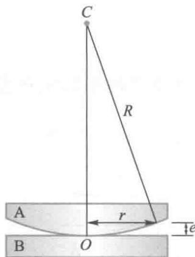  
(a)

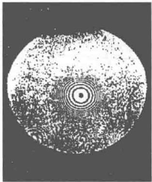  
(b)  
图16-12 牛顿环

时出现明条纹；

当

$$
\delta = 2 e + \frac {\lambda}{2} = (2 k + 1) \frac {\lambda}{2}, \quad k = 0, 1, 2, \dots \tag {16-24}
$$

时出现暗条纹.

由于在平凸透镜和平板玻璃的接触处  $O$  的空气膜厚为零，其光程差产生于下表面反射光的半波损失，所以在反射光中，牛顿环中心是一个暗斑。由中心往边缘，膜厚的增加越来越快，因而牛顿环的分布也就越来越密。

利用图16-12（a）可计算出牛顿环的半径  $r$  由几何关系可知，

$$
r ^ {2} = R ^ {2} - (R - e) ^ {2} = 2 R e - e ^ {2}
$$

由于  $R \gg e$  ，略去  $e^2$  ，所以

$$
e \approx \frac {r ^ {2}}{2 R}
$$

将上式代入明暗纹条件（16-23）式和（16-24）式中，化简后得到在反射光中，牛顿环的明环和暗环的半径分别为

明环：  $r = \sqrt{\frac{(2k - 1)R\lambda}{2}}, k = 1,2,\dots$  (16-25)

暗环：  $r = \sqrt{kR\lambda}, k = 0,1,2,\dots$  (16-26)

由于暗环较明环易于辨认，在实验中常利用暗环来测量透镜的曲率半径  $R$  ，但由于牛顿环中心是一个暗斑而非一个点，因此又难以准确测定某一暗环的半径. 解决的方法是先测出某个暗环的直径，记为  $d_{k} = 2r_{k}$  ，然后再测出由它往外数的第  $m$  个暗环的直径  $d_{k + m} = 2r_{k + m}$  ，便可由暗环表达式(16-26)得出  $R$  为

$$
R = \frac {d _ {k + m} ^ {2} - d _ {k} ^ {2}}{4 m \lambda}
$$

这样，只需测出两环的直径和它们的级次之差即可求出透镜的曲率半径，而不必知道某一暗环的级次

对确定的  $R$  和  $\lambda$  ，根据（16-26）式可知，暗环的级次  $k$  （自然数）正比于暗环半径  $r_k$  的平方，即  $k\propto r_k^2$  在  $r - k$  坐标系中这是一条抛物线，如图16-13所示.因为相邻两条纹的级次差  $\Delta k = 1$  ，由曲线可判断牛顿环条纹的分布特征是：内疏外密的同心圆环条纹，内低外高的级次分布

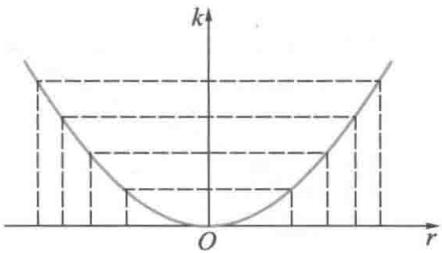  
图16-13 牛顿环的条纹位置

# 三、增反膜和增透膜

光学仪器通常含有多个折、反射面，比如照相机镜头一般有三个透镜构成，若不采取措施，6个界面反射损失的光能流可占入射光能流的  $30\%$  因此在光学元件的表面往往镀有一层或多层透明薄膜，可消除反射以增强透射，这样的薄膜称增透膜（antireflection film），或称减反膜.用来提高反射强度的一层或多层透明薄膜则被称为增反膜或减透膜.

在实际应用中，通常要求近轴的入射光线，即近似以入射角  $i = 0$  入射于薄膜.当波长为  $\lambda$  的单色平行光垂直入射于厚度均匀的薄膜上时，反射光的光程差只决定于薄膜的厚度  $e$  即

$$
\delta = 2 e n _ {2} + \delta^ {\prime} \tag {16-27}
$$

式中的  $\delta^{\prime}$  需根据光在薄膜上下表面的反射情况而定

# 1. 增反膜

当反射光的光程差  $\delta$  是波长  $\lambda$  的整数倍时，波长为  $\lambda$  的光反射加强，也即该波长的光透射减弱。这样的均匀薄膜为增反膜。

# 2. 增透膜

当反射光的光程差  $\delta$  是半波长  $\frac{\lambda}{2}$  的奇数倍时，波长为  $\lambda$  的光反射减弱，也即该波长的光透射加强。这样的均匀薄膜为增透膜。

应该注意，厚度一定的增反（透）膜并非对所有波长的光都能满足对反射光干涉加强或减弱条件的（16-16）式或（16-17）式；增反（透）膜所表现的光的干涉现象并不表现为干涉条纹，而是随膜厚的变化，满足各级次的加强或减弱的  $k$  发生相应的变化，薄膜表面周期性地呈现出均匀变亮或变暗的现象.

例16-5

照相机的透镜表面通常镀一层类似  $\mathrm{MgF}_2(n = 1.38)$  的透明介质薄膜，如图16-14所示，目的是利用光的干涉来降低玻璃表面的反射。试问：为了使透镜在可见光中对人眼和感光物质最敏感的黄绿光（波长为 $550~\mathrm{nm}$ ）产生极大的透射，薄膜应该镀多厚？在可见光中哪些波长的光反射干涉加强？

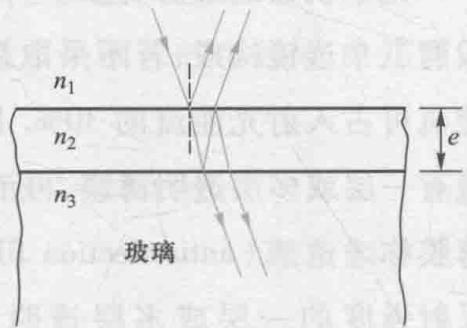  
图16-14 增反（透）膜

解设可见光正入射于  $\mathrm{MgF_2}$  薄膜.由于薄膜的折射率介于空气与玻璃折射率之间，所以光在薄膜的上、下表面反射时都存在着半波损失，因此额外光程差  $\delta^{\prime} = 0$

反射光干涉减弱（即透射加强）

$$
\delta = 2 e n _ {2} = (2 k + 1) \frac {\lambda}{2}, \quad k = 0, 1, 2, \dots
$$

取  $k = 0$  ，有

$$
e _ {0} = \frac {\lambda}{4 n _ {2}} = \frac {5 5 0 \times 1 0 ^ {- 9}}{4 \times 1 . 3 8} \mathrm {m} = 9 9. 6 \mathrm {n m}
$$

取  $k = 1$  ，有

$$
e _ {1} = \frac {3 \lambda}{4 n _ {2}} = \frac {3 \times 5 5 0 \times 1 0 ^ {- 9}}{4 \times 1 . 3 8} \mathrm {m} = 2 9 8. 9 \mathrm {n m}
$$

取  $k = 2$  ，有

$e_2 = \frac{5\lambda}{4n_2} = \frac{5\times 550\times 10^{-9}}{4\times 1.38}\mathrm{m} = 498.2\mathrm{nm}$

可见，在反射光中使波长为  $550\mathrm{nm}$  的光干涉减弱的薄膜的最小厚度为  $\frac{\lambda}{4n_2}$  在膜厚为  $\frac{\lambda}{4n_2}$  的奇数倍时也呈现干涉减弱现象，即随着薄膜厚度的增大，会周期性地在透射光中观察到黄绿光加强的现象

对一定的膜厚，在反射光中干涉加强时应满足光程差条件

$$
\delta = 2 e n _ {2} = k \lambda
$$

可见光的波长范围取  $400\sim 760~\mathrm{nm}$  ，由

$$
\lambda = \frac {1}{k} 2 e n _ {2}
$$

可知：

$e_0 = 99.6 \mathrm{~nm}$  时，  $2e_0n_2 = 274.90 \mathrm{~nm}$ ，反射加强的光波长在紫外线区域。

$e_1 = 298.9\mathrm{nm}$  时，  $2e_{1}n_{2} = 824.96\mathrm{nm},$ $k = 2$  时，  $\lambda = 412.48~\mathrm{nm}$  （可见光区域，蓝紫色）

$e_2 = 498.2\mathrm{nm}$  时，  $2e_{2}n_{2} = 1375.03\mathrm{nm},$ $k = 2$  时，  $\lambda = 687.52\mathrm{nm}$  （可见光区域，橙红色）

$k = 3$  时，  $\lambda = 458.34\mathrm{nm}$  （可见光区域，青蓝色）…

在反射光中加强的这些波长的光，与我们对着镜头所能看到的颜色大致是相符合的.

# 四、等倾干涉

当波长为  $\lambda$  的单色光以不同的角度入射于厚度均匀的薄膜时，从薄膜上下表面反射光的光程差，由（16-15）式可知，为

$$
\delta = 2 e \sqrt {n _ {2} ^ {2} - n _ {1} ^ {2} \sin^ {2} i} + \delta^ {\prime}
$$

随入射角  $i$  而变化. 在这种情况下, 凡入射的倾角相同的相干光线在相遇时的光程差都相同, 对应同一个干涉结果, 即对应同一个级次的干涉条纹, 我们称这种干涉为等倾干涉 (interference of equal inclination).

在图16-15所示的等倾干涉实验装置中，从面光源上某一发光点，比如  $S_{1}$  发出的同心光束，透过与透镜主轴成 $45^{\circ}$  角设置的半透半反镜后，入射于薄膜上.这些分布在同一锥面上的光线，在薄膜上有相同的人射角  $i$  ，入射点的轨迹是个圆.它们从薄膜上下表面反射的光线成为相干光，再经半透半反镜反射后会聚于透镜像方焦平面.这些相干光线与透镜主轴的夹角都是  $i$  ，到透镜焦平面上各会聚点的光程差都相同，所有会聚点在透镜焦平面上形成一个干涉圆条纹.从  $S_{1}$  发出的以倾角为  $i^{\prime}$  入射于薄膜的光线，则形成

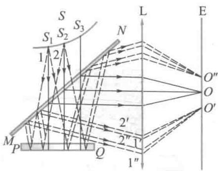  
(a)

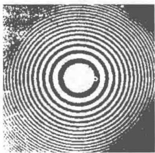  
(b)  
图16-15 等倾干涉

另一个同心的干涉圆条纹，入射角与干涉条纹一一对应.所以，从  $S_{1}$  发出的同心光束在透镜焦平面上形成一套属于  $S_{1}$  的同心圆条纹，面光源上的其他发光点如  $S_{2}, S_{3}, \cdots$  在透镜焦平面上都形成各自的一套同心干涉圆条纹.各套干涉条纹之间虽然互不相干，但它们的位置完全重合.可见，在等倾干涉装置中用面光源可使干涉条纹更加清晰

由图16-15（b）可见，等倾干涉圆条纹是一组呈内疏外密分布的同心圆环.由（16-15）式可知，当薄膜厚度  $e$  和入射光波长一定时，在干涉圆条纹近中心处的入射角  $i$  小，对应的光程差大，其条纹的  $k$  值也大.所以，等倾干涉条纹级次分布的特点是内高外低

以上讨论的是单色光的干涉情况，若是复色光照射，则干涉图样是彩色的.

# 五、迈克耳孙干涉仪

迈克耳孙干涉仪（Michelson interferometer）是根据分振幅原理制成的精密测量仪器，由美国物理学家迈克耳孙于1881年研制成功，1907年因此而获得诺贝尔物理学奖。

  
文档：迈克耳孙

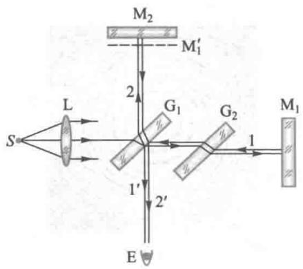  
图16-16 迈克耳孙干涉仪

迈克耳孙干涉仪的结构如图16-16所示. 平面反射镜  $\mathbf{M}_1$  和  $\mathbf{M}_2$  安置在相互垂直的两臂上,  $\mathbf{M}_2$  固定不动,  $\mathbf{M}_1$  可沿臂轴方向用螺旋控制作微小移动. 与一臂成  $45^{\circ}$  角安置有两块完全相同的平行平板玻璃  $\mathbf{G}_1$  和  $\mathbf{G}_2$ .  $\mathbf{G}_1$  背面涂有半透半反膜, 使入射光分成强度相等的透射光1和反射光2, 称为分束器（beam splitter）.  $\mathbf{G}_2$  起补偿光程的作用, 称补偿板. 透射光束1被  $\mathbf{M}_1$  反射后又被分束器反射, 成为光线  $1'$ , 进入观察系统E(人眼或其他观测仪器).  $\mathbf{M}_1'$  是  $\mathbf{M}_1$  对  $\mathbf{G}_1$  反射膜所成的虚像, 光线  $1'$  犹如反射自  $\mathbf{M}_1'$ . 反射光2则被  $\mathbf{M}_2$  反射后又经分束器透射, 成为光线  $2'$ , 进入观察系统E. 所以,  $1'$  和  $2'$  是相干光, 它们相遇时可以形成干涉现象.

补偿板  $G_{2}$  使分束后的光线1与光线2同样地前后两次通过平行平板玻璃，从而使光线  $1^{\prime}$  和  $2^{\prime}$  会聚时的光程差与  $G_{1}$  的厚度无关

当  $\mathbf{M}_1$  和  $\mathbf{M}_2$  相互严格垂直时， $\mathbf{M}_1'$  和  $\mathbf{M}_2$  之间形成厚度均匀的空气膜，这时可以观察到等倾干涉现象；当  $\mathbf{M}_1$  和  $\mathbf{M}_2$  不严格垂直时， $\mathbf{M}_1'$  和  $\mathbf{M}_2$  之间形成空气劈尖，则可以观察到等厚干涉现象。

利用等厚干涉原理，用迈克耳孙干涉仪可精确测定微小位移量.当  $\mathbf{M}_1$  的位置发生微小变化时，  $\mathrm{M}_1^{\prime}$  和  $\mathbf{M}_2$  之间的空气劈尖膜保持夹角不变，而厚度发生变化.在E处观测的视场中，可观察到等厚条纹的平移.当  $\mathrm{M}_1(\mathrm{M}_1^{\prime})$  的位置发生 $\frac{\lambda}{2}$  的变化时，视场中某一刻度处移过一个明条纹（或一个暗条纹）.当连续移过  $N$  个干涉条纹时，  $\mathbf{M}_1$  移动的距离为

$$
d = N \frac {\lambda}{2} \tag {16-28}
$$

由于光波的波长数量级是  $10^{-7}\mathrm{m}$  ，因此用迈克耳孙干涉仪测定的长度，具有很高的精度.

迈克耳孙为检验“以太”是否存在而设计的干涉仪，是近代干涉仪的原型。现代干涉计量中所采用的光路，在原理上也常常就是一台迈克耳孙干涉仪。

# 16-4 单缝衍射

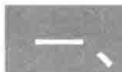

# 惠更斯-菲涅耳原理

# 1. 光的衍射现象

衍射现象是一切波动的普遍特性，光波也不例外。当光通过小孔、狭缝等障碍物的边缘时会出现偏离直线传播的

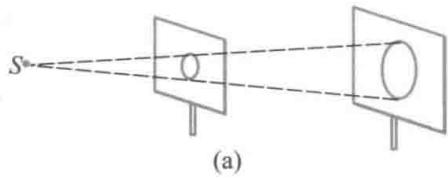

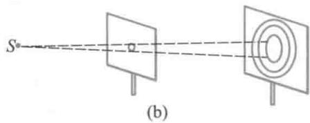  
图16-17 圆孔衍射

文档：惠更斯

文档：菲涅耳

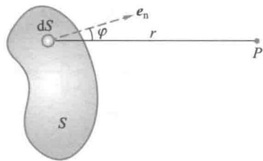  
图16-18 惠更斯-菲涅耳原理

现象，称为光的衍射（diffraction of light）.

在图16-17中，使单色光照射到开有圆孔的障碍屏上，当圆孔的直径远大于光波波长时，在观察屏上呈现一个均匀的圆形光斑，缩小圆孔，光斑也相应缩小，如图16-17（a）所示，此时光的直线传播规律成立。但是，若把圆孔直径进一步缩小，直到可与光波波长相比拟时，发现光斑不再缩小，反而变大，在其周围还出现一圈圈明暗相间的衍射条纹，如图16-17（b）所示。这说明，发生衍射现象时光的直线传播规律不再成立，因此几何光学的这一直线传播规律是在障碍物的尺度远大于光波波长时的一种近似。

在光学的发展史上，正是衍射问题使光的波动说决定性地战胜了微粒说。在法国科学院于1818年举办的关于光的衍射现象的有奖征答辩论中，年仅30岁的菲涅耳用创新了的惠更斯原理，圆满地解释了光在圆孔、狭缝等物体边缘的衍射现象，赢得了辩论的胜利，从而使光的波动说获得最终的确认。

# 2. 惠更斯-菲涅耳原理

菲涅耳吸取惠更斯的次波（子波）概念，根据叠加原理进一步发展了惠更斯原理，他认为：波阵面上每一个次波的振幅与传播方向有关，下一时刻空间某点的振动由各次波在该点引起振动的相干叠加所决定。菲涅耳提出的次波相干叠加观点，不但对衍射问题给出了与实验相符的定量描述方法，更揭示了衍射现象的本质，被后人称为惠更斯-菲涅耳原理（Huygens-Fresnel principle）。

如图16-18所示，  $S$  是光波被障碍物阻挡后对空间  $P$  点“露出”的波前，菲涅耳认为：  $P$  点的光振动  $E$  ，决定于  $S$  上所有次波在  $P$  点引起的光振动之间相互干涉的结果.用  $\mathrm{d}E$  表示  $S$  上面积元  $\mathrm{d}S$  的次波在  $P$  点引起的光振动.因  $\mathrm{d}S$  很小，它的次波近似以球面波的形式传播.设  $\mathrm{d}S$  到  $P$  点的距离为  $r$  ，其法线方向  $e_{\mathrm{n}}$  与  $r$  间的夹角为  $\varphi$  ，则  $\mathrm{d}E$  的大小应

正比于  $\frac{\mathrm{d}S}{r}$  并与夹角  $\varphi$  有关，相位则取决于光程  $nr$  （在空气中时  $n = 1$ ）。所以，面积元  $\mathrm{d}S$  在  $P$  点引起的光振动可以表示为

$$
\mathrm {d} E = C K (\varphi) \frac {\mathrm {d} S}{r} \cos \left(\omega t - \frac {2 \pi r}{\lambda}\right)
$$

式中  $C$  为比例常量.  $K(\varphi)$  是为了说明次波不向后方传播而引入的与倾角  $\varphi$  有关的函数项，称倾斜因子.菲涅耳认为， $K(\varphi)$  应随倾角  $\varphi$  的增大而缓慢减小.  $\varphi = 0$  时， $K(\varphi) = 1$ ；当  $\varphi \geqslant \frac{\pi}{2}$  时， $K(\varphi) = 0$ ，因而  $\mathrm{d}E = 0$ .

$P$  点的光振动  $E$  为  $S$  上所有次波在  $P$  点光振动的叠加，所以

$$
E = \int_ {S} \mathrm {d} E = C \int_ {S} \frac {K (\varphi)}{r} \cos \left(\omega t - \frac {2 \pi r}{\lambda}\right) \mathrm {d} S
$$

上式称为菲涅耳衍射积分公式，这是菲涅耳赋予惠更斯原理的一个精确而普适的数学表达式。对于具有对称性的障碍物，如圆孔、狭缝等，菲涅耳设计了一种巧妙而简单的求上述积分的波带法，可方便地得到与实验基本相符合的结果。我们将着重讨论波带法。

# 3.菲涅耳衍射与夫琅禾费衍射

光的衍射问题通常可归纳为两种类型：其一，光源、光屏E（观察屏）与衍射孔（障碍物）三者间的距离皆为有限远，或其中之一为有限远，这种类型的衍射称为菲涅耳衍射（Fresnel diffraction），见图16-19(a).其二，光源、光屏E与衍射孔三者间的距离皆为无限远，或相当于无限远的衍射，这种类型的衍射称为夫琅禾费衍射（Fraunhofer diffraction），见图16-19(b).夫琅禾费衍射装置可利用两个会聚透镜来实现，如图16-19(c)所示.本质上，这是个考虑平行光入射时，平行的衍射光之间的干涉问题.我们的讨论将限于夫琅禾费衍射

  
文档：夫琅禾费

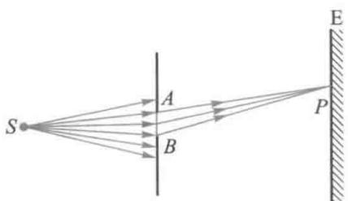  
(a)

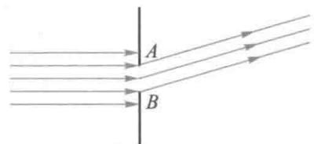  
(b)

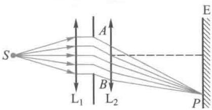  
(c)  
图16-19 光的衍射的类型

# 二、单缝夫琅禾费衍射

如图16-20所示为夫琅禾费单缝衍射示意图. 单色光源  $S$  置于透镜  $\mathrm{L}_{1}$  的物方焦点, 经透镜  $\mathrm{L}_{1}$  成为平行光, 并垂直照射在宽度为  $a$  的单狭缝  $AB$  上. 通过狭缝后, 将发生衍射现象. 衍射光偏离缝面法线的倾角  $\varphi$  就是衍射角. 对观察屏E而言, 入射光被单缝屏阻挡后“露出”的波面是一宽度为  $a$  的“波带”  $AB$ . 根据惠更斯原理, 波带  $AB$  上的所有次波波源都向各个方向发射次波, 这就是衍射光波. 所有衍射角  $\varphi$  相同的衍射光线按理应在无限远处相遇, 但经透镜  $\mathrm{L}_{2}$  后, 将会聚在置于其焦平面处的观察屏E上. 根据菲涅耳的思想, 波带  $AB$  上的所有次波波源都是相干波源, 且初相位相同 (不妨设为零), 它们在  $\mathrm{L}_{2}$  的焦平面上某处相遇时, 将发生干涉. 由于在相遇处所经历的光程各不相同, 因此在观察屏E上会形成平行于单缝的明暗相间的干涉条纹, 即衍射条纹.

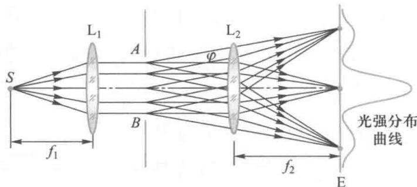  
图16-20 夫琅禾费单缝衍射

显然，观察屏上  $P$  点处的光振动决定于所有次波到达 $P$  点时的光程差.如图16-21所示，我们遵循菲涅耳的思路，将波带  $AB$  分割成  $N$  条平行的窄波带，每一窄波带的面积为  $\Delta S$  ，宽度为  $\frac{a}{N}$  可见，分割的窄波带数  $N$  越多，则  $\Delta S$  越小，每一窄波带对  $P$  点处光振动的贡献也就越小.由于衍射现象总发生在缝宽  $a$  很小的情况下，故衍射总光能较弱，而其中的近  $90\%$  集中在  $\mathrm{L}_2$  的近轴区域.为此，我们考虑近轴

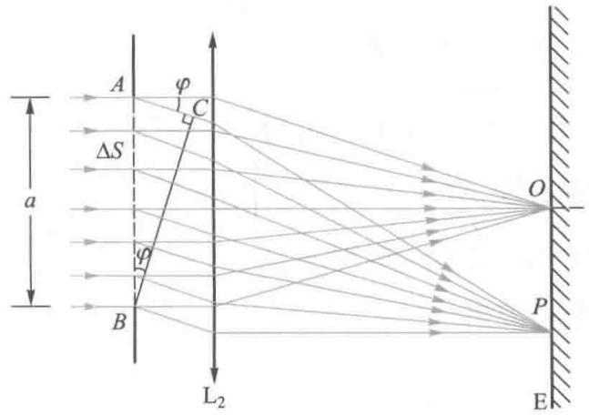  
图16-21 光程差

的衍射光波，可设倾斜因子  $K(\varphi) = 1$  ，即近似认为每个窄波带次波对  $P$  的光振动贡献相同

由于透镜  $\mathrm{L}_2$  不产生附加的光程差，所有次波在  $\varphi$  方向上的衍射光线会聚在  $P$  处所对应的最大光程差是  $AC$ . 由图16-21可知

$$
\delta = A C = a \sin \varphi \tag {16-29}
$$

每一窄波带的边缘次波在  $\varphi$  方向衍射光线的光程差为

$$
\frac {1}{N} a \sin \varphi
$$

当这个光程差等于半波长，即当

$$
\frac {1}{N} a \sin \varphi = \frac {\lambda}{2} \tag {16-30}
$$

时，每一个窄波带称为半波带（half-wave zone）.图16-22表示半波带数  $N = 3$  的情况

显然，相邻两个半波带上的所有相对应位置上的次波，在  $P$  的光程差都是  $\frac{\lambda}{2}$ ，相位差都为  $\pi$ ，比如图16-22中的  $A_{1}$  和  $A_{1}, A_{1}$  和  $A_{2}$  等，它们对  $P$  的光振动合振幅为零。

当  $AB$  上所有次波在  $\varphi$  方向的最大光程差  $\delta$  恰为半波长  $\frac{\lambda}{2}$  的偶数倍时，单缝“露出”的波面  $AB$  被分成偶数个半波带，它们在观察屏上  $P$  处的光振动一一干涉相消，总光强为零.所以，当

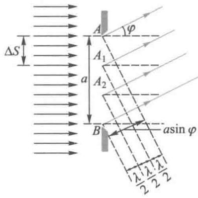  
图16-22 半波带

$$
\delta = a \sin \varphi = \pm 2 k \frac {\lambda}{2}, \quad k = 1, 2, 3, \dots \tag {16-31}
$$

时，观察屏上  $P$  点处为单缝衍射光强的暗条纹中心.  $k = 1$  为第一级暗条纹，对应衍射角为  $\varphi_{1}$  时的波面  $AB$  可被分成2个半波带；  $k = 2$  ，为第二级暗条纹，对衍射角  $\varphi_{2}$  ，波面  $AB$  可被分成4个半波带…

当  $\varphi$  方向的最大光程差  $\delta$  恰为半波长  $\frac{\lambda}{2}$  的奇数倍时， $AB$  可被分成奇数个半波带，其中偶数个半波带对屏上  $P$  处的光振动一一干涉相消，而剩下一个半波带的光振动形成了  $P$  处的明条纹. 所以，当

$$
\delta = a \sin \varphi = \pm (2 k + 1) \frac {\lambda}{2}, \quad k = 1, 2, 3, \dots \tag {16-32}
$$

时，观察屏上  $P$  点处为单缝衍射光强的明条纹中心，它是由那未被抵消的一个半波带上，连续分布的次波在  $P$  点处的光振动所贡献的.  $k = 1$  ，为第一级明条纹，波面  $AB$  可被分成3个半波带，  $k = 2$  ，为第二级明条纹，对应有5个半波带，…

可见，随着明条纹级次的增高，波面  $AB$  可被分成的半波带数随之增多，明条纹的光强将随着级次的增高、半波带面积的减小而减弱。此外，随着级次的增高，衍射角  $\varphi$  也随之增大，而倾斜因子  $K(\varphi)$  则变小，这更促使明条纹光强随级次增高而急剧地减弱。

当  $\varphi = 0$  ，即  $AB$  上所有次波的衍射光线都平行于  $\mathrm{L}_2$  的主轴传播，在  $\mathrm{L}_2$  的焦平面上形成最大光强，对应中央明条纹的中心.中央明纹两侧，两个第一级暗纹中心的间隔给出了中央明纹的宽度范围，这里集中了近  $90\%$  的衍射光能.中央明纹范围满足的光程差条件是

$$
- \lambda <   a \sin \varphi <   \lambda \tag {16-33}
$$

在近轴条件下， $\varphi$  角很小

$$
\sin \varphi \approx \varphi
$$

第一级暗条纹的衍射角

$$
\varphi_ {\pm 1} = \pm \frac {\lambda}{2}
$$

中央明纹的角宽度为

$$
\Delta \varphi_ {0} = \varphi_ {1} - \varphi_ {- 1} = 2 \frac {\lambda}{a} \tag {16-34}
$$

在观察屏上，中央明纹的线宽度为

$$
l _ {0} \approx f \Delta \varphi_ {0} = 2 f \frac {\lambda}{a} \tag {16-35}
$$

式中  $f$  是  $\mathrm{L}_2$  的像方焦距

相邻两暗条纹中心（或明条纹中心）的角宽度为

$$
\Delta \varphi = \varphi_ {k + 1} - \varphi_ {k} = \frac {\lambda}{a} \tag {16-36}
$$

可见，中央明纹的宽度是其他各级明条纹宽度的两倍

对于观察屏上某一光强介于最大和最小之间的  $P$  点，由以上分析可知，它所对应的最大光程差  $\delta$  显然不是半波长的整数倍.

单缝衍射光强的分布如图16-23所示，其特征是：中央明纹最宽、最亮，两侧其他明条纹的光强迅速减弱

由（16-35）式可知，入射光波长  $\lambda$  一定时，单缝宽度  $a$  越小，中央明纹越宽，衍射越显著。反之，随着  $a$  的扩大，各级条纹将逐渐向中央明纹靠近，当  $a >> \lambda$  时，密集得将无法分辨，只呈现中央明条纹，这就是被照亮的单缝通过透镜所成的几何像。因此可以说，几何光学是波动光学在  $\frac{\lambda}{a} \rightarrow 0$  时的极限。

当单缝宽度  $a$  一定而用白光入射时，衍射角  $\varphi$  正比于光波长，除中央明纹中心因各色光非相干地重叠在一起仍为白色外，各级明条纹都以由紫到红的顺序向两侧对称排列，形成衍射光谱。

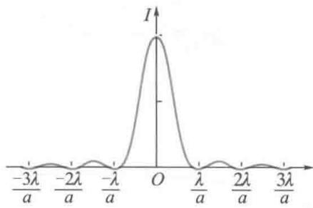  
图16-23 单缝衍射光强的分布

例16-6

有一单缝，宽  $a = 0.10 \mathrm{~mm}$ ，在缝后放一焦距为  $50 \mathrm{~cm}$  的会聚透镜，用平行绿光（ $\lambda = 546.0 \mathrm{~nm}$ ）垂直照射单缝，求位于透镜焦面处的屏幕上的中央明条纹及第二级明纹宽度。

解 观察屏上明条纹的线宽度由相邻两个暗纹中心的距离决定. 在观察屏上取坐标轴  $Ox$  向上为正，坐标原点在透镜焦点处. 设屏上第  $k$  级暗纹的位置为  $x$ .

由单缝夫琅禾费衍射暗纹条件

$$
a \sin \varphi = \pm k \lambda
$$

因  $\varphi$  很小，

$$
\sin \varphi \approx \tan \varphi = \frac {x}{f}
$$

即

$$
x _ {k} = k \frac {f}{a} \lambda
$$

$k = \pm 1$  ，得中央明纹线宽度

$$
\Delta x _ {0} = x _ {1} - x _ {- 1} = 2 \frac {f}{a} \lambda = 5. 4 6 \mathrm {m m}
$$

类似可得屏上第  $k$  级明纹的位置

$$
x _ {k} = \left(k + \frac {1}{2}\right) \frac {f}{a} \lambda
$$

第  $k$  级明纹宽度

$$
\begin{array}{l} \Delta x _ {k} = x _ {k + 1} - x _ {k} = \left[ (k + 1) + \frac {1}{2} \right] \frac {f}{a} \lambda - \left(k + \frac {1}{2}\right) \frac {f}{a} \lambda \\ = \frac {f}{a} \lambda \\ \end{array}
$$

各级明纹宽度  $\Delta x_{k}$  相等，与级次  $k$  无关

所以，第二级明纹宽度

$$
\Delta x _ {2} = \frac {f}{a} \lambda = 2. 7 3 \mathrm {m m}
$$

中央明纹的线宽度是其他各级明条纹线宽度的两倍，即  $\Delta x_0 = 2\Delta x_k$

# 三、圆孔衍射和光学仪器的分辨本领

# 1. 圆孔的夫琅禾费衍射

在夫琅禾费衍射装置中，如果用小圆孔替代单狭缝，在屏上将显示夫琅禾费圆孔衍射图样。这是一组明暗相间的同心圆环、围绕着中央一个明亮的亮斑，如图16-24所示。当圆孔直径  $d \gg \lambda$  时，整个衍射图样向中心靠拢，缩成一个亮点，成为几何光学的像点。圆孔衍射现象普遍存在于所有光学仪器中，比如照相机、望远镜、显微镜乃至人眼的瞳孔。所有对光束波面有限制的孔径，都会产生衍射现象，必然影

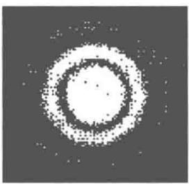  
图16-24 艾里斑

响光学仪器分辨物体细节的能力.

夫琅禾费圆孔衍射的中央亮斑，称为艾里斑（Airy disk）计算表明，艾里斑集中了全部衍射光能的  $84\%$  ，第一级亮环只占  $7\%$  ，其他亮环则更小.艾里斑的半角宽由第一暗环的衍射角给出，为

$$
\theta_ {0} = 1. 2 2 \frac {\lambda}{d} = 0. 6 1 \frac {\lambda}{r} \tag {16-37}
$$

式中  $r$  为小圆孔的半径

艾里斑的半角宽  $\theta_0$  与入射光波长  $\lambda$  成正比而与圆孔的直径  $d$  成反比. 这表明, 波长一定时, 圆孔越小, 则屏上的艾里斑越大;  $d$  很大, 则  $\theta_0 \rightarrow 0$ , 光线沿直线传播; 孔径一定时, 波长越短, 则艾里斑越小. 这也是衍射现象的普遍规律.

# 2. 光学仪器的分辨本领

来自远处两个物点的平行光线通过透镜时，透镜的边框相当于透光小圆孔边缘。由于衍射，在透镜的焦平面上会形成两个衍射斑，而不是两个清晰的像点。当两束平行光线通过人眼的瞳孔时，在视网膜上也同样会形成两个“亮团”即两个艾里斑。这两束衍射光即使频率相同也不相干，在它们重叠区域的合光强应遵循非相干叠加的规律，即由（16-7）式给出的  $I = I_{1} + I_{2}$

如图16-25（a）所示，当两个艾里斑中心对透镜光心张角  $\theta >\theta_0$  时，它们在屏上合光强的极大和极小相差悬殊，很容易辨认出这是两个艾里斑；而当  $\theta < \theta_0$  ，在屏上的间距很小时，两个艾里斑合光强“合二为一”变得无法分辨，如图16-25（c）所示.在人眼的视网膜上，当合光强的两个极大处在相邻的两个视锥细胞上时，人眼可以分辨远处的两个物点；而当它们落在同一个视锥细胞上时，则只能认为是一个亮点.在明视距离（  $25~\mathrm{cm}$  )处，两个相距  $0.1\mathrm{mm}$  的物点，在正常人眼视网膜上形成的两个艾里斑，其中心的间距约为  $5\mu \mathrm{m}$  ，恰好落在两个视锥细胞上，这时恰好为正常人眼所分辨

  
动画：瑞利判据

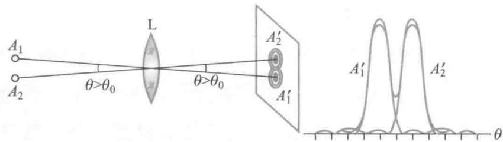  
(a)

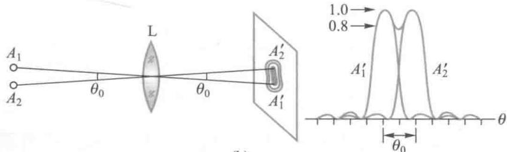  
图16-25 最小分辨角  
(b)

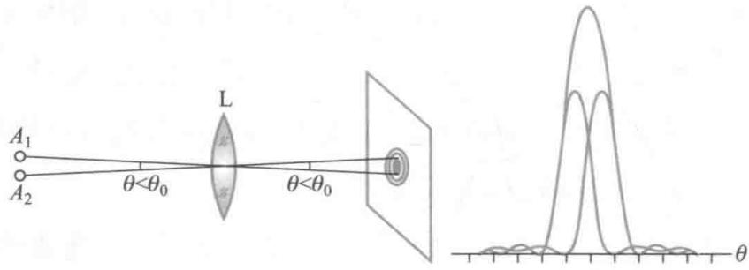  
(c)

两个离得很近的艾里斑恰能分辨的判据是由德国物理学家瑞利（Rayleigh）提出的：两个强度分布相同的艾里斑重叠后，如果一个艾里斑的中心刚好与另一个艾里斑边缘第一暗环的中心相重合，恰能分辨，这称为瑞利判据。如图16-25（b）所示，恰能分辨时合光强的极小（凹处）约为极大的  $80\%$  ，大多数正常人眼刚能够分辨光强的这种差别。恰能分辨时，两个不相干物点对透镜光心的张角  $\theta = \theta_0$  ，称最小分辨角（angle of minimum resolution），用  $\delta \theta$  表示。显然，

$$
\delta \theta = 1. 2 2 \frac {\lambda}{d} \tag {16-38}
$$

光学仪器分辨两个邻近不相干物点的能力，称光学仪器的分辨本领（resolving power）或分辨率。用最小分辨角的倒数表示，

$$
R \equiv \frac {1}{\delta \theta} = \frac {d}{1 . 2 2 \lambda} \tag {16-39}
$$

上式表明，提高光学仪器分辨本领的有效途径是增大透镜的直径或采用较短的光波波长.

在天文观测中，为了减小望远镜的最小分辨角，即提高望远镜的分辨本领，必须加大其物镜的直径  $D$  ，这就是为什么天文望远镜的物镜直径设计得越来越大的原因。由于大直径透镜制造困难，通常都采用反射式物镜。

显微镜用来观察放在物镜焦点附近的物体，它的分辨本领是以刚好可分辨的两个物点间的最小距离  $\delta y$  来衡量的.按照瑞利判据，可以得出显微镜的最小分辨距离为

$$
\delta y = \frac {0 . 6 1 \lambda}{n \sin u} \tag {16-40}
$$

式中  $n$  是被观察物所在介质的折射率， $u$  是显微镜物镜半径对物点的张角.

可见，  $n\sin u$  越大，则  $\delta y$  越小，显微镜的分辨本领就越高通常把  $n\sin u$  称为物镜的数值孔径（numericalaperture），用N.A.表示，其数值标在显微镜的镜头上．对于浸在油液里的物镜，其  $\frac{0.61}{\mathrm{N.A.}}$  值可小到0.5，亦即可分辨的最小物距约为半个波长，比人眼直接观察明视距离处的两物点的分辨本领约大  $10^{2}\sim 10^{3}$  倍

由（16-40）式还可以看出，所利用的光的波长  $\lambda$  越短，则  $\delta y$  越小，显微镜的分辨本领也越高。因此，利用波长只有  $10^{-3} \mathrm{~nm}$  的电子束，可以制成最小分辨距离  $\delta y$  达  $10^{-1} \mathrm{~nm}$  的电子显微镜，它的放大倍数可达几万乃至几百万，而光学显微镜的放大率最高也只有 1000 倍左右。

例16-7

人眼瞳孔直径约为  $3\mathrm{mm}$ 。在人眼最敏感的黄绿光  $\lambda = 550\mathrm{nm}$  照射下，人眼能分辨物体细节的最小分辨角是多大？教室的最后一排座位离黑板的距离为  $15\mathrm{m}$ ，坐在最后一排的人能看清黑板上间隔为  $4.0\mathrm{mm}$  的黄绿色的“等号”吗？

解 由（16-39）式可知，人眼可分辨两不相干物点的最小分辨角为

$$
\begin{array}{l} \delta \theta = 1. 2 2 \frac {\lambda}{d} \\ = 1. 2 2 \times \frac {5 5 0 \times 1 0 ^ {- 9}}{3 . 0 \times 1 0 ^ {- 3}} \mathrm {r a d} \approx 2. 2 4 \times 1 0 ^ {- 4} \mathrm {r a d} \\ \end{array}
$$

设黑板上等号的两条平行线间的距离为  $L$  ，对人眼瞳孔的张角为

$$
\delta \varphi = \frac {L}{S} = \frac {4 \times 1 0 ^ {- 3}}{1 5} \mathrm {r a d} \approx 2. 6 7 \times 1 0 ^ {- 4} \mathrm {r a d}
$$

由于  $\delta \varphi >\delta \theta$  ，因此最后一排观察者能看清（分辨）黑板上的这个等号

# 16-5 光栅衍射

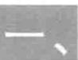

# 衍射光栅

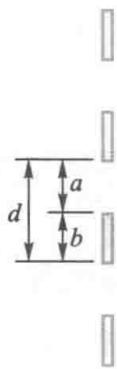  
图16-26 衍射光栅

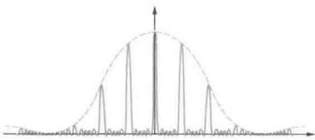  
图16-27 光栅衍射条纹

在夫琅禾费衍射装置中，用如图16-26所示的  $N$  条等宽等间距的平行狭缝代替单狭缝或小圆孔，在屏上将显示如图16-27所示的衍射光强分布。这个由  $N$  条平行狭缝构成的元件称衍射光栅（diffraction grating）或多缝。取透光缝的宽度为  $a$  ，遮光部分宽度为  $b$  ，则衍射光栅的周期为  $d = a + b$  ，称为光栅常量。普通光栅在  $1\mathrm{cm}$  长度范围内可有几百乃至上万条透光缝，光栅常量为  $d = \frac{1}{N}\mathrm{cm}$

多缝衍射的光强分布有着明显的不同于单缝衍射的特征：

（1）明条纹很细很亮，称作主极大，在主极大间较宽的范围内，分布有称作次极大的较弱明条纹；  
（2）主极大的位置与缝数  $N$  无关，但它们的宽度随  $N$  增大而变细；  
（3）相邻主极大间有  $(N - 1)$  个暗条纹和  $(N - 2)$  个次极大，形成一片较宽的暗背景；  
（4）光强分布保留了单缝衍射的痕迹，如图16-27中

的虚线包络所示，它的形状与单缝衍射的相同

当入射光中包含有几种不同的波长成分时，每一波长都会形成各自的光强分布，形成光栅光谱，并且每一谱线都因很细很亮而易于分辨。因此，衍射光栅是重要的分光元件，在实验中常利用它对光波波长和其他微小的量作精确测量。

光栅衍射光强的这些特征是由单缝衍射和缝间干涉的综合效应决定的.如图16-28所示，单色平行光垂直入射于光栅后，每个缝的单缝衍射图样在形状上完全相同，在位置上也完全重合；而由光的相干性可知，各狭缝的衍射光都是相干光

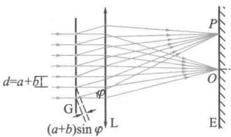  
图16-28 光栅衍射原理图

# 二、光栅方程

# 1. 主极大

当相邻两束  $\varphi$  方向的衍射光线，在屏上相遇处  $P$  的光程差为波长的整数倍，即当

$$
\delta = (a + b) \sin \varphi = \pm k \lambda , \quad k = 0, 1, 2, \dots \tag {16-41a}
$$

时，在  $P$  引起光振动的相位差为

$$
\alpha = \frac {2 \pi}{\lambda} \delta = \frac {2 \pi}{\lambda} (a + b) \sin \varphi = \pm 2 k \pi , \quad k = 0, 1, 2, \dots \tag {16-41b}
$$

这时，两个光振动干涉加强。用矢量图来表示的话，这两个光振动矢量的方向一致。由光栅的周期性可知，在这方向上， $N$  束衍射光在  $P$  的光振动矢量方向也是相同的，它们的矢量和即  $P$  处光振动的合振幅，是每一光振动振幅  $A_{\varphi}$  的  $N$  倍，如图16-29所示。 $\varphi$  方向上的光强  $I_{\varphi} \propto (NA_{\varphi})^{2}$ ，形成第  $k$  级主极大。所以，(16-41a)式决定了缝间干涉形成主极大的位置，称为光栅方程。

满足光栅方程的主极大也称光谱线， $k$  是主极大的级

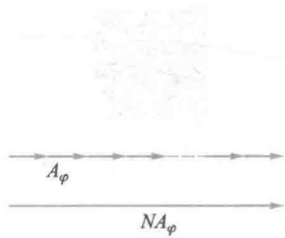  
图16-29 光栅衍射的主极大

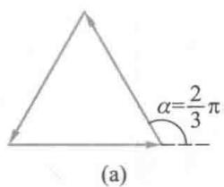

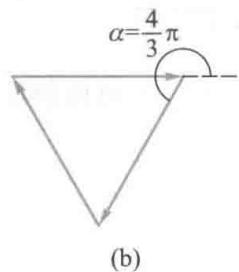  
图16-30 光栅衍射的暗条纹

  
动画：多缝干涉衍射

数.  $k = 0$  ，为中央明纹即零级主极大，  $k = 1,2,3,\dots$  分别为第一级主极大、第二级主极大、第三级主极大、

# 2. 暗纹条件

当相邻两束  $\varphi$  方向的衍射光线，在屏上  $P$  处两光振动间的相位差  $\alpha$  满足

$$
N \alpha = \pm 2 m \pi , \quad m = 1, 2, 3, \dots (m \neq k N) \tag {16-42}
$$

时， $N$  个光振动矢量叠加构成了闭合的等边多边形，矢量和为零，这时  $P$  处为暗条纹。在第  $k$  和第  $(k + 1)$  级主极大之间，存在着  $(N - 1)$  个这样的机会。为便于理解，我们以  $N = 3$  为例予以说明： $\alpha = 0$  对应  $\varphi = 0$ ，这是  $k = 0$  的零级主极大；随着衍射角  $\varphi$  的增大，相位差  $\alpha$  也随之增大，当  $\alpha = \frac{2\pi}{3}$  时出现第一个暗条纹，如图16-30（a）所示，当  $\alpha = \frac{4\pi}{3}$  时出现第二个暗条纹，如图16-30（b）所示；当  $\alpha = \frac{6\pi}{3} = 2\pi$  时是  $k = 1$  的主极大。可见，在零级和一级主极大间有2个极小和1个次级大。所以，对  $N$  条缝的光栅，暗条纹所能满足的光程差条件可写为

$$
\delta = (a + b) \sin \varphi = \pm \frac {m}{N} \lambda , \quad m = 1, 2, 3, \dots (m \neq k N) \tag {16-43}
$$

在上式中，  $m = kN + 1, kN + 2, \dots, [(k + 1)N - 1]$  时，对应  $k$  和  $(k + 1)$  两个主极大之间的  $(N - 1)$  个暗条纹.

显然，  $N$  越大，在相邻两主极大间的暗纹越多，就会连成一片暗区，主极大（明条纹）变得很细，其光强因  $I_{\varphi}\propto$ $(NA_{\varphi})^{2}$  而变得很亮.若将杨氏双缝视为  $N = 2$  的多缝，相邻两个极大之间自然只有一个极小

每一狭缝在  $\varphi$  方向的光振动振幅  $A_{\varphi}$  是由单缝衍射在该方向的光强决定的，它随衍射角  $\varphi$  的增大而迅速衰减，因此，光栅衍射主极大光强的包络线形状由单缝衍射的光强

分布决定. 单缝衍射对缝间干涉的这种影响, 也称为“调制”作用. 图16-31给出了单缝衍射、缝间干涉以及两者的综合效果.

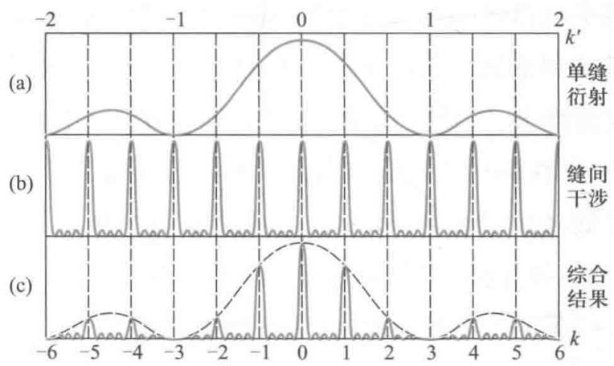  
图16-31 光栅衍射的缺级

# 3. 光栅的缺级

在图16-31（c）中，我们注意到缺失了一些主极大，比如  $k = \pm 3, \pm 6$  等。在这些方向上，衍射角  $\varphi$  同时满足(16-41a)式和(16-31)式，即

$$
(a + b) \sin \varphi = \pm k \lambda , \quad k = 0, 1, 2, \dots
$$

和  $a\sin \varphi = \pm k'\lambda, \quad k' = 1,2,\dots$

按照缝间干涉，这个方向上应该出现  $N$  个相干光干涉的第 $k$  级主极大，但由于每个相干光的光强为零而消失了，这称为谱线的缺级（missingorder).由上两式可得缺级条件

$$
k = \pm \frac {a + b}{a} k ^ {\prime}, \quad k ^ {\prime} = 1, 2, \dots \tag {16-44}
$$

可见，图16-31（c）是由  $\frac{a + b}{a} = 3, N = 5$  的多缝夫琅禾费衍射得到的图样，在可观察范围内，级次为3的整数倍的主极大都不出现，即  $k = \pm 3, \pm 6, \dots$  为缺级，由缺级的信息还可判断：这个多缝的  $b = 2a$  ，遮光部分的宽度是透光缝宽的2倍.

# 三、光栅光谱和色分辨本领

# 1. 光栅光谱

当平行白光垂直入射于光栅时，由光栅方程可知，在光栅常量  $d$  和主极大级次  $k$  一定的情况下，衍射角  $\varphi$  随波长的增大而增大，零级主极大与波长无关.所以，零级主极大为白色，其两侧对称地分布着由紫到红的各级光谱

在低级次光谱中， $\sin \varphi \approx \varphi$ ，各波长的主极大近似均匀排列，称匀排光谱。当  $(k + 1)$  级光谱中  $\lambda$  的衍射角与  $k$  级光谱中  $\lambda + \Delta \lambda$  的衍射角相等时，光谱便发生重叠。可见光入射时， $\lambda = 400 \mathrm{~nm}$ ， $\lambda + \Delta \lambda = 760 \mathrm{~nm}$ ，由  $(k + 1)\lambda = k(\lambda + \Delta \lambda)$  可知，只有第一级光谱是独立的。

# 2. 色分辨本领

光栅分辨波长差  $\Delta \lambda$  很小的两谱线的能力称为光栅的色分辨本领（resolving power）。其定义为

$$
R = \frac {\lambda}{\Delta \lambda}
$$

根据瑞利判据，当波长为  $(\lambda + \Delta \lambda)$  的  $k$  级主极大与同级光谱中，在其一侧波长为  $\lambda$  的第一个极小的角位置重合时，这两个谱线恰可分辨。有

$$
k (\lambda + \Delta \lambda) = \frac {k N + 1}{N} \lambda
$$

可得光栅的分辨本领为

$$
R = \frac {\lambda}{\Delta \lambda} = k N \tag {16-45}
$$

由上式可知，光栅的分辨本领  $R$  决定于光谱的级次  $k$  和光栅受光照缝数  $N$  的乘积.对一定的光栅，可通过斜入射和扩束的方法来提高它的分辨本领

例16-8

有一平面光栅，每厘米有6000条刻痕，一平行白光垂直照射到光栅平面上.求：

（1）在第一级光谱中，对应于衍射角为  $20^{\circ}$  的光谱线的波长；  
（2）此波长的第二级谱线的衍射角

解（1）该光栅的光栅常量  $d = \frac{1\mathrm{cm}}{6000} =$

$$
1. 6 6 7 \times 1 0 ^ {- 4} \mathrm {c m} = 1. 6 6 7 \times 1 0 ^ {- 6} \mathrm {m}
$$

由光栅方程  $d\sin \varphi = k\lambda$

对第一级光谱  $k = 1$

第一级光谱中衍射角为  $20^{\circ}$  的光谱线的波长

$$
\lambda = d \sin \varphi = 1. 6 6 7 \times 1 0 ^ {- 6} \times \sin 2 0 ^ {\circ} \mathrm {m}
$$

$$
= 5. 7 0 1 \times 1 0 ^ {- 7} \mathrm {m} = 5 7 0. 1 \mathrm {n m}
$$

（2）此波长的第二级谱线的衍射角

$$
d \sin \varphi = 2 \lambda
$$

$$
\sin \varphi = \frac {2 \lambda}{d} = \frac {2 \times 5 . 7 0 1 \times 1 0 ^ {- 7}}{1 . 6 6 7 \times 1 0 ^ {- 6}} = 0. 6 8 4
$$

$$
\varphi = 4 3 ^ {\circ} 9 ^ {\prime}
$$

例16-9

波长  $600\mathrm{nm}$  的单色光垂直入射在一光栅上，相邻的两条明条纹分别出现在  $\sin \varphi = 0.20$  与  $\sin \varphi = 0.30$  处，第四级缺级。试问：

（1）光栅上相邻两缝的间距有多大？  
（2）光栅上透光缝的宽度有多大？  
（3）在所有衍射方向上，这个光栅可能呈现的全部级数

解（1）设  $\sin \varphi_{k} = 0.20, \sin \varphi_{k + 1} = 0.30.$

根据光栅方程，得

$$
\left\{ \begin{array}{l} d \sin \varphi_ {k} = d \times 0. 2 0 = k \lambda \\ d \sin \varphi_ {k + 1} = d \times 0. 3 0 = (k + 1) \lambda \end{array} \right.
$$

得  $k = 2$

$$
d = \frac {2 \lambda}{\sin \varphi_ {k}} = \frac {2 \times 6 0 0 \times 1 0 ^ {- 9}}{0 . 2 0} \mathrm {m} = 6 \times 1 0 ^ {- 6} \mathrm {m}
$$

此光栅的光栅常量为  $6 \times 10^{-6} \mathrm{~m}$

（2）由光栅的缺级条件

$$
k = \frac {d}{a} k ^ {\prime}
$$

根据题意，第一次缺级发生在  $k^{\prime} = 1$ $k = 4$  ，所以

$$
d = 4 a
$$

$$
a = \frac {d}{4} = 1. 5 \times 1 0 ^ {- 6} \mathrm {m}
$$

光栅上狭缝的宽度为  $1.5 \times 10^{-6} \mathrm{~m}$

（3）光栅衍射的光强分布在  $-\frac{\pi}{2} < \varphi < +\frac{\pi}{2}$  范围内，在  $\varphi = \pm \frac{\pi}{2}$  的极限方向上，由倾斜因子可知，实际已无光强

将  $\varphi = \frac{\pi}{2}$  代入光栅方程，

$$
d \sin \varphi = k \lambda
$$

得最高级次

$$
k _ {\mathrm {M}} = \frac {d}{\lambda} = \frac {6 \times 1 0 ^ {- 6}}{6 0 0 \times 1 0 ^ {- 9}} = 1 0
$$

$k_{\mathrm{M}} = 10$  的主极大事实上不能观察到

由缺级条件

$$
k = \frac {d}{a} k ^ {\prime}
$$

可知，缺级发生  $\pm 4, \pm 8, \pm 12, \dots$  处

这样，可能观察到的主极大数为：  $k = 0, \pm 1, \pm 2, \pm 3, \pm 5, \pm 6, \pm 7, \pm 9.$  共15个.

# 16-6 X射线的衍射

文档：伦琴

文档：劳厄

文档：W.H.布拉格

文档：W.L.布拉格

1895年，伦琴（W.K.Rontgen）发现了X射线.研究表明，这是在高速电子撞击某些固体时产生的一种波长很短、穿透力很强的电磁波，它不为人眼所感觉，但可使感光乳胶感光.然而，正是由于X射线的波长很短（约在  $10^{-3}\sim 1\mathrm{nm}$  范围），用普通的光学光栅观察不到它的衍射现象

1912年，劳厄（M.vonLaue）利用一片薄晶体作为衍射光栅，直接观察到了X射线的衍射图样.图16-32是X射线通过NaCl晶体后，在照相底片上形成的衍射图样.研究表明，这些具有某种对称性的斑点是由晶体衍射线的主极大形成的，称为劳厄斑.

晶体具有周期性结构，可以抽象成由许多周期排列的格点组成的点阵. X射线的衍射图样证明了它作为电磁波的波长与格点的间隔差不多是同数量级的.

布拉格父子（W.H.Bragg；W.L.Bragg）对X射线在晶体上的衍射现象，提出了一种简明而有效的解释方法。事实上，当X射线照射到晶体上时，组成晶格点阵的每个格点都可看作是次波波源，它们吸收入射波并立即向各个方向发出相干的衍射（散射）波。如图16-33所示，布拉格把晶格点阵看作是由许多平行的晶面（crystal plane）堆积而成的，

这组平行晶面称晶面族，每一个晶面都是点阵平面。当一束平行的X射线，以掠射角  $\varphi$  入射于图示晶面时，在每个周期排列的格点上将产生衍射，对每一晶面而言，在镜面反射方向上具有最强的衍射；但就所有相互平行的晶面而言，在镜面反射方向上总的衍射强度取决于各晶面反射波相干涉的结果。

如图16-33所示，对相邻晶面间距为  $d$  的这组晶面，反射线之间的光程差为

$$
\delta = A C + C B = 2 d \sin \varphi
$$

当满足

$$
2 d \sin \varphi = k \lambda , \quad k = 1, 2, 3, \dots \tag {16-46}
$$

时，所有这组平行晶面反射的X射线之间都干涉加强.由于是很多晶面的很多反射光束间的相干加强，因此在反射方向上出现的衍射斑点清晰而明锐.（16-46）式是分析晶体X射线衍射形成干涉极大所必须满足的条件，称为布拉格条件（Bragg condition）.

一个晶格点阵可以有许多不同取向的晶面族. 在如图16-34所示的  $\mathrm{NaCl}$  点阵图面内,  $aa$  、  $bb$  和  $cc$  等分别表示不同取向的晶面族, 它们的晶面间距 (lattice plane spacing) 各不相同. 对一束入射 X 射线, 不同的晶面族有不同的掠射角, 只有满足 (16-46) 式布拉格条件的晶面族才能形成劳厄斑点.

在实验中，若已知晶体的结构，比如晶格常量或某晶面间距，可利用X射线衍射法测出X射线的波长。反之，若已知X射线波长，则可得到关于晶体结构的各种信息，比如晶格常量、对称性、晶轴取向等。X射线衍射法是进行晶体结构分析和X射线谱研究的重要手段，已经发展成为物理学的一个专门分支——X射线结构分析，在结晶学和工程技术中都有很广泛的应用。

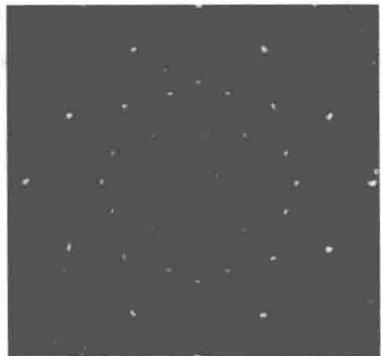  
图16-32 劳厄斑

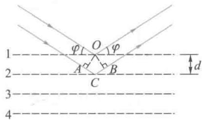  
图16-33 布拉格条件

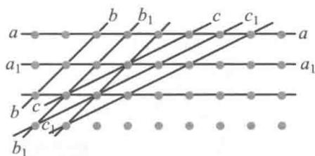  
图16-34 NaCl点阵图

# 16-7 光的偏振现象

光的干涉和衍射现象揭示了光的波动特性，光的偏振现象从实验上清楚地显示出光的横波性，进一步证实了光的电磁波本性.

# 一、光的偏振态

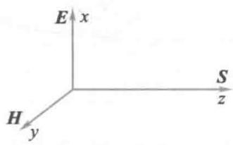  
图16-35 光是横波

麦克斯韦理论指出，光波是横波，在光的传播过程中，光振动矢量  $\pmb{E}$  、磁场强度  $\pmb{H}$  和光线方向  $S$  （坡印廷矢量方向）三者正交，构成右手螺旋关系，如图16-35所示.光振动矢量  $\pmb{E}$  和光线方向  $S$  所组成的平面称振动面（plane of vibration），即图中的  $xz$  平面.光的偏振态（polarization state）是指在垂直于光线方向（沿  $z$  轴）的二维平面（xy平面）上，光振动矢量  $\pmb{E}$  的运动状态.按光的偏振态，可以将光分为偏振光（polarized light）和自然光（natural light）两大类.

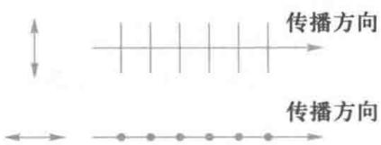  
图16-36 线偏振光

  
动画：光的各种偏振状态

# 1. 线偏振光

在光的传播过程中，如果光振动矢量  $\pmb{E}$  始终保持在一个确定的平面内（比如  $xz$  平面），这样的光称为平面偏振光（plane polarized light），这个平面称为偏振面（plane of polarization）。在  $xy$  平面内，平面偏振光的偏振面表现为一直线，因此也称为线偏振光（linearly polarized light）或完全偏振光（complete polarized light）。图16-36表示振动面分别在纸面内和垂直于纸面的线偏振光。

图中用短线和点分别表示在纸面内和垂直于纸面的光矢量的振动方向.

# 2. 圆偏振光和椭圆偏振光

迎着光线，在  $xy$  平面内，如果光矢量的端点不断地旋

转（左旋或右旋），光矢量端点的轨迹是一个圆，这种光称为圆偏振光（circularly polarized light）；如果光矢量端点的轨迹是一个椭圆，则为椭圆偏振光（elliptic polarized light），如图16-37(a)和(b)所示.

由两个频率相同、振动方向互相垂直的简谐振动合成可知，圆偏振光和椭圆偏振光都可看作是由两个振动面相互垂直，存在确定相位差的线偏振光的叠加而成的，线偏振光、圆偏振光都是椭圆偏振光在一定条件下的特例.

# 3. 自然光

由本章第三节的讨论已知，在普通光源（自发辐射为主的光源）的大量发光原子中，各原子的每次辐射所发出光波列的振动方向和发光时间都具有随机性。迎着光线方向看，光振动矢量以相等的振幅均匀地分布在  $xy$  平面内，这些振动或者同时存在，或者迅速而无规则地替代着，它们的取向是随机的，统计地说，相对光线是对称的。这种由普通光源发出的，光振动矢量相对  $z$  轴呈对称分布的光称为自然光，如图16-38所示。可见，偏振光不具备这种对称性。

因为每一个光振动矢量都可以在两个互相垂直的方向上分解，因此自然光可以用两个振动方向互相垂直，没有恒定相位关系的两个独立光振动代替，它们的振幅  $A_{x}, A_{y}$  相等，光强各占自然光总光强的二分之一。简而言之，自然光可看作是两个振动方向正交的、没有恒定相位关系的、等振幅的线偏振光的混合。

自然光的表示如图16-39所示

# 4. 部分偏振光

偏振光（线偏振光、圆偏振光、椭圆偏振光）和自然光的混合光称部分偏振光（partial polarized light). 图16-40(a)所示为在图面内的光振动较强的部分偏振光，图16-40(b)

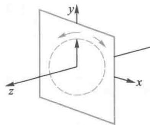  
(a)

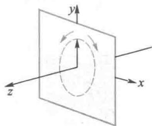  
(b)

  
图16-37 圆偏振光

  
图16-38 自然光

  
图16-39 自然光的图示

  
(a)

  
(b)

图16-40 部分偏振光  
  
文档：马吕斯

  
(a)  
(b)

  
(c)  
图16-41 偏振片

所示为垂直于图面的光振动较强的部分偏振光

# 二、偏振片 马吕斯定律

通过多种途径，我们可从自然光获得偏振光。例如利用晶体或人造物质对光振动的各向异性获得偏振光，利用自然光在介质界面上的反射和折射来获得偏振光等。

# 1. 偏振片

在某些天然或人造材料内部存在着一个特定的方向：当光振动方向与之相垂直时，被强烈地吸收而不能通过；而当光振动方向与之相平行时，则因吸收很小而得以通过。这种对光振动的方向具有选择性吸收的性质称为物质的二向色性（dichroism）。当自然光入射于用这种材料制成的光学元件时，由于某方向的光振动被吸收而消失，就得到了与吸收方向垂直的光振动的线偏振光。这个元件称为偏振片（polaroid），能透过的光振动方向称为偏振化方向，偏振片上都标有这个方向。理想的偏振片对与偏振化方向一致的光振动全部透射，而对与偏振化方向垂直的光振动则全部吸收，我们的讨论限于理想偏振片情况。

从自然光获得偏振光的过程称为起偏，相应的光学元件称为起偏器（polarizer）.

如图16-41(a)所示，光强为  $I_{0}$  的自然光垂直入射到偏振片  $\mathrm{P}_{1}$  后，透射光是振动方向与  $\mathrm{P}_{1}$  的偏振化方向平行的线偏振光， $\mathrm{P}_{1}$  成为起偏器。以光线为轴转动  $\mathrm{P}_{1}$  时，线偏振光的偏振面将随之转动，但光强不发生变化，始终为  $I_{1} = \frac{1}{2} I_{0}$

如图16-41（b）所示，以光强为  $I_{1}$  的线偏振光垂直入射到偏振片  $\mathrm{P}_2$  ，在以光线为轴转动  $\mathbb{P}_2$  的过程中，透射光仍为线偏振光，但光强将发生变化.当  $\mathrm{P}_2$  的偏振化方向平行于

$I_{1}$  的光振动方向时，透射光  $I_{2}$  最强，  $I_{2} = I_{1}$  ；当  $\mathrm{P}_2$  的偏振化方向垂直于  $I_{1}$  的光振动方向时，透射光为零，这称为消光现象，如图16-41（c）所示

当垂直入射到偏振片  $\mathrm{P}$  的为部分偏振光时，在以光线为轴转动  $P$  的过程中，透射光仍为线偏振光，其光强虽也发生变化，但不存在光强为零的消光现象.

综上所述，旋转一个偏振片，可以通过透射光的光强变化来确定入射光的偏振态。这个过程称为检偏，有检偏作用的光学元件称为检偏器（analyzer），比如上文中提到的  $\mathrm{P}_2$  和  $\mathrm{P}$  都是检偏器，它们和起偏器  $\mathrm{P}_1$  可以是两块构造完全相同的偏振片。

# 2. 马吕斯定律

如图16-42所示，两偏振化方向成  $\alpha$  角的偏振片  $\mathrm{P}_{1}$  和 $\mathbf{P}_2$  共轴地平行放置，光强为  $I_{0}$  的自然光垂直入射于该系统，得到线偏振光  $I_{1}$  和  $I_{2}$  .已知  $I_{1} = \frac{1}{2} I_{0}$  ，光振动方向与  $\mathrm{P}_{1}$  的偏振化方向一致，其振幅  $A_{1}\propto \sqrt{I_{1}}$  .按检偏器  $\mathrm{P}_2$  的偏振化方向可将  $A_{1}$  分解为平行和垂直两分量，由图可知，平行分量  $A_{2}$  为

$$
A _ {2} = A _ {1} \cos \alpha
$$

这是可通过  $\mathrm{P}_2$  的光振动振幅.因光强正比于振幅的平方，所以有

$$
I _ {2} = I _ {1} \cos^ {2} \alpha \tag {16-47}
$$

上式称为马吕斯（E.L.Malus）定律.

根据马吕斯定律，  $\alpha = k\pi ,k = 0,1,2,\dots$  时，  $I_{2} = I_{1};\alpha =$ $(2k + 1)\frac{\pi}{2},k = 0,1,2,\dots$  时，  $I_{2} = 0.$ $\alpha$  为其他值时，  $I_{2}$  介于0和  $I_{1}$  之间，这与实验事实是相符合的.

  
图16-42 马吕斯定律

例16-10

一束光由自然光和线偏振光混合而成. 当它垂直通过一偏振片时, 透射光的强度随偏振片的转动而变化, 其最大光强是最小光强的五倍. 入射光中自然光和线偏振光的强度各占入射光强度的几分之几?

解设自然光和偏振光的强度分别为  $I_{10}$  和  $I_{20}$ ，则入射光的强度为

$$
I _ {0} = I _ {1 0} + I _ {2 0} \tag {1}
$$

设通过偏振片后，由自然光产生的偏振光强度为  $I_{1}$  ，入射的偏振光产生的偏振光强度为  $I_{2}$  ，则透射偏振光的总强度  $I$  为

$$
I = I _ {1} + I _ {2} = \frac {1}{2} I _ {1 0} + I _ {2 0} \cos^ {2} \alpha \tag {2}
$$

式中  $\alpha$  为入射偏振光的振动方向与偏振

片的偏振化方向间的夹角.

由（2）式，可得

$$
I _ {\max } = \frac {1}{2} I _ {1 0} + I _ {2 0}, I _ {\min } = \frac {1}{2} I _ {1 0}
$$

按题意，有  $I_{\mathrm{max}} = 5I_{\mathrm{min}}$

即  $\frac{1}{2} I_{10} + I_{20} = 5 \times \frac{1}{2} I_{10}$  (3)

由（1）式和（3）式可得

$$
\frac {I _ {1 0}}{I _ {0}} = \frac {1}{3}, \frac {I _ {2 0}}{I _ {0}} = \frac {2}{3}
$$

# 16-8 反射和折射时的偏振现象

  
图16-43 反射和折射光的偏振性

1808年马吕斯偶然从窗玻璃反射的太阳光中发现了光的偏振现象.进一步的电磁理论和实验研究表明，自然光在两种各向同性介质的界面上发生反射和折射时，反射光和折射光一般都是部分偏振光，反射光中垂直于入射面的光振动占优势，而折射光中平行于入射面的光振动占优势，如图16-43所示

改变入射角时，反射光和折射光的偏振化程度会相应地发生变化，当入射角为某一特定角度时，反射光成为线偏振光，即完全偏振光.1811年，布儒斯特（D.Brewster）从实验现象中归纳出一个规律：当光以某一特定入射角  $i_{\mathrm{B}}$  从折射率为  $n_1$  的介质射向折射率为  $n_2$  的介质时，反射光是光振

动垂直于入射面的线偏振光，并且反射光线和折射光线相互垂直.这个特定的入射角称为起偏振角（polarizing angle）或布儒斯特角.

如图16-44所示，当自然光以布儒斯特角  $i_{\mathrm{B}}$  入射时，设折射角为  $r$  ，有

$$
i _ {\mathrm {B}} + r = \frac {\pi}{2}
$$

由折射定律

$$
n _ {1} \sin i _ {\mathrm {B}} = n _ {2} \sin r = n _ {2} \cos i _ {\mathrm {B}}
$$

所以

$$
\tan i _ {\mathrm {B}} = \frac {n _ {2}}{n _ {1}} \tag {16-48}
$$

（16-48）式称为布儒斯特定律

设普通玻璃的折射率为1.50，空气的折射率近似为1，由（16-48）式可以得出，当自然光从空气射向玻璃的起偏振角约为  $56^{\circ}$  ，而由玻璃射向空气的起偏振角约为  $34^{\circ}$

应该注意，在自然光以布儒斯特角入射于两种各向同性介质界面的情况下，反射光是完全偏振光，但折射光仍然是部分偏振光；入射光能量的绝大部分被折射，反射的线偏振光的强度很小。在自然光以布儒斯特角从空气射向玻璃时，入射光中平行于入射面的光振动能量  $100\%$  被折射，垂直于入射面的光振动能量被反射的约占  $15\%$  ，其余仍被折射入玻璃内。

利用如图16-45所示的玻璃片堆，可以提高反射偏振光的强度和折射光的偏振化程度.将自然光以布儒斯特角入射到这些平行放置的玻璃片时，光在各玻璃片上下表面的入射角都是起偏振角，经多次反射，反射光中的垂直振动成分越来越强，而折射光中的垂直振动成分越来越弱，最后透射出的几乎全部为平行于入射面的光振动

在外腔式气体激光器中，谐振腔两端的透明窗都安置

  
文档：布儒斯特

  
图16-44 反射起偏

  
图16-45 折射起偏

成使入射光的入射角成为布儒斯特角. 在这种情况下, 入射光中垂直于入射面的振动因每次反射损失  $15\%$ , 不能建立起稳定振荡, 而平行于入射面的振动则因不存在反射损失, 可以在腔内形成稳定振荡, 最终使激光器输出线偏振光.

# 16-9 双折射现象

# 一、晶体双折射现象的基本规律

  
图16-46 双折射现象

人们很早就发现，一束光射到一些透明晶体如方解石 $\mathrm{(CaCO_3)}$  上时，会产生两束传播方向略有差异的折射光，离开晶体后成为两束光，称为晶体的双折射（birefringence）现象.如图16-46所示，如果通过方解石晶体去看一物点，比如纸上的一个黑点时，就可以看到两个像点

对方解石等透明晶体双折射现象的进一步研究，还发现了以下规律：

# 1. 寻常光线和非寻常光线

双折射产生的两束折射光中，有一束折射光满足通常的折射定律，这束折射光称为寻常光（ordinary light），简称o光.所谓满足通常的折射定律，就是指：折射光线一定在入射面内，而且当入射角增大时折射角也必随之增大，两者正弦之比

$$
\frac {\sin i}{\sin r _ {\mathrm {o}}} = n _ {\mathrm {o}}
$$

其中  $n_{\mathrm{o}}$  为常数，称晶体对  $\mathrm{o}$  光的折射率，式中  $r_{\mathrm{o}}$  是晶体内  $\mathrm{o}$  光的折射角.

另一束折射光不遵守通常的折射定律，称为非常光（extraordinary light），简称e光.对e光而言，当入射角  $i$  变

化时对应的折射角  $r_{\mathrm{e}}$  虽然也随之改变，但两者的正弦之比  $\frac{\sin i}{\sin r_{\mathrm{e}}}$  不是一个常数，并且这条折射光线一般不在入射面内.

由（16-2）式给出的介质折射率  $n = \frac{c}{u} \approx \sqrt{\varepsilon_{\mathrm{r}}}$  可知，晶体内o光在所有方向上的相位传播速度相同，它对介质的极化与方向无关.所以，晶体对o光在光学上各向同性，对e光则是各向异性的.

# 2. 光轴

改变入射角的方向，我们发现在晶体内部有一个特殊方向，当光沿此方向传播时不发生双折射现象，这个特殊方向称为晶体的光轴（optical axis）. 应该注意，光轴不是一条线而是一个方向，晶体内所有平行于此方向的直线都是光轴. 在光轴方向上o光和e光的折射率相等，传播速度也相同. 方解石、石英、红宝石、冰等晶体只有一个这样的方向，称为单轴晶体（uniaxial crystal）；而如云母、硫黄和蓝宝石等有两个这样的方向，称为双轴晶体（biaxial crystal）. 我们以方解石为例着重讨论单轴晶体情况

如图16-47所示，方解石晶体是个斜六面体，每个面都是平行四边形，有八个顶点.各面的锐角均为  $78^{\circ}8^{\prime}$  （近似为 $78^{\circ}$  )，钝角均为  $101^{\circ}52^{\prime}$  （近似为  $102^{\circ}$  )，相交于两个特殊顶点  $A$  和  $B$  的三个面中的角度都是钝角.从顶点  $A$  或  $B$  作一条直线，使它与过此顶点的三条棱边成相等的角度，这条直线方向就是方解石晶体的光轴

# 3. o光和e光都是完全偏振光

在晶体内部，由光轴和任一折射光线组成的平面称为该光线的主平面（principal plane）. 用检偏器观察o光和e光的偏振状态时可以发现：它们都是线偏振光即完全偏振光；o光的振动方向垂直于o光的主平面，因而也总垂直于光轴；e光的振动方向总是在自己的主平面内，即平行于e

  
图16-47 方解石晶体

光主平面，而与光轴可以有不同的夹角。通常情况下，o光和e光的主平面不重合，它们的光振动方向也不相互垂直。在实际中，常有意选择入射光的方向，使入射面包含晶体的光轴，这时，晶体内o光和e光的主平面重合，o光和e光的振动方向也相互垂直。应该指出，在晶体内部o光和e光具有不同的传播特性，必须加以区分，但一旦从晶体透出，进入各向同性介质后就成为普通的线偏振光，无所谓o光和e光了。

# 二、惠更斯对双折射现象的解释

光的电磁理论可以对光在晶体中的双折射现象作出严格的解释，但理论计算比较复杂。早在1690年，惠更斯应用次波概念对双折射现象就已作出了初步解释，其结论与电磁理论和实验相符，而惠更斯作图法则利用次波波面，简单而直观地确定了光在晶体内的传播方向。

# 1. 单轴晶体中光波的波面

根据惠更斯的次波概念，光在各向同性介质中传播时，由于沿各个方向的传播速度相同，波面上每个次波波源发出的都是球面波。在波动学的讨论中，用作图法已经证明了通常的折射定律。

对于单轴晶体中的双折射现象，惠更斯认为晶体中任一点发出的次波应该有两个，相应有两个波面：o光遵从通常的折射定律，沿各个方向的传播速度  $u_{\circ}$  应该相同，因而o光的次波面是球面；e光的次波面显然不是球面，他假定为对光轴对称的旋转椭球面，因而e光在晶体中沿各个方向的传播速度不同；由于在光轴方向上不发生双折射现象，o光和e光并不分开，因而它们沿光轴方向的传播速度应该相同，所以o光的球面和e光的椭球次波面在光轴方向上相切.

# 2. 主折射率

在图16-48中画出了两类单轴晶体内次波波面的情况. 由图可见, 在垂直于光轴的方向上,  $0$  光和  $\mathrm{e}$  光的传播速度相差最大. 以  $u_{\mathrm{o}}$  表示寻常光线的速度,  $n_{\mathrm{o}}$  为它的折射率, 有  $n_{\mathrm{o}} = \frac{c}{u_{\mathrm{o}}}$ , 为一常数; 以  $u_{\mathrm{e}}$  表示  $\mathrm{e}$  光在垂直于光轴方向上的速度, 这个方向上的比值  $n_{\mathrm{e}} = \frac{c}{u_{\mathrm{e}}}$  称为晶体对  $\mathrm{e}$  光的主折射率 (principal refractive index). 在其他方向上,  $\mathrm{e}$  光的折射率介于  $n_{\mathrm{o}}$  和  $n_{\mathrm{e}}$  之间. 在图16-48(a)中,  $u_{\mathrm{o}} > u_{\mathrm{e}}$ , 即  $n_{\mathrm{o}} < n_{\mathrm{e}}$ , 这类晶体称正晶体 (positive crystal), 如石英、冰等; 在图16-48(b)中,  $u_{\mathrm{o}} < u_{\mathrm{e}}$ , 即  $n_{\mathrm{o}} > n_{\mathrm{e}}$ , 方解石、电气石等属于这类晶体, 称为负晶体 (negative crystal).

方解石和石英作为典型的负晶体和正晶体，它们对黄钠光（波长为  $589.3\mathrm{nm}$  ）的  $n_{\mathrm{o}}$  和  $n_{\mathrm{e}}$  如表16-2所示

表16-2  

<table><tr><td colspan="2">方解石</td><td colspan="2">石英</td></tr><tr><td>no</td><td>ne</td><td>no</td><td>ne</td></tr><tr><td>1.6584</td><td>1.4864</td><td>1.5443</td><td>1.5534</td></tr></table>

# 3. 惠更斯作图法

根据单轴晶体内o光的球面次波和e光的旋转椭球面次波，应用惠更斯作图法，可以确定单轴晶体内寻常光线和非常光线的传播方向.

按惠更斯原理作图的基本步骤是：当平行光入射到晶体表面时，在晶体内激发出相应的o光球面次波和e光椭球面次波，它们在光轴方向上相切；作出某时刻  $t$  ，晶体内所有o光次波的公切面（包络面），即为o光的波阵面，所有e光次波的公切面，即为e光的波阵面；从次波中心向次波波面与公切面的切点作连线，该连线方向就是晶体中o光和e

  
(a) 正晶体

  
(b) 负晶体  
图16-48 正晶体与负晶体

  
图16-49 寻常光和非常光的次波波面

光能量的传播方向，即光线传播方向

在如图16-49所示情况中，一束平行光以入射角  $i$  照射到方解石（负晶体）上，用虚线表示的晶体光轴在入射面（图面）内，与晶体表面成一定角度.  $AB$  是入射光  $t_0$  时刻的波面.当  $B$  点发出的次波在  $t$  时刻到达晶体表面的  $C$  点时，从  $A$  点所发的两个不同次波已在晶体中传播了一段距离.以  $A$  为中心作寻常光和非常光的次波波面，它们在光轴方向上相切.过  $C$  点作与  $\mathrm{o}$  光的球面相切的公切面  $CE$  ，就是寻常光在  $t$  时刻的波面；作与  $\mathrm{e}$  光的椭球面相切的公切面 $CF$  ，就是非常光在  $t$  时刻的波面.从入射点  $A$  分别向切点  $E$  和  $F$  引连线，得到  $\mathrm{o}$  光和  $\mathrm{e}$  光的光线传播方向.在本情况中，  $\mathrm{o}$  光和  $\mathrm{e}$  光的光线都在入射面内，它们的光振动方向互相垂直.但是，  $\mathrm{e}$  光的光振动方向不垂直于光轴，  $\mathrm{e}$  光的光线方向也不垂直于  $\mathrm{e}$  光  $t$  时刻的波阵面  $CF$  ，即  $\mathrm{e}$  光的能量传播方向和相位的传播方向是不同的.这也是晶体光学各向异性的表现

在对晶体双折射现象的实际应用中，常对晶体进行切割加工，使光轴与晶体表面垂直或者平行。当平行光垂直入射于这些晶体表面时，晶体内光振动方向互相垂直的o光和e光的传播方向如图16-50所示。

在图16-50(a)中，光轴垂直于晶体的表面。平行光沿光轴传播，o光和e光的速度相同，次波面重合在一起，因而两束光并不分开。这种情况下，晶体内不出现双折射现象。

在图16-50（b）和（c）中，光轴都平行于晶体表面。平行光进入晶体后，o光和e光都沿原方向传播，但传播速度不同（对应不同的折射率），两者的次波面不重合。在这两种情况下，晶体内虽然也不出现分开的两个折射光束，但传播一定距离时，o光和e光所经历的光程不同，对物体成像的位置也就不同。比如，通过双折射晶体垂直观察纸上的一个黑点时，看到的高低两个像点就是双折射所致。

  
图16-50 光轴与晶面垂直或平行

切割晶体，使光轴平行于表面，并适当选择厚度  $d$  ，那么图16-50（b）和（c）所示的晶体片就成了称为波片（waveplate）或波晶片的光学元件.光通过波片时，振动方向互相垂直的o光和e光间将产生附加的光程差：  $\delta = |n_{\mathrm{o}} - n_{\mathrm{e}}|d.$  对一定的光波长  $\lambda$  ，取不同的晶片厚度  $d$  ，可制成  $\delta = \frac{\lambda}{4}$  的四分之一波片，简称  $\frac{\lambda}{4}$  片，和  $\delta = \frac{\lambda}{2}$  的二分之一波片，简称半波片，它们都是研究和应用光的偏振态的重要光学元件.

# 偏振棱镜

利用双折射晶体可以制成适合各种用途的偏振器件，具有起偏效果好、使用方便的特点。偏振棱镜（polarizing prism）

  
图16-51 尼科耳棱镜

文档：尼科耳

文档：沃拉斯顿

就是其中的一类，其基本原理是设法将晶体中的o光和e光彼此分开，或将其中之一借助全反射消除掉，从而得到线偏振光.光学实验中常用尼科耳（W.Nicol）棱镜、沃拉斯顿（Wollaston）棱镜等从自然光获得纯度很高的线偏振光.

# 1. 尼科耳棱镜

将两块加工成如图16-51所示形状的天然方解石晶体，用加拿大树胶黏合起来，组成尼科耳棱镜

  
(a)

  
(b)

如图16-51（b）所示，自然光从左端面射入，被分解为o光和e光，并以不同的角度入射于左晶体与加拿大树胶界面.选用的加拿大树胶折射率为1.550，小于o光折射率1.658而大于e光主折射率1.486.对o光而言，是由光疏介质射向光密介质，棱镜的设计使其在界面的入射角  $(77^{\circ})$  大于临界角  $(62.9^{\circ})$  而发生了全反射，结果被涂黑的侧面所吸收.而e光在界面上是由光疏介质射向光密介质，因而能透过树胶层，从右晶体端面射出.透射光是光振动方向在入射面内的线偏振光.微调入射角，可以使出射的光线方向平行于棱镜的底边

尼科耳棱镜的实际作用是一个偏振器

# 2. 沃拉斯顿棱镜

沃拉斯顿棱镜有两块光轴互相垂直的方解石直角棱镜

胶合而成，可产生两束分离的，振动方向互相垂直的线偏振光.如图16-52所示，自然光垂直入射到  $AB$  面上，进入第一棱镜后o光和e光并不分开，但它们具有不同的波速，对应不同的折射率.进入第二个棱镜后，原来的o光变成e光，原来的e光变成o光，并彼此分开.穿出棱镜后两束线偏振光分得更开.与沃拉斯顿棱镜原理相同的还有洛匈（Rochon）棱镜，如图16-53所示.自然光正入射于洛匈棱镜后，在第一棱镜中不发生双折射，在第二棱镜中，o光继续沿原方向传播，e光则发生偏折

沃拉斯顿棱镜和洛匈棱镜的作用相当于两个偏振化方向互相垂直的起偏器，挡掉一束光便是一个偏振器

  
图16-52 沃拉斯顿棱镜

  
图16-53 洛匈棱镜

# 提要

# 1. 光的干涉

# （1）光的干涉现象

光的干涉现象是满足一定条件的几束光相遇时，在相遇区中某些点处的光振动始终加强（呈现明纹），而某些点处的光振动始终减弱（呈现暗纹）的现象。这种能产生光的干涉现象的几束光称为相干光。相干光的条件：频率相同、振动方向相同、相位差恒定。

# （2）光程 光程差

光在某介质中前进一段路程的光程定义为光在介质中前进的几何路程  $(l)$  与介质的折射率  $(n)$  的乘积，即光程  $= nl$  光程的物理意义是将光在介质中前进的路程折合成光在真空中前进的路程.在不同介质中的光程可分段计算：光程  $= \sum n_{i}l_{i}$

两束光的光程差  $\delta$  为

$$
\delta = \text {光 程} _ {2} - \text {光 程} _ {1} + [ \lambda / 2 ]
$$

说明：（a）  $[\lambda /2]$  为半波损失引起的附加光程差，合计存在奇数个半波损失时加  $\lambda /2$  ，合计存在偶数个半波损失时不加  $\lambda /2$  ；(b)当光从光疏介质射向光密介质界面时，反射光在界面处的相位发生  $\pi$  的突变，相当于损失了半个波长；（c）平行光通过理想透镜不产生附加光程差.两束光的光程差  $(\delta)$  与相位差  $(\Delta \varphi)$  间的关系为

$\Delta \varphi = 2\pi \frac{\delta}{\lambda}$  （设两束光在计算起点处的相位是相同的）

（3）光的干涉条件

两束光形成明暗干涉条纹的条件：

明纹  $\delta = \pm 2k\lambda /2,k = 0,1,2,\dots ;$

暗纹  $\delta = \pm (2k - 1)\lambda /2,k = 1,2,\dots$  或  $\delta = \pm (2k + 1)\lambda /2$ $k = 0,1,2,\dots$

（4）双缝干涉（分波阵面法）

设平行光垂直入射在同一种折射率为  $n$  的介质中的杨氏双缝，如16章提要图1所示，在  $d,\theta$  很小情况下，其光程差和干涉明暗条纹的条件为

光程差  $\delta = nr_{2} - nr_{1}\approx nd\sin \theta \approx nxd / D$

明纹坐标  $x = \pm 2k(D / d)\lambda /(2n),k = 0,1,2,\dots$

暗纹坐标  $x = \pm (2k - 1)(D / d)\lambda /(2n),k = 1,2,\dots$

条纹宽度  $\Delta x = (D / d)(\lambda /n)$

（5）薄膜干涉

如16章提要图2所示，设  $n_2 > n_1, n_2 > n_3$

反射光1、2的光程差为：  $\delta_{\mathrm{r}} = 2e(n_{2}^{2} - n_{1}^{2}\sin^{2}i)^{1 / 2} + \lambda /2$  垂直照射时：  $\delta_{\mathrm{r}} = 2n_{2}e + \lambda /2$

透射光3、4的光程差为：  $\delta_{\mathrm{t}} = 2e(n_{2}^{2} - n_{1}^{2}\sin^{2}i)^{1 / 2}$  ；垂直照射时：  $\delta_{\mathrm{t}} = 2n_{2}e$

反射光和透射光的干涉明暗条纹的条件都为

明纹  $\delta = \pm 2k\lambda /2,k = 1,2,\dots$

暗纹  $\delta = \pm (2k + 1)\lambda /2,k = 0,1,2,\dots$

  
提要图1 双缝干涉

# （6）劈尖

当单色光垂直照射到空气劈尖上时，反射光的光程差  $\delta = 2e + \lambda /2$  ，反射光干涉的明暗条纹的条件为明纹： $\delta = \pm 2k\lambda /2,k = 1,2,\dots ;$  暗纹：  $\delta = \pm (2k + 1)\lambda /2,k = 0,1,$ $2,\dots$  ；棱边（  $e = 0$  )处为暗条纹，相邻明（暗）条纹的间距为：  $L = \lambda /(2\sin \theta)\approx \lambda /(2\theta)$

# （7）牛顿环

由球面平凸透镜与一平玻璃相接触形成一空气薄膜，当单色光垂直照射时，反射光的光程差  $\delta = 2e + \lambda /2$ ；反射光干涉的明暗条纹的条件为明纹： $\delta = \pm 2k\lambda /2, k = 1,2,\dots$ ；暗纹： $\delta = \pm (2k + 1)\lambda /2, k = 0,1,2,\dots$ ；条纹为明暗相间的同心圆环，环中心处（ $r = 0$ ）为暗点，明暗环的半径约为明环： $r = [(k - 1 / 2)R\lambda]^{1 / 2}(k = 1,2,3,\dots)$ ；暗环： $r = (kR\lambda)^{1 / 2}(k = 0,1,2,3,\dots)$

# 2. 光的衍射

# （1）惠更斯-菲涅耳原理

惠更斯-菲涅耳原理 从同一波阵面上各子波源所发出的子波，经传播在空间某点相遇时，也可相互叠加而产生干涉。光的衍射可分为夫琅禾费衍射和菲涅耳衍射两种。本章只讨论夫琅禾费衍射即入射光和衍射光都是平行光，相当于光源和显示衍射图像的屏幕离开障碍物的距离为无限远时的衍射。

# （2）单缝衍射

菲涅耳波带法 将单缝处波阵面分成若干个等面积的波带. 如16章提要图3所示波阵面  $AB$  上各子波源所发出的衍射角为  $\varphi$  的子波线中，最大光程差为  $BC$  ，将  $BC$  分成  $n$  个半波长，即

$$
n = \frac {B C}{\frac {\lambda}{2}} = \frac {a \sin \varphi}{\frac {\lambda}{2}}
$$

  
提要图3 单缝衍射

由于相邻两波带发出的子波在屏上相遇出相互抵消，所以屏上明暗纹的条件与波带的数目有关. 暗条纹（波带数  $n = 2k, n$  是偶数）；明条纹（波带数  $n = 2k + 1, n$  是奇数）

单缝衍射公式

$a\sin \varphi = \pm k\lambda$ $k = 1,2,3,\dots$  暗条纹

$a\sin \varphi = \pm (2k + 1)\frac{\lambda}{2}$ $k = 1,2,3,\dots$  明条纹

$-\lambda < a \sin \varphi < \lambda$  中央明条纹区域

中央明条纹的宽度为：  $\Delta x_0 = 2f\frac{\lambda}{a}$

其他各级明暗条纹的宽度为：  $\Delta x = f\frac{\lambda}{a}$

（3）圆孔夫琅禾费衍射及光学仪器的分辨率

艾里斑角半径：

$$
\theta = 0. 6 1 \frac {\lambda}{r} = 1. 2 2 \frac {\lambda}{d}
$$

光学仪器的最小分辨角：

$$
\theta_ {0} = 0. 6 1 \frac {\lambda}{r} = 1. 2 2 \frac {\lambda}{d}
$$

光学仪器的分辨率：

$$
R = \frac {1}{\theta_ {0}}
$$

（4）光栅衍射

光栅干涉形成的明暗纹条件

$d\sin \varphi = \pm k\lambda$ $k = 0,1,2,\dots$  明条纹（通常称此公式为光栅方程）

$$
d \sin \varphi = \pm \frac {k ^ {\prime} \lambda}{N} k ^ {\prime} = 1, 2, 3, \dots , N - 1, N + 1, \dots , 2 N - 1,
$$

$2N + 1,\dots$  暗条纹

光栅条纹的特点 相邻明条纹之间有  $N - 1$  个暗条纹；光栅常量  $d$  不变，明条纹的位置不变，各级明纹的光强不相

等，有时会出现缺级.当衍射角  $\varphi$  同时满足

$$
d \sin \varphi = \pm k \lambda
$$

其中  $k$  为正整数

和

$$
a \sin \varphi = k ^ {\prime} \lambda \quad k ^ {\prime} = \pm 1, \pm 2, \pm 3, \dots \text {时},
$$

第  $k$  级明纹将不出现，成为缺级，所缺级次为：

$$
k = \frac {d}{a} k ^ {\prime} = \frac {a + b}{a} k ^ {\prime} \quad k ^ {\prime} = \pm 1, \pm 2, \pm 3, \dots
$$

（5）光栅光谱及其分辨率

对复色光而言，除零级明纹外，每级明条纹形成一套光谱，光栅常量越小、条纹级数越高，光谱线分得越开，可能出现不同级光谱的重叠现象。光栅光谱的分辨率  $R$  与光栅总缝数  $N$  及条纹级数  $k$  有关： $R = kN$

（6）布拉格公式

当波长为  $\lambda$  的X射线，以掠射角  $\varphi$  射向晶体时，晶体中各平行原子层散射线加强条件为

$$
2 d \sin \theta = k \lambda \quad k = 1, 2, 3, \dots
$$

式中  $d$  为晶体中相邻平行原子层间的距离

3. 光的偏振

（1）光的偏振状态：偏振光、自然光、部分偏振光

光是横波，光矢量  $\pmb{E}$  垂直于光前进的方向，若光矢量只沿一个方向的光称为偏振光，又称线偏振光。普通光源的光是由大量原子或分子随机发出的众多波列的集合，沿垂直于光前进方向的各方向的光矢量的成分是一样多的，称这种偏振状态的光为非偏振光，自然光是非偏振光。某一方向上的光矢量强于另一方向的光矢量的光称为部分偏振光。

（2）获得偏振光的方法

通常可以由如下三种方法产生线偏振光：（a）利用偏振片起偏；（b）利用玻璃片的反射起偏或玻璃堆片的折射起偏；（c）利用晶体的双折射起偏

# （3）马吕斯定律

强度为  $I_{0}$  的偏振光，通过偏振片后，透射光的光强为

$$
I = I _ {0} \cos^ {2} \alpha
$$

式中  $\alpha$  为偏振光的光矢量与偏振片的偏振化方向之间的夹角.

# （4）布儒斯特定律

设自然光从折射率为  $n_1$  的介质入射到折射率为  $n_2$  的介质，当入射角等于布儒斯特角  $i_{\mathrm{B}}$  时，反射光为垂直入射面振动的线偏振光，  $\tan i_{\mathrm{B}} = n_{2} / n_{1}$

满足布儒斯特定律时，反射光与折射光相互垂直，即

$$
i _ {\mathrm {B}} + r = \frac {\pi}{2}
$$

# （5）光的双折射现象

光线进入晶体后，分裂成两束光线，它们沿不同方向折射，称为双折射现象。两束折射光分别称为寻常光（o光）和非常光(e光)。寻常光遵守折射定律，在晶体中的折射率 $(n_{\mathrm{o}})$  为一常数，在晶体内各个方向的传播速度相等。非寻常光不遵守折射定律，在晶体中的折射率 $(n_{\mathrm{e}})$ 不是常数，在晶体内各个方向的传播速度不相等。

<table><tr><td>思考题</td><td></td></tr><tr><td>16-1 为什么要引入光程的概念?光程与几何路程有何区别和联系?光程差与相位差有什么关系?16-2 在双缝干涉实验中,当发生下列变化时,干涉条纹将如何变化?(1)屏幕移近;(2)两缝距离变小;(3)两缝的宽度不等.</td><td>16-3 在双缝干涉实验中,如果平行光不是垂直入射,而是有一倾角,试写出屏上相遇的两光线的光程差与相位差.此时,屏上零级条纹的位置是否改变?为什么?16-4 如图所示的劳埃德镜实验中,缝S前放一厚度为e的透明介质片,其折射率为n,写出相遇于P的两束相干光的光程差和干涉明暗条纹的位置.</td></tr></table>

  
思考题16-4图

16-5 在薄膜干涉的两束反射光的光程差中，什么情况下应有附加光程差这一项？

16-6 何谓等厚干涉？等厚干涉条纹的形状由什么决定？

16-7 试述增透膜的原理

16-8 单色光垂直照射的劈尖，当劈尖夹角逐渐变小时干涉条纹如何变动？

16-9 如果观察牛顿环的装置由3块透明材料组成，它们的折射率不同；如图所示，试问由此得出的干涉图样如何？

  
思考题16-9图

16-10 一半圆柱形透镜与一平面玻璃接触是否能产生干涉？其条纹如何？

16-11 衍射与干涉有何区别和联系.

16-12 用眼睛直接通过一狭缝观察远处与缝平行的线状灯光，看到的衍射图样是菲涅耳衍射，还是夫琅禾费衍射？

16-13 如何用波带法处理单缝衍射？怎样得出单缝衍射公式？

16-14 单缝衍射中，屏上光强分布如图所示，屏上  $P, Q$  两点所对应的衍射角应满足什么条件？相应单缝处可分成几个波带？

  
思考题16-14图

16-15 在单缝衍射中，当发生下列变化时，衍射图样将如何变化？

（1）增大入射光波长；  
（2）增大缝宽；  
（3）将缝相对于透镜上下移动

16-16 光栅衍射和单缝衍射有何区别？为什么光栅衍射的明条纹比单缝衍射的明条纹亮？

16-17 光栅常量和光栅的总缝数对光栅条纹有何影响？

16-18 试述产生光栅光谱线缺级的原因

<table><tr><td>16-19 什么是自然光、偏振光和部分偏振 光?将自然光变成偏振光有哪几种方法?</td><td>16-20 根据布儒斯特定律,如何测定不透 明介质(例如珐琅)的折射率?</td></tr></table>

# 习题

16-1 有一束波长为  $500\mathrm{nm}$  的光穿过相距为  $0.340\mathrm{mm}$  的两个狭缝，在距离两个狭缝中心很远（相比较于两狭缝之间的距离）且与两狭缝中线成  $23.0^{\circ}$  的方向上，通过狭缝的两束光之间的相位差是多少？

16-2 把双缝干涉实验装置放在折射率为  $n$  的介质中，双缝到观察屏的距离为  $D$  ，两缝之间的距离为  $d(d << D)$  ，入射光在真空中的波长为  $\lambda$  ，试推导出屏上干涉条纹中相邻明纹的间距的表达式.

16-3 在双缝干涉实验中，波长  $\lambda = 550\mathrm{nm}$  的单色平行光垂直入射到缝间距  $d = 2\times 10^{-4}\mathrm{m}$  的双缝上，屏到双缝的距离  $D = 2\mathrm{m}$  求：

（1）中央明纹两侧的两条第10级明纹中心的间距；  
（2）若用一厚度  $e = 6.6 \times 10^{-6} \mathrm{~m}$  、折射率  $n = 1.58$  的云母片覆盖一缝后，零级明纹将移到原来的第几级明纹处？

16-4 在双缝干涉实验中，双缝与屏间的距离为  $D = 1.2\mathrm{m}$  ，双缝间距为  $d = 0.45\mathrm{mm}$  ，测得屏上干涉条纹相邻明条纹间距为  $1.5\mathrm{mm}$  ，求光源发出的单色光的波长  $\lambda$

16-5 在双缝干涉实验中，用波长  $\lambda = 546.1\mathrm{nm}$  的单色光照射，双缝与屏的距离为  $D = 300\mathrm{mm}$ ，测得中央明条纹两侧的两个第五级明条纹的间距为  $12.2\mathrm{mm}$ ，求双缝间的距离。  
16-6 用很薄的云母片  $(n = 1.58)$  覆盖在双缝实验中的一条缝上，这时屏幕上的零级明条纹移到原来的第七级明条纹的位置上，如果入射光波长为  $550~\mathrm{nm}$ ，试问此云母片的厚度为多少？  
16-7 如图所示的双缝干涉实验中，若用薄玻璃片（折射率  $n_1 = 1.4$ ）覆盖缝  $S_{1}$ ，用同样厚度的玻璃片（但折射率  $n_2 = 1.7$ ）覆盖缝  $S_{2}$ ，将使屏上原来未放玻璃时的中央明条纹所在处  $O$  变为第五级明纹。设单色光波长  $\lambda = 480\mathrm{nm}$ ，求玻璃片的厚度  $d$ （可认为光线垂直穿过玻璃片）。

  
习题16-7图

16-8 一射电望远镜的天线设在湖岸上，距湖面高度为  $h$  ，对岸地平线上方有一恒星刚在升起，恒星发出波长为  $\lambda$  的电磁波.试求当天线

测得第一级干涉极大时恒星所在的角位置  $\theta$

16-9 在棱镜  $(n_{1} = 1.52)$  表面镀一层增透膜  $(n_{2} = 1.30)$ . 如使此增透膜适用于  $550\mathrm{nm}$  波长的光, 膜的厚度应取何值?

16-10 在玻璃（折射率为1.60）表面镀一层  $\mathrm{MgF_2}$  （折射率为1.38）薄膜作为增透膜.为了使波长为  $500\mathrm{nm}$  的光从空气（折射率为1.00）正入射时尽可能少反射，  $\mathrm{MgF_2}$  薄膜的最小厚度应为多少？

16-11 白光垂直照射到空气中一厚度为  $e = 380 \mathrm{~nm}$  的肥皂膜上，肥皂膜的折射率  $n = 1.33$  问在可见光的范围内（ $400 \sim 760 \mathrm{~nm}$ ），哪些波长的光在反射中增强？

16-12 用白光垂直照射置于空气中的厚度为  $0.50\mu \mathrm{m}$  的玻璃片. 玻璃片的折射率为1.50. 在可见光范围内（ $400\sim 760\mathrm{nm}$ ）哪些波长的反射光有最大限度的增强？哪些波长的透射光有最大限度的减弱？

16-13 一平面单色光波垂直照射在厚度均匀的薄油膜上，油膜覆盖在玻璃板上，所用单色光的波长可以连续变化（  $400\sim 760~\mathrm{nm}$  ），仅观察到  $500\mathrm{nm}$  与  $700\mathrm{nm}$  这两个波长的光在反射中消失.油的折射率为1.30，玻璃的折射率为1.50，试求油膜的最小厚度

16-14 两块长度为  $10\mathrm{cm}$  的平玻璃片，一

端互相接触，另一端用厚度为  $0.004\mathrm{mm}$  的纸片隔开，形成空气劈尖。以波长为  $500\mathrm{nm}$  的平行光垂直照射，观察反射光的等厚干涉条纹，在全部 $10~\mathrm{cm}$  的长度内呈现多少条明纹？多少条暗纹？

16-15 空气中有一劈形透明膜，其劈尖角  $= 1.0 \times 10^{-4} \mathrm{rad}$ ，在波长为  $700 \mathrm{~nm}$  的单色光垂直照射下，测得两相邻干涉明条纹间距  $l = 0.25 \mathrm{~cm}$ ，求：

（1）此透明材料的折射率；

（2）第二条明纹与第五条明纹所对应的薄膜厚度之差.

16-16 如图所示，在Si的平面上镀了一层厚度均匀的  $\mathrm{SiO}_2$  薄膜.为了测量这层薄膜的厚度，将它的一部分磨成劈形（示意图中的AB段）.现用波长为  $600\mathrm{nm}$  的平行光垂直照射，观察反射光形成的等厚干涉条纹.在图中AB段共有8条暗纹，且  $B$  处恰好是一条暗纹，求膜的厚度.（Si折射率为3.42，  $\mathrm{SiO}_2$  折射率为1.50.）

  
习题16-16图

16-17 如图所示，在两块平板玻璃片之间夹一金属细丝，形成空气劈尖，金属丝到棱边的距离为  $L$ 。波长为  $\lambda$  的平行光垂直照射到劈尖上，测得30条明纹之间的距离为  $l$ ，则金属丝直径应为多大？

  
习题16-17图

16-18 如图所示，曲率半径为  $R$  的平凸透镜和平玻璃板之间形成劈形空气薄层，用波长为  $\lambda$  的单色平行光垂直入射，观察反射光形成的牛顿环。设凸透镜和平玻璃板在中心点  $O$  恰好接触，试导出确定第  $k$  个暗环的半径  $r$  的公式。（从中心向外数  $k$  的数目，中心暗斑不算。）

  
习题16-18图

16-19 使用单色光来观察牛顿环，测得某一明环的直径为  $3.00\mathrm{mm}$ ，在它外面第5个明环的直径为  $4.60\mathrm{mm}$ ，所用平凸透镜的曲率半径为  $1.03\mathrm{m}$ ，求此单色光的波长。

16-20如图所示，牛顿环装置的平凸透镜与平板玻璃间有一小缝隙  $e_0$  .现用波长为  $\lambda$  的单色光垂直照射，已知平凸透镜的曲率半径为  $R$  ，试证明反射光形成的牛顿环的各暗环半径为：  $r = \sqrt{R(k\lambda - 2e_0)}$  （  $k$  为整数，且  $k > 2e_0 / \lambda$  ）

  
习题16-20图

16-21 迈克耳孙干涉仪可用来测量单色光的波长，当  $\mathbf{M}_2$  移动距离  $d = 0.3220\mathrm{mm}$  时，测得某单色光的干涉条纹移过  $N = 1204$  条，试求该单色光的波长.

16-22 在迈克耳孙干涉仪的一支光路中，放入一片折射率为  $n$  的透明介质薄膜后，测出两束光的光程差的改变量为一个波长  $\lambda$  ，则薄膜的厚度应为多少？

16-23 在迈克耳孙干涉仪的可动反射镜平移一微小距离的过程中，观察到干涉条纹恰好移动1848条.所用单色光的波长为  $546.1\mathrm{nm}$  由此可知反射镜平移的距离为多大？

16-24 有一单缝，宽  $a = 0.10 \mathrm{~mm}$ ，在缝后放一焦距为  $50 \mathrm{~cm}$  的会聚透镜，用平行绿光（ $\lambda = 546.0 \mathrm{~nm}$ ）垂直照射单缝，试求位于透镜焦面处的屏幕上的中央明条纹及第二级明纹宽度。

16-25 平行光垂直入射到一宽度  $a = 0.5 \mathrm{~mm}$  的单缝上。单缝后面放置一焦距  $f = 0.40 \mathrm{~m}$  的透镜，使衍射条纹呈现在位于透镜焦平面的屏幕上。若在距离中央明条纹中心为  $x = 1.20 \mathrm{~mm}$  处观察，看到的是第3级明条纹。求：

（1）入射光波长  $\lambda$

（2）从该方向望去，单缝处的波前被分为几个半波带？

16-26 在夫琅禾费单缝衍射试验中，设第一级暗纹的衍射角很小，若钠黄光  $(\lambda_{1} = 589~\mathrm{nm})$  中央明纹宽度为  $4.0\mathrm{mm}$  ，则  $\lambda_{2} = 442\mathrm{nm}$  的蓝紫色光的中央明纹宽度为多大？

16-27 在白色光形成的单缝衍射条纹中，波长为  $\lambda$  的光的第3级明纹，和波长为 $\lambda_{1} = 630~\mathrm{nm}$  的红光的第2级明纹相重合，则该光的波长  $\lambda$  为多大？

16-28 在某个单缝衍射实验中，光源发出的光含有两种波长  $\lambda_{1}$  和  $\lambda_{2}$ ，并垂直入射于单缝上。假如  $\lambda_{1}$  的第一级衍射极小与  $\lambda_{2}$  的第二级衍射极小相重合，试问：

（1）这两种波长之间有何关系？

（2）在这两种波长的光所形成的衍射图样中，是否有其他极小相重合？

16-29 在迎面驶来的汽车上，两盏前灯相距  $1.2\mathrm{m}$  ，试问汽车在离人多远的地方，眼睛才可能分辨这两盏前灯？假设夜间人眼瞳孔直径为  $5.0\mathrm{mm}$  ，而入射光波长  $\lambda = 550.0\mathrm{nm}$

16-30 据说间谍卫星上的照相机能清楚识别地面上的汽车牌照号码. 试问：

（1）如果需要识别的牌照上字的笔画间的距离为  $5\mathrm{cm}$  ，在  $160~\mathrm{km}$  高空的卫星上的照相机的角分辨率应多大？

（2）此照相机的孔径需要多大？光的波长按  $500\mathrm{nm}$  计.

16-31 月球距地面大约  $3.86 \times 10^{5} \mathrm{~km}$ , 假设月光波长可按  $\lambda = 550 \mathrm{~nm}$  计算, 那么在地球上用直径  $D = 500 \mathrm{~cm}$  的天文望远镜恰好能分辨月球表面相距为多大的两点?

16-32 用波长为  $\lambda$  的单色平行光垂直照射在光栅常量  $d = 2.00 \times 10^{3} \mathrm{~nm}$  的光栅上，用焦距  $f = 0.500 \mathrm{~m}$  的透镜将光聚在屏上，测得光栅衍射图像的第一级谱线与透镜主焦点的距离  $l = 0.1667 \mathrm{~m}$ . 则该入射光的波长为多大？

16-33为了测定一光栅的光栅常量，用波长  $\lambda = 632.8\mathrm{nm}$  的  $\mathrm{He - Na}$  激光器光源垂直照射光栅.已知第二级亮条纹出现在  $30^{\circ}$  角的方向上，问：

（1）光栅常量是多大？  
（2）此光栅  $1\mathrm{cm}$  内有多少条缝？  
（3）最多能观察到第几级明纹？共有几条明纹？  
16-34 一束具有两种波长  $\lambda_{1}$  和  $\lambda_{2}$  的平行光垂直照射到一衍射光栅上，测得波长  $\lambda_{1}$  的第三级主极大衍射角和  $\lambda_{2}$  的第四级主极大衍射角均为  $30^{\circ}$ . 已知  $\lambda_{1} = 560 \mathrm{~nm}$ ，试问：  
（1）光栅常量  $a + b = ?$  
（2）波长  $\lambda_{2} = ?$

16-35 设光栅平面和透镜都与屏幕平行，在平面透射光栅上每厘米有5000条刻线，用它来观察钠黄光（ $\lambda = 589 \mathrm{~nm}$ ）的光谱线.

（1）当光线垂直入射到光栅上时，能看到的光谱线的最高级数  $k_{\mathrm{m}}$  是多少？  
（2）当光线以  $30^{\circ}$  的入射角（入射线与光栅平面的法线的夹角）斜入射到光栅上时，能看到的光谱线的最高级数  $k_{\mathrm{m}}'$  是多少？

16-36 用波长  $\lambda = 550\mathrm{nm}$  的单色平行光垂直照射一光栅，已知光栅常量  $d = 4\mu \mathrm{m}$ ，每条透光缝宽为  $a = 2\mu \mathrm{m}$ ，求：

（1）该光栅每毫米宽度上有多少条缝？  
（2）在衍射区域内共可以观测到多少光栅衍射主极大？  
（3）在单缝衍射中明条纹宽度内，有多少光栅衍射主极大？

16-37 一双缝的缝间距  $d = 0.10\mathrm{mm}$  ，缝宽 $a = 0.02\mathrm{mm}$  ，用波长  $\lambda = 480~\mathrm{nm}$  的平行单色光垂直入射该双缝，双缝后放一焦距为  $50~\mathrm{cm}$  的透镜，试求：

（1）透镜焦平面处屏上条纹的间距；  
（2）单缝衍射中央亮纹的宽度；  
（3）单缝衍射的中央包线内有多少条干涉的主极大.

16-38 波长  $\lambda = 600\mathrm{nm}$  的单色光垂直入射到一光栅上，测得第二级主极大的衍射角为 $30^{\circ}$  ，且第三级是缺级.试求：

（1）光栅常量  $(a + b)$  等于多少？

（2）透光缝  $a$  可能的最小宽度等于多少？  
（3）在选定了上述  $(a + b)$  和  $a$  之后，求在屏幕上可能呈现的全部主极大的级次

16-39 一个平面光栅，当用光垂直照射时，在  $30^{\circ}$  角的衍射方向上得到  $600\mathrm{nm}$  的第二级主极大，该光栅能分辨  $\Delta \lambda = 0.05\mathrm{nm}$  的两条光谱线，但不能得到  $400\mathrm{nm}$  的第三级主极大，计算此光栅的透光部分的宽度  $a$  、不透光部分的宽度  $b$  以及最小总缝数  $N$  的值

16-40图中，若  $\varphi = 45^{\circ}$  ，入射的X射线含有从  $0.095\mathrm{nm}$  到  $0.130\mathrm{nm}$  这一波带中的各种波长.已知晶格常量  $d = 0.275\mathrm{nm}$  ，问是否有干涉加强的X射线产生？如果有，试计算这种X射线的波长？

  
习题16-40图

16-41 将两个偏振化方向相交  $60^{\circ}$  的偏振片叠放在一起. 一束光强为  $I_{0}$  的线偏振光垂直入射到偏振片上, 其光矢量振动方向与第一个偏振片的偏振化方向成  $30^{\circ}$  角.

（1）求透过第二个偏振片后的光束强度；  
（2）若将原入射光束换为强度相同的自然光，求透过第二个偏振片后的光束强度

16-42 三个偏振片叠放在一起，第二个与第三个的偏振化方向分别与第一个的偏振化方向成  $45^{\circ}$  和  $90^{\circ}$  角.

（1）强度为  $I_{0}$  的自然光垂直入射到这一堆偏振片上，试确定光经每一偏振片后的偏振状态和光强.  
（2）如果将第二个偏振片抽走，情况又如何？

16-43 自然光和线偏振光的混合光束，通过一偏振片时，随着偏振片以光的传播方向为轴转动，透射光的强度也跟着改变，如最强和最弱的光强之比为  $6:1$  ，那么入射光中自然光和线偏振光的强度之比为多大？

16-44 一束光强为  $I_{0}$  的自然光，相继通过三个偏振片  $\mathrm{P}_1, \mathrm{P}_2, \mathrm{P}_3$  后，出射光的光强为  $I = I_0 / 8$ . 已知  $\mathrm{P}_1$  和  $\mathrm{P}_3$  的偏振化方向相互垂直，若以入射光线为轴，旋转  $\mathrm{P}_2$ ，要使出射光的光强为零， $\mathrm{P}_2$  最少要转过多大的角度？

16-45 如图所示，有三个偏振片堆叠在一起，第一块与第三块的偏振化方向相互垂直，第二块和第一块的偏振化方向相互平行，然后第二块偏振片以恒定角速度  $\omega$  绕光传播的方向旋转.设入射自然光的光强为  $I_0$  试证明：此自然光通过这一系统后，出射光的光强为  $I = I_{0}(1 - \cos 4\omega t) / 16.$

  
习题16-45图

16-46 起偏振器和检偏器的偏振化方向之间的夹角为  $30^{\circ}$

（1）假定偏振片是理想的，则非偏振光通过起偏振器和检偏器后，其出射光强与原来光强之比是多少？  
（2）如果起偏振器和检偏器分别吸收了 $10\%$  的可通过光线，则出射光强与原来光强之比是多少？

16-47 一束自然光自空气入射到水（折射率为1.333）表面上，若反射光是线偏振光，则：

（1）此入射光的入射角为多大？  
（2）折射角为多大？

16-48 从一池静水的表面反射出来的太阳光是线偏振光，此时太阳在地平线上多大仰角处？  
16-49 应用布儒斯特定律可以测介质的折射率. 用光从空气中入射此介质, 测得起偏角  $i_{\mathrm{B}} = 56^{\circ}$ , 这种介质的折射率为多大?  
16-50 如图所示，有一平面玻璃板放在水中，板面与水面夹角为  $\theta$ 。设水和玻璃的折射率分别为 1.333 和 1.517，欲使图中水面和玻璃板面的反射光都是完全偏振光， $\theta$  角应是多大？

  
习题16-50图