# 第十七章 狭义相对论

17-1 伽利略变换力学的相对性原理  
17-2 狭义相对论的两条基本假设 洛伦兹变换  
17-3 狭义相对论的时空观  
17-4 狭义相对论力学  
17-5 相对论能量  
17-6 电磁场的相对性

经典力学认为，在所有的惯性参考系中，时间和空间的量度是绝对的，与惯性参考系的运动无关的。但在19世纪末通过实验发现，当物体运动速度接近光速时，绝对时空的假定不再成立。爱因斯坦建立的相对论从本质上修正了由狭隘经验建立起来的绝对的时空观念，并且揭示了质量和能量的内在关系，颠覆了牛顿力学的质量和能量互不相关，质量、时空永恒不变的基本观念，被誉为20世纪人类思想史上最伟大的成就之一。

# 17- 1 伽利略变换力学的相对性原理

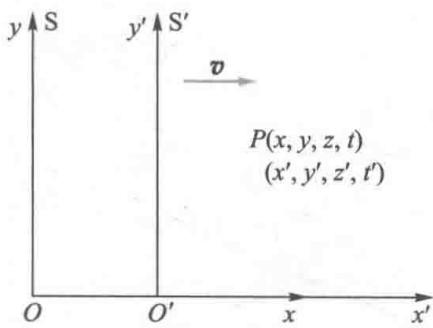  
图17-1 坐标变换

# 伽利略变换式

设两个惯性参考系  $\mathrm{S}(Oxyz)$  和  $\mathrm{S}'(O'x'y'z')$ ， $\mathrm{S}'(O'x'y'z')$  系相对  $\mathrm{S}(Oxyz)$  系以速度  $v$  沿  $Ox$  轴的正方向运动，如图17-1所示。开始时两惯性参考系重合，这时作为共同的计时起点。在随后的运动过程中，它们的对应坐标轴始终保持平行。设空间某点发生的某一客观事件  $P$ ，在  $\mathrm{S}(Oxyz)$  系中，该事件对应于一组时空坐标为  $(x,y,z,t)$ ，在  $\mathrm{S}'(O'x'y'z')$  系中，该事件对应于一组时空坐标为  $(x',y',z',t')$ 。所谓坐标

变换式就是指同一事件在两个惯性系中描述的时空坐标之间的定量关系.

伽利略变换式对同一事件在两个惯性系中描述的时空坐标之间的定量关系如下：

$$
\left\{ \begin{array}{l l} {x ^ {\prime} = x - v t} \\ {y ^ {\prime} = y} \\ {z ^ {\prime} = z} \\ {t ^ {\prime} = t} \end{array} \right. \text {或} \left\{ \begin{array}{l l} {x = x ^ {\prime} + v t ^ {\prime}} \\ {y = y ^ {\prime}} \\ {z = z ^ {\prime}} \\ {t = t ^ {\prime}} \end{array} \right. \tag {17-1}
$$

若在空间有一个运动质点，它在  $\mathrm{S}(Oxyz)$  和  $\mathrm{S}'(O'x'y'z')$  系中的运动方程分别为  $r(t) = x(t)i + y(t)j + z(t)k$  和  $r'(t') = x'(t')i + y'(t')j + z'(t')k$ ，运动方程的坐标分量之间关系满足伽利略坐标变换式。由于该运动质点在  $\mathrm{S}(Oxyz)$  和  $\mathrm{S}'(O'x'y'z')$  系中的速度分别为  $u = \frac{\mathrm{d}r}{\mathrm{d}t} = \frac{\mathrm{d}x}{\mathrm{d}t} i + \frac{\mathrm{d}y}{\mathrm{d}t} j + \frac{\mathrm{d}z}{\mathrm{d}t} k$  和  $u' = \frac{\mathrm{d}r'}{\mathrm{d}t'} = \frac{\mathrm{d}x'}{\mathrm{d}t'} i + \frac{\mathrm{d}y'}{\mathrm{d}t'} j + \frac{\mathrm{d}z'}{\mathrm{d}t'} k$ ，由此可得该运动质点速度分量之间的变换关系为

$$
\left\{ \begin{array}{l l} u _ {x} ^ {\prime} = u _ {x} - v \\ u _ {y} ^ {\prime} = u _ {y} \quad \text {或} \\ u _ {z} ^ {\prime} = u _ {z} \end{array} \right. \quad \left\{ \begin{array}{l l} u _ {x} = u _ {x} ^ {\prime} + v \\ u _ {y} = u _ {y} ^ {\prime} \\ u _ {z} = u _ {z} ^ {\prime} \end{array} \right. \tag {17-2}
$$

若采用矢量的形式，则表示为

$$
\pmb {u} ^ {\prime} = \pmb {u} - \pmb {v} \text {或} \quad \pmb {u} = \pmb {u} ^ {\prime} + \pmb {v} \tag {17-3}
$$

同样我们也可以得到该运动质点在  $S(Oxyz)$  和  $S'(O'x'y'z')$  系中的加速度之间的变换关系

$$
\left\{ \begin{array}{l l} a _ {x} ^ {\prime} = a _ {x} \\ a _ {y} ^ {\prime} = a _ {y} \text {或} \quad a ^ {\prime} = a \\ a _ {z} ^ {\prime} = a _ {z} \end{array} \right. \tag {17-4}
$$

坐标变换式不仅是描述运动质点在两个惯性系间的坐标、速度、加速度之间定量的变换关系的，而且还是对具体时空观的定量描写。

文档：伽利略

# 二、伽利略变换反映经典时空观

经典力学认为空间只是物质运动的“场所”，它与其中的物质完全无关而独立地存在着。另外，空间的量度（如两点间的距离）应当与惯性系无关，是绝对不变的。经典力学还认为，时间也是与物质的运动无关而在永恒地、均匀地流逝着的，时间的量度应当与惯性系无关，是绝对的，对于不同的惯性系可以用同一的时间来讨论问题。这就是经典力学的时空观，也叫做牛顿绝对时空观。

从（17-1）式的伽利略变换中可以清楚地显示，时间与参考系的运动状态无关的，时间是绝对的。在所有惯性系中任意两事件之间的时间间隔必定都是相同的。若两事件之间的时间间隔为零，则称这两事件是同时发生的，显然同时性是绝对的。另外，从（17-1）式的伽利略变换中还可以看到，在任意确定时刻空间两点的长度对于所有惯性系是不变的。或者空间长度与参考系的运动状态无关，空间长度是绝对的。总之在伽利略变换下，时间和空间均与参考系的运动状态无关，时间和空间之间也不相联系的，时空是绝对的。这正是经典的时空观念，而这些观念是集中体现在定量的伽利略变换之中的。

# 三、力学的相对性原理

力学的相对性原理，又称为伽利略相对性原理。实验事实告诉我们，在一个惯性系的内部所作的任何力学的实验都不能够确定这一惯性系本身是在静止状态，还是在作匀速直线运动。也就是说，一切彼此作匀速直线运动的惯性系，对于描写机械运动的力学规律来说是完全等价的。从定量上看，这要求经典力学的基本方程式在所有惯性系中都具有相同的数学形式。由于伽利略变换将所有的惯性系联

系了起来，如果力学规律通过伽利略变换其数学形式不变，就说明力学规律在所有惯性系中具有相同的形式，从而说明该力学规律是遵循相对性原理的。设在惯性参考系S(Oxyz)中某物体(可以看成质点)的质量为  $m$  ，受到合力为  $F$  在合力  $F$  的作用下其加速度为  $\pmb{a}$  ；在惯性参考系  $\mathrm{S}'(O'x'y'z')$  中该物体的质量为  $m'$ ，受到合力为  $F'$ ，在合力  $F'$  的作用下其加速度为  $\pmb{a'}$  。相对性原理的要求，若在惯性参考系S(Oxyz)中牛顿第二定律的数学表述为  $F = ma$  ，则在惯性参考系  $\mathrm{S}'(O'x'y'z')$  中牛顿第二定律的数学表述应为 $F' = m'a'$ ，反之亦然。经典物理认为力是物体间的相互作用，它与坐标变换无关，即  $F' = F$  ；经典物理又认为，质量是物体具有的固有属性，它与坐标变换无关，即  $m' = m$  。另外，我们已经得到了伽利略坐标变换下  $\pmb{a'}$  与  $\pmb{a}$  之间的关系  $a' = a$  。由此牛顿第二定律的数学表述在伽利略变换下的形式不变，也就是说在伽利略坐标变换下，力学的相对性原理是成立的。

# 四、经典物理的困难

19世纪后期，经典力学已发展到非常完美的程度。而且，随着人们对电磁规律的更加深入的探索，终于导致了麦克斯韦方程组的建立。麦克斯韦方程组不仅完整地反映了电磁运动的普遍规律，而且还预言了电磁波的存在，揭示了光的电磁本质，从而奠定了经典物理学更加辉煌的成就。但与此同时，人们在认识电磁波的物理图像时却碰到了一定的困难，按照麦克斯韦理论，真空中电磁波的速度，也就是光的速度是一个常量，然而若按照牛顿力学的速度叠加原理，不同惯性系的光速不会相同，这就出现了一个问题——麦克斯韦理论是否只适用于一个特殊的参考系？当时物理学界机械论占统治地位，认为物理学可以用单一的经典力

  
文档：迈-莫实验

学图像加以描述，其突出表现就是“以太假说”。这个假说认为，以太是传递包括光波在内的所有电磁波的弹性介质，它充满整个宇宙。电磁波是以太介质的机械运动状态，带电粒子的振动会引起以太的形变，而这种形变以弹性波形式的传播就是电磁波。当时人们普遍认为，麦克斯韦方程组只在相对于以太静止的参考系中成立，在这个参考系中电磁波沿各个方向的传播速度都等于常量  $c$ ，而在相对于以太运动的惯性系中则要满足经典力学的速度叠加原理。著名的迈克耳孙-莫雷实验就是为了探测地球相对于以太的运动而设计的，1887年迈克耳孙和莫雷改进了实验装置，预期的条纹移动数目为0.4，是最小可观测量的40倍，但在实验中却一点也未观察到条纹的移动，这就是所谓的迈克耳孙-莫雷实验的“零结果”，它无法用经典理论予以解释。

# 17-2 狭义相对论的两条基本假设 洛伦兹变换

# 狭义相对论的两条基本假设

  
文档：爱因斯坦

在经典物理学中，经典力学满足伽利略相对性原理，所有惯性系都是等价的；而电磁学不满足伽利略相对性原理。爱因斯坦认为，相对性原理应该具有普遍意义，不仅经典力学规律，而且电磁学规律和其他物理学规律，在所有惯性系中都应该保持不变的数学形式。在伽利略变换下，电磁学规律不可能保持不变的数学形式，就必须寻找或建立新的变换关系以替代伽利略变换。在这种新的变换关系下麦克斯韦方程组应该保持不变的数学形式，也就是说在所有惯性系中，电磁波在真空中都以光速  $c$  传播。如果光速确实是与

惯性系无关的一个不变量，则迈克耳孙-莫雷实验的“零结果”就是一个自然而然的结论。爱因斯坦将上述的创新思想概括为狭义相对论的两条基本原理：

（1）相对性原理：基本物理定律在所有惯性系中都保持相同形式的数学表达式，因此一切惯性系都是等价的；  
（2）光速不变原理：在一切惯性系中，光在真空中的传播速率都等于  $c$  ，与光源的运动状态无关

这两条原理是整个狭义相对论的基础，狭义相对论的具体结论可以在这两条原理的基础上演绎出来。因此要理解和接受狭义相对论的所有内容，关键是在于接受狭义相对论的这两条原理。作为基本原理，最初可能只是一种假设，然而若它及由它得出的所有推论都毫无例外地被实验所证实的话，那么最初的假设就成为了自然界的基本事实。

# 二、洛伦兹变换

设两个惯性参考系  $S(Oxyz)$  和  $S'(O'x'y'z')$ ,  $S'(O'x'y'z')$  系相对  $S(Oxyz)$  系以速度  $v$  沿  $Ox$  轴的正方向运动. 开始时两惯性参考系重合, 这时作为共同的计时起点. 在随后的运动过程中, 它们的对应坐标轴始终保持平行. 设某一客观事件, 在坐标系  $S(Oxyz)$  中的时空坐标为  $(x,y,z,t)$ , 在坐标系  $S'(O'x'y'z')$  中的时空坐标为  $(x',y',z',t')$ , 如图 17-1 所示. 下面我们就在这两个惯性系之间推导能满足狭义相对论的两条基本原理的新变换关系.

首先我们要考虑到如下事实，当运动速度远小于真空光速时，新变换应该过渡到伽利略变换，因为在低速情况下伽利略变换被实践检验是正确的。其次，新变换应该是线性的，因为只有这样才能保证当物体在一个参考系中作匀速直线运动时，在另一个参考系中也观察到它作匀速直

文档：洛伦兹

线运动. 再考虑到我们对两参考系及计时起点的具体设定, 可以将同一事件在两惯性系中坐标变换的普遍形式应该写为

$$
\left\{ \begin{array}{l} x ^ {\prime} = k (x - v t) \\ y ^ {\prime} = y \\ z ^ {\prime} = z \\ t ^ {\prime} = A t + B x \end{array} \right. \tag {17-5}
$$

为了得到满足光速不变原理的新坐标变换关系，我们在共同的计时起点  $(t = t' = 0)$  即两坐标系重合时，在坐标原点沿任一方向发出一光信号，经过时间  $t$  光信号传到空间  $P$  点.

此时  $r^{\prime} = ct^{\prime}$  及  $r = ct$  亦即

$$
x ^ {\prime 2} + y ^ {\prime 2} + z ^ {\prime 2} = \left(c t ^ {\prime}\right) ^ {2} \text {及} x ^ {2} + y ^ {2} + z ^ {2} = \left(c t\right) ^ {2}
$$

由此可得

$$
x ^ {\prime 2} + y ^ {\prime 2} + z ^ {\prime 2} - c ^ {2} t ^ {\prime 2} = x ^ {2} + y ^ {2} + z ^ {2} - c ^ {2} t ^ {2} \tag {17-6}
$$

以上等式是在光速不变原理的要求下对所有惯性系普遍成立的等式. 将坐标变换的普遍形式, 即 (17-5) 式代入得

$$
k ^ {2} (x - v t) ^ {2} - [ c (A t + B x) ] ^ {2} = x ^ {2} - c ^ {2} t ^ {2}
$$

即  $(k^2 - c^2 B^2)x^2 + (k^2 v^2 - c^2 A^2)t^2 - 2(k^2 v + c^2 AB)xt = x^2 - c^2 t^2$ ，得方程组

$$
\left\{ \begin{array}{l} k ^ {2} - c ^ {2} B ^ {2} = 1 \\ k ^ {2} v ^ {2} - c ^ {2} A ^ {2} = - c ^ {2} \\ k ^ {2} v + c ^ {2} A B = 0 \end{array} \right. \tag {17-7}
$$

解得

$$
\left\{ \begin{array}{l} k = A = \frac {1}{\sqrt {1 - \frac {v ^ {2}}{c ^ {2}}}} \\ B = - \frac {v / c ^ {2}}{\sqrt {1 - \frac {v ^ {2}}{c ^ {2}}}} \end{array} \right. \tag {17-8}
$$

将上式代入（17-5）式即得到新坐标变换式为

$$
\left\{ \begin{array}{l} x ^ {\prime} = \frac {x - v t}{\sqrt {1 - v ^ {2} / c ^ {2}}} \\ y ^ {\prime} = y \\ z ^ {\prime} = z \\ t ^ {\prime} = \frac {t - v x / c ^ {2}}{\sqrt {1 - v ^ {2} / c ^ {2}}} \end{array} \right. \tag {17-9}
$$

这种新的变换称为洛伦兹（H.A.Lorentz，1853—1928）变换，在洛伦兹坐标变换式中，时间与空间与参考系的运动状态是密切相关的。显然，在  $v \ll c$  的情况下，洛伦兹变换就过渡到伽利略变换。

将（17-9）式中带撇的量与不带撇的量互换，并将  $v$  换成  $-v$  ，就得到洛伦兹变换的逆变换

$$
\left\{ \begin{array}{l} x = \frac {x ^ {\prime} + v t ^ {\prime}}{\sqrt {1 - v ^ {2} / c ^ {2}}} \\ y = y ^ {\prime} \\ z = z ^ {\prime} \\ t = \frac {t ^ {\prime} + v x ^ {\prime} / c ^ {2}}{\sqrt {1 - v ^ {2} / c ^ {2}}} \end{array} \right. \tag {17-10}
$$

由于  $x$  和  $t$  都是实数，从洛伦兹变换中可以看到速率  $\mathcal{V}$  必须满足

$$
v <   c \tag {17-11}
$$

于是得到物体的运动速度都不能超过真空中的光速  $c$  ，或者说真空中的光速  $c$  是物体运动的极限速度

我们通常令  $\beta = \frac{v}{c},\gamma = \frac{1}{\sqrt{1 - \beta^2}}$  从而可以使洛伦兹变换的形式写得较为简洁.

例17-1

若在参考系S中测得一次爆炸发生的坐标为

$$
(x, y, z, t) = (6 \mathrm {m}, 0, 0, 2 \times 1 0 ^ {- 8} \mathrm {s})
$$

设参考系  $\mathbf{S}^{\prime}$  沿着  $x$  的正方向以相对速度  $0.8c$  运动（在  $t = t' = 0$  时两参考系的原点重合），试求参考系  $\mathbf{S}^{\prime}$  中观测者测得该事件的坐标

解 用洛伦兹变化式. 相对速度为  $0.8c$  时，

$$
\beta = \frac {v}{c} = 0. 8
$$

$$
\gamma = \frac {1}{\sqrt {1 - \beta^ {2}}} = \frac {1}{\sqrt {1 - 0 . 8 ^ {2}}} = \frac {5}{3}
$$

因此

$$
x ^ {\prime} = \gamma (x - v t) = \frac {5}{3} \times (6 - 4. 8) \mathrm {m} = 2 \mathrm {m}
$$

$$
\begin{array}{l} t ^ {\prime} = \gamma \left(t - \frac {v x}{c ^ {2}}\right) = \frac {5}{3} \times \left(2 \times 1 0 ^ {- 8} - 0. 8 \times \frac {6}{3 \times 1 0 ^ {8}}\right) s \\ = 0. 6 7 \times 1 0 ^ {- 8} \mathrm {s} \\ \end{array}
$$

另外  $y^\prime = y = 0$  和  $z^{\prime} = z = 0$

所以求得  $S^{\prime}$  系中该事件的坐标为

$$
(2 \mathrm {m}, 0, 0, 0. 6 7 \times 1 0 ^ {- 8} \mathrm {s})
$$

# 三、相对论的速度变换式

在两个惯性参考系  $S(Oxyz)$  和  $S'(O'x'y'z')$  中，对同一个运动质点观测到两个速度，相对论的速度变换式就是指这两个速度之间的定量关系。为简单起见，我们只讨论质点沿  $x$  方向作一维直线运动的情况。设质点在这惯性系  $S(Oxyz)$  和  $S'(O'x'y'z')$  中的速度分别为  $u = \frac{\mathrm{d}x}{\mathrm{d}t}$  和  $u' = \frac{\mathrm{d}x'}{\mathrm{d}t'}$  根据洛伦兹变换，由（17-9）式有

$$
\mathrm {d} x ^ {\prime} = \frac {\mathrm {d} x - v \mathrm {d} t}{\sqrt {1 - v ^ {2} / c ^ {2}}} \tag {17-12a}
$$

$$
\mathrm {d} t ^ {\prime} = \frac {\mathrm {d} t - v \mathrm {d} x / c ^ {2}}{\sqrt {1 - v ^ {2} / c ^ {2}}} \tag {17-12b}
$$

将上式中的第一式除以第二式并考虑到  $u = \frac{\mathrm{d}x}{\mathrm{d}t}$  ，可以得

到速度变换公式为

$$
u ^ {\prime} = \frac {u - v}{1 - \frac {u v}{c ^ {2}}} \tag {17-13}
$$

将（17-13）式中将带撇的量与不带撇的量互换，并将  $v$  换成  $-v$  ，就可以得到速度变换公式的逆变换

$$
u = \frac {u ^ {\prime} + v}{1 + \frac {u ^ {\prime} v}{c ^ {2}}} \tag {17-14}
$$

显然，在  $v \ll c$  的情况下， $u = \frac{u' + v}{1 + \frac{u'v}{c^2}} \approx u' + v$ ，即在低速近

似下，相对论的速度变换公式会过渡到经典情况.在  $v\approx c$  的情况下，  $u\approx \frac{u^{\prime} + c}{1 + \frac{u^{\prime}c}{c^{2}}} = c;$  或在  $u^{\prime}\approx c$  的情况下，  $u\approx \frac{c + v}{1 + \frac{cv}{c^2}}\rightarrow c,$

即无论是以坐标系在作接近光速的高速运动还是物体在作接近光速在高速运动，都无法叠加出超光速的情况。这一点是和经典情况截然不同。

例17-2

在地面上测到有两个飞船a、b分别以  $+0.9c$  和  $-0.9c$  的速度沿相反的方向飞行，如图17-2所示.求飞船a相对于飞船b的速度

解设  $\mathrm{S}(Oxy)$  系被固定在飞船b上，则飞船b在其中为静止，而地面对此参考系以 $v = 0.9c$  的速度运动.以地面为参考系 $\mathrm{S}'(O'x'y')$  ，则飞船a相对于  $\mathrm{S}'(O'x'y')$  系的速度为  $u_{x}^{\prime} = 0.9c$  ，求得飞船a对S（Oxy）系的速度，亦即相对于飞船b的速度

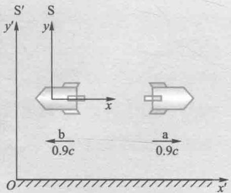  
图17-2 速度变换

$$
u _ {x} = \frac {u _ {x} ^ {\prime} + v}{1 + \frac {v u _ {x} ^ {\prime}}{c ^ {2}}} = \frac {0 . 9 c + 0 . 9 c}{1 + 0 . 9 \times 0 . 9} = \frac {1 . 8 0 c}{1 . 8 1} = 0. 9 9 4 c
$$

如用伽利略速度变换进行计算，结果为：  $u_{x} = u_{x}^{\prime} = 0.9c + 0.9c = 1.8c > c$ ，两者大相

径庭. 狭义相对论给出  $u_{x} < c$  ，按相对论速度变换， $u_{x}$  不可能大于  $c$

# 17-3 狭义相对论的时空观

伽利略坐标变换是经典时空观念的集中体现，在那里时间与空间与参考系的运动状态无关，时空是绝对的。然而在洛伦兹坐标变换式中，时间与空间与参考系的运动状态是密切相关的，所以狭义相对论的时空观必定与经典力学的时空观念有很大的不同。

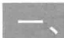

# 同时的相对性

在经典力学的时空观中，两个客观事件是否是同时发生的，是一个与惯性系无关的绝对的结论。即在  $S(Oxyz)$  系中观测到两个事件是同时发生的  $(\Delta t = 0)$ ，则在  $S'(O'x'y'z')$  系中也必定是同时发生的  $(\Delta t' = 0)$ 。对伽利略变换而言，这显然是确定无疑的结论；但对洛伦兹变换而言，这结论显然不成立。由洛伦兹变换中的时间变换式可得

$$
\Delta t ^ {\prime} = \left(\Delta t - v \Delta x / c ^ {2}\right) / \sqrt {1 - v ^ {2} / c ^ {2}}
$$

显然对两个不同的事件  $(\Delta x \neq 0)$ ，若在  $S(Oxyz)$  系中观测到两个事件是同时发生的  $(\Delta t = 0)$ ，则在  $S'(O'x'y'z')$  系中必定不可能是同时发生的

$$
\Delta t ^ {\prime} = \left(- v \Delta x / c ^ {2}\right) / \sqrt {1 - v ^ {2} / c ^ {2}} \neq 0
$$

由于运动是相对的，所以这种效应是互逆的，即在  $S'(O'x'y'z')$  系中两个不同地点同时发生的事件，在  $S(Oxyz)$  系中看来也不是同时发生的。在狭义相对论中同时性是与

观察者的运动状态有关的，通常我们将这一结论称为同时的相对性.

同时的相对性是光速不变原理的必然结论，设一个相对于坐标系  $S^{\prime}(O^{\prime}x^{\prime}y^{\prime}z^{\prime})$  静止的物体  $A'B'$ ， $A'B'$  与  $x^{\prime}$  轴平行放置， $M'$  是  $A'B'$  的中点。如图17-3所示，在  $M'$  处发出一个光脉冲信号，在两个端点  $A'$ 、 $B'$  处各安放一个光脉冲接收装置。对于坐标系  $S^{\prime}(O^{\prime}x^{\prime}y^{\prime}z^{\prime})$  中的观测者而言，由于光速不变及光从  $M'$  传播到两个端点  $A'$ 、 $B'$  的距离是相同的，所以断言两个端点  $A'$ 、 $B'$  的光脉冲接收装置必定是同时接收到光脉冲信号的。但对  $S(Oxyz)$  系中的观测者而言，由于在两个端点处的光脉冲接收装置是在运动的，光传播到两光脉冲接收装置的距离必定是不相同的，而根据光速不变原理，光在  $S(Oxyz)$  系中传播速度与光在  $S^{\prime}(O^{\prime}x^{\prime}y^{\prime}z^{\prime})$  系中传播速度又是完全相同的，所以在  $S(Oxyz)$  系中的观测者必定断言两个光脉冲接收装置接收到光脉冲信号的这两个事件不可能是同时的， $A'$  处的光脉冲接收装置必定先于  $B'$  处的光脉冲接收装置接收到光脉冲信号。因此在狭义相对论中，同时性是相对的，两个观测者对同样两个事件是否是同时的判断可以是完全不同的，但他们的判断都是正确的。

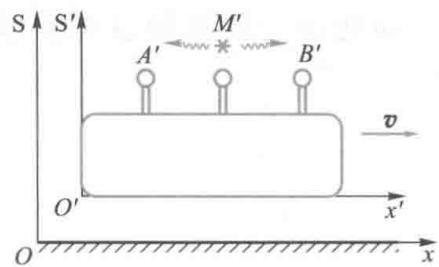  
图17-3 光速不变与同时的相对性

例17-3

一列长为  $0.5\mathrm{km}$  （按列车上的观察者测量）的高速火车，以  $100\mathrm{km / h}$  的速度向右行驶，设有两道闪电击中火车的前后两端。按火车上观察者测定，这两个闪电是同时击中火车的前后两端的。按地面上的观察者测定，这两个闪电是否是同时击中火车的前后两端的？这两个闪电之间的时间间隔是多少？

解设闪电击中火车的前后两端分别为B,A两事件，在地面和火车上看来这两事件发生的时刻分别为  $t_{\mathrm{A}},t_{\mathrm{A}}^{\prime},t_{\mathrm{B}},t_{\mathrm{B}}^{\prime}$  由洛伦

兹变换中的时间变换式可得

$$
\Delta t = \frac {\Delta t ^ {\prime} + \frac {v}{c ^ {2}} \left(x _ {\mathrm {B}} ^ {\prime} - x _ {\mathrm {A}} ^ {\prime}\right)}{\sqrt {1 - v ^ {2} / c ^ {2}}}
$$

代入已知量后得

$$
\Delta t = 1. 5 \times 1 0 ^ {- 1 3} \mathrm {s}
$$

即地面上的观测者测定这两道闪电不是

同时击中火车的前后两端的，前端比后端晚了  $1.5 \times 10^{-13}$  秒。

# 二、长度收缩

在  $\mathrm{S}(Oxyz)$  系中沿  $x$  轴静止放置一长杆，其两端的坐标分别为  $x_{1}$  和  $x_{2}$ ，在  $\mathrm{S}(Oxyz)$  系中测得它的长度称为静止长度  $l_{0}$ ，静止长度有时也称为固有长度， $l_{0} = x_{2} - x_{1}$ 。由于  $\mathrm{S}'(O'x'y'z')$  系相对于  $\mathrm{S}(Oxyz)$  系是运动的，所以在  $\mathrm{S}(Oxyz)$  系中静止的长杆在  $\mathrm{S}'(O'x'y'z')$  系中必定是运动的。而要正确测量运动杆的长度，必须同时测出杆两端的坐标  $x_{1}'$  和  $x_{2}'$ ，然后由公式  $l = x_{2}' - x_{1}'$  计算得到运动杆的长度。下面我们来建立同一杆的运动长度  $l$  与固有长度  $l_{0}$  之间的关系。

设  $S^{\prime}(O^{\prime}x^{\prime}y^{\prime}z^{\prime})$  系中有两个观测者同时测得了运动杆两端的坐标  $(x_1',t_1')$  和  $(x_2',t_2')$  ，其中  $t_1' = t_2'$  .对这两个测量事件，在S(Oxyz)系中记录的坐标  $(x_{1},t_{1})$  和  $(x_{2},t_{2})$  ，根据洛伦兹变换应有

$$
x _ {1} = \frac {x _ {1} ^ {\prime} + v t _ {1} ^ {\prime}}{\sqrt {1 - \frac {v ^ {2}}{c ^ {2}}}} \quad \text {和} \quad x _ {2} = \frac {x _ {2} ^ {\prime} + v t _ {2} ^ {\prime}}{\sqrt {1 - \frac {v ^ {2}}{c ^ {2}}}}
$$

所以

$$
l _ {0} = x _ {2} - x _ {1} = \frac {1}{\sqrt {1 - \frac {v ^ {2}}{c ^ {2}}}} \left[ \left(x _ {2} ^ {\prime} - x _ {1} ^ {\prime}\right) + v \left(t _ {2} ^ {\prime} - t _ {1} ^ {\prime}\right) \right]
$$

由于  $t_1' = t_2'$ ,  $l = x_2' - x_1'$ , 即得同一杆的运动长度  $l$  与固有长度  $l_0$  之间的关系为

$$
l = l _ {0} \sqrt {1 - v ^ {2} / c ^ {2}} \tag {17-15}
$$

上式表示，在  $S'(O'x'y'z')$  系中观测到运动着的杆的长度比它的固有长度缩短了，这就是狭义相对论的长度收缩效应。由于运动的相对性，长度收缩效应也是互逆的，静止放置在  $S'(O'x'y'z')$  系中的杆，在  $S(Oxyz)$  系中观测同样也会得到收缩的结论。

长度收缩效应是同时的相对性的必然结果. 因为要正确测定运动着的杆的长度, 必须同时测出杆两端的位置坐标, 但同时是相对性的, 在  $S^{\prime}(O^{\prime}x^{\prime}y^{\prime}z^{\prime})$  系中认为是同时的测量, 在  $S(Oxyz)$  系中来看则不是同时测量的. 在  $S(Oxyz)$  系中的人会说,  $S^{\prime}(O^{\prime}x^{\prime}y^{\prime}z^{\prime})$  系中的人没有同时测量运动杆的两端, 所以把杆的长度测短了. 同样反过来的结论也是一样, 所以在狭义相对论中长度只是一个相对性的概念. 对不同的观测者而言, 观测到同一物体的长度是不同的.

例17-4

一米尺沿  $x$  轴方向放置，有三个观测者A、B、C对尺长作了测量：（1）沿着  $y$  轴的正方向以速度  $v = 0.8c$  运动的观测者；（2）沿着  $x$  轴的负方向以速度  $v = 0.8c$  运动的观测者；（3）沿着与  $x$  轴成  $45^{\circ}$  角的方向以速度  $v = 0.8c$  运动的观测者。对这些观测者而言，他们各自测得的长度是多少？

解（1）因为观测者A的速度方向垂直于运动的米尺，所以该观测者测得的米尺长度与原长度相同，也就是  $L_{\mathrm{A}} = 1\mathrm{m}$

（2）观测者B沿着米尺方向运动，所以该观测者测得的收缩长度

$$
\begin{array}{l} L _ {\mathrm {B}} = L _ {0} \sqrt {1 - v ^ {2} / c ^ {2}} = (1 \mathrm {m}) \times \sqrt {1 - 0 . 8 ^ {2}} \\ = 0. 6 \mathrm {m} \\ \end{array}
$$

（3）观测者C有平行于米尺的速度分量  $v\cos 45^{\circ}$  ，所以该观测者测得的收缩长度

$$
\begin{array}{l} L _ {\mathrm {C}} = L _ {0} \sqrt {1 - \left(v \cos 4 5 ^ {\circ}\right) ^ {2} / c ^ {2}} = (1 \mathrm {m}) \times \\ \sqrt {1 - (0 . 8 \cos 4 5 ^ {\circ}) ^ {2}} = 0. 8 2 \mathrm {m} \\ \end{array}
$$

# 三、时间延缓

在经典力学的时空观中，由伽利略坐标变换可以得到在所有惯性系中这两个事件之间的时间间隔必定都是相同的。然而在狭义相对论的时空观中，由洛伦兹坐标变换式可以得到在不同的惯性系中这两个事件之间的时间间隔必定是不相同的。时间是相对的，是与参考系的运动状态是密切相关的一个物理量。一般我们定义在相对这个物体静止的参考系中测得的时间为固有时间  $\Delta t_0$ ；在相对这个物体运动的参考系中测得的时间为运动时间  $\Delta t$ ，由洛伦兹坐标变换式很容易得到运动时间  $\Delta t$  与固有时间  $\Delta t_0$  之间的关系。

设静止于  $\mathrm{S}(Oxyz)$  系中  $x_0$  处的物体先后发生了两个事件，事件发生的时间是  $t_1$  和  $t_2$  ，其时间间隔即固有时为  $\Delta t_0 = t_2 - t_1$  而在  $\mathrm{S}'(O'x'y'z')$  系中观测该物体先后发生了两个事件的时空坐标分别为  $(x_1', t_1')$  和  $(x_2', t_2')$  ，其时间间隔即运动时为  $\Delta t = t_2' - t_1'$  根据洛伦兹变换（17-9）式，可以得到

$$
t _ {1} ^ {\prime} = \frac {t _ {1} - \frac {v}{c ^ {2}} x _ {1}}{\sqrt {1 - \frac {v ^ {2}}{c ^ {2}}}}; \quad t _ {2} ^ {\prime} = \frac {t _ {2} - \frac {v}{c ^ {2}} x _ {2}}{\sqrt {1 - \frac {v ^ {2}}{c ^ {2}}}}
$$

考虑到在  $S(Oxyz)$  系中该物体始终是在同一地点  $x_0$  处的，即  $x_{2} = x_{1} = x_{0}$ . 所以在  $S^{\prime}(O^{\prime}x^{\prime}y^{\prime}z^{\prime})$  系中观测到的时间

$$
\Delta t = t _ {2} ^ {\prime} - t _ {1} ^ {\prime} = \frac {t _ {2} - t _ {1}}{\sqrt {1 - \frac {v ^ {2}}{c ^ {2}}}} = \frac {\Delta t _ {0}}{\sqrt {1 - \frac {v ^ {2}}{c ^ {2}}}}
$$

由此我们得到同一物体先后发生的两个事件的运动时间  $\Delta t$  与固有时间  $\Delta t_0$  之间的关系为

$$
\Delta t = \frac {\Delta t _ {0}}{\sqrt {1 - \frac {v ^ {2}}{c ^ {2}}}} \tag {17-16}
$$

上式表示，运动时间  $\Delta t$  总要比固有时间  $\Delta t_0$  长。或者说运动的时钟变慢了，即在  $S(Oxyz)$  系中观测相对其静止的时钟的时间间隔  $\Delta t_0$  必定小于在  $S'(O'x'y'z')$  系中观测相对其是运动的时钟的时间间隔  $\Delta t$ ，这就是狭义相对论的时间延缓效应。时间延缓效应是相对的，即在  $S'(O'x'y'z')$  系中观测相对其静止的时钟的时间间隔必定小于在  $S(Oxyz)$  系中观测相对其是运动的时钟的时间间隔。

时间延缓也是同时的相对性的必然结果. 因为要正确测定不在同一点的两个时钟的时间间隔, 必须先校正好这两个时钟的起点, 即两个时钟的起点必须具有同时性的. 但我们知道同时性是相对性的, 在  $S'(O'x'y'z')$  系中认为是完全校正好的各处的时钟, 在  $S(Oxyz)$  系中来看这些时钟都没有校正好, 即这些时钟都不是同时的, 所以他们把运动物体先后发生两个事件的时间测错了. 同样反过来的结论也是一样, 所以在狭义相对论中时间间隔只是一个相对性的概念. 尽管不同的观测者观测到同一个物体发生的两个事件的时间间隔是不同的, 但是不同的观测者对这两个事件发生的先后次序的判断都是相同的. 也就是说在狭义相对论中, 时间间隔是相对性的, 但因果性是绝对的.

# 例17-5

$\pi^{+}$ 介子是一不稳定粒子，平均寿命是  $2.6 \times 10^{-8} \mathrm{~s}$  （在它自己参考系中测量）。（1）如果此粒子相对于实验室以  $0.8c$  的速度运动，那么实验室坐标系中测量的  $\pi^{+}$ 介子寿命为多长？（2） $\pi^{+}$ 介子在衰变前运动了多长距离？

解在  $\pi^{+}$  介子自己参考系中平均寿命是“固有时”，即在同一地点粒子产生和衰变两事件的时间间隔，固有时间为  $\tau_0 = \Delta t_0 = 2.6\times 10^{-8}\mathrm{s}$ ；在实验室参考系中测量

的  $\pi^{+}$  介子寿命为“运动时”，是在不同地点发生两事件的时间间隔，设运动时间为  $\tau = \Delta t$

（1）根据相对论的时间延缓效应，在实验室中观测到  $\pi^{+}$  介子的寿命为

$$
\tau = \frac {\tau_ {0}}{\sqrt {1 - \frac {v ^ {2}}{c ^ {2}}}} = \frac {2 . 6 \times 1 0 ^ {- 8}}{\sqrt {1 - 0 . 8 ^ {2}}} \mathrm {s} = 4. 3 3 \times 1 0 ^ {- 8} \mathrm {s}
$$

（2）在实验室参考系中测量到  $\pi^{+}$  介子的飞行距离为

$$
\Delta x = v \tau = 1 0. 4 \mathrm {m}
$$

例17-6

远方的一颗星以  $0.8c$  的速度离开我们，接收到它辐射出来的闪光按5昼夜的周期变化，求固定在此星上的参考系测得的闪光周期

解 以“我们”所在的参考系为S系，该星所在的参考系为  $\mathbf{S}^{\prime}$  系.在  $\mathrm{S}'$  系测得闪光周期是同一地点，先后发生两事件的时间间隔，为“固有时  $\tau_0$  ”.在S系，这两事件发生在两个不同的地点，两处的钟给出的时间间隔为“运动时  $\tau$  ”.根据相对论的时间延缓效应

$$
\tau = \frac {\tau_ {0}}{\sqrt {1 - \beta^ {2}}}
$$

但这只是在S系中测到的星在两个不同的地点的钟给出的时间间隔，而并非是接收器接受到的“闪光周期”，因为必须经过一段传播时间后“闪光”才能到达

接收器，而在S系中，两次闪光发生处与接收器之间的距离是不同的，其距离差为

$$
x = v \tau = \frac {v \tau_ {0}}{\sqrt {1 - \beta^ {2}}}
$$

所以接收器接收到两个闪光的时间间隔是

$\Delta t = \tau + \frac{x}{c} = \frac{\tau_0}{\sqrt{1 - \beta^2}} (1 + \beta) = 5$  （昼夜）

解得

$\tau_0 = \frac{\sqrt{1 - \beta^2}}{1 + \beta}\Delta t = \frac{5}{3}$  （昼夜）

即在星上测得的闪光周期为  $\frac{5}{3}$  昼夜.

# 17-4 狭义相对论力学

狭义相对论采用了洛伦兹变换后，建立了新的时空观，同时也带来了新的问题，即在洛伦兹变换下经典力学不满足相对性原理了，而相对性原理是狭义相对论中的一条基本原理。爱因斯坦认为，不但是力学规律，而且是任何物理

规律都应该满足相对性原理. 由此应该对经典力学进行改造或修正, 以使它在洛伦兹变换下也满足相对性原理. 经这种改造的力学就是相对论力学.

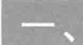

# 相对论质量和速率的关系

在真空管的两个电极之间施加电压，用以对其中的电子加速。按照经典力学的观念，速率增大到多么大，原则上是没有上限的。但实验事实发现，当电子速率越高时加速就越困难，亦即改变电子运动状态越来越难。并且，无论施加多大的电压都不能使电子运动的速率达到光速。这一事实说明物体的质量会随速率的增加而增大，在相对论中质量与速率满足如下的函数关系：

$$
m = \frac {m _ {0}}{\sqrt {1 - u ^ {2} / c ^ {2}}} \tag {17-17}
$$

上式中  $m$  是物体以速率  $u$  运动时的相对论性质量，简称质量； $m_0$  是相对物体静止时所测得的质量，简称为静质量。静质量是一个坐标变换下不变的常量。上述结论否定了人们在经典力学中认为的物体的质量永远是一个与其是否运动无关的常量的观念。理论上我们可以证明，如果质量与速率满足上述的函数关系，就可以使力学规律满足相对性原理。

从（17-17）式可以看出，当物体的运动速率无限接近光速时，其相对论性质量将无限增大，其惯性也将无限增大.这就从另一个角度说明了在相对论中光速是物体运动的极限速度.在物体运动速率远小于光速的情况下，相对论性质量将过渡到经典力学性质的质量，即这时  $m\approx m_0$

例17-7

某人测得一静止棒长为  $l$  ，质量为  $m$  ，于是求得此棒线密度为  $\rho = \frac{m}{l}$  若另一人测得此棒以速度  $v$  在棒长方向上运动，则此人测得棒的线密度应为多少？

解设相对棒运动的观察者测得该棒的质量为  $m^{\prime}$  ，长度为  $l^{\prime}$  ，则根据相对论的“质速关系”及“长度收缩”效应有

$$
m ^ {\prime} = \frac {m}{\sqrt {1 - \frac {v ^ {2}}{c ^ {2}}}}
$$

$$
l ^ {\prime} = l \sqrt {1 - \frac {v ^ {2}}{c ^ {2}}}
$$

则线密度为

$$
\rho^ {\prime} = \frac {m ^ {\prime}}{l ^ {\prime}} = \frac {m}{l \left(1 - \frac {v ^ {2}}{c ^ {2}}\right)} = \frac {\rho}{1 - \frac {v ^ {2}}{c ^ {2}}}
$$

# 二、相对论动量及相对论动力学方程

设一个静质量为  $m_0$  的质点在某惯性系中以速度  $\pmb{u}$  运动，定义该运动质点具有的相对论动量为

$$
\boldsymbol {p} = m \boldsymbol {u} = \frac {m _ {0} \boldsymbol {u}}{\sqrt {1 - u ^ {2} / c ^ {2}}} \tag {17-18}
$$

在经典力学中，由于质量是一个与运动无关的常量，我们用  $m_0$  来表示，这时牛顿第二定律可以表述为如下形式

$$
\boldsymbol {F} = m _ {0} \boldsymbol {a} = \frac {\mathrm {d} (m _ {0} \boldsymbol {u})}{\mathrm {d} t} = \frac {\mathrm {d} \boldsymbol {p}}{\mathrm {d} t}
$$

即质点动量的时间变化率等于作用于质点的合力. 可以证明, 将力学规律写成这种形式并将经典力学中的质量修正为相对论性质量时, 就能使力学规律在洛伦兹变换下保持数学形式不变, 即实现了在洛伦兹变换下经典力学要满足相对性原理的要求. 经这种改造的力学就是相对论力学, 其基本的动力学方程为

$$
\boldsymbol {F} = \frac {\mathrm {d} \boldsymbol {p}}{\mathrm {d} t} = \frac {\mathrm {d} (m \boldsymbol {u})}{\mathrm {d} t} \tag {17-19}
$$

显然，当质点的运动速率  $u \ll c$  时，上式将回到牛顿第二定律。可以说，牛顿第二定律是物体在低速运动情况下对相对论动力学方程的近似。另外从相对论力学的动力学方程可见，动量守恒定律在相对论情况下也是普遍成立的。

# 17-5 相对论能量

# 一、相对论动能

质点动能的增量等于合力做的功，为简便起见，设质点沿  $x$  轴作初速为零的直线运动，在上式中的力和速度都可以表示为标量，即  $F = \frac{\mathrm{d}p}{\mathrm{d}t} = \frac{\mathrm{d}(mu)}{\mathrm{d}t}$  于是有

$$
\mathrm {d} E _ {\mathrm {k}} = F \mathrm {d} s = u \mathrm {d} (m u) = u ^ {2} \mathrm {d} m + m u \mathrm {d} u \tag {17-20}
$$

对质速关系（17-17）式求微分，得

$$
\left(c ^ {2} - u ^ {2}\right) \mathrm {d} m = m u \mathrm {d} u
$$

将上式代入（17-20）式可得

$$
\mathrm {d} E _ {\mathrm {k}} = c ^ {2} \mathrm {d} m
$$

对上式两边取定积分  $\int_0^{E_k}\mathrm{d}E_{\mathrm{k}} = \int_{m_0}^m c^2\mathrm{d}m$  得

$$
E _ {\mathrm {k}} = m c ^ {2} - m _ {0} c ^ {2} \tag {17-21}
$$

这就是相对论中质点动能的表示式. 其中

$$
m = m _ {0} \left(1 - \frac {u ^ {2}}{c ^ {2}}\right) ^ {- \frac {1}{2}}
$$

显然当  $u \ll c$  时，取泰勒展开的前两项可得

$$
\begin{array}{l} E _ {\mathrm {k}} = m _ {0} c ^ {2} \left(1 - \frac {u ^ {2}}{c ^ {2}}\right) ^ {- \frac {1}{2}} - m _ {0} c ^ {2} \\ \approx m _ {0} c ^ {2} \left(1 + \frac {1}{2} \frac {u ^ {2}}{c ^ {2}}\right) - m _ {0} c ^ {2} \\ \end{array}
$$

$$
= \frac {1}{2} m _ {0} u ^ {2}
$$

这正是经典力学中动能的表达式

# 二、相对论质能关系

将（17-21）式改写为

$$
m c ^ {2} = E _ {\mathrm {k}} + m _ {0} c ^ {2} \tag {17-22}
$$

爱因斯坦认为上式中的  $m_0c^2$  是物体静止时的能量，称为物体的静能量；而  $mc^2$  是物体的总能量，它等于静能量与动能之和。物体的总能量若用  $E$  表示，可写为

$$
E = m c ^ {2} \tag {17-23}
$$

这就是著名的相对论质能关系. 在相对论建立以前, 人们是将质量守恒定律与能量守恒定律看作是两个互相独立的定律. 质能关系把它们统一起来了, 认为质量的变化必定伴随着能量的变化, 而能量的变化同样伴随着质量的变化, 质量守恒定律和能量守恒定律应统一为包括静能量在内的相对论性的能量守恒定律.

在粒子的碰撞、不稳定粒子的衰变以及粒子的湮灭或产生等各种高能物理过程中，都证明了相对论质能关系的正确性。例如，在重核裂变反应或在轻核聚变反应中，总伴随巨大能量的释放。实验表明，在这些反应前粒子系统的总质量一定大于反应后粒子系统的总质量，质量的减少量 $\Delta m_0$  称为质量亏损，反应中释放的能量  $\Delta E_{\mathrm{k}}$  满足下面的关系

$$
\Delta E _ {\mathrm {k}} = (\Delta m _ {0}) c ^ {2} \tag {17-24}
$$

在上述过程中，减少的静能量以动能等的形式释放出来了。这正是爱因斯坦的质能关系以及质量和能量守恒定律所要求的结论。

例17-8

一个氦核  ${}_{2}^{4}\mathrm{He}$  是由两个质子和两个中子组成的，质子和中子的质量分别为  $m_{\mathrm{p}} = 1.00728\mathrm{u}$  和  $m_{\mathrm{n}} = 1.00866\mathrm{u}$ ，其中  $u = 1.66\times 10^{-27}\mathrm{kg}$ 。实验测得它的质量为  $m_{\mathrm{A}} = 4.00150\mathrm{u}$ ，试计算形成一个氦核时放出的能量及计算氦原子核的结合能。

解一个氦核是由两个质子和两个中子组成的，组成之前的总质量为

$$
m = 2 m _ {\mathrm {p}} + 2 m _ {\mathrm {n}} = 4. 0 3 1 8 8 \mathrm {u}
$$

而从实验测得一个氦核质量  $m_{\mathrm{A}} = 4.00150\mathrm{u}$  小于其质子和中子的总质量  $m$  这差额即为原子核的质量亏损.对于  ${}_{2}^{4}\mathrm{He}$  核

$$
\Delta m = m - m _ {\Lambda} = 0. 0 3 0 3 8 \mathrm {u}
$$

$$
= 0. 0 3 0 3 8 \times 1. 6 6 0 \times 1 0 ^ {- 2 7} k g
$$

根据质能关系式得到的结论：当系统质量改变  $\Delta m$  时相应的能量改变为  $\Delta E = \Delta mc^2$  ，由此可得形成一个氦原子核时所放出的能量即氦原子核的结合能为

$$
\begin{array}{l} \Delta E = 0. 0 3 0 3 8 \times 1. 6 6 0 \times 1 0 ^ {- 2 7} \times (3 \times 1 0 ^ {8}) ^ {2} J \\ = 0. 4 5 3 9 \times 1 0 ^ {- 1 1} J \\ \end{array}
$$

例17-9

设有两个静质量都是  $m_0$  的粒子，以大小相同、方向相反的速度相撞（设两个粒子的运动速率为  $v$ ），相撞后合成一个复合粒子。试求这个复合粒子的速度及其静质量。

解设两个粒子相撞后合成一个复合粒子的速率为  $v_{\text{合}}$  ，质量为  $m_{\text{合}}$  ，由动量守恒和能量守恒定律得

$$
\begin{array}{l} m _ {0} \frac {v}{\sqrt {1 - \frac {v ^ {2}}{c ^ {2}}}} - m _ {0} \frac {v}{\sqrt {1 - \frac {v ^ {2}}{c ^ {2}}}} = m _ {\text {合}} v _ {\text {合}}; \\ m _ {\text {合}} c ^ {2} = \frac {2 m _ {0} c ^ {2}}{\sqrt {1 - \frac {v ^ {2}}{c ^ {2}}}} \\ \end{array}
$$

解得

$$
\begin{array}{l} v _ {\text {合}} = 0 \\ m _ {\text {合}} = \frac {2 m _ {0}}{\sqrt {1 - \frac {v ^ {2}}{c ^ {2}}}} \\ \end{array}
$$

由于  $v_{\text{合}} = 0$  ，所以  $m_{\text{合}} = \frac{m_{\text{合}0}}{\sqrt{1 - \frac{v_{\text{合}}^2}{c^2}}} = m_{\text{合}0}$  即

$$
m _ {\text {合} 0} = \frac {2 m _ {0}}{\sqrt {1 - \frac {v ^ {2}}{c ^ {2}}}}
$$

这表明复合粒子的静质量  $m_{\text{合}0}$  大于  $2m_0$  两者的差值为

$$
m _ {\text {合} 0} - 2 m _ {0} = \frac {2 m _ {0}}{\sqrt {1 - \frac {v ^ {2}}{c ^ {2}}}} - 2 m _ {0} = \frac {2 E _ {\mathrm {k}}}{c ^ {2}}
$$

式中  $E_{\mathrm{k}}$  为粒子碰撞前的动能.由此可见，与动能相应的这部分质量转化为静质量，从而使碰撞后复合粒子的静质量增大了.

# 三、相对论能量和动量关系

将相对论质能关系  $E = mc^2 = m_0c^2\left(1 - \frac{u^2}{c^2}\right)^{-\frac{1}{2}}$  两边取平方可得

$$
E ^ {2} - c ^ {2} \cdot (m u) ^ {2} = m _ {0} ^ {2} c ^ {4}
$$

将动量  $(p = mu)$  代入上式，经整理后得到

$$
E ^ {2} = p ^ {2} c ^ {2} + m _ {0} ^ {2} c ^ {4} \tag {17-25}
$$

这就是相对论能量-动量关系.

对于静质量为零的粒子，如光子，将质量  $(m_0 = 0)$  代入上式，得到能量-动量关系式：

$$
E = c p \tag {17-26}
$$

若再将动量  $(p = mu)$  和总能量  $(E = mc^2)$  代入上式，得到

$$
u = c \tag {17-27}
$$

即静质量为零的粒子总是以光速  $c$  运动

为了得到动能和动量的关系，由动能的定义式可得

$$
E _ {\mathrm {k}} ^ {2} + 2 E _ {\mathrm {k}} E _ {0} + E _ {0} ^ {2} = E ^ {2}
$$

将能量和动量关系代入上式可得

$$
E _ {\mathrm {k}} ^ {2} + 2 E _ {\mathrm {k}} m _ {0} c ^ {2} = c ^ {2} p ^ {2} \tag {17-28}
$$

这就是相对论下的动能和动量的关系式. 当  $u \ll c$  时, 上式可以近似为

$$
E _ {\mathrm {k}} = \frac {p ^ {2}}{2 m _ {0}}
$$

这正是经典力学中动能和动量关系的表达式

# 17-6 电磁场的相对性

# 一、不同参考系之间电磁场的变换

在电磁学中我们知道，相对于电荷静止的观察者会观察到电荷周围有电场，没有磁场；但相对于该电荷运动的观察者不仅观察到电荷周围有电场，还观察到磁场的存在。既然运动电荷可以激发磁场，由于运动的相对性，若在一个参考系中为静止的电荷，而在另一个参考系中观察，它可能是运动的，那么在第一个参考系中这个电荷只激发电场，而在第二个参考系中，这个电荷既激发电场，也激发磁场，所以电场和磁场之间必定存在着某种内在联系。这就有必要我们用相对论的原理去考察电磁学问题，去讨论得到在两个不同的惯性参考系电磁场之间的变换关系。

根据相对性原理，电磁规律在所有惯性系中都具有相同的形式.为简单起见，我们讨论不存在电荷和电流的自由空间区域，设在  $\mathrm{S}(Oxyz,t)$  参考系中任一点的场量为  $E(x,y,z,t)$  和  $B(x,y,z,t)$  ，满足麦克斯韦方程组

$$
\nabla \cdot \boldsymbol {E} = 0, \nabla \times \boldsymbol {E} = - \frac {\partial \boldsymbol {B}}{\partial t} \tag {17-29}
$$

$$
\nabla \cdot \boldsymbol {B} = 0, \nabla \times \boldsymbol {B} = \mu_ {0} \varepsilon_ {0} \frac {\partial \boldsymbol {E}}{\partial t}
$$

根据相对性原理，在相对于惯性系  $S(Oxyz, t)$  沿  $x$  轴正方向以恒定速度  $v$  运动的  $S'(O'x'y'z', t')$  参考系中，相应的场量为  $E'(x', y', z', t')$  和  $B'(x', y', z', t')$  遵循的电磁规律具有相同的形式，即其麦克斯韦方程组的形式为

$$
\nabla^ {\prime} \cdot \boldsymbol {E} ^ {\prime} = 0, \nabla^ {\prime} \times \boldsymbol {E} ^ {\prime} = - \frac {\partial \boldsymbol {B} ^ {\prime}}{\partial t ^ {\prime}} \tag {17-30}
$$

$$
\nabla^ {\prime} \cdot \boldsymbol {B} ^ {\prime} = 0, \nabla^ {\prime} \times \boldsymbol {B} ^ {\prime} = \mu_ {0} \varepsilon_ {0} \frac {\partial \boldsymbol {E} ^ {\prime}}{\partial t ^ {\prime}}
$$

将上述两套麦克斯韦方程组写成坐标形式并考虑到洛伦兹变换后，可以得到在两个不同的惯性系下电磁场之间满足的变换关系：

$$
E _ {x} ^ {\prime} = E _ {x}, B _ {x} ^ {\prime} = B _ {x}
$$

$$
E _ {y} ^ {\prime} = \gamma \left(E _ {y} - v B _ {z}\right), B _ {y} ^ {\prime} = \gamma \left(\frac {v}{c ^ {2}} E _ {z} + B _ {y}\right) \tag {17-31}
$$

$$
E _ {z} ^ {\prime} = \gamma \left(E _ {z} + v B _ {y}\right), B _ {z} ^ {\prime} = \gamma \left(- \frac {v}{c ^ {2}} E _ {y} + B _ {z}\right)
$$

其中  $\gamma = \frac{1}{\sqrt{1 - \frac{v^2}{c^2}}}$  将上列各式中的速度  $v$  反号，并将带撇的

量与不带撇的量交换，可以得到上述变换的逆变换关系式为

$$
E _ {x} = E _ {x} ^ {\prime}, B _ {x} = B _ {x} ^ {\prime}
$$

$$
E _ {y} = \gamma \left(E _ {y} ^ {\prime} + v B _ {z} ^ {\prime}\right), B _ {y} = \gamma \left(- \frac {v}{c ^ {2}} E _ {z} ^ {\prime} + B _ {y} ^ {\prime}\right) \tag {17-32}
$$

$$
E _ {z} = \gamma \left(E _ {z} ^ {\prime} - v B _ {y} ^ {\prime}\right), B _ {z} = \gamma \left(\frac {v}{c ^ {2}} E _ {y} ^ {\prime} + B _ {z} ^ {\prime}\right)
$$

# 二、电磁场的相对性

从以上的变换关系可以看到，电场和磁场是交织在一起进行变换的，它们既互相联系，又互相转化，在一个惯性系中的电场不仅与另一个惯性系中的电场有关，还与惯性系中的磁场有关，反之亦然。由此使我们认识到，电场和磁场都不是独立的实体，它们是统一的电磁场两个不同方面。这样，电场和磁场统一于电磁场这一个客观存在着的物质；而电场量和磁场量只是电磁场在某惯性系中的观测效应，电磁场量与惯性系的选取有关，这就是电磁场的相对性。下面我们讨论一个具体的例子来说明电场和磁场具有的统一性和相对性。

设有一点电荷  $q$  静止于惯性系  $\mathrm{S}'(O'x'y'z',t')$  的原点处，而  $\mathrm{S}'(O'x'y'z',t')$  系相对于惯性系  $\mathrm{S}(Oxyz,t)$  以速度  $v$  沿  $x$  轴方向运动，在  $\mathrm{S}'(O'x'y'z',t')$  系内观察，只有静电场，并可以测得  $t'$  时刻在  $(x',y',z')$  处的电磁场为

$$
\boldsymbol {E} ^ {\prime} = \frac {q}{4 \pi \varepsilon_ {0} r ^ {\prime 3}} \boldsymbol {r} ^ {\prime}, \quad \boldsymbol {B} ^ {\prime} = 0 \tag {17-33}
$$

在  $S(Oxyz, t)$  系内观察，点电荷  $q$  以速度  $v$  沿  $x$  轴方向运动，除电场外还观察到磁场。由场量的变换关系（17-32）式可得  $t$  时刻在  $(x, y, z)$  点处的电磁场为

$$
\begin{array}{l} E _ {x} = \frac {q x ^ {\prime}}{4 \pi \varepsilon_ {0} r ^ {\prime 3}}, \quad B _ {x} = 0 \\ E _ {y} = \gamma \frac {q y ^ {\prime}}{4 \pi \varepsilon_ {0} r ^ {\prime 3}}, \quad B _ {y} = - \gamma \frac {v}{c ^ {2}} \frac {q z ^ {\prime}}{4 \pi \varepsilon_ {0} r ^ {\prime 3}} \tag {17-34} \\ E _ {z} = \gamma \frac {q z ^ {\prime}}{4 \pi \varepsilon_ {0} r ^ {\prime 3}}, \quad B _ {z} = \gamma \frac {v}{c ^ {2}} \frac {q y ^ {\prime}}{4 \pi \varepsilon_ {0} r ^ {\prime 3}} \\ \end{array}
$$

由洛伦兹变换可得

$$
r ^ {\prime} = \left(x ^ {\prime 2} + y ^ {\prime 2} + z ^ {\prime 2}\right) ^ {\frac {1}{2}} = \left[ \gamma^ {2} (x - v t) ^ {2} + y ^ {2} + z ^ {2} \right] ^ {\frac {1}{2}}
$$

将上式代入后得到

$$
\begin{array}{l} E _ {x} = \frac {\gamma q (x - v t)}{4 \pi \varepsilon_ {0} \left[ \gamma^ {2} (x - v t) ^ {2} + y ^ {2} + z ^ {2} \right] ^ {3 / 2}}, \quad B _ {x} = 0 \\ E _ {y} = \frac {\gamma q y}{4 \pi \varepsilon_ {0} \left[ \gamma^ {2} (x - v t) ^ {2} + y ^ {2} + z ^ {2} \right] ^ {3 / 2}}, \quad B _ {y} = - \frac {v}{c ^ {2}} E _ {z} \\ E _ {z} = \frac {\gamma q z}{4 \pi \varepsilon_ {0} \left[ \gamma^ {2} (x - v t) ^ {2} + y ^ {2} + z ^ {2} \right] ^ {3 / 2}}, \quad B _ {z} = \frac {v}{c ^ {2}} E _ {y} \tag {17-35} \\ \end{array}
$$

设电荷  $q$  经过  $\mathrm{S}(Oxyz,t)$  系原点的时刻为  $t = 0$  ，并且我们讨论电荷的速度远远小于光速的情况，即取  $\gamma \approx 1$  的情况.这时，在S系内观测空间各点的场强为

$$
\begin{array}{l} E _ {x} = \frac {q x}{4 \pi \varepsilon_ {0} \left[ x ^ {2} + y ^ {2} + z ^ {2} \right] ^ {3 / 2}}, \quad B _ {x} = 0 \\ E _ {y} = \frac {q y}{4 \pi \varepsilon_ {0} \left[ x ^ {2} + y ^ {2} + z ^ {2} \right] ^ {3 / 2}}, \quad B _ {y} = - \frac {q v z}{4 \pi \varepsilon_ {0} c ^ {2} \left[ x ^ {2} + y ^ {2} + z ^ {2} \right] ^ {3 / 2}} \\ E _ {z} = \frac {q z}{4 \pi \varepsilon_ {0} \left[ x ^ {2} + y ^ {2} + z ^ {2} \right] ^ {3 / 2}}, \quad B _ {z} = \frac {q v y}{4 \pi \varepsilon_ {0} c ^ {2} \left[ x ^ {2} + y ^ {2} + z ^ {2} \right] ^ {3 / 2}} \tag {17-36} \\ \end{array}
$$

将上述的结论写成矢量形式并考虑到  $c^2 = \frac{1}{\varepsilon_0\mu_0}$  则上述结论为

$$
\boldsymbol {E} = \frac {q}{4 \pi \varepsilon_ {0}} \frac {\boldsymbol {r}}{r ^ {3}}, \quad \boldsymbol {B} = \frac {\mu_ {0}}{4 \pi} \frac {q \boldsymbol {v} \times \boldsymbol {r}}{r ^ {3}} \tag {17-37}
$$

即我们由相对论的场量变换关系得到了运动电荷会激发磁场的结论，而且其激发磁场的定量公式与我们在电磁学中的定量结论完全一样.

这一结论充分说明，电场和磁场不是各自独立的，它们既互相联系，又互相转化，在一个惯性系中只观测到电场，在另一个惯性系中则不仅仅观测到电场，还观测到了磁场，反之亦然.由此我们说电场和磁场都不是独立的实体，它们是统一的电磁场两个不同方面；电场量和磁场量只是电磁场在某惯性系中的观测效应，电磁场量与惯性系的选取有关，这就是电磁场具有的相对性

# 提要

（说明：提要中  $u$  表示  $\mathbf{S}^{\prime}$  系相对S系的运动速度，  $\pmb {v},\pmb{v}^{\prime}$  分别是质点相对于S系和  $\mathrm{S}'$  系的速度）

1. 牛顿绝对时空观 长度和时间的测量与参考系无关，而且时空相互独立。

伽利略坐标变化式：  $x^{\prime} = x - ut,y^{\prime} = y,z^{\prime} = z,t^{\prime} = t.$

伽利略速度变化式：  $v_{x}^{\prime} = v_{x} - u,v_{y}^{\prime} = v_{y},v_{z}^{\prime} = v_{z}$

# 2. 狭义相对论基本假设

爱因斯坦相对性原理：物理规律（的表示式）对所有惯性系都是一样的，不存在任何一个特殊的（例如“绝对静止”的）惯性系.

光速不变原理：在任何惯性系中，光在真空中的速率都相等.

# 3. 爱因斯坦相对论时空观

长度和时间的测量相互联系，与参考系有关

基本出发点：同时的相对性——由于光速不变，在一参考系中同时发生的两件事在相对于该参考系运动的另一参考系中不是同时发生的，在前一参考系运动的后方的那一事件先发生。

利用光速不变性可导出时间延缓效应：在一参考系中 $\mathbf{S}^{\prime}$  发生在同一地点的两件事时间间隔称为固有时间，以  $\Delta t^{\prime}$  表示，则在以速度  $u$  相对于前一参考系运动的另一参考系S中该两件事的时间间隔  $\Delta t$  延长了，其关系是

$$
\Delta t = \frac {\Delta t ^ {\prime}}{\sqrt {1 - \frac {u ^ {2}}{c ^ {2}}}}
$$

由此可知，总有  $\Delta t > \Delta t'$ ，固有时间最短

沿长度方向运动的棒的长度的测量要求同时记录棒的两端的位置坐标. 据此再由上述时间延缓公式可导出长度收缩公式

$$
l = l _ {0} \sqrt {1 - \frac {u ^ {2}}{c ^ {2}}}
$$

式  $l_{0}$  为棒在它静止的参考系中测出的长度，称为静止长度或固有长度.上式给出固有长度最长

4. 洛伦兹坐标变换式 由时间延缓和长度收缩可进

一步导出

$$
x ^ {\prime} = \frac {x - u t}{\sqrt {1 - \frac {u ^ {2}}{c ^ {2}}}}, y ^ {\prime} = y, z ^ {\prime} = z, t ^ {\prime} = \frac {t - \frac {u}{c ^ {2}} x}{\sqrt {1 - \frac {u ^ {2}}{c ^ {2}}}}
$$

此变换式说明时间和空间坐标都和参考系有关，而且时间和空间坐标相互联系在一起了.

5. 洛伦兹速度变换式

$$
v _ {x} ^ {\prime} = \frac {v _ {x} - u}{1 - \frac {u v _ {x}}{c ^ {2}}}
$$

6. 相对论质量速度关系式

$$
m = \frac {m _ {0}}{\sqrt {1 - \frac {v ^ {2}}{c ^ {2}}}}
$$

其中  $m_0$  为质点的静质量， $v$  是质点的速率

7. 相对论动量

$$
\boldsymbol {p} = m \boldsymbol {v} = \frac {m _ {0} \boldsymbol {v}}{\sqrt {1 - \frac {v ^ {2}}{c ^ {2}}}}
$$

8. 相对论能量

$$
E = m c ^ {2} = \frac {m _ {0} c ^ {2}}{\sqrt {1 - \frac {v ^ {2}}{c ^ {2}}}}
$$

相对论动能：

$$
E _ {\mathrm {k}} = E - E _ {0} = m c ^ {2} - m _ {0} c ^ {2}
$$

其中  $m_0c^2$  为质点的静止时的相对论能量，称为静能量

相对论动量和能量关系

$$
E ^ {2} = p ^ {2} c ^ {2} + m _ {0} ^ {2} c ^ {4}
$$

# 思考题

17-1 试说明经典力学的相对性原理与伽利略相对性原理之间的异同？  
17-2 洛伦兹坐标变换和伽利略相坐标变换的本质差别是什么？如何理解洛伦兹坐标变换的物理意义？  
17-3 有两个事件A和B，从S系中的观察者测得这两个事件发生于同一时刻不同地点.那么，从相对S系沿  $xx^{\prime}$  轴运动的  $\mathrm{S}^{\prime}$  系中的观察者来说，这两时间是否仍发生于同一时刻不同地点呢？为什么？  
17-4 在狭义相对论中，如何校准两个处在不同地点的时钟？

17-5 为什么时间间隔和长度的量度与参考系是有关的？  
17-6 两个观察者分别处于惯性系S和惯性系  $\mathbf{S}^{\prime}$  内，  $\mathbf{S}^{\prime}$  系相对S系沿  $xx^{\prime}$  轴运动.现在两惯性系内均沿  $xx^{\prime}$  轴放置一根相对静止完全相同的米尺，但这两个观察者从测量中都发现，在另一个惯性系中的米尺要短些，你怎样看待这个问题呢？  
17-7 狭义相对论对牛顿定律、经典的动量和能量形式作了哪些修正？试进一步说明狭义相对论和经典理论间的关系？  
17-8 在狭义相对论中是否可以有以光速运动的粒子？这种粒子的动量和能量的关系如何？

# 习题

17-1 在惯性系中一次爆炸发生在坐标  $(x,y,z,t) = (6\mathrm{m},0,0,0.2\times 10^{-8}\mathrm{s})$  .一惯性参考系沿着  $x$  的正方向以相对速度  $0.8c$  运动.假设在  $t = t^{\prime} = 0$  时两参考系的原点重合.试求出运动参考系中观测者测得该事件的坐标  
17-2 在K惯性系中观测到相距  $\Delta x = 9\times$ $10^{8}\mathrm{m}$  的两地点，相隔  $\Delta t = 5\mathrm{s}$  发生两事件，而在相对于K系沿  $x$  方向匀速运动的  $\mathbf{K}^{\prime}$  系中发现此两事件恰好发生在同一地点.试求在  $\mathbf{K}^{\prime}$  系中此两事件的时间间隔.

17-3 在K惯性系中的观测者记录到两事件的空间和时间间隔分别是  $x_{2} - x_{1} = 600\mathrm{m}$  和 $t_2 - t_1 = 8\times 10^{-7}\mathrm{s},$  ，为了使两事件对相对于K系沿正  $\mathcal{X}$  方向匀速运动的  $\mathbf{K}'$  系来说是同时发生的， $\mathbf{K}'$  系必需相对于K系以多大的速度运动？  
17-4 一原子核以  $0.5c$  的速度离开一观察者而运动. 原子核在它运动方向上向前发射一电子, 该电子相对于核有  $0.8c$  的速度; 此原子核又向后发射了一光子指向观察者. 对静止观察者来讲,

（1）电子具有多大的速度；  
（2）光子具有多大的速度

17-5 一米尺沿  $y$  轴方向放置.有三个观者对尺长作了测量：（1）沿着  $x$  轴的正方向以速度 $v = 0.8c$  运动的观测者；(2)沿着  $y$  轴的负方向以速度  $v = 0.8c$  运动的观测者；(3)沿着与  $x$  轴成  $45^{\circ}$  角的方向以速度  $v = 0.8c$  运动的观测者.对这些观测者而言，他们各自测得的长度是多少？  
17-6 K系与  $\mathbf{K}^{\prime}$  系是坐标轴相互平行的两个惯性系，  $\mathrm{K}'$  系相对于K系沿  $Ox$  轴正方向匀速运动.一根刚性尺静止在  $\mathbf{K}'$  系中，与  $O^{\prime}x^{\prime}$  轴成 $30^{\circ}$  角.今在K系中观测得该尺与  $Ox$  轴成  $45^{\circ}$  角，则  $\mathbf{K}^{\prime}$  系相对于K系的速度为多大？  
17-7 火箭相对于地面以  $v = 0.6c$  的匀速度向上飞离地球. 在火箭发射  $\Delta t' = 10\mathrm{s}$  后（火箭上的钟），该火箭向地面发射一导弹，其速度相对于地面为  $v = 0.3c$  ，问火箭发射后多长时间（地球上的钟），导弹到达地球？（设地面不动.）  
17-8  $\pi^{+}$  介子是不稳定的粒子，在它自己的参考系中测得平均寿命是  $2.6\times 10^{-8}\mathrm{s}$ ，如果它相对实验室以  $0.8c$  （ $c$  为真空中光速）的速度运动，则实验室坐标系中测得的  $\pi^{+}$  介子的寿命为多大？  
17-9 在某地发生两件事，静止于该地的甲测得时间间隔为  $4\mathrm{s}$ ，若相对于甲作匀速直线运动的乙测得时间间隔为  $5\mathrm{s}$ ，则乙相对于甲的运动速度为多大？（ $c$  表示真空中的光速.）  
17-10 一体积为  $V_{0}$  ，质量为  $m_0$  的立方体沿其一棱的方向相对于观察者A以速度  $\mathcal{V}$  运动.求观察者A测得该立方体的密度？

17-11 如一观察者测出电子质量为  $2m_{0}$  问电子速度为多少？（ $m_{0}$  为电子的静质量.）  
17-12 电子以  $v = 0.99\mathrm{c}$  （  $c$  为真空中的光速）的速率运动.试求电子的动能是多少？电子的经典力学的动能与相对论动能之比是多少？  
17-13 一个电子从静止开始加速到  $0.1c$  的速度，需要对它做多少功？速度从  $0.9c$  加速到  $0.99c$  又要做多少功？  
17-14 一个质子的静质量为  $m_{\mathrm{p}} = 1.67265 \times 10^{-27} \mathrm{~kg}$ ，一个中子的静质量为  $m_{\mathrm{n}} = 1.67495 \times 10^{-27} \mathrm{~kg}$ ，一个质子和一个中子结合成的氘核的静质量为  $m_{\mathrm{D}} = 3.34365 \times 10^{-27} \mathrm{~kg}$ 。求结合过程中放出的能量是多少 MeV？这能量称为氘核的结合能，它是氘核静能量的百分之几？  
17-15 如图所示，一个静质量为  $m_0$  、动能为  $5m_{0}c^{2}$  的粒子与另一个静质量也为  $m_0$  的静止粒子发生完全非弹性碰撞.碰撞后复合粒子的静质量为  $m_{\text{合} 0}$  ，并以速度  $v_{\text{合}}$  运动.求：

（1）碰撞前系统的总动量是多少？  
（2）碰撞前系统的总能量是多少？  
（3）复合粒子的速度  $v_{\text{合}}$  是多少？  
（4）给出静质量为  $m_{\text{合}0}$  与  $m_0$  之间的关系

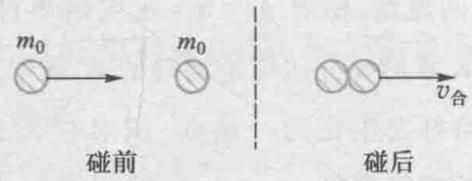  
习题17-15图

# 第十八章 波和粒子

# 18-1 黑体辐射 普朗克量子假设

# 一、黑体辐射的现象及其实验结论

组成物体的分子中都包含着带电粒子，当分子作热运动时物体将会向外辐射电磁波，由于这种电磁辐射与物体的温度有关，故称为热辐射（thermal radiation）。因为当存在入射电磁波时，物体还会反射出一部分入射的电磁波，为了定量研究物体热辐射的基本规律，我们假设存在一种不会反射入射电磁波的物体，这种理想物体被称为绝对黑体，简称黑体（black body）。自然界中绝对黑体是不存在的，但我们可以用一种不透明的材料做成一个只开有一个小孔的空心容器，它就可以看成是绝对黑体的一种很好的模型。因为当入射的电磁波通过小孔射入空腔后，要经过很多次反射才可能射出小孔。而每次反射，内壁材料会吸收很大比例的入射电磁波的能量。因此经过很多次反射后，几乎就不会有一点入射的电磁波从小孔的表面射出了。有了理想的绝对黑体模型后，我们可以通过实验来研究黑体电磁辐射的辐射能与黑体的热平衡温度  $T$  及辐射波长  $\lambda$  的定量关系。

首先我们定义在单位时间内，从物体表面单位面积上发

18-1 黑体辐射 普朗克量子假设  
18-2 光电效应  
18-3 康普顿效应  
18-4 德布罗意波 实物粒

子的波粒二象性

18-5 不确定关系

  
文档：普朗克

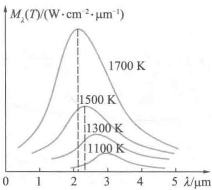  
图18-1 单色辐出度按波长分布的曲线

  
文档：斯特藩

  
文档：维恩

出的波长在  $\lambda$  附近单位波长范围内的电磁辐射能量为该物体的单色辐射出射度，简称为单色辐出度，记为  $M_{\lambda}(T)$  ，即

$$
M _ {\lambda} (T) = \frac {\mathrm {d} M (T)}{\mathrm {d} \lambda} \tag {18-1}
$$

其中  $\mathrm{d}M(T)$  是单位时间内从物体表面单位面积上发射出的波长在  $\lambda$  到  $\lambda +\mathrm{d}\lambda$  范围内的电磁辐射能量

在不同温度下，绝对黑体的单色辐出度  $M_{\lambda}(T)$  按波长分布的实验曲线表示于图18-1中.

定义在单位时间内从物体表面单位面积上发射出的各种波长的电磁波能量的总和为辐射出射度（简称辐出度），记为  $M(T)$ 。由上面的定义，可以得到单色辐出度  $M_{\lambda}(T)$  与辐出度  $M(T)$  之间的关系为

$$
M (T) = \int_ {0} ^ {\infty} M _ {\lambda} (T) \mathrm {d} \lambda \tag {18-2}
$$

根据（18-2）式，在一定温度下，黑体的辐射出射度应等于在该温度下黑体的单色辐出度  $M_{\lambda}(T)$  按波长分布曲线下的面积. 斯特藩（J.Stefan，1835—1893）和玻耳兹曼（L.E.Boltzmann，1844—1906）根据实验结果得到了如下结论：黑体的辐射出射度与黑体温度的四次方成正比

$$
M (T) = \sigma T ^ {4} \tag {18-3}
$$

其中  $\sigma = 5.670\times 10^{-8}\mathrm{W}\cdot \mathrm{m}^{-2}\cdot \mathrm{K}^{-4}$  称为斯特藩常量.此结论称为斯特藩-玻耳兹曼定律，它是关于黑体辐射的两个基本定律之一．关于黑体辐射的另一个基本定律是维恩（W.Wien，1864—1928）位移定律，这个规律表示，随着黑体温度的升高，其单色辐出度最大值所对应的波长  $\lambda_{\mathrm{m}}$  按照  $T^{-1}$  的规律向短波方向移动，即

$$
\lambda_ {\mathrm {m}} T = b \tag {18-4}
$$

其中常量  $b = 2.898 \times 10^{-3} \mathrm{~m} \cdot \mathrm{K}$ . 维恩位移律所表示的规律，也能从图18-1中大致看出，图中细线对应的波长就是单色辐出度最大值对应的波长  $\lambda_{\mathrm{m}}$

斯特藩-玻耳兹曼定律和维恩位移定律在现代科学技术中有广泛的应用，通常用于测量高温物体（如冶炼炉、钢水、太阳或其他发光天体等）的温度，这两个定律也是遥感技术和红外跟踪技术的理论依据之一.

例18-1

实验测得太阳辐射波谱的  $\lambda_{\mathrm{m}} = 490~\mathrm{nm}$  ，若把太阳视为黑体，试计算：

（1）太阳表面的温度及太阳单位表面积上辐射的功率；（2）地球每秒内接收到的太阳辐射能.（已知：太阳半径  $R_{\mathrm{S}} = 6.96 \times 10^{8} \mathrm{~m}$ ；地球半径  $R_{\mathrm{E}} = 6.37 \times 10^{6} \mathrm{~m}$ ；地球与太阳的距离  $d = 1.496 \times 10^{11} \mathrm{~m}$ 。）

解（1）根据维恩位移定律  $\lambda_{\mathrm{m}}T = b$  得

$$
T = \frac {b}{\lambda_ {\mathrm {m}}} \frac {2 . 8 9 8 \times 1 0 ^ {- 3}}{4 9 0 \times 1 0 ^ {- 9}} \mathrm {K} = 5. 9 \times 1 0 ^ {3} \mathrm {K}
$$

根据斯特藩-玻耳兹曼定律可求出辐出度，即单位表面积上的发射功率

$$
\begin{array}{l} M = \sigma T ^ {4} = 5. 6 7 \times 1 0 ^ {- 8} \times (5. 9 \times 1 0 ^ {3}) ^ {4} \mathrm {W} \cdot \mathrm {m} ^ {- 2} \\ = 6. 8 7 \times 1 0 ^ {7} \mathrm {W} \cdot \mathrm {m} ^ {- 2} \\ \end{array}
$$

太阳辐射的总功率

$$
\begin{array}{l} P _ {\mathrm {S}} = M \cdot 4 \pi R _ {\mathrm {S}} ^ {2} = 6. 8 7 \times 1 0 ^ {7} \mathrm {W} \cdot \mathrm {m} ^ {- 2} \times 4 \pi \times \\ (6. 9 6 \times 1 0 ^ {8} \mathrm {m}) ^ {2} = 4. 2 \times 1 0 ^ {2 6} \mathrm {W} \\ \end{array}
$$

（2）地球表面单位面积接收到的辐射功率

$$
\begin{array}{l} P _ {\mathrm {E}} ^ {\prime} = \frac {P _ {\mathrm {s}}}{4 \pi d ^ {2}} = \frac {4 . 2 \times 1 0 ^ {2 6}}{4 \pi \times (1 . 4 9 6 \times 1 0 ^ {1 1}) ^ {2}} \mathrm {W} \cdot \mathrm {m} ^ {- 2} \\ = 1. 4 9 \times 1 0 ^ {3} \mathrm {W} \cdot \mathrm {m} ^ {- 2} \\ \end{array}
$$

由于地球到太阳的距离远大于地球半径，可将地球看成半径为  $R_{\mathrm{E}}$  的圆盘，故地球接收的太阳辐射能功率

$$
\begin{array}{l} P _ {\mathrm {E}} = P _ {\mathrm {E}} ^ {\prime} \times \pi R _ {\mathrm {E}} ^ {2} = 1. 4 9 \times 1 0 ^ {3} \times \pi \times (6. 3 7 \times 1 0 ^ {6}) ^ {2} \mathrm {W} \\ = 1. 9 0 \times 1 0 ^ {1 7} \mathrm {W} \\ \end{array}
$$

# 二、普朗克量子假设

黑体单色辐出度与波长和温度之间存在着确定的函数关系，如何从理论上定量导出这一关系是19世纪末期理论物理学面临的重大课题。经典理论认为，电磁辐射来源于构成物体的带电粒子，这些带电粒子可以看成是以各种频率，

在各自平衡位置附近振动的简谐振子，它们可以发射和吸收与自己频率相同的电磁波.1896年，维恩假定谐振子的能量按频率的分布类似于麦克斯韦速率分布律，然后用经典统计物理学方法导出了下面的公式：

$$
M _ {\lambda} (T) = c _ {1} \lambda^ {- 5} \mathrm {e} ^ {- \frac {c _ {2}}{\lambda r}} \tag {18-5}
$$

其中  $c_{1}$  和  $c_{2}$  是两个由实验确定的参量.上式称为维恩公式维恩公式只是在短波波段与实验曲线相符，而在长波波段明显偏离实验曲线，如图18-2所示

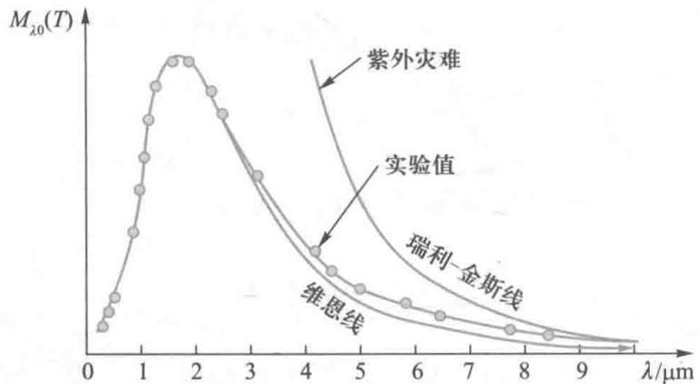  
图18-2 维恩线和瑞利-金斯线

文档：瑞利

瑞利（J.W.S.Rayleigh，1842—1919）和金斯（J.H.Jeans，1877—1946）根据经典电动力学和经典统计物理学理论导出了另一个反映绝对黑体单色辐出度与波长和温度关系的函数

$$
M _ {\lambda} (T) = 2 \pi c \lambda^ {- 4} k T \tag {18-6}
$$

式中  $c$  是真空中的光速， $k$  是玻耳兹曼常量。从图18-2可以看到，瑞利-金斯公式在长波波段与实验相符，而在短波波段与实验曲线有明显差异，这在物理学史上曾称为“紫外灾难”，被喻为19世纪末期物理学晴朗天空的两朵“乌云”之一。

1900年普朗克(M. Planck, 1858-1947)首先在分析和综合了维恩公式和瑞利-金斯公式各自的成功之处后从数学上得到了一个与实验结果惊人符合的定量公式，即著名的普朗克辐射公式

$$
M _ {\lambda} (T) = \frac {2 \pi h c ^ {2}}{\lambda^ {5}} \frac {1}{\mathrm {e} ^ {h c / (k T \lambda)} - 1} = \frac {2 \pi h c ^ {2}}{\lambda^ {5}} \frac {1}{\mathrm {e} ^ {h v / (k T)} - 1} \tag {18-7}
$$

式中  $c$  是真空中的光速， $k$  是玻耳兹曼常量， $h$  为一待定常量，可以由实验来测定，被称为普朗克常量，其值约为

$$
h = 6. 6 2 6 \times 1 0 ^ {- 3 4} \mathrm {J} \cdot \mathrm {s} \tag {18-8}
$$

而且普朗克意识到，要从理论上导出与实验结果惊人符合的黑体辐射公式，似乎要作如下不可思议的假定：

物体发射或吸收频率为  $\nu$  的电磁辐射，只能以  $\varepsilon = h\nu$  为单位进行，这个最小能量单位就是能量子，物体所发射或吸收的电磁辐射能量总是这个能量子的整数倍，即

$$
E = n h \nu \tag {18-9}
$$

式中  $n$  是正整数， $n = 1,2,3,\dots$ ，称为量子数（quantum number）。也就是说，物体发射或吸收的电磁辐射的能量不能是连续的，而只能是一份一份“量子化（quantization）”的。普朗克的量子化假设与经典物理学理论是严重不相容的，但也就是这一新思想，引起了物理学划时代的变化，建立了比经典物理更精细、更深刻的量子物理理论。普朗克也为此荣获1918年度的诺贝尔物理学奖。

# 18-2 光电效应

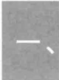

# 光电效应的实验规律及其与经典理论的矛盾

在光的照射下，金属中的电子会吸收光能而逸出金属表面，这种现象称为光电效应（photoelectric effect）。在光电效应中逸出金属表面的电子称为光电子（photoelectron）。我

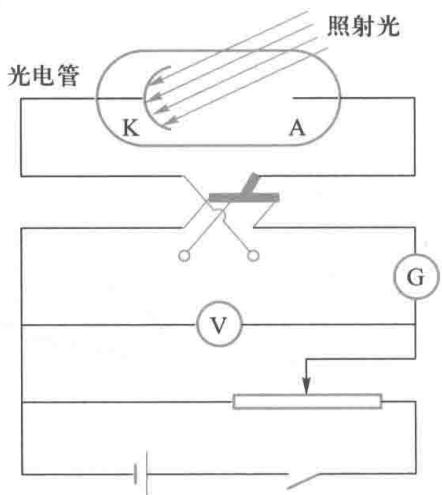  
图18-3 光电效应的实验示意图

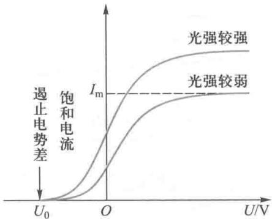  
图18-4 光电流电势差的变化关系

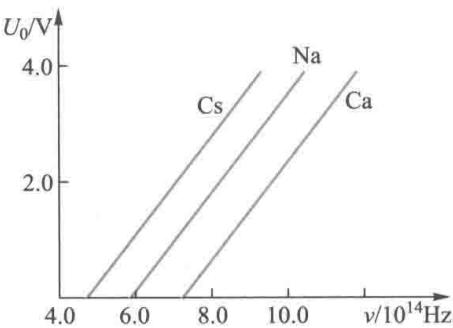  
图18-5 截止电势差与频率的关系

我们可以用光电效应做成实用的光电管. 光电管是一个抽成真空的玻璃泡, 内表面的一部分涂有感光金属层作为阴极 K, 金属在光的照射下会产生光电子, 阳极 A 是由金属丝网做成的, 光电子在电场的作用下运动所提供的电流, 称为光电流 (photocurrent).

为了研究光电效应的规律，可将光电管联接在如图18-3所示的电路中.其中，可变电阻  $R$  用来调节加在光电管两端的电势差  $U$  的大小.换向开关用来改变加在光电管两端的电势差的极性.电压表V和电流计G分别用来测量加在光电管上的电势差和通过光电管的光电流.实验发现，对于一定强度的单色光，光电流  $I$  和电势差  $U$  的变化关系如图18-4中的曲线所示.它表明，电势差  $U$  越大，光电流  $I$  也越大，当电势差增大到一定值后，光电流达到饱和值  $I_{\mathrm{m}}$  饱和现象说明，逸出金属表面的光电子在较大的电势差作用下会全部到达阳极.实验还发现，对于一定频率的单色光，饱和电流的值与入射光强成正比.这也说明，单位时间内逸出金属表面的光电子数与入射光强成正比

由图18-4中的曲线可见，当加在光电管的电势差为某负值时，光电流才等于零. 光电流刚刚为零时光电管两端的电势差  $U_{0}$  称为遏止电势差. 在反向遏止电势差  $U_{0}$  的作用下，逸出金属表面时具有最大初动能的光电子也不能到达阳极形成光电流，这时，光电子的最大初动能正好等于它克服遏止电场力所做的功，即

$$
\frac {1}{2} m v _ {\mathrm {m}} ^ {2} = e U _ {0} \tag {18-10}
$$

式中  $m$  和  $e$  分别是电子的质量和电荷量绝对值， $v_{\mathrm{m}}$  是电子逸出金属表面时具有最大初速度。从（18-10）式可见，遏止电势差能表征光电子的最大初动能。

实验表明，对一切金属材料，截止电势差与入射光的频率之间存在着线性关系.图18-5是三种金属材料的截止电

势差与入射光的频率之间的关系曲线.这些线性关系可用数学式表示为

$$
U _ {0} = k (\nu - \nu_ {0}) \tag {18-11}
$$

式中  $k$  和  $\nu_{0}$  都是正值，其中斜率  $k$  为普适常量， $\nu_{0}$  对于不同的金属具有不同的数值，同一种金属为常量。将（18-10）式代入（18-11）式，可得

$$
\frac {1}{2} m v _ {\mathrm {m}} ^ {2} = e k (\nu - \nu_ {0}) \tag {18-12}
$$

这说明，光电子的初动能随入射光频率的上升而线性地增大，而光电子的初动能并没有与入射光强有关，这一结论是经典物理理论完全解释不了的。

实验还表明：对于某金属材料，如果入射光的频率低于某频率  $\nu_{0}$  时，则无论入射光强多大，都不会使这种金属产生光电效应。不能产生光电效应，说明金属内的电子从入射光那里获得的能量不能达到金属表面对电子束缚的逸出功而逸出金属表面。通常我们称引起光电效应的入射光频率下限  $\nu_{0}$  为金属的红限频率（也称截止频率）。入射光的频率达到红限频率时，金属内的电子从入射光那里获得的能量刚好达到金属表面对电子束缚的逸出功  $W$ 。实验发现，只要入射光的频率大于该金属的红限频率，无论光强多弱，几乎立即产生出光电子。

为什么金属内的电子从入射光那里能获得的能量只取决于入射光的频率而与入射光的强度无关，而且几乎是瞬间获得的，经典物理学对这些实验事实完全无法解释。根据光的电磁理论，光是电磁波，光波的能量决定于光波的强度，光波的强度与振动的电磁场振幅的平方成正比。因此，金属内的电子获得能量也应该与光波的强度直接相关，而实验结果却表明，它与光波的强度无关，而是与光的频率密切相关。另外，从光的波动理论的观点看，电子从入射光那里获得能量需要一个积累的过程，特别是当入射

光的强度较弱时，能量积累需要的时间较长。而实验结果却表明，这一过程几乎是瞬间发生的。

例18-2

设有一功率  $P = 1\mathrm{W}$  的点光源，距光源  $d = 3\mathrm{m}$  处有一钾薄片，图18-6是其示意图.假定钾薄片中的电子可以在半径约为原子半径  $r = 0.5\times 10^{-10}\mathrm{m}$  的圆面积范围内收集能量，已知钾的逸出功  $W =$ $1.8\mathrm{eV}$  ，按照经典电磁理论，计算电子从照射到逸出需要多长时间？

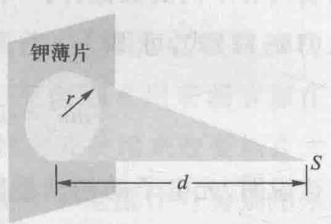  
图18-6 光照射钾薄片中的电子

解 光每秒钟照射到离光源  $d$  处半径为  $r$  的圆面积上的能量为

$$
\begin{array}{l} P ^ {\prime} = \frac {\pi r ^ {2}}{4 \pi d ^ {2}} P = \frac {\pi \times (0 . 5 \times 1 0 ^ {- 1 0} \mathrm {m}) ^ {2}}{4 \pi \times (3 \mathrm {m}) ^ {2}} \times 1 \mathrm {W} \\ = 7 \times 1 0 ^ {- 2 3} \mathrm {W} \\ \end{array}
$$

电子逸出所需时间为

$$
t = \frac {W}{P ^ {\prime}} = \frac {1 . 8 \times 1 . 6 \times 1 0 ^ {- 1 9} \mathrm {J}}{7 \times 1 0 ^ {- 2 3} \mathrm {W}} \approx 4 0 0 0 \mathrm {s}
$$

# 二、

# 爱因斯坦的光子假设及其光电效应方程

  
文档：爱因斯坦

考虑到光电效应的实验事实及普朗克提出的能量子思想：爱因斯坦于1905年进一步提出了下面的光子假说：光是一份一份的以光速运动的光量子组成的粒子流，这种光量子简称为光子。每一个光子的能量由光的频率所决定。如果光的频率为  $\nu$ ，则光子的能量可以表示为

$$
\varepsilon = h \nu \tag {18-13}
$$

式中  $h$  是普朗克常量. 光的能量就是光子能量的总和, 对于一定频率的光, 光子数越多, 光的强度就越大.

当入射到金属中的某个光子打到金属中的某个电子

时，这个电子就会在瞬间吸收这个光子而获得一份能量  $h\nu$  这份能量一部分用于消耗逸出金属表面时所必需的逸出功 $W$  ，另一部分转化为光电子的初动能，可以用数学公式将这一能量关系表示为

$$
h \nu = \frac {1}{2} m v _ {\mathrm {m}} ^ {2} + W \tag {18-14}
$$

这个方程称为爱因斯坦的光电效应方程

引入光子的概念后，光电效应的实验事实很容易得到圆满的解释。首先，由于电子吸收光子是在瞬间发生的，所以光电效应不需要积累能量的时间，几乎是与光照射到金属表面同时发生的。其次，由爱因斯坦的光电效应方程可见，光电子的初动能与入射光的频率呈线性关系，而与光的强度即光子的数目无关。可以用数学公式将这关系表示为

$$
U _ {0} = \frac {1}{e} \cdot \frac {1}{2} m v _ {\mathrm {m}} ^ {2} = \frac {h}{e} \left(\nu - \frac {W}{h}\right) \tag {18-15}
$$

另外，如果入射光的频率低，则光子的能量小，当光子的能量  $h\nu$  小于金属的逸出功  $W$  时，电子吸收一个这样的光子后所获得的能量不足以克服逸出电势的束缚，因而不能逸出金属表面产生光电效应现象。因此光电效应必定存在红限频率，红限频率  $\nu_{0}$  的数值取决于逸出功  $W$ ：

$$
\nu_ {0} = \frac {W}{h} \tag {18-16}
$$

最后，由于光强是由光子的数目决定的，光强越大，射到金属表面的光子越多，单位时间内吸收光子而逸出金属表面的电子也越多，所以饱和电流的值与入射光强成正比

应用爱因斯坦的光子论不仅圆满地解释了光电效应的实验事实，而且还可以给出间接测量普朗克常量  $h$  的方法。容易得到普朗克常量  $h$  与斜率  $k$  ，逸出功  $W$  ，红限频率  $\nu_{0}$  的定量关系如下：

$$
h = e k = W / \nu_ {0} \tag {18-17}
$$

文档：密立根

1916年，密立根（R.A.Millikan）对光电效应的实验进行了更为精确的测量，由光电效应实验计算得到的普朗克常量与由黑体辐射实验确定的普朗克常量符合得很好。这进一步证实了爱因斯坦的光量子思想的正确性。

# 三、光的波粒二象性

在19世纪，通过光的干涉、衍射等实验证实了光具有的波动本性；进入20世纪，又通过黑体辐射、光电效应等实验证实了光具有的粒子本性。综合起来，光既具有波动性，又具有粒子性，它是波粒二象性的。波动性和粒子性是真实的光具有的两个不同的侧面，在有些情况下光更容易体现出波的特性，而在另一些情况下光更容易体现出粒子的特性。我们知道，经典理论只是在宏观、低速下近似成立的定量理论，自然界遵循着更精细、更深刻的规律，因此完全局限于经典观念来思考问题是不行的。在经典物理中，足够小的物体可以看成质点，质点遵循牛顿运动定律，而光遵循的运动规律是麦克斯韦方程组，因此光子不可能是经典观念中的粒子。波粒二象性在近代物理理论中有极其重要的地位，我们后面还会对波粒二象性作一些进一步的讨论。

光是波粒二象性的. 反映光的波动性的物理量主要有光速  $c$ 、光的波长  $\lambda$  及光的频率  $\nu$ ; 而反映光的粒子性的物理量主要有光子具有的质量  $m$ 、能量  $\varepsilon$  和动量  $p$ . 反映光的波动性的量与反映光的粒子性的量之间存在着怎样的定量关系呢? 首先, 我们已经得到了光的频率为  $\nu$  和光子的能量  $\varepsilon$  之间存在的定量关系, 即关系式 (18-13) 式. 根据相对论的质能关系  $E = mc^2$ , 可以得到以光速运动的光子具有的质量为

$$
m = \frac {h \nu}{c ^ {2}} \tag {18-18}
$$

根据相对论的能量-动量关系，光子动量的大小  $p$  等于其质量  $m$  与速率  $c$  的乘积，即可以得到光子具有的动量的大小为

$$
p = \frac {h}{\lambda} \tag {18-19}
$$

若用单位矢量表示动量的方向，则动量的动量矢量的表示式为

$$
\boldsymbol {p} = \frac {h}{\lambda} \boldsymbol {e} _ {p} \tag {18-20}
$$

（18-13）式和（18-19）式是描述光的波粒二象性的两个基本关系式，通常这两个关系式称为普朗克-爱因斯坦关系式.

光电效应的应用极为广泛.应用光电效应的原理可制成真空光电管，如图18-7所示.这种光电管的灵敏度很高，可用于记录和测量光的强度，作为光电光度计，也用于有声电影、电视和自动控制等装置

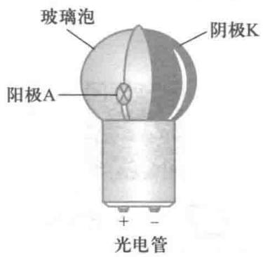  
图18-7 光电管示意图

例18-3

已知铝的逸出功为  $4.2\mathrm{eV}$ ，今用波长为  $200\mathrm{nm}$  的紫外线照射到铝表面上，发射的光电子的最大初动能为多少？遏止电势差为多大？铝的红限波长是多大？

解（1）由光电效应方程  $h\nu = \frac{1}{2} mv_{\mathrm{m}}^{2} + W$  得

$$
\begin{array}{l} \frac {1}{2} m v _ {\mathrm {m}} ^ {2} = h \nu - W = \frac {h c}{\lambda} - W = 3. 2 3 \times 1 0 ^ {- 1 9} \mathrm {J} \\ = 2. 0 \mathrm {e V} \\ \end{array}
$$

(2）由  $\frac{1}{2} mv_{\mathrm{m}}^{2} = eU_{0}$  ，得  $U_{0} = \frac{\frac{1}{2}mv_{\mathrm{m}}^{2}}{e} = 2.0\mathrm{V}$  
（3）由  $W = h\nu_{0} = \frac{hc}{\lambda_{0}}$  得  $\lambda_0 = \frac{hc}{W} = 296\mathrm{nm}$

# 18-3 康普顿效应

# 一、康普顿效应

  
文档：X射线的发现

  
文档：康普顿

图18-8 康普顿效应的实验示意图  
  
文档：吴有训

1923年美国的康普顿（A.H.Compton，1892—1962）及其后不久的我国物理学家吴有训研究了X射线经物质散射后的光谱成分.实验表明，散射的X射线中不仅有与入射线波长相同的射线，而且也有波长大于入射线波长的射线.这种散射后波长会大于入射线波长的现象称为康普顿效应.实验还表明，波长的改变量随散射角  $\varphi$  （散射线与入射线之间的夹角）而异：当散射角  $\varphi$  增大时，波长的改变量也随之增加；在同一散射角下，对于所有散射物质，波长的改变量都相同.观测康普顿效应的实验装置如图18-8所示.由X射线管发出的单色X射线射到所研究的散射体（如石墨、金属等）上，便产生向各个方向散射的X射线.虚线方框内是作为X射线衍射光栅使用的晶体和探测器组成一个光谱仪，用来测量散射X射线的波长和强度

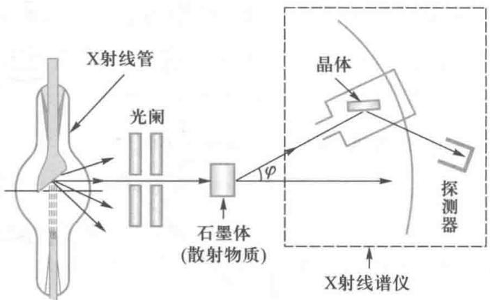

# 二、光子理论的解释

从经典物理学理论的观点看，波长为  $\lambda_0$  （或频率为  $\nu_{0}$  ）的X射线进入散射体后，将引起构成物质的带电粒子作受迫振动，每一个作受迫振动的带电粒子将向四周辐射电磁波，这就是散射的X射线.不过，系统作受迫振动时的频率与驱动力的频率是相等的.所以，散射的X射线波长应该等于入射X射线的波长  $\lambda_0$  ，即不可能产生康普顿效应.可见，经典物理学理论不能圆满解释X射线散射的所有实验事实.下面我们用爱因斯坦的光子理论来解释X射线散射实验中出现的实验现象

根据爱因斯坦的光子理论，X射线是一束能量较大的光子.当X射线进入散射体后，光子将与构成物质的粒子发生弹性碰撞（又称为散射）.在碰撞过程中，光子与散射粒子组成的系统遵循能量和动量的守恒，光子与散射粒子之间要发生能量和动量的转移.由于构成散射物质的粒子，有原子实（晶格离子)和价电子(可以看成自由电子)两种，光子与它们碰撞将产生不同的结果

由于原子实的质量比光子的质量大得多，碰撞后光子的能量基本不变.所以散射光的波长是不变的，这就是散射光中与入射线同波长的射线；而在光子与自由电子的碰撞过程中，由于电子的质量与X射线光子的质量差不多大，又由于自由电子在碰撞前具有的运动能量远远小于X射线光子的能量，因此这种碰撞必将引起X射线光子的能量有所损失，从而引起散射后X射线的波长有所增大.下面是对康普顿效应进行的定量讨论

设碰撞后光子沿与  $x$  轴成  $\varphi$  角的方向运动，如图18-9所示.由于自由电子在碰撞前是静止的，动量为零，其静质量为  $m_0$  ，则能量为  $m_0c^2$  .碰撞后自由电子获得了一定的能量而成为反冲电子，设反冲电子的速度为  $v$  ，与  $x$  轴成  $\theta$  角，

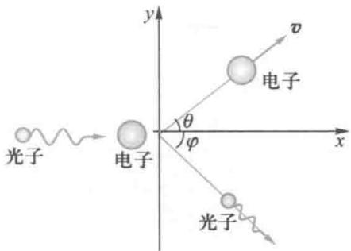  
图18-9 光子与自由电子的碰撞

相对论性质量变为  $m$  ，根据相对论关系，  $m$  可以表示为

$$
m = \frac {m _ {0}}{\sqrt {1 - \frac {v ^ {2}}{c ^ {2}}}}
$$

碰撞前后光子的能量和动量分别由  $h\nu_{0}$  和  $\frac{h}{\lambda_0} e_0$  变为  $h\nu$  和  $\frac{h}{\lambda} e$ 。碰撞过程中能量是守恒的，即

$$
h \nu_ {0} + m _ {0} c ^ {2} = h \nu + m c ^ {2} \tag {18-21}
$$

碰撞过程动量也是守恒的，即

$$
\frac {h \nu_ {0}}{c} \boldsymbol {e} _ {0} = \frac {h \nu}{c} \boldsymbol {e} + m \boldsymbol {v} \tag {18-22}
$$

由上述两个式子可以解得

$$
\lambda = \lambda_ {0} + 2 \frac {h}{m _ {0} c} \sin^ {2} \left(\frac {\varphi}{2}\right) \tag {18-23}
$$

上式就是康普顿效应波长改变的定量公式，它和实验符合得很好.此式常称为康普顿散射公式.式中  $\frac{h}{m_0c}$  常用  $\lambda_{\mathrm{C}}$  表示，称为电子的康普顿波长，可通过计算得到

$$
\lambda_ {\mathrm {C}} = \frac {h}{m _ {0} c} = 2. 4 3 \times 1 0 ^ {- 1 2} \mathrm {m} \tag {18-24}
$$

由此我们可以解释康普顿散射实验的两个主要实验结论：

（1）由（18-23）式可以得到，散射X射线的波长改变量  $\Delta \lambda = \lambda -\lambda_0$  只与光子的散射角  $\varphi$  有关，  $\varphi$  越大，  $\Delta \lambda$  也越大.当  $\varphi = 0$  时，  $\Delta \lambda = 0$  ，即波长不变；当  $\varphi = \pi$  时  $\Delta \lambda = 2\lambda_{\mathrm{c}}$  ，此时波长的改变量为最大值

（2）由于康普顿效应是由于光子与价电子（可以看成自由电子）的碰撞过程，所以对所有散射物质，散射X射线的波长改变量  $\Delta \lambda$  散射角  $\varphi$  的定量关系是完全相同的.

康普顿效应的实验事实及其理论的圆满解释具有重大

的物理意义，首先它验证了爱因斯坦的光子理论，其次验证了爱因斯坦的相对论公式，另外它还验证了能量和动量守恒的普遍正确性.

例18-4

设康普顿散射中入射X射线的波长为  $3\times 10^{-3}\mathrm{nm}$  ，反冲电子的速率为  $0.6c$  ，求散射光子的波长和散射方向

解设电子的静质量为  $m_0$  ，已知反冲电子的速率为  $0.6c$  ，可得反冲电子的相对论性质量为

$$
m = \frac {m _ {0}}{\sqrt {1 - \left(\frac {0 . 6 c}{c}\right) ^ {2}}} = 1. 2 5 m _ {0}
$$

根据光子与电子散射过程的能量守恒有

$$
\frac {h c}{\lambda_ {0}} + m _ {0} c ^ {2} = \frac {h c}{\lambda} + m c ^ {2}
$$

已知入射X射线的波长  $\lambda_0 = 3\times 10^{-3}\mathrm{nm}$

$m_0 = 9.11 \times 10^{-31} \mathrm{~kg}$ , 可解得散射光子的波长为

$$
\lambda = \frac {h \lambda_ {0}}{h - 0 . 2 5 m _ {0} c \lambda_ {0}} = 4. 3 \times 1 0 ^ {- 1 2} \mathrm {m}
$$

再根据康普顿散射公式

$$
\Delta \lambda = \lambda - \lambda_ {0} = \frac {2 h}{m _ {0} c} \sin^ {2} \frac {\varphi}{2}
$$

可求得散射光子的方向，即散射角  $\varphi$  的值 $\sin^2{\frac{\varphi}{2}} = \frac{m_0c}{2h} (\lambda -\lambda_0) = 0.2681;\varphi = 62^\circ 18'$

# 18-4 德布罗意波 实物粒子的波粒二象性

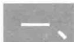

# 德布罗意波

1924年德布罗意(L.V.de Broglie)提出，一切实物粒子兼有波和粒子两方面性质，都是波粒二象性的。他指出，从粒子性看，一个实物粒子可以用能量  $E$  和动量  $p$  描述它；从波动性看，一个实物粒子可以用频率  $\nu$  和波长  $\lambda$  描述它，这

  
文档：德布罗意

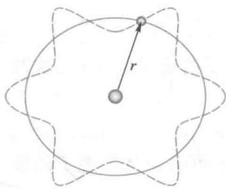  
图18-10 原子中的电子形成驻波

两个方面以下列关系式相联系：

$$
\nu = \frac {E}{h} = \frac {m c ^ {2}}{h} \tag {18-25}
$$

$$
\lambda = \frac {h}{p} = \frac {h}{m v} \tag {18-26}
$$

（18-25）式和（18-26）式就是著名的德布罗意关系式。通常我们将与微观粒子相联系的波称为物质波或德布罗意波，相应的波长称为物质波或德布罗意波长。既然微观粒子具有波动性，原子中绕核运动的电子无疑也具有波动性。德布罗意认为，处于定态中的电子形成驻波的情形，与端点固定的振动弦线形成驻波的情形是相似的。原子中电子驻波可如图18-10形象地表示。由图可以看到，当电子波在离开原子核为  $r$  的圆周上形成驻波时，圆周长必定等于电子波长的整数倍，即

$$
2 \pi r = n \lambda = n \frac {h}{m v}
$$

由此可得到电子的轨道角动量应满足下面的关系为

$$
L = m v r = n \frac {h}{2 \pi} = n \hbar
$$

式中  $\hbar = \frac{h}{2\pi}$ ,  $\hbar$  称为约化普朗克常量.

这正是玻尔提出的量子化假设（详见19-1节内容）在这里，居然也能从微观粒子具有波动性的思想中演绎出来.但要更有说服力地证实德布罗意波的存在，必须要能够观测到微观粒子也能像光子那样呈现出干涉、衍射现象

例18-5

试估算常温下（  $T = 300\mathrm{K}$  ）热中子的德布罗意波长.（已知中子的质量  $m_{\mathrm{n}} =$ $1.67\times 10^{-27}\mathrm{kg}.$  ）

解热中子是指在常温下（  $T = 300\mathrm{K}$  与周围处于热平衡的中子，它的平均动能

$$
\overline {{\varepsilon}} _ {\mathrm {k}} = \frac {3}{2} k T = 6. 2 1 \times 1 0 ^ {- 2 1} \mathrm {J} \approx 0. 0 3 9 \mathrm {e V}
$$

平均动量为

$$
\bar {p} = \sqrt {2 m _ {\mathrm {n}} \bar {\varepsilon} _ {\mathrm {k}}}
$$

由此估算其德布罗意波长为

$$
\lambda = \frac {h}{\bar {p}} = \frac {h}{\sqrt {2 m _ {\mathrm {n}} \overline {{\varepsilon}} _ {\mathrm {k}}}} = 0. 1 4 6 \mathrm {n m}
$$

这一波长与X射线的波长同数量级，也可用晶体衍射的方法产生中子衍射.

# 二、戴维孙和革末实验

1927年，戴维孙（C.J.Davisson，1881—1958）和革末(L.A.Germer,1896—1971)用电子束入射镍单晶表面，得到了与X射线衍射类似的电子衍射现象，从而证实了德布罗意假说.他们用的实验装置如图18-11所示.由热灯丝K发出的电子被电势差  $U$  产生的电场加速后，经小孔射出成为很细的平行电子束.电子束的能量决定于加速电势差  $U$ $\frac{1}{2} m_{\mathrm{e}}v^{2} = eU$  ，由此得到德布罗意波长为

$$
\lambda = \frac {h}{m _ {\mathrm {e}} v} = \frac {h}{\sqrt {2 m _ {\mathrm {e}} e U}} \tag {18-27}
$$

当  $U = 54\mathrm{V}$  时，  $\lambda = 1.67\times 10^{-10}\mathrm{m}$  电子束射到镍单晶上，被晶面所反射，反射后的电子束由集电器俘获，并提供了电流  $I,I$  可用电流计G测量.电流  $I$  表征反射电子束的强度.与晶体对X射线的衍射类似，以掠射角  $\varphi$  射至一组间距为  $d$  的晶面并被晶面所反射的电子束，反射电子束强度极大的方向应满足布拉格公式

$$
2 d \sin \varphi = k \lambda \tag {18-28}
$$

其中  $k$  为自然数.联立（18-27）式和（18-28）式可得到集电器电流  $I$  取极值时，加速电势差  $U$  与反射电子束的方向之间的关系如下

  
文档：戴维孙

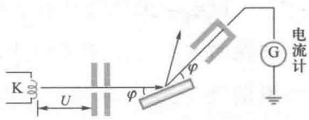  
图18-11 戴维孙-革末电子衍射实验装置示意图

  
文档：物质波假设的实验检验

$$
\sqrt {U} = \frac {h}{\sqrt {2 m _ {\mathrm {e}} e}} \cdot \frac {k}{2 d \sin \varphi}
$$

实验结果与理论预期符合得很好，从而首次证明了德布罗意假说的正确性.1961年约恩孙（C.Jonsson）做了电子的单缝、双缝等衍射实验，更加直接证明了德布罗意假说的正确性.现在，不仅电子具有波动性被证实了，其他微观粒子，如原子、质子和中子等的波动性也都得到了实验的证实.而且，微观粒子的波动性在现实中也得到了很多的应用.例如，利用电子的波动性，已经制成了高分辨率的电子显微镜；利用中子的波动性，已经制成了中子摄谱仪，这些设备已在物性分析等领域中得到广泛的应用

微观粒子波动性的发现，使我们对物质世界的认识向前迈进了一大步。在此基础上，薛定谔（E. Schrödinger, 1887—1961）建立了微观粒子遵循的波动方程，从而奠定了量子力学理论的一个重要基础（详见19-2节内容）。

例18-6

在戴维孙-革末实验中，已知晶格常量  $d = 0.3\mathrm{nm}$  ，电子经  $100\mathrm{V}$  电压加速，求各极大值所在的方向。

解设电子束垂直投射于晶体表面，散射加强的方向与晶体表面法向的夹角为  $\theta$  根据电子束在晶体上衍射的布拉格公式有

$$
d \sin \theta = k \lambda
$$

其中  $\lambda$  为德布罗意波长.

电子经  $100\mathrm{V}$  电压加速，其动量  $p = \sqrt{2meU}$ ，因此德布罗意波长为

$$
\lambda = \frac {h}{P} = \frac {h}{\sqrt {2 m e U}}
$$

所以

$$
\sin \theta = k \frac {h}{d \sqrt {2 m e U}} = 0. 4 1 k
$$

可以得3个极大值所在的方向：

$$
k = 0, \quad \theta = 0;
$$

$$
k = 1, \quad \theta = 2 4. 1 ^ {\circ};
$$

$$
k = 2, \quad \theta = 5 4. 9 ^ {\circ}.
$$

# 三、电子显微镜

光学显微镜是由一组透镜组成的，由于可见光的波长在几百纳米数量级，所以光学显微透镜的分辨率将受到相应的限制。根据电磁学理论，我们可以设计出电磁透镜，并可以用荧光屏将电子束成像。由此我们可以用电子束代替可见光来制作显微镜。由于高速运动的电子的波长容易达到纳米数量级，所以由电子束制成的显微镜可以比光学显微透镜的分辨率高好几个数量级。1933年，德国科学家Ernst Ruska设计制成了世界上第一台电子显微镜（electron microscope）。现在电子显微镜技术已成为研究机体细微结构的重要手段。通常用光学显微镜只能看清大于  $0.2\mu \mathrm{m}$  的物体或结构，而现在用电子显微镜可以看清小至  $0.1\mathrm{nm}$  的物体或结构。因此用电子显微镜可以看到病毒、单个分子以及金属材料的晶格结构等，可以广泛地应用到金属物理学、高分子化学、微电子学、生物学、医学以及工农业生产各个领域中去。图18-12是成套的电子显微镜仪器的照片。

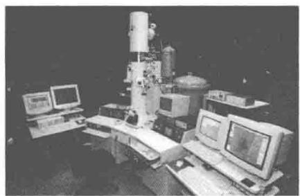  
图18-12 电子显微镜

  
文档：电子显微镜

# 18-5 不确定关系

在经典物理学中，描述和确定一个质点的运动状态需要用两个物理量，即位置和动量，并且这两个物理量在任何瞬间都具有可以准确确定的值。但是对于具有波粒二象性的微观粒子来说，其位置和动量是不可能同时准确确定的。微观粒子的位置和动量不可能同时准确确定的事实，首先由海森伯（W.K.Heisenberg，1901—1976）于1927年提出的。位置和动量不确定关系可以具体表示如下：

若粒子在某个方向上位置的不确定量度（用  $\Delta x$  表

  
文档：海森伯

示），在该方向上动量的不确定量度（用  $\Delta p_{x}$  表示），则

$$
\Delta x \cdot \Delta p _ {x} \geqslant \frac {\hbar}{2} \tag {18-29}
$$

这个关系表明，其位置和动量不可能同时准确测定，若粒子的位置测得越准确，则动量就越不确定（即  $\Delta p_{x}$  越大），反之亦然。不确定关系在量子力学中可以严格证明。

不确定关系是波动性的必然结论，由于微观粒子具有波动性，所以微观粒子要遵循不确定关系。为说明这个问题，让我们看一下电子束经过单缝而发生衍射的现象。图18-13表示电子束沿水平方向射至宽度为  $\Delta x$  的狭缝上，在放于光屏处的照相版上将得到像光的单缝衍射现象一样的强度分布图样。与光学的结论类似，第一级暗条纹所对应的衍射角  $\varphi$  应满足下面的关系：

$$
\Delta x \cdot \sin \varphi = \pm \lambda \tag {18-30}
$$

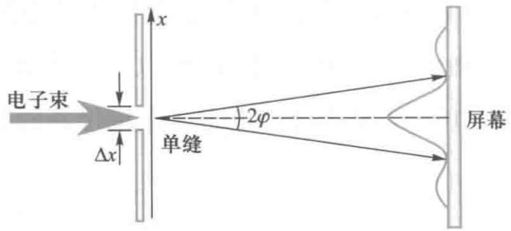  
图18-13 电子单缝衍射现象的示意图

式中  $\lambda$  是电子束的德布罗意波长. 两个第一级暗条纹之间就是中央主极大的区域, 在这个区域内都有电子投射. 电子通过狭缝发生了  $\varphi$  角的偏斜, 表明其动量  $p$  在  $x$  方向产生了  $\Delta p_{x}$  的弥散. 根据衍射现象的一般规律, 狭缝宽度  $\Delta x$  越小, 即电子的位置在  $x$  方向越准确, 动量在  $x$  方向的弥散就越大. 电子动量在  $x$  方向的不确定量  $\Delta p_{x}$  可以表示为

$$
\Delta p _ {x} = p \cdot \sin \varphi
$$

将（18-30）式代入上式，再利用德布罗意关系式（18-26），可得

$$
\Delta x \cdot \Delta p _ {x} = h
$$

如果把电子衍射的次极大也考虑在内， $\Delta p_{x}$  还要大些，上式则应写成

$$
\Delta x \cdot \Delta p _ {x} \geqslant h
$$

建立量子力学后可以证明，更精确的不确定关系式应该取（18-31）式的形式：

$$
\Delta x \cdot \Delta p _ {x} \geqslant \frac {\hbar}{2} \tag {18-31}
$$

其中  $\hbar = \frac{h}{2\pi}$  除了位置和动量存在不确定关系外，海森伯还提出，在能量和时间之间也存在类似的不确定关系，即

$$
\Delta E \cdot \Delta t \geqslant \frac {\hbar}{2} \tag {18-32}
$$

例18-7

电子显像管中电子的加速电压为  $10\mathrm{kV}$  ，电子枪的枪口直径设为  $0.01\mathrm{cm}$  ，试求电子射出电子枪后的横向速度的不确定量.

解 电子横向位置的不确定量  $\Delta x = 0.01\mathrm{cm}$  由不确定关系式  $\Delta x\Delta p_{x}\geqslant \frac{\hbar}{2}$  得

$$
\begin{array}{l} \Delta v _ {x} \geqslant \frac {\hbar}{2 m \Delta x} \\ = \frac {1 . 0 5 \times 1 0 ^ {- 3 4}}{2 \times 9 . 1 1 \times 1 0 ^ {- 3 1} \times 1 \times 1 0 ^ {- 4}} \mathrm {m} \cdot \mathrm {s} ^ {- 1} \\ = 0. 5 8 \mathrm {m} \cdot \mathrm {s} ^ {- 1} \\ \end{array}
$$

而电子经过  $10\mathrm{kV}$  的电压加速后其速度为

$$
\begin{array}{l} v _ {x} = \sqrt {\frac {2 E _ {\mathrm {k}}}{m}} \\ = \sqrt {\frac {2 \times 1 . 6 \times 1 0 ^ {- 1 9} \times 1 0 \times 1 0 ^ {3}}{9 . 1 1 \times 1 0 ^ {- 3 1}}} \mathrm {m} \cdot \mathrm {s} ^ {- 1} \\ = 5. 9 3 \times 1 0 ^ {7} \mathrm {m} \cdot \mathrm {s} ^ {- 1} \\ \end{array}
$$

由于  $\Delta v_{x} \ll v_{x}$ , 所以电子运动速度相对来说仍是相当确定的, 波动性不起什么实际影响. 电子运动的问题仍可用经典力学处理.

例18-8

实验测定原子核线度的数量级为  $10^{-14}\mathrm{m}$ 。试应用不确定度关系估算电子如被束缚在原子核中时的动能。

解取电子在原子核中位置的不确定量 $\Delta r \approx 10^{-14} \mathrm{~m}$ ，由位置和动量不确定关系即(18-31)式，得电子如被束缚在原子核中时的动量

$$
\begin{array}{l} p \approx \Delta p \geqslant \frac {\hbar}{2 \Delta r} = \frac {1 . 0 5 \times 1 0 ^ {- 3 4}}{2 \times 1 0 ^ {- 1 4}} \mathrm {k g} \cdot \mathrm {m} \cdot \mathrm {s} ^ {- 1} \\ = 0. 5 3 \times 1 0 ^ {- 2 0} k g \cdot m \cdot s ^ {- 1} \\ \end{array}
$$

考虑到电子在此动量下有极高的速

度，需要应用相对论的能量-动量公式，这时电子具有的总能量

$$
E = \sqrt {p ^ {2} c ^ {2} + m _ {0} ^ {2} c ^ {4}} \approx 1. 6 \times 1 0 ^ {- 1 2} J
$$

则电子在原子核中的动能

$$
E _ {\mathrm {k}} = E - m _ {0} c ^ {2} \approx 1. 6 \times 1 0 ^ {- 1 2} \mathrm {J} = 1 0 \mathrm {M e V}
$$

电子具有这样大的动能足以把原子核击碎，所以原子核由质子和电子组成是不可能的.

例18-9

用不确定关系估算简谐振子的最低能量.

解 简谐振子的能量是

$$
E = \frac {p ^ {2}}{2 m} + \frac {1}{2} m \omega^ {2} x ^ {2}
$$

通过不确定关系  $\Delta x\Delta p_{x}\geqslant \frac{\hbar}{2}$  得  $p = \Delta p_{x}\geqslant$ $\frac{\hbar}{2x}$  ，用  $p = \frac{\hbar}{2x}$  代人上式

$$
E = \frac {1}{2 m} \frac {\hbar^ {2}}{4 x ^ {2}} + \frac {1}{2} m \omega^ {2} x ^ {2}
$$

$\frac{\mathrm{d}E}{\mathrm{d}x} = 0$  ，求出上式的极小值即为简谐振子的最低能量为

$$
E _ {\min } = \frac {1}{2} \hbar \omega
$$

例18-10

一原子的激发态发射波长为  $600\mathrm{nm}$  的光谱线，测得波长的精度为  $\Delta \lambda /\lambda = 10^{-7}$  试问该原子态的寿命为多长？

解  $E = h\nu = \frac{hc}{\lambda};\quad \mathrm{d}E = -\frac{hc}{\lambda^2}\mathrm{d}\lambda$

所以  $\Delta E\approx \frac{hc}{\lambda^2}\Delta \lambda$

由不确定关系式  $\Delta E\cdot \Delta t\geqslant \frac{\hbar}{2} = \frac{h}{4\pi}$  得该原

子态的寿命

$$
\begin{array}{l} \tau = \Delta t \geqslant \frac {h}{4 \pi \Delta E} = \frac {\lambda}{4 \pi c \cdot \frac {\Delta \lambda}{\lambda}} \\ = \frac {6 0 0 \times 1 0 ^ {- 9}}{4 \pi \times 3 \times 1 0 ^ {8} \times 1 0 ^ {- 7}} \mathrm {s} \approx 2 \times 1 0 ^ {- 9} \mathrm {s} \\ \end{array}
$$

# 提要

# 1. 普朗克能量量子化假设

普朗克1900年在分析黑体辐射的实验事实后提出了带电谐振子的能量量子化假设，即谐振子能量为

$$
E = n h \nu , n = 1, 2, 3, \dots
$$

这一假设完全突破了经典物理的局限. 根据这一假设, 普朗克可以得出和黑体辐射的实验事实完全一致的正确公式——普朗克公式, 即

$$
M _ {\lambda} (T) = \frac {2 \pi h c ^ {2}}{\lambda^ {5}} \frac {1}{\mathrm {e} ^ {h c / (k T \lambda)} - 1}
$$

式中  $M_{\lambda}$  为单色辐出度

# 2. 斯特藩-玻耳兹曼定律和维恩位移律

斯特藩-玻耳兹曼根据实验结果得到了如下结论：黑体的辐射出射度与黑体温度的四次方成正比，即

$$
M (T) = \sigma T ^ {4}
$$

其中  $\sigma = 5.670373\times 10^{-8}\mathrm{W}\cdot \mathrm{m}^{-2}\cdot \mathrm{K}^{-4}$  称为斯特藩常量.此结论称为斯特藩-玻耳兹曼定律

维恩位移律：随着黑体温度的升高，其单色辐出度最大值所对应的波长  $\lambda_{\mathrm{m}}$  按照  $T^{-1}$  的规律向短波方向移动，即

$$
\lambda_ {\mathrm {m}} T = b
$$

其中常量  $b = 2.8977721 \times 10^{-3} \mathrm{~m} \cdot \mathrm{K}$

由普朗克公式可以推导出斯特藩-玻耳兹曼定律和维恩位移定律.

# 3. 光电效应

光电效应是光照射到金属（或其他材料）表面上时从表面发射电子的现象。它的下述特征不能为经典电磁波理论解释：

（1）光电子的最大初动能与入射光频率有线性关系；（2）对于给定的金属，能产生光电效应的光的频率不能小于某一确定的红限值；（3）从光照到金属表面发出光电子的延迟时间极短。为解释光电效应，爱因斯坦提出了著名的光子假设：光是由光的能量子即光子的微粒组成的，每个光子的能量为  $E = h\nu$  ，质量为  $m = h\nu /c^2$  ，动量为  $p = \frac{h}{\lambda}$  由爱因斯坦光子假设可以圆满解释光电效应现象.

光电效应方程为

$$
\frac {1}{2} m v _ {\mathrm {m}} ^ {2} = h \nu - W
$$

其中  $W$  为金属的逸出功（功函数）.由此可得出红限频率为

$$
\nu_ {0} = W / h
$$

# 4. 康普顿公式

即康普顿散射的光的波长和入射光波长相比的增加量和散射角  $\varphi$  的关系式：

$$
\Delta \lambda = \lambda - \lambda_ {0} = \frac {h}{m _ {0} c} (1 - \cos \varphi) = \frac {2 h}{m _ {0} c} \sin^ {2} \left(\frac {\varphi}{2}\right)
$$

式中  $m_0$  为电子的静质量. 定义常量  $\lambda_{\mathrm{C}} = \frac{h}{m_{0}c} = 2.4263\times$ $10^{-3}\mathrm{nm}$  为电子的康普顿波长.

# 5. 德布罗意波

德布罗意假设：粒子也有波动性。动量为  $p = mv$  的粒子的“德布罗意波长”为

$$
\lambda = \frac {h}{p} = \frac {h}{m v}
$$

# 6. 不确定关系

位置和动量的不确定关系：  $\Delta x\Delta p_{x}\geqslant \hbar /2$

能量和时间的不确定关系：  $\Delta E\Delta t\geqslant \hbar /2$

# 思考题

18-1 所有物体都能发射电磁辐射，为什么用肉眼看不见黑暗中的物体呢？试用维恩位移定律估计，常温下物体的电磁辐射中单色辐出度最大的波长有多大？  
18-2 普朗克提出了能量量子化的概念，在经典物理学范围内，有没有物理量只能是量子化的情况存在？  
18-3 如何从光电效应的实验特点出发，理解和接受爱因斯坦光量子假说？

18-4 光电效应和康普顿效应都是光子与电子间的相互作用，这两个过程的主要不同之处在哪里？  
18-5 为什么在康普顿效应中，散射光波长的偏移  $\Delta \lambda$  与散射物质无关？  
18-6 如何理解和接受物质的波粒二象性？

# 习题

18-1 今用波长为  $400\mathrm{nm}$  的光照射在钡（逸出功为  $2.5\mathrm{eV}$  金属表面，产生光电效应，试求：

（1）发射电子的最大初动能；  
（2）遏止电压；  
（3）钡的红限波长.

18-2 已知铯的逸出功为  $1.8\mathrm{eV}$  ，今用某波长的光入射使其产生光电效应，如果光电子的最大初动能为  $2.1\mathrm{eV}$  ，求：

（1）入射光的波长；

（2）铯的红限频率  
18-3 已知下列金属的逸出功：钡  $2.5\mathrm{eV}$  、钨  $4.5\mathrm{eV}$  、铝  $4.2\mathrm{eV}$ ，如果用波长为  $450\mathrm{nm}$  的光入射，将使哪种金属产生光电效应？  
18-4 以波长  $\lambda = 410\mathrm{nm}$  的单色光照射某一金属，产生光电子的最大动能  $E_{\mathrm{k}} = 1.0\mathrm{eV}$ ，求能使该金属产生光电效应的单色光最大波长是多少？

<table><tr><td>18-5 在光电效应中,当频率为3×1015Hz的单色光照射在逸出功为4.0eV的金属表面时,金属中逸出的光电子的最大速率为多少. 
18-6 在康普顿散射实验中,设入射光子的波长为0.30Å,电子的速度为0.6c,求散射后光子的波长及散射角的大小. 
18-7 设康普顿效应中入射的X射线的波长λ=0.7Å,散射的X射线与入射的X射线垂直,求: 
(1)反冲电子的动能Ek; 
(2)反冲电子运动的方向与入射的X射线之间的夹角θ. 
18-8 康普顿散射实验中,当能量为0.5MeV的X射线射中一个电子时,该电子获得了0.1MeV的动能.假设该电子原是静止的,则散射光的波长为多大?散射光与入射方向间的夹角为多大?</td><td>18-9 质量为me的电子被电势差U=100kV的电场加速,试计算其德布罗意波长?(分别用相对论、经典情况计算,并计算其相对误差.) 
18-10 在电子单缝衍射实验中,若缝宽为a=0.1nm,电子束垂直射在单缝上,则衍射电子横向动量的最小不确定量Δpy是多少? 
18-11 同时确定能量为1keV的电子的位置与动量时,若位置的不确定值在100×10-12m内,则动量的不确定量的百分比Δp/p至少为多少? 
18-12 光子的波长为λ=3000Å,如果确定此波长的精确度Δλ/λ=10-6,试求此光子位置的不确定量? 
18-13 当粒子速度较小时,如果粒子位置的不确定量等于其德布罗意波长,则它的速度的不确定量不小于其速度,试证明之.</td></tr></table>