# 第十九章 量子理论基础

# 19-1 氢原子的玻尔理论

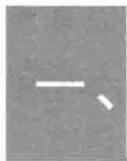

# 原子的结构模型及其与经典理论的矛盾

1911年卢瑟福（E.Rutherford，1871—1976）根据  $\alpha$  粒子散射实验的实验事实，提出了原子的核式结构模型。在这个模型中，原子中央有一个带正电的原子核，电子绕原子核旋转如同行星绕太阳的旋转类似。但是按照经典物理学理论，当带电粒子作旋转运动时要辐射电磁波，辐射的电磁波的频率与带电粒子作旋转运动的频率相同。由于电磁能量的不断释放，带电粒子作旋转运动的频率将发生连续变化，辐射的电磁波的频率也必将是连续变化的；另外，由于电磁能量的不断释放，原子系统的能量将不断减少，电子的轨道半径将随之不断减小，原子的核式结构最终将是不稳定的。然而实际情况却是完全不同的，在正常情况下原子并不辐射能量，原子是非常稳定的；只在受到激发时才辐射电磁波，原子辐射电磁波的波谱是分立的线状光谱，而不是经典物理学理论所预示的连续光谱；另外，人们发现，某原子辐射的一定的线状光谱，其光谱结构具有确定的规律性。

19-1 氢原子的玻尔理论  
19-2 波函数 薛定谔方程  
19-3 一维无限深势阱中的粒子  
19-4 一维势垒 隧道效应  
19-5 谐振子  
19-6 量子力学中的氢原子问题  
19-7 电子的自旋 原子的电子壳层结构

  
文档：卢瑟福

  
文档：原子有核模型建立

  
文档：巴耳末

  
文档：里德伯

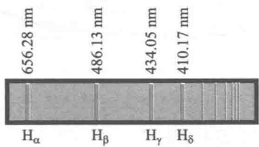  
图19-1 氢原子光谱（巴耳末系）

# 二、氢原子光谱的规律性

原子光谱是原子结构性质的反映，研究原子光谱的规律性是认识原子结构的重要手段.在所有的原子中，氢原子是最简单的，其光谱也是最简单的.

人们最早观察到氢原子在可见光范围的一些谱线，如图19-1所示.而且，1885年巴耳末（J.J.Balmer，1825—1898)发现这些谱线的波长具有如下的规律性

$$
\frac {1}{\lambda} = R \left(\frac {1}{2 ^ {2}} - \frac {1}{n ^ {2}}\right); n = 3, 4, 5, \dots \tag {19-1}
$$

其中  $R = 1.096776 \times 10^{7} \mathrm{~m}^{-1}$ ，称为氢原子的里德伯常量（J.R.Rydberg,1854—1919），波长的倒数通常被定义为波数。 $n$  为大于2的正整数， $n$  取3、4分别为  $\mathrm{H}_{\alpha}$  谱线和  $\mathrm{H}_{\beta}$  谱线。

在氢原子光谱中，除了可见光范围的巴耳末线系以外，在紫外区、红外区和远红外区分别有莱曼（T.Lyman）系、帕邢（F.Paschen）系、布拉开（F.S.Brackett）系和普丰德(A.H.Pfund)系.这些线系中的谱线的波数也都可以用与(19-1)式相似的形式表示：

莱曼系  $\frac{1}{\lambda} = R\left(\frac{1}{1^2} -\frac{1}{n^2}\right);n = 2,3,4,\dots$  在紫外区；

帕邢系  $\frac{1}{\lambda} = R\left(\frac{1}{3^2} -\frac{1}{n^2}\right);n = 4,5,6,\dots$  在近红外区；

布拉开系  $\frac{1}{\lambda} = R\left(\frac{1}{4^2} -\frac{1}{n^2}\right);n = 5,6,7,\dots$  在红外区；

普丰德系  $\frac{1}{\lambda} = R\left(\frac{1}{5^2} -\frac{1}{n^2}\right);n = 6,7,8,\dots$  在红外区；

可见氢原子光谱的五个线系遵从相似的规律性，我们可以将上述五个公式综合为一个公式：

$$
\frac {1}{\lambda} = R \left(\frac {1}{k ^ {2}} - \frac {1}{n ^ {2}}\right) \tag {19-2}
$$

其中  $k = 1,2,3\dots ;n = k + 1,k + 2,k + 3\dots$  即对于确定的线系，

为某一固定值，对于确定线系中的一系列谱线， $n$  分别取  $k + 1, k + 2, k + 3$  等。例如  $k = 1, n = 2, 3, 4 \cdots$  ，对应于莱曼系； $k = 2, n = 3, 4, 5 \cdots$  ，对应于巴耳末线系； $k = 3, n = 4, 5, 6 \cdots$  ，对应于帕邢系，等等。氢原子光谱具有的规律性说明原子世界存在着理论所没有揭示出来的奥秘。

# 三、玻尔的氢原子理论

1913年，玻尔（N.H.D.Bohr，1885—1962）在卢瑟福的原子核型结构及氢原子光谱规律性等实验事实的基础上提出了氢原子理论。玻尔的氢原子理论的基础包括有以下三条基本假设：

（1）定态假设. 原子系统存在一系列能量不连续的稳定状态，处于这些状态中的电子虽作速度变化的轨道运动，但不辐射能量. 这些状态是原子系统的稳定状态，简称定态. 通常我们把不连续的或量子化的能量简称为能级  
（2）频率假设. 原子可以从某一定态跃迁到另一定态，这时才可能辐射或吸收一个相应的光子. 设原子初态和末态的能量分别为  $E_{n}$  和  $E_{k}$ ，若  $E_{n} > E_{k}$ ，原子将辐射出一个光子；若  $E_{n} < E_{k}$ ，原子将吸收一个光子. 根据能量守恒定律，原子由能级  $E_{n}$  跃迁能级  $E_{k}$  辐射的光子的频率  $\nu_{nk}$  应满足如下关系：

$$
h \nu_ {n k} = E _ {n} - E _ {k} \tag {19-3}
$$

由于能量是不连续的，所以原子的辐射频率只能是分立的.

（3）角动量量子化假设.由玻尔的前两条基本假设我们就可以定性说明原子的稳定性及原子辐射分立光谱的实验事实.但要从理论上推导出光谱的定量规律性，必须要定量知道能量的具体取值.为此玻尔提出了著名的角动量量子化的基本假设：作定态轨道运动的电子的角动量  $\pmb{L}$  的数

文档：玻尔

动画：玻尔的氢原子模型

值只能等于  $\frac{h}{2\pi}$  的整数倍，即

$$
L = n \frac {h}{2 \pi} = n \hbar , n = 1, 2, 3, \dots \tag {19-4}
$$

其中  $\hbar = \frac{h}{2\pi} = 1.0546\times 10^{-34}\mathrm{J}\cdot \mathrm{s}$  称为约化普朗克常量，  $n$  称为量子数.

# 四、氢原子的轨道半径、能级及其光谱公式的计算

设氢原子中，电子绕核作半径为  $r$  的匀速圆周运动，运动速率为  $v$  ，由库仑定律和牛顿第二定律，可以写出下面的关系

$$
\frac {e ^ {2}}{4 \pi \varepsilon_ {0} r ^ {2}} = m _ {\mathrm {e}} \frac {v ^ {2}}{r} \tag {19-5}
$$

式中  $m_{\mathrm{e}}$  是电子的质量.再根据角动量量子化假设

$$
L = m _ {e} v r = n \hbar , \quad n = 1, 2, 3, \dots \tag {19-6}
$$

联立上述两式可以算出电子的轨道半径为

$$
r _ {n} = n ^ {2} \frac {\varepsilon_ {0} h ^ {2}}{\pi m _ {\mathrm {e}} e ^ {2}} = n ^ {2} r _ {1} \tag {19-7}
$$

式中  $n$  可取从1开始的一系列正整数.可见，氢原子中电子作圆周运动的半径是量子化的.对应于  $n = 1$  的轨道半径  $r_1$  是最小轨道的半径，称为玻尔半径，其数值为

$$
r _ {1} = \frac {\varepsilon_ {0} h ^ {2}}{\pi m _ {e} e ^ {2}} = 5. 2 9 \times 1 0 ^ {- 1 1} \mathrm {m} \tag {19-8}
$$

氢原子系统的总能量  $E$  应为电子的动能及电子与原子核的势能之和，即

$$
E = \frac {1}{2} m _ {\mathrm {e}} v ^ {2} - \frac {e ^ {2}}{4 \pi \varepsilon_ {0} r} \tag {19-9}
$$

联立（19-5）式、（19-7）式及（19-9）式可得

$$
E _ {n} = - \frac {e ^ {2}}{8 \pi \varepsilon_ {0} r _ {n}} = - \frac {1}{n ^ {2}} \frac {m _ {\mathrm {e}} e ^ {4}}{8 \varepsilon_ {0} ^ {2} h ^ {2}} \tag {19-10}
$$

可见，氢原子系统的能量也是量子化的.（19-10）式称为氢原子的能级公式.通常称能量最低的状态为基态，与氢原子基态对应的量子数为  $n = 1$  ，其能量值为

$$
E _ {1} = - \frac {m _ {\mathrm {e}} e ^ {4}}{8 \varepsilon_ {0} ^ {2} h ^ {2}} = - 1 3. 6 \mathrm {e V} \tag {19-11}
$$

大于基态的能量状态称为激发态，第一激发态对应  $n = 2$  ，其能量为  $E_{2} = -\frac{13.6}{2^{2}}\mathrm{eV} = -3.4\mathrm{eV}$  ；第二激发态对应  $n = 3$  ，其能量值为  $E_{3} = -\frac{13.6}{3^{2}}\mathrm{eV} = -1.51\mathrm{eV}$  ；依此类推。处于激发态的原子会自动地跃迁到能量较低的激发态或基态而发出一个光子，图19-2是氢原子能级及其跃迁形成光谱的示意图。处于基态的原子不存在能量更低的状态了，因此不可能跃迁到能量更低的状态而发出一个光子。这样，基态原子的结构就形成了稳定的结构，从而解释了原子核式模型的稳定性问题。另外  $n \to \infty$  时， $E \to 0$  ，此时电子刚好脱离原子核的束缚成为一个自由电子。通常我们定义基态原子中一个电子正好成为自由电子所需的能量为电离能。从氢原子的能级公式可得，基态氢原子中的电离能为  $13.6\mathrm{eV}$ ，这与实验所测得的结果相符。

已知了氢原子的能级公式后，根据玻尔的第二条基本假设可以很容易推导出氢原子光谱的定量规律.设氢原子从能量较高的激发态  $E_{n}$  跃迁到能量较低的激发态  $E_{k}(n > k)$  且发出一个光子，根据玻尔的频率假设该光子的频率为

$$
\nu_ {n k} = \frac {E _ {n} - E _ {k}}{h} = \frac {m _ {\mathrm {e}} e ^ {4}}{8 \varepsilon_ {0} ^ {2} h ^ {3}} \left(\frac {1}{k ^ {2}} - \frac {1}{n ^ {2}}\right)
$$

用波数表示为

$$
\frac {1}{\lambda_ {n k}} = \frac {\nu_ {n k}}{c} = \frac {m _ {\mathrm {e}} e ^ {4}}{8 \varepsilon_ {0} ^ {2} h ^ {3} c} \left(\frac {1}{k ^ {2}} - \frac {1}{n ^ {2}}\right) \tag {19-12}
$$

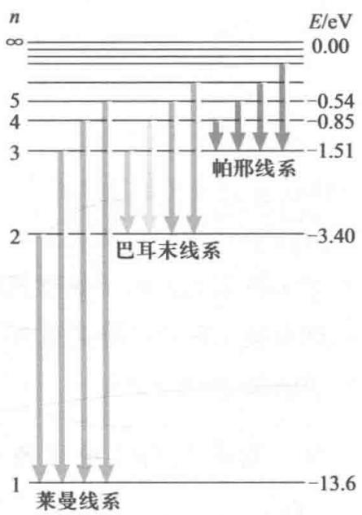  
图19-2 氢原子能级及其跃迁形成光谱的示意图

即

$$
\frac {1}{\lambda_ {n k}} = R \left(\frac {1}{k ^ {2}} - \frac {1}{n ^ {2}}\right)
$$

式中

$$
R = \frac {m _ {\mathrm {e}} e ^ {4}}{8 \varepsilon_ {0} ^ {2} h ^ {3} c} = 1. 0 9 7 3 7 3 \times 1 0 ^ {7} \mathrm {m} ^ {- 1} \tag {19-13}
$$

（19-12）式与里德伯常量公式的形式完全一致，而且  $R$  的理论值与实验值符合得很好。由此玻尔理论在解释氢原子光谱的规律性方面取得了成功。

例19-1

所谓类氢离子是指核电荷数  $Z > 1$  ，而核外只有一个电子的离子，如  $\mathrm{He}^{+},\mathrm{Li}^{++}$  等等。试由玻尔理论推导类氢离子的能级公式并计算一次电离的氦原子及二次电离的锂原子的电离能的值多大？

解 对类氢离子电子所受的库仑力为  $\frac{Ze^2}{4\pi\varepsilon_0r^2}$  电子与原子核的势能为  $-\frac{Ze^2}{4\pi\varepsilon_0r}$  这样（19-5）式和（19-9）式应改写为

$$
\frac {Z e ^ {2}}{4 \pi \varepsilon_ {0} r ^ {2}} = m _ {\mathrm {e}} \frac {v ^ {2}}{r}
$$

和

$$
E = \frac {1}{2} m _ {\mathrm {e}} v ^ {2} - \frac {Z e ^ {2}}{4 \pi \varepsilon_ {0} r}
$$

再根据（19-6）式的角动量量子化假设

$$
L = m _ {\mathrm {e}} v r = n \hbar , n = 1, 2, 3, \dots
$$

即可得类氢离子的能级公式应为

$$
E _ {n} = - \frac {1}{n ^ {2}} \frac {m _ {\mathrm {e}} (Z e ^ {2}) ^ {2}}{8 \varepsilon_ {0} ^ {2} h ^ {2}} = - \frac {Z ^ {2}}{n ^ {2}} \times 1 3. 6 \mathrm {e V}
$$

同样根据玻尔的频率条件就可以得到类氢离子光谱频率分布的规律为

$$
\frac {1}{\lambda} = Z ^ {2} R \left(\frac {1}{k ^ {2}} - \frac {1}{n ^ {2}}\right)
$$

这一结论和类氢离子光谱频率分布的经验规律符合得很好.

对一次电离的氦原子，其能级可表示为

$$
E _ {n} = - \frac {2 ^ {2}}{n ^ {2}} \times 1 3. 6 \mathrm {e V}
$$

其电离能是从  $n = 1$  激发到  $n\to \infty$  所需的能量.

$$
\Delta E = E _ {\infty} - E _ {1} = 2 ^ {2} \times 1 3. 6 \mathrm {e V} = 5 4. 4 \mathrm {e V}
$$

对二次电离的锂原子的电离能为

$$
\Delta E = 3 ^ {2} \times 1 3. 6 \mathrm {e V} = 1 2 2. 4 \mathrm {e V}
$$

例19-2

计算氢原子中的电子从量子数  $n$  的状态跃迁到量子数  $n - 1$  的状态时所发射的频率；并证明当  $n$  很大时，这个频率等于电子在量子数  $n$  的圆轨道上旋转的频率.

解 按玻尔频率公式有

$$
\nu_ {n - 1, n} = \frac {E _ {n} - E _ {n - 1}}{h}
$$

将（19-10）式的能级公式代入

$$
\begin{array}{l} \nu_ {n - 1, n} = \frac {m _ {\mathrm {e}} e ^ {4}}{8 \varepsilon_ {0} ^ {2} h ^ {3}} \left[ \frac {1}{(n - 1) ^ {2}} - \frac {1}{n ^ {2}} \right] \\ = \frac {m _ {\mathrm {e}} e ^ {4}}{8 \varepsilon_ {0} ^ {2} h ^ {3}} \frac {2 n - 1}{n ^ {2} (n - 1) ^ {2}} \\ \end{array}
$$

当  $n$  很大时

$$
\nu_ {n - 1, n} \approx \frac {m _ {\mathrm {e}} e ^ {4}}{8 \varepsilon_ {0} ^ {2} h ^ {3}} \frac {2}{n ^ {3}} = \frac {m _ {\mathrm {e}} e ^ {4}}{4 \varepsilon_ {0} ^ {2} h ^ {3} n ^ {3}}
$$

电子在量子数  $n$  的圆轨道上旋转的频率

$$
\begin{array}{l} \nu = \frac {v _ {n}}{2 \pi r _ {n}} = \frac {m _ {\mathrm {e}} v _ {n} r _ {n}}{2 \pi m _ {\mathrm {e}} r _ {n} ^ {2}} \\ = \frac {n h}{4 \pi^ {2} m _ {\mathrm {e}} r _ {n} ^ {2}} = \frac {m _ {\mathrm {e}} e ^ {4}}{4 \varepsilon_ {0} ^ {2} h ^ {3} n ^ {3}} \\ \end{array}
$$

在经典情况下该频率应为氢原子发射电磁波的频率. 显然在量子数很大的情况下, 量子理论得到与经典理论一致的结果, 玻尔认为这应该是一个普遍原则, 称为对应原理.

# 五、 原理

尽管玻尔的量子理论在氢原子问题上取得了很大成功，但用它再去讨论氢原子以外的其他元素的原子光谱却很难取得成功。另外，对氢原子光谱也只解释了谱线的频率，至于谱线的强度等问题也是无法解释的。而且，玻尔理论中的基本假设和经典物理理论是完全不相容的，而在定量推导出氢原子光谱的规律性时又应用了牛顿定律。可见玻尔的量子理论是经典力学与量子化条件相结合的产物，它必定要被更好的理论所取代。尽管如此，玻尔的量子理论在推进物理学的发展史上具有里程碑的作用，而且，玻尔提出的定态、跃迁及量子化以及对应原理等思想后来被证明

是完全正确的.下面我们讨论玻尔的对应原理

我们所熟悉的世界是一个宏观的世界. 在那里, 我们感觉到能量是连续变化的. 而从黑体辐射、光电效应、氢原子线状光谱等实验事实的分析发现, 有时在微观世界中能量只能是不连续的. 微观和宏观之间只是量大小有区别, 不应存在严格的鸿沟, 它们之间究竟存在怎样的内在联系呢? 就氢原子系统而言, 在较低的能量状态 (即相应的量子数  $n$  的取值较小) 时, 能量不连续是很明显的 (即相对的能级间距是较大的); 随着能量状态越来越高 (即相对的量子数  $n$  的取值较大), 能量的不连续就很不明显了 (即相对的能级间距会变得很小). 这时, 氢原子系统应越来越趋向经典物理的情况. 玻尔认为, 当  $n \to \infty$  时, 能级化的氢原子结论应和经典物理得到的结论一致, 即电子绕核作圆周运动时要辐射电磁波, 电磁波的频率即为电子作圆周运动的频率. 这一结论体现了玻尔对自然界是和谐统一的哲学信念, 进而可以把它推广为一条普遍成立的基本原理, 即玻尔的对应原理: 当量子数的取值趋于无穷大时, 微观世界的量子化结论应和经典物理得到的结论一致. 下面我们来说明, 根据对应原理及氢原子光谱的实验事实可以导出玻尔的角动量量子化条件  $L = n\hbar$ .

设氢原子中，电子绕原子核作半径为  $r$  、速度为  $\mathcal{V}$  的匀速圆周运动，根据经典理论氢原子辐射电磁波的频率应该等于氢原子中电子绕着原子核作圆周运动的频率：  $\nu = \frac{v}{2\pi r}$  由经典理论容易得到氢原子中电子绕着原子核作圆周运动的频率（即氢原子辐射电磁波的频率）与能量  $E$  和角动量  $L$  的定量关系为

$$
\nu = - \frac {E}{\pi L} \tag {19-14}
$$

根据玻尔的量子思想，氢原子系统的能量状态只能是

一系列量子化的定态，从能量较高的  $E_{n}$  定态跃迁到能量较低的  $E_{k}$  定态时，氢原子才辐射电磁波，发出一个波长为  $\lambda_{nk}$  的光子

$$
\frac {1}{\lambda_ {n k}} = \frac {\nu_ {n k}}{c} = \frac {E _ {n} - E _ {k}}{h c} \tag {19-15}
$$

现在，问题的关键是如何具体确定氢原子的能级公式显然，正确的氢原子能级公式应该能使氢原子跃迁产生的光子频率与氢原子光谱的实验事实即里德伯公式一致.将(19-15)式与里德伯公式的形式  $\frac{1}{\lambda_{nk}} = R_{\mathrm{H}}\left(\frac{1}{k^2} -\frac{1}{n^2}\right)$  进行比较可得，氢原子的能级公式应具有如下的具体形式：

$$
E _ {n} = - \frac {h c}{n ^ {2}} R _ {\mathrm {H}} \tag {19-16}
$$

这样根据（19-15）式可得两个相邻能级的跃迁所产生的光子的频率

$$
\nu_ {n, n - 1} = \frac {1}{h} \left(E _ {n} - E _ {n - 1}\right) = c R _ {\mathrm {H}} \left[ \frac {1}{(n - 1) ^ {2}} - \frac {1}{n ^ {2}} \right] = c R _ {\mathrm {H}} \frac {2 n - 1}{n ^ {2} (n - 1) ^ {2}}
$$

$n\longrightarrow \infty$  时

$$
\nu_ {n, n - 1} \approx c R _ {\mathrm {H}} \frac {2}{n ^ {3}} \tag {19-17}
$$

根据玻尔的对应原理，  $n\to \infty$  时两个相邻能级的跃迁所产生的光子的频率应等于此时经典情况所产生的辐射频率.根据（19-17）式和（19-14）式可得

$$
c R _ {\mathrm {H}} \frac {2}{n ^ {3}} = - \frac {E _ {n}}{\pi L _ {n}}; n \rightarrow \infty
$$

将（19-16)式代入得

$$
c R _ {\mathrm {H}} \frac {2}{n ^ {3}} = - \frac {1}{\pi L _ {n}} \left(- \frac {h c R _ {\mathrm {H}}}{n ^ {2}}\right)
$$

解得

$$
L _ {n} = n \frac {h}{2 \pi} = n \hbar ; n \rightarrow \infty
$$

玻尔将此  $n\to \infty$  时得到的结论推广为普遍成立的结论，由此得到了著名的角动量量子化条件

从本节的讨论中可以看到，具体的量子化条件则可以由对应原理、能级、跃迁等创新概念，从定量的实验事实即里德伯公式反推出来。因此，再用量子化条件、经典模型、公式自然能演绎得到正确的能级公式——里德伯公式。可见，玻尔的工作既是非常创新的，又是非常务实的。他第一个比较系统地创建了一个解决原子系统性质的理论，为人类能够探索微观世界做出了巨大的贡献。爱因斯坦曾对玻尔模型及玻尔这样评价道：“即便在今天，在我看来，这也是一个奇迹！它简直是思维上最和谐的乐章。”“作为一位科学思想家，玻尔之所以有那么惊人的吸引力，是因为他具有大胆和谨慎这两种品质的难得的融合，很少有谁对隐秘的事物具有这样一种直觉的理解力，同时又兼有这样强有力批判能力。他不但具有关于细节的全部知识，而且还始终坚定地注视着基本原理，他无疑是我们这个时代的科学领域中最伟大的发现者之一。”

# 六、弗兰克-赫兹实验

文档：弗兰克

文档：赫兹

1914年弗兰克（JamesFranck，1882—1964）和赫兹(G.L.Hertz,1887—1975)进行了电子撞击原子的实验，从另一种独立于光谱研究的方法验证了玻尔提出的原子能级、跃迁的创新概念.弗兰克-赫兹实验的示意图如图19-3所示.在玻璃容器中充以汞蒸气，在阴极K和栅极G之间的加一加速电压  $V_{\mathrm{a}}$  ；在栅极G和接受极A之间的加一反电压 $V_{\mathrm{c}}$  .当一个电子从容器中的热阴极K发出，栅极G和接受极A之间的加速电压  $V_{\mathrm{a}}$  可以使电子加速而获得能量；与此同时，电子在KG空间与蒸气汞原子发生碰撞可能将加速得到的部分能量转移给气体原子.当这个电子到达栅极G

时，若本身剩余的能量大于  $eV_{\mathrm{c}}$  则电子能够到达接受极A而形成电流；若本身剩余的能量小于  $eV_{\mathrm{c}}$  则电子不能到达接受极A而形成电流.实验时，使  $V_{\mathrm{a}}$  逐渐增加，同时观察板极电流的变化可以得到如图19-4所示的  $I_{\mathrm{A}} - V_{\mathrm{a}}$  曲线.实验发现，随着  $V_{\mathrm{a}}$  的增加，极板电流不断地线性上升又突然下降，出现一系列的峰和谷，相邻两峰之间的电压大小均为  $4.9\mathrm{V}$

上述实验事实表明，电子在能量增加但未达到  $4.9\mathrm{V}$  时，电子与蒸气汞原子的碰撞不损失能量；而当电子在能量增加到  $4.9\mathrm{V}$  时，若电子碰到蒸气汞原子将损失所有能量；因此，在  $V_{\mathrm{a}}$  较高的情况下，从阴极K跑向栅极G之间的路程中，只要  $V_{\mathrm{a}} = n\times 4.9\mathrm{V}(n = 1,2,\dots)$  就将与汞原子发生非弹性碰撞而使  $I_{\mathrm{A}} - V_{\mathrm{a}}$  曲线上将出现  $n$  次下降。这一事实充分说明，汞原子中存在能级结构，当电子能量未达到相邻能级间距时，电子与汞原子发生弹性碰撞，电子不损失能量；当电子能量达到相邻能级间距时，电子与汞原子发生非弹性碰撞，电子的能量传递给汞原子，使汞原子跃迁到第一激发态。总之弗兰克-赫兹实验的结果直接证实了玻尔有关原子定态假设的正确性。

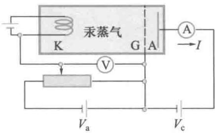  
图19-3 弗兰克-赫兹实验的示意图

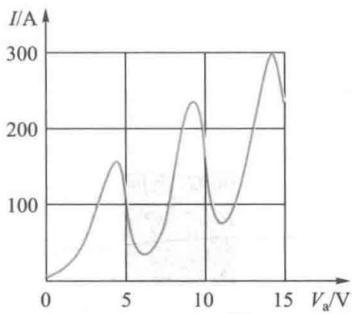  
图19-4 弗兰克-赫兹实验的  $I_{\mathrm{A}} - V_{\mathrm{a}}$  曲线

# 19-2 波函数 薛定谔方程

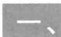

# 波函数及其统计诠释

在经典物理学中我们已经知道，一个被看作为质点的宏观物体的运动状态，是用它的位置矢量和动量来描述的。但是，对于微观粒子，由于它具有波动性，根据不确定关系，其位置和动量是不可能同时准确确定的，所以我们也就不可能如经典物理一样用位置、动量以及轨道这样一些概念

文档：玻恩

来描述微观粒子的运动情况了. 那么, 微观粒子的运动状态应该用什么来描述呢?

考虑到微观粒子是具有波动性的，我们可以参照经典波的描述方法来描述微观粒子的运动状态。在经典物理学中，我们用波函数  $\psi (r,t)$  来描述一个经典波的运动状态，它表示在  $t$  时刻、在空间  $r$  处的某波动的量值为  $\psi$ 。对弹性介质中的机械波而言，这个量为质点离开平衡位置的位移；对真空中的电磁波而言，这个量是该处的电场强度或磁场强度的值。对微观粒子，我们可以尝试着用一个波函数  $\psi = \psi (r,t)$  来描述微观粒子的运动状态。1926年，奥地利物理学家薛定谔对这个问题进行了具体的探索并取得了极大的成功。现在我们首先来讨论，这个描述微观粒子的波函数  $\psi (r,t)$  究竟是什么波动的物理量呢？1926年玻恩（M.Born，1882—1970）指出，德布罗意波或波函数  $\psi (r,t)$  不代表实际物理量的波动，而是描述粒子在空间的概率分布的概率波。

如果某微观粒子的概率波的波函数是  $\psi (r,t) =$ $\psi (x,y,z,t)$  ，那么在  $t$  时刻、在空间  $(x,y,z)$  附近的体积元 $\mathrm{d}V = \mathrm{d}x\mathrm{d}y\mathrm{d}z$  内粒子出现的概率正比于

$$
\psi^ {*} (x, y, z, t) \psi (x, y, z, t) \cdot d V
$$

或

$$
\psi^ {*} (r, t) \psi (r, t) \cdot d V
$$

其中  $\psi^{*}(x,y,z,t)$  是  $\psi (x,y,z,t)$  的共轭复数（或称复共轭).于是，在  $t$  时刻、在空间  $(x,y,z)$  附近单位体积内粒子出现的概率，即概率密度可以表示为

$$
\psi^ {*} (\boldsymbol {r}, t) \psi (\boldsymbol {r}, t) = | \psi (\boldsymbol {r}, t) | ^ {2} \tag {19-18}
$$

玻恩对波函数的统计诠释能够将量子概念下的波和粒子统一起来了，为我们进一步理解微观粒子的波粒二象性提供一种更清晰的图像。首先，概率波给出的是出现粒子的概率，它不要求破坏粒子的整体性；其次，粒子在空间的分

布服从概率波，而其波函数  $\psi (r,t)$  遵循波动规律的，由它完全可以解释微观粒子的干涉和衍射现象.由此可见，微观粒子既不是经典概念中的粒子，也不是经典概念中的波.经典概念中的粒子，其运动规律遵从牛顿运动定律并具有确定的运动轨道；经典概念中的波，其实体弥散在整个空间并且存在着某个在空间波动的物理量.而微观粒子的波粒二象性，其粒子性表示微观粒子具有一定能量、动量和质量等粒子的属性，但事实显示，它不具有确定的运动轨道，运动规律不遵从牛顿运动定律；微观粒子的波动性表示微观粒子的运动状态要用波函数来描述，但它并不是某个实在物理量在空间的波动，而是一种能调控粒子出现在空间某处概率的波，由此可以圆满解释微观粒子具有干涉、衍射等波动现象.

由于波函数与粒子在空间出现的概率相联系，需要波函数满足单值、连续和有限的基本条件。在经典物理学中，波函数  $\psi (r,t)$  和  $c\psi (r,t)(c$  是常数）代表了能量或强度不同的两种波动状态；而在量子力学中，这两个波函数却描述了同一个量子态，或者说代表了同一个概率波，因为它们所表示的概率分布的相对大小是相同的。所以，波函数允许包含一个任意的常数因子。但是，一个好的概率分布应该采用归一化的概率。即要求一个在空间内运动的粒子，任意时刻在全空间找到它的概率等于1，即

$$
\int_ {- \infty} ^ {\infty} | \Psi | ^ {2} \mathrm {d} V = 1 \tag {19-19}
$$

上式就称为波函数的归一化条件

在经典的波动学中，我们曾在波的叠加原理的基础上解释了波的干涉、衍射现象。同样在量子力学中，波的叠加原理也成立，这个原理被称为态叠加原理：如果波函数 $\psi_{1}(\boldsymbol {r},t),\psi_{2}(\boldsymbol {r},t),\dots$  都是描述系统的可能的量子态，那么它们的线性叠加

$$
\psi (\boldsymbol {r}, t) = c _ {1} \psi_ {1} (\boldsymbol {r}, t) + c _ {2} \psi_ {2} (\boldsymbol {r}, t) + \dots
$$

上式也是这个系统的一个可能的量子态. 式中  $c_{1}, c_{2}, \cdots$  一般是复常数. 原则上, 在量子力学的态叠加原理基础上就能解释实物粒子的干涉、衍射现象.

# 二、薛定谔方程

文档：薛定谔

# 1. 含时薛定谔方程

1926年薛定谔在讨论德布罗意提出的实物粒子波动性的基础上建立了用波函数  $\psi (r,t)$  来定量描述微观粒子运动状态的思想，并进一步提出了实物粒子的波函数应遵循的微分方程，即著名的薛定谔方程

薛定谔首先是从自由粒子的波入手来“猜测”实物粒子遵循的波动方程的. 薛定谔认为, 沿  $x$  方向运动的能量为  $E$  、动量为  $p$  的自由粒子的状态波函数应与沿  $x$  方向传播的频率为  $\nu$  、波长为  $\lambda$  的平面简谐波具有相同的波函数形式, 采用复指数形式可表示为

$$
\psi (x, t) = \psi_ {0} \exp \left[ - \mathrm {i} 2 \pi \left(\nu t - \frac {x}{\lambda}\right) \right]
$$

由德布罗意关系式有  $\nu = E / h$  及  $\lambda = p / h$  ，将此两式代入上式得

$$
\psi (x, t) = \psi_ {0} \exp \left[ - \mathrm {i} \frac {2 \pi}{h} (E t - p x) \right]
$$

这就是沿  $x$  方向运动的能量为  $E$  、动量为  $p$  的状态波函数.将状态波函数对时间一次微商，整理后得

$$
\frac {\partial \psi (x , t)}{\partial t} = - \frac {\mathrm {i}}{\hbar} E \psi (x, t) \tag {19-20}
$$

将状态波函数对坐标二次微商，整理后得

$$
\frac {\partial^ {2} \psi}{\partial x ^ {2}} = - \frac {p ^ {2}}{\hbar^ {2}} \psi \tag {19-21}
$$

从（19-20）式和（19-21）式可以得到

$$
\mathrm {i} \hbar \frac {\partial \psi}{\partial t} + \frac {\hbar^ {2}}{2 m} \frac {\partial^ {2} \psi}{\partial x ^ {2}} = \left(E - \frac {p ^ {2}}{2 m}\right) \psi \tag {19-22}
$$

在粒子的运动速度远小于光速的非相对论情况下，自由粒子的动能（也就是它的总能量）与动量之间存在下面的关系

$$
E = \frac {p ^ {2}}{2 m}
$$

式中  $m$  是粒子的质量. 根据（19-22）式可以得到

$$
\mathrm {i} \hbar \frac {\partial \psi}{\partial t} = - \frac {\hbar^ {2}}{2 m} \frac {\partial^ {2} \psi}{\partial x ^ {2}}
$$

这就是自由粒子所满足的薛定谔方程.如果粒子不是自由的，而是处于力场中，势能为  $V(x,t)$  ，这时粒子的总能量应是动能和势能之和，即

$$
E = \frac {p ^ {2}}{2 m} + V (x, t)
$$

由（19-22）式可以得到

$$
\mathrm {i} \hbar \frac {\partial \psi}{\partial t} = - \frac {\hbar^ {2}}{2 m} \frac {\partial^ {2} \psi}{\partial x ^ {2}} + V (x, t) \psi \tag {19-23}
$$

这就是一维形式的含时薛定谔方程，推广到三维形式，一般的薛定谔方程为

$$
\mathrm {i} \hbar \frac {\partial \psi}{\partial t} = - \frac {\hbar^ {2}}{2 m} \left(\frac {\partial^ {2} \psi}{\partial x ^ {2}} + \frac {\partial^ {2} \psi}{\partial y ^ {2}} + \frac {\partial^ {2} \psi}{\partial z ^ {2}}\right) + V (x, y, z, t) \psi
$$

采用拉普拉斯算符：  $\nabla^2 = \frac{\partial^2\psi}{\partial x^2} +\frac{\partial^2\psi}{\partial y^2} +\frac{\partial^2\psi}{\partial z^2}$  则（19-23）式可表示为

$$
\mathrm {i} \hbar \frac {\partial \psi}{\partial t} = - \frac {\hbar^ {2}}{2 m} \nabla^ {2} \psi + V (\boldsymbol {r}, t) \psi \tag {19-24}
$$

薛定谔方程描述了粒子状态随时间和空间变化所普遍遵从的规律，它是量子力学中的基本方程式。

# 2. 定态薛定谔方程

如果粒子所处势场只是坐标的函数，而与时间无关，即

可以写成  $V(r)$  的形式，这时可将薛定谔方程的一个特解写成坐标函数与时间函数的乘积，即

$$
\psi (\boldsymbol {r}, t) = \psi (\boldsymbol {r}) f (t) \tag {19-25}
$$

将上式代入薛定谔方程（19-24）式，分离变量后得

$$
\frac {1}{\psi (\boldsymbol {r})} \left[ - \frac {\hbar^ {2}}{2 m} \nabla^ {2} \psi (\boldsymbol {r}) + V (\boldsymbol {r}) \psi (\boldsymbol {r}) \right] = \mathrm {i} \hbar \frac {1}{f (t)} \frac {\mathrm {d} f (t)}{\mathrm {d} t} \tag {19-26}
$$

上式左边只是时间的函数，右边只是坐标的函数，而时间和坐标都是独立变量，所以两边只能同时等于一个与时间和坐标都无关的常量，可将这个常量表示为  $E$  于是(19-26)式就分成了两个方程，第一个方程是

$$
\mathrm {i} \hbar \frac {1}{f (t)} \frac {\mathrm {d} f (t)}{\mathrm {d} t} = E
$$

这个方程的解为

$$
f (t) = c \exp \left(- \frac {\mathrm {i}}{\hbar} E t\right) \tag {19-27}
$$

式中  $c$  为常量，第二个方程是

$$
\left[ - \frac {\hbar^ {2}}{2 m} \nabla^ {2} + V (\boldsymbol {r}) \right] \psi (\boldsymbol {r}) = E \psi (\boldsymbol {r}) \tag {19-28}
$$

这就是定态薛定谔方程，求解这个方程就可以得到定态波函数  $\psi (r)$  将（19-27）式代入（19-25）式得到含时薛定谔方程解的形式表示为

$$
\psi (\boldsymbol {r}, t) = \psi (\boldsymbol {r}) \exp \left(- \frac {\mathrm {i}}{\hbar} E t\right) \tag {19-29}
$$

其中常量  $c$  归并到  $\psi (r)$  中了，以后可以统一地由归一化条件确定.

对（19-29）式的波函数所描述的状态，粒子在空间的概率密度分布具有如下特点：

$$
\psi^ {*} (\boldsymbol {r}, t) \psi (\boldsymbol {r}, t) = \psi^ {*} (\boldsymbol {r}) \psi (\boldsymbol {r})
$$

上式说明，此状态下粒子在空间的概率分布不随时间变化，故称为定态。下面我们以作一维运动的自由粒子为例

来讨论定态薛定谔方程中常量  $E$  的物理意义. 对作一维运动的自由粒子而言,  $V(x) = 0$ , 一维定态薛定谔方程为

$$
- \frac {\hbar^ {2}}{2 m} \frac {\mathrm {d} ^ {2}}{\mathrm {d} x ^ {2}} \psi (x) = E \psi (x)
$$

定态薛定谔方程的解为

$$
\psi (x) = c _ {2} \exp \left(- \frac {\mathrm {i}}{\hbar} \sqrt {2 m E} \cdot x\right)
$$

式中  $c_{2}$  为常量，其含时薛定谔方程的解为

$$
\psi (x, t) = \psi_ {0} \exp \left[ - \frac {\mathrm {i}}{\hbar} (E t - \sqrt {2 m E} \cdot x) \right]
$$

式中  $\psi_0$  为常量，将此解与自由粒子的平面波函数相比较可知，常量  $E$  就是粒子的能量。这一结论可以推广到一般情况，通常我们将常量  $E$  称为能量本征值。若定义哈密顿算符  $\hat{H} = -\frac{\hbar^2}{2m}\nabla^2 + V(r)$ ，则定态薛定谔方程（19-28）式可表示为如下形式：

$$
\hat {H} \psi (\boldsymbol {r}) = E \psi (\boldsymbol {r}) \tag {19-30}
$$

通常我们也将上述方程称为能量的本征方程，将相应的定态波函数称为能量本征函数。一个本征函数必定相应有一个能量本征值，但一个能量本征值可以相应有多个本征函数。

# 3. 从薛定谔方程可以得到的一些初步结论

首先，薛定谔方程是线性方程，这就保证了它的解，即描述粒子的量子态的波函数满足态叠加原理

其次，薛定谔方程包含有虚数因子，这样波函数必定是复数，波函数的模的平方必定是实数，它代表了粒子出现的概率.并且由薛定谔方程可以普遍地证明粒子的概率必定守恒，这和非相对论下粒子数必定守恒的事实一致.

另外，如果粒子所处势场只是坐标的函数，而与时间无

关，这时必定存在有一些状态不随时间变化的定态。在原子中，电子所处势场只是坐标的函数，而与时间无关，因此原子必定存在一些定态。

最后再一次强调，薛定谔方程是量子力学的一个基本原理，它的得到并不存在一个严格的推理过程，而是一个创新发现的过程，但它的正确性必须由实验来检验

例19-3

已知线性谐振子处在基态和第一激发态的波函数分别为

$$
\psi_ {0} = \sqrt [ 4 ]{\frac {\alpha^ {2}}{\pi}} e ^ {- \frac {\alpha^ {2} x ^ {2}}{2}}, \quad \psi_ {1} = \sqrt {\frac {2 \alpha^ {3}}{\pi^ {\frac {1}{2}}}} x e ^ {- \frac {\alpha^ {2} x ^ {2}}{2}}
$$

其中  $\alpha = \sqrt{\frac{m\omega}{\hbar}},\omega$  为线性谐振子的角频率.试根据定态薛定谔方程求在这两个状态时的能量取值.

解线性谐振子的哈密顿算符为

$$
h = - \frac {\hbar}{2 m} \frac {\mathrm {d} ^ {2}}{\mathrm {d} x ^ {2}} + \frac {1}{2} m \omega^ {2} x ^ {2}
$$

$$
\begin{array}{l} H \psi_ {0} = - \frac {\hbar^ {2}}{2 m} \frac {\mathrm {d} ^ {2}}{\mathrm {d} x ^ {2}} \left(\sqrt [ 4 ]{\frac {\alpha^ {2}}{\pi}} \mathrm {e} ^ {- \frac {\alpha^ {2} x ^ {2}}{2}}\right) + \frac {1}{2} m \omega^ {2} x ^ {2} \psi_ {0} \\ = - \frac {\hbar^ {2}}{2 m} \left(\alpha^ {4} x ^ {2} - \alpha^ {2}\right) \psi_ {0} + \frac {1}{2} m \omega^ {2} x ^ {2} \psi_ {0} \\ = \frac {1}{2} \hbar \omega \psi_ {0} \\ \end{array}
$$

$$
\begin{array}{l} H \psi_ {1} = - \frac {\hbar^ {2}}{2 m} \frac {\mathrm {d} ^ {2}}{\mathrm {d} x ^ {2}} \left(\sqrt {\frac {2 \alpha^ {3}}{\pi^ {1 / 2}}} x \mathrm {e} ^ {- \frac {\alpha^ {2} x ^ {2}}{2}}\right) + \frac {1}{2} m \omega^ {2} x ^ {2} \psi_ {1} \\ = - \frac {\hbar^ {2}}{2 m} \left(\alpha^ {4} x ^ {2} - 3 \alpha^ {2}\right) \psi_ {1} + \frac {1}{2} m \omega^ {2} x ^ {2} \psi_ {1} \\ = \frac {3}{2} \hbar \omega \psi_ {1} \\ \end{array}
$$

根据定态薛定谔方程  $H\psi_{n} = E_{n}\psi_{n}$  可知基态和第一激发态的能量取值分别为

$$
E _ {0} = \frac {1}{2} \hbar \omega , \quad E _ {1} = \frac {3}{2} \hbar \omega
$$

# 19-3 一维无限深势阱中的粒子

只要知道粒子的质量和它在所受作用的势能函数  $V$  的

具体形式，就可以写出具体的定态薛定谔方程。根据具体的边界条件，以及波函数应满足的单值、有限、连续、归一化的条件就可解出粒子遵循的具体波函数及系统的能量  $E$  等具体内容。下面我们讨论粒子在一种简单的作用下作一维运动的情况。

设粒子所受的作用势能为

$$
V (x) = \left\{ \begin{array}{l l} 0, & 0 \leqslant x \leqslant a \\ \infty , & x <   0 \text {或} x > a \end{array} \right.
$$

这种势能函数的曲线如图19-5所示. 受到这样的作用势能, 就如同一个被严格限制在  $x = 0$  和  $x = a$  两点之间的无限深的平底深谷中作一维自由运动的粒子, 故称这种情况为一维无限深势阱中的粒子.

由于阱外势能是无限大的，所以粒子不可能到阱外去，即阱外的波函数为零。又由于波函数必须是连续的，所以在阱壁处波函数也必定为零。由此我们就得到了具体的边界条件

$$
\psi (0) = \psi (a) = 0
$$

在势阱内  $V(x) = 0$  ，定态薛定谔方程可写作

$$
- \frac {\hbar^ {2}}{2 m} \frac {\mathrm {d} ^ {2} \psi}{\mathrm {d} x ^ {2}} = E \psi
$$

令  $k^2 = \frac{2mE}{\hbar^2}$  上式可以表示为

$$
\frac {\mathrm {d} ^ {2} \psi}{\mathrm {d} x ^ {2}} + k ^ {2} \psi = 0
$$

此式的通解为

$$
\psi (x) = A \sin (k x + \varphi)
$$

式中  $A$  和  $\varphi$  是积分常数.其中常数  $A$  不能为零，否则波函数也会变成零.根据边界条件  $\psi (0) = \psi (a) = 0$  ，可以确定

$$
\left\{ \begin{array}{l} \varphi = 0 \\ k a = n \pi , n = 1, 2, 3, \dots \end{array} \right.
$$

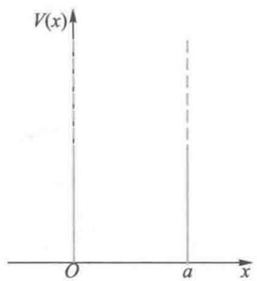  
图19-5 一维无限深势阱的势能分布

由于  $n$  只能取一些分立的值，所以  $k$  的取值只能是量子化的. 根据关系式  $k^2 = \frac{2mE}{\hbar^2}$ ，可以得到能量也必定是量子化的

$$
E _ {n} = \frac {\hbar^ {2} \pi^ {2}}{2 m a ^ {2}} n ^ {2}, n = 1, 2, 3, \dots \tag {19-31}
$$

于是我们得到了一维无限深势阱中粒子的能级公式. 由于能量的变化只取决于自然数  $n$ , 可以称  $n$  为能量量子数. 由于  $n$  不能为零, 否则波函数也会变成零, 所以最小的能量值不能为零, 这也是与经典物理完全不同的结论. 量子力学中将最小的能量取值称为零点能. 由上式所表示的整套能量本征值, 称为系统的能谱. 显然, 一维无限深方势阱的能谱是分立谱.

将确定的  $k$  和  $\varphi$  代入通解可以得到与能量本征值相应的能量本征函数为

$$
\psi_ {n} (x) = A \sin \left(\frac {n \pi x}{a}\right), \quad n = 1, 2, 3, \dots , \quad 0 \leqslant x \leqslant a
$$

由归一化条件  $\int_0^a A^2\sin^2\left(\frac{n\pi x}{a}\right)\mathrm{d}x = 1$  可以确定常数  $A$  的值

$$
A = \sqrt {\frac {2}{a}}
$$

于是归一化波函数可以表示为

$$
\psi_ {n} (x) = \sqrt {\frac {2}{a}} \sin \left(\frac {n \pi x}{a}\right), \quad n = 1, 2, 3, \dots \tag {19-32}
$$

粒子的最低能量状态称为基态，就是  $n = 1$  的状态，容易得到基态的能量即零点能为

$$
E _ {1} = \frac {\hbar^ {2} \pi^ {2}}{2 m a ^ {2}}
$$

基态的本征函数为

$$
\psi_ {1} (x) = \sqrt {\frac {2}{a}} \sin \left(\frac {\pi x}{a}\right)
$$

图19-6中画出了对应于能量本征值  $E_{1}, E_{2}, E_{3}$  和  $E_{4}$  的波函数  $\psi_{1}, \psi_{2}, \psi_{3}$  和  $\psi_{4}$  以及相应的概率密度. 下面我们就量子力学对一维无限深势阱中粒子的讨论过程及其主要结论作一些小结: (1) 只要知道粒子的质量和它在势场中势能函数  $V$  的具体形式, 就可以写出其薛定谔方程; (2) 根据给定的边界条件及波函数所要求的标准条件, 不但可以解得反映粒子具体状态的波函数, 而且在解波函数的过程中能得到能量的所有可能取值. 在一维无限深势阱的情况下能量必定是量子化的, 能量量子化是粒子遵循具体的薛定谔方程下的必然结果; (3) 量子系统具有零点能, 即微观粒子系统具有的最小能量值不为零. 在一维无限深势阱的情况下最小的能量值 (称为基态能量) 为  $E_{1} = \frac{\hbar^{2} \pi^{2}}{2 m a^{2}}$ ; (4) 从薛定谔方程中解得反映粒子具体状态的波函数后, 不但我们能知道该具体状态下系统的能量取值, 而且我们还能知道粒子出现在空间各处的概率密度. 在量子力学系统中不存在精确轨道的概念.

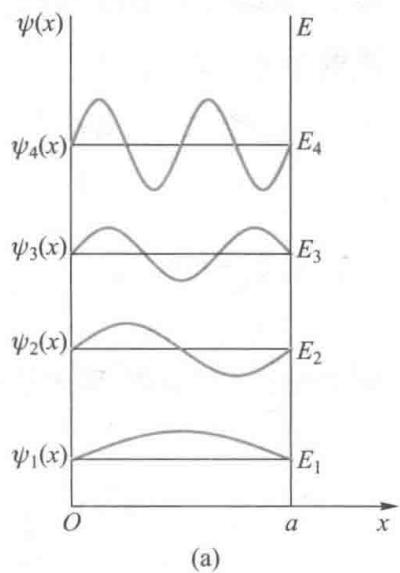

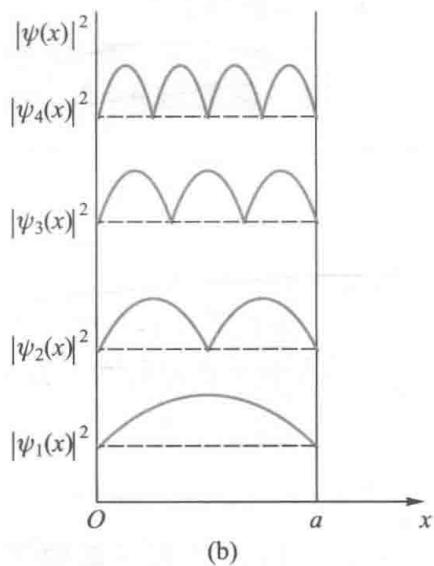  
图19-6 一维无限深势阱中的波函数及概率分布

例19-4

已知一维无限深势阱中粒子的定态波函数为  $\psi_{n} = \sqrt{\frac{2}{a}}\sin \frac{n\pi x}{a}$  试求：（1）粒子处于基态及第一激发态时，在  $x = 0$  到  $x = \frac{a}{3}$  之间找到粒子的概率；（2）设一个质子在阱宽  $a = 10^{-14}\mathrm{m}$  的一维无限深势阱中，其零点能有多大？（质子的质量  $m = 1.67\times 10^{-27}\mathrm{kg}$  ）

解（1）粒子的概率密度正比于波函数模的平方.即

$$
\left| \psi_ {n} \right| ^ {2} = \frac {2}{a} \sin^ {2} \frac {n \pi x}{a}, \quad n = 1, 2, 3, \dots
$$

基态  $n = 1,|\psi_1|^2 = \frac{2}{a}\sin^2\frac{\pi x}{a},$  在  $x = 0$  到  $x = \frac{a}{3}$  之间找到粒子的概率为

$$
\begin{array}{l} P _ {1} = \int_ {0} ^ {\frac {a}{3}} | \psi_ {1} | ^ {2} \mathrm {d} x = \int_ {0} ^ {\frac {a}{3}} \frac {2}{a} \sin^ {2} \frac {\pi x}{a} \mathrm {d} x \\ = 0. 1 9 5 \\ \end{array}
$$

第一激发态  $n = 2,|\psi_2|^2 = \frac{2}{a}\sin^2\frac{2\pi x}{a},$

在  $x = 0$  到  $x = \frac{a}{3}$  之间找到粒子的概率为

$$
\begin{array}{l} P _ {2} = \int_ {0} ^ {\frac {a}{3}} | \psi_ {2} | ^ {2} d x = \int_ {0} ^ {\frac {a}{3}} \frac {2}{a} \sin^ {2} \frac {2 \pi x}{a} d x \\ = 0. 4 0 2 \\ \end{array}
$$

（2）一维无限深势阱的能级公式为

$$
E _ {n} = \frac {\hbar^ {2} \pi^ {2}}{2 m a ^ {2}} n ^ {2} \quad n = 1, 2, 3, \dots
$$

质子的最低能量状态就是  $n = 1$  的基态，其能量即零点能为

$$
E _ {1} = \frac {h ^ {2}}{8 m a ^ {2}} = 3. 2 9 \times 1 0 ^ {- 1 3} J
$$

例19-5

已知一维无限深方势阱  $(x = 0$  到  $a$  之间)中质量为  $m$  的粒子的状态处于下述波函数中

$$
\varphi (x) = \frac {2}{\sqrt {a}} \sin \left(\frac {2 \pi x}{a}\right) \cos \left(\frac {\pi x}{a}\right)
$$

试求：（1）该状态下该粒子可能的能量取值及其相应的概率；（2）该粒子在该状态下的能量平均值.

解（1）根据三角函数的公式可得

$$
\varphi (x) = \frac {1}{\sqrt {a}} \sin \frac {\pi x}{a} + \frac {1}{\sqrt {a}} \sin \frac {3 \pi x}{a},
$$

因为处于一维无限深方势阱（  $x = 0$  到  $\alpha$  之间）中粒子的定态薛定谔方程的解为

$$
\varphi_ {n} (x) = \sqrt {\frac {2}{a}} \sin \left(\frac {n \pi x}{a}\right); E _ {n} = \frac {\hbar^ {2} \pi^ {2}}{2 m a ^ {2}} n ^ {2};
$$

$$
n = 1, 2, 3, \dots
$$

根据状态叠加原理可知该粒子可能的能

量取值及其相应的概率为

[ E = \left\{ \begin{array}{l} E_{1} = \frac{\hbar^{2}\pi^{2}}{2ma^{2}} \times 1^{2} \left( 相应的归一化概率为: c_{1}^{2} = \frac{1}{2} \right) \\ E_{3} = \frac{\hbar^{2}\pi^{2}}{2ma^{2}} \times 3^{2} \left( 相应的归一化概率为: c_{3}^{2} = \frac{1}{2} \right) \end{array} \right. ]

（2）在该状态下的能量平均值为

$$
\bar {E} = c _ {1} ^ {2} E _ {1} + c _ {3} ^ {2} E _ {3} = \frac {5 \hbar^ {2} \pi^ {2}}{2 m a ^ {2}}
$$

# 19-4 一维势垒 隧道效应

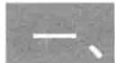

# 一维势垒 隧道效应

通常我们把下面形式的作用势能称为一维势垒

$$
V (x) = \left\{ \begin{array}{l l} V _ {0}, & 0 \leqslant x \leqslant a \\ 0, & 0 <   x \text {或} x > a \end{array} \right.
$$

其势能曲线如图19-7所示.现在我们来讨论一个能量小于势垒高度  $V_{0}$  的粒子从左向右射向势垒时可能出现的物理情况.

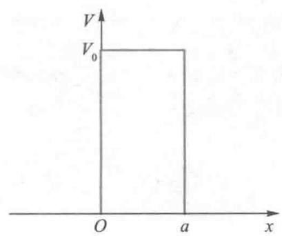  
图19-7 一维势垒的势能曲线

在各区的薛定谔方程形式为

$$
\left\{ \begin{array}{l l} \frac {\mathrm {d} ^ {2} \psi}{\mathrm {d} x ^ {2}} + \frac {2 m E}{\hbar^ {2}} \psi = 0, & 0 <   x \text {或} x > a \\ \frac {\mathrm {d} ^ {2} \psi}{\mathrm {d} x ^ {2}} - \frac {2 m (V _ {0} - E)}{\hbar^ {2}} \psi = 0, & 0 \leqslant x \leqslant a \end{array} \right.
$$

设  $k^2 = \frac{2mE}{\hbar^2}, k_1^2 = \frac{2m(V_0 - E)}{\hbar^2}$ ，可以得到薛定谔方程在各区的通解应为

$$
\left\{ \begin{array}{l l} \psi_ {1} (x) = A \mathrm {e} ^ {\mathrm {i} k x} + R \mathrm {e} ^ {- \mathrm {i} k x}, & x \leqslant 0 \\ \psi_ {2} (x) = T \mathrm {e} ^ {- k _ {1} x}, & 0 \leqslant x \leqslant a \\ \psi_ {3} (x) = C \mathrm {e} ^ {\mathrm {i} k x}, & x \geqslant a \end{array} \right.
$$

在  $x \leqslant 0$  区，波函数包括两部分，一部分是沿  $x$  方向传播的入射波  $A_{1} \mathrm{e}^{\mathrm{i} k x}$ ，另一部分则是沿  $x$  方向传播的反射波  $R \mathrm{e}^{-\mathrm{i} k x}$ ；在  $0 \leqslant x \leqslant a$  势垒区，是一个进入势垒的透射波  $T \mathrm{e}^{-k_{1} x}$ ；在  $x \geqslant a$  区，是一个穿出势垒的沿  $x$  方向传播的透射波  $C \mathrm{e}^{\mathrm{i} k x}$ 。系数  $A, R, T, C$  可以根据波函数在  $x = 0$  和  $x = a$  处连续性要求加以确定。我们发现系数  $C$  并不等于零。这说明能量小于势垒高度  $V_{0}$  的粒子可以穿过势垒区。这一结果与经典物理学的结论存在严重矛盾的。从经典物理学

  
动画：一维势垒波函数

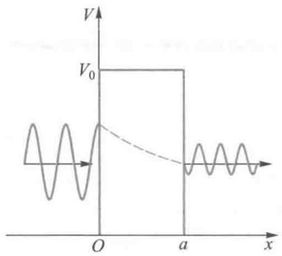  
图19-8 隧道效应中波函数分布的示意图

观点看，粒子穿过比其动能高的势垒是不可能的。粒子能够穿透比其动能高的势垒的现象，称为隧道效应。图19-8是在隧道效应中波函数分布的示意图。下面我们计算一个能量小于势垒高度  $V_{0}$  的粒子穿过势垒的概率  $P$ ，我们将此概率定义为  $x = a$  处的概率密度与  $x = 0$  处的概率密度比值，即

$$
P = \frac {\left| \psi_ {3} (a) \right| ^ {2}}{\left| \psi_ {2} (0) \right| ^ {2}}
$$

根据波函数在  $x = a$  处连续性  $\psi_{3}(a) = \psi_{2}(a) = Te^{-k_{1}a}$ ，又  $\psi_{2}(0) = T$ ，所以势垒的透射系数可以表示为

$$
P = \exp (- 2 k _ {1} a) = \exp \left[ - \frac {2 a}{\hbar} \sqrt {2 m (V _ {0} - E)} \right] \tag {19-33}
$$

由（19-33）式可以看出，只有当粒子的质量  $m$  比较小、势垒宽度  $a$  比较小以及势垒高度  $V_{0}$  超过粒子能量的值比较小的情况下，隧道效应才会明显地呈现出来。隧道效应作为量子力学的结论不但已充分地被实验所证实，而且它在现代科学技术中有许多重要应用，扫描隧穿显微镜就是其中一例。

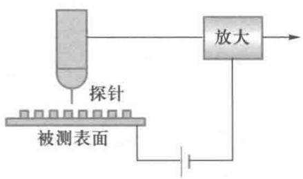  
图19-9 扫描隧穿显微镜物理原理的示意图

  
视频：扫描隧穿显微镜

# 二、扫描隧穿显微镜

于1982年发明的扫描隧穿显微镜（STM）是隧道效应的重要应用之一.这种显微镜中的一个重要部件是一根用特殊工艺加工的金属探针，其尖端的尖锐程度接近单个原子的线度.被测金属(或其他导电材料)中的电子由于隧道效应而穿透其表面势垒到达表面外侧，当探针尖端靠近此被测表面时，尖端的原子中电子的波函数就可能与这些电子的波函数发生交叠.若在探针和被测表面之间施加一微小电压，就会形成电流，这种电流称为隧道电流.图19-9是扫描隧穿显微镜物理原理的示意图.显然，隧道电流的

大小与两极电子波函数交叠程度有关，而电子波函数的交叠程度又与尖端到被测表面的距离十分敏感。探针在被测表面上方的扫描可以采用两种方法，一种是控制隧道电流恒定，则探针在表面上方将起伏变化，另一种方法是控制针尖高度恒定，则隧道电流将发生大小变化。无论探针起伏变化还是隧道电流大小的变化，都反映了材料表面的电子态的分布和原子的排布状况。扫描隧穿显微镜可以显示表面原子台阶和原子排布的表面三维图像，从而使人类第一次观测到物质表面的原子排布的阵列。在表面物理、材料科学和生命科学等诸多领域中，扫描隧穿显微镜都能提供十分有价值的信息。图19-10是扫描隧穿显微镜仪器的照片。

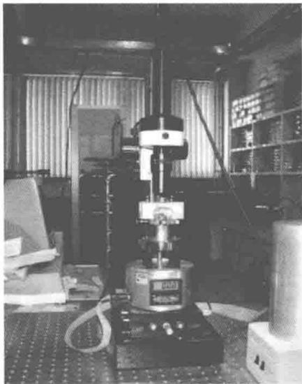  
图19-10 扫描隧穿显微镜仪器

# 19-5 谐振子

通常我们可以将固体中原子和分子的运动看成简谐振动，作简谐振动的粒子简称为谐振子。在经典力学中，谐振子的势能可以表示为

$$
V (x) = \frac {1}{2} k x ^ {2} = \frac {1}{2} m \omega^ {2} x ^ {2}
$$

式中  $k$  是谐振子的劲度系数， $m$  为谐振子的质量， $\omega = \sqrt{\frac{k}{m}}$  是振动角频率。势能曲线如图19-11所示。

在量子力学中，我们将一个在如图19-11所示的势场中运动的粒子称为谐振子。显然，一维谐振子遵循的运动规律即定态薛定谔方程如下

$$
\left(- \frac {\hbar^ {2}}{2 m} \frac {\mathrm {d} ^ {2}}{\mathrm {d} x ^ {2}} + \frac {1}{2} m \omega^ {2} x ^ {2}\right) \psi (x) = E \psi (x)
$$

令  $\xi = \alpha \cdot x, \alpha = \sqrt{m\omega / \hbar}, \lambda = 2E / \hbar \omega$  ，方程式变为下面的

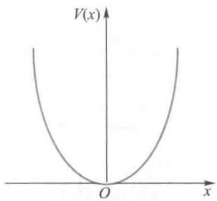  
图19-11 一维谐振子的势能曲线

形式

$$
\frac {\mathrm {d} ^ {2}}{\mathrm {d} \xi^ {2}} \psi + (\lambda - \xi^ {2}) \psi = 0
$$

只要在边界条件（即当  $\xi \to \infty$  时， $\psi \to 0$ ）下求解这个方程，就可以得到一维谐振子可能的能量和波函数的结论。解得一维谐振子可能的能量取值为

$$
E _ {n} = \left(n + \frac {1}{2}\right) \hbar \omega = \left(n + \frac {1}{2}\right) h \nu , \quad n = 0, 1, 2, \dots \tag {19-34}
$$

这表示一维谐振子的能量只能取一系列分立值，并且相邻能级是等间距的，等于  $h\nu$ 。这一结论说明了普朗克量子假设的正确性。

当一维谐振子处于基态  $(n = 0)$  时，其能量为

$$
E _ {0} = \frac {1}{2} \hbar \omega = \frac {1}{2} h \nu
$$

此能量称为零点能，说明谐振子的最低能量不等于零

一维谐振子的定态波函数为

$$
\psi_ {n} (x) = A _ {n} \mathrm {e} ^ {- \alpha^ {2} x ^ {2} / 2} \mathrm {H} _ {n} (\alpha \cdot x) \tag {19-35}
$$

其中  $A_{n} = \sqrt{\frac{\alpha}{2^{n}n!\sqrt{\pi}}}$  为归一化常数， $\mathrm{H}_n(\alpha \cdot x)$  为一系列确定的多项式，称为厄米多项式，即

$$
\mathrm {H} _ {n} (\alpha \cdot x) = (- 1) ^ {n} \mathrm {e} ^ {(\alpha \cdot x) ^ {2}} \frac {\mathrm {d} ^ {n}}{\mathrm {d} \xi^ {n}} \mathrm {e} ^ {- (\alpha \cdot x) ^ {2}}
$$

对  $n = 0,1,2,3$  时，具体的厄米多项式如下：

$$
\begin{array}{l} \mathrm {H} _ {0} (\alpha \cdot x) = 1; \mathrm {H} _ {1} (\alpha \cdot x) = 2 \alpha \cdot x; \\ \mathrm {H} _ {2} (\alpha \cdot x) = 4 (\alpha \cdot x) ^ {2} - 2; \mathrm {H} _ {3} (\alpha \cdot x) = 8 (\alpha \cdot x) ^ {3} - 1 2 \alpha \cdot x. \\ \end{array}
$$

图19-12分别画出了对应于三个波函数  $\psi_0, \psi_1$  和  $\psi_{11}$  的概率密度分布情况. 由图可以看出，在量子数  $n$  较小时，粒子位置的概率密度的分布与经典结论明显不同. 按经典力学的规律，在平衡位置  $(x = 0)$  振子的速度为最大，停留的

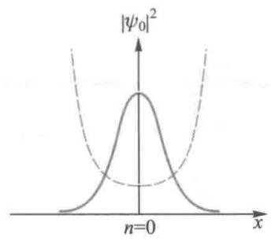

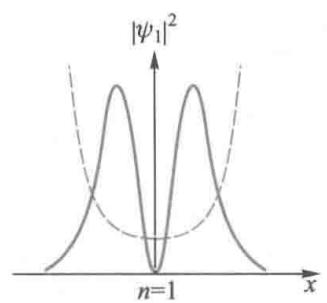

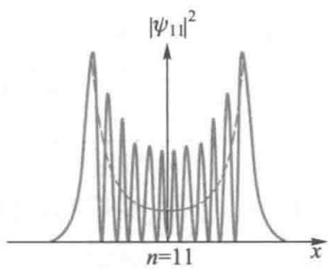  
图19-12 一维谐振子的概率密度分布曲线

时间为最短，而在最大位移处振子的速度为零，停留的时间最长.将这一规律应用于微观粒子，自然会得出在平衡位置粒子出现的概率最小，而在最大位移处粒子出现的概率最大.图中的虚曲线就表示了经典情况的概率分布.可以推断，随着量子数  $n$  的增大，概率密度的平均分布将越来越接近于经典结论

# 19-6 量子力学中的氢原子问题

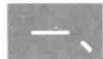

# 氢原子的薛定谔方程

氢原子是原子核（质子）与电子所组成的带电体系，如图19-13所示.在这个体系中，由于电子的质量约为原子核质量的  $\frac{1}{1836}$  所以原子核和电子之间的相对运动问题，可以简化为电子处于由原子核所提供的有心力场中的绕核运动.系统的势能可以表示为

$$
V = - \frac {1}{4 \pi m _ {\mathrm {e}}} \frac {e ^ {2}}{r}
$$

式中  $m_{\mathrm{e}}$  是电子的质量. 可见, 势能只是电子与原子核之间距离  $r$  的函数, 所以氢原子系统存在能量确定的定态解. 可以用定态薛定谔方程求解. 哈密顿算符可以表示为

$$
\hat {H} = - \frac {\hbar^ {2}}{2 m _ {\mathrm {e}}} \nabla^ {2} - \frac {1}{4 \pi \varepsilon_ {0}} \frac {e ^ {2}}{r}
$$

定态薛定谔方程可写为

$$
\left[ - \frac {\hbar^ {2}}{2 m _ {\mathrm {e}}} \nabla^ {2} - \frac {1}{4 \pi \varepsilon_ {0}} \frac {e ^ {2}}{r} \right] \psi (\boldsymbol {r}) = E \psi (\boldsymbol {r})
$$

在球坐标下  $\psi (r) = \psi (r,\theta ,\varphi)$  ，其中拉普拉斯算符在球坐标下可以写为如下形式：

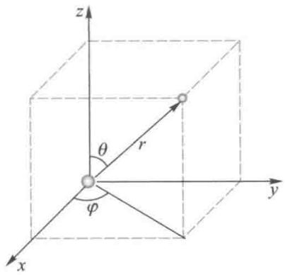  
图19-13 氢原子体系

采用分离变量法，令  $\psi (r,\theta ,\varphi) = R(r)\Theta (\theta)\Phi (\varphi) =$ $R(r)\Upsilon_l^m (\theta ,\varphi)$  ，代入定态薛定谔方程后可以得到下面三个常微分方程

$$
\begin{array}{l} \nabla^ {2} = \frac {1}{r ^ {2}} \frac {\partial}{\partial r} \left(r ^ {2} \frac {\partial}{\partial r}\right) + \frac {1}{r ^ {2} \sin \theta} \frac {\partial}{\partial \theta} \left(\sin \theta \frac {\partial}{\partial \theta}\right) + \frac {1}{r ^ {2} \sin^ {2} \theta} \frac {\partial^ {2}}{\partial \varphi^ {2}} \\ - \mathrm {i} \hbar \frac {\mathrm {d}}{\mathrm {d} \varphi} \Phi (\varphi) = m \hbar \Phi (\varphi) \\ \left[ - \frac {\hbar^ {2}}{\sin \theta} \frac {\mathrm {d}}{\mathrm {d} \theta} \left(\sin \theta \frac {\mathrm {d}}{\mathrm {d} \theta}\right) + \frac {m ^ {2} \hbar^ {2}}{\sin^ {2} \theta} \right] \Theta (\theta) = l (l + 1) \hbar^ {2} \Theta (\theta) \\ \left[ \frac {\mathrm {d}}{\mathrm {d} r} \left(r ^ {2} \frac {\mathrm {d}}{\mathrm {d} r}\right) + \frac {2 m _ {\mathrm {e}} r ^ {2}}{\hbar^ {2}} \left(E + \frac {e ^ {2}}{4 \pi \varepsilon_ {0} r}\right) - l (l + 1) \right] R (r) = 0 \\ \end{array}
$$

式中  $m_{l}, l$  是用分离变量的方法分解方程时引入的常数。根据量子力学的方法，在边界条件（即当  $r \to \infty$  时， $\psi \to 0$ ）以及波函数应满足的单值、有限、连续、归一化的条件下解上述方程，可以得到氢原子可能的定态波函数为

$$
\psi (r, \theta , \varphi) = R _ {n l} (r) Y _ {l m} (\theta , \varphi) \tag {19-36}
$$

其中径向波函数  $R_{nl}(r)$  和角度函数  $\mathrm{Y}_{lm}(\theta, \varphi) = \Theta(\theta)$ .  $\Phi(\varphi)$  都是具体的特殊函数， $\mathrm{Y}_{lm}(\theta, \varphi)$  为球谐函数. 在具体求解第三个常微分方程时要引入的常数  $n$  只能为自然数： $n = 1, 2, 3, \dots$  通常我们称  $n$  为主量子数，它与能量的关系如下：

$$
E _ {n} = - \frac {2 \pi^ {2} m _ {\mathrm {e}} \cdot e ^ {4}}{\left(4 \pi \varepsilon_ {0}\right) ^ {2} h ^ {2}} \cdot \frac {1}{n ^ {2}}, \quad n = 1, 2, 3, \dots \tag {19-37}
$$

# 二、物理量的量子化和量子数

从氢原子的能量公式可见，氢原子的能量只与主量子数  $n$  有关，而主量子数  $n$  只能为自然数，所以氢原子的能量只能是量子化的。而且，从量子力学得到的氢原子能级公式与玻尔氢原子理论中的能级公式完全一致。在玻尔理论中，

此结果是由于人为地引入了量子化条件，但在量子力学中，则是在求解薛定谔方程的过程中为使解满足物理条件而自然地得到的.

从求解薛定谔方程的过程中还能得到：对于一定的主量子数  $n$  ，常数  $l$  只能取从0到  $n - 1$  中的  $n$  个数值，即

$$
l = 0, 1, 2, 3, \dots , (n - 1) \tag {19-38}
$$

氢原子中电子的角动量大小与  $l$  的关系为

$$
L = \sqrt {l (l + 1)} \hbar \tag {19-39}
$$

通常称  $l$  为角量子数.由于角量子数只能为自然数，所以氢原子中电子的角动量大小也只能是量子化的.但是从量子力学得到的角动量大小的公式与玻尔氢原子理论中的角动量公式（即玻尔的角动量量子化条件）不完全一致，这说明玻尔理论中的角动量公式定量上不够准确.

从求解薛定谔方程的过程中还能得到：对于一定的角量子数  $l, m$  可取从  $-l$  到  $+l$  中的  $2l + 1$  个可能的值. 即

$$
m _ {l} = 0, \pm 1, \pm 2, \pm 3, \dots , \pm l \tag {19-40}
$$

氢原子的角动量取向只与  $m_{l}$  有关.由于角动量取向与氢原子所处的具体磁状态有关，所以一般称  $m_{l}$  为磁量子数.用角动量在  $\textit{\textbf{z}}$  轴上的投影值  $L_{z}$  能反映角动量的具体取向，  $L_{z}$  与  $l$  的具体关系为

$$
L _ {z} = m _ {l} \hbar \tag {19-41}
$$

这就是说，电子的轨道角动量  $l$  在空间只有  $2l + 1$  个可能的取向，而不存在除这  $2l + 1$  个取向之外的其他取向，即角动量取向也只能是量子化的。轨道角动量在空间不能任意取向，而只能取某些特定方向的性质，又常称为角动量的空间量子化。

三个具体的量子数  $n, l, m_{l}$  确定的情况下，不但能完全

确定氢原子中能量、角动量及角动量取向的具体情况，而且还能完全确定氢原子的具体状态（此时暂不考虑电子具有的自旋状态），即能完全确定此时氢原子所处的波函数的具体函数形式.例如

$$
\begin{array}{l} \psi_ {1 0 0} = \frac {1}{\sqrt {\pi a _ {1} ^ {3}}} \mathrm {e} ^ {\frac {- r}{r _ {1}}} \\ \psi_ {2 0 0} = \frac {1}{\sqrt {3 2 \pi a _ {1} ^ {3}}} \left(2 - \frac {r}{r _ {1}}\right) e ^ {\frac {- r}{2 r _ {1}}} \\ \psi_ {2 1 0} = \frac {1}{\sqrt {3 2 \pi a _ {1} ^ {3}}} \left(\frac {r}{r _ {1}}\right) \mathrm {e} ^ {\frac {- r}{2 r _ {1}}} \cos \theta \\ \psi_ {2 1 1} = \frac {1}{\sqrt {6 4 \pi a _ {1} ^ {3}}} \left(\frac {r}{r _ {1}}\right) e ^ {\frac {- r}{2 r _ {1}}} \sin \theta \cdot e ^ {i \varphi} \\ \psi_ {2 1 (- 1)} = \frac {1}{\sqrt {6 4 \pi a _ {1} ^ {3}}} \left(\frac {r}{r _ {1}}\right) e ^ {\frac {- r}{2 r _ {1}}} \sin \theta \cdot e ^ {- i \varphi} \\ \end{array}
$$

其中  $r_1$  为氢原子的玻尔半径.由于三个具体的量子数  $n$  、 $l,m_{l}$  确定的情况下能完全确定氢原子的具体状态，因此氢原子的状态可以由一组量子数  $(n,l,m)$  来表征.为标记电子所处量子态，按照光谱学的习惯，对于不同角量子数的状态分别用不同的小写字母表示，对角量子数  $l$  的值：0、1、2、3、…，规定相应的符号分别为：s、p、d、f等

对电子处于  $n = 1, l = 0$  的状态，可称其为1s电子，对电子处于  $n = 4, l = 3$  的状态，可称其为4f电子，其他情形可以依此类推.

对于一个能级  $E_{n}$  ，共存在多种不同的具体状态，我们通常称这种情形为能级  $E_{n}$  是简并的，可以计算得到氢原子能级的简并度为  $n^2$  （此时暂不考虑电子具有的自旋状态）.

# 三、子云

根据薛定谔方程我们可以解出氢原子可能的定态波函数及其相应的能量、角动量大小及角动量取向的具体结论.在玻尔理论中，玻尔认为原子中电子绕核作圆轨道或椭圆轨道运动.在量子力学中，电子的运动状态由波函数描述，轨道的概念不符合微观粒子波动性的实际情况的，实际上是不存在的.根据波函数的统计意义，在得到定态波函数  $\psi_{nlm_i}(r,\theta ,\varphi)$  之后，就可以进一步具体讨论氢原子中电子在空间的概率分布，这一概率分布可以用空间中点的疏密形象地表示出来，即形成了所谓的“电子云”的图像.

在定态波函数为  $\psi_{nlm_i}(r,\theta ,\varphi)$  时，核外电子处于空间 $(r,\theta ,\varphi)$  处  $\mathrm{d}V$  体元内的概率应表示为

$$
w (r, \theta , \varphi) \mathrm {d} V = \left| \psi_ {n l m _ {i}} (r, \theta , \varphi) \right| ^ {2} r ^ {2} \sin \theta \mathrm {d} r \mathrm {d} \theta \mathrm {d} \varphi \tag {19-42}
$$

式中  $w(r,\theta ,\varphi)$  是电子出现在空间  $(r,\theta ,\varphi)$  处的概率密度.有时我们要讨论电子概率的径向分布.电子概率的径向分布是反映在氢原子中发现电子的概率随离原子核距离的变化情形.将(19-42)式对  $\theta ,\varphi$  在变化的全部范围（  $\theta$  从0到 $\pi ,\varphi$  从0到  $2\pi$  )内积分，考虑到球谐函数  $\mathrm{Y}_{lm}(\theta ,\varphi)$  是归一化的，就得到在半径为  $r$  到  $r + \mathrm{d}r$  的球壳内发现电子的概率为

$$
w _ {n l} (r) \mathrm {d} r = R _ {n l} ^ {2} (r) r ^ {2} \mathrm {d} r \tag {19-43}
$$

式中  $w_{nl}(r)$  是电子出现在相应球壳内的概率密度，称为电子概率的径向分布函数。显然，电子概率的径向分布函数与主量子数  $n$  和角量子数  $l$  有关，图19-14画出了一些低量子数的径向概率分布曲线，图中横坐标是半径  $r$  与玻尔半径  $a_0(a_0 = r_1)$  之比。从图中可以看到，对于  $1\mathrm{~s},2\mathrm{~p},3\mathrm{~d}$  等状态，

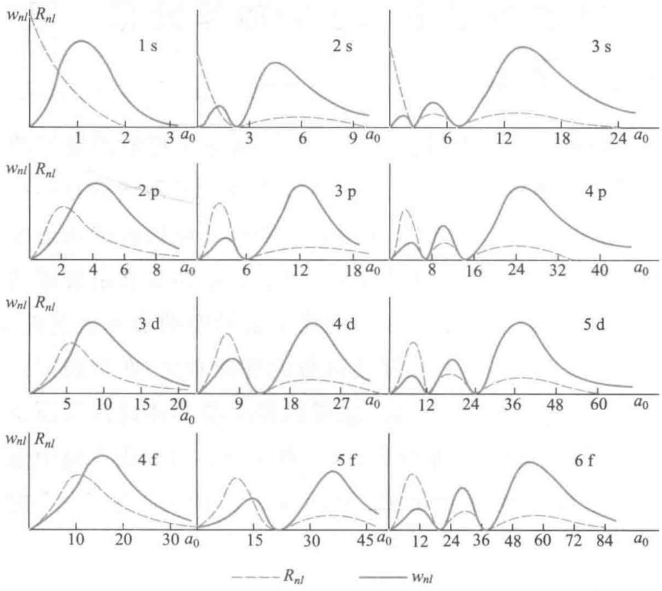  
图19-14 氢原子中电子的径向概率分布

分布曲线只有一个峰值，这些量子态电子概率峰值的位置可以令其分布函数的一阶导数等于零求得，概率峰值位置所对应的  $r$  值称为最概然半径.由上式求得1s态、2p态和3d态的最概然半径分别为  $r_1,4r_1$  和  $9r_{1}$  .可以证明，对于所有这样量子态的最概然半径可以表示为

$$
r _ {n} = n ^ {2} r _ {1}
$$

这与玻尔理论中各能级所对应的圆形轨道半径公式完全一致. 应该注意, 玻尔理论中认为氢原子中的电子是处于以  $r_{n}$  为半径的圆形轨道上绕原子核旋转, 偏离轨道的位置上不存在电子. 而在量子力学中, 电子运动的轨道实际上是不存在的, 取而代之的是“电子云”的图像, 电子可以出现在空间的各个地方, 只不过对于一些特定的“电子云”状况, 在玻尔理论中的圆轨道半径处电子出现的概率最大而已. 图19-15是一些氢原子定态下的“电子云”示意图.

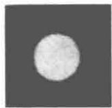  
1s  $m = 0$

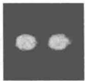  
2p  $m = 1$

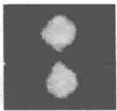  
2p  $m = 0$

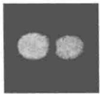  
3d  $m = 2$

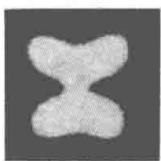  
3dm=1

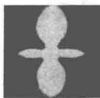  
3dm=0

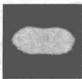  
4f  $m = 3$

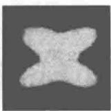  
4f  $m = 2$

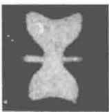  
4f  $m = 1$

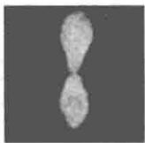  
4f  $m = 0$

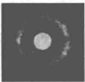  
2s  $m = 0$

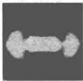  
3p  $m = 1$  
图19-15 氢原子的“电子云”示意图

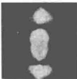  
3p  $m = 0$

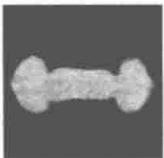  
4dm=2

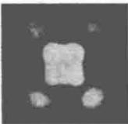  
4dm=1

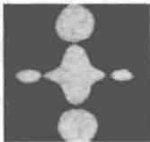  
4dm=0

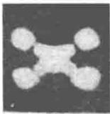  
5f  $m = 2$

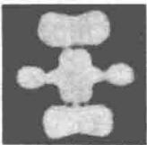  
5f  $m = 1$

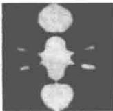  
5f  $m = 0$

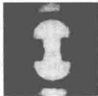  
4p  $m = 1$

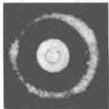  
3s  $m = 0$

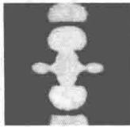  
5dm=0

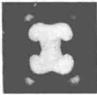  
5d  $m = 1$

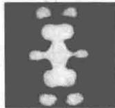  
6f  $m = 1$

# 例19-6

已知氢原子在  $n = 2, l = 1$  量子态的径向概率分布为  $w_{21}(r) = Ar^4 e^{-r / a_0}$ ，其中  $a$  为玻尔半径， $A$  是常数，试证明  $r = 4a$  处为最概然半径.

解最概然半径对应于径向概率分布中的峰值位置，可由径向概率分布函数的一阶导数等于零求得，令

$$
\frac {\mathrm {d} w _ {2 1} (r)}{\mathrm {d} r} = \frac {\mathrm {d}}{\mathrm {d} r} \left(A r ^ {4} \mathrm {e} ^ {- r / a}\right) = 0
$$

即

$$
\left(4 A r ^ {3} \mathrm {e} ^ {- r / a} - \frac {A r ^ {4} \mathrm {e} ^ {- r / a}}{a}\right) = 0
$$

解得

$$
r = 4 a
$$

# 19-7 电子的自旋 原子的电子壳层结构

# 一、施特恩-格拉赫实验

文档：施特恩

原子中电子具有一定的角动量，也具有一定的磁矩，可以证明磁矩与轨道角动量是呈线性关系的。另外我们知道，在非均匀磁场中一个磁矩（或载流线圈）除受到一个力矩作用外，还会受到一个磁力的作用。而且，该磁力的情况与磁矩相对磁场的方向有关。因为在原子中，角动量大小和取向是量子化的，所以磁矩大小和取向也是量子化的。这样，我们可以让一束原子通过一个非均匀磁场来观测其路径的分化情况，从而验证角动量的取向是否真的是量子化的。1921年施特恩（O.Stern，1888—1969）和格拉赫（W.Gerlach，1889—1979）成功地进行了这样的实验。图19-16是施特恩-格拉赫实验装置的示意图。由原子射线源O射出的银原子射线，经过狭缝变成细束后，进入一个强度很大并在  $z$  方向存在梯度的不均匀磁场，最后沉积在照相板P上。整个实验装置都放置在高真空容器内。不均匀磁场是由图示的不对称磁极产生的。照相板上得到的银原子沉积痕迹有两条。用锂、钠、钾、铜、锌等进行实验，也都得到了原子束路径的分化是量子化的结论。原子束的路径的分化是量子化的，说明了角动量取向量子化的正确性。但实验发现，原子束分裂的具体条数与理论的预言不完全一致。

根据量子理论，对角量子数  $l$  确定的原子进行实验，其角动量取向有  $2l + 1$  种，对应于磁矩的取向有  $2l + 1$  种，原子束就应该分裂为  $2l + 1$  束，即奇数束.而实验结果发现，很多

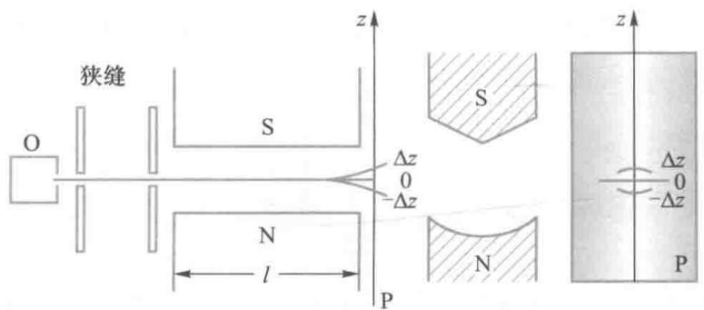  
图19-16 施特恩-格拉赫实验装置的示意图

情况下原子束会分裂成偶数束. 特别是, 后来用处于基态的氢原子进行实验, 观测到原子束分裂为上、下两束. 而氢原子中只有一个电子, 基态为  $1 \mathrm{~s}$  态,  $l = 0$ , 轨道磁矩为零. 氢原子束的沉积痕迹有上、下两条, 这不仅表明处于基态的氢原子具有磁矩, 而且确认这个磁矩在外磁场方向上有两个可能的取向. 那么, 这个磁矩来自哪里呢?

# 二、电子的自旋

1925年荷兰物理学家乌伦贝克（G.Uhlenbeck，1900—1974）和古兹密特（S.Goudsmit，1902—1979）提出了电子自旋的假设：每个电子都具有自旋角动量，仿照轨道角动量的规则可以写出自旋角动量大小  $S$  及自旋角动量在空间某方向的分量  $S_{z}$  的取值为

$$
S = \sqrt {s (s + 1) \hbar^ {2}} \tag {19-44}
$$

$$
S _ {z} = m _ {s} \hbar , \quad m _ {s} = \pm \frac {1}{2} \tag {19-45}
$$

式中  $s$  称为自旋量子数，简称自旋， $m_{s}$  称为自旋磁量子数。与  $m_{l}$  可取  $2l + 1$  个可能的数值一样，对于确定的  $s$  值， $m_{s}$  也应取  $2s + 1$  个可能的数值。根据乌伦贝克和古兹密特的假设，电子自旋角动量在空间任一方向上的投影  $S_{z}$  只能取两个值，所以  $m_{s}$  也只能取两个可能的数值，即  $2s + 1 = 2$ ，故  $s = 1/2$ 。由于电子的自旋量子数为  $1/2$ ，因而电子的自旋磁量子数  $m_{s}$  的两个可能的数值必定是  $\pm 1/2$ 。这样，自旋角动量

大小  $S$  及自旋角动量在空间某方向的分量  $S_{z}$  的具体取值为

$$
S = \sqrt {s (s + 1) \hbar^ {2}} = \frac {\sqrt {3}}{2} \hbar , s = \frac {1}{2} \tag {19-46}
$$

$$
S _ {z} = m _ {s} \hbar = \pm \frac {1}{2} \hbar , m _ {s} = \pm \frac {1}{2} \tag {19-47}
$$

与自旋角动量相对应的磁矩是自旋磁矩为  $\mu_{s}$  ，通过理论和实验的研究可以发现，自旋磁矩与自旋角动量之间的关系为

$$
\mu_ {s} = \frac {e}{m _ {e}} \sqrt {s (s + 1)} \hbar = 2 \sqrt {s (s + 1)} \mu_ {\mathrm {B}} \tag {19-48}
$$

$$
\mu_ {s z} = 2 m _ {s} \mu_ {\mathrm {B}} \tag {19-49}
$$

其中  $\mu_{\mathrm{B}}$  是一个磁矩的基本单位，称为玻尔磁子

$$
\mu_ {\mathrm {B}} = \frac {e \hbar}{2 m _ {\mathrm {e}}} = 9. 2 7 \times 1 0 ^ {- 2 4} \mathrm {J} \cdot \mathrm {T} ^ {- 1} \tag {19-50}
$$

上式表示，电子的自旋磁矩在空间任一方向（如外磁场方向）的分量只有两个可能的取值。引入了电子自旋的假设后，施特恩-格拉赫实验就能得到圆满解释。原来引起氢原子束偏转的正是氢原子中电子的自旋磁矩  $\mu_{s}$ 。照相板上出现上、下两条银原子沉积痕迹，是由于电子的自旋磁矩  $\mu_{s}$  在空间只有两个可能的取向，所以在外磁场方向的分量只有两个可能的数值，氢原子束必定会分裂成两束。

从经典物理的角度看，只能把电子的自旋解释为一个一定大小的球绕自身轴线的旋转。假如认为电子是一个半径为  $2.8\mathrm{fm}(1\mathrm{fm} = 10^{-15}\mathrm{m})$  的小球，那么要获得1/2的自旋角动量，电子表面的线速度约为真空中光速的数十倍，这显然是不可能的。到目前为止的所有实验都表明，电子是点粒子，直到  $10^{-3}\mathrm{fm}$  还没有观察到任何结构。所以，既不能用经典的观点看待电子，更不能用经典的理论描述电子的自旋。

事实上，自旋是所有粒子自身具有的一种内禀属性。例

如，电子、中子和质子的自旋量子数为  $1 / 2$  ，光子的自旋量子数为1.通常我们将自旋量子数为半奇数  $(s = 1 / 2,3 / 2,\dots)$  的粒子称为费米子，如电子、中子和质子等；将自旋量子数为整数  $(s = 0,1,2,\dots)$  的粒子，称为玻色子，如光子等

# 三、原子的电子壳层结构

发现了电子自旋状态后，原子中电子所处的状态应该是由四个量子数，即  $n, l, m$  和  $m_{s}$  来表征，其中：

（1）主量子数  $n$  ，是确定原子中电子的能量高低的主要因素，  $n = 1,2,3,\dots$  
（2）角量子数  $l$  ，也称轨道量子数，是确定电子轨道角动量大小的量子数，在多电子原子中，也是确定能量高低的一个重要因素.在  $n$  值一定的情况下，  $l$  可取  $n$  个可能的数值，即  $l = 0,1,2,\dots ,n - 1$  
（3）磁量子数  $m$  ：是确定电子轨道角动量在空间的取向或轨道角动量在某特定方向（如磁场方向）的分量的量子数，对于给定的  $l$  值， $m$  可取  $2l + 1$  个可能的数值，即  $m = 0, \pm 1, \pm 2, \dots, \pm l$ .  
（4）自旋磁量子数  $m_{s}$  ：是确定电子自旋角动量在空间的取向或自旋角动量在磁场方向的分量的量子数，  $m_{s}$  可取两个可能的数值，1/2和-1/2.

在多电子原子中，多个电子是如何处于由一组量子数所表示的状态的？如何解释元素性质随原子中电子数的增加而表现出的周期性变化的事实？要解决上述问题必须引出如下两个基本原理：

（1）泡利（W.Pauli，1900—1958）不相容原理：在原子中不可能有两个或两个以上的电子占据同一个状态，也就是不可能有两个或两个以上的电子具有相同的一组量子数 $(n,l,m,m_s)$

文档：泡利

（2）能量最低原理：在原子处于基态时，电子所占据的状态总是使原子的能量为最低

根据这两个原理，原子中每一个由一组量子数  $(n,l,m,$ $m_{s})$  所决定的状态只允许一个电子占据，同时，电子必定先占据能量最低的状态，而能量的高低与主量子数  $n$  和角量子数  $l$  有关，其由低到高的次序如下：

$$
1 \mathrm {s} <   2 \mathrm {s} <   2 \mathrm {p} <   3 \mathrm {s} <   3 \mathrm {p} <   4 \mathrm {s} <   3 \mathrm {d} <   \dots
$$

通常我们可以按照  $n$  的不同，把电子所处状态划分为不同的主壳层， $n = 1,2,3,4,5,\dots$  的壳层分别表示为K，L，M，N，O，…主壳层；在一个主壳层中，又可以按照角量子数  $l$  的不同，把电子所处状态划分为一些支壳层， $l = 1,2,3,4,5,\dots$  的支壳层分别表示为s，p，d,f,g,h，…支壳层.

可以算得，主量子数为  $n$  的主壳层上所能容纳的电子数为  $2n^2$  ，即K壳层可容纳2个电子，L壳层可容纳8个电子，M壳层可容纳18个电子，等等；角量子数为  $l$  的支壳层上所能容纳的电子数为  $2(2l + 1)$  ，即s支壳层可容纳2个电子，p支壳层可容纳6个电子，d支壳层可容纳10个电子，等等.表19-1列出了原子各壳层和子壳层所能容纳的电子数.

<table><tr><td colspan="9">表19-1 原子的壳层和子壳层所能容纳的电子数</td></tr><tr><td rowspan="2" colspan="2">l/n</td><td>0</td><td>1</td><td>2</td><td>3</td><td>4</td><td>5</td><td>6</td></tr><tr><td>s</td><td>p</td><td>d</td><td>f</td><td>g</td><td>h</td><td>i</td></tr><tr><td>1</td><td>K</td><td>2</td><td>6</td><td>10</td><td>14</td><td>18</td><td>22</td><td>26</td></tr><tr><td>2</td><td>L</td><td>2</td><td>6</td><td>10</td><td>14</td><td>18</td><td>22</td><td></td></tr><tr><td>3</td><td>M</td><td>2</td><td>6</td><td>10</td><td>14</td><td>18</td><td></td><td>18</td></tr><tr><td>4</td><td>N</td><td>2</td><td>6</td><td>10</td><td>14</td><td></td><td></td><td>32</td></tr><tr><td>5</td><td>O</td><td>2</td><td>6</td><td>10</td><td></td><td></td><td></td><td>50</td></tr><tr><td>6</td><td>P</td><td>2</td><td>6</td><td></td><td></td><td></td><td></td><td>72</td></tr><tr><td>7</td><td>Q</td><td>2</td><td></td><td></td><td></td><td></td><td></td><td>98</td></tr></table>

随着原子序数的增加，核外电子按照上述规律依次填充，那么最外壳层的电子数即价电子数也将出现周期性变化，这种周期性正好与俄国科学家门捷列夫发现的元素周期律相一致。由此我们从物理上发现了门捷列夫元素周期律的本质所在。

例19-7

试写出钠和钾原子中电子的排列方式，并说明它们具有相似的化学性质

解钠原子共有11个电子，其电子的排列方式为：  $1\mathrm{s}^2,2\mathrm{s}^2,2\mathrm{p}^6,3\mathrm{s}^1$  ，其最外壳层的电子数即价电子数为一个.

钾原子共有19个电子，其电子的排列方式为：  $1\mathrm{s}^2,2\mathrm{s}^2,2\mathrm{p}^6,3\mathrm{s}^2,3\mathrm{p}^6,4\mathrm{s}^1$  ，其最

外壳层的电子数即价电子数也为一个.

具有相同价电子数的元素具有相似的化学性质. 由于钠和钾最外层都只有一个电子, 所以它们具有相似的化学性质.

# 提要

# 1. 波函数的统计意义

波函数  $\Psi$  的平方即  $|\Psi|^2$  为概率密度，表示时刻  $t$  在给定空间点周围单位体积内发现粒子的概率。波函数具有叠加性。

# 2.定态薛定谔方程

一维定态薛定谔方程为

$$
- \frac {\hbar^ {2}}{2 m} \frac {\partial^ {2} \psi}{\partial x ^ {2}} + V \psi = E \psi
$$

式中  $\psi$  为粒子的定态波函数，  $E$  是粒子的能量.此微分方程是线性的，说明  $\psi$  满足叠加原理

在数学上，上述微分方程的解  $\psi$  对  $E$  值没有什么特别

要求. 但要使波函数  $\psi$  满足物理的标准条件, 即单值、有限、连续, 那么在束缚状态下粒子的能量  $E$  就只能取离散的值. 这样, 薛定谔方程就自然地给出了微观粒子量子化等特征.

# 3. 一维无限深方势阱中的粒子

能量量子化

$$
E _ {n} = \frac {\pi^ {2} \hbar^ {2}}{2 m a ^ {2}} n ^ {2}, \quad n = 1, 2, 3, \dots
$$

波函数  $\psi$  是正弦函数，表示概率密度分布不均匀

# 4. 隧道效应

在势垒高度、宽度有限的情况下，微观粒子可以穿过其势能大于其总能量的势垒到达另一侧。这种现象称为隧道效应。

# 5. 谐振子

薛定谔方程自然地给出谐振子的能量量子化结果，即

$$
E = \left(n + \frac {1}{2}\right) h \nu , \quad n = 0, 1, 2, 3, \dots
$$

最低能量（零点能）

$$
E _ {0} = \frac {1}{2} h \nu
$$

# 6. 氢原子问题

氢原子中的电子在库仑势场中运动，由薛定谔方程和物理条件可以得到三个量子数：

主量子数  $n = 1,2,3,\dots$

轨道量子数  $l = 0,1,2,\dots ,(n - 1)$

轨道磁量子数  $m_{l} = -l, -(l - 1), \dots, 0, \dots, l - 1, l$

主量子数  $n$  决定氢原子的能量

$$
E _ {n} = \frac {- m _ {\mathrm {e}} e ^ {4}}{2 (4 \pi \varepsilon_ {0}) ^ {2} \hbar^ {2}} \frac {1}{n ^ {2}} = \frac {- e ^ {2}}{2 (4 \pi \varepsilon_ {0}) a _ {0}} \frac {1}{n ^ {2}} = - 1 3. 6 \times \frac {1}{n ^ {2}} \mathrm {e V}
$$

其中  $a_0 = 4\pi \varepsilon_0\hbar^2 /m_{\mathrm{e}}e^2 = 0.529\times 10^{-10}\mathrm{m}$  ，称为玻尔半径

氢原子的能量决定于  $n$  ，同一  $n$  值不同  $l$  的量子态的能量相同，这种状态称为能量的简并态.

轨道量子数  $l$  决定氢原子的角动量：  $L = \sqrt{l(l + 1)}\hbar .$

轨道磁量子数决定轨道角动量沿一定方向，如磁场方向的投影：  $L_{z} = m_{z}\hbar$

原子内电子的运动不能用轨道描述，只能用波函数给出的概率密度描述，形象化地用电子云描绘

氢原子吸收或发射光子时的能量关系为：  $h\nu_{n_k} = E_n - E_k$

氢原子光谱的规律性：  $\frac{1}{\lambda_{nk}} = R\left(\frac{1}{k^2} -\frac{1}{n^2}\right)$  ，其中  $n > k,R =$ $1.097\times 10^{7}\mathrm{m}^{-1}$

7. 电子的自旋

电子的自旋角动量是电子的内禀性质. 它的大小是

$$
S = \sqrt {s (s + 1)} \hbar = \sqrt {\frac {3}{4}} \hbar
$$

其中  $s$  是自旋量子数. 它只有一个值, 为  $1 / 2$ .

电子的自旋在空间某一方向，如磁场方向的投影为

$$
S _ {z} = m _ {s} \hbar
$$

$m_{s}$  叫自旋磁量子数，只能取  $+1 / 2$  （向上）和  $-1 / 2$  （向下）两个值.

8. 多电子原子中电子的排布

每个电子的状态由4个量子数  $n, l, m_{l}, m_{s}$  确定.  $n$  相同的状态组成一个壳层，可容纳  $2n^{2}$  个电子； $l$  相同的状态组成一个支壳层，可容纳  $2(2l + 1)$  个电子

基态原子中电子排布遵守两个规律：

（1）能量最低原理，即电子总要进入最低的能级。一般来说， $n$  越大， $l$  越大，能量就越高。

（2）泡利不相容原理，即同一量子态（4个量子数的值都已确定）不可能有多于一个电子存在

<table><tr><td>思考题</td><td></td></tr><tr><td>19-1 氢原子的玻尔模型和行星绕太阳轨道的运动模型之间的主要不同之处是什么?在经典物理学范围内,这两种系统的稳定性情况如何?19-2 如何评价玻尔的氢原子理论的成功与缺陷?19-3 如何描述微观粒子的运动状态?微观粒子遵循的运动规律是什么?19-4 如何理解波函数及不确定关系的物理意义?</td><td>19-5 为什么氢原子核外电子状态可以用四个量子数来表征,这些量子数的可能取值及其与之相应的物理量的关系是怎样的?19-6 扫描隧穿显微镜的原理与量子力学中的隧道效应有何联系?为什么扫描隧穿显微镜有很高的分辨率?19-7 多电子原子中,电子排列遵循什么原理?19-8 在氢原子的L壳层中,电子可有多少不同的量子态数?分别用四个量子数写出这些不同的量子态.</td></tr></table>

<table><tr><td>习题</td><td></td></tr><tr><td>19-1 按玻尔模型,氢原子处于基态时,它 的电子围绕原子核做圆周运动.电子的速率为 2.2×106m·s-1,离核的距离为0.53×10-10m.求 电子绕核运动的频率和向心加速度. 19-2 计算氢原子从基态激发到第一激发 态所需能量,并计算氢原子基态的电离能. 19-3 处在第五受激态的氢原子向低能态 跃迁时可能发出多少条谱线?其中巴耳末系的 谱线有几条? 19-4 氢原子光谱的巴耳末线系中,有一</td><td>条光谱线的波长为4340Å,试求: (1)与这一谱线相应的光子能量为多少电 子伏? (2)该谱线是氢原子由能级En跃迁到能级 E产生的,n和k各为多少? (3)能级为E4的大量氢原子,最多可以发 射几条谱线,共几个线系?请在氢原子能级图中 表示出来. 19-5 欲使氢原子发射莱曼系中波长为 1216Å的谱线,应传给基态氢原子最小能量是 多少?</td></tr></table>

19-6 已知氢原子的巴耳末系中波长最长的一条谱线的波长为  $6562.8\AA$  ，试由此计算帕邢系（由各高能激发态跃迁到  $n = 3$  的定态所发射的谱线构成的线系）中波长最长的一条谱线的波长.  
19-7 若处于基态的氢原子吸收了一个能量为  $15\mathrm{eV}$  的光子后其电子电离，求该电子的速度和德布罗意波长？  
19-8 已知第一玻尔轨道半径  $a$ ，试计算当氢原子中电子沿第  $n$  级玻尔轨道运动时，其相应的德布罗意波长是多少？  
19-9 已知在一维无限深方势阱中运动的粒子波函数为

$$
\psi_ {n} (x) = \sqrt {\frac {2}{a}} \sin (n \pi x / a) (0 <   x <   a)
$$

求：（1）粒子空间概率的分布函数；  
（2）基态时粒子在何处出现的概率最大，其值是多少？  
（3）第一激发态时，粒子在  $\left[0,\frac{a}{2}\right]$  区间发现该粒子的概率密度为多大？

（提示：  $\int \sin^2 x\mathrm{d}x = \frac{x}{2} -\frac{1}{4}\sin 2x + c$

19-10 一维运动的粒子处于如下波函数所描述的状态

$$
\psi (x) = \left\{ \begin{array}{c c} A x \mathrm {e} ^ {- \lambda x} & (x \geqslant 0) \\ 0 & (x <   0) \end{array} \right.
$$

式中  $\lambda > 0$ . 求：

（1）波函数  $\psi (x)$  的归一化常数  $A$  
（2）求粒子的概率分布函数；  
（3）在何处发现粒子的概率最大？

# 常用物理常量表

<table><tr><td>物理量</td><td>符号</td><td>数值</td><td>单位</td><td>相对标准不确定度</td></tr><tr><td>真空中的光速</td><td>c</td><td>299 792 458</td><td>m·s-1</td><td>精确</td></tr><tr><td>真空磁导率</td><td>μ0</td><td>4π×10-7</td><td>N·A-2</td><td>精确</td></tr><tr><td>真空电容率</td><td>ε0</td><td>8.854 187 817···×10-12</td><td>F·m-1</td><td>精确</td></tr><tr><td>引力常量</td><td>G</td><td>6.674 08(31)×10-11</td><td>m³·kg-1·s-2</td><td>4.7×10-5</td></tr><tr><td>普朗克常量</td><td>h</td><td>6.626 070 040(81)×10-34</td><td>J·s</td><td>1.2×10-8</td></tr><tr><td>约化普朗克常量</td><td>h/2π</td><td>1.054 571 800(13)×10-34</td><td>J·s</td><td>1.2×10-8</td></tr><tr><td>元电荷</td><td>e</td><td>1.602 176 620 8(98)×10-19</td><td>C</td><td>6.1×10-9</td></tr><tr><td>电子质量</td><td>me</td><td>9.109 383 56(11)×10-31</td><td>kg</td><td>1.2×10-8</td></tr><tr><td>质子质量</td><td>mp</td><td>1.672 621 898(21)×10-27</td><td>kg</td><td>1.2×10-8</td></tr><tr><td>中子质量</td><td>mn</td><td>1.674 927 471(21)×10-27</td><td>kg</td><td>1.2×10-8</td></tr><tr><td>电子比荷</td><td>-e/me</td><td>-1.758 820 024(11)×10-11</td><td>C·kg-1</td><td>6.2×10-9</td></tr><tr><td>精细结构常数</td><td>α</td><td>7.297 352 566 4(17)×10-3</td><td></td><td>2.3×10-10</td></tr><tr><td>精细结构常数的倒数</td><td>α-1</td><td>137.035 999 139(31)</td><td></td><td>2.3×10-10</td></tr><tr><td>里德伯常量</td><td>R∞</td><td>1.097 373 156 850 8(65)×107</td><td>m-1</td><td>5.9×10-12</td></tr><tr><td>阿伏伽德罗常量</td><td>NA</td><td>6.022 140 857(74)×1023</td><td>mol-1</td><td>1.2×10-8</td></tr><tr><td>摩尔气体常量</td><td>R</td><td>8.314 459 8(48)</td><td>J·mol-1·K-1</td><td>5.7×10-7</td></tr><tr><td>玻耳兹曼常量</td><td>k</td><td>1.380 648 52(79)×10-23</td><td>J·K-1</td><td>5.7×10-7</td></tr><tr><td>斯特藩-玻耳兹曼常量</td><td>σ</td><td>5.670 367(13)×10-8</td><td>W·m-2·K-4</td><td>2.3×10-6</td></tr><tr><td>维恩位移定律常量</td><td>b</td><td>2.897 772 9(17)×10-3</td><td>m·K</td><td>5.7×10-7</td></tr><tr><td>原子质量常量</td><td>mu</td><td>1.660 539 040(20)×10-27</td><td>kg</td><td>1.2×10-8</td></tr><tr><td>理想气体的摩尔体积(标准状态)</td><td>Vm</td><td>22.413 962(13)×10-3</td><td>m³·mol-1</td><td>5.7×10-7</td></tr><tr><td>玻尔磁子</td><td>μB</td><td>9.274 009 994(57)×10-24</td><td>J·T-1</td><td>6.2×10-9</td></tr><tr><td>核磁子</td><td>μN</td><td>5.050 783 699(31)×10-27</td><td>J·T-1</td><td>6.2×10-9</td></tr><tr><td>玻尔半径</td><td>a0</td><td>5.291 772 106 7(12)×10-9</td><td>m</td><td>2.3×10-10</td></tr><tr><td>经典电子半径</td><td>re</td><td>2.817 940 322 7(19)×10-15</td><td>m</td><td>6.8×10-10</td></tr></table>

注：表中的数据为国际科学联合会理事会科学技术数据委员会（CODATA）2014年的国际推荐值。