# 第一章 概率论的基本概念

自然界和社会上发生的现象是多种多样的。有一类现象，在一定条件下必然发生，例如，向上抛一石子必然下落，同性电荷必相互排斥，等等。这类现象称为确定性现象。在自然界和社会上存在着另一类现象，例如，在相同条件下抛同一枚硬币，其结果可能是正面朝上，也可能是反面朝上，并且在每次抛掷之前无法肯定抛掷的结果是什么；用同一门炮向同一目标射击，各次弹着点不尽相同，在一次射击之前无法预测弹着点的确切位置。这类现象，在一定的条件下，可能出现这样的结果，也可能出现那样的结果，而在试验或观察之前不能预知确切的结果。但人们经过长期实践并深入研究之后，发现这类现象在大量重复试验或观察下，它的结果却呈现出某种规律性。例如，多次重复抛一枚硬币得到正面朝上大致有一半，同一门炮射击同一目标的弹着点按照一定规律分布，等等。这种在大量重复试验或观察中所呈现出的固有规律性，就是我们以后所说的统计规律性。

这种在个别试验中其结果呈现出不确定性，在大量重复试验中其结果又具有统计规律性的现象，我们称之为随机现象。概率论与数理统计是研究和揭示随机现象统计规律性的一门数学学科。

# § 1 随机试验

我们遇到过各种试验.在这里，我们把试验作为一个含义广泛的术语.它包括各种各样的科学实验，甚至对某一事物的某一特征的观察也认为是一种试验.下面举一些试验的例子.

$E_{1}$  ：抛一枚硬币，观察正面  $H$  、反面  $T$  出现的情况

$E_{2}$  ：将一枚硬币抛掷三次，观察正面  $H$  、反面  $T$  出现的情况.

$E_{3}$  ：将一枚硬币抛掷三次，观察出现正面的次数.

$E_{4}$  ：抛一颗骰子，观察出现的点数

$E_{5}$  ：记录某城市120急救电话台一昼夜接到的呼唤次数.

$E_{6}$  ：在一批灯泡中任意抽取一只，测试它的寿命

$E_{7}$  ：记录某地一昼夜的最高温度和最低温度

上面举出了七个试验的例子，它们有着共同的特点.例如，试验  $E_{1}$  有两种

可能结果，出现  $H$  或者出现  $T$  ，但在抛掷之前不能确定出现  $H$  还是出现  $T$  ，这个试验可以在相同的条件下重复地进行.又如试验  $E_{6}$  ，我们知道灯泡的寿命（以 $\mathrm{h}$  计）  $t\geq 0$  ，但在测试之前不能确定它的寿命有多长.这一试验也可以在相同的条件下重复地进行.概括起来，这些试验具有以下的特点：

$1^{\circ}$  可以在相同的条件下重复地进行.  
$2^{\circ}$  每次试验的可能结果不止一个，并且能事先明确试验的所有可能结果.  
$3^{\circ}$  进行一次试验之前不能确定哪一个结果会出现

在概率论中，我们将具有上述三个特点的试验称为随机试验。

本书中以后提到的试验都是指随机试验

我们是通过研究随机试验来研究随机现象的.

# § 2 样本空间、随机事件

# （一）样本空间

对于随机试验, 尽管在每次试验之前不能预知试验的结果, 但试验的所有可能结果组成的集合是已知的. 我们将随机试验  $E$  的所有可能结果组成的集合称为  $E$  的样本空间, 记为  $S$ . 样本空间的元素, 即  $E$  的每个结果, 称为样本点.

下面写出§1中试验Ek(k=1,2,…,7)的样本空间Sk:

$$
S _ {1}: \{H, T \}.
$$

$$
S _ {2}: \{H H H, H H T, H T H, T H H, H T T, T H T, T T H, T T T \}.
$$

$$
S _ {3}: \{0, 1, 2, 3 \}.
$$

$$
S _ {4}: \{1, 2, 3, 4, 5, 6 \}.
$$

$$
S _ {5}: \{0, 1, 2, 3, \dots \}.
$$

$$
S _ {6}: \{t \mid t \geqslant 0 \}.
$$

$S_{7}:\{(x,y)\mid T_{0}\leqslant x\leqslant y\leqslant T_{1}\}$  ，这里  $x$  表示最低温度(以  $\mathrm{^{\circ}C}$  计)，  $y$  表示最高温度(以  ${}^{\circ}\mathrm{C}$  计).并设这一地区的温度不会小于  $T_{0}$  ，也不会大于  $T_{1}$

# （二）随机事件

在实际中，当进行随机试验时，人们常常关心满足某种条件的那些样本点所组成的集合。例如，若规定某种灯泡的寿命（以  $\mathrm{h}$  计）小于500为次品，则在  $E_{6}$  中我们关心灯泡的寿命是否有  $t\geqslant 500$  。满足这一条件的样本点组成  $S_{6}$  的一个子集： $A = \{t|t\geqslant 500\}$  。我们称  $A$  为试验  $E_{6}$  的一个随机事件。显然，当且仅当子集

$A$  中的一个样本点出现时，有  $t \geq 500$ .

一般，我们称试验  $E$  的样本空间  $S$  的子集为  $E$  的随机事件，简称事件①.在每次试验中，当且仅当这一子集中的一个样本点出现时，称这一事件发生.

特别，由一个样本点组成的单点集，称为基本事件。例如，试验  $E_{1}$  有两个基本事件  $\{H\}$  和  $\{T\}$ ；试验  $E_{4}$  有6个基本事件  $\{1\}, \{2\}, \dots, \{6\}$ 。

样本空间  $S$  包含所有的样本点，它是  $S$  自身的子集，在每次试验中它总是发生的， $S$  称为必然事件。空集  $\varnothing$  不包含任何样本点，它也作为样本空间的子集，它在每次试验中都不发生， $\varnothing$  称为不可能事件。

下面举几个事件的例子.

例1 在  $E_{2}$  中事件  $A_{1}$  :“第一次出现的是  $H$  ”，即

$$
A _ {1} = \{H H H, H H T, H T H, H T T \}.
$$

事件  $A_{2}$  ：“三次出现同一面”，即

$$
A _ {2} = \{H H H, T T T \}.
$$

在  $E_{6}$  中，事件  $A_{3}$  ：“寿命小于  $1000\mathrm{h}$  ”，即

$$
A _ {3} = \{t \mid 0 \leqslant t <   1 0 0 0 \}.
$$

在  $E_{7}$  中，事件  $A_{4}$ ：“最高温度与最低温度相差  $10^{\circ}C$  ”，即

$$
A _ {4} = \{(x, y) | y - x = 1 0, T _ {0} \leqslant x \leqslant y \leqslant T _ {1} \}.
$$

□

# （三）事件间的关系与事件的运算

事件是一个集合，因而事件间的关系与事件的运算自然按照集合论中集合之间的关系和集合运算来处理。下面给出这些关系和运算在概率论中的提法。并根据“事件发生”的含义，给出它们在概率论中的含义。

设试验  $E$  的样本空间为  $S$  ，而  $A,B,A_{k}(k = 1,2,\dots)$  是  $S$  的子集.

$1^{\circ}$  若  $A \subset B$ , 则称事件  $B$  包含事件  $A$ , 这指的是事件  $A$  发生必导致事件  $B$  发生.

若  $A \subset B$  且  $B \subset A$  ，即  $A = B$  ，则称事件  $A$  与事件  $B$  相等.

$2^{\circ}$  事件  $A \cup B = \{x \mid x \in A \text{ 或 } x \in B\}$  称为事件  $A$  与事件  $B$  的和事件. 当且仅当  $A, B$  中至少有一个发生时，事件  $A \cup B$  发生.

类似地，称  $\bigcup_{k = 1}^{n}A_{k}$  为  $n$  个事件  $A_{1},A_{2},\dots ,A_{n}$  的和事件；称  $\bigcup_{k = 1}^{\infty}A_{k}$  为可列个

事件  $A_{1}, A_{2}, \cdots$  的和事件.

$3^{\circ}$  事件  $A \cap B = \{x \mid x \in A \text{ 且 } x \in B\}$  称为事件  $A$  与事件  $B$  的积事件. 当且仅当  $A, B$  同时发生时，事件  $A \cap B$  发生.  $A \cap B$  也记作  $AB$ .  
类似地，称  $\bigcap_{k=1}^{n} A_{k}$  为  $n$  个事件  $A_{1}, A_{2}, \cdots, A_{n}$  的积事件；称  $\bigcap_{k=1}^{\infty} A_{k}$  为可列个事件  $A_{1}, A_{2}, \cdots$  的积事件.  
$4^{\circ}$  事件  $A - B = \{x \mid x \in A$  且  $x \notin B\}$  称为事件  $A$  与事件  $B$  的差事件. 当且仅当  $A$  发生,  $B$  不发生时事件  $A - B$  发生.  
$5^{\circ}$  若  $A \cap B = \emptyset$ ，则称事件  $A$  与  $B$  是互不相容的，或互斥的。这指的是事件  $A$  与事件  $B$  不能同时发生。基本事件是两两互不相容的。  
$6^{\circ}$  若  $A \cup B = S$  且  $A \cap B = \emptyset$ , 则称事件  $A$  与事件  $B$  互为逆事件, 又称事件  $A$  与事件  $B$  互为对立事件. 这指的是对每次试验而言, 事件  $A, B$  中必有一个发生, 且仅有一个发生.  $A$  的对立事件记为  $\overline{A}$ .  $\overline{A} = S - A$ .

用图1-1至图1-6可直观地表示以上事件之间的关系与运算.例如，在图1-1中长方形表示样本空间  $S$  ，圆  $A$  与圆  $B$  分别表示事件  $A$  与事件  $B$  ，事件  $B$  包含事件  $A$  .又如在图1-2中长方形表示样本空间  $S$  ，圆  $A$  与圆  $B$  分别表示事件  $A$  与事件  $B$  ，而阴影部分表示和事件  $A\cup B$

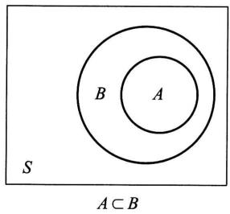  
图1-1

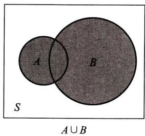  
图1-2

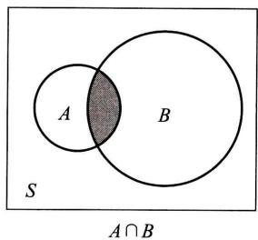  
图1-3

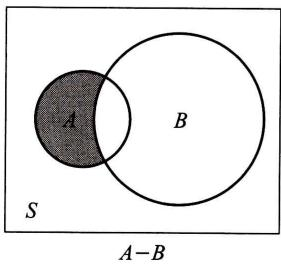  
图1-4

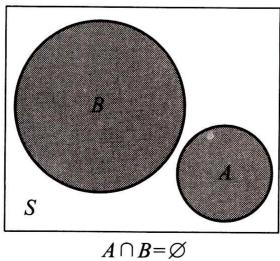  
图1-5

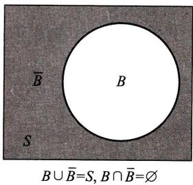  
图1-6

在进行事件运算时，经常要用到下述定律.设  $A,B,C$  为事件，则有

交换律：  $A\bigcup B = B\bigcup A$  ；  $A\cap B = B\cap A$

结合律：  $A\bigcup (B\bigcup C) = (A\bigcup B)\bigcup C$  ；  $A\cap (B\cap C) = (A\cap B)\cap C.$

分配律：  $A\bigcup (B\cap C) = (A\bigcup B)\cap (A\bigcup C);\quad A\cap (B\bigcup C) = (A\cap B)\bigcup (A\cap C).$

德摩根律：  $\overline{A\cup B} = \overline{A}\cap \overline{B}$  ；  $\overline{A\cap B} = \overline{A}\cup \overline{B}.$

例2 在例1中有

$$
\begin{array}{l} A _ {1} \bigcup A _ {2} = \{H H H, H H T, H T H, H T T, T T T \}, \\ A _ {1} \cap A _ {2} = \{H H H \}, \\ A _ {2} - A _ {1} = \{T T T \}, \\ \overline {{A _ {1} \bigcup A _ {2}}} = \{T H T, T T H, T H H \}. \\ \end{array}
$$

例3如图1-7所示的电路中，以  $A$  表示“信号灯亮”这一事件，以  $B,C,D$  分别表示事件：继电器接点I，Ⅱ，Ⅲ闭合，那么容易知道  $BC\subset A,BD\subset A$ $BC\bigcup BD = A$  ，而  $\overline{BA} = \varnothing$  ，即事件  $\overline{B}$  与事件  $A$  互不相容.又，  $\overline{B\cup C} = \overline{B}\cap \overline{C}$  （左边表示事件“I，Ⅱ至少有一个闭合”的逆事件，也就是I，Ⅱ都不闭合，即  $\overline{B},\overline{C}$  同时发生）.

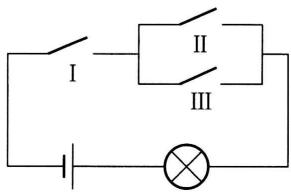  
图1-7

# § 3 频率与概率

对于一个事件（除必然事件和不可能事件外）来说，它在一次试验中可能发生，也可能不发生。我们常常希望知道某些事件在一次试验中发生的可能性究竟有多大。例如，为了确定水坝的高度，就要知道河流在造水坝地段每年最大洪水达到某一高度这一事件发生的可能性大小。我们希望找到一个合适的数来表征事件在一次试验中发生的可能性大小。为此，首先引入频率，它描述了事件发生的频繁程度，进而引出表征事件在一次试验中发生的可能性大小的数——概率。

# （一）频率

定义 在相同的条件下，进行了  $n$  次试验，在这  $n$  次试验中，事件  $A$  发生的次数  $n_A$  称为事件  $A$  发生的频数。比值  $n_A / n$  称为事件  $A$  发生的频率，并记成  $f_n(A)$ 。

由定义，易见频率具有下述基本性质：

$$
1 ^ {\circ} 0 \leqslant f _ {n} (A) \leqslant 1.
$$

$$
2 ^ {\circ} f _ {n} (S) = 1.
$$

$3^{\circ}$  若  $A_{1}, A_{2}, \dots, A_{k}$  是两两互不相容的事件，则

$$
f _ {n} \left(A _ {1} \bigcup A _ {2} \bigcup \dots \bigcup A _ {k}\right) = f _ {n} \left(A _ {1}\right) + f _ {n} \left(A _ {2}\right) + \dots + f _ {n} \left(A _ {k}\right).
$$

由于事件  $A$  发生的频率是它发生的次数与试验次数之比，其大小表示  $A$  发生的频繁程度。频率大，事件  $A$  发生就频繁，这意味着事件  $A$  在一次试验中发生的可能性就大。反之亦然。因而，直观的想法是用频率来表示事件  $A$  在一次试验中发生的可能性的大小。但是否可行，先看下面的例子。

例1考虑“抛硬币”这个试验，我们将一枚硬币抛掷5次、50次、500次，各做10遍.得到数据如表1-1所示（其中  $n_H$  表示  $H$  发生的频数，  $f_{n}(H)$  表示  $H$  发生的频率）.

表1-1  

<table><tr><td rowspan="2">试验序号</td><td colspan="2">n=5</td><td colspan="2">n=50</td><td colspan="2">n=500</td></tr><tr><td>nh</td><td>fn(H)</td><td>nh</td><td>fn(H)</td><td>nh</td><td>fn(H)</td></tr><tr><td>1</td><td>2</td><td>0.4</td><td>22</td><td>0.44</td><td>251</td><td>0.502</td></tr><tr><td>2</td><td>3</td><td>0.6</td><td>25</td><td>0.50</td><td>249</td><td>0.498</td></tr><tr><td>3</td><td>1</td><td>0.2</td><td>21</td><td>0.42</td><td>256</td><td>0.512</td></tr><tr><td>4</td><td>5</td><td>1.0</td><td>25</td><td>0.50</td><td>253</td><td>0.506</td></tr><tr><td>5</td><td>1</td><td>0.2</td><td>24</td><td>0.48</td><td>251</td><td>0.502</td></tr><tr><td>6</td><td>2</td><td>0.4</td><td>21</td><td>0.42</td><td>246</td><td>0.492</td></tr><tr><td>7</td><td>4</td><td>0.8</td><td>18</td><td>0.36</td><td>244</td><td>0.488</td></tr><tr><td>8</td><td>2</td><td>0.4</td><td>24</td><td>0.48</td><td>258</td><td>0.516</td></tr><tr><td>9</td><td>3</td><td>0.6</td><td>27</td><td>0.54</td><td>262</td><td>0.524</td></tr><tr><td>10</td><td>3</td><td>0.6</td><td>31</td><td>0.62</td><td>247</td><td>0.494</td></tr></table>

这种试验历史上有人做过，得到如表1一2所示的数据

表1-2  

<table><tr><td>试验者</td><td>n</td><td>nh</td><td>fn(H)</td></tr><tr><td>德摩根</td><td>2048</td><td>1061</td><td>0.5181</td></tr><tr><td>蒲丰</td><td>4040</td><td>2048</td><td>0.5069</td></tr><tr><td>K.皮尔逊</td><td>12000</td><td>6019</td><td>0.5016</td></tr><tr><td>K.皮尔逊</td><td>24000</td><td>12012</td><td>0.5005</td></tr></table>

从上述数据可以看出：抛硬币次数  $n$  较小时，频率  $f_{n}(H)$  在0与1之间随机波动，其幅度较大，但随着  $n$  增大，频率  $f_{n}(H)$  呈现出稳定性.即当  $n$  逐渐增大时 $f_{n}(H)$  总是在0.5附近摆动，而逐渐稳定于0.5. □

例2 考察英语中特定字母出现的频率. 当观察字母的个数  $n$  (试验的次数) 较小时, 频率有较大幅度的随机波动. 但当  $n$  增大时, 频率呈现出稳定性. 表1-3就是一份英文字母频率的统计表①:

表1-3  

<table><tr><td>字母</td><td>频率</td><td>字母</td><td>频率</td><td>字母</td><td>频率</td></tr><tr><td>E</td><td>0.1268</td><td>L</td><td>0.0394</td><td>P</td><td>0.0186</td></tr><tr><td>T</td><td>0.0978</td><td>D</td><td>0.0389</td><td>B</td><td>0.0156</td></tr><tr><td>A</td><td>0.0788</td><td>U</td><td>0.0280</td><td>V</td><td>0.0102</td></tr><tr><td>O</td><td>0.0776</td><td>C</td><td>0.0268</td><td>K</td><td>0.0060</td></tr><tr><td>I</td><td>0.0707</td><td>F</td><td>0.0256</td><td>X</td><td>0.0016</td></tr><tr><td>N</td><td>0.0706</td><td>M</td><td>0.0244</td><td>J</td><td>0.0010</td></tr><tr><td>S</td><td>0.0634</td><td>W</td><td>0.0214</td><td>Q</td><td>0.0009</td></tr><tr><td>R</td><td>0.0594</td><td>Y</td><td>0.0202</td><td>Z</td><td>0.0006</td></tr><tr><td>H</td><td>0.0573</td><td>G</td><td>0.0187</td><td></td><td></td></tr></table>

大量试验证实, 当重复试验的次数  $n$  逐渐增大时, 频率  $f_{n}(A)$  呈现出稳定性, 逐渐稳定于某个常数. 这种“频率稳定性”即通常所说的统计规律性. 我们让试验重复大量次数, 计算频率  $f_{n}(A)$ , 以它来表征事件  $A$  发生可能性的大小是合适的.

但是，在实际中，我们不可能对每一个事件都做大量的试验，然后求得事件的频率，用以表征事件发生可能性的大小。同时，为了理论研究的需要，我们从频率的稳定性和频率的性质得到启发，给出如下表征事件发生可能性大小的概率的定义。

# （二）概率

定义 设  $E$  是随机试验,  $S$  是它的样本空间. 对于  $E$  的每一事件  $A$  赋予一

个实数，记为  $P(A)$ ，称为事件  $A$  的概率，如果集合函数  $P(\cdot)$  满足下列条件：

$1^{\circ}$  非负性：对于每一个事件  $A$  ，有  $P(A)\geqslant 0$

$2^{\circ}$  规范性：对于必然事件  $S$  ，有  $P(S) = 1$

$3^{\circ}$  可列可加性：设  $A_{1}, A_{2}, \cdots$  是两两互不相容的事件，即对于  $A_{i}A_{j} = \emptyset$  ， $i \neq j, i, j = 1, 2, \cdots$  ，有

$$
P \left(A _ {1} \bigcup A _ {2} \bigcup \dots\right) = P \left(A _ {1}\right) + P \left(A _ {2}\right) + \dots . \tag {3.1}
$$

在第五章中将证明，当  $n \to \infty$  时频率  $f_{n}(A)$  在一定意义下接近于概率  $P(A)$ . 基于这一事实，我们就有理由将概率  $P(A)$  用来表征事件  $A$  在一次试验中发生的可能性的大小.

由概率的定义，可以推得概率的一些重要性质

性质  $\mathbf{i}$ $P(\varnothing) = 0$

证 令  $A_{n} = \varnothing (n = 1,2,\dots)$  ，则  $\bigcup_{n = 1}^{\infty}A_{n} = \varnothing$  ，且  $A_{i}A_{j} = \varnothing ,i\neq j,i,j = 1,2,\dots .$  由概率的可列可加性(3.1)得

$$
P (\varnothing) = P \left(\bigcup_ {n = 1} ^ {\infty} A _ {n}\right) = \sum_ {n = 1} ^ {\infty} P (A _ {n}) = \sum_ {n = 1} ^ {\infty} P (\varnothing).
$$

由概率的非负性知，  $P(\varnothing)\geqslant 0$  ，故由上式知  $P(\varnothing) = 0$

性质ii（有限可加性）若  $A_{1}, A_{2}, \dots, A_{n}$  是两两互不相容的事件，则有

$$
P \left(A _ {1} \bigcup A _ {2} \bigcup \dots \bigcup A _ {n}\right) = P \left(A _ {1}\right) + P \left(A _ {2}\right) + \dots + P \left(A _ {n}\right). \tag {3.2}
$$

# （3.2）式称为概率的有限可加性

证 令  $A_{n+1} = A_{n+2} = \cdots = \emptyset$ ，即有  $A_iA_j = \emptyset, i \neq j, i, j = 1, 2, \cdots.$  由（3.1）式得

$$
\begin{array}{l} P \left(A _ {1} \cup A _ {2} \cup \dots \cup A _ {n}\right) = P \left(\bigcup_ {k = 1} ^ {\infty} A _ {k}\right) = \sum_ {k = 1} ^ {\infty} P \left(A _ {k}\right) = \sum_ {k = 1} ^ {n} P \left(A _ {k}\right) + 0 \\ = P \left(A _ {1}\right) + P \left(A _ {2}\right) + \dots + P \left(A _ {n}\right). \\ \end{array}
$$

(3.2)式得证.

性质iii 设  $A, B$  是两个事件，若  $A \subset B$  ，则有

$$
P (B - A) = P (B) - P (A), \tag {3.3}
$$

$$
P (B) \geqslant P (A). \tag {3.4}
$$

证 由  $A \subset B$  知  $B = A \cup (B - A)$  （参见图1-1），且  $A(B - A) = \emptyset$  ，再由概率的有限可加性(3.2)，得

$$
P (B) = P (A) + P (B - A),
$$

(3.3)得证；又由概率的非负性  $1^{\circ}, P(B - A) \geqslant 0$  知

$$
P (B) \geqslant P (A).
$$

□

性质iv 对于任一事件  $A$

$$
P (A) \leqslant 1.
$$

证 因  $A \subset S$ , 由性质 iii 得

$$
P (A) \leqslant P (S) = 1.
$$

性质  $\mathbf{v}$  （逆事件的概率） 对于任一事件  $A$  ，有

$$
P (\overline {{A}}) = 1 - P (A).
$$

证 因  $A \cup \overline{A} = S$  ，且  $A\overline{A} = \varnothing$  ，由（3.2）式，得

$$
1 = P (S) = P (A \bigcup \bar {A}) = P (A) + P (\bar {A}).
$$

性质  $\mathbf{v}$  得证.

性质vi（加法公式） 对于任意两事件  $A,B$  ，有

$$
P (A \cup B) = P (A) + P (B) - P (A B). \tag {3.5}
$$

证 因  $A \cup B = A \cup (B - AB)$  （参见图1-2），且  $A(B - AB) = \emptyset, AB \subset B$ ，故由(3.2)式及(3.3)式得

$$
\begin{array}{l} P (A \bigcup B) = P (A) + P (B - A B) \\ = P (A) + P (B) - P (A B). \\ \end{array}
$$

（3.5）式还能推广到多个事件的情况。例如，设  $A_{1}, A_{2}, A_{3}$  为任意三个事件，则有

$$
\begin{array}{l} P \left(A _ {1} \bigcup A _ {2} \bigcup A _ {3}\right) = P \left(A _ {1}\right) + P \left(A _ {2}\right) + P \left(A _ {3}\right) - P \left(A _ {1} A _ {2}\right) \\ - P \left(A _ {1} A _ {3}\right) - P \left(A _ {2} A _ {3}\right) + P \left(A _ {1} A _ {2} A _ {3}\right). \tag {3.6} \\ \end{array}
$$

一般，对于任意  $n$  个事件  $A_{1}, A_{2}, \dots, A_{n}$ ，可以用数学归纳法证得

$$
\begin{array}{l} P \left(A _ {1} \bigcup A _ {2} \bigcup \dots \bigcup A _ {n}\right) = \sum_ {i = 1} ^ {n} P \left(A _ {i}\right) - \sum_ {1 \leqslant i <   j \leqslant n} P \left(A _ {i} A _ {j}\right) \\ + \sum_ {1 \leqslant i <   j <   k \leqslant n} P \left(A _ {i} A _ {j} A _ {k}\right) + \dots + (- 1) ^ {n - 1} P \left(A _ {1} A _ {2} \dots A _ {n}\right). \tag {3.7} \\ \end{array}
$$

# § 4 等可能概型(古典概型)

§ 1 中所说的试验  $E_{1}, E_{4}$ , 它们具有两个共同的特点:

$1^{\circ}$  试验的样本空间只包含有限个元素.  
$2^{\circ}$  试验中每个基本事件发生的可能性相同

具有以上两个特点的试验是大量存在的. 这种试验称为等可能概型. 它在概率论发展初期曾是主要的研究对象, 所以也称为古典概型. 等可能概型的一些概念具有直观、容易理解的特点, 有着广泛的应用.

下面我们来讨论等可能概型中事件概率的计算公式

设试验的样本空间为  $S = \{e_1, e_2, \dots, e_n\}$ . 由于在试验中每个基本事件发生的可能性相同，即有

$$
P \left(\left\{e _ {1} \right\}\right) = P \left(\left\{e _ {2} \right\}\right) = \dots = P \left(\left\{e _ {n} \right\}\right),
$$

又由于基本事件是两两互不相容的，于是

$$
\begin{array}{l} 1 = P (S) = P \left(\left\{e _ {1} \right\} \cup \left\{e _ {2} \right\} \cup \dots \cup \left\{e _ {n} \right\}\right) \\ = P \left(\left\{e _ {1} \right\}\right) + P \left(\left\{e _ {2} \right\}\right) + \dots + P \left(\left\{e _ {n} \right\}\right) = n P \left(\left\{e _ {i} \right\}\right), \\ P \left(\left\{e _ {i} \right\}\right) = \frac {1}{n}, \quad i = 1, 2, \dots , n. \\ \end{array}
$$

若事件  $A$  包含  $k$  个基本事件，即  $A = \{e_{i_1}\} \cup \{e_{i_2}\} \cup \dots \cup \{e_{i_k}\}$  ，这里  $i_1$ $i_2,\dots ,i_k$  是  $1,2,\dots ,n$  中某  $k$  个不同的数，则有

$$
P (A) = \sum_ {j = 1} ^ {k} P \left(\left\{e _ {i _ {j}} \right\}\right) = \frac {k}{n} = \frac {A \text {包 含 的 基 本 事 件 数}}{S \text {中 基 本 事 件 的 总 数}}. \tag {4.1}
$$

（4.1）式就是等可能概型中事件  $A$  的概率的计算公式①.

例1 将一枚硬币抛掷三次.（1）设事件  $A_{1}$  为“恰有一次出现正面”，求 $P(A_1)$  .（2）设事件  $A_{2}$  为“至少有一次出现正面”，求  $P(A_{2})$

解 (1) 我们考虑 §1 中  $E_2$  的样本空间:

$$
S _ {2} = \{H H H, H H T, H T H, T H H, H T T, T H T, T T H, T T T \},
$$

而  $A_{1} = \{HTT,THT,TTH\}$

$S_{2}$  中包含有限个元素，且由对称性知每个基本事件发生的可能性相同.故由(4.1)式，得

$$
P (A _ {1}) = \frac {3}{8}.
$$

（2）由于  $\overline{A}_2 = \{TTT\}$  ，于是

$$
P \left(A _ {2}\right) = 1 - P \left(\bar {A} _ {2}\right) = 1 - \frac {1}{8} = \frac {7}{8}.
$$

当样本空间的元素较多时，我们一般不再将  $S$  中的元素一一列出，而只需分别求出  $S$  中与  $A$  中包含的元素的个数（即基本事件的个数），再由(4.1)式即可求出  $A$  的概率.

例2 一个口袋装有6只球，其中4只白球、2只红球.从袋中取球两次，每次随机地取一只.考虑两种取球方式：（a）第一次取一只球，观察其颜色后放回

袋中，搅匀后再取一球。这种取球方式叫做放回抽样。（b）第一次取一球不放回袋中，第二次从剩余的球中再取一球。这种取球方式叫做不放回抽样。试分别就上面两种情况求：（1）取到的两只球都是白球的概率。（2）取到的两只球颜色相同的概率。（3）取到的两只球中至少有一只是白球的概率。

解（a）放回抽样的情况.

以  $A, B, C$  分别表示事件“取到的两只球都是白球”“取到的两只球都是红球”“取到的两只球中至少有一只是白球”。易知“取到两只颜色相同的球”这一事件即为  $A \cup B$ ，而  $C = \overline{B}$ 。

在袋中依次取两只球，每一种取法为一个基本事件，显然此时样本空间中仅包含有限个元素。且由对称性知每个基本事件发生的可能性相同，因而可利用(4.1)式来计算事件的概率。

第一次从袋中取球有6只球可供抽取，第二次也有6只球可供抽取.由组合法的乘法原理，共有  $6\times 6$  种取法.即样本空间中元素总数为  $6\times 6.$  对于事件  $A$  而言，由于第一次有4只白球可供抽取，第二次也有4只白球可供抽取，由乘法原理共有  $4\times 4$  种取法，即  $A$  中包含  $4\times 4$  个元素.同理，  $B$  中包含  $2\times 2$  个元素.于是

$$
P (A) = \frac {4 \times 4}{6 \times 6} = \frac {4}{9}.
$$

$$
P (B) = \frac {2 \times 2}{6 \times 6} = \frac {1}{9}.
$$

由于  $AB = \varnothing$  ，得

$$
P (A \bigcup B) = P (A) + P (B) = \frac {5}{9}.
$$

$$
P (C) = P (\overline {{B}}) = 1 - P (B) = \frac {8}{9}.
$$

（b）不放回抽样的情况.

由读者自己完成.

例3 将  $n$  只球随机地放入  $N(N \geqslant n)$  个盒子中去，试求每个盒子至多有一只球的概率（设盒子的容量不限）.

解 将  $n$  只球放入  $N$  个盒子中去，每一种放法是一基本事件。易知，这是古典概型问题。因每一只球都可以放入  $N$  个盒子中的任一个盒子，故共有  $N \times N \times \dots \times N = N^n$  种不同的放法，而每个盒子中至多放一只球共有  $N(N - 1) \dots [N - (n - 1)]$  种不同放法。因而所求的概率为

$$
p = \frac {N (N - 1) \cdots (N - n + 1)}{N ^ {n}} = \frac {A _ {N} ^ {n}}{N ^ {n}}.
$$

有许多问题和本例具有相同的数学模型. 例如, 假设每人的生日在一年 365 天中的任一天是等可能的, 即都等于  $1 / 365$ , 那么随机选取  $n$  ( $n \leqslant 365$ ) 个人, 他们的生日各不相同的概率为

$$
\frac {3 6 5 \times 3 6 4 \times \cdots \times (3 6 5 - n + 1)}{3 6 5 ^ {n}}.
$$

因而， $n$  个人中至少有两人生日相同的概率为

$$
p = 1 - \frac {3 6 5 \times 3 6 4 \times \cdots \times (3 6 5 - n + 1)}{3 6 5 ^ {n}}.
$$

经计算可得下述结果：

<table><tr><td>n</td><td>20</td><td>23</td><td>30</td><td>40</td><td>50</td><td>64</td><td>100</td></tr><tr><td>p</td><td>0.411</td><td>0.507</td><td>0.706</td><td>0.891</td><td>0.970</td><td>0.997</td><td>0.999 999 7</td></tr></table>

从上表可看出，在仅有64人的班级里，“至少有两人生日相同”这一事件的概率与1相差无几，因此，如作调查的话，几乎总是会出现的。读者不妨试一试。

例4 设有  $N$  件产品, 其中有  $D$  件次品, 今从中任取  $n$  件, 问其中恰有  $k (k \leqslant D)$  件次品的概率是多少?

解 在  $N$  件产品中抽取  $n$  件（这里是指不放回抽样），所有可能的取法共有  $\binom{N}{n}^{\text{①}}$  种，每一种取法为一基本事件，且由于对称性知每个基本事件发生的可能性相同。又因在  $D$  件次品中取  $k$  件，所有可能的取法有  $\binom{D}{k}$  种。在  $N-D$  件正品中取  $n-k$  件所有可能的取法有  $\binom{N-D}{n-k}$  种，由乘法原理知在  $N$  件产品中取  $n$  件，其中恰有  $k$  件次品的取法共有  $\binom{D}{k}\binom{N-D}{n-k}$  种，于是所求概率为

$$
p = \binom {D} {k} \binom {N - D} {n - k} / \binom {N} {n}. \tag {4.2}
$$

（4.2）式即所谓超几何分布的概率公式

例5 袋中有  $a$  只白球、 $b$  只红球， $k$  个人依次在袋中取一只球，（1）作放回抽样；（2）作不放回抽样，求第  $i$ $(i = 1,2,\dots,k)$  人取到白球(记为事件  $B$ ) 的概率  $(k \leqslant a + b)$ .

解（1）放回抽样的情况，显然有

$$
P (B) = \frac {a}{a + b}.
$$

（2）不放回抽样的情况．各人取一只球，每种取法是一个基本事件.共有 $(a + b)(a + b - 1)\dots (a + b - k + 1) = A_{a + b}^{k}$  个基本事件，且由于对称性知每个基本事件发生的可能性相同．当事件  $B$  发生时，第  $i$  人取的应是白球，它可以是  $a$  只白球中的任一只，有  $a$  种取法．其余被取的  $k - 1$  只球可以是其余  $a + b - 1$  只球中的任意  $k - 1$  只，共有  $(a + b - 1)(a + b - 2)\dots [a + b - 1 - (k - 1) + 1] = A_{a + b - 1}^{k - 1}$  种取法，于是事件  $B$  中包含  $a\cdot A_{a + b - 1}^{k - 1}$  个基本事件，故由(4.1)式得到

$$
P (B) = a \cdot A _ {a + b - 1} ^ {k - 1} / A _ {a + b} ^ {k} = \frac {a}{a + b}.
$$

值得注意的是  $P(B)$  与  $i$  无关，即  $k$  个人取球，尽管取球的先后次序不同，各人取到白球的概率是一样的，大家机会相同（例如在购买福利彩票时，各人得奖的机会是一样的）。另外还值得注意的是放回抽样的情况与不放回抽样的情况下  $P(B)$  是一样的。

例6 在  $1 \sim 2000$  的整数中随机地取一个数，问取到的整数既不能被6整除，又不能被8整除的概率是多少？

解设  $A$  为事件“取到的数能被6整除”， $B$  为事件“取到的数能被8整除”，则所求概率为

$$
\begin{array}{l} P (\overline {{A}} \overline {{B}}) = P (\overline {{A \bigcup B}}) = 1 - P (A \bigcup B) \\ = 1 - \left[ P (A) + P (B) - P (A B) \right]. \\ \end{array}
$$

由于

$$
3 3 3 <   \frac {2 0 0 0}{6} <   3 3 4,
$$

故得  $P(A) = \frac{333}{2000}.$

由于

$$
\frac {2 0 0 0}{8} = 2 5 0,
$$

故得

$$
P (B) = \frac {2 5 0}{2 0 0 0}.
$$

又由于一个数同时能被6与8整除，就相当于能被24整除，因此，由

$$
8 3 <   \frac {2 0 0 0}{2 4} <   8 4,
$$

得  $P(AB) = \frac{83}{2000}.$

于是所求概率为

$$
p = 1 - \left(\frac {3 3 3}{2 0 0 0} + \frac {2 5 0}{2 0 0 0} - \frac {8 3}{2 0 0 0}\right) = \frac {3}{4}.
$$

例7 将15名新生随机地平均分配到三个班级中去，这15名新生中有3名是优秀生.问（1）每个班级各分配到一名优秀生的概率是多少？（2）3名优秀生分配在同一班级的概率是多少？

解 15名新生平均分配到三个班级中的分法总数为

$$
\left( \begin{array}{c} 1 5 \\ 5 \end{array} \right) \left( \begin{array}{c} 1 0 \\ 5 \end{array} \right) \left( \begin{array}{c} 5 \\ 5 \end{array} \right) = \frac {1 5 !}{5 ! \quad 5 ! \quad 5 !}.
$$

每一种分配法为一基本事件，且由对称性易知每个基本事件发生的可能性相同。

（1）将3名优秀生分配到三个班级使每个班级都有一名优秀生的分法共3！种.对于这每一种分法，其余12名新生平均分配到三个班级中的分法共有 $\frac{12!}{4!4!4!}$ 种.因此，每一班级各分配到一名优秀生的分法共有  $\frac{3!12!}{4!4!4!}$  种.于是所求概率为

$$
p _ {1} = \frac {3 ! 1 2 !}{4 ! 4 ! 4 !} / \frac {1 5 !}{5 ! 5 ! 5 !} = \frac {2 5}{9 1}.
$$

（2）将3名优秀生分配在同一班级的分法共有3种.对于这每一种分法，其余12名新生的分法（一个班级2名，另两个班级各5名）有  $\frac{12!}{2!5!5!}$  种.因此3名优秀生分配在同一班级的分法共有  $\frac{3\times 12!}{2!5!5!}$  种，于是，所求概率为

$$
p _ {2} = \frac {3 \times 1 2 !}{2 ! 5 ! 5 !} / \frac {1 5 !}{5 ! 5 ! 5 !} = \frac {6}{9 1}.
$$

例8 某接待站在某一周曾接待过12次来访，已知所有这12次接待都是在周二和周四进行的，问是否可以推断接待时间是有规定的？

解 假设接待站的接待时间没有规定，而各来访者在一周的任一天中去接待站是等可能的，那么，12次接待来访者都在周二、周四的概率为

$$
\frac {2 ^ {1 2}}{7 ^ {1 2}} = 0. 0 0 0 0 0 0 3.
$$

人们在长期的实践中总结得到“概率很小的事件在一次试验中实际上几乎是不发生的”（称之为实际推断原理）。现在概率很小的事件在一次试验中竟然发生了，因此有理由怀疑假设的正确性，从而推断接待站不是每天都接待来访者，即认为其接待时间是有规定的。

# § 5 条件概率

# （一）条件概率

条件概率是概率论中的一个重要而实用的概念.所考虑的是事件  $A$  已发生的条件下事件  $B$  发生的概率.先举一个例子.

例1 将一枚硬币抛掷两次，观察其出现正反面的情况. 设事件  $A$  为“至少有一次为  $H$ ”，事件  $B$  为“两次掷出同一面”. 现在来求已知事件  $A$  已经发生的条件下事件  $B$  发生的概率.

这里，样本空间为  $S = \{HH, HT, TH, TT\}$ ， $A = \{HH, HT, TH\}$ ， $B = \{HH, TT\}$ 。易知此属古典概型问题。已知事件  $A$  已发生，有了这一信息，知道  $TT$  不可能发生，即知试验所有可能结果所成的集合就是  $A$ 。 $A$  中共有 3 个元素，其中只有  $HH \in B$ 。于是，在事件  $A$  发生的条件下事件  $B$  发生的概率（记为  $P(B|A)$ ）为

$$
P (B | A) = \frac {1}{3}.
$$

在这里，我们看到  $P(B) = 2 / 4 \neq P(B|A)$ . 这是很容易理解的，因为在求  $P(B|A)$  时我们是限制在事件  $A$  已经发生的条件下考虑事件  $B$  发生的概率的.

另外，易知

$$
P (A) = \frac {3}{4}, \quad P (A B) = \frac {1}{4}, \quad P (B | A) = \frac {1}{3} = \frac {1 / 4}{3 / 4},
$$

故有

$$
P (B \mid A) = \frac {P (A B)}{P (A)}. \tag {5.1}
$$

对于一般古典概型问题，若仍以  $P(B|A)$  记事件  $A$  已经发生的条件下事件  $B$  发生的概率，则关系式(5.1)仍然成立。事实上，设试验的基本事件总数为  $n$ ， $A$  所包含的基本事件数为  $m$ （ $m > 0$ ）， $AB$  所包含的基本事件数为  $k$ ，即有

$$
P (B \mid A) = \frac {k}{m} = \frac {k / n}{m / n} = \frac {P (A B)}{P (A)}.
$$

在一般场合，我们将上述关系式作为条件概率的定义

定义 设  $A, B$  是两个事件，且  $P(A) > 0$  ，称

$$
P (B \mid A) = \frac {P (A B)}{P (A)} \tag {5.2}
$$

为在事件  $A$  发生的条件下事件  $B$  发生的条件概率.

不难验证，条件概率  $P(\cdot |A)$  符合概率定义中的三个条件，即

$1^{\circ}$  非负性：对于每一事件  $B$  ，有  $P(B|A)\geqslant 0$  
$2^{\circ}$  规范性：对于必然事件  $S$  ，有  $P(S|A) = 1$  
$3^{\circ}$  可列可加性：设  $B_{1}, B_{2}, \cdots$  是两两互不相容的事件，则有

$$
P \left(\bigcup_ {i = 1} ^ {\infty} B _ {i} \mid A\right) = \sum_ {i = 1} ^ {\infty} P (B _ {i} \mid A).
$$

由于条件概率符合上述三个条件,故§3中对概率所证明的一些重要结果都适用于条件概率.例如,对于任意事件B₁,B₂有

$$
P \left(B _ {1} \bigcup B _ {2} \mid A\right) = P \left(B _ {1} \mid A\right) + P \left(B _ {2} \mid A\right) - P \left(B _ {1} B _ {2} \mid A\right).
$$

例2 一盒子装有4只产品，其中有3只一等品，1只二等品。从中取产品两次，每次任取一只，作不放回抽样。设事件  $A$  为“第一次取到的是一等品”，事件  $B$  为“第二次取到的是一等品”。试求条件概率  $P(B|A)$ 。

解 易知此属古典概型问题. 将产品编号, 1, 2, 3 号为一等品; 4 号为二等品. 以  $(i, j)$  表示第一次、第二次分别取到第  $i$  号、第  $j$  号产品. 试验  $E$  (取产品两次, 记录其号码) 的样本空间为

$$
\begin{array}{l} S = \{(1, 2), (1, 3), (1, 4), (2, 1), (2, 3), (2, 4), \dots , (4, 1), (4, 2), (4, 3) \}, \\ A = \{(1, 2), (1, 3), (1, 4), (2, 1), (2, 3), (2, 4), (3, 1), (3, 2), (3, 4) \}, \\ A B = \{(1, 2), (1, 3), (2, 1), (2, 3), (3, 1), (3, 2) \}. \\ \end{array}
$$

按(5.2)式，得条件概率

$$
P (B \mid A) = \frac {P (A B)}{P (A)} = \frac {6 / 1 2}{9 / 1 2} = \frac {2}{3}.
$$

也可以直接按条件概率的含义来求  $P(B|A)$ . 我们知道, 当事件  $A$  发生以后, 试验  $E$  所有可能结果的集合就是  $A$ ,  $A$  中有 9 个元素, 其中只有  $(1,2)$ ,  $(1,3)$ ,  $(2,1)$ ,  $(2,3)$ ,  $(3,1)$ ,  $(3,2)$  属于  $B$ , 故可得

$$
P (B \mid A) = \frac {6}{9} = \frac {2}{3}.
$$

# (二) 乘法定理

由条件概率的定义（5.2），立即可得下述定理

乘法定理 设  $P(A) > 0$  ，则有

$$
P (A B) = P (B \mid A) P (A). \tag {5.3}
$$

(5.3)式称为乘法公式

（5.3）式容易推广到多个事件的积事件的情况。例如，设  $A, B, C$  为事件，且  $P(AB) > 0$ ，则有

$$
P (A B C) = P (C \mid A B) P (B \mid A) P (A). \tag {5.4}
$$

在这里，注意到由假设  $P(AB) > 0$  可推得  $P(A)\geqslant P(AB) > 0$

一般，设  $A_{1}, A_{2}, \dots, A_{n}$  为  $n$  个事件， $n \geqslant 2$ ，且  $P(A_{1}A_{2}\dots A_{n-1}) > 0$ ，则有

$$
P \left(A _ {1} A _ {2} \dots A _ {n}\right) = P \left(A _ {n} \mid A _ {1} A _ {2} \dots A _ {n - 1}\right) P \left(A _ {n - 1} \mid A _ {1} A _ {2} \dots A _ {n - 2}\right) \dots P \left(A _ {2} \mid A _ {1}\right) P \left(A _ {1}\right). \tag {5.5}
$$

例3 设袋中装有  $r$  只红球,  $t$  只白球. 每次自袋中任取一只球, 观察其颜色然后放回, 并再放入  $a$  只与所取出的那只球同色的球. 若在袋中连续取球四次, 试求第一、二次取到红球且第三、四次取到白球的概率.

解 以  $A_{i}(i = 1,2,3,4)$  表示事件“第  $i$  次取到红球”，则  $\overline{A}_3,\overline{A}_4$  分别表示事件第三、四次取到白球.所求概率为

$$
\begin{array}{l} P \left(A _ {1} A _ {2} \bar {A} _ {3} \bar {A} _ {4}\right) = P (\bar {A} _ {4} | A _ {1} A _ {2} \bar {A} _ {3}) P (\bar {A} _ {3} | A _ {1} A _ {2}) P \left(A _ {2} | A _ {1}\right) P \left(A _ {1}\right) \\ = \frac {t + a}{r + t + 3 a} \cdot \frac {t}{r + t + 2 a} \cdot \frac {r + a}{r + t + a} \cdot \frac {r}{r + t}. \\ \end{array}
$$

例4设某光学仪器厂制造的透镜，第一次落下时打破的概率为  $1 / 2$  ，若第一次落下未打破，第二次落下打破的概率为7/10，若前两次落下未打破，第三次落下打破的概率为9/10.试求透镜落下三次而未打破的概率.

解 以  $A_{i}(i = 1,2,3)$  表示事件“透镜第  $i$  次落下打破”，以  $B$  表示事件“透镜落下三次而未打破”。因为  $B = \overline{A}_1\overline{A}_2\overline{A}_3$  ，故有

$$
\begin{array}{l} P (B) = P \left(\bar {A} _ {1} \bar {A} _ {2} \bar {A} _ {3}\right) = P \left(\bar {A} _ {3} \mid \bar {A} _ {1} \bar {A} _ {2}\right) P \left(\bar {A} _ {2} \mid \bar {A} _ {1}\right) P \left(\bar {A} _ {1}\right) \\ = \left(1 - \frac {9}{1 0}\right) \left(1 - \frac {7}{1 0}\right) \left(1 - \frac {1}{2}\right) = \frac {3}{2 0 0}. \\ \end{array}
$$

另解，按题意

$$
\bar {B} = A _ {1} \cup \bar {A} _ {1} A _ {2} \cup \bar {A} _ {1} \bar {A} _ {2} A _ {3}.
$$

而  $A_{1},\overline{A}_{1}A_{2},\overline{A}_{1}\overline{A}_{2}A_{3}$  是两两互不相容的事件，故有

$$
P (\bar {B}) = P \left(A _ {1}\right) + P \left(\bar {A} _ {1} A _ {2}\right) + P \left(\bar {A} _ {1} \bar {A} _ {2} A _ {3}\right).
$$

已知  $P(A_{1}) = \frac{1}{2}, P(A_{2}|\overline{A}_{1}) = \frac{7}{10}, P(A_{3}|\overline{A}_{1}\overline{A}_{2}) = \frac{9}{10}$  即有

$$
\begin{array}{l} P \left(\bar {A} _ {1} A _ {2}\right) = P \left(A _ {2} \mid \bar {A} _ {1}\right) P \left(\bar {A} _ {1}\right) = \frac {7}{1 0} \left(1 - \frac {1}{2}\right) = \frac {7}{2 0}, \\ P \left(\bar {A} _ {1} \bar {A} _ {2} A _ {3}\right) = P \left(A _ {3} \mid \bar {A} _ {1} \bar {A} _ {2}\right) P \left(\bar {A} _ {2} \mid \bar {A} _ {1}\right) P \left(\bar {A} _ {1}\right) \\ = \frac {9}{1 0} \left(1 - \frac {7}{1 0}\right) \left(1 - \frac {1}{2}\right) = \frac {2 7}{2 0 0}. \\ \end{array}
$$

故得  $P(\overline{B}) = \frac{1}{2} +\frac{7}{20} +\frac{27}{200} = \frac{197}{200},$

$$
P (B) = 1 - \frac {1 9 7}{2 0 0} = \frac {3}{2 0 0}.
$$

□

# （三）全概率公式和贝叶斯公式

下面建立两个用来计算概率的重要公式. 先介绍样本空间的划分的定义.

定义 设  $S$  为试验  $E$  的样本空间， $B_{1}, B_{2}, \dots, B_{n}$  为  $E$  的一组事件. 若

(i)  $B_{i}B_{j} = \emptyset ,i\neq j,i,j = 1,2,\dots ,n.$  
(ii)  $B_{1}\bigcup B_{2}\bigcup \dots \bigcup B_{n} = S$

则称  $B_{1}, B_{2}, \dots, B_{n}$  为样本空间  $S$  的一个划分.

若  $B_{1}, B_{2}, \cdots, B_{n}$  是样本空间的一个划分，那么，对每次试验，事件  $B_{1}, B_{2}, \cdots, B_{n}$  中必有一个且仅有一个发生.

例如，设试验  $E$  为“掷一颗骰子观察其点数”。它的样本空间为  $S = \{1,2,3,4,5,6\}$ 。 $E$  的一组事件  $B_{1} = \{1,2,3\}, B_{2} = \{4,5\}, B_{3} = \{6\}$  是  $S$  的一个划分。而事件组  $C_{1} = \{1,2,3\}, C_{2} = \{3,4\}, C_{3} = \{5,6\}$  不是  $S$  的划分。

定理1设试验  $E$  的样本空间为  $S,A$  为  $E$  的事件，  $B_{1},B_{2},\dots ,B_{n}$  为  $S$  的一个划分，且  $P(B_i) > 0 (i = 1,2,\dots ,n)$  ，则

$$
P (A) = P \left(A \mid B _ {1}\right) P \left(B _ {1}\right) + P \left(A \mid B _ {2}\right) P \left(B _ {2}\right) + \dots + P \left(A \mid B _ {n}\right) P \left(B _ {n}\right). \tag {5.6}
$$

# （5.6）式称为全概率公式

在很多实际问题中  $P(A)$  不易直接求得，但却容易找到  $S$  的一个划分  $B_{1}$ ， $B_{2}, \dots, B_{n}$ ，且  $P(B_{i})$  和  $P(A|B_{i})$  或为已知，或容易求得，那么就可以根据(5.6)式求出  $P(A)$ 。

证 因为

$$
A = A S = A \left(B _ {1} \cup B _ {2} \cup \dots \cup B _ {n}\right) = A B _ {1} \cup A B _ {2} \cup \dots \cup A B _ {n},
$$

由假设  $P(B_{i}) > 0 (i = 1,2,\dots ,n)$  ，且  $(AB_{i})(AB_{j}) = \emptyset ,i\neq j,i,j = 1,2,\dots ,n$  得到

$$
\begin{array}{l} P (A) = P \left(A B _ {1}\right) + P \left(A B _ {2}\right) + \dots + P \left(A B _ {n}\right) \\ = P \left(A \mid B _ {1}\right) P \left(B _ {1}\right) + P \left(A \mid B _ {2}\right) P \left(B _ {2}\right) + \dots + P \left(A \mid B _ {n}\right) P \left(B _ {n}\right). \\ \end{array}
$$

另一个重要公式是下述的贝叶斯公式

定理2设试验  $E$  的样本空间为  $S$ .  $A$  为  $E$  的事件， $B_{1}, B_{2}, \dots, B_{n}$  为  $S$  的一个划分，且  $P(A) > 0, P(B_{i}) > 0 (i = 1, 2, \dots, n)$ ，则

$$
P \left(B _ {i} \mid A\right) = \frac {P \left(A \mid B _ {i}\right) P \left(B _ {i}\right)}{\sum_ {j = 1} ^ {n} P \left(A \mid B _ {j}\right) P \left(B _ {j}\right)}, \quad i = 1, 2, \dots , n. \tag {5.7}
$$

（5.7）式称为贝叶斯(Bayes)公式①

证 由条件概率的定义及全概率公式即得

$$
P \left(B _ {i} \mid A\right) = \frac {P \left(B _ {i} A\right)}{P (A)} = \frac {P \left(A \mid B _ {i}\right) P \left(B _ {i}\right)}{\sum_ {j = 1} ^ {n} P \left(A \mid B _ {j}\right) P \left(B _ {j}\right)}, \quad i = 1, 2, \dots , n.
$$

特别在(5.6)式，(5.7)式中取  $n = 2$  ，并将  $B_{1}$  记为  $B$  ，此时  $B_{2}$  就是  $\overline{B}$  ，那么，全概率公式和贝叶斯公式分别成为

$$
P (A) = P (A \mid B) P (B) + P (A \mid \bar {B}) P (\bar {B}), \tag {5.8}
$$

$$
P (B \mid A) = \frac {P (A B)}{P (A)} = \frac {P (A \mid B) P (B)}{P (A \mid B) P (B) + P (A \mid \bar {B}) P (\bar {B})}. \tag {5.9}
$$

这两个公式是常用的.

例5 某电子设备制造厂所用的元件是由三家元件制造厂提供的. 根据以往的记录有以下的数据：

<table><tr><td>元件制造厂</td><td>次品率</td><td>提供元件的份额</td></tr><tr><td>1</td><td>0.02</td><td>0.15</td></tr><tr><td>2</td><td>0.01</td><td>0.80</td></tr><tr><td>3</td><td>0.03</td><td>0.05</td></tr></table>

设这三家工厂的产品在仓库中是均匀混合的，且无区别的标志。（1）在仓库中随机地取一只元件，求它是次品的概率。（2）在仓库中随机地取一只元件，若已知取到的是次品，为分析此次品出自何厂，需求出此次品由三家工厂生产的概率分别是多少。试求这些概率。

解设  $A$  表示“取到的是一只次品”， $B_{i}(i = 1,2,3)$  表示“所取到的产品是由第  $i$  家工厂提供的”。易知， $B_{1}, B_{2}, B_{3}$  是样本空间  $S$  的一个划分，且有

$$
P \left(B _ {1}\right) = 0. 1 5, \quad P \left(B _ {2}\right) = 0. 8 0, \quad P \left(B _ {3}\right) = 0. 0 5,
$$

$$
P (A \mid B _ {1}) = 0. 0 2, \quad P (A \mid B _ {2}) = 0. 0 1, \quad P (A \mid B _ {3}) = 0. 0 3.
$$

（1）由全概率公式，

$$
P (A) = P (A \mid B _ {1}) P (B _ {1}) + P (A \mid B _ {2}) P (B _ {2}) + P (A \mid B _ {3}) P (B _ {3}) = 0. 0 1 2 5.
$$

（2）由贝叶斯公式，

$$
P \left(B _ {1} \mid A\right) = \frac {P \left(A \mid B _ {1}\right) P \left(B _ {1}\right)}{P (A)} = \frac {0 . 0 2 \times 0 . 1 5}{0 . 0 1 2 5} = 0. 2 4.
$$

$$
P \left(B _ {2} \mid A\right) = 0. 6 4, \quad P \left(B _ {3} \mid A\right) = 0. 1 2.
$$

以上结果表明，这只次品来自第2家工厂的可能性最大.

□

例6 据美国的一份资料报道，在美国总的来说患肺癌的概率约为  $0.1\%$

在人群中有  $20\%$  是吸烟者，他们患肺癌的概率约为  $0.4\%$  ，求不吸烟者患肺癌的概率是多少.

解 以  $C$  记事件“患肺癌”，以  $A$  记事件“吸烟”，按题意  $P(C) = 0.001$ ， $P(A) = 0.20, P(C|A) = 0.004.$  需要求条件概率  $P(C|\overline{A})$ 。由全概率公式有

$$
P (C) = P (C | A) P (A) + P (C | \bar {A}) P (\bar {A}).
$$

将数据代入，得

$$
\begin{array}{l} 0. 0 0 1 = 0. 0 0 4 \times 0. 2 0 + P (C | \bar {A}) P (\bar {A}) \\ = 0. 0 0 4 \times 0. 2 0 + P (C | \bar {A}) \times 0. 8 0, \\ \end{array}
$$

$$
P (C | \bar {A}) = 0. 0 0 0 2 5.
$$

例7 对以往数据分析结果表明，当机器调整得良好时，产品的合格率为  $98\%$  ，而当机器发生某种故障时，其合格率为  $55\%$  .每天早上机器开动时，机器调整良好的概率为  $95\%$  .试求已知某日早上第一件产品是合格品时，机器调整良好的概率是多少.

解设  $A$  为事件“产品合格”， $B$  为事件“机器调整良好”。已知  $P(A|B) = 0.98, P(A|\overline{B}) = 0.55, P(B) = 0.95, P(\overline{B}) = 0.05$ ，所需求的概率为  $P(B|A)$ 。由贝叶斯公式

$$
\begin{array}{l} P (B \mid A) = \frac {P (A \mid B) P (B)}{P (A \mid B) P (B) + P (A \mid \bar {B}) P (\bar {B})} \\ = \frac {0 . 9 8 \times 0 . 9 5}{0 . 9 8 \times 0 . 9 5 + 0 . 5 5 \times 0 . 0 5} = 0. 9 7. \\ \end{array}
$$

这就是说，当生产出第一件产品是合格品时，此时机器调整良好的概率为0.97。这里，概率0.95是由以往的数据分析得到的，叫做先验概率。而在得到信息（即生产出的第一件产品是合格品）之后再重新加以修正的概率（即0.97）叫做后验概率。有了后验概率我们就能对机器的情况有进一步的了解。

例8 根据以往的临床记录，某种诊断癌症的试验具有如下的效果：若以  $A$  表示事件“试验反应为阳性”，以  $C$  表示事件“被诊断者患有癌症”，则有  $P(A|C) = 0.95, P(\overline{A}|\overline{C}) = 0.95.$  现在对自然人群进行普查，设被试验的人患有癌症的概率为0.005，即  $P(C) = 0.005$  ，试求  $P(C|A)$

解 已知  $P(A|C) = 0.95, P(A|\overline{C}) = 1 - P(\overline{A}|\overline{C}) = 0.05, P(C) = 0.005, P(\overline{C}) = 0.995$ ，由贝叶斯公式，

$$
P (C \mid A) = \frac {P (A \mid C) P (C)}{P (A \mid C) P (C) + P (A \mid \overline {{C}}) P (\overline {{C}})} = 0. 0 8 7.
$$

本题的结果表明，虽然  $P(A|C) = 0.95, P(\overline{A}|\overline{C}) = 0.95$  ，这两个概率都比较高。但若将此试验用于普查，则有  $P(C|A) = 0.087$  ，亦即其正确性只有  $8.7\%$  （平均

1000个具有阳性反应的人中大约只有87人确患有癌症).如果不注意这一点，将会得出错误的诊断，这也说明，若将  $P(A|C)$  和  $P(C|A)$  混淆则会造成不良的后果. □

# § 6 独立性

设  $A, B$  是试验  $E$  的两事件，若  $P(A) > 0$  ，可以定义  $P(B|A)$  。一般， $A$  的发生对  $B$  发生的概率是有影响的，这时  $P(B|A) \neq P(B)$  ，只有在这种影响不存在时才会有  $P(B|A) = P(B)$  ，这时有

$$
P (A B) = P (B \mid A) P (A) = P (A) P (B).
$$

例1设试验  $E$  为“抛甲、乙两枚硬币，观察正反面出现的情况”.设事件  $A$  为“甲币出现  $H$  ”，事件  $B$  为“乙币出现  $H$  ”.  $E$  的样本空间为

$$
S = \{H H, H T, T H, T T \}.
$$

由（4.1）式得

$$
P (A) = \frac {2}{4} = \frac {1}{2}, P (B) = \frac {2}{4} = \frac {1}{2},
$$

$$
P (B \mid A) = \frac {1}{2}, P (A B) = \frac {1}{4}.
$$

在这里我们看到  $P(B|A) = P(B)$ ，而  $P(AB) = P(A)P(B)$ . 事实上，由题意，显然甲币是否出现正面与乙币是否出现正面是互不影响的. □

定义 设  $A, B$  是两事件，如果满足等式

$$
P (A B) = P (A) P (B), \tag {6.1}
$$

则称事件  $A, B$  相互独立，简称  $A, B$  独立。

容易知道，若  $P(A) > 0, P(B) > 0$  ，则  $A, B$  相互独立与  $A, B$  互不相容不能同时成立.

定理1设  $A,B$  是两事件，且  $P(A) > 0.$  若  $A,B$  相互独立，则  $P(B|A) = P(B)$  .反之亦然.

定理1的正确性是显然的，

定理2 若事件  $A$  与  $B$  相互独立，则下列各对事件也相互独立：

$A$  与  $\overline{B}$  ，  $\overline{A}$  与  $B$  ，  $\overline{A}$  与  $\overline{B}$

证 因为  $A = A(B \cup \overline{B}) = AB \cup A\overline{B}$ ，得

$$
\begin{array}{l} P (A) = P (A B \bigcup A \bar {B}) = P (A B) + P (A \bar {B}) \\ = P (A) P (B) + P (A \bar {B}), \\ P (A \bar {B}) = P (A) [ 1 - P (B) ] = P (A) P (\bar {B}). \\ \end{array}
$$

因此  $A$  与  $\overline{B}$  相互独立，由此可立即推出  $\overline{A}$  与  $\overline{B}$  相互独立．再由  $\overline{B} = B$  ，又推出 $\overline{A}$  与  $B$  相互独立. □

下面我们将独立性的概念推广到三个事件的情况，

定义 设  $A, B, C$  是三个事件，如果满足等式

$$
\left. \begin{array}{l} P (A B) = P (A) P (B), \\ P (B C) = P (B) P (C), \\ P (A C) = P (A) P (C), \\ P (A B C) = P (A) P (B) P (C), \end{array} \right\} \tag {6.2}
$$

则称事件  $A, B, C$  相互独立.

一般，设  $A_{1}, A_{2}, \dots, A_{n}$  是  $n (n \geqslant 2)$  个事件，如果对于其中任意 2 个，任意 3 个，…，任意  $n$  个事件的积事件的概率，都等于各事件概率之积，则称事件  $A_{1}, A_{2}, \dots, A_{n}$  相互独立.

由定义，可以得到以下两个推论.

$1^{\circ}$  若事件  $A_{1}, A_{2}, \dots, A_{n} (n \geqslant 2)$  相互独立，则其中任意  $k$  （ $2 \leqslant k \leqslant n$ ）个事件也是相互独立的。

$2^{\circ}$  若  $n$  个事件  $A_{1}, A_{2}, \dots, A_{n} (n \geqslant 2)$  相互独立，则将  $A_{1}, A_{2}, \dots, A_{n}$  中任意多个事件换成它们各自的对立事件，所得的  $n$  个事件仍相互独立。

$1^{\circ}$  由独立性定义可直接推出.  $2^{\circ}$  从直观上看是显然的．对于  $n = 2$  时，在定理2处已作了证明，一般的情况由数学归纳法容易证得，此处略.

两事件相互独立的含义是它们中一个已发生，不影响另一个发生的概率。在实际应用中，对于事件的独立性常常是根据事件的实际意义去判断。一般，若由实际情况分析， $A, B$  两事件之间没有关联或关联很微弱，那就认为它们是相互独立的。例如  $A, B$  分别表示甲、乙两人患感冒。如果甲、乙两人的活动范围相距甚远，就认为  $A, B$  相互独立。若甲、乙两人是同住在一个房间里的，那就不能认为  $A, B$  相互独立了。

例2 一个元件(或系统)能正常工作的概率称为元件(或系统)的可靠性。如图1-8，设有4个独立工作的元件1,2,3,4按先串联再并联的方式连接（称为串并联系统）。设第  $i$  个元件的可靠性为  $p_i (i = 1,2,3,4)$ ，试求系统的可靠性。

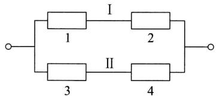  
图1-8

解 以  $A_{i}(i = 1,2,3,4)$  表示事件“第  $i$  个元件正常工作”，以  $A$  表示事件“系统正常工作”.

系统由两条线路 I 和 II 组成（如图 1-8）。当且仅当至少有一条线路中的两

个元件均正常工作时这一系统正常工作，故有

$$
A = A _ {1} A _ {2} \bigcup A _ {3} A _ {4}.
$$

由事件的独立性，得系统的可靠性

$$
\begin{array}{l} P (A) = P \left(A _ {1} A _ {2}\right) + P \left(A _ {3} A _ {4}\right) - P \left(A _ {1} A _ {2} A _ {3} A _ {4}\right) \\ = P \left(A _ {1}\right) P \left(A _ {2}\right) + P \left(A _ {3}\right) P \left(A _ {4}\right) - P \left(A _ {1}\right) P \left(A _ {2}\right) P \left(A _ {3}\right) P \left(A _ {4}\right) \\ = p _ {1} p _ {2} + p _ {3} p _ {4} - p _ {1} p _ {2} p _ {3} p _ {4}. \\ \end{array}
$$

例3 要验收一批（100件）乐器. 验收方案如下：自该批乐器中随机地取3件测试（设3件乐器的测试的结果是相互独立的），如果3件中至少有一件在测试中被认为音色不纯，则这批乐器就被拒绝接收. 设一件音色不纯的乐器经测试查出其为音色不纯的概率为0.95，而一件音色纯的乐器经测试被误认为不纯的概率为0.01. 如果已知这100件乐器中恰有4件是音色不纯的，试问这批乐器被接收的概率是多少？

解设以  $H_{i}(i = 0,1,2,3)$  表示事件“随机地取出3件乐器，其中恰有  $i$  件音色不纯”，  $H_0,H_1,H_2,H_3$  是  $S$  的一个划分，以  $A$  表示事件“这批乐器被接收”已知一件音色纯的乐器，经测试被认为音色纯的概率为0.99，而一件音色不纯的乐器，经测试被误认为音色纯的概率为0.05，并且3件乐器的测试的结果是相互独立的，于是有

$$
P (A \mid H _ {0}) = 0. 9 9 ^ {3}, \quad P (A \mid H _ {1}) = 0. 9 9 ^ {2} \times 0. 0 5,
$$

$$
P (A \mid H _ {2}) = 0. 9 9 \times 0. 0 5 ^ {2}, \quad P (A \mid H _ {3}) = 0. 0 5 ^ {3},
$$

而  $P(H_{0})=\binom{96}{3}\Bigg{/}\binom{100}{3},\quad P(H_{1})=\binom{4}{1}\binom{96}{2}\Bigg{/}\binom{100}{3},$

$$
P \left(H _ {2}\right) = \binom {4} {2} \binom {9 6} {1} / \binom {1 0 0} {3}, \quad P \left(H _ {3}\right) = \binom {4} {3} / \binom {1 0 0} {3}.
$$

故  $P(A) = \sum_{i=0}^{3} P(A \mid H_i) P(H_i) = 0.8574 + 0.0055 + 0 + 0$

$$
= 0. 8 6 2 9.
$$

例4甲、乙两人进行乒乓球比赛，每局甲胜的概率为  $p,p\geqslant 1 / 2$  ，问对甲而言，采用三局二胜制有利，还是采用五局三胜制有利？设各局胜负相互独立．

解 采用三局二胜制，甲最终获胜，其胜局的情况是：“甲甲”或“乙甲甲”或“甲乙甲”。而这3种结局互不相容，于是由独立性得甲最终获胜的概率为

$$
p _ {1} = p ^ {2} + 2 p ^ {2} (1 - p).
$$

采用五局三胜制，甲最终获胜，至少需比赛三局（可能赛三局，也可能赛四局或五局），且最后一局必须是甲胜，而前面甲需胜二局。例如，共赛四局，则甲的胜局情况是：“甲乙甲甲”“乙甲甲甲”“甲甲乙甲”，且这3种结局互不相容。由独

立性得在五局三胜制下甲最终获胜的概率为

$$
p _ {2} = p ^ {3} + \binom {3} {2} p ^ {3} (1 - p) + \binom {4} {2} p ^ {3} (1 - p) ^ {2},
$$

而

$$
p _ {2} - p _ {1} = p ^ {2} (6 p ^ {3} - 1 5 p ^ {2} + 1 2 p - 3) = 3 p ^ {2} (p - 1) ^ {2} (2 p - 1).
$$

当  $p > \frac{1}{2}$  时  $p_2 > p_1$ ，当  $p = \frac{1}{2}$  时  $p_2 = p_1 = \frac{1}{2}$ . 故当  $p > \frac{1}{2}$  时，对甲来说采用五局三胜制更为有利. 当  $p = \frac{1}{2}$  时两种赛制甲、乙最终获胜的概率是相同的，都是  $50\%$ .

# 小结

随机试验的全部可能结果组成的集合  $S$  称为样本空间。样本空间  $S$  的子集称为事件，当且仅当这一子集中的一个样本点出现时，称这一事件发生。事件是一个集合，因而事件间的关系与事件的运算自然按照集合论中集合之间的关系和集合的运算来处理。集合间的关系和集合的运算，读者是熟悉的，重要的是要知道它们在概率论中的含义。

在一次试验中，一个事件（除必然事件与不可能事件外）可能发生也可能不发生，其发生的可能性的大小是客观存在的。事件发生的频率以及它的稳定性，表明能用一个数来表征事件在一次试验中发生的可能性的大小。我们从频率的稳定性及频率的性质得到启发和抽象，给出了概率的定义。我们定义了一个集合（事件）的函数  $P(\cdot)$ ，它满足三条基本性质： $1^{\circ}$  非负性， $2^{\circ}$  规范性， $3^{\circ}$  可列可加性。这一函数的函数值  $P(A)$  就定义为事件  $A$  的概率。

概率的定义只给出概率必须满足的三条基本性质, 并未对事件  $A$  的概率  $P(A)$  给定一个具体的数. 只在古典概型的情况, 对于每个事件  $A$  给出了概率  $P(A) = k / n$  （（4.1）式）. 一般, 我们可以进行大量的重复试验, 得到事件  $A$  的频率, 而以频率作为  $P(A)$  的近似值. 或者根据概率的性质分析, 得到  $P(A)$  的取值.

在古典概型中，我们证明了条件概率的公式

$$
P (B \mid A) = \frac {P (A B)}{P (A)}, \quad P (A) > 0. \tag {5.2}
$$

在一般的情况，(5.2)式则作为条件概率的定义。固定  $A$  ，条件概率  $P(\cdot | A)$  具有概率定义中的三条基本性质，因而条件概率是一种概率。

有两种计算条件概率  $P(B|A)$  的方法：（1）按条件概率的含义，直接求出  $P(B|A)$ 。注意到，在求  $P(B|A)$  时已知事件  $A$  已发生，样本空间  $S$  中所有不属于  $A$  的样本点都被排除，原有的样本空间  $S$  缩减成为  $S' = A$ 。在缩减了的样本空间  $S' = A$  中计算事件  $B$  的概率就得到  $P(B|A)$ 。（2）在  $S$  中计算  $P(AB)$  及  $P(A)$ ，再按(5.2)式求得  $P(B|A)$ 。

将(5.2)式写成

$$
P (A B) = P (B \mid A) P (A), \quad P (A) > 0. \tag {5.3}
$$

这就是乘法公式．我们常按上述第一种方法求出条件概率，从而按(5.3)可求得  $P(AB)$

事件的独立性是概率论中的一个非常重要的概念。概率论与数理统计中的很多内容都是在独立的前提下讨论的。应该注意到，在实际应用中，对于事件的独立性，我们往往不是根据定义来验证而是根据实际意义来加以判断的。根据实际背景判断事件的独立性，往往并不困难。

# 重要术语及主题

下面列出了本章的重要术语及主题，请读者写出它们的定义或内容，然后与教材中的陈述校核，看看你是否写对了。这样做旨在使读者在复习时收到较好的效果。

随机试验 样本空间 随机事件 基本事件 频率 概率 古典概型  $A$  的对立事件  $\overline{A}$  及其概率 两个互不相容事件的和事件的概率 概率的加法定理 条件概率 概率的乘法公式 全概率公式 贝叶斯公式 事件的独立性 实际推断原理

# 习题

1. 写出下列随机试验的样本空间  $S$

（1）记录一个班一次数学考试的平均分数（设以百分制记分）.  
(2）生产产品直到有10件正品为止，记录生产产品的总件数  
（3）对某工厂出厂的产品进行检查，合格的记上“正品”，不合格的记上“次品”，如连续查出了2件次品就停止检查，或检查了4件产品就停止检查，记录检查的结果.  
（4）在单位圆内任意取一点，记录它的坐标

2. 设  $A, B, C$  为三个事件，用  $A, B, C$  的运算关系表示下列各事件：

（1）  $A$  发生，  $B$  与  $C$  不发生  
(2)  $A$  与  $B$  都发生，而  $C$  不发生  
（3）  $A,B,C$  中至少有一个发生  
（4）  $A,B,C$  都发生.  
（5）  $A,B,C$  都不发生.  
(6)  $A, B, C$  中不多于一个发生.  
（7）  $A,B,C$  中不多于两个发生  
（8）  $A,B,C$  中至少有两个发生

3.（1）设  $A, B, C$  是三个事件，且  $P(A) = P(B) = P(C) = 1/4, P(AB) = P(BC) = 0, P(AC) = 1/8$ ，求  $A, B, C$  至少有一个发生的概率.  
（2）已知  $P(A) = 1 / 2, P(B) = 1 / 3, P(C) = 1 / 5, P(AB) = 1 / 10, P(AC) = 1 / 15, P(BC) = 1 / 20, P(ABC) = 1 / 30$ ，求  $A \cup B, \overline{A}\overline{B}, A \cup B \cup C, \overline{A}\overline{B}\overline{C}, \overline{A}\overline{B}C, \overline{A}\overline{B} \cup C$  的概率.  
(3) 已知  $P(A) = 1/2$ , (i) 若  $A, B$  互不相容, 求  $P(A \overline{B})$ , (ii) 若  $P(AB) = 1/8$ , 求  $P(A \overline{B})$ .

4. 设  $A, B$  是两个事件

（1）已知  $A\overline{B} = \overline{A} B$  ，验证  $A = B$  
(2）验证事件  $A$  和事件  $B$  恰有一个发生的概率为  $P(A) + P(B) - 2P(AB)$

5. 10片药片中有5片是安慰剂

（1）从中任意抽取5片，求其中至少有2片是安慰剂的概率.

（2）从中每次取一片，作不放回抽样，求前3次都取到安慰剂的概率.

6. 在房间里有 10 个人, 分别佩戴从 1 号到 10 号的纪念章, 任选 3 人记录其纪念章的号码.

（1）求最小号码为5的概率  
（2）求最大号码为5的概率.

7. 某油漆公司发出17桶油漆，其中白漆10桶、黑漆4桶、红漆3桶，在搬运中所有标签脱落，交货人随意将这些油漆发给顾客。问一个订货为4桶白漆、3桶黑漆和2桶红漆的顾客，能按所订颜色如数得到订货的概率是多少？

8. 在 1500 件产品中有 400 件次品、1100 件正品. 任取 200 件.

（1）求恰有90件次品的概率，  
（2）求至少有2件次品的概率，

9. 从5双不同的鞋子中任取4只，问这4只鞋子中至少有两只配成一双的概率是多少？  
10. 在 11 张卡片上分别写上 probability 这 11 个字母, 从中任意连抽 7 张, 求其排列结果为 ability 的概率.  
11. 将 3 只球随机地放入 4 个杯子中去, 求杯子中球的最大个数分别为 1,2,3 的概率.  
12. 50 只铆钉随机地取来用在 10 个部件上, 其中有 3 只铆钉强度太弱. 每个部件用 3 只铆钉. 若将 3 只强度太弱的铆钉都装在一个部件上, 则这个部件强度就太弱. 问发生一个部件强度太弱的概率是多少?  
13. 一俱乐部有5名一年级学生，2名二年级学生，3名三年级学生，2名四年级学生.

（1）在其中任选4名学生，求一、二、三、四年级的学生各一名的概率.  
（2）在其中任选5名学生，求一、二、三、四年级的学生均包含在内的概率.

14.（1）已知  $P(\overline{A}) = 0.3, P(B) = 0.4, P(A\overline{B}) = 0.5$  ，求条件概率  $P(B|A\bigcup \overline{B})$  
(2）已知  $P(A) = 1 / 4,P(B|A) = 1 / 3,P(A|B) = 1 / 2$  ，求  $P(A\bigcup B)$  
15. 掷两颗骰子，已知两颗骰子点数之和为7，求其中有一颗为1点的概率(用两种方法).

16. 据以往资料表明, 某一 3 口之家, 患某种传染病的概率有以下规律:

$P\{$  孩子得病  $\} = 0.6$  ，  $P\{$  母亲得病|孩子得病  $\} = 0.5$

$P\{$  父亲得病  $\mid$  母亲及孩子得病  $\} = 0.4$

求母亲及孩子得病但父亲未得病的概率.

17. 已知在 10 件产品中有 2 件次品, 在其中取两次, 每次任取一件, 作不放回抽样. 求下列事件的概率:

（1）两件都是正品.  
（2）两件都是次品.  
（3）一件是正品，一件是次品  
（4）第二次取出的是次品.

18. 某人忘记了电话号码的最后一个数字，因而他随意地拨号。求他拨号不超过三次而接通所需电话的概率。若已知最后一个数字是奇数，则此概率是多少？

19.（1）设甲袋中装有  $n$  只白球、 $m$  只红球，乙袋中装有  $N$  只白球、 $M$  只红球。今从甲袋中任意取一只球放入乙袋中，再从乙袋中任意取一只球。问取到白球的概率是多少？

（2）第一只盒子装有5只红球、4只白球，第二只盒子装有4只红球、5只白球.先从第一盒中任取2只球放入第二盒中去，然后从第二盒中任取一只球.求取到白球的概率.

20. 某种产品的商标为“MAXAM”，其中有 2 个字母脱落，有人捡起随意放回，求放回后仍为“MAXAM”的概率。

21. 已知男子有  $5\%$  是色盲患者，女子有  $0.25\%$  是色盲患者。今从男女人数相等的人群中随机地挑选一人，恰好是色盲患者，问此人是男性的概率是多少？

22. 一学生接连参加同一课程的两次考试。第一次及格的概率为  $p$ ，若第一次及格则第二次及格的概率也为  $p$ ；若第一次不及格则第二次及格的概率为  $p / 2$ 。

（1）若至少有一次及格则他能取得某种资格，求他取得该资格的概率.

（2）若已知他第二次已经及格，求他第一次及格的概率

23. 将两信息分别编码为  $A$  和  $B$  传送出去，接收站收到时， $A$  被误收作  $B$  的概率为0.02，而  $B$  被误收作  $A$  的概率为0.01。信息  $A$  与信息  $B$  传送的频繁程度为  $2:1$ 。若接收站收到的信息是  $A$ ，问原发信息是  $A$  的概率是多少？

24. 有两箱同种类的零件, 第一箱装 50 只, 其中 10 只一等品; 第二箱装 30 只, 其中 18 只一等品. 今从两箱中任挑出一箱, 然后从该箱中取零件两次, 每次任取一只, 作不放回抽样. 求

（1）第一次取到的零件是一等品的概率，

（2）在第一次取到的零件是一等品的条件下，第二次取到的也是一等品的概率.

25. 某人下午 5:00 下班, 他所积累的资料表明:

<table><tr><td>到家时间</td><td>5:35~5:39</td><td>5:40~5:44</td><td>5:45~5:49</td><td>5:50~5:54</td><td>迟于5:54</td></tr><tr><td>乘地铁的概率</td><td>0.10</td><td>0.25</td><td>0.45</td><td>0.15</td><td>0.05</td></tr><tr><td>乘汽车的概率</td><td>0.30</td><td>0.35</td><td>0.20</td><td>0.10</td><td>0.05</td></tr></table>

某日他抛一枚硬币决定乘地铁还是乘汽车，结果他是5:47到家的.试求他乘地铁回家的概率

26. 病树的主人外出，委托邻居浇水，设已知如果不浇水，树死去的概率为0.8。若浇水则树死去的概率为0.15。有0.9的把握确定邻居会记得浇水。

（1）求主人回来时树还活着的概率，  
（2）若主人回来时树已死去，求邻居忘记浇水的概率  
27. 设本题涉及的事件均有意义. 设  $A, B$  都是事件  
（1）已知  $P(A) > 0$  ，证明  $P(AB|A)\geqslant P(AB|A\bigcup B).$  
(2) 若  $P(A \mid B) = 1$  ，证明  $P(\overline{B} \mid \overline{A}) = 1$  
（3）若设  $C$  也是事件，且有  $P(A|C) \geqslant P(B|C), P(A|\overline{C}) \geqslant P(B|\overline{C})$  ，证明  $P(A) \geqslant P(B)$

28. 有两种花籽，发芽率分别为0.8,0.9，从中各取一颗，设各花籽是否发芽相互独立.求

（1）这两颗花籽都能发芽的概率，  
（2）至少有一颗能发芽的概率，  
（3）恰有一颗能发芽的概率，

29. 根据报道美国人血型的分布近似地为：A型为  $37\%$  ，O型为  $44\%$  ，B型为  $13\%$  ，AB型为  $6\%$  。夫妻拥有的血型是相互独立的。

（1）B型的人只有输入B，O两种血型才安全.若妻为B型，夫为何种血型未知，求夫是妻的安全输血者的概率.

（2）随机地取一对夫妇，求妻为B型，夫为A型的概率

（3）随机地取一对夫妇，求其中一人为A型，另一人为B型的概率.

（4）随机地取一对夫妇，求其中至少有一人是O型的概率.

30.（1）给出事件  $A, B$  的例子，使得

(i)  $P(A|B) < P(A)$ , (ii)  $P(A|B) = P(A)$ , (iii)  $P(A|B) > P(A)$ .

（2）设事件  $A,B,C$  相互独立，证明(i)  $C$  与  $AB$  相互独立；(ii)  $C$  与  $A\cup B$  相互独立.

（3）设事件  $A$  的概率  $P(A) = 0$  ，证明对于任意另一事件  $B$  ，有  $A,B$  相互独立.

（4）证明事件  $A,B$  相互独立的充要条件是  $P(A\mid B) = P(A\mid \overline{B})$

31. 设事件  $A, B$  的概率均大于零，说明以下的叙述（a）必然对，（b）必然错，（c）可能对，并说明理由.

（1）若  $A$  与  $B$  互不相容，则它们相互独立

（2）若  $A$  与  $B$  相互独立，则它们互不相容

(3)  $P(A) = P(B) = 0.6$  ，且  $A, B$  互不相容

(4)  $P(A) = P(B) = 0.6$  ，且  $A, B$  相互独立

32. 有一种检验艾滋病毒的检验法，其结果有概率0.005误认为假阳性（即不带艾滋病毒者，经此检验法有0.005的概率被认为带艾滋病毒）。今有140名不带艾滋病毒的正常人全部接受此种检验，被报道至少有一人带艾滋病毒的概率为多少？

33. 盒中有编号为 1,2,3,4 的 4 只球, 随机地自盒中取一只球, 事件  $A$  为“取得的是 1 号或 2 号球”, 事件  $B$  为“取得的是 1 号或 3 号球”, 事件  $C$  为“取得的是 1 号或 4 号球”. 验证:

$$
P (A B) = P (A) P (B), \quad P (A C) = P (A) P (C), \quad P (B C) = P (B) P (C),
$$

但  $P(ABC)\neq P(A)P(B)P(C),$

即事件  $A, B, C$  两两独立，但  $A, B, C$  不是相互独立的。

34. 试分别求以下两个系统的可靠性：

（1）设有4个独立工作的元件  $1,2,3,4.$  它们的可靠性分别为  $p_1,p_2,p_3,p_4$  ，将它们按题34图(1)的方式连接(称为并串联系统).

（2）设有5个独立工作的元件1,2,3,4,5.它们的可靠性均为  $p$  ，将它们按题34图(2)的方式连接(称为桥式系统).

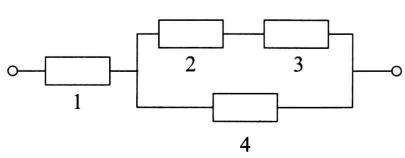  
(1)

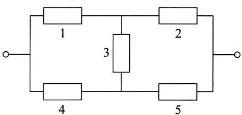  
(2)  
题34图

35. 如果一危险情况  $C$  发生时，一电路闭合并发出警报，我们可以借用两个或多个开关并联以改善可靠性。在  $C$  发生时这些开关每一个都应闭合，且若至少一个开关闭合了，警报就发出。如果两个这样的开关并联连接，它们每个具有0.96的可靠性（即在情况  $C$  发生时闭合的概率），问这时系统的可靠性（即电路闭合的概率）是多少？如果需要有一个可靠性至少为0.9999的系统，则至少需要用多少只开关并联？设各开关闭合与否是相互独立的。  
36. 三人独立地去破译一份密码，已知各人能译出的概率分别为  $1/5, 1/3, 1/4$ . 问三人中至少有一人能将此密码译出的概率是多少？  
37. 设第一只盒子中装有 3 只蓝色球、2 只绿色球、2 只白色球，第二只盒子中装有 2 只蓝色球、3 只绿色球、4 只白色球。独立地分别在两只盒子中各取一只球。

（1）求至少有一只蓝色球的概率  
（2）求有一只蓝色球、一只白色球的概率，  
（3）已知至少有一只蓝色球，求有一只蓝色球、一只白色球的概率.  
38. 袋中装有  $m$  枚正品硬币、 $n$  枚次品硬币（次品硬币的两面均印有国徽），在袋中任取一枚，将它投掷  $r$  次，已知每次都得到国徽。问这枚硬币是正品的概率为多少？  
39. 设根据以往记录的数据分析, 某船只运输的某种物品损坏的情况共有三种: 损坏  $2\%$  (这一事件记为  $A_{1}$ ), 损坏  $10\%$  (事件  $A_{2}$ ), 损坏  $90\%$  (事件  $A_{3}$ ), 且知  $P(A_{1}) = 0.8, P(A_{2}) = 0.15, P(A_{3}) = 0.05$ . 现在从已被运输的物品中随机地取 3 件, 发现这 3 件都是好的 (这一事件记为  $B$ ). 试求  $P(A_{1} \mid B), P(A_{2} \mid B), P(A_{3} \mid B)$  (这里设物品件数很多, 取出一件后不影响取后一件是否为好品的概率).  
40. 将 A, B, C 三个字母之一输入信道，输出为原字母的概率是  $\alpha$ ，而输出为其他某一字母的概率都是  $(1 - \alpha) / 2$ 。今将字母串 AAAA, BBBB, CCCC 之一输入信道，输入 AAAA, BBBB, CCCC 的概率分别为  $p_1, p_2, p_3 (p_1 + p_2 + p_3 = 1)$ ，已知输出为 ABCA，问输入的是 AAAA 的概率是多少？（设信道传输各个字母的工作是相互独立的。）

# 第二章 随机变量及其分布

# §1 随机变量

在第一章我们看到一些随机试验，它们的结果可以用数来表示。此时样本空间  $S$  的元素是一个数，如  $S_{3}, S_{5}$ ；但有些则不然，如  $S_{1}, S_{2}$ 。当样本空间  $S$  的元素不是一个数时，人们对于  $S$  就难以描述和研究。现在来讨论如何引入一个法则，将随机试验的每一个结果，即将  $S$  的每个元素  $e$  与实数  $x$  对应起来，从而引入了随机变量的概念。我们从例题开始讨论。

例1 在第一章§4例1中,将一枚硬币抛掷三次,观察出现正面和反面的情况,样本空间是

$$
S = \{H H H, H H T, H T H, T H H, H T T, T H T, T T H, T T T \}.
$$

以  $X$  记三次投掷得到正面  $H$  的总数，那么，对于样本空间  $S = \{e\} 1$  中的每一个样本点  $e,X$  都有一个数与之对应.  $X$  是定义在样本空间  $S$  上的一个实值单值函数它的定义域是样本空间  $S$  ，值域是实数集合  $\{0,1,2,3\}$  .使用函数记号可将  $X$  写成

$$
X = X (e) = \left\{ \begin{array}{l l} 3, & e = H H H, \\ 2, & e = H H T, H T H, T H H, \\ 1, & e = H T T, T H T, T T H, \\ 0, & e = T T T. \end{array} \right.
$$

例2 袋中有编号分别为1,2,3的3只球. 在袋中任取一球，放回，再任取一球，记录它们的号码. 试验的样本空间为  $S = \{e\} = \{(i,j) | i,j = 1,2,3\}$ ， $i,j$  分别为第1，第2次取到的球的号码. 以  $X$  记两球号码之和. 我们看到，对于试验的每一个结果  $e = (i,j) \in S$ ， $X$  都有一个指定的值  $i + j$  与之对应（如图2-1）.  $X$  是定义在样本空间  $S$  上的单值实值函数. 它的定义域是样本空间  $S$ . 值域是实数集合

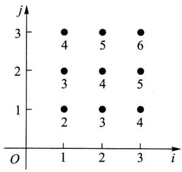  
图2-1

$\{2,3,4,5,6\}$  .  $X$  可写成

$$
X = X (e) = X ((i, j)) = i + j, \quad i, j = 1, 2, 3.
$$

一般有以下的定义.

定义 设随机试验的样本空间为  $S = \{e\}$ .  $X = X(e)$  是定义在样本空间  $S$  上的实值单值函数. 称  $X = X(e)$  为随机变量①.

图2-2画出了样本点  $e$  与实数  $X = X(e)$  对应的示意图.

有许多随机试验，它们的结果本身是一个数，即样本点  $e$  本身是一个数．我们令 $X = X(e) = e$  ，那么  $X$  就是一个随机变量．例如，用  $Y$  记某车间一天的缺勤人数，以W记某地区第一季度的降雨量，以  $Z$  记某工厂

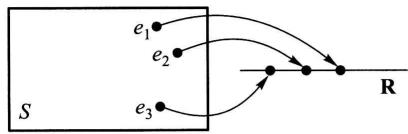  
图2-2

一天的耗电量，以  $N$  记某医院一天的挂号人数.那么  $Y, W, Z, N$  都是随机变量.

本书中，我们一般以大写的字母如  $X, Y, Z, W, \cdots$  表示随机变量，而以小写字母  $x, y, z, w, \cdots$  表示实数。

随机变量的取值随试验的结果而定，而试验的各个结果出现有一定的概率，因而随机变量的取值有一定的概率。例如，在例1中  $X$  取值为2，记成  $\{X = 2\}$ ，对应于样本点的集合  $A = \{HHT, HTH, THH\}$ ，这是一个事件，当且仅当事件  $A$  发生时有  $\{X = 2\}$ 。我们称概率  $P(A) = P\{HHT, HTH, THH\}$  为  $\{X = 2\}$  的概率，即  $P\{X = 2\} = P(A) = 3/8$ 。以后，还将事件  $A = \{HHT, HTH, THH\}$  说成是事件  $\{X = 2\}$ 。类似地有

$$
P \{X \leqslant 1 \} = P \{H T T, T H T, T T H, T T T \} = \frac {1}{2}.
$$

一般，若  $L$  是一个实数集合，将  $X$  在  $L$  上取值写成  $\{X\in L\}$  .它表示事件 $B = \{e|X(e)\in L\}$  ，即  $B$  是由  $S$  中使得  $X(e)\in L$  的所有样本点  $\mathcal{e}$  所组成的事件，此时有

$$
P \{X \in L \} = P (B) = P \{e \mid X (e) \in L \}.
$$

随机变量的取值随试验的结果而定，在试验之前不能预知它取什么值，且它的取值有一定的概率。这些性质显示了随机变量与普通函数有着本质的差异。

随机变量的引入，使我们能用随机变量来描述各种随机现象，并能利用数学分析的方法对随机试验的结果进行深入广泛的研究和讨论。

# § 2 离散型随机变量及其分布律

有些随机变量, 它全部可能取到的值是有限个或可列无限多个, 这种随机变量称为离散型随机变量. 例如 §1 例 1 中的随机变量  $X$ , 它只可能取 0, 1, 2, 3 四个值, 它是一个离散型随机变量. 又如某城市的 120 急救电话台一昼夜收到的呼唤次数也是离散型随机变量. 若以  $T$  记某元件的寿命, 它所可能取的值充满一个区间, 是无法按一定次序一一列举出来的, 因而它是一个非离散型的随机变量. 本节只讨论离散型随机变量.

容易知道，要掌握一个离散型随机变量  $X$  的统计规律，必须且只需知道  $X$  的所有可能取值以及取每一个可能值的概率.

设离散型随机变量  $X$  所有可能取的值为  $x_{k}(k = 1,2,\dots),X$  取各个可能值的概率，即事件  $\{X = x_k\}$  的概率，为

$$
P \{X = x _ {k} \} = p _ {k}, k = 1, 2, \dots . \tag {2.1}
$$

由概率的定义，  $p_k$  满足如下两个条件：

$$
1 ^ {\circ} p _ {k} \geqslant 0, k = 1, 2, \dots . \tag {2.2}
$$

$$
2 ^ {\circ} \sum_ {k = 1} ^ {\infty} p _ {k} = 1. \tag {2.3}
$$

$2^{\circ}$  是由于  $\{X = x_{1}\} \cup \{X = x_{2}\} \cup \dots$  为必然事件，且  $\{X = x_{j}\} \cap \{X = x_{k}\} = \emptyset, k \neq j$  ，故  $1 = P\left(\bigcup_{k=1}^{\infty} \{X = x_{k}\}\right) = \sum_{k=1}^{\infty} P\{X = x_{k}\}$ ，即  $\sum_{k=1}^{\infty} p_{k} = 1$

我们称（2.1）式为离散型随机变量  $X$  的分布律。分布律也可以用表格的形式来表示：

$$
\begin{array}{c c c c c c} X & x _ {1} & x _ {2} & \dots & x _ {n} & \dots \\ \hline p _ {k} & p _ {1} & p _ {2} & \dots & p _ {n} & \dots \end{array} \tag {2.4}
$$

(2.4)直观地表示了随机变量  $X$  取各个值的概率的规律.  $X$  取各个值各占一些概率, 这些概率合起来是 1. 可以想象成: 概率 1 以一定的规律分布在各个可能值上. 这就是 (2.4) 称为分布律的缘故.

例1设一汽车在开往目的地的道路上需经过四组信号灯，每组信号灯以 $1 / 2$  的概率允许或禁止汽车通过.以  $X$  表示汽车首次停下时，它已通过的信号灯的组数（设各组信号灯的工作是相互独立的），求  $X$  的分布律.

解 以  $p$  表示每组信号灯禁止汽车通过的概率，易知  $X$  的分布律为

<table><tr><td>X</td><td>0</td><td>1</td><td>2</td><td>3</td><td>4</td></tr><tr><td>pk</td><td>p</td><td>(1-p)p</td><td>(1-p)2p</td><td>(1-p)3p</td><td>(1-p)4</td></tr></table>

或写成

$$
P \{X = k \} = (1 - p) ^ {k} p, \quad k = 0, 1, 2, 3, \quad P \{X = 4 \} = (1 - p) ^ {4}.
$$

以  $p = 1 / 2$  代入得

<table><tr><td>X</td><td>0</td><td>1</td><td>2</td><td>3</td><td>4</td></tr><tr><td>pk</td><td>0.5</td><td>0.25</td><td>0.125</td><td>0.0625</td><td>0.0625</td></tr></table>

□

下面介绍三种重要的离散型随机变量.

# （一）(0-1)分布

设随机变量  $X$  只可能取0与1两个值，它的分布律是

$$
P \{X = k \} = p ^ {k} (1 - p) ^ {1 - k}, \quad k = 0, 1 \quad (0 <   p <   1),
$$

则称  $X$  服从以  $p$  为参数的（0-1）分布或两点分布.

（0-1）分布的分布律也可写成

<table><tr><td>X</td><td>0</td><td>1</td></tr><tr><td>pk</td><td>1-p</td><td>p</td></tr></table>

对于一个随机试验，如果它的样本空间只包含两个元素，即  $S = \{e_1, e_2\}$ ，我们总能在  $S$  上定义一个服从（0-1）分布的随机变量

$$
X = X (e) = \left\{ \begin{array}{l l} 0, & \text {当} e = e _ {1}, \\ 1, & \text {当} e = e _ {2} \end{array} \right.
$$

来描述这个随机试验的结果。例如，对新生婴儿的性别进行登记，检查产品的质量是否合格，某车间的电力消耗是否超过负荷以及前面多次讨论过的“抛硬币”试验等都可以用（0-1）分布的随机变量来描述。（0-1）分布是经常遇到的一种分布。

# （二）伯努利试验、二项分布

设试验  $E$  只有两个可能结果： $A$  及  $\overline{A}$ ，则称  $E$  为伯努利(Bernoulli)试验。设  $P(A) = p$ （ $0 < p < 1$ ），此时  $P(\overline{A}) = 1 - p$ 。将  $E$  独立重复地进行  $n$  次，则称这一串重复的独立试验为  $n$  重伯努利试验。

这里“重复”是指在每次试验中  $P(A) = p$  保持不变；“独立”是指各次试验的结果互不影响，即若以  $C_i$  记第  $i$  次试验的结果， $C_i$  为  $A$  或  $\overline{A}, i = 1,2,\dots,n$ . “独立”是指

$$
P \left(C _ {1} C _ {2} \dots C _ {n}\right) = P \left(C _ {1}\right) P \left(C _ {2}\right) \dots P \left(C _ {n}\right). \tag {2.5}
$$

$n$  重伯努利试验是一种很重要的数学模型，它有广泛的应用，是研究极多的模型之一.

例如,  $E$  是抛一枚硬币观察得到正面或反面.  $A$  表示得正面, 这是一个伯努利试验. 如将硬币抛  $n$  次, 就是  $n$  重伯努利试验. 又如抛一颗骰子, 若  $A$  表示得到“1点”,  $\overline{A}$  表示得到“非1点”. 将骰子抛  $n$  次, 就是  $n$  重伯努利试验. 再如在袋中装有  $a$  只白球,  $b$  只黑球. 试验  $E$  是在袋中任取一只球, 观察其颜色. 以  $A$  表示“取到白球”,  $P(A) = a / (a + b)$ . 若连续取球  $n$  次作放回抽样, 这就是  $n$  重伯努利试验. 然而, 若作不放回抽样, 虽则每次试验都有  $P(A) = a / (a + b)$  (见第一章 §4 例5), 但各次试验不再相互独立①, 因而不再是  $n$  重伯努利试验了.

以  $X$  表示  $n$  重伯努利试验中事件  $A$  发生的次数,  $X$  是一个随机变量, 我们来求它的分布律.  $X$  所有可能取的值为  $0,1,2,\dots,n$ . 由于各次试验是相互独立的, 因此事件  $A$  在指定的  $k$  ( $0 \leqslant k \leqslant n$ ) 次试验中发生, 在其他  $n-k$  次试验中  $A$  不发生 (例如在前  $k$  次试验中  $A$  发生, 而后  $n-k$  次试验中  $A$  不发生) 的概率为

$$
\underbrace {p \bullet p \bullet \cdots \bullet p} _ {k \text {个}} \bullet \underbrace {(1 - p) \bullet (1 - p) \bullet \cdots \bullet (1 - p)} _ {n - k \text {个}} = p ^ {k} (1 - p) ^ {n - k}.
$$

这种指定的方式共有  $\binom{n}{k}$  种，它们是两两互不相容的，故在  $n$  次试验中  $A$  发生  $k$  次的概率为  $\binom{n}{k} p^k (1 - p)^{n-k}$ ，记  $q = 1 - p$ ，即有

$$
P \{X = k \} = \binom {n} {k} p ^ {k} q ^ {n - k}, \quad k = 0, 1, 2, \dots , n. \tag {2.6}
$$

显然

$$
P \{X = k \} \geqslant 0, \quad k = 0, 1, 2, \dots , n;
$$

$$
\sum_ {k = 0} ^ {n} P \{X = k \} = \sum_ {k = 0} ^ {n} \binom {n} {k} p ^ {k} q ^ {n - k} = (p + q) ^ {n} = 1.
$$

即  $P\{X = k\}$  满足条件（2.2），(2.3). 注意到  $\binom{n}{k} p^k q^{n-k}$  刚好是二项式  $(p + q)^n$  的展开式中出现  $p^k$  的那一项，我们称随机变量  $X$  服从参数为  $n, p$  的二项分布，并记为  $X \sim b(n, p)$ .

特别，当  $n = 1$  时二项分布(2.6)化为

$$
P \{X = k \} = p ^ {k} q ^ {1 - k}, \quad k = 0, 1.
$$

这就是(0-1)分布.

例2 按规定，某种型号电子元件的使用寿命超过  $1500\mathrm{h}$  的为一级品. 已知某一大批产品的一级品率为0.2，现在从中随机地抽查20只. 问20只元件中恰有  $k$  只  $(k = 0,1,\dots ,20)$  为一级品的概率是多少？

解这是不放回抽样.但由于这批元件的总数很大，且抽查的元件的数量相对于元件的总数来说又很小，因而可以当作放回抽样来处理，这样做会有一些误差，但误差不大.我们将检查一只元件看它是否为一级品看成是一次试验，检查20只元件相当于做20重伯努利试验.以  $X$  记20只元件中一级品的只数，那么， $X$  是一个随机变量，且有  $X\sim b(20,0.2)$  .由（2.6）式即得所求概率为

$$
P \{X = k \} = \binom {2 0} {k} 0. 2 ^ {k} 0. 8 ^ {2 0 - k}, \quad k = 0, 1, \dots , 2 0.
$$

将计算结果列表如下：

<table><tr><td>P{X=0}=0.012</td><td>P{X=4}=0.218</td><td>P{X=8}=0.022</td></tr><tr><td>P{X=1}=0.058</td><td>P{X=5}=0.175</td><td>P{X=9}=0.007</td></tr><tr><td>P{X=2}=0.137</td><td>P{X=6}=0.109</td><td>P{X=10}=0.002</td></tr><tr><td>P{X=3}=0.205</td><td>P{X=7}=0.055</td><td></td></tr><tr><td colspan="3">当k≥11时，P{X=k}&lt;0.001</td></tr></table>

为了对本题的结果有一个直观了解，我们作出上表的图形，如图2-3所示.

从图2-3中看到，当  $k$  增加时，概率  $P\{X = k\}$  先是随之增加，直至达到最大值（本例中当  $k = 4$  时取到最大值），随后单调减少.我们指出，一般，对于固定的  $n$  及  $p$  ，二项分布  $b(n,p)$  都具有这一性质. □

例3 某人进行射击，设每次射击的命中率为0.02，独立射击400次，试

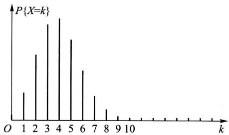  
图2-3

求至少击中两次的概率.

解 将一次射击看成是一次试验. 设击中的次数为  $X$ , 则  $X \sim b(400, 0.02)$ .  $X$  的分布律为

$$
P \{X = k \} = \binom {4 0 0} {k} 0. 0 2 ^ {k} 0. 9 8 ^ {4 0 0 - k}, \quad k = 0, 1, \dots , 4 0 0.
$$

于是所求概率为

$$
\begin{array}{l} P \{X \geqslant 2 \} = 1 - P \{X = 0 \} - P \{X = 1 \} \\ = 1 - 0. 9 8 ^ {4 0 0} - 4 0 0 \times 0. 0 2 \times 0. 9 8 ^ {3 9 9} = 0. 9 9 7 2. \\ \end{array}
$$

这个概率很接近于1. 我们从两方面来讨论这一结果的实际意义. 其一, 虽然每次射击的命中率很小 (为0.02), 但如果射击400次, 则击中目标至少两次是几乎可以肯定的. 这一事实说明, 一个事件尽管在一次试验中发生的概率很小, 但只要试验次数很多, 而且试验是独立地进行的, 那么这一事件的发生几乎是肯定的. 这也告诉人们绝不能轻视小概率事件. 其二, 如果射手在400次射击中, 击中目标的次数竟不到两次, 那么由于概率  $P\{X < 2\} \approx 0.003$  很小, 根据实际推断原理, 我们将怀疑“每次射击的命中率为0.02”这一假设, 即认为该射手射击的命中率达不到0.02.

例4设有80台同类型设备，各台工作是相互独立的，发生故障的概率都是0.01，且一台设备的故障能由一个人处理。考虑两种配备维修工人的方法，其一是由4人维护，每人负责20台；其二是由3人共同维护80台。试比较这两种方法在设备发生故障时不能及时维修的概率的大小。

解 按第一种方法. 以  $X$  记“第1人维护的20台中同一时刻发生故障的台数”，以  $A_{i}(i = 1,2,3,4)$  表示事件“第  $i$  人维护的20台中发生故障不能及时维修”，则知80台中发生故障而不能及时维修的概率为

$$
P \left(A _ {1} \bigcup A _ {2} \bigcup A _ {3} \bigcup A _ {4}\right) \geqslant P \left(A _ {1}\right) = P \{X \geqslant 2 \}.
$$

而  $X\sim b$  (20,0.01)，故有

$$
\begin{array}{l} P \{X \geqslant 2 \} = 1 - \sum_ {k = 0} ^ {1} P \{X = k \} \\ = 1 - \sum_ {k = 0} ^ {1} \binom {2 0} {k} 0. 0 1 ^ {k} 0. 9 9 ^ {2 0 - k} = 0. 0 1 6 9. \\ \end{array}
$$

即有  $P(A_{1}\bigcup A_{2}\bigcup A_{3}\bigcup A_{4})\geqslant 0.0169.$

按第二种方法. 以  $Y$  记80台中同一时刻发生故障的台数. 此时,  $Y \sim b(80, 0.01)$ , 故80台中发生故障而不能及时维修的概率为

$$
P \{Y \geqslant 4 \} = 1 - \sum_ {k = 0} ^ {3} \binom {8 0} {k} 0. 0 1 ^ {k} 0. 9 9 ^ {8 0 - k} = 0. 0 0 8 7.
$$

我们发现，在后一种情况尽管任务重了（每人平均维护约27台），但工作效率不仅没有降低，反而提高了. □

# （三）泊松分布

设随机变量  $X$  所有可能取的值为  $0,1,2,\dots$  ，而取各个值的概率为

$$
P \{X = k \} = \frac {\lambda^ {k} \mathrm {e} ^ {- \lambda}}{k !}, k = 0, 1, 2, \dots ,
$$

其中  $\lambda > 0$  是常数. 则称  $X$  服从参数为  $\lambda$  的泊松分布, 记为  $X \sim \pi(\lambda)$ .

易知，  $P\{X = k\} \geqslant 0,k = 0,1,2,\dots$  ，且有

$$
\sum_ {k = 0} ^ {\infty} P \{X = k \} = \sum_ {k = 0} ^ {\infty} \frac {\lambda^ {k} \mathrm {e} ^ {- \lambda}}{k !} = \mathrm {e} ^ {- \lambda} \sum_ {k = 0} ^ {\infty} \frac {\lambda^ {k}}{k !} = \mathrm {e} ^ {- \lambda} \cdot \mathrm {e} ^ {\lambda} = 1.
$$

即  $P\{X = k\}$  满足条件（2.2），(2.3).

参数  $\lambda$  的意义将在第四章说明，有关服从泊松分布的随机变量的数学模型将在第十二章中讨论.

具有泊松分布的随机变量在实际应用中是很多的. 例如, 一本书一页中的印刷错误数, 某地区在一天内邮递遗失的信件数, 某一医院在一天内的急诊病人数, 某一地区一个时间间隔内发生交通事故的次数, 在一个时间间隔内某种放射性物质发出的、经过计数器的  $\alpha$  粒子数等都服从泊松分布. 泊松分布也是概率论中的一种重要分布.

下面介绍一个用泊松分布来逼近二项分布的定理

泊松定理 设  $\lambda > 0$  是一个常数,  $n$  是任意正整数, 设  $np_{n} = \lambda$ , 则对于任一固定的非负整数  $k$ , 有

$$
\lim  _ {n \rightarrow \infty} \binom {n} {k} p _ {n} ^ {k} (1 - p _ {n}) ^ {n - k} = \frac {\lambda^ {k} e ^ {- \lambda}}{k !}.
$$

证 由  $p_n = \frac{\lambda}{n}$  ，有

$$
\begin{array}{l} \binom {n} {k} p _ {n} ^ {k} (1 - p _ {n}) ^ {n - k} = \frac {n (n - 1) \cdots (n - k + 1)}{k !} \left(\frac {\lambda}{n}\right) ^ {k} \left(1 - \frac {\lambda}{n}\right) ^ {n - k} \\ = \frac {\lambda^ {k}}{k !} \left[ 1 \cdot \left(1 - \frac {1}{n}\right) \dots \left(1 - \frac {k - 1}{n}\right) \right] \left(1 - \frac {\lambda}{n}\right) ^ {n} \left(1 - \frac {\lambda}{n}\right) ^ {- k}. \\ \end{array}
$$

对于任意固定的  $k$  ，当  $n\to \infty$  时，

$$
1 \cdot \left(1 - \frac {1}{n}\right) \dots \left(1 - \frac {k - 1}{n}\right)\rightarrow 1, \quad \left(1 - \frac {\lambda}{n}\right) ^ {n} \rightarrow \mathrm {e} ^ {- \lambda}, \quad \left(1 - \frac {\lambda}{n}\right) ^ {- k} \rightarrow 1.
$$

故有

$$
\lim  _ {n \rightarrow \infty} \binom {n} {k} p _ {n} ^ {k} (1 - p _ {n}) ^ {n - k} = \frac {\lambda^ {k} \mathrm {e} ^ {- \lambda}}{k !}.
$$

定理的条件  $np_{n} = \lambda$  （常数）意味着当  $n$  很大时  $p_{n}$  必定很小，因此，上述定理表明当  $n$  很大， $p$  很小（ $np = \lambda$ ）时有以下近似式

$$
\binom {n} {k} p ^ {k} (1 - p) ^ {n - k} \approx \frac {\lambda^ {k} \mathrm {e} ^ {- \lambda}}{k !} \quad (\text {其 中} \lambda = n p). \tag {2.7}
$$

也就是说以  $n, p$  为参数的二项分布的概率值可以由参数为  $\lambda = np$  的泊松分布的概率值近似. 上式也能用来作二项分布概率的近似计算.

例5 计算机硬件公司制造某种特殊型号的微型芯片, 次品率达  $0.1\%$ , 各芯片成为次品相互独立. 求在 1000 只产品中至少有 2 只次品的概率. 以  $X$  记产品中的次品数,  $X \sim b(1000, 0.001)$ .

解 所求概率为

$$
\begin{array}{l} P \{X \geqslant 2 \} = 1 - P \{X = 0 \} - P \{X = 1 \} \\ = 1 - 0. 9 9 9 ^ {1 0 0 0} - \binom {1 0 0 0} {1} 0. 9 9 9 ^ {9 9 9} \times 0. 0 0 1 \\ \approx 1 - 0. 3 6 7 6 9 5 4 - 0. 3 6 8 0 6 3 5 = 0. 2 6 4 2 4 1 1. \\ \end{array}
$$

利用(2.7)式来计算得，  $\lambda = 1000\times 0.001 = 1$

$$
\begin{array}{l} P \{X \geqslant 2 \} = 1 - P \{X = 0 \} - P \{X = 1 \} \\ \approx 1 - e ^ {- 1} - e ^ {- 1} \approx 0. 2 6 4 2 4 1 1. \\ \end{array}
$$

显然利用(2.7)式的计算来得方便。一般，当  $n \geqslant 20, p \leqslant 0.05$  时，用  $\frac{\lambda^k e^{-\lambda}}{k!} (\lambda = np)$  作为  $\binom{n}{k} p^k (1-p)^{n-k}$  的近似值效果颇佳。

# § 3 随机变量的分布函数

对于非离散型随机变量  $X$  ，由于其可能取的值不能一一列举出来，因而就不能像离散型随机变量那样可以用分布律来描述它.另外，我们通常所遇到的非离散型随机变量取任一指定的实数值的概率都等于0（这一点在下一节将会讲到).再者，在实际中，对于这样的随机变量，例如误差  $\varepsilon$  、元件的寿命  $T$  等，我们并不会对误差  $\varepsilon = 0.05\mathrm{mm}$  ，寿命  $T = 1251.3\mathrm{h}$  的概率感兴趣，而是考虑误差落在某个区间内的概率，寿命  $T$  大于某个数的概率.因而我们转而去研究随机变量所取的值落在一个区间  $(x_{1},x_{2}]$  的概率：  $P\{x_1 < X\leqslant x_2\}$  .但由于

$$
P \left\{x _ {1} <   X \leqslant x _ {2} \right\} = P \left\{X \leqslant x _ {2} \right\} - P \left\{X \leqslant x _ {1} \right\},
$$

所以我们只需知道  $P\{X \leqslant x_2\}$  和  $P\{X \leqslant x_1\}$  就可以了. 下面引入随机变量的分布函数的概念①.

定义 设  $X$  是一个随机变量， $x$  是任意实数，函数

$$
F (x) = P \{X \leqslant x \}, - \infty <   x <   \infty
$$

称为  $X$  的分布函数.

对于任意实数  $x_{1}, x_{2} (x_{1} < x_{2})$ ，有

$$
P \left\{x _ {1} <   X \leqslant x _ {2} \right\} = P \left\{X \leqslant x _ {2} \right\} - P \left\{X \leqslant x _ {1} \right\} = F \left(x _ {2}\right) - F \left(x _ {1}\right), \tag {3.1}
$$

因此，若已知  $X$  的分布函数，我们就知道  $X$  落在任一区间  $(x_{1}, x_{2}]$  上的概率，从这个意义上说，分布函数完整地描述了随机变量的统计规律性.

分布函数是一个普通的函数，正是通过它，我们将能用数学分析的方法来研究随机变量.

如果将  $X$  看成是数轴上的随机点的坐标，那么，分布函数  $F(x)$  在  $x$  处的函数值就表示  $X$  落在区间  $(-\infty, x]$  上的概率.

分布函数  $F(x)$  具有以下的基本性质：

$1^{\circ} F(x)$  是一个不减函数.

事实上，由(3.1)式对于任意实数  $x_{1}, x_{2} (x_{1} < x_{2})$  ，有

$$
F \left(x _ {2}\right) - F \left(x _ {1}\right) = P \left\{x _ {1} <   X \leqslant x _ {2} \right\} \geqslant 0.
$$

$2^{\circ} 0 \leqslant F(x) \leqslant 1$  ，且

$$
F (- \infty) = \lim  _ {x \rightarrow - \infty} F (x) = 0, \quad F (\infty) = \lim  _ {x \rightarrow \infty} F (x) = 1.
$$

上面两个式子，我们只从几何上加以说明.在图2-4中，将区间端点  $x$  沿数轴无限向左移动（即  $x\rightarrow -\infty$ ），则“随机点  $X$  落在点  $x$  左边”这一事件趋于不

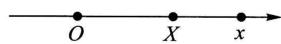  
图2-4

可能事件，从而其概率趋于0，即有  $F(-\infty) = 0$ ；又若将点  $x$  无限右移（即  $x \to \infty$ ），则“随机点  $X$  落在点  $x$  左边”这一事件趋于必然事件，从而其概率趋于1，即有  $F(\infty) = 1$ 。

$3^{\circ} F(x + 0) = F(x)$ ，即  $F(x)$  是右连续的。（证略.）

反之，可证具备性质  $1^{\circ}, 2^{\circ}, 3^{\circ}$  的函数  $F(x)$  必是某个随机变量的分布函数。

例1 设随机变量  $X$  的分布律为

<table><tr><td>X</td><td>-1</td><td>2</td><td>3</td></tr><tr><td>pk</td><td>1/4</td><td>1/2</td><td>1/4</td></tr></table>

求  $X$  的分布函数，并求  $P\left\{X \leqslant \frac{1}{2}\right\}, P\left\{\frac{3}{2} < X \leqslant \frac{5}{2}\right\}, P\{2 \leqslant X \leqslant 3\}$ .

解  $X$  仅在  $x = -1,2,3$  三点处其概率  $\neq 0$  ，而  $F(x)$  的值是  $X\leqslant x$  的累积概率值，由概率的有限可加性，知它即为小于或等于  $x$  的那些  $x_{k}$  处的概率  $p_k$  之和，有

$$
F (x) = \left\{ \begin{array}{l l} 0 & x <   - 1, \\ P \{X = - 1 \}, & - 1 \leqslant x <   2, \\ P \{X = - 1 \} + P \{X = 2 \}, & 2 \leqslant x <   3, \\ 1, & x \geqslant 3. \end{array} \right.
$$

即  $F(x) = \left\{ \begin{array}{ll}0, & x < - 1,\\ \frac{1}{4}, & -1\leqslant x < 2,\\ \frac{3}{4}, & 2\leqslant x < 3,\\ 1, & x\geqslant 3. \end{array} \right.$

$F(x)$  的图形如图2-5所示，它是一条阶梯形的曲线，在  $x = -1, 2, 3$  处有跳跃点，跳跃值分别为  $\frac{1}{4}, \frac{1}{2}, \frac{1}{4}$ . 又

$$
P \left\{X \leqslant \frac {1}{2} \right\} = F \left(\frac {1}{2}\right) = \frac {1}{4},
$$

$$
\begin{array}{l} P \left\{\frac {3}{2} <   X \leqslant \frac {5}{2} \right\} = F \left(\frac {5}{2}\right) - F \left(\frac {3}{2}\right) \\ = \frac {3}{4} - \frac {1}{4} = \frac {1}{2}. \\ \end{array}
$$

$$
\begin{array}{l} P \{2 \leqslant X \leqslant 3 \} = F (3) - F (2) + P \{X = 2 \} \\ = 1 - \frac {3}{4} + \frac {1}{2} = \frac {3}{4}. \\ \end{array}
$$

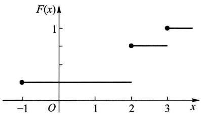  
图2-5

一般，设离散型随机变量  $X$  的分布律为

$$
P \{X = x _ {k} \} = p _ {k}, \quad k = 1, 2, \dots .
$$

由概率的可列可加性得  $X$  的分布函数为

$$
F (x) = P \{X \leqslant x \} = \sum_ {x _ {k} \leqslant x} P \{X = x _ {k} \},
$$

即  $F(x) = \sum_{x_k\leqslant x}p_k,$  (3.2)

这里和式是对于所有满足  $x_{k}\leqslant x$  的  $k$  求和的.分布函数  $F(x)$  在  $x = x_{k}(k = 1$

2, …)处有跳跃，其跳跃值为  $p_k = P\{X = x_k\}$ .

例2 一个靶子是半径为  $2\mathrm{m}$  的圆盘，设击中靶上任一同心圆盘上的点的概率与该圆盘的面积成正比，并设射击都能中靶，以  $X$  表示弹着点与圆心的距离。试求随机变量  $X$  的分布函数。

解 若  $x < 0$  ，则  $\{X \leqslant x\}$  是不可能事件，于是

$$
F (x) = P \{X \leqslant x \} = 0.
$$

若  $0 \leqslant x \leqslant 2$  ，由题意， $P\{0 \leqslant X \leqslant x\} = kx^2, k$  是某一常数，为了确定  $k$  的值，取  $x = 2$  ，有  $P\{0 \leqslant X \leqslant 2\} = 2^2k$  ，但已知  $P\{0 \leqslant X \leqslant 2\} = 1$  ，故得  $k = 1/4$  ，即

$$
P \{0 \leqslant X \leqslant x \} = \frac {x ^ {2}}{4}.
$$

于是

$$
\begin{array}{l} F (x) = P \{X \leqslant x \} = P \{X <   0 \} + P \{0 \leqslant X \leqslant x \} \\ = \frac {x ^ {2}}{4}. \\ \end{array}
$$

若  $x \geqslant 2$  ，由题意  $\{X \leqslant x\}$  是必然事件，于是

$$
F (x) = P \{X \leqslant x \} = 1.
$$

综合上述，即得  $X$  的分布函数为

$$
F (x) = \left\{ \begin{array}{l l} 0, & x <   0, \\ \frac {x ^ {2}}{4}, & 0 \leqslant x <   2, \\ 1, & x \geqslant 2. \end{array} \right.
$$

它的图形是一条连续曲线，如图2一6所示

另外，容易看到本例中的分布函数  $F(x)$  ，对于任意  $\mathcal{X}$  可以写成形式

$$
F (x) = \int_ {- \infty} ^ {x} f (t) \mathrm {d} t,
$$

其中

$$
f (t) = \left\{ \begin{array}{l l} \frac {t}{2}, & 0 <   t <   2, \\ 0, & \text {其 他}. \end{array} \right.
$$

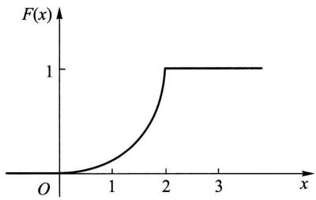  
图2-6

这就是说， $F(x)$  恰是非负函数  $f(t)$  在区间  $(-\infty, x]$  上的积分，在这种情况我们称  $X$  为连续型随机变量。下一节我们将给出连续型随机变量的一般定义。

# § 4 连续型随机变量及其概率密度

一般，如上节例2中的随机变量那样，如果对于随机变量  $X$  的分布函数 $F(x)$  ，存在非负可积函数  $f(x)$  ，使对于任意实数  $\mathcal{X}$  有

$$
F (x) = \int_ {- \infty} ^ {x} f (t) \mathrm {d} t, \tag {4.1}
$$

则称  $X$  为连续型随机变量， $f(x)$  称为  $X$  的概率密度函数，简称概率密度①.

由（4.1）式，据数学分析的知识知连续型随机变量的分布函数是连续函数.

在实际应用中遇到的基本上是离散型或连续型随机变量. 本书只讨论这两种随机变量.

由定义知道，概率密度  $f(x)$  具有以下性质：

$$
\begin{array}{l} 1 ^ {\circ} f (x) \geqslant 0. \\ 2 ^ {\circ} \int_ {- \infty} ^ {\infty} f (x) d x = 1. \\ \end{array}
$$

$3^{\circ}$  对于任意实数  $x_{1}, x_{2} (x_{1} \leqslant x_{2})$

$$
P \left\{x _ {1} <   X \leqslant x _ {2} \right\} = F \left(x _ {2}\right) - F \left(x _ {1}\right) = \int_ {x _ {1}} ^ {x _ {2}} f (x) \mathrm {d} x.
$$

$4^{\circ}$  若  $f(x)$  在点  $x$  处连续，则有  $F^{\prime}(x) = f(x)$

反之，若  $f(x)$  具备性质  $1^{\circ}, 2^{\circ}$ ，引入

$$
G (x) = \int_ {- \infty} ^ {x} f (t) \mathrm {d} t,
$$

它是某一随机变量  $X$  的分布函数， $f(x)$  是  $X$  的概率密度.

由性质  $2^{\circ}$  知道介于曲线  $y = f(x)$  与  $Ox$  轴之间的面积等于1（图2-7）.由  $3^{\circ}$  知道  $X$  落在区间  $(x_{1},x_{2}]$  的概率  $P\{x_1 < X\leqslant x_2\}$  等于区间  $(x_{1},x_{2}]$  上曲线 $y = f(x)$  之下的曲边梯形的面积(图2-8).由性质  $4^{\circ}$  知道在  $f(x)$  的连续点  $x$  处有

$$
f (x) = \lim  _ {\Delta x \rightarrow 0 ^ {+}} \frac {F (x + \Delta x) - F (x)}{\Delta x} = \lim  _ {\Delta x \rightarrow 0 ^ {+}} \frac {P \{x <   X \leqslant x + \Delta x \}}{\Delta x}. \tag {4.2}
$$

从这里我们看到概率密度的定义与物理学中的线密度的定义相类似，这就是称  $f(x)$  为概率密度的缘故.

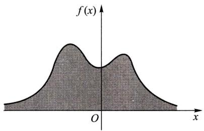  
图2-7

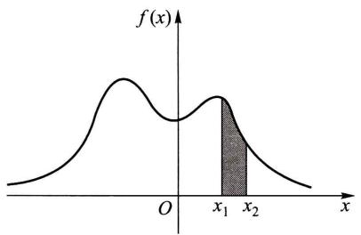  
图2-8

由(4.2)式知道，若不计高阶无穷小，有

$$
P \{x <   X \leqslant x + \Delta x \} \approx f (x) \Delta x. \tag {4.3}
$$

这表示  $X$  落在小区间  $(x, x + \Delta x]$  上的概率近似地等于  $f(x) \Delta x$ .

例1 设随机变量  $X$  具有概率密度

$$
f (x) = \left\{ \begin{array}{l l} k x, & 0 \leqslant x <   3, \\ 2 - \frac {x}{2}, & 3 \leqslant x \leqslant 4, \\ 0, & \text {其 他}. \end{array} \right.
$$

（1）确定常数  $k$  （2）求  $X$  的分布函数  $F(x)$  .（3）求  $P\left\{1 < X \leqslant \frac{7}{2}\right\}$

解（1）由  $\int_{-\infty}^{\infty}f(x)\mathrm{d}x = 1$  ，得

$$
\int_ {0} ^ {3} k x \mathrm {d} x + \int_ {3} ^ {4} \left(2 - \frac {x}{2}\right) \mathrm {d} x = 1,
$$

解得  $k = \frac{1}{6}$  ，于是  $X$  的概率密度为

$$
f (x) = \left\{ \begin{array}{l l} \frac {x}{6}, & 0 \leqslant x <   3, \\ 2 - \frac {x}{2}, & 3 \leqslant x <   4, \\ 0, & \text {其 他}. \end{array} \right.
$$

（2）  $X$  的分布函数为

$$
F (x) = \left\{ \begin{array}{l l} 0, & x <   0, \\ \int_ {0} ^ {x} \frac {x}{6} \mathrm {d} x, & 0 \leqslant x <   3, \\ \int_ {0} ^ {3} \frac {x}{6} \mathrm {d} x + \int_ {3} ^ {x} \left(2 - \frac {x}{2}\right) \mathrm {d} x, & 3 \leqslant x <   4, \\ 1, & x \geqslant 4. \end{array} \right.
$$

即  $F(x) = \left\{ \begin{array}{ll}0, & x <   0,\\ \frac{x^2}{12}, & 0\leqslant x <   3,\\ -3 + 2x - \frac{x^2}{4}, & 3\leqslant x <   4,\\ 1, & x\geqslant 4. \end{array} \right.$

(3)  $P\left\{1 < X \leqslant \frac{7}{2}\right\} = F\left(\frac{7}{2}\right) - F(1) = \frac{41}{48}.$

需要指出的是，对于连续型随机变量  $X$  来说，它取任一指定实数值  $a$  的概率均为0，即  $P\{X = a\} = 0.$  事实上，设  $X$  的分布函数为  $F(x), \Delta x > 0$  ，则由  $\{X = a\} \subset \{a - \Delta x < X \leqslant a\}$  得

$$
0 \leqslant P \{X = a \} \leqslant P \{a - \Delta x <   X \leqslant a \} = F (a) - F (a - \Delta x).
$$

在上述不等式中令  $\Delta x\to 0$  ，并注意到  $X$  为连续型随机变量，其分布函数  $F(x)$  是连续的，即得

$$
P \{X = a \} = 0. \tag {4.4}
$$

据此，在计算连续型随机变量落在某一区间的概率时，可以不必区分该区间是开区间或闭区间或半闭区间.例如有

$$
P \{a <   X \leqslant b \} = P \{a \leqslant X \leqslant b \} = P \{a <   X <   b \}.
$$

在这里，事件  $\{X = a\}$  并非不可能事件，但有  $P\{X = a\} = 0$ 。这就是说，若  $A$  是不可能事件，则有  $P(A) = 0$ ；反之，若  $P(A) = 0$ ，并不一定意味着  $A$  是不可能事件。

以后当我们提到一个随机变量  $X$  的“概率分布”时，指的是它的分布函数；或者，当  $X$  是连续型随机变量时，指的是它的概率密度，当  $X$  是离散型随机变量时，指的是它的分布律。

下面介绍三种重要的连续型随机变量.

# (一) 均匀分布

若连续型随机变量  $X$  具有概率密度

$$
f (x) = \left\{ \begin{array}{l l} \frac {1}{b - a}, & a <   x <   b, \\ 0, & \text {其 他 ,} \end{array} \right. \tag {4.5}
$$

则称  $X$  在区间  $(a,b)$  上服从均匀分布，记为  $X\sim U(a,b)$

易知  $f(x)\geqslant 0$  ，且  $\int_{-\infty}^{\infty}f(x)\mathrm{d}x = 1.$

在区间  $(a, b)$  上服从均匀分布的随机变量  $X$ ，具有下述意义的等可能性，即它落在区间  $(a, b)$  中任意等长度的子区间内的可能性是相同的。或者说它落在

$(a,b)$  的子区间内的概率只依赖于子区间的长度而与子区间的位置无关. 事实上, 对于任一长度为  $l$  的子区间  $(c,c + l), a \leqslant c < c + l \leqslant b$ , 有

$$
P \{c <   X \leqslant c + l \} = \int_ {c} ^ {c + l} f (x) \mathrm {d} x = \int_ {c} ^ {c + l} \frac {1}{b - a} \mathrm {d} x = \frac {l}{b - a}.
$$

由（4.1）式得  $X$  的分布函数为

$$
F (x) = \left\{ \begin{array}{l l} 0, & x <   a, \\ \frac {x - a}{b - a}, & a \leqslant x <   b, \\ 1, & x \geqslant b. \end{array} \right. \tag {4.6}
$$

$f(x)$  及  $F(x)$  的图形分别如图2一9，图2一10所示.

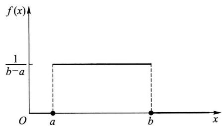  
图2-9

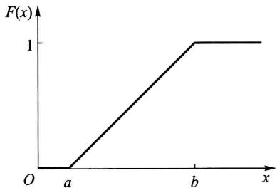  
图2-10

例2 设电阻值  $R$  是一个随机变量，均匀分布在  $900 \sim 1100\Omega$ 。求  $R$  的概率密度及  $R$  落在  $950 \sim 1050\Omega$  的概率。

解 按题意，  $R$  的概率密度为

$$
f (r) = \left\{ \begin{array}{l l} \frac {1}{1 1 0 0 - 9 0 0}, & 9 0 0 <   r <   1 1 0 0, \\ 0, & \text {其 他}. \end{array} \right.
$$

故有  $P\{950 < R \leqslant 1050\} = \int_{950}^{1050} \frac{1}{200} \mathrm{d}r = 0.5.$

# （二）指数分布

若连续型随机变量  $X$  的概率密度为

$$
f (x) = \left\{ \begin{array}{l l} \frac {1}{\theta} \mathrm {e} ^ {- x / \theta}, & x > 0, \\ 0, & \text {其 他}, \end{array} \right. \tag {4.7}
$$

其中  $\theta > 0$  为常数，则称  $X$  服从参数为  $\theta$  的指数分布。

易知  $f(x)\geqslant 0$  ，且  $\int_{-\infty}^{\infty}f(x)\mathrm{d}x = 1.$  图2-11中分别画出了  $\theta = 1 / 3,\theta = 1$

$\theta = 2$  时  $f(x)$  的图形.

由（4.7）式容易得到随机变量  $X$  的分布函数为

$$
F (x) = \left\{ \begin{array}{l l} 1 - \mathrm {e} ^ {- x / \theta}, & x > 0, \\ 0, & \text {其 他}. \end{array} \right. \tag {4.8}
$$

服从指数分布的随机变量  $X$  具有以下有趣的性质：

对于任意  $s, t > 0$  ，有

$$
P \{X > s + t \mid X > s \} = P \{X > t \}. \tag {4.9}
$$

事实上

$$
\begin{array}{l} P \{X > s + t \mid X > s \} = \frac {P \{(X > s + t) \cap (X > s) \}}{P \{X > s \}} \\ = \frac {P \{X > s + t \}}{P \{X > s \}} = \frac {1 - F (s + t)}{1 - F (s)} \\ = \frac {\mathrm {e} ^ {- (s + t) / \theta}}{\mathrm {e} ^ {- s / \theta}} = \mathrm {e} ^ {- t / \theta} \\ = P \{X > t \}. \\ \end{array}
$$

性质(4.9)称为无记忆性．如果  $X$  是某一元件的寿命，那么(4.9)式表明：已知元件已使用了  $s \mathrm{~h}$ ，它总共能使用至少  $(s + t) \mathrm{h}$  的条件概率，与从开始使用时算起它至少能使用  $t \mathrm{~h}$  的概率相等．这就是说，元件对它已使用过  $s \mathrm{~h}$  没有记忆．具有这一性质是指数分布有广泛应用的重要原因．

指数分布在可靠性理论与排队论中有广泛的应用.

# （三）正态分布

若连续型随机变量  $X$  的概率密度为

$$
f (x) = \frac {1}{\sqrt {2 \pi} \sigma} \mathrm {e} ^ {- \frac {(x - \mu) ^ {2}}{2 \sigma^ {2}}}, \quad - \infty <   x <   \infty , \tag {4.10}
$$

其中  $\mu, \sigma (\sigma > 0)$  为常数，则称  $X$  服从参数为  $\mu, \sigma$  的正态分布或高斯(Gauss)分布，记为  $X \sim N(\mu, \sigma^2)$ 。

显然  $f(x)\geqslant 0$  ，下面来证明  $\int_{-\infty}^{\infty}f(x)\mathrm{d}x = 1.$  令  $(x - \mu) / \sigma = t$  ，得到

$$
\int_ {- \infty} ^ {\infty} \frac {1}{\sqrt {2 \pi} \sigma} e ^ {- \frac {(x - \mu) ^ {2}}{2 \sigma^ {2}}} d x = \frac {1}{\sqrt {2 \pi}} \int_ {- \infty} ^ {\infty} e ^ {- t ^ {2} / 2} d t.
$$

记  $I = \int_{-\infty}^{\infty}\mathrm{e}^{-t^{2} / 2}\mathrm{d}t$  ，则有  $I^2 = \int_{-\infty}^{\infty}\int_{-\infty}^{\infty}\mathrm{e}^{-(t^2 +u^2) / 2}\mathrm{d}t\mathrm{d}u$  ，利用极坐标将它化成累次积分，得到

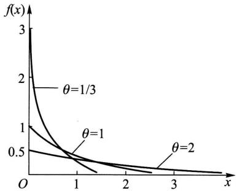  
图2-11

$$
I ^ {2} = \int_ {0} ^ {2 \pi} \int_ {0} ^ {\infty} r \mathrm {e} ^ {- r ^ {2} / 2} \mathrm {d} r \mathrm {d} \theta = 2 \pi .
$$

而  $I > 0$  ，故有  $I = \sqrt{2\pi}$  ，即有

$$
\int_ {- \infty} ^ {\infty} \mathrm {e} ^ {- t ^ {2} / 2} \mathrm {d} t = \sqrt {2 \pi}, \tag {4.11}
$$

于是

$$
\frac {1}{\sqrt {2 \pi} \sigma} \int_ {- \infty} ^ {\infty} \mathrm {e} ^ {- \frac {(x - \mu) ^ {2}}{2 \sigma^ {2}}} \mathrm {d} x = \frac {1}{\sqrt {2 \pi}} \int_ {- \infty} ^ {\infty} \mathrm {e} ^ {- t ^ {2} / 2} \mathrm {d} t = 1.
$$

参数  $\mu, \sigma$  的意义将在第四章中说明.  $f(x)$  的图形如图2-12所示，它具有以下性质.

$1^{\circ}$  曲线关于  $x = \mu$  对称. 这表明对于任意  $h > 0$  有（图2-12）

$$
P \{\mu - h <   X \leqslant \mu \} = P \{\mu <   X \leqslant \mu + h \}.
$$

$2^{\circ}$  当  $x = \mu$  时取到最大值

$$
f (\mu) = \frac {1}{\sqrt {2 \pi} \sigma}.
$$

$x$  离  $\mu$  越远,  $f(x)$  的值越小. 这表明对于同样长度的区间, 当区间离  $\mu$  越远时,  $X$  落在这个区间上的概率越小.

在  $x = \mu \pm \sigma$  处曲线有拐点. 曲线以  $Ox$  轴为渐近线

另外，如果固定  $\sigma$  ，改变  $\mu$  的值，则图形沿着  $Ox$  轴平移，而不改变其形状（如图2-12)，可见正态分布的概率密度曲线  $y = f(x)$  的位置完全由参数  $\mu$  所确定.  $\mu$  称为位置参数.

如果固定  $\mu$  ，改变  $\sigma$  ，由于最大值  $f(\mu) = \frac{1}{\sqrt{2\pi}\sigma}$  ，可知当  $\sigma$  越小时图形变得越尖（如图2-13），因而  $X$  落在  $\mu$  附近的概率越大.

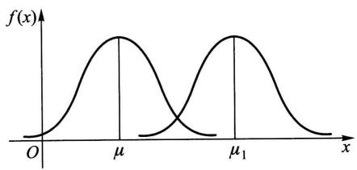  
图2-12

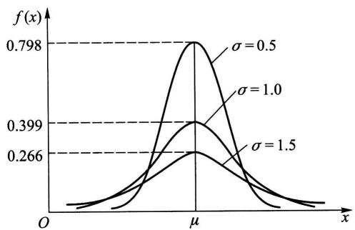  
图2-13

由(4.10)式得  $X$  的分布函数为（如图2-14）

$$
F (x) = \frac {1}{\sqrt {2 \pi} \sigma} \int_ {- \infty} ^ {x} \mathrm {e} ^ {- \frac {(t - \mu) ^ {2}}{2 \sigma^ {2}}} \mathrm {d} t, \tag {4.12}
$$

特别，当  $\mu = 0, \sigma = 1$  时称随机变量  $X$  服从标准正态分布。其概率密度和分布函数分别用  $\varphi(x), \Phi(x)$  表示，即有

$$
\varphi (x) = \frac {1}{\sqrt {2 \pi}} \mathrm {e} ^ {- x ^ {2} / 2}, \tag {4.13}
$$

$$
\Phi (x) = \frac {1}{\sqrt {2 \pi}} \int_ {- \infty} ^ {x} \mathrm {e} ^ {- t ^ {2} / 2} \mathrm {d} t. \tag {4.14}
$$

易知  $\Phi (-x) = 1 - \Phi (x)$  (4.15)

（参见图2-15）.

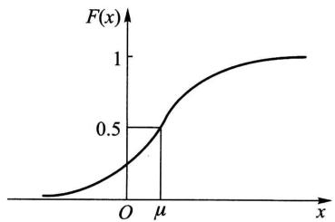  
图2-14

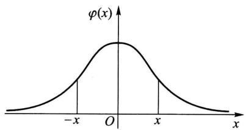  
图2-15

人们已编制了  $\Phi (x)$  的函数表，可供查用（见附表2）.

一般，若随机变量  $X \sim N(\mu, \sigma^2)$ ，我们只要通过一个线性变换就能将它化成标准正态分布.

引理 若随机变量  $X \sim N(\mu, \sigma^2)$ , 则  $Z = \frac{X - \mu}{\sigma} \sim N(0,1)$ .

证  $Z = \frac{X - \mu}{\sigma}$  的分布函数为

$$
P \{Z \leqslant x \} = P \left\{\frac {X - \mu}{\sigma} \leqslant x \right\} = P \{X \leqslant \mu + \sigma x \} = \frac {1}{\sqrt {2 \pi} \sigma} \int_ {- \infty} ^ {\mu + \alpha x} e ^ {- \frac {(t - \mu) ^ {2}}{2 \sigma^ {2}}} d t,
$$

令  $\frac{t - \mu}{\sigma} = u$  ，得

$$
P \{Z \leqslant x \} = \frac {1}{\sqrt {2 \pi}} \int_ {- \infty} ^ {x} \mathrm {e} ^ {- u ^ {2} / 2} \mathrm {d} u = \Phi (x),
$$

由此知  $Z = \frac{X - \mu}{\sigma} \sim N(0,1)$

于是，若随机变量  $X \sim N(\mu, \sigma^2)$ ，则它的分布函数  $F(x)$  可写成

$$
F (x) = P \{X \leqslant x \} = P \left\{\frac {X - \mu}{\sigma} \leqslant \frac {x - \mu}{\sigma} \right\} = \Phi \left(\frac {x - \mu}{\sigma}\right). \tag {4.16}
$$

对于任意区间  $(x_{1}, x_{2}]$ ，有

$$
\begin{array}{l} P \left\{x _ {1} <   X \leqslant x _ {2} \right\} = P \left\{\frac {x _ {1} - \mu}{\sigma} <   \frac {X - \mu}{\sigma} \leqslant \frac {x _ {2} - \mu}{\sigma} \right\} \\ = \Phi \left(\frac {x _ {2} - \mu}{\sigma}\right) - \Phi \left(\frac {x _ {1} - \mu}{\sigma}\right). \tag {4.17} \\ \end{array}
$$

例如，设随机变量  $X \sim N(1, 4)$ ，查表得

$$
\begin{array}{l} P \{0 <   X \leqslant 1. 6 \} = \Phi \left(\frac {1 . 6 - 1}{2}\right) - \Phi \left(\frac {0 - 1}{2}\right) = \Phi (0. 3) - \Phi (- 0. 5) \\ = 0. 6 1 7 9 - \left[ 1 - \Phi (0. 5) \right] = 0. 6 1 7 9 - 1 + 0. 6 9 1 5 = 0. 3 0 9 4. \\ \end{array}
$$

设  $X \sim N(\mu, \sigma^2)$ ，由  $\Phi(x)$  的函数表还能得到（图2-16）：

$$
P \{\mu - \sigma <   X <   \mu + \sigma \} = \Phi (1) - \Phi (- 1) = 2 \Phi (1) - 1 = 68.26 \%,
$$

$$
P \{\mu - 2 \sigma <   X <   \mu + 2 \sigma \} = \Phi (2) - \Phi (- 2) = 95.44 \%,
$$

$$
P \left\{\mu - 3 \sigma <   X <   \mu + 3 \sigma \right\} = \Phi (3) - \Phi (-3) = 99.74 \%
$$

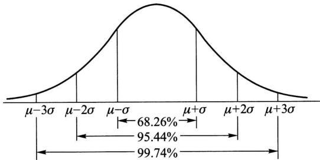  
图2-16

我们看到，尽管正态变量的取值范围是  $(-\infty, \infty)$ ，但它的值落在  $(\mu - 3\sigma, \mu + 3\sigma)$  内几乎是肯定的事。这就是人们所说的“ $3\sigma$ ”法则。

例3 将一温度调节器放置在贮存着某种液体的容器内. 调节器整定在  $d^{\circ}\mathrm{C}$ , 液体的温度  $X$  (以  ${}^{\circ}\mathrm{C}$  计) 是一个随机变量, 且  $X \sim N(d, 0.5^{2})$ . (1) 若  $d = 90^{\circ}\mathrm{C}$ , 求  $X$  小于  $89^{\circ}\mathrm{C}$  的概率. (2) 若要求保持液体的温度至少为  $80^{\circ}\mathrm{C}$  的概率不低于 0.99, 问  $d$  至少为多少?

解（1）所求概率为

$$
\begin{array}{l} P \{X <   8 9 \} = P \left\{\frac {X - 9 0}{0 . 5} <   \frac {8 9 - 9 0}{0 . 5} \right\} = \Phi \left(\frac {8 9 - 9 0}{0 . 5}\right) = \Phi (- 2) \\ = 1 - \Phi (2) = 1 - 0. 9 7 7 2 = 0. 0 2 2 8. \\ \end{array}
$$

（2）按题意需求  $d$  满足

$$
\begin{array}{l} 0. 9 9 \leqslant P \{X \geqslant 8 0 \} = P \left\{\frac {X - d}{0 . 5} \geqslant \frac {8 0 - d}{0 . 5} \right\} \\ = 1 - P \left\{\frac {X - d}{0 . 5} <   \frac {8 0 - d}{0 . 5} \right\} = 1 - \Phi \left(\frac {8 0 - d}{0 . 5}\right). \\ \end{array}
$$

即  $\Phi \left(\frac{d - 80}{0.5}\right) \geqslant 0.99 = \Phi (2.327)$ ,

亦即  $\frac{d - 80}{0.5} \geqslant 2.327.$

故需  $d\geqslant 81.1635.$

为了便于今后在数理统计中的应用，对于标准正态随机变量，我们引入上  $\alpha$  分位数的定义.

设  $X \sim N(0,1)$ ，若  $z_{\alpha}$  满足条件

$$
P \{X > z _ {\alpha} \} = \alpha , 0 <   \alpha <   1, \tag {4.18}
$$

则称  $z_{\alpha}$  为标准正态分布的上  $\alpha$  分位数（如图2-17).下面列出了几个常用的  $z_{\alpha}$  的值：

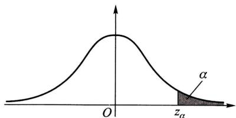  
图2-17

<table><tr><td>α</td><td>0.001</td><td>0.005</td><td>0.01</td><td>0.025</td><td>0.05</td><td>0.10</td></tr><tr><td>zα</td><td>3.090</td><td>2.576</td><td>2.326</td><td>1.960</td><td>1.645</td><td>1.282</td></tr></table>

另外，由  $\varphi (x)$  图形的对称性知道  $z_{1 - \alpha} = -z_{\alpha}$

在自然现象和社会现象中，大量随机变量都服从或近似服从正态分布。例如，一个地区的男性成年人的身高、测量某零件长度的误差、海洋波浪的高度、半导体器件中的热噪声电流或电压等，都服从正态分布。在概率论与数理统计的理论研究和实际应用中正态随机变量起着特别重要的作用。在第五章我们将进一步说明正态随机变量的重要性。

# § 5 随机变量的函数的分布

在实际中，我们常对某些随机变量的函数更感兴趣。例如，在一些试验中，所关心的随机变量往往不能由直接测量得到，而它却是某个能直接测量的随机变量的函数。比如我们能测量圆轴截面的直径  $d$ ，而关心的却是截面面积  $A = \frac{1}{4}\pi d^2$ 。这里，随机变量  $A$  是随机变量  $d$  的函数。在这一节中，我们将讨论如何由已知的随机变量  $X$  的概率分布去求得它的函数  $Y = g(X)$ （ $g(\cdot)$  是已知的连续函数）的概率分布。这里  $Y$  是这样的随机变量，当  $X$  取值  $x$  时， $Y$  取值  $g(x)$ 。

例1 设随机变量  $X$  具有以下的分布律：

<table><tr><td>X</td><td>-1</td><td>0</td><td>1</td><td>2</td></tr><tr><td>pk</td><td>0.2</td><td>0.3</td><td>0.1</td><td>0.4</td></tr></table>

试求  $Y = (X - 1)^{2}$  的分布律.

解  $Y$  所有可能取的值为0，1，4.由

$$
\begin{array}{l} P \{Y = 0 \} = P \{(X - 1) ^ {2} = 0 \} = P \{X = 1 \} = 0. 1, \\ P \{Y = 1 \} = P \{X = 0 \} + P \{X = 2 \} = 0. 7, \\ P \{Y = 4 \} = P \{X = - 1 \} = 0. 2, \\ \end{array}
$$

即得  $Y$  的分布律为

<table><tr><td>Y</td><td>0</td><td>1</td><td>4</td></tr><tr><td>pk</td><td>0.1</td><td>0.7</td><td>0.2</td></tr></table>

例2 设随机变量  $X$  具有概率密度

$$
f _ {X} (x) = \left\{ \begin{array}{l l} \frac {x}{8}, & 0 <   x <   4, \\ 0, & \text {其 他}. \end{array} \right.
$$

求随机变量  $Y = 2X + 8$  的概率密度.

解 分别记  $X, Y$  的分布函数为  $F_{X}(x), F_{Y}(y)$ . 下面先来求  $F_{Y}(y)$

$$
\begin{array}{l} F _ {Y} (y) = P \{Y \leqslant y \} = P \{2 X + 8 \leqslant y \} \\ = P \left\{X \leqslant \frac {y - 8}{2} \right\} = F _ {X} \left(\frac {y - 8}{2}\right). \\ \end{array}
$$

将  $F_{Y}(y)$  关于  $y$  求导数，得  $Y = 2X + 8$  的概率密度为

$$
\begin{array}{l} f _ {Y} (y) = f _ {X} \left(\frac {y - 8}{2}\right) \left(\frac {y - 8}{2}\right) ^ {\prime} \\ = \left\{ \begin{array}{l l} \frac {1}{8} \times \frac {y - 8}{2} \times \frac {1}{2}, & 0 <   \frac {y - 8}{2} <   4, \\ 0, & \text {其 他} \end{array} \right. \\ = \left\{ \begin{array}{l l} \frac {y - 8}{3 2}, & 8 <   y <   1 6, \\ 0, & \text {其 他 .} \end{array} \right. \\ \end{array}
$$

例3 设随机变量  $X$  具有概率密度  $f_{X}(x), -\infty < x < \infty$ ，求  $Y = X^2$  的概率密度.

解分别记  $X,Y$  的分布函数为  $F_{X}(x),F_{Y}(y)$  .先来求  $Y$  的分布函数

$F_{Y}(y)$  .由于  $Y = X^{2}\geqslant 0$  ，故当  $y\leqslant 0$  时  $F_{Y}(y) = 0.$  当  $y > 0$  时有

$$
\begin{array}{l} F _ {Y} (y) = P \{Y \leqslant y \} = P \{X ^ {2} \leqslant y \} \\ = P \{- \sqrt {y} \leqslant X \leqslant \sqrt {y} \} \\ = F _ {X} (\sqrt {y}) - F _ {X} (- \sqrt {y}). \\ \end{array}
$$

将  $F_{Y}(y)$  关于  $y$  求导数，即得  $Y$  的概率密度为

$$
f _ {Y} (y) = \left\{ \begin{array}{l l} \frac {1}{2 \sqrt {y}} \left[ f _ {X} (\sqrt {y}) + f _ {X} (- \sqrt {y}) \right], & y > 0, \\ 0, & y \leqslant 0. \end{array} \right. \tag {5.1}
$$

例如，设  $X \sim N(0,1)$ ，其概率密度为

$$
\varphi (x) = \frac {1}{\sqrt {2 \pi}} \mathrm {e} ^ {- x ^ {2} / 2}, \quad - \infty <   x <   \infty .
$$

由（5.1）式得  $Y = X^2$  的概率密度为

$$
f _ {Y} (y) = \left\{ \begin{array}{l l} \frac {1}{\sqrt {2 \pi}} y ^ {- 1 / 2} e ^ {- y / 2}, & y > 0, \\ 0, & y \leqslant 0. \end{array} \right.
$$

此时称  $Y$  服从自由度为1的  $\chi^2$  分布.

上述两个例子解法的关键一步是在“ $Y \leqslant y$ ”中，即在“ $g(X) \leqslant y$ ”中解出  $X$ ，从而得到一个与“ $g(X) \leqslant y$ ”等价的  $X$  的不等式，并以后者代替“ $g(X) \leqslant y$ ”。例如，在例2中以“ $X \leqslant \frac{y - 8}{2}$ ”代替“ $2X + 8 \leqslant y$ ”；在例3中，当  $y > 0$  时以“ $-\sqrt{y} \leqslant X \leqslant \sqrt{y}$ ”代替“ $X^2 \leqslant y$ ”。一般来说，可以用这样的方法①求连续型随机变量的函数的分布函数或概率密度。下面我们仅对  $Y = g(X)$ ，其中  $g(\cdot)$  是严格单调函数的情况，写出一般的结果。

定理 设随机变量  $X$  具有概率密度  $f_{X}(x), -\infty < x < \infty$ ，又设函数  $g(x)$  处处可导且恒有  $g'(x) > 0$ （或恒有  $g'(x) < 0$ ），则  $Y = g(X)$  是连续型随机变量，其概率密度为

$$
f _ {Y} (y) = \left\{ \begin{array}{l l} f _ {X} [ h (y) ] \mid h ^ {\prime} (y) |, & \alpha <   y <   \beta , \\ 0, & \text {其 他}, \end{array} \right. \tag {5.2}
$$

其中  $\alpha = \min \{g(-\infty), g(\infty)\}, \beta = \max \{g(-\infty), g(\infty)\}, h(y)$  是  $g(x)$  的反函数.

我们只证  $g^{\prime}(x) > 0$  的情况.此时  $g(x)$  在  $(-\infty ,\infty)$  内严格单调增加，它的

反函数  $h(y)$  存在，且在  $(\alpha, \beta)$  内严格单调增加、可导。分别记  $X, Y$  的分布函数为  $F_{X}(x), F_{Y}(y)$ 。现在先来求  $Y$  的分布函数  $F_{Y}(y)$ 。

因为  $Y = g(X)$  在  $(\alpha, \beta)$  内取值，故当  $y \leqslant \alpha$  时， $F_{Y}(y) = P\{Y \leqslant y\} = 0$ ；当  $y \geqslant \beta$  时， $F_{Y}(y) = P\{Y \leqslant y\} = 1$ 。

当  $\alpha < y < \beta$  时，

$$
\begin{array}{l} F _ {Y} (y) = P \{Y \leqslant y \} = P \{g (X) \leqslant y \} \\ = P \{X \leqslant h (y) \} = F _ {X} [ h (y) ]. \\ \end{array}
$$

将  $F_{Y}(y)$  关于  $y$  求导数，即得  $Y$  的概率密度

$$
f _ {Y} (y) = \left\{ \begin{array}{l l} f _ {X} [ h (y) ] h ^ {\prime} (y), & \alpha <   y <   \beta , \\ 0, & \text {其 他 .} \end{array} \right. \tag {5.3}
$$

对于  $g^{\prime}(x) < 0$  的情况可以同样地证明，此时有

$$
f _ {Y} (y) = \left\{ \begin{array}{l l} f _ {X} [ h (y) ] [ - h ^ {\prime} (y) ], & \alpha <   y <   \beta , \\ 0, & \text {其 他 .} \end{array} \right. \tag {5.4}
$$

合并(5.3)与(5.4)两式，(5.2)式得证

若  $f(x)$  在有限区间  $[a,b]$  以外等于零，则只需假设在  $[a,b]$  上恒有  $g^{\prime}(x) > 0$  （或恒有  $g^{\prime}(x) < 0$ ），此时

$$
\alpha = \min  \{g (a), g (b) \}, \quad \beta = \max  \{g (a), g (b) \}.
$$

例4 设随机变量  $X \sim N(\mu, \sigma^2)$ . 试证明  $X$  的线性函数  $Y = aX + b (a \neq 0)$  也服从正态分布.

证  $X$  的概率密度为

$$
f _ {X} (x) = \frac {1}{\sqrt {2 \pi} \sigma} \mathrm {e} ^ {- \frac {(x - \mu) ^ {2}}{2 \sigma^ {2}}}, - \infty <   x <   \infty .
$$

现在  $y = g(x) = ax + b$ ，由这一式子解得

$$
x = h (y) = \frac {y - b}{a} \text {, 且 有} h ^ {\prime} (y) = \frac {1}{a}.
$$

由（5.2）式得  $Y = aX + b$  的概率密度为

$$
f _ {Y} (y) = \frac {1}{| a |} f _ {X} \left(\frac {y - b}{a}\right), \quad - \infty <   y <   \infty .
$$

即

$$
f _ {Y} (y) = \frac {1}{| a |} \frac {1}{\sqrt {2 \pi} \sigma} \mathrm {e} ^ {- \frac {\left(\frac {y - b}{a} - \mu\right) ^ {2}}{2 \sigma^ {2}}} = \frac {1}{| a | \sigma \sqrt {2 \pi}} \mathrm {e} ^ {- \frac {[ y - (b + a \mu) ] ^ {2}}{2 (a \sigma) ^ {2}}}, - \infty <   y <   \infty .
$$

即有  $Y = aX + b\sim N(a\mu +b,(a\sigma)^2)$

特别，在上例中取  $a = \frac{1}{\sigma}, b = -\frac{\mu}{\sigma}$  得

$$
Y = \frac {X - \mu}{\sigma} \sim N (0, 1).
$$

这就是上一节引理的结果.

例5 设电压  $V = A\sin \theta$ ，其中  $A$  是一个已知的正常数，相角  $\Theta$  是一个随机变量，且有  $\Theta \sim U\left(-\frac{\pi}{2}, \frac{\pi}{2}\right)$ ，试求电压  $V$  的概率密度.

解 现在  $v = g(\theta) = A\sin \theta$  在  $\left(-\frac{\pi}{2}, \frac{\pi}{2}\right)$  上恒有  $g'(\theta) = A\cos \theta > 0$ ，且有反函数

$$
\theta = h (v) = \arcsin \frac {v}{A}, \quad h ^ {\prime} (v) = \frac {1}{\sqrt {A ^ {2} - v ^ {2}}},
$$

又， $\Theta$  的概率密度为

$$
f (\theta) = \left\{ \begin{array}{l l} \frac {1}{\pi}, & - \frac {\pi}{2} <   \theta <   \frac {\pi}{2}, \\ 0, & \text {其 他}. \end{array} \right.
$$

由(5.2)式得  $V = A\sin \Theta$  的概率密度为

$$
\psi (v) = \left\{ \begin{array}{l l} { \frac {1}{\pi} \bullet \frac {1}{\sqrt {A ^ {2} - v ^ {2}}},} & {- A <   v <   A,} \\ {0,} & {\text {其 他}.} \end{array} \right.
$$

若在上题中  $\Theta \sim U(0, \pi)$ , 因为此时  $v = g(\theta) = A \sin \theta$  在  $(0, \pi)$  内不是单调函数, 上述定理失效, 应仍按例3的方法来做. 请读者自行求出其结果.

# 小结

随机变量  $X = X(e)$  是定义在样本空间  $S = \{e\}$  上的实值单值函数。也就是说，它是随机试验结果的函数。它的取值随试验的结果而定，是不能预先确定的，它的取值有一定的概率。随机变量的引入，使概率论的研究由个别随机事件扩大为随机变量所表征的随机现象的研究。今后，我们主要研究随机变量和它的分布。

一个随机变量，如果它所有可能的值是有限个或可列无限个，这种随机变量称为离散型随机变量，不是这种情况则称为非离散型的。不论是离散型的或非离散型的随机变量  $X$ ，都可以借助分布函数

$$
F (x) = P \{X \leqslant x \}, \quad - \infty <   x <   \infty
$$

来描述．若已知随机变量  $X$  的分布函数，则能知道  $X$  落在任一区间  $(x_{1},x_{2}]$  上的概率

$$
P \left\{x _ {1} <   X \leqslant x _ {2} \right\} = F \left(x _ {2}\right) - F \left(x _ {1}\right), \quad x _ {1} <   x _ {2}.
$$

这样，分布函数就能完整地描述随机变量取值的统计规律性.

对于离散型随机变量，我们需要掌握的是它可能取哪些值，以及它以怎样的概率取这些值，这就是离散型随机变量取值的统计规律性。因而，对于离散型随机变量，用分布律

$$
P \{X = x _ {k} \} = p _ {k}, \quad k = 1, 2, \dots
$$

或写成

$$
\begin{array}{c c c c c c} X & x _ {1} & x _ {2} & \dots & x _ {k} & \dots \\ \hline p _ {k} & p _ {1} & p _ {2} & \dots & p _ {k} & \dots \end{array}
$$

（这里  $\sum_{k = 1}^{\infty}p_k = 1$ ）来描述它的取值的统计规律性较为直观和简洁。分布律与分布函数有以下的关系

$$
F (x) = P \{X \leqslant x \} = \sum_ {x _ {k} \leqslant x} P \{X = x _ {k} \},
$$

它们是一一对应的.

设随机变量  $X$  的分布函数为  $F(x)$ ，如果存在非负可积函数  $f(x)$ ，使得对于任意  $x$ ，有

$$
F (x) = \int_ {- \infty} ^ {x} f (x) \mathrm {d} x,
$$

则称  $X$  是连续型随机变量，其中  $f(x) \geq 0$  称为  $X$  的概率密度。

给定  $X$  的概率密度  $f(x)$  就能确定  $F(x)$ ，由于  $f(x)$  位于积分号之内，故改变  $f(x)$  在个别点上的函数值并不改变  $F(x)$  的值。因此，改变  $f(x)$  在个别点上的值，是无关紧要的。

连续型随机变量  $X$  的分布函数是连续的，连续型随机变量取任一指定实数值  $a$  的概率为0，即  $P\{X = a\} = 0.$  离散型随机变量是不具备这两点性质的.

我们将随机变量分成：

$$
\text {随 机 变 量} \left\{ \begin{array}{l l} \text {离 散 型} \\ \text {非 离 散 型} \\ \text {其 他} \end{array} \right. \tag {连续型}
$$

读者不要误以为，一个随机变量，如果它不是离散型的那一定是连续型的。但本书只讨论两类重要的随机变量：离散型和连续型随机变量。

读者应掌握分布函数、分布律、概率密度的性质。本章引入了几种重要的随机变量的分布：(0-1)分布、二项分布、泊松分布、指数分布、均匀分布和正态分布。读者必须熟知这几种随机变量的分布律或概率密度。

随机变量  $X$  的函数  $Y = g(X)$  也是一个随机变量，要掌握如何由已知的  $X$  的分布（ $X$  的分布律或概率密度）去求得  $Y = g(X)$  的分布（ $Y$  的分布律或概率密度）.

# 重要术语及主题

随机变量 分布函数 离散型随机变量及其分布律 连续型随机变量及其概率密度 伯努利试验 (0-1)分布  $n$  重伯努利试验 二项分布 泊松分布 指数分布 均匀分布 正态分布 随机变量函数的分布

# 习题

1. 考虑为期一年的一张保险单，若投保人在投保后一年内因意外死亡，则公司赔付20万元；若投保人因其他原因死亡，则公司赔付5万元；若投保人在投保期末生存，则公司无

须付给任何费用. 若投保人在一年内因意外死亡的概率为 0.0002, 因其他原因死亡的概率为 0.0010, 求公司赔付金额的分布律.

2.（1）一袋中装有5只球，编号为  $1,2,3,4,5.$  在袋中同时取3只，以  $X$  表示取出的3只球中的最大号码，写出随机变量  $X$  的分布律.

（2）将一颗骰子抛掷两次，以  $X$  表示两次中得到的小的点数，试求  $X$  的分布律.

3. 设在 15 只同类型的零件中有 2 只是次品，在其中取 3 次，每次任取 1 只，作不放回抽样。以  $X$  表示取出的次品的只数。

（1）求  $X$  的分布律.  
（2）画出分布律的图形.

4. 进行重复独立试验，设每次试验成功的概率为  $p$ ，失败的概率为  $q = 1 - p (0 < p < 1)$ .

（1）将试验进行到出现一次成功为止，以  $X$  表示所需的试验次数，求  $X$  的分布律。（此时称  $X$  服从以  $p$  为参数的几何分布。）  
（2）将试验进行到出现  $r$  次成功为止，以  $Y$  表示所需的试验次数，求  $Y$  的分布律。（此时称  $Y$  服从以  $r, p$  为参数的帕斯卡分布或负二项分布。）  
（3）一篮球运动员的投篮命中率为  $45\%$ 。以  $X$  表示他首次投中时累计已投篮的次数，写出  $X$  的分布律，并计算  $X$  取偶数的概率。

5. 一房间有3扇同样大小的窗子，其中只有一扇是打开的。有一只鸟自开着的窗子飞入了房间，它只能从开着的窗子飞出去。鸟在房间里飞来飞去，试图飞出房间。假定鸟是没有记忆的，它飞向各扇窗子是随机的。

（1）以  $X$  表示鸟为了飞出房间试飞的次数，求  $X$  的分布律.  
（2）户主声称，他养的一只鸟是有记忆的，它飞向任一窗子的尝试不多于一次.以  $Y$  表示这只聪明的鸟为了飞出房间试飞的次数.如户主所说是确实的，试求  $Y$  的分布律.  
（3）求试飞次数  $X$  小于  $Y$  的概率和试飞次数  $Y$  小于  $X$  的概率.

6. 一大楼装有5台同类型的供水设备。设各台设备是否被使用相互独立。调查表明在任一时刻  $t$  每台设备被使用的概率为0.1，问在同一时刻，

（1）恰有2台设备被使用的概率是多少？  
（2）至少有3台设备被使用的概率是多少？  
（3）至多有3台设备被使用的概率是多少？  
（4）至少有1台设备被使用的概率是多少？

7. 设事件  $A$  在每次试验中发生的概率为 0.3. 当  $A$  发生不少于 3 次时, 指示灯发出信号.

（1）进行了5次重复独立试验，求指示灯发出信号的概率  
（2）进行了7次重复独立试验，求指示灯发出信号的概率

8. 甲、乙两人投篮，投中的概率分别为0.6,0.7.今各投3次.求

（1）两人投中次数相等的概率，  
（2）甲比乙投中次数多的概率，

9. 有一大批产品，其验收方案如下，先作第一次检验：从中任取10件，经检验无次品时

接受这批产品，次品数大于2时拒收；否则作第二次检验，其做法是从中再任取5件，仅当5件中无次品时接受这批产品.若产品的次品率为  $10\%$  ，求

（1）这批产品经第一次检验就能接受的概率，  
（2）需作第二次检验的概率，  
（3）这批产品按第二次检验的标准被接受的概率  
（4）这批产品在第一次检验未能作决定且第二次检验时被通过的概率.  
（5）这批产品被接受的概率，

10. 有甲、乙两种味道和颜色都极为相似的名酒各4杯. 如果从中挑4杯，能将甲种酒全部挑出来，算是试验成功一次.

（1）某人随机地去挑，问他试验成功一次的概率是多少？  
(2) 某人声称他通过品尝能区分两种酒. 他连续试验 10 次, 成功 3 次. 试推断他是猜对的, 还是他确有区分的能力 (设各次试验是相互独立的).  
11. 尽管在几何教科书中已经讲过仅用圆规和直尺三等分一个任意角是不可能的, 但每一年总是有一些“发明者”撰写关于仅用圆规和直尺将角三等分的文章. 设某地区每年撰写此类文章的篇数  $X$  服从参数为 6 的泊松分布. 求明年没有此类文章的概率.  
12. 一电话总机每分钟收到呼唤的次数服从参数为4的泊松分布. 求

（1）某一分钟恰有8次呼唤的概率，

（2）某一分钟的呼唤次数大于3的概率，

13. 某一公安局在长度为  $t$  的时间间隔内收到的紧急呼救的次数  $X$  服从参数为  $t / 2$  的泊松分布，而与时间间隔的起点无关(时间以  $\mathrm{h}$  计).求

（1）某一天中午12时至下午3时未收到紧急呼救的概率，  
（2）某一天中午12时至下午5时至少收到1次紧急呼救的概率.  
14. 某人家中在时间间隔  $t$  (以  $\mathrm{h}$  计) 内接到电话的次数  $X$  服从参数为  $2t$  的泊松分布.  
（1）若他外出计划用时  $10\mathrm{min}$  ，问其间电话铃响一次的概率是多少？  
（2）若他希望外出时没有电话的概率至少为0.5，问他外出应控制的最长时间是多少？

15. 保险公司在一天内承保了 5000 张相同年龄、为期一年的寿险保单, 每人一份. 在合同有效期内若投保人死亡, 则公司需赔付 3 万元. 设在一年内, 该年龄段的死亡率为 0.0015 , 且各投保人是否死亡相互独立. 求该公司对于这批投保人的赔付总额不超过 30 万元的概率 (利用泊松定理计算).

16. 有一繁忙的汽车站，每天有大量汽车通过，设一辆汽车在一天的某段时间内出事故的概率为0.0001. 在某天的该时间段内有1000辆汽车通过. 问出事故的车辆数不小于2的概率是多少？（利用泊松定理计算.）

17. (1) 设  $X$  服从(0-1)分布, 其分布律为  $P\{X = k\} = p^{k}(1 - p)^{1 - k}, k = 0, 1$ , 求  $X$  的分布函数, 并作出其图形.

（2）求第2题(1)中的随机变量的分布函数

18. 在区间  $[0, a]$  上任意投掷一个质点，以  $X$  表示这个质点的坐标。设这个质点落在  $[0, a]$  中任意小区间内的概率与这个小区间的长度成正比例。试求  $X$  的分布函数。

19. 以  $X$  表示某商店从早晨开始营业起直到第一个顾客到达的等待时间（以  $\min$  计）， $X$  的分布函数是

$$
F _ {X} (x) = \left\{ \begin{array}{l l} 1 - \mathrm {e} ^ {- 0. 4 x}, & x > 0, \\ 0, & x \leqslant 0. \end{array} \right.
$$

求下述概率：

(1)  $P\{\text{至多} 3 \min \}$ .  
(2)  $P\{\text{至少} 4 \mathrm{~min}\}$ .  
(3)  $P\{3 \min$  至  $4 \min$  之间  $\}$ .  
(4)  $P\{\text{至多} 3 \mathrm{~min}$  或至少  $4 \mathrm{~min}\}$ .  
（5）  $P\{$  恰好  $2.5\mathrm{min}\}$

20. 设随机变量  $X$  的分布函数为

$$
F _ {X} (x) = \left\{ \begin{array}{l l} 0, & x <   1, \\ \ln x, & 1 \leqslant x <   \mathrm {e}, \\ 1, & x \geqslant \mathrm {e}. \end{array} \right.
$$

（1）求  $P\{X < 2\}, P\{0 < X \leqslant 3\}, P\{2 < X < 5/2\}$  
（2）求概率密度  $f_{X}(x)$

21. 设随机变量  $X$  的概率密度为

(1)  $f(x) = \left\{ \begin{array}{ll}2(1 - 1 / x^2), & 1\leqslant x\leqslant 2,\\ 0, & \text{其他}. \end{array} \right.$  
(2）  $f(x) = \left\{ \begin{array}{ll}x, & 0\leqslant x <   1,\\ 2 - x, & 1\leqslant x <   2,\\ 0, & \text{其他}. \end{array} \right.$

求  $X$  的分布函数  $F(x)$  ，并画出(2)中的  $f(x)$  及  $F(x)$  的图形.

22.（1）分子运动速度的绝对值  $X$  服从麦克斯韦(Maxwell)分布，其概率密度为

$$
f (x) = \left\{ \begin{array}{l l} A x ^ {2} \mathrm {e} ^ {- x ^ {2} / b}, & x > 0, \\ 0, & \text {其 他}, \end{array} \right.
$$

其中  $b = m / (2kT), k$  为玻耳兹曼(Boltzmann)常数， $T$  为绝对温度， $m$  是分子的质量，试确定常数  $A$ .

(2) 某人研究了英格兰在 1875—1951 年间，在矿山发生导致不少于 10 人死亡的事故的频繁程度，得知相继两次事故之间的时间  $T$ （以日计）服从指数分布，其概率密度为

$$
f _ {T} (t) = \left\{ \begin{array}{l l} \frac {1}{2 4 1} \mathrm {e} ^ {- t / 2 4 1}, & t > 0, \\ 0, & \text {其 他}. \end{array} \right.
$$

求分布函数  $F_{T}(t)$  ，并求概率  $P\{50 < T < 100\}$

23. 某种型号器件的寿命  $X$  (以  $\mathrm{h}$  计) 具有概率密度

$$
f (x) = \left\{ \begin{array}{l l} \frac {1 0 0 0}{x ^ {2}}, & x > 1 0 0 0, \\ 0, & \text {其 他}. \end{array} \right.
$$

现有一大批此种器件（设各器件损坏与否相互独立），任取5只，问其中至少有2只寿命大于 $1500\mathrm{h}$  的概率是多少？

24. 设顾客在某银行的窗口等待服务的时间  $X$  (以  $\min$  计) 服从指数分布, 其概率密度为

$$
f _ {X} (x) = \left\{ \begin{array}{l l} \frac {1}{5} \mathrm {e} ^ {- x / 5}, & x > 0, \\ 0, & \text {其 他}. \end{array} \right.
$$

某顾客在窗口等待服务，若超过  $10\mathrm{min}$  ，他就离开.他一个月要到银行5次.以  $Y$  表示一个月内他未等到服务而离开窗口的次数.写出  $Y$  的分布律，并求  $P\{Y\geqslant 1\}$

25. 设  $K$  在  $(0, 5)$  内服从均匀分布，求  $x$  的方程

$$
4 x ^ {2} + 4 K x + K + 2 = 0
$$

有实根的概率.

26. 设  $X \sim N(3, 2^2)$

（1）求  $P\{2 < X \leqslant 5\}, P\{-4 < X \leqslant 10\}, P\{|X| > 2\}, P\{X > 3\}$ .  
（2）确定  $c$  ，使得  $P\{X > c\} = P\{X\leqslant c\}$  
（3）设  $d$  满足  $P\{X > d\} \geqslant 0.9$  ，问  $d$  至多为多少？

27. 某地区18岁的女青年的血压（收缩压，以  $\mathrm{mmHg}$  计，  $1\mathrm{mmHg} = 133.3224\mathrm{Pa}$  )服从 $N(110,12^{2})$  分布.在该地区任选一18岁的女青年，测量她的血压X.

（1）求  $P\{X\leqslant 105\} ,P\{100 <   X\leqslant 120\}$  
（2）确定最小的  $x$  ，使  $P\{X > x\} \leqslant 0.05$

28. 由某机器生产的螺栓的长度（以cm计）服从参数  $\mu = 10.05, \sigma = 0.06$  的正态分布. 规定长度在范围  $10.05 \pm 0.12$  内为合格品，求一螺栓为不合格品的概率.

29. 一工厂生产的某种元件的寿命  $X$  (以  $\mathrm{h}$  计)服从参数为  $\mu = 160, \sigma (\sigma > 0)$  的正态分布. 若要求  $P\{120 < X \leqslant 200\} \geqslant 0.80$  ，允许  $\sigma$  最大为多少？

30. 设在一电路中，电阻两端的电压（以  $\mathbf{V}$  计）服从  $N(120, 2^{2})$  分布，今独立测量了5次，试确定有2次测定值落在区间[118, 122]之外的概率.

31. 某人上班，自家里去办公楼要经过一交通指示灯，这一指示灯有  $80\%$  时间亮红灯，此时他在指示灯旁等待直至绿灯亮。等待时间在区间  $[0, 30]$ （以s计）上服从均匀分布。以  $X$  表示他的等待时间，求  $X$  的分布函数  $F(x)$ 。画出  $F(x)$  的图形，并问  $X$  是否为连续型随机变量，是否为离散型的？（要说明理由。）

32. 设  $f(x), g(x)$  都是概率密度函数，求证

$$
h (x) = _ {\alpha} f (x) + (1 - _ {\alpha}) g (x), \quad 0 \leqslant \alpha \leqslant 1
$$

也是一个概率密度函数.

33. 设随机变量  $X$  的分布律为

<table><tr><td>X</td><td>-2</td><td>-1</td><td>0</td><td>1</td><td>3</td></tr><tr><td>pk</td><td>1/5</td><td>1/6</td><td>1/5</td><td>1/15</td><td>11/30</td></tr></table>

求  $Y = X^2$  的分布律.

34. 设随机变量  $X$  在区间  $(0,1)$  内服从均匀分布

（1）求  $Y = \mathrm{e}^{X}$  的概率密度.  
（2）求  $Y = -2\ln X$  的概率密度.

35. 设随机变量  $X \sim N(0,1)$

（1）求  $Y = \mathrm{e}^{X}$  的概率密度.  
（2）求  $Y = 2X^{2} + 1$  的概率密度  
（3）求  $Y = |X|$  的概率密度

36.（1）设随机变量  $X$  的概率密度为  $f(x), -\infty < x < \infty.$  求  $Y = X^3$  的概率密度.

（2）设随机变量  $X$  的概率密度为

$$
f (x) = \left\{ \begin{array}{l l} {\mathrm {e} ^ {- x},} & {x > 0,} \\ {0,} & {\text {其 他}.} \end{array} \right.
$$

求  $Y = X^2$  的概率密度.

37. 设随机变量  $X$  的概率密度为

$$
f (x) = \left\{ \begin{array}{l l} \frac {2 x}{\pi^ {2}}, & 0 <   x <   \pi , \\ 0, & \text {其 他}. \end{array} \right.
$$

求  $Y = \sin X$  的概率密度.

38. 设电流  $I$  是一个随机变量，它均匀分布在  $9 \sim 11 \mathrm{~A}$  之间。若此电流通过  $2 \Omega$  的电阻，在其上消耗的功率  $W = 2 I^{2}$ 。求  $W$  的概率密度。  
39. 某物体的温度  $T$  (以  ${}^{\circ}\mathrm{F}$  计) 是随机变量, 且有  $T \sim N(98.6, 2)$ , 已知  $\Theta = \frac{5}{9} (T - 32)$ , 试求  $\Theta$  (以  ${}^{\circ}\mathrm{C}$  计) 的概率密度.