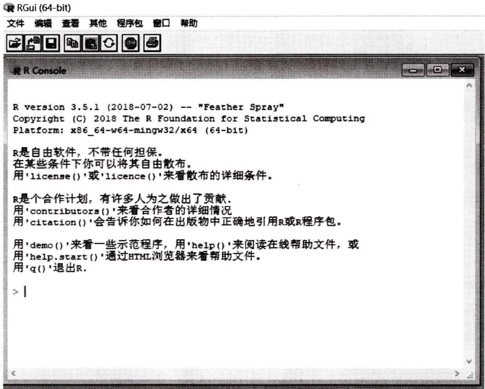
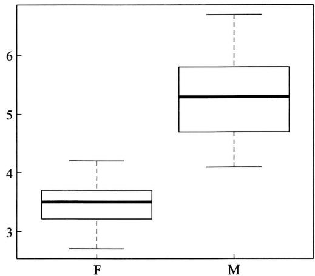
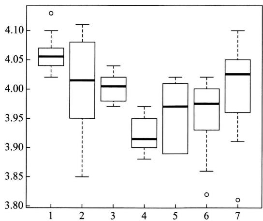
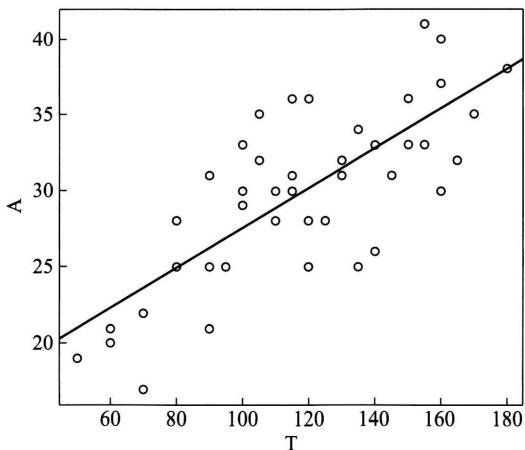
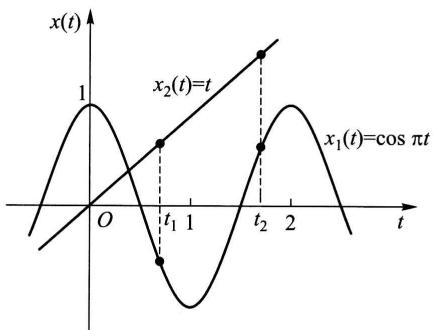
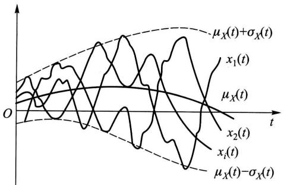
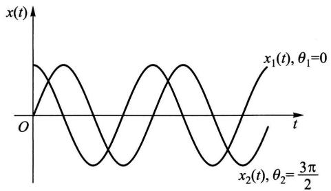
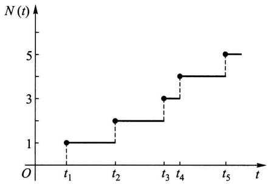
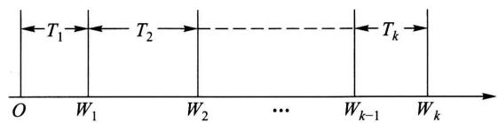

# 第十章 bootstrap 方法(自助法)

bootstrap 方法为统计数据分析提供了强有力的途径和方法，与传统的参数方法相比较，它具有更一般性的应用。bootstrap 方法的实现，需要在计算机上作较多的计算。现在由于计算机的容量大，速度快，这样的计算是容易的。bootstrap 方法现在已成为一种流行的方法。

bootstrap 方法是由埃弗龙(Bradley Efron)在20世纪70年代后期建立的，近四十年来发展很快.

# § 1 非参数 bootstrap 方法

bootstrap 方法的目标是基于已知数据去估计未知参数, 例如估计均值、中位数、标准差等, 构造未知参数的置信区间, 以及对参数作假设检验等.

# （一）估计量的标准误差的bootstrap估计

在估计总体未知参数  $\theta$  时，人们不但要给出  $\theta$  的估计  $\hat{\theta}$ ，还需要给出这一  $\hat{\theta}$  的精度，通常我们用估计量  $\hat{\theta}$  的标准差  $\sigma_{\hat{\theta}} = \sqrt{D(\hat{\theta})}$  来度量估计  $\hat{\theta}$  的精度。估计量  $\hat{\theta}$  的标准差也称为估计量  $\hat{\theta}$  的标准误差。

设  $(X_{1}, X_{2}, \dots, X_{n})$  是来自以  $F(x)$  为分布函数的总体的样本， $\theta$  是待估的未知参数。用  $\hat{\theta} = \hat{\theta}(X_{1}, X_{2}, \dots, X_{n})$  作为  $\theta$  的估计量，在实际应用中  $\hat{\theta}$  的抽样分布常常是难以处理的，这样  $\sqrt{D(\hat{\theta})}$  常没有一个简单的表达式。不过我们可以用蒙特卡罗（Monte Carlo）模拟的方法来求得  $\sqrt{D(\hat{\theta})}$  的估计。为此，自  $F$  产生很多容量为  $n$  的样本（例如  $B$  个），对于每一个样本计算  $\hat{\theta}$  的值，得到  $\hat{\theta}_{1}, \hat{\theta}_{2}, \dots, \hat{\theta}_{B}$ ，则  $\sqrt{D(\hat{\theta})}$  可以用

$$
\hat {\sigma} _ {\hat {\theta}} = \sqrt {\frac {1}{B - 1} \sum_ {i = 1} ^ {B} \left(\hat {\theta} _ {i} - \bar {\theta}\right) ^ {2}} \tag {1.1}
$$

来估计，其中  $\overline{\theta} = \frac{1}{B}\sum_{i = 1}^{B}\hat{\theta}_{i}$  .然而  $F$  常常是未知的.这样就无法用模拟的方法产生 $F$  的样本，不能得到(1.1)式的结果，需要另外的方法.

现在设总体分布函数  $F$  未知, 但是已经有一个容量为  $n$  的来自  $F$  的原始数据样本  $(x_{1}, x_{2}, \dots, x_{n})$ . 考虑到此时对应于样本  $(x_{1}, x_{2}, \dots, x_{n})$  的经验分布  $F_{n}$  是已知的, 由格里汶科定理(见第六章 §3), 当  $n$  很大时,  $F_{n}$  接近于  $F$ . 我们就用  $F_{n}$  代替  $F$ , 在  $F_{n}$  中抽取样本. 在  $F_{n}$  中抽取样本就是在原始样本  $(x_{1}, x_{2}, \dots, x_{n})$  中一次随机地取一个个体, 放回, 再在  $(x_{1}, x_{2}, \dots, x_{n})$  中抽取一个个体, 直到得到容量为  $n$  的样本, 也就是对具有概率密度函数为

$$
f (x) = \left\{ \begin{array}{l l} \frac {1}{n}, & x \in (x _ {1}, x _ {2}, \dots , x _ {n}), \\ 0, & \text {其 他} \end{array} \right.
$$

的离散型均匀分布随机变量以放回抽样的方法抽取容量为  $n$  的样本，将得到的样本记为  $(x_{1}^{*}, x_{2}^{*}, \dots, x_{n}^{*})$ ，称为bootstrap样本.

对bootstrap样本按上一段中计算估计  $\hat{\theta}(x_1, x_2, \dots, x_n)$  那样求出  $\theta$  的估计  $\hat{\theta}^* = \hat{\theta}(x_1^*, x_2^*, \dots, x_n^*)$ ,  $\hat{\theta}^*$  称为  $\theta$  的bootstrap估计. 相继地、独立地抽得许多bootstrap样本(例如  $B$  个), 以这些样本分别求出  $\theta$  的bootstrap估计如下:

bootstrap 样本  $1(x_{1}^{*1},x_{2}^{*1},\dots ,x_{n}^{*1})$  ，求出  $\theta$  的bootstrap估计  $\hat{\theta}_1^*$

bootstrap 样本  $2(x_{1}^{*2},x_{2}^{*2},\dots ,x_{n}^{*2})$  ，求出  $\theta$  的bootstrap估计  $\hat{\theta}_{2}^{*}$

中

bootstrap 样本  $B(x_{1}^{*B}, x_{2}^{*B}, \dots, x_{n}^{*B})$ ，求出  $\theta$  的 bootstrap 估计  $\hat{\theta}_B^*$ ，则  $\hat{\theta}$  的标准误差  $\sqrt{D(\hat{\theta})}$  就以

$$
\hat {\sigma} _ {\bar {\theta}} = \sqrt {\frac {1}{B - 1} \sum_ {i = 1} ^ {B} \left(\hat {\theta} _ {i} ^ {*} - \bar {\theta} ^ {*}\right) ^ {2}} \tag {1.2}
$$

来估计，其中  $\overline{\theta}^{*} = \frac{1}{B}\sum_{i = 1}^{B}\hat{\theta}_{i}^{*}$  .(1.2)式就定义为  $\sqrt{D(\hat{\theta})}$  的bootstrap估计.

综上所述，得到求  $\sqrt{D(\hat{\theta})}$  的bootstrap估计的步骤如下：

$1^{\circ}$  对原始样本  $\pmb{x} = (x_{1}, x_{2}, \dots, x_{n})$  按放回抽样的方法抽得容量为  $n$  的样本  $\pmb{x}^{*} = (x_{1}^{*}, x_{2}^{*}, \dots, x_{n}^{*})$  （称为bootstrap样本）.

$2^{\circ}$  相继地、独立地求出  $B$  个  $(B \geqslant 10000)$  容量为  $n$  的 bootstrap 样本  $x^{*i} = (x_{1}^{*i}, x_{2}^{*i}, \dots, x_{n}^{*i}), i = 1, 2, \dots, B.$  对第  $i$  个 bootstrap 样本计算  $\hat{\theta}_{i}^{*} = \hat{\theta}(x_{1}^{*i}, x_{2}^{*i}, \dots, x_{n}^{*i}), i = 1, 2, \dots, B$  ( $\hat{\theta}_{i}^{*}$  称为  $\theta$  的第  $i$  个 bootstrap 估计).

$3^{\circ}$  计算

$$
\hat {\sigma} _ {\hat {\theta}} = \sqrt {\frac {1}{B - 1} \sum_ {i = 1} ^ {B} (\hat {\theta} _ {i} ^ {*} - \bar {\theta} ^ {*}) ^ {2}}, \text {其 中} \bar {\theta} ^ {*} = \frac {1}{B} \sum_ {i = 1} ^ {B} \hat {\theta} _ {i} ^ {*}.
$$

例1 某种基金的年回报率是具有分布函数  $F$  的连续型随机变量， $F$  未知， $F$  的中位数  $\theta$  为未知参数. 现有以下的原始样本（以 $\%$ 计）：

$$
9. 5 \quad 2 1. 1 \quad 1 2. 0 \quad 1 0. 2 \quad 1 2. 0 \quad 2 1. 1 \quad 1 0. 2
$$

$$
\begin{array}{l l l l l l} 1 8. 2 & 1 2. 0 & 9. 5 & 1 8. 0 & 1 0. 2 & 1 8. 2 \end{array}
$$

试求  $F$  的中位数的标准误差的bootstrap估计.

解 将原始样本自小到大排序, 中间一个数为 12.0, 得中位数为 12.0. 相继地、独立地在上述 13 个数据中, 按放回抽样的方法取样, 取  $B = 10000$ . 得到 10000 个 bootstrap 样本:

样本1 10.2 10.2 18.2 18.2 10.2 10.2 21.1 12.0 18.2

$$
2 1. 1 \quad 2 1. 1 \quad 1 2. 0
$$

样本2 18.2 9.5 21.1 21.1 10.2 18.0 9.5 10.2 10.2 9.5

$$
\begin{array}{c c c} 1 0. 2 & 1 2. 0 & 2 1. 1 \end{array}
$$

中

样本10000 21.1 9.5 10.2 9.5 12.0 12.0 21.1 18.2 18.0

$$
2 1. 1 \quad 1 2. 0 \quad 9. 5 \quad 2 1. 1
$$

对以上每个bootstrap样本，分别求出其样本中位数  $\hat{\theta}_i^*$  ，  $i = 1,2,\dots ,10000$  将它们代入(1.2)式，得到所求的标准误差的bootstrap估计为

$$
\hat {\sigma} _ {\hat {\theta}} = \sqrt {\frac {1}{9 9 9 9} \sum_ {i = 1} ^ {1 0 0 0 0} \left(\hat {\theta} _ {i} ^ {*} - \bar {\theta} ^ {*}\right) ^ {2}} = 2. 6 7 6 1 3 1.
$$

其中  $\bar{\theta}^{*} = \frac{1}{B}\sum_{i = 1}^{B}\hat{\theta}_{i}^{*}$

计算程序见第十一章 §6 例1.

# （二）估计量的均方误差的bootstrap估计

下面举例来说明.

例2（均方误差）设金属元素铂的升华热是具有分布函数  $F(F$  未知)的连续型随机变量.  $F$  的中位数  $\theta$  是未知参数，现测得以下的原始样本(以  $\mathrm{kcal / mol}$  计②）：

133.7 134.1 134.3 134.4 134.5 134.7 134.8 134.8

134.9 134.9 135.0 135.0 135.2 135.2 135.4 135.4 135.8

$$
\begin{array}{l l l l l l l l} 1 3 5. 8 & 1 3 6. 3 & 1 3 6. 6 & 1 4 1. 2 & 1 4 3. 3 & 1 4 6. 5 & 1 4 7. 8 & 1 4 8. 8 \end{array}
$$

(数据已排序). 以原始样本的中位数  $M = M(x)$  作为总体中位数  $\theta$  的估计, 试求均方误差  $MSE = E[(M - \theta)^2]$  的 bootstrap 估计.

解 将原始样本自小到大排序，左起第13个数为135.0，左起第14个数为135.2，于是原始样本的中位数为135.1。以135.1作为总体中位数  $\theta$  的估计，即  $\hat{\theta} = 135.1$ 。需估计均值  $E[(M - 135.1)^2]$ 。

相继地、独立地自原始样本抽取10000个bootstrap样本如下：

样本1 143.3 134.8 148.8 135.4 135.2 135.2 134.8 134.4 134.7 135.2 135.0 135.0 135.4 135.4 136.3 134.4 134.9 134.8 136.6 134.1 134.8 134.8 133.7 134.8 134.8 134.4

得样本中位数为  $M_1^* = 134.85$  ，  $(M_1^* - 135.1)^2 = 0.0625$

：

样本10000 135.8 135.2 134.9 135.2 135.4 135.2 134.3 134.9 134.3 135.0 135.2 148.8 136.6 135.4 136.6 135.2 133.7 146.5 135.0 135.4 134.8

得样本中位数为  $M_{10000}^{*} = 135.2, (M_{10000}^{*} - 135.1)^{2} = 0.01.$

将这10000个数  $(M_1^* - 135.1)^2, \dots, (M_{10000}^* - 135.1)^2$  取平均值，得到

$$
\frac {1}{1 0 0 0 0} \sum_ {i = 1} ^ {1 0 0 0 0} \left(M _ {i} ^ {*} - 1 3 5. 1\right) ^ {2} = 0. 0 7 4 3 2 3 2 5.
$$

我们就用0.07432325作为均方误差  $E[(M - \theta)^2 ]$  的bootstrap估计.

计算程序见第十一章 §6 例2.

# （三）偏差的bootstrap估计

设  $(X_{1}, X_{2}, \dots, X_{n})$  是来自以  $F$  为分布函数的总体的样本， $\hat{\theta} = \hat{\theta}(X_{1}, X_{2}, \dots, X_{n})$  是未知参数  $\theta$  的估计量。 $\theta$  的估计量  $\hat{\theta}$  关于  $\theta$  的偏差定义为

$$
b = E (\hat {\theta} - \theta) = E (\hat {\theta}) - \theta .
$$

当  $\hat{\theta}$  是  $\theta$  的无偏估计时  $b = 0$

例3 试在例2中，以原始样本中位数  $M = M(x)$  作为总体中位数  $\theta$  的估计，求偏差  $b = E(M - \theta)$  的bootstrap估计.

解 由例2知原始样本的中位数为135.1.以135.1作为总体中位数  $\theta$  的估计，即  $\hat{\theta} = 135.1.$  需估计均值  $E(M - 135.1)$

对于例2中10000个bootstrap样本计算

$$
M _ {i} ^ {*} - 1 3 5. 1, \quad i = 1, 2, \dots , 1 0 0 0 0,
$$

即有对于样本1有  $M_1^* - 135.1 = 134.85 - 135.1 = -0.25$

：

对于样本10000有  $M_{10000}^{*} - 135.1 = 135.2 - 135.1 = 0.1.$

将上述10000个数取平均值得到偏差  $b$  的bootstrap估计为

$$
\hat {b} ^ {*} = \frac {1}{1 0 0 0 0} \sum_ {i = 1} ^ {1 0 0 0 0} \left(M _ {i} ^ {*} - 1 3 5. 1\right) = \frac {1}{1 0 0 0 0} \sum_ {i = 1} ^ {1 0 0 0 0} M _ {i} ^ {*} - 1 3 5. 1 = 0. 0 4 3 3 3,
$$

计算程序见第十一章 §6 例3.

□

# （四）用分位数法求未知参数的bootstrap置信区间

设  $X = (X_{1},X_{2},\dots ,X_{n})$  是来自以  $F$  为分布函数（  $F$  未知)的总体的样本.  $\pmb {x} = (x_{1},x_{2},\dots ,x_{n})$  是已知的来自  $F$  的原始样本.总体中含有未知参数  $\theta$  .现在来求  $\theta$  的置信水平为  $1 - \alpha$  的置信区间.

相继地、独立地自样本  $x = (x_{1}, x_{2}, \dots, x_{n})$  抽出  $B$  个（例如取  $B = 10000$ ）容量为  $n$  的 bootstrap 样本，对于每个 bootstrap 样本求出  $\theta$  的 bootstrap 估计  $\hat{\theta}_{1}^{*}$ ， $\hat{\theta}_{2}^{*}, \dots, \hat{\theta}_{B}^{*}$ ，将它们自小到大排序得到

$$
\hat {\theta} _ {(1)} ^ {*} \leqslant \hat {\theta} _ {(2)} ^ {*} \leqslant \dots \leqslant \hat {\theta} _ {(B)} ^ {*}.
$$

令  $m = \left[(\alpha /2)B\right]$  ，则区间

$$
\left(\hat {\theta} _ {(m)} ^ {*}, \hat {\theta} _ {(B - m)} ^ {*}\right) \tag {1.3}
$$

是  $\theta$  的一个近似  $1 - \alpha$  置信区间. 这一区间的两端点分别是诸  $\hat{\theta}_i^* (i = 1,2,\dots ,B)$  的经验分布的下分位数  $\alpha /2,1 - \alpha /2$

区间(1.3)称为  $\theta$  的置信水平为  $1 - \alpha$  的bootstrap置信区间.这种求置信区间的方法称为分位数法.

例4 在例2中，给出了金属元素铂的升华热的26个数据. 试利用这些数据求下述置信区间：

（1）以样本中位数作为总体中位数  $\theta$  的估计，求  $\theta$  的置信水平为0.95的bootstrap置信区间.

（2）以样本  $20\%$  截尾均值作为总体  $20\%$  截尾均值  $\mu_t$  的估计，求  $\mu_t$  的置信水平为 0.95 的 bootstrap 置信区间.

解  $n = 26, B = 10000$  ，原始样本以及10000个模拟bootstrap样本见例2.

（1）对于每一个bootstrap样本算出中位数  $M_1^*, M_2^*, \dots, M_{10000}$ . 将它们自小到大排序得到

$$
M _ {(1)} ^ {*} \leqslant M _ {(2)} ^ {*} \leqslant \dots \leqslant M _ {(2 5 0)} ^ {*} \leqslant M _ {(2 5 1)} ^ {*} \leqslant \dots \leqslant M _ {(9 7 5 0)} ^ {*} \leqslant M _ {(9 7 5 1)} ^ {*} \leqslant \dots \leqslant M _ {(1 0 0 0 0)} ^ {*}.
$$

由  $B = 10000, 1 - \alpha = 0.95, \alpha = 0.05, m = [(\alpha / 2)B] = [0.025 \times 10000] = 250,$ $B - m = 9750$  ，得  $\theta$  的一个置信水平为0.95的bootstrap置信区间为

$$
\left(M _ {(2 5 0)} ^ {*}, M _ {(9 7 5 0)} ^ {*}\right) = (1 3 4. 8 0, 1 3 5. 8 0).
$$

（2）对于例2中的10000个bootstrap样本中的每一个，算出样本  $20\%$  截尾均值：  $\overline{x}_{t1}^{*},\overline{x}_{t2}^{*},\dots ,\overline{x}_{t10000}^{*}$  ，将它们自小到大排序得到

$$
\bar {x} _ {t (1)} ^ {*} \leqslant \bar {x} _ {t (2)} ^ {*} \leqslant \dots \leqslant \bar {x} _ {t (2 5 0)} ^ {*} \leqslant \bar {x} _ {t (2 5 1)} ^ {*} \leqslant \dots \leqslant \bar {x} _ {t (9 7 5 0)} ^ {*} \leqslant \bar {x} _ {t (9 7 5 1)} ^ {*} \leqslant \dots \leqslant \bar {x} _ {t (1 0 0 0 0)} ^ {*}.
$$

按分位数法由(1.3)式得到  $20\%$  截尾均值的一个置信水平为0.95的bootstrap置信区间为

$$
(1 3 4. 8 9 3 8, 1 3 7. 4 5 6 3).
$$

计算程序见第十一章 §6 例4.

例5有30窝仔猪，出生时各窝猪的存活只数为

$$
\begin{array}{c c c c c c c c c c c c c c c c} 9 & 8 & 1 0 & 1 2 & 1 1 & 1 2 & 7 & 9 & 1 1 & 8 & 9 & 7 & 7 & 8 & 9 \\ 7 & 9 & 9 & 1 0 & 9 & 9 & 9 & 1 2 & 1 0 & 1 0 & 9 & 1 3 & 1 1 & 1 3 & 9 \end{array}
$$

以样本均值  $\overline{x}$  作为总体均值  $\mu$  的估计，以样本标准差  $s$  作为总体标准差  $\sigma$  的估计，试按分位数法求  $\mu$  以及  $\sigma$  的置信水平为0.90的bootstrap置信区间.

解相继地、独立地自原始样本数据用放回抽样的方法，得到10000个容量均为30的bootstrap样本：

样本1 8 8 10 12 7 11 11 8 10 12 7 9 10 8 9 11 10 13 9 9 9 10 8

样本10000 9 10 7 10 9 7 9 7 10 7 9 9 13 11 12 10 12 12 10 9 8 11 9 9 9 11 12 11 12 9

对上述每个bootstrap样本算出样本均值  $\overline{x}_i^* (i = 1,2,\dots ,10000)$  ，将10000个 $\overline{x}_i^*$  按自小到大排序，左起第500位为  $\overline{x}_{(500)}^{*} = 9.03$  ，左起第9500位为  $\overline{x}_{(9500)}^{*} =$  10.038.于是按(1.3)式得  $\mu$  的一个置信水平为0.90的bootstrap置信区间为

$$
\left(\bar {x} _ {(5 0 0)} ^ {*}, \quad \bar {x} _ {(9 5 0 0)} ^ {*}\right) = (9. 0 3, 1 0. 0 3 8).
$$

对上述10000个bootstrap样本的每一个算出标准差  $s_i^* (i = 1,2,\dots ,10000)$  ，将10000个  $s_i^*$  按自小到大排序.左起第500位为  $s_{(500)}^{*} = 1.35$  ，左起第9500位为 $s_{(9500)}^{*} = 1.98$  ，于是按(1.3)式得  $\sigma$  的一个置信水平为0.90的bootstrap置信区间为 $(s_{(500)}^{*},s_{(9500)}^{*}) = (1.35,1.98).$

（本题的计算程序由读者自行给出.）

□

# § 2 参数 bootstrap 方法

假设所研究的总体的分布函数  $F(x;\beta)$  的形式已知，但其中包含未知参数  $\beta$  ( $\beta$  可以是向量). 现在已知有一个来自  $F(x;\beta)$  的样本  $X_{1}, X_{2}, \dots, X_{n}$ . 利用这一样本求出  $\beta$  (在  $F(x;\beta)$  下)的最大似然估计  $\hat{\beta}$ . 在  $F(x;\beta)$  中以  $\hat{\beta}$  代替  $\beta$  得  $F(x; \hat{\beta})$  ，接着在  $F(x; \hat{\beta})$  中产生容量为  $n$  的样本

$$
X _ {1} ^ {*}, X _ {2} ^ {*}, \dots , X _ {n} ^ {*} \sim F (x; \hat {\beta}) ①.
$$

这种样本可以产生很多个，例如产生  $B$  个  $(B \geqslant 10000)$ ，就可以利用这些样本对总体进行统计推断，其做法与非参数 bootstrap 方法一样。这种方法称为参数 bootstrap 方法。

例1某种类型的热泵的寿命  $X$  （以年计)服从指数分布，其分布函数为

$$
F (x; \theta) = \left\{ \begin{array}{l l} {1 - \mathrm {e} ^ {- x / \theta},} & {x > 0,} \\ {0,} & {\text {其 他},} \end{array} \right. \quad \theta > 0   \text {未 知}.
$$

且知总体具有样本：

$$
\begin{array}{l} \begin{array}{l l l l l l l l} 0. 4 & 0. 6 & 0. 7 & 0. 9 & 1. 0 & 1. 3 & 1. 9 & 2. 0 \end{array} \\ 4. 8 \quad 5. 1 \quad 5. 3 \quad 5. 3 \quad 6. 0 \quad 1 2. 2 \quad 1 5. 8 \\ \end{array}
$$

求总体  $X$  的均值  $\mu$  的置信水平为0.95的bootstrap置信区间.

解 由题意知上述样本的样本均值为  $\bar{x} = 4.22$ . 由最大似然估计法求得  $\theta$  的估计为  $\hat{\theta} = \bar{x} = 4.22$ . 以  $\hat{\theta}$  代替  $F(x; \theta)$  中的  $\theta$ , 得

$$
F (x; \theta) = \left\{ \begin{array}{l l} 1 - \mathrm {e} ^ {- x / 4. 2 2}, & x > 0, \\ 0, & \text {其 他}. \end{array} \right.
$$

相继地、独立地以  $F(x;\theta)$  为分布函数产生10000个容量为15的bootstrap样本.算出这10000个样本各自的均值  $\overline{x}_1^*,\overline{x}_2^*,\dots ,\overline{x}_{1000}^*$  .将它们自小到大排序得到

$$
\bar {x} _ {(1)} ^ {*} \leqslant \bar {x} _ {(2)} ^ {*} \leqslant \dots \leqslant \bar {x} _ {(2 5 0)} ^ {*} \leqslant \dots \leqslant \bar {x} _ {(9 7 5 0)} ^ {*} \leqslant \dots \leqslant \bar {x} _ {(1 0 0 0 0)} ^ {*},
$$

得总体的均值  $\mu$  的置信水平为0.95的bootstrap置信区间为

$$
\left(\bar {x} _ {(2 5 0)} ^ {*}, \bar {x} _ {(9 7 5 0)} ^ {*}\right) = (2. 3 9 2 0 9, 6. 6 8 2 1 3).
$$

计算程序见第十一章 §6 例5.

例2 猫的听觉神经反应速度  $Y$  近似服从参数为  $\lambda$  的泊松分布. 抽取了10只猫, 测得它们的听觉神经纤维反应速度(即为噪声爆发的每  $200\mathrm{ms}$  的脉冲个

数)数据如下：

$$
1 5. 1 \quad 1 4. 6 \quad 1 2. 0 \quad 1 9. 2 \quad 1 6. 1 \quad 1 5. 5 \quad 1 1. 3 \quad 1 8. 7 \quad 1 7. 1 \quad 1 7. 2
$$

试求总体  $Y$  的均值  $\mu$  的置信水平为0.95的bootstrap置信区间.

解 泊松分布的分布律为

$$
P \{Y = k \} = \frac {\lambda^ {k} \mathrm {e} ^ {- \lambda}}{k !}, \quad k = 0, 1, 2, \dots .
$$

由已知数据求出参数  $\lambda$  的最大似然估计为  $\hat{\lambda} = \overline{y} = 15.68$  ，得分布律为

$$
P \{Y = k \} = \frac {1 5 . 6 8 ^ {k} \mathrm {e} ^ {- 1 5 . 6 8}}{k !}, \quad k = 0, 1, 2, \dots . \tag {2.1}
$$

相继地、独立地从分布律(2.1)产生10000个容量为10的bootstrap样本。算出这10000个样本各自的均值  $\overline{y}_1^*$ ,  $\overline{y}_2^*$ ,  $\cdots$ ,  $\overline{y}_{10000}^*$ ，将它们自小到大排序得到

$$
\bar {y} _ {(1)} ^ {*} \leqslant \bar {y} _ {(2)} ^ {*} \leqslant \dots \leqslant \bar {y} _ {(2 5 0)} ^ {*} \leqslant \dots \leqslant \bar {y} _ {(9 7 5 0)} ^ {*} \leqslant \dots \leqslant \bar {y} _ {(1 0 0 0 0)} ^ {*},
$$

得总体的均值  $\mu$  的置信水平为0.95的bootstrap置信区间为

$$
\left(\bar {y} _ {(2 5 0)} ^ {*}, \bar {y} _ {(9 7 5 0)} ^ {*}\right) = (1 3. 3, 1 8. 2).
$$

计算程序见第十一章 §6 例 6.

例3 某种疾病患者的预计存活时间（自确诊到死亡的时间，以月计）是一个随机变量  $X$  ，已知  $X \sim N(\mu, \sigma^2)$ ， $\mu, \sigma^2$  未知. 设有样本（以月计）：

$$
\begin{array}{l} \begin{array}{l l l l l l l l} 8. 0 & 1 3. 6 & 1 3. 2 & 1 3. 6 & 1 2. 5 & 1 4. 2 & 1 4. 9 & 1 4. 5 \end{array} \\ 1 3. 4 \quad 8. 6 \quad 1 1. 5 \quad 1 6. 0 \quad 1 4. 0 \quad 1 9. 0 \quad 1 7. 9 \quad 1 7. 0 \\ \end{array}
$$

试用参数bootstrap方法(1)求总体  $X$  的均值  $\mu$  的置信水平为0.95的bootstrap置信区间.(2)求  $X$  的中位数  $\theta$  的置信水平为0.95的bootstrap置信区间.

解 分布  $N(\mu, \sigma^2)$  中的未知参数  $\mu, \sigma^2$  的最大似然估计分别为（见第七章 §1 例5）：

$$
\begin{array}{l} \hat {\mu} = \bar {x} = \frac {1}{1 6} (8. 0 + 1 3. 6 + \dots + 1 7. 0) = 1 3. 8 7, \\ \hat {\sigma} ^ {2} = \frac {1}{1 6} \sum_ {i = 1} ^ {1 6} (x _ {i} - \bar {x}) ^ {2} = 8. 0 6. \\ \end{array}
$$

（1）相继地、独立地从分布  $N(13.87, 8.06)$  产生10000个容量为16的bootstrap样本．算出这10000个样本各自的均值  $\overline{x}_1^*, \overline{x}_2^*, \dots, \overline{x}_{10000}^*$ ，将它们自小到大排序得到

$$
\bar {x} _ {(1)} ^ {*} \leqslant \bar {x} _ {(2)} ^ {*} \leqslant \dots \leqslant \bar {x} _ {(2 5 0)} ^ {*} \leqslant \dots \leqslant \bar {x} _ {(9 7 5 0)} ^ {*} \leqslant \dots \leqslant \bar {x} _ {(1 0 0 0 0)} ^ {*},
$$

得到总体的均值  $\mu$  的置信水平为0.95的bootstrap置信区间为

$$
\left(\bar {x} _ {(2 5 0)} ^ {*}, \bar {x} _ {(9 7 5 0)} ^ {*}\right) = (1 2. 4 6 3 5 7, \quad 1 5. 2 5 1 3 4).
$$

（2）相继地、独立地从分布  $N(13.87, 8.06)$  产生 10000 个容量为 16 的

bootstrap 样本, 算出这 10000 个样本各自的中位数  $M_{1}^{*}, M_{2}^{*}, \dots, M_{10000}^{*}$ , 将它们自小到大排序得到

$$
M _ {(1)} ^ {*} \leqslant M _ {(2)} ^ {*} \leqslant \dots \leqslant M _ {(2 5 0)} ^ {*} \leqslant \dots \leqslant M _ {(9 7 5 0)} ^ {*} \leqslant \dots \leqslant M _ {(1 0 0 0 0)} ^ {*},
$$

得到总体  $X$  的中位数  $\theta$  的置信水平为0.95的bootstrap置信区间为

$$
\left(M _ {(2 5 0)} ^ {*}, M _ {(9 7 5 0)} ^ {*}\right) = (1 2. 1 7 9 7 3, 1 5. 5 4 3 5 4).
$$

计算程序见第十一章 §6 例7.

例4 某商店某种商品的月销售量如下：

<table><tr><td>月销售量x</td><td>9</td><td>10</td><td>11</td><td>12</td><td>13</td><td>14</td><td>15</td><td>16</td></tr><tr><td>月份数</td><td>1</td><td>6</td><td>13</td><td>12</td><td>9</td><td>4</td><td>2</td><td>1</td></tr></table>

（1）已知月销售量服从泊松分布，试求平均月销售量的置信水平为0.95的bootstrap置信区间.

（2）不能确定月销售量服从什么分布，试用非参数bootstrap方法求平均月销售量的置信水平为0.95的bootstrap置信区间.

解（1）用参数bootstrap方法.月销售量  $X\sim \pi (\lambda)$  .先求出参数  $\lambda$  分布律为

$$
P \{X = k \} = \frac {\lambda^ {k} \mathrm {e} ^ {- \lambda}}{k !}, \quad k = 0, 1, 2, \dots .
$$

由已知数据求出参数  $\lambda$  的最大似然估计为

$$
\begin{array}{l} \hat {\lambda} = \bar {x} = \frac {9 \times 1 + 1 0 \times 6 + 1 1 \times 1 3 + 1 2 \times 1 2 + 1 3 \times 9 + 1 4 \times 4 + 1 5 \times 2 + 1 6 \times 1}{1 + 6 + 1 3 + 1 2 + 9 + 4 + 2 + 1} = \frac {5 7 5}{4 8} \\ = 1 1. 9 7 9 1 7, \\ \end{array}
$$

即有  $X\sim \pi (11.97917).$  (2.2)

相继地、独立地从分布律(2.2)产生10000个容量为48的bootstrap样本．算出这10000个样本各自的均值  $\overline{x}_1^*,\overline{x}_2^*,\dots ,\overline{x}_{10000}^*$  ，将它们自小到大排序得到

$$
\bar {x} _ {(1)} ^ {*} \leqslant \bar {x} _ {(2)} ^ {*} \leqslant \dots \leqslant \bar {x} _ {(2 5 0)} ^ {*} \leqslant \dots \leqslant \bar {x} _ {(9 7 5 0)} ^ {*} \leqslant \dots \leqslant \bar {x} _ {(1 0 0 0 0)} ^ {*},
$$

得到总体均值(即平均月销售量)  $\lambda$  的置信水平为0.95的bootstrap置信区间为

$$
\left(\bar {x} _ {(2 5 0)} ^ {*}, \bar {x} _ {(9 7 5 0)} ^ {*}\right) = (1 1. 0 0 0 0 0, 1 2. 9 5 8 3 3).
$$

（2）用非参数bootstrap方法.按题意在48个月内共售出575件商品.原始样本为

(9,10,10,10,10,10,10,11,11,11,11,11,11,11,11,11,12, 12,12,12,12,12,12,12,12,12,13,13,13,13,13,13,14,14, 14,14,15,15,16).

经计算得到平均月销售量的置信水平为0.95的bootstrap置信区间为

$$
\left(\bar {x} _ {(2 5 0)} ^ {*}, \bar {x} _ {(9 7 5 0)} ^ {*}\right) = (1 1. 5 6 2 5 0, 1 2. 4 1 6 6 7).
$$

计算程序见第十一章 §6 例8.

例5 据哈代-温伯格(Hardy-Weinberg)定律，若基因频率处于平衡状态，则在人的总体中基因型AA，Aa，aa出现的频率分别为  $(1 - \theta)^2, 2\theta (1 - \theta), \theta^2 (0 < \theta < 1)$ . 因为人的某种抗原蛋白类型与其基因型相关联，我们可以用人的此种抗原蛋白数据来估计人的基因型的频率.

据1937年对香港的调查有以下的数据：

<table><tr><td>抗原蛋白</td><td>M</td><td>MN</td><td>N</td><td>总人数</td></tr><tr><td>频率数据</td><td>342</td><td>500</td><td>187</td><td>1029</td></tr></table>

我们就用这一数据来估计未知参数  $\theta$  ，即有

<table><tr><td>基因型</td><td>AA</td><td>Aa</td><td>aa</td><td rowspan="2">总人数</td></tr><tr><td>频率</td><td>(1-θ)2</td><td>2θ(1-θ)</td><td>θ2</td></tr><tr><td>数据</td><td>342</td><td>500</td><td>187</td><td>1 029</td></tr></table>

（1）求  $\theta$  的最大似然估计.  
（2）求  $\theta$  的置信水平为0.90的bootstrap置信区间

解 本题样本容量较大，可以用频率作为概率的近似

（1）分别记  $x_{1}, x_{2}, x_{3}$  为具有基因型 AA, Aa, aa 的人数，记  $x_{1} + x_{2} + x_{3} = n$ ，似然函数为

$$
\begin{array}{l} L = \left[ (1 - \theta) ^ {2} \right] ^ {x _ {1}} \left[ 2 \theta (1 - \theta) \right] ^ {x _ {2}} \left(\theta^ {2}\right) ^ {x _ {3}} = 2 ^ {x _ {2}} \theta^ {x _ {2} + 2 x _ {3}} (1 - \theta) ^ {2 x _ {1} + x _ {2}}, \\ \ln L = x _ {2} \ln 2 + (x _ {2} + 2 x _ {3}) \ln \theta + (2 x _ {1} + x _ {2}) \ln (1 - \theta). \\ \end{array}
$$

令  $\frac{\mathrm{d}}{\mathrm{d}\theta}\ln L = \frac{x_2 + 2x_3}{\theta} +\frac{-\left(2x_1 + x_2\right)}{1 - \theta} = 0,$

解得  $\hat{\theta} = \frac{x_2 + 2x_3}{2(x_1 + x_2 + x_3)} = \frac{x_2 + 2x_3}{2n}$

以数据  $x_{1} = 342, x_{2} = 500, x_{3} = 187, n = 1029$  代入上式得到  $\theta$  的最大似然估计为  $\hat{\theta} = 0.4247$ .

以  $\hat{\theta}$  代替  $\theta$  得到  $(1 - \theta)^{2} = 0.331, 2\theta (1 - \theta) = 0.489, \theta^{2} = 0.180.$  于是得到人的基因型的近似分布律为

<table><tr><td>基因型</td><td>AA</td><td>Aa</td><td>aa</td></tr><tr><td>概率</td><td>0.331</td><td>0.489</td><td>0.180</td></tr></table>

（2）从这一分布律产生10000个bootstrap样本，得到  $\theta$  的10000个bootstrap估计  $\hat{\theta}_{1}^{*},\hat{\theta}_{2}^{*},\dots ,\hat{\theta}_{10000}^{*}$  ，将这10000个数按自小到大的次序排列，得到

$$
\hat {\theta} _ {(1)} ^ {*} \leqslant \hat {\theta} _ {(2)} ^ {*} \leqslant \dots \leqslant \hat {\theta} _ {(5 0 0)} ^ {*} \leqslant \dots \leqslant \hat {\theta} _ {(9 5 0 0)} ^ {*} \leqslant \dots \leqslant \hat {\theta} _ {(1 0 0 0 0)} ^ {*}.
$$

取  $(\hat{\theta}_{(500)}^*, \hat{\theta}_{(9500)}^*) = (0.4067, 0.4422)$  为  $\theta$  的置信水平为 0.90 的 bootstrap 置信区间.

计算程序见第十一章 §6 例9.

# § 3 bootstrap 假设检验方法举例

# （一）双样本均值差的bootstrap假设检验

考虑双样本的位置问题. 设  $X = (X_{1}, X_{2}, \dots, X_{n_{1}})$  是来自  $F(x)$  为分布函数的总体的样本， $Y = (Y_{1}, Y_{2}, \dots, Y_{n_{2}})$  是来自以  $F(x - \Delta)$  为分布函数的总体的样本，其中  $\Delta$  是实数. 参数  $\Delta$  是两样本间的位移. 设样本均值  $\mu_{X}, \mu_{Y}$  存在，即有  $\Delta = \mu_{Y} - \mu_{X}$ ，我们考虑下述单边检验问题：

$$
H _ {0}: \Delta = 0, \quad H _ {1}: \Delta > 0. \tag {3.1}
$$

取两样本的均值差

$$
V = \frac {1}{n _ {2}} \sum_ {i = 1} ^ {n _ {2}} Y _ {i} - \frac {1}{n _ {1}} \sum_ {i = 1} ^ {n _ {1}} X _ {i}
$$

作为检验统计量. 判定准则是若  $v \geq c$ ，则拒绝  $H_0$ . 用检验的  $p$  值的大小作为检验决策的依据. 将样本  $X, Y$  的观察值  $(x_1, x_2, \dots, x_{n_1}), (y_1, y_2, \dots, y_{n_2})$  的均值分别记为  $\overline{x}, \overline{y}$ ，则检验的  $p$  值是

$$
\hat {p} = P _ {H _ {0}} \left\{v \geqslant \bar {y} - \bar {x} \right\}.
$$

要注意上述等式的右端必须是当  $H_0$  为真时，事件  $\{v\geqslant \overline{y} -\overline{x}\}$  的概率.

求解检验问题(3.1)的一个简单方法是，将两个样本  $(x_{1}, x_{2}, \dots, x_{n_{1}})$  与  $(y_{1}, y_{2}, \dots, y_{n_{2}})$  合并成一个大的样本：

$$
\left(x _ {1}, x _ {2}, \dots , x _ {n _ {1}}, y _ {1}, y _ {2}, \dots , y _ {n _ {2}}\right),
$$

然后在其中以放回抽样的方法取样，分别取到一个容量为  $n_1$  的样本和另一个容量为  $n_2$  的样本.设  $B$  为正整数，  $v = \overline{y} -\overline{x}$  .以  $k$  为计数器(在程序计算之前令  $k = 0)$  ，给定检验的显著性水平为  $\alpha$  .得到求解检验问题(3.1)的步骤如下：

$1^{\circ}$  将两个样本  $(x_{1}, x_{2}, \dots, x_{n_{1}})$  和  $(y_{1}, y_{2}, \dots, y_{n_{2}})$  合并成一个样本：

$$
\mathbf {Z} = \left(x _ {1}, x _ {2}, \dots , x _ {n _ {1}}, y _ {1}, y _ {2}, \dots , y _ {n _ {2}}\right).
$$

$2^{\circ}$  用放回抽样的方法自  $\mathbf{Z}$  得到容量为  $n_1$  的bootstrap样本：

$$
\pmb {X} ^ {*} = (x _ {1} ^ {*}, x _ {2} ^ {*}, \dots , x _ {n _ {1}} ^ {*}), \text {并 计 算} \bar {x} ^ {*} = \frac {1}{n _ {1}} \sum_ {i = 1} ^ {n _ {1}} x _ {i} ^ {*}.
$$

用放回抽样的方法自  $Z$  得到容量为  $n_2$  的bootstrap样本：

$$
\mathbf {Y} ^ {*} = (y _ {1} ^ {*}, y _ {2} ^ {*}, \dots , y _ {n _ {2}} ^ {*}), \text {并 计 算}   \bar {y} ^ {*} = \frac {1}{n _ {2}} \sum_ {i = 1} ^ {n _ {2}} y _ {i} ^ {*}.
$$

$3^{\circ}$  计算  $v^{*} = \overline{y}^{*} - \overline{x}^{*}$ ，若  $v^{*} \geqslant v$ ，则计数器  $k$  加 1.

重复计算  $2^{\circ}, 3^{\circ}$  共  $B = 10000$  次，得到

$$
\hat {p} ^ {*} = \frac {\sharp_ {j = 1} ^ {1 0 0 0 0} \left\{v _ {j} ^ {*} \geqslant v \right\}}{B} = \frac {k}{B}.
$$

若  $\frac{k}{B} >\alpha$  ，则接受  $H_0:\Delta = 0$

例1 分别抽查了甲、乙两球队部分队员的行李质量(以  $\mathrm{kg}$  计)如下：

<table><tr><td>甲队</td><td>34</td><td>39</td><td>41</td><td>28</td><td>33</td><td></td></tr><tr><td>乙队</td><td>36</td><td>40</td><td>35</td><td>31</td><td>39</td><td>36</td></tr></table>

设甲、乙两队队员的行李质量总体的分布函数至多差一个平移，设两总体的均值分别为  $\mu_1, \mu_2$ 。记  $\Delta = \mu_2 - \mu_1$ ，试检验假设

$$
H _ {0}: \Delta = 0, \quad H _ {1}: \Delta > 0
$$

（取  $\alpha = 0.05$ ）

解 记  $X = (34, 39, 41, 28, 33), Y = (36, 40, 35, 31, 39, 36)$ . 将两个样本合并成一个样本：

$$
\mathbf {Z} = (3 4, 3 9, 4 1, 2 8, 3 3, 3 6, 4 0, 3 5, 3 1, 3 9, 3 6),
$$

再按上述步骤  $2^{\circ}, 3^{\circ}$ , 编制 R 语言程序. 计算结果得  $\hat{p}^{*} = k / B = 0.3096 > 0.05$ . 故接受  $H_{0}$ , 拒绝  $H_{1}$ , 认为乙队的行李质量的均值不比甲队的行李质量的均值大.

计算程序见第十一章 §6 例 10.

# （二）单样本均值的bootstrap假设检验

考虑单样本的位置问题. 设总体具有有限的均值  $\mu, \mu$  未知，我们要来检验假设

$$
H _ {0}: \mu = \mu_ {0}, \quad H _ {1}: \mu > \mu_ {0}.
$$

其中  $\mu_0$  是给定的常数

设  $x_{1}, x_{2}, \cdots, x_{n}$  来自均值为  $\mu$  的总体， $\bar{x} = \frac{1}{n} \sum_{i=1}^{n} x_{i}$  是  $\mu$  的一个估计.

我们利用  $p$  值来作假设检验. 注意到, 在作检验时,  $p$  值必须在  $H_0: \mu = \mu_0$  时被估计, 为此, 我们将样本  $x_1, x_2, \dots, x_n$  作平移变换, 使成为

$$
z _ {1} = x _ {1} - \bar {x} + \mu_ {0}, \quad z _ {2} = x _ {2} - \bar {x} + \mu_ {0}, \dots , z _ {n} = x _ {n} - \bar {x} + \mu_ {0}.
$$

我们的bootstrap方法是以放回抽样的方法自  $z_{1},z_{2},\dots ,z_{n}$  抽取bootstrap样本.令  $\pmb{z}^{*}$  是这样得到的一个观察值，易知  $E(z^{*}) = \mu_{0}$  .这样，利用  $z_{1},z_{2},\dots ,z_{n}$  则bootstrap取样在  $H_0:\mu = \mu_0$  下完成了.于是得到bootstrap检验的步骤如下：设  $k$  为正整数，以  $k$  为计数器(在计算之前令  $k = 0$  )，给定显著性水平为  $\alpha$

$1^{\circ}$  产生经平移的观察值

$$
z _ {i} = x _ {i} - \bar {x} + \mu_ {0}, \quad i = 1, 2, \dots , n.
$$

$2^{\circ}$  用放回抽样的方法自  $\pmb{z}$  得到容量为  $n$  的bootstrap样本：

$z^{*} = (z_{1}^{*},z_{2}^{*},\dots ,z_{n}^{*})$  .计算其均值  $\overline{z}^*$  .若  $\overline{z}^{*} > \overline{x}$  ，则  $k$  加1.

$3^{\circ}$  将  $2^{\circ}$  重复  $B$  次，即得  $p^{*}$  值的估计为（取  $B = 10000$ ）

$$
\hat {p} ^ {*} = \frac {\sharp_ {j = 1} ^ {B} \{\bar {z} _ {j} ^ {*} \geqslant \bar {x} \}}{B} = \frac {k}{B}.
$$

若  $\frac{k}{B} >\alpha$  ，则接受  $H_0$

例2 某种元件的寿命  $X$  (以  $\mathrm{h}$  计) 是一个随机变量. 以  $\mu$  记  $X$  的均值.  $\mu$  未知. 今测得16只元件的寿命如下：

$$
\begin{array}{l} \begin{array}{c c c c c c c c c} 1 5 9 & 2 8 0 & 1 0 1 & 2 1 2 & 2 2 4 & 3 7 9 & 1 7 9 & 2 6 4 \end{array} \\ 2 2 2 \quad 3 6 2 \quad 1 6 8 \quad 2 5 0 \quad 1 4 9 \quad 2 6 0 \quad 4 8 5 \quad 1 7 0 \\ \end{array}
$$

试检验假设（取显著性水平  $\alpha = 0.05$ ）：

$$
H _ {0}: \mu = \mu_ {0} = 2 2 5, \quad H _ {1}: \mu > \mu_ {0} = 2 2 5.
$$

解 样本容量  $n = 16$  ，样本均值  $\overline{x} = 241.5$  ，取  $B = 10000$  .作变换  $z_{i} = x_{i} - \overline{x} + \mu_{0}, i = 1,2,\dots,16$  ，即

$$
z _ {i} = x _ {i} - 2 4 1. 5 + 2 2 5 = x _ {i} - 1 6. 5, \quad i = 1, 2, \dots , 1 6.
$$

求出bootstrap样本为  $z^{*} = (z_{1}^{*},z_{2}^{*},\dots ,z_{16}^{*})$  ，其均值为  $\overline{z}^*$  .得到

$$
\hat {p} ^ {*} = \frac {\sharp_ {j = 1} ^ {B} \{\bar {z} _ {j} ^ {*} \geqslant \bar {x} \}}{B} = \frac {2 4 2 9}{1 0 0 0 0} = 0. 2 4 2 9 > \alpha = 0. 0 5.
$$

故接受  $H_0$  ，即认为元件的平均寿命不大于  $225\mathrm{h}$

计算程序见第十一章 §6 例11.

例3 地球的密度一般认为是  $5.51\mathrm{g/cm^3}$ 。1798年卡文迪什(Cavendish)做了一个著名的试验，得到以下的观察值（共29个数据）：

<table><tr><td>4.07</td><td>4.88</td><td>5.10</td><td>5.26</td><td>5.27</td><td>5.29</td><td>5.29</td><td>5.30</td><td>5.34</td><td>5.34</td></tr><tr><td>5.36</td><td>5.39</td><td>5.42</td><td>5.44</td><td>5.46</td><td>5.47</td><td>5.50</td><td>5.53</td><td>5.55</td><td>5.57</td></tr><tr><td>5.58</td><td>5.61</td><td>5.62</td><td>5.63</td><td>5.65</td><td>5.75</td><td>5.79</td><td>5.85</td><td>5.86</td><td></td></tr></table>

试用以上数据检验假设（取  $\alpha = 0.05$ ）：

$$
H _ {0}: \mu = \mu_ {0} = 5. 5 1, \quad H _ {1}: \mu \neq \mu_ {0} = 5. 5 1.
$$

解 样本容量  $n = 29$  ，样本均值  $\bar{x} = 5.42.$  取  $B = 10000.$  作变换  $z_{i} = x_{i} - \bar{x} + \mu_{0}, i = 1,2,\dots,29$  ，即

$$
z _ {i} = x _ {i} - 5. 4 2 + 5. 5 1 = x _ {i} + 0. 0 9, \quad i = 1, 2, \dots , 2 9.
$$

求出bootstrap样本为

$$
\left(z _ {1} ^ {*}, z _ {2} ^ {*}, \dots , z _ {2 9} ^ {*}\right),
$$

得到

$$
\hat {p} ^ {*} = \frac {\sharp_ {i = 1} ^ {B} \left\{\bar {z} _ {i} ^ {*} > \bar {x} \right\} + \sharp_ {i = 1} ^ {B} \left\{\bar {z} _ {i} ^ {*} <   - \bar {x} \right\}}{B} = \frac {\sharp_ {i = 1} ^ {B} \left\{\bar {z} _ {i} ^ {*} > \bar {x} \right\}}{B} = 0. 9 1 4 4 > 0. 0 5,
$$

故接受  $H_0$  ，认为地球密度为  $\mu = 5.51\mathrm{g / cm^3}$

计算程序见第十一章 §6 例 12.

# 小结

设  $x = (x_{1}, x_{2}, \dots, x_{n})$  是来自分布函数为  $F$  的总体的样本， $F$  未知。 $R(x)$  是  $x$  的函数， $F_{n}$  是相应的经验分布函数。假如我们感兴趣的是  $R(x)$  的某些特征，例如  $R$  的均值或中位数。非参数 bootstrap 方法的第一步是用已知的经验分布函数  $F_{n}$  代替  $F$ ，在  $F_{n}$  中抽样，得到数据样本  $x^{*} = (x_{1}^{*}, x_{2}^{*}, \dots, x_{n}^{*})$ ，然后计算  $R(x^{*})$  的均值或中位数，作为所需求的均值或中位数的估计（bootstrap 估计）。通常的情况， $R(x^{*})$  的分布过于复杂，不能用解析的方法计算得到  $R(x^{*})$  的特征，而需要采用模拟的方法。在参数 bootstrap 方法中  $F = F(x; \beta)$  的形式已知，但包含未知参数  $\beta$ 。先利用样本  $x$  求出  $\beta$  的最大似然估计  $\hat{\beta}$ ，以  $F(x; \hat{\beta})$  代替  $F$ ，在  $F(x; \hat{\beta})$  中抽样得到数据样本  $x^{*}$ ，然后计算  $R(x^{*})$  的均值或中位数，作为所需求的均值或中位数的 bootstrap 估计。非参数和参数 bootstrap 方法可用于当人们对总体知之甚少的情况，它们是近代统计中的一种用于数据处理的重要的实用方法。

本章还讲了双样本均值差的bootstrap假设检验方法和单样本均值的bootstrap假设检验方法.用这种方法来做题是很方便的.

# 习题

1. 生物学家随机地选取20只某种雄性绿蜘蛛（这种蜘蛛不织网而以追赶或跳跃去捕食），测量它们前腿的长度，得到以下的原始样本（以  $\mathrm{mm}$  计）：

<table><tr><td>15.10</td><td>13.55</td><td>15.75</td><td>20.00</td><td>15.45</td><td>13.60</td><td>16.45</td><td>14.05</td><td>16.95</td><td>19.05</td></tr><tr><td>16.40</td><td>17.05</td><td>15.25</td><td>16.65</td><td>16.25</td><td>17.75</td><td>15.40</td><td>16.80</td><td>17.55</td><td>19.05</td></tr></table>

设前腿长度总体是具有分布函数  $F$  的连续型随机变量， $F$  未知. 总体中位数  $\theta$  是未知参数，以原始样本中位数作为总体中位数  $\theta$  的估计  $\hat{\theta}$ ，试求估计量的标准误差  $\sqrt{D(\hat{\theta})}$  的 bootstrap 估计.

2. 据美国国家运输安全委员会（National Transportation Safety Board）报道，美国在  $1983\sim 2006$  年的飞机事故数为

<table><tr><td>23</td><td>16</td><td>21</td><td>24</td><td>34</td><td>30</td><td>28</td><td>24</td><td>26</td><td>18</td><td>23</td><td>23</td></tr><tr><td>36</td><td>37</td><td>49</td><td>50</td><td>51</td><td>56</td><td>46</td><td>41</td><td>54</td><td>30</td><td>40</td><td>31</td></tr></table>

（1）以样本中位数  $M = M(x)$  作为总体中位数  $\theta$  的估计，按分位数法求  $\theta$  的置信水平为0.95的bootstrap置信区间(取  $B = 10000$  ).

（2）以样本均值  $\overline{x}$  作为总体均值  $\mu$  的估计，按分位数法求  $\mu$  的置信水平为0.95的bootstrap置信区间(取  $B = 10000$  ).

3. 下面给出某个班级20个学生数理统计课程期终考试的得分：

<table><tr><td>88</td><td>67</td><td>64</td><td>76</td><td>86</td><td>85</td><td>82</td><td>39</td><td>75</td><td>34</td></tr><tr><td>90</td><td>63</td><td>89</td><td>90</td><td>84</td><td>81</td><td>96</td><td>100</td><td>70</td><td>96</td></tr></table>

（1）以样本中位数  $M = M(x)$  作为总体中位数  $\theta$  的估计，按分位数法求  $\theta$  的置信水平为0.95的bootstrap置信区间(取  $B = 10000$  ).

（2）以样本均值  $\overline{x}$  作为总体均值  $\mu$  的估计，按分位数法求  $\mu$  的置信水平为0.95的bootstrap置信区间(取  $B = 10000$  ).

（3）以样本  $10\%$  截尾均值作为总体  $10\%$  截尾均值  $\mu_{l}$  的估计，按分位数法求  $\mu_{l}$  的置信水平为0.95的bootstrap置信区间(取  $B = 10000$  ).

（4）以样本标准差  $s$  作为总体标准差  $\sigma$  的估计，按分位数法求  $\sigma$  的置信水平为0.95的bootstrap置信区间(取  $B = 10000$  ).

4.测得某种小麦品种株高的数据（以cm计）为

<table><tr><td>90</td><td>105</td><td>101</td><td>95</td><td>100</td><td>100</td><td>101</td><td>105</td><td>93</td><td>97</td></tr></table>

求：

（1）总体中位数  $\theta$  的置信水平为0.95的bootstrap置信区间  
（2）总体均值  $\mu$  的置信水平为0.95的bootstrap置信区间，

5. 已知某种电子元件的寿命  $X$  (以  $\mathrm{h}$  计) 服从指数分布, 其分布函数为

$$
F (x; \theta) = \left\{ \begin{array}{l l} {1 - \mathrm {e} ^ {- \frac {x}{\theta}},} & {x > 0,} \\ {0,} & {\text {其 他},} \end{array} \right. \quad \theta > 0   \text {未 知}.
$$

随机地取12只元件，测得它们的寿命为

<table><tr><td>340</td><td>430</td><td>560</td><td>920</td><td>1 380</td><td>1 520</td><td>1 660</td><td>1 770</td><td>2 100</td><td>2 320</td><td>2 350</td><td>2 650</td></tr></table>

试用参数bootstrap方法，以样本均值  $\overline{x}$  作为总体均值  $\mu$  的估计，按分位数法求  $\mu$  的置信水平为0.90,0.95的bootstrap置信区间(取  $B = 10000$  ).

6. 为查明某种血清是否会抑制白血病，选取患白血病已到晚期的老鼠9只，其中有5只用血清来治疗，另4只不作治疗。设两样本相互独立。从试验开始时计算存活时间（以月计）

如下：

接受治疗3.1 5.3 1.4 4.6 2.8

不作治疗 1.9 0.5 0.9 2.1

设治疗与否的存活时间的分布函数至多差一个平移. 取  $\alpha = 0.05$  ，问这种血清对于白血病是否有抑制作用？

7. 一工厂的经理主张一新来的雇员在参加某种工作之前至少需要培训  $200\mathrm{h}$  才能成为独立工作者。为了检验这一主张的合理性，随机地选取10名雇员询问他们在独立工作前所经历的培训时间（以  $\mathrm{h}$  计）并记录如下：

$$
\begin{array}{l l l l l l l l l l} 2 0 8 & 1 8 0 & 2 3 4 & 1 6 8 & 2 1 2 & 2 0 8 & 2 5 4 & 2 2 9 & 2 3 0 & 1 8 1 \end{array}
$$

试取  $\alpha = 0.05$  检验假设  $H_0: \mu = 200, H_1: \mu > 200$ .

8. 以  $X$  表示服用一定剂量的某种药物使服用者脉搏每分钟增加的次数，记录的数据为

$$
\begin{array}{c c c c c c c c c} 1 3 & 1 5 & 1 4 & 1 0 & 8 & 1 2 & 1 8 & 9 & 2 0 \end{array}
$$

试检验假设  $H_0: \mu = \mu_0 = 10, H_1: \mu > 10$  （取  $\alpha = 0.05$ ）。其中  $\mu$  为脉搏每分钟增加的次数的均值。

# 第十一章 在数理统计中应用R软件

# § 1 概述

# （一）计算机技术在数理统计中的应用

随着现代科学技术的迅猛发展，人类社会已开始进入一个利用和开发信息资源的信息社会。信息数据数量大、范围广、变化快，传统的人工处理手段无法适应社会、经济高速发展对统计提出的要求，也难以提高数据处理的速度和精度。计算机技术在数理统计中的应用，主要是在统计信息的存储和检索、统计资料的分析和检验等方面的应用，解决了统计工作中的难题。

不仅在实际的技术和经济工作中要将计算机技术应用于数理统计，在学习概率论与数理统计课程的阶段，同样也需要应用计算机技术。掌握了计算机技术在数理统计中的应用以后，读者将会明了，分析和研究问题的能力将极大地提高，研究问题的规模、分析计算的效率将极大地提高。

# （二）在数理统计研究中应用R软件

功能强大的统计分析软件有SAS(Statistical Analysis Software)、SPSS（原名为Statistical Package for the Social Science,2000年改为Statistical Product and Service Solutions)等，但是所有这些专业软件往往系统庞大、结构复杂，大多数非统计专业人员难以运用自如，而且价格昂贵，是一般人难以承受的.

R软件是一个开放的统计编程环境，是一种语言.R软件是一套完整的数据处理、计算和制图软件系统.其功能包括：数据存储和处理系统、数据运算工具、完整连贯的统计分析工具和便利的统计制图功能.R软件是一种简便而强大的编程语言，可操纵数据的输入和输出，可实现分支、循环，用户可自定义功能.

R软件是一种数学计算环境.因为R软件提供了有弹性的、互动的环境来分析和处理数据，它提供了若干统计程序包，以及一些集成的统计工具和各种数

学计算、统计计算的函数，用户只需根据统计模型，指定相应的数据库及相关的参数，便可灵活机动地进行数据分析等工作。通过R软件的许多内嵌统计函数，用户可以方便地掌握R软件的语法，也可以编制自己的函数来扩展现有的R语言，完成科研工作。

R软件是完全免费的.

# （三）R软件的下载与安装

R 软件有一个“社区”CRAN(The Comprehensive R Archive Network, 综合的 R 档案网络), CRAN 中有很多 R 软件资源可供使用. 从 CRAN 的网站上可下载 R 软件的 Windows 版本.

按照Windows的提示下载和安装好R软件之后，会创建程序组并在桌面上创建R主程序的快捷方式.通过快捷方式运行R软件，便可调出R软件的主窗口，如图11-1所示.

  
图11-1

在 R 软件的主窗口中, R Console 是 R 的控制台.

主窗口上方的一些文字，是 R 软件的一些说明和指引。文字下面的“>”符号是 R 软件的命令提示符，其后跟着矩形光标。在其后输入命令。R 软件采用交互式工作方式，在输入命令并回车后便会执行，并且在令其输出计算结果时便会输出。

# （四）R软件的运行平台

R 软件有运行平台 RGui(R Graphic User's Interface). 运行平台上有“快捷方式”和“下拉式菜单”以实施运行控制.

快捷方式有8个图标，自左至右分别是：（1）打开程序脚本；（2）加载工作空间；（3）保存工作空间；（4）复制；（5）粘贴；（6）复制并粘贴；（7）中断当前计算；（8）打印.

下拉式菜单分别是：

1. 文件：（1）运行R脚本文件...；（2）新建程序脚本；（3）打开程序脚本...；（4）显示文件内容...；（5）加载工作空间...；（6）保存工作空间...；（7）加载历史...；（8）保存历史...；（9）改变工作目录...；（10）打印...；（11）保存到文件...；（12)退出.  
2. 编辑：（1）复制；（2）粘贴；（3）仅粘贴命令行；（4）复制并粘贴；（5）全选；（6）清空控制台；（7）数据编辑器...；（8）GUI选项...  
3. 查看：（1）工具栏；（2）状态栏  
4. 其他：（1）中断当前的计算；（2）中断所有计算；（3）缓冲输出；（4）补全单词；（5）补全文件名；（6）列出对象；（7）删除所有对象；（8）列出查找路径。  
5. 程序包：(1) 加载程序包...；(2) 设定 CRAN 镜像...；(3) 选择软件库...；(4) 安装程序包...；(5) 更新程序包...；(6) Install package(s) from local files...  
6. 窗口：（1）层叠；（2）水平铺；（3）垂直铺；（4）排列图标；（5）1R Console.  
7. 帮助：（1）控制台；（2）R FAQ(frequently asked questions)；（3）Windows 下的 R FAQ；（4）手册(PDF 文件)；（5）R 函数帮助(文本)...；（6）Html 帮助；（7）搜索帮助...；（8）search.r-project.org...；（9）模糊查找对象...；（10）R 主页；（11）CRAN 主页；（12）关于.

# § 2 箱线图

例 分别画出第六章 §2 例 4 中女子组、男子组肺活量的箱线图.

解 R语言程序如下.

$$
> F <   - c (2. 7, 2. 8, 2. 9, 3. 1, 3. 1, 3. 2, 3. 4, 3. 4,
$$

```csv
+ 3.4,3.4,3.4,3.5,3.5,3.5,3.6,3.7,3.7，  
+ 3.7,3.8,3.8,4.0,4.1,4.2,4.2)  
 $\geq \mathbf{M} <   - \mathbf{c}(4.1,4.1,4.3,4.3,4.5,4.6,4.7,4.8,4.8,$    
+ 5.1,5.3,5.3,5.3,5.4,5.4,5.5,5.6,5.7，  
+ 5.8,5.8,6.0,6.1,6.3,6.7,6.7）  
 $\geq$  boxplot(F,M,name  $=$  c('F,'M'))
```

女子组F、男子组M的数据分别是一个数组，也可以看作是一个向量.在R软件中，用函数c()①表示，c表示连接（concatenate).符号“<一”表示自右边向左边赋值.

作箱线图，只需要boxplot()一条命令，回车之后，在另一页给出箱线图，如图11-2所示②.

  
图11-2

# §3 假设检验

# （一）单个总体  $N(\mu, \sigma^2)$  均值  $\mu$  的检验

例1 对第八章 §2 例1用R软件求解.

解 R语言的程序和结果如下.

```latex
$\begin{array}{rl} & {\mathrm{\bf >x <   - c(159,280,101,212,224,379,179,264,}}\\ & {+ \qquad 222,362,168,250,149,260,485,170)} \end{array}$ $\rightharpoondown$  t.test(x,alternative  $=$  "greater",mu  $= 225$  One Sample t-test   
data:x   
t  $= 0.66852$  ,df  $= 15$  ,p-value  $= 0.257$    
alternative hypothesis: true mean is greater than 225   
95 percent confidence interval:   
198.2321 Inf   
sample estimates:   
mean of x   
241.5
```

先将数据赋给  $x$ ，然后用命令 t.test() 作  $t$  检验。函数 t.test() 的参数是 t.test(x, y = NULL, alternative = c("two · sided", "less", "greater"), mu = 0, paired = FALSE, Var.equal = FALSE, Conf.level = 0.95, ...)，根据本题题意，只要程序中写明的 3 项就可以了，其余可以缺省。

键入 t.test() 命令并回车以后，R 软件就返回结果。由  $t = 0.66852$ ， $df = 15$ ，得  $p$  值  $= 0.257$ 。于是，接受  $H_0$ ，认为元件的平均寿命不大于  $225 \, \text{h}$ 。

计算结果也给出了对应于置信水平为  $95\%$  的置信区间(198.2321,  $\infty$  ）

# （二）两个等方差正态总体  $N(\mu_1,\sigma^2),N(\mu_2,\sigma^2)$  均值差的检验(t检验)

例2 在两批电阻器中分别随机地取6只，测得以下的电阻值（以  $\Omega$  计）：

<table><tr><td>A批(x)</td><td>0.140</td><td>0.138</td><td>0.143</td><td>0.142</td><td>0.144</td><td>0.137</td></tr><tr><td>B批(y)</td><td>0.135</td><td>0.140</td><td>0.142</td><td>0.136</td><td>0.138</td><td>0.140</td></tr></table>

设两批电阻器分别来自总体  $N(\mu_1, \sigma^2), N(\mu_2, \sigma^2), \mu_1, \mu_2, \sigma^2$  均未知，两样本独立，试取  $\alpha = 0.05$  ，检验假设

$$
H _ {0}: \mu_ {1} = \mu_ {2}, \quad H _ {1}: \mu_ {1} \neq \mu_ {2}.
$$

解 R语言的程序和结果如下：

```latex
$\begin{array}{rl} & {\mathrm{>x <   - c(0.140,0.138,0.143,0.142,0.144,0.137)}}\\ & {\mathrm{>y <   - c(0.135,0.140,0.142,0.136,0.138,0.140)}}\\ & {\mathrm{>t.test(x,y)}} \end{array}$
```

```txt
Welch Two Sample t-test  
data: x and y  
t = 1.3718, df = 9.9738, p-value = 0.2002  
alternative hypothesis: true difference in means is not equal to 0.95 percent confidence interval: -0.001353666 0.005686999  
sample estimates:  
mean of x mean of y  
0.1406667 0.1385000
```

先将数据赋予  $\mathbf{x},\mathbf{y}$  ，然后键入命令t.test(x,y)，回车以后，给出结果：  $p$  值  $= 0.2002 > \alpha = 0.05$  ，接受  $H_0$

计算结果也给出了相应的置信区间

# § 4 方差分析

# (一) 单因素方差分析

例1在7个不同实验室中测量某种马来酸氯苯那敏药片的马来酸氯苯那敏有效含量（以  $\mathrm{mg}$  计），得到以下的结果(Lab表示实验室）：

<table><tr><td>Lab 1</td><td>Lab 2</td><td>Lab 3</td><td>Lab 4</td><td>Lab 5</td><td>Lab 6</td><td>Lab 7</td></tr><tr><td>4.13</td><td>3.86</td><td>4.00</td><td>3.88</td><td>4.02</td><td>4.02</td><td>4.00</td></tr><tr><td>4.07</td><td>3.85</td><td>4.02</td><td>3.88</td><td>3.95</td><td>3.86</td><td>4.02</td></tr><tr><td>4.04</td><td>4.08</td><td>4.01</td><td>3.91</td><td>4.02</td><td>3.96</td><td>4.03</td></tr><tr><td>4.07</td><td>4.11</td><td>4.01</td><td>3.95</td><td>3.89</td><td>3.97</td><td>4.04</td></tr><tr><td>4.05</td><td>4.08</td><td>4.04</td><td>3.92</td><td>3.91</td><td>4.00</td><td>4.10</td></tr><tr><td>4.04</td><td>4.01</td><td>3.99</td><td>3.97</td><td>4.01</td><td>3.82</td><td>3.81</td></tr><tr><td>4.02</td><td>4.02</td><td>4.03</td><td>3.92</td><td>3.89</td><td>3.98</td><td>3.91</td></tr><tr><td>4.06</td><td>4.04</td><td>3.97</td><td>3.90</td><td>3.89</td><td>3.99</td><td>3.96</td></tr><tr><td>4.10</td><td>3.97</td><td>3.98</td><td>3.97</td><td>3.99</td><td>4.02</td><td>4.05</td></tr><tr><td>4.04</td><td>3.95</td><td>3.98</td><td>3.90</td><td>4.00</td><td>3.93</td><td>4.06</td></tr></table>

设各样本分别来自正态总体  $N(\mu_i,\sigma^2),i = 1,2,\dots ,7$  ，各样本相互独立.试取显著性水平  $\alpha = 0.05$  检验各实验室测量的马来酸氯苯那敏的有效含量的均值

是否有显著差异.

解  $H_0: \mu_1 = \mu_2 = \dots = \mu_7, H_1: \mu_1, \mu_2, \dots, \mu_7$  不全相等.

R语言的程序和结果如下：

$$
\begin{array}{l} > X <   - c (4. 1 3, 4. 0 7, 4. 0 4, 4. 0 7, 4. 0 5, 4. 0 4, 4. 0 2, 4. 0 6, 4. 1 0, 4. 0 4, \\ + \quad 3. 8 6, 3. 8 5, 4. 0 8, 4. 1 1, 4. 0 8, 4. 0 1, 4. 0 2, 4. 0 4, 3. 9 7, 3. 9 5, \\ + \quad 4. 0 0, 4. 0 2, 4. 0 1, 4. 0 1, 4. 0 4, 3. 9 9, 4. 0 3, 3. 9 7, 3. 9 8, 3. 9 8, \\ + \quad 3. 8 8, 3. 8 8, 3. 9 1, 3. 9 5, 3. 9 2, 3. 9 7, 3. 9 2, 3. 9 0, 3. 9 7, 3. 9 0, \\ + \quad 4. 0 2, 3. 9 5, 4. 0 2, 3. 8 9, 3. 9 1, 4. 0 1, 3. 8 9, 3. 8 9, 3. 9 9, 4. 0 0, \\ + \quad 4. 0 2, 3. 8 6, 3. 9 6, 3. 9 7, 4. 0 0, 3. 8 2, 3. 9 8, 3. 9 9, 4. 0 2, 3. 9 3, \\ + \quad 4. 0 0, 4. 0 2, 4. 0 3, 4. 0 4, 4. 1 0, 3. 8 1, 3. 9 1, 3. 9 6, 4. 0 5, 4. 0 6) \\ \end{array}
$$

$$
\begin{array}{l} > A <   - \text {f a c t o r} (\operatorname {r e p} (1: 7, \text {e a c h} = 1 0)) \\ > \text {c o n t e n t s} <   - \text {d a t a . f r a m e (X , A)} \\ > \operatorname {a o v. c o n t} <   - \operatorname {a o v} (\mathrm {X} \sim \mathrm {A}, \text {d a t a} = \text {c o n t e n t s}) \\ > \text {s u m m a r y} (\text {a o v . c o n t}) \\ \end{array}
$$

Df Sum Sq Mean Sq F value  $\Pr (>F)$

A 6 0.1247 0.020790 5.66 9.45e-05 ***

Residuals 63 0.2314 0.003673

#

Signif. codes:  $0^{**}0.001^{**}0.01^{**}0.05^{**}0.1^{**}1$

>boxplot(X\~A)

先将数据用c()函数赋予X，再用factor()函数(factor意为因子)将数据的分组情况赋予A(数据分为7组，每组10个数据).X和A构成一个数据框(data.frame)赋予contents.然后用aov()函数对contents作方差分析（analysis of variance)，其结果赋予aov.cont.最后，用summary(aov.cont)命令输出结果.  $p$  值  $= 9.45\mathrm{e} - 05 = 9.45\times 10^{-5}$  ，远小于0.05，故拒绝  $H_{0}$  ，认为差异是非常显著的.

输出的结果中含有显著性码(signif_codes)，例如，'***'表示处于0到0.001之间，等等。

最后，用boxplot()命令绘出7个实验室的箱线图，如图11-3所示.

例2在第九章习题第2题中列出了仪器表在控制板上的三种不同的布置方案，测得各个方案在紧急情况下的反应时间如下（以  $1 / 10\mathrm{s}$  计）：

<table><tr><td>方案Ⅰ</td><td>14</td><td>13</td><td>9</td><td>15</td><td>11</td><td>13</td><td>14</td><td>11</td><td></td><td></td><td></td><td></td></tr><tr><td>方案Ⅱ</td><td>10</td><td>12</td><td>7</td><td>11</td><td>8</td><td>12</td><td>9</td><td>10</td><td>13</td><td>9</td><td>10</td><td>9</td></tr><tr><td>方案Ⅲ</td><td>11</td><td>5</td><td>9</td><td>10</td><td>6</td><td>8</td><td>8</td><td>7</td><td></td><td></td><td></td><td></td></tr></table>

  
图11-3

试在显著性水平0.05下检验各个方案的反应时间有无显著差异，

解  $H_0$  ：无显著差异，  $H_{1}$  ：有显著差异

R语言的程序和结果如下：

```latex
$\begin{array}{rl} & {\mathrm{>time <   - data.frame(}}\\ & {+ \quad \mathrm{x <   - c(14,13,9,15,11,13,14,11,10,12,7,11,8,12,9,10,13,9,10,9,}}\\ & {+ \quad \mathrm{A = factor(c(rep(1,8),rep(2,12),rep(3,8))}}\\ & {+ \quad)}\\ & {\mathrm{>time.aov <   - aov(x\sim A,data = time)}}\\ & {\mathrm{>summary(time.aov)}}\\ & {\mathrm{Df}\quad \mathrm{Sum Sq}\quad \mathrm{Mean Sq}\quad \mathrm{F value}\quad \mathrm{Pr(>F)}}\\ & {\mathrm{A}\quad 2\quad 81.43\quad 40.71\quad 11.31\quad 0.000318^{**}}\\ & {\mathrm{Residuals}\quad 25\quad 90.00\quad 3.60}\\ & {\mathrm{- - - }}\\ & {\mathrm{Signif. codes:}\quad 0^{\prime \prime \prime \prime}0.001^{\prime \prime \prime}0.01^{\prime \prime}0.05^{\prime \prime}0.1^{\prime \prime}1} \end{array}$
```

本例与例1不同，本例的数据(方案I，Ⅱ，Ⅲ的数据)的个数不一样，分别是8,12,8个.

本例用数据框 data.frame() 为所研究的反应时间 time 赋值。数据框中，将方案 I, II, III 的数据相应键入 x 向量，用 factor() 函数为 A 赋值，rep(1,8) 表示方案 I 的数据为 8 个，rep(2,12) 表示方案 II 的数据为 12 个，rep(3,8) 表示方案 III 的数据为 8 个，三者用 c() 函数构成一个向量。接着用 aov(x ~ A, data =

time)作方差分析. 最后, 用 summary() 函数给出结果.

结果中，Df是自由度，SumSq是平方和，MeanSq是均方，Fvalue是  $F$  值， $\operatorname{Pr}(>\mathbf{F})$  是  $\pmb{p}$  值， $p$  值  $< 0.05$  ，拒绝  $H_0$  ，认为各个方案的反应时间是有显著差异的。□

# （二）双因素无重复试验的方差分析

例3 用R软件解第九章  $\S 2$  例3.

解  $H_{0A}$  ：不同时间下颗粒状物含量的均值无显著差异，

$H_{1A}$  ：不同时间下颗粒状物含量的均值有显著差异

$H_{0B}$  ：不同地点下颗粒状物含量的均值无显著差异，

$H_{1B}$  ：不同地点下颗粒状物含量的均值有显著差异

R语言的程序和结果如下：

```diff
> particles<-data.frame(  
+ X=c(76,67,81,56,51,82,69,96,59,70,  
+ 68,59,67,54,42,63,56,64,58,37),  
+ A=gl(4,5),  
+ B=gl(5,1,20)  
+)  
> parti.aov<-aov(X~A+B,data = particles)  
> summary(parti.aov)  
Df Sum Sq Mean Sq F value Pr(>F)  
A 3 1182.9 394.3 10.72 0.001033**  
B 4 1947.5 486.9 13.24 0.000234***  
Residuals 12 441.3 36.8
```

Signif. codes:  $0^{\prime \prime \prime \prime} 0.001^{\prime \prime \prime} 0.01^{\prime \prime} 0.05^{\prime \prime} 0.1^{\prime \prime} 1$

先用数据框data.frame()给particles赋值，数据框中，X是数据，A是时间因素，B是地点因素，例题的原始数据可视作构成一矩阵，其行数为4，每个A因素有5个数据，列数为5.为X赋值，先输入第1行，然后是第2行，…，直至第4行.函数gl()意为“产生因子水平(generate factor level)”，  $A = \mathrm{gl}(4,5)$  表示A的个数为4，每个A因素有5个数据.B=gl(5,1,20)表示B的个数为5,B的重复数为1，数据的总个数为20.然后用aov()作方差分析，将结果赋予parti.aov.最后，用summary(parti.aov)将结果输出.对应于A,p值  $= 0.001033$ ，对应于B,p值  $= 0.000234$ ，都远小于0.05，故拒绝  $H_{0A}$  和  $H_{0B}$ ，认为对于不同时间和不同地点，颗粒状物含量的均值的差异都是显著的. □

# （三）双因素等重复试验的方差分析

例4 用R软件解第九章§2例2.

解 按题意需在显著性水平  $\alpha = 0.05$  下检验：热处理温度、时间以及这两者的交互作用对产品强度是否有显著的影响，即需检验假设（见第九章（2.6），(2.7)，(2.8)式）

$$
\begin{array}{l} \left\{ \begin{array}{l l} H _ {0 1}: \alpha_ {1} = \alpha_ {2} = \dots = \alpha_ {r} = 0, \\ H _ {1 1}: \alpha_ {1}, \alpha_ {2}, \dots , \alpha_ {r} \text {不 全 为 零}. \end{array} \right. \\ \left\{ \begin{array}{l l} H _ {0 2}: \beta_ {1} = \beta_ {2} = \dots = \beta_ {s} = 0, \\ H _ {1 2}: \beta_ {1}, \beta_ {2}, \dots , \beta_ {s} \text {不 全 为 零}. \end{array} \right. \\ \left\{ \begin{array}{l} {H _ {0 3}: \gamma_ {1 1} = \gamma_ {1 2} = \dots = \gamma_ {r s} = 0,} \\ {H _ {1 3}: \gamma_ {1 1}, \gamma_ {1 2}, \dots , \gamma_ {r s} \text {不 全 为 零}.} \end{array} \right. \\ \end{array}
$$

R语言的程序和结果如下：

```txt
> strength <- data.frame()
+ X = c(38.0, 38.6, 47.0, 44.8, 45.0, 43.8, 42.4, 40.8),
+ A = gl(2, 4, 8),
+ B = gl(2, 2, 8)
+
> strength.aov <- aov(X ~ A * B, data = strength)
>
summary(strength.aov)
Df Sum Sq Mean Sq F value Pr(>F)
A 1 1.62 1.62 1.409 0.30094
B 1 11.52 11.52 10.017 0.03402*
A : B 1 54.08 54.08 47.026 0.00237**
Residuals 4 4.60 1.15
-- -
Signif. codes: 0'***0.001'***0.01'0'0.05''0.1''1
```

先用数据框 data.frame()给 strength 赋值, 数据框中, X 是数据, A 是时间因素, B 是热处理温度因素. 例题的原始数据可视作构成一分块矩阵, 其行数为 2, 列数为 2. 为 X 赋值, 首先输入分块矩阵的第 1 行、第 1 列子矩阵, 接着依次输入第 1 行、第 2 列子矩阵, 第 2 行、第 1 列子矩阵, 第 2 行、第 2 列子矩阵. 以  $A = \operatorname{gl}(2,4,8)$  记 A 的个数为 2, 对应于 A 的每一行数据的数目为 4, 数据的总数为 8.  $B = \operatorname{gl}(2,2,8)$  表示 B 的个数为 2, 重复数为 2, 数据的总数为 8. 然后用 aov() 函数作方差分析, 将结果赋予 strength.aov. aov() 函数中的  $X \sim A * B$  表示检验 A,

B以及A,B的交互作用对X的影响.最后用summary(strength.aov)将结果输出，对应于  $\mathbf{A},p$  值  $= 0.30094$  ，大于  $\alpha = 0.05$  ，故接受  $H_{01}$  ，认为时间对产品强度的影响不显著；对应于  $\mathbf{B},p$  值  $= 0.03402$  ，小于  $\alpha = 0.05$  ，故拒绝  $H_{02}$  ，认为热处理温度对产品强度的影响显著；对应于A,B的交互作用，  $p$  值  $= 0.00237$  ，小于 $\alpha = 0.05$  ，故拒绝  $H_{03}$  ，认为交互作用对产品强度的影响显著. □

# § 5 线性回归

我们以例题来说明用 R 软件求解一元线性回归问题的做法.

例1 将冰晶放入一容器内，容器内维持固定的温度  $(-5^{\circ}\mathrm{C})$  和固定的湿度. 观察自冰晶放入的时刻开始计算的时间  $T$ （以s计）和晶体生长的轴向长度  $A$ （以  $\mu \mathrm{m}$  计），得到43对观察数据如下：

<table><tr><td>T</td><td>50</td><td>60</td><td>60</td><td>70</td><td>70</td><td>80</td><td>80</td><td>90</td><td>90</td><td>90</td><td>95</td></tr><tr><td>A</td><td>19</td><td>20</td><td>21</td><td>17</td><td>22</td><td>25</td><td>28</td><td>21</td><td>25</td><td>31</td><td>25</td></tr><tr><td>T</td><td>100</td><td>100</td><td>100</td><td>105</td><td>105</td><td>110</td><td>110</td><td>110</td><td>115</td><td>115</td><td>115</td></tr><tr><td>A</td><td>30</td><td>29</td><td>33</td><td>35</td><td>32</td><td>30</td><td>28</td><td>30</td><td>31</td><td>36</td><td>30</td></tr><tr><td>T</td><td>120</td><td>120</td><td>120</td><td>125</td><td>130</td><td>130</td><td>135</td><td>135</td><td>140</td><td>140</td><td>145</td></tr><tr><td>A</td><td>36</td><td>25</td><td>28</td><td>28</td><td>31</td><td>32</td><td>34</td><td>25</td><td>26</td><td>33</td><td>31</td></tr><tr><td>T</td><td>150</td><td>150</td><td>155</td><td>155</td><td>160</td><td>160</td><td>160</td><td>165</td><td>170</td><td>180</td><td></td></tr><tr><td>A</td><td>36</td><td>33</td><td>41</td><td>33</td><td>40</td><td>30</td><td>37</td><td>32</td><td>35</td><td>38</td><td></td></tr></table>

设题目符合回归模型所要求的条件.

（1）求线性回归方程  $\hat{A} = \hat{a} +\hat{b} T$  
（2）检验假设  $H_0: b = 0, H_1: b \neq 0$  （取  $\alpha = 0.05$ ）  
（3）画出散点图.

解 R语言的程序和结果如下：

```latex
$\begin{array}{rl} & {\mathrm{\Delta > T <   - c(50,60,60,70,70,80,80,90,90,90,95,100,100,100,105,105,}}\\ & {+ \quad 110,110,110,115,115,115,120,120,120,125,130,130,135,135,} \end{array}$ $+\quad 140,140,145,150,150,155,155,160,160,160,165,170,180)$ $\begin{array}{rl}{>}&{\mathrm{A<  -c(19,20,21,17,22,25,28,21,25,31,25,30,29,33,35,32,}}\\ {+}&{30,28,30,31,36,30,36,25,28,28,31,32,34,25,}\\ {+}&{26,33,31,36,33,41,33,40,30,37,32,35,38)} \end{array}$ $\begin{array}{rl}{>\mathrm{lm.reg}<    -\mathrm{lm(formula = A\sim T)}} & {} \end{array}$ $\begin{array}{rl}{>\mathrm{summary(lm.reg)}} & {} \end{array}$    
Call:   
 $\operatorname {lm}(\operatorname {formula} = \operatorname {A}\sim \operatorname{T})$
```

Residuals:

```txt
Min 1Q Median 3Q Max -7.064 -2.026 0.051 1.955 6.859
```

Coefficients:

```javascript
Estimate Std.Error t value  $\mathrm{Pr}(| > |\mathrm{t}|)$  (Intercept) 14.4107 2.1494 6.705 4.31e-08\*\* T 0.1308 0.0176 7.430 4.10e-09\*\*
```

```javascript
Signif.codes:  $0^{\prime \prime \prime \prime}0.001^{\prime \prime \prime}0.01^{\prime \prime}0.05^{\prime \prime}0.1^{\prime \prime}1$ $>$  plot(A\~T);abline(lm.reg)
```

先将数据赋予T(时间)和A(晶体生长的轴向长度),然后用函数lm()作线性回归,将结果赋予lm.reg.lm()的含意是线性模型(linear model).最后用命令summary(lm.reg)将结果输出.

(1) (Intercept)  $= 14.4107$ ，这是  $\hat{a}$ . T 的估计值为 0.1308，这是  $\hat{b}$ . 于是得  $A$  关于  $T$  的回归方程

$$
\hat {A} = 1 4. 4 1 0 7 + 0. 1 3 0 8 T.
$$

（2）表中  $p$  值一栏中有  $\mathrm{T}:4.10\mathrm{e} - 09$  ，这是关于  $b$  的双边检验

$$
H _ {0}: b = 0, H _ {1}: b \neq 0
$$

的  $p$  值，由于  $4.10\mathrm{e} - 09 = 4.10 \times 10^{-9}$  远小于  $\alpha = 0.05$  ，故拒绝  $H_{0}$  ，认为回归效果是显著的.

（3）程序末行 plot(A~T) 表示输出散点图；abline(lm.reg) 表示画出回归得到的直线，如图 11-4 所示.

  
图11-4


例2 用R软件解第九章§3例6.

解 本题中的平均价格  $Y$  (美元)数据，可取对数，得  $y$ ；将问题化为求一元线性回归. R语言的程序和结果如下：

```latex
$>\mathbf{x}<-\mathrm{c}(1,2,3,4,5,6,7,8,9,10)$
```

```txt
$>\mathrm{y}<-\mathrm{c}(7.8827,7.5720,7.3092,6.9912,6.6399,6.2879,6.1821,5.6699,5.4205,5.3181)$
```

```txt
>lm.price<-lm(formula  $\equiv$  y\~x)
```

```txt
>summary(lm.price)
```

```txt
Call:
```

```latex
$\operatorname {lm}(\text{formula} = \mathbf{y}\sim \mathbf{x})$
```

```txt
Residuals:
```

```txt
Min 1Q Median 3Q Max
```

```txt
-0.113242 -0.057792 0.009268 0.032563 0.130324
```

```txt
Coefficients:
```

```txt
Estimate Std.Error t value  $\operatorname{Pr}(| > |t|)$
```

```txt
(Intercept) 8.164607 0.057045 143.13 6.35e-15 ***
```

```txt
x -0.297683 0.009194 -32.38 9.02e-10\*\*
```

```txt
Signif. codes:  $0^{**}0.001^{**}0.01^{**}0.05^{*}0.1^{*}1$
```

先键入原始数据  $x, y$ ，然后用  $\mathrm{lm}()$  函数作回归，用 summary() 函数输出结果，得到回归方程的结果为

$$
\hat {y} = 8. 1 6 4 6 0 7 - 0. 2 9 7 6 8 3 x.
$$

代回原变量，得

$$
\hat {Y} = 3 5 1 4. 3 4 \mathrm {e} ^ {- 0. 2 9 7 6 8 3 x}.
$$

例3 多元线性回归的例子：用R软件解第九章  $\S 4$  的例.

解 R语言的程序和结果如下：

```diff
>price<-data.frame(  
+ x1=c(20,25,30,35,40,50,60,65,70,75,80,90),  
+ x2=c(400,625,900,1225,1600,2500,3600,4225,4900,5625,6400,8100),  
+ y=c(1.81,1.70,1.65,1.55,1.48,1.40,1.30,1.26,1.24,1.21,1.20,1.18)  
+)  
>lm.price<-lm(y~x1+x2,data = price)  
>summary(lm.price)
```

Call:

$$
\operatorname {l m} (\text {f o r m u l a} = \mathrm {y} \sim \mathrm {x} 1 + \mathrm {x} 2, \text {d a t a} = \text {p r i c e})
$$

Residuals:

Min

1Q

Median

3Q

Max

$$
- 0. 0 1 7 4 7 6 3 - 0. 0 0 6 5 0 8 7 \quad 0. 0 0 0 1 2 9 7 \quad 0. 0 0 7 1 4 8 2 \quad 0. 0 1 5 1 8 8 7
$$

Coefficients:

Estimate

Std. Error

t value

$\operatorname{Pr}(\left|t\right|)$

$$
\begin{array}{l} (\text {I n t e r c e p t}) \quad 2. 1 9 8 e + 0 0 \quad 2. 2 5 5 e - 0 2 \quad 9 7. 4 8 \quad 6. 3 8 e - 1 5 ^ {* * *} \\ x 1 \quad - 2. 2 5 2 e - 0 2 \quad 9. 4 2 4 e - 0 4 - 2 3. 9 0 \quad 1. 8 8 e - 0 9 ^ {* * *} \\ x 2 \quad 1. 2 5 1 e - 0 4 \quad 8. 6 5 8 e - 0 6 \quad 1 4. 4 5 \quad 1. 5 6 e - 0 7 ^ {* * *} \\ \end{array}
$$

#

Signif. codes:  $0^{*\ast \ast \ast}0.001^{*\ast \ast}0.01^{*\ast}0.05^{*}.0.1^{*}1$

本题原来是非线性回归问题，即  $y$  与  $x$  和  $x^2$  的回归问题。现在，用数据框data.frame将数据  $\mathbf{x}1$ （即  $x$ ）， $\mathbf{x}2$ （即  $x^2$ ）和  $\mathbf{y}$  赋予price，然后用lm函数作回归，用summary()函数输出结果，得回归方程的结果为

$$
\begin{array}{l} \hat {y} = (2. 1 9 8 \mathrm {e} + 0 0) - (2. 2 5 2 \mathrm {e} - 0 2) x + (1. 2 5 1 \mathrm {e} - 0 4) x ^ {2} \\ = 2. 1 9 8 - 0. 0 2 2 5 2 x + 0. 0 0 0 1 2 5 1 x ^ {2}. \\ \end{array}
$$

□

# § 6 bootstrap 方法

我们用 R 软件求解 bootstrap 问题.

例1 用R软件解第十章§1例1.

解 R语言的程序和结果如下：

$$
\begin{array}{l} > x <   - c (9. 5, 2 1. 1, 1 2. 0, 1 0. 2, 1 2. 0, 2 1. 1, 1 0. 2, \\ + \quad 1 8. 2, 1 2. 0, 9. 5, 1 8. 0, 1 0. 2, 1 8. 2) \\ \end{array}
$$

$$
\begin{array}{l} > \text {m e d i a n} (\mathbf {x}) \\ [ 1 ] \quad 1 2 \\ > n = \operatorname {l e n g t h} (x); n \\ [ 1 ] \quad 1 3 \\ > \quad N = 1 0 0 0 0; k = 0 \\ > \quad \text {t h e t a} <   - \text {n u m e r i c (N)} \\ > \operatorname {f o r} (\mathrm {i} \text {i n} 1: \mathrm {N}) \{\} \\ + \quad x B <   - s a m p l e (x, n, r e p l a c e = T R U E) \\ + \quad \text {t h e t a} [ i ] <   - \text {m e d i a n} (x B) \\ \end{array}
$$

```txt
$+\quad \mathrm{k} <   - \mathrm{k} +$  median(xB)   
+}   
> thetabar  $= \mathrm{k / N}$  ; thetabar   
[1] 12.83701   
\squ{  $-0.0$    
> for(i in 1:N){ + squ<-squ+(theta[i]-thetabar)\~2   
+}   
> sigma.theta<-sqrt(squ/9999);sigma.theta
```

```txt
[1] 2.676131
```

先键入原始数据  $\mathbf{x}$ , 并得出  $\mathbf{x}$  的中位数 median  $(\mathbf{x}) = 12$  和长度  $n = 13$ .

确定循环数  $N = 10000$  ，将计数器  $\mathbf{k}$  清零.用numeric(N)确定  $\theta$  的容量以便存储.在第一个循环中，用sample()函数产生xB.在  $\mathbf{x}$  中作放回抽样，抽  $\mathbf{n}$  个，将xB的中位数存入theta[i]，累加N个中位数后计算平均值thetabar.

做第二个循环前，先将squ清零，然后计算theta[i]和thetabar之差的平方，N个这样的数累加之后除以(N-1)，再开平方，得到结果2.676131. □

例2 用R软件解第十章§1例2.

解 R语言的程序和结果如下：

```latex
$\begin{array}{rl} & {\mathrm{>x <   - c(133.7,134.1,134.3,134.4,134.5,134.7,134.8,134.8,134.8,}}\\ & {+ \qquad 134.9,134.9,135.0,135.0,135.2,135.2,135.4,135.4,135.8,}\\ & {+ \qquad 135.8,136.3,136.6,141.2,143.3,146.5,147.8,148.8)} \end{array}$ $\begin{array}{l} > \mathrm{n = length(x);n}\\ [1]\quad 26\\ >\mathrm{M = median(x);M}\\ [1]\quad 135.1\\ >\mathrm{N = 10000;M2 = 0.0}\\ >\mathrm{for(iin1:N)\{}\\ +\qquad xB = sample(x,n,replac = TRUE)\\ +\qquad MB = median(xB)\\ +\qquad M2 = M2 + (MB - M)^{-2}\\ +\quad \}}\\ >\mathrm{MSE.minian = M2 / N;MSE.minian}\\ [1]\quad 0.07432325 \end{array}$
```

先键入原始数据  $\mathbf{x}$ ，算得  $\mathbf{x}$  的长度  $n = 26$ ， $\mathbf{x}$  的中位数  $M = 135.1$ 。确定循环数

$\mathbf{N} = 10000$  ，在循环开始之前将计数器M2清零.在循环中，用sample()函数产生bootstrap样本xB，在  $\mathbf{x}$  中作放回抽样，抽  $\mathbf{n}$  个.计算xB的中位数MB.计算(MB一 $\mathbf{M})^2$  .循环完成，10000个  $(\mathsf{MB - M})^{2}$  累加在M2中.结果是  $\mathbf{M}2 / \mathbf{N}$  □

例3 用R软件解第十章§1例3.

解 R语言的程序和结果如下：

$$
\begin{array}{l} > x <   - c (1 3 3. 7, 1 3 4. 1, 1 3 4. 3, 1 3 4. 4, 1 3 4. 5, 1 3 4. 7, 1 3 4. 8, 1 3 4. 8, \\ + \quad 1 3 4. 9, 1 3 4. 9, 1 3 5. 0, 1 3 5. 0, 1 3 5. 2, 1 3 5. 2, 1 3 5. 4, 1 3 5. 4, 1 3 5. 8, \\ + \quad 1 3 5. 8, 1 3 6. 3, 1 3 6. 6, 1 4 1. 2, 1 4 3. 3, 1 4 6. 5, 1 4 7. 8, 1 4 8. 8) \\ > \quad N = 1 0 0 0 0; m d <   - n u m e r i c (N) \\ > \operatorname {f o r} (\mathrm {i} \text {i n} 1: \mathrm {N}) \{\} \\ + \quad x B <   - \text {s a m p l e} (x, n, \text {r e p l a c e} = \text {T R U E}) \\ + \quad \operatorname {m d} [ i ] = \operatorname {m e d i a n} (x B) \\ + \} \\ > \quad \text {b i a s} = \text {m e a n (m d)} - 1 3 5. 1; \text {b i a s} \\ \end{array}
$$

[1] 0.04333

先键入原始数据  $\mathbf{x}$ , 本例接在例2之后求解,  $\mathbf{x}$  已输入. 接着用  $\mathrm{N} = 10000$  规定循环数, 用numeric(N)确定向量md的长度. 在循环中, 用sample()函数产生bootstrap样本xB, 在  $\mathbf{x}$  中作放回抽样, 抽n个, 计算xB的中位数, 存入md[i]. 循环完成, 即可算得偏差bias. □

例4 用R软件解第十章§1例4.

解 R语言的程序和结果如下：

$$
\begin{array}{l} > x \\ [ 1 ] \quad 1 3 3. 7 \quad 1 3 4. 1 \quad 1 3 4. 3 \quad 1 3 4. 4 \quad 1 3 4. 5 \quad 1 3 4. 7 \quad 1 3 4. 8 \quad 1 3 4. 8 \\ \begin{array}{l l l} 1 3 4. 9 & 1 3 4. 9 & 1 3 5. 0 \end{array} \\ [ 1 3 ] \quad 1 3 5. 0 \quad 1 3 5. 2 \quad 1 3 5. 2 \quad 1 3 5. 4 \quad 1 3 5. 4 \quad 1 3 5. 8 \quad 1 3 5. 8 \quad 1 3 6. 3 \quad 1 3 6. 6 \\ \begin{array}{l l l} 1 4 1. 2 & 1 4 3. 3 & 1 4 6. 5 \end{array} \\ [ 2 5 ] \quad 1 4 7. 8 \quad 1 4 8. 8 \\ > n = \operatorname {l e n g t h} (x); n \\ [ 1 ] \quad 2 6 \\ > \mathrm {N} = 1 0 0 0 0 \\ > \text {m e d i a n x B} <   - \text {n u m e r i c (N)} \\ > \text {t r i m m e d m e a n x B} <   - \text {n u m e r i c (N)} \\ > f o r (i \text {i n} 1: N) \{ \\ + \quad x B <   - \text {s a m p l e} (x, n, \text {r e p l a c e} = \text {T R U E}) \\ \end{array}
$$

```txt
+ medianxB[i] = median(xB)  
+ sortB <- sort(xB)  
+ trimmedmeanxB[i] = meansortedB[6:21])  
+}  
> quantile(medianxB, prob = c(0.025, 0.05, 0.10, 0.90, 0.95, 0.975))  
2.5% 5% 10% 90% 95% 97.5%  
134.80 134.85 134.90 135.40 135.60 135.80  
> quantile(trimmedmeanxB, prob = c(0.025, 0.05, 0.10, 0.90, 0.95, 0.975))  
2.5% 5% 10% 90% 95% 97.5%  
134.8938 134.9437 135.0000 136.5250 136.9938 137.4563
```

先键入原始样本  $x$  ①，计算向量长度  $n = \text{length}(x) = 26$ 。接着规定循环数  $N = 10000$ 。用 numeric(N) 确定向量 medianxB 和 trimmedmeanxB 的长度。然后做循环，在循环中，用 sample() 函数产生 bootstrap 样本 xB，在 x 中作放回抽样，抽 n 个。求 xB 的中位数存入 medianxB[i]。用 sort() 函数将 xB 排序求截尾均值存入 trimmedmeanxB[i]。循环完成后用 quantile() 函数求置信区间。例如，中位数的置信水平为 0.95 的 bootstrap 置信区间为 (134.80, 135.80)。

例5 用R软件解第十章§2例1.

解 R语言的程序和结果如下：

```latex
$\begin{array}{rl} & {\mathrm{x <   - c(0.4,0.6,0.7,0.9,1.0,1.3,1.9,2.0,}}\\ & {+ \qquad 4.8,5.1,5.3,5.3,6.0,12.2,15.8)} \end{array}$ $\begin{array}{rl}{\mathrm{\bf >~mean(x)}}\\ {[1]\quad 4.22}\\ {\mathrm{\bf >~N = 10000;~m <   - numeric(N)}}\\ {\mathrm{\bf >~for(i in 1:N)\{}}\\ {\mathrm{\bf +}\quad \mathrm{\bf x i <   - r e x p(15,1 / 4.22)}}\\ {\mathrm{\bf +}\quad \mathrm{\bf m[i] = mean(xi)}}\\ {\mathrm{\bf +}\quad \mathrm{\bf\}}\\ {\mathrm{\bf >~quantile(m,prob = c(0.025,0.05,0.10,0.90,0.95,0.975))}}\\ {\mathrm{\bf 2.5\%}\quad \mathrm{\bf 5\%}\quad \mathrm{\bf 10\%}\quad \mathrm{\bf 90\%}\quad \mathrm{\bf 95\%}\quad \mathrm{\bf 97.5\%}}\\ {\mathrm{\bf 2.392090}\quad \mathrm{\bf 2.616341}\quad \mathrm{\bf 2.904344}\quad \mathrm{\bf 5.653182}\quad \mathrm{\bf 6.158192}\quad \mathrm{\bf 6.682134}} \end{array}$
```

先键入原始数据  $\mathbf{x}$ , 算得  $\mathbf{x}$  的均值 4.22. 接着确定  $\mathrm{N} = 10000$ , 并用 numeric(N) 确定向量  $\mathfrak{m}$  的长度. 在循环中, 用函数  $\operatorname{rexp}()$  产生 15 个参数为 4.22 的指数分布随

机数  $\mathbf{x}\mathrm{i}$  ，计算  $\mathbf{x}\mathrm{i}$  的均值，存入  $\mathfrak{m}[\mathrm{i}]$  .循环完成，用quantile()函数输出结果.例如，总体均值的置信水平为0.95的bootstrap置信区间为（2.39209，6.68213). □

例6 用R软件解第十章§2例2.

解 R语言的程序和结果如下：

```latex
$\begin{array}{rl} & {\mathrm{\bf >x <   - c(15.1,14.6,12.0,19.2,16.1,15.5,11.3,18.7,17.1,17.2)}}\\ & {\mathrm{\bf >n = length(x);n}}\\ & {\mathrm{\bf[1]~10}}\\ & {\mathrm{\bf >lam <   - mean(x);lam}}\\ & {\mathrm{\bf[1]~15.68}}\\ & {\mathrm{\bf >N = 10000; m <   - numeric(N)}}\\ & {\mathrm{\bf >for(i in 1:N){}}\\ & {\mathrm{\bf + x i <   - rpois(10,lam)}}\\ & {\mathrm{\bf + m[i] = mean(xi)}}\\ & {\mathrm{\bf + \}}\\ & {\mathrm{\bf >quantile(m,prob = c(0.025,0.05,0.10,0.90,0.95,0.975))}}\\ & {\mathrm{\bf 2.5\% 5\% 10\% 90\% 95\% 97.5\%}}\\ & {\mathrm{\bf 13.3 13.7 14.1 17.3 17.8 18.2}} \end{array}$
```

先用  $x < -c$  ( ) 键入原始数据, 接着算出  $x$  的容量  $n = 10$ , 算出  $x$  的均值  $\text{lam} = 15.68$ , 然后规定  $N = 10000$ , 用 numeric(N) 确定  $m$  的容量. 然后做  $N$  次循环, 每一次用 rpois(10, lam) 产生 10 个数据的参数  $\lambda = \text{lam}$  的服从泊松分布的 bootstrap 样本  $x_i$ , 计算其均值, 存入  $m[i]$ . 最后, 用 quantile() 函数输出结果. □

例7 用R软件解第十章§2例3.

解 在第十章 §2 例3中，已算出  $x$  的均值和标准差，本例的R语言的程序和结果如下：

```latex
$\begin{array}{rl} & {\mathrm{N = 10000; m <   - numeric(N); md <   - numeric(N)}}\\ & {\mathrm{for(i in 1:N)}\{\}}\\ & {\mathrm{+}\quad \mathrm{xi <   - rnorm(16,13.87,2.84)}}\\ & {\mathrm{+}\quad \mathrm{m[i] = mean(xi)}}\\ & {\mathrm{+}\quad \mathrm{md[i] = median(xi)}}\\ & {\mathrm{+}\}}\\ & {\mathrm{>quantile(m,prob = c(0.025,0.05,0.10,0.90,0.95,0.975))}}\\ & {\qquad \qquad \qquad \qquad \qquad \qquad \qquad \qquad \qquad \qquad \qquad \qquad \qquad \qquad \qquad \qquad \qquad \qquad \qquad \qquad \qquad \qquad \qquad \qquad \qquad \qquad \qquad \qquad \qquad \qquad \qquad \qquad \qquad \qquad \}}\\ & {\qquad \qquad \qquad \qquad \qquad \qquad \qquad \qquad \qquad \qquad \qquad \qquad \qquad \qquad \qquad \qquad \qquad \qquad \qquad \qquad \qquad \qquad \qquad \qquad \qquad \qquad \qquad \qquad \qquad \qquad \qquad \qquad }}\\ & {\qquad \qquad \qquad \qquad \qquad \qquad \qquad \qquad \qquad \qquad \qquad \qquad \qquad \qquad \qquad \qquad \qquad \qquad \qquad \qquad \qquad \qquad \qquad \qquad \qquad \qquad \qquad \qquad \qquad \qquad \qquad \qquad \mathrm{~12.46357~12.69707~12.94994~14.76013~15.03243~15.25134}}\\ & {\mathrm{~12.46357~12.69707~12.94994~14.76013~15.03243~15.25134}}\end{array}$
```

>quantile(md,prob=c(0.025,0.05,0.10,0.90,0.95,0.975))

2.5% 5% 10% 90% 95% 97.5%

12. 17973 12. 44600 12. 75886 14. 93289 15. 27145 15. 54354

先用  $\mathbf{N} = 10000$  确定做10000个bootstrap样本，用numeric(N)分别确定向量m和md的长度.然后用循环语句做N次，每做一次，用rnorm()产生16个服从正态分布的随机数，正态分布的均值为13.87，标准差为2.84，分别求其均值存入向量m[i]，求其中位数存入向量md[i].最后用quantile()给出结果. □

例8 用R软件解第十章§2例4.

解 R语言的程序和结果如下：

>  $\mathbf{x} < -c(9,10,10,10,10,10,10,11,11,11,11,11,11,11,11,11)$  
+ 11,11,11,12,12,12,12,12,12,12,12,12  
+ 13,13,13,13,13,13,13,13,14,14,14,15,15,16)  
$\mathbf{\nabla} > \quad \mathbf{n} = \mathbf{length}(\mathbf{x});\mathbf{n}$  
[1] 48  
> lam = 575/48; lam  
[1] 11.97917  
$\mathrm{N} = 10000;\mathrm{m} <   -$  numeric(N)  
> for(i in 1:N){  
+ xi<-rpois(48, lam)  
+  $\mathfrak{m}[\mathrm{i}] = \mathfrak{mean}(\mathbf{x}\mathrm{i})$  
+  
> quantile(m, prob = c(0.025, 0.05, 0.10, 0.90, 0.95, 0.975))

2.5% 5% 10% 90% 95% 97.5%

11.00000 11.14583 11.33333 12.62500 12.81250 12.95833

以上是(1)的程序和结果，(2)的程序和结果如下：

> quantile(m, prob = c(0.025, 0.05, 0.10, 0.90, 0.95, 0.975))

$\mathbf{N} = 10000$  .  $\mathfrak{m} <   -$  numeric(N)  
> for(i in 1:N){  
+  $\mathbf{x}i <   -$  sample(x,n,replace  $\equiv$  TRUE)  
+  $\mathfrak{m}[\mathrm{i}] = \mathfrak{m}$  ean(xi）  
+}

2.5% 5% 10% 90% 95% 97.5%

11. 56250 11. 62500 11. 70833 12. 27083 12. 33333 12. 41667

例9 用R软件解第十章§2例5.

解 R语言的程序和结果如下：

```latex
$\begin{array}{rl} & \mathrm{N = 10000;~theta <   - numeric(N)}\\ & \mathrm{for(i in 1:N)\{}\\ & \mathrm{+}\quad \mathrm{x1 = 0;~x2 = 0;~x3 = 0}\\ & \mathrm{+}\quad \mathrm{n = 1029}\\ & \mathrm{+}\quad \mathrm{for(jin1:n)\{}\\ & \mathrm{+}\quad \mathrm{ran <   - runif(1,0,1)}\\ & \mathrm{+}\quad \mathrm{if(ran <   0.331)~x1 = x1 + 1}\\ & \mathrm{+}\quad \mathrm{else if(ran <   0.820)~x2 = x2 + 1}\\ & \mathrm{+}\quad \mathrm{else~x3 <   - x3 + 1}\\ & \mathrm{+}\quad \} \\ & \mathrm{+}\quad \mathrm{theta[i] = (x2 + 2*x3) / (2*n)}\\ & \mathrm{+}\quad \}}\\ & \mathrm{>quantile(theta,prob = c(0.05,0.95))}\\ & \qquad \qquad \qquad \qquad \qquad \qquad \qquad \qquad \qquad \qquad \qquad \qquad \qquad \qquad \qquad \qquad \qquad \qquad \qquad \qquad \qquad \qquad \qquad \qquad \qquad \qquad \qquad \qquad \qquad \qquad \qquad \qquad \qquad \qquad }\\ & \qquad \qquad \qquad \qquad \qquad \qquad \qquad \qquad \qquad \qquad \qquad \qquad \qquad \qquad \qquad \qquad \qquad \qquad \qquad \qquad \qquad \qquad \qquad 5\% \\ & \qquad \qquad \qquad \qquad \qquad 0.4067055\end{array}$  95%
```

在第十章 §2 例5中,已经得到了如下结果:

<table><tr><td>基因型</td><td>AA</td><td>Aa</td><td>aa</td></tr><tr><td>概率</td><td>0.331</td><td>0.489</td><td>0.180</td></tr></table>

待估计参数  $\theta = (x_{2} + 2x_{3}) / (2n)$  ，式中  $x_{1}, x_{2}, x_{3}$  分别是基因型为AA，Aa，aa的人数.

要产生基因型的样本，需产生随机数ran：

$0 < \mathrm{ran} < 0.331$  为AA型，  $0.331 < \mathrm{ran} < 0.820$  为Aa型，

$0.820 < \mathrm{ran} < 1.0$  为aa型

本例程序有内外两个循环. 先确定外循环数  $N = 10000$ , 并用 numeric(N) 确定向量 theta 的长度. 进入外循环, 先将 x1, x2, x3 清零, 并规定  $n = 1029$ . 进入内循环, 用 runif(1, 0, 1) 函数产生一个随机数 ran, 并用条件语句确定 x1 或 x2 或 x3 的计数器加 1. 内循环完成, 算出 theta[i] 并存储之. 外循环完成, 用 quantile() 函数输出结果.

一个数字例子：  $x_{1} = 339, x_{2} = 492, x_{3} = 198, n = 1029$

$$
\theta = 0. 4 3 1 4 9.
$$

例10 用R软件解第十章§3例1.

解 R语言的程序和结果如下：

$$
\begin{array}{l} > x <   - c (3 4, 3 9, 4 1, 2 8, 3 3) \\ > y <   - c (3 6, 4 0, 3 5, 3 1, 3 9, 3 6) \\ > n x = \operatorname {l e n g t h} (x); n x \\ \left[ \begin{array}{l l} 1 \end{array} \right] \quad 5 \\ > \mathrm {n y} = \operatorname {l e n g t h} (\mathrm {y}); \mathrm {n y} \\ [ 1 ] \quad 6 \\ > \mathrm {m x} = \operatorname {m e a n} (\mathrm {x}); \mathrm {m x} \\ [ 1 ] \quad 3 5 \\ > \mathbf {m y} = \operatorname {m e a n} (\mathbf {y}); \mathbf {m y} \\ [ 1 ] \quad 3 6. 1 6 6 6 7 \\ > v = m y - m x; v \\ [ 1 ] \quad 1. 1 6 6 6 6 7 \\ > z <   - c (x, y); z \\ \end{array}
$$

[1] 34 39 41 28 33 36 40 35 31 39 36

$$
\begin{array}{l} > B = 1 0 0 0 0; \quad k = 0 \\ > f o r (i \quad i n \quad 1: B) \{\} \\ \end{array}
$$

$$
\begin{array}{l} + \quad x b <   - s a m p l e (z, n x, r e p l a c e = T R U E) \\ + \quad y b <   - s a m p l e (z, n y, r e p l a c e = T R U E) \\ + \quad v b = \text {m e a n} (y b) - \text {m e a n} (x b) \\ + \quad \text {i f (v b > v)} \quad k <   - k + 1 \\ + \} \\ > k / B \\ \end{array}
$$

[1] 0.3096

先键入原始数据  $x$  和  $y$ , 接着计算向量  $x$  和  $y$  的长度  $nx$  和  $ny$ . 均值  $mx$  和  $my$ , 计算  $v = my - mx$ . 再用  $z < -c(x, y)$  产生向量  $z$ , 并显示  $z$ , 接着确定做  $B = 10000$  次循环, 并将计数器  $k$  清零. 在循环中的每一次, 以放回抽样自  $z$  中产生 bootstrap 样本  $xb$  和  $yb$ , 计算  $vb = \text{mean}(yb) - \text{mean}(xb)$ . 若  $vb > v$ , 计数器加 1.

计算结果为  $\mathrm{k} / \mathrm{B} = 0.3096 > 0.05$  ，接受  $H_{0}$

例11 用R软件解第十章§3例2.

解 R语言的程序和结果如下：

$$
\begin{array}{l} > x <   - c (1 5 9, 2 8 0, 1 0 1, 2 1 2, 2 2 4, 3 7 9, 1 7 9, 2 6 4, \\ + \quad 2 2 2, 3 6 2, 1 6 8, 2 5 0, 1 4 9, 2 6 0, 4 8 5, 1 7 0) \\ > \mathrm {m x} = \operatorname {m e a n} (\mathrm {x}); \mathrm {m x} \\ \end{array}
$$

```latex
[1] 241.5  
 $\mathbf{\nabla} > \mathbf{n} = \mathbf{length}(\mathbf{x})$  .n  
[1] 16  
 $\begin{array}{rl} & {\mathrm{z} = \mathrm{x} - 241.5 + 225;\mathrm{z}}\\ & {\mathrm{[1]}~142.5~263.5~84.5~195.5~207.5~362.5~162.5~247.5~205.5}\\ & {\mathrm{[345.5}~151.5~233.5~}\\ & {\mathrm{[13]}~132.5~243.5~468.5~153.5~} \end{array}$ $\mathbf{\nabla} > \mathbf{B} = 10000$ $\mathbf{\nabla} > \mathbf{k} = 0$ $\mathbf{\nabla} > \mathbf{for(i~in~1:B)}\{$ $+\quad \mathrm{xB = sample(z,n,replace = TRUE)}$ $+\quad \mathrm{if(mean(xB) > mx) k = k + 1}$ $+\}$ $\mathbf{\nabla} > \mathbf{k / B}$    
[1] 0.2429
```

先键入原始数据  $\mathbf{x}$ , 计算得其均值为  $\mathrm{mx} = 241.5$ , 向量长度  $\mathrm{n} = 16$ . 作变换  $\mathrm{z} = \mathrm{x} - 241.5 + 225$ , 并显示  $\mathbf{z}$ .

确定做循环  $\mathbf{B} = 10000$  ，执行循环前将计数器k清零.在循环中，用sample()函数产生bootstrap样本xB.在z中作放回抽样，抽n个.若mean(xB)  $\rightharpoondown$  mx，则计数器k加1.循环执行完毕  $k = 2429.k / B = 0.2429$  ，接受  $H_0$  □

例12 用R软件解第十章§3例3.

解 R语言的程序和结果如下：

```latex
$\begin{array}{rl} & {\mathrm{>x <   - c(4.07,4.88,5.10,5.26,5.27,5.29,5.29,5.30,5.34,5.34,}}\\ & {+5.36,5.39,5.42,5.44,5.46,5.47,5.50,5.53,5.55,5.57,5.58,5.61,} \end{array}$ $+5.62,5.63,5.65,5.75,5.79,5.85,5.86)$ $\begin{array}{rl}{>\mathrm{n = length(x);n}} & {} \end{array}$    
[1] 29  
 $\begin{array}{rl}{>\mathrm{mean(x)}}&{}\\{\left[1\right]\quad 5.419655}\end{array}$ $\begin{array}{rl}{>\mathrm{z <   - x - 5.42 + 5.51}} & {} \end{array}$ $\begin{array}{rl}{>\mathrm{B = 10000; k = 0}} & {} \end{array}$ $\begin{array}{rl}{>\mathrm{for(i in 1:B)}\{\mathrm{+}\qquad zB <   - sample(z,n,replaces=TRUE)} & {} \end{array}$ $\begin{array}{rl}{+\quad \mathrm{if(mean(zB) > mean(x)) k = k + 1}} & {} \end{array}$
```

```txt
+}  $\geq k / B$  [1]0.9144
```

先键入原始数据  $\mathbf{x}$ ，其长度  $n = 29$ ，均值为5.42。作变换  $z < -x - 5.42 + 5.51$ 。确定循环数  $B = 10000$ ，在执行循环前将计数器  $k$  清零。在循环中，用sample()函数在  $z$  中作放回抽样，抽  $n$  个，得bootstrap样本  $zB$ 。若 mean(zB) > mean(x)，计数器  $k$  加1。循环执行完， $k / B = 0.9144$ ，接受  $H_0$  □

# 附录 R软件的一些介绍

R软件涉及的面很广，在第十一章对R软件作了基本的介绍，这里围绕本书用到的知识再作一些介绍.

在完成了R软件的下载和安装之后，启用R软件，在计算机的显示器上显示R软件的控制台R Console.在几段说明和指引的文字下面，出现符号“>”，它是R软件的命令提示符.接着是闪烁的光标，可以在该处键入命令.一条命令键入完毕，回车，R软件就执行这条命令.R语言是一种“解释性语言”，不需编译连接就可以执行.如果键入的命令有误，则R软件会显示错误，并再显示命令提示符接受修改.R软件实行交互式工作方式，执行完一条命令，就再显示命令提示符准备接受下一条命令.R软件的执行很快，即使是较为复杂的操作和较多的循环次数（例如，以万计），也是瞬间完成.

键入  $\mathbf{q}()$  命令并回车，或是单击RGui右上角的叉号，可退出R.

# （一）R的数据结构

# 1. R的对象与属性

R中论及的事物称为对象(object).对象的属性有模式(mode)和长度(length).

```txt
模式有：数值型(numeric)；字符型(character)；逻辑型(logical)；复数型(complex).例如：  
 $\begin{array}{rl}{>x< - 10;} & {y< - "wang"; z< - TRUE; u< - 1 + 2i} \end{array}$ $\text{一} _ { \text{一} }$  mode(x)；mode(y)；mode(z)；mode(u)  
[1]“numeric”  
[1]“character”  
[1]"logical”  
[1]"complex"
```

这里  $x, y, z, u$  是对象，对象的命名必须以拉丁字符  $a, b, \cdots, z, A, B, \cdots, Z$  开头（大小写字符被认为是不同的），其后可以跟字符、数字  $(0, 1, \cdots, 9)$ ，点（.）及下划线（_）。上面所列出的前两行是命令。第一行是赋值命令，分别用符号“ $< -$ ”（小于，负号）给4个对象赋值。这一行包含了4个命令，用分号“;”隔开。第二行是检查4个对象的模式。后四行是R软件返回的结果。[1]表示从第一个量值开始，实际上这里的量值是第一个也是唯一的一个。R软件这里的响应是与向量的情况共用的，下面讲到向量情况，就能看清楚。

对象长度的表示也是与向量情况共用的，标量对象的长度是1.

R 中还有 NA(Not Available) 和 NaN(Not a Number), NA 是数据缺失, NaN 表示不是一个数. 例如, 键入命令 sqrt(-15), 即求  $\sqrt{-15}$ , R 返回结果“NaN”.

# 2. 运算

数值型对象的数学运算：+，加法；一，减法；*，乘法；/，除法；^，乘方.

数值型对象的比较运算：  $<$  ，小于；  $\geq$  ，大于；  $< =$  ，小于或等于；  $> =$  ，大于或等于；  $= =$  ，等于；！  $=$  ，不等于.

逻辑型对象的运算：！x，逻辑非；  $x\& y$  或  $\mathbf{x}\& \& \mathbf{y}$  ，逻辑与；  $x|y$  或  $x\parallel y$  ，逻辑或.

# 3. 向量

```latex
$\begin{array}{rl} & {\mathrm{>T <   - c(50,60,60,70,70,80,80,90,90,90,95,100,100,100,105,105,}}\\ & {+ \quad 110,110,110,115,115,115,120,120,120,125,130,130,135,135,}\\ & {+ \quad 140,140,145,150,150,155,155,160,160,160,165,170,180)}\\ & {\mathrm{>T}}\\ {[1]\quad 50\quad 60\quad 60\quad 70\quad 70\quad 80\quad 80\quad 90\quad 90\quad 95\quad 100\quad 100\quad 105\quad 105\quad 110}\\ {110\quad 110\quad 115\quad 115\quad 115\quad 120\quad 120\quad 120\quad 125\quad 130\quad 135\quad 135\quad 140\quad 140\quad 145}\\ {[34]\quad 150\quad 150\quad 155\quad 155\quad 160\quad 160\quad 165\quad 170\quad 180} \end{array}$ $\begin{array}{rl} & {\mathrm{[34]~length(T)}}\\ & {\mathrm{[1]~43}} \end{array}$
```

如上所示的  $\mathrm{T}$  是一个向量，它由c()的43个元素构成.c()是构成向量的函数，c表示连接（concatenate).命令  $>\mathrm{T} < -\mathrm{c}()$  是以c()为T赋值.命令  $\rightharpoondown$  T则是要R软件将T的内容显示出来.显示器上显示了两行数据，第一行以[1]领头，其后有33个数据.打印机纸张宽度不够会自动换行.第二行以[34]领头，其后有10个数据.键入命令  $\rightharpoonup$  length(T)，显示“[1]43”.

# 4. 数据框(dataframe)

R软件中的一种数据结构，应用广泛.

例如，在单因素方差分析中，包含了以下内容：（1）本题的全部数据  $x$ 。（2） $x$  的分组情况  $A$ ：（i）分  $n$  组；（ii）各组的数据个数，若个数相同，它是多少，若不相同，它们分别是多少。用于双因素方差分析时，信息还要多一些。

# 5.列表(list)

列表是一种特别的对象集合. 它的元素的类型可以是任意对象. 不同的元素可以是不同类型的对象.

# （二）R语言程序的编制

# 1. 循环语句

求解一个问题，往往要做大量的计算，要做循环. 常用的一种形式是使用

$$
f o r (i \quad i n \quad 1: N) \{\bullet \}
$$

语句, 这是做 N 次循环.  $\{\cdot\}$  则是要重复执行的命令, 可以有若干条.  $\{\cdot\}$  内还可以再包含低层次的要循环执行的下一层  $\{\cdot\}$ .

# 2.分支语句

常用的是

if cond) statement or if (cond) statement 1 else statement 2,

前一种情况是，若条件 cond 为“真（TRUE）”，则执行表达式 statement，否则即往下做。后一种情况是，若条件 cond 为“真”则执行 statement 1，否则执行 statement 2。

# 3. 善用各种有关的函数

在本书中，函数 t.test(), gl(), aov(), lm(), sample(), quantile(), rexp(), rnorm(), rpois(), runif() 等都是很常用的，在使用它们时都已分别作了说明.

# （三）在键入和运行新程序前，先“清零”

在键入和运行新程序之前，先单击下拉式菜单的“其他”，弹出下拉式菜单之后，单击其中的“删除所有对象”。R软件会显示让使用者确认的选项，应单击“是”，完成操作。

# 习题

1. 为比较某一地区种植的4种谷物(大麦、小麦、玉米、燕麦)的维生素B的含量  $A, B, C, D$  (以  $\mu \mathrm{g} / \mathrm{g}$  计), 今依次在总体  $A, B, C, D$  中各取一样本:

A:5.24.56.06.16.75.8

B:6.58.06.17.55.95.6

C:5.84.76.44.96.05.2

D:8.36.17.97.05.57.2

设总体  $A, B, C, D$  依次服从正态分布  $N(\mu_i, \sigma^2) (i = 1, 2, 3, 4)$ , 并设各样本相互独立. 试画出各个样本数据的箱线图, 并取显著性水平  $\alpha = 0.05$  检验各种谷物的维生素B含量的均值是否有显著差异.

2. 求解第九章习题第4题的方差分析问题

3. 有人做过一项试验，检测被测试者在英文文献中搜索到特定单词所需的时间（以s计），搜索内容是在文献中找出含字母  $k$  的由4个字符组成的单词，得到以下的数据：

<table><tr><td>单词所在的行序(x)</td><td>9</td><td>11</td><td>15</td><td>17</td><td>19</td><td>21</td><td>24</td><td>25</td><td>29</td><td>32</td><td>34</td><td>36</td><td>39</td><td>41</td></tr><tr><td>找到该单词所需的时间(y)</td><td>8</td><td>8</td><td>7</td><td>9</td><td>14</td><td>13</td><td>14</td><td>16</td><td>17</td><td>19</td><td>21</td><td>21</td><td>26</td><td>27</td></tr></table>

设题目符合线性回归模型  $Y = \beta_{0} + \beta_{1}x + \varepsilon, \varepsilon \sim N(0,1)$  所要求的条件.

（1）给出数据的散点图.  
（2）作  $y$  关于  $x$  的一元线性方程  $y = \hat{\beta}_0 + \hat{\beta}_1 x$ .

# 本章参考文献

[1] An Introduction to R. 单击 RGui 的下拉式菜单“帮助”，接着单击下拉出来的“手册（PDF 文件）”，弹出的第一项即是。  
[2]薛毅，陈立萍.统计建模与R软件.北京：清华大学出版社，2007.  
[3] 汤银才. R 语言与统计分析. 北京：高等教育出版社，2008.

# 第十二章 随机过程

随机过程被认为是概率论的“动力学”部分。意思是说，它的研究对象是随时间演变的随机现象。对于这种现象，通常需要用一族无限多个随机变量来描述。本章先引入随机过程的概念和记号，再一般地介绍随机过程的统计描述方法，最后讨论在实际问题中十分有用的泊松过程和维纳过程。

# § 1 随机过程的概念

用  $T$  表示一无限实数集，我们把依赖于参数  $t \in T$  的一族随机变量  $\{X_t, t \in T\}$  称为随机过程， $T$  叫做参数集。我们通常把  $t \in T$  看作时间，称对  $X_t$  的观察值  $x_t$  为  $t$  时过程的状态，随机过程  $\{X_t, t \in T\}$  所有可能取的状态全体称为随机过程的状态空间。对  $\{X_t, t \in T\}$  进行一次试验（即在  $T$  上进行一次全程观测）我们得到一个函数  $x(t), t \in T$ ，称为随机过程的一个样本函数或样本曲线。随机过程可以看作是多维随机变量的延伸。随机过程与其样本函数的关系和数理统计中总体与样本的关系是类似的。

随机过程可根据其在任一时刻  $t$  的状态  $X_{t}$  是连续型随机变量或离散型随机变量而分为连续型随机过程或离散型随机过程. 随机过程还可依时间参数分类. 当  $T$  是有限区间或无限区间时称  $\{X_{t}, t \in T\}$  为连续参数随机过程. 对于连续参数随机过程我们常采用记号  $X(t) = X_{t}$  来表示其对参数  $t$  的函数依赖关系. 当  $T$  为离散集合时称之为离散参数随机过程或时间序列.

例1（掷骰子）考虑抛掷一颗骰子的试验。（1）设  $X_{n}$  是第  $n$  次抛掷的点数，对于  $n = 1,2,\dots$  的不同值  $X_{n}$  是不同的随机变量，因而  $\{X_{n},n\geqslant 1\}$  构成一随机过程，称为伯努利过程或伯努利随机序列。（2）设  $Y_{n}$  是前  $n$  次抛掷中出现的最大点数， $Y_{n}$  也是一随机过程。 $X_{n},Y_{n}$  都是离散型离散参数随机过程。它们有相同的状态空间  $\{1,2,3,4,5,6\}$ 。

例2（股票价格）一只股票每日的收盘价是一个连续型离散参数随机过程.

例3（电话呼叫）一个电话交换台在时间间隔  $[0, t]$  内接到的呼叫次数  $X(t)$  是一个以  $t$  为参数的离散型连续参数随机过程.

例4(维纳(Wiener)过程）这是布朗运动的数学模型.英国植物学家布朗

(Brown)在显微镜下观察到平静液面上的微小粒子不断地进行着杂乱无章的运动, 这种现象后来称为布朗运动. 用  $W(t)$  表示运动中一微粒从时刻  $t = 0$  到时刻  $t > 0$  的位移的横坐标, 且设  $W(0) = 0$ , 则  $W(t)$  是一个连续型连续参数随机过程.

随机过程与函数相互作用可以产生新的随机过程

例5（随机切换）抛掷一枚硬币试验的样本空间是  $\{H,T\}$  .现借此定义随

机过程  $X(t), t \in (-\infty, \infty)$  ：当  $H$  出现时  $X(t) = \cos \pi t$  ，而当  $T$  出现时  $X(t) = t$  显然这个随机过程的状态空间为  $(-\infty, \infty)$  ，它是连续的.但是该随机过程仅对应两个样本函数  $\{\cos \pi t, t\}$  （图12-1）.所以在任一时刻  $t, X(t)$  的样本空间只有两个元素  $\{\cos \pi t, t\}$ .因此  $X(t)$  是一个离散型连续参数随机过程.

  
图12-1

观察我们周围的世界可以看到很多随机现象.例如，地震的波幅、结构物承受的

风荷载、时间间隔  $[0, t)$  内船舶甲板“上浪”的次数、通信系统和自控系统中的各种噪声和干扰、生物群体的生长变化以及金融产品的价格等都可以用随机过程这一数学模型来描绘。不过大部分随机过程都不能很方便地用简单的函数关系式来描述，其主要原因在于在自然界和社会活动中产生随机因素的机理通常都相当复杂，甚至是不可能被观察到的。因而对大多数随机过程只有通过分析由观察所得到的样本函数才能掌握它们随时间变化的统计规律性。

最后指出随机过程的参数虽然通常解释为时间，但它也可以表示其他的量，如序号、距离等.

# § 2 随机过程的统计描述

随机过程在任一时刻的状态是随机变量，由此可以利用描述随机变量的统计方法来描述随机过程的统计特性.

# （一）随机过程的分布函数族

给定随机过程  $\{X(t), t \in T\}$ ，对于每一个固定的  $t$ ，随机变量  $X(t)$  的分布函数一般与  $t$  有关，记为

$$
F _ {X} (x; t) = P \{X (t) \leqslant x \}, \quad x \in \mathbf {R},
$$

称它为随机过程  $\{X(t), t \in T\}$  的一维分布函数，而  $\{F_X(x; t), t \in T\}$  称为一维分

# 布函数族.

一维分布函数族刻画了随机过程在各个个别时刻的统计特性. 为了描述随机过程在不同时刻状态之间的统计联系, 一般可对任意  $n(n = 2,3,\dots)$  个不同时刻  $t_1,t_2,\dots ,t_n\in T$  引入随机变量  $(X(t_{1}),X(t_{2}),\dots ,X(t_{n}))$  ，它的分布函数记为

$$
\begin{array}{l} F _ {X} \left(x _ {1}, x _ {2}, \dots , x _ {n}; t _ {1}, t _ {2}, \dots , t _ {n}\right) = P \left\{X \left(t _ {1}\right) \leqslant x _ {1}, X \left(t _ {2}\right) \leqslant x _ {2}, \dots , X \left(t _ {n}\right) \leqslant x _ {n} \right\}. \\ x _ {i} \in \mathbf {R}, i = 1, 2, \dots , n. \\ \end{array}
$$

对于固定的  $n$  ，称  $\{F_{X}(x_{1},x_{2},\dots ,x_{n};t_{1},t_{2},\dots ,t_{n}),t_{i}\in T\}$  为随机过程  $\{X(t),t\in T\}$  的  $n$  维分布函数族.

当  $n$  充分大时， $n$  维分布函数族能够近似地描述随机过程的统计特性。显然  $n$  取得越大，则  $n$  维分布函数族描述随机过程的统计特性也越趋完善。著名的科尔莫戈罗夫(Kolmogorov)定理指出：有限维分布函数族，即  $\{F_X(x_1, x_2, \dots, x_n; t_1, t_2, \dots, t_n), n = 1, 2, \dots, t_i \in T\}$ ，完全地确定了随机过程的统计特性。

在上一节中，我们曾将随机过程按其状态或时间参数的连续或离散进行了分类。然而，随机过程的本质的分类法是按其分布特性来进行。具体地说，就是依照过程在不同时刻的状态之间的特殊统计依赖方式，抽象出一些不同类型的模型，如独立增量过程、平稳过程等。我们将在以后的章节中对它们作不同程度的介绍。

# （二）随机过程的数字特征

随机过程的分布函数族能够完善地描述随机过程的统计特性。但是在实际应用中，根据观察往往只能得到随机过程的部分资料（样本），用它来完全确定有限维分布函数族是不可能的。因而像引入随机变量的数字特征那样，有必要引入随机过程的基本的数字特征——均值函数和相关函数等。这些数字特征在实际问题中更便于测量和应用。

给定随机过程  $\{X(t), t \in T\}$ ，固定  $t \in T, X(t)$  是一随机变量，它的均值一般与  $t$  有关，记为

$$
\mu_ {X} (t) = E [ X (t) ], \tag {2.1}
$$

称之为随机过程  $\{X(t), t \in T\}$  的均值函数.

注意， $\mu_X(t)$  是随机过程的所有样本函数在时刻  $t$  的函数值的平均值，通常称这种平均为集平均或统计平均，以区别于下一章中将引入的时间平均的概念。

均值函数  $\mu_X(t)$  表示了随机过程  $X(t)$  在各个时刻的摆动中心，如图12-2所示.

其次，我们把随机变量  $X(t)$  的二阶原点矩和二阶中心矩分别记作

$$
\Psi_ {X} ^ {2} (t) = E \left[ X ^ {2} (t) \right] \tag {2.2}
$$

和

  
图12-2

$$
\sigma_ {X} ^ {2} (t) = D _ {X} (t) = \operatorname {V a r} [ X (t) ] = E \left\{\left[ X (t) - \mu_ {X} (t) \right] ^ {2} \right\}, \tag {2.3}
$$

并分别称它们为随机过程  $\{X(t), t \in T\}$  的均方值函数和方差函数。方差函数的平方根  $\sigma_X(t)$  称为随机过程的标准差函数，它表示随机过程  $X(t)$  在时刻  $t$  对于均值函数  $\mu_X(t)$  的平均偏离程度（见图12-2）。

又对任意  $t_1, t_2 \in T$ ，我们把随机变量  $X(t_1)$  和  $X(t_2)$  的二阶混合原点矩记作

$$
R _ {X X} \left(t _ {1}, t _ {2}\right) = E \left[ X \left(t _ {1}\right) X \left(t _ {2}\right) \right], \tag {2.4}
$$

并称它为随机过程  $\{X(t), t \in T\}$  的自相关函数, 简称相关函数. 记号  $R_{XX}(t_1, t_2)$  在不致混淆的场合常简记为  $R_X(t_1, t_2)$ .

类似地，还可写出  $X(t_{1})$  和  $X(t_{2})$  的二阶混合中心矩，记作

$$
\begin{array}{l} C _ {X X} \left(t _ {1}, t _ {2}\right) = \operatorname {C o v} \left[ X \left(t _ {1}\right), X \left(t _ {2}\right) \right] \\ = E \left\{\left[ X \left(t _ {1}\right) - \mu_ {X} \left(t _ {1}\right) \right] \left[ X \left(t _ {2}\right) - \mu_ {X} \left(t _ {2}\right) \right] \right\}, \tag {2.5} \\ \end{array}
$$

并称它为随机过程  $\{X(t), t \in T\}$  的自协方差函数，简称协方差函数。记号  $C_{XX}(t_1, t_2)$  也常简记为  $C_X(t_1, t_2)$ 。

由多维随机变量数字特征的知识可知，自相关函数和自协方差函数是刻画随机过程自身在两个不同时刻的状态之间统计依赖关系的数字特征.

现把(2.1)一(2.5)式定义的诸数字特征之间的关系简述如下：

由（2.2）和（2.4）式知

$$
\Psi_ {X} ^ {2} (t) = R _ {X} (t, t). \tag {2.6}
$$

由（2.5）式展开，得

$$
C _ {X} \left(t _ {1}, t _ {2}\right) = R _ {X} \left(t _ {1}, t _ {2}\right) - \mu_ {X} \left(t _ {1}\right) \mu_ {X} \left(t _ {2}\right). \tag {2.7}
$$

特别，当  $t_1 = t_2 = t$  时，由（2.7）式，得

$$
\sigma_ {X} ^ {2} (t) = C _ {X} (t, t) = R _ {X} (t, t) - \mu_ {X} ^ {2} (t). \tag {2.8}
$$

由(2.6)一(2.8)式可知，以上诸数字特征中最主要的是均值函数和自相关函数

从理论角度看，仅仅研究均值函数和自相关函数当然是不能代替对整个随机过程的研究的。但是由于它们确实刻画了随机过程的主要统计特性，而且远较

有限维分布函数族易于观察和实际计算，因而对于实际问题而言，它们常常能够起到重要作用。据此，在随机过程的专著中通常都会着重研究所谓二阶矩过程。

如果对每一个  $t \in T$ , 随机过程  $\{X(t), t \in T\}$  的二阶原点矩  $E[X^2(t)]$  都存在, 则称它为二阶矩过程. 二阶矩过程的相关函数总是存在的. 事实上, 由于  $E[X^2(t_1)], E[X^2(t_2)]$  存在, 根据柯西-施瓦茨不等式(参见第四章习题37)有

$$
\{E [ X (t _ {1}) X (t _ {2}) ] \} ^ {2} \leqslant E [ X ^ {2} (t _ {1}) ] E [ X ^ {2} (t _ {2}) ], \quad t _ {1}, t _ {2} \in T,
$$

即知  $R_{X}(t_{1},t_{2}) = E[X(t_{1})X(t_{2})]$  存在.

许多实际问题涉及一种特殊的二阶矩过程——正态过程. 随机过程  $\{X(t), t \in T\}$  称为正态过程, 是指它的每一个有限维分布都是正态分布, 亦即对于任意正整数  $n \geqslant 1$  及任意  $t_1, t_2, \dots, t_n \in T, (X(t_1), X(t_2), \dots, X(t_n))$  服从  $n$  维正态分布. 由第四章 §3, §4 知, 正态过程的全部统计特性完全由它的均值函数和自相关函数(或自协方差函数)所确定.

例1(线性过程）设  $A,B$  是两个随机变量.试求随机过程  $X(t) = At + B$ $t\in T = (-\infty ,\infty)$  的均值函数和自相关函数.如果  $A,B$  相互独立，且  $A\sim N(0,1)$ $B\sim U(0,2)$  ，问  $X(t)$  的均值函数和自相关函数又是怎样的？

解  $X(t)$  的均值函数和自相关函数分别为

$$
\mu_ {X} (t) = E [ X (t) ] = E (A t + B) = t E (A) + E (B),
$$

$$
\begin{array}{l} R _ {X} \left(t _ {1}, t _ {2}\right) = E \left[ X \left(t _ {1}\right) X \left(t _ {2}\right) \right] = E \left[ \left(A t _ {1} + B\right) \left(A t _ {2} + B\right) \right] \\ = t _ {1} t _ {2} E \left(A ^ {2}\right) + \left(t _ {1} + t _ {2}\right) E (A B) + E \left(B ^ {2}\right), \quad t _ {1}, t _ {2} \in T. \\ \end{array}
$$

当  $A\sim N(0,1)$  时，  $E(A) = 0,E(A^2) = 1$  ；当  $B\sim U(0,2)$  时，  $E(B) = 1,E(B^{2}) =$ $4 / 3$  ；又因  $A$  和  $B$  相互独立，故  $E(AB) = 0.$  所以  $\mu_X(t) = 1,R_X(t_1,t_2) = t_1t_2 + 4 / 3,t_1,t_2$ $\in T.$

例2（随机相位正弦波）设  $a$  和  $\omega$  为正常数， $\Theta \sim U(0,2\pi)$ ，则随机过程

$$
X (t) = a \cos (\omega t + \Theta), \quad t \in (- \infty , \infty)
$$

通常称为随机相位正弦波(图12-3是两条样本曲线).试求它的均值函数、方差函数和自相关函数.

  
图12-3

解 由假设  $\Theta$  的概率密度函数为

$$
f (\theta) = \left\{ \begin{array}{l l} \frac {1}{2 \pi}, & \theta \in (0, 2 \pi), \\ 0, & \text {其 他}. \end{array} \right.
$$

由定义

$$
\begin{array}{l} \mu_ {X} (t) = E [ X (t) ] = E [ a \cos (\omega t + \Theta) ] \\ = \int_ {0} ^ {2 \pi} a \cos (\omega t + \theta) \cdot \frac {1}{2 \pi} d \theta = 0, \\ \end{array}
$$

而自相关函数

$$
\begin{array}{l} R _ {X} \left(t _ {1}, t _ {2}\right) = E \left[ X \left(t _ {1}\right) X \left(t _ {2}\right) \right] = E \left[ a ^ {2} \cos (\omega t _ {1} + \Theta) \cos (\omega t _ {2} + \Theta) \right] \\ = \int_ {0} ^ {2 \pi} a ^ {2} \cos (\omega t _ {1} + \theta) \cos (\omega t _ {2} + \theta) \cdot \frac {1}{2 \pi} d \theta = \frac {a ^ {2}}{2} \cos (\omega (t _ {2} - t _ {1})). \\ \end{array}
$$

令  $t_1 = t_2 = t$  ，即得方差函数

$$
\sigma_ {X} ^ {2} (t) = R _ {X} (t, t) - \mu_ {X} ^ {2} (t) = \frac {a ^ {2}}{2}.
$$

例3设  $X(t) = A\cos \omega t + B\sin \omega t, t \in T = (-\infty, \infty)$ ，其中  $A, B$  是相互独立，且都服从正态分布  $N(0, \sigma^2)$  的随机变量， $\omega$  是实常数。试证明  $X(t)$  是正态过程，并求它的均值函数和自相关函数。

解 由假设  $A, B$  是相互独立的正态随机变量，所以  $(A, B)$  是二维正态随机变量。对任意一组实数  $t_1, t_2, \dots, t_n \in T$

$$
X \left(t _ {i}\right) = A \cos \omega t _ {i} + B \sin \omega t _ {i}, \quad i = 1, 2, \dots , n
$$

都是  $A, B$  的线性组合，于是根据第四章 §4  $n$  维正态随机变量的性质  $3^{\circ}$ ， $(X(t_{1}), X(t_{2}), \dots, X(t_{n}))$  是  $n$  维正态随机变量。因为  $n$  和  $t_{i}$  是任意的，由定义， $X(t)$  是正态过程。另由题设  $E(A) = E(B) = E(AB) = 0, E(A^{2}) = E(B^{2}) = \sigma^{2}$ 。由此可算得  $X(t)$  的均值函数和自相关函数分别为

$$
\begin{array}{l} \mu_ {X} (t) = E \left(A \cos \omega t + B \sin \omega t\right) = 0, \\ R _ {X} \left(t _ {1}, t _ {2}\right) = E \left[ \left(A \cos \omega t _ {1} + B \sin \omega t _ {1}\right) \left(A \cos \omega t _ {2} + B \sin \omega t _ {2}\right) \right] \\ = \sigma^ {2} (\cos \omega t _ {1} \cos \omega t _ {2} + \sin \omega t _ {1} \sin \omega t _ {2}) \\ = \sigma^ {2} \cos (\omega (t _ {2} - t _ {1})). \\ \end{array}
$$

# （三）二维随机过程的分布函数和数字特征

在许多实际问题中，有时必须同时研究两个或两个以上随机过程及它们之间的统计联系。例如，某地在时段  $[0, t]$  内的最高温度  $X(t)$  和最低温度  $Y(t)$  都是随机过程，需要研究它们之间的统计联系。又如，输入到一个系统的信号和噪声

可以都是随机过程，这时输出也是随机过程，我们需要研究输出与输入之间的统计联系，等等。对于这类问题，除了对各个随机过程的统计特性加以研究外，还必须将几个随机过程作为整体研究其统计特性。

设  $X(t), Y(t)$  是依赖于同一参数  $t \in T$  的随机过程, 对于不同的  $t \in T$ ,  $(X(t), Y(t))$  是不同的二维随机变量, 我们称  $\{(X(t), Y(t)), t \in T\}$  为二维随机过程.

给定二维随机过程  $\{(X(t),Y(t)),t\in T\} ,t_1,t_2,\dots ,t_n;t_1',t_2',\dots ,t_m'$  是  $T$  中任意两组实数，我们称  $n + m$  维随机变量

$$
\left(X \left(t _ {1}\right), X \left(t _ {2}\right), \dots , X \left(t _ {n}\right), Y \left(t _ {1} ^ {\prime}\right), Y \left(t _ {2} ^ {\prime}\right), \dots , Y \left(t _ {m} ^ {\prime}\right)\right)
$$

的分布函数

$$
\begin{array}{l} F \left(x _ {1}, x _ {2}, \dots , x _ {n}; t _ {1}, t _ {2}, \dots , t _ {n}; y _ {1}, y _ {2}, \dots , y _ {m}; t _ {1} ^ {\prime}, t _ {2} ^ {\prime}, \dots , t _ {m} ^ {\prime}\right), \\ x _ {i}, y _ {j} \in \mathbf {R}, i = 1, 2, \dots , n, j = 1, 2, \dots , m \\ \end{array}
$$

为这个二维随机过程的  $n + m$  维分布函数或随机过程  $X(t)$  与  $Y(t)$  的  $n + m$  维联合分布函数.同样可以定义二维随机过程的  $n + m$  维分布函数族和有限维分布函数族.

如果对任意的正整数  $n, m$ ，任意的实数组  $t_1, t_2, \dots, t_n; t_1', t_2', \dots, t_m' \in T, n$  维随机变量  $(X(t_1), X(t_2), \dots, X(t_n))$  与  $m$  维随机变量  $(Y(t_1'), Y(t_2'), \dots, Y(t_m'))$  相互独立，则称随机过程  $X(t)$  和  $Y(t)$  是相互独立的。

关于数字特征，除了  $X(t),Y(t)$  各自的均值函数和自相关函数外，在应用中感兴趣的是  $X(t)$  和  $Y(t)$  的二阶混合原点矩，记作

$$
R _ {X Y} \left(t _ {1}, t _ {2}\right) = E \left[ X \left(t _ {1}\right) Y \left(t _ {2}\right) \right], \quad t _ {1}, t _ {2} \in T, \tag {2.9}
$$

并称它为随机过程  $X(t)$  和  $Y(t)$  的互相关函数

类似地，还有如下定义的  $X(t)$  和  $Y(t)$  的互协方差函数：

$$
\begin{array}{l} C _ {X Y} \left(t _ {1}, t _ {2}\right) = E \left\{\left[ X \left(t _ {1}\right) - \mu_ {X} \left(t _ {1}\right) \right] \left[ Y \left(t _ {2}\right) - \mu_ {Y} \left(t _ {2}\right) \right] \right\} \\ = R _ {X Y} \left(t _ {1}, t _ {2}\right) - \mu_ {X} \left(t _ {1}\right) \mu_ {Y} \left(t _ {2}\right), \quad t _ {1}, t _ {2} \in T. \tag {2.10} \\ \end{array}
$$

如果二维随机过程  $(X(t),Y(t))$  对任意的  $t_1,t_2\in T$  恒有

$$
C _ {X Y} \left(t _ {1}, t _ {2}\right) = 0, \tag {2.11}
$$

则称随机过程  $X(t)$  和  $Y(t)$  是不相关的.

由第四章 §3 可以推知, 两个随机过程如果是相互独立的, 且它们的二阶矩存在, 则它们必然不相关. 反之, 从不相关一般并不能推断出它们是相互独立的.

当同时考虑  $n(n > 2)$  个随机过程或  $n$  维随机过程时，我们可类似地引入它们的多维分布，以及均值函数和两两之间的互相关函数（或互协方差函数）.

在许多应用问题中，经常要研究几个随机过程之和（例如，将信号和噪声同

时输入到一个线性系统的情形)的统计特性. 现在考虑三个随机过程  $X(t), Y(t)$  和  $Z(t)$  之和的情形. 令

$$
W (t) = X (t) + Y (t) + Z (t),
$$

显然，均值函数

$$
\mu_ {W} (t) = \mu_ {X} (t) + \mu_ {Y} (t) + \mu_ {Z} (t).
$$

而  $W(t)$  的自相关函数可以根据均值运算规则和相关函数的定义得到，即

$$
\begin{array}{l} R _ {W W} \left(t _ {1}, t _ {2}\right) = E \left[ W \left(t _ {1}\right) W \left(t _ {2}\right) \right] \\ = R _ {X X} \left(t _ {1}, t _ {2}\right) + R _ {X Y} \left(t _ {1}, t _ {2}\right) + R _ {X Z} \left(t _ {1}, t _ {2}\right) \\ + R _ {Y X} \left(t _ {1}, t _ {2}\right) + R _ {Y Y} \left(t _ {1}, t _ {2}\right) + R _ {Y Z} \left(t _ {1}, t _ {2}\right) \\ + R _ {Z X} \left(t _ {1}, t _ {2}\right) + R _ {Z Y} \left(t _ {1}, t _ {2}\right) + R _ {Z Z} \left(t _ {1}, t _ {2}\right). \\ \end{array}
$$

此式表明：几个随机过程之和的自相关函数可以表示为各个随机过程的自相关函数以及各对随机过程的互相关函数之和.

如果上述三个随机过程是两两不相关的，且各自的均值函数都为零，则由(2.10)式可知诸互相关函数均等于零，此时  $W(t)$  的自相关函数简单地等于各个过程的自相关函数之和，即

$$
R _ {W W} \left(t _ {1}, t _ {2}\right) = R _ {X X} \left(t _ {1}, t _ {2}\right) + R _ {Y Y} \left(t _ {1}, t _ {2}\right) + R _ {Z Z} \left(t _ {1}, t _ {2}\right). \tag {2.12}
$$

特别地，令  $t_1 = t_2 = t$  ，由(2.12)式可得  $W(t)$  的方差函数（此处即均方值函数）为

$$
\sigma_ {W} ^ {2} (t) = \Psi_ {W} ^ {2} (t) = \Psi_ {X} ^ {2} (t) + \Psi_ {Y} ^ {2} (t) + \Psi_ {Z} ^ {2} (t).
$$

# § 3 泊松过程和维纳过程

泊松过程和维纳过程是两个具体而又典型的随机过程，它们在随机过程的理论和应用中都有重要的地位。这两个随机过程都属于所谓的独立增量过程，所以下面先简要地介绍独立增量过程。

给定二阶矩过程  $\{X(t), t \geqslant 0\}$ ，我们称随机变量  $X(t) - X(s), 0 \leqslant s < t$  为随机过程在区间  $(s, t]$  上的增量。如果对任意选定的正整数  $n$  和任意选定的  $0 \leqslant t_0 < t_1 < t_2 < \dots < t_n, n$  个增量

$$
X \left(t _ {1}\right) - X \left(t _ {0}\right), X \left(t _ {2}\right) - X \left(t _ {1}\right), \dots , X \left(t _ {n}\right) - X \left(t _ {n - 1}\right)
$$

相互独立, 则称  $\{X(t), t \geqslant 0\}$  为独立增量过程. 直观地说, 独立增量过程在互不重叠的区间上, 状态的增量是相互独立的.

对于独立增量过程，可以证明：在  $X(0) = 0$  的条件下，它的有限维分布函数族可以由增量  $X(t) - X(s), 0 \leqslant s < t$  的分布所确定.

特别，若对任意的实数  $h$  和  $0 \leqslant s + h < t + h, X(t + h) - X(s + h)$  与  $X(t) - X(s)$  具有相同的分布，则称增量具有平稳性。这时，增量  $X(t) - X(s)$  的分布函数

数实际上只依赖于时间差  $t - s(0 \leqslant s < t)$ , 而不依赖于  $t$  和  $s$  本身. 当增量具有平稳性时, 称相应的独立增量过程是时齐的.

接着，在  $X(0) = 0$  和方差函数  $D_X(t)$  为已知的条件下，我们来计算独立增量过程  $\{X(t), t \geqslant 0\}$  的协方差函数  $C_X(s, t)$ . 记  $Y(t) = X(t) - \mu_X(t)$ . 首先注意，当  $X(t)$  具有独立增量时， $Y(t)$  也具有独立增量；其次  $Y(0) = 0, E[Y(t)] = 0$ ，且方差函数  $D_Y(t) = E[Y^2(t)] = D_X(t)$ . 利用这些性质，当  $0 \leqslant s < t$  时，就有

$$
\begin{array}{l} C _ {X} (s, t) = E [ Y (s) Y (t) ] \\ = E \left\{\left[ Y (s) - Y (0) \right] \left[ Y (t) - Y (s) + Y (s) \right] \right\} \\ = E [ Y (s) - Y (0) ] E [ Y (t) - Y (s) ] + E [ Y ^ {2} (s) ] \\ = D _ {X} (s). \\ \end{array}
$$

于是可知，对任意  $s, t \geqslant 0$  ，协方差函数可用方差函数表示为

$$
C _ {X} (s, t) = D _ {X} (\min  \{s, t \}). \tag {3.1}
$$

# （一）泊松过程

许多随机现象和物理过程可以用泊松过程来刻画，它是随机建模的重要基石。下列随时间推移迟早会重复出现的事件给出了导致泊松过程的几个具体例子。

（i）自电子管阴极发射的电子到达阳极，

(ii）意外事故或意外差错的发生.

（iii）要求服务的顾客到达服务站.

在(iii)中，“顾客”与“服务站”的含义是相当广泛的。例如，“顾客”可以是电话的呼叫，“服务站”是120急救中心；“顾客”可以是来领配件的汽车维修工，“服务站”是维修站配件仓库的管理员；“顾客”也可以是联网的个人电脑，“服务站”是某网站的主页，等等。

为建立一般模型方便起见，我们把电子、顾客等看作是时间轴上的质点，电子到达阳极、顾客到达服务站等事件的发生相当于质点出现。于是抽象地说，我们研究的对象将是随时间推移，陆续地出现在时间轴上的许多质点所构成的随机的质点流。

以  $N(t), t \geqslant 0$  表示在时间间隔  $(0, t]$  内出现的质点数.  $\{N(t), t \geqslant 0\}$  是一状态取非负整数，时间连续的随机过程，称为计数过程. 它的一个典型的样本函数如图12-4所示，图中  $t_1, t_2, \cdots$  是质点依次出现的时刻. 利用  $N(t)$ ，时间间隔  $(s, t]$  内出现的质点数可以表示为  $N(s, t) = N(t) - N(s)$ .

  
图12-4

定义（泊松过程和泊松流）称计数过程  $\{N(t), t \geqslant 0\}$  是强度为  $\lambda$  的泊松过程，是指其满足如下条件：

$1^{\circ}N(t)$  是独立增量过程

$2^{\circ}$  对任何  $t > s \geqslant 0$ ，增量  $N(t) - N(s)$  服从参数为  $\lambda (t - s)$  的泊松分布，即

$$
P \{N (t) - N (s) = k \} = \frac {\left[ \lambda (t - s) \right] ^ {k}}{k !} \mathrm {e} ^ {- \lambda (t - s)}, \quad k = 0, 1, 2, \dots . \tag {3.2}
$$

$$
3 ^ {\circ} N (0) = 0.
$$

相应的质点流或即质点出现的随机时刻  $t_1, t_2, \cdots$  称作强度为  $\lambda$  的泊松流.

定义中的条件  $3^{\circ}$  告诉我们计数过程  $\{N(t), t \geqslant 0\}$  从时刻 0 开始计数, 条件  $2^{\circ}$  是泊松过程名字的来源. 由第四章 §1, §2 知泊松过程的均值函数和方差函数分别为

$$
E [ N (t) ] = \lambda t, \quad D _ {N} (t) = \operatorname {V a r} [ N (t) ] = \lambda t. \tag {3.3}
$$

从(3.3)式可以看到，  $\lambda = E[N(t) / t]$  ，即泊松过程的强度  $\lambda$  等于单位时间间隔内出现的质点数目的期望值.

关于泊松过程的协方差函数，则可由(3.1)，(3.3)式直接推出

$$
C _ {N} (s, t) = \lambda \min  \{s, t \}, \quad s, t \geqslant 0,
$$

而相关函数

$$
R _ {N} (s, t) = E [ N (s) N (t) ] = \lambda^ {2} s t + \lambda \min  \{s, t \}, \quad s, t \geqslant 0.
$$

若泊松过程中的强度为非均匀的，即  $\lambda$  是时间  $t$  的函数  $\lambda = \lambda(t), t \geqslant 0$ ，则称泊松过程为非时齐的。对于非时齐的泊松过程，类似地有

$$
E [ N (t) ] = \int_ {0} ^ {t} \lambda (\tau) d \tau .
$$

$$
R _ {N} (s, t) = \int_ {0} ^ {\min  \{s, t \}} \lambda (\tau) d \tau \left[ 1 + \int_ {0} ^ {\max  \{s, t \}} \lambda (\tau) d \tau \right].
$$

$$
P \{N (t) - N (s) = k \} = \frac {\left[ \int_ {s} ^ {t} \lambda (\tau) d \tau \right] ^ {k} e ^ {- \int_ {s} ^ {t} \lambda (\tau) d \tau}}{k !}, \quad t > s \geqslant 0, k = 0, 1, 2, \dots .
$$

接下来介绍与泊松过程有关的两个随机变量，即等待时间和点间间距，以及

它们的概率分布.

在许多实际问题中，我们关心的不是对在时间间隔  $(t_1, t_2]$  中出现的质点计数，而是对记录到一定数量的质点所需要的时间进行计时。例如，为了研究含某种放射性元素的物质，常对它发射出来的粒子做计时试验。

一般，设质点（或事件）依次重复出现的时刻

$$
t _ {1}, t _ {2}, \dots , t _ {n}, \dots
$$

是一强度为  $\lambda$  的泊松流， $\{N(t), t \geqslant 0\}$  为相应的泊松过程。以惯用记号记

$$
W _ {0} = 0, \quad W _ {n} = t _ {n}, \quad n = 1, 2, \dots .
$$

则  $W_{n}$  是一随机变量，它表示第  $n$  个质点（或事件第  $n$  次）出现的等待时间（见图12-5).我们来求  $W_{n}$  的分布函数  $F_{W_n}(t) = P\{W_n\leqslant t\}$  .首先注意，事件  $\{W_{n} > t\} =$ $\{N(t) <   n\}$  ，所以

  
图12-5

$$
\begin{array}{l} F _ {W _ {n}} (t) = P \left\{W _ {n} \leqslant t \right\} = 1 - P \left\{W _ {n} > t \right\} = 1 - P \left\{N (t) <   n \right\} \\ = P \{N (t) \geqslant n \} = \sum_ {k = n} ^ {\infty} \mathrm {e} ^ {- \lambda t} \frac {(\lambda t) ^ {k}}{k !}, \quad t \geqslant 0. \\ F _ {W _ {n}} (t) = 0, \quad t <   0. \\ \end{array}
$$

将它关于  $t$  求导，得  $W_{n}$  的概率密度为

$$
f _ {W _ {n}} (t) = \frac {\mathrm {d} F _ {W _ {n}} (t)}{\mathrm {d} t} = \left\{ \begin{array}{l l} \frac {\lambda (\lambda t) ^ {n - 1}}{(n - 1) !} \mathrm {e} ^ {- \lambda t}, & t > 0, \\ 0, & t \leqslant 0. \end{array} \right. \tag {3.4}
$$

这就是说，泊松流(泊松过程)的等待时间  $W_{n}$  服从  $\varGamma$  分布.特别，质点（或事件）首次出现的等待时间  $W_{1}$  服从指数分布

$$
f _ {W _ {1}} (t) = \left\{ \begin{array}{l l} \lambda \mathrm {e} ^ {- \lambda t}, & t > 0, \\ 0, & t \leqslant 0. \end{array} \right. \tag {3.5}
$$

又记

$$
T _ {i} = W _ {i} - W _ {i - 1}, \quad i = 1, 2, \dots .
$$

它也是一个连续型随机变量，称为相继出现的第  $i - 1$  个质点和第  $i$  个质点的点间间距（见图12-5).下面来求  $T_{i}$  的分布.由于  $T_{1} = W_{1}$  ，所以  $T_{1}$  服从指数分布(3.5).对于  $i\geqslant 2$  ，先求在第  $i - 1$  个质点出现在时刻  $t_{i - 1}$  的条件下，  $T_{i}$  的条件分

布函数：当  $t \leqslant 0$  时， $F_{T_i|W_{i-1}}(t|t_{i-1}) = 0.$  当  $t > 0$  时，由  $N(t)$  的定义及增量的独立性，

$$
\begin{array}{l} F _ {T _ {i} \mid W _ {i - 1}} (t \mid t _ {i - 1}) = P \left\{T _ {i} \leqslant t \mid W _ {i - 1} = t _ {i - 1} \right\} \\ = P \left\{N \left(t _ {i - 1} + t\right) - N \left(t _ {i - 1}\right) \geqslant 1 \mid N \left(t _ {i - 1}\right) = i - 1 \right\} \\ = P \left\{N \left(t _ {i - 1} + t\right) - N \left(t _ {i - 1}\right) \geqslant 1 \right\} \\ = 1 - P \left\{N \left(t _ {i - 1} + t\right) - N \left(t _ {i - 1}\right) = 0 \right\}, \\ \end{array}
$$

再由增量的平稳性得

$$
F _ {T _ {i} \mid W _ {i - 1}} (t \mid t _ {i - 1}) = 1 - P \{N (t) = 0 \} = 1 - \mathrm {e} ^ {- \lambda t}.
$$

从而知相应的条件概率密度为

$$
f _ {T _ {i} | W _ {i - 1}} (t \mid t _ {i - 1}) = \left\{ \begin{array}{l l} \lambda e ^ {- \lambda t}, & t > 0, \\ 0, & t \leqslant 0. \end{array} \right.
$$

于是随机变量  $T_{i},W_{i - 1}$  的联合概率密度

$$
f (t, t _ {i - 1}) = \left\{ \begin{array}{l l} \lambda \mathrm {e} ^ {- \lambda t} f _ {\mathrm {W} _ {i - 1}} (t _ {i - 1}), & t > 0, t _ {i - 1} > 0, \\ 0, & \text {其 他}. \end{array} \right.
$$

此处  $f_{W_{i-1}}(t_{i-1})$  为  $W_{i-1}$  的概率密度，将此表达式关于  $t_{i-1}$  积分，即得  $T_i (i = 2,3,\dots)$  的概率密度为

$$
f _ {T _ {i}} (t) = \left\{ \begin{array}{l l} \lambda \mathrm {e} ^ {- \lambda t}, & t > 0, \\ 0, & t \leqslant 0. \end{array} \right. \tag {3.6}
$$

由(3.5)和(3.6)式知，点间间距序列  $\{T_i\}$  服从同一个指数分布，且还可证明  $T_{1}, T_{2}, \dots, T_{i}, \dots$  是相互独立的随机变量。这些结论可以总结为：

定理1（泊松流的分布）强度为  $\lambda$  的泊松流的点间间距序列是相互独立的随机变量，且服从同一个指数分布(3.6).

这个定理的逆也是成立的，我们不加证明地叙述如下：

定理2（泊松流的分布逆定理）如果任意相继出现的两个质点的点间间距序列是相互独立的随机变量，且服从同一个指数分布(3.6)，则质点流构成了强度为  $\lambda$  的泊松流。

这两个定理完全刻画了泊松流. 由定理2, 为要确定一个计数过程是否为泊松过程, 只要用统计方法检验点间间距是否独立, 且服从同一个指数分布.

# （二）维纳过程

维纳过程是布朗运动的数学模型. 英国植物学家布朗在显微镜下, 观察漂浮在平静的液面上的微小粒子, 发现它们不断地进行着杂乱无章的运动, 这种现象后来称为布朗运动. 以  $W(t)$  表示运动中一微粒从时刻  $t = 0$  到时刻  $t > 0$  的位移

的横坐标(同样也可以讨论纵坐标), 且设  $W(0) = 0$ . 根据爱因斯坦(Einstein)1905年提出的理论, 微粒的这种运动是由于受到大量随机的、相互独立的分子碰撞的结果. 于是, 粒子在时段  $(s, t]$  (与相继两次碰撞的时间间隔相比是很大的量) 上的位移可看作是许多微小位移的代数和. 显然, 依中心极限定理, 假定位移  $W(t) - W(s)$  为正态分布是合理的. 其次, 由于粒子的运动完全是由液体分子的不规则碰撞而引起的, 这样, 在不相重叠的时间间隔内, 碰撞的次数、大小和方向可假定是相互独立的, 这就是说位移  $W(t)$  具有独立的增量. 另外, 液面处于平衡状态, 这时粒子在一时段上位移的概率分布可以认为只依赖于这时段的长度, 而与观察的起始时刻无关, 即  $W(t)$  具有平稳增量. 综合所述, 可引入如下的数学模型:

定义（维纳过程）给定二阶矩过程  $\{W(t), t \geqslant 0\}$ ，如果它满足

$1^{\circ}$  具有独立增量.

$2^{\circ}$  对任意的  $t > s \geqslant 0$ ，增量

$$
W (t) - W (s) \sim N \left(0, \sigma^ {2} (t - s)\right), \quad \sigma > 0.
$$

$3^{\circ}W(0) = 0$

则称此过程为维纳过程.

由  $2^{\circ}$  可知，维纳过程的分布只与时间差有关，所以它是时齐的独立增量过程.还可知它也是正态过程.事实上，对任意  $n(n\geqslant 1)$  个时刻  $0 < t_{1} < t_{2} < \dots < t_{n}$  （记  $t_0 = 0$ ），把  $W(t_{k})$  写成

$$
W (t _ {k}) = \sum_ {i = 1} ^ {k} \left[ W (t _ {i}) - W (t _ {i - 1}) \right], \quad k = 1, 2, \dots , n,
$$

根据  $1^{\circ} - 3^{\circ}$ , 它们是独立的正态随机变量的和, 由第四章 §4 中的  $n$  维正态随机变量的性质  $3^{\circ}$  推知  $(W(t_{1}), W(t_{2}), \dots, W(t_{n}))$  是  $n$  维正态随机变量, 即  $\{W(t), t \geqslant 0\}$  是正态过程. 因此, 其分布完全由它的均值函数和自协方差函数 (或自相关函数) 所确定.

根据条件  $2^{\circ}$  和  $3^{\circ}$  可知， $W(t) \sim N(0, \sigma^2 t)$ ，由此可得维纳过程的均值函数与方差函数分别为

$$
E [ W (t) ] = 0, \quad D _ {W} (t) = \sigma^ {2} t,
$$

其中  $\sigma^2$  称为维纳过程的参数，它可通过试验观察值加以估计.再根据(3.1)式就可求得自协方差函数（自相关函数）为

$$
C _ {W} (s, t) = R _ {W} (s, t) = \sigma^ {2} \min  \{s, t \}, \quad s, t \geqslant 0.
$$

维纳过程不只是布朗运动的数学模型，电子元件或器件在恒温下的热噪声也可归结为维纳过程.

泊松过程和维纳过程的重要性，不仅在于实际中不少随时间演变的随机现

象可以归结为这两个模型，还在于理论与应用中常利用它们构造出一些新的重要的随机过程模型.

# 小结

随机过程是描述随机现象的最一般的模型. 一个随机过程  $X(t)$  是依赖于参数  $t \in T$  的一族随机变量. 作为特例当  $T$  为离散集时, 我们就得到时间序列.

理论上随机过程的有限维分布函数族完全刻画了它的统计特性，但在实际应用中完全确定有限维分布函数族是做不到的。因此，关注的焦点通常是随机过程的数字特征。重要的数字特征包括均值函数、自相关函数和自协方差函数等。我们也介绍了与二维随机过程相关的数字特征。

对于具体应用问题来说，一般的随机过程理论太过广泛，人们常需要把注意力放在较为具体的随机过程上。本章中介绍了泊松过程和维纳过程——两个具体而又在应用中有重要地位的随机过程。

# 重要术语及主题

随机过程 有限维分布函数族 随机过程的数字特征 均值函数 自相关函数 自协方差函数 二维随机过程 独立增量过程 泊松过程 维纳过程

# 习题

1. 利用抛掷一枚硬币的试验定义一随机过程

$$
X (t) = \left\{ \begin{array}{l l} \cos \pi t, & \text {出 现} H, \\ 2 t, & \text {出 现} T, \end{array} \right. t \in (- \infty , \infty),
$$

假设  $P(H) = P(T) = 1 / 2$  ，试确定  $X(t)$  的

(1) 一维分布函数  $F\left(x; \frac{1}{2}\right), F(x; 1)$ .  
(2) 二维分布函数  $F\left(x_{1}, x_{2}; \frac{1}{2}, 1\right)$ .

2. 给定随机过程  $\{X(t), t \in T\}$ ， $x$  是任一实数，定义另一个随机过程

$$
Y (t) = \left\{ \begin{array}{l l} 1, & X (t) \leqslant x, \\ 0, & X (t) > x, \end{array} \right. t \in T,
$$

试将  $Y(t)$  的均值函数和自相关函数用随机过程  $X(t)$  的一维和二维分布函数来表示.

3. 设随机过程  $X(t) = \mathrm{e}^{-At}, t > 0$ ，其中  $A$  是在区间  $(0, a)$  上服从均匀分布的随机变量，试求  $X(t)$  的均值函数和自相关函数。  
4. 设随机过程  $X(t) \equiv X$ ，其中  $X$  是一随机变量， $E(X) = a, D(X) = \sigma^2 (\sigma > 0)$ ，试求  $X(t)$  的均值函数和协方差函数。  
5. 已知随机过程  $\{X(t), t \in T\}$  的均值函数  $\mu_X(t)$  和协方差函数  $C_X(t_1, t_2)$ ，而  $\varphi(t)$  是普通的函数，试求随机过程  $Y(t) = X(t) + \varphi(t)$  的均值函数和协方差函数。  
6. 给定一随机过程  $\{X(t), t \in T\}$  和常数  $a$ ，试以  $X(t)$  的自相关函数表示出随机过程

$Y(t) = X(t + a) - X(t), t \in T$  的自相关函数.

7. 设  $Z(t) = X + Yt, t \in (-\infty, \infty)$ ，若已知二维随机变量  $(X, Y)$  的协方差矩阵为

$$
\left[ \begin{array}{c c} \sigma_ {1} ^ {2} & \rho \sigma_ {1} \sigma_ {2} \\ \rho \sigma_ {1} \sigma_ {2} & \sigma_ {2} ^ {2} \end{array} \right],
$$

试求随机过程  $Z(t)$  的协方差函数

8. 设  $X(t) = A t + B, t \in (-\infty, \infty)$ , 式中  $A, B$  是相互独立且都服从正态分布  $N(0, \sigma^2)$  的随机变量, 试证明  $X(t)$  是一正态过程, 并求出它的相关函数 (协方差函数).  
9. 设随机过程  $X(t)$  与  $Y(t), t \in T$  不相关，试用它们的均值函数和协方差函数来表示随机过程

$$
Z (t) = a (t) X (t) + b (t) Y (t) + c (t), \quad t \in T
$$

的均值函数和自协方差函数，其中  $a(t), b(t), c(t)$  是普通的函数.

10. 设  $X(t)$  与  $Y(t), t > 0$  是两个相互独立的，分别具有强度  $\lambda$  和  $\mu$  的泊松过程，试证

$$
S (t) = X (t) + Y (t)
$$

是具有强度  $\lambda +\mu$  的泊松过程

11. 设  $\{W(t), t \geqslant 0\}$  是以  $\sigma^2$  为参数的维纳过程，求下列过程的协方差函数：

（1）  $W(t) + At, A$  为常数  
(2)  $W(t) + Xt, X$  为与  $\{W(t), t \geqslant 0\}$  相互独立的标准正态随机变量.  
(3)  $aW(t / a^2), a$  为正常数.