# 第十三章 马尔可夫链

有些随机过程的特殊性质可以帮助我们更方便地刻画它们. 具有无记忆性的离散参数随机过程传统上称为马尔可夫链, 这类模型得名于早年就对其进行研究的俄国数学家马尔可夫. 马尔可夫链是独立随机试验模型的最直接推广, 它在近代物理学、生物学、管理科学、经济学、信息处理以及数字计算方法等领域有广泛的应用.

# § 1 定义与例子

定义（马尔可夫链）状态空间为有限集或可列集的随机过程  $\{X_{t}, t = 0,1,\dots\}$ ，若对于任何一列状态  $i_0,i_1,\dots ,i_{t - 1},i,j,X_t$  满足性质

$$
P \left\{X _ {t + 1} = j \mid X _ {0} = i _ {0}, \dots , X _ {t - 1} = i _ {t - 1}, X _ {t} = i \right\} = P \left\{X _ {t + 1} = j \mid X _ {t} = i \right\}, \tag {1.1}
$$

则称  $X_{t}$  为马尔可夫链，简称马氏链

性质(1.1)称为马尔可夫链的马尔可夫性，简称马氏性。如果将(1.1)式中的时间参数  $t$  看成是现在时刻，那么  $0, 1, \dots, t - 1$  就表示过去时刻， $t + 1$  表示将来时刻，则马尔可夫性可以直观解释为：若已知随机过程  $X_{t}$  现在所处的状态，则过程将来处于哪个状态的概率与过程过去曾经经历过的状态是无关的。因此，马氏性也称为无记忆性，或称无后效性。（1.1）式中的条件概率  $P\{X_{t + 1} = j | X_{t} = i\}$  表示马氏链  $X_{t}$  在时刻  $t$  从状态  $i$  经过一步转移到状态  $j$  的概率。我们有以下定义：

定义（一步转移概率）条件概率  $P\{X_{t + 1} = j \mid X_t = i\}$  称为马尔可夫链  $\{X_t, t = 0, 1, \dots\}$  在  $t$  时刻从  $i$  到  $j$  的一步转移概率. 当这一概率与  $t$  无关时我们称该马尔可夫链具有平稳转移概率，并记为  $p_{ij}$ .

我们将主要讨论具有平稳转移概率的马尔可夫链，它也称作时间齐性马尔可夫链或简称时齐马尔可夫链。由于概率是非负的，而且过程从一个状态  $i$  出发总要转移到某状态  $j$  中去（这是必然事件），所以，对任意状态  $i, j, p_{ij} \geq 0$  且

$$
\sum_ {j = 0} ^ {\infty} p _ {i j} = 1. \tag {1.2}
$$

通常把一步转移概率排成一个无穷维的方阵，记作

$$
\boldsymbol {P} = \left[ \begin{array}{c c c c c} p _ {0 0} & p _ {0 1} & \dots & p _ {0 j} & \dots \\ p _ {1 0} & p _ {1 1} & \dots & p _ {1 j} & \dots \\ \vdots & \vdots & & \vdots \\ p _ {i 0} & p _ {i 1} & \dots & p _ {i j} & \dots \\ \vdots & \vdots & & \vdots \end{array} \right], \tag {1.3}
$$

并称为时齐马尔可夫链的转移概率矩阵. 当状态空间为有限集时,  $P$  就是有限阶矩阵, 其阶数与状态空间中的状态数相同.

例1（0-1传输系统）考虑如图13-1所示的只传输数字0和1的  $t$  级串联系统.对每一级来说输出与输入具有相同的概率，这一概率称为传真率，相反的概率称为误码率.设每一级的传真率均为  $p$  ，误码率为  $q = 1 - p$  .并设一个单位时间传输一级，  $X_0$  是第一级的输入，  $X_{t}$  是第  $t$  级的输出.那么  $X_{t}$  是一个状态空间为  $\{0,1\}$  的随机过程，而且每一级的输出只与输入有关，它是一个时齐马尔可夫链.它的一步转移概率和一步转移概率矩阵分别为

$$
p _ {i j} = P \{X _ {n + 1} = j \mid X _ {n} = i \} = \left\{ \begin{array}{l l} p, & j = i, \\ q, & j \neq i, \end{array} \quad i, j \in \{0, 1 \}, \right.
$$

和

$$
\boldsymbol {P} = \left[ \begin{array}{l l} p & q \\ q & p \end{array} \right]. \tag {1.4}
$$

$$
\xrightarrow {X _ {0}} \boxed {1} \xrightarrow {X _ {1}} \boxed {2} \xrightarrow {X _ {2}} \dots \xrightarrow {X _ {t - 1}} \boxed {t} \xrightarrow {X _ {t}} \dots
$$

图13-1

例2（直线上的随机游动）考虑在直线整数点上运动的粒子.设其向右及向左游动的概率分别为  $p$  和  $q$  （如图13-2），并假定在初始时刻  $t = 0$  时粒子处于原点，即  $X_0 = 0$  ，于是粒子在时刻  $t$  所处的位置  $X_{t}$  就是一个时齐马尔可夫链，其一步转移概率为  $p_{i(i + 1)} = p,p_{i(i - 1)} = q,p_{ii} = 1 - p - q.$  当  $\mid i - j\mid >1$  时，  $p_{ij} = 0$

$$
- 6 \quad - 5 \quad - 4 \quad - 3 \quad - 2 \quad - 1 \quad O \quad 1 \quad 2 \quad 3 \quad 4 \quad 5
$$

图13-2

例3（有吸收壁的随机游动）在上例中如  $p = q = 0.5, X_{t}$  就是对称随机游动，它可以用作公平赌博的模型。比如赌徒甲、乙用出现正反面概率都是0.5的钱币玩扔币游戏，每次的输赢为一元，用  $X_{t}$  代表甲方在  $t$  次扔币后所赢的钱数。假如甲方有赌本3，乙方有赌本2，则甲所感兴趣的问题是在自己输光之前乙输

光的可能性有多大. 这就是著名的赌徒输光问题. 注意这里  $X_{t}$  一旦达到 0（甲方输光）或达到 5（乙方输光）就不再游动. 这个模型称为有吸收壁的随机游动（如图 13-3）.

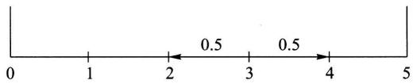  
图13-3

由上例可知当  $i, j \neq 0, 5$  时， $p_{i(i+1)} = p_{i(i-1)} = 0.5$ ，当  $|i-j| \neq 1$  时， $p_{ij} = 0$ .  $i = 0$  或  $i = 5$  对应甲方或乙方输光，从而  $X_t$  不再游动. 因此  $p_{00} = 1, p_{55} = 1$ . 再由(1.2)式知当  $i \neq 0$  时， $p_{0i} = 0$ ，当  $i \neq 5$  时， $p_{5i} = 0$ . 于是  $X_t$  的一步转移概率矩阵为

$$
\boldsymbol {P} = \left[ \begin{array}{c c c c c c} 1 & 0 & 0 & 0 & 0 & 0 \\ 0. 5 & 0 & 0. 5 & 0 & 0 & 0 \\ 0 & 0. 5 & 0 & 0. 5 & 0 & 0 \\ 0 & 0 & 0. 5 & 0 & 0. 5 & 0 \\ 0 & 0 & 0 & 0. 5 & 0 & 0. 5 \\ 0 & 0 & 0 & 0 & 0 & 1 \end{array} \right]. \tag {1.5}
$$

例4（排队模型）设服务系统由一个服务员和只可容纳两个人的等候室组成(图13-4). 规则是先到先服务, 后来者需在等候室依次排队. 如系统内已有三个顾客(一个正在接受服务, 两个在等候室里排队), 再到来的顾客就会离开. 设时间间隔  $\Delta t$  内有一个顾客进入系统的概率为  $q$ , 如有顾客在服务中则其被服务完毕离开系统的概率为  $p$ . 又设在这个时间区间里不可能有多于一个顾客进入或离开系统. 再设有无顾客来到与服务是否完毕是相互独立的.

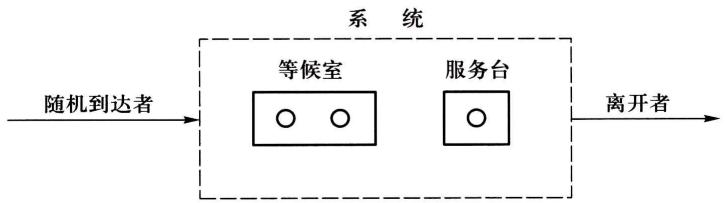  
图13-4

用  $X_{t}$  表示时间区间  $((t - 1)\Delta t, t\Delta t]$  中系统内的顾客数. 则  $X_{t}$  为一时齐马尔可夫链，其状态空间为  $\{0, 1, 2, 3\}$ . 下面来计算其一步转移概率.

由  $q$  的定义可见  $p_{00} = 1 - q, p_{01} = q$ . 由于不能有两个以上顾客进出系统，当  $|i - j| > 1$  时， $p_{ij} = 0$ . 稍加思考我们可以看到  $p_{10} = p_{21} = p_{32}$ ，因为它们都代表系

统中有一个顾客接受服务后离开并且没有新顾客进入系统，这个概率为  $p(1 - q)$  类似地  $p_{23} = p_{12} = q(1 - p)$  .较为复杂的是  $p_{11} = p_{22}$  .有两种情况可以维持系统中人数不变：（1）正在接受服务的顾客没有离开，并且没有新顾客进入系统.（2）当前接受服务的顾客结束服务离开，并有一个新顾客进入系统，于是总概率为  $pq + (1 - p)(1 - q)$  .一步转移概率  $p_{33}$  稍有不同，因为系统中已有3个顾客，所以当无顾客离开系统时不能有新顾客进入，  $p_{33} = pq + (1 - p)$  .综合起来该系统的一步转移概率矩阵为

$$
\boldsymbol {P} = \left[ \begin{array}{c c c c} 1 - q & q & 0 & 0 \\ p (1 - q) & p q + (1 - p) (1 - q) & q (1 - p) & 0 \\ 0 & p (1 - q) & p q + (1 - p) (1 - q) & q (1 - p) \\ 0 & 0 & p (1 - q) & p q + (1 - p) \end{array} \right]. \tag {1.6}
$$

在实际问题中一步转移概率可通过统计试验确定. 下面看一实例：

例5（估计一步转移概率）某计算机机房的一台计算机经常出故障. 研究者每隔  $15\mathrm{min}$  观察一次计算机的运行状态，收集了  $24\mathrm{h}$  的数据（共作97次观察). 用1表示正常状态，用0表示不正常状态，所得的数据序列如下：

$$
\begin{array}{l} 1 1 1 0 0 1 0 0 1 1 1 1 1 1 1 0 0 1 1 1 1 0 1 1 1 1 1 1 0 0 1 1 1 1 1 1 1 1 0 0 0 1 1 0 1 1 0 1 \\ 1 1 1 0 1 1 0 1 1 0 1 0 1 1 1 0 1 1 1 0 1 1 1 0 1 1 1 1 1 0 0 1 1 0 1 1 1 1 1 0 0 1 1 \\ \end{array}
$$

设  $X_{t}$  为第  $t(t = 1,2,\dots ,97)$  个时段的计算机状态，可以认为它是一个时齐马尔可夫链，状态空间  $I = \{0,1\}$  .数据给出96次状态转移的情况是

$0 \rightarrow 0, 8$  次；  $0 \rightarrow 1, 18$  次；  $1 \rightarrow 0, 18$  次；  $1 \rightarrow 1, 52$  次.

因此一步转移概率可用频率近似地表示为

$$
\begin{array}{l} p _ {0 0} = P \left\{X _ {t + 1} = 0 \mid X _ {t} = 0 \right\} \approx \frac {8}{8 + 1 8} = \frac {8}{2 6}, \\ p _ {0 1} = P \left\{X _ {t + 1} = 1 \mid X _ {t} = 0 \right\} \approx \frac {1 8}{8 + 1 8} = \frac {1 8}{2 6}, \tag {1.7} \\ p _ {1 0} = P \left\{X _ {t + 1} = 0 \mid X _ {t} = 1 \right\} \approx \frac {1 8}{1 8 + 5 2} = \frac {1 8}{7 0}, \\ p _ {1 1} = P \left\{X _ {t + 1} = 1 \mid X _ {t} = 1 \right\} \approx \frac {5 2}{1 8 + 5 2} = \frac {5 2}{7 0}. \\ \end{array}
$$

例6(续例5）如果已知计算机在某一时段  $(15\mathrm{min})$  的状态为0.问接下来计算机能连续工作  $45\mathrm{min}$  (3个时段)的概率有多大？

解 把已知状态为 0 的时段作为初始时段, 则所要求的概率为  $P\{X_{1} = 1, X_{2} = 1, X_{3} = 1 \mid X_{0} = 0\}$ . 由乘法公式、马尔可夫性和时齐性可以算出

$$
\begin{array}{l} P \left\{X _ {1} = 1, X _ {2} = 1, X _ {3} = 1 \mid X _ {0} = 0 \right\} \\ = P \left\{X _ {1} = 1 \mid X _ {0} = 0 \right\} P \left\{X _ {2} = 1 \mid X _ {1} = 1 \right\} P \left\{X _ {3} = 1 \mid X _ {2} = 1 \right\} \\ = p _ {0 1} p _ {1 1} p _ {1 1} = \frac {1 8}{2 6} \cdot \frac {5 2}{7 0} \cdot \frac {5 2}{7 0} = 0. 3 8 2. \\ \end{array}
$$

# § 2 多步转移概率的确定

例1在§1例5中如果设初始时段的状态为0,我们想知道15min到30min的时间段里计算机正常工作的概率,则需要计算P{X2=1|X0=0}.这是一个两步转移概率,它的计算需要考虑中间项X1的状态.当X0=0时,X1有两种可能,X1=0或X1=1.因此计算P{X2=1|X0=0}必须考虑这两条不同的路径,从而

$$
\begin{array}{l} P \left\{X _ {2} = 1 \mid X _ {0} = 0 \right\} \\ = P \left\{X _ {2} = 1 \mid X _ {1} = 1 \right\} P \left\{X _ {1} = 1 \mid X _ {0} = 0 \right\} + P \left\{X _ {2} = 1 \mid X _ {1} = 0 \right\} P \left\{X _ {1} = 0 \mid X _ {0} = 0 \right\} \\ = p _ {0 1} p _ {1 1} + p _ {0 0} p _ {0 1} = \frac {1 8}{2 6} \cdot \frac {5 2}{7 0} + \frac {8}{2 6} \cdot \frac {1 8}{2 6} = 0. 7 2 7. \\ \end{array}
$$

上例中涉及的多步转移概率也出现在许多其他问题中. 我们先给出下述定义:

定义（  $n$  步转移概率）设  $\{X_{t},t = 0,1,\dots \}$  为马尔可夫链，条件概率

$$
p _ {i j} (t, t + n) = P \left\{X _ {t + n} = j \mid X _ {t} = i \right\}
$$

称为马尔可夫链  $X_{t}$  在时刻  $t$  处于状态  $i$  的条件下经过  $n$  步转移到达状态  $j$  的转移概率.

若  $X_{t}$  为时齐的，则  $p_{ij}(t,t + n)$  与  $t$  无关！将  $p_{ij}(t,t + n)$  记作  $p_{ij}(n)$ ，相应的  $n$  步转移概率矩阵  $(p_{ij}(n))$  记作  $\mathbf{P}(n)$ 。

对于时齐马尔可夫链，上例中的方法同样可以用来计算多步转移概率。这就是著名的科尔莫戈罗夫一切普曼(Kolmogorov-Chapman)方程

$$
p _ {i j} (n + m) = \sum_ {k = 0} ^ {\infty} p _ {i k} (n) p _ {k j} (m), \quad i, j = 0, 1, 2, \dots , \tag {2.1}
$$

写成矩阵形式就是

$$
\boldsymbol {P} (n + m) = \boldsymbol {P} (n) \boldsymbol {P} (m). \tag {2.2}
$$

由此递推可见

$$
\boldsymbol {P} (n) = \boldsymbol {P P} (n - 1) = \boldsymbol {P} ^ {n}. \tag {2.3}
$$

也就是说时齐马尔可夫链的  $n$  步转移概率矩阵是一步转移概率矩阵的  $n$  次方.

接着，我们来研究马尔可夫链的有限维分布.设  $I$  为自然数的一个集合，它

表示马尔可夫链  $X_{t}, t = 0,1,\dots$  的状态空间.记

$$
p _ {j} (0) = P \left\{X _ {0} = j \right\}, \quad j \in I,
$$

称它为  $X_{t}$  的初始分布.再看  $X_{t}$  在任一时刻  $_n$  的一维分布

$$
p _ {j} (n) = P \left\{X _ {n} = j \right\}, \quad j \in I. \tag {2.4}
$$

显然，作为概率分布  $\sum_{j = 0}^{\infty}p_j(n) = 1.$  又有

$$
P \{X _ {n} = j \} = \sum_ {i = 1} ^ {\infty} P \{X _ {n} = j \mid X _ {0} = i \} P \{X _ {0} = i \},
$$

或

$$
p _ {j} (n) = \sum_ {i = 0} ^ {\infty} p _ {i} (0) p _ {i j} (n). \tag {2.5}
$$

如果我们用行向量

$$
\boldsymbol {p} (n) = \left(p _ {0} (n), p _ {1} (n), \dots , p _ {j} (n), \dots\right) \tag {2.6}
$$

来表示  $X_{t}$  在时刻  $n$  的一维分布，利用矩阵乘法（ $I$  是可列无限集时，仍用有限阶矩阵乘法的规则确定矩阵之积的元素），可以把(2.5)式写作

$$
\boldsymbol {p} (n) = \boldsymbol {p} (0) \boldsymbol {P} (n). \tag {2.7}
$$

换句话说，时齐马尔可夫链  $X_{t}$  在任一时刻  $n$  的一维分布由它的初始分布和  $n$  步转移概率矩阵所确定.

对于任意  $m$  个时刻  $t_1, t_2, \dots, t_m$  以及状态  $n_1, n_2, \dots, n_m \in I$ , 时齐马尔可夫链  $X_t$  的  $m$  维分布为

$$
\begin{array}{l} P \left\{X _ {t _ {1}} = n _ {1}, X _ {t _ {2}} = n _ {2}, \dots , X _ {t _ {m}} = n _ {m} \right\} \\ = P \left\{X _ {t _ {1}} = n _ {1} \right\} P \left\{X _ {t _ {2}} = n _ {2} \mid X _ {t _ {1}} = n _ {1} \right\} \dots P \left\{X _ {t _ {m}} = n _ {m} \mid X _ {t _ {m - 1}} = n _ {m - 1} \right\} \\ = p _ {n _ {1}} \left(t _ {1}\right) p _ {n _ {1} n _ {2}} \left(t _ {2} - t _ {1}\right) \dots p _ {n _ {m - 1} n _ {m}} \left(t _ {m} - t _ {m - 1}\right). \tag {2.8} \\ \end{array}
$$

结合(2.5)和(2.8)式可知：时齐马尔可夫链的有限维分布同样地完全由初始分布和转移概率矩阵所确定。总之，转移概率矩阵决定了马尔可夫链的统计规律。

例2设  $X_{n}$  是具有三个状态  $\{0,1,2\}$  的时齐马尔可夫链，其一步转移概率矩阵为

$$
\boldsymbol {P} = \left[ \begin{array}{l l l} 3 / 4 & 1 / 4 & 0 \\ 1 / 4 & 1 / 2 & 1 / 4 \\ 0 & 3 / 4 & 1 / 4 \end{array} \right], \tag {2.9}
$$

初始分布为  $p_i(0) = P\{X_0 = i\} = 1 / 3, i = 0, 1, 2.$  试求（1） $P\{X_0 = 0, X_2 = 1\}$ . (2)  $P\{X_2 = 1\}$ .

解 这里关键是二步转移概率矩阵

$$
\boldsymbol {P} (2) = \boldsymbol {P} ^ {2} = \left[ \begin{array}{l l l} 5 / 8 & 5 / 1 6 & 1 / 1 6 \\ 5 / 1 6 & 1 / 2 & 3 / 1 6 \\ 3 / 1 6 & 9 / 1 6 & 1 / 4 \end{array} \right]. \tag {2.10}
$$

利用  $P(2)$  容易算出：

$$
\begin{array}{l} P \left\{X _ {0} = 0, X _ {2} = 1 \right\} = P \left\{X _ {0} = 0 \right\} P \left\{X _ {2} = 1 \mid X _ {0} = 0 \right\} \tag {1} \\ = p _ {0} (0) p _ {0 1} (2) = \frac {1}{3} \cdot \frac {5}{1 6} = \frac {5}{4 8}. \\ \end{array}
$$

(2)

$$
\begin{array}{l} P \{X _ {2} = 1 \} = p _ {0} (0) p _ {0 1} (2) + p _ {1} (0) p _ {1 1} (2) + p _ {2} (0) p _ {2 1} (2) \\ = \frac {1}{3} \left(\frac {5}{1 6} + \frac {1}{2} + \frac {9}{1 6}\right) = \frac {1 1}{2 4}. \\ \end{array}
$$

例3在§1例1中,(1)设p=0.9,求系统经二级传输后的传真率与三级传输后的误码率.(2)设初始分布p(0)=P{X0=1} = α,p(0)=P{X0=0}=1-α.又已知系统经n级传输后输出为1,问原发字符也是1的概率是多少?

解 回答这些问题的关键是计算  $n$  步转移概率矩阵  $\pmb{P}(n) = \pmb{P}^{n}$ . 由于

$$
\boldsymbol {P} = \left[ \begin{array}{l l} p & q \\ q & p \end{array} \right] \quad (q = 1 - p)
$$

有相异的特征值  $\lambda_1 = 1, \lambda_2 = p - q$ ，由线性代数知识， $\pmb{P}$  与对角矩阵

$$
\boldsymbol {D} = \left[ \begin{array}{c c} \lambda_ {1} & 0 \\ 0 & \lambda_ {2} \end{array} \right] = \left[ \begin{array}{c c} 1 & 0 \\ 0 & p - q \end{array} \right]
$$

相似. 求出对应的特征向量

$$
\boldsymbol {v} _ {1} = \left[ \begin{array}{c} 1 / \sqrt {2} \\ 1 / \sqrt {2} \end{array} \right], \quad \boldsymbol {v} _ {2} = \left[ \begin{array}{c} - 1 / \sqrt {2} \\ 1 / \sqrt {2} \end{array} \right].
$$

再令

$$
\boldsymbol {H} = \left[ \boldsymbol {v} _ {1}, \boldsymbol {v} _ {2} \right] = \left[ \begin{array}{c c} 1 / \sqrt {2} & - 1 / \sqrt {2} \\ 1 / \sqrt {2} & 1 / \sqrt {2} \end{array} \right],
$$

则  $P = HDH^{-1}$  .于是，容易算出

$$
\begin{array}{l} \boldsymbol {P} ^ {n} = (\boldsymbol {H} \boldsymbol {D} \boldsymbol {H} ^ {- 1}) ^ {n} = \boldsymbol {H} \boldsymbol {D} ^ {n} \boldsymbol {H} ^ {- 1} \\ = \left[ \begin{array}{l l} \frac {1}{2} + \frac {1}{2} (p - q) ^ {n} & \frac {1}{2} - \frac {1}{2} (p - q) ^ {n} \\ \frac {1}{2} - \frac {1}{2} (p - q) ^ {n} & \frac {1}{2} + \frac {1}{2} (p - q) ^ {n} \end{array} \right]. \tag {2.11} \\ \end{array}
$$

（1）由(2.11)式可知，当  $p = 0.9$  时，系统经二级传输后的传真率与三级传输后的误码率分别为

$$
p _ {1 1} (2) = p _ {0 0} (2) = \frac {1}{2} + \frac {1}{2} (0. 9 - 0. 1) ^ {2} = 0. 8 2 0,
$$

$$
p _ {1 0} (3) = p _ {0 1} (3) = \frac {1}{2} - \frac {1}{2} (0. 9 - 0. 1) ^ {3} = 0. 2 4 4.
$$

（2）根据贝叶斯公式，当已知系统经  $n$  级传输后输出为1时，原发字符也是1的概率为

$$
\begin{array}{l} P \left\{X _ {0} = 1 \mid X _ {n} = 1 \right\} = \frac {P \left\{X _ {0} = 1 \right\} P \left\{X _ {n} = 1 \mid X _ {0} = 1 \right\}}{P \left\{X _ {n} = 1 \right\}} \\ = \frac {p _ {1} (0) p _ {1 1} (n)}{p _ {0} (0) p _ {0 1} (n) + p _ {1} (0) p _ {1 1} (n)} \\ = \frac {\alpha + \alpha (p - q) ^ {n}}{1 + (2 \alpha - 1) (p - q) ^ {n}}. \\ \end{array}
$$

# § 3 遍 历 性

上两小节我们从一步转移概率开始进而讨论了多步转移概率. 一个很自然想到的问题是当步数趋向无穷时转移概率会如何变化. 先看一个简单的例子.

例1（两个状态的马尔可夫链）对于一般的两个状态的马尔可夫链，一步转移概率矩阵为

$$
\boldsymbol {P} = \left[ \begin{array}{c c} 1 - a & a \\ b & 1 - b \end{array} \right] \quad (0 <   a, b <   1).
$$

和 §2 例3类似,可以算出  $n$  步转移概率矩阵为

$$
\begin{array}{l} \boldsymbol {P} (n) = \boldsymbol {P} ^ {n} = \left[ \begin{array}{l l} p _ {0 0} (n) & p _ {0 1} (n) \\ p _ {1 0} (n) & p _ {1 1} (n) \end{array} \right] \tag {3.1} \\ = \frac {1}{a + b} \left[ \begin{array}{l l} b & a \\ b & a \end{array} \right] + \frac {(1 - a - b) ^ {n}}{a + b} \left[ \begin{array}{c c} a & - a \\ - b & b \end{array} \right], \quad n = 1, 2, \dots . \\ \end{array}
$$

于是  $n$  步转移概率具有极限

$$
\lim  _ {n \rightarrow \infty} p _ {0 0} (n) = \lim  _ {n \rightarrow \infty} p _ {1 0} (n) = \frac {b}{a + b} \text {记 成} \pi_ {0},
$$

$$
\lim  _ {n \rightarrow \infty} p _ {0 1} (n) = \lim  _ {n \rightarrow \infty} p _ {1 1} (n) = \frac {a}{a + b} \stackrel {\text {记 成}} {=} \pi_ {1}.
$$

上述极限的意义是：对于固定的状态  $j$ ，不管链在某一时刻从什么状态出发，通过长时间转移，到达状态  $j$  的概率都趋近于  $\pi_j$ ，这就是所谓的遍历性。又由于  $\pi_0 + \pi_1 = 1$ ，所以行向量  $(\pi_0, \pi_1) = \pi$  构成一分布律，称为该链的极限分布。另外，如果我们能用其他简便的方法直接求得极限分布  $\pi$ ，则反过来，当  $n \gg 1$  时，

就可得到  $n$  步转移概率的近似值  $p_{ij}(n) \approx \pi_j$ .

定义（遍历性）设时齐马尔可夫链的状态空间为  $I$  ，若对于所有  $i,j\in I$  ，转移概率  $p_{ij}(n)$  存在极限

$$
\pi_ {j} = \lim  _ {n \rightarrow \infty} p _ {i j} (n),
$$

则称此链具有遍历性. 又若  $\sum_{j} \pi_{j} = 1$ ，则同时称行向量  $\pi = (\pi_{0}, \pi_{1}, \dots)$  为该链的极限分布.

时齐马尔可夫链在什么条件下才具有遍历性？如何求出它的极限分布？这些问题在理论上已经圆满解决，但详述这一理论需要较多篇幅.下面仅就只有有限个状态的链，即有限链的遍历性给出一个充分条件.

定理（遍历性的充分条件）设时齐马尔可夫链  $\{X_{t}, t \geqslant 0\}$  的状态空间为  $I = \{0,1,2,\dots,N\}$ ,  $\pmb{P}$  是它的一步转移概率矩阵，如果存在正整数  $m$  ，使对任意  $i,j \in I$  ，都有

$$
p _ {i j} (m) > 0, \quad i, j \in I, \tag {3.2}
$$

则此链具有遍历性. 而且其极限分布  $\pi = (\pi_0, \pi_1, \dots, \pi_N)$  是矩阵方程

$$
\boldsymbol {\pi} = \boldsymbol {\pi} \boldsymbol {P} \tag {3.3}
$$

或即

$$
\pi_ {j} = \sum_ {i = 0} ^ {N} \pi_ {i} p _ {i j}, \quad j = 0, 1, 2, \dots , N \tag {3.4}
$$

的满足条件

$$
\pi_ {j} > 0, \sum_ {j = 0} ^ {N} \pi_ {j} = 1 \tag {3.5}
$$

的唯一解.

证明略.

依照定理，为证明有限链是遍历的，只需找到正整数  $m$  ，使得  $m$  步转移概率矩阵  $\pmb{P}^{m}$  无零元.而求极限分布  $\pi$  的问题，则归结为求解(3.3)和(3.5).

在上述定理的条件下，马尔可夫链的极限分布同时也是它的平稳分布。也就是说，若用  $\pi$  作为链的初始分布，即  $p(0) = \pi$ ，则该链在任一时刻  $t$  的分布  $p(t)$  永远与  $\pi$  一致。这是因为由（3.3）式，有

$$
\boldsymbol {p} (t) = \boldsymbol {p} (0) \boldsymbol {P} (t) = \pi \boldsymbol {P} ^ {t} = \pi \boldsymbol {P} ^ {t - 1} = \dots = \pi \boldsymbol {P} = \pi .
$$

例2 我们来说明带有两个反射壁的随机游动是遍历的，并求其极限分布（平稳分布）.有两个反射壁的随机游动类似 §1 例3，见图13-3.差别在于当  $X_{t}$  到达反射壁0或5时停留或被反射的概率各为  $1 / 2$  .于是  $X_{t}$  的一步转移概率矩阵为

$$
\mathbf {P} = \left[ \begin{array}{l l l l l l} 0. 5 & 0. 5 & 0 & 0 & 0 & 0 \\ 0. 5 & 0 & 0. 5 & 0 & 0 & 0 \\ 0 & 0. 5 & 0 & 0. 5 & 0 & 0 \\ 0 & 0 & 0. 5 & 0 & 0. 5 & 0 \\ 0 & 0 & 0 & 0. 5 & 0 & 0. 5 \\ 0 & 0 & 0 & 0 & 0. 5 & 0. 5 \end{array} \right]. \tag {3.6}
$$

为简便计，以符号  $\times$  来代表转移概率矩阵的正元素.于是由上面的一步转移概率矩阵  $\pmb{P}$  得

$$
\begin{array}{l} \boldsymbol {P} (2) = \boldsymbol {P} ^ {2} = \left[ \begin{array}{c c c c c c} \times & \times & 0 & 0 & 0 & 0 \\ \times & 0 & \times & 0 & 0 & 0 \\ 0 & \times & 0 & \times & 0 & 0 \\ 0 & 0 & \times & 0 & \times & 0 \\ 0 & 0 & 0 & \times & 0 & \times \\ 0 & 0 & 0 & 0 & \times & \times \end{array} \right] \left[ \begin{array}{c c c c c c} \times & \times & 0 & 0 & 0 & 0 \\ \times & 0 & \times & 0 & 0 & 0 \\ 0 & \times & 0 & \times & 0 & 0 \\ 0 & 0 & \times & 0 & \times & 0 \\ 0 & 0 & 0 & \times & \times & \times \\ 0 & 0 & 0 & 0 & \times & \times \end{array} \right] \\ = \left[ \begin{array}{c c c c c c} \times & \times & \times & 0 & 0 & 0 \\ \times & \times & 0 & \times & 0 & 0 \\ \times & 0 & \times & 0 & \times & 0 \\ 0 & \times & 0 & \times & 0 & \times \\ 0 & 0 & \times & 0 & \times & \times \\ 0 & 0 & 0 & \times & \times & \times \end{array} \right], \\ \boldsymbol {P} (4) = \boldsymbol {P} (2) \boldsymbol {P} (2) = \left[ \begin{array}{c c c c c c} \times & \times & \times & 0 & 0 & 0 \\ \times & \times & 0 & \times & 0 & 0 \\ \times & 0 & \times & 0 & \times & 0 \\ 0 & \times & 0 & \times & 0 & \times \\ 0 & 0 & \times & 0 & \times & \times \\ 0 & 0 & 0 & \times & \times & \times \end{array} \right] \left[ \begin{array}{c c c c c c} \times & \times & \times & 0 & 0 & 0 \\ \times & \times & 0 & \times & 0 & 0 \\ \times & 0 & \times & 0 & \times & 0 \\ 0 & \times & 0 & \times & 0 & \times \\ 0 & 0 & \times & 0 & x & x \\ 0 & 0 & 0 & x & x & x \end{array} \right] \\ = \left[ \begin{array}{c c c c c c} \times & \times & \times & \times & \times & 0 \\ \times & \times & \times & \times & 0 & \times \\ \times & \times & \times & 0 & \times & \times \\ \times & \times & 0 & \times & \times & \times \\ \times & 0 & \times & \times & \times & \times \\ 0 & \times & \times & \times & \times & \times \end{array} \right], \\ \end{array}
$$

$$
\begin{array}{l} \boldsymbol {P} (5) = \boldsymbol {P} (4) \boldsymbol {P} = \left[ \begin{array}{c c c c c c} \times & \times & \times & \times & \times & 0 \\ \times & \times & \times & \times & 0 & \times \\ \times & \times & \times & 0 & \times & \times \\ \times & \times & 0 & \times & \times & \times \\ \times & 0 & \times & \times & \times & \times \\ 0 & \times & \times & \times & \times & \times \end{array} \right] \left[ \begin{array}{c c c c c c} \times & \times & 0 & 0 & 0 & 0 \\ \times & 0 & \times & 0 & 0 & 0 \\ 0 & \times & 0 & \times & 0 & 0 \\ 0 & 0 & \times & 0 & \times & 0 \\ 0 & 0 & 0 & \times & 0 & \times \\ 0 & 0 & 0 & 0 & \times & \times \end{array} \right] \\ = \left[ \begin{array}{c c c c c c} \times & \times & \times & \times & \times & \times \\ \times & \times & \times & \times & \times & \times \\ \times & \times & \times & \times & \times & \times \\ \times & \times & \times & \times & \times & \times \\ \times & \times & \times & \times & \times & \times \\ \times & \times & \times & \times & \times & \times \end{array} \right], \\ \end{array}
$$

即  $\pmb{P}(5)$  无零元. 由上述定理可知带有两个反射壁的随机游动是遍历的. 再根据(3.3)和(3.5)式，写出极限分布  $\pi = (\pi_0, \pi_1, \pi_2, \dots, \pi_5)$  满足的方程组

$$
\begin{array}{l} \pi_ {0} = 0. 5 \left(\pi_ {0} + \pi_ {1}\right), \\ \pi_ {1} = 0. 5 \left(\pi_ {0} + \pi_ {2}\right), \\ \pi_ {2} = 0. 5 \left(\pi_ {1} + \pi_ {3}\right), \\ \pi_ {3} = 0. 5 \left(\pi_ {2} + \pi_ {4}\right), \\ \pi_ {4} = 0. 5 \left(\pi_ {3} + \pi_ {5}\right), \\ \pi_ {5} = 0. 5 \left(\pi_ {4} + \pi_ {5}\right), \\ 1 = \pi_ {0} + \pi_ {1} + \pi_ {2} + \pi_ {3} + \pi_ {4} + \pi_ {5}. \\ \end{array}
$$

先由前6个方程解得  $\pi_0 = \pi_1 = \pi_2 = \pi_3 = \pi_4 = \pi_5$  .将它们代入归一条件（即最后一个方程），得极限分布为  $\pi = (1 / 6,1 / 6,1 / 6,1 / 6,1 / 6,1 / 6)$  □

例3 再来研究 §1 例4中排队模型的遍历性. 由(1.6)式给出的一步转移概率矩阵  $\pmb{P}$  可算得  $P(3) = P^3$  无零元. 由本节定理知排队模型是遍历的. 其极限分布  $\pi = (\pi_0, \pi_1, \pi_2, \pi_3)$  满足方程组

$$
\left\{ \begin{array}{l} \pi_ {0} = (1 - q) \pi_ {0} + p (1 - q) \pi_ {1}, \\ \pi_ {1} = q \pi_ {0} + [ p q + (1 - p) (1 - q) ] \pi_ {1} + p (1 - q) \pi_ {2}, \\ \pi_ {2} = q (1 - p) \pi_ {1} + [ p q + (1 - p) (1 - q) ] \pi_ {2} + p (1 - q) \pi_ {3}, \\ \pi_ {3} = q (1 - p) \pi_ {2} + [ p q + (1 - p) ] \pi_ {3}, \\ \pi_ {0} + \pi_ {1} + \pi_ {2} + \pi_ {3} = 1. \end{array} \right.
$$

解之，得唯一解

$$
\begin{array}{l} \pi_ {0} = p ^ {3} (1 - q) ^ {3} / C, \quad \pi_ {1} = p ^ {2} q (1 - q) ^ {2} / C, \\ \pi_ {2} = p q ^ {2} (1 - q) (1 - p) / C, \quad \pi_ {3} = q ^ {3} (1 - p) ^ {2} / C, \\ \end{array}
$$

其中  $C = p^3 (1 - q)^3 +p^2 q(1 - q)^2 +pq^2 (1 - q)(1 - p) + q^3 (1 - p)^2$

假若此例中，  $p = q = 1 / 2$  ，则可算得极限分布  $\pi = (1 / 7,2 / 7,2 / 7,2 / 7)$  .这告诉我们经过相当长一段时间后，系统中无人的情形约占  $14\%$  的时间，而系统中有一人、二人、三人的情形约各占  $29\%$  的时间. □

例4（无遍历性）并非所有马尔可夫链都具有遍历性.设一马尔可夫链的一步转移概率矩阵为

$$
\boldsymbol {P} = \left[ \begin{array}{c c c c} 0 & 1 / 2 & 0 & 1 / 2 \\ 1 / 2 & 0 & 1 / 2 & 0 \\ 0 & 1 / 2 & 0 & 1 / 2 \\ 1 / 2 & 0 & 1 / 2 & 0 \end{array} \right],
$$

试讨论它的遍历性.

解 容易算得

$$
\boldsymbol {P} (2) = \boldsymbol {P} ^ {2} = \left[ \begin{array}{c c c c} 1 / 2 & 0 & 1 / 2 & 0 \\ 0 & 1 / 2 & 0 & 1 / 2 \\ 1 / 2 & 0 & 1 / 2 & 0 \\ 0 & 1 / 2 & 0 & 1 / 2 \end{array} \right].
$$

进一步可以验证：当  $n$  为奇数时， $P(n) = P(1) = P; n$  为偶数时， $P(n) = P(2)$ . 这表明对任一固定的  $j = 1, 2, 3, 4$  ，极限  $\lim_{n\to \infty}p_{ij}(n)$  都不存在. 因此此链不具遍历性.

# 小结

马尔可夫链的主要特征是马氏性. 通俗地说就是将来的状态只与其现在的状态有关, 而不依赖于它过去的状态. 本章主要讨论有平稳转移概率的马尔可夫链, 即转移概率与时间无关, 这样的马尔可夫链称为时齐的. 它的性质完全由其一步转移概率矩阵  $\pmb{P}$  决定.

接下来我们讨论了多步转移概率.这里的主要工具是科尔莫戈罗夫一切普曼方程.作为特例，时齐马尔可夫链的  $n$  步转移概率矩阵  $\pmb {P}(n) = \pmb{P}^{n}$  ，即是其一步转移概率矩阵的  $n$  次方.转移概率矩阵的重要性在于时齐马尔可夫链的有限维分布同样地完全由初始分布和转移概率矩阵所确定.因而，转移概率矩阵决定了马尔可夫链的统计规律.

如果时齐马尔可夫链的  $n$  步转移概率矩阵  $\pmb{P}(n)$  当  $n$  增加时趋向一个固定的极限, 则称该链具有遍历性. 在 §3 定理中我们给出了时齐马尔可夫链具有遍历性的一个充分条件. 在此充分条件下马尔可夫链的极限分布  $\pi$  与平稳分布相同, 并可方便地通过矩阵方程  $\pi = \pi \pmb{P}$  与归一条件解出.

# 重要术语及主题

马尔可夫链 马氏性（无后效性）状态空间 时齐性 转移概率 转移概率矩阵 科尔莫戈罗夫一切普曼方程 遍历性 极限分布 平稳分布

# 习题

1. 从数  $1,2,\dots ,N$  中任取一数，记为  $X_{1}$  ；再从  $1,2,\dots ,X_{1}$  中任取一数，记为  $X_{2}$  ；如此继续，从  $1,2,\dots ,X_{n - 1}$  中任取一数，记为  $X_{n}$  .说明  $\{X_{n},n\geqslant 1\}$  构成一时齐马尔可夫链，并写出它的状态空间和一步转移概率矩阵.

2. 设  $X_0 = 1, X_1, X_2, \dots, X_n, \dots$  是相互独立且都以概率  $p(0 < p < 1)$  取值 1，以概率  $q = 1 - p$  取值 0 的随机变量序列。令  $S_n = \sum_{k=0}^{n} X_k$ 。证明  $\{S_n, n \geqslant 0\}$  构成一马尔可夫链，并写出它的状态空间和一步转移概率矩阵。

3. (传染模型) 考虑某种传染病在  $N$  个人中传染, 假设

（1）在每个单位时间内此  $N$  个人中恰有两人互相接触，且一切成对的接触是等可能的.

（2）当健康人与患者接触时，被传染上的概率是  $\alpha$

（3）患者康复的概率为0，健康人如不与患者接触，得病的概率也是0.

以  $X_{n}$  表示第  $n$  个单位时间内的患者人数.试说明这种传染过程，即  $\{X_{n}, n \geqslant 0\}$  是一马尔可夫链，并写出它的状态空间和一步转移概率矩阵.

4. 设马尔可夫链  $\{X_{n}, n \geqslant 0\}$  的状态空间为  $I = \{1,2,3\}$ ，初始分布为  $p_1(0) = 1/4, p_2(0) = 1/2, p_3(0) = 1/4$ ，一步转移概率矩阵为

$$
\boldsymbol {P} = \left[ \begin{array}{c c c} 1 / 4 & 3 / 4 & 0 \\ 1 / 3 & 1 / 3 & 1 / 3 \\ 0 & 1 / 4 & 3 / 4 \end{array} \right].
$$

（1）计算  $P\{X_0 = 1, X_1 = 2, X_2 = 2\}$  
（2）证明  $P\{X_1 = 2,X_2 = 2\mid X_0 = 1\} = p_{12}p_{22}$  
（3）计算  $p_{12}(2) = P\{X_2 = 2 \mid X_0 = 1\}$ .  
（4）计算  $p_2(2) = P\{X_2 = 2\}$

5. 说明如何得到 §1 例 4 中的转移概率  $p_{23}$  和  $p_{34}$ .

6. 用 §1 例 4 中转移概率  $p_{ij} (i \neq j)$  导出转移概率  $p_{ii}$ .

7. 证明公式(3.1).

8. 设任意相继的两天中，雨天转晴天的概率为  $1/3$ ，晴天转雨天的概率为  $1/2$ ，任一天晴或雨互为逆事件，以0表示晴天状态，以1表示雨天状态， $X_{n}$  表示第  $n$  天的状态(0或1). 试写出马尔可夫链  $\{X_{n}, n \geqslant 1\}$  的一步转移概率矩阵. 又若已知5月1日为晴天，问5月3日为晴天，5月5日为雨天的概率各等于多少？

9. 在一计算系统中，每一循环具有误差的概率取决于先前一个循环是否有误差。以0表示误差状态，以1表示无误差状态。设状态的一步转移概率矩阵为

$$
\boldsymbol {P} = \left[ \begin{array}{c c} 0. 7 5 & 0. 2 5 \\ 0. 5 & 0. 5 \end{array} \right],
$$

试证明相应的时齐马尔可夫链具有遍历性，并求其极限分布.

（1）用定义解.

（2）利用遍历性定理解

10. 设时齐马尔可夫链的一步转移概率矩阵为

$$
\boldsymbol {P} = \left[ \begin{array}{c c c} q & p & 0 \\ q & 0 & p \\ 0 & q & p \end{array} \right], \quad q = 1 - p, \quad p \in (0, 1).
$$

试证明此链具有遍历性，并求其极限分布，

11. 设时齐马尔可夫链的一步转移概率矩阵为

$$
\boldsymbol {P} = \left[ \begin{array}{c c c} 1 / 2 & 1 / 2 & 0 \\ 1 / 2 & 1 / 2 & 0 \\ 0 & 0 & 1 \end{array} \right],
$$

试证明此链不具有遍历性.

# 第十四章 平稳随机过程

平稳随机过程是其概率性质在时间平移下不变的随机过程. 这一思想抓住了没有固定时空起点的物理系统中的最自然的现象, 因而有着广泛的应用. 本章着重在二阶矩过程的范围内讨论平稳随机过程的各态历经性、相关函数和功率谱密度函数以及它们的性质.

# § 1 平稳随机过程的概念

平稳性是指随机过程  $X(t), t \in T = (-\infty, \infty)$  的统计特性不随时间的推移而变化. 严格地说这就要求对于任意正整数  $n, t_1, t_2, \dots, t_n, \tau \in T, n$  维随机变量

$(X(t_{1}),X(t_{2}),\dots ,X(t_{n}))$  和  $(X(t_{1} + \tau),X(t_{2} + \tau),\dots ,X(t_{n} + \tau))$  (1.1)

具有相同的分布函数. 我们称这样的随机过程为严平稳随机过程, 简称严平稳过程. 注意这里要求参数集  $T = (-\infty, \infty)$  是为了对任何  $t_1, t_2, \dots, t_n \in T$ , 它们在时间平移  $\tau$  以后依然有  $t_1 + \tau, t_2 + \tau, \dots, t_n + \tau \in T$ . 当然, 只要相应的  $\tau$  能满足以上要求,  $T$  也可以取  $[0, \infty), \{0, \pm 1, \pm 2, \dots\}$  或  $\{0, 1, 2, \dots\}$ .

判别一个随机过程的严平稳性需要知道其所有有限维分布，这是不易办到的。在实际问题中常用的是

定义（平稳过程）给定二阶矩过程  $\{X(t), t \in T\}$ ，如果对任意  $t, t + \tau \in T$

$$
E [ X (t) ] = \mu_ {X} (\text {常 数}),
$$

$$
E [ X (t) X (t + \tau) ] = R _ {X} (\tau) \tag {1.2}
$$

不依赖于  $t$  ，则称  $\{X(t), t \in T\}$  为宽平稳随机过程或广义平稳随机过程，简称平稳过程.

另外，同时考虑两个平稳过程  $X(t)$  和  $Y(t)$  时，如果它们的互相关函数也只是时间差的单变量函数，记为  $R_{XY}(\tau)$ ，即

$$
R _ {X Y} (t, t + \tau) = E [ X (t) Y (t + \tau) ] = R _ {X Y} (\tau) \tag {1.3}
$$

与  $t$  无关，那么我们称  $X(t)$  和  $Y(t)$  是平稳相关的，或称这两个过程是联合平稳的.

易见，上一章中的泊松过程和维纳过程都是平稳过程.下面再举两个例子.

例1（随机相位周期过程）设  $s(t)$  是一周期为  $T$  的函数， $\Theta$  是在  $(0, T)$  上服从均匀分布的随机变量，称  $X(t) = s(t + \Theta)$  为随机相位周期过程。试讨论它的平稳性。

解 由假设， $\Theta$  的概率密度为

$$
f (\theta) = \left\{ \begin{array}{l l} {1 / T,} & {\theta \in (0, T),} \\ {0,} & {\text {其 他}.} \end{array} \right.
$$

于是，  $X(t)$  的均值函数为

$$
\begin{array}{l} E [ X (t) ] = E [ s (t + \Theta) ] \\ = \int_ {0} ^ {T} s (t + \theta) \frac {1}{T} d \theta = \frac {1}{T} \int_ {t} ^ {t + T} s (\varphi) d \varphi . \\ \end{array}
$$

利用  $s(\varphi)$  的周期性可知

$$
E [ X (t) ] = \frac {1}{T} \int_ {0} ^ {T} s (\varphi) d \varphi
$$

是常数. 而自相关函数

$$
\begin{array}{l} R _ {X} (t, t + \tau) = E [ s (t + \Theta) s (t + \tau + \Theta) ] \\ = \int_ {0} ^ {T} s (t + \theta) s (t + \tau + \theta) \frac {1}{T} d \theta = \frac {1}{T} \int_ {t} ^ {t + T} s (\varphi) s (\varphi + \tau) d \varphi . \\ \end{array}
$$

同样, 利用  $s(\varphi)s(\varphi + \tau)$  的周期性, 可知自相关函数仅与  $\tau$  有关. 所以随机相位周期过程是平稳的. 特别, 第十二章 §2 例 2 中的随机相位正弦波是平稳的. □

例2（随机电报信号）信号  $X(t)$  由只取  $I$  或  $-I$  的电流给出（图14-1画出了  $X(t)$  的一条样本曲线），这里

$$
P \{X (t) = I \} = P \{X (t) = - I \} = 1 / 2.
$$

而正负号在区间  $(t, t + \tau)$  内变化的次数  $N(t, t + \tau)$  是随机的，且假设  $N(t, t + \tau)$  服从泊松分布，亦即事件

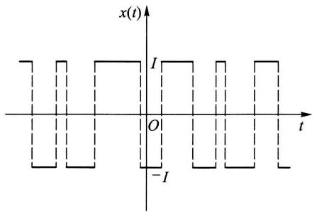  
图14-1

$$
A _ {k} = \{N (t, t + \tau) = k \}
$$

的概率为

$$
P (A _ {k}) = \frac {(\lambda \tau) ^ {k}}{k !} \mathrm {e} ^ {- \lambda \tau}, \quad k = 0, 1, 2, \dots ,
$$

其中  $\lambda > 0$  是单位时间内变号次数的数学期望. 试讨论  $X(t)$  的平稳性.

解 显然,  $E[X(t)] = 0$ . 现在来计算  $R_X(t,t + \tau) = E[X(t)X(t + \tau)]$ . 先设  $\tau > 0$ , 注意到如果电流在  $(t,t + \tau)$  内变号偶数次, 则  $X(t)$  和  $X(t + \tau)$  同号且乘积为  $I^2$ ; 如果变号奇数次, 则乘积为  $-I^2$ . 因为事件

$$
\{X (t) X (t + \tau) = I ^ {2} \}
$$

的概率为  $P(A_0) + P(A_2) + P(A_4) + \dots$  ，而事件

$$
\{X (t) X (t + \tau) = - I ^ {2} \}
$$

的概率为  $P(A_{1}) + P(A_{3}) + P(A_{5}) + \dots$  ，于是

$$
\begin{array}{l} R _ {X} (t, t + \tau) = E [ X (t) X (t + \tau) ] = I ^ {2} \sum_ {k = 0} ^ {\infty} P (A _ {2 k}) - I ^ {2} \sum_ {k = 0} ^ {\infty} P (A _ {2 k + 1}) \\ = I ^ {2} \mathrm {e} ^ {- \lambda \tau} \sum_ {k = 0} ^ {\infty} \frac {(- \lambda \tau) ^ {k}}{k !} = I ^ {2} \mathrm {e} ^ {- 2 \lambda \tau}. \\ \end{array}
$$

注意，上述结果与  $t$  无关.若  $\tau < 0$  ，只需令  $s = t + \tau$  ，则有

$$
R _ {X} (t, t + \tau) = R _ {X} (s, s - \tau) = I ^ {2} \mathrm {e} ^ {2 \lambda \tau}.
$$

故这一过程的自相关函数

$$
R _ {X} (t, t + \tau) \stackrel {\text {记 成}} {=} R _ {X} (\tau) = I ^ {2} \mathrm {e} ^ {- 2 \lambda | \tau |}
$$

只与  $\tau$  有关.其图形如图14-2所示.因此，随机电报信号是一平稳过程

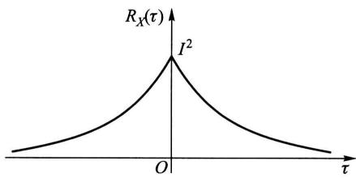  
图14-2

# § 2 各态历经性

本节主要讨论根据试验记录确定平稳过程的均值和自相关函数的理论依据和方法.

首先注意，如果按照数学期望的定义来计算平稳过程  $X(t)$  的数字特征，就需要预先确定  $X(t)$  的一族样本函数或一维、二维分布函数，但这实际上是不易办到的。事实上，即使我们用统计试验方法，例如可以把均值和自相关函数近似地表示为

$$
\mu_ {X} \approx \frac {1}{N} \sum_ {k = 1} ^ {N} x _ {k} (t _ {1}),
$$

$$
R _ {X} (t _ {2} - t _ {1}) \approx \frac {1}{N} \sum_ {k = 1} ^ {N} x _ {k} (t _ {1}) x _ {k} (t _ {2}),
$$

那也需要对一个平稳过程重复进行大量观察，以便获得数量很多的一族样本函数  $x_{k}(t), k = 1,2,\dots ,N$  ，而这正是实际困难所在.

但是，平稳过程的统计特性是不随时间的推移而变化的，于是我们自然期望在一个很长时间内观察得到的一个样本曲线，可以作为得到这个过程的数字特征的充分依据。本节给出的各态历经定理将证实：对平稳过程而言，只要满足一些较宽的条件，那么集平均（均值和自相关函数等）实际上可以用一个样本函数在整个时间轴上的平均值来代替。这样，在解决实际问题时就节约了大量的工作量。

在叙述各态历经性之前，我们先简要地介绍往后多处要遇到的有关随机过程积分的概念.

给定二阶矩过程  $\{X(t), t \in T\}$ ，如果它的每一个样本函数在  $[a, b] \subset T$  上的积分都存在，我们就说随机过程  $X(t)$  在  $[a, b]$  上的积分存在，并记为

$$
Y = \int_ {a} ^ {b} X (t) \mathrm {d} t. \tag {2.1}
$$

显然， $Y$  是一随机变量.

但是，在某些情形下，对于随机过程的所有样本函数来说，在  $[a,b]$  上的积分未必全都存在.此时，引入所谓均方意义上的积分，即考虑  $[a,b]$  内的一组分点

$$
a = t _ {0} <   t _ {1} <   t _ {2} <   \dots <   t _ {n} = b,
$$

且记

$$
\Delta t _ {i} = t _ {i} - t _ {i - 1}, \quad \tau_ {i} \in [ t _ {i - 1}, t _ {i} ], \quad i = 1, 2, \dots , n,
$$

如果有满足

$$
\lim  _ {\max  \Delta t _ {i} \rightarrow 0} E \left\{\left[ Y - \sum_ {i = 1} ^ {n} X (\tau_ {i}) \Delta t _ {i} \right] ^ {2} \right\} = 0
$$

的随机变量  $Y$  存在，则称  $Y$  为  $X(t)$  在  $[a,b]$  上的均方积分①，并仍以符号(2.1)记之.可以证明：二阶矩过程  $X(t)$  在  $[a,b]$  上的均方积分存在的充分条件是自相关函数的二重积分，即

$$
\int_ {a} ^ {b} \int_ {a} ^ {b} R _ {X} (s, t) d s d t
$$

存在. 而且此时还有

$$
E (Y) = \int_ {a} ^ {b} E [ X (t) ] \mathrm {d} t \tag {2.2}
$$

成立. 就是说, 过程  $X(t)$  的积分均值等于过程的均值函数的积分.

现在引入随机过程  $X(t)$  沿整个时间轴上的两种时间平均

$$
\langle X (t) \rangle = \lim  _ {T \rightarrow \infty} \frac {1}{2 T} \int_ {- T} ^ {T} X (t) d t \tag {2.3}
$$

和

$$
\langle X (t) X (t + \tau) \rangle = \lim  _ {T \rightarrow \infty} \frac {1}{2 T} \int_ {- T} ^ {T} X (t) X (t + \tau) d t, \tag {2.4}
$$

分别称为随机过程  $X(t)$  的时间均值和时间相关函数. 我们可以沿用高等数学中的方法求积分和极限, 其结果一般来说是随机的.

以下讨论时间平均与集平均之间的关系. 先看一个例子.

例（随机相位正弦波）计算随机相位正弦波  $X(t) = a\cos (\omega t + \Theta)$  的时间均值  $\langle X(t)\rangle$  和时间相关函数  $\langle X(t)X(t + \tau)\rangle$

解  $\langle X(t)\rangle = \lim_{T\to \infty}\frac{1}{2T}\int_{-T}^{T}a\cos (\omega t + \Theta)\mathrm{d}t = \lim_{T\to \infty}\frac{a\cos\Theta\sin\omega T}{\omega T} = 0,$

$$
\langle X (t) X (t + \tau) \rangle = \lim  _ {T \rightarrow \infty} \frac {1}{2 T} \int_ {- T} ^ {T} a ^ {2} \cos (\omega t + \Theta) \cos [ \omega (t + \tau) + \Theta ] d t = \frac {a ^ {2}}{2} \cos \omega \tau .
$$

与第十二章§2例2比较可知

$$
\mu_ {X} = E [ X (t) ] = \langle X (t) \rangle ,
$$

$$
R _ {X} (\tau) = E \left[ X (t) X (t + \tau) \right] = \langle X (t) X (t + \tau) \rangle .
$$

这表明对于随机相位正弦波，用时间平均与集平均分别算得的均值和自相关函数是相等的。这一特性并不是随机相位正弦波所独有的。下面引入一般概念。

定义（各态历经性）设  $X(t)$  是一平稳过程

$1^{\circ}$  如果

$$
\langle X (t) \rangle = E [ X (t) ] = \mu_ {X} \tag {2.5}
$$

以概率1成立，则称过程  $X(t)$  的均值具有各态历经性

$2^{\circ}$  如果对任意实数  $\tau$

$$
\langle X (t) X (t + \tau) \rangle = E [ X (t) X (t + \tau) ] = R _ {X} (\tau) \tag {2.6}
$$

以概率1成立，则称过程  $X(t)$  的自相关函数具有各态历经性.特别当  $\tau = 0$  时，称均方值具有各态历经性.

$3^{\circ}$  如果  $X(t)$  的均值和自相关函数都具有各态历经性，则称  $X(t)$  是各态历经过程，或者说  $X(t)$  是各态历经的.

定义中“以概率1成立”是对  $X(t)$  的所有样本函数而言的.

各态历经性也称遍历性. 按定义, 上例中的随机相位正弦波是各态历经过程. 当然, 并不是任意一个平稳过程都具有各态历经性. 例如平稳过程

$$
X (t) = Y,
$$

其中  $Y$  是方差异于零的随机变量，就不是各态历经过程。事实上， $\langle X(t) \rangle = \langle Y \rangle = Y$ ，亦即时间均值随  $Y$  取不同可能值而不同。因  $Y$  的方差异于零，这样  $\langle X(t) \rangle$  就不可能以概率1等于常数  $E[X(t)] = E(Y)$ 。

一个平稳过程应该满足怎样的条件才是各态历经的呢？下面两个定理从理论上回答了这个问题.

定理1（均值各态历经定理）平稳过程  $X(t)$  的均值具有各态历经性的充要条件是

$$
\lim  _ {T \rightarrow \infty} \frac {1}{T} \int_ {0} ^ {2 T} \left(1 - \frac {\tau}{2 T}\right)\left[ R _ {X} (\tau) - \mu_ {X} ^ {2} \right] d \tau = 0. \tag {2.7}
$$

证 先计算  $\langle X(t) \rangle$  的均值与方差. 由(2.3)式

$$
E [ \langle X (t) \rangle ] = E \left[ \lim  _ {T \rightarrow \infty} \frac {1}{2 T} \int_ {- T} ^ {T} X (t) d t \right],
$$

交换极限与期望的运算顺序，并注意到  $E[X(t)] = \mu_X$  ，即有

$$
E [ \langle X (t) \rangle ] = \lim  _ {T \rightarrow \infty} \frac {1}{2 T} \int_ {- T} ^ {T} E [ X (t) ] d t = \mu_ {X}.
$$

而  $\langle X(t) \rangle$  的方差为

$$
\begin{array}{l} D \left[ \langle X (t) \rangle \right] = E \left\{\left[ \langle X (t) \rangle - \mu_ {X} \right] ^ {2} \right\} \\ = \lim  _ {T \rightarrow \infty} E \left\{\left[ \frac {1}{2 T} \int_ {- T} ^ {T} X (t) d t \right] ^ {2} \right\} - \mu_ {X} ^ {2} \\ = \lim  _ {T \rightarrow \infty} E \left[ \frac {1}{4 T ^ {2}} \int_ {- T} ^ {T} X (t _ {1}) d t _ {1} \int_ {- T} ^ {T} X (t _ {2}) d t _ {2} \right] - \mu_ {X} ^ {2} \\ = \lim  _ {T \rightarrow \infty} \frac {1}{4 T ^ {2}} \int_ {- T} ^ {T} \int_ {- T} ^ {T} E [ X (t _ {1}) X (t _ {2}) ] d t _ {1} d t _ {2} - \mu_ {X} ^ {2}, \\ \end{array}
$$

由  $X(t)$  的平稳性， $E[X(t_1)X(t_2)] = R_X(t_2 - t_1)$ ，上式可改写为

$$
D [ \langle X (t) \rangle ] = \lim  _ {T \rightarrow \infty} \frac {1}{4 T ^ {2}} \int_ {- T} ^ {T} \int_ {- T} ^ {T} R _ {X} \left(t _ {2} - t _ {1}\right) d t _ {1} d t _ {2} - \mu_ {X} ^ {2}. \tag {2.8}
$$

为了简化上式右端的积分，引入变量变换  $\tau_{1} = t_{1} + t_{2}$  和  $\tau_{2} = t_{2} - t_{1}$ . 此变换的雅可比(Jacobi)式是

$$
\left| \frac {\partial \left(t _ {1} , t _ {2}\right)}{\partial \left(\tau_ {1} , \tau_ {2}\right)} \right| = \frac {1}{2},
$$

而积分区域转化为  $D = \{(\tau_1,\tau_2)\mid -2T\leqslant \tau_1\pm \tau_2\leqslant 2T\}$  .于是(2.8)式中的二重积分用新变量可表示为

$$
\int_ {- T} ^ {T} \int_ {- T} ^ {T} R _ {X} \left(t _ {2} - t _ {1}\right) \mathrm {d} t _ {1} \mathrm {d} t _ {2} = \iint_ {D} R _ {X} \left(\tau_ {2}\right) \frac {1}{2} \mathrm {d} \tau_ {1} \mathrm {d} \tau_ {2}. \tag {2.9}
$$

注意到被积函数  $R_{X}(\tau_{2})$  是  $\tau_{2}$  的偶函数，且与  $\tau_{1}$  无关，因而积分值为在区域  $G = \{(\tau_1,\tau_2)\mid \tau_1,\tau_2\geqslant 0,\tau_1 + \tau_2\leqslant 2T\}$  （如图14一3所示）上积分值的4倍，即

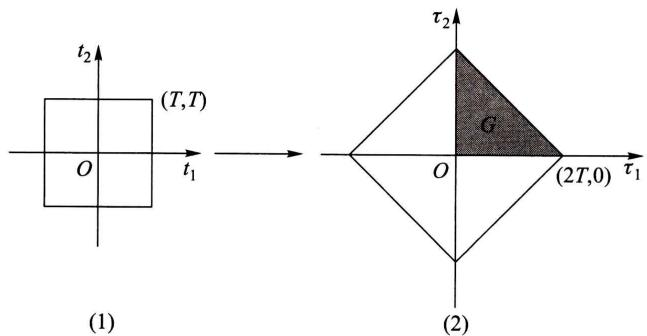  
图14-3

$$
\begin{array}{l} \int_ {- T} ^ {T} \int_ {- T} ^ {T} R _ {X} \left(t _ {2} - t _ {1}\right) d t _ {1} d t _ {2} = 4 \iint_ {G} R _ {X} \left(\tau_ {2}\right) \frac {1}{2} d \tau_ {1} d \tau_ {2} \\ = 2 \int_ {0} ^ {2 T} d \tau_ {2} \int_ {0} ^ {2 T - \tau_ {2}} R _ {X} (\tau_ {2}) d \tau_ {1} = 2 \int_ {0} ^ {2 T} (2 T - \tau) R _ {X} (\tau) d \tau . \\ \end{array}
$$

把这个式子代入(2.8)式就有

$$
\begin{array}{l} D \left[ \langle X (t) \rangle \right] = \lim  _ {T \rightarrow \infty} \frac {1}{T} \int_ {0} ^ {2 T} \left(1 - \frac {\tau}{2 T}\right) R _ {X} (\tau) d \tau - \mu_ {X} ^ {2} \\ = \lim  _ {T \rightarrow \infty} \frac {1}{T} \int_ {0} ^ {2 T} \left(1 - \frac {\tau}{2 T}\right)\left[ R _ {X} (\tau) - \mu_ {X} ^ {2} \right] d \tau . \tag {2.10} \\ \end{array}
$$

由第四章§2方差的性质4°知道⟨X(t)⟩=E[⟨X(t)⟩]以概率1成立的充要条件是D[⟨X(t)⟩]=0.结合(2.10)式,定理得证. □

推论 在  $\lim_{\tau \to \infty} R_X(\tau)$  存在的条件下，若  $\lim_{\tau \to \infty} R_X(\tau) = \mu_X^2$  ，则(2.7)式成立，均值具有各态历经性；若  $\lim_{\tau \to \infty} R_X(\tau) \neq \mu_X^2$  ，则(2.7)式不成立，均值不具有各态历经性。（证略。）

注意，对前例中的随机相位正弦波而言，  $\lim_{\tau \to \infty}R_X(\tau)$  不存在，但它的均值具有各态历经性.

在定理1的证明中将  $X(t)$  换成  $X(t)X(t + \tau)$ ，就可得

定理2（自相关函数各态历经定理）平稳过程  $X(t)$  的自相关函数  $R_{X}(\tau)$  具有各态历经性的充要条件是

$$
\lim  _ {T \rightarrow \infty} \frac {1}{T} \int_ {0} ^ {2 T} \left(1 - \frac {\tau_ {1}}{2 T}\right)\left[ B \left(\tau_ {1}\right) - R _ {X} ^ {2} (\tau) \right] d \tau_ {1} = 0, \tag {2.11}
$$

其中  $B(\tau_1) = E[X(t)X(t + \tau)X(t + \tau_1)X(t + \tau +\tau_1)]$

在(2.11)式中令  $\tau = 0$  ，就可得到均方值具有各态历经性的充要条件.如若在定理2中以  $X(t)Y(t + \tau)$  代替  $X(t)X(t + \tau)$  ，以  $R_{XY}(\tau)$  代替  $R_{X}(\tau)$  来进行讨论，那么还可以相应地得到互相关函数各态历经性的充要条件.

在实际应用中通常只考虑定义在  $t \in [0, \infty)$  上的平稳过程，此时上面的所有时间平均都应以  $t \in [0, \infty)$  上的时间平均来代替，而相应的各态历经定理可表示为下述形式：

定理3（均值各态历经定理）

$$
\lim  _ {T \rightarrow \infty} \frac {1}{T} \int_ {0} ^ {T} X (t) d t = E [ X (t) ] = \mu_ {X}
$$

以概率1成立的充要条件是

$$
\lim  _ {T \rightarrow \infty} \frac {1}{T} \int_ {0} ^ {T} \left(1 - \frac {\tau}{T}\right)\left[ R _ {X} (\tau) - \mu_ {X} ^ {2} \right] d \tau = 0. \tag {2.12}
$$

定理4（自相关函数各态历经定理）

$$
\lim  _ {T \rightarrow \infty} \frac {1}{T} \int_ {0} ^ {T} X (t) X (t + \tau) d t = E [ X (t) X (t + \tau) ] = R _ {X} (\tau)
$$

以概率1成立的充要条件是

$$
\lim  _ {T \rightarrow \infty} \frac {1}{T} \int_ {0} ^ {T} \left(1 - \frac {\tau_ {1}}{T}\right)\left[ B \left(\tau_ {1}\right) - R _ {X} ^ {2} (\tau) \right] d \tau_ {1} = 0. \tag {2.13}
$$

各态历经定理的重要价值在于它从理论上给出了如下保证：一个平稳过程  $X(t), t \in [0, \infty)$ ，只要它满足条件(2.12)和(2.13)，便可以根据“以概率1成立”的含义，从一次试验所得到的样本函数  $x(t)$  来确定出该过程的均值和自相关函数，即

$$
\lim  _ {T \rightarrow \infty} \frac {1}{T} \int_ {0} ^ {T} x (t) d t = \mu_ {X} \tag {2.14}
$$

和

$$
\lim  _ {T \rightarrow \infty} \frac {1}{T} \int_ {0} ^ {T} x (t) x (t + \tau) d t = R _ {X} (\tau). \tag {2.15}
$$

这就是本节开头所预告的论断.

如果试验记录  $x(t)$  只在时间区间  $[0, T]$  上给出，则相应于(2.14)和(2.15)式，有以下无偏估计式：

$$
\mu_ {X} \approx \hat {\mu} _ {X} = \frac {1}{T} \int_ {0} ^ {T} x (t) \mathrm {d} t \tag {2.16}
$$

和

$$
\begin{array}{l} R _ {X} (\tau) \approx \hat {R} _ {X} (\tau) = \frac {1}{T - \tau} \int_ {0} ^ {T - \tau} x (t) x (t + \tau) d t \\ = \frac {1}{T - \tau} \int_ {\tau} ^ {T} x (t) x (t - \tau) d t, \quad 0 \leqslant \tau <   T. \tag {2.17} \\ \end{array}
$$

不过在实际问题中一般不可能给出  $x(t)$  的表达式，因而通常通过模拟方法或数值计算方法来进行估计.

最后指出，各态历经定理的条件是比较宽的，应用中遇到的大多数平稳过程都能够满足。不过，要去验证它们是否成立却是十分困难的。因此在实践中，通常事先假定所研究的平稳过程具有各态历经性，并从这个假定出发，对相关资料进行分析和处理，看所得的结论是否与实际相符。如果不符，则要修改假设，另作处理。

# § 3 相关函数的性质

在第十二章中已经指出，用数字特征来描绘随机过程，要比用分布函数来描绘随机过程更为简便实用。由上节的分析看到，对于具有各态历经性的平稳过程，其均值和相关函数可以用一个样本函数来估计。在这种场合下，利用均值和相关函数来研究随机过程更方便。特别是对于正态平稳过程，它的均值和相关函数能完全地刻画其统计特性。为了方便地使用数字特征去研究随机过程，下面的定理给出了相关函数的主要性质。

定理（相关函数的性质）设  $X(t)$  和  $Y(t)$  是平稳相关过程， $R_{X}(\tau), R_{Y}(\tau), R_{XY}(\tau)$  分别是它们的自相关函数和互相关函数. 则

$$
1 ^ {\circ} R _ {X} (0) = E \left[ X ^ {2} (t) \right] = \Psi_ {X} ^ {2} \geqslant 0.
$$

$2^{\circ} R_{X}(-\tau) = R_{X}(\tau)$ , 即  $R_{X}(\tau)$  是偶函数. 而互相关函数既不是偶函数也不是奇函数, 但满足  $R_{XY}(-\tau) = R_{YX}(\tau)$ .

$3^{\circ}$  自相关函数和自协方差函数满足不等式

$$
\left| R _ {X} (\tau) \right| \leqslant R _ {X} (0), \quad \left| C _ {X} (\tau) \right| \leqslant C _ {X} (0) = \sigma_ {X} ^ {2}.
$$

$4^{\circ} R_{X}(\tau)$  是非负定的，即对任意数组  $t_1, t_2, \dots, t_n \in T$  和任意实函数  $g(t)$  都有

$$
\sum_ {i, j = 1} ^ {n} R _ {X} \left(t _ {i} - t _ {j}\right) g \left(t _ {i}\right) g \left(t _ {j}\right) \geqslant 0.
$$

$5^{\circ}$  如果平稳过程  $X(t)$  满足条件  $P\{X(t + T_0) = X(t)\} = 1$  ，则称它为周期是

$T_{0}$  的平稳过程.这样的平稳过程的自相关函数也是周期为  $T_{0}$  的周期函数

证  $1^{\circ}$  和  $2^{\circ}$  可由定义直接推出. 结合柯西一施瓦茨不等式、自相关函数和自协方差函数的定义就可得到  $3^{\circ}$ . 根据自相关函数的定义和均值的运算性质, 即有

$$
\begin{array}{l} \sum_ {i, j = 1} ^ {n} R _ {X} \left(t _ {i} - t _ {j}\right) g \left(t _ {i}\right) g \left(t _ {j}\right) = \sum_ {i, j = 1} ^ {n} E \left[ X \left(t _ {i}\right) X \left(t _ {j}\right) \right] g \left(t _ {i}\right) g \left(t _ {j}\right) \\ = E \left[ \sum_ {i, j = 1} ^ {n} X \left(t _ {i}\right) X \left(t _ {j}\right) g \left(t _ {i}\right) g \left(t _ {j}\right) \right] \\ = E \left\{\left[ \sum_ {i = 1} ^ {n} X \left(t _ {i}\right) g \left(t _ {i}\right) \right] ^ {2} \right\} \geqslant 0. \\ \end{array}
$$

这就证明了  $4^{\circ}$ . 最后来证明  $5^{\circ}$ . 由平稳性,  $E[X(t) - X(t + T_0)] = 0$ . 又由第四章 §2 方差的性质, 条件  $P\{X(t + T_0) = X(t)\} = 1$  与  $E\{[X(t + T_0) - X(t)]^2\} = 0$  等价. 于是, 由柯西一施瓦茨不等式,

$$
\{E [ X (t) (X (t + \tau + T _ {0}) - X (t + \tau)) ] \} ^ {2} \leqslant E [ X ^ {2} (t) ] E \{[ X (t + \tau + T _ {0}) - X (t + \tau) ] ^ {2} \}
$$

右端为零，推知

$$
E \{X (t) [ X (t + \tau + T _ {0}) - X (t + \tau) ] \} = 0,
$$

展开即得  $R_{X}(\tau +T_{0}) = R_{X}(\tau)$

在下节中将看到  $R_{X}(0)$  表示平稳过程  $X(t)$  的“平均功率”. 由性质  $2^{\circ}$ , 在实际问题中只需计算或测量  $R_{X}(\tau), R_{Y}(\tau), R_{XY}(\tau)$  和  $R_{YX}(\tau)$  在  $\tau \geqslant 0$  的值.

性质  $3^{\circ}$  表明自相关函数（自协方差函数）都在  $\tau = 0$  处取最大值①.类似地，可以推出以下有关互相关函数和互协方差函数的不等式：

$$
\left| R _ {X Y} (\tau) \right| ^ {2} \leqslant R _ {X} (0) R _ {Y} (0), \quad \left| C _ {X Y} (\tau) \right| ^ {2} \leqslant C _ {X} (0) C _ {Y} (0).
$$

在应用上常用的还有标准自协方差函数和标准互协方差函数，它们的定义为

$$
\rho_ {X} (\tau) = \frac {C _ {X} (\tau)}{C _ {X} (0)}, \quad \rho_ {X Y} (\tau) = \frac {C _ {X Y} (\tau)}{\sqrt {C _ {X} (0) C _ {Y} (0)}}.
$$

由上述不等式知： $\left|\rho_{X}(\tau)\right| \leqslant 1$  和  $\left|\rho_{XY}(\tau)\right| \leqslant 1.$  且当  $\rho_{XY}(\tau) = 0$  时， $X(t)$  和  $Y(t)$  不相关.

对于平稳过程而言，自相关函数的非负定性是最本质的。因为理论上可以证明：任一连续函数，只要具有非负定性，就必为某平稳过程的自相关函数。

另外，在实际中各种具有零均值的非周期性噪声和干扰一般当  $|\tau|$  值适当

增大时，  $X(t + \tau)$  和  $X(t)$  即呈现独立或不相关，于是有

$$
\lim  _ {\tau \rightarrow \infty} R _ {X} (\tau) = \lim  _ {\tau \rightarrow \infty} C _ {X} (\tau) = 0.
$$

下面是一个应用例子.

例（噪声与信号）设某接收机输出电压  $V(t)$  是周期信号  $S(t)$  和噪声电压  $N(t)$  之和，即

$$
V (t) = S (t) + N (t).
$$

又设  $S(t)$  和  $N(t)$  是两个互不相关(实际问题中一般都是如此)的各态历经过程, 且  $E[N(t)] = 0$ . 根据第十二章 §2(2.12)式,  $V(t)$  的自相关函数应为

$$
R _ {V} (\tau) = R _ {S} (\tau) + R _ {N} (\tau).
$$

由性质  $5^{\circ}, R_{S}(\tau)$  是周期函数，又因为一般噪声电压  $N(t)$  当  $|\tau|$  值适当增大时， $N(t + \tau)$  和  $N(t)$  即呈现独立或不相关，即有

$$
\lim  _ {\tau \rightarrow \infty} R _ {N} (\tau) = 0.
$$

于是，对于充分大的  $\tau$  值有

$$
R _ {V} (\tau) \approx R _ {S} (\tau).
$$

作为特例，假设接收机输出电压中周期信号和噪声电压的自相关函数分别为

$$
R _ {S} (\tau) = \frac {a ^ {2}}{2} \cos \tau \omega ,
$$

$$
R _ {N} (\tau) = b ^ {2} \mathrm {e} ^ {- a | \tau |}, \quad \alpha > 0.
$$

那么即使噪声平均功率（见下节）  $R_{N}(0) = b^{2}$  远大于信号平均功率  $R_{S}(0) = a^{2} / 2$ ，当  $|\tau|$  充分大时，依然有

$$
R _ {V} (\tau) = \frac {a ^ {2}}{2} \cos \tau \omega + b ^ {2} \mathrm {e} ^ {- a | \tau |} \approx \frac {a ^ {2}}{2} \cos \tau \omega .
$$

也就是说我们可以从强噪声中检测到微弱的正弦信号（见图14-4）.

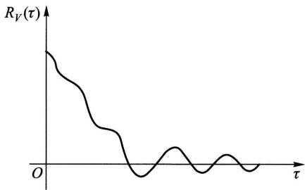  
图14-4

# § 4 平稳随机过程的功率谱密度

傅里叶(Fourier)变换是确立时间函数频率结构的有效工具，下面我们来讨论如何运用这一工具来分析平稳过程的频率结构——功率谱密度.

# （一）平稳过程的功率谱密度

设有时间函数  $x(t), t \in (-\infty, \infty)$  （为了便于理解物理术语，可把  $x(t)$  设想

为加于单位电阻上的电压). 如果  $x(t)$  的总能量有限, 即

$$
\int_ {- \infty} ^ {\infty} x ^ {2} (t) \mathrm {d} t <   \infty , \tag {4.1}
$$

那么， $x(t)$  的傅里叶变换存在或者说具有频谱

$$
F _ {x} (\omega) = \int_ {- \infty} ^ {\infty} x (t) \mathrm {e} ^ {- \mathrm {i} \omega t} \mathrm {d} t.
$$

且同时有傅里叶逆变换

$$
x (t) = \frac {1}{2 \pi} \int_ {- \infty} ^ {\infty} F _ {x} (\omega) \mathrm {e} ^ {\mathrm {i} \omega t} \mathrm {d} \omega .
$$

$F_{x}(\omega)$  一般是复函数，其共轭函数为  $F_{x}^{*}(\omega) = F_{x}(-\omega)$ . 在  $x(t)$  和  $F_{x}(\omega)$  之间成立有帕塞瓦尔(Parseval)等式

$$
\int_ {- \infty} ^ {\infty} x ^ {2} (t) d t = \frac {1}{2 \pi} \int_ {- \infty} ^ {\infty} | F _ {x} (\omega) | ^ {2} d \omega ,
$$

等式左边表示  $x(t)$  在  $(-\infty, \infty)$  上的总能量，而右边的被积函数  $\left|F_x(\omega)\right|^2$  相应地称为  $x(t)$  的能谱密度。这样，帕塞瓦尔等式又可理解为总能量的谱表示式。

但是，应用中很多重要的时间函数的总能量是无限的。正弦函数就是一例。平稳过程的样本函数一般来说也是如此。这时我们转而研究  $x(t)$  在  $(-\infty, \infty)$  上的平均功率，即

$$
\lim  _ {T \rightarrow \infty} \frac {1}{2 T} \int_ {- T} ^ {T} x ^ {2} (t) d t.
$$

在以下讨论中，我们都假定这个平均功率是存在的。

为了用傅里叶变换给出平均功率的谱表示式，先由给定的  $x(t)$  构造一个截尾函数

$$
x _ {T} (t) = \left\{ \begin{array}{l l} x (t), & | t | \leqslant T, \\ 0, & | t | > T. \end{array} \right. \tag {4.2}
$$

易知  $x_{T}(t)$  满足(4.1).记  $x_{T}(t)$  的傅里叶变换为

$$
F _ {x} (\omega , T) = \int_ {- \infty} ^ {\infty} x _ {T} (t) \mathrm {e} ^ {- \mathrm {i} \omega t} \mathrm {d} t = \int_ {- T} ^ {T} x (t) \mathrm {e} ^ {- \mathrm {i} \omega t} \mathrm {d} t, \tag {4.3}
$$

并写出它的帕塞瓦尔等式

$$
\int_ {- \infty} ^ {\infty} x _ {T} ^ {2} (t) \mathrm {d} t = \frac {1}{2 \pi} \int_ {- \infty} ^ {\infty} | F _ {x} (\omega , T) | ^ {2} \mathrm {d} \omega ,
$$

将上式两边除以  $2T$  ，并利用  $x_{T}(t)$  的定义(4.2)，得

$$
\frac {1}{2 T} \int_ {- T} ^ {T} x ^ {2} (t) d t = \frac {1}{4 \pi T} \int_ {- \infty} ^ {\infty} | F _ {x} (\omega , T) | ^ {2} d \omega . \tag {4.4}
$$

令  $T \to \infty, x(t)$  在  $(-\infty, \infty)$  上的平均功率即可表示为

$$
\lim  _ {T \rightarrow \infty} \frac {1}{2 T} \int_ {- T} ^ {T} x ^ {2} (t) d t = \frac {1}{2 \pi} \int_ {- \infty} ^ {\infty} \lim  _ {T \rightarrow \infty} \frac {1}{2 T} | F _ {x} (\omega , T) | ^ {2} d \omega . \tag {4.5}
$$

类似能谱密度，我们把(4.5)式右端的被积式称作函数  $x(t)$  的平均功率谱密度，简称功率谱密度，并记为

$$
S _ {x} (\omega) = \lim  _ {T \rightarrow \infty} \frac {1}{2 T} \left| F _ {x} (\omega , T) \right| ^ {2}. \tag {4.6}
$$

而(4.5)的右端就是平均功率的谱表示式

现在我们把平均功率和功率谱密度的概念推广到平稳过程  $X(t), t \in (-\infty, \infty)$ . 为此，相应于(4.3)和(4.4)式写出

$$
F _ {X} (\omega , T) = \int_ {- T} ^ {T} X (t) \mathrm {e} ^ {- \mathrm {i} \omega t} \mathrm {d} t, \tag {4.7}
$$

和  $\frac{1}{2T}\int_{-T}^{T}X^{2}(t)\mathrm{d}t = \frac{1}{4\pi T}\int_{-\infty}^{\infty}|F_{X}(\omega ,T)|^{2}\mathrm{d}\omega .$  (4.8)

显然，(4.7)和(4.8)式中的积分都是随机的。我们将(4.8)式左端的均值的极限，即

$$
\lim  _ {T \rightarrow \infty} E \left[ \frac {1}{2 T} \int_ {- T} ^ {T} X ^ {2} (t) d t \right] \tag {4.9}
$$

定义为平稳过程  $X(t)$  的平均功率

交换(4.9)式中积分与均值的运算顺序，并注意到平稳过程的均方值是常数  $\Psi_X^2$  ，于是

$$
\lim  _ {T \rightarrow \infty} E \left[ \frac {1}{2 T} \int_ {- T} ^ {T} X ^ {2} (t) d t \right] = \lim  _ {T \rightarrow \infty} \frac {1}{2 T} \int_ {- T} ^ {T} E \left[ X ^ {2} (t) \right] d t = \Psi_ {X} ^ {2}, \tag {4.10}
$$

即平稳过程的平均功率等于该过程的均方值或  $R_{X}(0)$

接着，把(4.8)式的右端代入(4.10)式的左端，交换运算顺序后可得

$$
\Psi_ {X} ^ {2} = \frac {1}{2 \pi} \int_ {- \infty} ^ {\infty} \lim  _ {T \rightarrow \infty} \frac {1}{2 T} E [ | F _ {X} (\omega , T) | ^ {2} ] d \omega . \tag {4.11}
$$

相应于(4.5)，(4.6)式，我们把(4.11)式中的被积式称为平稳过程  $X(t)$  的平均功率谱密度，简称为功率谱密度，并记为  $S_{XX}(\omega)$  或  $S_{X}(\omega)$ ，即

$$
S _ {X} (\omega) = \lim  _ {T \rightarrow \infty} \frac {1}{2 T} E [ | F _ {X} (\omega , T) | ^ {2} ]. \tag {4.12}
$$

利用记号  $S_{X}(\omega)$  ，(4.11)式可简写为

$$
\Psi_ {X} ^ {2} = \frac {1}{2 \pi} \int_ {- \infty} ^ {\infty} S _ {X} (\omega) d \omega , \tag {4.13}
$$

此式称为平稳过程  $X(t)$  的平均功率的谱表示式

功率谱密度  $S_{X}(\omega)$  通常也简称为自谱密度或谱密度①，它是从频率这个角度描述  $X(t)$  的统计规律的最主要的数字特征。由(4.13)式知，它的物理意义是表示  $X(t)$  的平均功率关于频率的分布。

# （二）谱密度的性质

下面的定理给出了谱密度的两个重要性质，

定理（谱密度的性质）设  $X(t), t \in (-\infty, \infty)$  为平稳过程. 则

$1^{\circ} S_{X}(\omega)$  是  $\omega$  的实的、非负的偶函数.

$2^{\circ}$  若  $X(t)$  的自相关函数  $R_{X}(\tau)$  满足  $\int_{-\infty}^{\infty}|R_X(\tau)|\mathrm{d}\tau <  \infty$  ，则它和  $S_{X}(\omega)$  构成傅里叶变换对，即

$$
S _ {X} (\omega) = \int_ {- \infty} ^ {\infty} R _ {X} (\tau) \mathrm {e} ^ {- \mathrm {i} \omega \tau} \mathrm {d} \tau , \tag {4.14}
$$

$$
R _ {X} (\tau) = \frac {1}{2 \pi} \int_ {- \infty} ^ {\infty} S _ {X} (\omega) \mathrm {e} ^ {\mathrm {i} \omega \tau} \mathrm {d} \omega . \tag {4.15}
$$

(4.14)和(4.15)式统称为维纳一辛钦（Wiener-Khinchin）公式.而且由于  $R_{X}(\tau)$  和  $S_{X}(\omega)$  都是偶函数，利用欧拉(Euler)公式，它们还可写成

$$
S _ {X} (\omega) = 2 \int_ {0} ^ {\infty} R _ {X} (\tau) \cos \omega \tau d \tau , \tag {4.16}
$$

$$
R _ {X} (\tau) = \frac {1}{\pi} \int_ {0} ^ {\infty} S _ {X} (\omega) \cos \omega \tau d \omega . \tag {4.17}
$$

证 在(4.12)式中，量

$$
\left| F _ {X} (\omega , T) \right| ^ {2} = F _ {X} (\omega , T) F _ {X} (- \omega , T)
$$

是  $\omega$  的实的、非负的偶函数，所以它的均值的极限也必是实的、非负的偶函数.这就得到  $1^{\circ}$

为证  $2^{\circ}$  ，将(4.7)代入(4.12)式，得

$$
S _ {X} (\omega) = \lim  _ {T \rightarrow \infty} \frac {1}{2 T} E \left[ \int_ {- T} ^ {T} X (t _ {1}) e ^ {i \omega t _ {1}} d t _ {1} \int_ {- T} ^ {T} X (t _ {2}) e ^ {- i \omega t _ {2}} d t _ {2} \right].
$$

把括号内的积分乘积改写成重积分形式，交换积分与均值的运算顺序，并注意到

$$
E \left[ X \left(t _ {1}\right) X \left(t _ {2}\right) \right] = R _ {X} \left(t _ {2} - t _ {1}\right),
$$

即有

$$
S _ {X} (\omega) = \lim  _ {T \rightarrow \infty} \frac {1}{2 T} \int_ {- T} ^ {T} \int_ {- T} ^ {T} E [ X (t _ {1}) X (t _ {2}) ] e ^ {- i \omega (t _ {2} - t _ {1})} d t _ {1} d t _ {2}
$$

$$
= \lim  _ {T \rightarrow \infty} \frac {1}{2 T} \int_ {- T} ^ {T} \int_ {- T} ^ {T} R _ {X} \left(t _ {2} - t _ {1}\right) \mathrm {e} ^ {- \mathrm {i} \omega \left(t _ {2} - t _ {1}\right)} \mathrm {d} t _ {1} \mathrm {d} t _ {2}.
$$

接着,依照§2定理1的证明,作变量变换τ₁=t₁+t₂,τ₂=t₂-t₁,可以得到

$$
\begin{array}{l} S _ {X} (\omega) = \lim  _ {T \rightarrow \infty} \int_ {- 2 T} ^ {2 T} \left(1 - \frac {| \tau |}{2 T}\right) R _ {X} (\tau) \mathrm {e} ^ {- \mathrm {i} \omega \tau} \mathrm {d} \tau \\ = \lim  _ {T \rightarrow \infty} \int_ {- \infty} ^ {\infty} R _ {X} ^ {T} (\tau) \mathrm {e} ^ {- \mathrm {i} \omega \tau} \mathrm {d} \tau , \tag {4.18} \\ \end{array}
$$

式中

$$
R _ {X} ^ {T} (\tau) = \left\{ \begin{array}{l l} \left(1 - \frac {| \tau |}{2 T}\right) R _ {X} (\tau), & | \tau | \leqslant 2 T, \\ 0, & | \tau | > 2 T. \end{array} \right.
$$

当  $T \to \infty$  时，注意到对每个  $\tau, R_X^T(\tau) \to R_X(\tau)$ ，于是由(4.18)式就可得到公式(4.14). 由傅里叶逆变换的公式即得(4.15)式. □

维纳一辛钦公式又称为平稳过程自相关函数的谱表示式，它们揭示了从时间角度描述平稳过程  $X(t)$  的统计规律和从频率角度描述  $X(t)$  的统计规律之间的联系。据此，在应用上我们可以根据实际情况选择时间域方法或等价的频率域方法。实际的计算可以利用傅里叶变换手册，表14-1列出了若干个常用的自相关函数以及对应的谱密度。

表14-1  

<table><tr><td></td><td>RX(τ)</td><td>SX(ω)</td></tr><tr><td>1</td><td>e-α|τ|</td><td>2a/a2+ω2</td></tr><tr><td>2</td><td>max{1-|τ|,0}</td><td>4sin2(ωT/2)/Tω2</td></tr><tr><td>3</td><td>e-α|τ|cos ω0τ</td><td>a/a2+(ω-ω0)2+a/a2+(ω+ω0)2</td></tr><tr><td>4</td><td>sin ω0τ/ω0τ</td><td>χ[-ω0,ω0] (ω)</td></tr><tr><td>5</td><td>1</td><td>2πδ(ω)</td></tr><tr><td>6</td><td>δ(τ)</td><td>1</td></tr><tr><td>7</td><td>cos ω0τ</td><td>πδ(ω-ω0)+πδ(ω+ω0)</td></tr></table>

注：  $\chi_{A}$  表示集  $A$  的特征函数，定义为  $\chi_A(\tau) = \left\{ \begin{array}{ll}1, & \tau \in A,\\ 0, & \tau \notin A. \end{array} \right.$

例1 已知平稳过程  $X(t)$  的自相关函数为

$$
R _ {X} (\tau) = \mathrm {e} ^ {- a | \tau |} \cos \omega_ {0} \tau ,
$$

求  $X(t)$  的谱密度  $S_{X}(\omega)$

解 由表14-1可直接查出

$$
S _ {X} (\omega) = \frac {a}{a ^ {2} + \left(\omega - \omega_ {0}\right) ^ {2}} + \frac {a}{a ^ {2} + \left(\omega + \omega_ {0}\right) ^ {2}}.
$$

例2 已知平稳过程  $X(t)$  的谱密度

$$
S _ {X} (\omega) = \frac {\omega^ {2} + 4}{\omega^ {4} + 1 0 \omega^ {2} + 9},
$$

求  $X(t)$  的自相关函数和均方值.

解 用查表方法. 先把  $S_{X}(\omega)$  改写成部分分式之和，即

$$
S _ {X} (\omega) = \frac {\omega^ {2} + 4}{(\omega^ {2} + 1) (\omega^ {2} + 9)} = \frac {1}{8} \left(\frac {3}{\omega^ {2} + 1 ^ {2}} + \frac {5}{\omega^ {2} + 3 ^ {2}}\right). \tag {4.19}
$$

由于傅里叶逆变换(4.15)也是线性变换，所以可对上式右端两项分别查表14-1第1栏后相加，经整理后得

$$
R _ {X} (\tau) = \frac {1}{4 8} (9 \mathrm {e} ^ {- | \tau |} + 5 \mathrm {e} ^ {- 3 | \tau |}).
$$

而均方值为

$$
\varPsi_ {X} ^ {2} = R _ {X} (0) = \frac {7}{2 4}.
$$

形如(4.19)式的谱密度属于有理谱密度.根据谱密度性质  $1^{\circ}$  ，其一般形式应为

$$
S _ {X} (\omega) = S _ {0} \frac {\omega^ {2 n} + a _ {2 n - 2} \omega^ {2 n - 2} + \cdots + a _ {0}}{\omega^ {2 m} + b _ {2 m - 2} \omega^ {2 m - 2} + \cdots + b _ {0}},
$$

式中  $S_0 > 0$ 。又由于要求均方值有限，所以由(4.13)式还应有  $m > n$ ，且分母应无实数根。有理谱密度是实用上最常见的一类谱密度。已知有理谱密度要求自相关函数，通常使用例2中的部分分式方法结合查表来进行。

另外，已知平稳过程的自相关函数的估计，由维纳一辛钦公式及数值积分就可以得到谱密度的估计.

最后需要指出的是，在实际问题中常常碰到这样一些平稳过程（例如随机相位正弦波），讨论它们的自相关函数和谐密度需要用到狄拉克(Dirac)的  $\delta$  函数，定义如下：

$$
\left\{ \begin{array}{l} \delta (t) = 0, \quad t \neq 0, \\ \int_ {- \infty} ^ {\infty} \delta (t) \mathrm {d} t = 1. \end{array} \right.
$$

通常用图14-5中的单位有向线段来表示

$\delta$  函数的最重要的性质是：对任一在  $t = 0$  连续的函数  $f(t)$  ，有

$$
\int_ {- \infty} ^ {\infty} \delta (t) f (t) d t = f (0).
$$

一般，若函数  $f(t)$  在  $t = t_0$  连续，就有（筛选性）

$$
\int_ {- \infty} ^ {\infty} \delta (t - t _ {0}) f (t) \mathrm {d} t = f (t _ {0}).
$$

据此，可以写出以下傅里叶变换对：

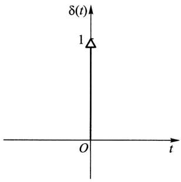  
图14-5

$$
\int_ {- \infty} ^ {\infty} \delta (\tau) e ^ {- i \omega \tau} d \tau = 1 \leftrightarrow \delta (\tau) = \frac {1}{2 \pi} \int_ {- \infty} ^ {\infty} 1 \cdot e ^ {i \omega \tau} d \omega , \tag {4.20}
$$

$$
\int_ {- \infty} ^ {\infty} \frac {1}{2 \pi} \mathrm {e} ^ {- \mathrm {i} \omega \tau} \mathrm {d} \tau = \delta (\omega) \leftrightarrow \frac {1}{2 \pi} = \frac {1}{2 \pi} \int_ {- \infty} ^ {\infty} \delta (\omega) \mathrm {e} ^ {\mathrm {i} \omega \tau} \mathrm {d} \omega . \tag {4.21}
$$

(4.21)式表明：当自相关函数  $R_{X}(\tau) = 1$  时，谱密度  $S_{X}(\omega) = 2\pi \delta (\omega)$  .其次，还可求得正弦型自相关函数  $R_{X}(\tau) = a\cos \omega_{0}\tau$  的谱密度为

$$
S _ {X} (\omega) = a \pi \left[ \delta \left(\omega - \omega_ {0}\right) + \delta \left(\omega + \omega_ {0}\right) \right]. \tag {4.22}
$$

事实上，

$$
\begin{array}{l} S _ {X} (\omega) = \int_ {- \infty} ^ {\infty} a \cos \omega_ {0} \tau \mathrm {e} ^ {- \mathrm {i} \omega \tau} \mathrm {d} \tau \\ = \frac {a}{2} \int_ {- \infty} ^ {\infty} \left(\mathrm {e} ^ {\mathrm {i} \omega_ {0} \tau} + \mathrm {e} ^ {- \mathrm {i} \omega_ {0} \tau}\right) \mathrm {e} ^ {- \mathrm {i} \omega \tau} \mathrm {d} \tau \\ = \frac {a}{2} \left[ \int_ {- \infty} ^ {\infty} \mathrm {e} ^ {- \mathrm {i} (\omega - \omega_ {0}) \tau} \mathrm {d} \tau + \int_ {- \infty} ^ {\infty} \mathrm {e} ^ {- \mathrm {i} (\omega + \omega_ {0}) \tau} \mathrm {d} \tau \right], \\ \end{array}
$$

利用变换式(4.21)即得(4.22)式

由此可见，自相关函数为常数或正弦型函数的平稳过程，其谱密度都是离散的.对应的变换可见表14-1第5,7栏.

例3 求自相关函数

$$
R _ {V} (\tau) = \frac {a ^ {2}}{2} \cos \omega_ {0} \tau + b ^ {2} e ^ {- a | \tau |}
$$

所对应的谱密度  $S_{V}(\omega)$

解利用傅里叶变换的线性性质及表14-1第1和第7栏即可知道

$$
S _ {V} (\omega) = \frac {\pi a ^ {2}}{2} \left[ \delta \left(\omega - \omega_ {0}\right) + \delta \left(\omega + \omega_ {0}\right) \right] + \frac {2 a b ^ {2}}{a ^ {2} + \omega^ {2}}.
$$

相应的谱密度如图14-6所示.此图说明了谱密度是如何表明噪声以外的周期信号的.

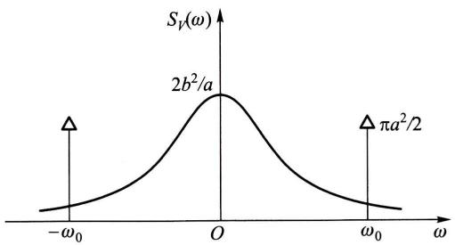  
图14-6

白噪声 均值为零而谱密度为正常数，即

$$
S _ {X} (\omega) = S _ {0} > 0, \quad \omega \in (- \infty , \infty)
$$

的平稳过程  $X(t)$  称为白噪声过程，简称白噪声.其名出于白光具有均匀的光谱由表14-1第6栏，

$$
R _ {X} (\tau) = S _ {0} \delta (\tau).
$$

由上式可知，白噪声也可以定义为均值为零、自相关函数为  $\delta$  函数的随机过程，且这个过程在  $t_1 \neq t_2$  时， $X(t_1)$  和  $X(t_2)$  是不相关的.

# 小结

本章讨论的平稳过程是指宽平稳随机过程。其特点是均值函数为常数，自相关函数只依赖于时间差。类似地，如果两个平稳过程的互相关函数只依赖于时间差，则称它们是平稳相关的。因此，判定平稳性仅涉及随机过程的均值函数、自相关函数和互相关函数等数字特征的计算。

按定义用集平均来计算随机过程的数字特征是十分困难的. 所幸的是在实际应用中常见的许多平稳过程的数字特征具有各态历经性, 也就是说这些数字特征可以用一个样本函数的时间平均来近似计算, 这为在应用中估计这些数字特征带来极大的方便.

自相关函数是平稳过程在时间域上的主要数字特征，它的傅里叶变换称为功率谱密度，是相应的随机过程在频率域上的数字特征。维纳一辛钦公式揭示了两者之间的转换关系。

# 重要术语及主题

（宽)平稳过程平稳相关时间均值和时间相关函数各态历经性各态历经性过程自相关函数互相关函数傅里叶变换功率谱密度维纳一辛钦公式白噪声

# 习题

1. 设有随机过程  $X(t) = A\cos (\omega t + \Theta), t \in (-\infty, \infty)$ ，其中  $A$  是服从瑞利分布的随机变量，其概率密度为

$$
f (a) = \left\{ \begin{array}{l l} \frac {a}{\sigma^ {2}} \mathrm {e} ^ {- \frac {a ^ {2}}{2 \sigma^ {2}}}, & a > 0, \\ 0, & a \leqslant 0. \end{array} \right.
$$

$\Theta$  是在  $(0,2\pi)$  上服从均匀分布且与  $A$  相互独立的随机变量， $\omega$  是一常数. 问  $X(t)$  是不是平稳过程？

2. 设  $X(t)$  和  $Y(t)$  是相互独立的平稳过程，试证以下随机过程也是平稳过程：

(1)  $Z_{1}(t) = X(t)Y(t)$

(2)  $Z_{2}(t) = X(t) + Y(t)$ .

3. 设  $\{X(t), t \in (-\infty, \infty)\}$  是平稳过程， $R_X(\tau)$  是其自相关函数， $a$  是常数。试问随机过程  $Y(t) = X(t + a) - X(t)$  是不是平稳过程？为什么？

4. 设  $\{N(t), t \geqslant 0\}$  是强度为  $\lambda$  的泊松过程，定义随机过程  $Y(t) = N(t + L) - N(t)$ ，其中常数  $L > 0$ 。试求  $Y(t)$  的均值函数和自相关函数，并问  $Y(t)$  是否是平稳过程？

5. 设平稳过程  $\{X(t), t \in (-\infty, \infty)\}$  的自相关函数为  $R_{X}(\tau) = \mathrm{e}^{-a|\tau|} (1 + a|\tau|)$ ，其中常数  $a > 0$ ，而  $E[X(t)] = 0$ 。试问  $X(t)$  的均值是否具有各态历经性？为什么？

6. 第1题中的随机过程  $X(t) = A\cos (\omega t + \Theta)$  是否是各态历经过程？为什么？

7.（1）设  $C_X(\tau)$  是平稳过程  $X(t)$  的协方差函数，试证若  $C_X(\tau)$  绝对可积，即

$$
\int_ {- \infty} ^ {\infty} | C _ {X} (\tau) | d \tau <   \infty ,
$$

则  $X(t)$  的均值具有各态历经性

(2) 证明本章 §1 例 1 中的随机相位周期过程  $X(t) = s(t + \Theta)$  是各态历经过程.

8. 设  $X(t)$  是随机相位周期过程, 题 8 图表示它的一个样本函数  $x(t)$ , 其中周期  $T$  和波幅  $A$  都是常数; 而相位  $t_0$  是在  $(0, T)$  上服从均匀分布的随机变量.

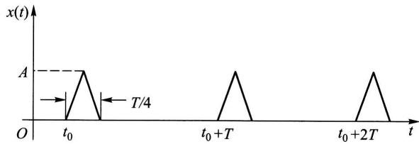  
题8图

（1）求  $\mu_X, \Psi_X^2$

（2）求  $\langle X(t)\rangle$  和  $\langle X^2 (t)\rangle$

9. 设平稳过程  $X(t)$  的自相关函数为  $R_{X}(\tau)$ ，证明

$$
P \left\{\left| X (t + \tau) - X (t) \right| \geqslant a \right\} \leqslant 2 \left[ R _ {X} (0) - R _ {X} (\tau) \right] / a ^ {2}, \quad a > 0.
$$

10. 设  $X(t)$  为平稳过程, 其自相关函数  $R_{X}(\tau)$  是以  $T_{0}$  为周期的函数. 证明  $X(t)$  是周期为  $T_{0}$  的平稳过程.

11. 设  $X(t)$  是雷达的发射信号，遇目标后返回接收机的微弱信号是  $aX(t - \tau_1), a \ll 1, \tau_1$  是信号返回时间，由于接收到的信号总是伴有噪声的，记噪声为  $N(t)$ ，于是接收到的全信号为

$$
Y (t) = a X (t - \tau_ {1}) + N (t).
$$

（1）若  $X(t)$  和  $N(t)$  是平稳相关的，证明  $X(t)$  和  $Y(t)$  也平稳相关.

(2) 在(1)的条件下, 假设  $N(t)$  的均值为零且与  $X(t)$  是相互独立的, 求  $R_{XY}(\tau)$  (这是利用互相关函数从全信号中检测小信号的相关接收法).

12. 平稳过程  $\{X(t), t \in (-\infty, \infty)\}$  的自相关函数为

$$
R _ {X} (\tau) = 4 \mathrm {e} ^ {- | \tau |} \cos \pi \tau + \cos 3 \pi \tau ,
$$

求：（1）  $X(t)$  的均方值.

（2）  $X(t)$  的谱密度.

13. 已知平稳过程  $X(t)$  的谱密度为

$$
S _ {X} (\omega) = \frac {\omega^ {2}}{\omega^ {4} + 3 \omega^ {2} + 2},
$$

求  $X(t)$  的均方值.

14. 已知平稳过程  $X(t)$  的自相关函数为

$$
R _ {X} (\tau) = \left\{ \begin{array}{l l} 1 - \frac {| \tau |}{T}, & | \tau | \leqslant T, \\ 0, & | \tau | > T. \end{array} \right.
$$

求谱密度  $S_{X}(\omega)$

15. 已知平稳过程  $X(t)$  的谱密度为

$$
S _ {X} (\omega) = \left\{ \begin{array}{l l} 8 \delta (\omega) + 2 0 \left(1 - \frac {| \omega |}{1 0}\right), & | \omega | <   1 0, \\ 0, & | \omega | \geqslant 1 0. \end{array} \right.
$$

求  $X(t)$  的自相关函数

16. 设随机过程

$$
Y (t) = X (t) \cos (\omega_ {0} t + \Theta), \quad t \in (- \infty , \infty),
$$

其中  $X(t)$  是平稳过程， $\Theta$  为在区间  $(0,2\pi)$  上均匀分布的随机变量， $\omega_0$  为常数，且  $X(t)$  与  $\Theta$  相互独立。记  $X(t)$  的自相关函数为  $R_X(\tau)$ ，功率谱密度为  $S_X(\omega)$ ，试证：

（1）  $Y(t)$  是平稳过程，且它的自相关函数为

$$
R _ {Y} (\tau) = \frac {1}{2} R _ {X} (\tau) \cos \omega_ {0} \tau .
$$

(2)  $Y(t)$  的功率谱密度为

$$
S _ {Y} (\omega) = \frac {1}{4} \left[ S _ {X} \left(\omega - \omega_ {0}\right) + S _ {X} \left(\omega + \omega_ {0}\right) \right].
$$

17. 设平稳过程  $X(t)$  的谱密度为  $S_X(\omega)$ ，证明  $Y(t) = X(t) + X(t - T)$  的谱密度是

$$
S _ {Y} (\omega) = 2 S _ {X} (\omega) (1 + \cos \omega T).
$$

# 第十五章 时间序列分析

我们在实际问题中经常会遇到一系列随时间变化而又相互关联并包含着不确定性的数据。例如某地区的月降雨量纪录、上证指数每日的收盘价、一条流水线上每天出现的次品数等，这些都可以看成是离散参数随机过程  $\{X_{t}, t = 0, \pm 1, \pm 2, \dots\}$ 。由于  $t$  经常代表时间，常称这样的离散参数随机过程为时间序列。时间序列分析就是利用观测或试验所得到的动态数据来建立可以应用的模型。本章着重讨论较为简单但有着广泛应用的平稳时间序列的自回归滑动平均模型，简称ARMA。

# § 1 平稳时间序列

定义 若时间序列  $\{X_{t}, t = 0, \pm 1, \pm 2, \dots\}$  满足条件(1)  $E(X_{t}) = \mu$  和(2)  $E(X_{t}X_{t + k})$  均与  $t$  无关，则称之为平稳时间序列.

平稳时间序列是平稳随机过程的一个特例

运用时间序列的关键在于刻画序列各项之间的关系. 为此常会用到下面两种相关函数:

自相关函数  $\rho_{k} = \gamma_{k} / \gamma_{0}$  ，其中

$$
\gamma_ {k} = E \left[ \left(X _ {t} - \mu\right) \left(X _ {t + k} - \mu\right) \right], \quad k = 0, \pm 1, \pm 2, \dots
$$

为自协方差函数. 可知当  $\{X_{t}, t = 0, \pm 1, \pm 2, \dots\}$  为平稳时间序列时， $\gamma_{k}, \rho_{k}$  都与  $t$  无关并具有下列性质：

（1）对称性：  $\gamma_{k} = \gamma_{-k}$  
（2）非负定性：对任意正整数  $k$

$$
\boldsymbol {R} _ {k} = \left[ \begin{array}{c c c c c} 1 & \rho_ {1} & \rho_ {2} & \dots & \rho_ {k - 1} \\ \rho_ {1} & 1 & \rho_ {1} & \dots & \rho_ {k - 2} \\ \vdots & \vdots & \vdots & & \vdots \\ \rho_ {k - 1} & \rho_ {k - 2} & \rho_ {k - 3} & \dots & 1 \end{array} \right]
$$

是非负定矩阵.

（3）满足柯西不等式：  $|\gamma_k| \leqslant \gamma_0, |\rho_k| \leqslant 1.$

自相关函数描述  $X_{t}$  与  $X_{t + k}$  之间的相关性

偏相关函数 用  $X_{t}$  的前  $k$  个时刻的值  $X_{t - 1},\dots ,X_{t - k}$  对  $X_{t}$  作最小方差估

计，即求  $a_{k1}, a_{k2}, \dots, a_{kk}$  使得  $E\left[\left(X_t - \sum_{i=1}^k a_{ki} X_{t-i}\right)^2\right]$  最小。当  $\{X_t, t = 0, \pm 1, \pm 2, \dots\}$  为平稳时间序列时， $a_{kk}$  与  $t$  无关， $a_{kk}$  称为该时间序列的偏相关函数。

偏相关函数描述  $X_{t}$  与  $X_{t - 1},\dots ,X_{t - k}$  的联系.

例1（白噪声）设时间序列  $\{\varepsilon_t,t = 0,1,\dots \}$  满足：（1）  $E(\varepsilon_{t}) = 0$  ；(2）  $E(\varepsilon_{t}\varepsilon_{s}) =$ $\sigma_{\epsilon}^{2}\delta_{ts}$  ，其中

$$
\delta_ {t s} = \left\{ \begin{array}{l l} 1, & t = s, \\ 0, & t \neq s. \end{array} \right.
$$

易知  $E(\varepsilon_{t}\varepsilon_{t + k}) = \sigma_{\varepsilon}^{2}\delta_{k0}$  与  $t$  无关，因此  $\{\varepsilon_t,t = 0,1,\dots \}$  为平稳时间序列，称  $\{\varepsilon_t,t =$ $0,1,\dots \}$  为白噪声序列. □

例2（平稳时间序列的延迟）对给定的平稳时间序列  $\{X_{t}, t = 0, \pm 1, \pm 2, \dots\}$  和正整数  $d$ ，定义它的  $d$  步延迟序列  $\{Y_{t} = X_{t - d}, t = 0, \pm 1, \pm 2, \dots\}$ . 易知  $E(Y_{t}) = E(X_{t - d}) = \mu$  和  $E(Y_{t}Y_{t + k}) = E(X_{t - d}X_{t + k - d})$  均与  $t$  无关. 因此  $\{Y_{t}, t = 0, \pm 1, \pm 2, \dots\}$  也是平稳时间序列. □

由于延迟会经常用到，我们引进下述延迟算子：

定义 设  $\{X_{t}, t = 0, \pm 1, \pm 2, \dots\}$  为时间序列，算子  $B$  满足等式  $BX_{t} = X_{t - 1}$ ，称它为进一步延迟算子。用  $B^{k}$  表示连续应用一步延迟算子  $k$  次，并称之为  $k$  步延迟算子，则有  $B^{k}X_{t} = X_{t - k}$ 。

# § 2 线性自回归滑动平均模型

平稳时间序列的线性模型相对简单并具有广泛应用，本节讨论常用的线性自回归滑动平均模型。由于平稳时间序列各项的均值相同，则平移总可以把序列的均值归零，因此以下只关注均值为零的序列。

定义 设均值为零的平稳时间序列  $\{X_{t}, t = 0, \pm 1, \pm 2, \dots\}$  满足等式

$$
X _ {t} - \varphi_ {1} X _ {t - 1} - \dots - \varphi_ {p} X _ {t - p} = \varepsilon_ {t} - \theta_ {1} \varepsilon_ {t - 1} - \dots - \theta_ {q} \varepsilon_ {t - q}, \tag {2.1}
$$

其中  $\{\varepsilon_t, t = 0, \pm 1, \pm 2, \dots\}$  为白噪声序列，且多项式方程  $\Phi(u) = 1 - \varphi_1 u - \dots - \varphi_p u^p = 0$  和  $\Theta(u) = 1 - \theta_1 u - \dots - \theta_q u^q = 0$  没有公共根，则称之为  $p$  阶自回归  $q$  阶滑动平均时间序列，简称 ARMA  $(p, q)$  序列。系数  $\varphi_1, \varphi_2, \dots, \varphi_p, \theta_1, \theta_2, \dots, \theta_q$  称为模型的参数。 $p, q$  称为阶。利用延迟算子和多项式  $\Phi, \Theta$  可以写出 ARMA  $(p, q)$  序列的算子表达式：

$$
\Phi (B) X _ {t} = \Theta (B) \varepsilon_ {t}.
$$

在ARMA  $(p,q)$  模型中，如果  $q = 0$  ，则滑动平均现象不存在，此时得到纯  $p$  阶自回归模型，将它简记为  $\operatorname {AR}(p)$  .我们将  $\operatorname {AR}(p)$  模型表示为

$$
X _ {t} = \sum_ {i = 1} ^ {p} \varphi_ {i} X _ {t - i} + \varepsilon_ {t}. \tag {2.2}
$$

如果  $p = 0$  ，则自回归现象不存在，就得到纯  $q$  阶滑动平均模型，将它简记为  $\mathrm{MA}(q)$  我们将  $\mathrm{MA}(q)$  模型表示为

$$
X _ {t} = \varepsilon_ {t} - \sum_ {i = 1} ^ {q} \theta_ {i} \varepsilon_ {t - i}. \tag {2.3}
$$

ARMA  $(p,q)$  是上述两种简单模型的混合.对于一个实际的时间序列问题，自相关函数和偏相关函数可以帮助我们有效地判定较为简单的  $\operatorname {AR}(p)$  和  $\mathrm{MA}(q)$  模型的适用性并估计阶数  $p$  和  $q$

先讨论  $\operatorname{AR}(p)$  的偏相关函数. 为了确定偏相关函数  $a_{kk}$ , 我们寻找  $a_{k1}, a_{k2}, \dots, a_{kk}$  使得

$$
f = E \left[ \left(X _ {t} - \sum_ {i = 1} ^ {k} a _ {k i} X _ {t - i}\right) ^ {2} \right] \tag {2.4}
$$

达到最小. 将(2.2)式代入(2.4)式得到

$$
\begin{array}{l} f = E \left[ \left(\sum_ {i = 1} ^ {p} \varphi_ {i} X _ {t - i} + \varepsilon_ {t} - \sum_ {j = 1} ^ {k} a _ {k j} X _ {t - j}\right) ^ {2} \right] \\ = E \left\{\left[ \varepsilon_ {t} + \sum_ {i = 1} ^ {p} \left(\varphi_ {i} - a _ {k i}\right) X _ {t - i} - \sum_ {j = p + 1} ^ {k} a _ {k j} X _ {t - j} \right] ^ {2} \right\} \\ = E \left(\varepsilon_ {t} ^ {2}\right) + 2 E \left\{\varepsilon_ {t} \left[ \sum_ {i = 1} ^ {p} \left(\varphi_ {i} - a _ {k i}\right) X _ {t - i} - \sum_ {j = p + 1} ^ {k} a _ {k j} X _ {t - j} \right] \right\} \\ + E \left\{\left[ \sum_ {i = 1} ^ {p} \left(\varphi_ {i} - a _ {k i}\right) X _ {t - i} - \sum_ {j = p + 1} ^ {k} a _ {k j} X _ {t - j} \right] ^ {2} \right\}. \\ \end{array}
$$

注意到  $t > s$  时  $E(\varepsilon_{t}X_{s}) = 0$  ，上式中第二项为零.由于  $E(\varepsilon_t^2)$  为常数，要使  $f$  达到最小，第三项作为完全平方必须为零.因此  $a_{ki} = \varphi_i$  ，当  $1\leqslant i\leqslant p;a_{kj} = 0$  ，当  $p+$ $1\leqslant j\leqslant k.$  这样得到偏相关函数

$$
a _ {k k} = \left\{ \begin{array}{l l} \varphi_ {k}, & 1 \leqslant k \leqslant p, \\ 0, & k > p, \end{array} \right.
$$

上式表明  $k > p$  时  $a_{kk} = 0$ . 我们称  $X_{t}$  的偏相关函数在  $p$  处截尾.

与之对照的是  $\mathrm{MA}(q)$  模型的自相关函数的截尾性. 由  $\mathrm{MA}(q)$  的定义(2.3)式可知

$$
\gamma_ {k} = E \left(X _ {t} X _ {t + k}\right) = E \left[ \left(\varepsilon_ {t} - \sum_ {i = 1} ^ {q} \theta_ {i} \varepsilon_ {t - i}\right) \left(\varepsilon_ {t + k} - \sum_ {j = 1} ^ {q} \theta_ {j} \varepsilon_ {t + k - j}\right) \right]. \tag {2.5}
$$

当  $k > q$  时上式两个括号中  $\varepsilon_{s}$  所在的时间点  $s$  无一相同，因此  $\gamma_{k} = 0$ . 又易算出  $\gamma_{0} = \sigma_{\epsilon}^{2}\left(1 + \sum_{i=1}^{q} \theta_{i}^{2}\right)$ . 当  $1 \leqslant k \leqslant q$  时我们将  $\gamma_{k}$  写成

$$
\gamma_ {k} = E \left[ \left(\varepsilon_ {t} - \sum_ {i = 1} ^ {q} \theta_ {i} \varepsilon_ {t - i}\right) \varepsilon_ {t + k} \right] - \sum_ {i = 1} ^ {q} \theta_ {i} E \left(\varepsilon_ {t} \varepsilon_ {t + k - i}\right) + \sum_ {i = 1} ^ {q} \sum_ {j = 1} ^ {q} \theta_ {i} \theta_ {j} E \left(\varepsilon_ {t - i} \varepsilon_ {t + k - j}\right).
$$

上式第一项显然为零.第二项中只有  $i = k$  的一项非零，其值为  $-\theta_{k}\sigma_{\varepsilon}^{2}$  .第三项中只有那些满足  $t - i = t + k - j$  (也就是  $j = i + k)$  的项非零.所以  $\gamma_{k} = \sigma_{\varepsilon}^{2}\Bigl (-\theta_{k} + \sum_{i = 1}^{q - k}\theta_{i}\theta_{i + k}\Bigr)$  .综合起来有

$$
\gamma_ {k} = \left\{ \begin{array}{l l} \sigma_ {\epsilon} ^ {2} \left(1 + \sum_ {i = 1} ^ {q} \theta_ {i} ^ {2}\right), & k = 0, \\ \sigma_ {\epsilon} ^ {2} \left(- \theta_ {k} + \sum_ {i = 1} ^ {q - k} \theta_ {i} \theta_ {i + k}\right), & 1 \leqslant k \leqslant q, \\ 0, & k > q. \end{array} \right. \tag {2.6}
$$

于是

$$
\rho_ {k} = \left\{ \begin{array}{l l} 1, & k = 0, \\ \frac {- \theta_ {k} + \sum_ {i = 1} ^ {q - k} \theta_ {i} \theta_ {i + k}}{1 + \sum_ {i = 1} ^ {q} \theta_ {i} ^ {2}}, & 1 \leqslant k \leqslant q, \\ 0, & k > q, \end{array} \right. \tag {2.7}
$$

即自相关函数在  $k = q$  处截尾

我们自然要问  $\operatorname{AR}(p)$  模型的自相关函数和  $\mathrm{MA}(q)$  模型的偏相关函数具有什么特点. 先看 AR(1) 模型:

$$
X _ {t} = \varphi_ {1} X _ {t - 1} + \varepsilon_ {t}. \tag {2.8}
$$

注意到  $E(X_{t - 1}\varepsilon_t) = 0$  ，在等式(2.8)两边取方差得到

$$
D \left(X _ {t}\right) = \varphi_ {1} ^ {2} D \left(X _ {t - 1}\right) + D \left(\varepsilon_ {t}\right).
$$

由  $X_{t}$  的平稳性知  $\sigma^2 = D(X_t) = D(X_{t - 1})$  .记  $\sigma_{\varepsilon}^{2} = D(\varepsilon_{t})$  ，有

$$
\sigma^ {2} = \frac {\sigma_ {\varepsilon} ^ {2}}{1 - \varphi_ {1} ^ {2}}.
$$

这样参数  $\varphi_{1}$  必须满足  $|\varphi_1| < 1$ . 在此条件下  $\Phi^{-1}(u) = (1 - \varphi_1 u)^{-1} = \sum_{i=1}^{\infty} \varphi_1^i u^i$  存在，从而可以将(2.8)式改写为

$$
X _ {t} = \Phi^ {- 1} (B) \varepsilon_ {t} = \sum_ {i = 0} ^ {\infty} \varphi_ {1} ^ {i} \varepsilon_ {t - i}. \tag {2.9}
$$

与  $q$  阶滑动平均模型  $\sum_{i=0}^{q} \varphi_{1}^{i} \varepsilon_{t-i}$  比较，我们可将(2.9)式看作是一个  $q=\infty$  的滑动

平均模型，由此可以推断它不会截尾.事实上将等式

$$
\gamma_ {k} = E \left(X _ {t} X _ {t + k}\right) = E \left[ X _ {t} \left(\varphi_ {1} X _ {t + k - 1} + \varepsilon_ {t + k}\right) \right] = \varphi_ {1} \gamma_ {k - 1}
$$

除以  $\gamma_0$  得到

$$
\rho_ {k} = \varphi_ {1} \rho_ {k - 1}.
$$

因  $\rho_0 = 1$  ，用上式递推可知  $\rho_{k} = \varphi_{1}^{k} = \mathrm{e}^{k\ln \varphi_{1}}\neq 0$  ，但以指数速度衰减至零.我们称  $X_{t}$  的自相关函数拖尾.

对于一般的  $\operatorname{AR}(p)$  模型  $\Phi(B)X_{t} = \varepsilon_{t}$ ，只要  $\Phi(u) = 0$  的根都在单位圆外， $\Phi^{-1}(B)$  就存在，从而自相关函数也是拖尾的。模型的自相关函数可以利用

$$
E \left[ \Phi (B) X _ {t + k} X _ {t} \right] / \gamma_ {0} = E \left(\varepsilon_ {t + k} X _ {t}\right) / \gamma_ {0} = 0
$$

得到差分方程

$$
\rho_ {k} - \varphi_ {1} \rho_ {k - 1} - \dots - \varphi_ {p} \rho_ {k - p} = 0
$$

来解出（见本章末附录）.

用类似的方法，只要  $\Theta(u) = 0$  的根都在单位圆外，就可以把  $\mathrm{MA}(q)$  模型  $X_{t} = \Theta(B)\varepsilon_{t}$  看成  $p = \infty$  的自回归模型  $\Theta^{-1}(B)X_{t} = \varepsilon_{t}$ ，从而推断其偏相关函数拖尾。为了计算偏相关函数  $a_{kk}$ ，设  $a_{k1}, a_{k2}, \dots, a_{kk}$  使得

$$
\begin{array}{l} f = E \left[ \left(X _ {t} - \sum_ {i = 1} ^ {k} a _ {k i} X _ {t - i}\right) ^ {2} \right] \\ = E \left[ X _ {t} ^ {2} - 2 X _ {t} \sum_ {i = 1} ^ {k} a _ {k i} X _ {t - i} + \left(\sum_ {i = 1} ^ {k} a _ {k i} X _ {t - i}\right) ^ {2} \right] \\ = E \left(X _ {t} ^ {2}\right) - 2 \sum_ {i = 1} ^ {k} a _ {k i} E \left(X _ {t} X _ {t - i}\right) + \sum_ {i = 1} ^ {k} \sum_ {j = 1} ^ {k} a _ {k i} a _ {k j} E \left(X _ {t - i} X _ {t - j}\right) \\ = \gamma_ {0} - 2 \sum_ {i = 1} ^ {k} a _ {k i} \gamma_ {i} + \sum_ {i = 1} ^ {k} \sum_ {j = 1} ^ {k} a _ {k i} a _ {k j} \gamma_ {i - j} \tag {2.10} \\ \end{array}
$$

达到最小. 将最优条件  $\frac{\partial f}{\partial a_{kj}} = 0 (j = 1,2,\dots ,k)$  除以  $2\gamma_0$  ，写成矩阵方程

$$
\left[ \begin{array}{c c c c c} 1 & \rho_ {1} & \rho_ {2} & \dots & \rho_ {k - 1} \\ \rho_ {1} & 1 & \rho_ {1} & \dots & \rho_ {k - 2} \\ \vdots & \vdots & \vdots & & \vdots \\ \rho_ {k - 1} & \rho_ {k - 2} & \rho_ {k - 3} & \dots & 1 \end{array} \right] \left[ \begin{array}{c} a _ {k 1} \\ a _ {k 2} \\ \vdots \\ a _ {k k} \end{array} \right] = \left[ \begin{array}{c} \rho_ {1} \\ \rho_ {2} \\ \vdots \\ \rho_ {k} \end{array} \right], \tag {2.11}
$$

当  $k = 1$  时可以直接得到  $a_{11} = \rho_1$ . 令  $k = 2$ , 解

$$
\left[ \begin{array}{l l} 1 & \rho_ {1} \\ \rho_ {1} & 1 \end{array} \right] \left[ \begin{array}{l} a _ {2 1} \\ a _ {2 2} \end{array} \right] = \left[ \begin{array}{l} \rho_ {1} \\ \rho_ {2} \end{array} \right] \tag {2.12}
$$

得到

$$
a _ {2 2} = \frac {\rho_ {2} - a _ {1 1} ^ {2}}{1 - a _ {1 1} ^ {2}}.
$$

当  $k$  较大时下面的莱文森一德宾(Levinson-Durbin①)递推公式可以用来有效地计算偏相关函数：

$$
a _ {k k} = \frac {\rho_ {k} - \sum_ {j = 1} ^ {k - 1} \rho_ {k - j} a _ {(k - 1) j}}{1 - \sum_ {j = 1} ^ {k - 1} \rho_ {j} a _ {(k - 1) j}}, \tag {2.13}
$$

其中  $a_{kj} = a_{(k - 1)j} - a_{kk}a_{(k - 1)(k - j)},j = 1,2,\dots ,k - 1.$

例（AR和MA序列的自相关函数和偏相关函数）考虑AR(2)模型

$$
X _ {t} = 0. 4 X _ {t - 1} + 0. 4 X _ {t - 2} + \varepsilon_ {t} \tag {2.14}
$$

和MA(2)模型

$$
X _ {t} = \varepsilon_ {t} + 0. 6 \varepsilon_ {t - 1} - 0. 4 \varepsilon_ {t - 2}, \tag {2.15}
$$

试用模拟方法分别生成上述两个模型长度为200的时间序列，并展示对应的自相关函数和偏相关函数的图形.

解 R 程序中的 arima.sim() 函数可以用来以模拟方法生成 ARMA 模型对应的时间序列. 试用下面的 R 程序语句:

$$
> \operatorname {s i m}. \operatorname {a r} <   - \operatorname {a r i m a}. \operatorname {s i m} (\operatorname {l i s t} (\operatorname {a r} = \mathrm {c} (0. 4, 0. 4)), \mathrm {n} = 2 0 0)
$$

生成200项（2.14)式描述的AR(2)模型，并且将它们存入sim.ar.式中list  $(\mathrm{ar} = \mathrm{c}(0.4,0.4))$  设定生成AR模型，且该模型的参数为  $\varphi_{1} = 0.4$  和  $\varphi_{2} = 0.4.$  类似地试用语句

$$
> \operatorname {s i m}. \mathrm {m a} <   - \text {a r i m a . s i m} (\text {l i s t} (\mathrm {m a} = \mathrm {c} (0. 6, - 0. 4)), \mathrm {n} = 2 0 0)
$$

生成200项(2.15)式描述的MA(2)模型，并将它们存入sim.ma.这里需要特别注意的是R语言中的  $\mathrm{MA}(q)$  模型写成

$$
X _ {t} = \varepsilon_ {t} + \sum_ {i = 1} ^ {q} \theta_ {i} \varepsilon_ {t - i},
$$

即系数前为正号，而定义(2.3)式中MA模型系数  $\theta_{i}$  前为负号.因此在输入(2.15)式的系数时要注意这一约定.

自相关函数和偏相关函数的图形可以分别用R函数acf()和pacf()得到. 下面的R程序中先用par(mfrow = c(2,2))规定4个将要得到的图形应排成 $2\times 2$  矩阵，再作例题中要求的4个图形，执行后会在计算机显示屏幕弹出新窗口（见图15-1)给出自相关函数和偏相关函数的图形. 在acf()和pacf()的图中，横轴上下两侧的虚线是统计上是否显著不同于零的临界值，当时间序列的自

相关函数或偏相关函数的值落在这两条虚线以内的区域时，视为无法区别于0.在acf()和pacf()函数中，采用标准正态分布的  $95\%$  置信区间来确定临界值  $\pm 2 / \sqrt{n}$  ，其中  $n$  为时间序列的长度.从图15一1中可以清楚地看到生成的AR(2)序列的偏相关函数（从滞后  $\mathrm{Lag} = 1$  开始)在  $\mathrm{Lag} = 2$  处截尾，而它的自相关函数是拖尾的.成为对比的是生成的MA(2)序列的自相关函数（从滞后  $\mathrm{Lag} = 0$  开始)在  $\mathrm{Lag} = 2$  处截尾(在  $\mathrm{Lag} = 9$  处大约等于临界值)，而它的偏相关函数是拖尾的.相关R程序如下：

```txt
>par(mfrow=c(2,2))  
>acf(sim.ar,main="ACF of AR(2)")  
>acf(sim.ma,main="ACF of MA(2)")  
>pacf(sim.ar,main="PACF of AR(2)")  
>pacf(sim.ma,main="PACF of MA(2)")
```

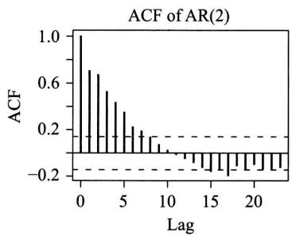

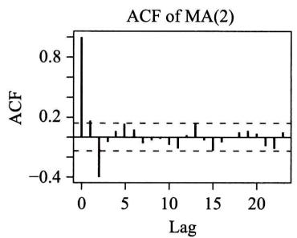

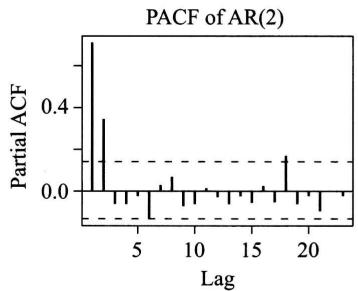  
图15-1

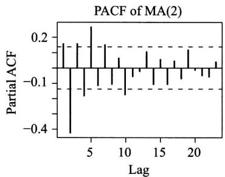

由于ARMA模型比AR模型和MA模型都更一般，它的自相关函数和偏相关函数都拖尾.表15-1总结了ARMA  $(p,q)$  模型及其特例AR  $(p)$  和 $\mathrm{MA}(q)$  的性质.

对于非平稳的时间序列  $X_{t}$  ，我们常考虑其导出的差分序列  $Y_{t} = X_{t} - X_{t - 1}$  .例如金融市场中的证券指数(如上证指数)有长期的增长趋势，因而作为时间序列是

非平稳的. 但其相应的对数序列的差分序列却是平稳的, 它反映证券指数的百分比增益在固定范围内波动. 如果差分序列仍非平稳, 还可以考虑再做差分, 也就是考虑原时间序列的二阶差分. 当  $X_{t}$  的  $d$  阶差分序列满足  $\operatorname{ARMA}(p,q)$  模型时, 我们说  $X_{t}$  满足  $\operatorname{ARIMA}(p,d,q)$  模型. 当  $d = 0$  时,  $\operatorname{ARIMA}(p,0,q) = \operatorname{ARMA}(p,q)$ .

表 15-1 三种线性模型的性质  

<table><tr><td>模型</td><td>MA(q)</td><td>AR(p)</td><td>ARMA(p,q)</td></tr><tr><td>基本方程</td><td>Xt=Θ(B)εt</td><td>Φ(B)Xt=εt</td><td>Φ(B)Xt=Θ(B)εt</td></tr><tr><td>自相关函数</td><td>截尾</td><td>拖尾</td><td>拖尾</td></tr><tr><td>偏相关函数</td><td>拖尾</td><td>截尾</td><td>拖尾</td></tr></table>

# § 3 模型的应用

在实际应用中观察时间序列得到的总是一个有限的样本. 我们必须依据这些有限的信息来初步判断适用的模型, 然后对模型的参数进行估计. 由于我们依据的是不完全的信息, 上述做法完全可能导致不同类型的, 或同类但不同阶数的模型. 要最终确定可以应用的模型, 还须对得到的模型进行考核, 经考核合格的模型才能用于对时间序列的实际预报. 下面我们结合 R 函数的应用来逐一讨论这些步骤.

# （一）模型识别

将对时间序列进行观测得到的有限样本记为  $y_{1}, y_{2}, \dots, y_{n}$ , 其中  $n$  为样本长度, 用

$$
\bar {y} = \frac {\sum_ {i = 1} ^ {n} y _ {i}}{n}
$$

作为这个时间序列均值的估计.再令  $x_{i} = y_{i} - \overline{y} (i = 1,2,\dots ,n)$  ，得到一个零均值序列.用

$$
\hat {\gamma} _ {k} = \frac {1}{n} \sum_ {i = 1} ^ {n - k} x _ {i} x _ {i + k} \tag {3.1}
$$

作为协方差函数的估计. 虽然(3.1)式是有偏估计, 但它可以保证自相关函数的非负定性. 而且由于实际应用中  $n$  都很大 (至少大于50) 且远大于  $k$  (通常  $k < n / 10$ ), (3.1) 式与无偏估计  $\sum_{i=1}^{n-k} x_i x_{i+k} / (n-k)$  相差很小.

由上节表15-1可知，如果已知模型为  $\mathrm{AR}(p)$  或  $\mathrm{MA}(q)$ ，则可用偏相关函数或自相关函数来确定它们的阶数。但是对于一般的ARMA模型，偏相关函数和自相关函数都是拖尾的。因此这两种相关函数难以直接用来有效地确定ARMA模型的阶数。针对这一问题，Tsay和Tiao发展了广义自相关函数(EACF)。①其原理是如果已知ARMA模型的AR部分的阶数  $p$ ，那么其系数可以通过对观测数据用回归方法得到，余下的MA部分的阶数可以用自相关函数的截尾性确定。广义自相关函数方法中对每个给定的AR阶数  $p$ ，将对应的MA部分的自相关函数按时间差由小到大表示为行向量。

例1②（广义自相关函数）表15-2和表15-3是3M公司的股票自1946年2月到2008年12月(共  $T = 755$  个月)月回报对数的广义自相关函数表.其中表15-2为数值表，表15-3为对应的简化表.简化表的做法是以  $2\sqrt{T}$  为界，绝对值小于这个界的用O来表示，大于这个界的用X来表示.理论上说简化广义自相关函数矩阵中O项构成的三角形的左上角的位置就指示了ARMA的阶数(参见下述例2)，但在这个例子里当  $p = 0$  时  $q = 2,5,9,11$  处的值  $-0.08,0.08, - 0.08,0.09$  的绝对值只比  $2 / \sqrt{755} = 0.073$  略大一点点.如果略微放松截尾的界值，则  $p = 0,q = 2,5,9,11$  处的X就会变成O，这样我们可以看出 $(p,q) = (0,0)$  .实际情况经常不是非黑即白的.

表 15-2 EACF 数值表  

<table><tr><td rowspan="2">p</td><td colspan="12">q</td></tr><tr><td>0</td><td>1</td><td>2</td><td>3</td><td>4</td><td>5</td><td>6</td><td>7</td><td>8</td><td>9</td><td>10</td><td>11</td></tr><tr><td>0</td><td>-0.06</td><td>-0.04</td><td>-0.08</td><td>0</td><td>0.02</td><td>0.08</td><td>0.01</td><td>0.01</td><td>-0.03</td><td>-0.08</td><td>0.05</td><td>0.09</td></tr><tr><td>1</td><td>-0.47</td><td>0.01</td><td>-0.07</td><td>-0.02</td><td>0</td><td>0.08</td><td>-0.03</td><td>0</td><td>-0.01</td><td>-0.07</td><td>0.04</td><td>0.09</td></tr><tr><td>2</td><td>-0.38</td><td>-0.35</td><td>-0.07</td><td>0.02</td><td>-0.01</td><td>0.08</td><td>0.03</td><td>0.01</td><td>0</td><td>-0.03</td><td>0.02</td><td>0.04</td></tr><tr><td>3</td><td>-0.18</td><td>0.14</td><td>0.38</td><td>-0.02</td><td>0</td><td>0.04</td><td>-0.02</td><td>0.02</td><td>-0.00</td><td>-0.03</td><td>0.02</td><td>0.04</td></tr><tr><td>4</td><td>0.42</td><td>0.03</td><td>0.45</td><td>-0.01</td><td>0</td><td>0</td><td>-0.01</td><td>0.03</td><td>0.01</td><td>0</td><td>0.02</td><td>0</td></tr><tr><td>5</td><td>-0.11</td><td>0.21</td><td>0.45</td><td>0.01</td><td>0.20</td><td>-0.01</td><td>0</td><td>0.04</td><td>-0.01</td><td>-0.01</td><td>0.03</td><td>0.01</td></tr><tr><td>6</td><td>-0.21</td><td>-0.25</td><td>0.24</td><td>0.31</td><td>0.17</td><td>-0.04</td><td>0</td><td>0.04</td><td>-0.01</td><td>-0.03</td><td>0.01</td><td>0.04</td></tr></table>

表 15-3 EACF 简化表  

<table><tr><td rowspan="2">p</td><td colspan="13">q</td></tr><tr><td>0</td><td>1</td><td>2</td><td>3</td><td>4</td><td>5</td><td>6</td><td>7</td><td>8</td><td>9</td><td>10</td><td>11</td><td>12</td></tr><tr><td>0</td><td>O</td><td>O</td><td>X</td><td>O</td><td>O</td><td>X</td><td>O</td><td>O</td><td>O</td><td>X</td><td>O</td><td>X</td><td>O</td></tr><tr><td>1</td><td>X</td><td>O</td><td>O</td><td>O</td><td>O</td><td>X</td><td>O</td><td>O</td><td>O</td><td>O</td><td>O</td><td>X</td><td>O</td></tr><tr><td>2</td><td>X</td><td>X</td><td>O</td><td>O</td><td>O</td><td>X</td><td>O</td><td>O</td><td>O</td><td>O</td><td>O</td><td>O</td><td>O</td></tr><tr><td>3</td><td>X</td><td>X</td><td>X</td><td>O</td><td>O</td><td>O</td><td>O</td><td>O</td><td>O</td><td>O</td><td>O</td><td>O</td><td>O</td></tr><tr><td>4</td><td>X</td><td>O</td><td>X</td><td>O</td><td>O</td><td>O</td><td>O</td><td>O</td><td>O</td><td>O</td><td>O</td><td>O</td><td>O</td></tr><tr><td>5</td><td>X</td><td>X</td><td>X</td><td>O</td><td>X</td><td>O</td><td>O</td><td>O</td><td>O</td><td>O</td><td>O</td><td>O</td><td>O</td></tr><tr><td>6</td><td>X</td><td>X</td><td>X</td><td>X</td><td>X</td><td>O</td><td>O</td><td>O</td><td>O</td><td>O</td><td>O</td><td>O</td><td>O</td></tr></table>

在 R 中已有由 eacf()函数直接给出的广义自相关函数简化表, 下面举例说明其应用.

例2 调用eacf()函数处理时间序列要用到R中的特殊函数库fBasics和TSA.打开R后点击菜单中的程序包，再选子菜单中的加载程序包，就可以从函数库的目录中选择这两个库并加载①.然后用下面的指令调用：

$$
\begin{array}{l} > \text {l i b r a r y} (\text {f B a s i c s}) \\ > \text {l i b r a r y} (\text {T S A}) \\ \end{array}
$$

再用指令 arima.sim 生成对应于模型

$$
X _ {t} = 0. 3 X _ {t - 1} - 0. 7 X _ {t - 2} + \varepsilon_ {t} + 0. 5 \varepsilon_ {t - 1},
$$

长度为  $n = 120$  的时间序列并存入  $\mathcal{X}$

$$
> x <   - \text {a r i m a . s i m (l i s t (o r d e r = c (2 , 0 , 1) , a r = c (0 . 3 , - 0 . 7) , m a =} c (0. 5)), n = 1 2 0)
$$

注意当模型中同时具有AR和MA部分时，要先用order  $= \mathbf{c}(\mathbf{p},0,\mathbf{q})$  给定AR部分的阶数  $p$  和MA部分的阶数  $q$  ，中间的0是指差分的阶数.接着用R的eacf()函数来识别模型：

$$
> \quad \operatorname {e a c f} (\mathrm {x}, \operatorname {a r}. \max  = 6, \operatorname {m a}. \max  = 6)
$$

AR/MA

0123456

0xxxxxx

1xxxxxx

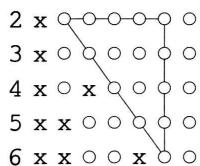

如前所述，在输出矩阵中符号对应的最大的上三角形子矩阵的左上角指示型的阶数.在本例中eacf()函数正确地确定了模型为ARMA(2,1).

值得指出的是，由于时间序列的随机性，应用eacf()函数于一组特定的观察值并不一定能保证正确地识别模型。反复运行上述两条指令可发现eacf()函数只是以比较大的概率正确地识别模型，误判是可能发生的。

# （二）参数估计

知道了模型的阶数以后, 还要估计模型的参数, 未知参数除了模型中的系数外还包括  $\sigma_{\varepsilon}^{2}$ . 大致来说参数估计的方法是用观测样本和(3.1)式得到的估计值  $\hat{\gamma}_{i}$  代替 §2 公式(2.6)中的  $\gamma_{i}$ , 可估计模型  $\mathrm{MA}(q)$  的参数  $\theta_{i} (i = 1, 2, \dots, q)$  和  $\sigma_{\varepsilon}^{2}$ . 类似地, 由  $\hat{\gamma}_{i}$  得到估计值  $\hat{\rho}_{i} = \hat{\gamma}_{i} / \hat{\gamma}_{0}$  并代入矩阵方程(2.11), 可以解出模型  $\operatorname{AR}(p)$  的参数  $\varphi_{i} (i = 1, 2, \dots, p)$  的估计. 一般的  $\operatorname{ARMA}(p, q)$  模型的参数估计是上述两种模型参数估计方法的结合. R 函数库中的 arima() 函数可以用来对模型进行参数估计, 指令如下 (符号 % 后为说明):

$\mathbf{\nabla} > \mathfrak{m} = \mathfrak{arima}(\mathbf{x},\mathbf{order} = \mathbf{c}(2,0,1))\%$  按ARMA(2，1)模型作参数估计并存入  $\mathfrak{m}$ $>\mathrm{m}\%$  显示结果

Call:  
arima(x = x, order = c(2,0,1))  
Coefficients:

<table><tr><td></td><td>ar1</td><td>ar2</td><td>mal</td><td>intercept</td></tr><tr><td></td><td>0.2334</td><td>-0.7202</td><td>0.5936</td><td>0.0548</td></tr><tr><td>s.e.</td><td>0.0721</td><td>0.0675</td><td>0.0860</td><td>0.0997</td></tr></table>

```txt
sigma^2 estimated as 1.03: log likelihood = -173.36, aic = 354.72
```

可以看到函数arima()得到了相对准确的参数估计值  $\hat{\varphi}_1 = 0.2334, \hat{\varphi}_2 = -0.7202$ ， $\hat{\theta}_1 = 0.5936$ ，并给出了相应的标准误差(s.e.)，同时它也估计出  $\sigma_{\varepsilon}^{2} = 1.03$ 。值得说明的是，这里截距(intercept)m=0.0548的意义为时间序列  $X_{t} - m$  满足给出的模型。在这个例子里  $m = 0.0548$  可以近似看作为零。

# （三）模型考核

前面说过在时间序列模型识别过程中误判的可能是存在的，因此通过上面的

模型识别与参数估计得到的模型需要通过考核.如果通不过考核，就需要考虑其他可能的模型.下面用例2来介绍常用的考核方法.上述模型识别与参数估计给出

$$
X _ {t} = \hat {\varphi} _ {1} X _ {t - 1} + \hat {\varphi} _ {2} X _ {t - 2} + \varepsilon_ {t} + \hat {\theta} _ {1} \varepsilon_ {t - 1}.
$$

用  $x_{t}, t = 1,2,\dots ,n$  记时间序列的观察值.当  $t\leqslant 0$  时，设  $x_{t} = \varepsilon_{t} = 0$  是合理的.这样可以自上式解出

$$
\begin{array}{l} \hat {\varepsilon} _ {1} = x _ {1}, \\ \hat {\varepsilon} _ {2} = x _ {2} - \hat {\varphi} _ {1} x _ {1} - \hat {\theta} _ {1} \hat {\varepsilon} _ {1}, \\ \hat {\varepsilon} _ {3} = x _ {3} - \hat {\varphi} _ {1} x _ {2} - \hat {\varphi} _ {2} x _ {1} - \hat {\theta} _ {1} \hat {\varepsilon} _ {2}, \\ \hat {\varepsilon} _ {4} = x _ {4} - \hat {\varphi} _ {1} x _ {3} - \hat {\varphi} _ {2} x _ {2} - \hat {\varphi} _ {3} x _ {1} - \hat {\theta} _ {1} \hat {\varepsilon} _ {3}, \\ \end{array}
$$

··

如此递推得到  $\varepsilon_{t}$  序列的估计  $\hat{\varepsilon}_{t}, t = 1,2,\dots,n$ . 如果模型很接近实际情况，那么  $\hat{\varepsilon}_{t}$ ， $t = 1,2,\dots,n$  应有白噪声序列的特征. 这是用以考核模型的基础. 对于ARMA  $(p,q)$  模型，我们常用其自相关函数是否接近于零来做判断，也就是检验假设  $H_{0}:\hat{\rho}_{1} = \hat{\rho}_{2} = \dots = \hat{\rho}_{k} = 0$ . 用效果比较好的Box-Ljung方法考察统计量

$$
Q = n (n + 2) \sum_ {k = 1} ^ {h} \frac {\hat {\rho} _ {k} ^ {2}}{n - k},
$$

其中  $\hat{\rho_k}$  是  $\hat{\varepsilon}_t, t = 1,2,\dots ,n$  的自相关函数.当  $\hat{\varepsilon}_t,t = 1,2,\dots ,n$  为白噪声序列时， $Q$  应服从自由度为  $h$  的  $\chi^2$  分布.R的函数库包含Box.test函数，可以直接调用Box-Ljung方法，指令是：

$$
\begin{array}{l} > \text {B o x . t e s t} (\mathfrak {m} \mathbb {S} \text {r e s i d u a l s}, \operatorname {l a g} = 1 2, \text {t y p e} = ^ {\prime} \mathrm {L j u n g} ^ {\prime}; \text {f i t d f} = 3) \\ \begin{array}{c} \text {B o x - L j u n g t e s t} \end{array} \\ \end{array}
$$

data: m\$residuals

$$
X - \text {s q u a r e d} = 2. 9 4 1 4, \mathrm {d f} = 9, \mathrm {p} - \text {v a l u e} = 0. 9 6 6 6
$$

调用这个函数时一般用  $\mathrm{lag} = n / 10$  来给出自由度，并用fitdf  $= p + q$  给出约束的数目.于是对于此例，自由度就是  $\mathrm{df} = \mathrm{lag} - p - q = 9$  .  $p$  值为0.9666，远大于拒绝假设  $H_{0}$  的显著性水平0.05.因而按0.05的显著性水平，这个模型可以通过考核.

# （四）预报

在金融、气象、经济和工程实践中经常遇到的问题是如何根据历史和现状来预测将来的情况，因此建立并考核时间序列模型的最终目的是对时间序列进行预报.下面以零均值时间序列为例来讨论预报问题.设  $x_{i},i = 1,2,\dots ,n$  为一个零均值时间序列的观察值，用它来对  $x_{n + l},l > 0$  作估计，并将这个估计值记为

$\hat{x}_n(l)$ . 这里  $l$  表示预报的是  $n$  个观测数据之后的第  $l$  个数据, 叫做  $l$  步预报. 在作  $l$  步预报时总会遇到  $n$  以后的白噪声的值. 注意到当  $s > t$  时

$$
E \left(\varepsilon_ {x} X _ {t}\right) = 0,
$$

也就是说  $x_{i}, i = 1,2,\dots ,n$  与  $t > n$  以后的  $\varepsilon_{t}$  是不相关的. 所以我们约定  $l > 0$  时

$$
\hat {\varepsilon} _ {n + l} = 0,
$$

也就是说将  $n$  以后的  $\varepsilon_{n + l}$  的估计值都取为零. 预报的原理是去寻找  $\hat{x}_n(l)$  作为  $x_i, i = 1,2,\dots,n$  的一个线性函数  $\hat{x}_n(l) = \sum_{i=1}^{n} c_i x_i$  使得

$$
E \left\{\left[ x _ {n + l} - \hat {x} _ {n} (l) \right] ^ {2} \right\}
$$

达到最小，这样的  $\hat{x}_n(l)$  称为  $x_{n + l}$  的线性最小方差估计.下面来讨论AR，MA和ARMA模型的具体预报方法.

# AR模型的预报

由(2.2)式知用估计好的参数  $\hat{\varphi}_i (i = 1, 2, \dots, p)$  可将模型写成

$$
x _ {n + l} = \hat {\varphi} _ {1} x _ {n + l - 1} + \hat {\varphi} _ {2} x _ {n + l - 2} + \dots + \hat {\varphi} _ {p} x _ {n + l - p} + \varepsilon_ {n + l}.
$$

已知  $l > 0$  时  $\varepsilon_{n + l}$  的估计  $\hat{\varepsilon}_{n + l} = 0$  ，因此估计公式成为

$$
x _ {n + l} = \hat {\varphi} _ {1} x _ {n + l - 1} + \hat {\varphi} _ {2} x _ {n + l - 2} + \dots + \hat {\varphi} _ {p} x _ {n + l - p}.
$$

当  $l = 1$  时

$$
\hat {x} _ {n} (1) = \hat {\varphi} _ {1} x _ {n} + \hat {\varphi} _ {2} x _ {n - 1} + \dots + \hat {\varphi} _ {p} x _ {n - p + 1}.
$$

当  $l = 2$  时公式右边所需的  $x_{n + 1}$  用  $\hat{x}_n(1)$  来替代，得到

$$
\hat {x} _ {n} (2) = \hat {\varphi} _ {1} \hat {x} _ {n} (1) + \hat {\varphi} _ {2} x _ {n} + \dots + \hat {\varphi} _ {p} x _ {n - p + 2}.
$$

类似地，当  $l = 3$  时

$$
\hat {x} _ {n} (3) = \hat {\varphi} _ {1} \hat {x} _ {n} (2) + \hat {\varphi} _ {2} \hat {x} _ {n} (1) + \hat {\varphi} _ {3} x _ {n} + \dots + \hat {\varphi} _ {p} x _ {n - p + 3}.
$$

不断递推就可以得到任意第  $l$  步的预报值. 只是  $l$  越大, 预报的准确性就越差. 如果对  $k \leqslant 0$  约定  $\hat{x}_n(k) = x_{n+k}$ , 那么上面的预报公式可以简约地写成

$$
\hat {x} _ {n} (l) = \sum_ {i = 1} ^ {p} \hat {\varphi} _ {i} \hat {x} _ {n} (l - i).
$$

# MA模型的预报

估计好参数  $\hat{\theta}_i, i = 1,2,\dots ,q$  后模型为

$$
x _ {n + l} = \varepsilon_ {n + l} - \hat {\theta} _ {1} \varepsilon_ {n + l - 1} - \dots - \hat {\theta} _ {q} \varepsilon_ {n + l - q}. \tag {3.2}
$$

当  $s > n$  时  $\varepsilon_{s} = 0$  ，因此  $l > q$  时上式的右端各项均为零.因此  $\hat{x}_n(l) = 0$

当  $1 \leqslant l \leqslant q$  时，由(3.2)式可知关键在于预报  $\hat{\varepsilon}_i, i = n - q + 1, \dots, n.$  将(3.2)式改写为

$$
\varepsilon_ {t} = x _ {t} + \hat {\theta} _ {1} \varepsilon_ {t - 1} + \dots + \hat {\theta} _ {q} \varepsilon_ {t - q}.
$$

注意到当  $s \leqslant 0$  时  $\varepsilon_{s} = 0$  ，我们可以用递推的方法得到

$$
\hat {\varepsilon} _ {1} = x _ {1},
$$

$$
\begin{array}{l} \hat {\varepsilon} _ {2} = x _ {2} + \hat {\theta} _ {1} \hat {\varepsilon} _ {1} \\ = x _ {2} + \hat {\theta} _ {1} x _ {1}, \\ \end{array}
$$

$$
\begin{array}{l} \hat {\varepsilon} _ {3} = x _ {3} + \hat {\theta} _ {1} \hat {\varepsilon} _ {2} + \hat {\theta} _ {2} \hat {\varepsilon} _ {1} \\ = x _ {3} + \hat {\theta} _ {1} \left(x _ {2} + \hat {\theta} _ {1} x _ {1}\right) + \hat {\theta} _ {2} x _ {1}, \\ \end{array}
$$

···

算出  $\hat{\varepsilon}_i, i = n - q + 1, \dots, n$  以后，把它们代回(3.2)式就可以得到预报值  $\hat{x}_n(l)$ ， $l = 1, 2, \dots, q$ .

# ARMA模型的预报

结合AR和MA模型的预报方法就可以预报ARMA模型.先把ARMA模型写成

$$
x _ {n + l} = \hat {\varphi} _ {1} x _ {n + l - 1} + \dots + \hat {\varphi} _ {p} x _ {n + l - p} + \varepsilon_ {n + l} - \hat {\theta} _ {1} \varepsilon_ {n + l - 1} - \dots - \hat {\theta} _ {q} \varepsilon_ {n + l - q}. \tag {3.3}
$$

当  $l > q$  时，有  $\hat{\varepsilon}_{n + l} = \hat{\varepsilon}_{n + l - 1} = \dots = \hat{\varepsilon}_{n + l - q} = 0$  ，于是ARMA模型(3.3)变成

$$
x _ {n + l} = \hat {\varphi} _ {1} x _ {n + l - 1} + \dots + \hat {\varphi} _ {p} x _ {n + l - p}.
$$

我们可以应用和AR模型相同的预报方法，

当  $1 \leqslant l \leqslant q$  时，可以用类似MA模型的方法得到  $\hat{\varepsilon}_i, i = n - q + 1, \dots, n$  ，然后把它们代回(3.3)式，再应用AR模型的预报方法得到  $\hat{x}_n(l), l = 1, 2, \dots, q$ .

R函数库中的predict()函数可以用来方便地对考核过的ARIMA模型进行预报.下面再以例2中生成的时间序列为例来说明如何使用predict()函数来预报并作图.指令

$$
> \mathrm {m . p r e d} <   - \text {p r e d i c t} (\operatorname {a r i m a} (\mathrm {x}, \text {o r d e r} = \mathrm {c} (2, 0, 1)), \mathrm {n . a h e a d} = 1 0)
$$

按ARMA(2,1)模型生成对x的10步预报并存入m_pred.预报结果m_pred中包含两部分信息:预报值m_pred$pred和预报标准误差m_pred$se.下面的指令运用这些信息作出预报,如图15-2所示.

> plot(x, xlim = c(0, 130)) % 图示原始数据并预留 130 - 120 = 10 步预报空间
> lines(m. pred $pred, lwd = 2) % 图示预报值, lwd = 2 指定线条为 2 倍标准线粗

>lines(m_pred$pred + 2 * m_pred$se, lty = 2) % 图示预报值上限, lty = 2 指定用虚线

>lines(m_pred$pred - 2 * m_pred$se, lty = 2) % 图示预报值下限, lty = 2 指定用虚线

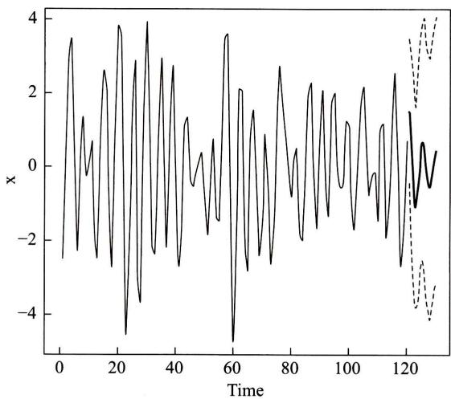  
图15-2

下例将以上讨论的方法应用于实际数据.

例3 已公布的统计数据列举了10年期国债利率从2005年1月至2014年12月的120个月度变化情况. 试用其一阶差分时间序列的前面114项建立模型，对最后5项进行预报并与实际数据比较.

解 先从本书数字课程网站下载数据文件 shuju.csv,存入子目录 C:/R-example(或任何其他子目录),并用指令

```txt
>setwd("C:/R-example")
```

将上述子目录设置为 R 的工作目录。然后用下面的指令读入数据，计算差分序列并画出其前 114 项的 ACF 和 PACF 图形（见图 15-3）。

```toml
>bond10 = read.csv(file = "shuju.csv", head = TRUE, sep = "",
```

>1 = length(bond10 $Yield) % 计算序列长度

```txt
>h<-diff(bond10\$Yield)%计算利率差分序列
```

> x <- h[1 : (1 - 5)] % 保留最后五项

```lisp
>par(mfrow=c(2,1))
```

```txt
>acf(x)
```

```txt
>pacf(x)
```

观察自相关函数和偏相关函数图形的截尾性质可见AR(1)，MA(1)以及MA(6)都是可能的模型.

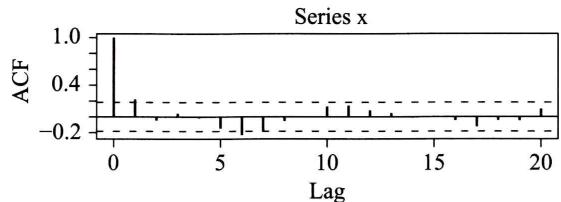

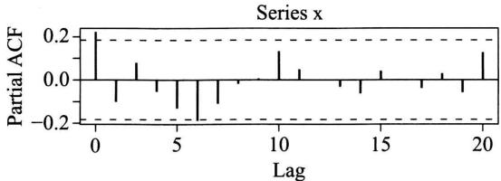  
图15-3

我们先考虑AR(1)模型并用arima()函数来估计参数如下：

$$
\begin{array}{l} > m 1 = \operatorname {a r i m a} (x, \operatorname {o r d e r} = c (1, 0, 0)) \\ > \mathrm {m} 1 \\ \text {C a l l}: \\ \operatorname {a r i m a} (x = x, \text {o r d e r} = c (1, 0, 0)) \\ \text {C o e f f i c i e n t s :} \\ \end{array}
$$

```batch
ar1 intercept 0.2207 -0.0149 s.e. 0.0909 0.0257
```

```txt
sigma2 estimated as 0.04607: log likelihood = 13.64, aic = -21.27
```

参数估计的结果给出如下模型：

$$
x _ {t} = - 0. 0 1 4 9 + 0. 2 2 0 7 x _ {t - 1} + \sqrt {0 . 0 4 6 0 7} \theta_ {t},
$$

其中  $\theta_t \sim N(0,1)$ . 接下来用 Box-Ljung 方法来考核模型. 指令是

```javascript
>Box.test(m1\$residuals,lag  $= 12$  ,type  $\equiv$  'Ljung',fitdf  $= 1$
```

```txt
Box-Ljung test
```

```txt
data: m1$residuals
```

```txt
X-squared = 12.7208, df = 11, p-value = 0.312
```

对于此例，自由度是  $\mathrm{df} = 11$ .  $p$  值为0.312，远大于拒绝假设  $H_0$  的显著性水平0.05. 因而按0.05的显著性水平，这个模型可以通过考核. 接下来我们用AR(1)模型来作预报并和保留的5个数据相比较. 由图15-4可见实际数据和预报相当接近.

```txt
>ml_pred<-predict(arima(x,order=c(1,0,0)),n. ahead = 5)
```

```txt
>plot(x,xlim=c(0,119))
	>>lines(m1_pred\\(pred,lwd = 2)
	>>lines(m1_pred\\)pred + 2 * m1_pred\$se, lty = 2)
	>>lines(m1_pred\\)pred - 2 * m1_pred\$se, lty = 2)
	>>lines(h,lwd = 1)
```

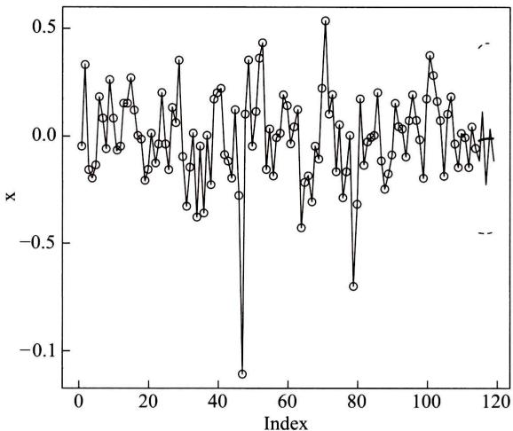  
图15-4

最后我们指出用同样方法可得出MA(1)和MA(6)也能通过考核并很好预报上述差分序列(习题).由此可见对于实际问题，适合的模型可能不是唯一的，取舍通常要视实际情况而定. □

# 小结

时间序列有着广泛的应用. 本章着重讨论平稳时间序列的线性自回归滑动平均模型及其特例自回归模型和滑动平均模型. 自相关函数和偏相关函数是刻画时间序列的重要数字特征, 它们可以有效地区分自回归滑动平均模型和它的子模型, 并可以用来估计这些模型的阶数.

在实际应用中，我们可以通过观察得到时间序列的有限样本。根据样本可以判断适用的模型，然后进行参数估计。如果得到的模型通过考核，则可以用来对时间序列给出预报。整个应用过程中所需的步骤都已经程序化，我们通过应用实例介绍了如何使用相关的函数来建模。

# 重要术语及主题

时间序列 平稳时间序列 线性自回归滑动平均模型 自回归模型 滑动平均模型自相关函数 偏相关函数 模型识别 参数估计 模型考核 预报

# 附录 差分方程的解

我们看到  $\operatorname{AR}(p)$  模型的自相关函数满足方程

$$
\rho_ {k} - \varphi_ {1} \rho_ {k - 1} - \dots - \varphi_ {p} \rho_ {k - p} = 0, \tag {1}
$$

这是一个典型的差分方程.为求解，设  $\rho_{k} = x^{k}$  ，代入(1)式并除以  $x^{k - p}$  得到代数方程

$$
x ^ {p} - \varphi_ {1} x ^ {p - 1} - \dots - \varphi_ {p - 1} x - \varphi_ {p} = 0. \tag {2}
$$

(2)式称为差分方程(1)的特征方程. 易见, 如果  $\xi$  是代数方程(2)的根, 则  $\rho_{k} = \xi^{k}$  为差分方程(1)的解. 代数方程(2)一般有  $p$  个根  $\xi_{1}, \xi_{2}, \dots, \xi_{p}$  (假设没有重根). 由于差分方程(1)是线性的, 其解的线性组合仍然是解. 由此得到差分方程(1)的解的一般形式为

$$
\rho_ {k} = a _ {1} \xi_ {1} ^ {k} + a _ {2} \xi_ {2} ^ {k} + \dots + a _ {p} \xi_ {p} ^ {k},
$$

其中  $a_1, a_2, \dots, a_p$  为参数，它们可由前  $p$  个自相关函数的值来确定。

# 习题

1. 用延迟算子表示下列模型：

(1)  $X_{t} - 0.5X_{t - 1} = \varepsilon_{t}$  
(2)  $X_{t} = \varepsilon_{t} - 0.7\varepsilon_{t - 1} - 0.24\varepsilon_{t - 2}$ .  
(3)  $X_{t} - 0.5X_{t - 1} = \varepsilon_{t} - 0.7\varepsilon_{t - 1} - 0.24\varepsilon_{t - 2}$ .  
(4)  $X_{t} - 1.5X_{t - 1} + 0.5X_{t - 2} = \varepsilon_{t}$  
（5）  $X_{t} - X_{t - 1} = \varepsilon_{t} - 0.5\varepsilon_{t - 1}$

2. 将上题中的模型(1)一(5)按  $\mathrm{ARMA}(p,q)$  分类  
3. 证明自相关函数的性质：（1）  $\rho_{k} = \rho_{-k}$  和（2）  $\left|\rho_k\right|\leqslant 1$  
4. 求  $X_{t} = \varepsilon_{t} - 0.5\varepsilon_{t - 1} - 0.24\varepsilon_{t - 2}$  的自相关函数  
5. 将 §2 例中运用的 R 程序用于下列模型：

(1)  $X_{t} - 0.5X_{t - 1} = \varepsilon_{t}$  
(2)  $X_{t} = \varepsilon_{t} - 0.7\varepsilon_{t - 1} - 0.24\varepsilon_{t - 2}$ .

6. 反复运行 §3 例2中的arima.sim()和eacf()至少100次,函数正确识别模型的频率有多大?与同学的结果作综合比较,这个频率稳定吗?

7. 讨论 MA(1) 和 MA(6) 模型对 §3 例 3 中 10 年期国债利率的一阶差分时间序列的适用性.