# 第三章 多维随机变量及其分布

# § 1 二维随机变量

以上我们只限于讨论一个随机变量的情况，但在实际问题中，对于某些随机试验的结果需要同时用两个或两个以上的随机变量来描述。例如，为了研究某一地区学龄前儿童的发育情况，对这一地区的儿童进行抽查。对于每个儿童都能观察到他的身高  $H$  和体重  $W$ 。在这里，样本空间  $S = \{e\} = \{$  某地区的全部学龄前儿童  $\}$ ，而  $H(e)$  和  $W(e)$  是定义在  $S$  上的两个随机变量。又如炮弹弹着点的位置需要由它的横坐标和纵坐标来确定，而横坐标和纵坐标是定义在同一个样本空间的两个随机变量。

一般，设  $E$  是一个随机试验，它的样本空间是  $S = \{e\}$  ，设  $X = X(e)$  和  $Y = Y(e)$  是定义在  $S$  上的随机变量，由它们构成的一个向量  $(X,Y)$  叫做二维随机向量或二维随机变量（如图3-1).第二章讨论的随机变量也叫一维随机变量.

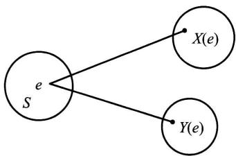  
图3-1

二维随机变量  $(X,Y)$  的性质不仅与  $X$  及  $Y$

有关，而且还依赖于这两个随机变量的相互关系。因此，逐个地来研究  $X$  或  $Y$  的性质是不够的，还需将  $(X, Y)$  作为一个整体来进行研究。

和一维的情况类似，我们也借助“分布函数”来研究二维随机变量。

定义 设  $(X,Y)$  是二维随机变量，对于任意实数  $x,y$  ，二元函数：

$$
F (x, y) = P \{(X \leqslant x) \cap (Y \leqslant y) \} \overset {\text {记 成}} {=} P \{X \leqslant x, Y \leqslant y \}
$$

称为二维随机变量  $(X,Y)$  的分布函数，或称为随机变量  $X$  和  $Y$  的联合分布函数.

如果将二维随机变量  $(X,Y)$  看成平面上随机点的坐标，那么，分布函数  $F(x,y)$  在  $(x,y)$  处的函数值就是随机点  $(X,Y)$  落在如图3-2所示的，以点  $(x,y)$  为顶点而位于该点左下方的无穷矩形域内的概率.

依照上述解释，借助于图3-3容易算出随机点  $(X,Y)$  落在矩形域  $\{(x,y)\mid$ $x_{1} <   x\leqslant x_{2},y_{1} <   y\leqslant y_{2}\}$  的概率为

$$
\begin{array}{l} P \left\{x _ {1} <   X \leqslant x _ {2}, y _ {1} <   Y \leqslant y _ {2} \right\} \\ = F \left(x _ {2}, y _ {2}\right) - F \left(x _ {2}, y _ {1}\right) + F \left(x _ {1}, y _ {1}\right) - F \left(x _ {1}, y _ {2}\right). \tag {1.1} \\ \end{array}
$$

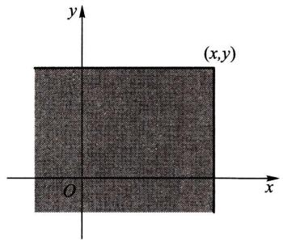  
图3-2

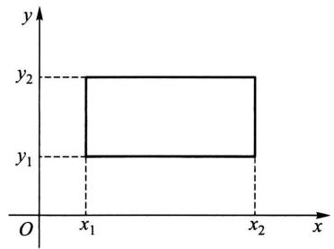  
图3-3

分布函数  $F(x,y)$  具有以下的基本性质：

$1^{\circ} F(x, y)$  是变量  $x$  和  $y$  的不减函数，即对于任意固定的  $y$ ，当  $x_2 > x_1$  时  $F(x_2, y) \geqslant F(x_1, y)$ ；对于任意固定的  $x$ ，当  $y_2 > y_1$  时  $F(x, y_2) \geqslant F(x, y_1)$ .

$2^{\circ} 0 \leqslant F(x, y) \leqslant 1$ ，且

对于任意固定的  $y, F(-\infty, y) = 0$

对于任意固定的  $x, F(x, -\infty) = 0$

$$
F (- \infty , - \infty) = 0, F (\infty , \infty) = 1.
$$

上面四个式子可以从几何上加以说明.例如，在图3-2中将无穷矩形的右面边界向左无限平移（即  $x\rightarrow -\infty$  )，则“随机点  $(X,Y)$  落在这个矩形内”这一事件趋于不可能事件，故其概率趋于0，即有  $F(-\infty ,y) = 0$  ；又如当  $x\to \infty ,y\to \infty$  时图3-2中的无穷矩形扩展到全平面，随机点  $(X,Y)$  落在其中这一事件趋于必然事件，故其概率趋于1，即  $F(\infty ,\infty) = 1$

$3^{\circ} F(x + 0, y) = F(x, y), F(x, y + 0) = F(x, y)$ ，即  $F(x, y)$  关于  $x$  右连续，关于  $y$  也右连续.

$4^{\circ}$  对于任意  $(x_{1},y_{1}),(x_{2},y_{2}),x_{1} < x_{2},y_{1} < y_{2}$ ，下述不等式成立：

$$
F \left(x _ {2}, y _ {2}\right) - F \left(x _ {2}, y _ {1}\right) + F \left(x _ {1}, y _ {1}\right) - F \left(x _ {1}, y _ {2}\right) \geqslant 0.
$$

这一性质由(1.1)式及概率的非负性即可得

如果二维随机变量  $(X,Y)$  全部可能取到的值是有限对或可列无限多对，则称  $(X,Y)$  是二维离散型随机变量.

设二维离散型随机变量  $(X,Y)$  所有可能取的值为  $(x_{i},y_{j}),i,j = 1,2,\dots$  ，记 $P\{X = x_i,Y = y_j\} = p_{ij},i,j = 1,2,\dots$  ，则由概率的定义有

$$
p _ {i j} \geqslant 0, \quad \sum_ {i = 1} ^ {\infty} \sum_ {j = 1} ^ {\infty} p _ {i j} = 1.
$$

我们称  $P\{X = x_{i},Y = y_{j}\} = p_{ij},i,j = 1,2,\dots$  为二维离散型随机变量  $(X,Y)$  的分布律，或称为随机变量  $X$  和  $Y$  的联合分布律.

我们也能用表格来表示  $X$  和  $Y$  的联合分布律，如下表所示①.

<table><tr><td>X Y</td><td>\( x_1 \)</td><td>\( x_2 \)</td><td>...</td><td>\( x_i \)</td><td>...</td></tr><tr><td>\( y_1 \)</td><td>\( p_{11} \)</td><td>\( p_{21} \)</td><td>...</td><td>\( p_{i1} \)</td><td>...</td></tr><tr><td>\( y_2 \)</td><td>\( p_{12} \)</td><td>\( p_{22} \)</td><td>...</td><td>\( p_{i2} \)</td><td>...</td></tr><tr><td>:</td><td>:</td><td>:</td><td></td><td>:</td><td></td></tr><tr><td>\( y_j \)</td><td>\( p_{1j} \)</td><td>\( p_{2j} \)</td><td>...</td><td>\( p_{ij} \)</td><td>...</td></tr><tr><td>:</td><td>:</td><td>:</td><td></td><td>:</td><td></td></tr></table>

例1设随机变量  $X$  在  $1,2,3,4$  四个整数中等可能地取一个值，另一个随机变量  $Y$  在  $1\sim X$  中等可能地取一整数值.试求  $(X,Y)$  的分布律.

解 由乘法公式容易求得  $(X,Y)$  的分布律. 易知  $\{X = i, Y = j\}$  的取值情况是： $i = 1,2,3,4, j$  取不大于  $i$  的正整数，且

$$
P \{X = i, Y = j \} = P \{Y = j \mid X = i \} P \{X = i \} = \frac {1}{i} \cdot \frac {1}{4}, \quad i = 1, 2, 3, 4, j \leqslant i.
$$

于是  $(X,Y)$  的分布律为

<table><tr><td>X
Y</td><td>1</td><td>2</td><td>3</td><td>4</td></tr><tr><td>1</td><td>1/4</td><td>1/8</td><td>1/12</td><td>1/16</td></tr><tr><td>2</td><td>0</td><td>1/8</td><td>1/12</td><td>1/16</td></tr><tr><td>3</td><td>0</td><td>0</td><td>1/12</td><td>1/16</td></tr><tr><td>4</td><td>0</td><td>0</td><td>0</td><td>1/16</td></tr></table>

将  $(X,Y)$  看成一个随机点的坐标，由图3-2知道离散型随机变量  $X$  和  $Y$  的联合分布函数为

$$
F (x, y) = \sum_ {x _ {i} \leqslant x y _ {j} \leqslant y} p _ {i j}, \tag {1.2}
$$

其中和式是对一切满足  $x_{i}\leqslant x,y_{j}\leqslant y$  的  $i,j$  来求和的.

与一维随机变量相似，对于二维随机变量  $(X,Y)$  的分布函数  $F(x,y)$ ，如果存在非负可积函数  $f(x,y)$  使对于任意  $x,y$  有

$$
F (x, y) = \int_ {- \infty} ^ {y} \int_ {- \infty} ^ {x} f (u, v) d u d v,
$$

则称  $(X,Y)$  是二维连续型随机变量，函数  $f(x,y)$  称为二维连续型随机变量 $(X,Y)$  的概率密度，或称为随机变量  $X$  和  $Y$  的联合概率密度.

按定义，概率密度  $f(x,y)$  具有以下性质：

$1^{\circ} f(x, y) \geqslant 0$ .

$2^{\circ}\int_{-\infty}^{\infty}\int_{-\infty}^{\infty}f(x,y)\mathrm{d}x\mathrm{d}y = F(\infty ,\infty) = 1.$

$3^{\circ}$  设  $G$  是  $xOy$  平面上的区域，点  $(X,Y)$  落在  $G$  内的概率为

$$
P \{(X, Y) \in G \} = \iint_ {G} f (x, y) \mathrm {d} x \mathrm {d} y. \tag {1.3}
$$

$4^{\circ}$  若  $f(x,y)$  在点  $(x,y)$  连续，则有

$$
\frac {\partial^ {2} F (x , y)}{\partial x \partial y} = f (x, y).
$$

由性质  $4^{\circ}$  ，在  $f(x,y)$  的连续点处有

$$
\begin{array}{l} \lim  _ {\Delta x \to 0 + \atop \Delta y \to 0 +} \frac {P \{x <   X \leqslant x + \Delta x , y <   Y \leqslant y + \Delta y \}}{\Delta x \Delta y} \\ \xlongequal {\text {由} (1 . 1)} \lim  _ {\Delta x \to 0 ^ {+}} \frac {1}{\Delta x \Delta y} [ F (x + \Delta x, y + \Delta y) - F (x + \Delta x, y) - F (x, y + \Delta y) + F (x, y) ] \\ = \frac {\partial^ {2} F (x , y)}{\partial x \partial y} = f (x, y). \\ \end{array}
$$

这表示若  $f(x,y)$  在点  $(x,y)$  处连续，则当  $\Delta x, \Delta y$  很小时

$$
P \{x <   X \leqslant x + \Delta x, y <   Y \leqslant y + \Delta y \} \approx f (x, y) \Delta x \Delta y,
$$

也就是点  $(X,Y)$  落在小矩形  $(x,x + \Delta x]\times (y,y + \Delta y]$  内的概率近似地等于 $f(x,y)\Delta x\Delta y.$

在几何上  $z = f(x,y)$  表示空间的一个曲面.由性质  $2^{\circ}$  知，介于它和  $xOy$  平面的空间区域的体积为1.由性质  $3^{\circ},P\{(X,Y)\in G\}$  的值等于以  $G$  为底，以曲面 $z = f(x,y)$  为顶面的柱体体积.

例2 设二维随机变量  $(X,Y)$  具有概率密度

$$
f (x, y) = \left\{ \begin{array}{l l} 2 \mathrm {e} ^ {- (2 x + y)}, & x > 0, y > 0, \\ 0, & \text {其 他}. \end{array} \right.
$$

（1）求分布函数  $F(x,y)$  .(2)求概率  $P\{Y\leqslant X\}$

解 (1)  $F(x, y) = \int_{-\infty}^{y} \int_{-\infty}^{x} f(x, y) \, \mathrm{d}x \, \mathrm{d}y$

$$
= \left\{ \begin{array}{l l} \int_ {0} ^ {y} \int_ {0} ^ {x} 2 \mathrm {e} ^ {- (2 x + y)} \mathrm {d} x \mathrm {d} y, & x > 0, y > 0, \\ 0, & \text {其 他}. \end{array} \right.
$$

即有  $F(x,y) = \left\{ \begin{array}{ll}(1 - \mathrm{e}^{-2x})(1 - \mathrm{e}^{-y}), & x > 0, y > 0,\\ 0, & \text{其他}. \end{array} \right.$

（2）将  $(X,Y)$  看作平面上随机点的坐标.即有

$$
\{Y \leqslant X \} = \{(X, Y) \in G \},
$$

其中  $G$  为  $xOy$  平面上直线  $y = x$  及其下方的部分，如图3-4.于是

$$
\begin{array}{l} P \{Y \leqslant X \} = P \{(X, Y) \in G \} = \iint_ {G} f (x, y) \mathrm {d} x \mathrm {d} y \\ = \int_ {0} ^ {\infty} \int_ {y} ^ {\infty} 2 \mathrm {e} ^ {- (2 x + y)} \mathrm {d} x \mathrm {d} y = \frac {1}{3}. \\ \end{array}
$$

以上关于二维随机变量的讨论，不难推广到  $n(n > 2)$  维随机变量的情况.一般，设  $E$  是一个随机试验，它的样本空间是  $S = \{e\}$  ，设  $X_{1} = X_{1}(e)$ $X_{2} = X_{2}(e),\dots ,X_{n} = X_{n}(e)$  是定义在  $S$  上的随机

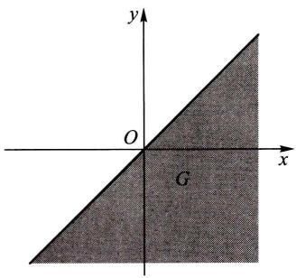  
图3-4

变量，由它们构成的一个  $n$  维向量  $(X_{1},X_{2},\dots ,X_{n})$  称为  $n$  维随机向量或  $n$  维随机变量.

对于任意  $n$  个实数  $x_{1}, x_{2}, \dots, x_{n}, n$  元函数

$$
F \left(x _ {1}, x _ {2}, \dots , x _ {n}\right) = P \left\{X _ {1} \leqslant x _ {1}, X _ {2} \leqslant x _ {2}, \dots , X _ {n} \leqslant x _ {n} \right\}
$$

称为  $n$  维随机变量  $(X_{1},X_{2},\dots ,X_{n})$  的分布函数或随机变量  $X_{1},X_{2},\dots ,X_{n}$  的联合分布函数.它具有类似于二维随机变量的分布函数的性质.

# § 2 边缘分布

二维随机变量  $(X,Y)$  作为一个整体，具有分布函数  $F(x,y)$ . 而  $X$  和  $Y$  都是随机变量，各自也有分布函数，将它们分别记为  $F_{X}(x), F_{Y}(y)$ ，依次称为二维随机变量  $(X,Y)$  关于  $X$  和关于  $Y$  的边缘分布函数. 边缘分布函数可以由  $(X,Y)$  的分布函数  $F(x,y)$  所确定，事实上，

$$
F _ {X} (x) = P \{X \leqslant x \} = P \{X \leqslant x, Y <   \infty \} = F (x, \infty),
$$

即  $F_{X}(x) = F(x,\infty).$  (2.1)

就是说，只要在函数  $F(x,y)$  中令  $y\to \infty$  就能得到  $F_{X}(x)$  .同理

$$
F _ {Y} (y) = F (\infty , y). \tag {2.2}
$$

对于离散型随机变量，由(1.2)，(2.1)式可得

$$
F _ {X} (x) = F (x, \infty) = \sum_ {x _ {i} \leqslant x} \sum_ {j = 1} ^ {\infty} p _ {i j}.
$$

与第二章(3.2)式比较，知道  $X$  的分布律为

$$
P \{X = x _ {i} \} = \sum_ {j = 1} ^ {\infty} p _ {i j}, \quad i = 1, 2, \dots .
$$

同样，  $Y$  的分布律为

$$
P \{Y = y _ {j} \} = \sum_ {i = 1} ^ {\infty} p _ {i j}, \quad j = 1, 2, \dots .
$$

记  $p_{i*} = \sum_{j = 1}^{\infty}p_{ij} = P\{X = x_i\} ,\quad i = 1,2,\dots ,$

$$
p _ {j} = \sum_ {i = 1} ^ {\infty} p _ {i j} = P \left\{Y = y _ {j} \right\}, \quad j = 1, 2, \dots ,
$$

分别称  $p_i$ .  $(i = 1,2,\dots)$  和  $p_{.j}(j = 1,2,\dots)$  为  $(X,Y)$  关于  $X$  和关于  $Y$  的边缘分布律(注意，记号  $p_i$  .中的“·”表示  $p_i$  是由  $p_{ij}$  关于  $j$  求和后得到的；同样， $p_{.j}$  是由  $p_{ij}$  关于  $i$  求和后得到的).

对于连续型随机变量  $(X,Y)$  ，设它的概率密度为  $f(x,y)$  ，由于

$$
F _ {X} (x) = F (x, \infty) = \int_ {- \infty} ^ {x} \left[ \int_ {- \infty} ^ {\infty} f (x, y) d y \right] d x,
$$

由第二章(4.1)式知道， $X$  是一个连续型随机变量，且其概率密度为

$$
f _ {X} (x) = \int_ {- \infty} ^ {\infty} f (x, y) d y. \tag {2.3}
$$

同样， $Y$  也是一个连续型随机变量，其概率密度为

$$
f _ {Y} (y) = \int_ {- \infty} ^ {\infty} f (x, y) d x. \tag {2.4}
$$

分别称  $f_{X}(x), f_{Y}(y)$  为  $(X, Y)$  关于  $X$  和关于  $Y$  的边缘概率密度.

例1 一整数  $N$  等可能地在  $1,2,3,\dots ,10$  十个值中取一个值.设  $D = D(N)$  是能整除  $N$  的正整数的个数，  $F = F(N)$  是能整除  $N$  的素数的个数（注意1不是素数).试写出  $D$  和  $F$  的联合分布律，并求边缘分布律.

解 先将试验的样本空间及  $D,F$  取值的情况列出如下：

<table><tr><td>样本点</td><td>1</td><td>2</td><td>3</td><td>4</td><td>5</td><td>6</td><td>7</td><td>8</td><td>9</td><td>10</td></tr><tr><td>D</td><td>1</td><td>2</td><td>2</td><td>3</td><td>2</td><td>4</td><td>2</td><td>4</td><td>3</td><td>4</td></tr><tr><td>F</td><td>0</td><td>1</td><td>1</td><td>1</td><td>1</td><td>2</td><td>1</td><td>1</td><td>1</td><td>2</td></tr></table>

$D$  所有可能取的值为  $1,2,3,4;F$  所有可能取的值为0，1，2.容易得到  $(D,F)$  取 $(i,j),i = 1,2,3,4,j = 0,1,2$  的概率，例如

$$
P \{D = 1, F = 0 \} = \frac {1}{1 0}, \quad P \{D = 2, F = 1 \} = \frac {4}{1 0},
$$

可得  $D$  和  $F$  的联合分布律及边缘分布律如下表所示：

<table><tr><td>D
F</td><td>1</td><td>2</td><td>3</td><td>4</td><td>P{F=j}</td></tr><tr><td>0</td><td>1/10</td><td>0</td><td>0</td><td>0</td><td>1/10</td></tr><tr><td>1</td><td>0</td><td>4/10</td><td>2/10</td><td>1/10</td><td>7/10</td></tr><tr><td>2</td><td>0</td><td>0</td><td>0</td><td>2/10</td><td>2/10</td></tr><tr><td>P{D=i}</td><td>1/10</td><td>4/10</td><td>2/10</td><td>3/10</td><td>1</td></tr></table>

即有边缘分布律

<table><tr><td>D</td><td>1</td><td>2</td><td>3</td><td>4</td></tr><tr><td>Pk</td><td>1/10</td><td>4/10</td><td>2/10</td><td>3/10</td></tr></table>

<table><tr><td>F</td><td>0</td><td>1</td><td>2</td></tr><tr><td>pk</td><td>1/10</td><td>7/10</td><td>2/10</td></tr></table>

我们常常将边缘分布律写在联合分布律表格的边缘上，如上表所示。这就是“边缘分布律”这个名词的来源。

例2设随机变量  $X$  和  $Y$  具有联合概率密度（图3-5）

$$
f (x, y) = \left\{ \begin{array}{l l} 6, & x ^ {2} \leqslant y \leqslant x, \\ 0, & \text {其 他}. \end{array} \right.
$$

求边缘概率密度  $f_{X}(x), f_{Y}(y)$

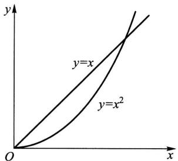  
图3-5

解

$$
f _ {X} (x) = \int_ {- \infty} ^ {\infty} f (x, y) \mathrm {d} y = \left\{ \begin{array}{l l} \int_ {x ^ {2}} ^ {x} 6 \mathrm {d} y = 6 (x - x ^ {2}), & 0 \leqslant x \leqslant 1, \\ 0, & \text {其 他}. \end{array} \right.
$$

$$
f _ {Y} (y) = \int_ {- \infty} ^ {\infty} f (x, y) \mathrm {d} x = \left\{ \begin{array}{l l} \int_ {y} ^ {\sqrt {y}} 6 \mathrm {d} x = 6 (\sqrt {y} - y), & 0 \leqslant y \leqslant 1, \\ 0, & \text {其 他}. \end{array} \right.
$$

□

例3 设二维随机变量  $(X,Y)$  的概率密度为

$$
\begin{array}{l} f (x, y) = \frac {1}{2 \pi \sigma_ {1} \sigma_ {2} \sqrt {1 - \rho^ {2}}} \exp \left\{\frac {- 1}{2 (1 - \rho^ {2})} \left[ \frac {(x - \mu_ {1}) ^ {2}}{\sigma_ {1} ^ {2}} \right. \right. \\ \left. - 2 \rho \frac {\left(x - \mu_ {1}\right) \left(y - \mu_ {2}\right)}{\sigma_ {1} \sigma_ {2}} + \frac {\left(y - \mu_ {2}\right) ^ {2}}{\sigma_ {2} ^ {2}} \right] \Bigg \}, \\ \end{array}
$$

其中  $\mu_1, \mu_2, \sigma_1, \sigma_2, \rho$  都是常数，且  $\sigma_1 > 0, \sigma_2 > 0, -1 < \rho < 1.$  我们称  $(X,Y)$  为服从参数为  $\mu_1, \mu_2, \sigma_1, \sigma_2, \rho$  的二维正态分布（这五个参数的意义将在下一章说明），记为  $(X,Y) \sim N(\mu_1, \mu_2, \sigma_1^2, \sigma_2^2, \rho)$ . 试求二维正态随机变量的边缘概率密度.

解  $f_{X}(x) = \int_{-\infty}^{\infty}f(x,y)\mathrm{d}y$  ，由于

$$
\begin{array}{l} \frac {(y - \mu_ {2}) ^ {2}}{\sigma_ {2} ^ {2}} - 2 \rho \frac {(x - \mu_ {1}) (y - \mu_ {2})}{\sigma_ {1} \sigma_ {2}} \\ = \left(\frac {y - \mu_ {2}}{\sigma_ {2}} - \rho \frac {x - \mu_ {1}}{\sigma_ {1}}\right) ^ {2} - \rho^ {2} \frac {(x - \mu_ {1}) ^ {2}}{\sigma_ {1} ^ {2}}, \\ \end{array}
$$

于是

$$
f _ {X} (x) = \frac {1}{2 \pi \sigma_ {1} \sigma_ {2} \sqrt {1 - \rho^ {2}}} \mathrm {e} ^ {- \frac {(x - \mu_ {1}) ^ {2}}{2 \sigma_ {1} ^ {2}}} \int_ {- \infty} ^ {\infty} \mathrm {e} ^ {- \frac {1}{2 (1 - \rho^ {2})} \left(\frac {y - \mu_ {2}}{\sigma_ {2}} - \rho^ {\frac {x - \mu_ {1}}{\sigma_ {1}}}\right) ^ {2}} \mathrm {d} y.
$$

令

$$
t = \frac {1}{\sqrt {1 - \rho^ {2}}} \left(\frac {y - \mu_ {2}}{\sigma_ {2}} - \rho \frac {x - \mu_ {1}}{\sigma_ {1}}\right),
$$

则有

$$
f _ {X} (x) = \frac {1}{2 \pi \sigma_ {1}} \mathrm {e} ^ {- \frac {(x - \mu_ {1}) ^ {2}}{2 \sigma_ {1} ^ {2}}} \int_ {- \infty} ^ {\infty} \mathrm {e} ^ {- t ^ {2} / 2} \mathrm {d} t,
$$

即  $f_{X}(x) = \frac{1}{\sqrt{2\pi}\sigma_{1}}\mathrm{e}^{-\frac{(x - \mu_{1})^{2}}{2\sigma_{1}^{2}}}, - \infty <  x <   \infty .$

同理

$$
f _ {Y} (y) = \frac {1}{\sqrt {2 \pi} \sigma_ {2}} \mathrm {e} ^ {- \frac {(y - \mu_ {2}) ^ {2}}{2 \sigma_ {2} ^ {2}}}, \quad - \infty <   y <   \infty .
$$

我们看到二维正态分布的两个边缘分布都是一维正态分布，并且都不依赖于参数  $\rho$ ，亦即对于给定的  $\mu_1, \mu_2, \sigma_1, \sigma_2$ ，不同的  $\rho$  对应不同的二维正态分布，它们的边缘分布却都是一样的。这一事实表明，单由关于  $X$  和关于  $Y$  的边缘分布，一般来说是不能确定随机变量  $X$  和  $Y$  的联合分布的。

# §3 条件分布

我们由条件概率很自然地引出条件概率分布的概念

设  $(X,Y)$  是二维离散型随机变量，其分布律为

$$
P \{X = x _ {i}, Y = y _ {j} \} = p _ {i j}, \quad i, j = 1, 2, \dots .
$$

$(X,Y)$  关于  $X$  和关于  $Y$  的边缘分布律分别为

$$
P \{X = x _ {i} \} = p _ {i}. = \sum_ {j = 1} ^ {\infty} p _ {i j}, i = 1, 2, \dots ,
$$

$$
P \{Y = y _ {j} \} = p. _ {j} = \sum_ {i = 1} ^ {\infty} p _ {i j}, \quad j = 1, 2, \dots .
$$

设  $p_{\cdot j} > 0$  ，我们来考虑在事件  $\{Y = y_j\}$  已发生的条件下事件  $\{X = x_i\}$  发生的概率，也就是来求事件

$$
\{X = x _ {i} \mid Y = y _ {j} \}, \quad i = 1, 2, \dots
$$

的概率. 由条件概率公式, 可得

$$
P \{X = x _ {i} \mid Y = y _ {j} \} = \frac {P \{X = x _ {i} , Y = y _ {j} \}}{P \{Y = y _ {j} \}} = \frac {p _ {i j}}{p _ {. j}}, i = 1, 2, \dots .
$$

易知上述条件概率具有分布律的性质：

$$
1 ^ {\circ} P \{X = x _ {i} \mid Y = y _ {j} \} \geqslant 0.
$$

$$
2 ^ {\circ} \sum_ {i = 1} ^ {\infty} P \{X = x _ {i} \mid Y = y _ {j} \} = \sum_ {i = 1} ^ {\infty} \frac {p _ {i j}}{p _ {. j}} = \frac {1}{p _ {. j}} \sum_ {i = 1} ^ {\infty} p _ {i j} = \frac {p _ {. j}}{p _ {. j}} = 1.
$$

于是我们引入以下的定义.

定义 设  $(X, Y)$  是二维离散型随机变量，对于固定的  $j$ ，若  $P\{Y = y_j\} > 0$  则称

$$
P \{X = x _ {i} \mid Y = y _ {j} \} = \frac {P \{X = x _ {i} , Y = y _ {j} \}}{P \{Y = y _ {j} \}} = \frac {p _ {i j}}{p _ {. j}}, i = 1, 2, \dots \tag {3.1}
$$

为在  $Y = y_{j}$  条件下随机变量  $X$  的条件分布律

同样，对于固定的  $i$  ，若  $P\{X = x_{i}\} >0$  ，则称

$$
P \left\{Y = y _ {j} \mid X = x _ {i} \right\} = \frac {P \left\{X = x _ {i} , Y = y _ {j} \right\}}{P \left\{X = x _ {i} \right\}} = \frac {p _ {i j}}{p _ {i}}. \quad j = 1, 2, \dots \tag {3.2}
$$

为在  $X = x_{i}$  条件下随机变量  $Y$  的条件分布律

例1在一汽车工厂中，一辆汽车有两道工序是由机器人完成的．其一是紧固3只螺栓，其二是焊接2处焊点．以  $X$  表示由机器人紧固的螺栓中紧固得不良的数目，以  $Y$  表示由机器人焊接的不良焊点的数目．据积累的资料知  $(X, Y)$  具有分布律：

<table><tr><td>X Y</td><td>0</td><td>1</td><td>2</td><td>3</td><td>P{Y=j}</td></tr><tr><td>0</td><td>0.840</td><td>0.030</td><td>0.020</td><td>0.010</td><td>0.900</td></tr><tr><td>1</td><td>0.060</td><td>0.010</td><td>0.008</td><td>0.002</td><td>0.080</td></tr><tr><td>2</td><td>0.010</td><td>0.005</td><td>0.004</td><td>0.001</td><td>0.020</td></tr><tr><td>P{X=i}</td><td>0.910</td><td>0.045</td><td>0.032</td><td>0.013</td><td>1.000</td></tr></table>

（1）求在  $X = 1$  的条件下， $Y$  的条件分布律.（2）求在  $Y = 0$  的条件下， $X$  的条件分布律.

解 边缘分布律已经求出列在上表中.

（1）在  $X = 1$  的条件下， $Y$  的条件分布律为

$$
\begin{array}{l} P \{Y = 0 \mid X = 1 \} = \frac {P \{X = 1 , Y = 0 \}}{P \{X = 1 \}} = \frac {0 . 0 3 0}{0 . 0 4 5}, \\ P \{Y = 1 \mid X = 1 \} = \frac {P \{X = 1 , Y = 1 \}}{P \{X = 1 \}} = \frac {0 . 0 1 0}{0 . 0 4 5}, \\ P \{Y = 2 \mid X = 1 \} = \frac {P \{X = 1 , Y = 2 \}}{P \{X = 1 \}} = \frac {0 . 0 0 5}{0 . 0 4 5}, \\ \end{array}
$$

或写成

<table><tr><td>Y=k</td><td>0</td><td>1</td><td>2</td></tr><tr><td>P{Y=k|X=1}</td><td>6/9</td><td>2/9</td><td>1/9</td></tr></table>

（2）同样可得在  $Y = 0$  的条件下  $X$  的条件分布律为

<table><tr><td>X=k</td><td>0</td><td>1</td><td>2</td><td>3</td></tr><tr><td>P{X=k|Y=0}</td><td>84/90</td><td>3/90</td><td>2/90</td><td>1/90</td></tr></table>

例2 一射手进行射击，击中目标的概率为  $p$  （ $0 < p < 1$ ），射击直至击中目标两次为止。设以  $X$  表示首次击中目标所进行的射击次数，以  $Y$  表示总共进行的射击次数，试求  $X$  和  $Y$  的联合分布律及条件分布律。

解 按题意  $Y = n$  就表示在第  $n$  次射击时击中目标，且在第1次，第2次，…，第  $n - 1$  次射击中恰有一次击中目标.已知各次射击是相互独立的，于是

不管  $m(m < n)$  是多少，概率  $P\{X = m, Y = n\}$  都应等于

$$
p \bullet p \bullet \underbrace {q \bullet q \bullet \cdots \bullet q} _ {n - 2 \text {个}} = p ^ {2} q ^ {n - 2} \quad (\text {这 里} q = 1 - p).
$$

即得  $X$  和  $Y$  的联合分布律为

$$
P \{X = m, Y = n \} = p ^ {2} q ^ {n - 2}, \quad n = 2, 3, \dots ; m = 1, 2, \dots , n - 1.
$$

又  $P\{X = m\} = \sum_{n = m + 1}^{\infty}P\{X = m,Y = n\} = \sum_{n = m + 1}^{\infty}p^{2}q^{n - 2}$

$$
= p ^ {2} \sum_ {n = m + 1} ^ {\infty} q ^ {n - 2} = \frac {p ^ {2} q ^ {m - 1}}{1 - q} = p q ^ {m - 1}, \quad m = 1, 2, \dots ,
$$

$$
\begin{array}{l} P \{Y = n \} = \sum_ {m = 1} ^ {n - 1} P \{X = m, Y = n \} \\ = \sum_ {m = 1} ^ {n - 1} p ^ {2} q ^ {n - 2} = (n - 1) p ^ {2} q ^ {n - 2}, \quad n = 2, 3, \dots . \\ \end{array}
$$

于是由(3.1)，(3.2)式得到所求的条件分布律为

当  $n = 2,3,\dots$  时，

$$
P \{X = m \mid Y = n \} = \frac {p ^ {2} q ^ {n - 2}}{(n - 1) p ^ {2} q ^ {n - 2}} = \frac {1}{n - 1}, \quad m = 1, 2, \dots , n - 1;
$$

当  $m = 1,2,\dots$  时，

$$
P \{Y = n \mid X = m \} = \frac {p ^ {2} q ^ {n - 2}}{p q ^ {m - 1}} = p q ^ {n - m - 1}, \quad n = m + 1, m + 2, \dots .
$$

例如，  $P\{X = m|Y = 3\} = \frac{1}{2},\quad m = 1,2;$

$$
P \{Y = n \mid X = 3 \} = p q ^ {n - 4}, \quad n = 4, 5, \dots .
$$

现设  $(X,Y)$  是二维连续型随机变量，这时由于对任意  $x,y$  有  $P\{X = x\} = 0$ $P\{Y = y\} = 0$  ，因此就不能直接用条件概率公式引入“条件分布函数”了.

设  $(X,Y)$  的概率密度为  $f(x,y), (X,Y)$  关于  $Y$  的边缘概率密度为  $f_{Y}(y)$ . 给定  $y$ , 对于任意固定的  $\varepsilon > 0$ , 对于任意  $x$ , 考虑条件概率

$$
P \{X \leqslant x \mid y <   Y \leqslant y + \varepsilon \},
$$

设  $P\{y < Y \leqslant y + \varepsilon\} > 0$ ，则有

$$
\begin{array}{l} P \{X \leqslant x \mid y <   Y \leqslant y + \varepsilon \} = \frac {P \{X \leqslant x , y <   Y \leqslant y + \varepsilon \}}{P \{y <   Y \leqslant y + \varepsilon \}} \\ = \frac {\int_ {- \infty} ^ {x} \left[ \int_ {y} ^ {y + \varepsilon} f (x , y) d y \right] d x}{\int_ {y} ^ {y + \varepsilon} f _ {Y} (y) d y}. \\ \end{array}
$$

在某些条件下，当  $\varepsilon$  很小时，上式右端分子、分母分别近似于  $\varepsilon \int_{-\infty}^{x}f(x,y)\mathrm{d}x$  和 $\varepsilon f_{Y}(y)$  ，于是当  $\varepsilon$  很小时，有

$$
P \{X \leqslant x \mid y <   Y \leqslant y + \varepsilon \} \approx \frac {\varepsilon \int_ {- \infty} ^ {x} f (x , y) d x}{\varepsilon f _ {Y} (y)} = \int_ {- \infty} ^ {x} \frac {f (x , y)}{f _ {Y} (y)} d x. \tag {3.3}
$$

与一维随机变量概率密度的定义式第二章(4.1)式比较，我们给出以下的定义。

定义 设二维随机变量  $(X, Y)$  的概率密度为  $f(x, y), (X, Y)$  关于  $Y$  的边缘概率密度为  $f_{Y}(y)$ . 若对于固定的  $y, f_{Y}(y) > 0$ , 则称  $\frac{f(x, y)}{f_{Y}(y)}$  为在  $Y = y$  的条件下  $X$  的条件概率密度, 记为①

$$
f _ {X \mid Y} (x \mid y) = \frac {f (x , y)}{f _ {Y} (y)}. \tag {3.4}
$$

称  $\int_{-\infty}^{x}f_{X|Y}(x\mid y)\mathrm{d}x = \int_{-\infty}^{x}\frac{f(x,y)}{f_Y(y)}\mathrm{d}x$  为在  $Y = y$  的条件下  $X$  的条件分布函数，记为  $P\{X\leqslant x\mid Y = y\}$  或  $F_{X|Y}(x\mid y)$  ，即

$$
F _ {X \mid Y} (x \mid y) = P \{X \leqslant x \mid Y = y \} = \int_ {- \infty} ^ {x} \frac {f (x , y)}{f _ {Y} (y)} d x. \tag {3.5}
$$

类似地，可以定义  $f_{Y|X}(y|x) = \frac{f(x,y)}{f_X(x)}$  和  $F_{Y|X}(y|x) = \int_{-\infty}^{y}\frac{f(x,y)}{f_X(x)}\mathrm{d}y.$

由(3.3)式知道，当  $\varepsilon$  很小时，有

$$
P \{X \leqslant x \mid y <   Y \leqslant y + \varepsilon \} \approx \int_ {- \infty} ^ {x} f _ {X | Y} (x \mid y) d x = F _ {X | Y} (x \mid y),
$$

上式说明了条件密度和条件分布函数的含义.

例3 设  $G$  是平面上的有界区域, 其面积为  $A$ . 若二维随机变量  $(X,Y)$  具有概率密度

$$
f (x, y) = \left\{ \begin{array}{l l} \frac {1}{A}, & (x, y) \in G, \\ 0, & \text {其 他}, \end{array} \right.
$$

则称  $(X,Y)$  在  $G$  上服从均匀分布.现设二维随机变量  $(X,Y)$  在圆域  $x^{2} + y^{2}\leqslant 1$  上服从均匀分布，求条件概率密度  $f_{X|Y}(x|y)$

解 由假设，随机变量  $(X,Y)$  具有概率密度

$$
f (x, y) = \left\{ \begin{array}{l l} \frac {1}{\pi}, & x ^ {2} + y ^ {2} \leqslant 1, \\ 0, & \text {其 他}, \end{array} \right.
$$

且有边缘概率密度

$$
\begin{array}{l} f _ {Y} (y) = \int_ {- \infty} ^ {\infty} f (x, y) d x \\ = \left\{ \begin{array}{l l} \frac {1}{\pi} \int_ {- \sqrt {1 - y ^ {2}}} ^ {\sqrt {1 - y ^ {2}}} \mathrm {d} x = \frac {2}{\pi} \sqrt {1 - y ^ {2}}, & - 1 \leqslant y \leqslant 1, \\ 0, & \text {其 他}. \end{array} \right. \\ \end{array}
$$

于是当  $-1 < y < 1$  时有

$$
f _ {X | Y} (x \mid y) = \left\{ \begin{array}{l l} \frac {\frac {1}{\pi}}{\frac {2}{\pi} \sqrt {1 - y ^ {2}}} = \frac {1}{2 \sqrt {1 - y ^ {2}}}, & - \sqrt {1 - y ^ {2}} \leqslant x \leqslant \sqrt {1 - y ^ {2}}, \\ 0, & \text {其 他}. \end{array} \right.
$$

当  $y = 0$  和  $y = \frac{1}{2}$  时  $f_{X|Y}(x|y)$  的图形分别如图3-6，图3-7所示.

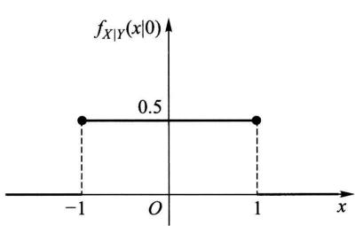  
图3-6

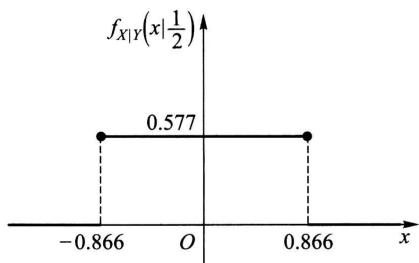  
图3-7

例4设数  $X$  在区间(0,1)上随机地取值，当观察到  $X = x$ $(0 < x < 1)$  时，数 $Y$  在区间  $(x,1)$  上随机地取值.求  $Y$  的概率密度  $f_{Y}(y)$

解 按题意  $X$  具有概率密度

$$
f _ {X} (x) = \left\{ \begin{array}{l l} 1, & 0 <   x <   1, \\ 0, & \text {其 他}. \end{array} \right.
$$

对于任意给定的值  $x$ $(0 < x < 1)$ ，在  $X = x$  的条件下  $Y$  的条件概率密度为

$$
f _ {Y | X} (y | x) = \left\{ \begin{array}{l l} \frac {1}{1 - x}, & x <   y <   1, \\ 0, & \text {其 他}. \end{array} \right.
$$

由(3.4)式得  $X$  和  $Y$  的联合概率密度为

$$
f (x, y) = f _ {Y \mid X} (y \mid x) f _ {X} (x) = \left\{ \begin{array}{l l} \frac {1}{1 - x}, & 0 <   x <   y <   1, \\ 0, & \text {其 他}. \end{array} \right.
$$

于是得关于  $Y$  的边缘概率密度为

$$
\begin{array}{l} f _ {Y} (y) = \int_ {- \infty} ^ {\infty} f (x, y) d x \\ = \left\{ \begin{array}{l l} \int_ {0} ^ {y} \frac {1}{1 - x} \mathrm {d} x = - \ln (1 - y), & 0 <   y <   1, \\ 0, & \text {其 他 .} \end{array} \right. \\ \end{array}
$$

其他.

# § 4 相互独立的随机变量

本节我们将利用两个事件相互独立的概念引出两个随机变量相互独立的概念，这是一个十分重要的概念.

定义 设  $F(x, y)$  及  $F_{X}(x), F_{Y}(y)$  分别是二维随机变量  $(X, Y)$  的分布函数及边缘分布函数. 若对于所有  $x, y$  有

$$
P \{X \leqslant x, Y \leqslant y \} = P \{X \leqslant x \} P \{Y \leqslant y \}, \tag {4.1}
$$

即  $F(x,y) = F_{X}(x)F_{Y}(y),$  (4.2)

则称随机变量  $X$  和  $Y$  是相互独立的.

设  $(X,Y)$  是连续型随机变量，  $f(x,y),f_{X}(x),f_{Y}(y)$  分别为  $(X,Y)$  的概率密度和边缘概率密度，则  $X$  和  $Y$  相互独立的条件(4.2)式等价于：等式

$$
f (x, y) = f _ {X} (x) f _ {Y} (y) \tag {4.3}
$$

在平面上几乎处处①成立.

当  $(X,Y)$  是离散型随机变量时，  $X$  和  $Y$  相互独立的条件(4.2)式等价于：对于  $(X,Y)$  的所有可能取的值  $(x_{i},y_{j})$  有

$$
P \{X = x _ {i}, Y = y _ {j} \} = P \{X = x _ {i} \} P \{Y = y _ {j} \}. \tag {4.4}
$$

在实际中使用(4.3)式或(4.4)式要比使用(4.2)式方便

例如 §1 例2中的随机变量  $X$  和  $Y$ , 由于

$$
f _ {X} (x) = \left\{ \begin{array}{l l} 2 \mathrm {e} ^ {- 2 x}, & x > 0, \\ 0, & \text {其 他}, \end{array} \right. f _ {Y} (y) = \left\{ \begin{array}{l l} \mathrm {e} ^ {- y}, & y > 0, \\ 0, & \text {其 他}, \end{array} \right.
$$

故有  $f(x,y) = f_{X}(x)f_{Y}(y)$  ，因而  $X,Y$  是相互独立的.

又如，若  $X, Y$  具有联合分布律

<table><tr><td>X
Y</td><td>0</td><td>1</td><td>P{Y=j}</td></tr><tr><td>1</td><td>1/6</td><td>2/6</td><td>1/2</td></tr><tr><td>2</td><td>1/6</td><td>2/6</td><td>1/2</td></tr><tr><td>P{X=i}</td><td>1/3</td><td>2/3</td><td>1</td></tr></table>

则有  $P\{X = 0,Y = 1\} = 1 / 6 = P\{X = 0\} P\{Y = 1\}$

$$
\begin{array}{l} P \{X = 0, Y = 2 \} = 1 / 6 = P \{X = 0 \} P \{Y = 2 \}, \\ P \{X = 1, Y = 1 \} = 2 / 6 = P \{X = 1 \} P \{Y = 1 \}, \\ P \{X = 1, Y = 2 \} = 2 / 6 = P \{X = 1 \} P \{Y = 2 \}, \\ \end{array}
$$

因而  $X, Y$  是相互独立的.

再如 §2 例 1 中的随机变量  $F$  和  $D$ , 由于  $P\{D = 1, F = 0\} = 1 / 10 \neq P\{D = 1\} \times P\{F = 0\}$ , 因而  $F$  和  $D$  不是相互独立的.

下面考察二维正态随机变量  $(X,Y)$  .它的概率密度为

$$
\begin{array}{l} f (x, y) = \frac {1}{2 \pi \sigma_ {1} \sigma_ {2} \sqrt {1 - \rho^ {2}}} \exp \left\{\frac {- 1}{2 (1 - \rho^ {2})} \left[ \frac {(x - \mu_ {1}) ^ {2}}{\sigma_ {1} ^ {2}} \right. \right. \\ \left. - 2 \rho \frac {\left(x - \mu_ {1}\right) \left(y - \mu_ {2}\right)}{\sigma_ {1} \sigma_ {2}} + \frac {\left(y - \mu_ {2}\right) ^ {2}}{\sigma_ {2} ^ {2}} \right] \Bigg \}. \\ \end{array}
$$

由 §2 中例3知道，其边缘概率密度  $f_{X}(x), f_{Y}(y)$  的乘积为

$$
f _ {X} (x) f _ {Y} (y) = \frac {1}{2 \pi \sigma_ {1} \sigma_ {2}} \exp \left\{- \frac {1}{2} \left[ \frac {(x - \mu_ {1}) ^ {2}}{\sigma_ {1} ^ {2}} + \frac {(y - \mu_ {2}) ^ {2}}{\sigma_ {2} ^ {2}} \right] \right\}.
$$

因此，如果  $\rho = 0$  ，则对于所有  $x,y$  有  $f(x,y) = f_{X}(x)f_{Y}(y)$  ，即  $X$  和  $Y$  相互独立.反之，如果  $X$  和  $Y$  相互独立，由于  $f(x,y),f_{X}(x),f_{Y}(y)$  都是连续函数，故对于所有的  $x,y$  有  $f(x,y) = f_{X}(x)f_{Y}(y)$  .特别，令  $x = \mu_1,y = \mu_2$  ，自这一等式得到

$$
\frac {1}{2 \pi \sigma_ {1} \sigma_ {2} \sqrt {1 - \rho^ {2}}} = \frac {1}{2 \pi \sigma_ {1} \sigma_ {2}},
$$

从而  $\rho = 0$  .综上所述，得到以下的结论：

对于二维正态随机变量  $(X,Y),X$  和  $Y$  相互独立的充要条件是参数  $\rho = 0$

例 一负责人到达办公室的时间均匀分布在  $8 \sim 12$  时，他的秘书到达办公室的时间均匀分布在  $7 \sim 9$  时，设他们两人到达的时间相互独立，求他们到达办公室的时间相差不超过  $5 \min(1/12 \mathrm{~h})$  的概率.

解设  $X$  和  $Y$  分别是负责人和他的秘书到达办公室的时间，由假设  $X$  和  $Y$  的概率密度分别为

$$
f _ {X} (x) = \left\{ \begin{array}{l l} \frac {1}{4}, & 8 <   x <   1 2, \\ 0, & \text {其 他 ,} \end{array} \quad f _ {Y} (y) = \left\{ \begin{array}{l l} \frac {1}{2}, & 7 <   y <   9, \\ 0, & \text {其 他 ,} \end{array} \right. \right.
$$

因为  $X, Y$  相互独立，故  $(X, Y)$  的概率密度为

$$
f (x, y) = f _ {X} (x) f _ {Y} (y) = \left\{ \begin{array}{l l} \frac {1}{8}, & 8 <   x <   1 2, 7 <   y <   9, \\ 0, & \text {其 他}. \end{array} \right.
$$

按题意需要求概率  $P\{|X - Y|\leqslant 1 / 12\}$  .画出区域：  $\vert x - y\vert \leqslant 1 / 12$  ，以及长方形  $[8 <   x <   12$ $7 <   y <   9]$  ，它们的公共部分是四边形 $BCC^{\prime}B^{\prime}$  ，记为  $G$  （如图3一8).显然仅当（  $X$ $Y)$  取值于  $G$  内，他们两人到达的时间相差才不超过  $1 / 12\mathrm{h}$  因此，所求的概率为

$$
\begin{array}{l} P \left\{\mid X - Y \mid \leqslant \frac {1}{1 2} \right\} = \iint_ {G} f (x, y) d x d y \\ = \frac {1}{8} \times (G \text {的 面 积}). \\ \end{array}
$$

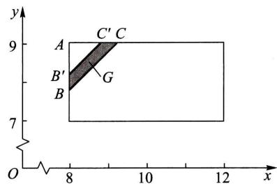  
图3-8

而  $G$  的面积  $=$  三角形  $ABC$  的面积一三角形  $AB^{\prime}C^{\prime}$  的面积

$$
= \frac {1}{2} \left(\frac {1 3}{1 2}\right) ^ {2} - \frac {1}{2} \left(\frac {1 1}{1 2}\right) ^ {2} = \frac {1}{6}.
$$

于是  $P\left\{|X - Y|\leqslant \frac{1}{12}\right\} = \frac{1}{48}.$

即负责人和他的秘书到达办公室的时间相差不超过  $5\mathrm{min}$  的概率为  $1 / 48$  □

以上所述关于二维随机变量的一些概念，容易推广到  $n$  维随机变量的情况.

上面说过，  $n$  维随机变量  $(X_{1},X_{2},\dots ,X_{n})$  的分布函数定义为

$$
F \left(x _ {1}, x _ {2}, \dots , x _ {n}\right) = P \left\{X _ {1} \leqslant x _ {1}, X _ {2} \leqslant x _ {2}, \dots , X _ {n} \leqslant x _ {n} \right\},
$$

其中  $x_{1}, x_{2}, \dots, x_{n}$  为任意实数.

若存在非负可积函数  $f(x_{1},x_{2},\dots ,x_{n})$  ，使对于任意实数  $x_{1},x_{2},\dots ,x_{n}$  有

$$
F (x _ {1}, x _ {2}, \dots , x _ {n}) = \int_ {- \infty} ^ {x _ {n}} \int_ {- \infty} ^ {x _ {n - 1}} \dots \int_ {- \infty} ^ {x _ {1}} f (x _ {1}, x _ {2}, \dots , x _ {n}) d x _ {1} d x _ {2} \dots d x _ {n},
$$

则称  $f(x_{1},x_{2},\dots ,x_{n})$  为  $(X_{1},X_{2},\dots ,X_{n})$  的概率密度函数.

设  $(X_{1},X_{2},\dots ,X_{n})$  的分布函数  $F(x_{1},x_{2},\dots ,x_{n})$  为已知，则  $(X_{1},X_{2},\dots ,X_{n})$  的 $k(1\leqslant k <   n)$  维边缘分布函数就随之确定.例如  $(X_{1},X_{2},\dots ,X_{n})$  关于  $X_{1}$  、关于 $(X_{1},X_{2})$  的边缘分布函数分别为

$$
F _ {X _ {1}} \left(x _ {1}\right) = F \left(x _ {1}, \infty , \infty , \dots , \infty\right),
$$

$$
F _ {X _ {1}, X _ {2}} \left(x _ {1}, x _ {2}\right) = F \left(x _ {1}, x _ {2}, \infty , \infty , \dots , \infty\right).
$$

又若  $f(x_{1},x_{2},\dots ,x_{n})$  是  $(X_{1},X_{2},\dots ,X_{n})$  的概率密度，则  $(X_{1},X_{2},\dots ,X_{n})$  关于 $X_{1}$  、关于  $(X_{1},X_{2})$  的边缘概率密度分别为

$$
\begin{array}{l} f _ {X _ {1}} \left(x _ {1}\right) = \int_ {- \infty} ^ {\infty} \int_ {- \infty} ^ {\infty} \dots \int_ {- \infty} ^ {\infty} f \left(x _ {1}, x _ {2}, \dots , x _ {n}\right) d x _ {2} d x _ {3} \dots d x _ {n}, \\ f _ {X _ {1}, X _ {2}} \left(x _ {1}, x _ {2}\right) = \int_ {- \infty} ^ {\infty} \int_ {- \infty} ^ {\infty} \dots \int_ {- \infty} ^ {\infty} f \left(x _ {1}, x _ {2}, \dots , x _ {n}\right) d x _ {3} d x _ {4} \dots d x _ {n}. \\ \end{array}
$$

若对于所有的  $x_{1}, x_{2}, \cdots, x_{n}$  有

$$
F \left(x _ {1}, x _ {2}, \dots , x _ {n}\right) = F _ {X _ {1}} \left(x _ {1}\right) F _ {X _ {2}} \left(x _ {2}\right) \dots F _ {X _ {n}} \left(x _ {n}\right),
$$

则称  $X_{1}, X_{2}, \dots, X_{n}$  是相互独立的.

若对于所有的  $x_{1}, x_{2}, \cdots, x_{m}; y_{1}, y_{2}, \cdots, y_{n}$  有

$$
F \left(x _ {1}, x _ {2}, \dots , x _ {m}, y _ {1}, y _ {2}, \dots , y _ {n}\right) = F _ {1} \left(x _ {1}, x _ {2}, \dots , x _ {m}\right) F _ {2} \left(y _ {1}, y _ {2}, \dots , y _ {n}\right),
$$

其中  $F_{1}, F_{2}, F$  依次为随机变量  $(X_{1}, X_{2}, \dots, X_{m})$ ,  $(Y_{1}, Y_{2}, \dots, Y_{n})$  和  $(X_{1}, X_{2}, \dots, X_{m}, Y_{1}, Y_{2}, \dots, Y_{n})$  的分布函数，则称随机变量  $(X_{1}, X_{2}, \dots, X_{m})$  和  $(Y_{1}, Y_{2}, \dots, Y_{n})$  是相互独立的.

我们有以下的定理，它在数理统计中是很有用的。

定理 设  $(X_{1}, X_{2}, \dots, X_{m})$  和  $(Y_{1}, Y_{2}, \dots, Y_{n})$  相互独立，则  $X_{i} (i = 1, 2, \dots, m)$  和  $Y_{j} (j = 1, 2, \dots, n)$  相互独立. 又若  $h, g$  是连续函数，则  $h(X_{1}, X_{2}, \dots, X_{m})$  和  $g(Y_{1}, Y_{2}, \dots, Y_{n})$  相互独立.

（证明略.）

# § 5 两个随机变量的函数的分布

上一章§5中已经讨论过一个随机变量的函数的分布,本节讨论两个随机变量的函数的分布.我们只就下面几个具体的函数来讨论.

# （一）  $Z = X + Y$  的分布

设  $(X,Y)$  是二维连续型随机变量，它具有概率密度  $f(x,y)$ . 则  $Z = X + Y$  仍为连续型随机变量，其概率密度为

或  $f_{X + Y}(z) = \int_{-\infty}^{\infty}f(x,z - x)\mathrm{d}x.$  (5.2)

$$
f _ {X + Y} (z) = \int_ {- \infty} ^ {\infty} f (z - y, y) d y, \tag {5.1}
$$

又若  $X$  和  $Y$  相互独立，设  $(X,Y)$  关于  $X,Y$  的边缘概率密度分别为  $f_{X}(x)$  ， $f_{Y}(y)$ ，则(5.1)，(5.2)式分别化为

$$
f _ {X + Y} (z) = \int_ {- \infty} ^ {\infty} f _ {X} (z - y) f _ {Y} (y) d y \tag {5.3}
$$

和

$$
f _ {X + Y} (z) = \int_ {- \infty} ^ {\infty} f _ {X} (x) f _ {Y} (z - x) d x. \tag {5.4}
$$

这两个公式称为  $f_{X}$  和  $f_{Y}$  的卷积公式，记为  $f_{X}*f_{Y}$  ，即

$$
f _ {X} * f _ {Y} = \int_ {- \infty} ^ {\infty} f _ {X} (z - y) f _ {Y} (y) d y = \int_ {- \infty} ^ {\infty} f _ {X} (x) f _ {Y} (z - x) d x.
$$

证 先来求  $Z = X + Y$  的分布函数  $F_{Z}(z)$ ，即有

$$
F _ {Z} (z) = P \{Z \leqslant z \} = \iint_ {x + y \leqslant z} f (x, y) \mathrm {d} x \mathrm {d} y,
$$

这里积分区域  $G: x + y \leqslant z$  是直线  $x + y = z$  及其左下方的半平面（如图3-9）。将二重积分化成累次积分，得

$$
F _ {Z} (z) = \int_ {- \infty} ^ {\infty} \left[ \int_ {- \infty} ^ {z - y} f (x, y) d x \right] d y.
$$

固定  $z$  和  $y$  对积分  $\int_{-\infty}^{z - y}f(x,y)\mathrm{d}x$  作变量变换，令 $x = u - y$  ，得

$$
\int_ {- \infty} ^ {z - y} f (x, y) d x = \int_ {- \infty} ^ {z} f (u - y, y) d u.
$$

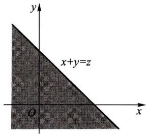  
图3-9

于是

$$
F _ {Z} (z) = \int_ {- \infty} ^ {\infty} \left[ \int_ {- \infty} ^ {z} f (u - y, y) d u \right] d y = \int_ {- \infty} ^ {z} \left[ \int_ {- \infty} ^ {\infty} f (u - y, y) d y \right] d u.
$$

由概率密度的定义即得(5.1)式. 类似可证得(5.2)式

例1设  $X$  和  $Y$  是两个相互独立的随机变量.它们都服从  $N(0,1)$  分布，其概率密度为

$$
f _ {X} (x) = \frac {1}{\sqrt {2 \pi}} \mathrm {e} ^ {- x ^ {2} / 2}, - \infty <   x <   \infty ,
$$

$$
f _ {Y} (y) = \frac {1}{\sqrt {2 \pi}} \mathrm {e} ^ {- y ^ {2} / 2}, - \infty <   y <   \infty .
$$

求  $Z = X + Y$  的概率密度.

解 由(5.4)式

$$
\begin{array}{l} f _ {Z} (z) = \int_ {- \infty} ^ {\infty} f _ {X} (x) f _ {Y} (z - x) d x \\ = \frac {1}{2 \pi} \int_ {- \infty} ^ {\infty} \mathrm {e} ^ {- \frac {x ^ {2}}{2}} \cdot \mathrm {e} ^ {- \frac {(z - x) ^ {2}}{2}} \mathrm {d} x = \frac {1}{2 \pi} \mathrm {e} ^ {- \frac {z ^ {2}}{4}} \int_ {- \infty} ^ {\infty} \mathrm {e} ^ {- \left(x - \frac {z}{2}\right) ^ {2}} \mathrm {d} x, \\ \end{array}
$$

令  $t = x - \frac{z}{2}$  ，得

$$
f _ {Z} (z) = \frac {1}{2 \pi} \mathrm {e} ^ {- \frac {z ^ {2}}{4}} \int_ {- \infty} ^ {\infty} \mathrm {e} ^ {- t ^ {2}} \mathrm {d} t = \frac {1}{2 \pi} \mathrm {e} ^ {- \frac {z ^ {2}}{4} \sqrt {\pi}} = \frac {1}{2 \sqrt {\pi}} \mathrm {e} ^ {- \frac {z ^ {2}}{4}}.
$$

即  $Z$  服从  $N(0,2)$  分布.

一般，设  $X, Y$  相互独立且  $X \sim N(\mu_1, \sigma_1^2), Y \sim N(\mu_2, \sigma_2^2)$ 。由（5.4）式经过计算知  $Z = X + Y$  仍然服从正态分布，且有  $Z \sim N(\mu_1 + \mu_2, \sigma_1^2 + \sigma_2^2)$ 。这个结论还能推广到  $n$  个独立正态随机变量之和的情况。即若  $X_i \sim N(\mu_i, \sigma_i^2) (i = 1, 2, \dots, n)$ ，且它们相互独立，则它们的和  $Z = X_1 + X_2 + \dots + X_n$  仍然服从正态分布，且有  $Z \sim N(\mu_1 + \mu_2 + \dots + \mu_n, \sigma_1^2 + \sigma_2^2 + \dots + \sigma_n^2)$ 。

更一般地，可以证明有限个相互独立的正态随机变量的线性组合仍然服从正态分布. □

例2在一简单电路中，两电阻  $R_{1}$  和  $R_{2}$  串联连接，设  $R_{1}, R_{2}$  相互独立，它们的概率密度均为

$$
f (x) = \left\{ \begin{array}{l l} \frac {1 0 - x}{5 0}, & 0 \leqslant x \leqslant 1 0, \\ 0, & \text {其 他}. \end{array} \right.
$$

求总电阻  $R = R_{1} + R_{2}$  的概率密度.

解 由(5.4)式，  $R$  的概率密度为

$$
f _ {R} (z) = \int_ {- \infty} ^ {\infty} f (x) f (z - x) d x.
$$

易知仅当

$$
\left\{ \begin{array}{l l} 0 <   x <   1 0, \\ 0 <   z - x <   1 0, \end{array} \right. \text {即} \left\{ \begin{array}{l l} 0 <   x <   1 0, \\ z - 1 0 <   x <   z \end{array} \right.
$$

时上述积分的被积函数不等于零. 参考图 3-10, 即得

$$
f _ {R} (z) = \left\{ \begin{array}{l l} \int_ {0} ^ {z} f (x) f (z - x) \mathrm {d} x, & 0 \leqslant z <   1 0, \\ \int_ {z - 1 0} ^ {1 0} f (x) f (z - x) \mathrm {d} x, & 1 0 \leqslant z \leqslant 2 0, \\ 0, & \text {其 他}. \end{array} \right.
$$

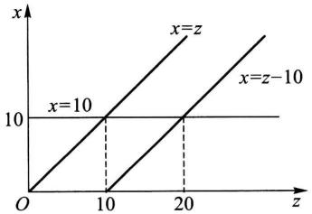  
图3-10

将  $f(x)$  的表达式代入上式得

$$
f _ {R} (z) = \left\{ \begin{array}{l l} \frac {1}{1 5   0 0 0} (6 0 0 z - 6 0 z ^ {2} + z ^ {3})  , & 0 \leqslant z <   1 0  , \\ \frac {1}{1 5   0 0 0} (2 0 - z) ^ {3}  , & 1 0 \leqslant z <   2 0  , \\ 0  , & \text {其 他}. \end{array} \right.
$$

例3设随机变量  $X,Y$  相互独立，且分别服从参数为  $\alpha ,\theta ;\beta ,\theta$  的  $\varGamma$  分布（分别记成  $X\sim \varGamma (\alpha ,\theta),Y\sim \varGamma (\beta ,\theta)$  ）.  $X,Y$  的概率密度分别为

$$
f _ {X} (x) = \left\{ \begin{array}{l l} \frac {1}{\theta^ {\alpha} \Gamma (\alpha)} x ^ {\alpha - 1} \mathrm {e} ^ {- x / \theta}, & x > 0, \\ 0, & \text {其 他}, \end{array} \right. \quad \alpha > 0, \theta > 0.
$$

$$
f _ {Y} (y) = \left\{ \begin{array}{l l} \frac {1}{\theta^ {\beta} \Gamma (\beta)} y ^ {\beta - 1} \mathrm {e} ^ {- y / \theta}, & y > 0, \\ 0, & \text {其 他}, \end{array} \right. \quad \beta > 0, \theta > 0.
$$

试证明  $Z = X + Y$  服从参数为  $\alpha +\beta ,\theta$  的  $\varGamma$  分布，即  $X + Y\sim \varGamma (\alpha +\beta ,\theta)$

证 由(5.4)式  $Z = X + Y$  的概率密度为

$$
f _ {Z} (z) = \int_ {- \infty} ^ {\infty} f _ {X} (x) f _ {Y} (z - x) \mathrm {d} x.
$$

易知仅当

$$
\left\{ \begin{array}{l l} {x > 0,} \\ {z - x > 0,} \end{array} \right. \quad \text {亦 即} \quad \left\{ \begin{array}{l l} {x > 0,} \\ {x <   z} \end{array} \right.
$$

时上述积分的被积函数不等于零，于是（参见图3-11）知当  $z < 0$  时  $f_{Z}(z) = 0$  ，而当  $z > 0$  时有

$$
\begin{array}{l} f _ {Z} (z) = \int_ {0} ^ {z} \frac {1}{\theta^ {\alpha} \Gamma (\alpha)} x ^ {\alpha - 1} \mathrm {e} ^ {- x / \theta} \frac {1}{\theta^ {\beta} \Gamma (\beta)} (z - x) ^ {\beta - 1} \mathrm {e} ^ {- (z - x) / \theta} \mathrm {d} x \\ = \frac {\mathrm {e} ^ {- z / \theta}}{\theta^ {\alpha + \beta} \Gamma (\alpha) \Gamma (\beta)} \int_ {0} ^ {z} x ^ {\alpha - 1} (z - x) ^ {\beta - 1} \mathrm {d} x (\text {令} x = z t) \\ = \frac {z ^ {\alpha + \beta - 1} \mathrm {e} ^ {- z / \theta}}{\theta^ {\alpha + \beta} \Gamma (\alpha) \Gamma (\beta)} \int_ {0} ^ {1} t ^ {\alpha - 1} (1 - t) ^ {\beta - 1} \mathrm {d} t \\ \stackrel {\text {记 成}} {=} A z ^ {\alpha + \beta - 1} \mathrm {e} ^ {- z / \theta}, \\ \end{array}
$$

其中  $A = \frac{1}{\theta^{\alpha + \beta}\Gamma(\alpha)\Gamma(\beta)}\int_{0}^{1}t^{\alpha -1}(1 - t)^{\beta -1}\mathrm{d}t.$  (5.5)①

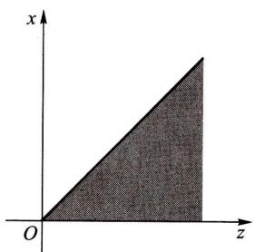  
图3-11

现在来计算  $A$ . 由概率密度的性质得到

$$
\begin{array}{l} 1 = \int_ {- \infty} ^ {\infty} f _ {Z} (z) d z = \int_ {0} ^ {\infty} A z ^ {\alpha + \beta - 1} e ^ {- z / \theta} d z \\ = A \theta^ {\alpha + \beta} \int_ {0} ^ {\infty} (z / \theta) ^ {\alpha + \beta - 1} \mathrm {e} ^ {- z / \theta} \mathrm {d} (z / \theta) = A \theta^ {\alpha + \beta} \Gamma (\alpha + \beta), \\ \end{array}
$$

$$
\int_ {0} ^ {1} t ^ {\alpha - 1} (1 - t) ^ {\beta - 1} \mathrm {d} t   \stackrel {\text {记 成}} {=}   \mathrm {B} (\alpha , \beta), \qquad \alpha , \beta > 0  ,
$$

称为Beta函数.由(5.5)，(5.6)式知Beta函数与  $\Gamma$  函数有如下关系：

$$
\mathrm {B} (\alpha , \beta) = \frac {\Gamma (\alpha) \Gamma (\beta)}{\Gamma (\alpha + \beta)}.
$$

即有  $A = \frac{1}{\theta^{\alpha + \beta}\Gamma(\alpha + \beta)}.$  (5.6)

于是  $f_{Z}(z) = \left\{ \begin{array}{ll} \frac{1}{\theta^{\alpha + \beta}\Gamma(\alpha + \beta)} z^{\alpha + \beta - 1} \mathrm{e}^{-z / \theta}, & z > 0, \\ 0, & \text{其他}. \end{array} \right.$

即  $X + Y\sim \Gamma (\alpha +\beta ,\theta)$

上述结论还能推广到  $n$  个相互独立的  $\Gamma$  分布变量之和的情况. 即若  $X_{1}, X_{2}, \dots, X_{n}$  相互独立，且  $X_{i}$  服从参数为  $\alpha_{i}, \beta (i = 1, 2, \dots, n)$  的  $\Gamma$  分布，则  $\sum_{i=1}^{n} X_{i}$  服从参数为  $\sum_{i=1}^{n} \alpha_{i}, \beta$  的  $\Gamma$  分布. 这一性质称为  $\Gamma$  分布的可加性.

# （二） $Z = \frac{Y}{X}$  的分布、 $Z = XY$  的分布

设  $(X,Y)$  是二维连续型随机变量，它具有概率密度  $f(x,y)$ ，则  $Z = \frac{Y}{X}$ ， $Z = XY$  仍为连续型随机变量，其概率密度分别为

$$
f _ {Y / X} (z) = \int_ {- \infty} ^ {\infty} | x | f (x, x z) \mathrm {d} x, \tag {5.7}
$$

$$
f _ {X Y} (z) = \int_ {- \infty} ^ {\infty} \frac {1}{| x |} f \left(x, \frac {z}{x}\right) \mathrm {d} x. \tag {5.8}
$$

又若  $X$  和  $Y$  相互独立. 设  $(X, Y)$  关于  $X, Y$  的边缘概率密度分别为  $f_{X}(x)$ ,  $f_{Y}(y)$ , 则(5.7)式化为

$$
f _ {Y / X} (z) = \int_ {- \infty} ^ {\infty} | x | f _ {X} (x) f _ {Y} (x z) d x. \tag {5.9}
$$

而(5.8)式化为

$$
f _ {X Y} (z) = \int_ {- \infty} ^ {\infty} \frac {1}{| x |} f _ {X} (x) f _ {Y} \left(\frac {z}{x}\right) \mathrm {d} x. \tag {5.10}
$$

证  $Z = Y / X$  的分布函数为（如图3-12）

$$
\begin{array}{l} F _ {Y / X} (z) = P \{Y / X \leqslant z \} = \iint_ {G _ {1} \cup G _ {2}} f (x, y) d x d y \\ = \iint_ {y / x \leqslant z, x <   0} f (x, y) d y d x + \iint_ {y / x \leqslant z, x > 0} f (x, y) d y d x \\ = \int_ {- \infty} ^ {0} \left[ \int_ {z x} ^ {\infty} f (x, y) d y \right] d x + \int_ {0} ^ {\infty} \left[ \int_ {- \infty} ^ {z x} f (x, y) d y \right] d x \\ \xlongequal {\text {令} y = x u} \int_ {- \infty} ^ {0} \left[ \int_ {z} ^ {- \infty} x f (x, x u) \mathrm {d} u \right] \mathrm {d} x + \int_ {0} ^ {\infty} \left[ \int_ {- \infty} ^ {z} x f (x, x u) \mathrm {d} u \right] \mathrm {d} x \\ \end{array}
$$

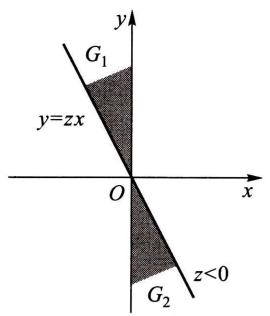  
图3-12

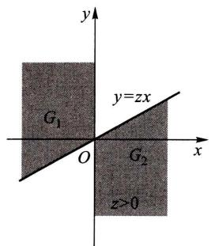

$$
\begin{array}{l} = \int_ {- \infty} ^ {0} \left[ \int_ {- \infty} ^ {z} (- x) f (x, x u) d u \right] d x + \int_ {0} ^ {\infty} \left[ \int_ {- \infty} ^ {z} x f (x, x u) d u \right] d x \\ = \int_ {- \infty} ^ {\infty} \left[ \int_ {- \infty} ^ {z} | x | f (x, x u) d u \right] d x \\ = \int_ {- \infty} ^ {z} \left[ \int_ {- \infty} ^ {\infty} | x | f (x, x u) d x \right] d u, \\ \end{array}
$$

由概率密度的定义即得(5.7)式

类似地，可求出  $f_{XY}(z)$  的概率密度为(5.8)式

例4 某公司提供一种地震保险，保险费  $Y$  的概率密度为

$$
f (y) = \left\{ \begin{array}{l l} \frac {y}{2 5} \mathrm {e} ^ {- y / 5}, & y > 0, \\ 0, & \text {其 他}. \end{array} \right.
$$

保险赔付  $X$  的概率密度为

$$
g (x) = \left\{ \begin{array}{l l} \frac {1}{5} \mathrm {e} ^ {- x / 5}, & x > 0, \\ 0, & \text {其 他}. \end{array} \right.
$$

设  $X$  与  $Y$  相互独立，求  $Z = Y / X$  的概率密度

解 由(5.9)式知，当  $z < 0$  时， $f_{Z}(z) = 0$ ；当  $z > 0$  时， $Z$  的概率密度为

$$
\begin{array}{l} f _ {Z} (z) = \int_ {0} ^ {\infty} x \cdot \frac {1}{5} \mathrm {e} ^ {- x / 5} \cdot \frac {x z}{2 5} \mathrm {e} ^ {- x z / 5} \mathrm {d} x = \frac {z}{1 2 5} \int_ {0} ^ {\infty} x ^ {2} \mathrm {e} ^ {- x \cdot \frac {1 + z}{5}} \mathrm {d} x \\ = \frac {z}{1 2 5} \frac {\Gamma (3)}{\left[ (1 + z) / 5 \right] ^ {3}} = \frac {2 z}{(1 + z) ^ {3}}. \\ \end{array}
$$

# （三）  $M = \max \{X,Y\}$  及  $N = \min \{X,Y\}$  的分布

设  $X, Y$  是两个相互独立的随机变量，它们的分布函数分别为  $F_{X}(x)$  和

$F_{Y}(y)$  .现在来求  $M = \max \{X,Y\}$  及  $N = \min \{X,Y\}$  的分布函数.

由于  $M = \max \{X,Y\}$  不大于  $z$  等价于  $X$  和  $Y$  都不大于  $z$  ，故有

$$
P \{M \leqslant z \} = P \{X \leqslant z, Y \leqslant z \}.
$$

又由于  $X$  和  $Y$  相互独立，得到  $M = \max \{X,Y\}$  的分布函数为

$$
F _ {\max } (z) = P \{M \leqslant z \} = P \{X \leqslant z, Y \leqslant z \} = P \{X \leqslant z \} P \{Y \leqslant z \}.
$$

即有  $F_{\max}(z) = F_X(z)F_Y(z)$  (5.11)

类似地，可得  $N = \min \{X,Y\}$  的分布函数为

$$
\begin{array}{l} F _ {\min } (z) = P \{N \leqslant z \} = 1 - P \{N > z \} \\ = 1 - P \{X > z, Y > z \} = 1 - P \{X > z \} P \{Y > z \}. \\ \end{array}
$$

即  $F_{\min}(z) = 1 - [1 - F_X(z)][1 - F_Y(z)].$  (5.12)

以上结果容易推广到  $n$  个相互独立的随机变量的情况. 设  $X_{1}, X_{2}, \dots, X_{n}$  是  $n$  个相互独立的随机变量. 它们的分布函数分别为  $F_{X_{i}}(x_{i}) (i = 1, 2, \dots, n)$ , 则  $M = \max \{X_{1}, X_{2}, \dots, X_{n}\}$  及  $N = \min \{X_{1}, X_{2}, \dots, X_{n}\}$  的分布函数分别为

$$
F _ {\max } (z) = F _ {X _ {1}} (z) F _ {X _ {2}} (z) \dots F _ {X _ {n}} (z), \tag {5.13}
$$

$$
F _ {\min } (z) = 1 - \left[ 1 - F _ {X _ {1}} (z) \right] \left[ 1 - F _ {X _ {2}} (z) \right] \dots \left[ 1 - F _ {X _ {n}} (z) \right]. \tag {5.14}
$$

特别，当  $X_{1}, X_{2}, \dots, X_{n}$  相互独立且具有相同分布函数  $F(x)$  时有

$$
F _ {\max } (z) = [ F (z) ] ^ {n}, \tag {5.15}
$$

$$
F _ {\min } (z) = 1 - [ 1 - F (z) ] ^ {n}. \tag {5.16}
$$

例5设系统  $L$  由两个相互独立的子系统 $L_{1},L_{2}$  连接而成，连接的方式分别为（i）串联，(ii)并联，(iii)备用（当系统  $L_{1}$  损坏时，系统  $L_{2}$  开始工作)，如图3一13所示.设  $L_{1},L_{2}$  的寿命分别为  $X,Y$  ，已知它们的概率密度分别为

$$
f _ {X} (x) = \left\{ \begin{array}{l l} \alpha \mathrm {e} ^ {- \alpha x}, & x > 0, \\ 0, & x \leqslant 0, \end{array} \right. \tag {5.17}
$$

$$
f _ {Y} (y) = \left\{ \begin{array}{l l} \beta \mathrm {e} ^ {- \beta y}, & y > 0, \\ 0, & y \leqslant 0, \end{array} \right. \tag {5.18}
$$

其中  $\alpha > 0, \beta > 0$  且  $\alpha \neq \beta$ . 试分别就以上三种连接方式写出  $L$  的寿命  $Z$  的概率密度.

解 (i) 串联的情况.

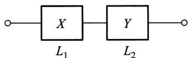

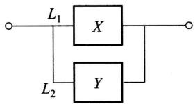

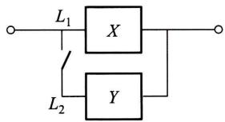  
图3-13

由于当  $L_{1}, L_{2}$  中有一个损坏时，系统  $L$  就停止工作，所以这时  $L$  的寿命为

$$
Z = \min  \{X, Y \}.
$$

由(5.17)，(5.18)式  $X,Y$  的分布函数分别为

$$
F _ {X} (x) = \left\{ \begin{array}{l l} 1 - \mathrm {e} ^ {- \alpha x}, & x > 0, \\ 0, & x \leqslant 0, \end{array} \right. F _ {Y} (y) = \left\{ \begin{array}{l l} 1 - \mathrm {e} ^ {- \beta y}, & y > 0, \\ 0, & y \leqslant 0. \end{array} \right.
$$

由(5.12)式得  $Z = \min \{X,Y\}$  的分布函数为

$$
F _ {\min } (z) = \left\{ \begin{array}{l l} 1 - e ^ {- (\alpha + \beta) z}, & z > 0, \\ 0, & z \leqslant 0. \end{array} \right.
$$

于是  $Z = \min \{X,Y\}$  的概率密度为

$$
f _ {\min } (z) = \left\{ \begin{array}{l l} (\alpha + \beta) e ^ {- (\alpha + \beta) z}, & z > 0, \\ 0, & z \leqslant 0. \end{array} \right.
$$

# （ii）并联的情况.

由于当且仅当  $L_{1}, L_{2}$  都损坏时，系统  $L$  才停止工作，所以这时  $L$  的寿命  $Z$  为

$$
Z = \max  \{X, Y \}.
$$

按(5.11)式得  $Z = \max \{X,Y\}$  的分布函数为

$$
F _ {\max } (z) = F _ {X} (z) F _ {Y} (z) = \left\{ \begin{array}{l l} (1 - \mathrm {e} ^ {- \alpha z}) (1 - \mathrm {e} ^ {- \beta z}), & z > 0, \\ 0, & z \leqslant 0. \end{array} \right.
$$

于是  $Z = \max \{X,Y\}$  的概率密度为

$$
f _ {\max } (z) = \left\{ \begin{array}{l l} \alpha \mathrm {e} ^ {- \alpha z} + \beta \mathrm {e} ^ {- \beta z} - (\alpha + \beta) \mathrm {e} ^ {- (\alpha + \beta) z}, & z > 0, \\ 0, & z \leqslant 0. \end{array} \right.
$$

# （iii）备用的情况.

由于这时当系统  $L_{1}$  损坏时系统  $L_{2}$  才开始工作，因此整个系统  $L$  的寿命  $Z$  是  $L_{1}, L_{2}$  两者寿命之和，即

$$
Z = X + Y.
$$

按(5.3)式，当  $z > 0$  时  $Z = X + Y$  的概率密度为

$$
\begin{array}{l} f (z) = \int_ {- \infty} ^ {\infty} f _ {X} (z - y) f _ {Y} (y) d y = \int_ {0} ^ {z} \alpha e ^ {- \alpha (z - y)} \beta e ^ {- \beta y} d y \\ = \alpha \beta \mathrm {e} ^ {- \alpha z} \int_ {0} ^ {z} \mathrm {e} ^ {- (\beta - \alpha) y} \mathrm {d} y = \frac {\alpha \beta}{\beta - \alpha} \left(\mathrm {e} ^ {- \alpha z} - \mathrm {e} ^ {- \beta z}\right). \\ \end{array}
$$

当  $z \leqslant 0$  时， $f(z) = 0$ ，于是  $Z = X + Y$  的概率密度为

$$
f (z) = \left\{ \begin{array}{l l} \frac {\alpha \beta}{\beta - \alpha} \left(\mathrm {e} ^ {- \alpha z} - \mathrm {e} ^ {- \beta z}\right), & z > 0, \\ 0, & z \leqslant 0. \end{array} \right.
$$

□

# 小结

将一维随机变量的概念加以扩充，就得到多维随机变量。我们着重讨论了二维随机变量。和一维随机变量一样，我们定义二维随机变量  $(X,Y)$  的分布函数

$$
F (x, y) = P \{X \leqslant x, Y \leqslant y \}, - \infty <   x <   \infty , - \infty <   y <   \infty .
$$

对于离散型随机变量  $(X,Y)$  定义了分布律

$$
P \{X = x _ {i}, Y = y _ {j} \} = p _ {i j}, i = 1, 2, \dots , j = 1, 2, \dots \left(p _ {i j} \geqslant 0, \sum_ {i = 1} ^ {\infty} \sum_ {j = 1} ^ {\infty} p _ {i j} = 1\right).
$$

对于连续型随机变量  $(X,Y)$  定义了概率密度  $f(x,y)$  （  $f(x,y)\geqslant 0$  )，且有

$$
F (x, y) = \int_ {- \infty} ^ {y} \int_ {- \infty} ^ {x} f (x, y) \mathrm {d} x \mathrm {d} y, \quad {\text {对 于 任 意}}   x, y.
$$

二维随机变量的分布律与概率密度的性质与一维的类似。特别，对于二维连续型随机变量，有公式

$$
P \{(X, Y) \in G \} = \iint_ {G} f (x, y) d x d y,
$$

其中，  $G$  是平面上的某区域(它是一维连续型随机变量的公式  $P\{a < X \leqslant b\} = \int_{a}^{b} f(x) \, \mathrm{d}x$  的扩充). 这一公式常用来求随机变量的不等式成立的概率，例如

$$
P \{Y \leqslant X \} = P \{(X, Y) \in G \} = \iint_ {G} f (x, y) d x d y,
$$

其中，  $G$  为半平面  $y\leqslant x$

在研究二维随机变量  $(X,Y)$  时，除了讨论上述与一维随机变量类似的内容外，还要讨论以下的新内容：边缘分布、条件分布、随机变量的独立性等.

注意到，对于  $(X,Y)$  而言，由  $(X,Y)$  的分布可以确定关于  $X$  、关于  $Y$  的边缘分布．反之，由关于  $X$  和关于  $Y$  的边缘分布一般是不能确定  $(X,Y)$  的分布的．只有当  $X,Y$  相互独立时，由两边缘分布能确定  $(X,Y)$  的分布．

随机变量的独立性是随机事件独立性的扩充。我们也常利用问题的实际意义去判断两个随机变量的独立性。例如，若  $X, Y$  分别表示两个工厂生产的显像管的寿命，我们可以认为  $X, Y$  是相互独立的。

我们还讨论了  $Z = X + Y, Z = Y / X, Z = XY, M = \max \{X, Y\}, N = \min \{X, Y\}$  的分布的求法（设  $(X, Y)$  的分布已知）.

本章在进行各种问题的计算时，要用到二重积分或用到二元函数固定其中一个变量对另一个变量的积分。此时千万要搞清楚积分变量的变化范围。题目做错，往往是由于在进行积分运算时，将有关的积分区间或积分区域搞错了。在做题时，画出有关函数的定义域的图形，对于正确确定积分上下限肯定是有帮助的。另外，所求得的边缘概率密度、条件概率密度或  $Z = X + Y$  的概率密度等，往往是分段函数，正确写出分段函数的表达式当然是必需的。

# 重要术语及主题

二维随机变量  $(X,Y)$  （20  $(X,Y)$  的分布函数 离散型随机变量  $(X,Y)$  的分布律 连续型

随机变量  $(X,Y)$  的概率密度离散型随机变量  $(X,Y)$  的边缘分布律连续型随机变量  $(X,$  Y)的边缘概率密度条件分布函数条件分布律条件概率密度两个随机变量  $X,Y$  的独立性  $Z = X + Y,Z = Y / X,Z = XY$  的概率密度  $M = \max \{X,Y\} ,N = \min \{X,Y\}$  的概率密度

# 习题

1. 在一箱子中装有 12 只开关, 其中 2 只是次品, 在其中取两次, 每次任取一只, 考虑两种试验: (1) 放回抽样; (2) 不放回抽样. 我们定义随机变量  $X, Y$  如下:

$$
X = \left\{ \begin{array}{l l} 0, & \text {若 第 一 次 取 出 的 是 正 品}, \\ 1, & \text {若 第 一 次 取 出 的 是 次 品}; \end{array} \right.
$$

$$
\mathrm {Y} = \left\{ \begin{array}{l l} 0, & \text {若 第 二 次 取 出 的 是 正 品}, \\ 1, & \text {若 第 二 次 取 出 的 是 次 品}. \end{array} \right.
$$

试分别就(1)、(2)两种情况，写出  $X$  和  $Y$  的联合分布律.

2.（1）盒子里装有3只黑球、2只红球、2只白球，在其中任取4只球.以  $X$  表示取到黑球的只数，以  $Y$  表示取到红球的只数.求  $X$  和  $Y$  的联合分布律.

(2）在(1)中求  $P\{X > Y\} ,P\{Y = 2X\} ,P\{X + Y = 3\} ,P\{X <   3 - Y\}$

3. 设随机变量  $(X, Y)$  的概率密度为

$$
f (x, y) = \left\{ \begin{array}{l l} k (6 - x - y), & 0 <   x <   2, 2 <   y <   4, \\ 0, & \text {其 他}. \end{array} \right.
$$

（1）确定常数  $k$  
（2）求  $P\{X < 1, Y < 3\}$  
(3) 求  $P\{X < 1.5\}$ .  
（4）求  $P\{X + Y\leqslant 4\}$

4. 设  $X, Y$  都是非负的连续型随机变量，它们相互独立。

（1）证明  $P\{X < Y\} = \int_0^\infty F_X(x)f_Y(x)\mathrm{d}x,$

其中  $F_{X}(x)$  是  $X$  的分布函数， $f_{Y}(y)$  是  $Y$  的概率密度

（2）设  $X,Y$  相互独立，其概率密度分别为

$$
f _ {X} (x) = \left\{ \begin{array}{l l} \lambda_ {1} \mathrm {e} ^ {- \lambda_ {1} x}, & x > 0, \\ 0, & \text {其 他}, \end{array} \right. f _ {Y} (y) = \left\{ \begin{array}{l l} \lambda_ {2} \mathrm {e} ^ {- \lambda_ {2} y}, & y > 0, \\ 0, & \text {其 他}, \end{array} \right.
$$

求  $P\{X <   Y\}$

5. 设随机变量  $(X, Y)$  具有分布函数

$$
F (x, y) = \left\{ \begin{array}{l l} 1 - \mathrm {e} ^ {- x} - \mathrm {e} ^ {- y} + \mathrm {e} ^ {- x - y}, & x > 0, y > 0, \\ 0, & \text {其 他}. \end{array} \right.
$$

求边缘分布函数.

6. 将一枚硬币掷 3 次, 以  $X$  表示前 2 次中出现  $H$  的次数, 以  $Y$  表示 3 次中出现  $H$  的次数. 求  $X, Y$  的联合分布律以及  $(X, Y)$  的边缘分布律.

7. 设二维随机变量  $(X,Y)$  的概率密度为

$$
f (x, y) = \left\{ \begin{array}{l l} 4. 8 y (2 - x), & 0 \leqslant x \leqslant 1, 0 \leqslant y \leqslant x, \\ 0, & \text {其 他}. \end{array} \right.
$$

求边缘概率密度.

8. 设二维随机变量  $(X, Y)$  的概率密度为

$$
f (x, y) = \left\{ \begin{array}{l l} {\mathrm {e} ^ {- y},} & {0 <   x <   y,} \\ {0,} & {\text {其 他}.} \end{array} \right.
$$

求边缘概率密度.

9. 设二维随机变量  $(X, Y)$  的概率密度为

$$
f (x, y) = \left\{ \begin{array}{l l} {c x ^ {2}   y,} & {x ^ {2} \leqslant y \leqslant 1  ,} \\ {0  ,} & {\text {其 他}.} \end{array} \right.
$$

（1）确定常数  $c$

（2）求边缘概率密度.

10. 将某医药公司8月份和9月份收到的青霉素针剂的订货单数分别记为  $X$  和  $Y$ . 据以往积累的资料知  $X$  和  $Y$  的联合分布律为

<table><tr><td>X
Y</td><td>51</td><td>52</td><td>53</td><td>54</td><td>55</td></tr><tr><td>51</td><td>0.06</td><td>0.05</td><td>0.05</td><td>0.01</td><td>0.01</td></tr><tr><td>52</td><td>0.07</td><td>0.05</td><td>0.01</td><td>0.01</td><td>0.01</td></tr><tr><td>53</td><td>0.05</td><td>0.10</td><td>0.10</td><td>0.05</td><td>0.05</td></tr><tr><td>54</td><td>0.05</td><td>0.02</td><td>0.01</td><td>0.01</td><td>0.03</td></tr><tr><td>55</td><td>0.05</td><td>0.06</td><td>0.05</td><td>0.01</td><td>0.03</td></tr></table>

（1）求边缘分布律.  
（2）求8月份的订单数为51时，9月份订单数的条件分布律

11. 以  $X$  记某医院一天出生的婴儿的个数,  $Y$  记其中男婴的个数, 设  $X$  和  $Y$  的联合分布律为

$$
P \{X = n, Y = m \} = \frac {\mathrm {e} ^ {- 1 4} \times 7 . 1 4 ^ {m} \times 6 . 8 6 ^ {n - m}}{m ! (n - m) !},
$$

$$
m = 0, 1, 2, \dots , n; \quad n = 0, 1, 2, \dots .
$$

（1）求边缘分布律.  
（2）求条件分布律.  
（3）特别，写出当  $X = 20$  时， $Y$  的条件分布律

12. 求 §1 例 1 中的条件分布律:  $P\{Y = k \mid X = i\}$ .

13. 在第9题中：

（1）求条件概率密度  $f_{X|Y}(x|y)$ ，特别，写出当  $Y = \frac{1}{2}$  时  $X$  的条件概率密度  
（2）求条件概率密度  $f_{Y|X}(y|x)$  ，特别，分别写出当  $X = \frac{1}{3}, X = \frac{1}{2}$  时  $Y$  的条件概率密度

（3）求条件概率

$$
P \left\{Y \geqslant \frac {1}{4} \mid X = \frac {1}{2} \right\}, \quad P \left\{Y \geqslant \frac {3}{4} \mid X = \frac {1}{2} \right\}.
$$

14. 设随机变量  $(X, Y)$  的概率密度为

$$
f (x, y) = \left\{ \begin{array}{l l} 1, & | y | <   x, 0 <   x <   1, \\ 0, & \text {其 他}. \end{array} \right.
$$

求条件概率密度  $f_{Y|X}(y|x), f_{X|Y}(x|y)$

15. 设随机变量  $X \sim U(0, 1)$ , 当给定  $X = x$  时, 随机变量  $Y$  的条件概率密度为

$$
f _ {Y \mid X} (y \mid x) = \left\{ \begin{array}{l l} x, & 0 <   y <   \frac {1}{x}, \\ 0, & \text {其 他}. \end{array} \right.
$$

（1）求  $X$  和  $Y$  的联合概率密度  $f(x,y)$  
（2）求边缘概率密度  $f_{Y}(y)$  ，并画出它的图形.  
(3) 求  $P\{X > Y\}$ .  
16.（1）问第1题中的随机变量  $X$  和  $Y$  是否相互独立？  
（2）问第14题中的随机变量  $X$  和  $Y$  是否相互独立（需说明理由）？  
17.（1）设随机变量  $(X,Y)$  具有分布函数

$$
F (x, y) = \left\{ \begin{array}{l l} (1 - \mathrm {e} ^ {- \alpha x})   y, & \quad x \geqslant 0, 0 \leqslant y \leqslant 1, \\ 1 - \mathrm {e} ^ {- \alpha x}, & \quad x \geqslant 0, y > 1, \\ 0, & \quad \text {其 他}. \end{array} \right. \quad \alpha > 0,
$$

证明  $X, Y$  相互独立.

（2）设随机变量  $(X,Y)$  具有分布律

$P\{X = x, Y = y\} = p^2 (1 - p)^{x + y - 2}, \quad 0 < p < 1, x, y$  均为正整数，

问  $X,Y$  是否相互独立？

18. 设  $X$  和  $Y$  是两个相互独立的随机变量， $X$  在区间  $(0, 1)$  上服从均匀分布， $Y$  的概率密度为

$$
f _ {Y} (y) = \left\{ \begin{array}{l l} \frac {1}{2} \mathrm {e} ^ {- y / 2}, & y > 0, \\ 0, & y \leqslant 0. \end{array} \right.
$$

（1）求  $X$  和  $Y$  的联合概率密度  
（2）设含有  $a$  的二次方程为  $a^2 + 2Xa + Y = 0$  ，试求  $a$  有实根的概率.

19. 进行打靶, 设弹着点  $A(X,Y)$  的坐标  $X$  和  $Y$  相互独立, 且都服从  $N(0,1)$  分布, 规定

点  $A$  落在区域  $D_{1} = \{(x,y)\mid x^{2} + y^{2}\leqslant 1\}$  得2分；

点  $A$  落在  $D_{2} = \{(x,y) \mid 1 < x^{2} + y^{2} \leqslant 4\}$  得1分；

点  $A$  落在  $D_{3} = \{(x,y)\mid x^{2} + y^{2} > 4\}$  得0分.

以  $Z$  记打靶的得分. 写出  $X, Y$  的联合概率密度，并求  $Z$  的分布律.

20. 设  $X$  和  $Y$  是相互独立的随机变量，其概率密度分别为

$$
f _ {X} (x) = \left\{ \begin{array}{l l} \lambda \mathrm {e} ^ {- \lambda x}, & x > 0, \\ 0, & x \leqslant 0, \end{array} \quad f _ {Y} (y) = \left\{ \begin{array}{l l} \mu \mathrm {e} ^ {- \mu y}, & y > 0, \\ 0, & y \leqslant 0, \end{array} \right. \right.
$$

其中  $\lambda > 0, \mu > 0$  是常数. 引入随机变量

$$
Z = \left\{ \begin{array}{l l} 1, & \text {当} X \leqslant Y, \\ 0, & \text {当} X > Y. \end{array} \right.
$$

（1）求条件概率密度  $f_{X|Y}(x|y)$  
（2）求  $Z$  的分布律和分布函数

21. 设随机变量  $(X, Y)$  的概率密度为

$$
f (x, y) = \left\{ \begin{array}{l l} x + y, & 0 <   x <   1, 0 <   y <   1, \\ 0, & \text {其 他}. \end{array} \right.
$$

分别求（1）  $Z = X + Y$  ，（2）  $Z = XY$  的概率密度.

22. 设  $X$  和  $Y$  是两个相互独立的随机变量，其概率密度分别为

$$
f _ {X} (x) = \left\{ \begin{array}{l l} 1, & 0 \leqslant x \leqslant 1, \\ 0, & \text {其 他}, \end{array} \right. \quad f _ {Y} (y) = \left\{ \begin{array}{l l} \mathrm {e} ^ {- y}, & y > 0, \\ 0, & \text {其 他}. \end{array} \right.
$$

求随机变量  $Z = X + Y$  的概率密度.

23. 某种商品一周的需求量是一个随机变量，其概率密度为

$$
f (t) = \left\{ \begin{array}{l l} t \mathrm {e} ^ {- t}, & t > 0, \\ 0, & t \leqslant 0. \end{array} \right.
$$

设各周的需求量是相互独立的.求（1）两周，（2）三周的需求量的概率密度

24. 设随机变量  $(X, Y)$  的概率密度为

$$
f (x, y) = \left\{ \begin{array}{l l} { \frac {1}{2} (x + y) \mathrm {e} ^ {- (x + y)}  ,} & {x > 0  , y > 0  ,} \\ {0  ,} & {\text {其 他}.} \end{array} \right.
$$

（1）问  $X$  和  $Y$  是否相互独立？  
（2）求  $Z = X + Y$  的概率密度.

25. 设随机变量  $X, Y$  相互独立，且具有相同的分布，它们的概率密度均为

$$
f (x) = \left\{ \begin{array}{l l} {\mathrm {e} ^ {1 - x},} & {x > 1,} \\ {0,} & {\text {其 他}.} \end{array} \right.
$$

求  $Z = X + Y$  的概率密度.

26. 设随机变量  $X, Y$  相互独立，它们的概率密度均为

$$
f (x) = \left\{ \begin{array}{l l} \mathrm {e} ^ {- x}, & x > 0, \\ 0, & \text {其 他}. \end{array} \right.
$$

求  $Z = Y / X$  的概率密度.

27. 设随机变量  $X, Y$  相互独立，它们都在区间  $(0,1)$  上服从均匀分布。 $A$  是以  $X, Y$  为边长的矩形的面积，求  $A$  的概率密度。  
28. 设  $X, Y$  是相互独立的随机变量，它们都服从正态分布  $N(0, \sigma^2)$ 。试验证随机变量  $Z = \sqrt{X^2 + Y^2}$  的概率密度为

$$
f _ {Z} (z) = \left\{ \begin{array}{l l} \frac {z}{\sigma^ {2}} \mathrm {e} ^ {- z ^ {2} / (2 \sigma^ {2})}, & z > 0, \\ 0, & \text {其 他}. \end{array} \right.
$$

我们称  $Z$  服从参数为  $\sigma (\sigma >0)$  的瑞利(Rayleigh)分布.

29. 设随机变量  $(X, Y)$  的概率密度为

$$
f (x, y) = \left\{ \begin{array}{l l} {b \mathrm {e} ^ {- (x + y)},} & {0 <   x <   1, 0 <   y <   \infty ,} \\ {0,} & {\text {其 他}.} \end{array} \right.
$$

（1）试确定常数  $b$

（2）求边缘概率密度  $f_{X}(x), f_{Y}(y)$

（3）求函数  $U = \max \{X,Y\}$  的分布函数

30. 设某种型号的电子元件的寿命（以  $\mathrm{h}$  计）近似地服从正态分布  $N(160,20^2)$ ，随机地选取4只，求其中没有一只寿命小于180的概率.

31. 对某种电子装置的输出测量了5次，得到结果为  $X_{1}, X_{2}, X_{3}, X_{4}, X_{5}$ 。设它们是相互独立的随机变量且都服从参数  $\sigma = 2$  的瑞利分布。

（1）求  $Z = \max \{X_{1},X_{2},X_{3},X_{4},X_{5}\}$  的分布函数

（2）求  $P\{Z > 4\}$

32. 设随机变量  $X, Y$  相互独立，且服从同一分布，试证明

$$
P \{a <   \min  \{X, Y \} \leqslant b \} = (P \{X > a \}) ^ {2} - (P \{X > b \}) ^ {2} \quad (a \leqslant b).
$$

33. 设  $X, Y$  是相互独立的随机变量，其分布律分别为

$$
P \{X = k \} = p (k), \quad k = 0, 1, 2, \dots ,
$$

$$
P \{Y = r \} = q (r), \quad r = 0, 1, 2, \dots .
$$

证明随机变量  $Z = X + Y$  的分布律为

$$
P \{Z = i \} = \sum_ {k = 0} ^ {i} p (k) q (i - k), \quad i = 0, 1, 2, \dots .
$$

34. 设  $X, Y$  是相互独立的随机变量， $X \sim \pi(\lambda_1), Y \sim \pi(\lambda_2)$ . 证明  $Z = X + Y \sim \pi(\lambda_1 + \lambda_2)$

35. 设  $X, Y$  是相互独立的随机变量， $X \sim b(n_1, p)$ ， $Y \sim b(n_2, p)$ 。证明

$$
Z = X + Y \sim b \left(n _ {1} + n _ {2}, p\right).
$$

36. 设随机变量  $(X,Y)$  的分布律为

<table><tr><td>X
Y</td><td>0</td><td>1</td><td>2</td><td>3</td><td>4</td><td>5</td></tr><tr><td>0</td><td>0.00</td><td>0.01</td><td>0.03</td><td>0.05</td><td>0.07</td><td>0.09</td></tr><tr><td>1</td><td>0.01</td><td>0.02</td><td>0.04</td><td>0.05</td><td>0.06</td><td>0.08</td></tr><tr><td>2</td><td>0.01</td><td>0.03</td><td>0.05</td><td>0.05</td><td>0.05</td><td>0.06</td></tr><tr><td>3</td><td>0.01</td><td>0.02</td><td>0.04</td><td>0.06</td><td>0.06</td><td>0.05</td></tr></table>

（1）求  $P\{X = 2 \mid Y = 2\}, P\{Y = 3 \mid X = 0\}$  
（2）求  $V = \max \{X,Y\}$  的分布律  
（3）求  $U = \min \{X,Y\}$  的分布律  
（4）求  $W = X + Y$  的分布律.

# 第四章 随机变量的数字特征

上一章介绍了随机变量的分布函数、概率密度和分布律，它们都能完整地描述随机变量，但在某些实际或理论问题中，人们感兴趣于某些能描述随机变量某一种特征的常数。例如，一篮球队上场比赛的运动员的身高是一个随机变量，人们常关心上场运动员的平均身高。一个城市一户家庭拥有汽车的辆数是一个随机变量，在考察城市的交通情况时，人们关心户均拥有汽车的辆数。评价棉花的质量时，既需要注意纤维的平均长度，又需要注意纤维长度与平均长度的偏离程度，平均长度较大，偏离程度较小，质量就较好。这种由随机变量的分布所确定的，能刻画随机变量某一方面的特征的常数统称为数字特征，它在理论和实际应用中都很重要。本章将介绍几个重要的数字特征：数学期望、方差、相关系数和矩。

# §1 数学期望

先看一个例子. 一射手进行打靶练习, 规定射入区域  $e_2$  (图4-1) 得 2 分; 射入区域  $e_1$  得 1 分; 脱靶, 即射入区域  $e_0$ , 得 0 分. 射手一次射击所得分数  $X$  是一个随机变量. 设  $X$  的分布律为

$$
P \{X = k \} = p _ {k}, \quad k = 0, 1, 2.
$$

现在射击  $N$  次，其中得0分的有  $a_0$  次，得1分的有  $a_1$  次，得2分的有  $a_2$  次，  $a_0 + a_1 + a_2 = N.$  他射击  $N$  次得分的总和为  $a_0\times 0 + a_1\times 1 + a_2\times 2.$  于是平均一次射击的得分数为

$$
\frac {a _ {0} \times 0 + a _ {1} \times 1 + a _ {2} \times 2}{N} = \sum_ {k = 0} ^ {2} k \frac {a _ {k}}{N}.
$$

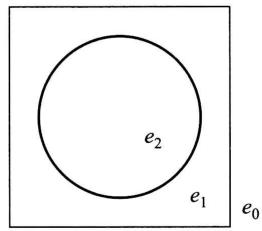  
图4-1

这里， $a_{k} / N$  是事件  $\{X = k\}$  的频率。在第五章将会讲到，当  $N$  很大时， $a_{k} / N$  在一定意义下接近于事件  $\{X = k\}$  的概率  $p_{k}$ 。就是说，在试验次数很大时，随机变量  $X$  的观察值的算术平均  $\sum_{k=0}^{2} k \frac{a_{k}}{N}$  在一定意义下接近于  $\sum_{k=0}^{2} k p_{k}$ 。我们称  $\sum_{k=0}^{2} k p_{k}$  为随机变量  $X$  的数学期望或均值。一般，有以下的定义。

定义 设离散型随机变量  $X$  的分布律为

$$
P \{X = x _ {k} \} = p _ {k}, \quad k = 1, 2, \dots .
$$

若级数

$$
\sum_ {k = 1} ^ {\infty} x _ {k} p _ {k}
$$

绝对收敛，则称级数  $\sum_{k=1}^{\infty} x_k p_k$  的和为随机变量  $X$  的数学期望，记为  $E(X)$ 。即

$$
E (X) = \sum_ {k = 1} ^ {\infty} x _ {k} p _ {k}. \tag {1.1}
$$

设连续型随机变量  $X$  的概率密度为  $f(x)$ ，若积分

$$
\int_ {- \infty} ^ {\infty} x f (x) d x
$$

绝对收敛，则称积分  $\int_{-\infty}^{\infty}xf(x)\mathrm{d}x$  的值为随机变量  $X$  的数学期望，记为  $E(X)$  .即

$$
E (X) = \int_ {- \infty} ^ {\infty} x f (x) \mathrm {d} x. \tag {1.2}
$$

数学期望简称期望，又称为均值

数学期望  $E(X)$  完全由随机变量  $X$  的概率分布所确定。若  $X$  服从某一分布，也称  $E(X)$  是这一分布的数学期望。

例1 某医院当新生儿诞生时，医生要根据婴儿的皮肤颜色、肌肉弹性、反应的敏感性、心脏的搏动等方面的情况进行评分，新生儿的得分  $X$  是一个随机变量。据以往的资料表明  $X$  的分布律为

<table><tr><td>X</td><td>0</td><td>1</td><td>2</td><td>3</td><td>4</td><td>5</td><td>6</td><td>7</td><td>8</td><td>9</td><td>10</td></tr><tr><td>pk</td><td>0.002</td><td>0.001</td><td>0.002</td><td>0.005</td><td>0.02</td><td>0.04</td><td>0.18</td><td>0.37</td><td>0.25</td><td>0.12</td><td>0.01</td></tr></table>

试求  $X$  的数学期望  $E(X)$

解  $E(X) = 0 \times 0.002 + 1 \times 0.001 + 2 \times 0.002 + 3 \times 0.005 + 4 \times 0.02$

$$
\begin{array}{l} + 5 \times 0. 0 4 + 6 \times 0. 1 8 + 7 \times 0. 3 7 + 8 \times 0. 2 5 + 9 \times 0. 1 2 + 1 0 \times 0. 0 1 \\ = 7. 1 5 (\text {分}). \\ \end{array}
$$

这意味着，若考察医院出生的很多新生儿，例如1000个，则一个新生儿的平均得分约为7.15分，1000个新生儿共得分约7150分. □

例2有两个相互独立工作的电子装置，它们的寿命(以h计)  $X_{k}(k = 1,2)$  服从同一指数分布，其概率密度为

$$
f (x) = \left\{ \begin{array}{l l} \frac {1}{\theta} \mathrm {e} ^ {- x / \theta}, & x > 0, \\ 0, & x \leqslant 0, \end{array} \right. \quad \theta > 0.
$$

若将这两个电子装置串联连接组成整机，求整机寿命(以h计)  $N$  的数学期望.

解  $X_{k}(k = 1,2)$  的分布函数为

$$
F (x) = \left\{ \begin{array}{l l} 1 - \mathrm {e} ^ {- x / \theta}, & x > 0, \\ 0, & x \leqslant 0. \end{array} \right.
$$

由第三章§5的(5.12)式, N=min{X₁,X₂}的分布函数为

$$
F _ {\min } (x) = 1 - [ 1 - F (x) ] ^ {2} = \left\{ \begin{array}{l l} 1 - \mathrm {e} ^ {- 2 x / \theta}, & x > 0, \\ 0, & x \leqslant 0, \end{array} \right.
$$

因而  $N$  的概率密度为

$$
f _ {\min } (x) = \left\{ \begin{array}{l l} \frac {2}{\theta} \mathrm {e} ^ {- 2 x / \theta}, & x > 0, \\ 0, & x \leqslant 0. \end{array} \right.
$$

于是  $N$  的数学期望为

$$
E (N) = \int_ {- \infty} ^ {\infty} x f _ {\min } (x) d x = \int_ {0} ^ {\infty} \frac {2 x}{\theta} e ^ {- 2 x / \theta} d x = \frac {\theta}{2}.
$$

例3 按规定，某车站每天  $8:00 \sim 9:00, 9:00 \sim 10:00$  都恰有一辆客车到站，但到站的时刻是随机的，且两者到站的时间相互独立。其规律为

<table><tr><td rowspan="2">到站时刻</td><td>8:10</td><td>8:30</td><td>8:50</td></tr><tr><td>9:10</td><td>9:30</td><td>9:50</td></tr><tr><td>概率</td><td>1/6</td><td>3/6</td><td>2/6</td></tr></table>

一旅客8:20到车站，求他候车时间的数学期望

解 设旅客的候车时间为  $X$  (以  $\min$  计).  $X$  的分布律为

<table><tr><td>X</td><td>10</td><td>30</td><td>50</td><td>70</td><td>90</td></tr><tr><td>Pk</td><td>3/6</td><td>2/6</td><td>1/6×1/6</td><td>1/6×3/6</td><td>1/6×2/6</td></tr></table>

在上表中，例如

$$
P \{X = 7 0 \} = P (A B) = P (A) P (B) = \frac {1}{6} \times \frac {3}{6},
$$

其中  $A$  为事件“第一班车在8:10到站”， $B$  为“第二班车在9:30到站”。候车时间的数学期望为

$$
E (X) = 1 0 \times \frac {3}{6} + 3 0 \times \frac {2}{6} + 5 0 \times \frac {1}{3 6} + 7 0 \times \frac {3}{3 6} + 9 0 \times \frac {2}{3 6} = 2 7. 2 2.
$$

例4 某商店对某种家用电器的销售采用先使用后付款的方式. 记使用寿命为  $X$  (以年计), 规定:

$X \leqslant 1$  ，一台付款1500元；

$1 < X \leqslant 2$  ，一台付款2000元；

$2 < X \leqslant 3$  ，一台付款2500元；

$X > 3$  ，一台付款3000元

设寿命  $X$  服从指数分布，概率密度为

$$
f (x) = \left\{ \begin{array}{l l} \frac {1}{1 0} \mathrm {e} ^ {- x / 1 0}, & x > 0, \\ 0, & x \leqslant 0. \end{array} \right.
$$

试求该商店一台这种家用电器收费  $Y$  的数学期望

解 先求出寿命  $X$  落在各个时间区间的概率. 即有

$$
\begin{array}{l} P \{X \leqslant 1 \} = \int_ {0} ^ {1} \frac {1}{1 0} e ^ {- x / 1 0} d x = 1 - e ^ {- 0. 1} = 0. 0 9 5 2, \\ P \{1 <   X \leqslant 2 \} = \int_ {1} ^ {2} \frac {1}{1 0} e ^ {- x / 1 0} d x = e ^ {- 0. 1} - e ^ {- 0. 2} = 0. 0 8 6 1, \\ P \{2 <   X \leqslant 3 \} = \int_ {2} ^ {3} \frac {1}{1 0} e ^ {- x / 1 0} d x = e ^ {- 0. 2} - e ^ {- 0. 3} = 0. 0 7 7 9, \\ P \{X > 3 \} = \int_ {3} ^ {\infty} \frac {1}{1 0} \mathrm {e} ^ {- x / 1 0} \mathrm {d} x = \mathrm {e} ^ {- 0. 3} = 0. 7 4 0 8. \\ \end{array}
$$

一台家用电器收费  $Y$  （以元计)的分布律为

<table><tr><td>Y</td><td>1 500</td><td>2 000</td><td>2 500</td><td>3 000</td></tr><tr><td>pk</td><td>0.095 2</td><td>0.086 1</td><td>0.077 9</td><td>0.740 8</td></tr></table>

得  $E(Y) = 2732.15$  ，即平均一台收费2732.15元

例5 在一个人数很多的团体中普查某种疾病，为此要抽验  $N$  个人的血，可以用两种方法进行. (i) 将每个人的血分别去验，这就需验  $N$  次. (ii) 按  $k$  个人一组进行分组，把从  $k$  个人抽来的血混合在一起进行检验. 如果这混合血液呈阴性反应，就说明  $k$  个人的血都呈阴性反应，这样，这  $k$  个人的血就只需验一次；若呈阳性，则再对这  $k$  个人的血液分别进行化验，这样， $k$  个人的血总共要化验  $k + 1$  次. 假设每个人化验呈阳性的概率为  $p$  ，且这些人的试验反应是相互独立的. 试说明当  $p$  较小时，选取适当的  $k$  ，按第二种方法可以减少化验的次数. 并说明  $k$  取什么值时最适宜.

解 各人的血呈阴性反应的概率为  $q = 1 - p$ . 因而  $k$  个人的混合血呈阴性反应的概率为  $q^{k}, k$  个人的混合血呈阳性反应的概率为  $1 - q^{k}$

设以  $k$  个人为一组时，组内每人化验的次数为  $X$  ，则  $X$  是一个随机变量，其分布律为

<table><tr><td>X</td><td>1/k</td><td>k+1/k</td></tr><tr><td>pk</td><td>q^k</td><td>1-q^k</td></tr></table>

$X$  的数学期望为

$$
E (X) = \frac {1}{k} q ^ {k} + \left(1 + \frac {1}{k}\right) \left(1 - q ^ {k}\right) = 1 - q ^ {k} + \frac {1}{k}.
$$

$N$  个人平均需化验的次数为

$$
N \left(1 - q ^ {k} + \frac {1}{k}\right).
$$

由此可知，只要选择  $k$  使

$$
1 - q ^ {k} + \frac {1}{k} <   1,
$$

则  $N$  个人平均需化验的次数  $\leq N$ . 当  $p$  固定时, 我们选取  $k$  使得

$$
L = 1 - q ^ {k} + \frac {1}{k}
$$

小于1且取到最小值，这时就能得到最好的分组方法.

例如，  $p = 0.1$  ，则  $q = 0.9$  ，当  $k = 4$  时，  $L = 1 - q^{k} + \frac{1}{k}$  取到最小值.此时得到最好的分组方法.若  $N = 1000$  ，此时以  $k = 4$  分组，则按第二种方法平均只需化验

$$
1 0 0 0 \left(1 - 0. 9 ^ {4} + \frac {1}{4}\right) = 5 9 4 (\text {次}).
$$

这样平均来说，约可以减少  $40\%$  的工作量.

例6 设随机变量  $X \sim \pi(\lambda)$ , 求  $E(X)$ .

解  $X$  的分布律为

$$
P \{X = k \} = \frac {\lambda^ {k} \mathrm {e} ^ {- \lambda}}{k !}, \quad k = 0, 1, 2, \dots , \quad \lambda > 0.
$$

$X$  的数学期望为

$$
E (X) = \sum_ {k = 0} ^ {\infty} k \frac {\lambda^ {k} \mathrm {e} ^ {- \lambda}}{k !} = \lambda \mathrm {e} ^ {- \lambda} \sum_ {k = 1} ^ {\infty} \frac {\lambda^ {k - 1}}{(k - 1) !} = \lambda \mathrm {e} ^ {- \lambda} \cdot \mathrm {e} ^ {\lambda} = \lambda ,
$$

即  $E(X) = \lambda$

例7 设随机变量  $X \sim U(a, b)$ , 求  $E(X)$ .

解  $X$  的概率密度为

$$
f (x) = \left\{ \begin{array}{l l} \frac {1}{b - a}, & a <   x <   b \\ 0, & \text {其 他}. \end{array} \right.
$$

$X$  的数学期望为

$$
E (X) = \int_ {- \infty} ^ {\infty} x f (x) d x = \int_ {a} ^ {b} \frac {x}{b - a} d x = \frac {a + b}{2}.
$$

即数学期望位于区间  $(a,b)$  的中点.

我们经常需要求随机变量的函数的数学期望，例如飞机机翼受到压力  $W = kV^2 (V$  是风速，  $k > 0$  是常数)的作用，需要求  $W$  的数学期望，这里  $W$  是随机变量  $V$  的函数.这时，可以通过下面的定理来求  $W$  的数学期望.

定理 设  $Y$  是随机变量  $X$  的函数： $Y = g(X)$ （ $g$  是连续函数）.

（i）如果  $X$  是离散型随机变量，它的分布律为  $P\{X = x_k\} = p_k, k = 1,2,\dots$  ，若  $\sum_{k=1}^{\infty} g(x_k)p_k$  绝对收敛，则有

$$
E (Y) = E [ g (X) ] = \sum_ {k = 1} ^ {\infty} g \left(x _ {k}\right) p _ {k}. \tag {1.3}
$$

(ii) 如果  $X$  是连续型随机变量, 它的概率密度为  $f(x)$ , 若  $\int_{-\infty}^{\infty} g(x) f(x) \mathrm{d}x$  绝对收敛, 则有

$$
E (Y) = E [ g (X) ] = \int_ {- \infty} ^ {\infty} g (x) f (x) \mathrm {d} x. \tag {1.4}
$$

定理的重要意义在于当我们求  $E(Y)$  时，不必算出  $Y$  的分布律或概率密度，而只需利用  $X$  的分布律或概率密度就可以了，定理的证明超出了本书的范围。我们只对下述特殊情况加以证明。

证 设  $X$  是连续型随机变量, 且  $y = g(x)$  满足第二章 §5 中定理的条件.

由第二章 §5 中的 (5.2) 式知道随机变量  $Y = g(X)$  的概率密度为

$$
f _ {Y} (y) = \left\{ \begin{array}{l l} f _ {X} [ h (y) ] | h ^ {\prime} (y) |, & \alpha <   y <   \beta , \\ 0, & \text {其 他}, \end{array} \right.
$$

于是

$$
E (Y) = \int_ {- \infty} ^ {\infty} y f _ {Y} (y) d y = \int_ {\alpha} ^ {\beta} y f _ {X} [ h (y) ] | h ^ {\prime} (y) | d y.
$$

当  $h^\prime (y)$  恒  $\tilde{\mathbf{\Gamma}} >0$  时

$$
E (Y) = \int_ {\alpha} ^ {\beta} y f _ {X} [ h (y) ] h ^ {\prime} (y) \mathrm {d} y = \int_ {- \infty} ^ {\infty} g (x) f (x) \mathrm {d} x.
$$

当  $h^\prime (y)$  恒  $<  0$  时

$$
\begin{array}{l} E (Y) = - \int_ {\alpha} ^ {\beta} y f _ {X} [ h (y) ] h ^ {\prime} (y) d y \\ = - \int_ {\infty} ^ {- \infty} g (x) f (x) d x = \int_ {- \infty} ^ {\infty} g (x) f (x) d x. \\ \end{array}
$$

综合上两式，(1.4)式得证

□

上述定理还可以推广到两个或两个以上随机变量的函数的情况.

例如，设  $Z$  是随机变量  $X, Y$  的函数  $Z = g(X, Y)$ （ $g$  是连续函数），那么， $Z$  是一个一维随机变量。若二维随机变量  $(X, Y)$  的概率密度为  $f(x, y)$ ，则有

$$
E (Z) = E [ g (X, Y) ] = \int_ {- \infty} ^ {\infty} \int_ {- \infty} ^ {\infty} g (x, y) f (x, y) d x d y, \tag {1.5}
$$

这里设上式右边的积分绝对收敛. 又若  $(X, Y)$  为离散型随机变量，其分布律为  $P\{X = x_i, Y = y_j\} = p_{ij}, i, j = 1, 2, \dots$  ，则有

$$
E (Z) = E [ g (X, Y) ] = \sum_ {j = 1} ^ {\infty} \sum_ {i = 1} ^ {\infty} g \left(x _ {i}, y _ {j}\right) p _ {i j}, \tag {1.6}
$$

这里设上式右边的级数绝对收敛.

例8 设风速  $V$  在  $(0, a)$  上服从均匀分布，即具有概率密度

$$
f (v) = \left\{ \begin{array}{l l} \frac {1}{a}, & 0 <   v <   a, \\ 0, & \text {其 他}. \end{array} \right.
$$

又设飞机机翼受到的正压力  $W$  是  $V$  的函数： $W = kV^2 (k > 0$  ，常数），求  $W$  的数学期望.

解 由(1.4)式有

$$
E (W) = \int_ {- \infty} ^ {\infty} k v ^ {2} f (v) d v = \int_ {0} ^ {a} k v ^ {2} \frac {1}{a} d v = \frac {1}{3} k a ^ {2}.
$$

例9 设随机变量  $(X,Y)$  的概率密度

$$
f (x, y) = \left\{ \begin{array}{l l} \frac {3}{2 x ^ {3} y ^ {2}}, & \frac {1}{x} <   y <   x, x > 1, \\ 0, & \text {其 他}. \end{array} \right.
$$

求数学期望  $E(Y), E\left(\frac{1}{XY}\right)$

解 由(1.5)式得

$$
\begin{array}{l} E (Y) = \int_ {- \infty} ^ {\infty} \int_ {- \infty} ^ {\infty} y f (x, y) d y d x = \int_ {1} ^ {\infty} \int_ {\frac {1}{x}} ^ {x} \frac {3}{2 x ^ {3} y} d y d x \\ = \frac {3}{2} \int_ {1} ^ {\infty} \frac {1}{x ^ {3}} \left[ \ln y \right] _ {\frac {1}{x}} ^ {x} d x = 3 \int_ {1} ^ {\infty} \frac {\ln x}{x ^ {3}} d x \\ = \left[ - \frac {3}{2} \frac {\ln x}{x ^ {2}} \right] _ {1} ^ {\infty} + \frac {3}{2} \int_ {1} ^ {\infty} \frac {1}{x ^ {3}} d x = \frac {3}{4}. \\ \end{array}
$$

$$
E \left(\frac {1}{X Y}\right) = \int_ {- \infty} ^ {\infty} \int_ {- \infty} ^ {\infty} \frac {1}{x y} f (x, y) d y d x = \int_ {1} ^ {\infty} d x \int_ {\frac {1}{x}} ^ {x} \frac {3}{2 x ^ {4} y ^ {3}} d y = \frac {3}{5}.
$$

例10 某公司计划开发一种新产品市场，并试图确定该产品的产量。他们估计出售一件产品可获利  $m$  元，而积压一件产品将导致  $n$  元的损失。再者，他们预测销售量  $Y$ （件）服从指数分布，其概率密度为

$$
f _ {Y} (y) = \left\{ \begin{array}{l l} \frac {1}{\theta} \mathrm {e} ^ {- y / \theta}, & y > 0, \\ 0, & y \leqslant 0. \end{array} \right. \quad \theta > 0,
$$

问若要获得利润的数学期望最大，应生产多少件产品  $(m,n,\theta$  均为已知)？

解 设生产  $x$  件，则获利  $Q$  是  $x$  的函数

$$
Q = Q (x) = \left\{ \begin{array}{l l} m Y - n (x - Y), & Y <   x, \\ m x, & Y \geqslant x. \end{array} \right.
$$

$Q$  是随机变量，它是  $Y$  的函数，其数学期望为

$$
\begin{array}{l} E (Q) = \int_ {0} ^ {\infty} Q f _ {Y} (y) d y = \int_ {0} ^ {x} [ m y - n (x - y) ] \frac {1}{\theta} e ^ {- y / \theta} d y + \int_ {x} ^ {\infty} m x \frac {1}{\theta} e ^ {- y / \theta} d y \\ = (m + n) \theta - (m + n) \theta \mathrm {e} ^ {- x / \theta} - n x. \\ \end{array}
$$

令  $\frac{\mathrm{d}}{\mathrm{d}x} E(Q) = (m + n)\mathrm{e}^{-x / \theta} - n = 0,$

得  $x = -\theta \ln \frac{n}{m + n}.$

而  $\frac{\mathrm{d}^2}{\mathrm{d}x^2} E(Q) = \frac{-(m + n)}{\theta}\mathrm{e}^{-x / \theta} < 0,$

故知当  $x = -\theta \ln \frac{n}{m + n}$  时  $E(Q)$  取极大值，且可知这也是最大值

例如，若

$$
f _ {Y} (y) = \left\{ \begin{array}{l l} \frac {1}{1 0 0 0 0} \mathrm {e} ^ {- \frac {y}{1 0 0 0 0}}, & y > 0, \\ 0, & y \leqslant 0, \end{array} \right.
$$

且有  $m = 500$  元， $n = 2000$  元，则

$$
x = - 1 0 0 0 0 \ln \frac {2 0 0 0}{5 0 0 + 2 0 0 0} = 2 2 3 1. 4.
$$

取  $x = 2231$  件.

例11 设甲与其他三人参与一个项目的竞拍，价格以千美元计，价格高者获胜。若甲中标，他就将此项目以10千美元转让给他人。可认为其他三人的竞拍价是相互独立的，且都在7千～11千美元之间均匀分布。问甲应如何报价才能使获益的数学期望最大（若甲中标，则必须将此项目以他自己的报价买下）。

解设  $X_{1}, X_{2}, X_{3}$  是其他三人的报价，按题意  $X_{1}, X_{2}, X_{3}$  相互独立，且在区间(7,11)上服从均匀分布.其分布函数为

$$
F (u) = \left\{ \begin{array}{l l} 0, & u <   7, \\ \frac {u - 7}{4}, & 7 \leqslant u <   1 1, \\ 1, & u \geqslant 1 1. \end{array} \right.
$$

以  $Y$  记三人的最高出价，即  $Y = \max \{X_{1},X_{2},X_{3}\} .Y$  的分布函数为

$$
F _ {Y} (u) = \left\{ \begin{array}{l l} 0, & u <   7, \\ \left(\frac {u - 7}{4}\right) ^ {3}, & 7 \leqslant u <   1 1, \\ 1, & u \geqslant 1 1. \end{array} \right.
$$

若甲的报价为  $x$  ，按题意  $7\leqslant x\leqslant 10$  ，知甲能赢得这一项目的概率为

$$
p = P \{Y \leqslant x \} = F _ {Y} (x) = \left(\frac {x - 7}{4}\right) ^ {3} \quad (7 \leqslant x \leqslant 1 0).
$$

以  $G(X)$  记甲的赚钱数， $G(X)$  是一个随机变量，它的分布律为

<table><tr><td>G(X)</td><td>10-x</td><td>0</td></tr><tr><td>概率</td><td>(x-7/4)3</td><td>1-(x-7/4)3</td></tr></table>

于是甲的赚钱数的数学期望为

$$
E [ G (X) ] = \left(\frac {x - 7}{4}\right) ^ {3} (1 0 - x).
$$

令  $\frac{\mathrm{d}}{\mathrm{d}x} E[G(X)] = \frac{1}{4^3} [(x - 7)^2 (37 - 4x)] = 0,$

得  $x = 37 / 4$  ，  $x = 7$  （舍去）.

又知  $\frac{\mathrm{d}^2}{\mathrm{d}x^2} E[G(X)]\Big|_{x = 37 / 4} < 0.$

故知当甲的报价为  $x = 37 / 4$  千美元时，他的赚钱数的数学期望达到极大值，还可知这也是最大值. □

现在来证明数学期望的几个重要性质①（以下设所遇到的随机变量的数学期望存在）.

$1^{\circ}$  设  $C$  是常数，则有  $E(C) = C$

$2^{\circ}$  设  $X$  是一个随机变量， $C$  是常数，则有

$$
E (C X) = C E (X).
$$

$3^{\circ}$  设  $X, Y$  是两个随机变量，则有

$$
E (X + Y) = E (X) + E (Y).
$$

这一性质可以推广到任意有限个随机变量之和的情况.

$4^{\circ}$  设  $X, Y$  是相互独立的随机变量，则有

$$
E (X Y) = E (X) E (Y).
$$

这一性质可以推广到任意有限个相互独立的随机变量之积的情况.

证  $1^{\circ}, 2^{\circ}$  由读者自己证明. 我们来证  $3^{\circ}$  和  $4^{\circ}$ .

设二维随机变量  $(X,Y)$  的概率密度为  $f(x,y)$ . 其边缘概率密度为  $f_{X}(x)$ ,  $f_{Y}(y)$ . 由(1.5)式

$$
\begin{array}{l} E (X + Y) = \int_ {- \infty} ^ {\infty} \int_ {- \infty} ^ {\infty} (x + y) f (x, y) d x d y \\ = \int_ {- \infty} ^ {\infty} \int_ {- \infty} ^ {\infty} x f (x, y) d x d y + \int_ {- \infty} ^ {\infty} \int_ {- \infty} ^ {\infty} y f (x, y) d x d y \\ = E (X) + E (Y). \\ \end{array}
$$

$3^{\circ}$  得证.

又若  $X$  和  $Y$  相互独立，

$$
\begin{array}{l} E (X Y) = \int_ {- \infty} ^ {\infty} \int_ {- \infty} ^ {\infty} x y f (x, y) d x d y = \int_ {- \infty} ^ {\infty} \int_ {- \infty} ^ {\infty} x y f _ {X} (x) f _ {Y} (y) d x d y \\ = \left[ \int_ {- \infty} ^ {\infty} x f _ {X} (x) d x \right] \left[ \int_ {- \infty} ^ {\infty} y f _ {Y} (y) d y \right] = E (X) E (Y). \\ \end{array}
$$

$4^{\circ}$  得证.

例12 一民航送客车载有20位旅客自机场开出，旅客有10个车站可以下车.如到达一个车站没有旅客下车就不停车.以  $X$  表示停车的次数，求 $E(X)$  （设每位旅客在各个车站下车是等可能的，并设各位旅客是否下车相互独立）.

解 引入随机变量

$$
X _ {i} = \left\{ \begin{array}{l l} 0, & \text {在 第} i \text {站 没 有 人 下 车}, \\ 1, & \text {在 第} i \text {站 有 人 下 车}, \end{array} \right. i = 1, 2, \dots , 1 0.
$$

易知  $X = X_{1} + X_{2} + \dots +X_{10}.$

现在来求  $E(X)$

按题意，任一旅客在第  $i$  站不下车的概率为  $\frac{9}{10}$ ，因此20位旅客都不在第  $i$  站下车的概率为  $\left(\frac{9}{10}\right)^{20}$ ，在第  $i$  站有人下车的概率为  $1 - \left(\frac{9}{10}\right)^{20}$ ，也就是

$$
P \{X _ {i} = 0 \} = \left(\frac {9}{1 0}\right) ^ {2 0}, \quad P \{X _ {i} = 1 \} = 1 - \left(\frac {9}{1 0}\right) ^ {2 0}, \quad i = 1, 2, \dots , 1 0.
$$

由此

$$
E \left(X _ {i}\right) = 1 - \left(\frac {9}{1 0}\right) ^ {2 0}, \quad i = 1, 2, \dots , 1 0.
$$

进而  $E(X) = E(X_{1} + X_{2} + \dots +X_{10}) = E(X_{1}) + E(X_{2}) + \dots +E(X_{10})$

$$
= 1 0 \left[ 1 - \left(\frac {9}{1 0}\right) ^ {2 0} \right] = 8. 7 8 4 (\text {次}).
$$

本题是将  $X$  分解成数个随机变量之和，然后利用随机变量和的数学期望等于随机变量数学期望之和来求数学期望的，这种处理方法具有一定的普遍意义.

例13 设一电路中电流  $I$  （以A计）与电阻  $R$  （以  $\Omega$  计）是两个相互独立的随机变量，其概率密度分别为

$$
g (i) = \left\{ \begin{array}{l l} 2 i, & 0 \leqslant i \leqslant 1, \\ 0, & \text {其 他}, \end{array} \right. h (r) = \left\{ \begin{array}{l l} \frac {r ^ {2}}{9}, & 0 \leqslant r \leqslant 3, \\ 0, & \text {其 他}. \end{array} \right.
$$

试求电压  $V = IR$  的均值.

解  $E(V) = E(IR) = E(I)E(R) = \left[\int_{-\infty}^{\infty}ig(i)\mathrm{d}i\right]\left[\int_{-\infty}^{\infty}rh(r)\mathrm{d}r\right]$

$$
= \left(\int_ {0} ^ {1} 2 i ^ {2} d i\right) \left(\int_ {0} ^ {3} \frac {r ^ {3}}{9} d r\right) = \frac {3}{2} (\mathrm {V}).
$$

# § 2 方 差

先从例子说起. 例如, 有一批灯泡, 知其平均寿命是  $E(X) = 1000 \mathrm{~h}$ . 仅由这一指标我们还不能判定这批灯泡的质量好坏. 事实上, 有可能其中绝大部分灯泡的寿命都在  $950 \sim 1050 \mathrm{~h}$ ; 也有可能其中约有一半是高质量的, 它们的寿命大约有  $1300 \mathrm{~h}$ , 另一半却是质量很差的, 其寿命大约只有  $700 \mathrm{~h}$ . 为评定这批灯泡质量的好坏, 还需进一步考察灯泡寿命  $X$  与其均值  $E(X) = 1000 \mathrm{~h}$  的偏离程度. 若偏离程度较小, 则表示质量比较稳定. 从这个意义上来说, 我们认为质量较好. 前面也曾提到在检验棉花的质量时, 既要注意纤维的平均长度, 还要注意纤维长度与平均长度的偏离程度. 由此可见, 研究随机变量与其均值的偏离程度是十分必要的. 那么, 用怎样的量去度量这个偏离程度呢? 容易看到

$$
E [ | X - E (X) | ]
$$

能度量随机变量与其均值  $E(X)$  的偏离程度.但由于上式带有绝对值，运算不方便，为运算方便起见，通常用量

$$
E \left\{\left[ X - E (X) \right] ^ {2} \right\}
$$

来度量随机变量  $X$  与其均值  $E(X)$  的偏离程度.

定义 设  $X$  是随机变量, 若  $E\{[X - E(X)]^2\}$  存在, 则称它为  $X$  的方差, 记为  $D(X)$  或  $\operatorname{Var}(X)$ , 即

$$
D (X) = \operatorname {V a r} (X) = E \left\{\left[ X - E (X) \right] ^ {2} \right\}. \tag {2.1}
$$

在应用上还引入量  $\sqrt{D(X)}$  ，记为  $\sigma (X)$  ，称为标准差或均方差.

按定义, 随机变量  $X$  的方差表达了  $X$  的取值与其数学期望的偏离程度. 若  $D(X)$  较小, 则意味着  $X$  的取值在  $E(X)$  的附近比较集中, 反之, 若  $D(X)$  较大, 则表示  $X$  的取值较分散. 因此,  $D(X)$  是刻画  $X$  取值分散程度的一个量, 它是衡量  $X$  取值分散程度的一个尺度.

由定义知，方差实际上就是随机变量  $X$  的函数  $g(X) = [X - E(X)]^2$  的数学期望.于是对于离散型随机变量，按(1.3)式有

$$
D (X) = \sum_ {k = 1} ^ {\infty} \left[ x _ {k} - E (X) \right] ^ {2} p _ {k}, \tag {2.2}
$$

其中  $P\{X = x_k\} = p_k, k = 1,2,\dots$  是  $X$  的分布律.

对于连续型随机变量，按(1.4)式有

$$
D (X) = \int_ {- \infty} ^ {\infty} [ x - E (X) ] ^ {2} f (x) d x, \tag {2.3}
$$

其中  $f(x)$  是  $X$  的概率密度.

随机变量  $X$  的方差可按下列公式计算：

$$
D (X) = E \left(X ^ {2}\right) - \left[ E (X) \right] ^ {2}. \tag {2.4}
$$

证 由数学期望的性质  $1^{\circ},2^{\circ},3^{\circ}$  得

$$
\begin{array}{l} D (X) = E \left\{\left[ X - E (X) \right] ^ {2} \right\} = E \left\{X ^ {2} - 2 X E (X) + \left[ E (X) \right] ^ {2} \right\} \\ = E \left(X ^ {2}\right) - 2 E (X) E (X) + [ E (X) ] ^ {2} \\ = E \left(X ^ {2}\right) - [ E (X) ] ^ {2}. \\ \end{array}
$$

例1 设随机变量  $X$  具有数学期望  $E(X) = \mu$  ，方差  $D(X) = \sigma^2 \neq 0$  . 记

$$
X ^ {*} = \frac {X - \mu}{\sigma},
$$

则  $E(X^{*}) = \frac{1}{\sigma} E(X - \mu) = \frac{1}{\sigma} [E(X) - \mu ] = 0,$

$$
\begin{array}{l} D \left(X ^ {*}\right) = E \left(X ^ {* 2}\right) - \left[ E \left(X ^ {*}\right) \right] ^ {2} = E \left[ \left(\frac {X - \mu}{\sigma}\right) ^ {2} \right] \\ = \frac {1}{\sigma^ {2}} E [ (X - \mu) ^ {2} ] = \frac {\sigma^ {2}}{\sigma^ {2}} = 1. \\ \end{array}
$$

即  $X^{*} = \frac{X - \mu}{\sigma}$  的数学期望为0，方差为1.  $X^{*}$  称为  $X$  的标准化变量

例2 设随机变量  $X$  具有(0-1)分布，其分布律为

$$
P \{X = 0 \} = 1 - p, \quad P \{X = 1 \} = p.
$$

求  $D(X)$

解  $E(X) = 0 \times (1 - p) + 1 \times p = p,$

$$
E \left(X ^ {2}\right) = 0 ^ {2} \times (1 - p) + 1 ^ {2} \times p = p.
$$

由（2.4）式

$$
D (X) = E \left(X ^ {2}\right) - \left[ E (X) \right] ^ {2} = p - p ^ {2} = p (1 - p).
$$

例3 设随机变量  $X \sim \pi(\lambda)$ , 求  $D(X)$ .

解 随机变量  $X$  的分布律为

$$
P \{X = k \} = \frac {\lambda^ {k} \mathrm {e} ^ {- \lambda}}{k !}, \quad k = 0, 1, 2, \dots , \quad \lambda > 0.
$$

上节例6已算得  $E(X) = \lambda$  ，而

$$
\begin{array}{l} E \left(X ^ {2}\right) = E [ X (X - 1) + X ] = E [ X (X - 1) ] + E (X) \\ = \sum_ {k = 0} ^ {\infty} k (k - 1) \frac {\lambda^ {k} e ^ {- \lambda}}{k !} + \lambda = \lambda^ {2} e ^ {- \lambda} \sum_ {k = 2} ^ {\infty} \frac {\lambda^ {k - 2}}{(k - 2) !} + \lambda \\ = \lambda^ {2} \mathrm {e} ^ {- \lambda} \mathrm {e} ^ {\lambda} + \lambda = \lambda^ {2} + \lambda , \\ \end{array}
$$

所以方差

$$
D (X) = E \left(X ^ {2}\right) - [ E (X) ] ^ {2} = \lambda .
$$

由此可知，泊松分布的数学期望与方差相等，都等于参数  $\lambda$ 。因为泊松分布只含一个参数  $\lambda$ ，只要知道它的数学期望或方差就能完全确定它的分布了。

例4 设随机变量  $X \sim U(a, b)$ , 求  $D(X)$ .

解  $X$  的概率密度为

$$
f (x) = \left\{ \begin{array}{l l} \frac {1}{b - a}, & a <   x <   b, \\ 0, & \text {其 他}. \end{array} \right.
$$

上节例7已算得  $E(X) = \frac{a + b}{2}$ . 方差为

$$
\begin{array}{l} D (X) = E \left(X ^ {2}\right) - \left[ E (X) \right] ^ {2} \\ = \int_ {a} ^ {b} x ^ {2} \frac {1}{b - a} d x - \left(\frac {a + b}{2}\right) ^ {2} = \frac {(b - a) ^ {2}}{1 2}. \\ \end{array}
$$

例5 设随机变量  $X$  服从指数分布，其概率密度为

$$
f (x) = \left\{ \begin{array}{l l} \frac {1}{\theta} \mathrm {e} ^ {- x / \theta}, & x > 0, \\ 0, & x \leqslant 0, \end{array} \right.
$$

其中  $\theta > 0$  ，求  $E(X), D(X)$

解  $E(X) = \int_{-\infty}^{\infty}xf(x)\mathrm{d}x = \int_{0}^{\infty}x\frac{1}{\theta}\mathrm{e}^{-x / \theta}\mathrm{d}x$

$$
= - x \mathrm {e} ^ {- x / \theta} \left| _ {0} ^ {\infty} + \int_ {0} ^ {\infty} \mathrm {e} ^ {- x / \theta} \mathrm {d} x = \theta , \right.
$$

$$
\begin{array}{l} E \left(X ^ {2}\right) = \int_ {- \infty} ^ {\infty} x ^ {2} f (x) d x = \int_ {0} ^ {\infty} x ^ {2} \frac {1}{\theta} e ^ {- x / \theta} d x \\ = - x ^ {2} \mathrm {e} ^ {- x / \theta} \Big | _ {0} ^ {\infty} + \int_ {0} ^ {\infty} 2 x \mathrm {e} ^ {- x / \theta} \mathrm {d} x = 2 \theta^ {2}, \\ \end{array}
$$

于是  $D(X) = E(X^2) - [E(X)]^2 = 2\theta^2 - \theta^2 = \theta^2.$

即有  $E(X) = \theta, D(X) = \theta^2.$

现在来证明方差的几个重要性质（以下设所遇到的随机变量其方差存在）.

$1^{\circ}$  设  $C$  是常数，则  $D(C) = 0$

$2^{\circ}$  设  $X$  是随机变量， $C$  是常数，则有

$$
D (C X) = C ^ {2} D (X), \quad D (X + C) = D (X).
$$

$3^{\circ}$  设  $X, Y$  是两个随机变量，则有

$$
D (X + Y) = D (X) + D (Y) + 2 E \left\{\left[ X - E (X) \right] \left[ Y - E (Y) \right] \right\}. \tag {2.5}
$$

特别，若  $X,Y$  相互独立，则有

$$
D (X + Y) = D (X) + D (Y). \tag {2.6}
$$

这一性质可以推广到任意有限多个相互独立的随机变量之和的情况.

$4^{\circ}D(X) = 0$  的充要条件是  $X$  以概率1取常数  $E(X)$ ，即

$$
P \{X = E (X) \} = 1.
$$

证  $1^{\circ}D(C) = E\{[C - E(C)]^{2}\} = 0.$

$$
\begin{array}{l} 2 ^ {\circ} D (C X) = E \left\{\left[ C X - E (C X) \right] ^ {2} \right\} = C ^ {2} E \left\{\left[ X - E (X) \right] ^ {2} \right\} = C ^ {2} D (X). \\ D (X + C) = E \left\{\left[ X + C - E (X + C) \right] ^ {2} \right\} = E \left\{\left[ X - E (X) \right] ^ {2} \right\} = D (X). \\ \end{array}
$$

$$
\begin{array}{l} 3 ^ {\circ} D (X + Y) = E \left\{\left[ (X + Y) - E (X + Y) \right] ^ {2} \right\} \\ = E \left\{\left[ (X - E (X)) + (Y - E (Y)) \right] ^ {2} \right\} \\ = E \left\{\left[ X - E (X) \right] ^ {2} \right\} + E \left\{\left[ Y - E (Y) \right] ^ {2} \right\} \\ + 2 E \left\{\left[ X - E (X) \right] \left[ Y - E (Y) \right] \right\} \\ = D (X) + D (Y) + 2 E \left\{\left[ X - E (X) \right] \left[ Y - E (Y) \right] \right\}. \\ \end{array}
$$

上式右端第三项：

$$
\begin{array}{l} 2 E \left\{\left[ X - E (X) \right] \left[ Y - E (Y) \right] \right\} \\ = 2 E \left[ X Y - X E (Y) - Y E (X) + E (X) E (Y) \right] \\ = 2 \left[ E (X Y) - E (X) E (Y) - E (Y) E (X) + E (X) E (Y) \right] \\ = 2 [ E (X Y) - E (X) E (Y) ]. \\ \end{array}
$$

若  $X, Y$  相互独立，由数学期望的性质  $4^{\circ}$  知道上式右端为0，于是

$$
D (X + Y) = D (X) + D (Y).
$$

$4^{\circ}$  充分性.设  $P\{X = E(X)\} = 1$  ，则有  $P\{X^{2} = [E(X)]^{2}\} = 1$  ，于是

$$
D (X) = E \left(X ^ {2}\right) - \left[ E (X) \right] ^ {2} = 0.
$$

必要性的证明写在切比雪夫不等式证明的后面，

例6 设随机变量  $X \sim b(n, p)$ , 求  $E(X), D(X)$ .

解 由二项分布的定义知, 随机变量  $X$  是  $n$  重伯努利试验中事件  $A$  发生的次数, 且在每次试验中  $A$  发生的概率为  $p$ . 引入随机变量

$$
X _ {k} = \left\{ \begin{array}{l l} 1, & A \text {在 第} k \text {次 试 验 中 发 生}, \\ 0, & A \text {在 第} k \text {次 试 验 中 不 发 生}, \end{array} \right. k = 1, 2, \dots , n.
$$

易知  $X = X_{1} + X_{2} + \dots +X_{n}$  ， (2.7)

由于  $X_{k}$  只依赖于第  $k$  次试验，而各次试验相互独立，于是  $X_{1}, X_{2}, \dots, X_{n}$  相互独立，又知  $X_{k}, k = 1, 2, \dots, n$  服从同一(0-1)分布

<table><tr><td>Xk</td><td>0</td><td>1</td></tr><tr><td>pk</td><td>1-p</td><td>p</td></tr></table>

(2.7)式表明以  $n, p$  为参数的二项分布变量，可分解成为  $n$  个相互独立且都服从以  $p$  为参数的  $(0 - 1)$  分布的随机变量之和。

由例2知  $E(X_{k}) = p, D(X_{k}) = p(1 - p), k = 1, 2, \dots, n.$  故知

$$
E (X) = E \left(\sum_ {k = 1} ^ {n} X _ {k}\right) = \sum_ {k = 1} ^ {n} E \left(X _ {k}\right) = n p.
$$

又由于  $X_{1}, X_{2}, \dots, X_{n}$  相互独立，得

$$
D (X) = D \left(\sum_ {k = 1} ^ {n} X _ {k}\right) = \sum_ {k = 1} ^ {n} D \left(X _ {k}\right) = n p (1 - p).
$$

即  $E(X) = np, \quad D(X) = np(1 - p).$

例7 设随机变量  $X \sim N(\mu, \sigma^2)$ ，求  $E(X), D(X)$

解 先求标准正态变量

$$
Z = \frac {X - \mu}{\sigma}
$$

的数学期望和方差.  $Z$  的概率密度为

$$
\varphi (t) = \frac {1}{\sqrt {2 \pi}} \mathrm {e} ^ {- t ^ {2} / 2},
$$

于是  $E(Z) = \frac{1}{\sqrt{2\pi}}\int_{-\infty}^{\infty}t\mathrm{e}^{-t^{2} / 2}\mathrm{d}t = \frac{-1}{\sqrt{2\pi}}\mathrm{e}^{-t^{2} / 2}\bigg|_{-\infty}^{\infty} = 0,$

$$
\begin{array}{l} D (Z) = E (Z ^ {2}) = \frac {1}{\sqrt {2 \pi}} \int_ {- \infty} ^ {\infty} t ^ {2} \mathrm {e} ^ {- t ^ {2} / 2} \mathrm {d} t \\ = \frac {- 1}{\sqrt {2 \pi}} t e ^ {- t ^ {2} / 2} \Bigg | _ {- \infty} ^ {\infty} + \frac {1}{\sqrt {2 \pi}} \int_ {- \infty} ^ {\infty} e ^ {- t ^ {2} / 2} d t = 1. \\ \end{array}
$$

因  $X = \mu +\sigma Z$  ，即得

$$
\begin{array}{l} E (X) = E (\mu + \sigma Z) = \mu , \\ D (X) = D (\mu + \sigma Z) = D (\sigma Z) = \sigma^ {2} D (Z) = \sigma^ {2}. \\ \end{array}
$$

这就是说，正态分布的概率密度中的两个参数  $\mu$  和  $\sigma$  分别就是该分布的数学期望和均方差，因而正态分布完全可由它的数学期望和方差所确定.

再者,由上一章§5中例1知道,若X_i~N(μ_i,σ_i^2), i=1,2,...,n,且它们相互独立,则它们的线性组合:C_1X_1+C_2X_2+...+C_nX_n (C_1,C_2,...,C_n是不全为0的常数)仍然服从正态分布,于是由数学期望和方差的性质知道

$$
C _ {1} X _ {1} + C _ {2} X _ {2} + \dots + C _ {n} X _ {n} \sim N \left(\sum_ {i = 1} ^ {n} C _ {i} \mu_ {i}, \sum_ {i = 1} ^ {n} C _ {i} ^ {2} \sigma_ {i} ^ {2}\right) \tag {2.8}
$$

这一重要结果.

例如，若  $X \sim N(1,3), Y \sim N(2,4)$  且  $X, Y$  相互独立，则  $Z = 2X - 3Y$  也服从正态分布，而  $E(Z) = 2 \times 1 - 3 \times 2 = -4, D(Z) = D(2X - 3Y) = 4D(X) + 9D(Y) = 48.$  故有  $Z \sim N(-4,48).$

例8 设活塞的直径（以  $\mathrm{cm}$  计）  $X \sim N(22.40, 0.03^2)$ ，气缸的直径  $Y \sim N(22.50, 0.04^2)$ ， $X, Y$  相互独立。任取一只活塞，任取一只气缸，求活塞能装入气缸的概率。

解 按题意需求  $P\{X < Y\} = P\{X - Y < 0\}$ . 由于

$$
X - Y \sim N (- 0. 1 0, 0. 0 0 2 5),
$$

故有

$$
\begin{array}{l} P \{X <   Y \} = P \{X - Y <   0 \} \\ = P \left\{\frac {(X - Y) - (- 0 . 1 0)}{\sqrt {0 . 0 0 2 5}} <   \frac {0 - (- 0 . 1 0)}{\sqrt {0 . 0 0 2 5}} \right\} \\ = \Phi \left(\frac {0 . 1 0}{0 . 0 5}\right) = \Phi (2) = 0. 9 7 7 2. \\ \end{array}
$$

下面介绍一个重要的不等式.

定理 设随机变量  $X$  具有数学期望  $E(X) = \mu$  ，方差  $D(X) = \sigma^2$  ，则对于任意正数  $\varepsilon$  ，不等式

$$
P \left\{\left| X - \mu \right| \geqslant \varepsilon \right\} \leqslant \frac {\sigma^ {2}}{\varepsilon^ {2}} \tag {2.9}
$$

成立.

这一不等式称为切比雪夫(Chebyshev)不等式.

证 我们只就连续型随机变量的情况来证明. 设  $X$  的概率密度为  $f(x)$ , 则有 (如图 4-2)

$$
\begin{array}{l} P \{| X - \mu | \geqslant \varepsilon \} = \int_ {| x - \mu | \geqslant \varepsilon} f (x) d x \\ \leqslant \int_ {| x - \mu | \geqslant \varepsilon} \frac {\left| x - \mu \right| ^ {2}}{\varepsilon^ {2}} f (x) d x \\ \leqslant \frac {1}{\varepsilon^ {2}} \int_ {- \infty} ^ {\infty} (x - \mu) ^ {2} f (x) d x = \frac {\sigma^ {2}}{\varepsilon^ {2}}. \\ \end{array}
$$

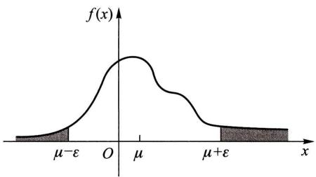  
图4-2

切比雪夫不等式也可以写成如下的形式：

$$
P \{| X - \mu | <   \varepsilon \} \geqslant 1 - \frac {\sigma^ {2}}{\varepsilon^ {2}}. \tag {2.10}
$$

切比雪夫不等式给出了在随机变量的分布未知，而只知道  $E(X)$  和  $D(X)$  的情况下估计概率  $P\{|X - E(X)| < \varepsilon \}$  的界限。例如在(2.10)式中分别取  $\varepsilon = 3\sqrt{D(X)}, 4\sqrt{D(X)}$  得到

$$
P \{| X - E (X) | <   3 \sqrt {D (X)} \} \geqslant 0. 8 8 8 9,
$$

$$
P \{| X - E (X) | <   4 \sqrt {D (X)} \geqslant 0. 9 3 7 5.
$$

这个估计是比较粗糙的①，如果已经知道随机变量的分布，那么所需求的概率可以确切地计算出来，也就没有必要利用这一不等式来作估计了.

方差性质  $4^{\circ}$  必要性的证明：

设  $D(X) = 0$  ，要证  $P\{X = E(X)\} = 1$

证 用反证法. 假设  $P\{X = E(X)\} < 1$ ，则对于某一个数  $\varepsilon > 0$ ，有  $P\{|X - E(X)| \geqslant \varepsilon\} > 0$ 。但由切比雪夫不等式，对于任意  $\varepsilon > 0$ ，由(2.9)式因  $\sigma^2 = 0$ ，有

$$
P \{| X - E (X) | \geqslant \varepsilon \} = 0,
$$

矛盾，于是  $P\{X = E(X)\} = 1$

在书末附表1中列出了多种常用的随机变量的数学期望和方差，供读者查用.

# § 3 协方差及相关系数

对于二维随机变量  $(X,Y)$ , 我们除了讨论  $X$  与  $Y$  的数学期望和方差以外, 还需讨论描述  $X$  与  $Y$  之间相互关系的数字特征. 本节讨论有关这方面的数字特征.

在本章 §2 方差性质  $3^{\circ}$  的证明中, 我们已经看到, 如果两个随机变量  $X$  和  $Y$  是相互独立的, 则

$$
E \left\{\left[ X - E (X) \right] \left[ Y - E (Y) \right] \right\} = 0.
$$

这意味着当  $E\{[X - E(X)][Y - E(Y)]\} \neq 0$  时， $X$  与  $Y$  不相互独立，而是存在着一定的关系的。

定义量  $E\{[X - E(X)][Y - E(Y)]\}$  称为随机变量  $X$  与  $Y$  的协方差.记为  $\operatorname {Cov}(X,Y)$  ，即

$$
\operatorname {C o v} (X, Y) = E \left\{\left[ X - E (X) \right] \left[ Y - E (Y) \right] \right\}.
$$

而  $\rho_{XY} = \frac{\operatorname{Cov}(X,Y)}{\sqrt{D(X)}\sqrt{D(Y)}}$

称为随机变量  $X$  与  $Y$  的相关系数.

由定义，即知

$$
\operatorname {C o v} (X, Y) = \operatorname {C o v} (Y, X), \quad \operatorname {C o v} (X, X) = D (X).
$$

由上述定义及(2.5)式知道，对于任意两个随机变量  $X$  和  $Y$  ，下列等式成立：

$$
D (X + Y) = D (X) + D (Y) + 2 \operatorname {C o v} (X, Y). \tag {3.1}
$$

将  $\operatorname{Cov}(X,Y)$  的定义式展开，易得

$$
\operatorname {C o v} (X, Y) = E (X Y) - E (X) E (Y). \tag {3.2}
$$

我们常常利用这一式子计算协方差，

协方差具有下述性质：

$1^{\circ}\operatorname {Cov}(aX,bY) = ab\operatorname {Cov}(X,Y),a,b$  是常数

$$
2 ^ {\circ} \operatorname {C o v} \left(X _ {1} + X _ {2}, Y\right) = \operatorname {C o v} \left(X _ {1}, Y\right) + \operatorname {C o v} \left(X _ {2}, Y\right).
$$

（证明由读者自己来完成.）

下面我们来推导  $\rho_{XY}$  的两条重要性质，并说明  $\rho_{XY}$  的含义.

考虑以  $X$  的线性函数  $a + bX$  来近似表示  $Y$ . 我们以均方误差

$$
\begin{array}{l} e = E \left\{\left[ Y - (a + b X) \right] ^ {2} \right\} \\ = E \left(Y ^ {2}\right) + b ^ {2} E \left(X ^ {2}\right) + a ^ {2} - 2 b E (X Y) + 2 a b E (X) - 2 a E (Y) \tag {3.3} \\ \end{array}
$$

来衡量以  $a + bX$  近似表达  $Y$  的好坏程度.  $e$  的值越小表示  $a + bX$  与  $Y$  的近似程

度越好.这样，我们就取  $a,b$  使  $\mathcal{e}$  取到最小.下面就来求最佳近似式  $a + bX$  中的 $a,b.$  为此，将  $\mathcal{e}$  分别关于  $a,b$  求偏导数，并令它们等于零，得

$$
\left\{ \begin{array}{l} \frac {\partial e}{\partial a} = 2 a + 2 b E (X) - 2 E (Y) = 0, \\ \frac {\partial e}{\partial b} = 2 b E (X ^ {2}) - 2 E (X Y) + 2 a E (X) = \end{array} \right.
$$

解得  $b_{0} = \frac{\operatorname{Cov}(X,Y)}{D(X)},$

$$
a _ {0} = E (Y) - b _ {0} E (X) = E (Y) - E (X) \frac {\operatorname {C o v} (X , Y)}{D (X)}.
$$

将  $a_0, b_0$  代入(3.3)式得

$$
\min  _ {a, b} E \left\{\left[ Y - (a + b X) \right] ^ {2} \right\} = E \left\{\left[ Y - \left(a _ {0} + b _ {0} X\right) \right] ^ {2} \right\} = \left(1 - \rho_ {X Y} ^ {2}\right) D (Y) ①. \tag {3.4}
$$

由(3.4)式容易得到下述定理：

定理  $1^{\circ}|\rho_{XY}|\leqslant 1.$

$2^{\circ}|\rho_{XY}| = 1$  的充要条件是，存在常数  $a,b$  使

$$
P \{Y = a + b X \} = 1.
$$

证  $1^{\circ}$  由(3.4)式与  $E\{[Y - (a_0 + b_0X)]^2\}$  及  $D(Y)$  的非负性，知  $1 - \rho_{XY}^{2}\geqslant 0$  亦即  $|\rho_{XY}|\leqslant 1$

$2^{\circ}$  若  $|\rho_{XY}| = 1$  ，由(3.4)式得

$$
E \left\{\left[ Y - \left(a _ {0} + b _ {0} X\right) \right] ^ {2} \right\} = 0.
$$

从而  $0 = E\{[Y - (a_0 + b_0X)]^2\} = D[Y - (a_0 + b_0X)] + \{E[Y - (a_0 + b_0X)]\}^2,$

故有  $D[Y - (a_0 + b_0X)] = 0,$

$$
E [ Y - (a _ {0} + b _ {0} X) ] = 0.
$$

又由方差的性质  $4^{\circ}$  知

$$
P \{Y - (a _ {0} + b _ {0} X) = 0 \} = 1 \text {, 即} P \{Y = a _ {0} + b _ {0} X \} = 1.
$$

反之，若存在常数  $a^{*}, b^{*}$  使

$$
P \{Y = a ^ {*} + b ^ {*} X \} = 1 \text {, 即} P \{Y - (a ^ {*} + b ^ {*} X) = 0 \} = 1
$$

于是  $P\{[Y - (a^{*} + b^{*}X)]^{2} = 0\} = 1.$

即得  $E\{[Y - (a^{*} + b^{*}X)]^{2}\} = 0.$

$$
\begin{array}{l} ① \quad E \left\{\left[ Y - \left(a _ {0} + b _ {0} X\right) \right] ^ {2} \right\} = D \left(Y - a _ {0} - b _ {0} X\right) + \left[ E \left(Y - a _ {0} - b _ {0} X\right) \right] ^ {2} \\ = D (Y - b _ {0} X) + \left(- \frac {1}{2} \frac {\partial e}{\partial a} \Bigg | _ {\substack {a = a _ {0} \\ b = b _ {0}}} ^ {b = a _ {0}}\right) ^ {2} = D (Y - b _ {0} X) + 0 \\ = D (Y) + b _ {0} ^ {2} D (X) - 2 b _ {0} \operatorname {C o v} (X, Y) = D (Y) + \frac {\operatorname {C o v} ^ {2} (X , Y)}{D (X)} - 2 \frac {\operatorname {C o v} ^ {2} (X , Y)}{D (X)} \\ = D (Y) \left[ 1 - \frac {\operatorname {C o v} ^ {2} (X , Y)}{D (X) D (Y)} \right] = (1 - \rho_ {X Y} ^ {2}) D (Y). \\ \end{array}
$$

故有  $0 = E\{\left[Y - \left(a^{*} + b^{*}X\right)\right]^{2}\} \geqslant \min_{a,b}E\{\left[Y - \left(a + bX\right)\right]^{2}\}$

$$
= E \left\{\left[ Y - \left(a _ {0} + b _ {0} X\right) \right] ^ {2} \right\} = \left(1 - \rho_ {X Y} ^ {2}\right) D (Y).
$$

即得  $|\rho_{XY}| = 1.$

由(3.4)式知，均方误差  $e$  是  $|\rho_{XY}|$  的严格单调减少函数，这样  $\rho_{XY}$  的含义就很明显了。当  $|\rho_{XY}|$  较大时  $e$  较小，表明  $X, Y$ （就线性关系来说）联系较紧密。特别当  $|\rho_{XY}| = 1$  时，由定理中的  $2^{\circ}, X, Y$  之间以概率1存在着线性关系。于是  $\rho_{XY}$  是一个可以用来表征  $X, Y$  之间线性关系紧密程度的量。当  $|\rho_{XY}|$  较大时，我们通常说  $X, Y$  线性相关的程度较好；当  $|\rho_{XY}|$  较小时，我们说， $X, Y$  线性相关的程度较差。

当  $\rho_{XY} = 0$  时，称  $X$  和  $Y$  不相关

假设随机变量  $X, Y$  的相关系数  $\rho_{XY}$  存在. 当  $X$  和  $Y$  相互独立时，由数学期望的性质  $4^{\circ}$  及(3.2)式知  $\operatorname{Cov}(X, Y) = 0$  ，从而  $\rho_{XY} = 0$  ，即  $X, Y$  不相关. 反之，若  $X, Y$  不相关， $X$  和  $Y$  却不一定相互独立（见例1). 上述情况，从“不相关”和“相互独立”的含义来看是明显的. 这是因为不相关只是就线性关系来说的，而相互独立是就一般关系而言的.

不过，从例2可以看到，当  $(X,Y)$  服从二维正态分布时，  $X$  和  $Y$  不相关与  $X$  和  $Y$  相互独立是等价的.

例1 设  $(X,Y)$  的分布律为

<table><tr><td>X
Y</td><td>-2</td><td>-1</td><td>1</td><td>2</td><td>P{Y=j}</td></tr><tr><td>1</td><td>0</td><td>1/4</td><td>1/4</td><td>0</td><td>1/2</td></tr><tr><td>4</td><td>1/4</td><td>0</td><td>0</td><td>1/4</td><td>1/2</td></tr><tr><td>P{X=i}</td><td>1/4</td><td>1/4</td><td>1/4</td><td>1/4</td><td>1</td></tr></table>

易知  $E(X) = 0, E(Y) = 5 / 2, E(XY) = 0$  ，于是  $\rho_{XY} = 0, X, Y$  不相关. 这表示  $X, Y$  不存在线性关系. 但， $P\{X = -2, Y = 1\} = 0 \neq P\{X = -2\} P\{Y = 1\}$ ，知  $X, Y$  不是相互独立的. 事实上， $X$  和  $Y$  具有关系： $Y = X^2, Y$  的值完全可由  $X$  的值所确定. □

例2 设  $(X, Y)$  服从二维正态分布，它的概率密度为

$$
f (x, y) = \frac {1}{2 \pi \sigma_ {1} \sigma_ {2} \sqrt {1 - \rho^ {2}}} \exp \left\{\frac {- 1}{2 (1 - \rho^ {2})} \left[ \frac {(x - \mu_ {1}) ^ {2}}{\sigma_ {1} ^ {2}} \right. \right.
$$

$$
\left. - 2 \rho \frac {\left(x - \mu_ {1}\right) \left(y - \mu_ {2}\right)}{\sigma_ {1} \sigma_ {2}} + \frac {\left(y - \mu_ {2}\right) ^ {2}}{\sigma_ {2} ^ {2}} \right] \Bigg \},
$$

我们来求  $X$  和  $Y$  的相关系数.

在第三章 §2 例3中已经知道  $(X, Y)$  的边缘概率密度为

$$
f _ {X} (x) = \frac {1}{\sqrt {2 \pi} \sigma_ {1}} \mathrm {e} ^ {- \frac {(x - \mu_ {1}) ^ {2}}{2 \sigma_ {1} ^ {2}}}, - \infty <   x <   \infty ,
$$

$$
f _ {Y} (y) = \frac {1}{\sqrt {2 \pi} \sigma_ {2}} e ^ {- \frac {(y - \mu_ {2}) ^ {2}}{2 \sigma_ {2} ^ {2}}}, - \infty <   y <   \infty .
$$

故知  $E(X) = \mu_{1}, E(Y) = \mu_{2}, D(X) = \sigma_{1}^{2}, D(Y) = \sigma_{2}^{2}$ . 而

$$
\begin{array}{l} \operatorname {C o v} (X, Y) = \int_ {- \infty} ^ {\infty} \int_ {- \infty} ^ {\infty} (x - \mu_ {1}) (y - \mu_ {2}) f (x, y) d x d y \\ = \frac {1}{2 \pi \sigma_ {1} \sigma_ {2} \sqrt {1 - \rho^ {2}}} \int_ {- \infty} ^ {\infty} \int_ {- \infty} ^ {\infty} (x - \mu_ {1}) (y - \mu_ {2}) \\ \times \exp \left\{\frac {- 1}{2 \left(1 - \rho^ {2}\right)} \left(\frac {y - \mu_ {2}}{\sigma_ {2}} - \rho \frac {x - \mu_ {1}}{\sigma_ {1}}\right) ^ {2} - \frac {(x - \mu_ {1}) ^ {2}}{2 \sigma_ {1} ^ {2}} \right\} d y d x. \\ \end{array}
$$

令  $t = \frac{1}{\sqrt{1 - \rho^2}}\left(\frac{y - \mu_2}{\sigma_2} -\rho \frac{x - \mu_1}{\sigma_1}\right),u = \frac{x - \mu_1}{\sigma_1}$  则有

$$
\begin{array}{l} \operatorname {C o v} (X, Y) = \frac {1}{2 \pi} \int_ {- \infty} ^ {\infty} \int_ {- \infty} ^ {\infty} \left(\sigma_ {1} \sigma_ {2} \sqrt {1 - \rho^ {2}} t u + \rho \sigma_ {1} \sigma_ {2} u ^ {2}\right) e ^ {- \left(u ^ {2} + t ^ {2}\right) / 2} d t d u \\ = \frac {\rho \sigma_ {1} \sigma_ {2}}{2 \pi} \left(\int_ {- \infty} ^ {\infty} u ^ {2} \mathrm {e} ^ {- \frac {u ^ {2}}{2}} \mathrm {d} u\right) \left(\int_ {- \infty} ^ {\infty} \mathrm {e} ^ {- \frac {t ^ {2}}{2}} \mathrm {d} t\right) \\ + \frac {\sigma_ {1} \sigma_ {2} \sqrt {1 - \rho^ {2}}}{2 \pi} \left(\int_ {- \infty} ^ {\infty} u e ^ {- \frac {u ^ {2}}{2}} d u\right) \left(\int_ {- \infty} ^ {\infty} t e ^ {- \frac {t ^ {2}}{2}} d t\right) \\ = \frac {\rho \sigma_ {1} \sigma_ {2}}{2 \pi} \sqrt {2 \pi} \cdot \sqrt {2 \pi}, \\ \end{array}
$$

即有  $\operatorname{Cov}(X, Y) = \rho \sigma_1 \sigma_2.$

于是  $\rho_{XY} = \frac{\operatorname{Cov}(X,Y)}{\sqrt{D(X)}\sqrt{D(Y)}} = \rho .$

这就是说，二维正态随机变量  $(X,Y)$  的概率密度中的参数  $\rho$  就是  $X$  和  $Y$  的相关系数，因而二维正态随机变量的分布完全可由  $X,Y$  各自的数学期望、方差以及它们的相关系数所确定.

在第三章§4中已经讲过,若(X,Y)服从二维正态分布,那么X和Y相互独立的充要条件为ρ=0.现在知道ρ=ρXY,故知对于二维正态随机变量(X,Y)来说,X和Y不相关与X和Y相互独立是等价的.

# § 4 矩、协方差矩阵

本节先介绍随机变量的另外几个数字特征. 设  $(X, Y)$  是二维随机变量.

定义 设  $X$  和  $Y$  是随机变量，若

$$
E \left(X ^ {k}\right), \quad k = 1, 2, \dots
$$

存在，称它为  $X$  的  $k$  阶原点矩，简称  $k$  阶矩.

若  $E\{[X - E(X)]^k\}$  ，  $k = 2,3,\dots$

存在，称它为  $X$  的  $k$  阶中心矩.

若  $E(X^{k}Y^{l}),\quad k,l = 1,2,\dots$

存在，称它为  $X$  和  $Y$  的  $k + l$  阶混合矩

若  $E\{[X - E(X)]^k [Y - E(Y)]^l\}$  ，  $k,l = 1,2,\dots$

存在，称它为  $X$  和  $Y$  的  $k + l$  阶混合中心矩

显然， $X$  的数学期望  $E(X)$  是  $X$  的一阶原点矩，方差  $D(X)$  是  $X$  的二阶中心矩，协方差  $\operatorname{Cov}(X, Y)$  是  $X$  和  $Y$  的二阶混合中心矩.

下面介绍  $n$  维随机变量的协方差矩阵. 先从二维随机变量讲起

二维随机变量  $(X_{1},X_{2})$  有四个二阶中心矩(设它们都存在)，分别记为

$$
\begin{array}{l} c _ {1 1} = E \left\{\left[ X _ {1} - E \left(X _ {1}\right) \right] ^ {2} \right\}, \\ c _ {1 2} = E \left\{\left[ X _ {1} - E \left(X _ {1}\right) \right] \left[ X _ {2} - E \left(X _ {2}\right) \right] \right\}, \\ c _ {2 1} = E \left\{\left[ X _ {2} - E \left(X _ {2}\right) \right] \left[ X _ {1} - E \left(X _ {1}\right) \right] \right\}, \\ c _ {2 2} = E \left\{\left[ X _ {2} - E \left(X _ {2}\right) \right] ^ {2} \right\}. \\ \end{array}
$$

将它们排成矩阵的形式

$$
\left( \begin{array}{c c} c _ {1 1} & c _ {1 2} \\ c _ {2 1} & c _ {2 2} \end{array} \right).
$$

这个矩阵称为随机变量  $(X_{1},X_{2})$  的协方差矩阵

设  $n$  维随机变量  $(X_{1},X_{2},\dots ,X_{n})$  的二阶混合中心矩

$$
c _ {i j} = \operatorname {C o v} \left(X _ {i}, X _ {j}\right) = E \left\{\left[ X _ {i} - E \left(X _ {i}\right) \right] \left[ X _ {j} - E \left(X _ {j}\right) \right] \right\}, \quad i, j = 1, 2, \dots , n
$$

都存在，则称矩阵

$$
\mathbf {C} = \left[ \begin{array}{c c c c} c _ {1 1} & c _ {1 2} & \dots & c _ {1 n} \\ c _ {2 1} & c _ {2 2} & \dots & c _ {2 n} \\ \vdots & \vdots & & \vdots \\ c _ {n 1} & c _ {n 2} & \dots & c _ {n n} \end{array} \right]
$$

为  $n$  维随机变量  $(X_{1},X_{2},\dots ,X_{n})$  的协方差矩阵.由于  $c_{ij} = c_{ji}$  （  $i\neq j;i,j = 1,$ $2,\dots ,n)$  ，因而上述矩阵是一个对称矩阵.

一般， $n$  维随机变量的分布是不知道的，或者是太复杂，以致在数学上不易处理，因此在实际应用中协方差矩阵就显得重要了.

本节的最后，介绍  $n$  维正态随机变量的概率密度.我们先将二维正态随机变量的概率密度改写成另一种形式，以便将它推广到  $n$  维随机变量的场合中去.二维正态随机变量  $(X_{1},X_{2})$  的概率密度为

$$
\begin{array}{l} f \left(x _ {1}, x _ {2}\right) = \frac {1}{2 \pi \sigma_ {1} \sigma_ {2} \sqrt {1 - \rho^ {2}}} \exp \left\{\frac {- 1}{2 (1 - \rho^ {2})} \left[ \frac {\left(x _ {1} - \mu_ {1}\right) ^ {2}}{\sigma_ {1} ^ {2}} \right. \right. \\ \left. - 2 \rho \frac {\left(x _ {1} - \mu_ {1}\right) \left(x _ {2} - \mu_ {2}\right)}{\sigma_ {1} \sigma_ {2}} + \frac {\left(x _ {2} - \mu_ {2}\right) ^ {2}}{\sigma_ {2} ^ {2}} \right] \Bigg \}. \\ \end{array}
$$

现在将上式中花括号内的式子写成矩阵形式，为此引入下面的列矩阵

$$
\mathbf {X} = \left( \begin{array}{c} x _ {1} \\ x _ {2} \end{array} \right), \quad \boldsymbol {\mu} = \left( \begin{array}{c} \mu_ {1} \\ \mu_ {2} \end{array} \right).
$$

$(X_{1},X_{2})$  的协方差矩阵为

$$
\boldsymbol {C} = \left( \begin{array}{l l} c _ {1 1} & c _ {1 2} \\ c _ {2 1} & c _ {2 2} \end{array} \right) = \left( \begin{array}{c c} \sigma_ {1} ^ {2} & \rho \sigma_ {1} \sigma_ {2} \\ \rho \sigma_ {1} \sigma_ {2} & \sigma_ {2} ^ {2} \end{array} \right),
$$

它的行列式  $\operatorname{det} C = \sigma_1^2 \sigma_2^2 (1 - \rho^2)$ ,  $C$  的逆矩阵为

$$
\boldsymbol {C} ^ {- 1} = \frac {1}{\det  \boldsymbol {C}} \left[ \begin{array}{c c} \sigma_ {2} ^ {2} & - \rho \sigma_ {1} \sigma_ {2} \\ - \rho \sigma_ {1} \sigma_ {2} & \sigma_ {1} ^ {2} \end{array} \right].
$$

经过计算可知（这里矩阵  $(X - \mu)^{\mathrm{T}}$  是  $X - \mu$  的转置矩阵）

$$
\begin{array}{l} \left(\boldsymbol {X} - \boldsymbol {\mu}\right) ^ {\mathrm {T}} \boldsymbol {C} ^ {- 1} \left(\boldsymbol {X} - \boldsymbol {\mu}\right) \\ = \frac {1}{\det  C} \left(x _ {1} - \mu_ {1} \quad x _ {2} - \mu_ {2}\right) \left( \begin{array}{c c} \sigma_ {2} ^ {2} & - \rho \sigma_ {1} \sigma_ {2} \\ - \rho \sigma_ {1} \sigma_ {2} & \sigma_ {1} ^ {2} \end{array} \right) \binom {x _ {1} - \mu_ {1}} {x _ {2} - \mu_ {2}} \\ = \frac {1}{1 - \rho^ {2}} \left[ \frac {\left(x _ {1} - \mu_ {1}\right) ^ {2}}{\sigma_ {1} ^ {2}} - 2 \rho \frac {\left(x _ {1} - \mu_ {1}\right) \left(x _ {2} - \mu_ {2}\right)}{\sigma_ {1} \sigma_ {2}} + \frac {\left(x _ {2} - \mu_ {2}\right) ^ {2}}{\sigma_ {2} ^ {2}} \right]. \\ \end{array}
$$

于是  $(X_{1},X_{2})$  的概率密度可写成

$$
f \left(x _ {1}, x _ {2}\right) = \frac {1}{(2 \pi) ^ {2 / 2} (\det C) ^ {1 / 2}} \exp \left\{- \frac {1}{2} \left(\boldsymbol {X} - \boldsymbol {\mu}\right) ^ {\mathrm {T}} \boldsymbol {C} ^ {- 1} \left(\boldsymbol {X} - \boldsymbol {\mu}\right) \right\}.
$$

上式容易推广到  $n$  维正态随机变量  $(X_{1},X_{2},\dots ,X_{n})$  的情况.

引入列矩阵

$$
\pmb {X} = \left[ \begin{array}{c} {x _ {1}} \\ {x _ {2}} \\ {\vdots} \\ {x _ {n}} \end{array} \right]   \text {和}   \pmb {\mu} = \left[ \begin{array}{c} {\mu_ {1}} \\ {\mu_ {2}} \\ {\vdots} \\ {\mu_ {n}} \end{array} \right] = \left[ \begin{array}{c} {E (X _ {1})} \\ {E (X _ {2})} \\ {\vdots} \\ {E (X _ {n})} \end{array} \right].
$$

$n$  维正态随机变量  $(X_{1},X_{2},\dots ,X_{n})$  的概率密度定义为

$$
f \left(x _ {1}, x _ {2}, \dots , x _ {n}\right) = \frac {1}{(2 \pi) ^ {n / 2} (\det  C) ^ {1 / 2}} \exp \left\{- \frac {1}{2} \left(\boldsymbol {X} - \boldsymbol {\mu}\right) ^ {\mathrm {T}} \boldsymbol {C} ^ {- 1} \left(\boldsymbol {X} - \boldsymbol {\mu}\right) \right\},
$$

其中  $C$  是  $(X_{1},X_{2},\dots ,X_{n})$  的协方差矩阵

$n$  维正态随机变量具有以下四条重要性质（证略）：

$1^{\circ}n$  维正态随机变量  $(X_{1},X_{2},\dots ,X_{n})$  的每一个分量  $X_{i},i = 1,2,\dots ,n$  都是正态随机变量；反之，若  $X_{1},X_{2},\dots ,X_{n}$  都是正态随机变量，且相互独立，则  $(X_{1}$ $X_{2},\dots ,X_{n})$  是  $n$  维正态随机变量.

$2^{\circ}n$  维随机变量  $(X_{1},X_{2},\dots ,X_{n})$  服从  $n$  维正态分布的充要条件是  $X_{1}$ $X_{2},\dots ,X_{n}$  的任意的线性组合

$$
l _ {1} X _ {1} + l _ {2} X _ {2} + \dots + l _ {n} X _ {n}
$$

服从一维正态分布（其中  $l_{1}, l_{2}, \dots, l_{n}$  不全为零）.

$3^{\circ}$  若  $(X_{1}, X_{2}, \dots, X_{n})$  服从  $n$  维正态分布，设  $Y_{1}, Y_{2}, \dots, Y_{k}$  是  $X_{j} (j = 1, 2, \dots, n)$  的线性函数，则  $(Y_{1}, Y_{2}, \dots, Y_{k})$  也服从多维正态分布.

这一性质称为正态变量的线性变换不变性，

$4^{\circ}$  设  $(X_{1}, X_{2}, \dots, X_{n})$  服从  $n$  维正态分布，则“ $X_{1}, X_{2}, \dots, X_{n}$  相互独立”与“ $X_{1}, X_{2}, \dots, X_{n}$  两两不相关”是等价的.

$n$  维正态分布在随机过程和数理统计中常会遇到

小结

随机变量的数字特征是由随机变量的分布确定的，能描述随机变量某一个方面的特征的常数。最重要的数字特征是数学期望和方差。数学期望  $E(X)$  描述随机变量  $X$  取值的平均大小，方差  $D(X) = E\{[X - E(X)]^2\}$  描述随机变量  $X$  与它自己的数学期望  $E(X)$  的偏离程度。数学期望和方差在应用和理论上都非常重要。

要掌握随机变量的函数  $Y = g(X)$  的数学期望  $E(Y) = E[g(X)]$  的计算公式(1.3)和(1.4). 这两个公式的意义在于当我们求  $E(Y)$  时, 不必先求出  $Y = g(X)$  的分布律或概率密度, 而只需利用  $X$  的分布律或概率密度就可以了, 这样做的好处是明显的.

要掌握数学期望和方差的性质，提请读者注意的是：

（1）当  $X_{1}, X_{2}$  独立或  $X_{1}, X_{2}$  不相关时，才有  $E(X_{1}X_{2}) = E(X_{1})E(X_{2})$

（2）设  $C$  为常数，则有  $D(CX) = C^2 D(X)$ ，右边的系数是  $C^2$ ，不是  $C$ .

(3)  $D(X_{1} + X_{2}) = D(X_{1}) + D(X_{2}) + 2\mathrm{Cov}(X_{1},X_{2})$  ，当  $X_{1},X_{2}$  独立或  $X_{1},X_{2}$  不相关时才有

$$
D \left(X _ {1} + X _ {2}\right) = D \left(X _ {1}\right) + D \left(X _ {2}\right).
$$

例如，若  $X_{1}, X_{2}$  独立，则有  $D(2X_{1} - 3X_{2}) = 4D(X_{1}) + 9D(X_{2})$

相关系数  $\rho_{XY}$  有时也称为线性相关系数，它是一个可以用来描述随机变量  $(X,Y)$  的两个分

量  $X, Y$  之间的线性关系紧密程度的数字特征。当  $|\rho_{XY}|$  较小时  $X, Y$  的线性相关的程度较差；当  $\rho_{XY} = 0$  时称  $X, Y$  不相关。不相关是指  $X, Y$  之间不存在线性关系， $X, Y$  不相关，它们还可能存在除线性关系之外的关系（参见 §3 例1）。又由于  $X, Y$  相互独立是指  $X, Y$  的一般关系而言的，因此有以下的结论： $X, Y$  相互独立则  $X, Y$  一定不相关；反之，若  $X, Y$  不相关则  $X, Y$  不一定相互独立。

特别，对于二维正态随机变量  $(X,Y),X$  和  $Y$  不相关与  $X$  和  $Y$  相互独立是等价的．而二元正态随机变量的相关系数  $\rho_{XY}$  就是参数  $\rho$  于是，用“  $\rho = 0$  ”是否成立来检验  $X,Y$  是否相互独立是很方便的.

切比雪夫不等式给出了在随机变量  $X$  的分布未知，只知道  $E(X)$  和  $D(X)$  的情况下，对事件  $\{|X - E(X)| < \varepsilon\}$  概率的下限的估计.

# 重要术语及主题

数学期望随机变量函数的数学期望数学期望的性质方差标准差方差的性质标准化的随机变量协方差相关系数相关系数的性质  $X,Y$  不相关切比雪夫不等式几种重要分布的数学期望和方差矩协方差矩阵

# 习题

1.（1）在下列句子中随机地取一个单词，以  $X$  表示取到的单词所包含的字母个数，写出  $X$  的分布律并求  $E(X)$  
"THE GIRL PUT ON HER BEAUTIFUL RED HAT".  
（2）在上述句子的30个字母中随机地取一个字母，以  $Y$  表示取到的字母所在单词所包含的字母数，写出  $Y$  的分布律并求  $E(Y)$  
（3）一人掷骰子，如得6点则掷第2次，此时得分为  $6+$  第二次得到的点数；否则得分为他第一次掷得的点数，且不能再掷，求得分  $X$  的分布律及  $E(X)$  
2. 某产品的次品率为 0.1, 检验员每天检验 4 次. 每次随机地取 10 件产品进行检验, 如发现其中的次品数多于 1 , 就去调整设备. 以  $X$  表示一天中调整设备的次数, 试求  $E(X)$ . (设诸产品是否为次品是相互独立的.)  
3. 有 3 只球、4 个盒子, 盒子的编号为 1, 2, 3, 4. 将球逐个独立地, 随机地放入 4 个盒子中去. 以  $X$  表示其中至少有一只球的盒子的最小号码 (例如  $X = 3$  表示第 1 号、第 2 号盒子是空的, 第 3 号盒子至少有一只球), 试求  $E(X)$ .  
4.（1）设随机变量  $X$  的分布律为  $P\left\{X = (-1)^{j + 1}\frac{3^j}{j}\right\} = \frac{2}{3^j}, j = 1,2,\dots$  ，说明  $X$  的数学期望不存在.  
（2）一盒中装有一只黑球、一只白球，作摸球游戏，规则如下：一次从盒中随机摸一只球，若摸到白球，则游戏结束；若摸到黑球，放回再放入一只黑球，然后再从盒中随机地摸一只球。试说明要游戏结束的摸球次数  $X$  的数学期望不存在。  
5. 设在某一规定的时间间隔里，某电气设备用于最大负荷的时间  $X$ （以  $\min$  计）是一个随机变量，其概率密度为

$$
f (x) = \left\{ \begin{array}{l l} \frac {1}{1 5 0 0 ^ {2}} x, & 0 \leqslant x \leqslant 1 5 0 0, \\ \frac {- 1}{1 5 0 0 ^ {2}} (x - 3 0 0 0), & 1 5 0 0 <   x \leqslant 3 0 0 0, \\ 0, & \text {其 他}. \end{array} \right.
$$

求  $E(X)$

6.（1）设随机变量  $X$  的分布律为

<table><tr><td>X</td><td>-2</td><td>0</td><td>2</td></tr><tr><td>pk</td><td>0.4</td><td>0.3</td><td>0.3</td></tr></table>

求  $E(X), E(X^2), E(3X^2 + 5)$

（2）设  $X\sim \pi (\lambda)$  ，求  $E[1 / (X + 1)]$

7.（1）设随机变量  $X$  的概率密度为

$$
f (x) = \left\{ \begin{array}{l l} \mathrm {e} ^ {- x}, & x > 0, \\ 0, & x \leqslant 0. \end{array} \right.
$$

求 (i)  $Y = 2X$ ，(ii)  $Y = \mathrm{e}^{-2X}$  的数学期望.

（2）设随机变量  $X_{1}, X_{2}, \dots, X_{n}$  相互独立，且都服从(0,1)上的均匀分布. (i)求  $U = \max \{X_{1}, X_{2}, \dots, X_{n}\}$  的数学期望，(ii)求  $V = \min \{X_{1}, X_{2}, \dots, X_{n}\}$  的数学期望.

8. 设随机变量  $(X, Y)$  的分布律为

<table><tr><td>X
Y</td><td>1</td><td>2</td><td>3</td></tr><tr><td>-1</td><td>0.2</td><td>0.1</td><td>0.0</td></tr><tr><td>0</td><td>0.1</td><td>0.0</td><td>0.3</td></tr><tr><td>1</td><td>0.1</td><td>0.1</td><td>0.1</td></tr></table>

（1）求  $E(X), E(Y)$  
（2）设  $Z = Y / X$  ，求  $E(Z)$  
（3）设  $Z = (X - Y)^2$  ，求  $E(Z)$

9.（1）设随机变量  $(X,Y)$  的概率密度为

$$
f (x, y) = \left\{ \begin{array}{l l} 1 2 y ^ {2}, & 0 \leqslant y \leqslant x \leqslant 1, \\ 0, & \text {其 他}. \end{array} \right.
$$

求  $E(X), E(Y), E(XY), E(X^2 + Y^2)$

（2）设随机变量  $X, Y$  的联合概率密度为

$$
f (x, y) = \left\{ \begin{array}{l l} \frac {1}{y} \mathrm {e} ^ {- (y + x / y)}, & x > 0, y > 0, \\ 0, & \text {其 他}. \end{array} \right.
$$

求  $E(X), E(Y), E(XY)$

10.（1）设随机变量  $X\sim N(0,1),Y\sim N(0,1)$  且  $X,Y$  相互独立.求  $E[X^{2} / (X^{2} + Y^{2})]$

（2）一飞机进行空投物资作业，设目标点为原点  $O(0,0)$ ，物资着陆点为  $(X,Y), X,Y$  相互独立，且设  $X \sim N(0,\sigma^2), Y \sim N(0,\sigma^2)$ ，求原点到点  $(X,Y)$  间距离的数学期望.

11. 一工厂生产的某种设备的寿命  $X$  (以年计)服从指数分布, 概率密度为

$$
f (x) = \left\{ \begin{array}{l l} \frac {1}{4} \mathrm {e} ^ {- x / 4}, & x > 0, \\ 0, & x \leqslant 0. \end{array} \right.
$$

工厂规定，出售的设备若在售出一年之内损坏可予以调换。若工厂售出一台设备赢利100元，调换一台设备厂方需花费300元。试求厂方出售一台设备净赢利的数学期望。

12. 某车间生产的圆盘直径在区间  $(a, b)$  上服从均匀分布，试求圆盘面积的数学期望.

13. 设电压（以  $\mathrm{V}$  计）  $X\sim N(0,9)$ . 将电压施加于一检波器，其输出电压为  $Y = 5X^{2}$ ，求输出电压  $Y$  的均值.

14. 设随机变量  $X_{1}, X_{2}$  的概率密度分别为

$$
f _ {1} (x) = \left\{ \begin{array}{l l} 2 \mathrm {e} ^ {- 2 x}, & x > 0, \\ 0, & x \leqslant 0, \end{array} \right. f _ {2} (x) = \left\{ \begin{array}{l l} 4 \mathrm {e} ^ {- 4 x}, & x > 0, \\ 0, & x \leqslant 0. \end{array} \right.
$$

（1）求  $E(X_{1} + X_{2}),E(2X_{1} - 3X_{2}^{2})$

（2）又设  $X_{1}, X_{2}$  相互独立，求  $E(X_{1}X_{2})$

15. 将  $n$  只球  $(1 \sim n$  号) 随机地放进  $n$  个盒子  $(1 \sim n$  号) 中去, 一个盒子装一只球. 若一只球装入与球同号的盒子中, 则称为一个配对. 记  $X$  为总的配对数, 求  $E(X)$ .

16. 若有  $n$  把看上去样子相同的钥匙, 其中只有一把能打开门上的锁, 用它们去试开门上的锁. 设取到每只钥匙是等可能的. 若每把钥匙试开一次后除去, 试用下面两种方法求试开次数  $X$  的数学期望.

（1）写出  $X$  的分布律

（2）不写出  $X$  的分布律

17. 设  $X$  为随机变量， $C$  是常数，证明  $D(X) < E[(X - C)^2]$ ，对于  $C \neq E(X)$ .（由于  $D(X) = E\{[X - E(X)]^2\}$ ，上式表明  $E[(X - C)^2]$  当  $C = E(X)$  时取到最小值.）

18. 设随机变量  $X$  服从瑞利分布，其概率密度为

$$
f (x) = \left\{ \begin{array}{l l} \frac {x}{\sigma^ {2}} \mathrm {e} ^ {- x ^ {2} / (2 \sigma^ {2})}, & x > 0, \\ 0, & x \leqslant 0, \end{array} \right.
$$

其中  $\sigma > 0$  是常数. 求  $E(X), D(X)$

19. 设随机变量  $X$  服从  $\Gamma$  分布，其概率密度为

$$
f (x) = \left\{ \begin{array}{l l} \frac {1}{\beta^ {\alpha} \Gamma (\alpha)} x ^ {\alpha - 1} \mathrm {e} ^ {- x / \beta}, & x > 0, \\ 0, & x \leqslant 0, \end{array} \right.
$$

其中  $\alpha > 0, \beta > 0$  是常数. 求  $E(X), D(X)$

20. 设随机变量  $X$  服从几何分布, 其分布律为

$$
P \{X = k \} = p (1 - p) ^ {k - 1}, \quad k = 1, 2, \dots ,
$$

其中  $0 < p < 1$  是常数. 求  $E(X), D(X)$

21. 设长方形的长（以  $\mathrm{m}$  计）  $X\sim U(0,2)$ ，已知长方形的周长（以  $\mathrm{m}$  计）为20. 求长方形面积  $A$  的数学期望和方差.

22.（1）设随机变量  $X_{1}, X_{2}, X_{3}, X_{4}$  相互独立，且有  $E(X_{i}) = i, D(X_{i}) = 5 - i, i = 1, 2, 3, 4.$  设  $Y = 2X_{1} - X_{2} + 3X_{3} - \frac{1}{2} X_{4}.$  求  $E(Y), D(Y).$

（2）设随机变量  $X, Y$  相互独立，且  $X \sim N(720, 30^2), Y \sim N(640, 25^2)$ ，求  $Z_1 = 2X + Y$ ， $Z_2 = X - Y$  的分布，并求概率  $P\{X > Y\}, P\{X + Y > 1400\}$ .

23. 五家商店联营，它们每两周售出的某种农产品的数量（以  $\mathrm{kg}$  计）分别为  $X_{1}, X_{2}, X_{3}, X_{4}, X_{5}$ . 已知  $X_{1} \sim N(200, 225), X_{2} \sim N(240, 240), X_{3} \sim N(180, 225), X_{4} \sim N(260, 265), X_{5} \sim N(320, 270), X_{1}, X_{2}, X_{3}, X_{4}, X_{5}$  相互独立.

（1）求五家商店两周的总销售量的均值和方差，

（2）商店每隔两周进货一次，为了使新的供货到达前商店不会脱销的概率大于0.99，问商店的仓库应至少储存多少千克该产品？

24. 卡车装运水泥，设每袋水泥质量  $X$ （以  $\mathrm{kg}$  计）服从  $N(50, 2.5^2)$ ，问至多装多少袋水泥使总质量超过 2000 的概率不大于 0.05？

25. 设随机变量  $X, Y$  相互独立，且都服从(0,1)上的均匀分布.

（1）求  $E(XY), E(X / Y), E[\ln (XY)], E(|Y - X|)$

（2）以  $X, Y$  为边长作一长方形，以  $A, C$  分别表示长方形的面积和周长，求  $A$  和  $C$  的相关系数.

26.（1）设随机变量  $X_{1}, X_{2}, X_{3}$  相互独立，且有  $X_{1} \sim b(4, 1/2), X_{2} \sim b(6, 1/3), X_{3} \sim b(6, 1/3)$ ，求  $P\{X_{1} = 2, X_{2} = 2, X_{3} = 5\}, E(X_{1}X_{2}X_{3}), E(X_{1} - X_{2}), E(X_{1} - 2X_{2})$

（2）设  $X, Y$  是随机变量，且有  $E(X) = 3, E(Y) = 1, D(X) = 4, D(Y) = 9$ ，令  $Z = 5X - Y + 15$  分别在下列3种情况下求  $E(Z)$  和  $D(Z)$

(i)  $X, Y$  相互独立，(ii)  $X, Y$  不相关，(iii)  $X$  与  $Y$  的相关系数为0.25.

27. 下列各对随机变量  $X$  和  $Y$ , 问哪几对是相互独立的? 哪几对是不相关的?

(1)  $X \sim U(0, 1), Y = X^2$ .  
(2)  $X \sim U(-1, 1), Y = X^2$ .  
(3)  $X = \cos V, Y = \sin V, V \sim U(0, 2\pi)$ .

若  $(X,Y)$  的概率密度为  $f(x,y)$

(4)  $f(x, y) = \begin{cases} x + y, & 0 < x < 1, 0 < y < 1, \\ 0, & \text{其他}. \end{cases}$  
(5)  $f(x, y) = \begin{cases} 2y, & 0 < x < 1, 0 < y < 1, \\ 0, & \text{其他.} \end{cases}$

28. 设二维随机变量  $(X, Y)$  的概率密度为

$$
f (x, y) = \left\{ \begin{array}{l l} \frac {1}{\pi}, & x ^ {2} + y ^ {2} \leqslant 1, \\ 0, & \text {其 他}. \end{array} \right.
$$

试验证  $X$  和  $Y$  是不相关的，但  $X$  和  $Y$  不是相互独立的.

29. 设随机变量  $(X, Y)$  的分布律为

<table><tr><td>X
Y</td><td>-1</td><td>0</td><td>1</td></tr><tr><td>-1</td><td>1/8</td><td>1/8</td><td>1/8</td></tr><tr><td>0</td><td>1/8</td><td>0</td><td>1/8</td></tr><tr><td>1</td><td>1/8</td><td>1/8</td><td>1/8</td></tr></table>

验证  $X$  和  $Y$  是不相关的，但  $X$  和  $Y$  不是相互独立的.

30. 设  $A$  和  $B$  是试验  $E$  的两个事件，且  $P(A) > 0, P(B) > 0$  ，并定义随机变量  $X, Y$  如下：

$$
X = \left\{ \begin{array}{l l} 1, & \text {若} A \text {发 生}, \\ 0, & \text {若} A \text {不 发 生}, \end{array} \right. Y = \left\{ \begin{array}{l l} 1, & \text {若} B \text {发 生}, \\ 0, & \text {若} B \text {不 发 生}. \end{array} \right.
$$

证明若  $\rho_{XY} = 0$  ，则  $X$  和  $Y$  必定相互独立.

31. 设随机变量  $(X, Y)$  具有概率密度

$$
f (x, y) = \left\{ \begin{array}{l l} 1, & | y | <   x, 0 <   x <   1, \\ 0, & \text {其 他}. \end{array} \right.
$$

求  $E(X), E(Y), \operatorname{Cov}(X, Y)$

32. 设随机变量  $(X, Y)$  具有概率密度

$$
f (x, y) = \left\{ \begin{array}{l l} \frac {1}{8} (x + y), & 0 \leqslant x \leqslant 2, 0 \leqslant y \leqslant 2, \\ 0, & \text {其 他}. \end{array} \right.
$$

求  $E(X), E(Y), \operatorname{Cov}(X, Y), \rho_{XY}, D(X + Y)$

33. 设随机变量  $X \sim N(\mu, \sigma^2), Y \sim N(\mu, \sigma^2)$ ，且设  $X, Y$  相互独立，试求  $Z_1 = \alpha X + \beta Y$  和  $Z_2 = \alpha X - \beta Y$  的相关系数（其中  $\alpha, \beta$  是不为零的常数）.

34.（1）设随机变量  $W = (aX + 3Y)^2$  ，  $E(X) = E(Y) = 0, D(X) = 4, D(Y) = 16, \rho_{XY} = -0.5.$  求常数  $a$  使  $E(W)$  为最小，并求  $E(W)$  的最小值.

（2）设随机变量  $(X,Y)$  服从二维正态分布，且有  $D(X) = \sigma_X^2, D(Y) = \sigma_Y^2$ 。证明当  $a^2 = \sigma_X^2 / \sigma_Y^2$  时，随机变量  $W = X - aY$  与  $V = X + aY$  相互独立。

35. 设随机变量  $(X, Y)$  服从二维正态分布，且  $X \sim N(0, 3), Y \sim N(0, 4)$ ，相关系数  $\rho_{XY} = -1/4$ ，试写出  $X$  和  $Y$  的联合概率密度。

36. 已知正常男性成人血液中，每一毫升所含白细胞数的均值是7300，均方差是700。利用切比雪夫不等式估计每毫升含白细胞数在  $5200 \sim 9400$  的概率  $p$

37. 对于两个随机变量  $V, W$ ，若  $E(V^{2}), E(W^{2})$  存在，证明

$$
\left[ E (V W) \right] ^ {2} \leqslant E \left(V ^ {2}\right) E \left(W ^ {2}\right). \tag {A}
$$

这一不等式称为柯西一施瓦茨(Cauchy-Schwarz)不等式

提示：考虑实变量  $t$  的函数

$$
q (t) = E \left[ (V + t W) ^ {2} \right] = E \left(V ^ {2}\right) + 2 t E (V W) + t ^ {2} E \left(W ^ {2}\right).
$$

# 38. 分位数（分位点）.

定义 设连续型随机变量  $X$  的分布函数为  $F(x)$ ，概率密度函数为  $f(x)$

$1^{\circ}$  对于任意正数  $\alpha (0 < \alpha < 1)$ ，称满足条件

$$
P \{X \leqslant x _ {\underline {{\alpha}}} \} = F (x _ {\underline {{\alpha}}}) = \int_ {- \infty} ^ {x _ {\underline {{\alpha}}}} f (x) \mathrm {d} x = \alpha
$$

的数  $x_{\alpha}$  为此分布的  $\alpha$  分位数或下  $\alpha$  分位数

$2^{\circ}$  对于任意正数  $\alpha (0 < \alpha < 1)$ ，称满足条件

$$
P \{X > x _ {\alpha} \} = 1 - F (x _ {\alpha}) = \int_ {x _ {\alpha}} ^ {\infty} f (x) \mathrm {d} x = \alpha
$$

的数  $x_{\alpha}$  为此分布的上  $\alpha$  分位数

特别，当  $\alpha = 0.5$  时，

$$
F (x _ {0. 5}) = F (x _ {\underline {{0 . 5}}}) = \int_ {0. 5} ^ {\infty} f (x) \mathrm {d} x = 0. 5,
$$

$x_{0.5}$  称为此分布的中位数

下  $\alpha$  分位数  $x_{\underline{\alpha}}$  将概率密度曲线下的面积分为两部分，左侧的面积恰为  $\alpha$  （见题38图(1)).上  $\alpha$  分位数  $x_{\alpha}$  也将概率密度曲线下的面积分为两部分，右侧的面积恰为  $\alpha$  （见题38图(2)).

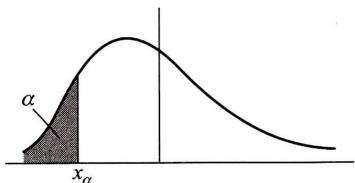  
(1)  
题38图

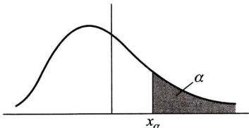  
(2)

下  $\alpha$  分位数与上  $\alpha$  分位数有以下的关系：

$$
x _ {\alpha} = x _ {1 - \alpha}, \quad x _ {\underline {{\alpha}}} = x _ {1 - \alpha}.
$$

类似地，可定义离散型随机变量  $X$  的分位数

定义 对于任意正数  $\alpha (0 < \alpha < 1)$ ，称满足条件

$$
P \{X <   x _ {\underline {{{\alpha}}}} \} \leqslant \alpha \quad \text {且} \quad P \{X \leqslant x _ {\underline {{{\alpha}}}} \} \geqslant \alpha
$$

的数  $x_{\alpha}$  为此分布的  $\alpha$  分位数或下  $\alpha$  分位数

（1）设  $X$  的概率密度为

$$
f (x) = \left\{ \begin{array}{l l} 2 \mathrm {e} ^ {- 2 x}, & x \geqslant 0, \\ 0, & \text {其 他}. \end{array} \right.
$$

试求  $X$  的中位数  $M$

（2）设  $X$  服从柯西分布，其概率密度为

$$
f (x) = \frac {b}{\pi [ (x - a) ^ {2} + b ^ {2} ]}, \quad b > 0.
$$

试求  $X$  的中位数  $M$