# 第五章 大数定律及中心极限定理

极限定理是概率论的基本理论，在理论研究和应用中起着重要的作用，其中最重要的是称为“大数定律”与“中心极限定理”的一些定理。大数定律是叙述随机变量序列的前一些项的算术平均值在某种条件下收敛到这些项的均值的算术平均值；中心极限定理则是确定在什么条件下，大量随机变量之和的分布逼近于正态分布。本章介绍几个大数定律和中心极限定理。

# §1 大数定律

第一章曾讲过，大量试验证实，随机事件  $A$  的频率  $f_{n}(A)$  当重复试验的次数  $n$  增大时总呈现出稳定性，稳定在某一个常数的附近. 频率的稳定性是概率定义的客观基础. 本节我们将对频率的稳定性作出理论的说明.

弱大数定律（辛钦大数定律）设  $X_{1}, X_{2}, \cdots$  是相互独立①，服从同一分布的随机变量序列，且具有数学期望  $E(X_{k}) = \mu (k = 1, 2, \cdots)$ 。作前  $n$  个变量的算术平均  $\frac{1}{n} \sum_{k=1}^{n} X_{k}$ ，则对于任意  $\varepsilon > 0$ ，有

$$
\lim  _ {n \rightarrow \infty} P \left\{\left| \frac {1}{n} \sum_ {k = 1} ^ {n} X _ {k} - \mu \right| <   \varepsilon \right\} = 1. \tag {1.1}
$$

证 我们只在随机变量的方差  $D(X_{k}) = \sigma^{2}(k = 1,2,\dots)$  存在这一条件下证明上述结果.因为

$$
E \left(\frac {1}{n} \sum_ {k = 1} ^ {n} X _ {k}\right) = \frac {1}{n} \sum_ {k = 1} ^ {n} E (X _ {k}) = \frac {1}{n} n \mu = \mu ,
$$

又由独立性得

$$
D \left(\frac {1}{n} \sum_ {k = 1} ^ {n} X _ {k}\right) = \frac {1}{n ^ {2}} \sum_ {k = 1} ^ {n} D (X _ {k}) = \frac {1}{n ^ {2}} n \sigma^ {2} = \frac {\sigma^ {2}}{n},
$$

由切比雪夫不等式（见第四章(2.9)式）得

$$
1 \geqslant P \left\{\left| \frac {1}{n} \sum_ {k = 1} ^ {n} X _ {k} - \mu \right| <   \varepsilon \right\} \geqslant 1 - \frac {\sigma^ {2} / n}{\varepsilon^ {2}}.
$$

在上式中令  $n\to \infty$  ，即得

$$
\lim  _ {n \rightarrow \infty} P \left\{\left| \frac {1}{n} \sum_ {k = 1} ^ {n} X _ {k} - \mu \right| <   \varepsilon \right\} = 1.
$$

$\left|\frac{1}{n}\sum_{k = 1}^{n}X_{k} - \mu \right| < \varepsilon \Bigg\}$  是一个随机事件.等式(1.1)表明，当  $n\to \infty$  时这个事件的概率趋于1.即对于任意正数  $\varepsilon$  ，当  $n$  充分大时，不等式  $\left|\frac{1}{n}\sum_{k = 1}^{n}X_{k} - \mu \right| < \varepsilon$  成立的概率很大.通俗地说，辛钦大数定律是说，对于独立同分布且具有均值  $\mu$  的随机变量  $X_{1},X_{2},\dots ,X_{n}$  ，当  $n$  很大时它们的算术平均  $\frac{1}{n}\sum_{k = 1}^{n}X_{k}$  很可能接近于  $\mu$

设  $Y_{1}, Y_{2}, \dots, Y_{n}, \dots$  是一个随机变量序列， $a$  是一个常数。若对于任意正数  $\varepsilon$ ，有

$$
\lim  _ {n \rightarrow \infty} P \{| Y _ {n} - a | <   \varepsilon \} = 1,
$$

则称序列  $Y_{1}, Y_{2}, \dots, Y_{n}, \dots$  依概率收敛于  $a$ , 记为

$$
Y _ {n} \xrightarrow {P} a.
$$

依概率收敛的序列有以下的性质.

设  $X_{n}\xrightarrow{P}a,Y_{n}\xrightarrow{P}b$  ，又设函数  $g(x,y)$  在点  $(a,b)$  连续，则

$$
g (X _ {n}, Y _ {n}) \xrightarrow {P} g (a, b). (\text {证 略}.)
$$

这样，辛钦大数定律又可叙述为：

弱大数定律（辛钦大数定律）设随机变量  $X_{1}, X_{2}, \dots, X_{n}, \dots$  相互独立，服从同一分布且具有数学期望  $E(X_{k}) = \mu (k = 1, 2, \dots)$ ，则序列  $\overline{X} = \frac{1}{n} \sum_{k=1}^{n} X_{k}$  依概率收敛于  $\mu$ ，即  $\overline{X} \xrightarrow{P} \mu$ .

下面介绍辛钦大数定律的一个重要推论

伯努利大数定律 设  $f_{A}$  是  $n$  次独立重复试验中事件  $A$  发生的次数,  $p$  是事件  $A$  在每次试验中发生的概率, 则对于任意  $\varepsilon > 0$ , 有

$$
\lim  _ {n \rightarrow \infty} P \left\{\left| \frac {f _ {A}}{n} - p \right| <   \varepsilon \right\} = 1 \tag {1.2}
$$

或

$$
\lim  _ {n \rightarrow \infty} P \left\{\left| \frac {f _ {A}}{n} - p \right| \geqslant \varepsilon \right\} = 0. \tag {1.2}
$$

证 因为  $f_{A} \sim b(n, p)$ , 由第四章 §2 例 6, 有

$$
f _ {A} = X _ {1} + X _ {2} + \dots + X _ {n},
$$

其中， $X_{1}, X_{2}, \dots, X_{n}$  相互独立，且都服从以  $p$  为参数的(0-1)分布，因而  $E(X_{k}) = p (k = 1, 2, \dots, n)$ ，由(1.1)式即得

$$
\lim  _ {n \rightarrow \infty} P \left\{\left| \frac {1}{n} \sum_ {k = 1} ^ {n} X _ {k} - p \right| <   \varepsilon \right\} = 1,
$$

即  $\lim_{n\to \infty}P\left\{\left|\frac{f_A}{n} -p\right|\geqslant \varepsilon \right\} = 0.$

伯努利大数定律的结果表明, 对于任意  $\varepsilon > 0$ , 只要重复独立试验的次数  $n$  充分大, 事件  $\left\{\left|\frac{f_A}{n} - p\right| \geqslant \varepsilon\right\}$  是一个小概率事件, 由实际推断原理知 (见第一章 §4), 这一事件实际上几乎是不发生的, 即在  $n$  充分大时事件  $\left\{\left|\frac{f_A}{n} - p\right| < \varepsilon\right\}$  实际上几乎是必定要发生的, 亦即对于给定的任意小的正数  $\varepsilon$ , 在  $n$  充分大时, 事件“频率  $\frac{f_A}{n}$  与概率  $p$  的偏差小于  $\varepsilon$ " 实际上几乎是必定要发生的. 这就是我们所说的频率稳定性的真正含义. 由实际推断原理, 在实际应用中, 当试验次数很大时, 便可以用事件的频率来代替事件的概率.

# § 2 中心极限定理

在客观实际中有许多随机变量，它们是由大量的相互独立的随机因素的综合影响所形成的。而其中每一个别因素在总的影响中所起的作用都是微小的。这种随机变量往往近似地服从正态分布。这种现象就是中心极限定理的客观背景。本节只介绍三个常用的中心极限定理。

定理1（独立同分布的中心极限定理）设随机变量  $X_{1}, X_{2}, \dots, X_{n}, \dots$  相互独立，服从同一分布，且具有数学期望和方差： $E(X_{k}) = \mu, D(X_{k}) = \sigma^{2} > 0 (k = 1, 2, \dots)$ ，则随机变量之和  $\sum_{k=1}^{n} X_{k}$  的标准化变量

$$
Y _ {n} = \frac {\sum_ {k = 1} ^ {n} X _ {k} - E \left(\sum_ {k = 1} ^ {n} X _ {k}\right)}{\sqrt {D \left(\sum_ {k = 1} ^ {n} X _ {k}\right)}} = \frac {\sum_ {k = 1} ^ {n} X _ {k} - n \mu}{\sqrt {n} \sigma}
$$

的分布函数  $F_{n}(x)$  对于任意  $\mathcal{X}$  满足

$$
\begin{array}{l} \lim  _ {n \rightarrow \infty} F _ {n} (x) = \lim  _ {n \rightarrow \infty} P \left\{\frac {\sum_ {k = 1} ^ {n} X _ {k} - n \mu}{\sqrt {n} \sigma} \leqslant x \right\} \\ = \int_ {- \infty} ^ {x} \frac {1}{\sqrt {2 \pi}} \mathrm {e} ^ {- t ^ {2} / 2} \mathrm {d} t = \Phi (x). \tag {2.1} \\ \end{array}
$$

证明略.

这就是说，均值为  $\mu$  ，方差为  $\sigma^2 > 0$  的独立同分布的随机变量  $X_1, X_2, \dots, X_n$  之和  $\sum_{k=1}^{n} X_k$  的标准化变量，当  $n$  充分大时，有

$$
\frac {\sum_ {k = 1} ^ {n} X _ {k} - n \mu}{\sqrt {n} \sigma} \widetilde {\text {近 似 地}} N (0, 1). \tag {2.2}
$$

在一般情况下，很难求出  $n$  个随机变量之和  $\sum_{k=1}^{n} X_k$  的分布函数，(2.2)式表明，当  $n$  充分大时，可以通过  $\Phi(x)$  给出其近似的分布。这样，就可以利用正态分布对  $\sum_{k=1}^{n} X_k$  作理论分析或作实际计算，其好处是明显的。

将(2.2)式左端改写成  $\frac{\frac{1}{n}\sum_{k = 1}^{n}X_k - \mu}{\sigma / \sqrt{n}} = \frac{\overline{X} - \mu}{\sigma / \sqrt{n}}$  ，这样，上述结果可写成：当  $n$  充分大时，

$$
\frac {\overline {{{X}}} - \mu}{\sigma / \sqrt {n}} \stackrel {\text {近 似 地}} {\widetilde {} N (0 , 1)} \quad \text {或} \quad \overline {{{X}}} \stackrel {\text {近 似 地}} {\widetilde {} N (\mu , \sigma^ {2} / n)}. \qquad \qquad (2. 3)
$$

这是独立同分布的中心极限定理结果的另一个形式。这就是说，均值为  $\mu$ ，方差为  $\sigma^2 > 0$  的独立同分布的随机变量  $X_1, X_2, \dots, X_n$  的算术平均  $\overline{X} = \frac{1}{n}\sum_{k=1}^{n}X_k$ ，当  $n$  充分大时近似地服从均值为  $\mu$ ，方差为  $\sigma^2 / n$  的正态分布。这一结果是数理统计中大样本统计推断的基础。

定理2（李雅普诺夫(Lyapunov)定理）设随机变量  $X_{1}, X_{2}, \dots, X_{n}, \dots$  相互独立，它们具有数学期望和方差

$$
E \left(X _ {k}\right) = \mu_ {k}, \quad D \left(X _ {k}\right) = \sigma_ {k} ^ {2} > 0, \quad k = 1, 2, \dots ,
$$

记  $B_{n}^{2} = \sum_{k = 1}^{n}\sigma_{k}^{2}.$

若存在正数  $\delta$  ，使得当  $n\to \infty$  时，

$$
\frac {1}{B _ {n} ^ {2 + \delta}} \sum_ {k = 1} ^ {n} E \{\mid X _ {k} - \mu_ {k} \mid^ {2 + \delta} \} \rightarrow 0,
$$

则随机变量之和  $\sum_{k = 1}^{n}X_{k}$  的标准化变量

$$
Z _ {n} = \frac {\sum_ {k = 1} ^ {n} X _ {k} - E \left(\sum_ {k = 1} ^ {n} X _ {k}\right)}{\sqrt {D \left(\sum_ {k = 1} ^ {n} X _ {k}\right)}} = \frac {\sum_ {k = 1} ^ {n} X _ {k} - \sum_ {k = 1} ^ {n} \mu_ {k}}{B _ {n}}
$$

的分布函数  $F_{n}(x)$  对于任意  $x$  ，满足

$$
\begin{array}{l} \lim  _ {n \rightarrow \infty} F _ {n} (x) = \lim  _ {n \rightarrow \infty} P \left\{\frac {\sum_ {k = 1} ^ {n} X _ {k} - \sum_ {k = 1} ^ {n} \mu_ {k}}{B _ {n}} \leqslant x \right\} \\ = \int_ {- \infty} ^ {x} \frac {1}{\sqrt {2 \pi}} \mathrm {e} ^ {- t ^ {2} / 2} \mathrm {d} t = \Phi (x). \tag {2.4} \\ \end{array}
$$

证明略.

定理2表明，在定理的条件下，随机变量

$$
Z _ {n} = \frac {\sum_ {k = 1} ^ {n} X _ {k} - \sum_ {k = 1} ^ {n} \mu_ {k}}{B _ {n}}
$$

当  $n$  很大时，近似地服从正态分布  $N(0,1)$ 。由此，当  $n$  很大时， $\sum_{k=1}^{n} X_k = B_n Z_n + \sum_{k=1}^{n} \mu_k$  近似地服从正态分布  $N\left(\sum_{k=1}^{n} \mu_k, B_n^2\right)$ 。这就是说，无论各个随机变量  $X_k (k=1, 2, \cdots)$  服从什么分布，只要满足定理的条件，那么它们的和  $\sum_{k=1}^{n} X_k$  当  $n$  很大时，就近似地服从正态分布。这就是正态随机变量在概率论中占有重要地位的一个基本原因。在很多问题中，所考虑的随机变量可以表示成很多个独立的随机变量之和。例如，在任一指定时刻，一个城市的耗电量是大量用户耗电量的总和；一个物理实验的测量误差是由许多观察不到的、可加的微小误差所合成的，它们往往近似地服从正态分布。

下面介绍另一个中心极限定理，它是定理1的特殊情况.

定理3（棣莫弗一拉普拉斯（DeMoivre-Laplace）定理）设随机变量 $\eta_{n}(n = 1,2,\dots)$  服从参数为  $n,p(0 < p < 1)$  的二项分布，则对于任意  $\mathcal{X}$  ，有

$$
\lim  _ {n \rightarrow \infty} P \left\{\frac {\eta_ {n} - n p}{\sqrt {n p (1 - p)}} \leqslant x \right\} = \int_ {- \infty} ^ {x} \frac {1}{\sqrt {2 \pi}} \mathrm {e} ^ {- t ^ {2} / 2} \mathrm {d} t = \Phi (x). \tag {2.5}
$$

证 由第四章 §2 例6知可以将  $\eta_{n}$  分解成为  $n$  个相互独立、服从同一  $(0 - 1)$  分布的诸随机变量  $X_{1}, X_{2}, \dots, X_{n}$  之和，即有

$$
\eta_ {n} = \sum_ {k = 1} ^ {n} X _ {k},
$$

其中  $X_{k}(k = 1,2,\dots ,n)$  的分布律为

$$
P \{X _ {k} = i \} = p ^ {i} (1 - p) ^ {1 - i}, \quad i = 0, 1.
$$

由于  $E(X_{k}) = p, D(X_{k}) = p(1 - p)(k = 1,2,\dots ,n)$  ，由定理1得

$$
\begin{array}{l} \lim  _ {n \rightarrow \infty} P \left\{\frac {\eta_ {n} - n p}{\sqrt {n p (1 - p)}} \leqslant x \right\} = \lim  _ {n \rightarrow \infty} P \left\{\frac {\sum_ {k = 1} ^ {n} X _ {k} - n p}{\sqrt {n p (1 - p)}} \leqslant x \right\} \\ = \int_ {- \infty} ^ {x} \frac {1}{\sqrt {2 \pi}} \mathrm {e} ^ {- t ^ {2} / 2} \mathrm {d} t = \Phi (x). \\ \end{array}
$$

这个定理表明，正态分布是二项分布的极限分布.当  $n$  充分大时，我们可以利用(2.5)式来计算二项分布的概率.下面举几个关于中心极限定理应用的例子.

例1 一加法器同时收到20个噪声电压  $V_{k} (k = 1, 2, \dots, 20)$ ，设它们是相互独立的随机变量，且都在区间(0,10)上服从均匀分布. 记  $V = \sum_{k=1}^{20} V_{k}$ ，求  $P\{V > 105\}$  的近似值.

解 易知  $E(V_{k}) = 5, D(V_{k}) = 100 / 12 (k = 1, 2, \dots, 20)$ . 由定理1，随机变量

$$
Z = \frac {\sum_ {k = 1} ^ {2 0} V _ {k} - 2 0 \times 5}{\sqrt {1 0 0 / 1 2} \sqrt {2 0}} = \frac {V - 2 0 \times 5}{\sqrt {1 0 0 / 1 2} \sqrt {2 0}}
$$

近似服从正态分布  $N(0,1)$ ，于是

$$
\begin{array}{l} P \{V > 1 0 5 \} = P \left\{\frac {V - 2 0 \times 5}{(1 0 / \sqrt {1 2}) \sqrt {2 0}} > \frac {1 0 5 - 2 0 \times 5}{(1 0 / \sqrt {1 2}) \sqrt {2 0}} \right\} \\ = P \left\{\frac {V - 1 0 0}{(1 0 / \sqrt {1 2}) \sqrt {2 0}} > 0. 3 8 7 \right\} \\ = 1 - P \left\{\frac {V - 1 0 0}{(1 0 / \sqrt {1 2}) \sqrt {2 0}} \leqslant 0. 3 8 7 \right\} \\ \approx 1 - \int_ {- \infty} ^ {0. 3 8 7} \frac {1}{\sqrt {2 \pi}} \mathrm {e} ^ {- t ^ {2} / 2} \mathrm {d} t = 1 - \Phi (0. 3 8 7) = 0. 3 4 8. \\ \end{array}
$$

即有  $P\{V > 105\} \approx 0.348.$

例2 一船舶在某海区航行，已知每遭受一次波浪的冲击，纵摇角大于  $3^{\circ}$  的概率为  $p = 1 / 3$  ，若船舶遭受了90000次波浪冲击，问其中有  $29500\sim 30500$  次纵摇角度大于  $3^{\circ}$  的概率是多少？

解我们将船舶每遭受一次波浪冲击看作一次试验，并假定各次试验是独

立的.在90000次波浪冲击中纵摇角度大于  $3^{\circ}$  的次数记为  $X$  ，则  $X$  是一个随机变量，且有  $X\sim b(90000,1 / 3)$  .其分布律为

$$
P \{X = k \} = \binom {9 0 0 0 0} {k} \left(\frac {1}{3}\right) ^ {k} \left(\frac {2}{3}\right) ^ {9 0 0 0 0 - k}, \quad k = 0, 1, \dots , 9 0 0 0 0.
$$

所求的概率为

$$
P \{2 9 5 0 0 \leqslant X \leqslant 3 0 5 0 0 \} = \sum_ {k = 2 9 5 0 0} ^ {3 0 5 0 0} \binom {9 0 0 0 0} {k} \left(\frac {1}{3}\right) ^ {k} \left(\frac {2}{3}\right) ^ {9 0 0 0 0 - k},
$$

要直接计算是麻烦的，我们利用棣莫弗一拉普拉斯定理来求它的近似值.即有

$$
\begin{array}{l} P \{2 9 5 0 0 \leqslant X \leqslant 3 0 5 0 0 \} \\ = P \left\{\frac {2 9 5 0 0 - n p}{\sqrt {n p (1 - p)}} \leqslant \frac {X - n p}{\sqrt {n p (1 - p)}} \leqslant \frac {3 0 5 0 0 - n p}{\sqrt {n p (1 - p)}} \right\} \\ \approx \int_ {\frac {2 9 5 0 0 - n p}{\sqrt {n p (1 - p)}}} ^ {\frac {3 0 5 0 0 - n p}{\sqrt {n p (1 - p)}}} \frac {1}{\sqrt {2 \pi}} \mathrm {e} ^ {- t ^ {2} / 2} \mathrm {d} t = \Phi \left(\frac {3 0 5 0 0 - n p}{\sqrt {n p (1 - p)}}\right) - \Phi \left(\frac {2 9 5 0 0 - n p}{\sqrt {n p (1 - p)}}\right), \\ \end{array}
$$

其中  $n = 90000, p = 1 / 3$ . 即有

$$
P \{2 9 5 0 0 \leqslant X \leqslant 3 0 5 0 0 \} \approx \Phi \left(\frac {5 \sqrt {2}}{2}\right) - \Phi \left(- \frac {5 \sqrt {2}}{2}\right) = 0. 9 9 9 5.
$$

例3 对于一个学生而言，来参加家长会的家长人数是一个随机变量，设一个学生无家长、有1名家长、有2名家长来参加会议的概率分别为0.05、0.8、0.15。若学校共有400名学生，设各学生参加会议的家长人数相互独立，且服从同一分布。

（1）求参加会议的家长人数  $X$  超过450的概率  
(2) 求有 1 名家长来参加会议的学生人数不多于 340 的概率.

解（1）以  $X_{k}(k = 1,2,\dots ,400)$  记第  $\pmb{k}$  个学生来参加会议的家长人数，则 $X_{k}$  的分布律为

<table><tr><td>Xk</td><td>0</td><td>1</td><td>2</td></tr><tr><td>pk</td><td>0.05</td><td>0.8</td><td>0.15</td></tr></table>

易知  $E(X_{k}) = 1.1, D(X_{k}) = 0.19, k = 1,2,\dots ,400.$  而  $X = \sum_{k = 1}^{400}X_{k}.$  由定理1，随机变量

$$
\frac {\sum_ {k = 1} ^ {4 0 0} X _ {k} - 4 0 0 \times 1 . 1}{\sqrt {4 0 0} \sqrt {0 . 1 9}} = \frac {X - 4 0 0 \times 1 . 1}{\sqrt {4 0 0} \sqrt {0 . 1 9}}
$$

近似服从正态分布  $N(0,1)$ ，于是

$$
\begin{array}{l} P \{X > 4 5 0 \} = P \left\{\frac {X - 4 0 0 \times 1 . 1}{\sqrt {4 0 0} \sqrt {0 . 1 9}} > \frac {4 5 0 - 4 0 0 \times 1 . 1}{\sqrt {4 0 0} \sqrt {0 . 1 9}} \right\} \\ = 1 - P \left\{\frac {X - 4 0 0 \times 1 . 1}{\sqrt {4 0 0} \sqrt {0 . 1 9}} \leqslant 1. 1 4 7 \right\} \\ \approx 1 - \Phi (1. 1 4 7) = 0. 1 2 5 1. \\ \end{array}
$$

（2）以  $Y$  记有1名家长参加会议的学生人数，则  $Y\sim b(400,0.8)$  ，由定理3，

$$
\begin{array}{l} P \{Y \leqslant 3 4 0 \} = P \left\{\frac {Y - 4 0 0 \times 0 . 8}{\sqrt {4 0 0 \times 0 . 8 \times 0 . 2}} \leqslant \frac {3 4 0 - 4 0 0 \times 0 . 8}{\sqrt {4 0 0 \times 0 . 8 \times 0 . 2}} \right\} \\ = P \left\{\frac {Y - 4 0 0 \times 0 . 8}{\sqrt {4 0 0 \times 0 . 8 \times 0 . 2}} \leqslant 2. 5 \right\} \approx \Phi (2. 5) = 0. 9 9 3 8. \\ \end{array}
$$

小结

人们在长期实践中认识到频率具有稳定性，即当试验次数不断增大时，频率稳定在一个数的附近。这一事实显示了可以用一个数来表征事件发生的可能性的大小。这使人们认识到概率是客观存在的，进而由频率的性质的启发和抽象给出了概率的定义，因而频率的稳定性是概率定义的客观基础。伯努利大数定律则以严密的数学形式论证了频率的稳定性。

中心极限定理表明，在相当一般的条件下，当独立随机变量的个数不断增加时，其和的分布趋于正态分布。这一事实阐明了正态分布的重要性，也揭示了为什么在实际应用中会经常遇到正态分布，也就是揭示了产生正态分布变量的源泉。另一方面，它提供了独立同分布随机变量之和  $\sum_{k=1}^{n} X_k$ （其中  $X_k$  的方差存在）的近似分布，只要和式中加项的个数充分大，就可以不必考虑和式中的随机变量服从什么分布，都能用正态分布来近似，这在应用上是有效和重要的。

中心极限定理的内容包含极限，因而称它为极限定理是很自然的。又由于它在统计中的重要性，称它为中心极限定理，这是波利亚(Pólya)在1920年取的名字。

# 重要术语及主题

依概率收敛 伯努利大数定律 辛钦大数定律 独立同分布的中心极限定理 李雅普诺夫中心极限定理 棣莫弗一拉普拉斯中心极限定理

# 习题

1. 据以往经验, 某种电器元件的寿命服从均值为  $100 \mathrm{~h}$  的指数分布, 现随机地取 16 只, 设它们的寿命是相互独立的. 求这 16 只元件的寿命的总和大于  $1920 \mathrm{~h}$  的概率.  
2.（1）一保险公司有10000个汽车投保人，每个投保人索赔金额的数学期望为280美元，标准差为800美元，求索赔总金额超过2700000美元的概率.  
(2）一公司有50张签约保险单，各张保险单的索赔金额  $X_{i},i = 1,2,\dots ,50$  （以千美元计）

服从韦布尔(Weibull)分布，均值  $E(X_{i}) = 5$  ，方差  $D(X_{i}) = 6$  ，求50张保险单索赔的合计金额大于300的概率（设各保险单索赔金额是相互独立的）.

3. 计算器在进行加法时，将每个加数舍入最靠近它的整数，设所有舍入误差相互独立且在  $(-0.5, 0.5)$  上服从均匀分布。

（1）将1500个数相加，问误差总和的绝对值超过15的概率是多少？  
（2）最多可有几个数相加使得误差总和的绝对值小于10的概率不小于0.90？

4. 设各零件的质量都是随机变量，它们相互独立，且服从相同的分布，其数学期望为  $0.5\mathrm{kg}$ ，均方差为  $0.1\mathrm{kg}$ ，问5000个零件的总质量超过  $2510\mathrm{kg}$  的概率是多少？  
5. 有一批建筑房屋用的木柱，其中  $80\%$  的长度不小于  $3\mathrm{m}$ ，现从这批木柱中随机地取100根，求其中至少有30根短于  $3\mathrm{m}$  的概率.  
6. 一工人修理一台机器需两个阶段，第一阶段所需时间（以  $\mathrm{h}$  计）服从均值为0.2的指数分布，第二阶段所需时间服从均值为0.3的指数分布，且与第一阶段独立。现有20台机器需要修理，求他在  $8\mathrm{h}$  内完成的概率。  
7. 一食品店有三种蛋糕出售，由于售出哪一种蛋糕是随机的，因而售出一只蛋糕的价格是一个随机变量，它取1元、1.2元、1.5元各个值的概率分别为0.3,0.2,0.5.若售出300只蛋糕

（1）求收入至少400元的概率

（2）求售出价格为1.2元的蛋糕多于60只的概率

8. 一复杂的系统由100个相互独立起作用的部件所组成，在整个运行期间每个部件损坏的概率为0.1.为了使整个系统起作用，至少必须有85个部件正常工作，求整个系统起作用的概率.

9. 已知在某十字路口，一周事故发生数的数学期望为2.2，标准差为1.4.

（1）以  $\overline{X}$  表示一年(以52周计)此十字路口事故发生数的算术平均，试用中心极限定理求  $\overline{X}$  的近似分布，并求  $P\{\overline{X} < 2\}$  
（2）求一年事故发生数小于100的概率.  
10. 某种小汽车氧化氮的排放量的数学期望为  $0.9 \, \mathrm{g/km}$ ，标准差为  $1.9 \, \mathrm{g/km}$ ，某汽车公司有这种小汽车100辆，以  $\overline{X}$  表示这些车辆氧化氮排放量的算术平均，问当  $L$  为何值时  $\overline{X} > L$  的概率不超过0.01？  
11. 随机地选取两组学生，每组80人，分别在两个实验室里测量某种化合物的  $\mathrm{pH}$ 。各人测量的结果是随机变量，它们相互独立，服从同一分布，数学期望为5，方差为0.3，以  $\overline{X}, \overline{Y}$  分别表示第一组和第二组所得结果的算术平均。

（1）求  $P\{4.9 < \overline{X} < 5.1\}$

（2）求  $P\{-0.1 < \overline{X} - \overline{Y} < 0.1\}$

12. 一公寓有 200 户住户, 一户住户拥有汽车辆数  $X$  的分布律为

<table><tr><td>X</td><td>0</td><td>1</td><td>2</td></tr><tr><td>pk</td><td>0.1</td><td>0.6</td><td>0.3</td></tr></table>

问需要多少车位，才能使每辆汽车都具有一个车位的概率至少为0.95？

13. 某种电子器件的寿命（以h计）具有数学期望  $\mu$  （未知），方差  $\sigma^2 = 400$  .为了估计  $\mu$  ，随机地取  $n$  只这种器件，在时刻  $t = 0$  投入测试（测试是相互独立的)直到失效，测得其寿命为 $X_{1},X_{2},\dots ,X_{n}$  ，以  $\overline{X} = \frac{1}{n}\sum_{i = 1}^{n}X_{i}$  作为  $\mu$  的估计，为使  $P\{|X - \mu | < 1\} \geqslant 0.95$  ，问  $n$  至少为多少？

14. 某药厂断言，该厂生产的某种药品对于医治一种疑难血液病的治愈率为0.8，医院任意抽查100个服用此药品的患者，若其中多于75人治愈，就接受此断言，否则就拒绝此断言。

（1）若实际上此药品对这种疾病的治愈率为0.8，问接受这一断言的概率是多少？  
（2）若实际上此药品对这种疾病的治愈率为0.7，问接受这一断言的概率是多少？

# 第六章 样本及抽样分布

前面五章我们讲述了概率论的基本内容，随后的四章将讲述数理统计. 数理统计是具有广泛应用的一个数学分支，它以概率论为理论基础，根据试验或观察得到的数据，来研究随机现象，对研究对象的客观规律性作出种种合理的估计和判断.

数理统计的内容包括：如何收集、整理数据资料；如何对所得的数据资料进行分析、研究，从而对所研究的对象的性质、特点作出推断。后者就是我们所说的统计推断问题。本书只讲述统计推断的基本内容。

在概率论中，我们所研究的随机变量，它的分布都是假设已知的，在这一前提下去研究它的性质、特点和规律性，例如求出它的数字特征，讨论随机变量函数的分布，介绍常用的各种分布等。在数理统计中，我们研究的随机变量，它的分布是未知的，或者是不完全知道的，人们是通过对所研究的随机变量进行重复独立的观察，得到许多观察值，对这些数据进行分析，从而对所研究的随机变量的分布作出种种推断的。

本章我们介绍总体、随机样本及统计量等基本概念，并着重介绍几个常用统计量及抽样分布.

# §1 随机样本

我们知道，随机试验的结果很多是可以用数来表示的，另有一些试验的结果虽是定性的，但总可以将它数量化。例如，检验某个学校学生的血型这一试验，其可能结果有O型、A型、B型、AB型4种，是定性的。如果分别以1,2,3,4依次记这4种血型，那么试验的结果就能用数来表示了。

在数理统计中，我们往往研究有关对象的某一项数量指标（例如研究某种型号灯泡的寿命这一数量指标）。为此，考虑与这一数量指标相联系的随机试验，对这一数量指标进行试验或观察。我们将试验的全部可能的观察值称为总体，这些值不一定都不相同，数目上也不一定是有限的，每一个可能观察值称为个体。总体中所包含的个体的个数称为总体的容量。容量为有限的称为有限总体，容量为无限的称为无限总体。

例如在考察某大学一年级男生的身高这一试验中，若一年级男生共2000人，每个男生的身高是一个可能观察值，所形成的总体中共含2000个可

能观察值, 是一个有限总体. 又如考察某一湖泊中某种鱼的含汞量, 所得总体也是有限总体. 观察并记录某一地点每天 (包括以往、现在和将来) 的最高气温, 或者测量一湖泊任一地点的深度, 所得总体是无限总体. 有些有限总体的容量很大, 我们可以认为它是一个无限总体. 例如, 考察全国正在使用的某种型号灯泡的寿命所形成的总体, 由于可能观察值的个数很多, 就可以认为是无限总体.

总体中的每一个个体是随机试验的一个观察值，因此它是某一随机变量  $X$  的值，这样，一个总体对应于一个随机变量  $X$ . 我们对总体的研究就是对一个随机变量  $X$  的研究， $X$  的分布函数和数字特征就称为总体的分布函数和数字特征. 今后将不区分总体与相应的随机变量，笼统称为总体  $X$ .

例如，我们检验自生产线出来的零件是次品还是正品，以0表示产品为正品，以1表示产品为次品.设出现次品的概率为  $p$  （常数），那么总体是由一些“1”和一些“0”所组成，这一总体对应于一个具有参数为  $p$  的(0-1)分布：

$$
P \{X = x \} = p ^ {x} (1 - p) ^ {1 - x}, \quad x = 0, 1
$$

的随机变量. 我们就将它说成是  $(0 - 1)$  分布总体. 意指总体中的观察值是  $(0 - 1)$  分布随机变量的值. 又如上述灯泡寿命这一总体是指数分布总体, 意指总体中的观察值是指数分布随机变量的值.

在实际中, 总体的分布一般是未知的, 或只知道它具有某种形式而其中包含着未知参数. 在数理统计中, 人们都是通过从总体中抽取一部分个体, 根据获得的数据来对总体分布作出推断的. 被抽出的部分个体叫做总体的一个样本.

所谓从总体抽取一个个体，就是对总体  $X$  进行一次观察并记录其结果。我们在相同的条件下对总体  $X$  进行  $n$  次重复的、独立的观察。将  $n$  次观察结果按试验的次序记为  $X_{1}, X_{2}, \dots, X_{n}$ 。由于  $X_{1}, X_{2}, \dots, X_{n}$  是对随机变量  $X$  观察的结果，且各次观察是在相同的条件下独立进行的，所以有理由认为  $X_{1}, X_{2}, \dots, X_{n}$  是相互独立的，且都是与  $X$  具有相同分布的随机变量。这样得到的  $X_{1}, X_{2}, \dots, X_{n}$  称为来自总体  $X$  的一个简单随机样本， $n$  称为这个样本的容量。以后如无特别说明，所提到的样本都是指简单随机样本。

当  $n$  次观察一经完成，我们就得到一组实数  $x_{1}, x_{2}, \dots, x_{n}$ ，它们依次是随机变量  $X_{1}, X_{2}, \dots, X_{n}$  的观察值，称为样本值.

对于有限总体，采用放回抽样就能得到简单随机样本，但放回抽样使用起来不方便，当个体的总数  $N$  比要得到的样本的容量  $n$  大得多时，在实际中可将不放回抽样近似地当作放回抽样来处理.

至于无限总体，因抽取一个个体不影响它的分布，所以总是用不放回抽样。例如，在生产过程中，每隔一定时间抽取一个个体，抽取  $n$  个就得到一个简单随机样本，实验室中的记录，水文、气象等观察资料都是样本。试制新产品得到的样

品的质量指标，也常被认为是样本。

综合上述，我们给出以下的定义

定义 设  $X$  是具有分布函数  $F$  的随机变量，若  $X_{1}, X_{2}, \dots, X_{n}$  是具有同一分布函数  $F$  的、相互独立的随机变量，则称  $X_{1}, X_{2}, \dots, X_{n}$  为从分布函数  $F$  （或总体  $F$  或总体  $X$ ）得到的容量为  $n$  的简单随机样本，简称样本，它们的观察值  $x_{1}, x_{2}, \dots, x_{n}$  称为样本值，又称为  $X$  的  $n$  个独立的观察值.

也可以将样本看成是一个随机向量，写成  $(X_{1},X_{2},\dots ,X_{n})$  ，此时样本值相应地写成  $(x_{1},x_{2},\dots ,x_{n})$  .若  $(x_{1},x_{2},\dots ,x_{n})$  与  $(y_{1},y_{2},\dots ,y_{n})$  都是相应于样本 $(X_{1},X_{2},\dots ,X_{n})$  的样本值，一般来说它们是不相同的.

由定义得：若  $X_{1}, X_{2}, \dots, X_{n}$  为  $F$  的一个样本，则  $X_{1}, X_{2}, \dots, X_{n}$  相互独立，且它们的分布函数都是  $F$ ，所以  $(X_{1}, X_{2}, \dots, X_{n})$  的分布函数为

$$
F ^ {*} \left(x _ {1}, x _ {2}, \dots , x _ {n}\right) = \prod_ {i = 1} ^ {n} F \left(x _ {i}\right).
$$

又若  $X$  具有概率密度  $f$ , 则  $(X_{1}, X_{2}, \dots, X_{n})$  的概率密度为

$$
f ^ {*} \left(x _ {1}, x _ {2}, \dots , x _ {n}\right) = \prod_ {i = 1} ^ {n} f \left(x _ {i}\right).
$$

# § 2 直方图和箱线图

为了研究总体分布的性质，人们通过试验得到许多观察值，一般来说这些数据是杂乱无章的。为了利用它们进行统计分析，将这些数据加以整理，还常借助于表格或图形对它们加以描述。本节将通过例子对连续型随机变量  $X$  引入“频率直方图”，接着介绍数据的“箱线图”。它们使人们对总体  $X$  的分布有一个粗略的了解。

# （一）直方图

例1 下面列出了84个伊特鲁里亚人(Etruscans)男子的头颅的最大宽度（以  $\mathrm{mm}$  计），现在来画这些数据的“频率直方图”。

<table><tr><td>141</td><td>148</td><td>132</td><td>138</td><td>154</td><td>142</td><td>150</td><td>146</td><td>155</td><td>158</td></tr><tr><td>150</td><td>140</td><td>147</td><td>148</td><td>144</td><td>150</td><td>149</td><td>145</td><td>149</td><td>158</td></tr><tr><td>143</td><td>141</td><td>144</td><td>144</td><td>126</td><td>140</td><td>144</td><td>142</td><td>141</td><td>140</td></tr><tr><td>145</td><td>135</td><td>147</td><td>146</td><td>141</td><td>136</td><td>140</td><td>146</td><td>142</td><td>137</td></tr><tr><td>148</td><td>154</td><td>137</td><td>139</td><td>143</td><td>140</td><td>131</td><td>143</td><td>141</td><td>149</td></tr><tr><td>148</td><td>135</td><td>148</td><td>152</td><td>143</td><td>144</td><td>141</td><td>143</td><td>147</td><td>146</td></tr><tr><td>150</td><td>132</td><td>142</td><td>142</td><td>143</td><td>153</td><td>149</td><td>146</td><td>149</td><td>138</td></tr><tr><td>142</td><td>149</td><td>142</td><td>137</td><td>134</td><td>144</td><td>146</td><td>147</td><td>140</td><td>142</td></tr></table>

140 137 152 145

解 这些数据杂乱无章，先要将它们进行整理。这些数据的最小值、最大值分别为126、158，即所有数据落在区间[126,158]上，现取区间[124.5,159.5]，它能覆盖区间[126,158]。将区间[124.5,159.5]等分为7个小区间①，小区间的长度记为 $\Delta$ ， $\Delta=(159.5-124.5)/7=5$ 。 $\Delta$ 称为组距。小区间的端点称为组限。数出落在每个小区间内的数据的频数 $f_{i}$ ，算出频率 $f_{i}/n$ （ $n=84,i=1,2,\cdots,7$ ）如下表：

<table><tr><td>组 限</td><td>频数 fi</td><td>频率 fi/n</td><td>累积频率</td></tr><tr><td>124.5~129.5</td><td>1</td><td>0.0119</td><td>0.0119</td></tr><tr><td>129.5~134.5</td><td>4</td><td>0.0476</td><td>0.0595</td></tr><tr><td>134.5~139.5</td><td>10</td><td>0.1191</td><td>0.1786</td></tr><tr><td>139.5~144.5</td><td>33</td><td>0.3929</td><td>0.5715</td></tr><tr><td>144.5~149.5</td><td>24</td><td>0.2857</td><td>0.8572</td></tr><tr><td>149.5~154.5</td><td>9</td><td>0.1071</td><td>0.9643</td></tr><tr><td>154.5~159.5</td><td>3</td><td>0.0357</td><td>1</td></tr></table>

现在自左至右依次在各个小区间上作以  $\frac{f_i}{n} / \Delta$  为高的小矩形. 如图6-1所示, 这样的图形叫频率直方图. 显然这种小矩形的面积就等于数据落在该小区间的频率  $f_i / n$ . 由于当  $n$  很大时, 频率接近于概率, 因而一般来说, 每个小区间上的小矩形面积接近于概率密度曲线之下该小区间之上的曲边梯形的面积. 于是, 一般来说, 直方图的外廓曲线接近于总体  $X$  的概率密度曲线. 从本例的直方图看(图6-1), 它有一个峰, 中间高, 两头低, 比较对称. 看起来样本很像来自某一正态总体  $X$  (在第八章中将进一步讨论). 从直方图上还可以估计  $X$  落在某一区间的概率, 例如从图上看到有  $51.2\%$  的人最大头颅宽度落在区间(134.5, 144.5)之内, 最大头颅宽度小于129.5的仅占  $1.19\%$ , 等等. □

# （二）箱线图

先介绍样本分位数.

定义 设有容量为  $n$  的样本观察值  $x_{1}, x_{2}, \dots, x_{n}$ , 样本  $p$  分位数  $(0 < p < 1)$  记为  $x_{p}$ , 它具有以下的性质: (1) 至少有  $np$  个观察值小于或等于  $x_{p}$ . (2) 至少有  $n(1 - p)$  个观察值大于或等于  $x_{p}$ .

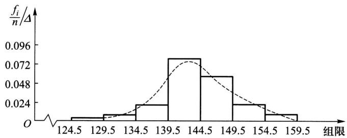  
图6-1

样本  $p$  分位数可按以下法则求得. 将  $x_{1}, x_{2}, \cdots, x_{n}$  按自小到大的次序排列成  $x_{(1)} \leqslant x_{(2)} \leqslant \cdots \leqslant x_{(n)}$ .

$1^{\circ}$  若  $np$  不是整数, 则只有一个数据满足定义中的两点要求, 这一数据位于大于  $np$  的最小整数处, 即为位于  $[np] + 1$  处的数. 例如,  $n = 12$ ,  $p = 0.9$ ,  $np = 10.8$ ,  $n(1 - p) = 1.2$ , 则  $x_{p}$  的位置应满足至少有 10.8 个数据  $\leqslant x_{p}(x_{p}$  应位于第 11 或大于第 11 处); 且至少有 1.2 个数据  $\geqslant x_{p}(x_{p}$  应位于第 11 或小于第 11 处), 故  $x_{p}$  应位于第 11 处.

$2^{\circ}$  若  $np$  是整数. 例如在  $n = 20, p = 0.95$  时,  $x_{p}$  的位置应满足至少有 19 个数据  $\leqslant x_{p}(x_{p}$  应位于第 19 或大于第 19 处)且至少有 1 个数据  $\geqslant x_{p}(x_{p}$  应位于第 20 或小于第 20 处), 故第 19 或第 20 的数据均符合要求, 就取这两个数的平均值作为  $x_{p}$ .

综上，

$$
x _ {p} = \left\{ \begin{array}{l l} x _ {([ n p ] + 1)}, & \text {当} n p \text {不 是 整 数 ,} \\ \frac {1}{2} [ x _ {(n p)} + x _ {(n p + 1)} ], & \text {当} n p \text {是 整 数 .} \end{array} \right.
$$

特别，当  $p = 0.5$  时，0.5分位数  $x_{0.5}$  也记为  $Q_{2}$  或  $M$  ，称为样本中位数，即有

$$
x _ {0. 5} = \left\{ \begin{array}{l l} x _ {\left[ \frac {n}{2} \right] + 1}), & \text {当} n \text {是 奇 数 ,} \\ \frac {1}{2} \left[ x _ {\left(\frac {n}{2}\right)} + x _ {\left(\frac {n}{2} + 1\right)} \right], & \text {当} n \text {是 偶 数 .} \end{array} \right.
$$

易知，当  $n$  是奇数时中位数  $x_{0,5}$  就是  $x_{(1)} \leqslant x_{(2)} \leqslant \dots \leqslant x_{(n)}$  这一数组中最中间的一个数；而当  $n$  是偶数时中位数  $x_{0,5}$  就是  $x_{(1)} \leqslant x_{(2)} \leqslant \dots \leqslant x_{(n)}$  这一数组中最中间两个数的平均值.

0.25分位数  $x_{0.25}$  称为第一四分位数，又记为  $Q_{1}$  ；0.75分位数  $x_{0.75}$  称为第三四分位数，又记为  $Q_{3}$  。 $x_{0.25}, x_{0.5}, x_{0.75}$  在统计中是很有用的。

例2 设有一组容量为18的样本值如下（已经过排序）：

$$
\begin{array}{l l l l l l l l l} 1 2 2 & 1 2 6 & 1 3 3 & 1 4 0 & 1 4 5 & 1 4 5 & 1 4 9 & 1 5 0 & 1 5 7 \end{array}
$$

$$
\begin{array}{c c c c c c c c c} 1 6 2 & 1 6 6 & 1 7 5 & 1 7 7 & 1 7 7 & 1 8 3 & 1 8 8 & 1 9 9 & 2 1 2 \end{array}
$$

求样本分位数：  $x_{0.2},x_{0.25},x_{0.5}$

解 因为  $np = 18 \times 0.2 = 3.6$ ,  $x_{0.2}$  位于第  $[3.6] + 1 = 4$  处, 即有  $x_{0.2} = x_{(4)} = 140$ .

因为  $np = 18 \times 0.25 = 4.5$ ,  $x_{0.25}$  位于第[4.5] + 1 = 5处，即有  $x_{0.25} = 145$ .

因为  $np = 18 \times 0.5 = 9$ ， $x_{0.5}$  是这组数中间两个数的平均值，即有

$$
x _ {0. 5} = \frac {1}{2} (1 5 7 + 1 6 2) = 1 5 9. 5.
$$

下面介绍箱线图.

数据集的箱线图是由箱子和直线组成的图形，它是基于以下5个数的图形概括：最小值Min，第一四分位数  $Q_{1}$ ，中位数  $M$ ，第三四分位数  $Q_{3}$  和最大值Max.它的作法如下：

（1）画一水平数轴，在轴上标上  $\mathrm{Min}, Q_1, M, Q_3, \mathrm{Max}$ 。在数轴上方画一个上、下侧平行于数轴的矩形箱子，箱子的左右两侧分别位于  $Q_1, Q_3$  的上方。在  $M$  点的上方画一条垂直线段。线段位于箱子内部。

（2）自箱子左侧引一条水平线直至最小值Min，在同一水平高度自箱子右侧引一条水平线直至最大值.这样就将箱线图作好了，如图6-2所示.箱线图也可以沿垂直数轴来作.自箱线图可以形象地看出数据集的以下重要性质.

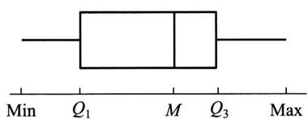  
图6-2

① 中心位置：中位数所在的位置就是数据集的中心。

② 散布程度：全部数据都落在  $[\mathrm{Min},\mathrm{Max}]$  之内，在区间  $[\mathrm{Min},Q_1],[Q_1,M],[M,Q_3],[Q_3,\mathrm{Max}]$  上的数据个数各约占  $1 / 4$ 。区间较短时，表示落在该区间的点较集中，反之较为分散。

（3）关于对称性：若中位数位于箱子的中间位置，则数据分布较为对称。又若Min离  $M$  的距离较Max离  $M$  的距离大，则表示数据分布向左倾斜，反之表示数据向右倾斜，且能看出分布尾部的长短。

例3 以下是8个患者的血压（收缩压，以  $\mathrm{mmHg}$  计）数据（已经过排序），试作出箱线图.

$$
\begin{array}{c c c c c c c c} 1 0 2 & 1 1 0 & 1 1 7 & 1 1 8 & 1 2 2 & 1 2 3 & 1 3 2 & 1 5 0 \end{array}
$$

解 因  $np = 8 \times 0.25 = 2$ ，故  $x_{0.25} = Q_1 = \frac{1}{2} (110 + 117) = 113.5$ .

因  $np = 8 \times 0.5 = 4$ ，故  $x_{0.5} = Q_2 = \frac{1}{2} (118 + 122) = 120$ .

因  $np = 8 \times 0.75 = 6$ ，故  $x_{0.75} = Q_3 = \frac{1}{2} (123 + 132) = 127.5$ .

$\mathrm{Min} = 102, \mathrm{Max} = 150$  ，作出箱线图如图6-3所示.

例4 下面分别给出了25个男子和25个女子的肺活量（以L计.数据已经排过序）：

女子组 2.7 2.8 2.9 3.1 3.1 3.1 3.2 3.4 3.4 3.4 3.4 3.4 3.4 3.5 3.5 3.6 3.7 3.7 3.7 3.8 3.8 4.0 4.1 4.2 4.2

男子组 4.1 4.1 4.3 4.3 4.5 4.6 4.7 4.8 4.8 5.1 5.3 5.3 5.3 5.4 5.4 5.5 5.6 5.7 5.8 5.8 6.0 6.1 6.3 6.7 6.7

试分别画出这两组数据的箱线图.

解 女子组  $\mathrm{Min} = 2.7, \mathrm{Max} = 4.2, M = 3.5$ .

因  $np = 25 \times 0.25 = 6.25, Q_{1} = 3.2$

因  $np = 25 \times 0.75 = 18.75, Q_{3} = 3.7$

男子组  $\mathrm{Min} = 4.1, \mathrm{Max} = 6.7, M = 5.3$ .

因  $np = 25 \times 0.25 = 6.25, Q_{1} = 4.7$

因  $np = 25 \times 0.75 = 18.75, Q_{3} = 5.8$

作出箱线图如图6-4所示.

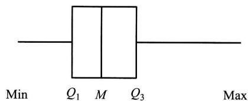  
图6-3

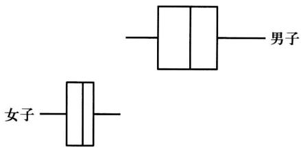  
图6-4

箱线图特别适用于比较两个或两个以上数据集的性质, 为此, 我们将几个数据集的箱线图画在同一个数轴上. 例如在例 4 中可以明显地看到男子的肺活量要比女子大, 男子的肺活量较女子的肺活量更为分散.

若在数据集中某一个观察值不寻常地大于或小于该数集中的其他数据，则称之为疑似异常值。疑似异常值的存在，会对随后的计算结果产生不适当的影响。检查疑似异常值并加以适当的处理是十分重要的。箱线图只要稍加修改，就能用来检测数据集是否存在疑似异常值。

第一四分位数  $Q_{1}$  与第三四分位数  $Q_{3}$  之间的距离： $Q_{3} - Q_{1}$  记成IQR，称为

四分位数间距. 若数据小于  $Q_{1} - 1.5IQR$  或大于  $Q_{3} + 1.5IQR$ , 就认为它是疑似异常值. 我们将上述箱线图的作法(1)，(2)，(3)作如下的改变：

$(1^{\prime})$  同(1).

(2') 计算  $IQR = Q_{3} - Q_{1}$ ，若一个数据小于  $Q_{1} - 1.5IQR$  或大于  $Q_{3} + 1.5IQR$ ，则认为它是一个疑似异常值。画出疑似异常值，并以 * 表示。

（3）自箱子左侧引一水平线段直至数据集中除去疑似异常值后的最小值，又自箱子右侧引一水平线直至数据集中除去疑似异常值后的最大值.

按  $(1^{\prime}),(2^{\prime}),(3^{\prime})$  作出的图形称为修正箱线图.

例5 下面给出了某医院21个患者的住院时间（以天计），试画出修正箱线图（数据已经过排序）.

<table><tr><td>1</td><td>2</td><td>3</td><td>3</td><td>4</td><td>4</td><td>5</td><td>6</td><td>6</td><td>7</td><td>7</td><td>9</td><td>9</td></tr><tr><td>10</td><td>12</td><td>12</td><td>13</td><td>15</td><td>18</td><td>23</td><td>55</td><td></td><td></td><td></td><td></td><td></td></tr></table>

解  $\mathrm{Min} = 1, \mathrm{Max} = 55, M = 7$ .

因  $21 \times 0.25 = 5.25$  ，得  $Q_{1} = 4$

又  $21 \times 0.75 = 15.75$  ，得  $Q_{3} = 12$

故

$$
I Q R = Q _ {3} - Q _ {1} = 8,
$$

$$
Q _ {3} + 1. 5 I Q R = 1 2 + 1. 5 \times 8 = 2 4, \quad Q _ {1} - 1. 5 I Q R = 4 - 1 2 = - 8.
$$

观察值  $55 > 24$  ，故55是疑似异常值，且仅此一个疑似异常值.作出修正箱线图如图6-5所示.可见数据分布不对称，而向右倾斜，在中位数的右边较为分散. □

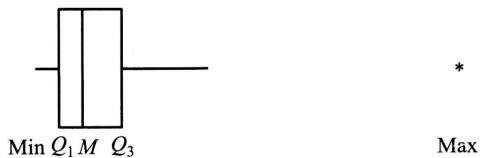  
图6-5

数据集中，疑似异常值的产生源于：（1）数据的测量、记录或输入计算机时的错误。（2）数据来自不同的总体。（3）数据是正确的，但它只体现小概率事件。当检测出疑似异常值时，人们需对疑似异常值出现的原因加以分析。如果是由于测量或记录的错误，或某些其他明显的原因造成的，那么将这些疑似异常值从数据集中丢弃就可以了。然而当出现的原因无法解释时，要作出丢弃或保留这些值的决策无疑是困难的，此时我们在对数据集作分析时尽量选用稳健的方法，使得疑似异常值对我们的结论的影响较小。例如我们采用中位数来描述数据集的中心趋势，而不使用数据集的平均值，因为后者受疑似异常值的影响较大。

# §3 抽样分布

样本是进行统计推断的依据.在应用时，往往不是直接使用样本本身，而是针对不同的问题构造样本的适当函数，利用这些样本的函数进行统计推断.

定义 设  $X_{1}, X_{2}, \dots, X_{n}$  是来自总体  $X$  的一个样本， $g(X_{1}, X_{2}, \dots, X_{n})$  是  $X_{1}, X_{2}, \dots, X_{n}$  的函数，若  $g$  中不含未知参数，则称  $g(X_{1}, X_{2}, \dots, X_{n})$  是一统计量.

因为  $X_{1}, X_{2}, \dots, X_{n}$  都是随机变量，而统计量  $g(X_{1}, X_{2}, \dots, X_{n})$  是随机变量的函数，因此统计量是一个随机变量。设  $x_{1}, x_{2}, \dots, x_{n}$  是相应于样本  $X_{1}, X_{2}, \dots, X_{n}$  的样本值，则称  $g(x_{1}, x_{2}, \dots, x_{n})$  是  $g(X_{1}, X_{2}, \dots, X_{n})$  的观察值。

下面列出几个常用的统计量. 设  $X_{1}, X_{2}, \dots, X_{n}$  是来自总体  $X$  的一个样本， $x_{1}, x_{2}, \dots, x_{n}$  是这一样本的观察值. 定义

样本均值

$$
\overline {{X}} = \frac {1}{n} \sum_ {i = 1} ^ {n} X _ {i};
$$

样本方差

$$
S ^ {2} = \frac {1}{n - 1} \sum_ {i = 1} ^ {n} \left(X _ {i} - \bar {X}\right) ^ {2} = \frac {1}{n - 1} \left(\sum_ {i = 1} ^ {n} X _ {i} ^ {2} - n \bar {X} ^ {2}\right);
$$

样本标准差

$$
S = \sqrt {S ^ {2}} = \sqrt {\frac {1}{n - 1} \sum_ {i = 1} ^ {n} \left(X _ {i} - \bar {X}\right) ^ {2}};
$$

样本  $k$  阶（原点）矩

$$
A _ {k} = \frac {1}{n} \sum_ {i = 1} ^ {n} X _ {i} ^ {k}, k = 1, 2, \dots ;
$$

样本  $k$  阶中心矩

$$
B _ {k} = \frac {1}{n} \sum_ {i = 1} ^ {n} (X _ {i} - \bar {X}) ^ {k}, k = 2, 3, \dots .
$$

它们的观察值分别为

$$
\bar {x} = \frac {1}{n} \sum_ {i = 1} ^ {n} x _ {i};
$$

$$
\begin{array}{l} s ^ {2} = \frac {1}{n - 1} \sum_ {i = 1} ^ {n} \left(x _ {i} - \bar {x}\right) ^ {2} = \frac {1}{n - 1} \left(\sum_ {i = 1} ^ {n} x _ {i} ^ {2} - n \bar {x} ^ {2}\right); \\ s = \sqrt {\frac {1}{n - 1} \sum_ {i = 1} ^ {n} \left(x _ {i} - \bar {x}\right) ^ {2}}; \\ \end{array}
$$

$$
a _ {k} = \frac {1}{n} \sum_ {i = 1} ^ {n} x _ {i} ^ {k}, \quad k = 1, 2, \dots ;
$$

$$
b _ {k} = \frac {1}{n} \sum_ {i = 1} ^ {n} (x _ {i} - \bar {x}) ^ {k}, \quad k = 2, 3, \dots .
$$

这些观察值仍分别称为样本均值、样本方差、样本标准差、样本  $k$  阶（原点）矩以及样本  $k$  阶中心矩.

我们指出，若总体  $X$  的  $k$  阶矩  $E(X^{k}) \stackrel{\text{记成}}{=} \mu_{k}$  存在，则当  $n \to \infty$  时， $A_{k} \xrightarrow{P} \mu_{k}, k = 1,2,\dots.$  这是因为  $X_{1}, X_{2}, \dots, X_{n}$  独立且与  $X$  同分布，所以  $X_{1}^{k}, X_{2}^{k}, \dots, X_{n}^{k}$  独立且与  $X^{k}$  同分布. 故有

$$
E \left(X _ {1} ^ {k}\right) = E \left(X _ {2} ^ {k}\right) = \dots = E \left(X _ {n} ^ {k}\right) = \mu_ {k}.
$$

从而由第五章的辛钦大数定律知

$$
A _ {k} = \frac {1}{n} \sum_ {i = 1} ^ {n} X _ {i} ^ {k} \xrightarrow {P} \mu_ {k}, \quad k = 1, 2, \dots .
$$

进而由第五章中关于依概率收敛的序列的性质知道

$$
g \left(A _ {1}, A _ {2}, \dots , A _ {k}\right) \xrightarrow {P} g \left(\mu_ {1}, \mu_ {2}, \dots , \mu_ {k}\right),
$$

其中  $g$  为连续函数.这就是下一章所要介绍的矩估计法的理论根据

我们还要介绍一个与总体分布函数  $F(x)$  相应的统计量——经验分布函数.

定义 设  $x_{1}, x_{2}, \cdots, x_{n}$  是来自分布函数为  $F(x)$  的总体  $X$  的样本观察值.  $X$  的经验分布函数，记为  $F_{n}(x)$ ，定义为样本观察值  $x_{1}, x_{2}, \cdots, x_{n}$  中小于或等于指定值  $x$  所占的比率，即

$$
F _ {n} (x) = \frac {\# (x _ {i} \leqslant x)}{n}, \quad - \infty <   x <   \infty .
$$

其中  $\# (x_{i}\leqslant x)$  表示  $x_{1},x_{2},\dots ,x_{n}$  中小于或等于  $x$  的个数.

按定义，当给定样本观察值  $x_{1}, x_{2}, \dots, x_{n}$  时， $F_{n}(x)$  是自变量  $x$  的函数，它具有分布函数的三个条件：①  $F_{n}(x)$  是  $x$  的不减函数。②  $0 \leqslant F_{n}(x) \leqslant 1$ ，且  $F(-\infty) = 0, F(\infty) = 1$ 。③  $F(x)$  是一个右连续函数。由此知  $F_{n}(x)$  是一个分布函数。当  $x_{1}, x_{2}, \dots, x_{n}$  各不相同时， $F_{n}(x)$  是以等概率  $1 / n$  取  $x_{1}, x_{2}, \dots, x_{n}$  的离散型随机变量的分布函数①。

一般地，设  $x_{1}, x_{2}, \dots, x_{n}$  是总体  $X$  的一个容量为  $n$  的样本观察值，先将  $x_{1}, x_{2}, \dots, x_{n}$  按自小到大的次序排序，并重新编号为

$$
x _ {(1)} \leqslant x _ {(2)} \leqslant \dots \leqslant x _ {(n)},
$$

则经验分布函数  $F_{n}(x)$  可写成

$$
F _ {n} (x) = \left\{ \begin{array}{l l} 0, & x <   x _ {(1)}, \\ k / n, & x _ {(k)} \leqslant x <   x _ {(k + 1)}, \\ 1, & x \geqslant x _ {(n)}. \end{array} \right. k = 1, 2, \dots , n - 1,
$$

例如，设总体  $X$  有样本观察值  $x_{(1)} = -1, x_{(2)} = 1, x_{(3)} = 2$  ，得经验分布函数为（如图6-6）：

$$
F _ {3} (x) = \left\{ \begin{array}{l l} 0, & x <   - 1, \\ 1 / 3, & - 1 \leqslant x <   1, \\ 2 / 3, & 1 \leqslant x <   2, \\ 1, & x \geqslant 2. \end{array} \right.
$$

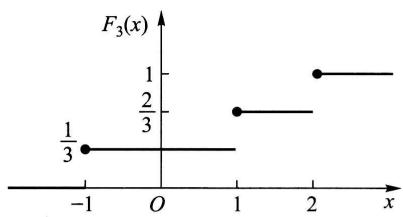  
图6-6

另一方面，当给定  $x$  时， $F_{n}(x)$  是样本  $X_{1}, X_{2}, \dots, X_{n}$  的函数，因此，它是一个统计量. 格里汶科(Glivenko)在1933年给出了以下的定理.

定理1（格里汶科定理）设  $X_{1}, X_{2}, \dots, X_{n}$  是来自以  $F(x)$  为分布函数的总体  $X$  的样本， $F(x)$  是经验分布函数，则有

$$
P \left\{\lim  _ {n \rightarrow \infty} \sup  _ {- \infty <   x <   \infty} | F _ {n} (x) - F (x) | = 0 \right\} = 1.
$$

（证明略.）

定理1的含义是  $F_{n}(x)$  在整个实轴上以概率1均匀收敛于  $F(x)$ . 于是当样本容量  $n$  充分大时,  $F_{n}(x)$  能够良好地逼近总体分布函数  $F(x)$ . 这是在概率统计学中以样本推断总体的依据.

# （一）  $\chi^2$  分布

设  $X_{1}, X_{2}, \dots, X_{n}$  是来自总体  $N(0, 1)$  的样本，则称统计量

$$
\chi^ {2} = X _ {1} ^ {2} + X _ {2} ^ {2} + \dots + X _ {n} ^ {2} \tag {3.1}
$$

服从自由度为  $n$  的  $\chi^2$  分布，记为  $\chi^2\sim \chi^2 (n)$

此处，自由度是指(3.1)式右端包含的独立变量的个数

$\chi^2 (n)$  分布的概率密度为

$$
f (y) = \left\{ \begin{array}{l l} \frac {1}{2 ^ {n / 2} \Gamma (n / 2)} y ^ {n / 2 - 1} \mathrm {e} ^ {- y / 2}, & y > 0, \\ 0, & \text {其 他}. \end{array} \right. \tag {3.2}
$$

$f(y)$  的图形如图6-7所示.

现在来推求(3.2)式

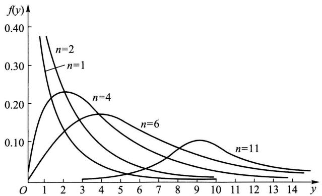  
图6-7

首先由第二章 §5 例3及第三章 §5 例3知  $\chi^2(1)$  分布即为  $\Gamma\left(\frac{1}{2}, 2\right)$  分布. 现  $X_i \sim N(0,1)$ , 由定义  $X_i^2 \sim \chi^2(1)$ , 即  $X_i^2 \sim \Gamma\left(\frac{1}{2}, 2\right), i = 1, 2, \dots, n$ . 再由  $X_1, X_2, \dots, X_n$  的独立性知  $X_1^2, X_2^2, \dots, X_n^2$  相互独立, 从而由  $\Gamma$  分布的可加性（见第三章 §5 例3）知

$$
\chi^ {2} = \sum_ {i = 1} ^ {n} X _ {i} ^ {2} \sim \Gamma \left(\frac {n}{2}, 2\right), \tag {3.3}
$$

即得  $\chi^2 (n)$  分布的概率密度如(3.2)式所示，

根据  $\Gamma$  分布的可加性易得  $\chi^2$  分布的可加性如下：

$\chi^2$  分布的可加性 设  $\chi_1^2 \sim \chi^2(n_1), \chi_2^2 \sim \chi^2(n_2)$ ，并且  $\chi_1^2, \chi_2^2$  相互独立，则有

$$
\chi_ {1} ^ {2} + \chi_ {2} ^ {2} \sim \chi^ {2} (n _ {1} + n _ {2}). \tag {3.4}
$$

$\chi^2$  分布的数学期望和方差 若  $\chi^2 \sim \chi^2(n)$ ，则有

$$
E \left(\chi^ {2}\right) = n, \quad D \left(\chi^ {2}\right) = 2 n. \tag {3.5}
$$

事实上，因  $X_{i}\sim N(0,1)$  ，故

$$
E \left(X _ {i} ^ {2}\right) = D \left(X _ {i}\right) = 1,
$$

$$
D \left(X _ {i} ^ {2}\right) = E \left(X _ {i} ^ {4}\right) - \left[ E \left(X _ {i} ^ {2}\right) \right] ^ {2} = 3 - 1 = 2, \quad i = 1, 2, \dots , n.
$$

于是  $E(\chi^2) = E\left(\sum_{i=1}^{n} X_i^2\right) = \sum_{i=1}^{n} E(X_i^2) = n,$

$$
D \left(\chi^ {2}\right) = D \left(\sum_ {i = 1} ^ {n} X _ {i} ^ {2}\right) = \sum_ {i = 1} ^ {n} D \left(X _ {i} ^ {2}\right) = 2 n.
$$

$\chi^2$  分布的上分位数 对于给定的正数  $\alpha, 0 < \alpha < 1$  ，满足条件(参见120页)

$$
P \{\chi^ {2} > \chi_ {\alpha} ^ {2} (n) \} = \int_ {\chi_ {\alpha} ^ {2} (n)} ^ {\infty} f (y) d y = \alpha \tag {3.6}
$$

的  $\chi_{\alpha}^{2}(n)$  就是  $\chi^2 (n)$  分布的上  $\alpha$  分位数，如图6一8所示.对于不同的  $\alpha ,n$  ，上  $\alpha$  分

位数的值已制成表格，可以查用（参见附表5).例如对于  $\alpha = 0,1,n = 25$  ，查得  $\chi_{0.1}^{2}(25) = 34.382.$  .但该表只详列到  $n = 40$  为止，费希尔(R.A.Fisher)曾证明，当  $n$  充分大时，近似地有

$$
\chi_ {a} ^ {2} (n) \approx \frac {1}{2} \left(z _ {a} + \sqrt {2 n - 1}\right) ^ {2}, \tag {3.7}
$$

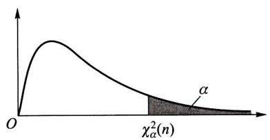  
图6-8

其中  $z_{\alpha}$  是标准正态分布的上  $\alpha$  分位数. 利用(3.7)式可以求得当  $n > 40$  时  $\chi^2(n)$  分布的上  $\alpha$  分位数的近似值.

例如，由(3.7)式可得  $\chi_{0.05}^{2}(50)\approx \frac{1}{2} (1.645 + \sqrt{99})^{2} = 67.221$  （由更详细的表得  $\chi_{0.05}^{2}(50) = 67.505$ ）

# （二） $t$  分布

设  $X \sim N(0,1), Y \sim \chi^2(n)$ ，且  $X, Y$  相互独立，则称随机变量

$$
t = \frac {X}{\sqrt {Y / n}} \tag {3.8}
$$

服从自由度为  $n$  的  $t$  分布. 记为  $t \sim t(n)$

$t$  分布又称学生氏(Student)分布.  $t(n)$  分布的概率密度函数为

$$
h (t) = \frac {\Gamma [ (n + 1) / 2 ]}{\sqrt {\pi n} \Gamma (n / 2)} \left(1 + \frac {t ^ {2}}{n}\right) ^ {- (n + 1) / 2}, - \infty <   t <   \infty \tag {3.9}
$$

（证略）.图6-9中画出了  $h(t)$  的图形.  $h(t)$  的图形关于  $t = 0$  对称，当  $n$  充分大时其图形类似于标准正态变量概率密度的图形.事实上，利用  $\Gamma$  函数的性质可得

$$
\lim  _ {n \rightarrow \infty} h (t) = \frac {1}{\sqrt {2 \pi}} \mathrm {e} ^ {- t ^ {2} / 2}, \tag {3.10}
$$

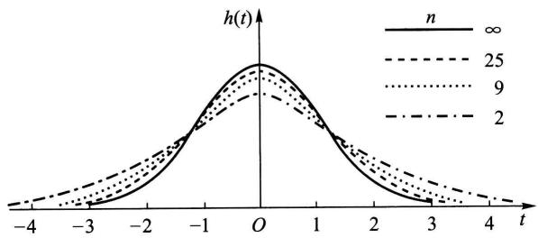  
图6-9

故当  $n$  足够大时  $t$  分布近似于  $N(0,1)$  分布. 但对于较小的  $n, t$  分布与  $N(0,1)$  分布相差较大（见附表2与附表4）.

$t$  分布的上分位数 对于给定的  $\alpha, 0 < \alpha < 1$  ，满足条件

$$
P \{t > t _ {\alpha} (n) \} = \int_ {t _ {\alpha} (n)} ^ {\infty} h (t) \mathrm {d} t = \alpha \tag {3.11}
$$

的  $t_{\alpha}(n)$  就是  $t(n)$  分布的上  $\alpha$  分位数（如图6-10）.

由  $t(n)$  分布的上  $\alpha$  分位数的定义及 $h(t)$  图形的对称性知

$$
t _ {1 - \alpha} (n) = - t _ {\alpha} (n). \tag {3.12}
$$

$t$  分布的上  $\alpha$  分位数可自附表4查得.当  $n > 45$  时，对于常用的  $\alpha$  的值，就用正态近似

$$
t _ {\alpha} (n) \approx z _ {\alpha}. \tag {3.13}
$$

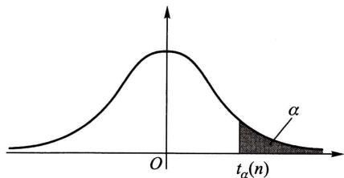  
图6-10

# （三）  $F$  分布

设  $U \sim \chi^2(n_1), V \sim \chi^2(n_2)$ ，且  $U, V$  相互独立，则称随机变量

$$
F = \frac {U / n _ {1}}{V / n _ {2}} \tag {3.14}
$$

服从自由度为  $(n_{1}, n_{2})$  的  $F$  分布，记为  $F \sim F(n_{1}, n_{2})$

$F(n_{1},n_{2})$  分布的概率密度为

$$
\psi (y) = \left\{ \begin{array}{l l} \frac {\Gamma [ (n _ {1} + n _ {2}) / 2 ] (n _ {1} / n _ {2}) ^ {n _ {1} / 2} y ^ {(n _ {1} / 2) - 1}}{\Gamma (n _ {1} / 2) \Gamma (n _ {2} / 2) [ 1 + (n _ {1} y / n _ {2}) ] ^ {(n _ {1} + n _ {2}) / 2}}, & y > 0, \\ 0, & \text {其 他} \end{array} \right. \tag {3.15}
$$

（证略).图6-11中画出了  $\psi (y)$  的图形.

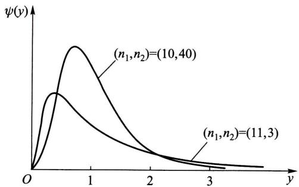  
图6-11

由定义可知，若  $F\sim F(n_{1},n_{2})$  ，则

$$
\frac {1}{F} \sim F \left(n _ {2}, n _ {1}\right). \tag {3.16}
$$

$F$  分布的上分位数 对于给定的  $\alpha, 0 < \alpha < 1$  ，满足条件

$$
P \{F > F _ {\alpha} (n _ {1}, n _ {2}) \} = \int_ {F _ {\alpha} (n _ {1}, n _ {2})} ^ {\infty} \psi (y) d y = \alpha \tag {3.17}
$$

的  $F_{\alpha}(n_1,n_2)$  就是  $F(n_{1},n_{2})$  分布的上  $\alpha$  分位数（图6-12).  $F$  分布的上  $\alpha$  分位数有表可查（见附表6）.

类似地有  $\chi^2$  分布， $t$  分布， $F$  分布的下分位数.

$F$  分布的上  $\alpha$  分位数有如下的重要性质①：

$$
F _ {1 - \alpha} (n _ {1}, n _ {2}) = \frac {1}{F _ {\alpha} (n _ {2} , n _ {1})}.
$$

(3.18)

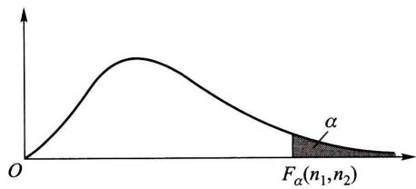  
图6-12

(3.18)式常用来求  $F$  分布表中未列出的常用的上  $\alpha$  分位数.例如，

$$
F _ {0. 9 5} (1 2, 9) = \frac {1}{F _ {0 . 0 5} (9 , 1 2)} = \frac {1}{2 . 8 0} = 0. 3 5 7.
$$

# （四）正态总体的样本均值与样本方差的分布

设总体  $X$  （不管服从什么分布，只要均值和方差存在)的均值为  $\mu$  ，方差为  $\sigma^2$ $X_{1},X_{2},\dots ,X_{n}$  是来自  $X$  的一个样本，  $\overline{X},S^2$  分别是样本均值和样本方差，则有

$$
E (\bar {X}) = \mu , \quad D (\bar {X}) = \sigma^ {2} / n. \tag {3.19}
$$

而  $E(S^2) = E\left[\frac{1}{n - 1}\left(\sum_{i = 1}^{n}X_i^2 -n\overline{X}^2\right)\right] = \frac{1}{n - 1}\left[\sum_{i = 1}^{n}E(X_i^2) - nE(\overline{X}^2)\right]$

比较(1)，(2)两式得

$$
= \frac {1}{n - 1} \left[ \sum_ {i = 1} ^ {n} \left(\sigma^ {2} + \mu^ {2}\right) - n \left(\sigma^ {2} / n + \mu^ {2}\right) \right] = \sigma^ {2},
$$

即  $E(S^2) = \sigma^2.$  (3.20)

进而, 设总体  $X \sim N(\mu, \sigma^2)$ , 由第四章 §2 的 (2.8) 式知  $\overline{X} = \frac{1}{n} \sum_{i=1}^{n} X_i$  也服从正态分布, 于是得到以下的定理:

定理2设  $X_{1},X_{2},\dots ,X_{n}$  是来自正态总体  $N(\mu ,\sigma^2)$  的样本，  $\overline{X}$  是样本均值，则有

$$
\bar {X} \sim N (\mu , \sigma^ {2} / n).
$$

对于正态总体  $N(\mu, \sigma^2)$  的样本均值  $\overline{X}$  和样本方差  $S^2$ ，有以下两个重要定理.

定理3设  $X_{1},X_{2},\dots ,X_{n}$  是来自总体  $N(\mu ,\sigma^2)$  的样本，  $\overline{X},S^2$  分别是样本均值和样本方差，则有

$$
1 ^ {\circ} \frac {(n - 1) S ^ {2}}{\sigma^ {2}} \sim \chi^ {2} (n - 1). \tag {3.21}
$$

$2^{\circ}$ $\overline{X}$  与  $S^2$  相互独立.

定理3的证明见本章末二维码

定理4设  $X_{1},X_{2},\dots ,X_{n}$  是来自总体  $N(\mu ,\sigma^2)$  的样本，  $\overline{X},S^2$  分别是样本均值和样本方差，则有

$$
\frac {\overline {{X}} - \mu}{S / \sqrt {n}} \sim t (n - 1). \tag {3.22}
$$

证 由定理2、定理3，

$$
\frac {\overline {{X}} - \mu}{\sigma / \sqrt {n}} \sim N (0, 1), \quad \frac {(n - 1) S ^ {2}}{\sigma^ {2}} \sim \chi^ {2} (n - 1),
$$

且两者独立.由  $t$  分布的定义知

$$
\frac {\overline {{X}} - \mu}{\sigma / \sqrt {n}} \Bigg | \sqrt {\frac {(n - 1) S ^ {2}}{\sigma^ {2} (n - 1)}} \sim t (n - 1).
$$

化简上式左边，即得(3.22)式

对于两个正态总体的样本均值和样本方差有以下的定理

定理5设  $X_{1},X_{2},\dots ,X_{n_{1}}$  与  $Y_{1},Y_{2},\dots ,Y_{n_{2}}$  分别是来自正态总体  $N(\mu_1,\sigma_1^2)$  和 $N(\mu_2,\sigma_2^2)$  的样本，且这两个样本相互独立①.设  $\overline{X} = \frac{1}{n_1}\sum_{i = 1}^{n_1}X_i,\overline{Y} = \frac{1}{n_2}\sum_{i = 1}^{n_2}Y_i$  分别

是这两个样本的样本均值；  $S_1^2 = \frac{1}{n_1 - 1}\sum_{i = 1}^{n_1}(X_i - \overline{X})^2,S_2^2 = \frac{1}{n_2 - 1}\sum_{i = 1}^{n_2}(Y_i - \overline{Y})^2$  分别是这两个样本的样本方差，则有

$$
1 ^ {\circ} \frac {S _ {1} ^ {2} / S _ {2} ^ {2}}{\sigma_ {1} ^ {2} / \sigma_ {2} ^ {2}} \sim F (n _ {1} - 1, n _ {2} - 1).
$$

$2^{\circ}$  当  $\sigma_1^2 = \sigma_2^2 = \sigma^2$  时，

$$
\frac {(\bar {X} - \bar {Y}) - (\mu_ {1} - \mu_ {2})}{S _ {W} \sqrt {\frac {1}{n _ {1}} + \frac {1}{n _ {2}}}} \sim t (n _ {1} + n _ {2} - 2),
$$

其中  $S_W^2 = \frac{(n_1 - 1)S_1^2 + (n_2 - 1)S_2^2}{n_1 + n_2 - 2}, S_W = \sqrt{S_W^2}.$

证  $1^{\circ}$  由定理3，

$$
\frac {\left(n _ {1} - 1\right) S _ {1} ^ {2}}{\sigma_ {1} ^ {2}} \sim \chi^ {2} \left(n _ {1} - 1\right), \quad \frac {\left(n _ {2} - 1\right) S _ {2} ^ {2}}{\sigma_ {2} ^ {2}} \sim \chi^ {2} \left(n _ {2} - 1\right).
$$

由假设  $S_1^2, S_2^2$  相互独立，则由  $F$  分布的定义知

$$
\frac {\left(n _ {1} - 1\right) S _ {1} ^ {2}}{\left(n _ {1} - 1\right) \sigma_ {1} ^ {2}} / \frac {\left(n _ {2} - 1\right) S _ {2} ^ {2}}{\left(n _ {2} - 1\right) \sigma_ {2} ^ {2}} \sim F \left(n _ {1} - 1, n _ {2} - 1\right),
$$

即  $\frac{S_1^2 / S_2^2}{\sigma_1^2 / \sigma_2^2} \sim F(n_1 - 1, n_2 - 1)$ .

$2^{\circ}$  易知  $\overline{X} -\overline{Y}\sim N\left(\mu_1 - \mu_2,\frac{\sigma^2}{n_1} +\frac{\sigma^2}{n_2}\right)$  ，即有

$$
U = \frac {(\bar {X} - \bar {Y}) - (\mu_ {1} - \mu_ {2})}{\sigma \sqrt {\frac {1}{n _ {1}} + \frac {1}{n _ {2}}}} \sim N (0, 1).
$$

又由给定条件知

$$
\frac {\left(n _ {1} - 1\right) S _ {1} ^ {2}}{\sigma^ {2}} \sim \chi^ {2} \left(n _ {1} - 1\right), \quad \frac {\left(n _ {2} - 1\right) S _ {2} ^ {2}}{\sigma^ {2}} \sim \chi^ {2} \left(n _ {2} - 1\right),
$$

且它们相互独立，故由  $\chi^2$  分布的可加性知

$$
V = \frac {\left(n _ {1} - 1\right) S _ {1} ^ {2}}{\sigma^ {2}} + \frac {\left(n _ {2} - 1\right) S _ {2} ^ {2}}{\sigma^ {2}} \sim \chi^ {2} \left(n _ {1} + n _ {2} - 2\right).
$$

由本章末所附“§3定理3的证明及其推广”的2°知U与V相互独立.从而按t分布的定义知

$$
\frac {U}{\sqrt {V / \left(n _ {1} + n _ {2} - 2\right)}} = \frac {(\bar {X} - \bar {Y}) - (\mu_ {1} - \mu_ {2})}{S _ {W} \sqrt {\frac {1}{n _ {1}} + \frac {1}{n _ {2}}}} \sim t \left(n _ {1} + n _ {2} - 2\right).
$$

本节所介绍的几个分布以及后四个定理，在下面各章中都起着重要的作用。应注意，它们都是在总体为正态总体这一基本假定下得到的。

# 小结

在数理统计中往往研究有关对象的某一项数量指标。对这一数量指标进行试验或观察，将试验的全部可能的观察值称为总体，每个观察值称为个体。总体中的每一个个体是某一随机变量  $X$  的值，因此一个总体对应一个随机变量  $X$ 。我们将不区分总体与相应的随机变量  $X$ ，笼统称为总体  $X$ 。随机变量  $X$  服从什么分布，就称总体服从什么分布。在实际中遇到的总体往往是有限总体，它对应一个离散型随机变量。当总体中包含的个体的个数很大时，在理论上可以认为它是一个无限总体。我们说某种型号的灯泡寿命总体服从指数分布，是指无限总体而言的。又如我们说某一年龄段的男性儿童的身高服从正态分布，也是指无限总体而言的。无限总体是人们对具体事物的抽象。无限总体的分布的形式较为简明，便于在数学上进行处理，使用方便。

在相同的条件下，对总体  $X$  进行  $n$  次重复的、独立的观察，得到  $n$  个结果  $X_{1}, X_{2}, \dots, X_{n}$ ，称随机变量  $X_{1}, X_{2}, \dots, X_{n}$  为来自总体  $X$  的简单随机样本，它具有两条性质：

$1^{\circ} X_{1}, X_{2}, \dots, X_{n}$  都与总体具有相同的分布.  
$2^{\circ} X_{1}, X_{2}, \dots, X_{n}$  相互独立.

我们就是利用来自样本的信息推断总体，得到有关总体分布的种种结论的。

样本  $X_{1}, X_{2}, \dots, X_{n}$  的函数  $g(X_{1}, X_{2}, \dots, X_{n})$ ，若不包含未知参数，则称为统计量。统计量是一个随机变量，它是完全由样本所确定的。统计量是进行统计推断的工具。样本均值

$$
\bar {X} = \frac {1}{n} \sum_ {k = 1} ^ {n} X _ {k}
$$

和样本方差

$$
S ^ {2} = \frac {1}{n - 1} \sum_ {k = 1} ^ {n} (X _ {k} - \bar {X}) ^ {2}
$$

是两个最重要的统计量。统计量的分布称为抽样分布。下面是三个来自正态分布的抽样分布：

$\chi^2$  分布，  $t$  分布，  $F$  分布.

这三个分布称为统计学的三大分布，它们在数理统计中有着广泛的应用．对于这三个分布，要求读者掌握它们的定义和概率密度函数图形的轮廓，还会使用分位数表写出分位数.

关于样本均值  $\overline{X}$  、样本方差  $S^2$  ，有以下的结果.

1. 设  $X_{1}, X_{2}, \dots, X_{n}$  是来自总体  $X$  （不管服从什么分布，只要它的均值和方差存在）的样本，且有  $E(X) = \mu, D(X) = \sigma^{2}$ ，则有

$$
E (\bar {X}) = \mu , \quad D (\bar {X}) = \sigma^ {2} / n.
$$

2. 设总体  $X \sim N(\mu, \sigma^2)$ ,  $X_1, X_2, \dots, X_n$  是来自  $X$  的样本，则有

$1^{\circ}\overline{X}\sim N(\mu ,\sigma^{2} / n)$  
$2^{\circ}\frac{(n - 1)S^{2}}{\sigma^{2}}\sim \chi^{2}(n - 1).$  
$3^{\circ}\overline{X}$  与  $S^2$  相互独立.  
$4^{\circ} \frac{\overline{X} - \mu}{S / \sqrt{n}} \sim t(n - 1)$ .

3. 对于两个正态总体  $X \sim N(\mu_1, \sigma_1^2), Y \sim N(\mu_2, \sigma_2^2)$ ，有 §3 定理 5 的重要结果。

# 重要术语及主题

总体 简单随机样本 统计量

$\chi^2$  分布、 $t$  分布、 $F$  分布的定义及它们的概率密度函数图形轮廓

上  $\alpha$  分位数  $F_{1 - \alpha}(n_1,n_2) = \frac{1}{F_\alpha(n_2,n_1)}$

小结中关于样本均值、样本方差的重要结果

# 习题

1. 在总体  $N(52, 6.3^2)$  中随机抽取一容量为 36 的样本，求样本均值  $\overline{X}$  落在 50.8 到 53.8 之间的概率。

2. 在总体  $N(12,4)$  中随机抽一容量为5的样本  $X_{1}, X_{2}, X_{3}, X_{4}, X_{5}$ .

（1）求样本均值与总体均值之差的绝对值大于1的概率  
(2) 求概率  $P\left\{\max \left\{X_{1}, X_{2}, X_{3}, X_{4}, X_{5}\right\} > 15\right\}, P\left\{\min \left\{X_{1}, X_{2}, X_{3}, X_{4}, X_{5}\right\} < 10\right\}$ .

3. 求总体  $N(20, 3)$  的容量分别为 10, 15 的两独立样本均值差的绝对值大于 0.3 的概率.  
4.（1）设样本  $X_{1}, X_{2}, \dots, X_{6}$  来自总体  $N(0,1), Y = (X_{1} + X_{2} + X_{3})^{2} + (X_{4} + X_{5} + X_{6})^{2}$ ，试确定常数  $C$  使  $CY$  服从  $\chi^2$  分布.  
（2）设样本  $X_{1}, X_{2}, \dots, X_{5}$  来自总体  $N(0, 1), Y = \frac{C(X_{1} + X_{2})}{(X_{3}^{2} + X_{4}^{2} + X_{5}^{2})^{1/2}}$ ，试确定常数  $C$  使  $Y$  服从  $t$  分布.  
（3）已知总体  $X \sim t(n)$ ，求证  $X^2 \sim F(1, n)$

5.（1）已知某种能力测试的得分服从正态分布  $N(\mu, \sigma^2)$ ，随机取10个人参与这一测试。求他们得分的联合概率密度，并求这10个人得分的平均值小于  $\mu$  的概率。

(2) 在(1)中设  $\mu = 62, \sigma^2 = 25$ ，若得分超过70就能得奖，求至少有一人得奖的概率.

6. 设总体  $X \sim b(1, p), X_1, X_2, \dots, X_n$  是来自  $X$  的样本.

（1）求  $(X_{1},X_{2},\dots ,X_{n})$  的分布律.  
（2）求  $\sum_{i = 1}^{n}X_{i}$  的分布律.  
（3）求  $E(\overline{X}),D(\overline{X}),E(S^2)$

7. 设总体  $X \sim \chi^2(n), X_1, X_2, \dots, X_{10}$  是来自  $X$  的样本，求  $E(\overline{X}), D(\overline{X}), E(S^2)$ .

8. 设总体  $X \sim N(\mu, \sigma^2), X_1, X_2, \dots, X_{10}$  是来自  $X$  的样本.

（1）写出  $X_{1}, X_{2}, \dots, X_{10}$  的联合概率密度  
(2) 写出  $\overline{X}$  的概率密度.

9. 设在总体  $N(\mu, \sigma^2)$  中抽得一容量为 16 的样本，这里  $\mu, \sigma^2$  均未知.

（1）求  $P\{S^2 /\sigma^2\leqslant 2.041\}$  ，其中  $S^2$  为样本方差  
（2）求  $D(S^2)$

10. 下面列出了 30 个美国 NBA 球员的体重 (以磅计,  $1$  磅  $= 0.454 \mathrm{~kg}$ ) 数据. 这些数据是从美国 NBA 球队 1990-1991 年赛季的花名册中抽样得到的.

<table><tr><td>225</td><td>232</td><td>232</td><td>245</td><td>235</td><td>245</td><td>270</td><td>225</td><td>240</td><td>240</td></tr><tr><td>217</td><td>195</td><td>225</td><td>185</td><td>200</td><td>220</td><td>200</td><td>210</td><td>271</td><td>240</td></tr><tr><td>220</td><td>230</td><td>215</td><td>252</td><td>225</td><td>220</td><td>206</td><td>185</td><td>227</td><td>236</td></tr></table>

（1）画出这些数据的频率直方图（提示：最大和最小观察值分别为271和185，区间[184.5,271.5]包含所有数据，将整个区间分为5等份，为计算方便，将区间调整为（179.5，279.5).

（2）作出这些数据的箱线图，

11. 截尾均值 设数据集包含  $n$  个数据，将这些数据自小到大排序为

$$
x _ {(1)} \leqslant x _ {(2)} \leqslant \dots \leqslant x _ {(n)},
$$

删去  $100\alpha \%$  个数值小的数，同时删去  $100\alpha \%$  个数值大的数，将留下的数据取算术平均，记为  $\overline{x}_{\alpha}$ ，即

$$
\bar {x} _ {\alpha} = \frac {x _ {\left([ n _ {\alpha} ] + 1\right)} + \cdots + x _ {\left(n - [ n _ {\alpha} ]\right)}}{n - 2 \left[ n _ {\alpha} \right]}
$$

其中  $[n\alpha]$  是小于或等于  $n\alpha$  的最大整数（一般取  $\alpha$  为  $0.1 \sim 0.2$ ）。 $\overline{x}_{\alpha}$  称为  $100\%$  截尾均值。例如对于第10题中的30个数据，取  $\alpha = 0.1$ ，则有  $[n\alpha] = [30 \times 0.1] = 3$ ，得  $100 \times 0.1\%$  截尾均值为

$$
\bar {x} _ {\alpha} = \frac {2 0 0 + 2 0 0 + \cdots + 2 4 5 + 2 4 5}{3 0 - 6} = 2 2 5. 4 1 6 7.
$$

若数据来自某一总体的样本，则  $\bar{x}_{\alpha}$  是一个统计量.  $\bar{x}_{\alpha}$  不受样本的极端值的影响. 截尾均值在实际应用问题中是常会用到的.

试求第10题的30个数据的  $\alpha = 0.2$  的截尾均值

  
§ 3 定理 3 的

证明及其推广

# 第七章 参数估计

统计推断的基本问题可以分为两大类，一类是估计问题，另一类是假设检验问题。本章讨论总体参数的点估计和区间估计。

# § 1 点估计

设总体  $X$  的分布函数的形式已知，但它的一个或多个参数未知，借助于总体  $X$  的一个样本来估计总体未知参数的值的问题称为参数的点估计问题.

例1 在某炸药制造厂, 一天中发生着火现象的次数  $X$  是一个随机变量, 假设它服从以  $\lambda > 0$  为参数的泊松分布, 参数  $\lambda$  为未知. 现有以下的样本值, 试估计参数  $\lambda$ .

<table><tr><td>着火次数k</td><td>0</td><td>1</td><td>2</td><td>3</td><td>4</td><td>5</td><td>6</td><td>≥7</td><td></td></tr><tr><td>发生k次着火的天数nk</td><td>75</td><td>90</td><td>54</td><td>22</td><td>6</td><td>2</td><td>1</td><td>0</td><td>∑=250</td></tr></table>

解 由于  $X \sim \pi(\lambda)$ , 故有  $\lambda = E(X)$ . 我们自然想到用样本均值来估计总体的均值  $E(X)$ . 现由已知数据计算得到

$$
\bar {x} = \frac {\sum_ {k = 0} ^ {6} k n _ {k}}{\sum_ {k = 0} ^ {6} n _ {k}} = \frac {1}{2 5 0} (0 \times 7 5 + 1 \times 9 0 + 2 \times 5 4 + 3 \times 2 2 + 4 \times 6 + 5 \times 2 + 6 \times 1) = 1. 2 2,
$$

即  $E(X) = \lambda$  的估计为1.22.

点估计问题的一般提法如下：设总体  $X$  的分布函数  $F(x;\theta)^{1}$  的形式为已知，  $\theta$  是待估参数.  $X_{1},X_{2},\dots ,X_{n}$  是  $X$  的一个样本，  $x_{1},x_{2},\dots ,x_{n}$  是相应的一个样本值.点估计问题就是要构造一个适当的统计量  $\hat{\theta} (X_1,X_2,\dots ,X_n)$  ，用它的观察值  $\hat{\theta} (x_1,x_2,\dots ,x_n)$  作为未知参数  $\theta$  的近似值.我们称  $\hat{\theta} (X_1,X_2,\dots ,X_n)$  为  $\theta$  的估

计量, 称  $\hat{\theta}(x_1, x_2, \dots, x_n)$  为  $\theta$  的估计值. 在不致混淆的情况下统称估计量和估计值为估计, 并都简记为  $\hat{\theta}$ . 由于估计量是样本的函数. 因此对于不同的样本值,  $\theta$  的估计值一般是不相同的.

例如在例1中，我们用样本均值来估计总体均值.即有估计量

$$
\widehat {\lambda} = E (\widehat {X}) = \frac {1}{n} \sum_ {k = 1} ^ {n} X _ {k}, \quad n = 2 5 0,
$$

估计值  $\hat{\lambda} = E(\widehat{X}) = \frac{1}{n}\sum_{k = 1}^{n}x_{k} = 1.22.$

下面介绍两种常用的构造估计量的方法：矩估计法和最大似然估计法.

# （一）矩估计法

设  $X$  为连续型随机变量，其概率密度为  $f(x;\theta_1,\theta_2,\dots ,\theta_k)$  ，或  $X$  为离散型随机变量，其分布律为  $P\{X = x\} = p(x;\theta_1,\theta_2,\dots ,\theta_k)$  ，其中  $\theta_{1},\theta_{2},\dots ,\theta_{k}$  为待估参数，  $X_{1},X_{2},\dots ,X_{n}$  是来自  $X$  的样本.假设总体  $X$  的前  $k$  阶矩

$$
\mu_ {l} = E (X ^ {l}) = \int_ {- \infty} ^ {\infty} x ^ {l} f (x; \theta_ {1}, \theta_ {2}, \dots , \theta_ {k}) \mathrm {d} x \quad (X   \text {为 连 续 型})
$$

或  $\mu_{l} = E(X^{l}) = \sum_{x\in R_{X}}x^{l}p(x;\theta_{1},\theta_{2},\dots ,\theta_{k})$  （  $X$  为离散型）

（其中  $R_{X}$  是  $X$  可能取值的范围）存在， $l = 1,2,\dots ,k.$  一般来说，它们是  $\theta_{1}$ ， $\theta_{2},\dots ,\theta_{k}$  的函数.基于样本矩

$$
A _ {l} = \frac {1}{n} \sum_ {i = 1} ^ {n} X _ {i} ^ {l}
$$

依概率收敛于相应的总体矩  $\mu_l (l = 1, 2, \dots, k)$ , 样本矩的连续函数依概率收敛于相应的总体矩的连续函数(见第六章 §3), 我们就用样本矩作为相应的总体矩的估计量, 而以样本矩的连续函数作为相应的总体矩的连续函数的估计量. 这种估计方法称为矩估计法. 矩估计法的具体做法如下: 设

$$
\left\{ \begin{array}{l} \mu_ {1} = \mu_ {1} \left(\theta_ {1}, \theta_ {2}, \dots , \theta_ {k}\right), \\ \mu_ {2} = \mu_ {2} \left(\theta_ {1}, \theta_ {2}, \dots , \theta_ {k}\right), \\ \dots \dots \dots \dots \\ \mu_ {k} = \mu_ {k} \left(\theta_ {1}, \theta_ {2}, \dots , \theta_ {k}\right). \end{array} \right.
$$

这是一个包含  $k$  个未知参数  $\theta_{1},\theta_{2},\dots ,\theta_{k}$  的联立方程组.一般来说，可以从中解出  $\theta_{1},\theta_{2},\dots ,\theta_{k}$  ，得到

$$
\left\{ \begin{array}{l} \theta_ {1} = \theta_ {1} (\mu_ {1}, \mu_ {2}, \dots , \mu_ {k}), \\ \theta_ {2} = \theta_ {2} (\mu_ {1}, \mu_ {2}, \dots , \mu_ {k}), \\ \dots \dots \dots \dots \\ \theta_ {k} = \theta_ {k} (\mu_ {1}, \mu_ {2}, \dots , \mu_ {k}). \end{array} \right.
$$

以  $A_{i}$  分别代替上式中的  $\mu_{i}, i = 1,2,\dots ,k$  ，就以

$$
\hat {\theta} _ {i} = \theta_ {i} \left(A _ {1}, A _ {2}, \dots , A _ {k}\right), \quad i = 1, 2, \dots , k
$$

分别作为  $\theta_{i}, i = 1,2,\dots ,k$  的估计量，这种估计量称为矩估计量。矩估计量的观察值称为矩估计值。

例2设总体  $X$  在  $[a,b]$  上服从均匀分布，  $a,b$  未知.  $X_{1},X_{2},\dots ,X_{n}$  是来自 $X$  的样本，试求  $a,b$  的矩估计量.

解  $\mu_{1} = E(X) = (a + b) / 2$

$$
\mu_ {2} = E \left(X ^ {2}\right) = D (X) + [ E (X) ] ^ {2} = (b - a) ^ {2} / 1 2 + (a + b) ^ {2} / 4.
$$

即  $\left\{ \begin{array}{l}a + b = 2\mu_1,\\ b - a = \sqrt{12(\mu_2 - \mu_1^2)}. \end{array} \right.$

解这一方程组得

$$
a = \mu_ {1} - \sqrt {3 \left(\mu_ {2} - \mu_ {1} ^ {2}\right)}, \quad b = \mu_ {1} + \sqrt {3 \left(\mu_ {2} - \mu_ {1} ^ {2}\right)}.
$$

分别以  $A_{1}, A_{2}$  代替  $\mu_{1}, \mu_{2}$ , 得到  $a, b$  的矩估计量分别为（注意到  $\frac{1}{n} \sum_{i=1}^{n} X_{i}^{2} - \overline{X}^{2} = \frac{1}{n} \sum_{i=1}^{n} (X_{i} - \overline{X})^{2}$ :

$$
\begin{array}{l} \hat {a} = A _ {1} - \sqrt {3 \left(A _ {2} - A _ {1} ^ {2}\right)} = \bar {X} - \sqrt {\frac {3}{n} \sum_ {i = 1} ^ {n} \left(X _ {i} - \bar {X}\right) ^ {2}}, \\ \hat {b} = A _ {1} + \sqrt {3 \left(A _ {2} - A _ {1} ^ {2}\right)} = \bar {X} + \sqrt {\frac {3}{n} \sum_ {i = 1} ^ {n} \left(X _ {i} - \bar {X}\right) ^ {2}}. \\ \end{array}
$$

例3设总体  $X$  的均值  $\mu$  及方差  $\sigma^2$  都存在，且有  $\sigma^2 > 0$ . 但  $\mu, \sigma^2$  均为未知. 又设  $X_1, X_2, \dots, X_n$  是来自  $X$  的样本. 试求  $\mu, \sigma^2$  的矩估计量.

解

$$
\left\{ \begin{array}{l} \mu_ {1} = E (X) = \mu , \\ \mu_ {2} = E (X ^ {2}) = D (X) + [ E (X) ] ^ {2} = \sigma^ {2} + \mu^ {2}. \end{array} \right.
$$

解得

$$
\left\{ \begin{array}{l} \mu = \mu_ {1}, \\ \sigma^ {2} = \mu_ {2} - \mu_ {1} ^ {2}. \end{array} \right.
$$

分别以  $A_{1}, A_{2}$  代替  $\mu_{1}, \mu_{2}$ , 得  $\mu$  和  $\sigma^{2}$  的矩估计量分别为

$$
\hat {\mu} = A _ {1} = \bar {X},
$$

$$
\hat {\sigma} ^ {2} = A _ {2} - \dot {A} _ {1} ^ {2} = \frac {1}{n} \sum_ {i = 1} ^ {n} X _ {i} ^ {2} - \bar {X} ^ {2} = \frac {1}{n} \sum_ {i = 1} ^ {n} (X _ {i} - \bar {X}) ^ {2}.
$$

所得结果表明，总体均值与方差的矩估计量的表达式不因不同的总体分布而异.

例如，  $X\sim N(\mu ,\sigma^2),\mu ,\sigma^2$  未知，即得  $\mu ,\sigma^2$  的矩估计量为

$$
\hat {\mu} = \bar {X}, \quad \hat {\sigma} ^ {2} = \frac {1}{n} \sum_ {i = 1} ^ {n} (X _ {i} - \bar {X}) ^ {2}.
$$

# （二）最大似然估计法

若总体  $X$  属离散型，其分布律  $P\{X = x\} = p(x;\theta), \theta \in \Theta$  的形式为已知， $\theta$  为待估参数， $\Theta$  是  $\theta$  可能取值的范围。设  $X_{1}, X_{2}, \dots, X_{n}$  是来自  $X$  的样本，则  $X_{1}, X_{2}, \dots, X_{n}$  的联合分布律为

$$
\prod_ {i = 1} ^ {n} p (x _ {i}; \theta).
$$

又设  $x_{1}, x_{2}, \cdots, x_{n}$  是相应于样本  $X_{1}, X_{2}, \cdots, X_{n}$  的一个样本值. 易知样本  $X_{1}, X_{2}, \cdots, X_{n}$  取到观察值  $x_{1}, x_{2}, \cdots, x_{n}$  的概率，亦即事件  $\{X_{1} = x_{1}, X_{2} = x_{2}, \cdots, X_{n} = x_{n}\}$  发生的概率为

$$
L (\theta) = L \left(x _ {1}, x _ {2}, \dots , x _ {n}; \theta\right) = \prod_ {i = 1} ^ {n} p \left(x _ {i}; \theta\right), \quad \theta \in \Theta . \tag {1.1}
$$

这一概率随  $\theta$  的取值而变化，它是  $\theta$  的函数， $L(\theta)$  称为样本的似然函数（注意，这里  $x_{1}, x_{2}, \dots, x_{n}$  是已知的样本值，它们都是常数）.

关于最大似然估计法，我们有以下的直观想法：现在已经取到样本值  $x_{1}$ ， $x_{2}, \dots, x_{n}$  了，这表明取到这一样本值的概率  $L(\theta)$  比较大。我们当然不会考虑那些不能使样本  $x_{1}, x_{2}, \dots, x_{n}$  出现的  $\theta \in \Theta$  作为  $\theta$  的估计，再者，如果已知当  $\theta = \theta_{0} \in \Theta$  时使  $L(\theta)$  取很大的值，而  $\Theta$  中其他  $\theta$  的值使  $L(\theta)$  取很小的值，我们自然认为取  $\theta_{0}$  作为未知参数  $\theta$  的估计值，较为合理。由费希尔引进的最大似然估计法，就是固定样本观察值  $x_{1}, x_{2}, \dots, x_{n}$ ，在  $\theta$  取值的可能范围  $\Theta$  内挑选使似然函数  $L(x_{1}, x_{2}, \dots, x_{n}; \theta)$  达到最大的参数值  $\hat{\theta}$ ，作为参数  $\theta$  的估计值。即取  $\hat{\theta}$  使

$$
L \left(x _ {1}, x _ {2}, \dots , x _ {n}; \hat {\theta}\right) = \max  _ {\theta \in \Theta} L \left(x _ {1}, x _ {2}, \dots , x _ {n}; \theta\right). \tag {1.2}
$$

这样得到的  $\hat{\theta}$  与样本值  $x_{1}, x_{2}, \dots, x_{n}$  有关，常记为  $\hat{\theta}(x_{1}, x_{2}, \dots, x_{n})$ ，称为参数  $\theta$  的最大似然估计值，而相应的统计量  $\hat{\theta}(X_{1}, X_{2}, \dots, X_{n})$  称为参数  $\theta$  的最大似然估计量。

若总体  $X$  属连续型，其概率密度  $f(x;\theta),\theta \in \Theta$  的形式已知，  $\theta$  为待估参数，  $\Theta$  是  $\theta$  可能取值的范围.设  $X_{1},X_{2},\dots ,X_{n}$  是来自  $X$  的样本，则  $X_{1},X_{2},\dots ,X_{n}$  的联合

概率密度为

$$
\prod_ {i = 1} ^ {n} f (x _ {i}; \theta).
$$

设  $x_{1}, x_{2}, \cdots, x_{n}$  是相应于样本  $X_{1}, X_{2}, \cdots, X_{n}$  的一个样本值，则随机点  $(X_{1}, X_{2}, \cdots, X_{n})$  落在点  $(x_{1}, x_{2}, \cdots, x_{n})$  的邻域（边长分别为  $\mathrm{d}x_{1}, \mathrm{d}x_{2}, \cdots, \mathrm{d}x_{n}$  的  $n$  维立方体）内的概率近似地为

$$
\prod_ {i = 1} ^ {n} f \left(x _ {i}; \theta\right) \mathrm {d} x _ {i}, \tag {1.3}
$$

其值随  $\theta$  的取值而变化. 与离散型的情况一样, 我们取  $\theta$  的估计值使概率(1.3)式取到最大值, 但因子  $\prod_{i=1}^{n} \mathrm{d}x_{i}$  不随  $\theta$  而变, 故只需考虑函数

$$
L (\theta) = L \left(x _ {1}, x _ {2}, \dots , x _ {n}; \theta\right) = \prod_ {i = 1} ^ {n} f \left(x _ {i}; \theta\right) \tag {1.4}
$$

的最大值.这里  $L(\theta)$  称为样本的似然函数.若

$$
L \left(x _ {1}, x _ {2}, \dots , x _ {n}; \hat {\theta}\right) = \max  _ {\theta \in \Theta} L \left(x _ {1}, x _ {2}, \dots , x _ {n}; \theta\right),
$$

则称  $\hat{\theta}(x_1, x_2, \dots, x_n)$  为  $\theta$  的最大似然估计值，称  $\hat{\theta}(X_1, X_2, \dots, X_n)$  为  $\theta$  的最大似然估计量.

这样，确定最大似然估计量的问题就归结为微分学中的求最大值的问题了。

在很多情形下，  $p(x;\theta)$  和  $f(x;\theta)$  关于  $\theta$  可微，这时  $\hat{\theta}$  常可从方程

$$
\frac {\mathrm {d}}{\mathrm {d} \theta} L (\theta) = 0 \tag {1.5}
$$

解得 ①. 又因  $L(\theta)$  与  $\ln L(\theta)$  在同一  $\theta$  处取到极值, 因此,  $\theta$  的最大似然估计  $\hat{\theta}$  也可以从方程

$$
\frac {\mathrm {d}}{\mathrm {d} \theta} \ln L (\theta) = 0 \tag {1.6}
$$

求得，而从后一方程求解往往比较方便.（1.6）式称为对数似然方程.

例4设  $X\sim b(1,p).X_1,X_2,\dots ,X_n$  是来自  $X$  的一个样本，试求参数  $\mathcal{P}$  的最大似然估计量.

解设  $x_{1}, x_{2}, \dots, x_{n}$  是相应于样本  $X_{1}, X_{2}, \dots, X_{n}$  的一个样本值.  $X$  的分布律为

$$
P \{X = x \} = p ^ {x} (1 - p) ^ {1 - x}, \quad x = 0, 1.
$$

故似然函数为

$$
L (p) = \prod_ {i = 1} ^ {n} p ^ {x _ {i}} (1 - p) ^ {1 - x _ {i}} = p ^ {\sum_ {i = 1} ^ {n} x _ {i}} (1 - p) ^ {n - \sum_ {i = 1} ^ {n} x _ {i}},
$$

而  $\ln L(p) = \left(\sum_{i=1}^{n} x_i\right) \ln p + \left(n - \sum_{i=1}^{n} x_i\right) \ln (1 - p),$

令  $\frac{\mathrm{d}}{\mathrm{d}p}\ln L(p) = \frac{\sum_{i=1}^{n}x_i}{p} - \frac{n - \sum_{i=1}^{n}x_i}{1 - p} = 0,$

解得  $p$  的最大似然估计值

$$
\hat {p} = \frac {1}{n} \sum_ {i = 1} ^ {n} x _ {i} = \bar {x}.
$$

$p$  的最大似然估计量为

$$
\hat {p} = \frac {1}{n} \sum_ {i = 1} ^ {n} X _ {i} = \bar {X}.
$$

我们看到这一估计量与相应的矩估计量是相同的，

最大似然估计法也适用于分布中含多个未知参数  $\theta_{1},\theta_{2},\dots ,\theta_{k}$  的情况.这时，似然函数  $L$  是这些未知参数的函数.分别令

$$
\frac {\partial}{\partial \theta_ {i}} L = 0, i = 1, 2, \dots , k
$$

或令  $\frac{\partial}{\partial\theta_i}\ln L = 0,i = 1,2,\dots ,k.$  (1.7)

解上述由  $k$  个方程组成的方程组，即可得到各未知参数  $\theta_{i}(i = 1,2,\dots ,k)$  的最大似然估计值  $\hat{\theta}_i$  .（1.7）式称为对数似然方程组．

例5 设总体  $X \sim N(\mu, \sigma^2)$ ,  $\mu, \sigma^2$  为未知参数,  $x_1, x_2, \dots, x_n$  是来自  $X$  的一个样本值. 求  $\mu, \sigma^2$  的最大似然估计量.

解  $X$  的概率密度为

$$
f (x; \mu , \sigma^ {2}) = \frac {1}{\sqrt {2 \pi} \sigma} \exp \left\{- \frac {1}{2 \sigma^ {2}} (x - \mu) ^ {2} \right\},
$$

似然函数为

$$
\begin{array}{l} L (\mu , \sigma^ {2}) = \prod_ {i = 1} ^ {n} \frac {1}{\sqrt {2 \pi} \sigma} \exp \left\{- \frac {1}{2 \sigma^ {2}} (x _ {i} - \mu) ^ {2} \right\} \\ = (2 \pi) ^ {- n / 2} \left(\sigma^ {2}\right) ^ {- n / 2} \exp \left\{- \frac {1}{2 \sigma^ {2}} \sum_ {i = 1} ^ {n} \left(x _ {i} - \mu\right) ^ {2} \right\}. \\ \end{array}
$$

而  $\ln L = -\frac{n}{2}\ln (2\pi) - \frac{n}{2}\ln \sigma^2 -\frac{1}{2\sigma^2}\sum_{i = 1}^{n}(x_i - \mu)^2.$

令  $\left\{ \begin{array}{l} \frac{\partial}{\partial \mu} \ln L = \frac{1}{\sigma^2} \left( \sum_{i=1}^{n} x_i - n \mu \right) = 0, \\ \frac{\partial}{\partial \sigma^2} \ln L = -\frac{n}{2 \sigma^2} + \frac{1}{2 (\sigma^2)^2} \sum_{i=1}^{n} (x_i - \mu)^2 = 0. \end{array} \right.$

由前一式解得  $\hat{\mu} = \frac{1}{n}\sum_{i=1}^{n}x_{i} = \bar{x}$ ，代入后一式得  $\hat{\sigma}^2 = \frac{1}{n}\sum_{i=1}^{n}(x_i - \bar{x})^2$ 。因此得  $\mu$  和  $\sigma^2$  的最大似然估计量分别为

$$
\hat {\mu} = \bar {X}, \quad \hat {\sigma} ^ {2} = \frac {1}{n} \sum_ {i = 1} ^ {n} (X _ {i} - \bar {X}) ^ {2}.
$$

它们与相应的矩估计量相同.

例6 设总体  $X$  在  $[a, b]$  上服从均匀分布， $a, b$  未知， $x_1, x_2, \dots, x_n$  是一个样本值。试求  $a, b$  的最大似然估计量。

解 记  $x_{(1)} = \min \{x_1, x_2, \dots, x_n\}, x_{(n)} = \max \{x_1, x_2, \dots, x_n\}$ .  $X$  的概率密度是

$$
f (x; a, b) = \left\{ \begin{array}{l l} \frac {1}{b - a}, & a \leqslant x \leqslant b, \\ 0, & \text {其 他}. \end{array} \right.
$$

似然函数为

$$
L (a, b) = \left\{ \begin{array}{l l} \frac {1}{(b - a) ^ {n}}, & a \leqslant x _ {1}, x _ {2}, \dots , x _ {n} \leqslant b, \\ 0, & \text {其 他}. \end{array} \right.
$$

由于  $a \leqslant x_{1}, x_{2}, \cdots, x_{n} \leqslant b$ ，等价于  $a \leqslant x_{(1)}, x_{(n)} \leqslant b$ . 似然函数可写成

$$
L (a, b) = \left\{ \begin{array}{l l} \frac {1}{(b - a) ^ {n}}, & . a \leqslant x _ {(1)}, b \geqslant x _ {(n)}, \\ 0, & \text {其 他}. \end{array} \right.
$$

于是对于满足条件  $a \leqslant x_{(1)}, b \geqslant x_{(n)}$  的任意  $a, b$  有

$$
L (a, b) = \frac {1}{(b - a) ^ {n}} \leqslant \frac {1}{[ x _ {(n)} - x _ {(1)} ] ^ {n}}.
$$

即  $L(a,b)$  在  $a = x_{(1)}, b = x_{(n)}$  时取到最大值  $[x_{(n)} - x_{(1)}]^{-n}$ . 故  $a, b$  的最大似然估计值为

$$
\hat {a} = x _ {(1)} = \min  _ {1 \leqslant i \leqslant n} x _ {i}, \quad \hat {b} = x _ {(n)} = \max  _ {1 \leqslant i \leqslant n} x _ {i}.
$$

$a, b$  的最大似然估计量为

$$
\hat {a} = \min  _ {1 \leqslant i \leqslant n} X _ {i}, \quad \hat {b} = \max  _ {1 \leqslant i \leqslant n} X _ {i}.
$$

此外，最大似然估计具有下述性质：设  $\theta$  的函数  $u = u(\theta),\theta \in \Theta$  具有单值反函数  $\theta = \theta (u),u\in \mathcal{U}.$  又假设  $\hat{\theta}$  是  $X$  的概率分布中参数  $\theta$  的最大似然估计，则 $\hat{u} = u(\hat{\theta})$  是  $u(\theta)$  的最大似然估计.这一性质称为最大似然估计的不变性.

事实上，因为  $\hat{\theta}$  是  $\theta$  的最大似然估计，于是有

$$
L \left(x _ {1}, x _ {2}, \dots , x _ {n}; \hat {\theta}\right) = \max  _ {\theta \in \Theta} L \left(x _ {1}, x _ {2}, \dots , x _ {n}; \theta\right),
$$

其中  $x_{1}, x_{2}, \dots, x_{n}$  是  $X$  的一个样本值，考虑到  $\hat{u} = u(\hat{\theta})$  ，且有  $\hat{\theta} = \theta (\hat{u})$  ，上式可写成

$$
L \left(x _ {1}, x _ {2}, \dots , x _ {n}; \theta (\hat {u})\right) = \max  _ {u \in \mathcal {U}} L \left(x _ {1}, x _ {2}, \dots , x _ {n}; \theta (u)\right).
$$

这就证明了  $\hat{u} = u(\hat{\theta})$  是  $u(\theta)$  的最大似然估计

当总体分布中含有多个未知参数时，也具有上述性质。例如，在例5中已得到  $\sigma^2$  的最大似然估计为

$$
\hat {\sigma} ^ {2} = \frac {1}{n} \sum_ {i = 1} ^ {n} (X _ {i} - \bar {X}) ^ {2}.
$$

函数  $u = u(\sigma^2) = \sqrt{\sigma^2}$  有单值反函数  $\sigma^2 = u^2 (u\geqslant 0)$ ，根据上述性质，得到标准差  $\sigma$  的最大似然估计为

$$
\hat {\sigma} = \sqrt {\hat {\sigma} ^ {2}} = \sqrt {\frac {1}{n} \sum_ {i = 1} ^ {n} (X _ {i} - \bar {X}) ^ {2}}.
$$

我们还要提到的是，对数似然方程(1.6)或对数似然方程组(1.7)除了一些简单的情况外，往往没有有限函数形式的解，这就需要用数值方法求近似解。常用的算法是牛顿一拉弗森(Newton-Raphson)算法，对于(1.7)式有时也用拟牛顿算法，它们都是迭代算法，读者可参考有关的书籍。

# * § 2 基于截尾样本的最大似然估计

在研究产品的可靠性时，需要研究产品寿命  $T$  的各种特征。产品寿命  $T$  是一个随机变量，它的分布称为寿命分布。为了对寿命分布进行统计推断，就需要通过产品的寿命试验，以取得寿命数据。

一种典型的寿命试验是，将随机抽取的  $n$  个产品在时间  $t = 0$  时，同时投入试验，直到每个产品都失效。记录每一个产品的失效时间，这样得到的样本（即由所有产品的失效时间  $0 \leqslant t_{1} \leqslant t_{2} \leqslant \dots \leqslant t_{n}$  所组成的样本）称为完全样本。然而

产品的寿命往往较长，由于时间和财力的限制，我们不可能得到完全样本，于是就考虑截尾寿命试验。截尾寿命试验常用的有两种：一种是定时截尾寿命试验。假设将随机抽取的  $n$  个产品在时间  $t = 0$  时同时投入试验，试验进行到事先规定的截尾时间  $t_0$  停止。如试验截止时共有  $m$  个产品失效，它们的失效时间分别为

$$
0 \leqslant t _ {1} \leqslant t _ {2} \leqslant \dots \leqslant t _ {m} \leqslant t _ {0},
$$

此时  $m$  是一个随机变量，所得的样本  $t_1, t_2, \dots, t_m$  称为定时截尾样本。另一种是定数截尾寿命试验。假设将随机抽取的  $n$  个产品在时间  $t = 0$  时同时投入试验，试验进行到有  $m$  个（ $m$  是事先规定的， $m < n$ ）产品失效时停止。 $m$  个失效产品的失效时间分别为

$$
0 \leqslant t _ {1} \leqslant t _ {2} \leqslant \dots \leqslant t _ {m},
$$

这里  $t_m$  是第  $m$  个产品的失效时间， $t_m$  是随机变量。所得的样本  $t_1, t_2, \dots, t_m$  称为定数截尾样本。用截尾样本来进行统计推断是可靠性研究中常见的问题。

设产品的寿命分布是指数分布，其概率密度为

$$
f (t) = \left\{ \begin{array}{l l} \frac {1}{\theta} \mathrm {e} ^ {- t / \theta}, & t > 0, \\ 0, & t \leqslant 0, \end{array} \right.
$$

$\theta > 0$  未知。假设有  $n$  个产品投入定数截尾试验，截尾数为  $m$ ，得到定数截尾样本  $0 \leqslant t_{1} \leqslant t_{2} \leqslant \dots \leqslant t_{m}$ ，现在要利用这一样本来估计未知参数  $\theta$ （即产品的平均寿命）。在时间区间  $[0, t_{m}]$  有  $m$  个产品失效，而有  $n - m$  个产品在  $t_{m}$  时尚未失效，即有  $n - m$  个产品的寿命超过  $t_{m}$ 。我们用最大似然估计法来估计  $\theta$ ，为了确定似然函数，需要知道上述观察结果出现的概率。我们知道一个产品在  $(t_{i}, t_{i} + \mathrm{d}t_{i})$  失效的概率近似地为  $f(t_{i}) \mathrm{d}t_{i} = \frac{1}{\theta} \mathrm{e}^{-t_{i} / \theta} \mathrm{d}t_{i}, i = 1, 2, \dots, m$ ，其余  $n - m$  个产品寿命超过  $t_{m}$  的概率为  $\left(\int_{t_{m}}^{\infty} \frac{1}{\theta} \mathrm{e}^{-t / \theta} \mathrm{d}t\right)^{n - m} = (\mathrm{e}^{-t_{m} / \theta})^{n - m}$ ，故上述观察结果出现的概率近似地为

$$
\begin{array}{l} \binom {n} {m} \left(\frac {1}{\theta} \mathrm {e} ^ {- t _ {1} / \theta} \mathrm {d} t _ {1}\right) \left(\frac {1}{\theta} \mathrm {e} ^ {- t _ {2} / \theta} \mathrm {d} t _ {2}\right) \dots \left(\frac {1}{\theta} \mathrm {e} ^ {- t _ {m} / \theta} \mathrm {d} t _ {m}\right) \left(\mathrm {e} ^ {- t _ {m} / \theta}\right) ^ {n - m} \\ = \binom {n} {m} \frac {1}{\theta^ {m}} e ^ {- \frac {1}{\theta} [ t _ {1} + t _ {2} + \dots + t _ {m} + (n - m) t _ {m} ]} d t _ {1} d t _ {2} \dots d t _ {m}, \\ \end{array}
$$

其中  $\mathrm{d}t_1, \mathrm{d}t_2, \dots, \mathrm{d}t_m$  为常数。因忽略一个常数因子不影响  $\theta$  的最大似然估计，故可取似然函数为

$$
L (\theta) = \frac {1}{\theta^ {m}} \mathrm {e} ^ {- \frac {1}{\theta} [ t _ {1} + t _ {2} + \dots + t _ {m} + (n - m) t _ {m} ]}.
$$

对数似然函数为

$$
\ln L (\theta) = - m \ln \theta - \frac {1}{\theta} [ t _ {1} + t _ {2} + \dots + t _ {m} + (n - m) t _ {m} ].
$$

令  $\frac{\mathrm{d}}{\mathrm{d}\theta}\ln L(\theta) = -\frac{m}{\theta} +\frac{1}{\theta^2}\bigl [t_1 + t_2 + \dots +t_m + (n - m)t_m\bigr ] = 0.$

于是得到  $\theta$  的最大似然估计为

$$
\hat {\theta} = \frac {s \left(t _ {m}\right)}{m}.
$$

其中  $s(t_m) = t_1 + t_2 + \dots +t_m + (n - m)t_m$  称为总试验时间，它表示直至时刻  $t_m$  为止  $n$  个产品的试验时间的总和.

对于定时截尾样本

$$
0 \leqslant t _ {1} \leqslant t _ {2} \leqslant \dots \leqslant t _ {m} \leqslant t _ {0}
$$

（其中  $t_0$  是截尾时间），与上面的讨论类似，可得似然函数为

$$
L (\theta) = \frac {1}{\theta^ {m}} \mathrm {e} ^ {- \frac {1}{\theta} [ t _ {1} + t _ {2} + \dots + t _ {m} + (n - m) t _ {0} ]},
$$

$\theta$  的最大似然估计为

$$
\hat {\theta} = \frac {s \left(t _ {0}\right)}{m},
$$

其中  $s(t_0) = t_1 + t_2 + \dots +t_m + (n - m)t_0$  称为总试验时间，它表示直至时刻  $t_0$  为止  $n$  个产品的试验时间的总和.

例 设电池的寿命服从指数分布，其概率密度为

$$
f (t) = \left\{ \begin{array}{l l} \frac {1}{\theta} \mathrm {e} ^ {- t / \theta}, & t > 0, \\ 0, & t \leqslant 0, \end{array} \right.
$$

$\theta > 0$  未知。随机地取50只电池投入寿命试验，规定试验进行到其中有15只失效时结束试验，测得失效时间（以h计）为

<table><tr><td>115</td><td>119</td><td>131</td><td>138</td><td>142</td><td>147</td><td>148</td><td>155</td></tr><tr><td>158</td><td>159</td><td>163</td><td>166</td><td>167</td><td>170</td><td>172</td><td></td></tr></table>

试求电池的平均寿命  $\theta$  的最大似然估计.

解  $n = 50, m = 15, s(t_{15}) = 115 + 119 + \dots + 170 + 172 + (50 - 15) \times 172 = 8270$ ，得  $\theta$  的最大似然估计为

$$
\hat {\theta} = \frac {8 2 7 0}{1 5} = 5 5 1. 3 3 (\mathrm {h}).
$$

# § 3 估计量的评选标准

自前一节可以看到,对于同一参数,用不同的估计方法求出的估计量可能不相同,如§1的例2和例6.而且,很明显,原则上任何统计量都可以作为未知参数的估计量.我们自然会问,采用哪一个估计量为好呢?这就涉及用什么样的标

准来评价估计量的问题. 下面介绍几个常用的标准

# （一）无偏性

设  $X_{1}, X_{2}, \dots, X_{n}$  是总体  $X$  的一个样本， $\theta \in \Theta$  是包含在总体  $X$  的分布中的待估参数，这里  $\Theta$  是  $\theta$  的取值范围.

无偏性 若估计量  $\hat{\theta} = \hat{\theta}(X_1, X_2, \dots, X_n)$  的数学期望  $E(\hat{\theta})$  存在，且对于任意  $\theta \in \Theta$  有

$$
E (\hat {\theta}) = \theta , \tag {3.1}
$$

则称  $\hat{\theta}$  是  $\theta$  的无偏估计量.

估计量的无偏性是说对于某些样本值，由这一估计量得到的估计值相对于真值来说偏大，有些则偏小。反复将这一估计量使用多次，就“平均”来说其偏差为零。在科学技术中  $E(\hat{\theta}) - \theta$  称为以  $\hat{\theta}$  作为  $\theta$  的估计的系统误差。无偏估计的实际意义就是无系统误差。

例如，设总体  $X$  的均值  $\mu$  ，方差  $\sigma^2 >0$  均未知，由第六章(3.19)，(3.20)式知

$$
E (\bar {X}) = \mu , E (S ^ {2}) = \sigma^ {2}.
$$

即不论总体服从什么分布，样本均值  $\overline{X}$  是总体均值  $\mu$  的无偏估计；样本方差  $S^2 = \frac{1}{n - 1}\sum_{i = 1}^{n}(X_i - \overline{X})^2$  是总体方差的无偏估计。而估计量  $\frac{1}{n}\sum_{i = 1}^{n}(X_i - \overline{X})^2$  却不是  $\sigma^2$  的无偏估计，因此我们一般取  $S^2$  作为  $\sigma^2$  的估计量。

例1设总体  $X$  的  $k$  阶矩  $\mu_{k} = E(X^{k})$  （ $k\geqslant 1$ ）存在，又设  $X_{1},X_{2},\dots ,X_{n}$  是 $X$  的一个样本.试证明不论总体服从什么分布，样本  $k$  阶矩  $A_{k} = \frac{1}{n}\sum_{i = 1}^{n}X_{i}^{k}$  是总体  $k$  阶矩  $\mu_{k}$  的无偏估计量.

证  $X_{1}, X_{2}, \dots, X_{n}$  与  $X$  同分布，故有

$$
E \left(X _ {i} ^ {k}\right) = E \left(X ^ {k}\right) = \mu_ {k}, \quad i = 1, 2, \dots , n.
$$

即有  $E(A_{k}) = \frac{1}{n}\sum_{i = 1}^{n}E(X_{i}^{k}) = \mu_{k}.$  (3.2)

例2 设总体  $X$  服从指数分布，其概率密度为

$$
f (x; \theta) = \left\{ \begin{array}{l l} \frac {1}{\theta} \mathrm {e} ^ {- x / \theta}, & x > 0, \\ 0, & \text {其 他}, \end{array} \right.
$$

其中参数  $\theta > 0$  为未知，又设  $X_{1}, X_{2}, \dots, X_{n}$  是来自  $X$  的样本，试证  $\overline{X}$  和  $nZ = n(\min\{X_{1}, X_{2}, \dots, X_{n}\})$  都是  $\theta$  的无偏估计量.

证 因为  $E(\overline{X}) = E(X) = \theta$ ，所以  $\overline{X}$  是  $\theta$  的无偏估计量。而  $Z = \min \{X_1, X_2, \dots, X_n\}$  具有概率密度

$$
f _ {\min } (x; \theta) = \left\{ \begin{array}{l l} { \frac {n}{\theta} \mathrm {e} ^ {- n x / \theta},} & {x > 0,} \\ {0,} & {\text {其 他}.} \end{array} \right.
$$

故知  $E(Z) = \frac{\theta}{n},$

$$
E (n Z) = \theta .
$$

即  $nZ$  也是参数  $\theta$  的无偏估计量.

由此可见一个未知参数可以有不同的无偏估计量. 事实上, 在本例中  $X_{1}, X_{2}, \dots, X_{n}$  中的每一个都可以作为  $\theta$  的无偏估计量.

# （二）有效性

现在来比较参数  $\theta$  的两个无偏估计量  $\hat{\theta}_{1}$  和  $\hat{\theta}_{2}$ , 如果在样本容量  $n$  相同的情况下,  $\hat{\theta}_{1}$  的观察值较  $\hat{\theta}_{2}$  在真值  $\theta$  的附近更密集, 我们就认为  $\hat{\theta}_{1}$  较  $\hat{\theta}_{2}$  更为理想. 由于方差是随机变量取值与其数学期望 (此时数学期望  $E(\hat{\theta}_{1}) = E(\hat{\theta}_{2}) = \theta$ ) 的偏离程度的度量, 所以无偏估计以方差小者为好. 这就引出了估计量的有效性这一概念.

有效性 设  $\hat{\theta}_{1} = \hat{\theta}_{1}(X_{1}, X_{2}, \dots, X_{n})$  与  $\hat{\theta}_{2} = \hat{\theta}_{2}(X_{1}, X_{2}, \dots, X_{n})$  都是  $\theta$  的无偏估计量，若对于任意  $\theta \in \Theta$  ，有

$$
D (\hat {\theta} _ {1}) \leqslant D (\hat {\theta} _ {2}),
$$

且至少对于某一个  $\theta \in \Theta$  上式中的不等号成立，则称  $\hat{\theta}_{1}$  较  $\hat{\theta}_{2}$  有效.

例3(续例2）试证当  $n > 1$  时，  $\theta$  的无偏估计量  $\overline{X}$  较  $\theta$  的无偏估计量  $nZ$  有效.

证 由于  $D(X) = \theta^2$  ，故有  $D(\overline{X}) = \theta^2 / n.$  再者，由于  $D(Z) = \theta^2 / n^2$  ，故有  $D(nZ) = \theta^2$  .当  $n > 1$  时  $D(nZ) > D(\overline{X})$  ，故  $\overline{X}$  较  $nZ$  有效. □

# （三）相合性

前面讲的无偏性与有效性都是在样本容量  $n$  固定的前提下提出的. 我们自然希望随着样本容量的增大, 一个估计量的值稳定于待估参数的真值. 这样, 对估计量又有下述相合性的要求.

相合性 设  $\hat{\theta}(X_1, X_2, \dots, X_n)$  为参数  $\theta$  的估计量，若对于任意  $\theta \in \Theta$  ，当  $n \to \infty$

时  $\hat{\theta} (X_1,X_2,\dots ,X_n)$  依概率收敛于  $\theta$  ，则称  $\hat{\theta}$  为  $\theta$  的相合估计量.

即，若对于任意  $\theta \in \Theta$  都满足：对于任意  $\varepsilon > 0$  ，有

$$
\lim  _ {n \rightarrow \infty} P \{\mid \hat {\theta} - \theta \mid <   \varepsilon \} = 1,
$$

则称  $\hat{\theta}$  是  $\theta$  的相合估计量.

例如由第六章 §3 知, 样本  $k(k \geqslant 1)$  阶矩是总体  $X$  的  $k$  阶矩  $\mu_k = E(X^k)$  的相合估计量, 进而若待估参数  $\theta = g(\mu_1, \mu_2, \dots, \mu_k)$ , 其中  $g$  为连续函数, 则  $\theta$  的矩估计量  $\hat{\theta} = g(\hat{\mu}_1, \hat{\mu}_2, \dots, \hat{\mu}_k) = g(A_1, A_2, \dots, A_k)$  是  $\theta$  的相合估计量.

由最大似然估计法得到的估计量，在一定条件下也具有相合性。其详细讨论已超出本书范围，从略。

相合性是对一个估计量的基本要求，若估计量不具有相合性，那么不论将样本容量  $n$  取得多么大，都不能将  $\theta$  估计得足够准确，这样的估计量是不可取的。

上述无偏性、有效性、相合性是评价估计量的一些基本标准，其他的标准这里就不讲了.

# § 4 区间估计

对于一个未知量，人们在测量或计算时，常不以得到近似值为满足，还需估计误差，即要求知道近似值的精确程度（亦即所求真值所在的范围）。类似地，对于未知参数  $\theta$ ，除了求出它的点估计  $\hat{\theta}$  外，我们还希望估计出一个范围，并希望知道这个范围包含参数  $\theta$  真值的可信程度。这样的范围通常以区间的形式给出，同时还给出此区间包含参数  $\theta$  真值的可信程度。这种形式的估计称为区间估计，这样的区间即所谓置信区间。现在我们引入置信区间的定义。

置信区间 设总体  $X$  的分布函数  $F(x; \theta)$  含有一个未知参数  $\theta, \theta \in \Theta$  ( $\Theta$  是  $\theta$  可能取值的范围), 对于给定值  $\alpha (0 < \alpha < 1)$ , 若由来自  $X$  的样本  $X_{1}, X_{2}, \dots, X_{n}$  确定的两个统计量  $\underline{\theta} = \underline{\theta}(X_{1}, X_{2}, \dots, X_{n})$  和  $\bar{\theta} = \bar{\theta}(X_{1}, X_{2}, \dots, X_{n})$  ( $\underline{\theta} < \bar{\theta}$ ), 对于任意  $\theta \in \Theta$  满足

$$
P \left\{\theta \left(X _ {1}, X _ {2}, \dots , X _ {n}\right) <   \theta <   \bar {\theta} \left(X _ {1}, X _ {2}, \dots , X _ {n}\right) \right\} \geqslant 1 - \alpha , \tag {4.1}
$$

则称随机区间  $(\underline{\theta},\bar{\theta})$  是  $\theta$  的置信水平为  $1 - \alpha$  的置信区间，  $\underline{\theta}$  和  $\bar{\theta}$  分别称为置信水平为  $1 - \alpha$  的双侧置信区间的置信下限和置信上限，  $1 - \alpha$  称为置信水平.

当  $X$  是连续型随机变量时，对于给定的  $\alpha$  ，我们总是按要求  $P\{\underline{\theta} <  \theta <  \bar{\theta}\} = 1 - \alpha$  求出置信区间．而当  $X$  是离散型随机变量时，对于给定的  $\alpha$  ，常找不到区间  $(\underline{\theta},\bar{\theta})$

使得  $P\{\underline{\theta} < \theta < \bar{\theta}\}$  恰为  $1 - \alpha$ 。此时我们去找区间  $(\underline{\theta}, \bar{\theta})$  使得  $P\{\underline{\theta} < \theta < \bar{\theta}\}$  至少为  $1 - \alpha$ ，且尽可能地接近  $1 - \alpha$ 。

(4.1)式的含义如下：若反复抽样多次（各次得到的样本的容量相等，都是  $n$ ）。每个样本值确定一个区间  $(\underline{\theta}, \bar{\theta})$ ，每个这样的区间要么包含  $\theta$  的真值，要么不包含  $\theta$  的真值（参见图7-1）。按伯努利大数定律，在这么多的区间中，包含  $\theta$  真值的约占  $100(1 - \alpha)\%$ ，不包含  $\theta$  真值的约仅占  $100\alpha\%$ 。例如，若  $\alpha = 0.01$ ，反复抽样1000次，则得到的1000个区间中不包含  $\theta$  真值的约仅为10个。

例设总体  $X \sim N(\mu, \sigma^2)$ ,  $\sigma^2$  为已知,  $\mu$  为未知, 设  $X_1, X_2, \dots, X_n$  是来自  $X$  的样本, 求  $\mu$  的置信水平为  $1 - \alpha$  的置信区间.

解 我们知道  $\overline{X}$  是  $\mu$  的无偏估计，且有

$$
\frac {\bar {X} - \mu}{\sigma / \sqrt {n}} \sim N (0, 1). \tag {4.2}
$$

$\frac{\overline{X} - \mu}{\sigma / \sqrt{n}}$  所服从的分布  $N(0,1)$  不依赖于任何未知参数. 按标准正态分布的上  $\alpha$  分位数的定义，有（参见图7-2）

$$
P \left\{\left| \frac {\bar {X} - \mu}{\sigma / \sqrt {n}} \right| <   z _ {\alpha / 2} \right\} = 1 - \alpha , \tag {4.3}
$$

即  $P\left\{\overline{X} - \frac{\sigma}{\sqrt{n}} z_{\alpha / 2} < \mu < \overline{X} + \frac{\sigma}{\sqrt{n}} z_{\alpha / 2}\right\} = 1 - \alpha.$  (4.4)

这样，我们就得到了  $\mu$  的一个置信水平为  $1 - \alpha$  的置信区间

$$
\left(\bar {X} - \frac {\sigma}{\sqrt {n}} z _ {\alpha / 2}, \quad \bar {X} + \frac {\sigma}{\sqrt {n}} z _ {\alpha / 2}\right). \tag {4.5}
$$

这样的置信区间常写成

$$
\left(\bar {X} \pm \frac {\sigma}{\sqrt {n}} z _ {a / 2}\right). \tag {4.6}
$$

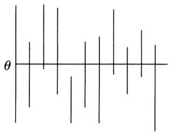  
图7-1

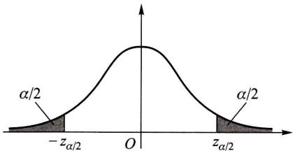  
图7-2

如果取  $1 - \alpha = 0.95$  ，即  $\alpha = 0.05$  ，又若  $\sigma = 1, n = 16$  ，查表得  $z_{\alpha /2} = z_{0.025} = 1.96.$  于是我们得到一个置信水平为0.95的置信区间

$$
\left(\overline {{X}} \pm \frac {1}{\sqrt {1 6}} \times 1. 9 6\right), \quad \text {即} (\overline {{X}} \pm 0. 4 9). \tag {4.7}
$$

再者，若由一个样本值算得样本均值的观察值  $\bar{x} = 5.20$  ，则得到一个区间 $(5.20\pm 0.49)$  ，即(4.71，5.69).

注意，这已经不是随机区间了。但我们仍称它为  $\theta$  的置信水平为0.95的置信区间。其含义是：若反复抽样多次，每个样本值  $(n = 16)$  按(4.7)式确定一个区间，按上面的解释，在这么多的区间中，包含  $\mu$  的约占  $95\%$  ，不包含  $\mu$  的约仅占  $5\%$  。现在抽样得到区间(4.71,5.69)，则该区间属于那些包含  $\mu$  的区间的可信程度为 $95\%$  ，或“该区间包含  $\mu$  ”这一陈述的可信程度为  $95\%$  □

置信水平为  $1 - \alpha$  的置信区间并不是唯一的. 以上例来说, 若给定  $\alpha = 0.05$ , 则又有

$$
P \left\{- z _ {0. 0 4} <   \frac {\bar {X} - \mu}{\sigma / \sqrt {n}} <   z _ {0. 0 1} \right\} = 0. 9 5,
$$

即  $P\left\{\overline{X} - \frac{\sigma}{\sqrt{n}} z_{0.01} < \mu < \overline{X} + \frac{\sigma}{\sqrt{n}} z_{0.04}\right\} = 0.95.$

故  $\left(\overline{X} -\frac{\sigma}{\sqrt{n}} z_{0.01},\quad \overline{X} +\frac{\sigma}{\sqrt{n}} z_{0.04}\right)$  (4.8)

也是  $\mu$  的置信水平为0.95的置信区间.我们将它与(4.5)式中令  $\alpha = 0.05$  所得的置信水平为0.95的置信区间相比较，可知由(4.5)式所确定的区间的长度为 $2\times \frac{\sigma}{\sqrt{n}} z_{0.025} = 3.92\times \frac{\sigma}{\sqrt{n}}$  ，这一长度要比区间(4.8)式的长度  $\frac{\sigma}{\sqrt{n}} (z_{0.04} + z_{0.01}) =$ $4.08\times \frac{\sigma}{\sqrt{n}}$  短.置信区间短表示估计的精度高.故由（4.5)式给出的区间较(4.8)式为优.易知，像  $N(0,1)$  分布那样其概率密度的图形是单峰且对称的情况，当  $n$  固定时，以形如(4.5)式那样的区间其长度为最短，我们自然选用它.

参考上例可得寻求未知参数  $\theta$  的置信区间的具体做法如下.

$1^{\circ}$  寻求一个样本  $X_{1}, X_{2}, \dots, X_{n}$  和  $\theta$  的函数  $W = W(X_{1}, X_{2}, \dots, X_{n}; \theta)$ ，使得  $W$  的分布不依赖于  $\theta$  以及其他未知参数，称具有这种性质的函数  $W$  为枢轴量.

$2^{\circ}$  对于给定的置信水平  $1 - \alpha$  ，定出两个常数  $a, b$  使得

$$
P \{a <   W \left(X _ {1}, X _ {2}, \dots , X _ {n}; \theta\right) <   b \} = 1 - \alpha .
$$

若能从  $a < W(X_1, X_2, \dots, X_n; \theta) < b$  得到与之等价的  $\theta$  的不等式  $\theta < \theta < \bar{\theta}$ , 其中

$\underline{\theta} = \underline{\theta}(X_1, X_2, \dots, X_n), \overline{\theta} = \overline{\theta}(X_1, X_2, \dots, X_n)$  都是统计量，那么  $(\underline{\theta}, \overline{\theta})$  就是  $\theta$  的一个置信水平为  $1 - \alpha$  的置信区间.

枢轴量  $W(X_{1},X_{2},\dots ,X_{n};\theta)$  的构造，通常可以从  $\theta$  的点估计着手考虑.常用的正态总体的参数的置信区间可以用上述步骤推得.

# § 5 正态总体均值与方差的区间估计

# （一）单个总体  $N(\mu, \sigma^2)$  的情况

设已给定置信水平为  $1 - \alpha$  ，并设  $X_{1}, X_{2}, \dots, X_{n}$  为总体  $N(\mu, \sigma^{2})$  的样本.  $\overline{X}$ ， $S^{2}$  分别是样本均值和样本方差.

# 1. 均值  $\mu$  的置信区间

(1)  $\sigma^2$  为已知, 此时由 §4 例 1 采用 (4.2) 式中的枢轴量  $\frac{\overline{X} - \mu}{\sigma / \sqrt{n}}$ , 已得到  $\mu$  的一个置信水平为  $1 - \alpha$  的置信区间为

$$
\left(\bar {X} \pm \frac {\sigma}{\sqrt {n}} z _ {a / 2}\right). \tag {5.1}
$$

(2)  $\sigma^2$  为未知, 此时不能使用 (5.1) 式给出的区间, 因其中含未知参数  $\sigma$ . 考虑到  $S^2$  是  $\sigma^2$  的无偏估计, 将 (4.2) 式中的  $\sigma$  换成  $S = \sqrt{S^2}$ , 由第六章 §3 定理 4, 知

$$
\frac {\bar {X} - \mu}{S / \sqrt {n}} \sim t (n - 1), \tag {5.2}
$$

并且右边的分布  $t(n - 1)$  不依赖于任何未知参数.使用  $\frac{\overline{X} - \mu}{S / \sqrt{n}}$  作为枢轴量可得（参见图7-3）

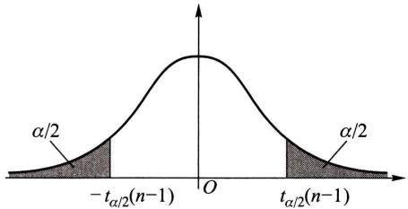  
图7-3

$$
P \left\{- t _ {\alpha / 2} (n - 1) <   \frac {\bar {X} - \mu}{S / \sqrt {n}} <   t _ {\alpha / 2} (n - 1) \right\} = 1 - \alpha , \tag {5.3}
$$

即

$$
P \left\{\overline {{X}} - \frac {S}{\sqrt {n}} t _ {a / 2} (n - 1) <   \mu <   \overline {{X}} + \frac {S}{\sqrt {n}} t _ {a / 2} (n - 1) \right\} = 1 - \alpha .
$$

于是得  $\mu$  的一个置信水平为  $1 - \alpha$  的置信区间

$$
\left(\bar {X} \pm \frac {S}{\sqrt {n}} t _ {\alpha / 2} (n - 1)\right). \tag {5.4}
$$

例1有一大批糖果.现从中随机地取16袋，称得质量(以  $\mathrm{g}$  计)如下：

<table><tr><td>506</td><td>508</td><td>499</td><td>503</td><td>504</td><td>510</td><td>497</td><td>512</td></tr><tr><td>514</td><td>505</td><td>493</td><td>496</td><td>506</td><td>502</td><td>509</td><td>496</td></tr></table>

设袋装糖果的质量近似地服从正态分布，试求总体均值  $\mu$  的置信水平为0.95的置信区间.

解这里  $1 - \alpha = 0.95, \alpha / 2 = 0.025, n - 1 = 15, t_{0.025}(15) = 2.1315$ ，由给出的数据算得  $\bar{x} = 503.75, s = 6.2022$ . 由(5.4)式得均值  $\mu$  的一个置信水平为0.95的置信区间为

$$
\left(5 0 3. 7 5 \pm \frac {6 . 2 0 2 2}{\sqrt {1 6}} \times 2. 1 3 1 5\right),
$$

即 (500.4，507.1).

这就是说估计袋装糖果质量的均值在  $500.4\mathrm{g}$  与  $507.1\mathrm{g}$  之间，这个估计的可信程度为  $95\%$ 。若以此区间内任一值作为  $\mu$  的近似值，其误差不大于  $\frac{6.2022}{\sqrt{16}} \times 2.1315 \times 2 = 6.61(\mathrm{g})$ ，这个误差估计的可信程度为  $95\%$ 。 $\square$

在实际问题中，总体方差  $\sigma^2$  未知的情况居多，故区间(5.4)式较区间(5.1)式有更大的实用价值.

# 2. 方差  $\sigma^2$  的置信区间

此处，根据实际问题的需要，只介绍  $\mu$  未知的情况

$\sigma^2$  的无偏估计为  $S^2$  ，由第六章  $\S 3$

定理3知

$$
\frac {(n - 1) S ^ {2}}{\sigma^ {2}} \sim \chi^ {2} (n - 1), \tag {5.5}
$$

并且上式右端的分布不依赖于任何未知参数，取  $\frac{(n - 1)S^2}{\sigma^2}$  作为枢轴量，即得（参见图7-4）

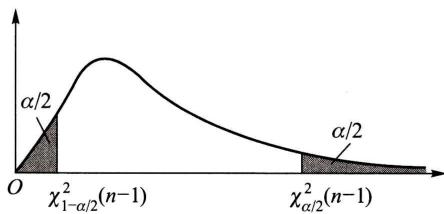  
图7-4

$$
P \left\{\chi_ {1 - a / 2} ^ {2} (n - 1) <   \frac {(n - 1) S ^ {2}}{\sigma^ {2}} <   \chi_ {a / 2} ^ {2} (n - 1) \right\} = 1 - \alpha , \tag {5.6}
$$

即  $P\left\{\frac{(n - 1)S^2}{\chi_{\alpha / 2}^2(n - 1)} < \sigma^2 < \frac{(n - 1)S^2}{\chi_{1 - \alpha / 2}^2(n - 1)}\right\} = 1 - \alpha .$  (5.6)'

这就得到方差  $\sigma^2$  的一个置信水平为  $1 - \alpha$  的置信区间

$$
\left(\frac {(n - 1) S ^ {2}}{\chi_ {\alpha / 2} ^ {2} (n - 1)}, \frac {(n - 1) S ^ {2}}{\chi_ {1 - \alpha / 2} ^ {2} (n - 1)}\right). \tag {5.7}
$$

由(5.6)式，还可得到标准差  $\sigma$  的一个置信水平为  $1 - \alpha$  的置信区间

$$
\left[ \frac {\sqrt {n - 1} S}{\sqrt {\chi_ {a / 2} ^ {2} (n - 1)}}, \frac {\sqrt {n - 1} S}{\sqrt {\chi_ {1 - a / 2} ^ {2} (n - 1)}} \right]. \tag {5.8}
$$

注意，在概率密度函数不对称时，如  $\chi^2$  分布和  $F$  分布，习惯上仍是取对称的分位数（如图7-4中的上分位数  $\chi_{1 - \alpha /2}^2 (n - 1)$  与  $\chi_{\alpha /2}^2 (n - 1)$  )来确定置信区间的.

例2 求例1中总体标准差  $\sigma$  的置信水平为0.95的置信区间.

解 现在  $\alpha / 2 = 0.025, 1 - \alpha / 2 = 0.975, n - 1 = 15$ ，查表得  $\chi_{0.025}^2 (15) = 27.488, \chi_{0.975}^2 (15) = 6.262$ ，又  $s = 6.2022$ ，由(5.8)式得所求的标准差  $\sigma$  的一个置信水平为0.95的置信区间为

$$
(4. 5 8, 9. 6 0).
$$

# （二）两个总体  $N(\mu_1,\sigma_1^2),N(\mu_2,\sigma_2^2)$  的情况

在实际中常遇到下面的问题：已知产品的某一质量指标服从正态分布，但由于原料、设备条件、操作人员不同，或工艺过程的改变等因素，引起总体均值、总体方差有所改变。我们需要知道这些变化有多大，这就需要考虑两个正态总体均值差或方差比的估计问题。

设已给定置信水平为  $1 - \alpha$  ，并设  $X_{1}, X_{2}, \dots, X_{n_{1}}$  是来自第一个总体的样本； $Y_{1}, Y_{2}, \dots, Y_{n_{2}}$  是来自第二个总体的样本，这两个样本相互独立. 且设  $\overline{X}, \overline{Y}$  分别为第一、第二个总体的样本均值， $\mathbf{S}_{1}^{2}, \mathbf{S}_{2}^{2}$  分别是第一、第二个总体的样本方差.

1. 两个总体均值差  $\mu_1 - \mu_2$  的置信区间

（1） $\sigma_1^2, \sigma_2^2$  均为已知. 因  $\overline{X}, \overline{Y}$  分别为  $\mu_1, \mu_2$  的无偏估计，故  $\overline{X} - \overline{Y}$  是  $\mu_1 - \mu_2$  的无偏估计. 由  $\overline{X}, \overline{Y}$  的独立性以及  $\overline{X} \sim N(\mu_1, \sigma_1^2 / n_1), \overline{Y} \sim N(\mu_2, \sigma_2^2 / n_2)$  得

$$
\bar {X} - \bar {Y} \sim N \left(\mu_ {1} - \mu_ {2}, \frac {\sigma_ {1} ^ {2}}{n _ {1}} + \frac {\sigma_ {2} ^ {2}}{n _ {2}}\right)
$$

或

$$
\frac {(\bar {X} - \bar {Y}) - (\mu_ {1} - \mu_ {2})}{\sqrt {\frac {\sigma_ {1} ^ {2}}{n _ {1}} + \frac {\sigma_ {2} ^ {2}}{n _ {2}}}} \sim N (0, 1), \tag {5.9}
$$

取(5.9)式左边的函数为枢轴量，即得  $\mu_1 - \mu_2$  的一个置信水平为  $1 - \alpha$  的置信区间

$$
\left(\bar {X} - \bar {Y} \pm z _ {\alpha / 2} \sqrt {\frac {\sigma_ {1} ^ {2}}{n _ {1}} + \frac {\sigma_ {2} ^ {2}}{n _ {2}}}\right). \tag {5.10}
$$

(2)  $\sigma_1^2 = \sigma_2^2 = \sigma^2$ ，但  $\sigma^2$  为未知. 此时，由第六章 §3 定理 5

$$
\frac {(\bar {X} - \bar {Y}) - (\mu_ {1} - \mu_ {2})}{S _ {W} \sqrt {\frac {1}{n _ {1}} + \frac {1}{n _ {2}}}} \sim t \left(n _ {1} + n _ {2} - 2\right). \tag {5.11}
$$

取(5.11)式左边的函数为枢轴量，可得  $\mu_1 - \mu_2$  的一个置信水平为  $1 - \alpha$  的置信区间为

$$
\left(\bar {X} - \bar {Y} \pm t _ {a / 2} \left(n _ {1} + n _ {2} - 2\right) S _ {W} \sqrt {\frac {1}{n _ {1}} + \frac {1}{n _ {2}}}\right). \tag {5.12}
$$

此处  $S_W^2 = \frac{(n_1 - 1)S_1^2 + (n_2 - 1)S_2^2}{n_1 + n_2 - 2},\quad S_W = \sqrt{S_W^2}.$  (5.13)

例3 为比较I，Ⅱ两种型号步枪子弹的枪口速度，随机地取I型子弹10发，得到枪口速度的平均值为  $\overline{x}_1 = 500\mathrm{m / s}$  ，标准差  $s_1 = 1.10\mathrm{m / s}$  ，随机地取Ⅱ型子弹20发，得到枪口速度的平均值为  $\overline{x}_2 = 496\mathrm{m / s}$  ，标准差  $s_2 = 1.20\mathrm{m / s}$  .假设两总体都可认为近似地服从正态分布，且由生产过程可认为方差相等.求两总体均值差  $\mu_{1} - \mu_{2}$  的一个置信水平为0.95的置信区间.

解 按实际情况，可认为分别来自两个总体的样本是相互独立的。又因假设两总体的方差相等，但数值未知，故可用(5.12)式求均值差的置信区间。由于  $1 - \alpha = 0.95, \alpha / 2 = 0.025, n_1 = 10, n_2 = 20, n_1 + n_2 - 2 = 28, t_{0.025}(28) = 2.0484$ 。 $s_w^2 = (9 \times 1.10^2 + 19 \times 1.20^2) / 28, s_w = \sqrt{s_w^2} = 1.1688$ ，故所求的两总体均值差  $\mu_1 - \mu_2$  的一个置信水平为0.95的置信区间是

$$
\left(\bar {x} _ {1} - \bar {x} _ {2} \pm s _ {w} \times t _ {0. 0 2 5} (2 8) \sqrt {\frac {1}{1 0} + \frac {1}{2 0}}\right) = (4 \pm 0. 9 3),
$$

即 (3.07, 4.93).

本题中得到的置信区间的下限大于零，在实际中我们就认为  $\mu_{1}$  比  $\mu_{2}$  大.

例4为提高某一化学生产过程的得率，试图采用一种新的催化剂.为慎重起见，在实验工厂先进行试验.设采用原来的催化剂进行了  $n_1 = 8$  次试验，得到得率的平均值  $\bar{x}_1 = 91.73$  ，样本方差  $s_1^2 = 3.89$  ；又采用新的催化剂进行了  $n_2 = 8$  次试验，得到得率的平均值  $\bar{x}_2 = 93.75$  ，样本方差  $s_2^2 = 4.02.$  假设两总体都可认为服从正态分布，且方差相等，两样本独立．试求两总体均值差  $\mu_{1} - \mu_{2}$  的置信水平为0.95的置信区间.

解 现在

$$
s _ {w} ^ {2} = \frac {(n _ {1} - 1) s _ {1} ^ {2} + (n _ {2} - 1) s _ {2} ^ {2}}{n _ {1} + n _ {2} - 2} = 3. 9 6, \quad s _ {w} = \sqrt {3 . 9 6}.
$$

由(5.12)式得所求的置信区间为

$$
\left(\bar {x} _ {1} - \bar {x} _ {2} \pm t _ {0. 0 2 5} (1 4) s _ {w} \sqrt {\frac {1}{8} + \frac {1}{8}}\right) = (- 2. 0 2 \pm 2. 1 3),
$$

即  $(-4.15, 0.11)$ .

由于所得置信区间包含零，在实际中我们就认为采用这两种催化剂所得的得率的均值没有显著差别. □

# 2. 两个总体方差比  $\sigma_1^2 / \sigma_2^2$  的置信区间

我们仅讨论总体均值  $\mu_1, \mu_2$  均为未知的情况，由第六章 §3 定理 5

$$
\frac {S _ {1} ^ {2} / S _ {2} ^ {2}}{\sigma_ {1} ^ {2} / \sigma_ {2} ^ {2}} \sim F \left(n _ {1} - 1, n _ {2} - 1\right), \tag {5.14}
$$

并且分布  $F(n_{1} - 1,n_{2} - 1)$  不依赖任何未知参数.取  $\frac{S_1^2 / S_2^2}{\sigma_1^2 / \sigma_2^2}$  为枢轴量得

$$
P \left\{F _ {1 - \alpha / 2} \left(n _ {1} - 1, n _ {2} - 1\right) <   \frac {S _ {1} ^ {2} / S _ {2} ^ {2}}{\sigma_ {1} ^ {2} / \sigma_ {2} ^ {2}} <   F _ {\alpha / 2} \left(n _ {1} - 1, n _ {2} - 1\right) \right\} = 1 - \alpha , \tag {5.15}
$$

即

$$
P \left\{\frac {S _ {1} ^ {2}}{S _ {2} ^ {2}} \frac {1}{F _ {\alpha / 2} (n _ {1} - 1 , n _ {2} - 1)} <   \frac {\sigma_ {1} ^ {2}}{\sigma_ {2} ^ {2}} <   \frac {S _ {1} ^ {2}}{S _ {2} ^ {2}} \frac {1}{F _ {1 - \alpha / 2} (n _ {1} - 1 , n _ {2} - 1)} \right\} = 1 - \alpha . \tag {5.15}
$$

于是得  $\sigma_1^2 /\sigma_2^2$  的一个置信水平为  $1 - \alpha$  的置信区间为

$$
\left(\frac {S _ {1} ^ {2}}{S _ {2} ^ {2}} \frac {1}{F _ {\alpha / 2} \left(n _ {1} - 1 , n _ {2} - 1\right)}, \quad \frac {S _ {1} ^ {2}}{S _ {2} ^ {2}} \frac {1}{F _ {1 - \alpha / 2} \left(n _ {1} - 1 , n _ {2} - 1\right)}\right). \tag {5.16}
$$

例5 研究由机器  $A$  和机器  $B$  生产的钢管的内径（以  $\mathrm{mm}$  计），随机抽取机器  $A$  生产的管子18只，测得样本方差  $s_1^2 = 0.34$ ；抽取机器  $B$  生产的管子13只，测得样本方差  $s_2^2 = 0.29$ 。设两样本相互独立，且设由机器  $A$ ，机器  $B$  生产的管子的内径分别服从正态分布  $N(\mu_1, \sigma_1^2), N(\mu_2, \sigma_2^2)$ ，这里  $\mu_i, \sigma_i^2 (i = 1, 2)$  均未知。试求方差比  $\sigma_1^2 / \sigma_2^2$  的置信水平为0.90的置信区间。

解 现在  $n_1 = 18, s_1^2 = 0.34, n_2 = 13, s_2^2 = 0.29, \alpha = 0.10, F_{\alpha / 2}(n_1 - 1, n_2 - 1) = F_{0.05}(17, 12) = 2.59, F_{1 - \alpha / 2}(17, 12) = F_{0.95}(17, 12) = \frac{1}{F_{0.05}(12, 17)} = \frac{1}{2.38}$ , 于是由(5.16)式得  $\sigma_1^2 / \sigma_2^2$  的一个置信水平为0.90的置信区间为

$$
\left(\frac {0 . 3 4}{0 . 2 9} \times \frac {1}{2 . 5 9}, \quad \frac {0 . 3 4}{0 . 2 9} \times 2. 3 8\right),
$$

即 (0.45, 2.79).

由于  $\sigma_1^2 / \sigma_2^2$  的置信区间包含 1, 在实际中我们就认为  $\sigma_1^2, \sigma_2^2$  两者没有显著差别. □

# § 6 (0-1)分布参数的区间估计

设有一容量  $n > 50$  的大样本，它来自(0-1)分布的总体  $X, X$  的分布律为

$$
f (x; p) = p ^ {x} (1 - p) ^ {1 - x}, \quad x = 0, 1, \tag {6.1}
$$

其中  $p$  为未知参数. 现在来求  $p$  的置信水平为  $1 - \alpha$  的置信区间.

已知(0-1)分布的均值和方差分别为

$$
\mu = p, \quad \sigma^ {2} = p (1 - p). \tag {6.2}
$$

设  $X_{1}, X_{2}, \dots, X_{n}$  是一个样本. 因样本容量  $n$  较大，由中心极限定理，知

$$
\frac {\sum_ {i = 1} ^ {n} X _ {i} - n p}{\sqrt {n p (1 - p)}} = \frac {n \bar {X} - n p}{\sqrt {n p (1 - p)}} \tag {6.3}
$$

近似地服从  $N(0,1)$  分布，于是有

$$
P \left\{- z _ {\alpha / 2} <   \frac {n \bar {X} - n p}{\sqrt {n p (1 - p)}} <   z _ {\alpha / 2} \right\} \approx 1 - \alpha . \tag {6.4}
$$

而不等式  $-z_{a / 2} < \frac{n\overline{X} - np}{\sqrt{np(1 - p)}} < z_{a / 2}$  (6.5)

等价于

$$
\left(n + z _ {a / 2} ^ {2}\right) p ^ {2} - \left(2 n \bar {X} + z _ {a / 2} ^ {2}\right) p + n \bar {X} ^ {2} <   0. \tag {6.6}
$$

记  $p_1 = \frac{1}{2a} (-b - \sqrt{b^2 - 4ac}),$  (6.7)

$$
p _ {2} = \frac {1}{2 a} (- b + \sqrt {b ^ {2} - 4 a c}), \tag {6.8}
$$

此处  $a = n + z_{\alpha /2}^2,b = -(2n\overline{X} +z_{\alpha /2}^2),c = n\overline{X}^2.$  于是由(6.5)式得  $\ngtr$  的一个近似的置信水平为  $1 - \alpha$  的置信区间为

$$
\left(p _ {1}, p _ {2}\right).
$$

例 设自一大批产品的 100 个样品中, 得一级品 60 个, 求这批产品的一级品率  $p$  的置信水平为 0.95 的置信区间.

解一级品率  $p$  是(0-1)分布的参数，此处  $n = 100, \bar{x} = 60 / 100 = 0.6, 1 - \alpha = 0.95, \alpha / 2 = 0.025, z_{\alpha / 2} = 1.96$  ，按(6.7)，(6.8)式来求  $p$  的置信区间，其中

$$
a = n + z _ {a / 2} ^ {2} = 1 0 3. 8 4, \quad b = - (2 n \bar {x} + z _ {a / 2} ^ {2}) = - 1 2 3. 8 4, \quad c = n \bar {x} ^ {2} = 3 6.
$$

于是  $p_1 = 0.50, \quad p_2 = 0.69.$

故得  $p$  的一个置信水平为0.95的近似置信区间为

$$
(0. 5 0, 0. 6 9).
$$

# § 7 单侧置信区间

在上述讨论中，对于未知参数  $\theta$  ，我们给出两个统计量  $\underline{\theta},\bar{\theta}$  ，得到  $\theta$  的双侧置信区间  $(\underline{\theta},\bar{\theta})$  .但在某些实际问题中，例如，对于设备、元件的寿命来说，平均寿命长是我们所希望的，我们关心的是平均寿命  $\theta$  的“下限”；与之相反，在考虑化学药品中杂

质含量的均值  $\mu$  时，我们常关心参数  $\mu$  的“上限”.这就引出了单侧置信区间的概念.

对于给定值  $\alpha (0 < \alpha < 1)$ ，若由样本  $X_{1}, X_{2}, \dots, X_{n}$  确定的统计量  $\underline{\theta} = \underline{\theta}(X_{1}, X_{2}, \dots, X_{n})$ ，对于任意  $\theta \in \Theta$  满足

$$
P \left\{\theta > \theta \right\} \geqslant 1 - \alpha , \tag {7.1}
$$

称随机区间  $(\underline{\theta},\infty)$  是  $\theta$  的置信水平为  $1 - \alpha$  的单侧置信区间， $\underline{\theta}$  称为  $\theta$  的置信水平为  $1 - \alpha$  的单侧置信下限.

又若统计量  $\bar{\theta} = \bar{\theta}(X_1, X_2, \dots, X_n)$ ，对于任意  $\theta \in \Theta$  满足

$$
P \left\{\theta <   \bar {\theta} \right\} \geqslant 1 - \alpha , \tag {7.2}
$$

称随机区间  $(-\infty, \bar{\theta})$  是  $\theta$  的置信水平为  $1 - \alpha$  的单侧置信区间， $\bar{\theta}$  称为  $\theta$  的置信水平为  $1 - \alpha$  的单侧置信上限.

例如对于正态总体  $X$  ，若均值  $\mu$  ，方差  $\sigma^2$  均为未知，设  $X_{1}, X_{2}, \dots, X_{n}$  是一个样本，由

$$
\frac {\bar {X} - \mu}{S / \sqrt {n}} \sim t (n - 1)
$$

有（见图7-5）

$$
P \left\{\frac {\bar {X} - \mu}{S / \sqrt {n}} <   t _ {\alpha} (n - 1) \right\} = 1 - \alpha ,
$$

即  $P\left\{\mu > \overline{X} - \frac{S}{\sqrt{n}} t_{\alpha}(n - 1)\right\} = 1 - \alpha.$

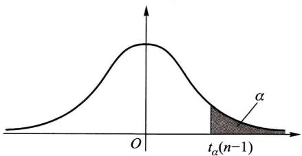  
图7-5

于是得到  $\mu$  的置信水平为  $1 - \alpha$  的单侧置信区间

$$
\left(\bar {X} - \frac {S}{\sqrt {n}} t _ {\alpha} (n - 1), \quad \infty\right). \tag {7.3}
$$

$\mu$  的置信水平为  $1 - \alpha$  的单侧置信下限为

$$
\underline {{\mu}} = \bar {X} - \frac {S}{\sqrt {n}} t _ {\alpha} (n - 1). \tag {7.4}
$$

又由

$$
\frac {(n - 1) S ^ {2}}{\sigma^ {2}} \sim \chi^ {2} (n - 1),
$$

有（见图7-6）

$$
P \left\{\frac {(n - 1) S ^ {2}}{\sigma^ {2}} > \chi_ {1 - \alpha} ^ {2} (n - 1) \right\} = 1 - \alpha ,
$$

即  $P\left\{\sigma^2 < \frac{(n - 1)S^2}{\chi_{1 - \alpha}^2(n - 1)}\right\} = 1 - \alpha .$

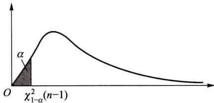  
图7-6

于是得  $\sigma^2$  的置信水平为  $1 - \alpha$  的单侧置信区间

$$
\left(0, \frac {(n - 1) S ^ {2}}{\chi_ {1 - a} ^ {2} (n - 1)}\right). \tag {7.5}
$$

$\sigma^2$  的置信水平为  $1 - \alpha$  的单侧置信上限为

$$
\overline {{\sigma^ {2}}} = \frac {(n - 1) S ^ {2}}{\chi_ {1 - a} ^ {2} (n - 1)}. \tag {7.6}
$$

例 从一批灯泡中随机地取5只作寿命试验，测得寿命(以h计)为

$$
\begin{array}{c c c c c c} 1 & 0 5 0 & 1 & 1 0 0 & 1 & 1 2 0 & 1 & 2 5 0 & 1 & 2 8 0 \end{array}
$$

设灯泡寿命服从正态分布. 求灯泡寿命均值的置信水平为 0.95 的单侧置信下限.

解  $1 - \alpha = 0.95, n = 5, t_{\alpha}(n - 1) = t_{0.05}(4) = 2.1318, \bar{x} = 1160, s^{2} = 9950.$  由(7.4)式得所求单侧置信下限为

$$
\underline {{\underline {{\mu}}}} = \bar {x} - \frac {s}{\sqrt {n}} t _ {a} (n - 1) = 1 0 6 5.
$$

小结

参数估计问题分为点估计和区间估计。点估计是适当地选择一个统计量作为未知参数的估计（称为估计量），若已取得一样本，将样本值代入估计量，得到估计量的值，以估计量的值作为未知参数的近似值（称为估计值）。

本章介绍了两种求点估计的方法：矩估计法和最大似然估计法，

矩估计法的做法是，以样本矩作为总体矩的估计量，而以样本矩的连续函数作为相应的总体矩的连续函数的估计量，从而得到总体未知参数的估计。

最大似然估计法的基本想法是，若已观察到样本  $(X_{1},X_{2},\dots ,X_{n})$  的样本值  $(x_{1},x_{2},\dots ,$

$x_{n}$  )，而取到这一样本值的概率为  $p$  （在离散型的情况），或  $(X_{1},X_{2},\dots ,X_{n})$  落在这一样本值 $(x_{1},x_{2},\dots ,x_{n})$  的邻域内的概率为  $p$  （在连续型的情况），而  $p$  与未知参数有关，我们就取  $\theta$  的估计值使概率  $p$  取到最大.

对于一个未知参数可以提出不同的估计量，因此自然提出比较估计量的好坏的问题，这就需要给出评定估计量好坏的标准。估计量是一个随机变量，对于不同的样本值，一般给出参数的不同估计值。因而在考虑估计量的好坏时，应从某种整体性能去衡量，而不能看它在个别样本之下表现如何。本章介绍了三个标准：无偏性、有效性和相合性。相合性是对估计量的一个基本要求，不具备相合性的估计量，我们一般是不考虑的。

点估计不能反映估计的精度，我们引入了区间估计。置信区间是一个随机区间  $(\underline{\theta}, \bar{\theta})$ ，它覆盖未知参数具有预先给定的高概率（置信水平），即对于任意  $\theta \in \Theta$ ，有

$$
P \{\underline {{\theta}} <   \theta <   \bar {\theta} \} \geqslant 1 - \alpha .
$$

例如，对于正态分布  $N(\mu, \sigma^2)$ ， $\sigma^2$  未知，可得  $\mu$  的一个置信水平为  $1 - \alpha$  的置信区间为

$$
\left(\bar {X} - t _ {\alpha / 2} (n - 1) \frac {S}{\sqrt {n}}, \quad \bar {X} + t _ {\alpha / 2} (n - 1) \frac {S}{\sqrt {n}}\right), \tag {5.4}
$$

就是说这一随机区间覆盖  $\mu$  的概率  $\geqslant 1 - \alpha$ . 一旦有了一个样本值  $x_{1}, x_{2}, \dots, x_{n}$ , 将它代入 (5.4) 式, 得到一个数字区间

$$
\left(\bar {x} - t _ {\alpha / 2} (n - 1) \frac {s}{\sqrt {n}}, \quad \bar {x} + t _ {\alpha / 2} (n - 1) \frac {s}{\sqrt {n}}\right) \stackrel {\text {记 成}} {=} (- c, c),
$$

$(-c, c)$  也称为  $\mu$  的置信水平为  $1 - \alpha$  的置信区间，意指“ $(-c, c)$  包含  $\mu$ ”这一陈述的可信程度为  $1 - \alpha$ 。如果将这事实写成  $P\{-c < \mu < c\} = 1 - \alpha$  是错误的，因为  $(-c, c)$  是一个数字区间，要么有  $\mu \in (-c, c)$ ，此时  $P\{-c < \mu < c\} = 1$ ；要么有  $\mu \notin (-c, c)$ ，此时  $P\{-c < \mu < c\} = 0$ 。

本章还介绍了单侧置信区间，例如，对于正态分布  $N(\mu, \sigma^2)$ ， $\sigma^2$  未知，可得  $\mu$  的置信水平为  $1 - \alpha$  的单侧置信区间为

(i)  $\left(-\infty, \overline{X} + t_{\alpha}(n - 1)\frac{S}{\sqrt{n}}\right)$ , 单侧置信上限为  $\bar{\mu} = \overline{X} + t_{\alpha}(n - 1)\frac{S}{\sqrt{n}}$ .  
(ii)  $\left(\overline{X} - t_{\alpha}(n - 1)\frac{S}{\sqrt{n}}, \infty\right)$ , 单侧置信下限为  $\underline{\mu} = \overline{X} - t_{\alpha}(n - 1)\frac{S}{\sqrt{n}}$ .

在形式上，只需将置信区间(5.4)式的上下限中的“ $\alpha / 2$ ”改成“ $\alpha$ ”，就得到相应的单侧置信上下限了。

# 重要术语及主题

矩估计量 最大似然估计量

估计量的评选标准：无偏性、有效性、相合性

参数  $\theta$  的置信水平为  $1 - \alpha$  的置信区间 枢轴量

参数  $\theta$  的单侧置信上限和单侧置信下限

单个正态总体均值、方差的置信区间、单侧置信上限与单侧置信下限（见表7-1）

两个正态总体均值差、方差比的置信区间、单侧置信上限与单侧置信下限（见表7-1）

表7-1 正态总体均值、方差的置信区间与单侧置信限（置信水平为  $1 - \alpha$ ）  

<table><tr><td></td><td>待估参数</td><td>其他参数</td><td>枢轴量的分布</td><td>置信区间</td><td>单侧置信限</td></tr><tr><td rowspan="3">单个正态总体</td><td>μ</td><td>σ2已知</td><td>Z= X̅ - μ/√n ~ N(0,1)</td><td>(X̅ ± σ/√n zα/2)</td><td>μ = X̅ + σ/√n zα μ = X̅ - σ/√n zα</td></tr><tr><td>μ</td><td>σ2未知</td><td>t = X̅ - μ/S/√n ~ t(n-1)</td><td>(X̅ ± S/√n tα/2 (n-1))</td><td>μ = X̅ + S/√n tα (n-1) μ = X̅ - S/√n tα (n-1)</td></tr><tr><td>σ2</td><td>μ未知</td><td>χ2=(n-1)S2/σ2~χ2(n-1)</td><td>((n-1)S2/χ2α/2 (n-1), (n-1)S2/χ2α/2 (n-1))</td><td>σ2=(n-1)S2/χ2α (n-1) σ2= (n-1)S2/χ2α (n-1)</td></tr><tr><td rowspan="3">两个正态总体</td><td>μ1-μ2</td><td>σ12, σ22已知</td><td>Z=(X̅ - Y) - (μ1 - μ2)/√σ12/n1 + σ22/n2~N(0,1)</td><td>(X̅ - Y ± zα/2√σ12/n1 + σ22/n2)</td><td>μ1-μ2=X̅ - Y + zα√σ12/n1 + σ22/n2μ1-μ2=X̅ - Y - zα√σ12/n1 + σ22/n2</td></tr><tr><td>μ1-μ2</td><td>σ12= σ22= σ2未知</td><td>t=(X̅ - Y) - (μ1 - μ2)/SW√1/n1+1/n2~t(n1+n2-2)S2W=(n1-1)S12+(n2-1)S22/n1+n2-2</td><td>(X̅ - Y ± tα/2 (n1+n2-2)×SW√1/n1+1/n2)</td><td>μ1-μ2=X̅ - Y+ tα (n1+n2-2)SW√1/n1+1/n2μ1-μ2=X̅ - Y-tα (n1+n2-2)SW√1/n1+1/n2</td></tr><tr><td>σ21/σ22</td><td>μ1, μ2未知</td><td>F=S12/S22/σ12/σ22~F(n1-1,n2-1)</td><td>(S12/S22/Fa/2 (n1-1,n2-1),S12/S22/F1-a/2 (n1-1,n2-1))</td><td>(σ12/σ22)=S12/S22/F1-a (n1-1,n2-1)(σ12/σ22)=S12/S22/Fa (n1-1,n2-1)</td></tr></table>

# 习题

1. 随机地取 8 只活塞环, 测得它们的直径为 (以  $\mathrm{{mm}}$  计)

$$
7 4. 0 0 1 \quad 7 4. 0 0 5 \quad 7 4. 0 0 3 \quad 7 4. 0 0 1
$$

$$
7 4. 0 0 0 \quad 7 3. 9 9 8 \quad 7 4. 0 0 6 \quad 7 4. 0 0 2
$$

试求总体均值  $\mu$  及方差  $\sigma^2$  的矩估计值，并求样本方差  $s^2$

2. 设  $X_{1}, X_{2}, \cdots, X_{n}$  为总体的一个样本， $x_{1}, x_{2}, \cdots, x_{n}$  为一相应的样本值。求下列各总体的概率密度或分布律中的未知参数的矩估计量和矩估计值。

(1)  $f(x) = \left\{ \begin{array}{ll} \theta c^{\theta} x^{-(\theta + 1)}, & x > c, \\ 0, & \text{其他}, \end{array} \right.$  其中  $c > 0$  为已知， $\theta > 1$ ， $\theta$  为未知参数.  
(2)  $f(x) = \left\{ \begin{array}{ll} \sqrt{\theta} x^{\sqrt{\theta} - 1}, & 0 \leqslant x \leqslant 1, \\ 0, & \text{其他}, \end{array} \right.$  其中  $\theta > 0, \theta$  为未知参数.  
(3)  $P\{X = x\} = \binom{m}{x} p^x (1 - p)^{m - x}, x = 0,1,2,\dots,m$  ，其中  $0 < p < 1, p$  为未知参数.

3. 求上题中各未知参数的最大似然估计值和估计量

4.（1）设总体  $X$  具有分布律

<table><tr><td>X</td><td>1</td><td>2</td><td>3</td></tr><tr><td>pk</td><td>θ2</td><td>2θ(1-θ)</td><td>(1-θ)2</td></tr></table>

其中  $\theta (0 < \theta < 1)$  为未知参数. 已知取得了样本值  $x_{1} = 1, x_{2} = 2, x_{3} = 1$ . 试求  $\theta$  的矩估计值和最大似然估计值.

（2）设  $X_{1}, X_{2}, \dots, X_{n}$  是来自参数为  $\lambda$  的泊松分布总体的一个样本，试求  $\lambda$  的最大似然估计量及矩估计量.  
（3）设随机变量  $X$  服从以  $r, p$  为参数的负二项分布，其分布律为

$$
P \{X = x _ {k} \} = \binom {x _ {k} - 1} {r - 1} p ^ {r} (1 - p) ^ {x _ {k} - r}, \quad x _ {k} = r, r + 1, \dots ,
$$

其中  $r$  已知， $p$  未知. 设有样本值  $x_{1}, x_{2}, \dots, x_{n}$ ，试求  $p$  的最大似然估计值.

5. 设某种电子器件的寿命（以  $\mathrm{h}$  计）  $T$  服从双参数的指数分布，其概率密度为

$$
f (t) = \left\{ \begin{array}{l l} { \frac {1}{\theta} \mathrm {e} ^ {- (t - c) / \theta},} & {t \geqslant c,} \\ {0,} & {\text {其 他},} \end{array} \right.
$$

其中  $c, \theta (c, \theta > 0)$  为未知参数. 自一批这种器件中随机地取  $n$  件进行寿命试验. 设它们的失效时间依次为  $x_{1} \leqslant x_{2} \leqslant \dots \leqslant x_{n}$ .

（1）求  $c$  与  $\theta$  的最大似然估计值  
（2）求  $c$  与  $\theta$  的矩估计量

6. 一地质学家为研究密歇根湖湖滩地区的岩石成分，随机地自该地区取100个样品，每个样品有10块石子，记录了每个样品中属石灰石的石子数。假设这100次观察相互独立，并

且由过去经验知，它们都服从参数为  $m = 10, p$  的二项分布， $p$  是这地区一块石子是石灰石的概率。求  $p$  的最大似然估计值。该地质学家所得的数据如下：

<table><tr><td>样品中属石灰石的石子数i</td><td>0</td><td>1</td><td>2</td><td>3</td><td>4</td><td>5</td><td>6</td><td>7</td><td>8</td><td>9</td><td>10</td></tr><tr><td>观察到i块石灰石的样品个数</td><td>0</td><td>1</td><td>6</td><td>7</td><td>23</td><td>26</td><td>21</td><td>12</td><td>3</td><td>1</td><td>0</td></tr></table>

7.（1）设  $X_{1}, X_{2}, \dots, X_{n}$  是来自总体  $X$  的一个样本，且  $X \sim \pi(\lambda)$ ，求  $P\{X = 0\}$  的最大似然估计值.  
（2）某铁路局证实一个扳道员在五年内所引起的严重事故的次数服从泊松分布.求一个扳道员在五年内未引起严重事故的概率  $p$  的最大似然估计值.使用下面122个观察值.下表中，  $r$  表示一扳道员五年中引起严重事故的次数，  $s$  表示观察到的扳道员人数.

<table><tr><td>r</td><td>0</td><td>1</td><td>2</td><td>3</td><td>4</td><td>5</td></tr><tr><td>s</td><td>44</td><td>42</td><td>21</td><td>9</td><td>4</td><td>2</td></tr></table>

8.（1）设  $X_{1}, X_{2}, \dots, X_{n}$  是来自概率密度为

$$
f (x; \theta) = \left\{ \begin{array}{l l} \theta x ^ {\theta - 1}, & 0 <   x <   1, \\ 0, & \text {其 他} \end{array} \right.
$$

的总体的样本， $\theta$  未知，求  $U = \mathrm{e}^{-1 / \theta}$  的最大似然估计值

(2) 设  $X_{1}, X_{2}, \cdots, X_{n}$  是来自正态总体  $N(\mu, 1)$  的样本,  $\mu$  未知, 求  $\theta = P\{X > 2\}$  的最大似然估计值.  
（3）设  $x_{1}, x_{2}, \dots, x_{n}$  是来自总体  $b(m, \theta)$  的样本值，又  $\theta = \frac{1}{3} (1 + \beta)$ ，求  $\beta$  的最大似然估计值.

9.（1）验证教材第六章  $\S 3$  定理5中的统计量

$$
S _ {W} ^ {2} = \frac {n _ {1} - 1}{n _ {1} + n _ {2} - 2} S _ {1} ^ {2} + \frac {n _ {2} - 1}{n _ {1} + n _ {2} - 2} S _ {2} ^ {2} = \frac {(n _ {1} - 1) S _ {1} ^ {2} + (n _ {2} - 1) S _ {2} ^ {2}}{n _ {1} + n _ {2} - 2}
$$

是两总体公共方差  $\sigma^2$  的无偏估计量（ $S_W^2$  称为  $\sigma^2$  的合并估计）.

（2）设总体  $X$  的数学期望为  $\mu, X_1, X_2, \dots, X_n$  是来自  $X$  的样本， $a_1, a_2, \dots, a_n$  是任意常数，验证  $\left(\sum_{i=1}^{n} a_i X_i\right) / \sum_{i=1}^{n} a_i$  （其中  $\sum_{i=1}^{n} a_i \neq 0$ ）是  $\mu$  的无偏估计量.

10. 设  $X_{1}, X_{2}, \dots, X_{n}$  是来自总体  $X$  的一个样本，设  $E(X) = \mu, D(X) = \sigma^{2}$ .

（1）确定常数  $c$  ，使  $c\sum_{i = 1}^{n - 1}(X_{i + 1} - X_i)^2$  为  $\sigma^2$  的无偏估计.  
（2）确定常数  $c$  ，使  $\overline{X}^2 - cS^2$  是  $\mu^2$  的无偏估计  $(\overline{X}, S^2$  是样本均值和样本方差).

11. 设总体  $X$  的概率密度为

$$
f (x; \theta) = \left\{ \begin{array}{l l} { \frac {1}{\theta} x ^ {(1 - \theta) / \theta},} & {0 <   x <   1,} \\ {0,} & {\text {其 他}.} \end{array} \right. \quad 0 <   \theta <   \infty ,
$$

$X_{1}, X_{2}, \dots, X_{n}$  是来自总体  $X$  的样本.

（1）验证  $\theta$  的最大似然估计量是  $\hat{\theta} = -\frac{1}{n}\sum_{i = 1}^{n}\ln X_{i}$  
（2）证明  $\theta$  是  $\theta$  的无偏估计量.

12. 设  $X_{1}, X_{2}, X_{3}, X_{4}$  是来自均值为  $\theta$  的指数分布总体的样本，其中  $\theta$  未知. 设有估计量

$$
\begin{array}{l} T _ {1} = \frac {1}{6} (X _ {1} + X _ {2}) + \frac {1}{3} (X _ {3} + X _ {4}), \\ T _ {2} = \frac {1}{5} (X _ {1} + 2 X _ {2} + 3 X _ {3} + 4 X _ {4}), \\ T _ {3} = \frac {1}{4} \left(X _ {1} + X _ {2} + X _ {3} + X _ {4}\right). \\ \end{array}
$$

（1）指出  $T_{1}, T_{2}, T_{3}$  中哪几个是  $\theta$  的无偏估计量.  
（2）在上述  $\theta$  的无偏估计中指出哪一个较为有效

13.（1）设  $\hat{\theta}$  是参数  $\theta$  的无偏估计，且有  $D(\hat{\theta}) > 0$  ，试证  $\hat{\theta}^2 = (\hat{\theta})^2$  不是  $\theta^2$  的无偏估计量

（2）试证明均匀分布

$$
f (x) = \left\{ \begin{array}{l l} \frac {1}{\theta}, & 0 <   x \leqslant \theta , \\ 0, & \text {其 他} \end{array} \right.
$$

中未知参数  $\theta$  的最大似然估计量不是无偏的.

14. 设从均值为  $\mu$  ，方差为  $\sigma^2 > 0$  的总体中分别抽取容量为  $n_1, n_2$  的两独立样本。  $\overline{X}_1$  和  $\overline{X}_2$  分别是两样本的均值。试证：对于任意常数  $a, b (a + b = 1), Y = a\overline{X}_1 + b\overline{X}_2$  都是  $\mu$  的无偏估计，并确定常数  $a, b$  使  $D(Y)$  达到最小。  
15. 设有  $k$  台仪器, 已知用第  $i$  台仪器测量时, 测定值总体的标准差为  $\sigma_{i}(i = 1,2,\dots ,k)$ . 用这些仪器独立地对某一物理量  $\theta$  各观察一次, 分别得到  $X_{1}, X_{2}, \dots, X_{k}$ . 设仪器都没有系统误差, 即  $E(X_{i}) = \theta (i = 1,2,\dots ,k)$ . 问  $a_1, a_2, \dots, a_k$  取何值, 方能使使用  $\hat{\theta} = \sum_{i=1}^{k} a_i X_i$  估计  $\theta$  时,  $\hat{\theta}$  是无偏的, 并且  $D(\hat{\theta})$  最小?  
16. 设某种清漆的 9 个样品, 其干燥时间 (以  $\mathrm{h}$  计) 分别为

$$
\begin{array}{c c c c c c c c c} 6. 0 & 5. 7 & 5. 8 & 6. 5 & 7. 0 & 6. 3 & 5. 6 & 6. 1 & 5. 0 \end{array}
$$

设干燥时间总体服从正态分布  $N(\mu, \sigma^2)$ . 在下述情况下，求  $\mu$  的置信水平为0.95的置信区间.

（1）若由以往经验知  $\sigma = 0.6(\mathrm{h})$  
(2) 若  $\sigma$  为未知.

17. 分别使用金球和铂球测定引力常数（以  $10^{-11} \mathrm{~m}^3 \cdot \mathrm{kg}^{-1} \cdot \mathrm{s}^{-2}$  计）.

（1）用金球测定观察值为

$$
6. 6 8 3 \quad 6. 6 8 1 \quad 6. 6 7 6 \quad 6. 6 7 8 \quad 6. 6 7 9 \quad 6. 6 7 2
$$

（2）用铂球测定观察值为

$$
6. 6 6 1 \quad 6. 6 6 1 \quad 6. 6 6 7 \quad 6. 6 6 7 \quad 6. 6 6 4
$$

设测定值总体为  $N(\mu, \sigma^2)$ ， $\mu, \sigma^2$  均为未知。试就(1)，(2)两种情况分别求  $\mu$  的置信水平为0.9的置信区间，并求  $\sigma^2$  的置信水平为0.9的置信区间。

18. 随机地取某种炮弹 9 发做试验, 得炮口速度的样本标准差  $s = 11 \mathrm{~m} / \mathrm{s}$ . 设炮口速度服从正态分布. 求这种炮弹的炮口速度的标准差  $\sigma$  的置信水平为 0.95 的置信区间.

19. 设  $X_{1}, X_{2}, \cdots, X_{n}$  是来自分布  $N(\mu, \sigma^{2})$  的样本， $\mu$  已知， $\sigma$  未知.

(1) 验证  $\sum_{i=1}^{n}(X_i - \mu)^2 / \sigma^2 \sim \chi^2(n)$ . 利用这一结果构造  $\sigma^2$  的置信水平为  $1 - \alpha$  的置信区间.

（2）设  $\mu = 6.5$  ，且有样本值7.5，2.0，12.1，8.8，9.4，7.3，1.9，2.8，7.0，7.3.试求  $\sigma$  的置信水平为0.95的置信区间.

20. 在第17题中，设用金球和用铂球测定时测定值总体的方差相等. 求两个测定值总体均值差的置信水平为0.90的置信区间.

21. 随机地从  $A$  批导线中抽4根，又从  $B$  批导线中抽5根，测得电阻（以  $\Omega$  计）为

A 批导线：0.143 0.142 0.143 0.137

$B$  批导线：0.140 0.142 0.136 0.138 0.140

设测定数据分别来自分布  $N(\mu_1, \sigma^2), N(\mu_2, \sigma^2)$ ，且两样本相互独立。又  $\mu_1, \mu_2, \sigma^2$  均为未知。试求  $\mu_1 - \mu_2$  的置信水平为 0.95 的置信区间。

22. 研究两种固体燃料火箭推进器的燃烧率. 设两者都服从正态分布, 并且已知燃烧率的标准差均近似地为  $0.05 \mathrm{~cm} / \mathrm{s}$ , 取样本容量为  $n_{1} = n_{2} = 20$ . 得燃烧率的样本均值分别为  $\overline{x}_{1} = 18 \mathrm{~cm} / \mathrm{s}, \overline{x}_{2} = 24 \mathrm{~cm} / \mathrm{s}$ , 设两样本独立. 求两燃烧率总体均值差  $\mu_{1} - \mu_{2}$  的置信水平为 0.99 的置信区间.

23. 设两位化验员  $A, B$  独立地对某种聚合物含氯量用相同的方法各做 10 次测定，其测定值的样本方差依次为  $s_A^2 = 0.5419, s_B^2 = 0.6065$ . 设  $\sigma_A^2, \sigma_B^2$  分别为  $A, B$  所测定的测定值总体的方差. 设总体均为正态的，且两样本独立. 求方差比  $\sigma_A^2 / \sigma_B^2$  的置信水平为 0.95 的置信区间.

24. 在一批货物的容量为 100 的样本中, 经检验发现有 16 只次品, 试求这批货物次品率的置信水平为 0.95 的置信区间.

25.（1）求第16题中  $\mu$  的置信水平为0.95的单侧置信上限

（2）求第21题中  $\mu_1 - \mu_2$  的置信水平为0.95的单侧置信下限

(3) 求第23题中方差比  $\sigma_A^2 / \sigma_B^2$  的置信水平为0.95的单侧置信上限

26. 为研究某种汽车轮胎的磨损特性, 随机地选择 16 只轮胎, 每只轮胎行驶到磨坏为止, 记录所行驶的路程 (以 km 计) 如下:

$$
\begin{array}{l l l l l l l l l l} 4 1 & 2 5 0 & 4 0 & 1 8 7 & 4 3 & 1 7 5 & 4 1 & 0 1 0 & 3 9 & 2 6 5 & 4 1 & 8 7 2 & 4 2 & 6 5 4 & 4 1 & 2 8 7 \end{array}
$$

$$
\begin{array}{l l l l l l l l l} 3 8 & 9 7 0 & 4 0 & 2 0 0 & 4 2 & 5 5 0 & 4 1 & 0 9 5 & 4 0 & 6 8 0 & 4 3 & 5 0 0 & 3 9 & 7 7 5 & 4 0 & 4 0 0 \end{array}
$$

假设这些数据来自正态总体  $N(\mu, \sigma^2)$ ，其中  $\mu, \sigma^2$  未知，试求  $\mu$  的置信水平为0.95的单侧置信下限.

27. 科学上的重大发现往往是由年轻人做出的. 下面列出了自 16 世纪初期至 20 世纪早

期的十二项重大发现的发现者和他们发现时的年龄：

<table><tr><td>发现内容</td><td>发现者</td><td>发现时间</td><td>年龄</td></tr><tr><td>1.地球绕太阳运转</td><td>哥白尼(Copernicus)</td><td>1513</td><td>40</td></tr><tr><td>2.望远镜、天文学的基本定律</td><td>伽利略(Galileo)</td><td>1600</td><td>36</td></tr><tr><td>3.运动原理、重力、微积分</td><td>牛顿(Newton)</td><td>1665</td><td>22</td></tr><tr><td>4.电的本质</td><td>富兰克林(Franklin)</td><td>1746</td><td>40</td></tr><tr><td>5.燃烧是与氧气联系着的</td><td>拉瓦锡(Lavoisier)</td><td>1774</td><td>31</td></tr><tr><td>6.地球是在渐进过程中演化成的</td><td>莱尔(Lyell)</td><td>1830</td><td>33</td></tr><tr><td>7.自然选择控制演化的证据</td><td>达尔文(Darwin)</td><td>1858</td><td>49</td></tr><tr><td>8.光的场方程</td><td>麦克斯韦(Maxwell)</td><td>1864</td><td>33</td></tr><tr><td>9.放射性</td><td>居里夫人(Marie Curie)</td><td>1898</td><td>31</td></tr><tr><td>10.量子论</td><td>普朗克(Planck)</td><td>1901</td><td>43</td></tr><tr><td>11.狭义相对论,E=mc2</td><td>爱因斯坦(Einstein)</td><td>1905</td><td>26</td></tr><tr><td>12.量子论的数学基础</td><td>薛定谔(Schrödinger)</td><td>1926</td><td>39</td></tr></table>

设样本来自正态总体，试求发现者的平均年龄  $\mu$  的置信水平为0.95的单侧置信上限.