# 第八章 假设检验

# §1 假设检验

统计推断的另一类重要问题是假设检验问题. 在总体的分布函数完全未知或只知其形式、但不知其参数的情况，为了推断总体的某些未知特性，提出某些关于总体的假设. 例如，提出总体服从泊松分布的假设，又如，对于正态总体提出数学期望等于  $\mu_0$  的假设等. 我们要根据样本对所提出的假设作出是接受，还是拒绝的决策．假设检验是作出这一决策的过程．这里，先结合例子来说明假设检验的基本思想和做法.

例1某车间用一台包装机包装葡萄糖.袋装糖的净重是一个随机变量，它服从正态分布.当机器正常时，其均值为  $0.5\mathrm{kg}$  ，标准差为  $0.015\mathrm{kg}$  .某日开工后为检验包装机是否正常，随机地抽取它所包装的糖9袋，称得净重为（以 $\mathrm{kg}$  计）

$$
0. 4 9 7 \quad 0. 5 0 6 \quad 0. 5 1 8 \quad 0. 5 2 4 \quad 0. 4 9 8 \quad 0. 5 1 1 \quad 0. 5 2 0 \quad 0. 5 1 5 \quad 0. 5 1 2
$$

问机器是否正常？

以  $\mu, \sigma$  分别表示这一天袋装糖的净重总体  $X$  的均值和标准差. 由于长期实践表明标准差比较稳定，我们就设  $\sigma = 0.015$ . 于是  $X \sim N(\mu, 0.015^2)$ ，这里  $\mu$  未知. 问题是根据样本值来判断  $\mu = 0.5$  还是  $\mu \neq 0.5$ . 为此，我们提出两个相互对立的假设

$$
H _ {0}: \mu = \mu_ {0} = 0. 5
$$

和

$$
H _ {1}: \mu \neq \mu_ {0}.
$$

然后，我们给出一个合理的法则，根据这一法则，利用已知样本作出决策是接受假设  $H_0$  （即拒绝假设  $H_{1}$  ），还是拒绝假设  $H_{0}$  （即接受假设  $H_{1}$  ）。如果作出的决策是接受  $H_{0}$ ，则认为  $\mu = \mu_0$ ，即认为机器工作是正常的，否则，认为是不正常的。

由于要检验的假设涉及总体均值  $\mu$  ，故首先想到是否可借助样本均值  $\overline{X}$  这一统计量来进行判断.我们知道，  $\overline{X}$  是  $\mu$  的无偏估计，  $\overline{X}$  的观察值  $\bar{x}$  的大小在一定程度上反映  $\mu$  的大小.因此，如果假设  $H_{0}$  为真，则观察值  $\bar{x}$  与  $\mu_0$  的偏差  $|\bar{x} -\mu_0|$  一般不应太大.若  $|\bar{x} -\mu_0|$  过分大，我们就怀疑假设  $H_{0}$  的正确性而拒绝  $H_{0}$

并考虑到当  $H_0$  为真时  $\frac{\overline{X} - \mu_0}{\sigma / \sqrt{n}} \sim N(0,1)$ . 而衡量  $|\overline{x} - \mu_0|$  的大小可归结为衡量  $\frac{|\overline{x} - \mu_0|}{\sigma / \sqrt{n}}$  的大小. 基于上面的想法，我们可适当选定一正数  $k$ ，使当观察值  $\overline{x}$  满足  $\frac{|\overline{x} - \mu_0|}{\sigma / \sqrt{n}} \geqslant k$  时就拒绝假设  $H_0$ ，反之，若  $\frac{|\overline{x} - \mu_0|}{\sigma / \sqrt{n}} < k$ ，则接受假设  $H_0$ .

然而，由于作出决策的依据是一个样本，当实际上  $H_0$  为真时仍可能作出拒绝  $H_0$  的决策（这种可能性是无法消除的），这是一种错误，犯这种错误的概率记为

$P\{\text{当} H_0$  为真时拒绝  $H_0\}$  或  $P_{\mu_0}\{$  拒绝  $H_0\}$  或  $P_{\mu \in H_0}\{$  拒绝  $H_0\}$ . 记号  $P_{\mu_0}\{\cdot\}$  表示参数  $\mu$  取  $\mu_0$  时事件  $\{\cdot\}$  的概率,  $P_{\mu \in H_0}\{\cdot\}$  表示  $\mu$  取  $H_0$  规定的值时事件  $\{\cdot\}$  的概率. 我们无法排除犯这类错误的可能性, 因此自然希望将犯这类错误的概率控制在一定限度之内, 即给出一个较小的数  $\alpha (0 < \alpha < 1)$ , 使犯这类错误的概率不超过  $\alpha$ , 即使得

$$
P \{\text {当} H _ {0} \text {为 真 时 拒 绝} H _ {0} \} \leqslant \alpha . \tag {1.1}
$$

为了确定常数  $k$  ，我们考虑统计量  $\frac{\overline{X} - \mu_0}{\sigma / \sqrt{n}}$  由于只允许犯这类错误的概率最大为 $\alpha$  ，令(1.1)式右端取等号，即令

$$
P \{\text {当} H _ {0} \text {为 真 时 拒 绝} H _ {0} \} = P _ {\mu_ {0}} \Bigg \{\left| \frac {\overline {{{X}}} - \mu_ {0}}{\sigma / \sqrt {n}} \right| \geqslant k \Bigg \} = \alpha ,
$$

由于当  $H_0$  为真时， $Z = \frac{\overline{X} - \mu_0}{\sigma / \sqrt{n}} \sim N(0,1)$ ，由标准正态分布分位数的定义得（如图8-1）

$$
k = z _ {a / 2}.
$$

因而，若  $Z$  的观察值满足

$$
| z | = \left| \frac {\bar {x} - \mu_ {0}}{\sigma / \sqrt {n}} \right| \geqslant k = z _ {a / 2},
$$

则拒绝  $H_0$  ，而若

$$
| z | = \left| \frac {\bar {x} - \mu_ {0}}{\sigma / \sqrt {n}} \right| <   k = z _ {a / 2},
$$

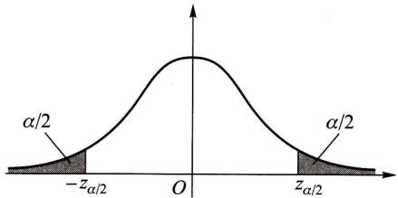  
图8-1

则接受  $H_0$

例如，在本例中取  $\alpha = 0.05$  ，则有  $k = z_{0.05 / 2} = z_{0.025} = 1.96$  ，又已知  $n = 9, \sigma = 0.015$  ，再由样本算得  $\overline{x} = 0.511$  ，即有

$$
\left| \frac {\bar {x} - \mu_ {0}}{\sigma / \sqrt {n}} \right| = 2. 2 > 1. 9 6,
$$

于是拒绝  $H_0$  ，认为这天包装机工作不正常，

上例中所采用的检验法则是符合实际推断原理的. 因通常  $\alpha$  总是取得较小, 一般取  $\alpha = 0.01, 0.05$ . 因而若  $H_{0}$  为真, 即当  $\mu = \mu_{0}$  时,  $\left\{\left|\frac{\overline{X} - \mu_{0}}{\sigma / \sqrt{n}}\right| \geqslant z_{\alpha / 2}\right\}$  是一个小概率事件, 根据实际推断原理, 就可以认为, 如果  $H_{0}$  为真, 则由一次试验得到的观察值  $\overline{x}$ , 满足不等式  $\left|\frac{\overline{x} - \mu_{0}}{\sigma / \sqrt{n}}\right| \geqslant z_{\alpha / 2}$  几乎是不会发生的. 现在在一次观察中竟然出现了满足  $\left|\frac{\overline{x} - \mu_{0}}{\sigma / \sqrt{n}}\right| \geqslant z_{\alpha / 2}$  的  $\overline{x}$ , 则我们有理由怀疑原来的假设  $H_{0}$  的正确性, 因而拒绝  $H_{0}$ . 若出现的观察值  $\overline{x}$  满足  $\left|\frac{\overline{x} - \mu_{0}}{\sigma / \sqrt{n}}\right| < z_{\alpha / 2}$ , 此时没有理由拒绝假设  $H_{0}$ , 因此只能接受假设  $H_{0}$ .

在上例的做法中，我们看到当样本容量固定时，选定  $\alpha$  后，数  $k$  就可以确定，然后按照统计量  $Z = \frac{\overline{X} - \mu_0}{\sigma / \sqrt{n}}$  的观察值的绝对值  $|z|$  大于等于  $k$  还是小于  $k$  来作出决策. 数  $k$  是检验上述假设的一个门槛值. 如果  $|z| = \left|\frac{\overline{x} - \mu_0}{\sigma / \sqrt{n}}\right| \geqslant k$  ，则称  $\overline{x}$  与  $\mu_0$  的差异是显著的，这时拒绝  $H_0$  ；反之，如果  $|z| = \left|\frac{\overline{x} - \mu_0}{\sigma / \sqrt{n}}\right| < k$  ，则称  $\overline{x}$  与  $\mu_0$  的差异是不显著的，这时接受  $H_0$  . 数  $\alpha$  称为显著性水平，上面关于  $\overline{x}$  与  $\mu_0$  有无显著差异的判断是在显著性水平  $\alpha$  之下作出的.

统计量  $Z = \frac{\overline{X} - \mu_0}{\sigma / \sqrt{n}}$  称为检验统计量.

前面的检验问题通常叙述成：在显著性水平  $\alpha$  下，检验假设

$$
H _ {0}: \mu = \mu_ {0}, \quad H _ {1}: \mu \neq \mu_ {0}. \tag {1.2}
$$

也常说成“在显著性水平  $\alpha$  下，针对  $H_{1}$  检验  $H_{0}$ ”.  $H_{0}$  称为原假设或零假设， $H_{1}$  称为备择假设（意指在原假设被拒绝后可供选择的假设）. 我们要进行的工作是，根据样本，按上述检验方法作出决策在  $H_{0}$  与  $H_{1}$  两者之间接受其一.

当检验统计量取某个区域  $C$  中的值时，我们拒绝原假设  $H_0$  ，则称区域  $C$  为拒绝域，拒绝域的边界点称为临界点.如在上例中拒绝域为  $\left|z\right|\geqslant z_{a / 2}$  ，而  $z = -z_{\alpha /2},z = z_{\alpha /2}$  为临界点.

由于检验法则是根据样本作出的，总有可能作出错误的决策.如上面所说的

那样，在假设  $H_0$  实际上为真时，我们可能犯拒绝  $H_0$  的错误，称这类“弃真”的错误为第I类错误.又当  $H_0$  实际上不真时，我们也有可能接受  $H_0$  .称这类“取伪”的错误为第Ⅱ类错误.犯第Ⅱ类错误的概率记为

$P\{$  当  $H_0$  不真时接受  $H_0\}$  或  $P_{\mu \in H_1}$  接受  $H_0\}$ .

为此，在确定检验法则时，我们应尽可能使犯两类错误的概率都较小。但是，进一步讨论可知，一般来说，当样本容量固定时，若减小犯一类错误的概率，则犯另一类错误的概率往往增大。若要使犯两类错误的概率都减小，除非增加样本容量。在给定样本容量的情况下，一般来说，我们总是控制犯第I类错误的概率，使它不大于  $\alpha, \alpha$  的大小视具体情况而定，通常  $\alpha$  取  $0.1, 0.05, 0.01, 0.005$  等值。这种只对犯第I类错误的概率加以控制，而不考虑犯第Ⅱ类错误的概率的检验，称为显著性检验。

形如(1.2)式中的备择假设  $H_{1}$ ，表示  $\mu$  可能大于  $\mu_0$ ，也可能小于  $\mu_0$ ，称为双边备择假设，而称形如(1.2)的假设检验为双边假设检验。

有时，我们只关心总体均值是否增大，例如，试验新工艺以提高材料的强度。这时，所考虑的总体的均值应该越大越好。如果我们能判断在新工艺下总体均值较以往正常生产的大，则可考虑采用新工艺。此时，我们需要检验假设

$$
H _ {0}: \mu \leqslant \mu_ {0}, \quad H _ {1}: \mu > \mu_ {0}. \tag {1.3}
$$

形如(1.3)的假设检验，称为右边检验。类似地，有时我们需要检验假设

$$
H _ {0}: \mu \geqslant \mu_ {0}, \quad H _ {1}: \mu <   \mu_ {0}. \tag {1.4}
$$

形如(1.4)的假设检验，称为左边检验. 右边检验和左边检验统称为单边检验.

下面来讨论单边检验的拒绝域

设总体  $X \sim N(\mu, \sigma^2)$ ,  $\mu$  未知、 $\sigma$  为已知， $X_1, X_2, \dots, X_n$  是来自  $X$  的样本. 给定显著性水平  $\alpha$ . 我们来求检验问题(1.3)

$$
H _ {0}: \mu \leqslant \mu_ {0}, \quad H _ {1}: \mu > \mu_ {0}
$$

的拒绝域.

因  $H_{0}$  中的全部  $\mu$  都比  $H_{1}$  中的  $\mu$  要小，当  $H_{1}$  为真时，观察值  $\overline{x}$  往往偏大，因此，拒绝域的形式为

$$
\overline {{x}} \geqslant k \quad (k \text {是 某 一 正 常 数}).
$$

下面来确定常数  $k$  ，其做法与例1中的做法类似.

$$
\begin{array}{l} P \{\text {当} H _ {0} \text {为 真 时 拒 绝} H _ {0} \} = P _ {\mu \in H _ {0}} \{\overline {{X}} \geqslant k \} \\ = P _ {\mu \leqslant \mu_ {0}} \left\{\frac {\bar {X} - \mu_ {0}}{\sigma / \sqrt {n}} \geqslant \frac {k - \mu_ {0}}{\sigma / \sqrt {n}} \right\} \\ \leqslant P _ {\mu \leqslant \mu_ {0}} \left\{\frac {\bar {X} - \mu}{\sigma / \sqrt {n}} \geqslant \frac {k - \mu_ {0}}{\sigma / \sqrt {n}} \right\} \\ \end{array}
$$

上式不等号成立是由于  $\mu \leqslant \mu_0, \frac{\overline{X} - \mu}{\sigma / \sqrt{n}} \geqslant \frac{\overline{X} - \mu_0}{\sigma / \sqrt{n}}$  事件  $\left\{\frac{\overline{X} - \mu_0}{\sigma / \sqrt{n}} \geqslant \frac{k - \mu_0}{\sigma / \sqrt{n}}\right\} \subset \left\{\frac{\overline{X} - \mu}{\sigma / \sqrt{n}} \geqslant \frac{k - \mu_0}{\sigma / \sqrt{n}}\right\}$ . 要控制  $P$  当  $H_0$  为真时拒绝  $H_0 \leqslant \alpha$ ，只需令

$$
P _ {\mu \leqslant \mu_ {0}} \left\{\frac {\bar {X} - \mu}{\sigma / \sqrt {n}} \geqslant \frac {k - \mu_ {0}}{\sigma / \sqrt {n}} \right\} = \alpha . \tag {1.5}
$$

由于  $\frac{\overline{X} - \mu}{\sigma / \sqrt{n}} \sim N(0,1)$ ，由（1.5）得到  $\frac{k - \mu_0}{\sigma / \sqrt{n}} = z_{\alpha}$  （如图8-2）， $k = \mu_0 + \frac{\sigma}{\sqrt{n}} z_{\alpha}$ ，即得检验问题(1.3)的拒绝域为

$$
\bar {x} \geqslant \mu_ {0} + \frac {\sigma}{\sqrt {n}} z _ {\alpha},
$$

即  $z = \frac{\overline{x} - \mu_0}{\sigma / \sqrt{n}}\geqslant z_\alpha .$  (1.6)

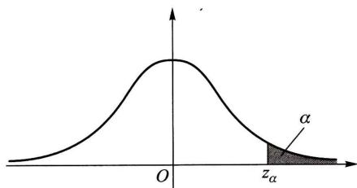  
图8-2

类似地，可得左边检验问题(1.4)

$$
H _ {0}: \mu \geqslant \mu_ {0}, H _ {1}: \mu <   \mu_ {0}
$$

的拒绝域为

$$
z = \frac {\bar {x} - \mu_ {0}}{\sigma / \sqrt {n}} \leqslant - z _ {a}. \tag {1.7}
$$

例2公司从生产商购买牛奶.公司怀疑生产商在牛奶中掺水以牟利.通过测定牛奶的冰点，可以检验出牛奶是否掺水.天然牛奶的冰点温度近似服从正态分布，均值  $\mu_0 = -0.545\,^{\circ}\mathrm{C}$ ，标准差  $\sigma = 0.008\,^{\circ}\mathrm{C}$ . 牛奶掺水可使冰点温度升高而接近于水的冰点温度  $(0\,^{\circ}\mathrm{C})$  .测得生产商提交的5批牛奶的冰点温度，其均值为  $\overline{x} = -0.535\,^{\circ}\mathrm{C}$ ，问是否可以认为生产商在牛奶中掺了水？取  $\alpha = 0.05$

解 按题意需检验假设

$$
H _ {0}: \mu \leqslant \mu_ {0} = - 0. 5 4 5 (\text {即 设 牛 奶 未 掺 水}),
$$

$$
H _ {1}: \mu > \mu_ {0} (\text {即 设 牛 奶 已 掺 水}).
$$

这是右边检验问题，其拒绝域如(1.6)式所示，即为

$$
z = \frac {\overline {{x}} - \mu_ {0}}{\sigma / \sqrt {n}} \geqslant z _ {0. 0 5} = 1. 6 4 5.
$$

现在  $z = \frac{-0.535 - (-0.545)}{0.008 / \sqrt{5}} = 2.7951 > 1.645, z$  的值落在拒绝域中，所以我们在显著性水平  $\alpha = 0.05$  下拒绝  $H_0$  ，即认为生产商在牛奶中掺了水. □

综上所述，可得处理参数的假设检验问题的步骤如下：

$1^{\circ}$  根据实际问题的要求，提出原假设  $H_{0}$  及备择假设  $H_{1}$  
$2^{\circ}$  给定显著性水平  $\alpha$  以及样本容量  $n$ .  
$3^{\circ}$  确定检验统计量以及拒绝域的形式  
$4^{\circ}$  按  $P$  {当  $H_0$  为真时拒绝  $H_0\} \leqslant \alpha$  求出拒绝域  
$5^{\circ}$  取样，根据样本观察值作出决策，是接受  $H_{0}$  还是拒绝  $H_{0}$

下面我们只讨论正态总体参数的假设检验问题

# § 2 正态总体均值的假设检验

# （一）单个总体  $N(\mu, \sigma^2)$  均值  $\mu$  的检验

1.  $\sigma^2$  已知，关于  $\mu$  的检验（Z检验）

在 §1 中已讨论过正态总体  $N(\mu, \sigma^2)$  当  $\sigma^2$  已知时关于  $\mu$  的检验问题(1.2)，(1.3)，(1.4). 在这些检验问题中，我们都是利用统计量  $Z = \frac{\overline{X} - \mu_0}{\sigma / \sqrt{n}}$  来确定拒绝域的. 这种检验法常称为  $Z$  检验法.

2.  $\sigma^2$  未知，关于  $\mu$  的检验（  $t$  检验）

设总体  $X \sim N(\mu, \sigma^2)$ ，其中  $\mu, \sigma^2$  未知，我们来求检验问题

$$
H _ {0}: \mu = \mu_ {0}, \quad H _ {1}: \mu \neq \mu_ {0}
$$

的拒绝域(显著性水平为  $\alpha$  ）.

设  $X_{1}, X_{2}, \dots, X_{n}$  是来自总体  $X$  的样本. 由于  $\sigma^{2}$  未知，现在不能利用  $\frac{\overline{X} - \mu_{0}}{\sigma / \sqrt{n}}$  来确定拒绝域了. 注意到  $S^{2}$  是  $\sigma^{2}$  的无偏估计，我们用  $S$  来代替  $\sigma$ ，采用

$$
t = \frac {\bar {X} - \mu_ {0}}{S / \sqrt {n}}
$$

作为检验统计量. 当观察值  $|t| = \left|\frac{\overline{x} - \mu_0}{s / \sqrt{n}}\right|$  过分大时就拒绝  $H_0$ ，拒绝域的形式为

$$
| t | = \left| \frac {\bar {x} - \mu_ {0}}{s / \sqrt {n}} \right| \geqslant k.
$$

由第六章 §3 定理 4 知, 当  $H_0$  为真时,  $\frac{\overline{X} - \mu_0}{S / \sqrt{n}} \sim t(n - 1)$ , 故由

$P\{\text{当} H_0$  为真时拒绝  $H_0\} = P_{\mu_0}\left\{\left|\frac{\overline{X} - \mu_0}{S / \sqrt{n}}\right| \geqslant k\right\} = \alpha$

得  $k = t_{a / 2}(n - 1)$  ，即得拒绝域为

$$
| t | = \left| \frac {\bar {x} - \mu_ {0}}{s / \sqrt {n}} \right| \geqslant t _ {\alpha / 2} (n - 1). \tag {2.1}
$$

对于正态总体  $N(\mu, \sigma^2)$ ，当  $\sigma^2$  未知时，关于  $\mu$  的单边检验的拒绝域在表8-1中给出.

上述利用  $t$  统计量得出的检验法称为  $t$  检验法.

在实际中，正态总体的方差常为未知，所以我们常用  $t$  检验法来检验关于正态总体均值的检验问题.

例1 某种元件的寿命  $X$  (以h计)服从正态分布  $N(\mu, \sigma^2), \mu, \sigma^2$  均未知. 现测得16只元件的寿命如下：

<table><tr><td>159</td><td>280</td><td>101</td><td>212</td><td>224</td><td>379</td><td>179</td><td>264</td></tr><tr><td>222</td><td>362</td><td>168</td><td>250</td><td>149</td><td>260</td><td>485</td><td>170</td></tr></table>

问是否有理由认为元件的平均寿命大于  $225\mathrm{h}$  ?

解 按题意需检验

$$
H _ {0}: \mu \leqslant \mu_ {0} = 2 2 5, \quad H _ {1}: \mu > 2 2 5.
$$

取  $\alpha = 0.05$  .由表8-1知此检验问题的拒绝域为

$$
t = \frac {\overline {{x}} - \mu_ {0}}{s / \sqrt {n}} \geqslant t _ {\alpha} (n - 1).
$$

现在  $n = 16, t_{0.05}(15) = 1.7531.$  又算得  $\overline{x} = 241.5, s = 98.7259$  ，即有

$$
t = \frac {\overline {{x}} - \mu_ {0}}{s / \sqrt {n}} = 0. 6 6 8 5 <   1. 7 5 3 1.
$$

$t$  没有落在拒绝域中，故接受  $H_0$  ，即认为元件的平均寿命不大于  $225\mathrm{h}$

# (二) 两个正态总体均值差的检验 (t 检验)

我们还可以用  $t$  检验法检验具有相同方差的两正态总体均值差的假设. 设  $X_{1}, X_{2}, \dots, X_{n_{1}}$  是来自正态总体  $N(\mu_{1}, \sigma^{2})$  的样本,  $Y_{1}, Y_{2}, \dots, Y_{n_{2}}$  是来自正态总体  $N(\mu_{2}, \sigma^{2})$  的样本, 且设两样本独立. 又分别记它们的样本均值为  $\overline{X}, \overline{Y}$ , 记样本方差为  $S_{1}^{2}, S_{2}^{2}$ . 设  $\mu_{1}, \mu_{2}, \sigma^{2}$  均为未知, 要特别引起注意的是, 在这里假设两总体的方差是相等的. 现在来求检验问题:

$$
H _ {0}: \mu_ {1} - \mu_ {2} = \delta , \quad H _ {1}: \mu_ {1} - \mu_ {2} \neq \delta
$$

$(\delta$  为已知常数)的拒绝域. 取显著性水平为  $\alpha$

引用下述  $t$  统计量作为检验统计量：

$$
t = \frac {(\bar {X} - \bar {Y}) - \delta}{S _ {\mathrm {W}} \sqrt {\frac {1}{n _ {1}} + \frac {1}{n _ {2}}}},
$$

其中  $S_{W}^{2} = \frac{(n_{1} - 1)S_{1}^{2} + (n_{2} - 1)S_{2}^{2}}{n_{1} + n_{2} - 2}, S_{W} = \sqrt{S_{W}^{2}}.$

当  $H_0$  为真时，由第六章 §3 定理 5 知  $t \sim t(n_1 + n_2 - 2)$ 。与单个总体的  $t$  检验法相仿，其拒绝域的形式为

$$
\left| \frac {(\bar {x} - \bar {y}) - \delta}{s _ {w} \sqrt {\frac {1}{n _ {1}} + \frac {1}{n _ {2}}}} \right| \geqslant k.
$$

由

$$
P \{\text {当} H _ {0} \text {为 真 时 拒 绝} H _ {0} \} = P _ {\mu_ {1} - \mu_ {2} = \delta} \left\{\left| \frac {(\overline {{{X}}} - \overline {{{Y}}}) - \delta}{S _ {W} \sqrt {\frac {1}{n _ {1}} + \frac {1}{n _ {2}}}} \right| \geqslant k \right\} = \alpha
$$

可得  $k = t_{a / 2}(n_1 + n_2 - 2)$  .于是得拒绝域为

$$
| t | = \frac {| (\bar {x} - \bar {y}) - \delta |}{s _ {w} \sqrt {\frac {1}{n _ {1}} + \frac {1}{n _ {2}}}} \geqslant t _ {a / 2} (n _ {1} + n _ {2} - 2). \tag {2.2}
$$

关于均值差的两个单边检验问题的拒绝域在表8-1中给出. 常用的是  $\delta = 0$  的情况.

当两个正态总体的方差均为已知(不一定相等)时，我们可用  $Z$  检验法来检验两正态总体均值差的假设问题，见表8-1.

例2 用两种方法  $(A$  和  $B)$  测定冰自一  $0.72^{\circ}C$  转变为  $0^{\circ}C$  的水的融化热（以  $\mathrm{cal / g}$  计).测得以下的数据：

方法A：79.98 80.04 80.02 80.04 80.03 80.03

80.04 79.97 80.05 80.03 80.02 80.00 80.02

方法B：80.02 79.94 79.98 79.97 79.97 80.03 79.95 79.97

设这两个样本相互独立，且分别来自正态总体  $N(\mu_1, \sigma^2)$  和  $N(\mu_2, \sigma^2), \mu_1, \mu_2, \sigma^2$  均未知. 试检验假设（取显著性水平  $\alpha = 0.05$ ）

$$
H _ {0}: \mu_ {1} - \mu_ {2} \leqslant 0, H _ {1}: \mu_ {1} - \mu_ {2} > 0.
$$

解 分别画出对应于方法  $A$  和方法  $B$  的数据的箱线图，如图8-3.这两种方法所得的结果是有明显差异的，现在来检验上述假设.

$$
n _ {1} = 1 3, \bar {x} _ {A} = 8 0. 0 2, s _ {A} ^ {2} = 0. 0 2 4 ^ {2},
$$

$$
n _ {2} = 8, \bar {x} _ {B} = 7 9. 9 8, s _ {B} ^ {2} = 0. 0 3 1 ^ {2},
$$

$$
s _ {w} ^ {2} = \frac {1 2 \times s _ {A} ^ {2} + 7 \times s _ {B} ^ {2}}{1 9} = 0. 0 0 0 7 1 7 8.
$$

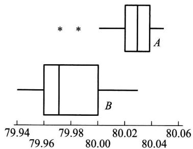  
图8-3

$$
t = \frac {\overline {{x}} _ {A} - \overline {{x}} _ {B}}{s _ {w} \sqrt {1 / 1 3 + 1 / 8}} = 3. 3 2 3 > t _ {0. 0 5} (1 3 + 8 - 2) = 1. 7 2 9 1.
$$

故拒绝  $H_0$  ，认为方法  $A$  比方法  $B$  测得的融化热要大.

# （三）基于成对数据的检验(t 检验)

有时为了比较两种产品、两种仪器、两种方法等的差异，我们常在相同的条件下做对比试验，得到一批成对的观察值。然后分析观察数据作出推断。这种方法常称为逐对比较法。

例3 有两台光谱仪  $I_{x}, I_{y}$ , 用来测量材料中某种金属的含量, 为鉴定它们的测量结果有无显著的差异, 制备了9件试块（它们的成分、金属含量、均匀性等各不相同）, 现在分别用这两台仪器对每一试块测量一次, 得到9对观察值如下.

<table><tr><td>x(%)</td><td>0.20</td><td>0.30</td><td>0.40</td><td>0.50</td><td>0.60</td><td>0.70</td><td>0.80</td><td>0.90</td><td>1.00</td></tr><tr><td>y(%)</td><td>0.10</td><td>0.21</td><td>0.52</td><td>0.32</td><td>0.78</td><td>0.59</td><td>0.68</td><td>0.77</td><td>0.89</td></tr><tr><td>d=x-y(%)</td><td>0.10</td><td>0.09</td><td>-0.12</td><td>0.18</td><td>-0.18</td><td>0.11</td><td>0.12</td><td>0.13</td><td>0.11</td></tr></table>

问能否认为这两台仪器的测量结果有显著的差异（取  $\alpha = 0.01$ ）？

解 本题中的数据是成对的，即对同一试块测出一对数据。我们看到一对与另一对之间的差异是由各种因素，如材料成分、金属含量、均匀性等因素引起的。由于各试块的特性有广泛的差别，就不能将仪器  $I_{x}$  对9个试块的测量结果（即表中第一行）看成是同分布随机变量的观察值。因而表中第一行不能看成是一个样本的样本值。同样，表中第二行也不能看成是一个样本的样本值。再者，对于每一对数据而言，它们是同一试块用不同仪器  $I_{x}, I_{y}$  测得的结果，因此，它们不是两个独立的随机变量的观察值。综上所述，我们不能用表8-1中第4栏的检验法来作检验。而同一对中两个数据的差异则可看成是仅由这两台仪器性能的差异所引起的，这样，局限于各对中两个数据来比较就能排除种种其他因素，而只考虑单独由仪器的性能所产生的影响。从而能比较这两台仪器的测量结果是否有显著的差异。

一般，设有  $n$  对相互独立的观察结果：  $(X_{1},Y_{1}),(X_{2},Y_{2}),\dots ,(X_{n},Y_{n})$  ，令 $D_{1} = X_{1} - Y_{1},D_{2} = X_{2} - Y_{2},\dots ,D_{n} = X_{n} - Y_{n}$  ，则  $D_{1},D_{2},\dots ,D_{n}$  相互独立．又由于 $D_{1},D_{2},\dots ,D_{n}$  是由同一因素所引起的，可认为它们服从同一分布．今假设  $D_{i}\sim$ $N(\mu_D,\sigma_D^2),i = 1,2,\dots ,n.$  这就是说  $D_{1},D_{2},\dots ,D_{n}$  构成正态总体  $N(\mu_D,\sigma_D^2)$  的一个

样本，其中  $\mu_D, \sigma_D^2$  未知．我们需要基于这一样本检验假设：

(1)  $H_{0}:\mu_{D} = 0$  ，  $H_{1}:\mu_{D}\neq 0$  
(2)  $H_{0}:\mu_{D}\leqslant 0$  ，  $H_{1}:\mu_{D} > 0$  
(3)  $H_{0}:\mu_{D}\geqslant 0$  ，  $H_{1}:\mu_{D} <   0$

分别记  $D_{1}, D_{2}, \dots, D_{n}$  的样本均值和样本方差的观察值为  $\overline{d}, s_{d}^{2}$ ，按表8-1第2栏中关于单个正态总体均值的  $t$  检验，知检验问题(1)，(2)，(3)的拒绝域分别为（显著性水平为  $\alpha$ ）

$$
\begin{array}{l} | t | = \left| \frac {\bar {d}}{s _ {d} / \sqrt {n}} \right| \geqslant t _ {a / 2} (n - 1), \\ t = \frac {\bar {d}}{s _ {d} / \sqrt {n}} \geqslant t _ {\alpha} (n - 1), \\ t = \frac {\bar {d}}{s _ {d} / \sqrt {n}} \leqslant - t _ {\alpha} (n - 1). \\ \end{array}
$$

现在回过来讨论本例的检验问题。先作出同一试块分别由仪器  $I_{x}, I_{y}$  测得的结果之差，列于上表的第三行。按题意需检验假设

$$
H _ {0}: \mu_ {D} = 0, H _ {1}: \mu_ {D} \neq 0.
$$

现在  $n = 9, t_{a / 2}(8) = t_{0.005}(8) = 3.3554$  ，即知拒绝域为

$$
| t | = \left| \frac {\bar {d}}{s _ {d} / \sqrt {n}} \right| \geqslant 3. 3 5 5 4.
$$

由观察值得  $\overline{d} = 0.06, s_d = 0.1227, |t| = \frac{0.06}{0.1227 / \sqrt{9}} = 1.467 < 3.3554.$  现  $|t|$  的值不落在拒绝域内，故接受  $H_0$  ，认为两台仪器的测量结果并无显著差异. □

例4 做以下的实验以比较人对红光或绿光的反应时间（以s计). 实验在点亮红光或绿光的同时，启动计时器，要求受试者见到红光或绿光点亮时，就按下按钮，切断计时器，这就能测得反应时间. 测量的结果如下表：

<table><tr><td>红光(x)</td><td>0.30</td><td>0.23</td><td>0.41</td><td>0.53</td><td>0.24</td><td>0.36</td><td>0.38</td><td>0.51</td></tr><tr><td>绿光(y)</td><td>0.43</td><td>0.32</td><td>0.58</td><td>0.46</td><td>0.27</td><td>0.41</td><td>0.38</td><td>0.61</td></tr><tr><td>d=x-y</td><td>-0.13</td><td>-0.09</td><td>-0.17</td><td>0.07</td><td>-0.03</td><td>-0.05</td><td>0.00</td><td>-0.10</td></tr></table>

设  $D_{i} = X_{i} - Y_{i}(i = 1,2,\dots ,8)$  是来自正态总体  $N(\mu_D,\sigma_D^2)$  的样本，  $\mu_D,\sigma_D^2$  均未知.试检验假设（取显著性水平  $\alpha = 0.05$  ）

$$
H _ {0}: \mu_ {D} \geqslant 0, \quad H _ {1}: \mu_ {D} <   0.
$$

解 现在  $n = 8, \overline{d} = -0.0625, s_d = 0.0765$ ，而

$$
\frac {\overline {{d}}}{s _ {d} / \sqrt {8}} = - 2. 3 1 1 <   - t _ {0. 0 5} (7) = - 1. 8 9 4 6,
$$

故拒绝  $H_0$  ，认为  $\mu_D < 0$  ，即认为人对红光的反应时间小于对绿光的反应时间，也就是人对红光的反应要比绿光快. □

# § 3 正态总体方差的假设检验

现在来讨论有关正态总体方差的假设检验问题. 以下分单个总体和两个总体的情况来讨论.

# （一）单个总体的情况

设总体  $X \sim N(\mu, \sigma^2)$ ,  $\mu, \sigma^2$  均未知,  $X_1, X_2, \dots, X_n$  是来自  $X$  的样本. 要求检验假设（显著性水平为  $\alpha$ ）

$$
H _ {0}: \sigma^ {2} = \sigma_ {0} ^ {2}, \quad H _ {1}: \sigma^ {2} \neq \sigma_ {0} ^ {2},
$$

$\sigma_0^2$  为已知常数.

由于  $S^2$  是  $\sigma^2$  的无偏估计，当  $H_0$  为真时，观察值  $s^2$  与  $\sigma_0^2$  的比值  $\frac{s^2}{\sigma_0^2}$  一般来说应在1附近摆动，而不应过分大于1或过分小于1.由第六章  $\S 3$  定理3知当  $H_0$  为真时

$$
\frac {(n - 1) S ^ {2}}{\sigma_ {0} ^ {2}} \sim \chi^ {2} (n - 1),
$$

我们取

$$
\chi^ {2} = \frac {(n - 1) S ^ {2}}{\sigma_ {0} ^ {2}}
$$

作为检验统计量，如上所说知道上述检验问题的拒绝域具有以下的形式：

$$
\frac {(n - 1) s ^ {2}}{\sigma_ {0} ^ {2}} \leqslant k _ {1} \quad \text {或} \quad \frac {(n - 1) s ^ {2}}{\sigma_ {0} ^ {2}} \geqslant k _ {2},
$$

此处  $k_{1}, k_{2}$  的值由下式确定：

$P\{\text{当} H_0 \text{为真时拒绝} H_0\} = P_{\sigma_0^2}\left\{\left(\frac{(n - 1)S^2}{\sigma_0^2} \leqslant k_1\right) \cup \left(\frac{(n - 1)S^2}{\sigma_0^2} \geqslant k_2\right)\right\} = \alpha.$

为计算方便起见，习惯上取

$$
P _ {\sigma_ {0} ^ {2}} \left\{\frac {(n - 1) S ^ {2}}{\sigma_ {0} ^ {2}} \leqslant k _ {1} \right\} = \frac {\alpha}{2}, \quad P _ {\sigma_ {0} ^ {2}} \left\{\frac {(n - 1) S ^ {2}}{\sigma_ {0} ^ {2}} \geqslant k _ {2} \right\} = \frac {\alpha}{2},
$$

故得  $k_{1} = \chi_{1 - \alpha /2}^{2}(n - 1),k_{2} = \chi_{\alpha /2}^{2}(n - 1)$  .于是得拒绝域为

$$
\frac {(n - 1) s ^ {2}}{\sigma_ {0} ^ {2}} \leqslant \chi_ {1 - a / 2} ^ {2} (n - 1) \quad \text {或} \quad \frac {(n - 1) s ^ {2}}{\sigma_ {0} ^ {2}} \geqslant \chi_ {a / 2} ^ {2} (n - 1) ①. \tag {3.1}
$$

下面来求单边检验问题（显著性水平为  $\alpha$ ）

$$
H _ {0}: \sigma^ {2} \leqslant \sigma_ {0} ^ {2}, H _ {1}: \sigma^ {2} > \sigma_ {0} ^ {2} \tag {3.2}
$$

的拒绝域．因  $H_{0}$  中的全部  $\sigma^2$  都比  $H_{1}$  中的  $\sigma^2$  要小，当  $H_{1}$  为真时， $S^2$  的观察值  $s^2$  往往偏大，因此拒绝域的形式为

$$
s ^ {2} \geqslant k.
$$

下面来确定常数  $k$

$P\{$  当  $H_0$  为真时拒绝  $H_0\} = P_{\sigma^2 \leqslant \sigma_0^2}\{S^2 \geqslant k\}$

$$
= P _ {\sigma^ {2} \leqslant \sigma_ {0} ^ {2}} \left\{\frac {(n - 1) S ^ {2}}{\sigma_ {0} ^ {2}} \geqslant \frac {(n - 1) k}{\sigma_ {0} ^ {2}} \right\}
$$

$\leqslant P_{\sigma^2 \leqslant \sigma_0^2} \left\{ \frac{(n-1)S^2}{\sigma^2} \geqslant \frac{(n-1)k}{\sigma_0^2} \right\}$  （因为  $\sigma^2 \leqslant \sigma_0^2$ ）

要控制  $P\{ \text{当} H_{0} \text{为真时拒绝} H_{0} \} \leqslant \alpha$  ，只需令

$$
P _ {\sigma^ {2} \leqslant \sigma_ {0} ^ {2}} \left\{\frac {(n - 1) S ^ {2}}{\sigma^ {2}} \geqslant \frac {(n - 1) k}{\sigma_ {0} ^ {2}} \right\} = \alpha . \tag {3.3}
$$

因  $\frac{(n - 1)S^2}{\sigma^2}\sim \chi^2 (n - 1)$  ，由（3.3）式得 $\frac{(n - 1)k}{\sigma_0^2} = \chi_a^2 (n - 1)$  （见图8-4).于是  $k = \frac{\sigma_0^2}{n - 1}\chi_\alpha^2 (n - 1)$  ，得检验问题(3.2)的拒绝域为

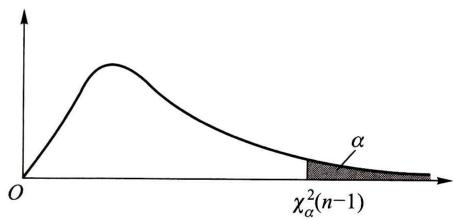  
图8-4

$$
s ^ {2} \geqslant \frac {\sigma_ {0} ^ {2}}{n - 1} \chi_ {a} ^ {2} (n - 1),
$$

即

$$
\chi^ {2} = \frac {(n - 1) s ^ {2}}{\sigma_ {0} ^ {2}} \geqslant \chi_ {\alpha} ^ {2} (n - 1). \tag {3.4}
$$

类似地，可得左边检验问题

$$
H _ {0}: \sigma^ {2} \geqslant \sigma_ {0} ^ {2}, \quad H _ {1}: \sigma^ {2} <   \sigma_ {0} ^ {2}
$$

的拒绝域为

$$
\chi^ {2} = \frac {(n - 1) s ^ {2}}{\sigma_ {0} ^ {2}} \leqslant \chi_ {1 - a} ^ {2} (n - 1). \tag {3.5}
$$

以上检验法称为  $\chi^2$  检验法.

表 8-1 正态总体均值、方差的检验法 (显著性水平为  $\alpha$  )  

<table><tr><td></td><td>原假设 H0</td><td>检验统计量</td><td>备择假设 H1</td><td>拒绝域</td></tr><tr><td>1</td><td>μ≤μ0μ≥μ0μ=μ0(σ2已知)</td><td>Z= X- μ0/ σ/√n</td><td>μ&gt; μ0μ&lt; μ0μ≠ μ0</td><td>z≥zαz≤-zα|z|≥zα/2</td></tr><tr><td>2</td><td>μ≤μ0μ≥μ0μ=μ0(σ2未知)</td><td>t= X- μ0/S/√n</td><td>μ&gt; μ0μ&lt; μ0μ≠ μ0</td><td>t≥tα(n-1)t≤-tα(n-1)|t|≥tα/2(n-1)</td></tr><tr><td>3</td><td>μ1- μ2≤δμ1- μ2≥δμ1- μ2=δ(σ12,σ22已知)</td><td>Z= X- Y- δ/ √σ12/n1+ σ22/n2</td><td>μ1- μ2&gt;δμ1- μ2&lt;δμ1- μ2≠δ</td><td>z≥zαz≤-zα|z|≥zα/2</td></tr><tr><td>4</td><td>μ1- μ2≤δμ1- μ2≥δμ1- μ2=δ(σ12=σ22=σ2未知)</td><td>t= X- Y- δ/SW√ 1/n1+ 1/n2SW=(n1-1)S12+(n2-1)S22/n1+n2-2</td><td>μ1- μ2&gt;δμ1- μ2&lt;δμ1- μ2≠δ</td><td>t≥tα(n1+n2-2)t≤-tα(n1+n2-2)|t|≥tα/2(n1+n2-2)</td></tr><tr><td>5</td><td>σ2≤σ02σ2≥σ02σ2=σ02(μ未知)</td><td>x2=(n-1)S2/σ02</td><td>σ2&gt; σ02σ2&lt; σ02σ2≠ σ02</td><td>x2≥ x2α(n-1)x2≤ x2α-α(n-1)x2≥ x2α/2(n-1)或x2≤ x2α-α/2(n-1)</td></tr><tr><td>6</td><td>σ12≤σ22σ1≥σ22σ12=σ22(μ1,μ2未知)</td><td>F=S12/S22</td><td>σ12&gt; σ22σ12&lt; σ22σ12≠ σ22</td><td>F≥ Fα(n1-1,n2-1)F≤ F1-α(n1-1,n2-1)F≥ Fα/2(n1-1,n2-1)或F≤ F1-a/2(n1-1,n2-1)</td></tr><tr><td>7</td><td>μD≤0μD≥0μD=0(成对数据)</td><td>t= D-0/Sd/√n</td><td>μD&gt;0μD&lt;0μD≠0</td><td>t≥ tα(n-1)t≤- tα(n-1)|t|≥ tα/2(n-1)</td></tr></table>

例1某厂生产的某种型号的电池，其寿命（以h计）长期以来服从方差 $\sigma^2 = 5000$  的正态分布，现有一批这种电池，从它的生产情况来看，寿命的波动性有所改变.现随机取26只电池，测出其寿命的样本方差  $s^2 = 9200.$  问根据这一数据能否推断这批电池的寿命的波动性较以往的有显著的变化(取  $\alpha = 0.02)$  ？

解 本题要求在显著性水平  $\alpha = 0.02$  下检验假设

$$
H _ {0}: \sigma^ {2} = 5 0 0 0, \quad H _ {1}: \sigma^ {2} \neq 5 0 0 0.
$$

现在  $n = 26, \chi_{a / 2}^2 (n - 1) = \chi_{0.01}^2 (25) = 44.314, \chi_{1 - a / 2}^2 (25) = \chi_{0.99}^2 (25) = 11.524.\sigma_0^2 = 5000$  ，由(3.1)式拒绝域为

$$
\frac {(n - 1) s ^ {2}}{\sigma_ {0} ^ {2}} \geqslant 4 4. 3 1 4 \quad \text {或} \quad \frac {(n - 1) s ^ {2}}{\sigma_ {0} ^ {2}} \leqslant 1 1. 5 2 4.
$$

由观察值  $s^2 = 9200$  得  $\frac{(n - 1)s^2}{\sigma_0^2} = 46 > 44.314$  ，所以拒绝  $H_{0}$  ，认为这批电池寿命的波动性较以往的有显著的变化. □

# （二）两个总体的情况

设  $X_{1}, X_{2}, \dots, X_{n_{1}}$  是来自总体  $N(\mu_{1}, \sigma_{1}^{2})$  的样本， $Y_{1}, Y_{2}, \dots, Y_{n_{2}}$  是来自总体  $N(\mu_{2}, \sigma_{2}^{2})$  的样本，且两样本独立。其样本方差分别为  $S_{1}^{2}, S_{2}^{2}$ 。且设  $\mu_{1}, \mu_{2}, \sigma_{1}^{2}, \sigma_{2}^{2}$  均为未知。现在需要检验假设（显著性水平为  $\alpha$ ）

$$
H _ {0}: \sigma_ {1} ^ {2} \leqslant \sigma_ {2} ^ {2}, \quad H _ {1}: \sigma_ {1} ^ {2} > \sigma_ {2} ^ {2}. \tag {3.6}
$$

当  $H_{0}$  为真时， $E(S_{1}^{2}) = \sigma_{1}^{2} \leqslant \sigma_{2}^{2} = E(S_{2}^{2})$  ，当  $H_{1}$  为真时， $E(S_{1}^{2}) = \sigma_{1}^{2} > \sigma_{2}^{2} = E(S_{2}^{2})$  。当  $H_{1}$  为真时，观察值  $\frac{S_1^2}{S_2^2}$  有偏大的趋势，故拒绝域具有形式

$$
\frac {s _ {1} ^ {2}}{s _ {2} ^ {2}} \geqslant k,
$$

常数  $k$  确定如下：

$$
\begin{array}{l} P \{\text {当} H _ {0} \text {为 真 时 拒 绝} H _ {0} \} = P _ {\sigma_ {1} ^ {2} \leqslant a _ {2} ^ {2}} \Bigg \{\frac {S _ {1} ^ {2}}{S _ {2} ^ {2}} \geqslant k \Bigg \} \\ \leqslant P _ {\sigma_ {1} ^ {2} \leqslant \sigma_ {2} ^ {2}} \left\{\frac {S _ {1} ^ {2} / S _ {2} ^ {2}}{\sigma_ {1} ^ {2} / \sigma_ {2} ^ {2}} \geqslant k \right\} (\text {因 为} \sigma_ {1} ^ {2} / \sigma_ {2} ^ {2} \leqslant 1). \\ \end{array}
$$

要控制  $P\{$  当  $H_0$  为真时拒绝  $H_0\} \leqslant \alpha$  ，只需令

$$
P _ {\sigma_ {1} ^ {2} \leqslant \sigma_ {2} ^ {2}} \left\{\frac {S _ {1} ^ {2} / S _ {2} ^ {2}}{\sigma_ {1} ^ {2} / \sigma_ {2} ^ {2}} \geqslant k \right\} = \alpha . \tag {3.7}
$$

由第六章 §3 定理 5 知  $\frac{S_1^2 / S_2^2}{\sigma_1^2 / \sigma_2^2} \sim F(n_1 - 1, n_2 - 1)$ , 由 (3.7) 式得  $k = F_{\alpha}(n_1 - 1,$

$n_2 - 1)$  .即得检验问题(3.6)的拒绝域为

$$
F = \frac {s _ {1} ^ {2}}{s _ {2} ^ {2}} \geqslant F _ {\alpha} \left(n _ {1} - 1, n _ {2} - 1\right). \tag {3.8}
$$

上述检验法称为  $F$  检验法. 关于  $\sigma_1^2, \sigma_2^2$  的另外两个检验问题的拒绝域在表8-1中给出.

例2设  $\S 2$  例2中的两个样本分别来自总体  $N(\mu_A,\sigma_A^2),N(\mu_B,\sigma_B^2)$  ，且两样本独立.试检验  $H_0:\sigma_A^2 = \sigma_B^2,H_1:\sigma_A^2\neq \sigma_B^2$  ，以说明我们假设  $\sigma_{A}^{2} = \sigma_{B}^{2}$  是合理的（取显著性水平  $\alpha = 0,01)$

解此处  $n_1 = 13, n_2 = 8, \alpha = 0.01$  ，拒绝域为

$$
\frac {s _ {A} ^ {2}}{s _ {B} ^ {2}} \geqslant F _ {0. 0 0 5} (1 2, 7) = 8. 1 8,
$$

或  $\frac{s_A^2}{s_B^2} \leqslant F_{0.995}(12,7) = \frac{1}{F_{0.005}(7,12)} = \frac{1}{5.52} = 0.18.$

现在  $s_A^2 = 0.024^2, s_B^2 = 0.031^2, s_A^2 / s_B^2 = 0.60$

$$
0. 1 8 <   0. 6 0 <   8. 1 8,
$$

故接受  $H_0$  ，认为两总体方差相等. 两总体方差相等也称两总体具有方差齐性，这也表明 §2 例 2 中假设两总体方差相等是合理的. □

# * § 4 置信区间与假设检验之间的关系

置信区间与假设检验之间有明显的联系，先考察置信区间与双边检验之间的对应关系。设  $X_{1}, X_{2}, \dots, X_{n}$  是一个来自总体的样本， $x_{1}, x_{2}, \dots, x_{n}$  是相应的样本值， $\Theta$  是参数  $\theta$  的可能取值范围。

设  $(\underline{\theta}(X_1, X_2, \dots, X_n), \overline{\theta}(X_1, X_2, \dots, X_n))$  是参数  $\theta$  的一个置信水平为  $1 - \alpha$  的置信区间，则对于任意  $\theta \in \Theta$ ，有

$$
P _ {\theta} \left\{\theta \left(X _ {1}, X _ {2}, \dots , X _ {n}\right) <   \theta <   \bar {\theta} \left(X _ {1}, X _ {2}, \dots , X _ {n}\right) \right\} \geqslant 1 - \alpha , \tag {4.1}
$$

考虑显著性水平为  $\alpha$  的双边检验

$$
H _ {0}: \theta = \theta_ {0}, H _ {1}: \theta \neq \theta_ {0}. \tag {4.2}
$$

由(4.1)式

$$
P _ {\theta_ {0}} \left\{\underline {{\theta}} \left(X _ {1}, X _ {2}, \dots , X _ {n}\right) <   \theta_ {0} <   \bar {\theta} \left(X _ {1}, X _ {2}, \dots , X _ {n}\right) \right\} \geqslant 1 - \alpha ,
$$

即有

$$
P _ {\theta_ {0}} \left\{\left(\theta_ {0} \leqslant \underline {{\theta}} \left(X _ {1}, X _ {2}, \dots , X _ {n}\right)\right) \cup \left(\theta_ {0} \geqslant \bar {\theta} \left(X _ {1}, X _ {2}, \dots , X _ {n}\right)\right) \right\} \leqslant \alpha .
$$

按显著性水平为  $\alpha$  的假设检验的拒绝域的定义，检验(4.2)的拒绝域为

$$
\theta_ {0} \leqslant \underline {{{\theta}}} (x _ {1}, x _ {2}, \dots , x _ {n}) \quad \text {或} \quad \theta_ {0} \geqslant \overline {{{\theta}}} (x _ {1}, x _ {2}, \dots , x _ {n});
$$

接受域为

$$
\theta \left(x _ {1}, x _ {2}, \dots , x _ {n}\right) <   \theta_ {0} <   \bar {\theta} \left(x _ {1}, x _ {2}, \dots , x _ {n}\right).
$$

这就是说，当我们要检验假设(4.2)时，先求出  $\theta$  的置信水平为  $1 - \alpha$  的置信区间  $(\underline{\theta},\bar{\theta})$  ，然后考察区间  $(\underline{\theta},\bar{\theta})$  是否包含  $\theta_0$  ，若  $\theta_0\in (\underline{\theta},\bar{\theta})$  ，则接受  $H_{0}$  ，若  $\theta_0\notin$ $(\underline{\theta},\bar{\theta})$  ，则拒绝  $H_{0}$

反之，对于任意  $\theta_0\in \Theta$  ，考虑显著性水平为  $\alpha$  的假设检验问题

$$
H _ {0}: \theta = \theta_ {0}, H _ {1}: \theta \neq \theta_ {0},
$$

假设它的接受域为

$$
\underline {{\theta}} (x _ {1}, x _ {2}, \dots , x _ {n}) <   \theta_ {0} <   \bar {\theta} (x _ {1}, x _ {2}, \dots , x _ {n}),
$$

即有

$$
P _ {\theta_ {0}} \left\{\underline {{\theta}} \left(X _ {1}, X _ {2}, \dots , X _ {n}\right) <   \theta_ {0} <   \bar {\theta} \left(X _ {1}, X _ {2}, \dots , X _ {n}\right) \right\} \geqslant 1 - \alpha .
$$

由  $\theta_0$  的任意性，由上式知对于任意  $\theta \in \Theta$  ，有

$$
P _ {\theta} \left\{\underline {{\theta}} \left(X _ {1}, X _ {2}, \dots , X _ {n}\right) <   \theta <   \bar {\theta} \left(X _ {1}, X _ {2}, \dots , X _ {n}\right) \right\} \geqslant 1 - \alpha .
$$

因此  $(\underline{\theta}(X_1, X_2, \dots, X_n), \overline{\theta}(X_1, X_2, \dots, X_n))$  是参数  $\theta$  的一个置信水平为  $1 - \alpha$  的置信区间.

这就是说，为求出参数  $\theta$  的置信水平为  $1 - \alpha$  的置信区间，我们先求出显著性水平为  $\alpha$  的假设检验问题： $H_0: \theta = \theta_0, H_1: \theta \neq \theta_0$  的接受域  $\underline{\theta}(x_1, x_2, \cdots, x_n) < \theta_0 < \bar{\theta}(x_1, x_2, \cdots, x_n)$ ，那么， $(\underline{\theta}(X_1, X_2, \cdots, X_n), \bar{\theta}(X_1, X_2, \cdots, X_n))$  就是  $\theta$  的置信水平为  $1 - \alpha$  的置信区间。

还可验证，置信水平为  $1 - \alpha$  的单侧置信区间  $(-\infty, \bar{\theta}(X_1, X_2, \dots, X_n))$  与显著性水平为  $\alpha$  的左边检验问题  $H_0: \theta \geqslant \theta_0, H_1: \theta < \theta_0$  有类似的对应关系。即若已求得单侧置信区间  $(-\infty, \bar{\theta}(X_1, X_2, \dots, X_n))$ ，则当  $\theta_0 \in (-\infty, \bar{\theta}(x_1, x_2, \dots, x_n))$  时接受  $H_0$ ，当  $\theta_0 \notin (-\infty, \bar{\theta}(x_1, x_2, \dots, x_n))$  时拒绝  $H_0$ 。反之，若已求得检验问题  $H_0: \theta \geqslant \theta_0, H_1: \theta < \theta_0$  的接受域为  $-\infty < \theta_0 \leqslant \bar{\theta}(x_1, x_2, \dots, x_n)$ ，则可得  $\theta$  的一个单侧置信区间  $(-\infty, \bar{\theta}(X_1, X_2, \dots, X_n))$ 。

置信水平为  $1 - \alpha$  的单侧置信区间  $(\underline{\theta}(X_1, X_2, \dots, X_n), \infty)$  与显著性水平为  $\alpha$  的右边检验问题  $H_0: \theta \leqslant \theta_0, H_1: \theta > \theta_0$  也有类似的对应关系。即若已求得单侧置信区间  $(\underline{\theta}(X_1, X_2, \dots, X_n), \infty)$ ，则当  $\theta_0 \in (\underline{\theta}(x_1, x_2, \dots, x_n), \infty)$  时接受  $H_0$ ，当  $\theta_0 \notin (\underline{\theta}(x_1, x_2, \dots, x_n), \infty)$  时拒绝  $H_0$ 。反之，若已求得检验问题  $H_0: \theta \leqslant \theta_0, H_1: \theta > \theta_0$  的接受域为  $\underline{\theta}(x_1, x_2, \dots, x_n) \leqslant \theta_0 < \infty$ ，则可得  $\theta$  的一个单侧置信区间  $(\underline{\theta}(X_1, X_2, \dots, X_n), \infty)$ 。

例1设  $X\sim N(\mu ,1),\mu$  未知，  $\alpha = 0.05,n = 16$  ，且由一样本算得  $\overline{x} = 5.20$  ，于是得到参数  $\mu$  的一个置信水平为0.95的置信区间

$$
\left(\bar {x} - \frac {1}{\sqrt {1 6}} z _ {0. 0 2 5}, \bar {x} + \frac {1}{\sqrt {1 6}} z _ {0. 0 2 5}\right) = (5. 2 0 - 0. 4 9, 5. 2 0 + 0. 4 9) = (4. 7 1, 5. 6 9).
$$

现在考虑检验问题  $H_0: \mu = 5.5, H_1: \mu \neq 5.5$ . 由于  $5.5 \in (4.71, 5.69)$ , 故接受  $H_0$ .

例2数据如上例．试求右边检验问题  $H_0:\mu \leqslant \mu_0,H_1:\mu >\mu_0$  的接受域，并求  $\mu$  的单侧置信下限  $(\alpha = 0.05)$

解 检验问题的拒绝域为  $z = \frac{\overline{x} - \mu_0}{1 / \sqrt{16}} \geqslant z_{0.05}$ ，或即  $\mu_0 \leqslant 4.79$ 。于是检验问题的接受域为  $\mu_0 > 4.79$ 。这样就得到  $\mu$  的单侧置信区间（4.79， $\infty$ ），单侧置信下限  $\mu = 4.79$  □

# * § 5 样本容量的选取

以上我们在进行假设检验时，总是根据问题的要求，预先给出显著性水平以控制犯第I类错误的概率，而犯第Ⅱ类错误的概率则依赖于样本容量的选择.在一些实际问题中，我们除了希望控制犯第I类错误的概率外，往往还希望控制犯第Ⅱ类错误的概率.在这一节，我们将阐明如何选取样本的容量使得犯第Ⅱ类错误的概率控制在预先给定的限度之内.为此，我们引入施行特征函数.

定义 若  $C$  是参数  $\theta$  的某检验问题的一个检验法，

$$
\beta (\theta) = P _ {\theta} (\text {接 受} H _ {0}) \tag {5.1}
$$

称为检验法  $C$  的施行特征函数或  $OC$  函数，其图形称为  $OC$  曲线.

由定义知，若此检验法的显著性水平为  $\alpha$  ，那么当真值  $\theta \in H_0$  时， $\beta(\theta)$  就是作出正确判断（即  $H_0$  为真时接受  $H_0$  )的概率，故此时  $\beta(\theta) \geqslant 1 - \alpha$ ；而当  $\theta \in H_1$  时，则  $\beta(\theta)$  就是犯第Ⅱ类错误的概率，而  $1 - \beta(\theta)$  是作出正确判断（即  $H_0$  为不真时拒绝  $H_0$  )的概率。函数  $1 - \beta(\theta)$  称为检验法  $C$  的功效函数。当  $\theta^* \in H_1$  时，值  $1 - \beta(\theta^*)$  称为检验法  $C$  在点  $\theta^*$  的功效。它表示当参数  $\theta$  的真值为  $\theta^*$  时，检验法  $C$  作出正确判断的概率。

本书只介绍正态总体均值的检验法的  $OC$  函数及其图形.

1.  $Z$  检验法的OC函数

右边检验问题  $H_0: \mu \leqslant \mu_0, H_1: \mu > \mu_0$  的  $OC$  函数是

$$
\begin{array}{l} \beta (\mu) = P _ {\mu} (\text {接 受} H _ {0}) = P _ {\mu} \left\{\frac {\overline {{X}} - \mu_ {0}}{\sigma / \sqrt {n}} <   z _ {\alpha} \right\} \\ = P _ {\mu} \left\{\frac {\bar {X} - \mu}{\sigma / \sqrt {n}} <   z _ {\alpha} - \frac {\mu - \mu_ {0}}{\sigma / \sqrt {n}} \right\} = \Phi \left(z _ {\alpha} - \lambda\right), \tag {5.2} \\ \end{array}
$$

其中  $\lambda = \frac{\mu - \mu_0}{\sigma / \sqrt{n}}$  其图形如图8-5所示.此  $OC$  函数  $\beta (\mu)$  有如下性质：

（1）它是  $\lambda = \frac{\mu - \mu_0}{\sigma / \sqrt{n}}$  的单调递减连续函数.

(2)  $\lim_{\mu \to \mu_1^+} \beta(\mu) = 1 - \alpha, \quad \lim_{\mu \to \infty} \beta(\mu) = 0.$

由  $\beta (\mu)$  的连续性可知，当参数的真

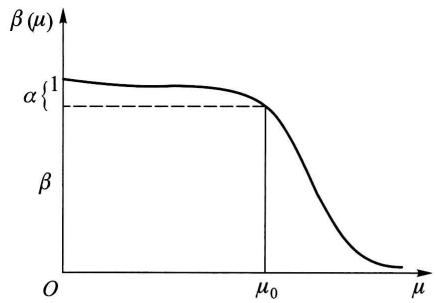  
图8-5

值  $\mu (\mu >\mu_0)$  在  $\mu_0$  附近时，检验法的功效很低，即  $\beta (\mu)$  的值很大，亦即犯第Ⅱ类错误的概率很大.因为  $\alpha$  通常取得比较小，而不管  $\sigma$  多么小，  $n$  多么大，只要  $n$  给定，总存在  $\mu_0$  附近的点  $\mu (\mu >\mu_0)$  使  $\beta (\mu)$  几乎等于  $1 - \alpha$

这表明，无论样本容量  $n$  多么大，要想对所有  $\mu \in H_1$  ，即真值为  $H_{1}$  所规定的任一点时，控制犯第Ⅱ类错误的概率都很小是不可能的.但是我们可以使用 $OC$  函数  $\beta (\mu)$  以确定样本容量  $n$  ，使当真值  $\mu \geqslant \mu_0 + \delta (\delta >0$  为取定的值)时，犯第Ⅱ类错误的概率不超过给定的  $\beta .$  这是由于  $\beta (\mu)$  是  $\mu$  的递减函数，故当  $\mu \geqslant \mu_0 + \delta$  时有

$$
\beta \left(\mu_ {0} + \delta\right) \geqslant \beta (\mu).
$$

于是只要  $\beta (\mu_0 + \delta) = \Phi (z_\alpha -\sqrt{n}\delta /\sigma)\leqslant \beta$  ，亦即只要  $n$  满足

$$
z _ {\alpha} - \sqrt {n} \delta / \sigma \leqslant - z _ {\beta}
$$

即可. 这就是说, 只要

$$
\sqrt {n} \geqslant \frac {\left(z _ {\alpha} + z _ {\beta}\right) \sigma}{\delta}, \tag {5.3}
$$

就能使当  $\mu \in H_{1}$  且  $\mu \geqslant \mu_0 + \delta$  时（即真值  $\mu \geqslant \mu_0 + \delta$  时）犯第Ⅱ类错误的概率不超过  $\beta$ .

类似地，可得左边检验问题  $H_0: \mu \geqslant \mu_0, H_1: \mu < \mu_0$  的  $OC$  函数为

$$
\beta (\mu) = \Phi (z _ {\alpha} + \lambda), \quad \lambda = \frac {\mu - \mu_ {0}}{\sigma / \sqrt {n}}. \tag {5.4}
$$

当真值  $\mu \geqslant \mu_0$  时  $\beta (\mu)$  为作出正确判断的概率；当真值  $\mu < \mu_0$  时， $\beta (\mu)$  给出犯第Ⅱ类错误的概率. 只要样本容量  $n$  满足

$$
\sqrt {n} \geqslant \frac {\left(z _ {\alpha} + z _ {\beta}\right) \sigma}{\delta}, \tag {5.5}
$$

就能使当  $\mu \in H_{1}$  且  $\mu \leqslant \mu_0 - \delta (\delta >0$  ，为取定的值)时，犯第Ⅱ类错误的概率不超过给定的值  $\beta$

双边检验问题  $H_0: \mu = \mu_0, H_1: \mu \neq \mu_0$  的  $OC$  函数是

$$
\begin{array}{l} \beta (\mu) = P _ {\mu} (\text {接 受} H _ {0}) = P _ {\mu} \left\{- z _ {\alpha / 2} <   \frac {\overline {{X}} - \mu_ {0}}{\sigma / \sqrt {n}} <   z _ {\alpha / 2} \right\} \\ = P _ {\mu} \left\{- \lambda - z _ {a / 2} <   \frac {\bar {X} - \mu}{\sigma / \sqrt {n}} <   - \lambda + z _ {a / 2} \right\} = \Phi \left(z _ {a / 2} - \lambda\right) - \Phi \left(- z _ {a / 2} - \lambda\right) \\ = \Phi \left(z _ {\alpha / 2} - \lambda\right) + \Phi \left(z _ {\alpha / 2} + \lambda\right) - 1, \quad \lambda = \frac {\mu - \mu_ {0}}{\sigma / \sqrt {n}}. \tag {5.6} \\ \end{array}
$$

$OC$  曲线如图8一6所示.注意  $\beta (\mu)$  是 $|\lambda |$  的严格单调下降函数

在双边检验问题中，若要求对  $H_{1}$  中满足  $\left|\mu -\mu_0\right|\geqslant \delta >0$  的  $\mu$  处的函数值 $\beta (\mu)\leqslant \beta$  ，则需解超越方程

$$
\begin{array}{l} \beta = \Phi \left(z _ {\alpha / 2} - \sqrt {n} \delta / \sigma\right) \\ + \Phi \left(z _ {\alpha / 2} + \sqrt {n} \delta / \sigma\right) - 1 \\ \end{array}
$$

才能确定  $n$ . 通常因  $n$  较大, 故总可以

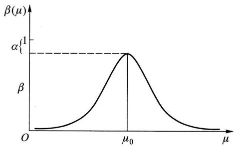  
图8-6

认为  $z_{\alpha /2} + \sqrt{n}\delta /\sigma \geqslant 4$  ，于是  $\Phi (z_{\alpha /2} + \sqrt{n}\delta /\sigma)\approx 1$  ，故近似地有

$$
\beta \approx \Phi (z _ {a / 2} - \sqrt {n} \delta / \sigma).
$$

由此知只要样本容量  $n$  满足

$$
z _ {\alpha / 2} - \sqrt {n} \delta / \sigma \leqslant - z _ {\beta},
$$

即只要  $n$  满足

$$
\sqrt {n} \geqslant \left(z _ {a / 2} + z _ {\beta}\right) \frac {\sigma}{\delta}, \tag {5.7}
$$

就能使当  $\mu \in H_{1}$  且  $|\mu -\mu_0| \geqslant \delta (\delta >0$  ，为取定的值)时，犯第Ⅱ类错误的概率不超过给定的值  $\beta$

例1（工业产品质量抽验方案）设有一大批产品，产品质量指标  $X \sim N(\mu, \sigma^2)$ 。以  $\mu$  小者为佳，厂方要求所确定的验收方案对高质量的产品  $(\mu \leqslant \mu_0)$  能以高概率  $1 - \alpha$  为买方所接受。买方则要求低质产品  $(\mu \geqslant \mu_0 + \delta, \delta > 0)$  能以高概率  $1 - \beta$  被拒绝。 $\alpha, \beta$  由厂方与买方协商给出，并采取一次抽样以确定该批产品是否为买方所接受。问应怎样安排抽样方案？已知  $\mu_0 = 120, \delta = 20$ ，且由工厂长期经验知  $\sigma^2 = 900$ 。又经商定  $\alpha, \beta$  均取为0.05。

解 检验问题可表达为

$$
H _ {0}: \mu \leqslant \mu_ {0}, \quad H _ {1}: \mu > \mu_ {0}, \tag {5.8}
$$

且要求当  $\mu \geqslant \mu_0 + \delta$  时能以  $1 - \beta = 0.95$  的概率拒绝  $H_{0}$  .由  $Z$  检验，拒绝域为

$$
\frac {\overline {{x}} - \mu_ {0}}{\sigma / \sqrt {n}} \geqslant z _ {\alpha},
$$

故  $OC$  函数为

$$
\begin{array}{l} \beta (\mu) = P _ {\mu} \left\{\frac {\bar {X} - \mu_ {0}}{\sigma / \sqrt {n}} <   z _ {\alpha} \right\} = P _ {\mu} \left\{\frac {\bar {X} - \mu}{\sigma / \sqrt {n}} <   z _ {\alpha} - \frac {\mu - \mu_ {0}}{\sigma / \sqrt {n}} \right\} \\ = \Phi \left(z _ {a} - \frac {\mu - \mu_ {0}}{\sigma / \sqrt {n}}\right). \tag {5.9} \\ \end{array}
$$

现要求当  $\mu \geqslant \mu_0 + \delta$  时  $\beta (\mu)\leqslant \beta .$  因  $\beta (\mu)$  是  $\mu$  的递减函数，故只需  $\beta (\mu_0 + \delta) = \beta$  即可.此时，由(5.9)式可得

$$
\sqrt {n} \geqslant \frac {\left(z _ {\alpha} + z _ {\beta}\right) \sigma}{\delta}.
$$

按给定的数据算得  $n \geqslant 24.35$  ，故取  $n = 25$  .且当  $\bar{x}$  满足  $\frac{\bar{x} - \mu_0}{\sigma / \sqrt{n}} \geqslant z_{\alpha} = z_{0.05} = 1.645$  时，即当  $\bar{x} \geqslant 129.87$  时，买方就拒绝这批产品，而当  $\bar{x} < 129.87$  时，买方接受这批产品. □

# 2.  $t$  检验法的  $OC$  函数

右边检验问题  $H_0: \mu \leqslant \mu_0, H_1: \mu > \mu_0$  的  $t$  检验法的  $OC$  函数是

$$
\beta (\mu) = P _ {\mu} (\text {接 受} H _ {0}) = P _ {\mu} \Bigg \{\frac {\overline {{{X}}} - \mu_ {0}}{S / \sqrt {n}} <   t _ {\alpha} (n - 1) \Bigg \}, \tag {5.10}
$$

其中变量

$$
\frac {\bar {X} - \mu_ {0}}{S / \sqrt {n}} = \left(\frac {\bar {X} - \mu}{\sigma / \sqrt {n}} + \lambda\right) / \left(\frac {S}{\sigma}\right), \lambda = \frac {\mu - \mu_ {0}}{\sigma / \sqrt {n}}. \tag {5.11}
$$

我们称变量  $\frac{\overline{X} - \mu_0}{S / \sqrt{n}}$  服从非中心参数为  $\lambda$ 、自由度为  $n-1$  的非中心  $t$  分布. 在  $\lambda = 0$  时, 它是通常的  $t(n-1)$  变量.

若给定  $\alpha, \beta$  以及  $\delta > 0$ ，则可从书末附表7查得所需容量  $n$ ，使得当  $\mu \in H_1$  且  $\frac{\mu - \mu_0}{\sigma} \geqslant \delta$  时犯第Ⅱ类错误的概率不超过  $\beta$ .

若给定  $\alpha, \beta$  以及  $\delta > 0$ , 对于左边检验问题  $H_0: \mu \geqslant \mu_0, H_1: \mu < \mu_0$  的  $t$  检验法, 也可从附表7查得所需容量  $n$ , 使得当  $\mu \in H_1$  且  $\frac{\mu - \mu_0}{\sigma} \leqslant -\delta$  时犯第Ⅱ类错误的概率不超过  $\beta$ . 对于双边检验问题  $H_0: \mu = \mu_0, H_1: \mu \neq \mu_0$  的  $t$  检验法也可从附表7查得所需容量  $n$ , 使得当  $\mu \in H_1$ , 且  $\frac{|\mu - \mu_0|}{\sigma} \geqslant \delta$  时犯第Ⅱ类错误的概率不超过  $\beta$ .

例2 考虑在显著性水平  $\alpha = 0.05$  下进行  $t$  检验

$$
H _ {0}: \mu \leqslant 6 8, \quad H _ {1}: \mu > 6 8.
$$

（1）要求在  $H_{1}$  中  $\mu \geqslant \mu_{1} = 68 + \sigma$  时犯第Ⅱ类错误的概率不超过  $\beta = 0.05$ . 求所需的样本容量.  
（2）若样本容量为  $n = 30$  ，问在  $H_{1}$  中  $\mu = \mu_{1} = 68 + 0.75\sigma$  时犯第Ⅱ类错误的概率是多少？

解（1）此处  $\alpha = \beta = 0.05, \mu_0 = 68, \delta = \frac{\mu_1 - \mu_0}{\sigma} = \frac{(68 + \sigma) - 68}{\sigma} = 1$ ，查附表7得  $n = 13$

（2）现在  $\alpha = 0.05, n = 30, \delta = \frac{\mu_1 - \mu_0}{\sigma} = \frac{(68 + 0.75\sigma) - 68}{\sigma} = 0.75$ ，查附表7，得  $\beta = 0.01$  □

例3 考虑在显著性水平  $\alpha = 0.05$  下进行  $t$  检验

$$
H _ {0}: \mu = 1 4, \quad H _ {1}: \mu \neq 1 4.
$$

要求在  $H_{1}$  中  $\frac{|\mu - 14|}{\sigma} \geqslant 0.4$  时犯第Ⅱ类错误的概率不超过  $\beta = 0.1$  ，求所需样本容量.

解此处  $\alpha = 0.05, \beta = 0.1, \delta = 0.4$  ，查附表7得  $n = 68$

在实际问题中，有时只给出  $\alpha, \beta$  及  $|\mu_1 - \mu_0|$  的值，而需要确定所需的样本容量  $n$ . 这时由于  $\sigma$  未知，不能确定  $\delta = |\mu_1 - \mu_0| / \sigma$  的值，因而不能直接查表以确定样本容量. 此时可采用下述近似方法. 先适当取一值  $n_1$ ，抽取容量为  $n_1$  的样本，根据这一样本计算  $s^2$  的值，以  $s^2$  作为  $\sigma^2$  的估计，算出  $\delta$  的近似值. 由  $\alpha, \beta, \delta$  的值查附表7定出样本的容量，记为  $n_2$ . 若  $n_1 \geq n_2$ ，则取  $n_1$  作为所求的容量，即取  $n = n_1$ . 否则，再抽  $n_2 - n_1$  个独立观察值与原来抽得的观察值合并，重新计算  $\delta$  的近似值. 然后用  $\delta$  的新近似值和  $\alpha, \beta$  查附表7，再次定出样本容量. 记为  $n_3$ . 若  $n_2 \geq n_3$ ，则取  $n = n_2$ ，否则再按上法重复进行. 一般，只需试少数几次就可得到所求的样本容量  $n$ .

下面考虑两个正态总体均值差的  $t$  检验

若两个正态总体  $N(\mu_1, \sigma_1^2), N(\mu_2, \sigma_2^2)$  中  $\sigma_1^2 = \sigma_2^2 = \sigma^2$  而  $\sigma^2$  未知. 在均值差  $\mu_1 - \mu_2$  的检验问题  $H_0: \mu_1 - \mu_2 = 0, H_1: \mu_1 - \mu_2 \neq 0$  （或  $H_0: \mu_1 - \mu_2 \leqslant 0, H_1: \mu_1 - \mu_2 > 0$  或  $H_0: \mu_1 - \mu_2 \geqslant 0, H_1: \mu_1 - \mu_2 < 0$ ）的  $t$  检验法中，当分别自两个总体取得的相互独立的样本其容量  $n_1 = n_2 = n$  时，给定  $\alpha, \beta$  以及  $\delta = |\mu_1 - \mu_2| / \sigma$  的值后可以查附表8得到所需样本容量，使当  $|\mu_1 - \mu_2| / \sigma \geqslant \delta$  时犯第Ⅱ类错误的概率小于或等于  $\beta$ . 当仅给出  $\alpha, \beta$  以及  $|\mu_1 - \mu_2|$  的值时，可按类似于上面所说的方法处理.

例4 需要比较两种汽车用的燃料的辛烷值，得数据：

<table><tr><td>燃料A</td><td>81</td><td>84</td><td>79</td><td>76</td><td>82</td><td>83</td><td>84</td><td>80</td><td>79</td><td>82</td><td>81</td><td>79</td></tr><tr><td>燃料B</td><td>76</td><td>74</td><td>78</td><td>79</td><td>80</td><td>79</td><td>82</td><td>76</td><td>81</td><td>79</td><td>82</td><td>78</td></tr></table>

燃料的辛烷值越高，燃料质量越好。因燃料  $B$  较燃料  $A$  价格便宜，因此，若两者辛烷值相同，则使用燃料  $B$ ；但若含量的均值差  $\mu_{A} - \mu_{B} \geqslant 5$ ，则使用燃料  $A$ 。设两总体的分布均可认为是正态的，而两个样本相互独立。问应采用哪种燃料（取  $\alpha = 0.01, \beta = 0.01$ ）？

解 按题意需要在显著性水平  $\alpha = 0.01$  下检验假设

$$
H _ {0}: \mu_ {A} - \mu_ {B} \leqslant 0, \quad H _ {1}: \mu_ {A} - \mu_ {B} > 0,
$$

并要求在  $\mu_{A} - \mu_{B}\geqslant 5$  时，犯第Ⅱ类错误的概率不超过  $\beta = 0.01$

所取的样本容量为  $n_A = n_B = 12$  ，且有  $\overline{x}_A = 80.83, \overline{x}_B = 78.67, s_A^2 = 5.61, s_B^2 = 6.06.$  经显著性水平为0.1的  $F$  检验知，可认为两总体的方差相等，即有  $\sigma_A^2 = \sigma_B^2$  ，记为  $\sigma^2$  .因  $n_A = n_B$  ，取  $\hat{\sigma}^2 = (s_A^2 + s_B^2) / 2 = 5.835$  作为  $\sigma^2$  的点估计，取  $\hat{\sigma} = \sqrt{\hat{\sigma}^2}$  ，于是  $\delta = 5 / \hat{\sigma} = 2.07$  ，查附表8，当  $\alpha = 0.01, \beta = 0.01, \delta = 2.07$  时  $n \geqslant 12$  现  $n = 12$  ，故已近似地满足要求.而右边检验的拒绝域为

$$
t = \frac {\overline {{x}} _ {A} - \overline {{x}} _ {B}}{s _ {w} \sqrt {1 / n _ {A} + 1 / n _ {B}}} \geqslant t _ {0. 0 1} (n _ {A} + n _ {B} - 2) = 2. 5 0 8 3.
$$

由样本观察值算得  $t = 2.19 < 2.5083$  ，故接受  $H_0$  ，即采用燃料  $B$

□

# § 6 分布拟合检验

上面介绍的各种检验法都是在总体分布形式为已知的前提下进行讨论的. 但在实际问题中, 有时不能知道总体服从什么类型的分布, 这时就需要根据样本来检验关于分布的假设. 本节介绍  $\chi^2$  拟合检验法. 它可以用来检验总体是否具有某一个指定的分布或属于某一个分布族.

# (一) 单个分布的  $\chi^{2}$  拟合检验法

设总体  $X$  的分布未知， $x_{1}, x_{2}, \dots, x_{n}$  是来自  $X$  的样本值. 我们来检验假设

$$
H _ {0}: \text {总 体} X \text {的 分 布 函 数 为} F (x), \tag {6.1}
$$

$$
H _ {1}: \text {总 体} X \text {的 分 布 函 数 不 是} F (x), ①
$$

其中设  $F(x)$  不含未知参数.（也常以分布律或概率密度代替  $F(x)$ .）

下面来定义检验统计量. 将在  $H_{0}$  下  $X$  可能取值的全体  $\Omega$  分成互不相交的子集  $A_{1}, A_{2}, \dots, A_{k}$ , 以  $f_{i} (i = 1, 2, \dots, k)$  记样本观察值  $x_{1}, x_{2}, \dots, x_{n}$  中落在  $A_{i}$  的个数, 这表示事件  $A_{i} = \{X$  的值落在子集  $A_{i}$  内\} 在  $n$  次独立试验中发生  $f_{i}$  次, 于是在这  $n$  次试验中事件  $A_{i}$  发生的频率为  $f_{i} / n$ . 另一方面, 当  $H_{0}$  为真时, 我们可以根据  $H_{0}$  中所假设的  $X$  的分布函数来计算事件  $A_{i}$  的概率, 得到  $p_{i} = P(A_{i}), i = 1, 2, \dots, k$ . 频率  $f_{i} / n$  与概率  $p_{i}$  会有差异, 但一般来说, 当  $H_{0}$  为真, 且试验的次数又甚多时, 这种差异不应太大, 因此  $\left(\frac{f_{i}}{n} - p_{i}\right)^{2}$  不应太大. 我们采用形如

$$
\sum_ {i = 1} ^ {k} C _ {i} \left(\frac {f _ {i}}{n} - p _ {i}\right) ^ {2} \tag {6.2}
$$

的统计量来度量样本与  $H_0$  中所假设的分布的吻合程度，其中  $C_i (i = 1,2,\dots,k)$  ①为给定的常数.皮尔逊证明，如果选取

$$
C _ {i} = n / p _ {i} (i = 1, 2, \dots , k),
$$

则由(6.2)定义的统计量具有下述定理中所述的简单性质. 于是我们就采用

$$
\chi^ {2} = \sum_ {i = 1} ^ {k} \frac {n}{p _ {i}} \left(\frac {f _ {i}}{n} - p _ {i}\right) ^ {2} = \sum_ {i = 1} ^ {k} \frac {f _ {i} ^ {2}}{n p _ {i}} - n \tag {6.3}
$$

作为检验统计量.

定理 若  $n$  充分大  $(n \geqslant 50)$ , 则当  $H_0$  为真时统计量(6.3)近似服从  $\chi^2(k - 1)$  分布. (证略.)

据以上的讨论，当  $H_0$  为真时，(6.3)式中的  $\chi^2$  不应太大，如  $\chi^2$  过分大就拒绝 $H_0$  ，拒绝域的形式为

$$
\chi^ {2} \geqslant G \quad (G \text {为 正 常 数}).
$$

对于给定的显著性水平  $\alpha$  ，确定  $G$  使

$$
P \{\text {当} H _ {0} \text {为 真 时 拒 绝} H _ {0} \} = P _ {H _ {0}} \{\chi^ {2} \geqslant G \} = \alpha .
$$

由上述定理得  $G = \chi_{\alpha}^{2}(k - 1)$  .即当样本观察值使(6.3)式中的  $\chi^2$  的值有

$$
\chi^ {2} \geqslant \chi_ {\alpha} ^ {2} (k - 1),
$$

则在显著性水平  $\alpha$  下拒绝  $H_0$  ；否则就接受  $H_0$  .这就是单个分布的  $\chi^2$  拟合检验法.

$\chi^2$  拟合检验法是基于上述定理得到的，所以使用时必须注意  $n$  不能小于50.另外  $np_{i}$  不能太小，应有  $np_{i} \geqslant 5$  ，否则应适当合并  $A_{i}$  ，以满足这个要求(见下例).

例1下表列出了某一地区在夏季的一个月中由100个气象站报告的雷暴雨的次数.

<table><tr><td>i</td><td>0</td><td>1</td><td>2</td><td>3</td><td>4</td><td>5</td><td>≥6</td></tr><tr><td>fi</td><td>22</td><td>37</td><td>20</td><td>13</td><td>6</td><td>2</td><td>0</td></tr><tr><td>Ai</td><td>A0</td><td>A1</td><td>A2</td><td>A3</td><td>A4</td><td>A5</td><td>A6</td></tr></table>

其中  $f_{i}$  是报告雷暴雨次数为  $i$  的气象站数. 试用  $\chi^2$  拟合检验法检验雷暴雨的次数  $X$  是否服从均值  $\lambda = 1$  的泊松分布（取显著性水平  $\alpha = 0.05$ ）.

解 按题意需检验假设

$$
H _ {0}: \quad P \{X = i \} = \frac {\lambda^ {i} \mathrm {e} ^ {- \lambda}}{i !} = \frac {\mathrm {e} ^ {- 1}}{i !}, \quad i = 0, 1, \dots .
$$

在  $H_0$  下  $X$  所有可能取的值为  $\Omega = \{0,1,2,\dots \}$  ，将  $\Omega$  分成如表8一2所示的两两不相交的子集  $A_0,A_1,\dots ,A_6$  ，则有  $P\{X = i\}$  为

$$
p _ {i} = P \{X = i \} = \frac {\mathrm {e} ^ {- 1}}{i !}, \quad i = 0, 1, \dots , 5.
$$

例如  $p_0 = P\{X = 0\} = \mathrm{e}^{-1} = 0.36788,$

$$
p _ {3} = P \{X = 3 \} = \frac {\mathrm {e} ^ {- 1}}{3 !} = 0. 0 6 1 3 1,
$$

$$
p _ {6} = P \{X \geqslant 6 \} = 1 - \sum_ {i = 0} ^ {5} p _ {i} = 0. 0 0 0 5 9.
$$

$$
n = 1 0 0.
$$

表 8-2 例 1 的  ${\chi }^{2}$  拟合检验计算表  

<table><tr><td>Ai</td><td>fi</td><td>pi</td><td>npi</td><td>fi2/(npi)</td></tr><tr><td>A0:{X=0}</td><td>22</td><td>e-1</td><td>36.788</td><td>13.16</td></tr><tr><td>A1:{X=1}</td><td>37</td><td>e-1</td><td>36.788</td><td>37.21</td></tr><tr><td>A2:{X=2}</td><td>20</td><td>e-1/2</td><td>18.394</td><td>21.75</td></tr><tr><td>A3:{X=3}</td><td>13</td><td>e-1/6</td><td>6.131</td><td rowspan="4">54.92</td></tr><tr><td>A4:{X=4}</td><td>6</td><td>e-1/24</td><td>1.533</td></tr><tr><td>A5:{X=5}</td><td>2</td><td>e-1/120</td><td>0.307</td></tr><tr><td>A6:{X≥6}</td><td>0</td><td>1-∑i=05pi</td><td>0.059</td></tr></table>

$$
\Sigma = 1 2 7. 0 4
$$

计算结果如表8-2所示，其中有些  $np_{i} < 5$  的组予以适当合并，使得每组均有  $np_{i} \geqslant 5$  ，如表中第4列花括号所示.并组后  $k = 4, \chi^{2}$  的自由度为  $k - 1 = 4 - 1 = 3$ .  $\chi_{0.05}^{2}(k - 1) = \chi_{0.05}^{2}(3) = 7.815.$  现在  $\chi^{2} = 127.04 - 100 = 27.04 > 7.815$  ，故在显著性水平0.05下拒绝  $H_{0}$  ，认为样本不是来自均值  $\lambda = 1$  的泊松分布. □

例2 在研究牛的毛色与牛角的有无，这样两对性状分离现象时，用黑色无角牛与红色有角牛杂交，子二代出现黑色无角牛192头，黑色有角牛78头，红色

无角牛72头，红色有角牛18头，共360头，问这两对性状是否符合孟德尔遗传规律中  $9:3:3:1$  的遗传比例？

解 现将题中的数据列表如下：

<table><tr><td>序号</td><td>1</td><td>2</td><td>3</td><td>4</td></tr><tr><td>种类</td><td>黑色无角</td><td>黑色有角</td><td>红色无角</td><td>红色有角</td></tr><tr><td>数量</td><td>192</td><td>78</td><td>72</td><td>18</td></tr><tr><td>Ai</td><td>A1</td><td>A2</td><td>A3</td><td>A4</td></tr></table>

以  $X$  记各种牛的序号，按题意需检验各类牛的头数符合比例  $9:3:3:1$  ，即 $(9 / 16):(3 / 16):(3 / 16):(1 / 16)$  .需检验假设：  $H_{0}:X$  的分布律为

<table><tr><td>X</td><td>1</td><td>2</td><td>3</td><td>4</td></tr><tr><td>pk</td><td>9/16</td><td>3/16</td><td>3/16</td><td>1/16</td></tr></table>

取显著性水平为0.1.所需计算列在表8一3中  $(n = 360)$

表 8-3 例 2 的  ${\chi }^{2}$  拟合检验计算表  

<table><tr><td>Ai</td><td>fi</td><td>pi</td><td>npi</td><td>fi2/(npi)</td></tr><tr><td>A1</td><td>192</td><td>9/16</td><td>360×9/16=202.5</td><td>1922/202.5=182.04</td></tr><tr><td>A2</td><td>78</td><td>3/16</td><td>360×3/16=67.5</td><td>782/67.5=90.13</td></tr><tr><td>A3</td><td>72</td><td>3/16</td><td>360×3/16=67.5</td><td>722/67.5=76.8</td></tr><tr><td>A4</td><td>18</td><td>1/16</td><td>360×1/16=22.5</td><td>182/22.5=14.4</td></tr></table>

$$
\sum = 3 6 3. 3 7
$$

现在  $\chi^2 = 363.37 - 360 = 3.37, k = 4, \chi_{0.1}^2 (4 - 1) = 6.251 > 3.37$ ，故接受  $H_0$ ，认为两对性状符合孟德尔遗传规律中  $9:3:3:1$  的遗传比例。

# （二）分布族的  $\chi^2$  拟合检验

在(一)中要检验的原假设是  $H_0$  ：总体  $X$  的分布函数是  $F(x)$  ，其中  $F(x)$  是已知的，这种情况是不多的.我们经常遇到的所需检验的原假设是

$$
H _ {0}: \text {总 体} X \text {的 分 布 函 数 是} F (x; \theta_ {1}, \theta_ {2}, \dots , \theta_ {r}), \tag {6.4}
$$

其中  $F$  的形式已知，而  $\pmb{\theta} = (\theta_{1},\theta_{2},\dots ,\theta_{r})$  是未知参数，它们在某一个范围取值.在  $F(x;\theta_1,\theta_2,\dots ,\theta_r)$  中当参数  $\theta_{1},\theta_{2},\dots ,\theta_{r}$  取不同的值时，就得到不同的分布，因而  $F(x;\theta_1,\theta_2,\dots ,\theta_r)$  代表一族分布.(6.4)中的  $H_{0}$  表示总体  $X$  的分布属于分

布族  $F(x;\theta_{1},\theta_{2},\dots ,\theta_{r})$  .采用类似(一)中的方法来定义检验统计量，将在  $H_0$  下 $X$  可能取值的全体  $\Omega$  分成  $k(k > r + 1)$  个互不相交的子集  $A_{1},A_{2},\dots ,A_{k}$  ，以 $f_{i}(i = 1,2,\dots ,k)$  记样本观察值  $x_{1},x_{2},\dots ,x_{n}$  落在  $A_{i}$  的个数，则事件  $A_{i} = \{X$  的值落在  $A_{i}$  内}的频率为  $f_{i} / n.$  另一方面，当  $H_0$  为真时，由  $H_0$  所假设的分布函数来计算  $P(A_i)$  ，得到  $P(A_i) = p_i(\theta_1,\theta_2,\dots ,\theta_r) = p_i(\pmb {\theta}) = p_i.$  此时，需先利用样本求出未知参数的最大似然估计（在  $H_0$  下)，以估计值作为参数值，求出  $\mathcal{P}_i$  的估计值  $\hat{p}_i = \hat{p} (A_i)$  ，在(6.3)式中以  $\hat{p}_i$  代替  $\mathcal{P}_i$  ，取

$$
\chi^ {2} = \sum_ {i = 1} ^ {k} \frac {f _ {i} ^ {2}}{n \hat {p} _ {i}} - n \tag {6.5}
$$

作为检验假设  $H_0$  的统计量. 可以证明, 在某些条件下, 在  $H_0$  为真时近似地有

$$
\chi^ {2} = \sum_ {i = 1} ^ {k} \frac {f _ {i} ^ {2}}{n \hat {p} _ {i}} - n \sim \chi^ {2} (k - r - 1)
$$

与在(一)中一样可得假设检验问题(6.4)的拒绝域为

$$
\chi^ {2} \geqslant \chi_ {\alpha} ^ {2} (k - r - 1), \tag {6.6}
$$

$\alpha$  为显著性水平.以上就是用来检验分布族的  $\chi^2$  拟合检验法.

例3在一实验中，每隔一定时间观察一次由某种铀所放射的到达计数器上的  $\alpha$  粒子数  $X$  ，共观察了100次，得结果如表8-4所示：

表 8-4 铀放射的到达计数器上的  $\alpha$  粒子数的实验记录  

<table><tr><td>i</td><td>0</td><td>1</td><td>2</td><td>3</td><td>4</td><td>5</td><td>6</td><td>7</td><td>8</td><td>9</td><td>10</td><td>11</td><td>≥12</td></tr><tr><td>fi</td><td>1</td><td>5</td><td>16</td><td>17</td><td>26</td><td>11</td><td>9</td><td>9</td><td>2</td><td>1</td><td>2</td><td>1</td><td>0</td></tr><tr><td>Ai</td><td>A0</td><td>A1</td><td>A2</td><td>A3</td><td>A4</td><td>A5</td><td>A6</td><td>A7</td><td>A8</td><td>A9</td><td>A10</td><td>A11</td><td>A12</td></tr></table>

其中  $f_{i}$  是观察到有  $i$  个  $\alpha$  粒子的次数.从理论上考虑知  $X$  应服从泊松分布

$$
P \{X = i \} = \frac {\lambda^ {i} \mathrm {e} ^ {- \lambda}}{i !}, \quad i = 0, 1, 2, \dots . \tag {6.7}
$$

问(6.7)式是否符合实际（取  $\alpha = 0.05$  ？即在显著性水平0.05下检验假设

$H_0$  ：总体  $X$  服从泊松分布  $P\{X = i\} = \frac{\lambda^i\mathrm{e}^{-\lambda}}{i!}$  ，  $i = 0,1,2,\dots .$

解因在  $H_0$  中参数  $\lambda$  未具体给出，所以先估计  $\lambda$  由最大似然估计法得  $\hat{\lambda} = \overline{x} = 4.2.$  在  $H_0$  假设下，即在  $X$  服从泊松分布的假设下，  $X$  所有可能取的值为 $\Omega = \{0,1,2,\dots \}$  ，将  $\varOmega$  分成如表8一4所示的两两不相交的子集  $A_0,A_1,\dots ,A_{12}$  则  $P\{X = i\}$  有估计

$$
\hat {p} _ {i} = \hat {P} \{X = i \} = \frac {4 . 2 ^ {i} \mathrm {e} ^ {- 4 . 2}}{i !}, \quad i = 0, 1, \dots .
$$

例如  $\hat{p}_0 = \hat{P}\{X = 0\} = \mathrm{e}^{-4.2} = 0.015,$

$$
\begin{array}{l} \hat {p} _ {3} = \hat {P} \{X = 3 \} = \frac {4 . 2 ^ {3} e ^ {- 4 . 2}}{3 !} = 0. 1 8 5, \\ \hat {p} _ {1 2} = \hat {P} \{X \geqslant 1 2 \} = 1 - \sum_ {i = 0} ^ {1 1} \hat {p} _ {i} = 0. 0 0 2. \\ \end{array}
$$

表 8-5 例 3 的  ${\chi }^{2}$  拟合检验计算表  

<table><tr><td>Ai</td><td>fi</td><td>pi</td><td>n pi</td><td>fi2/n pi</td></tr><tr><td>A0</td><td>1/5</td><td>0.015</td><td>1.5</td><td>4.615</td></tr><tr><td>A1</td><td>5</td><td>0.063</td><td>6.3</td><td>19.394</td></tr><tr><td>A2</td><td>16</td><td>0.132</td><td>13.2</td><td>15.622</td></tr><tr><td>A3</td><td>17</td><td>0.185</td><td>18.5</td><td>34.845</td></tr><tr><td>A4</td><td>26</td><td>0.194</td><td>19.4</td><td>7.423</td></tr><tr><td>A5</td><td>11</td><td>0.163</td><td>16.3</td><td>7.105</td></tr><tr><td>A6</td><td>9</td><td>0.114</td><td>11.4</td><td>11.739</td></tr><tr><td>A7</td><td>9</td><td>0.069</td><td>6.9</td><td>5.538</td></tr><tr><td>A8</td><td>2</td><td>0.036</td><td>3.6</td><td></td></tr><tr><td>A9</td><td>1</td><td>0.017</td><td>1.7</td><td></td></tr><tr><td>A10</td><td>2</td><td>0.007</td><td>0.7</td><td>5.538</td></tr><tr><td>A11</td><td>1</td><td>0.003</td><td>0.3</td><td></td></tr><tr><td>A12</td><td>0</td><td>0.002</td><td>0.2</td><td></td></tr></table>

$\sum = 106.281$

计算结果如表8-5所示，其中有些  $n\hat{p}_i < 5$  的组予以适当合并，使得每组均有 $n\hat{p}_i\geqslant 5$  ，如表中第四列花括号所示.此处，并组后  $k = 8$  ，但因在计算概率时，估计了一个参数  $\lambda$  ，故  $r = 1,\chi^2$  的自由度为  $8 - 1 - 1 = 6.\chi_{0.05}^{2}(k - r - 1) = \chi_{0.05}^{2}(6) = 12.592$  现在  $\chi^2 = 106.281 - 100 = 6.281 <   12.592$  ，故在显著性水平0.05下接受  $H_0$  .即认为样本来自泊松分布总体.也就是说认为理论上的结论是符合实际的. □

注意，本题答案是“接受  $H_0$  ，认为总体  $X$  的分布属于泊松分布族，即认为 $X\sim \pi (\lambda)$  ”，亦即“认为必有某一个参数  $\lambda_0,X\sim \pi (\lambda_0)$  ”，而不能将答案误写成“  $X$  服从以  $\lambda = 4,2$  为参数的泊松分布”.

例4自1965年1月1日至1971年2月9日共2231天中，全世界记录到里氏震级4级和4级以上地震计162次，统计如下：

<table><tr><td>相继两次地震间隔天数x</td><td>0~4</td><td>5~9</td><td>10~14</td><td>15~19</td><td>20~24</td><td>25~29</td><td>30~34</td><td>35~39</td><td>≥40</td></tr><tr><td>出现的频数</td><td>50</td><td>31</td><td>26</td><td>17</td><td>10</td><td>8</td><td>6</td><td>6</td><td>8①</td></tr></table>

试检验相继两次地震间隔的天数  $X$  服从指数分布  $(\alpha = 0.05)$

解 按题意需检验假设

$H_0: X$  的概率密度为

$$
f (x) = \left\{ \begin{array}{l l} \frac {1}{\theta} \mathrm {e} ^ {- x / \theta}, & x > 0, \\ 0, & x \leqslant 0. \end{array} \right. \tag {6.8}
$$

在这里，  $H_0$  中的参数  $\theta$  未给出，先由最大似然估计法求得  $\theta$  的估计为

$$
\hat {\theta} = \bar {x} = \frac {2 2 3 1}{1 6 2} = 1 3. 7 7.
$$

在  $H_0$  下， $X$  可能取值的全体  $\Omega$  为区间  $[0, \infty)$ . 将区间  $[0, \infty)$  分为  $k = 9$  个互不重叠的小区间：

$$
A _ {1} = [ 0, 4. 5 ], \quad A _ {2} = (4. 5, 9. 5 ], \quad \dots , \quad A _ {9} = (3 9. 5, \infty),
$$

如表8-6第一列所示.若  $H_0$  为真，  $X$  的分布函数的估计为

$$
\hat {F} (x) = \left\{ \begin{array}{l l} 1 - \mathrm {e} ^ {- x / 1 3. 7 7}, & x > 0, \\ 0, & x \leqslant 0. \end{array} \right.
$$

由上式可得概率  $p_i = P(A_i)$  的估计：

$$
\hat {p} _ {i} = \hat {P} (A _ {i}) = \hat {P} \left\{a _ {i} <   X \leqslant a _ {i + 1} \right\} = \hat {F} \left(a _ {i + 1}\right) - \hat {F} \left(a _ {i}\right).
$$

例如

$$
\hat {p} _ {2} = \hat {P} (A _ {2}) = \hat {P} \{4. 5 <   X \leqslant 9. 5 \} = \hat {F} (9. 5) - \hat {F} (4. 5) = 0. 2 1 9 6,
$$

而

$$
\hat {p} _ {9} = \hat {P} (A _ {9}) = 1 - \sum_ {i = 1} ^ {8} \hat {P} (A _ {i}) = 0. 0 5 6 8.
$$

将计算结果列表如下：

表 8-6 例 4 的  ${\chi }^{2}$  拟合检验计算表  

<table><tr><td>Ai</td><td>fi</td><td>pi</td><td>n pi</td><td>fi2/(n pi)</td></tr><tr><td>A1:0≤x≤4.5</td><td>50</td><td>0.2788</td><td>45.1656</td><td>55.3519</td></tr><tr><td>A2:4.5&lt;x≤9.5</td><td>31</td><td>0.2196</td><td>35.5752</td><td>27.0132</td></tr><tr><td>A3:9.5&lt;x≤14.5</td><td>26</td><td>0.1527</td><td>24.7374</td><td>27.3270</td></tr><tr><td>A4:14.5&lt;x≤19.5</td><td>17</td><td>0.1062</td><td>17.2044</td><td>16.7980</td></tr><tr><td>A5:19.5&lt;x≤24.5</td><td>10</td><td>0.0739</td><td>11.9718</td><td>8.3530</td></tr><tr><td>A6:24.5&lt;x≤29.5</td><td>8</td><td>0.0514</td><td>8.3268</td><td>7.6860</td></tr><tr><td>A7:29.5&lt;x≤34.5</td><td>6</td><td>0.0358</td><td>5.7996</td><td>6.2073</td></tr><tr><td>A8:34.5&lt;x≤39.5</td><td>6}</td><td>0.0248}</td><td rowspan="2">4.0176}13.2192</td><td rowspan="2">14.8269</td></tr><tr><td>A9:39.5&lt;x&lt;∞</td><td>8}</td><td>0.0568}</td></tr></table>

$$
\sum = 1 6 3. 5 6 3 3
$$

现在  $\chi^2 = 163.5633 - 162 = 1.5633, \chi_{0.05}^2 (k - r - 1) = \chi_{0.05}^2 (8 - 1 - 1) = \chi_{0.05}^2 (6) = 12.592 > 1.5633$ ，故在显著性水平0.05下接受  $H_0$ ，认为  $X$  服从指数分布。□

例5 对于第六章 §2 例1中的数据，试检验它们是否来自正态总体  $X$  （取显著性水平  $\alpha = 0.1$ ）

解 需检验假设：  $H_0: X$  的概率密度为

$$
f (x) = \frac {1}{\sqrt {2 \pi} \sigma} \mathrm {e} ^ {- \frac {(x - \mu) ^ {2}}{2 \sigma^ {2}}}, - \infty <   x <   \infty .
$$

因在  $H_0$  中未给出  $\mu, \sigma^2$  的数值. 需先估计  $\mu, \sigma^2$ . 由最大似然估计法得  $\mu, \sigma^2$  的估计值为  $\hat{\mu} = 143.8, \hat{\sigma^2} = 6.0^2$ . 我们将在  $H_0$  下  $X$  可能取值的区间  $(-\infty, \infty)$  分为7个小区间，并取事件  $A_i$  如表8-7中第一列所示. 若  $H_0$  为真， $X$  的概率密度的估计为

$$
\hat {f} (x) = \frac {1}{\sqrt {2 \pi} \times 6 . 0} \mathrm {e} ^ {- \frac {(x - 1 4 3 . 8) ^ {2}}{2 \times 6 . 0 ^ {2}}}, \quad - \infty <   x <   \infty .
$$

按上式并查标准正态分布的分布函数表即可得概率  $P(A_{i})$  的估计.例如

$$
\begin{array}{l} \hat {p} _ {2} = \hat {P} \left(A _ {2}\right) = \hat {P} \{1 2 9. 5 <   X \leqslant 1 3 4. 5 \} = \Phi \left(\frac {1 3 4 . 5 - 1 4 3 . 8}{6 . 0}\right) - \Phi \left(\frac {1 2 9 . 5 - 1 4 3 . 8}{6 . 0}\right) \\ = \Phi (- 1. 5 5) - \Phi (- 2. 3 8) = 0. 0 5 1 9. \\ \end{array}
$$

将计算结果列表如下：

表 8-7 例 5 的  ${\chi }^{2}$  拟合检验计算表  

<table><tr><td>Ai</td><td>fi</td><td>p̂i</td><td>np̂i</td><td>f2i/(np̂i)</td></tr><tr><td>A1:x≤129.5</td><td rowspan="2">1/4 5</td><td>0.008 7</td><td rowspan="2">0.73 5.09</td><td rowspan="2">4.91</td></tr><tr><td>A2:129.5&lt;x≤134.5</td><td>0.051 9</td></tr><tr><td>A3:134.5&lt;x≤139.5</td><td>10</td><td>0.175 2</td><td>14.72</td><td>6.79</td></tr><tr><td>A4:139.5&lt;x≤144.5</td><td>33</td><td>0.312 0</td><td>26.21</td><td>41.55</td></tr><tr><td>A5:144.5&lt;x≤149.5</td><td>24</td><td>0.281 1</td><td>23.61</td><td>24.40</td></tr><tr><td>A6:149.5&lt;x≤154.5</td><td rowspan="2">9/3 12</td><td>0.133 6</td><td rowspan="2">11.22 14.37</td><td rowspan="2">10.02</td></tr><tr><td>A7:154.5&lt;x&lt;∞</td><td>0.037 5</td></tr></table>

$\sum = 87.67$

现在  $\chi^2 = 87.67 - 84 = 3.67$  ，因为  $\chi_{0.1}^{2}(k - r - 1) = \chi_{0.1}^{2}(5 - 2 - 1) = \chi_{0.1}^{2}(2) = 4.605 > 3.67$  ，故在水平0.1下接受  $H_0$  ，即认为数据来自正态分布总体. □

# § 7 假设检验问题的  $p$  值法

以上讨论的假设检验方法称为临界值法. 本节介绍另一种被称为  $p$  值法的检验方法. 先从一个例题讲起.

例1设总体  $X\sim N(\mu ,\sigma^2),\mu$  未知，  $\sigma^2 = 100$  ，现有样本  $x_{1},x_{2},\dots ,x_{52}$  ，算得 $\overline{x} = 62.75.$  现在来检验假设

$$
H _ {0}: \mu \leqslant \mu_ {0} = 6 0, \quad H _ {1}: \mu > 6 0.
$$

采用  $Z$  检验法，检验统计量为

$$
Z = \frac {\bar {X} - \mu_ {0}}{\sigma / \sqrt {n}}.
$$

以数据代入，得  $Z$  的观察值为

$$
z _ {0} = \frac {6 2 . 7 5 - 6 0}{1 0 / \sqrt {5 2}} = 1. 9 8 3.
$$

概率

$$
P \{Z \geqslant z _ {0} \} = P \{Z \geqslant 1. 9 8 3 \} = 1 - \Phi (1. 9 8 3) = 0. 0 2 3 8.
$$

此即为图8-7中标准正态曲线下位于  $z_0$  右边的尾部面积

此概率称为  $Z$  检验法的右边检验的  $p$  值. 记为

$$
P \{Z \geqslant z _ {0} \} = p \text {值} (= 0. 0 2 3 8).
$$

若显著性水平  $\alpha \geq p = 0.0238$  ，则对应的临界值  $z_{\alpha} \leqslant 1.983$  ，这表示观察值  $z_{0} = 1.983$  落在拒绝域内（图8-7(1)），因而拒绝  $H_{0}$  ；又若显著性水平  $\alpha < p = 0.0238$  ，则对应的临界值  $z_{\alpha} > 1.983$  ，这表示观察值  $z_{0} = 1.983$  不落在拒绝域内（图8-7(2)），因而接受  $H_{0}$  。

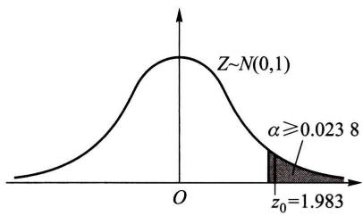  
(1)  
图8-7

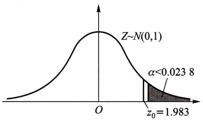  
(2)

据此， $p$  值  $= P\{Z \geqslant z_0\} = 0.0238$  是原假设  $H_0$  可被拒绝的最小显著性水平.

一般地，  $p$  值的定义是：

定义 假设检验问题的  $p$  值（probability value）是由检验统计量的样本观察值得出的原假设可被拒绝的最小显著性水平.

常用的检验问题的  $p$  值可以根据检验统计量的样本观察值以及检验统计量在  $H_{0}$  下一个特定的参数值（一般是  $H_{0}$  与  $H_{1}$  所规定的参数的分界点）对应的分布求出。例如在正态总体  $N(\mu, \sigma^{2})$  均值的检验中，当  $\sigma$  未知时，可采用检验统计量  $t = \frac{\overline{X} - \mu_0}{S / \sqrt{n}}$ ，在以下三个检验问题中，当  $\mu = \mu_0$  时  $t \sim t(n - 1)$ 。如果由样本求得统计量  $t$  的观察值为  $t_{0}$ ，那么在检验问题

$H_0: \mu \leqslant \mu_0, H_1: \mu > \mu_0$  中，

$p$  值  $= P_{\mu_0}\{t \geqslant t_0\} = t_0$  右侧尾部面积（如图8-8(1)）；

$H_0: \mu \geqslant \mu_0, H_1: \mu < \mu_0$  中，

$p$  值  $= P_{\mu_0}\{t \leqslant t_0\} = t_0$  左侧尾部面积（如图8-8(2)).

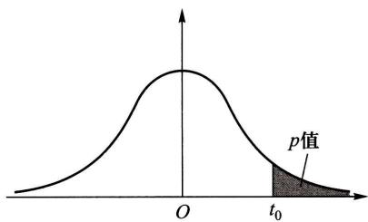  
(1)  
图8-8

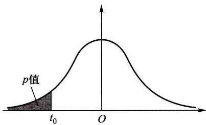  
(2)

$H_0: \mu = \mu_0, H_1: \mu \neq \mu_0$  中，

(i) 当  $t_0 > 0$  时，

$$
\begin{array}{l} p \text {值} = P _ {\mu_ {0}} \left\{\mid t \mid \geqslant t _ {0} \right\} = P _ {\mu_ {0}} \left\{\left(t \leqslant - t _ {0}\right) \bigcup \left(t \geqslant t _ {0}\right) \right\} \\ = 2 \times \left(t _ {0} \text {右 侧 尾 部 面 积}\right) (\text {如 图} 8 - 9 (1)). \\ \end{array}
$$

(ii) 当  $t_0 < 0$  时，

$$
\begin{array}{l} p \text {值} = P _ {\mu_ {0}} \left\{\left| t \right| \geqslant - t _ {0} \right\} = P _ {\mu_ {0}} \left\{\left(t \leqslant t _ {0}\right) \cup \left(t \geqslant - t _ {0}\right) \right\} \\ = 2 \times \left(t _ {0} \text {左 侧 尾 部 面 积}\right) (\text {如 图} 8 - 9 (2)). \\ \end{array}
$$

综合(i)(ii)，  $p$  值  $= 2\times$  （由  $t_0$  界定的尾部面积).

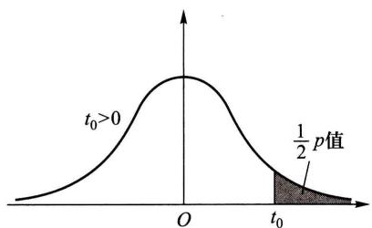  
(1)  
图8-9

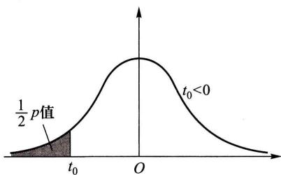  
(2)

图8-8和图8-9中的曲线均为  $t(n - 1)$  分布的概率密度曲线.

在现代计算机统计软件中，一般都给出检验问题的  $p$  值

按  $p$  值的定义，对于任意指定的显著性水平  $\alpha$  ，就有

（1）若  $p$  值  $\leqslant \alpha$  ，则在显著性水平  $\alpha$  下拒绝  $H_0$  
（2）若  $p$  值  $\geqslant \alpha$  ，则在显著性水平  $\alpha$  下接受  $H_0$

有了这两条结论就能方便地确定是否拒绝  $H_0$ 。这种利用  $p$  值来确定是否拒绝  $H_0$  的方法，称为  $p$  值法。

用临界值法来确定  $H_{0}$  的拒绝域时，例如当取  $\alpha = 0.05$  时知道要拒绝  $H_{0}$ ，再取  $\alpha = 0.01$  也要拒绝  $H_{0}$ ，但不能知道将  $\alpha$  再降低一些是否也要拒绝  $H_{0}$ 。而  $p$  值法给出了拒绝  $H_{0}$  的最小显著性水平。因此  $p$  值法比临界值法给出了有关拒绝域的更多的信息。

例2 用  $p$  值法检验本章 §1 例2的检验问题

$$
H _ {0}: \mu \leqslant \mu_ {0} = - 0. 5 4 5, \quad H _ {1}: \mu > \mu_ {0}, \quad \alpha = 0. 0 5.
$$

解 用  $Z$  检验法，现在检验统计量  $Z = \frac{\overline{X} - \mu_0}{\sigma / \sqrt{n}}$  的观察值为

$$
z _ {0} = \frac {- 0 . 5 3 5 - (- 0 . 5 4 5)}{0 . 0 0 8 / \sqrt {5}} = 2. 7 9 5 1,
$$

$$
\begin{array}{l} p \text {值} = P _ {\mu_ {0}} \{Z \geqslant 2. 7 9 5 1 \} \\ = 1 - \Phi (2. 7 9 5 1) = 0. 0 0 2 6, \\ \end{array}
$$

$p$  值  $<  \alpha = 0.05$  ，故拒绝  $H_{0}$

例3 用  $p$  值法检验本章 §2 例1的检验问题

$$
H _ {0}: \mu \leqslant \mu_ {0} = 2 2 5, \quad H _ {1}: \mu > 2 2 5, \quad \alpha = 0. 0 5.
$$

解 用  $t$  检验法，现在检验统计量  $t = \frac{\overline{X} - \mu_0}{S / \sqrt{n}}$  的观察值为

$$
t _ {0} = \frac {2 4 1 . 5 - 2 2 5}{9 8 . 7 2 5 9 / \sqrt {1 6}} = 0. 6 6 8 5,
$$

由计算机算得

$$
p \text {值} = P _ {\mu_ {0}} \{t \geqslant 0. 6 6 8 5 \} = 0. 2 5 7 0,
$$

$p$  值  $> \alpha = 0.05$  ，故接受  $H_{0}$

例4 用  $p$  值法检验本章 §3 例1中检验问题

$$
H _ {0}: \sigma^ {2} = \sigma_ {0} ^ {2} = 5 0 0 0, \quad H _ {1}: \sigma^ {2} \neq 5 0 0 0, \quad \alpha = 0. 0 2.
$$

解 用  $\chi^2$  检验法. 现在检验统计量  $\chi^2 = \frac{(n - 1)S^2}{\sigma_0^2}$  的观察值为

$$
\chi_ {0} ^ {2} = \frac {2 5 \times 9 2 0 0}{5 0 0 0} = 4 6,
$$

由计算机得

$$
p \text {值} = 2 \times P _ {\sigma_ {0} ^ {2}} \{\chi^ {2} \geqslant 4 6 \} = 0. 0 1 2 8,
$$

$p$  值  $<  \alpha = 0,02$  ，故拒绝  $H_{0}$

$p$  值表示反对原假设  $H_{0}$  的依据的强度， $p$  值越小，反对  $H_{0}$  的依据越强、越充分（譬如对于某个检验问题的检验统计量的观察值的  $p$  值  $= 0.0009, p$  值如此地小，以至于几乎不可能在  $H_{0}$  为真时出现目前的观察值，这说明拒绝  $H_{0}$  的理由很强，我们就拒绝  $H_{0}$ ）。

一般, 若  $p$  值  $\leqslant 0.01$ , 称推断拒绝  $H_{0}$  的依据很强或称检验是高度显著的; 若  $0.01 < p$  值  $\leqslant 0.05$ , 称推断拒绝  $H_{0}$  的依据是强的或称检验是显著的; 若  $0.05 < p$  值  $\leqslant 0.1$ , 称推断拒绝  $H_{0}$  的理由是弱的, 检验是不显著的; 若  $p$  值  $> 0.1$ , 一般来说没有理由拒绝  $H_{0}$ . 基于  $p$  值, 研究者可以使用任意希望的显著性水平来作计算. 在杂志上或在一些技术报告中, 许多研究者在讲述假设检验的结果时, 常不明显地论及显著性水平以及临界值, 代之以简单地引用假设检验的  $p$  值, 利用或让读者利用它来评价反对原假设的依据的强度, 作出推断.

# 小结

统计推断就是由样本来推断总体，它包括两个基本问题：统计估计和假设检验。上一章讲述了参数估计，本章讨论假设检验问题。有关总体分布的未知参数或未知分布形式的种种论断叫统计假设，人们要根据样本所提供的信息对所考虑的假设作出接受或拒绝的决策。假设检验就是作出这一决策的过程。

一般，人们总是对原假设  $H_0$  作出接受或拒绝的决策。由于作出判断原假设  $H_0$  是否为真的依据是一个样本，又由于样本的随机性，当  $H_0$  为真时，检验统计量的观察值也会落入拒绝域，致使我们作出拒绝  $H_0$  的错误决策；而当  $H_0$  为不真时，检验统计量的观察值也会未落入拒绝域，致使我们作出接受  $H_0$  的错误决策。

假设检验的两类错误  

<table><tr><td rowspan="2">真实情况
(未知)</td><td colspan="2">所作决策</td></tr><tr><td>接受H0</td><td>拒绝H0</td></tr><tr><td>H0为真</td><td>正确</td><td>犯第Ⅰ类错误</td></tr><tr><td>H0不真</td><td>犯第Ⅱ类错误</td><td>正确</td></tr></table>

我们使用“接受假设”或“拒绝假设”这样的术语。接受一个假设并不意味着确信它是真的，它只意味着决定采取某种行动（例如  $A$ ）；拒绝一个假设也不意味着它是假的，这也仅仅是作出采取另一种不同的行动（例如  $B$ ）。不论哪种情况，都存在作出错误选择的可能性。

当样本容量  $n$  固定时，减小犯第I类错误的概率，就会增大犯第Ⅱ类错误的概率，反之亦然．我们的做法是控制犯第I类错误的概率，使

$$
P \{\text {当} H _ {0} \text {为 真 时 拒 绝} H _ {0} \} \leqslant \alpha ,
$$

其中  $0 < \alpha < 1$  是给定的小的数。 $\alpha$  称为检验的显著性水平。这种只对犯第 I 类错误的概率加以控制而不考虑犯第 II 类错误的概率的检验称为显著性检验。

在进行显著性检验时，犯第I类错误的概率是由我们控制的.  $\alpha$  取得小，则概率  $P\{\text{当} H_0$  为真时拒绝  $H_0\}$  就小，这保证了当  $H_0$  为真时错误地拒绝  $H_0$  的可能性很小．这意味着  $H_0$  是受到保护的，也表明  $H_0, H_1$  的地位不是对等的．于是，在一对对立假设中，选哪一个作为 $H_0$  需要小心．例如，考虑某种药品是否为真，这里可能犯两种错误：(1)将假药误作为真药，则冒着伤害患者的健康甚至生命的风险.(2)将真药误作为假药，则冒着造成经济损失的风险.显然，犯错误(1)比犯错误(2)的后果严重，因此，我们选取“  $H_0$  ：药品为假，  $H_{1}$  ：药品为真”，即是使得犯第I类错误“当药品为假时错判药品为真”的概率  $\leqslant \alpha .$  就是说，选择  $H_0,H_1$  使得两类错误中后果严重的错误成为第I类错误．这是选择  $H_0,H_1$  的一个原则.

如果在两类错误中，没有一类错误的后果严重更需要避免时，常常取  $H_{0}$  为维持现状，即取  $H_{0}$  为“无效益”“无改进”“无价值”，等等。例如，取

$$
H _ {0}: \text {新 技 术 未 提 高 效 益}, H _ {1}: \text {新 技 术 提 高 效 益}.
$$

实际上，我们感兴趣的是  $H_{1}$  “提高效益”，但对采用新技术应持慎重态度。选取  $H_{0}$  为“新技术未提高效益”，一旦  $H_{0}$  被拒绝了，表示有较强的理由去采用新技术。

在实际问题中，情况比较复杂，如何选取  $H_0, H_1$  只能在实践中积累经验，根据实际情况去判断了。

注意，拒绝域的形式是由  $H_{1}$  确定的.

我们还介绍了置信区间与假设检验的关系，知道了置信区间就能容易判明是否接受原假设；反之，知道了检验的接受域就得到了相应的置信区间。

# 重要术语及主题

原假设备择假设检验统计量单边检验双边检验显著性水平拒绝域显著性检验一个正态总体的参数的检验两个正态总体均值差、方差比的检验成对数据的检验  $\chi^2$  分布拟合检验假设检验问题的  $p$  值法

# 习题

1. 某批矿砂的5个样品中的镍含量（以%计），经测定为

$$
3. 2 5 \quad 3. 2 7 \quad 3. 2 4 \quad 3. 2 6 \quad 3. 2 4
$$

设测定值总体服从正态分布，但参数均未知，问在  $\alpha = 0.01$  下能否接受假设：这批矿砂的镍含量的均值为3.25？

2. 如果一个矩形的宽度  $w$  与长度  $l$  的比  $w / l = \frac{1}{2} (\sqrt{5} - 1) \approx 0.618$ , 这样的矩形称为黄金矩形. 这种尺寸的矩形使人们看上去有良好的感觉. 现代的建筑构件 (如窗架)、工艺品 (如图片镜框), 甚至司机的执照、商业的信用卡等常常都是采用黄金矩形. 下面列出某工艺品工厂随机取的 20 个矩形的宽度与长度的比值:

$$
\begin{array}{l} 0. 6 9 3 \quad 0. 7 4 9 \quad 0. 6 5 4 \quad 0. 6 7 0 \quad 0. 6 6 2 \quad 0. 6 7 2 \quad 0. 6 1 5 \quad 0. 6 0 6 \quad 0. 6 9 0 \quad 0. 6 2 8 \\ 0. 6 6 8 \quad 0. 6 1 1 \quad 0. 6 0 6 \quad 0. 6 0 9 \quad 0. 6 0 1 \quad 0. 5 5 3 \quad 0. 5 7 0 \quad 0. 8 4 4 \quad 0. 5 7 6 \quad 0. 9 3 3 \\ \end{array}
$$

设这一工厂生产的矩形的宽度与长度的比值总体服从正态分布，其均值为  $\mu$  ，方差为  $\sigma^2, \mu, \sigma^2$  均未知. 试检验假设（取  $\alpha = 0.05$ ）

$$
H _ {0}: \mu = 0. 6 1 8, \quad H _ {1}: \mu \neq 0. 6 1 8.
$$

3. 要求一种元件平均使用寿命不得低于  $1000\mathrm{h}$ ，生产者从一批这种元件中随机抽取25件，测得其寿命的平均值为  $950\mathrm{h}$ 。已知该种元件寿命服从标准差为  $\sigma = 100\mathrm{h}$  的正态分布。试在显著性水平  $\alpha = 0.05$  下判断这批元件是否合格？设总体均值为  $\mu, \mu$  未知。即需检验假设  $H_0: \mu \geqslant 1000, H_1: \mu < 1000$ 。

4. 下面列出的是某工厂随机选取的20只部件的装配时间（以min计）：

$$
9. 8 \quad 1 0. 4 \quad 1 0. 6 \quad 9. 6 \quad 9. 7 \quad 9. 9 \quad 1 0. 9 \quad 1 1. 1 \quad 9. 6 \quad 1 0. 2
$$

$$
1 0. 3 \quad 9. 6 \quad 9. 9 \quad 1 1. 2 \quad 1 0. 6 \quad 9. 8 \quad 1 0. 5 \quad 1 0. 1 \quad 1 0. 5 \quad 9. 7
$$

设装配时间的总体服从正态分布  $N(\mu, \sigma^2), \mu, \sigma^2$  均未知. 是否可以认为装配时间的均值  $\mu$  显著大于10（取  $\alpha = 0.05$ ）？

5. 按规定， $100\mathrm{g}$  罐头番茄汁中的平均维生素C含量不得少于  $21\mathrm{mg / g}$ . 现从工厂的产

品中抽取17个罐头，其  $100\mathrm{g}$  番茄汁中，测得维生素C含量(以  $\mathrm{mg / g}$  计)记录如下：

$$
\begin{array}{c c c c c c c c c c c c c c c c} 1 6 & 2 5 & 2 1 & 2 0 & 2 3 & 2 1 & 1 9 & 1 5 & 1 3 & 2 3 & 1 7 & 2 0 & 2 9 & 1 8 & 2 2 & 1 6 & 2 2 \end{array}
$$

设维生素C含量服从正态分布  $N(\mu, \sigma^2), \mu, \sigma^2$  均未知，问这批罐头是否符合要求（取显著性水平  $\alpha = 0.05$ ）？

6. 下表分别给出两位文学家马克·吐温（Mark Twain）的8篇小品文以及斯诺特格拉斯(Snodgrass)的10篇小品文中由3个字母组成的单词的比例：

<table><tr><td>马克·吐温</td><td>0.225</td><td>0.262</td><td>0.217</td><td>0.240</td><td>0.230</td><td>0.229</td><td>0.235</td><td>0.217</td><td></td><td></td></tr><tr><td>斯诺特格拉斯</td><td>0.209</td><td>0.205</td><td>0.196</td><td>0.210</td><td>0.202</td><td>0.207</td><td>0.224</td><td>0.223</td><td>0.220</td><td>0.201</td></tr></table>

设两组数据分别来自正态总体，且两总体方差相等，但参数均未知. 两样本相互独立. 问两位作家所写的小品文中包含由3个字母组成的单词的比例是否有显著的差异（取  $\alpha = 0.05$ ）？

7. 在20世纪70年代后期人们发现，在酿造啤酒时，麦芽在干燥过程中形成致癌物质N一亚硝基二甲胺(NDMA).到了20世纪80年代初期开发了一种新的麦芽干燥过程.下面分别给出新老两种过程中形成的NDMA含量（以10亿份中的份数计）：

<table><tr><td>老过程</td><td>6</td><td>4</td><td>5</td><td>5</td><td>6</td><td>5</td><td>5</td><td>6</td><td>4</td><td>6</td><td>7</td><td>4</td></tr><tr><td>新过程</td><td>2</td><td>1</td><td>2</td><td>2</td><td>1</td><td>0</td><td>3</td><td>2</td><td>1</td><td>0</td><td>1</td><td>3</td></tr></table>

设两样本分别来自正态总体，且两总体的方差相等，但参数均未知. 两样本独立. 分别以  $\mu_{1}$ ， $\mu_{2}$  记对应于老、新过程的总体的均值，试检验假设  $(\alpha = 0.05)$

$$
H _ {0}: \mu_ {1} - \mu_ {2} \leqslant 2, \quad H _ {1}: \mu_ {1} - \mu_ {2} > 2.
$$

8. 随机地选了 8 个人, 分别测量了他们在早晨起床时和晚上就寝时的身高 (以 cm 计), 得到以下的数据:

<table><tr><td>序号</td><td>1</td><td>2</td><td>3</td><td>4</td><td>5</td><td>6</td><td>7</td><td>8</td></tr><tr><td>早上(xi)</td><td>172</td><td>168</td><td>180</td><td>181</td><td>160</td><td>163</td><td>165</td><td>177</td></tr><tr><td>晚上(yi)</td><td>172</td><td>167</td><td>177</td><td>179</td><td>159</td><td>161</td><td>166</td><td>175</td></tr></table>

设各对数据的差  $D_{i} = X_{i} - Y_{i}(i = 1,2,\dots ,8)$  是来自正态总体  $N(\mu_D,\sigma_D^2)$  的样本，  $\mu_D,\sigma_D^2$  均未知.问是否可以认为早晨的身高比晚上的身高要高（取  $\alpha = 0.05$  ）？

9. 为了比较用来做鞋子后跟的两种材料的质量，选取了15名男子（他们的生活条件各不相同），每人穿一双新鞋，其中一只是以材料  $A$  做后跟，另一只以材料  $B$  做后跟，其厚度均为  $10 \mathrm{~mm}$ 。过了一个月再测量厚度，得到数据（以  $\mathrm{mm}$  计）如下：

<table><tr><td>男子</td><td>1</td><td>2</td><td>3</td><td>4</td><td>5</td><td>6</td><td>7</td><td>8</td><td>9</td><td>10</td><td>11</td><td>12</td><td>13</td><td>14</td><td>15</td></tr><tr><td>材料A(xi)</td><td>6.6</td><td>7.0</td><td>8.3</td><td>8.2</td><td>5.2</td><td>9.3</td><td>7.9</td><td>8.5</td><td>7.8</td><td>7.5</td><td>6.1</td><td>8.9</td><td>6.1</td><td>9.4</td><td>9.1</td></tr><tr><td>材料B(yi)</td><td>7.4</td><td>5.4</td><td>8.8</td><td>8.0</td><td>6.8</td><td>9.1</td><td>6.3</td><td>7.5</td><td>7.0</td><td>6.5</td><td>4.4</td><td>7.7</td><td>4.2</td><td>9.4</td><td>9.1</td></tr></table>

设  $D_{i} = X_{i} - Y_{i}(i = 1,2,\dots ,15)$  是来自正态总体  $N(\mu_D,\sigma_D^2)$  的样本，  $\mu_D,\sigma_D^2$  均未知.问是否可以认为以材料  $A$  制成的后跟比材料  $B$  的耐穿（取  $\alpha = 0.05)$  ？

10. 为了试验两种不同的某谷物的种子的优劣，选取了10块土质不同的土地，并将每块土地分为面积相同的两部分，分别种植这两种种子。设在每块土地的两部分人工管理等条件完全一样。下面给出各块土地上的单位面积产量：

<table><tr><td>土地编号i</td><td>1</td><td>2</td><td>3</td><td>4</td><td>5</td><td>6</td><td>7</td><td>8</td><td>9</td><td>10</td></tr><tr><td>种子A(xi)</td><td>23</td><td>35</td><td>29</td><td>42</td><td>39</td><td>29</td><td>37</td><td>34</td><td>35</td><td>28</td></tr><tr><td>种子B(yi)</td><td>26</td><td>39</td><td>35</td><td>40</td><td>38</td><td>24</td><td>36</td><td>27</td><td>41</td><td>27</td></tr></table>

设  $D_{i} = X_{i} - Y_{i}(i = 1,2,\dots ,10)$  是来自正态总体  $N(\mu_D,\sigma_D^2)$  的样本，  $\mu_D,\sigma_D^2$  均未知.问以这两种种子种植的谷物的产量是否有显著的差异（取  $\alpha = 0.05)$  ？

11. 一种混杂的小麦品种，株高的标准差为  $\sigma_0 = 14\mathrm{cm}$ ，经提纯后随机抽取10株，它们的株高（以cm计）为

$$
\begin{array}{c c c c c c c c c c} 9 0 & 1 0 5 & 1 0 1 & 9 5 & 1 0 0 & 1 0 0 & 1 0 1 & 1 0 5 & 9 3 & 9 7 \end{array}
$$

考察提纯后的群体是否比原群体整齐？取显著性水平  $\alpha = 0.01$  ，并设小麦株高服从  $N(\mu, \sigma^2)$

12. 某种导线, 要求其电阻的标准差不得超过  $0.005 \Omega$ , 今在生产的一批导线中取样品 9 根, 测得  $s = 0.007 \Omega$ , 设总体为正态分布, 参数均未知. 问在显著性水平  $\alpha = 0.05$  下能否认为这批导线的标准差显著地偏大?

13. 在第2题中记总体的标准差为  $\sigma$ ，试检验假设（取  $\alpha = 0.05$ ）

$$
H _ {0}: \sigma^ {2} = 0. 1 1 ^ {2}, \quad H _ {1}: \sigma^ {2} \neq 0. 1 1 ^ {2}.
$$

14. 测定某种溶液中的水分，它的 10 个测定值给出  $s = 0.037\%$ ，设测定值总体为正态分布， $\sigma^2$  为总体方差， $\sigma^2$  未知。试在显著性水平  $\alpha = 0.05$  下检验假设

$$
H _ {0}: \sigma \geqslant 0.04 \%, \quad H _ {1}: \sigma <  0.04 \%.
$$

15. 在第6题中分别记两个总体的方差为  $\sigma_1^2$  和  $\sigma_2^2$ . 试检验假设（取  $\alpha = 0.05$ ）

$$
H _ {0}: \sigma_ {1} ^ {2} = \sigma_ {2} ^ {2}, \quad H _ {1}: \sigma_ {1} ^ {2} \neq \sigma_ {2} ^ {2},
$$

以说明在第6题中我们假设  $\sigma_1^2 = \sigma_2^2$  是合理的.

16. 在第7题中分别记两个总体的方差为  $\sigma_1^2$  和  $\sigma_2^2$ . 试检验假设（取  $\alpha = 0.05$ ）

$$
H _ {0}: \sigma_ {1} ^ {2} = \sigma_ {2} ^ {2}, \quad H _ {1}: \sigma_ {1} ^ {2} \neq \sigma_ {2} ^ {2},
$$

以说明在第7题中我们假设  $\sigma_1^2 = \sigma_2^2$  是合理的.

17. 两种小麦品种从播种到抽穗所需的天数如下：

<table><tr><td>x</td><td>101</td><td>100</td><td>99</td><td>99</td><td>98</td><td>100</td><td>98</td><td>99</td><td>99</td><td>99</td></tr><tr><td>y</td><td>100</td><td>98</td><td>100</td><td>99</td><td>98</td><td>99</td><td>98</td><td>98</td><td>99</td><td>100</td></tr></table>

设两样本依次来自正态总体  $N(\mu_1, \sigma_1^2), N(\mu_2, \sigma_2^2), \mu_i, \sigma_i (i = 1, 2)$  均未知，两样本相互独立.

（1）试检验假设  $H_0: \sigma_1^2 = \sigma_2^2, H_1: \sigma_1^2 \neq \sigma_2^2$  （取  $\alpha = 0.05$ ）  
（2）若能接受  $H_0$  ，接着检验假设  $H_0': \mu_1 = \mu_2, H_1': \mu_1 \neq \mu_2$  （取  $\alpha = 0.05$ ）。

18. 用一种叫“混乱指标”的尺度去衡量工程师的英语文章的可理解性，对混乱指标的打分越低表示可理解性越高。分别随机选取13篇刊载在工程杂志上的论文，以及10篇未出版的学术报告，对它们的打分列于下表：

<table><tr><td>工程杂志上的论文(数据I)</td><td>未出版的学术报告(数据II)</td></tr><tr><td>1.79 1.75 1.67 1.65</td><td>2.39 2.51 2.86</td></tr><tr><td>1.87 1.74 1.94</td><td>2.56 2.29 2.49</td></tr><tr><td>1.62 2.06 1.33</td><td>2.36 2.58</td></tr><tr><td>1.96 1.69 1.70</td><td>2.62 2.41</td></tr></table>

设数据I，Ⅱ分别来自正态总体  $N(\mu_1,\sigma_1^2),N(\mu_2,\sigma_2^2),\mu_1,\mu_2,\sigma_1^2,\sigma_2^2$  均未知，两样本相互独立.

（1）试检验假设  $H_0: \sigma_1^2 = \sigma_2^2, H_1: \sigma_1^2 \neq \sigma_2^2$  （取  $\alpha = 0.1$ ）  
（2）若能接受  $H_0$  ，接着检验假设  $H_0': \mu_1 = \mu_2, H_1': \mu_1 \neq \mu_2$  （取  $\alpha = 0.1$  ）

19. 有两台机器生产金属部件. 分别在两台机器所生产的部件中各取一容量  $n_1 = 60$ ,  $n_2 = 40$  的样本, 测得部件质量 (以  $\mathrm{kg}$  计) 的样本方差分别为  $s_1^2 = 15.46$ ,  $s_2^2 = 9.66$ . 设两样本相互独立. 两总体分别服从  $N(\mu_1, \sigma_1^2)$ ,  $N(\mu_2, \sigma_2^2)$  分布  $\mu_i, \sigma_i^2 (i = 1, 2)$  均未知. 试在显著性水平  $\alpha = 0.05$  下检验假设

$$
H _ {0}: \sigma_ {1} ^ {2} \leqslant \sigma_ {2} ^ {2}, \quad H _ {1}: \sigma_ {1} ^ {2} > \sigma_ {2} ^ {2}.
$$

20. 设需要对某一正态总体的均值进行假设检验

$$
H _ {0}: \mu \geqslant 1 5, \quad H _ {1}: \mu <   1 5.
$$

已知  $\sigma^2 = 2.5$ . 取  $\alpha = 0.05$ . 若要求当  $H_{1}$  中的  $\mu \leqslant 13$  时犯第Ⅱ类错误的概率不超过  $\beta = 0.05$ , 求所需的样本容量.

21. 电池在货架上滞留的时间不能太长. 下面给出某商店随机选取的8只电池的货架滞留时间（以天计）：

$$
\begin{array}{l l l l l l l l} 1 0 8 & 1 2 4 & 1 2 4 & 1 0 6 & 1 3 8 & 1 6 3 & 1 5 9 & 1 3 4 \end{array}
$$

设数据来自正态总体  $N(\mu, \sigma^2)$ ， $\mu, \sigma^2$  未知.

（1）试检验假设  $H_0: \mu \leqslant 125, H_1: \mu > 125$ ，取  $\alpha = 0.05$ .  
（2）若要求在上述  $H_{1}$  中  $(\mu - 125) / \sigma \geqslant 1.4$  时，犯第Ⅱ类错误的概率不超过  $\beta = 0.1$  ，求所需的样本容量.  
22. 一药厂生产一种新的止痛片，厂方希望验证服用新药片后至开始起作用的时间间隔较原有止痛片至少缩短一半，因此厂方提出需检验假设

$$
H _ {0}: \mu_ {1} \leqslant 2 \mu_ {2}, \quad H _ {1}: \mu_ {1} > 2 \mu_ {2}.
$$

此处  $\mu_1, \mu_2$  分别是服用原有止痛片和服用新止痛片后至起作用的时间间隔的总体的均值. 设

两总体均为正态且方差分别为已知值  $\sigma_1^2, \sigma_2^2$ . 现分别在两总体中取一样本  $X_{1}, X_{2}, \dots, X_{n_{1}}$  和  $Y_{1}, Y_{2}, \dots, Y_{n_{2}}$ , 设两个样本独立. 试给出上述假设  $H_{0}$  的拒绝域, 取显著性水平为  $\alpha$ .

23. 检查了一本书的 100 页, 记录各页中印刷错误的个数, 其结果为

<table><tr><td>错误个数 fi</td><td>0</td><td>1</td><td>2</td><td>3</td><td>4</td><td>5</td><td>6</td><td>≥7</td></tr><tr><td>含 fi 个错误的页数</td><td>36</td><td>40</td><td>19</td><td>2</td><td>0</td><td>2</td><td>1</td><td>0</td></tr></table>

问能否认为一页的印刷错误的个数服从泊松分布（取  $\alpha = 0.05$ ）？

24. 在一批灯泡中抽取 300 只做寿命试验, 其结果如下:

<table><tr><td>寿命t(h)</td><td>0≤t≤100</td><td>100＜t≤200</td><td>200＜t≤300</td><td>t&gt;300</td></tr><tr><td>灯泡数</td><td>121</td><td>78</td><td>43</td><td>58</td></tr></table>

取  $\alpha = 0.05$  ，试检验假设

$H_{0}$  ：灯泡寿命服从指数分布

$$
f (t) = \left\{ \begin{array}{l l} 0. 0 0 5 \mathrm {e} ^ {- 0. 0 0 5 t}, & t \geqslant 0, \\ 0, & t <   0. \end{array} \right.
$$

25. 下面给出了随机选取的某大学一年级学生（200名）一次数学考试的成绩，

（1）画出数据的直方图.  
（2）试取  $\alpha = 0.1$  检验数据来自正态总体  $N(60,15^2)$

<table><tr><td>分数x</td><td>20≤x≤30</td><td>30＜x≤40</td><td>40＜x≤50</td><td>50＜x≤60</td></tr><tr><td>学生数</td><td>5</td><td>15</td><td>30</td><td>51</td></tr><tr><td>分数x</td><td>60＜x≤70</td><td>70＜x≤80</td><td>80＜x≤90</td><td>90＜x≤100</td></tr><tr><td>学生数</td><td>60</td><td>23</td><td>10</td><td>6</td></tr></table>

26. 袋中装有 8 只球, 其中红球数未知. 在其中任取 3 只, 记录红球的只数  $X$ , 然后放回, 再任取 3 只, 记录红球的只数, 然后放回. 如此重复进行了 112 次, 其结果如下:

<table><tr><td>X</td><td>0</td><td>1</td><td>2</td><td>3</td></tr><tr><td>次数</td><td>1</td><td>31</td><td>55</td><td>25</td></tr></table>

试取  $\alpha = 0.05$  检验假设

$H_0:X$  服从超几何分布

$$
P \{X = k \} = \binom {5} {k} \binom {3} {3 - k} / \binom {8} {3}, \quad k = 0, 1, 2, 3.
$$

即检验假设  $H_0$  ：红球的只数为5.

27. 一农场10年前在一鱼塘中按比例  $20:15:40:25$  投放了四种鱼：鲑鱼、鲈鱼、竹夹鱼和鲇鱼的鱼苗，现在在鱼塘里获得一样本如下：

<table><tr><td>序号</td><td>1</td><td>2</td><td>3</td><td>4</td><td></td></tr><tr><td>种类</td><td>鲑鱼</td><td>鲈鱼</td><td>竹夹鱼</td><td>鲇鱼</td><td></td></tr><tr><td>数量(条)</td><td>132</td><td>100</td><td>200</td><td>168</td><td>∑=600</td></tr></table>

试取  $\alpha = 0.05$  ，检验各类鱼数量的比例较10年前是否有显著的改变，

28. 某种鸟在起飞前，双足齐跳的次数  $X$  服从几何分布，其分布律为

$$
P \{X = x \} = p ^ {x - 1} (1 - p), \quad x = 1, 2, \dots .
$$

今获得一样本如下：

<table><tr><td>x</td><td>1</td><td>2</td><td>3</td><td>4</td><td>5</td><td>6</td><td>7</td><td>8</td><td>9</td><td>10</td><td>11</td><td>12</td><td>≥13</td></tr><tr><td>观察到x的次数</td><td>48</td><td>31</td><td>20</td><td>9</td><td>6</td><td>5</td><td>4</td><td>2</td><td>1</td><td>1</td><td>2</td><td>1</td><td>0</td></tr></table>

（1）求  $p$  的最大似然估计值  
（2）取  $\alpha = 0.05$  ，检验假设  $H_0$  ：数据来自总体  $P\{X = x\} = p^{x - 1}(1 - p),x = 1,2,\dots .$  
29.（1）设总体服从  $N(\mu, 100), \mu$  未知，现有样本  $n = 16, \overline{x} = 13.5$  ，试检验假设  $H_0: \mu \leqslant 10, H_1: \mu > 10$  ，(i) 取  $\alpha = 0.05$  ，(ii) 取  $\alpha = 0.10$  ，(iii) 求  $H_0$  可被拒绝的最小显著性水平.  
（2）考察生长在老鼠身上的肿块的大小. 以  $X$  表示在老鼠身上生长了15天的肿块的直径(以  $\mathrm{mm}$  计)，设  $X \sim N(\mu, \sigma^2)$ ， $\mu, \sigma^2$  均未知. 今随机地取9只老鼠（在它们身上的肿块都长了15天），测得  $\overline{x} = 4.3, s = 1.2$ ，试取  $\alpha = 0.05$ ，用  $p$  值法检验假设  $H_0: \mu = 4.0, H_1: \mu \neq 4.0$ ，求出  $p$  值.  
(3) 用  $p$  值法检验 §2 例 4 的检验问题.  
（4）用  $p$  值法检验第27题中的检验问题

# 第九章 方差分析及回归分析

方差分析和回归分析都是数理统计中具有广泛应用的内容. 本章对它们的最基本部分作一介绍.

# § 1 单因素试验的方差分析

# （一）单因素试验

在科学试验和生产实践中，影响一事物的因素往往是很多的。例如，在化工生产中，有原料成分、原料剂量、催化剂、反应温度、压力、溶液浓度、反应时间、机器设备及操作人员的水平等因素。每一因素的改变都有可能影响产品的数量和质量。有些因素影响较大，有些较小。为了使生产过程得以稳定，保证优质、高产，就有必要找出对产品质量有显著影响的那些因素。为此，我们需进行试验。方差分析就是根据试验的结果进行分析，鉴别各个有关因素对试验结果影响的有效方法。

在试验中，我们将要考察的指标称为试验指标。影响试验指标的条件称为因素。因素可分为两类，一类是人们可以控制的（可控因素）；一类是人们不能控制的。例如，反应温度、原料剂量、溶液浓度等是可以控制的，而测量误差、气象条件等一般是难以控制的。以下我们所说的因素都是指可控因素。因素所处的状态，称为该因素的水平（见下述各例）。如果在一项试验的过程中只有一个因素在改变则称为单因素试验，如果多于一个因素在改变则称为多因素试验。

例1设有三台机器，用来生产规格相同的铝合金薄板.取样，测量薄板的厚度精确至千分之一厘米.得结果如表9-1所示.

表 9-1 铝合金薄板的厚度  

<table><tr><td>机器Ⅰ</td><td>机器Ⅱ</td><td>机器Ⅲ</td></tr><tr><td>0.236</td><td>0.257</td><td>0.258</td></tr><tr><td>0.238</td><td>0.253</td><td>0.264</td></tr><tr><td>0.248</td><td>0.255</td><td>0.259</td></tr><tr><td>0.245</td><td>0.254</td><td>0.267</td></tr><tr><td>0.243</td><td>0.261</td><td>0.262</td></tr></table>

这里，试验指标是薄板的厚度。机器为因素，不同的三台机器就是这个因素的三个不同的水平。我们假定除机器这一因素外，材料的规格、操作人员的水平等其他条件都相同。这是单因素试验。试验的目的是为了考察各台机器所生产的薄板的厚度有无显著的差异，即考察机器这一因素对薄板厚度有无显著的影响。如果厚度有显著差异，就表明机器这一因素对薄板厚度的影响是显著的。

例2表9-2列出了随机选取的、用于计算器的四种类型的电路的响应时间（以ms计）.

表 9-2 电路的响应时间  

<table><tr><td>类型Ⅰ</td><td>类型Ⅱ</td><td>类型Ⅲ</td><td>类型Ⅳ</td></tr><tr><td>19 15</td><td>20 40</td><td>16 17</td><td>18</td></tr><tr><td>22</td><td>21</td><td>15</td><td>22</td></tr><tr><td>20</td><td>33</td><td>18</td><td>19</td></tr><tr><td>18</td><td>27</td><td>26</td><td></td></tr></table>

这里，试验指标是电路的响应时间。电路类型为因素，这一因素有4个水平。这是一个单因素试验。试验的目的是为了考察各种类型电路的响应时间有无显著差异，即考察电路类型这一因素对响应时间有无显著的影响。

例3 一火箭使用四种燃料、三种推进器作射程试验. 每种燃料与每种推进器的组合各发射火箭两次，得射程如表9-3（以  $\mathrm{m}$  mile计）：

表 9-3 火箭的射程  

<table><tr><td>推进器(B)</td><td>B1</td><td>B2</td><td>B3</td></tr><tr><td rowspan="2">A1</td><td>58.2</td><td>56.2</td><td>65.3</td></tr><tr><td>52.6</td><td>41.2</td><td>60.8</td></tr><tr><td rowspan="2">燃料(A)</td><td>49.1</td><td>54.1</td><td>51.6</td></tr><tr><td>42.8</td><td>50.5</td><td>48.4</td></tr><tr><td rowspan="2">A3</td><td>60.1</td><td>70.9</td><td>39.2</td></tr><tr><td>58.3</td><td>73.2</td><td>40.7</td></tr><tr><td rowspan="2">A4</td><td>75.8</td><td>58.2</td><td>48.7</td></tr><tr><td>71.5</td><td>51.0</td><td>41.4</td></tr></table>

这里试验指标是射程. 推进器和燃料是因素, 它们分别有 3 个、4 个水平. 这是一个双因素试验. 试验的目的在于考察在各种因素的各个水平下射程有无显著的差异, 即考察推进器和燃料这两个因素对射程是否有显著的影响.  $\square$

本节限于讨论单因素试验. 我们就例 1 来讨论. 在例 1 中, 我们在因素的每一个水平下进行独立试验, 其结果是一个样本. 表中数据可看成来自三个不同总体 (每个水平对应一个总体) 的样本值. 将各个总体的均值依次记为  $\mu_1, \mu_2, \mu_3$ . 按题意需检验假设

$$
H _ {0}: \mu_ {1} = \mu_ {2} = \mu_ {3},
$$

$H_{1}:\mu_{1},\mu_{2},\mu_{3}$  不全相等.

现在进而假设各总体均为正态变量，且各总体的方差相等，但参数均未知.那么这是一个检验同方差的多个正态总体均值是否相等的问题.下面所要讨论的方差分析法，就是解决这类问题的一种统计方法.

现在开始讨论单因素试验的方差分析. 设因素  $A$  有  $s$  个水平  $A_{1}, A_{2}, \dots, A_{s}$ , 在水平  $A_{j} (j = 1, 2, \dots, s)$  下, 进行  $n_{j} (n_{j} \geqslant 2)$  次独立试验, 得到如表 9-4 的结果.

表9-4  

<table><tr><td>水平</td><td>A1</td><td>A2</td><td>...</td><td>As</td></tr><tr><td rowspan="4">观察结果</td><td>X11</td><td>X12</td><td>...</td><td>X1s</td></tr><tr><td>X21</td><td>X22</td><td>...</td><td>X2s</td></tr><tr><td>:</td><td>:</td><td></td><td>:</td></tr><tr><td>Xn11</td><td>Xn22</td><td>...</td><td>Xns</td></tr><tr><td>样本总和</td><td>T.1</td><td>T.2</td><td>...</td><td>T.s</td></tr><tr><td>样本均值</td><td>X̄.1</td><td>X̄.2</td><td>...</td><td>X̄.s</td></tr><tr><td>总体均值</td><td>μ1</td><td>μ2</td><td>...</td><td>μs</td></tr></table>

我们假定：各个水平  $A_{j}(j = 1,2,\dots ,s)$  下的样本  $X_{1j},X_{2j},\dots ,X_{n_j}$  来自具有相同方差  $\sigma^2$  ，均值分别为  $\mu_j(j = 1,2,\dots ,s)$  的正态总体  $N(\mu_j,\sigma^2),\mu_j$  与  $\sigma^2$  未知.且设不同水平  $A_{j}$  下的样本之间相互独立.

由于  $X_{ij} \sim N(\mu_j, \sigma^2)$ ，即有  $X_{ij} - \mu_j \sim N(0, \sigma^2)$ ，故  $X_{ij} - \mu_j$  可看成是随机误差。记  $X_{ij} - \mu_j = \varepsilon_{ij}$ ，则  $X_{ij}$  可写成

$$
\begin{array}{r l} & {X _ {i j} = \mu_ {j} + \varepsilon_ {i j}  ,} \\ & {\varepsilon_ {i j} \sim N (0, \sigma^ {2})  , \text {各}   \varepsilon_ {i j} \text {独 立}  ,} \\ & {i = 1  , 2  , \dots , n _ {j}  , j = 1  , 2  , \dots , s  ,} \end{array} \tag {1.1}
$$

其中  $\mu_{j}$  与  $\sigma^2$  均为未知参数. (1.1)式称为单因素试验方差分析的数学模型. 这

是本节的研究对象.

方差分析的任务是对于模型(1.1)，

$1^{\circ}$  检验  $s$  个总体  $N(\mu_1, \sigma^2), \dots, N(\mu_s, \sigma^2)$  的均值是否相等，即检验假设

$$
H _ {0}: \mu_ {1} = \mu_ {2} = \dots = \mu_ {s}, \tag {1.2}
$$

$H_{1}:\mu_{1},\mu_{2},\dots ,\mu_{s}$  不全相等.

$2^{\circ}$  作出未知参数  $\mu_1, \mu_2, \dots, \mu_s, \sigma^2$  的估计.

为了将问题(1.2)写成便于讨论的形式，我们将  $\mu_1, \mu_2, \dots, \mu_s$  的加权平均值  $\frac{1}{n} \sum_{j=1}^{s} n_j \mu_j$  记为  $\mu$ ，即

$$
\mu = \frac {1}{n} \sum_ {j = 1} ^ {s} n _ {j} \mu_ {j}, \tag {1.3}
$$

其中  $n = \sum_{j=1}^{s} n_j, \mu$  称为总平均. 再引入

$$
\delta_ {j} = \mu_ {j} - \mu , \quad j = 1, 2, \dots , s, \tag {1.4}
$$

此时有  $n_1\delta_1 + n_2\delta_2 + \dots + n_s\delta_s = 0, \delta_j$  表示水平  $A_j$  下的总体均值与总平均的差异，习惯上将  $\delta_j$  称为水平  $A_j$  的效应.

利用这些记号，模型(1.1)可改写成

$$
\begin{array}{r l} & {X _ {i j} = \mu + \delta_ {j} + \varepsilon_ {i j}  ,} \\ & {\varepsilon_ {i j}   \sim   N (0  , \sigma^ {2})  , \text {各}   \varepsilon_ {i j}   \text {独 立}  ,} \\ & {i = 1  , 2  , \dots , n _ {j}  , j = 1  , 2  , \dots , s,} \\ & {\sum_ {j = 1} ^ {s} n _ {j} \delta_ {j} = 0.} \end{array} \tag {1.1}
$$

而假设（1.2）等价于假设

$$
H _ {0}: \delta_ {1} = \delta_ {2} = \dots = \delta_ {s} = 0, \tag {1.2}
$$

$H_{1}:\delta_{1},\delta_{2},\dots ,\delta_{s}$  不全为零.

这是因为当且仅当  $\mu_{1} = \mu_{2} = \dots = \mu_{s}$  时  $\mu_{j} = \mu$  ，即  $\delta_{j} = 0, j = 1,2,\dots ,s.$

# （二）平方和的分解

下面我们从平方和的分解着手，导出假设检验问题  $(1.2)^{\prime}$  的检验统计量。

引入总偏差平方和

$$
S _ {T} = \sum_ {j = 1} ^ {s} \sum_ {i = 1} ^ {n _ {j}} \left(X _ {i j} - \bar {X}\right) ^ {2}, \tag {1.5}
$$

其中  $\overline{X} = \frac{1}{n}\sum_{j = 1}^{s}\sum_{i = 1}^{n_j}X_{ij}$  (1.6)

是数据的总平均.  $S_{T}$  能反映全部试验数据之间的差异，因此  $S_{T}$  又称为总变差.又记水平  $A_{j}$  下的样本均值为  $\overline{X}_{\cdot j}$  ，即

$$
\overline {{X}} _ {j} = \frac {1}{n _ {j}} \sum_ {i = 1} ^ {n _ {j}} X _ {i j}. \tag {1.7}
$$

我们将  $S_{T}$  写成

$$
\begin{array}{l} S _ {T} = \sum_ {j = 1} ^ {s} \sum_ {i = 1} ^ {n _ {j}} \left[ \left(X _ {i j} - \bar {X}. _ {j}\right) + \left(\bar {X}. _ {j} - \bar {X}\right) \right] ^ {2} \\ = \sum_ {j = 1} ^ {s} \sum_ {i = 1} ^ {n _ {j}} \left(X _ {i j} - \bar {X}. _ {j}\right) ^ {2} + \sum_ {j = 1} ^ {s} \sum_ {i = 1} ^ {n _ {j}} \left(\bar {X}. _ {j} - \bar {X}\right) ^ {2} + 2 \sum_ {j = 1} ^ {s} \sum_ {i = 1} ^ {n _ {j}} \left(X _ {i j} - \bar {X}. _ {j}\right) \left(\bar {X}. _ {j} - \bar {X}\right). \\ \end{array}
$$

注意到上式第三项（即交叉项）

$$
\begin{array}{l} 2 \sum_ {j = 1} ^ {s} \sum_ {i = 1} ^ {n _ {j}} \left(X _ {i j} - \bar {X} _ {\cdot j}\right) \left(\bar {X} _ {\cdot j} - \bar {X}\right) \\ = 2 \sum_ {j = 1} ^ {s} (\bar {X}. _ {j} - \bar {X}) \left[ \sum_ {i = 1} ^ {n _ {j}} \left(X _ {i j} - \bar {X}. _ {j}\right) \right] = 2 \sum_ {j = 1} ^ {s} (\bar {X}. _ {j} - \bar {X}) \left(\sum_ {i = 1} ^ {n _ {j}} X _ {i j} - n _ {j} \bar {X}. _ {j}\right) = 0. \\ \end{array}
$$

于是我们就将  $S_{T}$  分解成为

$$
S _ {T} = S _ {E} + S _ {A}, \tag {1.8}
$$

其中  $S_{E} = \sum_{j = 1}^{s}\sum_{i = 1}^{n_{j}}(X_{ij} - \overline{X}_{.j})^{2},$  (1.9)

$$
S _ {A} = \sum_ {j = 1} ^ {s} \sum_ {i = 1} ^ {n _ {j}} (\bar {X}. _ {j} - \bar {X}) ^ {2} = \sum_ {j = 1} ^ {s} n _ {j} (\bar {X}. _ {j} - \bar {X}) ^ {2} = \sum_ {j = 1} ^ {s} n _ {j} \bar {X}. _ {j} ^ {2} - n \bar {X} ^ {2}. \tag {1.10}
$$

上述  $S_{E}$  的各项  $(X_{ij} - \overline{X}._{j})^{2}$  表示在水平  $A_{j}$  下，样本观察值与样本均值的差异，这是由随机误差所引起的.  $S_{E}$  叫做误差平方和.  $S_{A}$  的各项  $n_j(\overline{X}_{,j} - \overline{X})^2$  表示  $A_{j}$  水平下的样本均值与数据总平均的差异，这是由水平  $A_{j}$  的效应的差异以及随机误差引起的.  $S_{A}$  叫做因素  $A$  的效应平方和.(1.8）式就是我们所需要的平方和分解式

# （三） $S_{E}, S_{A}$  的统计特性

为了引出检验问题  $(1.2)^{\prime}$  的检验统计量，我们依次来讨论  $S_{E}, S_{A}$  的一些统计特性。先将  $S_{E}$  写成

$$
S _ {E} = \sum_ {i = 1} ^ {n _ {1}} \left(X _ {i 1} - \bar {X}. _ {1}\right) ^ {2} + \dots + \sum_ {i = 1} ^ {n _ {s}} \left(X _ {i s} - \bar {X}. _ {s}\right) ^ {2}. \tag {1.11}
$$

注意到  $\sum_{i=1}^{n_j}(X_{ij} - \overline{X}_{.j})^2$  是总体  $N(\mu_j, \sigma^2)$  的样本方差的  $n_j - 1$  倍，于是有

$$
\frac {\sum_ {i = 1} ^ {n _ {j}} \left(X _ {i j} - \overline {{X}} _ {, j}\right) ^ {2}}{\sigma^ {2}} \sim \chi^ {2} (n _ {j} - 1).
$$

因各  $X_{ij}$  相互独立，故(1.11)式中各平方和相互独立.由  $\chi^2$  分布的可加性知

即  $\frac{S_E}{\sigma^2} \sim \chi^2\left(\sum_{j=1}^{s}(n_j - 1)\right),$ $\frac{S_E}{\sigma^2} \sim \chi^2(n - s),$  (1.12)

这里  $n = \sum_{j=1}^{s} n_{j}$ . 由(1.12)式还可知,  $S_{E}$  的自由度为  $n - s$ , 且有

$$
E \left(S _ {E}\right) = (n - s) \sigma^ {2}. \tag {1.13}
$$

下面讨论  $S_{A}$  的统计特性，我们看到  $S_{A}$  是  $s$  个变量  $\sqrt{n_j} (\overline{X},_j - \overline{X})$  （ $j = 1, 2,\dots,s$ ）的平方和，它们之间仅有一个线性约束条件

$$
\sum_ {j = 1} ^ {s} \sqrt {n _ {j}} \left[ \sqrt {n _ {j}} \left(\bar {X}. _ {j} - \bar {X}\right) \right] = \sum_ {j = 1} ^ {s} n _ {j} \left(\bar {X}. _ {j} - \bar {X}\right) = \sum_ {j = 1} ^ {s} \sum_ {i = 1} ^ {n _ {j}} X _ {i j} - n \bar {X} = 0,
$$

故知  $S_A$  的自由度是  $s - 1$

再由(1.3)，（1.6）式及  $X_{ij}$  的独立性，知

$$
\bar {X} \sim N \left(\mu , \frac {\sigma^ {2}}{n}\right). \tag {1.14}
$$

即得

$$
\begin{array}{l} E (S _ {A}) = E \left[ \sum_ {j = 1} ^ {s} n _ {j} \bar {X}. _ {j} ^ {2} - n \bar {X} ^ {2} \right] = \sum_ {j = 1} ^ {s} n _ {j} E (\bar {X}. _ {j} ^ {2}) - n E (\bar {X} ^ {2}) \\ = \sum_ {j = 1} ^ {s} n _ {j} \left[ \frac {\sigma^ {2}}{n _ {j}} + (\mu + \delta_ {j}) ^ {2} \right] - n \left(\frac {\sigma^ {2}}{n} + \mu^ {2}\right) \\ = (s - 1) \sigma^ {2} + 2 \mu \sum_ {j = 1} ^ {s} n _ {j} \delta_ {j} + n \mu^ {2} + \sum_ {j = 1} ^ {s} n _ {j} \delta_ {j} ^ {2} - n \mu^ {2}. \\ \end{array}
$$

由  $(1.1)^{\prime}$  式  $\sum_{j = 1}^{s}n_{j}\delta_{j} = 0$  ，故有

$$
E \left(S _ {A}\right) = (s - 1) \sigma^ {2} + \sum_ {j = 1} ^ {s} n _ {j} \delta_ {j} ^ {2}. \tag {1.15}
$$

进一步还可以证明  $S_A$  与  $S_E$  独立，且当  $H_0$  为真时

$$
\frac {S _ {A}}{\sigma^ {2}} \sim \chi^ {2} (s - 1). \tag {1.16}
$$

（证略.）

# （四）假设检验问题的拒绝域

现在我们可以来确定假设检验问题  $(1.2)^{\prime}$  的拒绝域了.

由（1.15）式知，当  $H_0$  为真时

$$
E \left(\frac {S _ {A}}{s - 1}\right) = \sigma^ {2}, \tag {1.17}
$$

即  $\frac{S_A}{s - 1}$  是  $\sigma^2$  的无偏估计. 而当  $H_{1}$  为真时,  $\sum_{j = 1}^{s}n_{j}\delta_{j}^{2} > 0$ , 此时

$$
E \left(\frac {S _ {A}}{s - 1}\right) = \sigma^ {2} + \frac {1}{s - 1} \sum_ {j = 1} ^ {s} n _ {j} \delta_ {j} ^ {2} > \sigma^ {2}. \tag {1.18}
$$

又由（1.13）知，

$$
E \left(\frac {S _ {E}}{n - s}\right) = \sigma^ {2}, \tag {1.19}
$$

即不管  $H_0$  是否为真，  $\frac{S_E}{n - s}$  都是  $\sigma^2$  的无偏估计.

综上所述，分式  $F = \frac{S_A / (s - 1)}{S_E / (n - s)}$  的分子与分母独立，分母  $\frac{S_E}{n - s}$  不论  $H_0$  是否为真，其数学期望总是  $\sigma^2$ . 当  $H_0$  为真时，分子的数学期望为  $\sigma^2$ ，当  $H_0$  不真时，由（1.18）式分子的取值有偏大的趋势. 故知检验问题(1.2)' 的拒绝域具有形式

$$
F = \frac {S _ {A} / (s - 1)}{S _ {E} / (n - s)} \geqslant k,
$$

其中  $k$  由预先给定的显著性水平  $\alpha$  确定. 由(1.12)，(1.16)式及  $S_{E}$  与  $S_{A}$  的独立性知，当  $H_{0}$  为真时，

$$
\frac {S _ {A} / (s - 1)}{S _ {E} / (n - s)} = \frac {S _ {A} / \sigma^ {2}}{s - 1} \Bigg / \frac {S _ {E} / \sigma^ {2}}{n - s} \sim F (s - 1, n - s).
$$

由此得检验问题  $(1,2)^{\prime}$  的拒绝域为

$$
F = \frac {S _ {A} / (s - 1)}{S _ {E} / (n - s)} \geqslant F _ {\alpha} (s - 1, n - s). \tag {1.20}
$$

上述分析的结果可排成表9-5的形式，称为方差分析表.

表 9-5 单因素试验的方差分析表  

<table><tr><td>方差来源</td><td>平方和</td><td>自由度</td><td>均方</td><td>F比</td></tr><tr><td>因素A</td><td>SA</td><td>s-1</td><td>SA/s-1</td><td>F=SA/SE</td></tr><tr><td>误差</td><td>SE</td><td>n-s</td><td>SE/n-s</td><td></td></tr><tr><td>总和</td><td>ST</td><td>n-1</td><td></td><td></td></tr></table>

表中  $\overline{S}_A = S_A / (s - 1),\overline{S}_E = S_E / (n - s)$  分别称为  $S_{A},S_{E}$  的均方.另外，因在 $S_{T}$  中  $n$  个变量  $X_{ij} - \overline{X}$  之间仅满足一个约束条件(1.6)，故  $S_{T}$  的自由度为  $n - 1$

在实际中，我们可以按以下较简便的公式来计算  $S_{T}, S_{A}$  和  $S_{E}$

记  $T_{.j} = \sum_{i = 1}^{n_j}X_{ij},j = 1,2,\dots ,s,\quad T_{..} = \sum_{j = 1}^{s}\sum_{i = 1}^{n_j}X_{ij},$

即有

$$
\left. \begin{array}{l} S _ {T} = \sum_ {j = 1} ^ {s} \sum_ {i = 1} ^ {n _ {j}} X _ {i j} ^ {2} - n \overline {{X}} ^ {2} = \sum_ {j = 1} ^ {s} \sum_ {i = 1} ^ {n _ {j}} X _ {i j} ^ {2} - \frac {T _ {\cdot \cdot} ^ {2}}{n}, \\ S _ {A} = \sum_ {j = 1} ^ {s} n _ {j} \overline {{X}} _ {\cdot j} ^ {2} - n \overline {{X}} ^ {2} = \sum_ {j = 1} ^ {s} \frac {T _ {\cdot j} ^ {2}}{n _ {j}} - \frac {T _ {\cdot \cdot} ^ {2}}{n}, \\ S _ {E} = S _ {T} - S _ {A}. \end{array} \right\} \tag {1.21}
$$

例4 设在例1中符合模型(1.1)条件，检验假设  $(\alpha = 0.05)$

$$
H _ {0}: \mu_ {1} = \mu_ {2} = \mu_ {3},
$$

$H_{1}:\mu_{1},\mu_{2},\mu_{3}$  不全相等.

解 现在  $s = 3, n_1 = n_2 = n_3 = 5, n = 15$

$$
S _ {T} = \sum_ {j = 1} ^ {3} \sum_ {i = 1} ^ {5} X _ {i j} ^ {2} - \frac {T _ {\cdot \cdot} ^ {2}}{1 5} = 0. 9 6 3 9 1 2 - \frac {3 . 8 ^ {2}}{1 5} = 0. 0 0 1 2 4 5 3 3,
$$

$$
\begin{array}{l} S _ {A} = \sum_ {j = 1} ^ {3} \frac {T _ {. j} ^ {2}}{n _ {j}} - \frac {T _ {\cdot \cdot} ^ {2}}{n} = \frac {1}{5} (1. 2 1 ^ {2} + 1. 2 8 ^ {2} + 1. 3 1 ^ {2}) - \frac {3 . 8 ^ {2}}{1 5} \\ = 0. 0 0 1 0 5 3 3 3, \\ \end{array}
$$

$$
S _ {E} ^ {\cdot} = S _ {T} - S _ {A} = 0. 0 0 0 1 9 2.
$$

$S_{T}, S_{A}, S_{E}$  的自由度依次为  $n - 1 = 14, s - 1 = 2, n - s = 12$  ，得方差分析表如表9-6所示：

表 9-6 例 4 的方差分析表  

<table><tr><td>方差来源</td><td>平方和</td><td>自由度</td><td>均方</td><td>F比</td></tr><tr><td>因素</td><td>0.001 053 33</td><td>2</td><td>0.000 526 67</td><td>32.92</td></tr><tr><td>误差</td><td>0.000 192</td><td>12</td><td>0.000 016</td><td></td></tr><tr><td>总和</td><td>0.001 245 33</td><td>14</td><td></td><td></td></tr></table>

因  $F_{0.05}(2,12) = 3.89 < 32.92$  ，故在显著性水平0.05下拒绝  $H_0$  ，认为各台机器生产的薄板厚度有显著的差异. □

# （五）未知参数的估计

上面已讲到过，不管  $H_0$  是否为真，

$$
\hat {\sigma} ^ {2} = \frac {S _ {E}}{n - s}
$$

是  $\sigma^2$  的无偏估计.

又由(1.14)，（1.7）式知

$$
E (\overline {{X}}) = \mu , E (\overline {{X}} _ {. j}) = \frac {1}{n _ {j}} \sum_ {i = 1} ^ {n _ {j}} E (X _ {i j}) = \mu_ {j}, j = 1, 2, \dots , s.
$$

故  $\hat{\mu} = \overline{X}$  ，  $\hat{\mu}_j = \overline{X}_{.j}$  分别是  $\mu ,\mu_{j}$  的无偏估计

又若拒绝  $H_0$  ，这意味着效应  $\delta_1,\delta_2,\dots ,\delta_s$  不全为零.由于

$$
\delta_ {j} = \mu_ {j} - \mu , j = 1, 2, \dots , s,
$$

知  $\hat{\delta}_j = \overline{X}_{.j} - \overline{X}$  是  $\delta_{j}$  的无偏估计.此时还有关系式

$$
\sum_ {j = 1} ^ {s} n _ {j} \hat {\delta} _ {j} = \sum_ {j = 1} ^ {s} n _ {j} \bar {X}. _ {j} - n \bar {X} = 0.
$$

当拒绝  $H_{0}$  时，常需要作出两总体  $N(\mu_j,\sigma^2)$  和  $N(\mu_k,\sigma^2),j\neq k$  的均值差  $\mu_j - \mu_k = \delta_j - \delta_k$  的区间估计.其做法如下.

由于  $E(\overline{X}_{.j} - \overline{X}_{.k}) = \mu_{j} - \mu_{k},$

$$
D (\bar {X}. _ {j} - \bar {X}. _ {k}) = \sigma^ {2} \left(\frac {1}{n _ {j}} + \frac {1}{n _ {k}}\right),
$$

由第六章末所附“§3定理3的证明及其推广”知X. j - X. k与σ² = S_E / (n - s) 独立.于是

$$
\begin{array}{l} \frac {(\bar {X} _ {. j} - \bar {X} _ {. k}) - (\mu_ {j} - \mu_ {k})}{\sqrt {\bar {S} _ {E} \left(\frac {1}{n _ {j}} + \frac {1}{n _ {k}}\right)}} \\ = \frac {(\bar {X} _ {. j} - \bar {X} _ {. k}) - (\mu_ {j} - \mu_ {k})}{\sigma \sqrt {1 / n _ {j} + 1 / n _ {k}}} \left| \sqrt {\frac {S _ {E}}{\sigma^ {2}}} \right| (n - s) \sim t (n - s). \\ \end{array}
$$

据此得均值差  $\mu_{j} - \mu_{k} = \delta_{j} - \delta_{k}$  的置信水平为  $1 - \alpha$  的置信区间为

$$
\left(\bar {X} _ {\cdot j} - \bar {X} _ {\cdot k} \pm t _ {\alpha / 2} (n - s) \sqrt {\bar {S} _ {E} \left(\frac {1}{n _ {j}} + \frac {1}{n _ {k}}\right)}\right). \tag {1.22}
$$

例5 求例4中的未知参数  $\sigma^2, \mu_j, \delta_j (j = 1, 2, 3)$  的点估计及均值差的置信水平为0.95的置信区间.

解  $\hat{\sigma}^2 = S_E / (n - s) = 0.000016,$

$$
\hat {\mu} _ {1} = \bar {x}. _ {1} = 0. 2 4 2, \quad \hat {\mu} _ {2} = \bar {x}. _ {2} = 0. 2 5 6, \quad \hat {\mu} _ {3} = \bar {x}. _ {3} = 0. 2 6 2, \quad \hat {\mu} = \bar {x} = 0. 2 5 3,
$$

$$
\hat {\delta} _ {1} = \bar {x}. _ {1} - \bar {x} = - 0. 0 1 1, \quad \hat {\delta} _ {2} = \bar {x}. _ {2} - \bar {x} = 0. 0 0 3, \quad \hat {\delta} _ {3} = \bar {x}. _ {3} - \bar {x} = 0. 0 0 9.
$$

均值差的区间估计如下：

由  $t_{0.025}(n - s) = t_{0.025}(12) = 2.1788$  得

$$
t _ {0. 0 2 5} (1 2) \sqrt {\bar {S} _ {E} \left(\frac {1}{n _ {j}} + \frac {1}{n _ {k}}\right)} = 2. 1 7 8 8 \sqrt {1 6 \times 1 0 ^ {- 6} \times \frac {2}{5}} = 0. 0 0 6,
$$

故  $\mu_1 - \mu_2, \mu_1 - \mu_3$  及  $\mu_2 - \mu_3$  的置信水平为 0.95 的置信区间分别为

$$
\begin{array}{l} (0. 2 4 2 - 0. 2 5 6 \pm 0. 0 0 6) = (- 0. 0 2 0, - 0. 0 0 8), \\ (0. 2 4 2 - 0. 2 6 2 \pm 0. 0 0 6) = (- 0. 0 2 6, - 0. 0 1 4), \\ (0. 2 5 6 - 0. 2 6 2 \pm 0. 0 0 6) = (- 0. 0 1 2, 0). \\ \end{array}
$$

例6 设在例2中的四种类型电路的响应时间的总体均为正态，且各总体的方差相同，但参数均未知。又设各样本相互独立。试取显著性水平  $\alpha = 0.05$  检验各类型电路的响应时间是否有显著差异。

解 分别以  $\mu_1, \mu_2, \mu_3, \mu_4$  记类型 I, II, III, IV 四种电路响应时间总体的均值. 我们需检验假设  $(\alpha = 0.05)$

$$
\begin{array}{l} H _ {0}: \mu_ {1} = \mu_ {2} = \mu_ {3} = \mu_ {4}, \\ H _ {1}: \mu_ {1}, \mu_ {2}, \mu_ {3}, \mu_ {4} \text {不 全 相 等}. \\ \end{array}
$$

现在  $n = 18, s = 4, n_1 = n_2 = n_3 = 5, n_4 = 3$

$$
S _ {T} = \sum_ {j = 1} ^ {4} \sum_ {i = 1} ^ {n _ {j}} x _ {i j} ^ {2} - \frac {T _ {\cdot \cdot} ^ {2}}{1 8} = 8 9 9 2 - 3 8 6 ^ {2} / 1 8 = 7 1 4. 4 4,
$$

$$
\begin{array}{l} S _ {A} = \sum_ {j = 1} ^ {4} \frac {T _ {. j} ^ {2}}{n _ {j}} - \frac {T _ {. .} ^ {2}}{1 8} \\ = \left[ \frac {1}{5} \left(9 4 ^ {2} + 1 4 1 ^ {2} + 9 2 ^ {2}\right) + \frac {5 9 ^ {2}}{3} \right] - \frac {3 8 6 ^ {2}}{1 8} = 3 1 8. 9 8, \\ \end{array}
$$

$$
S _ {E} = S _ {T} - S _ {A} = 3 9 5. 4 6.
$$

$S_{T}, S_{A}, S_{E}$  的自由度依次为 17, 3, 14, 结果载于表 9-7.

表 9-7 例 6 的方差分析表  

<table><tr><td>方差来源</td><td>平方和</td><td>自由度</td><td>均方</td><td>F比</td></tr><tr><td>因素</td><td>318.98</td><td>3</td><td>106.33</td><td>3.76</td></tr><tr><td>误差</td><td>395.46</td><td>14</td><td>28.25</td><td></td></tr><tr><td>总和</td><td>714.44</td><td>17</td><td></td><td></td></tr></table>

因  $F_{0.05}(3,14) = 3.34 < 3.76$  ，故在显著性水平0.05下拒绝  $H_0$  ，认为各类型电路的响应时间有显著差异. □

# § 2 双因素试验的方差分析

本节介绍双因素试验的方差分析.

# （一）双因素等重复试验的方差分析

设有两个因素  $A, B$  作用于试验指标. 因素  $A$  有  $r$  个水平  $A_{1}, A_{2}, \dots, A_{r}$ , 因素  $B$  有  $s$  个水平  $B_{1}, B_{2}, \dots, B_{s}$ . 现对因素  $A, B$  的水平的每对组合  $(A_{i}, B_{j}), i = 1, 2, \dots, r; j = 1, 2, \dots, s$  都作  $t (t \geqslant 2)$  次试验(称为等重复试验), 得到如表9-8的结果:

表9-8  

<table><tr><td>因素B
因素A</td><td>B1</td><td>B2</td><td>...</td><td>Bs</td></tr><tr><td>A1</td><td>X111, X112, ... , X11t</td><td>X121, X122, ... , X12t</td><td>...</td><td>X1s1, X1s2, ... , X1st</td></tr><tr><td>A2</td><td>X211, X212, ... , X21t</td><td>X221, X222, ... , X22t</td><td>...</td><td>X2s1, X2s2, ... , X2st</td></tr><tr><td>:</td><td>:</td><td>:</td><td></td><td>:</td></tr><tr><td>Ar</td><td>Xr11, Xr12, ... , Xr1t</td><td>Xr21, Xr22, ... , Xr2t</td><td>...</td><td>Xrs1, Xrs2, ... , Xrst</td></tr></table>

并设

$$
X _ {i j k} \sim N \left(\mu_ {i j}, \sigma^ {2}\right), \quad i = 1, 2, \dots , r; j = 1, 2, \dots , s; k = 1, 2, \dots , t,
$$

各  $X_{ijk}$  独立.这里，  $\mu_{ij},\sigma^2$  均为未知参数.或写成

$$
\begin{array}{r l} & {X _ {i j k} = \mu_ {i j} + \varepsilon_ {i j k}  ,} \\ & {\varepsilon_ {i j k} \sim N (0, \sigma^ {2})  , \text {各}   \varepsilon_ {i j k}   \text {独 立}  ,} \\ & {i = 1, 2, \dots , r; j = 1, 2, \dots , s;} \\ & {k = 1, 2, \dots , t.} \end{array} \tag {2.1}
$$

引入记号

$$
\begin{array}{l} \mu = \frac {1}{r s} \sum_ {i = 1} ^ {r} \sum_ {j = 1} ^ {s} \mu_ {i j}, \\ \mu_ {i}. = \frac {1}{s} \sum_ {j = 1} ^ {s} \mu_ {i j}, \quad i = 1, 2, \dots , r, \\ \mu_ {j} = \frac {1}{r} \sum_ {i = 1} ^ {r} \mu_ {i j}, \quad j = 1, 2, \dots , s, \\ \alpha_ {i} = \mu_ {i}. - \mu , \quad i = 1, 2, \dots , r, \\ \beta_ {j} = \mu . _ {j} - \mu , \quad j = 1, 2, \dots , s. \\ \end{array}
$$

易见

$$
\sum_ {i = 1} ^ {r} \alpha_ {i} = 0, \quad \sum_ {j = 1} ^ {s} \beta_ {j} = 0.
$$

称  $\mu$  为总平均，称  $\alpha_{i}$  为水平  $A_{i}$  的效应，称  $\beta_{j}$  为水平  $B_{j}$  的效应.这样可将  $\mu_{ij}$  表示成

$$
\begin{array}{l} \mu_ {i j} = \mu + \alpha_ {i} + \beta_ {j} + \left(\mu_ {i j} - \mu_ {i}. - \mu_ {. j} + \mu\right), \tag {2.2} \\ i = 1, 2, \dots , r; \quad j = 1, 2, \dots , s. \\ \end{array}
$$

记  $\gamma_{ij} = \mu_{ij} - \mu_{i\cdot} - \mu_{\cdot j} + \mu ,i = 1,2,\dots ,r;j = 1,2,\dots ,s,$  (2.3)

此时

$$
\mu_ {i j} = \mu + \alpha_ {i} + \beta_ {j} + \gamma_ {i j}. \tag {2.4}
$$

$\gamma_{ij}$  称为水平  $A_{i}$  和水平  $B_{j}$  的交互效应，这是由  $A_{i}, B_{j}$  搭配起来联合起作用而引起的。易见

$$
\begin{array}{l} \sum_ {i = 1} ^ {r} \gamma_ {i j} = 0, \quad j = 1, 2, \dots , s, \\ \sum_ {j = 1} ^ {s} \gamma_ {i j} = 0, \quad i = 1, 2, \dots , r. \\ \end{array}
$$

这样，（2.1）可写成

$$
\begin{array}{r l} & {X _ {i j k} = \mu + \alpha_ {i} + \beta_ {j} + \gamma_ {i j} + \varepsilon_ {i j k}  ,} \\ & {\varepsilon_ {i j k}   \sim   N (0, \sigma^ {2})  , \text {各}   \varepsilon_ {i j k}   \text {独 立}  ,} \\ & {i = 1  , 2  , \dots , r; j = 1  , 2  , \dots , s; k = 1  , 2  , \dots , t,} \\ & {\sum_ {i = 1} ^ {r} \alpha_ {i} = 0  , \sum_ {j = 1} ^ {s} \beta_ {j} = 0  , \sum_ {i = 1} ^ {r} \gamma_ {i j} = 0  , \sum_ {j = 1} ^ {s} \gamma_ {i j} = 0  ,} \end{array} \tag {2.5}
$$

其中  $\mu, \alpha_{i}, \beta_{j}, \gamma_{ij}$  及  $\sigma^{2}$  都是未知参数.

（2.5）式就是我们所要研究的双因素试验方差分析的数学模型。对于这一模型我们要检验以下三个假设：

$$
\left\{ \begin{array}{l l} {H _ {0 1}:} & {\alpha_ {1} = \alpha_ {2} = \dots = \alpha_ {r} = 0,} \\ {H _ {1 1}:} & {\alpha_ {1}, \alpha_ {2}, \dots , \alpha_ {r} \text {不 全 为 零},} \end{array} \right. \tag {2.6}
$$

$$
\left\{ \begin{array}{l l} H _ {0 2}: & \beta_ {1} = \beta_ {2} = \dots = \beta_ {s} = 0, \\ H _ {1 2}: & \beta_ {1}, \beta_ {2}, \dots , \beta_ {s} \text {不 全 为 零}, \end{array} \right. \tag {2.7}
$$

$$
\left\{ \begin{array}{l l} {H _ {0 3}:} & {\gamma_ {1 1} = \gamma_ {1 2} = \dots = \gamma_ {r s} = 0,} \\ {H _ {1 3}:} & {\gamma_ {1 1}, \gamma_ {1 2}, \dots , \gamma_ {r s} \text {不 全 为 零}.} \end{array} \right. \tag {2.8}
$$

与单因素情况类似，对这些问题的检验方法也是建立在平方和的分解上的。先引入以下的记号：

$$
\bar {X} = \frac {1}{r s t} \sum_ {i = 1} ^ {r} \sum_ {j = 1} ^ {s} \sum_ {k = 1} ^ {t} X _ {i j k},
$$

$$
\bar {X} _ {i j}. = \frac {1}{t} \sum_ {k = 1} ^ {t} X _ {i j k}, \quad i = 1, 2, \dots , r; j = 1, 2, \dots , s,
$$

$$
\bar {X} _ {i..} = \frac {1}{s t} \sum_ {j = 1} ^ {s} \sum_ {k = 1} ^ {t} X _ {i j k}, \quad i = 1, 2, \dots , r,
$$

$$
\overline {{X}} _ {. j.} = \frac {1}{r t} \sum_ {i = 1} ^ {r} \sum_ {k = 1} ^ {t} X _ {i j k}, \quad j = 1, 2, \dots , s.
$$

再引入总偏差平方和（称为总变差）

$$
S _ {T} = \sum_ {i = 1} ^ {r} \sum_ {j = 1} ^ {s} \sum_ {k = 1} ^ {t} (X _ {i j k} - \bar {X}) ^ {2}.
$$

我们可将  $S_{T}$  写成

$$
\begin{array}{l} S _ {T} = \sum_ {i = 1} ^ {r} \sum_ {j = 1} ^ {s} \sum_ {k = 1} ^ {t} \left(X _ {i j k} - \bar {X}\right) ^ {2} \\ = \sum_ {i = 1} ^ {r} \sum_ {j = 1} ^ {s} \sum_ {k = 1} ^ {t} \left[ \left(X _ {i j k} - \bar {X} _ {i j}\right) + \left(\bar {X} _ {i}. - \bar {X}\right) + \left(\bar {X} _ {. j}. - \bar {X}\right) \right. \\ \left. + \left(\bar {X} _ {i j}. - \bar {X} _ {i}. - \bar {X} _ {j}. + \bar {X}\right) \right] ^ {2} \\ = \sum_ {i = 1} ^ {r} \sum_ {j = 1} ^ {s} \sum_ {k = 1} ^ {t} \left(X _ {i j k} - \bar {X} _ {i j}\right) ^ {2} + s t \sum_ {i = 1} ^ {r} \left(\bar {X} _ {i..} - \bar {X}\right) ^ {2} \\ + r t \sum_ {j = 1} ^ {s} (\bar {X}. _ {j.} - \bar {X}) ^ {2} + t \sum_ {i = 1} ^ {r} \sum_ {j = 1} ^ {s} (\bar {X} _ {i j.} - \bar {X} _ {i..} - \bar {X}. _ {j.} + \bar {X}) ^ {2}, \\ \end{array}
$$

即得平方和的分解式

$$
S _ {T} = S _ {E} + S _ {A} + S _ {B} + S _ {A \times B}, \tag {2.9}
$$

其中  $S_{E} = \sum_{i = 1}^{r}\sum_{j = 1}^{s}\sum_{k = 1}^{t}(X_{ijk} - \overline{X}_{ij}).$  （204

$$
S _ {A} = s t \sum_ {i = 1} ^ {r} \left(\bar {X} _ {i..} - \bar {X}\right) ^ {2}, \tag {2.11}
$$

$$
S _ {B} = r t \sum_ {j = 1} ^ {s} \left(\bar {X} _ {j, j.} - \bar {X}\right) ^ {2}, \tag {2.12}
$$

$$
S _ {A \times B} = t \sum_ {i = 1} ^ {r} \sum_ {j = 1} ^ {s} \left(\bar {X} _ {i j}. - \bar {X} _ {i..} - \bar {X}. _ {j.} + \bar {X}\right) ^ {2}. \tag {2.13}
$$

$S_{E}$  称为误差平方和，  $S_{A}, S_{B}$  分别称为因素  $A$  、因素  $B$  的效应平方和，  $S_{A \times B}$  称为  $A$  ，  $B$  交互效应平方和.

可以证明  $S_{T}, S_{E}, S_{A}, S_{B}, S_{A \times B}$  的自由度依次为  $rst - 1, rs(t - 1), r - 1, s - 1, (r - 1)(s - 1)$ ，且有

$$
E \left(\frac {S _ {E}}{r s (t - 1)}\right) = \sigma^ {2}, \tag {2.14}
$$

$$
E \left(\frac {S _ {A}}{r - 1}\right) = \sigma^ {2} + \frac {s t \sum_ {i = 1} ^ {r} \alpha_ {i} ^ {2}}{r - 1}, \tag {2.15}
$$

$$
E \left(\frac {S _ {B}}{s - 1}\right) = \sigma^ {2} + \frac {r t \sum_ {j = 1} ^ {s} \beta_ {j} ^ {2}}{s - 1}, \tag {2.16}
$$

$$
E \left(\frac {S _ {A \times B}}{(r - 1) (s - 1)}\right) = \sigma^ {2} + \frac {t \sum_ {i = 1} ^ {r} \sum_ {j = 1} ^ {s} \gamma_ {i j} ^ {2}}{(r - 1) (s - 1)}. \tag {2.17}
$$

当  $H_{01}:\alpha_{1} = \alpha_{2} = \dots = \alpha_{r} = 0$  为真时，可以证明

$$
F _ {A} = \frac {S _ {A} / (r - 1)}{S _ {E} / [ r s (t - 1) ]} \sim F (r - 1, r s (t - 1)). \tag {2.18}
$$

取显著性水平为  $\alpha$  ，得假设  $H_{01}$  的拒绝域为

$$
F _ {A} = \frac {S _ {A} / (r - 1)}{S _ {E} / [ r s (t - 1) ]} \geqslant F _ {\alpha} (r - 1, r s (t - 1)). \tag {2.19}
$$

类似地，在显著性水平  $\alpha$  下，假设  $H_{02}$  的拒绝域为

$$
F _ {B} = \frac {S _ {B} / (s - 1)}{S _ {E} / [ r s (t - 1) ]} \geqslant F _ {\alpha} (s - 1, r s (t - 1)). \tag {2.20}
$$

在显著性水平  $\alpha$  下，假设  $H_{03}$  的拒绝域为

$$
\begin{array}{l} F _ {A \times B} = \frac {S _ {A \times B} / [ (r - 1) (s - 1) ]}{S _ {E} / [ r s (t - 1) ]} \\ \geqslant F _ {\alpha} ((r - 1) (s - 1), r s (t - 1)). \tag {2.21} \\ \end{array}
$$

上述结果可汇总成下列的方差分析表（表9-9）：

表 9-9 双因素试验的方差分析表  

<table><tr><td>方差来源</td><td>平方和</td><td>自由度</td><td>均方</td><td>F比</td></tr><tr><td>因素A</td><td>SA</td><td>r-1</td><td>SA/r-1</td><td>FA=SA/SE</td></tr><tr><td>因素B</td><td>SB</td><td>s-1</td><td>SB/s-1</td><td>FB=SB/SE</td></tr><tr><td>交互作用</td><td>SA×B</td><td>(r-1)(s-1)</td><td>SA×B/(r-1)(s-1)</td><td>FA×B=SA×B/SE</td></tr><tr><td>误差</td><td>SE</td><td>rs(t-1)</td><td>SE/rs(t-1)</td><td></td></tr><tr><td>总和</td><td>ST</td><td>rst-1</td><td></td><td></td></tr></table>

记  $T_{\ldots} = \sum_{i=1}^{r} \sum_{j=1}^{s} \sum_{k=1}^{t} X_{ijk}$ ,

$$
T _ {i j}. = \sum_ {k = 1} ^ {t} X _ {i j k}, \quad i = 1, 2, \dots , r; j = 1, 2, \dots , s,
$$

$$
T _ {i..} = \sum_ {j = 1} ^ {s} \sum_ {k = 1} ^ {t} X _ {i j k}, \quad i = 1, 2, \dots , r,
$$

$$
T _ {j.} = \sum_ {i = 1} ^ {r} \sum_ {k = 1} ^ {t} X _ {i j k}, \quad j = 1, 2, \dots , s.
$$

我们可以按照下述(2.22)式来计算上表中的各个平方和，

$$
\left. \begin{array}{l} S _ {T} = \sum_ {i = 1} ^ {r} \sum_ {j = 1} ^ {s} \sum_ {k = 1} ^ {t} X _ {i j k} ^ {2} - \frac {T ^ {2}}{r s t}, \\ S _ {A} = \frac {1}{s t} \sum_ {i = 1} ^ {r} T _ {i..} ^ {2} - \frac {T ^ {2}}{r s t}, \\ S _ {B} = \frac {1}{r t} \sum_ {j = 1} ^ {s} T _ {. j}. ^ {2} - \frac {T ^ {2}}{r s t}, \\ S _ {A \times B} = \left(\frac {1}{t} \sum_ {i = 1} ^ {r} \sum_ {j = 1} ^ {s} T _ {i j}. ^ {2} - \frac {T ^ {2}}{r s t}\right) - S _ {A} - S _ {B}, \\ S _ {E} = S _ {T} - S _ {A} - S _ {B} - S _ {A \times B}. \end{array} \right\} \tag {2.22}
$$

例1 在上一节例3中，假设符合双因素方差分析模型所需的条件。试在显著性水平  $\alpha = 0.05$  下，检验不同燃料（因素  $A$ ）、不同推进器（因素  $B$ ）下的射程是否有显著差异？交互作用是否显著？

解需检验假设  $H_{01}, H_{02}, H_{03}$  （见(2.6)-(2.8)).  $T_{\dots}, T_{ij}, T_{i\cdot \cdot}, T_{j\cdot}$  的计算如表9-10.

表9-10  

<table><tr><td>A\B</td><td>B1</td><td>B2</td><td>B3</td><td>T1..</td></tr><tr><td>A1</td><td>58.2(110.8)52.6</td><td>56.2(97.4)41.2</td><td>65.3(126.1)60.8</td><td>334.3</td></tr><tr><td>A2</td><td>49.1(91.9)42.8</td><td>54.1(104.6)50.5</td><td>51.6(100)48.4</td><td>296.5</td></tr><tr><td>A3</td><td>60.1(118.4)58.3</td><td>70.9(144.1)73.2</td><td>39.2(79.9)40.7</td><td>342.4</td></tr><tr><td>A4</td><td>75.8(147.3)71.5</td><td>58.2(109.2)51.0</td><td>48.7(90.1)41.4</td><td>346.6</td></tr><tr><td>T..</td><td>468.4</td><td>455.3</td><td>396.1</td><td>1319.8</td></tr></table>

表中括弧内的数是  $T_{ij}$  .现在  $r = 4,s = 3,t = 2$  ，故有

$$
S _ {T} = (5 8. 2 ^ {2} + 5 2. 6 ^ {2} + \dots + 4 1. 4 ^ {2}) - \frac {1 3 1 9 . 8 ^ {2}}{2 4} = 2 6 3 8. 2 9 8 3 3,
$$

$$
S _ {A} = \frac {1}{6} (3 3 4. 3 ^ {2} + 2 9 6. 5 ^ {2} + 3 4 2. 4 ^ {2} + 3 4 6. 6 ^ {2}) - \frac {1 3 1 9 . 8 ^ {2}}{2 4} = 2 6 1. 6 7 5 0 0,
$$

$$
S _ {B} = \frac {1}{8} (4 6 8. 4 ^ {2} + 4 5 5. 3 ^ {2} + 3 9 6. 1 ^ {2}) - \frac {1 3 1 9 . 8 ^ {2}}{2 4} = 3 7 0. 9 8 0 8 3,
$$

$$
S _ {A \times B} = \frac {1}{2} (1 1 0. 8 ^ {2} + 9 1. 9 ^ {2} + \dots + 9 0. 1 ^ {2}) - \frac {1 3 1 9 . 8 ^ {2}}{2 4} - S _ {A} - S _ {B} = 1 7 6 8. 6 9 2 5 0,
$$

$$
S _ {E} = S _ {T} - S _ {A} - S _ {B} - S _ {A \times B} = 2 3 6. 9 5 0 0 0.
$$

得方差分析表如表9-11所示：

表 9-11 例 1 的方差分析表  

<table><tr><td>方差来源</td><td>平方和</td><td>自由度</td><td>均方</td><td>F比</td></tr><tr><td>因素A</td><td>261.67500</td><td>3</td><td>87.2250</td><td>FA=4.42</td></tr><tr><td>(燃料)</td><td></td><td></td><td></td><td></td></tr><tr><td>因素B</td><td>370.98083</td><td>2</td><td>185.4904</td><td>FB=9.39</td></tr><tr><td>(推进器)</td><td></td><td></td><td></td><td></td></tr><tr><td>交互作用A×B</td><td>1768.69250</td><td>6</td><td>294.7821</td><td>FA×B=14.9</td></tr><tr><td>误差</td><td>236.95000</td><td>12</td><td>19.7458</td><td></td></tr><tr><td>总和</td><td>2638.29833</td><td>23</td><td></td><td></td></tr></table>

由于  $F_{0.05}(3,12) = 3.49 < F_A, F_{0.05}(2,12) = 3.89 < F_B$ ，所以在显著性水平  $\alpha = 0.05$  下，我们拒绝假设  $H_{01}, H_{02}$ ，即认为不同燃料或不同推进器下的射程有显著差异。也就是说，燃料和推进器这两个因素对射程的影响都是显著的。又， $F_{0.05}(6,12) = 3.00 < F_{A \times B}$ ，故拒绝  $H_{03}$ 。值得注意的是， $F_{0.001}(6,12) = 8.38$  也远小于  $F_{A \times B} = 14.9$ 。故交互作用效应是高度显著的。从表9-10可以看出， $A_4$  与  $B_1$  或  $B_3$  与  $B_2$  的搭配都使火箭射程较之其他水平的搭配要远得多。在实际中我们就选最优的搭配方式来实施。

例2 在某种金属材料的生产过程中，对热处理温度（因素  $B$ ）与时间（因素  $A$ ）各取两个水平，产品强度的测定结果（相对值）如表9-12所示。在同一条件下每个试验重复两次。设各水平搭配下强度的总体服从正态分布且方差相同。各样本独立。问热处理温度、时间以及这两者的交互作用对产品强度是否有显著的影响（取  $\alpha = 0.05$ ）？

表9-12  

<table><tr><td>A\B</td><td>B1</td><td>B2</td><td>Tj..</td></tr><tr><td rowspan="2">A1</td><td>38.0 (76.6)</td><td>47.0 (91.8)</td><td rowspan="2">168.4</td></tr><tr><td>38.6</td><td>44.8</td></tr><tr><td rowspan="2">A2</td><td>45.0 (88.8)</td><td>42.4 (83.2)</td><td rowspan="2">172</td></tr><tr><td>43.8</td><td>40.8</td></tr><tr><td>Tj..</td><td>165.4</td><td>175</td><td>340.4</td></tr></table>

解 按题意需检验假设(2.6)一(2.8)，作计算如下：

$$
S _ {T} = (3 8. 0 ^ {2} + 3 8. 6 ^ {2} + \dots + 4 0. 8 ^ {2}) - \frac {3 4 0 . 4 ^ {2}}{8} = 7 1. 8 2,
$$

$$
S _ {A} = \frac {1}{4} (1 6 8. 4 ^ {2} + 1 7 2 ^ {2}) - \frac {3 4 0 . 4 ^ {2}}{8} = 1. 6 2,
$$

$$
S _ {B} = \frac {1}{4} (1 6 5. 4 ^ {2} + 1 7 5 ^ {2}) - \frac {3 4 0 . 4 ^ {2}}{8} = 1 1. 5 2,
$$

$$
S _ {A \times B} = 1 4 5 5 1. 2 4 - 1 4 4 8 4. 0 2 - 1. 6 2 - 1 1. 5 2 = 5 4. 0 8,
$$

$$
\begin{array}{l} S _ {E} = S _ {T} - S _ {A} - S _ {B} - S _ {A \times B} \\ = 7 1. 8 2 - 1. 6 2 - 1 1. 5 2 - 5 4. 0 8 = 4. 6. \\ \end{array}
$$

得方差分析表如表9-13所示：

表 9-13 例 2 的方差分析表 ①  

<table><tr><td>方差来源</td><td>平方和</td><td>自由度</td><td>均方</td><td>F比</td></tr><tr><td>因素A</td><td>1.62</td><td>1</td><td>1.62</td><td>FA=1.4</td></tr><tr><td>因素B</td><td>11.52</td><td>1</td><td>11.52</td><td>FB=10.0</td></tr><tr><td>交互作用A×B</td><td>54.08</td><td>1</td><td>54.08</td><td>FA×B=47.0</td></tr><tr><td>误差</td><td>4.6</td><td>4</td><td>1.15</td><td></td></tr><tr><td>总和</td><td>71.82</td><td>7</td><td></td><td></td></tr></table>

由于

$$
F _ {0. 0 5} (1, 4) = 7. 7 1,
$$

所以认为时间对产品强度的影响不显著，而热处理温度的影响显著，且交互作用的影响显著.

# （二）双因素无重复试验的方差分析

在以上的讨论中，我们考虑了双因素试验中两个因素的交互作用。为检验交互作用的效应是否显著，对于两个因素的每一组合  $(A_{i},B_{j})$  至少要做2次试验。这是因为在模型(2.5)中，若  $k = 1,\gamma_{ij} + \varepsilon_{ijk}$  总以结合在一起的形式出现，这样就不能将交互作用与误差分离开来。如果在处理实际问题时，我们已经知道不存在交互作用，或已知交互作用对试验的指标影响很小，则可以不考虑交互作用。此时，即使  $k = 1$  ，也能对因素  $A$  、因素  $B$  的效应进行分析。现设对于两个因素的每一组合  $(A_{i},B_{j})$  只做一次试验，所得结果如表9-14所示：

表9-14  

<table><tr><td>因素B
因素A</td><td>B1</td><td>B2</td><td>...</td><td>Bs</td></tr><tr><td>A1</td><td>X11</td><td>X12</td><td>...</td><td>X1s</td></tr><tr><td>A2</td><td>X21</td><td>X22</td><td>...</td><td>X2s</td></tr><tr><td>:</td><td>:</td><td>:</td><td></td><td>:</td></tr><tr><td>Ar</td><td>Xr1</td><td>Xr2</td><td>...</td><td>Xrs</td></tr></table>

并设

$$
X _ {i j} \sim N \left(\mu_ {i j}, \sigma^ {2}\right),
$$

各  $X_{ij}$  独立，  $i = 1,2,\dots ,r;j = 1,2,\dots ,s,$

其中  $\mu_{ij},\sigma^2$  均为未知参数.或写成

$$
\left. \begin{array}{l} {X _ {i j} = \mu_ {i j} + \varepsilon_ {i j}  ,} \\ {\varepsilon_ {i j} \sim N (0, \sigma^ {2})  ,} \\ {\text {各}   \varepsilon_ {i j}   \text {独 立}  ,} \\ {i = 1  , 2  , \dots , r; j = 1  , 2  , \dots , s.} \end{array} \right\} \tag {2.23}
$$

沿用（一）中的记号，注意到现在假设不存在交互作用，此时  $\gamma_{ij} = 0, i = 1, 2, \dots, r; j = 1, 2, \dots, s.$  故由（2.4）式知  $\mu_{ij} = \mu + \alpha_i + \beta_j$ 。于是（2.23）可写成

$$
\begin{array}{r l} & {X _ {i j} = \mu + \alpha_ {i} + \beta_ {j} + \varepsilon_ {i j}  ,} \\ & {\varepsilon_ {i j} \sim N (0, \sigma^ {2})  , \text {各}   \varepsilon_ {i j}   \text {独 立}  ,} \\ & {i = 1  , 2  , \dots , r  ; j = 1  , 2  , \dots , s  ,} \\ & {\sum_ {i = 1} ^ {r} \alpha_ {i} = 0  , \sum_ {j = 1} ^ {s} \beta_ {j} = 0.} \end{array} \tag {2.24}
$$

这就是现在要研究的方差分析的模型. 对这个模型我们所要检验的假设有以下两个：

$$
\left\{ \begin{array}{l l} {H _ {0 1}:} & {\alpha_ {1} = \alpha_ {2} = \dots = \alpha_ {r} = 0,} \\ {H _ {1 1}:} & {\alpha_ {1}, \alpha_ {2}, \dots , \alpha_ {r} \text {不 全 为 零}.} \end{array} \right. \tag {2.25}
$$

$$
\left\{ \begin{array}{l l} {H _ {0 2}:} & {\beta_ {1} = \beta_ {2} = \dots = \beta_ {s} = 0,} \\ {H _ {1 2}:} & {\beta_ {1}, \beta_ {2}, \dots , \beta_ {s} \text {不 全 为 零}.} \end{array} \right. \tag {2.26}
$$

与在（一）中同样的讨论可得方差分析表如表9-15所示：

表9-15  

<table><tr><td>方差来源</td><td>平方和</td><td>自由度</td><td>均方</td><td>F比</td></tr><tr><td>因素A</td><td>SA</td><td>r-1</td><td>\(\overline{S}_{A}=\frac{S_{A}}{r-1}\)</td><td>FA= \(\overline{S}_{A}/\overline{S}_{E}\)</td></tr><tr><td>因素B</td><td>SB</td><td>s-1</td><td>\(\overline{S}_{B}=\frac{S_{B}}{s-1}\)</td><td>FB= \(\overline{S}_{B}/\overline{S}_{E}\)</td></tr><tr><td>误差</td><td>SE</td><td>(r-1)(s-1)</td><td>\(\overline{S}_{E}=\frac{S_{E}}{(r-1)(s-1)}\)</td><td></td></tr><tr><td>总和</td><td>ST</td><td>rs-1</td><td></td><td></td></tr></table>

取显著性水平为  $\alpha$  ，得假设  $H_{01}:\alpha_{1} = \alpha_{2} = \dots = \alpha_{r} = 0$  的拒绝域为

$$
F _ {A} = \frac {\overline {{S}} _ {A}}{\overline {{S}} _ {E}} \geqslant F _ {\alpha} (r - 1, (r - 1) (s - 1)).
$$

假设  $H_{02}:\beta_1 = \beta_2 = \dots = \beta_s = 0$  的拒绝域为

$$
F _ {B} = \frac {\overline {{S}} _ {B}}{\overline {{S}} _ {E}} \geqslant F _ {\alpha} (s - 1, (r - 1) (s - 1)).
$$

表9-15中的平方和可按下述式子来计算：

$$
\left. \begin{array}{l} S _ {T} = \sum_ {i = 1} ^ {r} \sum_ {j = 1} ^ {s} X _ {i j} ^ {2} - \frac {T _ {i i} ^ {2}}{r s}, \\ S _ {A} = \frac {1}{s} \sum_ {i = 1} ^ {r} T _ {i i} ^ {2} - \frac {T _ {i i} ^ {2}}{r s}, \\ S _ {B} = \frac {1}{r} \sum_ {j = 1} ^ {s} T _ {i j} ^ {2} - \frac {T _ {i i} ^ {2}}{r s}, \\ S _ {E} = S _ {T} - S _ {A} - S _ {B}, \end{array} \right\} \tag {2.27}
$$

其中  $T_{\cdot \cdot} = \sum_{i = 1}^{r}\sum_{j = 1}^{s}X_{ij},\quad T_{i\cdot} = \sum_{j = 1}^{s}X_{ij},\quad i = 1,2,\dots ,r,$

$$
T _ {. j} = \sum_ {i = 1} ^ {r} X _ {i j}, \quad j = 1, 2, \dots , s.
$$

例3 下面给出了在某5个不同地点、不同时间空气中的颗粒状物（以 $\mathrm{mg / m^3}$  计）的含量的数据：

<table><tr><td rowspan="2">因素A(时间)</td><td colspan="5">因素B(地点)</td><td rowspan="2">Ti.</td></tr><tr><td>1</td><td>2</td><td>3</td><td>4</td><td>5</td></tr><tr><td>1995年10月</td><td>76</td><td>67</td><td>81</td><td>56</td><td>51</td><td>331</td></tr><tr><td>1996年1月</td><td>82</td><td>69</td><td>96</td><td>59</td><td>70</td><td>376</td></tr><tr><td>1996年5月</td><td>68</td><td>59</td><td>67</td><td>54</td><td>42</td><td>290</td></tr><tr><td>1996年8月</td><td>63</td><td>56</td><td>64</td><td>58</td><td>37</td><td>278</td></tr><tr><td>Tj</td><td>289</td><td>251</td><td>308</td><td>227</td><td>200</td><td>1275</td></tr></table>

设本题符合模型(2.24)中的条件. 试在显著性水平  $\alpha = 0.05$  下检验: 在不同时间下颗粒状物含量的均值有无显著差异, 在不同地点下颗粒状物含量的均值有无显著差异.

解 按题意需检验假设(2.25)、(2.26).  $T_{i}, T_{j}$  的值已算出载于上表. 现在  $r = 4, s = 5$ . 由(2.27)得到

$$
\begin{array}{l} S _ {T} = 7 6 ^ {2} + 6 7 ^ {2} + \dots + 3 7 ^ {2} - \frac {1 2 7 5 ^ {2}}{2 0} = 3 5 7 1. 7 5, \\ S _ {A} = \frac {1}{5} \left(3 3 1 ^ {2} + 3 7 6 ^ {2} + 2 9 0 ^ {2} + 2 7 8 ^ {2}\right) - \frac {1 2 7 5 ^ {2}}{2 0} = 1 1 8 2. 9 5, \\ S _ {B} = \frac {1}{4} (2 8 9 ^ {2} + 2 5 1 ^ {2} + \dots + 2 0 0 ^ {2}) - \frac {1 2 7 5 ^ {2}}{2 0} = 1 9 4 7. 5 0, \\ S _ {E} = 3 5 7 1. 7 5 - (1 1 8 2. 9 5 + 1 9 4 7. 5 0) = 4 4 1. 3 0. \\ \end{array}
$$

得方差分析表如表9-16所示：

表 9-16 例 3 的方差分析表  

<table><tr><td>方差来源</td><td>平方和</td><td>自由度</td><td>均方</td><td>F比</td></tr><tr><td>因素A</td><td>SA=1182.95</td><td>3</td><td>394.32</td><td>FA=10.72</td></tr><tr><td>因素B</td><td>SB=1947.50</td><td>4</td><td>486.88</td><td>FB=13.24</td></tr><tr><td>误差</td><td>SE=441.30</td><td>12</td><td>36.78</td><td></td></tr><tr><td>总和</td><td>ST=3571.75</td><td>19</td><td></td><td></td></tr></table>

由于  $F_{0.05}(3,12) = 3.49 < 10.72, F_{0.05}(4,12) = 3.26 < 13.24$ ，故拒绝  $H_{01}$  及  $H_{02}$ ，即认为不同时间下颗粒状物含量的均值有显著差异，也认为不同地点下颗粒状物含量的均值有显著差异。即认为在本题中，时间和地点对颗粒状物的含量的影响均为显著。

# § 3 一元线性回归

在客观世界中普遍存在着变量之间的关系. 变量之间的关系一般来说可分为确定性的与非确定性的两种. 确定性关系是指变量之间的关系可以用函数关系来表达的. 另一种非确定性的关系即所谓相关关系. 例如人的身高与体重之间存在着关系, 一般来说, 人高一些, 体重要重一些, 但同样高度的人, 体重往往不相同. 人的血压与年龄之间也存在着关系, 但同年龄的人的血压往往不相同. 气象中的温度与湿度之间的关系也是这样. 这是因为我们涉及的变量 (如体重、血压、湿度) 是随机变量, 上面所说的变量关系是非确定性的. 回归分析是研究相关关系的一种数学工具, 它能帮助我们从一个变量取得的值去估计另一变量所取的值.

# （一）一元线性回归

设随机变量  $Y$  与  $x$  之间存在着某种相关关系.这里， $x$  是可以控制或可以精确观察的变量，如年龄、试验时的温度、施加的压力、电压与时间等.换句话说我们可以随意指定  $n$  个值  $x_{1}, x_{2}, \dots, x_{n}$ .因此我们干脆不把  $x$  看成是随机变量，而将它当作普通的变量.本章中我们只讨论这种情况.

设随机变量  $Y$  （因变量）与普通变量 $x$  （自变量）之间存在着相关关系，由于  $Y$  是随机变量，对于  $\mathcal{X}$  的各个确定值，  $Y$  有它的分布（如图9一1，图中  $C_1,C_2$  分别是 $x_{1},x_{2}$  处  $Y$  的概率密度曲线).用  $F(y\mid x)$  表示当  $\mathcal{X}$  取确定的  $\mathcal{X}$  值时，所对应的  $Y$  的分布函数，如果我们掌握了  $F(y\mid x)$  随着

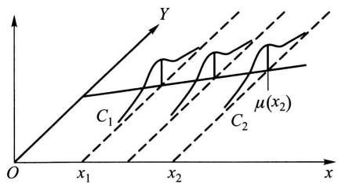  
图9-1

$x$  的取值而变化的规律，那么就能完全掌握  $Y$  与  $x$  之间的关系了。然而这样做往往比较复杂。作为一种近似，我们转而去考察  $Y$  的数学期望，若  $Y$  的数学期望  $E(Y)$  存在，则其值随  $x$  的取值而定，它是  $x$  的函数。将这一函数记为  $\mu_{Y|x}$  或  $\mu(x)$ ，称为  $Y$  关于  $x$  的回归函数（如图9-1）。这样，我们就将讨论  $Y$  与  $x$  的相关关系的问题转换为讨论  $E(Y) = \mu(x)$  与  $x$  的函数关系了。

我们知道，若  $\eta$  是一个随机变量，则  $E[(\eta - c)^2]$  作为  $c$  的函数，在  $c = E(\eta)$  时  $E[(\eta - c)^2]$  达到最小（参见第四章习题第17题）。这表明在一切  $x$  的函数中以回归函数  $\mu(x)$  作为  $Y$  的近似，其均方误差  $E[(Y - \mu(x))^2]$  为最小。因此，作为一种近似，为了研究  $Y$  与  $x$  的关系转而去研究  $\mu(x)$  与  $x$  的关系是合适的。

在实际问题中，回归函数  $\mu (x)$  一般是未知的，回归分析的任务在于根据试验数据去估计回归函数，讨论有关的点估计、区间估计、假设检验等问题.特别重要的是对随机变量  $Y$  的观察值作出点预测和区间预测.

我们对于  $x$  取定一组不完全相同的值  $x_{1}, x_{2}, \dots, x_{n}$ ，设  $Y_{1}, Y_{2}, \dots, Y_{n}$  分别是在  $x_{1}, x_{2}, \dots, x_{n}$  处对  $Y$  的独立观察结果，称

$$
\left(x _ {1}, Y _ {1}\right), \left(x _ {2}, Y _ {2}\right), \dots , \left(x _ {n}, Y _ {n}\right) \tag {3.1}
$$

是一个样本①，对应的样本值记为

$$
\left(x _ {1}, y _ {1}\right), \left(x _ {2}, y _ {2}\right), \dots , \left(x _ {n}, y _ {n}\right).
$$

我们首先要解决的问题是如何利用样本来估计  $Y$  关于  $x$  的回归函数  $\mu (x)$  .为

此，首先需要推测  $\mu (x)$  的形式.在一些问题中，我们可以由专业知识知道  $\mu (x)$  的形式.否则，可将每对观察值  $(x_{i},y_{i})$  在直角坐标系中描出它的相应的点（如下例中的图9一2），这种图称为散点图.散点图可以帮助我们粗略地看出  $\mu (x)$  的形式.

例1 为研究某一化学反应过程中，温度  $x$  （以  ${}^{\circ}\mathrm{C}$  计）对产品得率Y（以  $\%$  计）的影响，测得数据如下：

<table><tr><td>温度x(℃)</td><td>100</td><td>110</td><td>120</td><td>130</td><td>140</td><td>150</td><td>160</td><td>170</td><td>180</td><td>190</td></tr><tr><td>得率Y(%)</td><td>45</td><td>51</td><td>54</td><td>61</td><td>66</td><td>70</td><td>74</td><td>78</td><td>85</td><td>89</td></tr></table>

这里自变量  $x$  是普通变量， $Y$  是随机变量. 画出散点图如图9-2所示. 由图大致看出  $\mu(x)$  具有线性函数  $a + bx$  的形式.

设  $Y$  关于  $x$  的回归函数为  $\mu (x)$  .利用样本来估计  $\mu (x)$  的问题称为求  $Y$  关于  $x$  的回归问题.特别，若  $\mu (x)$  为线性函数：  $\mu (x) = a + bx$  ，此时估计  $\mu (x)$  的问题称为求一元线性回归问题.本节只讨论这个问题.

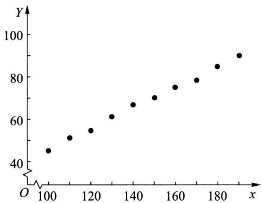  
图9-2

我们假设对于  $x$  （在某个区间内）的每一个值有

$$
Y \sim N (a + b x, \sigma^ {2}),
$$

其中  $a, b$  及  $\sigma^2$  都是不依赖于  $x$  的未知参数. 记  $\varepsilon = Y - (a + bx)$ , 对  $Y$  作这样的正态假设, 相当于假设

$$
Y = a + b x + \varepsilon , \quad \varepsilon \sim N (0, \sigma^ {2}), \tag {3.2}
$$

其中未知参数  $a, b$  及  $\sigma^2$  都不依赖于  $x$ . (3.2) 称为一元线性回归模型，其中  $b$  称为回归系数.

(3.2)式表明，因变量  $Y$  由两部分组成，一部分是  $x$  的线性函数  $a + bx$  ，另一部分  $\varepsilon \sim N(0,\sigma^2)$  是随机误差，是人们不可控制的.

# （二）  $a,b$  的估计

取  $x$  的  $n$  个不全相同的值  $x_{1}, x_{2}, \dots, x_{n}$  作独立试验，得到样本  $(x_{1}, Y_{1}), (x_{2}, Y_{2}), \dots, (x_{n}, Y_{n})$ 。由（3.2）式

$$
Y _ {i} = a + b x _ {i} + \varepsilon_ {i}, \varepsilon_ {i} \sim N (0, \sigma^ {2}), \text {各} \varepsilon_ {i} \text {相 互 独 立}. \tag {3.3}
$$

于是  $Y_{i}\sim N(a + bx_{i},\sigma^{2}),i = 1,2,\dots ,n.$  由  $Y_{1},Y_{2},\dots ,Y_{n}$  的独立性，知  $Y_{1}$ $Y_{2},\dots ,Y_{n}$  的联合概率密度为

$$
\begin{array}{l} L = \prod_ {i = 1} ^ {n} \frac {1}{\sigma \sqrt {2 \pi}} \exp \left\{- \frac {1}{2 \sigma^ {2}} (y _ {i} - a - b x _ {i}) ^ {2} \right\} \\ = \left(\frac {1}{\sigma \sqrt {2 \pi}}\right) ^ {n} \exp \left\{- \frac {1}{2 \sigma^ {2}} \sum_ {i = 1} ^ {n} \left(y _ {i} - a - b x _ {i}\right) ^ {2} \right\}. \tag {3.4} \\ \end{array}
$$

现用最大似然估计法来估计未知参数  $a, b$ . 对于任意一组观察值  $y_{1}, y_{2}, \dots, y_{n}$ , (3.4) 式就是样本的似然函数. 显然, 要  $L$  取最大值, 只要 (3.4) 式右端花括弧中的平方和部分为最小, 即只需函数

$$
Q (a, b) = \sum_ {i = 1} ^ {n} \left(y _ {i} - a - b x _ {i}\right) ^ {2} \tag {3.5}
$$

取最小值①.

取  $Q$  分别关于  $a, b$  的偏导数，并令它们等于零：

$$
\begin{array}{l} \frac {\partial Q}{\partial a} = - 2 \sum_ {i = 1} ^ {n} \left(y _ {i} - a - b x _ {i}\right) = 0, \tag {3.6} \\ \frac {\partial Q}{\partial b} = - 2 \sum_ {i = 1} ^ {n} \left(y _ {i} - a - b x _ {i}\right) x _ {i} = 0. \\ \end{array}
$$

得方程组

$$
\left\{ \begin{array}{l} n a + \left(\sum_ {i = 1} ^ {n} x _ {i}\right) b = \sum_ {i = 1} ^ {n} y _ {i}, \\ \left(\sum_ {i = 1} ^ {n} x _ {i}\right) a + \left(\sum_ {i = 1} ^ {n} x _ {i} ^ {2}\right) b = \sum_ {i = 1} ^ {n} x _ {i} y _ {i}. \end{array} \right. \tag {3.7}
$$

# （3.7）式称为正规方程组

由于  $x_{i}$  不全相同，正规方程组的系数行列式

$$
\left| \begin{array}{c c} n & \sum_ {i = 1} ^ {n} x _ {i} \\ \sum_ {i = 1} ^ {n} x _ {i} & \sum_ {i = 1} ^ {n} x _ {i} ^ {2} \end{array} \right| = n \sum_ {i = 1} ^ {n} x _ {i} ^ {2} - \left(\sum_ {i = 1} ^ {n} x _ {i}\right) ^ {2} = n \sum_ {i = 1} ^ {n} (x _ {i} - \bar {x}) ^ {2} \neq 0.
$$

故(3.7)有唯一的一组解. 解得  $b, a$  的最大似然估计值为

$$
\left. \begin{array}{l} \hat {b} = \frac {n \sum_ {i = 1} ^ {n} x _ {i} y _ {i} - \left(\sum_ {i = 1} ^ {n} x _ {i}\right) \left(\sum_ {i = 1} ^ {n} y _ {i}\right)}{n \sum_ {i = 1} ^ {n} x _ {i} ^ {2} - \left(\sum_ {i = 1} ^ {n} x _ {i}\right) ^ {2}} = \frac {\sum_ {i = 1} ^ {n} \left(x _ {i} - \bar {x}\right) \left(y _ {i} - \bar {y}\right)}{\sum_ {i = 1} ^ {n} \left(x _ {i} - \bar {x}\right) ^ {2}}, \\ \hat {a} = \frac {1}{n} \sum_ {i = 1} ^ {n} y _ {i} - \frac {\hat {b}}{n} \sum_ {i = 1} ^ {n} x _ {i} = \bar {y} - \hat {b} \bar {x}, \end{array} \right\} \tag {3.8}
$$

其中  $\overline{x} = \frac{1}{n}\sum_{i = 1}^{n}x_{i},\quad \overline{y} = \frac{1}{n}\sum_{i = 1}^{n}y_{i}.$

在得到  $a, b$  的估计  $\hat{a}, \hat{b}$  后，对于给定的  $x$  ，我们就取  $\hat{a} + \hat{b} x$  作为回归函数  $\mu(x) = a + bx$  的估计，即  $\widehat{\mu(x)} = \hat{a} + \hat{b} x$  ，称为Y关于  $x$  的经验回归函数。记  $\hat{a} + \hat{b} x = \hat{y}$ ，方程

$$
\hat {y} = \hat {a} + \hat {b} x \tag {3.9}
$$

称为  $Y$  关于  $x$  的经验回归方程，简称回归方程，其图形称为回归直线.

将(3.8)中  $\hat{a}$  的表达式代入(3.9)式，则回归方程可写成

$$
\hat {y} = \bar {y} + \hat {b} (x - \bar {x}). \tag {3.10}
$$

(3.10) 表明, 对于样本值  $(x_{1}, y_{1}), (x_{2}, y_{2}), \dots, (x_{n}, y_{n})$ , 回归直线通过散点图的几何中心  $(\overline{x}, \overline{y})$ .

今后我们将视方便而使用（3.9）或（3.10）

为了计算上的方便，我们引入下述记号：

$$
\left. \begin{array}{l} S _ {x x} = \sum_ {i = 1} ^ {n} \left(x _ {i} - \bar {x}\right) ^ {2} = \sum_ {i = 1} ^ {n} x _ {i} ^ {2} - \frac {1}{n} \left(\sum_ {i = 1} ^ {n} x _ {i}\right) ^ {2}, \\ S _ {y y} = \sum_ {i = 1} ^ {n} \left(y _ {i} - \bar {y}\right) ^ {2} = \sum_ {i = 1} ^ {n} y _ {i} ^ {2} - \frac {1}{n} \left(\sum_ {i = 1} ^ {n} y _ {i}\right) ^ {2}, \\ S _ {x y} = \sum_ {i = 1} ^ {n} \left(x _ {i} - \bar {x}\right) \left(y _ {i} - \bar {y}\right) = \sum_ {i = 1} ^ {n} x _ {i} y _ {i} - \frac {1}{n} \left(\sum_ {i = 1} ^ {n} x _ {i}\right) \left(\sum_ {i = 1} ^ {n} y _ {i}\right). \end{array} \right\} \tag {3.11}
$$

这样，  $a,b$  的估计值可写成

$$
\left. \begin{array}{l} \hat {b} = \frac {S _ {x y}}{S _ {x x}}, \\ \hat {a} = \frac {1}{n} \sum_ {i = 1} ^ {n} y _ {i} - \left(\frac {1}{n} \sum_ {i = 1} ^ {n} x _ {i}\right) \hat {b}. \end{array} \right\} \tag {3.12}
$$

例2(续例1) 设在例1中的随机变量  $Y$  符合(3.2)式所述的条件，求  $Y$  关于  $x$  的线性回归方程.

解 现在  $n = 10$  ，为求线性回归方程，所需计算列表如下：

表9-17  

<table><tr><td>x</td><td>y</td><td>x²</td><td>y²</td><td>xy</td></tr><tr><td>100</td><td>45</td><td>10 000</td><td>2 025</td><td>4 500</td></tr><tr><td>110</td><td>51</td><td>12 100</td><td>2 601</td><td>5 610</td></tr><tr><td>120</td><td>54</td><td>14 400</td><td>2 916</td><td>6 480</td></tr><tr><td>130</td><td>61</td><td>16 900</td><td>3 721</td><td>7 930</td></tr><tr><td>140</td><td>66</td><td>19 600</td><td>4 356</td><td>9 240</td></tr><tr><td>150</td><td>70</td><td>22 500</td><td>4 900</td><td>10 500</td></tr><tr><td>160</td><td>74</td><td>25 600</td><td>5 476</td><td>11 840</td></tr><tr><td>170</td><td>78</td><td>28 900</td><td>6 084</td><td>13 260</td></tr><tr><td>180</td><td>85</td><td>32 400</td><td>7 225</td><td>15 300</td></tr><tr><td>190</td><td>89</td><td>36 100</td><td>7 921</td><td>16 910</td></tr><tr><td>Σ 1 450</td><td>673</td><td>218 500</td><td>47 225①</td><td>101 570</td></tr></table>

由表9-17得

$$
S _ {x x} = 2 1 8 5 0 0 - \frac {1}{1 0} \times 1 4 5 0 ^ {2} = 8 2 5 0,
$$

$$
S _ {x y} = 1 0 1 5 7 0 - \frac {1}{1 0} \times 1 4 5 0 \times 6 7 3 = 3 9 8 5,
$$

故得  $\hat{b} = \frac{S_{xy}}{S_{xx}} = 0.48303,$

$$
\hat {a} = \frac {1}{1 0} \times 6 7 3 - \frac {1}{1 0} \times 1 4 5 0 \times 0. 4 8 3 0 3 = - 2. 7 3 9 3 5,
$$

于是得到回归直线方程

$$
\hat {y} = - 2. 7 3 9 3 5 + 0. 4 8 3 0 3 x,
$$

或写成

$$
\hat {y} = 6 7. 3 + 0. 4 8 3 0 3 (x - 1 4 5).
$$

# （三） $\sigma^2$  的估计

由（3.2）式，

$$
E \left\{\left[ Y - (a + b x) \right] ^ {2} \right\} = E \left(\varepsilon^ {2}\right) = D (\varepsilon) + \left[ E (\varepsilon) \right] ^ {2} = \sigma^ {2},
$$

这表示  $\sigma^2$  愈小，以回归函数  $\mu (x) = a + bx$  作为  $Y$  的近似导致的均方误差就愈小.这样，利用回归函数  $\mu (x) = a + bx$  去研究随机变量  $Y$  与  $x$  的关系就愈有效.然而  $\sigma^2$  是未知的，因而我们需要利用样本去估计  $\sigma^2$  .为了估计  $\sigma^2$  ，先引入下述残差平方和.

记  $\hat{y}_i = \hat{y}\big|_{x = x_i} = \hat{a} +\hat{b} x_i$  ，称  $y_{i} - \hat{y}_{i}$  为  $x_{i}$  处的残差.平方和

$$
Q _ {e} = \sum_ {i = 1} ^ {n} \left(y _ {i} - \hat {y} _ {i}\right) ^ {2} = \sum_ {i = 1} ^ {n} \left(y _ {i} - \hat {a} - \hat {b} x _ {i}\right) ^ {2} \tag {3.13}
$$

称为残差平方和(图9-3). 它是经验回归函数在  $x_{i}$  处的函数值  $\widehat{\mu(x_i)} = \hat{a} + \hat{b} x_i$  与  $x_{i}$  处的观察值  $y_{i}$  的偏差的平方和. 为了计算  $Q_{e}$ , 我们将  $Q_{e}$  作如下的分解:

$$
\begin{array}{l} Q _ {e} = \sum_ {i = 1} ^ {n} \left(y _ {i} - \hat {y} _ {i}\right) ^ {2} = \sum_ {i = 1} ^ {n} \left[ y _ {i} - \bar {y} - \hat {b} \left(x _ {i} - \bar {x}\right) \right] ^ {2} \\ = \sum_ {i = 1} ^ {n} (y _ {i} - \bar {y}) ^ {2} - 2 \hat {b} \sum_ {i = 1} ^ {n} (x _ {i} - \bar {x}) (y _ {i} - \bar {y}) \\ + \hat {b} ^ {2} \sum_ {i = 1} ^ {n} (x _ {i} - \bar {x}) ^ {2} = S _ {y y} - 2 \hat {b} S _ {x y} + \hat {b} ^ {2} S _ {x x}. \\ \end{array}
$$

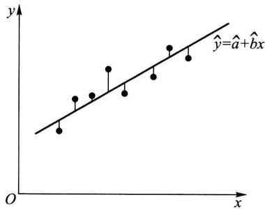  
图9-3

由(3.12)式  $\hat{b} = S_{xy} / S_{xx}$  得  $Q_{e}$  的一个分解式

$$
Q _ {e} = S _ {y y} - \hat {b} S _ {x y}. \tag {3.14}
$$

由（3.8）式知，  $b,a$  的估计量分别为①

$$
\left. \begin{array}{l} \hat {b} = \frac {\sum_ {i = 1} ^ {n} (x _ {i} - \bar {x}) (Y _ {i} - \bar {Y})}{\sum_ {i = 1} ^ {n} (x _ {i} - \bar {x}) ^ {2}} = \frac {\sum_ {i = 1} ^ {n} (x _ {i} - \bar {x}) Y _ {i}}{\sum_ {i = 1} ^ {n} (x _ {i} - \bar {x}) ^ {2}}, \\ \hat {a} = \frac {1}{n} \sum_ {i = 1} ^ {n} Y _ {i} - \frac {\hat {b}}{n} \sum_ {i = 1} ^ {n} x _ {i} = \bar {Y} - \hat {b} \bar {x}, \end{array} \right\} \tag {3.15}
$$

其中  $\overline{Y} = \frac{1}{n}\sum_{i = 1}^{n}Y_{i},\overline{x} = \frac{1}{n}\sum_{i = 1}^{n}x_{i}.$  在  $S_{yy},S_{xy}$  的表达式(3.11）中，将  $y_{i}$  改为  $Y_{i}$ $(i = 1,2,\dots ,n)$  ，并把它们分别记为  $S_{YY},S_{xY}$  ，即

$$
S _ {Y Y} = \sum_ {i = 1} ^ {n} (Y _ {i} - \bar {Y}) ^ {2}, S _ {x Y} = \sum_ {i = 1} ^ {n} (x _ {i} - \bar {x}) (Y _ {i} - \bar {Y}).
$$

则(3.14)式中的残差平方和  $Q_{e}$  的相应的统计量（仍记为  $Q_{e}$  ）为

$$
Q _ {e} = S _ {Y Y} - \hat {b} S _ {x Y}. \tag {3.16}
$$

残差平方和  $Q_{e}$  服从分布（见本章附录  $4^{\circ}$ ）：

$$
\frac {Q _ {e}}{\sigma^ {2}} \sim \chi^ {2} (n - 2), \tag {3.17}
$$

于是  $E\left(\frac{Q_e}{\sigma^2}\right) = n - 2,$

即知  $E(Q_{e} / (n - 2)) = \sigma^{2}$ . 这样就得到了  $\sigma^2$  的无偏估计量：

$$
\hat {\sigma} ^ {2} = \frac {Q _ {e}}{n - 2} = \frac {1}{n - 2} \left(S _ {Y Y} - \hat {b} S _ {x Y}\right). \tag {3.18}
$$

在这里，还看到，只要算出表9一17中各栏的和，不但能算出  $\hat{a},\hat{b}$  ，且能算出  $\sigma^2$  的估计值  $\hat{\sigma}^2$

例3（续例2） 求例2中  $\sigma^2$  的无偏估计

解 由表9-17，得

$$
S _ {y y} = \sum_ {i = 1} ^ {n} y _ {i} ^ {2} - \frac {1}{n} \left(\sum_ {i = 1} ^ {n} y _ {i}\right) ^ {2} = 4 7 2 2 5 - \frac {1}{1 0} \times 6 7 3 ^ {2} = 1 9 3 2. 1.
$$

又已知  $S_{xy} = 3985, \hat{b} = 0.48303$ ，即得

$$
Q _ {e} = S _ {y y} - \hat {b} S _ {x y} = 7. 2 3,
$$

$$
\hat {\sigma} ^ {2} = Q _ {e} / (n - 2) = 7. 2 3 / 8 = 0. 9 0.
$$

# （四）线性假设的显著性检验

在以上的讨论中，我们假定  $Y$  关于  $x$  的回归函数  $\mu (x)$  具有形式  $a + bx$  ，在处理实际问题时，  $\mu (x)$  是否为  $x$  的线性函数，首先要根据有关专业知识和实践来判断，其次就要根据实际观察得到的数据运用假设检验的方法来判断.这就是说，求得的线性回归方程是否具有实用价值，一般来说，需要经过假设检验才能确定.若线性假设(3.2)符合实际，则  $b$  不应为零，因为若  $b = 0$  ，则  $E(Y) = \mu (x)$  就不依赖于  $x$  了.因此我们需要检验假设

$$
H _ {0}: \quad b = 0,
$$

$$
H _ {1}: \quad b \neq 0. \tag {3.19}
$$

我们使用  $t$  检验法来进行检验. 我们有（见本章附录  $2^{\circ}$ ）：

$$
\hat {b} \sim N \left(b, \sigma^ {2} / S _ {x x}\right). \tag {3.20}
$$

又由(3.17)式，(3.18)式知

$$
\frac {(n - 2) \hat {\sigma} ^ {2}}{\sigma^ {2}} = \frac {Q _ {e}}{\sigma^ {2}} \sim \chi^ {2} (n - 2), \tag {3.21}
$$

且  $\hat{b}$  与  $Q_{e}$  独立(见本章附录  $5^{\circ}$  ).故有

$$
\left. \frac {\hat {b} - b}{\sqrt {\sigma^ {2} / S _ {x x}}} \right| \sqrt {\frac {(n - 2) \hat {\sigma} ^ {2}}{\sigma^ {2}}} (n - 2) \sim t (n - 2),
$$

即  $\frac{\hat{b} - b}{\hat{\sigma}}\sqrt{S_{xx}}\sim t(n - 2).$  (3.22)

这里  $\hat{\sigma} = \sqrt{\hat{\sigma}^2}$

当  $H_0$  为真时  $b = 0$  ，此时

$$
t = \frac {\hat {b}}{\hat {\sigma}} \sqrt {S _ {x x}} \sim t (n - 2), \tag {3.23}
$$

且  $E(\hat{b}) = b = 0$  ，即得  $H_{0}$  的拒绝域为

$$
| t | = \frac {| \hat {b} |}{\hat {\sigma}} \sqrt {S _ {x x}} \geqslant t _ {\alpha / 2} (n - 2), \tag {3.24}
$$

此处  $\alpha$  为显著性水平.

当假设  $H_0: b = 0$  被拒绝时，认为回归效果是显著的，反之，就认为回归效果不显著。回归效果不显著的原因可能有如下几种：

$1^{\circ}$  影响  $Y$  取值的，除  $x$  及随机误差外还有其他不可忽略的因素.  
$2^{\circ} E(Y)$  与  $x$  的关系不是线性的，而存在着其他的关系.  
$3^{\circ} Y$  与  $x$  不存在关系.

因此需要进一步的分析原因，分别处理

例4(续例2) 检验例2中的回归效果是否显著，取  $\alpha = 0.05$

解 由例2、例3已知  $\hat{b} = 0.48303, S_{xx} = 8250, \hat{\sigma}^2 = 0.90$ . 查表得  $t_{0.05/2}(n - 2) = t_{0.025}(8) = 2.3060$ . 由(3.24)式，假设  $H_0: b = 0$  的拒绝域为

$$
| t | = \frac {| \hat {b} |}{\hat {\sigma}} \sqrt {S _ {x x}} \geqslant 2. 3 0 6 0.
$$

现在

$$
| t | = \frac {0 . 4 8 3 0 3}{\sqrt {0 . 9 0}} \sqrt {8 2 5 0} = 4 6. 2 5 > 2. 3 0 6 0,
$$

故拒绝  $H_0: b = 0$  ，认为回归效果是显著的

# （五）系数  $b$  的置信区间

当回归效果显著时，我们常需要对系数  $b$  作区间估计.事实上，可由(3.22)式得到  $b$  的置信水平为  $1 - \alpha$  的置信区间为

$$
\left(\hat {b} \pm t _ {\alpha / 2} (n - 2) \frac {\hat {\sigma}}{\sqrt {S _ {x x}}}\right). \tag {3.25}
$$

例如，例1中  $b$  的置信水平为0.95的置信区间为

$$
\left(0. 4 8 3 0 3 \pm 2. 3 0 6 0 \times \sqrt {\frac {0 . 9 0}{8 2 5 0}}\right) = (0. 4 5 8 9 4, 0. 5 0 7 1 2).
$$

# (六) 回归函数  $\mu(x) = a + bx$  函数值的点估计和置信区间

设  $x_0$  是自变量  $x$  的某一指定值. 由 (3.9) 式可以用经验回归函数  $\hat{y} = \widehat{\mu(x)} = \hat{a} + \hat{b} x$  在  $x_0$  的函数值  $\hat{y}_0 = \widehat{\mu(x_0)} = \hat{a} + \hat{b} x_0$  作为  $\mu(x_0) = a + bx_0$  的点估计, 即

$$
\hat {y} _ {0} = \widehat {\mu \left(x _ {0}\right)} = \hat {a} + \hat {b} x _ {0}. \tag {3.26}
$$

考虑相应的估计量

$$
\hat {Y} _ {0} = \hat {a} + \hat {b} x _ {0}, \tag {3.27}
$$

由本章附录  $3^{\circ}$  知， $E(\hat{Y}_0) = a + bx_0$  ，因此这一估计量是无偏的.下面来求  $\mu (x_0) = a + bx_0$  的置信区间.由本章附录  $3^{\circ}$  知

$$
\frac {\hat {Y} _ {0} - (a + b x _ {0})}{\sigma \sqrt {\frac {1}{n} + \frac {(x _ {0} - \overline {{x}}) ^ {2}}{S _ {x x}}}} \sim N (0, 1).
$$

又由（3.17）式，（3.18）式知

$$
\frac {(n - 2) \hat {\sigma} ^ {2}}{\sigma^ {2}} = \frac {Q _ {e}}{\sigma^ {2}} \sim \chi^ {2} (n - 2), \tag {3.28}
$$

且由本章附录  $6^{\circ}$  知  $Q_{e},\hat{Y}_{0}$  相互独立.于是

$$
\frac {\hat {Y} _ {0} - \left(a + b x _ {0}\right)}{\sigma \sqrt {\frac {1}{n} + \frac {\left(x _ {0} - \bar {x}\right) ^ {2}}{S _ {x x}}}} \left| \sqrt {\frac {(n - 2) \hat {\sigma} ^ {2}}{\sigma^ {2}}} \right| (n - 2) \sim t (n - 2),
$$

即  $\frac{\hat{Y}_0 - (a + bx_0)}{\hat{\sigma}\sqrt{\frac{1}{n} + \frac{(x_0 - \overline{x})^2}{S_{xx}}}}\sim t(n - 2).$

于是得到  $\mu (x_0) = a + bx_0$  的置信水平为  $1 - \alpha$  的置信区间为

$$
\left(\hat {Y} _ {0} \pm t _ {\alpha / 2} (n - 2) \hat {\sigma} \sqrt {\frac {1}{n} + \frac {\left(x _ {0} - \bar {x}\right) ^ {2}}{S _ {x x}}}\right), \tag {3.29}
$$

或即  $\left(\hat{a} +\hat{b} x_0\pm t_{\alpha /2}(n - 2)\hat{\sigma}\sqrt{\frac{1}{n} + \frac{(x_0 - \overline{x})^2}{S_{xx}}}\right).$  (3.29)

这一置信区间的长度是  $x_0$  的函数，它随  $|x_0 - \overline{x}|$  的增加而增加，当  $x_0 = \overline{x}$  时为最短.

# （七）Y的观察值的点预测和预测区间

若我们对指定点  $x = x_0$  处因变量  $Y$  的观察值  $Y_0$  感兴趣，然而我们在  $x = x_0$  处并未进行观察或者暂时无法观察，经验回归函数的一个重要应用是，可利用它对因变量  $Y$  的新观察值  $Y_0$  进行点预测或区间预测.

若  $Y_{0}$  是在  $x = x_0$  处对  $Y$  的观察结果，由（3.2）式知它满足：

$$
Y _ {0} = a + b x _ {0} + \varepsilon_ {0}, \quad \varepsilon_ {0} \sim N (0, \sigma^ {2}). \tag {3.30}
$$

随机误差  $\varepsilon_0$  可正也可负，其值无法预料，我们就用  $x_0$  处的经验回归函数值

$$
\hat {Y} _ {0} = \widehat {\mu (x _ {0})} = \hat {a} + \hat {b} x _ {0}
$$

作为  $Y_0 = a + bx_0 + \varepsilon_0$  的点预测.下面来求  $Y_{0}$  的预测区间

因  $Y_{0}$  是将要做的一次独立试验的结果，因此它与已经得到的试验的结果 $Y_{1},Y_{2},\dots ,Y_{n}$  相互独立.由（3.15）式知  $\hat{b}$  是  $Y_{1},Y_{2},\dots ,Y_{n}$  的线性组合，故  $\hat{Y}_0 =$ $\overline{Y} +\hat{b} (x_0 - \overline{x})$  是  $Y_{1},Y_{2},\dots ,Y_{n}$  的线性组合，故  $Y_{0}$  与  $\hat{Y}_0$  相互独立.由(3.30）式和本章附录  $3^{\circ}$  得

$$
\hat {Y} _ {0} - Y _ {0} \sim N \left(0, \left[ 1 + \frac {1}{n} + \frac {\left(x _ {0} - \bar {x}\right) ^ {2}}{S _ {x x}} \right] \sigma^ {2}\right),
$$

即  $\frac{\hat{Y}_0 - Y_0}{\sigma\sqrt{1 + \frac{1}{n} + \frac{(x_0 - \overline{x})^2}{S_{xx}}}}\sim N(0,1).$  (3.31)

再由(3.28)式、(3.31)式及  $Y_0, \hat{Y}_0, Q_e$  的相互独立性（本章附录  $6^{\circ}$ ）知

$$
\frac {\hat {Y} _ {0} - Y _ {0}}{\sigma \sqrt {1 + \frac {1}{n} + \frac {(x _ {0} - \bar {x}) ^ {2}}{S _ {x x}}}} \left| \sqrt {\frac {(n - 2) \hat {\sigma} ^ {2}}{\sigma^ {2}}} \right| (n - 2) \sim t (n - 2),
$$

即  $\frac{\hat{Y}_0 - Y_0}{\hat{\sigma}\sqrt{1 + \frac{1}{n} + \frac{(x_0 - \overline{x})^2}{S_{xx}}}}\sim t(n - 2).$

于是对于给定的置信水平  $1 - \alpha$  有

$$
P \left\{\frac {\mid \hat {Y} _ {0} - Y _ {0} \mid}{\hat {\sigma} \sqrt {1 + \frac {1}{n} + \frac {(x _ {0} - \bar {x}) ^ {2}}{S _ {x x}}}} \leqslant t _ {\alpha / 2} (n - 2) \right\} = 1 - \alpha ,
$$

或  $P\left\{\hat{Y}_0 - t_{a / 2}(n - 2)\hat{\sigma}\sqrt{1 + \frac{1}{n} + \frac{(x_0 - \overline{x})^2}{S_{xx}}} < Y_0\right.$

$$
<   \hat {Y} _ {0} + t _ {\alpha / 2} (n - 2) \hat {\sigma} \sqrt {1 + \frac {1}{n} + \frac {(x _ {0} - \bar {x}) ^ {2}}{S _ {x x}}} \Bigg > = 1 - \alpha .
$$

区间  $\left(\hat{Y}_0\pm t_{a / 2}(n - 2)\hat{\sigma}\sqrt{1 + \frac{1}{n} + \frac{(x_0 - \overline{x})^2}{S_{xx}}}\right),$  (3.32)

即  $\left(\hat{a} +\hat{b} x_0\pm t_{a / 2}(n - 2)\hat{\sigma}\sqrt{1 + \frac{1}{n} + \frac{(x_0 - \overline{x})^2}{S_{xx}}}\right)$  (3.32)'

称为  $Y_{0}$  的置信水平为  $1 - \alpha$  的预测区间①. 这一预测区间的长度是  $x_{0}$  的函数, 它随  $|x_{0} - \overline{x}|$  的增加而增加. 当  $x_{0} = \overline{x}$  时为最短. 将(3.32)式与(3.29)式比较, 知道在相同的置信水平下, 回归函数值  $\mu(x_{0})$  的置信区间要比  $Y_{0}$  的预测区间短. 这是因为  $Y_{0} = a + bx_{0} + \varepsilon_{0}$  比  $\mu(x_{0}) = a + bx_{0}$  多了一项  $\varepsilon_{0}$ .

例5（续例2）（1)求回归函数  $\mu (x)$  在  $x = 125$  处的值  $\mu (125)$  的置信水平为0.95的置信区间，求在  $x = 125$  处  $Y$  的新观察值  $Y_{0}$  的置信水平为0.95的预测区间.(2)求在  $x = x_0$  处  $Y$  的新观察值  $Y_{0}$  的置信水平为0.95预测区间.

解（1）由例2，例3已知  $\hat{b} = 0.48303, \hat{a} = -2.73935, S_{xx} = 8250, \hat{\sigma}^2 = 0.90, \overline{x} = 145$  ，查表得  $t_{0.05 / 2}(8) = 2.3060$  ，即得

$$
\begin{array}{l} \hat {Y} _ {0} = \hat {Y} | _ {x = 1 2 5} = \left[ - 2. 7 3 9 3 5 + 0. 4 8 3 0 3 x \right] _ {x = 1 2 5} = 5 7. 6 4, \\ t _ {a / 2} (n - 2) \hat {\sigma} \sqrt {\frac {1}{n} + \frac {\left(x _ {0} - \bar {x}\right) ^ {2}}{S _ {x x}}} \\ = 2. 3 0 6 0 \times \sqrt {0 . 9 0} \times \sqrt {\frac {1}{1 0} + \frac {(1 2 5 - 1 4 5) ^ {2}}{8 2 5 0}} = 0. 8 4, \\ t _ {a / 2} (n - 2) \hat {\sigma} \sqrt {1 + \frac {1}{n} + \frac {(x _ {0} - \bar {x}) ^ {2}}{S _ {x x}}} = 2. 3 4, \\ \end{array}
$$

得回归函数  $\mu (x)$  在  $x = 125$  处的值  $\mu (125)$  的一个置信水平为0.95的置信区间为

$$
(5 7. 6 4 \pm 0. 8 4).
$$

又得  $x_0 = 125$  处得率  $Y_{0}$  的置信水平为0.95的预测区间为

$$
(5 7. 6 4 \pm 2. 3 4).
$$

(2) 在  $x = x_0$  处  $Y$  的新观察值  $Y_0$  的一个置信水平为 0.95 的预测区间为

$$
\left(\hat {Y} \mid_ {x = x _ {0}} \pm t _ {0. 0 2 5} (8) \hat {\sigma} \sqrt {1 + \frac {1}{1 0} + \frac {(x _ {0} - 1 4 5) ^ {2}}{8 2 5 0}}\right).
$$

取  $x_0$  为不同的值，得到各点处对应的  $Y$  的新观察值  $Y_0$  的预测区间（置信水平为0.95）如下：

<table><tr><td>x0</td><td>Y0的预测区间</td><td>x0</td><td>Y0的预测区间</td></tr><tr><td>125</td><td>(57.64±2.34)</td><td>150</td><td>(69.72±2.30)</td></tr><tr><td>130</td><td>(60.05±2.32)</td><td>155</td><td>(72.13±2.31)</td></tr><tr><td>135</td><td>(62.47±2.31)</td><td>160</td><td>(74.55±2.32)</td></tr><tr><td>140</td><td>(64.88±2.30)</td><td>165</td><td>(76.96±2.34)</td></tr><tr><td>145</td><td>(67.30±2.29)</td><td></td><td></td></tr></table>

将这些区间的下端点联结起来，又将这些区间的上端点联结起来，得到两条曲线  $L_{1}$  和  $L_{2}$ ，回归直线位于由  $L_{1}, L_{2}$  所围成的带域的中心线上. □

# （八）可化为一元线性回归的例子

以上讨论了一元线性回归问题，在实际中常会遇到更为复杂的回归问题，但在某些情况下，可以通过适当的变量变换，将它化成一元线性回归来处理。下面介绍几种常见的可转化为一元线性回归的模型。

$$
1 ^ {\circ} \quad Y = \alpha \mathrm {e} ^ {\beta x} \cdot \varepsilon , \quad \ln \varepsilon \sim N (0, \sigma^ {2}), \tag {3.33}
$$

其中  $\alpha, \beta, \sigma^2$  是与  $x$  无关的未知参数. 将  $Y = \alpha \mathrm{e}^{\beta x} \cdot \varepsilon$  两边取对数，得

$$
\ln Y = \ln \alpha + \beta x + \ln \varepsilon .
$$

令  $\ln Y = Y'$ ,  $\ln \alpha = a, \beta = b, x = x'$ ,  $\ln \varepsilon = \varepsilon'$ , (3.33) 式可转化为一元线性回归模型

$$
Y ^ {\prime} = a + b x ^ {\prime} + \varepsilon^ {\prime}, \quad \varepsilon^ {\prime} \sim N (0, \sigma^ {2}). \tag {3.34}
$$

$$
2 ^ {\circ} \quad Y = \alpha x ^ {\beta} \cdot \varepsilon , \quad \ln \varepsilon \sim N (0, \sigma^ {2}), \tag {3.35}
$$

其中  $\alpha, \beta, \sigma^2$  是与  $x$  无关的未知参数. 将  $Y = \alpha x^{\beta} \cdot \varepsilon$  两边取对数，得

$$
\ln Y = \ln \alpha + \beta \ln x + \ln \varepsilon .
$$

令  $\ln Y = Y'$ ,  $\ln \alpha = a$ ,  $\beta = b$ ,  $\ln x = x'$ ,  $\ln \varepsilon = \varepsilon'$ , (3.35) 式可转化为一元线性回归模型

$$
Y ^ {\prime} = a + b x ^ {\prime} + \varepsilon^ {\prime}, \quad \varepsilon^ {\prime} \sim N (0, \sigma^ {2}). \tag {3.36}
$$

$$
3 ^ {\circ} Y = \alpha + \beta h (x) + \varepsilon , \quad \varepsilon \sim N (0, \sigma^ {2}), \tag {3.37}
$$

其中  $\alpha, \beta, \sigma^2$  是与  $x$  无关的未知参数.  $h(x)$  是  $x$  的已知函数，令  $\alpha = a, \beta = b$

$h(x) = x'$ ，(3.37)式可转化为一元线性回归模型

$$
Y = a + b x ^ {\prime} + \varepsilon , \quad \varepsilon \sim N (0, \sigma^ {2}). \tag {3.38}
$$

若在原模型下，例如在原模型（3.37）下，对于  $(x, Y)$  有样本  $(x_{1}, y_{1}), (x_{2}, y_{2}), \dots, (x_{n}, y_{n})$  就相当于在新模型（3.38）下有样本  $(x_{1}', y_{1}), (x_{2}', y_{2}), \dots, (x_{n}', y_{n})$  ，其中  $x_{i}' = h(x_{i})$  。于是就能利用上节的方法来估计  $a, b$  或对  $b$  作假设检验，或对  $Y$  进行预测。在得到  $Y$  关于  $x'$  的回归方程后，再将原自变量  $x$  代回，就得到  $Y$  关于  $x$  的回归方程，它的图形是一条曲线，也称为曲线回归方程。

例6 下表是1957年美国旧轿车价格的调查资料，今以  $x$  表示轿车的使用年数， $Y$  表示相应的平均价格，求  $Y$  关于  $x$  的回归方程.

<table><tr><td>使用年数x</td><td>1</td><td>2</td><td>3</td><td>4</td><td>5</td><td>6</td><td>7</td><td>8</td><td>9</td><td>10</td></tr><tr><td>平均价格Y(美元)</td><td>2651</td><td>1943</td><td>1494</td><td>1087</td><td>765</td><td>538</td><td>484</td><td>290</td><td>226</td><td>204</td></tr></table>

解 作散点图如图9-4，看起来  $Y$  与  $x$  呈指数关系，于是采用模型（3.33），即

$Y = \alpha \mathrm{e}^{\beta x}\cdot \varepsilon ,\quad \ln \varepsilon \sim N(0,\sigma^{2}).$  经变量变换后就转化为（3.34）式： $Y^{\prime} = a + bx^{\prime} + \varepsilon^{\prime},\varepsilon^{\prime}\sim N(0,\sigma^{2}),$  其中  $Y^\prime = \ln Y,a = \ln \alpha ,b = \beta ,$ $x^{\prime} = x,\varepsilon^{\prime} = \ln \varepsilon .$  数据经变换后得到

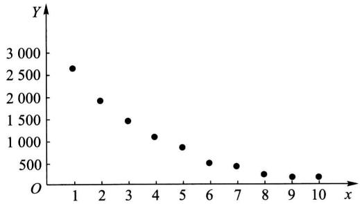  
图9-4

<table><tr><td>x&#x27; = x</td><td>1</td><td>2</td><td>3</td><td>4</td><td>5</td><td>6</td><td>7</td><td>8</td><td>9</td><td>10</td></tr><tr><td>y&#x27; = ln y</td><td>7.882</td><td>7.572</td><td>0</td><td>7.309</td><td>2</td><td>6.991</td><td>2</td><td>6.639</td><td>9</td><td>6.287</td></tr></table>

经计算得

$$
\hat {b} = - 0. 2 9 7 6 8, \quad \hat {a} = 8. 1 6 4 5 8 5,
$$

从而有

$$
\hat {y} ^ {\prime} = 8. 1 6 4 5 8 5 - 0. 2 9 7 6 8 x.
$$

又可求得

$$
| t | = \frac {| \hat {b} |}{\hat {\sigma}} \sqrt {S _ {x x}} = 3 2. 3 6 9 3 > t _ {0. 0 5 / 2} (8) = 2. 3 0 6 0,
$$

即知线性回归效果是高度显著的.代回原变量，得曲线回归方程

$$
\hat {y} = \exp \left\{\hat {y} ^ {\prime} \right\} = 3 5 1 4. 2 6 \mathrm {e} ^ {- 0. 2 9 7 6 8 x}.
$$

上面所讨论的一元线性回归模型是

$$
Y = a + b x + \varepsilon , \quad \varepsilon \sim N \left(0, \sigma^ {2}\right). \tag {3.2}
$$

一般情况，一元回归模型为

$$
Y = \mu \left(x; \theta_ {1}, \theta_ {2}, \dots , \theta_ {p}\right) + \varepsilon , \quad \varepsilon \sim N \left(0, \sigma^ {2}\right), \tag {3.39}
$$

其中  $\theta_{1},\theta_{2},\dots ,\theta_{p},\sigma^{2}$  是与  $x$  无关的未知参数

如果回归函数  $\mu (x;\theta_1,\theta_2,\dots ,\theta_p)$  是参数  $\theta_{1},\theta_{2},\dots ,\theta_{p}$  的线性函数（不必是  $x$  的线性函数），则称(3.39）为线性回归模型；若  $\mu (x;\theta_1,\theta_2,\dots ,\theta_p)$  是  $\theta_{1},\theta_{2},\dots ,\theta_{p}$  的非线性函数，则称为非线性回归模型.上述模型(3.37）是线性回归模型，而模型(3.33)，(3.35）都不是线性回归模型，但是它们都能经过变量变换转化为线性回归模型.又如

$$
Y = \theta_ {1} \mathrm {e} ^ {\theta_ {2} x} + \varepsilon , \quad \varepsilon \sim N (0, \sigma^ {2}). \tag {3.40}
$$

它是非线性回归模型. 它不能经过变量变换转化为线性回归模型①, 称为本质的非线性回归模型. 对于这种模型, 我们就不讨论了.

# § 4 多元线性回归

在实际问题中，随机变量  $Y$  往往与多个普通变量  $x_{1}, x_{2}, \dots, x_{p} (p > 1)$  有关。对于自变量  $x_{1}, x_{2}, \dots, x_{p}$  的一组确定的值， $Y$  有它的分布。若  $Y$  的数学期望存在，则它是  $x_{1}, x_{2}, \dots, x_{p}$  的函数，记为

$$
\mu_ {Y \mid x _ {1}, x _ {2}, \dots , x _ {p}} \text {或} \mu (x _ {1}, x _ {2}, \dots , x _ {p}),
$$

它就是  $Y$  关于  $x$  的回归函数. 我们感兴趣的是  $\mu(x_1, x_2, \dots, x_p)$  是  $x_1, x_2, \dots, x_p$  的线性函数的情况. 在这里，仅讨论下述多元线性回归模型：

$$
Y = b _ {0} + b _ {1} x _ {1} + \dots + b _ {p} x _ {p} + \varepsilon , \quad \varepsilon \sim N (0, \sigma^ {2}), \tag {4.1}
$$

其中  $b_{0}, b_{1}, \dots, b_{p}, \sigma^{2}$  都是与  $x_{1}, x_{2}, \dots, x_{p}$  无关的未知参数.

$$
\begin{array}{l} \ln Y = \ln \left(\theta_ {1} \mathrm {e} ^ {\theta_ {2} x} + \varepsilon\right) = \ln \left[ \theta_ {1} \mathrm {e} ^ {\theta_ {2} x} \left(1 + \frac {\varepsilon}{\theta_ {1}} \mathrm {e} ^ {- \theta_ {2} x}\right) \right] \\ = \ln \theta_ {1} + \theta_ {2} x + \ln \left(1 + \frac {\varepsilon}{\theta_ {1}} \mathrm {e} ^ {- \theta_ {2} x}\right). \\ \end{array}
$$

$$
Y ^ {\prime} = a + b x + \varepsilon^ {\prime}.
$$

从形式上看，上式好像是线性回归模型。但因误差项  $\varepsilon^{\prime}$  中包含未知参数  $\theta_{1},\theta_{2}$ ，甚至包含自变量  $x$ 。这在线性回归模型中是不允许的。

设

$$
\left(x _ {1 1}, x _ {1 2}, \dots , x _ {1 p}, y _ {1}\right), \dots , \left(x _ {n 1}, x _ {n 2}, \dots , x _ {n p}, y _ {n}\right) \tag {4.2}
$$

是一个样本. 和一元线性回归的情况一样, 我们用最大似然估计法来估计参数. 即取  $\hat{b}_0, \hat{b}_1, \dots, \hat{b}_p$  使当  $b_0 = \hat{b}_0, b_1 = \hat{b}_1, \dots, b_p = \hat{b}_p$  时

$$
Q = \sum_ {i = 1} ^ {n} \left(y _ {i} - b _ {0} - b _ {1} x _ {i 1} - \dots - b _ {p} x _ {i p}\right) ^ {2} \tag {4.3}
$$

达到最小.

求  $Q$  分别关于  $b_{0}, b_{1}, \dots, b_{p}$  的偏导数，并令它们等于零，得

$$
\left. \begin{array}{l} \frac {\partial Q}{\partial b _ {0}} = - 2 \sum_ {i = 1} ^ {n} \left(y _ {i} - b _ {0} - b _ {1} x _ {i 1} - \dots - b _ {p} x _ {i p}\right) = 0, \\ \frac {\partial Q}{\partial b _ {j}} = - 2 \sum_ {i = 1} ^ {n} \left(y _ {i} - b _ {0} - b _ {1} x _ {i 1} - \dots - b _ {p} x _ {i p}\right) x _ {i j} = 0, \\ j = 1, 2, \dots , p. \end{array} \right\} \tag {4.4}
$$

化简（4.4）式得

$$
\left. \begin{array}{l} b _ {0} n + b _ {1} \sum_ {i = 1} ^ {n} x _ {i 1} + b _ {2} \sum_ {i = 1} ^ {n} x _ {i 2} + \dots + b _ {p} \sum_ {i = 1} ^ {n} x _ {i p} = \sum_ {i = 1} ^ {n} y _ {i}, \\ b _ {0} \sum_ {i = 1} ^ {n} x _ {i 1} + b _ {1} \sum_ {i = 1} ^ {n} x _ {i 1} ^ {2} + b _ {2} \sum_ {i = 1} ^ {n} x _ {i 1} x _ {i 2} + \dots + b _ {p} \sum_ {i = 1} ^ {n} x _ {i 1} x _ {i p} = \sum_ {i = 1} ^ {n} x _ {i 1} y _ {i}, \\ \dots \dots \dots \dots \\ b _ {0} \sum_ {i = 1} ^ {n} x _ {i p} + b _ {1} \sum_ {i = 1} ^ {n} x _ {i p} x _ {i 1} + b _ {2} \sum_ {i = 1} ^ {n} x _ {i p} x _ {i 2} + \dots + b _ {p} \sum_ {i = 1} ^ {n} x _ {i p} ^ {2} = \sum_ {i = 1} ^ {n} x _ {i p} y _ {i}. \end{array} \right\} \tag {4.5}
$$

(4.5)式称为正规方程组.为了求解的方便，将（4.5）式写成矩阵的形式.为此，引入矩阵

$$
\mathbf {X} = \left( \begin{array}{c c c c c} 1 & x _ {1 1} & x _ {1 2} & \dots & x _ {1 p} \\ 1 & x _ {2 1} & x _ {2 2} & \dots & x _ {2 p} \\ \vdots & \vdots & \vdots & & \vdots \\ 1 & x _ {n 1} & x _ {n 2} & \dots & x _ {n p} \end{array} \right), \quad \mathbf {Y} = \left( \begin{array}{c} y _ {1} \\ y _ {2} \\ \vdots \\ y _ {n} \end{array} \right), \quad \mathbf {B} = \left( \begin{array}{c} b _ {0} \\ b _ {1} \\ \vdots \\ b _ {p} \end{array} \right).
$$

因  $\mathbf{X}^{\mathrm{T}}\mathbf{X} = \left[ \begin{array}{cccc}1 & 1 & \dots & 1\\ x_{11} & x_{21} & \dots & x_{n1}\\ \vdots & \vdots & & \vdots \\ x_{1p} & x_{2p} & \dots & x_{np} \end{array} \right]\left[ \begin{array}{cccc}1 & x_{11} & x_{12} & \dots & x_{1p}\\ 1 & x_{21} & x_{22} & \dots & x_{2p}\\ \vdots & \vdots & \vdots & & \vdots \\ 1 & x_{n1} & x_{n2} & \dots & x_{np} \end{array} \right]$

$$
= \left( \begin{array}{c c c c} n & \sum_ {i = 1} ^ {n} x _ {i 1} & \dots & \sum_ {i = 1} ^ {n} x _ {i p} \\ \sum_ {i = 1} ^ {n} x _ {i 1} & \sum_ {i = 1} ^ {n} x _ {i 1} ^ {2} & \dots & \sum_ {i = 1} ^ {n} x _ {i 1} x _ {i p} \\ \vdots & \vdots & & \vdots \\ \sum_ {i = 1} ^ {n} x _ {i p} & \sum_ {i = 1} ^ {n} x _ {i p} x _ {i 1} & \dots & \sum_ {i = 1} ^ {n} x _ {i p} ^ {2} \end{array} \right),
$$

$$
\mathbf {X} ^ {\mathrm {T}} \mathbf {Y} = \left( \begin{array}{c c c c} 1 & 1 & \dots & 1 \\ x _ {1 1} & x _ {2 1} & \dots & x _ {n 1} \\ \vdots & \vdots & & \vdots \\ x _ {1 p} & x _ {2 p} & \dots & x _ {n p} \end{array} \right) \left( \begin{array}{c} y _ {1} \\ y _ {2} \\ \vdots \\ y _ {n} \end{array} \right) = \left( \begin{array}{c} \sum_ {i = 1} ^ {n} y _ {i} \\ \sum_ {i = 1} ^ {n} x _ {i 1} y _ {i} \\ \vdots \\ \sum_ {i = 1} ^ {n} x _ {i p} y _ {i} \end{array} \right).
$$

于是（4.5）式即可写成

$$
\boldsymbol {X} ^ {\mathrm {T}} \boldsymbol {X} \boldsymbol {B} = \boldsymbol {X} ^ {\mathrm {T}} \boldsymbol {Y}, \tag {4.5}
$$

这就是正规方程组的矩阵形式. 在  $(4.5)^{\prime}$  式两边左乘  $\mathbf{X}^{\mathrm{T}}\mathbf{X}$  的逆矩阵  $(\mathbf{X}^{\mathrm{T}}\mathbf{X})^{-1}$  （设 $(\mathbf{X}^{\mathrm{T}}\mathbf{X})^{-1}$  存在）得到  $(4.5)^{\prime}$  的解

$$
\hat {\boldsymbol {B}} = \left[ \begin{array}{c} \hat {b} _ {0} \\ \hat {b} _ {1} \\ \vdots \\ \hat {b} _ {p} \end{array} \right] = (\boldsymbol {X} ^ {\mathrm {T}} \boldsymbol {X}) ^ {- 1} \boldsymbol {X} ^ {\mathrm {T}} \boldsymbol {Y}, \tag {4.6}
$$

这就是我们需要求的  $(b_{0}, b_{1}, \dots, b_{p})^{\mathrm{T}}$  的最大似然估计. 我们取

$$
\hat {b} _ {0} + \hat {b} _ {1} x _ {1} + \dots + \hat {b} _ {p} x _ {p} \xlongequal {\text {记 成}} \hat {y}
$$

作为  $\mu (x_{1},x_{2},\dots ,x_{p}) = b_{0} + b_{1}x_{1} + \dots +b_{p}x_{p}$  的估计.方程

$$
\hat {y} = \hat {b} _ {0} + \hat {b} _ {1} x _ {1} + \dots + \hat {b} _ {p} x _ {p} \tag {4.7}
$$

称为  $Y$  关于  $x$  的  $p$  元经验线性回归方程，简称回归方程

例下面给出了某种产品每件平均单价Y(元)与批量  $x$  （件）之间的关系的一组数据：

<table><tr><td>x</td><td>20</td><td>25</td><td>30</td><td>35</td><td>40</td><td>50</td><td>60</td><td>65</td><td>70</td><td>75</td><td>80</td><td>90</td></tr><tr><td>y</td><td>1.81</td><td>1.70</td><td>1.65</td><td>1.55</td><td>1.48</td><td>1.40</td><td>1.30</td><td>1.26</td><td>1.24</td><td>1.21</td><td>1.20</td><td>1.18</td></tr></table>

画出散点图如图9-5所示.我们选取模型

$$
Y = b _ {0} + b _ {1} x + b _ {2} x ^ {2} + \varepsilon , \varepsilon \sim N (0, \sigma^ {2}) \tag {4.8}
$$

来拟合它，现在来求回归方程

令  $x_{1} = x, x_{2} = x^{2}$ ，则（4.8）式可写成

$$
Y = b _ {0} + b _ {1} x _ {1} + b _ {2} x _ {2} + \varepsilon , \quad \varepsilon \sim N (0, \sigma^ {2}),
$$

这是一个二元线性回归模型，现在

$$
\mathbf {X} = \left[ \begin{array}{l l l} 1 & 2 0 & 4 0 0 \\ 1 & 2 5 & 6 2 5 \\ 1 & 3 0 & 9 0 0 \\ 1 & 3 5 & 1 2 2 5 \\ 1 & 4 0 & 1 6 0 0 \\ 1 & 5 0 & 2 5 0 0 \\ 1 & 6 0 & 3 6 0 0 \\ 1 & 6 5 & 4 2 2 5 \\ 1 & 7 0 & 4 9 0 0 \\ 1 & 7 5 & 5 6 2 5 \\ 1 & 8 0 & 6 4 0 0 \\ 1 & 9 0 & 8 1 0 0 \end{array} \right], \mathbf {Y} = \left[ \begin{array}{l} 1. 8 1 \\ 1. 7 0 \\ 1. 6 5 \\ 1. 5 5 \\ 1. 4 8 \\ 1. 4 0 \\ 1. 3 0 \\ 1. 2 6 \\ 1. 2 4 \\ 1. 2 1 \\ 1. 2 0 \\ 1. 1 8 \end{array} \right], \mathbf {B} = \left[ \begin{array}{l} b _ {0} \\ b _ {1} \\ b _ {2} \end{array} \right].
$$

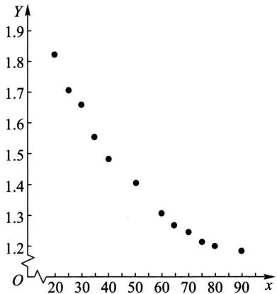  
图9-5

经计算

$$
\begin{array}{l} \mathbf {X} ^ {\mathrm {T}} \mathbf {X} = \left( \begin{array}{c c c} 1 2 & 6 4 0 & 4 0 1 0 0 \\ 6 4 0 & 4 0 1 0 0 & 2 7 7 9 0 0 0 \\ 4 0 1 0 0 & 2 7 7 9 0 0 0 & 2 0 4 7 0 2 5 0 0 \end{array} \right), \\ (\mathbf {X} ^ {\mathrm {T}} \mathbf {X}) ^ {- 1} = \frac {1}{\Delta} \left( \begin{array}{c c c} 4. 8 5 7 2 9 2 5 \times 1 0 ^ {1 1} & - 1. 9 5 7 1 7 \times 1 0 ^ {1 0} & 1 7 0 5 5 0 0 0 0 \\ - 1. 9 5 7 1 7 \times 1 0 ^ {1 0} & 8 4 8 4 2 0 0 0 0 & - 7 6 8 4 0 0 0 \\ 1 7 0 5 5 0 0 0 0 & - 7 6 8 4 0 0 0 & 7 1 6 0 0 \end{array} \right), \\ \Delta = 1. 4 1 9 1 8 \times 1 0 ^ {1 1}. \\ \end{array}
$$

即得正规方程组的解为

$$
\begin{array}{l} \hat {\boldsymbol {B}} = \left[ \begin{array}{l} \hat {\boldsymbol {b}} _ {0} \\ \hat {\boldsymbol {b}} _ {1} \\ \hat {\boldsymbol {b}} _ {2} \end{array} \right] = (\boldsymbol {X} ^ {\mathrm {T}} \boldsymbol {X}) ^ {- 1} \boldsymbol {X} ^ {\mathrm {T}} \boldsymbol {Y} = (\boldsymbol {X} ^ {\mathrm {T}} \boldsymbol {X}) ^ {- 1} \left[ \begin{array}{l} 1 6. 9 8 \\ 8 5 1. 3 \\ 5 1 1 6 2 \end{array} \right] \\ = \left( \begin{array}{r} 2. 1 9 8 2 6 6 2 9 \\ - 0. 0 2 2 5 2 2 3 6 \\ 0. 0 0 0 1 2 5 0 7 \end{array} \right). \\ \end{array}
$$

于是得到回归方程为

$$
\hat {y} = 2. 1 9 8 2 6 6 2 9 - 0. 0 2 2 5 2 2 3 6 x + 0. 0 0 0 1 2 5 0 7 x ^ {2}.
$$

像一元线性回归一样，模型(4.1)往往是一种假定，为了考察这一假定是否符合实际观察结果，还需进行以下的假设检验：

$$
H _ {0}: \quad b _ {1} = b _ {2} = \dots = b _ {p} = 0,
$$

$H_{1}$  ：  $b_{i}(i = 1,2,\dots ,p)$  不全为零

若在显著性水平  $\alpha$  下拒绝  $H_0$  ，我们就认为回归效果是显著的.

另外，也与一元线性回归一样，多元线性回归方程的一个重要应用是确定给定点  $(x_{01}, x_{02}, \dots, x_{0p})$  处对应的  $Y$  的观察值的预测区间.

# 小结

本章介绍了两种用途广泛的统计模型：方差分析模型和回归分析模型.

在实际中试验的指标往往要受到一种或多种因素的影响。方差分析就是通过对试验数据进行分析，检验方差相同的多个（多于两个）正态总体的均值是否相等，用以判断各因素对试验指标的影响是否显著。方差分析按影响试验指标的因素的个数分为单因素方差分析、双因素方差分析和多因素方差分析，本章只介绍前面两种。

考虑单因素方差分析的情况. 观察到的数据总是参差不齐的, 我们用总偏差平方和  $S_{T} = \sum_{j=1}^{s} \sum_{i=1}^{n_{j}} (X_{ij} - \overline{X})^{2}$  来度量数据间总的变异(即离散程度), 将它分解为可追溯到来源的部分变异(也用平方和来度量).  $S_{E} = \sum_{j=1}^{s} \sum_{i=1}^{n_{j}} (X_{ij} - \overline{X}_{,j})^{2}$  (它是由随机误差引起的) 与  $S_{A} = \sum_{j=1}^{s} \sum_{i=1}^{n_{j}} (X_{,j} - \overline{X})^{2}$  (它是由各水平效应的差异及随机误差引起的) 之和. 若后者较前者大得多, 则有理由认为因素的各个水平对应的试验结果有显著差异, 从而拒绝因素各水平对应的正态总体的均值相等这一原假设. 这就是单因素方差分析法的基本思想. 双因素方差分析的基本思想类似.

“方差分析”事实上不是真正分析方差，而是分析用偏差平方和度量的数据的变异。Snedecor说过：“它是从可比组的数据中分解出可追溯到某些指定来源的变异的一种技巧。”

双因素方差分析分考虑交互作用的与不考虑交互作用的两种情况，读者需分辨清楚.

单因素方差分析表和双因素方差分析表分别记录了单因素和双因素方差分析的全部结果，读者应很好掌握.

回归分析是研究自变量为一般变量(非随机变量), 因变量为随机变量时两者之间的相关关系的统计分析方法. 设随机变量  $Y$  (因变量) 与自变量  $x$  (一般变量) 存在着相关关系, 为了研究这种关系, 作为一种近似转而去研究  $Y$  的数学期望  $E(Y) = \mu(x)$  与  $x$  的确定性关系, 即函数关系, 这里  $\mu(x)$  叫做  $Y$  关于  $x$  的回归函数. 一元线性回归是研究  $\mu(x)$  为  $x$  的线性函数  $\mu(x) = a + bx$  的情况. 一元线性回归模型为

$$
Y = a + b x + \varepsilon , \quad \varepsilon \sim N (0, \sigma^ {2}),
$$

其中  $a, b$  及  $\sigma$  都不依赖于  $x$ , 且  $a, b, \sigma^2$  均未知.

我们要讨论的问题是：

$1^{\circ}$  利用样本值  $(x_{1},y_{1}),(x_{2},y_{2}),\dots ,(x_{n},y_{n})$  来估计  $a,b$  ，从而得到  $\mu (x)$  的最大似然估计 $\hat{\mu} (x) = \hat{a} +\hat{b} x$  ，记  $\hat{y} = \hat{a} +\hat{b} x$  ，我们称  $\hat{y} = \hat{a} +\hat{b} x$  为回归方程，其图形称为回归直线.

$2^{\circ}$  求出误差  $\varepsilon$  的方差  $D(\varepsilon) = \sigma^2$  的无偏估计：

$$
\hat {\sigma} ^ {2} = \frac {Q _ {e}}{n - 2},
$$

其中  $Q_{e} = \sum_{i = 1}^{n}(y_{i} - \hat{a} -\hat{b} x_{i})^{2} = S_{yy} - \hat{b} S_{xy}$  为残差平方和.

$3^{\circ}$  作线性假设：  $H_0:b = 0,H_1:b\neq 0$  的显著性检验.  $H_{0}$  的拒绝域为

$$
| t | = \frac {| \hat {b} |}{\hat {\sigma}} \sqrt {S _ {x x}} \geqslant t _ {\alpha / 2} (n - 2) \quad (\alpha \text {为 显 著 性 水 平}),
$$

如果拒绝  $H_0$  ，则认为回归效果是显著的；否则，认为回归效果不显著，此时不宜用线性回归模型，需另行研究.

$4^{\circ}$  求出回归系数  $b$  的置信水平为  $1 - \alpha$  的置信区间为

$$
\left(\hat {b} \pm t _ {\alpha / 2} (n - 2) \frac {\hat {\sigma}}{\sqrt {S _ {x x}}}\right).
$$

$5^{\circ}$  求出回归函数  $\mu (x)$  在点  $x_0$  处的函数值  $\mu (x_0)$  的置信水平为  $1 - \alpha$  的置信区间

$$
\left(\hat {a} + \hat {b} x _ {0} \pm t _ {a / 2} (n - 2) \hat {\sigma} \sqrt {1 / n + (x _ {0} - \bar {x}) ^ {2} / S _ {x x}}\right).
$$

$6^{\circ}$  以  $x_0$  处的回归值  $\hat{y}_0 = \hat{a} +\hat{b} x_0$  作为  $Y$  在  $x_0$  处的观察值  $Y_{0} = a + bx_{0} + \varepsilon_{0}$  的预测值，求出  $Y_{0}$  的置信水平为  $1 - \alpha$  的预测区间为

$$
\left(\hat {a} + \hat {b} x _ {0} \pm t _ {a / 2} (n - 2) \hat {\sigma} \sqrt {1 + 1 / n + \left(x _ {0} - \bar {x}\right) ^ {2} / S _ {x x}}\right).
$$

对随机变量  $Y$  的观察值进行预测是回归方程最重要的应用.

# 重要术语及主题

单因素试验方差分析的数学模型  $S_{T} = S_{E} + S_{A}$  单因素方差分析表 双因素方差分析表

一元线性回归的数学模型 回归直线  $\hat{y} = \hat{a} +\hat{b} x$  中的系数  $\hat{a},\hat{b}$  误差  $\varepsilon$  的方差  $D(\varepsilon) = \sigma^2$  的无偏估计 线性假设的显著性检验 回归系数  $\hat{b}$  的区间估计 回归函数值  $\mu (x_0)$  的点估计

和区间估计 观察值  $Y_{0} = a + bx_{0} + \varepsilon_{0}$  的点预测和区间预测

# 附录 § 3 中有关统计量结果的证明

下面将证明 §3 中涉及的各有关统计量的一些结果.

$1^{\circ}$ $\overline{Y} \sim N(a + b\overline{x}, \sigma^{2}/n)$ .  
$2^{\circ}$ $\hat{b} \sim N(b, \sigma^2 / S_{xx})$ .  
$3^{\circ} \hat{Y}_{0} = \hat{a} + \hat{b} x_{0} = \overline{Y} + \hat{b}(x_{0} - \overline{x}) \sim N\left(a + bx_{0}, \left[\frac{1}{n} + \frac{(x_{0} - \overline{x})^{2}}{S_{xx}}\right] \sigma^{2}\right)$ .  
$4^{\circ}$ $Q_{e} / \sigma^{2}\sim \chi^{2}(n - 2)$  
$5^{\circ}$ $\overline{Y},\hat{b},Q_{e}$  相互独立.  
$6^{\circ}$  若  $Y_{0} = a + bx_{0} + \varepsilon_{0}$  与  $Y_{1}, Y_{2}, \dots, Y_{n}$  独立，则  $Y_{0}, \hat{Y}_{0}, Q_{e}$  相互独立.

上述结果的证明见下方二维码

  
有关统计量  
结果的证明

# 习题

以下约定各个习题均符合涉及的方差分析模型或回归分析模型所要求的条件.

1. 今有某种型号的电池三批，它们分别是  $A, B, C$  三个工厂所生产的。为评比其质量，各随机抽取5只电池为样品，经试验得其寿命（以h计）如下：

<table><tr><td>A</td><td>B</td><td>C</td></tr><tr><td>40 42</td><td>26 28</td><td>39 50</td></tr><tr><td>48 45</td><td>34 32</td><td>40 50</td></tr><tr><td>38</td><td>30</td><td>43</td></tr></table>

试在显著性水平0.05下检验电池的平均寿命有无显著的差异。若差异是显著的，试求均值差  $\mu_{A} - \mu_{B}, \mu_{A} - \mu_{C}$  和  $\mu_{B} - \mu_{C}$  的置信水平为  $95\%$  的置信区间。

2. 为了寻找飞机控制板上仪器表的最佳布置，试验了三个方案，观察领航员在紧急情况的反应时间（以  $1 / 10\mathrm{s}$  计），随机地选择28名领航员，得到他们对于不同的布置方案的反应时间如下：

<table><tr><td>方案Ⅰ</td><td>14</td><td>13</td><td>9</td><td>15</td><td>11</td><td>13</td><td>14</td><td>11</td><td></td><td></td><td></td><td></td></tr><tr><td>方案Ⅱ</td><td>10</td><td>12</td><td>7</td><td>11</td><td>8</td><td>12</td><td>9</td><td>10</td><td>13</td><td>9</td><td>10</td><td>9</td></tr><tr><td>方案Ⅲ</td><td>11</td><td>5</td><td>9</td><td>10</td><td>6</td><td>8</td><td>8</td><td>7</td><td></td><td></td><td></td><td></td></tr></table>

试在显著性水平0.05下检验各个方案的反应时间有无显著差异.若有差异，试求  $\mu_{1} - \mu_{2}$  ， $\mu_{1} - \mu_{3},\mu_{2} - \mu_{3}$  的置信水平为0.95的置信区间.

3. 某防治站对 4 个林场的松毛虫密度进行调查, 每个林场调查 5 块地得资料如下表:

<table><tr><td>地点</td><td></td><td colspan="4">松毛虫密度(头/标准地)</td></tr><tr><td>A1</td><td>192</td><td>189</td><td>176</td><td>185</td><td>190</td></tr><tr><td>A2</td><td>190</td><td>201</td><td>187</td><td>196</td><td>200</td></tr><tr><td>A3</td><td>188</td><td>179</td><td>191</td><td>183</td><td>194</td></tr><tr><td>A4</td><td>187</td><td>180</td><td>188</td><td>175</td><td>182</td></tr></table>

判断4个林场松毛虫密度有无显著差异，取显著性水平  $\alpha = 0.05$

4. 一试验用来比较4种不同药品解除外科手术后疼痛的延续时间（以h计），结果如下表：

<table><tr><td>药品</td><td colspan="5">时间长度(h)</td></tr><tr><td>A</td><td>8</td><td>6</td><td>4</td><td>2</td><td></td></tr><tr><td>B</td><td>6</td><td>6</td><td>4</td><td>4</td><td></td></tr><tr><td>C</td><td>8</td><td>10</td><td>10</td><td>10</td><td>12</td></tr><tr><td>D</td><td>4</td><td>4</td><td>2</td><td></td><td></td></tr></table>

试在显著性水平  $\alpha = 0.05$  下检验各种药品对解除疼痛的延续时间有无显著差异.

5. 将抗生素注入人体会产生抗生素与血浆蛋白质结合的现象，以致减少了药效。下表列出 5 种常用的抗生素注入牛的体内时，抗生素与血浆蛋白质结合的百分比（以  $\%$  计）。

<table><tr><td>青霉素</td><td>四环素</td><td>链霉素</td><td>红霉素</td><td>氯霉素</td></tr><tr><td>29.6</td><td>27.3</td><td>5.8</td><td>21.6</td><td>29.2</td></tr><tr><td>24.3</td><td>32.6</td><td>6.2</td><td>17.4</td><td>32.8</td></tr><tr><td>28.5</td><td>30.8</td><td>11.0</td><td>18.3</td><td>25.0</td></tr><tr><td>32.0</td><td>34.8</td><td>8.3</td><td>19.0</td><td>24.2</td></tr></table>

试在显著性水平  $\alpha = 0.05$  下检验这些百分比的均值有无显著的差异.

6. 下表给出某种化工过程在三种浓度、四种温度水平下得率（以  $\%$  计）的数据：

<table><tr><td rowspan="2">浓度(因素A)</td><td colspan="4">温度(因素B)</td></tr><tr><td>10°C</td><td>24°C</td><td>38°C</td><td>52°C</td></tr><tr><td>2%</td><td>14 10</td><td>11 11</td><td>13 9</td><td>10 12</td></tr><tr><td>4%</td><td>9 7</td><td>10 8</td><td>7 11</td><td>6 10</td></tr><tr><td>6%</td><td>5 11</td><td>13 14</td><td>12 13</td><td>14 10</td></tr></table>

试在显著性水平  $\alpha = 0.05$  下检验：在不同浓度下得率的均值是否有显著差异，在不同温度下得率的均值是否有显著差异，交互作用的效应是否显著。

7. 为了研究某种金属管防腐蚀的功能，考虑了4种不同的涂料涂层. 将金属管埋设在3种不同性质的土壤中，经历了一定时间，测得金属管腐蚀的最大深度如下表所示（以  $\mathrm{mm}$  计）：

<table><tr><td rowspan="2">涂层(因素A)</td><td colspan="3">土壤类型(因素B)</td></tr><tr><td>1</td><td>2</td><td>3</td></tr><tr><td>1</td><td>1.63</td><td>1.35</td><td>1.27</td></tr><tr><td>2</td><td>1.34</td><td>1.30</td><td>1.22</td></tr><tr><td>3</td><td>1.19</td><td>1.14</td><td>1.27</td></tr><tr><td>4</td><td>1.30</td><td>1.09</td><td>1.32</td></tr></table>

试取显著性水平  $\alpha = 0.05$  检验在不同涂层下腐蚀的最大深度的平均值有无显著差异，在不同土壤下腐蚀的最大深度的平均值有无显著差异。设两因素间没有交互作用效应。

8. 下表数据是退火温度  $x$  （以  ${}^{\circ}\mathrm{C}$  计）对黄铜延性  $Y$  效应的试验结果， $Y$  是以延长度计算的.

<table><tr><td>x(℃)</td><td>300</td><td>400</td><td>500</td><td>600</td><td>700</td><td>800</td></tr><tr><td>y(%)</td><td>40</td><td>50</td><td>55</td><td>60</td><td>67</td><td>70</td></tr></table>

画出散点图并求  $Y$  对于  $x$  的线性回归方程

9. 在钢线碳含量对于电阻的效应的研究中，得到以下的数据：

<table><tr><td>碳含量x(%)</td><td>0.10</td><td>0.30</td><td>0.40</td><td>0.55</td><td>0.70</td><td>0.80</td><td>0.95</td></tr><tr><td>20℃时电阻y(μΩ)</td><td>15</td><td>18</td><td>19</td><td>21</td><td>22.6</td><td>23.8</td><td>26</td></tr></table>

（1）画出散点图.

（2）求线性回归方程  $\hat{y} = \hat{a} +\hat{b} x$

（3）求  $\varepsilon$  的方差  $\sigma^2$  的无偏估计.

（4）检验假设  $H_0: b = 0, H_1: b \neq 0$

（5）若回归效果显著，求  $b$  的置信水平为0.95的置信区间

（6）求  $x = 0.50$  处  $\mu (x)$  的置信水平为0.95的置信区间

（7）求  $x = 0.50$  处观察值  $Y$  的置信水平为0.95的预测区间

10. 下表列出了 18 名  $5 \sim 8$  岁儿童的体重(这是容易测得的)和体积(这是难以测量的):

<table><tr><td>体重x(kg)</td><td>17.1</td><td>10.5</td><td>13.8</td><td>15.7</td><td>11.9</td><td>10.4</td><td>15.0</td><td>16.0</td><td>17.8</td></tr><tr><td>体积y(dm3)</td><td>16.7</td><td>10.4</td><td>13.5</td><td>15.7</td><td>11.6</td><td>10.2</td><td>14.5</td><td>15.8</td><td>17.6</td></tr><tr><td>体重x(kg)</td><td>15.8</td><td>15.1</td><td>12.1</td><td>18.4</td><td>17.1</td><td>16.7</td><td>16.5</td><td>15.1</td><td>15.1</td></tr><tr><td>体积y(dm3)</td><td>15.2</td><td>14.8</td><td>11.9</td><td>18.3</td><td>16.7</td><td>16.6</td><td>15.9</td><td>15.1</td><td>14.5</td></tr></table>

（1）画出散点图.

(2) 求  $Y$  关于  $x$  的线性回归方程  $\hat{y} = \hat{a} + \hat{b} x$ .

（3）求  $x = 14.0$  时  $\mathrm{Y}$  的置信水平为0.95的预测区间

11. 蟋蟀用一个翅膀在另一翅膀上快速地滑动, 从而发出吱吱喳喳的叫声. 生物学家知道叫声的频率  $x$  与气温  $Y$  具有线性关系. 下表列出了 15 对频率与气温间的对应关系的观察结果:

<table><tr><td>频率xi(叫声数/s)</td><td>20.0</td><td>16.0</td><td>19.8</td><td>18.4</td><td>17.1</td><td>15.5</td><td>14.7</td><td>17.1</td></tr><tr><td>气温yi(℃)</td><td>31.4</td><td>22.0</td><td>34.1</td><td>29.1</td><td>27.0</td><td>24.0</td><td>20.9</td><td>27.8</td></tr><tr><td>频率xi(叫声数/s)</td><td>15.4</td><td>16.2</td><td>15.0</td><td>17.2</td><td>16.0</td><td>17.0</td><td>14.4</td><td></td></tr><tr><td>气温yi(℃)</td><td>20.8</td><td>28.5</td><td>26.4</td><td>28.1</td><td>27.0</td><td>28.6</td><td>24.6</td><td></td></tr></table>

试求  $Y$  关于  $x$  的线性回归方程

12. 下面列出了自 1952—2004 年各届奥林匹克运动会男子  $10000 \mathrm{~m}$  赛跑的冠军的成绩（时间以 min 计）：

<table><tr><td>年份(x)</td><td>1952</td><td>1956</td><td>1960</td><td>1964</td><td>1968</td><td>1972</td><td>1976</td></tr><tr><td>成绩(y)</td><td>29.3</td><td>28.8</td><td>28.5</td><td>28.4</td><td>29.4</td><td>27.6</td><td>27.7</td></tr><tr><td>年份(x)</td><td>1980</td><td>1984</td><td>1988</td><td>1992</td><td>1996</td><td>2000</td><td>2004</td></tr><tr><td>成绩(y)</td><td>27.7</td><td>27.8</td><td>27.4</td><td>27.8</td><td>27.1</td><td>27.3</td><td>27.1</td></tr></table>

（1）求  $Y$  关于  $x$  的线性回归方程  $\hat{y} = \hat{a} +\hat{b} x$

（2）检验假设  $H_0: b = 0, H_1: b \neq 0$  （显著性水平  $\alpha = 0.05$ ）

（3）求2008年冠军成绩的预测值.

13. 以  $x$  与  $Y$  分别表示人的脚长与手长（均以英寸计，1英寸 = 2.54 厘米），下面列出了 15 名女子的脚的长度  $x$  与手的长度  $Y$  的样本值：

<table><tr><td>x</td><td>9.00</td><td>8.50</td><td>9.25</td><td>9.75</td><td>9.00</td><td>10.00</td><td>9.50</td><td>9.00</td></tr><tr><td>y</td><td>6.50</td><td>6.25</td><td>7.25</td><td>7.00</td><td>6.75</td><td>7.00</td><td>6.50</td><td>7.00</td></tr><tr><td>x</td><td>9.25</td><td>9.50</td><td>9.25</td><td>10.00</td><td>10.00</td><td>9.75</td><td>9.50</td><td></td></tr><tr><td>y</td><td>7.00</td><td>7.00</td><td>7.00</td><td>7.50</td><td>7.25</td><td>7.25</td><td>7.25</td><td></td></tr></table>

（1）试求  $Y$  关于  $x$  的线性回归方程  $\hat{y} = \hat{a} +\hat{b} x$

（2）求  $b$  的置信水平为0.95的置信区间

14. 榆寄生是一种寄生在大树上部树枝上的寄生植物。它喜欢寄生在年轻的大树上。下面给出在一定条件下完成的试验中采集的数据：

<table><tr><td>大树的年龄x(年)</td><td>3</td><td>4</td><td>9</td><td>15</td><td>40</td></tr><tr><td rowspan="3">每株大树上槲寄生的株数y</td><td>28</td><td>10</td><td>15</td><td>6</td><td>1</td></tr><tr><td>33</td><td>36</td><td>22</td><td>14</td><td>1</td></tr><tr><td>22</td><td>24</td><td>10</td><td>9</td><td></td></tr></table>

（1）作出  $(x_{i},y_{i})$  的散点图

(2）令  $z_{i} = \ln y_{i}$  ，作出  $(x_{i},z_{i})$  的散点图

（3）以模型  $Y = a\mathrm{e}^{bx}\varepsilon$  ，  $\ln \varepsilon \sim N(0,\sigma^2)$  拟合数据，其中  $a,b,\sigma^2$  与  $x$  无关.试求曲线回归方程  $\hat{y} = \hat{a}\exp \{\hat{bx}\}$

15. 一种合金在某种添加剂的不同浓度之下，各做三次试验，得数据如下：

<table><tr><td>浓度x</td><td>10.0</td><td>15.0</td><td>20.0</td><td>25.0</td><td>30.0</td></tr><tr><td rowspan="3">抗压强度y</td><td>25.2</td><td>29.8</td><td>31.2</td><td>31.7</td><td>29.4</td></tr><tr><td>27.3</td><td>31.1</td><td>32.6</td><td>30.1</td><td>30.8</td></tr><tr><td>28.7</td><td>27.8</td><td>29.7</td><td>32.3</td><td>32.8</td></tr></table>

（1）作散点图.

(2) 以模型  $Y = b_{0} + b_{1}x + b_{2}x^{2} + \varepsilon, \varepsilon \sim N(0, \sigma^{2})$  拟合数据，其中  $b_{0}, b_{1}, b_{2}, \sigma^{2}$  与  $x$  无关. 求回归方程  $\hat{y} = \hat{b}_{0} + \hat{b}_{1}x + \hat{b}_{2}x^{2}$ .

16. 某种化工产品的得率  $Y$  与反应温度  $x_{1}$ 、反应时间  $x_{2}$  及某反应物浓度  $x_{3}$  有关. 今得试验结果如下表所示, 其中  $x_{1}, x_{2}, x_{3}$  均为二水平且均以编码形式表达.

<table><tr><td>x1</td><td>-1</td><td>-1</td><td>-1</td><td>-1</td><td>1</td><td>1</td><td>1</td><td>1</td></tr><tr><td>x2</td><td>-1</td><td>-1</td><td>1</td><td>1</td><td>-1</td><td>-1</td><td>1</td><td>1</td></tr><tr><td>x3</td><td>-1</td><td>1</td><td>-1</td><td>1</td><td>-1</td><td>1</td><td>-1</td><td>1</td></tr><tr><td>得率</td><td>7.6</td><td>10.3</td><td>9.2</td><td>10.2</td><td>8.4</td><td>11.1</td><td>9.8</td><td>12.6</td></tr></table>

（1）设  $\mu (x_{1},x_{2},x_{3}) = b_{0} + b_{1}x_{1} + b_{2}x_{2} + b_{3}x_{3}$  ，求  $Y$  的多元线性回归方程  
（2）若认为反应时间不影响得率，即认为

$$
\mu \left(x _ {1}, x _ {2}, x _ {3}\right) = \beta_ {0} + \beta_ {1} x _ {1} + \beta_ {3} x _ {3},
$$

求  $Y$  的多元线性回归方程